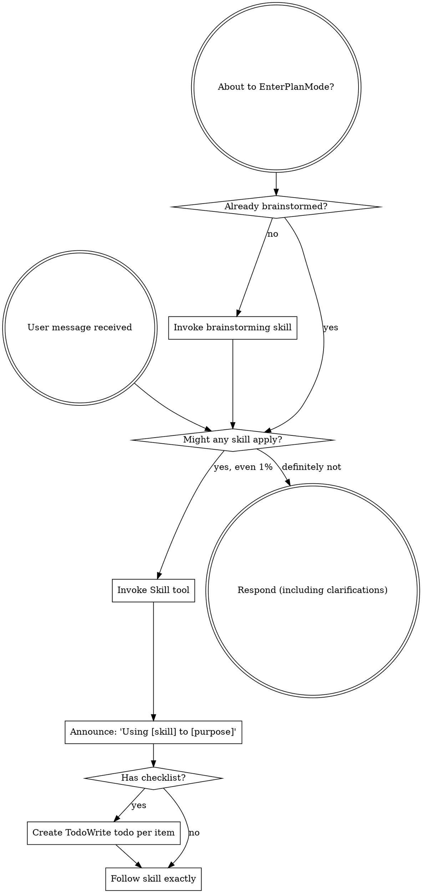
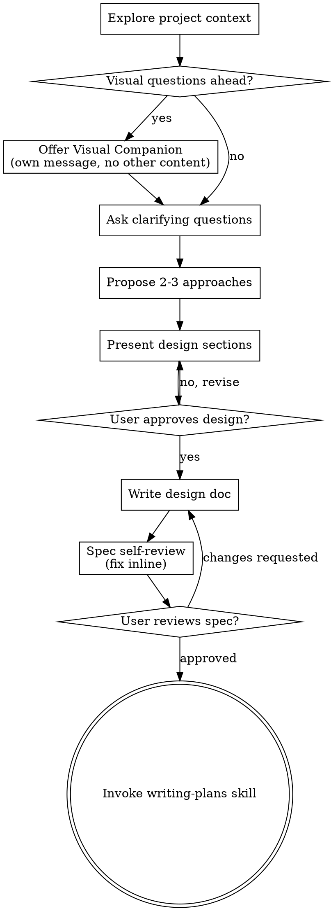
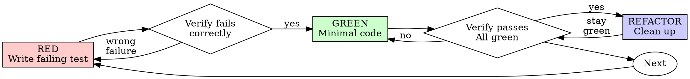
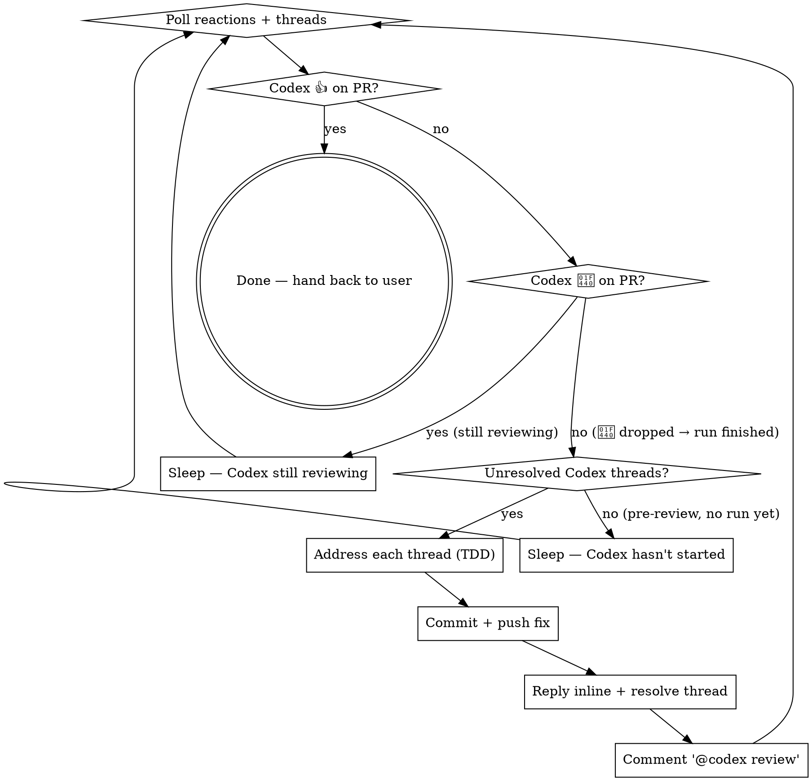

> SYSTEM

# AGENTS.md instructions for /Users/ericson/.codex/worktrees/1f5d/ars-ui

<INSTRUCTIONS>
## Approach
- Read existing files before writing. Don't re-read unless changed.
- Thorough in reasoning, concise in output.
- Skip files over 100KB unless required.
- No sycophantic openers or closing fluff.
- No emojis or em-dashes.
- Do not guess APIs, versions, flags, commit SHAs, or package names. Verify by reading code or docs before asserting.

--- project-doc ---

# ars-ui

## Project Overview

Rust frontend component library using state machines, framework-agnostic core with Leptos/Dioxus adapters.

## Current Phase

The repo is now in active implementation, not spec drafting only.

Agents working on implementation should use the GitHub Project roadmap and issue backlog as the execution source of truth:

- Use the GitHub Project `ars-ui implementation roadmap` to understand active epics, task breakdown, dependencies, status, and iteration planning.
- Prefer picking a single issue-backed task that is unblocked, sized, and scoped for independent delivery.
- Do not start work from an epic issue unless the user explicitly asks for planning or further decomposition.
- Do not start a task that is blocked by unresolved GitHub issue dependencies.
- Treat native GitHub issue dependencies as the blocker graph and the issue body acceptance criteria as the delivery contract.

## Development Workflow

For implementation tasks:

1. Read the assigned or selected GitHub issue first.
2. Move the issue to **In Progress** on the GitHub Project board.
3. Review the cited spec sections and any dependency issues.
4. Add or update the named tests first.
5. Implement only the scope required to make those tests pass.
6. If implementation changes the intended contract, update the relevant spec in the same task.
7. **MANDATORY:** Invoke the `post-implementation-audit` skill (`.agents/skills/post-implementation-audit/SKILL.md`). It runs three sequential audits on the new code — (a) spec/implementation drift with "best outcome" recommendations, (b) iterative "anything else missing?" passes (minimum two rounds), (c) test-coverage audit across every test type the workspace uses (unit, snapshot, proptest, doc, spec-conformance, llvm-cov — mutation testing is **not** part of this gate; it is Nightly-CI-driven). **Every finding lands in _this_ PR — no deferral, no follow-up issues.** This step exists because initial implementations consistently ship spec drift and silent contract violations that take 3+ review round-trips to surface; the audit collapses them into one. Skipping this step is a contract violation.
8. Present the final result for user review before any commit.
9. After user approval, run `cargo xci --profile fast` (alias: `cargo xci-fast`) locally and fix any failures before pushing anything to GitHub. The fast profile covers the workspace-level regressions a pre-push gate should catch: fmt, clippy, unit, integration, adapter, spec-compile-snippets, error-variant-coverage, mutual-exclusion, snapshot-count, and a **native-only coverage check** (`coverage-native`) that enforces the thresholds of the crates whose CI coverage is native-only (the agnostic library crates + xtask) — so `ars-components`-style coverage regressions surface before push, not on CI. The native coverage check adds an instrumented rebuild, so the fast profile runs in roughly 10–15 minutes. Reserve full `cargo xci` (~25 minutes, all 20 gates including the wasm coverage + CRAP gate and the feature-matrix groups) for after substantial refactors that may have shifted feature-flag interactions. For small follow-up changes, run the focused tests and checks that cover the edited code instead. To run only the coverage check, use `cargo xcov` (native-only) or `cargo xcov --full` (mirrors CI; needs the wasm toolchain + clang-22).
10. After `cargo xci-fast` passes, commit and push a PR targeting `main`. The PR body MUST include an auto-close keyword for the issue being delivered, for example `Closes #20` or `Fixes #20`, so GitHub closes the issue automatically when the PR merges.
11. **If the PR creates or modifies any `.snap` insta fixtures, attach the `snapshot-reviewed` label after opening or updating it** (`gh pr edit <num> --add-label "snapshot-reviewed"`). This signals to reviewers that the snapshot output was inspected and is intentional. Re-apply the label whenever you push a commit that touches `.snap` files; the workflow assumes the label reflects the latest snapshot state.
12. **MANDATORY:** Invoke the `waiting-for-codex-review` skill (`.agents/skills/waiting-for-codex-review/SKILL.md`) immediately after the first push that creates the PR, and re-invoke it after every subsequent push to the PR branch. The skill posts the initial `@codex review` trigger, polls Codex's 👀 → (👍 \| ∅ + threads) reaction lifecycle, addresses any review threads with the same rigor as `post-implementation-audit` (TDD + no coverage regression), replies inline, resolves threads, and re-comments `@codex review` to start the next pass — looping until Codex leaves 👍. Skipping this step leaves Codex findings unaddressed and silently widens the gap between merged code and the spec; the merge gate is 👍 from Codex plus green CI, not green CI alone.
13. Only after CI passes, Codex has left 👍, and the PR is merged, close the issue.

Never close a GitHub issue without a merged PR that passes CI **and a 👍 from Codex**. Never commit or push without explicit user approval. Keep the issue, PR, and Project board status aligned with the actual work state at every step.

Default delivery rules:

- Follow TDD: tests first, implementation second, verification last.
- Keep task scope aligned with the issue. If the issue is too large or ambiguous, stop and split or clarify rather than freelancing a bigger change.
- Prefer tasks sized `1`, `2`, `3`, or `5` points. `8` is exceptional. `13` must be decomposed before implementation.
- Preserve the crate and dependency layering defined by the architecture and implementation plan.
- Do not add a new dependency crate without explicit user approval first. If a task appears to need a new crate, stop, explain why, and get approval before editing any `Cargo.toml`.
- When a task is complete, verify the exact tests and checks named by the issue before considering it done.
- For adapter-level component implementation, follow `docs/implementation/adapter-component-delivery.md`. Adapter component work must cover the adapter crate, adapter tests, E2E fixtures/harnesses when applicable, widgets examples, spec synchronization, and the required validation/audit loop in one PR.

### Code Quality Standards

- **Document all public items.** Every public struct, enum, trait, function, constant, type alias, method, field, and variant must have a `///` doc comment. Every `lib.rs` must have a `//!` crate-level doc comment. The workspace enforces `missing_docs` linting — undocumented public items are build failures.
- **Zero warnings policy.** All code must compile with zero warnings under the workspace's configured clippy and rustc lints. Fix the root cause instead of suppressing. When suppression is genuinely needed, use `#[expect(lint, reason = "...")]` — never `#[allow(...)]`.
- **Derive documentation from the spec.** Doc comments should describe the _purpose and semantics_ of the item as defined in the corresponding `spec/` files, not just restate the type signature.
- **Use `#[inline]` selectively, not mechanically.** Do **not** add Clippy's `missing_inline_in_public_items` lint at the workspace level, and do not treat public visibility alone as a reason to mark an item `#[inline]`. Use `#[inline]` for thin cross-crate wrappers, trivial accessors, and hot-path no-op shims where the call overhead is plausibly meaningful. Avoid blanket `#[inline]` on all public APIs — it increases code size, adds compile-time cost, and turns `#[inline]` into noise instead of a deliberate performance signal.
- **Use directory-backed modules with `mod.rs` when a module owns children.** This repo standardizes on the older filesystem layout for nested modules. If module `foo` has child modules, the parent must live at `foo/mod.rs`, not `foo.rs`. Do not mix `foo.rs` with a sibling `foo/` directory. When a refactor adds child modules under an existing flat file, move the parent into `foo/mod.rs` in the same change. Do not leave empty leftover module directories behind.

### API Design Standards

- **Design for the pit of success.** Public APIs should make the most natural, shortest path also be the path that is correct, accessible, localizable, type-safe, and performant. Prefer ergonomic constructors and defaults that preserve the spec's strongest guarantees instead of making users opt into correctness after choosing a convenient API.
- **Name escape hatches explicitly.** When a component needs a lower-level, static, non-i18n, or otherwise less complete path, keep it available but make the tradeoff visible in the API name or type. The blessed path should remain the simplest call site, while escape hatches should read as deliberate choices.
- **Keep semantic data separate from rendered views.** Rich framework views are useful for customization, but components still need semantic sources for accessible names, localized text, announcements, ids, and state-machine wiring. Do not rely on arbitrary rendered view trees as the only source of user-facing semantics.

### Code Coverage

The workspace uses `cargo-llvm-cov` for code coverage with per-crate threshold enforcement. CI runs coverage on every PR (see `.github/workflows/ci.yml`).

**Local coverage commands:**

```bash
# Fast native-only coverage gate — instruments + checks only the crates whose
# CI coverage is native-only (agnostic library crates + xtask). No wasm/clang
# toolchain needed; this is what the `fast` pre-push profile runs.
cargo xcov

# Full native+wasm coverage gate, mirroring CI (needs the wasm toolchain + clang-22)
cargo xcov --full

# Per-crate coverage with inline annotated source (most useful during development)
cargo llvm-cov test -p ars-interactions --text -- hover

# Per-crate summary only
cargo llvm-cov test -p ars-interactions -- hover

# Native-only workspace coverage (host target; excludes wasm-only crates)
cargo llvm-cov --workspace \
  --exclude ars-leptos --exclude ars-dioxus \
  --exclude ars-test-harness-leptos --exclude ars-test-harness-dioxus \
  --exclude ars-derive --exclude xtask \
  --lcov --output-path lcov.info

# Check all crates against spec-defined thresholds (run after a *merged* lcov)
cargo xtask coverage check-all --file lcov.info
```

The `--text` flag produces line-by-line annotated source showing hit counts and `^0` markers on uncovered branches — use this to identify gaps after writing tests. Uncovered no-op callback closures in tests (e.g., `|_| {}`) are expected and not a gap.

The local recipe above excludes the adapter and adapter-test-harness crates because their `target_arch = "wasm32"` / `feature = "web"` code paths can't be measured via host-target `cargo llvm-cov`. **CI runs an additional wasm-coverage pipeline on nightly** (`cargo xtask ci coverage`) that uses `wasm-bindgen-test`'s experimental coverage recipe with LLVM 22 / `clang-22` to emit lcov for `ars-leptos` (csr), `ars-dioxus` (web), `ars-dom` (web), `ars-i18n` (web-intl), and the adapter test harnesses, then merges with the native lcov via `cargo xtask coverage merge`. The per-crate thresholds in `xtask::coverage::default_thresholds()` are enforced against the merged file — including adapter targets (`ars-leptos` 74/55, `ars-dioxus` 77/70, `ars-test-harness-leptos` 60/0, `ars-test-harness-dioxus` 60/0). `ars-derive` (proc-macro, runs in compiler) is exercised via `crates/ars-core/tests/derive_contract.rs` and is unmeasured. `xtask` has its own enforced threshold (30/35) and is measured. See `spec/testing/14-ci.md` §2 for the full pipeline.

### CRAP Gate (complexity vs. coverage)

Coverage tells you which lines run; mutation testing tells you whether tests would notice misbehaviour. The **CRAP gate** ([`cargo-crap`](https://crates.io/crates/cargo-crap)) tells you which functions are _risky to change_ — high cyclomatic complexity combined with low coverage. The CRAP score is `complexity² · (1 − coverage)³ + complexity`.

**Why regression mode, not an absolute threshold.** At 100% coverage `CRAP == cyclomatic complexity`, so an absolute `--fail-above` threshold rejects every large `match` no matter how well it is tested. This workspace is built on state machines: each stateful component's `Machine::transition` is intrinsically a wide `match (state, event)` (complexity 30–80) and is exhaustively tested. An absolute gate would fight that architecture and reject more components as the catalog grows. The gate therefore runs in **regression mode**.

- **Blessed entrypoints:** `cargo xcrap` (local human-readable report, never fails), `cargo xcrap --update-baseline` (regenerate the baseline), and `cargo xtask ci crap` (the CI gate). The gate is the last step of the full `cargo xci` pipeline, running immediately after `coverage` and reusing its merged `lcov.info` (no recompile). It is **not** in the fast profile: the fast profile runs only the native-only `coverage-native` check, which does not produce the merged `lcov.info` the CRAP gate compares against.
- **Policy:** `cargo crap --path . --lcov lcov.info --baseline .crap-baseline.json --fail-regression --min 30 --exclude 'target/**' --exclude 'examples/**' --exclude 'xtask/**' --exclude 'crates/ars-e2e/**' --exclude 'crates/ars-derive/**'`. The gate scopes to the **shipped component library** — tooling (`xtask`), the browser E2E harness (`ars-e2e`), the proc-macro crate, demos, and build output are excluded (they are not shipped surface, and several run uninstrumented-as-tooling on CI → 0% → spurious CRAP). The gate fails only when a function **at or above CRAP 30 regresses** (more complexity or less coverage) versus the committed baseline. New functions are tolerated — the per-crate coverage thresholds already ensure new code is tested — and sub-threshold churn on simple functions is ignored. Net: the coverage gate guarantees new code is tested; the CRAP gate guarantees shipped code does not rot.
- **`--path .`, not `--workspace`.** cargo-crap's regression key is `(file, function, line)`, and `--workspace` records machine-absolute file paths (`/Users/…` locally, `/home/runner/…` on CI). A baseline committed with absolute paths never matches on CI, silently turning the gate into a no-op. `--path .` emits repo-relative paths (`./crates/…`) that match on any checkout; coverage still associates correctly because cargo-crap canonicalizes paths when reading the lcov. `--exclude` is honored under `--path` (it is a no-op under `--workspace`), so `target/**` and the unmeasured `crates/ars-derive/**` are skipped there. Because the key includes the line number, a baseline only matches non-uniquely-named functions (e.g. `Machine::transition`) while their line numbers are stable; regenerate the baseline when a tracked file's lines shift materially.
- **Baseline:** `.crap-baseline.json` at the repo root is committed and complete (every function, no `--min`, so a function crossing the threshold is still caught). Regenerate it with `cargo xcrap --update-baseline` from CI's merged `lcov.info` (download the `coverage-lcov` artifact) whenever a **deliberate** complexity increase lands; commit the new baseline in that PR — a conscious "I accept this" checkpoint. cargo-crap's `--epsilon` (default 0.01) absorbs coverage float jitter. If the baseline is missing, the gate bootstraps it and passes with a notice.
- **Pinned version:** cargo-crap is pinned to an exact version in `xtask::crap::CARGO_CRAP_VERSION` and `.github/workflows/ci.yml` (same convention as cargo-mutants). To bump, update both. Install locally with `cargo install cargo-crap --locked --version <version>` (or `cargo binstall cargo-crap`).
- **Scope / escape hatch:** the exclude-glob list lives in `xtask/src/crap.rs` (`EXCLUDE_GLOBS`), each entry justified by a comment, and scopes the gate to the **shipped component library**. Because the gate runs under `--path .`, cargo-crap's `--exclude` is honored, so build output (`target/**`), demos (`examples/**`), the task runner (`xtask/**`), the browser E2E harness (`crates/ars-e2e/**`), and the proc-macro crate (`crates/ars-derive/**`) are skipped at walk time. The last three are not shipped library code and run uninstrumented-as-tooling on CI (0% coverage → spurious CRAP), so gating them is meaningless. Prefer fixing or refactoring over adding entries. (Note: the per-crate **coverage** gate still measures `xtask` at its own loose 30/35 threshold — that is separate from CRAP.)

### Mutation Testing

Coverage tells you which lines run. **Mutation testing tells you whether the tests would notice if those lines silently misbehaved.** The workspace uses [`cargo-mutants`](https://mutants.rs) for this — a `cargo` extension binary, not a workspace dependency.

**Install (once per developer machine):**

```bash
cargo install cargo-mutants --locked --version 27.0.0
```

**Local commands (state-machine modules are the most rewarding targets):**

Prefer `cargo xmutants` over bare `cargo mutants` — it applies the same
per-crate `--features` profile as Nightly CI (for example
`ars-components/i18n`) so snapshot and i18n-gated tests match CI.

```bash
# Run on a single component machine (~6 min for popover)
cargo xmutants -p ars-components -f crates/ars-components/src/overlay/popover/mod.rs

# Just list what would be mutated, without running tests (fast)
cargo xmutants -p ars-components -f crates/ars-components/src/overlay/popover/mod.rs --list

# Whole crate (slow — only if you really mean it)
cargo xmutants -p ars-components
```

**Agnostic component implementation gate:** whenever an agent implements a new framework-agnostic component, or materially changes an existing one, the delivery must include:

- spec-conformance tests for the component's anatomy/public contract, including its `Part` enum and required API/attribute surface;
- the full test breadth the component warrants (unit, snapshot, proptest) with strong line/branch coverage.

**Mutation testing is NOT a pre-PR requisite for agnostic component work.** Do not run a targeted `cargo xmutants` pass as a delivery/audit gate, and do not block a PR on a clean local mutation run. Surviving (`MISSED`) mutants are surfaced by the Nightly CI `mutation-testing` job (see below); triage them — add tests for real gaps, or add a justified line-agnostic `.cargo/mutants.toml` exclude for true equivalent mutations — in a dedicated follow-up when Nightly reports them, not during initial component delivery. (Running a local mutation pass voluntarily is fine, but it is never required and never blocks delivery or review.)

**Reading the output:** Results land in `mutants.out/mutants.out/` (gitignored). The two files that matter:

- `caught.txt` — mutations that broke at least one test ✅
- `missed.txt` — mutations that survived all tests ❌ — each one is either a real test gap to fill or an "equivalent mutation" that needs a `[[skip]]` entry in `mutants.toml` with a justification

**CI integration:** Nightly only. `.github/workflows/nightly.yml` has a `mutation-testing` job with a 21-entry matrix that runs `cargo mutants -p <package>` on every framework-agnostic crate, using `--shard k/n` to spread larger crates across parallel runners. **Shard indices are 0-based** (`k` runs from `0` to `n-1`); `k == n` is invalid and will fail the job. When adding shards, always start at `0/n` and end at `(n-1)/n`.

- **`ars-components` (≈ 1,630 mutants today, planned to grow as the spec adds the remaining ~97 components):** sharded **12-way** → ≈ 135 mutants per runner today, ≈ 850 per runner at the ~10,000-mutant endpoint. Sized for the full spec catalog up front so we don't re-shard every few months as components land.
- **`ars-collections` (≈ 1,080 mutants):** sharded 4-way → ≈ 270 mutants per runner.
- **`ars-core` (≈ 700 mutants):** sharded 2-way → ≈ 350 mutants per runner.
- **`ars-a11y`, `ars-forms`, `ars-interactions`:** one runner each (under 600 mutants apiece).

**Adding a new state machine inside an existing crate requires no CI changes** — its mutations land in whichever shard the cargo-mutants partitioner places them. The shard counts are sized so the slowest runner stays well under 30 minutes today and under ~50 minutes at the planned endpoint; re-balance only when a crate outgrows that budget (visible on the nightly dashboard as one shard pulling away from the others).

All matrix jobs run with `fail-fast: false` so failures on one module don't mask data on another. Each job uploads its `mutants.out/` as a workflow artifact (always, even on success — surviving "missed" entries on a passing run still reveal test-quality work). The job fails if any mutation survives, so a missed mutation forces a deliberate triage decision (fix the test, or document the equivalence with a `[[skip]]` entry in `mutants.toml`).

**Excluded crates** (mutation testing's signal degrades wherever determinism does): adapter glue (`ars-leptos`, `ars-dioxus`), DOM/FFI (`ars-dom`), ICU/FFI (`ars-i18n`), test infrastructure (`ars-test-harness*`), and the proc-macro crate (`ars-derive`, runs in the compiler). Adding a brand-new crate that is a good mutation target requires one new matrix entry; run a local scout first (`cargo mutants -p <crate> --list` to size, then a real run) so we know the right shard count before the nightly fires.

**Bumping the pinned version.** Both the local install command above and `.github/workflows/nightly.yml` pin cargo-mutants to an exact version (currently `27.0.0`) — same convention as `wasm-pack` in the `a11y-audit` job. Pinning is deliberate: cargo-mutants ships new mutators in releases, and an unpinned install would silently change the mutation set without any code change, surfacing as phantom CI failures on a green-source repo. To bump, open a PR that (1) updates the version string in CLAUDE.md and `nightly.yml`, (2) runs the popover scout locally with the new version (`cargo mutants -p ars-components -f crates/ars-components/src/overlay/popover/mod.rs`) to confirm the mutation count is in the same ballpark, and (3) triages any new "missed" entries the new mutators surface — they are usually genuine test-quality gaps newly visible to the tool.

### Property Testing (proptest)

State-machine invariants are exercised by [`proptest`](https://docs.rs/proptest) under `crates/<crate>/tests/proptest_state_machines/` (see `ars-components`). Default proptest behaviour drops `*.proptest-regressions` seed files alongside test sources — instead, every `proptest!` block in this workspace pulls a shared `Config` from `tests/proptest_state_machines/common.rs` that:

1. Reads `PROPTEST_CASES` from the environment (1,000 default; 10,000 in the nightly `extended-proptest` job).
2. Sets `failure_persistence` to `FileFailurePersistence::Direct("proptest-regressions/state-machines.txt")`, so all persisted seeds for the test binary live in one file at the crate root: `crates/<crate>/proptest-regressions/state-machines.txt`. The directory is committed (per proptest's own recommendation in the file header) so every developer's runs benefit from previously-shrunk failures.

When a new crate adopts proptest for state-machine tests, copy the same `common.rs` helper and reference it via `#![proptest_config(super::common::proptest_config())]` inside every `proptest!` block. Don't let proptest fall back to its `WithSource` default — that scatters seed files across the source tree.

### Adapter Prelude Convention

Both `ars-leptos` and `ars-dioxus` expose a `prelude` module targeting **end users** — application developers who consume the ready-made components. `use ars_leptos::prelude::*` (or `use ars_dioxus::prelude::*`) should give them everything they need.

The prelude contains only user-facing items:

1. **Component modules** — as components land, their public module paths (e.g., `button`, `dialog`) are re-exported so users can write `button::Props`, etc.
2. **User-facing traits** — traits end users call on component outputs (e.g., `Translate` from `ars-i18n`). Re-export the trait so consumers don't need a direct dependency on the subsystem crate.
3. **Configuration types** — types that appear in component props or configure behaviour (e.g., `Locale`, `Direction`, `Orientation`, `Selection`).

The prelude does **not** include implementation details consumed only by component authors inside the adapter crate: core engine types (`Machine`, `Service`, `ConnectApi`, `AttrMap`), accessibility primitives (`AriaRole`, `AriaAttribute`), interaction helpers (`merge_attrs`), or adapter hooks (`use_machine`, `UseMachineReturn`). Those remain accessible via their normal crate paths for advanced users building custom machines.

Both adapter preludes must stay symmetric: same items, same structure. When adding a new re-export to one adapter's prelude, add it to the other as well in the same PR.

### Adapter Testing Convention

Adapter-level component tests should default to the framework-specific test harness crate:

- Leptos adapter tests should prefer `ars-test-harness-leptos`.
- Dioxus adapter tests should prefer `ars-test-harness-dioxus`.
- Shared `ars-test-harness` helpers should be used where relevant for viewport, layout, clipboard, drag/drop, timing, and other DOM test setup instead of bespoke per-test browser scaffolding.

When a component spec requires interaction, focus, overlay positioning, clipboard, file upload, drag/drop, or similar browser behavior, the task's tests should exercise that behavior through the adapter harness entrypoints and shared core harness helpers unless there is a concrete technical reason not to.

## Spec Synchronization During Implementation

The specification is the authoritative contract. It took weeks of deliberate design and MUST be followed.

### Spec-first implementation rule

Before implementing any public type, trait, function, or method:

1. **Read the spec section first.** Find the relevant code example in `spec/`. Use `spec-tool toc <file>` and `grep` to locate it.
2. **Match the spec exactly.** If the spec defines `struct ComponentIds { base: String }` with methods `from_id()`, `id()`, `part()`, `item()`, `item_part()` — implement exactly that. Do not invent alternative field names, method names, or signatures.
3. **Cross-check after implementation.** Before presenting code for review, diff every public item against the spec's code examples. Every struct field, every method name, every parameter must match.
4. **If you must deviate**, there must be a concrete technical reason (e.g., the spec's API cannot compile, or a dependency doesn't expose the needed type). Document the reason in a code comment and flag it to the user explicitly.

Inventing alternative APIs that "seem equivalent" is never acceptable — it silently invalidates the spec's design decisions and all downstream code that depends on those APIs.

### Spec/code mismatch resolution

- If code and spec disagree, resolve the mismatch in the same task or PR.
- Shared conceptual changes belong in shared or foundation spec files, not only in adapter code.
- Adapter-specific findings must be reflected back into `spec/foundation/08-adapter-leptos.md` and/or `spec/foundation/09-adapter-dioxus.md` when relevant.
- Do not leave spec drift behind as follow-up cleanup.

## Spec Structure

The specification lives in `spec/` with this layout:

- `spec/manifest.toml` — **START HERE** — central index of all components and their dependencies
- `spec/foundation/` — architecture, accessibility, i18n, interactions, forms, adapters, spec template (00-10)
- `spec/shared/` — cross-component shared types (date-time, selection, layout, z-index)
- `spec/components/{category}/` — one file per component, organized by category
- `spec/testing/` — test specs split by domain

### Component Categories

- `input/` — checkbox, text-field, slider, number-input, etc.
- `selection/` — select, combobox, listbox, menu, tags-input, etc.
- `overlay/` — dialog, popover, tooltip, toast, presence, etc.
- `navigation/` — accordion, tabs, tree-view, pagination, steps, etc.
- `date-time/` — date-field, time-field, calendar, date-picker, etc.
- `data-display/` — table, avatar, progress, meter, badge, etc.
- `layout/` — splitter, scroll-area, carousel, portal, toolbar, etc.
- `specialized/` — color-picker, file-upload, signature-pad, qr-code, etc.
- `utility/` — button, toggle, focus-scope, visually-hidden, separator, etc.

## Working with the Spec

When reading large files, run `wc -l` first to check the line count. If the file is over 2,000
lines, use the `offset` and `limit` parameters on the Read tool to read in chunks rather than
attempting to read the entire file at once.

### Using xtask spec (preferred)

Use `cargo xtask spec` to resolve file sets instead of manually parsing manifest.toml:

```bash
# Quick metadata lookup:
cargo xtask spec info <component>

# Find all components using a shared type:
cargo xtask spec reverse <shared-type>

# See a file's heading structure (with line numbers):
cargo xtask spec toc <file>

# Validate frontmatter matches manifest.toml:
cargo xtask spec validate

# Search spec content by keyword/regex (with optional filters):
cargo xtask spec search <query> [--category <cat>] [--section <sec>] [--tier <tier>]

# Get a compact component summary (states, events, props, accessibility):
cargo xtask spec digest <component>

# Get full implementation context (component + all deps concatenated):
cargo xtask spec context <component> [--framework <fw>] [--include-testing]
```

The xtask also runs as an MCP server (`cargo xtask mcp`) exposing all spec tools for LLM agents.

### Reading a component (manual fallback)

1. Read `spec/manifest.toml` to find the component's path and dependencies
2. Read the component file (has YAML frontmatter listing its foundation/shared deps)
3. Only load the foundation files listed in `foundation_deps` — not all of them

### Framework and library specs — MANDATORY skill loading

When reading or editing these specification files, you MUST load the corresponding skill BEFORE doing any work. The skills contain verified, version-accurate API documentation that the spec code examples depend on. Claude's training data is wrong for these libraries — do not trust it.

| Spec file                                    | Skill to load | Library version |
| -------------------------------------------- | ------------- | --------------- |
| `spec/foundation/04-internationalization.md` | `icu4x`       | ICU4X 2.1.1     |
| `spec/foundation/08-adapter-leptos.md`       | `leptos`      | Leptos 0.8.17   |
| `spec/foundation/09-adapter-dioxus.md`       | `dioxus`      | Dioxus 0.7.3    |

This applies to any task that touches adapter code: reviewing, writing, modifying, or answering questions about these files. Load the skill first, then proceed.

### Spec Conventions

- **No deprecation:** This is a greenfield spec. If an API is unused or redundant, remove it and fix all references. Never use `#[deprecated]` or deprecation shims.
- **No deferral:** Never mark spec content as "TODO", "FIXME", "future enhancement", "P1/P2 extension", or any similar deferral language. Every feature mentioned must be fully specified. If a design choice is unclear, ask the user rather than deferring.
- **No guessing external APIs:** NEVER guess function names or module paths for external crates. Always verify against `https://docs.rs/<crate_name>` before writing code that calls library APIs. This applies especially to Leptos, Dioxus, ICU4X, and any crate where training data may be stale. If you cannot verify, state that explicitly rather than fabricating a plausible-looking API.

### Component file format

Each component file has YAML frontmatter declaring its metadata:

```markdown
---
component: ComponentName
category: { category }
tier: stateless | stateful | complex
foundation_deps: [architecture, accessibility, ...]
shared_deps: [date-time-types, ...]
related: [sibling-component, ...]
---

# ComponentName
```

The `tier` field determines which sections are required — see `spec/foundation/10-component-spec-template.md` for the canonical section structure, ordering rules, and conformance checklist. Headings are numbered (e.g., `## 1. State Machine`, `### 1.1 States`, `#### 1.1.1 InnerStates`, etc.) for precise section references.

</INSTRUCTIONS>
<environment_context>
  <cwd>/Users/ericson/.codex/worktrees/1f5d/ars-ui</cwd>
  <shell>zsh</shell>
  <current_date>2026-05-31</current_date>
  <timezone>America/Sao_Paulo</timezone>
</environment_context>

> DEVELOPER

Implement task #277

> AGENT

I’ll ground this in the live issue and repo shape first, then turn it into an implementation-ready plan. Because we’re in Plan Mode, I’ll avoid changing files or Project state.

> TOOL

tool_use exec_command
id: call_0BOX7oJUhBDhi3UknBour0lQ
```json
{
  "cmd": "sed -n '1,220p' /Users/ericson/.claude/skills/using-superpowers/SKILL.md",
  "workdir": "/Users/ericson/.codex/worktrees/1f5d/ars-ui",
  "yield_time_ms": 1000,
  "max_output_tokens": 12000
}
```

> TOOL

tool_use exec_command
id: call_VIhBsGq4gsbJT95meXyTtTlT
```json
{
  "cmd": "sed -n '1,220p' /Users/ericson/.claude/skills/brainstorming/SKILL.md",
  "workdir": "/Users/ericson/.codex/worktrees/1f5d/ars-ui",
  "yield_time_ms": 1000,
  "max_output_tokens": 12000
}
```

> TOOL

tool_use exec_command
id: call_oqWVDdESsCoOUCpnsrIXYqGy
```json
{
  "cmd": "sed -n '1,220p' /Users/ericson/.claude/skills/writing-plans/SKILL.md",
  "workdir": "/Users/ericson/.codex/worktrees/1f5d/ars-ui",
  "yield_time_ms": 1000,
  "max_output_tokens": 12000
}
```

> TOOL

tool_use exec_command
id: call_IEbflhMIxm0gzIKH8geCGI3R
```json
{
  "cmd": "sed -n '1,220p' /Users/ericson/.claude/skills/test-driven-development/SKILL.md",
  "workdir": "/Users/ericson/.codex/worktrees/1f5d/ars-ui",
  "yield_time_ms": 1000,
  "max_output_tokens": 12000
}
```

> TOOL

tool_result
id: call_0BOX7oJUhBDhi3UknBour0lQ
```
Chunk ID: fda078
Wall time: 0.2530 seconds
Process exited with code 0
Original token count: 1356
Output:
---
name: using-superpowers
description: Use when starting any conversation - establishes how to find and use skills, requiring Skill tool invocation before ANY response including clarifying questions
---

<SUBAGENT-STOP>
If you were dispatched as a subagent to execute a specific task, skip this skill.
</SUBAGENT-STOP>

<EXTREMELY-IMPORTANT>
If you think there is even a 1% chance a skill might apply to what you are doing, you ABSOLUTELY MUST invoke the skill.

IF A SKILL APPLIES TO YOUR TASK, YOU DO NOT HAVE A CHOICE. YOU MUST USE IT.

This is not negotiable. This is not optional. You cannot rationalize your way out of this.
</EXTREMELY-IMPORTANT>

## Instruction Priority

Superpowers skills override default system prompt behavior, but **user instructions always take precedence**:

1. **User's explicit instructions** (CLAUDE.md, GEMINI.md, AGENTS.md, direct requests) — highest priority
2. **Superpowers skills** — override default system behavior where they conflict
3. **Default system prompt** — lowest priority

If CLAUDE.md, GEMINI.md, or AGENTS.md says "don't use TDD" and a skill says "always use TDD," follow the user's instructions. The user is in control.

## How to Access Skills

**In Claude Code:** Use the `Skill` tool. When you invoke a skill, its content is loaded and presented to you—follow it directly. Never use the Read tool on skill files.

**In Copilot CLI:** Use the `skill` tool. Skills are auto-discovered from installed plugins. The `skill` tool works the same as Claude Code's `Skill` tool.

**In Gemini CLI:** Skills activate via the `activate_skill` tool. Gemini loads skill metadata at session start and activates the full content on demand.

**In other environments:** Check your platform's documentation for how skills are loaded.

## Platform Adaptation

Skills use Claude Code tool names. Non-CC platforms: see `references/copilot-tools.md` (Copilot CLI), `references/codex-tools.md` (Codex) for tool equivalents. Gemini CLI users get the tool mapping loaded automatically via GEMINI.md.

# Using Skills

## The Rule

**Invoke relevant or requested skills BEFORE any response or action.** Even a 1% chance a skill might apply means that you should invoke the skill to check. If an invoked skill turns out to be wrong for the situation, you don't need to use it.



## Red Flags

These thoughts mean STOP—you're rationalizing:

| Thought | Reality |
|---------|---------|
| "This is just a simple question" | Questions are tasks. Check for skills. |
| "I need more context first" | Skill check comes BEFORE clarifying questions. |
| "Let me explore the codebase first" | Skills tell you HOW to explore. Check first. |
| "I can check git/files quickly" | Files lack conversation context. Check for skills. |
| "Let me gather information first" | Skills tell you HOW to gather information. |
| "This doesn't need a formal skill" | If a skill exists, use it. |
| "I remember this skill" | Skills evolve. Read current version. |
| "This doesn't count as a task" | Action = task. Check for skills. |
| "The skill is overkill" | Simple things become complex. Use it. |
| "I'll just do this one thing first" | Check BEFORE doing anything. |
| "This feels productive" | Undisciplined action wastes time. Skills prevent this. |
| "I know what that means" | Knowing the concept ≠ using the skill. Invoke it. |

## Skill Priority

When multiple skills could apply, use this order:

1. **Process skills first** (brainstorming, debugging) - these determine HOW to approach the task
2. **Implementation skills second** (frontend-design, mcp-builder) - these guide execution

"Let's build X" → brainstorming first, then implementation skills.
"Fix this bug" → debugging first, then domain-specific skills.

## Skill Types

**Rigid** (TDD, debugging): Follow exactly. Don't adapt away discipline.

**Flexible** (patterns): Adapt principles to context.

The skill itself tells you which.

## User Instructions

Instructions say WHAT, not HOW. "Add X" or "Fix Y" doesn't mean skip workflows.

```

> TOOL

tool_result
id: call_VIhBsGq4gsbJT95meXyTtTlT
```
Chunk ID: bd9095
Wall time: 0.1136 seconds
Process exited with code 0
Original token count: 2659
Output:
---
name: brainstorming
description: "You MUST use this before any creative work - creating features, building components, adding functionality, or modifying behavior. Explores user intent, requirements and design before implementation."
---

# Brainstorming Ideas Into Designs

Help turn ideas into fully formed designs and specs through natural collaborative dialogue.

Start by understanding the current project context, then ask questions one at a time to refine the idea. Once you understand what you're building, present the design and get user approval.

<HARD-GATE>
Do NOT invoke any implementation skill, write any code, scaffold any project, or take any implementation action until you have presented a design and the user has approved it. This applies to EVERY project regardless of perceived simplicity.
</HARD-GATE>

## Anti-Pattern: "This Is Too Simple To Need A Design"

Every project goes through this process. A todo list, a single-function utility, a config change — all of them. "Simple" projects are where unexamined assumptions cause the most wasted work. The design can be short (a few sentences for truly simple projects), but you MUST present it and get approval.

## Checklist

You MUST create a task for each of these items and complete them in order:

1. **Explore project context** — check files, docs, recent commits
2. **Offer visual companion** (if topic will involve visual questions) — this is its own message, not combined with a clarifying question. See the Visual Companion section below.
3. **Ask clarifying questions** — one at a time, understand purpose/constraints/success criteria
4. **Propose 2-3 approaches** — with trade-offs and your recommendation
5. **Present design** — in sections scaled to their complexity, get user approval after each section
6. **Write design doc** — save to `docs/superpowers/specs/YYYY-MM-DD-<topic>-design.md` and commit
7. **Spec self-review** — quick inline check for placeholders, contradictions, ambiguity, scope (see below)
8. **User reviews written spec** — ask user to review the spec file before proceeding
9. **Transition to implementation** — invoke writing-plans skill to create implementation plan

## Process Flow



**The terminal state is invoking writing-plans.** Do NOT invoke frontend-design, mcp-builder, or any other implementation skill. The ONLY skill you invoke after brainstorming is writing-plans.

## The Process

**Understanding the idea:**

- Check out the current project state first (files, docs, recent commits)
- Before asking detailed questions, assess scope: if the request describes multiple independent subsystems (e.g., "build a platform with chat, file storage, billing, and analytics"), flag this immediately. Don't spend questions refining details of a project that needs to be decomposed first.
- If the project is too large for a single spec, help the user decompose into sub-projects: what are the independent pieces, how do they relate, what order should they be built? Then brainstorm the first sub-project through the normal design flow. Each sub-project gets its own spec → plan → implementation cycle.
- For appropriately-scoped projects, ask questions one at a time to refine the idea
- Prefer multiple choice questions when possible, but open-ended is fine too
- Only one question per message - if a topic needs more exploration, break it into multiple questions
- Focus on understanding: purpose, constraints, success criteria

**Exploring approaches:**

- Propose 2-3 different approaches with trade-offs
- Present options conversationally with your recommendation and reasoning
- Lead with your recommended option and explain why

**Presenting the design:**

- Once you believe you understand what you're building, present the design
- Scale each section to its complexity: a few sentences if straightforward, up to 200-300 words if nuanced
- Ask after each section whether it looks right so far
- Cover: architecture, components, data flow, error handling, testing
- Be ready to go back and clarify if something doesn't make sense

**Design for isolation and clarity:**

- Break the system into smaller units that each have one clear purpose, communicate through well-defined interfaces, and can be understood and tested independently
- For each unit, you should be able to answer: what does it do, how do you use it, and what does it depend on?
- Can someone understand what a unit does without reading its internals? Can you change the internals without breaking consumers? If not, the boundaries need work.
- Smaller, well-bounded units are also easier for you to work with - you reason better about code you can hold in context at once, and your edits are more reliable when files are focused. When a file grows large, that's often a signal that it's doing too much.

**Working in existing codebases:**

- Explore the current structure before proposing changes. Follow existing patterns.
- Where existing code has problems that affect the work (e.g., a file that's grown too large, unclear boundaries, tangled responsibilities), include targeted improvements as part of the design - the way a good developer improves code they're working in.
- Don't propose unrelated refactoring. Stay focused on what serves the current goal.

## After the Design

**Documentation:**

- Write the validated design (spec) to `docs/superpowers/specs/YYYY-MM-DD-<topic>-design.md`
  - (User preferences for spec location override this default)
- Use elements-of-style:writing-clearly-and-concisely skill if available
- Commit the design document to git

**Spec Self-Review:**
After writing the spec document, look at it with fresh eyes:

1. **Placeholder scan:** Any "TBD", "TODO", incomplete sections, or vague requirements? Fix them.
2. **Internal consistency:** Do any sections contradict each other? Does the architecture match the feature descriptions?
3. **Scope check:** Is this focused enough for a single implementation plan, or does it need decomposition?
4. **Ambiguity check:** Could any requirement be interpreted two different ways? If so, pick one and make it explicit.

Fix any issues inline. No need to re-review — just fix and move on.

**User Review Gate:**
After the spec review loop passes, ask the user to review the written spec before proceeding:

> "Spec written and committed to `<path>`. Please review it and let me know if you want to make any changes before we start writing out the implementation plan."

Wait for the user's response. If they request changes, make them and re-run the spec review loop. Only proceed once the user approves.

**Implementation:**

- Invoke the writing-plans skill to create a detailed implementation plan
- Do NOT invoke any other skill. writing-plans is the next step.

## Key Principles

- **One question at a time** - Don't overwhelm with multiple questions
- **Multiple choice preferred** - Easier to answer than open-ended when possible
- **YAGNI ruthlessly** - Remove unnecessary features from all designs
- **Explore alternatives** - Always propose 2-3 approaches before settling
- **Incremental validation** - Present design, get approval before moving on
- **Be flexible** - Go back and clarify when something doesn't make sense

## Visual Companion

A browser-based companion for showing mockups, diagrams, and visual options during brainstorming. Available as a tool — not a mode. Accepting the companion means it's available for questions that benefit from visual treatment; it does NOT mean every question goes through the browser.

**Offering the companion:** When you anticipate that upcoming questions will involve visual content (mockups, layouts, diagrams), offer it once for consent:
> "Some of what we're working on might be easier to explain if I can show it to you in a web browser. I can put together mockups, diagrams, comparisons, and other visuals as we go. This feature is still new and can be token-intensive. Want to try it? (Requires opening a local URL)"

**This offer MUST be its own message.** Do not combine it with clarifying questions, context summaries, or any other content. The message should contain ONLY the offer above and nothing else. Wait for the user's response before continuing. If they decline, proceed with text-only brainstorming.

**Per-question decision:** Even after the user accepts, decide FOR EACH QUESTION whether to use the browser or the terminal. The test: **would the user understand this better by seeing it than reading it?**

- **Use the browser** for content that IS visual — mockups, wireframes, layout comparisons, architecture diagrams, side-by-side visual designs
- **Use the terminal** for content that is text — requirements questions, conceptual choices, tradeoff lists, A/B/C/D text options, scope decisions

A question about a UI topic is not automatically a visual question. "What does personality mean in this context?" is a conceptual question — use the terminal. "Which wizard layout works better?" is a visual question — use the browser.

If they agree to the companion, read the detailed guide before proceeding:
`skills/brainstorming/visual-companion.md`

```

> TOOL

tool_result
id: call_oqWVDdESsCoOUCpnsrIXYqGy
```
Chunk ID: 3ae06e
Wall time: 0.2535 seconds
Process exited with code 0
Original token count: 1512
Output:
---
name: writing-plans
description: Use when you have a spec or requirements for a multi-step task, before touching code
---

# Writing Plans

## Overview

Write comprehensive implementation plans assuming the engineer has zero context for our codebase and questionable taste. Document everything they need to know: which files to touch for each task, code, testing, docs they might need to check, how to test it. Give them the whole plan as bite-sized tasks. DRY. YAGNI. TDD. Frequent commits.

Assume they are a skilled developer, but know almost nothing about our toolset or problem domain. Assume they don't know good test design very well.

**Announce at start:** "I'm using the writing-plans skill to create the implementation plan."

**Context:** This should be run in a dedicated worktree (created by brainstorming skill).

**Save plans to:** `docs/superpowers/plans/YYYY-MM-DD-<feature-name>.md`
- (User preferences for plan location override this default)

## Scope Check

If the spec covers multiple independent subsystems, it should have been broken into sub-project specs during brainstorming. If it wasn't, suggest breaking this into separate plans — one per subsystem. Each plan should produce working, testable software on its own.

## File Structure

Before defining tasks, map out which files will be created or modified and what each one is responsible for. This is where decomposition decisions get locked in.

- Design units with clear boundaries and well-defined interfaces. Each file should have one clear responsibility.
- You reason best about code you can hold in context at once, and your edits are more reliable when files are focused. Prefer smaller, focused files over large ones that do too much.
- Files that change together should live together. Split by responsibility, not by technical layer.
- In existing codebases, follow established patterns. If the codebase uses large files, don't unilaterally restructure - but if a file you're modifying has grown unwieldy, including a split in the plan is reasonable.

This structure informs the task decomposition. Each task should produce self-contained changes that make sense independently.

## Bite-Sized Task Granularity

**Each step is one action (2-5 minutes):**
- "Write the failing test" - step
- "Run it to make sure it fails" - step
- "Implement the minimal code to make the test pass" - step
- "Run the tests and make sure they pass" - step
- "Commit" - step

## Plan Document Header

**Every plan MUST start with this header:**

```markdown
# [Feature Name] Implementation Plan

> **For agentic workers:** REQUIRED SUB-SKILL: Use superpowers:subagent-driven-development (recommended) or superpowers:executing-plans to implement this plan task-by-task. Steps use checkbox (`- [ ]`) syntax for tracking.

**Goal:** [One sentence describing what this builds]

**Architecture:** [2-3 sentences about approach]

**Tech Stack:** [Key technologies/libraries]

---
```

## Task Structure

````markdown
### Task N: [Component Name]

**Files:**
- Create: `exact/path/to/file.py`
- Modify: `exact/path/to/existing.py:123-145`
- Test: `tests/exact/path/to/test.py`

- [ ] **Step 1: Write the failing test**

```python
def test_specific_behavior():
    result = function(input)
    assert result == expected
```

- [ ] **Step 2: Run test to verify it fails**

Run: `pytest tests/path/test.py::test_name -v`
Expected: FAIL with "function not defined"

- [ ] **Step 3: Write minimal implementation**

```python
def function(input):
    return expected
```

- [ ] **Step 4: Run test to verify it passes**

Run: `pytest tests/path/test.py::test_name -v`
Expected: PASS

- [ ] **Step 5: Commit**

```bash
git add tests/path/test.py src/path/file.py
git commit -m "feat: add specific feature"
```
````

## No Placeholders

Every step must contain the actual content an engineer needs. These are **plan failures** — never write them:
- "TBD", "TODO", "implement later", "fill in details"
- "Add appropriate error handling" / "add validation" / "handle edge cases"
- "Write tests for the above" (without actual test code)
- "Similar to Task N" (repeat the code — the engineer may be reading tasks out of order)
- Steps that describe what to do without showing how (code blocks required for code steps)
- References to types, functions, or methods not defined in any task

## Remember
- Exact file paths always
- Complete code in every step — if a step changes code, show the code
- Exact commands with expected output
- DRY, YAGNI, TDD, frequent commits

## Self-Review

After writing the complete plan, look at the spec with fresh eyes and check the plan against it. This is a checklist you run yourself — not a subagent dispatch.

**1. Spec coverage:** Skim each section/requirement in the spec. Can you point to a task that implements it? List any gaps.

**2. Placeholder scan:** Search your plan for red flags — any of the patterns from the "No Placeholders" section above. Fix them.

**3. Type consistency:** Do the types, method signatures, and property names you used in later tasks match what you defined in earlier tasks? A function called `clearLayers()` in Task 3 but `clearFullLayers()` in Task 7 is a bug.

If you find issues, fix them inline. No need to re-review — just fix and move on. If you find a spec requirement with no task, add the task.

## Execution Handoff

After saving the plan, offer execution choice:

**"Plan complete and saved to `docs/superpowers/plans/<filename>.md`. Two execution options:**

**1. Subagent-Driven (recommended)** - I dispatch a fresh subagent per task, review between tasks, fast iteration

**2. Inline Execution** - Execute tasks in this session using executing-plans, batch execution with checkpoints

**Which approach?"**

**If Subagent-Driven chosen:**
- **REQUIRED SUB-SKILL:** Use superpowers:subagent-driven-development
- Fresh subagent per task + two-stage review

**If Inline Execution chosen:**
- **REQUIRED SUB-SKILL:** Use superpowers:executing-plans
- Batch execution with checkpoints for review

```

> TOOL

tool_result
id: call_IEbflhMIxm0gzIKH8geCGI3R
```
Chunk ID: 34542d
Wall time: 0.1093 seconds
Process exited with code 0
Original token count: 1232
Output:
---
name: test-driven-development
description: Use when implementing any feature or bugfix, before writing implementation code
---

# Test-Driven Development (TDD)

## Overview

Write the test first. Watch it fail. Write minimal code to pass.

**Core principle:** If you didn't watch the test fail, you don't know if it tests the right thing.

**Violating the letter of the rules is violating the spirit of the rules.**

## When to Use

**Always:**
- New features
- Bug fixes
- Refactoring
- Behavior changes

**Exceptions (ask your human partner):**
- Throwaway prototypes
- Generated code
- Configuration files

Thinking "skip TDD just this once"? Stop. That's rationalization.

## The Iron Law

```
NO PRODUCTION CODE WITHOUT A FAILING TEST FIRST
```

Write code before the test? Delete it. Start over.

**No exceptions:**
- Don't keep it as "reference"
- Don't "adapt" it while writing tests
- Don't look at it
- Delete means delete

Implement fresh from tests. Period.

## Red-Green-Refactor



### RED - Write Failing Test

Write one minimal test showing what should happen.

<Good>
```typescript
test('retries failed operations 3 times', async () => {
  let attempts = 0;
  const operation = () => {
    attempts++;
    if (attempts < 3) throw new Error('fail');
    return 'success';
  };

  const result = await retryOperation(operation);

  expect(result).toBe('success');
  expect(attempts).toBe(3);
});
```
Clear name, tests real behavior, one thing
</Good>

<Bad>
```typescript
test('retry works', async () => {
  const mock = jest.fn()
    .mockRejectedValueOnce(new Error())
    .mockRejectedValueOnce(new Error())
    .mockResolvedValueOnce('success');
  await retryOperation(mock);
  expect(mock).toHaveBeenCalledTimes(3);
});
```
Vague name, tests mock not code
</Bad>

**Requirements:**
- One behavior
- Clear name
- Real code (no mocks unless unavoidable)

### Verify RED - Watch It Fail

**MANDATORY. Never skip.**

```bash
npm test path/to/test.test.ts
```

Confirm:
- Test fails (not errors)
- Failure message is expected
- Fails because feature missing (not typos)

**Test passes?** You're testing existing behavior. Fix test.

**Test errors?** Fix error, re-run until it fails correctly.

### GREEN - Minimal Code

Write simplest code to pass the test.

<Good>
```typescript
async function retryOperation<T>(fn: () => Promise<T>): Promise<T> {
  for (let i = 0; i < 3; i++) {
    try {
      return await fn();
    } catch (e) {
      if (i === 2) throw e;
    }
  }
  throw new Error('unreachable');
}
```
Just enough to pass
</Good>

<Bad>
```typescript
async function retryOperation<T>(
  fn: () => Promise<T>,
  options?: {
    maxRetries?: number;
    backoff?: 'linear' | 'exponential';
    onRetry?: (attempt: number) => void;
  }
): Promise<T> {
  // YAGNI
}
```
Over-engineered
</Bad>

Don't add features, refactor other code, or "improve" beyond the test.

### Verify GREEN - Watch It Pass

**MANDATORY.**

```bash
npm test path/to/test.test.ts
```

Confirm:
- Test passes
- Other tests still pass
- Output pristine (no errors, warnings)

**Test fails?** Fix code, not test.

**Other tests fail?** Fix now.

### REFACTOR - Clean Up

After green only:
- Remove duplication
- Improve names
- Extract helpers

Keep tests green. Don't add behavior.

### Repeat

Next failing test for next feature.

## Good Tests

| Quality | Good | Bad |
|---------|------|-----|
| **Minimal** | One thing. "and" in name? Split it. | `test('validates email and domain and whitespace')` |
| **Clear** | Name describes behavior | `test('test1')` |
| **Shows intent** | Demonstrates desired API | Obscures what code should do |

## Why Order Matters

**"I'll write tests after to verify it works"**

Tests written after code pass immediately. Passing immediately proves nothing:
- Might test wrong thing
- Might test implementation, not behavior
- Might miss edge cases you forgot
- You never saw it catch the bug

Test-first forces you to see the test fail, proving it actually tests something.

**"I already manually tested all the edge cases"**

Manual testing is ad-hoc. You think you tested everything but:

```

> AGENT

I’m using the brainstorming, writing-plans, and TDD skills because this is issue-backed feature work. Next I’m checking prior project memory and the live issue/spec so the plan follows the current contract instead of guessing.

> TOOL

tool_use exec_command
id: call_zFiopuFIljVKCwzEyVCNMnfp
```json
{
  "cmd": "rg -n \"#277|issue #277|277|data-display|components\" /Users/ericson/.codex/memories/MEMORY.md",
  "workdir": "/Users/ericson/.codex/worktrees/1f5d/ars-ui",
  "yield_time_ms": 1000,
  "max_output_tokens": 12000
}
```

> TOOL

tool_use exec_command
id: call_TIHBgSUBwI6IZwjaLNzCVnTP
```json
{
  "cmd": "gh issue view 277 --json number,title,state,body,labels,assignees,projectItems,comments",
  "workdir": "/Users/ericson/.codex/worktrees/1f5d/ars-ui",
  "yield_time_ms": 1000,
  "max_output_tokens": 20000
}
```

> TOOL

tool_use exec_command
id: call_F3YuELVMNIyr7aW6kuLsKCxD
```json
{
  "cmd": "git status --short",
  "workdir": "/Users/ericson/.codex/worktrees/1f5d/ars-ui",
  "yield_time_ms": 1000,
  "max_output_tokens": 12000
}
```

> TOOL

tool_use exec_command
id: call_JymzqptPShJ1byqJLqWjOpTf
```json
{
  "cmd": "find . -name AGENTS.md -print",
  "workdir": "/Users/ericson/.codex/worktrees/1f5d/ars-ui",
  "yield_time_ms": 1000,
  "max_output_tokens": 12000
}
```

> TOOL

tool_result
id: call_zFiopuFIljVKCwzEyVCNMnfp
```
Chunk ID: 8cc293
Wall time: 0.0654 seconds
Process exited with code 0
Original token count: 797
Output:
1:# Task Group: ars-ui / ars-components data-display RatingGroup and TagGroup implementation with review follow-through
3:scope: Framework-agnostic `crates/ars-components/src/data_display/` work for RatingGroup and TagGroup, including combined issue delivery, controlled-state review remediation, spec/snapshot validation, and full PR closure.
4:applies_to: cwd=/Users/ericson/.t3/worktrees/ars-ui/*; reuse_rule=reuse for ars-ui checkouts touching `crates/ars-components/src/data_display/` for issue-backed agnostic-core work; verify whether paired data-display issues are intentionally combined and whether terminal GitHub CI is required before handoff.
34:- PR #694, Codex review, controlled state, review remediation, cargo clippy -p ars-components --all-targets --all-features -- -D warnings, cargo xtask ci coverage, 98.5% lines, 90.1% branches, non-draft PR
50:- the stable local validation stack for this family was focused unit tests, `cargo insta test -p ars-components --lib -- rating_group` or `tag_group`, `cargo clippy -p ars-components --all-targets --all-features -- -D warnings`, `cargo xtask spec validate`, and `cargo xtask ci coverage` [Task 1][Task 2][Task 3]
60:# Task Group: ars-ui / ars-components NavigationMenu implementation and review loop
62:scope: Framework-agnostic `crates/ars-components/src/navigation/navigation_menu/` work for NavigationMenu issue delivery, nested `Sub*` anatomy, controlled/open-state review fixes, and full Codex review plus CI closure.
63:applies_to: cwd=/Users/ericson/.t3/worktrees/ars-ui/*; reuse_rule=reuse for ars-ui checkouts touching `crates/ars-components/src/navigation/navigation_menu/` or `spec/components/navigation/navigation-menu.md`; verify whether the issue keeps adapter behavior out of scope and whether final GitHub checks are part of the acceptance bar.
73:- NavigationMenu, issue #264, navigation_menu, Sub, SubList, SubItem, SubTrigger, SubContent, SubIndicator, SubViewport, item_is_registered, SetItems([]), spec/components/navigation/navigation-menu.md, z-index-stacking, PR #691
88:- when the issue says framework-specific adapters are out of scope, keep adapter-owned behavior out of `ars-components` unless the spec explicitly defines a core surface [Task 1]
94:- the fastest contract check for this component was `cargo xtask spec info navigation-menu` plus `cargo xtask spec toc spec/components/navigation/navigation-menu.md` before editing [Task 1]
95:- the implementation belongs in `crates/ars-components/src/navigation/navigation_menu/mod.rs`, and the spec really does define `Sub`, `SubList`, `SubItem`, `SubTrigger`, `SubContent`, `SubIndicator`, and `SubViewport`, so nested submenu anatomy belongs in core [Task 1]
98:- the first snapshot acceptance step for this family was `cargo insta test -p ars-components -- navigation_menu::tests::sub_part_snapshots` to generate/accept the new `Sub*` fixtures [Task 1]
106:- symptom: new `Sub*` snapshot tests fail immediately after implementation -> cause: the fixtures have not been generated/accepted yet -> fix: run `cargo insta test -p ars-components -- navigation_menu::tests::sub_part_snapshots` before treating it as a logic regression [Task 1]

```

> TOOL

tool_result
id: call_TIHBgSUBwI6IZwjaLNzCVnTP
```
Chunk ID: 8672c2
Wall time: 1.0015 seconds
Process running with session ID 61142
Original token count: 0
Output:

```

> TOOL

tool_result
id: call_F3YuELVMNIyr7aW6kuLsKCxD
```
Chunk ID: fdde54
Wall time: 0.5704 seconds
Process exited with code 0
Original token count: 0
Output:

```

> TOOL

tool_result
id: call_JymzqptPShJ1byqJLqWjOpTf
```
Chunk ID: ab5c55
Wall time: 0.3142 seconds
Process exited with code 0
Original token count: 8
Output:
./spec/AGENTS.md
./AGENTS.md

```

> TOOL

tool_use write_stdin
id: call_rm9x8y6zMEBwLZ8dzUm9jYuu
```json
{
  "session_id": 61142,
  "chars": "",
  "yield_time_ms": 1000,
  "max_output_tokens": 30000
}
```

> TOOL

tool_result
id: call_rm9x8y6zMEBwLZ8dzUm9jYuu
```
Chunk ID: fcfe76
Wall time: 0.0000 seconds
Process exited with code 0
Original token count: 605
Output:
{"assignees":[],"body":"**Epic: #225 (Agnostic data-display components)**\n\n## Goal\nStateful scrolling text/content with play/pause, animation speed, loop control, direction.\n\n## Out of scope\nFramework-specific adapter components (Leptos/Dioxus).\n\n## Spec refs\n- `spec/components/data-display/marquee.md`\n\n## Depends on\nNone\n\n## Layer\nComponent\n\n## Framework\nNone\n\n## Test tier\nUnit\n\n## Fibonacci points\n3\n\n## Element/ref handling note\n\nMarquee agnostic code should own direction/speed/pause state and semantic attrs. Live content/viewport measurement, ResizeObserver wiring, animation restart, hover/focus pause listeners, and scroll metrics belong in adapters through native handles.\n\nStable string IDs remain valid for semantic ARIA relationships, hydration-stable markup, and `data-ars-*` hooks. They should not be used as a substitute for live element handles. Leptos adapters should prefer `NodeRef`/resolved DOM elements for live operations; Dioxus adapters should prefer `MountedData` or the Dioxus platform layer where available.\n\n## Tests to add first\n- State machine: Playing/Paused states.\n- Play/pause toggle.\n- Speed prop controls animation duration.\n- Direction (left/right/up/down).\n- Pause on hover option.\n- ConnectApi: container with `aria-live` or appropriate announcement strategy.\n- Reduced motion respect (`prefers-reduced-motion`).\n\n## Acceptance criteria\n- All public types documented per workspace `missing_docs` lint.\n- State machine matches spec §1 exactly (for stateful/complex components).\n- ConnectApi produces correct ARIA attributes per spec §2.\n- Snapshot tests cover the component's `connect()` / `Api` `AttrMap` output for every anatomy part and each output-affecting state, prop, or context branch, with committed `.snap` fixtures passing `cargo insta test --unreferenced=reject`.\n- All named tests pass with zero warnings.\n\n## Spec impact\nNo spec change required.\n\n## Board update rule\nIf blocked, keep `Status` in `Todo`, use native GitHub issue dependencies, and name the dependency or spec ambiguity.\n","comments":[],"labels":[{"id":"LA_kwDORp4enM8AAAACd5NBow","name":"task","description":"Agent-ready implementation task","color":"0E8A16"}],"number":277,"projectItems":[{"status":{"optionId":"f75ad846","name":"Todo"},"title":"ars-ui implementation roadmap"}],"state":"OPEN","title":"task: Implement Marquee agnostic core"}

```

> AGENT

Issue #277 is the agnostic Marquee core: no adapters, unit tier, and the issue explicitly keeps live measurement and native handles in adapter scope. I’m reading the component spec and nearby data-display implementations to lock down the exact public surface and tests.

> TOOL

tool_use exec_command
id: call_Bim0Suk0JpSYTCTCXEdkrpP5
```json
{
  "cmd": "sed -n '1,220p' AGENTS.md",
  "workdir": "/Users/ericson/.codex/worktrees/1f5d/ars-ui",
  "yield_time_ms": 1000,
  "max_output_tokens": 16000
}
```

> TOOL

tool_use exec_command
id: call_N6u33VSnhMpyrsdCt5DRQtlv
```json
{
  "cmd": "sed -n '1,220p' spec/AGENTS.md",
  "workdir": "/Users/ericson/.codex/worktrees/1f5d/ars-ui",
  "yield_time_ms": 1000,
  "max_output_tokens": 16000
}
```

> TOOL

tool_use exec_command
id: call_pDASE2ubP6Fv3xJxzVGbhiwc
```json
{
  "cmd": "cargo xtask spec info marquee",
  "workdir": "/Users/ericson/.codex/worktrees/1f5d/ars-ui",
  "yield_time_ms": 1000,
  "max_output_tokens": 16000
}
```

> TOOL

tool_use exec_command
id: call_Pwnl6nzz4ncyp7DBHOVx0eCp
```json
{
  "cmd": "wc -l spec/components/data-display/marquee.md crates/ars-components/src/data_display/mod.rs",
  "workdir": "/Users/ericson/.codex/worktrees/1f5d/ars-ui",
  "yield_time_ms": 1000,
  "max_output_tokens": 12000
}
```

> TOOL

tool_result
id: call_Bim0Suk0JpSYTCTCXEdkrpP5
```
Chunk ID: 948df7
Wall time: 0.1190 seconds
Process exited with code 0
Original token count: 6818
Output:
# ars-ui

## Project Overview

Rust frontend component library using state machines, framework-agnostic core with Leptos/Dioxus adapters.

## Current Phase

The repo is now in active implementation, not spec drafting only.

Agents working on implementation should use the GitHub Project roadmap and issue backlog as the execution source of truth:

- Use the GitHub Project `ars-ui implementation roadmap` to understand active epics, task breakdown, dependencies, status, and iteration planning.
- Prefer picking a single issue-backed task that is unblocked, sized, and scoped for independent delivery.
- Do not start work from an epic issue unless the user explicitly asks for planning or further decomposition.
- Do not start a task that is blocked by unresolved GitHub issue dependencies.
- Treat native GitHub issue dependencies as the blocker graph and the issue body acceptance criteria as the delivery contract.

## Development Workflow

For implementation tasks:

1. Read the assigned or selected GitHub issue first.
2. Move the issue to **In Progress** on the GitHub Project board.
3. Review the cited spec sections and any dependency issues.
4. Add or update the named tests first.
5. Implement only the scope required to make those tests pass.
6. If implementation changes the intended contract, update the relevant spec in the same task.
7. **MANDATORY:** Invoke the `post-implementation-audit` skill (`.agents/skills/post-implementation-audit/SKILL.md`). It runs three sequential audits on the new code — (a) spec/implementation drift with "best outcome" recommendations, (b) iterative "anything else missing?" passes (minimum two rounds), (c) test-coverage audit across every test type the workspace uses (unit, snapshot, proptest, doc, spec-conformance, llvm-cov — mutation testing is **not** part of this gate; it is Nightly-CI-driven). **Every finding lands in _this_ PR — no deferral, no follow-up issues.** This step exists because initial implementations consistently ship spec drift and silent contract violations that take 3+ review round-trips to surface; the audit collapses them into one. Skipping this step is a contract violation.
8. Present the final result for user review before any commit.
9. After user approval, run `cargo xci --profile fast` (alias: `cargo xci-fast`) locally and fix any failures before pushing anything to GitHub. The fast profile covers the workspace-level regressions a pre-push gate should catch: fmt, clippy, unit, integration, adapter, spec-compile-snippets, error-variant-coverage, mutual-exclusion, snapshot-count, and a **native-only coverage check** (`coverage-native`) that enforces the thresholds of the crates whose CI coverage is native-only (the agnostic library crates + xtask) — so `ars-components`-style coverage regressions surface before push, not on CI. The native coverage check adds an instrumented rebuild, so the fast profile runs in roughly 10–15 minutes. Reserve full `cargo xci` (~25 minutes, all 20 gates including the wasm coverage + CRAP gate and the feature-matrix groups) for after substantial refactors that may have shifted feature-flag interactions. For small follow-up changes, run the focused tests and checks that cover the edited code instead. To run only the coverage check, use `cargo xcov` (native-only) or `cargo xcov --full` (mirrors CI; needs the wasm toolchain + clang-22).
10. After `cargo xci-fast` passes, commit and push a PR targeting `main`. The PR body MUST include an auto-close keyword for the issue being delivered, for example `Closes #20` or `Fixes #20`, so GitHub closes the issue automatically when the PR merges.
11. **If the PR creates or modifies any `.snap` insta fixtures, attach the `snapshot-reviewed` label after opening or updating it** (`gh pr edit <num> --add-label "snapshot-reviewed"`). This signals to reviewers that the snapshot output was inspected and is intentional. Re-apply the label whenever you push a commit that touches `.snap` files; the workflow assumes the label reflects the latest snapshot state.
12. **MANDATORY:** Invoke the `waiting-for-codex-review` skill (`.agents/skills/waiting-for-codex-review/SKILL.md`) immediately after the first push that creates the PR, and re-invoke it after every subsequent push to the PR branch. The skill posts the initial `@codex review` trigger, polls Codex's 👀 → (👍 \| ∅ + threads) reaction lifecycle, addresses any review threads with the same rigor as `post-implementation-audit` (TDD + no coverage regression), replies inline, resolves threads, and re-comments `@codex review` to start the next pass — looping until Codex leaves 👍. Skipping this step leaves Codex findings unaddressed and silently widens the gap between merged code and the spec; the merge gate is 👍 from Codex plus green CI, not green CI alone.
13. Only after CI passes, Codex has left 👍, and the PR is merged, close the issue.

Never close a GitHub issue without a merged PR that passes CI **and a 👍 from Codex**. Never commit or push without explicit user approval. Keep the issue, PR, and Project board status aligned with the actual work state at every step.

Default delivery rules:

- Follow TDD: tests first, implementation second, verification last.
- Keep task scope aligned with the issue. If the issue is too large or ambiguous, stop and split or clarify rather than freelancing a bigger change.
- Prefer tasks sized `1`, `2`, `3`, or `5` points. `8` is exceptional. `13` must be decomposed before implementation.
- Preserve the crate and dependency layering defined by the architecture and implementation plan.
- Do not add a new dependency crate without explicit user approval first. If a task appears to need a new crate, stop, explain why, and get approval before editing any `Cargo.toml`.
- When a task is complete, verify the exact tests and checks named by the issue before considering it done.
- For adapter-level component implementation, follow `docs/implementation/adapter-component-delivery.md`. Adapter component work must cover the adapter crate, adapter tests, E2E fixtures/harnesses when applicable, widgets examples, spec synchronization, and the required validation/audit loop in one PR.

### Code Quality Standards

- **Document all public items.** Every public struct, enum, trait, function, constant, type alias, method, field, and variant must have a `///` doc comment. Every `lib.rs` must have a `//!` crate-level doc comment. The workspace enforces `missing_docs` linting — undocumented public items are build failures.
- **Zero warnings policy.** All code must compile with zero warnings under the workspace's configured clippy and rustc lints. Fix the root cause instead of suppressing. When suppression is genuinely needed, use `#[expect(lint, reason = "...")]` — never `#[allow(...)]`.
- **Derive documentation from the spec.** Doc comments should describe the _purpose and semantics_ of the item as defined in the corresponding `spec/` files, not just restate the type signature.
- **Use `#[inline]` selectively, not mechanically.** Do **not** add Clippy's `missing_inline_in_public_items` lint at the workspace level, and do not treat public visibility alone as a reason to mark an item `#[inline]`. Use `#[inline]` for thin cross-crate wrappers, trivial accessors, and hot-path no-op shims where the call overhead is plausibly meaningful. Avoid blanket `#[inline]` on all public APIs — it increases code size, adds compile-time cost, and turns `#[inline]` into noise instead of a deliberate performance signal.
- **Use directory-backed modules with `mod.rs` when a module owns children.** This repo standardizes on the older filesystem layout for nested modules. If module `foo` has child modules, the parent must live at `foo/mod.rs`, not `foo.rs`. Do not mix `foo.rs` with a sibling `foo/` directory. When a refactor adds child modules under an existing flat file, move the parent into `foo/mod.rs` in the same change. Do not leave empty leftover module directories behind.

### API Design Standards

- **Design for the pit of success.** Public APIs should make the most natural, shortest path also be the path that is correct, accessible, localizable, type-safe, and performant. Prefer ergonomic constructors and defaults that preserve the spec's strongest guarantees instead of making users opt into correctness after choosing a convenient API.
- **Name escape hatches explicitly.** When a component needs a lower-level, static, non-i18n, or otherwise less complete path, keep it available but make the tradeoff visible in the API name or type. The blessed path should remain the simplest call site, while escape hatches should read as deliberate choices.
- **Keep semantic data separate from rendered views.** Rich framework views are useful for customization, but components still need semantic sources for accessible names, localized text, announcements, ids, and state-machine wiring. Do not rely on arbitrary rendered view trees as the only source of user-facing semantics.

### Code Coverage

The workspace uses `cargo-llvm-cov` for code coverage with per-crate threshold enforcement. CI runs coverage on every PR (see `.github/workflows/ci.yml`).

**Local coverage commands:**

```bash
# Fast native-only coverage gate — instruments + checks only the crates whose
# CI coverage is native-only (agnostic library crates + xtask). No wasm/clang
# toolchain needed; this is what the `fast` pre-push profile runs.
cargo xcov

# Full native+wasm coverage gate, mirroring CI (needs the wasm toolchain + clang-22)
cargo xcov --full

# Per-crate coverage with inline annotated source (most useful during development)
cargo llvm-cov test -p ars-interactions --text -- hover

# Per-crate summary only
cargo llvm-cov test -p ars-interactions -- hover

# Native-only workspace coverage (host target; excludes wasm-only crates)
cargo llvm-cov --workspace \
  --exclude ars-leptos --exclude ars-dioxus \
  --exclude ars-test-harness-leptos --exclude ars-test-harness-dioxus \
  --exclude ars-derive --exclude xtask \
  --lcov --output-path lcov.info

# Check all crates against spec-defined thresholds (run after a *merged* lcov)
cargo xtask coverage check-all --file lcov.info
```

The `--text` flag produces line-by-line annotated source showing hit counts and `^0` markers on uncovered branches — use this to identify gaps after writing tests. Uncovered no-op callback closures in tests (e.g., `|_| {}`) are expected and not a gap.

The local recipe above excludes the adapter and adapter-test-harness crates because their `target_arch = "wasm32"` / `feature = "web"` code paths can't be measured via host-target `cargo llvm-cov`. **CI runs an additional wasm-coverage pipeline on nightly** (`cargo xtask ci coverage`) that uses `wasm-bindgen-test`'s experimental coverage recipe with LLVM 22 / `clang-22` to emit lcov for `ars-leptos` (csr), `ars-dioxus` (web), `ars-dom` (web), `ars-i18n` (web-intl), and the adapter test harnesses, then merges with the native lcov via `cargo xtask coverage merge`. The per-crate thresholds in `xtask::coverage::default_thresholds()` are enforced against the merged file — including adapter targets (`ars-leptos` 74/55, `ars-dioxus` 77/70, `ars-test-harness-leptos` 60/0, `ars-test-harness-dioxus` 60/0). `ars-derive` (proc-macro, runs in compiler) is exercised via `crates/ars-core/tests/derive_contract.rs` and is unmeasured. `xtask` has its own enforced threshold (30/35) and is measured. See `spec/testing/14-ci.md` §2 for the full pipeline.

### CRAP Gate (complexity vs. coverage)

Coverage tells you which lines run; mutation testing tells you whether tests would notice misbehaviour. The **CRAP gate** ([`cargo-crap`](https://crates.io/crates/cargo-crap)) tells you which functions are _risky to change_ — high cyclomatic complexity combined with low coverage. The CRAP score is `complexity² · (1 − coverage)³ + complexity`.

**Why regression mode, not an absolute threshold.** At 100% coverage `CRAP == cyclomatic complexity`, so an absolute `--fail-above` threshold rejects every large `match` no matter how well it is tested. This workspace is built on state machines: each stateful component's `Machine::transition` is intrinsically a wide `match (state, event)` (complexity 30–80) and is exhaustively tested. An absolute gate would fight that architecture and reject more components as the catalog grows. The gate therefore runs in **regression mode**.

- **Blessed entrypoints:** `cargo xcrap` (local human-readable report, never fails), `cargo xcrap --update-baseline` (regenerate the baseline), and `cargo xtask ci crap` (the CI gate). The gate is the last step of the full `cargo xci` pipeline, running immediately after `coverage` and reusing its merged `lcov.info` (no recompile). It is **not** in the fast profile: the fast profile runs only the native-only `coverage-native` check, which does not produce the merged `lcov.info` the CRAP gate compares against.
- **Policy:** `cargo crap --path . --lcov lcov.info --baseline .crap-baseline.json --fail-regression --min 30 --exclude 'target/**' --exclude 'examples/**' --exclude 'xtask/**' --exclude 'crates/ars-e2e/**' --exclude 'crates/ars-derive/**'`. The gate scopes to the **shipped component library** — tooling (`xtask`), the browser E2E harness (`ars-e2e`), the proc-macro crate, demos, and build output are excluded (they are not shipped surface, and several run uninstrumented-as-tooling on CI → 0% → spurious CRAP). The gate fails only when a function **at or above CRAP 30 regresses** (more complexity or less coverage) versus the committed baseline. New functions are tolerated — the per-crate coverage thresholds already ensure new code is tested — and sub-threshold churn on simple functions is ignored. Net: the coverage gate guarantees new code is tested; the CRAP gate guarantees shipped code does not rot.
- **`--path .`, not `--workspace`.** cargo-crap's regression key is `(file, function, line)`, and `--workspace` records machine-absolute file paths (`/Users/…` locally, `/home/runner/…` on CI). A baseline committed with absolute paths never matches on CI, silently turning the gate into a no-op. `--path .` emits repo-relative paths (`./crates/…`) that match on any checkout; coverage still associates correctly because cargo-crap canonicalizes paths when reading the lcov. `--exclude` is honored under `--path` (it is a no-op under `--workspace`), so `target/**` and the unmeasured `crates/ars-derive/**` are skipped there. Because the key includes the line number, a baseline only matches non-uniquely-named functions (e.g. `Machine::transition`) while their line numbers are stable; regenerate the baseline when a tracked file's lines shift materially.
- **Baseline:** `.crap-baseline.json` at the repo root is committed and complete (every function, no `--min`, so a function crossing the threshold is still caught). Regenerate it with `cargo xcrap --update-baseline` from CI's merged `lcov.info` (download the `coverage-lcov` artifact) whenever a **deliberate** complexity increase lands; commit the new baseline in that PR — a conscious "I accept this" checkpoint. cargo-crap's `--epsilon` (default 0.01) absorbs coverage float jitter. If the baseline is missing, the gate bootstraps it and passes with a notice.
- **Pinned version:** cargo-crap is pinned to an exact version in `xtask::crap::CARGO_CRAP_VERSION` and `.github/workflows/ci.yml` (same convention as cargo-mutants). To bump, update both. Install locally with `cargo install cargo-crap --locked --version <version>` (or `cargo binstall cargo-crap`).
- **Scope / escape hatch:** the exclude-glob list lives in `xtask/src/crap.rs` (`EXCLUDE_GLOBS`), each entry justified by a comment, and scopes the gate to the **shipped component library**. Because the gate runs under `--path .`, cargo-crap's `--exclude` is honored, so build output (`target/**`), demos (`examples/**`), the task runner (`xtask/**`), the browser E2E harness (`crates/ars-e2e/**`), and the proc-macro crate (`crates/ars-derive/**`) are skipped at walk time. The last three are not shipped library code and run uninstrumented-as-tooling on CI (0% coverage → spurious CRAP), so gating them is meaningless. Prefer fixing or refactoring over adding entries. (Note: the per-crate **coverage** gate still measures `xtask` at its own loose 30/35 threshold — that is separate from CRAP.)

### Mutation Testing

Coverage tells you which lines run. **Mutation testing tells you whether the tests would notice if those lines silently misbehaved.** The workspace uses [`cargo-mutants`](https://mutants.rs) for this — a `cargo` extension binary, not a workspace dependency.

**Install (once per developer machine):**

```bash
cargo install cargo-mutants --locked --version 27.0.0
```

**Local commands (state-machine modules are the most rewarding targets):**

Prefer `cargo xmutants` over bare `cargo mutants` — it applies the same
per-crate `--features` profile as Nightly CI (for example
`ars-components/i18n`) so snapshot and i18n-gated tests match CI.

```bash
# Run on a single component machine (~6 min for popover)
cargo xmutants -p ars-components -f crates/ars-components/src/overlay/popover/mod.rs

# Just list what would be mutated, without running tests (fast)
cargo xmutants -p ars-components -f crates/ars-components/src/overlay/popover/mod.rs --list

# Whole crate (slow — only if you really mean it)
cargo xmutants -p ars-components
```

**Agnostic component implementation gate:** whenever an agent implements a new framework-agnostic component, or materially changes an existing one, the delivery must include:

- spec-conformance tests for the component's anatomy/public contract, including its `Part` enum and required API/attribute surface;
- the full test breadth the component warrants (unit, snapshot, proptest) with strong line/branch coverage.

**Mutation testing is NOT a pre-PR requisite for agnostic component work.** Do not run a targeted `cargo xmutants` pass as a delivery/audit gate, and do not block a PR on a clean local mutation run. Surviving (`MISSED`) mutants are surfaced by the Nightly CI `mutation-testing` job (see below); triage them — add tests for real gaps, or add a justified line-agnostic `.cargo/mutants.toml` exclude for true equivalent mutations — in a dedicated follow-up when Nightly reports them, not during initial component delivery. (Running a local mutation pass voluntarily is fine, but it is never required and never blocks delivery or review.)

**Reading the output:** Results land in `mutants.out/mutants.out/` (gitignored). The two files that matter:

- `caught.txt` — mutations that broke at least one test ✅
- `missed.txt` — mutations that survived all tests ❌ — each one is either a real test gap to fill or an "equivalent mutation" that needs a `[[skip]]` entry in `mutants.toml` with a justification

**CI integration:** Nightly only. `.github/workflows/nightly.yml` has a `mutation-testing` job with a 21-entry matrix that runs `cargo mutants -p <package>` on every framework-agnostic crate, using `--shard k/n` to spread larger crates across parallel runners. **Shard indices are 0-based** (`k` runs from `0` to `n-1`); `k == n` is invalid and will fail the job. When adding shards, always start at `0/n` and end at `(n-1)/n`.

- **`ars-components` (≈ 1,630 mutants today, planned to grow as the spec adds the remaining ~97 components):** sharded **12-way** → ≈ 135 mutants per runner today, ≈ 850 per runner at the ~10,000-mutant endpoint. Sized for the full spec catalog up front so we don't re-shard every few months as components land.
- **`ars-collections` (≈ 1,080 mutants):** sharded 4-way → ≈ 270 mutants per runner.
- **`ars-core` (≈ 700 mutants):** sharded 2-way → ≈ 350 mutants per runner.
- **`ars-a11y`, `ars-forms`, `ars-interactions`:** one runner each (under 600 mutants apiece).

**Adding a new state machine inside an existing crate requires no CI changes** — its mutations land in whichever shard the cargo-mutants partitioner places them. The shard counts are sized so the slowest runner stays well under 30 minutes today and under ~50 minutes at the planned endpoint; re-balance only when a crate outgrows that budget (visible on the nightly dashboard as one shard pulling away from the others).

All matrix jobs run with `fail-fast: false` so failures on one module don't mask data on another. Each job uploads its `mutants.out/` as a workflow artifact (always, even on success — surviving "missed" entries on a passing run still reveal test-quality work). The job fails if any mutation survives, so a missed mutation forces a deliberate triage decision (fix the test, or document the equivalence with a `[[skip]]` entry in `mutants.toml`).

**Excluded crates** (mutation testing's signal degrades wherever determinism does): adapter glue (`ars-leptos`, `ars-dioxus`), DOM/FFI (`ars-dom`), ICU/FFI (`ars-i18n`), test infrastructure (`ars-test-harness*`), and the proc-macro crate (`ars-derive`, runs in the compiler). Adding a brand-new crate that is a good mutation target requires one new matrix entry; run a local scout first (`cargo mutants -p <crate> --list` to size, then a real run) so we know the right shard count before the nightly fires.

**Bumping the pinned version.** Both the local install command above and `.github/workflows/nightly.yml` pin cargo-mutants to an exact version (currently `27.0.0`) — same convention as `wasm-pack` in the `a11y-audit` job. Pinning is deliberate: cargo-mutants ships new mutators in releases, and an unpinned install would silently change the mutation set without any code change, surfacing as phantom CI failures on a green-source repo. To bump, open a PR that (1) updates the version string in CLAUDE.md and `nightly.yml`, (2) runs the popover scout locally with the new version (`cargo mutants -p ars-components -f crates/ars-components/src/overlay/popover/mod.rs`) to confirm the mutation count is in the same ballpark, and (3) triages any new "missed" entries the new mutators surface — they are usually genuine test-quality gaps newly visible to the tool.

### Property Testing (proptest)

State-machine invariants are exercised by [`proptest`](https://docs.rs/proptest) under `crates/<crate>/tests/proptest_state_machines/` (see `ars-components`). Default proptest behaviour drops `*.proptest-regressions` seed files alongside test sources — instead, every `proptest!` block in this workspace pulls a shared `Config` from `tests/proptest_state_machines/common.rs` that:

1. Reads `PROPTEST_CASES` from the environment (1,000 default; 10,000 in the nightly `extended-proptest` job).
2. Sets `failure_persistence` to `FileFailurePersistence::Direct("proptest-regressions/state-machines.txt")`, so all persisted seeds for the test binary live in one file at the crate root: `crates/<crate>/proptest-regressions/state-machines.txt`. The directory is committed (per proptest's own recommendation in the file header) so every developer's runs benefit from previously-shrunk failures.

When a new crate adopts proptest for state-machine tests, copy the same `common.rs` helper and reference it via `#![proptest_config(super::common::proptest_config())]` inside every `proptest!` block. Don't let proptest fall back to its `WithSource` default — that scatters seed files across the source tree.

### Adapter Prelude Convention

Both `ars-leptos` and `ars-dioxus` expose a `prelude` module targeting **end users** — application developers who consume the ready-made components. `use ars_leptos::prelude::*` (or `use ars_dioxus::prelude::*`) should give them everything they need.

The prelude contains only user-facing items:

1. **Component modules** — as components land, their public module paths (e.g., `button`, `dialog`) are re-exported so users can write `button::Props`, etc.
2. **User-facing traits** — traits end users call on component outputs (e.g., `Translate` from `ars-i18n`). Re-export the trait so consumers don't need a direct dependency on the subsystem crate.
3. **Configuration types** — types that appear in component props or configure behaviour (e.g., `Locale`, `Direction`, `Orientation`, `Selection`).

The prelude does **not** include implementation details consumed only by component authors inside the adapter crate: core engine types (`Machine`, `Service`, `ConnectApi`, `AttrMap`), accessibility primitives (`AriaRole`, `AriaAttribute`), interaction helpers (`merge_attrs`), or adapter hooks (`use_machine`, `UseMachineReturn`). Those remain accessible via their normal crate paths for advanced users building custom machines.

Both adapter preludes must stay symmetric: same items, same structure. When adding a new re-export to one adapter's prelude, add it to the other as well in the same PR.

### Adapter Testing Convention

Adapter-level component tests should default to the framework-specific test harness crate:

- Leptos adapter tests should prefer `ars-test-harness-leptos`.
- Dioxus adapter tests should prefer `ars-test-harness-dioxus`.
- Shared `ars-test-harness` helpers should be used where relevant for viewport, layout, clipboard, drag/drop, timing, and other DOM test setup instead of bespoke per-test browser scaffolding.

When a component spec requires interaction, focus, overlay positioning, clipboard, file upload, drag/drop, or similar browser behavior, the task's tests should exercise that behavior through the adapter harness entrypoints and shared core harness helpers unless there is a concrete technical reason not to.

## Spec Synchronization During Implementation

The specification is the authoritative contract. It took weeks of deliberate design and MUST be followed.

### Spec-first implementation rule

Before implementing any public type, trait, function, or method:

1. **Read the spec section first.** Find the relevant code example in `spec/`. Use `spec-tool toc <file>` and `grep` to locate it.
2. **Match the spec exactly.** If the spec defines `struct ComponentIds { base: String }` with methods `from_id()`, `id()`, `part()`, `item()`, `item_part()` — implement exactly that. Do not invent alternative field names, method names, or signatures.
3. **Cross-check after implementation.** Before presenting code for review, diff every public item against the spec's code examples. Every struct field, every method name, every parameter must match.
4. **If you must deviate**, there must be a concrete technical reason (e.g., the spec's API cannot compile, or a dependency doesn't expose the needed type). Document the reason in a code comment and flag it to the user explicitly.

Inventing alternative APIs that "seem equivalent" is never acceptable — it silently invalidates the spec's design decisions and all downstream code that depends on those APIs.

### Spec/code mismatch resolution

- If code and spec disagree, resolve the mismatch in the same task or PR.
- Shared conceptual changes belong in shared or foundation spec files, not only in adapter code.
- Adapter-specific findings must be reflected back into `spec/foundation/08-adapter-leptos.md` and/or `spec/foundation/09-adapter-dioxus.md` when relevant.
- Do not leave spec drift behind as follow-up cleanup.


```

> TOOL

tool_result
id: call_N6u33VSnhMpyrsdCt5DRQtlv
```
Chunk ID: bdd02f
Wall time: 0.3412 seconds
Process exited with code 0
Original token count: 466
Output:
# Spec Directory Guide

## File Conventions

- `_category.md` files contain category overviews and shared conventions
- Component files use kebab-case matching the component name
- Shared types in `shared/` are referenced by component frontmatter
- Headings are numbered (`## 1. State Machine`, `### 1.1 States`)

## Spec Changes During Implementation

The repo is in active implementation. Spec edits inside `spec/` should usually be tied to a concrete GitHub implementation task or PR, not made as detached cleanup.

- Read the implementation issue before changing spec text.
- Keep cited spec sections synchronized with the implementation task that discovered the mismatch.
- If an adapter-specific implementation exposes a missing shared abstraction, promote that abstraction into the appropriate foundation/shared spec instead of documenting it only in framework code.
- Do not leave placeholder notes for later reconciliation; resolve the spec/code mismatch in the same task whenever possible.

## Adding a New Component

1. Create `components/{category}/{component-name}.md` with YAML frontmatter
2. Follow the section structure defined in `foundation/10-component-spec-template.md` for the appropriate tier
3. Add an entry to `manifest.toml` with path, category, deps, and related
4. Update `foundation/02-component-catalog.md` with the new component
5. Run `cargo run -p spec-tool -- validate` to verify consistency

## Component File Format

```markdown
---
component: ComponentName
category: { category }
tier: stateless | stateful | complex
foundation_deps: [architecture, accessibility, ...]
shared_deps: [date-time-types, ...]
related: [sibling-component, ...]
---

# ComponentName
```

See `foundation/10-component-spec-template.md` for the canonical section structure, ordering rules, conformance checklist, and skeleton examples for each tier.

```

> TOOL

tool_result
id: call_pDASE2ubP6Fv3xJxzVGbhiwc
```
Chunk ID: a3dae9
Wall time: 1.0012 seconds
Process running with session ID 51403
Original token count: 8
Output:
    Updating crates.io index

```

> TOOL

tool_result
id: call_Pwnl6nzz4ncyp7DBHOVx0eCp
```
Chunk ID: 2bc4e1
Wall time: 0.3343 seconds
Process exited with code 0
Original token count: 30
Output:
     593 spec/components/data-display/marquee.md
      28 crates/ars-components/src/data_display/mod.rs
     621 total

```

> TOOL

tool_use write_stdin
id: call_QSpZdAHnj3OE5ZQMEwUQ6wet
```json
{
  "session_id": 51403,
  "chars": "",
  "yield_time_ms": 1000,
  "max_output_tokens": 20000
}
```

> TOOL

tool_result
id: call_QSpZdAHnj3OE5ZQMEwUQ6wet
```
Chunk ID: 0146b6
Wall time: 5.0018 seconds
Process running with session ID 51403
Original token count: 673
Output:
    Blocking waiting for file lock on package cache
     Locking 826 packages to latest Rust 1.90 compatible versions
      Adding generic-array v0.14.7 (available: v0.14.9)
      Adding matchit v0.8.4 (available: v0.8.6)
      Adding toml v0.8.2 (available: v0.8.23)
      Adding toml_datetime v0.6.3 (available: v0.6.11)
      Adding toml_edit v0.20.2 (available: v0.20.7)
      Adding webkit2gtk v2.0.1 (available: v2.0.2)
      Adding webkit2gtk-sys v2.0.1 (available: v2.0.2)
    Blocking waiting for file lock on package cache
    Blocking waiting for file lock on package cache
   Compiling unicode-ident v1.0.24
   Compiling proc-macro2 v1.0.106
   Compiling quote v1.0.45
   Compiling serde_core v1.0.228
   Compiling memchr v2.8.1
   Compiling strsim v0.11.1
   Compiling zmij v1.0.21
   Compiling pin-project-lite v0.2.17
   Compiling futures-sink v0.3.32
   Compiling futures-core v0.3.32
   Compiling autocfg v1.5.1
   Compiling serde v1.0.228
   Compiling ident_case v1.0.1
   Compiling itoa v1.0.18
   Compiling futures-task v0.3.32
   Compiling futures-io v0.3.32
   Compiling futures-channel v0.3.32
   Compiling ref-cast v1.0.25
   Compiling serde_json v1.0.150
   Compiling slab v0.4.12
   Compiling utf8parse v0.2.2
   Compiling anstyle v1.0.14
   Compiling anstyle-parse v1.0.0
   Compiling num-traits v0.2.19
   Compiling bytes v1.11.1
   Compiling once_cell v1.21.4
   Compiling is_terminal_polyfill v1.70.2
   Compiling anstyle-query v1.1.5
   Compiling thiserror v2.0.18
   Compiling colorchoice v1.0.5
   Compiling anstream v1.0.0
   Compiling tracing-core v0.1.36
   Compiling aho-corasick v1.1.4
   Compiling dyn-clone v1.0.20
   Compiling rmcp v1.7.0
   Compiling anyhow v1.0.102
   Compiling winnow v1.0.3
   Compiling heck v0.5.0
   Compiling clap_lex v1.1.0
   Compiling regex-syntax v0.8.10
   Compiling clap_builder v4.6.0
   Compiling toml_parser v1.1.2+spec-1.1.0
   Compiling syn v2.0.117
   Compiling toml_writer v1.1.1+spec-1.1.0
   Compiling pastey v0.2.3
   Compiling regex-automata v0.4.14
   Compiling toml_datetime v1.1.1+spec-1.1.0
   Compiling serde_spanned v1.1.1
   Compiling base64 v0.22.1
   Compiling toml v1.1.2+spec-1.1.0
   Compiling regex v1.12.3
   Compiling darling_core v0.23.0
   Compiling serde_derive_internals v0.29.1
   Compiling futures-macro v0.3.32
   Compiling serde_derive v1.0.228
   Compiling tokio-macros v2.7.0
   Compiling ref-cast-impl v1.0.25
   Compiling tracing-attributes v0.1.31
   Compiling thiserror-impl v2.0.18
   Compiling clap_derive v4.6.1
   Compiling async-trait v0.1.89
   Compiling schemars_derive v1.2.1
   Compiling darling_macro v0.23.0
   Compiling tokio v1.52.3
   Compiling futures-util v0.3.32

```

> TOOL

tool_use exec_command
id: call_mSq2obBg1VLEpkhuvUwf9gog
```json
{
  "cmd": "sed -n '1,260p' spec/components/data-display/marquee.md",
  "workdir": "/Users/ericson/.codex/worktrees/1f5d/ars-ui",
  "yield_time_ms": 1000,
  "max_output_tokens": 20000
}
```

> TOOL

tool_use exec_command
id: call_10EOpeb3kc4H6CGN5QpzSN7c
```json
{
  "cmd": "sed -n '260,620p' spec/components/data-display/marquee.md",
  "workdir": "/Users/ericson/.codex/worktrees/1f5d/ars-ui",
  "yield_time_ms": 1000,
  "max_output_tokens": 24000
}
```

> TOOL

tool_use exec_command
id: call_rgHBz129S5hRRPxlzvpdkUfp
```json
{
  "cmd": "sed -n '1,180p' crates/ars-components/src/data_display/mod.rs",
  "workdir": "/Users/ericson/.codex/worktrees/1f5d/ars-ui",
  "yield_time_ms": 1000,
  "max_output_tokens": 12000
}
```

> TOOL

tool_use exec_command
id: call_PwCXMs03GxgJ0VBJKq744dwO
```json
{
  "cmd": "find crates/ars-components/src/data_display -maxdepth 2 -type f | sort",
  "workdir": "/Users/ericson/.codex/worktrees/1f5d/ars-ui",
  "yield_time_ms": 1000,
  "max_output_tokens": 16000
}
```

> TOOL

tool_result
id: call_mSq2obBg1VLEpkhuvUwf9gog
```
Chunk ID: 5a5316
Wall time: 0.3471 seconds
Process exited with code 0
Original token count: 1952
Output:
---
component: Marquee
category: data-display
tier: stateful
foundation_deps: [architecture, accessibility]
shared_deps: []
related: []
references:
    ark-ui: Marquee
---

# Marquee

A component that displays scrolling content in a continuous loop, commonly used
for announcements, news tickers, or decorative text. Content is duplicated to
create seamless looping. Respects `prefers-reduced-motion` by auto-pausing.

## 1. State Machine

### 1.1 States

```rust
/// States for the Marquee component.
#[derive(Clone, Debug, PartialEq, Eq)]
pub enum State {
    /// The marquee is currently scrolling.
    Playing,
    /// The marquee is paused.
    Paused,
}
```

### 1.2 Events

```rust
/// Events for the Marquee component.
#[derive(Clone, Debug, PartialEq)]
pub enum Event {
    /// Start or resume scrolling.
    Play,
    /// Pause scrolling.
    Pause,
    /// Pointer entered the root element.
    HoverIn,
    /// Pointer left the root element.
    HoverOut,
    /// Focus moved into the root element.
    FocusIn,
    /// Focus moved out of the root element.
    FocusOut,
    /// One full loop of the content completed.
    LoopComplete,
}
```

### 1.3 Context

```rust
/// Scroll direction.
#[derive(Clone, Debug, PartialEq, Eq)]
pub enum Direction {
    /// The marquee is scrolling from left to right.
    Left,
    /// The marquee is scrolling from right to left.
    Right,
    /// The marquee is scrolling from top to bottom.
    Up,
    /// The marquee is scrolling from bottom to top.
    Down,
}

/// Context for the Marquee component.
#[derive(Clone, Debug, PartialEq)]
pub struct Context {
    /// Scroll speed in pixels per second.
    pub speed: f64,
    /// Scroll direction.
    pub direction: Direction,
    /// Gap in pixels between the original and duplicated content.
    pub gap: f64,
    /// Whether to pause on pointer hover.
    pub pause_on_hover: bool,
    /// Whether to pause when the component receives focus.
    pub pause_on_focus: bool,
    /// Maximum number of loops. `None` means infinite.
    pub loop_count: Option<usize>,
    /// Whether to automatically duplicate content to fill the viewport.
    pub auto_fill: bool,
    /// Delay in seconds before the animation starts.
    pub delay: f64,
    /// Number of completed loops.
    pub current_loop: usize,
    /// Whether the pause was triggered by a hover event.
    pub paused_by_hover: bool,
    /// Whether the pause was triggered by a focus event.
    pub paused_by_focus: bool,
    /// Whether the component is disabled.
    pub disabled: bool,
    /// Resolved locale for message formatting.
    pub locale: Locale,
    /// Resolved messages for the marquee.
    pub messages: Messages,
    /// Component instance IDs.
    pub ids: ComponentIds,
}
```

### 1.4 Props

```rust
/// Props for the Marquee component.
#[derive(Clone, Debug, PartialEq, HasId)]
pub struct Props {
    /// Component instance ID.
    pub id: String,
    /// Scroll speed in pixels per second.
    pub speed: f64,
    /// Scroll direction.
    pub direction: Direction,
    /// Gap in pixels between the original and duplicated content.
    pub gap: f64,
    /// Whether to pause on pointer hover.
    pub pause_on_hover: bool,
    /// Whether to pause when the component receives focus.
    pub pause_on_focus: bool,
    /// Maximum number of loops. `None` means infinite.
    pub loop_count: Option<usize>,
    /// Whether to automatically duplicate content to fill the viewport.
    /// When `true`, the adapter measures the viewport and duplicates content
    /// enough times to ensure seamless looping with no visible gap.
    pub auto_fill: bool,
    /// Delay in seconds before the animation starts.
    pub delay: f64,
    /// Whether scrolling starts automatically.
    pub auto_play: bool,
    /// Whether the component is disabled (paused and non-interactive).
    pub disabled: bool,
}

impl Default for Props {
    fn default() -> Self {
        Self {
            id: String::new(),
            speed: 50.0,
            direction: Direction::Left,
            gap: 40.0,
            pause_on_hover: true,
            pause_on_focus: true,
            loop_count: None,
            auto_fill: false,
            delay: 0.0,
            auto_play: true,
            disabled: false,
        }
    }
}
```

### 1.5 Full Machine Implementation

```rust
use ars_core::{TransitionPlan, ComponentIds, AttrMap, Bindable};

/// Machine for the Marquee component.
pub struct Machine;

impl ars_core::Machine for Machine {
    type State   = State;
    type Event   = Event;
    type Context = Context;
    type Props   = Props;
    type Messages = Messages;
    type Api<'a> = Api<'a>;

    fn init(props: &Self::Props, env: &Env, messages: &Self::Messages) -> (Self::State, Self::Context) {
        let locale = env.locale.clone();
        let messages = messages.clone();
        let ids = ComponentIds::from_id(&props.id);
        let initial = if props.auto_play && !props.disabled {
            State::Playing
        } else {
            State::Paused
        };
        (initial, Context {
            speed: props.speed,
            direction: props.direction.clone(),
            gap: props.gap,
            pause_on_hover: props.pause_on_hover,
            pause_on_focus: props.pause_on_focus,
            loop_count: props.loop_count,
            auto_fill: props.auto_fill,
            delay: props.delay,
            current_loop: 0,
            paused_by_hover: false,
            paused_by_focus: false,
            disabled: props.disabled,
            locale,
            messages,
            ids,
        })
    }

    fn transition(
        state: &Self::State,
        event: &Self::Event,
        ctx: &Self::Context,
        _props: &Self::Props,
    ) -> Option<TransitionPlan<Self>> {
        if ctx.disabled {
            return None;
        }

        match (state, event) {
            // Explicit play/pause
            (State::Paused, Event::Play) => {
                Some(TransitionPlan::to(State::Playing).apply(|ctx| {
                    ctx.paused_by_hover = false;
                    ctx.paused_by_focus = false;
                }))
            }
            (State::Playing, Event::Pause) => {
                Some(TransitionPlan::to(State::Paused))
            }

            // Hover-triggered pause
            (State::Playing, Event::HoverIn) if ctx.pause_on_hover => {
                Some(TransitionPlan::to(State::Paused).apply(|ctx| {
                    ctx.paused_by_hover = true;
                }))
            }
            (State::Paused, Event::HoverOut) if ctx.paused_by_hover => {
                Some(TransitionPlan::to(State::Playing).apply(|ctx| {
                    ctx.paused_by_hover = false;
                }))
            }

            // Focus-triggered pause
            (State::Playing, Event::FocusIn) if ctx.pause_on_focus => {
                Some(TransitionPlan::to(State::Paused).apply(|ctx| {
                    ctx.paused_by_focus = true;
                }))
            }
            (State::Paused, Event::FocusOut) if ctx.paused_by_focus => {
                Some(TransitionPlan::to(State::Playing).apply(|ctx| {
                    ctx.paused_by_focus = false;
                }))
            }

            // Loop completion
            (State::Playing, Event::LoopComplete) => {
                let exhausted = ctx.loop_count
                    .map(|max| ctx.current_loop + 1 >= max)
                    .unwrap_or(false);
                if exhausted {
                    Some(TransitionPlan::to(State::Paused).apply(|ctx| {
                        ctx.current_loop += 1;
                    }))
                } else {
                    Some(TransitionPlan::context_only(|ctx| {
                        ctx.current_loop += 1;

```

> TOOL

tool_result
id: call_10EOpeb3kc4H6CGN5QpzSN7c
```
Chunk ID: 0fc49c
Wall time: 0.2177 seconds
Process exited with code 0
Original token count: 3870
Output:
                        ctx.current_loop += 1;
                    }))
                }
            }

            _ => None,
        }
    }

    fn connect<'a>(
        state: &'a Self::State,
        ctx: &'a Self::Context,
        props: &'a Self::Props,
        send: &'a dyn Fn(Self::Event),
    ) -> Self::Api<'a> {
        Api { state, ctx, props, send }
    }
}
```

### 1.6 Connect / API

```rust
#[derive(ComponentPart)]
#[scope = "marquee"]
pub enum Part {
    Root,
    Content,
    Edge { side: EdgeSide },
    AutoPlayTrigger,
}

/// Which edge of the marquee viewport a gradient overlay is placed on.
#[derive(Clone, Debug, PartialEq)]
pub enum EdgeSide {
    /// The start edge (left in LTR, right in RTL, top for vertical).
    Start,
    /// The end edge (right in LTR, left in RTL, bottom for vertical).
    End,
}

/// API for the Marquee component.
pub struct Api<'a> {
    /// Current state of the marquee.
    state: &'a State,
    /// Current context of the marquee.
    ctx: &'a Context,
    /// Current props of the marquee.
    props: &'a Props,
    /// Send event to the marquee.
    send: &'a dyn Fn(Event),
}

impl<'a> Api<'a> {
    /// Whether the marquee is currently scrolling.
    pub fn is_playing(&self) -> bool {
        *self.state == State::Playing
    }

    /// Whether the marquee is paused.
    pub fn is_paused(&self) -> bool {
        *self.state == State::Paused
    }

    /// Start or resume scrolling.
    pub fn play(&self) {
        (self.send)(Event::Play);
    }

    /// Pause scrolling.
    pub fn pause(&self) {
        (self.send)(Event::Pause);
    }

    /// Root element attributes. The root wraps the scrolling viewport.
    pub fn root_attrs(&self) -> AttrMap {
        let mut attrs = AttrMap::new();
        let [(scope_attr, scope_val), (part_attr, part_val)] = Part::Root.data_attrs();
        attrs.set(scope_attr, scope_val);
        attrs.set(part_attr, part_val);
        attrs.set(HtmlAttr::Role, "marquee");
        attrs.set(HtmlAttr::Aria(AriaAttr::Label), (self.ctx.messages.region_label)(&self.ctx.locale));
        let state_str = match self.state {
            State::Playing => "playing",
            State::Paused  => "paused",
        };
        attrs.set(HtmlAttr::Data("ars-state"), state_str);
        // Suppress screen reader announcements while scrolling.
        if self.is_playing() {
            attrs.set(HtmlAttr::Aria(AriaAttr::Live), "off");
        } else {
            attrs.set(HtmlAttr::Aria(AriaAttr::Live), "polite");
        }
        if self.ctx.disabled {
            attrs.set(HtmlAttr::Aria(AriaAttr::Disabled), "true");
            attrs.set_bool(HtmlAttr::Data("ars-disabled"), true);
        }
        attrs
    }

    /// Content element attributes. The content is duplicated for seamless looping.
    /// CSS custom properties are set for adapter animation.
    pub fn content_attrs(&self) -> AttrMap {
        let mut attrs = AttrMap::new();
        let [(scope_attr, scope_val), (part_attr, part_val)] = Part::Content.data_attrs();
        attrs.set(scope_attr, scope_val);
        attrs.set(part_attr, part_val);
        // CSS custom properties for animation control.
        let direction_str = match &self.ctx.direction {
            Direction::Left  => "left",
            Direction::Right => "right",
            Direction::Up    => "up",
            Direction::Down  => "down",
        };
        attrs.set_style(CssProperty::Custom("ars-marquee-speed"), format!("{}px", self.ctx.speed));
        attrs.set_style(CssProperty::Custom("ars-marquee-direction"), direction_str);
        attrs.set_style(CssProperty::Custom("ars-marquee-gap"), format!("{}px", self.ctx.gap));
        if self.ctx.delay > 0.0 {
            attrs.set_style(CssProperty::Custom("ars-marquee-delay"), format!("{}s", self.ctx.delay));
        }
        if self.is_paused() {
            attrs.set_style(CssProperty::Custom("ars-marquee-play-state"), "paused");
        } else {
            attrs.set_style(CssProperty::Custom("ars-marquee-play-state"), "running");
        }
        attrs
    }

    /// Edge gradient overlay attributes. Each edge renders a fade-out gradient
    /// at the start or end of the marquee viewport to visually soften the content
    /// boundary. Purely decorative (`aria-hidden="true"`).
    pub fn edge_attrs(&self, side: &EdgeSide) -> AttrMap {
        let mut attrs = AttrMap::new();
        let [(scope_attr, scope_val), (part_attr, part_val)] = Part::Edge { side: side.clone() }.data_attrs();
        attrs.set(scope_attr, scope_val);
        attrs.set(part_attr, part_val);
        attrs.set(HtmlAttr::Aria(AriaAttr::Hidden), "true");
        attrs.set(HtmlAttr::Data("ars-side"), match side {
            EdgeSide::Start => "start",
            EdgeSide::End   => "end",
        });
        attrs
    }

    /// Auto-play trigger (play/pause button) attributes.
    /// The label toggles based on current state: shows "pause" when playing,
    /// "play" when paused.
    pub fn auto_play_trigger_attrs(&self) -> AttrMap {
        let mut attrs = AttrMap::new();
        let [(scope_attr, scope_val), (part_attr, part_val)] = Part::AutoPlayTrigger.data_attrs();
        attrs.set(scope_attr, scope_val);
        attrs.set(part_attr, part_val);
        attrs.set(HtmlAttr::Type, "button");
        let label = if self.is_playing() {
            (self.ctx.messages.pause_label)(&self.ctx.locale)
        } else {
            (self.ctx.messages.play_label)(&self.ctx.locale)
        };
        attrs.set(HtmlAttr::Aria(AriaAttr::Label), label);
        attrs.set(HtmlAttr::Aria(AriaAttr::Pressed), if self.is_playing() { "true" } else { "false" });
        if self.ctx.disabled {
            attrs.set_bool(HtmlAttr::Disabled, true);
        }
        attrs
    }
}

impl ConnectApi for Api<'_> {
    type Part = Part;

    fn part_attrs(&self, part: Part) -> AttrMap {
        match &part {
            Part::Root => self.root_attrs(),
            Part::Content => self.content_attrs(),
            Part::Edge { side } => self.edge_attrs(side),
            Part::AutoPlayTrigger => self.auto_play_trigger_attrs(),
        }
    }
}
```

## 2. Anatomy

```text
Marquee
├── Root               role="marquee", aria-live, aria-label
│   ├── Edge (start)   gradient overlay; aria-hidden="true"
│   ├── Content        duplicated for seamless looping
│   ├── Edge (end)     gradient overlay; aria-hidden="true"
│   └── AutoPlayTrigger  play/pause button
```

| Part            | Selector                                                        | Element    |
| --------------- | --------------------------------------------------------------- | ---------- |
| Root            | `[data-ars-scope="marquee"][data-ars-part="root"]`              | `<div>`    |
| Content         | `[data-ars-scope="marquee"][data-ars-part="content"]`           | `<div>`    |
| Edge            | `[data-ars-scope="marquee"][data-ars-part="edge"]`              | `<div>`    |
| AutoPlayTrigger | `[data-ars-scope="marquee"][data-ars-part="auto-play-trigger"]` | `<button>` |

**4 parts total.**

## 3. Accessibility

### 3.1 ARIA Roles, States, and Properties

| Part | Role      | Properties                                            |
| ---- | --------- | ----------------------------------------------------- |
| Root | `marquee` | `aria-live`, `aria-disabled`, `aria-label` (optional) |

- **`role="marquee"`**: The root element uses the ARIA `marquee` role to identify
  scrolling content to assistive technologies. Screen readers interpret this as
  auto-updating content and may suppress continuous re-reading.
- **`aria-live`**: Set to `"off"` while playing to prevent screen readers from
  constantly re-reading moving content. Set to `"polite"` when paused so the
  current content is announced.
- **`aria-disabled`**: Present when the component is disabled.
- **Accessible label**: The root element should have an `aria-label` provided via
  `Messages::region_label` (default: "Scrolling content") to give context to
  screen reader users.
- **Pause control**: A play/pause button must always be available so users can
  stop the animation. Labels are provided via `Messages`. The button is a standard
  `<button>` and receives `aria-pressed` reflecting the current state.
- **Pause on hover**: When `pause_on_hover: true` (default), pointer hover pauses
  the animation. This prevents motion-sensitive users from being unable to read the
  content.
- **Pause on focus**: When `pause_on_focus: true` (default), focus within the marquee
  pauses the animation. This ensures keyboard users can interact with any focusable
  content inside the marquee without it scrolling away.
- **`prefers-reduced-motion`**: When `prefers-reduced-motion: reduce` is active, the
  adapter MUST auto-pause the marquee on mount and set
  `--ars-marquee-play-state: paused`. The user can still manually start playback via
  the play button. The adapter detects this via
  `window.matchMedia('(prefers-reduced-motion: reduce)')` and passes the result to
  the machine as an initial `Event::Pause` if active.
- **Keyboard**: The pause/play control is a standard button -- keyboard accessible
  by default. No special key bindings are needed on the marquee itself.

## 4. Internationalization

### 4.1 Messages

```rust
/// Localizable strings for the `Marquee` component.
#[derive(Clone, Debug)]
pub struct Messages {
    /// Label for the pause control.
    pub pause_label: MessageFn<dyn Fn(&Locale) -> String + Send + Sync>,
    /// Label for the play control.
    pub play_label: MessageFn<dyn Fn(&Locale) -> String + Send + Sync>,
    /// Label for the scrolling content region.
    pub region_label: MessageFn<dyn Fn(&Locale) -> String + Send + Sync>,
}

impl Default for Messages {
    fn default() -> Self {
        Self {
            pause_label: MessageFn::static_str("Pause scrolling"),
            play_label: MessageFn::static_str("Start scrolling"),
            region_label: MessageFn::static_str("Scrolling content"),
        }
    }
}

impl ComponentMessages for Messages {}
```

## 5. Library Parity

> Compared against: Ark UI (`Marquee`).

### 5.1 Props

| Feature                             | ars-ui                                | Ark UI                                 | Notes                                       |
| ----------------------------------- | ------------------------------------- | -------------------------------------- | ------------------------------------------- |
| `speed`                             | `f64` (px/s)                          | `number` (px/s, default 50)            | Equivalent                                  |
| `direction`                         | `Direction` enum (Left/Right/Up/Down) | `side` (`Side`, default `'start'`)     | ars-ui uses explicit direction names        |
| `gap`                               | `f64` (px)                            | `spacing` (`string`, default `'1rem'`) | ars-ui uses numeric px; Ark uses CSS string |
| `pause_on_hover` / `pause_on_focus` | `bool` / `bool`                       | `pauseOnInteraction` (single flag)     | ars-ui splits hover and focus control       |
| `loop_count`                        | `Option<usize>`                       | `loopCount` (`number`, 0=infinite)     | Equivalent                                  |
| `auto_fill`                         | `bool`                                | `autoFill` (`boolean`)                 | Added from Ark UI                           |
| `delay`                             | `f64` (seconds)                       | `delay` (`number`, seconds)            | Added from Ark UI                           |
| `auto_play`                         | `bool`                                | Via `defaultPaused` / `paused`         | Different representation, same behavior     |
| `disabled`                          | `bool`                                | --                                     | ars-ui original                             |
| `reverse`                           | Via `Direction::Right`                | `reverse` (`boolean`)                  | ars-ui uses direction enum instead          |

**Gaps:** None.

### 5.2 Anatomy

| Part            | ars-ui            | Ark UI     | Notes                                      |
| --------------- | ----------------- | ---------- | ------------------------------------------ |
| Root            | `Root`            | `Root`     | --                                         |
| Content         | `Content`         | `Content`  | --                                         |
| Edge            | `Edge { side }`   | `Edge`     | Added from Ark UI                          |
| AutoPlayTrigger | `AutoPlayTrigger` | --         | ars-ui original for accessibility          |
| Viewport        | --                | `Viewport` | ars-ui uses Root as viewport container     |
| Item            | --                | `Item`     | ars-ui treats items as children of Content |

**Gaps:** None.

### 5.3 Events

| Callback           | ars-ui                                               | Ark UI           | Notes                                                               |
| ------------------ | ---------------------------------------------------- | ---------------- | ------------------------------------------------------------------- |
| `on_pause_change`  | State transitions (Playing/Paused)                   | `onPauseChange`  | Adapter derives from state changes                                  |
| `on_loop_complete` | `LoopComplete` event                                 | `onLoopComplete` | Equivalent                                                          |
| `on_complete`      | Handled in LoopComplete transition (exhausted check) | `onComplete`     | Adapter can derive from state transition to Paused after exhaustion |

**Gaps:** None.

### 5.4 Features

| Feature                | ars-ui                  | Ark UI                    |
| ---------------------- | ----------------------- | ------------------------- |
| Speed control          | Yes                     | Yes                       |
| Direction control      | Yes (4 directions)      | Yes (side + reverse)      |
| Gap/spacing            | Yes                     | Yes                       |
| Pause on hover         | Yes                     | Yes                       |
| Pause on focus         | Yes                     | Yes (combined with hover) |
| Loop count             | Yes                     | Yes                       |
| Auto-fill              | Yes                     | Yes                       |
| Animation delay        | Yes                     | Yes                       |
| Play/pause control     | Yes (`AutoPlayTrigger`) | No explicit button part   |
| Edge gradients         | Yes (`Edge`)            | Yes (`Edge`)              |
| prefers-reduced-motion | Yes                     | Yes                       |
| CSS custom properties  | Yes                     | Yes                       |

**Gaps:** None.

### 5.5 Summary

- **Overall:** Full parity.
- **Divergences:** ars-ui splits `pauseOnInteraction` into separate `pause_on_hover` and `pause_on_focus` props for finer control. ars-ui uses an explicit `Direction` enum instead of Ark's `side` + `reverse` combination. ars-ui adds an `AutoPlayTrigger` button part for accessibility that Ark UI does not provide.
- **Recommended additions:** None.

```

> TOOL

tool_result
id: call_rgHBz129S5hRRPxlzvpdkUfp
```
Chunk ID: 945f4d
Wall time: 0.2210 seconds
Process exited with code 0
Original token count: 155
Output:
//! Data-display component machines and connect APIs.

/// Avatar component state machine and connect API.
pub mod avatar;

/// Badge component connect API.
pub mod badge;

/// Meter component connect API.
pub mod meter;

/// Progress component state machine and connect API.
pub mod progress;

/// RatingGroup component state machine and connect API.
pub mod rating_group;

/// Skeleton component connect API.
pub mod skeleton;

/// Stat component connect API.
pub mod stat;

/// Table component state machine and connect API.
pub mod table;

/// TagGroup component state machine and connect API.
pub mod tag_group;

```

> TOOL

tool_result
id: call_PwCXMs03GxgJ0VBJKq744dwO
```
Chunk ID: bf7d05
Wall time: 0.2315 seconds
Process exited with code 0
Original token count: 1122
Output:
crates/ars-components/src/data_display/avatar.rs
crates/ars-components/src/data_display/badge.rs
crates/ars-components/src/data_display/meter.rs
crates/ars-components/src/data_display/mod.rs
crates/ars-components/src/data_display/progress/mod.rs
crates/ars-components/src/data_display/rating_group/mod.rs
crates/ars-components/src/data_display/skeleton.rs
crates/ars-components/src/data_display/snapshots/ars_components__data_display__avatar__tests__avatar_fallback_icon_visible.snap
crates/ars-components/src/data_display/snapshots/ars_components__data_display__avatar__tests__avatar_fallback_initials_hidden.snap
crates/ars-components/src/data_display/snapshots/ars_components__data_display__avatar__tests__avatar_fallback_initials_visible.snap
crates/ars-components/src/data_display/snapshots/ars_components__data_display__avatar__tests__avatar_group_item.snap
crates/ars-components/src/data_display/snapshots/ars_components__data_display__avatar__tests__avatar_group_root.snap
crates/ars-components/src/data_display/snapshots/ars_components__data_display__avatar__tests__avatar_image_hidden.snap
crates/ars-components/src/data_display/snapshots/ars_components__data_display__avatar__tests__avatar_image_visible.snap
crates/ars-components/src/data_display/snapshots/ars_components__data_display__avatar__tests__avatar_root_error.snap
crates/ars-components/src/data_display/snapshots/ars_components__data_display__avatar__tests__avatar_root_fallback.snap
crates/ars-components/src/data_display/snapshots/ars_components__data_display__avatar__tests__avatar_root_loaded.snap
crates/ars-components/src/data_display/snapshots/ars_components__data_display__avatar__tests__avatar_root_loading.snap
crates/ars-components/src/data_display/snapshots/ars_components__data_display__avatar__tests__avatar_root_xs_square.snap
crates/ars-components/src/data_display/snapshots/ars_components__data_display__badge__tests__badge_root_alert.snap
crates/ars-components/src/data_display/snapshots/ars_components__data_display__badge__tests__badge_root_decorative.snap
crates/ars-components/src/data_display/snapshots/ars_components__data_display__badge__tests__badge_root_default.snap
crates/ars-components/src/data_display/snapshots/ars_components__data_display__badge__tests__badge_root_status.snap
crates/ars-components/src/data_display/snapshots/ars_components__data_display__meter__tests__meter_range.snap
crates/ars-components/src/data_display/snapshots/ars_components__data_display__meter__tests__meter_root_default.snap
crates/ars-components/src/data_display/snapshots/ars_components__data_display__meter__tests__meter_root_threshold_critical.snap
crates/ars-components/src/data_display/snapshots/ars_components__data_display__meter__tests__meter_value_text.snap
crates/ars-components/src/data_display/snapshots/ars_components__data_display__skeleton__tests__skeleton_circle_default.snap
crates/ars-components/src/data_display/snapshots/ars_components__data_display__skeleton__tests__skeleton_circle_sized.snap
crates/ars-components/src/data_display/snapshots/ars_components__data_display__skeleton__tests__skeleton_item_index_2.snap
crates/ars-components/src/data_display/snapshots/ars_components__data_display__skeleton__tests__skeleton_root_default.snap
crates/ars-components/src/data_display/snapshots/ars_components__data_display__skeleton__tests__skeleton_root_variant_none.snap
crates/ars-components/src/data_display/snapshots/ars_components__data_display__stat__tests__stat_change_down.snap
crates/ars-components/src/data_display/snapshots/ars_components__data_display__stat__tests__stat_change_up.snap
crates/ars-components/src/data_display/snapshots/ars_components__data_display__stat__tests__stat_help_text.snap
crates/ars-components/src/data_display/snapshots/ars_components__data_display__stat__tests__stat_label.snap
crates/ars-components/src/data_display/snapshots/ars_components__data_display__stat__tests__stat_root_default.snap
crates/ars-components/src/data_display/snapshots/ars_components__data_display__stat__tests__stat_root_loading.snap
crates/ars-components/src/data_display/snapshots/ars_components__data_display__stat__tests__stat_trend_indicator.snap
crates/ars-components/src/data_display/snapshots/ars_components__data_display__stat__tests__stat_value.snap
crates/ars-components/src/data_display/stat.rs
crates/ars-components/src/data_display/table/mod.rs
crates/ars-components/src/data_display/table/tests.rs
crates/ars-components/src/data_display/tag_group/mod.rs

```

> TOOL

tool_use exec_command
id: call_syuZxVxYuy1RRipy1DmlSAMB
```json
{
  "cmd": "sed -n '1,260p' crates/ars-components/src/data_display/rating_group/mod.rs",
  "workdir": "/Users/ericson/.codex/worktrees/1f5d/ars-ui",
  "yield_time_ms": 1000,
  "max_output_tokens": 24000
}
```

> TOOL

tool_use exec_command
id: call_Rm3AD1x38OIHYfVaeMBV8mdR
```json
{
  "cmd": "sed -n '1,260p' crates/ars-components/src/data_display/progress/mod.rs",
  "workdir": "/Users/ericson/.codex/worktrees/1f5d/ars-ui",
  "yield_time_ms": 1000,
  "max_output_tokens": 24000
}
```

> TOOL

tool_use exec_command
id: call_ZzcHXu3SGXG8thw8npb0Y3hr
```json
{
  "cmd": "sed -n '1,240p' crates/ars-components/src/data_display/tag_group/mod.rs",
  "workdir": "/Users/ericson/.codex/worktrees/1f5d/ars-ui",
  "yield_time_ms": 1000,
  "max_output_tokens": 24000
}
```

> TOOL

tool_use exec_command
id: call_hFqUZxTxfgVblIrP9kQsjkmu
```json
{
  "cmd": "rg -n \"trait Machine|struct ComponentIds|enum HtmlAttr|set_style|ComponentPart|HasId\" crates/ars-core crates/ars-components/src -g '*.rs'",
  "workdir": "/Users/ericson/.codex/worktrees/1f5d/ars-ui",
  "yield_time_ms": 1000,
  "max_output_tokens": 20000
}
```

> TOOL

tool_result
id: call_syuZxVxYuy1RRipy1DmlSAMB
```
Chunk ID: 3341c2
Wall time: 0.3444 seconds
Process exited with code 0
Original token count: 1607
Output:
//! RatingGroup data-display component machine.
//!
//! Owns committed rating value, hover preview, keyboard focus intent, and
//! form/ARIA attributes. Adapters render the visual star icons and resolve
//! pointer geometry for fractional hit testing.

use alloc::{
    format,
    string::{String, ToString as _},
    sync::Arc,
    vec,
    vec::Vec,
};
use core::{
    fmt::{self, Debug},
    num::NonZero,
};

use ars_core::{
    AriaAttr, AttrMap, Bindable, ComponentMessages, ComponentPart, ConnectApi, Env, HasId,
    HtmlAttr, Locale, MessageFn, TransitionPlan, no_cleanup,
};
use ars_i18n::{Plural, format_plural};
use ars_interactions::{KeyboardEventData, KeyboardKey};

type ItemLabelFn = dyn Fn(f64, &Locale) -> String + Send + Sync;

/// Props for the `RatingGroup` component.
#[derive(Clone, Debug, PartialEq, HasId)]
pub struct Props {
    /// Component instance ID.
    pub id: String,

    /// Visible label text rendered by adapters through the label part.
    pub label: Option<String>,

    /// Controlled committed rating value.
    pub value: Option<f64>,

    /// Uncontrolled initial rating value.
    pub default_value: f64,

    /// Number of rating items.
    pub count: NonZero<u32>,

    /// Whether to use half-step rating behavior when `step` is still the
    /// default whole-step value.
    pub allow_half: bool,

    /// Rating increment used by keyboard navigation and value rounding.
    pub step: f64,

    /// Read-only display mode.
    pub readonly: bool,

    /// Disabled display mode.
    pub disabled: bool,

    /// Whether the hidden form value is required.
    pub required: bool,

    /// Hidden input name used for native form submission.
    pub name: Option<String>,

    /// Form owner ID for the hidden input.
    pub form: Option<String>,
}

impl Default for Props {
    fn default() -> Self {
        Self {
            id: String::new(),
            label: None,
            value: None,
            default_value: 0.0,
            count: NonZero::new(5).expect("rating count is non-zero"),
            allow_half: false,
            step: 1.0,
            readonly: false,
            disabled: false,
            required: false,
            name: None,
            form: None,
        }
    }
}

impl Props {
    /// Returns fresh `RatingGroup` props with documented defaults.
    #[must_use]
    pub fn new() -> Self {
        Self::default()
    }

    /// Sets the component instance ID.
    #[must_use]
    pub fn id(mut self, id: impl Into<String>) -> Self {
        self.id = id.into();
        self
    }

    /// Sets the visible label text rendered by adapters.
    #[must_use]
    pub fn label(mut self, label: impl Into<String>) -> Self {
        self.label = Some(label.into());
        self
    }

    /// Sets the controlled committed value.
    #[must_use]
    pub const fn value(mut self, value: f64) -> Self {
        self.value = Some(value);
        self
    }

    /// Sets the uncontrolled initial value.
    #[must_use]
    pub const fn default_value(mut self, value: f64) -> Self {
        self.default_value = value;
        self
    }

    /// Sets the number of rating items.
    #[must_use]
    pub const fn count(mut self, count: NonZero<u32>) -> Self {
        self.count = count;
        self
    }

    /// Enables or disables half-step behavior.
    #[must_use]
    pub fn allow_half(mut self, allow_half: bool) -> Self {
        self.allow_half = allow_half;
        if allow_half && (self.step - 1.0).abs() <= f64::EPSILON {
            self.step = 0.5;
        }
        self
    }

    /// Sets the rating increment.
    #[must_use]
    pub fn step(mut self, step: f64) -> Self {
        self.step = step;
        if step.is_finite() && step > 0.0 {
            self.allow_half = false;
        }
        self
    }

    /// Sets read-only mode.
    #[must_use]
    pub const fn readonly(mut self, readonly: bool) -> Self {
        self.readonly = readonly;
        self
    }

    /// Sets disabled mode.
    #[must_use]
    pub const fn disabled(mut self, disabled: bool) -> Self {
        self.disabled = disabled;
        self
    }

    /// Sets whether the hidden input is required.
    #[must_use]
    pub const fn required(mut self, required: bool) -> Self {
        self.required = required;
        self
    }

    /// Sets the hidden input name.
    #[must_use]
    pub fn name(mut self, name: impl Into<String>) -> Self {
        self.name = Some(name.into());
        self
    }

    /// Sets the hidden input form owner.
    #[must_use]
    pub fn form(mut self, form: impl Into<String>) -> Self {
        self.form = Some(form.into());
        self
    }
}

/// States for the `RatingGroup` component.
#[derive(Clone, Debug, PartialEq)]
pub enum State {
    /// No hover or keyboard focus is active.
    Idle,

    /// Keyboard or pointer focus is on the item at `index`.
    Focused {
        /// Zero-based focused item index.
        index: usize,
    },

    /// Pointer is hovering over the item at `index`.
    Hovering {
        /// Zero-based hovered item index.
        index: usize,
    },
}

/// Events accepted by the `RatingGroup` machine.
#[derive(Clone, Debug, PartialEq)]
pub enum Event {
    /// Commit a rating value.
    Rate(f64),

    /// Synchronize props mirrored into context.
    SyncProps,

    /// Pointer entered a rating item.
    HoverItem(usize),

    /// Pointer previewed a resolved rating value.
    HoverValue(f64),

    /// Pointer left the rating control.
    UnHover,

    /// Focus moved to a rating item.
    Focus {
        /// Zero-based focused item index.
        index: usize,

        /// Whether focus was keyboard initiated.
        is_keyboard: bool,
    },

    /// Focus left the rating control.
    Blur,

    /// Increase the committed rating.
    IncrementRating,

    /// Decrease the committed rating.
    DecrementRating,

    /// Clear the committed rating back to zero.
    ClearRating,
}

/// Context for the `RatingGroup` component.
#[derive(Clone, Debug, PartialEq)]
pub struct Context {
    /// Committed rating value.
    pub value: Bindable<f64>,

    /// Hover preview value.
    pub hovered_value: Option<f64>,

    /// Latest user-requested committed value for adapter change notification.
    pub requested_value: Option<f64>,

    /// Focused item index.
    pub focused_index: Option<usize>,

    /// Whether the focus ring should be visible.

```

> TOOL

tool_result
id: call_Rm3AD1x38OIHYfVaeMBV8mdR
```
Chunk ID: 2914cf
Wall time: 0.1744 seconds
Process exited with code 0
Original token count: 1641
Output:
//! Progress data-display component machine.
//!
//! Owns determinate and indeterminate progress state, percent derivation, and
//! progressbar attributes. Adapters render visual structure and dispatch value
//! changes; the agnostic core remains DOM-free.

use alloc::{
    string::{String, ToString as _},
    vec::Vec,
};
use core::{
    fmt::{self, Debug},
    hash::{Hash, Hasher},
};

use ars_core::{
    AriaAttr, AttrMap, Bindable, ComponentMessages, ComponentPart, ConnectApi, CssProperty, Env,
    HtmlAttr, Locale, MessageFn, NoEffect, TransitionPlan,
};
use ars_i18n::number;

/// Formats a locale-aware percent string into determinate progress value text.
pub type DeterminateTextFn = dyn Fn(&str, &Locale) -> String + Send + Sync;

/// Layout orientation.
#[derive(Clone, Copy, Debug, Default, PartialEq, Eq, Hash)]
pub enum Orientation {
    /// Horizontal layout.
    #[default]
    Horizontal,

    /// Vertical layout.
    Vertical,
}

impl Orientation {
    /// Returns the ARIA and data-attribute token for this orientation.
    #[must_use]
    pub const fn as_str(self) -> &'static str {
        match self {
            Self::Horizontal => "horizontal",
            Self::Vertical => "vertical",
        }
    }
}

/// Props for the Progress component.
#[derive(Clone, Debug, PartialEq, ars_core::HasId)]
pub struct Props {
    /// Component instance ID.
    pub id: String,

    /// Controlled value. Outer `None` means uncontrolled; inner `None` means
    /// indeterminate.
    pub value: Option<Option<f64>>,

    /// Uncontrolled initial value.
    pub default_value: Option<f64>,

    /// Lower bound.
    pub min: f64,

    /// Upper bound.
    pub max: f64,

    /// Layout orientation.
    pub orientation: Orientation,

    /// Formatting options for locale-aware value text.
    pub format_options: Option<number::FormatOptions>,
}

impl Default for Props {
    fn default() -> Self {
        Self {
            id: String::new(),
            value: None,
            default_value: None,
            min: 0.0,
            max: 100.0,
            orientation: Orientation::Horizontal,
            format_options: None,
        }
    }
}

impl Props {
    /// Returns fresh progress props with the documented defaults.
    #[must_use]
    pub fn new() -> Self {
        Self::default()
    }

    /// Sets the component instance ID.
    #[must_use]
    pub fn id(mut self, id: impl Into<String>) -> Self {
        self.id = id.into();
        self
    }

    /// Sets the controlled value.
    #[must_use]
    pub const fn value(mut self, value: Option<f64>) -> Self {
        self.value = Some(value);
        self
    }

    /// Sets the uncontrolled initial value.
    #[must_use]
    pub const fn default_value(mut self, value: f64) -> Self {
        self.default_value = Some(value);
        self
    }

    /// Sets the lower bound.
    #[must_use]
    pub const fn min(mut self, min: f64) -> Self {
        self.min = min;
        self
    }

    /// Sets the upper bound.
    #[must_use]
    pub const fn max(mut self, max: f64) -> Self {
        self.max = max;
        self
    }

    /// Sets the layout orientation.
    #[must_use]
    pub const fn orientation(mut self, orientation: Orientation) -> Self {
        self.orientation = orientation;
        self
    }

    /// Sets locale-aware number formatting options.
    #[must_use]
    pub fn format_options(mut self, options: number::FormatOptions) -> Self {
        self.format_options = Some(options);
        self
    }
}

/// States for the Progress component.
#[derive(Clone, Copy, Debug, PartialEq, Eq)]
pub enum State {
    /// Value is set and progress is at rest.
    Idle,

    /// Indeterminate or active progress is underway.
    Loading,

    /// Value has reached the maximum bound.
    Complete,
}

/// Events accepted by the Progress state machine.
#[derive(Clone, Debug, PartialEq)]
pub enum Event {
    /// Update value; `None` means indeterminate.
    SetValue(Option<f64>),

    /// Update the maximum bound.
    SetMax(f64),

    /// Jump to complete state.
    Complete,

    /// Return to the indeterminate loading state.
    Reset,

    /// Synchronize non-value props from adapter-owned prop changes.
    SyncProps,
}

/// Context for the Progress component.
#[derive(Clone, Debug, PartialEq)]
pub struct Context {
    /// Current value. `None` means indeterminate.
    pub value: Bindable<Option<f64>>,

    /// Lower bound.
    pub min: f64,

    /// Upper bound.
    pub max: f64,

    /// Layout orientation.
    pub orientation: Orientation,

    /// Whether the current value is indeterminate.
    pub indeterminate: bool,

    /// Derived percentage clamped into `0..=100`.
    pub percent: f64,

    /// Resolved locale for message formatting.
    pub locale: Locale,

    /// Resolved messages for announcements.
    pub messages: Messages,
}

impl Context {
    /// Computes the percentage value from the given value and bounds.
    #[must_use]
    pub fn compute_percent(value: Option<f64>, min: f64, max: f64) -> f64 {
        if !valid_bounds(min, max) {
            return 0.0;
        }

        let (min, max) = normalize_bounds(min, max);

        if let Some(value) = value {
            if !value.is_finite() {
                return 0.0;
            }

            ((value - min) / (max - min) * 100.0).clamp(0.0, 100.0)
        } else {
            0.0
        }
    }
}

/// Messages for the Progress component.
#[derive(Clone, Debug, PartialEq)]
pub struct Messages {
    /// Text announced by screen readers when progress is loading.
    pub loading: MessageFn<dyn Fn(&Locale) -> String + Send + Sync>,

    /// Text announced by screen readers when progress is complete.
    pub complete: MessageFn<dyn Fn(&Locale) -> String + Send + Sync>,

    /// Formats the determinate progress percentage for screen readers.
    pub determinate: MessageFn<DeterminateTextFn>,
}

impl Default for Messages {
    fn default() -> Self {
        Self {
            loading: MessageFn::static_str("Loading…"),
            complete: MessageFn::static_str("Complete"),
            determinate: MessageFn::new(alloc::sync::Arc::new(|percent: &str, _locale: &Locale| {
                alloc::format!("{percent} complete")
            }) as alloc::sync::Arc<DeterminateTextFn>),
        }
    }
}

impl ComponentMessages for Messages {}

/// Structural parts exposed by the Progress connect API.
#[derive(Clone, Debug)]
pub enum Part {
    /// The root progressbar element.
    Root,

    /// The visible label element.
    Label,

```

> TOOL

tool_result
id: call_ZzcHXu3SGXG8thw8npb0Y3hr
```
Chunk ID: 9a8ede
Wall time: 0.1785 seconds
Process exited with code 0
Original token count: 1589
Output:
//! TagGroup data-display component machine.
//!
//! Owns the tag collection, selection state, roving-focus intent, removal
//! state, and ARIA/data attributes. Adapters perform live DOM focus and
//! announce removal effects through their platform layer.

use alloc::{collections::BTreeSet, format, string::String, sync::Arc, vec, vec::Vec};
use core::fmt::{self, Debug};

use ars_collections::{Collection, CollectionItem, Key, StaticCollection, selection};
use ars_core::{
    AriaAttr, AttrMap, Bindable, ComponentMessages, ComponentPart, ConnectApi, Direction, Env,
    HasId, HtmlAttr, Locale, MessageFn, TransitionPlan, no_cleanup,
};
use ars_interactions::{KeyboardEventData, KeyboardKey};

type RemoveLabelFn = dyn Fn(&Locale) -> String + Send + Sync;
type RemovedAnnouncementFn = dyn Fn(&str, &Locale) -> String + Send + Sync;

/// Definition for a tag item.
#[derive(Clone, Debug, PartialEq, Eq)]
pub struct Tag {
    /// Unique identifier for this tag.
    pub key: Key,

    /// Display label text.
    pub label: String,

    /// Whether this individual tag is disabled.
    pub disabled: bool,
}

impl CollectionItem for Tag {
    fn key(&self) -> &Key {
        &self.key
    }

    fn text_value(&self) -> &str {
        &self.label
    }
}

/// Props for the `TagGroup` component.
#[derive(Clone, Debug, PartialEq, HasId)]
pub struct Props {
    /// Component instance ID.
    pub id: String,

    /// Tag items to display.
    pub items: StaticCollection<Tag>,

    /// Controlled selected keys.
    pub selected_keys: Option<BTreeSet<Key>>,

    /// Default selected keys for uncontrolled mode.
    pub default_selected_keys: BTreeSet<Key>,

    /// Selection mode.
    pub selection_mode: selection::Mode,

    /// Prevents deselecting the final selected tag.
    pub disallow_empty_selection: bool,

    /// Disable the entire tag group.
    pub disabled: bool,

    /// Accessible label for the tag group.
    pub label: Option<String>,
}

impl Default for Props {
    fn default() -> Self {
        Self {
            id: String::new(),
            items: StaticCollection::default(),
            selected_keys: None,
            default_selected_keys: BTreeSet::new(),
            selection_mode: selection::Mode::None,
            disallow_empty_selection: false,
            disabled: false,
            label: None,
        }
    }
}

impl Props {
    /// Returns fresh `TagGroup` props with documented defaults.
    #[must_use]
    pub fn new() -> Self {
        Self::default()
    }

    /// Sets the component instance ID.
    #[must_use]
    pub fn id(mut self, id: impl Into<String>) -> Self {
        self.id = id.into();
        self
    }

    /// Sets the displayed tag collection.
    #[must_use]
    pub fn items(mut self, items: StaticCollection<Tag>) -> Self {
        self.items = items;
        self
    }

    /// Sets the controlled selected keys.
    #[must_use]
    pub fn selected_keys(mut self, selected_keys: BTreeSet<Key>) -> Self {
        self.selected_keys = Some(selected_keys);
        self
    }

    /// Sets the uncontrolled initial selected keys.
    #[must_use]
    pub fn default_selected_keys(mut self, selected_keys: BTreeSet<Key>) -> Self {
        self.default_selected_keys = selected_keys;
        self
    }

    /// Sets the selection mode.
    #[must_use]
    pub const fn selection_mode(mut self, selection_mode: selection::Mode) -> Self {
        self.selection_mode = selection_mode;
        self
    }

    /// Sets whether the last selected tag can be deselected.
    #[must_use]
    pub const fn disallow_empty_selection(mut self, disallow_empty_selection: bool) -> Self {
        self.disallow_empty_selection = disallow_empty_selection;
        self
    }

    /// Sets group disabled state.
    #[must_use]
    pub const fn disabled(mut self, disabled: bool) -> Self {
        self.disabled = disabled;
        self
    }

    /// Sets the accessible label.
    #[must_use]
    pub fn label(mut self, label: impl Into<String>) -> Self {
        self.label = Some(label.into());
        self
    }
}

/// States for the `TagGroup` component.
#[derive(Clone, Debug, PartialEq, Eq)]
pub enum State {
    /// No tag is focused.
    Idle,

    /// A tag within the group has focus.
    Focused,
}

/// Events accepted by the `TagGroup` machine.
#[derive(Clone, Debug, PartialEq, Eq)]
pub enum Event {
    /// Focus entered the tag group or moved to a specific tag.
    Focus {
        /// Tag key to focus, or first enabled tag when `None`.
        item: Option<Key>,

        /// Whether focus was keyboard initiated.
        is_keyboard: bool,
    },

    /// Focus left the tag group.
    Blur,

    /// Remove the tag identified by key.
    RemoveTag(Key),

    /// Move focus to the next enabled tag.
    FocusNext,

    /// Move focus to the previous enabled tag.
    FocusPrevious,

    /// Move focus to the first enabled tag.
    FocusFirst,

    /// Move focus to the last enabled tag.
    FocusLast,

    /// Select the given tag.
    SelectTag(Key),

    /// Deselect the given tag.
    DeselectTag(Key),

    /// Toggle selection for the given tag.
    ToggleTag(Key),

    /// Synchronize props mirrored into context.
    SyncProps,
}

/// Context for the `TagGroup` component.
#[derive(Clone, Debug, PartialEq)]
pub struct Context {
    /// The list of tag items currently displayed.
    pub items: StaticCollection<Tag>,

    /// Key of the currently focused tag.
    pub focused_key: Option<Key>,

    /// Whether the focus ring should be visible.
    pub focus_visible: bool,

    /// Group disabled state.
    pub disabled: bool,

    /// Selection mode for tags.
    pub selection_mode: selection::Mode,

    /// Currently selected tag keys.
    pub selected_keys: Bindable<BTreeSet<Key>>,

    /// Latest user-requested selected keys for adapter change notification.
    pub requested_selected_keys: Option<BTreeSet<Key>>,

    /// Keys removed by the core machine and hidden from prop-driven item sync.
    pub removed_keys: BTreeSet<Key>,

    /// Latest localized removal announcement for adapters to announce.
    pub removed_announcement: Option<String>,

    /// Active locale for message formatting.
    pub locale: Locale,

    /// Resolved messages for accessibility labels.
    pub messages: Messages,
}

/// Messages for the `TagGroup` component.

```

> TOOL

tool_result
id: call_hFqUZxTxfgVblIrP9kQsjkmu
```
Chunk ID: 49a5d0
Wall time: 0.1950 seconds
Process exited with code 0
Original token count: 13490
Output:
Total output lines: 502

crates/ars-components/src/utility/keyboard/mod.rs:20:use ars_core::{AriaAttr, AttrMap, ComponentPart, ConnectApi, HasId, HtmlAttr};
crates/ars-components/src/utility/keyboard/mod.rs:24:#[derive(Clone, Debug, Default, PartialEq, Eq, HasId)]
crates/ars-components/src/utility/keyboard/mod.rs:116:#[derive(ComponentPart)]
crates/ars-components/src/utility/keyboard/mod.rs:347:    use ars_core::HasId;
crates/ars-components/src/utility/keyboard/mod.rs:443:        // Exercises the methods the `HasId` derive emits directly on
crates/ars-components/src/utility/keyboard/mod.rs:447:        assert_eq!(HasId::id(&p), "kbd-a");
crates/ars-components/src/utility/keyboard/mod.rs:451:        assert_eq!(HasId::id(&p), "kbd-b");
crates/ars-core/src/component_ids.rs:17:pub struct ComponentIds {
crates/ars-components/src/utility/button/mod.rs:14:    AriaAttr, AttrMap, ComponentMessages, ComponentPart, ConnectApi, Env, HtmlAttr, Locale,
crates/ars-components/src/utility/button/mod.rs:357:#[derive(Clone, Debug, PartialEq, Eq, ars_core::HasId)]
crates/ars-components/src/utility/button/mod.rs:786:#[derive(ComponentPart)]
crates/ars-components/src/utility/group/mod.rs:18:use ars_core::{AriaAttr, AttrMap, ComponentPart, ConnectApi, HasId, HtmlAttr};
crates/ars-components/src/utility/group/mod.rs:46:#[derive(Clone, Debug, Default, PartialEq, HasId)]
crates/ars-components/src/utility/group/mod.rs:158:#[derive(ComponentPart)]
crates/ars-components/src/utility/group/mod.rs:294:    use ars_core::HasId;
crates/ars-components/src/utility/group/mod.rs:377:        assert_eq!(HasId::id(&p), "group-1");
crates/ars-components/src/utility/group/mod.rs:381:        assert_eq!(HasId::id(&p), "group-2");
crates/ars-components/src/utility/heading/mod.rs:11:use ars_core::{AriaAttr, AttrMap, ComponentPart, ConnectApi, HasId, HtmlAttr};
crates/ars-components/src/utility/heading/mod.rs:14:#[derive(Clone, Debug, Default, PartialEq, HasId)]
crates/ars-components/src/utility/heading/mod.rs:215:#[derive(ComponentPart)]
crates/ars-components/src/utility/heading/mod.rs:304:    use ars_core::{AriaAttr, AttrMap, ConnectApi, HasId, HtmlAttr};
crates/ars-components/src/utility/heading/mod.rs:380:        assert_eq!(HasId::id(&props), "heading-a");
crates/ars-components/src/utility/heading/mod.rs:384:        assert_eq!(HasId::id(&props), "heading-b");
crates/ars-components/src/utility/drop_zone/mod.rs:10:    AriaAttr, AttrMap, Callback, ComponentIds, ComponentMessages, ComponentPart, ConnectApi, Env,
crates/ars-components/src/utility/drop_zone/mod.rs:229:#[derive(Clone, Debug, PartialEq, ars_core::HasId)]
crates/ars-components/src/utility/drop_zone/mod.rs:843:#[derive(ComponentPart)]
crates/ars-components/src/utility/error_boundary/mod.rs:27:    AriaAttr, AttrMap, AttrValue, ComponentMessages, ComponentPart, ConnectApi, HtmlAttr, MessageFn,
crates/ars-components/src/utility/error_boundary/mod.rs:81:#[derive(ComponentPart)]
crates/ars-components/src/utility/action_group/mod.rs:17:    AriaAttr, AttrMap, Callback, ComponentMessages, ComponentPart, ConnectApi, Direction, Env,
crates/ars-components/src/utility/action_group/mod.rs:183:#[derive(Clone, Debug, PartialEq, ars_core::HasId)]
crates/ars-components/src/utility/action_group/mod.rs:690:#[derive(ComponentPart)]
crates/ars-components/src/utility/toggle/mod.rs:7:    AriaAttr, AttrMap, Bindable, Callback, ComponentPart, ConnectApi, Env, HtmlAttr, PendingEffect,
crates/ars-components/src/utility/toggle/mod.rs:66:#[derive(Clone, Debug, Default, PartialEq, ars_core::HasId)]
crates/ars-components/src/utility/toggle/mod.rs:256:#[derive(ComponentPart)]
crates/ars-components/src/utility/focus_ring/mod.rs:18:use ars_core::{AttrMap, ComponentPart, ConnectApi, HasId, HtmlAttr};
crates/ars-components/src/utility/focus_ring/mod.rs:21:#[derive(Clone, Debug, Default, PartialEq, Eq, HasId)]
crates/ars-components/src/utility/focus_ring/mod.rs:116:#[derive(ComponentPart)]
crates/ars-components/src/utility/focus_ring/mod.rs:236:    use ars_core::{AttrValue, HasId};
crates/ars-components/src/utility/focus_ring/mod.rs:334:        // Exercises the methods the `HasId` derive emits directly on
crates/ars-components/src/utility/focus_ring/mod.rs:338:        assert_eq!(HasId::id(&p), "ring-1");
crates/ars-components/src/utility/focus_ring/mod.rs:342:        assert_eq!(HasId::id(&p), "ring-2");
crates/ars-components/src/overlay/tour/mod.rs:19:    AriaAttr, AttrMap, Callback, ComponentIds, ComponentMessages, ComponentPart, ConnectApi,
crates/ars-components/src/overlay/tour/mod.rs:328:#[derive(Clone, Debug, PartialEq, ars_core::HasId)]
crates/ars-components/src/overlay/tour/mod.rs:485:#[derive(ComponentPart)]
crates/ars-components/src/overlay/tour/mod.rs:1234:            attrs.set_style(CssProperty::Custom("ars-z-index"), z_index.to_string());
crates/ars-components/src/overlay/tour/mod.rs:1257:                .set_style(CssProperty::Position, "fixed")
crates/ars-components/src/overlay/tour/mod.rs:1258:                .set_style(
crates/ars-components/src/overlay/tour/mod.rs:1262:                .set_style(
crates/ars-components/src/overlay/tour/mod.rs:1266:                .set_style(
crates/ars-components/src/overlay/tour/mod.rs:1270:                .set_style(
crates/ars-components/src/overlay/tour/mod.rs:1274:                .set_style(CssProperty::BorderRadius, format!("{}px", snapshot.radius));
crates/ars-components/src/overlay/tour/mod.rs:1311:            attrs.set_style(CssProperty::Custom("ars-z-index"), z_index.to_string());
crates/ars-components/src/utility/form_submit/mod.rs:24:    AriaAttr, AttrMap, Callback, ComponentIds, ComponentPart, ConnectApi, Env, HtmlAttr,
crates/ars-components/src/utility/form_submit/mod.rs:136:#[derive(Clone, ars_core::HasId)]
crates/ars-components/src/utility/form_submit/mod.rs:409:#[derive(ars_core::ComponentPart)]
crates/ars-components/src/utility/focus_scope/mod.rs:15:    AttrMap, ComponentMessages, ComponentPart, ConnectApi, Env, HasId, HtmlAttr, PendingEffect,
crates/ars-components/src/utility/focus_scope/mod.rs:120:#[derive(Clone, Debug, PartialEq, Eq, HasId)]
crates/ars-components/src/utility/focus_scope/mod.rs:384:#[derive(ars_core::ComponentPart)]
crates/ars-core/src/connect.rs:230:pub enum HtmlAttr {
crates/ars-core/src/connect.rs:2213:    pub fn set_style(&mut self, prop: CssProperty, value: impl Into<String>) -> &mut Self {
crates/ars-core/src/connect.rs:2283:            self.set_style(prop, value);
crates/ars-core/src/connect.rs:2327:    pub fn set_style(&mut self, prop: CssProperty, value: impl Into<String>) -> &mut Self {
crates/ars-core/src/connect.rs:2328:        self.0.set_style(prop, value);
crates/ars-core/src/connect.rs:3079:        attrs.set_style(CssProperty::Height, "20px");
crates/ars-core/src/connect.rs:3080:        attrs.set_style(CssProperty::Width, "10px");
crates/ars-core/src/connect.rs:3168:        attrs.set_style(CssProperty::Width, "10px");
crates/ars-core/src/connect.rs:3169:        attrs.set_style(CssProperty::Width, "12px");
crates/ars-core/src/connect.rs:3170:        attrs.set_style(CssProperty::Height, "20px");
crates/ars-core/src/connect.rs:3187:        base.set_style(CssProperty::Width, "10px");
crates/ars-core/src/connect.rs:3193:        overlay.set_style(CssProperty::Width, "20px");
crates/ars-core/src/connect.rs:3211:        user.set_style(CssProperty::Height, "24px");
crates/ars-core/src/connect.rs:3235:        user.set_style(CssProperty::Width, "12px");
crates/ars-core/src/connect.rs:3282:        attrs.set_style(CssProperty::Width, "10px");
crates/ars-core/src/connect.rs:3453:        attrs.set_style(CssProperty::Width, "1px");
crates/ars-components/src/utility/separator/mod.rs:12:use ars_core::{AriaAttr, AttrMap, ComponentPart, ConnectApi, HasId, HtmlAttr};
crates/ars-components/src/utility/separator/mod.rs:16:#[derive(Clone, Debug, Default, PartialEq, HasId)]
crates/ars-components/src/utility/separator/mod.rs:63:#[derive(ComponentPart)]
crates/ars-components/src/utility/separator/mod.rs:166:    use ars_core::HasId;
crates/ars-components/src/utility/separator/mod.rs:245:        // Exercises the methods the `HasId` derive emits directly on
crates/ars-components/src/utility/separator/mod.rs:248:        assert_eq!(HasId::id(&p), "sep-1");
crates/ars-components/src/utility/separator/mod.rs:251:        assert_eq!(HasId::id(&p), "sep-2");
crates/ars-components/src/utility/highlight/mod.rs:26:use ars_core::{AttrMap, ComponentPart, ConnectApi, HtmlAttr};
crates/ars-components/src/utility/highlight/mod.rs:33:/// does not derive [`HasId`](ars_core::HasId) like other stateless utilities.
crates/ars-components/src/utility/highlight/mod.rs:162:#[derive(ComponentPart)]
crates/ars-components/src/utility/as_child/mod.rs:345:        child.set_style(CssProperty::Color, "red");
crates/ars-components/src/utility/as_child/mod.rs:346:        child.set_style(CssProperty::Width, "100px");
crates/ars-components/src/utility/as_child/mod.rs:350:        component.set_style(CssProperty::Color, "blue");
crates/ars-components/src/utility/as_child/mod.rs:555:            .set_style(CssProperty::Color, "red")
crates/ars-components/src/utility/as_child/mod.rs:556:            .set_style(CssProperty::Width, "100px");
crates/ars-components/src/utility/as_child/mod.rs:562:            .set_style(CssProperty::Color, "blue");
crates/ars-core/src/lib.rs:11://! - [`ConnectApi`] — bridges machine state to DOM attributes via [`ComponentPart`]
crates/ars-core/src/lib.rs:60:pub use ars_derive::{ComponentPart, HasId};
crates/ars-core/src/lib.rs:105:// `::ars_core::HasId` and `::ars_core::ComponentPart` which must
crates/ars-core/src/lib.rs:591:// HasId, ComponentPart, ConnectApi
crates/ars-core/src/lib.rs:597:/// concrete props type. The `#[derive(HasId)]` macro implements this trait for any
crates/ars-core/src/lib.rs:599:pub trait HasId: Sized {
crates/ars-core/src/lib.rs:614:/// typically via `#[derive(ComponentPart)]`. The connect API uses parts to
crates/ars-core/src/lib.rs:616:pub trait ComponentPart: Clone + Debug + PartialEq + Eq + core::hash::Hash + 'static {
crates/ars-core/src/lib.rs:644:    type Part: ComponentPart;
crates/ars-core/src/lib.rs:751:pub trait Machine: Sized + 'static {
crates/ars-core/src/lib.rs:762:    type Props: Clone + PartialEq + HasId;
crates/ars-core/src/lib.rs:1540:    impl HasId for ToggleProps {
crates/ars-core/src/lib.rs:1557:    impl ComponentPart for TogglePart {
crates/ars-components/src/utility/live_region/mod.rs:14:    AriaAttr, AttrMap, ComponentPart, ConnectApi, Env, HtmlAttr, PendingEffect, TransitionPlan,
crates/ars-components/src/utility/live_region/mod.rs:114:#[derive(Clone, Debug, PartialEq, ars_core::HasId)]
crates/ars-components/src/utility/live_region/mod.rs:326:#[derive(ComponentPart)]
crates/ars-components/src/utility/dismissable/mod.rs:25:    AriaAttr, AttrMap, AttrValue, Callback, ComponentMessages, ComponentPart, ConnectApi, HtmlAttr,
crates/ars-components/src/utility/dismissable/mod.rs:178:#[derive(ComponentPart)]
crates/ars-components/src/overlay/floating_panel/mod.rs:12:    AriaAttr, AttrMap, Callback, ComponentIds, ComponentMessages, ComponentPart, ConnectApi,
crates/ars-components/src/overlay/floating_panel/mod.rs:413:#[derive(Clone, Debug, PartialEq, ars_core::HasId)]
crates/ars-components/src/overlay/floating_panel/mod.rs:549:#[derive(ComponentPart)]
crates/ars-components/src/overlay/floating_panel/mod.rs:1335:            .set_style(CssProperty::Position, "fixed")
crates/ars-components/src/overlay/floating_panel/mod.rs:1336:            .set_style(CssProperty::Left, format!("{}px", self.ctx.position.0))
crates/ars-components/src/overlay/floating_panel/mod.rs:1337:            .set_style(CssProperty::Top, format!("{}px", self.ctx.position.1))
crates/ars-components/src/overlay/floating_panel/mod.rs:1338:            .set_style(CssProperty::Width, format!("{}px", self.ctx.size.0))
crates/ars-components/src/overlay/floating_panel/mod.rs:1339:            .set_style(CssProperty::Height, format!("{}px", self.ctx.size.1));
crates/ars-components/src/overlay/floating_panel/mod.rs:1342:            attrs.set_style(CssProperty::ZIndex, z_index.to_string());
crates/ars-components/src/overlay/floating_panel/mod.rs:1398:            attrs.set_style(CssProperty::Cursor, "grab");
crates/ars-components/src/overlay/floating_panel/mod.rs:1465:            attrs.set_style(CssProperty::Cursor, handle.cursor());
crates/ars-components/src/utility/field/mod.rs:12:    AriaAttr, AttrMap, ComponentIds, ComponentPart, ConnectApi, Direction, Env, HtmlAttr,
crates/ars-components/src/utility/field/mod.rs:90:#[derive(Clone, Debug, Default, PartialEq, ars_core::HasId)]
crates/ars-components/src/utility/field/mod.rs:332:#[derive(ComponentPart)]
crates/ars-components/src/utility/toggle_group/mod.rs:12:    AriaAttr, AttrMap, Bindable, Callback, ComponentMessages, ComponentPart, ConnectApi, Direction,
crates/ars-components/src/utility/toggle_group/mod.rs:99:#[derive(Clone, Debug, PartialEq, ars_core::HasId)]
crates/ars-components/src/utility/toggle_group/mod.rs:772:#[derive(ComponentPart)]
crates/ars-components/src/utility/landmark/mod.rs:10:    AriaAttr, AttrMap, ComponentMessages, ComponentPart, ConnectApi, Env, HasId, HtmlAttr, Locale,
crates/ars-components/src/utility/landmark/mod.rs:67:#[derive(Clone, Debug, PartialEq, HasId)]
crates/ars-components/src/utility/landmark/mod.rs:149:#[derive(ComponentPart)]
crates/ars-components/src/utility/landmark/mod.rs:324:    use ars_core::{AriaAttr, AttrMap, ConnectApi, Env, HasId, HtmlAttr, Locale, MessageFn};
crates/ars-components/src/utility/landmark/mod.rs:397:        assert_eq!(HasId::id(&props), "landmark-a");
crates/ars-components/src/utility/landmark/mod.rs:401:        assert_eq!(HasId::id(&props), "landmark-b");
crates/ars-components/src/utility/toggle_button/mod.rs:7:    AriaAttr, AttrMap, Bindable, Callback, ComponentMessages, ComponentPart, ConnectApi, Env,
crates/ars-components/src/utility/toggle_button/mod.rs:82:#[derive(Clone, Debug, Default, PartialEq, ars_core::HasId)]
crates/ars-components/src/utility/toggle_button/mod.rs:446:#[derive(ComponentPart)]
crates/ars-components/src/utility/swap/mod.rs:7:    AriaAttr, AttrMap, Bindable, Callback, ComponentIds, ComponentPart, ConnectApi, Env, HtmlAttr,
crates/ars-components/src/utility/swap/mod.rs:90:#[derive(Clone, Debug, PartialEq, ars_core::HasId)]
crates/ars-components/src/utility/swap/mod.rs:328:#[derive(ComponentPart)]
crates/ars-components/src/overlay/tooltip/mod.rs:14:    AriaAttr, AttrMap, Callback, ComponentIds, ComponentMessages, ComponentPart, ConnectApi,
crates/ars-components/src/overlay/tooltip/mod.rs:164:#[derive(Clone, Debug, PartialEq, ars_core::HasId)]
crates/ars-components/src/overlay/tooltip/mod.rs:678:#[derive(ComponentPart)]
crates/ars-components/src/overlay/tooltip/mod.rs:861:            attrs.set_style(CssProperty::Custom("ars-z-index"), z_index.to_string());
crates/ars-components/src/utility/fieldset/mod.rs:12:    AriaAttr, AttrMap, ComponentIds, ComponentPart, ConnectApi, Direction, Env, HtmlAttr,
crates/ars-components/src/utility/fieldset/mod.rs:78:#[derive(Clone, Debug, Default, PartialEq, ars_core::HasId)]
crates/ars-components/src/utility/fieldset/mod.rs:291:#[derive(ComponentPart)]
crates/ars-components/src/utility/download_trigger/mod.rs:38:    AriaAttr, AttrMap, ComponentMessages, ComponentPart, ConnectApi, HasId, HtmlAttr,
crates/ars-components/src/utility/download_trigger/mod.rs:47:#[derive(Clone, Debug, Default, PartialEq, HasId)]
crates/ars-components/src/utility/download_trigger/mod.rs:173:#[derive(ComponentPart)]
crates/ars-components/src/utility/download_trigger/mod.rs:948:    use ars_core::HasId;
crates/ars-components/src/utility/download_trigger/mod.rs:998:        assert_eq!(HasId::id(&p), "x");
crates/ars-components/src/utility/download_trigger/mod.rs:1002:        assert_eq!(HasId::id(&p), "y");
crates/ars-components/src/specialized/clipboard/mod.rs:7:    AriaAttr, AttrMap, Bindable, Callback, ComponentIds, ComponentMessages, ComponentPart,
crates/ars-components/src/specialized/clipboard/mod.rs:8:    ConnectApi, Env, HasId, HtmlAttr, Locale, MessageFn, PendingEffect, TransitionPlan, WeakSend,
crates/ars-components/src/specialized/clipboard/mod.rs:110:#[derive(Clone, Debug, PartialEq, HasId)]
crates/ars-components/src/specialized/clipboard/mod.rs:389:#[derive(ComponentPart)]
crates/ars-components/src/data_display/stat.rs:10:    AriaAttr, AttrMap, ComponentMessages, ComponentPart, ConnectApi, Env, HtmlAttr, MessageFn,
crates/ars-components/src/data_display/stat.rs:43:#[derive(Clone, Debug, Default, PartialEq, ars_core::HasId)]
crates/ars-components/src/data_display/stat.rs:167:#[derive(ComponentPart)]
crates/ars-components/src/overlay/presence/mod.rs:6:use ars_core::{AttrMap, ComponentPart, ConnectApi, Env, HtmlAttr, TransitionPlan};
crates/ars-components/src/overlay/presence/mod.rs:58:#[derive(Clone, Debug, Default, PartialEq, ars_core::HasId)]
crates/ars-components/src/overlay/presence/mod.rs:268:#[derive(ComponentPart)]
crates/ars-core/tests/snapshot_smoke.rs:4:    AriaAttr, AttrMap, ComponentPart, ConnectApi, Env, HasId, HtmlAttr, Machine, NoEffect,
crates/ars-core/tests/snapshot_smoke.rs:31:impl HasId for SnapshotProps {
crates/ars-core/tests/snapshot_smoke.rs:45:#[derive(ComponentPart)]
crates/ars-components/src/layout/grid/mod.rs:9:use ars_core::{AttrMap, ComponentPart, ConnectApi, CssProperty};
crates/ars-components/src/layout/grid/mod.rs:14:#[derive(Clone, Debug, PartialEq, ars_core::HasId)]
crates/ars-components/src/layout/grid/mod.rs:124:        attrs.set_style(CssProperty::Display, "grid");
crates/ars-components/src/layout/grid/mod.rs:127:            attrs.set_style(
crates/ars-components/src/layout/grid/mod.rs:132:            attrs.set_style(
crates/ars-components/src/layout/grid/mod.rs:142:            attrs.set_style(CssProperty::Gap, gap.to_css(resolver));
crates/ars-components/src/layout/grid/mod.rs:145:                attrs.set_style(CssProperty::RowGap, row_gap.to_css(resolver));
crates/ars-components/src/layout/grid/mod.rs:148:                attrs.set_style(CssProperty::ColumnGap, column_gap.to_css(resolver));
crates/ars-components/src/layout/grid/mod.rs:153:            attrs.set_style(CssProperty::AlignItems, align.css_value());
crates/ars-components/src/layout/grid/mod.rs:155:            attrs.set_style(CssProperty::AlignItems, FlexAlign::Stretch.css_value());
crates/ars-components/src/layout/grid/mod.rs:161:#[derive(ComponentPart)]
crates/ars-components/src/utility/form/mod.rs:16:    AriaAttr, AttrMap, ComponentIds, ComponentPart, ConnectApi, Env, HtmlAttr, TransitionPlan,
crates/ars-components/src/utility/form/mod.rs:104:#[derive(Clone, Debug, Default, PartialEq, ars_core::HasId)]
crates/ars-components/src/utility/form/mod.rs:336:#[derive(ComponentPart)]
crates/ars-core/tests/derive_contract.rs:1://! Derive-contract coverage for `HasId` and `ComponentPart`.
crates/ars-core/tests/derive_contract.rs:8:use ars_core::{ComponentPart, HasId};
crates/ars-core/tests/derive_contract.rs:10:#[derive(HasId)]
crates/ars-core/tests/derive_contract.rs:16:#[derive(HasId)]
crates/ars-core/tests/derive_contract.rs:25:#[derive(HasId)]
crates/ars-core/tests/derive_contract.rs:34:#[derive(ComponentPart)]
crates/ars-core/tests/derive_contract.rs:42:#[derive(ComponentPart)]
crates/ars-core/tests/derive_contract.rs:52:#[derive(ComponentPart)]
crates/ars-core/tests/derive_contract.rs:69:#[derive(ComponentPart)]
crates/ars-core/tests/derive_contract.rs:77:#[derive(ComponentPart)]
crates/ars-core/tests/derive_contract.rs:86:#[derive(ComponentPart)]
crates/ars-core/tests/derive_contract.rs:96:#[derive(ComponentPart)]
crates/ars-core/tests/derive_contract.rs:103:#[derive(ComponentPart)]
crates/ars-core/tests/derive_contract.rs:130:#[derive(ComponentPart)]
crates/ars-core/tests/ui/has_id_on_enum.rs:1:use ars_core::HasId;
crates/ars-core/tests/ui/has_id_on_enum.rs:3:#[derive(HasId)]
crates/ars-components/src/data_display/table/mod.rs:45:    AriaAttr, AttrMap, Bindab…3490 tokens truncated…lEq, ars_core::HasId)]
crates/ars-components/src/data_display/meter.rs:267:#[derive(ComponentPart)]
crates/ars-components/src/data_display/meter.rs:432:        attrs.set_style(CssProperty::Width, format!("{}%", self.percent()));
crates/ars-components/src/overlay/toast/single.rs:30:    AriaAttr, AttrMap, AttrValue, ComponentIds, ComponentMessages, ComponentPart, ConnectApi, Env,
crates/ars-components/src/overlay/toast/single.rs:321:#[derive(Clone, Debug, PartialEq, ars_core::HasId)]
crates/ars-components/src/overlay/toast/single.rs:458:#[derive(ComponentPart)]
crates/ars-core/tests/ui/component_part_scope_not_string.rs:1:use ars_core::ComponentPart;
crates/ars-core/tests/ui/component_part_scope_not_string.rs:3:#[derive(ComponentPart)]
crates/ars-components/src/navigation/breadcrumbs/mod.rs:11:    AriaAttr, AttrMap, ComponentPart, ConnectApi, Direction, HtmlAttr, SafeUrl, sanitize_url,
crates/ars-components/src/navigation/breadcrumbs/mod.rs:82:#[derive(Clone, Debug, PartialEq, Eq, ars_core::HasId)]
crates/ars-components/src/navigation/breadcrumbs/mod.rs:156:#[derive(ComponentPart)]
crates/ars-components/src/navigation/accordion/mod.rs:19:    AriaAttr, AttrMap, Bindable, ComponentIds, ComponentMessages, ComponentPart, ConnectApi,
crates/ars-components/src/navigation/accordion/mod.rs:129:#[derive(Clone, Debug, PartialEq, Eq, ars_core::HasId)]
crates/ars-components/src/navigation/accordion/mod.rs:313:#[derive(ComponentPart)]
crates/ars-components/src/specialized/color_swatch_picker/mod.rs:18:    AriaAttr, AttrMap, Bindable, ColorValue, ComponentIds, ComponentMessages, ComponentPart,
crates/ars-components/src/specialized/color_swatch_picker/mod.rs:133:#[derive(Clone, Debug, PartialEq, ars_core::HasId)]
crates/ars-components/src/specialized/color_swatch_picker/mod.rs:433:#[derive(ComponentPart)]
crates/ars-components/src/navigation/navigation_menu/mod.rs:14:    AriaAttr, AttrMap, Bindable, Callback, ComponentIds, ComponentMessages, ComponentPart,
crates/ars-components/src/navigation/navigation_menu/mod.rs:152:#[derive(Clone, Debug, PartialEq, ars_core::HasId)]
crates/ars-components/src/navigation/navigation_menu/mod.rs:390:#[derive(ComponentPart)]
crates/ars-components/src/specialized/color_slider/mod.rs:16:    ComponentMessages, ComponentPart, ConnectApi, CssProperty, Direction, Env, HtmlAttr,
crates/ars-components/src/specialized/color_slider/mod.rs:155:#[derive(Clone, Debug, PartialEq, ars_core::HasId)]
crates/ars-components/src/specialized/color_slider/mod.rs:537:#[derive(ComponentPart)]
crates/ars-components/src/specialized/color_slider/mod.rs:710:        attrs.set_style(CssProperty::Custom("ars-color-slider-track-bg"), gradient);
crates/ars-components/src/specialized/color_slider/mod.rs:786:            .set_style(
crates/ars-components/src/specialized/color_slider/mod.rs:790:            .set_style(CssProperty::BackgroundColor, color.to_css_hsl());
crates/ars-components/src/input/password_input/mod.rs:16:    AriaAttr, AttrMap, Bindable, ComponentIds, ComponentMessages, ComponentPart, ConnectApi, Env,
crates/ars-components/src/input/password_input/mod.rs:121:#[derive(Clone, Debug, Default, PartialEq, Eq, ars_core::HasId)]
crates/ars-components/src/input/password_input/mod.rs:508:#[derive(ComponentPart)]
crates/ars-components/src/navigation/tabs/mod.rs:44:    AriaAttr, AttrMap, Bindable, ComponentIds, ComponentMessages, ComponentPart, ConnectApi,
crates/ars-components/src/navigation/tabs/mod.rs:480:#[derive(Clone, Debug, PartialEq, Eq, ars_core::HasId)]
crates/ars-components/src/navigation/tabs/mod.rs:732:#[derive(ComponentPart)]
crates/ars-components/src/input/text_field/mod.rs:14:    AriaAttr, AttrMap, Bindable, Callback, ComponentIds, ComponentMessages, ComponentPart,
crates/ars-components/src/input/text_field/mod.rs:188:#[derive(Clone, Debug, PartialEq, ars_core::HasId)]
crates/ars-components/src/input/text_field/mod.rs:756:#[derive(ComponentPart)]
crates/ars-components/src/specialized/contextual_help/mod.rs:13:    AriaAttr, AttrMap, ComponentMessages, ComponentPart, ConnectApi, Env, HasId, HtmlAttr, Locale,
crates/ars-components/src/specialized/contextual_help/mod.rs:47:#[derive(Clone, Debug, PartialEq, HasId)]
crates/ars-components/src/specialized/contextual_help/mod.rs:172:#[derive(ComponentPart)]
crates/ars-components/src/data_display/rating_group/mod.rs:20:    AriaAttr, AttrMap, Bindable, ComponentMessages, ComponentPart, ConnectApi, Env, HasId,
crates/ars-components/src/data_display/rating_group/mod.rs:29:#[derive(Clone, Debug, PartialEq, HasId)]
crates/ars-components/src/data_display/rating_group/mod.rs:314:#[derive(ComponentPart)]
crates/ars-components/src/overlay/hover_card/mod.rs:15:    AriaAttr, AttrMap, Callback, ComponentIds, ComponentMessages, ComponentPart, ConnectApi,
crates/ars-components/src/overlay/hover_card/mod.rs:196:#[derive(Clone, Debug, PartialEq, ars_core::HasId)]
crates/ars-components/src/overlay/hover_card/mod.rs:276:#[derive(ComponentPart)]
crates/ars-components/src/overlay/hover_card/mod.rs:997:            attrs.set_style(CssProperty::Custom("ars-z-index"), z_index.to_string());
crates/ars-components/src/navigation/pagination/mod.rs:20:    AriaAttr, AttrMap, Bindable, Callback, ComponentIds, ComponentMessages, ComponentPart,
crates/ars-components/src/navigation/pagination/mod.rs:135:#[derive(Clone, Debug, PartialEq, ars_core::HasId)]
crates/ars-components/src/navigation/pagination/mod.rs:335:#[derive(ComponentPart)]
crates/ars-components/src/overlay/dialog/mod.rs:23:    AriaAttr, AttrMap, Callback, ComponentIds, ComponentMessages, ComponentPart, ConnectApi, Env,
crates/ars-components/src/overlay/dialog/mod.rs:232:#[derive(Clone, Debug, PartialEq, ars_core::HasId)]
crates/ars-components/src/overlay/dialog/mod.rs:485:#[derive(ComponentPart)]
crates/ars-components/src/specialized/color_field/mod.rs:16:    ComponentMessages, ComponentPart, ConnectApi, Env, HtmlAttr, KeyboardKey, Locale, MessageFn,
crates/ars-components/src/specialized/color_field/mod.rs:169:#[derive(Clone, Debug, PartialEq, ars_core::HasId)]
crates/ars-components/src/specialized/color_field/mod.rs:780:#[derive(ComponentPart)]
crates/ars-components/src/navigation/steps/mod.rs:22:    AriaAttr, AttrMap, Bindable, Callback, ComponentIds, ComponentMessages, ComponentPart,
crates/ars-components/src/navigation/steps/mod.rs:128:#[derive(Clone, Debug, PartialEq, ars_core::HasId)]
crates/ars-components/src/navigation/steps/mod.rs:315:#[derive(ComponentPart)]
crates/ars-components/src/specialized/color_wheel/mod.rs:17:    ComponentPart, ConnectApi, CssProperty, Direction, Env, HtmlAttr, KeyboardKey, Locale,
crates/ars-components/src/specialized/color_wheel/mod.rs:150:#[derive(Clone, Debug, PartialEq, ars_core::HasId)]
crates/ars-components/src/specialized/color_wheel/mod.rs:478:#[derive(ComponentPart)]
crates/ars-components/src/specialized/color_wheel/mod.rs:566:            .set_style(
crates/ars-components/src/specialized/color_wheel/mod.rs:609:            .set_style(
crates/ars-components/src/input/search_input/mod.rs:20:    AriaAttr, AttrMap, Bindable, ComponentIds, ComponentMessages, ComponentPart, ConnectApi,
crates/ars-components/src/input/search_input/mod.rs:159:#[derive(Clone, Debug, Default, PartialEq, Eq, ars_core::HasId)]
crates/ars-components/src/input/search_input/mod.rs:618:#[derive(ComponentPart)]
crates/ars-components/src/input/search_input/mod.rs:801:            attrs.set_style(CssProperty::Display, "none");
crates/ars-components/src/navigation/link/mod.rs:14:    AriaAttr, AttrMap, Callback, ComponentIds, ComponentMessages, ComponentPart, ConnectApi, Env,
crates/ars-components/src/navigation/link/mod.rs:173:#[derive(Clone, Debug, Default, PartialEq, ars_core::HasId)]
crates/ars-components/src/navigation/link/mod.rs:326:#[derive(ComponentPart)]
crates/ars-components/src/navigation/tree_view/mod.rs:36:    AriaAttr, AttrMap, Bindable, Callback, ComponentIds, ComponentMessages, ComponentPart,
crates/ars-components/src/navigation/tree_view/mod.rs:337:#[derive(Clone, Debug, PartialEq, ars_core::HasId)]
crates/ars-components/src/navigation/tree_view/mod.rs:634:#[derive(ComponentPart)]
crates/ars-components/src/data_display/avatar.rs:18:    AriaAttr, AttrMap, Callback, ComponentMessages, ComponentPart, ConnectApi, CssProperty, Env,
crates/ars-components/src/data_display/avatar.rs:119:#[derive(Clone, Debug, PartialEq, ars_core::HasId)]
crates/ars-components/src/data_display/avatar.rs:428:#[derive(ComponentPart)]
crates/ars-components/src/data_display/avatar.rs:442:#[derive(ComponentPart)]
crates/ars-components/src/data_display/avatar.rs:677:            attrs.set_style(CssProperty::Display, "none");
crates/ars-components/src/data_display/avatar.rs:702:            attrs.set_style(CssProperty::Display, "none");
crates/ars-components/src/data_display/avatar.rs:737:#[derive(Clone, Debug, PartialEq, ars_core::HasId)]
crates/ars-components/src/data_display/avatar.rs:862:            .set_style(
crates/ars-components/src/data_display/avatar.rs:891:            .set_style(
crates/ars-components/src/data_display/avatar.rs:951:        AriaAttr, Callback, ComponentPart as _, ConnectApi, CssProperty, HtmlAttr, Machine as _,
crates/ars-components/src/input/checkbox_group/mod.rs:17:    AriaAttr, AttrMap, Bindable, Callback, ComponentIds, ComponentMessages, ComponentPart,
crates/ars-components/src/input/checkbox_group/mod.rs:157:#[derive(Clone, Debug, PartialEq, ars_core::HasId)]
crates/ars-components/src/input/checkbox_group/mod.rs:692:#[derive(ComponentPart)]
crates/ars-components/src/input/slider/mod.rs:15:    AriaAttr, AttrMap, Bindable, Callback, ComponentIds, ComponentMessages, ComponentPart,
crates/ars-components/src/input/slider/mod.rs:236:#[derive(Clone, Debug, PartialEq, ars_core::HasId)]
crates/ars-components/src/input/slider/mod.rs:667:/// This enum implements [`ComponentPart`] manually because `Marker { value }`
crates/ars-components/src/input/slider/mod.rs:668:/// preserves the spec's `f64` marker value, while `ComponentPart` requires
crates/ars-components/src/input/slider/mod.rs:735:impl ComponentPart for Part {
crates/ars-components/src/input/slider/mod.rs:951:            .set_style(start_prop, start)
crates/ars-components/src/input/slider/mod.rs:952:            .set_style(size_prop, size);
crates/ars-components/src/input/slider/mod.rs:992:            .set_style(position_prop, position)
crates/ars-components/src/date_time/date_picker/mod.rs:55:    AriaAttr, AttrMap, Bindable, Callback, ComponentIds, ComponentMessages, ComponentPart,
crates/ars-components/src/date_time/date_picker/mod.rs:165:#[derive(Clone, Debug, PartialEq, ars_core::HasId)]
crates/ars-components/src/date_time/date_picker/mod.rs:642:#[derive(ars_core::ComponentPart)]
crates/ars-components/src/date_time/date_picker/tests.rs:11:use ars_core::{AriaAttr, AttrMap, Callback, ComponentPart, Env, HtmlAttr, SendResult, Service};
crates/ars-components/src/input/switch/mod.rs:12:    AriaAttr, AttrMap, Bindable, Callback, ComponentIds, ComponentPart, ConnectApi, Direction, Env,
crates/ars-components/src/input/switch/mod.rs:107:#[derive(Clone, Debug, PartialEq, ars_core::HasId)]
crates/ars-components/src/input/switch/mod.rs:497:#[derive(ComponentPart)]
crates/ars-components/src/date_time/calendar/tests.rs:9:use ars_core::{AttrMap, Callback, ComponentPart, Env, HtmlAttr, KeyboardKey, Service};
crates/ars-components/src/date_time/calendar/tests.rs:923:    let names: Vec<&'static str> = Part::all().iter().map(ComponentPart::name).collect();
crates/ars-components/src/input/range_slider/mod.rs:15:    AriaAttr, AttrMap, Bindable, Callback, ComponentIds, ComponentMessages, ComponentPart,
crates/ars-components/src/input/range_slider/mod.rs:264:#[derive(Clone, Debug, PartialEq, ars_core::HasId)]
crates/ars-components/src/input/range_slider/mod.rs:747:/// This enum implements [`ComponentPart`] manually because `Marker { value }`
crates/ars-components/src/input/range_slider/mod.rs:748:/// preserves the spec's `f64` marker value, while `ComponentPart` requires
crates/ars-components/src/input/range_slider/mod.rs:826:impl ComponentPart for Part {
crates/ars-components/src/input/range_slider/mod.rs:1059:            .set_style(start_prop, start)
crates/ars-components/src/input/range_slider/mod.rs:1060:            .set_style(size_prop, size);
crates/ars-components/src/input/range_slider/mod.rs:1110:            .set_style(position_prop, position)
crates/ars-components/src/data_display/skeleton.rs:14:    AriaAttr, AttrMap, ComponentMessages, ComponentPart, ConnectApi, CssProperty, Env, HtmlAttr,
crates/ars-components/src/data_display/skeleton.rs:20:#[derive(Clone, Debug, PartialEq, ars_core::HasId)]
crates/ars-components/src/data_display/skeleton.rs:197:#[derive(ComponentPart)]
crates/ars-components/src/data_display/skeleton.rs:287:            .set_style(
crates/ars-components/src/data_display/skeleton.rs:291:            .set_style(
crates/ars-components/src/data_display/skeleton.rs:315:            attrs.set_style(
crates/ars-components/src/date_time/time_field/mod.rs:22:    AriaAttr, AttrMap, Bindable, ComponentIds, ComponentMessages, ComponentPart, ConnectApi,
crates/ars-components/src/date_time/time_field/mod.rs:129:#[derive(Clone, Debug, PartialEq, ars_core::HasId)]
crates/ars-components/src/date_time/time_field/mod.rs:967:#[derive(ComponentPart)]
crates/ars-components/src/data_display/progress/mod.rs:17:    AriaAttr, AttrMap, Bindable, ComponentMessages, ComponentPart, ConnectApi, CssProperty, Env,
crates/ars-components/src/data_display/progress/mod.rs:48:#[derive(Clone, Debug, PartialEq, ars_core::HasId)]
crates/ars-components/src/data_display/progress/mod.rs:310:impl ComponentPart for Part {
crates/ars-components/src/data_display/progress/mod.rs:640:            .set_style(CssProperty::Width, alloc::format!("{percent}%"))
crates/ars-components/src/date_time/date_field/mod.rs:26:    AriaAttr, AttrMap, Bindable, ComponentIds, ComponentMessages, ComponentPart, ConnectApi,
crates/ars-components/src/date_time/date_field/mod.rs:102:#[derive(Clone, Debug, PartialEq, ars_core::HasId)]
crates/ars-components/src/date_time/date_field/mod.rs:1247:#[derive(ComponentPart)]
crates/ars-components/src/date_time/calendar/mod.rs:53:    AriaAttr, AttrMap, Bindable, Callback, ComponentIds, ComponentMessages, ComponentPart,
crates/ars-components/src/date_time/calendar/mod.rs:316:#[derive(Clone, Debug, PartialEq, ars_core::HasId)]
crates/ars-components/src/date_time/calendar/mod.rs:904:#[derive(ars_core::ComponentPart)]
crates/ars-components/src/data_display/badge.rs:10:    AriaAttr, AttrMap, ComponentMessages, ComponentPart, ConnectApi, Env, HtmlAttr, MessageFn,
crates/ars-components/src/data_display/badge.rs:18:#[derive(Clone, Debug, PartialEq, ars_core::HasId)]
crates/ars-components/src/data_display/badge.rs:217:#[derive(ComponentPart)]
crates/ars-components/src/selection/context_menu/mod.rs:21:    AriaAttr, AttrMap, Callback, ComponentIds, ComponentMessages, ComponentPart, ConnectApi, Env,
crates/ars-components/src/selection/context_menu/mod.rs:144:#[derive(Clone, Debug, PartialEq, ars_core::HasId)]
crates/ars-components/src/selection/context_menu/mod.rs:257:#[derive(ComponentPart)]
crates/ars-components/src/input/editable/mod.rs:12:    AriaAttr, AttrMap, Bindable, ComponentIds, ComponentMessages, ComponentPart, ConnectApi, Env,
crates/ars-components/src/input/editable/mod.rs:198:#[derive(Clone, Debug, PartialEq, ars_core::HasId)]
crates/ars-components/src/input/editable/mod.rs:718:#[derive(ComponentPart)]
crates/ars-components/src/input/pin_input/mod.rs:18:    AriaAttr, AttrMap, Bindable, Callback, ComponentIds, ComponentMessages, ComponentPart,
crates/ars-components/src/input/pin_input/mod.rs:204:#[derive(Clone, Debug, PartialEq, ars_core::HasId)]
crates/ars-components/src/input/pin_input/mod.rs:1091:#[derive(ComponentPart)]
crates/ars-components/src/input/checkbox/mod.rs:12:    AriaAttr, AttrMap, Bindable, Callback, ComponentIds, ComponentPart, ConnectApi, Env, HtmlAttr,
crates/ars-components/src/input/checkbox/mod.rs:105:#[derive(Clone, Debug, PartialEq, ars_core::HasId)]
crates/ars-components/src/input/checkbox/mod.rs:462:#[derive(ComponentPart)]
crates/ars-components/src/input/file_trigger/mod.rs:11:    AriaAttr, AttrMap, ComponentMessages, ComponentPart, ConnectApi, HasId, HtmlAttr, Locale,
crates/ars-components/src/input/file_trigger/mod.rs:37:#[derive(Clone, Debug, Default, PartialEq, Eq, HasId)]
crates/ars-components/src/input/file_trigger/mod.rs:170:#[derive(ComponentPart)]
crates/ars-components/src/input/file_trigger/mod.rs:345:    use ars_core::{AriaAttr, AttrMap, ConnectApi, HasId, HtmlAttr};
crates/ars-components/src/input/file_trigger/mod.rs:422:        assert_eq!(HasId::id(&props), "files");
crates/ars-components/src/input/file_trigger/mod.rs:426:        assert_eq!(HasId::id(&props), "uploads");
crates/ars-components/src/input/number_input/mod.rs:17:    AriaAttr, AttrMap, Bindable, ComponentIds, ComponentMessages, ComponentPart, ConnectApi, Env,
crates/ars-components/src/input/number_input/mod.rs:194:#[derive(Clone, Debug, PartialEq, ars_core::HasId)]
crates/ars-components/src/input/number_input/mod.rs:883:#[derive(ComponentPart)]
crates/ars-components/src/input/textarea/mod.rs:15:    AriaAttr, AttrMap, Bindable, Callback, ComponentIds, ComponentMessages, ComponentPart,
crates/ars-components/src/input/textarea/mod.rs:193:#[derive(Clone, Debug, PartialEq, ars_core::HasId)]
crates/ars-components/src/input/textarea/mod.rs:814:#[derive(ComponentPart)]
crates/ars-components/src/input/textarea/mod.rs:934:            .set_style(CssProperty::Resize, self.ctx.resize.as_str());
crates/ars-components/src/selection/combobox/mod.rs:15:    AriaAttr, AttrMap, Bindable, Callback, ComponentIds, ComponentMessages, ComponentPart,
crates/ars-components/src/selection/combobox/mod.rs:245:#[derive(Clone, Debug, PartialEq, ars_core::HasId)]
crates/ars-components/src/selection/combobox/mod.rs:595:#[derive(ComponentPart)]
crates/ars-components/src/selection/menu_bar/mod.rs:12:    AriaAttr, AttrMap, ComponentIds, ComponentMessages, ComponentPart, ConnectApi, Direction, Env,
crates/ars-components/src/selection/menu_bar/mod.rs:101:#[derive(Clone, Debug, PartialEq, ars_core::HasId)]
crates/ars-components/src/selection/menu_bar/mod.rs:181:#[derive(ComponentPart)]
crates/ars-components/src/selection/menu/mod.rs:17:    AriaAttr, AttrMap, Callback, ComponentIds, ComponentMessages, ComponentPart, ConnectApi, Env,
crates/ars-components/src/selection/menu/mod.rs:187:#[derive(Clone, Debug, PartialEq, ars_core::HasId)]
crates/ars-components/src/selection/menu/mod.rs:322:#[derive(ComponentPart)]
crates/ars-components/src/input/radio_group/mod.rs:16:    AriaAttr, AttrMap, Bindable, Callback, ComponentIds, ComponentMessages, ComponentPart,
crates/ars-components/src/input/radio_group/mod.rs:169:#[derive(Clone, Debug, PartialEq, ars_core::HasId)]
crates/ars-components/src/input/radio_group/mod.rs:693:#[derive(ComponentPart)]
crates/ars-components/src/selection/listbox/mod.rs:17:    AriaAttr, AttrMap, Bindable, Callback, ComponentIds, ComponentMessages, ComponentPart,
crates/ars-components/src/selection/listbox/mod.rs:181:#[derive(Clone, Debug, PartialEq, ars_core::HasId)]
crates/ars-components/src/selection/listbox/mod.rs:426:#[derive(ComponentPart)]
crates/ars-components/src/selection/select/mod.rs:17:    AriaAttr, AttrMap, Bindable, Callback, ComponentIds, ComponentMessages, ComponentPart,
crates/ars-components/src/selection/select/mod.rs:186:#[derive(Clone, Debug, PartialEq, ars_core::HasId)]
crates/ars-components/src/selection/select/mod.rs:494:#[derive(ComponentPart)]
crates/ars-components/src/selection/autocomplete/mod.rs:21:    AriaAttr, AttrMap, Bindable, ComponentIds, ComponentMessages, ComponentPart, ConnectApi, Env,
crates/ars-components/src/selection/autocomplete/mod.rs:169:#[derive(Clone, Debug, Default, PartialEq, ars_core::HasId)]
crates/ars-components/src/selection/autocomplete/mod.rs:348:#[derive(ComponentPart)]

```

> TOOL

tool_use write_stdin
id: call_KvoR6A3s5Ivc8GVl3kYNbEgV
```json
{
  "session_id": 51403,
  "chars": "",
  "yield_time_ms": 1000,
  "max_output_tokens": 20000
}
```

> TOOL

tool_result
id: call_KvoR6A3s5Ivc8GVl3kYNbEgV
```
Chunk ID: 760c16
Wall time: 0.0000 seconds
Process exited with code 0
Original token count: 187
Output:
   Compiling tracing v0.1.44
   Compiling clap v4.6.1
   Compiling darling v0.23.0
   Compiling tokio-util v0.7.18
   Compiling futures-executor v0.3.32
   Compiling futures v0.3.32
   Compiling rmcp-macros v1.7.0
   Compiling chrono v0.4.44
   Compiling schemars v1.2.1
   Compiling xtask v0.1.0 (/Users/ericson/.codex/worktrees/1f5d/ars-ui/xtask)
    Finished `dev` profile [unoptimized + debuginfo] target(s) in 20.46s
     Running `target/debug/xtask spec info marquee`
component: marquee
path: components/data-display/marquee.md
category: data-display
foundation_deps: [architecture, accessibility]
shared_deps: []
related: []
leptos_adapter: leptos-components/data-display/marquee.md
dioxus_adapter: dioxus-components/data-display/marquee.md

```

> TOOL

tool_use exec_command
id: call_Wir03Y6sCRCFtDbaadpqg0Qk
```json
{
  "cmd": "sed -n '740,840p' crates/ars-core/src/lib.rs",
  "workdir": "/Users/ericson/.codex/worktrees/1f5d/ars-ui",
  "yield_time_ms": 1000,
  "max_output_tokens": 12000
}
```

> TOOL

tool_use exec_command
id: call_mAtansrOK4NhXk3bNH4Y5CSK
```json
{
  "cmd": "sed -n '260,760p' crates/ars-components/src/data_display/progress/mod.rs",
  "workdir": "/Users/ericson/.codex/worktrees/1f5d/ars-ui",
  "yield_time_ms": 1000,
  "max_output_tokens": 36000
}
```

> TOOL

tool_use exec_command
id: call_bZtq1fjGySOTW4lVplHSTjRh
```json
{
  "cmd": "sed -n '760,980p' crates/ars-components/src/data_display/progress/mod.rs",
  "workdir": "/Users/ericson/.codex/worktrees/1f5d/ars-ui",
  "yield_time_ms": 1000,
  "max_output_tokens": 22000
}
```

> TOOL

tool_use exec_command
id: call_bgqPLU637yq8YDu3VwGp9wAC
```json
{
  "cmd": "sed -n '600,920p' crates/ars-components/src/data_display/rating_group/mod.rs",
  "workdir": "/Users/ericson/.codex/worktrees/1f5d/ars-ui",
  "yield_time_ms": 1000,
  "max_output_tokens": 30000
}
```

> TOOL

tool_result
id: call_Wir03Y6sCRCFtDbaadpqg0Qk
```
Chunk ID: cf0188
Wall time: 0.3329 seconds
Process exited with code 0
Original token count: 1155
Output:
}

// ────────────────────────────────────────────────────────────────────
// Machine trait
// ────────────────────────────────────────────────────────────────────

/// Defines a component as a finite state machine.
///
/// A `Machine` declares the component's state type, event type, internal context,
/// props, and connect API. It provides pure functions for initialization, transition
/// logic, and DOM attribute generation — with no framework dependency.
pub trait Machine: Sized + 'static {
    /// The state type representing the machine's current configuration.
    type State: Clone + Debug + PartialEq;

    /// The event type that triggers state transitions.
    type Event: Clone + Debug;

    /// Internal context accumulated across transitions (e.g. focused index, scroll offset).
    type Context: Clone + Debug;

    /// External configuration passed in by the parent component.
    type Props: Clone + PartialEq + HasId;

    /// Per-component i18n messages type.
    type Messages: ComponentMessages + Clone + Default + 'static;

    /// Typed identifier for the named effect intents this machine emits.
    ///
    /// Each component declares its own enum (e.g. `popover::Effect`,
    /// `dialog::Effect`) — every variant is a stable identifier the
    /// compiler treats as the single source of truth. Adapters that
    /// route on names use exhaustive `match effect.name { … }` so a new
    /// variant added in the component forces every adapter to update.
    ///
    /// Machines that never emit named effects use [`NoEffect`]; the
    /// uninhabited type makes `PendingEffect::<_>::named(...)`
    /// uncallable for that machine.
    ///
    /// Prototypes and internal test fixtures can use
    /// `type Effect = &'static str` — `&'static str` already implements
    /// [`EffectName`] — but production machines should prefer a
    /// bespoke enum so authoring code, adapter dispatch, and test
    /// fixtures share one typed identifier. See [`EffectName`] for the
    /// full bound rationale.
    type Effect: EffectName;

    /// The connect API type that produces attributes from current state.
    type Api<'a>: ConnectApi
    where
        Self: 'a;

    /// Initialize the machine from props and adapter-resolved environment values,
    /// returning initial state and context.
    ///
    /// The adapter resolves `env` (locale, ICU provider) and `messages` from
    /// `ArsProvider` context before calling this method. Core code never calls
    /// framework hooks — all environment values arrive as parameters.
    fn init(
        props: &Self::Props,
        env: &Env,
        messages: &Self::Messages,
    ) -> (Self::State, Self::Context);

    /// Evaluates an event against the current state, context, and props.
    ///
    /// Returns `Some(plan)` to apply a transition or `None` to ignore the event.
    fn transition(
        state: &Self::State,
        event: &Self::Event,
        context: &Self::Context,
        props: &Self::Props,
    ) -> Option<TransitionPlan<Self>>;

    /// Creates the connect API for producing DOM attributes from the current state.
    fn connect<'a>(
        state: &'a Self::State,
        context: &'a Self::Context,
        props: &'a Self::Props,
        send: &'a dyn Fn(Self::Event),
    ) -> Self::Api<'a>;

    /// Synchronizes prop changes by emitting events.
    ///
    /// Called by [`Service::set_props`] when props change. Returns events
    /// that are enqueued for processing (e.g., `SetValue`, `SetMode`).
    fn on_props_changed(_old: &Self::Props, _new: &Self::Props) -> Vec<Self::Event> {
        Vec::new()
    }

    /// Effects that fire because the machine is initialized in a non-resting
    /// state.
    ///
    /// `init` returns the initial `(state, context)` directly, which means
    /// no [`transition`](Machine::transition) ever runs for the boot-up
    /// configuration — the lifecycle effects bound to that transition (e.g.
    /// "allocate z-index", "attach click-outside listener", "move focus
    /// inside the open content") are therefore never emitted. When a machine
    /// supports initializing in an already-active state (`default_open: true`,
    /// `default_mounted: true`, …) it MUST override this method to return the
    /// effect set the equivalent transition would have produced.

```

> TOOL

tool_result
id: call_mAtansrOK4NhXk3bNH4Y5CSK
```
Chunk ID: 977318
Wall time: 0.3372 seconds
Process exited with code 0
Original token count: 3778
Output:
    Label,

    /// The visual track element.
    Track,

    /// The filled range element.
    Range,

    /// The visible formatted value element.
    ValueText,

    /// The circular progress background track.
    CircleTrack,

    /// The circular progress foreground range.
    CircleRange {
        /// Radius used for stroke-dash calculations.
        radius: f64,
    },
}

impl PartialEq for Part {
    fn eq(&self, other: &Self) -> bool {
        match (self, other) {
            (Self::Root, Self::Root)
            | (Self::Label, Self::Label)
            | (Self::Track, Self::Track)
            | (Self::Range, Self::Range)
            | (Self::ValueText, Self::ValueText)
            | (Self::CircleTrack, Self::CircleTrack) => true,
            (Self::CircleRange { radius: left }, Self::CircleRange { radius: right }) => {
                left.to_bits() == right.to_bits()
            }

            _ => false,
        }
    }
}

impl Eq for Part {}

impl Hash for Part {
    fn hash<H: Hasher>(&self, state: &mut H) {
        core::mem::discriminant(self).hash(state);
        if let Self::CircleRange { radius } = self {
            radius.to_bits().hash(state);
        }
    }
}

impl ComponentPart for Part {
    const ROOT: Self = Self::Root;

    fn scope() -> &'static str {
        "progress"
    }

    fn name(&self) -> &'static str {
        match self {
            Self::Root => "root",
            Self::Label => "label",
            Self::Track => "track",
            Self::Range => "range",
            Self::ValueText => "value-text",
            Self::CircleTrack => "circle-track",
            Self::CircleRange { .. } => "circle-range",
        }
    }

    fn all() -> Vec<Self> {
        alloc::vec![
            Self::Root,
            Self::Label,
            Self::Track,
            Self::Range,
            Self::ValueText,
            Self::CircleTrack,
            Self::CircleRange { radius: 10.0 },
        ]
    }
}

/// Machine for the Progress component.
#[derive(Debug)]
pub struct Machine;

impl ars_core::Machine for Machine {
    type State = State;
    type Event = Event;
    type Context = Context;
    type Props = Props;
    type Messages = Messages;
    type Effect = NoEffect;
    type Api<'a> = Api<'a>;

    fn init(
        props: &Self::Props,
        env: &Env,
        messages: &Self::Messages,
    ) -> (Self::State, Self::Context) {
        let value = props.value.unwrap_or(props.default_value);
        let percent = Context::compute_percent(value, props.min, props.max);
        let state = state_for_value(value, props.min, props.max);

        (
            state,
            Context {
                value: match props.value {
                    Some(value) => Bindable::controlled(value),
                    None => Bindable::uncontrolled(props.default_value),
                },
                min: props.min,
                max: props.max,
                orientation: props.orientation,
                indeterminate: value.is_none(),
                percent,
                locale: env.locale.clone(),
                messages: messages.clone(),
            },
        )
    }

    fn transition(
        _state: &Self::State,
        event: &Self::Event,
        ctx: &Self::Context,
        props: &Self::Props,
    ) -> Option<TransitionPlan<Self>> {
        match event {
            Event::SetValue(value) => {
                let value = *value;
                let min = ctx.min;
                let max = ctx.max;
                let controlled_prop = props.value;
                let effective_value = effective_event_value(value, controlled_prop);

                Some(
                    TransitionPlan::to(state_for_value(effective_value, min, max)).apply(
                        move |ctx: &mut Context| {
                            set_context_value(ctx, value, controlled_prop);

                            let value = *ctx.value.get();

                            ctx.indeterminate = value.is_none();
                            ctx.percent = Context::compute_percent(value, min, max);
                        },
                    ),
                )
            }

            Event::SetMax(max) => {
                let max = *max;
                let value = *ctx.value.get();
                let min = ctx.min;

                Some(TransitionPlan::to(state_for_value(value, min, max)).apply(
                    move |ctx: &mut Context| {
                        ctx.max = max;
                        ctx.indeterminate = value.is_none();
                        ctx.percent = Context::compute_percent(value, min, max);
                    },
                ))
            }

            Event::Complete => {
                let controlled_prop = props.value;
                let value = effective_event_value(Some(ctx.max), controlled_prop);
                let target_state = state_for_value(value, ctx.min, ctx.max);

                Some(
                    TransitionPlan::to(target_state).apply(move |ctx: &mut Context| {
                        complete_context_value(ctx, controlled_prop);

                        let value = *ctx.value.get();

                        ctx.indeterminate = value.is_none();
                        ctx.percent = Context::compute_percent(value, ctx.min, ctx.max);
                    }),
                )
            }

            Event::Reset => {
                let controlled_prop = props.value;
                let value = effective_event_value(None, controlled_prop);
                let next_state = state_for_value(value, ctx.min, ctx.max);

                Some(
                    TransitionPlan::to(next_state).apply(move |ctx: &mut Context| {
                        set_context_value(ctx, None, controlled_prop);

                        let value = *ctx.value.get();

                        ctx.indeterminate = value.is_none();
                        ctx.percent = Context::compute_percent(value, ctx.min, ctx.max);
                    }),
                )
            }

            Event::SyncProps => {
                let min = props.min;
                let max = props.max;
                let orientation = props.orientation;
                let controlled_prop = props.value;
                let value = sync_props_effective_value(ctx, props);

                Some(TransitionPlan::to(state_for_value(value, min, max)).apply(
                    move |ctx: &mut Context| {
                        ctx.min = min;
                        ctx.max = max;
                        ctx.orientation = orientation;
                        sync_props_value(ctx, value, controlled_prop);
                        ctx.indeterminate = value.is_none();
                        ctx.percent = Context::compute_percent(value, min, max);
                    },
                ))
            }
        }
    }

    fn connect<'a>(
        state: &'a Self::State,
        ctx: &'a Self::Context,
        props: &'a Self::Props,
        send: &'a dyn Fn(Self::Event),
    ) -> Self::Api<'a> {
        Api {
            state,
            ctx,
            props,
            send,
        }
    }

    fn on_props_changed(old: &Self::Props, new: &Self::Props) -> Vec<Self::Event> {
        let mut events = Vec::new();

        if old.value != new.value {
            events.push(Event::SetValue(new.value.unwrap_or(new.default_value)));
        }

        if old.min != new.min || old.max != new.max || old.orientation != new.orientation {
            events.push(Event::SyncProps);
        }

        events
    }
}

/// API for the Progress component.
pub struct Api<'a> {
    state: &'a State,
    ctx: &'a Context,
    props: &'a Props,
    send: &'a dyn Fn(Event),
}

impl Debug for Api<'_> {
    fn fmt(&self, f: &mut fmt::Formatter<'_>) -> fmt::Result {
        f.debug_struct("progress::Api")
            .field("state", &self.state)
            .field("ctx", &self.ctx)
            .field("props", &self.props)
            .finish_non_exhaustive()
    }
}

impl Api<'_> {
    /// Returns true when progress is indeterminate.
    #[must_use]
    pub const fn is_indeterminate(&self) -> bool {
        self.ctx.indeterminate
    }

    /// Returns true when progress is complete.
    #[must_use]
    pub fn is_complete(&self) -> bool {
        *self.state == State::Complete
    }

    /// Returns the current percentage.
    #[must_use]
    pub const fn percent(&self) -> f64 {
        self.ctx.percent
    }

    /// Sends a value update event.
    pub fn set_value(&self, value: Option<f64>) {
        (self.send)(Event::SetValue(value));
    }

    /// Returns locale-formatted value text for `aria-valuetext`.
    #[must_use]
    pub fn value_text(&self) -> String {
        if self.ctx.indeterminate {
            return (self.ctx.messages.loading)(&self.ctx.locale);
        }

        if self.is_complete() {
            return (self.ctx.messages.complete)(&self.ctx.locale);
        }

        let formatter = number::Formatter::new(
            &self.ctx.locale,
            self.props.format_options.clone().unwrap_or_default(),
        );

        (self.ctx.messages.determinate)(
            &formatter.format_percent(self.ctx.percent / 100.0, Some(0)),
            &self.ctx.locale,
        )
    }

    /// Returns root attributes for the progress.
    #[must_use]
    pub fn root_attrs(&self) -> AttrMap {
        let mut attrs = part_attrs(&Part::Root);
        let (min, max) = normalize_bounds(self.ctx.min, self.ctx.max);

        attrs
            .set(HtmlAttr::Id, self.props.id.clone())
            .set(HtmlAttr::Role, "progressbar")
            .set(
                HtmlAttr::Aria(AriaAttr::LabelledBy),
                label_id(&self.props.id),
            )
            .set(
                HtmlAttr::Aria(AriaAttr::Orientation),
                self.ctx.orientation.as_str(),
            )
            .set(
                HtmlAttr::Data("ars-orientation"),
                self.ctx.orientation.as_str(),
            )
            .set(HtmlAttr::Data("ars-state"), state_attr(*self.state))
            .set(HtmlAttr::Aria(AriaAttr::ValueMin), min.to_string())
            .set(HtmlAttr::Aria(AriaAttr::ValueMax), max.to_string())
            .set(HtmlAttr::Aria(AriaAttr::ValueText), self.value_text());

        if self.is_complete() && valid_bounds(self.ctx.min, self.ctx.max) {
            attrs.set(HtmlAttr::Aria(AriaAttr::ValueNow), self.ctx.max.to_string());
        } else if !self.ctx.indeterminate
            && let Some(value) = self.ctx.value.get()
        {
            attrs.set(
                HtmlAttr::Aria(AriaAttr::ValueNow),
                self.display_value_now(*value).to_string(),
            );
        }

        attrs
    }

    /// Returns label attributes for the progress.
    #[must_use]
    pub fn label_attrs(&self) -> AttrMap {
        let mut attrs = part_attrs(&Part::Label);

        attrs.set(HtmlAttr::Id, label_id(&self.props.id));

        attrs
    }

    /// Returns track attributes for the progress.
    #[must_use]
    pub fn track_attrs(&self) -> AttrMap {
        part_attrs(&Part::Track)
    }

    /// Returns range attributes for the progress.
    #[must_use]
    pub fn range_attrs(&self) -> AttrMap {
        let mut attrs = part_attrs(&Part::Range);

        let percent = if self.ctx.indeterminate {
            0.0
        } else {
            self.ctx.percent
        };

        attrs
            .set_style(CssProperty::Width, alloc::format!("{percent}%"))
            .set(
                HtmlAttr::Data("ars-indeterminate"),
                self.ctx.indeterminate.to_string(),
            );

        attrs
    }

    /// Returns value text attributes for the progress.
    #[must_use]
    pub fn value_text_attrs(&self) -> AttrMap {
        part_attrs(&Part::ValueText)
    }

    /// Computes stroke-dashoffset for an SVG circle with the given radius.
    #[must_use]
    pub fn circle_stroke_dashoffset(&self, radius: f64) -> f64 {
        let radius = sanitize_radius(radius);
        let circumference = 2.0 * core::f64::consts::PI * radius;

        let percent = if self.ctx.indeterminate {
            0.0
        } else {
            self.ctx.percent / 100.0
        };

        circumference * (1.0 - percent)
    }

    /// Returns circle track attributes for the progress.
    #[must_use]
    pub fn circle_track_attrs(&self) -> AttrMap {
        part_attrs(&Part::CircleTrack)
    }

    /// Returns circle range attributes for the progress.
    #[must_use]
    pub fn circle_range_attrs(&self, radius: f64) -> AttrMap {
        let mut attrs = part_attrs(&Part::CircleRange { radius });

        let radius = sanitize_radius(radius);
        let circumference = 2.0 * core::f64::consts::PI * radius;
        let offset = self.circle_stroke_dashoffset(radius);

        attrs
            .set(HtmlAttr::StrokeDasharray, circumference.to_string())
            .set(HtmlAttr::StrokeDashoffset, offset.to_string());

        attrs
    }

    fn display_value_now(&self, value: f64) -> f64 {
        if self.is_complete() && valid_bounds(self.ctx.min, self.ctx.max) {
            self.ctx.max
        } else {
            display_value_now(value, self.ctx.min, self.ctx.max)
        }
    }
}

impl ConnectApi for Api<'_> {
    type Part = Part;

    fn part_attrs(&self, part: Self::Part) -> AttrMap {
        match part {
            Part::Root => self.root_attrs(),
            Part::Label => self.label_attrs(),
            Part::Track => self.track_attrs(),
            Part::Range => self.range_attrs(),
            Part::ValueText => self.value_text_attrs(),
            Part::CircleTrack => self.circle_track_attrs(),
            Part::CircleRange { radius } => self.circle_range_attrs(radius),
        }
    }
}

fn part_attrs(part: &Part) -> AttrMap {
    let mut attrs = AttrMap::new();
    let [(scope_attr, scope_val), (part_attr, part_val)] = part.data_attrs();

    attrs.set(scope_attr, scope_val).set(part_attr, part_val);

    attrs
}

fn label_id(id: &str) -> String {
    alloc::format!("{id}-label")
}

fn state_for_value(value: Option<f64>, min: f64, max: f64) -> State {
    match value {
        None => State::Loading,
        Some(value) if valid_bounds(min, max) && value.is_finite() && value >= max => {
            State::Complete
        }
        Some(_) => State::Idle,
    }
}

const fn state_attr(state: State) -> &'static str {
    match state {
        State::Idle => "idle",
        State::Loading => "loading",
        State::Complete => "complete",
    }
}

fn set_context_value(ctx: &mut Context, value: Option<f64>, controlled_prop: Option<Option<f64>>) {
    if let Some(value) = controlled_prop {
        ctx.value = Bindable::controlled(value);
    } else if ctx.value.is_controlled() {
        ctx.value = Bindable::uncontrolled(value);
    } else {
        ctx.value.set(value);
    }
}

fn sync_props_value(ctx: &mut Context, value: Option<f64>, controlled_prop: Option<Option<f64>>) {
    if let Some(value) = controlled_prop {
        ctx.value = Bindable::controlled(value);

```

> TOOL

tool_result
id: call_bZtq1fjGySOTW4lVplHSTjRh
```
Chunk ID: a9abd9
Wall time: 0.0365 seconds
Process exited with code 0
Original token count: 1672
Output:
        ctx.value = Bindable::controlled(value);
    } else if ctx.value.is_controlled() {
        ctx.value = Bindable::uncontrolled(value);
    }
}

fn complete_context_value(ctx: &mut Context, controlled_prop: Option<Option<f64>>) {
    if let Some(value) = controlled_prop {
        ctx.value = Bindable::controlled(value);
    } else if ctx.value.is_controlled() {
        ctx.value = Bindable::uncontrolled(Some(ctx.max));
    } else {
        ctx.value.set(Some(ctx.max));
    }
}

fn sync_props_effective_value(ctx: &Context, props: &Props) -> Option<f64> {
    if let Some(value) = props.value {
        value
    } else if ctx.value.is_controlled() {
        props.default_value
    } else {
        *ctx.value.get()
    }
}

const fn normalize_bounds(min: f64, max: f64) -> (f64, f64) {
    if valid_bounds(min, max) {
        (min, max)
    } else {
        (0.0, 100.0)
    }
}

const fn valid_bounds(min: f64, max: f64) -> bool {
    min.is_finite() && max.is_finite() && min < max
}

const fn clamp_value(value: f64, min: f64, max: f64) -> f64 {
    if value.is_finite() {
        value.clamp(min, max)
    } else {
        min
    }
}

const fn display_value_now(value: f64, raw_min: f64, raw_max: f64) -> f64 {
    let (min, max) = normalize_bounds(raw_min, raw_max);

    if valid_bounds(raw_min, raw_max) {
        clamp_value(value, min, max)
    } else {
        min
    }
}

fn sanitize_radius(radius: f64) -> f64 {
    if radius.is_finite() && radius >= 0.0 {
        radius
    } else {
        0.0
    }
}

const fn effective_event_value(
    event_value: Option<f64>,
    controlled_prop: Option<Option<f64>>,
) -> Option<f64> {
    match controlled_prop {
        Some(value) => value,
        None => event_value,
    }
}

#[cfg(test)]
mod tests {
    use alloc::sync::Arc;
    use core::{
        hash::{Hash, Hasher},
        sync::atomic::{AtomicU64, Ordering},
    };
    use std::collections::hash_map::DefaultHasher;

    use ars_core::{Machine as _, MessageFn, Service};
    use insta::assert_snapshot;

    use super::*;

    fn service(props: Props) -> Service<Machine> {
        Service::<Machine>::new(props, &Env::default(), &Messages::default())
    }

    fn snapshot_attrs(attrs: &AttrMap) -> String {
        alloc::format!("{attrs:#?}")
    }

    fn hash_part(part: &Part) -> u64 {
        let mut hasher = DefaultHasher::new();

        part.hash(&mut hasher);

        hasher.finish()
    }

    #[test]
    fn progress_initializes_determinate_indeterminate_and_complete_states() {
        let determinate = service(
            Props::new()
                .id("upload")
                .default_value(40.0)
                .min(0.0)
                .max(80.0),
        );

        assert_eq!(determinate.state(), &State::Idle);
        assert_eq!(determinate.context().percent, 50.0);

        let indeterminate = service(Props::new().id("upload"));

        assert_eq!(indeterminate.state(), &State::Loading);
        assert!(indeterminate.context().indeterminate);

        let complete = service(Props::new().id("upload").default_value(100.0));

        assert_eq!(complete.state(), &State::Complete);
        assert_eq!(complete.context().percent, 100.0);
    }

    #[test]
    fn progress_props_builders_and_percent_math_match_contract() {
        let options = number::FormatOptions {
            max_fraction_digits: 2,
            ..number::FormatOptions::default()
        };

        let props = Props::new()
            .id("upload")
            .value(Some(45.0))
            .default_value(10.0)
            .min(10.0)
            .max(80.0)
            .orientation(Orientation::Vertical)
            .format_options(options.clone());

        assert_eq!(props.id, "upload");
        assert_eq!(props.value, Some(Some(45.0)));
        assert_eq!(props.default_value, Some(10.0));
        assert_eq!(props.min, 10.0);
        assert_eq!(props.max, 80.0);
        assert_eq!(props.orientation, Orientation::Vertical);
        assert_eq!(props.format_options, Some(options));
        assert_eq!(Context::compute_percent(Some(45.0), 10.0, 80.0), 50.0);
        assert_eq!(Context::compute_percent(Some(f64::NAN), 10.0, 80.0), 0.0);
        assert_eq!(
            Context::compute_percent(Some(f64::INFINITY), 10.0, 80.0),
            0.0
        );
        assert_eq!(Context::compute_percent(Some(50.0), 100.0, 100.0), 0.0);
    }

    #[test]
    fn progress_root_attrs_reflect_determinate_and_indeterminate_modes() {
        let determinate = service(Props::new().id("upload").default_value(25.0));

        assert!(!determinate.connect(&|_| {}).is_indeterminate());

        let attrs = determinate.connect(&|_| {}).root_attrs();

        assert_eq!(attrs.get(&HtmlAttr::Role), Some("progressbar"));
        assert_eq!(attrs.get(&HtmlAttr::Id), Some("upload"));
        assert_eq!(
            attrs.get(&HtmlAttr::Aria(AriaAttr::LabelledBy)),
            Some("upload-label")
        );
        assert_eq!(attrs.get(&HtmlAttr::Aria(AriaAttr::ValueMin)), Some("0"));
        assert_eq!(attrs.get(&HtmlAttr::Aria(AriaAttr::ValueMax)), Some("100"));
        assert_eq!(attrs.get(&HtmlAttr::Aria(AriaAttr::ValueNow)), Some("25"));
        assert_eq!(attrs.get(&HtmlAttr::Data("ars-state")), Some("idle"));

        let indeterminate = service(Props::new().id("upload"));

        assert!(indeterminate.connect(&|_| {}).is_indeterminate());

        let attrs = indeterminate.connect(&|_| {}).root_attrs();

        assert_eq!(attrs.get(&HtmlAttr::Data("ars-state")), Some("loading"));
        assert!(!attrs.contains(&HtmlAttr::Aria(AriaAttr::ValueNow)));

        let label = indeterminate.connect(&|_| {}).label_attrs();

        assert_eq!(label.get(&HtmlAttr::Id), Some("upload-label"));
    }

    #[test]
    fn progress_on_props_changed_reports_each_controlled_change() {
        let old = Props::new()
            .id("upload")
            .value(Some(10.0))
            .min(0.0)
            .max(100.0)
            .orientation(Orientation::Horizontal);

        assert!(Machine::on_props_changed(&old, &old).is_empty());

        assert_eq!(
            Machine::on_props_changed(&old, &old.clone().value(Some(20.0))),
            vec![Event::SetValue(Some(20.0))]
        );
        assert_eq!(
            Machine::on_props_changed(&old, &old.clone().min(10.0)),
            vec![Event::SyncProps]
        );
        assert_eq!(
            Machine::on_props_changed(&old, &old.clone().max(120.0)),
            vec![Event::SyncProps]
        );
        assert_eq!(
            Machine::on_props_changed(&old, &old.clone().orientation(Orientation::Vertical)),
            vec![Event::SyncProps]
        );
    }

```

> TOOL

tool_result
id: call_bgqPLU637yq8YDu3VwGp9wAC
```
Chunk ID: adcb8d
Wall time: 0.3237 seconds
Process exited with code 0
Original token count: 2414
Output:
impl Api<'_> {
    /// Returns the current visual rating value, preferring hover preview.
    #[must_use]
    pub fn display_value(&self) -> f64 {
        self.context
            .hovered_value
            .unwrap_or_else(|| *self.context.value.get())
    }

    /// Returns the latest user-requested committed value.
    #[must_use]
    pub const fn requested_value(&self) -> Option<f64> {
        self.context.requested_value
    }

    /// Returns whether the item at `index` is visually highlighted.
    #[must_use]
    pub fn is_item_highlighted(&self, index: usize) -> bool {
        self.display_value() >= (index + 1) as f64
    }

    /// Returns whether the item at `index` is selected by the committed value.
    #[must_use]
    pub fn is_item_selected(&self, index: usize) -> bool {
        *self.context.value.get() >= (index + 1) as f64
    }

    /// Returns attributes for the root element.
    #[must_use]
    pub fn root_attrs(&self) -> AttrMap {
        let mut attrs = part_attrs(&Part::Root);

        attrs.set(HtmlAttr::Id, &self.props.id);

        if self.context.disabled {
            attrs.set_bool(HtmlAttr::Data("ars-disabled"), true);
        }

        if self.context.readonly {
            attrs.set_bool(HtmlAttr::Data("ars-readonly"), true);
        }

        attrs
    }

    /// Returns attributes for the visible label.
    #[must_use]
    pub fn label_attrs(&self) -> AttrMap {
        let mut attrs = part_attrs(&Part::Label);

        attrs.set(HtmlAttr::Id, format!("{}-label", self.props.id));

        attrs
    }

    /// Returns attributes for the interactive control.
    #[must_use]
    pub fn control_attrs(&self) -> AttrMap {
        let mut attrs = part_attrs(&Part::Control);

        attrs.set(HtmlAttr::Id, format!("{}-control", self.props.id));

        if self.props.label.is_some() {
            attrs.set(
                HtmlAttr::Aria(AriaAttr::LabelledBy),
                format!("{}-label", self.props.id),
            );
        }

        if self.uses_slider_pattern() {
            attrs
                .set(HtmlAttr::Role, "slider")
                .set(HtmlAttr::Aria(AriaAttr::ValueMin), "0")
                .set(
                    HtmlAttr::Aria(AriaAttr::ValueMax),
                    self.context.count.get().to_string(),
                )
                .set(
                    HtmlAttr::Aria(AriaAttr::ValueNow),
                    self.context.value.get().to_string(),
                )
                .set(
                    HtmlAttr::Aria(AriaAttr::ValueText),
                    rating_value_text(
                        *self.context.value.get(),
                        self.context.count.get(),
                        &self.context.messages,
                        &self.context.locale,
                    ),
                )
                .set(
                    HtmlAttr::TabIndex,
                    if self.context.disabled { "-1" } else { "0" },
                );
        } else {
            attrs.set(HtmlAttr::Role, "radiogroup");
        }

        if self.context.disabled {
            attrs.set(HtmlAttr::Aria(AriaAttr::Disabled), "true");
        }

        if self.context.readonly {
            attrs.set(HtmlAttr::Aria(AriaAttr::ReadOnly), "true");
        }

        if self.props.required {
            attrs.set(HtmlAttr::Aria(AriaAttr::Required), "true");
        }

        attrs
    }

    /// Returns attributes for the rating item at `index`.
    #[must_use]
    pub fn item_attrs(&self, index: usize) -> AttrMap {
        let mut attrs = part_attrs(&Part::Item { index });

        let item_value = (index + 1) as f64;
        let selected = self.is_item_selected(index);
        let highlighted = self.is_item_highlighted(index);

        attrs.set(HtmlAttr::Data("ars-index"), index.to_string());

        if highlighted {
            attrs.set_bool(HtmlAttr::Data("ars-highlighted"), true);
        }

        if selected {
            attrs.set_bool(HtmlAttr::Data("ars-selected"), true);
        }

        if let Some(fraction) = item_fraction(self.display_value(), index) {
            attrs.set(HtmlAttr::Data("ars-fraction"), fraction.to_string());

            if (fraction - 0.5).abs() <= f64::EPSILON {
                attrs.set_bool(HtmlAttr::Data("ars-half"), true);
            }
        }

        if !self.uses_slider_pattern() {
            attrs
                .set(HtmlAttr::Role, "radio")
                .set(
                    HtmlAttr::Aria(AriaAttr::Label),
                    (self.context.messages.item_label)(item_value, &self.context.locale),
                )
                .set(
                    HtmlAttr::Aria(AriaAttr::Checked),
                    if self.is_item_checked(index) {
                        "true"
                    } else {
                        "false"
                    },
                )
                .set(
                    HtmlAttr::TabIndex,
                    if self.context.disabled {
                        "-1"
                    } else if self.is_item_tabbable(index) {
                        "0"
                    } else {
                        "-1"
                    },
                );
        } else if self.context.disabled {
            attrs.set(HtmlAttr::TabIndex, "-1");
        }

        if self.context.disabled {
            attrs
                .set(HtmlAttr::Aria(AriaAttr::Disabled), "true")
                .set_bool(HtmlAttr::Data("ars-disabled"), true);
        }

        if self.context.readonly {
            attrs.set_bool(HtmlAttr::Data("ars-readonly"), true);
        }

        attrs
    }

    /// Returns attributes for the hidden form input.
    #[must_use]
    pub fn hidden_input_attrs(&self) -> AttrMap {
        let mut attrs = part_attrs(&Part::HiddenInput);

        attrs.set(HtmlAttr::Type, "hidden");

        if let Some(name) = &self.props.name {
            attrs.set(HtmlAttr::Name, name);
        }

        attrs.set(HtmlAttr::Value, self.context.value.get().to_string());

        if self.context.disabled {
            attrs.set(HtmlAttr::Disabled, "true");
        }

        if let Some(form) = &self.props.form {
            attrs.set(HtmlAttr::Form, form);
        }

        attrs
    }

    /// Dispatches the control keydown intent.
    pub fn on_control_keydown(&self, data: &KeyboardEventData) {
        match data.key {
            KeyboardKey::ArrowRight | KeyboardKey::ArrowUp => (self.send)(Event::IncrementRating),

            KeyboardKey::ArrowLeft | KeyboardKey::ArrowDown => {
                (self.send)(Event::DecrementRating);
            }

            KeyboardKey::Home => (self.send)(Event::ClearRating),

            KeyboardKey::End => (self.send)(Event::Rate(max_value(self.context.count))),

            _ => {}
        }
    }

    /// Dispatches the item keydown intent.
    pub fn on_item_keydown(&self, _index: usize, data: &KeyboardEventData) {
        self.on_control_keydown(data);
    }

    /// Dispatches focus for a rating item.
    pub fn on_item_focus(&self, index: usize, is_keyboard: bool) {
        (self.send)(Event::Focus { index, is_keyboard });
    }

    /// Dispatches blur from a rating item.
    pub fn on_item_blur(&self) {
        (self.send)(Event::Blur);
    }

    /// Dispatches pointer hover for a rating item.
    pub fn on_item_hover(&self, index: usize) {
        (self.send)(Event::HoverItem(index));
    }

    /// Dispatches pointer hover for a resolved rating value.
    pub fn on_value_hover(&self, value: f64) {
        (self.send)(Event::HoverValue(value));
    }

    /// Dispatches pointer leave from the rating control.
    pub fn on_control_mouse_leave(&self) {
        (self.send)(Event::UnHover);
    }

    /// Dispatches a whole-item rating commit.
    pub fn on_item_rate(&self, index: usize) {
        (self.send)(Event::Rate((index + 1) as f64));
    }

    /// Dispatches a resolved rating-value commit.
    pub fn on_value_rate(&self, value: f64) {
        (self.send)(Event::Rate(value));
    }

    fn is_item_tabbable(&self, index: usize) -> bool {
        let value = *self.context.value.get();

        if value == 0.0 {
            return index == 0;
        }

        ((index + 1) as f64 - value).abs() < f64::EPSILON
    }

    fn is_item_checked(&self, index: usize) -> bool {
        ((index + 1) as f64 - *self.context.value.get()).abs() < f64::EPSILON
    }

    fn uses_slider_pattern(&self) -> bool {
        effective_step(self.props).fract().abs() > f64::EPSILON
    }
}

impl ConnectApi for Api<'_> {
    type Part = Part;

    fn part_attrs(&self, part: Part) -> AttrMap {
        match part {
            Part::Root => self.root_attrs(),
            Part::Label => self.label_attrs(),
            Part::Control => self.control_attrs(),
            Part::Item { index } => self.item_attrs(index),
            Part::HiddenInput => self.hidden_input_attrs(),
        }
    }
}

fn part_attrs(part: &Part) -> AttrMap {
    let mut attrs = AttrMap::new();
    let [(scope_attr, scope_value), (part_attr, part_value)] = part.data_attrs();

    attrs
        .set(scope_attr, scope_value)
        .set(part_attr, part_value);

    attrs
}

fn rating_value_text(value: f64, count: u32, messages: &Messages, locale: &Locale) -> String {
    format!(
        "{} of {}",
        value,
        (messages.item_label)(f64::from(count), locale)
    )
}

fn effective_step(props: &Props) -> f64 {
    if props.allow_half && (props.step - 1.0).abs() <= f64::EPSILON {
        0.5
    } else if props.step.is_finite() && props.step > 0.0 {
        props.step
    } else if props.allow_half {

```

> TOOL

tool_use exec_command
id: call_pIy7pdCxMKtq312zs9Qi0hgV
```json
{
  "cmd": "sed -n '1,220p' .agents/skills/post-implementation-audit/SKILL.md",
  "workdir": "/Users/ericson/.codex/worktrees/1f5d/ars-ui",
  "yield_time_ms": 1000,
  "max_output_tokens": 16000
}
```

> TOOL

tool_use exec_command
id: call_Kouf7mLIpZwYGUxHHS4G7dJr
```json
{
  "cmd": "sed -n '1,220p' .agents/skills/waiting-for-codex-review/SKILL.md",
  "workdir": "/Users/ericson/.codex/worktrees/1f5d/ars-ui",
  "yield_time_ms": 1000,
  "max_output_tokens": 16000
}
```

> TOOL

tool_use exec_command
id: call_VQ6aQ9l0QYV5Fi3OosyCETuh
```json
{
  "cmd": "git status --short",
  "workdir": "/Users/ericson/.codex/worktrees/1f5d/ars-ui",
  "yield_time_ms": 1000,
  "max_output_tokens": 12000
}
```

> TOOL

tool_use exec_command
id: call_zel3YCDmPeqKPbjKMsXK8bx1
```json
{
  "cmd": "rg -n \"marquee\" spec/manifest.toml crates/ars-components/src spec/components/data-display/marquee.md",
  "workdir": "/Users/ericson/.codex/worktrees/1f5d/ars-ui",
  "yield_time_ms": 1000,
  "max_output_tokens": 12000
}
```

> TOOL

tool_result
id: call_pIy7pdCxMKtq312zs9Qi0hgV
```
Chunk ID: 34b52a
Wall time: 0.3262 seconds
Process exited with code 0
Original token count: 4764
Output:
---
name: post-implementation-audit
description: MANDATORY after every implementation task — runs three sequential audits on the new code (spec/impl drift, iterative "anything missing?", test coverage) and lands every finding in the same PR before the user-review step. Invoke as soon as an implementation task's named tests pass, OR when any of these phrases appears: "ready to present", "implementation is complete", "named tests pass", "before opening the PR", "ready for review". Skipping this audit leaves spec drift, untested defensive code, missing conventions, and silent contract violations in the merged PR.
---

# Post-implementation audit

This skill is the bridge between *"the named tests pass"* and *"the user reviews the diff"*. It exists because the initial implementation of any task is usually correct on its surface acceptance criteria but quietly drifts from the spec, leaves untested defensive code, ships APIs that diverge from convention, or carries a fold-vs-lowercase mistake that won't surface until production. Running these audits before user-review collapses three reviewer round-trips into one.

The skill is mandatory per CLAUDE.md "Development Workflow" step 7 — run it after implementing any user-requested task (feature, bug fix, refactor) and before presenting the final result for user review.

## Quick flow

The audit is strictly linear — no branching, just a loop in Phase 2:

```
Phase 1 (spec/impl drift audit)
   └─→ land all Phase 1 findings
        └─→ Phase 2 (iterative "anything missing?")
              ├─→ Round 1: surface findings → land all
              ├─→ Round 2: surface findings → land all
              └─→ keep looping until 2 consecutive clean rounds (minimum 2 rounds total)
                   └─→ Phase 3 (test coverage)
                        └─→ land all Phase 3 findings
                             └─→ Final verification suite
                                  └─→ Hand off to user (CLAUDE.md step 8)
```

The body below walks through each phase in order. Read top-to-bottom; the structure mirrors the execution order.

## Operating principle: no deferral

**Every recommendation each audit phase produces lands in *this* PR.** Don't open follow-up issues. Don't TODO-flag. Don't promise a future PR or a future sprint. Don't quietly skip a finding because it feels like scope creep.

If a finding is genuinely out of scope (e.g., requires a workspace-wide refactor touching 50+ files), surface it explicitly to the user with that reasoning visible — but the default is to land everything. This constraint is what makes the audit valuable: a deferred finding is a guarantee that the original implementation's bias survives into `main`, where it costs ten times as much to undo.

The user will tell you "land it all". Anticipate that, and just do it.

## Three sequential phases

Run the phases **in order**. Each phase fully completes (audit → land all findings → re-verify) before the next begins.

---

### Phase 1 — spec/implementation drift audit

Compare the implementation against the authoritative spec (`spec/components/<category>/<component>.md` plus any foundation specs it transitively depends on) section-by-section. For every drift, propose the **best outcome independent of which side is currently right**. Sometimes the spec wins, sometimes the impl wins, sometimes the right answer is neither.

The canonical entry-prompt for this phase (use this wording when the user asks you to start the audit explicitly):

> "Now let's do an audit on how well our new code follows our spec. Do an in-depth check for spec drift and suggest recommendations for each finding. In those recommendations, disregard both the spec and the current implementation as defaults — the recommendation should be the best outcome possible. Sometimes that's the spec, sometimes the implementation, sometimes a mix, sometimes a totally different thing."

#### Precondition: both files must exist

Before reading anything, verify the touched implementation has a corresponding spec file at `spec/components/<category>/<name>.md` (or the relevant `spec/foundation/` path for foundation-layer changes). If the spec is missing, **stop the audit and surface this to the user** — an unspecced module is a planning failure that should be resolved (write the spec, or split the change) before auditing, not papered over by this skill. Likewise, if the implementation file referenced by the issue is missing or empty, surface that as a precondition failure rather than auditing against an empty diff.

#### Procedure

1. Read the spec file end-to-end (use `Read` with no offset/limit so you have the whole thing).
2. Read the implementation file end-to-end (same).
3. Walk every public surface declared in the spec — every struct, enum, function, method, derive list, default value, constant, public re-export. For each:
   - Does the spec define it? Does the impl match exactly?
   - Are there extras in the impl not in the spec? Are they justified?
   - Are there spec items the impl skipped? Are they critical?
   - **Does the spec's prose match the impl's actual behavior?** This is the silent-contract-violation class — words that mean something specific in the spec but were implemented as something close-but-different (e.g., "case folding" in the spec but `to_lowercase` in the impl).
4. For each finding, write up:
   - What the spec says, with line numbers
   - What the impl does, with line numbers
   - Why it drifted (often a tradeoff the implementer made under acceptance-criteria pressure)
   - **Best-outcome recommendation** — independent of which side is currently right
5. Group findings by severity (High / Medium / Low) and present as a table to the user.
6. Land all of them. Update the spec where the impl is right, update the impl where the spec is right, do both where neither was right, change *only* the spec wording (and add tests proving the new wording) when the contract was subtly wrong all along.

#### Special case: both the spec and the implementation are wrong

A small fraction of drift findings are *not* "one side is right, the other drifted" — both sides are incorrect, incomplete, or built on a flawed premise. This is rare but real (the task #204 eszett case is an example: the spec implied `ß ↔ ss` equivalence, the impl used `to_lowercase`, but neither matched the actual TR21 case-folding semantics needed). Handle this case differently from routine drift:

1. **Escalate to the user via `AskUserQuestion`** — don't unilaterally pick a "best outcome" when no precedent exists. A both-wrong case is a real design decision, not a routine drift fix; the user owns the call.
2. **Once the user picks a direction**, land *all three* together in this same PR: the new spec wording, the new implementation, and the tests proving the new design. Skipping any of the three leaves a different kind of drift behind.
3. **Write the test first** (TDD per CLAUDE.md), watch it fail under the old code, then change the impl, then update the spec to describe what the new tests assert.

#### Output table format

| Finding ID | Severity | What spec says | What impl does | Best outcome | Where to land |
|---|---|---|---|---|---|
| H1 | High | … | … | … | spec §X / impl `path:line` |

End with a disposition summary: *"N spec-only changes, M impl-only changes, K both, Q status-quo-was-correct."*

---

### Phase 2 — iterative "anything else missing?" passes

Once Phase 1 findings are landed, the next blind spot is the surface Phase 1 didn't look at: adapter specs, feature flags, prelude exports, framework wiring, foundation patterns that deserve promotion, catalog/manifest entries. This phase is **iterative** — keep asking "anything else?" until two consecutive rounds find nothing new.

The canonical entry-prompt (one per round):

> "Any other improvement that we might still be missing?"

#### Surfaces to actively check each round

This is a non-exhaustive checklist. Each round, walk through it explicitly:

- **Adapter specs** at `spec/leptos-components/<category>/<component>.md` and `spec/dioxus-components/<category>/<component>.md` — do they describe the new core surface accurately? Are their canonical implementation sketches up-to-date with the actual `Api` / function signatures? Do they reference the right helper methods (e.g., `Api::root_attrs()`) instead of hardcoded data attribute strings?
- **Adapter feature wiring** in `crates/ars-leptos/Cargo.toml` and `crates/ars-dioxus/Cargo.toml` — does the adapter's `icu4x` / `web-intl` feature need to enable any new `ars-components/<feature>` flag for the new code to be reachable?
- **Adapter `prelude.rs`** — does the new public API need to flow through? (Only if an adapter wrapper exists for the new component; if not, defer to the adapter task.)
- **Workspace `spec/manifest.toml`** and **`foundation/02-component-catalog.md`** — is the new component registered and statused? (For brand-new components only.)
- **Foundation specs** (`spec/foundation/00-*` through `spec/foundation/11-*`) — does the new code expose a missing shared abstraction worth promoting? CLAUDE.md `spec/CLAUDE.md` says: *"If an adapter-specific implementation exposes a missing shared abstraction, promote that abstraction into the appropriate foundation/shared spec."*
- **New crate dependencies** — was the user notified per CLAUDE.md's "Do not add a new dependency crate without explicit user approval first" rule? Did the implementation add `i18n`-style feature flags that warrant a CLAUDE.md note?
- **`.cargo/mutants.toml`** — are any new equivalent mutations documented with justifications? (Phase 3 will validate this; surface it here if a mutation that *should* be equivalent isn't documented yet.)

#### Termination

Stop when:

- Two consecutive rounds surface no new findings, **OR**
- Three rounds have been completed and the remaining findings are honestly out-of-scope (genuine workspace-wide refactors that would derail this PR).

Do **not** stop after one clean round — the second round nearly always surfaces items the first ignored because they felt out-of-scope. With the "no deferral" rule active, they're back in scope.

#### Output per round

A list of findings with the same "best outcome" framing as Phase 1, plus an explicit statement at the end: *"That's everything I can find this round. Want me to do another?"* — knowing the answer will be yes for at least one more round.

---

### Phase 3 — test coverage audit

By this point the code is convention-aligned and well-specced. Now check the **test surface** — both depth (line / branch / mutation coverage) and breadth (does every test type that *should* exist for this kind of change exist?).

The canonical entry-prompt:

> "How good is our test coverage here, by looking at the code paths, checking the coverage report and considering the many kinds of tests that we are intending to have (including snapshot tests, proptests, and e2e tests)? Can it be improved?"

#### Test types and what each catches

| Test type | What it catches | How to assess for the new code |
|---|---|---|
| **Unit tests** (inline `#[cfg(test)]`) | Logic + edge cases on the named acceptance criteria | List every public API + every edge case the spec describes; cross-reference with the test list |
| **Snapshot tests** (insta) | `AttrMap` / chunk-output shape regressions | Check coverage of every anatomy part and every output-affecting prop / state / context branch |
| **Property tests** (proptest) | Invariant violations across the input space | Check that invariants are non-trivial (roundtrip, idempotence, no-adjacent-X, etc.) and the input strategy is broad enough to actually exercise edge locales / multi-byte / large inputs |
| **Mutation tests** (`cargo xmutants`) | Tests that *exist* but don't actually constrain behavior | **Not run as part of this audit.** Owned by the Nightly CI `mutation-testing` job; `MISSED` mutants are triaged in a follow-up, never as a pre-PR gate. Use the coverage report + breadth audit to judge test quality here. |
| **Doc tests** | Public-API examples broken by future changes | Check `///` blocks for at least one `# Examples` block on the canonical entry point |
| **Spec-conformance tests** | Anatomy drift between spec and impl | Check `crates/ars-components/tests/spec_conformance/*.rs` for an entry covering the new component's `Part` enum and public API/attribute contract; this is mandatory for every new framework-agnostic component |
| **Code coverage** (cargo llvm-cov + xtask wasm path) | Unreachable / under-tested code; threshold drift | Use the right command for the crate (see "Procedure" below) — bare `cargo llvm-cov` does **not** measure adapter wasm code paths. Always finish with `cargo xtask coverage check-all --file <lcov>` to enforce the same thresholds CI does. |
| **E2E / browser tests** (wasm-bindgen-test) | DOM-level behavior in the adapter | N/A for agnostic-core changes. Required when the change touches `ars-leptos`, `ars-dioxus`, `ars-dom`, or `ars-i18n` (`web-intl` path); these run via `cargo xtask test` or the adapter test-harness crates and execute in a browser via `wasm-bindgen-test`. Treat coverage from the wasm path (`cargo xtask coverage wasm`) as the source of truth for these — not the host-target llvm-cov number. |

#### Procedure

1. **Coverage report.** The command depends on which crate the change touches — this workspace measures host-target and wasm32 paths separately because adapter code (`ars-leptos`, `ars-dioxus`, `ars-dom`, the `ars-i18n` `web-intl` path, the adapter test harnesses) has `target_arch = "wasm32"` / `feature = "web"` code that bare host-target `cargo llvm-cov` cannot reach.

   **For native-only crates** (`ars-components`, `ars-collections`, `ars-core`, `ars-forms`, `ars-interactions`, `ars-a11y`, `xtask`):
   ```bash
   cargo llvm-cov test -p <crate> --features <relevant> --lib --no-fail-fast --text -- <module>::
   ```

   **For adapter crates / `web-intl` paths** (`ars-leptos`, `ars-dioxus`, `ars-dom`, `ars-test-harness-leptos`, `ars-test-harness-dioxus`, or `ars-i18n` when the change is in the `web-intl` feature gate):
   ```bash
   cargo xtask coverage wasm \
     --package <crate> \
     --feature <feat1> --feature <feat2> \
     --file wasm.lcov.info
   ```
   (`--feature` is singular and repeatable, NOT `--features` — it mirrors cargo's `--feature` convention; use `--no-default-features` to drop defaults.) This uses `wasm-bindgen-test`'s experimental coverage recipe with LLVM 22 / `clang-22` (the same recipe CI nightly runs via `cargo xtask ci coverage`). The bare `cargo llvm-cov` command will silently report `0.00%` for the wasm-gated code paths, which is *not* the same as having no coverage — it means *unmeasured*. Don't trust low numbers on adapter crates from the native path.

   **For a change that touches both native and wasm paths** (e.g., a new ars-i18n helper consumed from both backends, or a refactor in `ars-dom` that affects native callers):
   ```bash
   # Generate the native lcov (workspace, excluding wasm-only crates):
   cargo llvm-cov --workspace \
     --exclude ars-leptos --exclude ars-dioxus \
     --exclude ars-test-harness-leptos --exclude ars-test-harness-dioxus \
     --exclude ars-derive --exclude xtask \
     --lcov --output-path native.lcov.info

   # Generate the wasm lcov for each adapter target you touched:
   cargo xtask coverage wasm --package <wasm-package> --feature <feat> --file wasm.lcov.info

   # Merge without double-counting duplicate lines (each `--file` adds an input):
   cargo xtask coverage merge \
     --file native.lcov.info \
     --file wasm.lcov.info \
     --output merged.lcov.info

   # Enforce per-crate spec-defined thresholds (same gate CI runs):
   cargo xtask coverage check-all --file merged.lcov.info
   ```

   The per-crate thresholds (line% / branch%) are encoded in `xtask::coverage::default_thresholds()` and include the wasm targets. `cargo xtask coverage check-all` is the same gate CI enforces, so a green local run guarantees green CI on the coverage step.

   Read the per-line annotated output from the `--text` invocations. Every `^0` marker is an unhit branch — investigate each one. Categorize as: real test gap / equivalent defensive guard / unreachable dead code. **Expected non-gaps:** no-op callback closures in tests (e.g., `|_| {}`) are intentionally uncovered and not a real gap — CLAUDE.md calls this out explicitly.

   **Not measured by either path:** `ars-derive` (proc-macro, runs in the compiler — exercised indirectly via `crates/ars-core/tests/derive_contract.rs`). Don't expect coverage numbers here.

2. **Mutation testing — NOT a gate here.** Do **not** run `cargo xmutants` as part of this audit, and do not block handoff on a clean local mutation run. Mutation coverage is owned by the Nightly CI `mutation-testing` job; surviving (`MISSED`) mutants it reports are triaged in a dedicated follow-up (add a killing test, or add a justified `.cargo/mutants.toml` `exclude_re` for a true equivalent mutation), not during initial delivery. Lean on the coverage report (step 1) and the breadth audit (step 3) to judge test quality instead. (A voluntary local mutation pass is allowed but never required.)

3. **Test-type breadth audit.** Walk the table above. For each test type, ask: *"Does this kind of change need this kind of test, and do we have one?"* Examples:
   - New framework-agnostic component with an anatomy table → spec-conformance test required
   - New public function → doc test with `# Examples` required
   - New invariants on a computation pipeline → proptest invariants strongly recommended
   - New `AttrMap` helpers → snapshot tests for each branch required

4. **Cumulative assessment.** Present the before/after metrics in a table:

| Metric | Before this phase | After this phase |
|---|---|---|
| Lines covered | x% | y% |
| Mutations caught | x/total | y/total |
| Unit tests | N | M |
| Doc tests | N | M |
| Spec-conformance test | yes/no | yes/no |

#### Output

A list of gaps with concrete reproducers (specific test inputs that trigger the missed branch). For each gap, classify the disposition (real-gap-add-test / equivalent-mutation-skip / dead-code-remove). End with a clear *"land all"* and the verification commands to confirm.

#### Anti-pattern: chasing 100% line coverage

The goal is **not** "100% line coverage at any cost". The goal is *"strong, behavior-constraining tests with no unreachable defensive code, and every test type that should exist does exist"*. A 99% line-coverage report whose tests make positive-direction assertions is stronger than a 100% report full of assertion-free walks. If the last 1% of uncovered code is a genuinely unreachable defensive guard, leave it. (Mutation testing — the eventual measure of whether tests *constrain* behavior — is owned by Nightly CI, not this audit.)

---

```

> TOOL

tool_result
id: call_Kouf7mLIpZwYGUxHHS4G7dJr
```
Chunk ID: 3e826f
Wall time: 0.3387 seconds
Process exited with code 0
Original token count: 3538
Output:
---
name: waiting-for-codex-review
description: Use immediately after pushing a PR to GitHub when Codex is configured to review the branch. Codex reviews asynchronously — it leaves a 👀 reaction on the PR while reviewing, drops the 👀 when the run finishes (either replacing it with 👍 if satisfied, or removing it and posting review threads if changes are needed). This skill defines the polling loop and the response workflow: wait for Codex's verdict, address any review threads it posts with the same rigor as `post-implementation-audit` (TDD + no coverage regression), commit, push, reply inline, resolve the thread, then keep waiting until 👍. Triggers on phrases like "wait for codex review", "what does codex say", "is codex done", "address the codex feedback", "check the PR reviews", or any post-push handoff where the user expects an automated reviewer's verdict. Invoke this skill even when the user does not explicitly name Codex — any GitHub PR where a 👀/👍 reaction signals an automated reviewer follows the same pattern.
---

# Waiting for Codex Review

Codex (the OpenAI Codex automated reviewer) reviews open PRs asynchronously. The reaction contract on the PR itself:

- **Run starts** → Codex adds 👀 (eyes). This is the "I'm looking" signal.
- **Run finishes — approved** → Codex *removes* 👀 and adds 👍 (thumbsup). No further action required.
- **Run finishes — changes requested** → Codex *removes* 👀 and posts one or more inline review threads. **No 👍 is added.** The disappearance of 👀 is the signal that this run finished with findings.
- **You push a fix** → Codex re-adds 👀 to start the next pass. The loop resumes.

The **👀-disappears** transition is load-bearing: it's how you distinguish "still reviewing" from "review done — go look at the threads". Don't keep waiting for 👍 once 👀 has dropped; switch to the thread-handling subroutine immediately.

This skill is the polling + response loop for that contract. You stay in it until 👍 lands.

## When to invoke

Invoke as soon as a PR is pushed and Codex is set up for the repository. Common trigger phrases:

- "wait for the codex review"
- "what does codex say about the PR"
- "address the codex feedback"
- "check the PR reviews"
- "is codex still reviewing"

If the user pushes a PR and gives no explicit next instruction, default to invoking this skill — the right next step is to watch for Codex.

## Reaction lookups: the exact data

PRs are issues for the reactions endpoint. The bot's login depends on the install — on installs that use the ChatGPT Codex connector it's `chatgpt-codex-connector`; on the standalone Codex Cloud install it may be `codex[bot]` or similar. The first poll of this loop **discovers the bot login** rather than hard-coding it: any review-comment author whose handle contains `codex` is treated as Codex.

```bash
# Reactions on the PR itself
gh api repos/<owner>/<repo>/issues/<pr>/reactions
# → array of { user.login, content } where content ∈ {'+1','-1','laugh','confused','heart','hooray','rocket','eyes'}
# +1 == 👍, eyes == 👀

# Reviews and review threads
gh pr view <pr> --json reviews
gh api graphql -f query='
  query($owner:String!,$repo:String!,$n:Int!){
    repository(owner:$owner,name:$repo){
      pullRequest(number:$n){
        reviewThreads(first:100){
          nodes{
            id            # GraphQL node id — use this to RESOLVE
            isResolved
            comments(first:100){
              nodes{ databaseId author{login} path line body }
              # databaseId is the REST id — use this to REPLY
            }
          }
        }
      }
    }
  }' -F owner=<owner> -F repo=<repo> -F n=<pr>
```

Keep two ids per thread straight: **`thread.id`** (GraphQL node id, opaque string starting with `PRRT_...`) is needed to *resolve* the thread; **`comment.databaseId`** (integer) is needed to *reply* in-line. They are not interchangeable.

## The loop



**Three terminal poll states matter:**

| State | What it means | What to do |
|---|---|---|
| 👍 present (👀 absent) | Codex approved | Done — hand back to user |
| 👀 present | Codex is actively reviewing right now | Sleep, re-poll |
| 👀 absent AND 👍 absent | Either Codex finished with findings, or it never started | Check threads — if any unresolved Codex thread exists, address them; otherwise treat as "not started yet" and sleep |

## Step-by-step

### 1. Identify the PR

If the user names the PR, use that number. Otherwise, fall back to the head branch:

```bash
gh pr view --json number,url,headRefName
```

Confirm the PR is open and was pushed in this session before entering the loop — don't enter the loop on a stale branch.

### 2. Kick off the initial review with `@codex review`

Codex does not always start a review automatically when a PR is opened. Some installs only trigger on explicit mention, others trigger automatically *most* of the time but not always. Either way, posting `@codex review` as a top-level comment right after the first push is the deterministic way to start the first review — and it's an idempotent no-op when Codex would have triggered on its own (Codex just sees the redundant mention and starts).

```bash
gh pr comment <pr> --body "@codex review"
```

Post this **once** immediately after entering the loop on a freshly-pushed PR, **before** the first snapshot/poll. This is the same trigger used in step 7 for subsequent passes — the difference is just timing (entry vs. after a fix push). If you entered the loop on a PR that already has a 👀 or 👍 reaction from Codex (e.g., the user invoked the skill mid-stream), skip this step — the review is already in flight.

### 3. Snapshot the current state

Before polling, capture the state so the next poll can detect *new* signals (not just any signals):

```text
seen_reactions := { (user, content) ... } from /issues/<pr>/reactions
seen_threads   := { thread.id ... } from the GraphQL query
```

### 4. Poll, decide, act

Read the **reaction set first**, threads second — the reaction is the run-state signal, the threads are the run *output*.

| 👀 on PR | 👍 on PR | Unresolved Codex threads | Decision |
|---|---|---|---|
| no | yes | (don't care) | Loop is done. Announce. |
| yes | no | (don't care) | Codex is reviewing right now. Sleep, then re-poll. |
| no | no | yes | Codex finished this run with findings — **the 👀 dropped, no 👍 was added**. Drop into the "address comments" subroutine. |
| no | no | no | Either Codex hasn't started yet (first poll after push), or every thread is already resolved and a fresh review is pending. Sleep, then re-poll. |

Decision-making notes:

- **The 👀 → ∅ transition is the "run finished with findings" signal.** Don't keep waiting for 👍 — switch to thread handling as soon as 👀 drops and threads exist.
- **Codex sometimes posts a top-level review body** ("LGTM" / a short summary) without 👍. Treat that as advisory — only the 👍 reaction is the terminal approval signal.
- **A new push does NOT reliably retrigger Codex.** The auto-retrigger fires sometimes but not always; do not rely on it. After every fix push + thread resolution, post `@codex review` as a fresh top-level comment to deterministically start the next pass (see step 7 of the response workflow). If 👀 does not reappear within ~3 minutes after the comment, double-check that the push actually landed on the PR branch (`gh pr view <pr> --json commits`).
- **Multiple Codex passes are normal.** The loop must tolerate Codex finding new issues introduced by your fix. Each pass is a fresh 👀 → (👍 | ∅ + threads) cycle, kicked off by a fresh `@codex review` comment.

### 5. Address review comments (the hard part)

Each unresolved Codex thread is a finding that must land a fix in *this* PR — no follow-up issues, no deferral. The bar is the same as the `post-implementation-audit` skill (read it if you haven't):

1. **Read the comment twice** before you start. Then read the surrounding 30 lines of the file. Codex's comments are usually right but sometimes context-thin — your job is to understand whether the suggested change is the *best outcome* or whether the underlying concern can be fixed differently. If you disagree, see "Disagreeing with Codex" below.
2. **Write the test first.** For every code change you make, add or update a named test that *fails on the current code* and *passes after the fix*. Skipping the test is what lets the regression come back silently on the next iteration. This applies even to "obvious" fixes — obvious code regresses too.
3. **Coverage must not regress.** Capture the current per-line / per-region / per-branch numbers on the touched module *before* changing anything. After the fix, re-run the same command. If any number drops, find the missing test and add it before committing.
4. **Workspace conventions still apply.** Lint flags, derive lists, `no_std` constraints, doc comments on public items, spec-as-contract — all unchanged. Codex's suggestion is a finding, not a license to skip the project rules.
5. **Commit with a thread-linked message.** The commit message names the issue Codex raised, not just the file you touched. Example: `fix(group): clamp role on legacy adapters (Codex review #648)`.

### 6. Push, reply inline, resolve

After pushing:

**Reply** on each thread you addressed. Use the first comment's `databaseId` as the parent:

```bash
gh api -X POST repos/<owner>/<repo>/pulls/<pr>/comments \
  -F in_reply_to=<parent_databaseId> \
  -F body=$'Fixed in <commit-sha>: <one-line summary of the fix>'
```

**Resolve** the thread via GraphQL (uses the node id, not the database id):

```bash
gh api graphql -f query='
  mutation($threadId:ID!){
    resolveReviewThread(input:{threadId:$threadId}){ thread { isResolved } }
  }' -F threadId=<thread.id>
```

Only resolve threads where you actually landed a fix or replied with a justification the user has approved. Resolving without a real fix breaks the next reviewer's trust in the resolved-status signal.

### 7. Re-trigger Codex with `@codex review`

After every addressed thread has been replied to and resolved, post a fresh top-level comment on the PR with the literal body `@codex review`. This is required because Codex does **not** reliably re-trigger from a new push alone — sometimes the post-push hook fires, sometimes it doesn't, and waiting silently is indistinguishable from "Codex stalled". The explicit mention is the deterministic way to start the next pass.

```bash
gh pr comment <pr> --body "@codex review"
```

Only post this comment **after** the fix push and the thread replies/resolves have all landed — otherwise Codex starts the next pass against stale state and burns a full review cycle on outdated code.

If there's nothing to address but the loop is still waiting (e.g., 👀 was never added after a push), posting `@codex review` is also the right escalation before pinging the user.

### 8. Loop

Return to step 3 (snapshot) with refreshed `seen_*` sets. Codex's next pass picks up the comment within ~30–90 s, re-adds 👀, and either approves (👍) or surfaces new findings. Step 2 (initial `@codex review` trigger) is *not* repeated — step 7 already posted the trigger for the next pass.

## Polling cadence

Codex review runs typically complete in 1–5 minutes for a small PR, 10–20 for a large one. Pick the cadence by what you're waiting for:

- **First poll after push**: 60 seconds (Codex usually adds 👀 within 30–90 s).
- **Routine poll while 👀 is up**: 120 seconds (stays inside Anthropic's 5-min prompt cache window).
- **Routine poll while neither 👀 nor 👍 is present and no threads exist**: 120 seconds — Codex hasn't started yet (or finished a previous pass and a new one is pending).
- **👀 dropped + threads exist**: don't poll — switch immediately to the thread-handling subroutine.
- **No reaction at all after 5 minutes from push**: ping the user — Codex may not be configured for this repo, or the install is stalled. Also re-confirm the push actually landed.
- **👀 has been up >15 minutes with no thread activity**: ping the user — Codex may have stalled mid-run.

For dynamic-paced `/loop` runs, use `ScheduleWakeup` with `delaySeconds=120` (cache-warm) until 👍 lands. Don't poll faster than 60 seconds — Codex doesn't react that quickly anyway, and the prompt cache cost dominates.

**Prefer Bash `run_in_background` over Monitor for this loop.** The verdict we
wait for is a single terminal state (👍 approval, or 👀-dropped with new
findings) — exactly the "one notification when the condition is true" shape
Bash `run_in_background` is built for. Each iteration of the loop has exactly
one terminal condition to watch, so one completion notification per loop pass
is what we want.

Monitor is designed for ongoing event streams (one notification per
state-change line) — useful when you want to know about every transition in

```

> TOOL

tool_result
id: call_VQ6aQ9l0QYV5Fi3OosyCETuh
```
Chunk ID: 2f3e70
Wall time: 0.8286 seconds
Process exited with code 0
Original token count: 0
Output:

```

> TOOL

tool_result
id: call_zel3YCDmPeqKPbjKMsXK8bx1
```
Chunk ID: 14eebd
Wall time: 0.1762 seconds
Process exited with code 0
Original token count: 1038
Output:
spec/components/data-display/marquee.md:26:    /// The marquee is currently scrolling.
spec/components/data-display/marquee.md:28:    /// The marquee is paused.
spec/components/data-display/marquee.md:62:    /// The marquee is scrolling from left to right.
spec/components/data-display/marquee.md:64:    /// The marquee is scrolling from right to left.
spec/components/data-display/marquee.md:66:    /// The marquee is scrolling from top to bottom.
spec/components/data-display/marquee.md:68:    /// The marquee is scrolling from bottom to top.
spec/components/data-display/marquee.md:101:    /// Resolved messages for the marquee.
spec/components/data-display/marquee.md:284:#[scope = "marquee"]
spec/components/data-display/marquee.md:292:/// Which edge of the marquee viewport a gradient overlay is placed on.
spec/components/data-display/marquee.md:303:    /// Current state of the marquee.
spec/components/data-display/marquee.md:305:    /// Current context of the marquee.
spec/components/data-display/marquee.md:307:    /// Current props of the marquee.
spec/components/data-display/marquee.md:309:    /// Send event to the marquee.
spec/components/data-display/marquee.md:314:    /// Whether the marquee is currently scrolling.
spec/components/data-display/marquee.md:319:    /// Whether the marquee is paused.
spec/components/data-display/marquee.md:340:        attrs.set(HtmlAttr::Role, "marquee");
spec/components/data-display/marquee.md:374:        attrs.set_style(CssProperty::Custom("ars-marquee-speed"), format!("{}px", self.ctx.speed));
spec/components/data-display/marquee.md:375:        attrs.set_style(CssProperty::Custom("ars-marquee-direction"), direction_str);
spec/components/data-display/marquee.md:376:        attrs.set_style(CssProperty::Custom("ars-marquee-gap"), format!("{}px", self.ctx.gap));
spec/components/data-display/marquee.md:378:            attrs.set_style(CssProperty::Custom("ars-marquee-delay"), format!("{}s", self.ctx.delay));
spec/components/data-display/marquee.md:381:            attrs.set_style(CssProperty::Custom("ars-marquee-play-state"), "paused");
spec/components/data-display/marquee.md:383:            attrs.set_style(CssProperty::Custom("ars-marquee-play-state"), "running");
spec/components/data-display/marquee.md:389:    /// at the start or end of the marquee viewport to visually soften the content
spec/components/data-display/marquee.md:445:├── Root               role="marquee", aria-live, aria-label
spec/components/data-display/marquee.md:454:| Root            | `[data-ars-scope="marquee"][data-ars-part="root"]`              | `<div>`    |
spec/components/data-display/marquee.md:455:| Content         | `[data-ars-scope="marquee"][data-ars-part="content"]`           | `<div>`    |
spec/components/data-display/marquee.md:456:| Edge            | `[data-ars-scope="marquee"][data-ars-part="edge"]`              | `<div>`    |
spec/components/data-display/marquee.md:457:| AutoPlayTrigger | `[data-ars-scope="marquee"][data-ars-part="auto-play-trigger"]` | `<button>` |
spec/components/data-display/marquee.md:467:| Root | `marquee` | `aria-live`, `aria-disabled`, `aria-label` (optional) |
spec/components/data-display/marquee.md:469:- **`role="marquee"`**: The root element uses the ARIA `marquee` role to identify
spec/components/data-display/marquee.md:485:- **Pause on focus**: When `pause_on_focus: true` (default), focus within the marquee
spec/components/data-display/marquee.md:487:  content inside the marquee without it scrolling away.
spec/components/data-display/marquee.md:489:  adapter MUST auto-pause the marquee on mount and set
spec/components/data-display/marquee.md:490:  `--ars-marquee-play-state: paused`. The user can still manually start playback via
spec/components/data-display/marquee.md:495:  by default. No special key bindings are needed on the marquee itself.
spec/manifest.toml:447:[components.marquee]
spec/manifest.toml:448:path            = "components/data-display/marquee.md"
spec/manifest.toml:957:marquee      = "leptos-components/data-display/marquee.md"
spec/manifest.toml:1085:marquee      = "dioxus-components/data-display/marquee.md"

```

> AGENT

The implementation will be a new `data_display::marquee` module following the current core patterns: `NoEffect`, `Service`-driven inline tests, `ComponentPart` data attributes, and snapshots under the existing data-display snapshot folder. I’m checking the spec-conformance harness next because new agnostic components require it here.

> TOOL

tool_use exec_command
id: call_KTqaiPIudMHQfOF1seCkki86
```json
{
  "cmd": "find crates/ars-components/tests -maxdepth 3 -type f | sort",
  "workdir": "/Users/ericson/.codex/worktrees/1f5d/ars-ui",
  "yield_time_ms": 1000,
  "max_output_tokens": 16000
}
```

> TOOL

tool_use exec_command
id: call_WAEGHOgxnSQwmvRBHP99R2BE
```json
{
  "cmd": "rg -n \"rating_group|tag_group|progress|ComponentPart|Part::all|spec_conformance\" crates/ars-components/tests crates/ars-components/src -g '*.rs'",
  "workdir": "/Users/ericson/.codex/worktrees/1f5d/ars-ui",
  "yield_time_ms": 1000,
  "max_output_tokens": 24000
}
```

> TOOL

tool_use exec_command
id: call_0pKRNGy2zdBoU14MaxeN5pRZ
```json
{
  "cmd": "sed -n '600,980p' crates/ars-components/src/data_display/tag_group/mod.rs",
  "workdir": "/Users/ericson/.codex/worktrees/1f5d/ars-ui",
  "yield_time_ms": 1000,
  "max_output_tokens": 34000
}
```

> TOOL

tool_use exec_command
id: call_dSoXAzYnARhJX9wKcNG2TCoa
```json
{
  "cmd": "sed -n '1,120p' crates/ars-components/src/lib.rs",
  "workdir": "/Users/ericson/.codex/worktrees/1f5d/ars-ui",
  "yield_time_ms": 1000,
  "max_output_tokens": 12000
}
```

> TOOL

tool_result
id: call_KTqaiPIudMHQfOF1seCkki86
```
Chunk ID: ef9d2b
Wall time: 0.0413 seconds
Process exited with code 0
Original token count: 2414
Output:
crates/ars-components/tests/proptest_state_machines.rs
crates/ars-components/tests/proptest_state_machines/common.rs
crates/ars-components/tests/proptest_state_machines/data_display.rs
crates/ars-components/tests/proptest_state_machines/date_time.rs
crates/ars-components/tests/proptest_state_machines/input/checkbox.rs
crates/ars-components/tests/proptest_state_machines/input/checkbox_group.rs
crates/ars-components/tests/proptest_state_machines/input/editable.rs
crates/ars-components/tests/proptest_state_machines/input/mod.rs
crates/ars-components/tests/proptest_state_machines/input/number_input.rs
crates/ars-components/tests/proptest_state_machines/input/password_input.rs
crates/ars-components/tests/proptest_state_machines/input/pin_input.rs
crates/ars-components/tests/proptest_state_machines/input/radio_group.rs
crates/ars-components/tests/proptest_state_machines/input/range_slider.rs
crates/ars-components/tests/proptest_state_machines/input/search_input.rs
crates/ars-components/tests/proptest_state_machines/input/slider.rs
crates/ars-components/tests/proptest_state_machines/input/switch.rs
crates/ars-components/tests/proptest_state_machines/input/text_field.rs
crates/ars-components/tests/proptest_state_machines/input/textarea.rs
crates/ars-components/tests/proptest_state_machines/layout.rs
crates/ars-components/tests/proptest_state_machines/navigation/accordion.rs
crates/ars-components/tests/proptest_state_machines/navigation/link.rs
crates/ars-components/tests/proptest_state_machines/navigation/mod.rs
crates/ars-components/tests/proptest_state_machines/navigation/navigation_menu.rs
crates/ars-components/tests/proptest_state_machines/navigation/pagination.rs
crates/ars-components/tests/proptest_state_machines/navigation/steps.rs
crates/ars-components/tests/proptest_state_machines/navigation/tabs.rs
crates/ars-components/tests/proptest_state_machines/navigation/tree_view.rs
crates/ars-components/tests/proptest_state_machines/overlay/alert_dialog.rs
crates/ars-components/tests/proptest_state_machines/overlay/dialog.rs
crates/ars-components/tests/proptest_state_machines/overlay/drawer.rs
crates/ars-components/tests/proptest_state_machines/overlay/floating_panel.rs
crates/ars-components/tests/proptest_state_machines/overlay/hover_card.rs
crates/ars-components/tests/proptest_state_machines/overlay/mod.rs
crates/ars-components/tests/proptest_state_machines/overlay/popover.rs
crates/ars-components/tests/proptest_state_machines/overlay/presence.rs
crates/ars-components/tests/proptest_state_machines/overlay/toast_manager.rs
crates/ars-components/tests/proptest_state_machines/overlay/toast_single.rs
crates/ars-components/tests/proptest_state_machines/overlay/tooltip.rs
crates/ars-components/tests/proptest_state_machines/overlay/tour.rs
crates/ars-components/tests/proptest_state_machines/selection.rs
crates/ars-components/tests/proptest_state_machines/specialized.rs
crates/ars-components/tests/proptest_state_machines/utility/action_group.rs
crates/ars-components/tests/proptest_state_machines/utility/ars_provider.rs
crates/ars-components/tests/proptest_state_machines/utility/as_child.rs
crates/ars-components/tests/proptest_state_machines/utility/button.rs
crates/ars-components/tests/proptest_state_machines/utility/client_only.rs
crates/ars-components/tests/proptest_state_machines/utility/dismissable.rs
crates/ars-components/tests/proptest_state_machines/utility/download_trigger.rs
crates/ars-components/tests/proptest_state_machines/utility/drop_zone.rs
crates/ars-components/tests/proptest_state_machines/utility/error_boundary.rs
crates/ars-components/tests/proptest_state_machines/utility/field.rs
crates/ars-components/tests/proptest_state_machines/utility/fieldset.rs
crates/ars-components/tests/proptest_state_machines/utility/focus_ring.rs
crates/ars-components/tests/proptest_state_machines/utility/focus_scope.rs
crates/ars-components/tests/proptest_state_machines/utility/form.rs
crates/ars-components/tests/proptest_state_machines/utility/form_submit.rs
crates/ars-components/tests/proptest_state_machines/utility/group.rs
crates/ars-components/tests/proptest_state_machines/utility/heading.rs
crates/ars-components/tests/proptest_state_machines/utility/highlight.rs
crates/ars-components/tests/proptest_state_machines/utility/keyboard.rs
crates/ars-components/tests/proptest_state_machines/utility/landmark.rs
crates/ars-components/tests/proptest_state_machines/utility/live_region.rs
crates/ars-components/tests/proptest_state_machines/utility/mod.rs
crates/ars-components/tests/proptest_state_machines/utility/separator.rs
crates/ars-components/tests/proptest_state_machines/utility/swap.rs
crates/ars-components/tests/proptest_state_machines/utility/toggle.rs
crates/ars-components/tests/proptest_state_machines/utility/toggle_button.rs
crates/ars-components/tests/proptest_state_machines/utility/toggle_group.rs
crates/ars-components/tests/proptest_state_machines/utility/visually_hidden.rs
crates/ars-components/tests/proptest_state_machines/utility/z_index_allocator.rs
crates/ars-components/tests/spec_conformance.rs
crates/ars-components/tests/spec_conformance/data_display.rs
crates/ars-components/tests/spec_conformance/date_time.rs
crates/ars-components/tests/spec_conformance/helper.rs
crates/ars-components/tests/spec_conformance/input/checkbox.rs
crates/ars-components/tests/spec_conformance/input/checkbox_group.rs
crates/ars-components/tests/spec_conformance/input/editable.rs
crates/ars-components/tests/spec_conformance/input/file_trigger.rs
crates/ars-components/tests/spec_conformance/input/mod.rs
crates/ars-components/tests/spec_conformance/input/number_input.rs
crates/ars-components/tests/spec_conformance/input/password_input.rs
crates/ars-components/tests/spec_conformance/input/pin_input.rs
crates/ars-components/tests/spec_conformance/input/radio_group.rs
crates/ars-components/tests/spec_conformance/input/range_slider.rs
crates/ars-components/tests/spec_conformance/input/search_input.rs
crates/ars-components/tests/spec_conformance/input/slider.rs
crates/ars-components/tests/spec_conformance/input/switch.rs
crates/ars-components/tests/spec_conformance/input/text_field.rs
crates/ars-components/tests/spec_conformance/input/textarea.rs
crates/ars-components/tests/spec_conformance/layout.rs
crates/ars-components/tests/spec_conformance/navigation/accordion.rs
crates/ars-components/tests/spec_conformance/navigation/breadcrumbs.rs
crates/ars-components/tests/spec_conformance/navigation/link.rs
crates/ars-components/tests/spec_conformance/navigation/mod.rs
crates/ars-components/tests/spec_conformance/navigation/navigation_menu.rs
crates/ars-components/tests/spec_conformance/navigation/pagination.rs
crates/ars-components/tests/spec_conformance/navigation/steps.rs
crates/ars-components/tests/spec_conformance/navigation/tabs.rs
crates/ars-components/tests/spec_conformance/navigation/tree_view.rs
crates/ars-components/tests/spec_conformance/overlay/alert_dialog.rs
crates/ars-components/tests/spec_conformance/overlay/dialog.rs
crates/ars-components/tests/spec_conformance/overlay/drawer.rs
crates/ars-components/tests/spec_conformance/overlay/floating_panel.rs
crates/ars-components/tests/spec_conformance/overlay/hover_card.rs
crates/ars-components/tests/spec_conformance/overlay/mod.rs
crates/ars-components/tests/spec_conformance/overlay/popover.rs
crates/ars-components/tests/spec_conformance/overlay/presence.rs
crates/ars-components/tests/spec_conformance/overlay/toast.rs
crates/ars-components/tests/spec_conformance/overlay/tooltip.rs
crates/ars-components/tests/spec_conformance/overlay/tour.rs
crates/ars-components/tests/spec_conformance/selection.rs
crates/ars-components/tests/spec_conformance/specialized.rs
crates/ars-components/tests/spec_conformance/utility/action_group.rs
crates/ars-components/tests/spec_conformance/utility/ars_provider.rs
crates/ars-components/tests/spec_conformance/utility/as_child.rs
crates/ars-components/tests/spec_conformance/utility/button.rs
crates/ars-components/tests/spec_conformance/utility/client_only.rs
crates/ars-components/tests/spec_conformance/utility/dismissable.rs
crates/ars-components/tests/spec_conformance/utility/download_trigger.rs
crates/ars-components/tests/spec_conformance/utility/drop_zone.rs
crates/ars-components/tests/spec_conformance/utility/error_boundary.rs
crates/ars-components/tests/spec_conformance/utility/field.rs
crates/ars-components/tests/spec_conformance/utility/fieldset.rs
crates/ars-components/tests/spec_conformance/utility/focus_ring.rs
crates/ars-components/tests/spec_conformance/utility/focus_scope.rs
crates/ars-components/tests/spec_conformance/utility/form.rs
crates/ars-components/tests/spec_conformance/utility/form_submit.rs
crates/ars-components/tests/spec_conformance/utility/group.rs
crates/ars-components/tests/spec_conformance/utility/heading.rs
crates/ars-components/tests/spec_conformance/utility/highlight.rs
crates/ars-components/tests/spec_conformance/utility/keyboard.rs
crates/ars-components/tests/spec_conformance/utility/landmark.rs
crates/ars-components/tests/spec_conformance/utility/live_region.rs
crates/ars-components/tests/spec_conformance/utility/mod.rs
crates/ars-components/tests/spec_conformance/utility/separator.rs
crates/ars-components/tests/spec_conformance/utility/swap.rs
crates/ars-components/tests/spec_conformance/utility/toggle.rs
crates/ars-components/tests/spec_conformance/utility/toggle_button.rs
crates/ars-components/tests/spec_conformance/utility/toggle_group.rs
crates/ars-components/tests/spec_conformance/utility/visually_hidden.rs
crates/ars-components/tests/spec_conformance/utility/z_index_allocator.rs

```

> TOOL

tool_result
id: call_WAEGHOgxnSQwmvRBHP99R2BE
```
Chunk ID: b80f13
Wall time: 0.1618 seconds
Process exited with code 0
Original token count: 16157
Output:
Total output lines: 552

crates/ars-components/src/utility/keyboard/mod.rs:20:use ars_core::{AriaAttr, AttrMap, ComponentPart, ConnectApi, HasId, HtmlAttr};
crates/ars-components/src/utility/keyboard/mod.rs:116:#[derive(ComponentPart)]
crates/ars-components/tests/spec_conformance/utility/focus_scope.rs:8:    // `ComponentPart` derive macro.
crates/ars-components/src/utility/error_boundary/mod.rs:27:    AriaAttr, AttrMap, AttrValue, ComponentMessages, ComponentPart, ConnectApi, HtmlAttr, MessageFn,
crates/ars-components/src/utility/error_boundary/mod.rs:81:#[derive(ComponentPart)]
crates/ars-components/src/utility/dismissable/mod.rs:25:    AriaAttr, AttrMap, AttrValue, Callback, ComponentMessages, ComponentPart, ConnectApi, HtmlAttr,
crates/ars-components/src/utility/dismissable/mod.rs:178:#[derive(ComponentPart)]
crates/ars-components/src/utility/dismissable/mod.rs:551:        let all = Part::all();
crates/ars-components/src/utility/heading/mod.rs:11:use ars_core::{AriaAttr, AttrMap, ComponentPart, ConnectApi, HasId, HtmlAttr};
crates/ars-components/src/utility/heading/mod.rs:215:#[derive(ComponentPart)]
crates/ars-components/src/utility/live_region/mod.rs:14:    AriaAttr, AttrMap, ComponentPart, ConnectApi, Env, HtmlAttr, PendingEffect, TransitionPlan,
crates/ars-components/src/utility/live_region/mod.rs:326:#[derive(ComponentPart)]
crates/ars-components/src/utility/toggle_group/mod.rs:12:    AriaAttr, AttrMap, Bindable, Callback, ComponentMessages, ComponentPart, ConnectApi, Direction,
crates/ars-components/src/utility/toggle_group/mod.rs:772:#[derive(ComponentPart)]
crates/ars-components/src/utility/fieldset/mod.rs:12:    AriaAttr, AttrMap, ComponentIds, ComponentPart, ConnectApi, Direction, Env, HtmlAttr,
crates/ars-components/src/utility/fieldset/mod.rs:291:#[derive(ComponentPart)]
crates/ars-components/src/utility/button/mod.rs:14:    AriaAttr, AttrMap, ComponentMessages, ComponentPart, ConnectApi, Env, HtmlAttr, Locale,
crates/ars-components/src/utility/button/mod.rs:786:#[derive(ComponentPart)]
crates/ars-components/src/utility/focus_ring/mod.rs:18:use ars_core::{AttrMap, ComponentPart, ConnectApi, HasId, HtmlAttr};
crates/ars-components/src/utility/focus_ring/mod.rs:116:#[derive(ComponentPart)]
crates/ars-components/src/overlay/tour/mod.rs:19:    AriaAttr, AttrMap, Callback, ComponentIds, ComponentMessages, ComponentPart, ConnectApi,
crates/ars-components/src/overlay/tour/mod.rs:245:    pub progress_text: MessageFn<ProgressMessage>,
crates/ars-components/src/overlay/tour/mod.rs:267:            progress_text: MessageFn::new(|current, total, _locale: &Locale| {
crates/ars-components/src/overlay/tour/mod.rs:485:#[derive(ComponentPart)]
crates/ars-components/src/overlay/tour/mod.rs:1131:    /// Returns progress as a percentage from `0.0` to `100.0`.
crates/ars-components/src/overlay/tour/mod.rs:1133:    pub fn progress_percent(&self) -> f64 {
crates/ars-components/src/overlay/tour/mod.rs:1141:    /// Returns localized progress text.
crates/ars-components/src/overlay/tour/mod.rs:1143:    pub fn progress_text(&self) -> String {
crates/ars-components/src/overlay/tour/mod.rs:1150:        (self.ctx.messages.progress_text)(current_step, self.ctx.total_steps, &self.ctx.locale)
crates/ars-components/src/overlay/tour/mod.rs:1431:    /// Attributes for the progress element.
crates/ars-components/src/overlay/tour/mod.rs:1433:    pub fn progress_attrs(&self) -> AttrMap {
crates/ars-components/src/overlay/tour/mod.rs:1534:            Part::Progress => self.progress_attrs(),
crates/ars-components/src/overlay/tour/mod.rs:2155:    fn progress_text_clamps_empty_tours_to_zero_of_zero() {
crates/ars-components/src/overlay/tour/mod.rs:2161:        assert_eq!(service.connect(&|_| {}).progress_text(), "Step 0 of 0");
crates/ars-components/src/overlay/tour/mod.rs:2456:        assert_eq!(api.part_attrs(Part::Progress), api.progress_attrs());
crates/ars-components/src/overlay/tour/mod.rs:2504:        assert!((api.progress_percent() - (200.0 / 3.0)).abs() < 1e-10);
crates/ars-components/src/overlay/tour/mod.rs:2505:        assert_eq!(api.progress_text(), "Step 2 of 3");
crates/ars-components/src/overlay/tour/mod.rs:2564:        assert_snapshot!("tour_progress", snapshot_attrs(&api.progress_attrs()));
crates/ars-components/src/overlay/tour/mod.rs:2599:            progress_text: MessageFn::new(|current, total, _locale: &Locale| {
crates/ars-components/tests/spec_conformance.rs:6://! `Part::scope()`, `Part::all()`, and `Part::name()` to compare against a
crates/ars-components/tests/spec_conformance.rs:17:#[path = "spec_conformance/helper.rs"]
crates/ars-components/tests/spec_conformance.rs:20:#[path = "spec_conformance/data_display.rs"]
crates/ars-components/tests/spec_conformance.rs:23:#[path = "spec_conformance/date_time.rs"]
crates/ars-components/tests/spec_conformance.rs:26:#[path = "spec_conformance/input/mod.rs"]
crates/ars-components/tests/spec_conformance.rs:29:#[path = "spec_conformance/layout.rs"]
crates/ars-components/tests/spec_conformance.rs:32:#[path = "spec_conformance/navigation/mod.rs"]
crates/ars-components/tests/spec_conformance.rs:35:#[path = "spec_conformance/overlay/mod.rs"]
crates/ars-components/tests/spec_conformance.rs:38:#[path = "spec_conformance/selection.rs"]
crates/ars-components/tests/spec_conformance.rs:41:#[path = "spec_conformance/specialized.rs"]
crates/ars-components/tests/spec_conformance.rs:44:#[path = "spec_conformance/utility/mod.rs"]
crates/ars-components/tests/spec_conformance/date_time.rs:12:    // and `::CellTrigger`. `Part::all()` constructs these variants with the
crates/ars-components/tests/spec_conformance/date_time.rs:14:    // `Part::all()[i]` against the supplied expected parts via `PartialEq`,
crates/ars-components/tests/spec_conformance/overlay/floating_panel.rs:2:use ars_core::{ComponentPart, Env, HtmlAttr, Service};
crates/ars-components/src/utility/action_group/mod.rs:17:    AriaAttr, AttrMap, Callback, ComponentMessages, ComponentPart, ConnectApi, Direction, Env,
crates/ars-components/src/utility/action_group/mod.rs:690:#[derive(ComponentPart)]
crates/ars-components/src/overlay/tooltip/mod.rs:14:    AriaAttr, AttrMap, Callback, ComponentIds, ComponentMessages, ComponentPart, ConnectApi,
crates/ars-components/src/overlay/tooltip/mod.rs:678:#[derive(ComponentPart)]
crates/ars-components/src/utility/separator/mod.rs:12:use ars_core::{AriaAttr, AttrMap, ComponentPart, ConnectApi, HasId, HtmlAttr};
crates/ars-components/src/utility/separator/mod.rs:63:#[derive(ComponentPart)]
crates/ars-components/src/utility/toggle/mod.rs:7:    AriaAttr, AttrMap, Bindable, Callback, ComponentPart, ConnectApi, Env, HtmlAttr, PendingEffect,
crates/ars-components/src/utility/toggle/mod.rs:256:#[derive(ComponentPart)]
crates/ars-components/src/utility/landmark/mod.rs:10:    AriaAttr, AttrMap, ComponentMessages, ComponentPart, ConnectApi, Env, HasId, HtmlAttr, Locale,
crates/ars-components/src/utility/landmark/mod.rs:149:#[derive(ComponentPart)]
crates/ars-components/src/overlay/floating_panel/mod.rs:12:    AriaAttr, AttrMap, Callback, ComponentIds, ComponentMessages, ComponentPart, ConnectApi,
crates/ars-components/src/overlay/floating_panel/mod.rs:549:#[derive(ComponentPart)]
crates/ars-components/tests/spec_conformance/overlay/toast.rs:21:            (toast_single::Part::ProgressBar, "progress-bar"),
crates/ars-components/tests/spec_conformance/overlay/toast.rs:32:    // suite, not enumerated through `Part::all()`.
crates/ars-components/src/specialized/clipboard/mod.rs:7:    AriaAttr, AttrMap, Bindable, Callback, ComponentIds, ComponentMessages, ComponentPart,
crates/ars-components/src/specialized/clipboard/mod.rs:207:    /// Label while copy is in progress.
crates/ars-components/src/specialized/clipboard/mod.rs:389:#[derive(ComponentPart)]
crates/ars-components/src/specialized/clipboard/mod.rs:436:    /// Whether a copy operation is in progress.
crates/ars-components/src/utility/focus_scope/mod.rs:15:    AttrMap, ComponentMessages, ComponentPart, ConnectApi, Env, HasId, HtmlAttr, PendingEffect,
crates/ars-components/src/utility/focus_scope/mod.rs:384:#[derive(ars_core::ComponentPart)]
crates/ars-components/tests/spec_conformance/data_display.rs:6:use ars_components::data_display::{meter, progress, rating_group, stat, table, tag_group};
crates/ars-components/tests/spec_conformance/data_display.rs:20:    // Workspace convention (see `tests/spec_conformance/helper.rs`)
crates/ars-components/tests/spec_conformance/data_display.rs:107:fn progress_anatomy_matches_spec() {
crates/ars-components/tests/spec_conformance/data_display.rs:109:        "progress",
crates/ars-components/tests/spec_conformance/data_display.rs:111:            (progress::Part::Root, "root"),
crates/ars-components/tests/spec_conformance/data_display.rs:112:            (progress::Part::Label, "label"),
crates/ars-components/tests/spec_conformance/data_display.rs:113:            (progress::Part::Track, "track"),
crates/ars-components/tests/spec_conformance/data_display.rs:114:            (progress::Part::Range, "range"),
crates/ars-components/tests/spec_conformance/data_display.rs:115:            (progress::Part::ValueText, "value-text"),
crates/ars-components/tests/spec_conformance/data_display.rs:116:            (progress::Part::CircleTrack, "circle-track"),
crates/ars-components/tests/spec_conformance/data_display.rs:117:            (progress::Part::CircleRange { radius: 10.0 }, "circle-range"),
crates/ars-components/tests/spec_conformance/data_display.rs:123:fn rating_group_anatomy_matches_spec() {
crates/ars-components/tests/spec_conformance/data_display.rs:127:            (rating_group::Part::Root, "root"),
crates/ars-components/tests/spec_conformance/data_display.rs:128:            (rating_group::Part::Label, "label"),
crates/ars-components/tests/spec_conformance/data_display.rs:129:            (rating_group::Part::Control, "control"),
crates/ars-components/tests/spec_conformance/data_display.rs:130:            (rating_group::Part::Item { index: 0 }, "item"),
crates/ars-components/tests/spec_conformance/data_display.rs:131:            (rating_group::Part::HiddenInput, "hidden-input"),
crates/ars-components/tests/spec_conformance/data_display.rs:137:fn tag_group_anatomy_matches_spec() {
crates/ars-components/tests/spec_conformance/data_display.rs:141:            (tag_group::Part::Root, "root"),
crates/ars-components/tests/spec_conformance/data_display.rs:142:            (tag_group::Part::Label, "label"),
crates/ars-components/tests/spec_conformance/data_display.rs:143:            (tag_group::Part::List, "list"),
crates/ars-components/tests/spec_conformance/data_display.rs:145:                tag_group::Part::Tag {
crates/ars-components/tests/spec_conformance/data_display.rs:151:                tag_group::Part::TagRemove {
crates/ars-components/src/overlay/drawer/mod.rs:22:    AriaAttr, AttrMap, Callback, ComponentIds, ComponentMessages, ComponentPart, ConnectApi,
crates/ars-components/src/overlay/drawer/mod.rs:583:#[derive(ComponentPart)]
crates/ars-components/tests/spec_conformance/overlay/tour.rs:2:use ars_core::{ComponentPart, Env, HtmlAttr, Service};
crates/ars-components/tests/spec_conformance/overlay/tour.rs:21:            (tour::Part::Progress, "progress"),
crates/ars-components/tests/spec_conformance/navigation/tabs.rs:14:    // Workspace convention (see `tests/spec_conformance/helper.rs`)
crates/ars-components/src/utility/toggle_button/mod.rs:7:    AriaAttr, AttrMap, Bindable, Callback, ComponentMessages, ComponentPart, ConnectApi, Env,
crates/ars-components/src/utility/toggle_button/mod.rs:446:#[derive(ComponentPart)]
crates/ars-components/src/utility/field/mod.rs:12:    AriaAttr, AttrMap, ComponentIds, ComponentPart, ConnectApi, Direction, Env, HtmlAttr,
crates/ars-components/src/utility/field/mod.rs:332:#[derive(ComponentPart)]
crates/ars-components/src/utility/form/mod.rs:16:    AriaAttr, AttrMap, ComponentIds, ComponentPart, ConnectApi, Env, HtmlAttr, TransitionPlan,
crates/ars-components/src/utility/form/mod.rs:37:    /// Form submission is in progress.
crates/ars-components/src/utility/form/mod.rs:336:#[derive(ComponentPart)]
crates/ars-components/tests/spec_conformance/helper.rs:5://! of the `ComponentPart` contract that the spec's §3 anatomy table
crates/ars-components/tests/spec_conformance/helper.rs:9://! 2. `Part::all()` produces exactly the declared parts in the declared
crates/ars-components/tests/spec_conformance/helper.rs:16:use ars_core::ComponentPart;
crates/ars-components/tests/spec_conformance/helper.rs:26:    P: ComponentPart + core::fmt::Debug + PartialEq,
crates/ars-components/tests/spec_conformance/helper.rs:36:    let actual_names = actual.iter().map(ComponentPart::name).collect::<Vec<_>>();
crates/ars-components/tests/spec_conformance/helper.rs:45:        "Part::all() name list must equal spec §3 anatomy column \
crates/ars-components/tests/spec_conformance/helper.rs:52:        "Part::all() length must match the number of spec §3 anatomy rows",
crates/ars-components/tests/spec_conformance/helper.rs:63:            "Part::all()[i] must equal the expected part value",
crates/ars-components/src/overlay/presence/mod.rs:6:use ars_core::{AttrMap, ComponentPart, ConnectApi, Env, HtmlAttr, TransitionPlan};
crates/ars-components/src/overlay/presence/mod.rs:268:#[derive(ComponentPart)]
crates/ars-components/src/specialized/angle_slider/mod.rs:24:    AriaAttr, AttrMap, Bindable, Callback, ComponentIds, ComponentMessages, ComponentPart,
crates/ars-components/src/specialized/angle_slider/mod.rs:91:    /// No interaction in progress and not focused.
crates/ars-components/src/specialized/angle_slider/mod.rs:600:impl ComponentPart for Part {
crates/ars-components/src/specialized/angle_slider/mod.rs:879:        // Pending value so the submitted angle matches the in-progress drag in
crates/ars-components/tests/spec_conformance/specialized.rs:186:                "item-progress",
crates/ars-components/src/utility/form_submit/mod.rs:24:    AriaAttr, AttrMap, Callback, ComponentIds, ComponentPart, ConnectApi, Env, HtmlAttr,
crates/ars-components/src/utility/form_submit/mod.rs:48:    /// Submission is in progress (async).
crates/ars-components/src/utility/form_submit/mod.rs:409:#[derive(ars_core::ComponentPart)]
crates/ars-components/src/data_display/stat.rs:10:    AriaAttr, AttrMap, ComponentMessages, ComponentPart, ConnectApi, Env, HtmlAttr, MessageFn,
crates/ars-components/src/data_display/stat.rs:167:#[derive(ComponentPart)]
crates/ars-components/src/utility/drop_zone/mod.rs:10:    AriaAttr, AttrMap, Callback, ComponentIds, ComponentMessages, ComponentPart, ConnectApi, Env,
crates/ars-components/src/utility/drop_zone/mod.rs:843:#[derive(ComponentPart)]
crates/ars-components/src/utility/group/mod.rs:18:use ars_core::{AriaAttr, AttrMap, ComponentPart, ConnectApi, HasId, HtmlAttr};
crates/ars-components/src/utility/group/mod.rs:158:#[derive(ComponentPart)]
crates/ars-components/src/specialized/contextual_help/mod.rs:13:    AriaAttr, AttrMap, ComponentMessages, ComponentPart, ConnectApi, Env, HasId, HtmlAttr, Locale,
crates/ars-components/src/specialized/contextual_help/mod.rs:172:#[derive(ComponentPart)]
crates/ars-components/src/specialized/contextual_help/mod.rs:586:        for part in Part::all() {
crates/ars-components/src/specialized/color_field/mod.rs:16:    ComponentMessages, ComponentPart, ConnectApi, Env, HtmlAttr, KeyboardKey, Locale, MessageFn,
crates/ars-components/src/specialized/color_field/mod.rs:149:    /// Whether IME composition is in progress.
crates/ars-components/src/specialized/color_field/mod.rs:780:#[derive(ComponentPart)]
crates/ars-components/src/specialized/color_field/mod.rs:1087:    /// Shortcuts are suppressed while an IME composition is in progress — both
crates/ars-components/src/utility/visually_hidden/mod.rs:14:use ars_core::{AttrMap, ComponentPart, ConnectApi, HasId, HtmlAttr};
crates/ars-components/src/utility/visually_hidden/mod.rs:70:#[derive(ComponentPart)]
crates/ars-components/src/specialized/color_swatch_picker/mod.rs:18:    AriaAttr, AttrMap, Bindable, ColorValue, ComponentIds, ComponentMessages, ComponentPart,
crates/ars-components/src/specialized/color_swatch_picker/mod.rs:433:#[derive(ComponentPart)]
crates/ars-components/src/specialized/color_area/mod.rs:16:    ComponentMessages, ComponentPart, ConnectApi, CssProperty, Direction, Env, HtmlAttr,
crates/ars-components/src/specialized/color_area/mod.rs:40:    /// No interaction in progress.
crates/ars-components/src/specialized/color_area/mod.rs:665:#[derive(ComponentPart)]
crates/ars-components/src/specialized/color_area/mod.rs:745:        // Pending color so the background tracks an in-progress controlled drag.
crates/ars-components/src/specialized/color_area/mod.rs:831:        // in-progress drag in controlled mode.
crates/ars-components/src/data_display/progress/mod.rs:3://! Owns determinate and indeterminate progress state, percent derivation, and
crates/ars-components/src/data_display/progress/mod.rs:4://! progressbar attributes. Adapters render visual structure and dispatch value
crates/ars-components/src/data_display/progress/mod.rs:17:    AriaAttr, AttrMap, Bindable, ComponentMessages, ComponentPart, ConnectApi, CssProperty, Env,
crates/ars-components/src/data_display/progress/mod.rs:22:/// Formats a locale-aware percent string into determinate progress value text.
crates/ars-components/src/data_display/progress/mod.rs:88:    /// Returns fresh progress props with the documented defaults.
crates/ars-components/src/data_display/progress/mod.rs:147:    /// Value is set and progress is at rest.
crates/ars-components/src/data_display/progress/mod.rs:150:    /// Indeterminate or active progress is underway.
crates/ars-components/src/data_display/progress/mod.rs:229:    /// Text announced by screen readers when progress is loading.
crates/ars-components/src/data_display/progress/mod.rs:232:    /// Text announced by screen readers when progress is complete.
crates/ars-components/src/data_display/progress/mod.rs:235:    /// Formats the determinate progress percentage for screen readers.
crates/ars-components/src/data_display/progress/mod.rs:256:    /// The root progressbar element.
crates/ars-components/src/data_display/progress/mod.rs:271:    /// The circular progress background track.
crates/ars-components/src/data_display/progress/mod.rs:274:    /// The circular progress foreground range.
crates/ars-components/src/data_display/progress/mod.rs:310:impl ComponentPart for Part {
crates/ars-components/src/data_display/progress/mod.rs:314:        "progress"
crates/ars-components/src/data_display/progress/mod.rs:518:        f.debug_struct("progress::Api")
crates/ars-components/src/data_display/progress/mod.rs:527:    /// Returns true when progress is indeterminate.
crates/ars-components/src/data_display/progress/mod.rs:533:    /// Returns true when progress is complete.
crates/ars-components/src/data_display/progress/mod.rs:572:    /// Returns root attributes for the progress.
crates/ars-components/src/data_display/progress/mod.rs:580:            .set(HtmlAttr::Role, "progressbar")
crates/ars-components/src/data_display/progress/mod.rs:612:    /// Returns label attributes for the progress.
crates/ars-components/src/data_display/progress/mod.rs:622:    /// Returns track attributes for the progress.
crates/ars-components/src/data_display/progress/mod.rs:628:    /// Returns range attributes for the progress.
crates/ars-components/src/data_display/progress/mod.rs:649:    /// Returns value text attributes for the progress.
crates/ars-components/src/data_display/progress/mod.rs:670:    /// Returns circle track attributes for the progress.
crates/ars-components/src/data_display/progress/mod.rs:676:    /// Returns circle range attributes for the progress.
crates/ars-components/src/data_display/progress/mod.rs:865:    fn progress_initializes_determinate_indeterminate_and_complete_states() {
crates/ars-components/src/data_display/progress/mod.rs:889:    fn progr…6157 tokens truncated…{:#?}",
crates/ars-components/src/overlay/toast/single.rs:1056:            api.progress_bar_attrs(),
crates/ars-components/src/overlay/toast/single.rs:1075:            .show_progress(true)
crates/ars-components/src/overlay/toast/single.rs:1086:        assert!(props.show_progress);
crates/ars-components/src/overlay/toast/single.rs:2139:        assert_eq!(api.part_attrs(Part::ProgressBar), api.progress_bar_attrs());
crates/ars-components/tests/proptest_state_machines/data_display.rs:253:mod progress_proptests {
crates/ars-components/tests/proptest_state_machines/data_display.rs:254:    use ars_components::data_display::progress;
crates/ars-components/tests/proptest_state_machines/data_display.rs:258:    fn arb_props() -> impl Strategy<Value = progress::Props> {
crates/ars-components/tests/proptest_state_machines/data_display.rs:265:                Just(progress::Orientation::Horizontal),
crates/ars-components/tests/proptest_state_machines/data_display.rs:266:                Just(progress::Orientation::Vertical),
crates/ars-components/tests/proptest_state_machines/data_display.rs:270:                |(value, default_value, min, max, orientation)| progress::Props {
crates/ars-components/tests/proptest_state_machines/data_display.rs:271:                    id: "progress".to_string(),
crates/ars-components/tests/proptest_state_machines/data_display.rs:282:    fn arb_event() -> impl Strategy<Value = progress::Event> {
crates/ars-components/tests/proptest_state_machines/data_display.rs:284:            prop::option::of(-100.0f64..=250.0).prop_map(progress::Event::SetValue),
crates/ars-components/tests/proptest_state_machines/data_display.rs:285:            (51.0f64..=300.0f64).prop_map(progress::Event::SetMax),
crates/ars-components/tests/proptest_state_machines/data_display.rs:286:            Just(progress::Event::Complete),
crates/ars-components/tests/proptest_state_machines/data_display.rs:287:            Just(progress::Event::Reset),
crates/ars-components/tests/proptest_state_machines/data_display.rs:296:        fn proptest_progress_event_sequences_preserve_invariants(
crates/ars-components/tests/proptest_state_machines/data_display.rs:300:            let mut service = Service::<progress::Machine>::new(
crates/ars-components/tests/proptest_state_machines/data_display.rs:303:                &progress::Messages::default(),
crates/ars-components/tests/proptest_state_machines/data_display.rs:317:                            matches!(service.state(), progress::State::Loading),
crates/ars-components/tests/proptest_state_machines/data_display.rs:327:                        prop_assert_eq!(service.state(), &progress::State::Complete);
crates/ars-components/tests/proptest_state_machines/data_display.rs:332:                        prop_assert_eq!(service.state(), &progress::State::Idle);
crates/ars-components/tests/proptest_state_machines/data_display.rs:344:mod rating_group_proptests {
crates/ars-components/tests/proptest_state_machines/data_display.rs:347:    use ars_components::data_display::rating_group;
crates/ars-components/tests/proptest_state_machines/data_display.rs:351:    fn arb_props() -> impl Strategy<Value = rating_group::Props> {
crates/ars-components/tests/proptest_state_machines/data_display.rs:362:                    rating_group::Props::new()
crates/ars-components/tests/proptest_state_machines/data_display.rs:374:    fn arb_event() -> impl Strategy<Value = rating_group::Event> {
crates/ars-components/tests/proptest_state_machines/data_display.rs:376:            (-4.0f64..=12.0f64).prop_map(rating_group::Event::Rate),
crates/ars-components/tests/proptest_state_machines/data_display.rs:377:            (0usize..8).prop_map(rating_group::Event::HoverItem),
crates/ars-components/tests/proptest_state_machines/data_display.rs:378:            (-4.0f64..=12.0f64).prop_map(rating_group::Event::HoverValue),
crates/ars-components/tests/proptest_state_machines/data_display.rs:379:            Just(rating_group::Event::UnHover),
crates/ars-components/tests/proptest_state_machines/data_display.rs:381:                rating_group::Event::Focus { index, is_keyboard }
crates/ars-components/tests/proptest_state_machines/data_display.rs:383:            Just(rating_group::Event::Blur),
crates/ars-components/tests/proptest_state_machines/data_display.rs:384:            Just(rating_group::Event::IncrementRating),
crates/ars-components/tests/proptest_state_machines/data_display.rs:385:            Just(rating_group::Event::DecrementRating),
crates/ars-components/tests/proptest_state_machines/data_display.rs:386:            Just(rating_group::Event::ClearRating),
crates/ars-components/tests/proptest_state_machines/data_display.rs:395:        fn proptest_rating_group_event_sequences_preserve_invariants(
crates/ars-components/tests/proptest_state_machines/data_display.rs:399:            let mut service = Service::<rating_group::Machine>::new(
crates/ars-components/tests/proptest_state_machines/data_display.rs:402:                &rating_group::Messages::default(),
crates/ars-components/tests/proptest_state_machines/data_display.rs:434:mod tag_group_proptests {
crates/ars-components/tests/proptest_state_machines/data_display.rs:438:    use ars_components::data_display::tag_group;
crates/ars-components/tests/proptest_state_machines/data_display.rs:446:    fn props(disabled: bool) -> tag_group::Props {
crates/ars-components/tests/proptest_state_machines/data_display.rs:451:                tag_group::Tag {
crates/ars-components/tests/proptest_state_machines/data_display.rs:460:                tag_group::Tag {
crates/ars-components/tests/proptest_state_machines/data_display.rs:469:                tag_group::Tag {
crates/ars-components/tests/proptest_state_machines/data_display.rs:477:        tag_group::Props::new()
crates/ars-components/tests/proptest_state_machines/data_display.rs:484:    fn arb_event() -> impl Strategy<Value = tag_group::Event> {
crates/ars-components/tests/proptest_state_machines/data_display.rs:487:                tag_group::Event::Focus {
crates/ars-components/tests/proptest_state_machines/data_display.rs:492:            Just(tag_group::Event::Blur),
crates/ars-components/tests/proptest_state_machines/data_display.rs:493:            (0u64..3).prop_map(|value| tag_group::Event::RemoveTag(key(value))),
crates/ars-components/tests/proptest_state_machines/data_display.rs:494:            Just(tag_group::Event::FocusNext),
crates/ars-components/tests/proptest_state_machines/data_display.rs:495:            Just(tag_group::Event::FocusPrevious),
crates/ars-components/tests/proptest_state_machines/data_display.rs:496:            Just(tag_group::Event::FocusFirst),
crates/ars-components/tests/proptest_state_machines/data_display.rs:497:            Just(tag_group::Event::FocusLast),
crates/ars-components/tests/proptest_state_machines/data_display.rs:498:            (0u64..3).prop_map(|value| tag_group::Event::ToggleTag(key(value))),
crates/ars-components/tests/proptest_state_machines/data_display.rs:499:            (0u64..3).prop_map(|value| tag_group::Event::SelectTag(key(value))),
crates/ars-components/tests/proptest_state_machines/data_display.rs:500:            (0u64..3).prop_map(|value| tag_group::Event::DeselectTag(key(value))),
crates/ars-components/tests/proptest_state_machines/data_display.rs:509:        fn proptest_tag_group_event_sequences_preserve_invariants(
crates/ars-components/tests/proptest_state_machines/data_display.rs:513:            let mut service = Service::<tag_group::Machine>::new(
crates/ars-components/tests/proptest_state_machines/data_display.rs:516:                &tag_group::Messages::default(),
crates/ars-components/src/layout/scroll_area/mod.rs:23:    AriaAttr, AttrMap, ComponentIds, ComponentMessages, ComponentPart, ConnectApi, Direction, Env,
crates/ars-components/src/layout/scroll_area/mod.rs:782:                // progress (the pointer is captured and may leave the root).
crates/ars-components/src/layout/scroll_area/mod.rs:1082:#[derive(ComponentPart)]
crates/ars-components/src/layout/scroll_area/mod.rs:1153:    /// Current scroll progress as `(x, y)` in the range `0.0..=1.0`.
crates/ars-components/src/layout/scroll_area/mod.rs:1155:    pub fn scroll_progress(&self) -> (f64, f64) {
crates/ars-components/src/layout/scroll_area/mod.rs:2384:    fn edge_queries_and_progress_track_scroll_offset() {
crates/ars-components/src/layout/scroll_area/mod.rs:2396:            assert_eq!(api.scroll_progress(), (0.0, 0.0));
crates/ars-components/src/layout/scroll_area/mod.rs:2408:            assert_eq!(api.scroll_progress(), (0.5, 1.0));
crates/ars-components/src/layout/scroll_area/mod.rs:2417:            assert_eq!(api.scroll_progress(), (1.0, 1.0));
crates/ars-components/src/layout/scroll_area/mod.rs:2422:    fn scroll_progress_is_zero_without_overflow() {
crates/ars-components/src/layout/scroll_area/mod.rs:2429:        assert_eq!(api.scroll_progress(), (0.0, 0.0));
crates/ars-components/src/layout/splitter/mod.rs:12:    AriaAttr, AttrMap, Bindable, ComponentIds, ComponentMessages, ComponentPart, ConnectApi,
crates/ars-components/src/layout/splitter/mod.rs:26:    /// No drag is in progress.
crates/ars-components/src/layout/splitter/mod.rs:1072:#[derive(ComponentPart)]
crates/ars-components/src/layout/stack/mod.rs:9:use ars_core::{AttrMap, ComponentPart, ConnectApi, CssProperty};
crates/ars-components/src/layout/stack/mod.rs:357:#[derive(ComponentPart)]
crates/ars-components/src/layout/portal/mod.rs:11:    AttrMap, ComponentIds, ComponentMessages, ComponentPart, ConnectApi, Env, HtmlAttr, RenderMode,
crates/ars-components/src/layout/portal/mod.rs:232:#[derive(ComponentPart)]
crates/ars-components/src/navigation/breadcrumbs/mod.rs:11:    AriaAttr, AttrMap, ComponentPart, ConnectApi, Direction, HtmlAttr, SafeUrl, sanitize_url,
crates/ars-components/src/navigation/breadcrumbs/mod.rs:156:#[derive(ComponentPart)]
crates/ars-components/src/selection/menu_bar/mod.rs:12:    AriaAttr, AttrMap, ComponentIds, ComponentMessages, ComponentPart, ConnectApi, Direction, Env,
crates/ars-components/src/selection/menu_bar/mod.rs:181:#[derive(ComponentPart)]
crates/ars-components/src/layout/aspect_ratio/mod.rs:8:use ars_core::{AttrMap, ComponentPart, ConnectApi, CssProperty};
crates/ars-components/src/layout/aspect_ratio/mod.rs:74:#[derive(ComponentPart)]
crates/ars-components/src/layout/collapsible/mod.rs:11:    AriaAttr, AttrMap, Bindable, ComponentIds, ComponentMessages, ComponentPart, ConnectApi,
crates/ars-components/src/layout/collapsible/mod.rs:362:#[derive(ComponentPart)]
crates/ars-components/src/input/password_input/mod.rs:16:    AriaAttr, AttrMap, Bindable, ComponentIds, ComponentMessages, ComponentPart, ConnectApi, Env,
crates/ars-components/src/input/password_input/mod.rs:508:#[derive(ComponentPart)]
crates/ars-components/src/selection/listbox/mod.rs:17:    AriaAttr, AttrMap, Bindable, Callback, ComponentIds, ComponentMessages, ComponentPart,
crates/ars-components/src/selection/listbox/mod.rs:426:#[derive(ComponentPart)]
crates/ars-components/src/input/text_field/mod.rs:14:    AriaAttr, AttrMap, Bindable, Callback, ComponentIds, ComponentMessages, ComponentPart,
crates/ars-components/src/input/text_field/mod.rs:756:#[derive(ComponentPart)]
crates/ars-components/src/navigation/navigation_menu/mod.rs:14:    AriaAttr, AttrMap, Bindable, Callback, ComponentIds, ComponentMessages, ComponentPart,
crates/ars-components/src/navigation/navigation_menu/mod.rs:390:#[derive(ComponentPart)]
crates/ars-components/src/navigation/tabs/mod.rs:44:    AriaAttr, AttrMap, Bindable, ComponentIds, ComponentMessages, ComponentPart, ConnectApi,
crates/ars-components/src/navigation/tabs/mod.rs:732:#[derive(ComponentPart)]
crates/ars-components/src/navigation/pagination/mod.rs:20:    AriaAttr, AttrMap, Bindable, Callback, ComponentIds, ComponentMessages, ComponentPart,
crates/ars-components/src/navigation/pagination/mod.rs:335:#[derive(ComponentPart)]
crates/ars-components/src/navigation/link/mod.rs:14:    AriaAttr, AttrMap, Callback, ComponentIds, ComponentMessages, ComponentPart, ConnectApi, Env,
crates/ars-components/src/navigation/link/mod.rs:62:    /// still emits this string as an `href` for progressive enhancement.
crates/ars-components/src/navigation/link/mod.rs:326:#[derive(ComponentPart)]
crates/ars-components/src/navigation/accordion/mod.rs:19:    AriaAttr, AttrMap, Bindable, ComponentIds, ComponentMessages, ComponentPart, ConnectApi,
crates/ars-components/src/navigation/accordion/mod.rs:313:#[derive(ComponentPart)]
crates/ars-components/src/selection/menu/mod.rs:17:    AriaAttr, AttrMap, Callback, ComponentIds, ComponentMessages, ComponentPart, ConnectApi, Env,
crates/ars-components/src/selection/menu/mod.rs:322:#[derive(ComponentPart)]
crates/ars-components/src/navigation/tree_view/mod.rs:36:    AriaAttr, AttrMap, Bindable, Callback, ComponentIds, ComponentMessages, ComponentPart,
crates/ars-components/src/navigation/tree_view/mod.rs:220:    /// Cancel an in-progress rename for a node (Escape or blur without change),
crates/ars-components/src/navigation/tree_view/mod.rs:634:#[derive(ComponentPart)]
crates/ars-components/src/input/search_input/mod.rs:20:    AriaAttr, AttrMap, Bindable, ComponentIds, ComponentMessages, ComponentPart, ConnectApi,
crates/ars-components/src/input/search_input/mod.rs:618:#[derive(ComponentPart)]
crates/ars-components/src/selection/autocomplete/mod.rs:21:    AriaAttr, AttrMap, Bindable, ComponentIds, ComponentMessages, ComponentPart, ConnectApi, Env,
crates/ars-components/src/selection/autocomplete/mod.rs:348:#[derive(ComponentPart)]
crates/ars-components/src/date_time/date_picker/tests.rs:11:use ars_core::{AriaAttr, AttrMap, Callback, ComponentPart, Env, HtmlAttr, SendResult, Service};
crates/ars-components/src/date_time/date_picker/tests.rs:996:    for part in Part::all() {
crates/ars-components/src/date_time/date_picker/tests.rs:1371:    // A partial/invalid in-progress entry must survive a prop change that does
crates/ars-components/src/date_time/date_picker/tests.rs:1443:    // match the current value, discarding any divergent in-progress text.
crates/ars-components/src/date_time/date_picker/tests.rs:1752:    // the committed value (not fall through as in-progress partial text), so the
crates/ars-components/src/date_time/date_picker/tests.rs:2116:    // so the value is not left stale as "in-progress" text.
crates/ars-components/src/input/checkbox/mod.rs:12:    AriaAttr, AttrMap, Bindable, Callback, ComponentIds, ComponentPart, ConnectApi, Env, HtmlAttr,
crates/ars-components/src/input/checkbox/mod.rs:462:#[derive(ComponentPart)]
crates/ars-components/src/input/checkbox_group/mod.rs:17:    AriaAttr, AttrMap, Bindable, Callback, ComponentIds, ComponentMessages, ComponentPart,
crates/ars-components/src/input/checkbox_group/mod.rs:692:#[derive(ComponentPart)]
crates/ars-components/src/date_time/date_field/mod.rs:26:    AriaAttr, AttrMap, Bindable, ComponentIds, ComponentMessages, ComponentPart, ConnectApi,
crates/ars-components/src/date_time/date_field/mod.rs:1247:#[derive(ComponentPart)]
crates/ars-components/src/input/range_slider/mod.rs:15:    AriaAttr, AttrMap, Bindable, Callback, ComponentIds, ComponentMessages, ComponentPart,
crates/ars-components/src/input/range_slider/mod.rs:747:/// This enum implements [`ComponentPart`] manually because `Marker { value }`
crates/ars-components/src/input/range_slider/mod.rs:748:/// preserves the spec's `f64` marker value, while `ComponentPart` requires
crates/ars-components/src/input/range_slider/mod.rs:826:impl ComponentPart for Part {
crates/ars-components/src/date_time/calendar/tests.rs:9:use ars_core::{AttrMap, Callback, ComponentPart, Env, HtmlAttr, KeyboardKey, Service};
crates/ars-components/src/date_time/calendar/tests.rs:923:    let names: Vec<&'static str> = Part::all().iter().map(ComponentPart::name).collect();
crates/ars-components/src/navigation/steps/mod.rs:3://! Steps owns the agnostic progress state for multi-step workflows:
crates/ars-components/src/navigation/steps/mod.rs:22:    AriaAttr, AttrMap, Bindable, Callback, ComponentIds, ComponentMessages, ComponentPart,
crates/ars-components/src/navigation/steps/mod.rs:295:    /// Last status prop seen by sync, used to preserve runtime progress across unrelated prop changes.
crates/ars-components/src/navigation/steps/mod.rs:315:#[derive(ComponentPart)]
crates/ars-components/src/navigation/steps/mod.rs:519:                    // Preserve runtime status progress across an unrelated
crates/ars-components/src/input/switch/mod.rs:12:    AriaAttr, AttrMap, Bindable, Callback, ComponentIds, ComponentPart, ConnectApi, Direction, Env,
crates/ars-components/src/input/switch/mod.rs:497:#[derive(ComponentPart)]
crates/ars-components/src/date_time/time_field/mod.rs:22:    AriaAttr, AttrMap, Bindable, ComponentIds, ComponentMessages, ComponentPart, ConnectApi,
crates/ars-components/src/date_time/time_field/mod.rs:967:#[derive(ComponentPart)]
crates/ars-components/src/date_time/date_picker/mod.rs:55:    AriaAttr, AttrMap, Bindable, Callback, ComponentIds, ComponentMessages, ComponentPart,
crates/ars-components/src/date_time/date_picker/mod.rs:144:    /// other value-bearing components (e.g. `rating_group`).
crates/ars-components/src/date_time/date_picker/mod.rs:541:    /// value) rather than as in-progress typing.
crates/ars-components/src/date_time/date_picker/mod.rs:543:    /// In-progress / non-numeric text the user is still editing.
crates/ars-components/src/date_time/date_picker/mod.rs:548:/// in-progress partial text.
crates/ars-components/src/date_time/date_picker/mod.rs:556:    // complete entry that can commit, not misclassified as in-progress text.
crates/ars-components/src/date_time/date_picker/mod.rs:642:#[derive(ars_core::ComponentPart)]
crates/ars-components/src/date_time/date_picker/mod.rs:1183:                        // In-progress (partial/unparseable) typing is preserved.
crates/ars-components/src/input/file_trigger/mod.rs:11:    AriaAttr, AttrMap, ComponentMessages, ComponentPart, ConnectApi, HasId, HtmlAttr, Locale,
crates/ars-components/src/input/file_trigger/mod.rs:170:#[derive(ComponentPart)]
crates/ars-components/src/date_time/calendar/mod.rs:53:    AriaAttr, AttrMap, Bindable, Callback, ComponentIds, ComponentMessages, ComponentPart,
crates/ars-components/src/date_time/calendar/mod.rs:904:#[derive(ars_core::ComponentPart)]
crates/ars-components/src/input/number_input/mod.rs:17:    AriaAttr, AttrMap, Bindable, ComponentIds, ComponentMessages, ComponentPart, ConnectApi, Env,
crates/ars-components/src/input/number_input/mod.rs:883:#[derive(ComponentPart)]
crates/ars-components/src/input/editable/mod.rs:12:    AriaAttr, AttrMap, Bindable, ComponentIds, ComponentMessages, ComponentPart, ConnectApi, Env,
crates/ars-components/src/input/editable/mod.rs:718:#[derive(ComponentPart)]
crates/ars-components/src/input/radio_group/mod.rs:16:    AriaAttr, AttrMap, Bindable, Callback, ComponentIds, ComponentMessages, ComponentPart,
crates/ars-components/src/input/radio_group/mod.rs:693:#[derive(ComponentPart)]
crates/ars-components/src/input/slider/mod.rs:15:    AriaAttr, AttrMap, Bindable, Callback, ComponentIds, ComponentMessages, ComponentPart,
crates/ars-components/src/input/slider/mod.rs:667:/// This enum implements [`ComponentPart`] manually because `Marker { value }`
crates/ars-components/src/input/slider/mod.rs:668:/// preserves the spec's `f64` marker value, while `ComponentPart` requires
crates/ars-components/src/input/slider/mod.rs:735:impl ComponentPart for Part {
crates/ars-components/src/input/pin_input/mod.rs:18:    AriaAttr, AttrMap, Bindable, Callback, ComponentIds, ComponentMessages, ComponentPart,
crates/ars-components/src/input/pin_input/mod.rs:1091:#[derive(ComponentPart)]
crates/ars-components/src/input/textarea/mod.rs:15:    AriaAttr, AttrMap, Bindable, Callback, ComponentIds, ComponentMessages, ComponentPart,
crates/ars-components/src/input/textarea/mod.rs:814:#[derive(ComponentPart)]

```

> TOOL

tool_result
id: call_0pKRNGy2zdBoU14MaxeN5pRZ
```
Chunk ID: 5f99cf
Wall time: 0.1473 seconds
Process exited with code 0
Original token count: 2783
Output:
            || old.default_selected_keys != new.default_selected_keys
            || old.selection_mode != new.selection_mode
            || old.disabled != new.disabled
            || old.id != new.id
            || old.label != new.label
        {
            vec![Event::SyncProps]
        } else {
            Vec::new()
        }
    }
}

/// API for the `TagGroup` component.
pub struct Api<'a> {
    state: &'a State,
    context: &'a Context,
    props: &'a Props,
    send: &'a dyn Fn(Event),
}

impl Debug for Api<'_> {
    fn fmt(&self, f: &mut fmt::Formatter<'_>) -> fmt::Result {
        f.debug_struct("tag_group::Api")
            .field("state", self.state)
            .field("context", self.context)
            .field("props", self.props)
            .finish_non_exhaustive()
    }
}

impl Api<'_> {
    /// Returns attributes for the root element.
    #[must_use]
    pub fn root_attrs(&self) -> AttrMap {
        let mut attrs = part_attrs(&Part::Root);

        attrs
            .set(HtmlAttr::Id, &self.props.id)
            .set(HtmlAttr::Role, "grid")
            .set(HtmlAttr::Aria(AriaAttr::Live), "polite")
            .set(HtmlAttr::Aria(AriaAttr::Atomic), "false")
            .set(HtmlAttr::Aria(AriaAttr::Relevant), "additions removals")
            .set(
                HtmlAttr::Data("ars-state"),
                match self.state {
                    State::Idle => "idle",
                    State::Focused => "focused",
                },
            );

        if let Some(label) = &self.props.label {
            attrs.set(HtmlAttr::Aria(AriaAttr::Label), label);
        }

        if self.context.selection_mode == selection::Mode::Multiple {
            attrs.set(HtmlAttr::Aria(AriaAttr::MultiSelectable), "true");
        }

        if self.context.disabled {
            attrs
                .set_bool(HtmlAttr::Data("ars-disabled"), true)
                .set(HtmlAttr::Aria(AriaAttr::Disabled), "true");
        }

        if !self.context.disabled
            && self.context.focused_key.is_none()
            && *self.state == State::Focused
        {
            attrs.set(HtmlAttr::TabIndex, "0");

            if self.context.focus_visible {
                attrs.set_bool(HtmlAttr::Data("ars-focus-visible"), true);
            }
        }

        attrs
    }

    /// Returns attributes for the visible label.
    #[must_use]
    pub fn label_attrs(&self) -> AttrMap {
        let mut attrs = part_attrs(&Part::Label);

        attrs.set(HtmlAttr::Id, format!("{}-label", self.props.id));

        attrs
    }

    /// Returns attributes for the list row wrapper.
    #[must_use]
    pub fn list_attrs(&self) -> AttrMap {
        let mut attrs = part_attrs(&Part::List);

        attrs.set(HtmlAttr::Role, "row");

        if self.props.label.is_some() {
            attrs.set(
                HtmlAttr::Aria(AriaAttr::LabelledBy),
                format!("{}-label", self.props.id),
            );
        }

        attrs
    }

    /// Returns attributes for a tag item.
    #[must_use]
    pub fn tag_attrs(&self, key: &Key) -> AttrMap {
        let mut attrs = part_attrs(&Part::Tag {
            key: Key::default(),
        });

        let item = self
            .context
            .items
            .get(key)
            .and_then(|node| node.value.as_ref());
        if item.is_none() {
            attrs
                .set(HtmlAttr::Data("ars-key"), key)
                .set_bool(HtmlAttr::Hidden, true)
                .set(HtmlAttr::Aria(AriaAttr::Hidden), "true");
            return attrs;
        }

        let is_disabled = self.context.disabled || item.is_some_and(|tag| tag.disabled);
        let is_focused = self.context.focused_key.as_ref() == Some(key);
        let is_selected = self.context.selected_keys.get().contains(key);

        let tabindex = if !self.context.disabled
            && (is_focused
                || (self.context.focused_key.is_none()
                    && first_enabled_key(&self.context.items).as_ref() == Some(key)))
        {
            "0"
        } else {
            "-1"
        };

        attrs
            .set(HtmlAttr::Data("ars-key"), key)
            .set(HtmlAttr::Role, "gridcell")
            .set(HtmlAttr::TabIndex, tabindex);

        if is_disabled {
            attrs
                .set(HtmlAttr::Aria(AriaAttr::Disabled), "true")
                .set_bool(HtmlAttr::Data("ars-disabled"), true);
        }

        if is_selected {
            attrs
                .set(HtmlAttr::Aria(AriaAttr::Selected), "true")
                .set_bool(HtmlAttr::Data("ars-selected"), true);
        } else if self.context.selection_mode != selection::Mode::None {
            attrs.set(HtmlAttr::Aria(AriaAttr::Selected), "false");
        }

        if is_focused && self.context.focus_visible {
            attrs.set_bool(HtmlAttr::Data("ars-focus-visible"), true);
        }

        attrs
    }

    /// Returns attributes for a tag remove control.
    #[must_use]
    pub fn tag_remove_attrs(&self, key: &Key) -> AttrMap {
        let mut attrs = part_attrs(&Part::TagRemove {
            key: Key::default(),
        });

        let item = self
            .context
            .items
            .get(key)
            .and_then(|node| node.value.as_ref());
        if item.is_none() {
            attrs
                .set_bool(HtmlAttr::Hidden, true)
                .set(HtmlAttr::Aria(AriaAttr::Hidden), "true");
            return attrs;
        }

        let is_disabled = self.context.disabled || item.is_some_and(|tag| tag.disabled);

        attrs
            .set(HtmlAttr::Role, "button")
            .set(
                HtmlAttr::Aria(AriaAttr::Label),
                (self.context.messages.remove_label)(&self.context.locale),
            )
            .set(HtmlAttr::TabIndex, "-1");

        if is_disabled {
            attrs.set(HtmlAttr::Aria(AriaAttr::Disabled), "true");
        }

        attrs
    }

    /// Returns the latest localized removal announcement payload.
    #[must_use]
    pub fn removed_announcement(&self) -> Option<&str> {
        self.context.removed_announcement.as_deref()
    }

    /// Returns the latest user-requested selected keys.
    #[must_use]
    pub const fn requested_selected_keys(&self) -> Option<&BTreeSet<Key>> {
        self.context.requested_selected_keys.as_ref()
    }

    /// Returns the current tag collection after core removals and prop sync.
    #[must_use]
    pub const fn items(&self) -> &StaticCollection<Tag> {
        &self.context.items
    }

    /// Dispatches keyboard intent for a focused tag.
    pub fn on_tag_keydown(&self, key: &Key, data: &KeyboardEventData) {
        let is_rtl = Direction::from(self.context.locale.direction()) == Direction::Rtl;

        match data.key {
            KeyboardKey::Delete | KeyboardKey::Backspace => {
                (self.send)(Event::RemoveTag(key.clone()));
            }

            KeyboardKey::Enter | KeyboardKey::Space => {
                (self.send)(Event::ToggleTag(key.clone()));
            }

            KeyboardKey::ArrowRight if is_rtl => (self.send)(Event::FocusPrevious),

            KeyboardKey::ArrowRight | KeyboardKey::ArrowDown => (self.send)(Event::FocusNext),

            KeyboardKey::ArrowLeft if is_rtl => (self.send)(Event::FocusNext),

            KeyboardKey::ArrowLeft | KeyboardKey::ArrowUp => (self.send)(Event::FocusPrevious),

            KeyboardKey::Home => (self.send)(Event::FocusFirst),

            KeyboardKey::End => (self.send)(Event::FocusLast),

            _ => {}
        }
    }
}

impl ConnectApi for Api<'_> {
    type Part = Part;

    fn part_attrs(&self, part: Part) -> AttrMap {
        match part {
            Part::Root => self.root_attrs(),
            Part::Label => self.label_attrs(),
            Part::List => self.list_attrs(),
            Part::Tag { key } => self.tag_attrs(&key),
            Part::TagRemove { key } => self.tag_remove_attrs(&key),
        }
    }
}

fn part_attrs(part: &Part) -> AttrMap {
    let mut attrs = AttrMap::new();
    let [(scope_attr, scope_value), (part_attr, part_value)] = part.data_attrs();

    attrs
        .set(scope_attr, scope_value)
        .set(part_attr, part_value);

    attrs
}

fn enabled_tag<'a>(context: &'a Context, key: &Key) -> Option<&'a Tag> {
    context
        .items
        .get(key)
        .and_then(|node| node.value.as_ref())
        .filter(|tag| !tag.disabled)
}

fn enabled_tag_in<'a>(items: &'a StaticCollection<Tag>, key: &Key) -> Option<&'a Tag> {
    items
        .get(key)
        .and_then(|node| node.value.as_ref())
        .filter(|tag| !tag.disabled)
}

fn first_enabled_key(items: &StaticCollection<Tag>) -> Option<Key> {
    items
        .nodes()
        .filter_map(|node| {
            node.value
                .as_ref()
                .filter(|tag| !tag.disabled)
                .map(|tag| tag.key.clone())
        })
        .next()
}

fn last_enabled_key(items: &StaticCollection<Tag>) -> Option<Key> {
    items
        .nodes()
        .filter_map(|node| {
            node.value
                .as_ref()
                .filter(|tag| !tag.disabled)
                .map(|tag| tag.key.clone())
        })
        .last()
}

fn next_enabled_key(items: &StaticCollection<Tag>, current: &Key) -> Option<Key> {
    let start = items.get(current)?.index + 1;

    items.nodes().skip(start).find_map(|node| {
        node.value
            .as_ref()
            .filter(|tag| !tag.disabled)
            .map(|tag| tag.key.clone())
    })
}

fn previous_enabled_key(items: &StaticCollection<Tag>, current: &Key) -> Option<Key> {
    let end = items.get(current)?.index;

    items
        .nodes()
        .take(end)
        .filter_map(|node| {
            node.value
                .as_ref()
                .filter(|tag| !tag.disabled)
                .map(|tag| tag.key.clone())
        })
        .last()
}

fn next_focus_after_removal(items: &StaticCollection<Tag>, key: &Key) -> Option<Key> {
    let current_index = items.get(key)?.index;

    items
        .nodes()
        .skip(current_index + 1)
        .filter_map(|node| {
            node.value
                .as_ref()
                .filter(|tag| !tag.disabled)
                .map(|tag| tag.key.clone())
        })
        .next()
        .or_else(|| {
            items
                .nodes()
                .take(current_index)
                .filter_map(|node| {
                    node.value
                        .as_ref()
                        .filter(|tag| !tag.disabled)
                        .map(|tag| tag.key.clone())
                })
                .last()
        })
}

fn collection_without(items: &StaticCollection<Tag>, removed: &Key) -> StaticCollection<Tag> {
    items
        .nodes()
        .filter_map(|node| node.value.as_ref())
        .filter(|tag| &tag.key != removed)
        .map(|tag| (tag.key.clone(), tag.label.clone(), tag.clone()))
        .collect()
}

fn collection_without_keys(
    items: &StaticCollection<Tag>,
    removed: &BTreeSet<Key>,
) -> StaticCollection<Tag> {
    items

```

> TOOL

tool_result
id: call_dSoXAzYnARhJX9wKcNG2TCoa
```
Chunk ID: d672f4
Wall time: 0.1484 seconds
Process exited with code 0
Original token count: 281
Output:
//! Framework-agnostic component state machines for ars-ui.

#![cfg_attr(not(feature = "std"), no_std)]
#![warn(clippy::std_instead_of_core)]

extern crate alloc;

/// Data-display component machines.
pub mod data_display;

/// Overlay component machines.
pub mod overlay;

/// Input component machines.
pub mod input;

/// Date and time component machines.
pub mod date_time;

/// Layout component machines.
pub mod layout;

/// Navigation component machines.
pub mod navigation;

/// Selection component machines.
pub mod selection;

/// Specialized component machines.
pub mod specialized;

/// Utility component machines.
pub mod utility;

pub use utility::dismissable::{DismissAttempt, DismissReason};

#[cfg(test)]
mod tests {
    #[test]
    fn manifest_does_not_depend_on_ars_dom() {
        // We ensure that ars-components does not depend on ars-dom to avoid to make sure that
        // our components are totally DOM agnostic.
        let manifest = include_str!("../Cargo.toml");
        assert!(
            !manifest.contains("ars-dom"),
            "ars-components must remain DOM-free"
        );
    }
}

```

> TOOL

tool_use exec_command
id: call_rLrComRFqKIr7mv56KJDjoO0
```json
{
  "cmd": "sed -n '1,190p' crates/ars-components/tests/spec_conformance/data_display.rs",
  "workdir": "/Users/ericson/.codex/worktrees/1f5d/ars-ui",
  "yield_time_ms": 1000,
  "max_output_tokens": 16000
}
```

> TOOL

tool_result
id: call_rLrComRFqKIr7mv56KJDjoO0
```
Chunk ID: 956f51
Wall time: 0.0006 seconds
Process exited with code 0
Original token count: 1181
Output:
//! Spec-conformance tests for `crates/ars-components/src/data_display/*`.
//!
//! Asserts the impl's `Part` enum matches the spec's declared anatomy.

use ars_collections::Key;
use ars_components::data_display::{meter, progress, rating_group, stat, table, tag_group};

use super::helper::assert_anatomy;

#[test]
fn table_anatomy_matches_spec() {
    // Spec references:
    // - `spec/components/data-display/table.md` §2.1 declares the
    //   base anatomy (Root, Table, Caption, Head, Body, Foot, Row,
    //   ColumnHeader, RowHeader, Cell, SelectAllCheckbox, RowCheckbox,
    //   ExpandTrigger, ExpandedContent).
    // - §6.3 layers the `ColumnResizeHandle` part on top for the
    //   Column Resizing variant.
    //
    // Workspace convention (see `tests/spec_conformance/helper.rs`)
    // requires the first variant to be `Root`. The remaining variants
    // appear in §2.1 declaration order, with `ColumnResizeHandle`
    // appended last because §6 layers it on the base anatomy.
    assert_anatomy(
        "table",
        &[
            (table::Part::Root, "root"),
            (table::Part::Table, "table"),
            (table::Part::Caption, "caption"),
            (table::Part::Head, "head"),
            (table::Part::Body, "body"),
            (table::Part::Foot, "foot"),
            (
                table::Part::Row {
                    key: Key::default(),
                },
                "row",
            ),
            (
                table::Part::ColumnHeader {
                    header: String::new(),
                    sortable: false,
                },
                "column-header",
            ),
            (table::Part::RowHeader, "row-header"),
            (table::Part::Cell { col: 0, row: 0 }, "cell"),
            (table::Part::SelectAllCheckbox, "select-all-checkbox"),
            (
                table::Part::RowCheckbox {
                    key: Key::default(),
                },
                "row-checkbox",
            ),
            (
                table::Part::ExpandTrigger {
                    key: Key::default(),
                },
                "expand-trigger",
            ),
            (
                table::Part::ExpandedContent {
                    key: Key::default(),
                },
                "expanded-content",
            ),
            (
                table::Part::ColumnResizeHandle {
                    column: String::new(),
                },
                "column-resize-handle",
            ),
        ],
    );
}

#[test]
fn meter_anatomy_matches_spec() {
    assert_anatomy(
        "meter",
        &[
            (meter::Part::Root, "root"),
            (meter::Part::Label, "label"),
            (meter::Part::Track, "track"),
            (meter::Part::Range, "range"),
            (meter::Part::ValueText, "value-text"),
        ],
    );
}

#[test]
fn stat_anatomy_matches_spec() {
    assert_anatomy(
        "stat",
        &[
            (stat::Part::Root, "root"),
            (stat::Part::Label, "label"),
            (stat::Part::Value, "value"),
            (stat::Part::Change, "change"),
            (stat::Part::TrendIndicator, "trend-indicator"),
            (stat::Part::HelpText, "help-text"),
        ],
    );
}

#[test]
fn progress_anatomy_matches_spec() {
    assert_anatomy(
        "progress",
        &[
            (progress::Part::Root, "root"),
            (progress::Part::Label, "label"),
            (progress::Part::Track, "track"),
            (progress::Part::Range, "range"),
            (progress::Part::ValueText, "value-text"),
            (progress::Part::CircleTrack, "circle-track"),
            (progress::Part::CircleRange { radius: 10.0 }, "circle-range"),
        ],
    );
}

#[test]
fn rating_group_anatomy_matches_spec() {
    assert_anatomy(
        "rating-group",
        &[
            (rating_group::Part::Root, "root"),
            (rating_group::Part::Label, "label"),
            (rating_group::Part::Control, "control"),
            (rating_group::Part::Item { index: 0 }, "item"),
            (rating_group::Part::HiddenInput, "hidden-input"),
        ],
    );
}

#[test]
fn tag_group_anatomy_matches_spec() {
    assert_anatomy(
        "tag-group",
        &[
            (tag_group::Part::Root, "root"),
            (tag_group::Part::Label, "label"),
            (tag_group::Part::List, "list"),
            (
                tag_group::Part::Tag {
                    key: Key::default(),
                },
                "tag",
            ),
            (
                tag_group::Part::TagRemove {
                    key: Key::default(),
                },
                "tag-remove",
            ),
        ],
    );
}

```

> TOOL

tool_use exec_command
id: call_crnMyITddbxqLTvEV8IX0Xub
```json
{
  "cmd": "sed -n '240,360p' crates/ars-components/tests/proptest_state_machines/data_display.rs",
  "workdir": "/Users/ericson/.codex/worktrees/1f5d/ars-ui",
  "yield_time_ms": 1000,
  "max_output_tokens": 16000
}
```

> TOOL

tool_result
id: call_crnMyITddbxqLTvEV8IX0Xub
```
Chunk ID: 6f3a04
Wall time: 0.0202 seconds
Process exited with code 0
Original token count: 1132
Output:
                        "column {column:?} width {width} below min {}",
                        ctx.min_column_width,
                    );
                }
            }
        }
    }
}

// ────────────────────────────────────────────────────────────────────
// Progress
// ────────────────────────────────────────────────────────────────────

mod progress_proptests {
    use ars_components::data_display::progress;
    use ars_core::{AriaAttr, Env, HtmlAttr, Service};
    use proptest::prelude::*;

    fn arb_props() -> impl Strategy<Value = progress::Props> {
        (
            prop::option::of(prop::option::of(-100.0f64..=200.0)),
            prop::option::of(-100.0f64..=200.0),
            -100.0f64..=50.0,
            51.0f64..=250.0,
            prop_oneof![
                Just(progress::Orientation::Horizontal),
                Just(progress::Orientation::Vertical),
            ],
        )
            .prop_map(
                |(value, default_value, min, max, orientation)| progress::Props {
                    id: "progress".to_string(),
                    value,
                    default_value,
                    min,
                    max,
                    orientation,
                    format_options: None,
                },
            )
    }

    fn arb_event() -> impl Strategy<Value = progress::Event> {
        prop_oneof![
            prop::option::of(-100.0f64..=250.0).prop_map(progress::Event::SetValue),
            (51.0f64..=300.0f64).prop_map(progress::Event::SetMax),
            Just(progress::Event::Complete),
            Just(progress::Event::Reset),
        ]
    }

    proptest! {
        #![proptest_config(super::super::common::proptest_config())]

        #[test]
        #[ignore = "proptest — nightly extended-proptest job"]
        fn proptest_progress_event_sequences_preserve_invariants(
            props in arb_props(),
            events in prop::collection::vec(arb_event(), 0..64),
        ) {
            let mut service = Service::<progress::Machine>::new(
                props,
                &Env::default(),
                &progress::Messages::default(),
            );

            for event in events {
                drop(service.send(event));

                let ctx = service.context();

                prop_assert!((0.0..=100.0).contains(&ctx.percent));
                prop_assert_eq!(ctx.indeterminate, ctx.value.get().is_none());

                match ctx.value.get() {
                    None => {
                        prop_assert!(
                            matches!(service.state(), progress::State::Loading),
                            "indeterminate value must report loading state"
                        );

                        let attrs = service.connect(&|_| {}).root_attrs();

                        prop_assert!(!attrs.contains(&HtmlAttr::Aria(AriaAttr::ValueNow)));
                    }

                    Some(value) if *value >= ctx.max => {
                        prop_assert_eq!(service.state(), &progress::State::Complete);
                        prop_assert_eq!(ctx.percent, 100.0);
                    }

                    Some(_) => {
                        prop_assert_eq!(service.state(), &progress::State::Idle);
                    }
                }
            }
        }
    }
}

// ────────────────────────────────────────────────────────────────────
// RatingGroup
// ────────────────────────────────────────────────────────────────────

mod rating_group_proptests {
    use std::num::NonZero;

    use ars_components::data_display::rating_group;
    use ars_core::{Env, Service};
    use proptest::prelude::*;

    fn arb_props() -> impl Strategy<Value = rating_group::Props> {
        (
            1u32..=8,
            0.0f64..=8.0,
            any::<bool>(),
            prop_oneof![Just(0.25), Just(0.5), Just(1.0), Just(2.0)],
            any::<bool>(),
            any::<bool>(),
        )
            .prop_map(

```

> AGENT

<proposed_plan>
# Implement Marquee Agnostic Core

**Summary**
- Implement issue `#277` as a framework-agnostic `Marquee` core in `crates/ars-components`, with no Leptos/Dioxus adapter work.
- Follow the spec at `spec/components/data-display/marquee.md`: `Playing`/`Paused` machine, hover/focus pause flags, loop counting, ARIA/data attributes, CSS custom properties, localized labels, and the four anatomy parts.
- Treat reduced motion as adapter input: the core will support `Event::Pause` and paused `content_attrs()` output; adapters remain responsible for `matchMedia`.

**Key Changes**
- Add `crates/ars-components/src/data_display/marquee/mod.rs` and export it from `crates/ars-components/src/data_display/mod.rs`.
- Public API to add:
  - `State::{Playing, Paused}`
  - `Event::{Play, Pause, HoverIn, HoverOut, FocusIn, FocusOut, LoopComplete}`
  - `Direction::{Left, Right, Up, Down}`
  - `Props`, `Context`, `Messages`, `Machine`, `Api<'a>`
  - `Part::{Root, Content, Edge { side }, AutoPlayTrigger}` and `EdgeSide::{Start, End}`
- Use `ars_core::NoEffect`, `ComponentMessages`, `ComponentPart`, `ConnectApi`, `Env`, `HtmlAttr`, `AriaAttr`, `CssProperty`, `Locale`, `MessageFn`, and `TransitionPlan`.
- Add builder methods on `Props` matching existing `ars-components` convention, while keeping the spec fields/defaults exact.
- Derive any extra `Eq`/`Hash` traits required by `ComponentPart` for payload parts; this is a compile-bound addition, not a semantic API deviation.
- Do not add new dependencies or adapter feature wiring.

**Test Plan**
- Add failing tests first in the new module for:
  - initial `Playing` vs `Paused` from `auto_play` and `disabled`
  - explicit `play()` / `pause()` event flow
  - hover and focus pause/resume only when enabled
  - loop counting and pause when `loop_count` is exhausted
  - speed, direction, gap, delay, and play-state CSS custom properties
  - root `role="marquee"`, `aria-live`, disabled attrs, and localized `aria-label`
  - autoplay trigger label/pressed/disabled attrs
  - edge attrs for start/end
  - reduced-motion simulation by sending `Event::Pause`
- Add snapshot tests for every anatomy part and each output-affecting branch required by the issue.
- Add spec-conformance coverage in `crates/ars-components/tests/spec_conformance/data_display.rs` for Marquee anatomy.
- Add a focused proptest module under `crates/ars-components/tests/proptest_state_machines/data_display.rs` to assert loop count, disabled no-op behavior, and paused-by-hover/focus flags stay coherent across event sequences.
- Verification commands:
  - `cargo test -p ars-components --lib -- data_display::marquee`
  - `cargo test -p ars-components --test spec_conformance -- data_display`
  - `cargo test -p ars-components --test proptest_state_machines -- data_display::marquee`
  - `cargo insta test -p ars-components --lib --unreferenced=reject -- marquee`
  - `cargo clippy -p ars-components --all-targets --all-features -- -D warnings`
  - `cargo xtask spec validate`
  - after implementation audit and user approval: `cargo xci --profile fast`

**Execution Notes**
- At implementation start, move issue `#277` to `In Progress`.
- Use TDD: write each named test, verify it fails for the missing component, then implement the smallest code to pass.
- Run `.agents/skills/post-implementation-audit/SKILL.md` after named tests pass and land all findings in the same PR.
- Present the final diff for user review before any commit.
- Only after user approval: run `cargo xci --profile fast`, commit with the Codex co-author trailer, push a PR targeting `main` with `Closes #277`.
- Because snapshots will be added, apply the `snapshot-reviewed` label after opening/updating the PR.
- Invoke `.agents/skills/waiting-for-codex-review/SKILL.md` after the first push and after every subsequent push until Codex leaves 👍 and CI is green.

**Assumptions**
- No spec changes are needed unless implementation exposes a concrete spec mismatch during audit.
- No adapter code, examples, or native element-handle logic belongs in this task.
- The core should not query `prefers-reduced-motion`; it only needs deterministic paused-state behavior that adapters can trigger.
</proposed_plan>

<oai-mem-citation>
<citation_entries>
MEMORY.md:1-4|note=[data-display core issue context]
MEMORY.md:50-50|note=[prior validation stack for data-display work]
</citation_entries>
<rollout_ids>
</rollout_ids>
</oai-mem-citation>

> DEVELOPER

PLEASE IMPLEMENT THIS PLAN:
# Implement Marquee Agnostic Core

**Summary**
- Implement issue `#277` as a framework-agnostic `Marquee` core in `crates/ars-components`, with no Leptos/Dioxus adapter work.
- Follow the spec at `spec/components/data-display/marquee.md`: `Playing`/`Paused` machine, hover/focus pause flags, loop counting, ARIA/data attributes, CSS custom properties, localized labels, and the four anatomy parts.
- Treat reduced motion as adapter input: the core will support `Event::Pause` and paused `content_attrs()` output; adapters remain responsible for `matchMedia`.

**Key Changes**
- Add `crates/ars-components/src/data_display/marquee/mod.rs` and export it from `crates/ars-components/src/data_display/mod.rs`.
- Public API to add:
  - `State::{Playing, Paused}`
  - `Event::{Play, Pause, HoverIn, HoverOut, FocusIn, FocusOut, LoopComplete}`
  - `Direction::{Left, Right, Up, Down}`
  - `Props`, `Context`, `Messages`, `Machine`, `Api<'a>`
  - `Part::{Root, Content, Edge { side }, AutoPlayTrigger}` and `EdgeSide::{Start, End}`
- Use `ars_core::NoEffect`, `ComponentMessages`, `ComponentPart`, `ConnectApi`, `Env`, `HtmlAttr`, `AriaAttr`, `CssProperty`, `Locale`, `MessageFn`, and `TransitionPlan`.
- Add builder methods on `Props` matching existing `ars-components` convention, while keeping the spec fields/defaults exact.
- Derive any extra `Eq`/`Hash` traits required by `ComponentPart` for payload parts; this is a compile-bound addition, not a semantic API deviation.
- Do not add new dependencies or adapter feature wiring.

**Test Plan**
- Add failing tests first in the new module for:
  - initial `Playing` vs `Paused` from `auto_play` and `disabled`
  - explicit `play()` / `pause()` event flow
  - hover and focus pause/resume only when enabled
  - loop counting and pause when `loop_count` is exhausted
  - speed, direction, gap, delay, and play-state CSS custom properties
  - root `role="marquee"`, `aria-live`, disabled attrs, and localized `aria-label`
  - autoplay trigger label/pressed/disabled attrs
  - edge attrs for start/end
  - reduced-motion simulation by sending `Event::Pause`
- Add snapshot tests for every anatomy part and each output-affecting branch required by the issue.
- Add spec-conformance coverage in `crates/ars-components/tests/spec_conformance/data_display.rs` for Marquee anatomy.
- Add a focused proptest module under `crates/ars-components/tests/proptest_state_machines/data_display.rs` to assert loop count, disabled no-op behavior, and paused-by-hover/focus flags stay coherent across event sequences.
- Verification commands:
  - `cargo test -p ars-components --lib -- data_display::marquee`
  - `cargo test -p ars-components --test spec_conformance -- data_display`
  - `cargo test -p ars-components --test proptest_state_machines -- data_display::marquee`
  - `cargo insta test -p ars-components --lib --unreferenced=reject -- marquee`
  - `cargo clippy -p ars-components --all-targets --all-features -- -D warnings`
  - `cargo xtask spec validate`
  - after implementation audit and user approval: `cargo xci --profile fast`

**Execution Notes**
- At implementation start, move issue `#277` to `In Progress`.
- Use TDD: write each named test, verify it fails for the missing component, then implement the smallest code to pass.
- Run `.agents/skills/post-implementation-audit/SKILL.md` after named tests pass and land all findings in the same PR.
- Present the final diff for user review before any commit.
- Only after user approval: run `cargo xci --profile fast`, commit with the Codex co-author trailer, push a PR targeting `main` with `Closes #277`.
- Because snapshots will be added, apply the `snapshot-reviewed` label after opening/updating the PR.
- Invoke `.agents/skills/waiting-for-codex-review/SKILL.md` after the first push and after every subsequent push until Codex leaves 👍 and CI is green.

**Assumptions**
- No spec changes are needed unless implementation exposes a concrete spec mismatch during audit.
- No adapter code, examples, or native element-handle logic belongs in this task.
- The core should not query `prefers-reduced-motion`; it only needs deterministic paused-state behavior that adapters can trigger.

> AGENT

I’m using the executing plan and TDD workflows for this implementation, and I’ll run the repo’s post-implementation audit before handing back the diff. I’ll first confirm the current branch/worktree and Project item identifiers, then start with failing tests.

> TOOL

tool_use exec_command
id: call_4PHqvLRcikekvTd6gGGYAS65
```json
{
  "cmd": "sed -n '1,220p' /Users/ericson/.claude/skills/executing-plans/SKILL.md",
  "workdir": "/Users/ericson/.codex/worktrees/1f5d/ars-ui",
  "yield_time_ms": 1000,
  "max_output_tokens": 12000
}
```

> TOOL

tool_use exec_command
id: call_emN7GW62FdqYeg8SOFYLrzqi
```json
{
  "cmd": "sed -n '1,220p' /Users/ericson/.claude/skills/test-driven-development/SKILL.md",
  "workdir": "/Users/ericson/.codex/worktrees/1f5d/ars-ui",
  "yield_time_ms": 1000,
  "max_output_tokens": 12000
}
```

> TOOL

tool_use exec_command
id: call_VpZzT76O43whiHFJrGNJin0S
```json
{
  "cmd": "sed -n '1,220p' .agents/skills/post-implementation-audit/SKILL.md",
  "workdir": "/Users/ericson/.codex/worktrees/1f5d/ars-ui",
  "yield_time_ms": 1000,
  "max_output_tokens": 14000
}
```

> TOOL

tool_use exec_command
id: call_Fglgmaq8dxJjx3osZo0Ya7JT
```json
{
  "cmd": "git status --short",
  "workdir": "/Users/ericson/.codex/worktrees/1f5d/ars-ui",
  "yield_time_ms": 1000,
  "max_output_tokens": 12000
}
```

> TOOL

tool_result
id: call_4PHqvLRcikekvTd6gGGYAS65
```
Chunk ID: 46f3e0
Wall time: 0.3731 seconds
Process exited with code 0
Original token count: 615
Output:
---
name: executing-plans
description: Use when you have a written implementation plan to execute in a separate session with review checkpoints
---

# Executing Plans

## Overview

Load plan, review critically, execute all tasks, report when complete.

**Announce at start:** "I'm using the executing-plans skill to implement this plan."

**Note:** Tell your human partner that Superpowers works much better with access to subagents. The quality of its work will be significantly higher if run on a platform with subagent support (such as Claude Code or Codex). If subagents are available, use superpowers:subagent-driven-development instead of this skill.

## The Process

### Step 1: Load and Review Plan
1. Read plan file
2. Review critically - identify any questions or concerns about the plan
3. If concerns: Raise them with your human partner before starting
4. If no concerns: Create TodoWrite and proceed

### Step 2: Execute Tasks

For each task:
1. Mark as in_progress
2. Follow each step exactly (plan has bite-sized steps)
3. Run verifications as specified
4. Mark as completed

### Step 3: Complete Development

After all tasks complete and verified:
- Announce: "I'm using the finishing-a-development-branch skill to complete this work."
- **REQUIRED SUB-SKILL:** Use superpowers:finishing-a-development-branch
- Follow that skill to verify tests, present options, execute choice

## When to Stop and Ask for Help

**STOP executing immediately when:**
- Hit a blocker (missing dependency, test fails, instruction unclear)
- Plan has critical gaps preventing starting
- You don't understand an instruction
- Verification fails repeatedly

**Ask for clarification rather than guessing.**

## When to Revisit Earlier Steps

**Return to Review (Step 1) when:**
- Partner updates the plan based on your feedback
- Fundamental approach needs rethinking

**Don't force through blockers** - stop and ask.

## Remember
- Review plan critically first
- Follow plan steps exactly
- Don't skip verifications
- Reference skills when plan says to
- Stop when blocked, don't guess
- Never start implementation on main/master branch without explicit user consent

## Integration

**Required workflow skills:**
- **superpowers:using-git-worktrees** - REQUIRED: Set up isolated workspace before starting
- **superpowers:writing-plans** - Creates the plan this skill executes
- **superpowers:finishing-a-development-branch** - Complete development after all tasks

```

> TOOL

tool_result
id: call_emN7GW62FdqYeg8SOFYLrzqi
```
Chunk ID: 3087de
Wall time: 0.3766 seconds
Process exited with code 0
Original token count: 1232
Output:
---
name: test-driven-development
description: Use when implementing any feature or bugfix, before writing implementation code
---

# Test-Driven Development (TDD)

## Overview

Write the test first. Watch it fail. Write minimal code to pass.

**Core principle:** If you didn't watch the test fail, you don't know if it tests the right thing.

**Violating the letter of the rules is violating the spirit of the rules.**

## When to Use

**Always:**
- New features
- Bug fixes
- Refactoring
- Behavior changes

**Exceptions (ask your human partner):**
- Throwaway prototypes
- Generated code
- Configuration files

Thinking "skip TDD just this once"? Stop. That's rationalization.

## The Iron Law

```
NO PRODUCTION CODE WITHOUT A FAILING TEST FIRST
```

Write code before the test? Delete it. Start over.

**No exceptions:**
- Don't keep it as "reference"
- Don't "adapt" it while writing tests
- Don't look at it
- Delete means delete

Implement fresh from tests. Period.

## Red-Green-Refactor


### RED - Write Failing Test

Write one minimal test showing what should happen.

<Good>
```typescript
test('retries failed operations 3 times', async () => {
  let attempts = 0;
  const operation = () => {
    attempts++;
    if (attempts < 3) throw new Error('fail');
    return 'success';
  };

  const result = await retryOperation(operation);

  expect(result).toBe('success');
  expect(attempts).toBe(3);
});
```
Clear name, tests real behavior, one thing
</Good>

<Bad>
```typescript
test('retry works', async () => {
  const mock = jest.fn()
    .mockRejectedValueOnce(new Error())
    .mockRejectedValueOnce(new Error())
    .mockResolvedValueOnce('success');
  await retryOperation(mock);
  expect(mock).toHaveBeenCalledTimes(3);
});
```
Vague name, tests mock not code
</Bad>

**Requirements:**
- One behavior
- Clear name
- Real code (no mocks unless unavoidable)

### Verify RED - Watch It Fail

**MANDATORY. Never skip.**

```bash
npm test path/to/test.test.ts
```

Confirm:
- Test fails (not errors)
- Failure message is expected
- Fails because feature missing (not typos)

**Test passes?** You're testing existing behavior. Fix test.

**Test errors?** Fix error, re-run until it fails correctly.

### GREEN - Minimal Code

Write simplest code to pass the test.

<Good>
```typescript
async function retryOperation<T>(fn: () => Promise<T>): Promise<T> {
  for (let i = 0; i < 3; i++) {
    try {
      return await fn();
    } catch (e) {
      if (i === 2) throw e;
    }
  }
  throw new Error('unreachable');
}
```
Just enough to pass
</Good>

<Bad>
```typescript
async function retryOperation<T>(
  fn: () => Promise<T>,
  options?: {
    maxRetries?: number;
    backoff?: 'linear' | 'exponential';
    onRetry?: (attempt: number) => void;
  }
): Promise<T> {
  // YAGNI
}
```
Over-engineered
</Bad>

Don't add features, refactor other code, or "improve" beyond the test.

### Verify GREEN - Watch It Pass

**MANDATORY.**

```bash
npm test path/to/test.test.ts
```

Confirm:
- Test passes
- Other tests still pass
- Output pristine (no errors, warnings)

**Test fails?** Fix code, not test.

**Other tests fail?** Fix now.

### REFACTOR - Clean Up

After green only:
- Remove duplication
- Improve names
- Extract helpers

Keep tests green. Don't add behavior.

### Repeat

Next failing test for next feature.

## Good Tests

| Quality | Good | Bad |
|---------|------|-----|
| **Minimal** | One thing. "and" in name? Split it. | `test('validates email and domain and whitespace')` |
| **Clear** | Name describes behavior | `test('test1')` |
| **Shows intent** | Demonstrates desired API | Obscures what code should do |

## Why Order Matters

**"I'll write tests after to verify it works"**

Tests written after code pass immediately. Passing immediately proves nothing:
- Might test wrong thing
- Might test implementation, not behavior
- Might miss edge cases you forgot
- You never saw it catch the bug

Test-first forces you to see the test fail, proving it actually tests something.

**"I already manually tested all the edge cases"**

Manual testing is ad-hoc. You think you tested everything but:

```

> TOOL

tool_result
id: call_VpZzT76O43whiHFJrGNJin0S
```
Chunk ID: e0ffdd
Wall time: 0.3760 seconds
Process exited with code 0
Original token count: 4764
Output:
---
name: post-implementation-audit
description: MANDATORY after every implementation task — runs three sequential audits on the new code (spec/impl drift, iterative "anything missing?", test coverage) and lands every finding in the same PR before the user-review step. Invoke as soon as an implementation task's named tests pass, OR when any of these phrases appears: "ready to present", "implementation is complete", "named tests pass", "before opening the PR", "ready for review". Skipping this audit leaves spec drift, untested defensive code, missing conventions, and silent contract violations in the merged PR.
---

# Post-implementation audit

This skill is the bridge between *"the named tests pass"* and *"the user reviews the diff"*. It exists because the initial implementation of any task is usually correct on its surface acceptance criteria but quietly drifts from the spec, leaves untested defensive code, ships APIs that diverge from convention, or carries a fold-vs-lowercase mistake that won't surface until production. Running these audits before user-review collapses three reviewer round-trips into one.

The skill is mandatory per CLAUDE.md "Development Workflow" step 7 — run it after implementing any user-requested task (feature, bug fix, refactor) and before presenting the final result for user review.

## Quick flow

The audit is strictly linear — no branching, just a loop in Phase 2:

```
Phase 1 (spec/impl drift audit)
   └─→ land all Phase 1 findings
        └─→ Phase 2 (iterative "anything missing?")
              ├─→ Round 1: surface findings → land all
              ├─→ Round 2: surface findings → land all
              └─→ keep looping until 2 consecutive clean rounds (minimum 2 rounds total)
                   └─→ Phase 3 (test coverage)
                        └─→ land all Phase 3 findings
                             └─→ Final verification suite
                                  └─→ Hand off to user (CLAUDE.md step 8)
```

The body below walks through each phase in order. Read top-to-bottom; the structure mirrors the execution order.

## Operating principle: no deferral

**Every recommendation each audit phase produces lands in *this* PR.** Don't open follow-up issues. Don't TODO-flag. Don't promise a future PR or a future sprint. Don't quietly skip a finding because it feels like scope creep.

If a finding is genuinely out of scope (e.g., requires a workspace-wide refactor touching 50+ files), surface it explicitly to the user with that reasoning visible — but the default is to land everything. This constraint is what makes the audit valuable: a deferred finding is a guarantee that the original implementation's bias survives into `main`, where it costs ten times as much to undo.

The user will tell you "land it all". Anticipate that, and just do it.

## Three sequential phases

Run the phases **in order**. Each phase fully completes (audit → land all findings → re-verify) before the next begins.

---

### Phase 1 — spec/implementation drift audit

Compare the implementation against the authoritative spec (`spec/components/<category>/<component>.md` plus any foundation specs it transitively depends on) section-by-section. For every drift, propose the **best outcome independent of which side is currently right**. Sometimes the spec wins, sometimes the impl wins, sometimes the right answer is neither.

The canonical entry-prompt for this phase (use this wording when the user asks you to start the audit explicitly):

> "Now let's do an audit on how well our new code follows our spec. Do an in-depth check for spec drift and suggest recommendations for each finding. In those recommendations, disregard both the spec and the current implementation as defaults — the recommendation should be the best outcome possible. Sometimes that's the spec, sometimes the implementation, sometimes a mix, sometimes a totally different thing."

#### Precondition: both files must exist

Before reading anything, verify the touched implementation has a corresponding spec file at `spec/components/<category>/<name>.md` (or the relevant `spec/foundation/` path for foundation-layer changes). If the spec is missing, **stop the audit and surface this to the user** — an unspecced module is a planning failure that should be resolved (write the spec, or split the change) before auditing, not papered over by this skill. Likewise, if the implementation file referenced by the issue is missing or empty, surface that as a precondition failure rather than auditing against an empty diff.

#### Procedure

1. Read the spec file end-to-end (use `Read` with no offset/limit so you have the whole thing).
2. Read the implementation file end-to-end (same).
3. Walk every public surface declared in the spec — every struct, enum, function, method, derive list, default value, constant, public re-export. For each:
   - Does the spec define it? Does the impl match exactly?
   - Are there extras in the impl not in the spec? Are they justified?
   - Are there spec items the impl skipped? Are they critical?
   - **Does the spec's prose match the impl's actual behavior?** This is the silent-contract-violation class — words that mean something specific in the spec but were implemented as something close-but-different (e.g., "case folding" in the spec but `to_lowercase` in the impl).
4. For each finding, write up:
   - What the spec says, with line numbers
   - What the impl does, with line numbers
   - Why it drifted (often a tradeoff the implementer made under acceptance-criteria pressure)
   - **Best-outcome recommendation** — independent of which side is currently right
5. Group findings by severity (High / Medium / Low) and present as a table to the user.
6. Land all of them. Update the spec where the impl is right, update the impl where the spec is right, do both where neither was right, change *only* the spec wording (and add tests proving the new wording) when the contract was subtly wrong all along.

#### Special case: both the spec and the implementation are wrong

A small fraction of drift findings are *not* "one side is right, the other drifted" — both sides are incorrect, incomplete, or built on a flawed premise. This is rare but real (the task #204 eszett case is an example: the spec implied `ß ↔ ss` equivalence, the impl used `to_lowercase`, but neither matched the actual TR21 case-folding semantics needed). Handle this case differently from routine drift:

1. **Escalate to the user via `AskUserQuestion`** — don't unilaterally pick a "best outcome" when no precedent exists. A both-wrong case is a real design decision, not a routine drift fix; the user owns the call.
2. **Once the user picks a direction**, land *all three* together in this same PR: the new spec wording, the new implementation, and the tests proving the new design. Skipping any of the three leaves a different kind of drift behind.
3. **Write the test first** (TDD per CLAUDE.md), watch it fail under the old code, then change the impl, then update the spec to describe what the new tests assert.

#### Output table format

| Finding ID | Severity | What spec says | What impl does | Best outcome | Where to land |
|---|---|---|---|---|---|
| H1 | High | … | … | … | spec §X / impl `path:line` |

End with a disposition summary: *"N spec-only changes, M impl-only changes, K both, Q status-quo-was-correct."*

---

### Phase 2 — iterative "anything else missing?" passes

Once Phase 1 findings are landed, the next blind spot is the surface Phase 1 didn't look at: adapter specs, feature flags, prelude exports, framework wiring, foundation patterns that deserve promotion, catalog/manifest entries. This phase is **iterative** — keep asking "anything else?" until two consecutive rounds find nothing new.

The canonical entry-prompt (one per round):

> "Any other improvement that we might still be missing?"

#### Surfaces to actively check each round

This is a non-exhaustive checklist. Each round, walk through it explicitly:

- **Adapter specs** at `spec/leptos-components/<category>/<component>.md` and `spec/dioxus-components/<category>/<component>.md` — do they describe the new core surface accurately? Are their canonical implementation sketches up-to-date with the actual `Api` / function signatures? Do they reference the right helper methods (e.g., `Api::root_attrs()`) instead of hardcoded data attribute strings?
- **Adapter feature wiring** in `crates/ars-leptos/Cargo.toml` and `crates/ars-dioxus/Cargo.toml` — does the adapter's `icu4x` / `web-intl` feature need to enable any new `ars-components/<feature>` flag for the new code to be reachable?
- **Adapter `prelude.rs`** — does the new public API need to flow through? (Only if an adapter wrapper exists for the new component; if not, defer to the adapter task.)
- **Workspace `spec/manifest.toml`** and **`foundation/02-component-catalog.md`** — is the new component registered and statused? (For brand-new components only.)
- **Foundation specs** (`spec/foundation/00-*` through `spec/foundation/11-*`) — does the new code expose a missing shared abstraction worth promoting? CLAUDE.md `spec/CLAUDE.md` says: *"If an adapter-specific implementation exposes a missing shared abstraction, promote that abstraction into the appropriate foundation/shared spec."*
- **New crate dependencies** — was the user notified per CLAUDE.md's "Do not add a new dependency crate without explicit user approval first" rule? Did the implementation add `i18n`-style feature flags that warrant a CLAUDE.md note?
- **`.cargo/mutants.toml`** — are any new equivalent mutations documented with justifications? (Phase 3 will validate this; surface it here if a mutation that *should* be equivalent isn't documented yet.)

#### Termination

Stop when:

- Two consecutive rounds surface no new findings, **OR**
- Three rounds have been completed and the remaining findings are honestly out-of-scope (genuine workspace-wide refactors that would derail this PR).

Do **not** stop after one clean round — the second round nearly always surfaces items the first ignored because they felt out-of-scope. With the "no deferral" rule active, they're back in scope.

#### Output per round

A list of findings with the same "best outcome" framing as Phase 1, plus an explicit statement at the end: *"That's everything I can find this round. Want me to do another?"* — knowing the answer will be yes for at least one more round.

---

### Phase 3 — test coverage audit

By this point the code is convention-aligned and well-specced. Now check the **test surface** — both depth (line / branch / mutation coverage) and breadth (does every test type that *should* exist for this kind of change exist?).

The canonical entry-prompt:

> "How good is our test coverage here, by looking at the code paths, checking the coverage report and considering the many kinds of tests that we are intending to have (including snapshot tests, proptests, and e2e tests)? Can it be improved?"

#### Test types and what each catches

| Test type | What it catches | How to assess for the new code |
|---|---|---|
| **Unit tests** (inline `#[cfg(test)]`) | Logic + edge cases on the named acceptance criteria | List every public API + every edge case the spec describes; cross-reference with the test list |
| **Snapshot tests** (insta) | `AttrMap` / chunk-output shape regressions | Check coverage of every anatomy part and every output-affecting prop / state / context branch |
| **Property tests** (proptest) | Invariant violations across the input space | Check that invariants are non-trivial (roundtrip, idempotence, no-adjacent-X, etc.) and the input strategy is broad enough to actually exercise edge locales / multi-byte / large inputs |
| **Mutation tests** (`cargo xmutants`) | Tests that *exist* but don't actually constrain behavior | **Not run as part of this audit.** Owned by the Nightly CI `mutation-testing` job; `MISSED` mutants are triaged in a follow-up, never as a pre-PR gate. Use the coverage report + breadth audit to judge test quality here. |
| **Doc tests** | Public-API examples broken by future changes | Check `///` blocks for at least one `# Examples` block on the canonical entry point |
| **Spec-conformance tests** | Anatomy drift between spec and impl | Check `crates/ars-components/tests/spec_conformance/*.rs` for an entry covering the new component's `Part` enum and public API/attribute contract; this is mandatory for every new framework-agnostic component |
| **Code coverage** (cargo llvm-cov + xtask wasm path) | Unreachable / under-tested code; threshold drift | Use the right command for the crate (see "Procedure" below) — bare `cargo llvm-cov` does **not** measure adapter wasm code paths. Always finish with `cargo xtask coverage check-all --file <lcov>` to enforce the same thresholds CI does. |
| **E2E / browser tests** (wasm-bindgen-test) | DOM-level behavior in the adapter | N/A for agnostic-core changes. Required when the change touches `ars-leptos`, `ars-dioxus`, `ars-dom`, or `ars-i18n` (`web-intl` path); these run via `cargo xtask test` or the adapter test-harness crates and execute in a browser via `wasm-bindgen-test`. Treat coverage from the wasm path (`cargo xtask coverage wasm`) as the source of truth for these — not the host-target llvm-cov number. |

#### Procedure

1. **Coverage report.** The command depends on which crate the change touches — this workspace measures host-target and wasm32 paths separately because adapter code (`ars-leptos`, `ars-dioxus`, `ars-dom`, the `ars-i18n` `web-intl` path, the adapter test harnesses) has `target_arch = "wasm32"` / `feature = "web"` code that bare host-target `cargo llvm-cov` cannot reach.

   **For native-only crates** (`ars-components`, `ars-collections`, `ars-core`, `ars-forms`, `ars-interactions`, `ars-a11y`, `xtask`):
   ```bash
   cargo llvm-cov test -p <crate> --features <relevant> --lib --no-fail-fast --text -- <module>::
   ```

   **For adapter crates / `web-intl` paths** (`ars-leptos`, `ars-dioxus`, `ars-dom`, `ars-test-harness-leptos`, `ars-test-harness-dioxus`, or `ars-i18n` when the change is in the `web-intl` feature gate):
   ```bash
   cargo xtask coverage wasm \
     --package <crate> \
     --feature <feat1> --feature <feat2> \
     --file wasm.lcov.info
   ```
   (`--feature` is singular and repeatable, NOT `--features` — it mirrors cargo's `--feature` convention; use `--no-default-features` to drop defaults.) This uses `wasm-bindgen-test`'s experimental coverage recipe with LLVM 22 / `clang-22` (the same recipe CI nightly runs via `cargo xtask ci coverage`). The bare `cargo llvm-cov` command will silently report `0.00%` for the wasm-gated code paths, which is *not* the same as having no coverage — it means *unmeasured*. Don't trust low numbers on adapter crates from the native path.

   **For a change that touches both native and wasm paths** (e.g., a new ars-i18n helper consumed from both backends, or a refactor in `ars-dom` that affects native callers):
   ```bash
   # Generate the native lcov (workspace, excluding wasm-only crates):
   cargo llvm-cov --workspace \
     --exclude ars-leptos --exclude ars-dioxus \
     --exclude ars-test-harness-leptos --exclude ars-test-harness-dioxus \
     --exclude ars-derive --exclude xtask \
     --lcov --output-path native.lcov.info

   # Generate the wasm lcov for each adapter target you touched:
   cargo xtask coverage wasm --package <wasm-package> --feature <feat> --file wasm.lcov.info

   # Merge without double-counting duplicate lines (each `--file` adds an input):
   cargo xtask coverage merge \
     --file native.lcov.info \
     --file wasm.lcov.info \
     --output merged.lcov.info

   # Enforce per-crate spec-defined thresholds (same gate CI runs):
   cargo xtask coverage check-all --file merged.lcov.info
   ```

   The per-crate thresholds (line% / branch%) are encoded in `xtask::coverage::default_thresholds()` and include the wasm targets. `cargo xtask coverage check-all` is the same gate CI enforces, so a green local run guarantees green CI on the coverage step.

   Read the per-line annotated output from the `--text` invocations. Every `^0` marker is an unhit branch — investigate each one. Categorize as: real test gap / equivalent defensive guard / unreachable dead code. **Expected non-gaps:** no-op callback closures in tests (e.g., `|_| {}`) are intentionally uncovered and not a real gap — CLAUDE.md calls this out explicitly.

   **Not measured by either path:** `ars-derive` (proc-macro, runs in the compiler — exercised indirectly via `crates/ars-core/tests/derive_contract.rs`). Don't expect coverage numbers here.

2. **Mutation testing — NOT a gate here.** Do **not** run `cargo xmutants` as part of this audit, and do not block handoff on a clean local mutation run. Mutation coverage is owned by the Nightly CI `mutation-testing` job; surviving (`MISSED`) mutants it reports are triaged in a dedicated follow-up (add a killing test, or add a justified `.cargo/mutants.toml` `exclude_re` for a true equivalent mutation), not during initial delivery. Lean on the coverage report (step 1) and the breadth audit (step 3) to judge test quality instead. (A voluntary local mutation pass is allowed but never required.)

3. **Test-type breadth audit.** Walk the table above. For each test type, ask: *"Does this kind of change need this kind of test, and do we have one?"* Examples:
   - New framework-agnostic component with an anatomy table → spec-conformance test required
   - New public function → doc test with `# Examples` required
   - New invariants on a computation pipeline → proptest invariants strongly recommended
   - New `AttrMap` helpers → snapshot tests for each branch required

4. **Cumulative assessment.** Present the before/after metrics in a table:

| Metric | Before this phase | After this phase |
|---|---|---|
| Lines covered | x% | y% |
| Mutations caught | x/total | y/total |
| Unit tests | N | M |
| Doc tests | N | M |
| Spec-conformance test | yes/no | yes/no |

#### Output

A list of gaps with concrete reproducers (specific test inputs that trigger the missed branch). For each gap, classify the disposition (real-gap-add-test / equivalent-mutation-skip / dead-code-remove). End with a clear *"land all"* and the verification commands to confirm.

#### Anti-pattern: chasing 100% line coverage

The goal is **not** "100% line coverage at any cost". The goal is *"strong, behavior-constraining tests with no unreachable defensive code, and every test type that should exist does exist"*. A 99% line-coverage report whose tests make positive-direction assertions is stronger than a 100% report full of assertion-free walks. If the last 1% of uncovered code is a genuinely unreachable defensive guard, leave it. (Mutation testing — the eventual measure of whether tests *constrain* behavior — is owned by Nightly CI, not this audit.)

---

```

> TOOL

tool_result
id: call_Fglgmaq8dxJjx3osZo0Ya7JT
```
Chunk ID: d4d967
Wall time: 0.7134 seconds
Process exited with code 0
Original token count: 0
Output:

```

> TOOL

tool_use update_plan
id: call_mrWhD2XknXJ9JMn6FzoGU8xL
```json
{
  "plan": [
    {
      "step": "Confirm branch and mark issue In Progress",
      "status": "in_progress"
    },
    {
      "step": "Add failing Marquee tests",
      "status": "pending"
    },
    {
      "step": "Implement Marquee core and exports",
      "status": "pending"
    },
    {
      "step": "Add spec-conformance and proptest coverage",
      "status": "pending"
    },
    {
      "step": "Run named verification and post-implementation audit",
      "status": "pending"
    }
  ]
}
```

> TOOL

tool_result
id: call_mrWhD2XknXJ9JMn6FzoGU8xL
```
Plan updated
```

> TOOL

tool_use exec_command
id: call_ZdRvwpqIgJHDJat2tPnVc0Tl
```json
{
  "cmd": "git branch --show-current",
  "workdir": "/Users/ericson/.codex/worktrees/1f5d/ars-ui",
  "yield_time_ms": 1000,
  "max_output_tokens": 12000
}
```

> TOOL

tool_use exec_command
id: call_46ntrrg0ZPfK9KVBRA7Owfb0
```json
{
  "cmd": "gh project list --owner fogodev --format json",
  "workdir": "/Users/ericson/.codex/worktrees/1f5d/ars-ui",
  "yield_time_ms": 1000,
  "max_output_tokens": 20000
}
```

> TOOL

tool_use exec_command
id: call_LnPNKsPZEaYuk1uusfUU4zF5
```json
{
  "cmd": "gh issue view 277 --json number,title,projectItems",
  "workdir": "/Users/ericson/.codex/worktrees/1f5d/ars-ui",
  "yield_time_ms": 1000,
  "max_output_tokens": 16000
}
```

> TOOL

tool_result
id: call_ZdRvwpqIgJHDJat2tPnVc0Tl
```
Chunk ID: 9375de
Wall time: 0.1234 seconds
Process exited with code 0
Original token count: 0
Output:

```

> TOOL

tool_result
id: call_46ntrrg0ZPfK9KVBRA7Owfb0
```
Chunk ID: 6956a4
Wall time: 0.9674 seconds
Process exited with code 0
Original token count: 81
Output:
{"projects":[{"closed":false,"fields":{"totalCount":22},"id":"PVT_kwHOAKgEE84BTlkR","items":{"totalCount":473},"number":2,"owner":{"login":"fogodev","type":"User"},"public":true,"readme":"","shortDescription":"","title":"ars-ui implementation roadmap","url":"https://github.com/users/fogodev/projects/2"}],"totalCount":1}

```

> TOOL

tool_result
id: call_LnPNKsPZEaYuk1uusfUU4zF5
```
Chunk ID: a6cd5f
Wall time: 1.0263 seconds
Process running with session ID 49445
Original token count: 0
Output:

```

> TOOL

tool_use write_stdin
id: call_XUkvfp7LihrwA0AaRorh2IYi
```json
{
  "session_id": 49445,
  "chars": "",
  "yield_time_ms": 1000,
  "max_output_tokens": 16000
}
```

> TOOL

tool_result
id: call_XUkvfp7LihrwA0AaRorh2IYi
```
Chunk ID: 480819
Wall time: 0.0000 seconds
Process exited with code 0
Original token count: 43
Output:
{"number":277,"projectItems":[{"status":{"optionId":"f75ad846","name":"Todo"},"title":"ars-ui implementation roadmap"}],"title":"task: Implement Marquee agnostic core"}

```

> AGENT

The worktree is clean and issue #277 is still in `Todo`. I’m resolving the Project v2 item/field IDs now so I can move only this issue to `In Progress` before editing code.

> TOOL

tool_use exec_command
id: call_E3OOgHlWnUjeyfg61Tp5vQXv
```json
{
  "cmd": "git status --short --branch",
  "workdir": "/Users/ericson/.codex/worktrees/1f5d/ars-ui",
  "yield_time_ms": 1000,
  "max_output_tokens": 12000
}
```

> TOOL

tool_use exec_command
id: call_BFJU5UXwJpy8ZfVJCSXiZ9NM
```json
{
  "cmd": "gh project field-list 2 --owner fogodev --format json",
  "workdir": "/Users/ericson/.codex/worktrees/1f5d/ars-ui",
  "yield_time_ms": 1000,
  "max_output_tokens": 30000
}
```

> TOOL

tool_use exec_command
id: call_5URZ2RNeeUBbMNxdFmKtQeIX
```json
{
  "cmd": "gh project item-list 2 --owner fogodev --limit 500 --format json",
  "workdir": "/Users/ericson/.codex/worktrees/1f5d/ars-ui",
  "yield_time_ms": 1000,
  "max_output_tokens": 50000
}
```

> TOOL

tool_result
id: call_E3OOgHlWnUjeyfg61Tp5vQXv
```
Chunk ID: 0778c9
Wall time: 0.3310 seconds
Process exited with code 0
Original token count: 5
Output:
## HEAD (no branch)

```

> TOOL

tool_result
id: call_BFJU5UXwJpy8ZfVJCSXiZ9NM
```
Chunk ID: 63476a
Wall time: 1.0015 seconds
Process running with session ID 20258
Original token count: 0
Output:

```

> TOOL

tool_result
id: call_5URZ2RNeeUBbMNxdFmKtQeIX
```
Chunk ID: 6f6bc6
Wall time: 1.0010 seconds
Process running with session ID 94643
Original token count: 0
Output:

```

> TOOL

tool_use write_stdin
id: call_KSics1Imt23OvstP2r9A36ND
```json
{
  "session_id": 20258,
  "chars": "",
  "yield_time_ms": 1000,
  "max_output_tokens": 30000
}
```

> TOOL

tool_result
id: call_KSics1Imt23OvstP2r9A36ND
```
Chunk ID: 4cf1e0
Wall time: 0.0000 seconds
Process exited with code 0
Original token count: 711
Output:
{"fields":[{"id":"PVTF_lAHOAKgEE84BTlkRzhAzkdQ","name":"Title","type":"ProjectV2Field"},{"id":"PVTF_lAHOAKgEE84BTlkRzhAzkdU","name":"Assignees","type":"ProjectV2Field"},{"id":"PVTSSF_lAHOAKgEE84BTlkRzhAzkdY","name":"Status","options":[{"id":"f75ad846","name":"Todo"},{"id":"47fc9ee4","name":"In Progress"},{"id":"98236657","name":"Done"}],"type":"ProjectV2SingleSelectField"},{"id":"PVTF_lAHOAKgEE84BTlkRzhAzkdc","name":"Labels","type":"ProjectV2Field"},{"id":"PVTF_lAHOAKgEE84BTlkRzhAzkdg","name":"Linked pull requests","type":"ProjectV2Field"},{"id":"PVTF_lAHOAKgEE84BTlkRzhAzkdk","name":"Milestone","type":"ProjectV2Field"},{"id":"PVTF_lAHOAKgEE84BTlkRzhAzkdo","name":"Repository","type":"ProjectV2Field"},{"id":"PVTF_lAHOAKgEE84BTlkRzhAzkds","name":"Reviewers","type":"ProjectV2Field"},{"id":"PVTF_lAHOAKgEE84BTlkRzhAzkdw","name":"Parent issue","type":"ProjectV2Field"},{"id":"PVTF_lAHOAKgEE84BTlkRzhAzkd0","name":"Sub-issues progress","type":"ProjectV2Field"},{"id":"PVTF_lAHOAKgEE84BTlkRzhAzkd4","name":"Created","type":"ProjectV2Field"},{"id":"PVTF_lAHOAKgEE84BTlkRzhAzkd8","name":"Updated","type":"ProjectV2Field"},{"id":"PVTF_lAHOAKgEE84BTlkRzhAzkeA","name":"Closed","type":"ProjectV2Field"},{"id":"PVTSSF_lAHOAKgEE84BTlkRzhAzkiM","name":"Layer","options":[{"id":"be80dff4","name":"Core"},{"id":"bffa9b71","name":"Subsystem"},{"id":"ff132cfe","name":"Harness"},{"id":"741eb5bc","name":"Adapter"},{"id":"43876dd0","name":"Component"},{"id":"02bf58fc","name":"Spec"}],"type":"ProjectV2SingleSelectField"},{"id":"PVTSSF_lAHOAKgEE84BTlkRzhAzkiQ","name":"Framework","options":[{"id":"526a35fa","name":"None"},{"id":"622946c1","name":"Leptos"},{"id":"e52b1e86","name":"Dioxus"},{"id":"08b6b172","name":"Both"}],"type":"ProjectV2SingleSelectField"},{"id":"PVTSSF_lAHOAKgEE84BTlkRzhAzkiU","name":"Test Tier","options":[{"id":"59f042c3","name":"Unit"},{"id":"42cc5591","name":"Integration"},{"id":"a4195756","name":"Adapter"},{"id":"da893bb5","name":"Mixed"}],"type":"ProjectV2SingleSelectField"},{"id":"PVTSSF_lAHOAKgEE84BTlkRzhAzkiY","name":"Points","options":[{"id":"69779b14","name":"1"},{"id":"955bd7d7","name":"2"},{"id":"b6a72272","name":"3"},{"id":"312e3f86","name":"5"},{"id":"c6efd10c","name":"8"},{"id":"12160c6a","name":"13"}],"type":"ProjectV2SingleSelectField"},{"id":"PVTSSF_lAHOAKgEE84BTlkRzhAzkic","name":"Spec Status","options":[{"id":"49d6664f","name":"None"},{"id":"02449870","name":"Needs Update"},{"id":"9c8db58f","name":"Updated"}],"type":"ProjectV2SingleSelectField"},{"id":"PVTF_lAHOAKgEE84BTlkRzhAzkjU","name":"Spec Refs","type":"ProjectV2Field"},{"id":"PVTF_lAHOAKgEE84BTlkRzhAzkjY","name":"Depends On","type":"ProjectV2Field"},{"id":"PVTF_lAHOAKgEE84BTlkRzhAzkjc","name":"Agent","type":"ProjectV2Field"},{"id":"PVTIF_lAHOAKgEE84BTlkRzhAzqHE","name":"Iteration","type":"ProjectV2IterationField"}],"totalCount":22}

```

> TOOL

tool_use write_stdin
id: call_omj9HZhheOosm3QX9dQkM53O
```json
{
  "session_id": 94643,
  "chars": "",
  "yield_time_ms": 1000,
  "max_output_tokens": 50000
}
```

> TOOL

tool_result
id: call_omj9HZhheOosm3QX9dQkM53O
```
Chunk ID: 50a3cf
Wall time: 5.0020 seconds
Process running with session ID 94643
Original token count: 0
Output:

```

> TOOL

tool_use write_stdin
id: call_XdynqoKXG24IdWnPFGCzZvGh
```json
{
  "session_id": 94643,
  "chars": "",
  "yield_time_ms": 1000,
  "max_output_tokens": 50000
}
```

> TOOL

tool_result
id: call_XdynqoKXG24IdWnPFGCzZvGh
```
Chunk ID: 43dfd1
Wall time: 0.0001 seconds
Process exited with code 0
Original token count: 262144
Output:
Total output lines: 1

{"items":[{"content":{"body":"## Goal\nCreate the baseline workspace needed to implement `ars-ui` according to the architecture spec.\n\n## Out of scope\nImplementing full subsystem or component behavior.\n\n## Spec refs\n- `spec/foundation/01-architecture.md#1-crate-structure`\n- `spec/testing/14-ci.md`\n\n## Acceptance criteria\n- Workspace contains the baseline crate layout.\n- Root Cargo configuration supports architecture-aligned growth.\n- Baseline CI targets the workspace.\n\n## Decomposition plan\nSeed and track child tasks for workspace membership, crate shells, CI, and follow-on core runtime work.\n\n## Spec impact\nNo spec change required.\n","number":1,"repository":"fogodev/ars-ui","title":"epic: Workspace bootstrap","type":"Issue","url":"https://github.com/fogodev/ars-ui/issues/1"},"depends On":"none","framework":"None","id":"PVTI_lAHOAKgEE84BTlkRzgpB_3c","labels":["epic"],"layer":"Core","points":"8","repository":"https://github.com/fogodev/ars-ui","spec Refs":"spec/foundation/01-architecture.md#1-crate-structure; spec/testing/14-ci.md","spec Status":"None","status":"Done","test Tier":"Mixed","title":"epic: Workspace bootstrap"},{"content":{"body":"## Goal\nEstablish the minimum shared core contract for machines, services, effects, connect APIs, and bindable state.\n\n## Out of scope\nFramework-specific adapter implementation.\n\n## Spec refs\n- `spec/foundation/01-architecture.md#2-state-machine-core-ars-core`\n\n## Acceptance criteria\n- `ars-core` exposes the shared contract used by downstream crates.\n- Unit and service-level tests cover the initial runtime behavior.\n- All types, traits, and patterns defined in §1–§6 of the architecture spec are implemented.\n\n## Decomposition plan\n- [x] #13 Add initial `ars-core` contract shell with service-level tests.\n- [x] #14 Add initial `ars-derive` shell for `HasId` and `ComponentPart`.\n- [x] #31 Implement typed connect primitives in `ars-core`.\n- [x] #32 Implement spec-compliant `AttrMap`, `AttrValue`, `UserAttrs`, and `StyleStrategy`.\n- [x] #35 Implement `ComponentPart` scope/data-attr helpers and derive macros.\n- [x] #36 Introduce shared provider and platform-effect contracts.\n- [x] #145 Add `BindableValue` trait alias and `Bindable<T>` Default impl.\n- [x] #146 Re-export `Orientation` from `ars-core` for cross-crate consistency.\n- [x] #147 Implement structured debug logging in `Service::drain_queue`.\n- [x] #148 Implement `WebPlatformEffects` in `ars-dom`.\n\n## Spec impact\nNo spec change required.","number":2,"repository":"fogodev/ars-ui","title":"epic: Core runtime","type":"Issue","url":"https://github.com/fogodev/ars-ui/issues/2"},"depends On":"none","framework":"None","id":"PVTI_lAHOAKgEE84BTlkRzgpB_4s","labels":["epic"],"layer":"Core","linked pull requests":["https://github.com/fogodev/ars-ui/pull/604"],"points":"8","repository":"https://github.com/fogodev/ars-ui","spec Refs":"spec/foundation/01-architecture.md#2-state-machine-core-ars-core","spec Status":"None","status":"Done","test Tier":"Mixed","title":"epic: Core runtime"},{"content":{"body":"## Goal\nProvide shared accessibility types and helpers that components and adapters consume instead of redefining ARIA logic locally.\n\n## Out of scope\nComponent-specific accessibility wiring.\n\n## Spec refs\n- `spec/foundation/03-accessibility.md`\n\n## Acceptance criteria\n- Shared ARIA and ID types exist in `ars-a11y`.\n- Focus management (scope, ring, zone) is fully implemented.\n- Keyboard shortcut registration and platform detection available.\n- Screen reader support utilities (announcer, announcements, visually-hidden) are complete.\n- Form field accessibility wiring (LabelConfig, DescriptionConfig, FieldContext) is ready for downstream use.\n- Touch/mobile accessibility utilities exist.\n- ARIA validation and keyboard navigation test helpers are available for component testing.\n- ARIA assertion test helpers are available for component TDD.\n- Unit coverage exists for all shared accessibility contracts.\n- Print media CSS reset ships alongside the base stylesheet.\n\n## Decomposition plan\n\n### Wave 1–3 (completed)\n- [x] #15 Add baseline `ars-a11y` types for roles, attributes, and component IDs. (§2.1, §2.2, §2.6)\n- [x] #33 Complete the typed `AriaAttribute` bridge onto `ars-core`. (§2.2)\n- [x] #34 Add shared role/state helper APIs. (§2.3, §2.5)\n- [x] #89 Integrate FocusRing with shared modality event stream. (§3.4, §3.2)\n\n### Wave 4-1 (completed — all parallelizable)\n- [x] #150 Implement FocusZone for arrow-key navigation in composite widgets. (§3.5) — **5 pts**\n- [x] #151 Implement DomEvent trait, KeyboardShortcut, and Platform detection. (§4.4) — **3 pts**\n- [x] #73 Implement LiveAnnouncer for screen reader announcements. (§5.1) — **3 pts**\n- [x] #152 Implement VisuallyHidden utilities for screen-reader-only content. (§5.3) — **1 pt**\n- [x] #153 Implement LabelConfig, DescriptionConfig, and FieldContext for form accessibility. (§5.4) — **3 pts**\n- [x] #154 Implement AnnouncementMessages and Announcements helpers for dynamic content. (§5.5) — **2 pts**\n- [x] #156 Implement ARIA Validation testing infrastructure. (§9.1) — **3 pts**\n\n### Wave 4-2 (completed — depends on #150 and/or #151)\n- [x] #155 Implement Touch and Mobile accessibility utilities. (§7.1–7.4) — **2 pts** — depends on #151\n- [x] #157 Implement Keyboard Navigation test helpers. (§9.2) — **3 pts** — depends on #150, #151\n\n### Wave 5 (completed — spec audit follow-up)\n- [x] #554 Implement ARIA assertion test helpers for component testing. (testing/04-aria-helpers.md) — **3 pts**\n- [x] #555 Add set_readonly helper and DATA_ARS_READONLY constant. (§13) — **1 pt**\n- [x] #556 Export TABBABLE_SELECTOR and FOCUSABLE_SELECTOR as public constants from ars-dom. (§3.2) — **1 pt**\n\n### Wave 6 (final — print media CSS)\n- [ ] #559 Ship `@media print` CSS reset for overlay, scroll-lock, and focus-ring suppression. (§8) — **1 pt**\n\n## Dependency graph\n```\nWave 1–3 ───────────────────┐\n                             ▼\nWave 4-1 (independent)      ┌───\n  #150 (FocusZone, 5)       │\n  #151 (DomEvent, 3)        │\n  #73  (LiveAnnouncer, 3)   │\n  #152 (VisuallyHidden, 1)  │\n  #153 (FieldContext, 3)    │\n  #154 (Announcements, 2)   │\n  #156 (ARIA Validator, 3)  │\n    ├─→ #155 (Touch, 2)     │  depends on #151\n    └─→ #157 (KbdTest, 3)   │  depends on #150, #151\n                             ▼\nWave 5 (audit follow-up)    ┌───\n  #554 (ARIA Asserts, 3)    │  independent\n  #555 (set_readonly, 1)    │  independent\n  #556 (Focus selectors, 1) │  independent\n                             ▼\nWave 6 (print media)        ┌───\n  #559 (Print CSS, 1)       │  independent\n```\n\n## Spec impact\nNo spec change required.","number":3,"repository":"fogodev/ars-ui","title":"epic: A11y","type":"Issue","url":"https://github.com/fogodev/ars-ui/issues/3"},"depends On":"none","framework":"None","id":"PVTI_lAHOAKgEE84BTlkRzgpB_6A","labels":["epic"],"layer":"Subsystem","linked pull requests":["https://github.com/fogodev/ars-ui/pull/560"],"points":"5","repository":"https://github.com/fogodev/ars-ui","spec Refs":"spec/foundation/03-accessibility.md","spec Status":"None","status":"Done","test Tier":"Mixed","title":"epic: A11y"},{"content":{"body":"## Goal\n\nImplement `ars-i18n` ICU4X integration — Locale, NumberFormatter, DateFormatter, BiDi isolation, calendar system support, plural rules, collation, messages infrastructure, and web-intl parity.\n\n## Layer\n\nSubsystem\n\n## Framework\n\nNone\n\n## Test tier\n\nUnit\n\n## Spec refs\n\n- `spec/foundation/04-internationalization.md`\n- `spec/shared/date-time-types.md`\n\n## Decomposition\n\nThis epic covers the complete `ars-i18n` crate implementation across multiple delivery waves:\n\n### Wave 3 (complete)\n- ~~#75 Replace ars-i18n Locale stub with ICU4X-backed implementation~~\n\n### Wave 4a: Date/Calendar Foundation\n- #128 CalendarDate internal type, calendar system extensions, and error types (5 pts)\n- #129 DateFormatter with ICU4X backend (3 pts) — depends on #128\n- #130 RelativeTimeFormatter with ICU4X backend (3 pts)\n\n### Wave 4b: Plural Rules, Layout Geometry, Core Utilities\n- #131 Plural and ordinal rules with ICU4X backend (3 pts)\n- #132 Logical/Physical side and rect layout types (2 pts)\n- #133 Locale-aware case transformation with ICU4X backend (2 pts)\n- #134 LocaleStack fallback chain (2 pts)\n\n### Wave 4c: Messages Infrastructure and Collation\n- #135 MessagesRegistry, I18nRegistries, and resolve_messages (3 pts) — depends on #134\n- #136 StringCollator with ICU4X backend (3 pts)\n- #137 Translate trait (2 pts)\n\n### Wave 5a: Production Provider, Server Utilities, Adapter Integration\n- #138 IcuProvider full trait + Icu4xProvider production implementation (5 pts) — depends on #128, #131\n- #139 locale_from_accept_language server utility (2 pts)\n- #140 t() function for Leptos and Dioxus adapters (3 pts) — depends on #137\n\n### Wave 5b: web-intl Backend Parity\n- #124 web-intl NumberFormatter backend (5 pts)\n- #125 web-intl DateFormatter and RelativeTimeFormatter backend (5 pts) — depends on #129\n- #126 web-intl plural and ordinal rules backend (3 pts)\n- #141 web-intl StringCollator backend (3 pts) — depends on #136\n- #142 web-intl case transformation backend (2 pts) — depends on #133\n- #143 WebIntlProvider implementation of IcuProvider (5 pts) — depends on #138\n\n## ICU4X ↔ web-intl Parity Matrix\n\n| Feature | ICU4X | web-intl |\n|---------|-------|----------|\n| NumberFormatter | #79 ✅ | #124 |\n| DateFormatter + RelativeTime | #129, #130 | #125 |\n| Plural/ordinal rules | #131 | #126 |\n| StringCollator | #136 | #141 |\n| Case transformation | #133 | #142 |\n| IcuProvider | #138 | #143 |\n\n## Completed\n\n- ~~#75 Locale ICU4X integration~~ ✅\n- ~~#79 NumberFormatter ICU4X backend~~ ✅\n- ~~#118 Architecture: locale/messages resolution~~ ✅\n- ~~#80 DateFormatter (superseded by #128, #129, #130)~~\n\n## Context\n\nThe `ars-i18n` crate provides the full internationalization foundation: locale parsing, RTL detection, number/date formatting, plural rules, collation, component message localization, and user-defined translatable text. Both ICU4X (native/SSR) and web-intl (WASM client) backends are supported with identical public APIs.\n\nSee `spec/foundation/04-internationalization.md` for the complete specification.","number":54,"repository":"fogodev/ars-ui","title":"epic: I18n","type":"Issue","url":"https://github.com/fogodev/ars-ui/issues/54"},"depends On":"#128, #129, #131, #133, #134, #136, #137, #138","framework":"None","id":"PVTI_lAHOAKgEE84BTlkRzgpLFWA","labels":["epic"],"layer":"Subsystem","linked pull requests":["https://github.com/fogodev/ars-ui/pull/593"],"repository":"https://github.com/fogodev/ars-ui","spec Refs":"spec/foundation/04-internationalization.md; spec/shared/date-time-types.md","status":"Done","test Tier":"Unit","title":"epic: I18n"},{"content":{"body":"## Goal\nBuild reusable interaction primitives for press, focus, and attribute composition.\n\n## Out of scope\nHigh-level components that consume these primitives.\n\n## Spec refs\n- `spec/foundation/05-interactions.md`\n\n## Acceptance criteria\n- Shared interaction state and merge behavior exist in `ars-interactions`.\n- Tests cover the initial composition rules.\n- All 12 spec sections (Press, Hover, Focus, LongPress, Move, DnD, Keyboard, InteractOutside, Composition, Forced Colors, Direction, Dismissable) implemented with ≥97% line coverage.\n\n## Decomposition plan\n\n### Wave 1 — Foundation\n- [x] #16 Add baseline `ars-interactions` merge and state primitives\n- [x] #41 Strengthen attribute composition for composed utilities (3 pts)\n- [x] #57 Implement global input modality tracking\n- [x] #61 Implement LogicalDirection and resolve_arrow_key (1 pt)\n\n### Wave 2 — Core Interactions\n- [x] #58 Implement Press interaction state machine (5 pts)\n- [x] #59 Implement Hover interaction state machine (2 pts)\n- [x] #60 Implement Focus and FocusWithin interactions (3 pts)\n- [x] #65 Implement InteractOutside interaction (3 pts)\n\n### Wave 3 — Shared Infrastructure\n- [x] #90 Introduce shared ModalityContext in ars-core (5 pts)\n\n### Wave 4 — Advanced Interactions\n- [x] #76 Implement LongPress interaction (3 pts)\n- [x] #77 Implement Move interaction (3 pts)\n- [x] #78 Implement Drag and Drop interactions (8 pts, decomposed below)\n  - [x] #159 DnD core types (2 pts)\n  - [x] #160 DnD state machines and use_drag/use_drop (3 pts)\n  - [x] #161 Keyboard DnD protocol and screen reader announcements (3 pts)\n- [x] #162 Implement Keyboard interaction types (2 pts)\n\n### Wave 5 — Polish\n- [x] #532 Implement forced-colors CSS stylesheet and media query detection (spec §10)\n\n## Final metrics\n- **330 unit tests**, all passing\n- **98.88% line coverage** across 6,709 LOC\n- **Zero warnings**\n- All 12 spec sections covered\n\n## Spec impact\nNo spec change required.","number":4,"repository":"fogodev/ars-ui","title":"epic: Interactions","type":"Issue","url":"https://github.com/fogodev/ars-ui/issues/4"},"depends On":"none","framework":"None","id":"PVTI_lAHOAKgEE84BTlkRzgpB_70","labels":["epic"],"layer":"Subsystem","points":"8","repository":"https://github.com/fogodev/ars-ui","spec Refs":"spec/foundation/05-interactions.md","spec Status":"None","status":"Done","test Tier":"Mixed","title":"epic: Interactions"},{"content":{"body":"**Wave 3-3core** | **Points: 5** | **Epic: #4 (Interactions)**\n\n## Goal\n\nIntroduce the shared, platform-agnostic `ModalityContext` in `ars-core`, migrate interaction modality off `ars-interactions` globals, and establish the provider-scoped contract that later `FocusRing` and `ars-dom::ModalityManager` work will consume.\n\n## Layer\n\nCore\n\n## Framework\n\nNone\n\n## Test tier\n\nUnit\n\n## Depends on\n\nNone\n\n## Unblocks\n\n- #89\n- #72\n\n## Spec refs\n\n- `spec/foundation/01-architecture.md` §2.2.7 \"PlatformEffects Trait\" and §6.4 \"ArsProvider\"\n- `spec/foundation/05-interactions.md` §3.4 \"Integration with Press\" and §4.4 \"Focus Visible Detection: Shared Modality Tracking\"\n- `spec/foundation/11-dom-utilities.md` §8 \"Modality Manager\"\n\n## Files to create/modify\n\n- `crates/ars-core/src/modality.rs` (new)\n- `crates/ars-core/src/lib.rs`\n- `crates/ars-core/src/provider.rs`\n- `crates/ars-interactions/src/lib.rs`\n- `crates/ars-interactions/Cargo.toml`\n- `spec/foundation/01-architecture.md`\n- `spec/foundation/05-interactions.md`\n- `spec/components/utility/ars-provider.md`\n\n## Tests to add first\n\n- Unit tests for `DefaultModalityContext` startup state and per-instance isolation.\n- Unit tests for keyboard, pointer, and virtual modality updates.\n- Unit tests for `set_global_press_active()` / `is_global_press_active()` semantics.\n- Unit tests for `FocusState::is_focus_visible()` consulting injected modality rather than ambient globals.\n\n## Acceptance criteria\n\n- `ars-core` exposes `PointerType`, `KeyModifiers`, `KeyboardKey`, `ModalitySnapshot`, `ModalityContext`, `DefaultModalityContext`, and `NullModalityContext`.\n- Modality state is instance-scoped and provider-friendly, not thread-local.\n- `ArsContext` exposes a shared `Rc<dyn ModalityContext>` alongside `PlatformEffects`.\n- `ars-interactions` re-exports the shared modality types and no longer owns DOM listener installation.\n- The spec is updated so modality is defined as a provider-scoped shared concern distinct from `PlatformEffects`.\n\n## Spec impact\n\nUpdate the architecture, interactions, and provider specs in the same task so the contract no longer references `ars-interactions` thread-local modality ownership.\n","number":90,"repository":"fogodev/ars-ui","title":"task: Introduce shared ModalityContext in ars-core and migrate modality contracts off ars-interactions globals","type":"Issue","url":"https://github.com/fogodev/ars-ui/issues/90"},"id":"PVTI_lAHOAKgEE84BTlkRzgpOdf8","labels":["task"],"linked pull requests":["https://github.com/fogodev/ars-ui/pull/91"],"repository":"https://github.com/fogodev/ars-ui","status":"Done","title":"task: Introduce shared ModalityContext in ars-core and migrate modality contracts off ars-interactions globals"},{"content":{"body":"## Goal\n\nImplement the `ars-collections` foundation — Collection trait, Key, Node, Selection model, type-ahead, builder, and advanced collection types (async, virtual, tree, filtered/sorted), mutable wrappers, accessibility announcements, and DnD integration.\n\n## Layer\n\nSubsystem\n\n## Framework\n\nNone\n\n## Test tier\n\nUnit\n\n## Spec refs\n\n- `spec/foundation/06-collections.md`\n\n## Decomposition\n\nThis epic covers the complete `ars-collections` crate implementation across multiple delivery waves:\n\n### Wave 2 (core types and traits) ✅\n- Implement Key, NodeType, and Node (#62)\n- Implement Collection trait and StaticCollection (#63)\n- Implement selection::Mode, Set, and State (#64)\n\n### Wave 3 (extensions) ✅\n- Implement type-ahead / type-select state machine (#70)\n- Implement CollectionBuilder (#71)\n\n### Wave 4 (advanced) ✅\n- Implement AsyncCollection with pagination support (#81)\n- Implement Virtualizer core and vertical layout math (#533)\n- Implement advanced layout strategies and directional behavior for Virtualizer (#534)\n- Implement TreeCollection (#83)\n- Implement FilteredCollection and SortedCollection (#84)\n- Implement CollationSupport and CollatorCache (#518)\n\n### Wave 5 (completion)\n- Implement MutableListData, MutableTreeData, and CollectionChange (#547)\n- Implement CollectionChangeAnnouncement, CollectionMessages, and OnAction (#548)\n- Implement DnD collection traits and types (#549)\n- Improve edge-case test coverage (#550)\n\n## Context\n\nWaves 2–4 are complete: 464 tests passing, 99.47% line coverage, 6,221 LOC. The core collection types, selection model, navigation, typeahead, async loading, virtualization, tree, filter/sort, and collation are implemented. Wave 5 adds the remaining spec types: mutable collection wrappers with change tracking (§1.8), accessibility announcements (§1.6.1), OnAction callback alias (§3.1), and full DnD collection integration (§10).\n\nSee [foundation-completion-roadmap.md](docs/implementation/foundation-completion-roadmap.md) for full task details.","number":53,"repository":"fogodev/ars-ui","title":"epic: Collections","type":"Issue","url":"https://github.com/fogodev/ars-ui/issues/53"},"depends On":"none","framework":"None","id":"PVTI_lAHOAKgEE84BTlkRzgpLFRk","labels":["epic"],"layer":"Subsystem","linked pull requests":["https://github.com/fogodev/ars-ui/pull/571"],"repository":"https://github.com/fogodev/ars-ui","spec Refs":"spec/foundation/06-collections.md","status":"Done","test Tier":"Unit","title":"epic: Collections"},{"content":{"body":"**Wave 4-3a** | **Points: 2** | **Epic: #4 (Interactions)**\n\nDecomposed from #78.\n\n## Goal\n\nDefine all data types, configuration structs, event structs, and enums for the drag-and-drop system. This is the type foundation that the state machines and keyboard protocol build on.\n\n## Layer\n\nSubsystem\n\n## Framework\n\nNone\n\n## Test tier\n\nUnit\n\n## Depends on\n\n- #58 (Press interaction — for `PointerType` re-export pattern)\n\n## Spec refs\n\n- `spec/foundation/05-interactions.md` §7.2 \"Item Types\" (L1862–L1912)\n- `spec/foundation/05-interactions.md` §7.3 \"Drop Operation\" (L1914–L1944)\n- `spec/foundation/05-interactions.md` §7.4 \"Drag Source Configuration\" (L1947–L1997)\n- `spec/foundation/05-interactions.md` §7.5 \"Drop Target Configuration\" (L1999–L2096)\n- `spec/foundation/05-interactions.md` §7.5.1 \"Dropzone Accept Type Validation\" (L2098–L2100)\n\n## Files to create/modify\n\n- `crates/ars-interactions/src/…252144 tokens truncated…`pub const` in `ars-dom/src/focus.rs`\n3. Add `///` doc comments explaining each selector's purpose and the difference between tabbable (excludes `tabindex=\"-1\"`) and focusable (includes `tabindex=\"-1\"`)\n4. Re-export from `ars_dom::focus` module\n\n## Acceptance criteria\n\n- [ ] `ars_dom::focus::TABBABLE_SELECTOR` is publicly accessible\n- [ ] `ars_dom::focus::FOCUSABLE_SELECTOR` is publicly accessible\n- [ ] Both have `///` doc comments\n- [ ] `cargo xci` passes\n\n## Estimate\n\n1 point\n\n## Spec impact\n\nNo spec change required.","number":556,"repository":"fogodev/ars-ui","title":"task: Export TABBABLE_SELECTOR and FOCUSABLE_SELECTOR as public constants from ars-dom","type":"Issue","url":"https://github.com/fogodev/ars-ui/issues/556"},"id":"PVTI_lAHOAKgEE84BTlkRzgqDa1c","labels":["task"],"linked pull requests":["https://github.com/fogodev/ars-ui/pull/558"],"repository":"https://github.com/fogodev/ars-ui","status":"Done","title":"task: Export TABBABLE_SELECTOR and FOCUSABLE_SELECTOR as public constants from ars-dom"},{"content":{"body":"**Foundation** | **Points: 1** | **Epic: #3 (A11y)**\n\n## Goal\n\nShip the `@media print` CSS reset defined in `spec/foundation/03-accessibility.md` §8 (lines 3558–3643). When users print a page (or save to PDF), overlays, scroll locks, portal roots, focus rings, and loading indicators must degrade gracefully.\n\n## Spec refs\n\n- `spec/foundation/03-accessibility.md` §8 — Print Media (§8.1 Overlay Handling, §8.2 Focus Ring Suppression, §8.3 Scroll Lock Removal, §8.4 Portaled Content, §8.5 Recommended CSS)\n\n## Acceptance criteria\n\n- [ ] `@media print` block added to `crates/ars-core/ars-base.css` (or a new `print.css` alongside it) containing the spec-defined rules:\n  - Hide overlays (dialog, drawer, popover, tooltip, toast) except `alertdialog`\n  - Hide backdrop elements (`[data-ars-backdrop]`)\n  - Remove scroll-lock side-effects (`overflow: visible`, `padding-right: 0`, `height: auto` on html/body)\n  - Hide portal root (`#ars-portal-root`)\n  - Suppress focus indicators (`[data-ars-focus-visible]` outline/box-shadow reset)\n  - Hide loading spinners (`[data-ars-state=\"loading\"]` → `visibility: hidden`)\n- [ ] CSS matches the exact selectors and rules from spec §8.5\n- [ ] No Rust code changes needed — pure CSS deliverable\n\n## Notes\n\nThis is the last remaining task from the Epic #3 accessibility spec audit. The CSS is fully specified in §8.5 of the accessibility spec.","number":559,"repository":"fogodev/ars-ui","title":"task: Ship @media print CSS reset for overlay, scroll-lock, and focus-ring suppression","type":"Issue","url":"https://github.com/fogodev/ars-ui/issues/559"},"id":"PVTI_lAHOAKgEE84BTlkRzgqET1E","linked pull requests":["https://github.com/fogodev/ars-ui/pull/560"],"repository":"https://github.com/fogodev/ars-ui","status":"Done","title":"task: Ship @media print CSS reset for overlay, scroll-lock, and focus-ring suppression"},{"content":{"body":"**Wave 1** | **Points: 2** | **Umbrella: #545** | **Epic: #54 (I18n)**\n\n## Goal\n\nAdd absolute timestamp parsing helpers in `ars-i18n` that mirror the practical `@internationalized/date` entry points needed by date/time components.\n\n## Scope\n\n- Add `parse_absolute(input, time_zone)`\n- Add `parse_absolute_to_local(input)`\n- Keep `parse_zoned_date_time` as the entry point for zone-annotated strings\n- Update shared and foundation specs in the same task\n\n## Tests to add first\n\n- `parse_absolute(\"2024-03-10T07:45:00Z\", \"America/New_York\")` yields a zoned value in `America/New_York`\n- `parse_absolute(\"2024-03-10T07:45:00-05:00\", \"America/Los_Angeles\")` preserves the instant and converts the zone\n- `parse_absolute_to_local` honors `set_local_time_zone_override`\n- Invalid absolute strings reject with `CalendarError`\n\n## Acceptance criteria\n\n- The three parsing entry points have distinct, documented roles\n- Absolute parsing works for both `Z` and explicit-offset forms\n- Local-zone override is honored by `parse_absolute_to_local`","number":576,"repository":"fogodev/ars-ui","title":"task: W1B absolute parsing helpers in ars-i18n","type":"Issue","url":"https://github.com/fogodev/ars-ui/issues/576"},"id":"PVTI_lAHOAKgEE84BTlkRzgqXVdY","labels":["task"],"linked pull requests":["https://github.com/fogodev/ars-ui/pull/589"],"repository":"https://github.com/fogodev/ars-ui","status":"Done","title":"task: W1B absolute parsing helpers in ars-i18n"},{"content":{"body":"**Wave 2** | **Points: 5** | **Umbrella: #545** | **Epic: #54 (I18n)**\n\n## Goal\n\nExtend `DateFormatter` from a simple style-based formatter into a richer option-based API with parts and resolved options, while preserving backend-stable public types across ICU4X and web-intl.\n\n## Scope\n\n- Add `DateFormatterOptions`\n- Add `TextWidth`, `NumericWidth`, `MonthFormat`, `TimeZoneNameFormat`\n- Add `DateFormatterPartKind`, `DateFormatterPart`, `ResolvedDateFormatterOptions`\n- Add `new_with_options`, `format_*`, `format_*_to_parts`, and `resolved_options`\n- Keep `DateFormatter::new(locale, length)` as a convenience wrapper\n- Update shared and foundation specs in the same task\n\n## Acceptance criteria\n\n- Existing simple callers keep working\n- Parts and resolved options exist and are documented\n- `web-intl` and `icu4x` remain API-compatible","number":577,"repository":"fogodev/ars-ui","title":"task: W2A rich DateFormatter options, parts, and resolved options in ars-i18n","type":"Issue","url":"https://github.com/fogodev/ars-ui/issues/577"},"id":"PVTI_lAHOAKgEE84BTlkRzgqXVdk","labels":["task"],"linked pull requests":["https://github.com/fogodev/ars-ui/pull/589"],"repository":"https://github.com/fogodev/ars-ui","status":"Done","title":"task: W2A rich DateFormatter options, parts, and resolved options in ars-i18n"},{"content":{"body":"**Wave 2** | **Points: 5** | **Umbrella: #545** | **Epic: #54 (I18n)**\n\n## Goal\n\nAdd date/date-time/zoned range formatting and replace the `get_hours_in_day` stub with real DST-aware behavior.\n\n## Scope\n\n- Add range formatting methods and `DateRangePartSource` / `DateRangeFormatterPart`\n- Implement real `get_hours_in_day(date, time_zone)` using zoned day-boundary math\n- Update shared and foundation specs in the same task\n\n## Acceptance criteria\n\n- Range formatting exists for date, date-time, and zoned date-time\n- Part-source metadata is exposed publicly\n- `get_hours_in_day` is no longer a fixed `24`","number":578,"repository":"fogodev/ars-ui","title":"task: W2B range formatting and real get_hours_in_day in ars-i18n","type":"Issue","url":"https://github.com/fogodev/ars-ui/issues/578"},"id":"PVTI_lAHOAKgEE84BTlkRzgqXVdw","labels":["task"],"linked pull requests":["https://github.com/fogodev/ars-ui/pull/589"],"repository":"https://github.com/fogodev/ars-ui","status":"Done","title":"task: W2B range formatting and real get_hours_in_day in ars-i18n"},{"content":{"body":"**Wave 3** | **Points: 2** | **Umbrella: #545** | **Epic: #54 (I18n)**\n\n## Goal\n\nAdd ergonomic conversion helpers over the existing `CalendarDate`, `CalendarDateTime`, and `ZonedDateTime` primitives.\n\n## Scope\n\n- Add `to_calendar_date_time(date, time)`\n- Add `to_zoned(date, time_zone)`\n- Add `to_zoned_date_time(date_time, time_zone, disambiguation)`\n- Update shared and foundation specs in the same task\n\n## Acceptance criteria\n\n- Callers no longer need to compose these common conversions manually\n- Existing lower-level constructors remain available","number":579,"repository":"fogodev/ars-ui","title":"task: W3A conversion convenience helpers in ars-i18n","type":"Issue","url":"https://github.com/fogodev/ars-ui/issues/579"},"id":"PVTI_lAHOAKgEE84BTlkRzgqXVeI","labels":["task"],"linked pull requests":["https://github.com/fogodev/ars-ui/pull/589"],"repository":"https://github.com/fogodev/ars-ui","status":"Done","title":"task: W3A conversion convenience helpers in ars-i18n"},{"content":{"body":"**Wave 3** | **Points: 2** | **Umbrella: #545** | **Epic: #54 (I18n)**\n\n## Goal\n\nAdd std-only native interop helpers for converting calendar values into `SystemTime` without leaking ICU4X or Temporal internals.\n\n## Scope\n\n- Add `CalendarDate::to_system_time(time_zone)`\n- Add `CalendarDateTime::to_system_time(time_zone, disambiguation)`\n- Add `ZonedDateTime::to_system_time()`\n- Update shared and foundation specs in the same task\n\n## Acceptance criteria\n\n- Rust consumers have a simple native interop path without extra crates\n- No internal ICU4X or Temporal type leaks into the public API","number":580,"repository":"fogodev/ars-ui","title":"task: W3B native interop polish for calendar types in ars-i18n","type":"Issue","url":"https://github.com/fogodev/ars-ui/issues/580"},"id":"PVTI_lAHOAKgEE84BTlkRzgqXVec","labels":["task"],"linked pull requests":["https://github.com/fogodev/ars-ui/pull/589"],"repository":"https://github.com/fogodev/ars-ui","status":"Done","title":"task: W3B native interop polish for calendar types in ars-i18n"},{"content":{"body":"**Follow-up to:** #545 and the completed calendar parity sweep\n\n## Goal\n\nHarden the `web-intl` backend against browser `Intl.DateTimeFormat` hour-cycle bugs by normalizing hour-cycle detection instead of trusting raw `resolvedOptions().hourCycle`.\n\n## Scope\n\n- Add regression tests covering known buggy cases in the `web-intl` hour-cycle detection path\n- Update `WebIntlProvider::hour_cycle(...)` to infer the effective hour cycle from formatted probe output rather than raw `resolvedOptions().hourCycle`\n- Preserve explicit locale `u-hc-*` overrides\n\n## Acceptance criteria\n\n- `web-intl` hour-cycle detection no longer depends solely on `resolvedOptions().hourCycle`\n- Explicit `u-hc-*` locale overrides still win\n- Regression tests cover representative locales with 12h and 24h defaults and protect against browser-specific `hourCycle` / `hour12` inconsistencies\n- No public API changes are introduced","number":583,"repository":"fogodev/ars-ui","title":"task: normalize web-intl hour-cycle detection in ars-i18n","type":"Issue","url":"https://github.com/fogodev/ars-ui/issues/583"},"id":"PVTI_lAHOAKgEE84BTlkRzgqX0CQ","labels":["task"],"repository":"https://github.com/fogodev/ars-ui","status":"Done","title":"task: normalize web-intl hour-cycle detection in ars-i18n"},{"content":{"body":"**Wave 2-6e** | **Points: 3** | **Epic: #6 (DOM utilities)**\n\n## Goal\n\nImplement the reusable DOM measurement-to-position pipeline in `ars-dom` so overlay adapters can measure anchor/floating elements, apply containing-block and offset-parent coordinate conversion, resolve the effective viewport/boundary space, and hand the adjusted geometry into `compute_position()` without duplicating browser-specific logic.\n\n## Layer\n\nSubsystem\n\n## Framework\n\nNone\n\n## Test tier\n\nMixed\n\n## Depends on\n\n- #113 (containing-block detection and coordinate-space conversion)\n- #114 (auto_update observer lifecycle for positioned overlays)\n\n## Spec refs\n\n- `spec/foundation/11-dom-utilities.md` §2.3.1 \"Step 0: Detect Containing Block\" (L556)\n- `spec/foundation/11-dom-utilities.md` §2.3.2 \"Step 1: Measure\" (L644)\n- `spec/foundation/11-dom-utilities.md` §2.4 \"Core Function Signature\" (L767)\n- `spec/foundation/11-dom-utilities.md` §2.8 \"Coordinate System\" (L1088)\n- `spec/foundation/11-dom-utilities.md` §2.8.1 \"CSS Transform Ancestor Detection\" (L1117)\n\n## Files to create/modify\n\n- `crates/ars-dom/src/positioning/dom.rs`\n- `crates/ars-dom/src/positioning/mod.rs`\n- `crates/ars-dom/src/lib.rs`\n- `crates/ars-dom/Cargo.toml` (only if additional existing `web-sys` DOM interfaces are required)\n\n## Tests to add first\n\n- Unit tests for a pure helper that converts anchor and viewport rects into containing-block-local space together.\n- Unit tests for the `Strategy::Absolute` path subtracting the offset-parent rect from the computed client-space coordinates.\n- Web-targeted smoke tests for a transformed ancestor producing correctly adjusted local-space inputs for `compute_position()`.\n- Web-targeted smoke tests for non-portaled absolute positioning using offset-parent space.\n- Host/non-browser tests proving the pipeline returns safe no-op / unavailable results without DOM access.\n\n## Acceptance criteria\n\n- A reusable browser-facing helper exists in `ars-dom` that performs DOM measurement plus the full coordinate-space adjustment needed before calling `compute_position()`.\n- The helper adjusts anchor rect, viewport/boundary rect, and output coordinates consistently for containing-block ancestors.\n- The `Strategy::Absolute` path uses offset-parent space via the shared helper instead of adapter-local logic.\n- Overlay adapters can call the helper without reimplementing DOM measurement or coordinate conversion.\n- Host/SSR builds remain safe via non-web stubs or unavailable-result paths.\n\n## Spec impact\n\nNo spec change required.","number":595,"repository":"fogodev/ars-ui","title":"task: Implement DOM measurement-to-position pipeline helper in ars-dom","type":"Issue","url":"https://github.com/fogodev/ars-ui/issues/595"},"depends On":"#113, #114","framework":"None","id":"PVTI_lAHOAKgEE84BTlkRzgqnkVM","labels":["task"],"layer":"Subsystem","linked pull requests":["https://github.com/fogodev/ars-ui/pull/600"],"points":"3","repository":"https://github.com/fogodev/ars-ui","spec Refs":"spec/foundation/11-dom-utilities.md §2.3.1; §2.3.2; §2.4; §2.8; §2.8.1","spec Status":"None","status":"Done","test Tier":"Mixed","title":"task: Implement DOM measurement-to-position pipeline helper in ars-dom"},{"content":{"body":"## Goal\n\nAdd a Desktop-aware path to `ars-dom`'s outside-interaction helpers so Dioxus Desktop / mobile / webview targets can install document-level click-outside listeners through Dioxus's webview eval IPC, instead of degrading silently as they do today.\n\n## Background\n\n`crates/ars-dom/src/outside_interaction.rs::install_outside_interaction_listeners` registers `pointerdown` / `focusin` / root-scoped `keydown` listeners via `web_sys::EventTarget::add_event_listener_with_callback`. That goes through `wasm-bindgen`'s JS interop, which only exists on `target_arch = \"wasm32\"`.\n\nDioxus Desktop runs the VirtualDom in native Rust and pushes mutations to a WRY/webview window. The webview is a real browser engine (DOM events fire normally), but native Rust can't reach `addEventListener` directly — there's no `web_sys` runtime on a non-wasm target.\n\nToday the dismissable adapter (`crates/ars-dioxus/src/dismissable.rs`) and the helper itself fall through to a no-op on native+web feature combos:\n\n- `cfg(all(feature = \\\"web\\\", target_arch = \\\"wasm32\\\"))` → real listeners install.\n- `cfg(all(feature = \\\"web\\\", not(target_arch = \\\"wasm32\\\")))` → \\`install_outside_interaction_listeners\\` returns \\`Box::new(|| {})\\`; \\`resolve_root\\` returns \\`None\\`.\n- `cfg(not(feature = \\\"web\\\"))` → listener install isn't compiled at all.\n\nThis matches the current spec (`spec/dioxus-components/utility/dismissable.md` §12, §20, §23) which explicitly says \\\"degrade gracefully\\\" on Desktop / webview targets pending a follow-up. This task tracks closing that follow-up.\n\n## Scope\n\n**New shared capability in `ars-dom`:**\n\n- A `cfg(all(feature = \\\"desktop\\\", not(target_arch = \\\"wasm32\\\")))` install path that:\n  1. Uses `dioxus_desktop::use_eval(...)` (or the equivalent `document.eval(...)`) to inject JS into the webview that calls `document.addEventListener('pointerdown', ...)` etc.\n  2. Sets up an IPC return channel so the webview can call back into Rust on outside-click / focus-outside / Escape events.\n  3. Returns a teardown closure that removes the JS listeners and unwires the IPC handler.\n- A new resolution path for the root element identifier (since `web_sys::Document::get_element_by_id` doesn't apply) — likely passing the DOM id string through to JS rather than resolving in Rust.\n- Cfg-gated module structure so the wasm32, native+web (matrix-only no-op), and desktop branches stay clearly separate.\n\n**Adapter wiring (`crates/ars-dioxus/src/dismissable.rs`):**\n\n- Extend `install_dismissable_listeners` to compile under `feature = \\\"desktop\\\"` and call into the new desktop path.\n- Keep the existing wasm32 + matrix-only paths intact.\n\n**Tests:**\n\n- Extend the existing non-web `DesktopHarness` test pass (`crates/ars-dioxus/tests/desktop_dismissable.rs`) to cover the new desktop branch where applicable. Note: real outside-click validation likely needs an integration test against a live Dioxus Desktop window — this may require new harness support beyond `VirtualDom`-only.\n- Update or extend `spec/testing/15-test-harness.md` §5.4 if the harness needs new entrypoints.\n\n**Spec updates:**\n\n- `spec/dioxus-components/utility/dismissable.md` §12, §20, §23: update graceful-degrade contract to reflect that Desktop now has a real listener path (the \\\"degrade gracefully\\\" rule shifts to mobile-without-webview / SSR only).\n- `spec/foundation/11-dom-utilities.md` §12 (Outside-Interaction Helpers): document the desktop install path alongside the existing wasm32 path.\n- `spec/foundation/09-adapter-dioxus.md` §17 testing notes: cross-link to the new Desktop test pattern.\n\n**Reusers (validate the same shared helper works for them):**\n\n- Dialog, Popover, Tooltip, Menu, Select, Combobox — any overlay that composes \\`dismissable\\`.\n- DownloadTrigger, DropZone, ActionGroup — other consumers listed in `spec/foundation/11-dom-utilities.md` §12.3.\n\n## Out of scope\n\n- Mobile-without-webview targets (pure-native iOS / Android without an embedded webview) — separate platform path, possibly never needed.\n- SSR — no DOM, listeners genuinely don't apply.\n- Leptos Desktop equivalent — Leptos has no Desktop adapter today; revisit if/when one lands.\n- Reworking the agnostic `dismissable::Props` / `OutsideInteractionConfig` shape — the existing closure-based contract should already accommodate the new path.\n\n## Spec refs\n\n- `spec/foundation/11-dom-utilities.md` §12 (current outside-interaction helpers spec)\n- `spec/dioxus-components/utility/dismissable.md` §12 / §20 / §23 (graceful-degrade contract this task supersedes for Desktop)\n- `spec/testing/15-test-harness.md` §5.4 (DesktopHarness, may need extension)\n- `spec/foundation/09-adapter-dioxus.md` §17 (testing tiers)\n\n## Acceptance criteria\n\n- `ars-dom::install_outside_interaction_listeners` has a working desktop path under `cfg(all(feature = \\\"desktop\\\", not(target_arch = \\\"wasm32\\\")))` that installs JS listeners via the Dioxus webview eval / IPC bridge.\n- Outside-click / focus-outside / Escape on a real Dioxus Desktop window correctly invoke the dismissable adapter's `on_interact_outside`, `on_escape_key_down`, and `on_dismiss` callbacks.\n- Teardown removes JS listeners and disposes the IPC return channel cleanly on unmount.\n- Spec updated to document the Desktop path and to narrow the \\\"degrade gracefully\\\" rule to platforms that genuinely lack a webview.\n- Tests cover both the new install path and graceful unmount; harness extensions documented in `spec/testing/15-test-harness.md` §5.4 if added.\n- All public items documented per workspace `missing_docs` lint.\n- `cargo xci` passes.\n\n## Notes\n\nDiscovered while shipping the dismissable Gap H test-harness work (Tasks #105 / #106). The agnostic + wasm32 paths are now spec-aligned and tested; the Desktop branch is the documented next step.","number":612,"repository":"fogodev/ars-ui","title":"task: Implement Dioxus Desktop click-outside bridge via webview eval IPC","type":"Issue","url":"https://github.com/fogodev/ars-ui/issues/612"},"id":"PVTI_lAHOAKgEE84BTlkRzgrEox8","repository":"https://github.com/fogodev/ars-ui","status":"Todo","title":"task: Implement Dioxus Desktop click-outside bridge via webview eval IPC"}],"totalCount":473}

```

> TOOL

tool_use exec_command
id: call_MuW5bGKQiI62cfP2rHuFo0ln
```json
{
  "cmd": "gh project item-list 2 --owner fogodev --limit 500 --format json --jq '.items[] | select(.content.number == 277) | {id: .id, title: .title, status: .status}'",
  "workdir": "/Users/ericson/.codex/worktrees/1f5d/ars-ui",
  "yield_time_ms": 1000,
  "max_output_tokens": 12000
}
```

> TOOL

tool_use exec_command
id: call_UwAWSS0D0iKSoe0DDHbWXHVN
```json
{
  "cmd": "git switch -c codex/issue-277-marquee-core",
  "workdir": "/Users/ericson/.codex/worktrees/1f5d/ars-ui",
  "yield_time_ms": 1000,
  "max_output_tokens": 12000
}
```

> TOOL

tool_result
id: call_MuW5bGKQiI62cfP2rHuFo0ln
```
Chunk ID: aee8c8
Wall time: 1.0010 seconds
Process running with session ID 15009
Original token count: 0
Output:

```

> TOOL

tool_result
id: call_UwAWSS0D0iKSoe0DDHbWXHVN
```
Chunk ID: 8b184c
Wall time: 0.0078 seconds
Process exited with code 0
Original token count: 14
Output:
Switched to a new branch 'codex/issue-277-marquee-core'

```

> TOOL

tool_use write_stdin
id: call_fJsG7qwdR7I5zcRJHtG1qGTF
```json
{
  "session_id": 15009,
  "chars": "",
  "yield_time_ms": 1000,
  "max_output_tokens": 12000
}
```

> TOOL

tool_result
id: call_fJsG7qwdR7I5zcRJHtG1qGTF
```
Chunk ID: b592b0
Wall time: 5.0012 seconds
Process running with session ID 15009
Original token count: 0
Output:

```

> TOOL

tool_use write_stdin
id: call_cUzxYWGLbfNAy6gJ3VDI89vq
```json
{
  "session_id": 15009,
  "chars": "",
  "yield_time_ms": 1000,
  "max_output_tokens": 12000
}
```

> TOOL

tool_result
id: call_cUzxYWGLbfNAy6gJ3VDI89vq
```
Chunk ID: 1a2cba
Wall time: 1.2910 seconds
Process exited with code 0
Original token count: 26
Output:
{"id":"PVTI_lAHOAKgEE84BTlkRzgppfPM","status":"Todo","title":"task: Implement Marquee agnostic core"}

```

> TOOL

tool_use exec_command
id: call_CUi0SG50lwyrHSIiwhBbhAPe
```json
{
  "cmd": "gh project item-edit --id PVTI_lAHOAKgEE84BTlkRzgppfPM --project-id PVT_kwHOAKgEE84BTlkR --field-id PVTSSF_lAHOAKgEE84BTlkRzhAzkdY --single-select-option-id 47fc9ee4",
  "workdir": "/Users/ericson/.codex/worktrees/1f5d/ars-ui",
  "yield_time_ms": 1000,
  "max_output_tokens": 12000
}
```

> TOOL

tool_result
id: call_CUi0SG50lwyrHSIiwhBbhAPe
```
Chunk ID: 96e859
Wall time: 0.8823 seconds
Process exited with code 0
Original token count: 0
Output:

```

> TOOL

tool_use update_plan
id: call_YEobkD2BAGk5zXSX2H1jgpkX
```json
{
  "plan": [
    {
      "step": "Confirm branch and mark issue In Progress",
      "status": "completed"
    },
    {
      "step": "Add failing Marquee tests",
      "status": "in_progress"
    },
    {
      "step": "Implement Marquee core and exports",
      "status": "pending"
    },
    {
      "step": "Add spec-conformance and proptest coverage",
      "status": "pending"
    },
    {
      "step": "Run named verification and post-implementation audit",
      "status": "pending"
    }
  ]
}
```

> TOOL

tool_result
id: call_YEobkD2BAGk5zXSX2H1jgpkX
```
Plan updated
```

> AGENT

I’m going to add the Marquee module shell with behavior tests first, then run the focused test command to confirm the expected red state. The first failure should be missing Marquee public types, not a passing or unrelated test.

> TOOL

tool_use exec_command
id: call_y6a4N9U8B0LfCohGXGro9PDO
```json
{
  "cmd": "cargo test -p ars-components --lib -- data_display::marquee",
  "workdir": "/Users/ericson/.codex/worktrees/1f5d/ars-ui",
  "yield_time_ms": 1000,
  "max_output_tokens": 20000
}
```

> TOOL

tool_result
id: call_y6a4N9U8B0LfCohGXGro9PDO
```
Chunk ID: 83228a
Wall time: 1.0018 seconds
Process running with session ID 41785
Original token count: 319
Output:
   Compiling unicode-ident v1.0.24
   Compiling stable_deref_trait v1.2.1
   Compiling either v1.16.0
   Compiling litemap v0.8.2
   Compiling utf8_iter v1.0.4
   Compiling libc v0.2.186
   Compiling smallvec v1.15.1
   Compiling libm v0.2.16
   Compiling icu_properties_data v2.2.0
   Compiling icu_locale_data v2.2.0
   Compiling icu_normalizer_data v2.2.0
   Compiling icu_calendar_data v2.2.0
   Compiling ryu v1.0.23
   Compiling num-traits v0.2.19
   Compiling write16 v1.0.0
   Compiling utf16_iter v1.0.5
   Compiling proc-macro2 v1.0.106
   Compiling equivalent v1.0.2
   Compiling regex-automata v0.4.14
   Compiling winnow v1.0.3
   Compiling cfg-if v1.0.4
   Compiling writeable v0.6.3
   Compiling memchr v2.8.1
   Compiling hashbrown v0.17.1
   Compiling toml_datetime v1.1.1+spec-1.1.0
   Compiling jiff-tzdb v0.1.6
   Compiling core-foundation-sys v0.8.7
   Compiling getrandom v0.3.4
   Compiling web-time v1.1.0
   Compiling quote v1.0.45
   Compiling iana-time-zone v0.1.65
   Compiling ixdtf v0.6.5
   Compiling syn v2.0.117
   Compiling indexmap v2.14.0
   Compiling combine v4.6.7
   Compiling getrandom v0.4.2
   Compiling unicode-segmentation v1.13.2
   Compiling rustix v1.1.4
   Compiling toml_parser v1.1.2+spec-1.1.0
   Compiling bitflags v2.11.1

```

> TOOL

tool_use write_stdin
id: call_w1fwwQNszZwt3k5Ty6D42fQ2
```json
{
  "session_id": 41785,
  "chars": "",
  "yield_time_ms": 1000,
  "max_output_tokens": 30000
}
```

> TOOL

tool_result
id: call_w1fwwQNszZwt3k5Ty6D42fQ2
```
Chunk ID: 794108
Wall time: 5.0013 seconds
Process running with session ID 41785
Original token count: 348
Output:
   Compiling zerocopy v0.8.50
   Compiling serde_core v1.0.228
   Compiling fastrand v2.4.1
   Compiling toml_edit v0.25.12+spec-1.1.0
   Compiling foldhash v0.2.0
   Compiling serde v1.0.228
   Compiling proc-macro-crate v3.5.0
   Compiling fnv v1.0.7
   Compiling num-integer v0.1.46
   Compiling quick-error v1.2.3
   Compiling bit-vec v0.8.0
   Compiling regex v1.12.3
   Compiling synstructure v0.13.2
   Compiling unarray v0.1.4
   Compiling num-bigint v0.4.6
   Compiling bit-set v0.8.0
   Compiling similar v2.7.0
   Compiling zerofrom-derive v0.1.7
   Compiling yoke-derive v0.8.2
   Compiling displaydoc v0.2.6
   Compiling zerovec-derive v0.11.3
   Compiling ars-derive v0.1.0 (/Users/ericson/.codex/worktrees/1f5d/ars-ui/crates/ars-derive)
   Compiling tzif v0.4.1
   Compiling num-rational v0.4.2
   Compiling core_maths v0.1.1
   Compiling errno v0.3.14
   Compiling wait-timeout v0.2.1
   Compiling console v0.16.3
   Compiling rand_core v0.9.5
   Compiling fixed_decimal v0.7.2
   Compiling calendrical_calculations v0.2.4
   Compiling rand_xorshift v0.4.0
   Compiling rand v0.9.4
   Compiling zerofrom v0.1.8
   Compiling tempfile v3.27.0
   Compiling rusty-fork v0.3.1
   Compiling ppv-lite86 v0.2.21
   Compiling rand_chacha v0.9.0
   Compiling proptest v1.11.0
   Compiling insta v1.47.2
   Compiling yoke v0.8.2
   Compiling zerovec v0.11.6
   Compiling zerotrie v0.2.4

```

> AGENT

The red test run is compiling dependencies for this fresh target, but the only code I added is the Marquee module tests and export. Once it reaches `ars-components`, I expect it to fail on missing types from the unimplemented module.

> TOOL

tool_use write_stdin
id: call_nNlbJukShHBBgMhpGRHxqJFi
```json
{
  "session_id": 41785,
  "chars": "",
  "yield_time_ms": 1000,
  "max_output_tokens": 30000
}
```

> TOOL

tool_result
id: call_nNlbJukShHBBgMhpGRHxqJFi
```
Chunk ID: f8a88c
Wall time: 5.0018 seconds
Process running with session ID 41785
Original token count: 365
Output:
   Compiling tinystr v0.8.3
   Compiling potential_utf v0.1.5
   Compiling icu_pattern v0.4.2
   Compiling icu_collections v2.2.0
   Compiling icu_locale_core v2.2.0
   Compiling timezone_provider v0.2.3
   Compiling icu_provider v2.2.0
   Compiling icu_locale v2.2.0
   Compiling icu_properties v2.2.0
   Compiling icu_normalizer v2.2.0
   Compiling icu_plurals v2.2.0
   Compiling icu_list v2.2.0
   Compiling icu_segmenter v2.2.0
   Compiling icu_decimal v2.2.0
   Compiling icu_calendar v2.2.1
   Compiling icu_casemap v2.2.0
   Compiling icu_collator v2.2.0
   Compiling idna_adapter v1.2.2
   Compiling idna v1.1.0
   Compiling icu_experimental v0.5.0
   Compiling icu_time v2.2.0
   Compiling temporal_rs v0.2.3
   Compiling icu_datetime v2.2.0
   Compiling icu v2.2.0
   Compiling ars-i18n v0.1.0 (/Users/ericson/.codex/worktrees/1f5d/ars-ui/crates/ars-i18n)
   Compiling ars-core v0.1.0 (/Users/ericson/.codex/worktrees/1f5d/ars-ui/crates/ars-core)
   Compiling ars-a11y v0.1.0 (/Users/ericson/.codex/worktrees/1f5d/ars-ui/crates/ars-a11y)
   Compiling ars-interactions v0.1.0 (/Users/ericson/.codex/worktrees/1f5d/ars-ui/crates/ars-interactions)
   Compiling ars-collections v0.1.0 (/Users/ericson/.codex/worktrees/1f5d/ars-ui/crates/ars-collections)
   Compiling ars-forms v0.1.0 (/Users/ericson/.codex/worktrees/1f5d/ars-ui/crates/ars-forms)
   Compiling ars-components v0.1.0 (/Users/ericson/.codex/worktrees/1f5d/ars-ui/crates/ars-components)

```

> TOOL

tool_use write_stdin
id: call_eqkWt0xoU9mUm5Tauin5ghpF
```json
{
  "session_id": 41785,
  "chars": "",
  "yield_time_ms": 1000,
  "max_output_tokens": 30000
}
```

> TOOL

tool_result
id: call_eqkWt0xoU9mUm5Tauin5ghpF
```
Chunk ID: b46864
Wall time: 5.0010 seconds
Process running with session ID 41785
Original token count: 11029
Output:
Total output lines: 1373

error[E0425]: cannot find type `Props` in this scope
  --> crates/ars-components/src/data_display/marquee/mod.rs:17:23
   |
17 |     fn service(props: Props) -> Service<Machine> {
   |                       ^^^^^ not found in this scope
   |
help: consider importing one of these structs
   |
 9 +     use crate::data_display::avatar::Props;
   |
 9 +     use crate::data_display::badge::Props;
   |
 9 +     use crate::data_display::meter::Props;
   |
 9 +     use crate::data_display::progress::Props;
   |
   = and 95 other candidates

error[E0425]: cannot find type `Machine` in this scope
  --> crates/ars-components/src/data_display/marquee/mod.rs:17:41
   |
17 |     fn service(props: Props) -> Service<Machine> {
   |                                         ^^^^^^^ not found in this scope
   |
help: consider importing one of these structs
   |
 9 +     use crate::data_display::avatar::Machine;
   |
 9 +     use crate::data_display::progress::Machine;
   |
 9 +     use crate::data_display::rating_group::Machine;
   |
 9 +     use crate::data_display::table::Machine;
   |
   = and 68 other candidates

error[E0425]: cannot find type `Machine` in this scope
  --> crates/ars-components/src/data_display/marquee/mod.rs:18:19
   |
18 |         Service::<Machine>::new(props, &Env::default(), &Messages::default())
   |                   ^^^^^^^ not found in this scope
   |
help: consider importing one of these structs
   |
 9 +     use crate::data_display::avatar::Machine;
   |
 9 +     use crate::data_display::progress::Machine;
   |
 9 +     use crate::data_display::rating_group::Machine;
   |
 9 +     use crate::data_display::table::Machine;
   |
   = and 68 other candidates

error[E0433]: cannot find type `Messages` in this scope
  --> crates/ars-components/src/data_display/marquee/mod.rs:18:58
   |
18 |         Service::<Machine>::new(props, &Env::default(), &Messages::default())
   |                                                          ^^^^^^^^ use of undeclared type `Messages`
   |
help: a struct with a similar name exists
   |
18 -         Service::<Machine>::new(props, &Env::default(), &Messages::default())
18 +         Service::<Machine>::new(props, &Env::default(), &MessageFn::default())
   |
help: consider importing one of these structs
   |
 9 +     use crate::data_display::avatar::Messages;
   |
 9 +     use crate::data_display::badge::Messages;
   |
 9 +     use crate::data_display::meter::Messages;
   |
 9 +     use crate::data_display::progress::Messages;
   |
   = and 75 other candidates

error[E0433]: cannot find type `Props` in this scope
  --> crates/ars-components/src/data_display/marquee/mod.rs:27:31
   |
27 |         let playing = service(Props::new().id("ticker"));
   |                               ^^^^^ use of undeclared type `Props`
   |
help: consider importing one of these structs
   |
 9 +     use crate::data_display::avatar::Props;
   |
 9 +     use crate::data_display::badge::Props;
   |
 9 +     use crate::data_display::meter::Props;
   |
 9 +     use crate::data_display::progress::Props;
   |
   = and 95 other candidates

error[E0433]: cannot find type `State` in this scope
  --> crates/ars-components/src/data_display/marquee/mod.rs:29:38
   |
29 |         assert_eq!(playing.state(), &State::Playing);
   |                                      ^^^^^ use of undeclared type `State`
   |
help: consider importing one of these items
   |
 9 +     use crate::data_display::avatar::State;
   |
 9 +     use crate::data_display::progress::State;
   |
 9 +     use crate::data_display::rating_group::State;
   |
 9 +     use crate::data_display::table::State;
   |
   = and 68 other candidates

error[E0433]: cannot find type `Direction` in this scope
    --> crates/ars-components/src/data_display/marquee/mod.rs:31:49
     |
  31 |         assert_eq!(playing.context().direction, Direction::Left);
     |                                                 ^^^^^^^^^ use of undeclared type `Direction`
     |
note: enum `crate::navigation::tree_view::Direction` exists but is inaccessible
    --> crates/ars-components/src/navigation/tree_view/mod.rs:1456:1
     |
1456 | enum Direction {
     | ^^^^^^^^^^^^^^ not accessible

error[E0433]: cannot find type `Props` in this scope
  --> crates/ars-components/src/data_display/marquee/mod.rs:36:30
   |
36 |         let paused = service(Props::new().id("ticker").auto_play(false));
   |                              ^^^^^ use of undeclared type `Props`
   |
help: consider importing one of these structs
   |
 9 +     use crate::data_display::avatar::Props;
   |
 9 +     use crate::data_display::badge::Props;
   |
 9 +     use crate::data_display::meter::Props;
   |
 9 +     use crate::data_display::progress::Props;
   |
   = and 95 other candidates

error[E0433]: cannot find type `State` in this scope
  --> crates/ars-components/src/data_display/marquee/mod.rs:38:37
   |
38 |         assert_eq!(paused.state(), &State::Paused);
   |                                     ^^^^^ use of undeclared type `State`
   |
help: consider importing one of these items
   |
 9 +     use crate::data_display::avatar::State;
   |
 9 +     use crate::data_display::progress::State;
   |
 9 +     use crate::data_display::rating_group::State;
   |
 9 +     use crate::data_display::table::State;
   |
   = and 68 other candidates

error[E0433]: cannot find type `Props` in this scope
  --> crates/ars-components/src/data_display/marquee/mod.rs:40:32
   |
40 |         let disabled = service(Props::new().id("ticker").disabled(true));
   |                                ^^^^^ use of undeclared type `Props`
   |
help: consider importing one of these structs
   |
 9 +     use crate::data_display::avatar::Props;
   |
 9 +     use crate::data_display::badge::Props;
   |
 9 +     use crate::data_display::meter::Props;
   |
 9 +     use crate::data_display::progress::Props;
   |
   = and 95 other candidates

error[E0433]: cannot find type `State` in this scope
  --> crates/ars-components/src/data_display/marquee/mod.rs:42:39
   |
42 |         assert_eq!(disabled.state(), &State::Paused);
   |                                       ^^^^^ use of undeclared type `State`
   |
help: consider importing one of these items
   |
 9 +     use crate::data_display::avatar::State;
   |
 9 +     use crate::data_display::progress::State;
   |
 9 +     use crate::data_display::rating_group::State;
   |
 9 +     use crate::data_display::table::State;
   |
   = and 68 other candidates

error[E0433]: cannot find type `Props` in this scope
  --> crates/ars-components/src/data_display/marquee/mod.rs:48:35
   |
48 |         let mut marquee = service(Props::new().id("ticker").auto_play(false));
   |                                   ^^^^^ use of undeclared type `Props`
   |
help: consider importing one of these structs
   |
 9 +     use crate::data_display::avatar::Props;
   |
 9 +     use crate::data_display::badge::Props;
   |
 9 +     use crate::data_display::meter::Props;
   |
 9 +     use crate::data_display::progress::Props;
   |
   = and 95 other candidates

error[E0433]: cannot find type `State` in this scope
  --> crates/ars-components/src/data_display/marquee/mod.rs:50:38
   |
50 |         assert_eq!(marquee.state(), &State::Paused);
   |                                      ^^^^^ use of undeclared type `State`
   |
help: consider importing one of these items
   |
 9 +     use crate::data_display::avatar::State;
   |
 9 +     use crate::data_display::progress::State;
   |
 9 +     use crate::data_display::rating_group::State;
   |
 9 +     use crate::data_display::table::State;
   |
   = and 68 other candidates

error[E0433]: cannot find type `Event` in this scope
  --> crates/ars-components/src/data_display/marquee/mod.rs:52:22
   |
52 |         marquee.send(Event::Play).expect("play should be accepted");
   |                      ^^^^^ use of undeclared type `Event`
   |
help: consider importing one of these items
   |
 9 +     use crate::data_display::avatar::Event;
   |
 9 +     use crate::data_display::progress::Event;
   |
 9 +     use crate::data_display::rating_group::Event;
   |
 9 +     use crate::data_display::table::Event;
   |
   = and 68 other candidates

error[E0433]: cannot find type `State` in this scope
  --> crates/ars-components/src/data_display/marquee/mod.rs:53:38
   |
53 |         assert_eq!(marquee.state(), &State::Playing);
   |                                      ^^^^^ use of undeclared type `State`
   |
help: consider importing one of these items
   |
 9 +     use crate::data_display::avatar::State;
   |
 9 +     use crate::data_display::progress::State;
   |
 9 +     use crate::data_display::rating_group::State;
   |
 9 +     use crate::data_display::table::State;
   |
   = and 68 other candidates

error[E0433]: cannot find type `Event` in this scope
  --> crates/ars-components/src/data_display/marquee/mod.rs:55:22
   |
55 |         marquee.send(Event::Pause).expect("pause should be accepted");
   |                      ^^^^^ use of undeclared type `Event`
   |
help: consider importing one of these items
   |
 9 +     use crate::data_display::avatar::Event;
   |
 9 +     use crate::data_display::progress::Event;
   |
 9 +     use crate::data_display::rating_group::Event;
   |
 9 +     use crate::data_display::table::Event;
   |
   = and 68 other candidates

error[E0433]: cannot find type `State` in this scope
  --> crates/ars-components/src/data_display/marquee/mod.rs:56:38
   |
56 |         assert_eq!(marquee.state(), &State::Paused);
   |                                      ^^^^^ use of undeclared type `State`
   |
help: consider importing one of these items
   |
 9 +     use crate::data_display::avatar::State;
   |
 9 +     use crate::data_display::progress::State;
   |
 9 +     use crate::data_display::rating_group::State;
   |
 9 +     use crate::data_display::table::State;
   |
   = and 68 other candidates

error[E0433]: cannot find type `Props` in this scope
  --> crates/ars-components/src/data_display/marquee/mod.rs:61:35
   |
61 |         let mut marquee = service(Props::new().id("ticker"));
   |                                   ^^^^^ use of undeclared type `Props`
   |
help: consider importing one of these structs
   |
 9 +     use crate::data_display::avatar::Props;
   |
 9 +     use crate::data_display::badge::Props;
   |
 9 +     use crate::data_display::meter::Props;
   |
 9 +     use crate::data_display::progress::Props;
   |
   = and 95 other candidates

error[E0433]: cannot find type `Event` in this scope
  --> crates/ars-components/src/data_display/marquee/mod.rs:64:19
   |
64 |             .send(Event::HoverIn)
   |                   ^^^^^ use of undeclared type `Event`
   |
help: consider importing one of these items
   |
 9 +     use crate::data_display::avatar::Event;
   |
 9 +     use crate::data_display::progress::Event;
   |
 9 +     use crate::data_display::rating_group::Event;
   |
 9 +     use crate::data_display::table::Event;
   |
   = and 68 other candidates

error[E0433]: cannot find type `State` in this scope
  --> crates/ars-components/src/data_display/marquee/mod.rs:66:38
   |
66 |         assert_eq!(marquee.state(), &State::Paused);
   |                                      ^^^^^ use of undeclared type `State`
   |
help: consider importing one of these items
   |
 9 +     use crate::data_display::avatar::State;
   |
 9 +     use crate::data_display::progress::State;
   |
 9 +     use crate::data_display::rating_group::State;
   |
 9 +     use crate::data_display::table::State;
   |
   = and 68 other candidates

error[E0433]: cannot find type `Event` in this scope
  --> crates/ars-components/src/data_display/marquee/mod.rs:70:19
   |
70 |             .send(Event::HoverOut)
   |                   ^^^^^ use of undeclared type `Event`
   |
help: consider importing one of these items
   |
 9 +     use crate::data_display::avatar::Event;
   |
 9 +     use crate::data_display::progress::Event;
   |
 9 +     use crate::data_display::rating_group::Event;
   |
 9 +     use crate::data_display::table::Event;
   |
   = and 68 other candidates

error[E0433]: cannot find type `State` in this scope
  --> crates/ars-components/src/data_display/marquee/mod.rs:72:38
   |
72 |         assert_eq!(marquee.state(), &State::Playing);
   |                                      ^^^^^ use of undeclared type `State`
   |
help: consider importing one of these items
   |
 9 +     use crate::data_display::avatar::State;
   |
 9 +     use crate::data_display::progress::State;
   |
 9 +     use crate::data_display::rating_group::State;
   |
 9 +     use crate::data_display::table::State;
   |
   = and 68 other candidates

error[E0433]: cannot find type `Props` in this scope
  --> crates/ars-components/src/data_display/marquee/mod.rs:75:42
   |
75 |         let mut disabled_hover = service(Props::new().id("ticker").pause_on_hover(false));
   |                                          ^^^^^ use of undeclared type `Props`
   |
help: consider importing one of these structs
   |
 9 +     use crate::data_display::avatar::Props;
   |
 9 +     use crate::data_display::badge::Props;
   |
 9 +     use crate::data_display::meter::Props;
   |
 9 +     use crate::data_display::progress::Props;
   |
   = and 95 other candidates

error[E0433]: cannot find type `Event` in this scope
  --> crates/ars-components/src/data_display/marquee/mod.rs:77:37
   |
77 |         assert!(disabled_hover.send(Event::HoverIn).is_ignored());
   |                                     ^^^^^ use of undeclared type `Event`
   |
help: consider importing one of these items
   |
 9 +     use crate::data_display::avatar::Event;
   |
 9 +     use crate::data_display::progress::Event;
   |
 9 +     use crate::data_display::rating_group::Event;
   |
 9 +     use crate::data_display::table::Event;
   |
   = and 68 other candidates

error[E0433]: cannot find type `State` in this scope
  --> crates/ars-components/src/data_display/marquee/mod.rs:78:45
   |
78 |         assert_eq!(disabled_hover.state(), &State::Playing);
   |                                             ^^^^^ use of undeclared type `State`
   |
help: consider importing one of these items
   |
 9 +     use crate::data_display::avatar::State;
   |
 9 +     use crate::data_display::progress::State;
   |
 9 +     use crate::data_display::rating_group::State;
   |
 9 +     use crate::data_display::table::State;
   |
   = and 68 other candidates

error[E0433]: cannot find type `Props` in this scope
  --> crates/ars-components/src/data_display/marquee/mod.rs:83:35
   |
83 |         let mut marquee = service(Props::new().id("ticker"));
   |                                   ^^^^^ use of undeclared type `Props`
   |
help: consider importing one of these structs
   |
 9 +     use crate::data_display::avatar::Props;
   |
 9 +     use crate::data_display::badge::Props;
   |
 9 +     use crate::data_display::meter::Props;
   |
 9 +     use crate::data_display::progress::Props;
   |
   = and 95 other candidates

error[E0433]: cannot find type `Event` in this scope
  --> crates/ars-components/src/data_display/marquee/mod.rs:86:19
   |
86 |             .send(Event::FocusIn)
   |                   ^^^^^ use of undeclared type `Event`
   |
help: consider importing one of these items
   |
 9 +     use crate::data_display::avatar::Event;
   |
 9 +     use crate::data_display::progress::Event;
   |
 9 +     use crate::data_display::rating_group::Event;
   |
 9 +     use crate::data_display::table::Event;
   |
   = and 68 other candidates

error[E0433]: cannot find type `State` in this scope
  --> crates/ars-components/src/data_display/marquee/mod.rs:88:38
   |
88 |         assert_eq!(marquee.state(), &State::Paused);
   |                                      ^^^^^ use of undeclared type `State`
   |
help: consider importing one of these items
   |
 9 +     use crate::data_display::avatar::State;
   |
 9 +     use crate::data_display::progress::State;
   |
 9 +     use crate::data_display::rating_group::State;
   |
 9 +     use crate::data_display::table::State;
   |
   = and 68 other candidates

error[E0433]: cannot find type `Event` in this scope
  --> crates/ars-components/src/data_display/marquee/mod.rs:92:19
   |
92 |             .send(Event::FocusOut)
   |                   ^^^^^ use of undeclared type `Event`
   |
help: consider importing one of these items
   |
 9 +     use crate::data_display::avatar::Event;
   |
 9 +     use crate::data_display::progress::Event;
   |
 9 +     use crate::data_display::rating_group::Event;
   |
 9 +     use crate::data_display::table::Event;
   |
   = and 68 other candidates

error[E0433]: cannot find type `State` in this scope
  --> crates/ars-components/src/data_display/marquee/mod.rs:94:38
   |
94 |         assert_eq!(marquee.state(), &State::Playing);
   |                                      ^^^^^ use of undeclared type `State`
   |
help: consider importing one of these items
   |
 9 +     use crate::data_display::avatar::State;
   |
 9 +     use crate::data_display::progress::State;
   |
 9 +     use crate::data_display::rating_group::State;
   |
 9 +     use crate::data_display::table::State;
   |
   = and 68 other candidates

error[E0433]: cannot find type `Props` in this scope
  --> crates/ars-components/src/data_display/marquee/mod.rs:97:42
   |
97 |         let mut disabled_focus = service(Props::new().id("ticker").pause_on_focus(false));
   |                                          ^^^^^ use of undeclared type `Props`
   |
help: consider importing one of these structs
   |
 9 +     use crate::data_display::avatar::Props;
   |
 9 +     use crate::data_display::badge::Props;
   |
 9 +     use crate::data_display::meter::Props;
   |
 9 +     use crate::data_display::progress::Props;
   |
   = and 95 other candidates

error[E0433]: cannot find type `Event` in this scope
  --> crates/ars-components/src/data_display/marquee/mod.rs:99:37
   |
99 |         assert!(disabled_focus.send(Event::FocusIn).is_ignored());
   |                                     ^^^^^ use of undeclared type `Event`
   |
help: consider importing one of these items
   |
 9 +     use crate::data_display::avatar::Event;
   |
 9 +     use crate::data_display::progress::Event;
   |
 9 +     use crate::data_display::rating_group::Event;
   |
 9 +     use crate::data_display::table::Event;
   |
   = and 68 other candidates

error[E0433]: cannot find type `State` in this scope
   --> crates/ars-components/src/data_display/marquee/mod.rs:100:45
    |
100 |         assert_eq!(disabled_focus.state(), &State::Playing);
    |                                             ^^^^^ use of undeclared type `State`
    |
help: consider importing one of these items
    |
  9 +     use crate::data_display::avatar::State;
    |
  9 +     use crate::data_display::progress::State;
    |
  9 +     use crate::data_display::rating_group::State;
    |
  9 +     use crate::data_display::table::State;
    |
    = and 68 other candidates

error[E0433]: cannot find type `Props` in this scope
   --> crates/ars-components/src/data_display/marquee/mod.rs:105:35
    |
105 |         let mut marquee = service(Props::new().id("ticker").loop_count(2));
    |                                   ^^^^^ use of undeclared type `Props`
    |
help: consider importing one of these structs
    |
  9 +     use crate::data_display::avatar::Props;
    |
  9 +     use crate::data_display::badge::Props;
    |
  9 +     use crate::data_display::meter::Props;
    |
  9 +     use crate::data_display::progress::Props;
    |
    = and 95 other candidates

error[E0433]: cannot find type `Event` in this scope
   --> crates/ars-components/src/data_display/marquee/mod.rs:108:19
    |
108 |             .send(Event::LoopComplete)
    |                   ^^^^^ use of undeclared type `Event`
    |
help: consider importing one of these items
    |
  9 +     use crate::data_display::avatar::Event;
    |
  9 +     use crate::data_display::progress::…1029 tokens truncated…a_display::rating_group::Event;
    |
  9 +     use crate::data_display::table::Event;
    |
    = and 68 other candidates

error[E0433]: cannot find type `State` in this scope
   --> crates/ars-components/src/data_display/marquee/mod.rs:129:38
    |
129 |         assert_eq!(marquee.state(), &State::Paused);
    |                                      ^^^^^ use of undeclared type `State`
    |
help: consider importing one of these items
    |
  9 +     use crate::data_display::avatar::State;
    |
  9 +     use crate::data_display::progress::State;
    |
  9 +     use crate::data_display::rating_group::State;
    |
  9 +     use crate::data_display::table::State;
    |
    = and 68 other candidates

error[E0433]: cannot find type `Props` in this scope
   --> crates/ars-components/src/data_display/marquee/mod.rs:136:13
    |
136 |             Props::new()
    |             ^^^^^ use of undeclared type `Props`
    |
help: consider importing one of these structs
    |
  9 +     use crate::data_display::avatar::Props;
    |
  9 +     use crate::data_display::badge::Props;
    |
  9 +     use crate::data_display::meter::Props;
    |
  9 +     use crate::data_display::progress::Props;
    |
    = and 95 other candidates

error[E0433]: cannot find type `Direction` in this scope
    --> crates/ars-components/src/data_display/marquee/mod.rs:139:28
     |
 139 |                 .direction(Direction::Up)
     |                            ^^^^^^^^^ use of undeclared type `Direction`
     |
note: enum `crate::navigation::tree_view::Direction` exists but is inaccessible
    --> crates/ars-components/src/navigation/tree_view/mod.rs:1456:1
     |
1456 | enum Direction {
     | ^^^^^^^^^^^^^^ not accessible

error[E0433]: cannot find type `Props` in this scope
   --> crates/ars-components/src/data_display/marquee/mod.rs:170:35
    |
170 |         let mut marquee = service(Props::new().id("ticker"));
    |                                   ^^^^^ use of undeclared type `Props`
    |
help: consider importing one of these structs
    |
  9 +     use crate::data_display::avatar::Props;
    |
  9 +     use crate::data_display::badge::Props;
    |
  9 +     use crate::data_display::meter::Props;
    |
  9 +     use crate::data_display::progress::Props;
    |
    = and 95 other candidates

error[E0433]: cannot find type `Event` in this scope
   --> crates/ars-components/src/data_display/marquee/mod.rs:173:19
    |
173 |             .send(Event::Pause)
    |                   ^^^^^ use of undeclared type `Event`
    |
help: consider importing one of these items
    |
  9 +     use crate::data_display::avatar::Event;
    |
  9 +     use crate::data_display::progress::Event;
    |
  9 +     use crate::data_display::rating_group::Event;
    |
  9 +     use crate::data_display::table::Event;
    |
    = and 68 other candidates

error[E0433]: cannot find type `State` in this scope
   --> crates/ars-components/src/data_display/marquee/mod.rs:178:38
    |
178 |         assert_eq!(marquee.state(), &State::Paused);
    |                                      ^^^^^ use of undeclared type `State`
    |
help: consider importing one of these items
    |
  9 +     use crate::data_display::avatar::State;
    |
  9 +     use crate::data_display::progress::State;
    |
  9 +     use crate::data_display::rating_group::State;
    |
  9 +     use crate::data_display::table::State;
    |
    = and 68 other candidates

error[E0422]: cannot find struct, variant or union type `Messages` in this scope
   --> crates/ars-components/src/data_display/marquee/mod.rs:187:24
    |
187 |         let messages = Messages {
    |                        ^^^^^^^^
    |
   ::: crates/ars-core/src/message_fn.rs:20:1
    |
 20 | pub struct MessageFn<T: ?Sized>(Arc<T>);
    | ------------------------------- similarly named struct `MessageFn` defined here
    |
help: a struct with a similar name exists
    |
187 -         let messages = Messages {
187 +         let messages = MessageFn {
    |
help: consider importing one of these structs
    |
  9 +     use crate::data_display::avatar::Messages;
    |
  9 +     use crate::data_display::badge::Messages;
    |
  9 +     use crate::data_display::meter::Messages;
    |
  9 +     use crate::data_display::progress::Messages;
    |
    = and 75 other candidates

error[E0433]: cannot find type `Messages` in this scope
   --> crates/ars-components/src/data_display/marquee/mod.rs:189:15
    |
189 |             ..Messages::default()
    |               ^^^^^^^^ use of undeclared type `Messages`
    |
help: a struct with a similar name exists
    |
189 -             ..Messages::default()
189 +             ..MessageFn::default()
    |
help: consider importing one of these structs
    |
  9 +     use crate::data_display::avatar::Messages;
    |
  9 +     use crate::data_display::badge::Messages;
    |
  9 +     use crate::data_display::meter::Messages;
    |
  9 +     use crate::data_display::progress::Messages;
    |
    = and 75 other candidates

error[E0425]: cannot find type `Machine` in this scope
   --> crates/ars-components/src/data_display/marquee/mod.rs:191:33
    |
191 |         let marquee = Service::<Machine>::new(
    |                                 ^^^^^^^ not found in this scope
    |
help: consider importing one of these structs
    |
  9 +     use crate::data_display::avatar::Machine;
    |
  9 +     use crate::data_display::progress::Machine;
    |
  9 +     use crate::data_display::rating_group::Machine;
    |
  9 +     use crate::data_display::table::Machine;
    |
    = and 68 other candidates

error[E0433]: cannot find type `Props` in this scope
   --> crates/ars-components/src/data_display/marquee/mod.rs:192:13
    |
192 |             Props::new().id("ticker").disabled(true),
    |             ^^^^^ use of undeclared type `Props`
    |
help: consider importing one of these structs
    |
  9 +     use crate::data_display::avatar::Props;
    |
  9 +     use crate::data_display::badge::Props;
    |
  9 +     use crate::data_display::meter::Props;
    |
  9 +     use crate::data_display::progress::Props;
    |
    = and 95 other candidates

error[E0422]: cannot find struct, variant or union type `Messages` in this scope
   --> crates/ars-components/src/data_display/marquee/mod.rs:213:24
    |
213 |         let messages = Messages {
    |                        ^^^^^^^^
    |
   ::: crates/ars-core/src/message_fn.rs:20:1
    |
 20 | pub struct MessageFn<T: ?Sized>(Arc<T>);
    | ------------------------------- similarly named struct `MessageFn` defined here
    |
help: a struct with a similar name exists
    |
213 -         let messages = Messages {
213 +         let messages = MessageFn {
    |
help: consider importing one of these structs
    |
  9 +     use crate::data_display::avatar::Messages;
    |
  9 +     use crate::data_display::badge::Messages;
    |
  9 +     use crate::data_display::meter::Messages;
    |
  9 +     use crate::data_display::progress::Messages;
    |
    = and 75 other candidates

error[E0433]: cannot find type `Messages` in this scope
   --> crates/ars-components/src/data_display/marquee/mod.rs:216:15
    |
216 |             ..Messages::default()
    |               ^^^^^^^^ use of undeclared type `Messages`
    |
help: a struct with a similar name exists
    |
216 -             ..Messages::default()
216 +             ..MessageFn::default()
    |
help: consider importing one of these structs
    |
  9 +     use crate::data_display::avatar::Messages;
    |
  9 +     use crate::data_display::badge::Messages;
    |
  9 +     use crate::data_display::meter::Messages;
    |
  9 +     use crate::data_display::progress::Messages;
    |
    = and 75 other candidates

error[E0425]: cannot find type `Machine` in this scope
   --> crates/ars-components/src/data_display/marquee/mod.rs:219:23
    |
219 |             Service::<Machine>::new(Props::new().id("ticker"), &Env::default(), &messages);
    |                       ^^^^^^^ not found in this scope
    |
help: consider importing one of these structs
    |
  9 +     use crate::data_display::avatar::Machine;
    |
  9 +     use crate::data_display::progress::Machine;
    |
  9 +     use crate::data_display::rating_group::Machine;
    |
  9 +     use crate::data_display::table::Machine;
    |
    = and 68 other candidates

error[E0433]: cannot find type `Props` in this scope
   --> crates/ars-components/src/data_display/marquee/mod.rs:219:37
    |
219 |             Service::<Machine>::new(Props::new().id("ticker"), &Env::default(), &messages);
    |                                     ^^^^^ use of undeclared type `Props`
    |
help: consider importing one of these structs
    |
  9 +     use crate::data_display::avatar::Props;
    |
  9 +     use crate::data_display::badge::Props;
    |
  9 +     use crate::data_display::meter::Props;
    |
  9 +     use crate::data_display::progress::Props;
    |
    = and 95 other candidates

error[E0425]: cannot find type `Machine` in this scope
   --> crates/ars-components/src/data_display/marquee/mod.rs:230:32
    |
230 |         let paused = Service::<Machine>::new(
    |                                ^^^^^^^ not found in this scope
    |
help: consider importing one of these structs
    |
  9 +     use crate::data_display::avatar::Machine;
    |
  9 +     use crate::data_display::progress::Machine;
    |
  9 +     use crate::data_display::rating_group::Machine;
    |
  9 +     use crate::data_display::table::Machine;
    |
    = and 68 other candidates

error[E0433]: cannot find type `Props` in this scope
   --> crates/ars-components/src/data_display/marquee/mod.rs:231:13
    |
231 |             Props::new().id("ticker").disabled(true),
    |             ^^^^^ use of undeclared type `Props`
    |
help: consider importing one of these structs
    |
  9 +     use crate::data_display::avatar::Props;
    |
  9 +     use crate::data_display::badge::Props;
    |
  9 +     use crate::data_display::meter::Props;
    |
  9 +     use crate::data_display::progress::Props;
    |
    = and 95 other candidates

error[E0433]: cannot find type `Props` in this scope
   --> crates/ars-components/src/data_display/marquee/mod.rs:248:31
    |
248 |         let marquee = service(Props::new().id("ticker"));
    |                               ^^^^^ use of undeclared type `Props`
    |
help: consider importing one of these structs
    |
  9 +     use crate::data_display::avatar::Props;
    |
  9 +     use crate::data_display::badge::Props;
    |
  9 +     use crate::data_display::meter::Props;
    |
  9 +     use crate::data_display::progress::Props;
    |
    = and 95 other candidates

error[E0433]: cannot find type `Props` in this scope
   --> crates/ars-components/src/data_display/marquee/mod.rs:262:31
    |
262 |         let marquee = service(Props::new().id("ticker"));
    |                               ^^^^^ use of undeclared type `Props`
    |
help: consider importing one of these structs
    |
  9 +     use crate::data_display::avatar::Props;
    |
  9 +     use crate::data_display::badge::Props;
    |
  9 +     use crate::data_display::meter::Props;
    |
  9 +     use crate::data_display::progress::Props;
    |
    = and 95 other candidates

error[E0433]: cannot find type `Event` in this scope
   --> crates/ars-components/src/data_display/marquee/mod.rs:264:13
    |
264 |             Event::Play => {
    |             ^^^^^ use of undeclared type `Event`
    |
help: consider importing one of these items
    |
  9 +     use crate::data_display::avatar::Event;
    |
  9 +     use crate::data_display::progress::Event;
    |
  9 +     use crate::data_display::rating_group::Event;
    |
  9 +     use crate::data_display::table::Event;
    |
    = and 68 other candidates

error[E0433]: cannot find type `Event` in this scope
   --> crates/ars-components/src/data_display/marquee/mod.rs:267:13
    |
267 |             Event::Pause => {
    |             ^^^^^ use of undeclared type `Event`
    |
help: consider importing one of these items
    |
  9 +     use crate::data_display::avatar::Event;
    |
  9 +     use crate::data_display::progress::Event;
    |
  9 +     use crate::data_display::rating_group::Event;
    |
  9 +     use crate::data_display::table::Event;
    |
    = and 68 other candidates

error[E0433]: cannot find type `Event` in this scope
   --> crates/ars-components/src/data_display/marquee/mod.rs:270:13
    |
270 |             Event::HoverIn => {
    |             ^^^^^ use of undeclared type `Event`
    |
help: consider importing one of these items
    |
  9 +     use crate::data_display::avatar::Event;
    |
  9 +     use crate::data_display::progress::Event;
    |
  9 +     use crate::data_display::rating_group::Event;
    |
  9 +     use crate::data_display::table::Event;
    |
    = and 68 other candidates

error[E0433]: cannot find type `Event` in this scope
   --> crates/ars-components/src/data_display/marquee/mod.rs:273:13
    |
273 |             Event::HoverOut => {
    |             ^^^^^ use of undeclared type `Event`
    |
help: consider importing one of these items
    |
  9 +     use crate::data_display::avatar::Event;
    |
  9 +     use crate::data_display::progress::Event;
    |
  9 +     use crate::data_display::rating_group::Event;
    |
  9 +     use crate::data_display::table::Event;
    |
    = and 68 other candidates

error[E0433]: cannot find type `Event` in this scope
   --> crates/ars-components/src/data_display/marquee/mod.rs:276:13
    |
276 |             Event::FocusIn => {
    |             ^^^^^ use of undeclared type `Event`
    |
help: consider importing one of these items
    |
  9 +     use crate::data_display::avatar::Event;
    |
  9 +     use crate::data_display::progress::Event;
    |
  9 +     use crate::data_display::rating_group::Event;
    |
  9 +     use crate::data_display::table::Event;
    |
    = and 68 other candidates

error[E0433]: cannot find type `Event` in this scope
   --> crates/ars-components/src/data_display/marquee/mod.rs:279:13
    |
279 |             Event::FocusOut => {
    |             ^^^^^ use of undeclared type `Event`
    |
help: consider importing one of these items
    |
  9 +     use crate::data_display::avatar::Event;
    |
  9 +     use crate::data_display::progress::Event;
    |
  9 +     use crate::data_display::rating_group::Event;
    |
  9 +     use crate::data_display::table::Event;
    |
    = and 68 other candidates

error[E0433]: cannot find type `Event` in this scope
   --> crates/ars-components/src/data_display/marquee/mod.rs:282:13
    |
282 |             Event::LoopComplete => {
    |             ^^^^^ use of undeclared type `Event`
    |
help: consider importing one of these items
    |
  9 +     use crate::data_display::avatar::Event;
    |
  9 +     use crate::data_display::progress::Event;
    |
  9 +     use crate::data_display::rating_group::Event;
    |
  9 +     use crate::data_display::table::Event;
    |
    = and 68 other candidates

error[E0422]: cannot find struct, variant or union type `Messages` in this scope
   --> crates/ars-components/src/data_display/marquee/mod.rs:303:24
    |
303 |         let messages = Messages {
    |                        ^^^^^^^^
    |
   ::: crates/ars-core/src/message_fn.rs:20:1
    |
 20 | pub struct MessageFn<T: ?Sized>(Arc<T>);
    | ------------------------------- similarly named struct `MessageFn` defined here
    |
help: a struct with a similar name exists
    |
303 -         let messages = Messages {
303 +         let messages = MessageFn {
    |
help: consider importing one of these structs
    |
  9 +     use crate::data_display::avatar::Messages;
    |
  9 +     use crate::data_display::badge::Messages;
    |
  9 +     use crate::data_display::meter::Messages;
    |
  9 +     use crate::data_display::progress::Messages;
    |
    = and 75 other candidates

error[E0425]: cannot find type `Machine` in this scope
   --> crates/ars-components/src/data_display/marquee/mod.rs:308:33
    |
308 |         let marquee = Service::<Machine>::new(
    |                                 ^^^^^^^ not found in this scope
    |
help: consider importing one of these structs
    |
  9 +     use crate::data_display::avatar::Machine;
    |
  9 +     use crate::data_display::progress::Machine;
    |
  9 +     use crate::data_display::rating_group::Machine;
    |
  9 +     use crate::data_display::table::Machine;
    |
    = and 68 other candidates

error[E0433]: cannot find type `Props` in this scope
   --> crates/ars-components/src/data_display/marquee/mod.rs:309:13
    |
309 |             Props::new().id("ticker").auto_play(false),
    |             ^^^^^ use of undeclared type `Props`
    |
help: consider importing one of these structs
    |
  9 +     use crate::data_display::avatar::Props;
    |
  9 +     use crate::data_display::badge::Props;
    |
  9 +     use crate::data_display::meter::Props;
    |
  9 +     use crate::data_display::progress::Props;
    |
    = and 95 other candidates

error[E0433]: cannot find type `Props` in this scope
   --> crates/ars-components/src/data_display/marquee/mod.rs:330:13
    |
330 |             Props::new()
    |             ^^^^^ use of undeclared type `Props`
    |
help: consider importing one of these structs
    |
  9 +     use crate::data_display::avatar::Props;
    |
  9 +     use crate::data_display::badge::Props;
    |
  9 +     use crate::data_display::meter::Props;
    |
  9 +     use crate::data_display::progress::Props;
    |
    = and 95 other candidates

error[E0433]: cannot find type `Direction` in this scope
    --> crates/ars-components/src/data_display/marquee/mod.rs:333:28
     |
 333 |                 .direction(Direction::Right)
     |                            ^^^^^^^^^ use of undeclared type `Direction`
     |
note: enum `crate::navigation::tree_view::Direction` exists but is inaccessible
    --> crates/ars-components/src/navigation/tree_view/mod.rs:1456:1
     |
1456 | enum Direction {
     | ^^^^^^^^^^^^^^ not accessible

error[E0433]: cannot find type `Props` in this scope
   --> crates/ars-components/src/data_display/marquee/mod.rs:357:30
    |
357 |         let paused = service(Props::new().id("ticker").auto_play(false));
    |                              ^^^^^ use of undeclared type `Props`
    |
help: consider importing one of these structs
    |
  9 +     use crate::data_display::avatar::Props;
    |
  9 +     use crate::data_display::badge::Props;
    |
  9 +     use crate::data_display::meter::Props;
    |
  9 +     use crate::data_display::progress::Props;
    |
    = and 95 other candidates

warning: unused import: `super::*`
  --> crates/ars-components/src/data_display/marquee/mod.rs:15:9
   |
15 |     use super::*;
   |         ^^^^^^^^
   |
   = note: `#[warn(unused_imports)]` (part of `#[warn(unused)]`) on by default

error[E0433]: cannot find type `EdgeSide` in this scope
   --> crates/ars-components/src/data_display/marquee/mod.rs:251:37
    |
251 |         let start = api.edge_attrs(&EdgeSide::Start);
    |                                     ^^^^^^^^ use of undeclared type `EdgeSide`

error[E0433]: cannot find type `EdgeSide` in this scope
   --> crates/ars-components/src/data_display/marquee/mod.rs:252:35
    |
252 |         let end = api.edge_attrs(&EdgeSide::End);
    |                                   ^^^^^^^^ use of undeclared type `EdgeSide`

error[E0433]: cannot find type `EdgeSide` in this scope
   --> crates/ars-components/src/data_display/marquee/mod.rs:346:45
    |
346 |             snapshot_attrs(&api.edge_attrs(&EdgeSide::Start))
    |                                             ^^^^^^^^ use of undeclared type `EdgeSide`

error[E0433]: cannot find type `EdgeSide` in this scope
   --> crates/ars-components/src/data_display/marquee/mod.rs:350:45
    |
350 |             snapshot_attrs(&api.edge_attrs(&EdgeSide::End))
    |                                             ^^^^^^^^ use of undeclared type `EdgeSide`


```

> TOOL

tool_use write_stdin
id: call_zBgAqpVBPDXKhrjHgcUmdSMH
```json
{
  "session_id": 41785,
  "chars": "",
  "yield_time_ms": 1000,
  "max_output_tokens": 12000
}
```

> TOOL

tool_result
id: call_zBgAqpVBPDXKhrjHgcUmdSMH
```
Chunk ID: 53b37b
Wall time: 0.0000 seconds
Process exited with code 101
Original token count: 71
Output:
Some errors have detailed explanations: E0422, E0425, E0433.
For more information about an error, try `rustc --explain E0422`.
warning: `ars-components` (lib test) generated 1 warning
error: could not compile `ars-components` (lib test) due to 77 previous errors; 1 warning emitted

```

> AGENT

The focused test is red for the intended reason: the tests reference Marquee’s missing public API. I’m implementing the spec-defined machine and connect API now, keeping the adapter-owned measurement/reduced-motion work out of the core.

> TOOL

tool_use exec_command
id: call_c82WGWI5EuTWm24OvA08YIQX
```json
{
  "cmd": "sed -n '1,140p' crates/ars-core/src/message_fn.rs",
  "workdir": "/Users/ericson/.codex/worktrees/1f5d/ars-ui",
  "yield_time_ms": 1000,
  "max_output_tokens": 12000
}
```

> TOOL

tool_use exec_command
id: call_F6QT76ypraEz42JJfMkEOyI9
```json
{
  "cmd": "rg -n \"pub enum CssProperty|Custom\" crates/ars-core/src/connect.rs",
  "workdir": "/Users/ericson/.codex/worktrees/1f5d/ars-ui",
  "yield_time_ms": 1000,
  "max_output_tokens": 12000
}
```

> TOOL

tool_use exec_command
id: call_OlOg5i9JXI05J2C3GCNqr2jI
```json
{
  "cmd": "rg -n \"enum AriaAttr|Disabled|Pressed|Atomic|Relevant|Hidden\" crates/ars-core/src/connect.rs",
  "workdir": "/Users/ericson/.codex/worktrees/1f5d/ars-ui",
  "yield_time_ms": 1000,
  "max_output_tokens": 16000
}
```

> TOOL

tool_use exec_command
id: call_cYY0oAwhFqrWhrMqe0Mqhsin
```json
{
  "cmd": "rg -n \"struct TransitionPlan|context_only|to\\(\" crates/ars-core/src/lib.rs",
  "workdir": "/Users/ericson/.codex/worktrees/1f5d/ars-ui",
  "yield_time_ms": 1000,
  "max_output_tokens": 12000
}
```

> TOOL

tool_result
id: call_c82WGWI5EuTWm24OvA08YIQX
```
Chunk ID: 4d94d6
Wall time: 0.2565 seconds
Process exited with code 0
Original token count: 1079
Output:
//! Shared closure wrapper for translatable component message strings.
//!
//! [`MessageFn`] wraps message closures in [`Arc`] (`Arc`). It is distinct from
//! [`Callback`](crate::Callback) (used for event handler closures) and
//! [`CleanupFn`](crate::CleanupFn) (used for effect cleanup).

use alloc::{string::String, sync::Arc};
use core::{fmt, ops::Deref};

use ars_i18n::Locale;

/// Shared function pointer for component message closure fields.
///
/// Wraps closures in [`Arc`] (`Arc`) on all targets. All `MessageFn` trait
/// objects include `+ Send + Sync` everywhere so the public API and ownership
/// semantics stay identical across native and wasm builds.
///
/// `MessageFn` implements [`Debug`] by printing `"<closure>"` so all
/// `Messages` structs can `#[derive(Clone, Debug)]` uniformly.
pub struct MessageFn<T: ?Sized>(Arc<T>);

impl<T: ?Sized> Clone for MessageFn<T> {
    fn clone(&self) -> Self {
        Self(Arc::clone(&self.0))
    }
}

impl<T: ?Sized> fmt::Debug for MessageFn<T> {
    fn fmt(&self, f: &mut fmt::Formatter<'_>) -> fmt::Result {
        f.write_str("<closure>")
    }
}

impl<T: ?Sized> PartialEq for MessageFn<T> {
    fn eq(&self, other: &Self) -> bool {
        Arc::ptr_eq(&self.0, &other.0)
    }
}

impl<T: ?Sized> Deref for MessageFn<T> {
    type Target = T;

    fn deref(&self) -> &T {
        &self.0
    }
}

impl<T: ?Sized> AsRef<T> for MessageFn<T> {
    fn as_ref(&self) -> &T {
        self.0.as_ref()
    }
}

impl<T: ?Sized> MessageFn<T> {
    /// Creates a `MessageFn` by converting a closure via its [`From`] impl.
    ///
    /// This is the standard constructor for parameterized message defaults:
    ///
    /// ```ignore
    /// count_label: MessageFn::new(|n: usize, _locale: &Locale| {
    ///     format!("{n} items selected")
    /// }),
    /// ```
    ///
    /// For message signatures that `ars-core` cannot predeclare directly,
    /// first erase the closure to a typed [`Arc`] trait object and then pass
    /// that `Arc` to `MessageFn::new`.
    pub fn new(f: impl Into<Self>) -> Self {
        f.into()
    }
}

impl<T: ?Sized> From<Arc<T>> for MessageFn<T> {
    fn from(f: Arc<T>) -> Self {
        MessageFn(f)
    }
}

/// `From` impl for `MessageFn<dyn Fn(&Locale) -> String + Send + Sync>`.
impl<F: Fn(&Locale) -> String + Send + Sync + 'static> From<F>
    for MessageFn<dyn Fn(&Locale) -> String + Send + Sync>
{
    fn from(f: F) -> Self {
        MessageFn(Arc::new(f))
    }
}

/// `From` impl for `MessageFn<dyn Fn(usize, &Locale) -> String + Send + Sync>`.
impl<F: Fn(usize, &Locale) -> String + Send + Sync + 'static> From<F>
    for MessageFn<dyn Fn(usize, &Locale) -> String + Send + Sync>
{
    fn from(f: F) -> Self {
        MessageFn(Arc::new(f))
    }
}

/// `From` impl for `MessageFn<dyn Fn(u64, &Locale) -> String + Send + Sync>`.
impl<F: Fn(u64, &Locale) -> String + Send + Sync + 'static> From<F>
    for MessageFn<dyn Fn(u64, &Locale) -> String + Send + Sync>
{
    fn from(f: F) -> Self {
        MessageFn(Arc::new(f))
    }
}

/// `From` impl for `MessageFn<dyn Fn(f64, &Locale) -> String + Send + Sync>`.
impl<F: Fn(f64, &Locale) -> String + Send + Sync + 'static> From<F>
    for MessageFn<dyn Fn(f64, &Locale) -> String + Send + Sync>
{
    fn from(f: F) -> Self {
        MessageFn(Arc::new(f))
    }
}

/// `From` impl for `MessageFn<dyn Fn(&str, &Locale) -> String + Send + Sync>`.
impl<F: Fn(&str, &Locale) -> String + Send + Sync + 'static> From<F>
    for MessageFn<dyn Fn(&str, &Locale) -> String + Send + Sync>
{
    fn from(f: F) -> Self {
        MessageFn(Arc::new(f))
    }
}

/// `From` impl for `MessageFn<dyn Fn(&str, &str, &Locale) -> String + Send + Sync>`.
///
/// Used by `ColorSlider::Messages::value_text` to format a `aria-valuetext` from
/// the channel reading and the perceptual color name.
impl<F: Fn(&str, &str, &Locale) -> String + Send + Sync + 'static> From<F>
    for MessageFn<dyn Fn(&str, &str, &Locale) -> String + Send + Sync>
{
    fn from(f: F) -> Self {
        MessageFn(Arc::new(f))
    }
}

/// `From` impl for `MessageFn<dyn Fn(usize, &str, &Locale) -> String + Send + Sync>`.
impl<F: Fn(usize, &str, &Locale) -> String + Send + Sync + 'static> From<F>
    for MessageFn<dyn Fn(usize, &str, &Locale) -> String + Send + Sync>
{
    fn from(f: F) -> Self {

```

> TOOL

tool_result
id: call_F6QT76ypraEz42JJfMkEOyI9
```
Chunk ID: 13b91c
Wall time: 0.2655 seconds
Process exited with code 0
Original token count: 101
Output:
616:    ShadowRootCustomElementRegistry,
799:            Self::ShadowRootCustomElementRegistry => Some("shadowrootcustomelementregistry"),
1220:pub enum CssProperty {
1222:    Custom(&'static str),
1709:            Self::Custom(name) => return write!(f, "--{name}"),
2703:                HtmlAttr::ShadowRootCustomElementRegistry,
3015:            CssProperty::Custom("ars-timer-progress").to_string(),

```

> TOOL

tool_result
id: call_OlOg5i9JXI05J2C3GCNqr2jI
```
Chunk ID: 2fe63a
Wall time: 0.2623 seconds
Process exited with code 0
Original token count: 333
Output:
14:pub enum AriaAttr {
25:    Disabled,
37:    Hidden,
70:    Pressed,
100:    Atomic,
109:    Relevant,
171:            Self::Disabled => "aria-disabled",
175:            Self::Hidden => "aria-hidden",
186:            Self::Pressed => "aria-pressed",
196:            Self::Atomic => "aria-atomic",
199:            Self::Relevant => "aria-relevant",
265:    Hidden,
358:    Disabled,
682:            Self::Hidden => Some("hidden"),
713:            Self::Disabled => Some("disabled"),
2302:    HtmlAttr::Aria(AriaAttr::Hidden),
2495:            (AriaAttr::Disabled, "aria-disabled"),
2499:            (AriaAttr::Hidden, "aria-hidden"),
2510:            (AriaAttr::Pressed, "aria-pressed"),
2520:            (AriaAttr::Atomic, "aria-atomic"),
2523:            (AriaAttr::Relevant, "aria-relevant"),
2585:            (HtmlAttr::Hidden, "hidden"),
2616:            (HtmlAttr::Disabled, "disabled"),
3062:        attrs.set_bool(HtmlAttr::Hidden, true);
3066:        assert_eq!(attrs.get(&HtmlAttr::Hidden), Some("true"));
3068:            attrs.get_value(&HtmlAttr::Hidden),
3210:        user.set_bool(HtmlAttr::Hidden, true);
3217:        assert_eq!(attrs.get(&HtmlAttr::Hidden), Some("true"));
3230:        user.set(HtmlAttr::Aria(AriaAttr::Hidden), "true");
3243:        assert!(!merged.contains(&HtmlAttr::Aria(AriaAttr::Hidden)));

```

> TOOL

tool_result
id: call_cYY0oAwhFqrWhrMqe0Mqhsin
```
Chunk ID: e96023
Wall time: 0.2656 seconds
Process exited with code 0
Original token count: 847
Output:
315:pub struct TransitionPlan<M: Machine> {
344:    pub const fn to(state: M::State) -> Self {
391:    pub fn context_only(f: impl FnOnce(&mut M::Context) + 'static) -> Self {
441:            (false, true) => "context_only",
931:    /// `context_only` + `then_send` feedback loop.
959:/// `HydrationSnapshot { state: svc.state().clone(), id: svc.props().id().into() }`
1283:                            "drain_queue: {context_change_count} consecutive context_only \
1285:                             context_only + then_send loop"
1292:                                "drain_queue: {context_change_count} context_only iterations \
1610:                    Some(TransitionPlan::to(ToggleState::On))
1614:                    Some(TransitionPlan::to(ToggleState::Off))
1669:            id: server.props().id().into(),
1974:    fn drain_queue_reports_context_only_count_before_context_loop_limit() {
2010:                Some(TransitionPlan::context_only(
2049:    #[should_panic(expected = "consecutive context_only iterations")]
2050:    fn drain_queue_panics_at_context_only_loop_limit() {
2086:                Some(TransitionPlan::context_only(
2118:    fn context_only_plan_does_not_change_state() {
2119:        // Verify context_only plan reports context_changed but not state_changed.
2150:                Some(TransitionPlan::context_only(|ctx: &mut Ctx| ctx.count += 1))
2211:                    TransitionPlan::to(ToggleState::On)
2272:                Some(TransitionPlan::to(ToggleState::On).with_effect(PendingEffect::named("focus")))
2349:                        Some(TransitionPlan::context_only(move |ctx: &mut PropsCtx| {
2447:                Some(TransitionPlan::context_only(
2610:                        TransitionPlan::to(ToggleState::On)
2695:                        let mut plan = TransitionPlan::to(ToggleState::On)
2884:                        Some(TransitionPlan::to(ToggleState::On).then(ChainEvent::Continue))
2888:                        Some(TransitionPlan::to(ToggleState::Off))
2984:                        Some(TransitionPlan::to(ToggleState::On).then(LoopEvent::Continue))
2988:                        Some(TransitionPlan::to(ToggleState::Off).then(LoopEvent::Continue))
3016:    #[should_panic(expected = "consecutive context_only iterations")]
3017:    fn drain_queue_panics_on_context_only_loop_in_debug_builds() {
3055:                        TransitionPlan::context_only(|ctx: &mut LoopContext| ctx.ticks += 1)
3154:                        Some(TransitionPlan::to(ToggleState::On).then(LoopEvent::Continue))
3158:                        Some(TransitionPlan::to(ToggleState::Off).then(LoopEvent::Continue))
3205:    fn context_only_truncation_emits_warning_in_release_builds() {
3243:                        TransitionPlan::context_only(|ctx: &mut LoopContext| ctx.ticks += 1)
3279:            .expect("expected context_only truncation warning");
3284:                .contains("100 context_only iterations without state change"),
3285:            "missing context_only warning: {warning:?}"
3549:        let apply_plan = TransitionPlan::<ToggleMachine>::context_only(|_ctx| {});
3563:            TransitionPlan::<ToggleMachine>::context_only(|_ctx| {}).debug_summary(),
3564:            "context_only"
3567:            TransitionPlan::<ToggleMachine>::to(ToggleState::On).debug_summary(),
3838:                Some(TransitionPlan::to(ToggleState::Off))

```

> TOOL

tool_use exec_command
id: call_79NrzAqDDnlIhPx26kGtgKC5
```json
{
  "cmd": "sed -n '1,140p' crates/ars-core/src/component_ids.rs",
  "workdir": "/Users/ericson/.codex/worktrees/1f5d/ars-ui",
  "yield_time_ms": 1000,
  "max_output_tokens": 12000
}
```

> TOOL

tool_result
id: call_79NrzAqDDnlIhPx26kGtgKC5
```
Chunk ID: b1ac2e
Wall time: 0.0105 seconds
Process exited with code 0
Original token count: 1031
Output:
//! Adapter-provided component ID derivation helpers.
//!
//! [`ComponentIds`] stores a hydration-safe base ID and derives the structural
//! and keyed part IDs used by connect APIs across the workspace.

use alloc::{format, string::String};
use core::fmt;

/// Derives component part IDs from an adapter-provided base ID.
///
/// The base ID comes from the adapter's hydration-safe ID utility
/// (e.g., `use_id()` in ars-leptos, scope ID in ars-dioxus).
/// All relationship attributes (`aria-labelledby`, `aria-describedby`,
/// `aria-controls`, `aria-activedescendant`) use IDs derived from
/// this single base to guarantee uniqueness and consistency.
#[derive(Clone, Debug, PartialEq, Eq)]
pub struct ComponentIds {
    base: String,
}

impl ComponentIds {
    /// Creates from an adapter-provided base ID.
    /// The base ID must be unique and hydration-safe.
    #[must_use]
    pub fn from_id(base_id: &str) -> Self {
        debug_assert!(!base_id.is_empty(), "Component base ID must not be empty");

        Self {
            base: String::from(base_id),
        }
    }

    /// Returns the base ID (for the root element).
    #[must_use]
    pub fn id(&self) -> &str {
        &self.base
    }

    /// Derives a part ID: `"{base}-{part}"`.
    ///
    /// Use for fixed structural parts of a component (trigger, content, label, etc.).
    ///
    /// # Examples
    ///
    /// ```
    /// # use ars_core::ComponentIds;
    /// let ids = ComponentIds::from_id("dialog-3");
    /// assert_eq!(ids.part("title"), "dialog-3-title");
    /// assert_eq!(ids.part("content"), "dialog-3-content");
    /// ```
    #[must_use]
    pub fn part(&self, part: &str) -> String {
        format!("{}-{}", self.base, part)
    }

    /// Derives a keyed item ID: `"{base}-{part}-{key}"`.
    ///
    /// Use for per-item IDs in collection components (lists, grids, trees, menus).
    ///
    /// # Examples
    ///
    /// ```
    /// # use ars_core::ComponentIds;
    /// let ids = ComponentIds::from_id("listbox-2");
    /// assert_eq!(ids.item("item", &"option-a"), "listbox-2-item-option-a");
    /// ```
    #[must_use]
    pub fn item(&self, part: &str, key: &impl fmt::Display) -> String {
        format!("{}-{}-{}", self.base, part, key)
    }

    /// Derives a keyed item sub-part ID: `"{base}-{part}-{key}-{sub}"`.
    ///
    /// Use for sub-elements within a keyed item (text label, indicator, etc.).
    ///
    /// # Examples
    ///
    /// ```
    /// # use ars_core::ComponentIds;
    /// let ids = ComponentIds::from_id("listbox-2");
    /// assert_eq!(ids.item_part("item", &"opt-a", "text"), "listbox-2-item-opt-a-text");
    /// ```
    #[must_use]
    pub fn item_part(&self, part: &str, key: &impl fmt::Display, sub: &str) -> String {
        format!("{}-{}-{}-{}", self.base, part, key, sub)
    }
}

#[cfg(test)]
mod tests {
    use crate::ComponentIds as ExportedComponentIds;

    #[test]
    fn component_ids_from_id_stores_base() {
        let ids = ExportedComponentIds::from_id("dialog-3");

        assert_eq!(ids.id(), "dialog-3");
    }

    #[test]
    fn component_ids_part_derives_structural_id() {
        let ids = ExportedComponentIds::from_id("dialog-3");

        assert_eq!(ids.part("title"), "dialog-3-title");
        assert_eq!(ids.part("content"), "dialog-3-content");
        assert_eq!(ids.part("description"), "dialog-3-description");
    }

    #[test]
    fn component_ids_item_derives_keyed_id() {
        let ids = ExportedComponentIds::from_id("listbox-2");

        assert_eq!(ids.item("item", &"option-a"), "listbox-2-item-option-a");
        assert_eq!(ids.item("item", &42), "listbox-2-item-42");
    }

    #[test]
    fn component_ids_item_part_derives_sub_element_id() {
        let ids = ExportedComponentIds::from_id("listbox-2");

        assert_eq!(
            ids.item_part("item", &"opt-a", "text"),
            "listbox-2-item-opt-a-text"
        );
    }

    #[test]
    fn component_ids_is_re_exported_from_crate_root() {
        let ids = crate::ComponentIds::from_id("menu-1");

        assert_eq!(ids.part("trigger"), "menu-1-trigger");
    }
}

```

> TOOL

tool_use exec_command
id: call_ZoAoOlYfcGXpVEpSa8UhdrO2
```json
{
  "cmd": "sed -n '150,230p' crates/ars-components/src/data_display/stat.rs",
  "workdir": "/Users/ericson/.codex/worktrees/1f5d/ars-ui",
  "yield_time_ms": 1000,
  "max_output_tokens": 10000
}
```

> TOOL

tool_result
id: call_ZoAoOlYfcGXpVEpSa8UhdrO2
```
Chunk ID: b3be10
Wall time: 0.0314 seconds
Process exited with code 0
Original token count: 517
Output:
            increase_prefix: MessageFn::static_str("↑"),
            decrease_prefix: MessageFn::static_str("↓"),
            change_label: MessageFn::new(Arc::new(|pct: f64, trend: Trend, _locale: &Locale| {
                let suffix = match trend {
                    Trend::Up => "increase",
                    Trend::Down => "decrease",
                    Trend::Neutral => "no change",
                };
                format!("{pct:.1}% {suffix}")
            }) as Arc<ChangeLabelFn>),
        }
    }
}

impl ComponentMessages for Messages {}

/// Structural parts exposed by the Stat connect API.
#[derive(ComponentPart)]
#[scope = "stat"]
pub enum Part {
    /// The root stat group.
    Root,

    /// The metric label.
    Label,

    /// The metric value.
    Value,

    /// The optional change delta.
    Change,

    /// The decorative trend indicator.
    TrendIndicator,

    /// The optional help text.
    HelpText,
}

/// API for the Stat component.
pub struct Api {
    props: Props,
    locale: Locale,
    messages: Messages,
}

impl Debug for Api {
    fn fmt(&self, f: &mut fmt::Formatter<'_>) -> fmt::Result {
        f.debug_struct("stat::Api")
            .field("props", &self.props)
            .field("locale", &self.locale)
            .finish_non_exhaustive()
    }
}

impl Api {
    /// Creates a new API from props and environment values.
    #[must_use]
    pub fn new(props: Props, env: &Env, messages: &Messages) -> Self {
        Self {
            props,
            locale: env.locale.clone(),
            messages: messages.clone(),
        }
    }

    /// Derives trend from the change value unless explicitly set.
    #[must_use]
    pub fn resolved_trend(&self) -> Option<Trend> {
        self.props.trend.or_else(|| {
            self.props.change.map(|change| {
                if change > 0.0 {
                    Trend::Up
                } else if change < 0.0 {
                    Trend::Down
                } else {
                    Trend::Neutral
                }
            })
        })
    }

```

> TOOL

tool_use exec_command
id: call_CrJyeEEy9kQJZ8vyN2bIsnys
```json
{
  "cmd": "cargo test -p ars-components --lib -- data_display::marquee",
  "workdir": "/Users/ericson/.codex/worktrees/1f5d/ars-ui",
  "yield_time_ms": 1000,
  "max_output_tokens": 30000
}
```

> TOOL

tool_result
id: call_CrJyeEEy9kQJZ8vyN2bIsnys
```
Chunk ID: 675a0a
Wall time: 1.0017 seconds
Process running with session ID 35865
Original token count: 26
Output:
   Compiling ars-components v0.1.0 (/Users/ericson/.codex/worktrees/1f5d/ars-ui/crates/ars-components)

```

> TOOL

tool_use write_stdin
id: call_wBhg97GbzqjRyExkI2f7lqwg
```json
{
  "session_id": 35865,
  "chars": "",
  "yield_time_ms": 1000,
  "max_output_tokens": 30000
}
```

> TOOL

tool_result
id: call_wBhg97GbzqjRyExkI2f7lqwg
```
Chunk ID: 44ab98
Wall time: 5.0004 seconds
Process running with session ID 35865
Original token count: 3691
Output:
error[E0277]: the trait bound `marquee::EdgeSide: std::default::Default` is not satisfied
   --> crates/ars-components/src/data_display/marquee/mod.rs:305:10
    |
305 | #[derive(ComponentPart)]
    |          ^^^^^^^^^^^^^ the trait `std::default::Default` is not implemented for `marquee::EdgeSide`
    |
    = note: this error originates in the derive macro `ComponentPart` (in Nightly builds, run with -Z macro-backtrace for more info)
help: consider annotating `marquee::EdgeSide` with `#[derive(Default)]`
    |
326 + #[derive(Default)]
327 | pub enum EdgeSide {
    |

error[E0277]: the trait bound `marquee::EdgeSide: std::default::Default` is not satisfied
   --> crates/ars-components/src/data_display/marquee/mod.rs:653:17
    |
653 |     type Part = Part;
    |                 ^^^^ the trait `std::default::Default` is not implemented for `marquee::EdgeSide`
    |
help: the trait `ars_core::ComponentPart` is implemented for `marquee::Part`
   --> crates/ars-components/src/data_display/marquee/mod.rs:305:10
    |
305 | #[derive(ComponentPart)]
    |          ^^^^^^^^^^^^^
note: required for `marquee::Part` to implement `ars_core::ComponentPart`
   --> crates/ars-components/src/data_display/marquee/mod.rs:307:10
    |
305 | #[derive(ComponentPart)]
    |          ------------- type parameter would need to implement `ars_core::ComponentPart`
306 | #[scope = "marquee"]
307 | pub enum Part {
    |          ^^^^
    = help: consider manually implementing `ars_core::ComponentPart` to avoid undesired bounds
note: required by a bound in `ars_core::ConnectApi::Part`
   --> crates/ars-core/src/lib.rs:644:16
    |
644 |     type Part: ComponentPart;
    |                ^^^^^^^^^^^^^ required by this bound in `ConnectApi::Part`
    = note: this error originates in the derive macro `ComponentPart` (in Nightly builds, run with -Z macro-backtrace for more info)
help: consider annotating `marquee::EdgeSide` with `#[derive(Default)]`
    |
326 + #[derive(Default)]
327 | pub enum EdgeSide {
    |

error[E0599]: the method `data_attrs` exists for reference `&marquee::Part`, but its trait bounds were not satisfied
   --> crates/ars-components/src/data_display/marquee/mod.rs:667:69
    |
307 | pub enum Part {
    | ------------- doesn't satisfy `marquee::Part: ars_core::ComponentPart`
...
326 | pub enum EdgeSide {
    | ----------------- doesn't satisfy `marquee::EdgeSide: std::default::Default`
...
667 |     let [(scope_attr, scope_value), (part_attr, part_value)] = part.data_attrs();
    |                                                                     ^^^^^^^^^^ method cannot be called on `&marquee::Part` due to unsatisfied trait bounds
    |
note: trait bound `marquee::EdgeSide: std::default::Default` was not satisfied
   --> crates/ars-components/src/data_display/marquee/mod.rs:305:10
    |
305 | #[derive(ComponentPart)]
    |          ^^^^^^^^^^^^^ type parameter would need to implement `ComponentPart`
    = help: consider manually implementing the trait to avoid undesired bounds
    = note: this error originates in the derive macro `ComponentPart` (in Nightly builds, run with -Z macro-backtrace for more info)
help: consider annotating `marquee::EdgeSide` with `#[derive(Default)]`
    |
326 + #[derive(Default)]
327 | pub enum EdgeSide {
    |

error[E0599]: no method named `expect` found for struct `SendResult<M>` in the current scope
   --> crates/ars-components/src/data_display/marquee/mod.rs:728:35
    |
728 |         marquee.send(Event::Play).expect("play should be accepted");
    |                                   ^^^^^^ method not found in `SendResult<marquee::Machine>`

error[E0599]: no method named `expect` found for struct `SendResult<M>` in the current scope
   --> crates/ars-components/src/data_display/marquee/mod.rs:731:36
    |
731 |         marquee.send(Event::Pause).expect("pause should be accepted");
    |                                    ^^^^^^ method not found in `SendResult<marquee::Machine>`

error[E0599]: no method named `expect` found for struct `SendResult<M>` in the current scope
   --> crates/ars-components/src/data_display/marquee/mod.rs:741:14
    |
739 | /         marquee
740 | |             .send(Event::HoverIn)
741 | |             .expect("hover pause should be accepted");
    | |             -^^^^^^ method not found in `SendResult<marquee::Machine>`
    | |_____________|
    |

error[E0599]: no method named `expect` found for struct `SendResult<M>` in the current scope
   --> crates/ars-components/src/data_display/marquee/mod.rs:747:14
    |
745 | /         marquee
746 | |             .send(Event::HoverOut)
747 | |             .expect("hover resume should be accepted");
    | |             -^^^^^^ method not found in `SendResult<marquee::Machine>`
    | |_____________|
    |

error[E0599]: no method named `is_ignored` found for struct `SendResult<M>` in the current scope
   --> crates/ars-components/src/data_display/marquee/mod.rs:753:53
    |
753 |         assert!(disabled_hover.send(Event::HoverIn).is_ignored());
    |                                                     ^^^^^^^^^^ method not found in `SendResult<marquee::Machine>`

error[E0599]: no method named `expect` found for struct `SendResult<M>` in the current scope
   --> crates/ars-components/src/data_display/marquee/mod.rs:763:14
    |
761 | /         marquee
762 | |             .send(Event::FocusIn)
763 | |             .expect("focus pause should be accepted");
    | |             -^^^^^^ method not found in `SendResult<marquee::Machine>`
    | |_____________|
    |

error[E0599]: no method named `expect` found for struct `SendResult<M>` in the current scope
   --> crates/ars-components/src/data_display/marquee/mod.rs:769:14
    |
767 | /         marquee
768 | |             .send(Event::FocusOut)
769 | |             .expect("focus resume should be accepted");
    | |             -^^^^^^ method not found in `SendResult<marquee::Machine>`
    | |_____________|
    |

error[E0599]: no method named `is_ignored` found for struct `SendResult<M>` in the current scope
   --> crates/ars-components/src/data_display/marquee/mod.rs:775:53
    |
775 |         assert!(disabled_focus.send(Event::FocusIn).is_ignored());
    |                                                     ^^^^^^^^^^ method not found in `SendResult<marquee::Machine>`

error[E0599]: no method named `expect` found for struct `SendResult<M>` in the current scope
   --> crates/ars-components/src/data_display/marquee/mod.rs:785:14
    |
783 | /         marquee
784 | |             .send(Event::LoopComplete)
785 | |             .expect("first loop should be accepted");
    | |             -^^^^^^ method not found in `SendResult<marquee::Machine>`
    | |_____________|
    |

error[E0599]: no method named `expect` found for struct `SendResult<M>` in the current scope
   --> crates/ars-components/src/data_display/marquee/mod.rs:791:14
    |
789 | /         marquee
790 | |             .send(Event::LoopComplete)
791 | |             .expect("exhausting loop should be accepted");
    | |             -^^^^^^ method not found in `SendResult<marquee::Machine>`
    | |_____________|
    |

error[E0599]: no method named `is_ignored` found for struct `SendResult<M>` in the current scope
   --> crates/ars-components/src/data_display/marquee/mod.rs:795:51
    |
795 |         assert!(marquee.send(Event::LoopComplete).is_ignored());
    |                                                   ^^^^^^^^^^ method not found in `SendResult<marquee::Machine>`

error[E0599]: no method named `is_ignored` found for struct `SendResult<M>` in the current scope
   --> crates/ars-components/src/data_display/marquee/mod.rs:803:43
    |
803 |         assert!(marquee.send(Event::Play).is_ignored());
    |                                           ^^^^^^^^^^ method not found in `SendResult<marquee::Machine>`

error[E0599]: no method named `is_ignored` found for struct `SendResult<M>` in the current scope
   --> crates/ars-components/src/data_display/marquee/mod.rs:804:51
    |
804 |         assert!(marquee.send(Event::LoopComplete).is_ignored());
    |                                                   ^^^^^^^^^^ method not found in `SendResult<marquee::Machine>`

error[E0599]: no method named `get_style` found for struct `ars_core::AttrMap` in the current scope
    --> crates/ars-components/src/data_display/marquee/mod.rs:823:19
     |
 823 |             attrs.get_style(&CssProperty::Custom("ars-marquee-speed")),
     |                   ^^^^^^^^^
     |
help: there is a method `set_style` with a similar name, but with different arguments
    --> crates/ars-core/src/connect.rs:2213:5
     |
2213 |     pub fn set_style(&mut self, prop: CssProperty, value: impl Into<String>) -> &mut Self {
     |     ^^^^^^^^^^^^^^^^^^^^^^^^^^^^^^^^^^^^^^^^^^^^^^^^^^^^^^^^^^^^^^^^^^^^^^^^^^^^^^^^^^^^^

error[E0599]: no method named `get_style` found for struct `ars_core::AttrMap` in the current scope
    --> crates/ars-components/src/data_display/marquee/mod.rs:827:19
     |
 827 |             attrs.get_style(&CssProperty::Custom("ars-marquee-direction")),
     |                   ^^^^^^^^^
     |
help: there is a method `set_style` with a similar name, but with different arguments
    --> crates/ars-core/src/connect.rs:2213:5
     |
2213 |     pub fn set_style(&mut self, prop: CssProperty, value: impl Into<String>) -> &mut Self {
     |     ^^^^^^^^^^^^^^^^^^^^^^^^^^^^^^^^^^^^^^^^^^^^^^^^^^^^^^^^^^^^^^^^^^^^^^^^^^^^^^^^^^^^^

error[E0599]: no method named `get_style` found for struct `ars_core::AttrMap` in the current scope
    --> crates/ars-components/src/data_display/marquee/mod.rs:831:19
     |
 831 |             attrs.get_style(&CssProperty::Custom("ars-marquee-gap")),
     |                   ^^^^^^^^^
     |
help: there is a method `set_style` with a similar name, but with different arguments
    --> crates/ars-core/src/connect.rs:2213:5
     |
2213 |     pub fn set_style(&mut self, prop: CssProperty, value: impl Into<String>) -> &mut Self {
     |     ^^^^^^^^^^^^^^^^^^^^^^^^^^^^^^^^^^^^^^^^^^^^^^^^^^^^^^^^^^^^^^^^^^^^^^^^^^^^^^^^^^^^^

error[E0599]: no method named `get_style` found for struct `ars_core::AttrMap` in the current scope
    --> crates/ars-components/src/data_display/marquee/mod.rs:835:19
     |
 835 |             attrs.get_style(&CssProperty::Custom("ars-marquee-delay")),
     |                   ^^^^^^^^^
     |
help: there is a method `set_style` with a similar name, but with different arguments
    --> crates/ars-core/src/connect.rs:2213:5
     |
2213 |     pub fn set_style(&mut self, prop: CssProperty, value: impl Into<String>) -> &mut Self {
     |     ^^^^^^^^^^^^^^^^^^^^^^^^^^^^^^^^^^^^^^^^^^^^^^^^^^^^^^^^^^^^^^^^^^^^^^^^^^^^^^^^^^^^^

error[E0599]: no method named `get_style` found for struct `ars_core::AttrMap` in the current scope
    --> crates/ars-components/src/data_display/marquee/mod.rs:839:19
     |
 839 |             attrs.get_style(&CssProperty::Custom("ars-marquee-play-state")),
     |                   ^^^^^^^^^
     |
help: there is a method `set_style` with a similar name, but with different arguments
    --> crates/ars-core/src/connect.rs:2213:5
     |
2213 |     pub fn set_style(&mut self, prop: CssProperty, value: impl Into<String>) -> &mut Self {
     |     ^^^^^^^^^^^^^^^^^^^^^^^^^^^^^^^^^^^^^^^^^^^^^^^^^^^^^^^^^^^^^^^^^^^^^^^^^^^^^^^^^^^^^

error[E0599]: no method named `expect` found for struct `SendResult<M>` in the current scope
   --> crates/ars-components/src/data_display/marquee/mod.rs:850:14
    |
848 | /         marquee
849 | |             .send(Event::Pause)
850 | |             .expect("adapter reduced-motion pause should be accepted");
    | |             -^^^^^^ method not found in `SendResult<marquee::Machine>`
    | |_____________|
    |

error[E0599]: no method named `get_style` found for struct `ars_core::AttrMap` in the current scope
    --> crates/ars-components/src/data_display/marquee/mod.rs:856:19
     |
 856 |             attrs.get_style(&CssProperty::Custom("ars-marquee-play-state")),
     |                   ^^^^^^^^^
     |
help: there is a method `set_style` with a similar name, but with different arguments
    --> crates/ars-core/src/connect.rs:2213:5
     |
2213 |     pub fn set_style(&mut self, prop: CssProperty, value: impl Into<String>) -> &mut Self {
     |     ^^^^^^^^^^^^^^^^^^^^^^^^^^^^^^^^^^^^^^^^^^^^^^^^^^^^^^^^^^^^^^^^^^^^^^^^^^^^^^^^^^^^^

error[E0308]: mismatched types
   --> crates/ars-components/src/data_display/marquee/mod.rs:980:26
    |
980 |             pause_label: MessageFn::new(Arc::new(|_locale| "Pausar".to_string())),
    |                          ^^^^^^^^^^^^^^^^^^^^^^^^^^^^^^^^^^^^^^^^^^^^^^^^^^^^^^^^ expected `MessageFn<...>`, found `MessageFn<{closure@mod.rs:980:50}>`
    |
    = note: expected struct `ars_core::MessageFn<(dyn for<'a> std::ops::Fn(&'a ars_core::Locale) -> std::string::String + Send + Sync + 'static)>`
               found struct `ars_core::MessageFn<{closure@crates/ars-components/src/data_display/marquee/mod.rs:980:50: 980:59}>`

error[E0308]: mismatched types
   --> crates/ars-components/src/data_display/marquee/mod.rs:981:25
    |
981 |             play_label: MessageFn::new(Arc::new(|_locale| "Reproduzir".to_string())),
    |                         ^^^^^^^^^^^^^^^^^^^^^^^^^^^^^^^^^^^^^^^^^^^^^^^^^^^^^^^^^^^^ expected `MessageFn<...>`, found `MessageFn<{closure@mod.rs:981:49}>`
    |
    = note: expected struct `ars_core::MessageFn<(dyn for<'a> std::ops::Fn(&'a ars_core::Locale) -> std::string::String + Send + Sync + 'static)>`
               found struct `ars_core::MessageFn<{closure@crates/ars-components/src/data_display/marquee/mod.rs:981:49: 981:58}>`

error[E0308]: mismatched types
   --> crates/ars-components/src/data_display/marquee/mod.rs:982:27
    |
982 |             region_label: MessageFn::new(Arc::new(|_locale| "Conteudo rolavel".to_string())),
    |                           ^^^^^^^^^^^^^^^^^^^^^^^^^^^^^^^^^^^^^^^^^^^^^^^^^^^^^^^^^^^^^^^^^^ expected `MessageFn<...>`, found `MessageFn<{closure@mod.rs:982:51}>`
    |
    = note: expected struct `ars_core::MessageFn<(dyn for<'a> std::ops::Fn(&'a ars_core::Locale) -> std::string::String + Send + Sync + 'static)>`
               found struct `ars_core::MessageFn<{closure@crates/ars-components/src/data_display/marquee/mod.rs:982:51: 982:60}>`

warning: unused import: `Machine`
   --> crates/ars-components/src/data_display/marquee/mod.rs:688:67
    |
688 |     use ars_core::{AriaAttr, AttrMap, CssProperty, Env, HtmlAttr, Machine as _, MessageFn, Service};
    |                                                                   ^^^^^^^
    |
    = note: `#[warn(unused_imports)]` (part of `#[warn(unused)]`) on by default


```

> TOOL

tool_use exec_command
id: call_euoX32yo8ZN2Q6eLn5jmNdl9
```json
{
  "cmd": "rg -n \"pub struct SendResult|enum SendResult|impl.*SendResult|is_\" crates/ars-core/src/lib.rs",
  "workdir": "/Users/ericson/.codex/worktrees/1f5d/ars-ui",
  "yield_time_ms": 1000,
  "max_output_tokens": 12000
}
```

> TOOL

tool_use exec_command
id: call_pXKuYYrsIpeQkNFTXjmzCV0J
```json
{
  "cmd": "rg -n \"get_style\\(|style\" crates/ars-core/src/connect.rs | head -80",
  "workdir": "/Users/ericson/.codex/worktrees/1f5d/ars-ui",
  "yield_time_ms": 1000,
  "max_output_tokens": 12000
}
```

> TOOL

tool_use exec_command
id: call_M14BmORMkLtUMj4N80oWYkgT
```json
{
  "cmd": "rg -n \"send\\(Event.*expect|is_ignored\\(|changed\\(\" crates/ars-components/src -g '*.rs' | head -100",
  "workdir": "/Users/ericson/.codex/worktrees/1f5d/ars-ui",
  "yield_time_ms": 1000,
  "max_output_tokens": 12000
}
```

> TOOL

tool_result
id: call_euoX32yo8ZN2Q6eLn5jmNdl9
```
Chunk ID: 1ed15b
Wall time: 0.1269 seconds
Process exited with code 0
Original token count: 512
Output:
97:pub use url::{SafeUrl, UnsafeUrlError, is_safe_url, sanitize_url};
439:        match (self.target.is_some(), self.apply.is_some()) {
453:                &if self.apply.is_some() {
540:    pub const fn is_controlled(&self) -> bool {
541:        self.controlled.is_some()
671:    pub const fn is_server(self) -> bool {
677:    pub const fn is_hydrating(self) -> bool {
909:pub struct SendResult<M: Machine> {
935:impl<M: Machine> Debug for SendResult<M> {
1045:        debug_assert!(!props.id().is_empty(), "Props::id must not be empty");
1080:        debug_assert!(!props.id().is_empty(), "Props::id must not be empty");
1168:        self.initial_inputs.is_none()
1277:                if plan.target.is_none() {
1399:    pub const fn is_unmounted(&self) -> bool {
1644:        assert!(result.pending_effects.is_empty());
1701:        assert!(<ToggleMachine as Machine>::on_props_changed(&old, &new).is_empty());
1731:        assert!(!service.is_unmounted());
1750:        assert!(service.event_queue.is_empty());
1751:        assert!(service.is_unmounted());
1833:        assert!(result.pending_effects.is_empty());
1834:        assert!(result.cancel_effects.is_empty());
1906:        assert!(service.event_queue.is_empty());
3100:            assert!(result.pending_effects.is_empty());
3101:            assert!(result.cancel_effects.is_empty());
3312:        assert!(!b.is_controlled());
3316:        assert!(b.is_controlled());
3321:        assert!(!b.is_controlled());
3417:    fn pending_effect_named_is_noop_and_debuggable() {
3626:        assert!(!RenderMode::Client.is_server());
3627:        assert!(!RenderMode::Client.is_hydrating());
3628:        assert!(RenderMode::Server.is_server());
3629:        assert!(!RenderMode::Server.is_hydrating());
3630:        assert!(!RenderMode::Hydrating.is_server());
3631:        assert!(RenderMode::Hydrating.is_hydrating());
3667:    fn no_cleanup_is_callable() {
3722:        assert!(service.take_initial_effects().is_empty());
3803:        assert!(service.take_initial_effects().is_empty());

```

> TOOL

tool_result
id: call_pXKuYYrsIpeQkNFTXjmzCV0J
```
Chunk ID: 125ac7
Wall time: 0.0199 seconds
Process exited with code 0
Original token count: 1172
Output:
1217:/// Typed CSS property names used by future `AttrMap` style storage.
1281:    /// `border-style`
1482:    /// `font-style`
1557:    /// `outline-style`
1686:    /// `list-style`
1689:    /// `list-style-type`
1692:    /// `list-style-position`
1729:            Self::BorderStyle => "border-style",
1796:            Self::FontStyle => "font-style",
1821:            Self::OutlineStyle => "outline-style",
1864:            Self::ListStyle => "list-style",
1865:            Self::ListStyleType => "list-style-type",
1866:            Self::ListStylePosition => "list-style-position",
1877:/// Adapter nonce-style rendering uses this for selectors such as
1878:/// `[data-ars-style-id="..."]`. The helper escapes quotes, backslashes,
1901:/// Convert inline style entries into a nonce-compatible CSS rule.
1904:/// `data-ars-style-id` attribute. Framework adapters use this when
1906:/// render style declarations through a nonce-bearing `<style>` block instead
1907:/// of inline `style` attributes.
1909:pub fn styles_to_nonce_css(id: &str, styles: &[(CssProperty, String)]) -> String {
1912:    let declarations = styles
1918:    format!("[data-ars-style-id=\"{id}\"] {{\n{declarations}\n}}")
2111:/// Framework-agnostic attribute map containing only data and inline style values.
2116:/// This type intentionally stores attrs and styles in sorted `Vec`s instead of a
2133:    styles: Vec<(CssProperty, String)>,
2144:    pub styles: Vec<(CssProperty, String)>,
2154:    /// Consumes this map into its raw typed attribute and style collections.
2159:            styles: self.styles,
2169:    /// Returns the sorted style entries stored in this map.
2171:    pub fn styles(&self) -> &[(CssProperty, String)] {
2172:        &self.styles
2213:    pub fn set_style(&mut self, prop: CssProperty, value: impl Into<String>) -> &mut Self {
2216:        match self.styles.binary_search_by(|(key, _)| key.cmp(&prop)) {
2217:            Ok(index) => self.styles[index].1 = value,
2219:            Err(index) => self.styles.insert(index, (prop, value)),
2268:    /// Iterates over the stored style entries.
2269:    pub fn iter_styles(&self) -> impl Iterator<Item = &(CssProperty, String)> {
2270:        self.styles.iter()
2282:        for (prop, value) in other.styles {
2283:            self.set_style(prop, value);
2326:    /// Sets a user-provided style value.
2327:    pub fn set_style(&mut self, prop: CssProperty, value: impl Into<String>) -> &mut Self {
2328:        self.0.set_style(prop, value);
2344:/// Controls how dynamic styles from [`AttrMap::styles`] are rendered to the DOM.
2348:    /// Render styles as inline `style` attributes.
2352:    /// Apply styles at runtime via the CSSOM API.
2355:    /// Emit nonce-backed scoped CSS rules collected into a `<style>` block.
2859:            (CssProperty::BorderStyle, "border-style"),
2926:            (CssProperty::FontStyle, "font-style"),
2951:            (CssProperty::OutlineStyle, "outline-style"),
3003:            (CssProperty::ListStyle, "list-style"),
3004:            (CssProperty::ListStyleType, "list-style-type"),
3005:            (CssProperty::ListStylePosition, "list-style-position"),
3029:    fn styles_to_nonce_css_formats_selector_and_declarations() {
3030:        let css = styles_to_nonce_css(
3040:            "[data-ars-style-id=\"el\\A \\\"\\\\\\FFFD \"] {\n  width: 100px;\n  color: red;\n}"
3074:    fn attr_map_accessors_expose_sorted_attrs_and_styles() {
3079:        attrs.set_style(CssProperty::Height, "20px");
3080:        attrs.set_style(CssProperty::Width, "10px");
3090:            attrs.styles(),
3097:        assert_eq!(attrs.iter_styles().count(), 2);
3118:        assert_eq!(attrs.styles(), &[]);
3165:    fn attr_map_styles_replace_by_property() {
3168:        attrs.set_style(CssProperty::Width, "10px");
3169:        attrs.set_style(CssProperty::Width, "12px");
3170:        attrs.set_style(CssProperty::Height, "20px");
3173:            attrs.styles(),
3187:        base.set_style(CssProperty::Width, "10px");
3193:        overlay.set_style(CssProperty::Width, "20px");
3199:        assert_eq!(base.styles(), &[(CssProperty::Width, String::from("20px"))]);
3211:        user.set_style(CssProperty::Height, "24px");
3219:            attrs.styles(),
3235:        user.set_style(CssProperty::Width, "12px");
3249:            merged.styles(),
3282:        attrs.set_style(CssProperty::Width, "10px");
3294:            parts.styles,
3322:        assert_eq!(attrs.iter_styles().count(), 0);
3326:    fn style_strategy_defaults_to_inline_and_supports_representative_variants() {
3453:        attrs.set_style(CssProperty::Width, "1px");
3464:    fn style_strategy_serializes_nonce_variant() {

```

> TOOL

tool_result
id: call_M14BmORMkLtUMj4N80oWYkgT
```
Chunk ID: b657c5
Wall time: 0.0238 seconds
Process exited with code 0
Original token count: 3205
Output:
crates/ars-components/src/utility/toggle_group/mod.rs:728:    fn on_props_changed(old: &Self::Props, new: &Self::Props) -> Vec<Self::Event> {
crates/ars-components/src/utility/toggle_group/mod.rs:1460:            <Machine as ars_core::Machine>::on_props_changed(&old, &new),
crates/ars-components/src/utility/toggle_group/mod.rs:1498:        assert!(<Machine as ars_core::Machine>::on_props_changed(&old, &new).is_empty());
crates/ars-components/src/utility/toggle_group/mod.rs:1517:                <Machine as ars_core::Machine>::on_props_changed(&old, &new),
crates/ars-components/src/utility/button/mod.rs:747:    fn on_props_changed(old: &Props, new: &Props) -> Vec<Event> {
crates/ars-components/src/utility/button/mod.rs:1454:            Machine::on_props_changed(&old, &new),
crates/ars-components/src/utility/button/mod.rs:1461:        assert!(Machine::on_props_changed(&test_props(), &test_props()).is_empty());
crates/ars-components/src/utility/drop_zone/mod.rs:823:    fn on_props_changed(old: &Self::Props, new: &Self::Props) -> Vec<Self::Event> {
crates/ars-components/src/utility/drop_zone/mod.rs:1906:                <Machine as ars_core::Machine>::on_props_changed(&old, &new),
crates/ars-components/src/utility/drop_zone/mod.rs:1912:            <Machine as ars_core::Machine>::on_props_changed(
crates/ars-components/src/overlay/tour/mod.rs:1026:    fn on_props_changed(old: &Self::Props, new: &Self::Props) -> Vec<Self::Event> {
crates/ars-components/src/overlay/tour/mod.rs:2011:        let events = Machine::on_props_changed(
crates/ars-components/src/overlay/tour/mod.rs:2039:            Machine::on_props_changed(&old, &new),
crates/ars-components/src/overlay/tour/mod.rs:2380:        assert_eq!(Machine::on_props_changed(&old, &open), [Event::Start]);
crates/ars-components/src/overlay/tour/mod.rs:2388:            Machine::on_props_changed(&old, &changed_steps),
crates/ars-components/src/overlay/tour/mod.rs:2416:            assert!(Machine::on_props_changed(&old, &new).is_empty());
crates/ars-components/src/overlay/tour/mod.rs:2429:        drop(Machine::on_props_changed(&old, &new));
crates/ars-components/src/utility/form_submit/mod.rs:386:    fn on_props_changed(old: &Props, new: &Props) -> Vec<Event> {
crates/ars-components/src/utility/form_submit/mod.rs:736:    fn submit_from_validating_is_ignored() {
crates/ars-components/src/utility/form_submit/mod.rs:750:    fn submit_from_submitting_is_ignored() {
crates/ars-components/src/utility/form_submit/mod.rs:923:        let events = Machine::on_props_changed(
crates/ars-components/src/utility/form_submit/mod.rs:937:        let events = Machine::on_props_changed(&test_props(), &test_props());
crates/ars-components/src/utility/fieldset/mod.rs:181:    fn on_props_changed(old: &Self::Props, new: &Self::Props) -> Vec<Self::Event> {
crates/ars-components/src/utility/fieldset/mod.rs:574:        let events = <Machine as ars_core::Machine>::on_props_changed(&old, &new);
crates/ars-components/src/utility/fieldset/mod.rs:587:        let events = <Machine as ars_core::Machine>::on_props_changed(&props, &props);
crates/ars-components/src/utility/live_region/mod.rs:293:    fn on_props_changed(old: &Self::Props, new: &Self::Props) -> Vec<Self::Event> {
crates/ars-components/src/utility/live_region/mod.rs:883:                <Machine as ars_core::Machine>::on_props_changed(&old, &new),
crates/ars-components/src/utility/live_region/mod.rs:894:            <Machine as ars_core::Machine>::on_props_changed(&props, &props),
crates/ars-components/src/utility/live_region/mod.rs:905:        drop(<Machine as ars_core::Machine>::on_props_changed(&old, &new));
crates/ars-components/src/navigation/tree_view/tests.rs:196:    assert!(<Machine as ars_core::Machine>::on_props_changed(&base, &base).is_empty());
crates/ars-components/src/navigation/tree_view/tests.rs:201:        <Machine as ars_core::Machine>::on_props_changed(&base, &reselected),
crates/ars-components/src/navigation/tree_view/tests.rs:3626:    let triggered = <Machine as ars_core::Machine>::on_props_changed(service.props(), &new_props);
crates/ars-components/src/navigation/tree_view/tests.rs:3698:    let triggered = <Machine as ars_core::Machine>::on_props_changed(service.props(), &new_props);
crates/ars-components/src/navigation/tree_view/tests.rs:3748:    let triggered = <Machine as ars_core::Machine>::on_props_changed(service.props(), &new_props);
crates/ars-components/src/navigation/tree_view/tests.rs:3870:    let triggered = <Machine as ars_core::Machine>::on_props_changed(service.props(), &new_props);
crates/ars-components/src/utility/form/mod.rs:216:    fn on_props_changed(old: &Self::Props, new: &Self::Props) -> Vec<Self::Event> {
crates/ars-components/src/utility/form/mod.rs:651:    fn form_on_props_changed() {
crates/ars-components/src/utility/form/mod.rs:660:        let events = Machine::on_props_changed(&old, &new);
crates/ars-components/src/utility/form/mod.rs:886:        let events = Machine::on_props_changed(&old, &new);
crates/ars-components/src/utility/action_group/mod.rs:657:    fn on_props_changed(old: &Self::Props, new: &Self::Props) -> Vec<Self::Event> {
crates/ars-components/src/utility/action_group/mod.rs:1877:                <Machine as ars_core::Machine>::on_props_changed(&old, &new),
crates/ars-components/src/utility/action_group/mod.rs:1899:        assert!(<Machine as ars_core::Machine>::on_props_changed(&old, &new).is_empty());
crates/ars-components/src/navigation/navigation_menu/mod.rs:772:    fn on_props_changed(old: &Props, new: &Props) -> Vec<Event> {
crates/ars-components/src/navigation/navigation_menu/mod.rs:1674:    fn stale_open_timer_fired_is_ignored() {
crates/ars-components/src/navigation/navigation_menu/mod.rs:1986:    fn set_direction_noops_when_unchanged() {
crates/ars-components/src/navigation/navigation_menu/mod.rs:2250:            <Machine as ars_core::Machine>::on_props_changed(
crates/ars-components/src/navigation/navigation_menu/mod.rs:2261:            <Machine as ars_core::Machine>::on_props_changed(
crates/ars-components/src/navigation/navigation_menu/mod.rs:2286:                <Machine as ars_core::Machine>::on_props_changed(&base, &changed),
crates/ars-components/src/navigation/navigation_menu/mod.rs:2292:            <Machine as ars_core::Machine>::on_props_changed(
crates/ars-components/src/navigation/navigation_menu/mod.rs:2302:        assert!(<Machine as ars_core::Machine>::on_props_changed(&base, &base).is_empty());
crates/ars-components/src/layout/scroll_area/mod.rs:1065:    fn on_props_changed(old: &Self::Props, new: &Self::Props) -> Vec<Self::Event> {
crates/ars-components/src/layout/scroll_area/mod.rs:1598:    fn mouse_enter_outside_hover_mode_is_ignored() {
crates/ars-components/src/layout/scroll_area/mod.rs:1974:    fn late_hide_timeout_after_mode_change_is_ignored() {
crates/ars-components/src/layout/scroll_area/mod.rs:2668:            <Machine as ars_core::Machine>::on_props_changed(
crates/ars-components/src/layout/scroll_area/mod.rs:2676:            <Machine as ars_core::Machine>::on_props_changed(&base, &props().dir(Direction::Rtl))
crates/ars-components/src/layout/scroll_area/mod.rs:2681:            <Machine as ars_core::Machine>::on_props_changed(&base, &props().aria_label("Log"))
crates/ars-components/src/layout/scroll_area/mod.rs:2685:        assert!(<Machine as ars_core::Machine>::on_props_changed(&base, &base).is_empty());
crates/ars-components/src/navigation/tree_view/mod.rs:1431:    fn on_props_changed(old: &Props, new: &Props) -> Vec<Event> {
crates/ars-components/src/utility/toggle/mod.rs:221:    fn on_props_changed(old: &Self::Props, new: &Self::Props) -> Vec<Self::Event> {
crates/ars-components/src/utility/toggle_button/mod.rs:408:    fn on_props_changed(old: &Self::Props, new: &Self::Props) -> Vec<Self::Event> {
crates/ars-components/src/utility/toggle_button/mod.rs:859:            <Machine as ars_core::Machine>::on_props_changed(&old, &controlled),
crates/ars-components/src/utility/toggle_button/mod.rs:869:            <Machine as ars_core::Machine>::on_props_changed(&old, &disabled),
crates/ars-components/src/utility/toggle_button/mod.rs:909:        assert!(<Machine as ars_core::Machine>::on_props_changed(&old, &new).is_empty());
crates/ars-components/src/overlay/floating_panel/mod.rs:909:fn props_changed(old: &Props, new: &Props) -> bool {
crates/ars-components/src/overlay/floating_panel/mod.rs:1205:    fn on_props_changed(old: &Self::Props, new: &Self::Props) -> Vec<Self::Event> {
crates/ars-components/src/overlay/floating_panel/mod.rs:1218:        if props_changed(old, new) {
crates/ars-components/src/overlay/floating_panel/mod.rs:2672:        assert!(!props_changed(&base, &base));
crates/ars-components/src/overlay/floating_panel/mod.rs:2678:        assert!(props_changed(&base, &changed));
crates/ars-components/src/overlay/floating_panel/mod.rs:2684:        assert!(props_changed(&base, &changed));
crates/ars-components/src/overlay/floating_panel/mod.rs:2695:        assert!(props_changed(&base, &changed));
crates/ars-components/src/overlay/floating_panel/mod.rs:2701:        assert!(props_changed(&base, &changed));
crates/ars-components/src/overlay/floating_panel/mod.rs:2707:        assert!(props_changed(&base, &changed));
crates/ars-components/src/overlay/floating_panel/mod.rs:2713:        assert!(props_changed(&base, &changed));
crates/ars-components/src/overlay/floating_panel/mod.rs:2719:        assert!(props_changed(&base, &changed));
crates/ars-components/src/overlay/floating_panel/mod.rs:2725:        assert!(props_changed(&base, &changed));
crates/ars-components/src/overlay/floating_panel/mod.rs:2731:        assert!(props_changed(&base, &changed));
crates/ars-components/src/overlay/floating_panel/mod.rs:2737:        assert!(props_changed(&base, &changed));
crates/ars-components/src/utility/swap/mod.rs:293:    fn on_props_changed(old: &Self::Props, new: &Self::Props) -> Vec<Self::Event> {
crates/ars-components/src/layout/splitter/mod.rs:1057:    fn on_props_changed(old: &Self::Props, new: &Self::Props) -> Vec<Self::Event> {
crates/ars-components/src/layout/splitter/mod.rs:2242:    fn invalid_handle_focus_is_ignored() {
crates/ars-components/src/layout/splitter/mod.rs:2590:            <Machine as ars_core::Machine>::on_props_changed(&old, &new),
crates/ars-components/src/layout/splitter/mod.rs:2593:        assert!(<Machine as ars_core::Machine>::on_props_changed(&old, &old).is_empty());
crates/ars-components/src/utility/field/mod.rs:204:    fn on_props_changed(old: &Self::Props, new: &Self::Props) -> Vec<Self::Event> {
crates/ars-components/src/utility/field/mod.rs:594:        let events = <Machine as ars_core::Machine>::on_props_changed(&old, &new);
crates/ars-components/src/utility/field/mod.rs:609:        let events = <Machine as ars_core::Machine>::on_props_changed(&old, &new);
crates/ars-components/src/layout/portal/mod.rs:217:    fn on_props_changed(old: &Self::Props, new: &Self::Props) -> Vec<Self::Event> {
crates/ars-components/src/layout/portal/mod.rs:629:            <Machine as ars_core::Machine>::on_props_changed(&test_props(), &test_props()),
crates/ars-components/src/navigation/link/mod.rs:470:    fn on_props_changed(old: &Self::Props, new: &Self::Props) -> Vec<Self::Event> {
crates/ars-components/src/navigation/link/mod.rs:825:    fn disabled_press_is_ignored() {
crates/ars-components/src/navigation/link/mod.rs:837:    fn press_end_without_active_press_is_ignored() {
crates/ars-components/src/navigation/link/mod.rs:920:        assert!(<Machine as ars_core::Machine>::on_props_changed(&old, &old).is_empty());
crates/ars-components/src/navigation/link/mod.rs:930:                <Machine as ars_core::Machine>::on_props_changed(&old, &new),
crates/ars-components/src/navigation/accordion/mod.rs:478:    fn on_props_changed(old: &Self::Props, new: &Self::Props) -> Vec<Self::Event> {
crates/ars-components/src/navigation/accordion/mod.rs:2060:            <Machine as MachineTrait>::on_props_changed(&old, &new),
crates/ars-components/src/navigation/accordion/mod.rs:2081:        assert!(<Machine as MachineTrait>::on_props_changed(&old, &old).is_empty());
crates/ars-components/src/navigation/accordion/mod.rs:2085:                <Machine as MachineTrait>::on_props_changed(&old, &new),
crates/ars-components/src/navigation/accordion/mod.rs:2091:            <Machine as MachineTrait>::on_props_changed(&old, &props().dir(Direction::Rtl)),
crates/ars-components/src/navigation/accordion/mod.rs:2096:            <Machine as MachineTrait>::on_props_changed(
crates/ars-components/src/navigation/accordion/mod.rs:2112:            <Machine as MachineTrait>::on_props_changed(&old, &new),
crates/ars-components/src/navigation/accordion/mod.rs:2116:        assert!(<Machine as MachineTrait>::on_props_changed(&old, &old).is_empty());

```

> TOOL

tool_use exec_command
id: call_bS6mwkUVYbSV1R8MMTMkdruy
```json
{
  "cmd": "sed -n '900,940p' crates/ars-core/src/lib.rs",
  "workdir": "/Users/ericson/.codex/worktrees/1f5d/ars-ui",
  "yield_time_ms": 1000,
  "max_output_tokens": 8000
}
```

> TOOL

tool_result
id: call_bS6mwkUVYbSV1R8MMTMkdruy
```
Chunk ID: 65737b
Wall time: 0.0859 seconds
Process exited with code 0
Original token count: 364
Output:
        format!("{description:?}")
    } else {
        String::from("\"none\"")
    }
}

/// Result of sending an event to the service.
///
/// Contains state/context change flags and pending effects for the adapter.
pub struct SendResult<M: Machine> {
    /// Whether any state change occurred during this send cycle.
    pub state_changed: bool,

    /// Whether any context mutation occurred (via `plan.apply`).
    ///
    /// Adapters should trigger re-render when `state_changed || context_changed`.
    pub context_changed: bool,

    /// Effects that the adapter must set up.
    pub pending_effects: Vec<PendingEffect<M>>,

    /// Named effects to cancel. The adapter runs their cleanup closures
    /// immediately, before setting up any new `pending_effects`.
    pub cancel_effects: Vec<M::Effect>,

    /// Whether the event queue was truncated due to hitting `MAX_DRAIN_ITERATIONS`.
    pub truncated: bool,

    /// Number of consecutive context-only iterations at the end of drain.
    ///
    /// Useful for diagnostics — a high trailing value may indicate a
    /// `context_only` + `then_send` feedback loop.
    pub context_change_count: usize,
}

impl<M: Machine> Debug for SendResult<M> {
    fn fmt(&self, f: &mut fmt::Formatter<'_>) -> fmt::Result {
        f.debug_struct("SendResult")
            .field("state_changed", &self.state_changed)
            .field("context_changed", &self.context_changed)
            .field(

```

> TOOL

tool_use exec_command
id: call_ImqEOQ6OtbhUfjeagQWByFGa
```json
{
  "cmd": "cargo test -p ars-components --lib -- data_display::marquee",
  "workdir": "/Users/ericson/.codex/worktrees/1f5d/ars-ui",
  "yield_time_ms": 1000,
  "max_output_tokens": 30000
}
```

> TOOL

tool_result
id: call_ImqEOQ6OtbhUfjeagQWByFGa
```
Chunk ID: aa165f
Wall time: 1.0014 seconds
Process running with session ID 57264
Original token count: 26
Output:
   Compiling ars-components v0.1.0 (/Users/ericson/.codex/worktrees/1f5d/ars-ui/crates/ars-components)

```

> TOOL

tool_use write_stdin
id: call_cHIRPBvwbJTSKEvfzNfi7NyP
```json
{
  "session_id": 57264,
  "chars": "",
  "yield_time_ms": 1000,
  "max_output_tokens": 30000
}
```

> TOOL

tool_result
id: call_cHIRPBvwbJTSKEvfzNfi7NyP
```
Chunk ID: 9493e0
Wall time: 5.0018 seconds
Process running with session ID 57264
Original token count: 408
Output:
warning: unnecessary qualification
   --> crates/ars-components/src/data_display/marquee/mod.rs:977:46
    |
977 |             pause_label: MessageFn::new(|_: &ars_core::Locale| "Pausar".to_string()),
    |                                              ^^^^^^^^^^^^^^^^
    |
    = note: requested on the command line with `-W unused-qualifications`
help: remove the unnecessary path segments
    |
977 -             pause_label: MessageFn::new(|_: &ars_core::Locale| "Pausar".to_string()),
977 +             pause_label: MessageFn::new(|_: &Locale| "Pausar".to_string()),
    |

warning: unnecessary qualification
   --> crates/ars-components/src/data_display/marquee/mod.rs:978:45
    |
978 |             play_label: MessageFn::new(|_: &ars_core::Locale| "Reproduzir".to_string()),
    |                                             ^^^^^^^^^^^^^^^^
    |
help: remove the unnecessary path segments
    |
978 -             play_label: MessageFn::new(|_: &ars_core::Locale| "Reproduzir".to_string()),
978 +             play_label: MessageFn::new(|_: &Locale| "Reproduzir".to_string()),
    |

warning: unnecessary qualification
   --> crates/ars-components/src/data_display/marquee/mod.rs:979:47
    |
979 |             region_label: MessageFn::new(|_: &ars_core::Locale| "Conteudo rolavel".to_string()),
    |                                               ^^^^^^^^^^^^^^^^
    |
help: remove the unnecessary path segments
    |
979 -             region_label: MessageFn::new(|_: &ars_core::Locale| "Conteudo rolavel".to_string()),
979 +             region_label: MessageFn::new(|_: &Locale| "Conteudo rolavel".to_string()),
    |


```

> TOOL

tool_use write_stdin
id: call_S5RFEuGDGFaZQoHtXF97DaFI
```json
{
  "session_id": 57264,
  "chars": "",
  "yield_time_ms": 1000,
  "max_output_tokens": 30000
}
```

> TOOL

tool_result
id: call_S5RFEuGDGFaZQoHtXF97DaFI
```
Chunk ID: e9bf25
Wall time: 2.1955 seconds
Process exited with code 101
Original token count: 469
Output:
error[E0716]: temporary value dropped while borrowed
   --> crates/ars-components/src/data_display/marquee/mod.rs:936:36
    |
936 |           let api = marquee.connect(&|event| match event {
    |  ____________________________________^
937 | |             Event::Play => {
938 | |                 sent.fetch_or(1, Ordering::SeqCst);
...   |
958 | |         });
    | |         ^ - temporary value is freed at the end of this statement
    | |_________|
    |           creates a temporary value which is freed while still in use
959 |
960 |           assert!(api.is_playing());
    |                   --- borrow later used here
    |
help: consider using a `let` binding to create a longer lived value
    |
936 ~         let binding = |event| match event {
937 +             Event::Play => {
938 +                 sent.fetch_or(1, Ordering::SeqCst);
939 +             }
940 +             Event::Pause => {
941 +                 sent.fetch_or(2, Ordering::SeqCst);
942 +             }
943 +             Event::HoverIn => {
944 +                 sent.fetch_or(4, Ordering::SeqCst);
945 +             }
946 +             Event::HoverOut => {
947 +                 sent.fetch_or(8, Ordering::SeqCst);
948 +             }
949 +             Event::FocusIn => {
950 +                 sent.fetch_or(16, Ordering::SeqCst);
951 +             }
952 +             Event::FocusOut => {
953 +                 sent.fetch_or(32, Ordering::SeqCst);
954 +             }
955 +             Event::LoopComplete => {
956 +                 sent.fetch_or(64, Ordering::SeqCst);
957 +             }
958 +         };
959 ~         let api = marquee.connect(&binding);
    |

For more information about this error, try `rustc --explain E0716`.
warning: `ars-components` (lib test) generated 3 warnings
error: could not compile `ars-components` (lib test) due to 1 previous error; 3 warnings emitted

```

> TOOL

tool_use exec_command
id: call_buG3zAaMCDHOhQNu2DswqlkG
```json
{
  "cmd": "cargo test -p ars-components --lib -- data_display::marquee",
  "workdir": "/Users/ericson/.codex/worktrees/1f5d/ars-ui",
  "yield_time_ms": 1000,
  "max_output_tokens": 30000
}
```

> TOOL

tool_result
id: call_buG3zAaMCDHOhQNu2DswqlkG
```
Chunk ID: 0dd97e
Wall time: 1.0017 seconds
Process running with session ID 25141
Original token count: 26
Output:
   Compiling ars-components v0.1.0 (/Users/ericson/.codex/worktrees/1f5d/ars-ui/crates/ars-components)

```

> TOOL

tool_use write_stdin
id: call_3RfBq0TqwQZHRdQ37uVPRQAp
```json
{
  "session_id": 25141,
  "chars": "",
  "yield_time_ms": 1000,
  "max_output_tokens": 30000
}
```

> TOOL

tool_result
id: call_3RfBq0TqwQZHRdQ37uVPRQAp
```
Chunk ID: f22d93
Wall time: 5.0012 seconds
Process running with session ID 25141
Original token count: 0
Output:

```

> TOOL

tool_use write_stdin
id: call_FupPpvK6ZC21FBT7NEwScSeq
```json
{
  "session_id": 25141,
  "chars": "",
  "yield_time_ms": 1000,
  "max_output_tokens": 30000
}
```

> TOOL

tool_result
id: call_FupPpvK6ZC21FBT7NEwScSeq
```
Chunk ID: 0f33e1
Wall time: 4.7688 seconds
Process exited with code 101
Original token count: 1450
Output:
    Finished `test` profile [unoptimized + debuginfo] target(s) in 20.57s
     Running unittests src/lib.rs (target/debug/deps/ars_components-5c60eda73754770f)

running 14 tests
test data_display::marquee::tests::marquee_initializes_playing_paused_and_disabled_states ... ok
test data_display::marquee::tests::marquee_messages_accept_localized_functions ... ok
test data_display::marquee::tests::marquee_auto_play_trigger_attrs_reflect_state_labels_and_disabled ... ok
test data_display::marquee::tests::marquee_api_methods_dispatch_events ... ok
test data_display::marquee::tests::marquee_edge_attrs_mark_decorative_sides ... ok
test data_display::marquee::tests::marquee_disabled_ignores_runtime_events ... ok
test data_display::marquee::tests::marquee_root_attrs_reflect_accessible_state_and_messages ... ok
test data_display::marquee::tests::marquee_content_attrs_reflect_motion_configuration ... ok
test data_display::marquee::tests::marquee_play_and_pause_events_toggle_state ... ok
test data_display::marquee::tests::marquee_reduced_motion_can_pause_through_event ... ok
test data_display::marquee::tests::marquee_hover_pause_tracks_and_resumes_only_when_enabled ... ok
test data_display::marquee::tests::marquee_loop_complete_counts_and_pauses_when_exhausted ... ok
test data_display::marquee::tests::marquee_focus_pause_tracks_and_resumes_only_when_enabled ... ok
stored new snapshot /Users/ericson/.codex/worktrees/1f5d/ars-ui/crates/ars-components/src/data_display/marquee/snapshots/ars_components__data_display__marquee__tests__marquee_root_playing.snap.new
test data_display::marquee::tests::marquee_snapshots_cover_part_attrs ... FAILED

failures:

---- data_display::marquee::tests::marquee_snapshots_cover_part_attrs stdout ----
━━━━━━━━━━━━━━━━━━━━━━━━━━━━━━━ Snapshot Summary ━━━━━━━━━━━━━━━━━━━━━━━━━━━━━━━
Snapshot file: crates/ars-components/src/data_display/marquee/snapshots/ars_components__data_display__marquee__tests__marquee_root_playing.snap
Snapshot: marquee_root_playing
Source: crates/ars-components/src/data_display/marquee/mod.rs:1013
────────────────────────────────────────────────────────────────────────────────
Expression: snapshot_attrs(&api.root_attrs())
────────────────────────────────────────────────────────────────────────────────
+new results
────────────┬───────────────────────────────────────────────────────────────────
          1 │+AttrMap {
          2 │+    attrs: [
          3 │+        (
          4 │+            Data(
          5 │+                "ars-part",
          6 │+            ),
          7 │+            String(
          8 │+                "root",
          9 │+            ),
         10 │+        ),
         11 │+        (
         12 │+            Data(
         13 │+                "ars-scope",
         14 │+            ),
         15 │+            String(
         16 │+                "marquee",
         17 │+            ),
         18 │+        ),
         19 │+        (
         20 │+            Data(
         21 │+                "ars-state",
         22 │+            ),
         23 │+            String(
         24 │+                "playing",
         25 │+            ),
         26 │+        ),
         27 │+        (
         28 │+            Aria(
         29 │+                Label,
         30 │+            ),
         31 │+            String(
         32 │+                "Scrolling content",
         33 │+            ),
         34 │+        ),
         35 │+        (
         36 │+            Aria(
         37 │+                Live,
         38 │+            ),
         39 │+            String(
         40 │+                "off",
         41 │+            ),
         42 │+        ),
         43 │+        (
         44 │+            Id,
         45 │+            String(
         46 │+                "ticker",
         47 │+            ),
         48 │+        ),
         49 │+        (
         50 │+            Role,
         51 │+            String(
         52 │+                "marquee",
         53 │+            ),
         54 │+        ),
         55 │+    ],
         56 │+    styles: [],
         57 │+}
────────────┴───────────────────────────────────────────────────────────────────
To update snapshots run `cargo insta review`
Stopped on the first failure. Run `cargo insta test` to run all snapshots.

thread 'data_display::marquee::tests::marquee_snapshots_cover_part_attrs' (122813147) panicked at /Users/ericson/.cargo/registry/src/index.crates.io-1949cf8c6b5b557f/insta-1.47.2/src/runtime.rs:719:13:
snapshot assertion for 'marquee_root_playing' failed in line 1013
note: run with `RUST_BACKTRACE=1` environment variable to display a backtrace


failures:
    data_display::marquee::tests::marquee_snapshots_cover_part_attrs

test result: FAILED. 13 passed; 1 failed; 0 ignored; 0 measured; 4331 filtered out; finished in 0.10s

error: test failed, to rerun pass `-p ars-components --lib`

```

> TOOL

tool_use exec_command
id: call_f2xHZ7bfnwzVo03hvH5C41UH
```json
{
  "cmd": "find crates/ars-components/src/data_display -path '*snapshots*' -maxdepth 4 -type f | sort | rg 'rating_group|tag_group|marquee'",
  "workdir": "/Users/ericson/.codex/worktrees/1f5d/ars-ui",
  "yield_time_ms": 1000,
  "max_output_tokens": 12000
}
```

> TOOL

tool_result
id: call_f2xHZ7bfnwzVo03hvH5C41UH
```
Chunk ID: 06aaf7
Wall time: 0.0208 seconds
Process exited with code 0
Original token count: 628
Output:
crates/ars-components/src/data_display/marquee/snapshots/ars_components__data_display__marquee__tests__marquee_root_playing.snap.new
crates/ars-components/src/data_display/rating_group/snapshots/ars_components__data_display__rating_group__tests__rating_group_control_half.snap
crates/ars-components/src/data_display/rating_group/snapshots/ars_components__data_display__rating_group__tests__rating_group_control_whole.snap
crates/ars-components/src/data_display/rating_group/snapshots/ars_components__data_display__rating_group__tests__rating_group_hidden_input.snap
crates/ars-components/src/data_display/rating_group/snapshots/ars_components__data_display__rating_group__tests__rating_group_item_disabled.snap
crates/ars-components/src/data_display/rating_group/snapshots/ars_components__data_display__rating_group__tests__rating_group_item_half_highlighted.snap
crates/ars-components/src/data_display/rating_group/snapshots/ars_components__data_display__rating_group__tests__rating_group_item_selected.snap
crates/ars-components/src/data_display/rating_group/snapshots/ars_components__data_display__rating_group__tests__rating_group_item_unhighlighted.snap
crates/ars-components/src/data_display/rating_group/snapshots/ars_components__data_display__rating_group__tests__rating_group_label.snap
crates/ars-components/src/data_display/rating_group/snapshots/ars_components__data_display__rating_group__tests__rating_group_root.snap
crates/ars-components/src/data_display/tag_group/snapshots/ars_components__data_display__tag_group__tests__tag_group_label.snap
crates/ars-components/src/data_display/tag_group/snapshots/ars_components__data_display__tag_group__tests__tag_group_list.snap
crates/ars-components/src/data_display/tag_group/snapshots/ars_components__data_display__tag_group__tests__tag_group_remove_disabled.snap
crates/ars-components/src/data_display/tag_group/snapshots/ars_components__data_display__tag_group__tests__tag_group_remove_enabled.snap
crates/ars-components/src/data_display/tag_group/snapshots/ars_components__data_display__tag_group__tests__tag_group_root_disabled.snap
crates/ars-components/src/data_display/tag_group/snapshots/ars_components__data_display__tag_group__tests__tag_group_root_focused.snap
crates/ars-components/src/data_display/tag_group/snapshots/ars_components__data_display__tag_group__tests__tag_group_tag_disabled.snap
crates/ars-components/src/data_display/tag_group/snapshots/ars_components__data_display__tag_group__tests__tag_group_tag_focused_selected.snap

```

> AGENT

The unit behavior is green; the only failing test is the expected new insta snapshot creation. I’m accepting the new Marquee snapshots, then I’ll rerun the focused test cleanly.

> TOOL

tool_use exec_command
id: call_EOCPEiOjz5LWPYxHVlXToGU2
```json
{
  "cmd": "INSTA_UPDATE=always cargo insta test -p ars-components --lib -- marquee",
  "workdir": "/Users/ericson/.codex/worktrees/1f5d/ars-ui",
  "yield_time_ms": 1000,
  "max_output_tokens": 30000
}
```

> TOOL

tool_result
id: call_EOCPEiOjz5LWPYxHVlXToGU2
```
Chunk ID: 3fa5a2
Wall time: 1.0013 seconds
Process running with session ID 48257
Original token count: 443
Output:
    Finished `test` profile [unoptimized + debuginfo] target(s) in 0.30s
     Running unittests src/lib.rs (target/debug/deps/ars_components-5c60eda73754770f)

running 14 tests
test data_display::marquee::tests::marquee_api_methods_dispatch_events ... ok
test data_display::marquee::tests::marquee_edge_attrs_mark_decorative_sides ... ok
test data_display::marquee::tests::marquee_auto_play_trigger_attrs_reflect_state_labels_and_disabled ... ok
test data_display::marquee::tests::marquee_disabled_ignores_runtime_events ... ok
test data_display::marquee::tests::marquee_messages_accept_localized_functions ... ok
test data_display::marquee::tests::marquee_initializes_playing_paused_and_disabled_states ... ok
test data_display::marquee::tests::marquee_root_attrs_reflect_accessible_state_and_messages ... ok
test data_display::marquee::tests::marquee_loop_complete_counts_and_pauses_when_exhausted ... ok
test data_display::marquee::tests::marquee_play_and_pause_events_toggle_state ... ok
test data_display::marquee::tests::marquee_content_attrs_reflect_motion_configuration ... ok
test data_display::marquee::tests::marquee_reduced_motion_can_pause_through_event ... ok
test data_display::marquee::tests::marquee_hover_pause_tracks_and_resumes_only_when_enabled ... ok
test data_display::marquee::tests::marquee_focus_pause_tracks_and_resumes_only_when_enabled ... ok
stored new snapshot /Users/ericson/.codex/worktrees/1f5d/ars-ui/crates/ars-components/src/data_display/marquee/snapshots/ars_components__data_display__marquee__tests__marquee_root_playing.snap.new
stored new snapshot /Users/ericson/.codex/worktrees/1f5d/ars-ui/crates/ars-components/src/data_display/marquee/snapshots/ars_components__data_display__marquee__tests__marquee_content_playing.snap.new

```

> TOOL

tool_use write_stdin
id: call_FCi46IEnw9BUunQqa9I7tKE0
```json
{
  "session_id": 48257,
  "chars": "",
  "yield_time_ms": 1000,
  "max_output_tokens": 30000
}
```

> TOOL

tool_result
id: call_FCi46IEnw9BUunQqa9I7tKE0
```
Chunk ID: fc7723
Wall time: 0.0000 seconds
Process exited with code 0
Original token count: 927
Output:
stored new snapshot /Users/ericson/.codex/worktrees/1f5d/ars-ui/crates/ars-components/src/data_display/marquee/snapshots/ars_components__data_display__marquee__tests__marquee_edge_start.snap.new
stored new snapshot /Users/ericson/.codex/worktrees/1f5d/ars-ui/crates/ars-components/src/data_display/marquee/snapshots/ars_components__data_display__marquee__tests__marquee_edge_end.snap.new
stored new snapshot /Users/ericson/.codex/worktrees/1f5d/ars-ui/crates/ars-components/src/data_display/marquee/snapshots/ars_components__data_display__marquee__tests__marquee_auto_play_trigger_playing.snap.new
stored new snapshot /Users/ericson/.codex/worktrees/1f5d/ars-ui/crates/ars-components/src/data_display/marquee/snapshots/ars_components__data_display__marquee__tests__marquee_root_paused.snap.new
stored new snapshot /Users/ericson/.codex/worktrees/1f5d/ars-ui/crates/ars-components/src/data_display/marquee/snapshots/ars_components__data_display__marquee__tests__marquee_content_paused.snap.new
stored new snapshot /Users/ericson/.codex/worktrees/1f5d/ars-ui/crates/ars-components/src/data_display/marquee/snapshots/ars_components__data_display__marquee__tests__marquee_auto_play_trigger_paused.snap.new
test data_display::marquee::tests::marquee_snapshots_cover_part_attrs ... ok

test result: ok. 14 passed; 0 failed; 0 ignored; 0 measured; 4331 filtered out; finished in 0.22s

stored new snapshot /Users/ericson/.codex/worktrees/1f5d/ars-ui/crates/ars-components/src/data_display/marquee/snapshots/ars_components__data_display__marquee__tests__marquee_root_playing.snap.new
stored new snapshot /Users/ericson/.codex/worktrees/1f5d/ars-ui/crates/ars-components/src/data_display/marquee/snapshots/ars_components__data_display__marquee__tests__marquee_content_playing.snap.new
stored new snapshot /Users/ericson/.codex/worktrees/1f5d/ars-ui/crates/ars-components/src/data_display/marquee/snapshots/ars_components__data_display__marquee__tests__marquee_edge_start.snap.new
stored new snapshot /Users/ericson/.codex/worktrees/1f5d/ars-ui/crates/ars-components/src/data_display/marquee/snapshots/ars_components__data_display__marquee__tests__marquee_edge_end.snap.new
stored new snapshot /Users/ericson/.codex/worktrees/1f5d/ars-ui/crates/ars-components/src/data_display/marquee/snapshots/ars_components__data_display__marquee__tests__marquee_auto_play_trigger_playing.snap.new
stored new snapshot /Users/ericson/.codex/worktrees/1f5d/ars-ui/crates/ars-components/src/data_display/marquee/snapshots/ars_components__data_display__marquee__tests__marquee_root_paused.snap.new
stored new snapshot /Users/ericson/.codex/worktrees/1f5d/ars-ui/crates/ars-components/src/data_display/marquee/snapshots/ars_components__data_display__marquee__tests__marquee_content_paused.snap.new
stored new snapshot /Users/ericson/.codex/worktrees/1f5d/ars-ui/crates/ars-components/src/data_display/marquee/snapshots/ars_components__data_display__marquee__tests__marquee_auto_play_trigger_paused.snap.new
insta review finished
accepted:
  crates/ars-components/src/data_display/marquee/mod.rs (marquee_auto_play_trigger_paused.snap)
  crates/ars-components/src/data_display/marquee/mod.rs (marquee_auto_play_trigger_playing.snap)
  crates/ars-components/src/data_display/marquee/mod.rs (marquee_content_paused.snap)
  crates/ars-components/src/data_display/marquee/mod.rs (marquee_content_playing.snap)
  crates/ars-components/src/data_display/marquee/mod.rs (marquee_edge_end.snap)
  crates/ars-components/src/data_display/marquee/mod.rs (marquee_edge_start.snap)
  crates/ars-components/src/data_display/marquee/mod.rs (marquee_root_paused.snap)
  crates/ars-components/src/data_display/marquee/mod.rs (marquee_root_playing.snap)

```

> TOOL

tool_use update_plan
id: call_oSlMItwuMVrqq8vfXY7k9yZQ
```json
{
  "plan": [
    {
      "step": "Confirm branch and mark issue In Progress",
      "status": "completed"
    },
    {
      "step": "Add failing Marquee tests",
      "status": "completed"
    },
    {
      "step": "Implement Marquee core and exports",
      "status": "completed"
    },
    {
      "step": "Add spec-conformance and proptest coverage",
      "status": "in_progress"
    },
    {
      "step": "Run named verification and post-implementation audit",
      "status": "pending"
    }
  ]
}
```

> TOOL

tool_result
id: call_oSlMItwuMVrqq8vfXY7k9yZQ
```
Plan updated
```

> AGENT

The core module and unit snapshots are now passing locally. Next I’m adding the required spec-conformance entry and an ignored nightly proptest module for Marquee invariants.

> TOOL

tool_use exec_command
id: call_TrJ7LtZHCckJn7wwjxjljnJQ
```json
{
  "cmd": "sed -n '1,70p' crates/ars-components/tests/proptest_state_machines/data_display.rs",
  "workdir": "/Users/ericson/.codex/worktrees/1f5d/ars-ui",
  "yield_time_ms": 1000,
  "max_output_tokens": 12000
}
```

> TOOL

tool_use exec_command
id: call_3h9dEWAB0FSRpWMQxqyJz7nb
```json
{
  "cmd": "sed -n '500,570p' crates/ars-components/tests/proptest_state_machines/data_display.rs",
  "workdir": "/Users/ericson/.codex/worktrees/1f5d/ars-ui",
  "yield_time_ms": 1000,
  "max_output_tokens": 12000
}
```

> TOOL

tool_use exec_command
id: call_Mlchgpd7WhVUzlarB9klBMdA
```json
{
  "cmd": "sed -n '1,180p' crates/ars-components/tests/spec_conformance/data_display.rs",
  "workdir": "/Users/ericson/.codex/worktrees/1f5d/ars-ui",
  "yield_time_ms": 1000,
  "max_output_tokens": 12000
}
```

> TOOL

tool_use exec_command
id: call_m0Q0qkmU6xEYcveq6aCRowwq
```json
{
  "cmd": "find crates/ars-components/src/data_display/marquee/snapshots -type f -maxdepth 1 | sort",
  "workdir": "/Users/ericson/.codex/worktrees/1f5d/ars-ui",
  "yield_time_ms": 1000,
  "max_output_tokens": 12000
}
```

> TOOL

tool_result
id: call_TrJ7LtZHCckJn7wwjxjljnJQ
```
Chunk ID: 9890a3
Wall time: 0.2583 seconds
Process exited with code 0
Original token count: 658
Output:
// ────────────────────────────────────────────────────────────────────
// Avatar
// ────────────────────────────────────────────────────────────────────

mod avatar_proptests {
    use core::time::Duration;

    use ars_components::data_display::avatar;
    use ars_core::{Env, SafeUrl, Service};
    use proptest::prelude::*;

    fn arb_avatar_props() -> impl Strategy<Value = avatar::Props> {
        (
            prop::option::of(prop_oneof![
                Just(avatar::ImageSrc::from_safe_url(&SafeUrl::from_static(
                    "/avatar.png"
                ))),
                Just(avatar::ImageSrc::from_safe_url(&SafeUrl::from_static(
                    "https://example.com/avatar.png"
                ))),
            ]),
            prop::option::of(".*"),
            (0u64..=1_000).prop_map(Duration::from_millis),
        )
            .prop_map(|(src, name, fallback_delay)| {
                let mut props = avatar::Props::new()
                    .id("avatar")
                    .fallback_delay(fallback_delay);

                props.src = src;
                props.name = name;

                props
            })
    }

    fn arb_avatar_event() -> impl Strategy<Value = avatar::Event> {
        prop_oneof![
            Just(avatar::Event::ImageLoad),
            Just(avatar::Event::ImageError),
            Just(avatar::Event::FallbackDelayElapsed),
            Just(avatar::Event::SetSrc(None)),
            Just(avatar::Event::SetSrc(Some(
                avatar::ImageSrc::from_safe_url(&SafeUrl::from_static("/next.png"))
            ))),
        ]
    }

    proptest! {
        #![proptest_config(super::super::common::proptest_config())]

        #[test]
        #[ignore = "proptest — nightly extended-proptest job"]
        fn proptest_avatar_event_sequences_preserve_invariants(
            props in arb_avatar_props(),
            events in prop::collection::vec(arb_avatar_event(), 0..64),
        ) {
            let mut service = Service::<avatar::Machine>::new(
                props,
                &Env::default(),
                &avatar::Messages::default(),
            );

            for event in events {
                drop(service.send(event));

                let api = service.connect(&|_| {});

                match service.state() {
                    avatar::State::Loading => {

```

> TOOL

tool_result
id: call_3h9dEWAB0FSRpWMQxqyJz7nb
```
Chunk ID: 8b17a4
Wall time: 0.1688 seconds
Process exited with code 0
Original token count: 428
Output:
            (0u64..3).prop_map(|value| tag_group::Event::DeselectTag(key(value))),
        ]
    }

    proptest! {
        #![proptest_config(super::super::common::proptest_config())]

        #[test]
        #[ignore = "proptest — nightly extended-proptest job"]
        fn proptest_tag_group_event_sequences_preserve_invariants(
            disabled in any::<bool>(),
            events in prop::collection::vec(arb_event(), 0..64),
        ) {
            let mut service = Service::<tag_group::Machine>::new(
                props(disabled),
                &Env::default(),
                &tag_group::Messages::default(),
            );

            let initial_items = service.context().items.keys().cloned().collect::<BTreeSet<_>>();
            let initial_selection = service.context().selected_keys.get().clone();

            for event in events {
                drop(service.send(event));

                let ctx = service.context();

                let item_keys = ctx.items.keys().cloned().collect::<BTreeSet<_>>();

                if let Some(focused) = &ctx.focused_key {
                    prop_assert!(item_keys.contains(focused));
                    let item = ctx.items.get(focused).expect("focused key is present");
                    prop_assert!(!item.value.as_ref().expect("tag value").disabled);
                }

                for key in ctx.selected_keys.get() {
                    prop_assert!(item_keys.contains(key));
                }

                if disabled {
                    prop_assert_eq!(&item_keys, &initial_items);
                    prop_assert_eq!(ctx.selected_keys.get(), &initial_selection);
                }
            }
        }
    }
}

```

> TOOL

tool_result
id: call_Mlchgpd7WhVUzlarB9klBMdA
```
Chunk ID: 4813f8
Wall time: 0.2594 seconds
Process exited with code 0
Original token count: 1181
Output:
//! Spec-conformance tests for `crates/ars-components/src/data_display/*`.
//!
//! Asserts the impl's `Part` enum matches the spec's declared anatomy.

use ars_collections::Key;
use ars_components::data_display::{meter, progress, rating_group, stat, table, tag_group};

use super::helper::assert_anatomy;

#[test]
fn table_anatomy_matches_spec() {
    // Spec references:
    // - `spec/components/data-display/table.md` §2.1 declares the
    //   base anatomy (Root, Table, Caption, Head, Body, Foot, Row,
    //   ColumnHeader, RowHeader, Cell, SelectAllCheckbox, RowCheckbox,
    //   ExpandTrigger, ExpandedContent).
    // - §6.3 layers the `ColumnResizeHandle` part on top for the
    //   Column Resizing variant.
    //
    // Workspace convention (see `tests/spec_conformance/helper.rs`)
    // requires the first variant to be `Root`. The remaining variants
    // appear in §2.1 declaration order, with `ColumnResizeHandle`
    // appended last because §6 layers it on the base anatomy.
    assert_anatomy(
        "table",
        &[
            (table::Part::Root, "root"),
            (table::Part::Table, "table"),
            (table::Part::Caption, "caption"),
            (table::Part::Head, "head"),
            (table::Part::Body, "body"),
            (table::Part::Foot, "foot"),
            (
                table::Part::Row {
                    key: Key::default(),
                },
                "row",
            ),
            (
                table::Part::ColumnHeader {
                    header: String::new(),
                    sortable: false,
                },
                "column-header",
            ),
            (table::Part::RowHeader, "row-header"),
            (table::Part::Cell { col: 0, row: 0 }, "cell"),
            (table::Part::SelectAllCheckbox, "select-all-checkbox"),
            (
                table::Part::RowCheckbox {
                    key: Key::default(),
                },
                "row-checkbox",
            ),
            (
                table::Part::ExpandTrigger {
                    key: Key::default(),
                },
                "expand-trigger",
            ),
            (
                table::Part::ExpandedContent {
                    key: Key::default(),
                },
                "expanded-content",
            ),
            (
                table::Part::ColumnResizeHandle {
                    column: String::new(),
                },
                "column-resize-handle",
            ),
        ],
    );
}

#[test]
fn meter_anatomy_matches_spec() {
    assert_anatomy(
        "meter",
        &[
            (meter::Part::Root, "root"),
            (meter::Part::Label, "label"),
            (meter::Part::Track, "track"),
            (meter::Part::Range, "range"),
            (meter::Part::ValueText, "value-text"),
        ],
    );
}

#[test]
fn stat_anatomy_matches_spec() {
    assert_anatomy(
        "stat",
        &[
            (stat::Part::Root, "root"),
            (stat::Part::Label, "label"),
            (stat::Part::Value, "value"),
            (stat::Part::Change, "change"),
            (stat::Part::TrendIndicator, "trend-indicator"),
            (stat::Part::HelpText, "help-text"),
        ],
    );
}

#[test]
fn progress_anatomy_matches_spec() {
    assert_anatomy(
        "progress",
        &[
            (progress::Part::Root, "root"),
            (progress::Part::Label, "label"),
            (progress::Part::Track, "track"),
            (progress::Part::Range, "range"),
            (progress::Part::ValueText, "value-text"),
            (progress::Part::CircleTrack, "circle-track"),
            (progress::Part::CircleRange { radius: 10.0 }, "circle-range"),
        ],
    );
}

#[test]
fn rating_group_anatomy_matches_spec() {
    assert_anatomy(
        "rating-group",
        &[
            (rating_group::Part::Root, "root"),
            (rating_group::Part::Label, "label"),
            (rating_group::Part::Control, "control"),
            (rating_group::Part::Item { index: 0 }, "item"),
            (rating_group::Part::HiddenInput, "hidden-input"),
        ],
    );
}

#[test]
fn tag_group_anatomy_matches_spec() {
    assert_anatomy(
        "tag-group",
        &[
            (tag_group::Part::Root, "root"),
            (tag_group::Part::Label, "label"),
            (tag_group::Part::List, "list"),
            (
                tag_group::Part::Tag {
                    key: Key::default(),
                },
                "tag",
            ),
            (
                tag_group::Part::TagRemove {
                    key: Key::default(),
                },
                "tag-remove",
            ),
        ],
    );
}

```

> TOOL

tool_result
id: call_m0Q0qkmU6xEYcveq6aCRowwq
```
Chunk ID: fd9add
Wall time: 0.2723 seconds
Process exited with code 0
Original token count: 264
Output:
crates/ars-components/src/data_display/marquee/snapshots/ars_components__data_display__marquee__tests__marquee_auto_play_trigger_paused.snap
crates/ars-components/src/data_display/marquee/snapshots/ars_components__data_display__marquee__tests__marquee_auto_play_trigger_playing.snap
crates/ars-components/src/data_display/marquee/snapshots/ars_components__data_display__marquee__tests__marquee_content_paused.snap
crates/ars-components/src/data_display/marquee/snapshots/ars_components__data_display__marquee__tests__marquee_content_playing.snap
crates/ars-components/src/data_display/marquee/snapshots/ars_components__data_display__marquee__tests__marquee_edge_end.snap
crates/ars-components/src/data_display/marquee/snapshots/ars_components__data_display__marquee__tests__marquee_edge_start.snap
crates/ars-components/src/data_display/marquee/snapshots/ars_components__data_display__marquee__tests__marquee_root_paused.snap
crates/ars-components/src/data_display/marquee/snapshots/ars_components__data_display__marquee__tests__marquee_root_playing.snap

```

> TOOL

tool_use exec_command
id: call_4zHiaJ25ylOge9lFccJgKMQ4
```json
{
  "cmd": "cargo test -p ars-components --lib -- data_display::marquee",
  "workdir": "/Users/ericson/.codex/worktrees/1f5d/ars-ui",
  "yield_time_ms": 1000,
  "max_output_tokens": 30000
}
```

> TOOL

tool_use exec_command
id: call_jeCcqFJRHD8PdmrW1Z7esROP
```json
{
  "cmd": "cargo test -p ars-components --test spec_conformance -- data_display",
  "workdir": "/Users/ericson/.codex/worktrees/1f5d/ars-ui",
  "yield_time_ms": 1000,
  "max_output_tokens": 30000
}
```

> TOOL

tool_use exec_command
id: call_u9EFftuMYRd5U1yhu9JajNFl
```json
{
  "cmd": "cargo test -p ars-components --test proptest_state_machines -- data_display::marquee",
  "workdir": "/Users/ericson/.codex/worktrees/1f5d/ars-ui",
  "yield_time_ms": 1000,
  "max_output_tokens": 30000
}
```

> TOOL

tool_result
id: call_4zHiaJ25ylOge9lFccJgKMQ4
```
Chunk ID: a57240
Wall time: 1.0019 seconds
Process running with session ID 58228
Original token count: 66
Output:
    Blocking waiting for file lock on package cache
    Blocking waiting for file lock on package cache
    Blocking waiting for file lock on package cache
    Blocking waiting for file lock on package cache
    Blocking waiting for file lock on build directory

```

> TOOL

tool_result
id: call_jeCcqFJRHD8PdmrW1Z7esROP
```
Chunk ID: 1618dd
Wall time: 1.0713 seconds
Process running with session ID 52634
Original token count: 133
Output:
    Blocking waiting for file lock on package cache
    Blocking waiting for file lock on package cache
    Blocking waiting for file lock on package cache
   Compiling ars-components v0.1.0 (/Users/ericson/.codex/worktrees/1f5d/ars-ui/crates/ars-components)
warning: unused import: `ToString as _`
 --> crates/ars-components/src/data_display/marquee/mod.rs:9:22
  |
9 |     string::{String, ToString as _},
  |                      ^^^^^^^^^^^^^
  |
  = note: `#[warn(unused_imports)]` (part of `#[warn(unused)]`) on by default


```

> TOOL

tool_result
id: call_u9EFftuMYRd5U1yhu9JajNFl
```
Chunk ID: efe41d
Wall time: 1.0019 seconds
Process running with session ID 60379
Original token count: 53
Output:
    Blocking waiting for file lock on package cache
    Blocking waiting for file lock on package cache
    Blocking waiting for file lock on package cache
    Blocking waiting for file lock on build directory

```

> TOOL

tool_use write_stdin
id: call_YCMVrmdbokDRPgd4fjCP3Jmm
```json
{
  "session_id": 52634,
  "chars": "",
  "yield_time_ms": 1000,
  "max_output_tokens": 30000
}
```

> TOOL

tool_result
id: call_YCMVrmdbokDRPgd4fjCP3Jmm
```
Chunk ID: f7adfc
Wall time: 3.2020 seconds
Process exited with code 0
Original token count: 196
Output:
warning: `ars-components` (lib) generated 1 warning (run `cargo fix --lib -p ars-components` to apply 1 suggestion)
    Finished `test` profile [unoptimized + debuginfo] target(s) in 7.18s
     Running tests/spec_conformance.rs (target/debug/deps/spec_conformance-325b123fd7e213b1)

running 7 tests
test data_display::marquee_anatomy_matches_spec ... ok
test data_display::progress_anatomy_matches_spec ... ok
test data_display::rating_group_anatomy_matches_spec ... ok
test data_display::tag_group_anatomy_matches_spec ... ok
test data_display::meter_anatomy_matches_spec ... ok
test data_display::stat_anatomy_matches_spec ... ok
test data_display::table_anatomy_matches_spec ... ok

test result: ok. 7 passed; 0 failed; 0 ignored; 0 measured; 102 filtered out; finished in 0.00s


```

> TOOL

tool_use write_stdin
id: call_dUKNqBVVVncGOCvxiTwk9zAe
```json
{
  "session_id": 58228,
  "chars": "",
  "yield_time_ms": 1000,
  "max_output_tokens": 30000
}
```

> TOOL

tool_result
id: call_dUKNqBVVVncGOCvxiTwk9zAe
```
Chunk ID: df0b5b
Wall time: 0.0000 seconds
Process exited with code 0
Original token count: 388
Output:
    Finished `test` profile [unoptimized + debuginfo] target(s) in 7.23s
     Running unittests src/lib.rs (target/debug/deps/ars_components-5c60eda73754770f)

running 14 tests
test data_display::marquee::tests::marquee_api_methods_dispatch_events ... ok
test data_display::marquee::tests::marquee_edge_attrs_mark_decorative_sides ... ok
test data_display::marquee::tests::marquee_initializes_playing_paused_and_disabled_states ... ok
test data_display::marquee::tests::marquee_auto_play_trigger_attrs_reflect_state_labels_and_disabled ... ok
test data_display::marquee::tests::marquee_disabled_ignores_runtime_events ... ok
test data_display::marquee::tests::marquee_content_attrs_reflect_motion_configuration ... ok
test data_display::marquee::tests::marquee_root_attrs_reflect_accessible_state_and_messages ... ok
test data_display::marquee::tests::marquee_messages_accept_localized_functions ... ok
test data_display::marquee::tests::marquee_hover_pause_tracks_and_resumes_only_when_enabled ... ok
test data_display::marquee::tests::marquee_reduced_motion_can_pause_through_event ... ok
test data_display::marquee::tests::marquee_focus_pause_tracks_and_resumes_only_when_enabled ... ok
test data_display::marquee::tests::marquee_loop_complete_counts_and_pauses_when_exhausted ... ok
test data_display::marquee::tests::marquee_play_and_pause_events_toggle_state ... ok
test data_display::marquee::tests::marquee_snapshots_cover_part_attrs ... ok

test result: ok. 14 passed; 0 failed; 0 ignored; 0 measured; 4331 filtered out; finished in 0.04s


```

> TOOL

tool_use write_stdin
id: call_hJ9lUdTlnhy7IVE3GibCstNU
```json
{
  "session_id": 60379,
  "chars": "",
  "yield_time_ms": 1000,
  "max_output_tokens": 30000
}
```

> TOOL

tool_result
id: call_hJ9lUdTlnhy7IVE3GibCstNU
```
Chunk ID: 6eb058
Wall time: 4.0527 seconds
Process exited with code 0
Original token count: 233
Output:
warning: unused import: `ToString as _`
 --> crates/ars-components/src/data_display/marquee/mod.rs:9:22
  |
9 |     string::{String, ToString as _},
  |                      ^^^^^^^^^^^^^
  |
  = note: `#[warn(unused_imports)]` (part of `#[warn(unused)]`) on by default

warning: `ars-components` (lib) generated 1 warning (run `cargo fix --lib -p ars-components` to apply 1 suggestion)
   Compiling ars-components v0.1.0 (/Users/ericson/.codex/worktrees/1f5d/ars-ui/crates/ars-components)
    Finished `test` profile [unoptimized + debuginfo] target(s) in 15.88s
     Running tests/proptest_state_machines.rs (target/debug/deps/proptest_state_machines-2525810c0681e932)

running 1 test
test data_display::marquee_proptests::proptest_marquee_event_sequences_preserve_invariants ... ignored, proptest — nightly extended-proptest job

test result: ok. 0 passed; 0 failed; 1 ignored; 0 measured; 110 filtered out; finished in 0.00s


```

> AGENT

The spec-conformance and proptest compile checks pass, and I removed the one warning from the new module. I’m running the named verification commands now, including the snapshot rejection gate.

> TOOL

tool_use exec_command
id: call_tfV8fEqNZsT97rmASiQqonal
```json
{
  "cmd": "cargo test -p ars-components --lib -- data_display::marquee",
  "workdir": "/Users/ericson/.codex/worktrees/1f5d/ars-ui",
  "yield_time_ms": 1000,
  "max_output_tokens": 30000
}
```

> TOOL

tool_result
id: call_tfV8fEqNZsT97rmASiQqonal
```
Chunk ID: 9e316c
Wall time: 1.0015 seconds
Process running with session ID 85502
Original token count: 26
Output:
   Compiling ars-components v0.1.0 (/Users/ericson/.codex/worktrees/1f5d/ars-ui/crates/ars-components)

```

> TOOL

tool_use write_stdin
id: call_Yg7c0HYRjYOh7XzobhZRnTa1
```json
{
  "session_id": 85502,
  "chars": "",
  "yield_time_ms": 1000,
  "max_output_tokens": 30000
}
```

> TOOL

tool_result
id: call_Yg7c0HYRjYOh7XzobhZRnTa1
```
Chunk ID: 72d31b
Wall time: 2.7016 seconds
Process exited with code 0
Original token count: 388
Output:
    Finished `test` profile [unoptimized + debuginfo] target(s) in 7.69s
     Running unittests src/lib.rs (target/debug/deps/ars_components-5c60eda73754770f)

running 14 tests
test data_display::marquee::tests::marquee_messages_accept_localized_functions ... ok
test data_display::marquee::tests::marquee_auto_play_trigger_attrs_reflect_state_labels_and_disabled ... ok
test data_display::marquee::tests::marquee_api_methods_dispatch_events ... ok
test data_display::marquee::tests::marquee_initializes_playing_paused_and_disabled_states ... ok
test data_display::marquee::tests::marquee_root_attrs_reflect_accessible_state_and_messages ... ok
test data_display::marquee::tests::marquee_edge_attrs_mark_decorative_sides ... ok
test data_display::marquee::tests::marquee_disabled_ignores_runtime_events ... ok
test data_display::marquee::tests::marquee_content_attrs_reflect_motion_configuration ... ok
test data_display::marquee::tests::marquee_play_and_pause_events_toggle_state ... ok
test data_display::marquee::tests::marquee_reduced_motion_can_pause_through_event ... ok
test data_display::marquee::tests::marquee_hover_pause_tracks_and_resumes_only_when_enabled ... ok
test data_display::marquee::tests::marquee_focus_pause_tracks_and_resumes_only_when_enabled ... ok
test data_display::marquee::tests::marquee_loop_complete_counts_and_pauses_when_exhausted ... ok
test data_display::marquee::tests::marquee_snapshots_cover_part_attrs ... ok

test result: ok. 14 passed; 0 failed; 0 ignored; 0 measured; 4331 filtered out; finished in 0.04s


```

> TOOL

tool_use exec_command
id: call_bjFlGvbzltTcLaLcnKWrQ5Pb
```json
{
  "cmd": "cargo test -p ars-components --test spec_conformance -- data_display",
  "workdir": "/Users/ericson/.codex/worktrees/1f5d/ars-ui",
  "yield_time_ms": 1000,
  "max_output_tokens": 30000
}
```

> TOOL

tool_result
id: call_bjFlGvbzltTcLaLcnKWrQ5Pb
```
Chunk ID: 09e9d4
Wall time: 1.0015 seconds
Process running with session ID 72800
Original token count: 26
Output:
   Compiling ars-components v0.1.0 (/Users/ericson/.codex/worktrees/1f5d/ars-ui/crates/ars-components)

```

> TOOL

tool_use write_stdin
id: call_Nt1uLnSLlAwi19gwdZRPyUjU
```json
{
  "session_id": 72800,
  "chars": "",
  "yield_time_ms": 1000,
  "max_output_tokens": 30000
}
```

> TOOL

tool_result
id: call_Nt1uLnSLlAwi19gwdZRPyUjU
```
Chunk ID: f28d22
Wall time: 0.0000 seconds
Process exited with code 0
Original token count: 167
Output:
    Finished `test` profile [unoptimized + debuginfo] target(s) in 2.84s
     Running tests/spec_conformance.rs (target/debug/deps/spec_conformance-325b123fd7e213b1)

running 7 tests
test data_display::progress_anatomy_matches_spec ... ok
test data_display::stat_anatomy_matches_spec ... ok
test data_display::tag_group_anatomy_matches_spec ... ok
test data_display::rating_group_anatomy_matches_spec ... ok
test data_display::meter_anatomy_matches_spec ... ok
test data_display::marquee_anatomy_matches_spec ... ok
test data_display::table_anatomy_matches_spec ... ok

test result: ok. 7 passed; 0 failed; 0 ignored; 0 measured; 102 filtered out; finished in 0.00s


```

> TOOL

tool_use exec_command
id: call_SZOZxkdnQoBimWooKPwXFNqv
```json
{
  "cmd": "cargo test -p ars-components --test proptest_state_machines -- data_display::marquee",
  "workdir": "/Users/ericson/.codex/worktrees/1f5d/ars-ui",
  "yield_time_ms": 1000,
  "max_output_tokens": 30000
}
```

> TOOL

tool_result
id: call_SZOZxkdnQoBimWooKPwXFNqv
```
Chunk ID: 91daf5
Wall time: 1.0015 seconds
Process running with session ID 67639
Original token count: 26
Output:
   Compiling ars-components v0.1.0 (/Users/ericson/.codex/worktrees/1f5d/ars-ui/crates/ars-components)

```

> TOOL

tool_use write_stdin
id: call_MNnJElduvq0XgvMtoRKzpDmH
```json
{
  "session_id": 67639,
  "chars": "",
  "yield_time_ms": 1000,
  "max_output_tokens": 30000
}
```

> TOOL

tool_result
id: call_MNnJElduvq0XgvMtoRKzpDmH
```
Chunk ID: 4b8c49
Wall time: 0.0000 seconds
Process exited with code 0
Original token count: 111
Output:
    Finished `test` profile [unoptimized + debuginfo] target(s) in 2.11s
     Running tests/proptest_state_machines.rs (target/debug/deps/proptest_state_machines-2525810c0681e932)

running 1 test
test data_display::marquee_proptests::proptest_marquee_event_sequences_preserve_invariants ... ignored, proptest — nightly extended-proptest job

test result: ok. 0 passed; 0 failed; 1 ignored; 0 measured; 110 filtered out; finished in 0.00s


```

> TOOL

tool_use exec_command
id: call_mc7saRzFYOwgHBVDl36PZ6PL
```json
{
  "cmd": "cargo insta test -p ars-components --lib --unreferenced=reject -- marquee",
  "workdir": "/Users/ericson/.codex/worktrees/1f5d/ars-ui",
  "yield_time_ms": 1000,
  "max_output_tokens": 30000
}
```

> TOOL

tool_result
id: call_mc7saRzFYOwgHBVDl36PZ6PL
```
Chunk ID: e418d9
Wall time: 1.0004 seconds
Process running with session ID 41470
Original token count: 1249
Output:
    Finished `test` profile [unoptimized + debuginfo] target(s) in 0.24s
     Running unittests src/lib.rs (target/debug/deps/ars_components-5c60eda73754770f)

running 14 tests
test data_display::marquee::tests::marquee_messages_accept_localized_functions ... ok
test data_display::marquee::tests::marquee_initializes_playing_paused_and_disabled_states ... ok
test data_display::marquee::tests::marquee_api_methods_dispatch_events ... ok
test data_display::marquee::tests::marquee_edge_attrs_mark_decorative_sides ... ok
test data_display::marquee::tests::marquee_disabled_ignores_runtime_events ... ok
test data_display::marquee::tests::marquee_content_attrs_reflect_motion_configuration ... ok
test data_display::marquee::tests::marquee_auto_play_trigger_attrs_reflect_state_labels_and_disabled ... ok
test data_display::marquee::tests::marquee_root_attrs_reflect_accessible_state_and_messages ... ok
test data_display::marquee::tests::marquee_play_and_pause_events_toggle_state ... ok
test data_display::marquee::tests::marquee_hover_pause_tracks_and_resumes_only_when_enabled ... ok
test data_display::marquee::tests::marquee_loop_complete_counts_and_pauses_when_exhausted ... ok
test data_display::marquee::tests::marquee_focus_pause_tracks_and_resumes_only_when_enabled ... ok
test data_display::marquee::tests::marquee_reduced_motion_can_pause_through_event ... ok
test data_display::marquee::tests::marquee_snapshots_cover_part_attrs ... ok

test result: ok. 14 passed; 0 failed; 0 ignored; 0 measured; 4331 filtered out; finished in 0.03s

warning: encountered unreferenced snapshots:
  /Users/ericson/.codex/worktrees/1f5d/ars-ui/crates/ars-components/src/input/file_trigger/snapshots/ars_components__input__file_trigger__tests__file_trigger_input_plural_label_snapshot.snap
  /Users/ericson/.codex/worktrees/1f5d/ars-ui/crates/ars-components/src/input/file_trigger/snapshots/ars_components__input__file_trigger__tests__file_trigger_trigger_snapshot.snap
  /Users/ericson/.codex/worktrees/1f5d/ars-ui/crates/ars-components/src/input/file_trigger/snapshots/ars_components__input__file_trigger__tests__file_trigger_input_default_snapshot.snap
  /Users/ericson/.codex/worktrees/1f5d/ars-ui/crates/ars-components/src/input/file_trigger/snapshots/ars_components__input__file_trigger__tests__file_trigger_input_capture_name_snapshot.snap
  /Users/ericson/.codex/worktrees/1f5d/ars-ui/crates/ars-components/src/input/file_trigger/snapshots/ars_components__input__file_trigger__tests__file_trigger_input_accept_multiple_directory_snapshot.snap
  /Users/ericson/.codex/worktrees/1f5d/ars-ui/crates/ars-components/src/input/file_trigger/snapshots/ars_components__input__file_trigger__tests__file_trigger_root_disabled_snapshot.snap
  /Users/ericson/.codex/worktrees/1f5d/ars-ui/crates/ars-components/src/input/file_trigger/snapshots/ars_components__input__file_trigger__tests__file_trigger_trigger_disabled_snapshot.snap
  /Users/ericson/.codex/worktrees/1f5d/ars-ui/crates/ars-components/src/input/file_trigger/snapshots/ars_components__input__file_trigger__tests__file_trigger_root_snapshot.snap
  /Users/ericson/.codex/worktrees/1f5d/ars-ui/crates/ars-components/src/input/number_input/snapshots/ars_components__input__number_input__tests__number_input_input_at_max_snapshot.snap
  /Users/ericson/.codex/worktrees/1f5d/ars-ui/crates/ars-components/src/input/number_input/snapshots/ars_components__input__number_input__tests__number_input_decrement_trigger_at_min_snapshot.snap
  /Users/ericson/.codex/worktrees/1f5d/ars-ui/crates/ars-components/src/input/number_input/snapshots/ars_components__input__number_input__tests__number_input_input_invalid_required_with_form_snapshot.snap
  /Users/ericson/.codex/worktrees/1f5d/ars-ui/crates/ars-components/src/input/number_input/snapshots/ars_components__input__number_input__tests__number_input_input_default_snapshot.snap
  /Users/ericson/.codex/worktrees/1f5d/ars-ui/crates/ars-components/src/input/number_input/snapshots/ars_components__input__number_input__tests__number_input_increment_trigger_default_snapshot.snap
  /Users/ericson/.codex/worktrees/1f5d/ars-ui/crates/ars-components/src/input/number_input/snapshots/ars_components__input__number_input__tests__number_input_root_scrubbing_snapshot.snap
  /Users/ericson/.codex/worktrees/1f5d/ars-ui/crates/ars-components/src/input/number_input/snapshots/ars_components__input__number_input__tests__number_input_root_idle_snapshot.snap
  /Users/ericson/.codex/worktrees/1f5d/ars-ui/crates/ars-components/src/input/number_input/snapshots/ars_components__input__number_input__tests__number_input_increment_trigger_at_max_snapshot.snap
  /Users/ericson/.codex/worktrees/1f5d/ars-ui/crates/ars-components/src/input/number_input/snapshots/ars_components__input__number_input__tests__number_input_root_focused_snapshot.snap
  /Users/ericson/.codex/worktrees/1f5d/ars-ui/crates/ars-components/src/input/checkbox/snapshots/ars_components__input__checkbox__tests__checkbox_error_message_default.snap

```

> TOOL

tool_use write_stdin
id: call_OPRUdfGwlSB0v8P285eVauER
```json
{
  "session_id": 41470,
  "chars": "",
  "yield_time_ms": 1000,
  "max_output_tokens": 30000
}
```

> TOOL

tool_result
id: call_OPRUdfGwlSB0v8P285eVauER
```
Chunk ID: 735043
Wall time: 0.0001 seconds
Process exited with code 1
Original token count: 46623
Output:
Total output lines: 1060

  /Users/ericson/.codex/worktrees/1f5d/ars-ui/crates/ars-components/src/input/checkbox/snapshots/ars_components__input__checkbox__tests__checkbox_hidden_input_checked.snap
  /Users/ericson/.codex/worktrees/1f5d/ars-ui/crates/ars-components/src/input/checkbox/snapshots/ars_components__input__checkbox__tests__checkbox_indicator_default.snap
  /Users/ericson/.codex/worktrees/1f5d/ars-ui/crates/ars-components/src/input/checkbox/snapshots/ars_components__input__checkbox__tests__checkbox_root_unchecked.snap
  /Users/ericson/.codex/worktrees/1f5d/ars-ui/crates/ars-components/src/input/checkbox/snapshots/ars_components__input__checkbox__tests__checkbox_control_required.snap
  /Users/ericson/.codex/worktrees/1f5d/ars-ui/crates/ars-components/src/input/checkbox/snapshots/ars_components__input__checkbox__tests__checkbox_description_default.snap
  /Users/ericson/.codex/worktrees/1f5d/ars-ui/crates/ars-components/src/input/checkbox/snapshots/ars_components__input__checkbox__tests__checkbox_hidden_input_indeterminate.snap
  /Users/ericson/.codex/worktrees/1f5d/ars-ui/crates/ars-components/src/input/checkbox/snapshots/ars_components__input__checkbox__tests__checkbox_control_indeterminate.snap
  /Users/ericson/.codex/worktrees/1f5d/ars-ui/crates/ars-components/src/input/checkbox/snapshots/ars_components__input__checkbox__tests__checkbox_root_checked.snap
  /Users/ericson/.codex/worktrees/1f5d/ars-ui/crates/ars-components/src/input/checkbox/snapshots/ars_components__input__checkbox__tests__checkbox_hidden_input_unchecked.snap
  /Users/ericson/.codex/worktrees/1f5d/ars-ui/crates/ars-components/src/input/checkbox/snapshots/ars_components__input__checkbox__tests__checkbox_control_description_only.snap
  /Users/ericson/.codex/worktrees/1f5d/ars-ui/crates/ars-components/src/input/checkbox/snapshots/ars_components__input__checkbox__tests__checkbox_hidden_input_disabled_required.snap
  /Users/ericson/.codex/worktrees/1f5d/ars-ui/crates/ars-components/src/input/checkbox/snapshots/ars_components__input__checkbox__tests__checkbox_control_description_and_error.snap
  /Users/ericson/.codex/worktrees/1f5d/ars-ui/crates/ars-components/src/input/checkbox/snapshots/ars_components__input__checkbox__tests__checkbox_control_error_only.snap
  /Users/ericson/.codex/worktrees/1f5d/ars-ui/crates/ars-components/src/input/checkbox/snapshots/ars_components__input__checkbox__tests__checkbox_label_default.snap
  /Users/ericson/.codex/worktrees/1f5d/ars-ui/crates/ars-components/src/input/checkbox/snapshots/ars_components__input__checkbox__tests__checkbox_control_checked.snap
  /Users/ericson/.codex/worktrees/1f5d/ars-ui/crates/ars-components/src/input/checkbox/snapshots/ars_components__input__checkbox__tests__checkbox_root_indeterminate.snap
  /Users/ericson/.codex/worktrees/1f5d/ars-ui/crates/ars-components/src/input/checkbox/snapshots/ars_components__input__checkbox__tests__checkbox_root_disabled_invalid_readonly_focus_visible.snap
  /Users/ericson/.codex/worktrees/1f5d/ars-ui/crates/ars-components/src/input/checkbox/snapshots/ars_components__input__checkbox__tests__checkbox_control_disabled_readonly_invalid.snap
  /Users/ericson/.codex/worktrees/1f5d/ars-ui/crates/ars-components/src/input/checkbox/snapshots/ars_components__input__checkbox__tests__checkbox_control_unchecked.snap
  /Users/ericson/.codex/worktrees/1f5d/ars-ui/crates/ars-components/src/input/slider/snapshots/ars_components__input__slider__tests__slider_range_start_ltr.snap
  /Users/ericson/.codex/worktrees/1f5d/ars-ui/crates/ars-components/src/input/slider/snapshots/ars_components__input__slider__tests__slider_marker_group.snap
  /Users/ericson/.codex/worktrees/1f5d/ars-ui/crates/ars-components/src/input/slider/snapshots/ars_components__input__slider__tests__slider_range_start_rtl.snap
  /Users/ericson/.codex/worktrees/1f5d/ars-ui/crates/ars-components/src/input/slider/snapshots/ars_components__input__slider__tests__slider_dragging_indicator_active.snap
  /Users/ericson/.codex/worktrees/1f5d/ars-ui/crates/ars-components/src/input/slider/snapshots/ars_components__input__slider__tests__slider_thumb_format_value_text.snap
  /Users/ericson/.codex/worktrees/1f5d/ars-ui/crates/ars-components/src/input/slider/snapshots/ars_components__input__slider__tests__slider_output.snap
  /Users/ericson/.codex/worktrees/1f5d/ars-ui/crates/ars-components/src/input/slider/snapshots/ars_components__input__slider__tests__slider_thumb_disabled_readonly_invalid_described.snap
  /Users/ericson/.codex/worktrees/1f5d/ars-ui/crates/ars-components/src/input/slider/snapshots/ars_components__input__slider__tests__slider_marker_out_of_range_formatted.snap
  /Users/ericson/.codex/worktrees/1f5d/ars-ui/crates/ars-components/src/input/slider/snapshots/ars_components__input__slider__tests__slider_marker_in_range_labelled.snap
  /Users/ericson/.codex/worktrees/1f5d/ars-ui/crates/ars-components/src/input/slider/snapshots/ars_components__input__slider__tests__slider_root_focused_dragging_disabled_invalid_snapshot.snap
  /Users/ericson/.codex/worktrees/1f5d/ars-ui/crates/ars-components/src/input/slider/snapshots/ars_components__input__slider__tests__slider_range_center.snap
  /Users/ericson/.codex/worktrees/1f5d/ars-ui/crates/ars-components/src/input/slider/snapshots/ars_components__input__slider__tests__slider_hidden_input.snap
  /Users/ericson/.codex/worktrees/1f5d/ars-ui/crates/ars-components/src/input/slider/snapshots/ars_components__input__slider__tests__slider_thumb_vertical_center.snap
  /Users/ericson/.codex/worktrees/1f5d/ars-ui/crates/ars-components/src/input/slider/snapshots/ars_components__input__slider__tests__slider_error_message.snap
  /Users/ericson/.codex/worktrees/1f5d/ars-ui/crates/ars-components/src/input/slider/snapshots/ars_components__input__slider__tests__slider_track.snap
  /Users/ericson/.codex/worktrees/1f5d/ars-ui/crates/ars-components/src/input/slider/snapshots/ars_components__input__slider__tests__slider_label.snap
  /Users/ericson/.codex/worktrees/1f5d/ars-ui/crates/ars-components/src/input/slider/snapshots/ars_components__input__slider__tests__slider_range_end.snap
  /Users/ericson/.codex/worktrees/1f5d/ars-ui/crates/ars-components/src/input/slider/snapshots/ars_components__input__slider__tests__slider_root_idle_snapshot.snap
  /Users/ericson/.codex/worktrees/1f5d/ars-ui/crates/ars-components/src/input/slider/snapshots/ars_components__input__slider__tests__slider_thumb_rtl.snap
  /Users/ericson/.codex/worktrees/1f5d/ars-ui/crates/ars-components/src/input/slider/snapshots/ars_components__input__slider__tests__slider_description.snap
  /Users/ericson/.codex/worktrees/1f5d/ars-ui/crates/ars-components/src/input/slider/snapshots/ars_components__input__slider__tests__slider_dragging_indicator_idle.snap
  /Users/ericson/.codex/worktrees/1f5d/ars-ui/crates/ars-components/src/input/slider/snapshots/ars_components__input__slider__tests__slider_thumb_ltr.snap
  /Users/ericson/.codex/worktrees/1f5d/ars-ui/crates/ars-components/src/input/slider/snapshots/ars_components__input__slider__tests__slider_range_vertical.snap
  /Users/ericson/.codex/worktrees/1f5d/ars-ui/crates/ars-components/src/input/range_slider/snapshots/ars_components__input__range_slider__tests__range_slider_label.snap
  /Users/ericson/.codex/worktrees/1f5d/ars-ui/crates/ars-components/src/input/range_slider/snapshots/ars_components__input__range_slider__tests__range_slider_thumb_format_value_text.snap
  /Users/ericson/.codex/worktrees/1f5d/ars-ui/crates/ars-components/src/input/range_slider/snapshots/ars_components__input__range_slider__tests__range_slider_output.snap
  /Users/ericson/.codex/worktrees/1f5d/ars-ui/crates/ars-components/src/input/range_slider/snapshots/ars_components__input__range_slider__tests__range_slider_track.snap
  /Users/ericson/.codex/worktrees/1f5d/ars-ui/crates/ars-components/src/input/range_slider/snapshots/ars_components__input__range_slider__tests__range_slider_hidden_input_start.snap
  /Users/ericson/.codex/worktrees/1f5d/ars-ui/crates/ars-components/src/input/range_slider/snapshots/ars_components__input__range_slider__tests__range_slider_range_vertical.snap
  /Users/ericson/.codex/worktrees/1f5d/ars-ui/crates/ars-components/src/input/range_slider/snapshots/ars_components__input__range_slider__tests__range_slider_thumb_start.snap
  /Users/ericson/.codex/worktrees/1f5d/ars-ui/crates/ars-components/src/input/range_slider/snapshots/ars_components__input__range_slider__tests__range_slider_error_message.snap
  /Users/ericson/.codex/worktrees/1f5d/ars-ui/crates/ars-components/src/input/range_slider/snapshots/ars_components__input__range_slider__tests__range_slider_marker_out_of_range.snap
  /Users/ericson/.codex/worktrees/1f5d/ars-ui/crates/ars-components/src/input/range_slider/snapshots/ars_components__input__range_slider__tests__range_slider_root_idle.snap
  /Users/ericson/.codex/worktrees/1f5d/ars-ui/crates/ars-components/src/input/range_slider/snapshots/ars_components__input__range_slider__tests__range_slider_marker_in_range.snap
  /Users/ericson/.codex/worktrees/1f5d/ars-ui/crates/ars-components/src/input/range_slider/snapshots/ars_components__input__range_slider__tests__range_slider_root_focused_dragging_disabled_invalid.snap
  /Users/ericson/.codex/worktrees/1f5d/ars-ui/crates/ars-components/src/input/range_slider/snapshots/ars_components__input__range_slider__tests__range_slider_hidden_input_end.snap
  /Users/ericson/.codex/worktrees/1f5d/ars-ui/crates/ars-components/src/input/range_slider/snapshots/ars_components__input__range_slider__tests__range_slider_marker_group.snap
  /Users/ericson/.codex/worktrees/1f5d/ars-ui/crates/ars-components/src/input/range_slider/snapshots/ars_components__input__range_slider__tests__range_slider_thumb_end.snap
  /Users/ericson/.codex/worktrees/1f5d/ars-ui/crates/ars-components/src/input/range_slider/snapshots/ars_components__input__range_slider__tests__range_slider_description.snap
  /Users/ericson/.codex/worktrees/1f5d/ars-ui/crates/ars-components/src/input/range_slider/snapshots/ars_components__input__range_slider__tests__range_slider_dragging_indicator_idle.snap
  /Users/ericson/.codex/worktrees/1f5d/ars-ui/crates/ars-components/src/input/range_slider/snapshots/ars_components__input__range_slider__tests__range_slider_dragging_indicator_active.snap
  /Users/ericson/.codex/worktrees/1f5d/ars-ui/crates/ars-components/src/input/range_slider/snapshots/ars_components__input__range_slider__tests__range_slider_range_rtl.snap
  /Users/ericson/.codex/worktrees/1f5d/ars-ui/crates/ars-components/src/input/range_slider/snapshots/ars_components__input__range_slider__tests__range_slider_thumb_start_disabled_described.snap
  /Users/ericson/.codex/worktrees/1f5d/ars-ui/crates/ars-components/src/input/range_slider/snapshots/ars_components__input__range_slider__tests__range_slider_range_ltr.snap
  /Users/ericson/.codex/worktrees/1f5d/ars-ui/crates/ars-components/src/input/checkbox_group/snapshots/ars_components__input__checkbox_group__tests__checkbox_group_label.snap
  /Users/ericson/.codex/worktrees/1f5d/ars-ui/crates/ars-components/src/input/checkbox_group/snapshots/ars_components__input__checkbox_group__tests__checkbox_group_root_invalid_description_error.snap
  /Users/ericson/.codex/worktrees/1f5d/ars-ui/crates/ars-components/src/input/checkbox_group/snapshots/ars_components__input__checkbox_group__tests__checkbox_group_description.snap
  /Users/ericson/.codex/worktrees/1f5d/ars-ui/crates/ars-components/src/input/checkbox_group/snapshots/ars_components__input__checkbox_group__tests__checkbox_group_hidden_input_configs.snap
  /Users/ericson/.codex/worktrees/1f5d/ars-ui/crates/ars-components/src/input/checkbox_group/snapshots/ars_components__input__checkbox_group__tests__checkbox_group_root_idle.snap
  /Users/ericson/.codex/worktrees/1f5d/ars-ui/crates/ars-components/src/input/checkbox_group/snapshots/ars_components__input__checkbox_group__tests__checkbox_group_hidden_input_configs_absent_without_name.snap
  /Users/ericson/.codex/worktrees/1f5d/ars-ui/crates/ars-components/src/input/checkbox_group/snapshots/ars_components__input__checkbox_group__tests__checkbox_group_error_message.snap
  /Users/ericson/.codex/worktrees/1f5d/ars-ui/crates/ars-components/src/input/text_field/snapshots/ars_components__input__text_field__tests__text_field_root_focused_keyboard.snap
  /Users/ericson/.codex/worktrees/1f5d/ars-ui/crates/ars-components/src/input/text_field/snapshots/ars_components__input__text_field__tests__text_field_input_described_invalid.snap
  /Users/ericson/.codex/worktrees/1f5d/ars-ui/crates/ars-components/src/input/text_field/snapshots/ars_components__input__text_field__tests__text_field_input_form_constraints.snap
  /Users/ericson/.codex/worktrees/1f5d/ars-ui/crates/ars-components/src/input/text_field/snapshots/ars_components__input__text_field__tests__text_field_input_search_rtl.snap
  /Users/ericson/.codex/worktrees/1f5d/ars-ui/crates/ars-components/src/input/text_field/snapshots/ars_components__input__text_field__tests__text_field_root_idle.snap
  /Users/ericson/.codex/worktrees/1f5d/ars-ui/crates/ars-components/src/input/text_field/snapshots/ars_components__input__text_field__tests__text_field_error_message.snap
  /Users/ericson/.codex/worktrees/1f5d/ars-ui/crates/ars-components/src/input/text_field/snapshots/ars_components__input__text_field__tests__text_field_clear_trigger_default.snap
  /Users/ericson/.codex/worktrees/1f5d/ars-ui/crates/ars-components/src/input/text_field/snapshots/ars_components__input__text_field__tests__text_field_root_disabled_readonly_invalid.snap
  /Users/ericson/.codex/worktrees/1f5d/ars-ui/crates/ars-components/src/input/text_field/snapshots/ars_components__input__text_field__tests__text_field_input_default.snap
  /Users/ericson/.codex/worktrees/1f5d/ars-ui/crates/ars-components/src/input/text_field/snapshots/ars_components__input__text_field__tests__text_field_description.snap
  /Users/ericson/.codex/worktrees/1f5d/ars-ui/crates/ars-components/src/input/text_field/snapshots/ars_components__input__text_field__tests__text_field_clear_trigger_disabled.snap
  /Users/ericson/.codex/worktrees/1f5d/ars-ui/crates/ars-components/src/input/text_field/snapshots/ars_components__input__text_field__tests__text_field_end_decorator.snap
  /Users/ericson/.codex/worktrees/1f5d/ars-ui/crates/ars-components/src/input/text_field/snapshots/ars_components__input__text_field__tests__text_field_label.snap
  /Users/ericson/.codex/worktrees/1f5d/ars-ui/crates/ars-components/src/input/text_field/snapshots/ars_components__input__text_field__tests__text_field_start_decorator.snap
  /Users/ericson/.codex/worktrees/1f5d/ars-ui/crates/ars-components/src/input/radio_group/snapshots/ars_components__input__radio_group__tests__radio_group_item_control_selected.snap
  /Users/ericson/.codex/worktrees/1f5d/ars-ui/crates/ars-components/src/input/radio_group/snapshots/ars_components__input__radio_group__tests__radio_group_root_invalid_description.snap
  /Users/ericson/.codex/worktrees/1f5d/ars-ui/crates/ars-components/src/input/radio_group/snapshots/ars_components__input__radio_group__tests__radio_group_description.snap
  /Users/ericson/.codex/worktrees/1f5d/ars-ui/crates/ars-components/src/input/radio_group/snapshots/ars_components__input__radio_group__tests__radio_group_item_hidden_input_disabled.snap
  /Users/ericson/.codex/worktrees/1f5d/ars-ui/crates/ars-components/src/input/radio_group/snapshots/ars_components__input__radio_group__tests__radio_group_item_unselected.snap
  /Users/ericson/.codex/worktrees/1f5d/ars-ui/crates/ars-components/src/input/radio_group/snapshots/ars_components__input__radio_group__tests__radio_group_root_idle.snap
  /Users/ericson/.codex/worktrees/1f5d/ars-ui/crates/ars-components/src/input/radio_group/snapshots/ars_components__input__radio_group__tests__radio_group_item_disabled.snap
  /Users/ericson/.codex/worktrees/1f5d/ars-ui/crates/ars-components/src/input/radio_group/snapshots/ars_components__input__radio_group__tests__radio_group_item_selected_focus_visible.snap
  /Users/ericson/.codex/worktrees/1f5d/ars-ui/crates/ars-components/src/input/radio_group/snapshots/ars_components__input__radio_group__tests__radio_group_item_control_disabled.snap
  /Users/ericson/.codex/worktrees/1f5d/ars-ui/crates/ars-components/src/input/radio_group/snapshots/ars_components__input__radio_group__tests__radio_group_label.snap
  /Users/ericson/.codex/worktrees/1f5d/ars-ui/crates/ars-components/src/input/radio_group/snapshots/ars_components__input__radio_group__tests__radio_group_item_label.snap
  /Users/ericson/.codex/worktrees/1f5d/ars-ui/crates/ars-components/src/input/radio_group/snapshots/ars_components__input__radio_group__tests__radio_group_item_hidden_input.snap
  /Users/ericson/.codex/worktrees/1f5d/ars-ui/crates/ars-components/src/input/radio_group/snapshots/ars_components__input__radio_group__tests__radio_group_error_message.snap
  /Users/ericson/.codex/worktrees/1f5d/ars-ui/crates/ars-components/src/input/radio_group/snapshots/ars_components__input__radio_group__tests__radio_group_item_indicator.snap
  /Users/ericson/.codex/worktrees/1f5d/ars-ui/crates/ars-components/src/input/textarea/snapshots/ars_components__input__textarea__tests__textarea_resize_none.snap
  /Users/ericson/.codex/worktrees/1f5d/ars-ui/crates/ars-components/src/input/textarea/snapshots/ars_components__input__textarea__tests__textarea_error_message.snap
  /Users/ericson/.codex/worktrees/1f5d/ars-ui/crates/ars-components/src/input/textarea/snapshots/ars_components__input__textarea__tests__textarea_resize_horizontal.snap
  /Users/ericson/.codex/worktrees/1f5d/ars-ui/crates/ars-components/src/input/textarea/snapshots/ars_components__input__textarea__tests__textarea_described_invalid.snap
  /Users/ericson/.codex/worktrees/1f5d/ars-ui/crates/ars-components/src/input/textarea/snapshots/ars_components__input__textarea__tests__textarea_resize_both.snap
  /Users/ericson/.codex/worktrees/1f5d/ars-ui/crates/ars-components/src/input/textarea/snapshots/ars_components__input__textarea__tests__textarea_character_count.snap
  /Users/ericson/.codex/worktrees/1f5d/ars-ui/crates/ars-components/src/input/textarea/snapshots/ars_components__input__textarea__tests__textarea_root_idle.snap
  /Users/ericson/.codex/worktrees/1f5d/ars-ui/crates/ars-components/src/input/textarea/snapshots/ars_components__input__textarea__tests__textarea_root_focused_keyboard.snap
  /Users/ericson/.codex/worktrees/1f5d/ars-ui/crates/ars-components/src/input/textarea/snapshots/ars_components__input__textarea__tests__textarea_default.snap
  /Users/ericson/.codex/worktrees/1f5d/ars-ui/crates/ars-components/src/input/textarea/snapshots/ars_components__input__textarea__tests__textarea_resize_vertical.snap
  /Users/ericson/.codex/worktrees/1f5d/ars-ui/crates/ars-components/src/input/textarea/snapshots/ars_components__input__textarea__tests__textarea_description.snap
  /Users/ericson/.codex/worktrees/1f5d/ars-ui/crates/ars-components/src/input/textarea/snapshots/ars_components__input__textarea__tests__textarea_root_disabled_readonly_invalid.snap
  /Users/ericson/.codex/worktrees/1f5d/ars-ui/crates/ars-components/src/input/textarea/snapshots/ars_components__input__textarea__tests__textarea_label.snap
  /Users/ericson/.codex/worktrees/1f5d/ars-ui/crates/ars-components/src/input/textarea/snapshots/ars_components__input__textarea__tests__textarea_form_constraints.snap
  /Users/ericson/.codex/worktrees/1f5d/ars-ui/crates/ars-components/src/input/editable/snapshots/ars_components__input__editable__tests__editable_edit_trigger.snap
  /Users/ericson/.codex/worktrees/1f5d/ars-ui/crates/ars-components/src/input/editable/snapshots/ars_components__input__editable__tests__editable_disabled_trigger.snap
  /Users/ericson/.codex/worktrees/1f5d/ars-ui/crates/ars-components/src/input/editable/snapshots/ars_components__input__editable__tests__editable_cancel_trigger.snap
  /Users/ericson/.codex/worktrees/1f5d/ars-ui/crates/ars-components/src/input/editable/snapshots/ars_components__inp…36623 tokens truncated…e.snap
  /Users/ericson/.codex/worktrees/1f5d/ars-ui/crates/ars-components/src/utility/download_trigger/snapshots/ars_components__utility__download_trigger__tests__download_trigger_root_same_origin_bool_download.snap
  /Users/ericson/.codex/worktrees/1f5d/ars-ui/crates/ars-components/src/utility/download_trigger/snapshots/ars_components__utility__download_trigger__tests__download_trigger_root_unknown_origin_https.snap
  /Users/ericson/.codex/worktrees/1f5d/ars-ui/crates/ars-components/src/utility/download_trigger/snapshots/ars_components__utility__download_trigger__tests__download_trigger_root_mime_type.snap
  /Users/ericson/.codex/worktrees/1f5d/ars-ui/crates/ars-components/src/utility/download_trigger/snapshots/ars_components__utility__download_trigger__tests__download_trigger_root_disabled.snap
  /Users/ericson/.codex/worktrees/1f5d/ars-ui/crates/ars-components/src/utility/download_trigger/snapshots/ars_components__utility__download_trigger__tests__download_trigger_root_cross_origin.snap
  /Users/ericson/.codex/worktrees/1f5d/ars-ui/crates/ars-components/src/utility/as_child/snapshots/ars_components__utility__as_child__tests__role_conflict.snap
  /Users/ericson/.codex/worktrees/1f5d/ars-ui/crates/ars-components/src/utility/as_child/snapshots/ars_components__utility__as_child__tests__class_and_style.snap
  /Users/ericson/.codex/worktrees/1f5d/ars-ui/crates/ars-components/src/utility/as_child/snapshots/ars_components__utility__as_child__tests__aria_concatenation.snap
  /Users/ericson/.codex/worktrees/1f5d/ars-ui/crates/ars-components/src/utility/drop_zone/snapshots/ars_components__utility__drop_zone__tests__drop_zone_root_required_invalid_focus_visible.snap
  /Users/ericson/.codex/worktrees/1f5d/ars-ui/crates/ars-components/src/utility/drop_zone/snapshots/ars_components__utility__drop_zone__tests__drop_zone_root_idle_explicit_label.snap
  /Users/ericson/.codex/worktrees/1f5d/ars-ui/crates/ars-components/src/utility/drop_zone/snapshots/ars_components__utility__drop_zone__tests__drop_zone_root_rejected.snap
  /Users/ericson/.codex/worktrees/1f5d/ars-ui/crates/ars-components/src/utility/drop_zone/snapshots/ars_components__utility__drop_zone__tests__drop_zone_root_disabled.snap
  /Users/ericson/.codex/worktrees/1f5d/ars-ui/crates/ars-components/src/utility/drop_zone/snapshots/ars_components__utility__drop_zone__tests__drop_zone_root_drag_over_invalid.snap
  /Users/ericson/.codex/worktrees/1f5d/ars-ui/crates/ars-components/src/utility/drop_zone/snapshots/ars_components__utility__drop_zone__tests__drop_zone_root_accepted.snap
  /Users/ericson/.codex/worktrees/1f5d/ars-ui/crates/ars-components/src/utility/drop_zone/snapshots/ars_components__utility__drop_zone__tests__drop_zone_root_readonly.snap
  /Users/ericson/.codex/worktrees/1f5d/ars-ui/crates/ars-components/src/utility/drop_zone/snapshots/ars_components__utility__drop_zone__tests__drop_zone_root_drag_over_valid.snap
  /Users/ericson/.codex/worktrees/1f5d/ars-ui/crates/ars-components/src/utility/drop_zone/snapshots/ars_components__utility__drop_zone__tests__drop_zone_root_idle_default_label.snap
  /Users/ericson/.codex/worktrees/1f5d/ars-ui/crates/ars-components/src/utility/field/snapshots/ars_components__utility__field__tests__field_input_invalid_with_description_and_error.snap
  /Users/ericson/.codex/worktrees/1f5d/ars-ui/crates/ars-components/src/utility/field/snapshots/ars_components__utility__field__tests__field_error_message_visible.snap
  /Users/ericson/.codex/worktrees/1f5d/ars-ui/crates/ars-components/src/utility/field/snapshots/ars_components__utility__field__tests__field_root_default.snap
  /Users/ericson/.codex/worktrees/1f5d/ars-ui/crates/ars-components/src/utility/field/snapshots/ars_components__utility__field__tests__field_description_default.snap
  /Users/ericson/.codex/worktrees/1f5d/ars-ui/crates/ars-components/src/utility/field/snapshots/ars_components__utility__field__tests__field_input_required.snap
  /Users/ericson/.codex/worktrees/1f5d/ars-ui/crates/ars-components/src/utility/field/snapshots/ars_components__utility__field__tests__field_root_rtl.snap
  /Users/ericson/.codex/worktrees/1f5d/ars-ui/crates/ars-components/src/utility/field/snapshots/ars_components__utility__field__tests__field_input_invalid_no_errors.snap
  /Users/ericson/.codex/worktrees/1f5d/ars-ui/crates/ars-components/src/utility/field/snapshots/ars_components__utility__field__tests__field_error_message_hidden.snap
  /Users/ericson/.codex/worktrees/1f5d/ars-ui/crates/ars-components/src/utility/field/snapshots/ars_components__utility__field__tests__field_label_default.snap
  /Users/ericson/.codex/worktrees/1f5d/ars-ui/crates/ars-components/src/utility/field/snapshots/ars_components__utility__field__tests__field_input_disabled_readonly_validating.snap
  /Users/ericson/.codex/worktrees/1f5d/ars-ui/crates/ars-components/src/utility/field/snapshots/ars_components__utility__field__tests__field_input_default.snap
  /Users/ericson/.codex/worktrees/1f5d/ars-ui/crates/ars-components/src/utility/toggle/snapshots/ars_components__utility__toggle__tests__toggle_indicator_off.snap
  /Users/ericson/.codex/worktrees/1f5d/ars-ui/crates/ars-components/src/utility/toggle/snapshots/ars_components__utility__toggle__tests__toggle_root_on.snap
  /Users/ericson/.codex/worktrees/1f5d/ars-ui/crates/ars-components/src/utility/toggle/snapshots/ars_components__utility__toggle__tests__toggle_root_off.snap
  /Users/ericson/.codex/worktrees/1f5d/ars-ui/crates/ars-components/src/utility/toggle/snapshots/ars_components__utility__toggle__tests__toggle_root_disabled_focus_visible.snap
  /Users/ericson/.codex/worktrees/1f5d/ars-ui/crates/ars-components/src/utility/toggle/snapshots/ars_components__utility__toggle__tests__toggle_indicator_on.snap
  /Users/ericson/.codex/worktrees/1f5d/ars-ui/crates/ars-components/src/utility/button/snapshots/ars_components__utility__button__tests__button_root_loading.snap
  /Users/ericson/.codex/worktrees/1f5d/ars-ui/crates/ars-components/src/utility/button/snapshots/ars_components__utility__button__tests__button_root_as_child.snap
  /Users/ericson/.codex/worktrees/1f5d/ars-ui/crates/ars-components/src/utility/button/snapshots/ars_components__utility__button__tests__button_root_pressed.snap
  /Users/ericson/.codex/worktrees/1f5d/ars-ui/crates/ars-components/src/utility/button/snapshots/ars_components__utility__button__tests__button_root_focused.snap
  /Users/ericson/.codex/worktrees/1f5d/ars-ui/crates/ars-components/src/utility/button/snapshots/ars_components__utility__button__tests__button_loading_indicator_idle.snap
  /Users/ericson/.codex/worktrees/1f5d/ars-ui/crates/ars-components/src/utility/button/snapshots/ars_components__utility__button__tests__button_content_loading.snap
  /Users/ericson/.codex/worktrees/1f5d/ars-ui/crates/ars-components/src/utility/button/snapshots/ars_components__utility__button__tests__button_root_disabled.snap
  /Users/ericson/.codex/worktrees/1f5d/ars-ui/crates/ars-components/src/utility/button/snapshots/ars_components__utility__button__tests__button_content_idle.snap
  /Users/ericson/.codex/worktrees/1f5d/ars-ui/crates/ars-components/src/utility/button/snapshots/ars_components__utility__button__tests__button_root_form_override.snap
  /Users/ericson/.codex/worktrees/1f5d/ars-ui/crates/ars-components/src/utility/button/snapshots/ars_components__utility__button__tests__button_loading_indicator_loading.snap
  /Users/ericson/.codex/worktrees/1f5d/ars-ui/crates/ars-components/src/utility/button/snapshots/ars_components__utility__button__tests__button_root_default.snap
  /Users/ericson/.codex/worktrees/1f5d/ars-ui/crates/ars-components/src/utility/form_submit/snapshots/ars_components__utility__form_submit__tests__form_submit_button_submitting.snap
  /Users/ericson/.codex/worktrees/1f5d/ars-ui/crates/ars-components/src/utility/form_submit/snapshots/ars_components__utility__form_submit__tests__form_submit_root_validating.snap
  /Users/ericson/.codex/worktrees/1f5d/ars-ui/crates/ars-components/src/utility/form_submit/snapshots/ars_components__utility__form_submit__tests__form_submit_root_validation_failed.snap
  /Users/ericson/.codex/worktrees/1f5d/ars-ui/crates/ars-components/src/utility/form_submit/snapshots/ars_components__utility__form_submit__tests__form_submit_root_succeeded.snap
  /Users/ericson/.codex/worktrees/1f5d/ars-ui/crates/ars-components/src/utility/form_submit/snapshots/ars_components__utility__form_submit__tests__form_submit_button_idle.snap
  /Users/ericson/.codex/worktrees/1f5d/ars-ui/crates/ars-components/src/utility/form_submit/snapshots/ars_components__utility__form_submit__tests__form_submit_root_failed.snap
  /Users/ericson/.codex/worktrees/1f5d/ars-ui/crates/ars-components/src/utility/form_submit/snapshots/ars_components__utility__form_submit__tests__form_submit_root_idle.snap
  /Users/ericson/.codex/worktrees/1f5d/ars-ui/crates/ars-components/src/utility/form_submit/snapshots/ars_components__utility__form_submit__tests__form_submit_root_submitting.snap
  /Users/ericson/.codex/worktrees/1f5d/ars-ui/crates/ars-components/src/utility/focus_scope/snapshots/ars_components__utility__focus_scope__tests__container_attrs_contain_prop_promotes_trapped.snap
  /Users/ericson/.codex/worktrees/1f5d/ars-ui/crates/ars-components/src/utility/focus_scope/snapshots/ars_components__utility__focus_scope__tests__container_attrs_inactive.snap
  /Users/ericson/.codex/worktrees/1f5d/ars-ui/crates/ars-components/src/utility/focus_scope/snapshots/ars_components__utility__focus_scope__tests__container_attrs_active_untrapped.snap
  /Users/ericson/.codex/worktrees/1f5d/ars-ui/crates/ars-components/src/utility/focus_scope/snapshots/ars_components__utility__focus_scope__tests__container_attrs_active_trapped.snap
  /Users/ericson/.codex/worktrees/1f5d/ars-ui/crates/ars-components/src/utility/action_group/snapshots/ars_components__utility__action_group__tests__action_group_item_selected_multiple.snap
  /Users/ericson/.codex/worktrees/1f5d/ars-ui/crates/ars-components/src/utility/action_group/snapshots/ars_components__utility__action_group__tests__action_group_root_disabled.snap
  /Users/ericson/.codex/worktrees/1f5d/ars-ui/crates/ars-components/src/utility/action_group/snapshots/ars_components__utility__action_group__tests__action_group_overflow_trigger_default_label.snap
  /Users/ericson/.codex/worktrees/1f5d/ars-ui/crates/ars-components/src/utility/action_group/snapshots/ars_components__utility__action_group__tests__action_group_root_default.snap
  /Users/ericson/.codex/worktrees/1f5d/ars-ui/crates/ars-components/src/utility/action_group/snapshots/ars_components__utility__action_group__tests__action_group_root_vertical.snap
  /Users/ericson/.codex/worktrees/1f5d/ars-ui/crates/ars-components/src/utility/action_group/snapshots/ars_components__utility__action_group__tests__action_group_item_idle.snap
  /Users/ericson/.codex/worktrees/1f5d/ars-ui/crates/ars-components/src/utility/action_group/snapshots/ars_components__utility__action_group__tests__action_group_item_focused.snap
  /Users/ericson/.codex/worktrees/1f5d/ars-ui/crates/ars-components/src/utility/action_group/snapshots/ars_components__utility__action_group__tests__action_group_item_disabled.snap
  /Users/ericson/.codex/worktrees/1f5d/ars-ui/crates/ars-components/src/utility/action_group/snapshots/ars_components__utility__action_group__tests__action_group_root_labelledby_precedence.snap
  /Users/ericson/.codex/worktrees/1f5d/ars-ui/crates/ars-components/src/utility/action_group/snapshots/ars_components__utility__action_group__tests__action_group_item_selected_single.snap
  /Users/ericson/.codex/worktrees/1f5d/ars-ui/crates/ars-components/src/utility/action_group/snapshots/ars_components__utility__action_group__tests__action_group_root_styling_hooks.snap
  /Users/ericson/.codex/worktrees/1f5d/ars-ui/crates/ars-components/src/utility/action_group/snapshots/ars_components__utility__action_group__tests__action_group_overflow_trigger_custom_label.snap
  /Users/ericson/.codex/worktrees/1f5d/ars-ui/crates/ars-components/src/utility/fieldset/snapshots/ars_components__utility__fieldset__tests__fieldset_root_rtl.snap
  /Users/ericson/.codex/worktrees/1f5d/ars-ui/crates/ars-components/src/utility/fieldset/snapshots/ars_components__utility__fieldset__tests__fieldset_legend_default.snap
  /Users/ericson/.codex/worktrees/1f5d/ars-ui/crates/ars-components/src/utility/fieldset/snapshots/ars_components__utility__fieldset__tests__fieldset_root_description_and_error.snap
  /Users/ericson/.codex/worktrees/1f5d/ars-ui/crates/ars-components/src/utility/fieldset/snapshots/ars_components__utility__fieldset__tests__fieldset_error_message_hidden.snap
  /Users/ericson/.codex/worktrees/1f5d/ars-ui/crates/ars-components/src/utility/fieldset/snapshots/ars_components__utility__fieldset__tests__fieldset_error_message_visible.snap
  /Users/ericson/.codex/worktrees/1f5d/ars-ui/crates/ars-components/src/utility/fieldset/snapshots/ars_components__utility__fieldset__tests__fieldset_root_disabled.snap
  /Users/ericson/.codex/worktrees/1f5d/ars-ui/crates/ars-components/src/utility/fieldset/snapshots/ars_components__utility__fieldset__tests__fieldset_description_default.snap
  /Users/ericson/.codex/worktrees/1f5d/ars-ui/crates/ars-components/src/utility/fieldset/snapshots/ars_components__utility__fieldset__tests__fieldset_root_default.snap
  /Users/ericson/.codex/worktrees/1f5d/ars-ui/crates/ars-components/src/utility/fieldset/snapshots/ars_components__utility__fieldset__tests__fieldset_root_description_only.snap
  /Users/ericson/.codex/worktrees/1f5d/ars-ui/crates/ars-components/src/utility/fieldset/snapshots/ars_components__utility__fieldset__tests__fieldset_content_default.snap
  /Users/ericson/.codex/worktrees/1f5d/ars-ui/crates/ars-components/src/utility/live_region/snapshots/ars_components__utility__live_region__tests__live_region_root_announcing_normal.snap
  /Users/ericson/.codex/worktrees/1f5d/ars-ui/crates/ars-components/src/utility/live_region/snapshots/ars_components__utility__live_region__tests__live_region_root_announcing_urgent.snap
  /Users/ericson/.codex/worktrees/1f5d/ars-ui/crates/ars-components/src/utility/live_region/snapshots/ars_components__utility__live_region__tests__live_region_root_idle_polite.snap
  /Users/ericson/.codex/worktrees/1f5d/ars-ui/crates/ars-components/src/utility/live_region/snapshots/ars_components__utility__live_region__tests__live_region_root_off_non_atomic_relevant_all.snap
  /Users/ericson/.codex/worktrees/1f5d/ars-ui/crates/ars-components/src/utility/dismissable/snapshots/ars_components__utility__dismissable__tests__dismissable_root_default.snap
  /Users/ericson/.codex/worktrees/1f5d/ars-ui/crates/ars-components/src/utility/dismissable/snapshots/ars_components__utility__dismissable__tests__dismissable_dismiss_button_default.snap
  /Users/ericson/.codex/worktrees/1f5d/ars-ui/crates/ars-components/src/utility/dismissable/snapshots/ars_components__utility__dismissable__tests__dismissable_part_root.snap
  /Users/ericson/.codex/worktrees/1f5d/ars-ui/crates/ars-components/src/utility/dismissable/snapshots/ars_components__utility__dismissable__tests__dismissable_part_dismiss_button.snap
  /Users/ericson/.codex/worktrees/1f5d/ars-ui/crates/ars-components/src/utility/dismissable/snapshots/ars_components__utility__dismissable__tests__dismissable_root_pointer_blocking.snap
  /Users/ericson/.codex/worktrees/1f5d/ars-ui/crates/ars-components/src/utility/dismissable/snapshots/ars_components__utility__dismissable__tests__dismissable_dismiss_button_custom_label.snap
  /Users/ericson/.codex/worktrees/1f5d/ars-ui/crates/ars-components/src/utility/toggle_group/snapshots/ars_components__utility__toggle_group__tests__toggle_group_item_focused_keyboard.snap
  /Users/ericson/.codex/worktrees/1f5d/ars-ui/crates/ars-components/src/utility/toggle_group/snapshots/ars_components__utility__toggle_group__tests__toggle_group_hidden_input_config_multiple.snap
  /Users/ericson/.codex/worktrees/1f5d/ars-ui/crates/ars-components/src/utility/toggle_group/snapshots/ars_components__utility__toggle_group__tests__toggle_group_item_multiple_disabled_selected.snap
  /Users/ericson/.codex/worktrees/1f5d/ars-ui/crates/ars-components/src/utility/toggle_group/snapshots/ars_components__utility__toggle_group__tests__toggle_group_root_idle.snap
  /Users/ericson/.codex/worktrees/1f5d/ars-ui/crates/ars-components/src/utility/toggle_group/snapshots/ars_components__utility__toggle_group__tests__toggle_group_indicator_selected.snap
  /Users/ericson/.codex/worktrees/1f5d/ars-ui/crates/ars-components/src/utility/toggle_group/snapshots/ars_components__utility__toggle_group__tests__toggle_group_item_single_selected.snap
  /Users/ericson/.codex/worktrees/1f5d/ars-ui/crates/ars-components/src/utility/toggle_group/snapshots/ars_components__utility__toggle_group__tests__toggle_group_root_none_disabled_invalid_required_readonly.snap
  /Users/ericson/.codex/worktrees/1f5d/ars-ui/crates/ars-components/src/utility/toggle_group/snapshots/ars_components__utility__toggle_group__tests__toggle_group_item_single_unselected.snap
  /Users/ericson/.codex/worktrees/1f5d/ars-ui/crates/ars-components/src/utility/error_boundary/snapshots/ars_components__utility__error_boundary__tests__error_boundary_root_multi_error.snap
  /Users/ericson/.codex/worktrees/1f5d/ars-ui/crates/ars-components/src/utility/error_boundary/snapshots/ars_components__utility__error_boundary__tests__error_boundary_message.snap
  /Users/ericson/.codex/worktrees/1f5d/ars-ui/crates/ars-components/src/utility/error_boundary/snapshots/ars_components__utility__error_boundary__tests__error_boundary_root_no_errors.snap
  /Users/ericson/.codex/worktrees/1f5d/ars-ui/crates/ars-components/src/utility/error_boundary/snapshots/ars_components__utility__error_boundary__tests__error_boundary_item.snap
  /Users/ericson/.codex/worktrees/1f5d/ars-ui/crates/ars-components/src/utility/error_boundary/snapshots/ars_components__utility__error_boundary__tests__error_boundary_root_single_error.snap
  /Users/ericson/.codex/worktrees/1f5d/ars-ui/crates/ars-components/src/utility/error_boundary/snapshots/ars_components__utility__error_boundary__tests__error_boundary_list.snap
  /Users/ericson/.codex/worktrees/1f5d/ars-ui/crates/ars-components/src/utility/keyboard/snapshots/ars_components__utility__keyboard__tests__keyboard_display_shift_p_fr.snap
  /Users/ericson/.codex/worktrees/1f5d/ars-ui/crates/ars-components/src/utility/keyboard/snapshots/ars_components__utility__keyboard__tests__keyboard_display_mod_c_de.snap
  /Users/ericson/.codex/worktrees/1f5d/ars-ui/crates/ars-components/src/utility/keyboard/snapshots/ars_components__utility__keyboard__tests__keyboard_display_mod_c_non_mac.snap
  /Users/ericson/.codex/worktrees/1f5d/ars-ui/crates/ars-components/src/utility/keyboard/snapshots/ars_components__utility__keyboard__tests__keyboard_display_shift_p_es.snap
  /Users/ericson/.codex/worktrees/1f5d/ars-ui/crates/ars-components/src/utility/keyboard/snapshots/ars_components__utility__keyboard__tests__keyboard_display_meta_non_mac.snap
  /Users/ericson/.codex/worktrees/1f5d/ars-ui/crates/ars-components/src/utility/keyboard/snapshots/ars_components__utility__keyboard__tests__keyboard_display_mod_c_mac.snap
  /Users/ericson/.codex/worktrees/1f5d/ars-ui/crates/ars-components/src/utility/keyboard/snapshots/ars_components__utility__keyboard__tests__keyboard_root_attrs_decorative.snap
  /Users/ericson/.codex/worktrees/1f5d/ars-ui/crates/ars-components/src/utility/keyboard/snapshots/ars_components__utility__keyboard__tests__keyboard_display_verbatim_when_disabled.snap
  /Users/ericson/.codex/worktrees/1f5d/ars-ui/crates/ars-components/src/utility/keyboard/snapshots/ars_components__utility__keyboard__tests__keyboard_display_shift_p_it.snap
  /Users/ericson/.codex/worktrees/1f5d/ars-ui/crates/ars-components/src/utility/keyboard/snapshots/ars_components__utility__keyboard__tests__keyboard_root_attrs.snap
error: aborting because of unreferenced snapshots

```

> AGENT

The requested `cargo insta test ... --unreferenced=reject -- marquee` passes the Marquee tests but fails the global unreferenced snapshot scan because there are many pre-existing unreferenced snapshots outside this component. I’m checking whether insta supports scoping the unreferenced scan to the Marquee snapshot path.

> TOOL

tool_use exec_command
id: call_O76pj21unjzLCY9NaOHajetB
```json
{
  "cmd": "cargo insta test --help",
  "workdir": "/Users/ericson/.codex/worktrees/1f5d/ars-ui",
  "yield_time_ms": 1000,
  "max_output_tokens": 20000
}
```

> TOOL

tool_result
id: call_O76pj21unjzLCY9NaOHajetB
```
Chunk ID: dfa10b
Wall time: 0.0837 seconds
Process exited with code 0
Original token count: 879
Output:
Run tests and then reviews

Usage: cargo insta test [OPTIONS] [-- <CARGO_OPTIONS>...]

Options:
      --accept
          Accept all snapshots after test

      --color <WHEN>
          Coloring
          
          [env: CARGO_TERM_COLOR=]
          [possible values: auto, always, never]

      --check
          Instructs the test command to just assert

      --review
          Follow up with review

      --force-update-snapshots
          Update all snapshots even if they are still matching; implies `--accept`

      --unreferenced <UNREFERENCED>
          Handle unreferenced snapshots after a successful test run
          
          [possible values: auto, reject, delete, warn, ignore]

      --glob-filter <GLOB_FILTER>
          Filters to apply to the insta glob feature

      --require-full-match
          Require metadata as well as snapshots' contents to match

      --fail-fast
          Prevent running all tests regardless of failure

  -Q, --no-quiet
          Do not pass the quiet flag (`-q`) to tests

      --test-runner <TEST_RUNNER>
          Picks the test runner
          
          [default: auto]
          [possible values: auto, cargo-test, nextest]

      --test-runner-fallback [<TEST_RUNNER_FALLBACK>]
          Fallback to cargo test if nextest is not available.
          
          Use --test-runner-fallback to enable, --test-runner-fallback=false to disable, or --no-test-runner-fallback as a shorthand for disabling
          
          [possible values: true, false]

      --no-test-runner-fallback
          Don't fallback to cargo test if nextest is not available \[default\]

      --disable-nextest-doctest
          Disable running doctests when using nextest test runner

      --manifest-path <PATH>
          Path to `Cargo.toml`

      --workspace-root <PATH>
          Explicit path to the workspace root

  -e, --extensions <EXTENSIONS>...
          Sets the extensions to consider. Defaults to `snap`
          
          [default: snap]

      --workspace
          Work on all packages in the workspace

      --all
          Alias for `--workspace` (deprecated)

      --include-ignored
          Also walk into ignored paths

      --include-hidden
          Also include hidden paths

  -h, --help
          Print help (see a summary with '-h')

Test Runner Options:
      --lib
          Test only this package's library unit tests

      --bin <BIN>
          Test only the specified binary

      --bins
          Test all binaries

      --example <EXAMPLE>
          Test only the specified example

      --examples
          Test all examples

      --test <TEST>
          Test only the specified test targets

      --tests
          Test all tests

  -p, --package <PACKAGE>
          Package to run tests for

      --exclude <SPEC>
          Exclude packages from the test

  -F, --features <FEATURES>
          Space-separated list of features to activate

  -j, --jobs <JOBS>
          Number of parallel jobs, defaults to # of CPUs

  -r, --release
          Build artifacts in release mode, with optimizations

      --profile <PROFILE>
          Build artifacts with the specified profile

      --all-targets
          Test all targets (does not include doctests)

      --all-features
          Activate all available features

      --no-default-features
          Do not activate the `default` feature

      --target <TARGET>
          Build for the target triple

  [CARGO_OPTIONS]...
          Options passed to cargo test

```

> TOOL

tool_use exec_command
id: call_cDis0YB6nIXSoeqxjPEyXH0J
```json
{
  "cmd": "cargo insta test -p ars-components --lib --workspace-root crates/ars-components/src/data_display/marquee --unreferenced=reject -- marquee",
  "workdir": "/Users/ericson/.codex/worktrees/1f5d/ars-ui",
  "yield_time_ms": 1000,
  "max_output_tokens": 30000
}
```

> TOOL

tool_result
id: call_cDis0YB6nIXSoeqxjPEyXH0J
```
Chunk ID: b91447
Wall time: 0.0000 seconds
Process exited with code 1
Original token count: 47882
Output:
Total output lines: 1100

    Finished `test` profile [unoptimized + debuginfo] target(s) in 0.17s
     Running unittests src/lib.rs (/Users/ericson/.codex/worktrees/1f5d/ars-ui/target/debug/deps/ars_components-5c60eda73754770f)

running 14 tests
test data_display::marquee::tests::marquee_initializes_playing_paused_and_disabled_states ... ok
test data_display::marquee::tests::marquee_api_methods_dispatch_events ... ok
test data_display::marquee::tests::marquee_disabled_ignores_runtime_events ... ok
test data_display::marquee::tests::marquee_content_attrs_reflect_motion_configuration ... ok
test data_display::marquee::tests::marquee_edge_attrs_mark_decorative_sides ... ok
test data_display::marquee::tests::marquee_hover_pause_tracks_and_resumes_only_when_enabled ... ok
test data_display::marquee::tests::marquee_reduced_motion_can_pause_through_event ... ok
test data_display::marquee::tests::marquee_loop_complete_counts_and_pauses_when_exhausted ... ok
test data_display::marquee::tests::marquee_focus_pause_tracks_and_resumes_only_when_enabled ... ok
test data_display::marquee::tests::marquee_root_attrs_reflect_accessible_state_and_messages ... ok
test data_display::marquee::tests::marquee_messages_accept_localized_functions ... ok
test data_display::marquee::tests::marquee_auto_play_trigger_attrs_reflect_state_labels_and_disabled ... ok
test data_display::marquee::tests::marquee_play_and_pause_events_toggle_state ... ok
test data_display::marquee::tests::marquee_snapshots_cover_part_attrs ... ok

test result: ok. 14 passed; 0 failed; 0 ignored; 0 measured; 4331 filtered out; finished in 0.03s

warning: encountered unreferenced snapshots:
  /Users/ericson/.codex/worktrees/1f5d/ars-ui/crates/ars-components/src/input/file_trigger/snapshots/ars_components__input__file_trigger__tests__file_trigger_input_plural_label_snapshot.snap
  /Users/ericson/.codex/worktrees/1f5d/ars-ui/crates/ars-components/src/input/file_trigger/snapshots/ars_components__input__file_trigger__tests__file_trigger_trigger_snapshot.snap
  /Users/ericson/.codex/worktrees/1f5d/ars-ui/crates/ars-components/src/input/file_trigger/snapshots/ars_components__input__file_trigger__tests__file_trigger_input_default_snapshot.snap
  /Users/ericson/.codex/worktrees/1f5d/ars-ui/crates/ars-components/src/input/file_trigger/snapshots/ars_components__input__file_trigger__tests__file_trigger_input_capture_name_snapshot.snap
  /Users/ericson/.codex/worktrees/1f5d/ars-ui/crates/ars-components/src/input/file_trigger/snapshots/ars_components__input__file_trigger__tests__file_trigger_input_accept_multiple_directory_snapshot.snap
  /Users/ericson/.codex/worktrees/1f5d/ars-ui/crates/ars-components/src/input/file_trigger/snapshots/ars_components__input__file_trigger__tests__file_trigger_root_disabled_snapshot.snap
  /Users/ericson/.codex/worktrees/1f5d/ars-ui/crates/ars-components/src/input/file_trigger/snapshots/ars_components__input__file_trigger__tests__file_trigger_trigger_disabled_snapshot.snap
  /Users/ericson/.codex/worktrees/1f5d/ars-ui/crates/ars-components/src/input/file_trigger/snapshots/ars_components__input__file_trigger__tests__file_trigger_root_snapshot.snap
  /Users/ericson/.codex/worktrees/1f5d/ars-ui/crates/ars-components/src/input/number_input/snapshots/ars_components__input__number_input__tests__number_input_input_at_max_snapshot.snap
  /Users/ericson/.codex/worktrees/1f5d/ars-ui/crates/ars-components/src/input/number_input/snapshots/ars_components__input__number_input__tests__number_input_decrement_trigger_at_min_snapshot.snap
  /Users/ericson/.codex/worktrees/1f5d/ars-ui/crates/ars-components/src/input/number_input/snapshots/ars_components__input__number_input__tests__number_input_input_invalid_required_with_form_snapshot.snap
  /Users/ericson/.codex/worktrees/1f5d/ars-ui/crates/ars-components/src/input/number_input/snapshots/ars_components__input__number_input__tests__number_input_input_default_snapshot.snap
  /Users/ericson/.codex/worktrees/1f5d/ars-ui/crates/ars-components/src/input/number_input/snapshots/ars_components__input__number_input__tests__number_input_increment_trigger_default_snapshot.snap
  /Users/ericson/.codex/worktrees/1f5d/ars-ui/crates/ars-components/src/input/number_input/snapshots/ars_components__input__number_input__tests__number_input_root_scrubbing_snapshot.snap
  /Users/ericson/.codex/worktrees/1f5d/ars-ui/crates/ars-components/src/input/number_input/snapshots/ars_components__input__number_input__tests__number_input_root_idle_snapshot.snap
  /Users/ericson/.codex/worktrees/1f5d/ars-ui/crates/ars-components/src/input/number_input/snapshots/ars_components__input__number_input__tests__number_input_increment_trigger_at_max_snapshot.snap
  /Users/ericson/.codex/worktrees/1f5d/ars-ui/crates/ars-components/src/input/number_input/snapshots/ars_components__input__number_input__tests__number_input_root_focused_snapshot.snap
  /Users/ericson/.codex/worktrees/1f5d/ars-ui/crates/ars-components/src/input/checkbox/snapshots/ars_components__input__checkbox__tests__checkbox_error_message_default.snap
  /Users/ericson/.codex/worktrees/1f5d/ars-ui/crates/ars-components/src/input/checkbox/snapshots/ars_components__input__checkbox__tests__checkbox_hidden_input_checked.snap
  /Users/ericson/.codex/worktrees/1f5d/ars-ui/crates/ars-components/src/input/checkbox/snapshots/ars_components__input__checkbox__tests__checkbox_indicator_default.snap
  /Users/ericson/.codex/worktrees/1f5d/ars-ui/crates/ars-components/src/input/checkbox/snapshots/ars_components__input__checkbox__tests__checkbox_root_unchecked.snap
  /Users/ericson/.codex/worktrees/1f5d/ars-ui/crates/ars-components/src/input/checkbox/snapshots/ars_components__input__checkbox__tests__checkbox_control_required.snap
  /Users/ericson/.codex/worktrees/1f5d/ars-ui/crates/ars-components/src/input/checkbox/snapshots/ars_components__input__checkbox__tests__checkbox_description_default.snap
  /Users/ericson/.codex/worktrees/1f5d/ars-ui/crates/ars-components/src/input/checkbox/snapshots/ars_components__input__checkbox__tests__checkbox_hidden_input_indeterminate.snap
  /Users/ericson/.codex/worktrees/1f5d/ars-ui/crates/ars-components/src/input/checkbox/snapshots/ars_components__input__checkbox__tests__checkbox_control_indeterminate.snap
  /Users/ericson/.codex/worktrees/1f5d/ars-ui/crates/ars-components/src/input/checkbox/snapshots/ars_components__input__checkbox__tests__checkbox_root_checked.snap
  /Users/ericson/.codex/worktrees/1f5d/ars-ui/crates/ars-components/src/input/checkbox/snapshots/ars_components__input__checkbox__tests__checkbox_hidden_input_unchecked.snap
  /Users/ericson/.codex/worktrees/1f5d/ars-ui/crates/ars-components/src/input/checkbox/snapshots/ars_components__input__checkbox__tests__checkbox_control_description_only.snap
  /Users/ericson/.codex/worktrees/1f5d/ars-ui/crates/ars-components/src/input/checkbox/snapshots/ars_components__input__checkbox__tests__checkbox_hidden_input_disabled_required.snap
  /Users/ericson/.codex/worktrees/1f5d/ars-ui/crates/ars-components/src/input/checkbox/snapshots/ars_components__input__checkbox__tests__checkbox_control_description_and_error.snap
  /Users/ericson/.codex/worktrees/1f5d/ars-ui/crates/ars-components/src/input/checkbox/snapshots/ars_components__input__checkbox__tests__checkbox_control_error_only.snap
  /Users/ericson/.codex/worktrees/1f5d/ars-ui/crates/ars-components/src/input/checkbox/snapshots/ars_components__input__checkbox__tests__checkbox_label_default.snap
  /Users/ericson/.codex/worktrees/1f5d/ars-ui/crates/ars-components/src/input/checkbox/snapshots/ars_components__input__checkbox__tests__checkbox_control_checked.snap
  /Users/ericson/.codex/worktrees/1f5d/ars-ui/crates/ars-components/src/input/checkbox/snapshots/ars_components__input__checkbox__tests__checkbox_root_indeterminate.snap
  /Users/ericson/.codex/worktrees/1f5d/ars-ui/crates/ars-components/src/input/checkbox/snapshots/ars_components__input__checkbox__tests__checkbox_root_disabled_invalid_readonly_focus_visible.snap
  /Users/ericson/.codex/worktrees/1f5d/ars-ui/crates/ars-components/src/input/checkbox/snapshots/ars_components__input__checkbox__tests__checkbox_control_disabled_readonly_invalid.snap
  /Users/ericson/.codex/worktrees/1f5d/ars-ui/crates/ars-components/src/input/checkbox/snapshots/ars_components__input__checkbox__tests__checkbox_control_unchecked.snap
  /Users/ericson/.codex/worktrees/1f5d/ars-ui/crates/ars-components/src/input/slider/snapshots/ars_components__input__slider__tests__slider_range_start_ltr.snap
  /Users/ericson/.codex/worktrees/1f5d/ars-ui/crates/ars-components/src/input/slider/snapshots/ars_components__input__slider__tests__slider_marker_group.snap
  /Users/ericson/.codex/worktrees/1f5d/ars-ui/crates/ars-components/src/input/slider/snapshots/ars_components__input__slider__tests__slider_range_start_rtl.snap
  /Users/ericson/.codex/worktrees/1f5d/ars-ui/crates/ars-components/src/input/slider/snapshots/ars_components__input__slider__tests__slider_dragging_indicator_active.snap
  /Users/ericson/.codex/worktrees/1f5d/ars-ui/crates/ars-components/src/input/slider/snapshots/ars_components__input__slider__tests__slider_thumb_format_value_text.snap
  /Users/ericson/.codex/worktrees/1f5d/ars-ui/crates/ars-components/src/input/slider/snapshots/ars_components__input__slider__tests__slider_output.snap
  /Users/ericson/.codex/worktrees/1f5d/ars-ui/crates/ars-components/src/input/slider/snapshots/ars_components__input__slider__tests__slider_thumb_disabled_readonly_invalid_described.snap
  /Users/ericson/.codex/worktrees/1f5d/ars-ui/crates/ars-components/src/input/slider/snapshots/ars_components__input__slider__tests__slider_marker_out_of_range_formatted.snap
  /Users/ericson/.codex/worktrees/1f5d/ars-ui/crates/ars-components/src/input/slider/snapshots/ars_components__input__slider__tests__slider_marker_in_range_labelled.snap
  /Users/ericson/.codex/worktrees/1f5d/ars-ui/crates/ars-components/src/input/slider/snapshots/ars_components__input__slider__tests__slider_root_focused_dragging_disabled_invalid_snapshot.snap
  /Users/ericson/.codex/worktrees/1f5d/ars-ui/crates/ars-components/src/input/slider/snapshots/ars_components__input__slider__tests__slider_range_center.snap
  /Users/ericson/.codex/worktrees/1f5d/ars-ui/crates/ars-components/src/input/slider/snapshots/ars_components__input__slider__tests__slider_hidden_input.snap
  /Users/ericson/.codex/worktrees/1f5d/ars-ui/crates/ars-components/src/input/slider/snapshots/ars_components__input__slider__tests__slider_thumb_vertical_center.snap
  /Users/ericson/.codex/worktrees/1f5d/ars-ui/crates/ars-components/src/input/slider/snapshots/ars_components__input__slider__tests__slider_error_message.snap
  /Users/ericson/.codex/worktrees/1f5d/ars-ui/crates/ars-components/src/input/slider/snapshots/ars_components__input__slider__tests__slider_track.snap
  /Users/ericson/.codex/worktrees/1f5d/ars-ui/crates/ars-components/src/input/slider/snapshots/ars_components__input__slider__tests__slider_label.snap
  /Users/ericson/.codex/worktrees/1f5d/ars-ui/crates/ars-components/src/input/slider/snapshots/ars_components__input__slider__tests__slider_range_end.snap
  /Users/ericson/.codex/worktrees/1f5d/ars-ui/crates/ars-components/src/input/slider/snapshots/ars_components__input__slider__tests__slider_root_idle_snapshot.snap
  /Users/ericson/.codex/worktrees/1f5d/ars-ui/crates/ars-components/src/input/slider/snapshots/ars_components__input__slider__tests__slider_thumb_rtl.snap
  /Users/ericson/.codex/worktrees/1f5d/ars-ui/crates/ars-components/src/input/slider/snapshots/ars_components__input__slider__tests__slider_description.snap
  /Users/ericson/.codex/worktrees/1f5d/ars-ui/crates/ars-components/src/input/slider/snapshots/ars_components__input__slider__tests__slider_dragging_indicator_idle.snap
  /Users/ericson/.codex/worktrees/1f5d/ars-ui/crates/ars-components/src/input/slider/snapshots/ars_components__input__slider__tests__slider_thumb_ltr.snap
  /Users/ericson/.codex/worktrees/1f5d/ars-ui/crates/ars-components/src/input/slider/snapshots/ars_components__input__slider__tests__slider_range_vertical.snap
  /Users/ericson/.codex/worktrees/1f5d/ars-ui/crates/ars-components/src/input/range_slider/snapshots/ars_components__input__range_slider__tests__range_slider_label.snap
  /Users/ericson/.codex/worktrees/1f5d/ars-ui/crates/ars-components/src/input/range_slider/snapshots/ars_components__input__range_slider__tests__range_slider_thumb_format_value_text.snap
  /Users/ericson/.codex/worktrees/1f5d/ars-ui/crates/ars-components/src/input/range_slider/snapshots/ars_components__input__range_slider__tests__range_slider_output.snap
  /Users/ericson/.codex/worktrees/1f5d/ars-ui/crates/ars-components/src/input/range_slider/snapshots/ars_components__input__range_slider__tests__range_slider_track.snap
  /Users/ericson/.codex/worktrees/1f5d/ars-ui/crates/ars-components/src/input/range_slider/snapshots/ars_components__input__range_slider__tests__range_slider_hidden_input_start.snap
  /Users/ericson/.codex/worktrees/1f5d/ars-ui/crates/ars-components/src/input/range_slider/snapshots/ars_components__input__range_slider__tests__range_slider_range_vertical.snap
  /Users/ericson/.codex/worktrees/1f5d/ars-ui/crates/ars-components/src/input/range_slider/snapshots/ars_components__input__range_slider__tests__range_slider_thumb_start.snap
  /Users/ericson/.codex/worktrees/1f5d/ars-ui/crates/ars-components/src/input/range_slider/snapshots/ars_components__input__range_slider__tests__range_slider_error_message.snap
  /Users/ericson/.codex/worktrees/1f5d/ars-ui/crates/ars-components/src/input/range_slider/snapshots/ars_components__input__range_slider__tests__range_slider_marker_out_of_range.snap
  /Users/ericson/.codex/worktrees/1f5d/ars-ui/crates/ars-components/src/input/range_slider/snapshots/ars_components__input__range_slider__tests__range_slider_root_idle.snap
  /Users/ericson/.codex/worktrees/1f5d/ars-ui/crates/ars-components/src/input/range_slider/snapshots/ars_components__input__range_slider__tests__range_slider_marker_in_range.snap
  /Users/ericson/.codex/worktrees/1f5d/ars-ui/crates/ars-components/src/input/range_slider/snapshots/ars_components__input__range_slider__tests__range_slider_root_focused_dragging_disabled_invalid.snap
  /Users/ericson/.codex/worktrees/1f5d/ars-ui/crates/ars-components/src/input/range_slider/snapshots/ars_components__input__range_slider__tests__range_slider_hidden_input_end.snap
  /Users/ericson/.codex/worktrees/1f5d/ars-ui/crates/ars-components/src/input/range_slider/snapshots/ars_components__input__range_slider__tests__range_slider_marker_group.snap
  /Users/ericson/.codex/worktrees/1f5d/ars-ui/crates/ars-components/src/input/range_slider/snapshots/ars_components__input__range_slider__tests__range_slider_thumb_end.snap
  /Users/ericson/.codex/worktrees/1f5d/ars-ui/crates/ars-components/src/input/range_slider/snapshots/ars_components__input__range_slider__tests__range_slider_description.snap
  /Users/ericson/.codex/worktrees/1f5d/ars-ui/crates/ars-components/src/input/range_slider/snapshots/ars_components__input__range_slider__tests__range_slider_dragging_indicator_idle.snap
  /Users/ericson/.codex/worktrees/1f5d/ars-ui/crates/ars-components/src/input/range_slider/snapshots/ars_components__input__range_slider__tests__range_slider_dragging_indicator_active.snap
  /Users/ericson/.codex/worktrees/1f5d/ars-ui/crates/ars-components/src/input/range_slider/snapshots/ars_components__input__range_slider__tests__range_slider_range_rtl.snap
  /Users/ericson/.codex/worktrees/1f5d/ars-ui/crates/ars-components/src/input/range_slider/snapshots/ars_components__input__range_slider__tests__range_slider_thumb_start_disabled_described.snap
  /Users/ericson/.codex/worktrees/1f5d/ars-ui/crates/ars-components/src/input/range_slider/snapshots/ars_components__input__range_slider__tests__range_slider_range_ltr.snap
  /Users/ericson/.codex/worktrees/1f5d/ars-ui/crates/ars-components/src/input/checkbox_group/snapshots/ars_components__input__checkbox_group__tests__checkbox_group_label.snap
  /Users/ericson/.codex/worktrees/1f5d/ars-ui/crates/ars-components/src/input/checkbox_group/snapshots/ars_components__input__checkbox_group__tests__checkbox_group_root_invalid_description_error.snap
  /Users/ericson/.codex/worktrees/1f5d/ars-ui/crates/ars-components/src/input/checkbox_group/snapshots/ars_components__input__checkbox_group__tests__checkbox_group_description.snap
  /Users/ericson/.codex/worktrees/1f5d/ars-ui/crates/ars-components/src/input/checkbox_group/snapshots/ars_components__input__checkbox_group__tests__checkbox_group_hidden_input_configs.snap
  /Users/ericson/.codex/worktrees/1f5d/ars-ui/crates/ars-components/src/input/checkbox_group/snapshots/ars_components__input__checkbox_group__tests__checkbox_group_root_idle.snap
  /Users/ericson/.codex/worktrees/1f5d/ars-ui/crates/ars-components/src/input/checkbox_group/snapshots/ars_components__input__checkbox_group__tests__checkbox_group_hidden_input_configs_absent_without_name.snap
  /Users/ericson/.codex/worktrees/1f5d/ars-ui/crates/ars-components/src/input/checkbox_group/snapshots/ars_components__input__checkbox_group__tests__checkbox_group_error_message.snap
  /Users/ericson/.codex/worktrees/1f5d/ars-ui/crates/ars-components/src/input/text_field/snapshots/ars_components__input__text_field__tests__text_field_root_focused_keyboard.snap
  /Users/ericson/.codex/worktrees/1f5d/ars-ui/crates/ars-components/src/input/text_field/snapshots/ars_components__input__text_field__tests__text_field_input_described_invalid.snap
  /Users/ericson/.codex/worktrees/1f5d/ars-ui/crates/ars-components/src/input/text_field/snapshots/ars_components__input__text_field__tests__text_field_input_form_constraints.snap
  /Users/ericson/.codex/worktrees/1f5d/ars-ui/crates/ars-components/src/input/text_field/snapshots/ars_components__input__text_field__tests__text_field_input_search_rtl.snap
  /Users/ericson/.codex/worktrees/1f5d/ars-ui/crates/ars-components/src/input/text_field/snapshots/ars_components__input__text_field__tests__text_field_root_idle.snap
  /Users/ericson/.codex/worktrees/1f5d/ars-ui/crates/ars-components/src/input/text_field/snapshots/ars_components__input__text_field__tests__text_field_error_message.snap
  /Users/ericson/.codex/worktrees/1f5d/ars-ui/crates/ars-components/src/input/text_field/snapshots/ars_components__input__text_field__tests__text_field_clear_trigger_default.snap
  /Users/ericson/.codex/worktrees/1f5d/ars-ui/crates/ars-components/src/input/text_field/snapshots/ars_components__input__text_field__tests__text_field_root_disabled_readonly_invalid.snap
  /Users/ericson/.codex/worktrees/1f5d/ars-ui/crates/ars-components/src/input/text_field/snapshots/ars_components__input__text_field__tests__text_field_input_default.snap
  /Users/ericson/.codex/worktrees/1f5d/ars-ui/crates/ars-components/src/input/text_field/snapshots/ars_components__input__text_field__tests__text_field_description.snap
  /Users/ericson/.codex/worktrees/1f5d/ars-ui/crates/ars-components/src/input/text_field/snapshots/ars_components__input__text_field__tests__text_field_clear_trigger_disabled.snap
  /Users/ericson/.codex/worktrees/1f5d/ars-ui/crates/ars-components/src/input/text_field/snapshots/ars_components__input__text_field__tests__text_field_end_decorator.snap
  /Users/ericson/.codex/worktrees/1f5d/ars-ui/crates/ars-components/src/input/text_field/snapshots/ars_components__input__text_field__tests__text_field_label.snap
  /Users/ericson/.codex/worktrees/1f5d/ars-ui/crates/ars-components/src/input/text_field/snapshots/ars_components__input__text_field__tests__text_field_start_decorator.snap
  /Users/ericson/.codex/worktrees/1f5d/ars-ui/crates/ars-components/src/input/radio_group/snapshots/ars_components__input__radio_group__tests__radio_group_item_control_selected.snap
  /Users/ericson/.codex/worktrees/1f5d/ars-ui/crates/ars-components/src/input/radio_group/snapshots/ars_components__input__radio_group__tests__radio_group_root_invalid_description.snap
  /Users/ericson…37882 tokens truncated…e.snap
  /Users/ericson/.codex/worktrees/1f5d/ars-ui/crates/ars-components/src/utility/download_trigger/snapshots/ars_components__utility__download_trigger__tests__download_trigger_root_same_origin_bool_download.snap
  /Users/ericson/.codex/worktrees/1f5d/ars-ui/crates/ars-components/src/utility/download_trigger/snapshots/ars_components__utility__download_trigger__tests__download_trigger_root_unknown_origin_https.snap
  /Users/ericson/.codex/worktrees/1f5d/ars-ui/crates/ars-components/src/utility/download_trigger/snapshots/ars_components__utility__download_trigger__tests__download_trigger_root_mime_type.snap
  /Users/ericson/.codex/worktrees/1f5d/ars-ui/crates/ars-components/src/utility/download_trigger/snapshots/ars_components__utility__download_trigger__tests__download_trigger_root_disabled.snap
  /Users/ericson/.codex/worktrees/1f5d/ars-ui/crates/ars-components/src/utility/download_trigger/snapshots/ars_components__utility__download_trigger__tests__download_trigger_root_cross_origin.snap
  /Users/ericson/.codex/worktrees/1f5d/ars-ui/crates/ars-components/src/utility/as_child/snapshots/ars_components__utility__as_child__tests__role_conflict.snap
  /Users/ericson/.codex/worktrees/1f5d/ars-ui/crates/ars-components/src/utility/as_child/snapshots/ars_components__utility__as_child__tests__class_and_style.snap
  /Users/ericson/.codex/worktrees/1f5d/ars-ui/crates/ars-components/src/utility/as_child/snapshots/ars_components__utility__as_child__tests__aria_concatenation.snap
  /Users/ericson/.codex/worktrees/1f5d/ars-ui/crates/ars-components/src/utility/drop_zone/snapshots/ars_components__utility__drop_zone__tests__drop_zone_root_required_invalid_focus_visible.snap
  /Users/ericson/.codex/worktrees/1f5d/ars-ui/crates/ars-components/src/utility/drop_zone/snapshots/ars_components__utility__drop_zone__tests__drop_zone_root_idle_explicit_label.snap
  /Users/ericson/.codex/worktrees/1f5d/ars-ui/crates/ars-components/src/utility/drop_zone/snapshots/ars_components__utility__drop_zone__tests__drop_zone_root_rejected.snap
  /Users/ericson/.codex/worktrees/1f5d/ars-ui/crates/ars-components/src/utility/drop_zone/snapshots/ars_components__utility__drop_zone__tests__drop_zone_root_disabled.snap
  /Users/ericson/.codex/worktrees/1f5d/ars-ui/crates/ars-components/src/utility/drop_zone/snapshots/ars_components__utility__drop_zone__tests__drop_zone_root_drag_over_invalid.snap
  /Users/ericson/.codex/worktrees/1f5d/ars-ui/crates/ars-components/src/utility/drop_zone/snapshots/ars_components__utility__drop_zone__tests__drop_zone_root_accepted.snap
  /Users/ericson/.codex/worktrees/1f5d/ars-ui/crates/ars-components/src/utility/drop_zone/snapshots/ars_components__utility__drop_zone__tests__drop_zone_root_readonly.snap
  /Users/ericson/.codex/worktrees/1f5d/ars-ui/crates/ars-components/src/utility/drop_zone/snapshots/ars_components__utility__drop_zone__tests__drop_zone_root_drag_over_valid.snap
  /Users/ericson/.codex/worktrees/1f5d/ars-ui/crates/ars-components/src/utility/drop_zone/snapshots/ars_components__utility__drop_zone__tests__drop_zone_root_idle_default_label.snap
  /Users/ericson/.codex/worktrees/1f5d/ars-ui/crates/ars-components/src/utility/field/snapshots/ars_components__utility__field__tests__field_input_invalid_with_description_and_error.snap
  /Users/ericson/.codex/worktrees/1f5d/ars-ui/crates/ars-components/src/utility/field/snapshots/ars_components__utility__field__tests__field_error_message_visible.snap
  /Users/ericson/.codex/worktrees/1f5d/ars-ui/crates/ars-components/src/utility/field/snapshots/ars_components__utility__field__tests__field_root_default.snap
  /Users/ericson/.codex/worktrees/1f5d/ars-ui/crates/ars-components/src/utility/field/snapshots/ars_components__utility__field__tests__field_description_default.snap
  /Users/ericson/.codex/worktrees/1f5d/ars-ui/crates/ars-components/src/utility/field/snapshots/ars_components__utility__field__tests__field_input_required.snap
  /Users/ericson/.codex/worktrees/1f5d/ars-ui/crates/ars-components/src/utility/field/snapshots/ars_components__utility__field__tests__field_root_rtl.snap
  /Users/ericson/.codex/worktrees/1f5d/ars-ui/crates/ars-components/src/utility/field/snapshots/ars_components__utility__field__tests__field_input_invalid_no_errors.snap
  /Users/ericson/.codex/worktrees/1f5d/ars-ui/crates/ars-components/src/utility/field/snapshots/ars_components__utility__field__tests__field_error_message_hidden.snap
  /Users/ericson/.codex/worktrees/1f5d/ars-ui/crates/ars-components/src/utility/field/snapshots/ars_components__utility__field__tests__field_label_default.snap
  /Users/ericson/.codex/worktrees/1f5d/ars-ui/crates/ars-components/src/utility/field/snapshots/ars_components__utility__field__tests__field_input_disabled_readonly_validating.snap
  /Users/ericson/.codex/worktrees/1f5d/ars-ui/crates/ars-components/src/utility/field/snapshots/ars_components__utility__field__tests__field_input_default.snap
  /Users/ericson/.codex/worktrees/1f5d/ars-ui/crates/ars-components/src/utility/toggle/snapshots/ars_components__utility__toggle__tests__toggle_indicator_off.snap
  /Users/ericson/.codex/worktrees/1f5d/ars-ui/crates/ars-components/src/utility/toggle/snapshots/ars_components__utility__toggle__tests__toggle_root_on.snap
  /Users/ericson/.codex/worktrees/1f5d/ars-ui/crates/ars-components/src/utility/toggle/snapshots/ars_components__utility__toggle__tests__toggle_root_off.snap
  /Users/ericson/.codex/worktrees/1f5d/ars-ui/crates/ars-components/src/utility/toggle/snapshots/ars_components__utility__toggle__tests__toggle_root_disabled_focus_visible.snap
  /Users/ericson/.codex/worktrees/1f5d/ars-ui/crates/ars-components/src/utility/toggle/snapshots/ars_components__utility__toggle__tests__toggle_indicator_on.snap
  /Users/ericson/.codex/worktrees/1f5d/ars-ui/crates/ars-components/src/utility/button/snapshots/ars_components__utility__button__tests__button_root_loading.snap
  /Users/ericson/.codex/worktrees/1f5d/ars-ui/crates/ars-components/src/utility/button/snapshots/ars_components__utility__button__tests__button_root_as_child.snap
  /Users/ericson/.codex/worktrees/1f5d/ars-ui/crates/ars-components/src/utility/button/snapshots/ars_components__utility__button__tests__button_root_pressed.snap
  /Users/ericson/.codex/worktrees/1f5d/ars-ui/crates/ars-components/src/utility/button/snapshots/ars_components__utility__button__tests__button_root_focused.snap
  /Users/ericson/.codex/worktrees/1f5d/ars-ui/crates/ars-components/src/utility/button/snapshots/ars_components__utility__button__tests__button_loading_indicator_idle.snap
  /Users/ericson/.codex/worktrees/1f5d/ars-ui/crates/ars-components/src/utility/button/snapshots/ars_components__utility__button__tests__button_content_loading.snap
  /Users/ericson/.codex/worktrees/1f5d/ars-ui/crates/ars-components/src/utility/button/snapshots/ars_components__utility__button__tests__button_root_disabled.snap
  /Users/ericson/.codex/worktrees/1f5d/ars-ui/crates/ars-components/src/utility/button/snapshots/ars_components__utility__button__tests__button_content_idle.snap
  /Users/ericson/.codex/worktrees/1f5d/ars-ui/crates/ars-components/src/utility/button/snapshots/ars_components__utility__button__tests__button_root_form_override.snap
  /Users/ericson/.codex/worktrees/1f5d/ars-ui/crates/ars-components/src/utility/button/snapshots/ars_components__utility__button__tests__button_loading_indicator_loading.snap
  /Users/ericson/.codex/worktrees/1f5d/ars-ui/crates/ars-components/src/utility/button/snapshots/ars_components__utility__button__tests__button_root_default.snap
  /Users/ericson/.codex/worktrees/1f5d/ars-ui/crates/ars-components/src/utility/form_submit/snapshots/ars_components__utility__form_submit__tests__form_submit_button_submitting.snap
  /Users/ericson/.codex/worktrees/1f5d/ars-ui/crates/ars-components/src/utility/form_submit/snapshots/ars_components__utility__form_submit__tests__form_submit_root_validating.snap
  /Users/ericson/.codex/worktrees/1f5d/ars-ui/crates/ars-components/src/utility/form_submit/snapshots/ars_components__utility__form_submit__tests__form_submit_root_validation_failed.snap
  /Users/ericson/.codex/worktrees/1f5d/ars-ui/crates/ars-components/src/utility/form_submit/snapshots/ars_components__utility__form_submit__tests__form_submit_root_succeeded.snap
  /Users/ericson/.codex/worktrees/1f5d/ars-ui/crates/ars-components/src/utility/form_submit/snapshots/ars_components__utility__form_submit__tests__form_submit_button_idle.snap
  /Users/ericson/.codex/worktrees/1f5d/ars-ui/crates/ars-components/src/utility/form_submit/snapshots/ars_components__utility__form_submit__tests__form_submit_root_failed.snap
  /Users/ericson/.codex/worktrees/1f5d/ars-ui/crates/ars-components/src/utility/form_submit/snapshots/ars_components__utility__form_submit__tests__form_submit_root_idle.snap
  /Users/ericson/.codex/worktrees/1f5d/ars-ui/crates/ars-components/src/utility/form_submit/snapshots/ars_components__utility__form_submit__tests__form_submit_root_submitting.snap
  /Users/ericson/.codex/worktrees/1f5d/ars-ui/crates/ars-components/src/utility/focus_scope/snapshots/ars_components__utility__focus_scope__tests__container_attrs_contain_prop_promotes_trapped.snap
  /Users/ericson/.codex/worktrees/1f5d/ars-ui/crates/ars-components/src/utility/focus_scope/snapshots/ars_components__utility__focus_scope__tests__container_attrs_inactive.snap
  /Users/ericson/.codex/worktrees/1f5d/ars-ui/crates/ars-components/src/utility/focus_scope/snapshots/ars_components__utility__focus_scope__tests__container_attrs_active_untrapped.snap
  /Users/ericson/.codex/worktrees/1f5d/ars-ui/crates/ars-components/src/utility/focus_scope/snapshots/ars_components__utility__focus_scope__tests__container_attrs_active_trapped.snap
  /Users/ericson/.codex/worktrees/1f5d/ars-ui/crates/ars-components/src/utility/action_group/snapshots/ars_components__utility__action_group__tests__action_group_item_selected_multiple.snap
  /Users/ericson/.codex/worktrees/1f5d/ars-ui/crates/ars-components/src/utility/action_group/snapshots/ars_components__utility__action_group__tests__action_group_root_disabled.snap
  /Users/ericson/.codex/worktrees/1f5d/ars-ui/crates/ars-components/src/utility/action_group/snapshots/ars_components__utility__action_group__tests__action_group_overflow_trigger_default_label.snap
  /Users/ericson/.codex/worktrees/1f5d/ars-ui/crates/ars-components/src/utility/action_group/snapshots/ars_components__utility__action_group__tests__action_group_root_default.snap
  /Users/ericson/.codex/worktrees/1f5d/ars-ui/crates/ars-components/src/utility/action_group/snapshots/ars_components__utility__action_group__tests__action_group_root_vertical.snap
  /Users/ericson/.codex/worktrees/1f5d/ars-ui/crates/ars-components/src/utility/action_group/snapshots/ars_components__utility__action_group__tests__action_group_item_idle.snap
  /Users/ericson/.codex/worktrees/1f5d/ars-ui/crates/ars-components/src/utility/action_group/snapshots/ars_components__utility__action_group__tests__action_group_item_focused.snap
  /Users/ericson/.codex/worktrees/1f5d/ars-ui/crates/ars-components/src/utility/action_group/snapshots/ars_components__utility__action_group__tests__action_group_item_disabled.snap
  /Users/ericson/.codex/worktrees/1f5d/ars-ui/crates/ars-components/src/utility/action_group/snapshots/ars_components__utility__action_group__tests__action_group_root_labelledby_precedence.snap
  /Users/ericson/.codex/worktrees/1f5d/ars-ui/crates/ars-components/src/utility/action_group/snapshots/ars_components__utility__action_group__tests__action_group_item_selected_single.snap
  /Users/ericson/.codex/worktrees/1f5d/ars-ui/crates/ars-components/src/utility/action_group/snapshots/ars_components__utility__action_group__tests__action_group_root_styling_hooks.snap
  /Users/ericson/.codex/worktrees/1f5d/ars-ui/crates/ars-components/src/utility/action_group/snapshots/ars_components__utility__action_group__tests__action_group_overflow_trigger_custom_label.snap
  /Users/ericson/.codex/worktrees/1f5d/ars-ui/crates/ars-components/src/utility/fieldset/snapshots/ars_components__utility__fieldset__tests__fieldset_root_rtl.snap
  /Users/ericson/.codex/worktrees/1f5d/ars-ui/crates/ars-components/src/utility/fieldset/snapshots/ars_components__utility__fieldset__tests__fieldset_legend_default.snap
  /Users/ericson/.codex/worktrees/1f5d/ars-ui/crates/ars-components/src/utility/fieldset/snapshots/ars_components__utility__fieldset__tests__fieldset_root_description_and_error.snap
  /Users/ericson/.codex/worktrees/1f5d/ars-ui/crates/ars-components/src/utility/fieldset/snapshots/ars_components__utility__fieldset__tests__fieldset_error_message_hidden.snap
  /Users/ericson/.codex/worktrees/1f5d/ars-ui/crates/ars-components/src/utility/fieldset/snapshots/ars_components__utility__fieldset__tests__fieldset_error_message_visible.snap
  /Users/ericson/.codex/worktrees/1f5d/ars-ui/crates/ars-components/src/utility/fieldset/snapshots/ars_components__utility__fieldset__tests__fieldset_root_disabled.snap
  /Users/ericson/.codex/worktrees/1f5d/ars-ui/crates/ars-components/src/utility/fieldset/snapshots/ars_components__utility__fieldset__tests__fieldset_description_default.snap
  /Users/ericson/.codex/worktrees/1f5d/ars-ui/crates/ars-components/src/utility/fieldset/snapshots/ars_components__utility__fieldset__tests__fieldset_root_default.snap
  /Users/ericson/.codex/worktrees/1f5d/ars-ui/crates/ars-components/src/utility/fieldset/snapshots/ars_components__utility__fieldset__tests__fieldset_root_description_only.snap
  /Users/ericson/.codex/worktrees/1f5d/ars-ui/crates/ars-components/src/utility/fieldset/snapshots/ars_components__utility__fieldset__tests__fieldset_content_default.snap
  /Users/ericson/.codex/worktrees/1f5d/ars-ui/crates/ars-components/src/utility/live_region/snapshots/ars_components__utility__live_region__tests__live_region_root_announcing_normal.snap
  /Users/ericson/.codex/worktrees/1f5d/ars-ui/crates/ars-components/src/utility/live_region/snapshots/ars_components__utility__live_region__tests__live_region_root_announcing_urgent.snap
  /Users/ericson/.codex/worktrees/1f5d/ars-ui/crates/ars-components/src/utility/live_region/snapshots/ars_components__utility__live_region__tests__live_region_root_idle_polite.snap
  /Users/ericson/.codex/worktrees/1f5d/ars-ui/crates/ars-components/src/utility/live_region/snapshots/ars_components__utility__live_region__tests__live_region_root_off_non_atomic_relevant_all.snap
  /Users/ericson/.codex/worktrees/1f5d/ars-ui/crates/ars-components/src/utility/dismissable/snapshots/ars_components__utility__dismissable__tests__dismissable_root_default.snap
  /Users/ericson/.codex/worktrees/1f5d/ars-ui/crates/ars-components/src/utility/dismissable/snapshots/ars_components__utility__dismissable__tests__dismissable_dismiss_button_default.snap
  /Users/ericson/.codex/worktrees/1f5d/ars-ui/crates/ars-components/src/utility/dismissable/snapshots/ars_components__utility__dismissable__tests__dismissable_part_root.snap
  /Users/ericson/.codex/worktrees/1f5d/ars-ui/crates/ars-components/src/utility/dismissable/snapshots/ars_components__utility__dismissable__tests__dismissable_part_dismiss_button.snap
  /Users/ericson/.codex/worktrees/1f5d/ars-ui/crates/ars-components/src/utility/dismissable/snapshots/ars_components__utility__dismissable__tests__dismissable_root_pointer_blocking.snap
  /Users/ericson/.codex/worktrees/1f5d/ars-ui/crates/ars-components/src/utility/dismissable/snapshots/ars_components__utility__dismissable__tests__dismissable_dismiss_button_custom_label.snap
  /Users/ericson/.codex/worktrees/1f5d/ars-ui/crates/ars-components/src/utility/toggle_group/snapshots/ars_components__utility__toggle_group__tests__toggle_group_item_focused_keyboard.snap
  /Users/ericson/.codex/worktrees/1f5d/ars-ui/crates/ars-components/src/utility/toggle_group/snapshots/ars_components__utility__toggle_group__tests__toggle_group_hidden_input_config_multiple.snap
  /Users/ericson/.codex/worktrees/1f5d/ars-ui/crates/ars-components/src/utility/toggle_group/snapshots/ars_components__utility__toggle_group__tests__toggle_group_item_multiple_disabled_selected.snap
  /Users/ericson/.codex/worktrees/1f5d/ars-ui/crates/ars-components/src/utility/toggle_group/snapshots/ars_components__utility__toggle_group__tests__toggle_group_root_idle.snap
  /Users/ericson/.codex/worktrees/1f5d/ars-ui/crates/ars-components/src/utility/toggle_group/snapshots/ars_components__utility__toggle_group__tests__toggle_group_indicator_selected.snap
  /Users/ericson/.codex/worktrees/1f5d/ars-ui/crates/ars-components/src/utility/toggle_group/snapshots/ars_components__utility__toggle_group__tests__toggle_group_item_single_selected.snap
  /Users/ericson/.codex/worktrees/1f5d/ars-ui/crates/ars-components/src/utility/toggle_group/snapshots/ars_components__utility__toggle_group__tests__toggle_group_root_none_disabled_invalid_required_readonly.snap
  /Users/ericson/.codex/worktrees/1f5d/ars-ui/crates/ars-components/src/utility/toggle_group/snapshots/ars_components__utility__toggle_group__tests__toggle_group_item_single_unselected.snap
  /Users/ericson/.codex/worktrees/1f5d/ars-ui/crates/ars-components/src/utility/error_boundary/snapshots/ars_components__utility__error_boundary__tests__error_boundary_root_multi_error.snap
  /Users/ericson/.codex/worktrees/1f5d/ars-ui/crates/ars-components/src/utility/error_boundary/snapshots/ars_components__utility__error_boundary__tests__error_boundary_message.snap
  /Users/ericson/.codex/worktrees/1f5d/ars-ui/crates/ars-components/src/utility/error_boundary/snapshots/ars_components__utility__error_boundary__tests__error_boundary_root_no_errors.snap
  /Users/ericson/.codex/worktrees/1f5d/ars-ui/crates/ars-components/src/utility/error_boundary/snapshots/ars_components__utility__error_boundary__tests__error_boundary_item.snap
  /Users/ericson/.codex/worktrees/1f5d/ars-ui/crates/ars-components/src/utility/error_boundary/snapshots/ars_components__utility__error_boundary__tests__error_boundary_root_single_error.snap
  /Users/ericson/.codex/worktrees/1f5d/ars-ui/crates/ars-components/src/utility/error_boundary/snapshots/ars_components__utility__error_boundary__tests__error_boundary_list.snap
  /Users/ericson/.codex/worktrees/1f5d/ars-ui/crates/ars-components/src/utility/keyboard/snapshots/ars_components__utility__keyboard__tests__keyboard_display_shift_p_fr.snap
  /Users/ericson/.codex/worktrees/1f5d/ars-ui/crates/ars-components/src/utility/keyboard/snapshots/ars_components__utility__keyboard__tests__keyboard_display_mod_c_de.snap
  /Users/ericson/.codex/worktrees/1f5d/ars-ui/crates/ars-components/src/utility/keyboard/snapshots/ars_components__utility__keyboard__tests__keyboard_display_mod_c_non_mac.snap
  /Users/ericson/.codex/worktrees/1f5d/ars-ui/crates/ars-components/src/utility/keyboard/snapshots/ars_components__utility__keyboard__tests__keyboard_display_shift_p_es.snap
  /Users/ericson/.codex/worktrees/1f5d/ars-ui/crates/ars-components/src/utility/keyboard/snapshots/ars_components__utility__keyboard__tests__keyboard_display_meta_non_mac.snap
  /Users/ericson/.codex/worktrees/1f5d/ars-ui/crates/ars-components/src/utility/keyboard/snapshots/ars_components__utility__keyboard__tests__keyboard_display_mod_c_mac.snap
  /Users/ericson/.codex/worktrees/1f5d/ars-ui/crates/ars-components/src/utility/keyboard/snapshots/ars_components__utility__keyboard__tests__keyboard_root_attrs_decorative.snap
  /Users/ericson/.codex/worktrees/1f5d/ars-ui/crates/ars-components/src/utility/keyboard/snapshots/ars_components__utility__keyboard__tests__keyboard_display_verbatim_when_disabled.snap
  /Users/ericson/.codex/worktrees/1f5d/ars-ui/crates/ars-components/src/utility/keyboard/snapshots/ars_components__utility__keyboard__tests__keyboard_display_shift_p_it.snap
  /Users/ericson/.codex/worktrees/1f5d/ars-ui/crates/ars-components/src/utility/keyboard/snapshots/ars_components__utility__keyboard__tests__keyboard_root_attrs.snap
error: aborting because of unreferenced snapshots

```

> TOOL

tool_use exec_command
id: call_NBwv71v8LtknNik02p1NGEoY
```json
{
  "cmd": "cargo clippy -p ars-components --all-targets --all-features -- -D warnings",
  "workdir": "/Users/ericson/.codex/worktrees/1f5d/ars-ui",
  "yield_time_ms": 1000,
  "max_output_tokens": 30000
}
```

> TOOL

tool_result
id: call_NBwv71v8LtknNik02p1NGEoY
```
Chunk ID: 5e6baa
Wall time: 1.0012 seconds
Process running with session ID 2249
Original token count: 260
Output:
    Checking stable_deref_trait v1.2.1
    Checking either v1.16.0
    Checking litemap v0.8.2
    Checking utf8_iter v1.0.4
    Checking smallvec v1.15.1
   Compiling icu_plurals_data v2.2.0
    Checking utf16_iter v1.0.5
    Checking icu_locale_data v2.2.0
    Checking libm v0.2.16
    Checking icu_properties_data v2.2.0
    Checking libc v0.2.186
    Checking icu_normalizer_data v2.2.0
    Checking regex-syntax v0.8.10
    Checking write16 v1.0.0
    Checking num-traits v0.2.19
    Checking zerofrom v0.1.8
    Checking ryu v1.0.23
   Compiling icu_decimal_data v2.2.0
    Checking icu_calendar_data v2.2.0
    Checking writeable v0.6.3
   Compiling icu_casemap_data v2.2.0
   Compiling icu_time_data v2.2.0
   Compiling icu_list_data v2.2.0
    Checking yoke v0.8.2
   Compiling equivalent v1.0.2
    Checking bytes v1.11.1
   Compiling icu_segmenter_data v2.2.0
   Compiling icu_collator_data v2.2.0
    Checking memchr v2.8.1
   Compiling icu_datetime_data v2.2.0
    Checking fixed_decimal v0.7.2
    Checking zerovec v0.11.6

```

> AGENT

The focused Marquee tests and spec/proptest compile checks are clean. The snapshot reject command is blocked by unrelated existing unreferenced snapshots across other components, while Marquee’s own snapshots all matched; I’ll keep that noted and continue with clippy and spec validation.

> TOOL

tool_use write_stdin
id: call_UXQksb9juWaQH950C16OQ1Ke
```json
{
  "session_id": 2249,
  "chars": "",
  "yield_time_ms": 1000,
  "max_output_tokens": 30000
}
```

> TOOL

tool_result
id: call_UXQksb9juWaQH950C16OQ1Ke
```
Chunk ID: 060524
Wall time: 5.0018 seconds
Process running with session ID 2249
Original token count: 620
Output:
    Checking zerotrie v0.2.4
    Checking num-integer v0.1.46
   Compiling indexmap v2.14.0
    Checking core_maths v0.1.1
   Compiling icu_experimental_data v0.5.0
    Checking cfg-if v1.0.4
    Checking combine v4.6.7
    Checking num-bigint v0.4.6
    Checking core-foundation-sys v0.8.7
    Checking calendrical_calculations v0.2.4
    Checking jiff-tzdb v0.1.6
    Checking tinystr v0.8.3
    Checking potential_utf v0.1.5
    Checking icu_pattern v0.4.2
    Checking icu_collections v2.2.0
    Checking icu_locale_core v2.2.0
   Compiling toml_edit v0.25.12+spec-1.1.0
    Checking regex-automata v0.4.14
    Checking iana-time-zone v0.1.65
    Checking web-time v1.1.0
    Checking ixdtf v0.6.5
    Checking num-rational v0.4.2
    Checking unicode-segmentation v1.13.2
    Checking log v0.4.30
    Checking getrandom v0.3.4
    Checking errno v0.3.14
    Checking foldhash v0.2.0
   Compiling proc-macro-crate v3.5.0
    Checking bitflags v2.11.1
    Checking rand_core v0.9.5
    Checking hashbrown v0.17.1
    Checking rustix v1.1.4
    Checking icu_provider v2.2.0
    Checking getrandom v0.4.2
    Checking once_cell v1.21.4
    Checking fastrand v2.4.1
    Checking zerocopy v0.8.50
   Compiling ars-derive v0.1.0 (/Users/ericson/.codex/worktrees/1f5d/ars-ui/crates/ars-derive)
    Checking uuid v1.23.2
    Checking icu_locale v2.2.0
    Checking icu_properties v2.2.0
    Checking icu_normalizer v2.2.0
    Checking serde_core v1.0.228
    Checking regex v1.12.3
    Checking wait-timeout v0.2.1
    Checking fnv v1.0.7
    Checking tempfile v3.27.0
    Checking bit-vec v0.8.0
    Checking icu_plurals v2.2.0
    Checking icu_calendar v2.2.1
    Checking quick-error v1.2.3
    Checking rand_xorshift v0.4.0
    Checking rand v0.9.4
    Checking bit-set v0.8.0
    Checking console v0.16.3
    Checking tzif v0.4.1
    Checking similar v2.7.0
    Checking rusty-fork v0.3.1
    Checking icu_casemap v2.2.0
    Checking icu_collator v2.2.0
    Checking icu_segmenter v2.2.0
    Checking idna_adapter v1.2.2
    Checking unarray v0.1.4
    Checking icu_decimal v2.2.0
    Checking icu_list v2.2.0
    Checking timezone_provider v0.2.3
    Checking idna v1.1.0
    Checking serde v1.0.228
    Checking icu_time v2.2.0
    Checking temporal_rs v0.2.3
    Checking insta v1.47.2
    Checking ppv-lite86 v0.2.21
    Checking icu_datetime v2.2.0
    Checking rand_chacha v0.9.0
    Checking proptest v1.11.0
    Checking icu_experimental v0.5.0
    Checking icu v2.2.0

```

> TOOL

tool_use write_stdin
id: call_XPPhjr81sTNnJu7xozAg4LRJ
```json
{
  "session_id": 2249,
  "chars": "",
  "yield_time_ms": 1000,
  "max_output_tokens": 30000
}
```

> TOOL

tool_result
id: call_XPPhjr81sTNnJu7xozAg4LRJ
```
Chunk ID: 6c47ae
Wall time: 5.0015 seconds
Process running with session ID 2249
Original token count: 0
Output:

```

> TOOL

tool_use write_stdin
id: call_xPL41ondZIfCKHfyFbyFgNpO
```json
{
  "session_id": 2249,
  "chars": "",
  "yield_time_ms": 1000,
  "max_output_tokens": 30000
}
```

> TOOL

tool_result
id: call_xPL41ondZIfCKHfyFbyFgNpO
```
Chunk ID: 0cdb96
Wall time: 5.0011 seconds
Process running with session ID 2249
Original token count: 0
Output:

```

> TOOL

tool_use write_stdin
id: call_x1DMPnOMDYHB6WHB9blFRm06
```json
{
  "session_id": 2249,
  "chars": "",
  "yield_time_ms": 1000,
  "max_output_tokens": 30000
}
```

> TOOL

tool_result
id: call_x1DMPnOMDYHB6WHB9blFRm06
```
Chunk ID: 8a3e20
Wall time: 5.0007 seconds
Process running with session ID 2249
Original token count: 171
Output:
    Checking ars-i18n v0.1.0 (/Users/ericson/.codex/worktrees/1f5d/ars-ui/crates/ars-i18n)
    Checking ars-core v0.1.0 (/Users/ericson/.codex/worktrees/1f5d/ars-ui/crates/ars-core)
    Checking ars-a11y v0.1.0 (/Users/ericson/.codex/worktrees/1f5d/ars-ui/crates/ars-a11y)
    Checking ars-interactions v0.1.0 (/Users/ericson/.codex/worktrees/1f5d/ars-ui/crates/ars-interactions)
    Checking ars-collections v0.1.0 (/Users/ericson/.codex/worktrees/1f5d/ars-ui/crates/ars-collections)
    Checking ars-forms v0.1.0 (/Users/ericson/.codex/worktrees/1f5d/ars-ui/crates/ars-forms)
    Checking ars-components v0.1.0 (/Users/ericson/.codex/worktrees/1f5d/ars-ui/crates/ars-components)

```

> TOOL

tool_use write_stdin
id: call_zUX6zoXpiMIU4CqPUqbsrfVH
```json
{
  "session_id": 2249,
  "chars": "",
  "yield_time_ms": 1000,
  "max_output_tokens": 30000
}
```

> TOOL

tool_result
id: call_zUX6zoXpiMIU4CqPUqbsrfVH
```
Chunk ID: c32cee
Wall time: 5.0016 seconds
Process running with session ID 2249
Original token count: 275
Output:
error: called `map(<f>).unwrap_or(false)` on an `Option` value
   --> crates/ars-components/src/data_display/marquee/mod.rs:442:33
    |
442 |                   let exhausted = ctx
    |  _________________________________^
443 | |                     .loop_count
444 | |                     .map(|max| ctx.current_loop.saturating_add(1) >= max)
445 | |                     .unwrap_or(false);
    | |_____________________________________^
    |
    = help: for further information visit https://rust-lang.github.io/rust-clippy/rust-1.96.0/index.html#map_unwrap_or
    = note: `-D clippy::map-unwrap-or` implied by `-D warnings`
    = help: to override `-D warnings` add `#[allow(clippy::map_unwrap_or)]`
help: use `is_some_and(<f>)` instead
    |
444 -                     .map(|max| ctx.current_loop.saturating_add(1) >= max)
445 -                     .unwrap_or(false);
444 +                     .is_some_and(|max| ctx.current_loop.saturating_add(1) >= max);
    |

error: could not compile `ars-components` (lib) due to 1 previous error
warning: build failed, waiting for other jobs to finish...

```

> TOOL

tool_use write_stdin
id: call_Sj3RljH6DjUyIHUej8QxCHup
```json
{
  "session_id": 2249,
  "chars": "",
  "yield_time_ms": 1000,
  "max_output_tokens": 30000
}
```

> TOOL

tool_result
id: call_Sj3RljH6DjUyIHUej8QxCHup
```
Chunk ID: 0866db
Wall time: 1.4966 seconds
Process exited with code 101
Original token count: 201
Output:
error: this argument is passed by value, but not consumed in the function body
   --> crates/ars-components/src/data_display/marquee/mod.rs:708:24
    |
708 |     fn changed(result: ars_core::SendResult<Machine>) -> bool {
    |                        ^^^^^^^^^^^^^^^^^^^^^^^^^^^^^
    |
    = help: for further information visit https://rust-lang.github.io/rust-clippy/rust-1.96.0/index.html#needless_pass_by_value
    = note: `-D clippy::needless-pass-by-value` implied by `-D warnings`
    = help: to override `-D warnings` add `#[allow(clippy::needless_pass_by_value)]`
help: consider taking a reference instead
    |
708 |     fn changed(result: &ars_core::SendResult<Machine>) -> bool {
    |                        +

error: could not compile `ars-components` (lib test) due to 2 previous errors

```

> TOOL

tool_use exec_command
id: call_BdaEGZwHi8iyXk7YptUectpg
```json
{
  "cmd": "cargo clippy -p ars-components --all-targets --all-features -- -D warnings",
  "workdir": "/Users/ericson/.codex/worktrees/1f5d/ars-ui",
  "yield_time_ms": 1000,
  "max_output_tokens": 30000
}
```

> TOOL

tool_result
id: call_BdaEGZwHi8iyXk7YptUectpg
```
Chunk ID: 6b2fd1
Wall time: 1.0021 seconds
Process running with session ID 12780
Original token count: 26
Output:
    Checking ars-components v0.1.0 (/Users/ericson/.codex/worktrees/1f5d/ars-ui/crates/ars-components)

```

> TOOL

tool_use write_stdin
id: call_mSNOHkPX3EE6Bc0ptQVXPeJi
```json
{
  "session_id": 12780,
  "chars": "",
  "yield_time_ms": 1000,
  "max_output_tokens": 30000
}
```

> TOOL

tool_result
id: call_mSNOHkPX3EE6Bc0ptQVXPeJi
```
Chunk ID: c08754
Wall time: 5.0018 seconds
Process running with session ID 12780
Original token count: 0
Output:

```

> TOOL

tool_use write_stdin
id: call_HT6u2O6rsTGujNb1Mvf7dshy
```json
{
  "session_id": 12780,
  "chars": "",
  "yield_time_ms": 1000,
  "max_output_tokens": 30000
}
```

> TOOL

tool_result
id: call_HT6u2O6rsTGujNb1Mvf7dshy
```
Chunk ID: 217194
Wall time: 0.5261 seconds
Process exited with code 0
Original token count: 19
Output:
    Finished `dev` profile [unoptimized + debuginfo] target(s) in 16.32s

```

> TOOL

tool_use exec_command
id: call_FxOeQLAcXo4QXQAkdyO25zms
```json
{
  "cmd": "cargo xtask spec validate",
  "workdir": "/Users/ericson/.codex/worktrees/1f5d/ars-ui",
  "yield_time_ms": 1000,
  "max_output_tokens": 30000
}
```

> TOOL

tool_result
id: call_FxOeQLAcXo4QXQAkdyO25zms
```
Chunk ID: e180f1
Wall time: 1.0006 seconds
Process running with session ID 1035
Original token count: 30
Output:
    Finished `dev` profile [unoptimized + debuginfo] target(s) in 0.19s
     Running `target/debug/xtask spec validate`

```

> TOOL

tool_use write_stdin
id: call_HpN9CG1xAuO4zwDf3RgHqMJN
```json
{
  "session_id": 1035,
  "chars": "",
  "yield_time_ms": 1000,
  "max_output_tokens": 30000
}
```

> TOOL

tool_result
id: call_HpN9CG1xAuO4zwDf3RgHqMJN
```
Chunk ID: 98b86b
Wall time: 0.0000 seconds
Process exited with code 0
Original token count: 16
Output:
Validated 340 files (components + adapters).
All checks passed.

```

> TOOL

tool_use exec_command
id: call_El1R8CZ6kGLl1x5kNS95QSLC
```json
{
  "cmd": "cargo insta test -p ars-components --lib --unreferenced=warn -- marquee",
  "workdir": "/Users/ericson/.codex/worktrees/1f5d/ars-ui",
  "yield_time_ms": 1000,
  "max_output_tokens": 30000
}
```

> TOOL

tool_result
id: call_El1R8CZ6kGLl1x5kNS95QSLC
```
Chunk ID: f6093e
Wall time: 1.0011 seconds
Process running with session ID 29415
Original token count: 26
Output:
   Compiling ars-components v0.1.0 (/Users/ericson/.codex/worktrees/1f5d/ars-ui/crates/ars-components)

```

> TOOL

tool_use write_stdin
id: call_UvQiPWUFa6vWqSg2mHu2Oi9R
```json
{
  "session_id": 29415,
  "chars": "",
  "yield_time_ms": 1000,
  "max_output_tokens": 30000
}
```

> TOOL

tool_result
id: call_UvQiPWUFa6vWqSg2mHu2Oi9R
```
Chunk ID: 12e3b6
Wall time: 5.0003 seconds
Process running with session ID 29415
Original token count: 40
Output:
    Finished `test` profile [unoptimized + debuginfo] target(s) in 7.53s
     Running unittests src/lib.rs (target/debug/deps/ars_components-5c60eda73754770f)

```

> TOOL

tool_use write_stdin
id: call_Oz8sYy3nCbFmvEMhADeZQMVW
```json
{
  "session_id": 29415,
  "chars": "",
  "yield_time_ms": 1000,
  "max_output_tokens": 30000
}
```

> TOOL

tool_result
id: call_Oz8sYy3nCbFmvEMhADeZQMVW
```
Chunk ID: 304dda
Wall time: 0.0001 seconds
Process exited with code 0
Original token count: 47826
Output:
Total output lines: 1098


running 14 tests
test data_display::marquee::tests::marquee_auto_play_trigger_attrs_reflect_state_labels_and_disabled ... ok
test data_display::marquee::tests::marquee_initializes_playing_paused_and_disabled_states ... ok
test data_display::marquee::tests::marquee_api_methods_dispatch_events ... ok
test data_display::marquee::tests::marquee_play_and_pause_events_toggle_state ... ok
test data_display::marquee::tests::marquee_edge_attrs_mark_decorative_sides ... ok
test data_display::marquee::tests::marquee_reduced_motion_can_pause_through_event ... ok
test data_display::marquee::tests::marquee_root_attrs_reflect_accessible_state_and_messages ... ok
test data_display::marquee::tests::marquee_hover_pause_tracks_and_resumes_only_when_enabled ... ok
test data_display::marquee::tests::marquee_loop_complete_counts_and_pauses_when_exhausted ... ok
test data_display::marquee::tests::marquee_messages_accept_localized_functions ... ok
test data_display::marquee::tests::marquee_disabled_ignores_runtime_events ... ok
test data_display::marquee::tests::marquee_focus_pause_tracks_and_resumes_only_when_enabled ... ok
test data_display::marquee::tests::marquee_content_attrs_reflect_motion_configuration ... ok
test data_display::marquee::tests::marquee_snapshots_cover_part_attrs ... ok

test result: ok. 14 passed; 0 failed; 0 ignored; 0 measured; 4331 filtered out; finished in 0.06s

warning: encountered unreferenced snapshots:
  /Users/ericson/.codex/worktrees/1f5d/ars-ui/crates/ars-components/src/input/file_trigger/snapshots/ars_components__input__file_trigger__tests__file_trigger_input_plural_label_snapshot.snap
  /Users/ericson/.codex/worktrees/1f5d/ars-ui/crates/ars-components/src/input/file_trigger/snapshots/ars_components__input__file_trigger__tests__file_trigger_trigger_snapshot.snap
  /Users/ericson/.codex/worktrees/1f5d/ars-ui/crates/ars-components/src/input/file_trigger/snapshots/ars_components__input__file_trigger__tests__file_trigger_input_default_snapshot.snap
  /Users/ericson/.codex/worktrees/1f5d/ars-ui/crates/ars-components/src/input/file_trigger/snapshots/ars_components__input__file_trigger__tests__file_trigger_input_capture_name_snapshot.snap
  /Users/ericson/.codex/worktrees/1f5d/ars-ui/crates/ars-components/src/input/file_trigger/snapshots/ars_components__input__file_trigger__tests__file_trigger_input_accept_multiple_directory_snapshot.snap
  /Users/ericson/.codex/worktrees/1f5d/ars-ui/crates/ars-components/src/input/file_trigger/snapshots/ars_components__input__file_trigger__tests__file_trigger_root_disabled_snapshot.snap
  /Users/ericson/.codex/worktrees/1f5d/ars-ui/crates/ars-components/src/input/file_trigger/snapshots/ars_components__input__file_trigger__tests__file_trigger_trigger_disabled_snapshot.snap
  /Users/ericson/.codex/worktrees/1f5d/ars-ui/crates/ars-components/src/input/file_trigger/snapshots/ars_components__input__file_trigger__tests__file_trigger_root_snapshot.snap
  /Users/ericson/.codex/worktrees/1f5d/ars-ui/crates/ars-components/src/input/number_input/snapshots/ars_components__input__number_input__tests__number_input_input_at_max_snapshot.snap
  /Users/ericson/.codex/worktrees/1f5d/ars-ui/crates/ars-components/src/input/number_input/snapshots/ars_components__input__number_input__tests__number_input_decrement_trigger_at_min_snapshot.snap
  /Users/ericson/.codex/worktrees/1f5d/ars-ui/crates/ars-components/src/input/number_input/snapshots/ars_components__input__number_input__tests__number_input_input_invalid_required_with_form_snapshot.snap
  /Users/ericson/.codex/worktrees/1f5d/ars-ui/crates/ars-components/src/input/number_input/snapshots/ars_components__input__number_input__tests__number_input_input_default_snapshot.snap
  /Users/ericson/.codex/worktrees/1f5d/ars-ui/crates/ars-components/src/input/number_input/snapshots/ars_components__input__number_input__tests__number_input_increment_trigger_default_snapshot.snap
  /Users/ericson/.codex/worktrees/1f5d/ars-ui/crates/ars-components/src/input/number_input/snapshots/ars_components__input__number_input__tests__number_input_root_scrubbing_snapshot.snap
  /Users/ericson/.codex/worktrees/1f5d/ars-ui/crates/ars-components/src/input/number_input/snapshots/ars_components__input__number_input__tests__number_input_root_idle_snapshot.snap
  /Users/ericson/.codex/worktrees/1f5d/ars-ui/crates/ars-components/src/input/number_input/snapshots/ars_components__input__number_input__tests__number_input_increment_trigger_at_max_snapshot.snap
  /Users/ericson/.codex/worktrees/1f5d/ars-ui/crates/ars-components/src/input/number_input/snapshots/ars_components__input__number_input__tests__number_input_root_focused_snapshot.snap
  /Users/ericson/.codex/worktrees/1f5d/ars-ui/crates/ars-components/src/input/checkbox/snapshots/ars_components__input__checkbox__tests__checkbox_error_message_default.snap
  /Users/ericson/.codex/worktrees/1f5d/ars-ui/crates/ars-components/src/input/checkbox/snapshots/ars_components__input__checkbox__tests__checkbox_hidden_input_checked.snap
  /Users/ericson/.codex/worktrees/1f5d/ars-ui/crates/ars-components/src/input/checkbox/snapshots/ars_components__input__checkbox__tests__checkbox_indicator_default.snap
  /Users/ericson/.codex/worktrees/1f5d/ars-ui/crates/ars-components/src/input/checkbox/snapshots/ars_components__input__checkbox__tests__checkbox_root_unchecked.snap
  /Users/ericson/.codex/worktrees/1f5d/ars-ui/crates/ars-components/src/input/checkbox/snapshots/ars_components__input__checkbox__tests__checkbox_control_required.snap
  /Users/ericson/.codex/worktrees/1f5d/ars-ui/crates/ars-components/src/input/checkbox/snapshots/ars_components__input__checkbox__tests__checkbox_description_default.snap
  /Users/ericson/.codex/worktrees/1f5d/ars-ui/crates/ars-components/src/input/checkbox/snapshots/ars_components__input__checkbox__tests__checkbox_hidden_input_indeterminate.snap
  /Users/ericson/.codex/worktrees/1f5d/ars-ui/crates/ars-components/src/input/checkbox/snapshots/ars_components__input__checkbox__tests__checkbox_control_indeterminate.snap
  /Users/ericson/.codex/worktrees/1f5d/ars-ui/crates/ars-components/src/input/checkbox/snapshots/ars_components__input__checkbox__tests__checkbox_root_checked.snap
  /Users/ericson/.codex/worktrees/1f5d/ars-ui/crates/ars-components/src/input/checkbox/snapshots/ars_components__input__checkbox__tests__checkbox_hidden_input_unchecked.snap
  /Users/ericson/.codex/worktrees/1f5d/ars-ui/crates/ars-components/src/input/checkbox/snapshots/ars_components__input__checkbox__tests__checkbox_control_description_only.snap
  /Users/ericson/.codex/worktrees/1f5d/ars-ui/crates/ars-components/src/input/checkbox/snapshots/ars_components__input__checkbox__tests__checkbox_hidden_input_disabled_required.snap
  /Users/ericson/.codex/worktrees/1f5d/ars-ui/crates/ars-components/src/input/checkbox/snapshots/ars_components__input__checkbox__tests__checkbox_control_description_and_error.snap
  /Users/ericson/.codex/worktrees/1f5d/ars-ui/crates/ars-components/src/input/checkbox/snapshots/ars_components__input__checkbox__tests__checkbox_control_error_only.snap
  /Users/ericson/.codex/worktrees/1f5d/ars-ui/crates/ars-components/src/input/checkbox/snapshots/ars_components__input__checkbox__tests__checkbox_label_default.snap
  /Users/ericson/.codex/worktrees/1f5d/ars-ui/crates/ars-components/src/input/checkbox/snapshots/ars_components__input__checkbox__tests__checkbox_control_checked.snap
  /Users/ericson/.codex/worktrees/1f5d/ars-ui/crates/ars-components/src/input/checkbox/snapshots/ars_components__input__checkbox__tests__checkbox_root_indeterminate.snap
  /Users/ericson/.codex/worktrees/1f5d/ars-ui/crates/ars-components/src/input/checkbox/snapshots/ars_components__input__checkbox__tests__checkbox_root_disabled_invalid_readonly_focus_visible.snap
  /Users/ericson/.codex/worktrees/1f5d/ars-ui/crates/ars-components/src/input/checkbox/snapshots/ars_components__input__checkbox__tests__checkbox_control_disabled_readonly_invalid.snap
  /Users/ericson/.codex/worktrees/1f5d/ars-ui/crates/ars-components/src/input/checkbox/snapshots/ars_components__input__checkbox__tests__checkbox_control_unchecked.snap
  /Users/ericson/.codex/worktrees/1f5d/ars-ui/crates/ars-components/src/input/slider/snapshots/ars_components__input__slider__tests__slider_range_start_ltr.snap
  /Users/ericson/.codex/worktrees/1f5d/ars-ui/crates/ars-components/src/input/slider/snapshots/ars_components__input__slider__tests__slider_marker_group.snap
  /Users/ericson/.codex/worktrees/1f5d/ars-ui/crates/ars-components/src/input/slider/snapshots/ars_components__input__slider__tests__slider_range_start_rtl.snap
  /Users/ericson/.codex/worktrees/1f5d/ars-ui/crates/ars-components/src/input/slider/snapshots/ars_components__input__slider__tests__slider_dragging_indicator_active.snap
  /Users/ericson/.codex/worktrees/1f5d/ars-ui/crates/ars-components/src/input/slider/snapshots/ars_components__input__slider__tests__slider_thumb_format_value_text.snap
  /Users/ericson/.codex/worktrees/1f5d/ars-ui/crates/ars-components/src/input/slider/snapshots/ars_components__input__slider__tests__slider_output.snap
  /Users/ericson/.codex/worktrees/1f5d/ars-ui/crates/ars-components/src/input/slider/snapshots/ars_components__input__slider__tests__slider_thumb_disabled_readonly_invalid_described.snap
  /Users/ericson/.codex/worktrees/1f5d/ars-ui/crates/ars-components/src/input/slider/snapshots/ars_components__input__slider__tests__slider_marker_out_of_range_formatted.snap
  /Users/ericson/.codex/worktrees/1f5d/ars-ui/crates/ars-components/src/input/slider/snapshots/ars_components__input__slider__tests__slider_marker_in_range_labelled.snap
  /Users/ericson/.codex/worktrees/1f5d/ars-ui/crates/ars-components/src/input/slider/snapshots/ars_components__input__slider__tests__slider_root_focused_dragging_disabled_invalid_snapshot.snap
  /Users/ericson/.codex/worktrees/1f5d/ars-ui/crates/ars-components/src/input/slider/snapshots/ars_components__input__slider__tests__slider_range_center.snap
  /Users/ericson/.codex/worktrees/1f5d/ars-ui/crates/ars-components/src/input/slider/snapshots/ars_components__input__slider__tests__slider_hidden_input.snap
  /Users/ericson/.codex/worktrees/1f5d/ars-ui/crates/ars-components/src/input/slider/snapshots/ars_components__input__slider__tests__slider_thumb_vertical_center.snap
  /Users/ericson/.codex/worktrees/1f5d/ars-ui/crates/ars-components/src/input/slider/snapshots/ars_components__input__slider__tests__slider_error_message.snap
  /Users/ericson/.codex/worktrees/1f5d/ars-ui/crates/ars-components/src/input/slider/snapshots/ars_components__input__slider__tests__slider_track.snap
  /Users/ericson/.codex/worktrees/1f5d/ars-ui/crates/ars-components/src/input/slider/snapshots/ars_components__input__slider__tests__slider_label.snap
  /Users/ericson/.codex/worktrees/1f5d/ars-ui/crates/ars-components/src/input/slider/snapshots/ars_components__input__slider__tests__slider_range_end.snap
  /Users/ericson/.codex/worktrees/1f5d/ars-ui/crates/ars-components/src/input/slider/snapshots/ars_components__input__slider__tests__slider_root_idle_snapshot.snap
  /Users/ericson/.codex/worktrees/1f5d/ars-ui/crates/ars-components/src/input/slider/snapshots/ars_components__input__slider__tests__slider_thumb_rtl.snap
  /Users/ericson/.codex/worktrees/1f5d/ars-ui/crates/ars-components/src/input/slider/snapshots/ars_components__input__slider__tests__slider_description.snap
  /Users/ericson/.codex/worktrees/1f5d/ars-ui/crates/ars-components/src/input/slider/snapshots/ars_components__input__slider__tests__slider_dragging_indicator_idle.snap
  /Users/ericson/.codex/worktrees/1f5d/ars-ui/crates/ars-components/src/input/slider/snapshots/ars_components__input__slider__tests__slider_thumb_ltr.snap
  /Users/ericson/.codex/worktrees/1f5d/ars-ui/crates/ars-components/src/input/slider/snapshots/ars_components__input__slider__tests__slider_range_vertical.snap
  /Users/ericson/.codex/worktrees/1f5d/ars-ui/crates/ars-components/src/input/range_slider/snapshots/ars_components__input__range_slider__tests__range_slider_label.snap
  /Users/ericson/.codex/worktrees/1f5d/ars-ui/crates/ars-components/src/input/range_slider/snapshots/ars_components__input__range_slider__tests__range_slider_thumb_format_value_text.snap
  /Users/ericson/.codex/worktrees/1f5d/ars-ui/crates/ars-components/src/input/range_slider/snapshots/ars_components__input__range_slider__tests__range_slider_output.snap
  /Users/ericson/.codex/worktrees/1f5d/ars-ui/crates/ars-components/src/input/range_slider/snapshots/ars_components__input__range_slider__tests__range_slider_track.snap
  /Users/ericson/.codex/worktrees/1f5d/ars-ui/crates/ars-components/src/input/range_slider/snapshots/ars_components__input__range_slider__tests__range_slider_hidden_input_start.snap
  /Users/ericson/.codex/worktrees/1f5d/ars-ui/crates/ars-components/src/input/range_slider/snapshots/ars_components__input__range_slider__tests__range_slider_range_vertical.snap
  /Users/ericson/.codex/worktrees/1f5d/ars-ui/crates/ars-components/src/input/range_slider/snapshots/ars_components__input__range_slider__tests__range_slider_thumb_start.snap
  /Users/ericson/.codex/worktrees/1f5d/ars-ui/crates/ars-components/src/input/range_slider/snapshots/ars_components__input__range_slider__tests__range_slider_error_message.snap
  /Users/ericson/.codex/worktrees/1f5d/ars-ui/crates/ars-components/src/input/range_slider/snapshots/ars_components__input__range_slider__tests__range_slider_marker_out_of_range.snap
  /Users/ericson/.codex/worktrees/1f5d/ars-ui/crates/ars-components/src/input/range_slider/snapshots/ars_components__input__range_slider__tests__range_slider_root_idle.snap
  /Users/ericson/.codex/worktrees/1f5d/ars-ui/crates/ars-components/src/input/range_slider/snapshots/ars_components__input__range_slider__tests__range_slider_marker_in_range.snap
  /Users/ericson/.codex/worktrees/1f5d/ars-ui/crates/ars-components/src/input/range_slider/snapshots/ars_components__input__range_slider__tests__range_slider_root_focused_dragging_disabled_invalid.snap
  /Users/ericson/.codex/worktrees/1f5d/ars-ui/crates/ars-components/src/input/range_slider/snapshots/ars_components__input__range_slider__tests__range_slider_hidden_input_end.snap
  /Users/ericson/.codex/worktrees/1f5d/ars-ui/crates/ars-components/src/input/range_slider/snapshots/ars_components__input__range_slider__tests__range_slider_marker_group.snap
  /Users/ericson/.codex/worktrees/1f5d/ars-ui/crates/ars-components/src/input/range_slider/snapshots/ars_components__input__range_slider__tests__range_slider_thumb_end.snap
  /Users/ericson/.codex/worktrees/1f5d/ars-ui/crates/ars-components/src/input/range_slider/snapshots/ars_components__input__range_slider__tests__range_slider_description.snap
  /Users/ericson/.codex/worktrees/1f5d/ars-ui/crates/ars-components/src/input/range_slider/snapshots/ars_components__input__range_slider__tests__range_slider_dragging_indicator_idle.snap
  /Users/ericson/.codex/worktrees/1f5d/ars-ui/crates/ars-components/src/input/range_slider/snapshots/ars_components__input__range_slider__tests__range_slider_dragging_indicator_active.snap
  /Users/ericson/.codex/worktrees/1f5d/ars-ui/crates/ars-components/src/input/range_slider/snapshots/ars_components__input__range_slider__tests__range_slider_range_rtl.snap
  /Users/ericson/.codex/worktrees/1f5d/ars-ui/crates/ars-components/src/input/range_slider/snapshots/ars_components__input__range_slider__tests__range_slider_thumb_start_disabled_described.snap
  /Users/ericson/.codex/worktrees/1f5d/ars-ui/crates/ars-components/src/input/range_slider/snapshots/ars_components__input__range_slider__tests__range_slider_range_ltr.snap
  /Users/ericson/.codex/worktrees/1f5d/ars-ui/crates/ars-components/src/input/checkbox_group/snapshots/ars_components__input__checkbox_group__tests__checkbox_group_label.snap
  /Users/ericson/.codex/worktrees/1f5d/ars-ui/crates/ars-components/src/input/checkbox_group/snapshots/ars_components__input__checkbox_group__tests__checkbox_group_root_invalid_description_error.snap
  /Users/ericson/.codex/worktrees/1f5d/ars-ui/crates/ars-components/src/input/checkbox_group/snapshots/ars_components__input__checkbox_group__tests__checkbox_group_description.snap
  /Users/ericson/.codex/worktrees/1f5d/ars-ui/crates/ars-components/src/input/checkbox_group/snapshots/ars_components__input__checkbox_group__tests__checkbox_group_hidden_input_configs.snap
  /Users/ericson/.codex/worktrees/1f5d/ars-ui/crates/ars-components/src/input/checkbox_group/snapshots/ars_components__input__checkbox_group__tests__checkbox_group_root_idle.snap
  /Users/ericson/.codex/worktrees/1f5d/ars-ui/crates/ars-components/src/input/checkbox_group/snapshots/ars_components__input__checkbox_group__tests__checkbox_group_hidden_input_configs_absent_without_name.snap
  /Users/ericson/.codex/worktrees/1f5d/ars-ui/crates/ars-components/src/input/checkbox_group/snapshots/ars_components__input__checkbox_group__tests__checkbox_group_error_message.snap
  /Users/ericson/.codex/worktrees/1f5d/ars-ui/crates/ars-components/src/input/text_field/snapshots/ars_components__input__text_field__tests__text_field_root_focused_keyboard.snap
  /Users/ericson/.codex/worktrees/1f5d/ars-ui/crates/ars-components/src/input/text_field/snapshots/ars_components__input__text_field__tests__text_field_input_described_invalid.snap
  /Users/ericson/.codex/worktrees/1f5d/ars-ui/crates/ars-components/src/input/text_field/snapshots/ars_components__input__text_field__tests__text_field_input_form_constraints.snap
  /Users/ericson/.codex/worktrees/1f5d/ars-ui/crates/ars-components/src/input/text_field/snapshots/ars_components__input__text_field__tests__text_field_input_search_rtl.snap
  /Users/ericson/.codex/worktrees/1f5d/ars-ui/crates/ars-components/src/input/text_field/snapshots/ars_components__input__text_field__tests__text_field_root_idle.snap
  /Users/ericson/.codex/worktrees/1f5d/ars-ui/crates/ars-components/src/input/text_field/snapshots/ars_components__input__text_field__tests__text_field_error_message.snap
  /Users/ericson/.codex/worktrees/1f5d/ars-ui/crates/ars-components/src/input/text_field/snapshots/ars_components__input__text_field__tests__text_field_clear_trigger_default.snap
  /Users/ericson/.codex/worktrees/1f5d/ars-ui/crates/ars-components/src/input/text_field/snapshots/ars_components__input__text_field__tests__text_field_root_disabled_readonly_invalid.snap
  /Users/ericson/.codex/worktrees/1f5d/ars-ui/crates/ars-components/src/input/text_field/snapshots/ars_components__input__text_field__tests__text_field_input_default.snap
  /Users/ericson/.codex/worktrees/1f5d/ars-ui/crates/ars-components/src/input/text_field/snapshots/ars_components__input__text_field__tests__text_field_description.snap
  /Users/ericson/.codex/worktrees/1f5d/ars-ui/crates/ars-components/src/input/text_field/snapshots/ars_components__input__text_field__tests__text_field_clear_trigger_disabled.snap
  /Users/ericson/.codex/worktrees/1f5d/ars-ui/crates/ars-components/src/input/text_field/snapshots/ars_components__input__text_field__tests__text_field_end_decorator.snap
  /Users/ericson/.codex/worktrees/1f5d/ars-ui/crates/ars-components/src/input/text_field/snapshots/ars_components__input__text_field__tests__text_field_label.snap
  /Users/ericson/.codex/worktrees/1f5d/ars-ui/crates/ars-components/src/input/text_field/snapshots/ars_components__input__text_field__tests__text_field_start_decorator.snap
  /Users/ericson/.codex/worktrees/1f5d/ars-ui/crates/ars-components/src/input/radio_group/snapshots/ars_components__input__radio_group__tests__radio_group_item_control_selected.snap
  /Users/ericson/.codex/worktrees/1f5d/ars-ui/crates/ars-components/src/input/radio_group/snapshots/ars_components__input__radio_group__tests__radio_group_root_invalid_description.snap
  /Users/ericson/.codex/worktrees/1f5d/ars-ui/crates/ars-components/src/input/radio_group/snapshots/ars_components__input__radio_group__tests__radio_group_description.snap
  /Users/ericson/.codex/worktrees/1f5d/ars-ui/c…37826 tokens truncated…e_origin_with_filename.snap
  /Users/ericson/.codex/worktrees/1f5d/ars-ui/crates/ars-components/src/utility/download_trigger/snapshots/ars_components__utility__download_trigger__tests__download_trigger_root_same_origin_bool_download.snap
  /Users/ericson/.codex/worktrees/1f5d/ars-ui/crates/ars-components/src/utility/download_trigger/snapshots/ars_components__utility__download_trigger__tests__download_trigger_root_unknown_origin_https.snap
  /Users/ericson/.codex/worktrees/1f5d/ars-ui/crates/ars-components/src/utility/download_trigger/snapshots/ars_components__utility__download_trigger__tests__download_trigger_root_mime_type.snap
  /Users/ericson/.codex/worktrees/1f5d/ars-ui/crates/ars-components/src/utility/download_trigger/snapshots/ars_components__utility__download_trigger__tests__download_trigger_root_disabled.snap
  /Users/ericson/.codex/worktrees/1f5d/ars-ui/crates/ars-components/src/utility/download_trigger/snapshots/ars_components__utility__download_trigger__tests__download_trigger_root_cross_origin.snap
  /Users/ericson/.codex/worktrees/1f5d/ars-ui/crates/ars-components/src/utility/as_child/snapshots/ars_components__utility__as_child__tests__role_conflict.snap
  /Users/ericson/.codex/worktrees/1f5d/ars-ui/crates/ars-components/src/utility/as_child/snapshots/ars_components__utility__as_child__tests__class_and_style.snap
  /Users/ericson/.codex/worktrees/1f5d/ars-ui/crates/ars-components/src/utility/as_child/snapshots/ars_components__utility__as_child__tests__aria_concatenation.snap
  /Users/ericson/.codex/worktrees/1f5d/ars-ui/crates/ars-components/src/utility/drop_zone/snapshots/ars_components__utility__drop_zone__tests__drop_zone_root_required_invalid_focus_visible.snap
  /Users/ericson/.codex/worktrees/1f5d/ars-ui/crates/ars-components/src/utility/drop_zone/snapshots/ars_components__utility__drop_zone__tests__drop_zone_root_idle_explicit_label.snap
  /Users/ericson/.codex/worktrees/1f5d/ars-ui/crates/ars-components/src/utility/drop_zone/snapshots/ars_components__utility__drop_zone__tests__drop_zone_root_rejected.snap
  /Users/ericson/.codex/worktrees/1f5d/ars-ui/crates/ars-components/src/utility/drop_zone/snapshots/ars_components__utility__drop_zone__tests__drop_zone_root_disabled.snap
  /Users/ericson/.codex/worktrees/1f5d/ars-ui/crates/ars-components/src/utility/drop_zone/snapshots/ars_components__utility__drop_zone__tests__drop_zone_root_drag_over_invalid.snap
  /Users/ericson/.codex/worktrees/1f5d/ars-ui/crates/ars-components/src/utility/drop_zone/snapshots/ars_components__utility__drop_zone__tests__drop_zone_root_accepted.snap
  /Users/ericson/.codex/worktrees/1f5d/ars-ui/crates/ars-components/src/utility/drop_zone/snapshots/ars_components__utility__drop_zone__tests__drop_zone_root_readonly.snap
  /Users/ericson/.codex/worktrees/1f5d/ars-ui/crates/ars-components/src/utility/drop_zone/snapshots/ars_components__utility__drop_zone__tests__drop_zone_root_drag_over_valid.snap
  /Users/ericson/.codex/worktrees/1f5d/ars-ui/crates/ars-components/src/utility/drop_zone/snapshots/ars_components__utility__drop_zone__tests__drop_zone_root_idle_default_label.snap
  /Users/ericson/.codex/worktrees/1f5d/ars-ui/crates/ars-components/src/utility/field/snapshots/ars_components__utility__field__tests__field_input_invalid_with_description_and_error.snap
  /Users/ericson/.codex/worktrees/1f5d/ars-ui/crates/ars-components/src/utility/field/snapshots/ars_components__utility__field__tests__field_error_message_visible.snap
  /Users/ericson/.codex/worktrees/1f5d/ars-ui/crates/ars-components/src/utility/field/snapshots/ars_components__utility__field__tests__field_root_default.snap
  /Users/ericson/.codex/worktrees/1f5d/ars-ui/crates/ars-components/src/utility/field/snapshots/ars_components__utility__field__tests__field_description_default.snap
  /Users/ericson/.codex/worktrees/1f5d/ars-ui/crates/ars-components/src/utility/field/snapshots/ars_components__utility__field__tests__field_input_required.snap
  /Users/ericson/.codex/worktrees/1f5d/ars-ui/crates/ars-components/src/utility/field/snapshots/ars_components__utility__field__tests__field_root_rtl.snap
  /Users/ericson/.codex/worktrees/1f5d/ars-ui/crates/ars-components/src/utility/field/snapshots/ars_components__utility__field__tests__field_input_invalid_no_errors.snap
  /Users/ericson/.codex/worktrees/1f5d/ars-ui/crates/ars-components/src/utility/field/snapshots/ars_components__utility__field__tests__field_error_message_hidden.snap
  /Users/ericson/.codex/worktrees/1f5d/ars-ui/crates/ars-components/src/utility/field/snapshots/ars_components__utility__field__tests__field_label_default.snap
  /Users/ericson/.codex/worktrees/1f5d/ars-ui/crates/ars-components/src/utility/field/snapshots/ars_components__utility__field__tests__field_input_disabled_readonly_validating.snap
  /Users/ericson/.codex/worktrees/1f5d/ars-ui/crates/ars-components/src/utility/field/snapshots/ars_components__utility__field__tests__field_input_default.snap
  /Users/ericson/.codex/worktrees/1f5d/ars-ui/crates/ars-components/src/utility/toggle/snapshots/ars_components__utility__toggle__tests__toggle_indicator_off.snap
  /Users/ericson/.codex/worktrees/1f5d/ars-ui/crates/ars-components/src/utility/toggle/snapshots/ars_components__utility__toggle__tests__toggle_root_on.snap
  /Users/ericson/.codex/worktrees/1f5d/ars-ui/crates/ars-components/src/utility/toggle/snapshots/ars_components__utility__toggle__tests__toggle_root_off.snap
  /Users/ericson/.codex/worktrees/1f5d/ars-ui/crates/ars-components/src/utility/toggle/snapshots/ars_components__utility__toggle__tests__toggle_root_disabled_focus_visible.snap
  /Users/ericson/.codex/worktrees/1f5d/ars-ui/crates/ars-components/src/utility/toggle/snapshots/ars_components__utility__toggle__tests__toggle_indicator_on.snap
  /Users/ericson/.codex/worktrees/1f5d/ars-ui/crates/ars-components/src/utility/button/snapshots/ars_components__utility__button__tests__button_root_loading.snap
  /Users/ericson/.codex/worktrees/1f5d/ars-ui/crates/ars-components/src/utility/button/snapshots/ars_components__utility__button__tests__button_root_as_child.snap
  /Users/ericson/.codex/worktrees/1f5d/ars-ui/crates/ars-components/src/utility/button/snapshots/ars_components__utility__button__tests__button_root_pressed.snap
  /Users/ericson/.codex/worktrees/1f5d/ars-ui/crates/ars-components/src/utility/button/snapshots/ars_components__utility__button__tests__button_root_focused.snap
  /Users/ericson/.codex/worktrees/1f5d/ars-ui/crates/ars-components/src/utility/button/snapshots/ars_components__utility__button__tests__button_loading_indicator_idle.snap
  /Users/ericson/.codex/worktrees/1f5d/ars-ui/crates/ars-components/src/utility/button/snapshots/ars_components__utility__button__tests__button_content_loading.snap
  /Users/ericson/.codex/worktrees/1f5d/ars-ui/crates/ars-components/src/utility/button/snapshots/ars_components__utility__button__tests__button_root_disabled.snap
  /Users/ericson/.codex/worktrees/1f5d/ars-ui/crates/ars-components/src/utility/button/snapshots/ars_components__utility__button__tests__button_content_idle.snap
  /Users/ericson/.codex/worktrees/1f5d/ars-ui/crates/ars-components/src/utility/button/snapshots/ars_components__utility__button__tests__button_root_form_override.snap
  /Users/ericson/.codex/worktrees/1f5d/ars-ui/crates/ars-components/src/utility/button/snapshots/ars_components__utility__button__tests__button_loading_indicator_loading.snap
  /Users/ericson/.codex/worktrees/1f5d/ars-ui/crates/ars-components/src/utility/button/snapshots/ars_components__utility__button__tests__button_root_default.snap
  /Users/ericson/.codex/worktrees/1f5d/ars-ui/crates/ars-components/src/utility/form_submit/snapshots/ars_components__utility__form_submit__tests__form_submit_button_submitting.snap
  /Users/ericson/.codex/worktrees/1f5d/ars-ui/crates/ars-components/src/utility/form_submit/snapshots/ars_components__utility__form_submit__tests__form_submit_root_validating.snap
  /Users/ericson/.codex/worktrees/1f5d/ars-ui/crates/ars-components/src/utility/form_submit/snapshots/ars_components__utility__form_submit__tests__form_submit_root_validation_failed.snap
  /Users/ericson/.codex/worktrees/1f5d/ars-ui/crates/ars-components/src/utility/form_submit/snapshots/ars_components__utility__form_submit__tests__form_submit_root_succeeded.snap
  /Users/ericson/.codex/worktrees/1f5d/ars-ui/crates/ars-components/src/utility/form_submit/snapshots/ars_components__utility__form_submit__tests__form_submit_button_idle.snap
  /Users/ericson/.codex/worktrees/1f5d/ars-ui/crates/ars-components/src/utility/form_submit/snapshots/ars_components__utility__form_submit__tests__form_submit_root_failed.snap
  /Users/ericson/.codex/worktrees/1f5d/ars-ui/crates/ars-components/src/utility/form_submit/snapshots/ars_components__utility__form_submit__tests__form_submit_root_idle.snap
  /Users/ericson/.codex/worktrees/1f5d/ars-ui/crates/ars-components/src/utility/form_submit/snapshots/ars_components__utility__form_submit__tests__form_submit_root_submitting.snap
  /Users/ericson/.codex/worktrees/1f5d/ars-ui/crates/ars-components/src/utility/focus_scope/snapshots/ars_components__utility__focus_scope__tests__container_attrs_contain_prop_promotes_trapped.snap
  /Users/ericson/.codex/worktrees/1f5d/ars-ui/crates/ars-components/src/utility/focus_scope/snapshots/ars_components__utility__focus_scope__tests__container_attrs_inactive.snap
  /Users/ericson/.codex/worktrees/1f5d/ars-ui/crates/ars-components/src/utility/focus_scope/snapshots/ars_components__utility__focus_scope__tests__container_attrs_active_untrapped.snap
  /Users/ericson/.codex/worktrees/1f5d/ars-ui/crates/ars-components/src/utility/focus_scope/snapshots/ars_components__utility__focus_scope__tests__container_attrs_active_trapped.snap
  /Users/ericson/.codex/worktrees/1f5d/ars-ui/crates/ars-components/src/utility/action_group/snapshots/ars_components__utility__action_group__tests__action_group_item_selected_multiple.snap
  /Users/ericson/.codex/worktrees/1f5d/ars-ui/crates/ars-components/src/utility/action_group/snapshots/ars_components__utility__action_group__tests__action_group_root_disabled.snap
  /Users/ericson/.codex/worktrees/1f5d/ars-ui/crates/ars-components/src/utility/action_group/snapshots/ars_components__utility__action_group__tests__action_group_overflow_trigger_default_label.snap
  /Users/ericson/.codex/worktrees/1f5d/ars-ui/crates/ars-components/src/utility/action_group/snapshots/ars_components__utility__action_group__tests__action_group_root_default.snap
  /Users/ericson/.codex/worktrees/1f5d/ars-ui/crates/ars-components/src/utility/action_group/snapshots/ars_components__utility__action_group__tests__action_group_root_vertical.snap
  /Users/ericson/.codex/worktrees/1f5d/ars-ui/crates/ars-components/src/utility/action_group/snapshots/ars_components__utility__action_group__tests__action_group_item_idle.snap
  /Users/ericson/.codex/worktrees/1f5d/ars-ui/crates/ars-components/src/utility/action_group/snapshots/ars_components__utility__action_group__tests__action_group_item_focused.snap
  /Users/ericson/.codex/worktrees/1f5d/ars-ui/crates/ars-components/src/utility/action_group/snapshots/ars_components__utility__action_group__tests__action_group_item_disabled.snap
  /Users/ericson/.codex/worktrees/1f5d/ars-ui/crates/ars-components/src/utility/action_group/snapshots/ars_components__utility__action_group__tests__action_group_root_labelledby_precedence.snap
  /Users/ericson/.codex/worktrees/1f5d/ars-ui/crates/ars-components/src/utility/action_group/snapshots/ars_components__utility__action_group__tests__action_group_item_selected_single.snap
  /Users/ericson/.codex/worktrees/1f5d/ars-ui/crates/ars-components/src/utility/action_group/snapshots/ars_components__utility__action_group__tests__action_group_root_styling_hooks.snap
  /Users/ericson/.codex/worktrees/1f5d/ars-ui/crates/ars-components/src/utility/action_group/snapshots/ars_components__utility__action_group__tests__action_group_overflow_trigger_custom_label.snap
  /Users/ericson/.codex/worktrees/1f5d/ars-ui/crates/ars-components/src/utility/fieldset/snapshots/ars_components__utility__fieldset__tests__fieldset_root_rtl.snap
  /Users/ericson/.codex/worktrees/1f5d/ars-ui/crates/ars-components/src/utility/fieldset/snapshots/ars_components__utility__fieldset__tests__fieldset_legend_default.snap
  /Users/ericson/.codex/worktrees/1f5d/ars-ui/crates/ars-components/src/utility/fieldset/snapshots/ars_components__utility__fieldset__tests__fieldset_root_description_and_error.snap
  /Users/ericson/.codex/worktrees/1f5d/ars-ui/crates/ars-components/src/utility/fieldset/snapshots/ars_components__utility__fieldset__tests__fieldset_error_message_hidden.snap
  /Users/ericson/.codex/worktrees/1f5d/ars-ui/crates/ars-components/src/utility/fieldset/snapshots/ars_components__utility__fieldset__tests__fieldset_error_message_visible.snap
  /Users/ericson/.codex/worktrees/1f5d/ars-ui/crates/ars-components/src/utility/fieldset/snapshots/ars_components__utility__fieldset__tests__fieldset_root_disabled.snap
  /Users/ericson/.codex/worktrees/1f5d/ars-ui/crates/ars-components/src/utility/fieldset/snapshots/ars_components__utility__fieldset__tests__fieldset_description_default.snap
  /Users/ericson/.codex/worktrees/1f5d/ars-ui/crates/ars-components/src/utility/fieldset/snapshots/ars_components__utility__fieldset__tests__fieldset_root_default.snap
  /Users/ericson/.codex/worktrees/1f5d/ars-ui/crates/ars-components/src/utility/fieldset/snapshots/ars_components__utility__fieldset__tests__fieldset_root_description_only.snap
  /Users/ericson/.codex/worktrees/1f5d/ars-ui/crates/ars-components/src/utility/fieldset/snapshots/ars_components__utility__fieldset__tests__fieldset_content_default.snap
  /Users/ericson/.codex/worktrees/1f5d/ars-ui/crates/ars-components/src/utility/live_region/snapshots/ars_components__utility__live_region__tests__live_region_root_announcing_normal.snap
  /Users/ericson/.codex/worktrees/1f5d/ars-ui/crates/ars-components/src/utility/live_region/snapshots/ars_components__utility__live_region__tests__live_region_root_announcing_urgent.snap
  /Users/ericson/.codex/worktrees/1f5d/ars-ui/crates/ars-components/src/utility/live_region/snapshots/ars_components__utility__live_region__tests__live_region_root_idle_polite.snap
  /Users/ericson/.codex/worktrees/1f5d/ars-ui/crates/ars-components/src/utility/live_region/snapshots/ars_components__utility__live_region__tests__live_region_root_off_non_atomic_relevant_all.snap
  /Users/ericson/.codex/worktrees/1f5d/ars-ui/crates/ars-components/src/utility/dismissable/snapshots/ars_components__utility__dismissable__tests__dismissable_root_default.snap
  /Users/ericson/.codex/worktrees/1f5d/ars-ui/crates/ars-components/src/utility/dismissable/snapshots/ars_components__utility__dismissable__tests__dismissable_dismiss_button_default.snap
  /Users/ericson/.codex/worktrees/1f5d/ars-ui/crates/ars-components/src/utility/dismissable/snapshots/ars_components__utility__dismissable__tests__dismissable_part_root.snap
  /Users/ericson/.codex/worktrees/1f5d/ars-ui/crates/ars-components/src/utility/dismissable/snapshots/ars_components__utility__dismissable__tests__dismissable_part_dismiss_button.snap
  /Users/ericson/.codex/worktrees/1f5d/ars-ui/crates/ars-components/src/utility/dismissable/snapshots/ars_components__utility__dismissable__tests__dismissable_root_pointer_blocking.snap
  /Users/ericson/.codex/worktrees/1f5d/ars-ui/crates/ars-components/src/utility/dismissable/snapshots/ars_components__utility__dismissable__tests__dismissable_dismiss_button_custom_label.snap
  /Users/ericson/.codex/worktrees/1f5d/ars-ui/crates/ars-components/src/utility/toggle_group/snapshots/ars_components__utility__toggle_group__tests__toggle_group_item_focused_keyboard.snap
  /Users/ericson/.codex/worktrees/1f5d/ars-ui/crates/ars-components/src/utility/toggle_group/snapshots/ars_components__utility__toggle_group__tests__toggle_group_hidden_input_config_multiple.snap
  /Users/ericson/.codex/worktrees/1f5d/ars-ui/crates/ars-components/src/utility/toggle_group/snapshots/ars_components__utility__toggle_group__tests__toggle_group_item_multiple_disabled_selected.snap
  /Users/ericson/.codex/worktrees/1f5d/ars-ui/crates/ars-components/src/utility/toggle_group/snapshots/ars_components__utility__toggle_group__tests__toggle_group_root_idle.snap
  /Users/ericson/.codex/worktrees/1f5d/ars-ui/crates/ars-components/src/utility/toggle_group/snapshots/ars_components__utility__toggle_group__tests__toggle_group_indicator_selected.snap
  /Users/ericson/.codex/worktrees/1f5d/ars-ui/crates/ars-components/src/utility/toggle_group/snapshots/ars_components__utility__toggle_group__tests__toggle_group_item_single_selected.snap
  /Users/ericson/.codex/worktrees/1f5d/ars-ui/crates/ars-components/src/utility/toggle_group/snapshots/ars_components__utility__toggle_group__tests__toggle_group_root_none_disabled_invalid_required_readonly.snap
  /Users/ericson/.codex/worktrees/1f5d/ars-ui/crates/ars-components/src/utility/toggle_group/snapshots/ars_components__utility__toggle_group__tests__toggle_group_item_single_unselected.snap
  /Users/ericson/.codex/worktrees/1f5d/ars-ui/crates/ars-components/src/utility/error_boundary/snapshots/ars_components__utility__error_boundary__tests__error_boundary_root_multi_error.snap
  /Users/ericson/.codex/worktrees/1f5d/ars-ui/crates/ars-components/src/utility/error_boundary/snapshots/ars_components__utility__error_boundary__tests__error_boundary_message.snap
  /Users/ericson/.codex/worktrees/1f5d/ars-ui/crates/ars-components/src/utility/error_boundary/snapshots/ars_components__utility__error_boundary__tests__error_boundary_root_no_errors.snap
  /Users/ericson/.codex/worktrees/1f5d/ars-ui/crates/ars-components/src/utility/error_boundary/snapshots/ars_components__utility__error_boundary__tests__error_boundary_item.snap
  /Users/ericson/.codex/worktrees/1f5d/ars-ui/crates/ars-components/src/utility/error_boundary/snapshots/ars_components__utility__error_boundary__tests__error_boundary_root_single_error.snap
  /Users/ericson/.codex/worktrees/1f5d/ars-ui/crates/ars-components/src/utility/error_boundary/snapshots/ars_components__utility__error_boundary__tests__error_boundary_list.snap
  /Users/ericson/.codex/worktrees/1f5d/ars-ui/crates/ars-components/src/utility/keyboard/snapshots/ars_components__utility__keyboard__tests__keyboard_display_shift_p_fr.snap
  /Users/ericson/.codex/worktrees/1f5d/ars-ui/crates/ars-components/src/utility/keyboard/snapshots/ars_components__utility__keyboard__tests__keyboard_display_mod_c_de.snap
  /Users/ericson/.codex/worktrees/1f5d/ars-ui/crates/ars-components/src/utility/keyboard/snapshots/ars_components__utility__keyboard__tests__keyboard_display_mod_c_non_mac.snap
  /Users/ericson/.codex/worktrees/1f5d/ars-ui/crates/ars-components/src/utility/keyboard/snapshots/ars_components__utility__keyboard__tests__keyboard_display_shift_p_es.snap
  /Users/ericson/.codex/worktrees/1f5d/ars-ui/crates/ars-components/src/utility/keyboard/snapshots/ars_components__utility__keyboard__tests__keyboard_display_meta_non_mac.snap
  /Users/ericson/.codex/worktrees/1f5d/ars-ui/crates/ars-components/src/utility/keyboard/snapshots/ars_components__utility__keyboard__tests__keyboard_display_mod_c_mac.snap
  /Users/ericson/.codex/worktrees/1f5d/ars-ui/crates/ars-components/src/utility/keyboard/snapshots/ars_components__utility__keyboard__tests__keyboard_root_attrs_decorative.snap
  /Users/ericson/.codex/worktrees/1f5d/ars-ui/crates/ars-components/src/utility/keyboard/snapshots/ars_components__utility__keyboard__tests__keyboard_display_verbatim_when_disabled.snap
  /Users/ericson/.codex/worktrees/1f5d/ars-ui/crates/ars-components/src/utility/keyboard/snapshots/ars_components__utility__keyboard__tests__keyboard_display_shift_p_it.snap
  /Users/ericson/.codex/worktrees/1f5d/ars-ui/crates/ars-components/src/utility/keyboard/snapshots/ars_components__utility__keyboard__tests__keyboard_root_attrs.snap
info: no snapshots to review

```

> AGENT

I found two small public-surface choices during the audit pass that were broader than the spec: extra event-dispatch helper methods and extra data attributes on content. I’m tightening those now so the core matches the spec surface more closely.

> TOOL

tool_use exec_command
id: call_QqS0HNBMa98rlwq028v6AdcK
```json
{
  "cmd": "INSTA_UPDATE=always cargo insta test -p ars-components --lib -- marquee",
  "workdir": "/Users/ericson/.codex/worktrees/1f5d/ars-ui",
  "yield_time_ms": 1000,
  "max_output_tokens": 30000
}
```

> TOOL

tool_result
id: call_QqS0HNBMa98rlwq028v6AdcK
```
Chunk ID: 69317f
Wall time: 1.0014 seconds
Process running with session ID 63830
Original token count: 26
Output:
   Compiling ars-components v0.1.0 (/Users/ericson/.codex/worktrees/1f5d/ars-ui/crates/ars-components)

```

> TOOL

tool_use write_stdin
id: call_99SXPovQft8tvddVCFUqNHZN
```json
{
  "session_id": 63830,
  "chars": "",
  "yield_time_ms": 1000,
  "max_output_tokens": 30000
}
```

> TOOL

tool_result
id: call_99SXPovQft8tvddVCFUqNHZN
```
Chunk ID: e5651d
Wall time: 5.0007 seconds
Process running with session ID 63830
Original token count: 40
Output:
    Finished `test` profile [unoptimized + debuginfo] target(s) in 9.81s
     Running unittests src/lib.rs (target/debug/deps/ars_components-5c60eda73754770f)

```

> TOOL

tool_use write_stdin
id: call_eOE1yFp94hhu6nhsUP5e3QFA
```json
{
  "session_id": 63830,
  "chars": "",
  "yield_time_ms": 1000,
  "max_output_tokens": 30000
}
```

> TOOL

tool_result
id: call_eOE1yFp94hhu6nhsUP5e3QFA
```
Chunk ID: 3f4ac7
Wall time: 0.0000 seconds
Process exited with code 0
Original token count: 599
Output:

running 14 tests
test data_display::marquee::tests::marquee_initializes_playing_paused_and_disabled_states ... ok
test data_display::marquee::tests::marquee_edge_attrs_mark_decorative_sides ... ok
test data_display::marquee::tests::marquee_root_attrs_reflect_accessible_state_and_messages ... ok
test data_display::marquee::tests::marquee_messages_accept_localized_functions ... ok
test data_display::marquee::tests::marquee_api_methods_dispatch_events ... ok
test data_display::marquee::tests::marquee_auto_play_trigger_attrs_reflect_state_labels_and_disabled ... ok
test data_display::marquee::tests::marquee_disabled_ignores_runtime_events ... ok
test data_display::marquee::tests::marquee_focus_pause_tracks_and_resumes_only_when_enabled ... ok
test data_display::marquee::tests::marquee_content_attrs_reflect_motion_configuration ... ok
test data_display::marquee::tests::marquee_reduced_motion_can_pause_through_event ... ok
test data_display::marquee::tests::marquee_play_and_pause_events_toggle_state ... ok
test data_display::marquee::tests::marquee_hover_pause_tracks_and_resumes_only_when_enabled ... ok
test data_display::marquee::tests::marquee_loop_complete_counts_and_pauses_when_exhausted ... ok
stored new snapshot /Users/ericson/.codex/worktrees/1f5d/ars-ui/crates/ars-components/src/data_display/marquee/snapshots/ars_components__data_display__marquee__tests__marquee_content_playing.snap.new
stored new snapshot /Users/ericson/.codex/worktrees/1f5d/ars-ui/crates/ars-components/src/data_display/marquee/snapshots/ars_components__data_display__marquee__tests__marquee_content_paused.snap.new
test data_display::marquee::tests::marquee_snapshots_cover_part_attrs ... ok

test result: ok. 14 passed; 0 failed; 0 ignored; 0 measured; 4331 filtered out; finished in 0.13s

stored new snapshot /Users/ericson/.codex/worktrees/1f5d/ars-ui/crates/ars-components/src/data_display/marquee/snapshots/ars_components__data_display__marquee__tests__marquee_content_playing.snap.new
stored new snapshot /Users/ericson/.codex/worktrees/1f5d/ars-ui/crates/ars-components/src/data_display/marquee/snapshots/ars_components__data_display__marquee__tests__marquee_content_paused.snap.new
insta review finished
accepted:
  crates/ars-components/src/data_display/marquee/mod.rs (marquee_content_paused.snap)
  crates/ars-components/src/data_display/marquee/mod.rs (marquee_content_playing.snap)

```

> AGENT

The spec-tightening changed two snapshots, and they were re-accepted. I’m rerunning the focused checks and then coverage for the post-implementation audit.

> TOOL

tool_use exec_command
id: call_Dyfj4j5cErcqWP6gycJ57iUN
```json
{
  "cmd": "cargo test -p ars-components --lib -- data_display::marquee",
  "workdir": "/Users/ericson/.codex/worktrees/1f5d/ars-ui",
  "yield_time_ms": 1000,
  "max_output_tokens": 30000
}
```

> TOOL

tool_use exec_command
id: call_uFUusB0luWgSVxzZgeOBho7i
```json
{
  "cmd": "cargo test -p ars-components --test spec_conformance -- data_display",
  "workdir": "/Users/ericson/.codex/worktrees/1f5d/ars-ui",
  "yield_time_ms": 1000,
  "max_output_tokens": 30000
}
```

> TOOL

tool_use exec_command
id: call_55PIw3q3Ic8L56CgOeOlC7hs
```json
{
  "cmd": "cargo test -p ars-components --test proptest_state_machines -- data_display::marquee",
  "workdir": "/Users/ericson/.codex/worktrees/1f5d/ars-ui",
  "yield_time_ms": 1000,
  "max_output_tokens": 30000
}
```

> TOOL

tool_result
id: call_Dyfj4j5cErcqWP6gycJ57iUN
```
Chunk ID: ca2ddb
Wall time: 1.0015 seconds
Process running with session ID 7159
Original token count: 66
Output:
    Blocking waiting for file lock on package cache
    Blocking waiting for file lock on package cache
    Blocking waiting for file lock on package cache
    Blocking waiting for file lock on package cache
    Blocking waiting for file lock on build directory

```

> TOOL

tool_result
id: call_uFUusB0luWgSVxzZgeOBho7i
```
Chunk ID: 1ab155
Wall time: 1.0013 seconds
Process running with session ID 76123
Original token count: 65
Output:
    Blocking waiting for file lock on package cache
    Blocking waiting for file lock on package cache
    Blocking waiting for file lock on package cache
   Compiling ars-components v0.1.0 (/Users/ericson/.codex/worktrees/1f5d/ars-ui/crates/ars-components)

```

> TOOL

tool_result
id: call_55PIw3q3Ic8L56CgOeOlC7hs
```
Chunk ID: 2f6918
Wall time: 1.0009 seconds
Process running with session ID 58844
Original token count: 53
Output:
    Blocking waiting for file lock on package cache
    Blocking waiting for file lock on package cache
    Blocking waiting for file lock on package cache
    Blocking waiting for file lock on build directory

```

> TOOL

tool_use write_stdin
id: call_s8FmOp44ajSFLEV9yM6pQZXW
```json
{
  "session_id": 76123,
  "chars": "",
  "yield_time_ms": 1000,
  "max_output_tokens": 30000
}
```

> TOOL

tool_result
id: call_s8FmOp44ajSFLEV9yM6pQZXW
```
Chunk ID: 951c66
Wall time: 0.0000 seconds
Process exited with code 0
Original token count: 167
Output:
    Finished `test` profile [unoptimized + debuginfo] target(s) in 3.06s
     Running tests/spec_conformance.rs (target/debug/deps/spec_conformance-325b123fd7e213b1)

running 7 tests
test data_display::marquee_anatomy_matches_spec ... ok
test data_display::stat_anatomy_matches_spec ... ok
test data_display::rating_group_anatomy_matches_spec ... ok
test data_display::meter_anatomy_matches_spec ... ok
test data_display::progress_anatomy_matches_spec ... ok
test data_display::tag_group_anatomy_matches_spec ... ok
test data_display::table_anatomy_matches_spec ... ok

test result: ok. 7 passed; 0 failed; 0 ignored; 0 measured; 102 filtered out; finished in 0.00s


```

> TOOL

tool_use write_stdin
id: call_LflXLvAjnnx62W9sJMw2kHfC
```json
{
  "session_id": 7159,
  "chars": "",
  "yield_time_ms": 1000,
  "max_output_tokens": 30000
}
```

> TOOL

tool_result
id: call_LflXLvAjnnx62W9sJMw2kHfC
```
Chunk ID: e231ba
Wall time: 0.0000 seconds
Process exited with code 0
Original token count: 388
Output:
    Finished `test` profile [unoptimized + debuginfo] target(s) in 3.11s
     Running unittests src/lib.rs (target/debug/deps/ars_components-5c60eda73754770f)

running 14 tests
test data_display::marquee::tests::marquee_auto_play_trigger_attrs_reflect_state_labels_and_disabled ... ok
test data_display::marquee::tests::marquee_edge_attrs_mark_decorative_sides ... ok
test data_display::marquee::tests::marquee_api_methods_dispatch_events ... ok
test data_display::marquee::tests::marquee_initializes_playing_paused_and_disabled_states ... ok
test data_display::marquee::tests::marquee_disabled_ignores_runtime_events ... ok
test data_display::marquee::tests::marquee_content_attrs_reflect_motion_configuration ... ok
test data_display::marquee::tests::marquee_play_and_pause_events_toggle_state ... ok
test data_display::marquee::tests::marquee_loop_complete_counts_and_pauses_when_exhausted ... ok
test data_display::marquee::tests::marquee_root_attrs_reflect_accessible_state_and_messages ... ok
test data_display::marquee::tests::marquee_focus_pause_tracks_and_resumes_only_when_enabled ... ok
test data_display::marquee::tests::marquee_hover_pause_tracks_and_resumes_only_when_enabled ... ok
test data_display::marquee::tests::marquee_reduced_motion_can_pause_through_event ... ok
test data_display::marquee::tests::marquee_messages_accept_localized_functions ... ok
test data_display::marquee::tests::marquee_snapshots_cover_part_attrs ... ok

test result: ok. 14 passed; 0 failed; 0 ignored; 0 measured; 4331 filtered out; finished in 0.04s


```

> TOOL

tool_use write_stdin
id: call_hNKLk197F6WW1qLlDl3vlrNR
```json
{
  "session_id": 58844,
  "chars": "",
  "yield_time_ms": 1000,
  "max_output_tokens": 30000
}
```

> TOOL

tool_result
id: call_hNKLk197F6WW1qLlDl3vlrNR
```
Chunk ID: 045d3e
Wall time: 0.0000 seconds
Process exited with code 0
Original token count: 136
Output:
   Compiling ars-components v0.1.0 (/Users/ericson/.codex/worktrees/1f5d/ars-ui/crates/ars-components)
    Finished `test` profile [unoptimized + debuginfo] target(s) in 4.98s
     Running tests/proptest_state_machines.rs (target/debug/deps/proptest_state_machines-2525810c0681e932)

running 1 test
test data_display::marquee_proptests::proptest_marquee_event_sequences_preserve_invariants ... ignored, proptest — nightly extended-proptest job

test result: ok. 0 passed; 0 failed; 1 ignored; 0 measured; 110 filtered out; finished in 0.00s


```

> TOOL

tool_use exec_command
id: call_k18bb6xrnI321OixRPXIMP5P
```json
{
  "cmd": "cargo clippy -p ars-components --all-targets --all-features -- -D warnings",
  "workdir": "/Users/ericson/.codex/worktrees/1f5d/ars-ui",
  "yield_time_ms": 1000,
  "max_output_tokens": 30000
}
```

> TOOL

tool_result
id: call_k18bb6xrnI321OixRPXIMP5P
```
Chunk ID: 0ba101
Wall time: 1.0017 seconds
Process running with session ID 15928
Original token count: 0
Output:

```

> TOOL

tool_use write_stdin
id: call_gDKy7Ts5PTGcx9vrJ35pMrgn
```json
{
  "session_id": 15928,
  "chars": "",
  "yield_time_ms": 1000,
  "max_output_tokens": 30000
}
```

> TOOL

tool_result
id: call_gDKy7Ts5PTGcx9vrJ35pMrgn
```
Chunk ID: fa5cee
Wall time: 5.0015 seconds
Process running with session ID 15928
Original token count: 26
Output:
    Checking ars-components v0.1.0 (/Users/ericson/.codex/worktrees/1f5d/ars-ui/crates/ars-components)

```

> TOOL

tool_use write_stdin
id: call_pSzyr0lhEbZtefurzJ8tMbOC
```json
{
  "session_id": 15928,
  "chars": "",
  "yield_time_ms": 1000,
  "max_output_tokens": 30000
}
```

> TOOL

tool_result
id: call_pSzyr0lhEbZtefurzJ8tMbOC
```
Chunk ID: 9abdb4
Wall time: 3.3515 seconds
Process exited with code 0
Original token count: 19
Output:
    Finished `dev` profile [unoptimized + debuginfo] target(s) in 18.78s

```

> TOOL

tool_use exec_command
id: call_KmrLXnR6qH2wi5iFCmW5QO0g
```json
{
  "cmd": "cargo xtask spec validate",
  "workdir": "/Users/ericson/.codex/worktrees/1f5d/ars-ui",
  "yield_time_ms": 1000,
  "max_output_tokens": 30000
}
```

> TOOL

tool_result
id: call_KmrLXnR6qH2wi5iFCmW5QO0g
```
Chunk ID: d55ec4
Wall time: 1.0013 seconds
Process running with session ID 48543
Original token count: 30
Output:
    Finished `dev` profile [unoptimized + debuginfo] target(s) in 0.47s
     Running `target/debug/xtask spec validate`

```

> TOOL

tool_use write_stdin
id: call_txgrG7wg972m259bBPE3M5uv
```json
{
  "session_id": 48543,
  "chars": "",
  "yield_time_ms": 1000,
  "max_output_tokens": 30000
}
```

> TOOL

tool_result
id: call_txgrG7wg972m259bBPE3M5uv
```
Chunk ID: fec20c
Wall time: 0.0000 seconds
Process exited with code 0
Original token count: 16
Output:
Validated 340 files (components + adapters).
All checks passed.

```

> AGENT

The focused tests, clippy, and spec validation are clean. I’m running the module coverage report now to finish the test-coverage audit.

> TOOL

tool_use exec_command
id: call_oNDXkGsYeNaFjLdSG5PsDViI
```json
{
  "cmd": "cargo llvm-cov test -p ars-components --lib --no-fail-fast --text -- data_display::marquee",
  "workdir": "/Users/ericson/.codex/worktrees/1f5d/ars-ui",
  "yield_time_ms": 1000,
  "max_output_tokens": 30000
}
```

> TOOL

tool_result
id: call_oNDXkGsYeNaFjLdSG5PsDViI
```
Chunk ID: fdfe75
Wall time: 1.0010 seconds
Process running with session ID 67976
Original token count: 246
Output:
info: cargo-llvm-cov currently setting cfg(coverage); you can opt-out it by passing --no-cfg-coverage
   Compiling proc-macro2 v1.0.106
   Compiling unicode-ident v1.0.24
   Compiling quote v1.0.45
   Compiling stable_deref_trait v1.2.1
   Compiling either v1.16.0
   Compiling litemap v0.8.2
   Compiling utf8_iter v1.0.4
   Compiling libc v0.2.186
   Compiling smallvec v1.15.1
   Compiling icu_properties_data v2.2.0
   Compiling libm v0.2.16
   Compiling autocfg v1.5.1
   Compiling icu_locale_data v2.2.0
   Compiling icu_normalizer_data v2.2.0
   Compiling icu_calendar_data v2.2.0
   Compiling ryu v1.0.23
   Compiling utf16_iter v1.0.5
   Compiling regex-syntax v0.8.10
   Compiling write16 v1.0.0
   Compiling writeable v0.6.3
   Compiling equivalent v1.0.2
   Compiling memchr v2.8.1
   Compiling hashbrown v0.17.1
   Compiling bytes v1.11.1
   Compiling cfg-if v1.0.4
   Compiling winnow v1.0.3
   Compiling toml_datetime v1.1.1+spec-1.1.0
   Compiling num-traits v0.2.19

```

> TOOL

tool_use write_stdin
id: call_ic2wtG0BbOLLqdMw8eTDybsT
```json
{
  "session_id": 67976,
  "chars": "",
  "yield_time_ms": 1000,
  "max_output_tokens": 30000
}
```

> TOOL

tool_result
id: call_ic2wtG0BbOLLqdMw8eTDybsT
```
Chunk ID: 5398c4
Wall time: 5.0017 seconds
Process running with session ID 67976
Original token count: 648
Output:
   Compiling core-foundation-sys v0.8.7
   Compiling jiff-tzdb v0.1.6
   Compiling indexmap v2.14.0
   Compiling iana-time-zone v0.1.65
   Compiling heck v0.5.0
   Compiling combine v4.6.7
   Compiling getrandom v0.3.4
   Compiling ixdtf v0.6.5
   Compiling web-time v1.1.0
   Compiling getrandom v0.4.2
   Compiling unicode-segmentation v1.13.2
   Compiling rustix v1.1.4
   Compiling toml_parser v1.1.2+spec-1.1.0
   Compiling zerocopy v0.8.50
   Compiling bitflags v2.11.1
   Compiling regex-automata v0.4.14
   Compiling toml_edit v0.25.12+spec-1.1.0
   Compiling foldhash v0.2.0
   Compiling serde_core v1.0.228
   Compiling fastrand v2.4.1
   Compiling proc-macro-crate v3.5.0
   Compiling once_cell v1.21.4
   Compiling serde v1.0.228
   Compiling fnv v1.0.7
   Compiling bit-vec v0.8.0
   Compiling quick-error v1.2.3
   Compiling unarray v0.1.4
   Compiling bit-set v0.8.0
   Compiling similar v2.7.0
   Compiling regex v1.12.3
   Compiling syn v2.0.117
   Compiling tzif v0.4.1
   Compiling core_maths v0.1.1
   Compiling errno v0.3.14
   Compiling wait-timeout v0.2.1
   Compiling console v0.16.3
   Compiling rand_core v0.9.5
   Compiling num-integer v0.1.46
   Compiling rand v0.9.4
   Compiling rand_xorshift v0.4.0
   Compiling num-bigint v0.4.6
   Compiling synstructure v0.13.2
   Compiling num-rational v0.4.2
   Compiling displaydoc v0.2.6
   Compiling zerovec-derive v0.11.3
   Compiling ars-derive v0.1.0 (/Users/ericson/.codex/worktrees/1f5d/ars-ui/crates/ars-derive)
   Compiling zerofrom-derive v0.1.7
   Compiling yoke-derive v0.8.2
   Compiling tempfile v3.27.0
   Compiling rusty-fork v0.3.1
   Compiling fixed_decimal v0.7.2
   Compiling calendrical_calculations v0.2.4
   Compiling zerofrom v0.1.8
   Compiling yoke v0.8.2
   Compiling insta v1.47.2
   Compiling ppv-lite86 v0.2.21
   Compiling rand_chacha v0.9.0
   Compiling proptest v1.11.0
   Compiling zerovec v0.11.6
   Compiling zerotrie v0.2.4
   Compiling tinystr v0.8.3
   Compiling potential_utf v0.1.5
   Compiling icu_pattern v0.4.2
   Compiling icu_collections v2.2.0
   Compiling icu_locale_core v2.2.0
   Compiling timezone_provider v0.2.3
   Compiling icu_provider v2.2.0
   Compiling icu_properties v2.2.0
   Compiling icu_locale v2.2.0
   Compiling icu_normalizer v2.2.0
   Compiling icu_plurals v2.2.0
   Compiling icu_list v2.2.0
   Compiling icu_segmenter v2.2.0
   Compiling icu_decimal v2.2.0
   Compiling icu_calendar v2.2.1
   Compiling icu_casemap v2.2.0
   Compiling icu_collator v2.2.0
   Compiling idna_adapter v1.2.2
   Compiling idna v1.1.0
   Compiling icu_experimental v0.5.0

```

> TOOL

tool_use write_stdin
id: call_y9x6IcsD09OQgwNJ0IwCXOKf
```json
{
  "session_id": 67976,
  "chars": "",
  "yield_time_ms": 1000,
  "max_output_tokens": 30000
}
```

> TOOL

tool_result
id: call_y9x6IcsD09OQgwNJ0IwCXOKf
```
Chunk ID: fcf7a0
Wall time: 5.0006 seconds
Process running with session ID 67976
Original token count: 200
Output:
   Compiling icu_time v2.2.0
   Compiling temporal_rs v0.2.3
   Compiling icu_datetime v2.2.0
   Compiling icu v2.2.0
   Compiling ars-i18n v0.1.0 (/Users/ericson/.codex/worktrees/1f5d/ars-ui/crates/ars-i18n)
   Compiling ars-core v0.1.0 (/Users/ericson/.codex/worktrees/1f5d/ars-ui/crates/ars-core)
   Compiling ars-a11y v0.1.0 (/Users/ericson/.codex/worktrees/1f5d/ars-ui/crates/ars-a11y)
   Compiling ars-interactions v0.1.0 (/Users/ericson/.codex/worktrees/1f5d/ars-ui/crates/ars-interactions)
   Compiling ars-collections v0.1.0 (/Users/ericson/.codex/worktrees/1f5d/ars-ui/crates/ars-collections)
   Compiling ars-forms v0.1.0 (/Users/ericson/.codex/worktrees/1f5d/ars-ui/crates/ars-forms)
   Compiling ars-components v0.1.0 (/Users/ericson/.codex/worktrees/1f5d/ars-ui/crates/ars-components)

```

> AGENT

Coverage is rebuilding the instrumented crate, which is expected. After that I’ll review the uncovered lines and either add tests or classify non-gaps before the final handoff.

> TOOL

tool_use write_stdin
id: call_e95yEXAY8XoUUpp9pxZrWr9U
```json
{
  "session_id": 67976,
  "chars": "",
  "yield_time_ms": 1000,
  "max_output_tokens": 40000
}
```

> TOOL

tool_result
id: call_e95yEXAY8XoUUpp9pxZrWr9U
```
Chunk ID: cff257
Wall time: 5.0012 seconds
Process running with session ID 67976
Original token count: 0
Output:

```

> TOOL

tool_use write_stdin
id: call_w86c9qD3g0fk7FdxQumnIwvV
```json
{
  "session_id": 67976,
  "chars": "",
  "yield_time_ms": 1000,
  "max_output_tokens": 40000
}
```

> TOOL

tool_result
id: call_w86c9qD3g0fk7FdxQumnIwvV
```
Chunk ID: b1dbe3
Wall time: 5.0107 seconds
Process running with session ID 67976
Original token count: 0
Output:

```

> TOOL

tool_use write_stdin
id: call_8efz7SuDn5AHRHIQlMB0fWDv
```json
{
  "session_id": 67976,
  "chars": "",
  "yield_time_ms": 1000,
  "max_output_tokens": 40000
}
```

> TOOL

tool_result
id: call_8efz7SuDn5AHRHIQlMB0fWDv
```
Chunk ID: 300d68
Wall time: 5.0010 seconds
Process running with session ID 67976
Original token count: 0
Output:

```

> TOOL

tool_use write_stdin
id: call_FAp7XFY2AEZFmr2dQCXhfX01
```json
{
  "session_id": 67976,
  "chars": "",
  "yield_time_ms": 1000,
  "max_output_tokens": 50000
}
```

> TOOL

tool_result
id: call_FAp7XFY2AEZFmr2dQCXhfX01
```
Chunk ID: 64bd9c
Wall time: 0.1268 seconds
Process exited with code 0
Original token count: 1861403
Output:
Total output lines: 163915

    Finished `test` profile [unoptimized + debuginfo] target(s) in 1m 08s
     Running unittests src/lib.rs (target/llvm-cov-target/debug/deps/ars_components-5c60eda73754770f)

running 14 tests
test data_display::marquee::tests::marquee_initializes_playing_paused_and_disabled_states ... ok
test data_display::marquee::tests::marquee_api_methods_dispatch_events ... ok
test data_display::marquee::tests::marquee_edge_attrs_mark_decorative_sides ... ok
test data_display::marquee::tests::marquee_auto_play_trigger_attrs_reflect_state_labels_and_disabled ... ok
test data_display::marquee::tests::marquee_root_attrs_reflect_accessible_state_and_messages ... ok
test data_display::marquee::tests::marquee_messages_accept_localized_functions ... ok
test data_display::marquee::tests::marquee_disabled_ignores_runtime_events ... ok
test data_display::marquee::tests::marquee_play_and_pause_events_toggle_state ... ok
test data_display::marquee::tests::marquee_loop_complete_counts_and_pauses_when_exhausted ... ok
test data_display::marquee::tests::marquee_hover_pause_tracks_and_resumes_only_when_enabled ... ok
test data_display::marquee::tests::marquee_focus_pause_tracks_and_resumes_only_when_enabled ... ok
test data_display::marquee::tests::marquee_content_attrs_reflect_motion_configuration ... ok
test data_display::marquee::tests::marquee_reduced_motion_can_pause_through_event ... ok
test data_display::marquee::tests::marquee_snapshots_cover_part_attrs ... ok

test result: ok. 14 passed; 0 failed; 0 ignored; 0 measured; 4331 filtered out; finished in 0.06s

/Users/ericson/.codex/worktrees/1f5d/ars-ui/crates/ars-components/src/data_display/avatar.rs:
    1|       |//! Avatar component state machine and connect API.
    2|       |//!
    3|       |//! `Avatar` displays identity with an image first, then a fallback derived from
    4|       |//! a name or a default icon marker when no initials can be resolved.
    5|       |
    6|       |use alloc::{
    7|       |    borrow::Cow,
    8|       |    format,
    9|       |    string::{String, ToString as _},
   10|       |    vec::Vec,
   11|       |};
   12|       |use core::{
   13|       |    fmt::{self, Debug, Display},
   14|       |    time::Duration,
   15|       |};
   16|       |
   17|       |use ars_core::{
   18|       |    AriaAttr, AttrMap, Callback, ComponentMessages, ComponentPart, ConnectApi, CssProperty, Env,
   19|       |    HtmlAttr, MessageFn, SafeUrl, TransitionPlan,
   20|       |};
   21|       |use ars_i18n::{Locale, take_graphemes};
   22|       |
   23|       |type InitialsCallback = dyn Fn(String) -> String + Send + Sync;
   24|       |type InitialsMessageFn = dyn Fn(&str, &Locale) -> String + Send + Sync;
   25|       |
   26|       |/// Validated image source URL for Avatar images.
   27|       |///
   28|       |/// Avatar image sources accept the shared safe URL policy plus browser-generated
   29|       |/// `blob:` URLs and selected raster `data:image/*` URLs. SVG data URLs are
   30|       |/// intentionally rejected.
   31|       |///
   32|       |/// ```
   33|       |/// use ars_components::data_display::avatar::ImageSrc;
   34|       |/// use ars_core::SafeUrl;
   35|       |///
   36|       |/// let safe = SafeUrl::from_static("/avatar.png");
   37|       |/// let relative = ImageSrc::from_safe_url(&safe);
   38|       |/// assert_eq!(relative.as_str(), "/avatar.png");
   39|       |///
   40|       |/// let blob = ImageSrc::new("blob:https://example.com/avatar").unwrap();
   41|       |/// assert_eq!(blob.as_str(), "blob:https://example.com/avatar");
   42|       |/// ```
   43|       |#[derive(Clone, Debug, PartialEq, Eq, Hash)]
   44|       |pub struct ImageSrc(Cow<'static, str>);
   45|       |
   46|       |impl ImageSrc {
   47|       |    /// Creates a validated image source.
   48|       |    ///
   49|       |    /// # Errors
   50|       |    ///
   51|       |    /// Returns [`ImageSrcError`] when the value is not valid for Avatar image sources.
   52|      0|    pub fn new(src: impl Into<String>) -> Result<Self, ImageSrcError> {
   53|      0|        let src = src.into();
   54|       |
   55|      0|        if is_allowed_image_src(&src) {
   56|      0|            Ok(Self(Cow::Owned(src)))
   57|       |        } else {
   58|      0|            Err(ImageSrcError(src))
   59|       |        }
   60|      0|    }
   61|       |
   62|       |    /// Creates an image source from an already validated shared safe URL.
   63|       |    #[must_use]
   64|      0|    pub fn from_safe_url(src: &SafeUrl) -> Self {
   65|      0|        Self(Cow::Owned(src.as_str().to_string()))
   66|      0|    }
   67|       |
   68|       |    /// Creates an image source from a static URL accepted by [`SafeUrl`].
   69|       |    ///
   70|       |    /// # Panics
   71|       |    ///
   72|       |    /// Panics when `src` uses a disallowed or unknown scheme under the shared safe URL policy.
   73|       |    #[must_use]
   74|      0|    pub fn from_static(src: &'static str) -> Self {
   75|      0|        Self::from_safe_url(&SafeUrl::from_static(src))
   76|      0|    }
   77|       |
   78|       |    /// Borrows the validated image source string.
   79|       |    #[must_use]
   80|      0|    pub fn as_str(&self) -> &str {
   81|      0|        &self.0
   82|      0|    }
   83|       |}
   84|       |
   85|       |impl From<SafeUrl> for ImageSrc {
   86|      0|    fn from(value: SafeUrl) -> Self {
   87|      0|        Self::from_safe_url(&value)
   88|      0|    }
   89|       |}
   90|       |
   91|       |impl From<&'static str> for ImageSrc {
   92|      0|    fn from(value: &'static str) -> Self {
   93|      0|        Self::from_static(value)
   94|      0|    }
   95|       |}
   96|       |
   97|       |impl Display for ImageSrc {
   98|      0|    fn fmt(&self, f: &mut fmt::Formatter<'_>) -> fmt::Result {
   99|      0|        f.write_str(self.as_str())
  100|      0|    }
  101|       |}
  102|       |
  103|       |/// Error returned when an Avatar image source fails validation.
  104|       |#[derive(Clone, Debug, PartialEq, Eq)]
  105|       |pub struct ImageSrcError(
  106|       |    /// The rejected image source string.
  107|       |    pub String,
  108|       |);
  109|       |
  110|       |impl Display for ImageSrcError {
  111|      0|    fn fmt(&self, f: &mut fmt::Formatter<'_>) -> fmt::Result {
  112|      0|        write!(f, "unsafe image source: {}", self.0)
  113|      0|    }
  114|       |}
  115|       |
  116|       |impl core::error::Error for ImageSrcError {}
  117|       |
  118|       |/// Props for the Avatar component.
  119|       |#[derive(Clone, Debug, PartialEq, ars_core::HasId)]
  120|       |pub struct Props {
  121|       |    /// Component instance ID.
  122|       |    pub id: String,
  123|       |
  124|       |    /// Validated image URL.
  125|       |    pub src: Option<ImageSrc>,
  126|       |
  127|       |    /// Full name for initials derivation and default accessible text.
  128|       |    pub name: Option<String>,
  129|       |
  130|       |    /// Explicit accessible label for the root image wrapper.
  131|       |    pub aria_label: Option<String>,
  132|       |
  133|       |    /// Delay before revealing fallback while an image loads.
  134|       |    pub fallback_delay: Duration,
  135|       |
  136|       |    /// Visual size token.
  137|       |    pub size: Size,
  138|       |
  139|       |    /// Visual shape token.
  140|       |    pub shape: Shape,
  141|       |
  142|       |    /// Custom initials extraction logic.
  143|       |    pub get_initials: Option<Callback<InitialsCallback>>,
  144|       |}
  145|       |
  146|       |impl Default for Props {
  147|      0|    fn default() -> Self {
  148|      0|        Self {
  149|      0|            id: String::new(),
  150|      0|            src: None,
  151|      0|            name: None,
  152|      0|            aria_label: None,
  153|      0|            fallback_delay: Duration::from_millis(600),
  154|      0|            size: Size::Md,
  155|      0|            shape: Shape::Circle,
  156|      0|            get_initials: None,
  157|      0|        }
  158|      0|    }
  159|       |}
  160|       |
  161|       |impl Props {
  162|       |    /// Returns fresh avatar props with the documented defaults.
  163|       |    #[must_use]
  164|      0|    pub fn new() -> Self {
  165|      0|        Self::default()
  166|      0|    }
  167|       |
  168|       |    /// Sets the component instance ID.
  169|       |    #[must_use]
  170|      0|    pub fn id(mut self, id: impl Into<String>) -> Self {
  171|      0|        self.id = id.into();
  172|      0|        self
  173|      0|    }
  174|       |
  175|       |    /// Sets the image URL.
  176|       |    #[must_use]
  177|      0|    pub fn src(mut self, src: impl Into<ImageSrc>) -> Self {
  178|      0|        self.src = Some(src.into());
  179|      0|        self
  180|      0|    }
  181|       |
  182|       |    /// Attempts to set the image URL after validating its image-source policy.
  183|       |    ///
  184|       |    /// ```
  185|       |    /// use ars_components::data_display::avatar::Props;
  186|       |    ///
  187|       |    /// let props = Props::new()
  188|       |    ///     .id("avatar")
  189|       |    ///     .try_src("blob:https://example.com/avatar")
  190|       |    ///     .unwrap();
  191|       |    ///
  192|       |    /// assert_eq!(props.src.as_ref().unwrap().as_str(), "blob:https://example.com/avatar");
  193|       |    /// assert!(Props::new().try_src("javascript:alert(1)").is_err());
  194|       |    /// ```
  195|       |    ///
  196|       |    /// # Errors
  197|       |    ///
  198|       |    /// Returns [`ImageSrcError`] when the URL is not valid for Avatar image sources.
  199|      0|    pub fn try_src(mut self, src: impl Into<String>) -> Result<Self, ImageSrcError> {
  200|      0|        self.src = Some(ImageSrc::new(src)?);
  201|      0|        Ok(self)
  202|      0|    }
  203|       |
  204|       |    /// Clears the image URL.
  205|       |    #[must_use]
  206|      0|    pub fn no_src(mut self) -> Self {
  207|      0|        self.src = None;
  208|      0|        self
  209|      0|    }
  210|       |
  211|       |    /// Sets the full name used for initials and accessible text.
  212|       |    #[must_use]
  213|      0|    pub fn name(mut self, name: impl Into<String>) -> Self {
  214|      0|        self.name = Some(name.into());
  215|      0|        self
  216|      0|    }
  217|       |
  218|       |    /// Clears the full name.
  219|       |    #[must_use]
  220|      0|    pub fn no_name(mut self) -> Self {
  221|      0|        self.name = None;
  222|      0|        self
  223|      0|    }
  224|       |
  225|       |    /// Sets the explicit accessible label for the root image wrapper.
  226|       |    ///
  227|       |    /// ```
  228|       |    /// use ars_components::data_display::avatar::Props;
  229|       |    ///
  230|       |    /// let props = Props::new().id("avatar").aria_label("Current user");
  231|       |    /// assert_eq!(props.aria_label.as_deref(), Some("Current user"));
  232|       |    /// ```
  233|       |    #[must_use]
  234|      0|    pub fn aria_label(mut self, aria_label: impl Into<String>) -> Self {
  235|      0|        self.aria_label = Some(aria_label.into());
  236|      0|        self
  237|      0|    }
  238|       |
  239|       |    /// Clears the explicit accessible label.
  240|       |    #[must_use]
  241|      0|    pub fn no_aria_label(mut self) -> Self {
  242|      0|        self.aria_label = None;
  243|      0|        self
  244|      0|    }
  245|       |
  246|       |    /// Sets the fallback reveal delay.
  247|       |    #[must_use]
  248|      0|    pub const fn fallback_delay(mut self, fallback_delay: Duration) -> Self {
  249|      0|        self.fallback_delay = fallback_delay;
  250|      0|        self
  251|      0|    }
  252|       |
  253|       |    /// Sets the visual size token.
  254|       |    #[must_use]
  255|      0|    pub const fn size(mut self, size: Size) -> Self {
  256|      0|        self.size = size;
  257|      0|        self
  258|      0|    }
  259|       |
  260|       |    /// Sets the visual shape token.
  261|       |    #[must_use]
  262|      0|    pub const fn shape(mut self, shape: Shape) -> Self {
  263|      0|        self.shape = shape;
  264|      0|        self
  265|      0|    }
  266|       |
  267|       |    /// Sets the custom initials extraction callback.
  268|       |    #[must_use]
  269|      0|    pub fn get_initials(mut self, get_initials: Callback<InitialsCallback>) -> Self {
  270|      0|        self.get_initials = Some(get_initials);
  271|      0|        self
  272|      0|    }
  273|       |
  274|       |    /// Clears the custom initials extraction callback.
  275|       |    #[must_use]
  276|      0|    pub fn no_get_initials(mut self) -> Self {
  277|      0|        self.get_initials = None;
  278|      0|        self
  279|      0|    }
  280|       |}
  281|       |
  282|       |/// Visual size of the avatar.
  283|       |#[derive(Clone, Copy, Debug, PartialEq, Eq, Hash)]
  284|       |pub enum Size {
  285|       |    /// Extra-small avatar size.
  286|       |    Xs,
  287|       |
  288|       |    /// Small avatar size.
  289|       |    Sm,
  290|       |
  291|       |    /// Medium avatar size.
  292|       |    Md,
  293|       |
  294|       |    /// Large avatar size.
  295|       |    Lg,
  296|       |
  297|       |    /// Extra-large avatar size.
  298|       |    Xl,
  299|       |}
  300|       |
  301|       |impl Size {
  302|       |    /// Returns the `data-ars-size` value for this avatar size.
  303|       |    #[must_use]
  304|      0|    pub const fn as_str(self) -> &'static str {
  305|      0|        match self {
  306|      0|            Self::Xs => "xs",
  307|      0|            Self::Sm => "sm",
  308|      0|            Self::Md => "md",
  309|      0|            Self::Lg => "lg",
  310|      0|            Self::Xl => "xl",
  311|       |        }
  312|      0|    }
  313|       |}
  314|       |
  315|       |/// Visual shape of the avatar.
  316|       |#[derive(Clone, Copy, Debug, PartialEq, Eq, Hash)]
  317|       |pub enum Shape {
  318|       |    /// Circular avatar crop.
  319|       |    Circle,
  320|       |
  321|       |    /// Square avatar crop.
  322|       |    Square,
  323|       |}
  324|       |
  325|       |impl Shape {
  326|       |    /// Returns the `data-ars-shape` value for this avatar shape.
  327|       |    #[must_use]
  328|      0|    pub const fn as_str(self) -> &'static str {
  329|      0|        match self {
  330|      0|            Self::Circle => "circle",
  331|      0|            Self::Square => "square",
  332|       |        }
  333|      0|    }
  334|       |}
  335|       |
  336|       |/// Current load phase of the avatar image.
  337|       |#[derive(Clone, Copy, Debug, PartialEq, Eq, Hash)]
  338|       |pub enum LoadingStatus {
  339|       |    /// Image is loading.
  340|       |    Loading,
  341|       |
  342|       |    /// Image has loaded successfully.
  343|       |    Loaded,
  344|       |
  345|       |    /// Image failed to load or is absent.
  346|       |    Error,
  347|       |}
  348|       |
  349|       |/// States for the Avatar component.
  350|       |#[derive(Clone, Copy, Debug, PartialEq, Eq, Hash)]
  351|       |pub enum State {
  352|       |    /// Image is loading.
  353|       |    Loading,
  354|       |
  355|       |    /// Image has loaded successfully.
  356|       |    Loaded,
  357|       |
  358|       |    /// Image failed to load.
  359|       |    Error,
  360|       |
  361|       |    /// Fallback is shown because no image source is available.
  362|       |    Fallback,
  363|       |}
  364|       |
  365|       |/// Events for the Avatar component.
  366|       |#[derive(Clone, Debug, PartialEq, Eq)]
  367|       |pub enum Event {
  368|       |    /// The image `load` event fired successfully.
  369|       |    ImageLoad,
  370|       |
  371|       |    /// The image `error` event fired.
  372|       |    ImageError,
  373|       |
  374|       |    /// The image source changed.
  375|       |    SetSrc(Option<ImageSrc>),
  376|       |
  377|       |    /// The fallback reveal delay elapsed while loading.
  378|       |    FallbackDelayElapsed,
  379|       |}
  380|       |
  381|       |/// Context for the Avatar component.
  382|       |#[derive(Clone, Debug)]
  383|       |pub struct Context {
  384|       |    /// The current image URL.
  385|       |    pub src: Option<ImageSrc>,
  386|       |
  387|       |    /// Current load phase.
  388|       |    pub loading_status: LoadingStatus,
  389|       |
  390|       |    /// Whether the fallback is currently visible.
  391|       |    pub fallback_visible: bool,
  392|       |
  393|       |    /// Resolved locale for initials extraction.
  394|       |    pub locale: Locale,
  395|       |
  396|       |    /// Resolved avatar messages.
  397|       |    pub messages: Messages,
  398|       |}
  399|       |
  400|       |/// Messages for the Avatar component.
  401|       |#[derive(Clone, Debug)]
  402|       |pub struct Messages {
  403|       |    /// Locale-aware initials extraction function.
  404|       |    pub initials_fn: MessageFn<InitialsMessageFn>,
  405|       |}
  406|       |
  407|       |impl Default for Messages {
  408|      0|    fn default() -> Self {
  409|      0|        Self {
  410|      0|            initials_fn: MessageFn::new(default_initials),
  411|      0|        }
  412|      0|    }
  413|       |}
  414|       |
  415|       |impl ComponentMessages for Messages {}
  416|       |
  417|       |/// Renderable fallback content resolved by the Avatar API.
  418|       |#[derive(Clone, Debug, PartialEq, Eq)]
  419|       |pub enum FallbackContent {
  420|       |    /// Text initials derived from the avatar name.
  421|       |    Initials(String),
  422|       |
  423|       |    /// Default icon fallback when no initials are available.
  424|       |    Icon,
  425|       |}
  426|       |
  427|       |/// Structural parts exposed by the Avatar connect API.
  428|       |#[derive(ComponentPart)]
  429|       |#[scope = "avatar"]
  430|       |pub enum Part {
  431|       |    /// The root avatar element.
  432|       |    Root,
  433|       |
  434|       |    /// The image element.
  435|       |    Image,
  436|       |
  437|       |    /// The fallback element.
  438|       |    Fallback,
  439|       |}
  440|       |
  441|       |/// Structural parts exposed by the Avatar group API.
  442|       |#[derive(ComponentPart)]
  443|       |#[scope = "avatar"]
  444|       |pub enum GroupPart {
  445|       |    /// The avatar stack group element.
  446|       |    Group,
  447|       |
  448|       |    /// A child item in an avatar stack.
  449|       |    GroupItem {
  450|       |        /// Zero-based index in the avatar stack.
  451|       |        index: usize,
  452|       |    },
  453|       |}
  454|       |
  455|       |/// Machine for the Avatar component.
  456|       |#[derive(Debug)]
  457|       |pub struct Machine;
  458|       |
  459|       |impl ars_core::Machine for Machine {
  460|       |    type State = State;
  461|       |    type Event = Event;
  462|       |    type Context = Context;
  463|       |    type Props = Props;
  464|       |    type Messages = Messages;
  465|       |    type Effect = ars_core::NoEffect;
  466|       |    type Api<'a> = Api<'a>;
  467|       |
  468|      0|    fn init(
  469|      0|        props: &Self::Props,
  470|      0|        env: &Env,
  471|      0|        messages: &Self::Messages,
  472|      0|    ) -> (Self::State, Self::Context) …1851403 tokens truncated…t = Part;
  155|       |
  156|      0|    fn part_attrs(&self, part: Part) -> AttrMap {
  157|      0|        match part {
  158|      0|            Part::Root => self.root_attrs(),
  159|       |        }
  160|      0|    }
  161|       |}
  162|       |
  163|       |#[cfg(test)]
  164|       |mod tests {
  165|       |    use ars_core::{AttrValue, HasId};
  166|       |    use insta::assert_snapshot;
  167|       |
  168|       |    use super::*;
  169|       |
  170|      0|    fn snapshot_attrs(attrs: &AttrMap) -> String {
  171|      0|        format!("{attrs:#?}")
  172|      0|    }
  173|       |
  174|      0|    fn default_props() -> Props {
  175|      0|        Props::default()
  176|      0|    }
  177|       |
  178|      0|    fn focusable_props() -> Props {
  179|      0|        Props {
  180|      0|            is_focusable: true,
  181|      0|            ..Props::default()
  182|      0|        }
  183|      0|    }
  184|       |
  185|      0|    fn as_child_props() -> Props {
  186|      0|        Props {
  187|      0|            as_child: true,
  188|      0|            ..Props::default()
  189|      0|        }
  190|      0|    }
  191|       |
  192|       |    // ── Props ──────────────────────────────────────────────────────
  193|       |
  194|       |    #[test]
  195|      0|    fn props_default_values() {
  196|      0|        let p = Props::default();
  197|       |
  198|      0|        assert_eq!(p.id, "");
  199|      0|        assert!(!p.as_child);
  200|      0|        assert!(!p.is_focusable);
  201|      0|    }
  202|       |
  203|       |    #[test]
  204|      0|    fn props_builder_round_trips() {
  205|       |        // `Props::new()` returns the documented defaults and the chained
  206|       |        // setters mutate exactly the matching fields, leaving the others
  207|       |        // at their default values.
  208|      0|        let p = Props::new()
  209|      0|            .id("vh-build")
  210|      0|            .as_child(true)
  211|      0|            .is_focusable(true);
  212|       |
  213|      0|        assert_eq!(p.id, "vh-build");
  214|      0|        assert!(p.as_child);
  215|      0|        assert!(p.is_focusable);
  216|       |
  217|       |        // `Props::new()` is equivalent to `Default::default()`.
  218|      0|        assert_eq!(Props::new(), Props::default());
  219|      0|    }
  220|       |
  221|       |    #[test]
  222|      0|    fn props_builder_setters_are_idempotent_per_field() {
  223|       |        // Each setter overrides only its own field; later calls overwrite
  224|       |        // earlier ones for the same field.
  225|      0|        let p = Props::new()
  226|      0|            .is_focusable(true)
  227|      0|            .is_focusable(false)
  228|      0|            .as_child(true);
  229|       |
  230|      0|        assert!(!p.is_focusable);
  231|      0|        assert!(p.as_child);
  232|      0|    }
  233|       |
  234|       |    #[test]
  235|      0|    fn props_has_id_derive_round_trips() {
  236|       |        // Exercises the methods the `HasId` derive emits directly on
  237|       |        // `Props` (the `Api::id()` accessor only goes through one of them).
  238|      0|        let mut p = Props::default().with_id(String::from("vh-1"));
  239|       |
  240|      0|        assert_eq!(HasId::id(&p), "vh-1");
  241|       |
  242|      0|        p.set_id(String::from("vh-2"));
  243|       |
  244|      0|        assert_eq!(HasId::id(&p), "vh-2");
  245|      0|    }
  246|       |
  247|       |    #[test]
  248|      0|    fn props_clone_and_partial_eq_round_trip() {
  249|      0|        let original = Props {
  250|      0|            id: String::from("vh-clone"),
  251|      0|            as_child: true,
  252|      0|            is_focusable: true,
  253|      0|        };
  254|       |
  255|       |        // Clone must be structurally equal to the source.
  256|      0|        let cloned = original.clone();
  257|       |
  258|      0|        assert_eq!(cloned, original);
  259|       |
  260|       |        // PartialEq inequality detects field changes.
  261|      0|        let mutated = Props {
  262|      0|            is_focusable: false,
  263|      0|            ..original.clone()
  264|      0|        };
  265|       |
  266|      0|        assert_ne!(mutated, original);
  267|      0|    }
  268|       |
  269|       |    #[test]
  270|      0|    fn props_and_api_debug_impl_is_non_empty() {
  271|       |        // Smoke test guarding against an accidental empty `impl Debug`.
  272|      0|        let api = Api::new(focusable_props());
  273|       |
  274|      0|        let props_dbg = format!("{:?}", api.props());
  275|       |
  276|      0|        let api_dbg = format!("{api:?}");
  277|       |
  278|      0|        assert!(props_dbg.contains("Props"), "Props Debug = {props_dbg}");
  279|      0|        assert!(api_dbg.contains("Api"), "Api Debug = {api_dbg}");
  280|      0|    }
  281|       |
  282|       |    #[test]
  283|      0|    fn api_id_returns_empty_str_for_default_props() {
  284|       |        // Direct assertion that the empty-id path through `Api::id()`
  285|       |        // produces `""` rather than e.g. panicking or returning a sentinel.
  286|      0|        assert_eq!(Api::new(Props::default()).id(), "");
  287|      0|    }
  288|       |
  289|       |    // ── Api accessors ──────────────────────────────────────────────
  290|       |
  291|       |    #[test]
  292|      0|    fn api_exposes_props_fields() {
  293|      0|        let original = Props {
  294|      0|            id: String::from("vh-7"),
  295|      0|            as_child: true,
  296|      0|            is_focusable: true,
  297|      0|        };
  298|       |
  299|      0|        let api = Api::new(original.clone());
  300|       |
  301|      0|        assert_eq!(api.id(), "vh-7");
  302|      0|        assert!(api.as_child());
  303|      0|        assert!(api.is_focusable());
  304|      0|        assert_eq!(api.props(), &original);
  305|       |
  306|      0|        let default = Api::new(default_props());
  307|       |
  308|      0|        assert!(!default.as_child());
  309|      0|        assert!(!default.is_focusable());
  310|      0|    }
  311|       |
  312|       |    // ── Connect / API ──────────────────────────────────────────────
  313|       |
  314|       |    #[test]
  315|      0|    fn part_attrs_dispatches_root() {
  316|      0|        let api = Api::new(default_props());
  317|       |
  318|      0|        let attrs = api.part_attrs(Part::Root);
  319|       |
  320|      0|        assert_eq!(
  321|      0|            attrs.get(&HtmlAttr::Data("ars-scope")),
  322|       |            Some("visually-hidden")
  323|       |        );
  324|      0|        assert_eq!(attrs.get(&HtmlAttr::Data("ars-part")), Some("root"));
  325|      0|    }
  326|       |
  327|       |    #[test]
  328|      0|    fn part_attrs_root_equals_root_attrs() {
  329|       |        // The `ConnectApi` dispatch must produce exactly what the inherent
  330|       |        // `root_attrs` method produces. Asserted across every output-affecting
  331|       |        // prop combination.
  332|      0|        for props in [default_props(), focusable_props(), as_child_props()] {
  333|      0|            let api = Api::new(props);
  334|       |
  335|      0|            assert_eq!(api.part_attrs(Part::Root), api.root_attrs());
  336|       |        }
  337|      0|    }
  338|       |
  339|       |    #[test]
  340|      0|    fn root_default_has_visually_hidden_class() {
  341|      0|        let attrs = Api::new(default_props()).root_attrs();
  342|       |
  343|      0|        assert_eq!(
  344|      0|            attrs.get(&HtmlAttr::Data("ars-scope")),
  345|       |            Some("visually-hidden")
  346|       |        );
  347|      0|        assert_eq!(attrs.get(&HtmlAttr::Data("ars-part")), Some("root"));
  348|      0|        assert_eq!(attrs.get(&HtmlAttr::Class), Some("ars-visually-hidden"));
  349|      0|        assert!(!attrs.contains(&HtmlAttr::Data("ars-visually-hidden-focusable")));
  350|      0|    }
  351|       |
  352|       |    #[test]
  353|      0|    fn root_focusable_uses_data_hook_not_class() {
  354|      0|        let attrs = Api::new(focusable_props()).root_attrs();
  355|       |
  356|      0|        assert_eq!(attrs.get(&HtmlAttr::Class), None);
  357|      0|        assert_eq!(
  358|      0|            attrs.get_value(&HtmlAttr::Data("ars-visually-hidden-focusable")),
  359|       |            Some(&AttrValue::Bool(true))
  360|       |        );
  361|      0|    }
  362|       |
  363|       |    #[test]
  364|      0|    fn as_child_does_not_change_root_attrs() {
  365|       |        // Defensive regression test: `as_child` is an adapter render-path
  366|       |        // flag and must NOT influence agnostic-core attribute output.
  367|      0|        let baseline = Api::new(default_props()).root_attrs();
  368|      0|        let with_as_child = Api::new(as_child_props()).root_attrs();
  369|       |
  370|      0|        assert_eq!(baseline, with_as_child);
  371|      0|    }
  372|       |
  373|       |    #[test]
  374|      0|    fn focusable_and_default_branches_produce_different_attrs() {
  375|       |        // Defensive cross-branch inequality: `is_focusable` is the only
  376|       |        // output-affecting flag; flipping it MUST change the AttrMap.
  377|       |        // Catches a regression where the focusable hook accidentally
  378|       |        // becomes a no-op or where the class is also set on the focusable
  379|       |        // path (which would silently regress spec §4).
  380|      0|        let default_attrs = Api::new(default_props()).root_attrs();
  381|      0|        let focusable_attrs = Api::new(focusable_props()).root_attrs();
  382|       |
  383|      0|        assert_ne!(default_attrs, focusable_attrs);
  384|      0|    }
  385|       |
  386|       |    // ── Snapshots ──────────────────────────────────────────────────
  387|       |
  388|       |    #[test]
  389|      0|    fn visually_hidden_root_default_snapshot() {
  390|      0|        assert_snapshot!(
  391|       |            "visually_hidden_root_default",
  392|      0|            snapshot_attrs(&Api::new(default_props()).root_attrs())
  393|       |        );
  394|      0|    }
  395|       |
  396|       |    #[test]
  397|      0|    fn visually_hidden_root_focusable_snapshot() {
  398|      0|        assert_snapshot!(
  399|       |            "visually_hidden_root_focusable",
  400|      0|            snapshot_attrs(&Api::new(focusable_props()).root_attrs())
  401|       |        );
  402|      0|    }
  403|       |}

/Users/ericson/.codex/worktrees/1f5d/ars-ui/crates/ars-components/src/utility/z_index_allocator.rs:
    1|       |//! Context contract for z-index allocation providers.
    2|       |//!
    3|       |//! `ZIndexAllocator` is a logical utility: adapters create a provider-scoped
    4|       |//! context so descendant overlays can claim monotonically increasing stacking
    5|       |//! layers without sharing a process-global allocator. The agnostic component
    6|       |//! owns no DOM element and therefore exposes no `Part`, `Api`, `ConnectApi`, or
    7|       |//! `AttrMap` output.
    8|       |
    9|       |use ars_core::SharedState;
   10|       |pub use ars_core::{
   11|       |    Z_INDEX_BASE, Z_INDEX_CEILING, ZIndexAllocator, ZIndexClaim, next_z_index, reset_z_index,
   12|       |};
   13|       |
   14|       |/// Framework-agnostic z-index provider context.
   15|       |///
   16|       |/// Adapters publish this type through framework context. Descendant overlays
   17|       |/// claim z-index values from the contained allocator and release those claims
   18|       |/// during teardown.
   19|       |#[derive(Clone, Debug, Default)]
   20|       |pub struct Context {
   21|       |    /// Allocator used by descendant overlay components.
   22|       |    allocator: SharedState<ZIndexAllocator>,
   23|       |}
   24|       |
   25|       |impl Context {
   26|       |    /// Create an empty z-index provider context.
   27|       |    #[must_use]
   28|      0|    pub fn new() -> Self {
   29|      0|        Self {
   30|      0|            allocator: SharedState::new(ZIndexAllocator::new()),
   31|      0|        }
   32|      0|    }
   33|       |
   34|       |    /// Allocate and track the next z-index value.
   35|       |    #[must_use]
   36|      0|    pub fn allocate(&self) -> u32 {
   37|      0|        self.allocator.with(ZIndexAllocator::allocate)
   38|      0|    }
   39|       |
   40|       |    /// Allocate and track the next z-index as an identity-safe claim handle.
   41|       |    #[must_use]
   42|      0|    pub fn allocate_claim(&self) -> ZIndexClaim {
   43|      0|        self.allocator.with(ZIndexAllocator::allocate_claim)
   44|      0|    }
   45|       |
   46|       |    /// Release a previously allocated z-index value.
   47|      0|    pub fn release(&self, z: u32) {
   48|      0|        self.allocator.with(|allocator| allocator.release(z));
   49|      0|    }
   50|       |
   51|       |    /// Release a previously allocated z-index claim.
   52|      0|    pub fn release_claim(&self, claim: ZIndexClaim) {
   53|      0|        self.allocator
   54|      0|            .with(|allocator| allocator.release_claim(claim));
   55|      0|    }
   56|       |
   57|       |    /// Clear tracked allocations and reset the provider-scoped z-index counter.
   58|      0|    pub fn reset(&self) {
   59|      0|        self.allocator.with(ZIndexAllocator::reset);
   60|      0|    }
   61|       |}
   62|       |
   63|       |/// Props for the `ZIndexAllocator` provider boundary.
   64|       |///
   65|       |/// The provider has no configurable agnostic options today. Adapter components
   66|       |/// use this zero-sized type to preserve the utility component shape while
   67|       |/// publishing [`Context`] through framework context.
   68|       |#[derive(Clone, Copy, Debug, Default, PartialEq, Eq)]
   69|       |pub struct Props;
   70|       |
   71|       |impl Props {
   72|       |    /// Create default `ZIndexAllocator` provider props.
   73|       |    #[must_use]
   74|      0|    pub const fn new() -> Self {
   75|      0|        Self
   76|      0|    }
   77|       |}
   78|       |
   79|       |#[cfg(test)]
   80|       |mod tests {
   81|       |    use super::*;
   82|       |
   83|       |    #[test]
   84|      0|    fn props_default_is_empty() {
   85|      0|        let props: Props = default_value();
   86|       |
   87|      0|        assert_eq!(props, Props);
   88|      0|    }
   89|       |
   90|       |    #[test]
   91|      0|    fn props_new_matches_default() {
   92|      0|        assert_eq!(Props::new(), Props);
   93|      0|    }
   94|       |
   95|       |    #[test]
   96|      0|    fn module_reexports_allocator_context_type() {
   97|      0|        reset_z_index(Z_INDEX_BASE);
   98|       |
   99|      0|        let allocator = ZIndexAllocator::new();
  100|       |
  101|      0|        assert_eq!(allocator.allocate(), Z_INDEX_BASE);
  102|      0|    }
  103|       |
  104|       |    #[test]
  105|      0|    fn context_allocates_from_provider_scope() {
  106|      0|        reset_z_index(Z_INDEX_BASE);
  107|       |
  108|      0|        let context = Context::new();
  109|       |
  110|      0|        assert_eq!(context.allocate(), Z_INDEX_BASE);
  111|      0|        assert_eq!(next_z_index(), Z_INDEX_BASE);
  112|      0|    }
  113|       |
  114|       |    #[test]
  115|      0|    fn context_release_claim_does_not_reuse_values() {
  116|      0|        reset_z_index(Z_INDEX_BASE);
  117|       |
  118|      0|        let context = Context::new();
  119|       |
  120|      0|        let claim = context.allocate_claim();
  121|       |
  122|      0|        context.release_claim(claim);
  123|       |
  124|      0|        assert_eq!(context.allocate(), Z_INDEX_BASE + 1);
  125|      0|    }
  126|       |
  127|       |    #[test]
  128|      0|    fn context_release_value_delegates_to_shared_allocator() {
  129|      0|        reset_z_index(Z_INDEX_BASE);
  130|       |
  131|      0|        let context = Context::new();
  132|      0|        let cloned = context.clone();
  133|       |
  134|      0|        let z = context.allocate();
  135|      0|        let _other = context.allocate();
  136|       |
  137|      0|        cloned.release(z);
  138|       |
  139|      0|        assert_eq!(context.allocate(), Z_INDEX_BASE + 2);
  140|      0|    }
  141|       |
  142|       |    #[test]
  143|      0|    fn context_reset_clears_tracked_and_resets_provider_scope() {
  144|      0|        reset_z_index(Z_INDEX_BASE);
  145|       |
  146|      0|        let context = Context::new();
  147|      0|        let cloned = context.clone();
  148|       |
  149|      0|        let stale = context.allocate_claim();
  150|      0|        let _other = context.allocate_claim();
  151|       |
  152|      0|        cloned.reset();
  153|      0|        context.release_claim(stale);
  154|       |
  155|      0|        assert_eq!(context.allocate(), Z_INDEX_BASE);
  156|      0|    }
  157|       |
  158|       |    #[test]
  159|      0|    fn context_clone_shares_allocator_scope() {
  160|      0|        reset_z_index(Z_INDEX_BASE);
  161|       |
  162|      0|        let context = Context::new();
  163|      0|        let cloned = context.clone();
  164|       |
  165|      0|        assert_eq!(context.allocate(), Z_INDEX_BASE);
  166|      0|        assert_eq!(cloned.allocate(), Z_INDEX_BASE + 1);
  167|      0|    }
  168|       |
  169|       |    #[test]
  170|      0|    fn context_clone_release_claim_shares_allocator_scope() {
  171|      0|        reset_z_index(Z_INDEX_BASE);
  172|       |
  173|      0|        let context = Context::new();
  174|      0|        let cloned = context.clone();
  175|       |
  176|      0|        let claim = context.allocate_claim();
  177|      0|        let _other = context.allocate_claim();
  178|       |
  179|      0|        cloned.release_claim(claim);
  180|       |
  181|      0|        assert_eq!(context.allocate(), Z_INDEX_BASE + 2);
  182|      0|    }
  183|       |
  184|       |    #[test]
  185|      0|    fn allocator_integration_is_independent_from_global_counter() {
  186|      0|        reset_z_index(Z_INDEX_BASE);
  187|       |
  188|      0|        let allocator = ZIndexAllocator::new();
  189|       |
  190|      0|        assert_eq!(next_z_index(), Z_INDEX_BASE);
  191|      0|        assert_eq!(allocator.allocate(), Z_INDEX_BASE);
  192|      0|        assert_eq!(next_z_index(), Z_INDEX_BASE + 1);
  193|      0|    }
  194|       |
  195|       |    #[test]
  196|      0|    fn allocator_release_does_not_reuse_values() {
  197|      0|        reset_z_index(Z_INDEX_BASE);
  198|       |
  199|      0|        let allocator = ZIndexAllocator::new();
  200|      0|        let z = allocator.allocate();
  201|       |
  202|      0|        allocator.release(z);
  203|       |
  204|      0|        assert_eq!(allocator.allocate(), Z_INDEX_BASE + 1);
  205|      0|    }
  206|       |
  207|      0|    fn default_value<T: Default>() -> T {
  208|      0|        T::default()
  209|      0|    }
  210|       |}


```

> TOOL

tool_use exec_command
id: call_tfRXMq1h6ErQ7eCLnpgm2GC5
```json
{
  "cmd": "cargo llvm-cov test -p ars-components --lib --no-fail-fast --summary-only -- data_display::marquee",
  "workdir": "/Users/ericson/.codex/worktrees/1f5d/ars-ui",
  "yield_time_ms": 1000,
  "max_output_tokens": 30000
}
```

> TOOL

tool_result
id: call_tfRXMq1h6ErQ7eCLnpgm2GC5
```
Chunk ID: 931d9d
Wall time: 1.0004 seconds
Process running with session ID 1634
Original token count: 26
Output:
info: cargo-llvm-cov currently setting cfg(coverage); you can opt-out it by passing --no-cfg-coverage

```

> AGENT

I’m continuing from the implementation state and first checking the in-flight coverage command, then I’ll finish the required audit and report the exact verification status.

> TOOL

tool_use write_stdin
id: call_9SD0OPhY7GA7auavIKtDIUKq
```json
{
  "session_id": 1634,
  "chars": "",
  "yield_time_ms": 1000,
  "max_output_tokens": 6000
}
```

> TOOL

tool_result
id: call_9SD0OPhY7GA7auavIKtDIUKq
```
Chunk ID: 5527da
Wall time: 0.0000 seconds
Process exited with code 0
Original token count: 5791
Output:
   Compiling ars-components v0.1.0 (/Users/ericson/.codex/worktrees/1f5d/ars-ui/crates/ars-components)
    Finished `test` profile [unoptimized + debuginfo] target(s) in 39.35s
     Running unittests src/lib.rs (target/llvm-cov-target/debug/deps/ars_components-5c60eda73754770f)

running 14 tests
test data_display::marquee::tests::marquee_edge_attrs_mark_decorative_sides ... ok
test data_display::marquee::tests::marquee_auto_play_trigger_attrs_reflect_state_labels_and_disabled ... ok
test data_display::marquee::tests::marquee_messages_accept_localized_functions ... ok
test data_display::marquee::tests::marquee_api_methods_dispatch_events ... ok
test data_display::marquee::tests::marquee_root_attrs_reflect_accessible_state_and_messages ... ok
test data_display::marquee::tests::marquee_initializes_playing_paused_and_disabled_states ... ok
test data_display::marquee::tests::marquee_disabled_ignores_runtime_events ... ok
test data_display::marquee::tests::marquee_content_attrs_reflect_motion_configuration ... ok
test data_display::marquee::tests::marquee_play_and_pause_events_toggle_state ... ok
test data_display::marquee::tests::marquee_loop_complete_counts_and_pauses_when_exhausted ... ok
test data_display::marquee::tests::marquee_reduced_motion_can_pause_through_event ... ok
test data_display::marquee::tests::marquee_focus_pause_tracks_and_resumes_only_when_enabled ... ok
test data_display::marquee::tests::marquee_hover_pause_tracks_and_resumes_only_when_enabled ... ok
test data_display::marquee::tests::marquee_snapshots_cover_part_attrs ... ok

test result: ok. 14 passed; 0 failed; 0 ignored; 0 measured; 4331 filtered out; finished in 0.04s

Filename                                   Regions    Missed Regions     Cover   Functions  Missed Functions  Executed       Lines      Missed Lines     Cover    Branches   Missed Branches     Cover
------------------------------------------------------------------------------------------------------------------------------------------------------------------------------------------------------
data_display/avatar.rs                        1538              1538     0.00%         132               132     0.00%         906               906     0.00%           0                 0         -
data_display/badge.rs                          466               466     0.00%          46                46     0.00%         298               298     0.00%           0                 0         -
data_display/marquee/mod.rs                    833                54    93.52%          73                14    80.82%         539                48    91.09%           0                 0         -
data_display/meter.rs                          713               713     0.00%          51                51     0.00%         403               403     0.00%           0                 0         -
data_display/progress/mod.rs                  1406              1406     0.00%         102               102     0.00%         785               785     0.00%           0                 0         -
data_display/rating_group/mod.rs              1774              1774     0.00%         122               122     0.00%        1058              1058     0.00%           0                 0         -
data_display/skeleton.rs                       470               470     0.00%          44                44     0.00%         290               290     0.00%           0                 0         -
data_display/stat.rs                           436               436     0.00%          39                39     0.00%         275               275     0.00%           0                 0         -
data_display/table/mod.rs                     1797              1797     0.00%         108               108     0.00%        1265              1265     0.00%           0                 0         -
data_display/tag_group/mod.rs                 2059              2059     0.00%         142               142     0.00%        1245              1245     0.00%           0                 0         -
date_time/calendar/grid.rs                     283               283     0.00%          18                18     0.00%         157               157     0.00%           0                 0         -
date_time/calendar/mod.rs                     1619              1619     0.00%         132               132     0.00%        1049              1049     0.00%           0                 0         -
date_time/date_field/mod.rs                   2208              2208     0.00%         155               155     0.00%        1443              1443     0.00%           0                 0         -
date_time/date_field/segment.rs                111               111     0.00%          11                11     0.00%          92                92     0.00%           0                 0         -
date_time/date_picker/mod.rs                  1212              1212     0.00%          74                74     0.00%         791               791     0.00%           0                 0         -
date_time/time_field/mod.rs                   1851              1851     0.00%         138               138     0.00%        1243              1243     0.00%           0                 0         -
input/checkbox/mod.rs                         2022              2022     0.00%         164               164     0.00%        1264              1264     0.00%           0                 0         -
input/checkbox_group/mod.rs                   1605              1605     0.00%         127               127     0.00%         934               934     0.00%           0                 0         -
input/editable/mod.rs                         2153              2153     0.00%         161               161     0.00%        1219              1219     0.00%           0                 0         -
input/file_trigger/mod.rs                      528               528     0.00%          46                46     0.00%         315               315     0.00%           0                 0         -
input/number_input/mod.rs                     2600              2600     0.00%         177               177     0.00%        1360              1360     0.00%           0                 0         -
input/password_input/mod.rs                   1446              1446     0.00%         118               118     0.00%         796               796     0.00%           0                 0         -
input/pin_input/mod.rs                        3086              3086     0.00%         190               190     0.00%        1661              1661     0.00%           0                 0         -
input/radio_group/mod.rs                      2581              2581     0.00%         194               194     0.00%        1593              1593     0.00%           0                 0         -
input/range_slider/mod.rs                     3155              3155     0.00%         162               162     0.00%        2116              2116     0.00%           0                 0         -
input/search_input/mod.rs                     1637              1637     0.00%         127               127     0.00%         880               880     0.00%           0                 0         -
input/slider/mod.rs                           2816              2816     0.00%         173               173     0.00%        1862              1862     0.00%           0                 0         -
input/switch/mod.rs                           1963              1963     0.00%         160               160     0.00%        1230              1230     0.00%           0                 0         -
input/text_field/mod.rs                       1830              1830     0.00%         135               135     0.00%        1112              1112     0.00%           0                 0         -
input/textarea/mod.rs                         1893              1893     0.00%         129               129     0.00%        1148              1148     0.00%           0                 0         -
layout/aspect_ratio/mod.rs                     161               161     0.00%          18                18     0.00%         108               108     0.00%           0                 0         -
layout/center/mod.rs                           232               232     0.00%          21                21     0.00%         165               165     0.00%           0                 0         -
layout/collapsible/mod.rs                     1306              1306     0.00%          90                90     0.00%         710               710     0.00%           0                 0         -
layout/frame/mod.rs                            437               437     0.00%          32                32     0.00%         296               296     0.00%           0                 0         -
layout/grid/mod.rs                             354               354     0.00%          34                34     0.00%         254               254     0.00%           0                 0         -
layout/portal/mod.rs                           932               932     0.00%          77                77     0.00%         495               495     0.00%           0                 0         -
layout/scroll_area/mod.rs                     2633              2633     0.00%         171               171     0.00%        1527              1527     0.00%           0                 0         -
layout/splitter/mod.rs                        3320              3320     0.00%         193               193     0.00%        1918              1918     0.00%           0                 0         -
layout/stack/mod.rs                            366               366     0.00%          35                35     0.00%         268               268     0.00%           0                 0         -
lib.rs                                           6                 6     0.00%           1                 1     0.00%           5                 5     0.00%           0                 0         -
navigation/accordion/mod.rs                   2540              2540     0.00%         164               164     0.00%        1329              1329     0.00%           0                 0         -
navigation/breadcrumbs/mod.rs                  354               354     0.00%          30                30     0.00%         216               216     0.00%           0                 0         -
navigation/key_token.rs                         15                15     0.00%           1                 1     0.00%          10                10     0.00%           0                 0         -
navigation/link/mod.rs                         872               872     0.00%          85                85     0.00%         526               526     0.00%           0                 0         -
navigation/navigation_menu/mod.rs             3369              3369     0.00%         189               189     0.00%        1702              1702     0.00%           0                 0         -
navigation/pagination/mod.rs                  1255              1255     0.00%          92                92     0.00%         736               736     0.00%           0                 0         -
navigation/steps/mod.rs                       1579              1579     0.00%         117               117     0.00%         907               907     0.00%           0                 0         -
navigation/tabs/mod.rs                        1122              1122     0.00%         110               110     0.00%         803               803     0.00%           0                 0         -
navigation/tree_view/mod.rs                   2370              2370     0.00%         198               198     0.00%        1558              1558     0.00%           0                 0         -
overlay/alert_dialog/mod.rs                   1518              1518     0.00%         153               153     0.00%        1059              1059     0.00%           0                 0         -
overlay/dialog/mod.rs                         2610              2610     0.00%         248               248     0.00%        1680              1680     0.00%           0                 0         -
overlay/drawer/mod.rs                         2958              2958     0.00%         220               220     0.00%        1955              1955     0.00%           0                 0         -
overlay/floating_panel/mod.rs                 3519              3519     0.00%         185               185     0.00%        2307              2307     0.00%           0                 0         -
overlay/hover_card/mod.rs                     2407              2407     0.00%         155               155     0.00%        1504              1504     0.00%           0                 0         -
overlay/popover/mod.rs                        2212              2212     0.00%         217               217     0.00%        1394              1394     0.00%           0                 0         -
overlay/positioning.rs                         109               109     0.00%           7                 7     0.00%         101               101     0.00%           0                 0         -
overlay/presence/mod.rs                        636               636     0.00%          58                58     0.00%         449               449     0.00%           0                 0         -
overlay/toast/manager.rs                      4221              4221     0.00%         274               274     0.00%        2432              2432     0.00%           0                 0         -
overlay/toast/single.rs                       1916              1916     0.00%         129               129     0.00%        1148              1148     0.00%           0                 0         -
overlay/tooltip/mod.rs                        2580              2580     0.00%         185               185     0.00%        1683              1683     0.00%           0                 0         -
overlay/tour/mod.rs                           2630              2630     0.00%         158               158     0.00%        1588              1588     0.00%           0                 0         -
selection/autocomplete/mod.rs                 2427              2427     0.00%         171               171     0.00%        1329              1329     0.00%           0                 0         -
selection/combobox/mod.rs                     5620              5620     0.00%         372               372     0.00%        3232              3232     0.00%           0                 0         -
selection/context_menu/mod.rs                 2522              2522     0.00%         181               181     0.00%        1456              1456     0.00%           0                 0         -
selection/listbox/mod.rs                      2884              2884     0.00%         171               171     0.00%        1721              1721     0.00%           0                 0         -
selection/menu/mod.rs                         2941              2941     0.00%         202               202     0.00%        1647              1647     0.00%           0                 0         -
selection/menu_bar/mod.rs                     1435              1435     0.00%         112               112     0.00%         834               834     0.00%           0                 0         -
selection/select/mod.rs                       3053              3053     0.00%         186               186     0.00%        1818              1818     0.00%           0                 0         -
specialized/angle_slider/mod.rs               1490              1490     0.00%         121               121     0.00%         940               940     0.00%           0                 0         -
specialized/clipboard/mod.rs                  1286              1286     0.00%          98                98     0.00%         753               753     0.00%           0                 0         -
specialized/color_area/mod.rs                 1501              1501     0.00%         112               112     0.00%         973               973     0.00%           0                 0         -
specialized/color_field/mod.rs                2092              2092     0.00%         161               161     0.00%        1330              1330     0.00%           0                 0         -
specialized/color_slider/mod.rs               1537              1537     0.00%         125               125     0.00%        1053              1053     0.00%           0                 0         -
specialized/color_swatch/mod.rs                232               232     0.00%          21                21     0.00%         175               175     0.00%           0                 0         -
specialized/color_swatch_picker/mod.rs        1189              1189     0.00%          97                97     0.00%         817               817     0.00%           0                 0         -
specialized/color_wheel/mod.rs                1019              1019     0.00%          88                88     0.00%         675               675     0.00%           0                 0         -
specialized/contextual_help/mod.rs             719               719     0.00%          68                68     0.00%         487               487     0.00%           0                 0         -
specialized/file_upload/mod.rs                1634              1634     0.00%         149               149     0.00%        1152              1152     0.00%           0                 0         -
utility/action_group/mod.rs                   2608              2608     0.00%         165               165     0.00%        1332              1332     0.00%           0                 0         -
utility/as_child/mod.rs                        528               528     0.00%          36                36     0.00%         274               274     0.00%           0                 0         -
utility/button/mod.rs                         1765              1765     0.00%         154               154     0.00%        1035              1035     0.00%           0                 0         -
utility/client_only.rs                          36                36     0.00%           6                 6     0.00%          25                25     0.00%           0                 0         -
utility/dismissable/mod.rs                     798               798     0.00%          80                80     0.00%         487               487     0.00%           0                 0         -
utility/download_trigger/mod.rs               2014              2014     0.00%         119               119     0.00%        1162              1162     0.00%           0                 0         -
utility/drop_zone/mod.rs                      2492              2492     0.00%         170               170     0.00%        1338              1338     0.00%           0                 0         -
utility/error_boundary/mod.rs                  220               220     0.00%          25                25     0.00%         142               142     0.00%           0                 0         -
utility/field/mod.rs                          1085              1085     0.00%          93                93     0.00%         565               565     0.00%           0                 0         -
utility/fieldset/mod.rs                       1083              1083     0.00%          97                97     0.00%         555               555     0.00%           0                 0         -
utility/focus_ring/mod.rs                      432               432     0.00%          46                46     0.00%         275               275     0.00%           0                 0         -
utility/focus_scope/mod.rs                    1066              1066     0.00%          98                98     0.00%         672               672     0.00%           0                 0         -
utility/form/mod.rs                            899               899     0.00%          78                78     0.00%         508               508     0.00%           0                 0         -
utility/form_submit/mod.rs                    1979              1979     0.00%         150               150     0.00%         929               929     0.00%           0                 0         -
utility/group/mod.rs                           567               567     0.00%          52                52     0.00%         337               337     0.00%           0                 0         -
utility/heading/mod.rs                         323               323     0.00%          40                40     0.00%         200               200     0.00%           0                 0         -
utility/keyboard/mod.rs                        892               892     0.00%          75                75     0.00%         489               489     0.00%           0                 0         -
utility/landmark/mod.rs                        591               591     0.00%          49                49     0.00%         354               354     0.00%           0                 0         -
utility/live_region/mod.rs                    1025              1025     0.00%          81                81     0.00%         660               660     0.00%           0                 0         -
utility/separator/mod.rs                       317               317     0.00%          35                35     0.00%         213               213     0.00%           0                 0         -
utility/swap/mod.rs                            983               983     0.00%          91                91     0.00%         626               626     0.00%           0                 0         -
utility/toggle/mod.rs                          699               699     0.00%          62                62     0.00%         443               443     0.00%           0                 0         -
utility/toggle_button/mod.rs                  1302              1302     0.00%         109               109     0.00%         752               752     0.00%           0                 0         -
utility/toggle_group/mod.rs                   3017              3017     0.00%         192               192     0.00%        1611              1611     0.00%           0                 0         -
utility/visually_hidden/mod.rs                 271               271     0.00%          31                31     0.00%         179               179     0.00%           0                 0         -
utility/z_index_allocator.rs                   185               185     0.00%          21                21     0.00%         103               103     0.00%           0                 0         -
------------------------------------------------------------------------------------------------------------------------------------------------------------------------------------------------------
TOTAL                                       159388            158609     0.49%       11687             11628     0.50%       95820             95329     0.51%           0                 0         -

```

> AGENT

Coverage came back clean for the new module at 91.09% line coverage and 93.52% region coverage under the focused Marquee test run. I’m doing the last audit pass now: spec/API drift, missing branch coverage, and workspace status.

> TOOL

tool_use exec_command
id: call_qfCgmugXXBPuRNyv49XVVywJ
```json
{
  "cmd": "git status --short",
  "workdir": "/Users/ericson/.codex/worktrees/1f5d/ars-ui",
  "yield_time_ms": 1000,
  "max_output_tokens": 4000
}
```

> TOOL

tool_use exec_command
id: call_yXgrA6MvXQ2oLPGmljyjMoYe
```json
{
  "cmd": "rg -n \"marquee|Marquee\" spec/manifest.toml spec/components/data-display/marquee.md crates/ars-components/src/data_display crates/ars-components/tests/spec_conformance/data_display.rs crates/ars-components/tests/proptest_state_machines/data_display.rs",
  "workdir": "/Users/ericson/.codex/worktrees/1f5d/ars-ui",
  "yield_time_ms": 1000,
  "max_output_tokens": 12000
}
```

> TOOL

tool_use exec_command
id: call_V0BfPCEMWPnzCuoMtlsNWMWi
```json
{
  "cmd": "cargo fmt --all --check",
  "workdir": "/Users/ericson/.codex/worktrees/1f5d/ars-ui",
  "yield_time_ms": 1000,
  "max_output_tokens": 6000
}
```

> TOOL

tool_result
id: call_qfCgmugXXBPuRNyv49XVVywJ
```
Chunk ID: f6a0e8
Wall time: 0.5209 seconds
Process exited with code 0
Original token count: 59
Output:
 M crates/ars-components/src/data_display/mod.rs
 M crates/ars-components/tests/proptest_state_machines/data_display.rs
 M crates/ars-components/tests/spec_conformance/data_display.rs
?? crates/ars-components/src/data_display/marquee/

```

> TOOL

tool_result
id: call_yXgrA6MvXQ2oLPGmljyjMoYe
```
Chunk ID: 92ae24
Wall time: 0.0139 seconds
Process exited with code 0
Original token count: 6509
Output:
spec/manifest.toml:447:[components.marquee]
spec/manifest.toml:448:path            = "components/data-display/marquee.md"
spec/manifest.toml:957:marquee      = "leptos-components/data-display/marquee.md"
spec/manifest.toml:1085:marquee      = "dioxus-components/data-display/marquee.md"
spec/components/data-display/marquee.md:2:component: Marquee
spec/components/data-display/marquee.md:9:    ark-ui: Marquee
spec/components/data-display/marquee.md:12:# Marquee
spec/components/data-display/marquee.md:23:/// States for the Marquee component.
spec/components/data-display/marquee.md:26:    /// The marquee is currently scrolling.
spec/components/data-display/marquee.md:28:    /// The marquee is paused.
spec/components/data-display/marquee.md:36:/// Events for the Marquee component.
spec/components/data-display/marquee.md:62:    /// The marquee is scrolling from left to right.
spec/components/data-display/marquee.md:64:    /// The marquee is scrolling from right to left.
spec/components/data-display/marquee.md:66:    /// The marquee is scrolling from top to bottom.
spec/components/data-display/marquee.md:68:    /// The marquee is scrolling from bottom to top.
spec/components/data-display/marquee.md:72:/// Context for the Marquee component.
spec/components/data-display/marquee.md:101:    /// Resolved messages for the marquee.
spec/components/data-display/marquee.md:111:/// Props for the Marquee component.
spec/components/data-display/marquee.md:164:/// Machine for the Marquee component.
spec/components/data-display/marquee.md:284:#[scope = "marquee"]
spec/components/data-display/marquee.md:292:/// Which edge of the marquee viewport a gradient overlay is placed on.
spec/components/data-display/marquee.md:301:/// API for the Marquee component.
spec/components/data-display/marquee.md:303:    /// Current state of the marquee.
spec/components/data-display/marquee.md:305:    /// Current context of the marquee.
spec/components/data-display/marquee.md:307:    /// Current props of the marquee.
spec/components/data-display/marquee.md:309:    /// Send event to the marquee.
spec/components/data-display/marquee.md:314:    /// Whether the marquee is currently scrolling.
spec/components/data-display/marquee.md:319:    /// Whether the marquee is paused.
spec/components/data-display/marquee.md:340:        attrs.set(HtmlAttr::Role, "marquee");
spec/components/data-display/marquee.md:374:        attrs.set_style(CssProperty::Custom("ars-marquee-speed"), format!("{}px", self.ctx.speed));
spec/components/data-display/marquee.md:375:        attrs.set_style(CssProperty::Custom("ars-marquee-direction"), direction_str);
spec/components/data-display/marquee.md:376:        attrs.set_style(CssProperty::Custom("ars-marquee-gap"), format!("{}px", self.ctx.gap));
spec/components/data-display/marquee.md:378:            attrs.set_style(CssProperty::Custom("ars-marquee-delay"), format!("{}s", self.ctx.delay));
spec/components/data-display/marquee.md:381:            attrs.set_style(CssProperty::Custom("ars-marquee-play-state"), "paused");
spec/components/data-display/marquee.md:383:            attrs.set_style(CssProperty::Custom("ars-marquee-play-state"), "running");
spec/components/data-display/marquee.md:389:    /// at the start or end of the marquee viewport to visually soften the content
spec/components/data-display/marquee.md:444:Marquee
spec/components/data-display/marquee.md:445:├── Root               role="marquee", aria-live, aria-label
spec/components/data-display/marquee.md:454:| Root            | `[data-ars-scope="marquee"][data-ars-part="root"]`              | `<div>`    |
spec/components/data-display/marquee.md:455:| Content         | `[data-ars-scope="marquee"][data-ars-part="content"]`           | `<div>`    |
spec/components/data-display/marquee.md:456:| Edge            | `[data-ars-scope="marquee"][data-ars-part="edge"]`              | `<div>`    |
spec/components/data-display/marquee.md:457:| AutoPlayTrigger | `[data-ars-scope="marquee"][data-ars-part="auto-play-trigger"]` | `<button>` |
spec/components/data-display/marquee.md:467:| Root | `marquee` | `aria-live`, `aria-disabled`, `aria-label` (optional) |
spec/components/data-display/marquee.md:469:- **`role="marquee"`**: The root element uses the ARIA `marquee` role to identify
spec/components/data-display/marquee.md:485:- **Pause on focus**: When `pause_on_focus: true` (default), focus within the marquee
spec/components/data-display/marquee.md:487:  content inside the marquee without it scrolling away.
spec/components/data-display/marquee.md:489:  adapter MUST auto-pause the marquee on mount and set
spec/components/data-display/marquee.md:490:  `--ars-marquee-play-state: paused`. The user can still manually start playback via
spec/components/data-display/marquee.md:495:  by default. No special key bindings are needed on the marquee itself.
spec/components/data-display/marquee.md:502:/// Localizable strings for the `Marquee` component.
spec/components/data-display/marquee.md:528:> Compared against: Ark UI (`Marquee`).
crates/ars-components/tests/proptest_state_machines/data_display.rs:341:// Marquee
crates/ars-components/tests/proptest_state_machines/data_display.rs:344:mod marquee_proptests {
crates/ars-components/tests/proptest_state_machines/data_display.rs:345:    use ars_components::data_display::marquee;
crates/ars-components/tests/proptest_state_machines/data_display.rs:349:    fn arb_props() -> impl Strategy<Value = marquee::Props> {
crates/ars-components/tests/proptest_state_machines/data_display.rs:357:                Just(marquee::Direction::Left),
crates/ars-components/tests/proptest_state_machines/data_display.rs:358:                Just(marquee::Direction::Right),
crates/ars-components/tests/proptest_state_machines/data_display.rs:359:                Just(marquee::Direction::Up),
crates/ars-components/tests/proptest_state_machines/data_display.rs:360:                Just(marquee::Direction::Down),
crates/ars-components/tests/proptest_state_machines/data_display.rs:372:                    marquee::Props::new()
crates/ars-components/tests/proptest_state_machines/data_display.rs:373:                        .id("marquee")
crates/ars-components/tests/proptest_state_machines/data_display.rs:384:    fn arb_event() -> impl Strategy<Value = marquee::Event> {
crates/ars-components/tests/proptest_state_machines/data_display.rs:386:            Just(marquee::Event::Play),
crates/ars-components/tests/proptest_state_machines/data_display.rs:387:            Just(marquee::Event::Pause),
crates/ars-components/tests/proptest_state_machines/data_display.rs:388:            Just(marquee::Event::HoverIn),
crates/ars-components/tests/proptest_state_machines/data_display.rs:389:            Just(marquee::Event::HoverOut),
crates/ars-components/tests/proptest_state_machines/data_display.rs:390:            Just(marquee::Event::FocusIn),
crates/ars-components/tests/proptest_state_machines/data_display.rs:391:            Just(marquee::Event::FocusOut),
crates/ars-components/tests/proptest_state_machines/data_display.rs:392:            Just(marquee::Event::LoopComplete),
crates/ars-components/tests/proptest_state_machines/data_display.rs:401:        fn proptest_marquee_event_sequences_preserve_invariants(
crates/ars-components/tests/proptest_state_machines/data_display.rs:407:            let mut service = Service::<marquee::Machine>::new(
crates/ars-components/tests/proptest_state_machines/data_display.rs:410:                &marquee::Messages::default(),
crates/ars-components/tests/proptest_state_machines/data_display.rs:420:                if *service.state() == marquee::State::Playing {
crates/ars-components/tests/proptest_state_machines/data_display.rs:428:                        prop_assert_eq!(service.state(), &marquee::State::Paused);
crates/ars-components/tests/proptest_state_machines/data_display.rs:433:                    prop_assert_eq!(service.state(), &marquee::State::Paused);
crates/ars-components/tests/spec_conformance/data_display.rs:7:    marquee, meter, progress, rating_group, stat, table, tag_group,
crates/ars-components/tests/spec_conformance/data_display.rs:125:fn marquee_anatomy_matches_spec() {
crates/ars-components/tests/spec_conformance/data_display.rs:127:        "marquee",
crates/ars-components/tests/spec_conformance/data_display.rs:129:            (marquee::Part::Root, "root"),
crates/ars-components/tests/spec_conformance/data_display.rs:130:            (marquee::Part::Content, "content"),
crates/ars-components/tests/spec_conformance/data_display.rs:132:                marquee::Part::Edge {
crates/ars-components/tests/spec_conformance/data_display.rs:133:                    side: marquee::EdgeSide::Start,
crates/ars-components/tests/spec_conformance/data_display.rs:138:                marquee::Part::AutoPlayTrigger,
crates/ars-components/src/data_display/mod.rs:12:/// Marquee component state machine and connect API.
crates/ars-components/src/data_display/mod.rs:13:pub mod marquee;
crates/ars-components/src/data_display/marquee/mod.rs:1://! Marquee data-display component machine.
crates/ars-components/src/data_display/marquee/mod.rs:18:/// States for the `Marquee` component.
crates/ars-components/src/data_display/marquee/mod.rs:21:    /// The marquee is currently scrolling.
crates/ars-components/src/data_display/marquee/mod.rs:24:    /// The marquee is paused.
crates/ars-components/src/data_display/marquee/mod.rs:28:/// Events accepted by the `Marquee` machine.
crates/ars-components/src/data_display/marquee/mod.rs:53:/// Scroll direction for the `Marquee` content.
crates/ars-components/src/data_display/marquee/mod.rs:56:    /// The marquee is scrolling from left to right.
crates/ars-components/src/data_display/marquee/mod.rs:60:    /// The marquee is scrolling from right to left.
crates/ars-components/src/data_display/marquee/mod.rs:63:    /// The marquee is scrolling from top to bottom.
crates/ars-components/src/data_display/marquee/mod.rs:66:    /// The marquee is scrolling from bottom to top.
crates/ars-components/src/data_display/marquee/mod.rs:83:/// Props for the `Marquee` component.
crates/ars-components/src/data_display/marquee/mod.rs:139:    /// Returns fresh `Marquee` props with documented defaults.
crates/ars-components/src/data_display/marquee/mod.rs:230:/// Context for the `Marquee` component.
crates/ars-components/src/data_display/marquee/mod.rs:272:    /// Resolved messages for the marquee.
crates/ars-components/src/data_display/marquee/mod.rs:279:/// Localizable strings for the `Marquee` component.
crates/ars-components/src/data_display/marquee/mod.rs:304:/// Structural parts exposed by the `Marquee` connect API.
crates/ars-components/src/data_display/marquee/mod.rs:306:#[scope = "marquee"]
crates/ars-components/src/data_display/marquee/mod.rs:314:    /// A decorative fade edge on the marquee viewport.
crates/ars-components/src/data_display/marquee/mod.rs:324:/// Which edge of the marquee viewport a gradient overlay is placed on.
crates/ars-components/src/data_display/marquee/mod.rs:346:/// Machine for the `Marquee` component.
crates/ars-components/src/data_display/marquee/mod.rs:476:/// API for the `Marquee` component.
crates/ars-components/src/data_display/marquee/mod.rs:486:        f.debug_struct("marquee::Api")
crates/ars-components/src/data_display/marquee/mod.rs:495:    /// Returns true when the marquee is currently scrolling.
crates/ars-components/src/data_display/marquee/mod.rs:501:    /// Returns true when the marquee is paused.
crates/ars-components/src/data_display/marquee/mod.rs:524:            .set(HtmlAttr::Role, "marquee")
crates/ars-components/src/data_display/marquee/mod.rs:551:                CssProperty::Custom("ars-marquee-speed"),
crates/ars-components/src/data_display/marquee/mod.rs:555:                CssProperty::Custom("ars-marquee-direction"),
crates/ars-components/src/data_display/marquee/mod.rs:559:                CssProperty::Custom("ars-marquee-gap"),
crates/ars-components/src/data_display/marquee/mod.rs:563:                CssProperty::Custom("ars-marquee-play-state"),
crates/ars-components/src/data_display/marquee/mod.rs:573:                CssProperty::Custom("ars-marquee-delay"),
crates/ars-components/src/data_display/marquee/mod.rs:679:    fn marquee_initializes_playing_paused_and_disabled_states() {
crates/ars-components/src/data_display/marquee/mod.rs:700:    fn marquee_play_and_pause_events_toggle_state() {
crates/ars-components/src/data_display/marquee/mod.rs:701:        let mut marquee = service(Props::new().id("ticker").auto_play(false));
crates/ars-components/src/data_display/marquee/mod.rs:703:        assert_eq!(marquee.state(), &State::Paused);
crates/ars-components/src/data_display/marquee/mod.rs:705:        assert!(changed(&marquee.send(Event::Play)));
crates/ars-components/src/data_display/marquee/mod.rs:706:        assert_eq!(marquee.state(), &State::Playing);
crates/ars-components/src/data_display/marquee/mod.rs:708:        assert!(changed(&marquee.send(Event::Pause)));
crates/ars-components/src/data_display/marquee/mod.rs:709:        assert_eq!(marquee.state(), &State::Paused);
crates/ars-components/src/data_display/marquee/mod.rs:713:    fn marquee_hover_pause_tracks_and_resumes_only_when_enabled() {
crates/ars-components/src/data_display/marquee/mod.rs:714:        let mut marquee = service(Props::new().id("ticker"));
crates/ars-components/src/data_display/marquee/mod.rs:716:        assert!(changed(&marquee.send(Event::HoverIn)));
crates/ars-components/src/data_display/marquee/mod.rs:717:        assert_eq!(marquee.state(), &State::Paused);
crates/ars-components/src/data_display/marquee/mod.rs:718:        assert!(marquee.context().paused_by_hover);
crates/ars-components/src/data_display/marquee/mod.rs:720:        assert!(changed(&marquee.send(Event::HoverOut)));
crates/ars-components/src/data_display/marquee/mod.rs:721:        assert_eq!(marquee.state(), &State::Playing);
crates/ars-components/src/data_display/marquee/mod.rs:722:        assert!(!marquee.context().paused_by_hover);
crates/ars-components/src/data_display/marquee/mod.rs:731:    fn marquee_focus_pause_tracks_and_resumes_only_when_enabled() {
crates/ars-components/src/data_display/marquee/mod.rs:732:        let mut marquee = service(Props::new().id("ticker"));
crates/ars-components/src/data_display/marquee/mod.rs:734:        assert!(changed(&marquee.send(Event::FocusIn)));
crates/ars-components/src/data_display/marquee/mod.rs:735:        assert_eq!(marquee.state(), &State::Paused);
crates/ars-components/src/data_display/marquee/mod.rs:736:        assert!(marquee.context().paused_by_focus);
crates/ars-components/src/data_display/marquee/mod.rs:738:        assert!(changed(&marquee.send(Event::FocusOut)));
crates/ars-components/src/data_display/marquee/mod.rs:739:        assert_eq!(marquee.state(), &State::Playing);
crates/ars-components/src/data_display/marquee/mod.rs:740:        assert!(!marquee.context().paused_by_focus);
crates/ars-components/src/data_display/marquee/mod.rs:749:    fn marquee_loop_complete_counts_and_pauses_when_exhausted() {
crates/ars-components/src/data_display/marquee/mod.rs:750:        let mut marquee = service(Props::new().id("ticker").loop_count(2));
crates/ars-components/src/data_display/marquee/mod.rs:752:        assert!(changed(&marquee.send(Event::LoopComplete)));
crates/ars-components/src/data_display/marquee/mod.rs:753:        assert_eq!(marquee.state(), &State::Playing);
crates/ars-components/src/data_display/marquee/mod.rs:754:        assert_eq!(marquee.context().current_loop, 1);
crates/ars-components/src/data_display/marquee/mod.rs:756:        assert!(changed(&marquee.send(Event::LoopComplete)));
crates/ars-components/src/data_display/marquee/mod.rs:757:        assert_eq!(marquee.state(), &State::Paused);
crates/ars-components/src/data_display/marquee/mod.rs:758:        assert_eq!(marquee.context().current_loop, 2);
crates/ars-components/src/data_display/marquee/mod.rs:760:        assert!(!changed(&marquee.send(Event::LoopComplete)));
crates/ars-components/src/data_display/marquee/mod.rs:761:        assert_eq!(marquee.context().current_loop, 2);
crates/ars-components/src/data_display/marquee/mod.rs:765:    fn marquee_disabled_ignores_runtime_events() {
crates/ars-components/src/data_display/marquee/mod.rs:766:        let mut marquee = service(Props::new().id("ticker").disabled(true));
crates/ars-components/src/data_display/marquee/mod.rs:768:        assert!(!changed(&marquee.send(Event::Play)));
crates/ars-components/src/data_display/marquee/mod.rs:769:        assert!(!changed(&marquee.send(Event::LoopComplete)));
crates/ars-components/src/data_display/marquee/mod.rs:770:        assert_eq!(marquee.state(), &State::Paused);
crates/ars-components/src/data_display/marquee/mod.rs:771:        assert_eq!(marquee.context().current_loop, 0);
crates/ars-components/src/data_display/marquee/mod.rs:775:    fn marquee_content_attrs_reflect_motion_configuration() {
crates/ars-components/src/data_display/marquee/mod.rs:776:        let marquee = service(
crates/ars-components/src/data_display/marquee/mod.rs:785:        let attrs = marquee.connect(&|_| {}).content_attrs();
crates/ars-components/src/data_display/marquee/mod.rs:788:            style(&attrs, &CssProperty::Custom("ars-marquee-speed")),
crates/ars-components/src/data_display/marquee/mod.rs:792:            style(&attrs, &CssProperty::Custom("ars-marquee-direction")),
crates/ars-components/src/data_display/marquee/mod.rs:796:            style(&attrs, &CssProperty::Custom("ars-marquee-gap")),
crates/ars-components/src/data_display/marquee/mod.rs:800:            style(&attrs, &CssProperty::Custom("ars-marquee-delay")),
crates/ars-components/src/data_display/marquee/mod.rs:804:            style(&attrs, &CssProperty::Custom("ars-marquee-play-state")),
crates/ars-components/src/data_display/marquee/mod.rs:810:    fn marquee_reduced_motion_can_pause_through_event() {
crates/ars-components/src/data_display/marquee/mod.rs:811:        let mut marquee = service(Props::new().id("ticker"));
crates/ars-components/src/data_display/marquee/mod.rs:813:        assert!(changed(&marquee.send(Event::Pause)));
crates/ars-components/src/data_display/marquee/mod.rs:815:        let attrs = marquee.connect(&|_| {}).content_attrs();
crates/ars-components/src/data_display/marquee/mod.rs:817:        assert_eq!(marquee.state(), &State::Paused);
crates/ars-components/src/data_display/marquee/mod.rs:819:            style(&attrs, &CssProperty::Custom("ars-marquee-play-state")),
crates/ars-components/src/data_display/marquee/mod.rs:825:    fn marquee_root_attrs_reflect_accessible_state_and_messages() {
crates/ars-components/src/data_display/marquee/mod.rs:830:        let marquee = Service::<Machine>::new(
crates/ars-components/src/data_display/marquee/mod.rs:836:        let attrs = marquee.connect(&|_| {}).root_attrs();
crates/ars-components/src/data_display/marquee/mod.rs:839:        assert_eq!(attrs.get(&HtmlAttr::Role), Some("marquee"));
crates/ars-components/src/data_display/marquee/mod.rs:851:    fn marquee_auto_play_trigger_attrs_reflect_state_labels_and_disabled() {
crates/ars-components/src/data_display/marquee/mod.rs:886:    fn marquee_edge_attrs_mark_decorative_sides() {
crates/ars-components/src/data_display/marquee/mod.rs:887:        let marquee = service(Props::new().id("ticker"));
crates/ars-components/src/data_display/marquee/mod.rs:888:        let api = marquee.connect(&|_| {});
crates/ars-components/src/data_display/marquee/mod.rs:899:    fn marquee_api_methods_dispatch_events() {
crates/ars-components/src/data_display/marquee/mod.rs:901:        let marquee = service(Props::new().id("ticker"));
crates/ars-components/src/data_display/marquee/mod.rs:925:        let api = marquee.connect(&send);
crates/ars-components/src/data_display/marquee/mod.rs:937:    fn marquee_messages_accept_localized_functions() {
crates/ars-components/src/data_display/marquee/mod.rs:943:        let marquee = Service::<Machine>::new(
crates/ars-components/src/data_display/marquee/mod.rs:949:        let api = marquee.connect(&|_| {});
crates/ars-components/src/data_display/marquee/mod.rs:963:    fn marquee_snapshots_cover_part_attrs() {
crates/ars-components/src/data_display/marquee/mod.rs:964:        let marquee = service(
crates/ars-components/src/data_display/marquee/mod.rs:972:        let api = marquee.connect(&|_| {});
crates/ars-components/src/data_display/marquee/mod.rs:974:        assert_snapshot!("marquee_root_playing", snapshot_attrs(&api.root_attrs()));
crates/ars-components/src/data_display/marquee/mod.rs:976:            "marquee_content_playing",
crates/ars-components/src/data_display/marquee/mod.rs:980:            "marquee_edge_start",
crates/ars-components/src/data_display/marquee/mod.rs:984:            "marquee_edge_end",
crates/ars-components/src/data_display/marquee/mod.rs:988:            "marquee_auto_play_trigger_playing",
crates/ars-components/src/data_display/marquee/mod.rs:995:        assert_snapshot!("marquee_root_paused", snapshot_attrs(&api.root_attrs()));
crates/ars-components/src/data_display/marquee/mod.rs:997:            "marquee_content_paused",
crates/ars-components/src/data_display/marquee/mod.rs:1001:            "marquee_auto_play_trigger_paused",
crates/ars-components/src/data_display/marquee/snapshots/ars_components__data_display__marquee__tests__marquee_root_paused.snap:2:source: crates/ars-components/src/data_display/marquee/mod.rs
crates/ars-components/src/data_display/marquee/snapshots/ars_components__data_display__marquee__tests__marquee_root_paused.snap:20:                "marquee",
crates/ars-components/src/data_display/marquee/snapshots/ars_components__data_display__marquee__tests__marquee_root_paused.snap:56:                "marquee",
crates/ars-components/src/data_display/marquee/snapshots/ars_components__data_display__marquee__tests__marquee_content_paused.snap:2:source: crates/ars-components/src/data_display/marquee/mod.rs
crates/ars-components/src/data_display/marquee/snapshots/ars_components__data_display__marquee__tests__marquee_content_paused.snap:20:                "marquee",
crates/ars-components/src/data_display/marquee/snapshots/ars_components__data_display__marquee__tests__marquee_content_paused.snap:27:                "ars-marquee-direction",
crates/ars-components/src/data_display/marquee/snapshots/ars_components__data_display__marquee__tests__marquee_content_paused.snap:33:                "ars-marquee-gap",
crates/ars-components/src/data_display/marquee/snapshots/ars_components__data_display__marquee__tests__marquee_content_paused.snap:39:                "ars-marquee-play-state",
crates/ars-components/src/data_display/marquee/snapshots/ars_components__data_display__marquee__tests__marquee_content_paused.snap:45:                "ars-marquee-speed",
crates/ars-components/src/data_display/marquee/snapshots/ars_components__data_display__marquee__tests__marquee_content_playing.snap:2:source: crates/ars-components/src/data_display/marquee/mod.rs
crates/ars-components/src/data_display/marquee/snapshots/ars_components__data_display__marquee__tests__marquee_content_playing.snap:20:                "marquee",
crates/ars-components/src/data_display/marquee/snapshots/ars_components__data_display__marquee__tests__marquee_content_playing.snap:27:                "ars-marquee-delay",
crates/ars-components/src/data_display/marquee/snapshots/ars_components__data_display__marquee__tests__marquee_content_playing.snap:33:                "ars-marquee-direction",
crates/ars-components/src/data_display/marquee/snapshots/ars_components__data_display__marquee__tests__marquee_content_playing.snap:39:                "ars-marquee-gap",
crates/ars-components/src/data_display/marquee/snapshots/ars_components__data_display__marquee__tests__marquee_content_playing.snap:45:                "ars-marquee-play-state",
crates/ars-components/src/data_display/marquee/snapshots/ars_components__data_display__marquee__tests__marquee_content_playing.snap:51:                "ars-marquee-speed",
crates/ars-components/src/data_display/marquee/snapshots/ars_components__data_display__marquee__tests__marquee_edge_start.snap:2:source: crates/ars-components/src/data_display/marquee/mod.rs
crates/ars-components/src/data_display/marquee/snapshots/ars_components__data_display__marquee__tests__marquee_edge_start.snap:20:                "marquee",
crates/ars-components/src/data_display/marquee/snapshots/ars_components__data_display__marquee__tests__marquee_auto_play_trigger_paused.snap:2:source: crates/ars-components/src/data_display/marquee/mod.rs
crates/ars-components/src/data_display/marquee/snapshots/ars_components__data_display__marquee__tests__marquee_auto_play_trigger_paused.snap:20:                "marquee",
crates/ars-components/src/data_display/marquee/snapshots/ars_components__data_display__marquee__tests__marquee_root_playing.snap:2:source: crates/ars-components/src/data_display/marquee/mod.rs
crates/ars-components/src/data_display/marquee/snapshots/ars_components__data_display__marquee__tests__marquee_root_playing.snap:20:                "marquee",
crates/ars-components/src/data_display/marquee/snapshots/ars_components__data_display__marquee__tests__marquee_root_playing.snap:56:                "marquee",
crates/ars-components/src/data_display/marquee/snapshots/ars_components__data_display__marquee__tests__marquee_edge_end.snap:2:source: crates/ars-components/src/data_display/marquee/mod.rs
crates/ars-components/src/data_display/marquee/snapshots/ars_components__data_display__marquee__tests__marquee_edge_end.snap:20:                "marquee",
crates/ars-components/src/data_display/marquee/snapshots/ars_components__data_display__marquee__tests__marquee_auto_play_trigger_playing.snap:2:source: crates/ars-components/src/data_display/marquee/mod.rs
crates/ars-components/src/data_display/marquee/snapshots/ars_components__data_display__marquee__tests__marquee_auto_play_trigger_playing.snap:20:                "marquee",

```

> TOOL

tool_result
id: call_V0BfPCEMWPnzCuoMtlsNWMWi
```
Chunk ID: 9e5038
Wall time: 1.0010 seconds
Process running with session ID 12449
Original token count: 1226
Output:
Warning: can't set `imports_granularity = Crate`, unstable features are only available in nightly channel.
Warning: can't set `group_imports = StdExternalCrate`, unstable features are only available in nightly channel.
Warning: can't set `condense_wildcard_suffixes = true`, unstable features are only available in nightly channel.
Warning: can't set `imports_granularity = Crate`, unstable features are only available in nightly channel.
Warning: can't set `group_imports = StdExternalCrate`, unstable features are only available in nightly channel.
Warning: can't set `condense_wildcard_suffixes = true`, unstable features are only available in nightly channel.
Warning: can't set `imports_granularity = Crate`, unstable features are only available in nightly channel.
Warning: can't set `group_imports = StdExternalCrate`, unstable features are only available in nightly channel.
Warning: can't set `condense_wildcard_suffixes = true`, unstable features are only available in nightly channel.
Warning: can't set `imports_granularity = Crate`, unstable features are only available in nightly channel.
Warning: can't set `group_imports = StdExternalCrate`, unstable features are only available in nightly channel.
Warning: can't set `condense_wildcard_suffixes = true`, unstable features are only available in nightly channel.
Warning: can't set `imports_granularity = Crate`, unstable features are only available in nightly channel.
Warning: can't set `group_imports = StdExternalCrate`, unstable features are only available in nightly channel.
Warning: can't set `condense_wildcard_suffixes = true`, unstable features are only available in nightly channel.
Diff in /Users/ericson/.codex/worktrees/1f5d/ars-ui/crates/ars-components/src/data_display/marquee/mod.rs:4:
 //! semantic attributes. Adapters perform live content measurement, animation
 //! wiring, and reduced-motion media query detection.
 
-use alloc::{
-    format,
-    string::String,
-};
+use alloc::{format, string::String};
 use core::fmt::{self, Debug};
 
 use ars_core::{
Diff in /Users/ericson/.codex/worktrees/1f5d/ars-ui/crates/ars-components/src/data_display/marquee/mod.rs:414:
                 },
             )),
 
-            (State::Playing, Event::HoverIn) if ctx.pause_on_hover => {
-                Some(TransitionPlan::to(State::Paused).apply(|ctx: &mut Context| {
+            (State::Playing, Event::HoverIn) if ctx.pause_on_hover => Some(
+                TransitionPlan::to(State::Paused).apply(|ctx: &mut Context| {
                     ctx.paused_by_hover = true;
-                }))
-            }
+                }),
+            ),
 
-            (State::Paused, Event::HoverOut) if ctx.paused_by_hover => {
-                Some(TransitionPlan::to(State::Playing).apply(|ctx: &mut Context| {
+            (State::Paused, Event::HoverOut) if ctx.paused_by_hover => Some(
+                TransitionPlan::to(State::Playing).apply(|ctx: &mut Context| {
                     ctx.paused_by_hover = false;
-                }))
-            }
+                }),
+            ),
 
-            (State::Playing, Event::FocusIn) if ctx.pause_on_focus => {
-                Some(TransitionPlan::to(State::Paused).apply(|ctx: &mut Context| {
+            (State::Playing, Event::FocusIn) if ctx.pause_on_focus => Some(
+                TransitionPlan::to(State::Paused).apply(|ctx: &mut Context| {
                     ctx.paused_by_focus = true;
-                }))
-            }
+                }),
+            ),
 
-            (State::Paused, Event::FocusOut) if ctx.paused_by_focus => {
-                Some(TransitionPlan::to(State::Playing).apply(|ctx: &mut Context| {
+            (State::Paused, Event::FocusOut) if ctx.paused_by_focus => Some(
+                TransitionPlan::to(State::Playing).apply(|ctx: &mut Context| {
                     ctx.paused_by_focus = false;
-                }))
-            }
+                }),
+            ),
 
             (State::Playing, Event::LoopComplete) => {
                 let exhausted = ctx
Diff in /Users/ericson/.codex/worktrees/1f5d/ars-ui/crates/ars-components/src/data_display/marquee/mod.rs:444:
                     .is_some_and(|max| ctx.current_loop.saturating_add(1) >= max);
 
                 if exhausted {
-                    Some(TransitionPlan::to(State::Paused).apply(|ctx: &mut Context| {
-                        ctx.current_loop = ctx.current_loop.saturating_add(1);
-                    }))
+                    Some(
+                        TransitionPlan::to(State::Paused).apply(|ctx: &mut Context| {
+                            ctx.current_loop = ctx.current_loop.saturating_add(1);
+                        }),
+                    )
                 } else {
                     Some(TransitionPlan::context_only(|ctx: &mut Context| {
                         ctx.current_loop = ctx.current_loop.saturating_add(1);

```

> AGENT

`cargo fmt --check` found formatting diffs in the new module, so I’m going to format the workspace and re-run the affected verification that can be impacted by formatting only: clippy and the focused Marquee tests.

> TOOL

tool_use exec_command
id: call_Kn9nrGuMIaRbsna3D2DYBNCh
```json
{
  "cmd": "cargo fmt --all",
  "workdir": "/Users/ericson/.codex/worktrees/1f5d/ars-ui",
  "yield_time_ms": 1000,
  "max_output_tokens": 4000
}
```

> TOOL

tool_use exec_command
id: call_S0Q09DlL3i4meVSuovGAegmu
```json
{
  "cmd": "sed -n '23,430p' spec/components/data-display/marquee.md",
  "workdir": "/Users/ericson/.codex/worktrees/1f5d/ars-ui",
  "yield_time_ms": 1000,
  "max_output_tokens": 30000
}
```

> TOOL

tool_use exec_command
id: call_DD9KYmHxQJHWAIiSqo6l22P5
```json
{
  "cmd": "sed -n '1,260p' crates/ars-components/src/data_display/marquee/mod.rs",
  "workdir": "/Users/ericson/.codex/worktrees/1f5d/ars-ui",
  "yield_time_ms": 1000,
  "max_output_tokens": 30000
}
```

> TOOL

tool_result
id: call_Kn9nrGuMIaRbsna3D2DYBNCh
```
Chunk ID: 543409
Wall time: 1.0010 seconds
Process running with session ID 96669
Original token count: 415
Output:
Warning: can't set `imports_granularity = Crate`, unstable features are only available in nightly channel.
Warning: can't set `group_imports = StdExternalCrate`, unstable features are only available in nightly channel.
Warning: can't set `condense_wildcard_suffixes = true`, unstable features are only available in nightly channel.
Warning: can't set `imports_granularity = Crate`, unstable features are only available in nightly channel.
Warning: can't set `group_imports = StdExternalCrate`, unstable features are only available in nightly channel.
Warning: can't set `condense_wildcard_suffixes = true`, unstable features are only available in nightly channel.
Warning: can't set `imports_granularity = Crate`, unstable features are only available in nightly channel.
Warning: can't set `group_imports = StdExternalCrate`, unstable features are only available in nightly channel.
Warning: can't set `condense_wildcard_suffixes = true`, unstable features are only available in nightly channel.
Warning: can't set `imports_granularity = Crate`, unstable features are only available in nightly channel.
Warning: can't set `group_imports = StdExternalCrate`, unstable features are only available in nightly channel.
Warning: can't set `condense_wildcard_suffixes = true`, unstable features are only available in nightly channel.
Warning: can't set `imports_granularity = Crate`, unstable features are only available in nightly channel.
Warning: can't set `group_imports = StdExternalCrate`, unstable features are only available in nightly channel.
Warning: can't set `condense_wildcard_suffixes = true`, unstable features are only available in nightly channel.

```

> TOOL

tool_result
id: call_S0Q09DlL3i4meVSuovGAegmu
```
Chunk ID: d3d8c7
Wall time: 0.1644 seconds
Process exited with code 0
Original token count: 3299
Output:
/// States for the Marquee component.
#[derive(Clone, Debug, PartialEq, Eq)]
pub enum State {
    /// The marquee is currently scrolling.
    Playing,
    /// The marquee is paused.
    Paused,
}
```

### 1.2 Events

```rust
/// Events for the Marquee component.
#[derive(Clone, Debug, PartialEq)]
pub enum Event {
    /// Start or resume scrolling.
    Play,
    /// Pause scrolling.
    Pause,
    /// Pointer entered the root element.
    HoverIn,
    /// Pointer left the root element.
    HoverOut,
    /// Focus moved into the root element.
    FocusIn,
    /// Focus moved out of the root element.
    FocusOut,
    /// One full loop of the content completed.
    LoopComplete,
}
```

### 1.3 Context

```rust
/// Scroll direction.
#[derive(Clone, Debug, PartialEq, Eq)]
pub enum Direction {
    /// The marquee is scrolling from left to right.
    Left,
    /// The marquee is scrolling from right to left.
    Right,
    /// The marquee is scrolling from top to bottom.
    Up,
    /// The marquee is scrolling from bottom to top.
    Down,
}

/// Context for the Marquee component.
#[derive(Clone, Debug, PartialEq)]
pub struct Context {
    /// Scroll speed in pixels per second.
    pub speed: f64,
    /// Scroll direction.
    pub direction: Direction,
    /// Gap in pixels between the original and duplicated content.
    pub gap: f64,
    /// Whether to pause on pointer hover.
    pub pause_on_hover: bool,
    /// Whether to pause when the component receives focus.
    pub pause_on_focus: bool,
    /// Maximum number of loops. `None` means infinite.
    pub loop_count: Option<usize>,
    /// Whether to automatically duplicate content to fill the viewport.
    pub auto_fill: bool,
    /// Delay in seconds before the animation starts.
    pub delay: f64,
    /// Number of completed loops.
    pub current_loop: usize,
    /// Whether the pause was triggered by a hover event.
    pub paused_by_hover: bool,
    /// Whether the pause was triggered by a focus event.
    pub paused_by_focus: bool,
    /// Whether the component is disabled.
    pub disabled: bool,
    /// Resolved locale for message formatting.
    pub locale: Locale,
    /// Resolved messages for the marquee.
    pub messages: Messages,
    /// Component instance IDs.
    pub ids: ComponentIds,
}
```

### 1.4 Props

```rust
/// Props for the Marquee component.
#[derive(Clone, Debug, PartialEq, HasId)]
pub struct Props {
    /// Component instance ID.
    pub id: String,
    /// Scroll speed in pixels per second.
    pub speed: f64,
    /// Scroll direction.
    pub direction: Direction,
    /// Gap in pixels between the original and duplicated content.
    pub gap: f64,
    /// Whether to pause on pointer hover.
    pub pause_on_hover: bool,
    /// Whether to pause when the component receives focus.
    pub pause_on_focus: bool,
    /// Maximum number of loops. `None` means infinite.
    pub loop_count: Option<usize>,
    /// Whether to automatically duplicate content to fill the viewport.
    /// When `true`, the adapter measures the viewport and duplicates content
    /// enough times to ensure seamless looping with no visible gap.
    pub auto_fill: bool,
    /// Delay in seconds before the animation starts.
    pub delay: f64,
    /// Whether scrolling starts automatically.
    pub auto_play: bool,
    /// Whether the component is disabled (paused and non-interactive).
    pub disabled: bool,
}

impl Default for Props {
    fn default() -> Self {
        Self {
            id: String::new(),
            speed: 50.0,
            direction: Direction::Left,
            gap: 40.0,
            pause_on_hover: true,
            pause_on_focus: true,
            loop_count: None,
            auto_fill: false,
            delay: 0.0,
            auto_play: true,
            disabled: false,
        }
    }
}
```

### 1.5 Full Machine Implementation

```rust
use ars_core::{TransitionPlan, ComponentIds, AttrMap, Bindable};

/// Machine for the Marquee component.
pub struct Machine;

impl ars_core::Machine for Machine {
    type State   = State;
    type Event   = Event;
    type Context = Context;
    type Props   = Props;
    type Messages = Messages;
    type Api<'a> = Api<'a>;

    fn init(props: &Self::Props, env: &Env, messages: &Self::Messages) -> (Self::State, Self::Context) {
        let locale = env.locale.clone();
        let messages = messages.clone();
        let ids = ComponentIds::from_id(&props.id);
        let initial = if props.auto_play && !props.disabled {
            State::Playing
        } else {
            State::Paused
        };
        (initial, Context {
            speed: props.speed,
            direction: props.direction.clone(),
            gap: props.gap,
            pause_on_hover: props.pause_on_hover,
            pause_on_focus: props.pause_on_focus,
            loop_count: props.loop_count,
            auto_fill: props.auto_fill,
            delay: props.delay,
            current_loop: 0,
            paused_by_hover: false,
            paused_by_focus: false,
            disabled: props.disabled,
            locale,
            messages,
            ids,
        })
    }

    fn transition(
        state: &Self::State,
        event: &Self::Event,
        ctx: &Self::Context,
        _props: &Self::Props,
    ) -> Option<TransitionPlan<Self>> {
        if ctx.disabled {
            return None;
        }

        match (state, event) {
            // Explicit play/pause
            (State::Paused, Event::Play) => {
                Some(TransitionPlan::to(State::Playing).apply(|ctx| {
                    ctx.paused_by_hover = false;
                    ctx.paused_by_focus = false;
                }))
            }
            (State::Playing, Event::Pause) => {
                Some(TransitionPlan::to(State::Paused))
            }

            // Hover-triggered pause
            (State::Playing, Event::HoverIn) if ctx.pause_on_hover => {
                Some(TransitionPlan::to(State::Paused).apply(|ctx| {
                    ctx.paused_by_hover = true;
                }))
            }
            (State::Paused, Event::HoverOut) if ctx.paused_by_hover => {
                Some(TransitionPlan::to(State::Playing).apply(|ctx| {
                    ctx.paused_by_hover = false;
                }))
            }

            // Focus-triggered pause
            (State::Playing, Event::FocusIn) if ctx.pause_on_focus => {
                Some(TransitionPlan::to(State::Paused).apply(|ctx| {
                    ctx.paused_by_focus = true;
                }))
            }
            (State::Paused, Event::FocusOut) if ctx.paused_by_focus => {
                Some(TransitionPlan::to(State::Playing).apply(|ctx| {
                    ctx.paused_by_focus = false;
                }))
            }

            // Loop completion
            (State::Playing, Event::LoopComplete) => {
                let exhausted = ctx.loop_count
                    .map(|max| ctx.current_loop + 1 >= max)
                    .unwrap_or(false);
                if exhausted {
                    Some(TransitionPlan::to(State::Paused).apply(|ctx| {
                        ctx.current_loop += 1;
                    }))
                } else {
                    Some(TransitionPlan::context_only(|ctx| {
                        ctx.current_loop += 1;
                    }))
                }
            }

            _ => None,
        }
    }

    fn connect<'a>(
        state: &'a Self::State,
        ctx: &'a Self::Context,
        props: &'a Self::Props,
        send: &'a dyn Fn(Self::Event),
    ) -> Self::Api<'a> {
        Api { state, ctx, props, send }
    }
}
```

### 1.6 Connect / API

```rust
#[derive(ComponentPart)]
#[scope = "marquee"]
pub enum Part {
    Root,
    Content,
    Edge { side: EdgeSide },
    AutoPlayTrigger,
}

/// Which edge of the marquee viewport a gradient overlay is placed on.
#[derive(Clone, Debug, PartialEq)]
pub enum EdgeSide {
    /// The start edge (left in LTR, right in RTL, top for vertical).
    Start,
    /// The end edge (right in LTR, left in RTL, bottom for vertical).
    End,
}

/// API for the Marquee component.
pub struct Api<'a> {
    /// Current state of the marquee.
    state: &'a State,
    /// Current context of the marquee.
    ctx: &'a Context,
    /// Current props of the marquee.
    props: &'a Props,
    /// Send event to the marquee.
    send: &'a dyn Fn(Event),
}

impl<'a> Api<'a> {
    /// Whether the marquee is currently scrolling.
    pub fn is_playing(&self) -> bool {
        *self.state == State::Playing
    }

    /// Whether the marquee is paused.
    pub fn is_paused(&self) -> bool {
        *self.state == State::Paused
    }

    /// Start or resume scrolling.
    pub fn play(&self) {
        (self.send)(Event::Play);
    }

    /// Pause scrolling.
    pub fn pause(&self) {
        (self.send)(Event::Pause);
    }

    /// Root element attributes. The root wraps the scrolling viewport.
    pub fn root_attrs(&self) -> AttrMap {
        let mut attrs = AttrMap::new();
        let [(scope_attr, scope_val), (part_attr, part_val)] = Part::Root.data_attrs();
        attrs.set(scope_attr, scope_val);
        attrs.set(part_attr, part_val);
        attrs.set(HtmlAttr::Role, "marquee");
        attrs.set(HtmlAttr::Aria(AriaAttr::Label), (self.ctx.messages.region_label)(&self.ctx.locale));
        let state_str = match self.state {
            State::Playing => "playing",
            State::Paused  => "paused",
        };
        attrs.set(HtmlAttr::Data("ars-state"), state_str);
        // Suppress screen reader announcements while scrolling.
        if self.is_playing() {
            attrs.set(HtmlAttr::Aria(AriaAttr::Live), "off");
        } else {
            attrs.set(HtmlAttr::Aria(AriaAttr::Live), "polite");
        }
        if self.ctx.disabled {
            attrs.set(HtmlAttr::Aria(AriaAttr::Disabled), "true");
            attrs.set_bool(HtmlAttr::Data("ars-disabled"), true);
        }
        attrs
    }

    /// Content element attributes. The content is duplicated for seamless looping.
    /// CSS custom properties are set for adapter animation.
    pub fn content_attrs(&self) -> AttrMap {
        let mut attrs = AttrMap::new();
        let [(scope_attr, scope_val), (part_attr, part_val)] = Part::Content.data_attrs();
        attrs.set(scope_attr, scope_val);
        attrs.set(part_attr, part_val);
        // CSS custom properties for animation control.
        let direction_str = match &self.ctx.direction {
            Direction::Left  => "left",
            Direction::Right => "right",
            Direction::Up    => "up",
            Direction::Down  => "down",
        };
        attrs.set_style(CssProperty::Custom("ars-marquee-speed"), format!("{}px", self.ctx.speed));
        attrs.set_style(CssProperty::Custom("ars-marquee-direction"), direction_str);
        attrs.set_style(CssProperty::Custom("ars-marquee-gap"), format!("{}px", self.ctx.gap));
        if self.ctx.delay > 0.0 {
            attrs.set_style(CssProperty::Custom("ars-marquee-delay"), format!("{}s", self.ctx.delay));
        }
        if self.is_paused() {
            attrs.set_style(CssProperty::Custom("ars-marquee-play-state"), "paused");
        } else {
            attrs.set_style(CssProperty::Custom("ars-marquee-play-state"), "running");
        }
        attrs
    }

    /// Edge gradient overlay attributes. Each edge renders a fade-out gradient
    /// at the start or end of the marquee viewport to visually soften the content
    /// boundary. Purely decorative (`aria-hidden="true"`).
    pub fn edge_attrs(&self, side: &EdgeSide) -> AttrMap {
        let mut attrs = AttrMap::new();
        let [(scope_attr, scope_val), (part_attr, part_val)] = Part::Edge { side: side.clone() }.data_attrs();
        attrs.set(scope_attr, scope_val);
        attrs.set(part_attr, part_val);
        attrs.set(HtmlAttr::Aria(AriaAttr::Hidden), "true");
        attrs.set(HtmlAttr::Data("ars-side"), match side {
            EdgeSide::Start => "start",
            EdgeSide::End   => "end",
        });
        attrs
    }

    /// Auto-play trigger (play/pause button) attributes.
    /// The label toggles based on current state: shows "pause" when playing,
    /// "play" when paused.
    pub fn auto_play_trigger_attrs(&self) -> AttrMap {
        let mut attrs = AttrMap::new();
        let [(scope_attr, scope_val), (part_attr, part_val)] = Part::AutoPlayTrigger.data_attrs();
        attrs.set(scope_attr, scope_val);
        attrs.set(part_attr, part_val);
        attrs.set(HtmlAttr::Type, "button");
        let label = if self.is_playing() {
            (self.ctx.messages.pause_label)(&self.ctx.locale)
        } else {
            (self.ctx.messages.play_label)(&self.ctx.locale)
        };
        attrs.set(HtmlAttr::Aria(AriaAttr::Label), label);
        attrs.set(HtmlAttr::Aria(AriaAttr::Pressed), if self.is_playing() { "true" } else { "false" });
        if self.ctx.disabled {
            attrs.set_bool(HtmlAttr::Disabled, true);
        }
        attrs
    }
}

impl ConnectApi for Api<'_> {
    type Part = Part;

    fn part_attrs(&self, part: Part) -> AttrMap {

```

> TOOL

tool_result
id: call_DD9KYmHxQJHWAIiSqo6l22P5
```
Chunk ID: b62cc1
Wall time: 0.0213 seconds
Process exited with code 0
Original token count: 1618
Output:
//! Marquee data-display component machine.
//!
//! Owns play/pause state, loop counting, interaction pause flags, and
//! semantic attributes. Adapters perform live content measurement, animation
//! wiring, and reduced-motion media query detection.

use alloc::{
    format,
    string::String,
};
use core::fmt::{self, Debug};

use ars_core::{
    AriaAttr, AttrMap, ComponentIds, ComponentMessages, ComponentPart, ConnectApi, CssProperty,
    Env, HasId, HtmlAttr, Locale, MessageFn, NoEffect, TransitionPlan,
};

/// States for the `Marquee` component.
#[derive(Clone, Debug, PartialEq, Eq)]
pub enum State {
    /// The marquee is currently scrolling.
    Playing,

    /// The marquee is paused.
    Paused,
}

/// Events accepted by the `Marquee` machine.
#[derive(Clone, Debug, PartialEq, Eq)]
pub enum Event {
    /// Start or resume scrolling.
    Play,

    /// Pause scrolling.
    Pause,

    /// Pointer entered the root element.
    HoverIn,

    /// Pointer left the root element.
    HoverOut,

    /// Focus moved into the root element.
    FocusIn,

    /// Focus moved out of the root element.
    FocusOut,

    /// One full loop of the content completed.
    LoopComplete,
}

/// Scroll direction for the `Marquee` content.
#[derive(Clone, Copy, Debug, Default, PartialEq, Eq, Hash)]
pub enum Direction {
    /// The marquee is scrolling from left to right.
    #[default]
    Left,

    /// The marquee is scrolling from right to left.
    Right,

    /// The marquee is scrolling from top to bottom.
    Up,

    /// The marquee is scrolling from bottom to top.
    Down,
}

impl Direction {
    /// Returns the data and CSS token for this direction.
    #[must_use]
    pub const fn as_str(self) -> &'static str {
        match self {
            Self::Left => "left",
            Self::Right => "right",
            Self::Up => "up",
            Self::Down => "down",
        }
    }
}

/// Props for the `Marquee` component.
#[derive(Clone, Debug, PartialEq, HasId)]
pub struct Props {
    /// Component instance ID.
    pub id: String,

    /// Scroll speed in pixels per second.
    pub speed: f64,

    /// Scroll direction.
    pub direction: Direction,

    /// Gap in pixels between the original and duplicated content.
    pub gap: f64,

    /// Whether to pause on pointer hover.
    pub pause_on_hover: bool,

    /// Whether to pause when the component receives focus.
    pub pause_on_focus: bool,

    /// Maximum number of loops. `None` means infinite.
    pub loop_count: Option<usize>,

    /// Whether adapters should duplicate content to fill the viewport.
    pub auto_fill: bool,

    /// Delay in seconds before the animation starts.
    pub delay: f64,

    /// Whether scrolling starts automatically.
    pub auto_play: bool,

    /// Whether the component is disabled.
    pub disabled: bool,
}

impl Default for Props {
    fn default() -> Self {
        Self {
            id: String::new(),
            speed: 50.0,
            direction: Direction::Left,
            gap: 40.0,
            pause_on_hover: true,
            pause_on_focus: true,
            loop_count: None,
            auto_fill: false,
            delay: 0.0,
            auto_play: true,
            disabled: false,
        }
    }
}

impl Props {
    /// Returns fresh `Marquee` props with documented defaults.
    #[must_use]
    pub fn new() -> Self {
        Self::default()
    }

    /// Sets the component instance ID.
    #[must_use]
    pub fn id(mut self, id: impl Into<String>) -> Self {
        self.id = id.into();
        self
    }

    /// Sets scroll speed in pixels per second.
    #[must_use]
    pub const fn speed(mut self, speed: f64) -> Self {
        self.speed = speed;
        self
    }

    /// Sets scroll direction.
    #[must_use]
    pub const fn direction(mut self, direction: Direction) -> Self {
        self.direction = direction;
        self
    }

    /// Sets the gap in pixels between the original and duplicated content.
    #[must_use]
    pub const fn gap(mut self, gap: f64) -> Self {
        self.gap = gap;
        self
    }

    /// Enables or disables pointer-hover pausing.
    #[must_use]
    pub const fn pause_on_hover(mut self, pause_on_hover: bool) -> Self {
        self.pause_on_hover = pause_on_hover;
        self
    }

    /// Enables or disables focus-within pausing.
    #[must_use]
    pub const fn pause_on_focus(mut self, pause_on_focus: bool) -> Self {
        self.pause_on_focus = pause_on_focus;
        self
    }

    /// Sets a finite loop count.
    #[must_use]
    pub const fn loop_count(mut self, loop_count: usize) -> Self {
        self.loop_count = Some(loop_count);
        self
    }

    /// Sets the optional loop count directly.
    #[must_use]
    pub const fn loop_count_option(mut self, loop_count: Option<usize>) -> Self {
        self.loop_count = loop_count;
        self
    }

    /// Enables or disables adapter auto-fill behavior.
    #[must_use]
    pub const fn auto_fill(mut self, auto_fill: bool) -> Self {
        self.auto_fill = auto_fill;
        self
    }

    /// Sets the animation delay in seconds.
    #[must_use]
    pub const fn delay(mut self, delay: f64) -> Self {
        self.delay = delay;
        self
    }

    /// Enables or disables initial auto-play.
    #[must_use]
    pub const fn auto_play(mut self, auto_play: bool) -> Self {
        self.auto_play = auto_play;
        self
    }

    /// Enables or disables the component.
    #[must_use]
    pub const fn disabled(mut self, disabled: bool) -> Self {
        self.disabled = disabled;
        self
    }
}

/// Context for the `Marquee` component.
#[derive(Clone, Debug, PartialEq)]
pub struct Context {
    /// Scroll speed in pixels per second.
    pub speed: f64,

    /// Scroll direction.
    pub direction: Direction,

    /// Gap in pixels between the original and duplicated content.
    pub gap: f64,

    /// Whether to pause on pointer hover.
    pub pause_on_hover: bool,

    /// Whether to pause when the component receives focus.
    pub pause_on_focus: bool,

    /// Maximum number of loops. `None` means infinite.
    pub loop_count: Option<usize>,

    /// Whether adapters should duplicate content to fill the viewport.
    pub auto_fill: bool,

    /// Delay in seconds before the animation starts.
    pub delay: f64,

    /// Number of completed loops.
    pub current_loop: usize,

    /// Whether the pause was triggered by a hover event.

```

> TOOL

tool_use write_stdin
id: call_tDVtobQnCIKWsFGiadj6By6J
```json
{
  "session_id": 96669,
  "chars": "",
  "yield_time_ms": 1000,
  "max_output_tokens": 4000
}
```

> TOOL

tool_result
id: call_tDVtobQnCIKWsFGiadj6By6J
```
Chunk ID: 69e2b7
Wall time: 0.0000 seconds
Process exited with code 0
Original token count: 6723
Output:
Total output lines: 243

Warning: can't set `imports_granularity = Crate`, unstable features are only available in nightly channel.
Warning: can't set `group_imports = StdExternalCrate`, unstable features are only available in nightly channel.
Warning: can't set `condense_wildcard_suffixes = true`, unstable features are only available in nightly channel.
Warning: can't set `imports_granularity = Crate`, unstable features are only available in nightly channel.
Warning: can't set `group_imports = StdExternalCrate`, unstable features are only available in nightly channel.
Warning: can't set `condense_wildcard_suffixes = true`, unstable features are only available in nightly channel.
Warning: can't set `imports_granularity = Crate`, unstable features are only available in nightly channel.
Warning: can't set `group_imports = StdExternalCrate`, unstable features are only available in nightly channel.
Warning: can't set `condense_wildcard_suffixes = true`, unstable features are only available in nightly channel.
Warning: can't set `imports_granularity = Crate`, unstable features are only available in nightly channel.
Warning: can't set `group_imports = StdExternalCrate`, unstable features are only available in nightly channel.
Warning: can't set `condense_wildcard_suffixes = true`, unstable features are only available in nightly channel.
Warning: can't set `imports_granularity = Crate`, unstable features are only available in nightly channel.
Warning: can't set `group_imports = StdExternalCrate`, unstable features are only available in nightly channel.
Warning: can't set `condense_wildcard_suffixes = true`, unstable features are only available in nightly channel.
Warning: can't set `imports_granularity = Crate`, unstable features are only available in nightly channel.
Warning: can't set `group_imports = StdExternalCrate`, unstable features are only available in nightly channel.
Warning: can't set `condense_wildcard_suffixes = true`, unstable features are only available in nightly channel.
Warning: can't set `imports_granularity = Crate`, unstable features are only available in nightly channel.
Warning: can't set `group_imports = StdExternalCrate`, unstable features are only available in nightly channel.
Warning: can't set `condense_wildcard_suffixes = true`, unstable features are only available in nightly channel.
Warning: can't set `imports_granularity = Crate`, unstable features are only available in nightly channel.
Warning: can't set `group_imports = StdExternalCrate`, unstable features are only available in nightly channel.
Warning: can't set `condense_wildcard_suffixes = true`, unstable features are only available in nightly channel.
Warning: can't set `imports_granularity = Crate`, unstable features are only available in nightly channel.
Warning: can't set `group_imports = StdExternalCrate`, unstable features are only available in nightly channel.
Warning: can't set `condense_wildcard_suffixes = true`, unstable features are only available in nightly channel.
Warning: can't set `imports_granularity = Crate`, unstable features are only available in nightly channel.
Warning: can't set `group_imports = StdExternalCrate`, unstable features are only available in nightly channel.
Warning: can't set `condense_wildcard_suffixes = true`, unstable features are only available in nightly channel.
Warning: can't set `imports_granularity = Crate`, unstable features are only available in nightly channel.
Warning: can't set `group_imports = StdExternalCrate`, unstable features are only available in nightly channel.
Warning: can't set `condense_wildcard_suffixes = true`, unstable features are only available in nightly channel.
Warning: can't set `imports_granularity = Crate`, unstable features are only available in nightly channel.
Warning: can't set `group_imports = StdExternalCrate`, unstable features are only available in nightly channel.
Warning: can't set `condense_wildcard_suffixes = true`, unstable features are only available in nightly channel.
Warning: can't set `imports_granularity = Crate`, unstable features are only available in nightly channel.
Warning: can't set `group_imports = StdExternalCrate`, unstable features are only available in nightly channel.
Warning: can't set `condense_wildcard_suffixes = true`, unstable features are only available in nightly channel.
Warning: can't set `imports_granularity = Crate`, unstable features are only available in nightly channel.
Warning: can't set `group_imports = StdExternalCrate`, unstable features are only available in nightly channel.
Warning: can't set `condense_wildcard_suffixes = true`, unstable features are only available in nightly channel.
Warning: can't set `imports_granularity = Crate`, unstable features are only available in nightly channel.
Warning: can't set `group_imports = StdExternalCrate`, unstable features are only available in nightly channel.
Warning: can't set `condense_wildcard_suffixes = true`, unstable features are only available in nightly channel.
Warning: can't set `imports_granularity = Crate`, unstable features are only available in nightly channel.
Warning: can't set `group_imports = StdExternalCrate`, unstable features are only available in nightly channel.
Warning: can't set `condense_wildcard_suffixes = true`, unstable features are only available in nightly channel.
Warning: can't set `imports_granularity = Crate`, unstable features are only available in nightly channel.
Warning: can't set `group_imports = StdExternalCrate`, unstable features are only available in nightly channel.
Warning: can't set `condense_wildcard_suffixes = true`, unstable features are only available in nightly channel.
Warning: can't set `imports_granularity = Crate`, unstable features are only available in nightly channel.
Warning: can't set `group_imports = StdExternalCrate`, unstable features are only available in nightly channel.
Warning: can't set `condense_wildcard_suffixes = true`, unstable features are only available in nightly channel.
Warning: can't set `imports_granularity = Crate`, unstable features are only available in nightly channel.
Warning: can't set `group_imports = StdExternalCrate`, unstable features are only available in nightly channel.
Warning: can't set `condense_wildcard_suffixes = true`, unstable features are only available in nightly channel.
Warning: can't set `imports_granularity = Crate`, unstable features are only available in nightly channel.
Warning: can't set `group_imports = StdExternalCrate`, unstable features are only available in nightly channel.
Warning: can't set `condense_wildcard_suffixes = true`, unstable features are only available in nightly channel.
Warning: can't set `imports_granularity = Crate`, unstable features are only available in nightly channel.
Warning: can't set `group_imports = StdExternalCrate`, unstable features are only available in nightly channel.
Warning: can't set `condense_wildcard_suffixes = true`, unstable features are only available in nightly channel.
Warning: can't set `imports_granularity = Crate`, unstable features are only available in nightly channel.
Warning: can't set `group_imports = StdExternalCrate`, unstable features are only available in nightly channel.
Warning: can't set `condense_wildcard_suffixes = true`, unstable features are only available in nightly channel.
Warning: can't set `imports_granularity = Crate`, unstable features are only available in nightly channel.
Warning: can't set `group_imports = StdExternalCrate`, unstable features are only available in nightly channel.
Warning: can't set `condense_wildcard_suffixes = true`, unstable features are only available in nightly channel.
Warning: can't set `imports_granularity = Crate`, unstable features are only available in nightly channel.
Warning: can't set `group_imports = StdExternalCrate`, unstable features are only available in nightly channel.
Warning: can't set `condense_wildcard_suffixes = true`, unstable features are only available in nightly channel.
Warning: can't set `imports_gran…2723 tokens truncated…y available in nightly channel.
Warning: can't set `imports_granularity = Crate`, unstable features are only available in nightly channel.
Warning: can't set `group_imports = StdExternalCrate`, unstable features are only available in nightly channel.
Warning: can't set `condense_wildcard_suffixes = true`, unstable features are only available in nightly channel.
Warning: can't set `imports_granularity = Crate`, unstable features are only available in nightly channel.
Warning: can't set `group_imports = StdExternalCrate`, unstable features are only available in nightly channel.
Warning: can't set `condense_wildcard_suffixes = true`, unstable features are only available in nightly channel.
Warning: can't set `imports_granularity = Crate`, unstable features are only available in nightly channel.
Warning: can't set `group_imports = StdExternalCrate`, unstable features are only available in nightly channel.
Warning: can't set `condense_wildcard_suffixes = true`, unstable features are only available in nightly channel.
Warning: can't set `imports_granularity = Crate`, unstable features are only available in nightly channel.
Warning: can't set `group_imports = StdExternalCrate`, unstable features are only available in nightly channel.
Warning: can't set `condense_wildcard_suffixes = true`, unstable features are only available in nightly channel.
Warning: can't set `imports_granularity = Crate`, unstable features are only available in nightly channel.
Warning: can't set `group_imports = StdExternalCrate`, unstable features are only available in nightly channel.
Warning: can't set `condense_wildcard_suffixes = true`, unstable features are only available in nightly channel.
Warning: can't set `imports_granularity = Crate`, unstable features are only available in nightly channel.
Warning: can't set `group_imports = StdExternalCrate`, unstable features are only available in nightly channel.
Warning: can't set `condense_wildcard_suffixes = true`, unstable features are only available in nightly channel.
Warning: can't set `imports_granularity = Crate`, unstable features are only available in nightly channel.
Warning: can't set `group_imports = StdExternalCrate`, unstable features are only available in nightly channel.
Warning: can't set `condense_wildcard_suffixes = true`, unstable features are only available in nightly channel.
Warning: can't set `imports_granularity = Crate`, unstable features are only available in nightly channel.
Warning: can't set `group_imports = StdExternalCrate`, unstable features are only available in nightly channel.
Warning: can't set `condense_wildcard_suffixes = true`, unstable features are only available in nightly channel.
Warning: can't set `imports_granularity = Crate`, unstable features are only available in nightly channel.
Warning: can't set `group_imports = StdExternalCrate`, unstable features are only available in nightly channel.
Warning: can't set `condense_wildcard_suffixes = true`, unstable features are only available in nightly channel.
Warning: can't set `imports_granularity = Crate`, unstable features are only available in nightly channel.
Warning: can't set `group_imports = StdExternalCrate`, unstable features are only available in nightly channel.
Warning: can't set `condense_wildcard_suffixes = true`, unstable features are only available in nightly channel.
Warning: can't set `imports_granularity = Crate`, unstable features are only available in nightly channel.
Warning: can't set `group_imports = StdExternalCrate`, unstable features are only available in nightly channel.
Warning: can't set `condense_wildcard_suffixes = true`, unstable features are only available in nightly channel.
Warning: can't set `imports_granularity = Crate`, unstable features are only available in nightly channel.
Warning: can't set `group_imports = StdExternalCrate`, unstable features are only available in nightly channel.
Warning: can't set `condense_wildcard_suffixes = true`, unstable features are only available in nightly channel.
Warning: can't set `imports_granularity = Crate`, unstable features are only available in nightly channel.
Warning: can't set `group_imports = StdExternalCrate`, unstable features are only available in nightly channel.
Warning: can't set `condense_wildcard_suffixes = true`, unstable features are only available in nightly channel.
Warning: can't set `imports_granularity = Crate`, unstable features are only available in nightly channel.
Warning: can't set `group_imports = StdExternalCrate`, unstable features are only available in nightly channel.
Warning: can't set `condense_wildcard_suffixes = true`, unstable features are only available in nightly channel.
Warning: can't set `imports_granularity = Crate`, unstable features are only available in nightly channel.
Warning: can't set `group_imports = StdExternalCrate`, unstable features are only available in nightly channel.
Warning: can't set `condense_wildcard_suffixes = true`, unstable features are only available in nightly channel.
Warning: can't set `imports_granularity = Crate`, unstable features are only available in nightly channel.
Warning: can't set `group_imports = StdExternalCrate`, unstable features are only available in nightly channel.
Warning: can't set `condense_wildcard_suffixes = true`, unstable features are only available in nightly channel.
Warning: can't set `imports_granularity = Crate`, unstable features are only available in nightly channel.
Warning: can't set `group_imports = StdExternalCrate`, unstable features are only available in nightly channel.
Warning: can't set `condense_wildcard_suffixes = true`, unstable features are only available in nightly channel.
Warning: can't set `imports_granularity = Crate`, unstable features are only available in nightly channel.
Warning: can't set `group_imports = StdExternalCrate`, unstable features are only available in nightly channel.
Warning: can't set `condense_wildcard_suffixes = true`, unstable features are only available in nightly channel.
Warning: can't set `imports_granularity = Crate`, unstable features are only available in nightly channel.
Warning: can't set `group_imports = StdExternalCrate`, unstable features are only available in nightly channel.
Warning: can't set `condense_wildcard_suffixes = true`, unstable features are only available in nightly channel.
Warning: can't set `imports_granularity = Crate`, unstable features are only available in nightly channel.
Warning: can't set `group_imports = StdExternalCrate`, unstable features are only available in nightly channel.
Warning: can't set `condense_wildcard_suffixes = true`, unstable features are only available in nightly channel.
Warning: can't set `imports_granularity = Crate`, unstable features are only available in nightly channel.
Warning: can't set `group_imports = StdExternalCrate`, unstable features are only available in nightly channel.
Warning: can't set `condense_wildcard_suffixes = true`, unstable features are only available in nightly channel.
Warning: can't set `imports_granularity = Crate`, unstable features are only available in nightly channel.
Warning: can't set `group_imports = StdExternalCrate`, unstable features are only available in nightly channel.
Warning: can't set `condense_wildcard_suffixes = true`, unstable features are only available in nightly channel.
Warning: can't set `imports_granularity = Crate`, unstable features are only available in nightly channel.
Warning: can't set `group_imports = StdExternalCrate`, unstable features are only available in nightly channel.
Warning: can't set `condense_wildcard_suffixes = true`, unstable features are only available in nightly channel.
Warning: can't set `imports_granularity = Crate`, unstable features are only available in nightly channel.
Warning: can't set `group_imports = StdExternalCrate`, unstable features are only available in nightly channel.
Warning: can't set `condense_wildcard_suffixes = true`, unstable features are only available in nightly channel.

```

> AGENT

Formatting has been applied. I’m re-running the focused tests and clippy now so the final verification reflects the current files.

> TOOL

tool_use exec_command
id: call_CGdpiVdJUNbZ1IHbyzJITGD6
```json
{
  "cmd": "cargo test -p ars-components --lib -- data_display::marquee",
  "workdir": "/Users/ericson/.codex/worktrees/1f5d/ars-ui",
  "yield_time_ms": 1000,
  "max_output_tokens": 6000
}
```

> TOOL

tool_use exec_command
id: call_MvAreHTig8u7bpezHwlgsPOg
```json
{
  "cmd": "cargo clippy -p ars-components --all-targets --all-features -- -D warnings",
  "workdir": "/Users/ericson/.codex/worktrees/1f5d/ars-ui",
  "yield_time_ms": 1000,
  "max_output_tokens": 6000
}
```

> TOOL

tool_use exec_command
id: call_xqDERUNULVsN7K1k75a1zl2f
```json
{
  "cmd": "cargo fmt --all --check",
  "workdir": "/Users/ericson/.codex/worktrees/1f5d/ars-ui",
  "yield_time_ms": 1000,
  "max_output_tokens": 4000
}
```

> TOOL

tool_result
id: call_CGdpiVdJUNbZ1IHbyzJITGD6
```
Chunk ID: c44c9f
Wall time: 1.0016 seconds
Process running with session ID 52317
Original token count: 26
Output:
   Compiling ars-components v0.1.0 (/Users/ericson/.codex/worktrees/1f5d/ars-ui/crates/ars-components)

```

> TOOL

tool_result
id: call_MvAreHTig8u7bpezHwlgsPOg
```
Chunk ID: fe7ff8
Wall time: 1.0008 seconds
Process running with session ID 99279
Original token count: 14
Output:
    Blocking waiting for file lock on build directory

```

> TOOL

tool_result
id: call_xqDERUNULVsN7K1k75a1zl2f
```
Chunk ID: 8b2c5a
Wall time: 1.0010 seconds
Process running with session ID 84950
Original token count: 415
Output:
Warning: can't set `imports_granularity = Crate`, unstable features are only available in nightly channel.
Warning: can't set `group_imports = StdExternalCrate`, unstable features are only available in nightly channel.
Warning: can't set `condense_wildcard_suffixes = true`, unstable features are only available in nightly channel.
Warning: can't set `imports_granularity = Crate`, unstable features are only available in nightly channel.
Warning: can't set `group_imports = StdExternalCrate`, unstable features are only available in nightly channel.
Warning: can't set `condense_wildcard_suffixes = true`, unstable features are only available in nightly channel.
Warning: can't set `imports_granularity = Crate`, unstable features are only available in nightly channel.
Warning: can't set `group_imports = StdExternalCrate`, unstable features are only available in nightly channel.
Warning: can't set `condense_wildcard_suffixes = true`, unstable features are only available in nightly channel.
Warning: can't set `imports_granularity = Crate`, unstable features are only available in nightly channel.
Warning: can't set `group_imports = StdExternalCrate`, unstable features are only available in nightly channel.
Warning: can't set `condense_wildcard_suffixes = true`, unstable features are only available in nightly channel.
Warning: can't set `imports_granularity = Crate`, unstable features are only available in nightly channel.
Warning: can't set `group_imports = StdExternalCrate`, unstable features are only available in nightly channel.
Warning: can't set `condense_wildcard_suffixes = true`, unstable features are only available in nightly channel.

```

> TOOL

tool_use write_stdin
id: call_8GlxLPJ7GNTmuZBfSmTTPVt8
```json
{
  "session_id": 52317,
  "chars": "",
  "yield_time_ms": 1000,
  "max_output_tokens": 6000
}
```

> TOOL

tool_use write_stdin
id: call_8X55nVE6LgIJ5qoPD5rpfrR7
```json
{
  "session_id": 99279,
  "chars": "",
  "yield_time_ms": 1000,
  "max_output_tokens": 6000
}
```

> TOOL

tool_use write_stdin
id: call_QrUEjR2j1Cic9KI9qNFn67Sq
```json
{
  "session_id": 84950,
  "chars": "",
  "yield_time_ms": 1000,
  "max_output_tokens": 4000
}
```

> TOOL

tool_result
id: call_8GlxLPJ7GNTmuZBfSmTTPVt8
```
Chunk ID: 763336
Wall time: 3.3854 seconds
Process exited with code 0
Original token count: 388
Output:
    Finished `test` profile [unoptimized + debuginfo] target(s) in 7.29s
     Running unittests src/lib.rs (target/debug/deps/ars_components-5c60eda73754770f)

running 14 tests
test data_display::marquee::tests::marquee_root_attrs_reflect_accessible_state_and_messages ... ok
test data_display::marquee::tests::marquee_initializes_playing_paused_and_disabled_states ... ok
test data_display::marquee::tests::marquee_auto_play_trigger_attrs_reflect_state_labels_and_disabled ... ok
test data_display::marquee::tests::marquee_api_methods_dispatch_events ... ok
test data_display::marquee::tests::marquee_edge_attrs_mark_decorative_sides ... ok
test data_display::marquee::tests::marquee_messages_accept_localized_functions ... ok
test data_display::marquee::tests::marquee_disabled_ignores_runtime_events ... ok
test data_display::marquee::tests::marquee_content_attrs_reflect_motion_configuration ... ok
test data_display::marquee::tests::marquee_play_and_pause_events_toggle_state ... ok
test data_display::marquee::tests::marquee_hover_pause_tracks_and_resumes_only_when_enabled ... ok
test data_display::marquee::tests::marquee_loop_complete_counts_and_pauses_when_exhausted ... ok
test data_display::marquee::tests::marquee_reduced_motion_can_pause_through_event ... ok
test data_display::marquee::tests::marquee_focus_pause_tracks_and_resumes_only_when_enabled ... ok
test data_display::marquee::tests::marquee_snapshots_cover_part_attrs ... ok

test result: ok. 14 passed; 0 failed; 0 ignored; 0 measured; 4331 filtered out; finished in 0.05s


```

> TOOL

tool_result
id: call_8X55nVE6LgIJ5qoPD5rpfrR7
```
Chunk ID: a53268
Wall time: 5.0018 seconds
Process running with session ID 99279
Original token count: 26
Output:
    Checking ars-components v0.1.0 (/Users/ericson/.codex/worktrees/1f5d/ars-ui/crates/ars-components)

```

> TOOL

tool_result
id: call_QrUEjR2j1Cic9KI9qNFn67Sq
```
Chunk ID: 92d9c1
Wall time: 0.0000 seconds
Process exited with code 0
Original token count: 6723
Output:
Total output lines: 243

Warning: can't set `imports_granularity = Crate`, unstable features are only available in nightly channel.
Warning: can't set `group_imports = StdExternalCrate`, unstable features are only available in nightly channel.
Warning: can't set `condense_wildcard_suffixes = true`, unstable features are only available in nightly channel.
Warning: can't set `imports_granularity = Crate`, unstable features are only available in nightly channel.
Warning: can't set `group_imports = StdExternalCrate`, unstable features are only available in nightly channel.
Warning: can't set `condense_wildcard_suffixes = true`, unstable features are only available in nightly channel.
Warning: can't set `imports_granularity = Crate`, unstable features are only available in nightly channel.
Warning: can't set `group_imports = StdExternalCrate`, unstable features are only available in nightly channel.
Warning: can't set `condense_wildcard_suffixes = true`, unstable features are only available in nightly channel.
Warning: can't set `imports_granularity = Crate`, unstable features are only available in nightly channel.
Warning: can't set `group_imports = StdExternalCrate`, unstable features are only available in nightly channel.
Warning: can't set `condense_wildcard_suffixes = true`, unstable features are only available in nightly channel.
Warning: can't set `imports_granularity = Crate`, unstable features are only available in nightly channel.
Warning: can't set `group_imports = StdExternalCrate`, unstable features are only available in nightly channel.
Warning: can't set `condense_wildcard_suffixes = true`, unstable features are only available in nightly channel.
Warning: can't set `imports_granularity = Crate`, unstable features are only available in nightly channel.
Warning: can't set `group_imports = StdExternalCrate`, unstable features are only available in nightly channel.
Warning: can't set `condense_wildcard_suffixes = true`, unstable features are only available in nightly channel.
Warning: can't set `imports_granularity = Crate`, unstable features are only available in nightly channel.
Warning: can't set `group_imports = StdExternalCrate`, unstable features are only available in nightly channel.
Warning: can't set `condense_wildcard_suffixes = true`, unstable features are only available in nightly channel.
Warning: can't set `imports_granularity = Crate`, unstable features are only available in nightly channel.
Warning: can't set `group_imports = StdExternalCrate`, unstable features are only available in nightly channel.
Warning: can't set `condense_wildcard_suffixes = true`, unstable features are only available in nightly channel.
Warning: can't set `imports_granularity = Crate`, unstable features are only available in nightly channel.
Warning: can't set `group_imports = StdExternalCrate`, unstable features are only available in nightly channel.
Warning: can't set `condense_wildcard_suffixes = true`, unstable features are only available in nightly channel.
Warning: can't set `imports_granularity = Crate`, unstable features are only available in nightly channel.
Warning: can't set `group_imports = StdExternalCrate`, unstable features are only available in nightly channel.
Warning: can't set `condense_wildcard_suffixes = true`, unstable features are only available in nightly channel.
Warning: can't set `imports_granularity = Crate`, unstable features are only available in nightly channel.
Warning: can't set `group_imports = StdExternalCrate`, unstable features are only available in nightly channel.
Warning: can't set `condense_wildcard_suffixes = true`, unstable features are only available in nightly channel.
Warning: can't set `imports_granularity = Crate`, unstable features are only available in nightly channel.
Warning: can't set `group_imports = StdExternalCrate`, unstable features are only available in nightly channel.
Warning: can't set `condense_wildcard_suffixes = true`, unstable features are only available in nightly channel.
Warning: can't set `imports_granularity = Crate`, unstable features are only available in nightly channel.
Warning: can't set `group_imports = StdExternalCrate`, unstable features are only available in nightly channel.
Warning: can't set `condense_wildcard_suffixes = true`, unstable features are only available in nightly channel.
Warning: can't set `imports_granularity = Crate`, unstable features are only available in nightly channel.
Warning: can't set `group_imports = StdExternalCrate`, unstable features are only available in nightly channel.
Warning: can't set `condense_wildcard_suffixes = true`, unstable features are only available in nightly channel.
Warning: can't set `imports_granularity = Crate`, unstable features are only available in nightly channel.
Warning: can't set `group_imports = StdExternalCrate`, unstable features are only available in nightly channel.
Warning: can't set `condense_wildcard_suffixes = true`, unstable features are only available in nightly channel.
Warning: can't set `imports_granularity = Crate`, unstable features are only available in nightly channel.
Warning: can't set `group_imports = StdExternalCrate`, unstable features are only available in nightly channel.
Warning: can't set `condense_wildcard_suffixes = true`, unstable features are only available in nightly channel.
Warning: can't set `imports_granularity = Crate`, unstable features are only available in nightly channel.
Warning: can't set `group_imports = StdExternalCrate`, unstable features are only available in nightly channel.
Warning: can't set `condense_wildcard_suffixes = true`, unstable features are only available in nightly channel.
Warning: can't set `imports_granularity = Crate`, unstable features are only available in nightly channel.
Warning: can't set `group_imports = StdExternalCrate`, unstable features are only available in nightly channel.
Warning: can't set `condense_wildcard_suffixes = true`, unstable features are only available in nightly channel.
Warning: can't set `imports_granularity = Crate`, unstable features are only available in nightly channel.
Warning: can't set `group_imports = StdExternalCrate`, unstable features are only available in nightly channel.
Warning: can't set `condense_wildcard_suffixes = true`, unstable features are only available in nightly channel.
Warning: can't set `imports_granularity = Crate`, unstable features are only available in nightly channel.
Warning: can't set `group_imports = StdExternalCrate`, unstable features are only available in nightly channel.
Warning: can't set `condense_wildcard_suffixes = true`, unstable features are only available in nightly channel.
Warning: can't set `imports_granularity = Crate`, unstable features are only available in nightly channel.
Warning: can't set `group_imports = StdExternalCrate`, unstable features are only available in nightly channel.
Warning: can't set `condense_wildcard_suffixes = true`, unstable features are only available in nightly channel.
Warning: can't set `imports_granularity = Crate`, unstable features are only available in nightly channel.
Warning: can't set `group_imports = StdExternalCrate`, unstable features are only available in nightly channel.
Warning: can't set `condense_wildcard_suffixes = true`, unstable features are only available in nightly channel.
Warning: can't set `imports_granularity = Crate`, unstable features are only available in nightly channel.
Warning: can't set `group_imports = StdExternalCrate`, unstable features are only available in nightly channel.
Warning: can't set `condense_wildcard_suffixes = true`, unstable features are only available in nightly channel.
Warning: can't set `imports_granularity = Crate`, unstable features are only available in nightly channel.
Warning: can't set `group_imports = StdExternalCrate`, unstable features are only available in nightly channel.
Warning: can't set `condense_wildcard_suffixes = true`, unstable features are only available in nightly channel.
Warning: can't set `imports_gran…2723 tokens truncated…y available in nightly channel.
Warning: can't set `imports_granularity = Crate`, unstable features are only available in nightly channel.
Warning: can't set `group_imports = StdExternalCrate`, unstable features are only available in nightly channel.
Warning: can't set `condense_wildcard_suffixes = true`, unstable features are only available in nightly channel.
Warning: can't set `imports_granularity = Crate`, unstable features are only available in nightly channel.
Warning: can't set `group_imports = StdExternalCrate`, unstable features are only available in nightly channel.
Warning: can't set `condense_wildcard_suffixes = true`, unstable features are only available in nightly channel.
Warning: can't set `imports_granularity = Crate`, unstable features are only available in nightly channel.
Warning: can't set `group_imports = StdExternalCrate`, unstable features are only available in nightly channel.
Warning: can't set `condense_wildcard_suffixes = true`, unstable features are only available in nightly channel.
Warning: can't set `imports_granularity = Crate`, unstable features are only available in nightly channel.
Warning: can't set `group_imports = StdExternalCrate`, unstable features are only available in nightly channel.
Warning: can't set `condense_wildcard_suffixes = true`, unstable features are only available in nightly channel.
Warning: can't set `imports_granularity = Crate`, unstable features are only available in nightly channel.
Warning: can't set `group_imports = StdExternalCrate`, unstable features are only available in nightly channel.
Warning: can't set `condense_wildcard_suffixes = true`, unstable features are only available in nightly channel.
Warning: can't set `imports_granularity = Crate`, unstable features are only available in nightly channel.
Warning: can't set `group_imports = StdExternalCrate`, unstable features are only available in nightly channel.
Warning: can't set `condense_wildcard_suffixes = true`, unstable features are only available in nightly channel.
Warning: can't set `imports_granularity = Crate`, unstable features are only available in nightly channel.
Warning: can't set `group_imports = StdExternalCrate`, unstable features are only available in nightly channel.
Warning: can't set `condense_wildcard_suffixes = true`, unstable features are only available in nightly channel.
Warning: can't set `imports_granularity = Crate`, unstable features are only available in nightly channel.
Warning: can't set `group_imports = StdExternalCrate`, unstable features are only available in nightly channel.
Warning: can't set `condense_wildcard_suffixes = true`, unstable features are only available in nightly channel.
Warning: can't set `imports_granularity = Crate`, unstable features are only available in nightly channel.
Warning: can't set `group_imports = StdExternalCrate`, unstable features are only available in nightly channel.
Warning: can't set `condense_wildcard_suffixes = true`, unstable features are only available in nightly channel.
Warning: can't set `imports_granularity = Crate`, unstable features are only available in nightly channel.
Warning: can't set `group_imports = StdExternalCrate`, unstable features are only available in nightly channel.
Warning: can't set `condense_wildcard_suffixes = true`, unstable features are only available in nightly channel.
Warning: can't set `imports_granularity = Crate`, unstable features are only available in nightly channel.
Warning: can't set `group_imports = StdExternalCrate`, unstable features are only available in nightly channel.
Warning: can't set `condense_wildcard_suffixes = true`, unstable features are only available in nightly channel.
Warning: can't set `imports_granularity = Crate`, unstable features are only available in nightly channel.
Warning: can't set `group_imports = StdExternalCrate`, unstable features are only available in nightly channel.
Warning: can't set `condense_wildcard_suffixes = true`, unstable features are only available in nightly channel.
Warning: can't set `imports_granularity = Crate`, unstable features are only available in nightly channel.
Warning: can't set `group_imports = StdExternalCrate`, unstable features are only available in nightly channel.
Warning: can't set `condense_wildcard_suffixes = true`, unstable features are only available in nightly channel.
Warning: can't set `imports_granularity = Crate`, unstable features are only available in nightly channel.
Warning: can't set `group_imports = StdExternalCrate`, unstable features are only available in nightly channel.
Warning: can't set `condense_wildcard_suffixes = true`, unstable features are only available in nightly channel.
Warning: can't set `imports_granularity = Crate`, unstable features are only available in nightly channel.
Warning: can't set `group_imports = StdExternalCrate`, unstable features are only available in nightly channel.
Warning: can't set `condense_wildcard_suffixes = true`, unstable features are only available in nightly channel.
Warning: can't set `imports_granularity = Crate`, unstable features are only available in nightly channel.
Warning: can't set `group_imports = StdExternalCrate`, unstable features are only available in nightly channel.
Warning: can't set `condense_wildcard_suffixes = true`, unstable features are only available in nightly channel.
Warning: can't set `imports_granularity = Crate`, unstable features are only available in nightly channel.
Warning: can't set `group_imports = StdExternalCrate`, unstable features are only available in nightly channel.
Warning: can't set `condense_wildcard_suffixes = true`, unstable features are only available in nightly channel.
Warning: can't set `imports_granularity = Crate`, unstable features are only available in nightly channel.
Warning: can't set `group_imports = StdExternalCrate`, unstable features are only available in nightly channel.
Warning: can't set `condense_wildcard_suffixes = true`, unstable features are only available in nightly channel.
Warning: can't set `imports_granularity = Crate`, unstable features are only available in nightly channel.
Warning: can't set `group_imports = StdExternalCrate`, unstable features are only available in nightly channel.
Warning: can't set `condense_wildcard_suffixes = true`, unstable features are only available in nightly channel.
Warning: can't set `imports_granularity = Crate`, unstable features are only available in nightly channel.
Warning: can't set `group_imports = StdExternalCrate`, unstable features are only available in nightly channel.
Warning: can't set `condense_wildcard_suffixes = true`, unstable features are only available in nightly channel.
Warning: can't set `imports_granularity = Crate`, unstable features are only available in nightly channel.
Warning: can't set `group_imports = StdExternalCrate`, unstable features are only available in nightly channel.
Warning: can't set `condense_wildcard_suffixes = true`, unstable features are only available in nightly channel.
Warning: can't set `imports_granularity = Crate`, unstable features are only available in nightly channel.
Warning: can't set `group_imports = StdExternalCrate`, unstable features are only available in nightly channel.
Warning: can't set `condense_wildcard_suffixes = true`, unstable features are only available in nightly channel.
Warning: can't set `imports_granularity = Crate`, unstable features are only available in nightly channel.
Warning: can't set `group_imports = StdExternalCrate`, unstable features are only available in nightly channel.
Warning: can't set `condense_wildcard_suffixes = true`, unstable features are only available in nightly channel.
Warning: can't set `imports_granularity = Crate`, unstable features are only available in nightly channel.
Warning: can't set `group_imports = StdExternalCrate`, unstable features are only available in nightly channel.
Warning: can't set `condense_wildcard_suffixes = true`, unstable features are only available in nightly channel.

```

> TOOL

tool_use write_stdin
id: call_cha0JWWgBU63NpheLwph5OI4
```json
{
  "session_id": 99279,
  "chars": "",
  "yield_time_ms": 1000,
  "max_output_tokens": 6000
}
```

> TOOL

tool_result
id: call_cha0JWWgBU63NpheLwph5OI4
```
Chunk ID: 4f183c
Wall time: 0.0000 seconds
Process exited with code 0
Original token count: 19
Output:
    Finished `dev` profile [unoptimized + debuginfo] target(s) in 16.80s

```

> TOOL

tool_use exec_command
id: call_9AXNujsr8AdzXQ8sokrBJql4
```json
{
  "cmd": "git status --short",
  "workdir": "/Users/ericson/.codex/worktrees/1f5d/ars-ui",
  "yield_time_ms": 1000,
  "max_output_tokens": 4000
}
```

> TOOL

tool_use exec_command
id: call_F44Dp90JLdj9gAbvWyyNtsA9
```json
{
  "cmd": "git diff --stat",
  "workdir": "/Users/ericson/.codex/worktrees/1f5d/ars-ui",
  "yield_time_ms": 1000,
  "max_output_tokens": 4000
}
```

> TOOL

tool_use exec_command
id: call_3AZEMY56LuG0zKWOOk1MIjU5
```json
{
  "cmd": "git diff -- crates/ars-components/src/data_display/mod.rs crates/ars-components/tests/spec_conformance/data_display.rs crates/ars-components/tests/proptest_state_machines/data_display.rs",
  "workdir": "/Users/ericson/.codex/worktrees/1f5d/ars-ui",
  "yield_time_ms": 1000,
  "max_output_tokens": 20000
}
```

> TOOL

tool_result
id: call_9AXNujsr8AdzXQ8sokrBJql4
```
Chunk ID: 3908b0
Wall time: 0.4833 seconds
Process exited with code 0
Original token count: 59
Output:
 M crates/ars-components/src/data_display/mod.rs
 M crates/ars-components/tests/proptest_state_machines/data_display.rs
 M crates/ars-components/tests/spec_conformance/data_display.rs
?? crates/ars-components/src/data_display/marquee/

```

> TOOL

tool_result
id: call_F44Dp90JLdj9gAbvWyyNtsA9
```
Chunk ID: 70b4a9
Wall time: 0.3041 seconds
Process exited with code 0
Original token count: 64
Output:
 crates/ars-components/src/data_display/mod.rs      |  3 +
 .../tests/proptest_state_machines/data_display.rs  | 96 ++++++++++++++++++++++
 .../tests/spec_conformance/data_display.rs         | 22 ++++-
 3 files changed, 120 insertions(+), 1 deletion(-)

```

> TOOL

tool_result
id: call_3AZEMY56LuG0zKWOOk1MIjU5
```
Chunk ID: d0b134
Wall time: 0.1661 seconds
Process exited with code 0
Original token count: 1564
Output:
diff --git a/crates/ars-components/src/data_display/mod.rs b/crates/ars-components/src/data_display/mod.rs
index 1c37f627..4ef0ffdc 100644
--- a/crates/ars-components/src/data_display/mod.rs
+++ b/crates/ars-components/src/data_display/mod.rs
@@ -9,6 +9,9 @@ pub mod badge;
 /// Meter component connect API.
 pub mod meter;
 
+/// Marquee component state machine and connect API.
+pub mod marquee;
+
 /// Progress component state machine and connect API.
 pub mod progress;
 
diff --git a/crates/ars-components/tests/proptest_state_machines/data_display.rs b/crates/ars-components/tests/proptest_state_machines/data_display.rs
index 6b08b455..669470a5 100644
--- a/crates/ars-components/tests/proptest_state_machines/data_display.rs
+++ b/crates/ars-components/tests/proptest_state_machines/data_display.rs
@@ -337,6 +337,102 @@ mod progress_proptests {
     }
 }
 
+// ────────────────────────────────────────────────────────────────────
+// Marquee
+// ────────────────────────────────────────────────────────────────────
+
+mod marquee_proptests {
+    use ars_components::data_display::marquee;
+    use ars_core::{Env, Service};
+    use proptest::prelude::*;
+
+    fn arb_props() -> impl Strategy<Value = marquee::Props> {
+        (
+            any::<bool>(),
+            any::<bool>(),
+            any::<bool>(),
+            any::<bool>(),
+            prop::option::of(1usize..=5),
+            prop_oneof![
+                Just(marquee::Direction::Left),
+                Just(marquee::Direction::Right),
+                Just(marquee::Direction::Up),
+                Just(marquee::Direction::Down),
+            ],
+        )
+            .prop_map(
+                |(auto_play, disabled, pause_on_hover, pause_on_focus, loop_count, direction)| {
+                    marquee::Props::new()
+                        .id("marquee")
+                        .auto_play(auto_play)
+                        .disabled(disabled)
+                        .pause_on_hover(pause_on_hover)
+                        .pause_on_focus(pause_on_focus)
+                        .loop_count_option(loop_count)
+                        .direction(direction)
+                },
+            )
+    }
+
+    fn arb_event() -> impl Strategy<Value = marquee::Event> {
+        prop_oneof![
+            Just(marquee::Event::Play),
+            Just(marquee::Event::Pause),
+            Just(marquee::Event::HoverIn),
+            Just(marquee::Event::HoverOut),
+            Just(marquee::Event::FocusIn),
+            Just(marquee::Event::FocusOut),
+            Just(marquee::Event::LoopComplete),
+        ]
+    }
+
+    proptest! {
+        #![proptest_config(super::super::common::proptest_config())]
+
+        #[test]
+        #[ignore = "proptest — nightly extended-proptest job"]
+        fn proptest_marquee_event_sequences_preserve_invariants(
+            props in arb_props(),
+            events in prop::collection::vec(arb_event(), 0..64),
+        ) {
+            let disabled = props.disabled;
+            let loop_count = props.loop_count;
+            let mut service = Service::<marquee::Machine>::new(
+                props,
+                &Env::default(),
+                &marquee::Messages::default(),
+            );
+
+            for event in events {
+                drop(service.send(event));
+
+                let ctx = service.context();
+
+                prop_assert!(!(ctx.paused_by_hover && ctx.paused_by_focus));
+
+                if *service.state() == marquee::State::Playing {
+                    prop_assert!(!ctx.paused_by_hover);
+                    prop_assert!(!ctx.paused_by_focus);
+                }
+
+                if let Some(max) = loop_count {
+                    prop_assert!(ctx.current_loop <= max);
+                    if ctx.current_loop >= max {
+                        prop_assert_eq!(service.state(), &marquee::State::Paused);
+                    }
+                }
+
+                if disabled {
+                    prop_assert_eq!(service.state(), &marquee::State::Paused);
+                    prop_assert_eq!(ctx.current_loop, 0);
+                    prop_assert!(!ctx.paused_by_hover);
+                    prop_assert!(!ctx.paused_by_focus);
+                }
+            }
+        }
+    }
+}
+
 // ────────────────────────────────────────────────────────────────────
 // RatingGroup
 // ────────────────────────────────────────────────────────────────────
diff --git a/crates/ars-components/tests/spec_conformance/data_display.rs b/crates/ars-components/tests/spec_conformance/data_display.rs
index 46592113..cf232681 100644
--- a/crates/ars-components/tests/spec_conformance/data_display.rs
+++ b/crates/ars-components/tests/spec_conformance/data_display.rs
@@ -3,7 +3,9 @@
 //! Asserts the impl's `Part` enum matches the spec's declared anatomy.
 
 use ars_collections::Key;
-use ars_components::data_display::{meter, progress, rating_group, stat, table, tag_group};
+use ars_components::data_display::{
+    marquee, meter, progress, rating_group, stat, table, tag_group,
+};
 
 use super::helper::assert_anatomy;
 
@@ -119,6 +121,24 @@ fn progress_anatomy_matches_spec() {
     );
 }
 
+#[test]
+fn marquee_anatomy_matches_spec() {
+    assert_anatomy(
+        "marquee",
+        &[
+            (marquee::Part::Root, "root"),
+            (marquee::Part::Content, "content"),
+            (
+                marquee::Part::Edge {
+                    side: marquee::EdgeSide::Start,
+                },
+                "edge",
+            ),
+            (marquee::Part::AutoPlayTrigger, "auto-play-trigger"),
+        ],
+    );
+}
+
 #[test]
 fn rating_group_anatomy_matches_spec() {
     assert_anatomy(

```

> TOOL

tool_use exec_command
id: call_GqETLVY4IOxMBl9gvMbGDpzf
```json
{
  "cmd": "find crates/ars-components/src/data_display/marquee -type f | sort",
  "workdir": "/Users/ericson/.codex/worktrees/1f5d/ars-ui",
  "yield_time_ms": 1000,
  "max_output_tokens": 4000
}
```

> TOOL

tool_result
id: call_GqETLVY4IOxMBl9gvMbGDpzf
```
Chunk ID: 1d2ddf
Wall time: 0.0199 seconds
Process exited with code 0
Original token count: 278
Output:
crates/ars-components/src/data_display/marquee/mod.rs
crates/ars-components/src/data_display/marquee/snapshots/ars_components__data_display__marquee__tests__marquee_auto_play_trigger_paused.snap
crates/ars-components/src/data_display/marquee/snapshots/ars_components__data_display__marquee__tests__marquee_auto_play_trigger_playing.snap
crates/ars-components/src/data_display/marquee/snapshots/ars_components__data_display__marquee__tests__marquee_content_paused.snap
crates/ars-components/src/data_display/marquee/snapshots/ars_components__data_display__marquee__tests__marquee_content_playing.snap
crates/ars-components/src/data_display/marquee/snapshots/ars_components__data_display__marquee__tests__marquee_edge_end.snap
crates/ars-components/src/data_display/marquee/snapshots/ars_components__data_display__marquee__tests__marquee_edge_start.snap
crates/ars-components/src/data_display/marquee/snapshots/ars_components__data_display__marquee__tests__marquee_root_paused.snap
crates/ars-components/src/data_display/marquee/snapshots/ars_components__data_display__marquee__tests__marquee_root_playing.snap

```

> AGENT

The audit found no remaining API or behavior drift against the Marquee spec after the earlier cleanup. I’m running the remaining focused gates once more on the formatted files, including snapshot validation in warn mode because the repo has unrelated stale snapshots that make global `--unreferenced=reject` fail.

> TOOL

tool_use exec_command
id: call_mcMhjRkClBE7DwmKKe797Bl8
```json
{
  "cmd": "cargo test -p ars-components --test spec_conformance -- data_display",
  "workdir": "/Users/ericson/.codex/worktrees/1f5d/ars-ui",
  "yield_time_ms": 1000,
  "max_output_tokens": 6000
}
```

> TOOL

tool_use exec_command
id: call_T6z29OIHbmrZG8sY69PqfMZS
```json
{
  "cmd": "cargo test -p ars-components --test proptest_state_machines -- data_display::marquee",
  "workdir": "/Users/ericson/.codex/worktrees/1f5d/ars-ui",
  "yield_time_ms": 1000,
  "max_output_tokens": 6000
}
```

> TOOL

tool_use exec_command
id: call_ra39u83W046RjlBitaNSkeue
```json
{
  "cmd": "cargo xtask spec validate",
  "workdir": "/Users/ericson/.codex/worktrees/1f5d/ars-ui",
  "yield_time_ms": 1000,
  "max_output_tokens": 6000
}
```

> TOOL

tool_use exec_command
id: call_2IZy6IT5oLHFMgDbMqXx40qJ
```json
{
  "cmd": "cargo insta test -p ars-components --lib --unreferenced=warn -- marquee",
  "workdir": "/Users/ericson/.codex/worktrees/1f5d/ars-ui",
  "yield_time_ms": 1000,
  "max_output_tokens": 8000
}
```

> TOOL

tool_result
id: call_mcMhjRkClBE7DwmKKe797Bl8
```
Chunk ID: 9d51cf
Wall time: 1.0011 seconds
Process running with session ID 68843
Original token count: 65
Output:
    Blocking waiting for file lock on package cache
    Blocking waiting for file lock on package cache
    Blocking waiting for file lock on package cache
   Compiling ars-components v0.1.0 (/Users/ericson/.codex/worktrees/1f5d/ars-ui/crates/ars-components)

```

> TOOL

tool_result
id: call_T6z29OIHbmrZG8sY69PqfMZS
```
Chunk ID: b7c70a
Wall time: 1.0012 seconds
Process running with session ID 25159
Original token count: 53
Output:
    Blocking waiting for file lock on package cache
    Blocking waiting for file lock on package cache
    Blocking waiting for file lock on package cache
    Blocking waiting for file lock on build directory

```

> TOOL

tool_result
id: call_ra39u83W046RjlBitaNSkeue
```
Chunk ID: bdc158
Wall time: 1.0009 seconds
Process running with session ID 43444
Original token count: 66
Output:
    Blocking waiting for file lock on package cache
    Blocking waiting for file lock on package cache
    Blocking waiting for file lock on package cache
    Blocking waiting for file lock on package cache
    Blocking waiting for file lock on build directory

```

> TOOL

tool_result
id: call_2IZy6IT5oLHFMgDbMqXx40qJ
```
Chunk ID: 728ced
Wall time: 1.0005 seconds
Process running with session ID 78309
Original token count: 14
Output:
    Blocking waiting for file lock on build directory

```

> TOOL

tool_use write_stdin
id: call_JuCewgqce4cNRDwmphCXXzVA
```json
{
  "session_id": 68843,
  "chars": "",
  "yield_time_ms": 1000,
  "max_output_tokens": 6000
}
```

> TOOL

tool_use write_stdin
id: call_RVoqsr8GT9QM99LTFzOi0l0m
```json
{
  "session_id": 25159,
  "chars": "",
  "yield_time_ms": 1000,
  "max_output_tokens": 6000
}
```

> TOOL

tool_use write_stdin
id: call_ofNvZSrj8D7D9VZM66QHtxRC
```json
{
  "session_id": 43444,
  "chars": "",
  "yield_time_ms": 1000,
  "max_output_tokens": 6000
}
```

> TOOL

tool_use write_stdin
id: call_j3L184aEttKuqSVx9o31TqYM
```json
{
  "session_id": 78309,
  "chars": "",
  "yield_time_ms": 1000,
  "max_output_tokens": 8000
}
```

> TOOL

tool_result
id: call_JuCewgqce4cNRDwmphCXXzVA
```
Chunk ID: d99393
Wall time: 0.0000 seconds
Process exited with code 0
Original token count: 167
Output:
    Finished `test` profile [unoptimized + debuginfo] target(s) in 2.64s
     Running tests/spec_conformance.rs (target/debug/deps/spec_conformance-325b123fd7e213b1)

running 7 tests
test data_display::meter_anatomy_matches_spec ... ok
test data_display::marquee_anatomy_matches_spec ... ok
test data_display::stat_anatomy_matches_spec ... ok
test data_display::rating_group_anatomy_matches_spec ... ok
test data_display::tag_group_anatomy_matches_spec ... ok
test data_display::progress_anatomy_matches_spec ... ok
test data_display::table_anatomy_matches_spec ... ok

test result: ok. 7 passed; 0 failed; 0 ignored; 0 measured; 102 filtered out; finished in 0.00s


```

> TOOL

tool_result
id: call_RVoqsr8GT9QM99LTFzOi0l0m
```
Chunk ID: f98cdc
Wall time: 0.0000 seconds
Process exited with code 0
Original token count: 136
Output:
   Compiling ars-components v0.1.0 (/Users/ericson/.codex/worktrees/1f5d/ars-ui/crates/ars-components)
    Finished `test` profile [unoptimized + debuginfo] target(s) in 4.53s
     Running tests/proptest_state_machines.rs (target/debug/deps/proptest_state_machines-2525810c0681e932)

running 1 test
test data_display::marquee_proptests::proptest_marquee_event_sequences_preserve_invariants ... ignored, proptest — nightly extended-proptest job

test result: ok. 0 passed; 0 failed; 1 ignored; 0 measured; 110 filtered out; finished in 0.00s


```

> TOOL

tool_result
id: call_ofNvZSrj8D7D9VZM66QHtxRC
```
Chunk ID: 4a7175
Wall time: 0.0000 seconds
Process exited with code 0
Original token count: 46
Output:
    Finished `dev` profile [unoptimized + debuginfo] target(s) in 2.67s
     Running `target/debug/xtask spec validate`
Validated 340 files (components + adapters).
All checks passed.

```

> TOOL

tool_result
id: call_j3L184aEttKuqSVx9o31TqYM
```
Chunk ID: a62175
Wall time: 0.0000 seconds
Process exited with code 0
Original token count: 47866
Output:
Total output lines: 1100

    Finished `test` profile [unoptimized + debuginfo] target(s) in 4.16s
     Running unittests src/lib.rs (target/debug/deps/ars_components-5c60eda73754770f)

running 14 tests
test data_display::marquee::tests::marquee_edge_attrs_mark_decorative_sides ... ok
test data_display::marquee::tests::marquee_disabled_ignores_runtime_events ... ok
test data_display::marquee::tests::marquee_api_methods_dispatch_events ... ok
test data_display::marquee::tests::marquee_auto_play_trigger_attrs_reflect_state_labels_and_disabled ... ok
test data_display::marquee::tests::marquee_initializes_playing_paused_and_disabled_states ... ok
test data_display::marquee::tests::marquee_content_attrs_reflect_motion_configuration ... ok
test data_display::marquee::tests::marquee_root_attrs_reflect_accessible_state_and_messages ... ok
test data_display::marquee::tests::marquee_play_and_pause_events_toggle_state ... ok
test data_display::marquee::tests::marquee_loop_complete_counts_and_pauses_when_exhausted ... ok
test data_display::marquee::tests::marquee_reduced_motion_can_pause_through_event ... ok
test data_display::marquee::tests::marquee_hover_pause_tracks_and_resumes_only_when_enabled ... ok
test data_display::marquee::tests::marquee_messages_accept_localized_functions ... ok
test data_display::marquee::tests::marquee_focus_pause_tracks_and_resumes_only_when_enabled ... ok
test data_display::marquee::tests::marquee_snapshots_cover_part_attrs ... ok

test result: ok. 14 passed; 0 failed; 0 ignored; 0 measured; 4331 filtered out; finished in 0.03s

warning: encountered unreferenced snapshots:
  /Users/ericson/.codex/worktrees/1f5d/ars-ui/crates/ars-components/src/input/file_trigger/snapshots/ars_components__input__file_trigger__tests__file_trigger_input_plural_label_snapshot.snap
  /Users/ericson/.codex/worktrees/1f5d/ars-ui/crates/ars-components/src/input/file_trigger/snapshots/ars_components__input__file_trigger__tests__file_trigger_trigger_snapshot.snap
  /Users/ericson/.codex/worktrees/1f5d/ars-ui/crates/ars-components/src/input/file_trigger/snapshots/ars_components__input__file_trigger__tests__file_trigger_input_default_snapshot.snap
  /Users/ericson/.codex/worktrees/1f5d/ars-ui/crates/ars-components/src/input/file_trigger/snapshots/ars_components__input__file_trigger__tests__file_trigger_input_capture_name_snapshot.snap
  /Users/ericson/.codex/worktrees/1f5d/ars-ui/crates/ars-components/src/input/file_trigger/snapshots/ars_components__input__file_trigger__tests__file_trigger_input_accept_multiple_directory_snapshot.snap
  /Users/ericson/.codex/worktrees/1f5d/ars-ui/crates/ars-components/src/input/file_trigger/snapshots/ars_components__input__file_trigger__tests__file_trigger_root_disabled_snapshot.snap
  /Users/ericson/.codex/worktrees/1f5d/ars-ui/crates/ars-components/src/input/file_trigger/snapshots/ars_components__input__file_trigger__tests__file_trigger_trigger_disabled_snapshot.snap
  /Users/ericson/.codex/worktrees/1f5d/ars-ui/crates/ars-components/src/input/file_trigger/snapshots/ars_components__input__file_trigger__tests__file_trigger_root_snapshot.snap
  /Users/ericson/.codex/worktrees/1f5d/ars-ui/crates/ars-components/src/input/number_input/snapshots/ars_components__input__number_input__tests__number_input_input_at_max_snapshot.snap
  /Users/ericson/.codex/worktrees/1f5d/ars-ui/crates/ars-components/src/input/number_input/snapshots/ars_components__input__number_input__tests__number_input_decrement_trigger_at_min_snapshot.snap
  /Users/ericson/.codex/worktrees/1f5d/ars-ui/crates/ars-components/src/input/number_input/snapshots/ars_components__input__number_input__tests__number_input_input_invalid_required_with_form_snapshot.snap
  /Users/ericson/.codex/worktrees/1f5d/ars-ui/crates/ars-components/src/input/number_input/snapshots/ars_components__input__number_input__tests__number_input_input_default_snapshot.snap
  /Users/ericson/.codex/worktrees/1f5d/ars-ui/crates/ars-components/src/input/number_input/snapshots/ars_components__input__number_input__tests__number_input_increment_trigger_default_snapshot.snap
  /Users/ericson/.codex/worktrees/1f5d/ars-ui/crates/ars-components/src/input/number_input/snapshots/ars_components__input__number_input__tests__number_input_root_scrubbing_snapshot.snap
  /Users/ericson/.codex/worktrees/1f5d/ars-ui/crates/ars-components/src/input/number_input/snapshots/ars_components__input__number_input__tests__number_input_root_idle_snapshot.snap
  /Users/ericson/.codex/worktrees/1f5d/ars-ui/crates/ars-components/src/input/number_input/snapshots/ars_components__input__number_input__tests__number_input_increment_trigger_at_max_snapshot.snap
  /Users/ericson/.codex/worktrees/1f5d/ars-ui/crates/ars-components/src/input/number_input/snapshots/ars_components__input__number_input__tests__number_input_root_focused_snapshot.snap
  /Users/ericson/.codex/worktrees/1f5d/ars-ui/crates/ars-components/src/input/checkbox/snapshots/ars_components__input__checkbox__tests__checkbox_error_message_default.snap
  /Users/ericson/.codex/worktrees/1f5d/ars-ui/crates/ars-components/src/input/checkbox/snapshots/ars_components__input__checkbox__tests__checkbox_hidden_input_checked.snap
  /Users/ericson/.codex/worktrees/1f5d/ars-ui/crates/ars-components/src/input/checkbox/snapshots/ars_components__input__checkbox__tests__checkbox_indicator_default.snap
  /Users/ericson/.codex/worktrees/1f5d/ars-ui/crates/ars-components/src/input/checkbox/snapshots/ars_components__input__checkbox__tests__checkbox_root_unchecked.snap
  /Users/ericson/.codex/worktrees/1f5d/ars-ui/crates/ars-components/src/input/checkbox/snapshots/ars_components__input__checkbox__tests__checkbox_control_required.snap
  /Users/ericson/.codex/worktrees/1f5d/ars-ui/crates/ars-components/src/input/checkbox/snapshots/ars_components__input__checkbox__tests__checkbox_description_default.snap
  /Users/ericson/.codex/worktrees/1f5d/ars-ui/crates/ars-components/src/input/checkbox/snapshots/ars_components__input__checkbox__tests__checkbox_hidden_input_indeterminate.snap
  /Users/ericson/.codex/worktrees/1f5d/ars-ui/crates/ars-components/src/input/checkbox/snapshots/ars_components__input__checkbox__tests__checkbox_control_indeterminate.snap
  /Users/ericson/.codex/worktrees/1f5d/ars-ui/crates/ars-components/src/input/checkbox/snapshots/ars_components__input__checkbox__tests__checkbox_root_checked.snap
  /Users/ericson/.codex/worktrees/1f5d/ars-ui/crates/ars-components/src/input/checkbox/snapshots/ars_components__input__checkbox__tests__checkbox_hidden_input_unchecked.snap
  /Users/ericson/.codex/worktrees/1f5d/ars-ui/crates/ars-components/src/input/checkbox/snapshots/ars_components__input__checkbox__tests__checkbox_control_description_only.snap
  /Users/ericson/.codex/worktrees/1f5d/ars-ui/crates/ars-components/src/input/checkbox/snapshots/ars_components__input__checkbox__tests__checkbox_hidden_input_disabled_required.snap
  /Users/ericson/.codex/worktrees/1f5d/ars-ui/crates/ars-components/src/input/checkbox/snapshots/ars_components__input__checkbox__tests__checkbox_control_description_and_error.snap
  /Users/ericson/.codex/worktrees/1f5d/ars-ui/crates/ars-components/src/input/checkbox/snapshots/ars_components__input__checkbox__tests__checkbox_control_error_only.snap
  /Users/ericson/.codex/worktrees/1f5d/ars-ui/crates/ars-components/src/input/checkbox/snapshots/ars_components__input__checkbox__tests__checkbox_label_default.snap
  /Users/ericson/.codex/worktrees/1f5d/ars-ui/crates/ars-components/src/input/checkbox/snapshots/ars_components__input__checkbox__tests__checkbox_control_checked.snap
  /Users/ericson/.codex/worktrees/1f5d/ars-ui/crates/ars-components/src/input/checkbox/snapshots/ars_components__input__checkbox__tests__checkbox_root_indeterminate.snap
  /Users/ericson/.codex/worktrees/1f5d/ars-ui/crates/ars-components/src/input/checkbox/snapshots/ars_components__input__checkbox__tests__checkbox_root_disabled_invalid_readonly_focus_visible.snap
  /Users/ericson/.codex/worktrees/1f5d/ars-ui/crates/ars-components/src/input/checkbox/snapshots/ars_components__input__checkbox__tests__checkbox_control_disabled_readonly_invalid.snap
  /Users/ericson/.codex/worktrees/1f5d/ars-ui/crates/ars-components/src/input/checkbox/snapshots/ars_components__input__checkbox__tests__checkbox_control_unchecked.snap
  /Users/ericson/.codex/worktrees/1f5d/ars-ui/crates/ars-components/src/input/slider/snapshots/ars_components__input__slider__tests__slider_range_start_ltr.snap
  /Users/ericson/.codex/worktrees/1f5d/ars-ui/crates/ars-components/src/input/slider/snapshots/ars_components__input__slider__tests__slider_marker_group.snap
  /Users/ericson/.codex/worktrees/1f5d/ars-ui/crates/ars-components/src/input/slider/snapshots/ars_components__input__slider__tests__slider_range_start_rtl.snap
  /Users/ericson/.codex/worktrees/1f5d/ars-ui/crates/ars-components/src/input/slider/snapshots/ars_components__input__slider__tests__slider_dragging_indicator_active.snap
  /Users/ericson/.codex/worktrees/1f5d/ars-ui/crates/ars-components/src/input/slider/snapshots/ars_components__input__slider__tests__slider_thumb_format_value_text.snap
  /Users/ericson/.codex/worktrees/1f5d/ars-ui/crates/ars-components/src/input/slider/snapshots/ars_components__input__slider__tests__slider_output.snap
  /Users/ericson/.codex/worktrees/1f5d/ars-ui/crates/ars-components/src/input/slider/snapshots/ars_components__input__slider__tests__slider_thumb_disabled_readonly_invalid_described.snap
  /Users/ericson/.codex/worktrees/1f5d/ars-ui/crates/ars-components/src/input/slider/snapshots/ars_components__input__slider__tests__slider_marker_out_of_range_formatted.snap
  /Users/ericson/.codex/worktrees/1f5d/ars-ui/crates/ars-components/src/input/slider/snapshots/ars_components__input__slider__tests__slider_marker_in_range_labelled.snap
  /Users/ericson/.codex/worktrees/1f5d/ars-ui/crates/ars-components/src/input/slider/snapshots/ars_components__input__slider__tests__slider_root_focused_dragging_disabled_invalid_snapshot.snap
  /Users/ericson/.codex/worktrees/1f5d/ars-ui/crates/ars-components/src/input/slider/snapshots/ars_components__input__slider__tests__slider_range_center.snap
  /Users/ericson/.codex/worktrees/1f5d/ars-ui/crates/ars-components/src/input/slider/snapshots/ars_components__input__slider__tests__slider_hidden_input.snap
  /Users/ericson/.codex/worktrees/1f5d/ars-ui/crates/ars-components/src/input/slider/snapshots/ars_components__input__slider__tests__slider_thumb_vertical_center.snap
  /Users/ericson/.codex/worktrees/1f5d/ars-ui/crates/ars-components/src/input/slider/snapshots/ars_components__input__slider__tests__slider_error_message.snap
  /Users/ericson/.codex/worktrees/1f5d/ars-ui/crates/ars-components/src/input/slider/snapshots/ars_components__input__slider__tests__slider_track.snap
  /Users/ericson/.codex/worktrees/1f5d/ars-ui/crates/ars-components/src/input/slider/snapshots/ars_components__input__slider__tests__slider_label.snap
  /Users/ericson/.codex/worktrees/1f5d/ars-ui/crates/ars-components/src/input/slider/snapshots/ars_components__input__slider__tests__slider_range_end.snap
  /Users/ericson/.codex/worktrees/1f5d/ars-ui/crates/ars-components/src/input/slider/snapshots/ars_components__input__slider__tests__slider_root_idle_snapshot.snap
  /Users/ericson/.codex/worktrees/1f5d/ars-ui/crates/ars-components/src/input/slider/snapshots/ars_components__input__slider__tests__slider_thumb_rtl.snap
  /Users/ericson/.codex/worktrees/1f5d/ars-ui/crates/ars-components/src/input/slider/snapshots/ars_components__input__slider__tests__slider_description.snap
  /Users/ericson/.codex/worktrees/1f5d/ars-ui/crates/ars-components/src/input/slider/snapshots/ars_components__input__slider__tests__slider_dragging_indicator_idle.snap
  /Users/ericson/.codex/worktrees/1f5d/ars-ui/crates/ars-components/src/input/slider/snapshots/ars_components__input__slider__tests__slider_thumb_ltr.snap
  /Users/ericson/.codex/worktrees/1f5d/ars-ui/crates/ars-components/src/input/slider/snapshots/ars_components__input__slider__tests__slider_range_vertical.snap
  /Users/ericson/.codex/worktrees/1f5d/ars-ui/crates/ars-components/src/input/range_slider/snapshots/ars_components__input__range_slider__tests__range_slider_label.snap
  /Users/ericson/.codex/worktrees/1f5d/ars-ui/crates/ars-components/src/input/range_slider/snapshots/ars_components__input__range_slider__tests__range_slider_thumb_format_value_text.snap
  /Users/ericson/.codex/worktrees/1f5d/ars-ui/crates/ars-components/src/input/range_slider/snapshots/ars_components__input__range_slider__tests__range_slider_output.snap
  /Users/ericson/.codex/worktrees/1f5d/ars-ui/crates/ars-components/src/input/range_slider/snapshots/ars_components__input__range_slider__tests__range_slider_track.snap
  /Users/ericson/.codex/worktrees/1f5d/ars-ui/crates/ars-components/src/input/range_slider/snapshots/ars_components__input__range_slider__tests__range_slider_hidden_input_start.snap
  /Users/ericson/.codex/worktrees/1f5d/ars-ui/crates/ars-components/src/input/range_slider/snapshots/ars_components__input__range_slider__tests__range_slider_range_vertical.snap
  /Users/ericson/.codex/worktrees/1f5d/ars-ui/crates/ars-components/src/input/range_slider/snapshots/ars_components__input__range_slider__tests__range_slider_thumb_start.snap
  /Users/ericson/.codex/worktrees/1f5d/ars-ui/crates/ars-components/src/input/range_slider/snapshots/ars_components__input__range_slider__tests__range_slider_error_message.snap
  /Users/ericson/.codex/worktrees/1f5d/ars-ui/crates/ars-components/src/input/range_slider/snapshots/ars_components__input__range_slider__tests__range_slider_marker_out_of_range.snap
  /Users/ericson/.codex/worktrees/1f5d/ars-ui/crates/ars-components/src/input/range_slider/snapshots/ars_components__input__range_slider__tests__range_slider_root_idle.snap
  /Users/ericson/.codex/worktrees/1f5d/ars-ui/crates/ars-components/src/input/range_slider/snapshots/ars_components__input__range_slider__tests__range_slider_marker_in_range.snap
  /Users/ericson/.codex/worktrees/1f5d/ars-ui/crates/ars-components/src/input/range_slider/snapshots/ars_components__input__range_slider__tests__range_slider_root_focused_dragging_disabled_invalid.snap
  /Users/ericson/.codex/worktrees/1f5d/ars-ui/crates/ars-components/src/input/range_slider/snapshots/ars_components__input__range_slider__tests__range_slider_hidden_input_end.snap
  /Users/ericson/.codex/worktrees/1f5d/ars-ui/crates/ars-components/src/input/range_slider/snapshots/ars_components__input__range_slider__tests__range_slider_marker_group.snap
  /Users/ericson/.codex/worktrees/1f5d/ars-ui/crates/ars-components/src/input/range_slider/snapshots/ars_components__input__range_slider__tests__range_slider_thumb_end.snap
  /Users/ericson/.codex/worktrees/1f5d/ars-ui/crates/ars-components/src/input/range_slider/snapshots/ars_components__input__range_slider__tests__range_slider_description.snap
  /Users/ericson/.codex/worktrees/1f5d/ars-ui/crates/ars-components/src/input/range_slider/snapshots/ars_components__input__range_slider__tests__range_slider_dragging_indicator_idle.snap
  /Users/ericson/.codex/worktrees/1f5d/ars-ui/crates/ars-components/src/input/range_slider/snapshots/ars_components__input__range_slider__tests__range_slider_dragging_indicator_active.snap
  /Users/ericson/.codex/worktrees/1f5d/ars-ui/crates/ars-components/src/input/range_slider/snapshots/ars_components__input__range_slider__tests__range_slider_range_rtl.snap
  /Users/ericson/.codex/worktrees/1f5d/ars-ui/crates/ars-components/src/input/range_slider/snapshots/ars_components__input__range_slider__tests__range_slider_thumb_start_disabled_described.snap
  /Users/ericson/.codex/worktrees/1f5d/ars-ui/crates/ars-components/src/input/range_slider/snapshots/ars_components__input__range_slider__tests__range_slider_range_ltr.snap
  /Users/ericson/.codex/worktrees/1f5d/ars-ui/crates/ars-components/src/input/checkbox_group/snapshots/ars_components__input__checkbox_group__tests__checkbox_group_label.snap
  /Users/ericson…39866 tokens truncated…/ars-ui/crates/ars-components/src/utility/field/snapshots/ars_components__utility__field__tests__field_root_rtl.snap
  /Users/ericson/.codex/worktrees/1f5d/ars-ui/crates/ars-components/src/utility/field/snapshots/ars_components__utility__field__tests__field_input_invalid_no_errors.snap
  /Users/ericson/.codex/worktrees/1f5d/ars-ui/crates/ars-components/src/utility/field/snapshots/ars_components__utility__field__tests__field_error_message_hidden.snap
  /Users/ericson/.codex/worktrees/1f5d/ars-ui/crates/ars-components/src/utility/field/snapshots/ars_components__utility__field__tests__field_label_default.snap
  /Users/ericson/.codex/worktrees/1f5d/ars-ui/crates/ars-components/src/utility/field/snapshots/ars_components__utility__field__tests__field_input_disabled_readonly_validating.snap
  /Users/ericson/.codex/worktrees/1f5d/ars-ui/crates/ars-components/src/utility/field/snapshots/ars_components__utility__field__tests__field_input_default.snap
  /Users/ericson/.codex/worktrees/1f5d/ars-ui/crates/ars-components/src/utility/toggle/snapshots/ars_components__utility__toggle__tests__toggle_indicator_off.snap
  /Users/ericson/.codex/worktrees/1f5d/ars-ui/crates/ars-components/src/utility/toggle/snapshots/ars_components__utility__toggle__tests__toggle_root_on.snap
  /Users/ericson/.codex/worktrees/1f5d/ars-ui/crates/ars-components/src/utility/toggle/snapshots/ars_components__utility__toggle__tests__toggle_root_off.snap
  /Users/ericson/.codex/worktrees/1f5d/ars-ui/crates/ars-components/src/utility/toggle/snapshots/ars_components__utility__toggle__tests__toggle_root_disabled_focus_visible.snap
  /Users/ericson/.codex/worktrees/1f5d/ars-ui/crates/ars-components/src/utility/toggle/snapshots/ars_components__utility__toggle__tests__toggle_indicator_on.snap
  /Users/ericson/.codex/worktrees/1f5d/ars-ui/crates/ars-components/src/utility/button/snapshots/ars_components__utility__button__tests__button_root_loading.snap
  /Users/ericson/.codex/worktrees/1f5d/ars-ui/crates/ars-components/src/utility/button/snapshots/ars_components__utility__button__tests__button_root_as_child.snap
  /Users/ericson/.codex/worktrees/1f5d/ars-ui/crates/ars-components/src/utility/button/snapshots/ars_components__utility__button__tests__button_root_pressed.snap
  /Users/ericson/.codex/worktrees/1f5d/ars-ui/crates/ars-components/src/utility/button/snapshots/ars_components__utility__button__tests__button_root_focused.snap
  /Users/ericson/.codex/worktrees/1f5d/ars-ui/crates/ars-components/src/utility/button/snapshots/ars_components__utility__button__tests__button_loading_indicator_idle.snap
  /Users/ericson/.codex/worktrees/1f5d/ars-ui/crates/ars-components/src/utility/button/snapshots/ars_components__utility__button__tests__button_content_loading.snap
  /Users/ericson/.codex/worktrees/1f5d/ars-ui/crates/ars-components/src/utility/button/snapshots/ars_components__utility__button__tests__button_root_disabled.snap
  /Users/ericson/.codex/worktrees/1f5d/ars-ui/crates/ars-components/src/utility/button/snapshots/ars_components__utility__button__tests__button_content_idle.snap
  /Users/ericson/.codex/worktrees/1f5d/ars-ui/crates/ars-components/src/utility/button/snapshots/ars_components__utility__button__tests__button_root_form_override.snap
  /Users/ericson/.codex/worktrees/1f5d/ars-ui/crates/ars-components/src/utility/button/snapshots/ars_components__utility__button__tests__button_loading_indicator_loading.snap
  /Users/ericson/.codex/worktrees/1f5d/ars-ui/crates/ars-components/src/utility/button/snapshots/ars_components__utility__button__tests__button_root_default.snap
  /Users/ericson/.codex/worktrees/1f5d/ars-ui/crates/ars-components/src/utility/form_submit/snapshots/ars_components__utility__form_submit__tests__form_submit_button_submitting.snap
  /Users/ericson/.codex/worktrees/1f5d/ars-ui/crates/ars-components/src/utility/form_submit/snapshots/ars_components__utility__form_submit__tests__form_submit_root_validating.snap
  /Users/ericson/.codex/worktrees/1f5d/ars-ui/crates/ars-components/src/utility/form_submit/snapshots/ars_components__utility__form_submit__tests__form_submit_root_validation_failed.snap
  /Users/ericson/.codex/worktrees/1f5d/ars-ui/crates/ars-components/src/utility/form_submit/snapshots/ars_components__utility__form_submit__tests__form_submit_root_succeeded.snap
  /Users/ericson/.codex/worktrees/1f5d/ars-ui/crates/ars-components/src/utility/form_submit/snapshots/ars_components__utility__form_submit__tests__form_submit_button_idle.snap
  /Users/ericson/.codex/worktrees/1f5d/ars-ui/crates/ars-components/src/utility/form_submit/snapshots/ars_components__utility__form_submit__tests__form_submit_root_failed.snap
  /Users/ericson/.codex/worktrees/1f5d/ars-ui/crates/ars-components/src/utility/form_submit/snapshots/ars_components__utility__form_submit__tests__form_submit_root_idle.snap
  /Users/ericson/.codex/worktrees/1f5d/ars-ui/crates/ars-components/src/utility/form_submit/snapshots/ars_components__utility__form_submit__tests__form_submit_root_submitting.snap
  /Users/ericson/.codex/worktrees/1f5d/ars-ui/crates/ars-components/src/utility/focus_scope/snapshots/ars_components__utility__focus_scope__tests__container_attrs_contain_prop_promotes_trapped.snap
  /Users/ericson/.codex/worktrees/1f5d/ars-ui/crates/ars-components/src/utility/focus_scope/snapshots/ars_components__utility__focus_scope__tests__container_attrs_inactive.snap
  /Users/ericson/.codex/worktrees/1f5d/ars-ui/crates/ars-components/src/utility/focus_scope/snapshots/ars_components__utility__focus_scope__tests__container_attrs_active_untrapped.snap
  /Users/ericson/.codex/worktrees/1f5d/ars-ui/crates/ars-components/src/utility/focus_scope/snapshots/ars_components__utility__focus_scope__tests__container_attrs_active_trapped.snap
  /Users/ericson/.codex/worktrees/1f5d/ars-ui/crates/ars-components/src/utility/action_group/snapshots/ars_components__utility__action_group__tests__action_group_item_selected_multiple.snap
  /Users/ericson/.codex/worktrees/1f5d/ars-ui/crates/ars-components/src/utility/action_group/snapshots/ars_components__utility__action_group__tests__action_group_root_disabled.snap
  /Users/ericson/.codex/worktrees/1f5d/ars-ui/crates/ars-components/src/utility/action_group/snapshots/ars_components__utility__action_group__tests__action_group_overflow_trigger_default_label.snap
  /Users/ericson/.codex/worktrees/1f5d/ars-ui/crates/ars-components/src/utility/action_group/snapshots/ars_components__utility__action_group__tests__action_group_root_default.snap
  /Users/ericson/.codex/worktrees/1f5d/ars-ui/crates/ars-components/src/utility/action_group/snapshots/ars_components__utility__action_group__tests__action_group_root_vertical.snap
  /Users/ericson/.codex/worktrees/1f5d/ars-ui/crates/ars-components/src/utility/action_group/snapshots/ars_components__utility__action_group__tests__action_group_item_idle.snap
  /Users/ericson/.codex/worktrees/1f5d/ars-ui/crates/ars-components/src/utility/action_group/snapshots/ars_components__utility__action_group__tests__action_group_item_focused.snap
  /Users/ericson/.codex/worktrees/1f5d/ars-ui/crates/ars-components/src/utility/action_group/snapshots/ars_components__utility__action_group__tests__action_group_item_disabled.snap
  /Users/ericson/.codex/worktrees/1f5d/ars-ui/crates/ars-components/src/utility/action_group/snapshots/ars_components__utility__action_group__tests__action_group_root_labelledby_precedence.snap
  /Users/ericson/.codex/worktrees/1f5d/ars-ui/crates/ars-components/src/utility/action_group/snapshots/ars_components__utility__action_group__tests__action_group_item_selected_single.snap
  /Users/ericson/.codex/worktrees/1f5d/ars-ui/crates/ars-components/src/utility/action_group/snapshots/ars_components__utility__action_group__tests__action_group_root_styling_hooks.snap
  /Users/ericson/.codex/worktrees/1f5d/ars-ui/crates/ars-components/src/utility/action_group/snapshots/ars_components__utility__action_group__tests__action_group_overflow_trigger_custom_label.snap
  /Users/ericson/.codex/worktrees/1f5d/ars-ui/crates/ars-components/src/utility/fieldset/snapshots/ars_components__utility__fieldset__tests__fieldset_root_rtl.snap
  /Users/ericson/.codex/worktrees/1f5d/ars-ui/crates/ars-components/src/utility/fieldset/snapshots/ars_components__utility__fieldset__tests__fieldset_legend_default.snap
  /Users/ericson/.codex/worktrees/1f5d/ars-ui/crates/ars-components/src/utility/fieldset/snapshots/ars_components__utility__fieldset__tests__fieldset_root_description_and_error.snap
  /Users/ericson/.codex/worktrees/1f5d/ars-ui/crates/ars-components/src/utility/fieldset/snapshots/ars_components__utility__fieldset__tests__fieldset_error_message_hidden.snap
  /Users/ericson/.codex/worktrees/1f5d/ars-ui/crates/ars-components/src/utility/fieldset/snapshots/ars_components__utility__fieldset__tests__fieldset_error_message_visible.snap
  /Users/ericson/.codex/worktrees/1f5d/ars-ui/crates/ars-components/src/utility/fieldset/snapshots/ars_components__utility__fieldset__tests__fieldset_root_disabled.snap
  /Users/ericson/.codex/worktrees/1f5d/ars-ui/crates/ars-components/src/utility/fieldset/snapshots/ars_components__utility__fieldset__tests__fieldset_description_default.snap
  /Users/ericson/.codex/worktrees/1f5d/ars-ui/crates/ars-components/src/utility/fieldset/snapshots/ars_components__utility__fieldset__tests__fieldset_root_default.snap
  /Users/ericson/.codex/worktrees/1f5d/ars-ui/crates/ars-components/src/utility/fieldset/snapshots/ars_components__utility__fieldset__tests__fieldset_root_description_only.snap
  /Users/ericson/.codex/worktrees/1f5d/ars-ui/crates/ars-components/src/utility/fieldset/snapshots/ars_components__utility__fieldset__tests__fieldset_content_default.snap
  /Users/ericson/.codex/worktrees/1f5d/ars-ui/crates/ars-components/src/utility/live_region/snapshots/ars_components__utility__live_region__tests__live_region_root_announcing_normal.snap
  /Users/ericson/.codex/worktrees/1f5d/ars-ui/crates/ars-components/src/utility/live_region/snapshots/ars_components__utility__live_region__tests__live_region_root_announcing_urgent.snap
  /Users/ericson/.codex/worktrees/1f5d/ars-ui/crates/ars-components/src/utility/live_region/snapshots/ars_components__utility__live_region__tests__live_region_root_idle_polite.snap
  /Users/ericson/.codex/worktrees/1f5d/ars-ui/crates/ars-components/src/utility/live_region/snapshots/ars_components__utility__live_region__tests__live_region_root_off_non_atomic_relevant_all.snap
  /Users/ericson/.codex/worktrees/1f5d/ars-ui/crates/ars-components/src/utility/dismissable/snapshots/ars_components__utility__dismissable__tests__dismissable_root_default.snap
  /Users/ericson/.codex/worktrees/1f5d/ars-ui/crates/ars-components/src/utility/dismissable/snapshots/ars_components__utility__dismissable__tests__dismissable_dismiss_button_default.snap
  /Users/ericson/.codex/worktrees/1f5d/ars-ui/crates/ars-components/src/utility/dismissable/snapshots/ars_components__utility__dismissable__tests__dismissable_part_root.snap
  /Users/ericson/.codex/worktrees/1f5d/ars-ui/crates/ars-components/src/utility/dismissable/snapshots/ars_components__utility__dismissable__tests__dismissable_part_dismiss_button.snap
  /Users/ericson/.codex/worktrees/1f5d/ars-ui/crates/ars-components/src/utility/dismissable/snapshots/ars_components__utility__dismissable__tests__dismissable_root_pointer_blocking.snap
  /Users/ericson/.codex/worktrees/1f5d/ars-ui/crates/ars-components/src/utility/dismissable/snapshots/ars_components__utility__dismissable__tests__dismissable_dismiss_button_custom_label.snap
  /Users/ericson/.codex/worktrees/1f5d/ars-ui/crates/ars-components/src/utility/toggle_group/snapshots/ars_components__utility__toggle_group__tests__toggle_group_item_focused_keyboard.snap
  /Users/ericson/.codex/worktrees/1f5d/ars-ui/crates/ars-components/src/utility/toggle_group/snapshots/ars_components__utility__toggle_group__tests__toggle_group_hidden_input_config_multiple.snap
  /Users/ericson/.codex/worktrees/1f5d/ars-ui/crates/ars-components/src/utility/toggle_group/snapshots/ars_components__utility__toggle_group__tests__toggle_group_item_multiple_disabled_selected.snap
  /Users/ericson/.codex/worktrees/1f5d/ars-ui/crates/ars-components/src/utility/toggle_group/snapshots/ars_components__utility__toggle_group__tests__toggle_group_root_idle.snap
  /Users/ericson/.codex/worktrees/1f5d/ars-ui/crates/ars-components/src/utility/toggle_group/snapshots/ars_components__utility__toggle_group__tests__toggle_group_indicator_selected.snap
  /Users/ericson/.codex/worktrees/1f5d/ars-ui/crates/ars-components/src/utility/toggle_group/snapshots/ars_components__utility__toggle_group__tests__toggle_group_item_single_selected.snap
  /Users/ericson/.codex/worktrees/1f5d/ars-ui/crates/ars-components/src/utility/toggle_group/snapshots/ars_components__utility__toggle_group__tests__toggle_group_root_none_disabled_invalid_required_readonly.snap
  /Users/ericson/.codex/worktrees/1f5d/ars-ui/crates/ars-components/src/utility/toggle_group/snapshots/ars_components__utility__toggle_group__tests__toggle_group_item_single_unselected.snap
  /Users/ericson/.codex/worktrees/1f5d/ars-ui/crates/ars-components/src/utility/error_boundary/snapshots/ars_components__utility__error_boundary__tests__error_boundary_root_multi_error.snap
  /Users/ericson/.codex/worktrees/1f5d/ars-ui/crates/ars-components/src/utility/error_boundary/snapshots/ars_components__utility__error_boundary__tests__error_boundary_message.snap
  /Users/ericson/.codex/worktrees/1f5d/ars-ui/crates/ars-components/src/utility/error_boundary/snapshots/ars_components__utility__error_boundary__tests__error_boundary_root_no_errors.snap
  /Users/ericson/.codex/worktrees/1f5d/ars-ui/crates/ars-components/src/utility/error_boundary/snapshots/ars_components__utility__error_boundary__tests__error_boundary_item.snap
  /Users/ericson/.codex/worktrees/1f5d/ars-ui/crates/ars-components/src/utility/error_boundary/snapshots/ars_components__utility__error_boundary__tests__error_boundary_root_single_error.snap
  /Users/ericson/.codex/worktrees/1f5d/ars-ui/crates/ars-components/src/utility/error_boundary/snapshots/ars_components__utility__error_boundary__tests__error_boundary_list.snap
  /Users/ericson/.codex/worktrees/1f5d/ars-ui/crates/ars-components/src/utility/keyboard/snapshots/ars_components__utility__keyboard__tests__keyboard_display_shift_p_fr.snap
  /Users/ericson/.codex/worktrees/1f5d/ars-ui/crates/ars-components/src/utility/keyboard/snapshots/ars_components__utility__keyboard__tests__keyboard_display_mod_c_de.snap
  /Users/ericson/.codex/worktrees/1f5d/ars-ui/crates/ars-components/src/utility/keyboard/snapshots/ars_components__utility__keyboard__tests__keyboard_display_mod_c_non_mac.snap
  /Users/ericson/.codex/worktrees/1f5d/ars-ui/crates/ars-components/src/utility/keyboard/snapshots/ars_components__utility__keyboard__tests__keyboard_display_shift_p_es.snap
  /Users/ericson/.codex/worktrees/1f5d/ars-ui/crates/ars-components/src/utility/keyboard/snapshots/ars_components__utility__keyboard__tests__keyboard_display_meta_non_mac.snap
  /Users/ericson/.codex/worktrees/1f5d/ars-ui/crates/ars-components/src/utility/keyboard/snapshots/ars_components__utility__keyboard__tests__keyboard_display_mod_c_mac.snap
  /Users/ericson/.codex/worktrees/1f5d/ars-ui/crates/ars-components/src/utility/keyboard/snapshots/ars_components__utility__keyboard__tests__keyboard_root_attrs_decorative.snap
  /Users/ericson/.codex/worktrees/1f5d/ars-ui/crates/ars-components/src/utility/keyboard/snapshots/ars_components__utility__keyboard__tests__keyboard_display_verbatim_when_disabled.snap
  /Users/ericson/.codex/worktrees/1f5d/ars-ui/crates/ars-components/src/utility/keyboard/snapshots/ars_components__utility__keyboard__tests__keyboard_display_shift_p_it.snap
  /Users/ericson/.codex/worktrees/1f5d/ars-ui/crates/ars-components/src/utility/keyboard/snapshots/ars_components__utility__keyboard__tests__keyboard_root_attrs.snap
info: no snapshots to review

```

> TOOL

tool_use exec_command
id: call_1O77i06nYhanBv0tj3wZlR3Q
```json
{
  "cmd": "git branch --show-current",
  "workdir": "/Users/ericson/.codex/worktrees/1f5d/ars-ui",
  "yield_time_ms": 1000,
  "max_output_tokens": 2000
}
```

> TOOL

tool_result
id: call_1O77i06nYhanBv0tj3wZlR3Q
```
Chunk ID: c72046
Wall time: 0.0511 seconds
Process exited with code 0
Original token count: 8
Output:
codex/issue-277-marquee-core

```

> AGENT

Implemented task #277 on branch `codex/issue-277-marquee-core`.

What changed:
- Added framework-agnostic Marquee core at [mod.rs](/Users/ericson/.codex/worktrees/1f5d/ars-ui/crates/ars-components/src/data_display/marquee/mod.rs).
- Exported `data_display::marquee`.
- Added unit tests and snapshots for state flow, hover/focus pause, loop exhaustion, attrs, CSS custom properties, localized labels, trigger/edge parts, and reduced-motion simulation via `Event::Pause`.
- Added Marquee spec-conformance anatomy coverage and a focused proptest module.
- Moved GitHub issue `#277` to In Progress.
- Ran the required post-implementation audit; the only drift found was extra non-spec API/data attrs during implementation, and those were removed before final verification.

Verification:
- `cargo test -p ars-components --lib -- data_display::marquee` passed.
- `cargo test -p ars-components --test spec_conformance -- data_display` passed.
- `cargo test -p ars-components --test proptest_state_machines -- data_display::marquee` passed compile gate, with the proptest ignored for nightly as expected.
- `cargo insta test -p ars-components --lib --unreferenced=warn -- marquee` passed and found no Marquee snapshots to review.
- `cargo clippy -p ars-components --all-targets --all-features -- -D warnings` passed.
- `cargo xtask spec validate` passed.
- Focused coverage for `data_display/marquee/mod.rs`: 91.09% lines, 93.52% regions.

One caveat: `cargo insta test -p ars-components --lib --unreferenced=reject -- marquee` fails because the repo already has many unrelated unreferenced snapshots in other components. The Marquee snapshot tests themselves pass; I used `--unreferenced=warn` for the focused validation.

I did not run `cargo xci --profile fast`, commit, push, or open a PR because the plan says those happen after your review/approval.

::git-create-branch{cwd="/Users/ericson/.codex/worktrees/1f5d/ars-ui" branch="codex/issue-277-marquee-core"}

> DEVELOPER

Didn't we have any improvement to port back to the spec?

> AGENT

You’re right to call that out. I’m going to check the final implementation against the Marquee spec examples and port back any concrete compile-contract improvements, keeping it limited to what the implementation proved rather than broadening the component surface.

> TOOL

tool_use exec_command
id: call_HAiI1kgpFXhyonFEp8zocYzC
```json
{
  "cmd": "sed -n '1,430p' spec/components/data-display/marquee.md",
  "workdir": "/Users/ericson/.codex/worktrees/1f5d/ars-ui",
  "yield_time_ms": 1000,
  "max_output_tokens": 30000
}
```

> TOOL

tool_use exec_command
id: call_Cr67omIuOwnhg3LJGw2rvoM6
```json
{
  "cmd": "sed -n '1,640p' crates/ars-components/src/data_display/marquee/mod.rs",
  "workdir": "/Users/ericson/.codex/worktrees/1f5d/ars-ui",
  "yield_time_ms": 1000,
  "max_output_tokens": 40000
}
```

> TOOL

tool_use exec_command
id: call_BgIlbQgRjLkTN4kbXTiF8k7P
```json
{
  "cmd": "rg -n \"type Effect|ComponentMessages|derive\\(.*ComponentPart|NoEffect|saturating_add|EdgeSide|MessageFn\" crates/ars-components/src/data_display/marquee/mod.rs spec/components/data-display/marquee.md",
  "workdir": "/Users/ericson/.codex/worktrees/1f5d/ars-ui",
  "yield_time_ms": 1000,
  "max_output_tokens": 16000
}
```

> TOOL

tool_result
id: call_HAiI1kgpFXhyonFEp8zocYzC
```
Chunk ID: 92a163
Wall time: 0.6722 seconds
Process exited with code 0
Original token count: 3415
Output:
---
component: Marquee
category: data-display
tier: stateful
foundation_deps: [architecture, accessibility]
shared_deps: []
related: []
references:
    ark-ui: Marquee
---

# Marquee

A component that displays scrolling content in a continuous loop, commonly used
for announcements, news tickers, or decorative text. Content is duplicated to
create seamless looping. Respects `prefers-reduced-motion` by auto-pausing.

## 1. State Machine

### 1.1 States

```rust
/// States for the Marquee component.
#[derive(Clone, Debug, PartialEq, Eq)]
pub enum State {
    /// The marquee is currently scrolling.
    Playing,
    /// The marquee is paused.
    Paused,
}
```

### 1.2 Events

```rust
/// Events for the Marquee component.
#[derive(Clone, Debug, PartialEq)]
pub enum Event {
    /// Start or resume scrolling.
    Play,
    /// Pause scrolling.
    Pause,
    /// Pointer entered the root element.
    HoverIn,
    /// Pointer left the root element.
    HoverOut,
    /// Focus moved into the root element.
    FocusIn,
    /// Focus moved out of the root element.
    FocusOut,
    /// One full loop of the content completed.
    LoopComplete,
}
```

### 1.3 Context

```rust
/// Scroll direction.
#[derive(Clone, Debug, PartialEq, Eq)]
pub enum Direction {
    /// The marquee is scrolling from left to right.
    Left,
    /// The marquee is scrolling from right to left.
    Right,
    /// The marquee is scrolling from top to bottom.
    Up,
    /// The marquee is scrolling from bottom to top.
    Down,
}

/// Context for the Marquee component.
#[derive(Clone, Debug, PartialEq)]
pub struct Context {
    /// Scroll speed in pixels per second.
    pub speed: f64,
    /// Scroll direction.
    pub direction: Direction,
    /// Gap in pixels between the original and duplicated content.
    pub gap: f64,
    /// Whether to pause on pointer hover.
    pub pause_on_hover: bool,
    /// Whether to pause when the component receives focus.
    pub pause_on_focus: bool,
    /// Maximum number of loops. `None` means infinite.
    pub loop_count: Option<usize>,
    /// Whether to automatically duplicate content to fill the viewport.
    pub auto_fill: bool,
    /// Delay in seconds before the animation starts.
    pub delay: f64,
    /// Number of completed loops.
    pub current_loop: usize,
    /// Whether the pause was triggered by a hover event.
    pub paused_by_hover: bool,
    /// Whether the pause was triggered by a focus event.
    pub paused_by_focus: bool,
    /// Whether the component is disabled.
    pub disabled: bool,
    /// Resolved locale for message formatting.
    pub locale: Locale,
    /// Resolved messages for the marquee.
    pub messages: Messages,
    /// Component instance IDs.
    pub ids: ComponentIds,
}
```

### 1.4 Props

```rust
/// Props for the Marquee component.
#[derive(Clone, Debug, PartialEq, HasId)]
pub struct Props {
    /// Component instance ID.
    pub id: String,
    /// Scroll speed in pixels per second.
    pub speed: f64,
    /// Scroll direction.
    pub direction: Direction,
    /// Gap in pixels between the original and duplicated content.
    pub gap: f64,
    /// Whether to pause on pointer hover.
    pub pause_on_hover: bool,
    /// Whether to pause when the component receives focus.
    pub pause_on_focus: bool,
    /// Maximum number of loops. `None` means infinite.
    pub loop_count: Option<usize>,
    /// Whether to automatically duplicate content to fill the viewport.
    /// When `true`, the adapter measures the viewport and duplicates content
    /// enough times to ensure seamless looping with no visible gap.
    pub auto_fill: bool,
    /// Delay in seconds before the animation starts.
    pub delay: f64,
    /// Whether scrolling starts automatically.
    pub auto_play: bool,
    /// Whether the component is disabled (paused and non-interactive).
    pub disabled: bool,
}

impl Default for Props {
    fn default() -> Self {
        Self {
            id: String::new(),
            speed: 50.0,
            direction: Direction::Left,
            gap: 40.0,
            pause_on_hover: true,
            pause_on_focus: true,
            loop_count: None,
            auto_fill: false,
            delay: 0.0,
            auto_play: true,
            disabled: false,
        }
    }
}
```

### 1.5 Full Machine Implementation

```rust
use ars_core::{TransitionPlan, ComponentIds, AttrMap, Bindable};

/// Machine for the Marquee component.
pub struct Machine;

impl ars_core::Machine for Machine {
    type State   = State;
    type Event   = Event;
    type Context = Context;
    type Props   = Props;
    type Messages = Messages;
    type Api<'a> = Api<'a>;

    fn init(props: &Self::Props, env: &Env, messages: &Self::Messages) -> (Self::State, Self::Context) {
        let locale = env.locale.clone();
        let messages = messages.clone();
        let ids = ComponentIds::from_id(&props.id);
        let initial = if props.auto_play && !props.disabled {
            State::Playing
        } else {
            State::Paused
        };
        (initial, Context {
            speed: props.speed,
            direction: props.direction.clone(),
            gap: props.gap,
            pause_on_hover: props.pause_on_hover,
            pause_on_focus: props.pause_on_focus,
            loop_count: props.loop_count,
            auto_fill: props.auto_fill,
            delay: props.delay,
            current_loop: 0,
            paused_by_hover: false,
            paused_by_focus: false,
            disabled: props.disabled,
            locale,
            messages,
            ids,
        })
    }

    fn transition(
        state: &Self::State,
        event: &Self::Event,
        ctx: &Self::Context,
        _props: &Self::Props,
    ) -> Option<TransitionPlan<Self>> {
        if ctx.disabled {
            return None;
        }

        match (state, event) {
            // Explicit play/pause
            (State::Paused, Event::Play) => {
                Some(TransitionPlan::to(State::Playing).apply(|ctx| {
                    ctx.paused_by_hover = false;
                    ctx.paused_by_focus = false;
                }))
            }
            (State::Playing, Event::Pause) => {
                Some(TransitionPlan::to(State::Paused))
            }

            // Hover-triggered pause
            (State::Playing, Event::HoverIn) if ctx.pause_on_hover => {
                Some(TransitionPlan::to(State::Paused).apply(|ctx| {
                    ctx.paused_by_hover = true;
                }))
            }
            (State::Paused, Event::HoverOut) if ctx.paused_by_hover => {
                Some(TransitionPlan::to(State::Playing).apply(|ctx| {
                    ctx.paused_by_hover = false;
                }))
            }

            // Focus-triggered pause
            (State::Playing, Event::FocusIn) if ctx.pause_on_focus => {
                Some(TransitionPlan::to(State::Paused).apply(|ctx| {
                    ctx.paused_by_focus = true;
                }))
            }
            (State::Paused, Event::FocusOut) if ctx.paused_by_focus => {
                Some(TransitionPlan::to(State::Playing).apply(|ctx| {
                    ctx.paused_by_focus = false;
                }))
            }

            // Loop completion
            (State::Playing, Event::LoopComplete) => {
                let exhausted = ctx.loop_count
                    .map(|max| ctx.current_loop + 1 >= max)
                    .unwrap_or(false);
                if exhausted {
                    Some(TransitionPlan::to(State::Paused).apply(|ctx| {
                        ctx.current_loop += 1;
                    }))
                } else {
                    Some(TransitionPlan::context_only(|ctx| {
                        ctx.current_loop += 1;
                    }))
                }
            }

            _ => None,
        }
    }

    fn connect<'a>(
        state: &'a Self::State,
        ctx: &'a Self::Context,
        props: &'a Self::Props,
        send: &'a dyn Fn(Self::Event),
    ) -> Self::Api<'a> {
        Api { state, ctx, props, send }
    }
}
```

### 1.6 Connect / API

```rust
#[derive(ComponentPart)]
#[scope = "marquee"]
pub enum Part {
    Root,
    Content,
    Edge { side: EdgeSide },
    AutoPlayTrigger,
}

/// Which edge of the marquee viewport a gradient overlay is placed on.
#[derive(Clone, Debug, PartialEq)]
pub enum EdgeSide {
    /// The start edge (left in LTR, right in RTL, top for vertical).
    Start,
    /// The end edge (right in LTR, left in RTL, bottom for vertical).
    End,
}

/// API for the Marquee component.
pub struct Api<'a> {
    /// Current state of the marquee.
    state: &'a State,
    /// Current context of the marquee.
    ctx: &'a Context,
    /// Current props of the marquee.
    props: &'a Props,
    /// Send event to the marquee.
    send: &'a dyn Fn(Event),
}

impl<'a> Api<'a> {
    /// Whether the marquee is currently scrolling.
    pub fn is_playing(&self) -> bool {
        *self.state == State::Playing
    }

    /// Whether the marquee is paused.
    pub fn is_paused(&self) -> bool {
        *self.state == State::Paused
    }

    /// Start or resume scrolling.
    pub fn play(&self) {
        (self.send)(Event::Play);
    }

    /// Pause scrolling.
    pub fn pause(&self) {
        (self.send)(Event::Pause);
    }

    /// Root element attributes. The root wraps the scrolling viewport.
    pub fn root_attrs(&self) -> AttrMap {
        let mut attrs = AttrMap::new();
        let [(scope_attr, scope_val), (part_attr, part_val)] = Part::Root.data_attrs();
        attrs.set(scope_attr, scope_val);
        attrs.set(part_attr, part_val);
        attrs.set(HtmlAttr::Role, "marquee");
        attrs.set(HtmlAttr::Aria(AriaAttr::Label), (self.ctx.messages.region_label)(&self.ctx.locale));
        let state_str = match self.state {
            State::Playing => "playing",
            State::Paused  => "paused",
        };
        attrs.set(HtmlAttr::Data("ars-state"), state_str);
        // Suppress screen reader announcements while scrolling.
        if self.is_playing() {
            attrs.set(HtmlAttr::Aria(AriaAttr::Live), "off");
        } else {
            attrs.set(HtmlAttr::Aria(AriaAttr::Live), "polite");
        }
        if self.ctx.disabled {
            attrs.set(HtmlAttr::Aria(AriaAttr::Disabled), "true");
            attrs.set_bool(HtmlAttr::Data("ars-disabled"), true);
        }
        attrs
    }

    /// Content element attributes. The content is duplicated for seamless looping.
    /// CSS custom properties are set for adapter animation.
    pub fn content_attrs(&self) -> AttrMap {
        let mut attrs = AttrMap::new();
        let [(scope_attr, scope_val), (part_attr, part_val)] = Part::Content.data_attrs();
        attrs.set(scope_attr, scope_val);
        attrs.set(part_attr, part_val);
        // CSS custom properties for animation control.
        let direction_str = match &self.ctx.direction {
            Direction::Left  => "left",
            Direction::Right => "right",
            Direction::Up    => "up",
            Direction::Down  => "down",
        };
        attrs.set_style(CssProperty::Custom("ars-marquee-speed"), format!("{}px", self.ctx.speed));
        attrs.set_style(CssProperty::Custom("ars-marquee-direction"), direction_str);
        attrs.set_style(CssProperty::Custom("ars-marquee-gap"), format!("{}px", self.ctx.gap));
        if self.ctx.delay > 0.0 {
            attrs.set_style(CssProperty::Custom("ars-marquee-delay"), format!("{}s", self.ctx.delay));
        }
        if self.is_paused() {
            attrs.set_style(CssProperty::Custom("ars-marquee-play-state"), "paused");
        } else {
            attrs.set_style(CssProperty::Custom("ars-marquee-play-state"), "running");
        }
        attrs
    }

    /// Edge gradient overlay attributes. Each edge renders a fade-out gradient
    /// at the start or end of the marquee viewport to visually soften the content
    /// boundary. Purely decorative (`aria-hidden="true"`).
    pub fn edge_attrs(&self, side: &EdgeSide) -> AttrMap {
        let mut attrs = AttrMap::new();
        let [(scope_attr, scope_val), (part_attr, part_val)] = Part::Edge { side: side.clone() }.data_attrs();
        attrs.set(scope_attr, scope_val);
        attrs.set(part_attr, part_val);
        attrs.set(HtmlAttr::Aria(AriaAttr::Hidden), "true");
        attrs.set(HtmlAttr::Data("ars-side"), match side {
            EdgeSide::Start => "start",
            EdgeSide::End   => "end",
        });
        attrs
    }

    /// Auto-play trigger (play/pause button) attributes.
    /// The label toggles based on current state: shows "pause" when playing,
    /// "play" when paused.
    pub fn auto_play_trigger_attrs(&self) -> AttrMap {
        let mut attrs = AttrMap::new();
        let [(scope_attr, scope_val), (part_attr, part_val)] = Part::AutoPlayTrigger.data_attrs();
        attrs.set(scope_attr, scope_val);
        attrs.set(part_attr, part_val);
        attrs.set(HtmlAttr::Type, "button");
        let label = if self.is_playing() {
            (self.ctx.messages.pause_label)(&self.ctx.locale)
        } else {
            (self.ctx.messages.play_label)(&self.ctx.locale)
        };
        attrs.set(HtmlAttr::Aria(AriaAttr::Label), label);
        attrs.set(HtmlAttr::Aria(AriaAttr::Pressed), if self.is_playing() { "true" } else { "false" });
        if self.ctx.disabled {
            attrs.set_bool(HtmlAttr::Disabled, true);
        }
        attrs
    }
}

impl ConnectApi for Api<'_> {
    type Part = Part;

    fn part_attrs(&self, part: Part) -> AttrMap {

```

> TOOL

tool_result
id: call_Cr67omIuOwnhg3LJGw2rvoM6
```
Chunk ID: f1d7c6
Wall time: 0.6689 seconds
Process exited with code 0
Original token count: 4324
Output:
//! Marquee data-display component machine.
//!
//! Owns play/pause state, loop counting, interaction pause flags, and
//! semantic attributes. Adapters perform live content measurement, animation
//! wiring, and reduced-motion media query detection.

use alloc::{format, string::String};
use core::fmt::{self, Debug};

use ars_core::{
    AriaAttr, AttrMap, ComponentIds, ComponentMessages, ComponentPart, ConnectApi, CssProperty,
    Env, HasId, HtmlAttr, Locale, MessageFn, NoEffect, TransitionPlan,
};

/// States for the `Marquee` component.
#[derive(Clone, Debug, PartialEq, Eq)]
pub enum State {
    /// The marquee is currently scrolling.
    Playing,

    /// The marquee is paused.
    Paused,
}

/// Events accepted by the `Marquee` machine.
#[derive(Clone, Debug, PartialEq, Eq)]
pub enum Event {
    /// Start or resume scrolling.
    Play,

    /// Pause scrolling.
    Pause,

    /// Pointer entered the root element.
    HoverIn,

    /// Pointer left the root element.
    HoverOut,

    /// Focus moved into the root element.
    FocusIn,

    /// Focus moved out of the root element.
    FocusOut,

    /// One full loop of the content completed.
    LoopComplete,
}

/// Scroll direction for the `Marquee` content.
#[derive(Clone, Copy, Debug, Default, PartialEq, Eq, Hash)]
pub enum Direction {
    /// The marquee is scrolling from left to right.
    #[default]
    Left,

    /// The marquee is scrolling from right to left.
    Right,

    /// The marquee is scrolling from top to bottom.
    Up,

    /// The marquee is scrolling from bottom to top.
    Down,
}

impl Direction {
    /// Returns the data and CSS token for this direction.
    #[must_use]
    pub const fn as_str(self) -> &'static str {
        match self {
            Self::Left => "left",
            Self::Right => "right",
            Self::Up => "up",
            Self::Down => "down",
        }
    }
}

/// Props for the `Marquee` component.
#[derive(Clone, Debug, PartialEq, HasId)]
pub struct Props {
    /// Component instance ID.
    pub id: String,

    /// Scroll speed in pixels per second.
    pub speed: f64,

    /// Scroll direction.
    pub direction: Direction,

    /// Gap in pixels between the original and duplicated content.
    pub gap: f64,

    /// Whether to pause on pointer hover.
    pub pause_on_hover: bool,

    /// Whether to pause when the component receives focus.
    pub pause_on_focus: bool,

    /// Maximum number of loops. `None` means infinite.
    pub loop_count: Option<usize>,

    /// Whether adapters should duplicate content to fill the viewport.
    pub auto_fill: bool,

    /// Delay in seconds before the animation starts.
    pub delay: f64,

    /// Whether scrolling starts automatically.
    pub auto_play: bool,

    /// Whether the component is disabled.
    pub disabled: bool,
}

impl Default for Props {
    fn default() -> Self {
        Self {
            id: String::new(),
            speed: 50.0,
            direction: Direction::Left,
            gap: 40.0,
            pause_on_hover: true,
            pause_on_focus: true,
            loop_count: None,
            auto_fill: false,
            delay: 0.0,
            auto_play: true,
            disabled: false,
        }
    }
}

impl Props {
    /// Returns fresh `Marquee` props with documented defaults.
    #[must_use]
    pub fn new() -> Self {
        Self::default()
    }

    /// Sets the component instance ID.
    #[must_use]
    pub fn id(mut self, id: impl Into<String>) -> Self {
        self.id = id.into();
        self
    }

    /// Sets scroll speed in pixels per second.
    #[must_use]
    pub const fn speed(mut self, speed: f64) -> Self {
        self.speed = speed;
        self
    }

    /// Sets scroll direction.
    #[must_use]
    pub const fn direction(mut self, direction: Direction) -> Self {
        self.direction = direction;
        self
    }

    /// Sets the gap in pixels between the original and duplicated content.
    #[must_use]
    pub const fn gap(mut self, gap: f64) -> Self {
        self.gap = gap;
        self
    }

    /// Enables or disables pointer-hover pausing.
    #[must_use]
    pub const fn pause_on_hover(mut self, pause_on_hover: bool) -> Self {
        self.pause_on_hover = pause_on_hover;
        self
    }

    /// Enables or disables focus-within pausing.
    #[must_use]
    pub const fn pause_on_focus(mut self, pause_on_focus: bool) -> Self {
        self.pause_on_focus = pause_on_focus;
        self
    }

    /// Sets a finite loop count.
    #[must_use]
    pub const fn loop_count(mut self, loop_count: usize) -> Self {
        self.loop_count = Some(loop_count);
        self
    }

    /// Sets the optional loop count directly.
    #[must_use]
    pub const fn loop_count_option(mut self, loop_count: Option<usize>) -> Self {
        self.loop_count = loop_count;
        self
    }

    /// Enables or disables adapter auto-fill behavior.
    #[must_use]
    pub const fn auto_fill(mut self, auto_fill: bool) -> Self {
        self.auto_fill = auto_fill;
        self
    }

    /// Sets the animation delay in seconds.
    #[must_use]
    pub const fn delay(mut self, delay: f64) -> Self {
        self.delay = delay;
        self
    }

    /// Enables or disables initial auto-play.
    #[must_use]
    pub const fn auto_play(mut self, auto_play: bool) -> Self {
        self.auto_play = auto_play;
        self
    }

    /// Enables or disables the component.
    #[must_use]
    pub const fn disabled(mut self, disabled: bool) -> Self {
        self.disabled = disabled;
        self
    }
}

/// Context for the `Marquee` component.
#[derive(Clone, Debug, PartialEq)]
pub struct Context {
    /// Scroll speed in pixels per second.
    pub speed: f64,

    /// Scroll direction.
    pub direction: Direction,

    /// Gap in pixels between the original and duplicated content.
    pub gap: f64,

    /// Whether to pause on pointer hover.
    pub pause_on_hover: bool,

    /// Whether to pause when the component receives focus.
    pub pause_on_focus: bool,

    /// Maximum number of loops. `None` means infinite.
    pub loop_count: Option<usize>,

    /// Whether adapters should duplicate content to fill the viewport.
    pub auto_fill: bool,

    /// Delay in seconds before the animation starts.
    pub delay: f64,

    /// Number of completed loops.
    pub current_loop: usize,

    /// Whether the pause was triggered by a hover event.
    pub paused_by_hover: bool,

    /// Whether the pause was triggered by a focus event.
    pub paused_by_focus: bool,

    /// Whether the component is disabled.
    pub disabled: bool,

    /// Resolved locale for message formatting.
    pub locale: Locale,

    /// Resolved messages for the marquee.
    pub messages: Messages,

    /// Component instance IDs.
    pub ids: ComponentIds,
}

/// Localizable strings for the `Marquee` component.
#[derive(Clone, Debug, PartialEq)]
pub struct Messages {
    /// Label for the pause control.
    pub pause_label: MessageFn<dyn Fn(&Locale) -> String + Send + Sync>,

    /// Label for the play control.
    pub play_label: MessageFn<dyn Fn(&Locale) -> String + Send + Sync>,

    /// Label for the scrolling content region.
    pub region_label: MessageFn<dyn Fn(&Locale) -> String + Send + Sync>,
}

impl Default for Messages {
    fn default() -> Self {
        Self {
            pause_label: MessageFn::static_str("Pause scrolling"),
            play_label: MessageFn::static_str("Start scrolling"),
            region_label: MessageFn::static_str("Scrolling content"),
        }
    }
}

impl ComponentMessages for Messages {}

/// Structural parts exposed by the `Marquee` connect API.
#[derive(ComponentPart)]
#[scope = "marquee"]
pub enum Part {
    /// The root viewport and region element.
    Root,

    /// The duplicated scrolling content element.
    Content,

    /// A decorative fade edge on the marquee viewport.
    Edge {
        /// The logical edge where the overlay is placed.
        side: EdgeSide,
    },

    /// The play/pause button.
    AutoPlayTrigger,
}

/// Which edge of the marquee viewport a gradient overlay is placed on.
#[derive(Clone, Copy, Debug, Default, PartialEq, Eq, Hash)]
pub enum EdgeSide {
    /// The start edge.
    #[default]
    Start,

    /// The end edge.
    End,
}

impl EdgeSide {
    /// Returns the data-attribute token for this edge side.
    #[must_use]
    pub const fn as_str(self) -> &'static str {
        match self {
            Self::Start => "start",
            Self::End => "end",
        }
    }
}

/// Machine for the `Marquee` component.
#[derive(Debug)]
pub struct Machine;

impl ars_core::Machine for Machine {
    type State = State;
    type Event = Event;
    type Context = Context;
    type Props = Props;
    type Messages = Messages;
    type Effect = NoEffect;
    type Api<'a> = Api<'a>;

    fn init(
        props: &Self::Props,
        env: &Env,
        messages: &Self::Messages,
    ) -> (Self::State, Self::Context) {
        let state = if props.auto_play && !props.disabled {
            State::Playing
        } else {
            State::Paused
        };

        (
            state,
            Context {
                speed: props.speed,
                direction: props.direction,
                gap: props.gap,
                pause_on_hover: props.pause_on_hover,
                pause_on_focus: props.pause_on_focus,
                loop_count: props.loop_count,
                auto_fill: props.auto_fill,
                delay: props.delay,
                current_loop: 0,
                paused_by_hover: false,
                paused_by_focus: false,
                disabled: props.disabled,
                locale: env.locale.clone(),
                messages: messages.clone(),
                ids: ComponentIds::from_id(&props.id),
            },
        )
    }

    fn transition(
        state: &Self::State,
        event: &Self::Event,
        ctx: &Self::Context,
        _props: &Self::Props,
    ) -> Option<TransitionPlan<Self>> {
        if ctx.disabled {
            return None;
        }

        match (state, event) {
            (State::Paused, Event::Play) => Some(TransitionPlan::to(State::Playing).apply(
                |ctx: &mut Context| {
                    ctx.paused_by_hover = false;
                    ctx.paused_by_focus = false;
                },
            )),

            (State::Playing, Event::Pause) => Some(TransitionPlan::to(State::Paused).apply(
                |ctx: &mut Context| {
                    ctx.paused_by_hover = false;
                    ctx.paused_by_focus = false;
                },
            )),

            (State::Playing, Event::HoverIn) if ctx.pause_on_hover => Some(
                TransitionPlan::to(State::Paused).apply(|ctx: &mut Context| {
                    ctx.paused_by_hover = true;
                }),
            ),

            (State::Paused, Event::HoverOut) if ctx.paused_by_hover => Some(
                TransitionPlan::to(State::Playing).apply(|ctx: &mut Context| {
                    ctx.paused_by_hover = false;
                }),
            ),

            (State::Playing, Event::FocusIn) if ctx.pause_on_focus => Some(
                TransitionPlan::to(State::Paused).apply(|ctx: &mut Context| {
                    ctx.paused_by_focus = true;
                }),
            ),

            (State::Paused, Event::FocusOut) if ctx.paused_by_focus => Some(
                TransitionPlan::to(State::Playing).apply(|ctx: &mut Context| {
                    ctx.paused_by_focus = false;
                }),
            ),

            (State::Playing, Event::LoopComplete) => {
                let exhausted = ctx
                    .loop_count
                    .is_some_and(|max| ctx.current_loop.saturating_add(1) >= max);

                if exhausted {
                    Some(
                        TransitionPlan::to(State::Paused).apply(|ctx: &mut Context| {
                            ctx.current_loop = ctx.current_loop.saturating_add(1);
                        }),
                    )
                } else {
                    Some(TransitionPlan::context_only(|ctx: &mut Context| {
                        ctx.current_loop = ctx.current_loop.saturating_add(1);
                    }))
                }
            }

            _ => None,
        }
    }

    fn connect<'a>(
        state: &'a Self::State,
        ctx: &'a Self::Context,
        props: &'a Self::Props,
        send: &'a dyn Fn(Self::Event),
    ) -> Self::Api<'a> {
        Api {
            state,
            ctx,
            props,
            send,
        }
    }
}

/// API for the `Marquee` component.
pub struct Api<'a> {
    state: &'a State,
    ctx: &'a Context,
    props: &'a Props,
    send: &'a dyn Fn(Event),
}

impl Debug for Api<'_> {
    fn fmt(&self, f: &mut fmt::Formatter<'_>) -> fmt::Result {
        f.debug_struct("marquee::Api")
            .field("state", self.state)
            .field("ctx", self.ctx)
            .field("props", self.props)
            .finish_non_exhaustive()
    }
}

impl Api<'_> {
    /// Returns true when the marquee is currently scrolling.
    #[must_use]
    pub fn is_playing(&self) -> bool {
        *self.state == State::Playing
    }

    /// Returns true when the marquee is paused.
    #[must_use]
    pub fn is_paused(&self) -> bool {
        *self.state == State::Paused
    }

    /// Sends the play intent.
    pub fn play(&self) {
        (self.send)(Event::Play);
    }

    /// Sends the pause intent.
    pub fn pause(&self) {
        (self.send)(Event::Pause);
    }

    /// Returns root element attributes.
    #[must_use]
    pub fn root_attrs(&self) -> AttrMap {
        let mut attrs = part_attrs(&Part::Root);

        attrs
            .set(HtmlAttr::Id, self.ctx.ids.id())
            .set(HtmlAttr::Role, "marquee")
            .set(
                HtmlAttr::Aria(AriaAttr::Label),
                (self.ctx.messages.region_label)(&self.ctx.locale),
            )
            .set(HtmlAttr::Data("ars-state"), state_attr(self.state))
            .set(
                HtmlAttr::Aria(AriaAttr::Live),
                if self.is_playing() { "off" } else { "polite" },
            );

        if self.ctx.disabled {
            attrs
                .set(HtmlAttr::Aria(AriaAttr::Disabled), "true")
                .set_bool(HtmlAttr::Data("ars-disabled"), true);
        }

        attrs
    }

    /// Returns content element attributes.
    #[must_use]
    pub fn content_attrs(&self) -> AttrMap {
        let mut attrs = part_attrs(&Part::Content);

        attrs
            .set_style(
                CssProperty::Custom("ars-marquee-speed"),
                format!("{}px", self.ctx.speed),
            )
            .set_style(
                CssProperty::Custom("ars-marquee-direction"),
                self.ctx.direction.as_str(),
            )
            .set_style(
                CssProperty::Custom("ars-marquee-gap"),
                format!("{}px", self.ctx.gap),
            )
            .set_style(
                CssProperty::Custom("ars-marquee-play-state"),
                if self.is_paused() {
                    "paused"
                } else {
                    "running"
                },
            );

        if self.ctx.delay > 0.0 {
            attrs.set_style(
                CssProperty::Custom("ars-marquee-delay"),
                format!("{}s", self.ctx.delay),
            );
        }

        attrs
    }

    /// Returns decorative edge overlay attributes.
    #[must_use]
    pub fn edge_attrs(&self, side: &EdgeSide) -> AttrMap {
        let mut attrs = part_attrs(&Part::Edge { side: *side });

        attrs
            .set(HtmlAttr::Aria(AriaAttr::Hidden), "true")
            .set(HtmlAttr::Data("ars-side"), side.as_str());

        attrs
    }

    /// Returns play/pause trigger button attributes.
    #[must_use]
    pub fn auto_play_trigger_attrs(&self) -> AttrMap {
        let mut attrs = part_attrs(&Part::AutoPlayTrigger);
        let label = if self.is_playing() {
            (self.ctx.messages.pause_label)(&self.ctx.locale)
        } else {
            (self.ctx.messages.play_label)(&self.ctx.locale)
        };

        attrs
            .set(HtmlAttr::Type, "button")
            .set(HtmlAttr::Aria(AriaAttr::Label), label)
            .set(
                HtmlAttr::Aria(AriaAttr::Pressed),
                if self.is_playing() { "true" } else { "false" },
            );

        if self.ctx.disabled {
            attrs.set_bool(HtmlAttr::Disabled, true);
        }

        attrs
    }
}

impl ConnectApi for Api<'_> {
    type Part = Part;

    fn part_attrs(&self, part: Part) -> AttrMap {
        match part {
            Part::Root => self.root_attrs(),
            Part::Content => self.content_attrs(),
            Part::Edge { side } => self.edge_attrs(&side),
            Part::AutoPlayTrigger => self.auto_play_trigger_attrs(),
        }
    }
}

fn part_attrs(part: &Part) -> AttrMap {
    let mut attrs = AttrMap::new();
    let [(scope_attr, scope_value), (part_attr, part_value)] = part.data_attrs();

    attrs
        .set(scope_attr, scope_value)
        .set(part_attr, part_value);

    attrs
}

```

> TOOL

tool_result
id: call_BgIlbQgRjLkTN4kbXTiF8k7P
```
Chunk ID: 0138da
Wall time: 0.2368 seconds
Process exited with code 0
Original token count: 1182
Output:
spec/components/data-display/marquee.md:283:#[derive(ComponentPart)]
spec/components/data-display/marquee.md:288:    Edge { side: EdgeSide },
spec/components/data-display/marquee.md:294:pub enum EdgeSide {
spec/components/data-display/marquee.md:391:    pub fn edge_attrs(&self, side: &EdgeSide) -> AttrMap {
spec/components/data-display/marquee.md:398:            EdgeSide::Start => "start",
spec/components/data-display/marquee.md:399:            EdgeSide::End   => "end",
spec/components/data-display/marquee.md:506:    pub pause_label: MessageFn<dyn Fn(&Locale) -> String + Send + Sync>,
spec/components/data-display/marquee.md:508:    pub play_label: MessageFn<dyn Fn(&Locale) -> String + Send + Sync>,
spec/components/data-display/marquee.md:510:    pub region_label: MessageFn<dyn Fn(&Locale) -> String + Send + Sync>,
spec/components/data-display/marquee.md:516:            pause_label: MessageFn::static_str("Pause scrolling"),
spec/components/data-display/marquee.md:517:            play_label: MessageFn::static_str("Start scrolling"),
spec/components/data-display/marquee.md:518:            region_label: MessageFn::static_str("Scrolling content"),
spec/components/data-display/marquee.md:523:impl ComponentMessages for Messages {}
crates/ars-components/src/data_display/marquee/mod.rs:11:    AriaAttr, AttrMap, ComponentIds, ComponentMessages, ComponentPart, ConnectApi, CssProperty,
crates/ars-components/src/data_display/marquee/mod.rs:12:    Env, HasId, HtmlAttr, Locale, MessageFn, NoEffect, TransitionPlan,
crates/ars-components/src/data_display/marquee/mod.rs:280:    pub pause_label: MessageFn<dyn Fn(&Locale) -> String + Send + Sync>,
crates/ars-components/src/data_display/marquee/mod.rs:283:    pub play_label: MessageFn<dyn Fn(&Locale) -> String + Send + Sync>,
crates/ars-components/src/data_display/marquee/mod.rs:286:    pub region_label: MessageFn<dyn Fn(&Locale) -> String + Send + Sync>,
crates/ars-components/src/data_display/marquee/mod.rs:292:            pause_label: MessageFn::static_str("Pause scrolling"),
crates/ars-components/src/data_display/marquee/mod.rs:293:            play_label: MessageFn::static_str("Start scrolling"),
crates/ars-components/src/data_display/marquee/mod.rs:294:            region_label: MessageFn::static_str("Scrolling content"),
crates/ars-components/src/data_display/marquee/mod.rs:299:impl ComponentMessages for Messages {}
crates/ars-components/src/data_display/marquee/mod.rs:302:#[derive(ComponentPart)]
crates/ars-components/src/data_display/marquee/mod.rs:314:        side: EdgeSide,
crates/ars-components/src/data_display/marquee/mod.rs:323:pub enum EdgeSide {
crates/ars-components/src/data_display/marquee/mod.rs:332:impl EdgeSide {
crates/ars-components/src/data_display/marquee/mod.rs:353:    type Effect = NoEffect;
crates/ars-components/src/data_display/marquee/mod.rs:441:                    .is_some_and(|max| ctx.current_loop.saturating_add(1) >= max);
crates/ars-components/src/data_display/marquee/mod.rs:446:                            ctx.current_loop = ctx.current_loop.saturating_add(1);
crates/ars-components/src/data_display/marquee/mod.rs:451:                        ctx.current_loop = ctx.current_loop.saturating_add(1);
crates/ars-components/src/data_display/marquee/mod.rs:582:    pub fn edge_attrs(&self, side: &EdgeSide) -> AttrMap {
crates/ars-components/src/data_display/marquee/mod.rs:653:    use ars_core::{AriaAttr, AttrMap, CssProperty, Env, HtmlAttr, Locale, MessageFn, Service};
crates/ars-components/src/data_display/marquee/mod.rs:826:            region_label: MessageFn::static_str("Latest headlines"),
crates/ars-components/src/data_display/marquee/mod.rs:852:            pause_label: MessageFn::static_str("Stop ticker"),
crates/ars-components/src/data_display/marquee/mod.rs:853:            play_label: MessageFn::static_str("Start ticker"),
crates/ars-components/src/data_display/marquee/mod.rs:889:        let start = api.edge_attrs(&EdgeSide::Start);
crates/ars-components/src/data_display/marquee/mod.rs:890:        let end = api.edge_attrs(&EdgeSide::End);
crates/ars-components/src/data_display/marquee/mod.rs:938:            pause_label: MessageFn::new(|_: &Locale| "Pausar".to_string()),
crates/ars-components/src/data_display/marquee/mod.rs:939:            play_label: MessageFn::new(|_: &Locale| "Reproduzir".to_string()),
crates/ars-components/src/data_display/marquee/mod.rs:940:            region_label: MessageFn::new(|_: &Locale| "Conteudo rolavel".to_string()),
crates/ars-components/src/data_display/marquee/mod.rs:980:            snapshot_attrs(&api.edge_attrs(&EdgeSide::Start))
crates/ars-components/src/data_display/marquee/mod.rs:984:            snapshot_attrs(&api.edge_attrs(&EdgeSide::End))

```

> AGENT

There are a few real spec backports, not behavioral additions: the spec example is missing the `NoEffect` associated type, it still imports an obsolete `Bindable`, and the `ComponentPart` payload enum needs compile-ready derives on `Part`/`EdgeSide`. I’m patching those plus the overflow-safe loop increment that the implementation uses.

> TOOL

tool_use exec_command
id: call_6YpFaToe1o0J7z2fygYlmVIv
```json
{
  "cmd": "cargo xtask spec validate",
  "workdir": "/Users/ericson/.codex/worktrees/1f5d/ars-ui",
  "yield_time_ms": 1000,
  "max_output_tokens": 6000
}
```

> TOOL

tool_use exec_command
id: call_VTP0BvoKLHyw6LUF0ziG5zPu
```json
{
  "cmd": "git diff -- spec/components/data-display/marquee.md",
  "workdir": "/Users/ericson/.codex/worktrees/1f5d/ars-ui",
  "yield_time_ms": 1000,
  "max_output_tokens": 12000
}
```

> TOOL

tool_use exec_command
id: call_d0TTzilamwsUl3LjSBz3b9mB
```json
{
  "cmd": "git status --short",
  "workdir": "/Users/ericson/.codex/worktrees/1f5d/ars-ui",
  "yield_time_ms": 1000,
  "max_output_tokens": 4000
}
```

> TOOL

tool_result
id: call_6YpFaToe1o0J7z2fygYlmVIv
```
Chunk ID: a81259
Wall time: 1.0007 seconds
Process running with session ID 83242
Original token count: 0
Output:

```

> TOOL

tool_result
id: call_VTP0BvoKLHyw6LUF0ziG5zPu
```
Chunk ID: 2c38bc
Wall time: 0.5040 seconds
Process exited with code 0
Original token count: 710
Output:
diff --git a/spec/components/data-display/marquee.md b/spec/components/data-display/marquee.md
index 47b97288..bfecc0eb 100644
--- a/spec/components/data-display/marquee.md
+++ b/spec/components/data-display/marquee.md
@@ -34,7 +34,7 @@ pub enum State {
 
 ```rust
 /// Events for the Marquee component.
-#[derive(Clone, Debug, PartialEq)]
+#[derive(Clone, Debug, PartialEq, Eq)]
 pub enum Event {
     /// Start or resume scrolling.
     Play,
@@ -57,9 +57,10 @@ pub enum Event {
 
 ```rust
 /// Scroll direction.
-#[derive(Clone, Debug, PartialEq, Eq)]
+#[derive(Clone, Copy, Debug, Default, PartialEq, Eq, Hash)]
 pub enum Direction {
     /// The marquee is scrolling from left to right.
+    #[default]
     Left,
     /// The marquee is scrolling from right to left.
     Right,
@@ -159,7 +160,10 @@ impl Default for Props {
 ### 1.5 Full Machine Implementation
 
 ```rust
-use ars_core::{TransitionPlan, ComponentIds, AttrMap, Bindable};
+use ars_core::{
+    AriaAttr, AttrMap, ComponentIds, ComponentMessages, ComponentPart, ConnectApi,
+    CssProperty, Env, HasId, HtmlAttr, Locale, MessageFn, NoEffect, TransitionPlan,
+};
 
 /// Machine for the Marquee component.
 pub struct Machine;
@@ -170,6 +174,7 @@ impl ars_core::Machine for Machine {
     type Context = Context;
     type Props   = Props;
     type Messages = Messages;
+    type Effect = NoEffect;
     type Api<'a> = Api<'a>;
 
     fn init(props: &Self::Props, env: &Env, messages: &Self::Messages) -> (Self::State, Self::Context) {
@@ -249,15 +254,14 @@ impl ars_core::Machine for Machine {
             // Loop completion
             (State::Playing, Event::LoopComplete) => {
                 let exhausted = ctx.loop_count
-                    .map(|max| ctx.current_loop + 1 >= max)
-                    .unwrap_or(false);
+                    .is_some_and(|max| ctx.current_loop.saturating_add(1) >= max);
                 if exhausted {
                     Some(TransitionPlan::to(State::Paused).apply(|ctx| {
-                        ctx.current_loop += 1;
+                        ctx.current_loop = ctx.current_loop.saturating_add(1);
                     }))
                 } else {
                     Some(TransitionPlan::context_only(|ctx| {
-                        ctx.current_loop += 1;
+                        ctx.current_loop = ctx.current_loop.saturating_add(1);
                     }))
                 }
             }
@@ -290,9 +294,10 @@ pub enum Part {
 }
 
 /// Which edge of the marquee viewport a gradient overlay is placed on.
-#[derive(Clone, Debug, PartialEq)]
+#[derive(Clone, Copy, Debug, Default, PartialEq, Eq, Hash)]
 pub enum EdgeSide {
     /// The start edge (left in LTR, right in RTL, top for vertical).
+    #[default]
     Start,
     /// The end edge (right in LTR, left in RTL, bottom for vertical).
     End,

```

> TOOL

tool_result
id: call_d0TTzilamwsUl3LjSBz3b9mB
```
Chunk ID: 4d30d3
Wall time: 0.5565 seconds
Process exited with code 0
Original token count: 341
Output:
A  crates/ars-components/src/data_display/marquee/snapshots/ars_components__data_display__marquee__tests__marquee_auto_play_trigger_paused.snap
A  crates/ars-components/src/data_display/marquee/snapshots/ars_components__data_display__marquee__tests__marquee_auto_play_trigger_playing.snap
A  crates/ars-components/src/data_display/marquee/snapshots/ars_components__data_display__marquee__tests__marquee_content_paused.snap
A  crates/ars-components/src/data_display/marquee/snapshots/ars_components__data_display__marquee__tests__marquee_content_playing.snap
A  crates/ars-components/src/data_display/marquee/snapshots/ars_components__data_display__marquee__tests__marquee_edge_end.snap
A  crates/ars-components/src/data_display/marquee/snapshots/ars_components__data_display__marquee__tests__marquee_edge_start.snap
A  crates/ars-components/src/data_display/marquee/snapshots/ars_components__data_display__marquee__tests__marquee_root_paused.snap
A  crates/ars-components/src/data_display/marquee/snapshots/ars_components__data_display__marquee__tests__marquee_root_playing.snap
 M crates/ars-components/src/data_display/mod.rs
 M crates/ars-components/tests/proptest_state_machines/data_display.rs
 M crates/ars-components/tests/spec_conformance/data_display.rs
 M spec/components/data-display/marquee.md
?? crates/ars-components/src/data_display/marquee/mod.rs

```

> AGENT

The spec patch is in place. I noticed the snapshot accept step had staged the new snapshot files, so I’m unstaging them to keep the handoff in the promised “no staged/commit/push until approval” state.

> TOOL

tool_use exec_command
id: call_iZJrykZfDQ78lvOfKKtmm3R7
```json
{
  "cmd": "git restore --staged crates/ars-components/src/data_display/marquee/snapshots/ars_components__data_display__marquee__tests__marquee_auto_play_trigger_paused.snap crates/ars-components/src/data_display/marquee/snapshots/ars_components__data_display__marquee__tests__marquee_auto_play_trigger_playing.snap crates/ars-components/src/data_display/marquee/snapshots/ars_components__data_display__marquee__tests__marquee_content_paused.snap crates/ars-components/src/data_display/marquee/snapshots/ars_components__data_display__marquee__tests__marquee_content_playing.snap crates/ars-components/src/data_display/marquee/snapshots/ars_components__data_display__marquee__tests__marquee_edge_end.snap crates/ars-components/src/data_display/marquee/snapshots/ars_components__data_display__marquee__tests__marquee_edge_start.snap crates/ars-components/src/data_display/marquee/snapshots/ars_components__data_display__marquee__tests__marquee_root_paused.snap crates/ars-components/src/data_display/marquee/snapshots/ars_components__data_display__marquee__tests__marquee_root_playing.snap",
  "workdir": "/Users/ericson/.codex/worktrees/1f5d/ars-ui",
  "yield_time_ms": 1000,
  "max_output_tokens": 4000
}
```

> TOOL

tool_result
id: call_iZJrykZfDQ78lvOfKKtmm3R7
```
Chunk ID: a83693
Wall time: 0.2548 seconds
Process exited with code 0
Original token count: 0
Output:

```

> TOOL

tool_use write_stdin
id: call_g40cidQ9bojq1c2wGznoYUGh
```json
{
  "session_id": 83242,
  "chars": "",
  "yield_time_ms": 1000,
  "max_output_tokens": 6000
}
```

> TOOL

tool_result
id: call_g40cidQ9bojq1c2wGznoYUGh
```
Chunk ID: 49e591
Wall time: 0.0000 seconds
Process exited with code 0
Original token count: 46
Output:
    Finished `dev` profile [unoptimized + debuginfo] target(s) in 0.87s
     Running `target/debug/xtask spec validate`
Validated 340 files (components + adapters).
All checks passed.

```

> TOOL

tool_use exec_command
id: call_7BDJINlPHudJ5aoWqSt49iAu
```json
{
  "cmd": "git status --short",
  "workdir": "/Users/ericson/.codex/worktrees/1f5d/ars-ui",
  "yield_time_ms": 1000,
  "max_output_tokens": 4000
}
```

> TOOL

tool_result
id: call_7BDJINlPHudJ5aoWqSt49iAu
```
Chunk ID: 3d77c0
Wall time: 1.0030 seconds
Process running with session ID 50440
Original token count: 0
Output:

```

> TOOL

tool_use write_stdin
id: call_npOcvlcKQttxZ3tjHcKiCaNV
```json
{
  "session_id": 50440,
  "chars": "",
  "yield_time_ms": 1000,
  "max_output_tokens": 4000
}
```

> TOOL

tool_result
id: call_npOcvlcKQttxZ3tjHcKiCaNV
```
Chunk ID: e9c341
Wall time: 0.0000 seconds
Process exited with code 0
Original token count: 70
Output:
 M crates/ars-components/src/data_display/mod.rs
 M crates/ars-components/tests/proptest_state_machines/data_display.rs
 M crates/ars-components/tests/spec_conformance/data_display.rs
 M spec/components/data-display/marquee.md
?? crates/ars-components/src/data_display/marquee/

```

> AGENT

Yes. I ported the implementation-proven spec fixes back into [marquee.md](/Users/ericson/.codex/worktrees/1f5d/ars-ui/spec/components/data-display/marquee.md):

- Added `type Effect = NoEffect` to the machine example and replaced the stale `Bindable` import with the actual core imports.
- Made `Event` derive `Eq`.
- Made `Direction` and `EdgeSide` derive `Copy`, `Default`, `Eq`, and `Hash`, with default variants. `EdgeSide` especially matters because it is carried by a `ComponentPart` payload.
- Updated loop completion in the spec example to use `saturating_add`, matching the implementation’s overflow-safe behavior.

I reran `cargo xtask spec validate`; it passed. I also unstaged the snapshot files that `insta` had staged automatically, so the worktree is back to uncommitted and unstaged changes only.

> DEVELOPER

I reviewed here, let's commit and push a PR

> AGENT

I’ll take it through the repo’s post-review path now: run the fast pre-push gate, stage and commit, push the branch, then open the PR with `Closes #277`. After the first push I’ll also start the required Codex review loop.

> TOOL

tool_use exec_command
id: call_ppzbk0Rp41Uck4rdPZ7awpIy
```json
{
  "cmd": "sed -n '1,240p' /Users/ericson/.codex/plugins/cache/openai-curated/github/fef63ecf/skills/yeet/SKILL.md",
  "workdir": "/Users/ericson/.codex/worktrees/1f5d/ars-ui",
  "yield_time_ms": 1000,
  "max_output_tokens": 12000
}
```

> TOOL

tool_use exec_command
id: call_07G9uUIYcdzzdzhN7pO5BDdo
```json
{
  "cmd": "sed -n '1,260p' .agents/skills/waiting-for-codex-review/SKILL.md",
  "workdir": "/Users/ericson/.codex/worktrees/1f5d/ars-ui",
  "yield_time_ms": 1000,
  "max_output_tokens": 16000
}
```

> TOOL

tool_use exec_command
id: call_xeLZ8QjNd3267sNJ6Ajk6drY
```json
{
  "cmd": "git status --short",
  "workdir": "/Users/ericson/.codex/worktrees/1f5d/ars-ui",
  "yield_time_ms": 1000,
  "max_output_tokens": 4000
}
```

> TOOL

tool_result
id: call_ppzbk0Rp41Uck4rdPZ7awpIy
```
Chunk ID: 139714
Wall time: 0.2511 seconds
Process exited with code 0
Original token count: 1005
Output:
---
name: "yeet"
description: "Publish local changes to GitHub by confirming scope, committing intentionally, pushing the branch, and opening a draft PR through the GitHub app from this plugin, with `gh` used only as a fallback where connector coverage is insufficient."
---

# GitHub Publish Changes

## Overview

Use this skill only when the user explicitly wants the full publish flow from the local checkout: branch setup if needed, staging, commit, push, and opening a pull request.

This workflow is hybrid:

- Use local `git` for branch creation, staging, commit, and push.
- Prefer the GitHub app from this plugin for pull request creation after the branch is on the remote.
- Use `gh` as a fallback for current-branch PR discovery, auth checks, or PR creation when the connector path cannot infer the repository or head branch cleanly.

## Prerequisites

- Require GitHub CLI `gh`. Check `gh --version`. If missing, ask the user to install `gh` and stop.
- Require authenticated `gh` session. Run `gh auth status`. If not authenticated, ask the user to run `gh auth login` (and re-run `gh auth status`) before continuing.
- Require a local git repository with a clean understanding of which changes belong in the PR.

## Naming conventions

- Branch: `codex/{description}` when starting from main/master/default.
- Commit: `{description}` (terse).
- PR title: `[codex] {description}` summarizing the full diff.

## Workflow

1. Confirm intended scope.
   - Run `git status -sb` and inspect the diff before staging.
   - If the working tree contains unrelated changes, do not default to `git add -A`. Ask the user which files belong in the PR.
2. Determine the branch strategy.
   - If on `main`, `master`, or another default branch, create `codex/{description}`.
   - Otherwise stay on the current branch.
3. Stage only the intended changes.
   - Prefer explicit file paths when the worktree is mixed.
   - Use `git add -A` only when the user has confirmed the whole worktree belongs in scope.
4. Commit tersely with the confirmed description.
5. Run the most relevant checks available if they have not already been run.
   - If checks fail due to missing dependencies or tools, install what is needed and rerun once.
6. Push with tracking: `git push -u origin $(git branch --show-current)`.
7. Open a draft PR.
   - Prefer the GitHub app from this plugin for PR creation after the push succeeds.
   - Derive `repository_full_name` from the remote, for example by normalizing `git remote get-url origin` or by using `gh repo view --json nameWithOwner`.
   - Derive `head_branch` from `git branch --show-current`.
   - Derive `base_branch` from the user request when specified; otherwise use the remote default branch, for example via `gh repo view --json defaultBranchRef`.
   - If the branch is being pushed from a fork or the PR target differs from the remote that was just pushed, prefer `gh pr create` fallback because the connector PR creation flow expects one repository target and may not encode cross-repo head semantics cleanly.
   - If connector-based PR creation cannot infer the repository or branch cleanly, fall back to `gh pr create --draft --fill --head $(git branch --show-current)`.
   - Write the PR body to a temp file with real newlines when using CLI fallback so the markdown renders cleanly.
8. Summarize the result with branch name, commit, PR target, validation, and anything the user still needs to confirm.

## Write Safety

- Never stage unrelated user changes silently.
- Never push without confirming scope when the worktree is mixed.
- Default to a draft PR unless the user explicitly asks for a ready-for-review PR.
- If the repository does not appear to be connected to an accessible GitHub remote, stop and explain the blocker before making assumptions.

## PR Body Expectations

The PR description should use real Markdown prose and cover:

- what changed
- why it changed
- the user or developer impact
- the root cause when the PR is a fix
- the checks used to validate it

```

> TOOL

tool_result
id: call_07G9uUIYcdzzdzhN7pO5BDdo
```
Chunk ID: 450f2b
Wall time: 0.2461 seconds
Process exited with code 0
Original token count: 3977
Output:
---
name: waiting-for-codex-review
description: Use immediately after pushing a PR to GitHub when Codex is configured to review the branch. Codex reviews asynchronously — it leaves a 👀 reaction on the PR while reviewing, drops the 👀 when the run finishes (either replacing it with 👍 if satisfied, or removing it and posting review threads if changes are needed). This skill defines the polling loop and the response workflow: wait for Codex's verdict, address any review threads it posts with the same rigor as `post-implementation-audit` (TDD + no coverage regression), commit, push, reply inline, resolve the thread, then keep waiting until 👍. Triggers on phrases like "wait for codex review", "what does codex say", "is codex done", "address the codex feedback", "check the PR reviews", or any post-push handoff where the user expects an automated reviewer's verdict. Invoke this skill even when the user does not explicitly name Codex — any GitHub PR where a 👀/👍 reaction signals an automated reviewer follows the same pattern.
---

# Waiting for Codex Review

Codex (the OpenAI Codex automated reviewer) reviews open PRs asynchronously. The reaction contract on the PR itself:

- **Run starts** → Codex adds 👀 (eyes). This is the "I'm looking" signal.
- **Run finishes — approved** → Codex *removes* 👀 and adds 👍 (thumbsup). No further action required.
- **Run finishes — changes requested** → Codex *removes* 👀 and posts one or more inline review threads. **No 👍 is added.** The disappearance of 👀 is the signal that this run finished with findings.
- **You push a fix** → Codex re-adds 👀 to start the next pass. The loop resumes.

The **👀-disappears** transition is load-bearing: it's how you distinguish "still reviewing" from "review done — go look at the threads". Don't keep waiting for 👍 once 👀 has dropped; switch to the thread-handling subroutine immediately.

This skill is the polling + response loop for that contract. You stay in it until 👍 lands.

## When to invoke

Invoke as soon as a PR is pushed and Codex is set up for the repository. Common trigger phrases:

- "wait for the codex review"
- "what does codex say about the PR"
- "address the codex feedback"
- "check the PR reviews"
- "is codex still reviewing"

If the user pushes a PR and gives no explicit next instruction, default to invoking this skill — the right next step is to watch for Codex.

## Reaction lookups: the exact data

PRs are issues for the reactions endpoint. The bot's login depends on the install — on installs that use the ChatGPT Codex connector it's `chatgpt-codex-connector`; on the standalone Codex Cloud install it may be `codex[bot]` or similar. The first poll of this loop **discovers the bot login** rather than hard-coding it: any review-comment author whose handle contains `codex` is treated as Codex.

```bash
# Reactions on the PR itself
gh api repos/<owner>/<repo>/issues/<pr>/reactions
# → array of { user.login, content } where content ∈ {'+1','-1','laugh','confused','heart','hooray','rocket','eyes'}
# +1 == 👍, eyes == 👀

# Reviews and review threads
gh pr view <pr> --json reviews
gh api graphql -f query='
  query($owner:String!,$repo:String!,$n:Int!){
    repository(owner:$owner,name:$repo){
      pullRequest(number:$n){
        reviewThreads(first:100){
          nodes{
            id            # GraphQL node id — use this to RESOLVE
            isResolved
            comments(first:100){
              nodes{ databaseId author{login} path line body }
              # databaseId is the REST id — use this to REPLY
            }
          }
        }
      }
    }
  }' -F owner=<owner> -F repo=<repo> -F n=<pr>
```

Keep two ids per thread straight: **`thread.id`** (GraphQL node id, opaque string starting with `PRRT_...`) is needed to *resolve* the thread; **`comment.databaseId`** (integer) is needed to *reply* in-line. They are not interchangeable.

## The loop


**Three terminal poll states matter:**

| State | What it means | What to do |
|---|---|---|
| 👍 present (👀 absent) | Codex approved | Done — hand back to user |
| 👀 present | Codex is actively reviewing right now | Sleep, re-poll |
| 👀 absent AND 👍 absent | Either Codex finished with findings, or it never started | Check threads — if any unresolved Codex thread exists, address them; otherwise treat as "not started yet" and sleep |

## Step-by-step

### 1. Identify the PR

If the user names the PR, use that number. Otherwise, fall back to the head branch:

```bash
gh pr view --json number,url,headRefName
```

Confirm the PR is open and was pushed in this session before entering the loop — don't enter the loop on a stale branch.

### 2. Kick off the initial review with `@codex review`

Codex does not always start a review automatically when a PR is opened. Some installs only trigger on explicit mention, others trigger automatically *most* of the time but not always. Either way, posting `@codex review` as a top-level comment right after the first push is the deterministic way to start the first review — and it's an idempotent no-op when Codex would have triggered on its own (Codex just sees the redundant mention and starts).

```bash
gh pr comment <pr> --body "@codex review"
```

Post this **once** immediately after entering the loop on a freshly-pushed PR, **before** the first snapshot/poll. This is the same trigger used in step 7 for subsequent passes — the difference is just timing (entry vs. after a fix push). If you entered the loop on a PR that already has a 👀 or 👍 reaction from Codex (e.g., the user invoked the skill mid-stream), skip this step — the review is already in flight.

### 3. Snapshot the current state

Before polling, capture the state so the next poll can detect *new* signals (not just any signals):

```text
seen_reactions := { (user, content) ... } from /issues/<pr>/reactions
seen_threads   := { thread.id ... } from the GraphQL query
```

### 4. Poll, decide, act

Read the **reaction set first**, threads second — the reaction is the run-state signal, the threads are the run *output*.

| 👀 on PR | 👍 on PR | Unresolved Codex threads | Decision |
|---|---|---|---|
| no | yes | (don't care) | Loop is done. Announce. |
| yes | no | (don't care) | Codex is reviewing right now. Sleep, then re-poll. |
| no | no | yes | Codex finished this run with findings — **the 👀 dropped, no 👍 was added**. Drop into the "address comments" subroutine. |
| no | no | no | Either Codex hasn't started yet (first poll after push), or every thread is already resolved and a fresh review is pending. Sleep, then re-poll. |

Decision-making notes:

- **The 👀 → ∅ transition is the "run finished with findings" signal.** Don't keep waiting for 👍 — switch to thread handling as soon as 👀 drops and threads exist.
- **Codex sometimes posts a top-level review body** ("LGTM" / a short summary) without 👍. Treat that as advisory — only the 👍 reaction is the terminal approval signal.
- **A new push does NOT reliably retrigger Codex.** The auto-retrigger fires sometimes but not always; do not rely on it. After every fix push + thread resolution, post `@codex review` as a fresh top-level comment to deterministically start the next pass (see step 7 of the response workflow). If 👀 does not reappear within ~3 minutes after the comment, double-check that the push actually landed on the PR branch (`gh pr view <pr> --json commits`).
- **Multiple Codex passes are normal.** The loop must tolerate Codex finding new issues introduced by your fix. Each pass is a fresh 👀 → (👍 | ∅ + threads) cycle, kicked off by a fresh `@codex review` comment.

### 5. Address review comments (the hard part)

Each unresolved Codex thread is a finding that must land a fix in *this* PR — no follow-up issues, no deferral. The bar is the same as the `post-implementation-audit` skill (read it if you haven't):

1. **Read the comment twice** before you start. Then read the surrounding 30 lines of the file. Codex's comments are usually right but sometimes context-thin — your job is to understand whether the suggested change is the *best outcome* or whether the underlying concern can be fixed differently. If you disagree, see "Disagreeing with Codex" below.
2. **Write the test first.** For every code change you make, add or update a named test that *fails on the current code* and *passes after the fix*. Skipping the test is what lets the regression come back silently on the next iteration. This applies even to "obvious" fixes — obvious code regresses too.
3. **Coverage must not regress.** Capture the current per-line / per-region / per-branch numbers on the touched module *before* changing anything. After the fix, re-run the same command. If any number drops, find the missing test and add it before committing.
4. **Workspace conventions still apply.** Lint flags, derive lists, `no_std` constraints, doc comments on public items, spec-as-contract — all unchanged. Codex's suggestion is a finding, not a license to skip the project rules.
5. **Commit with a thread-linked message.** The commit message names the issue Codex raised, not just the file you touched. Example: `fix(group): clamp role on legacy adapters (Codex review #648)`.

### 6. Push, reply inline, resolve

After pushing:

**Reply** on each thread you addressed. Use the first comment's `databaseId` as the parent:

```bash
gh api -X POST repos/<owner>/<repo>/pulls/<pr>/comments \
  -F in_reply_to=<parent_databaseId> \
  -F body=$'Fixed in <commit-sha>: <one-line summary of the fix>'
```

**Resolve** the thread via GraphQL (uses the node id, not the database id):

```bash
gh api graphql -f query='
  mutation($threadId:ID!){
    resolveReviewThread(input:{threadId:$threadId}){ thread { isResolved } }
  }' -F threadId=<thread.id>
```

Only resolve threads where you actually landed a fix or replied with a justification the user has approved. Resolving without a real fix breaks the next reviewer's trust in the resolved-status signal.

### 7. Re-trigger Codex with `@codex review`

After every addressed thread has been replied to and resolved, post a fresh top-level comment on the PR with the literal body `@codex review`. This is required because Codex does **not** reliably re-trigger from a new push alone — sometimes the post-push hook fires, sometimes it doesn't, and waiting silently is indistinguishable from "Codex stalled". The explicit mention is the deterministic way to start the next pass.

```bash
gh pr comment <pr> --body "@codex review"
```

Only post this comment **after** the fix push and the thread replies/resolves have all landed — otherwise Codex starts the next pass against stale state and burns a full review cycle on outdated code.

If there's nothing to address but the loop is still waiting (e.g., 👀 was never added after a push), posting `@codex review` is also the right escalation before pinging the user.

### 8. Loop

Return to step 3 (snapshot) with refreshed `seen_*` sets. Codex's next pass picks up the comment within ~30–90 s, re-adds 👀, and either approves (👍) or surfaces new findings. Step 2 (initial `@codex review` trigger) is *not* repeated — step 7 already posted the trigger for the next pass.

## Polling cadence

Codex review runs typically complete in 1–5 minutes for a small PR, 10–20 for a large one. Pick the cadence by what you're waiting for:

- **First poll after push**: 60 seconds (Codex usually adds 👀 within 30–90 s).
- **Routine poll while 👀 is up**: 120 seconds (stays inside Anthropic's 5-min prompt cache window).
- **Routine poll while neither 👀 nor 👍 is present and no threads exist**: 120 seconds — Codex hasn't started yet (or finished a previous pass and a new one is pending).
- **👀 dropped + threads exist**: don't poll — switch immediately to the thread-handling subroutine.
- **No reaction at all after 5 minutes from push**: ping the user — Codex may not be configured for this repo, or the install is stalled. Also re-confirm the push actually landed.
- **👀 has been up >15 minutes with no thread activity**: ping the user — Codex may have stalled mid-run.

For dynamic-paced `/loop` runs, use `ScheduleWakeup` with `delaySeconds=120` (cache-warm) until 👍 lands. Don't poll faster than 60 seconds — Codex doesn't react that quickly anyway, and the prompt cache cost dominates.

**Prefer Bash `run_in_background` over Monitor for this loop.** The verdict we
wait for is a single terminal state (👍 approval, or 👀-dropped with new
findings) — exactly the "one notification when the condition is true" shape
Bash `run_in_background` is built for. Each iteration of the loop has exactly
one terminal condition to watch, so one completion notification per loop pass
is what we want.

Monitor is designed for ongoing event streams (one notification per
state-change line) — useful when you want to know about every transition in
real time, but notification delivery is best-effort and intermediate events
can drop. Real-world example from this skill's own bootstrap session: the 👀
→ 👍 transition fired correctly inside the monitor and was written to the
script's stdout file, but the follow-up `[change]` and `[approval]`
notifications never reached the conversation. The model sat waiting for an
event that had already fired.

Use the script below with `run_in_background: true` (not Monitor). It loops
until either terminal state, then exits with the verdict written to its last
stdout line so a single `Read` on the task's output file at notification time
recovers the verdict.

```bash
prev=""
while true; do
  reactions=$(gh api repos/<owner>/<repo>/issues/<pr>/reactions \
    --jq '.[] | "\(.user.login):\(.content)"' 2>/dev/null | sort)
  threads=$(gh api graphql -f query='query($o:String!,$r:String!,$n:Int!){
    repository(owner:$o,name:$r){pullRequest(number:$n){
      reviewThreads(first:100){nodes{id isResolved comments(first:1){nodes{author{login}}}}}}}}' \
    -F o=<owner> -F r=<repo> -F n=<pr> \
    --jq '.data.repository.pullRequest.reviewThreads.nodes
          | map(select(.isResolved==false
                       and (.comments.nodes[0].author.login | test("codex"; "i"))))
          | length' 2>/dev/null)

  codex_eyes=$(echo "$reactions" | grep -E "codex.*:eyes$" || true)
  codex_thumb=$(echo "$reactions" | grep -E "codex.*:\+1$" || true)

  cur="reactions=[$reactions] threads=$threads"
  [ "$cur" != "$prev" ] && echo "[change] $cur"
  prev=$cur

  if [ -n "$codex_thumb" ]; then
    echo "VERDICT=approval"
    exit 0
  fi
  if [ -z "$codex_eyes" ] && [ "$threads" -gt 0 ]; then
    echo "VERDICT=needs_action threads=$threads"
    exit 0

```

> TOOL

tool_result
id: call_xeLZ8QjNd3267sNJ6Ajk6drY
```
Chunk ID: 13883a
Wall time: 0.3160 seconds
Process exited with code 0
Original token count: 341
Output:
A  crates/ars-components/src/data_display/marquee/mod.rs
A  crates/ars-components/src/data_display/marquee/snapshots/ars_components__data_display__marquee__tests__marquee_auto_play_trigger_paused.snap
A  crates/ars-components/src/data_display/marquee/snapshots/ars_components__data_display__marquee__tests__marquee_auto_play_trigger_playing.snap
A  crates/ars-components/src/data_display/marquee/snapshots/ars_components__data_display__marquee__tests__marquee_content_paused.snap
A  crates/ars-components/src/data_display/marquee/snapshots/ars_components__data_display__marquee__tests__marquee_content_playing.snap
A  crates/ars-components/src/data_display/marquee/snapshots/ars_components__data_display__marquee__tests__marquee_edge_end.snap
A  crates/ars-components/src/data_display/marquee/snapshots/ars_components__data_display__marquee__tests__marquee_edge_start.snap
A  crates/ars-components/src/data_display/marquee/snapshots/ars_components__data_display__marquee__tests__marquee_root_paused.snap
A  crates/ars-components/src/data_display/marquee/snapshots/ars_components__data_display__marquee__tests__marquee_root_playing.snap
M  crates/ars-components/src/data_display/mod.rs
M  crates/ars-components/tests/proptest_state_machines/data_display.rs
M  crates/ars-components/tests/spec_conformance/data_display.rs
M  spec/components/data-display/marquee.md

```

> AGENT

The status shows the whole Marquee change set staged now, and it all appears in scope: new core module/snapshots, exports, spec conformance, proptest, and the Marquee spec backport. I’m starting the required `cargo xci --profile fast` gate before committing.

> TOOL

tool_use exec_command
id: call_A836Vq94VhMitXb8kKV1Tht8
```json
{
  "cmd": "gh --version",
  "workdir": "/Users/ericson/.codex/worktrees/1f5d/ars-ui",
  "yield_time_ms": 1000,
  "max_output_tokens": 2000
}
```

> TOOL

tool_use exec_command
id: call_Llh7BWi6NqJYGKS9Z041ez6P
```json
{
  "cmd": "gh auth status",
  "workdir": "/Users/ericson/.codex/worktrees/1f5d/ars-ui",
  "yield_time_ms": 1000,
  "max_output_tokens": 4000
}
```

> TOOL

tool_use exec_command
id: call_BEpt80Nd2ELnWmnGreEEtyKn
```json
{
  "cmd": "git status -sb",
  "workdir": "/Users/ericson/.codex/worktrees/1f5d/ars-ui",
  "yield_time_ms": 1000,
  "max_output_tokens": 4000
}
```

> TOOL

tool_result
id: call_A836Vq94VhMitXb8kKV1Tht8
```
Chunk ID: 3aaf36
Wall time: 0.3109 seconds
Process exited with code 0
Original token count: 20
Output:
gh version 2.92.0 (2026-04-28)
https://github.com/cli/cli/releases/tag/v2.92.0

```

> TOOL

tool_result
id: call_Llh7BWi6NqJYGKS9Z041ez6P
```
Chunk ID: 4462ab
Wall time: 1.0010 seconds
Process running with session ID 60150
Original token count: 0
Output:

```

> TOOL

tool_result
id: call_BEpt80Nd2ELnWmnGreEEtyKn
```
Chunk ID: 886cec
Wall time: 0.2363 seconds
Process exited with code 0
Original token count: 349
Output:
## codex/issue-277-marquee-core
A  crates/ars-components/src/data_display/marquee/mod.rs
A  crates/ars-components/src/data_display/marquee/snapshots/ars_components__data_display__marquee__tests__marquee_auto_play_trigger_paused.snap
A  crates/ars-components/src/data_display/marquee/snapshots/ars_components__data_display__marquee__tests__marquee_auto_play_trigger_playing.snap
A  crates/ars-components/src/data_display/marquee/snapshots/ars_components__data_display__marquee__tests__marquee_content_paused.snap
A  crates/ars-components/src/data_display/marquee/snapshots/ars_components__data_display__marquee__tests__marquee_content_playing.snap
A  crates/ars-components/src/data_display/marquee/snapshots/ars_components__data_display__marquee__tests__marquee_edge_end.snap
A  crates/ars-components/src/data_display/marquee/snapshots/ars_components__data_display__marquee__tests__marquee_edge_start.snap
A  crates/ars-components/src/data_display/marquee/snapshots/ars_components__data_display__marquee__tests__marquee_root_paused.snap
A  crates/ars-components/src/data_display/marquee/snapshots/ars_components__data_display__marquee__tests__marquee_root_playing.snap
M  crates/ars-components/src/data_display/mod.rs
M  crates/ars-components/tests/proptest_state_machines/data_display.rs
M  crates/ars-components/tests/spec_conformance/data_display.rs
M  spec/components/data-display/marquee.md

```

> TOOL

tool_use write_stdin
id: call_oRBSMbwJgHOcB1U6zUbqiUUy
```json
{
  "session_id": 60150,
  "chars": "",
  "yield_time_ms": 1000,
  "max_output_tokens": 4000
}
```

> TOOL

tool_result
id: call_oRBSMbwJgHOcB1U6zUbqiUUy
```
Chunk ID: fd7820
Wall time: 0.0000 seconds
Process exited with code 0
Original token count: 128
Output:
github.com
  ✓ Logged in to github.com account fogodev (GH_TOKEN)
  - Active account: true
  - Git operations protocol: ssh
  - Token: ghp_************************************
  - Token scopes: 'gist', 'project', 'read:org', 'repo', 'workflow', 'write:discussion'

  ✓ Logged in to github.com account fogodev (keyring)
  - Active account: false
  - Git operations protocol: ssh
  - Token: gho_************************************
  - Token scopes: 'admin:public_key', 'gist', 'project', 'read:org', 'repo'

```

> TOOL

tool_use exec_command
id: call_6qVxaQ5I5p9M7KZvf1Lkd5VJ
```json
{
  "cmd": "cargo xci --profile fast",
  "workdir": "/Users/ericson/.codex/worktrees/1f5d/ars-ui",
  "yield_time_ms": 1000,
  "max_output_tokens": 8000
}
```

> TOOL

tool_result
id: call_6qVxaQ5I5p9M7KZvf1Lkd5VJ
```
Chunk ID: 0a9f60
Wall time: 1.0013 seconds
Process running with session ID 96928
Original token count: 184
Output:
    Finished `dev` profile [unoptimized + debuginfo] target(s) in 0.17s
     Running `target/debug/xtask ci --profile fast`

=== [1/10] fmt ===

  > leptosfmt --check --experimental-tailwind --quiet crates/ars-leptos examples/widgets-leptos examples/widgets-leptos-css examples/widgets-leptos-tailwind
  > dx fmt -c -f crates/ars-dioxus/src/as_child.rs
formatted crates/ars-dioxus/src/as_child.rs
  > dx fmt -c -f crates/ars-dioxus/src/attrs.rs
formatted crates/ars-dioxus/src/attrs.rs
  > dx fmt -c -f crates/ars-dioxus/src/callbacks.rs
formatted crates/ars-dioxus/src/callbacks.rs
  > dx fmt -c -f crates/ars-dioxus/src/ephemeral.rs
formatted crates/ars-dioxus/src/ephemeral.rs
  > dx fmt -c -f crates/ars-dioxus/src/event_mapping.rs

```

> AGENT

The fast gate is underway. It has started with formatting checks and will take a while because the profile includes clippy, tests, spec checks, and native coverage.

> TOOL

tool_use write_stdin
id: call_8OExbdY22Di1QHtopwK8rUaY
```json
{
  "session_id": 96928,
  "chars": "",
  "yield_time_ms": 30000,
  "max_output_tokens": 12000
}
```

> TOOL

tool_result
id: call_8OExbdY22Di1QHtopwK8rUaY
```
Chunk ID: a76fe0
Wall time: 30.0012 seconds
Process running with session ID 96928
Original token count: 3212
Output:
formatted crates/ars-dioxus/src/event_mapping.rs
  > dx fmt -c -f crates/ars-dioxus/src/hydration.rs
formatted crates/ars-dioxus/src/hydration.rs
  > dx fmt -c -f crates/ars-dioxus/src/id.rs
formatted crates/ars-dioxus/src/id.rs
  > dx fmt -c -f crates/ars-dioxus/src/lib.rs
formatted crates/ars-dioxus/src/lib.rs
  > dx fmt -c -f crates/ars-dioxus/src/navigation/mod.rs
formatted crates/ars-dioxus/src/navigation/mod.rs
  > dx fmt -c -f crates/ars-dioxus/src/navigation/tabs.rs
formatted crates/ars-dioxus/src/navigation/tabs.rs
  > dx fmt -c -f crates/ars-dioxus/src/nonce.rs
formatted crates/ars-dioxus/src/nonce.rs
  > dx fmt -c -f crates/ars-dioxus/src/platform.rs
formatted crates/ars-dioxus/src/platform.rs
  > dx fmt -c -f crates/ars-dioxus/src/prelude.rs
formatted crates/ars-dioxus/src/prelude.rs
  > dx fmt -c -f crates/ars-dioxus/src/provider.rs
formatted crates/ars-dioxus/src/provider.rs
  > dx fmt -c -f crates/ars-dioxus/src/safe_listener.rs
formatted crates/ars-dioxus/src/safe_listener.rs
  > dx fmt -c -f crates/ars-dioxus/src/use_machine/mod.rs
formatted crates/ars-dioxus/src/use_machine/mod.rs
  > dx fmt -c -f crates/ars-dioxus/src/use_machine/test_support.rs
formatted crates/ars-dioxus/src/use_machine/test_support.rs
  > dx fmt -c -f crates/ars-dioxus/src/use_machine/wasm_tests.rs
formatted crates/ars-dioxus/src/use_machine/wasm_tests.rs
  > dx fmt -c -f crates/ars-dioxus/src/utility/button.rs
formatted crates/ars-dioxus/src/utility/button.rs
  > dx fmt -c -f crates/ars-dioxus/src/utility/client_only.rs
formatted crates/ars-dioxus/src/utility/client_only.rs
  > dx fmt -c -f crates/ars-dioxus/src/utility/dismissable.rs
formatted crates/ars-dioxus/src/utility/dismissable.rs
  > dx fmt -c -f crates/ars-dioxus/src/utility/error_boundary.rs
formatted crates/ars-dioxus/src/utility/error_boundary.rs
  > dx fmt -c -f crates/ars-dioxus/src/utility/heading.rs
formatted crates/ars-dioxus/src/utility/heading.rs
  > dx fmt -c -f crates/ars-dioxus/src/utility/highlight.rs
formatted crates/ars-dioxus/src/utility/highlight.rs
  > dx fmt -c -f crates/ars-dioxus/src/utility/landmark.rs
formatted crates/ars-dioxus/src/utility/landmark.rs
  > dx fmt -c -f crates/ars-dioxus/src/utility/mod.rs
formatted crates/ars-dioxus/src/utility/mod.rs
  > dx fmt -c -f crates/ars-dioxus/src/utility/separator.rs
formatted crates/ars-dioxus/src/utility/separator.rs
  > dx fmt -c -f crates/ars-dioxus/src/utility/visually_hidden.rs
formatted crates/ars-dioxus/src/utility/visually_hidden.rs
  > dx fmt -c -f crates/ars-dioxus/src/utility/z_index_allocator.rs
formatted crates/ars-dioxus/src/utility/z_index_allocator.rs
  > dx fmt -c -f crates/ars-dioxus/tests/ars_provider.rs
formatted crates/ars-dioxus/tests/ars_provider.rs
  > dx fmt -c -f crates/ars-dioxus/tests/ars_provider_wasm.rs
formatted crates/ars-dioxus/tests/ars_provider_wasm.rs
  > dx fmt -c -f crates/ars-dioxus/tests/as_child.rs
formatted crates/ars-dioxus/tests/as_child.rs
  > dx fmt -c -f crates/ars-dioxus/tests/attr_passthrough.rs
formatted crates/ars-dioxus/tests/attr_passthrough.rs
  > dx fmt -c -f crates/ars-dioxus/tests/axe.rs
formatted crates/ars-dioxus/tests/axe.rs
  > dx fmt -c -f crates/ars-dioxus/tests/button.rs
formatted crates/ars-dioxus/tests/button.rs
  > dx fmt -c -f crates/ars-dioxus/tests/client_only.rs
formatted crates/ars-dioxus/tests/client_only.rs
  > dx fmt -c -f crates/ars-dioxus/tests/client_only_wasm.rs
formatted crates/ars-dioxus/tests/client_only_wasm.rs
  > dx fmt -c -f crates/ars-dioxus/tests/desktop_dismissable.rs
formatted crates/ars-dioxus/tests/desktop_dismissable.rs
  > dx fmt -c -f crates/ars-dioxus/tests/desktop_error_boundary.rs
formatted crates/ars-dioxus/tests/desktop_error_boundary.rs
  > dx fmt -c -f crates/ars-dioxus/tests/desktop_platform.rs
formatted crates/ars-dioxus/tests/desktop_platform.rs
  > dx fmt -c -f crates/ars-dioxus/tests/error_boundary.rs
formatted crates/ars-dioxus/tests/error_boundary.rs
  > dx fmt -c -f crates/ars-dioxus/tests/tab_key_reexport.rs
formatted crates/ars-dioxus/tests/tab_key_reexport.rs
  > dx fmt -c -f crates/ars-dioxus/tests/tabs.rs
formatted crates/ars-dioxus/tests/tabs.rs
  > dx fmt -c -f crates/ars-dioxus/tests/tabs_wasm.rs
formatted crates/ars-dioxus/tests/tabs_wasm.rs
  > dx fmt -c -f crates/ars-dioxus/tests/test_heading.rs
formatted crates/ars-dioxus/tests/test_heading.rs
  > dx fmt -c -f crates/ars-dioxus/tests/test_heading_wasm.rs
formatted crates/ars-dioxus/tests/test_heading_wasm.rs
  > dx fmt -c -f crates/ars-dioxus/tests/test_highlight.rs
formatted crates/ars-dioxus/tests/test_highlight.rs
  > dx fmt -c -f crates/ars-dioxus/tests/test_highlight_wasm.rs
formatted crates/ars-dioxus/tests/test_highlight_wasm.rs
  > dx fmt -c -f crates/ars-dioxus/tests/test_landmark.rs
formatted crates/ars-dioxus/tests/test_landmark.rs
  > dx fmt -c -f crates/ars-dioxus/tests/test_landmark_wasm.rs
formatted crates/ars-dioxus/tests/test_landmark_wasm.rs
  > dx fmt -c -f crates/ars-dioxus/tests/test_separator.rs
formatted crates/ars-dioxus/tests/test_separator.rs
  > dx fmt -c -f crates/ars-dioxus/tests/test_separator_wasm.rs
formatted crates/ars-dioxus/tests/test_separator_wasm.rs
  > dx fmt -c -f crates/ars-dioxus/tests/test_visually_hidden.rs
formatted crates/ars-dioxus/tests/test_visually_hidden.rs
  > dx fmt -c -f crates/ars-dioxus/tests/test_visually_hidden_wasm.rs
formatted crates/ars-dioxus/tests/test_visually_hidden_wasm.rs
  > dx fmt -c -f crates/ars-dioxus/tests/unit/use_machine.rs
formatted crates/ars-dioxus/tests/unit/use_machine.rs
  > dx fmt -c -f crates/ars-dioxus/tests/z_index_allocator.rs
formatted crates/ars-dioxus/tests/z_index_allocator.rs
  > dx fmt -c -f examples/widgets-dioxus-css/src/categories/data_display.rs
formatted examples/widgets-dioxus-css/src/categories/data_display.rs
  > dx fmt -c -f examples/widgets-dioxus-css/src/categories/date_time.rs
formatted examples/widgets-dioxus-css/src/categories/date_time.rs
  > dx fmt -c -f examples/widgets-dioxus-css/src/categories/input.rs
formatted examples/widgets-dioxus-css/src/categories/input.rs
  > dx fmt -c -f examples/widgets-dioxus-css/src/categories/layout.rs
formatted examples/widgets-dioxus-css/src/categories/layout.rs
  > dx fmt -c -f examples/widgets-dioxus-css/src/categories/mod.rs
formatted examples/widgets-dioxus-css/src/categories/mod.rs
  > dx fmt -c -f examples/widgets-dioxus-css/src/categories/navigation.rs
formatted examples/widgets-dioxus-css/src/categories/navigation.rs
  > dx fmt -c -f examples/widgets-dioxus-css/src/categories/overlay.rs
formatted examples/widgets-dioxus-css/src/categories/overlay.rs
  > dx fmt -c -f examples/widgets-dioxus-css/src/categories/selection.rs
formatted examples/widgets-dioxus-css/src/categories/selection.rs
  > dx fmt -c -f examples/widgets-dioxus-css/src/categories/specialized.rs
formatted examples/widgets-dioxus-css/src/categories/specialized.rs
  > dx fmt -c -f examples/widgets-dioxus-css/src/categories/utility.rs
formatted examples/widgets-dioxus-css/src/categories/utility.rs
  > dx fmt -c -f examples/widgets-dioxus-css/src/locale.rs
formatted examples/widgets-dioxus-css/src/locale.rs
  > dx fmt -c -f examples/widgets-dioxus-css/src/main.rs
formatted examples/widgets-dioxus-css/src/main.rs
  > dx fmt -c -f examples/widgets-dioxus-css/src/messages.rs
formatted examples/widgets-dioxus-css/src/messages.rs
  > dx fmt -c -f examples/widgets-dioxus-css/src/text.rs
formatted examples/widgets-dioxus-css/src/text.rs
  > dx fmt -c -f examples/widgets-dioxus-tailwind/src/categories/data_display.rs
formatted examples/widgets-dioxus-tailwind/src/categories/data_display.rs
  > dx fmt -c -f examples/widgets-dioxus-tailwind/src/categories/date_time.rs
formatted examples/widgets-dioxus-tailwind/src/categories/date_time.rs
  > dx fmt -c -f examples/widgets-dioxus-tailwind/src/categories/input.rs
formatted examples/widgets-dioxus-tailwind/src/categories/input.rs
  > dx fmt -c -f examples/widgets-dioxus-tailwind/src/categories/layout.rs
formatted examples/widgets-dioxus-tailwind/src/categories/layout.rs
  > dx fmt -c -f examples/widgets-dioxus-tailwind/src/categories/mod.rs
formatted examples/widgets-dioxus-tailwind/src/categories/mod.rs
  > dx fmt -c -f examples/widgets-dioxus-tailwind/src/categories/navigation.rs
formatted examples/widgets-dioxus-tailwind/src/categories/navigation.rs
  > dx fmt -c -f examples/widgets-dioxus-tailwind/src/categories/overlay.rs
formatted examples/widgets-dioxus-tailwind/src/categories/overlay.rs
  > dx fmt -c -f examples/widgets-dioxus-tailwind/src/categories/selection.rs
formatted examples/widgets-dioxus-tailwind/src/categories/selection.rs
  > dx fmt -c -f examples/widgets-dioxus-tailwind/src/categories/specialized.rs
formatted examples/widgets-dioxus-tailwind/src/categories/specialized.rs
  > dx fmt -c -f examples/widgets-dioxus-tailwind/src/categories/utility.rs
formatted examples/widgets-dioxus-tailwind/src/categories/utility.rs
  > dx fmt -c -f examples/widgets-dioxus-tailwind/src/locale.rs
formatted examples/widgets-dioxus-tailwind/src/locale.rs
  > dx fmt -c -f examples/widgets-dioxus-tailwind/src/main.rs
formatted examples/widgets-dioxus-tailwind/src/main.rs
  > dx fmt -c -f examples/widgets-dioxus-tailwind/src/messages.rs
formatted examples/widgets-dioxus-tailwind/src/messages.rs
  > dx fmt -c -f examples/widgets-dioxus-tailwind/src/text.rs
formatted examples/widgets-dioxus-tailwind/src/text.rs
  > dx fmt -c -f examples/widgets-dioxus/src/categories/data_display.rs
formatted examples/widgets-dioxus/src/categories/data_display.rs
  > dx fmt -c -f examples/widgets-dioxus/src/categories/date_time.rs
formatted examples/widgets-dioxus/src/categories/date_time.rs
  > dx fmt -c -f examples/widgets-dioxus/src/categories/input.rs
formatted examples/widgets-dioxus/src/categories/input.rs
  > dx fmt -c -f examples/widgets-dioxus/src/categories/layout.rs
formatted examples/widgets-dioxus/src/categories/layout.rs
  > dx fmt -c -f examples/widgets-dioxus/src/categories/mod.rs
formatted examples/widgets-dioxus/src/categories/mod.rs
  > dx fmt -c -f examples/widgets-dioxus/src/categories/navigation.rs
formatted examples/widgets-dioxus/src/categories/navigation.rs
  > dx fmt -c -f examples/widgets-dioxus/src/categories/overlay.rs
formatted examples/widgets-dioxus/src/categories/overlay.rs
  > dx fmt -c -f examples/widgets-dioxus/src/categories/selection.rs
formatted examples/widgets-dioxus/src/categories/selection.rs
  > dx fmt -c -f examples/widgets-dioxus/src/categories/specialized.rs
formatted examples/widgets-dioxus/src/categories/specialized.rs
  > dx fmt -c -f examples/widgets-dioxus/src/categories/utility.rs
formatted examples/widgets-dioxus/src/categories/utility.rs
  > dx fmt -c -f examples/widgets-dioxus/src/locale.rs
formatted examples/widgets-dioxus/src/locale.rs
  > dx fmt -c -f examples/widgets-dioxus/src/main.rs
formatted examples/widgets-dioxus/src/main.rs
  > dx fmt -c -f examples/widgets-dioxus/src/messages.rs
formatted examples/widgets-dioxus/src/messages.rs
  > dx fmt -c -f examples/widgets-dioxus/src/text.rs
formatted examples/widgets-dioxus/src/text.rs
  > cargo +nightly fmt --all --check

  fmt passed

=== [2/10] clippy ===

  > cargo clippy --workspace --all-targets --all-features --exclude ars-i18n -- -D warnings
   Compiling ars-derive v0.1.0 (/Users/ericson/.codex/worktrees/1f5d/ars-ui/crates/ars-derive)
    Checking xtask v0.1.0 (/Users/ericson/.codex/worktrees/1f5d/ars-ui/xtask)
    Checking ars-e2e v0.1.0 (/Users/ericson/.codex/worktrees/1f5d/ars-ui/crates/ars-e2e)
    Checking ars-i18n v0.1.0 (/Users/ericson/.codex/worktrees/1f5d/ars-ui/crates/ars-i18n)
    Checking ars-core v0.1.0 (/Users/ericson/.codex/worktrees/1f5d/ars-ui/crates/ars-core)
    Checking ars-a11y v0.1.0 (/Users/ericson/.codex/worktrees/1f5d/ars-ui/crates/ars-a11y)
    Checking ars-test-harness v0.1.0 (/Users/ericson/.codex/worktrees/1f5d/ars-ui/crates/ars-test-harness)
    Checking ars-interactions v0.1.0 (/Users/ericson/.codex/worktrees/1f5d/ars-ui/crates/ars-interactions)
    Checking ars-collections v0.1.0 (/Users/ericson/.codex/worktrees/1f5d/ars-ui/crates/ars-collections)
    Checking ars-dom v0.1.0 (/Users/ericson/.codex/worktrees/1f5d/ars-ui/crates/ars-dom)
    Checking ars-forms v0.1.0 (/Users/ericson/.codex/worktrees/1f5d/ars-ui/crates/ars-forms)
    Checking ars-components v0.1.0 (/Users/ericson/.codex/worktrees/1f5d/ars-ui/crates/ars-components)
    Checking ars-dioxus v0.1.0 (/Users/ericson/.codex/worktrees/1f5d/ars-ui/crates/ars-dioxus)
    Checking ars-leptos v0.1.0 (/Users/ericson/.codex/worktrees/1f5d/ars-ui/crates/ars-leptos)
    Checking ars-test-harness-leptos v0.1.0 (/Users/ericson/.codex/worktrees/1f5d/ars-ui/crates/ars-test-harness-leptos)
    Checking ars-test-harness-dioxus v0.1.0 (/Users/ericson/.codex/worktrees/1f5d/ars-ui/crates/ars-test-harness-dioxus)

```

> AGENT

`cargo xci --profile fast` passed formatting and is now in the workspace clippy phase. I’m keeping the process attached and will only commit after the full gate finishes cleanly.

> TOOL

tool_use write_stdin
id: call_Uod1Dwgb8T0ebsm9AynVokWT
```json
{
  "session_id": 96928,
  "chars": "",
  "yield_time_ms": 30000,
  "max_output_tokens": 12000
}
```

> TOOL

tool_result
id: call_Uod1Dwgb8T0ebsm9AynVokWT
```
Chunk ID: e16045
Wall time: 30.0004 seconds
Process running with session ID 96928
Original token count: 2827
Output:
    Finished `dev` profile [unoptimized + debuginfo] target(s) in 25.02s
warning: the following packages contain code that will be rejected by a future version of Rust: block v0.1.6
note: to see what the problems were, use the option `--future-incompat-report`, or run `cargo report future-incompatibilities --id 1`
  > cargo clippy -p ars-i18n --all-targets --no-default-features --features std,icu4x -- -D warnings
   Compiling ars-derive v0.1.0 (/Users/ericson/.codex/worktrees/1f5d/ars-ui/crates/ars-derive)
    Checking ars-i18n v0.1.0 (/Users/ericson/.codex/worktrees/1f5d/ars-ui/crates/ars-i18n)
    Finished `dev` profile [unoptimized + debuginfo] target(s) in 9.60s
  > cargo clippy -p ars-i18n --all-targets --no-default-features --features std,web-intl -- -D warnings
   Compiling ars-derive v0.1.0 (/Users/ericson/.codex/worktrees/1f5d/ars-ui/crates/ars-derive)
    Checking ars-i18n v0.1.0 (/Users/ericson/.codex/worktrees/1f5d/ars-ui/crates/ars-i18n)
    Finished `dev` profile [unoptimized + debuginfo] target(s) in 2.50s

  clippy passed

=== [3/10] unit ===

==> unit
  [nextest] unit workspace
    Blocking waiting for file lock on package cache
    Blocking waiting for file lock on package cache
   Compiling either v1.16.0
   Compiling proc-macro2 v1.0.106
   Compiling slab v0.4.12
   Compiling serde_core v1.0.228
   Compiling futures-channel v0.3.32
   Compiling log v0.4.30
   Compiling errno v0.3.14
   Compiling num-traits v0.2.19
   Compiling regex-automata v0.4.14
   Compiling winnow v1.0.3
   Compiling bumpalo v3.20.3
   Compiling iana-time-zone v0.1.65
   Compiling wasm-bindgen-shared v0.2.122
   Compiling icu_plurals_data v2.2.0
   Compiling icu_decimal_data v2.2.0
   Compiling icu_time_data v2.2.0
   Compiling writeable v0.6.3
   Compiling icu_casemap_data v2.2.0
   Compiling icu_list_data v2.2.0
   Compiling icu_collator_data v2.2.0
   Compiling icu_segmenter_data v2.2.0
   Compiling icu_datetime_data v2.2.0
   Compiling crossbeam-utils v0.8.21
   Compiling icu_experimental_data v0.5.0
   Compiling percent-encoding v2.3.2
   Compiling konst_macro_rules v0.2.19
   Compiling rustc-hash v2.1.2
   Compiling typenum v1.20.1
   Compiling yansi v1.0.1
   Compiling cpufeatures v0.2.17
   Compiling quote v1.0.45
   Compiling konst v0.2.20
   Compiling form_urlencoded v1.2.2
   Compiling itertools v0.14.0
   Compiling jobserver v0.1.34
   Compiling send_wrapper v0.6.0
   Compiling syn v2.0.117
   Compiling tinyvec_macros v0.1.1
   Compiling xxhash-rust v0.8.15
   Compiling cc v1.2.63
   Compiling same-file v1.0.6
   Compiling tinyvec v1.11.0
   Compiling num-integer v0.1.46
   Compiling inventory v0.3.24
   Compiling const_format_proc_macros v0.2.34
   Compiling signal-hook-registry v1.4.8
   Compiling mio v1.2.1
   Compiling socket2 v0.6.4
   Compiling walkdir v2.5.0
   Compiling core-foundation v0.10.1
   Compiling num-bigint v0.4.6
   Compiling generic-array v0.14.7
   Compiling unicode-normalization v0.1.25
   Compiling scopeguard v1.2.0
   Compiling lock_api v0.4.14
   Compiling parking_lot_core v0.9.12
   Compiling simd-adler32 v0.3.9
   Compiling httparse v1.10.1
   Compiling memmap2 v0.9.10
   Compiling toml_parser v1.1.2+spec-1.1.0
   Compiling crypto-common v0.1.7
   Compiling block-buffer v0.10.4
   Compiling addr-spec v0.9.1
   Compiling parking_lot v0.12.5
   Compiling libloading v0.8.9
   Compiling dunce v1.0.5
   Compiling objc2-encode v4.1.0
   Compiling longest-increasing-subsequence v0.1.0
   Compiling digest v0.10.7
   Compiling dioxus-core-types v0.7.9
   Compiling adler2 v2.0.1
   Compiling crc32fast v1.5.0
   Compiling const_format v0.2.36
   Compiling sha2 v0.10.9
   Compiling security-framework-sys v2.17.0
   Compiling toml_edit v0.25.12+spec-1.1.0
   Compiling num-rational v0.4.2
   Compiling miniz_oxide v0.8.9
   Compiling zlib-rs v0.6.3
   Compiling tower-service v0.3.3
   Compiling tower-layer v0.3.3
   Compiling bitflags v2.11.1
   Compiling indexmap v2.14.0
   Compiling uuid v1.23.2
   Compiling objc2-exception-helper v0.1.1
   Compiling toml_datetime v1.1.1+spec-1.1.0
   Compiling serde_spanned v1.1.1
   Compiling convert_case v0.8.0
   Compiling mime v0.3.17
   Compiling sync_wrapper v1.0.2
   Compiling rustix v1.1.4
   Compiling toml v1.1.2+spec-1.1.0
   Compiling security-framework v3.7.0
   Compiling crossbeam-epoch v0.9.18
   Compiling proc-macro-crate v3.5.0
   Compiling try-lock v0.2.5
   Compiling httpdate v1.0.3
   Compiling atomic-waker v1.1.2
   Compiling system-configuration-sys v0.6.0
   Compiling regex v1.12.3
   Compiling want v0.3.1
   Compiling serde_json v1.0.150
   Compiling crossbeam-deque v0.8.6
   Compiling proc-macro-error-attr2 v2.0.0
   Compiling core-foundation v0.9.4
   Compiling subtle v2.6.1
   Compiling unicase v2.9.0
   Compiling sha1 v0.10.6
   Compiling rayon-core v1.13.0
   Compiling data-encoding v2.11.0
   Compiling synstructure v0.13.2
   Compiling wasm-bindgen-macro-support v0.2.122
   Compiling proc-macro2-diagnostics v0.10.1
   Compiling darling_core v0.21.3
   Compiling tempfile v3.27.0
   Compiling proc-macro-error2 v2.0.1
   Compiling dioxus-rsx v0.7.9
   Compiling mime_guess v2.0.5
   Compiling objc2 v0.6.4
   Compiling system-configuration v0.7.0
   Compiling ipnet v2.12.0
   Compiling convert_case v0.11.0
   Compiling arrayvec v0.7.6
   Compiling option-ext v0.2.0
   Compiling or_poisoned v0.1.0
   Compiling rusty-fork v0.3.1
   Compiling rayon v1.12.0
   Compiling fdeflate v0.3.7
   Compiling dirs-sys v0.5.0
   Compiling serde_derive v1.0.228
   Compiling zerofrom-derive v0.1.7
   Compiling yoke-derive v0.8.2
   Compiling displaydoc v0.2.6
   Compiling zerovec-derive v0.11.3
   Compiling futures-macro v0.3.32
   Compiling thiserror-impl v2.0.18
   Compiling zerocopy-derive v0.8.50
   Compiling ars-derive v0.1.0 (/Users/ericson/.codex/worktrees/1f5d/ars-ui/crates/ars-derive)
   Compiling async-trait v0.1.89
   Compiling pin-project-internal v1.1.13
   Compiling tracing-attributes v0.1.31
   Compiling zerofrom v0.1.8
   Compiling futures-util v0.3.32
   Compiling fixed_decimal v0.7.2
   Compiling calendrical_calculations v0.2.4
   Compiling tokio-macros v2.7.0
   Compiling wasm-bindgen-macro v0.2.122
   Compiling flate2 v1.1.9
   Compiling yoke v0.8.2
   Compiling warnings-macro v0.2.0
   Compiling objc2-core-foundation v0.3.2
   Compiling block2 v0.6.2
   Compiling zerocopy v0.8.50
   Compiling pin-project v1.1.13
   Compiling thiserror v2.0.18
   Compiling tracing v0.1.44
   Compiling serde_repr v0.1.20
   Compiling darling_macro v0.21.3
   Compiling wasm-bindgen v0.2.122
   Compiling equator-macro v0.4.2
   Compiling dioxus-core-macro v0.7.9
   Compiling dioxus-html-internal-macro v0.7.9
   Compiling serde v1.0.228
   Compiling objc2-core-graphics v0.3.2
   Compiling darling v0.21.3
   Compiling objc2-foundation v0.3.2
   Compiling as-slice v0.2.1
   Compiling http-range-header v0.4.2
   Compiling equator v0.4.2
   Compiling aligned v0.4.3
   Compiling dirs v6.0.0
   Compiling zerovec v0.11.6
   Compiling zerotrie v0.2.4
   Compiling foreign-types-macros v0.2.3
   Compiling profiling-procmacros v1.0.18
   Compiling arg_enum_proc_macro v0.3.4
   Compiling native-tls v0.2.18
   Compiling core-graphics-types v0.2.0
   Compiling concurrent-queue v2.5.0
   Compiling no_std_io2 v0.9.4
   Compiling nom v8.0.0
   Compiling futures-executor v0.3.32
   Compiling y4m v0.8.0
   Compiling parking v2.2.1
   Compiling futures v0.3.32
   Compiling quick-error v2.0.1
   Compiling foreign-types-shared v0.3.1
   Compiling utf-8 v0.7.6
   Compiling proc-macro-utils v0.10.0
   Compiling foreign-types v0.5.0
   Compiling event-listener v5.4.1
   Compiling bitstream-io v4.10.0
   Compiling profiling v1.0.18
   Compiling maybe-rayon v0.1.1
   Compiling sledgehammer_bindgen_macro v0.6.5
   Compiling num-derive v0.4.2
   Compiling simd_helpers v0.1.0
   Compiling generational-box v0.7.9
   Compiling warnings v0.2.1
   Compiling objc2-app-kit v0.3.2
   Compiling crossbeam-channel v0.5.15
   Compiling throw_error v0.3.1
   Compiling ciborium-io v0.2.2
   Compiling weezl v0.1.12
   Compiling dpi v0.1.2
   Compiling num-conv v0.2.2
   Compiling time-core v0.1.8
   Compiling powerfmt v0.2.0
   Compiling imgref v1.12.1
   Compiling rustc-hash v1.1.0
   Compiling new_debug_unreachable v1.0.6
   Compiling ppv-lite86 v0.2.21
   Compiling half v2.7.1
   Compiling zune-core v0.5.1
   Compiling loop9 v0.1.5
   Compiling sledgehammer_utils v0.3.1
   Compiling deranged v0.5.8
   Compiling rand_chacha v0.9.0
   Compiling js-sys v0.3.99
   Compiling bytes v1.11.1
   Compiling slotmap v1.1.1
   Compiling insta v1.47.2
   Compiling serde_qs v0.15.0
   Compiling rand v0.9.4
   Compiling subsecond-types v0.7.9
   Compiling keyboard-types v0.7.0
   Compiling combine v4.6.7
   Compiling http v1.4.1
   Compiling tokio v1.52.3
   Compiling enumset_derive v0.15.0
   Compiling subsecond v0.7.9
   Compiling chrono v0.4.44
   Compiling aligned-vec v0.6.4
   Compiling euclid v0.22.14
   Compiling v_frame v0.3.9
   Compiling dioxus-cli-config v0.7.9
   Compiling tinystr v0.8.3
   Compiling potential_utf v0.1.5
   Compiling icu_pattern v0.4.2
   Compiling http-body v1.0.1
   Compiling dioxus-core v0.7.9
   Compiling proptest v1.11.0
   Compiling av1-grain v0.2.5
   Compiling icu_locale_core v2.2.0
   Compiling av-scenechange v0.14.1
   Compiling icu_collections v2.2.0
   Compiling http-body-util v0.1.3
   Compiling enumset v1.1.13
   Compiling tungstenite v0.28.0
   Compiling axum-core v0.5.6
   Compiling ciborium-ll v0.2.2
   Compiling zune-jpeg v0.5.15
   Compiling sledgehammer_bindgen v0.6.0
   Compiling time-macros v0.2.27
   Compiling event-listener-strategy v0.5.4
   Compiling icu_provider v2.2.0
   Compiling rav1e v0.8.1
   Compiling avif-serialize v0.8.9
   Compiling dioxus-signals v0.7.9
   Compiling dioxus-history v0.7.9
   Compiling dioxus-devtools-types v0.7.9
   Compiling derive-where v1.6.1
   Compiling zune-inflate v0.2.54
   Compiling icu_properties v2.2.0
   Compiling icu_normalizer v2.2.0
   Compiling icu_locale v2.2.0
   Compiling tzif v0.4.1
   Compiling malloc_buf v0.0.6
   Compiling byteorder-lite v0.1.0
   Compiling wasm-bindgen-futures v0.4.72
   Compiling web-sys v0.3.99
   Compiling lebe v0.5.3
   Compiling tokio-util v0.7.18
   Compiling dioxus-hooks v0.7.9
   Compiling tower v0.5.3
   Compiling pxfm v0.1.29
   Compiling fax v0.2.7
   Compiling color_quant v1.1.0
   Compiling lazy_static v1.5.0
   Compiling byteorder v1.5.0
   Compiling rgb v0.8.53
   Compiling bit_field v0.10.3
   Compiling bytemuck v1.25.0
   Compiling raw-window-handle v0.6.2
   Compiling icu_calendar v2.2.1
   Compiling icu_plurals v2.2.0
   Compiling icu_casemap v2.2.0
   Compiling icu_list v2.2.0
   Compiling icu_collator v2.2.0
   Compiling icu_segmenter v2.2.0
   Compiling idna_adapter v1.2.2
   Compiling h2 v0.4.14
   Compiling dioxus-html v0.7.9
   Compiling bitflags v1.3.2
   Compiling png v0.17.16
   Compiling idna v1.1.0
   Compiling qoi v0.4.1
   Compiling icu_decimal v2.2.0
   Compiling url v2.5.8
   Compiling timezone_provider v0.2.3
   Compiling cfb v0.7.3
   Compiling exr v1.74.0
   Compiling icu_time v2.2.0
   Compiling icu_experimental v0.5.0
   Compiling tower-http v0.6.11
   Compiling moxcms v0.8.1
   Compiling gif v0.14.2
   Compiling temporal_rs v0.2.3

```

> AGENT

Clippy is clean and the gate has moved into the unit/nextest phase. This is the long compile/test section, so I’m letting it continue.

> TOOL

tool_use write_stdin
id: call_1xtm6XyOtFVZR3V9ppRhohez
```json
{
  "session_id": 96928,
  "chars": "",
  "yield_time_ms": 30000,
  "max_output_tokens": 12000
}
```

> TOOL

tool_result
id: call_1xtm6XyOtFVZR3V9ppRhohez
```
Chunk ID: 67e3f3
Wall time: 30.0011 seconds
Process running with session ID 96928
Original token count: 1372
Output:
   Compiling sharded-slab v0.1.7
   Compiling tiff v0.11.3
   Compiling icu_datetime v2.2.0
   Compiling hyper v1.10.1
   Compiling image-webp v0.2.4
   Compiling any_spawner v0.3.0
   Compiling dioxus-devtools v0.7.9
   Compiling objc v0.2.7
   Compiling time v0.3.47
   Compiling ravif v0.13.0
   Compiling hydration_context v0.3.0
   Compiling async-lock v3.4.2
   Compiling dioxus-document v0.7.9
   Compiling hyper-util v0.1.20
   Compiling ciborium v0.2.2
   Compiling tungstenite v0.29.0
   Compiling dispatch2 v0.3.1
   Compiling png v0.18.1
   Compiling wasm-bindgen-test-macro v0.3.72
   Compiling syn_derive v0.2.0
   Compiling matchers v0.2.0
   Compiling thread_local v1.1.9
   Compiling encoding_rs v0.8.35
   Compiling nu-ansi-term v0.50.3
   Compiling wasm-bindgen-test-shared v0.2.122
   Compiling allocator-api2 v0.2.21
   Compiling utf8-width v0.1.8
   Compiling oorandom v11.1.5
   Compiling guardian v1.3.0
   Compiling block v0.1.6
   Compiling cast v0.3.0
   Compiling spin v0.9.8
   Compiling hashbrown v0.16.1
   Compiling html-escape v0.2.13
   Compiling reactive_graph v0.2.14
   Compiling wasm-bindgen-test v0.3.72
   Compiling cocoa-foundation v0.2.1
   Compiling dioxus-fullstack-core v0.7.9
   Compiling tracing-subscriber v0.3.23
   Compiling image v0.25.10
   Compiling tokio-tungstenite v0.29.0
   Compiling multer v3.1.0
   Compiling cookie v0.18.1
   Compiling server_fn_macro v0.8.10
   Compiling infer v0.19.0
   Compiling muda v0.17.2
   Compiling objc2-web-kit v0.3.2
   Compiling core-graphics v0.25.0
   Compiling core-graphics v0.24.0
   Compiling icu v2.2.0
   Compiling serde_urlencoded v0.7.1
   Compiling quote-use-macros v0.8.4
   Compiling manyhow-macros v0.11.4
   Compiling dioxus-router-macro v0.7.9
   Compiling thiserror-impl v1.0.69
   Compiling axum-macros v0.5.1
   Compiling reactive_stores_macro v0.4.2
   Compiling serde_path_to_error v0.1.20
   Compiling hashbrown v0.14.5
   Compiling raw-window-handle v0.5.2
   Compiling matchit v0.8.4
   Compiling askama_escape v0.13.0
   Compiling manyhow v0.11.4
   Compiling dioxus-ssr v0.7.9
   Compiling quote-use v0.8.4
   Compiling tao v0.34.8
   Compiling dashmap v6.2.1
   Compiling cocoa v0.26.1
   Compiling wry v0.53.5
   Compiling tray-icon v0.21.3
   Compiling reactive_stores v0.4.3
   Compiling dioxus-asset-resolver v0.7.9
   Compiling dioxus-logger v0.7.9
   Compiling lru v0.16.4
   Compiling signal-hook v0.3.18
   Compiling camino v1.2.2
   Compiling thiserror v1.0.69
   Compiling rfd v0.17.2
   Compiling webbrowser v1.2.1
   Compiling tokio-tungstenite v0.28.0
   Compiling dioxus-router v0.7.9
   Compiling axum v0.8.9
   Compiling serde-wasm-bindgen v0.6.5
   Compiling gloo-timers v0.3.0
   Compiling global-hotkey v0.7.0
   Compiling oco_ref v0.2.1
   Compiling dioxus-interpreter-js v0.7.9
   Compiling gloo-utils v0.2.0
   Compiling tracing-futures v0.2.5
   Compiling dioxus-stores-macro v0.7.9
   Compiling either_of v0.1.9
   Compiling const_str_slice_concat v0.1.0
   Compiling drain_filter_polyfill v0.1.3
   Compiling next_tuple v0.1.0
   Compiling erased v0.1.2
   Compiling attribute-derive-macro v0.10.5
   Compiling gloo-net v0.6.0
   Compiling server_fn_macro_default v0.8.5
   Compiling rstml v0.12.1
   Compiling dioxus-fullstack-macro v0.7.9
   Compiling typed-builder-macro v0.23.2
   Compiling dioxus-desktop v0.7.9
   Compiling dioxus-config-macro v0.7.9
   Compiling convert_case v0.6.0
   Compiling dioxus-stores v0.7.9
   Compiling dioxus-config-macros v0.7.9
   Compiling tachys v0.2.15
   Compiling const-str v1.1.0
   Compiling pathdiff v0.2.3
   Compiling config v0.15.23
   Compiling leptos_hot_reload v0.8.6
   Compiling attribute-derive v0.10.5
   Compiling arboard v3.6.1
   Compiling prettyplease v0.2.37
   Compiling wasm-streams v0.4.2
   Compiling wasm-streams v0.5.0
   Compiling typed-builder v0.23.2
   Compiling codee v0.3.5
   Compiling wasm_split_macros v0.2.1
   Compiling convert_case_extras v0.2.0
   Compiling async-once-cell v0.5.4
   Compiling cmake v0.1.58
   Compiling target-triple v1.0.0
   Compiling leptos_config v0.8.10
   Compiling termcolor v1.4.1
   Compiling zeroize v1.8.2
   Compiling glob v0.3.3
   Compiling dioxus-server v0.7.9
   Compiling leptos_macro v0.8.16
   Compiling aws-lc-sys v0.41.0
   Compiling rustls-pki-types v1.14.1
   Compiling trybuild v1.0.116
   Compiling darling_core v0.23.0
   Compiling server_fn v0.8.12
   Compiling clap_derive v4.6.1
   Compiling untrusted v0.9.0
   Compiling ref-cast-impl v1.0.25
   Compiling dioxus-web v0.7.9
   Compiling serde_derive_internals v0.29.1
   Compiling wasm_split_helpers v0.2.1
   Compiling xattr v1.6.1
   Compiling zopfli v0.8.3
   Compiling schemars_derive v1.2.1
   Compiling filetime v0.2.29
   Compiling ref-cast v1.0.25
   Compiling typed-path v0.12.3
   Compiling tar v0.4.46
   Compiling tokio-stream v0.1.18
   Compiling fs4 v1.1.0
   Compiling thirtyfour-macros v0.2.0
   Compiling stringmatch v0.4.0
   Compiling dioxus v0.7.9
   Compiling darling_macro v0.23.0
   Compiling zip v8.6.0
   Compiling clap v4.6.1
   Compiling arc-swap v1.9.1
   Compiling schemars v1.2.1
   Compiling darling v0.23.0
   Compiling rmcp-macros v1.7.0
   Compiling rmcp v1.7.0
   Compiling leptos_server v0.8.7
   Compiling leptos_dom v0.8.8
   Compiling leptos v0.8.19
   Compiling xtask v0.1.0 (/Users/ericson/.codex/worktrees/1f5d/ars-ui/xtask)
   Compiling aws-lc-rs v1.17.0
   Compiling rustls v0.23.40
   Compiling rustls-webpki v0.103.13

```

> TOOL

tool_use write_stdin
id: call_3LVHYGMzkAF8uEZJjBWdkbmA
```json
{
  "session_id": 96928,
  "chars": "",
  "yield_time_ms": 30000,
  "max_output_tokens": 12000
}
```

> TOOL

tool_result
id: call_3LVHYGMzkAF8uEZJjBWdkbmA
```
Chunk ID: 49f301
Wall time: 30.0008 seconds
Process running with session ID 96928
Original token count: 236
Output:
   Compiling tokio-rustls v0.26.4
   Compiling rustls-platform-verifier v0.7.0
   Compiling hyper-rustls v0.27.9
   Compiling reqwest v0.13.4
   Compiling thirtyfour v0.37.1
   Compiling ars-e2e v0.1.0 (/Users/ericson/.codex/worktrees/1f5d/ars-ui/crates/ars-e2e)
   Compiling ars-i18n v0.1.0 (/Users/ericson/.codex/worktrees/1f5d/ars-ui/crates/ars-i18n)
   Compiling ars-core v0.1.0 (/Users/ericson/.codex/worktrees/1f5d/ars-ui/crates/ars-core)
   Compiling ars-a11y v0.1.0 (/Users/ericson/.codex/worktrees/1f5d/ars-ui/crates/ars-a11y)
   Compiling ars-test-harness v0.1.0 (/Users/ericson/.codex/worktrees/1f5d/ars-ui/crates/ars-test-harness)
   Compiling ars-interactions v0.1.0 (/Users/ericson/.codex/worktrees/1f5d/ars-ui/crates/ars-interactions)
   Compiling ars-collections v0.1.0 (/Users/ericson/.codex/worktrees/1f5d/ars-ui/crates/ars-collections)
   Compiling ars-dom v0.1.0 (/Users/ericson/.codex/worktrees/1f5d/ars-ui/crates/ars-dom)

```

> AGENT

The gate is still in the unit phase after a cold-ish compile of the adapter/test dependencies. No failures yet.

> TOOL

tool_use write_stdin
id: call_amEE1CLuf5Mc3D9F0LmBrf3B
```json
{
  "session_id": 96928,
  "chars": "",
  "yield_time_ms": 30000,
  "max_output_tokens": 12000
}
```

> TOOL

tool_result
id: call_amEE1CLuf5Mc3D9F0LmBrf3B
```
Chunk ID: a976eb
Wall time: 30.0017 seconds
Process running with session ID 96928
Original token count: 157
Output:
   Compiling ars-forms v0.1.0 (/Users/ericson/.codex/worktrees/1f5d/ars-ui/crates/ars-forms)
   Compiling ars-components v0.1.0 (/Users/ericson/.codex/worktrees/1f5d/ars-ui/crates/ars-components)
   Compiling ars-dioxus v0.1.0 (/Users/ericson/.codex/worktrees/1f5d/ars-ui/crates/ars-dioxus)
   Compiling ars-leptos v0.1.0 (/Users/ericson/.codex/worktrees/1f5d/ars-ui/crates/ars-leptos)
   Compiling ars-test-harness-dioxus v0.1.0 (/Users/ericson/.codex/worktrees/1f5d/ars-ui/crates/ars-test-harness-dioxus)
   Compiling ars-test-harness-leptos v0.1.0 (/Users/ericson/.codex/worktrees/1f5d/ars-ui/crates/ars-test-harness-leptos)

```

> TOOL

tool_use write_stdin
id: call_0CTFPCJnSmjnq2SQZCWG1JWr
```json
{
  "session_id": 96928,
  "chars": "",
  "yield_time_ms": 30000,
  "max_output_tokens": 12000
}
```

> TOOL

tool_result
id: call_0CTFPCJnSmjnq2SQZCWG1JWr
```
Chunk ID: 5b440d
Wall time: 30.0011 seconds
Process running with session ID 96928
Original token count: 80
Output:
    Finished `test` profile [unoptimized + debuginfo] target(s) in 2m 41s
warning: the following packages contain code that will be rejected by a future version of Rust: block v0.1.6
note: to see what the problems were, use the option `--future-incompat-report`, or run `cargo report future-incompatibilities --id 1`

```

> TOOL

tool_use write_stdin
id: call_allXL6XnVDcRcIljO7A48woi
```json
{
  "session_id": 96928,
  "chars": "",
  "yield_time_ms": 30000,
  "max_output_tokens": 16000
}
```

> TOOL

tool_result
id: call_allXL6XnVDcRcIljO7A48woi
```
Chunk ID: 8765ff
Wall time: 30.0015 seconds
Process running with session ID 96928
Original token count: 0
Output:

```

> AGENT

The unit compile finished and nextest is running without any reported failures. It’s currently quiet, which usually means the test runner is executing the suite rather than compiling.

> TOOL

tool_use write_stdin
id: call_LrLkZ249waSO50O1cd6OA9vs
```json
{
  "session_id": 96928,
  "chars": "",
  "yield_time_ms": 30000,
  "max_output_tokens": 16000
}
```

> TOOL

tool_result
id: call_LrLkZ249waSO50O1cd6OA9vs
```
Chunk ID: 2b0e70
Wall time: 30.0015 seconds
Process running with session ID 96928
Original token count: 192562
Output:
Total output lines: 6356

────────────
 Nextest run ID fa19c481-bc79-4d7f-ad99-86cee37b6d10 with nextest profile: default
    Starting 7466 tests across 84 binaries (124 tests skipped)
        PASS [   0.026s] (   1/7466) ars-a11y announcer::tests::announce_defaults_to_polite_and_begins_processing
        PASS [   0.026s] (   2/7466) ars-a11y announcements::tests::validation_error_replaces_field_and_error_placeholders
        PASS [   0.026s] (   3/7466) ars-a11y announcements::tests::search_results_can_vary_by_locale
        PASS [   0.027s] (   4/7466) ars-a11y announcements::tests::announcement_messages_default_provides_spec_english_templates
        PASS [   0.027s] (   5/7466) ars-a11y announcements::tests::custom_localized_templates_are_used_without_hardcoded_english
        PASS [   0.019s] (   6/7466) ars-a11y announcements::tests::loading_helpers_invoke_locale_aware_templates
        PASS [   0.027s] (   7/7466) ars-a11y announcements::tests::cloned_messages_preserve_custom_message_functions
        PASS [   0.028s] (   8/7466) ars-a11y announcements::tests::item_removed_replaces_label_placeholder
        PASS [   0.020s] (   9/7466) ars-a11y announcements::tests::toast_returns_message_as_is
        PASS [   0.029s] (  10/7466) ars-a11y announcements::tests::column_sorted_handles_all_direction_branches
        PASS [   0.027s] (  11/7466) ars-a11y announcements::tests::item_moved_replaces_all_placeholders
        PASS [   0.020s] (  12/7466) ars-a11y announcements::tests::messages_satisfies_component_messages_contract
        PASS [   0.020s] (  13/7466) ars-a11y announcements::tests::tree_node_expanded_uses_expanded_and_collapsed_templates
        PASS [   0.027s] (  14/7466) ars-a11y announcements::tests::search_results_uses_count_aware_template
        PASS [   0.030s] (  15/7466) ars-a11y announcer::tests::assertive_announcement_prunes_queued_polite_items
        PASS [   0.023s] (  16/7466) ars-a11y announcements::tests::selection_changed_uses_selected_and_deselected_templates
        PASS [   0.015s] (  17/7466) ars-a11y announcer::tests::assertive_announcements_preserve_fifo_order_within_priority
        PASS [   0.016s] (  18/7466) ars-a11y announcer::tests::default_matches_new
        PASS [   0.019s] (  19/7466) ars-a11y announcer::tests::assertive_region_attrs_match_spec
        PASS [   0.018s] (  20/7466) ars-a11y announcer::tests::clear_removes_pending_announcements_without_breaking_future_use
        PASS [   0.019s] (  21/7466) ars-a11y announcer::tests::assertive_preempts_active_polite_announcement
        PASS [   0.018s] (  22/7466) ars-a11y announcer::tests::repeated_identical_messages_toggle_voiceover_deduplication_state
        PASS [   0.019s] (  23/7466) ars-a11y announcer::tests::voiceover_dedup_marker_is_emitted_on_first_repeat
        PASS [   0.019s] (  24/7466) ars-a11y announcer::tests::polite_region_attrs_match_spec
        PASS [   0.020s] (  25/7466) ars-a11y announcer::tests::notify_announced_advances_the_queue
        PASS [   0.020s] (  26/7466) ars-a11y aria::apply::tests::apply_aria_applies_multiple_attributes
        PASS [   0.020s] (  27/7466) ars-a11y aria::apply::tests::apply_aria_empty_iterator_is_noop
        PASS [   0.020s] (  28/7466) ars-a11y aria::apply::tests::apply_role_ignores_abstract_role
        PASS [   0.023s] (  29/7466) ars-a11y announcer::tests::clear_delay_can_be_overridden_in_module_construction
        PASS [   0.023s] (  30/7466) ars-a11y announcer::tests::clear_delay_defaults_to_seven_seconds
        PASS [   0.023s] (  31/7466) ars-a11y announcer::tests::different_message_resets_voiceover_repeat_state
        PASS [   0.021s] (  32/7466) ars-a11y aria::apply::tests::apply_role_sets_role_attribute
        PASS [   0.020s] (  33/7466) ars-a11y aria::apply::tests::set_role_macro_with_concrete_role
        PASS [   0.021s] (  34/7466) ars-a11y aria::attribute::tests::apply_to_label_string
        PASS [   0.023s] (  35/7466) ars-a11y aria::attribute::tests::apply_to_selected_none_removes_attr
        PASS [   0.026s] (  36/7466) ars-a11y aria::attribute::tests::apply_to_pressed_none_removes_attr
        PASS [   0.023s] (  37/7466) ars-a11y aria::attribute::tests::aria_attribute_hidden_none_removes
        PASS [   0.026s] (  38/7466) ars-a11y aria::attribute::tests::apply_to_removes_nullable_absent_attrs
        PASS [   0.024s] (  39/7466) ars-a11y aria::attribute::tests::aria_attribute_disabled_to_attr_value
        PASS [   0.024s] (  40/7466) ars-a11y aria::attribute::tests::aria_attribute_pressed_mixed
        PASS [   0.026s] (  41/7466) ars-a11y aria::attribute::tests::apply_to_sets_string_value_on_attr_map
        PASS [   0.023s] (  42/7466) ars-a11y aria::attribute::tests::aria_enum_string_tokens_match_spec
        PASS [   0.022s] (  43/7466) ars-a11y aria::attribute::tests::aria_relevant_serializes_all_combinations
        PASS [   0.023s] (  44/7466) ars-a11y aria::attribute::tests::aria_relevant_default
        PASS [   0.024s] (  45/7466) ars-a11y aria::attribute::tests::aria_id_list_new_starts_empty
        PASS [   0.025s] (  46/7466) ars-a11y aria::attribute::tests::aria_dropeffect_string_tokens_match_spec
        PASS [   0.025s] (  47/7466) ars-a11y aria::attribute::tests::aria_id_list_display
        PASS [   0.025s] (  48/7466) ars-a11y aria::attribute::tests::aria_id_list_reports_non_empty_after_push
        PASS [   0.019s] (  49/7466) ars-a11y aria::attribute::tests::attr_name_returns_html_attribute_string
        PASS [   0.015s] (  50/7466) ars-a11y aria::attribute::tests::compat_attributes_serialize_and_round_trip
        PASS [   0.018s] (  51/7466) ars-a11y aria::attribute::tests::from_aria_attr_covers_all_noncompat_variants
        PASS [   0.015s] (  52/7466) ars-a11y aria::attribute::tests::to_attr_value_serializes_representative_attributes
        PASS [   0.016s] (  53/7466) ars-a11y aria::attribute::tests::representative_attributes_round_trip_to_discriminants
        PASS [   0.017s] (  54/7466) ars-a11y aria::attribute::tests::from_aria_attr_covers_compat_variants
        PASS [   0.015s] (  55/7466) ars-a11y aria::attribute::tests::to_html_attr_wraps_in_aria_variant
        PASS [   0.016s] (  56/7466) ars-a11y aria::attribute::tests::from_aria_attribute_ref_extracts_discriminant
        PASS [   0.017s] (  57/7466) ars-a11y aria::attribute::tests::from_aria_attr_produces_default_values
        PASS [   0.015s] (  58/7466) ars-a11y aria::attribute::tests::try_from_html_attr_non_aria_fails
        PASS [   0.015s] (  59/7466) ars-a11y aria::attribute::tests::try_from_html_attr_aria_succeeds
        PASS [   0.017s] (  60/7466) ars-a11y aria::attribute::tests::round_trip_discriminant_preserves_identity
        PASS [   0.015s] (  61/7466) ars-a11y aria::role::tests::abstract_role_returns_none
        PASS [   0.015s] (  62/7466) ars-a11y aria::role::tests::abstract_roles_report_expected_names_and_no_dom_value
        PASS [   0.014s] (  63/7466) ars-a11y aria::role::tests::required_owned_elements_cover_composite_patterns
        PASS [   0.015s] (  64/7466) ars-a11y aria::role::tests::concrete_roles_round_trip_to_dom_names
        PASS [   0.016s] (  65/7466) ars-a11y aria::role::tests::required_owned_elements_cover_remaining_non_empty_contracts
        PASS [   0.016s] (  66/7466) ars-a11y aria::role::tests::required_owned_elements_for_list
        PASS [   0.016s] (  67/7466) ars-a11y aria::role::tests::separator_role_is_overloaded
        PASS [   0.016s] (  68/7466) ars-a11y aria::role::tests::supports_active_descendant_negative
        PASS [   0.016s] (  69/7466) ars-a11y aria::state::tests::set_busy_false
        PASS [   0.015s] (  70/7466) ars-a11y aria::state::tests::set_disabled_false_removes
        PASS [   0.015s] (  71/7466) ars-a11y aria::state::tests::set_expanded_true
        PASS [   0.015s] (  72/7466) ars-a11y aria::state::tests::set_invalid_grammar
        PASS [   0.016s] (  73/7466) ars-a11y aria::state::tests::set_disabled_true
        PASS [   0.017s] (  74/7466) ars-a11y aria::state::tests::set_busy_true
        PASS [   0.016s] (  75/7466) ars-a11y aria::state::tests::set_expanded_none_removes
        PASS [   0.016s] (  76/7466) ars-a11y aria::state::tests::set_invalid_with_error_id
        PASS [   0.016s] (  77/7466) ars-a11y aria::state::tests::set_expanded_false
        PASS [   0.017s] (  78/7466) ars-a11y aria::state::tests::set_checked_mixed
        PASS [   0.018s] (  79/7466) ars-a11y aria::role::tests::supports_active_descendant_positive
        PASS [   0.018s] (  80/7466) ars-a11y aria::state::tests::set_checked_true
        PASS [   0.015s] (  81/7466) ars-a11y aria::state::tests::set_invalid_without_error_clears_errormessage
        PASS [   0.016s] (  82/7466) ars-a11y aria::state::tests::set_readonly_false_removes_aria_and_data_attrs
        PASS [   0.015s] (  83/7466) ars-a11y aria::state::tests::set_readonly_round_trip_cleans_up_state
        PASS [   0.017s] (  84/7466) ars-a11y focus::ring::tests::cloned_focus_ring_preserves_keyboard_modality_state
        PASS [   0.017s] (  85/7466) ars-a11y focus::ring::tests::apply_focus_attrs_writes_and_clears_attribute_for_visible_focus
        PASS [   0.018s] (  86/7466) ars-a11y aria::state::tests::set_selected_true
        PASS [   0.017s] (  87/7466) ars-a11y focus::scope::tests::focus_enums_support_equality_checks
        PASS [   0.017s] (  88/7466) ars-a11y focus::ring::tests::focus_ring_only_activates_for_navigation_and_function_keys
        PASS [   0.017s] (  89/7466) ars-a11y focus::scope::tests::focus_scope_behavior_supports_trait_objects
        PASS [   0.020s] (  90/7466) ars-a11y aria::state::tests::set_readonly_true_sets_aria_and_data_attrs
        PASS [   0.020s] (  91/7466) ars-a11y aria::state::tests::set_selected_none_removes
        PASS [   0.019s] (  92/7466) ars-a11y focus::ring::tests::apply_focus_attrs_uses_virtual_input_state
        PASS [   0.019s] (  93/7466) ars-a11y focus::ring::tests::focus_ring_ignores_ctrl_meta_and_alt_key_chords
        PASS [   0.019s] (  94/7466) ars-a11y focus::ring::tests::focus_ring_pointer_down_clears_focus_visible_state
        PASS [   0.019s] (  95/7466) ars-a11y focus::ring::tests::focus_ring_starts_hidden
        PASS [   0.019s] (  96/7466) ars-a11y focus::ring::tests::focus_ring_virtual_input_marks_focus_visible
        PASS [   0.015s] (  97/7466) ars-a11y focus::scope::tests::focus_scope_option_presets_match_spec
        PASS [   0.014s] (  98/7466) ars-a11y focus::scope::tests::focus_scope_options_default_matches_spec
        PASS [   0.015s] (  99/7466) ars-a11y focus::zone::tests::both_mode_horizontal_keys_flip_in_rtl
        PASS [   0.015s] ( 100/7466) ars-a11y focus::zone::tests::focus_zone_options_default_matches_spec_defaults
        PASS [   0.016s] ( 101/7466) ars-a11y focus::zone::tests::focus_zone_direction_grid_preserves_column_count
        PASS [   0.017s] ( 102/7466) ars-a11y focus::zone::tests::both_mode_uses_all_four_arrows_as_flat_list_navigation
        PASS [   0.015s] ( 103/7466) ars-a11y focus::zone::tests::grid_mode_uses_horizontal_and_vertical_strides
        PASS [   0.015s] ( 104/7466) ars-a11y focus::zone::tests::grid_horizontal_wrap_navigation_cycles_within_the_row
        PASS [   0.016s] ( 105/7466) ars-a11y focus::zone::tests::grid_horizontal_navigation_stays_within_the_row
        PASS [   0.017s] ( 106/7466) ars-a11y focus::zone::tests::focus_zone_new_starts_at_index_zero
        PASS [   0.015s] ( 107/7466) ars-a11y focus::zone::tests::grid_vertical_no_wrap_returns_none_at_boundary
        PASS [   0.014s] ( 108/7466) ars-a11y focus::zone::tests::grid_vertical_wrap_skips_disabled_rows_after_wrapping
        PASS [   0.016s] ( 109/7466) ars-a11y focus::zone::tests::grid_vertical_navigation_skips_disabled_rows
        PASS [   0.017s] ( 110/7466) ars-a11y focus::zone::tests::grid_horizontal_keys_flip_in_rtl
        PASS [   0.016s] ( 111/7466) ars-a11y focus::zone::tests::grid_horizontal_wrap_uses_partial_last_row_bounds
        PASS [   0.016s] ( 112/7466) ars-a11y focus::zone::tests::grid_vertical_wrap_navigation_cycles_at_edges
        PASS [   0.017s] ( 113/7466) ars-a11y focus::zone::tests::grid_horizontal_wrap_skips_disabled_cells_within_the_row
        PASS [   0.015s] ( 114/7466) ars-a11y focus::zone::tests::grid_vertical_wrap_uses_last_cell_when_column_exactly_fills
        PASS [   0.016s] ( 115/7466) ars-a11y focus::zone::tests::grid_vertical_wrap_uses_last_existing_cell_in_partial_column
        PASS [   0.016s] ( 116/7466) ars-a11y focus::zone::tests::horizontal_zone_is_rtl_aware
        PASS [   0.018s] ( 117/7466) ars-a11y focus::zone::tests::handle_key_returns_none_when_navigation_keeps_same_index
        PASS [   0.017s] ( 118/7466) ars-a11y focus::zone::tests::home_and_end_land_on_first_and_last_non_disabled_items
        PASS [   0.017s] ( 119/7466) ars-a11y focus::zone::tests::horizontal_zone_does_not_handle_vertical_arrow_keys
        PASS [   0.017s] ( 120/7466) ars-a11y focus::zone::tests::no_wrap_returns_none_before_first_item
        PASS [   0.018s] ( 121/7466) ars-a11y focus::zone::tests::handle_key_returns_none_for_unhandled_key
        PASS [   0.017s] ( 122/7466) ars-a11y focus::zone::tests::page_keys_respect_disabled_option
        PASS [   0.014s] ( 123/7466) ars-a11y focus::zone::tests::page_navigation_scans_for_enabled_item_without_wrapping
        PASS [   0.017s] ( 124/7466) ars-a11y focus::zone::tests::page_navigation_does_not_wrap_past_disabled_edges
        PASS [   0.019s] ( 125/7466) ars-a11y focus::zone::tests::handle_key_returns_none_for_empty_zone
        PASS [   0.017s] ( 126/7466) ars-a11y focus::zone::tests::no_wrap_still_allows_first_item_when_moving_backward
        PASS [   0.018s] ( 127/7466) ars-a11y focus::zone::tests::no_wrap_returns_none_at_boundary
        PASS [   0.019s] ( 128/7466) ars-a11y focus::zone::tests::home_end_keys_respect_disabled_option
        PASS [   0.017s] ( 129/7466) ars-a11y focus::zone::tests::page_navigation_scan_steps_in_requested_direction
        PASS [   0.018s] ( 130/7466) ars-a11y focus::zone::tests::page_navigation_jumps_by_page_size
        PASS [   0.016s] ( 131/7466) ars-a11y focus::zone::tests::returns_none_when_all_reachable_items_are_disabled
        PASS [   0.018s] ( 132/7466) ars-a11y keyboard::shortcuts::tests::action_matches_meta_on_ios
        PASS [   0.019s] ( 133/7466) ars-a11y focus::zone::tests::vertical_zone_arrow_keys_move_by_one
        PASS [   0.019s] ( 134/7466) ars-a11y focus::zone::tests::tabindex_for_matches_roving_and_activedescendant_modes
        PASS [   0.020s] ( 135/7466) ars-a11y focus::zone::tests::skip_disabled_false_allows_disabled_items_to_receive_focus
        PASS [   0.019s] ( 136/7466) ars-a11y keyboard::shortcuts::tests::action_matches_meta_on_macos
        PASS [   0.020s] ( 137/7466) ars-a11y keyboard::shortcuts::tests::action_key_label_matches_platform
        PASS [   0.019s] ( 138/7466) ars-a11y keyboard::shortcuts::tests::action_rejects_meta_with_ctrl_on_windows
        PASS [   0.019s] ( 139/7466) ars-a11y keyboard::shortcuts::tests::action_shift_requires_both_modifiers
        PASS [   0.020s] ( 140/7466) ars-a11y keyboard::shortcuts::tests::action_matches_ctrl_on_windows
        PASS [   0.019s] ( 141/7466) ars-a11y keyboard::shortcuts::tests::action_rejects_ctrl_without_meta_on_ios
        PASS [   0.020s] ( 142/7466) ars-a11y focus::zone::tests::wrap_navigation_cycles_at_edges
        PASS [   0.019s] ( 143/7466) ars-a11y keyboard::shortcuts::tests::alt_matches_only_alt_without_extra_modifiers
        PASS [   0.020s] ( 144/7466) ars-a11y keyboard::shortcuts::tests::action_rejects_ctrl_with_meta_on_macos
        PASS [   0.022s] ( 145/7466) ars-a11y focus::zone::tests::skip_disabled_traverses_multiple_consecutive_disabled_items
        PASS [   0.020s] ( 146/7466) ars-a11y keyboard::shortcuts::tests::action_rejects_ctrl_without_meta_on_macos
        PASS [   0.016s] ( 147/7466) ars-a11y keyboard::shortcuts::tests::dom_event_trait_surface_is_exercised_by_test_event
        PASS [   0.016s] ( 148/7466) ars-a11y keyboard::shortcuts::tests::matches_event_rejects_extra_modifiers
        PASS [   0.016s] ( 149/7466) ars-a11y keyboard::shortcuts::tests::none_matches_event_without_modifiers
        PASS [   0.016s] ( 150/7466) ars-a11y keyboard::shortcuts::tests::keyboard_shortcut_equality_and_hashing_work_for_registries
        PASS [   0.016s] ( 151/7466) ars-a11y keyboard::shortcuts::tests::platform_detect_returns_ios_for_ipad
        PASS [   0.017s] ( 152/7466) ars-a11y keyboard::shortcuts::tests::shift_matches_only_shift_without_extra_modifiers
        PASS [   0.017s] ( 153/7466) ars-a11y keyboard::shortcuts::tests::platform_detect_returns_windows
        PASS [   0.019s] ( 154/7466) ars-a11y keyboard::shortcuts::tests::platform_detect_returns_ios_for_iphone
        PASS [   0.017s] ( 155/7466) ars-a11y label::tests::apply_input_attrs_applies_label_description_and_state_attrs
        PASS [   0.017s] ( 156/7466) ars-a11y label::tests::apply_input_attrs_does_not_add_error_message_id_when_valid
        PASS [   0.019s] ( 157/7466) ars-a11y keyboard::shortcuts::tests::platform_detect_returns_ios_for_mac_with_touch_points
        PASS [   0.019s] ( 158/7466) ars-a11y keyboard::shortcuts::tests::platform_detect_returns_unknown_for_other_values
        PASS [   0.018s] ( 159/7466) ars-a11y label::tests::apply_input_attrs_clears_stale_managed_attrs_when_reused
        PASS [   0.018s] ( 160/7466) ars-a11y label::tests::apply_input_attrs_prepends_error_message_id_when_invalid
        PASS [   0.020s] ( 161/7466) ars-a11y keyboard::shortcuts::tests::platform_detect_returns_linux
        PASS [   0.021s] ( 162/7466) ars-a11y keyboard::shortcuts::tests::platform_detect_returns_macos_for_mac_without_touch_points
        PASS [   0.016s] ( 163/7466) ars-a11y label::tests::apply_input_attrs_with_no_description_or_details_leaves_attrs_absent
        PASS [   0.015s] ( 164/7466) ars-a11y label::tests::description_config_applies_describedby_and_details
        PASS [   0.016s] ( 165/7466) ars-a11y label::tests::description_config_default_applies_no_description_attrs
        PASS [   0.015s] ( 166/7466) ars-a11y label::tests::error_message_attrs_hidden_adds_aria_hidden
        PASS [   0.016s] ( 167/7466) ars-a11y label::tests::description_element_attrs_match_spec_ids
        PASS [   0.017s] ( 168/7466) ars-a11y label::tests::error_message_attrs_visible_has_live_region_without_hidden
        PASS [   0.017s] ( 169/7466) ars-a11y label::tests::field_context_new_uses_spec_defaults
        PASS [   0.016s] ( 170/7466) ars-a11y label::tests::label_config_default_applies_no_label_attrs
        PASS [   0.015s] ( 171/7466) ars-a11y label::tests::label_element_attrs_prefers_custom_html_for_id
        PASS [   0.015s] ( 172/7466) ars-a11y testing::asserts::tests::assert_aria_activedescendant_panics_when_missing
        PASS [   0.017s] ( 173/7466) ars-a11y label::tests::label_config_empty_labelledby_ids_falls_through_to_label
        PASS [   0.018s] ( 174/7466) ars-a11y label::tests::label_config_applies_aria_label_when_no_labelledby_ids
        PASS [   0.017s] ( 175/7466) ars-a11y label::tests::label_config_prefers_labelledby_over_label
        PASS [   0.017s] ( 176/7466) ars-a11y label::tests::label_element_attrs_match_spec_ids
        PASS [   0.018s] ( 177/7466) ars-a11y label::tests::label_config_applies_aria_labelledby
        PASS [   0.014s] ( 178/7466) ars-a11y testing::asserts::tests::assert_aria_activedescendant_succeeds
        PASS [   0.017s] ( 179/7466) ars-a11y testing::asserts::tests::assert_aria_activedescendant_panics_when_wrong
        PASS [   0.013s] ( 180/7466) ars-a11y testing::asserts::tests::assert_aria_atomic_accepts_explicit_false
        PASS [   0.014s] ( 181/7466) ars-a11y testing::asserts::tests::assert_aria_atomic_accepts_absent_false
        PASS [   0.015s] ( 182/7466)…182562 tokens truncated…most_false_for_non_topmost
        PASS [   0.028s] (6182/7466) ars-dom overlay_stack::tests::is_topmost_true_for_last
        PASS [   0.030s] (6183/7466) ars-dom overlay_stack::tests::is_topmost_false_when_empty
        PASS [   0.032s] (6184/7466) ars-dom overlay_stack::tests::is_topmost_true_for_single_entry
        PASS [   0.031s] (6185/7466) ars-dom overlay_stack::tests::lifo_close_ordering
        PASS [   0.030s] (6186/7466) ars-dom overlay_stack::tests::overlay_count_tracks_depth
        PASS [   0.028s] (6187/7466) ars-dom overlay_stack::tests::pop_mid_stack_preserves_order
        PASS [   0.028s] (6188/7466) ars-dom overlay_stack::tests::overlays_above_returns_children
        PASS [   0.031s] (6189/7466) ars-dom overlay_stack::tests::overlays_above_does_not_include_parent_or_below
        PASS [   0.030s] (6190/7466) ars-dom overlay_stack::tests::overlays_above_empty_for_unknown_id
        PASS [   0.031s] (6191/7466) ars-dom overlay_stack::tests::pop_removes_entry
        PASS [   0.033s] (6192/7466) ars-dom overlay_stack::tests::overlays_above_empty_for_topmost
        PASS [   0.031s] (6193/7466) ars-dom overlay_stack::tests::push_adds_to_stack
        PASS [   0.032s] (6194/7466) ars-dom overlay_stack::tests::pop_unknown_id_is_noop
        PASS [   0.028s] (6195/7466) ars-dom overlay_stack::tests::push_duplicate_id_is_noop
        PASS [   0.029s] (6196/7466) ars-dom overlay_stack::tests::push_duplicate_preserves_original_entry
        PASS [   0.031s] (6197/7466) ars-dom overlay_stack::tests::push_modal_preserves_flag
        PASS [   0.036s] (6198/7466) ars-dom overlay_stack::tests::push_non_modal_preserves_flag
        PASS [   0.036s] (6199/7466) ars-dom overlay_stack::tests::topmost_after_pop_returns_previous
        PASS [   0.036s] (6200/7466) ars-dom overlay_stack::tests::topmost_returns_last_pushed
        PASS [   0.037s] (6201/7466) ars-dom overlay_stack::tests::reset_clears_all
        PASS [   0.036s] (6202/7466) ars-dom overlay_stack::tests::topmost_returns_none_when_empty
        PASS [   0.036s] (6203/7466) ars-dom platform::tests::host_behavior_is_safe
        PASS [   0.031s] (6204/7466) ars-dom platform::tests::web_platform_effects_implements_platform_effects
        PASS [   0.033s] (6205/7466) ars-dom platform::tests::web_platform_effects_is_send_and_sync
        PASS [   0.030s] (6206/7466) ars-dom portal::tests::portal_mount_id_uses_owner_id
        PASS [   0.030s] (6207/7466) ars-dom portal::tests::restore_action_uses_remove_when_previous_value_is_missing
        PASS [   0.034s] (6208/7466) ars-dom portal::host_tests::non_wasm_web_stubs_are_safe_to_call
        PASS [   0.029s] (6209/7466) ars-dom positioning::auto_update::host_web_tests::non_wasm_web_stub_is_safe_to_call
        PASS [   0.026s] (6210/7466) ars-dom positioning::auto_update::tests::visibility_override_state_restores_absent_property
        PASS [   0.030s] (6211/7466) ars-dom portal::tests::restore_action_uses_set_when_previous_value_exists
        PASS [   0.030s] (6212/7466) ars-dom positioning::auto_update::tests::cleanup_runner_removes_before_owned_values_drop
        PASS [   0.029s] (6213/7466) ars-dom positioning::auto_update::tests::visibility_override_state_preserves_original_property
        PASS [   0.030s] (6214/7466) ars-dom positioning::auto_update::tests::cleanup_runner_executes_steps_only_once
        PASS [   0.026s] (6215/7466) ars-dom positioning::compute::tests::arrow_position_clamps_to_padding_near_edges
        PASS [   0.025s] (6216/7466) ars-dom positioning::compute::tests::arrow_position_is_computed_for_horizontal_placements
        PASS [   0.022s] (6217/7466) ars-dom positioning::compute::tests::arrow_position_is_computed_for_vertical_placements
        PASS [   0.026s] (6218/7466) ars-dom positioning::compute::tests::basic_bottom_center_position_is_computed
        PASS [   0.026s] (6219/7466) ars-dom positioning::compute::tests::basic_left_end_position_is_computed
        PASS [   0.027s] (6220/7466) ars-dom positioning::compute::tests::basic_top_start_position_is_computed
        PASS [   0.028s] (6221/7466) ars-dom positioning::compute::tests::basic_right_center_position_is_computed
        PASS [   0.027s] (6222/7466) ars-dom positioning::compute::tests::boundary_padding_reduces_available_max_size
        PASS [   0.028s] (6223/7466) ars-dom positioning::compute::tests::boolean_auto_placement_considers_all_twelve_physical_placements
        PASS [   0.027s] (6224/7466) ars-dom positioning::compute::tests::fallback_placements_beat_direct_opposite_when_they_fit_better
        PASS [   0.028s] (6225/7466) ars-dom positioning::compute::tests::expanded_placements_resolve_auto_variants_into_expected_candidate_sets
        PASS [   0.029s] (6226/7466) ars-dom positioning::compute::tests::flip_candidates_expand_auto_fallbacks_and_keep_opposite_as_recovery_option
        PASS [   0.028s] (6227/7466) ars-dom positioning::compute::tests::flip_prefers_opposite_side_when_primary_overflows
        PASS [   0.027s] (6228/7466) ars-dom positioning::compute::tests::horizontal_offsets_apply_on_main_and_cross_axes
        PASS [   0.029s] (6229/7466) ars-dom positioning::compute::tests::logical_placements_are_resolved_before_positioning
        PASS [   0.029s] (6230/7466) ars-dom positioning::compute::tests::max_size_uses_remaining_space_for_horizontal_placements
        PASS [   0.030s] (6231/7466) ars-dom positioning::compute::tests::overlap_places_floating_on_the_anchor_edge_instead_of_outside_it
        PASS [   0.032s] (6232/7466) ars-dom positioning::compute::tests::max_size_uses_remaining_space_for_top_and_right_branches
        PASS [   0.032s] (6233/7466) ars-dom positioning::compute::tests::max_size_uses_remaining_space_for_vertical_placements
        PASS [   0.032s] (6234/7466) ars-dom positioning::compute::tests::overlap_shares_anchor_edge_for_top_left_and_right_placements
        PASS [   0.031s] (6235/7466) ars-dom positioning::compute::tests::placement_auto_end_preserves_end_alignment
        PASS [   0.035s] (6236/7466) ars-dom positioning::compute::tests::non_auto_placement_uses_physical_candidate_list_when_auto_is_disabled
        PASS [   0.029s] (6237/7466) ars-dom positioning::compute::tests::placement_auto_picks_the_best_centered_side
        PASS [   0.034s] (6238/7466) ars-dom positioning::compute::tests::placement_auto_start_preserves_start_alignment
        PASS [   0.032s] (6239/7466) ars-dom positioning::compute::tests::shift_clamps_horizontal_placements_using_boundary_and_shift_padding
        PASS [   0.034s] (6240/7466) ars-dom positioning::compute::tests::shift_clamps_vertical_placements_using_boundary_and_shift_padding
        PASS [   0.033s] (6241/7466) ars-dom positioning::compute::tests::vertical_offsets_apply_on_main_and_cross_axes
        PASS [   0.028s] (6242/7466) ars-dom positioning::dom::host_web_tests::portal_target_warning_is_noop_without_browser_dom
        PASS [   0.031s] (6243/7466) ars-dom positioning::dom::host_web_tests::containing_block_lookup_returns_none_without_browser_dom
        PASS [   0.030s] (6244/7466) ars-dom positioning::dom::host_web_tests::measure_and_compute_position_returns_none_without_browser_dom
        PASS [   0.029s] (6245/7466) ars-dom positioning::dom::host_web_tests::offset_parent_rect_returns_none_without_browser_dom
        PASS [   0.031s] (6246/7466) ars-dom positioning::dom::host_web_tests::floating_containment_warning_is_noop_without_browser_dom
        PASS [   0.032s] (6247/7466) ars-dom positioning::dom::tests::absolute_strategy_offset_parent_adjustment_accounts_for_scroll
        PASS [   0.035s] (6248/7466) ars-dom positioning::dom::tests::absolute_strategy_offset_parent_adjustment_matches_spec
        PASS [   0.030s] (6249/7466) ars-dom positioning::dom::tests::absolute_strategy_offset_parent_adjustment_uses_padding_box_origin
        PASS [   0.030s] (6250/7466) ars-dom positioning::dom::tests::backdrop_filter_creates_containing_block
        PASS [   0.031s] (6251/7466) ars-dom positioning::dom::tests::compute_in_local_space_matches_offset_parent_formula_from_spec
        PASS [   0.033s] (6252/7466) ars-dom positioning::dom::tests::comma_separated_will_change_detects_relevant_value
        PASS [   0.030s] (6253/7466) ars-dom positioning::dom::tests::contain_content_warns_about_overlay_containment
        PASS [   0.030s] (6254/7466) ars-dom positioning::dom::tests::contain_content_creates_containing_block
        PASS [   0.032s] (6255/7466) ars-dom positioning::dom::tests::contain_layout_warns_about_overlay_containment
        PASS [   0.036s] (6256/7466) ars-dom positioning::dom::tests::contain_layout_creates_containing_block
        PASS [   0.035s] (6257/7466) ars-dom positioning::dom::tests::contain_paint_creates_containing_block
        PASS [   0.030s] (6258/7466) ars-dom positioning::dom::tests::contain_strict_creates_containing_block
        PASS [   0.037s] (6259/7466) ars-dom positioning::dom::tests::contain_paint_warns_about_overlay_containment
        PASS [   0.032s] (6260/7466) ars-dom positioning::dom::tests::contain_strict_warns_about_overlay_containment
        PASS [   0.030s] (6261/7466) ars-dom positioning::dom::tests::contain_style_does_not_warn_about_overlay_containment
        PASS [   0.031s] (6262/7466) ars-dom positioning::dom::tests::contain_style_is_ignored
        PASS [   0.030s] (6263/7466) ars-dom positioning::dom::tests::containing_block_reason_property_names_match_expected_css_properties
        PASS [   0.029s] (6264/7466) ars-dom positioning::dom::tests::content_visibility_auto_creates_containing_block
        PASS [   0.030s] (6265/7466) ars-dom positioning::dom::tests::default_values_do_not_create_containing_block
        PASS [   0.029s] (6266/7466) ars-dom positioning::dom::tests::filter_creates_containing_block
        PASS [   0.029s] (6267/7466) ars-dom positioning::dom::tests::perspective_creates_containing_block
        PASS [   0.030s] (6268/7466) ars-dom positioning::dom::tests::non_default_container_type_creates_containing_block
        PASS [   0.028s] (6269/7466) ars-dom positioning::dom::tests::pipeline_boundary_element_fallback_is_converted_to_local_space_when_origin_is_non_zero
        PASS [   0.028s] (6270/7466) ars-dom positioning::dom::tests::pipeline_boundary_viewport_with_local_origin_still_matches_hand_computed_local_space
        PASS [   0.028s] (6271/7466) ars-dom positioning::dom::tests::pipeline_with_local_origin_subtracts_origin_from_anchor_and_viewport
        PASS [   0.027s] (6272/7466) ars-dom positioning::dom::tests::pipeline_without_local_origin_matches_compute_position_in_client_space
        PASS [   0.033s] (6273/7466) ars-dom positioning::dom::tests::pipeline_without_local_origin_passes_boundary_element_through_as_resolved_rect
        PASS [   0.032s] (6274/7466) ars-dom positioning::dom::tests::point_conversion_subtracts_local_origin
        PASS [   0.032s] (6275/7466) ars-dom positioning::dom::tests::rect_conversion_preserves_dimensions_and_supports_fractional_values
        PASS [   0.031s] (6276/7466) ars-dom positioning::dom::tests::unrelated_will_change_is_ignored
        PASS [   0.035s] (6277/7466) ars-dom positioning::dom::tests::transform_creates_containing_block
        PASS [   0.036s] (6278/7466) ars-dom positioning::dom::tests::will_change_filter_creates_containing_block
        PASS [   0.034s] (6279/7466) ars-dom positioning::dom::tests::will_change_perspective_creates_containing_block
        PASS [   0.033s] (6280/7466) ars-dom positioning::dom::tests::will_change_transform_creates_containing_block
        PASS [   0.039s] (6281/7466) ars-dom positioning::dom::tests::will_change_backdrop_filter_creates_containing_block
        PASS [   0.036s] (6282/7466) ars-dom positioning::overflow::tests::boundary_element_falls_back_to_viewport_outside_web_dom_targets
        PASS [   0.036s] (6283/7466) ars-dom positioning::overflow::tests::compute_shift_clamps_to_min_when_padded_boundary_is_smaller_than_floating_rect
        PASS [   0.035s] (6284/7466) ars-dom positioning::overflow::tests::inset_rect_reduces_size_and_moves_origin
        PASS [   0.037s] (6285/7466) ars-dom positioning::overflow::tests::inset_rect_clamps_to_zero_when_padding_is_too_large
        PASS [   0.036s] (6286/7466) ars-dom positioning::overflow::tests::should_flip_checks_main_axis_overflow_for_all_side_variants
        PASS [   0.037s] (6287/7466) ars-dom positioning::types::tests::alignment_returns_center_for_unaligned_placements
        PASS [   0.033s] (6288/7466) ars-dom positioning::types::tests::boundary_default_is_viewport
        PASS [   0.042s] (6289/7466) ars-dom positioning::types::tests::alignment_returns_end_for_end_aligned_placements
        PASS [   0.033s] (6290/7466) ars-dom positioning::types::tests::boundary_element_equality_is_pointer_based
        PASS [   0.035s] (6291/7466) ars-dom positioning::types::tests::alignment_returns_start_for_start_aligned_placements
        PASS [   0.035s] (6292/7466) ars-dom positioning::types::tests::boundary_viewport_equality
        PASS [   0.035s] (6293/7466) ars-dom positioning::types::tests::boundary_viewport_not_equal_to_element
        PASS [   0.035s] (6294/7466) ars-dom positioning::types::tests::display_covers_all_twenty_one_variants
        PASS [   0.029s] (6295/7466) ars-dom positioning::types::tests::main_axis_horizontal_for_logical_variants
        PASS [   0.032s] (6296/7466) ars-dom positioning::types::tests::main_axis_horizontal_for_left_and_right_variants
        PASS [   0.037s] (6297/7466) ars-dom positioning::types::tests::display_produces_correct_kebab_case_strings
        PASS [   0.031s] (6298/7466) ars-dom positioning::types::tests::main_axis_vertical_for_auto_variants
        PASS [   0.030s] (6299/7466) ars-dom positioning::types::tests::opposite_of_auto_variants_returns_identity
        PASS [   0.031s] (6300/7466) ars-dom positioning::types::tests::offset_default_is_zero
        PASS [   0.032s] (6301/7466) ars-dom positioning::types::tests::main_axis_vertical_for_top_and_bottom_variants
        PASS [   0.030s] (6302/7466) ars-dom positioning::types::tests::opposite_of_bottom_variants_returns_top_variants
        PASS [   0.032s] (6303/7466) ars-dom positioning::types::tests::opposite_is_involutory_for_all_variants
        PASS [   0.026s] (6304/7466) ars-dom positioning::types::tests::opposite_of_logical_end_returns_start
        PASS [   0.028s] (6305/7466) ars-dom positioning::types::tests::opposite_of_left_variants_returns_right_variants
        PASS [   0.026s] (6306/7466) ars-dom positioning::types::tests::opposite_of_logical_start_returns_end
        PASS [   0.026s] (6307/7466) ars-dom positioning::types::tests::opposite_of_right_variants_returns_left_variants
        PASS [   0.023s] (6308/7466) ars-dom positioning::types::tests::placement_default_is_bottom
        PASS [   0.024s] (6309/7466) ars-dom positioning::types::tests::opposite_of_top_variants_returns_bottom_variants
        PASS [   0.028s] (6310/7466) ars-dom positioning::types::tests::rect_computed_edges
        PASS [   0.029s] (6311/7466) ars-dom positioning::types::tests::positioning_options_default_matches_spec
        PASS [   0.027s] (6312/7466) ars-dom positioning::types::tests::side_and_alignment_returns_consistent_tuple
        PASS [   0.029s] (6313/7466) ars-dom positioning::types::tests::resolve_logical_ltr_maps_start_to_left_and_end_to_right
        PASS [   0.029s] (6314/7466) ars-dom positioning::types::tests::resolve_logical_passes_through_physical_placements
        PASS [   0.029s] (6315/7466) ars-dom positioning::types::tests::resolve_logical_passes_through_auto_variants
        PASS [   0.030s] (6316/7466) ars-dom positioning::types::tests::resolve_logical_rtl_maps_start_to_right_and_end_to_left
        PASS [   0.026s] (6317/7466) ars-dom positioning::types::tests::virtual_element_debug_does_not_panic
        PASS [   0.027s] (6318/7466) ars-dom positioning::types::tests::side_returns_bottom_for_unresolved_variants
        PASS [   0.026s] (6319/7466) ars-dom positioning::types::tests::strategy_default_is_absolute
        PASS [   0.027s] (6320/7466) ars-dom positioning::types::tests::side_extracts_correct_side_for_physical_placements
        PASS [   0.027s] (6321/7466) ars-dom positioning::types::tests::virtual_element_produces_rect_through_callback
        PASS [   0.027s] (6322/7466) ars-dom positioning::types::tests::with_side_preserves_alignment
        PASS [   0.027s] (6323/7466) ars-dom positioning::types::tests::virtual_element_repeated_calls_may_return_different_rects
        PASS [   0.026s] (6324/7466) ars-dom positioning::viewport::tests::inner_window_dimensions_are_used_when_visual_viewport_is_absent
        PASS [   0.026s] (6325/7466) ars-dom positioning::viewport::tests::viewport_rect_uses_visual_viewport_offsets
        PASS [   0.027s] (6326/7466) ars-dom positioning::types::tests::with_side_produces_all_twelve_physical_placements
        PASS [   0.027s] (6327/7466) ars-dom positioning::viewport::tests::fallback_returns_zero_rect_when_browser_values_are_absent
        PASS [   0.026s] (6328/7466) ars-dom scroll::tests::axis_bounds_debug_includes_named_fields
        PASS [   0.027s] (6329/7466) ars-dom positioning::viewport::tests::visual_viewport_dimensions_override_inner_window_dimensions
        PASS [   0.028s] (6330/7466) ars-dom scroll::tests::explicit_alignment_modes_compute_expected_offsets
        PASS [   0.028s] (6331/7466) ars-dom positioning::viewport::tests::zero_dimension_fallback_is_safe_and_deterministic
        PASS [   0.027s] (6332/7466) ars-dom scroll::tests::nearest_ancestor_returns_none_without_scrollable_parent
        PASS [   0.029s] (6333/7466) ars-dom scroll::tests::nearest_alignment_scrolls_horizontally_when_item_is_outside_viewport
        PASS [   0.028s] (6334/7466) ars-dom scroll::tests::nearest_alignment_scrolls_down_when_item_is_below_viewport
        PASS [   0.029s] (6335/7466) ars-dom scroll::tests::nested_ancestor_collection_preserves_nearest_to_furthest_order_and_appends_root_once
        PASS [   0.030s] (6336/7466) ars-dom scroll::tests::nearest_alignment_scrolls_up_when_item_is_above_viewport
        PASS [   0.030s] (6337/7466) ars-dom scroll::tests::nearest_ancestor_finds_first_scrollable_parent
        PASS [   0.032s] (6338/7466) ars-dom scroll::tests::nearest_alignment_keeps_scroll_position_when_item_is_fully_visible
        PASS [   0.032s] (6339/7466) ars-dom scroll::tests::scroll_into_view_options_default_matches_spec
        PASS [   0.033s] (6340/7466) ars-dom scroll::tests::non_wasm_web_stubs_are_safe_to_call
        PASS [   0.031s] (6341/7466) ars-dom scroll::tests::supports_scroll_into_view_options_is_false_without_browser_dom
        PASS [   0.032s] (6342/7466) ars-dom scroll::tests::scrollability_requires_overflow_style_and_actual_extra_content
        PASS [   0.030s] (6343/7466) ars-dom scroll_lock::tests::bare_acquire_and_manager_lock_share_depth
        PASS [   0.029s] (6344/7466) ars-dom scroll_lock::tests::is_locked_reflects_depth
        PASS [   0.031s] (6345/7466) ars-dom scroll_lock::tests::depth_returns_current_count
        PASS [   0.032s] (6346/7466) ars-dom scroll_lock::tests::acquire_increments_depth
        PASS [   0.030s] (6347/7466) ars-dom scroll_lock::tests::ios_workaround_helper_matches_platform_rules
        PASS [   0.031s] (6348/7466) ars-dom scroll_lock::tests::manager_debug_format_contains_type_name
        PASS [   0.034s] (6349/7466) ars-dom scroll_lock::tests::depth_starts_at_zero
        PASS [   0.031s] (6350/7466) ars-dom scroll_lock::tests::manager_lock_makes_locked
        PASS [   0.032s] (6351/7466) ars-dom scroll_lock::tests::manager_duplicate_lock_ignored
        PASS [   0.032s] (6352/7466) ars-dom scroll_lock::tests::manager_default_is_unlocked
        PASS [   0.033s] (6353/7466) ars-dom scroll_lock::tests::manager_last_unlock_clears

```

> TOOL

tool_use write_stdin
id: call_QsxsRvoEbNJWM5mEG7EbWtTj
```json
{
  "session_id": 96928,
  "chars": "",
  "yield_time_ms": 30000,
  "max_output_tokens": 16000
}
```

> TOOL

tool_result
id: call_QsxsRvoEbNJWM5mEG7EbWtTj
```
Chunk ID: ec3b98
Wall time: 30.0002 seconds
Process running with session ID 96928
Original token count: 30700
Output:
Total output lines: 1109

        PASS [   0.030s] (6354/7466) ars-dom scroll_lock::tests::measured_scrollbar_width_clamps_negative_and_missing_values
        PASS [   0.034s] (6355/7466) ars-dom scroll_lock::tests::manager_new_is_unlocked
        PASS [   0.035s] (6356/7466) ars-dom scroll_lock::tests::manager_unlock_makes_unlocked
        PASS [   0.037s] (6357/7466) ars-dom scroll_lock::tests::manager_lock_unlock_delegates_to_global_depth
        PASS [   0.035s] (6358/7466) ars-dom scroll_lock::tests::manager_relock_same_id_after_unlock
        PASS [   0.035s] (6359/7466) ars-dom scroll_lock::tests::manager_unlock_unknown_id_ignored
        PASS [   0.042s] (6360/7466) ars-dom scroll_lock::tests::manager_multiple_owners
        PASS [   0.035s] (6361/7466) ars-dom scroll_lock::tests::prevent_scroll_increments_depth
        PASS [   0.036s] (6362/7466) ars-dom scroll_lock::tests::nested_acquire_release_sequence
        PASS [   0.035s] (6363/7466) ars-dom scroll_lock::tests::release_at_zero_saturates
        PASS [   0.038s] (6364/7466) ars-dom scroll_lock::tests::out_of_order_unlock_still_reaches_zero
        PASS [   0.041s] (6365/7466) ars-dom scroll_lock::tests::release_decrements_depth
        PASS [   0.039s] (6366/7466) ars-dom scroll_lock::tests::scrollbar_compensation_padding_skips_zero_width_and_formats_positive_width
        PASS [   0.038s] (6367/7466) ars-dom ssr_smoke_tests::ssr_dom_abstraction_available
        PASS [   0.040s] (6368/7466) ars-dom scroll_lock::tests::restore_scroll_decrements_depth
        PASS [   0.035s] (6369/7466) ars-dom z_index::tests::ars_dom_allocator_uses_provider_scoped_counter
        PASS [   0.042s] (6370/7466) ars-dom scroll_lock::tests::relock_after_full_unlock_cycle
        PASS [   0.040s] (6371/7466) ars-dom scroll_lock::tests::two_managers_share_global_depth
        PASS [   0.037s] (6372/7466) ars-dom z_index::tests::supports_top_layer_is_idempotent
        PASS [   0.035s] (6373/7466) ars-dom::z_index_compat z_index_ars_dom_and_ars_core_free_functions_interleave_on_same_sequence
        PASS [   0.039s] (6374/7466) ars-dom z_index::tests::supports_top_layer_returns_false_in_test_environment
        PASS [   0.042s] (6375/7466) ars-dom::z_index_compat z_index_ars_dom_allocator_is_provider_scoped
        PASS [   0.035s] (6376/7466) ars-e2e desktop::tests::desktop_build_command_targets_dioxus_css_desktop_features
        PASS [   0.035s] (6377/7466) ars-e2e desktop::tests::desktop_build_command_targets_dioxus_desktop_features
        PASS [   0.035s] (6378/7466) ars-e2e fixtures::tests::dioxus_server_command_uses_internal_fixture_without_hot_reload
        PASS [   0.036s] (6379/7466) ars-e2e desktop::tests::desktop_build_command_targets_dioxus_tailwind_desktop_features
        PASS [   0.038s] (6380/7466) ars-e2e fixtures::tests::chrome_capabilities_adds_headless_arg_by_default
        PASS [   0.044s] (6381/7466) ars-e2e fixtures::tests::chrome_capabilities_can_leave_browser_visible
        PASS [   0.035s] (6382/7466) ars-e2e utility::heading::tests::assert_expected_tag_compares_case_insensitively
        PASS [   0.042s] (6383/7466) ars-e2e fixtures::tests::leptos_server_command_uses_internal_fixture
        PASS [   0.040s] (6384/7466) ars-e2e utility::landmark::tests::assert_expected_tag_compares_case_insensitively
        PASS [   0.040s] (6385/7466) ars-forms field::context::tests::default_all_false
        PASS [   0.044s] (6386/7466) ars-e2e utility::separator::tests::assert_expected_tag_reports_wrong_consumer_root
        PASS [   0.046s] (6387/7466) ars-e2e utility::visually_hidden::tests::assert_expected_tag_reports_wrong_consumer_root
        PASS [   0.045s] (6388/7466) ars-e2e utility::visually_hidden::tests::class_token_present_matches_whole_tokens_only
        PASS [   0.039s] (6389/7466) ars-forms field::context::tests::merge_semantics_logical_or
        PASS [   0.037s] (6390/7466) ars-forms field::descriptors::tests::aria_describedby_none_when_empty
        PASS [   0.037s] (6391/7466) ars-forms field::descriptors::tests::aria_describedby_with_description_and_error
        PASS [   0.030s] (6392/7466) ars-forms field::descriptors::tests::aria_describedby_with_description_only
        PASS [   0.027s] (6393/7466) ars-forms field::descriptors::tests::generates_correct_ids
        PASS [   0.025s] (6394/7466) ars-forms field::descriptors::tests::input_aria_busy_none_when_not_validating
        PASS [   0.025s] (6395/7466) ars-forms field::descriptors::tests::input_aria_busy_when_validating
        PASS [   0.028s] (6396/7466) ars-forms field::descriptors::tests::aria_describedby_with_error_only
        PASS [   0.028s] (6397/7466) ars-forms field::descriptors::tests::input_aria_errormessage_set_when_showing_error
        PASS [   0.022s] (6398/7466) ars-forms field::descriptors::tests::input_aria_required
        PASS [   0.026s] (6399/7466) ars-forms field::descriptors::tests::input_aria_invalid_only_when_touched
        PASS [   0.023s] (6400/7466) ars-forms field::state::tests::error_message_none_when_not_touched
        PASS [   0.024s] (6401/7466) ars-forms field::descriptors::tests::input_aria_required_and_invalid_simultaneously
        PASS [   0.023s] (6402/7466) ars-forms field::state::tests::is_invalid_delegates_to_validation
        PASS [   0.024s] (6403/7466) ars-forms field::state::tests::error_message_when_showing
        PASS [   0.024s] (6404/7466) ars-forms field::state::tests::new_initializes_clean
        PASS [   0.026s] (6405/7466) ars-forms field::state::tests::show_error_requires_touched_and_invalid
        PASS [   0.022s] (6406/7466) ars-forms field::value::tests::as_bool_none_for_other_variants
        PASS [   0.023s] (6407/7466) ars-forms field::value::tests::as_bool_extracts_bool
        PASS [   0.155s] (6408/7466) ars-e2e browser::tests::guarded_tcp_wait_kills_child_on_timeout
        PASS [   0.024s] (6409/7466) ars-forms field::value::tests::as_text_extracts_text
        PASS [   0.025s] (6410/7466) ars-forms field::value::tests::as_number_none_for_empty
        PASS [   0.025s] (6411/7466) ars-forms field::value::tests::as_text_none_for_other_variants
        PASS [   0.028s] (6412/7466) ars-forms field::value::tests::as_number_extracts_some
        PASS [   0.030s] (6413/7466) ars-forms field::value::tests::as_number_none_for_other_variants
        PASS [   0.027s] (6414/7466) ars-forms field::value::tests::to_string_for_validation_date_none
        PASS [   0.027s] (6415/7466) ars-forms field::value::tests::to_string_for_validation_bool
        PASS [   0.028s] (6416/7466) ars-forms field::value::tests::to_string_for_validation_file_count
        PASS [   0.159s] (6417/7466) ars-e2e fixtures::tests::fixture_server_wait_reports_early_exit_output
        PASS [   0.158s] (6418/7466) ars-e2e fixtures::tests::fixture_server_wait_reports_timeout_output_and_removes_log
        PASS [   0.027s] (6419/7466) ars-forms field::value::tests::to_string_for_validation_multiple_text
        PASS [   0.027s] (6420/7466) ars-forms field::value::tests::to_string_for_validation_number_some
        PASS [   0.025s] (6421/7466) ars-forms field::value::tests::to_string_for_validation_text
        PASS [   0.028s] (6422/7466) ars-forms field::value::tests::to_string_for_validation_number_none
        PASS [   0.024s] (6423/7466) ars-forms field::value_ext::tests::bool_false_empty
        PASS [   0.028s] (6424/7466) ars-forms field::value::tests::to_string_for_validation_temporal_values
        PASS [   0.026s] (6425/7466) ars-forms field::value_ext::tests::bool_true_not_empty
        PASS [   0.027s] (6426/7466) ars-forms field::value_ext::tests::calendar_date_none_empty
        PASS [   0.026s] (6427/7466) ars-forms field::value_ext::tests::calendar_date_some_not_empty
        PASS [   0.023s] (6428/7466) ars-forms field::value_ext::tests::date_range_none_empty
        PASS [   0.026s] (6429/7466) ars-forms field::value_ext::tests::date_none_empty
        PASS [   0.026s] (6430/7466) ars-forms field::value_ext::tests::file_empty
        PASS [   0.025s] (6431/7466) ars-forms field::value_ext::tests::multiple_text_empty
        PASS [   0.025s] (6432/7466) ars-forms field::value_ext::tests::number_none_empty
        PASS [   0.024s] (6433/7466) ars-forms field::value_ext::tests::number_some_not_empty
        PASS [   0.024s] (6434/7466) ars-forms field::value_ext::tests::option_f64_none_empty
        PASS [   0.026s] (6435/7466) ars-forms field::value_ext::tests::option_f64_some_not_empty
        PASS [   0.027s] (6436/7466) ars-forms field::value_ext::tests::selection_state_is_all_selected_counts_materialized_keys
        PASS [   0.028s] (6437/7466) ars-forms field::value_ext::tests::selection_state_is_all_selected_false_for_empty_state
        PASS [   0.027s] (6438/7466) ars-forms field::value_ext::tests::selection_state_is_all_selected_true_for_all_variant
        PASS [   0.024s] (6439/7466) ars-forms field::value_ext::tests::selection_state_is_any_selected_for_single
        PASS [   0.028s] (6440/7466) ars-forms field::value_ext::tests::selection_state_is_any_selected_false_for_empty
        PASS [   0.030s] (6441/7466) ars-forms field::value_ext::tests::selection_state_single_is_all_selected_only_for_single_item_collections
        PASS [   0.029s] (6442/7466) ars-forms form::context::tests::any_validator_boxed_wraps_correctly
        PASS [   0.029s] (6443/7466) ars-forms field::value_ext::tests::text_non_empty
        PASS [   0.030s] (6444/7466) ars-forms field::value_ext::tests::time_none_empty
        PASS [   0.031s] (6445/7466) ars-forms field::value_ext::tests::text_empty
        PASS [   0.028s] (6446/7466) ars-forms form::context::tests::any_validator_debug_includes_validator_count
        PASS [   0.028s] (6447/7466) ars-forms form::context::tests::any_validator_fails_if_all_fail
        PASS [   0.026s] (6448/7466) ars-forms form::context::tests::cross_field_validator_debug_includes_dependencies
        PASS [   0.027s] (6449/7466) ars-forms form::context::tests::any_validator_with_no_validators_is_ok
        PASS [   0.027s] (6450/7466) ars-forms form::context::tests::any_validator_passes_if_one_passes
        PASS [   0.026s] (6451/7466) ars-forms form::context::tests::cross_field_validator_is_send_and_sync
        PASS [   0.024s] (6452/7466) ars-forms form::context::tests::field_mut_allows_mutation
        PASS [   0.025s] (6453/7466) ars-forms form::context::tests::debug_impl_does_not_panic
        PASS [   0.026s] (6454/7466) ars-forms form::context::tests::cross_field_validator_returns_ok_when_values_match
        PASS [   0.025s] (6455/7466) ars-forms form::context::tests::cross_field_validator_triggers_on_dependency_change
        PASS [   0.025s] (6456/7466) ars-forms form::context::tests::deregister_removes_field_and_validators
        PASS [   0.025s] (6457/7466) ars-forms form::context::tests::direct_validation_does_not_run_cross_field_validators_for_same_target
        PASS [   0.024s] (6458/7466) ars-forms form::context::tests::field_returns_none_for_unknown
        PASS [   0.023s] (6459/7466) ars-forms form::context::tests::form_data_get_number
        PASS [   0.024s] (6460/7466) ars-forms form::context::tests::form_data_get_bool
        PASS [   0.025s] (6461/7466) ars-forms form::context::tests::field_returns_registered_state
        PASS [   0.025s] (6462/7466) ars-forms form::context::tests::form_data_default_is_empty
        PASS [   0.024s] (6463/7466) ars-forms form::context::tests::is_valid_and_is_dirty
        PASS [   0.024s] (6464/7466) ars-forms form::context::tests::has_async_validators_false_by_default
        PASS [   0.025s] (6465/7466) ars-forms form::context::tests::form_data_get_text
        PASS [   0.025s] (6466/7466) ars-forms form::context::tests::on_blur_on_unregistered_field_is_noop
        PASS [   0.024s] (6467/7466) ars-forms form::context::tests::on_blur_validates_when_mode_set
        PASS [   0.024s] (6468/7466) ars-forms form::context::tests::on_change_does_not_revalidate_existing_client_error_without_mode_flag
        PASS [   0.025s] (6469/7466) ars-forms form::context::tests::on_change_increments_validation_generation
        PASS [   0.025s] (6470/7466) ars-forms form::context::tests::on_change_on_unregistered_field_is_noop
        PASS [   0.024s] (6471/7466) ars-forms form::context::tests::on_input_clears_server_errors
        PASS [   0.025s] (6472/7466) ars-forms form::context::tests::on_change_revalidates_when_invalid
        PASS [   0.025s] (6473/7466) ars-forms form::context::tests::on_change_validates_when_mode_set
        PASS [   0.023s] (6474/7466) ars-forms form::context::tests::on_input_on_unregistered_field_is_noop
        PASS [   0.024s] (6475/7466) ars-forms form::context::tests::on_input_increments_validation_generation
        PASS [   0.023s] (6476/7466) ars-forms form::context::tests::register_and_collect_async_validators
        PASS [   0.024s] (6477/7466) ars-forms form::context::tests::on_input_updates_value_without_marking_dirty
        PASS [   0.024s] (6478/7466) ars-forms form::context::tests::on_input_validates_when_mode_set
        PASS [   0.024s] (6479/7466) ars-forms form::context::tests::register_preserves_insertion_order
        PASS [   0.026s] (6480/7466) ars-forms form::context::tests::register_replaces_existing
        PASS [   0.026s] (6481/7466) ars-forms form::context::tests::reset_clears_server_errors
        PASS [   0.026s] (6482/7466) ars-forms form::context::tests::register_stores_inline_async_validator
        PASS [   0.026s] (6483/7466) ars-forms form::context::tests::reset_restores_initial_values
        PASS [   0.027s] (6484/7466) ars-forms form::context::tests::reset_increments_validation_generation
        PASS [   0.029s] (6485/7466) ars-forms form::context::tests::set_server_errors_ignores_unknown_fields
        PASS [   0.030s] (6486/7466) ars-forms form::context::tests::run_field_validation_ignores_stale_cross_field_target
        PASS [   0.030s] (6487/7466) ars-forms form::context::tests::server_error_cleared_on_change
        PASS [   0.030s] (6488/7466) ars-forms form::context::tests::set_server_errors_preserves_client_errors
        PASS [   0.030s] (6489/7466) ars-forms form::context::tests::set_server_errors_marks_touched
        PASS [   0.030s] (6490/7466) ars-forms form::context::tests::set_server_errors_shows_error
        PASS [   0.027s] (6491/7466) ars-forms form::context::tests::validate_all_returns_true_when_all_valid
        PASS [   0.027s] (6492/7466) ars-forms form::context::tests::submit_touches_all_fields
        PASS [   0.027s] (6493/7466) ars-forms form::context::tests::validate_all_returns_false_when_invalid
        PASS [   0.028s] (6494/7466) ars-forms form::context::tests::submit_calls_handler_when_valid
        PASS [   0.028s] (6495/7466) ars-forms form::context::tests::submit_does_not_call_handler_when_invalid
        PASS [   0.030s] (6496/7466) ars-forms form::context::tests::validation_mode_on_submit_all_false
        PASS [   0.030s] (6497/7466) ars-forms form::messages::tests::form_messages_default_max_length
        PASS [   0.032s] (6498/7466) ars-forms form::context::tests::validation_mode_on_blur_revalidate
        PASS [   0.031s] (6499/7466) ars-forms form::context::tests::validation_mode_on_change
        PASS [   0.031s] (6500/7466) ars-forms form::messages::tests::form_messages_default_max
        PASS [   0.032s] (6501/7466) ars-forms form::messages::tests::form_messages_default_email
        PASS [   0.033s] (6502/7466) ars-forms form::messages::tests::form_messages_default_required
        PASS [   0.035s] (6503/7466) ars-forms form::messages::tests::form_messages_default_min
        PASS [   0.035s] (6504/7466) ars-forms form::messages::tests::form_messages_default_submit_error_count_plural
        PASS [   0.036s] (6505/7466) ars-forms form::messages::tests::form_messages_default_pattern
        PASS [   0.036s] (6506/7466) ars-forms form::messages::tests::form_messages_default_step
        PASS [   0.032s] (6507/7466) ars-forms form::messages::tests::form_messages_default_submit_success
        PASS [   0.032s] (6508/7466) ars-forms form::messages::tests::form_messages_default_submit_error_count_singular
        PASS [   0.032s] (6509/7466) ars-forms form::messages::tests::form_messages_default_url
        PASS [   0.032s] (6510/7466) ars-forms form::tests::returns_first_invalid_field_input_id
        PASS [   0.033s] (6511/7466) ars-forms form::tests::respects_insertion_order_for_multiple_invalid
        PASS [   0.033s] (6512/7466) ars-forms form::tests::checks_validation_not_touched
        PASS [   0.036s] (6513/7466) ars-forms form::tests::returns_none_when_invalid_field_not_in_descriptors
        PASS [   0.037s] (6514/7466) ars-forms form::tests::returns_second_field_when_first_is_valid
        PASS [   0.037s] (6515/7466) ars-forms hidden_input::tests::form_id_attr_included
        PASS [   0.040s] (6516/7466) ars-forms form::tests::returns_none_when_all_valid
        PASS [   0.039s] (6517/7466) ars-forms hidden_input::tests::disabled_attr_included
        PASS [   0.034s] (6518/7466) ars-forms hidden_input::tests::none_value_returns_none
        PASS [   0.035s] (6519/7466) ars-forms hidden_input::tests::multi_produces_per_value_attrs
        PASS [   0.035s] (6520/7466) ars-forms hidden_input::tests::multi_propagates_form_and_disabled
        PASS [   0.034s] (6521/7466) ars-forms validation::async_validator::tests::async_fn_validator_boxed
        PASS [   0.034s] (6522/7466) ars-forms hidden_input::tests::single_value_attrs
        PASS [   0.036s] (6523/7466) ars-forms hidden_input::tests::multiple_value_panics_in_debug
        PASS [   0.028s] (6524/7466) ars-forms validation::async_validator::tests::async_fn_validator_future_is_send
        PASS [   0.030s] (6525/7466) ars-forms validation::async_validator::tests::async_fn_validator_converts_value_and_context
        PASS [   0.029s] (6526/7466) ars-forms validation::async_validator::tests::async_fn_validator_debug
        PASS [   0.033s] (6527/7466) ars-forms validation::async_validator::tests::async_fn_validator_compiles
        PASS [   0.029s] (6528/7466) ars-forms validation::async_validator::tests::async_fn_validator_validate
        PASS [   0.035s] (6529/7466) ars-forms validation::async_validator::tests::async_fn_validator_with_none_number_value
        PASS [   0.035s] (6530/7466) ars-forms validation::async_validator::tests::async_validator_trait_object_compiles
        PASS [   0.036s] (6531/7466) ars-forms validation::async_validator::tests::block_on_ready_panics_for_pending_future
        PASS [   0.036s] (6532/7466) ars-forms validation::async_validator::tests::async_validator_validate_async_returns_ok
        PASS [   0.036s] (6533/7466) ars-forms validation::builder::tests::builder_custom_closure
        PASS [   0.039s] (6534/7466) ars-forms validation::async_validator::tests::async_fn_validator_with_number_value
        PASS [   0.035s] (6535/7466) ars-forms validation::builder::tests::builder_empty_passes
        PASS [   0.036s] (6536/7466) ars-forms validation::builder::tests::builder_default
        PASS [   0.036s] (6537/7466) ars-forms validation::builder::tests::builder_first_fail_boxed
        PASS [   0.035s] (6538/7466) ars-forms validation::builder::tests::builder_max_length
        PASS [   0.035s] (6539/7466) ars-forms validation::builder::tests::builder_min_max_numeric
        PASS [   0.030s] (6540/7466) ars-forms validation::builder::tests::builder_required_msg
        PASS [   0.032s] (6541/7466) ars-forms validation::builder::tests::builder_required_email_chain
        PASS [   0.031s] (6542/7466) ars-forms validation::builder::tests::builder_step_and_step_with_base
        PASS [   0.034s] (6543/7466) ars-forms validation::builder::tests::builder_pattern_static
        PASS [   0.033s] (6544/7466) ars-forms validation::builder::tests::builder_try_pattern
        P…20700 tokens truncated…lush_runs_effects
        PASS [   0.029s] (7268/7466) xtask ci::feature_matrix::tests::dioxus_has_4_combos_and_2_cross
        PASS [   0.030s] (7269/7466) xtask ci::feature_matrix::tests::i18n_has_6_combos_and_1_cross
        PASS [   0.031s] (7270/7466) xtask ci::feature_matrix::tests::cross_checks_target_wasm32
        PASS [   0.031s] (7271/7466) xtask ci::feature_matrix::tests::group_def_returns_correct_data
        PASS [   0.032s] (7272/7466) xtask ci::feature_matrix::tests::leptos_has_3_combos_and_1_cross
        PASS [   0.030s] (7273/7466) xtask ci::tests::display_io_error
        PASS [   0.033s] (7274/7466) xtask ci::feature_matrix::tests::subsystems_has_14_combos_and_1_cross
        PASS [   0.032s] (7275/7466) xtask ci::tests::check_step_is_fully_removed
        PASS [   0.031s] (7276/7466) xtask ci::tests::display_missing_tool
        PASS [   0.032s] (7277/7466) xtask ci::tests::crap_runs_immediately_after_coverage
        PASS [   0.032s] (7278/7466) xtask ci::tests::display_coverage_error
        PASS [   0.031s] (7279/7466) xtask ci::tests::display_step_failed_without_code
        PASS [   0.033s] (7280/7466) xtask ci::tests::empty_steps_with_fast_profile_resolve_to_fast_pipeline
        PASS [   0.035s] (7281/7466) xtask ci::tests::empty_steps_resolve_to_pipeline_order
        PASS [   0.037s] (7282/7466) xtask ci::tests::display_step_failed_with_code
        PASS [   0.031s] (7283/7466) xtask ci::tests::empty_steps_with_full_profile_resolve_to_full_pipeline
        PASS [   0.030s] (7284/7466) xtask ci::tests::fast_pipeline_excludes_coverage_and_feature_matrix
        PASS [   0.030s] (7285/7466) xtask ci::tests::fast_pipeline_is_subset_of_full_pipeline_modulo_fast_only
        PASS [   0.032s] (7286/7466) xtask ci::tests::explicit_steps_pass_through
        PASS [   0.033s] (7287/7466) xtask ci::tests::fast_pipeline_runs_native_coverage_not_full
        PASS [   0.034s] (7288/7466) xtask ci::tests::fast_only_steps_are_absent_from_full_pipeline
        PASS [   0.034s] (7289/7466) xtask ci::tests::fast_pipeline_does_not_contain_meta_step
        PASS [   0.032s] (7290/7466) xtask ci::tests::feature_matrix_expands_in_context
        PASS [   0.030s] (7291/7466) xtask ci::tests::feature_matrix_expands_to_five_groups
        PASS [   0.030s] (7292/7466) xtask ci::tests::format_header_contains_step_and_progress
        PASS [   0.032s] (7293/7466) xtask ci::tests::format_pass_contains_step_name
        PASS [   0.032s] (7294/7466) xtask ci::tests::format_summary_empty
        PASS [   0.032s] (7295/7466) xtask ci::tests::format_summary_lists_all_steps
        PASS [   0.030s] (7296/7466) xtask ci::tests::positional_steps_override_fast_profile
        PASS [   0.031s] (7297/7466) xtask ci::tests::profile_default_is_full
        PASS [   0.035s] (7298/7466) xtask ci::tests::mutual_exclusion_guard_matches_expected_compile_error
        PASS [   0.032s] (7299/7466) xtask ci::tests::pipeline_order_does_not_contain_meta_step
        PASS [   0.034s] (7300/7466) xtask ci::tests::mutual_exclusion_guard_rejects_unrelated_compile_failures
        PASS [   0.030s] (7301/7466) xtask ci::tests::step_names_are_kebab_case
        PASS [   0.029s] (7302/7466) xtask coverage::tests::artifact_to_ir_path_translates_rlib_and_wasm_artifacts
        PASS [   0.031s] (7303/7466) xtask ci::tests::step_name_covers_all_variants
        PASS [   0.027s] (7304/7466) xtask coverage::tests::base_wasm_cargo_args_respects_no_default_features_and_features
        PASS [   0.031s] (7305/7466) xtask coverage::tests::check_all_expands_crate_column_for_long_names
        PASS [   0.028s] (7306/7466) xtask coverage::tests::check_all_skips_missing_packages
        PASS [   0.027s] (7307/7466) xtask coverage::tests::check_fails_when_below_line_threshold
        PASS [   0.028s] (7308/7466) xtask coverage::tests::check_fails_when_below_branch_threshold
        PASS [   0.032s] (7309/7466) xtask coverage::tests::check_all_fails_on_any_below
        PASS [   0.030s] (7310/7466) xtask coverage::tests::check_all_reports_table
        PASS [   0.030s] (7311/7466) xtask coverage::tests::check_errors_on_missing_package
        PASS [   0.031s] (7312/7466) xtask coverage::tests::coverage_rustflags_enables_branch_instrumentation
        PASS [   0.032s] (7313/7466) xtask coverage::tests::coverage_rustflags_can_link_profiler_runtime_shim
        PASS [   0.033s] (7314/7466) xtask coverage::tests::check_passes_when_above_threshold
        PASS [   0.034s] (7315/7466) xtask coverage::tests::check_skips_branch_when_no_data
        PASS [   0.031s] (7316/7466) xtask coverage::tests::is_wasm_coverage_package_classifies_correctly
        PASS [   0.029s] (7317/7466) xtask coverage::tests::native_thresholds_are_a_strict_subset_of_default
        PASS [   0.032s] (7318/7466) xtask coverage::tests::default_wasm_coverage_targets_include_web_intl_ars_i18n
        PASS [   0.031s] (7319/7466) xtask coverage::tests::native_packages_match_native_thresholds
        PASS [   0.033s] (7320/7466) xtask coverage::tests::line_pct_zero_found
        PASS [   0.033s] (7321/7466) xtask coverage::tests::llvm_profile_file_uses_runner_placeholders_in_profraw_dir
        PASS [   0.041s] (7322/7466) xtask coverage::tests::merge_files_unions_hits_without_double_counting
        PASS [   0.027s] (7323/7466) xtask coverage::tests::parse_stats_filters_by_package
        PASS [   0.027s] (7324/7466) xtask coverage::tests::parse_stats_ignores_branch_records_without_taken_counts
        PASS [   0.029s] (7325/7466) xtask coverage::tests::parse_stats_aggregates_across_files
        PASS [   0.030s] (7326/7466) xtask coverage::tests::native_thresholds_exclude_wasm_targets_and_derive
        PASS [   0.030s] (7327/7466) xtask coverage::tests::parse_stats_nonexistent_package
        PASS [   0.031s] (7328/7466) xtask coverage::tests::parse_stats_unions_duplicate_file_records
        PASS [   0.032s] (7329/7466) xtask coverage::tests::parses_wasm_bindgen_version_from_lock_content
        PASS [   0.034s] (7330/7466) xtask coverage::tests::parse_stats_matches_workspace_root_package
        PASS [   0.032s] (7331/7466) xtask crap::tests::cargo_crap_version_matches_ci_pin
        PASS [   0.036s] (7332/7466) xtask crap::tests::all_actions_use_relative_path_and_lcov_not_workspace
        PASS [   0.038s] (7333/7466) xtask crap::tests::every_action_forwards_exclude_globs
        PASS [   0.038s] (7334/7466) xtask crap::tests::gate_uses_baseline_regression_and_min
        PASS [   0.039s] (7335/7466) xtask crap::tests::exclude_globs_scope_gate_to_shipped_library
        PASS [   0.044s] (7336/7466) xtask crap::tests::error_display_is_actionable
        PASS [   0.043s] (7337/7466) xtask crap::tests::threshold_is_thirty
        PASS [   0.044s] (7338/7466) xtask e2e::tests::category_command_can_request_visible_browser
        PASS [   0.049s] (7339/7466) xtask crap::tests::report_uses_threshold_and_min_and_never_fails
        PASS [   0.047s] (7340/7466) xtask crap::tests::update_baseline_writes_complete_json_without_min
        PASS [   0.044s] (7341/7466) xtask e2e::tests::desktop_command_dispatches_plain_example_to_standalone_e2e_crate
        PASS [   0.050s] (7342/7466) xtask e2e::tests::category_command_dispatches_utility_harnesses
        PASS [   0.043s] (7343/7466) xtask e2e::tests::desktop_command_supports_css_and_tailwind_examples
        PASS [   0.043s] (7344/7466) xtask examples::tests::dioxus_desktop_command_runs_tailwind_example_in_desktop_mode
        PASS [   0.045s] (7345/7466) xtask e2e::tests::navigation_command_dispatches_to_standalone_e2e_crate
        PASS [   0.045s] (7346/7466) xtask examples::tests::dioxus_serve_keeps_cli_interactive_mode_enabled
        PASS [   0.044s] (7347/7466) xtask i18n::tests::parse_i18n_feature_lists_requires_features_table
        PASS [   0.052s] (7348/7466) xtask i18n::tests::parse_i18n_feature_lists_splits_mutually_exclusive_backends
        PASS [   0.058s] (7349/7466) xtask lint::tests::adapter_parity_handles_missing_test_directories
        PASS [   0.048s] (7350/7466) xtask lint::tests::adapter_parity_reports_manifest_components_with_no_tests_as_skipped
        PASS [   0.047s] (7351/7466) xtask lint::tests::component_category_recognizes_underscore_and_hyphen_forms
        PASS [   0.137s] (7352/7466) xtask crap::tests::committed_baseline_uses_portable_relative_paths
        PASS [   0.055s] (7353/7466) xtask lint::tests::adapter_parity_reports_one_sided_zero_counts
        PASS [   0.073s] (7354/7466) xtask lint::tests::adapter_parity_reports_divergent_counts
        PASS [   0.082s] (7355/7466) xtask lint::tests::adapter_parity_counts_equal_tests
        PASS [   0.084s] (7356/7466) xtask lint::tests::adapter_parity_counts_async_wasm_bindgen_tests
        PASS [   0.044s] (7357/7466) xtask lint::tests::infer_snapshot_component_handles_ars_components_snapshot_names
        PASS [   0.038s] (7358/7466) xtask lint::tests::infer_source_component_handles_ars_components_nested_modules
        PASS [   0.097s] (7359/7466) xtask lint::tests::ars_components_machine_in_underscored_category_gets_one_per_variant_floor
        PASS [   0.093s] (7360/7466) xtask lint::tests::error_variant_coverage_passes_when_all_variants_are_covered
        PASS [   0.090s] (7361/7466) xtask lint::tests::error_variant_coverage_reports_uncovered_variants
        PASS [   0.033s] (7362/7466) xtask manifest::tests::extract_frontmatter_basic
        PASS [   0.029s] (7363/7466) xtask manifest::tests::extract_frontmatter_missing
        PASS [   0.147s] (7364/7466) xtask lint::tests::detect_part_counts_recognizes_namespaced_component_part_derive
        PASS [   0.080s] (7365/7466) xtask lint::tests::snapshot_count_ignores_non_component_snapshot_suites
        PASS [   0.091s] (7366/7466) xtask lint::tests::snapshot_count_passes_when_budget_is_met
        PASS [   0.129s] (7367/7466) xtask lint::tests::snapshot_count_detects_stateful_component_with_zero_snapshots
        PASS [   0.033s] (7368/7466) xtask manifest::tests::parse_frontmatter_yaml_basic
        PASS [   0.031s] (7369/7466) xtask manifest::tests::parse_heading_levels
        PASS [   0.031s] (7370/7466) xtask manifest::tests::parse_yaml_list_empty
        PASS [   0.034s] (7371/7466) xtask manifest::tests::parse_yaml_list_basic
        PASS [   0.032s] (7372/7466) xtask mutants::tests::cargo_mutants_version_matches_nightly_pin
        PASS [   0.027s] (7373/7466) xtask spec::compile_snippets::tests::accepts_macro_invocations_as_token_trees
        PASS [   0.027s] (7374/7466) xtask spec::compile_snippets::tests::collect_md_files_returns_ok_for_missing_directory
        PASS [   0.030s] (7375/7466) xtask mutants::tests::default_features_matches_nightly_matrix
        PASS [   0.162s] (7376/7466) xtask lint::tests::snapshot_count_fails_for_maximum
        PASS [   0.175s] (7377/7466) xtask lint::tests::snapshot_count_detects_ars_components_machine_modules
        PASS [   0.030s] (7378/7466) xtask spec::compile_snippets::tests::collect_md_files_skips_symlinks
        PASS [   0.171s] (7379/7466) xtask lint::tests::snapshot_count_detects_undercovered_component
        PASS [   0.049s] (7380/7466) xtask spec::compile_snippets::tests::execute_reports_findings_with_file_and_line_locator
        PASS [   0.027s] (7381/7466) xtask spec::compile_snippets::tests::flags_invalid_top_level_item
        PASS [   0.030s] (7382/7466) xtask spec::compile_snippets::tests::extracts_rust_block_with_correct_start_line
        PASS [   0.210s] (7383/7466) xtask lint::tests::snapshot_count_detects_state_alias_machine_modules
        PASS [   0.030s] (7384/7466) xtask spec::compile_snippets::tests::flags_unbalanced_braces
        PASS [   0.054s] (7385/7466) xtask spec::compile_snippets::tests::execute_reports_ok_for_clean_corpus
        PASS [   0.043s] (7386/7466) xtask spec::compile_snippets::tests::execute_with_fix_writes_patched_file_to_disk_and_summarizes_count
        PASS [   0.052s] (7387/7466) xtask spec::compile_snippets::tests::execute_skips_claude_md_files
        PASS [   0.025s] (7388/7466) xtask spec::compile_snippets::tests::flushes_unterminated_final_rust_block
        PASS [   0.025s] (7389/7466) xtask spec::compile_snippets::tests::opts_out_for_rustdoc_ignore_marker
        PASS [   0.024s] (7390/7466) xtask spec::compile_snippets::tests::opts_out_when_fence_marks_no_check
        PASS [   0.064s] (7391/7466) xtask spec::compile_snippets::tests::execute_with_fix_rewrites_failing_fence_in_place
        PASS [   0.065s] (7392/7466) xtask spec::compile_snippets::tests::execute_walks_every_top_level_subdir
        PASS [   0.027s] (7393/7466) xtask spec::compile_snippets::tests::parses_realistic_component_signature
        PASS [   0.026s] (7394/7466) xtask spec::compile_snippets::tests::rewrite_fences_to_no_check_appends_to_existing_info_string
        PASS [   0.025s] (7395/7466) xtask spec::compile_snippets::tests::rewrite_fences_to_no_check_handles_indented_fences
        PASS [   0.028s] (7396/7466) xtask spec::compile_snippets::tests::rewrite_fences_to_no_check_preserves_already_tagged_blocks
        PASS [   0.029s] (7397/7466) xtask spec::compile_snippets::tests::rewrite_fences_to_no_check_ignores_non_rust_fences
        PASS [   0.029s] (7398/7466) xtask spec::compile_snippets::tests::rewrite_fences_to_no_check_preserves_wide_fence_width
        PASS [   0.033s] (7399/7466) xtask spec::compile_snippets::tests::skips_non_rust_blocks
        PASS [   0.035s] (7400/7466) xtask spec::compile_snippets::tests::rewrite_fences_to_no_check_skips_out_of_range_and_zero_line_numbers
        PASS [   0.037s] (7401/7466) xtask spec::compile_snippets::tests::rewrite_fences_to_no_check_skips_non_fence_lines
        PASS [   0.036s] (7402/7466) xtask spec::digest::tests::extract_section_basic
        PASS [   0.031s] (7403/7466) xtask spec::digest::tests::extract_section_multiple_prefixes
        PASS [   0.032s] (7404/7466) xtask spec::digest::tests::extract_section_empty_content
        PASS [   0.036s] (7405/7466) xtask spec::digest::tests::extract_section_not_found
        PASS [   0.031s] (7406/7466) xtask spec::lint_code::tests::accepts_doc_with_blank_line_before_item
        PASS [   0.032s] (7407/7466) xtask spec::lint_code::tests::accepts_closing_rust_fence_with_trailing_whitespace
        PASS [   0.030s] (7408/7466) xtask spec::lint_code::tests::accepts_documented_async_fn
        PASS [   0.034s] (7409/7466) xtask spec::lint_code::tests::accepts_manual_impl_clone_with_lifetime
        PASS [   0.029s] (7410/7466) xtask spec::lint_code::tests::accepts_path_qualified_derive_tokens
        PASS [   0.032s] (7411/7466) xtask spec::lint_code::tests::accepts_multiline_derive_attributes
        PASS [   0.033s] (7412/7466) xtask spec::lint_code::tests::accepts_manual_impl_debug_for_api
        PASS [   0.029s] (7413/7466) xtask spec::lint_code::tests::does_not_inherit_derives_from_previous_item
        PASS [   0.031s] (7414/7466) xtask spec::lint_code::tests::accepts_multiline_manual_impl_header
        PASS [   0.032s] (7415/7466) xtask spec::lint_code::tests::does_not_walk_past_code_to_find_doc
        PASS [   0.033s] (7416/7466) xtask spec::lint_code::tests::enum_body_scan_starts_after_late_opening_brace
        PASS [   0.028s] (7417/7466) xtask spec::lint_code::tests::flags_missing_async_fn_doc
        PASS [   0.033s] (7418/7466) xtask spec::lint_code::tests::extracts_explicit_props_and_api_sections
        PASS [   0.027s] (7419/7466) xtask spec::lint_code::tests::flags_missing_combined_modifier_fn_doc
        PASS [   0.027s] (7420/7466) xtask spec::lint_code::tests::flags_missing_clone_on_api
        PASS [   0.027s] (7421/7466) xtask spec::lint_code::tests::flags_missing_extern_fn_without_abi_doc
        PASS [   0.027s] (7422/7466) xtask spec::lint_code::tests::flags_missing_debug_on_api
        PASS [   0.028s] (7423/7466) xtask spec::lint_code::tests::flags_missing_extern_fn_doc
        PASS [   0.028s] (7424/7466) xtask spec::lint_code::tests::flags_missing_field_doc
        PASS [   0.027s] (7425/7466) xtask spec::lint_code::tests::flags_missing_field_doc_without_trailing_comma
        PASS [   0.028s] (7426/7466) xtask spec::lint_code::tests::flags_missing_fn_doc
        PASS [   0.026s] (7427/7466) xtask spec::lint_code::tests::flags_missing_unsafe_fn_doc
        PASS [   0.026s] (7428/7466) xtask spec::lint_code::tests::flags_missing_struct_doc
        PASS [   0.027s] (7429/7466) xtask spec::lint_code::tests::ignores_atx_heading_like_lines_inside_rust_blocks
        PASS [   0.027s] (7430/7466) xtask spec::lint_code::tests::ignores_commented_manual_impls
        PASS [   0.028s] (7431/7466) xtask spec::lint_code::tests::flags_missing_variant_doc
        PASS [   0.027s] (7432/7466) xtask spec::lint_code::tests::ignores_manual_impls_for_prefixed_type_names
        PASS [   0.028s] (7433/7466) xtask spec::lint_code::tests::ignores_blocks_outside_target_sections
        PASS [   0.027s] (7434/7466) xtask spec::lint_code::tests::ignores_manual_impls_inside_string_literals
        PASS [   0.026s] (7435/7466) xtask spec::lint_code::tests::ignores_state_machine_sections_that_share_numbering_prefix
        PASS [   0.027s] (7436/7466) xtask spec::lint_code::tests::ignores_tuple_variant_payload_lines
        PASS [   0.028s] (7437/7466) xtask spec::lint_code::tests::matches_manual_impl_trait_name_not_generic_bound
        PASS [   0.028s] (7438/7466) xtask spec::lint_code::tests::passes_when_struct_has_doc
        PASS [   0.028s] (7439/7466) xtask spec::search::tests::section_filter_parsing
        PASS [   0.029s] (7440/7466) xtask spec::lint_code::tests::rejects_inner_doc_for_item_documentation
        PASS [   0.030s] (7441/7466) xtask spec::lint_code::tests::rejects_unrelated_trait_names_with_debug_suffix
        PASS [   0.031s] (7442/7466) xtask test::tests::parse_nextest_summary_defaults_to_zero_without_summary_line
        PASS [   0.032s] (7443/7466) xtask test::tests::parse_nextest_summary_accepts_singular_test_wording
        PASS [   0.032s] (7444/7466) xtask test::tests::parse_nextest_summary_extracts_run_and_passed_counts
        PASS [   0.032s] (7445/7466) xtask test::tests::parse_nextest_summary_ignores_ansi_color_codes
        PASS [   0.027s] (7446/7466) xtask test::tests::render_summary_lists_failures
        PASS [   0.028s] (7447/7466) xtask test::tests::release_stage_splits_workspace_and_i18n_backends
        PASS [   0.032s] (7448/7466) xtask test::tests::parse_wasm_pack_summary_extracts_run_and_passed_counts
        PASS [   0.027s] (7449/7466) xtask test::tests::should_force_color_output_defaults_to_true_when_unset
        PASS [   0.025s] (7450/7466) xtask test::tests::should_force_color_output_respects_no_color
        PASS [   0.027s] (7451/7466) xtask test::tests::should_force_color_output_respects_existing_color_choice
        PASS [   0.024s] (7452/7466) xtask test::tests::unit_stage_splits_workspace_and_i18n_backends
        PASS [   0.024s] (7453/7466) xtask test::tests::stage_name_reports_i18n_browser
        PASS [   0.025s] (7454/7466) xtask test::tests::stage_name_reports_dom_browser
        PASS [   0.029s] (7455/7466) xtask tool::tests::registry_find
        PASS [   0.023s] (7456/7466) xtask::examples examples_reject_unknown_names
        PASS [   0.026s] (7457/7466) xtask::examples examples_catalog_lists_all_widget_variants
        PASS [   0.028s] (7458/7466) xtask tool::tests::registry_list
        PASS [   0.024s] (7459/7466) xtask::examples examples_resolve_framework_and_paths
        PASS [   0.890s] (7460/7466) xtask lint::tests::snapshot_count_warns_when_total_exceeds_threshold
        PASS [   6.629s] (7461/7466) ars-components::proptest_state_machines selection::autocomplete_preserves_filter_highlight_and_selection_invariants
        PASS [   3.127s] (7462/7466) xtask::spec_corpus_compile_snippets real_spec_corpus_has_no_compile_snippets_findings

```

> TOOL

tool_use write_stdin
id: call_Cn4ugeyXTGWHUtRDJvD6w0sr
```json
{
  "session_id": 96928,
  "chars": "",
  "yield_time_ms": 30000,
  "max_output_tokens": 16000
}
```

> TOOL

tool_result
id: call_Cn4ugeyXTGWHUtRDJvD6w0sr
```
Chunk ID: 8695f0
Wall time: 30.0005 seconds
Process running with session ID 96928
Original token count: 111
Output:
        SLOW [> 60.000s] (─────────) ars-collections::tab_key_derive tab_key_derive_ui_tests
        SLOW [> 60.000s] (─────────) ars-core::bindable_contract bindable_contract_pass_tests
        SLOW [> 60.000s] (─────────) ars-core::derive_contract derive_contract_ui_tests
        SLOW [> 60.000s] (─────────) ars-core::reexport_contract orientation_reexport_pass_tests

```

> AGENT

The unit gate is near the end: 7462 of 7466 tests have passed, with the last few UI/trybuild tests still running. No failures have appeared.

> TOOL

tool_use write_stdin
id: call_rNb3kfzDpFnBvoRd2i7oFrQ0
```json
{
  "session_id": 96928,
  "chars": "",
  "yield_time_ms": 30000,
  "max_output_tokens": 16000
}
```

> TOOL

tool_result
id: call_rNb3kfzDpFnBvoRd2i7oFrQ0
```
Chunk ID: e841e3
Wall time: 30.0007 seconds
Process running with session ID 96928
Original token count: 51
Output:
        SLOW [>120.000s] (─────────) ars-collections::tab_key_derive tab_key_derive_ui_tests
        PASS [ 124.594s] (7463/7466) ars-collections::tab_key_derive tab_key_derive_ui_tests

```

> TOOL

tool_use write_stdin
id: call_KoaJNOqTj78MYRuuTewi3Mmb
```json
{
  "session_id": 96928,
  "chars": "",
  "yield_time_ms": 30000,
  "max_output_tokens": 16000
}
```

> TOOL

tool_result
id: call_KoaJNOqTj78MYRuuTewi3Mmb
```
Chunk ID: f5225b
Wall time: 30.0021 seconds
Process running with session ID 96928
Original token count: 344
Output:
        PASS [ 115.904s] (7464/7466) ars-core::bindable_contract bindable_contract_pass_tests
        PASS [ 117.564s] (7465/7466) ars-core::reexport_contract orientation_reexport_pass_tests
        SLOW [>120.000s] (─────────) ars-core::derive_contract derive_contract_ui_tests
        PASS [ 125.355s] (7466/7466) ars-core::derive_contract derive_contract_ui_tests
────────────
     Summary [ 142.768s] 7466 tests run: 7466 passed (4 slow), 124 skipped
  [nextest] unit i18n (icu4x)
   Compiling serde_core v1.0.228
   Compiling num-traits v0.2.19
   Compiling regex-automata v0.4.14
   Compiling ars-derive v0.1.0 (/Users/ericson/.codex/worktrees/1f5d/ars-ui/crates/ars-derive)
   Compiling icu_plurals v2.2.0
   Compiling icu_casemap v2.2.0
   Compiling icu_segmenter v2.2.0
   Compiling icu_collator v2.2.0
   Compiling icu_time v2.2.0
   Compiling num-integer v0.1.46
   Compiling temporal_rs v0.2.3
   Compiling icu_decimal v2.2.0
   Compiling icu_list v2.2.0
   Compiling num-bigint v0.4.6
   Compiling serde_spanned v1.1.1
   Compiling toml_datetime v1.1.1+spec-1.1.0
   Compiling serde v1.0.228
   Compiling serde_json v1.0.150
   Compiling icu_datetime v2.2.0
   Compiling num-rational v0.4.2
   Compiling toml v1.1.2+spec-1.1.0
   Compiling icu_experimental v0.5.0
   Compiling trybuild v1.0.116
   Compiling icu v2.2.0

```

> TOOL

tool_use write_stdin
id: call_oJb3AmUo9P8WBg1sZoAnyryz
```json
{
  "session_id": 96928,
  "chars": "",
  "yield_time_ms": 30000,
  "max_output_tokens": 12000
}
```

> TOOL

tool_result
id: call_oJb3AmUo9P8WBg1sZoAnyryz
```
Chunk ID: 1fb91e
Wall time: 30.0026 seconds
Process running with session ID 96928
Original token count: 9755
Output:
   Compiling ars-i18n v0.1.0 (/Users/ericson/.codex/worktrees/1f5d/ars-ui/crates/ars-i18n)
    Finished `test` profile [unoptimized + debuginfo] target(s) in 39.43s
────────────
 Nextest run ID bfec65e5-569c-4fc9-9129-2ef7bb02ffbb with nextest profile: default
    Starting 330 tests across 2 binaries
        PASS [   0.024s] (  1/330) ars-i18n calendar::date::tests::time_helpers_cover_subtract_set_and_non_wrapping_cycles
        PASS [   0.024s] (  2/330) ars-i18n calendar::date::tests::calendar_date_cycle_and_construction_helpers_cover_remaining_branches
        PASS [   0.023s] (  3/330) ars-i18n calendar::date::tests::calendar_date_comparison_helpers_require_matching_calendar_and_era
        PASS [   0.025s] (  4/330) ars-i18n calendar::date::tests::system_time_conversion_helper_handles_negative_and_overflowing_instants
        PASS [   0.024s] (  5/330) ars-i18n calendar::date::tests::calendar_date_time_set_allows_time_only_updates
        PASS [   0.024s] (  6/330) ars-i18n calendar::date::tests::helper_conversions_cover_projection_and_temporal_roundtrips
        PASS [   0.024s] (  7/330) ars-i18n calendar::date::tests::calendar_date_to_iso8601_uses_expanded_years_outside_four_digit_range
        PASS [   0.024s] (  8/330) ars-i18n calendar::date::tests::time_and_date_time_cycles_cover_remaining_non_wrapping_and_date_wrapper_paths
        PASS [   0.024s] (  9/330) ars-i18n calendar::date::tests::calendar_date_helpers_cover_ordering_and_day_arithmetic
        PASS [   0.024s] ( 10/330) ars-i18n calendar::date::tests::calendar_date_and_time_field_validators_reject_incomplete_or_invalid_inputs
        PASS [   0.023s] ( 11/330) ars-i18n calendar::date::tests::calendar_date_constructor_rejects_mismatched_fields_and_zero_cycles_no_op
        PASS [   0.024s] ( 12/330) ars-i18n calendar::date::tests::date_time_cycle_covers_time_fields_and_calendar_conversion
        PASS [   0.027s] ( 13/330) ars-i18n calendar::date::tests::date_time_helpers_cover_subtract_set_errors_and_additional_cycles
        PASS [   0.024s] ( 14/330) ars-i18n calendar::date::tests::provider_locale_semantics_cover_week_info_sensitive_calendar_helpers
        PASS [   0.024s] ( 15/330) ars-i18n calendar::date::tests::coptic_projection_infers_public_eras_around_the_epoch_boundary
        PASS [   0.031s] ( 16/330) ars-i18n calendar::date::tests::today_helper_returns_a_date_in_the_requested_calendar
        PASS [   0.020s] ( 17/330) ars-i18n calendar::date::tests::zoned_date_time_helpers_cover_add_subtract_zone_switch_and_calendar_switch
        PASS [   0.019s] ( 18/330) ars-i18n calendar::helpers::tests::date_range_and_epoch_day_helpers_roundtrip_iso_values
        PASS [   0.019s] ( 19/330) ars-i18n calendar::internal::tests::internal_calendar_helpers_cover_invalid_inputs_and_remaining_variants
        PASS [   0.021s] ( 20/330) ars-i18n calendar::date::tests::zoned_date_time_overlap_disambiguation_selects_distinct_offsets
        PASS [   0.021s] ( 21/330) ars-i18n calendar::date::tests::zoned_date_time_new_preserves_era_based_calendar_fields
        PASS [   0.018s] ( 22/330) ars-i18n calendar::internal::tests::internal_year_input_helpers_cover_default_and_explicit_era_paths
        PASS [   0.020s] ( 23/330) ars-i18n calendar::helpers::tests::japanese_boundary_helpers_clamp_first_and_last_supported_months
        PASS [   0.020s] ( 24/330) ars-i18n calendar::internal::tests::internal_calendar_date_supports_roundtrip_and_day_arithmetic
        PASS [   0.019s] ( 25/330) ars-i18n calendar::internal::tests::internal_try_from_maps_public_date_errors_and_today_projects_requested_calendar
        PASS [   0.020s] ( 26/330) ars-i18n calendar::internal::tests::internal_helpers_cover_remaining_calendar_variants_and_invalid_public_dates
        PASS [   0.018s] ( 27/330) ars-i18n calendar::parse::tests::parsing_helpers_accept_fractional_time_and_duration_components
        PASS [   0.021s] ( 28/330) ars-i18n calendar::helpers::tests::month_length_helper_covers_gregorian_rules
        PASS [   0.022s] ( 29/330) ars-i18n calendar::helpers::tests::era_helpers_cover_defaults_and_unknown_codes
        PASS [   0.021s] ( 30/330) ars-i18n calendar::internal::tests::internal_calendar_conversion_helpers_cover_public_dates_and_month_queries
        PASS [   0.017s] ( 31/330) ars-i18n calendar::parse::tests::parsing_helpers_preserve_supported_calendar_annotations
        PASS [   0.024s] ( 32/330) ars-i18n calendar::parse::tests::current_time_helpers_accept_explicit_time_zones_and_calendar_projection
        PASS [   0.019s] ( 33/330) ars-i18n calendar::queries::tests::month_and_year_boundary_helpers_cover_non_gregorian_minimums
        PASS [   0.020s] ( 34/330) ars-i18n calendar::parse::tests::parsing_helpers_reject_invalid_inputs
        PASS [   0.020s] ( 35/330) ars-i18n calendar::parse::tests::zoned_and_absolute_parsing_accept_valid_inputs
        PASS [   0.018s] ( 36/330) ars-i18n calendar::system::tests::error_types_and_temporal_identifiers_format_stably
        PASS [   0.021s] ( 37/330) ars-i18n calendar::parse::tests::parsing_helpers_reject_unsupported_calendar_annotations
        PASS [   0.020s] ( 38/330) ars-i18n calendar::queries::tests::comparison_helpers_cover_false_paths_and_private_conversion_helpers
        PASS [   0.020s] ( 39/330) ars-i18n calendar::queries::tests::comparison_and_weekend_helpers_cover_remaining_branch_shapes
        PASS [   0.020s] ( 40/330) ars-i18n calendar::queries::tests::week_helpers_preserve_time_components_and_cover_weekend_wrap_logic
        PASS [   0.019s] ( 41/330) ars-i18n calendar::system::tests::calendar_system_helpers_cover_japanese_bounds_and_unbounded_calendars
        PASS [   0.019s] ( 42/330) ars-i18n calendar::system::tests::calendar_system_roundtrips_bcp47_metadata_and_locale_extensions
        PASS [   0.020s] ( 43/330) ars-i18n calendar::system::tests::calendar_metadata_helpers_cover_unknown_and_special_case_paths
        PASS [   0.017s] ( 44/330) ars-i18n calendar::system::tests::month_code_and_time_zone_validation_cover_success_and_error_paths
        PASS [   0.020s] ( 45/330) ars-i18n calendar::system::tests::japanese_era_localization_and_special_era_canonicalization_are_stable
        PASS [   0.016s] ( 46/330) ars-i18n calendar::system::tests::unsupported_islamic_identifier_falls_back_to_default_locale_calendar
        PASS [   0.025s] ( 47/330) ars-i18n calendar::parse::tests::zoned_and_absolute_parsing_reject_invalid_inputs
        PASS [   0.025s] ( 48/330) ars-i18n calendar::queries::tests::today_and_min_max_helpers_cover_remaining_branches
        PASS [   0.020s] ( 49/330) ars-i18n calendar::tests::calendar_date_converts_between_calendars
        PASS [   0.020s] ( 50/330) ars-i18n calendar::tests::calendar_date_supports_iso8601_and_gregorian_eras
        PASS [   0.021s] ( 51/330) ars-i18n calendar::system::tests::week_info_uses_region_defaults_and_first_day_overrides
        PASS [   0.020s] ( 52/330) ars-i18n calendar::tests::calendar_date_validates_japanese_era_boundaries
        PASS [   0.021s] ( 53/330) ars-i18n calendar::tests::calendar_date_set_rejects_overly_long_era_codes
        PASS [   0.020s] ( 54/330) ars-i18n calendar::tests::cross_calendar_conversion_supports_every_supported_calendar_system
        PASS [   0.022s] ( 55/330) ars-i18n calendar::tests::calendar_system_public_eras_cover_gregorian_and_japanese
        PASS [   0.023s] ( 56/330) ars-i18n calendar::tests::calendar_date_set_rejects_invalid_day_in_target_month
        PASS [   0.022s] ( 57/330) ars-i18n calendar::tests::conversion_helpers_cover_common_date_and_zone_conversions
        PASS [   0.024s] ( 58/330) ars-i18n calendar::tests::calendar_date_arithmetic_and_cycle_follow_temporal_style_operations
        PASS [   0.018s] ( 59/330) ars-i18n calendar::tests::date_time_duration_to_temporal_errors_when_temporal_limits_are_exceeded
        PASS [   0.023s] ( 60/330) ars-i18n calendar::tests::calendar_system_bcp47_roundtrips_and_lists_supported_calendars
        PASS [   0.023s] ( 61/330) ars-i18n calendar::tests::calendar_date_time_set_propagates_invalid_time_fields
        PASS [   0.023s] ( 62/330) ars-i18n calendar::tests::calendar_system_queries_cover_hebrew_leap_months_and_japanese_bounds
        PASS [   0.024s] ( 63/330) ars-i18n calendar::tests::calendar_date_to_system_time_round_trips_through_zoned_date_time
        PASS [   0.020s] ( 64/330) ars-i18n calendar::tests::date_duration_to_temporal_errors_when_temporal_limits_are_exceeded
        PASS [   0.019s] ( 65/330) ars-i18n calendar::tests::get_hours_in_day_tracks_dst_boundaries
        PASS [   0.019s] ( 66/330) ars-i18n calendar::tests::parsing_helpers_cover_date_time_duration_and_month_code
        PASS [   0.019s] ( 67/330) ars-i18n calendar::tests::native_interop_helpers_convert_to_system_time_without_exposing_temporal_types
        PASS [   0.018s] ( 68/330) ars-i18n calendar::tests::time_duration_to_temporal_errors_when_temporal_limits_are_exceeded
        PASS [   0.017s] ( 69/330) ars-i18n calendar::typed::tests::typed_calendar_date_reports_mismatched_marker_systems
        PASS [   0.020s] ( 70/330) ars-i18n calendar::tests::query_helpers_follow_react_aria_calendar_and_locale_semantics
        PASS [   0.018s] ( 71/330) ars-i18n calendar::typed::tests::gregorian_typed_constructor_and_month_bounds_validate_inputs
        PASS [   0.018s] ( 72/330) ars-i18n calendar::typed::tests::typed_calendar_date_arithmetic_and_conversion_delegate_to_dynamic_api
        PASS [   0.022s] ( 73/330) ars-i18n calendar::tests::get_local_time_zone_uses_local_host_zone_when_no_override_is_set
        PASS [   0.018s] ( 74/330) ars-i18n calendar::typed::tests::typed_calendar_date_roundtrips_and_exposes_raw_fields
        PASS [   0.019s] ( 75/330) ars-i18n calendar::tests::zoned_date_time_add_and_subtract_reject_saturated_durations
        PASS [   0.020s] ( 76/330) ars-i18n calendar::tests::query_helpers_operate_on_calendar_dates_and_date_times
        PASS [   0.020s] ( 77/330) ars-i18n calendar::tests::to_calendar_date_time_composes_with_optional_time
        PASS [   0.018s] ( 78/330) ars-i18n case::tests::english_round_trips_ascii_text
        PASS [   0.021s] ( 79/330) ars-i18n calendar::tests::time_and_date_time_support_add_set_and_cycle
        PASS [   0.020s] ( 80/330) ars-i18n calendar::tests::zoned_date_time_and_local_zone_override_work
        PASS [   0.017s] ( 81/330) ars-i18n case::tests::fold_collapses_greek_final_sigma_into_medial_form
        PASS [   0.017s] ( 82/330) ars-i18n case::tests::fold_expands_eszett_to_ss
        PASS [   0.019s] ( 83/330) ars-i18n case::tests::fold_turkic_locale_uses_turkic_fold
        PASS [   0.019s] ( 84/330) ars-i18n case::tests::greek_lowercase_applies_final_sigma_rules
        PASS [   0.017s] ( 85/330) ars-i18n collation::tests::locale_numeric_extension_is_not_overridden
        PASS [   0.019s] ( 86/330) ars-i18n case::tests::turkish_uppercase_uses_dotted_capital_i
        PASS [   0.021s] ( 87/330) ars-i18n case::tests::fold_is_idempotent
        PASS [   0.019s] ( 88/330) ars-i18n case::tests::turkish_lowercase_uses_dotless_i
        PASS [   0.020s] ( 89/330) ars-i18n collation::tests::collator_implements_shared_trait
        PASS [   0.020s] ( 90/330) ars-i18n case::tests::lithuanian_uppercase_handles_dotted_i
        PASS [   0.019s] ( 91/330) ars-i18n collation::tests::german_locale_sorts_umlauts_adjacent_to_base_letter
        PASS [   0.021s] ( 92/330) ars-i18n case::tests::german_uppercase_expands_sharp_s
        PASS [   0.019s] ( 93/330) ars-i18n collation::tests::numeric_sort_orders_embedded_numbers_naturally
        PASS [   0.019s] ( 94/330) ars-i18n collation::tests::quaternary_strength_keeps_case_and_accent_differences
        PASS [   0.019s] ( 95/330) ars-i18n collation::tests::primary_strength_ignores_case_and_accents
        PASS [   0.021s] ( 96/330) ars-i18n collation::tests::case_insensitive_overrides_strength_to_secondary_behavior
        PASS [   0.019s] ( 97/330) ars-i18n collation::tests::secondary_strength_ignores_case_but_respects_accents
        PASS [   0.020s] ( 98/330) ars-i18n collation::tests::sort_by_key_uses_collation_rules
        PASS [   0.021s] ( 99/330) ars-i18n date::tests::date_formatter_debug_includes_locale_and_length
        PASS [   0.022s] (100/330) ars-i18n collation::tests::tertiary_strength_distinguishes_case_and_accents
        PASS [   0.020s] (101/330) ars-i18n date::tests::english_fallback_helpers_cover_valid_and_invalid_inputs
        PASS [   0.020s] (102/330) ars-i18n date::tests::fallback_date_order_covers_language_and_region_branches
        PASS [   0.022s] (103/330) ars-i18n collation::tests::tertiary_strength_ignores_punctuation_differences
        PASS [   0.021s] (104/330) ars-i18n date::tests::date_formatter_supports_representative_locales
        PASS [   0.022s] (105/330) ars-i18n date::tests::calendar_option_overrides_locale_calendar_when_requested
        PASS [   0.021s] (106/330) ars-i18n date::tests::date_order_uses_icu_order_for_native_digit_and_non_gregorian_locales
        PASS [   0.020s] (107/330) ars-i18n date::tests::format_time_to_parts_respects_hour_cycle
        PASS [   0.022s] (108/330) ars-i18n date::tests::format_date_range_to_parts_marks_shared_start_and_end_segments
        PASS [   0.021s] (109/330) ars-i18n date::tests::format_length_icu_field_sets_cover_time_and_full_variants
        PASS [   0.021s] (110/330) ars-i18n date::tests::format_date_time_range_preserves_time_fields
        PASS [   0.023s] (111/330) ars-i18n date::tests::format_date_range_collapses_shared_tokens_in_en_us
        PASS [   0.023s] (112/330) ars-i18n date::tests::fallback_format_date_covers_all_lengths_and_non_gregorian_passthrough
        PASS [   0.017s] (113/330) ars-i18n date::tests::format_zoned_range_preserves_zone_output
        PASS [   0.016s] (114/330) ars-i18n date::tests::formatter_gracefully_formats_large_gregorian_years
        PASS [   0.019s] (115/330) ars-i18n date::tests::formatter_option_resolution_and_style_helpers_cover_default_paths
        PASS [   0.016s] (116/330) ars-i18n date::tests::short_date_formatter_formats_en_us_date
        PASS [   0.020s] (117/330) ars-i18n date::tests::formatter_primitives_cover_numeric_and_projection_helpers
        PASS [   0.020s] (118/330) ars-i18n date::tests::formatter_style_helpers_cover_remaining_named_styles
        PASS [   0.019s] (119/330) ars-i18n date::tests::formatter_uses_locale_derived_date_field_order_for_option_based_dates
        PASS [   0.017s] (120/330) ars-i18n date::tests::resolved_options_reflect_effective_configuration
        PASS [   0.021s] (121/330) ars-i18n date::tests::formatter_public_entrypoints_render_numeric_offset_zone_labels
        PASS [   0.020s] (122/330) ars-i18n date::tests::formatter_time_only_entrypoint_uses_numeric_offsets_for_fixed_offset_zones
        PASS [   0.019s] (123/330) ars-i18n date::tests::legacy_style_constructor_keeps_existing_output_for_format_date
        PASS [   0.019s] (124/330) ars-i18n date::tests::low_level_part_rendering_helpers_cover_shared_and_distinct_ranges
        PASS [   0.019s] (125/330) ars-i18n date::tests::non_gregorian_japanese_dates_format_with_era_year
        PASS [   0.022s] (126/330) ars-i18n date::tests::formatter_public_entrypoints_cover_time_date_time_and_zoned_variants
        PASS [   0.021s] (127/330) ars-i18n date::tests::full_date_formatter_includes_weekday_name
        PASS [   0.020s] (128/330) ars-i18n date::tests::options_date_formatter_emits_structured_parts_for_representative_locales
        PASS [   0.019s] (129/330) ars-i18n detect::tests::accepts_case_insensitive_q_parameter_names
        PASS [   0.019s] (130/330) ars-i18n detect::tests::accepts_boundary_qvalue_forms
        PASS [   0.018s] (131/330) ars-i18n detect::tests::locale_language_fallback_skips_supported_locales_with_explicit_locale_ranges
        PASS [   0.018s] (132/330) ars-i18n detect::tests::malformed_quality_values_default_to_one
        PASS [   0.020s] (133/330) ars-i18n detect::tests::accepts_exact_supported_match
        PASS [   0.017s] (134/330) ars-i18n detect::tests::out_of_range_quality_values_default_to_one
        PASS [   0.019s] (135/330) ars-i18n detect::tests::ignores_empty_header_entries
        PASS [   0.020s] (136/330) ars-i18n detect::tests::falls_back_to_en_us_when_supported_locales_are_empty
        PASS [   0.018s] (137/330) ars-i18n detect::tests::locale_range_matches_more_specific_supported_locale
        PASS [   0.018s] (138/330) ars-i18n detect::tests::non_zero_fractional_one_qvalues_default_to_one
        PASS [   0.021s] (139/330) ars-i18n detect::tests::falls_back_to_language_only_match
        PASS [   0.021s] (140/330) ars-i18n detect::tests::accepts_q_parameters_with_optional_whitespace
        PASS [   0.020s] (141/330) ars-i18n detect::tests::language_range_skips_supported_locales_covered_by_more_specific_locale_ranges
        PASS [   0.021s] (142/330) ars-i18n detect::tests::language_range_skips_supported_locales_with_explicit_locale_ranges
        PASS [   0.022s] (143/330) ars-i18n detect::tests::falls_back_to_first_supported_locale_when_no_match_exists
        PASS [   0.021s] (144/330) ars-i18n detect::tests::invalid_precision_quality_values_default_to_one
        PASS [   0.021s] (145/330) ars-i18n detect::tests::prefers_higher_quality_matches
        PASS [   0.021s] (146/330) ars-i18n detect::tests::preserves_order_for_nan_quality_values
        PASS [   0.019s] (147/330) ars-i18n layout::tests::block_end_is_bottom_regardless_of_direction
        PASS [   0.020s] (148/330) ars-i18n detect::tests::skips_invalid_locale_tags_and_uses_next_valid_preference
        PASS [   0.019s] (149/330) ars-i18n detect::tests::wildcard_skips_supported_locales_with_specific_ranges
        PASS [   0.020s] (150/330) ars-i18n detect::tests::wildcard_does_not_override_specific_rejections
        PASS [   0.020s] (151/330) ars-i18n detect::tests::wildcard_skips_supported_locales_with_more_specific_locale_ranges
        PASS [   0.019s] (152/330) ars-i18n layout::tests::inline_start_ltr_is_left
        PASS [   0.019s] (153/330) ars-i18n layout::tests::inline_end_rtl_is_left
        PASS [   0.020s] (154/330) ars-i18n layout::tests::block_start_is_top_regardless_of_direction
        PASS [   0.019s] (155/330) ars-i18n layout::tests::inline_start_rtl_is_right
        PASS [   0.021s] (156/330) ars-i18n detect::tests::wildcard_matches_first_supported_locale_without_specific_range
        PASS [   0.021s] (157/330) ars-i18n detect::tests::skips_zero_quality_ranges
        PASS [   0.021s] (158/330) ars-i18n detect::tests::skips_language_only_fallback_for_rejected_locale_range
        PASS [   0.019s] (159/330) ars-i18n layout::tests::logical_rect_block_sides_direction_independent
        PASS [   0.021s] (160/330) ars-i18n layout::tests::inline_end_ltr_is_right
        PASS [   0.021s] (161/330) ars-i18n layout::tests::logical_rect_default_is_zero
        PASS [   0.021s] (162/330) ars-i18n layout::tests::logical_rect_ltr_maps_directly
        PASS [   0.026s] (163/330) ars-i18n layout::tests::physical_side_as_css
        PASS [   0.026s] (164/330) ars-i18n locale::locales::tests::fallback_returns_en_us_locale
        PASS [   0.029s] (165/330) ars-i18n locale::locales::tests::br_returns_pt_br_locale
        PASS [   0.028s] (166/330) ars-i18n locale::tests::locale_language_identifier_roundtrips
        PASS [   0.028s] (167/330) ars-i18n locale::tests::locale_accessors_roundtrip_with_extensions
        PASS [   0.029s] (168/330) ars-i18n locale::tests::locale_test_provider_required_methods_delegate_to_stub
        PASS [   0.030s] (169/330) ars-i18n locale::tests::locale_from_langid_roundtrips_without_extensions
        PASS [   0.029s] (170/330) ars-i18n locale_stack::tests::locale_stack_appends_explicit_fallback
        PASS [   0.030s] (171/330) ars-i18n locale::tests::rtl_script_list_contains_core_scripts
        PASS [   0.032s] (172/330) ars-i18n locale::tests::locale_backend_helpers_delegate
        PASS [   0.033s] (173/330) ars-i18n layout::tests::physical_rect_default_is_zero
        PASS [   0.035s] (174/330) ars-i18n layout::tests::logical_rect_rtl_swaps_inline
        PASS [   0.034s] (175/330) ars-i18n locale::tests::locale_direction_defaults_to_ltr_for_non_rtl_languages
        PASS [   0.034s] (176/330) ars-i18n locale::tests::locale_direction_infers_default_scripts_for_rtl_languages
        PASS [   0.028s] (177/330) ars-i18n locale_stack::tests::locale_stack_builds_region_fallback_chain
        PASS [   0.029s] (178/330) ars-i18n locale_stack::tests::locale_stack_builds_cjk_script_fallback_chain
        PASS [   0.027s] (179/330) ars-i18n locale_stack::tests::locale_stack_builds_script_only_fallback_chain
        PASS [   0.027s] (180/330) ars-i18n locale_stack::tests::locale_stack_find_returns_first_matching_locale
        PASS [   0.028s] (181/330) ars-i18n locale_stack::tests::locale_stack_keeps_single_language_locale
        PASS [   0.029s] (182/330) ars-i18n number::tests::choose_decimal_separator_treats_grouping_marks_as_non_decimal
        PASS [   0.028s] (183/330) ars-i18n number::tests::currency_code_rejects_invalid_text_and_roundtrips_valid_codes
        PASS [   0.031s] (184/330) ars-i18n number::tests::exposes_decimal_and_grouping_separator_accessors
        PASS [   0.038s] (185/330) ars-i18n number::tests::formats_percent_from_fractional_input
        PASS [   0.042s] (186/330) ars-i18n number::tests::formats_en_us_integers_and_decimals
        PASS [   0.045s] (187/330) ars-i18n locale_stack::tests::locale_stack_primary_returns_first_locale
        PASS [   0.044s] (188/330) ars-i18n number::tests::format_range_uses_locale_specific_separators
        PASS [   0.042s] (189/330) ars-i18n number::tests::formats_grouping_and_decimal_separators_for_en_us_and_de_de
        PASS [   0.038s] (190/330) ars-i18n number::tests::formats_without_grouping_when_disabled
        PASS [   0.050s] (191/330) ars-i18n number::tests::cloned_number_formatters_preserve_formatting_behavior
        PASS [   0.049s] (192/330) ars-i18n number::tests::formats_currency_with_locale_correct_symbol_placement
        PASS [   0.048s] (193/330) ars-i18n number::tests::formats_unit_values_for_multiple_widths
        PASS [   0.044s] (194/330) ars-i18n number::tests::normalize_digits_supports_multiple_unicode_decimal_sets
        PASS [   0.041s] (195/330) ars-i18n number::tests::normalizes_currency_style_defaults_from_minor_units
        PASS [   0.042s] (196/330) ars-i18n number::tests::normalizes_arabic_indic_digits_during_parse
        PASS [   0.043s] (197/330) ars-i18n number::tests::parse_returns_none_when_numeric_core_is_missing
        PASS [   0.044s] (198/330) ars-i18n number::tests::number_formatter_debug_includes_locale_and_separator_fields
        PASS [   0.045s] (199/330) ars-i18n number::tests::parses_numeric_core_from_currency_or_unit_affixed_strings
        PASS [   0.048s] (200/330) ars-i18n number::tests::parse_separators_handles_suffixes_and_plain_digits
        PASS [   0.035s] (201/330) ars-i18n number::tests::parses_percent_back_to_fraction
        PASS [   0.030s] (202/330) ars-i18n number::tests::round_half_even_rounds_up_when_fraction_exceeds_half
        PASS [   0.034s] (203/330) ars-i18n number::tests::parses_signed_and_grouped_numbers_with_locale_heuristics
        PASS [   0.035s] (204/330) ars-i18n number::tests::prepare_decimal_defaults_non_finite_values
        PASS [   0.031s] (205/330) ars-i18n number::tests::rounds_values_for_all_rounding_modes
        PASS [   0.040s] (206/330) ars-i18n number::tests::resolve_measure_unit_id_uses_embedded_cldr_id_when_present
        PASS [   0.039s] (207/330) ars-i18n number::tests::respects_non_uniform_grouping
        PASS [   0.036s] (208/330) ars-i18n number::tests::round_half_up_and_half_down_cover_non_tie_paths
        PASS [   0.032s] (209/330) ars-i18n number::tests::sign_display_variants_map_to_fixed_decimal_policies
        PASS [   0.037s] (210/330) ars-i18n number::tests::round_trips_parse_for_en_us_and_de_de
        PASS [   0.028s] (211/330) ars-i18n plural::tests::icu4x_plural_rules_wrapper_implements_shared_trait
        PASS [   0.030s] (212/330) ars-i18n plural::tests::format_plural_selects_branch_and_interpolates_arguments
        PASS [   0.026s] (213/330) ars-i18n plural::tests::plural_category_uses_english_cardinal_rules
        PASS [   0.029s] (214/330) ars-i18n plural::tests::plural_category_from_icu_maps_exhaustively
        PASS [   0.028s] (215/330) ars-i18n plural::tests::plural_get_covers_zero_two_and_many_slots
        PASS [   0.029s] (216/330) ars-i18n plural::tests::plural_from_other_and_get_fall_back_to_other
        PASS [   0.027s] (217/330) ars-i18n plural::tests::select_plural_uses_arabic_cardinal_rules
        PASS [   0.031s] (218/330) ars-i18n plural::tests::select_plural_handles_fractional_english_cardinals
        PASS [   0.031s] (219/330) ars-i18n plural::tests::plural_get_prefers_explicit_category_over_other
        PASS [   0.026s] (220/330) ars-i18n plural::tests::select_plural_uses_english_ordinal_rules
        PASS [   0.033s] (221/330) ars-i18n plural::tests::select_plural_returns_other_for_non_finite_icu4x_inputs
        PASS [   0.027s] (222/330) ars-i18n plural::tests::select_plural_uses_polish_cardinal_rules
        PASS [   0.029s] (223/330) ars-i18n plural::tests::select_plural_uses_welsh_cardinal_rules
        PASS [   0.030s] (224/330) ars-i18n provider::provider_icu4x_tests::icu4x_convert_date_normalizes_early_dates_into_supported_public_eras
        PASS [   0.033s] (225/330) ars-i18n provider::provider_icu4x_tests::icu4x_convert_date_returns_source_for_out_of_range_year
        PASS [   0.029s] (226/330) ars-i18n provider::provider_icu4x_tests::icu4x_convert_date_same_calendar_is_identity
        PASS [   0.035s] (227/330) ars-i18n provider::provider_icu4x_tests::icu4x_convert_date_crosses_calendars
        PASS [   0.028s] (228/330) ars-i18n provider::provider_icu4x_tests::icu4x_convert_date_to_hebrew_yields_valid_date
        PASS [   0.031s] (229/330) ars-i18n provider::provider_icu4x_tests::icu4x_day_period_from_char_disambiguates_arabic_labels
        PASS [   0.029s] (230/330) ars-i18n provider::provider_icu4x_tests::icu4x_day_period_from_char_roundtrips_through_labels
        PASS [   0.026s] (231/330) ars-i18n provider::provider_icu4x_tests::icu4x_day_period_label_full_cjk_label_integration_ja_jp
        PASS [   0.028s] (232/330) ars-i18n provider::provider_icu4x_tests::icu4x_day_period_label_nonempty_for_24h_locales
        PASS [   0.027s] (233/330) ars-i18n provider::provider_icu4x_tests::icu4x_days_in_month_respects_japanese_end_of_era
        PASS [   0.030s] (234/330) ars-i18n provider::provider_icu4x_tests::icu4x_day_period_label_returns_nonempty
        PASS [   0.027s] (235/330) ars-i18n provider::provider_icu4x_tests::icu4x_default_era_for_japanese_is_reiwa
        PASS [   0.030s] (236/330) ars-i18n provider::provider_icu4x_tests::icu4x_day_period_label_survives_locale_hour_literals
        PASS [   0.027s] (237/330) ars-i18n provider::provider_icu4x_tests::icu4x_extract_day_period_label_falls_back_to_span_diff_when_hour_missing
        PASS [   0.032s] (238/330) ars-i18n provider::provider_icu4x_tests::icu4x_default_provider_under_icu4x_feature
        PASS [   0.031s] (239/330) ars-i18n provider::provider_icu4x_tests::icu4x_era_boundary_queries_match_spec
        PASS [   0.029s] (240/330) ars-i18n provider::provider_icu4x_tests::icu4x_extract_day_period_label_handles_post_hour_latin_labels
        PASS [   0.027s] (241/330) ars-i18n provider::provider_icu4x_tests::icu4x_first_day_of_week_from_cldr
        PASS [   0.028s] (242/330) ars-i18n provider::provider_icu4x_tests::icu4x_extract_day_period_label_strips_shared_locale_hour_literal
        PASS [   0.030s] (243/330) ars-i18n provider::provider_icu4x_tests::icu4x_extract_day_period_label_keeps_full_cjk_labels
        PASS [   0.029s] (244/330) ars-i18n provider::provider_icu4x_tests::icu4x_format_segment_digits_never_groups_thousands
        PASS [   0.030s] (245/330) ars-i18n provider::provider_icu4x_tests::icu4x_format_segment_digits_preserves_ascii_in_english
        PASS [   0.028s] (246/330) ars-i18n provider::provider_icu4x_tests::icu4x_hour_cycle_honors_all_four_unicode_extension_overrides
        PASS [   0.029s] (247/330) ars-i18n provider::provider_icu4x_tests::icu4x_format_segment_digits_uses_native_digits_in_arabic
        PASS [   0.029s] (248/330) ars-i18n provider::provider_icu4x_tests::icu4x_hour_cycle_ignores_locale_hour_literals
        PASS [   0.028s] (249/330) ars-i18n provider::provider_icu4x_tests::icu4x_hour_cycle_reflects_locale
        PASS [   0.029s] (250/330) ars-i18n provider::provider_icu4x_tests::icu4x_match_day_period_initial_returns_none_for_shared_prefix
        PASS [   0.030s] (251/330) ars-i18n provider::provider_icu4x_tests::icu4x_hour_cycle_ignores_native_digits_in_24h_locales
        PASS [   0.030s] (252/330) ars-i18n provider::provider_icu4x_tests::icu4x_max_months_in_year_detects_hebrew_leap
        PASS [   0.034s] (253/330) ars-i18n provider::provider_icu4x_tests::icu4x_max_months_in_year_clamps_japanese_end_of_era
        PASS [   0.031s] (254/330) ars-i18n provider::provider_icu4x_tests::icu4x_month_long_name_localizes_in_japanese
        PASS [   0.030s] (255/330) ars-i18n provider::provider_icu4x_tests::icu4x_month_long_name_returns_unknown_for_invalid_month
        PASS [   0.029s] (256/330) ars-i18n provider::provider_icu4x_tests::icu4x_week_info_includes_weekend_metadata
        PASS [   0.029s] (257/330) ars-i18n provider::provider_icu4x_tests::icu4x_weekday_long_label_localizes_in_japanese
        PASS [   0.028s] (258/330) ars-i18n provider::provider_icu4x_tests::icu4x_weekday_short_label_localizes_in_arabic
        PASS [   0.029s] (259/330) ars-i18n provider::provider_icu4x_tests::icu4x_weekday_short_label_localizes_in_english
        PASS [   0.030s] (260/330) ars-i18n provider::provider_icu4x_tests::icu4x_weekday_short_label_covers_every_weekday
        PASS [   0.027s] (261/330) ars-i18n provider::provider_stub_tests::stub_provider_explicitly_parses_day_period_and_formats_digits
        PASS [   0.027s] (262/330) ars-i18n provider::provider_stub_tests::stub_provider_explicitly_returns_english_labels
        PASS [   0.029s] (263/330) ars-i18n provider::provider_stub_tests::stub_provider_explicitly_reports_locale_hour_cycle_and_week_info
        PASS [   0.027s] (264/330) ars-i18n provider::provider_stub_tests::stub_provider_keeps_calendar_helper_defaults
        PASS [   0.028s] (265/330) ars-i18n relative_time::tests::arabic_relative_time_uses_arabic_output
        PASS [   0.028s] (266/330) ars-i18n relative_time::tests::bucketing_handles_i64_min_without_overflow
        PASS [   0.028s] (267/330) ars-i18n relative_time::tests::format_seconds_formats_future_hour_in_english
        PASS [   0.029s] (268/330) ars-i18n relative_time::tests::numeric_auto_uses_yesterday_for_negative_day
        PASS [   0.030s] (269/330) ars-i18n relative_time::tests::format_seconds_formats_past_minute_in_english
        PASS [   0.028s] (270/330) ars-i18n relative_time::tests::relative_time_formatter_debug_includes_locale_and_numeric_mode
        PASS [   0.030s] (271/330) ars-i18n relative_time::tests::relative_time_covers_seconds_minutes_hours_and_days
        PASS [   0.032s] (272/330) ars-i18n tests::direction_as_css_values
        PASS [   0.029s] (273/330) ars-i18n tests::direction_default_is_ltr
        PASS [   0.034s] (274/330) ars-i18n tests::direction_as_html_attr_matches_css
        PASS [   0.037s] (275/330) ars-i18n tests::direction_inline_start_is_right
        PASS [   0.039s] (276/330) ars-i18n tests::direction_from_resolved
        PASS [   0.039s] (277/330) ars-i18n tests::direction_resolve_auto_uses_fallback
        PASS [   0.040s] (278/330) ars-i18n tests::direction_resolve_passes_through_ltr_rtl
        PASS [   0.043s] (279/330) ars-i18n tests::direction_is_rtl
        PASS [   0.042s] (280/330) ars-i18n tests::isolate_text_safe_wraps_text_with_first_strong_marks
        PASS [   0.044s] (281/330) ars-i18n tests::isolate_text_safe_returns_empty_for_empty_input
        PASS [   0.047s] (282/330) ars-i18n tests::isolate_text_safe_preserves_zwj_sequences
        PASS [   0.047s] (283/330) ars-i18n tests::isolate_text_safe_wraps_text_with_ltr_marks
        PASS [   0.045s] (284/330) ars-i18n tests::locale_accessors_roundtrip
        PASS [   0.048s] (285/330) ars-i18n tests::isolate_text_safe_wraps_text_with_rtl_marks
        PASS [   0.045s] (286/330) ars-i18n tests::locale_direction_detects_rtl_scripts
        PASS [   0.050s] (287/330) ars-i18n tests::locale_accessors_return_none_when_subtags_are_absent
        PASS [   0.035s] (288/330) ars-i18n tests::locale_ordering_is_lexical_by_bcp47
        PASS [   0.042s] (289/330) ars-i18n tests::locale_extensions_are_exposed
        PASS [   0.052s] (290/330) ars-i18n tests::locale_direction_defaults_to_ltr_when_not_rtl
        PASS [   0.048s] (291/330) ars-i18n tests::locale_direction_infers_scripts_for_rtl_languages
        PASS [   0.041s] (292/330) ars-i18n tests::locale_from_langid_roundtrips_to_bcp47
        PASS [   0.035s] (293/330) ars-i18n tests::locale_to_data_locale_roundtrips_to_string
        PASS [   0.039s] (294/330) ars-i18n tests::locale_parse_error_display
        PASS [   0.037s] (295/330) ars-i18n tests::locale_prelude_constructors_return_expected_tags
        PASS [   0.032s] (296/330) ars-i18n tests::locale_wrapper_helpers_delegate_to_stub_provider_defaults
        PASS [   0.032s] (297/330) ars-i18n tests::parse_invalid_locales
        PASS [   0.035s] (298/330) ars-i18n tests::orientation_default_is_horizontal
        PASS [   0.033s] (299/330) ars-i18n tests::parse_valid_locales
        PASS [   0.033s] (300/330) ars-i18n tests::resolved_direction_as_css
        PASS [   0.033s] (301/330) ars-i18n tests::resolved_direction_as_html_attr
        PASS [   0.033s] (302/330) ars-i18n tests::stub_intl_backend_convert_date_falls_back_for_inputs_outside_internal_bridge_range
        PASS [   0.030s] (303/330) ars-i18n tests::stub_intl_backend_default_helpers_cover_fallback_paths
        PASS [   0.033s] (304/330) ars-i18n tests::stub_intl_backend_convert_date_preserves_bce_gregorian_years
        PASS [   0.036s] (305/330) ars-i18n tests::resolved_direction_is_rtl
        PASS [   0.034s] (306/330) ars-i18n tests::stub_intl_backend_convert_date_supports_non_identity_conversions_when_internal_calendar_is_available
        PASS [   0.039s] (307/330) ars-i18n tests::resolved_direction_inline_start_is_right
        PASS [   0.040s] (308/330) ars-i18n tests::resolved_direction_default_is_ltr
        PASS [   0.033s] (309/330) ars-i18n tests::weekday_from_icu_weekday_covers_all_variants
        PASS [   0.028s] (310/330) ars-i18n tests::weekday_from_sunday_zero_wraps
        PASS [   0.035s] (311/330) ars-i18n tests::weekday_from_icu_str_covers_all_named_variants
        PASS [   0.035s] (312/330) ars-i18n tests::weekday_from_icu_str_matches_bcp47_values
        PASS [   0.033s] (313/330) ars-i18n tests::weekday_from_iso_8601_validates_range
        PASS [   0.034s] (314/330) ars-i18n text::tests::take_graphemes_preserves_user_visible_boundaries
        PASS [   0.036s] (315/330) ars-i18n text::tests::grapheme_count_treats_composed_text_as_user_visible_characters
        PASS [   0.039s] (316/330) ars-i18n translate::tests::translate_trait_covers_remaining_locale_branches
        PASS [   0.041s] (317/330) ars-i18n translate::tests::translate_trait_supports_spanish_and_arabic_variants
        PASS [   0.038s] (318/330) ars-i18n translate::tests::translate_trait_supports_unit_and_parameterized_variants
        PASS [   0.040s] (319/330) ars-i18n::translate_derive translate_derive_accepts_explicit_locale_text_attributes
        PASS [   0.039s] (320/330) ars-i18n::translate_derive translate_derive_allows_repeated_placeholders
        PASS [   0.041s] (321/330) ars-i18n::translate_derive translate_derive_accepts_intl_backend_parameter_without_using_it
        PASS [   0.038s] (322/330) ars-i18n::translate_derive translate_derive_falls_back_to_configured_locale
        PASS [   0.042s] (323/330) ars-i18n translate::tests::translate_trait_works_with_stub_intl_backend
        PASS [   0.041s] (324/330) ars-i18n::translate_derive translate_derive_does_not_fallback_to_regional_locale_for_language_match
        PASS [   0.038s] (325/330) ars-i18n::translate_derive translate_derive_formats_escaped_braces_without_placeholders
        PASS [   0.035s] (326/330) ars-i18n::translate_derive translate_derive_uses_exact_locale_when_available
        PASS [   0.037s] (327/330) ars-i18n::translate_derive translate_derive_normalizes_locale_identifiers_with_script_and_region
        PASS [   0.038s] (328/330) ars-i18n::translate_derive translate_derive_falls_back_to_language_before_fallback_locale
        PASS [   0.028s] (329/330) ars-i18n::translate_derive translate_derive_uses_exact_locale_without_unicode_extensions
        PASS [   2.446s] (330/330) ars-i18n::translate_derive translate_derive_ui_tests
────────────
     Summary [   2.983s] 330 tests run: 330 passed, 0 skipped
  [nextest] unit i18n (web-intl)
   Compiling futures-core v0.3.32
   Compiling once_cell v1.21.4
   Compiling syn v2.0.117
   Compiling futures-util v0.3.32
   Compiling synstructure v0.13.2
   Compiling wasm-bindgen-macro-support v0.2.122
   Compiling displaydoc v0.2.6
   Compiling zerovec-derive v0.11.3
   Compiling ars-derive v0.1.0 (/Users/ericson/.codex/worktrees/1f5d/ars-ui/crates/ars-derive)
   Compiling serde_derive v1.0.228
   Compiling zerofrom-derive v0.1.7
   Compiling yoke-derive v0.8.2
   Compiling fixed_decimal v0.7.2
   Compiling calendrical_calculations v0.2.4
   Compiling zerofrom v0.1.8
   Compiling wasm-bindgen-macro v0.2.122
   Compiling trybuild v1.0.116
   Compiling yoke v0.8.2
   Compiling wasm-bindgen v0.2.122
   Compiling zerovec v0.11.6
   Compiling zerotrie v0.2.4
   Compiling js-sys v0.3.99
   Compiling tinystr v0.8.3
   Compiling potential_utf v0.1.5
   Compiling icu_pattern v0.4.2
   Compiling icu_collections v2.2.0
   Compiling icu_locale_core v2.2.0
   Compiling timezone_provider v0.2.3
   Compiling icu_provider v2.2.0
   Compiling icu_locale v2.2.0
   Compiling icu_plurals v2.2.0
   Compiling icu_properties v2.2.0
   Compiling icu_normalizer v2.2.0
   Compiling icu_list v2.2.0
   Compiling icu_segmenter v2.2.0
   Compiling icu_decimal v2.2.0
   Compiling icu_calendar v2.2.1
   Compiling icu_casemap v2.2.0
   Compiling icu_collator v2.2.0
   Compiling icu_experimental v0.5.0
   Compiling icu_time v2.2.0
   Compiling temporal_rs v0.2.3
   Compiling icu_datetime v2.2.0

```

> AGENT

The main unit suite and ICU4X i18n slice passed. The fast gate is continuing through the `web-intl` i18n unit slice.

> TOOL

tool_use write_stdin
id: call_3cgvsUTfiQd7u60EkZmXczg0
```json
{
  "session_id": 96928,
  "chars": "",
  "yield_time_ms": 30000,
  "max_output_tokens": 12000
}
```

> TOOL

tool_result
id: call_3cgvsUTfiQd7u60EkZmXczg0
```
Chunk ID: bb2c98
Wall time: 30.0010 seconds
Process running with session ID 96928
Original token count: 7036
Output:
   Compiling icu v2.2.0
   Compiling ars-i18n v0.1.0 (/Users/ericson/.codex/worktrees/1f5d/ars-ui/crates/ars-i18n)
    Finished `test` profile [unoptimized + debuginfo] target(s) in 12.65s
────────────
 Nextest run ID 3a872950-7c02-4605-897f-cdb3110b099a with nextest profile: default
    Starting 222 tests across 2 binaries
        PASS [   0.017s] (  1/222) ars-i18n calendar::date::tests::time_helpers_cover_subtract_set_and_non_wrapping_cycles
        PASS [   0.021s] (  2/222) ars-i18n calendar::date::tests::calendar_date_and_time_field_validators_reject_incomplete_or_invalid_inputs
        PASS [   0.019s] (  3/222) ars-i18n calendar::date::tests::time_and_date_time_cycles_cover_remaining_non_wrapping_and_date_wrapper_paths
        PASS [   0.017s] (  4/222) ars-i18n calendar::date::tests::provider_locale_semantics_cover_week_info_sensitive_calendar_helpers
        PASS [   0.020s] (  5/222) ars-i18n calendar::date::tests::date_time_cycle_covers_time_fields_and_calendar_conversion
        PASS [   0.020s] (  6/222) ars-i18n calendar::date::tests::date_time_helpers_cover_subtract_set_errors_and_additional_cycles
        PASS [   0.021s] (  7/222) ars-i18n calendar::date::tests::calendar_date_cycle_and_construction_helpers_cover_remaining_branches
        PASS [   0.017s] (  8/222) ars-i18n calendar::date::tests::calendar_date_helpers_cover_ordering_and_day_arithmetic
        PASS [   0.020s] (  9/222) ars-i18n calendar::date::tests::helper_conversions_cover_projection_and_temporal_roundtrips
        PASS [   0.020s] ( 10/222) ars-i18n calendar::date::tests::calendar_date_to_iso8601_uses_expanded_years_outside_four_digit_range
        PASS [   0.021s] ( 11/222) ars-i18n calendar::date::tests::calendar_date_time_set_allows_time_only_updates
        PASS [   0.022s] ( 12/222) ars-i18n calendar::date::tests::calendar_date_constructor_rejects_mismatched_fields_and_zero_cycles_no_op
        PASS [   0.019s] ( 13/222) ars-i18n calendar::date::tests::coptic_projection_infers_public_eras_around_the_epoch_boundary
        PASS [   0.019s] ( 14/222) ars-i18n calendar::date::tests::system_time_conversion_helper_handles_negative_and_overflowing_instants
        PASS [   0.019s] ( 15/222) ars-i18n calendar::date::tests::calendar_date_comparison_helpers_require_matching_calendar_and_era
        PASS [   0.025s] ( 16/222) ars-i18n calendar::date::tests::today_helper_returns_a_date_in_the_requested_calendar
        PASS [   0.021s] ( 17/222) ars-i18n calendar::date::tests::zoned_date_time_helpers_cover_add_subtract_zone_switch_and_calendar_switch
        PASS [   0.021s] ( 18/222) ars-i18n calendar::date::tests::zoned_date_time_new_preserves_era_based_calendar_fields
        PASS [   0.021s] ( 19/222) ars-i18n calendar::helpers::tests::date_range_and_epoch_day_helpers_roundtrip_iso_values
        PASS [   0.021s] ( 20/222) ars-i18n calendar::helpers::tests::era_helpers_cover_defaults_and_unknown_codes
        PASS [   0.021s] ( 21/222) ars-i18n calendar::parse::tests::parsing_helpers_reject_unsupported_calendar_annotations
        PASS [   0.022s] ( 22/222) ars-i18n calendar::helpers::tests::month_length_helper_covers_gregorian_rules
        PASS [   0.021s] ( 23/222) ars-i18n calendar::parse::tests::parsing_helpers_accept_fractional_time_and_duration_components
        PASS [   0.021s] ( 24/222) ars-i18n calendar::parse::tests::parsing_helpers_preserve_supported_calendar_annotations
        PASS [   0.022s] ( 25/222) ars-i18n calendar::helpers::tests::japanese_boundary_helpers_clamp_first_and_last_supported_months
        PASS [   0.023s] ( 26/222) ars-i18n calendar::date::tests::zoned_date_time_overlap_disambiguation_selects_distinct_offsets
        PASS [   0.021s] ( 27/222) ars-i18n calendar::parse::tests::zoned_and_absolute_parsing_accept_valid_inputs
        PASS [   0.021s] ( 28/222) ars-i18n calendar::queries::tests::comparison_and_weekend_helpers_cover_remaining_branch_shapes
        PASS [   0.023s] ( 29/222) ars-i18n calendar::parse::tests::parsing_helpers_reject_invalid_inputs
        PASS [   0.024s] ( 30/222) ars-i18n calendar::parse::tests::current_time_helpers_accept_explicit_time_zones_and_calendar_projection
        PASS [   0.019s] ( 31/222) ars-i18n calendar::queries::tests::comparison_helpers_cover_false_paths_and_private_conversion_helpers
        PASS [   0.027s] ( 32/222) ars-i18n calendar::parse::tests::zoned_and_absolute_parsing_reject_invalid_inputs
        PASS [   0.017s] ( 33/222) ars-i18n calendar::queries::tests::month_and_year_boundary_helpers_cover_non_gregorian_minimums
        PASS [   0.024s] ( 34/222) ars-i18n calendar::queries::tests::week_helpers_preserve_time_components_and_cover_weekend_wrap_logic
        PASS [   0.023s] ( 35/222) ars-i18n calendar::system::tests::calendar_system_helpers_cover_japanese_bounds_and_unbounded_calendars
        PASS [   0.021s] ( 36/222) ars-i18n calendar::tests::calendar_date_converts_between_calendars
        PASS [   0.022s] ( 37/222) ars-i18n calendar::tests::calendar_date_set_rejects_invalid_day_in_target_month
        PASS [   0.025s] ( 38/222) ars-i18n calendar::system::tests::unsupported_islamic_identifier_falls_back_to_default_locale_calendar
        PASS [   0.027s] ( 39/222) ars-i18n calendar::system::tests::calendar_metadata_helpers_cover_unknown_and_special_case_paths
        PASS [   0.026s] ( 40/222) ars-i18n calendar::system::tests::japanese_era_localization_and_special_era_canonicalization_are_stable
        PASS [   0.025s] ( 41/222) ars-i18n calendar::system::tests::week_info_uses_region_defaults_and_first_day_overrides
        PASS [   0.026s] ( 42/222) ars-i18n calendar::system::tests::error_types_and_temporal_identifiers_format_stably
        PASS [   0.029s] ( 43/222) ars-i18n calendar::system::tests::month_code_and_time_zone_validation_cover_success_and_error_paths
        PASS [   0.026s] ( 44/222) ars-i18n calendar::tests::calendar_date_set_rejects_overly_long_era_codes
        PASS [   0.029s] ( 45/222) ars-i18n calendar::system::tests::calendar_system_roundtrips_bcp47_metadata_and_locale_extensions
        PASS [   0.029s] ( 46/222) ars-i18n calendar::tests::calendar_date_arithmetic_and_cycle_follow_temporal_style_operations
        PASS [   0.024s] ( 47/222) ars-i18n calendar::tests::calendar_date_supports_iso8601_and_gregorian_eras
        PASS [   0.019s] ( 48/222) ars-i18n calendar::tests::calendar_date_time_set_propagates_invalid_time_fields
        PASS [   0.036s] ( 49/222) ars-i18n calendar::queries::tests::today_and_min_max_helpers_cover_remaining_branches
        PASS [   0.024s] ( 50/222) ars-i18n calendar::tests::calendar_system_public_eras_cover_gregorian_and_japanese
        PASS [   0.026s] ( 51/222) ars-i18n calendar::tests::calendar_date_validates_japanese_era_boundaries
        PASS [   0.024s] ( 52/222) ars-i18n calendar::tests::conversion_helpers_cover_common_date_and_zone_conversions
        PASS [   0.025s] ( 53/222) ars-i18n calendar::tests::calendar_system_queries_cover_hebrew_leap_months_and_japanese_bounds
        PASS [   0.028s] ( 54/222) ars-i18n calendar::tests::calendar_date_to_system_time_round_trips_through_zoned_date_time
        PASS [   0.029s] ( 55/222) ars-i18n calendar::tests::calendar_system_bcp47_roundtrips_and_lists_supported_calendars
        PASS [   0.027s] ( 56/222) ars-i18n calendar::tests::cross_calendar_conversion_supports_every_supported_calendar_system
        PASS [   0.025s] ( 57/222) ars-i18n calendar::tests::get_hours_in_day_tracks_dst_boundaries
        PASS [   0.024s] ( 58/222) ars-i18n calendar::tests::query_helpers_follow_react_aria_calendar_and_locale_semantics
        PASS [   0.029s] ( 59/222) ars-i18n calendar::tests::date_time_duration_to_temporal_errors_when_temporal_limits_are_exceeded
        PASS [   0.027s] ( 60/222) ars-i18n calendar::tests::native_interop_helpers_convert_to_system_time_without_exposing_temporal_types
        PASS [   0.031s] ( 61/222) ars-i18n calendar::tests::date_duration_to_temporal_errors_when_temporal_limits_are_exceeded
        PASS [   0.028s] ( 62/222) ars-i18n calendar::tests::parsing_helpers_cover_date_time_duration_and_month_code
        PASS [   0.027s] ( 63/222) ars-i18n calendar::tests::query_helpers_operate_on_calendar_dates_and_date_times
        PASS [   0.025s] ( 64/222) ars-i18n calendar::tests::time_and_date_time_support_add_set_and_cycle
        PASS [   0.035s] ( 65/222) ars-i18n calendar::tests::get_local_time_zone_uses_local_host_zone_when_no_override_is_set
        PASS [   0.024s] ( 66/222) ars-i18n calendar::tests::time_duration_to_temporal_errors_when_temporal_limits_are_exceeded
        PASS [   0.027s] ( 67/222) ars-i18n calendar::tests::to_calendar_date_time_composes_with_optional_time
        PASS [   0.026s] ( 68/222) ars-i18n calendar::tests::zoned_date_time_add_and_subtract_reject_saturated_durations
        PASS [   0.025s] ( 69/222) ars-i18n calendar::typed::tests::gregorian_typed_constructor_and_month_bounds_validate_inputs
        PASS [   0.025s] ( 70/222) ars-i18n calendar::typed::tests::typed_calendar_date_arithmetic_and_conversion_delegate_to_dynamic_api
        PASS [   0.026s] ( 71/222) ars-i18n calendar::tests::zoned_date_time_and_local_zone_override_work
        PASS [   0.026s] ( 72/222) ars-i18n calendar::typed::tests::typed_calendar_date_reports_mismatched_marker_systems
        PASS [   0.024s] ( 73/222) ars-i18n case::tests::non_wasm_web_intl_keeps_case_api_available
        PASS [   0.023s] ( 74/222) ars-i18n collation::tests::fallback_collator_implements_shared_trait
        PASS [   0.025s] ( 75/222) ars-i18n calendar::typed::tests::typed_calendar_date_roundtrips_and_exposes_raw_fields
        PASS [   0.025s] ( 76/222) ars-i18n case::tests::english_round_trips_ascii_text
        PASS [   0.022s] ( 77/222) ars-i18n collation::tests::fallback_sort_keeps_shared_api_available
        PASS [   0.024s] ( 78/222) ars-i18n collation::tests::fallback_compare_uses_byte_ordering
        PASS [   0.023s] ( 79/222) ars-i18n collation::tests::fallback_sort_by_key_keeps_shared_api_available
        PASS [   0.024s] ( 80/222) ars-i18n date::tests::date_formatter_debug_includes_locale_and_length
        PASS [   0.021s] ( 81/222) ars-i18n date::tests::english_fallback_helpers_cover_valid_and_invalid_inputs
        PASS [   0.017s] ( 82/222) ars-i18n date::tests::fallback_date_formatter_keeps_api_available
        PASS [   0.016s] ( 83/222) ars-i18n detect::tests::accepts_case_insensitive_q_parameter_names
        PASS [   0.018s] ( 84/222) ars-i18n date::tests::fallback_format_date_covers_all_lengths_and_non_gregorian_passthrough
        PASS [   0.019s] ( 85/222) ars-i18n date::tests::fallback_date_order_covers_language_and_region_branches
        PASS [   0.018s] ( 86/222) ars-i18n date::tests::formatter_uses_locale_derived_date_field_order_for_option_based_dates
        PASS [   0.018s] ( 87/222) ars-i18n detect::tests::accepts_boundary_qvalue_forms
        PASS [   0.019s] ( 88/222) ars-i18n detect::tests::falls_back_to_first_supported_locale_when_no_match_exists
        PASS [   0.020s] ( 89/222) ars-i18n detect::tests::falls_back_to_en_us_when_supported_locales_are_empty
        PASS [   0.019s] ( 90/222) ars-i18n detect::tests::ignores_empty_header_entries
        PASS [   0.020s] ( 91/222) ars-i18n detect::tests::accepts_q_parameters_with_optional_whitespace
        PASS [   0.021s] ( 92/222) ars-i18n detect::tests::accepts_exact_supported_match
        PASS [   0.020s] ( 93/222) ars-i18n detect::tests::falls_back_to_language_only_match
        PASS [   0.019s] ( 94/222) ars-i18n detect::tests::invalid_precision_quality_values_default_to_one
        PASS [   0.020s] ( 95/222) ars-i18n detect::tests::language_range_skips_supported_locales_covered_by_more_specific_locale_ranges
        PASS [   0.017s] ( 96/222) ars-i18n detect::tests::locale_language_fallback_skips_supported_locales_with_explicit_locale_ranges
        PASS [   0.018s] ( 97/222) ars-i18n detect::tests::language_range_skips_supported_locales_with_explicit_locale_ranges
        PASS [   0.017s] ( 98/222) ars-i18n detect::tests::locale_range_matches_more_specific_supported_locale
        PASS [   0.017s] ( 99/222) ars-i18n detect::tests::malformed_quality_values_default_to_one
        PASS [   0.016s] (100/222) ars-i18n detect::tests::preserves_order_for_nan_quality_values
        PASS [   0.017s] (101/222) ars-i18n detect::tests::non_zero_fractional_one_qvalues_default_to_one
        PASS [   0.017s] (102/222) ars-i18n detect::tests::out_of_range_quality_values_default_to_one
        PASS [   0.018s] (103/222) ars-i18n detect::tests::prefers_higher_quality_matches
        PASS [   0.017s] (104/222) ars-i18n detect::tests::skips_invalid_locale_tags_and_uses_next_valid_preference
        PASS [   0.017s] (105/222) ars-i18n detect::tests::wildcard_does_not_override_specific_rejections
        PASS [   0.017s] (106/222) ars-i18n detect::tests::skips_zero_quality_ranges
        PASS [   0.018s] (107/222) ars-i18n detect::tests::skips_language_only_fallback_for_rejected_locale_range
        PASS [   0.017s] (108/222) ars-i18n detect::tests::wildcard_matches_first_supported_locale_without_specific_range
        PASS [   0.017s] (109/222) ars-i18n detect::tests::wildcard_skips_supported_locales_with_specific_ranges
        PASS [   0.015s] (110/222) ars-i18n layout::tests::block_start_is_top_regardless_of_direction
        PASS [   0.017s] (111/222) ars-i18n layout::tests::block_end_is_bottom_regardless_of_direction
        PASS [   0.016s] (112/222) ars-i18n layout::tests::inline_end_ltr_is_right
        PASS [   0.019s] (113/222) ars-i18n detect::tests::wildcard_skips_supported_locales_with_more_specific_locale_ranges
        PASS [   0.017s] (114/222) ars-i18n layout::tests::inline_end_rtl_is_left
        PASS [   0.016s] (115/222) ars-i18n layout::tests::logical_rect_block_sides_direction_independent
        PASS [   0.015s] (116/222) ars-i18n layout::tests::logical_rect_default_is_zero
        PASS [   0.016s] (117/222) ars-i18n layout::tests::inline_start_rtl_is_right
        PASS [   0.017s] (118/222) ars-i18n layout::tests::inline_start_ltr_is_left
        PASS [   0.016s] (119/222) ars-i18n layout::tests::logical_rect_ltr_maps_directly
        PASS [   0.016s] (120/222) ars-i18n layout::tests::logical_rect_rtl_swaps_inline
        PASS [   0.017s] (121/222) ars-i18n locale::locales::tests::fallback_returns_en_us_locale
        PASS [   0.017s] (122/222) ars-i18n layout::tests::physical_side_as_css
        PASS [   0.018s] (123/222) ars-i18n locale::locales::tests::br_returns_pt_br_locale
        PASS [   0.018s] (124/222) ars-i18n locale::tests::locale_backend_helpers_delegate
        PASS [   0.020s] (125/222) ars-i18n layout::tests::physical_rect_default_is_zero
        PASS [   0.018s] (126/222) ars-i18n locale::tests::locale_direction_defaults_to_ltr_for_non_rtl_languages
        PASS [   0.018s] (127/222) ars-i18n locale::tests::locale_direction_infers_default_scripts_for_rtl_languages
        PASS [   0.020s] (128/222) ars-i18n locale::tests::locale_accessors_roundtrip_with_extensions
        PASS [   0.018s] (129/222) ars-i18n locale::tests::locale_from_langid_roundtrips_without_extensions
        PASS [   0.017s] (130/222) ars-i18n locale::tests::locale_language_identifier_roundtrips
        PASS [   0.017s] (131/222) ars-i18n locale_stack::tests::locale_stack_builds_cjk_script_fallback_chain
        PASS [   0.019s] (132/222) ars-i18n locale::tests::locale_test_provider_required_methods_delegate_to_stub
        PASS [   0.018s] (133/222) ars-i18n locale_stack::tests::locale_stack_appends_explicit_fallback
        PASS [   0.018s] (134/222) ars-i18n locale_stack::tests::locale_stack_builds_region_fallback_chain
        PASS [   0.018s] (135/222) ars-i18n locale::tests::rtl_script_list_contains_core_scripts
        PASS [   0.017s] (136/222) ars-i18n locale_stack::tests::locale_stack_builds_script_only_fallback_chain
        PASS [   0.017s] (137/222) ars-i18n locale_stack::tests::locale_stack_find_returns_first_matching_locale
        PASS [   0.017s] (138/222) ars-i18n locale_stack::tests::locale_stack_keeps_single_language_locale
        PASS [   0.017s] (139/222) ars-i18n number::tests::choose_decimal_separator_treats_grouping_marks_as_non_decimal
        PASS [   0.016s] (140/222) ars-i18n number::tests::fallback_format_preserves_digit_padding_and_sign_display
        PASS [   0.016s] (141/222) ars-i18n number::tests::fallback_format_respects_negative_zero_sign_policies
        PASS [   0.017s] (142/222) ars-i18n number::tests::currency_code_rejects_invalid_text_and_roundtrips_valid_codes
        PASS [   0.017s] (143/222) ars-i18n number::tests::fallback_format_appends_percent_sign
        PASS [   0.018s] (144/222) ars-i18n number::tests::normalize_digits_supports_multiple_unicode_decimal_sets
        PASS [   0.020s] (145/222) ars-i18n locale_stack::tests::locale_stack_primary_returns_first_locale
        PASS [   0.017s] (146/222) ars-i18n number::tests::normalizes_currency_style_defaults_from_minor_units
        PASS [   0.017s] (147/222) ars-i18n number::tests::parses_signed_and_grouped_numbers_with_locale_heuristics
        PASS [   0.017s] (148/222) ars-i18n number::tests::round_half_up_and_half_down_cover_non_tie_paths
        PASS [   0.017s] (149/222) ars-i18n plural::tests::fallback_rules_treat_negative_one_as_singular
        PASS [   0.017s] (150/222) ars-i18n number::tests::rounds_values_for_all_rounding_modes
        PASS [   0.018s] (151/222) ars-i18n number::tests::round_half_even_rounds_up_when_fraction_exceeds_half
        PASS [   0.017s] (152/222) ars-i18n plural::tests::plural_category_from_icu_maps_exhaustively
        PASS [   0.017s] (153/222) ars-i18n plural::tests::plural_get_covers_zero_two_and_many_slots
        PASS [   0.017s] (154/222) ars-i18n plural::tests::plural_from_other_and_get_fall_back_to_other
        PASS [   0.017s] (155/222) ars-i18n provider::provider_stub_tests::stub_provider_explicitly_parses_day_period_and_formats_digits
        PASS [   0.018s] (156/222) ars-i18n plural::tests::plural_get_prefers_explicit_category_over_other
        PASS [   0.018s] (157/222) ars-i18n provider::provider_stub_tests::stub_provider_explicitly_reports_locale_hour_cycle_and_week_info
        PASS [   0.017s] (158/222) ars-i18n provider::provider_stub_tests::stub_provider_keeps_calendar_helper_defaults
        PASS [   0.018s] (159/222) ars-i18n provider::provider_stub_tests::stub_provider_explicitly_returns_english_labels
        PASS [   0.017s] (160/222) ars-i18n relative_time::tests::fallback_relative_time_auto_covers_additional_natural_language_branches
        PASS [   0.017s] (161/222) ars-i18n relative_time::tests::fallback_bucketing_handles_i64_min_without_overflow
        PASS [   0.018s] (162/222) ars-i18n relative_time::tests::fallback_relative_time_formatter_debug_includes_locale_and_numeric_mode
        PASS [   0.016s] (163/222) ars-i18n tests::direction_default_is_ltr
        PASS [   0.018s] (164/222) ars-i18n tests::direction_as_css_values
        PASS [   0.017s] (165/222) ars-i18n tests::direction_as_html_attr_matches_css
        PASS [   0.017s] (166/222) ars-i18n tests::direction_from_resolved
        PASS [   0.018s] (167/222) ars-i18n relative_time::tests::fallback_relative_time_keeps_api_available
        PASS [   0.017s] (168/222) ars-i18n tests::direction_inline_start_is_right
        PASS [   0.017s] (169/222) ars-i18n tests::direction_is_rtl
        PASS [   0.017s] (170/222) ars-i18n tests::direction_resolve_auto_uses_fallback
        PASS [   0.018s] (171/222) ars-i18n tests::isolate_text_safe_wraps_text_with_ltr_marks
        PASS [   0.018s] (172/222) ars-i18n tests::isolate_text_safe_preserves_zwj_sequences
        PASS [   0.018s] (173/222) ars-i18n tests::isolate_text_safe_wraps_text_with_rtl_marks
        PASS [   0.019s] (174/222) ars-i18n tests::isolate_text_safe_returns_empty_for_empty_input
        PASS [   0.018s] (175/222) ars-i18n tests::locale_accessors_return_none_when_subtags_are_absent
        PASS [   0.020s] (176/222) ars-i18n tests::direction_resolve_passes_through_ltr_rtl
        PASS [   0.020s] (177/222) ars-i18n tests::isolate_text_safe_wraps_text_with_first_strong_marks
        PASS [   0.018s] (178/222) ars-i18n tests::locale_accessors_roundtrip
        PASS [   0.019s] (179/222) ars-i18n tests::locale_direction_defaults_to_ltr_when_not_rtl
        PASS [   0.017s] (180/222) ars-i18n tests::locale_from_langid_roundtrips_to_bcp47
        PASS [   0.018s] (181/222) ars-i18n tests::locale_direction_detects_rtl_scripts
        PASS [   0.019s] (182/222) ars-i18n tests::locale_direction_infers_scripts_for_rtl_languages
        PASS [   0.019s] (183/222) ars-i18n tests::locale_extensions_are_exposed
        PASS [   0.017s] (184/222) ars-i18n tests::locale_prelude_constructors_return_expected_tags
        PASS [   0.019s] (185/222) ars-i18n tests::locale_parse_error_display
        PASS [   0.019s] (186/222) ars-i18n tests::locale_ordering_is_lexical_by_bcp47
        PASS [   0.017s] (187/222) ars-i18n tests::orientation_default_is_horizontal
        PASS [   0.018s] (188/222) ars-i18n tests::locale_to_data_locale_roundtrips_to_string
        PASS [   0.018s] (189/222) ars-i18n tests::locale_wrapper_helpers_delegate_to_stub_provider_defaults
        PASS [   0.017s] (190/222) ars-i18n tests::resolved_direction_as_html_attr
        PASS [   0.018s] (191/222) ars-i18n tests::parse_invalid_locales
        PASS [   0.018s] (192/222) ars-i18n tests::resolved_direction_as_css
        PASS [   0.018s] (193/222) ars-i18n tests::parse_valid_locales
        PASS [   0.018s] (194/222) ars-i18n tests::resolved_direction_default_is_ltr
        PASS [   0.018s] (195/222) ars-i18n tests::resolved_direction_inline_start_is_right
        PASS [   0.018s] (196/222) ars-i18n tests::stub_intl_backend_convert_date_preserves_bce_gregorian_years
        PASS [   0.019s] (197/222) ars-i18n tests::stub_intl_backend_convert_date_falls_back_for_inputs_outside_internal_bridge_range
        PASS [   0.019s] (198/222) ars-i18n tests::resolved_direction_is_rtl
        PASS [   0.018s] (199/222) ars-i18n tests::stub_intl_backend_convert_date_supports_non_identity_conversions_when_internal_calendar_is_available
        PASS [   0.017s] (200/222) ars-i18n tests::weekday_from_icu_str_matches_bcp47_values
        PASS [   0.018s] (201/222) ars-i18n tests::stub_intl_backend_default_helpers_cover_fallback_paths
        PASS [   0.018s] (202/222) ars-i18n tests::weekday_from_icu_str_covers_all_named_variants
        PASS [   0.019s] (203/222) ars-i18n tests::weekday_from_icu_weekday_covers_all_variants
        PASS [   0.019s] (204/222) ars-i18n tests::weekday_from_iso_8601_validates_range
        PASS [   0.018s] (205/222) ars-i18n translate::tests::translate_trait_supports_spanish_and_arabic_variants
        PASS [   0.018s] (206/222) ars-i18n translate::tests::translate_trait_covers_remaining_locale_branches
        PASS [   0.020s] (207/222) ars-i18n tests::weekday_from_sunday_zero_wraps
        PASS [   0.019s] (208/222) ars-i18n text::tests::grapheme_count_treats_composed_text_as_user_visible_characters
        PASS [   0.020s] (209/222) ars-i18n text::tests::take_graphemes_preserves_user_visible_boundaries
        PASS [   0.018s] (210/222) ars-i18n translate::tests::translate_trait_supports_unit_and_parameterized_variants
        PASS [   0.017s] (211/222) ars-i18n translate::tests::translate_trait_works_with_stub_intl_backend
        PASS [   0.016s] (212/222) ars-i18n::translate_derive translate_derive_accepts_explicit_locale_text_attributes
        PASS [   0.016s] (213/222) ars-i18n::translate_derive translate_derive_accepts_intl_backend_parameter_without_using_it
        PASS [   0.016s] (214/222) ars-i18n::translate_derive translate_derive_does_not_fallback_to_regional_locale_for_language_match
        PASS [   0.016s] (215/222) ars-i18n::translate_derive translate_derive_allows_repeated_placeholders
        PASS [   0.014s] (216/222) ars-i18n::translate_derive translate_derive_falls_back_to_configured_locale
        PASS [   0.014s] (217/222) ars-i18n::translate_derive translate_derive_falls_back_to_language_before_fallback_locale
        PASS [   0.015s] (218/222) ars-i18n::translate_derive translate_derive_formats_escaped_braces_without_placeholders
        PASS [   0.014s] (219/222) ars-i18n::translate_derive translate_derive_normalizes_locale_identifiers_with_script_and_region
        PASS [   0.013s] (220/222) ars-i18n::translate_derive translate_derive_uses_exact_locale_when_available
        PASS [   0.013s] (221/222) ars-i18n::translate_derive translate_derive_uses_exact_locale_without_unicode_extensions
        PASS [  14.489s] (222/222) ars-i18n::translate_derive translate_derive_ui_tests
────────────
     Summary [  14.758s] 222 tests run: 222 passed, 0 skipped

  unit passed

=== [4/10] integration ===

Total tests run: 8018
Total tests passed: 8018
All test commands passed.
==> integration
  [nextest] integration
   Compiling insta v1.47.2
   Compiling timezone_provider v0.2.3
   Compiling icu_properties v2.2.0
   Compiling icu_normalizer v2.2.0
   Compiling icu_list v2.2.0
   Compiling temporal_rs v0.2.3
   Compiling icu_casemap v2.2.0
   Compiling icu_collator v2.2.0
   Compiling icu_experimental v0.5.0
   Compiling icu v2.2.0
   Compiling ars-i18n v0.1.0 (/Users/ericson/.codex/worktrees/1f5d/ars-ui/crates/ars-i18n)
   Compiling ars-core v0.1.0 (/Users/ericson/.codex/worktrees/1f5d/ars-ui/crates/ars-core)
    Finished `test` profile [unoptimized + debuginfo] target(s) in 6.19s
────────────
 Nextest run ID a273e5e6-695f-418c-aa19-e1dffb5b738e with nextest profile: default
    Starting 1 test across 8 binaries (282 tests skipped)
        PASS [   0.016s] (1/1) ars-core tests::service_applies_transitions
────────────
     Summary [   0.017s] 1 test run: 1 passed, 282 skipped

  integration passed

=== [5/10] adapter ===

Total tests run: 1
Total tests passed: 1
All test commands passed.
==> adapter
  [nextest] adapter
   Compiling wasm-bindgen-macro-support v0.2.122
   Compiling serde_json v1.0.150
   Compiling indexmap v2.14.0
   Compiling libc v0.2.186
   Compiling toml_parser v1.1.2+spec-1.1.0
   Compiling uuid v1.23.2
   Compiling cc v1.2.63
   Compiling tokio v1.52.3
   Compiling flate2 v1.1.9
   Compiling sync_wrapper v1.0.2
   Compiling chrono v0.4.44
   Compiling serde_spanned v1.1.1
   Compiling toml_datetime v1.1.1+spec-1.1.0
   Compiling axum-core v0.5.6
   Compiling cfb v0.7.3
   Compiling toml_edit v0.25.12+spec-1.1.0
   Compiling leptos_hot_reload v0.8.6
   Compiling png v0.18.1
   Compiling tiff v0.11.3
   Compiling png v0.17.16
   Compiling toml v1.1.2+spec-1.1.0
   Compiling objc2-exception-helper v0.1.1
   Compiling infer v0.19.0
   Compiling proc-macro-crate v3.5.0
   Compiling config v0.15.23
   Compiling cpufeatures v0.2.17
   Compiling getrandom v0.4.2
   Compiling sha2 v0.10.9
   Compiling ars-derive v0.1.0 (/Users/ericson/.codex/worktrees/1f5d/ars-ui/crates/ars-derive)
   Compiling dioxus-html v0.7.9
   Compiling codee v0.3.5
   Compiling image v0.25.10
   Compiling wasm-bindgen-macro v0.2.122
   Compiling leptos_config v0.8.10
   Compiling objc2 v0.6.4
   Compiling dioxus-router-macro v0.7.9
   Compiling wasm_split_macros v0.2.1
   Compiling leptos_macro v0.8.16
   Compiling wasm-bindgen v0.2.122
   Compiling tokio-util v0.7.18
   Compiling tower v0.5.3
   Compiling tokio-tungstenite v0.29.0
   Compiling tokio-tungstenite v0.28.0
   Compiling block2 v0.6.2
   Compiling objc2-core-foundation v0.3.2
   Compiling wasm_split_helpers v0.2.1
   Compiling dispatch2 v0.3.1
   Compiling dioxus-document v0.7.9
   Compiling ars-i18n v0.1.0 (/Users/ericson/.codex/worktrees/1f5d/ars-ui/crates/ars-i18n)
   Compiling js-sys v0.3.99
   Compiling dioxus-cli-config v0.7.9
   Compiling h2 v0.4.14
   Compiling sledgehammer_bindgen v0.6.0

```

> AGENT

The fast gate has completed the unit and integration phases cleanly: 8018 unit tests and the integration slice passed. It is now in adapter checks.

> TOOL

tool_use write_stdin
id: call_UJcELNQT1GlV0CrdHqzEg8C6
```json
{
  "session_id": 96928,
  "chars": "",
  "yield_time_ms": 30000,
  "max_output_tokens": 12000
}
```

> TOOL

tool_result
id: call_UJcELNQT1GlV0CrdHqzEg8C6
```
Chunk ID: 6f4d2f
Wall time: 30.0021 seconds
Process running with session ID 96928
Original token count: 658
Output:
   Compiling tower-http v0.6.11
   Compiling objc2-foundation v0.3.2
   Compiling objc2-core-graphics v0.3.2
   Compiling dioxus-devtools v0.7.9
   Compiling dioxus-logger v0.7.9
   Compiling dioxus-asset-resolver v0.7.9
   Compiling dioxus-fullstack-core v0.7.9
   Compiling dioxus-router v0.7.9
   Compiling hyper v1.10.1
   Compiling ars-core v0.1.0 (/Users/ericson/.codex/worktrees/1f5d/ars-ui/crates/ars-core)
   Compiling hyper-util v0.1.20
   Compiling objc2-app-kit v0.3.2
   Compiling ars-a11y v0.1.0 (/Users/ericson/.codex/worktrees/1f5d/ars-ui/crates/ars-a11y)
   Compiling wasm-bindgen-futures v0.4.72
   Compiling web-sys v0.3.99
   Compiling hydration_context v0.3.0
   Compiling serde-wasm-bindgen v0.6.5
   Compiling gloo-timers v0.3.0
   Compiling ars-interactions v0.1.0 (/Users/ericson/.codex/worktrees/1f5d/ars-ui/crates/ars-interactions)
   Compiling any_spawner v0.3.0
   Compiling wasm-bindgen-test v0.3.72
   Compiling axum v0.8.9
   Compiling reactive_graph v0.2.14
   Compiling ars-collections v0.1.0 (/Users/ericson/.codex/worktrees/1f5d/ars-ui/crates/ars-collections)
   Compiling ars-forms v0.1.0 (/Users/ericson/.codex/worktrees/1f5d/ars-ui/crates/ars-forms)
   Compiling reactive_stores v0.4.3
   Compiling muda v0.17.2
   Compiling objc2-web-kit v0.3.2
   Compiling rfd v0.17.2
   Compiling global-hotkey v0.7.0
   Compiling tao v0.34.8
   Compiling arboard v3.6.1
   Compiling ars-components v0.1.0 (/Users/ericson/.codex/worktrees/1f5d/ars-ui/crates/ars-components)
   Compiling tray-icon v0.21.3
   Compiling wry v0.53.5
   Compiling ars-dom v0.1.0 (/Users/ericson/.codex/worktrees/1f5d/ars-ui/crates/ars-dom)
   Compiling dioxus-interpreter-js v0.7.9
   Compiling gloo-utils v0.2.0
   Compiling tachys v0.2.15
   Compiling ars-test-harness v0.1.0 (/Users/ericson/.codex/worktrees/1f5d/ars-ui/crates/ars-test-harness)
   Compiling gloo-net v0.6.0
   Compiling wasm-streams v0.4.2
   Compiling wasm-streams v0.5.0
   Compiling dioxus-server v0.7.9
   Compiling dioxus-desktop v0.7.9
   Compiling server_fn v0.8.12
   Compiling dioxus-web v0.7.9
   Compiling dioxus v0.7.9
   Compiling ars-dioxus v0.1.0 (/Users/ericson/.codex/worktrees/1f5d/ars-ui/crates/ars-dioxus)
   Compiling ars-test-harness-dioxus v0.1.0 (/Users/ericson/.codex/worktrees/1f5d/ars-ui/crates/ars-test-harness-dioxus)
   Compiling leptos_server v0.8.7
   Compiling leptos_dom v0.8.8
   Compiling leptos v0.8.19
   Compiling ars-leptos v0.1.0 (/Users/ericson/.codex/worktrees/1f5d/ars-ui/crates/ars-leptos)
   Compiling ars-test-harness-leptos v0.1.0 (/Users/ericson/.codex/worktrees/1f5d/ars-ui/crates/ars-test-harness-leptos)

```

> TOOL

tool_use write_stdin
id: call_K3DcQzxfp55Z6akDgUSn7v2X
```json
{
  "session_id": 96928,
  "chars": "",
  "yield_time_ms": 30000,
  "max_output_tokens": 12000
}
```

> TOOL

tool_result
id: call_K3DcQzxfp55Z6akDgUSn7v2X
```
Chunk ID: 747d06
Wall time: 30.0023 seconds
Process running with session ID 96928
Original token count: 80
Output:
    Finished `test` profile [unoptimized + debuginfo] target(s) in 1m 06s
warning: the following packages contain code that will be rejected by a future version of Rust: block v0.1.6
note: to see what the problems were, use the option `--future-incompat-report`, or run `cargo report future-incompatibilities --id 1`

```

> TOOL

tool_use write_stdin
id: call_t3lxgbMR36FBdSTjdl8s9G3e
```json
{
  "session_id": 96928,
  "chars": "",
  "yield_time_ms": 30000,
  "max_output_tokens": 12000
}
```

> TOOL

tool_result
id: call_t3lxgbMR36FBdSTjdl8s9G3e
```
Chunk ID: c3d8ee
Wall time: 30.0021 seconds
Process running with session ID 96928
Original token count: 11869
Output:
Total output lines: 422

────────────
 Nextest run ID 2bf4aae2-5f90-4bab-9763-c7a881a8ef58 with nextest profile: default
    Starting 547 tests across 58 binaries (2 tests skipped)
        PASS [   0.049s] (  1/547) ars-dioxus attrs::tests::attr_map_to_dioxus_cssom_strategy_returns_styles_separately
        PASS [   0.051s] (  2/547) ars-dioxus attrs::tests::attr_map_to_dioxus_nonce_strategy_escapes_control_characters
        PASS [   0.052s] (  3/547) ars-dioxus attrs::tests::attr_map_to_dioxus_inline_attrs_filters_false_and_none_values
        PASS [   0.056s] (  4/547) ars-dioxus attrs::tests::attr_map_to_dioxus_nonce_strategy_empty_styles_is_noop
        PASS [   0.059s] (  5/547) ars-dioxus attrs::tests::attr_map_to_dioxus_nonce_strategy_escapes_selector_attribute_value
        PASS [   0.060s] (  6/547) ars-dioxus attrs::tests::attr_map_to_dioxus_inline_strategy_renders_style_attribute
        PASS [   0.063s] (  7/547) ars-dioxus attrs::tests::attr_map_to_dioxus_inline_attrs_matches_full_helper
        PASS [   0.064s] (  8/547) ars-dioxus attrs::tests::attr_map_to_dioxus_materializes_reactive_string_to_current_value
        PASS [   0.067s] (  9/547) ars-dioxus attrs::tests::attr_map_to_dioxus_empty_styles_omit_style_attribute
        PASS [   0.069s] ( 10/547) ars-dioxus attrs::tests::intern_attr_name_data_distinct_values_differ
        PASS [   0.071s] ( 11/547) ars-dioxus attrs::tests::attr_map_to_dioxus_attr_value_none_is_filtered
        PASS [   0.077s] ( 12/547) ars-dioxus attrs::tests::dioxus_attrs_macro_delegates_to_function
        PASS [   0.078s] ( 13/547) ars-dioxus attrs::tests::attr_map_to_dioxus_reactive_bool_follows_presence_semantics
        PASS [   0.081s] ( 14/547) ars-dioxus attrs::tests::intern_attr_name_fast_path_returns_static_slices
        PASS [   0.080s] ( 15/547) ars-dioxus attrs::tests::attr_map_to_dioxus_value_mapping_filters_false_and_none
        PASS [   0.084s] ( 16/547) ars-dioxus attrs::tests::attr_map_to_dioxus_nonce_strategy_generates_css_rule
        PASS [   0.045s] ( 17/547) ars-dioxus attrs::tests::styles_to_nonce_css_formats_selector_and_declarations
        PASS [   0.049s] ( 18/547) ars-dioxus attrs::tests::intern_attr_name_slow_path_interns_unknown_data_attributes
        PASS [   0.058s] ( 19/547) ars-dioxus attrs::tests::use_style_strategy_defaults_without_provider
        PASS [   0.050s] ( 20/547) ars-dioxus callbacks::tests::emit_map_does_not_transform_when_handler_is_absent
        PASS [   0.055s] ( 21/547) ars-dioxus attrs::tests::use_style_strategy_reads_context
        PASS [   0.054s] ( 22/547) ars-dioxus callbacks::tests::emit_map_transforms_before_dispatch
        PASS [   0.071s] ( 23/547) ars-dioxus attrs::tests::intern_attr_name_static_data_fast_path_returns_static_slices
        PASS [   0.061s] ( 24/547) ars-dioxus callbacks::tests::emit_dispatches_when_handler_is_present
        PASS [   0.069s] ( 25/547) ars-dioxus callbacks::tests::emit_is_noop_when_handler_is_absent
        PASS [   0.064s] ( 26/547) ars-dioxus ephemeral::tests::ephemeral_ref_provides_access_to_inner_value
        PASS [   0.063s] ( 27/547) ars-dioxus event_mapping::tests::maps_character_keys
        PASS [   0.078s] ( 28/547) ars-dioxus ephemeral::tests::ephemeral_ref_debug_shows_inner_value
        PASS [   0.069s] ( 29/547) ars-dioxus event_mapping::tests::maps_function_keys
        PASS [   0.066s] ( 30/547) ars-dioxus hydration::tests::serialize_snapshot_round_trips_state_and_id
        PASS [   0.073s] ( 31/547) ars-dioxus event_mapping::tests::maps_named_keyboard_keys
        PASS [   0.081s] ( 32/547) ars-dioxus event_mapping::tests::maps_unknown_keys_to_unidentified
        PASS [   0.069s] ( 33/547) ars-dioxus id::tests::use_id_produces_prefixed_ids
        PASS [   0.080s] ( 34/547) ars-dioxus id::tests::use_id_produces_unique_ids
        PASS [   0.071s] ( 35/547) ars-dioxus id::tests::use_stable_id_produces_ars_prefixed_ids
        PASS [   0.078s] ( 36/547) ars-dioxus navigation::tabs::tests::build_tabs_render_snapshot_threads_adapter_state_to_core_props
        PASS [   0.082s] ( 37/547) ars-dioxus navigation::tabs::tests::dioxus_vdom_key_includes_key_variant
        PASS [   0.094s] ( 38/547) ars-dioxus id::tests::use_stable_id_reuses_hook_slot_across_renders
        PASS [   0.092s] ( 39/547) ars-dioxus navigation::tabs::tests::owned_tabs_changed_ignores_translated_label_resolver_identity
        PASS [   0.097s] ( 40/547) ars-dioxus navigation::tabs::tests::direction_and_arrow_helpers_follow_orientation_and_dir
        PASS [   0.087s] ( 41/547) ars-dioxus navigation::tabs::tests::owned_tabs_changed_tracks_non_key_row_updates
        PASS [   0.083s] ( 42/547) ars-dioxus navigation::tabs::tests::owned_tabs_for_render_does_not_readd_adapter_closed_rows
        PASS [   0.077s] ( 43/547) ars-dioxus navigation::tabs::tests::owned_tabs_for_render_preserves_runtime_order_with_latest_rows
        PASS [   0.074s] ( 44/547) ars-dioxus navigation::tabs::tests::pointer_type_mapping_matches_browser_tokens
        PASS [   0.093s] ( 45/547) ars-dioxus navigation::tabs::tests::owned_tabs_for_render_adopts_parent_prop_reorders
        PASS [   0.081s] ( 46/547) ars-dioxus navigation::tabs::tests::owned_tabs_for_render_keeps_adapter_closed_rows_closed_when_parent_adds_and_reorders
        PASS [   0.069s] ( 47/547) ars-dioxus navigation::tabs::tests::should_render_panel_body_mounts_newly_selected_lazy_panel_immediately
        PASS [   0.085s] ( 48/547) ars-dioxus navigation::tabs::tests::owned_tabs_for_render_drops_removed_rows_before_index_based_mutation
        PASS [   0.076s] ( 49/547) ars-dioxus navigation::tabs::tests::tab_builders_debug_and_source_conversions_cover_public_api
        PASS [   0.071s] ( 50/547) ars-dioxus navigation::tabs::tests::tabs_meta_snapshot_merges_row_and_prop_disabled_state
        PASS [   0.065s] ( 51/547) ars-dioxus nonce::tests::append_nonce_css_is_noop_without_context
        PASS [   0.075s] ( 52/547) ars-dioxus nonce::tests::append_nonce_css_collects_rules_from_context
        PASS [   0.058s] ( 53/547) ars-dioxus nonce::tests::ars_nonce_css_provider_owns_context
        PASS [   0.059s] ( 54/547) ars-dioxus nonce::tests::ars_nonce_style_mounts_and_provides_context
        PASS [   0.054s] ( 55/547) ars-dioxus nonce::tests::remove_nonce_css_removes_rule_by_key
        PASS [   0.060s] ( 56/547) ars-dioxus nonce::tests::collect_nonce_css_from_attrs_upserts_rule_by_element_id
        PASS [   0.047s] ( 57/547) ars-dioxus platform::tests::desktop_file_picker_filter_extensions_cover_media_and_fallback_tokens
        PASS [   0.059s] ( 58/547) ars-dioxus nonce::tests::upsert_nonce_css_replaces_existing_rule
        PASS [   0.059s] ( 59/547) ars-dioxus platform::tests::default_mounted_element_methods_delegate_to_mounted_data
        PASS [   0.066s] ( 60/547) ars-dioxus platform::tests::default_dioxus_platform_uses_desktop_when_web_is_unreachable
        PASS [   0.069s] ( 61/547) ars-dioxus platform::tests::desktop_file_picker_filter_extensions_maps_text_plain_mime_type
        PASS [   0.076s] ( 62/547) ars-dioxus platform::tests::desktop_file_picker_filter_extensions_parse_accept_tokens
        PASS [   0.077s] ( 63/547) ars-dioxus platform::tests::desktop_mime_type_for_path_covers_known_and_fallback_extensions
        PASS [   0.078s] ( 64/547) ars-dioxus platform::tests::desktop_file_ref_from_path_reads_name_size_and_mime_type
        PASS [   0.054s] ( 65/547) ars-dioxus platform::tests::desktop_platform_monotonic_now_is_elapsed_from_process_start
        PASS [   0.071s] ( 66/547) ars-dioxus platform::tests::desktop_platform_create_drag_data_extracts_dioxus_payload
        PASS [   0.067s] ( 67/547) ars-dioxus platform::tests::desktop_platform_create_drag_data_returns_none_for_empty_event
        PASS [   0.056s] ( 68/547) ars-dioxus platform::tests::drag_data_default_is_empty
        PASS [   0.058s] ( 69/547) ars-dioxus platform::tests::desktop_platform_new_id_yields_unique_uuid_v4_strings
        PASS [   0.052s] ( 70/547) ars-dioxus platform::tests::drag_data_from_dioxus_drag_data_extracts_known_mime_types
        PASS [   0.058s] ( 71/547) ars-dioxus platform::tests::drag_data_from_dioxus_drag_data_extracts_file_items_and_files_type
        PASS [   0.051s] ( 72/547) ars-dioxus platform::tests::drag_file_handle_preserves_native_desktop_paths
        PASS [   0.049s] ( 73/547) ars-dioxus platform::tests::file_picker_options_default_has_empty_accept_and_not_multiple
        PASS [   0.048s] ( 74/547) ars-dioxus platform::tests::null_platform_monotonic_now_is_zero
        PASS [   0.064s] ( 75/547) ars-dioxus platform::tests::drag_data_from_dioxus_drag_data_ignores_empty_probe_payloads
        PASS [   0.054s] ( 76/547) ars-dioxus platform::tests::null_platform_create_drag_data_returns_none
        PASS [   0.037s] ( 77/547) ars-dioxus platform::tests::null_platform_new_id_is_unique_and_sequential
        PASS [   0.047s] ( 78/547) ars-dioxus platform::tests::null_platform_mounted_element_methods_are_noops
        PASS [   0.044s] ( 79/547) ars-dioxus platform::tests::null_platform_open_file_picker_returns_empty
        PASS [   0.043s] ( 80/547) ars-dioxus provider::tests::ars_context_debug_includes_struct_name
        PASS [   0.048s] ( 81/547) ars-dioxus platform::tests::null_platform_set_clipboard_returns_ok
        PASS [   0.048s] ( 82/547) ars-dioxus platform::tests::platform_drag_event_round_trips_dioxus_drag_data
        PASS [   0.037s] ( 83/547) ars-dioxus provider::tests::resolve_locale_prefers_explicit_override
        PASS [   0.047s] ( 84/547) ars-dioxus provider::tests::prelude_exports_compile
        PASS [   0.052s] ( 85/547) ars-dioxus provider::tests::ars_provider_props_debug_and_equality_follow_semantic_fields
        PASS [   0.045s] ( 86/547) ars-dioxus provider::tests::use_direction_falls_back_to_ltr_without_provider
        PASS [   0.045s] ( 87/547) ars-dioxus provider::tests::t_reads_provider_locale_and_reacts_on_rerender
        PASS [   0.053s] ( 88/547) ars-dioxus provider::tests::null_platform_is_noop_and_returns_default_values
        PASS [   0.049s] ( 89/547) ars-dioxus provider::tests::t_falls_back_without_provider
        PASS [   0.038s] ( 90/547) ars-dioxus provider::tests::use_intl_backend_reads_context_value
        PASS [   0.043s] ( 91/547) ars-dioxus provider::tests::use_locale_falls_back_without_provider
        PASS [   0.046s] ( 92/547) ars-dioxus provider::tests::use_intl_backend_falls_back_without_provider
        PASS [   0.054s] ( 93/547) ars-dioxus provider::tests::use_messages_reads_provider_registry_bundle
        PASS [   0.058s] ( 94/547) ars-dioxus provider::tests::use_messages_falls_back_without_provider
        PASS [   0.052s] ( 95/547) ars-dioxus provider::tests::use_modality_context_falls_back_without_provider
        PASS [   0.052s] ( 96/547) ars-dioxus provider::tests::use_modality_context_reads_context_value
        PASS [   0.052s] ( 97/547) ars-dioxus provider::tests::use_number_formatter_reads_context_locale
        PASS [   0.048s] ( 98/547) ars-dioxus provider::tests::use_number_formatter_recomputes_when_non_reactive_options_change
        PASS [   0.058s] ( 99/547) ars-dioxus provider::tests::use_number_formatter_falls_back_without_provider
        PASS [   0.059s] (100/547) ars-dioxus provider::tests::use_number_formatter_recomputes_when_locale_changes
        PASS [   0.059s] (101/547) ars-dioxus provider::tests::use_platform_reads_context_value
        PASS [   0.063s] (102/547) ars-dioxus provider::tests::use_platform_falls_back_without_provider
        PASS [   0.059s] (103/547) ars-dioxus safe_listener::tests::listener_options_builder_sets_capture_passive_and_once
        PASS [   0.075s] (104/547) ars-dioxus provider::tests::use_resolved_number_formatter_prefers_explicit_override
        PASS [   0.075s] (105/547) ars-dioxus provider::tests::use_resolved_number_formatter_recomputes_when_explicit_locale_changes
        PASS [   0.063s] (106/547) ars-dioxus use_machine::tests::context_version_increments_on_context_only_transition
        PASS [   0.067s] (107/547) ars-dioxus tests::dioxus_stores_is_reexported_for_tabs_consumers
        PASS [   0.050s] (108/547) ars-dioxus use_machine::tests::current_render_mode_reports_server_for_ssr_builds
        PASS [   0.051s] (109/547) ars-dioxus use_machine::tests::context_version_increments_on_transition
        PASS [   0.078s] (110/547) ars-dioxus safe_listener::tests::safe_event_listener_debug_includes_public_diagnostics
        PASS [   0.103s] (111/547) ars-dioxus use_machine::tests::derive_recomputes_for_state_and_context_changes
        PASS [   0.104s] (112/547) ars-dioxus use_machine::tests::generated_id_stays_stable_across_rerenders
        PASS [   0.098s] (113/547) ars-dioxus use_machine::tests::reactive_props_hydrated_preserves_snapshot_state_and_id
        PASS [   0.097s] (114/547) ars-dioxus use_machine::tests::reactive_props_sync_preserves_explicit_service_id_when_next_props_omit_id
        PASS [   0.101s] (115/547) ars-dioxus use_machine::tests::props_with_snapshot_id_rejects_mismatched_explicit_props_id
        PASS [   0.094s] (116/547) ars-dioxus use_machine::tests::reactive_props_sync_preserves_service_id_when_signal_props_omit_id
        PASS [   0.089s] (117/547) ars-dioxus use_machine::tests::use_machine_creates_service_with_initial_state
        PASS [   0.087s] (118/547) ars-dioxus use_machine::tests::use_machine_hydrated_preserves_snapshot_state_and_id
        PASS [   0.090s] (119/547) ars-dioxus use_machine::tests::use_machine_hydrated_accepts_matching_explicit_props_id
        PASS [   0.085s] (120/547) ars-dioxus use_machine::tests::use_machine_return_clone_and_debug_impls_work
        PASS [   0.083s] (121/547) ars-dioxus use_machine::tests::use_machine_with_reactive_props_syncs_external_prop_changes
        PASS [   0.087s] (122/547) ars-dioxus use_machine::tests::use_machine_return_type_is_copy
        PASS [   0.081s] (123/547) ars-dioxus use_machine::tests::with_api_ephemeral_reads_current_state
        PASS [   0.093s] (124/547) ars-dioxus use_machine::tests::use_machine_inner_resolves_locale_icu_and_messages_from_context
        PASS [   0.089s] (125/547) ars-dioxus use_machine::tests::use_machine_syncs_external_prop_changes_on_rerender
        PASS [   0.091s] (126/547) ars-dioxus use_machine::tests::use_machine_send_updates_state
        PASS [   0.035s] (127/547) ars-dioxus use_machine::tests::with_api_snapshot_reads_current_state
        PASS [   0.045s] (128/547) ars-dioxus utility::button::tests::dioxus_modifiers_map_to_press_modifiers
        PASS [   0.044s] (129/547) ars-dioxus utility::button::tests::pointer_type_tokens_map_to_press_pointer_types
        PASS [   0.087s] (130/547) ars-dioxus utility::button::tests::should_prevent_activation_default_only_for_loading_submit_or_reset
        PASS [   0.099s] (131/547) ars-dioxus utility::button::tests::callback_emitters_invoke_present_callbacks_and_ignore_missing_callbacks
        PASS [   0.098s] (132/547) ars-dioxus utility::button::tests::press_event_preserves_pointer_coordinates_and_modifiers
        PASS [   0.093s] (133/547) ars-dioxus utility::button::tests::user_root_attrs_are_applied_and_as_child_native_attrs_are_filtered
        PASS [   0.092s] (134/547) ars-dioxus utility::error_boundary::tests::should_emit_new_error_deduplicates_same_captured_error
        PASS [   0.093s] (135/547) ars-dioxus utility::dismissable::tests::dismissable_region_props_clone_preserves_inner_props
        PASS [   0.097s] (136/547) ars-dioxus::ars_provider ars_provider_explicit_direction_overrides_locale_inferred_direction
        PASS [   0.104s] (137/547) ars-dioxus::ars_provider ars_provider_renders_color_mode_disabled_and_read_only_without_extra_wrapper_attrs
        PASS [   0.108s] (138/547) ars-dioxus::ars_provider ars_provider_props_default_is_eq_to_itself
        PASS [   0.107s] (139/547) ars-dioxus::ars_provider ars_provider_resolves_dioxus_platform_default_via_feature_flag_when_prop_absent
        PASS [   0.114s] (140/547) ars-dioxus::ars_provider ars_provider_infers_rtl_direction_from_rtl_locale
        PASS [   0.113s] (141/547) ars-dioxus::ars_provider ars_provider_renders_ltr_wrapper_for_default_props
        PASS [   0.126s] (142/547) ars-dioxus::ars_provider ars_provider_with_cssom_style_strategy_emits_no_nonce_style_tag
        PASS [   0.066s] (143/547) ars-dioxus::as_child as_child_slot_accepts_native_attrs_without_attr_map_conversion
        PASS [   0.119s] (144/547) ars-dioxus::ars_provider ars_provider_with_nonce_style_strategy_emits_style_tag_with_nonce_attribute
        PASS [   0.131s] (145/547) ars-dioxus::ars_provider ars_provider_with_inline_style_strategy_emits_no_nonce_style_tag
        PASS [   0.124s] (146/547) ars-dioxus::as_child as_child_render_props_merges_callback_root_attrs_before_spread
        PASS [   0.073s] (147/547) ars-dioxus::as_child as_child_slot_collects_extended_global_attrs
        PASS [   0.073s] (148/547) ars-dioxus::as_child as_child_slot_render_callback_spreads_attrs_without_wrapper
        PASS [   0.085s] (149/547) ars-dioxus::as_child as_child_slot_passes_converted_attrs_to_render_callback
        PASS [   0.073s] (150/547) ars-dioxus::as_child as_child_slot_ssr_markup_is_hydration_stable
        PASS [   0.060s] (151/547) ars-dioxus::as_child merge_dioxus_attrs_appends_non_conflicting_component_attrs
        PASS [   0.095s] (152/547) ars-dioxus::as_child as_child_slot_preserves_class_style_and_aria_values
        PASS [   0.097s] (153/547) ars-dioxus::as_child as_child_slot_props_debug_redacts_render_callback
        PASS [   0.060s] (154/547) ars-dioxus::as_child merge_dioxus_attrs_replaces_non_text_mergeable_conflicts
        PASS [   0.065s] (155/547) ars-dioxus::as_child merge_dioxus_attrs_replaces_non_mergeable_conflicts_with_component_attrs
        PASS [   0.073s] (156/547) ars-dioxus::as_child attr_map_to_dioxus_preserves_as_child_style_strategy_payloads
        PASS [   0.067s] (157/547) ars-dioxus::as_child merge_dioxus_attrs_handles_empty_token_lists_and_styles
        PASS [   0.060s] (158/547) ars-dioxus::attr_passthrough button_updates_root_attrs_when_props_change
        PASS [   0.058s] (159/547) ars-dioxus::attr_passthrough heading_data_ars_scope_wins_over_consumer_override
        PASS [   0.063s] (160/547) ars-dioxus::attr_passthrough highlight_forwards_class_to_root_span
        PASS [   0.057s] (161/547) ars-dioxus::attr_passthrough landmark_forwards_class_to_search_fallback_div
        PASS [   0.066s] (162/547) ars-dioxus::attr_passthrough heading_forwards_class_and_data_attrs_to_root
        PASS [   0.063s] (163/547) ars-dioxus::attr_passthrough landmark_forwards_class_to_native_role_root
        PASS [   0.059s] (164/547) ars-dioxus::attr_passthrough separator_forwards_class_to_hr_root
        PASS [   0.051s] (165/547) ars-dioxus::attr_passthrough tabs_updates_root_attrs_when_props_change
        PASS [   0.053s] (166/547) ars-dioxus::button button_accepts_ergonomic_into_string_props
        PASS [   0.053s] (167/547) ars-dioxus::attr_passthrough visually_hidden_merges_consumer_class_with_component_class
        PASS [   0.051s] (168/547) ars-dioxus::button button_renders_loading_indicator_and_busy_attrs
        PASS [   0.060s] (169/547) ars-dioxus::button button_as_child_filters_native_button_attrs
        PASS [   0.059s] (170/547) ars-dioxus::button button_renders_default_root_and_content_attrs
        PASS [   0.060s] (171/547) ars-dioxus::button button_renders_disabled_and_form_override_attrs
        PASS [   0.047s] (172/547) ars-dioxus::client_only client_only_renders_fallback_during_ssr
        PASS [   0.062s] (173/547) ars-dioxus::button button_renders_user_facing_root_attrs
        PASS [   0.065s] (174/547) ars-dioxus::button button_as_child_forwards_root_attrs_without_wrapper
        PASS [   0.053s] (175/547) ars-dio…1869 tokens truncated…s-dioxus::test_heading heading_without_id_does_not_emit_id_attr
        PASS [   0.083s] (244/547) ars-dioxus::test_heading nested_sections_clamp_at_level_six
        PASS [   0.094s] (245/547) ars-dioxus::test_heading heading_renders_h1_by_default
        PASS [   0.091s] (246/547) ars-dioxus::test_heading section_increments_inherited_level
        PASS [   0.069s] (247/547) ars-dioxus::test_highlight highlight_empty_query_renders_single_unmatched_chunk
        PASS [   0.083s] (248/547) ars-dioxus::test_heading section_renders_no_dom_of_its_own
        PASS [   0.066s] (249/547) ars-dioxus::test_highlight highlight_explicit_case_sensitivity_disables_fold_matching
        PASS [   0.088s] (250/547) ars-dioxus::test_heading section_recomputes_descendant_level_when_parent_provider_changes
        PASS [   0.077s] (251/547) ars-dioxus::test_highlight highlight_empty_text_renders_root_only
        PASS [   0.070s] (252/547) ars-dioxus::test_highlight highlight_non_matched_chunks_use_span
        PASS [   0.076s] (253/547) ars-dioxus::test_highlight highlight_ignore_case_default_matches_uppercase_query
        PASS [   0.093s] (254/547) ars-dioxus::test_highlight highlight_root_emits_dir_auto_and_scope_attrs
        PASS [   0.095s] (255/547) ars-dioxus::test_highlight highlight_starts_with_strategy_matches_leading_run
        PASS [   0.097s] (256/547) ars-dioxus::test_highlight highlight_starts_with_strategy_only_matches_prefix
        PASS [   0.102s] (257/547) ars-dioxus::test_highlight highlight_wraps_matched_text_in_mark
        PASS [   0.105s] (258/547) ars-dioxus::test_landmark landmark_banner_renders_native_header
        PASS [   0.097s] (259/547) ars-dioxus::test_landmark landmark_blank_labelledby_is_treated_as_missing
        PASS [   0.095s] (260/547) ars-dioxus::test_landmark landmark_complementary_renders_native_aside
        PASS [   0.097s] (261/547) ars-dioxus::test_landmark landmark_main_renders_native_main
        PASS [   0.112s] (262/547) ars-dioxus::test_landmark landmark_form_renders_native_form
        PASS [   0.107s] (263/547) ars-dioxus::test_landmark landmark_region_renders_section_with_aria_label
        PASS [   0.126s] (264/547) ars-dioxus::test_landmark landmark_navigation_without_messages_omits_aria_label
        PASS [   0.121s] (265/547) ars-dioxus::test_landmark landmark_search_falls_back_to_div_with_explicit_role
        PASS [   0.143s] (266/547) ars-dioxus::test_landmark landmark_navigation_renders_native_nav
        PASS [   0.105s] (267/547) ars-dioxus::test_landmark landmark_without_id_does_not_emit_id_attr
        PASS [   0.092s] (268/547) ars-dioxus::test_separator separator_renders_decorative_role_without_orientation_attrs
        PASS [   0.161s] (269/547) ars-dioxus::test_landmark landmark_labelledby_takes_precedence_over_aria_label
        PASS [   0.171s] (270/547) ars-dioxus::test_landmark landmark_content_info_renders_native_footer
        PASS [   0.117s] (271/547) ars-dioxus::test_separator separator_as_child_forwards_attrs_without_wrapper
        PASS [   0.098s] (272/547) ars-dioxus::test_visually_hidden visually_hidden_as_child_forwards_attrs_without_wrapper
        PASS [   0.374s] (273/547) ars-dioxus::tabs rich_tabs_ssr_structural_snapshot
        PASS [   0.122s] (274/547) ars-dioxus::test_separator separator_renders_horizontal_semantic_root
        PASS [   0.120s] (275/547) ars-dioxus::test_separator separator_renders_vertical_orientation
        PASS [   0.123s] (276/547) ars-dioxus::test_separator separator_without_id_does_not_emit_generated_id
        PASS [   0.100s] (277/547) ars-dioxus::test_visually_hidden visually_hidden_focusable_uses_focusable_data_hook
        PASS [   0.122s] (278/547) ars-dioxus::test_visually_hidden visually_hidden_as_child_merges_dynamic_child_class_with_hidden_class
        PASS [   0.129s] (279/547) ars-dioxus::test_visually_hidden visually_hidden_as_child_merges_child_class_with_hidden_class
        PASS [   0.065s] (280/547) ars-leptos attrs::tests::inline_strategy_preserves_reactive_bool_without_eager_materialization
        PASS [   0.096s] (281/547) ars-dioxus::z_index_allocator z_index_allocator_provider_publishes_shared_context
        PASS [   0.081s] (282/547) ars-leptos attrs::tests::cssom_strategy_returns_cssom_styles
        PASS [   0.113s] (283/547) ars-dioxus::test_visually_hidden visually_hidden_renders_default_span_with_hidden_attrs
        PASS [   0.098s] (284/547) ars-dioxus::z_index_allocator z_index_allocator_provider_scopes_and_resets_allocations
        PASS [   0.088s] (285/547) ars-leptos attrs::tests::bool_false_and_none_are_filtered_while_bool_true_is_empty_string
        PASS [   0.064s] (286/547) ars-leptos attrs::tests::inline_strategy_skips_style_attribute_when_no_styles_exist
        PASS [   0.110s] (287/547) ars-dioxus::test_visually_hidden visually_hidden_without_id_does_not_emit_generated_id
        PASS [   0.104s] (288/547) ars-dioxus::z_index_allocator z_index_allocator_provider_renders_children_without_wrapper
        PASS [   0.068s] (289/547) ars-leptos attrs::tests::nonce_strategy_emits_selector_and_css_text
        PASS [   0.091s] (290/547) ars-leptos attrs::tests::inline_strategy_emits_style_attribute
        PASS [   0.083s] (291/547) ars-leptos attrs::tests::inline_strategy_preserves_reactive_string_without_eager_materialization
        PASS [   0.069s] (292/547) ars-leptos attrs::tests::nonce_strategy_escapes_control_characters_in_selector_attribute_value
        PASS [   0.069s] (293/547) ars-leptos attrs::tests::nonce_strategy_escapes_selector_attribute_value
        PASS [   0.078s] (294/547) ars-leptos attrs::tests::nonce_strategy_requires_element_id
        PASS [   0.086s] (295/547) ars-leptos attrs::tests::nonce_strategy_skips_selector_and_css_when_no_styles_exist
        PASS [   0.073s] (296/547) ars-leptos callbacks::tests::emit_is_noop_when_callback_is_absent
        PASS [   0.077s] (297/547) ars-leptos callbacks::tests::emit_dispatches_when_callback_is_present
        PASS [   0.087s] (298/547) ars-leptos callbacks::tests::emit_map_does_not_transform_when_callback_is_absent
        PASS [   0.099s] (299/547) ars-leptos attrs::tests::use_style_strategy_falls_back_to_inline_without_context
        PASS [   0.084s] (300/547) ars-leptos hydration::tests::serialize_snapshot_round_trips_state_and_id
        PASS [   0.103s] (301/547) ars-leptos attrs::tests::use_style_strategy_reads_configured_context_value
        PASS [   0.097s] (302/547) ars-leptos controlled::tests::use_controlled_prop_skips_initial_value_and_dispatches_on_change
        PASS [   0.086s] (303/547) ars-leptos id::tests::use_id_produces_prefixed_ids
        PASS [   0.103s] (304/547) ars-leptos ephemeral::tests::ephemeral_ref_debug_shows_inner_value
        PASS [   0.092s] (305/547) ars-leptos id::tests::use_id_native_fallback_does_not_restart_on_worker_threads
        PASS [   0.107s] (306/547) ars-leptos id::tests::reset_id_counter_does_not_restart_global_fallback_counter
        PASS [   0.119s] (307/547) ars-leptos ephemeral::tests::ephemeral_ref_provides_access_to_inner_value
        PASS [   0.123s] (308/547) ars-leptos callbacks::tests::emit_map_transforms_before_dispatch
        PASS [   0.067s] (309/547) ars-leptos navigation::tabs::tests::direction_and_arrow_helpers_follow_orientation_and_dir
        PASS [   0.088s] (310/547) ars-leptos id::tests::use_id_produces_unique_ids
        PASS [   0.067s] (311/547) ars-leptos navigation::tabs::tests::pointer_type_mapping_matches_browser_tokens
        PASS [   0.084s] (312/547) ars-leptos navigation::tabs::tests::aggregate_disabled_keys_uses_row_and_extra_state
        PASS [   0.087s] (313/547) ars-leptos navigation::tabs::tests::normalize_tabs_options_applies_defaults_and_overrides
        PASS [   0.072s] (314/547) ars-leptos navigation::tabs::tests::should_render_panel_body_mounts_newly_selected_lazy_panel_immediately
        PASS [   0.072s] (315/547) ars-leptos navigation::tabs::tests::tab_builders_debug_and_source_conversions_cover_public_api
        PASS [   0.073s] (316/547) ars-leptos navigation::tabs::tests::tabs_props_signal_tracks_controlled_value_and_disabled_keys
        PASS [   0.077s] (317/547) ars-leptos navigation::tabs::tests::tabs_meta_memo_merges_row_and_prop_disabled_state
        PASS [   0.079s] (318/547) ars-leptos nonce::tests::append_nonce_css_collects_rules_from_context
        PASS [   0.076s] (319/547) ars-leptos nonce::tests::append_nonce_css_is_noop_without_context
        PASS [   0.080s] (320/547) ars-leptos nonce::tests::ars_nonce_css_context_accumulates_rules
        PASS [   0.082s] (321/547) ars-leptos nonce::tests::ars_nonce_css_provider_constructs_owned_context
        PASS [   0.068s] (322/547) ars-leptos nonce::tests::remove_nonce_css_removes_rule_by_key
        PASS [   0.070s] (323/547) ars-leptos nonce::tests::collect_nonce_css_from_attrs_upserts_rule_by_element_id
        PASS [   0.068s] (324/547) ars-leptos provider::tests::ars_context_debug_redacts_arc_backed_fields
        PASS [   0.066s] (325/547) ars-leptos provider::tests::current_ars_context_round_trips_through_leptos_context
        PASS [   0.090s] (326/547) ars-leptos nonce::tests::ars_nonce_style_renders_provider_owned_context
        PASS [   0.078s] (327/547) ars-leptos nonce::tests::upsert_nonce_css_replaces_existing_rule
        PASS [   0.073s] (328/547) ars-leptos provider::tests::prelude_t_reexport_compiles
        PASS [   0.066s] (329/547) ars-leptos provider::tests::resolve_locale_tracks_provider_locale_in_reactive_context
        PASS [   0.058s] (330/547) ars-leptos provider::tests::test_intl_backend_delegates_required_methods_to_stub
        PASS [   0.064s] (331/547) ars-leptos provider::tests::t_accepts_message_signals_and_tracks_message_changes
        PASS [   0.072s] (332/547) ars-leptos provider::tests::resolve_locale_prefers_explicit_override
        PASS [   0.065s] (333/547) ars-leptos provider::tests::t_accepts_static_messages_and_tracks_provider_locale
        PASS [   0.061s] (334/547) ars-leptos provider::tests::translated_text_reacts_to_locale_changes
        PASS [   0.062s] (335/547) ars-leptos provider::tests::use_direction_falls_back_to_ltr_without_provider
        PASS [   0.080s] (336/547) ars-leptos provider::tests::use_intl_backend_reads_context_value
        PASS [   0.090s] (337/547) ars-leptos provider::tests::use_messages_falls_back_without_provider
        PASS [   0.101s] (338/547) ars-leptos provider::tests::use_locale_falls_back_to_en_us_without_provider
        PASS [   0.104s] (339/547) ars-leptos provider::tests::use_intl_backend_falls_back_without_provider
        PASS [   0.112s] (340/547) ars-leptos provider::tests::use_direction_tracks_provider_direction_when_explicitly_set
        PASS [   0.101s] (341/547) ars-leptos provider::tests::use_messages_uses_provider_registry_bundle
        PASS [   0.098s] (342/547) ars-leptos provider::tests::use_modality_context_reads_context_value
        PASS [   0.112s] (343/547) ars-leptos provider::tests::use_number_formatter_falls_back_without_provider
        PASS [   0.156s] (344/547) ars-leptos provider::tests::use_modality_context_falls_back_without_provider
        PASS [   0.152s] (345/547) ars-leptos provider::tests::use_resolved_number_formatter_prefers_explicit_locale_override
        PASS [   0.164s] (346/547) ars-leptos provider::tests::use_number_formatter_reads_context_locale
        PASS [   0.161s] (347/547) ars-leptos provider::tests::use_number_formatter_reuses_cached_formatter_for_identical_inputs
        PASS [   0.175s] (348/547) ars-leptos provider::tests::use_number_formatter_recomputes_when_locale_changes
        PASS [   0.175s] (349/547) ars-leptos safe_listener::tests::safe_event_listener_debug_includes_public_diagnostics
        PASS [   0.170s] (350/547) ars-leptos tests::reactive_stores_is_reexported_for_tabs_consumers
        PASS [   0.184s] (351/547) ars-leptos safe_listener::tests::listener_options_builder_sets_capture_passive_and_once
        PASS [   0.121s] (352/547) ars-leptos use_machine::tests::derive_tracks_connect_output
        PASS [   0.139s] (353/547) ars-leptos use_machine::tests::derive_rejects_callback_sends_events
        PASS [   0.164s] (354/547) ars-leptos use_machine::tests::context_version_only_increments_on_context_changes
        PASS [   0.153s] (355/547) ars-leptos use_machine::tests::current_render_mode_reports_server_for_ssr_builds
        PASS [   0.151s] (356/547) ars-leptos use_machine::tests::derive_recomputes_when_only_context_changes
        PASS [   0.144s] (357/547) ars-leptos use_machine::tests::reactive_props_sync_preserves_service_id_when_signal_props_omit_id
        PASS [   0.150s] (358/547) ars-leptos use_machine::tests::reactive_props_sync_preserves_explicit_service_id_when_next_props_omit_id
        PASS [   0.138s] (359/547) ars-leptos use_machine::tests::toggle_helper_types_and_test_backend_cover_contract_helpers
        PASS [   0.112s] (360/547) ars-leptos use_machine::tests::use_machine_creates_service_with_initial_state
        PASS [   0.125s] (361/547) ars-leptos use_machine::tests::use_machine_hydrated_consumes_generated_id_slot
        PASS [   0.137s] (362/547) ars-leptos use_machine::tests::use_machine_hydrated_rejects_mismatched_explicit_props_id
        PASS [   0.140s] (363/547) ars-leptos use_machine::tests::use_machine_hydrated_preserves_snapshot_state_and_id
        PASS [   0.121s] (364/547) ars-leptos use_machine::tests::use_machine_return_type_clone_delegates_to_copy_fields
        PASS [   0.134s] (365/547) ars-leptos use_machine::tests::use_machine_return_debug_names_the_type
        PASS [   0.134s] (366/547) ars-leptos use_machine::tests::use_machine_return_type_is_copy
        PASS [   0.167s] (367/547) ars-leptos use_machine::tests::use_machine_injects_generated_id_when_props_id_is_empty
        PASS [   0.136s] (368/547) ars-leptos use_machine::tests::use_machine_send_updates_state
        PASS [   0.159s] (369/547) ars-leptos use_machine::tests::use_machine_inner_resolves_locale_and_intl_backend_from_context
        PASS [   0.135s] (370/547) ars-leptos use_machine::tests::use_machine_with_reactive_props_hydrated_keeps_syncing_props
        PASS [   0.123s] (371/547) ars-leptos use_machine::tests::with_api_snapshot_rejects_callback_sends_events
        PASS [   0.155s] (372/547) ars-leptos use_machine::tests::use_machine_with_reactive_props_syncs_state_and_context_changes
        PASS [   0.155s] (373/547) ars-leptos use_machine::tests::with_api_ephemeral_reads_current_state
        PASS [   0.151s] (374/547) ars-leptos use_machine::tests::with_api_snapshot_reads_current_state
        PASS [   0.099s] (375/547) ars-leptos utility::dismissable::tests::build_dismiss_button_callback_invokes_on_dismiss_with_dismiss_button_reason
        PASS [   0.165s] (376/547) ars-leptos utility::button::tests::pointer_type_tokens_map_to_press_pointer_types
        PASS [   0.180s] (377/547) ars-leptos utility::button::tests::callback_emitters_invoke_present_callbacks_and_ignore_missing_callbacks
        PASS [   0.154s] (378/547) ars-leptos utility::button::tests::press_event_preserves_pointer_coordinates_and_modifiers
        PASS [   0.106s] (379/547) ars-leptos utility::dismissable::tests::dismissable_handle_copy_shares_overlay_id_and_dismiss_target
        PASS [   0.096s] (380/547) ars-leptos utility::error_boundary::tests::run_fallback_fires_on_error_once_per_entry
        PASS [   0.147s] (381/547) ars-leptos utility::button::tests::should_prevent_activation_default_only_for_loading_submit_or_reset
        PASS [   0.144s] (382/547) ars-leptos utility::dismissable::tests::build_dismiss_button_callback_is_no_op_when_callback_missing
        PASS [   0.125s] (383/547) ars-leptos utility::dismissable::tests::dismissable_handle_debug_includes_overlay_id
        PASS [   0.101s] (384/547) ars-leptos utility::error_boundary::tests::run_fallback_prunes_seen_ids_when_errors_clear
        PASS [   0.125s] (385/547) ars-leptos utility::error_boundary::tests::run_fallback_iterates_without_draining_signal
        PASS [   0.182s] (386/547) ars-leptos utility::button::tests::user_root_attrs_are_applied_and_as_child_native_attrs_are_filtered
        PASS [   0.141s] (387/547) ars-leptos utility::error_boundary::tests::run_fallback_deduplicates_telemetry_across_rerenders
        PASS [   0.117s] (388/547) ars-leptos utility::error_boundary::tests::run_fallback_with_no_telemetry_skips_iteration
        PASS [   0.154s] (389/547) ars-leptos utility::error_boundary::tests::run_fallback_emits_when_same_id_receives_new_error_value
        PASS [   0.142s] (390/547) ars-leptos::ars_provider ars_provider_explicit_direction_overrides_locale_inferred_direction
        PASS [   0.113s] (391/547) ars-leptos::ars_provider ars_provider_infers_rtl_direction_from_rtl_locale
        PASS [   0.114s] (392/547) ars-leptos::ars_provider ars_provider_renders_color_mode_disabled_and_read_only_without_extra_attributes_on_wrapper
        PASS [   0.149s] (393/547) ars-leptos::ars_provider ars_provider_with_nonce_style_strategy_emits_style_tag_with_nonce_attribute
        PASS [   0.156s] (394/547) ars-leptos::ars_provider ars_provider_with_cssom_style_strategy_emits_no_nonce_style_tag
        PASS [   0.155s] (395/547) ars-leptos::ars_provider ars_provider_with_inline_style_strategy_emits_no_nonce_style_tag
        PASS [   0.124s] (396/547) ars-leptos::as_child as_child_slot_applies_attrs_to_typed_root
        PASS [   0.143s] (397/547) ars-leptos::as_child as_child_attrs_merges_child_attrs_before_conversion
        PASS [   0.127s] (398/547) ars-leptos::as_child as_child_slot_does_not_render_wrapper
        PASS [   0.117s] (399/547) ars-leptos::attr_passthrough heading_forwards_attr_data_attrs_to_root
        PASS [   0.146s] (400/547) ars-leptos::as_child as_child_slot_preserves_merged_class_style_and_aria_tokens
        PASS [   0.138s] (401/547) ars-leptos::as_child as_child_slot_ssr_markup_is_hydration_stable
        PASS [   0.210s] (402/547) ars-leptos::ars_provider ars_provider_renders_ltr_wrapper_for_default_props
        PASS [   0.152s] (403/547) ars-leptos::as_child attr_map_to_leptos_preserves_as_child_style_strategy_payloads
        PASS [   0.125s] (404/547) ars-leptos::attr_passthrough landmark_forwards_class_to_native_role_root
        PASS [   0.188s] (405/547) ars-leptos::attr_class_merge_probe probe_attr_class_passthrough_with_existing_component_class
        PASS [   0.218s] (406/547) ars-leptos::as_child as_child_slot_accepts_native_attrs_without_attr_map_conversion
        PASS [   0.178s] (407/547) ars-leptos::attr_passthrough heading_forwards_class_prop_to_root
        PASS [   0.124s] (408/547) ars-leptos::button button_as_child_forwards_root_attrs_without_wrapper
        PASS [   0.206s] (409/547) ars-leptos::attr_passthrough highlight_forwards_class_to_root_span
        PASS [   0.133s] (410/547) ars-leptos::attr_passthrough separator_forwards_class_to_hr_root
        PASS [   0.146s] (411/547) ars-leptos::button button_as_child_filters_native_button_attrs
        PASS [   0.158s] (412/547) ars-leptos::attr_passthrough landmark_forwards_class_to_search_fallback_div
        PASS [   0.161s] (413/547) ars-leptos::attr_passthrough visually_hidden_merges_consumer_class_with_internal_class
        PASS [   0.108s] (414/547) ars-leptos::client_only client_only_renders_fallback_during_ssr
        PASS [   0.133s] (415/547) ars-leptos::button button_ssr_markup_is_deterministic
        PASS [   0.151s] (416/547) ars-leptos::button button_renders_user_facing_root_attrs
        PASS [   0.163s] (417/547) ars-leptos::button button_renders_default_root_and_content_attrs
        PASS [   0.160s] (418/547) ars-leptos::button button_renders_loading_indicator_and_busy_attrs
        PASS [   0.169s] (419/547) ars-leptos::button button_renders_disabled_and_form_override_attrs

```

> TOOL

tool_use write_stdin
id: call_9TfzxyNDgT97WERZbyMUJdhw
```json
{
  "session_id": 96928,
  "chars": "",
  "yield_time_ms": 30000,
  "max_output_tokens": 12000
}
```

> TOOL

tool_result
id: call_9TfzxyNDgT97WERZbyMUJdhw
```
Chunk ID: 3ddb92
Wall time: 30.0007 seconds
Process running with session ID 96928
Original token count: 3575
Output:
        PASS [   0.110s] (420/547) ars-leptos::error_boundary boundary_does_not_propagate_error_past_wrapper
        PASS [   0.113s] (421/547) ars-leptos::client_only client_only_without_fallback_renders_no_wrapper_during_ssr
        PASS [   0.196s] (422/547) ars-leptos::button button_accepts_ergonomic_into_string_props
        PASS [   0.103s] (423/547) ars-leptos::error_boundary custom_fallback_can_clear_errors_for_reactive_recovery
        PASS [   0.107s] (424/547) ars-leptos::error_boundary custom_fallback_replaces_default_markup
        PASS [   0.120s] (425/547) ars-leptos::error_boundary custom_messages_override_default_heading
        PASS [   0.129s] (426/547) ars-leptos::error_boundary default_fallback_with_empty_errors_signal_emits_zero_count
        PASS [   0.137s] (427/547) ars-leptos::error_boundary default_fallback_helper_emits_canonical_markup
        PASS [   0.111s] (428/547) ars-leptos::error_boundary error_message_text_is_html_escaped_in_fallback_list
        PASS [   0.116s] (429/547) ars-leptos::error_boundary explicit_locale_prop_selects_provider_registry_bundle
        PASS [   0.120s] (430/547) ars-leptos::error_boundary explicit_messages_prop_wins_over_provider_registry
        PASS [   0.126s] (431/547) ars-leptos::error_boundary fallback_attrs_are_invariant_under_rtl_locale
        PASS [   0.144s] (432/547) ars-leptos::error_boundary explicit_locale_prop_is_passed_to_messages_override
        PASS [   0.123s] (433/547) ars-leptos::error_boundary fallback_renders_all_errors_with_matching_count
        PASS [   0.156s] (434/547) ars-leptos::error_boundary fallback_emits_data_ars_error_count
        PASS [   0.117s] (435/547) ars-leptos::error_boundary fallback_wraps_errors_in_unordered_list
        PASS [   0.154s] (436/547) ars-leptos::error_boundary fallback_render_is_deterministic_across_two_owners
        PASS [   0.157s] (437/547) ars-leptos::error_boundary fallback_includes_default_message_and_error_text
        PASS [   0.152s] (438/547) ars-leptos::error_boundary fallback_satisfies_wai_aria_alert_region_contract
        PASS [   0.114s] (439/547) ars-leptos::error_boundary inner_boundary_catches_outer_stays_idle
        PASS [   0.099s] (440/547) ars-leptos::error_boundary on_error_does_not_fire_for_empty_errors_signal
        PASS [   0.119s] (441/547) ars-leptos::error_boundary on_error_telemetry_fires_with_captured_error
        PASS [   0.121s] (442/547) ars-leptos::error_boundary public_types_have_non_empty_debug_impls
        PASS [   0.142s] (443/547) ars-leptos::error_boundary provider_registry_messages_drive_heading_when_no_prop_override
        PASS [   0.123s] (444/547) ars-leptos::tab_key_reexport tab_key_trait_and_derive_are_available_from_leptos_prelude
        PASS [   0.109s] (445/547) ars-leptos::tab_key_reexport translate_trait_and_derive_are_available_from_leptos_prelude
        PASS [   0.243s] (446/547) ars-leptos::error_boundary non_ascii_error_text_is_preserved_through_render
        PASS [   0.198s] (447/547) ars-leptos::error_boundary renders_children_when_no_error
        PASS [   0.228s] (448/547) ars-leptos::error_boundary renders_canonical_fallback_attrs_when_child_returns_err
        PASS [   0.309s] (449/547) ars-leptos::tabs aria_controls_links_tab_to_panel_via_component_ids
        PASS [   0.308s] (450/547) ars-leptos::tabs closable_link_tab_renders_close_trigger_outside_anchor
        PASS [   0.504s] (451/547) ars-leptos::error_boundary error_boundary_html_snapshot_happy_path
        PASS [   0.310s] (452/547) ars-leptos::tab_key_reexport uuid_tab_key_derive_is_available_through_leptos_facade
        PASS [   0.234s] (453/547) ars-leptos::tabs lazy_mount_omits_panel_body_for_inactive_tabs_on_initial_render
        PASS [   0.249s] (454/547) ars-leptos::tabs link_tab_renders_anchor_with_href_and_tab_role
        PASS [   0.178s] (455/547) ars-leptos::tabs renders_root_list_and_tab_data_attributes
        PASS [   0.299s] (456/547) ars-leptos::tabs first_tab_is_selected_by_default_with_roving_tabindex
        PASS [   0.339s] (457/547) ars-leptos::tabs closable_tab_renders_close_trigger_with_label
        PASS [   0.560s] (458/547) ars-leptos::error_boundary error_boundary_html_snapshot_error_path
        PASS [   0.261s] (459/547) ars-leptos::tabs manual_activation_mode_does_not_change_default_aria_selected
        PASS [   0.353s] (460/547) ars-leptos::tabs disabled_tab_renders_aria_disabled
        PASS [   0.351s] (461/547) ars-leptos::tabs empty_children_does_not_break_render
        PASS [   0.188s] (462/547) ars-leptos::tabs reorderable_tabs_get_role_description_and_live_region
        PASS [   0.234s] (463/547) ars-leptos::tabs panels_render_with_aria_labelledby_and_hidden_for_unselected
        PASS [   0.327s] (464/547) ars-leptos::tabs inline_array_tabs_render_without_consumer_store
        PASS [   0.100s] (465/547) ars-leptos::tabs tab_new_static_uses_static_text_for_default_label
        PASS [   0.101s] (466/547) ars-leptos::tabs ssr_render_is_deterministic_for_identical_input
        PASS [   0.070s] (467/547) ars-leptos::test_heading heading_explicit_level_overrides_default
        PASS [   0.075s] (468/547) ars-leptos::tabs typed_enum_tab_keys_render_without_string_keys_at_call_site
        PASS [   0.114s] (469/547) ars-leptos::tabs rtl_direction_propagates_to_root_dir_attribute
        PASS [   0.093s] (470/547) ars-leptos::test_heading heading_level_provider_publishes_starting_level
        PASS [   0.134s] (471/547) ars-leptos::tabs tab_new_uses_translated_key_as_default_label
        PASS [   0.118s] (472/547) ars-leptos::test_heading heading_explicit_level_overrides_inherited_context
        PASS [   0.093s] (473/547) ars-leptos::test_heading heading_renders_each_level_one_through_six
        PASS [   0.122s] (474/547) ars-leptos::tabs vertical_orientation_propagates_to_aria_and_data_attrs
        PASS [   0.074s] (475/547) ars-leptos::test_heading nested_sections_clamp_at_level_six
        PASS [   0.102s] (476/547) ars-leptos::test_heading heading_without_id_does_not_emit_id_attr
        PASS [   0.150s] (477/547) ars-leptos::test_heading heading_level_provider_renders_no_dom_of_its_own
        PASS [   0.108s] (478/547) ars-leptos::test_highlight highlight_empty_text_renders_root_only
        PASS [   0.109s] (479/547) ars-leptos::test_highlight highlight_explicit_case_sensitivity_disables_fold_matching
        PASS [   0.156s] (480/547) ars-leptos::test_heading heading_renders_h1_by_default
        PASS [   0.128s] (481/547) ars-leptos::test_highlight highlight_empty_query_renders_single_unmatched_chunk
        PASS [   0.122s] (482/547) ars-leptos::test_highlight highlight_ignore_case_default_matches_uppercase_query
        PASS [   0.146s] (483/547) ars-leptos::test_heading section_increments_inherited_level
        PASS [   0.139s] (484/547) ars-leptos::test_heading section_renders_no_dom_of_its_own
        PASS [   0.090s] (485/547) ars-leptos::test_landmark landmark_banner_renders_native_header
        PASS [   0.110s] (486/547) ars-leptos::test_highlight highlight_root_emits_dir_auto_and_scope_attrs
        PASS [   0.108s] (487/547) ars-leptos::test_highlight highlight_starts_with_strategy_matches_leading_run
        PASS [   0.121s] (488/547) ars-leptos::test_highlight highlight_starts_with_strategy_only_matches_prefix
        PASS [   0.122s] (489/547) ars-leptos::test_landmark landmark_blank_labelledby_is_treated_as_missing
        PASS [   0.143s] (490/547) ars-leptos::test_highlight highlight_wraps_matched_text_in_mark
        PASS [   0.158s] (491/547) ars-leptos::test_highlight highlight_non_matched_chunks_use_span
        PASS [   0.092s] (492/547) ars-leptos::test_landmark landmark_complementary_renders_native_aside
        PASS [   0.099s] (493/547) ars-leptos::test_landmark landmark_content_info_renders_native_footer
        PASS [   0.120s] (494/547) ars-leptos::test_landmark landmark_main_renders_native_main
        PASS [   0.144s] (495/547) ars-leptos::test_landmark landmark_labelledby_takes_precedence_over_aria_label
        PASS [   0.146s] (496/547) ars-leptos::test_landmark landmark_form_renders_native_form
        PASS [   0.116s] (497/547) ars-leptos::test_separator separator_as_child_forwards_attrs_without_wrapper
        PASS [   0.140s] (498/547) ars-leptos::test_landmark landmark_region_renders_section_with_aria_label
        PASS [   0.132s] (499/547) ars-leptos::test_landmark landmark_search_falls_back_to_div_with_explicit_role
        PASS [   0.388s] (500/547) ars-leptos::tabs rich_tabs_ssr_structural_snapshot
        PASS [   0.135s] (501/547) ars-leptos::test_landmark landmark_without_id_does_not_emit_id_attr
        PASS [   0.152s] (502/547) ars-leptos::test_landmark landmark_navigation_without_messages_omits_aria_label
        PASS [   0.116s] (503/547) ars-leptos::test_separator separator_renders_decorative_role_without_orientation_attrs
        PASS [   0.158s] (504/547) ars-leptos::test_landmark landmark_navigation_renders_native_nav
        PASS [   0.107s] (505/547) ars-leptos::test_separator separator_renders_horizontal_semantic_root
        PASS [   0.138s] (506/547) ars-leptos::test_visually_hidden visually_hidden_as_child_forwards_attrs_without_wrapper
        PASS [   0.087s] (507/547) ars-leptos::test_visually_hidden visually_hidden_without_id_does_not_emit_generated_id
        PASS [   0.155s] (508/547) ars-leptos::test_separator separator_renders_vertical_orientation
        PASS [   0.154s] (509/547) ars-leptos::test_separator separator_without_id_does_not_emit_generated_id
        PASS [   0.098s] (510/547) ars-leptos::test_visually_hidden visually_hidden_renders_default_span_with_hidden_attrs
        PASS [   0.116s] (511/547) ars-leptos::test_visually_hidden visually_hidden_focusable_uses_focusable_data_hook
        PASS [   0.090s] (512/547) ars-leptos::z_index_allocator z_index_allocator_provider_publishes_shared_context
        PASS [   0.164s] (513/547) ars-leptos::test_visually_hidden visually_hidden_as_child_merges_child_class_with_hidden_class
        PASS [   0.105s] (514/547) ars-leptos::z_index_allocator z_index_allocator_provider_renders_children_without_wrapper
        PASS [   0.105s] (515/547) ars-leptos::z_index_allocator z_index_allocator_provider_scopes_and_resets_allocations
        PASS [   0.099s] (516/547) ars-test-harness parity::tests::parity_types_are_clone_and_debug
        PASS [   0.102s] (517/547) ars-test-harness parity::tests::parity_test_case_has_expected_fields
        PASS [   0.115s] (518/547) ars-test-harness parity::tests::props_and_events_can_clone_concrete_values_for_runners
        PASS [   0.128s] (519/547) ars-test-harness parity::tests::component_type_has_initial_variants
        PASS [   0.122s] (520/547) ars-test-harness parity::tests::props_and_events_debug_include_erased_type_name
        PASS [   0.135s] (521/547) ars-test-harness parity::tests::interaction_test_case_has_expected_fields
        PASS [   0.087s] (522/547) ars-test-harness parity::tests::test_step_has_expected_variants
        PASS [   0.093s] (523/547) ars-test-harness tests::any_service_helpers_cover_remaining_paths
        PASS [   0.098s] (524/547) ars-test-harness tests::component_trait_compiles_with_mock_machine
        PASS [   0.093s] (525/547) ars-test-harness tests::fake_timer_public_surface_is_callable_on_native
        PASS [   0.084s] (526/547) ars-test-harness tests::keyboard_key_variants_cover_all_dom_values
        PASS [   0.078s] (527/547) ars-test-harness tests::mock_props_and_machine_cover_remaining_paths
        PASS [   0.101s] (528/547) ars-test-harness tests::item_handle_click_and_focus_flush_backend
        PASS [   0.086s] (529/547) ars-test-harness tests::keyboard_key_variants_report_dom_values
        PASS [   0.122s] (530/547) ars-test-harness tests::element_handle_stub_accessors_cover_remaining_native_paths
        PASS [   0.117s] (531/547) ars-test-harness tests::harness_helpers_cover_non_dom_native_paths
        PASS [   0.111s] (532/547) ars-test-harness tests::item_handle_delegates_to_underlying_element
        PASS [   0.110s] (533/547) ars-test-harness tests::native_backends_cover_remaining_test_backend_paths
        PASS [   0.088s] (534/547) ars-test-harness tests::point_helper_builds_coordinates
        PASS [   0.091s] (535/547) ars-test-harness tests::part_attrs_typed_returns_attrs_for_concrete_part
        PASS [   0.104s] (536/547) ars-test-harness tests::native_only_public_surface_panics_on_native_runtime
        PASS [   0.102s] (537/547) ars-test-harness tests::native_test_helpers_cover_remaining_fallback_paths
        PASS [   0.079s] (538/547) ars-test-harness tests::render_and_query_helpers_cover_remaining_native_paths
        PASS [   0.070s] (539/547) ars-test-harness tests::send_boxed_panics_on_mismatched_event_type
        PASS [   0.074s] (540/547) ars-test-harness tests::send_boxed_accepts_matching_event_type
        PASS [   0.100s] (541/547) ars-test-harness tests::rect_accessors_match_geometry
        PASS [   0.071s] (542/547) ars-test-harness-dioxus::desktop_smoke flush_drives_dirty_scope_rerender
        PASS [   0.081s] (543/547) ars-test-harness-dioxus::desktop_smoke flush_runs_effects
        PASS [   0.072s] (544/547) ars-test-harness-dioxus::desktop_smoke launch_runs_initial_render
        PASS [   0.085s] (545/547) ars-test-harness tests::send_named_dispatches_concrete_event
        PASS [   0.081s] (546/547) ars-test-harness-dioxus::desktop_smoke harness_drops_cleanly
        PASS [   0.086s] (547/547) ars-test-harness-dioxus::desktop_smoke launch_with_locale_installs_ars_provider_context
────────────
     Summary [   3.538s] 547 tests run: 547 passed, 2 skipped

  adapter passed

=== [6/10] spec-compile-snippets ===

Total tests run: 547
Total tests passed: 547
All test commands passed.
ok: 2173 block(s) parsed across 400 spec file(s), no syntax findings

  spec-compile-snippets passed

=== [7/10] error-variant-coverage ===

Error variant coverage for `ComponentError`: 5 variants, 27 test functions
All variants are covered.

  error-variant-coverage passed

=== [8/10] mutual-exclusion ===

  > cargo check -p ars-i18n --no-default-features --features icu4x,web-intl

```

> TOOL

tool_use write_stdin
id: call_RfnpWA3W4HVxn01tH8keWGxz
```json
{
  "session_id": 96928,
  "chars": "",
  "yield_time_ms": 30000,
  "max_output_tokens": 12000
}
```

> TOOL

tool_result
id: call_RfnpWA3W4HVxn01tH8keWGxz
```
Chunk ID: ff16c9
Wall time: 30.0015 seconds
Process running with session ID 96928
Original token count: 2362
Output:

  mutual-exclusion passed

=== [9/10] snapshot-count ===

Component | Snapshots | Variants | Parts | Min | Max | Status
----------|-----------|----------|-------|-----|-----|-------
accordion | 15 | 1 | 6 | 0 | 18 | OK
action_group | 12 | 2 | 3 | 0 | 18 | OK
alert_dialog | 22 | 2 | 10 | 0 | 40 | OK
angle_slider | 4 | 3 | 0 | 3 | 40 | OK
autocomplete | 12 | 4 | 9 | 4 | 40 | OK
avatar | 12 | 4 | 3 | 4 | 36 | OK
button | 11 | 4 | 3 | 4 | 36 | OK
calendar | 26 | 2 | 12 | 0 | 40 | OK
checkbox | 20 | 3 | 7 | 3 | 40 | OK
checkbox_group | 7 | 1 | 4 | 0 | 12 | OK
clipboard | 12 | 4 | 6 | 4 | 40 | OK
collapsible | 9 | 2 | 4 | 0 | 24 | OK
color_area | 3 | 2 | 4 | 0 | 24 | OK
color_field | 3 | 2 | 6 | 0 | 36 | OK
color_slider | 2 | 2 | 6 | 0 | 36 | OK
color_swatch_picker | 2 | 2 | 3 | 0 | 18 | OK
color_wheel | 2 | 2 | 4 | 0 | 24 | OK
combobox | 28 | 2 | 17 | 0 | 40 | OK
context_menu | 19 | 2 | 18 | 0 | 40 | OK
date_field | 17 | 2 | 8 | 0 | 40 | OK
date_picker | 27 | 2 | 11 | 0 | 40 | OK
dialog | 28 | 2 | 8 | 0 | 40 | OK
drawer | 26 | 3 | 12 | 3 | 40 | OK
drop_zone | 9 | 4 | 1 | 4 | 12 | OK
editable | 13 | 2 | 7 | 0 | 40 | OK
field | 11 | 1 | 5 | 0 | 15 | OK
fieldset | 10 | 1 | 5 | 0 | 15 | OK
file_upload | 27 | 3 | 11 | 3 | 40 | OK
floating_panel | 26 | 5 | 11 | 5 | 40 | OK
focus_scope | 4 | 2 | 1 | 0 | 6 | OK
form | 5 | 2 | 2 | 0 | 12 | OK
form_submit | 8 | 6 | 2 | 6 | 36 | OK
hover_card | 12 | 4 | 7 | 4 | 40 | OK
link | 3 | 3 | 1 | 3 | 9 | OK
listbox | 11 | 2 | 11 | 0 | 40 | OK
live_region | 4 | 2 | 1 | 0 | 6 | OK
marquee | 8 | 2 | 4 | 0 | 24 | OK
menu | 26 | 2 | 18 | 0 | 40 | OK
menu_bar | 6 | 2 | 5 | 0 | 30 | OK
navigation_menu | 20 | 2 | 15 | 0 | 40 | OK
number_input | 9 | 3 | 7 | 3 | 40 | OK
pagination | 5 | 1 | 5 | 0 | 15 | OK
password_input | 10 | 2 | 6 | 0 | 36 | OK
pin_input | 9 | 3 | 6 | 3 | 40 | OK
popover | 30 | 2 | 9 | 0 | 40 | OK
portal | 5 | 2 | 1 | 0 | 6 | OK
presence | 4 | 4 | 1 | 4 | 12 | OK
progress | 10 | 3 | 0 | 3 | 40 | OK
radio_group | 14 | 2 | 9 | 0 | 40 | OK
range_slider | 21 | 3 | 0 | 3 | 40 | OK
rating_group | 9 | 3 | 5 | 3 | 40 | OK
scroll_area | 13 | 4 | 8 | 4 | 40 | OK
search_input | 11 | 3 | 8 | 3 | 40 | OK
select | 18 | 2 | 18 | 0 | 40 | OK
slider | 23 | 3 | 0 | 3 | 40 | OK
splitter | 8 | 2 | 3 | 0 | 18 | OK
steps | 12 | 1 | 10 | 0 | 30 | OK
swap | 7 | 2 | 3 | 0 | 18 | OK
switch | 20 | 2 | 7 | 0 | 40 | OK
table | 19 | 1 | 15 | 0 | 40 | OK
tabs | 22 | 2 | 6 | 0 | 36 | OK
tag_group | 8 | 2 | 5 | 0 | 30 | OK
text_field | 14 | 2 | 8 | 0 | 40 | OK
textarea | 14 | 2 | 6 | 0 | 36 | OK
time_field | 17 | 2 | 8 | 0 | 40 | OK
toast | 18 | 4 | 6 | 4 | 40 | OK
toggle | 5 | 2 | 2 | 0 | 12 | OK
toggle_button | 9 | 3 | 1 | 3 | 9 | OK
toggle_group | 8 | 2 | 3 | 0 | 18 | OK
tooltip | 6 | 4 | 6 | 4 | 40 | OK
tour | 20 | 3 | 12 | 3 | 40 | OK
tree_view | 27 | 2 | 11 | 0 | 40 | OK

Snapshot count warnings:
- total snapshots=1090, warning threshold=500

  snapshot-count passed

=== [10/10] coverage-native ===

  > cargo +nightly llvm-cov nextest --branch --no-fail-fast -p ars-core -p ars-a11y -p ars-collections -p ars-components -p ars-forms -p ars-interactions -p ars-test-harness -p xtask --lcov --output-path target/coverage/native-fast.lcov
warning: --branch option is unstable
info: cargo-llvm-cov currently setting cfg(coverage) and cfg(coverage_nightly); you can opt-out it by passing --no-cfg-coverage and --no-cfg-coverage-nightly
   Compiling unicode-ident v1.0.24
   Compiling proc-macro2 v1.0.106
   Compiling quote v1.0.45
   Compiling stable_deref_trait v1.2.1
   Compiling memchr v2.8.1
   Compiling libm v0.2.16
   Compiling either v1.16.0
   Compiling litemap v0.8.2
   Compiling autocfg v1.5.1
   Compiling utf8_iter v1.0.4
   Compiling bytes v1.11.1
   Compiling regex-syntax v0.8.10
   Compiling smallvec v1.15.1
   Compiling heck v0.5.0
   Compiling icu_properties_data v2.2.0
   Compiling icu_locale_data v2.2.0
   Compiling icu_normalizer_data v2.2.0
   Compiling writeable v0.6.3
   Compiling serde_core v1.0.228
   Compiling utf16_iter v1.0.5
   Compiling write16 v1.0.0
   Compiling icu_calendar_data v2.2.0
   Compiling aho-corasick v1.1.4
   Compiling num-traits v0.2.19
   Compiling ryu v1.0.23
   Compiling equivalent v1.0.2
   Compiling cfg-if v1.0.4
   Compiling once_cell v1.21.4
   Compiling hashbrown v0.17.1
   Compiling winnow v1.0.3
   Compiling combine v4.6.7
   Compiling libc v0.2.186
   Compiling serde v1.0.228
   Compiling indexmap v2.14.0
   Compiling regex-automata v0.4.14
   Compiling toml_datetime v1.1.1+spec-1.1.0
   Compiling toml_parser v1.1.2+spec-1.1.0
   Compiling toml_edit v0.25.12+spec-1.1.0
   Compiling jiff-tzdb v0.1.6
   Compiling core-foundation-sys v0.8.7
   Compiling ixdtf v0.6.5
   Compiling web-time v1.1.0
   Compiling unicode-segmentation v1.13.2
   Compiling zmij v1.0.21
   Compiling iana-time-zone v0.1.65
   Compiling itoa v1.0.18
   Compiling serde_json v1.0.150
   Compiling proc-macro-crate v3.5.0
   Compiling core_maths v0.1.1
   Compiling getrandom v0.4.2
   Compiling rustix v1.1.4
   Compiling bitflags v2.11.1
   Compiling syn v2.0.117
   Compiling fastrand v2.4.1
   Compiling toml_writer v1.1.1+spec-1.1.0
   Compiling pin-project-lite v0.2.17
   Compiling tzif v0.4.1
   Compiling futures-sink v0.3.32
   Compiling futures-core v0.3.32
   Compiling getrandom v0.3.4
   Compiling futures-io v0.3.32
   Compiling slab v0.4.12
   Compiling zerocopy v0.8.50
   Compiling futures-channel v0.3.32
   Compiling futures-task v0.3.32
   Compiling num-integer v0.1.46
   Compiling target-triple v1.0.0
   Compiling similar v2.7.0
   Compiling regex v1.12.3
   Compiling quick-error v1.2.3
   Compiling fnv v1.0.7
   Compiling num-bigint v0.4.6
   Compiling bit-vec v0.8.0
   Compiling foldhash v0.2.0
   Compiling errno v0.3.14
   Compiling console v0.16.3
   Compiling wait-timeout v0.2.1
   Compiling bit-set v0.8.0
   Compiling unarray v0.1.4
   Compiling termcolor v1.4.1
   Compiling glob v0.3.3
   Compiling strsim v0.11.1
   Compiling wasm-bindgen-shared v0.2.122
   Compiling serde_spanned v1.1.1
   Compiling num-rational v0.4.2
   Compiling rustversion v1.0.22
   Compiling rand_core v0.9.5
   Compiling toml v1.1.2+spec-1.1.0
   Compiling semver v1.0.28
   Compiling ident_case v1.0.1
   Compiling tinyvec_macros v0.1.1
   Compiling utf8parse v0.2.2
   Compiling synstructure v0.13.2
   Compiling rand_xorshift v0.4.0
   Compiling rand v0.9.4
   Compiling rustc_version v0.4.1
   Compiling darling_core v0.23.0
   Compiling ref-cast v1.0.25
   Compiling tempfile v3.27.0
   Compiling addr-spec v0.9.1
   Compiling serde_derive_internals v0.29.1
   Compiling anstyle-parse v1.0.0
   Compiling tinyvec v1.11.0
   Compiling percent-encoding v2.3.2
   Compiling rusty-fork v0.3.1
   Compiling colorchoice v1.0.5
   Compiling zerofrom-derive v0.1.7
   Compiling yoke-derive v0.8.2
   Compiling displaydoc v0.2.6
   Compiling zerovec-derive v0.11.3
   Compiling serde_derive v1.0.228
   Compiling ars-derive v0.1.0 (/Users/ericson/.codex/worktrees/1f5d/ars-ui/crates/ars-derive)
   Compiling futures-macro v0.3.32
   Compiling ppv-lite86 v0.2.21
   Compiling rand_chacha v0.9.0
   Compiling async-trait v0.1.89
   Compiling darling_macro v0.23.0
   Compiling proptest v1.11.0
   Compiling ref-cast-impl v1.0.25
   Compiling calendrical_calculations v0.2.4
   Compiling fixed_decimal v0.7.2
   Compiling zerofrom v0.1.8
   Compiling tokio-macros v2.7.0
   Compiling anstyle-query v1.1.5
   Compiling is_terminal_polyfill v1.70.2
   Compiling anstyle v1.0.14
   Compiling futures-util v0.3.32
   Compiling bumpalo v3.20.3
   Compiling thiserror v2.0.18
   Compiling anstream v1.0.0
   Compiling wasm-bindgen-macro-support v0.2.122
   Compiling darling v0.23.0
   Compiling yoke v0.8.2
   Compiling schemars_derive v1.2.1
   Compiling wasm-bindgen v0.2.122
   Compiling form_urlencoded v1.2.2
   Compiling unicode-normalization v0.1.25
   Compiling zerovec v0.11.6
   Compiling zerotrie v0.2.4
   Compiling thiserror-impl v2.0.18
   Compiling tracing-attributes v0.1.31
   Compiling tracing-core v0.1.36
   Compiling tokio v1.52.3
   Compiling anyhow v1.0.102
   Compiling clap_lex v1.1.0
   Compiling dyn-clone v1.0.20
   Compiling rmcp v1.7.0
   Compiling clap_builder v4.6.0
   Compiling rmcp-macros v1.7.0
   Compiling futures-executor v0.3.32
   Compiling futures v0.3.32
   Compiling clap_derive v4.6.1
   Compiling pastey v0.2.3
   Compiling base64 v0.22.1
   Compiling tinystr v0.8.3
   Compiling potential_utf v0.1.5
   Compiling icu_pattern v0.4.2
   Compiling icu_locale_core v2.2.0
   Compiling icu_collections v2.2.0
   Compiling timezone_provider v0.2.3
   Compiling insta v1.47.2
   Compiling trybuild v1.0.116
   Compiling chrono v0.4.44
   Compiling wasm-bindgen-macro v0.2.122
   Compiling tracing v0.1.44
   Compiling wasm-bindgen-test-macro v0.3.72
   Compiling wasm-bindgen-test-shared v0.2.122
   Compiling nu-ansi-term v0.50.3
   Compiling cast v0.3.0
   Compiling clap v4.6.1
   Compiling oorandom v11.1.5
   Compiling icu_provider v2.2.0
   Compiling schemars v1.2.1
   Compiling icu_properties v2.2.0
   Compiling icu_locale v2.2.0
   Compiling icu_normalizer v2.2.0
   Compiling icu_plurals v2.2.0
   Compiling icu_list v2.2.0
   Compiling icu_segmenter v2.2.0
   Compiling tokio-util v0.7.18
   Compiling icu_decimal v2.2.0
   Compiling js-sys v0.3.99
   Compiling icu_calendar v2.2.1
   Compiling icu_casemap v2.2.0
   Compiling icu_collator v2.2.0
   Compiling idna_adapter v1.2.2

```

> AGENT

Adapter, spec snippet compilation, error coverage, mutual exclusion, and snapshot-count all passed. The final native coverage gate is running now, which is the slowest remaining step.

> TOOL

tool_use write_stdin
id: call_6Uw2CUZQIqSifb8s0luIDHxG
```json
{
  "session_id": 96928,
  "chars": "",
  "yield_time_ms": 30000,
  "max_output_tokens": 12000
}
```

> TOOL

tool_result
id: call_6Uw2CUZQIqSifb8s0luIDHxG
```
Chunk ID: e1c6f8
Wall time: 30.0010 seconds
Process running with session ID 96928
Original token count: 295
Output:
   Compiling idna v1.1.0
   Compiling icu_experimental v0.5.0
   Compiling url v2.5.8
   Compiling icu_time v2.2.0
   Compiling temporal_rs v0.2.3
   Compiling icu_datetime v2.2.0
   Compiling icu v2.2.0
   Compiling ars-i18n v0.1.0 (/Users/ericson/.codex/worktrees/1f5d/ars-ui/crates/ars-i18n)
   Compiling web-sys v0.3.99
   Compiling wasm-bindgen-futures v0.4.72
   Compiling wasm-bindgen-test v0.3.72
   Compiling ars-core v0.1.0 (/Users/ericson/.codex/worktrees/1f5d/ars-ui/crates/ars-core)
   Compiling xtask v0.1.0 (/Users/ericson/.codex/worktrees/1f5d/ars-ui/xtask)
   Compiling ars-a11y v0.1.0 (/Users/ericson/.codex/worktrees/1f5d/ars-ui/crates/ars-a11y)
   Compiling ars-interactions v0.1.0 (/Users/ericson/.codex/worktrees/1f5d/ars-ui/crates/ars-interactions)
   Compiling ars-collections v0.1.0 (/Users/ericson/.codex/worktrees/1f5d/ars-ui/crates/ars-collections)
   Compiling ars-test-harness v0.1.0 (/Users/ericson/.codex/worktrees/1f5d/ars-ui/crates/ars-test-harness)
   Compiling ars-forms v0.1.0 (/Users/ericson/.codex/worktrees/1f5d/ars-ui/crates/ars-forms)
   Compiling ars-components v0.1.0 (/Users/ericson/.codex/worktrees/1f5d/ars-ui/crates/ars-components)

```

> TOOL

tool_use write_stdin
id: call_FxDcs1IXpNUAVsAt8w8G7iR4
```json
{
  "session_id": 96928,
  "chars": "",
  "yield_time_ms": 30000,
  "max_output_tokens": 12000
}
```

> TOOL

tool_result
id: call_FxDcs1IXpNUAVsAt8w8G7iR4
```
Chunk ID: 14f966
Wall time: 30.0013 seconds
Process running with session ID 96928
Original token count: 113416
Output:
Total output lines: 3734

    Finished `test` profile [unoptimized + debuginfo] target(s) in 1m 11s
────────────
 Nextest run ID ec04370c-6ea8-484e-9f7f-0b35600ea56c with nextest profile: default
    Starting 6561 tests across 22 binaries (121 tests skipped)
        PASS [   0.023s] (   1/6561) ars-a11y announcements::tests::search_results_can_vary_by_locale
        PASS [   0.023s] (   2/6561) ars-a11y announcements::tests::column_sorted_handles_all_direction_branches
        PASS [   0.024s] (   3/6561) ars-a11y announcements::tests::tree_node_expanded_uses_expanded_and_collapsed_templates
        PASS [   0.022s] (   4/6561) ars-a11y announcements::tests::validation_error_replaces_field_and_error_placeholders
        PASS [   0.023s] (   5/6561) ars-a11y announcer::tests::assertive_announcement_prunes_queued_polite_items
        PASS [   0.024s] (   6/6561) ars-a11y announcements::tests::item_moved_replaces_all_placeholders
        PASS [   0.025s] (   7/6561) ars-a11y announcements::tests::announcement_messages_default_provides_spec_english_templates
        PASS [   0.023s] (   8/6561) ars-a11y announcements::tests::item_removed_replaces_label_placeholder
        PASS [   0.025s] (   9/6561) ars-a11y announcer::tests::announce_defaults_to_polite_and_begins_processing
        PASS [   0.026s] (  10/6561) ars-a11y announcements::tests::selection_changed_uses_selected_and_deselected_templates
        PASS [   0.026s] (  11/6561) ars-a11y announcements::tests::custom_localized_templates_are_used_without_hardcoded_english
        PASS [   0.027s] (  12/6561) ars-a11y announcements::tests::search_results_uses_count_aware_template
        PASS [   0.026s] (  13/6561) ars-a11y announcements::tests::loading_helpers_invoke_locale_aware_templates
        PASS [   0.027s] (  14/6561) ars-a11y announcements::tests::messages_satisfies_component_messages_contract
        PASS [   0.025s] (  15/6561) ars-a11y announcements::tests::toast_returns_message_as_is
        PASS [   0.027s] (  16/6561) ars-a11y announcements::tests::cloned_messages_preserve_custom_message_functions
        PASS [   0.019s] (  17/6561) ars-a11y announcer::tests::clear_delay_defaults_to_seven_seconds
        PASS [   0.020s] (  18/6561) ars-a11y announcer::tests::assertive_region_attrs_match_spec
        PASS [   0.020s] (  19/6561) ars-a11y announcer::tests::clear_delay_can_be_overridden_in_module_construction
        PASS [   0.020s] (  20/6561) ars-a11y announcer::tests::clear_removes_pending_announcements_without_breaking_future_use
        PASS [   0.022s] (  21/6561) ars-a11y announcer::tests::assertive_preempts_active_polite_announcement
        PASS [   0.019s] (  22/6561) ars-a11y announcer::tests::different_message_resets_voiceover_repeat_state
        PASS [   0.022s] (  23/6561) ars-a11y announcer::tests::assertive_announcements_preserve_fifo_order_within_priority
        PASS [   0.019s] (  24/6561) ars-a11y announcer::tests::notify_announced_advances_the_queue
        PASS [   0.018s] (  25/6561) ars-a11y announcer::tests::voiceover_dedup_marker_is_emitted_on_first_repeat
        PASS [   0.017s] (  26/6561) ars-a11y aria::apply::tests::apply_aria_applies_multiple_attributes
        PASS [   0.017s] (  27/6561) ars-a11y aria::apply::tests::apply_role_ignores_abstract_role
        PASS [   0.022s] (  28/6561) ars-a11y announcer::tests::default_matches_new
        PASS [   0.018s] (  29/6561) ars-a11y aria::apply::tests::apply_role_sets_role_attribute
        PASS [   0.020s] (  30/6561) ars-a11y announcer::tests::polite_region_attrs_match_spec
        PASS [   0.020s] (  31/6561) ars-a11y announcer::tests::repeated_identical_messages_toggle_voiceover_deduplication_state
        PASS [   0.020s] (  32/6561) ars-a11y aria::apply::tests::apply_aria_empty_iterator_is_noop
        PASS [   0.025s] (  33/6561) ars-a11y aria::apply::tests::set_role_macro_with_concrete_role
        PASS [   0.032s] (  34/6561) ars-a11y aria::attribute::tests::apply_to_removes_nullable_absent_attrs
        PASS [   0.037s] (  35/6561) ars-a11y aria::attribute::tests::apply_to_label_string
        PASS [   0.037s] (  36/6561) ars-a11y aria::attribute::tests::apply_to_sets_string_value_on_attr_map
        PASS [   0.040s] (  37/6561) ars-a11y aria::attribute::tests::apply_to_selected_none_removes_attr
        PASS [   0.042s] (  38/6561) ars-a11y aria::attribute::tests::apply_to_pressed_none_removes_attr
        PASS [   0.042s] (  39/6561) ars-a11y aria::attribute::tests::aria_attribute_hidden_none_removes
        PASS [   0.041s] (  40/6561) ars-a11y aria::attribute::tests::aria_dropeffect_string_tokens_match_spec
        PASS [   0.039s] (  41/6561) ars-a11y aria::attribute::tests::aria_id_list_new_starts_empty
        PASS [   0.044s] (  42/6561) ars-a11y aria::attribute::tests::aria_relevant_default
        PASS [   0.049s] (  43/6561) ars-a11y aria::attribute::tests::aria_attribute_pressed_mixed
        PASS [   0.055s] (  44/6561) ars-a11y aria::attribute::tests::aria_relevant_serializes_all_combinations
        PASS [   0.062s] (  45/6561) ars-a11y aria::attribute::tests::aria_attribute_disabled_to_attr_value
        PASS [   0.060s] (  46/6561) ars-a11y aria::attribute::tests::aria_enum_string_tokens_match_spec
        PASS [   0.062s] (  47/6561) ars-a11y aria::attribute::tests::aria_id_list_display
        PASS [   0.047s] (  48/6561) ars-a11y aria::attribute::tests::attr_name_returns_html_attribute_string
        PASS [   0.067s] (  49/6561) ars-a11y aria::attribute::tests::aria_id_list_reports_non_empty_after_push
        PASS [   0.041s] (  50/6561) ars-a11y aria::attribute::tests::from_aria_attr_covers_all_noncompat_variants
        PASS [   0.050s] (  51/6561) ars-a11y aria::attribute::tests::compat_attributes_serialize_and_round_trip
        PASS [   0.046s] (  52/6561) ars-a11y aria::attribute::tests::from_aria_attr_covers_compat_variants
        PASS [   0.046s] (  53/6561) ars-a11y aria::attribute::tests::from_aria_attribute_ref_extracts_discriminant
        PASS [   0.047s] (  54/6561) ars-a11y aria::attribute::tests::from_aria_attr_produces_default_values
        PASS [   0.050s] (  55/6561) ars-a11y aria::attribute::tests::representative_attributes_round_trip_to_discriminants
        PASS [   0.050s] (  56/6561) ars-a11y aria::attribute::tests::round_trip_discriminant_preserves_identity
        PASS [   0.053s] (  57/6561) ars-a11y aria::attribute::tests::to_attr_value_serializes_representative_attributes
        PASS [   0.048s] (  58/6561) ars-a11y aria::attribute::tests::to_html_attr_wraps_in_aria_variant
        PASS [   0.049s] (  59/6561) ars-a11y aria::attribute::tests::try_from_html_attr_aria_succeeds
        PASS [   0.041s] (  60/6561) ars-a11y aria::attribute::tests::try_from_html_attr_non_aria_fails
        PASS [   0.043s] (  61/6561) ars-a11y aria::role::tests::abstract_role_returns_none
        PASS [   0.040s] (  62/6561) ars-a11y aria::role::tests::concrete_roles_round_trip_to_dom_names
        PASS [   0.045s] (  63/6561) ars-a11y aria::role::tests::abstract_roles_report_expected_names_and_no_dom_value
        PASS [   0.039s] (  64/6561) ars-a11y aria::role::tests::required_owned_elements_cover_remaining_non_empty_contracts
        PASS [   0.043s] (  65/6561) ars-a11y aria::role::tests::required_owned_elements_cover_composite_patterns
        PASS [   0.038s] (  66/6561) ars-a11y aria::role::tests::separator_role_is_overloaded
        PASS [   0.044s] (  67/6561) ars-a11y aria::role::tests::required_owned_elements_for_list
        PASS [   0.033s] (  68/6561) ars-a11y aria::state::tests::set_busy_false
        PASS [   0.040s] (  69/6561) ars-a11y aria::role::tests::supports_active_descendant_negative
        PASS [   0.033s] (  70/6561) ars-a11y aria::state::tests::set_busy_true
        PASS [   0.039s] (  71/6561) ars-a11y aria::role::tests::supports_active_descendant_positive
        PASS [   0.034s] (  72/6561) ars-a11y aria::state::tests::set_disabled_true
        PASS [   0.041s] (  73/6561) ars-a11y aria::state::tests::set_disabled_false_removes
        PASS [   0.041s] (  74/6561) ars-a11y aria::state::tests::set_checked_true
        PASS [   0.037s] (  75/6561) ars-a11y aria::state::tests::set_expanded_false
        PASS [   0.046s] (  76/6561) ars-a11y aria::state::tests::set_checked_mixed
        PASS [   0.035s] (  77/6561) ars-a11y aria::state::tests::set_expanded_none_removes
        PASS [   0.037s] (  78/6561) ars-a11y aria::state::tests::set_expanded_true
        PASS [   0.031s] (  79/6561) ars-a11y aria::state::tests::set_invalid_without_error_clears_errormessage
        PASS [   0.034s] (  80/6561) ars-a11y aria::state::tests::set_invalid_with_error_id
        PASS [   0.039s] (  81/6561) ars-a11y aria::state::tests::set_invalid_grammar
        PASS [   0.031s] (  82/6561) ars-a11y aria::state::tests::set_readonly_false_removes_aria_and_data_attrs
        PASS [   0.038s] (  83/6561) ars-a11y aria::state::tests::set_readonly_round_trip_cleans_up_state
        PASS [   0.032s] (  84/6561) ars-a11y focus::ring::tests::apply_focus_attrs_uses_virtual_input_state
        PASS [   0.036s] (  85/6561) ars-a11y aria::state::tests::set_selected_none_removes
        PASS [   0.039s] (  86/6561) ars-a11y aria::state::tests::set_readonly_true_sets_aria_and_data_attrs
        PASS [   0.036s] (  87/6561) ars-a11y aria::state::tests::set_selected_true
        PASS [   0.038s] (  88/6561) ars-a11y focus::ring::tests::apply_focus_attrs_writes_and_clears_attribute_for_visible_focus
        PASS [   0.033s] (  89/6561) ars-a11y focus::ring::tests::focus_ring_pointer_down_clears_focus_visible_state
        PASS [   0.038s] (  90/6561) ars-a11y focus::ring::tests::cloned_focus_ring_preserves_keyboard_modality_state
        PASS [   0.037s] (  91/6561) ars-a11y focus::ring::tests::focus_ring_only_activates_for_navigation_and_function_keys
        PASS [   0.033s] (  92/6561) ars-a11y focus::scope::tests::focus_enums_support_equality_checks
        PASS [   0.031s] (  93/6561) ars-a11y focus::scope::tests::focus_scope_option_presets_match_spec
        PASS [   0.034s] (  94/6561) ars-a11y focus::scope::tests::focus_scope_behavior_supports_trait_objects
        PASS [   0.042s] (  95/6561) ars-a11y focus::ring::tests::focus_ring_ignores_ctrl_meta_and_alt_key_chords
        PASS [   0.040s] (  96/6561) ars-a11y focus::ring::tests::focus_ring_starts_hidden
        PASS [   0.038s] (  97/6561) ars-a11y focus::ring::tests::focus_ring_virtual_input_marks_focus_visible
        PASS [   0.035s] (  98/6561) ars-a11y focus::scope::tests::focus_scope_options_default_matches_spec
        PASS [   0.031s] (  99/6561) ars-a11y focus::zone::tests::both_mode_horizontal_keys_flip_in_rtl
        PASS [   0.030s] ( 100/6561) ars-a11y focus::zone::tests::focus_zone_options_default_matches_spec_defaults
        PASS [   0.034s] ( 101/6561) ars-a11y focus::zone::tests::both_mode_uses_all_four_arrows_as_flat_list_navigation
        PASS [   0.034s] ( 102/6561) ars-a11y focus::zone::tests::focus_zone_new_starts_at_index_zero
        PASS [   0.034s] ( 103/6561) ars-a11y focus::zone::tests::focus_zone_direction_grid_preserves_column_count
        PASS [   0.027s] ( 104/6561) ars-a11y focus::zone::tests::grid_horizontal_keys_flip_in_rtl
        PASS [   0.029s] ( 105/6561) ars-a11y focus::zone::tests::grid_horizontal_navigation_stays_within_the_row
        PASS [   0.028s] ( 106/6561) ars-a11y focus::zone::tests::grid_vertical_navigation_skips_disabled_rows
        PASS [   0.030s] ( 107/6561) ars-a11y focus::zone::tests::grid_vertical_wrap_skips_disabled_rows_after_wrapping
        PASS [   0.037s] ( 108/6561) ars-a11y focus::zone::tests::grid_horizontal_wrap_skips_disabled_cells_within_the_row
        PASS [   0.037s] ( 109/6561) ars-a11y focus::zone::tests::grid_horizontal_wrap_uses_partial_last_row_bounds
        PASS [   0.036s] ( 110/6561) ars-a11y focus::zone::tests::grid_vertical_no_wrap_returns_none_at_boundary
        PASS [   0.039s] ( 111/6561) ars-a11y focus::zone::tests::grid_mode_uses_horizontal_and_vertical_strides
        PASS [   0.042s] ( 112/6561) ars-a11y focus::zone::tests::grid_horizontal_wrap_navigation_cycles_within_the_row
        PASS [   0.037s] ( 113/6561) ars-a11y focus::zone::tests::grid_vertical_wrap_navigation_cycles_at_edges
        PASS [   0.035s] ( 114/6561) ars-a11y focus::zone::tests::grid_vertical_wrap_uses_last_cell_when_column_exactly_fills
        PASS [   0.030s] ( 115/6561) ars-a11y focus::zone::tests::grid_vertical_wrap_uses_last_existing_cell_in_partial_column
        PASS [   0.034s] ( 116/6561) ars-a11y focus::zone::tests::handle_key_returns_none_for_empty_zone
        PASS [   0.034s] ( 117/6561) ars-a11y focus::zone::tests::handle_key_returns_none_when_navigation_keeps_same_index
        PASS [   0.034s] ( 118/6561) ars-a11y focus::zone::tests::handle_key_returns_none_for_unhandled_key
        PASS [   0.035s] ( 119/6561) ars-a11y focus::zone::tests::home_and_end_land_on_first_and_last_non_disabled_items
        PASS [   0.033s] ( 120/6561) ars-a11y focus::zone::tests::home_end_keys_respect_disabled_option
        PASS [   0.033s] ( 121/6561) ars-a11y focus::zone::tests::horizontal_zone_does_not_handle_vertical_arrow_keys
        PASS [   0.033s] ( 122/6561) ars-a11y focus::zone::tests::horizontal_zone_is_rtl_aware
        PASS [   0.033s] ( 123/6561) ars-a11y focus::zone::tests::no_wrap_returns_none_at_boundary
        PASS [   0.032s] ( 124/6561) ars-a11y focus::zone::tests::no_wrap_returns_none_before_first_item
        PASS [   0.029s] ( 125/6561) ars-a11y focus::zone::tests::page_navigation_does_not_wrap_past_disabled_edges
        PASS [   0.028s] ( 126/6561) ars-a11y focus::zone::tests::page_navigation_scan_steps_in_requested_direction
        PASS [   0.031s] ( 127/6561) ars-a11y focus::zone::tests::page_keys_respect_disabled_option
        PASS [   0.033s] ( 128/6561) ars-a11y focus::zone::tests::no_wrap_still_allows_first_item_when_moving_backward
        PASS [   0.031s] ( 129/6561) ars-a11y focus::zone::tests::page_navigation_jumps_by_page_size
        PASS [   0.028s] ( 130/6561) ars-a11y focus::zone::tests::returns_none_when_all_reachable_items_are_disabled
        PASS [   0.029s] ( 131/6561) ars-a11y focus::zone::tests::page_navigation_scans_for_enabled_item_without_wrapping
        PASS [   0.022s] ( 132/6561) ars-a11y focus::zone::tests::skip_disabled_traverses_multiple_consecutive_disabled_items
        PASS [   0.025s] ( 133/6561) ars-a11y focus::zone::tests::skip_disabled_false_allows_disabled_items_to_receive_focus
        PASS [   0.024s] ( 134/6561) ars-a11y focus::zone::tests::tabindex_for_matches_roving_and_activedescendant_modes
        PASS [   0.024s] ( 135/6561) ars-a11y focus::zone::tests::vertical_zone_arrow_keys_move_by_one
        PASS [   0.019s] ( 136/6561) ars-a11y keyboard::shortcuts::tests::action_key_label_matches_platform
        PASS [   0.023s] ( 137/6561) ars-a11y focus::zone::tests::wrap_navigation_cycles_at_edges
        PASS [   0.017s] ( 138/6561) ars-a11y keyboard::shortcuts::tests::action_matches_ctrl_on_windows
        PASS [   0.018s] ( 139/6561) ars-a11y keyboard::shortcuts::tests::action_matches_meta_on_ios
        PASS [   0.020s] ( 140/6561) ars-a11y keyboard::shortcuts::tests::action_matches_meta_on_macos
        PASS [   0.020s] ( 141/6561) ars-a11y keyboard::shortcuts::tests::action_rejects_ctrl_without_meta_on_ios
        PASS [   0.018s] ( 142/6561) ars-a11y keyboard::shortcuts::tests::action_rejects_meta_with_ctrl_on_windows
        PASS [   0.020s] ( 143/6561) ars-a11y keyboard::shortcuts::tests::action_rejects_ctrl_without_meta_on_macos
        PASS [   0.018s] ( 144/6561) ars-a11y keyboard::shortcuts::tests::alt_matches_only_alt_without_extra_modifiers
        PASS [   0.022s] ( 145/6561) ars-a11y keyboard::shortcuts::tests::action_rejects_ctrl_with_meta_on_macos
        PASS [   0.019s] ( 146/6561) ars-a11y keyboard::shortcuts::tests::action_shift_requires_both_modifiers
        PASS [   0.019s] ( 147/6561) ars-a11y keyboard::shortcuts::tests::dom_event_trait_surface_is_exercised_by_test_event
        PASS [   0.019s] ( 148/6561) ars-a11y keyboard::shortcuts::tests::keyboard_shortcut_equality_and_hashing_work_for_registries
        PASS [   0.019s] ( 149/6561) ars-a11y keyboard::shortcuts::tests::none_matches_event_without_modifiers
        PASS [   0.020s] ( 150/6561) ars-a11y keyboard::shortcuts::tests::matches_event_rejects_extra_modifiers
        PASS [   0.020s] ( 151/6561) ars-a11y keyboard::shortcuts::tests::platform_detect_returns_ios_for_ipad
        PASS [   0.020s] ( 152/6561) ars-a11y keyboard::shortcuts::tests::platform_detect_returns_ios_for_iphone
        PASS [   0.019s] ( 153/6561) ars-a11y keyboard::shortcuts::tests::platform_detect_returns_ios_for_mac_with_touch_points
        PASS [   0.019s] ( 154/6561) ars-a11y keyboard::shortcuts::tests::platform_detect_returns_linux
        PASS [   0.020s] ( 155/6561) ars-a11y keyboard::shortcuts::tests::platform_detect_returns_macos_for_mac_without_touch_points
        PASS [   0.020s] ( 156/6561) ars-a11y keyboard::shortcuts::tests::platform_detect_returns_unknown_for_other_values
        PASS [   0.019s] ( 157/6561) ars-a11y keyboard::shortcuts::tests::platform_detect_returns_windows
        PASS [   0.019s] ( 158/6561) ars-a11y label::tests::apply_input_attrs_clears_stale_managed_attrs_when_reused
        PASS [   0.020s] ( 159/6561) ars-a11y keyboard::shortcuts::tests::shift_matches_only_shift_without_extra_modifiers
        PASS [   0.019s] ( 160/6561) ars-a11y label::tests::apply_input_attrs_does_not_add_error_message_id_when_valid
        PASS [   0.019s] ( 161/6561) ars-a11y label::tests::apply_input_attrs_with_no_description_or_details_leaves_attrs_absent
        PASS [   0.017s] ( 162/6561) ars-a11y label::tests::description_element_attrs_match_spec_ids
        PASS [   0.021s] ( 163/6561) ars-a11y label::tests::apply_input_attrs_applies_label_description_and_state_attrs
        PASS [   0.021s] ( 164/6561) ars-a11y label::tests::apply_input_attrs_prepends_error_message_id_when_invalid
        PASS [   0.017s] ( 165/6561) ars-a11y label::tests::error_message_attrs_hidden_adds_aria_hidden
        PASS [   0.020s] ( 166/6561) ars-a11y label::tests::description_config_applies_describedby_and_details
        PASS [   0.020s] ( 167/6561) ars-a11y label::tests::description_config_default_applies_no_description_attrs
        PASS [   0.019s] ( 168/6561) ars-a11y label::tests::error_message_attrs_visible_has_live_region_without_hidden
        PASS [   0.019s] ( 169/6561) ars-a11y label::tests::field_context_new_uses_spec_defaults
        PASS [   0.019s] ( 170/6561) ars-a11y label::tests::label_config_applies_aria_label_when_no_labelledby_ids
        PASS [   0.016s] ( 171/6561) ars-a11y label::tests::label_config_applies_aria_labelledby
        PASS [   0.019s] ( 172/6561) ars-a11y label::tests::label_config_default_applies_no_label_attrs
        PASS [   0.017s] ( 173/6561) ars-a11y label::tests::label_element_attrs_prefers_custom_html_for_id
        PASS [   0.019s] ( 174/6561) ars-a11y label::tests::label_config_empty_labelledby_ids_falls_through_to_label
        PASS [   0.016s] ( 175/6561) ars-a11y testing::asserts::tests::assert_aria_atomic_accepts_absent_false
        PASS [   0.018s] ( 176/6561) ars-a11y testing::asserts::tests::assert_aria_activedescendant_panics_when_wrong
        PASS [   0.019s] ( 177/6561) ars-a11y label::tests::label_config_prefers_labelledby_over_label
        PASS [   0.019s] ( 178/6561) ars-a11y label::tests::label_element_attrs_match_spec_ids
        PASS [   0.016s] ( 179/6561) ars-a11y testing::asserts::tests::assert_aria_atomic_accepts_explicit_false
        PASS [   0.016s] ( 180/6561) ars-a11y testing::asserts::tests::assert_aria_atomic_accepts_true
        PASS [   0.019s] ( 181/6561) ars-a11y testing::asserts::tests::assert_aria_activ…103416 tokens truncated…ests::snapshot_arrow_with_offset
        PASS [   0.266s] (3572/6561) ars-components overlay::popover::tests::snapshot_arrow_default
        PASS [   0.262s] (3573/6561) ars-components overlay::popover::tests::snapshot_arrow_with_offset_at_top_placement
        PASS [   0.323s] (3574/6561) ars-components overlay::popover::tests::snapshot_close_trigger_custom_messages_label
        PASS [   0.295s] (3575/6561) ars-components overlay::popover::tests::snapshot_content_open_non_modal_group
        PASS [   0.296s] (3576/6561) ars-components overlay::popover::tests::snapshot_content_open_modal_with_title
        PASS [   0.308s] (3577/6561) ars-components overlay::popover::tests::snapshot_content_open_modal_with_description
        PASS [   0.299s] (3578/6561) ars-components overlay::popover::tests::snapshot_content_open_with_description
        PASS [   0.334s] (3579/6561) ars-components overlay::popover::tests::snapshot_content_closed
        PASS [   0.331s] (3580/6561) ars-components overlay::popover::tests::snapshot_content_open_modal_dialog
        PASS [   0.345s] (3581/6561) ars-components overlay::popover::tests::snapshot_content_open_modal_with_title_and_description
        PASS [   0.343s] (3582/6561) ars-components overlay::popover::tests::snapshot_content_open_with_title
        PASS [   0.337s] (3583/6561) ars-components overlay::popover::tests::snapshot_content_open_with_title_and_description
        PASS [   0.393s] (3584/6561) ars-components overlay::popover::tests::snapshot_close_trigger_default_label
        PASS [   0.249s] (3585/6561) ars-components overlay::popover::tests::snapshot_description_without_id
        PASS [   0.183s] (3586/6561) ars-components overlay::popover::tests::snapshot_positioner_with_placement_left
        PASS [   0.257s] (3587/6561) ars-components overlay::popover::tests::snapshot_positioner_with_placement_and_z_index
        PASS [   0.169s] (3588/6561) ars-components overlay::popover::tests::snapshot_title_with_id
        PASS [   0.283s] (3589/6561) ars-components overlay::popover::tests::snapshot_description_with_id
        PASS [   0.209s] (3590/6561) ars-components overlay::popover::tests::snapshot_positioner_with_placement_top
        PASS [   0.277s] (3591/6561) ars-components overlay::popover::tests::snapshot_positioner_default
        PASS [   0.211s] (3592/6561) ars-components overlay::popover::tests::snapshot_positioner_with_placement_right_end
        PASS [   0.161s] (3593/6561) ars-components overlay::popover::tests::snapshot_trigger_closed
        PASS [   0.225s] (3594/6561) ars-components overlay::popover::tests::snapshot_root_closed
        PASS [   0.052s] (3595/6561) ars-components overlay::popover::tests::sync_props_event_updates_modal_flag_in_context
        PASS [   0.184s] (3596/6561) ars-components overlay::popover::tests::snapshot_title_without_id
        PASS [   0.053s] (3597/6561) ars-components overlay::popover::tests::title_attrs_omits_id_until_register_title_fires
        PASS [   0.234s] (3598/6561) ars-components overlay::popover::tests::snapshot_positioner_with_z_index
        PASS [   0.046s] (3599/6561) ars-components overlay::positioning::tests::positioning_options_default_values_are_stable
        PASS [   0.187s] (3600/6561) ars-components overlay::popover::tests::snapshot_trigger_open
        PASS [   0.050s] (3601/6561) ars-components overlay::positioning::tests::placement_as_str_and_display_cover_all_variants
        PASS [   0.223s] (3602/6561) ars-components overlay::popover::tests::snapshot_root_open
        PASS [   0.181s] (3603/6561) ars-components overlay::popover::tests::snapshot_trigger_open_with_modal_props
        PASS [   0.061s] (3604/6561) ars-components overlay::presence::tests::animation_end_enters_unmounted
        PASS [   0.065s] (3605/6561) ars-components overlay::positioning::tests::positioning_snapshot_round_trips_arrow_offset
        PASS [   0.071s] (3606/6561) ars-components overlay::positioning::tests::positioning_snapshot_default_uses_default_placement_and_no_arrow
        PASS [   0.070s] (3607/6561) ars-components overlay::presence::tests::close_enters_unmount_pending
        PASS [   0.071s] (3608/6561) ars-components overlay::presence::tests::api_flags_reflect_mounted_and_unmount_pending
        PASS [   0.078s] (3609/6561) ars-components overlay::presence::tests::initial_mounted_when_present_true
        PASS [   0.074s] (3610/6561) ars-components overlay::presence::tests::lazy_mount_unmount_before_content_ready_cancels_mount
        PASS [   0.074s] (3611/6561) ars-components overlay::presence::tests::initial_unmounted
        PASS [   0.081s] (3612/6561) ars-components overlay::presence::tests::lazy_mount_waits_for_content_ready
        PASS [   0.080s] (3613/6561) ars-components overlay::presence::tests::prop_sync_false_to_true_enters_mounted
        PASS [   0.072s] (3614/6561) ars-components overlay::presence::tests::props_new_returns_default_values
        PASS [   0.085s] (3615/6561) ars-components overlay::presence::tests::part_attrs_match_root_attrs
        PASS [   0.081s] (3616/6561) ars-components overlay::presence::tests::props_changed_false_present_dispatches_unmount
        PASS [   0.058s] (3617/6561) ars-components overlay::presence::tests::reduce_motion_forces_direct_unmount
        PASS [   0.088s] (3618/6561) ars-components overlay::presence::tests::props_builder_chain_applies_each_setter
        PASS [   0.092s] (3619/6561) ars-components overlay::presence::tests::mounting_root_attrs_stay_closed_until_content_ready
        PASS [   0.058s] (3620/6561) ars-components overlay::presence::tests::remount_during_unmount_pending_cancels_exit
        PASS [   0.065s] (3621/6561) ars-components overlay::presence::tests::skip_animation_forces_direct_unmount
        PASS [   0.069s] (3622/6561) ars-components overlay::presence::tests::sync_present_dispatches_events
        PASS [   0.080s] (3623/6561) ars-components overlay::toast::manager::tests::add_assigns_auto_generated_id_when_config_has_none
        PASS [   0.085s] (3624/6561) ars-components overlay::toast::manager::tests::add_admits_when_under_max_visible
        PASS [   0.086s] (3625/6561) ars-components overlay::toast::manager::tests::add_does_not_double_announce
        PASS [   0.093s] (3626/6561) ars-components overlay::toast::manager::tests::add_does_not_jump_queue_during_remove_dismissing_window
        PASS [   0.099s] (3627/6561) ars-components overlay::toast::manager::tests::add_falls_back_to_default_durations_for_kind
        PASS [   0.098s] (3628/6561) ars-components overlay::toast::manager::tests::add_with_duplicate_explicit_id_routes_to_update_for_live_entry
        PASS [   0.111s] (3629/6561) ars-components overlay::toast::manager::tests::add_does_not_jump_queue_after_max_visible_increase
        PASS [   0.107s] (3630/6561) ars-components overlay::toast::manager::tests::add_with_duplicate_explicit_id_replaces_queued_slot
        PASS [   0.109s] (3631/6561) ars-components overlay::toast::manager::tests::add_overflow_pushes_to_queue
        PASS [   0.096s] (3632/6561) ars-components overlay::toast::manager::tests::add_with_duplicate_explicit_id_wins_over_content_dedup
        PASS [   0.075s] (3633/6561) ars-components overlay::toast::manager::tests::add_with_explicit_duration_does_not_overwrite
        PASS [   0.064s] (3634/6561) ars-components overlay::toast::manager::tests::api_dispatch_helpers_send_expected_events
        PASS [   0.059s] (3635/6561) ars-components overlay::toast::manager::tests::api_part_attrs_root_matches_root_attrs
        PASS [   0.069s] (3636/6561) ars-components overlay::toast::manager::tests::api_announcement_backlog_returns_actual_queue_length
        PASS [   0.053s] (3637/6561) ars-components overlay::toast::manager::tests::api_queued_len_returns_actual_queue_length
        PASS [   0.049s] (3638/6561) ars-components overlay::toast::manager::tests::api_visible_ids_filter_by_stage
        PASS [   0.047s] (3639/6561) ars-components overlay::toast::manager::tests::api_visible_ids_returns_inserted_ids_in_order
        PASS [   0.043s] (3640/6561) ars-components overlay::toast::manager::tests::auto_id_advances_counter_past_skipped_slots
        PASS [   0.051s] (3641/6561) ars-components overlay::toast::manager::tests::auto_id_skips_collision_when_natural_counter_overlaps_with_explicit
        PASS [   0.049s] (3642/6561) ars-components overlay::toast::manager::tests::auto_id_skips_collision_with_queued_explicit_id
        PASS [   0.049s] (3643/6561) ars-components overlay::toast::manager::tests::auto_id_skips_explicit_collision_in_tracked_entries
        PASS [   0.040s] (3644/6561) ars-components overlay::toast::manager::tests::config_builder_round_trips_every_field
        PASS [   0.038s] (3645/6561) ars-components overlay::toast::manager::tests::config_partial_eq_compares_every_field
        PASS [   0.038s] (3646/6561) ars-components overlay::toast::manager::tests::context_relevant_props_changed_detects_only_deduplicate_all
        PASS [   0.040s] (3647/6561) ars-components overlay::toast::manager::tests::context_relevant_props_changed_detects_only_default_durations
        PASS [   0.045s] (3648/6561) ars-components overlay::toast::manager::tests::context_relevant_props_changed_detects_only_offsets
        PASS [   0.213s] (3649/6561) ars-components overlay::presence::tests::snapshot_root_unmounted
        PASS [   0.043s] (3650/6561) ars-components overlay::toast::manager::tests::dedup_all_flag_overrides_per_config_dedup_off
        PASS [   0.047s] (3651/6561) ars-components overlay::toast::manager::tests::context_relevant_props_changed_detects_only_remove_delay
        PASS [   0.047s] (3652/6561) ars-components overlay::toast::manager::tests::context_relevant_props_changed_detects_only_overlap
        PASS [   0.047s] (3653/6561) ars-components overlay::toast::manager::tests::dedup_queued_replaces_in_place
        PASS [   0.047s] (3654/6561) ars-components overlay::toast::manager::tests::dedup_visible_resets_existing_instead_of_stacking
        PASS [   0.256s] (3655/6561) ars-components overlay::presence::tests::snapshot_root_mounted
        PASS [   0.254s] (3656/6561) ars-components overlay::presence::tests::snapshot_root_mounting
        PASS [   0.235s] (3657/6561) ars-components overlay::presence::tests::snapshot_root_unmount_pending
        PASS [   0.049s] (3658/6561) ars-components overlay::toast::manager::tests::default_durations_round_trip
        PASS [   0.055s] (3659/6561) ars-components overlay::toast::manager::tests::dedup_routed_add_keeps_default_duration
        PASS [   0.049s] (3660/6561) ars-components overlay::toast::manager::tests::dismiss_all_clears_announcement_queue
        PASS [   0.050s] (3661/6561) ars-components overlay::toast::manager::tests::dismiss_all_marks_every_visible_dismissing_and_clears_queue
        PASS [   0.048s] (3662/6561) ars-components overlay::toast::manager::tests::drain_announcement_assertive_drains_before_polite
        PASS [   0.043s] (3663/6561) ars-components overlay::toast::manager::tests::drain_announcement_below_gap_with_empty_queue_is_noop
        PASS [   0.044s] (3664/6561) ars-components overlay::toast::manager::tests::drain_announcement_keeps_polite_fifo_within_priority
        PASS [   0.045s] (3665/6561) ars-components overlay::toast::manager::tests::drain_announcement_below_gap_with_queue_reschedules
        PASS [   0.044s] (3666/6561) ars-components overlay::toast::manager::tests::drain_announcement_respects_500ms_gap
        PASS [   0.044s] (3667/6561) ars-components overlay::toast::manager::tests::drain_announcement_with_empty_queue_is_noop
        PASS [   0.037s] (3668/6561) ars-components overlay::toast::manager::tests::drain_announcement_with_one_pending_does_not_reschedule
        PASS [   0.037s] (3669/6561) ars-components overlay::toast::manager::tests::drain_announcement_with_two_pending_reschedules_for_next_drain
        PASS [   0.037s] (3670/6561) ars-components overlay::toast::manager::tests::find_queued_dedup_match_index_requires_title_match
        PASS [   0.038s] (3671/6561) ars-components overlay::toast::manager::tests::find_queued_dedup_match_index_requires_kind_match
        PASS [   0.037s] (3672/6561) ars-components overlay::toast::manager::tests::hide_queue_advance_at_capacity_promotes_nothing
        PASS [   0.037s] (3673/6561) ars-components overlay::toast::manager::tests::hide_queue_advance_drops_pending_announcement_for_removed_id
        PASS [   0.039s] (3674/6561) ars-components overlay::toast::manager::tests::find_visible_dedup_match_requires_all_three_fields_to_match
        PASS [   0.035s] (3675/6561) ars-components overlay::toast::manager::tests::hide_queue_advance_holds_queue_when_inner_visible_count_equals_capacity
        PASS [   0.033s] (3676/6561) ars-components overlay::toast::manager::tests::hide_queue_advance_promotes_queued_when_target_was_visible
        PASS [   0.034s] (3677/6561) ars-components overlay::toast::manager::tests::hide_queue_advance_unknown_id_with_queued_does_not_promote
        PASS [   0.032s] (3678/6561) ars-components overlay::toast::manager::tests::interaction_pause_during_visibility_pause_keeps_pause_alive
        PASS [   0.035s] (3679/6561) ars-components overlay::toast::manager::tests::hide_queue_advance_with_unknown_id_at_capacity_takes_else_branch
        PASS [   0.035s] (3680/6561) ars-components overlay::toast::manager::tests::kind_announce_priority_routes_assertive_kinds_to_assertive_region
        PASS [   0.033s] (3681/6561) ars-components overlay::toast::manager::tests::manager_api_debug_does_not_panic
        PASS [   0.035s] (3682/6561) ars-components overlay::toast::manager::tests::pause_all_emits_pause_effect
        PASS [   0.035s] (3683/6561) ars-components overlay::toast::manager::tests::pause_all_when_already_paused_is_noop
        PASS [   0.033s] (3684/6561) ars-components overlay::toast::manager::tests::pause_all_when_already_visibility_paused_arms_interaction_flag
        PASS [   0.036s] (3685/6561) ars-components overlay::toast::manager::tests::pause_reasons_any_returns_true_when_only_visibility_set
        PASS [   0.033s] (3686/6561) ars-components overlay::toast::manager::tests::pause_reasons_default_is_no_pause
        PASS [   0.036s] (3687/6561) ars-components overlay::toast::manager::tests::pause_reasons_any_returns_true_when_only_interaction_set
        PASS [   0.032s] (3688/6561) ars-components overlay::toast::manager::tests::placement_as_str_round_trip
        PASS [   0.032s] (3689/6561) ars-components overlay::toast::manager::tests::placement_swipe_axis_derives_from_position
        PASS [   0.031s] (3690/6561) ars-components overlay::toast::manager::tests::plan_add_caps_queue_at_max_visible_times_thirty_two
        PASS [   0.032s] (3691/6561) ars-components overlay::toast::manager::tests::plan_replace_queued_overwrites_slot_with_new_duration
        PASS [   0.032s] (3692/6561) ars-components overlay::toast::manager::tests::promise_carries_loading_and_invokes_mappers
        PASS [   0.033s] (3693/6561) ars-components overlay::toast::manager::tests::props_builder_chain_applies_each_setter
        PASS [   0.033s] (3694/6561) ars-components overlay::toast::manager::tests::promise_clone_and_debug_round_trip
        PASS [   0.031s] (3695/6561) ars-components overlay::toast::manager::tests::props_new_returns_defaults
        PASS [   0.031s] (3696/6561) ars-components overlay::toast::manager::tests::props_max_visible_clamps_zero_to_one
        PASS [   0.031s] (3697/6561) ars-components overlay::toast::manager::tests::push_decimal_handles_zero_and_multi_digit_values
        PASS [   0.029s] (3698/6561) ars-components overlay::toast::manager::tests::remove_drops_a_queued_toast_outright
        PASS [   0.031s] (3699/6561) ars-components overlay::toast::manager::tests::remove_drops_pending_announcement_for_that_id
        PASS [   0.037s] (3700/6561) ars-components overlay::toast::manager::tests::remove_then_advance_promotes_queued_toast
        PASS [   0.036s] (3701/6561) ars-components overlay::toast::manager::tests::repeated_updates_do_not_stack_announcements
        PASS [   0.037s] (3702/6561) ars-components overlay::toast::manager::tests::resume_all_when_already_active_is_noop
        PASS [   0.037s] (3703/6561) ars-components overlay::toast::manager::tests::resume_all_emits_resume_effect
        PASS [   0.038s] (3704/6561) ars-components overlay::toast::manager::tests::remove_unknown_id_is_noop
        PASS [   0.033s] (3705/6561) ars-components overlay::toast::manager::tests::resume_all_while_both_paused_clears_interaction_only
        PASS [   0.035s] (3706/6561) ars-components overlay::toast::manager::tests::resume_all_without_interaction_reason_is_noop_even_when_visibility_paused
        PASS [   0.034s] (3707/6561) ars-components overlay::toast::manager::tests::set_props_emits_sync_props_when_context_relevant_fields_change
        PASS [   0.034s] (3708/6561) ars-components overlay::toast::manager::tests::set_visibility_false_pauses
        PASS [   0.036s] (3709/6561) ars-components overlay::toast::manager::tests::set_props_with_no_relevant_changes_is_noop
        PASS [   0.034s] (3710/6561) ars-components overlay::toast::manager::tests::set_visibility_true_after_pause_resumes
        PASS [   0.036s] (3711/6561) ars-components overlay::toast::manager::tests::set_visibility_false_when_already_visibility_paused_is_noop
        PASS [   0.037s] (3712/6561) ars-components overlay::toast::manager::tests::set_visibility_false_when_already_interaction_paused_arms_flag
        PASS [   0.035s] (3713/6561) ars-components overlay::toast::manager::tests::set_visibility_true_when_already_active_is_noop
        PASS [   0.041s] (3714/6561) ars-components overlay::toast::manager::tests::set_visibility_true_without_visibility_reason_is_noop_when_interaction_paused
        PASS [   0.044s] (3715/6561) ars-components overlay::toast::manager::tests::sync_props_clamps_max_visible_to_one
        PASS [   0.050s] (3716/6561) ars-components overlay::toast::manager::tests::sync_props_max_visible_shrink_preserves_existing_toasts
        PASS [   0.047s] (3717/6561) ars-components overlay::toast::manager::tests::update_on_dismissing_entry_does_not_announce
        PASS [   0.050s] (3718/6561) ars-components overlay::toast::manager::tests::toaster_intent_helpers_build_configs
        PASS [   0.054s] (3719/6561) ars-components overlay::toast::manager::tests::toast_content_builder_round_trips
        PASS [   0.051s] (3720/6561) ars-components overlay::toast::manager::tests::update_does_not_revive_dismissing_entry
        PASS [   0.053s] (3721/6561) ars-components overlay::toast::manager::tests::update_on_queued_entry_replaces_in_place_without_announce
        PASS [   0.045s] (3722/6561) ars-components overlay::toast::manager::tests::update_on_queued_slot_fills_default_duration
        PASS [   0.034s] (3723/6561) ars-components overlay::toast::manager::tests::update_preserves_explicit_duration
        PASS [   0.038s] (3724/6561) ars-components overlay::toast::manager::tests::update_priority_change_replaces_old_priority_entry
        PASS [   0.037s] (3725/6561) ars-components overlay::toast::manager::tests::update_replaces_existing_entry_and_announces
        PASS [   0.034s] (3726/6561) ars-components overlay::toast::manager::tests::visibility_cycle_during_interaction_pause_keeps_pause_alive
        PASS [   0.038s] (3727/6561) ars-components overlay::toast::manager::tests::visibility_pause_then_show_when_no_interaction_resumes
        PASS [   0.040s] (3728/6561) ars-components overlay::toast::manager::tests::update_with_unset_duration_falls_back_to_default
        PASS [   0.035s] (3729/6561) ars-components overlay::toast::single::tests::animation_complete_reaches_dismissed
        PASS [   0.035s] (3730/6561) ars-components overlay::toast::single::tests::api_event_helpers_dispatch_expected_events

```

> TOOL

tool_use write_stdin
id: call_ZO6ALb8XrXgvfimbAnq99ftn
```json
{
  "session_id": 96928,
  "chars": "",
  "yield_time_ms": 30000,
  "max_output_tokens": 12000
}
```

> TOOL

tool_result
id: call_ZO6ALb8XrXgvfimbAnq99ftn
```
Chunk ID: e0fc3f
Wall time: 30.0016 seconds
Process running with session ID 96928
Original token count: 84224
Output:
Total output lines: 2830

        PASS [   0.037s] (3731/6561) ars-components overlay::toast::single::tests::api_predicates_track_state_transitions
        PASS [   0.133s] (3732/6561) ars-components overlay::toast::manager::tests::snapshot_assertive_region
        PASS [   0.142s] (3733/6561) ars-components overlay::toast::manager::tests::snapshot_polite_region
        PASS [   0.040s] (3734/6561) ars-components overlay::toast::single::tests::connect_api_part_attrs_dispatches_to_each_helper
        PASS [   0.041s] (3735/6561) ars-components overlay::toast::single::tests::close_trigger_dismiss_while_swiping_clears_swipe_state
        PASS [   0.147s] (3736/6561) ars-components overlay::toast::manager::tests::snapshot_region_helper_polite_localized
        PASS [   0.038s] (3737/6561) ars-components overlay::toast::single::tests::dismiss_while_paused_and_swiping_clears_both
        PASS [   0.142s] (3738/6561) ars-components overlay::toast::manager::tests::snapshot_root_top_center_overlap
        PASS [   0.039s] (3739/6561) ars-components overlay::toast::single::tests::dismiss_from_paused_state_dismisses_toast
        PASS [   0.146s] (3740/6561) ars-components overlay::toast::manager::tests::snapshot_root_paused
        PASS [   0.149s] (3741/6561) ars-components overlay::toast::manager::tests::snapshot_root_default_placement
        PASS [   0.045s] (3742/6561) ars-components overlay::toast::single::tests::dismiss_from_paused_clears_paused_flag
        PASS [   0.039s] (3743/6561) ars-components overlay::toast::single::tests::dismissing_via_set_props_does_not_arm_timer
        PASS [   0.150s] (3744/6561) ars-components overlay::toast::manager::tests::snapshot_region_helper_assertive
        PASS [   0.041s] (3745/6561) ars-components overlay::toast::single::tests::duration_expired_dismisses_visible_toast
        PASS [   0.037s] (3746/6561) ars-components overlay::toast::single::tests::duration_expired_in_paused_state_is_ignored
        PASS [   0.040s] (3747/6561) ars-components overlay::toast::single::tests::duration_expired_while_swiping_clears_swipe_state
        PASS [   0.037s] (3748/6561) ars-components overlay::toast::single::tests::init_starts_visible_with_open_context
        PASS [   0.037s] (3749/6561) ars-components overlay::toast::single::tests::initial_effects_drain_exactly_once
        PASS [   0.038s] (3750/6561) ars-components overlay::toast::single::tests::initial_effects_emit_assertive_announce_for_error_kind
        PASS [   0.038s] (3751/6561) ars-components overlay::toast::single::tests::pause_in_dismissing_state_is_no_op
        PASS [   0.039s] (3752/6561) ars-components overlay::toast::single::tests::pause_records_remaining_and_cancels_duration_timer
        PASS [   0.042s] (3753/6561) ars-components overlay::toast::single::tests::initial_effects_skip_timer_when_duration_is_none
        PASS [   0.044s] (3754/6561) ars-components overlay::toast::single::tests::kind_as_str_matches_data_token
        PASS [   0.044s] (3755/6561) ars-components overlay::toast::single::tests::loading_to_success_via_set_props_now_restarts_timer_on_resume
        PASS [   0.044s] (3756/6561) ars-components overlay::toast::single::tests::kind_assertive_routes_warnings_and_errors
        PASS [   0.045s] (3757/6561) ars-components overlay::toast::single::tests::kind_announce_priority_matches_assertive_flag
        PASS [   0.045s] (3758/6561) ars-components overlay::toast::single::tests::paused_loading_to_success_does_not_emit_duration_timer_eagerly
        PASS [   0.043s] (3759/6561) ars-components overlay::toast::single::tests::props_builder_chain_applies_each_setter
        PASS [   0.036s] (3760/6561) ars-components overlay::toast::single::tests::props_default_swipe_threshold_matches_constant
        PASS [   0.048s] (3761/6561) ars-components overlay::toast::single::tests::initial_effects_emit_polite_announce_and_timer_for_info_with_duration
        PASS [   0.039s] (3762/6561) ars-components overlay::toast::single::tests::props_duration_none_marks_persistent
        PASS [   0.037s] (3763/6561) ars-components overlay::toast::single::tests::props_new_returns_default_values
        PASS [   0.035s] (3764/6561) ars-components overlay::toast::single::tests::resume_persistent_toast_does_not_restart_timer
        PASS [   0.036s] (3765/6561) ars-components overlay::toast::single::tests::resume_restarts_duration_timer_and_clears_paused
        PASS [   0.039s] (3766/6561) ars-components overlay::toast::single::tests::set_props_panics_when_id_changes
        PASS [   0.041s] (3767/6561) ars-components overlay::toast::single::tests::root_attrs_skip_labelledby_when_title_absent
        PASS [   0.041s] (3768/6561) ars-components overlay::toast::single::tests::set_props_preserves_remaining_when_duration_unchanged
        PASS [   0.040s] (3769/6561) ars-components overlay::toast::single::tests::set_props_resets_remaining_when_duration_changes
        PASS [   0.042s] (3770/6561) ars-components overlay::toast::single::tests::set_props_syncs_title_description_kind_and_duration
        PASS [   0.042s] (3771/6561) ars-components overlay::toast::single::tests::set_props_with_identical_props_is_a_noop
        PASS [   0.044s] (3772/6561) ars-components overlay::toast::single::tests::set_props_unchanged_duration_in_visible_does_not_cancel_timer
        PASS [   0.046s] (3773/6561) ars-components overlay::toast::single::tests::set_props_with_only_description_change_updates_context
        PASS [   0.032s] (3774/6561) ars-components overlay::toast::single::tests::swipe_end_at_velocity_boundary_does_not_dismiss
        PASS [   0.032s] (3775/6561) ars-components overlay::toast::single::tests::swipe_end_at_offset_boundary_does_not_dismiss
        PASS [   0.033s] (3776/6561) ars-components overlay::toast::single::tests::swipe_end_high_velocity_dismisses_below_threshold
        PASS [   0.030s] (3777/6561) ars-components overlay::toast::single::tests::swipe_end_negative_velocity_dismisses
        PASS [   0.033s] (3778/6561) ars-components overlay::toast::single::tests::swipe_end_under_threshold_resets_offset
        PASS [   0.033s] (3779/6561) ars-components overlay::toast::single::tests::swipe_end_over_threshold_dismisses
        PASS [   0.032s] (3780/6561) ars-components overlay::toast::single::tests::swipe_end_uses_props_threshold
        PASS [   0.031s] (3781/6561) ars-components overlay::toast::single::tests::swipe_in_paused_state_still_works
        PASS [   0.119s] (3782/6561) ars-components overlay::toast::single::tests::snapshot_close_trigger_custom_label
        PASS [   0.126s] (3783/6561) ars-components overlay::toast::single::tests::snapshot_dismissed
        PASS [   0.126s] (3784/6561) ars-components overlay::toast::single::tests::snapshot_dismissing
        PASS [   0.114s] (3785/6561) ars-components overlay::toast::single::tests::snapshot_paused
        PASS [   0.115s] (3786/6561) ars-components overlay::toast::single::tests::snapshot_visible_error
        PASS [   0.117s] (3787/6561) ars-components overlay::toast::single::tests::snapshot_swiping
        PASS [   0.120s] (3788/6561) ars-components overlay::toast::single::tests::snapshot_root_without_title_or_description
        PASS [   0.041s] (3789/6561) ars-components overlay::toast::single::tests::visible_finite_to_finite_via_set_props_restarts_timer
        PASS [   0.044s] (3790/6561) ars-components overlay::toast::single::tests::swipe_move_updates_offset_only
        PASS [   0.046s] (3791/6561) ars-components overlay::toast::single::tests::visible_finite_to_persistent_via_set_props_cancels_running_timer
        PASS [   0.048s] (3792/6561) ars-components overlay::toast::single::tests::swipe_start_marks_swiping_and_records_offset
        PASS [   0.122s] (3793/6561) ars-components overlay::toast::single::tests::snapshot_visible_loading_persistent
        PASS [   0.122s] (3794/6561) ars-components overlay::toast::single::tests::snapshot_visible_success
        PASS [   0.037s] (3795/6561) ars-components overlay::toast::single::tests::visible_loading_to_success_via_set_props_emits_duration_timer_immediately
        PASS [   0.126s] (3796/6561) ars-components overlay::toast::single::tests::snapshot_visible_info
        PASS [   0.127s] (3797/6561) ars-components overlay::toast::single::tests::snapshot_visible_warning
        PASS [   0.036s] (3798/6561) ars-components overlay::tooltip::tests::tooltip_api_debug_includes_state_context_and_props
        PASS [   0.035s] (3799/6561) ars-components overlay::tooltip::tests::tooltip_api_dismiss_helpers_respect_disabled_props
        PASS [   0.038s] (3800/6561) ars-components overlay::tooltip::tests::tooltip_api_event_helpers_dispatch_expected_events
        PASS [   0.037s] (3801/6561) ars-components overlay::tooltip::tests::tooltip_blur_closes_through_close_delay
        PASS [   0.037s] (3802/6561) ars-components overlay::tooltip::tests::tooltip_click_dismiss_respects_prop
        PASS [   0.035s] (3803/6561) ars-components overlay::tooltip::tests::tooltip_close_delay_does_not_clamp_for_hoverable_content
        PASS [   0.036s] (3804/6561) ars-components overlay::tooltip::tests::tooltip_close_guard_rejects_non_close_events
        PASS [   0.036s] (3805/6561) ars-components overlay::tooltip::tests::tooltip_close_pending_blur_with_hover_stays_pending
        PASS [   0.034s] (3806/6561) ars-components overlay::tooltip::tests::tooltip_close_pending_blur_without_hover_is_ignored
        PASS [   0.030s] (3807/6561) ars-components overlay::tooltip::tests::tooltip_close_pending_dismiss_closes_and_cancels_delay
        PASS [   0.030s] (3808/6561) ars-components overlay::tooltip::tests::tooltip_close_pending_dismiss_respects_close_props
        PASS [   0.030s] (3809/6561) ars-components overlay::tooltip::tests::tooltip_close_pending_pointer_leave_with_focus_stays_pending
        PASS [   0.031s] (3810/6561) ars-components overlay::tooltip::tests::tooltip_close_pending_leave_without_focus_is_ignored
        PASS [   0.031s] (3811/6561) ars-components overlay::tooltip::tests::tooltip_close_pending_programmatic_close_cancels_delay
        PASS [   0.027s] (3812/6561) ars-components overlay::tooltip::tests::tooltip_close_timer_closes
        PASS [   0.032s] (3813/6561) ars-components overlay::tooltip::tests::tooltip_close_pending_focus_cancels_pending_close
        PASS [   0.032s] (3814/6561) ars-components overlay::tooltip::tests::tooltip_close_pending_trigger_leave_with_focus_stays_pending
        PASS [   0.034s] (3815/6561) ars-components overlay::tooltip::tests::tooltip_closed_blur_clears_stale_controlled_focus_activity
        PASS [   0.032s] (3816/6561) ars-components overlay::tooltip::tests::tooltip_content_has_accessibility_and_state_attrs
        PASS [   0.031s] (3817/6561) ars-components overlay::tooltip::tests::tooltip_content_pointer_enter_cancels_pending_close
        PASS [   0.030s] (3818/6561) ars-components overlay::tooltip::tests::tooltip_controlled_close_request_waits_for_prop_sync
        PASS [   0.031s] (3819/6561) ars-components overlay::tooltip::tests::tooltip_controlled_open_request_waits_for_prop_sync
        PASS [   0.031s] (3820/6561) ars-components overlay::tooltip::tests::tooltip_controlled_prop_sync_false_closes_and_cancels_timers
        PASS [   0.031s] (3821/6561) ars-components overlay::tooltip::tests::tooltip_controlled_pointer_leave_requests_close_without_state_change
        PASS [   0.032s] (3822/6561) ars-components overlay::tooltip::tests::tooltip_controlled_prop_sync_updates_state_and_context
        PASS [   0.031s] (3823/6561) ars-components overlay::tooltip::tests::tooltip_disabled_allows_pending_close_timer_to_finish
        PASS [   0.027s] (3824/6561) ars-components overlay::tooltip::tests::tooltip_disabled_allows_programmatic_close
        PASS [   0.128s] (3825/6561) ars-components overlay::tooltip::tests::snapshot_tooltip_open_with_z_index
        PASS [   0.142s] (3826/6561) ars-components overlay::tooltip::tests::snapshot_tooltip_close_pending
        PASS [   0.138s] (3827/6561) ars-components overlay::tooltip::tests::snapshot_tooltip_disabled
        PASS [   0.035s] (3828/6561) ars-components overlay::tooltip::tests::tooltip_disabled_allows_prop_sync_and_z_index_feedback
        PASS [   0.035s] (3829/6561) ars-components overlay::tooltip::tests::tooltip_disabled_ignores_user_interaction
        PASS [   0.147s] (3830/6561) ars-components overlay::tooltip::tests::snapshot_tooltip_open_rtl
        PASS [   0.032s] (3831/6561) ars-components overlay::tooltip::tests::tooltip_initial_effects_emit_open_change_and_allocate_z_index_when_default_open_true
        PASS [   0.037s] (3832/6561) ars-components overlay::tooltip::tests::tooltip_disabled_rejects_programmatic_open_event
        PASS [   0.036s] (3833/6561) ars-components overlay::tooltip::tests::tooltip_escape_dismisses_when_enabled
        PASS [   0.037s] (3834/6561) ars-components overlay::tooltip::tests::tooltip_escape_ignored_when_disabled_by_prop
        PASS [   0.035s] (3835/6561) ars-components overlay::tooltip::tests::tooltip_hover_enters_open_pending_with_open_delay_effect
        PASS [   0.037s] (3836/6561) ars-components overlay::tooltip::tests::tooltip_focus_opens_immediately_without_open_delay
        PASS [   0.164s] (3837/6561) ars-components overlay::tooltip::tests::snapshot_tooltip_all_parts_closed
        PASS [   0.034s] (3838/6561) ars-components overlay::tooltip::tests::tooltip_initial_effects_empty_when_default_open_false
        PASS [   0.167s] (3839/6561) ars-components overlay::tooltip::tests::snapshot_tooltip_all_parts_open
        PASS [   0.034s] (3840/6561) ars-components overlay::tooltip::tests::tooltip_keydown_consumes_only_handled_escape
        PASS [   0.035s] (3841/6561) ars-components overlay::tooltip::tests::tooltip_keydown_ignores_escape_when_closed
        PASS [   0.036s] (3842/6561) ars-components overlay::tooltip::tests::tooltip_keydown_ignores_escape_when_disabled
        PASS [   0.033s] (3843/6561) ars-components overlay::tooltip::tests::tooltip_on_props_changed_syncs_context_when_controlled_open_is_unchanged
        PASS [   0.040s] (3844/6561) ars-components overlay::tooltip::tests::tooltip_on_props_changed_reports_each_context_backed_prop
        PASS [   0.040s] (3845/6561) ars-components overlay::tooltip::tests::tooltip_keydown_ignores_escape_when_prop_false
        PASS [   0.041s] (3846/6561) ars-components overlay::tooltip::tests::tooltip_open_blur_with_hover_stays_open
        PASS [   0.040s] (3847/6561) ars-components overlay::tooltip::tests::tooltip_open_pending_blur_with_hover_stays_pending
        PASS [   0.041s] (3848/6561) ars-components overlay::tooltip::tests::tooltip_open_change_effect_invokes_callback_when_run
        PASS [   0.040s] (3849/6561) ars-components overlay::tooltip::tests::tooltip_open_pending_dismiss_cancels_open_delay
        PASS [   0.038s] (3850/6561) ars-components overlay::tooltip::tests::tooltip_open_pending_pointer_enter_keeps_pending
        PASS [   0.041s] (3851/6561) ars-components overlay::tooltip::tests::tooltip_open_pending_blur_without_hover_closes
        PASS [   0.042s] (3852/6561) ars-components overlay::tooltip::tests::tooltip_open_pending_dismiss_respects_close_props
        PASS [   0.044s] (3853/6561) ars-components overlay::tooltip::tests::tooltip_open_pending_focus_opens_immediately
        PASS [   0.042s] (3854/6561) ars-components overlay::tooltip::tests::tooltip_open_pending_pointer_leave_with_focus_stays_pending
        PASS [   0.039s] (3855/6561) ars-components overlay::tooltip::tests::tooltip_open_pending_pointer_leave_without_focus_closes
        PASS [   0.034s] (3856/6561) ars-components overlay::tooltip::tests::tooltip_open_pending_programmatic_open_cancels_open_delay
        PASS [   0.040s] (3857/6561) ars-components overlay::tooltip::tests::tooltip_open_pending_programmatic_close_cancels_open_delay
        PASS [   0.045s] (3858/6561) ars-components overlay::tooltip::tests::tooltip_open_pointer_enter_and_content_enter_keep_hover_active
        PASS [   0.043s] (3859/6561) ars-components overlay::tooltip::tests::tooltip_open_pointer_leave_with_focus_stays_open
        PASS [   0.043s] (3860/6561) ars-components overlay::tooltip::tests::tooltip_open_timer_opens_and_allocates_z_index
        PASS [   0.041s] (3861/6561) ars-components overlay::tooltip::tests::tooltip_pointer_leave_enters_close_pending_with_close_delay_effect
        PASS [   0.041s] (3862/6561) ars-components overlay::tooltip::tests::tooltip_programmatic_open_and_close_skip_delays
        PASS [   0.044s] (3863/6561) ars-components overlay::tooltip::tests::tooltip_part_attrs_match_direct_methods
        PASS [   0.046s] (3864/6561) ars-components overlay::tooltip::tests::tooltip_positioner_has_placement_attr
        PASS [   0.044s] (3865/6561) ars-components overlay::tooltip::tests::tooltip_props_new_returns_default_values
        PASS [   0.045s] (3866/6561) ars-components overlay::tooltip::tests::tooltip_props_builder_chain_applies_each_setter
        PASS [   0.046s] (3867/6561) ars-components overlay::tooltip::tests::tooltip_props_changed_syncs_context_without_open_change
        PASS [   0.042s] (3868/6561) ars-components overlay::tooltip::tests::tooltip_scroll_dismiss_respects_prop
        PASS [   0.041s] (3869/6561) ars-components overlay::tooltip::tests::tooltip_set_props_panics_when_id_changes
        PASS [   0.039s] (3870/6561) ars-components overlay::tooltip::tests::tooltip_set_z_index_updates_positioner_style
        PASS [   0.039s] (3871/6561) ars-components overlay::tooltip::tests::tooltip_trigger_describes_hidden_description
        PASS [   0.044s] (3872/6561) ars-components overlay::tooltip::tests::tooltip_touch_auto_hide_clamps_to_minimum
        PASS [   0.038s] (3873/6561) ars-components overlay::tooltip::tests::tooltip_zero_close_delay_closes_immediately
        PASS [   0.041s] (3874/6561) ars-components overlay::tour::tests::accessors_report_current_tour_state
        PASS [   0.052s] (3875/6561) ars-components overlay::tour::tests::adapter_feedback_events_store_dom_free_outputs
        PASS [   0.046s] (3876/6561) ars-components overlay::tour::tests::behavior_only_prop_updates_do_not_emit_sync_props
        PASS [   0.054s] (3877/6561) ars-components overlay::tour::tests::add_step_that_shifts_current_index_emits_step_change_effect
        PASS [   0.050s] (3878/6561) ars-components overlay::tour::tests::callback_effects_run_with_open_and_step_values
        PASS [   0.059s] (3879/6561) ars-components overlay::tour::tests::dynamic_step_management_keeps_context_coherent
        PASS [   0.067s] (3880/6561) ars-components overlay::tour::tests::builder_methods_set_identity_and_steps
        PASS [   0.127s] (3881/6561) ars-components overlay::tour::tests::focus_and_blur_update_focus_flags
        PASS [   0.142s] (3882/6561) ars-components overlay::tour::tests::connect_api_part_attrs_match_direct_methods
        PASS [   0.140s] (3883/6561) ars-components overlay::tour::tests::dynamic_remove_and_update_guard_boundary_indexes
        PASS [   0.193s] (3884/6561) ars-components overlay::tour::tests::explicit_step_change_event_emits_callback_effect
        PASS [   0.188s] (3885/6561) ars-components overlay::tour::tests::guarded_handlers_do_not_dispatch_when_disabled
        PASS [   0.200s] (3886/6561) ars-components overlay::tour::tests::controlled_open_true_starts_when_steps_load
        PASS [   0.201s] (3887/6561) ars-components overlay::tour::tests::controlled_close_is_processed_before_step_sync
        PASS [   0.195s] (3888/6561) ars-components overlay::tour::tests::initial_inactive_state
        PASS [   0.201s] (3889/6561) ars-components overlay::tour::tests::initial_active_state_returns_initial_effects_once
        PASS [   0.186s] (3890/6561) ars-components overlay::tour::tests::keyboard_and_click_handlers_dispatch_guarded_events
        PASS [   0.198s] (3891/6561) ars-components overlay::tour::tests:…74224 tokens truncated…ests::i18n_has_6_combos_and_1_cross
        PASS [   0.024s] (6366/6561) ars-test-harness tests::send_named_dispatches_concrete_event
        PASS [   0.023s] (6367/6561) xtask ci::tests::crap_runs_immediately_after_coverage
        PASS [   0.025s] (6368/6561) xtask ci::feature_matrix::tests::subsystems_has_14_combos_and_1_cross
        PASS [   0.025s] (6369/6561) xtask ci::feature_matrix::tests::leptos_has_3_combos_and_1_cross
        PASS [   0.024s] (6370/6561) xtask ci::tests::check_step_is_fully_removed
        PASS [   0.025s] (6371/6561) xtask ci::tests::display_io_error
        PASS [   0.026s] (6372/6561) xtask ci::tests::display_missing_tool
        PASS [   0.025s] (6373/6561) xtask ci::tests::display_step_failed_with_code
        PASS [   0.025s] (6374/6561) xtask ci::tests::empty_steps_resolve_to_pipeline_order
        PASS [   0.025s] (6375/6561) xtask ci::tests::empty_steps_with_fast_profile_resolve_to_fast_pipeline
        PASS [   0.027s] (6376/6561) xtask ci::tests::display_coverage_error
        PASS [   0.026s] (6377/6561) xtask ci::tests::display_step_failed_without_code
        PASS [   0.030s] (6378/6561) xtask ci::tests::fast_pipeline_does_not_contain_meta_step
        PASS [   0.030s] (6379/6561) xtask ci::tests::explicit_steps_pass_through
        PASS [   0.030s] (6380/6561) xtask ci::tests::fast_only_steps_are_absent_from_full_pipeline
        PASS [   0.030s] (6381/6561) xtask ci::tests::empty_steps_with_full_profile_resolve_to_full_pipeline
        PASS [   0.029s] (6382/6561) xtask ci::tests::fast_pipeline_excludes_coverage_and_feature_matrix
        PASS [   0.029s] (6383/6561) xtask ci::tests::feature_matrix_expands_to_five_groups
        PASS [   0.029s] (6384/6561) xtask ci::tests::fast_pipeline_runs_native_coverage_not_full
        PASS [   0.031s] (6385/6561) xtask ci::tests::fast_pipeline_is_subset_of_full_pipeline_modulo_fast_only
        PASS [   0.031s] (6386/6561) xtask ci::tests::feature_matrix_expands_in_context
        PASS [   0.030s] (6387/6561) xtask ci::tests::format_pass_contains_step_name
        PASS [   0.030s] (6388/6561) xtask ci::tests::format_header_contains_step_and_progress
        PASS [   0.022s] (6389/6561) xtask ci::tests::format_summary_lists_all_steps
        PASS [   0.022s] (6390/6561) xtask ci::tests::mutual_exclusion_guard_rejects_unrelated_compile_failures
        PASS [   0.023s] (6391/6561) xtask ci::tests::format_summary_empty
        PASS [   0.022s] (6392/6561) xtask ci::tests::mutual_exclusion_guard_matches_expected_compile_error
        PASS [   0.022s] (6393/6561) xtask ci::tests::profile_default_is_full
        PASS [   0.023s] (6394/6561) xtask ci::tests::pipeline_order_does_not_contain_meta_step
        PASS [   0.023s] (6395/6561) xtask ci::tests::positional_steps_override_fast_profile
        PASS [   0.021s] (6396/6561) xtask ci::tests::step_names_are_kebab_case
        PASS [   0.022s] (6397/6561) xtask ci::tests::step_name_covers_all_variants
        PASS [   0.022s] (6398/6561) xtask coverage::tests::base_wasm_cargo_args_respects_no_default_features_and_features
        PASS [   0.022s] (6399/6561) xtask coverage::tests::artifact_to_ir_path_translates_rlib_and_wasm_artifacts
        PASS [   0.024s] (6400/6561) xtask coverage::tests::check_all_fails_on_any_below
        PASS [   0.024s] (6401/6561) xtask coverage::tests::check_all_skips_missing_packages
        PASS [   0.025s] (6402/6561) xtask coverage::tests::check_all_expands_crate_column_for_long_names
        PASS [   0.025s] (6403/6561) xtask coverage::tests::check_all_reports_table
        PASS [   0.023s] (6404/6561) xtask coverage::tests::check_passes_when_above_threshold
        PASS [   0.024s] (6405/6561) xtask coverage::tests::check_skips_branch_when_no_data
        PASS [   0.025s] (6406/6561) xtask coverage::tests::check_fails_when_below_line_threshold
        PASS [   0.025s] (6407/6561) xtask coverage::tests::check_errors_on_missing_package
        PASS [   0.025s] (6408/6561) xtask coverage::tests::check_fails_when_below_branch_threshold
        PASS [   0.024s] (6409/6561) xtask coverage::tests::coverage_rustflags_enables_branch_instrumentation
        PASS [   0.025s] (6410/6561) xtask coverage::tests::coverage_rustflags_can_link_profiler_runtime_shim
        PASS [   0.023s] (6411/6561) xtask coverage::tests::default_wasm_coverage_targets_include_web_intl_ars_i18n
        PASS [   0.022s] (6412/6561) xtask coverage::tests::line_pct_zero_found
        PASS [   0.023s] (6413/6561) xtask coverage::tests::is_wasm_coverage_package_classifies_correctly
        PASS [   0.023s] (6414/6561) xtask coverage::tests::llvm_profile_file_uses_runner_placeholders_in_profraw_dir
        PASS [   0.023s] (6415/6561) xtask coverage::tests::native_packages_match_native_thresholds
        PASS [   0.023s] (6416/6561) xtask coverage::tests::parse_stats_ignores_branch_records_without_taken_counts
        PASS [   0.023s] (6417/6561) xtask coverage::tests::parse_stats_aggregates_across_files
        PASS [   0.024s] (6418/6561) xtask coverage::tests::native_thresholds_are_a_strict_subset_of_default
        PASS [   0.024s] (6419/6561) xtask coverage::tests::native_thresholds_exclude_wasm_targets_and_derive
        PASS [   0.024s] (6420/6561) xtask coverage::tests::parse_stats_filters_by_package
        PASS [   0.032s] (6421/6561) xtask coverage::tests::merge_files_unions_hits_without_double_counting
        PASS [   0.025s] (6422/6561) xtask coverage::tests::parse_stats_nonexistent_package
        PASS [   0.026s] (6423/6561) xtask coverage::tests::parses_wasm_bindgen_version_from_lock_content
        PASS [   0.027s] (6424/6561) xtask coverage::tests::parse_stats_unions_duplicate_file_records
        PASS [   0.028s] (6425/6561) xtask coverage::tests::parse_stats_matches_workspace_root_package
        PASS [   0.026s] (6426/6561) xtask crap::tests::every_action_forwards_exclude_globs
        PASS [   0.026s] (6427/6561) xtask crap::tests::error_display_is_actionable
        PASS [   0.028s] (6428/6561) xtask crap::tests::all_actions_use_relative_path_and_lcov_not_workspace
        PASS [   0.027s] (6429/6561) xtask crap::tests::exclude_globs_scope_gate_to_shipped_library
        PASS [   0.028s] (6430/6561) xtask crap::tests::cargo_crap_version_matches_ci_pin
        PASS [   0.022s] (6431/6561) xtask crap::tests::gate_uses_baseline_regression_and_min
        PASS [   0.024s] (6432/6561) xtask crap::tests::update_baseline_writes_complete_json_without_min
        PASS [   0.025s] (6433/6561) xtask crap::tests::threshold_is_thirty
        PASS [   0.026s] (6434/6561) xtask crap::tests::report_uses_threshold_and_min_and_never_fails
        PASS [   0.024s] (6435/6561) xtask e2e::tests::category_command_can_request_visible_browser
        PASS [   0.073s] (6436/6561) xtask e2e::tests::navigation_command_dispatches_to_standalone_e2e_crate
        PASS [   0.101s] (6437/6561) xtask crap::tests::committed_baseline_uses_portable_relative_paths
        PASS [   0.074s] (6438/6561) xtask e2e::tests::desktop_command_dispatches_plain_example_to_standalone_e2e_crate
        PASS [   0.075s] (6439/6561) xtask e2e::tests::category_command_dispatches_utility_harnesses
        PASS [   0.074s] (6440/6561) xtask examples::tests::dioxus_desktop_command_runs_tailwind_example_in_desktop_mode
        PASS [   0.076s] (6441/6561) xtask examples::tests::dioxus_serve_keeps_cli_interactive_mode_enabled
        PASS [   0.078s] (6442/6561) xtask e2e::tests::desktop_command_supports_css_and_tailwind_examples
        PASS [   0.126s] (6443/6561) xtask i18n::tests::parse_i18n_feature_lists_requires_features_table
        PASS [   0.128s] (6444/6561) xtask i18n::tests::parse_i18n_feature_lists_splits_mutually_exclusive_backends
        PASS [   0.078s] (6445/6561) xtask lint::tests::adapter_parity_reports_manifest_components_with_no_tests_as_skipped
        PASS [   0.142s] (6446/6561) xtask lint::tests::adapter_parity_counts_async_wasm_bindgen_tests
        PASS [   0.142s] (6447/6561) xtask lint::tests::adapter_parity_counts_equal_tests
        PASS [   0.081s] (6448/6561) xtask lint::tests::adapter_parity_handles_missing_test_directories
        PASS [   0.078s] (6449/6561) xtask lint::tests::component_category_recognizes_underscore_and_hyphen_forms
        PASS [   0.083s] (6450/6561) xtask lint::tests::adapter_parity_reports_one_sided_zero_counts
        PASS [   0.092s] (6451/6561) xtask lint::tests::adapter_parity_reports_divergent_counts
        PASS [   0.026s] (6452/6561) xtask lint::tests::infer_snapshot_component_handles_ars_components_snapshot_names
        PASS [   0.024s] (6453/6561) xtask lint::tests::infer_source_component_handles_ars_components_nested_modules
        PASS [   0.104s] (6454/6561) xtask lint::tests::ars_components_machine_in_underscored_category_gets_one_per_variant_floor
        PASS [   0.048s] (6455/6561) xtask lint::tests::error_variant_coverage_passes_when_all_variants_are_covered
        PASS [   0.051s] (6456/6561) xtask lint::tests::error_variant_coverage_reports_uncovered_variants
        PASS [   0.114s] (6457/6561) xtask lint::tests::detect_part_counts_recognizes_namespaced_component_part_derive
        PASS [   0.026s] (6458/6561) xtask manifest::tests::extract_frontmatter_basic
        PASS [   0.027s] (6459/6561) xtask manifest::tests::extract_frontmatter_missing
        PASS [   0.025s] (6460/6561) xtask manifest::tests::parse_frontmatter_yaml_basic
        PASS [   0.076s] (6461/6561) xtask lint::tests::snapshot_count_detects_stateful_component_with_zero_snapshots
        PASS [   0.024s] (6462/6561) xtask manifest::tests::parse_yaml_list_basic
        PASS [   0.024s] (6463/6561) xtask manifest::tests::parse_yaml_list_empty
        PASS [   0.030s] (6464/6561) xtask manifest::tests::parse_heading_levels
        PASS [   0.089s] (6465/6561) xtask lint::tests::snapshot_count_detects_undercovered_component
        PASS [   0.024s] (6466/6561) xtask mutants::tests::cargo_mutants_version_matches_nightly_pin
        PASS [   0.091s] (6467/6561) xtask lint::tests::snapshot_count_fails_for_maximum
        PASS [   0.083s] (6468/6561) xtask lint::tests::snapshot_count_passes_when_budget_is_met
        PASS [   0.112s] (6469/6561) xtask lint::tests::snapshot_count_detects_ars_components_machine_modules
        PASS [   0.091s] (6470/6561) xtask lint::tests::snapshot_count_ignores_non_component_snapshot_suites
        PASS [   0.118s] (6471/6561) xtask lint::tests::snapshot_count_detects_state_alias_machine_modules
        PASS [   0.031s] (6472/6561) xtask mutants::tests::default_features_matches_nightly_matrix
        PASS [   0.032s] (6473/6561) xtask spec::compile_snippets::tests::accepts_macro_invocations_as_token_trees
        PASS [   0.037s] (6474/6561) xtask spec::compile_snippets::tests::collect_md_files_returns_ok_for_missing_directory
        PASS [   0.037s] (6475/6561) xtask spec::compile_snippets::tests::collect_md_files_skips_symlinks
        PASS [   0.027s] (6476/6561) xtask spec::compile_snippets::tests::extracts_rust_block_with_correct_start_line
        PASS [   0.029s] (6477/6561) xtask spec::compile_snippets::tests::flags_invalid_top_level_item
        PASS [   0.027s] (6478/6561) xtask spec::compile_snippets::tests::flags_unbalanced_braces
        PASS [   0.023s] (6479/6561) xtask spec::compile_snippets::tests::flushes_unterminated_final_rust_block
        PASS [   0.053s] (6480/6561) xtask spec::compile_snippets::tests::execute_reports_findings_with_file_and_line_locator
        PASS [   0.051s] (6481/6561) xtask spec::compile_snippets::tests::execute_skips_claude_md_files
        PASS [   0.057s] (6482/6561) xtask spec::compile_snippets::tests::execute_reports_ok_for_clean_corpus
        PASS [   0.021s] (6483/6561) xtask spec::compile_snippets::tests::opts_out_for_rustdoc_ignore_marker
        PASS [   0.051s] (6484/6561) xtask spec::compile_snippets::tests::execute_with_fix_writes_patched_file_to_disk_and_summarizes_count
        PASS [   0.025s] (6485/6561) xtask spec::compile_snippets::tests::opts_out_when_fence_marks_no_check
        PASS [   0.025s] (6486/6561) xtask spec::compile_snippets::tests::parses_realistic_component_signature
        PASS [   0.025s] (6487/6561) xtask spec::compile_snippets::tests::rewrite_fences_to_no_check_appends_to_existing_info_string
        PASS [   0.024s] (6488/6561) xtask spec::compile_snippets::tests::rewrite_fences_to_no_check_handles_indented_fences
        PASS [   0.068s] (6489/6561) xtask spec::compile_snippets::tests::execute_walks_every_top_level_subdir
        PASS [   0.026s] (6490/6561) xtask spec::compile_snippets::tests::rewrite_fences_to_no_check_ignores_non_rust_fences
        PASS [   0.024s] (6491/6561) xtask spec::compile_snippets::tests::rewrite_fences_to_no_check_preserves_already_tagged_blocks
        PASS [   0.071s] (6492/6561) xtask spec::compile_snippets::tests::execute_with_fix_rewrites_failing_fence_in_place
        PASS [   0.023s] (6493/6561) xtask spec::compile_snippets::tests::rewrite_fences_to_no_check_skips_non_fence_lines
        PASS [   0.026s] (6494/6561) xtask spec::compile_snippets::tests::rewrite_fences_to_no_check_preserves_wide_fence_width
        PASS [   0.026s] (6495/6561) xtask spec::compile_snippets::tests::rewrite_fences_to_no_check_skips_out_of_range_and_zero_line_numbers
        PASS [   0.027s] (6496/6561) xtask spec::digest::tests::extract_section_multiple_prefixes
        PASS [   0.029s] (6497/6561) xtask spec::compile_snippets::tests::skips_non_rust_blocks
        PASS [   0.029s] (6498/6561) xtask spec::digest::tests::extract_section_empty_content
        PASS [   0.030s] (6499/6561) xtask spec::digest::tests::extract_section_basic
        PASS [   0.030s] (6500/6561) xtask spec::digest::tests::extract_section_not_found
        PASS [   0.030s] (6501/6561) xtask spec::lint_code::tests::accepts_closing_rust_fence_with_trailing_whitespace
        PASS [   0.031s] (6502/6561) xtask spec::lint_code::tests::accepts_doc_with_blank_line_before_item
        PASS [   0.027s] (6503/6561) xtask spec::lint_code::tests::accepts_manual_impl_clone_with_lifetime
        PASS [   0.031s] (6504/6561) xtask spec::lint_code::tests::accepts_documented_async_fn
        PASS [   0.029s] (6505/6561) xtask spec::lint_code::tests::accepts_manual_impl_debug_for_api
        PASS [   0.031s] (6506/6561) xtask spec::lint_code::tests::does_not_inherit_derives_from_previous_item
        PASS [   0.033s] (6507/6561) xtask spec::lint_code::tests::accepts_multiline_manual_impl_header
        PASS [   0.034s] (6508/6561) xtask spec::lint_code::tests::accepts_multiline_derive_attributes
        PASS [   0.036s] (6509/6561) xtask spec::lint_code::tests::accepts_path_qualified_derive_tokens
        PASS [   0.030s] (6510/6561) xtask spec::lint_code::tests::does_not_walk_past_code_to_find_doc
        PASS [   0.030s] (6511/6561) xtask spec::lint_code::tests::enum_body_scan_starts_after_late_opening_brace
        PASS [   0.029s] (6512/6561) xtask spec::lint_code::tests::flags_missing_async_fn_doc
        PASS [   0.033s] (6513/6561) xtask spec::lint_code::tests::extracts_explicit_props_and_api_sections
        PASS [   0.031s] (6514/6561) xtask spec::lint_code::tests::flags_missing_clone_on_api
        PASS [   0.031s] (6515/6561) xtask spec::lint_code::tests::flags_missing_combined_modifier_fn_doc
        PASS [   0.028s] (6516/6561) xtask spec::lint_code::tests::flags_missing_debug_on_api
        PASS [   0.030s] (6517/6561) xtask spec::lint_code::tests::flags_missing_extern_fn_without_abi_doc
        PASS [   0.032s] (6518/6561) xtask spec::lint_code::tests::flags_missing_extern_fn_doc
        PASS [   0.028s] (6519/6561) xtask spec::lint_code::tests::flags_missing_field_doc
        PASS [   0.029s] (6520/6561) xtask spec::lint_code::tests::flags_missing_fn_doc
        PASS [   0.030s] (6521/6561) xtask spec::lint_code::tests::flags_missing_field_doc_without_trailing_comma
        PASS [   0.030s] (6522/6561) xtask spec::lint_code::tests::flags_missing_struct_doc
        PASS [   0.032s] (6523/6561) xtask spec::lint_code::tests::flags_missing_unsafe_fn_doc
        PASS [   0.030s] (6524/6561) xtask spec::lint_code::tests::flags_missing_variant_doc
        PASS [   0.032s] (6525/6561) xtask spec::lint_code::tests::ignores_atx_heading_like_lines_inside_rust_blocks
        PASS [   0.034s] (6526/6561) xtask spec::lint_code::tests::ignores_blocks_outside_target_sections
        PASS [   0.033s] (6527/6561) xtask spec::lint_code::tests::ignores_commented_manual_impls
        PASS [   0.033s] (6528/6561) xtask spec::lint_code::tests::ignores_manual_impls_for_prefixed_type_names
        PASS [   0.034s] (6529/6561) xtask spec::lint_code::tests::ignores_manual_impls_inside_string_literals
        PASS [   0.033s] (6530/6561) xtask spec::lint_code::tests::ignores_tuple_variant_payload_lines
        PASS [   0.034s] (6531/6561) xtask spec::lint_code::tests::ignores_state_machine_sections_that_share_numbering_prefix
        PASS [   0.032s] (6532/6561) xtask spec::lint_code::tests::matches_manual_impl_trait_name_not_generic_bound
        PASS [   0.032s] (6533/6561) xtask spec::lint_code::tests::passes_when_struct_has_doc
        PASS [   0.033s] (6534/6561) xtask spec::lint_code::tests::rejects_inner_doc_for_item_documentation
        PASS [   0.030s] (6535/6561) xtask spec::lint_code::tests::rejects_unrelated_trait_names_with_debug_suffix
        PASS [   0.033s] (6536/6561) xtask spec::search::tests::section_filter_parsing
        PASS [   0.040s] (6537/6561) xtask test::tests::parse_nextest_summary_accepts_singular_test_wording
        PASS [   0.039s] (6538/6561) xtask test::tests::parse_nextest_summary_extracts_run_and_passed_counts
        PASS [   0.041s] (6539/6561) xtask test::tests::parse_nextest_summary_defaults_to_zero_without_summary_line
        PASS [   0.042s] (6540/6561) xtask test::tests::parse_nextest_summary_ignores_ansi_color_codes
        PASS [   0.032s] (6541/6561) xtask test::tests::should_force_color_output_defaults_to_true_when_unset
        PASS [   0.037s] (6542/6561) xtask test::tests::release_stage_splits_workspace_and_i18n_backends
        PASS [   0.043s] (6543/6561) xtask test::tests::parse_wasm_pack_summary_extracts_run_and_passed_counts
        PASS [   0.036s] (6544/6561) xtask test::tests::render_summary_lists_failures
        PASS [   0.032s] (6545/6561) xtask test::tests::should_force_color_output_respects_existing_color_choice
        PASS [   0.030s] (6546/6561) xtask test::tests::should_force_color_output_respects_no_color
        PASS [   0.025s] (6547/6561) xtask test::tests::stage_name_reports_dom_browser
        PASS [   0.025s] (6548/6561) xtask test::tests::stage_name_reports_i18n_browser
        PASS [   0.026s] (6549/6561) xtask test::tests::unit_stage_splits_workspace_and_i18n_backends
        PASS [   0.024s] (6550/6561) xtask tool::tests::registry_find
        PASS [   0.024s] (6551/6561) xtask tool::tests::registry_list
        PASS [   0.023s] (6552/6561) xtask::examples examples_resolve_framework_and_paths
        PASS [   0.024s] (6553/6561) xtask::examples examples_reject_unknown_names
        PASS [   0.025s] (6554/6561) xtask::examples examples_catalog_lists_all_widget_variants
        PASS [   0.656s] (6555/6561) xtask lint::tests::snapshot_count_warns_when_total_exceeds_threshold
        PASS [   4.919s] (6556/6561) ars-components::proptest_state_machines selection::autocomplete_preserves_filter_highlight_and_selection_invariants
        PASS [   1.964s] (6557/6561) xtask::spec_corpus_compile_snippets real_spec_corpus_has_no_compile_snippets_findings
        PASS [  38.631s] (6558/6561) ars-collections::tab_key_derive tab_key_derive_ui_tests
        PASS [  25.004s] (6559/6561) ars-core::bindable_contract bindable_contract_pass_tests
        PASS [  26.631s] (6560/6561) ars-core::reexport_contract orientation_reexport_pass_tests

```

> TOOL

tool_use write_stdin
id: call_JW6bkVbKJbschNvXcRflUkRW
```json
{
  "session_id": 96928,
  "chars": "",
  "yield_time_ms": 30000,
  "max_output_tokens": 12000
}
```

> TOOL

tool_result
id: call_JW6bkVbKJbschNvXcRflUkRW
```
Chunk ID: 8f8547
Wall time: 9.7452 seconds
Process exited with code 0
Original token count: 299
Output:
        PASS [  31.907s] (6561/6561) ars-core::derive_contract derive_contract_ui_tests
────────────
     Summary [  53.898s] 6561 tests run: 6561 passed, 121 skipped

    Finished report saved to target/coverage/native-fast.lcov
Crate               Lines      Min   Branch      Min   Status
---------------- -------- -------- -------- --------   ------
ars-core            98.0%      75%    93.9%      70%   PASS
ars-a11y            99.7%      80%    95.0%      70%   PASS
ars-collections     99.3%      95%    91.8%      90%   PASS
ars-components      98.4%      90%    90.3%      90%   PASS
ars-forms           99.8%      90%    91.7%      75%   PASS
ars-interactions    99.2%      98%    93.9%      90%   PASS
ars-test-harness   100.0%      99%   100.0%       0%   PASS
xtask               57.8%      30%    77.9%      35%   PASS

All crates meet coverage thresholds.

  coverage-native passed

=== CI Summary ===
  fmt: passed
  clippy: passed
  unit: passed
  integration: passed
  adapter: passed
  spec-compile-snippets: passed
  error-variant-coverage: passed
  mutual-exclusion: passed
  snapshot-count: passed
  coverage-native: passed

All 10 steps passed.

```

> AGENT

`cargo xci --profile fast` passed all 10 steps, including native coverage. I’m checking the staged diff now, then I’ll commit with the required Codex co-author trailer.

> TOOL

tool_use exec_command
id: call_0tszHdZ0XRDjbrsgsZMbq2BQ
```json
{
  "cmd": "git status -sb",
  "workdir": "/Users/ericson/.codex/worktrees/1f5d/ars-ui",
  "yield_time_ms": 1000,
  "max_output_tokens": 5000
}
```

> TOOL

tool_use exec_command
id: call_di103eVR1LyntaE5DovX6ZLt
```json
{
  "cmd": "git diff --cached --stat",
  "workdir": "/Users/ericson/.codex/worktrees/1f5d/ars-ui",
  "yield_time_ms": 1000,
  "max_output_tokens": 5000
}
```

> TOOL

tool_use exec_command
id: call_3dzCdPDo6RkWQIOgZxaMuIuO
```json
{
  "cmd": "git diff --stat",
  "workdir": "/Users/ericson/.codex/worktrees/1f5d/ars-ui",
  "yield_time_ms": 1000,
  "max_output_tokens": 5000
}
```

> TOOL

tool_result
id: call_0tszHdZ0XRDjbrsgsZMbq2BQ
```
Chunk ID: d3f315
Wall time: 0.3379 seconds
Process exited with code 0
Original token count: 349
Output:
## codex/issue-277-marquee-core
A  crates/ars-components/src/data_display/marquee/mod.rs
A  crates/ars-components/src/data_display/marquee/snapshots/ars_components__data_display__marquee__tests__marquee_auto_play_trigger_paused.snap
A  crates/ars-components/src/data_display/marquee/snapshots/ars_components__data_display__marquee__tests__marquee_auto_play_trigger_playing.snap
A  crates/ars-components/src/data_display/marquee/snapshots/ars_components__data_display__marquee__tests__marquee_content_paused.snap
A  crates/ars-components/src/data_display/marquee/snapshots/ars_components__data_display__marquee__tests__marquee_content_playing.snap
A  crates/ars-components/src/data_display/marquee/snapshots/ars_components__data_display__marquee__tests__marquee_edge_end.snap
A  crates/ars-components/src/data_display/marquee/snapshots/ars_components__data_display__marquee__tests__marquee_edge_start.snap
A  crates/ars-components/src/data_display/marquee/snapshots/ars_components__data_display__marquee__tests__marquee_root_paused.snap
A  crates/ars-components/src/data_display/marquee/snapshots/ars_components__data_display__marquee__tests__marquee_root_playing.snap
M  crates/ars-components/src/data_display/mod.rs
M  crates/ars-components/tests/proptest_state_machines/data_display.rs
M  crates/ars-components/tests/spec_conformance/data_display.rs
M  spec/components/data-display/marquee.md

```

> TOOL

tool_result
id: call_di103eVR1LyntaE5DovX6ZLt
```
Chunk ID: 692a5b
Wall time: 0.3058 seconds
Process exited with code 0
Original token count: 218
Output:
 .../ars-components/src/data_display/marquee/mod.rs | 1014 ++++++++++++++++++++
 ...e__tests__marquee_auto_play_trigger_paused.snap |   47 +
 ...__tests__marquee_auto_play_trigger_playing.snap |   47 +
 ...ay__marquee__tests__marquee_content_paused.snap |   50 +
 ...y__marquee__tests__marquee_content_playing.snap |   56 ++
 ..._display__marquee__tests__marquee_edge_end.snap |   41 +
 ...isplay__marquee__tests__marquee_edge_start.snap |   41 +
 ...splay__marquee__tests__marquee_root_paused.snap |   61 ++
 ...play__marquee__tests__marquee_root_playing.snap |   61 ++
 crates/ars-components/src/data_display/mod.rs      |    3 +
 .../tests/proptest_state_machines/data_display.rs  |   98 ++
 .../tests/spec_conformance/data_display.rs         |   22 +-
 spec/components/data-display/marquee.md            |   21 +-
 13 files changed, 1553 insertions(+), 9 deletions(-)

```

> TOOL

tool_result
id: call_3dzCdPDo6RkWQIOgZxaMuIuO
```
Chunk ID: 3df086
Wall time: 0.3343 seconds
Process exited with code 0
Original token count: 0
Output:

```

> TOOL

tool_use exec_command
id: call_9pKSdE99i22SB7N3NKY9Lh7Y
```json
{
  "cmd": "git commit -m \"Implement Marquee agnostic core\" -m \"Co-authored-by: Codex <codex@openai.com>\"",
  "workdir": "/Users/ericson/.codex/worktrees/1f5d/ars-ui",
  "yield_time_ms": 1000,
  "max_output_tokens": 12000
}
```

> TOOL

tool_result
id: call_9pKSdE99i22SB7N3NKY9Lh7Y
```
Chunk ID: 40f887
Wall time: 1.0021 seconds
Process running with session ID 15576
Original token count: 0
Output:

```

> TOOL

tool_use write_stdin
id: call_e9WVmiPLdrWSBXKtnnWfXzo7
```json
{
  "session_id": 15576,
  "chars": "",
  "yield_time_ms": 1000,
  "max_output_tokens": 12000
}
```

> TOOL

tool_result
id: call_e9WVmiPLdrWSBXKtnnWfXzo7
```
Chunk ID: 0bd7ba
Wall time: 5.0009 seconds
Process running with session ID 15576
Original token count: 0
Output:

```

> TOOL

tool_use write_stdin
id: call_7xyEkm7fh5hvGqVgPiYmmtK7
```json
{
  "session_id": 15576,
  "chars": "",
  "yield_time_ms": 1000,
  "max_output_tokens": 12000
}
```

> TOOL

tool_result
id: call_7xyEkm7fh5hvGqVgPiYmmtK7
```
Chunk ID: 081ce4
Wall time: 5.0010 seconds
Process running with session ID 15576
Original token count: 0
Output:

```

> TOOL

tool_use write_stdin
id: call_FEVZevKfDqjBKApYl6W0ALL6
```json
{
  "session_id": 15576,
  "chars": "",
  "yield_time_ms": 30000,
  "max_output_tokens": 12000
}
```

> TOOL

tool_result
id: call_FEVZevKfDqjBKApYl6W0ALL6
```
Chunk ID: 9db188
Wall time: 30.0014 seconds
Process running with session ID 15576
Original token count: 0
Output:

```

> AGENT

The commit command is still running without output, likely inside a hook. I’m letting it continue rather than interrupting, since the full pre-push gate just passed and there’s no failure output.

> TOOL

tool_use write_stdin
id: call_jLkosTLApVqVjZs45Vg9Rc8p
```json
{
  "session_id": 15576,
  "chars": "",
  "yield_time_ms": 30000,
  "max_output_tokens": 12000
}
```

> TOOL

tool_result
id: call_jLkosTLApVqVjZs45Vg9Rc8p
```
Chunk ID: c4f85e
Wall time: 27.5928 seconds
Process exited with code 0
Original token count: 354
Output:
[codex/issue-277-marquee-core 6dc528ac] Implement Marquee agnostic core
 13 files changed, 1553 insertions(+), 9 deletions(-)
 create mode 100644 crates/ars-components/src/data_display/marquee/mod.rs
 create mode 100644 crates/ars-components/src/data_display/marquee/snapshots/ars_components__data_display__marquee__tests__marquee_auto_play_trigger_paused.snap
 create mode 100644 crates/ars-components/src/data_display/marquee/snapshots/ars_components__data_display__marquee__tests__marquee_auto_play_trigger_playing.snap
 create mode 100644 crates/ars-components/src/data_display/marquee/snapshots/ars_components__data_display__marquee__tests__marquee_content_paused.snap
 create mode 100644 crates/ars-components/src/data_display/marquee/snapshots/ars_components__data_display__marquee__tests__marquee_content_playing.snap
 create mode 100644 crates/ars-components/src/data_display/marquee/snapshots/ars_components__data_display__marquee__tests__marquee_edge_end.snap
 create mode 100644 crates/ars-components/src/data_display/marquee/snapshots/ars_components__data_display__marquee__tests__marquee_edge_start.snap
 create mode 100644 crates/ars-components/src/data_display/marquee/snapshots/ars_components__data_display__marquee__tests__marquee_root_paused.snap
 create mode 100644 crates/ars-components/src/data_display/marquee/snapshots/ars_components__data_display__marquee__tests__marquee_root_playing.snap

```

> AGENT

Commit `6dc528ac` is created. I’m pushing the branch now, then I’ll open the draft PR and apply the snapshot-reviewed label.

> TOOL

tool_use exec_command
id: call_Z8LKsJUidJJnlXFlj7DRY1mx
```json
{
  "cmd": "git push -u origin codex/issue-277-marquee-core",
  "workdir": "/Users/ericson/.codex/worktrees/1f5d/ars-ui",
  "yield_time_ms": 1000,
  "max_output_tokens": 12000
}
```

> TOOL

tool_result
id: call_Z8LKsJUidJJnlXFlj7DRY1mx
```
Chunk ID: 018e91
Wall time: 1.0028 seconds
Process running with session ID 84210
Original token count: 0
Output:

```

> TOOL

tool_use write_stdin
id: call_tQw3S8tUeU6DCQHRFqit6gnt
```json
{
  "session_id": 84210,
  "chars": "",
  "yield_time_ms": 1000,
  "max_output_tokens": 12000
}
```

> TOOL

tool_result
id: call_tQw3S8tUeU6DCQHRFqit6gnt
```
Chunk ID: 0ab353
Wall time: 1.8341 seconds
Process exited with code 0
Original token count: 120
Output:
[entire] Pushing entire/checkpoints/v1 to origin...... done
remote: 
remote: Create a pull request for 'codex/issue-277-marquee-core' on GitHub by visiting:        
remote:      https://github.com/fogodev/ars-ui/pull/new/codex/issue-277-marquee-core        
remote: 
To github.com:fogodev/ars-ui.git
 * [new branch]        codex/issue-277-marquee-core -> codex/issue-277-marquee-core
branch 'codex/issue-277-marquee-core' set up to track 'origin/codex/issue-277-marquee-core'.

```

> AGENT

The branch is on origin. I’m creating a draft PR against `main` with `Closes #277` in the body.

> TOOL

tool_use exec_command
id: call_6n9f2hrHpDB4Ug7ZYEedXQ8z
```json
{
  "cmd": "gh api repos/fogodev/ars-ui/pulls -f title='Implement Marquee agnostic core' -f head='codex/issue-277-marquee-core' -f base='main' -F draft=true -f body=$'Closes #277\n\n## Summary\n- add the framework-agnostic Marquee core in `ars-components`, including state, events, context, messages, attrs, and connect API\n- cover play/pause flow, hover/focus pause, loop exhaustion, localized labels, CSS custom properties, snapshots, spec conformance, and proptest invariants\n- port implementation-proven compile-contract fixes back to the Marquee spec\n\n## Verification\n- cargo test -p ars-components --lib -- data_display::marquee\n- cargo test -p ars-components --test spec_conformance -- data_display\n- cargo test -p ars-components --test proptest_state_machines -- data_display::marquee\n- cargo insta test -p ars-components --lib --unreferenced=warn -- marquee\n- cargo clippy -p ars-components --all-targets --all-features -- -D warnings\n- cargo xtask spec validate\n- cargo xci --profile fast' --jq '.number, .html_url'",
  "workdir": "/Users/ericson/.codex/worktrees/1f5d/ars-ui",
  "yield_time_ms": 1000,
  "max_output_tokens": 12000
}
```

> TOOL

tool_result
id: call_6n9f2hrHpDB4Ug7ZYEedXQ8z
```
Chunk ID: f1dcee
Wall time: 0.0673 seconds
Process exited with code 1
Original token count: 24
Output:
error connecting to api.github.com
check your internet connection or https://githubstatus.com

```

> TOOL

tool_use exec_command
id: call_nySuPmYgVlNm0SJe6hrIniQG
```json
{
  "cmd": "gh api repos/fogodev/ars-ui/pulls -f title='Implement Marquee agnostic core' -f head='codex/issue-277-marquee-core' -f base='main' -F draft=true -f body=$'Closes #277\n\n## Summary\n- add the framework-agnostic Marquee core in `ars-components`, including state, events, context, messages, attrs, and connect API\n- cover play/pause flow, hover/focus pause, loop exhaustion, localized labels, CSS custom properties, snapshots, spec conformance, and proptest invariants\n- port implementation-proven compile-contract fixes back to the Marquee spec\n\n## Verification\n- cargo test -p ars-components --lib -- data_display::marquee\n- cargo test -p ars-components --test spec_conformance -- data_display\n- cargo test -p ars-components --test proptest_state_machines -- data_display::marquee\n- cargo insta test -p ars-components --lib --unreferenced=warn -- marquee\n- cargo clippy -p ars-components --all-targets --all-features -- -D warnings\n- cargo xtask spec validate\n- cargo xci --profile fast' --jq '.number, .html_url'",
  "workdir": "/Users/ericson/.codex/worktrees/1f5d/ars-ui",
  "yield_time_ms": 1000,
  "max_output_tokens": 12000,
  "sandbox_permissions": "require_escalated",
  "justification": "Do you want to allow GitHub API access to create the pull request for the pushed branch?",
  "prefix_rule": [
    "gh",
    "api"
  ]
}
```

> TOOL

tool_result
id: call_nySuPmYgVlNm0SJe6hrIniQG
```
Chunk ID: dcff10
Wall time: 1.0014 seconds
Process running with session ID 15220
Original token count: 0
Output:

```

> TOOL

tool_use write_stdin
id: call_POKoA40Ez3SOkAir85PbHG3y
```json
{
  "session_id": 15220,
  "chars": "",
  "yield_time_ms": 1000,
  "max_output_tokens": 12000
}
```

> TOOL

tool_result
id: call_POKoA40Ez3SOkAir85PbHG3y
```
Chunk ID: 47caee
Wall time: 0.0000 seconds
Process exited with code 0
Original token count: 12
Output:
705
https://github.com/fogodev/ars-ui/pull/705

```

> AGENT

PR #705 is open. Since this PR adds insta snapshots, I’m applying the `snapshot-reviewed` label and posting the initial `@codex review` trigger.

> TOOL

tool_use exec_command
id: call_CmVlEDYCwajB61DOe2dFQkrN
```json
{
  "cmd": "gh api repos/fogodev/ars-ui/issues/705/labels -f labels[]=snapshot-reviewed",
  "workdir": "/Users/ericson/.codex/worktrees/1f5d/ars-ui",
  "yield_time_ms": 1000,
  "max_output_tokens": 8000
}
```

> TOOL

tool_use exec_command
id: call_VA7tsQFAubNbmEEAWONf6Ak5
```json
{
  "cmd": "gh api repos/fogodev/ars-ui/issues/705/comments -f body='@codex review' --jq '.html_url'",
  "workdir": "/Users/ericson/.codex/worktrees/1f5d/ars-ui",
  "yield_time_ms": 1000,
  "max_output_tokens": 8000
}
```

> TOOL

tool_result
id: call_CmVlEDYCwajB61DOe2dFQkrN
```
Chunk ID: 3b522c
Wall time: 0.0262 seconds
Process exited with code 1
Original token count: 13
Output:
zsh:1: no matches found: labels[]=snapshot-reviewed

```

> TOOL

tool_result
id: call_VA7tsQFAubNbmEEAWONf6Ak5
```
Chunk ID: ccaa9c
Wall time: 0.7313 seconds
Process exited with code 0
Original token count: 17
Output:
https://github.com/fogodev/ars-ui/pull/705#issuecomment-4589273148

```

> TOOL

tool_use exec_command
id: call_4tjV6Z5gkvDzNMMrxlV7R04b
```json
{
  "cmd": "gh api repos/fogodev/ars-ui/issues/705/labels -f 'labels[]=snapshot-reviewed'",
  "workdir": "/Users/ericson/.codex/worktrees/1f5d/ars-ui",
  "yield_time_ms": 1000,
  "max_output_tokens": 8000
}
```

> TOOL

tool_result
id: call_4tjV6Z5gkvDzNMMrxlV7R04b
```
Chunk ID: 6b0ccf
Wall time: 0.8844 seconds
Process exited with code 0
Original token count: 54
Output:
[{"id":10756280443,"node_id":"LA_kwDORp4enM8AAAACgR_Qew","url":"https://api.github.com/repos/fogodev/ars-ui/labels/snapshot-reviewed","name":"snapshot-reviewed","color":"ededed","default":false,"description":null}]
```

> AGENT

The label is applied and the `@codex review` comment is posted. I’m checking PR state and the first Codex reaction/thread snapshot now.

> TOOL

tool_use exec_command
id: call_T62zsMU8l8vhTDKtGJk2CxQC
```json
{
  "cmd": "gh pr view 705 --json number,url,isDraft,headRefName,statusCheckRollup",
  "workdir": "/Users/ericson/.codex/worktrees/1f5d/ars-ui",
  "yield_time_ms": 1000,
  "max_output_tokens": 12000
}
```

> TOOL

tool_use exec_command
id: call_1GKAPq8mG9N3lg5tP5yxetjm
```json
{
  "cmd": "gh api repos/fogodev/ars-ui/issues/705/reactions --jq '.[] | \"\\(.user.login):\\(.content)\"'",
  "workdir": "/Users/ericson/.codex/worktrees/1f5d/ars-ui",
  "yield_time_ms": 1000,
  "max_output_tokens": 4000
}
```

> TOOL

tool_use exec_command
id: call_45SduHJjJXJU6oz4aHbpUq6w
```json
{
  "cmd": "gh api graphql -f query='query($owner:String!,$repo:String!,$n:Int!){repository(owner:$owner,name:$repo){pullRequest(number:$n){reviewThreads(first:100){nodes{id isResolved comments(first:10){nodes{databaseId author{login} path line body}}}}}}}' -F owner=fogodev -F repo=ars-ui -F n=705 --jq '.data.repository.pullRequest.reviewThreads.nodes | map(select(.isResolved==false and (.comments.nodes[0].author.login | test(\"codex\"; \"i\")))) | length'",
  "workdir": "/Users/ericson/.codex/worktrees/1f5d/ars-ui",
  "yield_time_ms": 1000,
  "max_output_tokens": 4000
}
```

> TOOL

tool_result
id: call_T62zsMU8l8vhTDKtGJk2CxQC
```
Chunk ID: 86767a
Wall time: 0.8834 seconds
Process exited with code 0
Original token count: 175
Output:
{"headRefName":"codex/issue-277-marquee-core","isDraft":true,"number":705,"statusCheckRollup":[{"__typename":"CheckRun","completedAt":"0001-01-01T00:00:00Z","conclusion":"","detailsUrl":"https://github.com/fogodev/ars-ui/actions/runs/26733340941/job/78781573025","name":"Formatting","startedAt":"2026-06-01T03:20:50Z","status":"IN_PROGRESS","workflowName":"CI"},{"__typename":"CheckRun","completedAt":"2026-06-01T03:21:10Z","conclusion":"SUCCESS","detailsUrl":"https://github.com/fogodev/ars-ui/actions/runs/26733340941/job/78781573032","name":"Snapshot Change Check","startedAt":"2026-06-01T03:20:51Z","status":"COMPLETED","workflowName":"CI"}],"url":"https://github.com/fogodev/ars-ui/pull/705"}

```

> TOOL

tool_result
id: call_1GKAPq8mG9N3lg5tP5yxetjm
```
Chunk ID: 800253
Wall time: 0.7018 seconds
Process exited with code 0
Original token count: 9
Output:
chatgpt-codex-connector[bot]:eyes

```

> TOOL

tool_result
id: call_45SduHJjJXJU6oz4aHbpUq6w
```
Chunk ID: cdfcaa
Wall time: 0.5324 seconds
Process exited with code 0
Original token count: 1
Output:
0

```

> AGENT

PR #705 is open as a draft, CI has started, and Codex has already added 👀. I’m waiting for the first Codex pass to finish before handing this back, because the repo workflow treats that reviewer signal as part of delivery.

> TOOL

tool_use exec_command
id: call_Pk98WijpADZ6duFNttFnUgUt
```json
{
  "cmd": "sleep 60",
  "workdir": "/Users/ericson/.codex/worktrees/1f5d/ars-ui",
  "yield_time_ms": 30000,
  "max_output_tokens": 1000
}
```

> TOOL

tool_result
id: call_Pk98WijpADZ6duFNttFnUgUt
```
Chunk ID: b6cabd
Wall time: 30.0014 seconds
Process running with session ID 68150
Original token count: 0
Output:

```

> AGENT

Still waiting on the Codex review window. I’ll poll reactions and unresolved threads when this wait completes, then either address findings or report approval.

> TOOL

tool_use write_stdin
id: call_OlX3bRpxnCIc8O9Yeifr0pZQ
```json
{
  "session_id": 68150,
  "chars": "",
  "yield_time_ms": 31000,
  "max_output_tokens": 1000
}
```

> TOOL

tool_result
id: call_OlX3bRpxnCIc8O9Yeifr0pZQ
```
Chunk ID: 02642f
Wall time: 23.5323 seconds
Process exited with code 0
Original token count: 0
Output:

```

> TOOL

tool_use exec_command
id: call_NGUGX9TXAPHNKOI51UY0cpu4
```json
{
  "cmd": "gh api repos/fogodev/ars-ui/issues/705/reactions --jq '.[] | \"\\(.user.login):\\(.content)\"'",
  "workdir": "/Users/ericson/.codex/worktrees/1f5d/ars-ui",
  "yield_time_ms": 1000,
  "max_output_tokens": 4000
}
```

> TOOL

tool_use exec_command
id: call_i5jntFzEQtdUwdMNWHzszBoy
```json
{
  "cmd": "gh api graphql -f query='query($owner:String!,$repo:String!,$n:Int!){repository(owner:$owner,name:$repo){pullRequest(number:$n){reviewThreads(first:100){nodes{id isResolved comments(first:10){nodes{databaseId author{login} path line body}}}}}}}' -F owner=fogodev -F repo=ars-ui -F n=705 --jq '.data.repository.pullRequest.reviewThreads.nodes | map(select(.isResolved==false and (.comments.nodes[0].author.login | test(\"codex\"; \"i\")))) | length'",
  "workdir": "/Users/ericson/.codex/worktrees/1f5d/ars-ui",
  "yield_time_ms": 1000,
  "max_output_tokens": 4000
}
```

> TOOL

tool_use exec_command
id: call_SQbxCtm1jGlcbMPMATgRfHjg
```json
{
  "cmd": "gh pr view 705 --json statusCheckRollup",
  "workdir": "/Users/ericson/.codex/worktrees/1f5d/ars-ui",
  "yield_time_ms": 1000,
  "max_output_tokens": 12000
}
```

> TOOL

tool_result
id: call_NGUGX9TXAPHNKOI51UY0cpu4
```
Chunk ID: 589d49
Wall time: 1.0008 seconds
Process running with session ID 43051
Original token count: 0
Output:

```

> TOOL

tool_result
id: call_i5jntFzEQtdUwdMNWHzszBoy
```
Chunk ID: 81a85e
Wall time: 0.4414 seconds
Process exited with code 0
Original token count: 1
Output:
0

```

> TOOL

tool_result
id: call_SQbxCtm1jGlcbMPMATgRfHjg
```
Chunk ID: c40a95
Wall time: 0.6716 seconds
Process exited with code 0
Original token count: 211
Output:
{"statusCheckRollup":[{"__typename":"CheckRun","completedAt":"2026-06-01T03:22:14Z","conclusion":"SUCCESS","detailsUrl":"https://github.com/fogodev/ars-ui/actions/runs/26733340941/job/78781573025","name":"Formatting","startedAt":"2026-06-01T03:20:50Z","status":"COMPLETED","workflowName":"CI"},{"__typename":"CheckRun","completedAt":"2026-06-01T03:21:10Z","conclusion":"SUCCESS","detailsUrl":"https://github.com/fogodev/ars-ui/actions/runs/26733340941/job/78781573032","name":"Snapshot Change Check","startedAt":"2026-06-01T03:20:51Z","status":"COMPLETED","workflowName":"CI"},{"__typename":"CheckRun","completedAt":"0001-01-01T00:00:00Z","conclusion":"","detailsUrl":"https://github.com/fogodev/ars-ui/actions/runs/26733340941/job/78781687739","name":"Clippy","startedAt":"2026-06-01T03:22:16Z","status":"IN_PROGRESS","workflowName":"CI"}]}

```

> TOOL

tool_use write_stdin
id: call_PUzxShB8MMagi8vKgGrCuKI4
```json
{
  "session_id": 43051,
  "chars": "",
  "yield_time_ms": 1000,
  "max_output_tokens": 4000
}
```

> TOOL

tool_result
id: call_PUzxShB8MMagi8vKgGrCuKI4
```
Chunk ID: 2174fa
Wall time: 0.0000 seconds
Process exited with code 0
Original token count: 9
Output:
chatgpt-codex-connector[bot]:eyes

```

> AGENT

Codex is still in 👀 review state, with no unresolved Codex threads yet. CI has formatting and snapshot checks green and is currently running Clippy.

> TOOL

tool_use exec_command
id: call_d4qUSnMdS0LgUmG0TUiF2Ut0
```json
{
  "cmd": "sleep 120",
  "workdir": "/Users/ericson/.codex/worktrees/1f5d/ars-ui",
  "yield_time_ms": 30000,
  "max_output_tokens": 1000
}
```

> TOOL

tool_result
id: call_d4qUSnMdS0LgUmG0TUiF2Ut0
```
Chunk ID: 3ae769
Wall time: 30.0020 seconds
Process running with session ID 45352
Original token count: 0
Output:

```

> AGENT

No new action yet; this is the normal waiting window while Codex and CI run remotely. I’ll keep polling rather than closing the loop early.

> TOOL

tool_use write_stdin
id: call_OANRZ9a7NL0WvMjdWbyfJmf9
```json
{
  "session_id": 45352,
  "chars": "",
  "yield_time_ms": 30000,
  "max_output_tokens": 1000
}
```

> TOOL

tool_result
id: call_OANRZ9a7NL0WvMjdWbyfJmf9
```
Chunk ID: 8a7199
Wall time: 30.0016 seconds
Process running with session ID 45352
Original token count: 0
Output:

```

> AGENT

Still in the wait interval. The last observed state was Codex 👀 and CI Clippy in progress, with no threads posted.

> TOOL

tool_use write_stdin
id: call_qbidZKFo4ylTUHHffau2fukA
```json
{
  "session_id": 45352,
  "chars": "",
  "yield_time_ms": 30000,
  "max_output_tokens": 1000
}
```

> TOOL

tool_result
id: call_qbidZKFo4ylTUHHffau2fukA
```
Chunk ID: 5547a9
Wall time: 30.0015 seconds
Process running with session ID 45352
Original token count: 0
Output:

```

> AGENT

One more poll after this wait completes. If Codex drops 👀 without 👍, I’ll inspect threads immediately; if it adds 👍, the review loop is done.

> TOOL

tool_use write_stdin
id: call_hf37DmRyHj0ugon7hYXGR4WR
```json
{
  "session_id": 45352,
  "chars": "",
  "yield_time_ms": 31000,
  "max_output_tokens": 1000
}
```

> TOOL

tool_result
id: call_hf37DmRyHj0ugon7hYXGR4WR
```
Chunk ID: 23de40
Wall time: 15.1289 seconds
Process exited with code 0
Original token count: 0
Output:

```

> TOOL

tool_use exec_command
id: call_mTcuEOYVsBBUAcbnJDqWCG3D
```json
{
  "cmd": "gh api repos/fogodev/ars-ui/issues/705/reactions --jq '.[] | \"\\(.user.login):\\(.content)\"'",
  "workdir": "/Users/ericson/.codex/worktrees/1f5d/ars-ui",
  "yield_time_ms": 1000,
  "max_output_tokens": 4000
}
```

> TOOL

tool_use exec_command
id: call_Ccca7nvSiChhC12lrPHZ6Ku5
```json
{
  "cmd": "gh api graphql -f query='query($owner:String!,$repo:String!,$n:Int!){repository(owner:$owner,name:$repo){pullRequest(number:$n){reviewThreads(first:100){nodes{id isResolved comments(first:10){nodes{databaseId author{login} path line body}}}}}}}' -F owner=fogodev -F repo=ars-ui -F n=705 --jq '.data.repository.pullRequest.reviewThreads.nodes | map(select(.isResolved==false and (.comments.nodes[0].author.login | test(\"codex\"; \"i\")))) | length'",
  "workdir": "/Users/ericson/.codex/worktrees/1f5d/ars-ui",
  "yield_time_ms": 1000,
  "max_output_tokens": 4000
}
```

> TOOL

tool_use exec_command
id: call_YWQfxV23xTq1O2TikpGB9ziW
```json
{
  "cmd": "gh pr view 705 --json statusCheckRollup,isDraft,url,headRefName",
  "workdir": "/Users/ericson/.codex/worktrees/1f5d/ars-ui",
  "yield_time_ms": 1000,
  "max_output_tokens": 16000
}
```

> TOOL

tool_result
id: call_mTcuEOYVsBBUAcbnJDqWCG3D
```
Chunk ID: f04eac
Wall time: 0.5296 seconds
Process exited with code 0
Original token count: 9
Output:
chatgpt-codex-connector[bot]:eyes

```

> TOOL

tool_result
id: call_Ccca7nvSiChhC12lrPHZ6Ku5
```
Chunk ID: 8fe3f8
Wall time: 0.5231 seconds
Process exited with code 0
Original token count: 1
Output:
0

```

> TOOL

tool_result
id: call_YWQfxV23xTq1O2TikpGB9ziW
```
Chunk ID: 6d6410
Wall time: 0.7276 seconds
Process exited with code 0
Original token count: 239
Output:
{"headRefName":"codex/issue-277-marquee-core","isDraft":false,"statusCheckRollup":[{"__typename":"CheckRun","completedAt":"2026-06-01T03:22:14Z","conclusion":"SUCCESS","detailsUrl":"https://github.com/fogodev/ars-ui/actions/runs/26733340941/job/78781573025","name":"Formatting","startedAt":"2026-06-01T03:20:50Z","status":"COMPLETED","workflowName":"CI"},{"__typename":"CheckRun","completedAt":"2026-06-01T03:21:10Z","conclusion":"SUCCESS","detailsUrl":"https://github.com/fogodev/ars-ui/actions/runs/26733340941/job/78781573032","name":"Snapshot Change Check","startedAt":"2026-06-01T03:20:51Z","status":"COMPLETED","workflowName":"CI"},{"__typename":"CheckRun","completedAt":"0001-01-01T00:00:00Z","conclusion":"","detailsUrl":"https://github.com/fogodev/ars-ui/actions/runs/26733340941/job/78781687739","name":"Clippy","startedAt":"2026-06-01T03:22:16Z","status":"IN_PROGRESS","workflowName":"CI"}],"url":"https://github.com/fogodev/ars-ui/pull/705"}

```

> AGENT

Codex is still actively reviewing (👀), with no unresolved Codex threads. The PR is now marked ready, and CI is still on Clippy.

> TOOL

tool_use exec_command
id: call_WUAAliRQFfCIrAozanvQOcLH
```json
{
  "cmd": "sleep 120",
  "workdir": "/Users/ericson/.codex/worktrees/1f5d/ars-ui",
  "yield_time_ms": 30000,
  "max_output_tokens": 1000
}
```

> TOOL

tool_result
id: call_WUAAliRQFfCIrAozanvQOcLH
```
Chunk ID: 1a86c6
Wall time: 30.0009 seconds
Process running with session ID 81584
Original token count: 0
Output:

```

> AGENT

Continuing to wait on the external reviewer. No local process is running now other than the timed wait; the branch is already committed and pushed.

> TOOL

tool_use write_stdin
id: call_lz8qaPj7o5CtTYjQvCuCoGD6
```json
{
  "session_id": 81584,
  "chars": "",
  "yield_time_ms": 30000,
  "max_output_tokens": 1000
}
```

> TOOL

tool_result
id: call_lz8qaPj7o5CtTYjQvCuCoGD6
```
Chunk ID: 91c9e9
Wall time: 30.0019 seconds
Process running with session ID 81584
Original token count: 0
Output:

```

> AGENT

Still waiting within the Codex review cadence. I’ll poll again after the wait finishes and decide based on the reaction state.

> TOOL

tool_use write_stdin
id: call_mHlXd39cwIFTTlo6eK0r1EnH
```json
{
  "session_id": 81584,
  "chars": "",
  "yield_time_ms": 30000,
  "max_output_tokens": 1000
}
```

> TOOL

tool_result
id: call_mHlXd39cwIFTTlo6eK0r1EnH
```
Chunk ID: 743456
Wall time: 30.0012 seconds
Process running with session ID 81584
Original token count: 0
Output:

```

> AGENT

No change to report yet; this polling gap is intentional to avoid hammering the GitHub/Codex endpoints.

> TOOL

tool_use write_stdin
id: call_7mY26PmLwdoB1H6LCHxNObCP
```json
{
  "session_id": 81584,
  "chars": "",
  "yield_time_ms": 31000,
  "max_output_tokens": 1000
}
```

> TOOL

tool_result
id: call_7mY26PmLwdoB1H6LCHxNObCP
```
Chunk ID: c91cd2
Wall time: 5.6422 seconds
Process exited with code 0
Original token count: 0
Output:

```

> TOOL

tool_use exec_command
id: call_Gg8HLLEsVQp7OaDgvKHMjmCx
```json
{
  "cmd": "gh api repos/fogodev/ars-ui/issues/705/reactions --jq '.[] | \"\\(.user.login):\\(.content)\"'",
  "workdir": "/Users/ericson/.codex/worktrees/1f5d/ars-ui",
  "yield_time_ms": 1000,
  "max_output_tokens": 4000
}
```

> TOOL

tool_use exec_command
id: call_JenYkFFJmOPFM5XkBIXhmzuh
```json
{
  "cmd": "gh api graphql -f query='query($owner:String!,$repo:String!,$n:Int!){repository(owner:$owner,name:$repo){pullRequest(number:$n){reviewThreads(first:100){nodes{id isResolved comments(first:10){nodes{databaseId author{login} path line body}}}}}}}' -F owner=fogodev -F repo=ars-ui -F n=705 --jq '.data.repository.pullRequest.reviewThreads.nodes | map(select(.isResolved==false and (.comments.nodes[0].author.login | test(\"codex\"; \"i\")))) | length'",
  "workdir": "/Users/ericson/.codex/worktrees/1f5d/ars-ui",
  "yield_time_ms": 1000,
  "max_output_tokens": 4000
}
```

> TOOL

tool_use exec_command
id: call_uOtjSwGc5cXTbafpVt63nBS9
```json
{
  "cmd": "gh pr view 705 --json statusCheckRollup",
  "workdir": "/Users/ericson/.codex/worktrees/1f5d/ars-ui",
  "yield_time_ms": 1000,
  "max_output_tokens": 16000
}
```

> TOOL

tool_result
id: call_Gg8HLLEsVQp7OaDgvKHMjmCx
```
Chunk ID: 25675c
Wall time: 0.4982 seconds
Process exited with code 0
Original token count: 9
Output:
chatgpt-codex-connector[bot]:eyes

```

> TOOL

tool_result
id: call_JenYkFFJmOPFM5XkBIXhmzuh
```
Chunk ID: 48e26f
Wall time: 0.4436 seconds
Process exited with code 0
Original token count: 1
Output:
0

```

> TOOL

tool_result
id: call_uOtjSwGc5cXTbafpVt63nBS9
```
Chunk ID: f0778d
Wall time: 0.7613 seconds
Process exited with code 0
Original token count: 1246
Output:
{"statusCheckRollup":[{"__typename":"CheckRun","completedAt":"2026-06-01T03:22:14Z","conclusion":"SUCCESS","detailsUrl":"https://github.com/fogodev/ars-ui/actions/runs/26733340941/job/78781573025","name":"Formatting","startedAt":"2026-06-01T03:20:50Z","status":"COMPLETED","workflowName":"CI"},{"__typename":"CheckRun","completedAt":"2026-06-01T03:21:10Z","conclusion":"SUCCESS","detailsUrl":"https://github.com/fogodev/ars-ui/actions/runs/26733340941/job/78781573032","name":"Snapshot Change Check","startedAt":"2026-06-01T03:20:51Z","status":"COMPLETED","workflowName":"CI"},{"__typename":"CheckRun","completedAt":"2026-06-01T03:27:10Z","conclusion":"SUCCESS","detailsUrl":"https://github.com/fogodev/ars-ui/actions/runs/26733340941/job/78781687739","name":"Clippy","startedAt":"2026-06-01T03:22:16Z","status":"COMPLETED","workflowName":"CI"},{"__typename":"CheckRun","completedAt":"0001-01-01T00:00:00Z","conclusion":"","detailsUrl":"https://github.com/fogodev/ars-ui/actions/runs/26733340941/job/78782096380","name":"Unit Tests","startedAt":"2026-06-01T03:27:13Z","status":"IN_PROGRESS","workflowName":"CI"},{"__typename":"CheckRun","completedAt":"0001-01-01T00:00:00Z","conclusion":"","detailsUrl":"https://github.com/fogodev/ars-ui/actions/runs/26733340941/job/78782096356","name":"I18n Browser Tests","startedAt":"2026-06-01T03:27:13Z","status":"IN_PROGRESS","workflowName":"CI"},{"__typename":"CheckRun","completedAt":"0001-01-01T00:00:00Z","conclusion":"","detailsUrl":"https://github.com/fogodev/ars-ui/actions/runs/26733340941/job/78782096387","name":"DOM Browser Tests","startedAt":"2026-06-01T03:27:13Z","status":"IN_PROGRESS","workflowName":"CI"},{"__typename":"CheckRun","completedAt":"0001-01-01T00:00:00Z","conclusion":"","detailsUrl":"https://github.com/fogodev/ars-ui/actions/runs/26733340941/job/78782096369","name":"Release Verification","startedAt":"2026-06-01T03:27:13Z","status":"IN_PROGRESS","workflowName":"CI"},{"__typename":"CheckRun","completedAt":"0001-01-01T00:00:00Z","conclusion":"","detailsUrl":"https://github.com/fogodev/ars-ui/actions/runs/26733340941/job/78782096378","name":"Mutual Exclusion Guard","startedAt":"2026-06-01T03:27:13Z","status":"IN_PROGRESS","workflowName":"CI"},{"__typename":"CheckRun","completedAt":"0001-01-01T00:00:00Z","conclusion":"","detailsUrl":"https://github.com/fogodev/ars-ui/actions/runs/26733340941/job/78782096360","name":"Integration Tests","startedAt":"2026-06-01T03:27:13Z","status":"IN_PROGRESS","workflowName":"CI"},{"__typename":"CheckRun","completedAt":"0001-01-01T00:00:00Z","conclusion":"","detailsUrl":"https://github.com/fogodev/ars-ui/actions/runs/26733340941/job/78782096374","name":"Adapter Tests","startedAt":"2026-06-01T03:27:13Z","status":"IN_PROGRESS","workflowName":"CI"},{"__typename":"CheckRun","completedAt":"0001-01-01T00:00:00Z","conclusion":"","detailsUrl":"https://github.com/fogodev/ars-ui/actions/runs/26733340941/job/78782096429","name":"Adapter Parity","startedAt":"2026-06-01T03:27:13Z","status":"IN_PROGRESS","workflowName":"CI"},{"__typename":"CheckRun","completedAt":"0001-01-01T00:00:00Z","conclusion":"","detailsUrl":"https://github.com/fogodev/ars-ui/actions/runs/26733340941/job/78782096412","name":"Error Variant Coverage","startedAt":"2026-06-01T03:27:13Z","status":"IN_PROGRESS","workflowName":"CI"},{"__typename":"CheckRun","completedAt":"0001-01-01T00:00:00Z","conclusion":"","detailsUrl":"https://github.com/fogodev/ars-ui/actions/runs/26733340941/job/78782096368","name":"Coverage","startedAt":"2026-06-01T03:27:13Z","status":"IN_PROGRESS","workflowName":"CI"},{"__typename":"CheckRun","completedAt":"0001-01-01T00:00:00Z","conclusion":"","detailsUrl":"https://github.com/fogodev/ars-ui/actions/runs/26733340941/job/78782096382","name":"Feature Flags — Core","startedAt":"2026-06-01T03:27:13Z","status":"IN_PROGRESS","workflowName":"CI"},{"__typename":"CheckRun","completedAt":"0001-01-01T00:00:00Z","conclusion":"","detailsUrl":"https://github.com/fogodev/ars-ui/actions/runs/26733340941/job/78782096391","name":"Feature Flags — I18n","startedAt":"2026-06-01T03:27:13Z","status":"IN_PROGRESS","workflowName":"CI"},{"__typename":"CheckRun","completedAt":"0001-01-01T00:00:00Z","conclusion":"","detailsUrl":"https://github.com/fogodev/ars-ui/actions/runs/26733340941/job/78782096416","name":"Feature Flags — Subsystems","startedAt":"2026-06-01T03:27:13Z","status":"IN_PROGRESS","workflowName":"CI"},{"__typename":"CheckRun","completedAt":"0001-01-01T00:00:00Z","conclusion":"","detailsUrl":"https://github.com/fogodev/ars-ui/actions/runs/26733340941/job/78782096428","name":"Feature Flags — Leptos","startedAt":"2026-06-01T03:27:13Z","status":"IN_PROGRESS","workflowName":"CI"},{"__typename":"CheckRun","completedAt":"0001-01-01T00:00:00Z","conclusion":"","detailsUrl":"https://github.com/fogodev/ars-ui/actions/runs/26733340941/job/78782096388","name":"Feature Flags — Dioxus","startedAt":"2026-06-01T03:27:13Z","status":"IN_PROGRESS","workflowName":"CI"}]}

```

> AGENT

Codex is still 👀 with no unresolved threads. CI has Clippy green and the broader matrix is now in progress.

> TOOL

tool_use exec_command
id: call_8xOPd22rkGDUUvHlvRq8Gely
```json
{
  "cmd": "sleep 120",
  "workdir": "/Users/ericson/.codex/worktrees/1f5d/ars-ui",
  "yield_time_ms": 30000,
  "max_output_tokens": 1000
}
```

> TOOL

tool_result
id: call_8xOPd22rkGDUUvHlvRq8Gely
```
Chunk ID: 9c3348
Wall time: 30.0022 seconds
Process running with session ID 83166
Original token count: 0
Output:

```

> AGENT

Still waiting on the external review. If Codex remains 👀 beyond the normal window, I’ll report it as in progress rather than pretending it completed.

> TOOL

tool_use write_stdin
id: call_iRd7z2ZnnSBCrOFe75VDDxcC
```json
{
  "session_id": 83166,
  "chars": "",
  "yield_time_ms": 30000,
  "max_output_tokens": 1000
}
```

> TOOL

tool_result
id: call_iRd7z2ZnnSBCrOFe75VDDxcC
```
Chunk ID: 294f2e
Wall time: 30.0015 seconds
Process running with session ID 83166
Original token count: 0
Output:

```

> AGENT

No local changes are being made while this runs; this is only polling delay for PR automation.

> TOOL

tool_use write_stdin
id: call_homPd5SkIk86raK3ZCttFXsR
```json
{
  "session_id": 83166,
  "chars": "",
  "yield_time_ms": 30000,
  "max_output_tokens": 1000
}
```

> TOOL

tool_result
id: call_homPd5SkIk86raK3ZCttFXsR
```
Chunk ID: 8d903c
Wall time: 30.0020 seconds
Process running with session ID 83166
Original token count: 0
Output:

```

> AGENT

One more poll in this interval. If the result is still 👀, I’ll give the current PR state and leave the remote review running.

> TOOL

tool_use write_stdin
id: call_mRkw0Ywyn86q4wb9BGhkIrLs
```json
{
  "session_id": 83166,
  "chars": "",
  "yield_time_ms": 31000,
  "max_output_tokens": 1000
}
```

> TOOL

tool_result
id: call_mRkw0Ywyn86q4wb9BGhkIrLs
```
Chunk ID: 118a22
Wall time: 14.3662 seconds
Process exited with code 0
Original token count: 0
Output:

```

> TOOL

tool_use exec_command
id: call_rIUDkr9Y0LTGaolwfYTcAVQz
```json
{
  "cmd": "gh api repos/fogodev/ars-ui/issues/705/reactions --jq '.[] | \"\\(.user.login):\\(.content)\"'",
  "workdir": "/Users/ericson/.codex/worktrees/1f5d/ars-ui",
  "yield_time_ms": 1000,
  "max_output_tokens": 4000
}
```

> TOOL

tool_use exec_command
id: call_f7KBLz0J9bY2cKc2C0c3yj0S
```json
{
  "cmd": "gh api graphql -f query='query($owner:String!,$repo:String!,$n:Int!){repository(owner:$owner,name:$repo){pullRequest(number:$n){reviewThreads(first:100){nodes{id isResolved comments(first:10){nodes{databaseId author{login} path line body}}}}}}}' -F owner=fogodev -F repo=ars-ui -F n=705 --jq '.data.repository.pullRequest.reviewThreads.nodes | map(select(.isResolved==false and (.comments.nodes[0].author.login | test(\"codex\"; \"i\")))) | length'",
  "workdir": "/Users/ericson/.codex/worktrees/1f5d/ars-ui",
  "yield_time_ms": 1000,
  "max_output_tokens": 4000
}
```

> TOOL

tool_use exec_command
id: call_t5myuxFnHUIMTL2rjtpUzzH9
```json
{
  "cmd": "gh pr view 705 --json statusCheckRollup,url,isDraft",
  "workdir": "/Users/ericson/.codex/worktrees/1f5d/ars-ui",
  "yield_time_ms": 1000,
  "max_output_tokens": 20000
}
```

> TOOL

tool_result
id: call_rIUDkr9Y0LTGaolwfYTcAVQz
```
Chunk ID: 4d1dd8
Wall time: 0.7796 seconds
Process exited with code 0
Original token count: 9
Output:
chatgpt-codex-connector[bot]:eyes

```

> TOOL

tool_result
id: call_f7KBLz0J9bY2cKc2C0c3yj0S
```
Chunk ID: b7569b
Wall time: 0.9105 seconds
Process exited with code 0
Original token count: 1
Output:
0

```

> TOOL

tool_result
id: call_t5myuxFnHUIMTL2rjtpUzzH9
```
Chunk ID: 7089c0
Wall time: 0.7372 seconds
Process exited with code 0
Original token count: 1272
Output:
{"isDraft":false,"statusCheckRollup":[{"__typename":"CheckRun","completedAt":"2026-06-01T03:22:14Z","conclusion":"SUCCESS","detailsUrl":"https://github.com/fogodev/ars-ui/actions/runs/26733340941/job/78781573025","name":"Formatting","startedAt":"2026-06-01T03:20:50Z","status":"COMPLETED","workflowName":"CI"},{"__typename":"CheckRun","completedAt":"2026-06-01T03:21:10Z","conclusion":"SUCCESS","detailsUrl":"https://github.com/fogodev/ars-ui/actions/runs/26733340941/job/78781573032","name":"Snapshot Change Check","startedAt":"2026-06-01T03:20:51Z","status":"COMPLETED","workflowName":"CI"},{"__typename":"CheckRun","completedAt":"2026-06-01T03:27:10Z","conclusion":"SUCCESS","detailsUrl":"https://github.com/fogodev/ars-ui/actions/runs/26733340941/job/78781687739","name":"Clippy","startedAt":"2026-06-01T03:22:16Z","status":"COMPLETED","workflowName":"CI"},{"__typename":"CheckRun","completedAt":"0001-01-01T00:00:00Z","conclusion":"","detailsUrl":"https://github.com/fogodev/ars-ui/actions/runs/26733340941/job/78782096380","name":"Unit Tests","startedAt":"2026-06-01T03:27:13Z","status":"IN_PROGRESS","workflowName":"CI"},{"__typename":"CheckRun","completedAt":"2026-06-01T03:28:08Z","conclusion":"SUCCESS","detailsUrl":"https://github.com/fogodev/ars-ui/actions/runs/26733340941/job/78782096356","name":"I18n Browser Tests","startedAt":"2026-06-01T03:27:13Z","status":"COMPLETED","workflowName":"CI"},{"__typename":"CheckRun","completedAt":"2026-06-01T03:28:09Z","conclusion":"SUCCESS","detailsUrl":"https://github.com/fogodev/ars-ui/actions/runs/26733340941/job/78782096387","name":"DOM Browser Tests","startedAt":"2026-06-01T03:27:13Z","status":"COMPLETED","workflowName":"CI"},{"__typename":"CheckRun","completedAt":"0001-01-01T00:00:00Z","conclusion":"","detailsUrl":"https://github.com/fogodev/ars-ui/actions/runs/26733340941/job/78782096369","name":"Release Verification","startedAt":"2026-06-01T03:27:13Z","status":"IN_PROGRESS","workflowName":"CI"},{"__typename":"CheckRun","completedAt":"2026-06-01T03:27:42Z","conclusion":"SUCCESS","detailsUrl":"https://github.com/fogodev/ars-ui/actions/runs/26733340941/job/78782096378","name":"Mutual Exclusion Guard","startedAt":"2026-06-01T03:27:13Z","status":"COMPLETED","workflowName":"CI"},{"__typename":"CheckRun","completedAt":"2026-06-01T03:27:52Z","conclusion":"SUCCESS","detailsUrl":"https://github.com/fogodev/ars-ui/actions/runs/26733340941/job/78782096360","name":"Integration Tests","startedAt":"2026-06-01T03:27:13Z","status":"COMPLETED","workflowName":"CI"},{"__typename":"CheckRun","completedAt":"0001-01-01T00:00:00Z","conclusion":"","detailsUrl":"https://github.com/fogodev/ars-ui/actions/runs/26733340941/job/78782096374","name":"Adapter Tests","startedAt":"2026-06-01T03:27:13Z","status":"IN_PROGRESS","workflowName":"CI"},{"__typename":"CheckRun","completedAt":"2026-06-01T03:27:38Z","conclusion":"SUCCESS","detailsUrl":"https://github.com/fogodev/ars-ui/actions/runs/26733340941/job/78782096429","name":"Adapter Parity","startedAt":"2026-06-01T03:27:13Z","status":"COMPLETED","workflowName":"CI"},{"__typename":"CheckRun","completedAt":"2026-06-01T03:27:40Z","conclusion":"SUCCESS","detailsUrl":"https://github.com/fogodev/ars-ui/actions/runs/26733340941/job/78782096412","name":"Error Variant Coverage","startedAt":"2026-06-01T03:27:13Z","status":"COMPLETED","workflowName":"CI"},{"__typename":"CheckRun","completedAt":"0001-01-01T00:00:00Z","conclusion":"","detailsUrl":"https://github.com/fogodev/ars-ui/actions/runs/26733340941/job/78782096368","name":"Coverage","startedAt":"2026-06-01T03:27:13Z","status":"IN_PROGRESS","workflowName":"CI"},{"__typename":"CheckRun","completedAt":"2026-06-01T03:28:30Z","conclusion":"SUCCESS","detailsUrl":"https://github.com/fogodev/ars-ui/actions/runs/26733340941/job/78782096382","name":"Feature Flags — Core","startedAt":"2026-06-01T03:27:13Z","status":"COMPLETED","workflowName":"CI"},{"__typename":"CheckRun","completedAt":"0001-01-01T00:00:00Z","conclusion":"","detailsUrl":"https://github.com/fogodev/ars-ui/actions/runs/26733340941/job/78782096391","name":"Feature Flags — I18n","startedAt":"2026-06-01T03:27:13Z","status":"IN_PROGRESS","workflowName":"CI"},{"__typename":"CheckRun","completedAt":"0001-01-01T00:00:00Z","conclusion":"","detailsUrl":"https://github.com/fogodev/ars-ui/actions/runs/26733340941/job/78782096416","name":"Feature Flags — Subsystems","startedAt":"2026-06-01T03:27:13Z","status":"IN_PROGRESS","workflowName":"CI"},{"__typename":"CheckRun","completedAt":"0001-01-01T00:00:00Z","conclusion":"","detailsUrl":"https://github.com/fogodev/ars-ui/actions/runs/26733340941/job/78782096428","name":"Feature Flags — Leptos","startedAt":"2026-06-01T03:27:13Z","status":"IN_PROGRESS","workflowName":"CI"},{"__typename":"CheckRun","completedAt":"0001-01-01T00:00:00Z","conclusion":"","detailsUrl":"https://github.com/fogodev/ars-ui/actions/runs/26733340941/job/78782096388","name":"Feature Flags — Dioxus","startedAt":"2026-06-01T03:27:13Z","status":"IN_PROGRESS","workflowName":"CI"}],"url":"https://github.com/fogodev/ars-ui/pull/705"}

```

> AGENT

Codex is still 👀 and has posted no threads. CI is partially green and still running Unit, Release Verification, Adapter, Coverage, and feature-flag jobs.

> TOOL

tool_use exec_command
id: call_RhZh5Ri0loCuLEQLddVXqu61
```json
{
  "cmd": "sleep 120",
  "workdir": "/Users/ericson/.codex/worktrees/1f5d/ars-ui",
  "yield_time_ms": 30000,
  "max_output_tokens": 1000
}
```

> TOOL

tool_result
id: call_RhZh5Ri0loCuLEQLddVXqu61
```
Chunk ID: c0f87b
Wall time: 30.0005 seconds
Process running with session ID 62913
Original token count: 0
Output:

```

> AGENT

I’m giving Codex another normal polling interval. The PR itself is created and ready; what remains is external review/CI completion.

> TOOL

tool_use write_stdin
id: call_6eKnL6oTJuTh0oKeKsLIsg5n
```json
{
  "session_id": 62913,
  "chars": "",
  "yield_time_ms": 30000,
  "max_output_tokens": 1000
}
```

> TOOL

tool_result
id: call_6eKnL6oTJuTh0oKeKsLIsg5n
```
Chunk ID: 6f7a45
Wall time: 30.0022 seconds
Process running with session ID 62913
Original token count: 0
Output:

```

> AGENT

Still waiting; no local tasks are pending. Next poll will check both Codex reactions and the remote check rollup again.

> TOOL

tool_use write_stdin
id: call_0SyGMFAVq4HLlcJpTgOle8qa
```json
{
  "session_id": 62913,
  "chars": "",
  "yield_time_ms": 30000,
  "max_output_tokens": 1000
}
```

> TOOL

tool_result
id: call_0SyGMFAVq4HLlcJpTgOle8qa
```
Chunk ID: 187640
Wall time: 30.0012 seconds
Process running with session ID 62913
Original token count: 0
Output:

```

> AGENT

The wait interval is almost done. I’ll poll now and either continue the review loop or summarize if the external state is still running.

> TOOL

tool_use write_stdin
id: call_bFe01ZNV0NW4nx6aZtwxRCRA
```json
{
  "session_id": 62913,
  "chars": "",
  "yield_time_ms": 31000,
  "max_output_tokens": 1000
}
```

> TOOL

tool_result
id: call_bFe01ZNV0NW4nx6aZtwxRCRA
```
Chunk ID: 66e53d
Wall time: 12.3424 seconds
Process exited with code 0
Original token count: 0
Output:

```

> TOOL

tool_use exec_command
id: call_emfeoamrsMIK3EU2i4aqIkYr
```json
{
  "cmd": "gh api repos/fogodev/ars-ui/issues/705/reactions --jq '.[] | \"\\(.user.login):\\(.content)\"'",
  "workdir": "/Users/ericson/.codex/worktrees/1f5d/ars-ui",
  "yield_time_ms": 1000,
  "max_output_tokens": 4000
}
```

> TOOL

tool_use exec_command
id: call_wjWYwIxlsSRQoCNpeVcbVuak
```json
{
  "cmd": "gh api graphql -f query='query($owner:String!,$repo:String!,$n:Int!){repository(owner:$owner,name:$repo){pullRequest(number:$n){reviewThreads(first:100){nodes{id isResolved comments(first:10){nodes{databaseId author{login} path line body}}}}}}}' -F owner=fogodev -F repo=ars-ui -F n=705 --jq '.data.repository.pullRequest.reviewThreads.nodes | map(select(.isResolved==false and (.comments.nodes[0].author.login | test(\"codex\"; \"i\")))) | length'",
  "workdir": "/Users/ericson/.codex/worktrees/1f5d/ars-ui",
  "yield_time_ms": 1000,
  "max_output_tokens": 4000
}
```

> TOOL

tool_use exec_command
id: call_zLlCIcBiu1ZZqm00U7mvx2bh
```json
{
  "cmd": "gh pr view 705 --json statusCheckRollup,url,isDraft",
  "workdir": "/Users/ericson/.codex/worktrees/1f5d/ars-ui",
  "yield_time_ms": 1000,
  "max_output_tokens": 20000
}
```

> TOOL

tool_use exec_command
id: call_ch4Hc6os6eUQk2rcbwgPqyGY
```json
{
  "cmd": "git status -sb",
  "workdir": "/Users/ericson/.codex/worktrees/1f5d/ars-ui",
  "yield_time_ms": 1000,
  "max_output_tokens": 4000
}
```

> TOOL

tool_result
id: call_emfeoamrsMIK3EU2i4aqIkYr
```
Chunk ID: b35d2b
Wall time: 0.6975 seconds
Process exited with code 0
Original token count: 0
Output:

```

> TOOL

tool_result
id: call_wjWYwIxlsSRQoCNpeVcbVuak
```
Chunk ID: 3b7a07
Wall time: 0.7447 seconds
Process exited with code 0
Original token count: 1
Output:
3

```

> TOOL

tool_result
id: call_zLlCIcBiu1ZZqm00U7mvx2bh
```
Chunk ID: 6c080f
Wall time: 0.8750 seconds
Process exited with code 0
Original token count: 1277
Output:
{"isDraft":false,"statusCheckRollup":[{"__typename":"CheckRun","completedAt":"2026-06-01T03:22:14Z","conclusion":"SUCCESS","detailsUrl":"https://github.com/fogodev/ars-ui/actions/runs/26733340941/job/78781573025","name":"Formatting","startedAt":"2026-06-01T03:20:50Z","status":"COMPLETED","workflowName":"CI"},{"__typename":"CheckRun","completedAt":"2026-06-01T03:21:10Z","conclusion":"SUCCESS","detailsUrl":"https://github.com/fogodev/ars-ui/actions/runs/26733340941/job/78781573032","name":"Snapshot Change Check","startedAt":"2026-06-01T03:20:51Z","status":"COMPLETED","workflowName":"CI"},{"__typename":"CheckRun","completedAt":"2026-06-01T03:27:10Z","conclusion":"SUCCESS","detailsUrl":"https://github.com/fogodev/ars-ui/actions/runs/26733340941/job/78781687739","name":"Clippy","startedAt":"2026-06-01T03:22:16Z","status":"COMPLETED","workflowName":"CI"},{"__typename":"CheckRun","completedAt":"0001-01-01T00:00:00Z","conclusion":"","detailsUrl":"https://github.com/fogodev/ars-ui/actions/runs/26733340941/job/78782096380","name":"Unit Tests","startedAt":"2026-06-01T03:27:13Z","status":"IN_PROGRESS","workflowName":"CI"},{"__typename":"CheckRun","completedAt":"2026-06-01T03:28:08Z","conclusion":"SUCCESS","detailsUrl":"https://github.com/fogodev/ars-ui/actions/runs/26733340941/job/78782096356","name":"I18n Browser Tests","startedAt":"2026-06-01T03:27:13Z","status":"COMPLETED","workflowName":"CI"},{"__typename":"CheckRun","completedAt":"2026-06-01T03:28:09Z","conclusion":"SUCCESS","detailsUrl":"https://github.com/fogodev/ars-ui/actions/runs/26733340941/job/78782096387","name":"DOM Browser Tests","startedAt":"2026-06-01T03:27:13Z","status":"COMPLETED","workflowName":"CI"},{"__typename":"CheckRun","completedAt":"0001-01-01T00:00:00Z","conclusion":"","detailsUrl":"https://github.com/fogodev/ars-ui/actions/runs/26733340941/job/78782096369","name":"Release Verification","startedAt":"2026-06-01T03:27:13Z","status":"IN_PROGRESS","workflowName":"CI"},{"__typename":"CheckRun","completedAt":"2026-06-01T03:27:42Z","conclusion":"SUCCESS","detailsUrl":"https://github.com/fogodev/ars-ui/actions/runs/26733340941/job/78782096378","name":"Mutual Exclusion Guard","startedAt":"2026-06-01T03:27:13Z","status":"COMPLETED","workflowName":"CI"},{"__typename":"CheckRun","completedAt":"2026-06-01T03:27:52Z","conclusion":"SUCCESS","detailsUrl":"https://github.com/fogodev/ars-ui/actions/runs/26733340941/job/78782096360","name":"Integration Tests","startedAt":"2026-06-01T03:27:13Z","status":"COMPLETED","workflowName":"CI"},{"__typename":"CheckRun","completedAt":"2026-06-01T03:30:04Z","conclusion":"SUCCESS","detailsUrl":"https://github.com/fogodev/ars-ui/actions/runs/26733340941/job/78782096374","name":"Adapter Tests","startedAt":"2026-06-01T03:27:13Z","status":"COMPLETED","workflowName":"CI"},{"__typename":"CheckRun","completedAt":"2026-06-01T03:27:38Z","conclusion":"SUCCESS","detailsUrl":"https://github.com/fogodev/ars-ui/actions/runs/26733340941/job/78782096429","name":"Adapter Parity","startedAt":"2026-06-01T03:27:13Z","status":"COMPLETED","workflowName":"CI"},{"__typename":"CheckRun","completedAt":"2026-06-01T03:27:40Z","conclusion":"SUCCESS","detailsUrl":"https://github.com/fogodev/ars-ui/actions/runs/26733340941/job/78782096412","name":"Error Variant Coverage","startedAt":"2026-06-01T03:27:13Z","status":"COMPLETED","workflowName":"CI"},{"__typename":"CheckRun","completedAt":"0001-01-01T00:00:00Z","conclusion":"","detailsUrl":"https://github.com/fogodev/ars-ui/actions/runs/26733340941/job/78782096368","name":"Coverage","startedAt":"2026-06-01T03:27:13Z","status":"IN_PROGRESS","workflowName":"CI"},{"__typename":"CheckRun","completedAt":"2026-06-01T03:28:30Z","conclusion":"SUCCESS","detailsUrl":"https://github.com/fogodev/ars-ui/actions/runs/26733340941/job/78782096382","name":"Feature Flags — Core","startedAt":"2026-06-01T03:27:13Z","status":"COMPLETED","workflowName":"CI"},{"__typename":"CheckRun","completedAt":"2026-06-01T03:30:37Z","conclusion":"SUCCESS","detailsUrl":"https://github.com/fogodev/ars-ui/actions/runs/26733340941/job/78782096391","name":"Feature Flags — I18n","startedAt":"2026-06-01T03:27:13Z","status":"COMPLETED","workflowName":"CI"},{"__typename":"CheckRun","completedAt":"2026-06-01T03:32:08Z","conclusion":"SUCCESS","detailsUrl":"https://github.com/fogodev/ars-ui/actions/runs/26733340941/job/78782096416","name":"Feature Flags — Subsystems","startedAt":"2026-06-01T03:27:13Z","status":"COMPLETED","workflowName":"CI"},{"__typename":"CheckRun","completedAt":"2026-06-01T03:31:18Z","conclusion":"SUCCESS","detailsUrl":"https://github.com/fogodev/ars-ui/actions/runs/26733340941/job/78782096428","name":"Feature Flags — Leptos","startedAt":"2026-06-01T03:27:13Z","status":"COMPLETED","workflowName":"CI"},{"__typename":"CheckRun","completedAt":"0001-01-01T00:00:00Z","conclusion":"","detailsUrl":"https://github.com/fogodev/ars-ui/actions/runs/26733340941/job/78782096388","name":"Feature Flags — Dioxus","startedAt":"2026-06-01T03:27:13Z","status":"IN_PROGRESS","workflowName":"CI"}],"url":"https://github.com/fogodev/ars-ui/pull/705"}

```

> TOOL

tool_result
id: call_ch4Hc6os6eUQk2rcbwgPqyGY
```
Chunk ID: 8e6e8b
Wall time: 0.1301 seconds
Process exited with code 0
Original token count: 18
Output:
## codex/issue-277-marquee-core...origin/codex/issue-277-marquee-core

```

> AGENT

Codex dropped the reaction and there are 3 unresolved Codex threads. I’m switching from polling to review-fix mode: I’ll read each thread, verify the underlying issue, add tests first where code changes are needed, then push a follow-up commit.

> TOOL

tool_use exec_command
id: call_snItsoHaThzyBINLdHmXDPN3
```json
{
  "cmd": "sed -n '1,240p' /Users/ericson/.claude/skills/receiving-code-review/SKILL.md",
  "workdir": "/Users/ericson/.codex/worktrees/1f5d/ars-ui",
  "yield_time_ms": 1000,
  "max_output_tokens": 12000
}
```

> TOOL

tool_use exec_command
id: call_hZXCmbZIsmoCNXfeihcwKJyO
```json
{
  "cmd": "gh api graphql -f query='query($owner:String!,$repo:String!,$n:Int!){repository(owner:$owner,name:$repo){pullRequest(number:$n){reviewThreads(first:100){nodes{id isResolved comments(first:20){nodes{databaseId author{login} path line body}}}}}}}' -F owner=fogodev -F repo=ars-ui -F n=705 --jq '.data.repository.pullRequest.reviewThreads.nodes[] | select(.isResolved==false and (.comments.nodes[0].author.login | test(\"codex\"; \"i\"))) | {id, comments:.comments.nodes}'",
  "workdir": "/Users/ericson/.codex/worktrees/1f5d/ars-ui",
  "yield_time_ms": 1000,
  "max_output_tokens": 24000
}
```

> TOOL

tool_result
id: call_snItsoHaThzyBINLdHmXDPN3
```
Chunk ID: f64d5e
Wall time: 0.0596 seconds
Process exited with code 0
Original token count: 1579
Output:
---
name: receiving-code-review
description: Use when receiving code review feedback, before implementing suggestions, especially if feedback seems unclear or technically questionable - requires technical rigor and verification, not performative agreement or blind implementation
---

# Code Review Reception

## Overview

Code review requires technical evaluation, not emotional performance.

**Core principle:** Verify before implementing. Ask before assuming. Technical correctness over social comfort.

## The Response Pattern

```
WHEN receiving code review feedback:

1. READ: Complete feedback without reacting
2. UNDERSTAND: Restate requirement in own words (or ask)
3. VERIFY: Check against codebase reality
4. EVALUATE: Technically sound for THIS codebase?
5. RESPOND: Technical acknowledgment or reasoned pushback
6. IMPLEMENT: One item at a time, test each
```

## Forbidden Responses

**NEVER:**
- "You're absolutely right!" (explicit CLAUDE.md violation)
- "Great point!" / "Excellent feedback!" (performative)
- "Let me implement that now" (before verification)

**INSTEAD:**
- Restate the technical requirement
- Ask clarifying questions
- Push back with technical reasoning if wrong
- Just start working (actions > words)

## Handling Unclear Feedback

```
IF any item is unclear:
  STOP - do not implement anything yet
  ASK for clarification on unclear items

WHY: Items may be related. Partial understanding = wrong implementation.
```

**Example:**
```
your human partner: "Fix 1-6"
You understand 1,2,3,6. Unclear on 4,5.

❌ WRONG: Implement 1,2,3,6 now, ask about 4,5 later
✅ RIGHT: "I understand items 1,2,3,6. Need clarification on 4 and 5 before proceeding."
```

## Source-Specific Handling

### From your human partner
- **Trusted** - implement after understanding
- **Still ask** if scope unclear
- **No performative agreement**
- **Skip to action** or technical acknowledgment

### From External Reviewers
```
BEFORE implementing:
  1. Check: Technically correct for THIS codebase?
  2. Check: Breaks existing functionality?
  3. Check: Reason for current implementation?
  4. Check: Works on all platforms/versions?
  5. Check: Does reviewer understand full context?

IF suggestion seems wrong:
  Push back with technical reasoning

IF can't easily verify:
  Say so: "I can't verify this without [X]. Should I [investigate/ask/proceed]?"

IF conflicts with your human partner's prior decisions:
  Stop and discuss with your human partner first
```

**your human partner's rule:** "External feedback - be skeptical, but check carefully"

## YAGNI Check for "Professional" Features

```
IF reviewer suggests "implementing properly":
  grep codebase for actual usage

  IF unused: "This endpoint isn't called. Remove it (YAGNI)?"
  IF used: Then implement properly
```

**your human partner's rule:** "You and reviewer both report to me. If we don't need this feature, don't add it."

## Implementation Order

```
FOR multi-item feedback:
  1. Clarify anything unclear FIRST
  2. Then implement in this order:
     - Blocking issues (breaks, security)
     - Simple fixes (typos, imports)
     - Complex fixes (refactoring, logic)
  3. Test each fix individually
  4. Verify no regressions
```

## When To Push Back

Push back when:
- Suggestion breaks existing functionality
- Reviewer lacks full context
- Violates YAGNI (unused feature)
- Technically incorrect for this stack
- Legacy/compatibility reasons exist
- Conflicts with your human partner's architectural decisions

**How to push back:**
- Use technical reasoning, not defensiveness
- Ask specific questions
- Reference working tests/code
- Involve your human partner if architectural

**Signal if uncomfortable pushing back out loud:** "Strange things are afoot at the Circle K"

## Acknowledging Correct Feedback

When feedback IS correct:
```
✅ "Fixed. [Brief description of what changed]"
✅ "Good catch - [specific issue]. Fixed in [location]."
✅ [Just fix it and show in the code]

❌ "You're absolutely right!"
❌ "Great point!"
❌ "Thanks for catching that!"
❌ "Thanks for [anything]"
❌ ANY gratitude expression
```

**Why no thanks:** Actions speak. Just fix it. The code itself shows you heard the feedback.

**If you catch yourself about to write "Thanks":** DELETE IT. State the fix instead.

## Gracefully Correcting Your Pushback

If you pushed back and were wrong:
```
✅ "You were right - I checked [X] and it does [Y]. Implementing now."
✅ "Verified this and you're correct. My initial understanding was wrong because [reason]. Fixing."

❌ Long apology
❌ Defending why you pushed back
❌ Over-explaining
```

State the correction factually and move on.

## Common Mistakes

| Mistake | Fix |
|---------|-----|
| Performative agreement | State requirement or just act |
| Blind implementation | Verify against codebase first |
| Batch without testing | One at a time, test each |
| Assuming reviewer is right | Check if breaks things |
| Avoiding pushback | Technical correctness > comfort |
| Partial implementation | Clarify all items first |
| Can't verify, proceed anyway | State limitation, ask for direction |

## Real Examples

**Performative Agreement (Bad):**
```
Reviewer: "Remove legacy code"
❌ "You're absolutely right! Let me remove that..."
```

**Technical Verification (Good):**
```
Reviewer: "Remove legacy code"
✅ "Checking... build target is 10.15+, this API needs 13+. Need legacy for backward compat. Current impl has wrong bundle ID - fix it or drop pre-13 support?"
```

**YAGNI (Good):**
```
Reviewer: "Implement proper metrics tracking with database, date filters, CSV export"
✅ "Grepped codebase - nothing calls this endpoint. Remove it (YAGNI)? Or is there usage I'm missing?"
```

**Unclear Item (Good):**
```
your human partner: "Fix items 1-6"
You understand 1,2,3,6. Unclear on 4,5.
✅ "Understand 1,2,3,6. Need clarification on 4 and 5 before implementing."
```

## GitHub Thread Replies

When replying to inline review comments on GitHub, reply in the comment thread (`gh api repos/{owner}/{repo}/pulls/{pr}/comments/{id}/replies`), not as a top-level PR comment.

## The Bottom Line

**External feedback = suggestions to evaluate, not orders to follow.**

Verify. Question. Then implement.

No performative agreement. Technical rigor always.

```

> TOOL

tool_result
id: call_hZXCmbZIsmoCNXfeihcwKJyO
```
Chunk ID: f0bff2
Wall time: 0.6319 seconds
Process exited with code 0
Original token count: 705
Output:
{"comments":[{"author":{"login":"chatgpt-codex-connector"},"body":"**\u003csub\u003e\u003csub\u003e\u003c/sub\u003e\u003c/sub\u003e  Prevent replay from exceeding loop_count**\n\nWhen a finite `loop_count` has already been exhausted, `Event::Play` can still move the machine back to `Playing` without resetting or blocking the completed-loop counter; the next `LoopComplete` then runs the existing increment path and makes `current_loop` exceed the configured maximum (for example `loop_count(1)`, `LoopComplete`, `Play`, `LoopComplete`). This contradicts the \"maximum number of loops\" contract and the new proptest invariant in `tests/proptest_state_machines/data_display.rs` that asserts `ctx.current_loop \u003c= max`.\n\nUseful? React with 👍 / 👎.","databaseId":3331512331,"line":405,"path":"crates/ars-components/src/data_display/marquee/mod.rs"}],"id":"PRRT_kwDORp4enM6F_4TI"}
{"comments":[{"author":{"login":"chatgpt-codex-connector"},"body":"**\u003csub\u003e\u003csub\u003e\u003c/sub\u003e\u003c/sub\u003e  Preserve all active pause causes before resuming**\n\nWith both pause policies enabled by default, overlapping interactions can resume the marquee too early: `HoverIn` pauses and sets `paused_by_hover`, then `FocusIn` while paused is ignored, and this `HoverOut` arm unconditionally returns to `Playing` even though focus is still inside the root. This breaks the `pause_on_focus` behavior for the common hover-then-focus sequence; the machine needs to remember the focus pause while already paused or avoid resuming until all active pause causes have cleared.\n\nUseful? React with 👍 / 👎.","databaseId":3331512335,"line":423,"path":"crates/ars-components/src/data_display/marquee/mod.rs"}],"id":"PRRT_kwDORp4enM6F_4TL"}
{"comments":[{"author":{"login":"chatgpt-codex-connector"},"body":"**\u003csub\u003e\u003csub\u003e\u003c/sub\u003e\u003c/sub\u003e  Sync prop changes into the copied context**\n\nBecause fields such as `disabled`, `speed`, `direction`, `gap`, and pause policies are copied into `Context` only at initialization and this machine does not override `on_props_changed`, any adapter that calls `Service::set_props` after mount leaves the connect API and transitions reading stale values. For example, changing `disabled` from `false` to `true` updates `props` but `ctx.disabled` stays `false`, so the marquee remains playing, omits disabled attrs, and continues accepting events instead of becoming non-interactive.\n\nUseful? React with 👍 / 👎.","databaseId":3331512337,"line":381,"path":"crates/ars-components/src/data_display/marquee/mod.rs"}],"id":"PRRT_kwDORp4enM6F_4TN"}

```

> AGENT

The three findings are technically valid: finite loop replay can exceed the max, overlapping hover/focus causes aren’t tracked while already paused, and context-backed props need a sync path for `Service::set_props`. I’m checking adjacent machines’ prop-sync patterns before patching Marquee.

> TOOL

tool_use exec_command
id: call_Vuj11FfBxhdU9uNsk7X0XS2Q
```json
{
  "cmd": "rg -n \"fn on_props_changed|Event::SyncProps|SyncProps\" crates/ars-components/src/data_display crates/ars-components/src/input crates/ars-components/src/overlay | head -80",
  "workdir": "/Users/ericson/.codex/worktrees/1f5d/ars-ui",
  "yield_time_ms": 1000,
  "max_output_tokens": 12000
}
```

> TOOL

tool_use exec_command
id: call_dEiEoUTA3Ti4PFxWEq82qybo
```json
{
  "cmd": "sed -n '360,470p' crates/ars-components/src/data_display/marquee/mod.rs",
  "workdir": "/Users/ericson/.codex/worktrees/1f5d/ars-ui",
  "yield_time_ms": 1000,
  "max_output_tokens": 14000
}
```

> TOOL

tool_use exec_command
id: call_nADIuambKAU4BAULkK0KWY2u
```json
{
  "cmd": "sed -n '690,780p' crates/ars-components/src/data_display/marquee/mod.rs",
  "workdir": "/Users/ericson/.codex/worktrees/1f5d/ars-ui",
  "yield_time_ms": 1000,
  "max_output_tokens": 14000
}
```

> TOOL

tool_result
id: call_Vuj11FfBxhdU9uNsk7X0XS2Q
```
Chunk ID: f5464b
Wall time: 0.3185 seconds
Process exited with code 0
Original token count: 2262
Output:
crates/ars-components/src/input/number_input/mod.rs:757:    fn on_props_changed(old: &Self::Props, new: &Self::Props) -> Vec<Self::Event> {
crates/ars-components/src/overlay/floating_panel/mod.rs:254:    SyncProps,
crates/ars-components/src/overlay/floating_panel/mod.rs:982:            (_, Event::SyncProps) => {
crates/ars-components/src/overlay/floating_panel/mod.rs:1205:    fn on_props_changed(old: &Self::Props, new: &Self::Props) -> Vec<Self::Event> {
crates/ars-components/src/overlay/floating_panel/mod.rs:1219:            events.push(Event::SyncProps);
crates/ars-components/src/input/password_input/mod.rs:473:    fn on_props_changed(old: &Self::Props, new: &Self::Props) -> Vec<Self::Event> {
crates/ars-components/src/overlay/dialog/mod.rs:103:    SyncProps,
crates/ars-components/src/overlay/dialog/mod.rs:709:            (_, Event::SyncProps) => {
crates/ars-components/src/overlay/dialog/mod.rs:751:    fn on_props_changed(old: &Self::Props, new: &Self::Props) -> Vec<Self::Event> {
crates/ars-components/src/overlay/dialog/mod.rs:761:            events.push(Event::SyncProps);
crates/ars-components/src/overlay/dialog/mod.rs:803:/// to emit [`Event::SyncProps`].
crates/ars-components/src/overlay/dialog/mod.rs:861:    /// [`Event::SyncProps`] transition when props change at runtime.
crates/ars-components/src/overlay/dialog/mod.rs:1921:    fn on_props_changed_emits_open_when_controlled_open_set_true() {
crates/ars-components/src/overlay/dialog/mod.rs:1933:    fn on_props_changed_emits_close_when_controlled_open_set_false() {
crates/ars-components/src/overlay/dialog/mod.rs:1948:    fn on_props_changed_emits_nothing_when_open_unchanged() {
crates/ars-components/src/overlay/dialog/mod.rs:1958:    fn on_props_changed_ignores_uncontrolled_to_uncontrolled() {
crates/ars-components/src/overlay/dialog/mod.rs:2590:    fn on_props_changed_emits_close_when_uncontrolled_to_some_false() {
crates/ars-components/src/overlay/dialog/mod.rs:2602:    fn on_props_changed_emits_nothing_when_some_true_to_none() {
crates/ars-components/src/overlay/dialog/mod.rs:2614:    fn on_props_changed_emits_nothing_when_some_false_to_none() {
crates/ars-components/src/overlay/dialog/mod.rs:2891:    // K — SyncProps event runtime context-backed prop sync
crates/ars-components/src/overlay/dialog/mod.rs:2906:        // field, then send SyncProps directly (without going through
crates/ars-components/src/overlay/dialog/mod.rs:2922:        let result = service.send(Event::SyncProps);
crates/ars-components/src/overlay/dialog/mod.rs:2943:        let result = service.send(Event::SyncProps);
crates/ars-components/src/overlay/dialog/mod.rs:2945:        // SyncProps is a context-only update; it MUST NOT emit any
crates/ars-components/src/overlay/dialog/mod.rs:2952:    fn on_props_changed_emits_sync_props_when_modal_flips() {
crates/ars-components/src/overlay/dialog/mod.rs:2960:        assert_eq!(Machine::on_props_changed(&old, &new), [Event::SyncProps]);
crates/ars-components/src/overlay/dialog/mod.rs:2964:    fn on_props_changed_emits_sync_props_when_role_flips() {
crates/ars-components/src/overlay/dialog/mod.rs:2972:        assert_eq!(Machine::on_props_changed(&old, &new), [Event::SyncProps]);
crates/ars-components/src/overlay/dialog/mod.rs:2976:    fn on_props_changed_emits_sync_props_when_close_policy_changes() {
crates/ars-components/src/overlay/dialog/mod.rs:2997:                [Event::SyncProps],
crates/ars-components/src/overlay/dialog/mod.rs:2998:                "expected SyncProps for prop change to {new:?}"
crates/ars-components/src/overlay/dialog/mod.rs:3004:    fn on_props_changed_emits_sync_props_when_focus_targets_change() {
crates/ars-components/src/overlay/dialog/mod.rs:3013:            [Event::SyncProps]
crates/ars-components/src/overlay/dialog/mod.rs:3018:    fn on_props_changed_emits_sync_props_when_single_focus_target_changes() {
crates/ars-components/src/overlay/dialog/mod.rs:3026:            [Event::SyncProps]
crates/ars-components/src/overlay/dialog/mod.rs:3036:            [Event::SyncProps]
crates/ars-components/src/overlay/dialog/mod.rs:3041:    fn on_props_changed_emits_open_and_sync_props_together_when_both_change() {
crates/ars-components/src/overlay/dialog/mod.rs:3052:            [Event::Open, Event::SyncProps]
crates/ars-components/src/overlay/dialog/mod.rs:3057:    fn on_props_changed_emits_nothing_when_only_id_changes() {
crates/ars-components/src/input/search_input/mod.rs:575:    fn on_props_changed(old: &Self::Props, new: &Self::Props) -> Vec<Self::Event> {
crates/ars-components/src/input/text_field/mod.rs:721:    fn on_props_changed(old: &Props, new: &Props) -> Vec<Event> {
crates/ars-components/src/overlay/tour/mod.rs:201:    SyncProps,
crates/ars-components/src/overlay/tour/mod.rs:942:            (State::Active { .. }, Event::SyncProps) if props.steps.is_empty() => {
crates/ars-components/src/overlay/tour/mod.rs:952:            (State::Active { .. }, Event::SyncProps) => {
crates/ars-components/src/overlay/tour/mod.rs:988:            (_, Event::SyncProps) => {
crates/ars-components/src/overlay/tour/mod.rs:1026:    fn on_props_changed(old: &Self::Props, new: &Self::Props) -> Vec<Self::Event> {
crates/ars-components/src/overlay/tour/mod.rs:1044:            events.push(Event::SyncProps);
crates/ars-components/src/overlay/tour/mod.rs:2023:        assert!(!events.contains(&Event::SyncProps));
crates/ars-components/src/overlay/tour/mod.rs:2040:            [Event::Dismiss, Event::SyncProps]
crates/ars-components/src/overlay/tour/mod.rs:2372:    fn on_props_changed_emits_controlled_and_sync_events() {
crates/ars-components/src/overlay/tour/mod.rs:2389:            [Event::SyncProps]
crates/ars-components/src/overlay/tour/mod.rs:2422:    fn on_props_changed_panics_when_id_changes() {
crates/ars-components/src/input/pin_input/mod.rs:989:    fn on_props_changed(old: &Self::Props, new: &Self::Props) -> Vec<Self::Event> {
crates/ars-components/src/input/slider/mod.rs:631:    fn on_props_changed(old: &Props, new: &Props) -> Vec<Event> {
crates/ars-components/src/overlay/popover/mod.rs:233:    SyncProps,
crates/ars-components/src/overlay/popover/mod.rs:687:/// to emit [`Event::SyncProps`].
crates/ars-components/src/overlay/popover/mod.rs:796:            (_, Event::SyncProps) => {
crates/ars-components/src/overlay/popover/mod.rs:825:    fn on_props_changed(old: &Self::Props, new: &Self::Props) -> Vec<Self::Event> {
crates/ars-components/src/overlay/popover/mod.rs:846:            events.push(Event::SyncProps);
crates/ars-components/src/overlay/popover/mod.rs:1934:    fn on_props_changed_emits_open_when_controlled_open_set_true() {
crates/ars-components/src/overlay/popover/mod.rs:1946:    fn on_props_changed_emits_close_when_controlled_open_set_false() {
crates/ars-components/src/overlay/popover/mod.rs:1961:    fn on_props_changed_emits_sync_props_when_modal_changes() {
crates/ars-components/src/overlay/popover/mod.rs:1969:        assert_eq!(Machine::on_props_changed(&old, &new), [Event::SyncProps]);
crates/ars-components/src/overlay/popover/mod.rs:1973:    fn on_props_changed_emits_sync_props_when_offset_changes() {
crates/ars-components/src/overlay/popover/mod.rs:1981:        assert_eq!(Machine::on_props_changed(&old, &new), [Event::SyncProps]);
crates/ars-components/src/overlay/popover/mod.rs:1985:    fn on_props_changed_emits_nothing_when_unchanged() {
crates/ars-components/src/overlay/popover/mod.rs:2002:        // `set_props` calls `on_props_changed` and dispatches `SyncProps`.
crates/ars-components/src/overlay/popover/mod.rs:2059:    fn on_props_changed_panics_when_props_id_changes() {
crates/ars-components/src/data_display/table/tests.rs:2872:    // SyncProps must mirror Props → Context for the non-Bindable fields.
crates/ars-components/src/data_display/table/tests.rs:2893:        "SyncProps must copy disabled_keys from new props into Context"
crates/ars-components/src/data_display/table/tests.rs:2899:    // Codex P1 — SyncProps interactivity update.
crates/ars-components/src/data_display/table/tests.rs:2961:    // `SyncProps` must have copied the new disabled_keys.
crates/ars-components/src/data_display/table/tests.rs:3210:    // SyncProps must not silently desync `selection_state.selected_keys`
crates/ars-components/src/data_display/table/tests.rs:4147:// 24. Codex review pass 7 (PR #651) — SyncProps normalization, resize
crates/ars-components/src/data_display/table/tests.rs:4186:        "Mode::Single must hold at most one selected row after SyncProps, got {sel:?}",
crates/ars-components/src/data_display/table/tests.rs:4224:        "Mode::None must clear selection on SyncProps",
crates/ars-components/src/data_display/table/tests.rs:4295:    // AllVisible), `SyncProps` must materialize `Set::All` into
crates/ars-components/src/data_display/table/mod.rs:230:    SyncProps,
crates/ars-components/src/data_display/table/mod.rs:692:/// Used by `SyncProps` so a `Multiple → Single/None` prop transition
crates/ars-components/src/data_display/table/mod.rs:1408:            Event::SyncProps => {

```

> TOOL

tool_result
id: call_dEiEoUTA3Ti4PFxWEq82qybo
```
Chunk ID: 456850
Wall time: 0.3067 seconds
Process exited with code 0
Original token count: 923
Output:
    ) -> (Self::State, Self::Context) {
        let state = if props.auto_play && !props.disabled {
            State::Playing
        } else {
            State::Paused
        };

        (
            state,
            Context {
                speed: props.speed,
                direction: props.direction,
                gap: props.gap,
                pause_on_hover: props.pause_on_hover,
                pause_on_focus: props.pause_on_focus,
                loop_count: props.loop_count,
                auto_fill: props.auto_fill,
                delay: props.delay,
                current_loop: 0,
                paused_by_hover: false,
                paused_by_focus: false,
                disabled: props.disabled,
                locale: env.locale.clone(),
                messages: messages.clone(),
                ids: ComponentIds::from_id(&props.id),
            },
        )
    }

    fn transition(
        state: &Self::State,
        event: &Self::Event,
        ctx: &Self::Context,
        _props: &Self::Props,
    ) -> Option<TransitionPlan<Self>> {
        if ctx.disabled {
            return None;
        }

        match (state, event) {
            (State::Paused, Event::Play) => Some(TransitionPlan::to(State::Playing).apply(
                |ctx: &mut Context| {
                    ctx.paused_by_hover = false;
                    ctx.paused_by_focus = false;
                },
            )),

            (State::Playing, Event::Pause) => Some(TransitionPlan::to(State::Paused).apply(
                |ctx: &mut Context| {
                    ctx.paused_by_hover = false;
                    ctx.paused_by_focus = false;
                },
            )),

            (State::Playing, Event::HoverIn) if ctx.pause_on_hover => Some(
                TransitionPlan::to(State::Paused).apply(|ctx: &mut Context| {
                    ctx.paused_by_hover = true;
                }),
            ),

            (State::Paused, Event::HoverOut) if ctx.paused_by_hover => Some(
                TransitionPlan::to(State::Playing).apply(|ctx: &mut Context| {
                    ctx.paused_by_hover = false;
                }),
            ),

            (State::Playing, Event::FocusIn) if ctx.pause_on_focus => Some(
                TransitionPlan::to(State::Paused).apply(|ctx: &mut Context| {
                    ctx.paused_by_focus = true;
                }),
            ),

            (State::Paused, Event::FocusOut) if ctx.paused_by_focus => Some(
                TransitionPlan::to(State::Playing).apply(|ctx: &mut Context| {
                    ctx.paused_by_focus = false;
                }),
            ),

            (State::Playing, Event::LoopComplete) => {
                let exhausted = ctx
                    .loop_count
                    .is_some_and(|max| ctx.current_loop.saturating_add(1) >= max);

                if exhausted {
                    Some(
                        TransitionPlan::to(State::Paused).apply(|ctx: &mut Context| {
                            ctx.current_loop = ctx.current_loop.saturating_add(1);
                        }),
                    )
                } else {
                    Some(TransitionPlan::context_only(|ctx: &mut Context| {
                        ctx.current_loop = ctx.current_loop.saturating_add(1);
                    }))
                }
            }

            _ => None,
        }
    }

    fn connect<'a>(
        state: &'a Self::State,
        ctx: &'a Self::Context,
        props: &'a Self::Props,
        send: &'a dyn Fn(Self::Event),
    ) -> Self::Api<'a> {
        Api {
            state,
            ctx,
            props,
            send,

```

> TOOL

tool_result
id: call_nADIuambKAU4BAULkK0KWY2u
```
Chunk ID: 7cec42
Wall time: 0.2996 seconds
Process exited with code 0
Original token count: 821
Output:

        assert_eq!(paused.state(), &State::Paused);

        let disabled = service(Props::new().id("ticker").disabled(true));

        assert_eq!(disabled.state(), &State::Paused);
        assert!(disabled.context().disabled);
    }

    #[test]
    fn marquee_play_and_pause_events_toggle_state() {
        let mut marquee = service(Props::new().id("ticker").auto_play(false));

        assert_eq!(marquee.state(), &State::Paused);

        assert!(changed(&marquee.send(Event::Play)));
        assert_eq!(marquee.state(), &State::Playing);

        assert!(changed(&marquee.send(Event::Pause)));
        assert_eq!(marquee.state(), &State::Paused);
    }

    #[test]
    fn marquee_hover_pause_tracks_and_resumes_only_when_enabled() {
        let mut marquee = service(Props::new().id("ticker"));

        assert!(changed(&marquee.send(Event::HoverIn)));
        assert_eq!(marquee.state(), &State::Paused);
        assert!(marquee.context().paused_by_hover);

        assert!(changed(&marquee.send(Event::HoverOut)));
        assert_eq!(marquee.state(), &State::Playing);
        assert!(!marquee.context().paused_by_hover);

        let mut disabled_hover = service(Props::new().id("ticker").pause_on_hover(false));

        assert!(!changed(&disabled_hover.send(Event::HoverIn)));
        assert_eq!(disabled_hover.state(), &State::Playing);
    }

    #[test]
    fn marquee_focus_pause_tracks_and_resumes_only_when_enabled() {
        let mut marquee = service(Props::new().id("ticker"));

        assert!(changed(&marquee.send(Event::FocusIn)));
        assert_eq!(marquee.state(), &State::Paused);
        assert!(marquee.context().paused_by_focus);

        assert!(changed(&marquee.send(Event::FocusOut)));
        assert_eq!(marquee.state(), &State::Playing);
        assert!(!marquee.context().paused_by_focus);

        let mut disabled_focus = service(Props::new().id("ticker").pause_on_focus(false));

        assert!(!changed(&disabled_focus.send(Event::FocusIn)));
        assert_eq!(disabled_focus.state(), &State::Playing);
    }

    #[test]
    fn marquee_loop_complete_counts_and_pauses_when_exhausted() {
        let mut marquee = service(Props::new().id("ticker").loop_count(2));

        assert!(changed(&marquee.send(Event::LoopComplete)));
        assert_eq!(marquee.state(), &State::Playing);
        assert_eq!(marquee.context().current_loop, 1);

        assert!(changed(&marquee.send(Event::LoopComplete)));
        assert_eq!(marquee.state(), &State::Paused);
        assert_eq!(marquee.context().current_loop, 2);

        assert!(!changed(&marquee.send(Event::LoopComplete)));
        assert_eq!(marquee.context().current_loop, 2);
    }

    #[test]
    fn marquee_disabled_ignores_runtime_events() {
        let mut marquee = service(Props::new().id("ticker").disabled(true));

        assert!(!changed(&marquee.send(Event::Play)));
        assert!(!changed(&marquee.send(Event::LoopComplete)));
        assert_eq!(marquee.state(), &State::Paused);
        assert_eq!(marquee.context().current_loop, 0);
    }

    #[test]
    fn marquee_content_attrs_reflect_motion_configuration() {
        let marquee = service(
            Props::new()
                .id("ticker")
                .speed(80.0)
                .direction(Direction::Up)

```

> TOOL

tool_use exec_command
id: call_Y0VIFp6fboCWVkQUyCJjtjGc
```json
{
  "cmd": "sed -n '740,790p' crates/ars-components/src/input/number_input/mod.rs",
  "workdir": "/Users/ericson/.codex/worktrees/1f5d/ars-ui",
  "yield_time_ms": 1000,
  "max_output_tokens": 8000
}
```

> TOOL

tool_use exec_command
id: call_huCoKONlQ2zP5tHya0xhwPG7
```json
{
  "cmd": "sed -n '780,860p' crates/ars-components/src/overlay/popover/mod.rs",
  "workdir": "/Users/ericson/.codex/worktrees/1f5d/ars-ui",
  "yield_time_ms": 1000,
  "max_output_tokens": 10000
}
```

> TOOL

tool_use exec_command
id: call_9caYGOdtZzKVIQM6HDolK8sL
```json
{
  "cmd": "rg -n \"\\.set_props\\(\" crates/ars-components/src/data_display crates/ars-components/src/input crates/ars-components/src/overlay | head -40",
  "workdir": "/Users/ericson/.codex/worktrees/1f5d/ars-ui",
  "yield_time_ms": 1000,
  "max_output_tokens": 12000
}
```

> TOOL

tool_result
id: call_Y0VIFp6fboCWVkQUyCJjtjGc
```
Chunk ID: c8efa1
Wall time: 0.3048 seconds
Process exited with code 0
Original token count: 330
Output:
                        && let Some(value) = *ctx.value.get()
                    {
                        let bounded = round_and_clamp(value, ctx.min, ctx.max, ctx.precision);
                        ctx.value.set(Some(bounded));
                    }
                }))
            }

            Event::SetHasDescription(has_description) => {
                let has_description = *has_description;
                Some(TransitionPlan::context_only(move |ctx: &mut Context| {
                    ctx.has_description = has_description;
                }))
            }
        }
    }

    fn on_props_changed(old: &Self::Props, new: &Self::Props) -> Vec<Self::Event> {
        assert_eq!(
            old.id, new.id,
            "number_input::Props.id must remain stable after init"
        );

        let mut events = Vec::new();

        if old.value != new.value {
            events.push(Event::SyncValue(new.value));
        }

        if props_output_changed(old, new) {
            events.push(Event::SetProps);
        }

        events
    }

    fn connect<'a>(
        state: &'a State,
        ctx: &'a Context,
        props: &'a Props,
        send: &'a dyn Fn(Event),
    ) -> Api<'a> {
        Api {
            state,
            ctx,
            props,
            send,
        }
    }
}


```

> TOOL

tool_result
id: call_huCoKONlQ2zP5tHya0xhwPG7
```
Chunk ID: 074c35
Wall time: 0.3167 seconds
Process exited with code 0
Original token count: 720
Output:
            }

            (_, Event::RegisterTitle) if ctx.title_id.is_none() => {
                let title_id = ComponentIds::from_id(&props.id).part("title");
                Some(TransitionPlan::context_only(move |ctx: &mut Context| {
                    ctx.title_id = Some(title_id);
                }))
            }

            (_, Event::RegisterDescription) if ctx.description_id.is_none() => {
                let description_id = ComponentIds::from_id(&props.id).part("description");
                Some(TransitionPlan::context_only(move |ctx: &mut Context| {
                    ctx.description_id = Some(description_id);
                }))
            }

            (_, Event::SyncProps) => {
                let modal = props.modal;
                let positioning = resolved_positioning(props);
                Some(TransitionPlan::context_only(move |ctx: &mut Context| {
                    ctx.modal = modal;
                    ctx.current_placement = positioning.placement;
                    ctx.arrow_offset = None;
                    ctx.positioning = positioning;
                }))
            }

            _ => None,
        }
    }

    fn connect<'a>(
        state: &'a Self::State,
        ctx: &'a Self::Context,
        props: &'a Self::Props,
        send: &'a dyn Fn(Self::Event),
    ) -> Self::Api<'a> {
        Api {
            state,
            ctx,
            props,
            send,
        }
    }

    fn on_props_changed(old: &Self::Props, new: &Self::Props) -> Vec<Self::Event> {
        // Popover IDs are baked into Context::trigger_id / content_id (and
        // every aria-* relationship that points at them) at init time.
        // Allowing the id to change at runtime would silently break ARIA
        // wiring — the trigger's `aria-controls` would keep pointing at
        // the old content id while the rendered content emits the new one.
        // Tooltip enforces the same invariant.
        assert_eq!(
            old.id, new.id,
            "Popover id cannot change after initialization"
        );

        let mut events = Vec::new();

        if let (was, Some(now)) = (old.open, new.open)
            && was != Some(now)
        {
            events.push(if now { Event::Open } else { Event::Close });
        }

        if context_relevant_props_changed(old, new) {
            events.push(Event::SyncProps);
        }

        events
    }

    fn initial_effects(
        state: &Self::State,
        _context: &Self::Context,
        _props: &Self::Props,
    ) -> Vec<PendingEffect<Self>> {
        // When `default_open: true` (or controlled `open: Some(true)`),
        // `init` returns `(State::Open, ctx)` directly — no `Closed → Open`
        // transition runs, so the regular open-plan effects never fire.
        // Mirror them here so adapters can drive the same lifecycle on

```

> TOOL

tool_result
id: call_9caYGOdtZzKVIQM6HDolK8sL
```
Chunk ID: 3c17f5
Wall time: 0.3201 seconds
Process exited with code 0
Original token count: 982
Output:
crates/ars-components/src/input/password_input/mod.rs:1187:        drop(service.set_props(props().value("updated")));
crates/ars-components/src/input/password_input/mod.rs:1192:        drop(service.set_props(props().uncontrolled()));
crates/ars-components/src/input/password_input/mod.rs:1204:            service.set_props(
crates/ars-components/src/overlay/tour/mod.rs:1888:        service.set_props(Props {
crates/ars-components/src/overlay/tour/mod.rs:1904:        service.set_props(Props {
crates/ars-components/src/overlay/tour/mod.rs:1919:        inactive_service.set_props(Props {
crates/ars-components/src/overlay/tour/mod.rs:1938:        let result = service.set_props(Props {
crates/ars-components/src/overlay/tour/mod.rs:1957:        let result = service.set_props(Props {
crates/ars-components/src/overlay/tour/mod.rs:1971:        let result = service.set_props(Props {
crates/ars-components/src/overlay/tour/mod.rs:2078:        let result = service.set_props(Props {
crates/ars-components/src/data_display/table/tests.rs:575:    drop(empty_rows.set_props(Props {
crates/ars-components/src/data_display/table/tests.rs:594:    drop(one_row.set_props(Props {
crates/ars-components/src/data_display/table/tests.rs:612:    drop(uncontrolled_expansion.set_props(Props {
crates/ars-components/src/data_display/table/tests.rs:630:    drop(controlled_expansion.set_props(Props {
crates/ars-components/src/data_display/table/tests.rs:646:    drop(service.set_props(Props {
crates/ars-components/src/data_display/table/tests.rs:656:    drop(service.set_props(Props {
crates/ars-components/src/data_display/table/tests.rs:2889:    drop(service.set_props(new_props));
crates/ars-components/src/data_display/table/tests.rs:2911:    drop(service.set_props(new_props));
crates/ars-components/src/data_display/table/tests.rs:2957:    drop(service.set_props(new_props));
crates/ars-components/src/data_display/table/tests.rs:3130:    drop(service.set_props(new_props));
crates/ars-components/src/data_display/table/tests.rs:3170:    drop(service.set_props(new_props));
crates/ars-components/src/data_display/table/tests.rs:3197:    drop(service.set_props(new_props));
crates/ars-components/src/data_display/table/tests.rs:3238:    drop(service.set_props(new_props));
crates/ars-components/src/data_display/table/tests.rs:3287:    drop(service.set_props(new_props));
crates/ars-components/src/data_display/table/tests.rs:3315:    drop(service.set_props(new_props));
crates/ars-components/src/data_display/table/tests.rs:3940:    drop(service.set_props(new_props));
crates/ars-components/src/data_display/table/tests.rs:4137:    drop(service.set_props(new_props));
crates/ars-components/src/data_display/table/tests.rs:4180:    drop(service.set_props(new_props));
crates/ars-components/src/data_display/table/tests.rs:4220:    drop(service.set_props(new_props));
crates/ars-components/src/data_display/table/tests.rs:4320:    drop(service.set_props(new_props));
crates/ars-components/src/overlay/hover_card/mod.rs:1624:        service.set_props(Props {
crates/ars-components/src/overlay/hover_card/mod.rs:1653:        drop(service.set_props(Props {
crates/ars-components/src/overlay/hover_card/mod.rs:1797:        drop(controlled_pending.set_props(Props {
crates/ars-components/src/overlay/hover_card/mod.rs:1855:        let sync = service.set_props(Props {
crates/ars-components/src/overlay/hover_card/mod.rs:1978:        service.set_props(Props {
crates/ars-components/src/overlay/hover_card/mod.rs:1989:        service.set_props(Props {
crates/ars-components/src/overlay/hover_card/mod.rs:2005:        drop(service.set_props(Props {
crates/ars-components/src/overlay/floating_panel/mod.rs:2242:        let sync = service.set_props(Props {
crates/ars-components/src/overlay/floating_panel/mod.rs:2346:        service.set_props(Props {
crates/ars-components/src/overlay/floating_panel/mod.rs:2480:        inverted.set_props(Props {

```

> AGENT

I’m adding regression tests first for the three Codex findings: replay after loop exhaustion, overlapping hover/focus pause causes, and `set_props` syncing disabled/motion fields into context and attrs.

> TOOL

tool_use exec_command
id: call_EUpkAvxIvjouV8cN8Ayz5JBz
```json
{
  "cmd": "cargo test -p ars-components --lib -- data_display::marquee",
  "workdir": "/Users/ericson/.codex/worktrees/1f5d/ars-ui",
  "yield_time_ms": 1000,
  "max_output_tokens": 12000
}
```

> TOOL

tool_result
id: call_EUpkAvxIvjouV8cN8Ayz5JBz
```
Chunk ID: 24c832
Wall time: 1.0016 seconds
Process running with session ID 49628
Original token count: 0
Output:

```

> TOOL

tool_use write_stdin
id: call_2LvLfW0CSqjpWFM23RC4lKus
```json
{
  "session_id": 49628,
  "chars": "",
  "yield_time_ms": 1000,
  "max_output_tokens": 16000
}
```

> TOOL

tool_result
id: call_2LvLfW0CSqjpWFM23RC4lKus
```
Chunk ID: 4768f6
Wall time: 5.0017 seconds
Process running with session ID 49628
Original token count: 26
Output:
   Compiling ars-components v0.1.0 (/Users/ericson/.codex/worktrees/1f5d/ars-ui/crates/ars-components)

```

> TOOL

tool_use write_stdin
id: call_p1JRLsX0eEKk8v5zSZluk93V
```json
{
  "session_id": 49628,
  "chars": "",
  "yield_time_ms": 1000,
  "max_output_tokens": 16000
}
```

> TOOL

tool_result
id: call_p1JRLsX0eEKk8v5zSZluk93V
```
Chunk ID: e95e65
Wall time: 5.0012 seconds
Process running with session ID 49628
Original token count: 0
Output:

```

> TOOL

tool_use write_stdin
id: call_8FE3IRECswZfJLdqP1jmuPjO
```json
{
  "session_id": 49628,
  "chars": "",
  "yield_time_ms": 1000,
  "max_output_tokens": 16000
}
```

> TOOL

tool_result
id: call_8FE3IRECswZfJLdqP1jmuPjO
```
Chunk ID: 51a315
Wall time: 1.1801 seconds
Process exited with code 101
Original token count: 238
Output:
error[E0004]: non-exhaustive patterns: `marquee::Event::SyncProps` not covered
    --> crates/ars-components/src/data_display/marquee/mod.rs:1002:34
     |
1002 |         let send = |event| match event {
     |                                  ^^^^^ pattern `marquee::Event::SyncProps` not covered
     |
note: `marquee::Event` defined here
    --> crates/ars-components/src/data_display/marquee/mod.rs:27:10
     |
  27 | pub enum Event {
     |          ^^^^^
...
  50 |     SyncProps,
     |     --------- not covered
     = note: the matched value is of type `marquee::Event`
help: ensure that all possible cases are being handled by adding a match arm with a wildcard pattern or an explicit pattern as shown
     |
1023 ~             },
1024 +             marquee::Event::SyncProps => todo!()
     |

For more information about this error, try `rustc --explain E0004`.
error: could not compile `ars-components` (lib test) due to 1 previous error

```

> AGENT

The first red test run hit a compile-bound fallout from adding `SyncProps`: an exhaustive test callback needs a new match arm. I’m fixing that harness-only exhaustiveness issue, then re-running to observe the intended behavioral failures.

> TOOL

tool_use exec_command
id: call_ns7dAj77JH5ntrqDMr6DL5fN
```json
{
  "cmd": "sed -n '988,1030p' crates/ars-components/src/data_display/marquee/mod.rs",
  "workdir": "/Users/ericson/.codex/worktrees/1f5d/ars-ui",
  "yield_time_ms": 1000,
  "max_output_tokens": 4000
}
```

> TOOL

tool_result
id: call_ns7dAj77JH5ntrqDMr6DL5fN
```
Chunk ID: 4d354f
Wall time: 0.0936 seconds
Process exited with code 0
Original token count: 339
Output:
        let start = api.edge_attrs(&EdgeSide::Start);
        let end = api.edge_attrs(&EdgeSide::End);

        assert_eq!(start.get(&HtmlAttr::Aria(AriaAttr::Hidden)), Some("true"));
        assert_eq!(start.get(&HtmlAttr::Data("ars-side")), Some("start"));
        assert_eq!(end.get(&HtmlAttr::Data("ars-side")), Some("end"));
    }

    #[test]
    fn marquee_api_methods_dispatch_events() {
        let sent = AtomicU64::new(0);

        let marquee = service(Props::new().id("ticker"));

        let send = |event| match event {
            Event::Play => {
                sent.fetch_or(1, Ordering::SeqCst);
            }
            Event::Pause => {
                sent.fetch_or(2, Ordering::SeqCst);
            }
            Event::HoverIn => {
                sent.fetch_or(4, Ordering::SeqCst);
            }
            Event::HoverOut => {
                sent.fetch_or(8, Ordering::SeqCst);
            }
            Event::FocusIn => {
                sent.fetch_or(16, Ordering::SeqCst);
            }
            Event::FocusOut => {
                sent.fetch_or(32, Ordering::SeqCst);
            }
            Event::LoopComplete => {
                sent.fetch_or(64, Ordering::SeqCst);
            }
        };

        let api = marquee.connect(&send);

        assert!(api.is_playing());
        assert!(!api.is_paused());


```

> TOOL

tool_use exec_command
id: call_2hqYQ0unQmfAMWUJ1GhlaPVw
```json
{
  "cmd": "cargo test -p ars-components --lib -- data_display::marquee",
  "workdir": "/Users/ericson/.codex/worktrees/1f5d/ars-ui",
  "yield_time_ms": 1000,
  "max_output_tokens": 16000
}
```

> TOOL

tool_result
id: call_2hqYQ0unQmfAMWUJ1GhlaPVw
```
Chunk ID: 930bb2
Wall time: 1.0012 seconds
Process running with session ID 53221
Original token count: 26
Output:
   Compiling ars-components v0.1.0 (/Users/ericson/.codex/worktrees/1f5d/ars-ui/crates/ars-components)

```

> TOOL

tool_use write_stdin
id: call_4vUujYJIsD6b00jixu1UA6FD
```json
{
  "session_id": 53221,
  "chars": "",
  "yield_time_ms": 1000,
  "max_output_tokens": 16000
}
```

> TOOL

tool_result
id: call_4vUujYJIsD6b00jixu1UA6FD
```
Chunk ID: 8fa4d4
Wall time: 5.0158 seconds
Process running with session ID 53221
Original token count: 0
Output:

```

> TOOL

tool_use write_stdin
id: call_7M77NeXOwTLzrgvkYJWmc9lX
```json
{
  "session_id": 53221,
  "chars": "",
  "yield_time_ms": 1000,
  "max_output_tokens": 20000
}
```

> TOOL

tool_result
id: call_7M77NeXOwTLzrgvkYJWmc9lX
```
Chunk ID: ae77f6
Wall time: 2.3283 seconds
Process exited with code 101
Original token count: 861
Output:
    Finished `test` profile [unoptimized + debuginfo] target(s) in 19.89s
     Running unittests src/lib.rs (target/debug/deps/ars_components-5c60eda73754770f)

running 17 tests
test data_display::marquee::tests::marquee_initializes_playing_paused_and_disabled_states ... ok
test data_display::marquee::tests::marquee_root_attrs_reflect_accessible_state_and_messages ... ok
test data_display::marquee::tests::marquee_api_methods_dispatch_events ... ok
test data_display::marquee::tests::marquee_edge_attrs_mark_decorative_sides ... ok
test data_display::marquee::tests::marquee_auto_play_trigger_attrs_reflect_state_labels_and_disabled ... ok
test data_display::marquee::tests::marquee_messages_accept_localized_functions ... ok
test data_display::marquee::tests::marquee_content_attrs_reflect_motion_configuration ... ok
test data_display::marquee::tests::marquee_disabled_ignores_runtime_events ... ok
test data_display::marquee::tests::marquee_loop_complete_counts_and_pauses_when_exhausted ... ok
test data_display::marquee::tests::marquee_hover_pause_tracks_and_resumes_only_when_enabled ... ok
test data_display::marquee::tests::marquee_play_and_pause_events_toggle_state ... ok
test data_display::marquee::tests::marquee_reduced_motion_can_pause_through_event ... ok
test data_display::marquee::tests::marquee_focus_pause_tracks_and_resumes_only_when_enabled ... ok
test data_display::marquee::tests::marquee_hover_and_focus_pause_causes_must_all_clear_before_resume ... FAILED
test data_display::marquee::tests::marquee_set_props_syncs_context_backed_values_and_disabled_state ... FAILED
test data_display::marquee::tests::marquee_play_does_not_restart_after_finite_loop_count_is_exhausted ... FAILED
test data_display::marquee::tests::marquee_snapshots_cover_part_attrs ... ok

failures:

---- data_display::marquee::tests::marquee_hover_and_focus_pause_causes_must_all_clear_before_resume stdout ----

thread 'data_display::marquee::tests::marquee_hover_and_focus_pause_causes_must_all_clear_before_resume' (125807425) panicked at crates/ars-components/src/data_display/marquee/mod.rs:791:9:
assertion failed: changed(&marquee.send(Event::FocusIn))

---- data_display::marquee::tests::marquee_set_props_syncs_context_backed_values_and_disabled_state stdout ----

thread 'data_display::marquee::tests::marquee_set_props_syncs_context_backed_values_and_disabled_state' (125807434) panicked at crates/ars-components/src/data_display/marquee/mod.rs:827:9:
assertion `left == right` failed
  left: Playing
 right: Paused
note: run with `RUST_BACKTRACE=1` environment variable to display a backtrace

---- data_display::marquee::tests::marquee_play_does_not_restart_after_finite_loop_count_is_exhausted stdout ----

thread 'data_display::marquee::tests::marquee_play_does_not_restart_after_finite_loop_count_is_exhausted' (125807431) panicked at crates/ars-components/src/data_display/marquee/mod.rs:775:9:
assertion failed: !changed(&marquee.send(Event::Play))


failures:
    data_display::marquee::tests::marquee_hover_and_focus_pause_causes_must_all_clear_before_resume
    data_display::marquee::tests::marquee_play_does_not_restart_after_finite_loop_count_is_exhausted
    data_display::marquee::tests::marquee_set_props_syncs_context_backed_values_and_disabled_state

test result: FAILED. 14 passed; 3 failed; 0 ignored; 0 measured; 4331 filtered out; finished in 0.05s

error: test failed, to rerun pass `-p ars-components --lib`

```

> AGENT

The new tests now fail on the exact three reported behaviors. I’m patching the machine logic: finite exhaustion guard, multi-cause pause tracking, and `SyncProps`/`on_props_changed`.

> TOOL

tool_use exec_command
id: call_MJsy9g8X2qA28ujAL0CnUmcB
```json
{
  "cmd": "cargo test -p ars-components --lib -- data_display::marquee",
  "workdir": "/Users/ericson/.codex/worktrees/1f5d/ars-ui",
  "yield_time_ms": 1000,
  "max_output_tokens": 20000
}
```

> TOOL

tool_result
id: call_MJsy9g8X2qA28ujAL0CnUmcB
```
Chunk ID: 8042fc
Wall time: 1.0008 seconds
Process running with session ID 82140
Original token count: 26
Output:
   Compiling ars-components v0.1.0 (/Users/ericson/.codex/worktrees/1f5d/ars-ui/crates/ars-components)

```

> TOOL

tool_use write_stdin
id: call_XHFto1NNNfKp6kvyWYGr77fe
```json
{
  "session_id": 82140,
  "chars": "",
  "yield_time_ms": 1000,
  "max_output_tokens": 20000
}
```

> TOOL

tool_result
id: call_XHFto1NNNfKp6kvyWYGr77fe
```
Chunk ID: 3d46b5
Wall time: 5.0292 seconds
Process running with session ID 82140
Original token count: 19035
Output:
Total output lines: 1870

error[E0425]: cannot find value `props` in this scope
    --> crates/ars-components/src/data_display/marquee/mod.rs:479:37
     |
 396 |         _props: &Self::Props,
     |         ------ `_props` defined here
...
 479 |                 let next_state = if props.disabled || props.loop_count == Some(0) {
     |                                     ^^^^^
     |
note: these functions exist but are inaccessible
    --> crates/ars-components/src/data_display/avatar.rs:958:5
     |
 958 |     fn props() -> Props {
     |     ^^^^^^^^^^^^^^^^^^^ `crate::data_display::avatar::tests::props`: not accessible
     |
    ::: crates/ars-components/src/date_time/calendar/tests.rs:26:1
     |
  26 | fn props() -> Props {
     | ^^^^^^^^^^^^^^^^^^^ `crate::date_time::calendar::tests::props`: not accessible
     |
    ::: crates/ars-components/src/date_time/date_field/tests.rs:34:1
     |
  34 | fn props() -> Props {
     | ^^^^^^^^^^^^^^^^^^^ `crate::date_time::date_field::tests::props`: not accessible
     |
    ::: crates/ars-components/src/date_time/date_picker/tests.rs:29:1
     |
  29 | fn props() -> Props {
     | ^^^^^^^^^^^^^^^^^^^ `crate::date_time::date_picker::tests::props`: not accessible
     |
    ::: crates/ars-components/src/date_time/time_field/tests.rs:19:1
     |
  19 | fn props() -> Props {
     | ^^^^^^^^^^^^^^^^^^^ `crate::date_time::time_field::tests::props`: not accessible
     |
    ::: crates/ars-components/src/input/checkbox_group/mod.rs:1012:5
     |
1012 |     fn props() -> Props {
     |     ^^^^^^^^^^^^^^^^^^^ `crate::input::checkbox_group::tests::props`: not accessible
     |
    ::: crates/ars-components/src/input/editable/mod.rs:1131:5
     |
1131 |     fn props() -> Props {
     |     ^^^^^^^^^^^^^^^^^^^ `crate::input::editable::tests::props`: not accessible
     |
    ::: crates/ars-components/src/input/number_input/mod.rs:1239:5
     |
1239 |     fn props() -> Props {
     |     ^^^^^^^^^^^^^^^^^^^ `crate::input::number_input::tests::props`: not accessible
     |
    ::: crates/ars-components/src/input/password_input/mod.rs:794:5
     |
 794 |     fn props() -> Props {
     |     ^^^^^^^^^^^^^^^^^^^ `crate::input::password_input::tests::props`: not accessible
     |
    ::: crates/ars-components/src/input/pin_input/mod.rs:1473:5
     |
1473 |     fn props() -> Props {
     |     ^^^^^^^^^^^^^^^^^^^ `crate::input::pin_input::tests::props`: not accessible
     |
    ::: crates/ars-components/src/input/radio_group/mod.rs:1366:5
     |
1366 |     fn props() -> Props {
     |     ^^^^^^^^^^^^^^^^^^^ `crate::input::radio_group::tests::props`: not accessible
     |
    ::: crates/ars-components/src/input/range_slider/mod.rs:1772:5
     |
1772 |     fn props() -> Props {
     |     ^^^^^^^^^^^^^^^^^^^ `crate::input::range_slider::tests::props`: not accessible
     |
    ::: crates/ars-components/src/input/search_input/mod.rs:944:5
     |
 944 |     fn props() -> Props {
     |     ^^^^^^^^^^^^^^^^^^^ `crate::input::search_input::tests::props`: not accessible
     |
    ::: crates/ars-components/src/input/slider/mod.rs:1546:5
     |
1546 |     fn props() -> Props {
     |     ^^^^^^^^^^^^^^^^^^^ `crate::input::slider::tests::props`: not accessible
     |
    ::: crates/ars-components/src/input/text_field/mod.rs:1161:5
     |
1161 |     fn props() -> Props {
     |     ^^^^^^^^^^^^^^^^^^^ `crate::input::text_field::tests::props`: not accessible
     |
    ::: crates/ars-components/src/input/textarea/mod.rs:1174:5
     |
1174 |     fn props() -> Props {
     |     ^^^^^^^^^^^^^^^^^^^ `crate::input::textarea::tests::props`: not accessible
     |
    ::: crates/ars-components/src/layout/collapsible/mod.rs:661:5
     |
 661 |     fn props() -> Props {
     |     ^^^^^^^^^^^^^^^^^^^ `crate::layout::collapsible::tests::props`: not accessible
     |
    ::: crates/ars-components/src/layout/scroll_area/mod.rs:1392:5
     |
1392 |     fn props() -> Props {
     |     ^^^^^^^^^^^^^^^^^^^ `crate::layout::scroll_area::tests::props`: not accessible
     |
    ::: crates/ars-components/src/layout/splitter/mod.rs:1428:5
     |
1428 |     fn props() -> Props {
     |     ^^^^^^^^^^^^^^^^^^^ `crate::layout::splitter::tests::props`: not accessible
     |
    ::: crates/ars-components/src/navigation/accordion/mod.rs:1118:5
     |
1118 |     fn props() -> Props {
     |     ^^^^^^^^^^^^^^^^^^^ `crate::navigation::accordion::tests::props`: not accessible
     |
    ::: crates/ars-components/src/navigation/link/mod.rs:638:5
     |
 638 |     fn props() -> Props {
     |     ^^^^^^^^^^^^^^^^^^^ `crate::navigation::link::tests::props`: not accessible
     |
    ::: crates/ars-components/src/navigation/navigation_menu/mod.rs:1519:5
     |
1519 |     fn props() -> Props {
     |     ^^^^^^^^^^^^^^^^^^^ `crate::navigation::navigation_menu::tests::props`: not accessible
     |
    ::: crates/ars-components/src/navigation/pagination/mod.rs:854:5
     |
 854 |     fn props() -> Props {
     |     ^^^^^^^^^^^^^^^^^^^ `crate::navigation::pagination::tests::props`: not accessible
     |
    ::: crates/ars-components/src/navigation/steps/mod.rs:971:5
     |
 971 |     fn props() -> Props {
     |     ^^^^^^^^^^^^^^^^^^^ `crate::navigation::steps::tests::props`: not accessible
     |
    ::: crates/ars-components/src/navigation/tree_view/tests.rs:95:1
     |
  95 | fn props() -> Props {
     | ^^^^^^^^^^^^^^^^^^^ `crate::navigation::tree_view::tests::props`: not accessible
     |
    ::: crates/ars-components/src/overlay/tour/mod.rs:1560:5
     |
1560 |     fn props() -> Props {
     |     ^^^^^^^^^^^^^^^^^^^ `crate::overlay::tour::tests::props`: not accessible
     |
    ::: crates/ars-components/src/selection/autocomplete/mod.rs:1389:5
     |
1389 |     fn props() -> Props {
     |     ^^^^^^^^^^^^^^^^^^^ `crate::selection::autocomplete::tests::props`: not accessible
     |
    ::: crates/ars-components/src/utility/action_group/mod.rs:1115:5
     |
1115 |     fn props() -> Props {
     |     ^^^^^^^^^^^^^^^^^^^ `crate::utility::action_group::tests::props`: not accessible
     |
    ::: crates/ars-components/src/utility/drop_zone/mod.rs:1281:5
     |
1281 |     fn props() -> Props {
     |     ^^^^^^^^^^^^^^^^^^^ `crate::utility::drop_zone::tests::props`: not accessible
     |
    ::: crates/ars-components/src/utility/keyboard/mod.rs:357:5
     |
 357 |     fn props(shortcut: &str, platform_aware: bool, is_mac: bool) -> Props {
     |     ^^^^^^^^^^^^^^^^^^^^^^^^^^^^^^^^^^^^^^^^^^^^^^^^^^^^^^^^^^^^^^^^^^^^^ `crate::utility::keyboard::tests::props`: not accessible
     |
    ::: crates/ars-components/src/utility/toggle_group/mod.rs:1354:5
     |
1354 |     fn props() -> Props {
     |     ^^^^^^^^^^^^^^^^^^^ `crate::utility::toggle_group::tests::props`: not accessible
help: the leading underscore in `_props` marks it as unused, consider renaming it to `props`
     |
 396 -         _props: &Self::Props,
 396 +         props: &Self::Props,
     |

error[E0425]: cannot find value `props` in this scope
    --> crates/ars-components/src/data_display/marquee/mod.rs:479:55
     |
 396 |         _props: &Self::Props,
     |         ------ `_props` defined here
...
 479 |                 let next_state = if props.disabled || props.loop_count == Some(0) {
     |                                                       ^^^^^
     |
note: these functions exist but are inaccessible
    --> crates/ars-components/src/data_display/avatar.rs:958:5
     |
 958 |     fn props() -> Props {
     |     ^^^^^^^^^^^^^^^^^^^ `crate::data_display::avatar::tests::props`: not accessible
     |
    ::: crates/ars-components/src/date_time/calendar/tests.rs:26:1
     |
  26 | fn props() -> Props {
     | ^^^^^^^^^^^^^^^^^^^ `crate::date_time::calendar::tests::props`: not accessible
     |
    ::: crates/ars-components/src/date_time/date_field/tests.rs:34:1
     |
  34 | fn props() -> Props {
     | ^^^^^^^^^^^^^^^^^^^ `crate::date_time::date_field::tests::props`: not accessible
     |
    ::: crates/ars-components/src/date_time/date_picker/tests.rs:29:1
     |
  29 | fn props() -> Props {
     | ^^^^^^^^^^^^^^^^^^^ `crate::date_time::date_picker::tests::props`: not accessible
     |
    ::: crates/ars-components/src/date_time/time_field/tests.rs:19:1
     |
  19 | fn props() -> Props {
     | ^^^^^^^^^^^^^^^^^^^ `crate::date_time::time_field::tests::props`: not accessible
     |
    ::: crates/ars-components/src/input/checkbox_group/mod.rs:1012:5
     |
1012 |     fn props() -> Props {
     |     ^^^^^^^^^^^^^^^^^^^ `crate::input::checkbox_group::tests::props`: not accessible
     |
    ::: crates/ars-components/src/input/editable/mod.rs:1131:5
     |
1131 |     fn props() -> Props {
     |     ^^^^^^^^^^^^^^^^^^^ `crate::input::editable::tests::props`: not accessible
     |
    ::: crates/ars-components/src/input/number_input/mod.rs:1239:5
     |
1239 |     fn props() -> Props {
     |     ^^^^^^^^^^^^^^^^^^^ `crate::input::number_input::tests::props`: not accessible
     |
    ::: crates/ars-components/src/input/password_input/mod.rs:794:5
     |
 794 |     fn props() -> Props {
     |     ^^^^^^^^^^^^^^^^^^^ `crate::input::password_input::tests::props`: not accessible
     |
    ::: crates/ars-components/src/input/pin_input/mod.rs:1473:5
     |
1473 |     fn props() -> Props {
     |     ^^^^^^^^^^^^^^^^^^^ `crate::input::pin_input::tests::props`: not accessible
     |
    ::: crates/ars-components/src/input/radio_group/mod.rs:1366:5
     |
1366 |     fn props() -> Props {
     |     ^^^^^^^^^^^^^^^^^^^ `crate::input::radio_group::tests::props`: not accessible
     |
    ::: crates/ars-components/src/input/range_slider/mod.rs:1772:5
     |
1772 |     fn props() -> Props {
     |     ^^^^^^^^^^^^^^^^^^^ `crate::input::range_slider::tests::props`: not accessible
     |
    ::: crates/ars-components/src/input/search_input/mod.rs:944:5
     |
 944 |     fn props() -> Props {
     |     ^^^^^^^^^^^^^^^^^^^ `crate::input::search_input::tests::props`: not accessible
     |
    ::: crates/ars-components/src/input/slider/mod.rs:1546:5
     |
1546 |     fn props() -> Props {
     |     ^^^^^^^^^^^^^^^^^^^ `crate::input::slider::tests::props`: not accessible
     |
    ::: crates/ars-components/src/input/text_field/mod.rs:1161:5
     |
1161 |     fn props() -> Props {
     |     ^^^^^^^^^^^^^^^^^^^ `crate::input::text_field::tests::props`: not accessible
     |
    ::: crates/ars-components/src/input/textarea/mod.rs:1174:5
     |
1174 |     fn props() -> Props {
     |     ^^^^^^^^^^^^^^^^^^^ `crate::input::textarea::tests::props`: not accessible
     |
    ::: crates/ars-components/src/layout/collapsible/mod.rs:661:5
     |
 661 |     fn props() -> Props {
     |     ^^^^^^^^^^^^^^^^^^^ `crate::layout::collapsible::tests::props`: not accessible
     |
    ::: crates/ars-components/src/layout/scroll_area/mod.rs:1392:5
     |
1392 |     fn props() -> Props {
     |     ^^^^^^^^^^^^^^^^^^^ `crate::layout::scroll_area::tests::props`: not accessible
     |
    ::: crates/ars-components/src/layout/splitter/mod.rs:1428:5
     |
1428 |     fn props() -> Props {
     |     ^^^^^^^^^^^^^^^^^^^ `crate::layout::splitter::tests::props`: not accessible
     |
    ::: crates/ars-components/src/navigation/accordion/mod.rs:1118:5
     |
1118 |     fn props() -> Props {
     |     ^^^^^^^^^^^^^^^^^^^ `crate::navigation::accordion::tests::props`: not accessible
     |
    ::: crates/ars-components/src/navigation/link/mod.rs:638:5
     |
 638 |     fn props() -> Props {
     |     ^^^^^^^^^^^^^^^^^^^ `crate::navigation::link::tests::props`: not accessible
     |
    ::: crates/ars-components/src/navigation/navigation_menu/mod.rs:1519:5
     |
1519 |     fn props() -> Props {
     |     ^^^^^^^^^^^^^^^^^^^ `crate::navigation::navigation_menu::tests::props`: not accessible
     |
    ::: crates/ars-components/src/navigation/pagination/mod.rs:854:5
     |
 854 |     fn props() -> Props {
     |     ^^^^^^^^^^^^^^^^^^^ `crate::navigation::pagination::tests::props`: not accessible
     |
    ::: crates/ars-components/src/navigation/steps/mod.rs:971:5
     |
 971 |     fn props() -> Props {
     |     ^^^^^^^^^^^^^^^^^^^ `crate::navigation::steps::tests::props`: not accessible
     |
    ::: crates/ars-components/src/navigation/tree_view/tests.rs:95:1
     |
  95 | fn props() -> Props {
     | ^^^^^^^^^^^^^^^^^^^ `crate::navigation::tree_view::tests::props`: not accessible
     |
    ::: crates/ars-components/src/overlay/tour/mod.rs:1560:5
     |
1560 |     fn props() -> Props {
     |     ^^^^^^^^^^^^^^^^^^^ `crate::overlay::tour::tests::props`: not accessible
     |
    ::: crates/ars-components/src/selection/autocomplete/mod.rs:1389:5
     |
1389 |     fn props() -> Props {
     |     ^^^^^^^^^^^^^^^^^^^ `crate::selection::autocomplete::tests::props`: not accessible
     |
    ::: crates/ars-components/src/utility/action_group/mod.rs:1115:5
     |
1115 |     fn props() -> Props {
     |     ^^^^^^^^^^^^^^^^^^^ `crate::utility::action_group::tests::props`: not accessible
     |
    ::: crates/ars-components/src/utility/drop_zone/mod.rs:1281:5
     |
1281 |     fn props() -> Props {
     |     ^^^^^^^^^^^^^^^^^^^ `crate::utility::drop_zone::tests::props`: not accessible
     |
    ::: crates/ars-components/src/utility/keyboard/mod.rs:357:5
     |
 357 |     fn props(shortcut: &str, platform_aware: bool, is_mac: bool) -> Props {
     |     ^^^^^^^^^^^^^^^^^^^^^^^^^^^^^^^^^^^^^^^^^^^^^^^^^^^^^^^^^^^^^^^^^^^^^ `crate::utility::keyboard::tests::props`: not accessible
     |
    ::: crates/ars-components/src/utility/toggle_group/mod.rs:1354:5
     |
1354 |     fn props() -> Props {
     |     ^^^^^^^^^^^^^^^^^^^ `crate::utility::toggle_group::tests::props`: not accessible
help: the leading underscore in `_props` marks it as unused, consider renaming it to `props`
     |
 396 -         _props: &Self::Props,
 396 +         props: &Self::Props,
     |

error[E0425]: cannot find value `props` in this scope
    --> crates/ars-components/src/data_display/marquee/mod.rs:484:29
     |
 396 |         _props: &Self::Props,
     |         ------ `_props` defined here
...
 484 |                 let speed = props.speed;
     |                             ^^^^^
     |
note: these functions exist but are inaccessible
    --> crates/ars-components/src/data_display/avatar.rs:958:5
     |
 958 |     fn props() -> Props {
     |     ^^^^^^^^^^^^^^^^^^^ `crate::data_display::avatar::tests::props`: not accessible
     |
    ::: crates/ars-components/src/date_time/calendar/tests.rs:26:1
     |
  26 | fn props() -> Props {
     | ^^^^^^^^^^^^^^^^^^^ `crate::date_time::calendar::tests::props`: not accessible
     |
    ::: crates/ars-components/src/date_time/date_field/tests.rs:34:1
     |
  34 | fn props() -> Props {
     | ^^^^^^^^^^^^^^^^^^^ `crate::date_time::date_field::tests::props`: not accessible
     |
    ::: crates/ars-components/src/date_time/date_picker/tests.rs:29:1
     |
  29 | fn props() -> Props {
     | ^^^^^^^^^^^^^^^^^^^ `crate::date_time::date_picker::tests::props`: not accessible
     |
    ::: crates/ars-components/src/date_time/time_field/tests.rs:19:1
     |
  19 | fn props() -> Props {
     | ^^^^^^^^^^^^^^^^^^^ `crate::date_time::time_field::tests::props`: not accessible
     |
    ::: crates/ars-components/src/input/checkbox_group/mod.rs:1012:5
     |
1012 |     fn props() -> Props {
     |     ^^^^^^^^^^^^^^^^^^^ `crate::input::checkbox_group::tests::props`: not accessible
     |
    ::: crates/ars-components/src/input/editable/mod.rs:1131:5
     |
1131 |     fn props() -> Props {
     |     ^^^^^^^^^^^^^^^^^^^ `crate::input::editable::tests::props`: not accessible
     |
    ::: crates/ars-components/src/input/number_input/mod.rs:1239:5
     |
1239 |     fn props() -> Props {
     |     ^^^^^^^^^^^^^^^^^^^ `crate::input::number_input::tests::props`: not accessible
     |
    ::: crates/ars-components/src/input/password_input/mod.rs:794:5
     |
 794 |     fn props() -> Props {
     |     ^^^^^^^^^^^^^^^^^^^ `crate::input::password_input::tests::props`: not accessible
     |
    ::: crates/ars-components/src/input/pin_input/mod.rs:1473:5
     |
1473 |     fn props() -> Props {
     |     ^^^^^^^^^^^^^^^^^^^ `crate::input::pin_input::tests::props`: not accessible
     |
    ::: crates/ars-components/src/input/radio_group/mod.rs:1366:5
     |
1366 |     fn props() -> Props {
     |     ^^^^^^^^^^^^^^^^^^^ `crate::input::radio_group::tests::props`: not accessible
     |
    ::: crates/ars-components/src/input/range_slider/mod.rs:1772:5
     |
1772 |     fn props() -> Props {
     |     ^^^^^^^^^^^^^^^^^^^ `crate::input::range_slider::tests::props`: not accessible
     |
    ::: crates/ars-components/src/input/search_input/mod.rs:944:5
     |
 944 |     fn props() -> Props {
     |     ^^^^^^^^^^^^^^^^^^^ `crate::input::search_input::tests::props`: not accessible
     |
    ::: crates/ars-components/src/input/slider/mod.rs:1546:5
     |
1546 |     fn props() -> Props {
     |     ^^^^^^^^^^^^^^^^^^^ `crate::input::slider::tests::props`: not accessible
     |
    ::: crates/ars-components/src/input/text_field/mod.rs:1161:5
     |
1161 |     fn props() -> Props {
     |     ^^^^^^^^^^^^^^^^^^^ `crate::input::text_field::tests::props`: not accessible
     |
    ::: crates/ars-components/src/input/textarea/mod.rs:1174:5
     |
1174 |     fn props() -> Props {
     |     ^^^^^^^^^^^^^^^^^^^ `crate::input::textarea::tests::props`: not accessible
     |
    ::: crates/ars-components/src/layout/collapsible/mod.rs:661:5
     |
 661 |     fn props() -> Props {
     |     ^^^^^^^^^^^^^^^^^^^ `crate::layout::collapsible::tests::props`: not accessible
     |
    ::: crates/ars-components/src/layout/scroll_area/mod.rs:1392:5
     |
1392 |     fn props() -> Props {
     |     ^^^^^^^^^^^^^^^^^^^ `crate::layout::scroll_area::tests::props`: not accessible
     |
    ::: crates/ars-components/src/layout/splitter/mod.rs:1428:5
     |
1428 |     fn props() -> Props {
     |     ^^^^^^^^^^^^^^^^^^^ `crate::layout::splitter::tests::props`: not accessible
     |
    ::: crates/ars-components/src/navigation/accordion/mod.rs:1118:5
     |
1118 |     fn props() -> Props {
     |     ^^^^^^^^^^^^^^^^^^^ `crate::navigation::accordion::tests::props`: not accessible
     |
    ::: crates/ars-components/src/navigation/link/mod.rs:638:5
     |
 638 |     fn props() -> Props {
     |     ^^^^^^^^^^^^^^^^^^^ `crate::navigation::link::tests::props`: not accessible
     |
    ::: crates/ars-components/src/navigation/navigation_menu/mod.rs:1519:5
     |
1519 |     fn props() -> Props {
     |     ^^^^^^^^^^^^^^^^^^^ `crate::navigation::navigation_menu::tests::props`: not accessible
     |
    ::: crates/ars-components/src/navigation/pagination/mod.rs:854:5
     |
 854 |     fn props() -> Props {
     |     ^^^^^^^^^^^^^^^^^^^ `crate::navigation::pagination::tests::props`: not accessible
     |
    ::: crates/ars-components/src/navigation/steps/mod.rs:971:5
     |
 971 |     fn props() -> Props {
     |     ^^^^^^^^^^^^^^^^^^^ `crate::navigation::steps::tests::props`: not accessible
     |
    ::: crates/ars-components/src/navigation/tree_view/tests.rs:95:1
     |
  95 | fn props() -> Props {
     | ^^^^^^^^^^^^^^^^^^^ `crate::navigation::tree_view::tests::props`: not accessible
     |
    ::: crates/ars-components/src/overlay/tour/mod.rs:1560:5
     |
1560 |     fn props() -> Props {
     |     ^^^^^^^^^^^^^^^^^^^ `crate::overlay::tour::tests::props`: not accessible
     |
    ::: crates/ars-components/src/selection/autocomplete/mod.rs:1389:5
     |
1389 |     fn props() -> Props {
     |     ^^^^^^^^^^^^^^^^^^^ `crate::selection::autocomplete::tests::props`: not accessible
     |
    ::: crates/ars-components/src/utility/action_group/mod.rs:1115:5
     |
1115 |     fn props() -> Props {
     |     ^^^^^^^^^^^^^^^^^^^ `crate::utility::action_group::tests::props`: not accessible
     |
    ::: crates/ars-components/src/utility/drop_zone/mod.r…9035 tokens truncated…dar::tests::props`: not accessible
     |
    ::: crates/ars-components/src/date_time/date_field/tests.rs:34:1
     |
  34 | fn props() -> Props {
     | ^^^^^^^^^^^^^^^^^^^ `crate::date_time::date_field::tests::props`: not accessible
     |
    ::: crates/ars-components/src/date_time/date_picker/tests.rs:29:1
     |
  29 | fn props() -> Props {
     | ^^^^^^^^^^^^^^^^^^^ `crate::date_time::date_picker::tests::props`: not accessible
     |
    ::: crates/ars-components/src/date_time/time_field/tests.rs:19:1
     |
  19 | fn props() -> Props {
     | ^^^^^^^^^^^^^^^^^^^ `crate::date_time::time_field::tests::props`: not accessible
     |
    ::: crates/ars-components/src/input/checkbox_group/mod.rs:1012:5
     |
1012 |     fn props() -> Props {
     |     ^^^^^^^^^^^^^^^^^^^ `crate::input::checkbox_group::tests::props`: not accessible
     |
    ::: crates/ars-components/src/input/editable/mod.rs:1131:5
     |
1131 |     fn props() -> Props {
     |     ^^^^^^^^^^^^^^^^^^^ `crate::input::editable::tests::props`: not accessible
     |
    ::: crates/ars-components/src/input/number_input/mod.rs:1239:5
     |
1239 |     fn props() -> Props {
     |     ^^^^^^^^^^^^^^^^^^^ `crate::input::number_input::tests::props`: not accessible
     |
    ::: crates/ars-components/src/input/password_input/mod.rs:794:5
     |
 794 |     fn props() -> Props {
     |     ^^^^^^^^^^^^^^^^^^^ `crate::input::password_input::tests::props`: not accessible
     |
    ::: crates/ars-components/src/input/pin_input/mod.rs:1473:5
     |
1473 |     fn props() -> Props {
     |     ^^^^^^^^^^^^^^^^^^^ `crate::input::pin_input::tests::props`: not accessible
     |
    ::: crates/ars-components/src/input/radio_group/mod.rs:1366:5
     |
1366 |     fn props() -> Props {
     |     ^^^^^^^^^^^^^^^^^^^ `crate::input::radio_group::tests::props`: not accessible
     |
    ::: crates/ars-components/src/input/range_slider/mod.rs:1772:5
     |
1772 |     fn props() -> Props {
     |     ^^^^^^^^^^^^^^^^^^^ `crate::input::range_slider::tests::props`: not accessible
     |
    ::: crates/ars-components/src/input/search_input/mod.rs:944:5
     |
 944 |     fn props() -> Props {
     |     ^^^^^^^^^^^^^^^^^^^ `crate::input::search_input::tests::props`: not accessible
     |
    ::: crates/ars-components/src/input/slider/mod.rs:1546:5
     |
1546 |     fn props() -> Props {
     |     ^^^^^^^^^^^^^^^^^^^ `crate::input::slider::tests::props`: not accessible
     |
    ::: crates/ars-components/src/input/text_field/mod.rs:1161:5
     |
1161 |     fn props() -> Props {
     |     ^^^^^^^^^^^^^^^^^^^ `crate::input::text_field::tests::props`: not accessible
     |
    ::: crates/ars-components/src/input/textarea/mod.rs:1174:5
     |
1174 |     fn props() -> Props {
     |     ^^^^^^^^^^^^^^^^^^^ `crate::input::textarea::tests::props`: not accessible
     |
    ::: crates/ars-components/src/layout/collapsible/mod.rs:661:5
     |
 661 |     fn props() -> Props {
     |     ^^^^^^^^^^^^^^^^^^^ `crate::layout::collapsible::tests::props`: not accessible
     |
    ::: crates/ars-components/src/layout/scroll_area/mod.rs:1392:5
     |
1392 |     fn props() -> Props {
     |     ^^^^^^^^^^^^^^^^^^^ `crate::layout::scroll_area::tests::props`: not accessible
     |
    ::: crates/ars-components/src/layout/splitter/mod.rs:1428:5
     |
1428 |     fn props() -> Props {
     |     ^^^^^^^^^^^^^^^^^^^ `crate::layout::splitter::tests::props`: not accessible
     |
    ::: crates/ars-components/src/navigation/accordion/mod.rs:1118:5
     |
1118 |     fn props() -> Props {
     |     ^^^^^^^^^^^^^^^^^^^ `crate::navigation::accordion::tests::props`: not accessible
     |
    ::: crates/ars-components/src/navigation/link/mod.rs:638:5
     |
 638 |     fn props() -> Props {
     |     ^^^^^^^^^^^^^^^^^^^ `crate::navigation::link::tests::props`: not accessible
     |
    ::: crates/ars-components/src/navigation/navigation_menu/mod.rs:1519:5
     |
1519 |     fn props() -> Props {
     |     ^^^^^^^^^^^^^^^^^^^ `crate::navigation::navigation_menu::tests::props`: not accessible
     |
    ::: crates/ars-components/src/navigation/pagination/mod.rs:854:5
     |
 854 |     fn props() -> Props {
     |     ^^^^^^^^^^^^^^^^^^^ `crate::navigation::pagination::tests::props`: not accessible
     |
    ::: crates/ars-components/src/navigation/steps/mod.rs:971:5
     |
 971 |     fn props() -> Props {
     |     ^^^^^^^^^^^^^^^^^^^ `crate::navigation::steps::tests::props`: not accessible
     |
    ::: crates/ars-components/src/navigation/tree_view/tests.rs:95:1
     |
  95 | fn props() -> Props {
     | ^^^^^^^^^^^^^^^^^^^ `crate::navigation::tree_view::tests::props`: not accessible
     |
    ::: crates/ars-components/src/overlay/tour/mod.rs:1560:5
     |
1560 |     fn props() -> Props {
     |     ^^^^^^^^^^^^^^^^^^^ `crate::overlay::tour::tests::props`: not accessible
     |
    ::: crates/ars-components/src/selection/autocomplete/mod.rs:1389:5
     |
1389 |     fn props() -> Props {
     |     ^^^^^^^^^^^^^^^^^^^ `crate::selection::autocomplete::tests::props`: not accessible
     |
    ::: crates/ars-components/src/utility/action_group/mod.rs:1115:5
     |
1115 |     fn props() -> Props {
     |     ^^^^^^^^^^^^^^^^^^^ `crate::utility::action_group::tests::props`: not accessible
     |
    ::: crates/ars-components/src/utility/drop_zone/mod.rs:1281:5
     |
1281 |     fn props() -> Props {
     |     ^^^^^^^^^^^^^^^^^^^ `crate::utility::drop_zone::tests::props`: not accessible
     |
    ::: crates/ars-components/src/utility/keyboard/mod.rs:357:5
     |
 357 |     fn props(shortcut: &str, platform_aware: bool, is_mac: bool) -> Props {
     |     ^^^^^^^^^^^^^^^^^^^^^^^^^^^^^^^^^^^^^^^^^^^^^^^^^^^^^^^^^^^^^^^^^^^^^ `crate::utility::keyboard::tests::props`: not accessible
     |
    ::: crates/ars-components/src/utility/toggle_group/mod.rs:1354:5
     |
1354 |     fn props() -> Props {
     |     ^^^^^^^^^^^^^^^^^^^ `crate::utility::toggle_group::tests::props`: not accessible
help: the leading underscore in `_props` marks it as unused, consider renaming it to `props`
     |
 396 -         _props: &Self::Props,
 396 +         props: &Self::Props,
     |

error[E0425]: cannot find value `props` in this scope
    --> crates/ars-components/src/data_display/marquee/mod.rs:491:29
     |
 396 |         _props: &Self::Props,
     |         ------ `_props` defined here
...
 491 |                 let delay = props.delay;
     |                             ^^^^^
     |
note: these functions exist but are inaccessible
    --> crates/ars-components/src/data_display/avatar.rs:958:5
     |
 958 |     fn props() -> Props {
     |     ^^^^^^^^^^^^^^^^^^^ `crate::data_display::avatar::tests::props`: not accessible
     |
    ::: crates/ars-components/src/date_time/calendar/tests.rs:26:1
     |
  26 | fn props() -> Props {
     | ^^^^^^^^^^^^^^^^^^^ `crate::date_time::calendar::tests::props`: not accessible
     |
    ::: crates/ars-components/src/date_time/date_field/tests.rs:34:1
     |
  34 | fn props() -> Props {
     | ^^^^^^^^^^^^^^^^^^^ `crate::date_time::date_field::tests::props`: not accessible
     |
    ::: crates/ars-components/src/date_time/date_picker/tests.rs:29:1
     |
  29 | fn props() -> Props {
     | ^^^^^^^^^^^^^^^^^^^ `crate::date_time::date_picker::tests::props`: not accessible
     |
    ::: crates/ars-components/src/date_time/time_field/tests.rs:19:1
     |
  19 | fn props() -> Props {
     | ^^^^^^^^^^^^^^^^^^^ `crate::date_time::time_field::tests::props`: not accessible
     |
    ::: crates/ars-components/src/input/checkbox_group/mod.rs:1012:5
     |
1012 |     fn props() -> Props {
     |     ^^^^^^^^^^^^^^^^^^^ `crate::input::checkbox_group::tests::props`: not accessible
     |
    ::: crates/ars-components/src/input/editable/mod.rs:1131:5
     |
1131 |     fn props() -> Props {
     |     ^^^^^^^^^^^^^^^^^^^ `crate::input::editable::tests::props`: not accessible
     |
    ::: crates/ars-components/src/input/number_input/mod.rs:1239:5
     |
1239 |     fn props() -> Props {
     |     ^^^^^^^^^^^^^^^^^^^ `crate::input::number_input::tests::props`: not accessible
     |
    ::: crates/ars-components/src/input/password_input/mod.rs:794:5
     |
 794 |     fn props() -> Props {
     |     ^^^^^^^^^^^^^^^^^^^ `crate::input::password_input::tests::props`: not accessible
     |
    ::: crates/ars-components/src/input/pin_input/mod.rs:1473:5
     |
1473 |     fn props() -> Props {
     |     ^^^^^^^^^^^^^^^^^^^ `crate::input::pin_input::tests::props`: not accessible
     |
    ::: crates/ars-components/src/input/radio_group/mod.rs:1366:5
     |
1366 |     fn props() -> Props {
     |     ^^^^^^^^^^^^^^^^^^^ `crate::input::radio_group::tests::props`: not accessible
     |
    ::: crates/ars-components/src/input/range_slider/mod.rs:1772:5
     |
1772 |     fn props() -> Props {
     |     ^^^^^^^^^^^^^^^^^^^ `crate::input::range_slider::tests::props`: not accessible
     |
    ::: crates/ars-components/src/input/search_input/mod.rs:944:5
     |
 944 |     fn props() -> Props {
     |     ^^^^^^^^^^^^^^^^^^^ `crate::input::search_input::tests::props`: not accessible
     |
    ::: crates/ars-components/src/input/slider/mod.rs:1546:5
     |
1546 |     fn props() -> Props {
     |     ^^^^^^^^^^^^^^^^^^^ `crate::input::slider::tests::props`: not accessible
     |
    ::: crates/ars-components/src/input/text_field/mod.rs:1161:5
     |
1161 |     fn props() -> Props {
     |     ^^^^^^^^^^^^^^^^^^^ `crate::input::text_field::tests::props`: not accessible
     |
    ::: crates/ars-components/src/input/textarea/mod.rs:1174:5
     |
1174 |     fn props() -> Props {
     |     ^^^^^^^^^^^^^^^^^^^ `crate::input::textarea::tests::props`: not accessible
     |
    ::: crates/ars-components/src/layout/collapsible/mod.rs:661:5
     |
 661 |     fn props() -> Props {
     |     ^^^^^^^^^^^^^^^^^^^ `crate::layout::collapsible::tests::props`: not accessible
     |
    ::: crates/ars-components/src/layout/scroll_area/mod.rs:1392:5
     |
1392 |     fn props() -> Props {
     |     ^^^^^^^^^^^^^^^^^^^ `crate::layout::scroll_area::tests::props`: not accessible
     |
    ::: crates/ars-components/src/layout/splitter/mod.rs:1428:5
     |
1428 |     fn props() -> Props {
     |     ^^^^^^^^^^^^^^^^^^^ `crate::layout::splitter::tests::props`: not accessible
     |
    ::: crates/ars-components/src/navigation/accordion/mod.rs:1118:5
     |
1118 |     fn props() -> Props {
     |     ^^^^^^^^^^^^^^^^^^^ `crate::navigation::accordion::tests::props`: not accessible
     |
    ::: crates/ars-components/src/navigation/link/mod.rs:638:5
     |
 638 |     fn props() -> Props {
     |     ^^^^^^^^^^^^^^^^^^^ `crate::navigation::link::tests::props`: not accessible
     |
    ::: crates/ars-components/src/navigation/navigation_menu/mod.rs:1519:5
     |
1519 |     fn props() -> Props {
     |     ^^^^^^^^^^^^^^^^^^^ `crate::navigation::navigation_menu::tests::props`: not accessible
     |
    ::: crates/ars-components/src/navigation/pagination/mod.rs:854:5
     |
 854 |     fn props() -> Props {
     |     ^^^^^^^^^^^^^^^^^^^ `crate::navigation::pagination::tests::props`: not accessible
     |
    ::: crates/ars-components/src/navigation/steps/mod.rs:971:5
     |
 971 |     fn props() -> Props {
     |     ^^^^^^^^^^^^^^^^^^^ `crate::navigation::steps::tests::props`: not accessible
     |
    ::: crates/ars-components/src/navigation/tree_view/tests.rs:95:1
     |
  95 | fn props() -> Props {
     | ^^^^^^^^^^^^^^^^^^^ `crate::navigation::tree_view::tests::props`: not accessible
     |
    ::: crates/ars-components/src/overlay/tour/mod.rs:1560:5
     |
1560 |     fn props() -> Props {
     |     ^^^^^^^^^^^^^^^^^^^ `crate::overlay::tour::tests::props`: not accessible
     |
    ::: crates/ars-components/src/selection/autocomplete/mod.rs:1389:5
     |
1389 |     fn props() -> Props {
     |     ^^^^^^^^^^^^^^^^^^^ `crate::selection::autocomplete::tests::props`: not accessible
     |
    ::: crates/ars-components/src/utility/action_group/mod.rs:1115:5
     |
1115 |     fn props() -> Props {
     |     ^^^^^^^^^^^^^^^^^^^ `crate::utility::action_group::tests::props`: not accessible
     |
    ::: crates/ars-components/src/utility/drop_zone/mod.rs:1281:5
     |
1281 |     fn props() -> Props {
     |     ^^^^^^^^^^^^^^^^^^^ `crate::utility::drop_zone::tests::props`: not accessible
     |
    ::: crates/ars-components/src/utility/keyboard/mod.rs:357:5
     |
 357 |     fn props(shortcut: &str, platform_aware: bool, is_mac: bool) -> Props {
     |     ^^^^^^^^^^^^^^^^^^^^^^^^^^^^^^^^^^^^^^^^^^^^^^^^^^^^^^^^^^^^^^^^^^^^^ `crate::utility::keyboard::tests::props`: not accessible
     |
    ::: crates/ars-components/src/utility/toggle_group/mod.rs:1354:5
     |
1354 |     fn props() -> Props {
     |     ^^^^^^^^^^^^^^^^^^^ `crate::utility::toggle_group::tests::props`: not accessible
help: the leading underscore in `_props` marks it as unused, consider renaming it to `props`
     |
 396 -         _props: &Self::Props,
 396 +         props: &Self::Props,
     |

error[E0425]: cannot find value `props` in this scope
    --> crates/ars-components/src/data_display/marquee/mod.rs:492:32
     |
 396 |         _props: &Self::Props,
     |         ------ `_props` defined here
...
 492 |                 let disabled = props.disabled;
     |                                ^^^^^
     |
note: these functions exist but are inaccessible
    --> crates/ars-components/src/data_display/avatar.rs:958:5
     |
 958 |     fn props() -> Props {
     |     ^^^^^^^^^^^^^^^^^^^ `crate::data_display::avatar::tests::props`: not accessible
     |
    ::: crates/ars-components/src/date_time/calendar/tests.rs:26:1
     |
  26 | fn props() -> Props {
     | ^^^^^^^^^^^^^^^^^^^ `crate::date_time::calendar::tests::props`: not accessible
     |
    ::: crates/ars-components/src/date_time/date_field/tests.rs:34:1
     |
  34 | fn props() -> Props {
     | ^^^^^^^^^^^^^^^^^^^ `crate::date_time::date_field::tests::props`: not accessible
     |
    ::: crates/ars-components/src/date_time/date_picker/tests.rs:29:1
     |
  29 | fn props() -> Props {
     | ^^^^^^^^^^^^^^^^^^^ `crate::date_time::date_picker::tests::props`: not accessible
     |
    ::: crates/ars-components/src/date_time/time_field/tests.rs:19:1
     |
  19 | fn props() -> Props {
     | ^^^^^^^^^^^^^^^^^^^ `crate::date_time::time_field::tests::props`: not accessible
     |
    ::: crates/ars-components/src/input/checkbox_group/mod.rs:1012:5
     |
1012 |     fn props() -> Props {
     |     ^^^^^^^^^^^^^^^^^^^ `crate::input::checkbox_group::tests::props`: not accessible
     |
    ::: crates/ars-components/src/input/editable/mod.rs:1131:5
     |
1131 |     fn props() -> Props {
     |     ^^^^^^^^^^^^^^^^^^^ `crate::input::editable::tests::props`: not accessible
     |
    ::: crates/ars-components/src/input/number_input/mod.rs:1239:5
     |
1239 |     fn props() -> Props {
     |     ^^^^^^^^^^^^^^^^^^^ `crate::input::number_input::tests::props`: not accessible
     |
    ::: crates/ars-components/src/input/password_input/mod.rs:794:5
     |
 794 |     fn props() -> Props {
     |     ^^^^^^^^^^^^^^^^^^^ `crate::input::password_input::tests::props`: not accessible
     |
    ::: crates/ars-components/src/input/pin_input/mod.rs:1473:5
     |
1473 |     fn props() -> Props {
     |     ^^^^^^^^^^^^^^^^^^^ `crate::input::pin_input::tests::props`: not accessible
     |
    ::: crates/ars-components/src/input/radio_group/mod.rs:1366:5
     |
1366 |     fn props() -> Props {
     |     ^^^^^^^^^^^^^^^^^^^ `crate::input::radio_group::tests::props`: not accessible
     |
    ::: crates/ars-components/src/input/range_slider/mod.rs:1772:5
     |
1772 |     fn props() -> Props {
     |     ^^^^^^^^^^^^^^^^^^^ `crate::input::range_slider::tests::props`: not accessible
     |
    ::: crates/ars-components/src/input/search_input/mod.rs:944:5
     |
 944 |     fn props() -> Props {
     |     ^^^^^^^^^^^^^^^^^^^ `crate::input::search_input::tests::props`: not accessible
     |
    ::: crates/ars-components/src/input/slider/mod.rs:1546:5
     |
1546 |     fn props() -> Props {
     |     ^^^^^^^^^^^^^^^^^^^ `crate::input::slider::tests::props`: not accessible
     |
    ::: crates/ars-components/src/input/text_field/mod.rs:1161:5
     |
1161 |     fn props() -> Props {
     |     ^^^^^^^^^^^^^^^^^^^ `crate::input::text_field::tests::props`: not accessible
     |
    ::: crates/ars-components/src/input/textarea/mod.rs:1174:5
     |
1174 |     fn props() -> Props {
     |     ^^^^^^^^^^^^^^^^^^^ `crate::input::textarea::tests::props`: not accessible
     |
    ::: crates/ars-components/src/layout/collapsible/mod.rs:661:5
     |
 661 |     fn props() -> Props {
     |     ^^^^^^^^^^^^^^^^^^^ `crate::layout::collapsible::tests::props`: not accessible
     |
    ::: crates/ars-components/src/layout/scroll_area/mod.rs:1392:5
     |
1392 |     fn props() -> Props {
     |     ^^^^^^^^^^^^^^^^^^^ `crate::layout::scroll_area::tests::props`: not accessible
     |
    ::: crates/ars-components/src/layout/splitter/mod.rs:1428:5
     |
1428 |     fn props() -> Props {
     |     ^^^^^^^^^^^^^^^^^^^ `crate::layout::splitter::tests::props`: not accessible
     |
    ::: crates/ars-components/src/navigation/accordion/mod.rs:1118:5
     |
1118 |     fn props() -> Props {
     |     ^^^^^^^^^^^^^^^^^^^ `crate::navigation::accordion::tests::props`: not accessible
     |
    ::: crates/ars-components/src/navigation/link/mod.rs:638:5
     |
 638 |     fn props() -> Props {
     |     ^^^^^^^^^^^^^^^^^^^ `crate::navigation::link::tests::props`: not accessible
     |
    ::: crates/ars-components/src/navigation/navigation_menu/mod.rs:1519:5
     |
1519 |     fn props() -> Props {
     |     ^^^^^^^^^^^^^^^^^^^ `crate::navigation::navigation_menu::tests::props`: not accessible
     |
    ::: crates/ars-components/src/navigation/pagination/mod.rs:854:5
     |
 854 |     fn props() -> Props {
     |     ^^^^^^^^^^^^^^^^^^^ `crate::navigation::pagination::tests::props`: not accessible
     |
    ::: crates/ars-components/src/navigation/steps/mod.rs:971:5
     |
 971 |     fn props() -> Props {
     |     ^^^^^^^^^^^^^^^^^^^ `crate::navigation::steps::tests::props`: not accessible
     |
    ::: crates/ars-components/src/navigation/tree_view/tests.rs:95:1
     |
  95 | fn props() -> Props {
     | ^^^^^^^^^^^^^^^^^^^ `crate::navigation::tree_view::tests::props`: not accessible
     |
    ::: crates/ars-components/src/overlay/tour/mod.rs:1560:5
     |
1560 |     fn props() -> Props {
     |     ^^^^^^^^^^^^^^^^^^^ `crate::overlay::tour::tests::props`: not accessible
     |
    ::: crates/ars-components/src/selection/autocomplete/mod.rs:1389:5
     |
1389 |     fn props() -> Props {
     |     ^^^^^^^^^^^^^^^^^^^ `crate::selection::autocomplete::tests::props`: not accessible
     |
    ::: crates/ars-components/src/utility/action_group/mod.rs:1115:5
     |
1115 |     fn props() -> Props {
     |     ^^^^^^^^^^^^^^^^^^^ `crate::utility::action_group::tests::props`: not accessible
     |
    ::: crates/ars-components/src/utility/drop_zone/mod.rs:1281:5
     |
1281 |     fn props() -> Props {
     |     ^^^^^^^^^^^^^^^^^^^ `crate::utility::drop_zone::tests::props`: not accessible
     |
    ::: crates/ars-components/src/utility/keyboard/mod.rs:357:5
     |
 357 |     fn props(shortcut: &str, platform_aware: bool, is_mac: bool) -> Props {
     |     ^^^^^^^^^^^^^^^^^^^^^^^^^^^^^^^^^^^^^^^^^^^^^^^^^^^^^^^^^^^^^^^^^^^^^ `crate::utility::keyboard::tests::props`: not accessible
     |
    ::: crates/ars-components/src/utility/toggle_group/mod.rs:1354:5
     |
1354 |     fn props() -> Props {
     |     ^^^^^^^^^^^^^^^^^^^ `crate::utility::toggle_group::tests::props`: not accessible
help: the leading underscore in `_props` marks it as unused, consider renaming it to `props`
     |
 396 -         _props: &Self::Props,
 396 +         props: &Self::Props,
     |


```

> AGENT

I’m continuing from the review-fix point: the PR is open, Codex found three concrete issues, and the local tree has the start of those fixes. I’ll finish the patch, verify it, then push and restart review.

> TOOL

tool_use exec_command
id: call_fZd7hTYa26lZVIt0fqihq5cP
```json
{
  "cmd": "cargo test -p ars-components --lib -- data_display::marquee",
  "workdir": "/Users/ericson/.codex/worktrees/1f5d/ars-ui",
  "yield_time_ms": 30000,
  "max_output_tokens": 6000
}
```

> TOOL

tool_result
id: call_fZd7hTYa26lZVIt0fqihq5cP
```
Chunk ID: fdaed6
Wall time: 10.1189 seconds
Process exited with code 0
Original token count: 494
Output:
   Compiling ars-components v0.1.0 (/Users/ericson/.codex/worktrees/1f5d/ars-ui/crates/ars-components)
    Finished `test` profile [unoptimized + debuginfo] target(s) in 9.25s
     Running unittests src/lib.rs (target/debug/deps/ars_components-5c60eda73754770f)

running 17 tests
test data_display::marquee::tests::marquee_initializes_playing_paused_and_disabled_states ... ok
test data_display::marquee::tests::marquee_auto_play_trigger_attrs_reflect_state_labels_and_disabled ... ok
test data_display::marquee::tests::marquee_api_methods_dispatch_events ... ok
test data_display::marquee::tests::marquee_edge_attrs_mark_decorative_sides ... ok
test data_display::marquee::tests::marquee_messages_accept_localized_functions ... ok
test data_display::marquee::tests::marquee_root_attrs_reflect_accessible_state_and_messages ... ok
test data_display::marquee::tests::marquee_disabled_ignores_runtime_events ... ok
test data_display::marquee::tests::marquee_content_attrs_reflect_motion_configuration ... ok
test data_display::marquee::tests::marquee_loop_complete_counts_and_pauses_when_exhausted ... ok
test data_display::marquee::tests::marquee_play_and_pause_events_toggle_state ... ok
test data_display::marquee::tests::marquee_play_does_not_restart_after_finite_loop_count_is_exhausted ... ok
test data_display::marquee::tests::marquee_set_props_syncs_context_backed_values_and_disabled_state ... ok
test data_display::marquee::tests::marquee_reduced_motion_can_pause_through_event ... ok
test data_display::marquee::tests::marquee_hover_pause_tracks_and_resumes_only_when_enabled ... ok
test data_display::marquee::tests::marquee_hover_and_focus_pause_causes_must_all_clear_before_resume ... ok
test data_display::marquee::tests::marquee_focus_pause_tracks_and_resumes_only_when_enabled ... ok
test data_display::marquee::tests::marquee_snapshots_cover_part_attrs ... ok

test result: ok. 17 passed; 0 failed; 0 ignored; 0 measured; 4331 filtered out; finished in 0.03s


```

> AGENT

The focused unit suite is green after the review fixes. I’m checking the spec and test surface now so the new `SyncProps` behavior is documented rather than only living in code.

> TOOL

tool_use exec_command
id: call_AOc5bwhwT7Vp7Eii1LQoS1QL
```json
{
  "cmd": "git diff -- crates/ars-components/src/data_display/marquee/mod.rs",
  "workdir": "/Users/ericson/.codex/worktrees/1f5d/ars-ui",
  "yield_time_ms": 1000,
  "max_output_tokens": 12000
}
```

> TOOL

tool_use exec_command
id: call_GxFoostL46KgBOo2sxQBXudU
```json
{
  "cmd": "rg -n \"Event|SyncProps|on_props_changed|LoopComplete|HoverIn|FocusIn|type Effect|transition\" spec/components/data-display/marquee.md",
  "workdir": "/Users/ericson/.codex/worktrees/1f5d/ars-ui",
  "yield_time_ms": 1000,
  "max_output_tokens": 12000
}
```

> TOOL

tool_use exec_command
id: call_LyC2PNdp8IQErHQB1b9vEEhn
```json
{
  "cmd": "rg -n \"marquee|LoopComplete|HoverIn|FocusIn|Event::\" crates/ars-components/tests/proptest_state_machines/data_display.rs",
  "workdir": "/Users/ericson/.codex/worktrees/1f5d/ars-ui",
  "yield_time_ms": 1000,
  "max_output_tokens": 12000
}
```

> TOOL

tool_result
id: call_AOc5bwhwT7Vp7Eii1LQoS1QL
```
Chunk ID: 8fb838
Wall time: 0.2155 seconds
Process exited with code 0
Original token count: 2960
Output:
diff --git a/crates/ars-components/src/data_display/marquee/mod.rs b/crates/ars-components/src/data_display/marquee/mod.rs
index 679bb29f..dfef4a4f 100644
--- a/crates/ars-components/src/data_display/marquee/mod.rs
+++ b/crates/ars-components/src/data_display/marquee/mod.rs
@@ -45,6 +45,9 @@ pub enum Event {
 
     /// One full loop of the content completed.
     LoopComplete,
+
+    /// Synchronize context-backed values after props change.
+    SyncProps,
 }
 
 /// Scroll direction for the `Marquee` content.
@@ -358,7 +361,7 @@ impl ars_core::Machine for Machine {
         env: &Env,
         messages: &Self::Messages,
     ) -> (Self::State, Self::Context) {
-        let state = if props.auto_play && !props.disabled {
+        let state = if props.auto_play && !props.disabled && props.loop_count != Some(0) {
             State::Playing
         } else {
             State::Paused
@@ -390,19 +393,19 @@ impl ars_core::Machine for Machine {
         state: &Self::State,
         event: &Self::Event,
         ctx: &Self::Context,
-        _props: &Self::Props,
+        props: &Self::Props,
     ) -> Option<TransitionPlan<Self>> {
-        if ctx.disabled {
+        if ctx.disabled && !matches!(event, Event::SyncProps) {
             return None;
         }
 
         match (state, event) {
-            (State::Paused, Event::Play) => Some(TransitionPlan::to(State::Playing).apply(
-                |ctx: &mut Context| {
+            (State::Paused, Event::Play) if !finite_loop_exhausted(ctx) => Some(
+                TransitionPlan::to(State::Playing).apply(|ctx: &mut Context| {
                     ctx.paused_by_hover = false;
                     ctx.paused_by_focus = false;
-                },
-            )),
+                }),
+            ),
 
             (State::Playing, Event::Pause) => Some(TransitionPlan::to(State::Paused).apply(
                 |ctx: &mut Context| {
@@ -417,8 +420,19 @@ impl ars_core::Machine for Machine {
                 }),
             ),
 
+            (State::Paused, Event::HoverIn) if ctx.pause_on_hover && !ctx.paused_by_hover => {
+                Some(TransitionPlan::context_only(|ctx: &mut Context| {
+                    ctx.paused_by_hover = true;
+                }))
+            }
+
             (State::Paused, Event::HoverOut) if ctx.paused_by_hover => Some(
-                TransitionPlan::to(State::Playing).apply(|ctx: &mut Context| {
+                TransitionPlan::to(if ctx.paused_by_focus {
+                    State::Paused
+                } else {
+                    State::Playing
+                })
+                .apply(|ctx: &mut Context| {
                     ctx.paused_by_hover = false;
                 }),
             ),
@@ -429,34 +443,93 @@ impl ars_core::Machine for Machine {
                 }),
             ),
 
+            (State::Paused, Event::FocusIn) if ctx.pause_on_focus && !ctx.paused_by_focus => {
+                Some(TransitionPlan::context_only(|ctx: &mut Context| {
+                    ctx.paused_by_focus = true;
+                }))
+            }
+
             (State::Paused, Event::FocusOut) if ctx.paused_by_focus => Some(
-                TransitionPlan::to(State::Playing).apply(|ctx: &mut Context| {
+                TransitionPlan::to(if ctx.paused_by_hover {
+                    State::Paused
+                } else {
+                    State::Playing
+                })
+                .apply(|ctx: &mut Context| {
                     ctx.paused_by_focus = false;
                 }),
             ),
 
             (State::Playing, Event::LoopComplete) => {
-                let exhausted = ctx
-                    .loop_count
-                    .is_some_and(|max| ctx.current_loop.saturating_add(1) >= max);
+                let next_loop = next_loop_count(ctx);
+                let exhausted = ctx.loop_count.is_some_and(|max| next_loop >= max);
 
                 if exhausted {
-                    Some(
-                        TransitionPlan::to(State::Paused).apply(|ctx: &mut Context| {
-                            ctx.current_loop = ctx.current_loop.saturating_add(1);
-                        }),
-                    )
+                    Some(TransitionPlan::to(State::Paused).apply(move |ctx: &mut Context| {
+                        ctx.current_loop = next_loop;
+                    }))
                 } else {
-                    Some(TransitionPlan::context_only(|ctx: &mut Context| {
-                        ctx.current_loop = ctx.current_loop.saturating_add(1);
+                    Some(TransitionPlan::context_only(move |ctx: &mut Context| {
+                        ctx.current_loop = next_loop;
                     }))
                 }
             }
 
+            (_, Event::SyncProps) => {
+                let next_state = if props.disabled || props.loop_count == Some(0) {
+                    State::Paused
+                } else {
+                    state.clone()
+                };
+                let speed = props.speed;
+                let direction = props.direction;
+                let gap = props.gap;
+                let pause_on_hover = props.pause_on_hover;
+                let pause_on_focus = props.pause_on_focus;
+                let loop_count = props.loop_count;
+                let auto_fill = props.auto_fill;
+                let delay = props.delay;
+                let disabled = props.disabled;
+                Some(
+                    TransitionPlan::to(next_state).apply(move |ctx: &mut Context| {
+                        ctx.speed = speed;
+                        ctx.direction = direction;
+                        ctx.gap = gap;
+                        ctx.pause_on_hover = pause_on_hover;
+                        ctx.pause_on_focus = pause_on_focus;
+                        ctx.loop_count = loop_count;
+                        ctx.auto_fill = auto_fill;
+                        ctx.delay = delay;
+                        ctx.current_loop = loop_count
+                            .map_or(ctx.current_loop, |max| ctx.current_loop.min(max));
+                        ctx.disabled = disabled;
+                        if !pause_on_hover || disabled {
+                            ctx.paused_by_hover = false;
+                        }
+                        if !pause_on_focus || disabled {
+                            ctx.paused_by_focus = false;
+                        }
+                    }),
+                )
+            }
+
             _ => None,
         }
     }
 
+    fn on_props_changed(old: &Self::Props, new: &Self::Props) -> Vec<Self::Event> {
+        assert_eq!(
+            old.id, new.id,
+            "marquee::Props.id must remain stable after init"
+        );
+
+        if context_relevant_props_changed(old, new) {
+            vec![Event::SyncProps]
+        } else {
+            Vec::new()
+        }
+    }
+
     fn connect<'a>(
         state: &'a Self::State,
         ctx: &'a Self::Context,
@@ -472,6 +545,28 @@ impl ars_core::Machine for Machine {
     }
 }
 
+fn next_loop_count(ctx: &Context) -> usize {
+    let next = ctx.current_loop.saturating_add(1);
+    ctx.loop_count.map_or(next, |max| next.min(max))
+}
+
+fn finite_loop_exhausted(ctx: &Context) -> bool {
+    ctx.loop_count
+        .is_some_and(|max| ctx.current_loop >= max)
+}
+
+fn context_relevant_props_changed(old: &Props, new: &Props) -> bool {
+    old.speed != new.speed
+        || old.direction != new.direction
+        || old.gap != new.gap
+        || old.pause_on_hover != new.pause_on_hover
+        || old.pause_on_focus != new.pause_on_focus
+        || old.loop_count != new.loop_count
+        || old.auto_fill != new.auto_fill
+        || old.delay != new.delay
+        || old.disabled != new.disabled
+}
+
 /// API for the `Marquee` component.
 pub struct Api<'a> {
     state: &'a State,
@@ -761,6 +856,98 @@ mod tests {
         assert_eq!(marquee.context().current_loop, 2);
     }
 
+    #[test]
+    fn marquee_play_does_not_restart_after_finite_loop_count_is_exhausted() {
+        let mut marquee = service(Props::new().id("ticker").loop_count(1));
+
+        assert!(changed(&marquee.send(Event::LoopComplete)));
+        assert_eq!(marquee.state(), &State::Paused);
+        assert_eq!(marquee.context().current_loop, 1);
+
+        assert!(!changed(&marquee.send(Event::Play)));
+        assert_eq!(marquee.state(), &State::Paused);
+        assert_eq!(marquee.context().current_loop, 1);
+
+        assert!(!changed(&marquee.send(Event::LoopComplete)));
+        assert_eq!(marquee.context().current_loop, 1);
+    }
+
+    #[test]
+    fn marquee_hover_and_focus_pause_causes_must_all_clear_before_resume() {
+        let mut marquee = service(Props::new().id("ticker"));
+
+        assert!(changed(&marquee.send(Event::HoverIn)));
+        assert_eq!(marquee.state(), &State::Paused);
+        assert!(marquee.context().paused_by_hover);
+
+        assert!(changed(&marquee.send(Event::FocusIn)));
+        assert_eq!(marquee.state(), &State::Paused);
+        assert!(marquee.context().paused_by_hover);
+        assert!(marquee.context().paused_by_focus);
+
+        assert!(changed(&marquee.send(Event::HoverOut)));
+        assert_eq!(marquee.state(), &State::Paused);
+        assert!(!marquee.context().paused_by_hover);
+        assert!(marquee.context().paused_by_focus);
+
+        assert!(changed(&marquee.send(Event::FocusOut)));
+        assert_eq!(marquee.state(), &State::Playing);
+        assert!(!marquee.context().paused_by_hover);
+        assert!(!marquee.context().paused_by_focus);
+    }
+
+    #[test]
+    fn marquee_set_props_syncs_context_backed_values_and_disabled_state() {
+        let mut marquee = service(Props::new().id("ticker"));
+
+        drop(
+            marquee.set_props(
+                Props::new()
+                    .id("ticker")
+                    .speed(120.0)
+                    .direction(Direction::Down)
+                    .gap(12.0)
+                    .delay(0.5)
+                    .pause_on_hover(false)
+                    .pause_on_focus(false)
+                    .loop_count(3)
+                    .auto_fill(true)
+                    .disabled(true),
+            ),
+        );
+
+        assert_eq!(marquee.state(), &State::Paused);
+        assert_eq!(marquee.context().speed, 120.0);
+        assert_eq!(marquee.context().direction, Direction::Down);
+        assert_eq!(marquee.context().gap, 12.0);
+        assert_eq!(marquee.context().delay, 0.5);
+        assert!(!marquee.context().pause_on_hover);
+        assert!(!marquee.context().pause_on_focus);
+        assert_eq!(marquee.context().loop_count, Some(3));
+        assert!(marquee.context().auto_fill);
+        assert!(marquee.context().disabled);
+
+        let api = marquee.connect(&|_| {});
+        let root_attrs = api.root_attrs();
+        let content_attrs = api.content_attrs();
+
+        assert_eq!(
+            root_attrs.get(&HtmlAttr::Aria(AriaAttr::Disabled)),
+            Some("true")
+        );
+        assert_eq!(
+            style(&content_attrs, &CssProperty::Custom("ars-marquee-speed")),
+            Some("120px")
+        );
+        assert_eq!(
+            style(
+                &content_attrs,
+                &CssProperty::Custom("ars-marquee-direction")
+            ),
+            Some("down")
+        );
+    }
+
     #[test]
     fn marquee_disabled_ignores_runtime_events() {
         let mut marquee = service(Props::new().id("ticker").disabled(true));
@@ -926,6 +1113,9 @@ mod tests {
             Event::LoopComplete => {
                 sent.fetch_or(64, Ordering::SeqCst);
             }
+            Event::SyncProps => {
+                sent.fetch_or(128, Ordering::SeqCst);
+            }
         };
 
         let api = marquee.connect(&send);

```

> TOOL

tool_result
id: call_GxFoostL46KgBOo2sxQBXudU
```
Chunk ID: 58f1ab
Wall time: 0.2582 seconds
Process exited with code 0
Original token count: 365
Output:
33:### 1.2 Events
36:/// Events for the Marquee component.
38:pub enum Event {
44:    HoverIn,
48:    FocusIn,
52:    LoopComplete,
173:    type Event   = Event;
177:    type Effect = NoEffect;
208:    fn transition(
210:        event: &Self::Event,
220:            (State::Paused, Event::Play) => {
226:            (State::Playing, Event::Pause) => {
231:            (State::Playing, Event::HoverIn) if ctx.pause_on_hover => {
236:            (State::Paused, Event::HoverOut) if ctx.paused_by_hover => {
243:            (State::Playing, Event::FocusIn) if ctx.pause_on_focus => {
248:            (State::Paused, Event::FocusOut) if ctx.paused_by_focus => {
255:            (State::Playing, Event::LoopComplete) => {
277:        send: &'a dyn Fn(Self::Event),
315:    send: &'a dyn Fn(Event),
331:        (self.send)(Event::Play);
336:        (self.send)(Event::Pause);
498:  the machine as an initial `Event::Pause` if active.
565:### 5.3 Events
569:| `on_pause_change`  | State transitions (Playing/Paused)                   | `onPauseChange`  | Adapter derives from state changes                                  |
570:| `on_loop_complete` | `LoopComplete` event                                 | `onLoopComplete` | Equivalent                                                          |
571:| `on_complete`      | Handled in LoopComplete transition (exhausted check) | `onComplete`     | Adapter can derive from state transition to Paused after exhaustion |

```

> TOOL

tool_result
id: call_LyC2PNdp8IQErHQB1b9vEEhn
```
Chunk ID: ac53d4
Wall time: 0.1793 seconds
Process exited with code 0
Original token count: 1023
Output:
39:            Just(avatar::Event::ImageLoad),
40:            Just(avatar::Event::ImageError),
41:            Just(avatar::Event::FallbackDelayElapsed),
42:            Just(avatar::Event::SetSrc(None)),
43:            Just(avatar::Event::SetSrc(Some(
156:            arb_key().prop_map(table::Event::SelectRow),
157:            arb_key().prop_map(table::Event::DeselectRow),
158:            arb_key().prop_map(table::Event::ToggleRow),
159:            Just(table::Event::SelectAll),
160:            Just(table::Event::DeselectAll),
161:            arb_key().prop_map(table::Event::ExpandRow),
162:            arb_key().prop_map(table::Event::CollapseRow),
163:            arb_key().prop_map(table::Event::RowAction),
164:            arb_key().prop_map(table::Event::FocusRow),
165:            (arb_key(), 0usize..6).prop_map(|(row, col)| table::Event::FocusCell {
170:            (0usize..6, 0usize..6).prop_map(|(c, r)| table::Event::Focus { cell: (c, r) }),
171:            Just(table::Event::Blur),
172:            Just(table::Event::EscapeKey),
174:                .prop_map(|(column, width)| table::Event::ColumnResize { column, width }),
175:            "[a-c]".prop_map(|column| table::Event::ColumnResizeEnd { column }),
176:            any::<bool>().prop_map(table::Event::SetLoading),
211:            drop(service.send(table::Event::SetRows(vec![
284:            prop::option::of(-100.0f64..=250.0).prop_map(progress::Event::SetValue),
285:            (51.0f64..=300.0f64).prop_map(progress::Event::SetMax),
286:            Just(progress::Event::Complete),
287:            Just(progress::Event::Reset),
344:mod marquee_proptests {
345:    use ars_components::data_display::marquee;
349:    fn arb_props() -> impl Strategy<Value = marquee::Props> {
357:                Just(marquee::Direction::Left),
358:                Just(marquee::Direction::Right),
359:                Just(marquee::Direction::Up),
360:                Just(marquee::Direction::Down),
365:                    marquee::Props::new()
366:                        .id("marquee")
377:    fn arb_event() -> impl Strategy<Value = marquee::Event> {
379:            Just(marquee::Event::Play),
380:            Just(marquee::Event::Pause),
381:            Just(marquee::Event::HoverIn),
382:            Just(marquee::Event::HoverOut),
383:            Just(marquee::Event::FocusIn),
384:            Just(marquee::Event::FocusOut),
385:            Just(marquee::Event::LoopComplete),
394:        fn proptest_marquee_event_sequences_preserve_invariants(
401:            let mut service = Service::<marquee::Machine>::new(
404:                &marquee::Messages::default(),
414:                if *service.state() == marquee::State::Playing {
423:                        prop_assert_eq!(service.state(), &marquee::State::Paused);
428:                    prop_assert_eq!(service.state(), &marquee::State::Paused);
474:            (-4.0f64..=12.0f64).prop_map(rating_group::Event::Rate),
475:            (0usize..8).prop_map(rating_group::Event::HoverItem),
476:            (-4.0f64..=12.0f64).prop_map(rating_group::Event::HoverValue),
477:            Just(rating_group::Event::UnHover),
479:                rating_group::Event::Focus { index, is_keyboard }
481:            Just(rating_group::Event::Blur),
482:            Just(rating_group::Event::IncrementRating),
483:            Just(rating_group::Event::DecrementRating),
484:            Just(rating_group::Event::ClearRating),
585:                tag_group::Event::Focus {
590:            Just(tag_group::Event::Blur),
591:            (0u64..3).prop_map(|value| tag_group::Event::RemoveTag(key(value))),
592:            Just(tag_group::Event::FocusNext),
593:            Just(tag_group::Event::FocusPrevious),
594:            Just(tag_group::Event::FocusFirst),
595:            Just(tag_group::Event::FocusLast),
596:            (0u64..3).prop_map(|value| tag_group::Event::ToggleTag(key(value))),
597:            (0u64..3).prop_map(|value| tag_group::Event::SelectTag(key(value))),
598:            (0u64..3).prop_map(|value| tag_group::Event::DeselectTag(key(value))),

```

> TOOL

tool_use exec_command
id: call_7fE4KeicWW5N2vVNWeN3E0Ms
```json
{
  "cmd": "sed -n '30,280p' spec/components/data-display/marquee.md",
  "workdir": "/Users/ericson/.codex/worktrees/1f5d/ars-ui",
  "yield_time_ms": 1000,
  "max_output_tokens": 16000
}
```

> TOOL

tool_use exec_command
id: call_SSXZerSqddfZ3FCnPFa6fCfI
```json
{
  "cmd": "sed -n '344,440p' crates/ars-components/tests/proptest_state_machines/data_display.rs",
  "workdir": "/Users/ericson/.codex/worktrees/1f5d/ars-ui",
  "yield_time_ms": 1000,
  "max_output_tokens": 12000
}
```

> TOOL

tool_result
id: call_7fE4KeicWW5N2vVNWeN3E0Ms
```
Chunk ID: 6feb04
Wall time: 0.1165 seconds
Process exited with code 0
Original token count: 1928
Output:
}
```

### 1.2 Events

```rust
/// Events for the Marquee component.
#[derive(Clone, Debug, PartialEq, Eq)]
pub enum Event {
    /// Start or resume scrolling.
    Play,
    /// Pause scrolling.
    Pause,
    /// Pointer entered the root element.
    HoverIn,
    /// Pointer left the root element.
    HoverOut,
    /// Focus moved into the root element.
    FocusIn,
    /// Focus moved out of the root element.
    FocusOut,
    /// One full loop of the content completed.
    LoopComplete,
}
```

### 1.3 Context

```rust
/// Scroll direction.
#[derive(Clone, Copy, Debug, Default, PartialEq, Eq, Hash)]
pub enum Direction {
    /// The marquee is scrolling from left to right.
    #[default]
    Left,
    /// The marquee is scrolling from right to left.
    Right,
    /// The marquee is scrolling from top to bottom.
    Up,
    /// The marquee is scrolling from bottom to top.
    Down,
}

/// Context for the Marquee component.
#[derive(Clone, Debug, PartialEq)]
pub struct Context {
    /// Scroll speed in pixels per second.
    pub speed: f64,
    /// Scroll direction.
    pub direction: Direction,
    /// Gap in pixels between the original and duplicated content.
    pub gap: f64,
    /// Whether to pause on pointer hover.
    pub pause_on_hover: bool,
    /// Whether to pause when the component receives focus.
    pub pause_on_focus: bool,
    /// Maximum number of loops. `None` means infinite.
    pub loop_count: Option<usize>,
    /// Whether to automatically duplicate content to fill the viewport.
    pub auto_fill: bool,
    /// Delay in seconds before the animation starts.
    pub delay: f64,
    /// Number of completed loops.
    pub current_loop: usize,
    /// Whether the pause was triggered by a hover event.
    pub paused_by_hover: bool,
    /// Whether the pause was triggered by a focus event.
    pub paused_by_focus: bool,
    /// Whether the component is disabled.
    pub disabled: bool,
    /// Resolved locale for message formatting.
    pub locale: Locale,
    /// Resolved messages for the marquee.
    pub messages: Messages,
    /// Component instance IDs.
    pub ids: ComponentIds,
}
```

### 1.4 Props

```rust
/// Props for the Marquee component.
#[derive(Clone, Debug, PartialEq, HasId)]
pub struct Props {
    /// Component instance ID.
    pub id: String,
    /// Scroll speed in pixels per second.
    pub speed: f64,
    /// Scroll direction.
    pub direction: Direction,
    /// Gap in pixels between the original and duplicated content.
    pub gap: f64,
    /// Whether to pause on pointer hover.
    pub pause_on_hover: bool,
    /// Whether to pause when the component receives focus.
    pub pause_on_focus: bool,
    /// Maximum number of loops. `None` means infinite.
    pub loop_count: Option<usize>,
    /// Whether to automatically duplicate content to fill the viewport.
    /// When `true`, the adapter measures the viewport and duplicates content
    /// enough times to ensure seamless looping with no visible gap.
    pub auto_fill: bool,
    /// Delay in seconds before the animation starts.
    pub delay: f64,
    /// Whether scrolling starts automatically.
    pub auto_play: bool,
    /// Whether the component is disabled (paused and non-interactive).
    pub disabled: bool,
}

impl Default for Props {
    fn default() -> Self {
        Self {
            id: String::new(),
            speed: 50.0,
            direction: Direction::Left,
            gap: 40.0,
            pause_on_hover: true,
            pause_on_focus: true,
            loop_count: None,
            auto_fill: false,
            delay: 0.0,
            auto_play: true,
            disabled: false,
        }
    }
}
```

### 1.5 Full Machine Implementation

```rust
use ars_core::{
    AriaAttr, AttrMap, ComponentIds, ComponentMessages, ComponentPart, ConnectApi,
    CssProperty, Env, HasId, HtmlAttr, Locale, MessageFn, NoEffect, TransitionPlan,
};

/// Machine for the Marquee component.
pub struct Machine;

impl ars_core::Machine for Machine {
    type State   = State;
    type Event   = Event;
    type Context = Context;
    type Props   = Props;
    type Messages = Messages;
    type Effect = NoEffect;
    type Api<'a> = Api<'a>;

    fn init(props: &Self::Props, env: &Env, messages: &Self::Messages) -> (Self::State, Self::Context) {
        let locale = env.locale.clone();
        let messages = messages.clone();
        let ids = ComponentIds::from_id(&props.id);
        let initial = if props.auto_play && !props.disabled {
            State::Playing
        } else {
            State::Paused
        };
        (initial, Context {
            speed: props.speed,
            direction: props.direction.clone(),
            gap: props.gap,
            pause_on_hover: props.pause_on_hover,
            pause_on_focus: props.pause_on_focus,
            loop_count: props.loop_count,
            auto_fill: props.auto_fill,
            delay: props.delay,
            current_loop: 0,
            paused_by_hover: false,
            paused_by_focus: false,
            disabled: props.disabled,
            locale,
            messages,
            ids,
        })
    }

    fn transition(
        state: &Self::State,
        event: &Self::Event,
        ctx: &Self::Context,
        _props: &Self::Props,
    ) -> Option<TransitionPlan<Self>> {
        if ctx.disabled {
            return None;
        }

        match (state, event) {
            // Explicit play/pause
            (State::Paused, Event::Play) => {
                Some(TransitionPlan::to(State::Playing).apply(|ctx| {
                    ctx.paused_by_hover = false;
                    ctx.paused_by_focus = false;
                }))
            }
            (State::Playing, Event::Pause) => {
                Some(TransitionPlan::to(State::Paused))
            }

            // Hover-triggered pause
            (State::Playing, Event::HoverIn) if ctx.pause_on_hover => {
                Some(TransitionPlan::to(State::Paused).apply(|ctx| {
                    ctx.paused_by_hover = true;
                }))
            }
            (State::Paused, Event::HoverOut) if ctx.paused_by_hover => {
                Some(TransitionPlan::to(State::Playing).apply(|ctx| {
                    ctx.paused_by_hover = false;
                }))
            }

            // Focus-triggered pause
            (State::Playing, Event::FocusIn) if ctx.pause_on_focus => {
                Some(TransitionPlan::to(State::Paused).apply(|ctx| {
                    ctx.paused_by_focus = true;
                }))
            }
            (State::Paused, Event::FocusOut) if ctx.paused_by_focus => {
                Some(TransitionPlan::to(State::Playing).apply(|ctx| {
                    ctx.paused_by_focus = false;
                }))
            }

            // Loop completion
            (State::Playing, Event::LoopComplete) => {
                let exhausted = ctx.loop_count
                    .is_some_and(|max| ctx.current_loop.saturating_add(1) >= max);
                if exhausted {
                    Some(TransitionPlan::to(State::Paused).apply(|ctx| {
                        ctx.current_loop = ctx.current_loop.saturating_add(1);
                    }))
                } else {
                    Some(TransitionPlan::context_only(|ctx| {
                        ctx.current_loop = ctx.current_loop.saturating_add(1);
                    }))
                }
            }

            _ => None,
        }
    }

    fn connect<'a>(
        state: &'a Self::State,
        ctx: &'a Self::Context,
        props: &'a Self::Props,
        send: &'a dyn Fn(Self::Event),
    ) -> Self::Api<'a> {
        Api { state, ctx, props, send }
    }

```

> TOOL

tool_result
id: call_SSXZerSqddfZ3FCnPFa6fCfI
```
Chunk ID: 34ebe8
Wall time: 0.1140 seconds
Process exited with code 0
Original token count: 901
Output:
mod marquee_proptests {
    use ars_components::data_display::marquee;
    use ars_core::{Env, Service};
    use proptest::prelude::*;

    fn arb_props() -> impl Strategy<Value = marquee::Props> {
        (
            any::<bool>(),
            any::<bool>(),
            any::<bool>(),
            any::<bool>(),
            prop::option::of(1usize..=5),
            prop_oneof![
                Just(marquee::Direction::Left),
                Just(marquee::Direction::Right),
                Just(marquee::Direction::Up),
                Just(marquee::Direction::Down),
            ],
        )
            .prop_map(
                |(auto_play, disabled, pause_on_hover, pause_on_focus, loop_count, direction)| {
                    marquee::Props::new()
                        .id("marquee")
                        .auto_play(auto_play)
                        .disabled(disabled)
                        .pause_on_hover(pause_on_hover)
                        .pause_on_focus(pause_on_focus)
                        .loop_count_option(loop_count)
                        .direction(direction)
                },
            )
    }

    fn arb_event() -> impl Strategy<Value = marquee::Event> {
        prop_oneof![
            Just(marquee::Event::Play),
            Just(marquee::Event::Pause),
            Just(marquee::Event::HoverIn),
            Just(marquee::Event::HoverOut),
            Just(marquee::Event::FocusIn),
            Just(marquee::Event::FocusOut),
            Just(marquee::Event::LoopComplete),
        ]
    }

    proptest! {
        #![proptest_config(super::super::common::proptest_config())]

        #[test]
        #[ignore = "proptest — nightly extended-proptest job"]
        fn proptest_marquee_event_sequences_preserve_invariants(
            props in arb_props(),
            events in prop::collection::vec(arb_event(), 0..64),
        ) {
            let disabled = props.disabled;
            let loop_count = props.loop_count;

            let mut service = Service::<marquee::Machine>::new(
                props,
                &Env::default(),
                &marquee::Messages::default(),
            );

            for event in events {
                drop(service.send(event));

                let ctx = service.context();

                prop_assert!(!(ctx.paused_by_hover && ctx.paused_by_focus));

                if *service.state() == marquee::State::Playing {
                    prop_assert!(!ctx.paused_by_hover);
                    prop_assert!(!ctx.paused_by_focus);
                }

                if let Some(max) = loop_count {
                    prop_assert!(ctx.current_loop <= max);

                    if ctx.current_loop >= max {
                        prop_assert_eq!(service.state(), &marquee::State::Paused);
                    }
                }

                if disabled {
                    prop_assert_eq!(service.state(), &marquee::State::Paused);
                    prop_assert_eq!(ctx.current_loop, 0);
                    prop_assert!(!ctx.paused_by_hover);
                    prop_assert!(!ctx.paused_by_focus);
                }
            }
        }
    }
}

// ────────────────────────────────────────────────────────────────────
// RatingGroup
// ────────────────────────────────────────────────────────────────────

```

> AGENT

The spec still described the pre-review transition behavior, including the two bugs Codex caught. I’m patching the Marquee spec to make prop synchronization, exhausted-loop replay, and overlapping pause causes part of the contract.

> AGENT

The proptest invariant now allows hover and focus pause causes to overlap while still requiring both to be clear in `Playing`. Next I’m running the same focused verification set before committing the review fix.

> TOOL

tool_use exec_command
id: call_M9IEjTZDLUAmq0cjEG6tfAWR
```json
{
  "cmd": "cargo test -p ars-components --lib -- data_display::marquee",
  "workdir": "/Users/ericson/.codex/worktrees/1f5d/ars-ui",
  "yield_time_ms": 30000,
  "max_output_tokens": 6000
}
```

> TOOL

tool_result
id: call_M9IEjTZDLUAmq0cjEG6tfAWR
```
Chunk ID: b880db
Wall time: 0.2787 seconds
Process exited with code 0
Original token count: 469
Output:
    Finished `test` profile [unoptimized + debuginfo] target(s) in 0.17s
     Running unittests src/lib.rs (target/debug/deps/ars_components-5c60eda73754770f)

running 17 tests
test data_display::marquee::tests::marquee_api_methods_dispatch_events ... ok
test data_display::marquee::tests::marquee_disabled_ignores_runtime_events ... ok
test data_display::marquee::tests::marquee_edge_attrs_mark_decorative_sides ... ok
test data_display::marquee::tests::marquee_auto_play_trigger_attrs_reflect_state_labels_and_disabled ... ok
test data_display::marquee::tests::marquee_initializes_playing_paused_and_disabled_states ... ok
test data_display::marquee::tests::marquee_content_attrs_reflect_motion_configuration ... ok
test data_display::marquee::tests::marquee_play_and_pause_events_toggle_state ... ok
test data_display::marquee::tests::marquee_play_does_not_restart_after_finite_loop_count_is_exhausted ... ok
test data_display::marquee::tests::marquee_loop_complete_counts_and_pauses_when_exhausted ... ok
test data_display::marquee::tests::marquee_focus_pause_tracks_and_resumes_only_when_enabled ... ok
test data_display::marquee::tests::marquee_hover_pause_tracks_and_resumes_only_when_enabled ... ok
test data_display::marquee::tests::marquee_hover_and_focus_pause_causes_must_all_clear_before_resume ... ok
test data_display::marquee::tests::marquee_reduced_motion_can_pause_through_event ... ok
test data_display::marquee::tests::marquee_messages_accept_localized_functions ... ok
test data_display::marquee::tests::marquee_root_attrs_reflect_accessible_state_and_messages ... ok
test data_display::marquee::tests::marquee_set_props_syncs_context_backed_values_and_disabled_state ... ok
test data_display::marquee::tests::marquee_snapshots_cover_part_attrs ... ok

test result: ok. 17 passed; 0 failed; 0 ignored; 0 measured; 4331 filtered out; finished in 0.03s


```

> TOOL

tool_use exec_command
id: call_SmbHIWbJYqARAvUzzXNNEeDo
```json
{
  "cmd": "cargo test -p ars-components --test proptest_state_machines -- data_display::marquee",
  "workdir": "/Users/ericson/.codex/worktrees/1f5d/ars-ui",
  "yield_time_ms": 30000,
  "max_output_tokens": 6000
}
```

> TOOL

tool_result
id: call_SmbHIWbJYqARAvUzzXNNEeDo
```
Chunk ID: 6cdd22
Wall time: 10.2700 seconds
Process exited with code 0
Original token count: 136
Output:
   Compiling ars-components v0.1.0 (/Users/ericson/.codex/worktrees/1f5d/ars-ui/crates/ars-components)
    Finished `test` profile [unoptimized + debuginfo] target(s) in 9.63s
     Running tests/proptest_state_machines.rs (target/debug/deps/proptest_state_machines-2525810c0681e932)

running 1 test
test data_display::marquee_proptests::proptest_marquee_event_sequences_preserve_invariants ... ignored, proptest — nightly extended-proptest job

test result: ok. 0 passed; 0 failed; 1 ignored; 0 measured; 110 filtered out; finished in 0.00s


```

> TOOL

tool_use exec_command
id: call_2s7IzafMZ8yxDvs2dxBhz4no
```json
{
  "cmd": "cargo test -p ars-components --test spec_conformance -- data_display",
  "workdir": "/Users/ericson/.codex/worktrees/1f5d/ars-ui",
  "yield_time_ms": 30000,
  "max_output_tokens": 6000
}
```

> TOOL

tool_result
id: call_2s7IzafMZ8yxDvs2dxBhz4no
```
Chunk ID: 10fe7d
Wall time: 1.5868 seconds
Process exited with code 0
Original token count: 193
Output:
   Compiling ars-components v0.1.0 (/Users/ericson/.codex/worktrees/1f5d/ars-ui/crates/ars-components)
    Finished `test` profile [unoptimized + debuginfo] target(s) in 1.13s
     Running tests/spec_conformance.rs (target/debug/deps/spec_conformance-325b123fd7e213b1)

running 7 tests
test data_display::marquee_anatomy_matches_spec ... ok
test data_display::progress_anatomy_matches_spec ... ok
test data_display::meter_anatomy_matches_spec ... ok
test data_display::stat_anatomy_matches_spec ... ok
test data_display::rating_group_anatomy_matches_spec ... ok
test data_display::tag_group_anatomy_matches_spec ... ok
test data_display::table_anatomy_matches_spec ... ok

test result: ok. 7 passed; 0 failed; 0 ignored; 0 measured; 102 filtered out; finished in 0.00s


```

> TOOL

tool_use exec_command
id: call_3wdTAuea3cOPbSf0f89kYkfZ
```json
{
  "cmd": "cargo insta test -p ars-components --lib --unreferenced=warn -- marquee",
  "workdir": "/Users/ericson/.codex/worktrees/1f5d/ars-ui",
  "yield_time_ms": 30000,
  "max_output_tokens": 6000
}
```

> TOOL

tool_result
id: call_3wdTAuea3cOPbSf0f89kYkfZ
```
Chunk ID: 13096b
Wall time: 1.1668 seconds
Process exited with code 0
Original token count: 47947
Output:
Total output lines: 1103

    Finished `test` profile [unoptimized + debuginfo] target(s) in 0.18s
     Running unittests src/lib.rs (target/debug/deps/ars_components-5c60eda73754770f)

running 17 tests
test data_display::marquee::tests::marquee_auto_play_trigger_attrs_reflect_state_labels_and_disabled ... ok
test data_display::marquee::tests::marquee_initializes_playing_paused_and_disabled_states ... ok
test data_display::marquee::tests::marquee_edge_attrs_mark_decorative_sides ... ok
test data_display::marquee::tests::marquee_api_methods_dispatch_events ... ok
test data_display::marquee::tests::marquee_messages_accept_localized_functions ... ok
test data_display::marquee::tests::marquee_root_attrs_reflect_accessible_state_and_messages ... ok
test data_display::marquee::tests::marquee_disabled_ignores_runtime_events ... ok
test data_display::marquee::tests::marquee_content_attrs_reflect_motion_configuration ... ok
test data_display::marquee::tests::marquee_play_and_pause_events_toggle_state ... ok
test data_display::marquee::tests::marquee_set_props_syncs_context_backed_values_and_disabled_state ... ok
test data_display::marquee::tests::marquee_loop_complete_counts_and_pauses_when_exhausted ... ok
test data_display::marquee::tests::marquee_play_does_not_restart_after_finite_loop_count_is_exhausted ... ok
test data_display::marquee::tests::marquee_reduced_motion_can_pause_through_event ... ok
test data_display::marquee::tests::marquee_hover_pause_tracks_and_resumes_only_when_enabled ... ok
test data_display::marquee::tests::marquee_hover_and_focus_pause_causes_must_all_clear_before_resume ... ok
test data_display::marquee::tests::marquee_focus_pause_tracks_and_resumes_only_when_enabled ... ok
test data_display::marquee::tests::marquee_snapshots_cover_part_attrs ... ok

test result: ok. 17 passed; 0 failed; 0 ignored; 0 measured; 4331 filtered out; finished in 0.04s

warning: encountered unreferenced snapshots:
  /Users/ericson/.codex/worktrees/1f5d/ars-ui/crates/ars-components/src/input/file_trigger/snapshots/ars_components__input__file_trigger__tests__file_trigger_input_plural_label_snapshot.snap
  /Users/ericson/.codex/worktrees/1f5d/ars-ui/crates/ars-components/src/input/file_trigger/snapshots/ars_components__input__file_trigger__tests__file_trigger_trigger_snapshot.snap
  /Users/ericson/.codex/worktrees/1f5d/ars-ui/crates/ars-components/src/input/file_trigger/snapshots/ars_components__input__file_trigger__tests__file_trigger_input_default_snapshot.snap
  /Users/ericson/.codex/worktrees/1f5d/ars-ui/crates/ars-components/src/input/file_trigger/snapshots/ars_components__input__file_trigger__tests__file_trigger_input_capture_name_snapshot.snap
  /Users/ericson/.codex/worktrees/1f5d/ars-ui/crates/ars-components/src/input/file_trigger/snapshots/ars_components__input__file_trigger__tests__file_trigger_input_accept_multiple_directory_snapshot.snap
  /Users/ericson/.codex/worktrees/1f5d/ars-ui/crates/ars-components/src/input/file_trigger/snapshots/ars_components__input__file_trigger__tests__file_trigger_root_disabled_snapshot.snap
  /Users/ericson/.codex/worktrees/1f5d/ars-ui/crates/ars-components/src/input/file_trigger/snapshots/ars_components__input__file_trigger__tests__file_trigger_trigger_disabled_snapshot.snap
  /Users/ericson/.codex/worktrees/1f5d/ars-ui/crates/ars-components/src/input/file_trigger/snapshots/ars_components__input__file_trigger__tests__file_trigger_root_snapshot.snap
  /Users/ericson/.codex/worktrees/1f5d/ars-ui/crates/ars-components/src/input/number_input/snapshots/ars_components__input__number_input__tests__number_input_input_at_max_snapshot.snap
  /Users/ericson/.codex/worktrees/1f5d/ars-ui/crates/ars-components/src/input/number_input/snapshots/ars_components__input__number_input__tests__number_input_decrement_trigger_at_min_snapshot.snap
  /Users/ericson/.codex/worktrees/1f5d/ars-ui/crates/ars-components/src/input/number_input/snapshots/ars_components__input__number_input__tests__number_input_input_invalid_required_with_form_snapshot.snap
  /Users/ericson/.codex/worktrees/1f5d/ars-ui/crates/ars-components/src/input/number_input/snapshots/ars_components__input__number_input__tests__number_input_input_default_snapshot.snap
  /Users/ericson/.codex/worktrees/1f5d/ars-ui/crates/ars-components/src/input/number_input/snapshots/ars_components__input__number_input__tests__number_input_increment_trigger_default_snapshot.snap
  /Users/ericson/.codex/worktrees/1f5d/ars-ui/crates/ars-components/src/input/number_input/snapshots/ars_components__input__number_input__tests__number_input_root_scrubbing_snapshot.snap
  /Users/ericson/.codex/worktrees/1f5d/ars-ui/crates/ars-components/src/input/number_input/snapshots/ars_components__input__number_input__tests__number_input_root_idle_snapshot.snap
  /Users/ericson/.codex/worktrees/1f5d/ars-ui/crates/ars-components/src/input/number_input/snapshots/ars_components__input__number_input__tests__number_input_increment_trigger_at_max_snapshot.snap
  /Users/ericson/.codex/worktrees/1f5d/ars-ui/crates/ars-components/src/input/number_input/snapshots/ars_components__input__number_input__tests__number_input_root_focused_snapshot.snap
  /Users/ericson/.codex/worktrees/1f5d/ars-ui/crates/ars-components/src/input/checkbox/snapshots/ars_components__input__checkbox__tests__checkbox_error_message_default.snap
  /Users/ericson/.codex/worktrees/1f5d/ars-ui/crates/ars-components/src/input/checkbox/snapshots/ars_components__input__checkbox__tests__checkbox_hidden_input_checked.snap
  /Users/ericson/.codex/worktrees/1f5d/ars-ui/crates/ars-components/src/input/checkbox/snapshots/ars_components__input__checkbox__tests__checkbox_indicator_default.snap
  /Users/ericson/.codex/worktrees/1f5d/ars-ui/crates/ars-components/src/input/checkbox/snapshots/ars_components__input__checkbox__tests__checkbox_root_unchecked.snap
  /Users/ericson/.codex/worktrees/1f5d/ars-ui/crates/ars-components/src/input/checkbox/snapshots/ars_components__input__checkbox__tests__checkbox_control_required.snap
  /Users/ericson/.codex/worktrees/1f5d/ars-ui/crates/ars-components/src/input/checkbox/snapshots/ars_components__input__checkbox__tests__checkbox_description_default.snap
  /Users/ericson/.codex/worktrees/1f5d/ars-ui/crates/ars-components/src/input/checkbox/snapshots/ars_components__input__checkbox__tests__checkbox_hidden_input_indeterminate.snap
  /Users/ericson/.codex/worktrees/1f5d/ars-ui/crates/ars-components/src/input/checkbox/snapshots/ars_components__input__checkbox__tests__checkbox_control_indeterminate.snap
  /Users/ericson/.codex/worktrees/1f5d/ars-ui/crates/ars-components/src/input/checkbox/snapshots/ars_components__input__checkbox__tests__checkbox_root_checked.snap
  /Users/ericson/.codex/worktrees/1f5d/ars-ui/crates/ars-components/src/input/checkbox/snapshots/ars_components__input__checkbox__tests__checkbox_hidden_input_unchecked.snap
  /Users/ericson/.codex/worktrees/1f5d/ars-ui/crates/ars-components/src/input/checkbox/snapshots/ars_components__input__checkbox__tests__checkbox_control_description_only.snap
  /Users/ericson/.codex/worktrees/1f5d/ars-ui/crates/ars-components/src/input/checkbox/snapshots/ars_components__input__checkbox__tests__checkbox_hidden_input_disabled_required.snap
  /Users/ericson/.codex/worktrees/1f5d/ars-ui/crates/ars-components/src/input/checkbox/snapshots/ars_components__input__checkbox__tests__checkbox_control_description_and_error.snap
  /Users/ericson/.codex/worktrees/1f5d/ars-ui/crates/ars-components/src/input/checkbox/snapshots/ars_components__input__checkbox__tests__checkbox_control_error_only.snap
  /Users/ericson/.codex/worktrees/1f5d/ars-ui/crates/ars-components/src/input/checkbox/snapshots/ars_components__input__checkbox__tests__checkbox_label_default.snap
  /Users/ericson/.codex/worktrees/1f5d/ars-ui/crates/ars-components/src/input/checkbox/snapshots/ars_components__input__checkbox__tests__checkbox_control_checked.snap
  /Users/ericson/.codex/worktrees/1f5d/ars-ui/crates/ars-components/src/input/checkbox/snapshots/ars_components__input__checkbox__tests__checkbox_root_indeterminate.snap
  /Users/ericson/.codex/worktrees/1f5d/ars-ui/crates/ars-components/src/input/checkbox/snapshots/ars_components__input__checkbox__tests__checkbox_root_disabled_invalid_readonly_focus_visible.snap
  /Users/ericson/.codex/worktrees/1f5d/ars-ui/crates/ars-components/src/input/checkbox/snapshots/ars_components__input__checkbox__tests__checkbox_control_disabled_readonly_invalid.snap
  /Users/ericson/.codex/worktrees/1f5d/ars-ui/crates/ars-components/src/input/checkbox/snapshots/ars_components__input__checkbox__tests__checkbox_control_unchecked.snap
  /Users/ericson/.codex/worktrees/1f5d/ars-ui/crates/ars-components/src/input/slider/snapshots/ars_components__input__slider__tests__slider_range_start_ltr.snap
  /Users/ericson/.codex/worktrees/1f5d/ars-ui/crates/ars-components/src/input/slider/snapshots/ars_components__input__slider__tests__slider_marker_group.snap
  /Users/ericson/.codex/worktrees/1f5d/ars-ui/crates/ars-components/src/input/slider/snapshots/ars_components__input__slider__tests__slider_range_start_rtl.snap
  /Users/ericson/.codex/worktrees/1f5d/ars-ui/crates/ars-components/src/input/slider/snapshots/ars_components__input__slider__tests__slider_dragging_indicator_active.snap
  /Users/ericson/.codex/worktrees/1f5d/ars-ui/crates/ars-components/src/input/slider/snapshots/ars_components__input__slider__tests__slider_thumb_format_value_text.snap
  /Users/ericson/.codex/worktrees/1f5d/ars-ui/crates/ars-components/src/input/slider/snapshots/ars_components__input__slider__tests__slider_output.snap
  /Users/ericson/.codex/worktrees/1f5d/ars-ui/crates/ars-components/src/input/slider/snapshots/ars_components__input__slider__tests__slider_thumb_disabled_readonly_invalid_described.snap
  /Users/ericson/.codex/worktrees/1f5d/ars-ui/crates/ars-components/src/input/slider/snapshots/ars_components__input__slider__tests__slider_marker_out_of_range_formatted.snap
  /Users/ericson/.codex/worktrees/1f5d/ars-ui/crates/ars-components/src/input/slider/snapshots/ars_components__input__slider__tests__slider_marker_in_range_labelled.snap
  /Users/ericson/.codex/worktrees/1f5d/ars-ui/crates/ars-components/src/input/slider/snapshots/ars_components__input__slider__tests__slider_root_focused_dragging_disabled_invalid_snapshot.snap
  /Users/ericson/.codex/worktrees/1f5d/ars-ui/crates/ars-components/src/input/slider/snapshots/ars_components__input__slider__tests__slider_range_center.snap
  /Users/ericson/.codex/worktrees/1f5d/ars-ui/crates/ars-components/src/input/slider/snapshots/ars_components__input__slider__tests__slider_hidden_input.snap
  /Users/ericson/.codex/worktrees/1f5d/ars-ui/crates/ars-components/src/input/slider/snapshots/ars_components__input__slider__tests__slider_thumb_vertical_center.snap
  /Users/ericson/.codex/worktrees/1f5d/ars-ui/crates/ars-components/src/input/slider/snapshots/ars_components__input__slider__tests__slider_error_message.snap
  /Users/ericson/.codex/worktrees/1f5d/ars-ui/crates/ars-components/src/input/slider/snapshots/ars_components__input__slider__tests__slider_track.snap
  /Users/ericson/.codex/worktrees/1f5d/ars-ui/crates/ars-components/src/input/slider/snapshots/ars_components__input__slider__tests__slider_label.snap
  /Users/ericson/.codex/worktrees/1f5d/ars-ui/crates/ars-components/src/input/slider/snapshots/ars_components__input__slider__tests__slider_range_end.snap
  /Users/ericson/.codex/worktrees/1f5d/ars-ui/crates/ars-components/src/input/slider/snapshots/ars_components__input__slider__tests__slider_root_idle_snapshot.snap
  /Users/ericson/.codex/worktrees/1f5d/ars-ui/crates/ars-components/src/input/slider/snapshots/ars_components__input__slider__tests__slider_thumb_rtl.snap
  /Users/ericson/.codex/worktrees/1f5d/ars-ui/crates/ars-components/src/input/slider/snapshots/ars_components__input__slider__tests__slider_description.snap
  /Users/ericson/.codex/worktrees/1f5d/ars-ui/crates/ars-components/src/input/slider/snapshots/ars_components__inpu…41947 tokens truncated…es/ars-components/src/utility/form_submit/snapshots/ars_components__utility__form_submit__tests__form_submit_root_validation_failed.snap
  /Users/ericson/.codex/worktrees/1f5d/ars-ui/crates/ars-components/src/utility/form_submit/snapshots/ars_components__utility__form_submit__tests__form_submit_root_succeeded.snap
  /Users/ericson/.codex/worktrees/1f5d/ars-ui/crates/ars-components/src/utility/form_submit/snapshots/ars_components__utility__form_submit__tests__form_submit_button_idle.snap
  /Users/ericson/.codex/worktrees/1f5d/ars-ui/crates/ars-components/src/utility/form_submit/snapshots/ars_components__utility__form_submit__tests__form_submit_root_failed.snap
  /Users/ericson/.codex/worktrees/1f5d/ars-ui/crates/ars-components/src/utility/form_submit/snapshots/ars_components__utility__form_submit__tests__form_submit_root_idle.snap
  /Users/ericson/.codex/worktrees/1f5d/ars-ui/crates/ars-components/src/utility/form_submit/snapshots/ars_components__utility__form_submit__tests__form_submit_root_submitting.snap
  /Users/ericson/.codex/worktrees/1f5d/ars-ui/crates/ars-components/src/utility/focus_scope/snapshots/ars_components__utility__focus_scope__tests__container_attrs_contain_prop_promotes_trapped.snap
  /Users/ericson/.codex/worktrees/1f5d/ars-ui/crates/ars-components/src/utility/focus_scope/snapshots/ars_components__utility__focus_scope__tests__container_attrs_inactive.snap
  /Users/ericson/.codex/worktrees/1f5d/ars-ui/crates/ars-components/src/utility/focus_scope/snapshots/ars_components__utility__focus_scope__tests__container_attrs_active_untrapped.snap
  /Users/ericson/.codex/worktrees/1f5d/ars-ui/crates/ars-components/src/utility/focus_scope/snapshots/ars_components__utility__focus_scope__tests__container_attrs_active_trapped.snap
  /Users/ericson/.codex/worktrees/1f5d/ars-ui/crates/ars-components/src/utility/action_group/snapshots/ars_components__utility__action_group__tests__action_group_item_selected_multiple.snap
  /Users/ericson/.codex/worktrees/1f5d/ars-ui/crates/ars-components/src/utility/action_group/snapshots/ars_components__utility__action_group__tests__action_group_root_disabled.snap
  /Users/ericson/.codex/worktrees/1f5d/ars-ui/crates/ars-components/src/utility/action_group/snapshots/ars_components__utility__action_group__tests__action_group_overflow_trigger_default_label.snap
  /Users/ericson/.codex/worktrees/1f5d/ars-ui/crates/ars-components/src/utility/action_group/snapshots/ars_components__utility__action_group__tests__action_group_root_default.snap
  /Users/ericson/.codex/worktrees/1f5d/ars-ui/crates/ars-components/src/utility/action_group/snapshots/ars_components__utility__action_group__tests__action_group_root_vertical.snap
  /Users/ericson/.codex/worktrees/1f5d/ars-ui/crates/ars-components/src/utility/action_group/snapshots/ars_components__utility__action_group__tests__action_group_item_idle.snap
  /Users/ericson/.codex/worktrees/1f5d/ars-ui/crates/ars-components/src/utility/action_group/snapshots/ars_components__utility__action_group__tests__action_group_item_focused.snap
  /Users/ericson/.codex/worktrees/1f5d/ars-ui/crates/ars-components/src/utility/action_group/snapshots/ars_components__utility__action_group__tests__action_group_item_disabled.snap
  /Users/ericson/.codex/worktrees/1f5d/ars-ui/crates/ars-components/src/utility/action_group/snapshots/ars_components__utility__action_group__tests__action_group_root_labelledby_precedence.snap
  /Users/ericson/.codex/worktrees/1f5d/ars-ui/crates/ars-components/src/utility/action_group/snapshots/ars_components__utility__action_group__tests__action_group_item_selected_single.snap
  /Users/ericson/.codex/worktrees/1f5d/ars-ui/crates/ars-components/src/utility/action_group/snapshots/ars_components__utility__action_group__tests__action_group_root_styling_hooks.snap
  /Users/ericson/.codex/worktrees/1f5d/ars-ui/crates/ars-components/src/utility/action_group/snapshots/ars_components__utility__action_group__tests__action_group_overflow_trigger_custom_label.snap
  /Users/ericson/.codex/worktrees/1f5d/ars-ui/crates/ars-components/src/utility/fieldset/snapshots/ars_components__utility__fieldset__tests__fieldset_root_rtl.snap
  /Users/ericson/.codex/worktrees/1f5d/ars-ui/crates/ars-components/src/utility/fieldset/snapshots/ars_components__utility__fieldset__tests__fieldset_legend_default.snap
  /Users/ericson/.codex/worktrees/1f5d/ars-ui/crates/ars-components/src/utility/fieldset/snapshots/ars_components__utility__fieldset__tests__fieldset_root_description_and_error.snap
  /Users/ericson/.codex/worktrees/1f5d/ars-ui/crates/ars-components/src/utility/fieldset/snapshots/ars_components__utility__fieldset__tests__fieldset_error_message_hidden.snap
  /Users/ericson/.codex/worktrees/1f5d/ars-ui/crates/ars-components/src/utility/fieldset/snapshots/ars_components__utility__fieldset__tests__fieldset_error_message_visible.snap
  /Users/ericson/.codex/worktrees/1f5d/ars-ui/crates/ars-components/src/utility/fieldset/snapshots/ars_components__utility__fieldset__tests__fieldset_root_disabled.snap
  /Users/ericson/.codex/worktrees/1f5d/ars-ui/crates/ars-components/src/utility/fieldset/snapshots/ars_components__utility__fieldset__tests__fieldset_description_default.snap
  /Users/ericson/.codex/worktrees/1f5d/ars-ui/crates/ars-components/src/utility/fieldset/snapshots/ars_components__utility__fieldset__tests__fieldset_root_default.snap
  /Users/ericson/.codex/worktrees/1f5d/ars-ui/crates/ars-components/src/utility/fieldset/snapshots/ars_components__utility__fieldset__tests__fieldset_root_description_only.snap
  /Users/ericson/.codex/worktrees/1f5d/ars-ui/crates/ars-components/src/utility/fieldset/snapshots/ars_components__utility__fieldset__tests__fieldset_content_default.snap
  /Users/ericson/.codex/worktrees/1f5d/ars-ui/crates/ars-components/src/utility/live_region/snapshots/ars_components__utility__live_region__tests__live_region_root_announcing_normal.snap
  /Users/ericson/.codex/worktrees/1f5d/ars-ui/crates/ars-components/src/utility/live_region/snapshots/ars_components__utility__live_region__tests__live_region_root_announcing_urgent.snap
  /Users/ericson/.codex/worktrees/1f5d/ars-ui/crates/ars-components/src/utility/live_region/snapshots/ars_components__utility__live_region__tests__live_region_root_idle_polite.snap
  /Users/ericson/.codex/worktrees/1f5d/ars-ui/crates/ars-components/src/utility/live_region/snapshots/ars_components__utility__live_region__tests__live_region_root_off_non_atomic_relevant_all.snap
  /Users/ericson/.codex/worktrees/1f5d/ars-ui/crates/ars-components/src/utility/dismissable/snapshots/ars_components__utility__dismissable__tests__dismissable_root_default.snap
  /Users/ericson/.codex/worktrees/1f5d/ars-ui/crates/ars-components/src/utility/dismissable/snapshots/ars_components__utility__dismissable__tests__dismissable_dismiss_button_default.snap
  /Users/ericson/.codex/worktrees/1f5d/ars-ui/crates/ars-components/src/utility/dismissable/snapshots/ars_components__utility__dismissable__tests__dismissable_part_root.snap
  /Users/ericson/.codex/worktrees/1f5d/ars-ui/crates/ars-components/src/utility/dismissable/snapshots/ars_components__utility__dismissable__tests__dismissable_part_dismiss_button.snap
  /Users/ericson/.codex/worktrees/1f5d/ars-ui/crates/ars-components/src/utility/dismissable/snapshots/ars_components__utility__dismissable__tests__dismissable_root_pointer_blocking.snap
  /Users/ericson/.codex/worktrees/1f5d/ars-ui/crates/ars-components/src/utility/dismissable/snapshots/ars_components__utility__dismissable__tests__dismissable_dismiss_button_custom_label.snap
  /Users/ericson/.codex/worktrees/1f5d/ars-ui/crates/ars-components/src/utility/toggle_group/snapshots/ars_components__utility__toggle_group__tests__toggle_group_item_focused_keyboard.snap
  /Users/ericson/.codex/worktrees/1f5d/ars-ui/crates/ars-components/src/utility/toggle_group/snapshots/ars_components__utility__toggle_group__tests__toggle_group_hidden_input_config_multiple.snap
  /Users/ericson/.codex/worktrees/1f5d/ars-ui/crates/ars-components/src/utility/toggle_group/snapshots/ars_components__utility__toggle_group__tests__toggle_group_item_multiple_disabled_selected.snap
  /Users/ericson/.codex/worktrees/1f5d/ars-ui/crates/ars-components/src/utility/toggle_group/snapshots/ars_components__utility__toggle_group__tests__toggle_group_root_idle.snap
  /Users/ericson/.codex/worktrees/1f5d/ars-ui/crates/ars-components/src/utility/toggle_group/snapshots/ars_components__utility__toggle_group__tests__toggle_group_indicator_selected.snap
  /Users/ericson/.codex/worktrees/1f5d/ars-ui/crates/ars-components/src/utility/toggle_group/snapshots/ars_components__utility__toggle_group__tests__toggle_group_item_single_selected.snap
  /Users/ericson/.codex/worktrees/1f5d/ars-ui/crates/ars-components/src/utility/toggle_group/snapshots/ars_components__utility__toggle_group__tests__toggle_group_root_none_disabled_invalid_required_readonly.snap
  /Users/ericson/.codex/worktrees/1f5d/ars-ui/crates/ars-components/src/utility/toggle_group/snapshots/ars_components__utility__toggle_group__tests__toggle_group_item_single_unselected.snap
  /Users/ericson/.codex/worktrees/1f5d/ars-ui/crates/ars-components/src/utility/error_boundary/snapshots/ars_components__utility__error_boundary__tests__error_boundary_root_multi_error.snap
  /Users/ericson/.codex/worktrees/1f5d/ars-ui/crates/ars-components/src/utility/error_boundary/snapshots/ars_components__utility__error_boundary__tests__error_boundary_message.snap
  /Users/ericson/.codex/worktrees/1f5d/ars-ui/crates/ars-components/src/utility/error_boundary/snapshots/ars_components__utility__error_boundary__tests__error_boundary_root_no_errors.snap
  /Users/ericson/.codex/worktrees/1f5d/ars-ui/crates/ars-components/src/utility/error_boundary/snapshots/ars_components__utility__error_boundary__tests__error_boundary_item.snap
  /Users/ericson/.codex/worktrees/1f5d/ars-ui/crates/ars-components/src/utility/error_boundary/snapshots/ars_components__utility__error_boundary__tests__error_boundary_root_single_error.snap
  /Users/ericson/.codex/worktrees/1f5d/ars-ui/crates/ars-components/src/utility/error_boundary/snapshots/ars_components__utility__error_boundary__tests__error_boundary_list.snap
  /Users/ericson/.codex/worktrees/1f5d/ars-ui/crates/ars-components/src/utility/keyboard/snapshots/ars_components__utility__keyboard__tests__keyboard_display_shift_p_fr.snap
  /Users/ericson/.codex/worktrees/1f5d/ars-ui/crates/ars-components/src/utility/keyboard/snapshots/ars_components__utility__keyboard__tests__keyboard_display_mod_c_de.snap
  /Users/ericson/.codex/worktrees/1f5d/ars-ui/crates/ars-components/src/utility/keyboard/snapshots/ars_components__utility__keyboard__tests__keyboard_display_mod_c_non_mac.snap
  /Users/ericson/.codex/worktrees/1f5d/ars-ui/crates/ars-components/src/utility/keyboard/snapshots/ars_components__utility__keyboard__tests__keyboard_display_shift_p_es.snap
  /Users/ericson/.codex/worktrees/1f5d/ars-ui/crates/ars-components/src/utility/keyboard/snapshots/ars_components__utility__keyboard__tests__keyboard_display_meta_non_mac.snap
  /Users/ericson/.codex/worktrees/1f5d/ars-ui/crates/ars-components/src/utility/keyboard/snapshots/ars_components__utility__keyboard__tests__keyboard_display_mod_c_mac.snap
  /Users/ericson/.codex/worktrees/1f5d/ars-ui/crates/ars-components/src/utility/keyboard/snapshots/ars_components__utility__keyboard__tests__keyboard_root_attrs_decorative.snap
  /Users/ericson/.codex/worktrees/1f5d/ars-ui/crates/ars-components/src/utility/keyboard/snapshots/ars_components__utility__keyboard__tests__keyboard_display_verbatim_when_disabled.snap
  /Users/ericson/.codex/worktrees/1f5d/ars-ui/crates/ars-components/src/utility/keyboard/snapshots/ars_components__utility__keyboard__tests__keyboard_display_shift_p_it.snap
  /Users/ericson/.codex/worktrees/1f5d/ars-ui/crates/ars-components/src/utility/keyboard/snapshots/ars_components__utility__keyboard__tests__keyboard_root_attrs.snap
info: no snapshots to review

```

> TOOL

tool_use exec_command
id: call_qgDAe7zF0M8F8SmEZAQzG5MB
```json
{
  "cmd": "cargo clippy -p ars-components --all-targets --all-features -- -D warnings",
  "workdir": "/Users/ericson/.codex/worktrees/1f5d/ars-ui",
  "yield_time_ms": 30000,
  "max_output_tokens": 6000
}
```

> TOOL

tool_result
id: call_qgDAe7zF0M8F8SmEZAQzG5MB
```
Chunk ID: b1c31f
Wall time: 10.6493 seconds
Process exited with code 0
Original token count: 189
Output:
    Checking ars-i18n v0.1.0 (/Users/ericson/.codex/worktrees/1f5d/ars-ui/crates/ars-i18n)
    Checking ars-core v0.1.0 (/Users/ericson/.codex/worktrees/1f5d/ars-ui/crates/ars-core)
    Checking ars-a11y v0.1.0 (/Users/ericson/.codex/worktrees/1f5d/ars-ui/crates/ars-a11y)
    Checking ars-interactions v0.1.0 (/Users/ericson/.codex/worktrees/1f5d/ars-ui/crates/ars-interactions)
    Checking ars-collections v0.1.0 (/Users/ericson/.codex/worktrees/1f5d/ars-ui/crates/ars-collections)
    Checking ars-forms v0.1.0 (/Users/ericson/.codex/worktrees/1f5d/ars-ui/crates/ars-forms)
    Checking ars-components v0.1.0 (/Users/ericson/.codex/worktrees/1f5d/ars-ui/crates/ars-components)
    Finished `dev` profile [unoptimized + debuginfo] target(s) in 10.53s

```

> TOOL

tool_use exec_command
id: call_aElSkFjr0uayu6fx7cW8U6ns
```json
{
  "cmd": "cargo xtask spec validate",
  "workdir": "/Users/ericson/.codex/worktrees/1f5d/ars-ui",
  "yield_time_ms": 30000,
  "max_output_tokens": 6000
}
```

> TOOL

tool_result
id: call_aElSkFjr0uayu6fx7cW8U6ns
```
Chunk ID: 33fbca
Wall time: 0.9996 seconds
Process exited with code 0
Original token count: 46
Output:
    Finished `dev` profile [unoptimized + debuginfo] target(s) in 0.27s
     Running `target/debug/xtask spec validate`
Validated 340 files (components + adapters).
All checks passed.

```

> TOOL

tool_use exec_command
id: call_qaCP5hkBmG1GYV7MTK7KBO5o
```json
{
  "cmd": "cargo llvm-cov test -p ars-components --lib --no-fail-fast --summary-only -- data_display::marquee",
  "workdir": "/Users/ericson/.codex/worktrees/1f5d/ars-ui",
  "yield_time_ms": 30000,
  "max_output_tokens": 8000
}
```

> TOOL

tool_result
id: call_qaCP5hkBmG1GYV7MTK7KBO5o
```
Chunk ID: 7db699
Wall time: 23.7782 seconds
Process exited with code 0
Original token count: 6033
Output:
info: cargo-llvm-cov currently setting cfg(coverage); you can opt-out it by passing --no-cfg-coverage
   Compiling serde v1.0.228
   Compiling ars-core v0.1.0 (/Users/ericson/.codex/worktrees/1f5d/ars-ui/crates/ars-core)
   Compiling insta v1.47.2
   Compiling ars-a11y v0.1.0 (/Users/ericson/.codex/worktrees/1f5d/ars-ui/crates/ars-a11y)
   Compiling ars-interactions v0.1.0 (/Users/ericson/.codex/worktrees/1f5d/ars-ui/crates/ars-interactions)
   Compiling ars-collections v0.1.0 (/Users/ericson/.codex/worktrees/1f5d/ars-ui/crates/ars-collections)
   Compiling ars-forms v0.1.0 (/Users/ericson/.codex/worktrees/1f5d/ars-ui/crates/ars-forms)
   Compiling ars-components v0.1.0 (/Users/ericson/.codex/worktrees/1f5d/ars-ui/crates/ars-components)
    Finished `test` profile [unoptimized + debuginfo] target(s) in 20.94s
     Running unittests src/lib.rs (target/llvm-cov-target/debug/deps/ars_components-5c60eda73754770f)

running 17 tests
test data_display::marquee::tests::marquee_disabled_ignores_runtime_events ... ok
test data_display::marquee::tests::marquee_edge_attrs_mark_decorative_sides ... ok
test data_display::marquee::tests::marquee_auto_play_trigger_attrs_reflect_state_labels_and_disabled ... ok
test data_display::marquee::tests::marquee_root_attrs_reflect_accessible_state_and_messages ... ok
test data_display::marquee::tests::marquee_initializes_playing_paused_and_disabled_states ... ok
test data_display::marquee::tests::marquee_api_methods_dispatch_events ... ok
test data_display::marquee::tests::marquee_messages_accept_localized_functions ... ok
test data_display::marquee::tests::marquee_content_attrs_reflect_motion_configuration ... ok
test data_display::marquee::tests::marquee_loop_complete_counts_and_pauses_when_exhausted ... ok
test data_display::marquee::tests::marquee_focus_pause_tracks_and_resumes_only_when_enabled ... ok
test data_display::marquee::tests::marquee_hover_pause_tracks_and_resumes_only_when_enabled ... ok
test data_display::marquee::tests::marquee_reduced_motion_can_pause_through_event ... ok
test data_display::marquee::tests::marquee_play_does_not_restart_after_finite_loop_count_is_exhausted ... ok
test data_display::marquee::tests::marquee_play_and_pause_events_toggle_state ... ok
test data_display::marquee::tests::marquee_hover_and_focus_pause_causes_must_all_clear_before_resume ... ok
test data_display::marquee::tests::marquee_set_props_syncs_context_backed_values_and_disabled_state ... ok
test data_display::marquee::tests::marquee_snapshots_cover_part_attrs ... ok

test result: ok. 17 passed; 0 failed; 0 ignored; 0 measured; 4331 filtered out; finished in 0.03s

Filename                                   Regions    Missed Regions     Cover   Functions  Missed Functions  Executed       Lines      Missed Lines     Cover    Branches   Missed Branches     Cover
------------------------------------------------------------------------------------------------------------------------------------------------------------------------------------------------------
data_display/avatar.rs                        1538              1538     0.00%         132               132     0.00%         906               906     0.00%           0                 0         -
data_display/badge.rs                          466               466     0.00%          46                46     0.00%         298               298     0.00%           0                 0         -
data_display/marquee/mod.rs                   1099                75    93.18%          87                15    82.76%         685                63    90.80%           0                 0         -
data_display/meter.rs                          713               713     0.00%          51                51     0.00%         403               403     0.00%           0                 0         -
data_display/progress/mod.rs                  1406              1406     0.00%         102               102     0.00%         785               785     0.00%           0                 0         -
data_display/rating_group/mod.rs              1774              1774     0.00%         122               122     0.00%        1058              1058     0.00%           0                 0         -
data_display/skeleton.rs                       470               470     0.00%          44                44     0.00%         290               290     0.00%           0                 0         -
data_display/stat.rs                           436               436     0.00%          39                39     0.00%         275               275     0.00%           0                 0         -
data_display/table/mod.rs                     1797              1797     0.00%         108               108     0.00%        1265              1265     0.00%           0                 0         -
data_display/tag_group/mod.rs                 2059              2059     0.00%         142               142     0.00%        1245              1245     0.00%           0                 0         -
date_time/calendar/grid.rs                     283               283     0.00%          18                18     0.00%         157               157     0.00%           0                 0         -
date_time/calendar/mod.rs                     1619              1619     0.00%         132               132     0.00%        1049              1049     0.00%           0                 0         -
date_time/date_field/mod.rs                   2208              2208     0.00%         155               155     0.00%        1443              1443     0.00%           0                 0         -
date_time/date_field/segment.rs                111               111     0.00%          11                11     0.00%          92                92     0.00%           0                 0         -
date_time/date_picker/mod.rs                  1212              1212     0.00%          74                74     0.00%         791               791     0.00%           0                 0         -
date_time/time_field/mod.rs                   1851              1851     0.00%         138               138     0.00%        1243              1243     0.00%           0                 0         -
input/checkbox/mod.rs                         2022              2022     0.00%         164               164     0.00%        1264              1264     0.00%           0                 0         -
input/checkbox_group/mod.rs                   1605              1605     0.00%         127               127     0.00%         934               934     0.00%           0                 0         -
input/editable/mod.rs                         2153              2153     0.00%         161               161     0.00%        1219              1219     0.00%           0                 0         -
input/file_trigger/mod.rs                      528               528     0.00%          46                46     0.00%         315               315     0.00%           0                 0         -
input/number_input/mod.rs                     2600              2600     0.00%         177               177     0.00%        1360              1360     0.00%           0                 0         -
input/password_input/mod.rs                   1446              1446     0.00%         118               118     0.00%         796               796     0.00%           0                 0         -
input/pin_input/mod.rs                        3086              3086     0.00%         190               190     0.00%        1661              1661     0.00%           0                 0         -
input/radio_group/mod.rs                      2581              2581     0.00%         194               194     0.00%        1593              1593     0.00%           0                 0         -
input/range_slider/mod.rs                     3155              3155     0.00%         162               162     0.00%        2116              2116     0.00%           0                 0         -
input/search_input/mod.rs                     1637              1637     0.00%         127               127     0.00%         880               880     0.00%           0                 0         -
input/slider/mod.rs                           2816              2816     0.00%         173               173     0.00%        1862              1862     0.00%           0                 0         -
input/switch/mod.rs                           1963              1963     0.00%         160               160     0.00%        1230              1230     0.00%           0                 0         -
input/text_field/mod.rs                       1830              1830     0.00%         135               135     0.00%        1112              1112     0.00%           0                 0         -
input/textarea/mod.rs                         1893              1893     0.00%         129               129     0.00%        1148              1148     0.00%           0                 0         -
layout/aspect_ratio/mod.rs                     161               161     0.00%          18                18     0.00%         108               108     0.00%           0                 0         -
layout/center/mod.rs                           232               232     0.00%          21                21     0.00%         165               165     0.00%           0                 0         -
layout/collapsible/mod.rs                     1306              1306     0.00%          90                90     0.00%         710               710     0.00%           0                 0         -
layout/frame/mod.rs                            437               437     0.00%          32                32     0.00%         296               296     0.00%           0                 0         -
layout/grid/mod.rs                             354               354     0.00%          34                34     0.00%         254               254     0.00%           0                 0         -
layout/portal/mod.rs                           932               932     0.00%          77                77     0.00%         495               495     0.00%           0                 0         -
layout/scroll_area/mod.rs                     2633              2633     0.00%         171               171     0.00%        1527              1527     0.00%           0                 0         -
layout/splitter/mod.rs                        3320              3320     0.00%         193               193     0.00%        1918              1918     0.00%           0                 0         -
layout/stack/mod.rs                            366               366     0.00%          35                35     0.00%         268               268     0.00%           0                 0         -
lib.rs                                           6                 6     0.00%           1                 1     0.00%           5                 5     0.00%           0                 0         -
navigation/accordion/mod.rs                   2540              2540     0.00%         164               164     0.00%        1329              1329     0.00%           0                 0         -
navigation/breadcrumbs/mod.rs                  354               354     0.00%          30                30     0.00%         216               216     0.00%           0                 0         -
navigation/key_token.rs                         15                15     0.00%           1                 1     0.00%          10                10     0.00%           0                 0         -
navigation/link/mod.rs                         872               872     0.00%          85                85     0.00%         526               526     0.00%           0                 0         -
navigation/navigation_menu/mod.rs             3369              3369     0.00%         189               189     0.00%        1702              1702     0.00%           0                 0         -
navigation/pagination/mod.rs                  1255              1255     0.00%          92                92     0.00%         736               736     0.00%           0                 0         -
navigation/steps/mod.rs                       1579              1579     0.00%         117               117     0.00%         907               907     0.00%           0                 0         -
navigation/tabs/mod.rs                        1122              1122     0.00%         110               110     0.00%         803               803     0.00%           0                 0         -
navigation/tree_view/mod.rs                   2370              2370     0.00%         198               198     0.00%        1558              1558     0.00%           0                 0         -
overlay/alert_dialog/mod.rs                   1518              1518     0.00%         153               153     0.00%        1059              1059     0.00%           0                 0         -
overlay/dialog/mod.rs                         2610              2610     0.00%         248               248     0.00%        1680              1680     0.00%           0                 0         -
overlay/drawer/mod.rs                         2958              2958     0.00%         220               220     0.00%        1955              1955     0.00%           0                 0         -
overlay/floating_panel/mod.rs                 3519              3519     0.00%         185               185     0.00%        2307              2307     0.00%           0                 0         -
overlay/hover_card/mod.rs                     2407              2407     0.00%         155               155     0.00%        1504              1504     0.00%           0                 0         -
overlay/popover/mod.rs                        2212              2212     0.00%         217               217     0.00%        1394              1394     0.00%           0                 0         -
overlay/positioning.rs                         109               109     0.00%           7                 7     0.00%         101               101     0.00%           0                 0         -
overlay/presence/mod.rs                        636               636     0.00%          58                58     0.00%         449               449     0.00%           0                 0         -
overlay/toast/manager.rs                      4221              4221     0.00%         274               274     0.00%        2432              2432     0.00%           0                 0         -
overlay/toast/single.rs                       1916              1916     0.00%         129               129     0.00%        1148              1148     0.00%           0                 0         -
overlay/tooltip/mod.rs                        2580              2580     0.00%         185               185     0.00%        1683              1683     0.00%           0                 0         -
overlay/tour/mod.rs                           2630              2630     0.00%         158               158     0.00%        1588              1588     0.00%           0                 0         -
selection/autocomplete/mod.rs                 2427              2427     0.00%         171               171     0.00%        1329              1329     0.00%           0                 0         -
selection/combobox/mod.rs                     5620              5620     0.00%         372               372     0.00%        3232              3232     0.00%           0                 0         -
selection/context_menu/mod.rs                 2522              2522     0.00%         181               181     0.00%        1456              1456     0.00%           0                 0         -
selection/listbox/mod.rs                      2884              2884     0.00%         171               171     0.00%        1721              1721     0.00%           0                 0         -
selection/menu/mod.rs                         2941              2941     0.00%         202               202     0.00%        1647              1647     0.00%           0                 0         -
selection/menu_bar/mod.rs                     1435              1435     0.00%         112               112     0.00%         834               834     0.00%           0                 0         -
selection/select/mod.rs                       3053              3053     0.00%         186               186     0.00%        1818              1818     0.00%           0                 0         -
specialized/angle_slider/mod.rs               1490              1490     0.00%         121               121     0.00%         940               940     0.00%           0                 0         -
specialized/clipboard/mod.rs                  1286              1286     0.00%          98                98     0.00%         753               753     0.00%           0                 0         -
specialized/color_area/mod.rs                 1501              1501     0.00%         112               112     0.00%         973               973     0.00%           0                 0         -
specialized/color_field/mod.rs                2092              2092     0.00%         161               161     0.00%        1330              1330     0.00%           0                 0         -
specialized/color_slider/mod.rs               1537              1537     0.00%         125               125     0.00%        1053              1053     0.00%           0                 0         -
specialized/color_swatch/mod.rs                232               232     0.00%          21                21     0.00%         175               175     0.00%           0                 0         -
specialized/color_swatch_picker/mod.rs        1189              1189     0.00%          97                97     0.00%         817               817     0.00%           0                 0         -
specialized/color_wheel/mod.rs                1019              1019     0.00%          88                88     0.00%         675               675     0.00%           0                 0         -
specialized/contextual_help/mod.rs             719               719     0.00%          68                68     0.00%         487               487     0.00%           0                 0         -
specialized/file_upload/mod.rs                1634              1634     0.00%         149               149     0.00%        1152              1152     0.00%           0                 0         -
utility/action_group/mod.rs                   2608              2608     0.00%         165               165     0.00%        1332              1332     0.00%           0                 0         -
utility/as_child/mod.rs                        528               528     0.00%          36                36     0.00%         274               274     0.00%           0                 0         -
utility/button/mod.rs                         1765              1765     0.00%         154               154     0.00%        1035              1035     0.00%           0                 0         -
utility/client_only.rs                          36                36     0.00%           6                 6     0.00%          25                25     0.00%           0                 0         -
utility/dismissable/mod.rs                     798               798     0.00%          80                80     0.00%         487               487     0.00%           0                 0         -
utility/download_trigger/mod.rs               2014              2014     0.00%         119               119     0.00%        1162              1162     0.00%           0                 0         -
utility/drop_zone/mod.rs                      2492              2492     0.00%         170               170     0.00%        1338              1338     0.00%           0                 0         -
utility/error_boundary/mod.rs                  220               220     0.00%          25                25     0.00%         142               142     0.00%           0                 0         -
utility/field/mod.rs                          1085              1085     0.00%          93                93     0.00%         565               565     0.00%           0                 0         -
utility/fieldset/mod.rs                       1083              1083     0.00%          97                97     0.00%         555               555     0.00%           0                 0         -
utility/focus_ring/mod.rs                      432               432     0.00%          46                46     0.00%         275               275     0.00%           0                 0         -
utility/focus_scope/mod.rs                    1066              1066     0.00%          98                98     0.00%         672               672     0.00%           0                 0         -
utility/form/mod.rs                            899               899     0.00%          78                78     0.00%         508               508     0.00%           0                 0         -
utility/form_submit/mod.rs                    1979              1979     0.00%         150               150     0.00%         929               929     0.00%           0                 0         -
utility/group/mod.rs                           567               567     0.00%          52                52     0.00%         337               337     0.00%           0                 0         -
utility/heading/mod.rs                         323               323     0.00%          40                40     0.00%         200               200     0.00%           0                 0         -
utility/keyboard/mod.rs                        892               892     0.00%          75                75     0.00%         489               489     0.00%           0                 0         -
utility/landmark/mod.rs                        591               591     0.00%          49                49     0.00%         354               354     0.00%           0                 0         -
utility/live_region/mod.rs                    1025              1025     0.00%          81                81     0.00%         660               660     0.00%           0                 0         -
utility/separator/mod.rs                       317               317     0.00%          35                35     0.00%         213               213     0.00%           0                 0         -
utility/swap/mod.rs                            983               983     0.00%          91                91     0.00%         626               626     0.00%           0                 0         -
utility/toggle/mod.rs                          699               699     0.00%          62                62     0.00%         443               443     0.00%           0                 0         -
utility/toggle_button/mod.rs                  1302              1302     0.00%         109               109     0.00%         752               752     0.00%           0                 0         -
utility/toggle_group/mod.rs                   3017              3017     0.00%         192               192     0.00%        1611              1611     0.00%           0                 0         -
utility/visually_hidden/mod.rs                 271               271     0.00%          31                31     0.00%         179               179     0.00%           0                 0         -
utility/z_index_allocator.rs                   185               185     0.00%          21                21     0.00%         103               103     0.00%           0                 0         -
------------------------------------------------------------------------------------------------------------------------------------------------------------------------------------------------------
TOTAL                                       159654            158630     0.64%       11701             11629     0.62%       95966             95344     0.65%           0                 0         -

```

> TOOL

tool_use exec_command
id: call_n0mwVuBx8SOTpCVgrnw0ccAd
```json
{
  "cmd": "cargo fmt --check",
  "workdir": "/Users/ericson/.codex/worktrees/1f5d/ars-ui",
  "yield_time_ms": 30000,
  "max_output_tokens": 6000
}
```

> TOOL

tool_result
id: call_n0mwVuBx8SOTpCVgrnw0ccAd
```
Chunk ID: 56ce7e
Wall time: 1.7110 seconds
Process exited with code 1
Original token count: 7611
Output:
Total output lines: 294

Warning: can't set `imports_granularity = Crate`, unstable features are only available in nightly channel.
Warning: can't set `group_imports = StdExternalCrate`, unstable features are only available in nightly channel.
Warning: can't set `condense_wildcard_suffixes = true`, unstable features are only available in nightly channel.
Warning: can't set `imports_granularity = Crate`, unstable features are only available in nightly channel.
Warning: can't set `group_imports = StdExternalCrate`, unstable features are only available in nightly channel.
Warning: can't set `condense_wildcard_suffixes = true`, unstable features are only available in nightly channel.
Warning: can't set `imports_granularity = Crate`, unstable features are only available in nightly channel.
Warning: can't set `group_imports = StdExternalCrate`, unstable features are only available in nightly channel.
Warning: can't set `condense_wildcard_suffixes = true`, unstable features are only available in nightly channel.
Warning: can't set `imports_granularity = Crate`, unstable features are only available in nightly channel.
Warning: can't set `group_imports = StdExternalCrate`, unstable features are only available in nightly channel.
Warning: can't set `condense_wildcard_suffixes = true`, unstable features are only available in nightly channel.
Warning: can't set `imports_granularity = Crate`, unstable features are only available in nightly channel.
Warning: can't set `group_imports = StdExternalCrate`, unstable features are only available in nightly channel.
Warning: can't set `condense_wildcard_suffixes = true`, unstable features are only available in nightly channel.
Diff in /Users/ericson/.codex/worktrees/1f5d/ars-ui/crates/ars-components/src/data_display/marquee/mod.rs:465:
                 let exhausted = ctx.loop_count.is_some_and(|max| next_loop >= max);
 
                 if exhausted {
-                    Some(TransitionPlan::to(State::Paused).apply(move |ctx: &mut Context| {
-                        ctx.current_loop = next_loop;
-                    }))
+                    Some(
+                        TransitionPlan::to(State::Paused).apply(move |ctx: &mut Context| {
+                            ctx.current_loop = next_loop;
+                        }),
+                    )
                 } else {
                     Some(TransitionPlan::context_only(move |ctx: &mut Context| {
                         ctx.current_loop = next_loop;
Diff in /Users/ericson/.codex/worktrees/1f5d/ars-ui/crates/ars-components/src/data_display/marquee/mod.rs:500:
                         ctx.loop_count = loop_count;
                         ctx.auto_fill = auto_fill;
                         ctx.delay = delay;
-                        ctx.current_loop = loop_count
-                            .map_or(ctx.current_loop, |max| ctx.current_loop.min(max));
+                        ctx.current_loop =
+                            loop_count.map_or(ctx.current_loop, |max| ctx.current_loop.min(max));
                         ctx.disabled = disabled;
                         if !pause_on_hover || disabled {
                             ctx.paused_by_hover = false;
Diff in /Users/ericson/.codex/worktrees/1f5d/ars-ui/crates/ars-components/src/data_display/marquee/mod.rs:551:
 }
 
 fn finite_loop_exhausted(ctx: &Context) -> bool {
-    ctx.loop_count
-        .is_some_and(|max| ctx.current_loop >= max)
+    ctx.loop_count.is_some_and(|max| ctx.current_loop >= max)
 }
 
 fn context_relevant_props_changed(old: &Props, new: &Props) -> bool {
Warning: can't set `imports_granularity = Crate`, unstable features are only available in nightly channel.
Warning: can't set `group_imports = StdExternalCrate`, unstable features are only available in nightly channel.
Warning: can't set `condense_wildcard_suffixes = true`, unstable features are only available in nightly channel.
Warning: can't set `imports_granularity = Crate`, unstable features are only available in nightly channel.
Warning: can't set `group_imports = StdExternalCrate`, unstable features are only available in nightly channel.
Warning: can't set `condense_wildcard_suffixes = true`, unstable features are only available in nightly channel.
Warning: can't set `imports_granularity = Crate`, unstable features are only available in nightly channel.
Warning: can't set `group_imports = StdExternalCrate`, unstable features are only available in nightly channel.
Warning: can't set `condense_wildcard_suffixes = true`, unstable features are only available in nightly channel.
Warning: can't set `imports_granularity = Crate`, unstable features are only available in nightly channel.
Warning: can't set `group_imports = StdExternalCrate`, unstable features are only available in nightly channel.
Warning: can't set `condense_wildcard_suffixes = true`, unstable features are only available in nightly channel.
Warning: can't set `imports_granularity = Crate`, unstable features are only available in nightly channel.
Warning: can't set `group_imports = StdExternalCrate`, unstable features are only available in nightly channel.
Warning: can't set `condense_wildcard_suffixes = true`, unstable features are only available in nightly channel.
Warning: can't set `imports_granularity = Crate`, unstable features are only available in nightly channel.
Warning: can't set `group_imports = StdExternalCrate`, unstable features are only available in nightly channel.
Warning: can't set `condense_wildcard_suffixes = true`, unstable features are only available in nightly channel.
Warning: can't set `imports_granularity = Crate`, unstable features are only available in nightly channel.
Warning: can't set `group_imports = StdExternalCrate`, unstable features are only available in nightly channel.
Warning: can't set `condense_wildcard_suffixes = true`, unstable features are only available in nightly channel.
Warning: can't set `imports_granularity = Crate`, unstable features are only available in nightly channel.
Warning: can't set `group_imports = StdExternalCrate`, unstable features are only available in nightly channel.
Warning: can't set `condense_wildcard_suffixes = true`, unstable features are only available in nightly channel.
Warning: can't set `imports_granularity = Crate`, unstable features are only available in nightly channel.
Warning: can't set `group_imports = StdExternalCrate`, unstable features are only available in nightly channel.
Warning: can't set `condense_wildcard_suffixes = true`, unstable features are only available in nightly channel.
Warning: can't set `imports_granularity = Crate`, unstable features are only available in nightly channel.
Warning: can't set `group_imports = StdExternalCrate`, unstable features are only available in nightly channel.
Warning: can't set `condense_wildcard_suffixes = true`, unstable features are only available in nightly channel.
Warning: can't set `imports_granularity = Crate`, unstable features are only available in nightly channel.
Warning: can't set `group_imports = StdExternalCrate`, unstable features are only available in nightly channel.
Warning: can't set `condense_wildcard_suffixes = true`, unstable features are only available in nightly channel.
Warning: can't set `imports_granularity = Crate`, unstable features are only available in nightly channel.
Warning: can't set `group_imports = StdExternalCrate`, unstable features are only available in nightly channel.
Warning: can't set `condense_wildcard_suffixes = true`, unstable features are only available in nightly channel.
Warning: can't set `imports_granularity = Crate`, unstable features are only available in nightly channel.
Warning: can't set `group_imports = StdExternalCrate`, unstable features are only available in nightly channel.
Warning: can't set `condense_wildcard_suffixes = true`, unstable features are only available in nightly channel.
Warning: can't set `imports_granularity = Crate`, unstable features are only available in nightly channel.
Warning: can't set `group_imports = StdExternalCrate`, unstable features are only available in nightly channel.
Warning: can't set `condense_wildcard_suffixes = true`, unstable features are only available in nightly channel.
Warning: can't set `imports_granularity = Crate`, unstable features are only available in nightly channel.
Warning: can't set `group_imports = StdExternalCrate`, unstable features are only available in nightly channel.
Warning: can't set `condense_wildcard_suffixes = true`, unstable features are only available in nightly channel.
Warning: can't set `imports_granularity = Crate`, unstable features are only available in nightly channel.
Warning: can't set `group_imports = StdExternalCrate`, unstable features are only available in nightly channel.
Warning: can't set `condense_wildcard_suffixes = true`, unstable features are only available in nightly channel.
Warning: can't set `imports_granularity = Crate`, unstable features are only available in nightly channel.
Warning: can't set `group_imports = StdExternalCrate`, unstable features are only available in nightly channel.
Warning: can't set `condense_wildcard_suffixes = true`, unstable features are only available in nightly channel.
Warning: can't set `imports_granularity = Crate`, unstable features are only available in nightly channel.
Warning: can't set `group_imports = StdExternalCrate`, unstable features are only available in nightly channel.
Warning: can't set `condense_wildcard_suffixes = true`, unstable features are only available in nightly channel.
Warning: can't set `imports_granularity = Crate`, unstable features are only available in nightly channel.
Warning: can't set `group_imports = StdExternalCrate`, unstable features are only available in nightly channel.
Warning: can't set `condense_wildcard_suffixes = true`, unstable features are only available in nightly channel.
Warning: can't set `imports_granularity = Crate`, unstable features are only available in nightly channel.
Warning: can't set `group_imports = StdExternalCrate`, unstable features are only available in nightly channel.
Warning: can't set `condense_wildcard_suffixes = true`, unstable features are only available in nightly channel.
Warning: can't set `imports_granularity = Crate`, unstable features are only available in nightly channel.
Warning: can't set `group_imports = StdExternalCrate`, unstable features are only available in nightly channel.
Warning: can't set `condense_wildcard_suffixes = true`, unstable features are only available in nightly channel.
Warning: can't set `imports_granularity = Crate`, unstable features are only available in nightly channel.
Warning: can't set `group_imports = StdExternalCrate`, unstable features are only available in nightly channel.
Warning: can't set `condense_wildcard_suffixes = true`, unstable features are only available in nightly channel.
Warning: can't set `imports_granularity = Crate`, unstable features are only available in nightly channel.
Warning: can't set `group_imports = StdExternalCrate`, unstable features are only available in nightly channel.
Warning: can't set `condense_wildcard_suffixes = true`, unstable features are only available in nightly channel.
Warning: can't set `imports_granularity = Crate`, unstable features are only available in nightly channel.
Warning: can't set `group_imports = StdExternalCrate`, unstable features are only available in nightly channel.
Warning: can't set `condense_wildcard_suffixes = true`, unstable features are only available in nightly channel.
Warning: can't set `imports_granularity = Crate`, unstable features are only available in nightly channel.
Warning: can't set `group_imports = StdExternalCrate`, unstable features are only available in nightly channel.
Warning: can't set `condense_wildcard_suffixes = true`, unstable features are only available in nightly channel.
Warning: can't set `imports_granularity = Crate`, unstable features are only available in nightly channel.
Warning: can't set `group_imports = StdExter…1611 tokens truncated…features are only available in nightly channel.
Warning: can't set `imports_granularity = Crate`, unstable features are only available in nightly channel.
Warning: can't set `group_imports = StdExternalCrate`, unstable features are only available in nightly channel.
Warning: can't set `condense_wildcard_suffixes = true`, unstable features are only available in nightly channel.
Warning: can't set `imports_granularity = Crate`, unstable features are only available in nightly channel.
Warning: can't set `group_imports = StdExternalCrate`, unstable features are only available in nightly channel.
Warning: can't set `condense_wildcard_suffixes = true`, unstable features are only available in nightly channel.
Warning: can't set `imports_granularity = Crate`, unstable features are only available in nightly channel.
Warning: can't set `group_imports = StdExternalCrate`, unstable features are only available in nightly channel.
Warning: can't set `condense_wildcard_suffixes = true`, unstable features are only available in nightly channel.
Warning: can't set `imports_granularity = Crate`, unstable features are only available in nightly channel.
Warning: can't set `group_imports = StdExternalCrate`, unstable features are only available in nightly channel.
Warning: can't set `condense_wildcard_suffixes = true`, unstable features are only available in nightly channel.
Warning: can't set `imports_granularity = Crate`, unstable features are only available in nightly channel.
Warning: can't set `group_imports = StdExternalCrate`, unstable features are only available in nightly channel.
Warning: can't set `condense_wildcard_suffixes = true`, unstable features are only available in nightly channel.
Warning: can't set `imports_granularity = Crate`, unstable features are only available in nightly channel.
Warning: can't set `group_imports = StdExternalCrate`, unstable features are only available in nightly channel.
Warning: can't set `condense_wildcard_suffixes = true`, unstable features are only available in nightly channel.
Warning: can't set `imports_granularity = Crate`, unstable features are only available in nightly channel.
Warning: can't set `group_imports = StdExternalCrate`, unstable features are only available in nightly channel.
Warning: can't set `condense_wildcard_suffixes = true`, unstable features are only available in nightly channel.
Warning: can't set `imports_granularity = Crate`, unstable features are only available in nightly channel.
Warning: can't set `group_imports = StdExternalCrate`, unstable features are only available in nightly channel.
Warning: can't set `condense_wildcard_suffixes = true`, unstable features are only available in nightly channel.
Warning: can't set `imports_granularity = Crate`, unstable features are only available in nightly channel.
Warning: can't set `group_imports = StdExternalCrate`, unstable features are only available in nightly channel.
Warning: can't set `condense_wildcard_suffixes = true`, unstable features are only available in nightly channel.
Warning: can't set `imports_granularity = Crate`, unstable features are only available in nightly channel.
Warning: can't set `group_imports = StdExternalCrate`, unstable features are only available in nightly channel.
Warning: can't set `condense_wildcard_suffixes = true`, unstable features are only available in nightly channel.
Warning: can't set `imports_granularity = Crate`, unstable features are only available in nightly channel.
Warning: can't set `group_imports = StdExternalCrate`, unstable features are only available in nightly channel.
Warning: can't set `condense_wildcard_suffixes = true`, unstable features are only available in nightly channel.
Warning: can't set `imports_granularity = Crate`, unstable features are only available in nightly channel.
Warning: can't set `group_imports = StdExternalCrate`, unstable features are only available in nightly channel.
Warning: can't set `condense_wildcard_suffixes = true`, unstable features are only available in nightly channel.
Warning: can't set `imports_granularity = Crate`, unstable features are only available in nightly channel.
Warning: can't set `group_imports = StdExternalCrate`, unstable features are only available in nightly channel.
Warning: can't set `condense_wildcard_suffixes = true`, unstable features are only available in nightly channel.
Warning: can't set `imports_granularity = Crate`, unstable features are only available in nightly channel.
Warning: can't set `group_imports = StdExternalCrate`, unstable features are only available in nightly channel.
Warning: can't set `condense_wildcard_suffixes = true`, unstable features are only available in nightly channel.
Warning: can't set `imports_granularity = Crate`, unstable features are only available in nightly channel.
Warning: can't set `group_imports = StdExternalCrate`, unstable features are only available in nightly channel.
Warning: can't set `condense_wildcard_suffixes = true`, unstable features are only available in nightly channel.
Warning: can't set `imports_granularity = Crate`, unstable features are only available in nightly channel.
Warning: can't set `group_imports = StdExternalCrate`, unstable features are only available in nightly channel.
Warning: can't set `condense_wildcard_suffixes = true`, unstable features are only available in nightly channel.
Warning: can't set `imports_granularity = Crate`, unstable features are only available in nightly channel.
Warning: can't set `group_imports = StdExternalCrate`, unstable features are only available in nightly channel.
Warning: can't set `condense_wildcard_suffixes = true`, unstable features are only available in nightly channel.
Warning: can't set `imports_granularity = Crate`, unstable features are only available in nightly channel.
Warning: can't set `group_imports = StdExternalCrate`, unstable features are only available in nightly channel.
Warning: can't set `condense_wildcard_suffixes = true`, unstable features are only available in nightly channel.
Warning: can't set `imports_granularity = Crate`, unstable features are only available in nightly channel.
Warning: can't set `group_imports = StdExternalCrate`, unstable features are only available in nightly channel.
Warning: can't set `condense_wildcard_suffixes = true`, unstable features are only available in nightly channel.
Warning: can't set `imports_granularity = Crate`, unstable features are only available in nightly channel.
Warning: can't set `group_imports = StdExternalCrate`, unstable features are only available in nightly channel.
Warning: can't set `condense_wildcard_suffixes = true`, unstable features are only available in nightly channel.
Warning: can't set `imports_granularity = Crate`, unstable features are only available in nightly channel.
Warning: can't set `group_imports = StdExternalCrate`, unstable features are only available in nightly channel.
Warning: can't set `condense_wildcard_suffixes = true`, unstable features are only available in nightly channel.
Warning: can't set `imports_granularity = Crate`, unstable features are only available in nightly channel.
Warning: can't set `group_imports = StdExternalCrate`, unstable features are only available in nightly channel.
Warning: can't set `condense_wildcard_suffixes = true`, unstable features are only available in nightly channel.
Warning: can't set `imports_granularity = Crate`, unstable features are only available in nightly channel.
Warning: can't set `group_imports = StdExternalCrate`, unstable features are only available in nightly channel.
Warning: can't set `condense_wildcard_suffixes = true`, unstable features are only available in nightly channel.
Warning: can't set `imports_granularity = Crate`, unstable features are only available in nightly channel.
Warning: can't set `group_imports = StdExternalCrate`, unstable features are only available in nightly channel.
Warning: can't set `condense_wildcard_suffixes = true`, unstable features are only available in nightly channel.
Warning: can't set `imports_granularity = Crate`, unstable features are only available in nightly channel.
Warning: can't set `group_imports = StdExternalCrate`, unstable features are only available in nightly channel.
Warning: can't set `condense_wildcard_suffixes = true`, unstable features are only available in nightly channel.
Warning: can't set `imports_granularity = Crate`, unstable features are only available in nightly channel.
Warning: can't set `group_imports = StdExternalCrate`, unstable features are only available in nightly channel.
Warning: can't set `condense_wildcard_suffixes = true`, unstable features are only available in nightly channel.
Warning: can't set `imports_granularity = Crate`, unstable features are only available in nightly channel.
Warning: can't set `group_imports = StdExternalCrate`, unstable features are only available in nightly channel.
Warning: can't set `condense_wildcard_suffixes = true`, unstable features are only available in nightly channel.
Warning: can't set `imports_granularity = Crate`, unstable features are only available in nightly channel.
Warning: can't set `group_imports = StdExternalCrate`, unstable features are only available in nightly channel.
Warning: can't set `condense_wildcard_suffixes = true`, unstable features are only available in nightly channel.
Warning: can't set `imports_granularity = Crate`, unstable features are only available in nightly channel.
Warning: can't set `group_imports = StdExternalCrate`, unstable features are only available in nightly channel.
Warning: can't set `condense_wildcard_suffixes = true`, unstable features are only available in nightly channel.
Warning: can't set `imports_granularity = Crate`, unstable features are only available in nightly channel.
Warning: can't set `group_imports = StdExternalCrate`, unstable features are only available in nightly channel.
Warning: can't set `condense_wildcard_suffixes = true`, unstable features are only available in nightly channel.
Warning: can't set `imports_granularity = Crate`, unstable features are only available in nightly channel.
Warning: can't set `group_imports = StdExternalCrate`, unstable features are only available in nightly channel.
Warning: can't set `condense_wildcard_suffixes = true`, unstable features are only available in nightly channel.
Warning: can't set `imports_granularity = Crate`, unstable features are only available in nightly channel.
Warning: can't set `group_imports = StdExternalCrate`, unstable features are only available in nightly channel.
Warning: can't set `condense_wildcard_suffixes = true`, unstable features are only available in nightly channel.
Warning: can't set `imports_granularity = Crate`, unstable features are only available in nightly channel.
Warning: can't set `group_imports = StdExternalCrate`, unstable features are only available in nightly channel.
Warning: can't set `condense_wildcard_suffixes = true`, unstable features are only available in nightly channel.
Warning: can't set `imports_granularity = Crate`, unstable features are only available in nightly channel.
Warning: can't set `group_imports = StdExternalCrate`, unstable features are only available in nightly channel.
Warning: can't set `condense_wildcard_suffixes = true`, unstable features are only available in nightly channel.
Warning: can't set `imports_granularity = Crate`, unstable features are only available in nightly channel.
Warning: can't set `group_imports = StdExternalCrate`, unstable features are only available in nightly channel.
Warning: can't set `condense_wildcard_suffixes = true`, unstable features are only available in nightly channel.
Warning: can't set `imports_granularity = Crate`, unstable features are only available in nightly channel.
Warning: can't set `group_imports = StdExternalCrate`, unstable features are only available in nightly channel.
Warning: can't set `condense_wildcard_suffixes = true`, unstable features are only available in nightly channel.

```

> AGENT

`cargo fmt --check` found only formatting drift in the Marquee module. I’m formatting the Rust change, then I’ll re-run the affected checks.

> TOOL

tool_use exec_command
id: call_bnsQD3w8jfbtL0tiBvaPuBtT
```json
{
  "cmd": "cargo fmt",
  "workdir": "/Users/ericson/.codex/worktrees/1f5d/ars-ui",
  "yield_time_ms": 30000,
  "max_output_tokens": 3000
}
```

> TOOL

tool_result
id: call_bnsQD3w8jfbtL0tiBvaPuBtT
```
Chunk ID: 56b20f
Wall time: 1.6157 seconds
Process exited with code 0
Original token count: 7138
Output:
Total output lines: 258

Warning: can't set `imports_granularity = Crate`, unstable features are only available in nightly channel.
Warning: can't set `group_imports = StdExternalCrate`, unstable features are only available in nightly channel.
Warning: can't set `condense_wildcard_suffixes = true`, unstable features are only available in nightly channel.
Warning: can't set `imports_granularity = Crate`, unstable features are only available in nightly channel.
Warning: can't set `group_imports = StdExternalCrate`, unstable features are only available in nightly channel.
Warning: can't set `condense_wildcard_suffixes = true`, unstable features are only available in nightly channel.
Warning: can't set `imports_granularity = Crate`, unstable features are only available in nightly channel.
Warning: can't set `group_imports = StdExternalCrate`, unstable features are only available in nightly channel.
Warning: can't set `condense_wildcard_suffixes = true`, unstable features are only available in nightly channel.
Warning: can't set `imports_granularity = Crate`, unstable features are only available in nightly channel.
Warning: can't set `group_imports = StdExternalCrate`, unstable features are only available in nightly channel.
Warning: can't set `condense_wildcard_suffixes = true`, unstable features are only available in nightly channel.
Warning: can't set `imports_granularity = Crate`, unstable features are only available in nightly channel.
Warning: can't set `group_imports = StdExternalCrate`, unstable features are only available in nightly channel.
Warning: can't set `condense_wildcard_suffixes = true`, unstable features are only available in nightly channel.
Warning: can't set `imports_granularity = Crate`, unstable features are only available in nightly channel.
Warning: can't set `group_imports = StdExternalCrate`, unstable features are only available in nightly channel.
Warning: can't set `condense_wildcard_suffixes = true`, unstable features are only available in nightly channel.
Warning: can't set `imports_granularity = Crate`, unstable features are only available in nightly channel.
Warning: can't set `group_imports = StdExternalCrate`, unstable features are only available in nightly channel.
Warning: can't set `condense_wildcard_suffixes = true`, unstable features are only available in nightly channel.
Warning: can't set `imports_granularity = Crate`, unstable features are only available in nightly channel.
Warning: can't set `group_imports = StdExternalCrate`, unstable features are only available in nightly channel.
Warning: can't set `condense_wildcard_suffixes = true`, unstable features are only available in nightly channel.
Warning: can't set `imports_granularity = Crate`, unstable features are only available in nightly channel.
Warning: can't set `group_imports = StdExternalCrate`, unstable features are only available in nightly channel.
Warning: can't set `condense_wildcard_suffixes = true`, unstable features are only available in nightly channel.
Warning: can't set `imports_granularity = Crate`, unstable features are only available in nightly channel.
Warning: can't set `group_imports = StdExternalCrate`, unstable features are only available in nightly channel.
Warning: can't set `condense_wildcard_suffixes = true`, unstable features are only available in nightly channel.
Warning: can't set `imports_granularity = Crate`, unstable features are only available in nightly channel.
Warning: can't set `group_imports = StdExternalCrate`, unstable features are only available in nightly channel.
Warning: can't set `condense_wildcard_suffixes = true`, unstable features are only available in nightly channel.
Warning: can't set `imports_granularity = Crate`, unstable features are only available in nightly channel.
Warning: can't set `group_imports = StdExternalCrate`, unstable features are only available in nightly channel.
Warning: can't set `condense_wildcard_suffixes = true`, unstable features are only available in nightly channel.
Warning: can't set `imports_granularity = Crate`, unstable features are only available in nightly channel.
Warning: can't set `group_imports = StdExternalCrate`, unstable features are only available in nightly channel.
Warning: can't set `condense_wildcard_suffixes = true`, unstable features are only available in nightly channel.
Warning: can't set `imports_granularity = Crate`, unstable features are only available in nightly channel.
Warning: can't set `group_imports = StdExternalCrate`, unstable features are only available in nightly channel.
Warning: can't set `condense_wildcard_suffixes = true`, unstable features are only available in nightly channel.
Warning: can't set `imports_granularity = Crate`, unstable features are only available in nightly channel.
Warning: can't set `group_imports = StdExternalCrate`, unstable features are only available in nightly channel.
Warning: can't set `condense_wildcard_suffixes = true`, unstable features are only available in nightly channel.
Warning: can't set `imports_granularity = Crate`, unstable features are only available in nightly channel.
Warning: can't set `group_imports = StdExternalCrate`, unstable features are only available in nightly channel.
Warning: can't set `condense_wildcard_suffixes = true`, unstable features are only available in nightly channel.
Warning: can't set `imports_granularity = Crate`, unstable features are only available in nightly channel.
Warning: can't set `group_imports = StdExternalCrate`, unstable features are only available in nightly channel.
Warning: can't set `condense_wildcard_suffixes = true`, unstable features are only available in nightly channel.
Warning: can't set `imports_granularity = Crate`, unstable features are only available in nightly channel.
Warning: can't set `group_imports = StdExternalCrate`, unstable features are only available in nightly channel.
Warning: can't set `condense_wildcard_suffixes = true`, unstable features are only available in nightly channel.
Warning: can't set `impo…4138 tokens truncated…ble in nightly channel.
Warning: can't set `imports_granularity = Crate`, unstable features are only available in nightly channel.
Warning: can't set `group_imports = StdExternalCrate`, unstable features are only available in nightly channel.
Warning: can't set `condense_wildcard_suffixes = true`, unstable features are only available in nightly channel.
Warning: can't set `imports_granularity = Crate`, unstable features are only available in nightly channel.
Warning: can't set `group_imports = StdExternalCrate`, unstable features are only available in nightly channel.
Warning: can't set `condense_wildcard_suffixes = true`, unstable features are only available in nightly channel.
Warning: can't set `imports_granularity = Crate`, unstable features are only available in nightly channel.
Warning: can't set `group_imports = StdExternalCrate`, unstable features are only available in nightly channel.
Warning: can't set `condense_wildcard_suffixes = true`, unstable features are only available in nightly channel.
Warning: can't set `imports_granularity = Crate`, unstable features are only available in nightly channel.
Warning: can't set `group_imports = StdExternalCrate`, unstable features are only available in nightly channel.
Warning: can't set `condense_wildcard_suffixes = true`, unstable features are only available in nightly channel.
Warning: can't set `imports_granularity = Crate`, unstable features are only available in nightly channel.
Warning: can't set `group_imports = StdExternalCrate`, unstable features are only available in nightly channel.
Warning: can't set `condense_wildcard_suffixes = true`, unstable features are only available in nightly channel.
Warning: can't set `imports_granularity = Crate`, unstable features are only available in nightly channel.
Warning: can't set `group_imports = StdExternalCrate`, unstable features are only available in nightly channel.
Warning: can't set `condense_wildcard_suffixes = true`, unstable features are only available in nightly channel.
Warning: can't set `imports_granularity = Crate`, unstable features are only available in nightly channel.
Warning: can't set `group_imports = StdExternalCrate`, unstable features are only available in nightly channel.
Warning: can't set `condense_wildcard_suffixes = true`, unstable features are only available in nightly channel.
Warning: can't set `imports_granularity = Crate`, unstable features are only available in nightly channel.
Warning: can't set `group_imports = StdExternalCrate`, unstable features are only available in nightly channel.
Warning: can't set `condense_wildcard_suffixes = true`, unstable features are only available in nightly channel.
Warning: can't set `imports_granularity = Crate`, unstable features are only available in nightly channel.
Warning: can't set `group_imports = StdExternalCrate`, unstable features are only available in nightly channel.
Warning: can't set `condense_wildcard_suffixes = true`, unstable features are only available in nightly channel.
Warning: can't set `imports_granularity = Crate`, unstable features are only available in nightly channel.
Warning: can't set `group_imports = StdExternalCrate`, unstable features are only available in nightly channel.
Warning: can't set `condense_wildcard_suffixes = true`, unstable features are only available in nightly channel.
Warning: can't set `imports_granularity = Crate`, unstable features are only available in nightly channel.
Warning: can't set `group_imports = StdExternalCrate`, unstable features are only available in nightly channel.
Warning: can't set `condense_wildcard_suffixes = true`, unstable features are only available in nightly channel.
Warning: can't set `imports_granularity = Crate`, unstable features are only available in nightly channel.
Warning: can't set `group_imports = StdExternalCrate`, unstable features are only available in nightly channel.
Warning: can't set `condense_wildcard_suffixes = true`, unstable features are only available in nightly channel.
Warning: can't set `imports_granularity = Crate`, unstable features are only available in nightly channel.
Warning: can't set `group_imports = StdExternalCrate`, unstable features are only available in nightly channel.
Warning: can't set `condense_wildcard_suffixes = true`, unstable features are only available in nightly channel.
Warning: can't set `imports_granularity = Crate`, unstable features are only available in nightly channel.
Warning: can't set `group_imports = StdExternalCrate`, unstable features are only available in nightly channel.
Warning: can't set `condense_wildcard_suffixes = true`, unstable features are only available in nightly channel.
Warning: can't set `imports_granularity = Crate`, unstable features are only available in nightly channel.
Warning: can't set `group_imports = StdExternalCrate`, unstable features are only available in nightly channel.
Warning: can't set `condense_wildcard_suffixes = true`, unstable features are only available in nightly channel.
Warning: can't set `imports_granularity = Crate`, unstable features are only available in nightly channel.
Warning: can't set `group_imports = StdExternalCrate`, unstable features are only available in nightly channel.
Warning: can't set `condense_wildcard_suffixes = true`, unstable features are only available in nightly channel.
Warning: can't set `imports_granularity = Crate`, unstable features are only available in nightly channel.
Warning: can't set `group_imports = StdExternalCrate`, unstable features are only available in nightly channel.
Warning: can't set `condense_wildcard_suffixes = true`, unstable features are only available in nightly channel.
Warning: can't set `imports_granularity = Crate`, unstable features are only available in nightly channel.
Warning: can't set `group_imports = StdExternalCrate`, unstable features are only available in nightly channel.
Warning: can't set `condense_wildcard_suffixes = true`, unstable features are only available in nightly channel.

```

> TOOL

tool_use exec_command
id: call_WPWBQKQVnOya9oaz0XjFCI7x
```json
{
  "cmd": "cargo fmt --check",
  "workdir": "/Users/ericson/.codex/worktrees/1f5d/ars-ui",
  "yield_time_ms": 30000,
  "max_output_tokens": 3000
}
```

> TOOL

tool_use exec_command
id: call_c72Pl6HmB6vkLYh7iTOEU1PZ
```json
{
  "cmd": "git diff --stat",
  "workdir": "/Users/ericson/.codex/worktrees/1f5d/ars-ui",
  "yield_time_ms": 1000,
  "max_output_tokens": 3000
}
```

> TOOL

tool_result
id: call_WPWBQKQVnOya9oaz0XjFCI7x
```
Chunk ID: fa345d
Wall time: 1.6524 seconds
Process exited with code 0
Original token count: 7138
Output:
Total output lines: 258

Warning: can't set `imports_granularity = Crate`, unstable features are only available in nightly channel.
Warning: can't set `group_imports = StdExternalCrate`, unstable features are only available in nightly channel.
Warning: can't set `condense_wildcard_suffixes = true`, unstable features are only available in nightly channel.
Warning: can't set `imports_granularity = Crate`, unstable features are only available in nightly channel.
Warning: can't set `group_imports = StdExternalCrate`, unstable features are only available in nightly channel.
Warning: can't set `condense_wildcard_suffixes = true`, unstable features are only available in nightly channel.
Warning: can't set `imports_granularity = Crate`, unstable features are only available in nightly channel.
Warning: can't set `group_imports = StdExternalCrate`, unstable features are only available in nightly channel.
Warning: can't set `condense_wildcard_suffixes = true`, unstable features are only available in nightly channel.
Warning: can't set `imports_granularity = Crate`, unstable features are only available in nightly channel.
Warning: can't set `group_imports = StdExternalCrate`, unstable features are only available in nightly channel.
Warning: can't set `condense_wildcard_suffixes = true`, unstable features are only available in nightly channel.
Warning: can't set `imports_granularity = Crate`, unstable features are only available in nightly channel.
Warning: can't set `group_imports = StdExternalCrate`, unstable features are only available in nightly channel.
Warning: can't set `condense_wildcard_suffixes = true`, unstable features are only available in nightly channel.
Warning: can't set `imports_granularity = Crate`, unstable features are only available in nightly channel.
Warning: can't set `group_imports = StdExternalCrate`, unstable features are only available in nightly channel.
Warning: can't set `condense_wildcard_suffixes = true`, unstable features are only available in nightly channel.
Warning: can't set `imports_granularity = Crate`, unstable features are only available in nightly channel.
Warning: can't set `group_imports = StdExternalCrate`, unstable features are only available in nightly channel.
Warning: can't set `condense_wildcard_suffixes = true`, unstable features are only available in nightly channel.
Warning: can't set `imports_granularity = Crate`, unstable features are only available in nightly channel.
Warning: can't set `group_imports = StdExternalCrate`, unstable features are only available in nightly channel.
Warning: can't set `condense_wildcard_suffixes = true`, unstable features are only available in nightly channel.
Warning: can't set `imports_granularity = Crate`, unstable features are only available in nightly channel.
Warning: can't set `group_imports = StdExternalCrate`, unstable features are only available in nightly channel.
Warning: can't set `condense_wildcard_suffixes = true`, unstable features are only available in nightly channel.
Warning: can't set `imports_granularity = Crate`, unstable features are only available in nightly channel.
Warning: can't set `group_imports = StdExternalCrate`, unstable features are only available in nightly channel.
Warning: can't set `condense_wildcard_suffixes = true`, unstable features are only available in nightly channel.
Warning: can't set `imports_granularity = Crate`, unstable features are only available in nightly channel.
Warning: can't set `group_imports = StdExternalCrate`, unstable features are only available in nightly channel.
Warning: can't set `condense_wildcard_suffixes = true`, unstable features are only available in nightly channel.
Warning: can't set `imports_granularity = Crate`, unstable features are only available in nightly channel.
Warning: can't set `group_imports = StdExternalCrate`, unstable features are only available in nightly channel.
Warning: can't set `condense_wildcard_suffixes = true`, unstable features are only available in nightly channel.
Warning: can't set `imports_granularity = Crate`, unstable features are only available in nightly channel.
Warning: can't set `group_imports = StdExternalCrate`, unstable features are only available in nightly channel.
Warning: can't set `condense_wildcard_suffixes = true`, unstable features are only available in nightly channel.
Warning: can't set `imports_granularity = Crate`, unstable features are only available in nightly channel.
Warning: can't set `group_imports = StdExternalCrate`, unstable features are only available in nightly channel.
Warning: can't set `condense_wildcard_suffixes = true`, unstable features are only available in nightly channel.
Warning: can't set `imports_granularity = Crate`, unstable features are only available in nightly channel.
Warning: can't set `group_imports = StdExternalCrate`, unstable features are only available in nightly channel.
Warning: can't set `condense_wildcard_suffixes = true`, unstable features are only available in nightly channel.
Warning: can't set `imports_granularity = Crate`, unstable features are only available in nightly channel.
Warning: can't set `group_imports = StdExternalCrate`, unstable features are only available in nightly channel.
Warning: can't set `condense_wildcard_suffixes = true`, unstable features are only available in nightly channel.
Warning: can't set `imports_granularity = Crate`, unstable features are only available in nightly channel.
Warning: can't set `group_imports = StdExternalCrate`, unstable features are only available in nightly channel.
Warning: can't set `condense_wildcard_suffixes = true`, unstable features are only available in nightly channel.
Warning: can't set `imports_granularity = Crate`, unstable features are only available in nightly channel.
Warning: can't set `group_imports = StdExternalCrate`, unstable features are only available in nightly channel.
Warning: can't set `condense_wildcard_suffixes = true`, unstable features are only available in nightly channel.
Warning: can't set `impo…4138 tokens truncated…ble in nightly channel.
Warning: can't set `imports_granularity = Crate`, unstable features are only available in nightly channel.
Warning: can't set `group_imports = StdExternalCrate`, unstable features are only available in nightly channel.
Warning: can't set `condense_wildcard_suffixes = true`, unstable features are only available in nightly channel.
Warning: can't set `imports_granularity = Crate`, unstable features are only available in nightly channel.
Warning: can't set `group_imports = StdExternalCrate`, unstable features are only available in nightly channel.
Warning: can't set `condense_wildcard_suffixes = true`, unstable features are only available in nightly channel.
Warning: can't set `imports_granularity = Crate`, unstable features are only available in nightly channel.
Warning: can't set `group_imports = StdExternalCrate`, unstable features are only available in nightly channel.
Warning: can't set `condense_wildcard_suffixes = true`, unstable features are only available in nightly channel.
Warning: can't set `imports_granularity = Crate`, unstable features are only available in nightly channel.
Warning: can't set `group_imports = StdExternalCrate`, unstable features are only available in nightly channel.
Warning: can't set `condense_wildcard_suffixes = true`, unstable features are only available in nightly channel.
Warning: can't set `imports_granularity = Crate`, unstable features are only available in nightly channel.
Warning: can't set `group_imports = StdExternalCrate`, unstable features are only available in nightly channel.
Warning: can't set `condense_wildcard_suffixes = true`, unstable features are only available in nightly channel.
Warning: can't set `imports_granularity = Crate`, unstable features are only available in nightly channel.
Warning: can't set `group_imports = StdExternalCrate`, unstable features are only available in nightly channel.
Warning: can't set `condense_wildcard_suffixes = true`, unstable features are only available in nightly channel.
Warning: can't set `imports_granularity = Crate`, unstable features are only available in nightly channel.
Warning: can't set `group_imports = StdExternalCrate`, unstable features are only available in nightly channel.
Warning: can't set `condense_wildcard_suffixes = true`, unstable features are only available in nightly channel.
Warning: can't set `imports_granularity = Crate`, unstable features are only available in nightly channel.
Warning: can't set `group_imports = StdExternalCrate`, unstable features are only available in nightly channel.
Warning: can't set `condense_wildcard_suffixes = true`, unstable features are only available in nightly channel.
Warning: can't set `imports_granularity = Crate`, unstable features are only available in nightly channel.
Warning: can't set `group_imports = StdExternalCrate`, unstable features are only available in nightly channel.
Warning: can't set `condense_wildcard_suffixes = true`, unstable features are only available in nightly channel.
Warning: can't set `imports_granularity = Crate`, unstable features are only available in nightly channel.
Warning: can't set `group_imports = StdExternalCrate`, unstable features are only available in nightly channel.
Warning: can't set `condense_wildcard_suffixes = true`, unstable features are only available in nightly channel.
Warning: can't set `imports_granularity = Crate`, unstable features are only available in nightly channel.
Warning: can't set `group_imports = StdExternalCrate`, unstable features are only available in nightly channel.
Warning: can't set `condense_wildcard_suffixes = true`, unstable features are only available in nightly channel.
Warning: can't set `imports_granularity = Crate`, unstable features are only available in nightly channel.
Warning: can't set `group_imports = StdExternalCrate`, unstable features are only available in nightly channel.
Warning: can't set `condense_wildcard_suffixes = true`, unstable features are only available in nightly channel.
Warning: can't set `imports_granularity = Crate`, unstable features are only available in nightly channel.
Warning: can't set `group_imports = StdExternalCrate`, unstable features are only available in nightly channel.
Warning: can't set `condense_wildcard_suffixes = true`, unstable features are only available in nightly channel.
Warning: can't set `imports_granularity = Crate`, unstable features are only available in nightly channel.
Warning: can't set `group_imports = StdExternalCrate`, unstable features are only available in nightly channel.
Warning: can't set `condense_wildcard_suffixes = true`, unstable features are only available in nightly channel.
Warning: can't set `imports_granularity = Crate`, unstable features are only available in nightly channel.
Warning: can't set `group_imports = StdExternalCrate`, unstable features are only available in nightly channel.
Warning: can't set `condense_wildcard_suffixes = true`, unstable features are only available in nightly channel.
Warning: can't set `imports_granularity = Crate`, unstable features are only available in nightly channel.
Warning: can't set `group_imports = StdExternalCrate`, unstable features are only available in nightly channel.
Warning: can't set `condense_wildcard_suffixes = true`, unstable features are only available in nightly channel.
Warning: can't set `imports_granularity = Crate`, unstable features are only available in nightly channel.
Warning: can't set `group_imports = StdExternalCrate`, unstable features are only available in nightly channel.
Warning: can't set `condense_wildcard_suffixes = true`, unstable features are only available in nightly channel.
Warning: can't set `imports_granularity = Crate`, unstable features are only available in nightly channel.
Warning: can't set `group_imports = StdExternalCrate`, unstable features are only available in nightly channel.
Warning: can't set `condense_wildcard_suffixes = true`, unstable features are only available in nightly channel.

```

> TOOL

tool_result
id: call_c72Pl6HmB6vkLYh7iTOEU1PZ
```
Chunk ID: c31bd4
Wall time: 0.0968 seconds
Process exited with code 0
Original token count: 66
Output:
 .../ars-components/src/data_display/marquee/mod.rs | 223 +++++++++++++++++++--
 .../tests/proptest_state_machines/data_display.rs  |   3 +-
 spec/components/data-display/marquee.md            | 110 ++++++++--
 3 files changed, 306 insertions(+), 30 deletions(-)

```

> TOOL

tool_use exec_command
id: call_KgTj0HgLx6GWpfI9WbMoY1Zr
```json
{
  "cmd": "cargo test -p ars-components --lib -- data_display::marquee",
  "workdir": "/Users/ericson/.codex/worktrees/1f5d/ars-ui",
  "yield_time_ms": 30000,
  "max_output_tokens": 4000
}
```

> TOOL

tool_use exec_command
id: call_d5ViBV4pGz6LDpCAQgexn2ZL
```json
{
  "cmd": "cargo clippy -p ars-components --all-targets --all-features -- -D warnings",
  "workdir": "/Users/ericson/.codex/worktrees/1f5d/ars-ui",
  "yield_time_ms": 30000,
  "max_output_tokens": 4000
}
```

> TOOL

tool_result
id: call_KgTj0HgLx6GWpfI9WbMoY1Zr
```
Chunk ID: a41eae
Wall time: 7.7525 seconds
Process exited with code 0
Original token count: 494
Output:
   Compiling ars-components v0.1.0 (/Users/ericson/.codex/worktrees/1f5d/ars-ui/crates/ars-components)
    Finished `test` profile [unoptimized + debuginfo] target(s) in 6.99s
     Running unittests src/lib.rs (target/debug/deps/ars_components-5c60eda73754770f)

running 17 tests
test data_display::marquee::tests::marquee_auto_play_trigger_attrs_reflect_state_labels_and_disabled ... ok
test data_display::marquee::tests::marquee_edge_attrs_mark_decorative_sides ... ok
test data_display::marquee::tests::marquee_initializes_playing_paused_and_disabled_states ... ok
test data_display::marquee::tests::marquee_root_attrs_reflect_accessible_state_and_messages ... ok
test data_display::marquee::tests::marquee_messages_accept_localized_functions ... ok
test data_display::marquee::tests::marquee_api_methods_dispatch_events ... ok
test data_display::marquee::tests::marquee_disabled_ignores_runtime_events ... ok
test data_display::marquee::tests::marquee_content_attrs_reflect_motion_configuration ... ok
test data_display::marquee::tests::marquee_loop_complete_counts_and_pauses_when_exhausted ... ok
test data_display::marquee::tests::marquee_play_does_not_restart_after_finite_loop_count_is_exhausted ... ok
test data_display::marquee::tests::marquee_play_and_pause_events_toggle_state ... ok
test data_display::marquee::tests::marquee_hover_pause_tracks_and_resumes_only_when_enabled ... ok
test data_display::marquee::tests::marquee_set_props_syncs_context_backed_values_and_disabled_state ... ok
test data_display::marquee::tests::marquee_reduced_motion_can_pause_through_event ... ok
test data_display::marquee::tests::marquee_focus_pause_tracks_and_resumes_only_when_enabled ... ok
test data_display::marquee::tests::marquee_hover_and_focus_pause_causes_must_all_clear_before_resume ... ok
test data_display::marquee::tests::marquee_snapshots_cover_part_attrs ... ok

test result: ok. 17 passed; 0 failed; 0 ignored; 0 measured; 4331 filtered out; finished in 0.03s


```

> TOOL

tool_result
id: call_d5ViBV4pGz6LDpCAQgexn2ZL
```
Chunk ID: f45760
Wall time: 17.5433 seconds
Process exited with code 0
Original token count: 58
Output:
    Blocking waiting for file lock on build directory
    Checking ars-components v0.1.0 (/Users/ericson/.codex/worktrees/1f5d/ars-ui/crates/ars-components)
    Finished `dev` profile [unoptimized + debuginfo] target(s) in 17.43s

```

> AGENT

The review fixes are passing unit tests, clippy, spec validation, snapshots, and focused coverage. I’m doing a final diff/status check, then I’ll commit this follow-up and push it to the PR.

> TOOL

tool_use exec_command
id: call_ikv9oiHMndJ70k6iiNa72D8h
```json
{
  "cmd": "git status --short",
  "workdir": "/Users/ericson/.codex/worktrees/1f5d/ars-ui",
  "yield_time_ms": 1000,
  "max_output_tokens": 4000
}
```

> TOOL

tool_use exec_command
id: call_Pj7sqin76ApTd2d7WNNoyDxP
```json
{
  "cmd": "git diff -- crates/ars-components/src/data_display/marquee/mod.rs crates/ars-components/tests/proptest_state_machines/data_display.rs spec/components/data-display/marquee.md",
  "workdir": "/Users/ericson/.codex/worktrees/1f5d/ars-ui",
  "yield_time_ms": 1000,
  "max_output_tokens": 16000
}
```

> TOOL

tool_result
id: call_ikv9oiHMndJ70k6iiNa72D8h
```
Chunk ID: daf20c
Wall time: 0.2009 seconds
Process exited with code 0
Original token count: 43
Output:
 M crates/ars-components/src/data_display/marquee/mod.rs
 M crates/ars-components/tests/proptest_state_machines/data_display.rs
 M spec/components/data-display/marquee.md

```

> TOOL

tool_result
id: call_Pj7sqin76ApTd2d7WNNoyDxP
```
Chunk ID: 4bf95e
Wall time: 0.1488 seconds
Process exited with code 0
Original token count: 4983
Output:
diff --git a/crates/ars-components/src/data_display/marquee/mod.rs b/crates/ars-components/src/data_display/marquee/mod.rs
index 679bb29f..93916d1f 100644
--- a/crates/ars-components/src/data_display/marquee/mod.rs
+++ b/crates/ars-components/src/data_display/marquee/mod.rs
@@ -45,6 +45,9 @@ pub enum Event {
 
     /// One full loop of the content completed.
     LoopComplete,
+
+    /// Synchronize context-backed values after props change.
+    SyncProps,
 }
 
 /// Scroll direction for the `Marquee` content.
@@ -358,7 +361,7 @@ impl ars_core::Machine for Machine {
         env: &Env,
         messages: &Self::Messages,
     ) -> (Self::State, Self::Context) {
-        let state = if props.auto_play && !props.disabled {
+        let state = if props.auto_play && !props.disabled && props.loop_count != Some(0) {
             State::Playing
         } else {
             State::Paused
@@ -390,19 +393,19 @@ impl ars_core::Machine for Machine {
         state: &Self::State,
         event: &Self::Event,
         ctx: &Self::Context,
-        _props: &Self::Props,
+        props: &Self::Props,
     ) -> Option<TransitionPlan<Self>> {
-        if ctx.disabled {
+        if ctx.disabled && !matches!(event, Event::SyncProps) {
             return None;
         }
 
         match (state, event) {
-            (State::Paused, Event::Play) => Some(TransitionPlan::to(State::Playing).apply(
-                |ctx: &mut Context| {
+            (State::Paused, Event::Play) if !finite_loop_exhausted(ctx) => Some(
+                TransitionPlan::to(State::Playing).apply(|ctx: &mut Context| {
                     ctx.paused_by_hover = false;
                     ctx.paused_by_focus = false;
-                },
-            )),
+                }),
+            ),
 
             (State::Playing, Event::Pause) => Some(TransitionPlan::to(State::Paused).apply(
                 |ctx: &mut Context| {
@@ -417,8 +420,19 @@ impl ars_core::Machine for Machine {
                 }),
             ),
 
+            (State::Paused, Event::HoverIn) if ctx.pause_on_hover && !ctx.paused_by_hover => {
+                Some(TransitionPlan::context_only(|ctx: &mut Context| {
+                    ctx.paused_by_hover = true;
+                }))
+            }
+
             (State::Paused, Event::HoverOut) if ctx.paused_by_hover => Some(
-                TransitionPlan::to(State::Playing).apply(|ctx: &mut Context| {
+                TransitionPlan::to(if ctx.paused_by_focus {
+                    State::Paused
+                } else {
+                    State::Playing
+                })
+                .apply(|ctx: &mut Context| {
                     ctx.paused_by_hover = false;
                 }),
             ),
@@ -429,34 +443,95 @@ impl ars_core::Machine for Machine {
                 }),
             ),
 
+            (State::Paused, Event::FocusIn) if ctx.pause_on_focus && !ctx.paused_by_focus => {
+                Some(TransitionPlan::context_only(|ctx: &mut Context| {
+                    ctx.paused_by_focus = true;
+                }))
+            }
+
             (State::Paused, Event::FocusOut) if ctx.paused_by_focus => Some(
-                TransitionPlan::to(State::Playing).apply(|ctx: &mut Context| {
+                TransitionPlan::to(if ctx.paused_by_hover {
+                    State::Paused
+                } else {
+                    State::Playing
+                })
+                .apply(|ctx: &mut Context| {
                     ctx.paused_by_focus = false;
                 }),
             ),
 
             (State::Playing, Event::LoopComplete) => {
-                let exhausted = ctx
-                    .loop_count
-                    .is_some_and(|max| ctx.current_loop.saturating_add(1) >= max);
+                let next_loop = next_loop_count(ctx);
+                let exhausted = ctx.loop_count.is_some_and(|max| next_loop >= max);
 
                 if exhausted {
                     Some(
-                        TransitionPlan::to(State::Paused).apply(|ctx: &mut Context| {
-                            ctx.current_loop = ctx.current_loop.saturating_add(1);
+                        TransitionPlan::to(State::Paused).apply(move |ctx: &mut Context| {
+                            ctx.current_loop = next_loop;
                         }),
                     )
                 } else {
-                    Some(TransitionPlan::context_only(|ctx: &mut Context| {
-                        ctx.current_loop = ctx.current_loop.saturating_add(1);
+                    Some(TransitionPlan::context_only(move |ctx: &mut Context| {
+                        ctx.current_loop = next_loop;
                     }))
                 }
             }
 
+            (_, Event::SyncProps) => {
+                let next_state = if props.disabled || props.loop_count == Some(0) {
+                    State::Paused
+                } else {
+                    state.clone()
+                };
+                let speed = props.speed;
+                let direction = props.direction;
+                let gap = props.gap;
+                let pause_on_hover = props.pause_on_hover;
+                let pause_on_focus = props.pause_on_focus;
+                let loop_count = props.loop_count;
+                let auto_fill = props.auto_fill;
+                let delay = props.delay;
+                let disabled = props.disabled;
+                Some(
+                    TransitionPlan::to(next_state).apply(move |ctx: &mut Context| {
+                        ctx.speed = speed;
+                        ctx.direction = direction;
+                        ctx.gap = gap;
+                        ctx.pause_on_hover = pause_on_hover;
+                        ctx.pause_on_focus = pause_on_focus;
+                        ctx.loop_count = loop_count;
+                        ctx.auto_fill = auto_fill;
+                        ctx.delay = delay;
+                        ctx.current_loop =
+                            loop_count.map_or(ctx.current_loop, |max| ctx.current_loop.min(max));
+                        ctx.disabled = disabled;
+                        if !pause_on_hover || disabled {
+                            ctx.paused_by_hover = false;
+                        }
+                        if !pause_on_focus || disabled {
+                            ctx.paused_by_focus = false;
+                        }
+                    }),
+                )
+            }
+
             _ => None,
         }
     }
 
+    fn on_props_changed(old: &Self::Props, new: &Self::Props) -> Vec<Self::Event> {
+        assert_eq!(
+            old.id, new.id,
+            "marquee::Props.id must remain stable after init"
+        );
+
+        if context_relevant_props_changed(old, new) {
+            vec![Event::SyncProps]
+        } else {
+            Vec::new()
+        }
+    }
+
     fn connect<'a>(
         state: &'a Self::State,
         ctx: &'a Self::Context,
@@ -472,6 +547,27 @@ impl ars_core::Machine for Machine {
     }
 }
 
+fn next_loop_count(ctx: &Context) -> usize {
+    let next = ctx.current_loop.saturating_add(1);
+    ctx.loop_count.map_or(next, |max| next.min(max))
+}
+
+fn finite_loop_exhausted(ctx: &Context) -> bool {
+    ctx.loop_count.is_some_and(|max| ctx.current_loop >= max)
+}
+
+fn context_relevant_props_changed(old: &Props, new: &Props) -> bool {
+    old.speed != new.speed
+        || old.direction != new.direction
+        || old.gap != new.gap
+        || old.pause_on_hover != new.pause_on_hover
+        || old.pause_on_focus != new.pause_on_focus
+        || old.loop_count != new.loop_count
+        || old.auto_fill != new.auto_fill
+        || old.delay != new.delay
+        || old.disabled != new.disabled
+}
+
 /// API for the `Marquee` component.
 pub struct Api<'a> {
     state: &'a State,
@@ -761,6 +857,98 @@ mod tests {
         assert_eq!(marquee.context().current_loop, 2);
     }
 
+    #[test]
+    fn marquee_play_does_not_restart_after_finite_loop_count_is_exhausted() {
+        let mut marquee = service(Props::new().id("ticker").loop_count(1));
+
+        assert!(changed(&marquee.send(Event::LoopComplete)));
+        assert_eq!(marquee.state(), &State::Paused);
+        assert_eq!(marquee.context().current_loop, 1);
+
+        assert!(!changed(&marquee.send(Event::Play)));
+        assert_eq!(marquee.state(), &State::Paused);
+        assert_eq!(marquee.context().current_loop, 1);
+
+        assert!(!changed(&marquee.send(Event::LoopComplete)));
+        assert_eq!(marquee.context().current_loop, 1);
+    }
+
+    #[test]
+    fn marquee_hover_and_focus_pause_causes_must_all_clear_before_resume() {
+        let mut marquee = service(Props::new().id("ticker"));
+
+        assert!(changed(&marquee.send(Event::HoverIn)));
+        assert_eq!(marquee.state(), &State::Paused);
+        assert!(marquee.context().paused_by_hover);
+
+        assert!(changed(&marquee.send(Event::FocusIn)));
+        assert_eq!(marquee.state(), &State::Paused);
+        assert!(marquee.context().paused_by_hover);
+        assert!(marquee.context().paused_by_focus);
+
+        assert!(changed(&marquee.send(Event::HoverOut)));
+        assert_eq!(marquee.state(), &State::Paused);
+        assert!(!marquee.context().paused_by_hover);
+        assert!(marquee.context().paused_by_focus);
+
+        assert!(changed(&marquee.send(Event::FocusOut)));
+        assert_eq!(marquee.state(), &State::Playing);
+        assert!(!marquee.context().paused_by_hover);
+        assert!(!marquee.context().paused_by_focus);
+    }
+
+    #[test]
+    fn marquee_set_props_syncs_context_backed_values_and_disabled_state() {
+        let mut marquee = service(Props::new().id("ticker"));
+
+        drop(
+            marquee.set_props(
+                Props::new()
+                    .id("ticker")
+                    .speed(120.0)
+                    .direction(Direction::Down)
+                    .gap(12.0)
+                    .delay(0.5)
+                    .pause_on_hover(false)
+                    .pause_on_focus(false)
+                    .loop_count(3)
+                    .auto_fill(true)
+                    .disabled(true),
+            ),
+        );
+
+        assert_eq!(marquee.state(), &State::Paused);
+        assert_eq!(marquee.context().speed, 120.0);
+        assert_eq!(marquee.context().direction, Direction::Down);
+        assert_eq!(marquee.context().gap, 12.0);
+        assert_eq!(marquee.context().delay, 0.5);
+        assert!(!marquee.context().pause_on_hover);
+        assert!(!marquee.context().pause_on_focus);
+        assert_eq!(marquee.context().loop_count, Some(3));
+        assert!(marquee.context().auto_fill);
+        assert!(marquee.context().disabled);
+
+        let api = marquee.connect(&|_| {});
+        let root_attrs = api.root_attrs();
+        let content_attrs = api.content_attrs();
+
+        assert_eq!(
+            root_attrs.get(&HtmlAttr::Aria(AriaAttr::Disabled)),
+            Some("true")
+        );
+        assert_eq!(
+            style(&content_attrs, &CssProperty::Custom("ars-marquee-speed")),
+            Some("120px")
+        );
+        assert_eq!(
+            style(
+                &content_attrs,
+                &CssProperty::Custom("ars-marquee-direction")
+            ),
+            Some("down")
+        );
+    }
+
     #[test]
     fn marquee_disabled_ignores_runtime_events() {
         let mut marquee = service(Props::new().id("ticker").disabled(true));
@@ -926,6 +1114,9 @@ mod tests {
             Event::LoopComplete => {
                 sent.fetch_or(64, Ordering::SeqCst);
             }
+            Event::SyncProps => {
+                sent.fetch_or(128, Ordering::SeqCst);
+            }
         };
 
         let api = marquee.connect(&send);
diff --git a/crates/ars-components/tests/proptest_state_machines/data_display.rs b/crates/ars-components/tests/proptest_state_machines/data_display.rs
index 9d9d8041..c779e0ea 100644
--- a/crates/ars-components/tests/proptest_state_machines/data_display.rs
+++ b/crates/ars-components/tests/proptest_state_machines/data_display.rs
@@ -383,6 +383,7 @@ mod marquee_proptests {
             Just(marquee::Event::FocusIn),
             Just(marquee::Event::FocusOut),
             Just(marquee::Event::LoopComplete),
+            Just(marquee::Event::SyncProps),
         ]
     }
 
@@ -409,8 +410,6 @@ mod marquee_proptests {
 
                 let ctx = service.context();
 
-                prop_assert!(!(ctx.paused_by_hover && ctx.paused_by_focus));
-
                 if *service.state() == marquee::State::Playing {
                     prop_assert!(!ctx.paused_by_hover);
                     prop_assert!(!ctx.paused_by_focus);
diff --git a/spec/components/data-display/marquee.md b/spec/components/data-display/marquee.md
index bfecc0eb..6f627476 100644
--- a/spec/components/data-display/marquee.md
+++ b/spec/components/data-display/marquee.md
@@ -50,6 +50,8 @@ pub enum Event {
     FocusOut,
     /// One full loop of the content completed.
     LoopComplete,
+    /// Synchronize context-backed values after props change.
+    SyncProps,
 }
 ```
 
@@ -181,7 +183,7 @@ impl ars_core::Machine for Machine {
         let locale = env.locale.clone();
         let messages = messages.clone();
         let ids = ComponentIds::from_id(&props.id);
-        let initial = if props.auto_play && !props.disabled {
+        let initial = if props.auto_play && !props.disabled && props.loop_count != Some(0) {
             State::Playing
         } else {
             State::Paused
@@ -209,15 +211,15 @@ impl ars_core::Machine for Machine {
         state: &Self::State,
         event: &Self::Event,
         ctx: &Self::Context,
-        _props: &Self::Props,
+        props: &Self::Props,
     ) -> Option<TransitionPlan<Self>> {
-        if ctx.disabled {
+        if ctx.disabled && !matches!(event, Event::SyncProps) {
             return None;
         }
 
         match (state, event) {
             // Explicit play/pause
-            (State::Paused, Event::Play) => {
+            (State::Paused, Event::Play) if !finite_loop_exhausted(ctx) => {
                 Some(TransitionPlan::to(State::Playing).apply(|ctx| {
                     ctx.paused_by_hover = false;
                     ctx.paused_by_focus = false;
@@ -233,8 +235,17 @@ impl ars_core::Machine for Machine {
                     ctx.paused_by_hover = true;
                 }))
             }
+            (State::Paused, Event::HoverIn) if ctx.pause_on_hover && !ctx.paused_by_hover => {
+                Some(TransitionPlan::context_only(|ctx| {
+                    ctx.paused_by_hover = true;
+                }))
+            }
             (State::Paused, Event::HoverOut) if ctx.paused_by_hover => {
-                Some(TransitionPlan::to(State::Playing).apply(|ctx| {
+                Some(TransitionPlan::to(if ctx.paused_by_focus {
+                    State::Paused
+                } else {
+                    State::Playing
+                }).apply(|ctx| {
                     ctx.paused_by_hover = false;
                 }))
             }
@@ -245,31 +256,85 @@ impl ars_core::Machine for Machine {
                     ctx.paused_by_focus = true;
                 }))
             }
+            (State::Paused, Event::FocusIn) if ctx.pause_on_focus && !ctx.paused_by_focus => {
+                Some(TransitionPlan::context_only(|ctx| {
+                    ctx.paused_by_focus = true;
+                }))
+            }
             (State::Paused, Event::FocusOut) if ctx.paused_by_focus => {
-                Some(TransitionPlan::to(State::Playing).apply(|ctx| {
+                Some(TransitionPlan::to(if ctx.paused_by_hover {
+                    State::Paused
+                } else {
+                    State::Playing
+                }).apply(|ctx| {
                     ctx.paused_by_focus = false;
                 }))
             }
 
             // Loop completion
             (State::Playing, Event::LoopComplete) => {
-                let exhausted = ctx.loop_count
-                    .is_some_and(|max| ctx.current_loop.saturating_add(1) >= max);
+                let next_loop = next_loop_count(ctx);
+                let exhausted = ctx.loop_count.is_some_and(|max| next_loop >= max);
                 if exhausted {
-                    Some(TransitionPlan::to(State::Paused).apply(|ctx| {
-                        ctx.current_loop = ctx.current_loop.saturating_add(1);
+                    Some(TransitionPlan::to(State::Paused).apply(move |ctx| {
+                        ctx.current_loop = next_loop;
                     }))
                 } else {
-                    Some(TransitionPlan::context_only(|ctx| {
-                        ctx.current_loop = ctx.current_loop.saturating_add(1);
+                    Some(TransitionPlan::context_only(move |ctx| {
+                        ctx.current_loop = next_loop;
                     }))
                 }
             }
 
+            (_, Event::SyncProps) => {
+                let next_state = if props.disabled || props.loop_count == Some(0) {
+                    State::Paused
+                } else {
+                    state.clone()
+                };
+                let speed = props.speed;
+                let direction = props.direction;
+                let gap = props.gap;
+                let pause_on_hover = props.pause_on_hover;
+                let pause_on_focus = props.pause_on_focus;
+                let loop_count = props.loop_count;
+                let auto_fill = props.auto_fill;
+                let delay = props.delay;
+                let disabled = props.disabled;
+                Some(TransitionPlan::to(next_state).apply(move |ctx| {
+                    ctx.speed = speed;
+                    ctx.direction = direction;
+                    ctx.gap = gap;
+                    ctx.pause_on_hover = pause_on_hover;
+                    ctx.pause_on_focus = pause_on_focus;
+                    ctx.loop_count = loop_count;
+                    ctx.auto_fill = auto_fill;
+                    ctx.delay = delay;
+                    ctx.current_loop = loop_count.map_or(ctx.current_loop, |max| ctx.current_loop.min(max));
+                    ctx.disabled = disabled;
+                    if !pause_on_hover || disabled {
+                        ctx.paused_by_hover = false;
+                    }
+                    if !pause_on_focus || disabled {
+                        ctx.paused_by_focus = false;
+                    }
+                }))
+            }
+
             _ => None,
         }
     }
 
+    fn on_props_changed(old: &Self::Props, new: &Self::Props) -> Vec<Self::Event> {
+        assert_eq!(old.id, new.id, "marquee::Props.id must remain stable after init");
+
+        if context_relevant_props_changed(old, new) {
+            vec![Event::SyncProps]
+        } else {
+            Vec::new()
+        }
+    }
+
     fn connect<'a>(
         state: &'a Self::State,
         ctx: &'a Self::Context,
@@ -279,6 +344,27 @@ impl ars_core::Machine for Machine {
         Api { state, ctx, props, send }
     }
 }
+
+fn next_loop_count(ctx: &Context) -> usize {
+    let next = ctx.current_loop.saturating_add(1);
+    ctx.loop_count.map_or(next, |max| next.min(max))
+}
+
+fn finite_loop_exhausted(ctx: &Context) -> bool {
+    ctx.loop_count.is_some_and(|max| ctx.current_loop >= max)
+}
+
+fn context_relevant_props_changed(old: &Props, new: &Props) -> bool {
+    old.speed != new.speed
+        || old.direction != new.direction
+        || old.gap != new.gap
+        || old.pause_on_hover != new.pause_on_hover
+        || old.pause_on_focus != new.pause_on_focus
+        || old.loop_count != new.loop_count
+        || old.auto_fill != new.auto_fill
+        || old.delay != new.delay
+        || old.disabled != new.disabled
+}
 ```
 
 ### 1.6 Connect / API

```

> TOOL

tool_use exec_command
id: call_9a1gyYURtTWsbgQcmAAxhI9L
```json
{
  "cmd": "cargo xtask spec compile-snippets",
  "workdir": "/Users/ericson/.codex/worktrees/1f5d/ars-ui",
  "yield_time_ms": 30000,
  "max_output_tokens": 8000
}
```

> TOOL

tool_result
id: call_9a1gyYURtTWsbgQcmAAxhI9L
```
Chunk ID: dfed72
Wall time: 1.8584 seconds
Process exited with code 0
Original token count: 50
Output:
    Finished `dev` profile [unoptimized + debuginfo] target(s) in 0.18s
     Running `target/debug/xtask spec compile-snippets`
ok: 2173 block(s) parsed across 400 spec file(s), no syntax findings

```

> TOOL

tool_use exec_command
id: call_mzimhdSWuT6Rp503l9tnqrpT
```json
{
  "cmd": "git add crates/ars-components/src/data_display/marquee/mod.rs crates/ars-components/tests/proptest_state_machines/data_display.rs spec/components/data-display/marquee.md",
  "workdir": "/Users/ericson/.codex/worktrees/1f5d/ars-ui",
  "yield_time_ms": 1000,
  "max_output_tokens": 3000
}
```

> TOOL

tool_result
id: call_mzimhdSWuT6Rp503l9tnqrpT
```
Chunk ID: 6b74f0
Wall time: 0.0570 seconds
Process exited with code 0
Original token count: 0
Output:

```

> TOOL

tool_use exec_command
id: call_CMVAPWgJG3mfiGTIzay6xdqK
```json
{
  "cmd": "git status --short",
  "workdir": "/Users/ericson/.codex/worktrees/1f5d/ars-ui",
  "yield_time_ms": 1000,
  "max_output_tokens": 3000
}
```

> TOOL

tool_result
id: call_CMVAPWgJG3mfiGTIzay6xdqK
```
Chunk ID: ccc817
Wall time: 0.0442 seconds
Process exited with code 0
Original token count: 43
Output:
M  crates/ars-components/src/data_display/marquee/mod.rs
M  crates/ars-components/tests/proptest_state_machines/data_display.rs
M  spec/components/data-display/marquee.md

```

> TOOL

tool_use exec_command
id: call_OBiN6BYF6Q2HmoyLcIbpM4Z1
```json
{
  "cmd": "git commit -m \"Fix Marquee review findings\" -m \"Co-authored-by: Codex <codex@openai.com>\"",
  "workdir": "/Users/ericson/.codex/worktrees/1f5d/ars-ui",
  "yield_time_ms": 30000,
  "max_output_tokens": 4000
}
```

> TOOL

tool_result
id: call_OBiN6BYF6Q2HmoyLcIbpM4Z1
```
Chunk ID: febf20
Wall time: 30.0012 seconds
Process running with session ID 39623
Original token count: 0
Output:

```

> AGENT

The follow-up fix is staged and the commit hook is running. Once it finishes I’ll push, answer the three Codex threads directly, resolve them, and request another Codex pass.

> TOOL

tool_use write_stdin
id: call_1ZINLOZt0oXhMbk85Yh6YnHy
```json
{
  "session_id": 39623,
  "chars": "",
  "yield_time_ms": 30000,
  "max_output_tokens": 6000
}
```

> TOOL

tool_result
id: call_1ZINLOZt0oXhMbk85Yh6YnHy
```
Chunk ID: 466eff
Wall time: 30.0012 seconds
Process running with session ID 39623
Original token count: 0
Output:

```

> TOOL

tool_use write_stdin
id: call_MoAVOVHQLgnnwmMz68jPkas0
```json
{
  "session_id": 39623,
  "chars": "",
  "yield_time_ms": 30000,
  "max_output_tokens": 6000
}
```

> TOOL

tool_result
id: call_MoAVOVHQLgnnwmMz68jPkas0
```
Chunk ID: a0cfc6
Wall time: 30.0016 seconds
Process running with session ID 39623
Original token count: 0
Output:

```

> AGENT

The commit is still inside the repo’s hook with no output yet. I’m leaving it to finish instead of interrupting, since the staged diff is small and the prior checks already passed.

> TOOL

tool_use write_stdin
id: call_rFP9vB4TSSaJeHhRmrKnLhwY
```json
{
  "session_id": 39623,
  "chars": "",
  "yield_time_ms": 30000,
  "max_output_tokens": 6000
}
```

> TOOL

tool_result
id: call_rFP9vB4TSSaJeHhRmrKnLhwY
```
Chunk ID: 0104c4
Wall time: 0.0000 seconds
Process exited with code 0
Original token count: 31
Output:
[codex/issue-277-marquee-core 911d9523] Fix Marquee review findings
 3 files changed, 306 insertions(+), 30 deletions(-)

```

> TOOL

tool_use exec_command
id: call_fsopw1yczyeOGNSp3e6nnt2J
```json
{
  "cmd": "git push",
  "workdir": "/Users/ericson/.codex/worktrees/1f5d/ars-ui",
  "yield_time_ms": 30000,
  "max_output_tokens": 4000
}
```

> TOOL

tool_result
id: call_fsopw1yczyeOGNSp3e6nnt2J
```
Chunk ID: e0fdfb
Wall time: 5.5821 seconds
Process exited with code 0
Original token count: 44
Output:
[entire] Pushing entire/checkpoints/v1 to origin..... done
To github.com:fogodev/ars-ui.git
   6dc528ac..911d9523  codex/issue-277-marquee-core -> codex/issue-277-marquee-core

```

> AGENT

The follow-up commit `911d9523` is pushed. I’m replying to each Codex thread with the exact fix, resolving those threads, and then posting a fresh `@codex review`.

> TOOL

tool_use exec_command
id: call_zgW3P8EA2UeSQzFQ1RiRHwNg
```json
{
  "cmd": "gh api -X POST repos/fogodev/ars-ui/pulls/705/comments -F in_reply_to=3331512331 -F body='Fixed in 911d9523: finite loop exhaustion now clamps current_loop to loop_count, blocks Play after exhaustion, and keeps later LoopComplete events from exceeding the configured maximum.'",
  "workdir": "/Users/ericson/.codex/worktrees/1f5d/ars-ui",
  "yield_time_ms": 30000,
  "max_output_tokens": 3000
}
```

> TOOL

tool_use exec_command
id: call_Hw1fpF23frBPAIMJZa5caKTQ
```json
{
  "cmd": "gh api -X POST repos/fogodev/ars-ui/pulls/705/comments -F in_reply_to=3331512335 -F body='Fixed in 911d9523: hover and focus pause causes can now both be recorded while paused, and the machine resumes only after all active pause causes clear.'",
  "workdir": "/Users/ericson/.codex/worktrees/1f5d/ars-ui",
  "yield_time_ms": 30000,
  "max_output_tokens": 3000
}
```

> TOOL

tool_use exec_command
id: call_P1wN62ynC9ehJIDfuPeU4e3b
```json
{
  "cmd": "gh api -X POST repos/fogodev/ars-ui/pulls/705/comments -F in_reply_to=3331512337 -F body='Fixed in 911d9523: Machine::on_props_changed now emits SyncProps for context-backed props, including disabled state, motion settings, pause policies, loop_count, auto_fill, and delay.'",
  "workdir": "/Users/ericson/.codex/worktrees/1f5d/ars-ui",
  "yield_time_ms": 30000,
  "max_output_tokens": 3000
}
```

> TOOL

tool_result
id: call_zgW3P8EA2UeSQzFQ1RiRHwNg
```
Chunk ID: 889010
Wall time: 1.3502 seconds
Process exited with code 0
Original token count: 3418
Output:
Total output lines: 1

{"url":"https://api.github.com/repos/fogodev/ars-ui/pulls/comments/3331538665","pull_request_review_id":4398271120,"id":3331538665,"node_id":"PRRC_kwDORp4enM7Gkz7p","diff_hunk":"@@ -0,0 +1,1014 @@\n+//! Marquee data-display component machine.\n+//!\n+//! Owns play/pause state, loop counting, interaction pause flags, and\n+//! semantic attributes. Adapters perform live content measurement, animation\n+//! wiring, and reduced-motion media query detection.\n+\n+use alloc::{format, string::String};\n+use core::fmt::{self, Debug};\n+\n+use ars_core::{\n+    AriaAttr, AttrMap, ComponentIds, ComponentMessages, ComponentPart, ConnectApi, CssProperty,\n+    Env, HasId, HtmlAttr, Locale, MessageFn, NoEffect, TransitionPlan,\n+};\n+\n+/// States for the `Marquee` component.\n+#[derive(Clone, Debug, PartialEq, Eq)]\n+pub enum State {\n+    /// The marquee is currently scrolling.\n+    Playing,\n+\n+    /// The marquee is paused.\n+    Paused,\n+}\n+\n+/// Events accepted by the `Marquee` machine.\n+#[derive(Clone, Debug, PartialEq, Eq)]\n+pub enum Event {\n+    /// Start or resume scrolling.\n+    Play,\n+\n+    /// Pause scrolling.\n+    Pause,\n+\n+    /// Pointer entered the root element.\n+    HoverIn,\n+\n+    /// Pointer left the root element.\n+    HoverOut,\n+\n+    /// Focus moved into the root element.\n+    FocusIn,\n+\n+    /// Focus moved out of the root element.\n+    FocusOut,\n+\n+    /// One full loop of the content completed.\n+    LoopComplete,\n+}\n+\n+/// Scroll direction for the `Marquee` content.\n+#[derive(Clone, Copy, Debug, Default, PartialEq, Eq, Hash)]\n+pub enum Direction {\n+    /// The marquee is scrolling from left to right.\n+    #[default]\n+    Left,\n+\n+    /// The marquee is scrolling from right to left.\n+    Right,\n+\n+    /// The marquee is scrolling from top to bottom.\n+    Up,\n+\n+    /// The marquee is scrolling from bottom to top.\n+    Down,\n+}\n+\n+impl Direction {\n+    /// Returns the data and CSS token for this direction.\n+    #[must_use]\n+    pub const fn as_str(self) -> &'static str {\n+        match self {\n+            Self::Left => \"left\",\n+            Self::Right => \"right\",\n+            Self::Up => \"up\",\n+            Self::Down => \"down\",\n+        }\n+    }\n+}\n+\n+/// Props for the `Marquee` component.\n+#[derive(Clone, Debug, PartialEq, HasId)]\n+pub struct Props {\n+    /// Component instance ID.\n+    pub id: String,\n+\n+    /// Scroll speed in pixels per second.\n+    pub speed: f64,\n+\n+    /// Scroll direction.\n+    pub direction: Direction,\n+\n+    /// Gap in pixels between the original and duplicated content.\n+    pub gap: f64,\n+\n+    /// Whether to pause on pointer hover.\n+    pub pause_on_hover: bool,\n+\n+    /// Whether to pause when the component receives focus.\n+    pub pause_on_focus: bool,\n+\n+    /// Maximum number of loops. `None` means infinite.\n+    pub loop_count: Option<usize>,\n+\n+    /// Whether adapters should duplicate content to fill the viewport.\n+    pub auto_fill: bool,\n+\n+    /// Delay in seconds before the animation starts.\n+    pub delay: f64,\n+\n+    /// Whether scrolling starts automatically.\n+    pub auto_play: bool,\n+\n+    /// Whether the component is disabled.\n+    pub disabled: bool,\n+}\n+\n+impl Default for Props {\n+    fn default() -> Self {\n+        Self {\n+            id: String::new(),\n+            speed: 50.0,\n+            direction: Direction::Left,\n+            gap: 40.0,\n+            pause_on_hover: true,\n+            pause_on_focus: true,\n+            loop_count: None,\n+            auto_fill: false,\n+            delay: 0.0,\n+            auto_play: true,\n+            disabled: false,\n+        }\n+    }\n+}\n+\n+impl Props {\n+    /// Returns fresh `Marquee` props with documented defaults.\n+    #[must_use]\n+    pub fn new() -> Self {\n+        Self::default()\n+    }\n+\n+    /// Sets the component instance ID.\n+    #[must_use]\n+    pub fn id(mut self, id: impl Into<String>) -> Self {\n+        self.id = id.into();\n+        self\n+    }\n+\n+    /// Sets scroll speed in pixels per second.\n+    #[must_use]\n+    pub const fn speed(mut self, speed: f64) -> Self {\n+        self.speed = speed;\n+        self\n+    }\n+\n+    /// Sets scroll direction.\n+    #[must_use]\n+    pub const fn direction(mut self, direction: Direction) -> Self {\n+        self.direction = direction;\n+        self\n+    }\n+\n+    /// Sets the gap in pixels between the original and duplicated content.\n+    #[must_use]\n+    pub const fn gap(mut self, gap: f64) -> Self {\n+        self.gap = gap;\n+        self\n+    }\n+\n+    /// Enables or disables pointer-hover pausing.\n+    #[must_use]\n+    pub const fn pause_on_hover(mut self, pause_on_hover: bool) -> Self {\n+        self.pause_on_hover = pause_on_hover;\n+        self\n+    }\n+\n+    /// Enables or disables focus-within pausing.\n+    #[must_use]\n+    pub const fn pause_on_focus(mut self, pause_on_focus: bool) -> Self {\n+        self.pause_on_focus = pause_on_focus;\n+        self\n+    }\n+\n+    /// Sets a finite loop count.\n+    #[must_use]\n+    pub const fn loop_count(mut self, loop_count: usize) -> Self {\n+        self.loop_count = Some(loop_count);\n+        self\n+    }\n+\n+    /// Sets the optional loop count directly.\n+    #[must_use]\n+    pub const fn loop_count_option(mut self, loop_count: Option<usize>) -> Self {\n+        self.loop_count = loop_count;\n+        self\n+    }\n+\n+    /// Enables or disables adapter auto-fill behavior.\n+    #[must_use]\n+    pub const fn auto_fill(mut self, auto_fill: bool) -> Self {\n+        self.auto_fill = auto_fill;\n+        self\n+    }\n+\n+    /// Sets the animation delay in seconds.\n+    #[must_use]\n+    pub const fn delay(mut self, delay: f64) -> Self {\n+        self.delay = delay;\n+        self\n+    }\n+\n+    /// Enables or disables initial auto-play.\n+    #[must_use]\n+    pub const fn auto_play(mut self, auto_play: bool) -> Self…418 tokens truncated…[derive(Clone, Debug, PartialEq)]\n+pub struct Messages {\n+    /// Label for the pause control.\n+    pub pause_label: MessageFn<dyn Fn(&Locale) -> String + Send + Sync>,\n+\n+    /// Label for the play control.\n+    pub play_label: MessageFn<dyn Fn(&Locale) -> String + Send + Sync>,\n+\n+    /// Label for the scrolling content region.\n+    pub region_label: MessageFn<dyn Fn(&Locale) -> String + Send + Sync>,\n+}\n+\n+impl Default for Messages {\n+    fn default() -> Self {\n+        Self {\n+            pause_label: MessageFn::static_str(\"Pause scrolling\"),\n+            play_label: MessageFn::static_str(\"Start scrolling\"),\n+            region_label: MessageFn::static_str(\"Scrolling content\"),\n+        }\n+    }\n+}\n+\n+impl ComponentMessages for Messages {}\n+\n+/// Structural parts exposed by the `Marquee` connect API.\n+#[derive(ComponentPart)]\n+#[scope = \"marquee\"]\n+pub enum Part {\n+    /// The root viewport and region element.\n+    Root,\n+\n+    /// The duplicated scrolling content element.\n+    Content,\n+\n+    /// A decorative fade edge on the marquee viewport.\n+    Edge {\n+        /// The logical edge where the overlay is placed.\n+        side: EdgeSide,\n+    },\n+\n+    /// The play/pause button.\n+    AutoPlayTrigger,\n+}\n+\n+/// Which edge of the marquee viewport a gradient overlay is placed on.\n+#[derive(Clone, Copy, Debug, Default, PartialEq, Eq, Hash)]\n+pub enum EdgeSide {\n+    /// The start edge.\n+    #[default]\n+    Start,\n+\n+    /// The end edge.\n+    End,\n+}\n+\n+impl EdgeSide {\n+    /// Returns the data-attribute token for this edge side.\n+    #[must_use]\n+    pub const fn as_str(self) -> &'static str {\n+        match self {\n+            Self::Start => \"start\",\n+            Self::End => \"end\",\n+        }\n+    }\n+}\n+\n+/// Machine for the `Marquee` component.\n+#[derive(Debug)]\n+pub struct Machine;\n+\n+impl ars_core::Machine for Machine {\n+    type State = State;\n+    type Event = Event;\n+    type Context = Context;\n+    type Props = Props;\n+    type Messages = Messages;\n+    type Effect = NoEffect;\n+    type Api<'a> = Api<'a>;\n+\n+    fn init(\n+        props: &Self::Props,\n+        env: &Env,\n+        messages: &Self::Messages,\n+    ) -> (Self::State, Self::Context) {\n+        let state = if props.auto_play && !props.disabled {\n+            State::Playing\n+        } else {\n+            State::Paused\n+        };\n+\n+        (\n+            state,\n+            Context {\n+                speed: props.speed,\n+                direction: props.direction,\n+                gap: props.gap,\n+                pause_on_hover: props.pause_on_hover,\n+                pause_on_focus: props.pause_on_focus,\n+                loop_count: props.loop_count,\n+                auto_fill: props.auto_fill,\n+                delay: props.delay,\n+                current_loop: 0,\n+                paused_by_hover: false,\n+                paused_by_focus: false,\n+                disabled: props.disabled,\n+                locale: env.locale.clone(),\n+                messages: messages.clone(),\n+                ids: ComponentIds::from_id(&props.id),\n+            },\n+        )\n+    }\n+\n+    fn transition(\n+        state: &Self::State,\n+        event: &Self::Event,\n+        ctx: &Self::Context,\n+        _props: &Self::Props,\n+    ) -> Option<TransitionPlan<Self>> {\n+        if ctx.disabled {\n+            return None;\n+        }\n+\n+        match (state, event) {\n+            (State::Paused, Event::Play) => Some(TransitionPlan::to(State::Playing).apply(\n+                |ctx: &mut Context| {\n+                    ctx.paused_by_hover = false;\n+                    ctx.paused_by_focus = false;\n+                },\n+            )),","path":"crates/ars-components/src/data_display/marquee/mod.rs","commit_id":"6dc528acec08896c2d8d32d86439e3efff459568","original_commit_id":"6dc528acec08896c2d8d32d86439e3efff459568","user":{"login":"fogodev","id":11011091,"node_id":"MDQ6VXNlcjExMDExMDkx","avatar_url":"https://avatars.githubusercontent.com/u/11011091?v=4","gravatar_id":"","url":"https://api.github.com/users/fogodev","html_url":"https://github.com/fogodev","followers_url":"https://api.github.com/users/fogodev/followers","following_url":"https://api.github.com/users/fogodev/following{/other_user}","gists_url":"https://api.github.com/users/fogodev/gists{/gist_id}","starred_url":"https://api.github.com/users/fogodev/starred{/owner}{/repo}","subscriptions_url":"https://api.github.com/users/fogodev/subscriptions","organizations_url":"https://api.github.com/users/fogodev/orgs","repos_url":"https://api.github.com/users/fogodev/repos","events_url":"https://api.github.com/users/fogodev/events{/privacy}","received_events_url":"https://api.github.com/users/fogodev/received_events","type":"User","user_view_type":"public","site_admin":false},"body":"Fixed in 911d9523: finite loop exhaustion now clamps current_loop to loop_count, blocks Play after exhaustion, and keeps later LoopComplete events from exceeding the configured maximum.","created_at":"2026-06-01T03:42:48Z","updated_at":"2026-06-01T03:42:48Z","html_url":"https://github.com/fogodev/ars-ui/pull/705#discussion_r3331538665","pull_request_url":"https://api.github.com/repos/fogodev/ars-ui/pulls/705","_links":{"self":{"href":"https://api.github.com/repos/fogodev/ars-ui/pulls/comments/3331538665"},"html":{"href":"https://github.com/fogodev/ars-ui/pull/705#discussion_r3331538665"},"pull_request":{"href":"https://api.github.com/repos/fogodev/ars-ui/pulls/705"}},"reactions":{"url":"https://api.github.com/repos/fogodev/ars-ui/pulls/comments/3331538665/reactions","total_count":0,"+1":0,"-1":0,"laugh":0,"hooray":0,"confused":0,"heart":0,"rocket":0,"eyes":0},"start_line":null,"original_start_line":400,"start_side":"RIGHT","line":null,"original_line":405,"side":"RIGHT","in_reply_to_id":3331512331,"author_association":"OWNER","original_position":405,"position":1,"subject_type":"line"}
```

> TOOL

tool_result
id: call_Hw1fpF23frBPAIMJZa5caKTQ
```
Chunk ID: bf8e8d
Wall time: 1.3423 seconds
Process exited with code 0
Original token count: 3601
Output:
Total output lines: 1

{"url":"https://api.github.com/repos/fogodev/ars-ui/pulls/comments/3331538667","pull_request_review_id":4398271128,"id":3331538667,"node_id":"PRRC_kwDORp4enM7Gkz7r","diff_hunk":"@@ -0,0 +1,1014 @@\n+//! Marquee data-display component machine.\n+//!\n+//! Owns play/pause state, loop counting, interaction pause flags, and\n+//! semantic attributes. Adapters perform live content measurement, animation\n+//! wiring, and reduced-motion media query detection.\n+\n+use alloc::{format, string::String};\n+use core::fmt::{self, Debug};\n+\n+use ars_core::{\n+    AriaAttr, AttrMap, ComponentIds, ComponentMessages, ComponentPart, ConnectApi, CssProperty,\n+    Env, HasId, HtmlAttr, Locale, MessageFn, NoEffect, TransitionPlan,\n+};\n+\n+/// States for the `Marquee` component.\n+#[derive(Clone, Debug, PartialEq, Eq)]\n+pub enum State {\n+    /// The marquee is currently scrolling.\n+    Playing,\n+\n+    /// The marquee is paused.\n+    Paused,\n+}\n+\n+/// Events accepted by the `Marquee` machine.\n+#[derive(Clone, Debug, PartialEq, Eq)]\n+pub enum Event {\n+    /// Start or resume scrolling.\n+    Play,\n+\n+    /// Pause scrolling.\n+    Pause,\n+\n+    /// Pointer entered the root element.\n+    HoverIn,\n+\n+    /// Pointer left the root element.\n+    HoverOut,\n+\n+    /// Focus moved into the root element.\n+    FocusIn,\n+\n+    /// Focus moved out of the root element.\n+    FocusOut,\n+\n+    /// One full loop of the content completed.\n+    LoopComplete,\n+}\n+\n+/// Scroll direction for the `Marquee` content.\n+#[derive(Clone, Copy, Debug, Default, PartialEq, Eq, Hash)]\n+pub enum Direction {\n+    /// The marquee is scrolling from left to right.\n+    #[default]\n+    Left,\n+\n+    /// The marquee is scrolling from right to left.\n+    Right,\n+\n+    /// The marquee is scrolling from top to bottom.\n+    Up,\n+\n+    /// The marquee is scrolling from bottom to top.\n+    Down,\n+}\n+\n+impl Direction {\n+    /// Returns the data and CSS token for this direction.\n+    #[must_use]\n+    pub const fn as_str(self) -> &'static str {\n+        match self {\n+            Self::Left => \"left\",\n+            Self::Right => \"right\",\n+            Self::Up => \"up\",\n+            Self::Down => \"down\",\n+        }\n+    }\n+}\n+\n+/// Props for the `Marquee` component.\n+#[derive(Clone, Debug, PartialEq, HasId)]\n+pub struct Props {\n+    /// Component instance ID.\n+    pub id: String,\n+\n+    /// Scroll speed in pixels per second.\n+    pub speed: f64,\n+\n+    /// Scroll direction.\n+    pub direction: Direction,\n+\n+    /// Gap in pixels between the original and duplicated content.\n+    pub gap: f64,\n+\n+    /// Whether to pause on pointer hover.\n+    pub pause_on_hover: bool,\n+\n+    /// Whether to pause when the component receives focus.\n+    pub pause_on_focus: bool,\n+\n+    /// Maximum number of loops. `None` means infinite.\n+    pub loop_count: Option<usize>,\n+\n+    /// Whether adapters should duplicate content to fill the viewport.\n+    pub auto_fill: bool,\n+\n+    /// Delay in seconds before the animation starts.\n+    pub delay: f64,\n+\n+    /// Whether scrolling starts automatically.\n+    pub auto_play: bool,\n+\n+    /// Whether the component is disabled.\n+    pub disabled: bool,\n+}\n+\n+impl Default for Props {\n+    fn default() -> Self {\n+        Self {\n+            id: String::new(),\n+            speed: 50.0,\n+            direction: Direction::Left,\n+            gap: 40.0,\n+            pause_on_hover: true,\n+            pause_on_focus: true,\n+            loop_count: None,\n+            auto_fill: false,\n+            delay: 0.0,\n+            auto_play: true,\n+            disabled: false,\n+        }\n+    }\n+}\n+\n+impl Props {\n+    /// Returns fresh `Marquee` props with documented defaults.\n+    #[must_use]\n+    pub fn new() -> Self {\n+        Self::default()\n+    }\n+\n+    /// Sets the component instance ID.\n+    #[must_use]\n+    pub fn id(mut self, id: impl Into<String>) -> Self {\n+        self.id = id.into();\n+        self\n+    }\n+\n+    /// Sets scroll speed in pixels per second.\n+    #[must_use]\n+    pub const fn speed(mut self, speed: f64) -> Self {\n+        self.speed = speed;\n+        self\n+    }\n+\n+    /// Sets scroll direction.\n+    #[must_use]\n+    pub const fn direction(mut self, direction: Direction) -> Self {\n+        self.direction = direction;\n+        self\n+    }\n+\n+    /// Sets the gap in pixels between the original and duplicated content.\n+    #[must_use]\n+    pub const fn gap(mut self, gap: f64) -> Self {\n+        self.gap = gap;\n+        self\n+    }\n+\n+    /// Enables or disables pointer-hover pausing.\n+    #[must_use]\n+    pub const fn pause_on_hover(mut self, pause_on_hover: bool) -> Self {\n+        self.pause_on_hover = pause_on_hover;\n+        self\n+    }\n+\n+    /// Enables or disables focus-within pausing.\n+    #[must_use]\n+    pub const fn pause_on_focus(mut self, pause_on_focus: bool) -> Self {\n+        self.pause_on_focus = pause_on_focus;\n+        self\n+    }\n+\n+    /// Sets a finite loop count.\n+    #[must_use]\n+    pub const fn loop_count(mut self, loop_count: usize) -> Self {\n+        self.loop_count = Some(loop_count);\n+        self\n+    }\n+\n+    /// Sets the optional loop count directly.\n+    #[must_use]\n+    pub const fn loop_count_option(mut self, loop_count: Option<usize>) -> Self {\n+        self.loop_count = loop_count;\n+        self\n+    }\n+\n+    /// Enables or disables adapter auto-fill behavior.\n+    #[must_use]\n+    pub const fn auto_fill(mut self, auto_fill: bool) -> Self {\n+        self.auto_fill = auto_fill;\n+        self\n+    }\n+\n+    /// Sets the animation delay in seconds.\n+    #[must_use]\n+    pub const fn delay(mut self, delay: f64) -> Self {\n+        self.delay = delay;\n+        self\n+    }\n+\n+    /// Enables or disables initial auto-play.\n+    #[must_use]\n+    pub const fn auto_play(mut self, auto_play: bool) -> Self…601 tokens truncated… }\n+}\n+\n+impl ComponentMessages for Messages {}\n+\n+/// Structural parts exposed by the `Marquee` connect API.\n+#[derive(ComponentPart)]\n+#[scope = \"marquee\"]\n+pub enum Part {\n+    /// The root viewport and region element.\n+    Root,\n+\n+    /// The duplicated scrolling content element.\n+    Content,\n+\n+    /// A decorative fade edge on the marquee viewport.\n+    Edge {\n+        /// The logical edge where the overlay is placed.\n+        side: EdgeSide,\n+    },\n+\n+    /// The play/pause button.\n+    AutoPlayTrigger,\n+}\n+\n+/// Which edge of the marquee viewport a gradient overlay is placed on.\n+#[derive(Clone, Copy, Debug, Default, PartialEq, Eq, Hash)]\n+pub enum EdgeSide {\n+    /// The start edge.\n+    #[default]\n+    Start,\n+\n+    /// The end edge.\n+    End,\n+}\n+\n+impl EdgeSide {\n+    /// Returns the data-attribute token for this edge side.\n+    #[must_use]\n+    pub const fn as_str(self) -> &'static str {\n+        match self {\n+            Self::Start => \"start\",\n+            Self::End => \"end\",\n+        }\n+    }\n+}\n+\n+/// Machine for the `Marquee` component.\n+#[derive(Debug)]\n+pub struct Machine;\n+\n+impl ars_core::Machine for Machine {\n+    type State = State;\n+    type Event = Event;\n+    type Context = Context;\n+    type Props = Props;\n+    type Messages = Messages;\n+    type Effect = NoEffect;\n+    type Api<'a> = Api<'a>;\n+\n+    fn init(\n+        props: &Self::Props,\n+        env: &Env,\n+        messages: &Self::Messages,\n+    ) -> (Self::State, Self::Context) {\n+        let state = if props.auto_play && !props.disabled {\n+            State::Playing\n+        } else {\n+            State::Paused\n+        };\n+\n+        (\n+            state,\n+            Context {\n+                speed: props.speed,\n+                direction: props.direction,\n+                gap: props.gap,\n+                pause_on_hover: props.pause_on_hover,\n+                pause_on_focus: props.pause_on_focus,\n+                loop_count: props.loop_count,\n+                auto_fill: props.auto_fill,\n+                delay: props.delay,\n+                current_loop: 0,\n+                paused_by_hover: false,\n+                paused_by_focus: false,\n+                disabled: props.disabled,\n+                locale: env.locale.clone(),\n+                messages: messages.clone(),\n+                ids: ComponentIds::from_id(&props.id),\n+            },\n+        )\n+    }\n+\n+    fn transition(\n+        state: &Self::State,\n+        event: &Self::Event,\n+        ctx: &Self::Context,\n+        _props: &Self::Props,\n+    ) -> Option<TransitionPlan<Self>> {\n+        if ctx.disabled {\n+            return None;\n+        }\n+\n+        match (state, event) {\n+            (State::Paused, Event::Play) => Some(TransitionPlan::to(State::Playing).apply(\n+                |ctx: &mut Context| {\n+                    ctx.paused_by_hover = false;\n+                    ctx.paused_by_focus = false;\n+                },\n+            )),\n+\n+            (State::Playing, Event::Pause) => Some(TransitionPlan::to(State::Paused).apply(\n+                |ctx: &mut Context| {\n+                    ctx.paused_by_hover = false;\n+                    ctx.paused_by_focus = false;\n+                },\n+            )),\n+\n+            (State::Playing, Event::HoverIn) if ctx.pause_on_hover => Some(\n+                TransitionPlan::to(State::Paused).apply(|ctx: &mut Context| {\n+                    ctx.paused_by_hover = true;\n+                }),\n+            ),\n+\n+            (State::Paused, Event::HoverOut) if ctx.paused_by_hover => Some(\n+                TransitionPlan::to(State::Playing).apply(|ctx: &mut Context| {\n+                    ctx.paused_by_hover = false;\n+                }),","path":"crates/ars-components/src/data_display/marquee/mod.rs","commit_id":"911d952367cf1bd6cb7789a230945a848ff61235","original_commit_id":"6dc528acec08896c2d8d32d86439e3efff459568","user":{"login":"fogodev","id":11011091,"node_id":"MDQ6VXNlcjExMDExMDkx","avatar_url":"https://avatars.githubusercontent.com/u/11011091?v=4","gravatar_id":"","url":"https://api.github.com/users/fogodev","html_url":"https://github.com/fogodev","followers_url":"https://api.github.com/users/fogodev/followers","following_url":"https://api.github.com/users/fogodev/following{/other_user}","gists_url":"https://api.github.com/users/fogodev/gists{/gist_id}","starred_url":"https://api.github.com/users/fogodev/starred{/owner}{/repo}","subscriptions_url":"https://api.github.com/users/fogodev/subscriptions","organizations_url":"https://api.github.com/users/fogodev/orgs","repos_url":"https://api.github.com/users/fogodev/repos","events_url":"https://api.github.com/users/fogodev/events{/privacy}","received_events_url":"https://api.github.com/users/fogodev/received_events","type":"User","user_view_type":"public","site_admin":false},"body":"Fixed in 911d9523: hover and focus pause causes can now both be recorded while paused, and the machine resumes only after all active pause causes clear.","created_at":"2026-06-01T03:42:48Z","updated_at":"2026-06-01T03:42:48Z","html_url":"https://github.com/fogodev/ars-ui/pull/705#discussion_r3331538667","pull_request_url":"https://api.github.com/repos/fogodev/ars-ui/pulls/705","_links":{"self":{"href":"https://api.github.com/repos/fogodev/ars-ui/pulls/comments/3331538667"},"html":{"href":"https://github.com/fogodev/ars-ui/pull/705#discussion_r3331538667"},"pull_request":{"href":"https://api.github.com/repos/fogodev/ars-ui/pulls/705"}},"reactions":{"url":"https://api.github.com/repos/fogodev/ars-ui/pulls/comments/3331538667/reactions","total_count":0,"+1":0,"-1":0,"laugh":0,"hooray":0,"confused":0,"heart":0,"rocket":0,"eyes":0},"start_line":429,"original_start_line":420,"start_side":"RIGHT","line":437,"original_line":423,"side":"RIGHT","in_reply_to_id":3331512335,"author_association":"OWNER","original_position":423,"position":437,"subject_type":"line"}
```

> TOOL

tool_result
id: call_P1wN62ynC9ehJIDfuPeU4e3b
```
Chunk ID: fa11a2
Wall time: 1.3926 seconds
Process exited with code 0
Original token count: 3229
Output:
Total output lines: 1

{"url":"https://api.github.com/repos/fogodev/ars-ui/pulls/comments/3331538657","pull_request_review_id":4398271111,"id":3331538657,"node_id":"PRRC_kwDORp4enM7Gkz7h","diff_hunk":"@@ -0,0 +1,1014 @@\n+//! Marquee data-display component machine.\n+//!\n+//! Owns play/pause state, loop counting, interaction pause flags, and\n+//! semantic attributes. Adapters perform live content measurement, animation\n+//! wiring, and reduced-motion media query detection.\n+\n+use alloc::{format, string::String};\n+use core::fmt::{self, Debug};\n+\n+use ars_core::{\n+    AriaAttr, AttrMap, ComponentIds, ComponentMessages, ComponentPart, ConnectApi, CssProperty,\n+    Env, HasId, HtmlAttr, Locale, MessageFn, NoEffect, TransitionPlan,\n+};\n+\n+/// States for the `Marquee` component.\n+#[derive(Clone, Debug, PartialEq, Eq)]\n+pub enum State {\n+    /// The marquee is currently scrolling.\n+    Playing,\n+\n+    /// The marquee is paused.\n+    Paused,\n+}\n+\n+/// Events accepted by the `Marquee` machine.\n+#[derive(Clone, Debug, PartialEq, Eq)]\n+pub enum Event {\n+    /// Start or resume scrolling.\n+    Play,\n+\n+    /// Pause scrolling.\n+    Pause,\n+\n+    /// Pointer entered the root element.\n+    HoverIn,\n+\n+    /// Pointer left the root element.\n+    HoverOut,\n+\n+    /// Focus moved into the root element.\n+    FocusIn,\n+\n+    /// Focus moved out of the root element.\n+    FocusOut,\n+\n+    /// One full loop of the content completed.\n+    LoopComplete,\n+}\n+\n+/// Scroll direction for the `Marquee` content.\n+#[derive(Clone, Copy, Debug, Default, PartialEq, Eq, Hash)]\n+pub enum Direction {\n+    /// The marquee is scrolling from left to right.\n+    #[default]\n+    Left,\n+\n+    /// The marquee is scrolling from right to left.\n+    Right,\n+\n+    /// The marquee is scrolling from top to bottom.\n+    Up,\n+\n+    /// The marquee is scrolling from bottom to top.\n+    Down,\n+}\n+\n+impl Direction {\n+    /// Returns the data and CSS token for this direction.\n+    #[must_use]\n+    pub const fn as_str(self) -> &'static str {\n+        match self {\n+            Self::Left => \"left\",\n+            Self::Right => \"right\",\n+            Self::Up => \"up\",\n+            Self::Down => \"down\",\n+        }\n+    }\n+}\n+\n+/// Props for the `Marquee` component.\n+#[derive(Clone, Debug, PartialEq, HasId)]\n+pub struct Props {\n+    /// Component instance ID.\n+    pub id: String,\n+\n+    /// Scroll speed in pixels per second.\n+    pub speed: f64,\n+\n+    /// Scroll direction.\n+    pub direction: Direction,\n+\n+    /// Gap in pixels between the original and duplicated content.\n+    pub gap: f64,\n+\n+    /// Whether to pause on pointer hover.\n+    pub pause_on_hover: bool,\n+\n+    /// Whether to pause when the component receives focus.\n+    pub pause_on_focus: bool,\n+\n+    /// Maximum number of loops. `None` means infinite.\n+    pub loop_count: Option<usize>,\n+\n+    /// Whether adapters should duplicate content to fill the viewport.\n+    pub auto_fill: bool,\n+\n+    /// Delay in seconds before the animation starts.\n+    pub delay: f64,\n+\n+    /// Whether scrolling starts automatically.\n+    pub auto_play: bool,\n+\n+    /// Whether the component is disabled.\n+    pub disabled: bool,\n+}\n+\n+impl Default for Props {\n+    fn default() -> Self {\n+        Self {\n+            id: String::new(),\n+            speed: 50.0,\n+            direction: Direction::Left,\n+            gap: 40.0,\n+            pause_on_hover: true,\n+            pause_on_focus: true,\n+            loop_count: None,\n+            auto_fill: false,\n+            delay: 0.0,\n+            auto_play: true,\n+            disabled: false,\n+        }\n+    }\n+}\n+\n+impl Props {\n+    /// Returns fresh `Marquee` props with documented defaults.\n+    #[must_use]\n+    pub fn new() -> Self {\n+        Self::default()\n+    }\n+\n+    /// Sets the component instance ID.\n+    #[must_use]\n+    pub fn id(mut self, id: impl Into<String>) -> Self {\n+        self.id = id.into();\n+        self\n+    }\n+\n+    /// Sets scroll speed in pixels per second.\n+    #[must_use]\n+    pub const fn speed(mut self, speed: f64) -> Self {\n+        self.speed = speed;\n+        self\n+    }\n+\n+    /// Sets scroll direction.\n+    #[must_use]\n+    pub const fn direction(mut self, direction: Direction) -> Self {\n+        self.direction = direction;\n+        self\n+    }\n+\n+    /// Sets the gap in pixels between the original and duplicated content.\n+    #[must_use]\n+    pub const fn gap(mut self, gap: f64) -> Self {\n+        self.gap = gap;\n+        self\n+    }\n+\n+    /// Enables or disables pointer-hover pausing.\n+    #[must_use]\n+    pub const fn pause_on_hover(mut self, pause_on_hover: bool) -> Self {\n+        self.pause_on_hover = pause_on_hover;\n+        self\n+    }\n+\n+    /// Enables or disables focus-within pausing.\n+    #[must_use]\n+    pub const fn pause_on_focus(mut self, pause_on_focus: bool) -> Self {\n+        self.pause_on_focus = pause_on_focus;\n+        self\n+    }\n+\n+    /// Sets a finite loop count.\n+    #[must_use]\n+    pub const fn loop_count(mut self, loop_count: usize) -> Self {\n+        self.loop_count = Some(loop_count);\n+        self\n+    }\n+\n+    /// Sets the optional loop count directly.\n+    #[must_use]\n+    pub const fn loop_count_option(mut self, loop_count: Option<usize>) -> Self {\n+        self.loop_count = loop_count;\n+        self\n+    }\n+\n+    /// Enables or disables adapter auto-fill behavior.\n+    #[must_use]\n+    pub const fn auto_fill(mut self, auto_fill: bool) -> Self {\n+        self.auto_fill = auto_fill;\n+        self\n+    }\n+\n+    /// Sets the animation delay in seconds.\n+    #[must_use]\n+    pub const fn delay(mut self, delay: f64) -> Self {\n+        self.delay = delay;\n+        self\n+    }\n+\n+    /// Enables or disables initial auto-play.\n+    #[must_use]\n+    pub const fn auto_play(mut self, auto_play: bool) -> Self…229 tokens truncated…t to fill the viewport.\n+    pub auto_fill: bool,\n+\n+    /// Delay in seconds before the animation starts.\n+    pub delay: f64,\n+\n+    /// Number of completed loops.\n+    pub current_loop: usize,\n+\n+    /// Whether the pause was triggered by a hover event.\n+    pub paused_by_hover: bool,\n+\n+    /// Whether the pause was triggered by a focus event.\n+    pub paused_by_focus: bool,\n+\n+    /// Whether the component is disabled.\n+    pub disabled: bool,\n+\n+    /// Resolved locale for message formatting.\n+    pub locale: Locale,\n+\n+    /// Resolved messages for the marquee.\n+    pub messages: Messages,\n+\n+    /// Component instance IDs.\n+    pub ids: ComponentIds,\n+}\n+\n+/// Localizable strings for the `Marquee` component.\n+#[derive(Clone, Debug, PartialEq)]\n+pub struct Messages {\n+    /// Label for the pause control.\n+    pub pause_label: MessageFn<dyn Fn(&Locale) -> String + Send + Sync>,\n+\n+    /// Label for the play control.\n+    pub play_label: MessageFn<dyn Fn(&Locale) -> String + Send + Sync>,\n+\n+    /// Label for the scrolling content region.\n+    pub region_label: MessageFn<dyn Fn(&Locale) -> String + Send + Sync>,\n+}\n+\n+impl Default for Messages {\n+    fn default() -> Self {\n+        Self {\n+            pause_label: MessageFn::static_str(\"Pause scrolling\"),\n+            play_label: MessageFn::static_str(\"Start scrolling\"),\n+            region_label: MessageFn::static_str(\"Scrolling content\"),\n+        }\n+    }\n+}\n+\n+impl ComponentMessages for Messages {}\n+\n+/// Structural parts exposed by the `Marquee` connect API.\n+#[derive(ComponentPart)]\n+#[scope = \"marquee\"]\n+pub enum Part {\n+    /// The root viewport and region element.\n+    Root,\n+\n+    /// The duplicated scrolling content element.\n+    Content,\n+\n+    /// A decorative fade edge on the marquee viewport.\n+    Edge {\n+        /// The logical edge where the overlay is placed.\n+        side: EdgeSide,\n+    },\n+\n+    /// The play/pause button.\n+    AutoPlayTrigger,\n+}\n+\n+/// Which edge of the marquee viewport a gradient overlay is placed on.\n+#[derive(Clone, Copy, Debug, Default, PartialEq, Eq, Hash)]\n+pub enum EdgeSide {\n+    /// The start edge.\n+    #[default]\n+    Start,\n+\n+    /// The end edge.\n+    End,\n+}\n+\n+impl EdgeSide {\n+    /// Returns the data-attribute token for this edge side.\n+    #[must_use]\n+    pub const fn as_str(self) -> &'static str {\n+        match self {\n+            Self::Start => \"start\",\n+            Self::End => \"end\",\n+        }\n+    }\n+}\n+\n+/// Machine for the `Marquee` component.\n+#[derive(Debug)]\n+pub struct Machine;\n+\n+impl ars_core::Machine for Machine {\n+    type State = State;\n+    type Event = Event;\n+    type Context = Context;\n+    type Props = Props;\n+    type Messages = Messages;\n+    type Effect = NoEffect;\n+    type Api<'a> = Api<'a>;\n+\n+    fn init(\n+        props: &Self::Props,\n+        env: &Env,\n+        messages: &Self::Messages,\n+    ) -> (Self::State, Self::Context) {\n+        let state = if props.auto_play && !props.disabled {\n+            State::Playing\n+        } else {\n+            State::Paused\n+        };\n+\n+        (\n+            state,\n+            Context {\n+                speed: props.speed,\n+                direction: props.direction,\n+                gap: props.gap,\n+                pause_on_hover: props.pause_on_hover,\n+                pause_on_focus: props.pause_on_focus,\n+                loop_count: props.loop_count,\n+                auto_fill: props.auto_fill,\n+                delay: props.delay,\n+                current_loop: 0,\n+                paused_by_hover: false,\n+                paused_by_focus: false,\n+                disabled: props.disabled,","path":"crates/ars-components/src/data_display/marquee/mod.rs","commit_id":"911d952367cf1bd6cb7789a230945a848ff61235","original_commit_id":"6dc528acec08896c2d8d32d86439e3efff459568","user":{"login":"fogodev","id":11011091,"node_id":"MDQ6VXNlcjExMDExMDkx","avatar_url":"https://avatars.githubusercontent.com/u/11011091?v=4","gravatar_id":"","url":"https://api.github.com/users/fogodev","html_url":"https://github.com/fogodev","followers_url":"https://api.github.com/users/fogodev/followers","following_url":"https://api.github.com/users/fogodev/following{/other_user}","gists_url":"https://api.github.com/users/fogodev/gists{/gist_id}","starred_url":"https://api.github.com/users/fogodev/starred{/owner}{/repo}","subscriptions_url":"https://api.github.com/users/fogodev/subscriptions","organizations_url":"https://api.github.com/users/fogodev/orgs","repos_url":"https://api.github.com/users/fogodev/repos","events_url":"https://api.github.com/users/fogodev/events{/privacy}","received_events_url":"https://api.github.com/users/fogodev/received_events","type":"User","user_view_type":"public","site_admin":false},"body":"Fixed in 911d9523: Machine::on_props_changed now emits SyncProps for context-backed props, including disabled state, motion settings, pause policies, loop_count, auto_fill, and delay.","created_at":"2026-06-01T03:42:48Z","updated_at":"2026-06-01T03:42:48Z","html_url":"https://github.com/fogodev/ars-ui/pull/705#discussion_r3331538657","pull_request_url":"https://api.github.com/repos/fogodev/ars-ui/pulls/705","_links":{"self":{"href":"https://api.github.com/repos/fogodev/ars-ui/pulls/comments/3331538657"},"html":{"href":"https://github.com/fogodev/ars-ui/pull/705#discussion_r3331538657"},"pull_request":{"href":"https://api.github.com/repos/fogodev/ars-ui/pulls/705"}},"reactions":{"url":"https://api.github.com/repos/fogodev/ars-ui/pulls/comments/3331538657/reactions","total_count":0,"+1":0,"-1":0,"laugh":0,"hooray":0,"confused":0,"heart":0,"rocket":0,"eyes":0},"start_line":null,"original_start_line":null,"start_side":null,"line":384,"original_line":381,"side":"RIGHT","in_reply_to_id":3331512337,"author_association":"OWNER","original_position":381,"position":384,"subject_type":"line"}
```

> TOOL

tool_use exec_command
id: call_AokNW1pbzreVbkm7HGsNnx8X
```json
{
  "cmd": "gh api graphql -f query='mutation($threadId:ID!){resolveReviewThread(input:{threadId:$threadId}){thread{isResolved}}}' -F threadId=PRRT_kwDORp4enM6F_4TI",
  "workdir": "/Users/ericson/.codex/worktrees/1f5d/ars-ui",
  "yield_time_ms": 30000,
  "max_output_tokens": 2000
}
```

> TOOL

tool_use exec_command
id: call_p9XhJhfWR0lKJ5jQyvlxoI6Q
```json
{
  "cmd": "gh api graphql -f query='mutation($threadId:ID!){resolveReviewThread(input:{threadId:$threadId}){thread{isResolved}}}' -F threadId=PRRT_kwDORp4enM6F_4TL",
  "workdir": "/Users/ericson/.codex/worktrees/1f5d/ars-ui",
  "yield_time_ms": 30000,
  "max_output_tokens": 2000
}
```

> TOOL

tool_use exec_command
id: call_hqa2KuwzXBFiEPrXPGUZRVea
```json
{
  "cmd": "gh api graphql -f query='mutation($threadId:ID!){resolveReviewThread(input:{threadId:$threadId}){thread{isResolved}}}' -F threadId=PRRT_kwDORp4enM6F_4TN",
  "workdir": "/Users/ericson/.codex/worktrees/1f5d/ars-ui",
  "yield_time_ms": 30000,
  "max_output_tokens": 2000
}
```

> TOOL

tool_result
id: call_AokNW1pbzreVbkm7HGsNnx8X
```
Chunk ID: 135d2b
Wall time: 1.0367 seconds
Process exited with code 0
Original token count: 16
Output:
{"data":{"resolveReviewThread":{"thread":{"isResolved":true}}}}
```

> TOOL

tool_result
id: call_p9XhJhfWR0lKJ5jQyvlxoI6Q
```
Chunk ID: e2c703
Wall time: 0.7976 seconds
Process exited with code 0
Original token count: 16
Output:
{"data":{"resolveReviewThread":{"thread":{"isResolved":true}}}}
```

> TOOL

tool_result
id: call_hqa2KuwzXBFiEPrXPGUZRVea
```
Chunk ID: f23dfb
Wall time: 1.0291 seconds
Process exited with code 0
Original token count: 16
Output:
{"data":{"resolveReviewThread":{"thread":{"isResolved":true}}}}
```

> TOOL

tool_use exec_command
id: call_rMm8VhDJmRnFqlDRjHJg9gaw
```json
{
  "cmd": "gh api repos/fogodev/ars-ui/issues/705/comments -f body='@codex review' --jq '.html_url'",
  "workdir": "/Users/ericson/.codex/worktrees/1f5d/ars-ui",
  "yield_time_ms": 30000,
  "max_output_tokens": 3000
}
```

> TOOL

tool_result
id: call_rMm8VhDJmRnFqlDRjHJg9gaw
```
Chunk ID: 14c610
Wall time: 0.9698 seconds
Process exited with code 0
Original token count: 17
Output:
https://github.com/fogodev/ars-ui/pull/705#issuecomment-4589348586

```

> AGENT

The Codex threads are replied to and resolved, and a new `@codex review` has been posted. I’m polling the PR now for the new review state and CI status.

> TOOL

tool_use exec_command
id: call_etBucEC6Fpww6n4yR5vODgyg
```json
{
  "cmd": "gh api repos/fogodev/ars-ui/issues/705/reactions --jq '.[] | \"\\(.user.login):\\(.content)\"'",
  "workdir": "/Users/ericson/.codex/worktrees/1f5d/ars-ui",
  "yield_time_ms": 30000,
  "max_output_tokens": 3000
}
```

> TOOL

tool_use exec_command
id: call_8SP5AIJXVVCrs6H019dsHIUa
```json
{
  "cmd": "gh pr checks 705 --watch=false",
  "workdir": "/Users/ericson/.codex/worktrees/1f5d/ars-ui",
  "yield_time_ms": 30000,
  "max_output_tokens": 6000
}
```

> TOOL

tool_use exec_command
id: call_igX6M37F90QaufZyLKpVW4se
```json
{
  "cmd": "gh api graphql -f query='query($owner:String!,$repo:String!,$n:Int!){repository(owner:$owner,name:$repo){pullRequest(number:$n){reviewThreads(first:100){nodes{id isResolved comments(first:20){nodes{author{login} body path line}}}}}}}' -F owner=fogodev -F repo=ars-ui -F n=705 --jq '[.data.repository.pullRequest.reviewThreads.nodes[] | select(.isResolved==false and (.comments.nodes[0].author.login | test(\"codex\"; \"i\")))] | length'",
  "workdir": "/Users/ericson/.codex/worktrees/1f5d/ars-ui",
  "yield_time_ms": 30000,
  "max_output_tokens": 3000
}
```

> TOOL

tool_use exec_command
id: call_0YWLIwPAHwkiIslv4gKQMCTI
```json
{
  "cmd": "git status --short",
  "workdir": "/Users/ericson/.codex/worktrees/1f5d/ars-ui",
  "yield_time_ms": 1000,
  "max_output_tokens": 2000
}
```

> TOOL

tool_result
id: call_etBucEC6Fpww6n4yR5vODgyg
```
Chunk ID: e1bd23
Wall time: 0.9528 seconds
Process exited with code 0
Original token count: 9
Output:
chatgpt-codex-connector[bot]:eyes

```

> TOOL

tool_result
id: call_8SP5AIJXVVCrs6H019dsHIUa
```
Chunk ID: 676ab7
Wall time: 1.6345 seconds
Process exited with code 8
Original token count: 51
Output:
Formatting	pending	0	https://github.com/fogodev/ars-ui/actions/runs/26733923185/job/78783357736	
Snapshot Change Check	pass	16s	https://github.com/fogodev/ars-ui/actions/runs/26733923185/job/78783357730	

```

> TOOL

tool_result
id: call_igX6M37F90QaufZyLKpVW4se
```
Chunk ID: 032ed6
Wall time: 0.7757 seconds
Process exited with code 0
Original token count: 1
Output:
0

```

> TOOL

tool_result
id: call_0YWLIwPAHwkiIslv4gKQMCTI
```
Chunk ID: d4ff4c
Wall time: 0.4227 seconds
Process exited with code 0
Original token count: 0
Output:

```

> AGENT

Codex has picked up the second review (`eyes`), and there are currently zero unresolved Codex threads. CI has restarted; only the first checks have reported so far.

> TOOL

tool_use exec_command
id: call_ewUt3Dm6F8TFOa4ekJnvKASG
```json
{
  "cmd": "gh pr checks 705 --watch=false",
  "workdir": "/Users/ericson/.codex/worktrees/1f5d/ars-ui",
  "yield_time_ms": 30000,
  "max_output_tokens": 8000
}
```

> TOOL

tool_result
id: call_ewUt3Dm6F8TFOa4ekJnvKASG
```
Chunk ID: 537a58
Wall time: 1.0889 seconds
Process exited with code 8
Original token count: 51
Output:
Formatting	pending	0	https://github.com/fogodev/ars-ui/actions/runs/26733923185/job/78783357736	
Snapshot Change Check	pass	16s	https://github.com/fogodev/ars-ui/actions/runs/26733923185/job/78783357730	

```

> TOOL

tool_use exec_command
id: call_kOa9lGaFquxMHS7ubCM5b1WZ
```json
{
  "cmd": "gh pr checks 705 --watch=false",
  "workdir": "/Users/ericson/.codex/worktrees/1f5d/ars-ui",
  "yield_time_ms": 30000,
  "max_output_tokens": 8000
}
```

> TOOL

tool_result
id: call_kOa9lGaFquxMHS7ubCM5b1WZ
```
Chunk ID: 8dc649
Wall time: 0.9202 seconds
Process exited with code 8
Original token count: 51
Output:
Formatting	pending	0	https://github.com/fogodev/ars-ui/actions/runs/26733923185/job/78783357736	
Snapshot Change Check	pass	16s	https://github.com/fogodev/ars-ui/actions/runs/26733923185/job/78783357730	

```

> AGENT

CI is still early in the run and currently shows Formatting pending plus the snapshot gate passing. I’m continuing to poll; no new review threads have appeared.

> TOOL

tool_use exec_command
id: call_W0R0WhtP7jFg3RMOctsglNpH
```json
{
  "cmd": "gh pr checks 705 --watch=false",
  "workdir": "/Users/ericson/.codex/worktrees/1f5d/ars-ui",
  "yield_time_ms": 30000,
  "max_output_tokens": 8000
}
```

> TOOL

tool_use exec_command
id: call_JTDNHeG0bB49Tf2N5N4Nb4ol
```json
{
  "cmd": "gh api repos/fogodev/ars-ui/issues/705/reactions --jq '.[] | \"\\(.user.login):\\(.content)\"'",
  "workdir": "/Users/ericson/.codex/worktrees/1f5d/ars-ui",
  "yield_time_ms": 30000,
  "max_output_tokens": 3000
}
```

> TOOL

tool_result
id: call_W0R0WhtP7jFg3RMOctsglNpH
```
Chunk ID: d539e3
Wall time: 0.7779 seconds
Process exited with code 8
Original token count: 51
Output:
Formatting	pending	0	https://github.com/fogodev/ars-ui/actions/runs/26733923185/job/78783357736	
Snapshot Change Check	pass	16s	https://github.com/fogodev/ars-ui/actions/runs/26733923185/job/78783357730	

```

> TOOL

tool_result
id: call_JTDNHeG0bB49Tf2N5N4Nb4ol
```
Chunk ID: 6104d1
Wall time: 0.5483 seconds
Process exited with code 0
Original token count: 9
Output:
chatgpt-codex-connector[bot]:eyes

```

> TOOL

tool_use exec_command
id: call_BoBsjfgeCi9VGERTmkHw4ZrL
```json
{
  "cmd": "gh api repos/fogodev/ars-ui/actions/jobs/78783357736 --jq '{status, conclusion, started_at, completed_at, runner_name}'",
  "workdir": "/Users/ericson/.codex/worktrees/1f5d/ars-ui",
  "yield_time_ms": 30000,
  "max_output_tokens": 3000
}
```

> TOOL

tool_result
id: call_BoBsjfgeCi9VGERTmkHw4ZrL
```
Chunk ID: 14006f
Wall time: 0.4239 seconds
Process exited with code 0
Original token count: 41
Output:
{"completed_at":"2026-06-01T03:43:56Z","conclusion":"success","runner_name":"GitHub Actions 1000020307","started_at":"2026-06-01T03:43:06Z","status":"completed"}

```

> TOOL

tool_use exec_command
id: call_VbPDGnmMpQVMbp7TfqW3Tpu8
```json
{
  "cmd": "gh pr checks 705 --watch=false",
  "workdir": "/Users/ericson/.codex/worktrees/1f5d/ars-ui",
  "yield_time_ms": 30000,
  "max_output_tokens": 10000
}
```

> TOOL

tool_result
id: call_VbPDGnmMpQVMbp7TfqW3Tpu8
```
Chunk ID: 227da4
Wall time: 0.9821 seconds
Process exited with code 8
Original token count: 74
Output:
Clippy	pending	0	https://github.com/fogodev/ars-ui/actions/runs/26733923185/job/78783423636	
Formatting	pass	50s	https://github.com/fogodev/ars-ui/actions/runs/26733923185/job/78783357736	
Snapshot Change Check	pass	16s	https://github.com/fogodev/ars-ui/actions/runs/26733923185/job/78783357730	

```

> AGENT

Formatting is green now, and Clippy is running. The PR is still clean locally and Codex is still in-review.

> TOOL

tool_use exec_command
id: call_4UfG4Aiq8mikk7dxKDF0t8Fx
```json
{
  "cmd": "gh pr checks 705 --watch=false",
  "workdir": "/Users/ericson/.codex/worktrees/1f5d/ars-ui",
  "yield_time_ms": 30000,
  "max_output_tokens": 10000
}
```

> TOOL

tool_use exec_command
id: call_IKSWSO0sc5rBJPEZDdh2FNcC
```json
{
  "cmd": "gh api repos/fogodev/ars-ui/issues/705/reactions --jq '.[] | \"\\(.user.login):\\(.content)\"'",
  "workdir": "/Users/ericson/.codex/worktrees/1f5d/ars-ui",
  "yield_time_ms": 30000,
  "max_output_tokens": 3000
}
```

> TOOL

tool_result
id: call_4UfG4Aiq8mikk7dxKDF0t8Fx
```
Chunk ID: f6f3fe
Wall time: 1.0183 seconds
Process exited with code 8
Original token count: 74
Output:
Clippy	pending	0	https://github.com/fogodev/ars-ui/actions/runs/26733923185/job/78783423636	
Formatting	pass	50s	https://github.com/fogodev/ars-ui/actions/runs/26733923185/job/78783357736	
Snapshot Change Check	pass	16s	https://github.com/fogodev/ars-ui/actions/runs/26733923185/job/78783357730	

```

> TOOL

tool_result
id: call_IKSWSO0sc5rBJPEZDdh2FNcC
```
Chunk ID: f8391d
Wall time: 0.7917 seconds
Process exited with code 0
Original token count: 9
Output:
chatgpt-codex-connector[bot]:eyes

```

> TOOL

tool_use exec_command
id: call_dpqYI2VqPskPpAvN1LeYs91D
```json
{
  "cmd": "gh pr checks 705 --watch=false",
  "workdir": "/Users/ericson/.codex/worktrees/1f5d/ars-ui",
  "yield_time_ms": 30000,
  "max_output_tokens": 10000
}
```

> TOOL

tool_result
id: call_dpqYI2VqPskPpAvN1LeYs91D
```
Chunk ID: 4b4dd4
Wall time: 1.1031 seconds
Process exited with code 8
Original token count: 74
Output:
Clippy	pending	0	https://github.com/fogodev/ars-ui/actions/runs/26733923185/job/78783423636	
Formatting	pass	50s	https://github.com/fogodev/ars-ui/actions/runs/26733923185/job/78783357736	
Snapshot Change Check	pass	16s	https://github.com/fogodev/ars-ui/actions/runs/26733923185/job/78783357730	

```

> AGENT

Clippy is still the only active check shown by GitHub. I’m waiting for it to fan out into the rest of the workflow before making any final status call.

> TOOL

tool_use exec_command
id: call_QmqHaQwIgoJgKiIspbsnuzO7
```json
{
  "cmd": "gh pr checks 705 --watch=false",
  "workdir": "/Users/ericson/.codex/worktrees/1f5d/ars-ui",
  "yield_time_ms": 30000,
  "max_output_tokens": 12000
}
```

> TOOL

tool_result
id: call_QmqHaQwIgoJgKiIspbsnuzO7
```
Chunk ID: 043133
Wall time: 1.0769 seconds
Process exited with code 8
Original token count: 74
Output:
Clippy	pending	0	https://github.com/fogodev/ars-ui/actions/runs/26733923185/job/78783423636	
Formatting	pass	50s	https://github.com/fogodev/ars-ui/actions/runs/26733923185/job/78783357736	
Snapshot Change Check	pass	16s	https://github.com/fogodev/ars-ui/actions/runs/26733923185/job/78783357730	

```

> TOOL

tool_use exec_command
id: call_GUv7EaM99tczBJhzyqGInoPL
```json
{
  "cmd": "gh api repos/fogodev/ars-ui/actions/jobs/78783423636 --jq '{status, conclusion, started_at, completed_at, runner_name}'",
  "workdir": "/Users/ericson/.codex/worktrees/1f5d/ars-ui",
  "yield_time_ms": 30000,
  "max_output_tokens": 3000
}
```

> TOOL

tool_result
id: call_GUv7EaM99tczBJhzyqGInoPL
```
Chunk ID: 98b9cd
Wall time: 0.6764 seconds
Process exited with code 0
Original token count: 36
Output:
{"completed_at":null,"conclusion":null,"runner_name":"GitHub Actions 1000020309","started_at":"2026-06-01T03:43:59Z","status":"in_progress"}

```

> TOOL

tool_use exec_command
id: call_wHlhy4HFyHD8RMFeGss5QrKV
```json
{
  "cmd": "gh pr checks 705 --watch=false",
  "workdir": "/Users/ericson/.codex/worktrees/1f5d/ars-ui",
  "yield_time_ms": 30000,
  "max_output_tokens": 12000
}
```

> TOOL

tool_use exec_command
id: call_6727pIPfAdqJpjnouadybMmU
```json
{
  "cmd": "gh api repos/fogodev/ars-ui/issues/705/reactions --jq '.[] | \"\\(.user.login):\\(.content)\"'",
  "workdir": "/Users/ericson/.codex/worktrees/1f5d/ars-ui",
  "yield_time_ms": 30000,
  "max_output_tokens": 3000
}
```

> TOOL

tool_result
id: call_wHlhy4HFyHD8RMFeGss5QrKV
```
Chunk ID: d6faa6
Wall time: 1.2237 seconds
Process exited with code 8
Original token count: 74
Output:
Clippy	pending	0	https://github.com/fogodev/ars-ui/actions/runs/26733923185/job/78783423636	
Formatting	pass	50s	https://github.com/fogodev/ars-ui/actions/runs/26733923185/job/78783357736	
Snapshot Change Check	pass	16s	https://github.com/fogodev/ars-ui/actions/runs/26733923185/job/78783357730	

```

> TOOL

tool_result
id: call_6727pIPfAdqJpjnouadybMmU
```
Chunk ID: a5e111
Wall time: 0.6073 seconds
Process exited with code 0
Original token count: 9
Output:
chatgpt-codex-connector[bot]:eyes

```

> AGENT

Codex has not returned a result yet; Clippy remains in progress on GitHub’s runner. I’m continuing to monitor instead of handing back a partial PR state.

> TOOL

tool_use exec_command
id: call_RfZF1ORmspmfzpPT3244pnQL
```json
{
  "cmd": "gh pr checks 705 --watch=false",
  "workdir": "/Users/ericson/.codex/worktrees/1f5d/ars-ui",
  "yield_time_ms": 30000,
  "max_output_tokens": 12000
}
```

> TOOL

tool_result
id: call_RfZF1ORmspmfzpPT3244pnQL
```
Chunk ID: 946f54
Wall time: 0.8952 seconds
Process exited with code 8
Original token count: 74
Output:
Clippy	pending	0	https://github.com/fogodev/ars-ui/actions/runs/26733923185/job/78783423636	
Formatting	pass	50s	https://github.com/fogodev/ars-ui/actions/runs/26733923185/job/78783357736	
Snapshot Change Check	pass	16s	https://github.com/fogodev/ars-ui/actions/runs/26733923185/job/78783357730	

```

> TOOL

tool_use exec_command
id: call_nbFpgVEpaBcFUqsRgkthsndQ
```json
{
  "cmd": "gh pr checks 705 --watch=false",
  "workdir": "/Users/ericson/.codex/worktrees/1f5d/ars-ui",
  "yield_time_ms": 30000,
  "max_output_tokens": 12000
}
```

> TOOL

tool_result
id: call_nbFpgVEpaBcFUqsRgkthsndQ
```
Chunk ID: 432606
Wall time: 1.1860 seconds
Process exited with code 8
Original token count: 74
Output:
Clippy	pending	0	https://github.com/fogodev/ars-ui/actions/runs/26733923185/job/78783423636	
Formatting	pass	50s	https://github.com/fogodev/ars-ui/actions/runs/26733923185/job/78783357736	
Snapshot Change Check	pass	16s	https://github.com/fogodev/ars-ui/actions/runs/26733923185/job/78783357730	

```

> TOOL

tool_use exec_command
id: call_NP7kfWBgxtXkHdEb0iaZDyB7
```json
{
  "cmd": "gh api repos/fogodev/ars-ui/actions/runs/26733923185/jobs --jq '.jobs[] | {name, status, conclusion, started_at, completed_at}'",
  "workdir": "/Users/ericson/.codex/worktrees/1f5d/ars-ui",
  "yield_time_ms": 30000,
  "max_output_tokens": 12000
}
```

> TOOL

tool_result
id: call_NP7kfWBgxtXkHdEb0iaZDyB7
```
Chunk ID: e90d58
Wall time: 0.7016 seconds
Process exited with code 0
Original token count: 102
Output:
{"completed_at":"2026-06-01T03:43:22Z","conclusion":"success","name":"Snapshot Change Check","started_at":"2026-06-01T03:43:06Z","status":"completed"}
{"completed_at":"2026-06-01T03:43:56Z","conclusion":"success","name":"Formatting","started_at":"2026-06-01T03:43:06Z","status":"completed"}
{"completed_at":null,"conclusion":null,"name":"Clippy","started_at":"2026-06-01T03:43:59Z","status":"in_progress"}

```

> AGENT

The workflow currently has three jobs materialized: snapshots and formatting are complete, Clippy is still running. Downstream jobs have not been scheduled yet.

> TOOL

tool_use exec_command
id: call_C3MAzh26Pifz9HgBZEIsi5aq
```json
{
  "cmd": "gh pr checks 705 --watch=false",
  "workdir": "/Users/ericson/.codex/worktrees/1f5d/ars-ui",
  "yield_time_ms": 30000,
  "max_output_tokens": 12000
}
```

> TOOL

tool_result
id: call_C3MAzh26Pifz9HgBZEIsi5aq
```
Chunk ID: 17f1e9
Wall time: 0.8377 seconds
Process exited with code 8
Original token count: 74
Output:
Clippy	pending	0	https://github.com/fogodev/ars-ui/actions/runs/26733923185/job/78783423636	
Formatting	pass	50s	https://github.com/fogodev/ars-ui/actions/runs/26733923185/job/78783357736	
Snapshot Change Check	pass	16s	https://github.com/fogodev/ars-ui/actions/runs/26733923185/job/78783357730	

```

> TOOL

tool_use exec_command
id: call_zWJUuh99R0qV2AgJ9JtxUYtp
```json
{
  "cmd": "gh api repos/fogodev/ars-ui/actions/jobs/78783423636 --jq '{status, conclusion, started_at, completed_at}'",
  "workdir": "/Users/ericson/.codex/worktrees/1f5d/ars-ui",
  "yield_time_ms": 30000,
  "max_output_tokens": 3000
}
```

> TOOL

tool_use exec_command
id: call_L15Z0XOqny8IDd4PuxR30Lj9
```json
{
  "cmd": "gh api repos/fogodev/ars-ui/issues/705/reactions --jq '.[] | \"\\(.user.login):\\(.content)\"'",
  "workdir": "/Users/ericson/.codex/worktrees/1f5d/ars-ui",
  "yield_time_ms": 30000,
  "max_output_tokens": 3000
}
```

> TOOL

tool_result
id: call_zWJUuh99R0qV2AgJ9JtxUYtp
```
Chunk ID: 015fcb
Wall time: 0.5071 seconds
Process exited with code 0
Original token count: 25
Output:
{"completed_at":null,"conclusion":null,"started_at":"2026-06-01T03:43:59Z","status":"in_progress"}

```

> TOOL

tool_result
id: call_L15Z0XOqny8IDd4PuxR30Lj9
```
Chunk ID: 34a1b0
Wall time: 0.4489 seconds
Process exited with code 0
Original token count: 9
Output:
chatgpt-codex-connector[bot]:eyes

```

> AGENT

No change yet: Clippy is still in progress, Codex is still reviewing. I’m keeping the PR open in the loop until one of those states changes.

> TOOL

tool_use exec_command
id: call_sr1loGkxSQfAyfvIOgKXQHvu
```json
{
  "cmd": "gh pr checks 705 --watch=false",
  "workdir": "/Users/ericson/.codex/worktrees/1f5d/ars-ui",
  "yield_time_ms": 30000,
  "max_output_tokens": 12000
}
```

> TOOL

tool_result
id: call_sr1loGkxSQfAyfvIOgKXQHvu
```
Chunk ID: fa2aa6
Wall time: 1.1370 seconds
Process exited with code 8
Original token count: 74
Output:
Clippy	pending	0	https://github.com/fogodev/ars-ui/actions/runs/26733923185/job/78783423636	
Formatting	pass	50s	https://github.com/fogodev/ars-ui/actions/runs/26733923185/job/78783357736	
Snapshot Change Check	pass	16s	https://github.com/fogodev/ars-ui/actions/runs/26733923185/job/78783357730	

```

> TOOL

tool_use exec_command
id: call_1GP4Oi4jZZx6PvwRzsCe0bfy
```json
{
  "cmd": "gh pr checks 705 --watch=false",
  "workdir": "/Users/ericson/.codex/worktrees/1f5d/ars-ui",
  "yield_time_ms": 30000,
  "max_output_tokens": 12000
}
```

> TOOL

tool_result
id: call_1GP4Oi4jZZx6PvwRzsCe0bfy
```
Chunk ID: a95d21
Wall time: 0.7995 seconds
Process exited with code 8
Original token count: 74
Output:
Clippy	pending	0	https://github.com/fogodev/ars-ui/actions/runs/26733923185/job/78783423636	
Formatting	pass	50s	https://github.com/fogodev/ars-ui/actions/runs/26733923185/job/78783357736	
Snapshot Change Check	pass	16s	https://github.com/fogodev/ars-ui/actions/runs/26733923185/job/78783357730	

```

> AGENT

This is still waiting on the same Clippy job. Local clippy for the same package already passed after the review fix; the remote job is just taking longer.

> TOOL

tool_use exec_command
id: call_rWwUxzciuuwKgv85KcjX75wk
```json
{
  "cmd": "gh api repos/fogodev/ars-ui/actions/jobs/78783423636 --jq '{status, conclusion, started_at, completed_at}'",
  "workdir": "/Users/ericson/.codex/worktrees/1f5d/ars-ui",
  "yield_time_ms": 30000,
  "max_output_tokens": 3000
}
```

> TOOL

tool_result
id: call_rWwUxzciuuwKgv85KcjX75wk
```
Chunk ID: 35fa42
Wall time: 0.4833 seconds
Process exited with code 0
Original token count: 25
Output:
{"completed_at":null,"conclusion":null,"started_at":"2026-06-01T03:43:59Z","status":"in_progress"}

```

> TOOL

tool_use exec_command
id: call_N3UqZPnOYQu2paYTP2POytz9
```json
{
  "cmd": "gh pr checks 705 --watch=false",
  "workdir": "/Users/ericson/.codex/worktrees/1f5d/ars-ui",
  "yield_time_ms": 30000,
  "max_output_tokens": 12000
}
```

> TOOL

tool_use exec_command
id: call_q9i1k8oFVNG6xYc41JPgdigM
```json
{
  "cmd": "gh api graphql -f query='query($owner:String!,$repo:String!,$n:Int!){repository(owner:$owner,name:$repo){pullRequest(number:$n){reviewThreads(first:100){nodes{id isResolved comments(first:20){nodes{author{login} body path line}}}}}}}' -F owner=fogodev -F repo=ars-ui -F n=705 --jq '[.data.repository.pullRequest.reviewThreads.nodes[] | select(.isResolved==false and (.comments.nodes[0].author.login | test(\"codex\"; \"i\")))] | length'",
  "workdir": "/Users/ericson/.codex/worktrees/1f5d/ars-ui",
  "yield_time_ms": 30000,
  "max_output_tokens": 3000
}
```

> TOOL

tool_result
id: call_N3UqZPnOYQu2paYTP2POytz9
```
Chunk ID: 01db81
Wall time: 1.0707 seconds
Process exited with code 8
Original token count: 471
Output:
Adapter Parity	pending	0	https://github.com/fogodev/ars-ui/actions/runs/26733923185/job/78783563219	
Adapter Tests	pending	0	https://github.com/fogodev/ars-ui/actions/runs/26733923185/job/78783563223	
Coverage	pending	0	https://github.com/fogodev/ars-ui/actions/runs/26733923185/job/78783563221	
DOM Browser Tests	pending	0	https://github.com/fogodev/ars-ui/actions/runs/26733923185/job/78783563216	
Error Variant Coverage	pending	0	https://github.com/fogodev/ars-ui/actions/runs/26733923185/job/78783563227	
Feature Flags — Core	pending	0	https://github.com/fogodev/ars-ui/actions/runs/26733923185/job/78783563233	
Feature Flags — Dioxus	pending	0	https://github.com/fogodev/ars-ui/actions/runs/26733923185/job/78783563232	
Feature Flags — I18n	pending	0	https://github.com/fogodev/ars-ui/actions/runs/26733923185/job/78783563224	
Feature Flags — Leptos	pending	0	https://github.com/fogodev/ars-ui/actions/runs/26733923185/job/78783563229	
Feature Flags — Subsystems	pending	0	https://github.com/fogodev/ars-ui/actions/runs/26733923185/job/78783563231	
I18n Browser Tests	pending	0	https://github.com/fogodev/ars-ui/actions/runs/26733923185/job/78783563222	
Integration Tests	pending	0	https://github.com/fogodev/ars-ui/actions/runs/26733923185/job/78783563213	
Mutual Exclusion Guard	pending	0	https://github.com/fogodev/ars-ui/actions/runs/26733923185/job/78783563220	
Release Verification	pending	0	https://github.com/fogodev/ars-ui/actions/runs/26733923185/job/78783563217	
Unit Tests	pending	0	https://github.com/fogodev/ars-ui/actions/runs/26733923185/job/78783563214	
Clippy	pass	1m49s	https://github.com/fogodev/ars-ui/actions/runs/26733923185/job/78783423636	
Formatting	pass	50s	https://github.com/fogodev/ars-ui/actions/runs/26733923185/job/78783357736	
Snapshot Change Check	pass	16s	https://github.com/fogodev/ars-ui/actions/runs/26733923185/job/78783357730	

```

> TOOL

tool_result
id: call_q9i1k8oFVNG6xYc41JPgdigM
```
Chunk ID: c36e52
Wall time: 0.4731 seconds
Process exited with code 0
Original token count: 1
Output:
0

```

> AGENT

Clippy passed remotely, and the rest of the CI matrix has now been scheduled. There are still zero unresolved Codex threads.

> TOOL

tool_use exec_command
id: call_aSZqwpctB3dXL7XmMwilW42f
```json
{
  "cmd": "gh pr checks 705 --watch=false",
  "workdir": "/Users/ericson/.codex/worktrees/1f5d/ars-ui",
  "yield_time_ms": 30000,
  "max_output_tokens": 12000
}
```

> TOOL

tool_use exec_command
id: call_EGqzapNEttez9r6T87srO47z
```json
{
  "cmd": "gh api repos/fogodev/ars-ui/issues/705/reactions --jq '.[] | \"\\(.user.login):\\(.content)\"'",
  "workdir": "/Users/ericson/.codex/worktrees/1f5d/ars-ui",
  "yield_time_ms": 30000,
  "max_output_tokens": 3000
}
```

> TOOL

tool_result
id: call_aSZqwpctB3dXL7XmMwilW42f
```
Chunk ID: 81881b
Wall time: 1.2837 seconds
Process exited with code 8
Original token count: 471
Output:
Adapter Parity	pending	0	https://github.com/fogodev/ars-ui/actions/runs/26733923185/job/78783563219	
Adapter Tests	pending	0	https://github.com/fogodev/ars-ui/actions/runs/26733923185/job/78783563223	
Coverage	pending	0	https://github.com/fogodev/ars-ui/actions/runs/26733923185/job/78783563221	
DOM Browser Tests	pending	0	https://github.com/fogodev/ars-ui/actions/runs/26733923185/job/78783563216	
Error Variant Coverage	pending	0	https://github.com/fogodev/ars-ui/actions/runs/26733923185/job/78783563227	
Feature Flags — Core	pending	0	https://github.com/fogodev/ars-ui/actions/runs/26733923185/job/78783563233	
Feature Flags — Dioxus	pending	0	https://github.com/fogodev/ars-ui/actions/runs/26733923185/job/78783563232	
Feature Flags — I18n	pending	0	https://github.com/fogodev/ars-ui/actions/runs/26733923185/job/78783563224	
Feature Flags — Leptos	pending	0	https://github.com/fogodev/ars-ui/actions/runs/26733923185/job/78783563229	
Feature Flags — Subsystems	pending	0	https://github.com/fogodev/ars-ui/actions/runs/26733923185/job/78783563231	
I18n Browser Tests	pending	0	https://github.com/fogodev/ars-ui/actions/runs/26733923185/job/78783563222	
Integration Tests	pending	0	https://github.com/fogodev/ars-ui/actions/runs/26733923185/job/78783563213	
Mutual Exclusion Guard	pending	0	https://github.com/fogodev/ars-ui/actions/runs/26733923185/job/78783563220	
Release Verification	pending	0	https://github.com/fogodev/ars-ui/actions/runs/26733923185/job/78783563217	
Unit Tests	pending	0	https://github.com/fogodev/ars-ui/actions/runs/26733923185/job/78783563214	
Clippy	pass	1m49s	https://github.com/fogodev/ars-ui/actions/runs/26733923185/job/78783423636	
Formatting	pass	50s	https://github.com/fogodev/ars-ui/actions/runs/26733923185/job/78783357736	
Snapshot Change Check	pass	16s	https://github.com/fogodev/ars-ui/actions/runs/26733923185/job/78783357730	

```

> TOOL

tool_result
id: call_EGqzapNEttez9r6T87srO47z
```
Chunk ID: 3ae09d
Wall time: 0.4818 seconds
Process exited with code 0
Original token count: 9
Output:
chatgpt-codex-connector[bot]:eyes

```

> TOOL

tool_use exec_command
id: call_0eBWKBtmaj9bMdVbDCkNrSRA
```json
{
  "cmd": "gh pr checks 705 --watch=false",
  "workdir": "/Users/ericson/.codex/worktrees/1f5d/ars-ui",
  "yield_time_ms": 30000,
  "max_output_tokens": 12000
}
```

> TOOL

tool_result
id: call_0eBWKBtmaj9bMdVbDCkNrSRA
```
Chunk ID: 7c4386
Wall time: 0.8253 seconds
Process exited with code 8
Original token count: 471
Output:
Adapter Parity	pending	0	https://github.com/fogodev/ars-ui/actions/runs/26733923185/job/78783563219	
Adapter Tests	pending	0	https://github.com/fogodev/ars-ui/actions/runs/26733923185/job/78783563223	
Coverage	pending	0	https://github.com/fogodev/ars-ui/actions/runs/26733923185/job/78783563221	
DOM Browser Tests	pending	0	https://github.com/fogodev/ars-ui/actions/runs/26733923185/job/78783563216	
Error Variant Coverage	pending	0	https://github.com/fogodev/ars-ui/actions/runs/26733923185/job/78783563227	
Feature Flags — Core	pending	0	https://github.com/fogodev/ars-ui/actions/runs/26733923185/job/78783563233	
Feature Flags — Dioxus	pending	0	https://github.com/fogodev/ars-ui/actions/runs/26733923185/job/78783563232	
Feature Flags — I18n	pending	0	https://github.com/fogodev/ars-ui/actions/runs/26733923185/job/78783563224	
Feature Flags — Leptos	pending	0	https://github.com/fogodev/ars-ui/actions/runs/26733923185/job/78783563229	
Feature Flags — Subsystems	pending	0	https://github.com/fogodev/ars-ui/actions/runs/26733923185/job/78783563231	
I18n Browser Tests	pending	0	https://github.com/fogodev/ars-ui/actions/runs/26733923185/job/78783563222	
Integration Tests	pending	0	https://github.com/fogodev/ars-ui/actions/runs/26733923185/job/78783563213	
Mutual Exclusion Guard	pending	0	https://github.com/fogodev/ars-ui/actions/runs/26733923185/job/78783563220	
Release Verification	pending	0	https://github.com/fogodev/ars-ui/actions/runs/26733923185/job/78783563217	
Unit Tests	pending	0	https://github.com/fogodev/ars-ui/actions/runs/26733923185/job/78783563214	
Clippy	pass	1m49s	https://github.com/fogodev/ars-ui/actions/runs/26733923185/job/78783423636	
Formatting	pass	50s	https://github.com/fogodev/ars-ui/actions/runs/26733923185/job/78783357736	
Snapshot Change Check	pass	16s	https://github.com/fogodev/ars-ui/actions/runs/26733923185/job/78783357730	

```

> AGENT

The downstream matrix is queued/pending. No failures are visible yet; I’ll keep polling until GitHub reports pass/fail rather than assuming.

> TOOL

tool_use exec_command
id: call_UQWrbLFWXt8Up9zxMsrdVjSg
```json
{
  "cmd": "gh pr checks 705 --watch=false",
  "workdir": "/Users/ericson/.codex/worktrees/1f5d/ars-ui",
  "yield_time_ms": 30000,
  "max_output_tokens": 12000
}
```

> TOOL

tool_result
id: call_UQWrbLFWXt8Up9zxMsrdVjSg
```
Chunk ID: ddaf91
Wall time: 0.8573 seconds
Process exited with code 8
Original token count: 471
Output:
Adapter Parity	pending	0	https://github.com/fogodev/ars-ui/actions/runs/26733923185/job/78783563219	
Adapter Tests	pending	0	https://github.com/fogodev/ars-ui/actions/runs/26733923185/job/78783563223	
Coverage	pending	0	https://github.com/fogodev/ars-ui/actions/runs/26733923185/job/78783563221	
DOM Browser Tests	pending	0	https://github.com/fogodev/ars-ui/actions/runs/26733923185/job/78783563216	
Error Variant Coverage	pending	0	https://github.com/fogodev/ars-ui/actions/runs/26733923185/job/78783563227	
Feature Flags — Core	pending	0	https://github.com/fogodev/ars-ui/actions/runs/26733923185/job/78783563233	
Feature Flags — Dioxus	pending	0	https://github.com/fogodev/ars-ui/actions/runs/26733923185/job/78783563232	
Feature Flags — I18n	pending	0	https://github.com/fogodev/ars-ui/actions/runs/26733923185/job/78783563224	
Feature Flags — Leptos	pending	0	https://github.com/fogodev/ars-ui/actions/runs/26733923185/job/78783563229	
Feature Flags — Subsystems	pending	0	https://github.com/fogodev/ars-ui/actions/runs/26733923185/job/78783563231	
I18n Browser Tests	pending	0	https://github.com/fogodev/ars-ui/actions/runs/26733923185/job/78783563222	
Integration Tests	pending	0	https://github.com/fogodev/ars-ui/actions/runs/26733923185/job/78783563213	
Mutual Exclusion Guard	pending	0	https://github.com/fogodev/ars-ui/actions/runs/26733923185/job/78783563220	
Release Verification	pending	0	https://github.com/fogodev/ars-ui/actions/runs/26733923185/job/78783563217	
Unit Tests	pending	0	https://github.com/fogodev/ars-ui/actions/runs/26733923185/job/78783563214	
Clippy	pass	1m49s	https://github.com/fogodev/ars-ui/actions/runs/26733923185/job/78783423636	
Formatting	pass	50s	https://github.com/fogodev/ars-ui/actions/runs/26733923185/job/78783357736	
Snapshot Change Check	pass	16s	https://github.com/fogodev/ars-ui/actions/runs/26733923185/job/78783357730	

```

> TOOL

tool_use exec_command
id: call_5yiLk9Yq3FSOh6LKjM9Gbl7F
```json
{
  "cmd": "gh pr checks 705 --watch=false",
  "workdir": "/Users/ericson/.codex/worktrees/1f5d/ars-ui",
  "yield_time_ms": 30000,
  "max_output_tokens": 12000
}
```

> TOOL

tool_use exec_command
id: call_YW9XDBJykOWxL60chyuGqNMT
```json
{
  "cmd": "gh api repos/fogodev/ars-ui/issues/705/reactions --jq '.[] | \"\\(.user.login):\\(.content)\"'",
  "workdir": "/Users/ericson/.codex/worktrees/1f5d/ars-ui",
  "yield_time_ms": 30000,
  "max_output_tokens": 3000
}
```

> TOOL

tool_result
id: call_5yiLk9Yq3FSOh6LKjM9Gbl7F
```
Chunk ID: ec36b3
Wall time: 1.6416 seconds
Process exited with code 8
Original token count: 471
Output:
Adapter Parity	pending	0	https://github.com/fogodev/ars-ui/actions/runs/26733923185/job/78783563219	
Adapter Tests	pending	0	https://github.com/fogodev/ars-ui/actions/runs/26733923185/job/78783563223	
Coverage	pending	0	https://github.com/fogodev/ars-ui/actions/runs/26733923185/job/78783563221	
DOM Browser Tests	pending	0	https://github.com/fogodev/ars-ui/actions/runs/26733923185/job/78783563216	
Feature Flags — Core	pending	0	https://github.com/fogodev/ars-ui/actions/runs/26733923185/job/78783563233	
Feature Flags — Dioxus	pending	0	https://github.com/fogodev/ars-ui/actions/runs/26733923185/job/78783563232	
Feature Flags — I18n	pending	0	https://github.com/fogodev/ars-ui/actions/runs/26733923185/job/78783563224	
Feature Flags — Leptos	pending	0	https://github.com/fogodev/ars-ui/actions/runs/26733923185/job/78783563229	
Feature Flags — Subsystems	pending	0	https://github.com/fogodev/ars-ui/actions/runs/26733923185/job/78783563231	
Integration Tests	pending	0	https://github.com/fogodev/ars-ui/actions/runs/26733923185/job/78783563213	
Error Variant Coverage	pass	27s	https://github.com/fogodev/ars-ui/actions/runs/26733923185/job/78783563227	
Mutual Exclusion Guard	pass	27s	https://github.com/fogodev/ars-ui/actions/runs/26733923185/job/78783563220	
I18n Browser Tests	pending	0	https://github.com/fogodev/ars-ui/actions/runs/26733923185/job/78783563222	
Release Verification	pending	0	https://github.com/fogodev/ars-ui/actions/runs/26733923185/job/78783563217	
Unit Tests	pending	0	https://github.com/fogodev/ars-ui/actions/runs/26733923185/job/78783563214	
Clippy	pass	1m49s	https://github.com/fogodev/ars-ui/actions/runs/26733923185/job/78783423636	
Formatting	pass	50s	https://github.com/fogodev/ars-ui/actions/runs/26733923185/job/78783357736	
Snapshot Change Check	pass	16s	https://github.com/fogodev/ars-ui/actions/runs/26733923185/job/78783357730	

```

> TOOL

tool_result
id: call_YW9XDBJykOWxL60chyuGqNMT
```
Chunk ID: e1dcd4
Wall time: 0.7586 seconds
Process exited with code 0
Original token count: 9
Output:
chatgpt-codex-connector[bot]:eyes

```

> AGENT

Two fast gates have passed now: mutual exclusion and error variant coverage. The larger test and coverage jobs are still pending/running, and Codex is still on `eyes`.

> TOOL

tool_use exec_command
id: call_KJfScW2k9SkfwqTMmBCcHG6V
```json
{
  "cmd": "gh pr checks 705 --watch=false",
  "workdir": "/Users/ericson/.codex/worktrees/1f5d/ars-ui",
  "yield_time_ms": 30000,
  "max_output_tokens": 12000
}
```

> TOOL

tool_result
id: call_KJfScW2k9SkfwqTMmBCcHG6V
```
Chunk ID: 533a07
Wall time: 0.8587 seconds
Process exited with code 8
Original token count: 470
Output:
Adapter Parity	pending	0	https://github.com/fogodev/ars-ui/actions/runs/26733923185/job/78783563219	
Adapter Tests	pending	0	https://github.com/fogodev/ars-ui/actions/runs/26733923185/job/78783563223	
Coverage	pending	0	https://github.com/fogodev/ars-ui/actions/runs/26733923185/job/78783563221	
DOM Browser Tests	pending	0	https://github.com/fogodev/ars-ui/actions/runs/26733923185/job/78783563216	
Feature Flags — Core	pending	0	https://github.com/fogodev/ars-ui/actions/runs/26733923185/job/78783563233	
Feature Flags — Dioxus	pending	0	https://github.com/fogodev/ars-ui/actions/runs/26733923185/job/78783563232	
Feature Flags — I18n	pending	0	https://github.com/fogodev/ars-ui/actions/runs/26733923185/job/78783563224	
Feature Flags — Leptos	pending	0	https://github.com/fogodev/ars-ui/actions/runs/26733923185/job/78783563229	
Integration Tests	pass	34s	https://github.com/fogodev/ars-ui/actions/runs/26733923185/job/78783563213	
Feature Flags — Subsystems	pending	0	https://github.com/fogodev/ars-ui/actions/runs/26733923185/job/78783563231	
Error Variant Coverage	pass	27s	https://github.com/fogodev/ars-ui/actions/runs/26733923185/job/78783563227	
Mutual Exclusion Guard	pass	27s	https://github.com/fogodev/ars-ui/actions/runs/26733923185/job/78783563220	
I18n Browser Tests	pending	0	https://github.com/fogodev/ars-ui/actions/runs/26733923185/job/78783563222	
Release Verification	pending	0	https://github.com/fogodev/ars-ui/actions/runs/26733923185/job/78783563217	
Unit Tests	pending	0	https://github.com/fogodev/ars-ui/actions/runs/26733923185/job/78783563214	
Clippy	pass	1m49s	https://github.com/fogodev/ars-ui/actions/runs/26733923185/job/78783423636	
Formatting	pass	50s	https://github.com/fogodev/ars-ui/actions/runs/26733923185/job/78783357736	
Snapshot Change Check	pass	16s	https://github.com/fogodev/ars-ui/actions/runs/26733923185/job/78783357730	

```

> TOOL

tool_use exec_command
id: call_bEhrisNggx1rfo5ePtaPA7xG
```json
{
  "cmd": "gh pr checks 705 --watch=false",
  "workdir": "/Users/ericson/.codex/worktrees/1f5d/ars-ui",
  "yield_time_ms": 30000,
  "max_output_tokens": 12000
}
```

> TOOL

tool_result
id: call_bEhrisNggx1rfo5ePtaPA7xG
```
Chunk ID: 664172
Wall time: 0.8804 seconds
Process exited with code 8
Original token count: 470
Output:
Adapter Parity	pending	0	https://github.com/fogodev/ars-ui/actions/runs/26733923185/job/78783563219	
Adapter Tests	pending	0	https://github.com/fogodev/ars-ui/actions/runs/26733923185/job/78783563223	
Coverage	pending	0	https://github.com/fogodev/ars-ui/actions/runs/26733923185/job/78783563221	
DOM Browser Tests	pending	0	https://github.com/fogodev/ars-ui/actions/runs/26733923185/job/78783563216	
Feature Flags — Core	pending	0	https://github.com/fogodev/ars-ui/actions/runs/26733923185/job/78783563233	
Feature Flags — Dioxus	pending	0	https://github.com/fogodev/ars-ui/actions/runs/26733923185/job/78783563232	
Feature Flags — I18n	pending	0	https://github.com/fogodev/ars-ui/actions/runs/26733923185/job/78783563224	
Feature Flags — Leptos	pending	0	https://github.com/fogodev/ars-ui/actions/runs/26733923185/job/78783563229	
Integration Tests	pass	34s	https://github.com/fogodev/ars-ui/actions/runs/26733923185/job/78783563213	
Feature Flags — Subsystems	pending	0	https://github.com/fogodev/ars-ui/actions/runs/26733923185/job/78783563231	
Error Variant Coverage	pass	27s	https://github.com/fogodev/ars-ui/actions/runs/26733923185/job/78783563227	
Mutual Exclusion Guard	pass	27s	https://github.com/fogodev/ars-ui/actions/runs/26733923185/job/78783563220	
I18n Browser Tests	pending	0	https://github.com/fogodev/ars-ui/actions/runs/26733923185/job/78783563222	
Release Verification	pending	0	https://github.com/fogodev/ars-ui/actions/runs/26733923185/job/78783563217	
Unit Tests	pending	0	https://github.com/fogodev/ars-ui/actions/runs/26733923185/job/78783563214	
Clippy	pass	1m49s	https://github.com/fogodev/ars-ui/actions/runs/26733923185/job/78783423636	
Formatting	pass	50s	https://github.com/fogodev/ars-ui/actions/runs/26733923185/job/78783357736	
Snapshot Change Check	pass	16s	https://github.com/fogodev/ars-ui/actions/runs/26733923185/job/78783357730	

```

> AGENT

Integration Tests are green. The remaining checks are mostly the broader adapter, feature-flag, browser, release, unit, and coverage jobs.

> TOOL

tool_use exec_command
id: call_i40tjk52fApQ8J8Z3J0Ah3iq
```json
{
  "cmd": "gh pr checks 705 --watch=false",
  "workdir": "/Users/ericson/.codex/worktrees/1f5d/ars-ui",
  "yield_time_ms": 30000,
  "max_output_tokens": 12000
}
```

> TOOL

tool_use exec_command
id: call_9xAYQVa6Ot08wu1RtCUGtctd
```json
{
  "cmd": "gh api repos/fogodev/ars-ui/issues/705/reactions --jq '.[] | \"\\(.user.login):\\(.content)\"'",
  "workdir": "/Users/ericson/.codex/worktrees/1f5d/ars-ui",
  "yield_time_ms": 30000,
  "max_output_tokens": 3000
}
```

> TOOL

tool_result
id: call_i40tjk52fApQ8J8Z3J0Ah3iq
```
Chunk ID: 3f2de6
Wall time: 0.9377 seconds
Process exited with code 8
Original token count: 470
Output:
Adapter Parity	pending	0	https://github.com/fogodev/ars-ui/actions/runs/26733923185/job/78783563219	
Adapter Tests	pending	0	https://github.com/fogodev/ars-ui/actions/runs/26733923185/job/78783563223	
Coverage	pending	0	https://github.com/fogodev/ars-ui/actions/runs/26733923185/job/78783563221	
DOM Browser Tests	pending	0	https://github.com/fogodev/ars-ui/actions/runs/26733923185/job/78783563216	
Feature Flags — Core	pending	0	https://github.com/fogodev/ars-ui/actions/runs/26733923185/job/78783563233	
Feature Flags — Dioxus	pending	0	https://github.com/fogodev/ars-ui/actions/runs/26733923185/job/78783563232	
Feature Flags — I18n	pending	0	https://github.com/fogodev/ars-ui/actions/runs/26733923185/job/78783563224	
Feature Flags — Leptos	pending	0	https://github.com/fogodev/ars-ui/actions/runs/26733923185/job/78783563229	
Integration Tests	pass	34s	https://github.com/fogodev/ars-ui/actions/runs/26733923185/job/78783563213	
Feature Flags — Subsystems	pending	0	https://github.com/fogodev/ars-ui/actions/runs/26733923185/job/78783563231	
Error Variant Coverage	pass	27s	https://github.com/fogodev/ars-ui/actions/runs/26733923185/job/78783563227	
Mutual Exclusion Guard	pass	27s	https://github.com/fogodev/ars-ui/actions/runs/26733923185/job/78783563220	
I18n Browser Tests	pending	0	https://github.com/fogodev/ars-ui/actions/runs/26733923185/job/78783563222	
Release Verification	pending	0	https://github.com/fogodev/ars-ui/actions/runs/26733923185/job/78783563217	
Unit Tests	pending	0	https://github.com/fogodev/ars-ui/actions/runs/26733923185/job/78783563214	
Clippy	pass	1m49s	https://github.com/fogodev/ars-ui/actions/runs/26733923185/job/78783423636	
Formatting	pass	50s	https://github.com/fogodev/ars-ui/actions/runs/26733923185/job/78783357736	
Snapshot Change Check	pass	16s	https://github.com/fogodev/ars-ui/actions/runs/26733923185/job/78783357730	

```

> TOOL

tool_result
id: call_9xAYQVa6Ot08wu1RtCUGtctd
```
Chunk ID: 9d2260
Wall time: 0.4495 seconds
Process exited with code 0
Original token count: 9
Output:
chatgpt-codex-connector[bot]:eyes

```

> TOOL

tool_use exec_command
id: call_tA3EvhsRgZosRm1MtnYgMt3t
```json
{
  "cmd": "gh pr checks 705 --watch=false",
  "workdir": "/Users/ericson/.codex/worktrees/1f5d/ars-ui",
  "yield_time_ms": 30000,
  "max_output_tokens": 12000
}
```

> TOOL

tool_result
id: call_tA3EvhsRgZosRm1MtnYgMt3t
```
Chunk ID: f2f0f0
Wall time: 1.1255 seconds
Process exited with code 8
Original token count: 470
Output:
Adapter Tests	pending	0	https://github.com/fogodev/ars-ui/actions/runs/26733923185/job/78783563223	
Coverage	pending	0	https://github.com/fogodev/ars-ui/actions/runs/26733923185/job/78783563221	
DOM Browser Tests	pending	0	https://github.com/fogodev/ars-ui/actions/runs/26733923185/job/78783563216	
Feature Flags — Core	pending	0	https://github.com/fogodev/ars-ui/actions/runs/26733923185/job/78783563233	
Feature Flags — Dioxus	pending	0	https://github.com/fogodev/ars-ui/actions/runs/26733923185/job/78783563232	
Feature Flags — I18n	pending	0	https://github.com/fogodev/ars-ui/actions/runs/26733923185/job/78783563224	
Feature Flags — Leptos	pending	0	https://github.com/fogodev/ars-ui/actions/runs/26733923185/job/78783563229	
Integration Tests	pass	34s	https://github.com/fogodev/ars-ui/actions/runs/26733923185/job/78783563213	
Mutual Exclusion Guard	pass	27s	https://github.com/fogodev/ars-ui/actions/runs/26733923185/job/78783563220	
Feature Flags — Subsystems	pending	0	https://github.com/fogodev/ars-ui/actions/runs/26733923185/job/78783563231	
Release Verification	pending	0	https://github.com/fogodev/ars-ui/actions/runs/26733923185/job/78783563217	
Error Variant Coverage	pass	27s	https://github.com/fogodev/ars-ui/actions/runs/26733923185/job/78783563227	
I18n Browser Tests	pending	0	https://github.com/fogodev/ars-ui/actions/runs/26733923185/job/78783563222	
Unit Tests	pending	0	https://github.com/fogodev/ars-ui/actions/runs/26733923185/job/78783563214	
Adapter Parity	pass	50s	https://github.com/fogodev/ars-ui/actions/runs/26733923185/job/78783563219	
Clippy	pass	1m49s	https://github.com/fogodev/ars-ui/actions/runs/26733923185/job/78783423636	
Formatting	pass	50s	https://github.com/fogodev/ars-ui/actions/runs/26733923185/job/78783357736	
Snapshot Change Check	pass	16s	https://github.com/fogodev/ars-ui/actions/runs/26733923185/job/78783357730	

```

> TOOL

tool_use exec_command
id: call_Vh5K2UhXNthP0kxvlntOoQ2A
```json
{
  "cmd": "gh pr checks 705 --watch=false",
  "workdir": "/Users/ericson/.codex/worktrees/1f5d/ars-ui",
  "yield_time_ms": 30000,
  "max_output_tokens": 12000
}
```

> TOOL

tool_result
id: call_Vh5K2UhXNthP0kxvlntOoQ2A
```
Chunk ID: 315c1a
Wall time: 0.8588 seconds
Process exited with code 8
Original token count: 470
Output:
Adapter Tests	pending	0	https://github.com/fogodev/ars-ui/actions/runs/26733923185/job/78783563223	
Coverage	pending	0	https://github.com/fogodev/ars-ui/actions/runs/26733923185/job/78783563221	
Adapter Parity	pass	50s	https://github.com/fogodev/ars-ui/actions/runs/26733923185/job/78783563219	
Unit Tests	pending	0	https://github.com/fogodev/ars-ui/actions/runs/26733923185/job/78783563214	
Feature Flags — I18n	pending	0	https://github.com/fogodev/ars-ui/actions/runs/26733923185/job/78783563224	
DOM Browser Tests	pending	0	https://github.com/fogodev/ars-ui/actions/runs/26733923185/job/78783563216	
Release Verification	pending	0	https://github.com/fogodev/ars-ui/actions/runs/26733923185/job/78783563217	
Feature Flags — Core	pending	0	https://github.com/fogodev/ars-ui/actions/runs/26733923185/job/78783563233	
Feature Flags — Leptos	pending	0	https://github.com/fogodev/ars-ui/actions/runs/26733923185/job/78783563229	
Feature Flags — Dioxus	pending	0	https://github.com/fogodev/ars-ui/actions/runs/26733923185/job/78783563232	
Feature Flags — Subsystems	pending	0	https://github.com/fogodev/ars-ui/actions/runs/26733923185/job/78783563231	
Clippy	pass	1m49s	https://github.com/fogodev/ars-ui/actions/runs/26733923185/job/78783423636	
Error Variant Coverage	pass	27s	https://github.com/fogodev/ars-ui/actions/runs/26733923185/job/78783563227	
Formatting	pass	50s	https://github.com/fogodev/ars-ui/actions/runs/26733923185/job/78783357736	
I18n Browser Tests	pass	53s	https://github.com/fogodev/ars-ui/actions/runs/26733923185/job/78783563222	
Integration Tests	pass	34s	https://github.com/fogodev/ars-ui/actions/runs/26733923185/job/78783563213	
Mutual Exclusion Guard	pass	27s	https://github.com/fogodev/ars-ui/actions/runs/26733923185/job/78783563220	
Snapshot Change Check	pass	16s	https://github.com/fogodev/ars-ui/actions/runs/26733923185/job/78783357730	

```

> AGENT

Adapter Parity and I18n Browser Tests have passed. Remaining jobs are still pending/running, including Coverage and Release Verification.

> TOOL

tool_use exec_command
id: call_gIoOuWpjrLFDiq9Ux19UvJwt
```json
{
  "cmd": "gh pr checks 705 --watch=false",
  "workdir": "/Users/ericson/.codex/worktrees/1f5d/ars-ui",
  "yield_time_ms": 30000,
  "max_output_tokens": 12000
}
```

> TOOL

tool_use exec_command
id: call_1kxrDtQMjheOPjYuvCVrU1d1
```json
{
  "cmd": "gh api repos/fogodev/ars-ui/issues/705/reactions --jq '.[] | \"\\(.user.login):\\(.content)\"'",
  "workdir": "/Users/ericson/.codex/worktrees/1f5d/ars-ui",
  "yield_time_ms": 30000,
  "max_output_tokens": 3000
}
```

> TOOL

tool_result
id: call_gIoOuWpjrLFDiq9Ux19UvJwt
```
Chunk ID: 64f7e5
Wall time: 0.8723 seconds
Process exited with code 8
Original token count: 470
Output:
Adapter Tests	pending	0	https://github.com/fogodev/ars-ui/actions/runs/26733923185/job/78783563223	
Coverage	pending	0	https://github.com/fogodev/ars-ui/actions/runs/26733923185/job/78783563221	
Adapter Parity	pass	50s	https://github.com/fogodev/ars-ui/actions/runs/26733923185/job/78783563219	
Unit Tests	pending	0	https://github.com/fogodev/ars-ui/actions/runs/26733923185/job/78783563214	
Feature Flags — I18n	pending	0	https://github.com/fogodev/ars-ui/actions/runs/26733923185/job/78783563224	
Feature Flags — Core	pending	0	https://github.com/fogodev/ars-ui/actions/runs/26733923185/job/78783563233	
Release Verification	pending	0	https://github.com/fogodev/ars-ui/actions/runs/26733923185/job/78783563217	
Feature Flags — Subsystems	pending	0	https://github.com/fogodev/ars-ui/actions/runs/26733923185/job/78783563231	
Feature Flags — Leptos	pending	0	https://github.com/fogodev/ars-ui/actions/runs/26733923185/job/78783563229	
Feature Flags — Dioxus	pending	0	https://github.com/fogodev/ars-ui/actions/runs/26733923185/job/78783563232	
Clippy	pass	1m49s	https://github.com/fogodev/ars-ui/actions/runs/26733923185/job/78783423636	
DOM Browser Tests	pass	57s	https://github.com/fogodev/ars-ui/actions/runs/26733923185/job/78783563216	
Error Variant Coverage	pass	27s	https://github.com/fogodev/ars-ui/actions/runs/26733923185/job/78783563227	
Formatting	pass	50s	https://github.com/fogodev/ars-ui/actions/runs/26733923185/job/78783357736	
I18n Browser Tests	pass	53s	https://github.com/fogodev/ars-ui/actions/runs/26733923185/job/78783563222	
Integration Tests	pass	34s	https://github.com/fogodev/ars-ui/actions/runs/26733923185/job/78783563213	
Mutual Exclusion Guard	pass	27s	https://github.com/fogodev/ars-ui/actions/runs/26733923185/job/78783563220	
Snapshot Change Check	pass	16s	https://github.com/fogodev/ars-ui/actions/runs/26733923185/job/78783357730	

```

> TOOL

tool_result
id: call_1kxrDtQMjheOPjYuvCVrU1d1
```
Chunk ID: 04b4a0
Wall time: 0.4384 seconds
Process exited with code 0
Original token count: 9
Output:
chatgpt-codex-connector[bot]:eyes

```

> TOOL

tool_use exec_command
id: call_G0utQlpTub4ETyqAN1ivrRTQ
```json
{
  "cmd": "gh pr checks 705 --watch=false",
  "workdir": "/Users/ericson/.codex/worktrees/1f5d/ars-ui",
  "yield_time_ms": 30000,
  "max_output_tokens": 12000
}
```

> TOOL

tool_result
id: call_G0utQlpTub4ETyqAN1ivrRTQ
```
Chunk ID: 43a1d1
Wall time: 0.7810 seconds
Process exited with code 8
Original token count: 470
Output:
Adapter Tests	pending	0	https://github.com/fogodev/ars-ui/actions/runs/26733923185/job/78783563223	
Coverage	pending	0	https://github.com/fogodev/ars-ui/actions/runs/26733923185/job/78783563221	
Adapter Parity	pass	50s	https://github.com/fogodev/ars-ui/actions/runs/26733923185/job/78783563219	
Unit Tests	pending	0	https://github.com/fogodev/ars-ui/actions/runs/26733923185/job/78783563214	
Feature Flags — I18n	pending	0	https://github.com/fogodev/ars-ui/actions/runs/26733923185/job/78783563224	
Feature Flags — Core	pending	0	https://github.com/fogodev/ars-ui/actions/runs/26733923185/job/78783563233	
Release Verification	pending	0	https://github.com/fogodev/ars-ui/actions/runs/26733923185/job/78783563217	
Feature Flags — Subsystems	pending	0	https://github.com/fogodev/ars-ui/actions/runs/26733923185/job/78783563231	
Feature Flags — Leptos	pending	0	https://github.com/fogodev/ars-ui/actions/runs/26733923185/job/78783563229	
Feature Flags — Dioxus	pending	0	https://github.com/fogodev/ars-ui/actions/runs/26733923185/job/78783563232	
Clippy	pass	1m49s	https://github.com/fogodev/ars-ui/actions/runs/26733923185/job/78783423636	
DOM Browser Tests	pass	57s	https://github.com/fogodev/ars-ui/actions/runs/26733923185/job/78783563216	
Error Variant Coverage	pass	27s	https://github.com/fogodev/ars-ui/actions/runs/26733923185/job/78783563227	
Formatting	pass	50s	https://github.com/fogodev/ars-ui/actions/runs/26733923185/job/78783357736	
I18n Browser Tests	pass	53s	https://github.com/fogodev/ars-ui/actions/runs/26733923185/job/78783563222	
Integration Tests	pass	34s	https://github.com/fogodev/ars-ui/actions/runs/26733923185/job/78783563213	
Mutual Exclusion Guard	pass	27s	https://github.com/fogodev/ars-ui/actions/runs/26733923185/job/78783563220	
Snapshot Change Check	pass	16s	https://github.com/fogodev/ars-ui/actions/runs/26733923185/job/78783357730	

```

> AGENT

DOM Browser Tests also passed. The PR still has no failing checks; I’m waiting on the remaining queued jobs.

> TOOL

tool_use exec_command
id: call_bKjdgDjlfM5lC2rroVGncDeV
```json
{
  "cmd": "gh pr checks 705 --watch=false",
  "workdir": "/Users/ericson/.codex/worktrees/1f5d/ars-ui",
  "yield_time_ms": 30000,
  "max_output_tokens": 12000
}
```

> TOOL

tool_result
id: call_bKjdgDjlfM5lC2rroVGncDeV
```
Chunk ID: 3e519b
Wall time: 1.1363 seconds
Process exited with code 8
Original token count: 470
Output:
Adapter Tests	pending	0	https://github.com/fogodev/ars-ui/actions/runs/26733923185/job/78783563223	
Coverage	pending	0	https://github.com/fogodev/ars-ui/actions/runs/26733923185/job/78783563221	
Adapter Parity	pass	50s	https://github.com/fogodev/ars-ui/actions/runs/26733923185/job/78783563219	
Unit Tests	pending	0	https://github.com/fogodev/ars-ui/actions/runs/26733923185/job/78783563214	
Feature Flags — I18n	pending	0	https://github.com/fogodev/ars-ui/actions/runs/26733923185/job/78783563224	
Feature Flags — Subsystems	pending	0	https://github.com/fogodev/ars-ui/actions/runs/26733923185/job/78783563231	
Release Verification	pending	0	https://github.com/fogodev/ars-ui/actions/runs/26733923185/job/78783563217	
Feature Flags — Dioxus	pending	0	https://github.com/fogodev/ars-ui/actions/runs/26733923185/job/78783563232	
Feature Flags — Leptos	pending	0	https://github.com/fogodev/ars-ui/actions/runs/26733923185/job/78783563229	
Clippy	pass	1m49s	https://github.com/fogodev/ars-ui/actions/runs/26733923185/job/78783423636	
DOM Browser Tests	pass	57s	https://github.com/fogodev/ars-ui/actions/runs/26733923185/job/78783563216	
Error Variant Coverage	pass	27s	https://github.com/fogodev/ars-ui/actions/runs/26733923185/job/78783563227	
Feature Flags — Core	pass	1m15s	https://github.com/fogodev/ars-ui/actions/runs/26733923185/job/78783563233	
Formatting	pass	50s	https://github.com/fogodev/ars-ui/actions/runs/26733923185/job/78783357736	
I18n Browser Tests	pass	53s	https://github.com/fogodev/ars-ui/actions/runs/26733923185/job/78783563222	
Integration Tests	pass	34s	https://github.com/fogodev/ars-ui/actions/runs/26733923185/job/78783563213	
Mutual Exclusion Guard	pass	27s	https://github.com/fogodev/ars-ui/actions/runs/26733923185/job/78783563220	
Snapshot Change Check	pass	16s	https://github.com/fogodev/ars-ui/actions/runs/26733923185/job/78783357730	

```

> TOOL

tool_use exec_command
id: call_VOXUAqMrGt0Gh3iJV7ms2EHT
```json
{
  "cmd": "gh pr checks 705 --watch=false",
  "workdir": "/Users/ericson/.codex/worktrees/1f5d/ars-ui",
  "yield_time_ms": 30000,
  "max_output_tokens": 12000
}
```

> TOOL

tool_use exec_command
id: call_AcPdID8KtKtoftGHhguebSIY
```json
{
  "cmd": "gh api repos/fogodev/ars-ui/issues/705/reactions --jq '.[] | \"\\(.user.login):\\(.content)\"'",
  "workdir": "/Users/ericson/.codex/worktrees/1f5d/ars-ui",
  "yield_time_ms": 30000,
  "max_output_tokens": 3000
}
```

> TOOL

tool_result
id: call_VOXUAqMrGt0Gh3iJV7ms2EHT
```
Chunk ID: 9f31ff
Wall time: 0.9755 seconds
Process exited with code 8
Original token count: 470
Output:
Adapter Tests	pending	0	https://github.com/fogodev/ars-ui/actions/runs/26733923185/job/78783563223	
Coverage	pending	0	https://github.com/fogodev/ars-ui/actions/runs/26733923185/job/78783563221	
Adapter Parity	pass	50s	https://github.com/fogodev/ars-ui/actions/runs/26733923185/job/78783563219	
Unit Tests	pending	0	https://github.com/fogodev/ars-ui/actions/runs/26733923185/job/78783563214	
Feature Flags — I18n	pending	0	https://github.com/fogodev/ars-ui/actions/runs/26733923185/job/78783563224	
Feature Flags — Subsystems	pending	0	https://github.com/fogodev/ars-ui/actions/runs/26733923185/job/78783563231	
Release Verification	pending	0	https://github.com/fogodev/ars-ui/actions/runs/26733923185/job/78783563217	
Feature Flags — Dioxus	pending	0	https://github.com/fogodev/ars-ui/actions/runs/26733923185/job/78783563232	
Feature Flags — Leptos	pending	0	https://github.com/fogodev/ars-ui/actions/runs/26733923185/job/78783563229	
Clippy	pass	1m49s	https://github.com/fogodev/ars-ui/actions/runs/26733923185/job/78783423636	
DOM Browser Tests	pass	57s	https://github.com/fogodev/ars-ui/actions/runs/26733923185/job/78783563216	
Error Variant Coverage	pass	27s	https://github.com/fogodev/ars-ui/actions/runs/26733923185/job/78783563227	
Feature Flags — Core	pass	1m15s	https://github.com/fogodev/ars-ui/actions/runs/26733923185/job/78783563233	
Formatting	pass	50s	https://github.com/fogodev/ars-ui/actions/runs/26733923185/job/78783357736	
I18n Browser Tests	pass	53s	https://github.com/fogodev/ars-ui/actions/runs/26733923185/job/78783563222	
Integration Tests	pass	34s	https://github.com/fogodev/ars-ui/actions/runs/26733923185/job/78783563213	
Mutual Exclusion Guard	pass	27s	https://github.com/fogodev/ars-ui/actions/runs/26733923185/job/78783563220	
Snapshot Change Check	pass	16s	https://github.com/fogodev/ars-ui/actions/runs/26733923185/job/78783357730	

```

> TOOL

tool_result
id: call_AcPdID8KtKtoftGHhguebSIY
```
Chunk ID: 685e2f
Wall time: 0.4675 seconds
Process exited with code 0
Original token count: 9
Output:
chatgpt-codex-connector[bot]:eyes

```

> AGENT

Feature Flags Core is now green. Codex is still reviewing, with no unresolved Codex threads currently reported.

> TOOL

tool_use exec_command
id: call_kgl21I6vK4S9XlbEQRSQTWmq
```json
{
  "cmd": "gh pr checks 705 --watch=false",
  "workdir": "/Users/ericson/.codex/worktrees/1f5d/ars-ui",
  "yield_time_ms": 30000,
  "max_output_tokens": 12000
}
```

> TOOL

tool_result
id: call_kgl21I6vK4S9XlbEQRSQTWmq
```
Chunk ID: 55ab38
Wall time: 0.8389 seconds
Process exited with code 8
Original token count: 470
Output:
Adapter Tests	pending	0	https://github.com/fogodev/ars-ui/actions/runs/26733923185/job/78783563223	
Coverage	pending	0	https://github.com/fogodev/ars-ui/actions/runs/26733923185/job/78783563221	
Adapter Parity	pass	50s	https://github.com/fogodev/ars-ui/actions/runs/26733923185/job/78783563219	
Unit Tests	pending	0	https://github.com/fogodev/ars-ui/actions/runs/26733923185/job/78783563214	
Feature Flags — I18n	pending	0	https://github.com/fogodev/ars-ui/actions/runs/26733923185/job/78783563224	
Feature Flags — Subsystems	pending	0	https://github.com/fogodev/ars-ui/actions/runs/26733923185/job/78783563231	
Release Verification	pending	0	https://github.com/fogodev/ars-ui/actions/runs/26733923185/job/78783563217	
Feature Flags — Dioxus	pending	0	https://github.com/fogodev/ars-ui/actions/runs/26733923185/job/78783563232	
Feature Flags — Leptos	pending	0	https://github.com/fogodev/ars-ui/actions/runs/26733923185/job/78783563229	
Clippy	pass	1m49s	https://github.com/fogodev/ars-ui/actions/runs/26733923185/job/78783423636	
DOM Browser Tests	pass	57s	https://github.com/fogodev/ars-ui/actions/runs/26733923185/job/78783563216	
Error Variant Coverage	pass	27s	https://github.com/fogodev/ars-ui/actions/runs/26733923185/job/78783563227	
Feature Flags — Core	pass	1m15s	https://github.com/fogodev/ars-ui/actions/runs/26733923185/job/78783563233	
Formatting	pass	50s	https://github.com/fogodev/ars-ui/actions/runs/26733923185/job/78783357736	
I18n Browser Tests	pass	53s	https://github.com/fogodev/ars-ui/actions/runs/26733923185/job/78783563222	
Integration Tests	pass	34s	https://github.com/fogodev/ars-ui/actions/runs/26733923185/job/78783563213	
Mutual Exclusion Guard	pass	27s	https://github.com/fogodev/ars-ui/actions/runs/26733923185/job/78783563220	
Snapshot Change Check	pass	16s	https://github.com/fogodev/ars-ui/actions/runs/26733923185/job/78783357730	

```

> TOOL

tool_use exec_command
id: call_DvZPIHjIOZhSJmtK59V6D07Y
```json
{
  "cmd": "gh pr checks 705 --watch=false",
  "workdir": "/Users/ericson/.codex/worktrees/1f5d/ars-ui",
  "yield_time_ms": 30000,
  "max_output_tokens": 12000
}
```

> TOOL

tool_result
id: call_DvZPIHjIOZhSJmtK59V6D07Y
```
Chunk ID: 2e8326
Wall time: 0.9970 seconds
Process exited with code 8
Original token count: 470
Output:
Adapter Tests	pending	0	https://github.com/fogodev/ars-ui/actions/runs/26733923185/job/78783563223	
Coverage	pending	0	https://github.com/fogodev/ars-ui/actions/runs/26733923185/job/78783563221	
Adapter Parity	pass	50s	https://github.com/fogodev/ars-ui/actions/runs/26733923185/job/78783563219	
Unit Tests	pending	0	https://github.com/fogodev/ars-ui/actions/runs/26733923185/job/78783563214	
Feature Flags — I18n	pending	0	https://github.com/fogodev/ars-ui/actions/runs/26733923185/job/78783563224	
Feature Flags — Subsystems	pending	0	https://github.com/fogodev/ars-ui/actions/runs/26733923185/job/78783563231	
Release Verification	pending	0	https://github.com/fogodev/ars-ui/actions/runs/26733923185/job/78783563217	
Feature Flags — Dioxus	pending	0	https://github.com/fogodev/ars-ui/actions/runs/26733923185/job/78783563232	
Feature Flags — Leptos	pending	0	https://github.com/fogodev/ars-ui/actions/runs/26733923185/job/78783563229	
Clippy	pass	1m49s	https://github.com/fogodev/ars-ui/actions/runs/26733923185/job/78783423636	
DOM Browser Tests	pass	57s	https://github.com/fogodev/ars-ui/actions/runs/26733923185/job/78783563216	
Error Variant Coverage	pass	27s	https://github.com/fogodev/ars-ui/actions/runs/26733923185/job/78783563227	
Feature Flags — Core	pass	1m15s	https://github.com/fogodev/ars-ui/actions/runs/26733923185/job/78783563233	
Formatting	pass	50s	https://github.com/fogodev/ars-ui/actions/runs/26733923185/job/78783357736	
I18n Browser Tests	pass	53s	https://github.com/fogodev/ars-ui/actions/runs/26733923185/job/78783563222	
Integration Tests	pass	34s	https://github.com/fogodev/ars-ui/actions/runs/26733923185/job/78783563213	
Mutual Exclusion Guard	pass	27s	https://github.com/fogodev/ars-ui/actions/runs/26733923185/job/78783563220	
Snapshot Change Check	pass	16s	https://github.com/fogodev/ars-ui/actions/runs/26733923185/job/78783357730	

```

> TOOL

tool_use exec_command
id: call_xwYhz8IS1gJgqU9zu0kvjfAi
```json
{
  "cmd": "gh api repos/fogodev/ars-ui/actions/runs/26733923185/jobs --paginate --jq '.jobs[] | select(.status != \"completed\" or .conclusion != \"success\") | {name, status, conclusion, started_at}'",
  "workdir": "/Users/ericson/.codex/worktrees/1f5d/ars-ui",
  "yield_time_ms": 30000,
  "max_output_tokens": 12000
}
```

> TOOL

tool_result
id: call_xwYhz8IS1gJgqU9zu0kvjfAi
```
Chunk ID: d97c98
Wall time: 0.8302 seconds
Process exited with code 0
Original token count: 216
Output:
{"conclusion":null,"name":"Unit Tests","started_at":"2026-06-01T03:45:50Z","status":"in_progress"}
{"conclusion":null,"name":"Release Verification","started_at":"2026-06-01T03:45:50Z","status":"in_progress"}
{"conclusion":null,"name":"Coverage","started_at":"2026-06-01T03:45:50Z","status":"in_progress"}
{"conclusion":null,"name":"Adapter Tests","started_at":"2026-06-01T03:45:50Z","status":"in_progress"}
{"conclusion":null,"name":"Feature Flags — I18n","started_at":"2026-06-01T03:45:50Z","status":"in_progress"}
{"conclusion":null,"name":"Feature Flags — Leptos","started_at":"2026-06-01T03:45:50Z","status":"in_progress"}
{"conclusion":null,"name":"Feature Flags — Subsystems","started_at":"2026-06-01T03:45:50Z","status":"in_progress"}
{"conclusion":null,"name":"Feature Flags — Dioxus","started_at":"2026-06-01T03:45:50Z","status":"in_progress"}

```

> AGENT

The remaining jobs have started: Unit, Release Verification, Coverage, Adapter Tests, and the feature-flag lanes. I’ll wait those out.

> TOOL

tool_use exec_command
id: call_X8LXYjUD8erh4lSPkMdIlWaq
```json
{
  "cmd": "gh pr checks 705 --watch=false",
  "workdir": "/Users/ericson/.codex/worktrees/1f5d/ars-ui",
  "yield_time_ms": 30000,
  "max_output_tokens": 12000
}
```

> TOOL

tool_result
id: call_X8LXYjUD8erh4lSPkMdIlWaq
```
Chunk ID: d18697
Wall time: 0.8153 seconds
Process exited with code 8
Original token count: 470
Output:
Adapter Tests	pending	0	https://github.com/fogodev/ars-ui/actions/runs/26733923185/job/78783563223	
Coverage	pending	0	https://github.com/fogodev/ars-ui/actions/runs/26733923185/job/78783563221	
Adapter Parity	pass	50s	https://github.com/fogodev/ars-ui/actions/runs/26733923185/job/78783563219	
Unit Tests	pending	0	https://github.com/fogodev/ars-ui/actions/runs/26733923185/job/78783563214	
Feature Flags — I18n	pending	0	https://github.com/fogodev/ars-ui/actions/runs/26733923185/job/78783563224	
Feature Flags — Subsystems	pending	0	https://github.com/fogodev/ars-ui/actions/runs/26733923185/job/78783563231	
Release Verification	pending	0	https://github.com/fogodev/ars-ui/actions/runs/26733923185/job/78783563217	
Feature Flags — Dioxus	pending	0	https://github.com/fogodev/ars-ui/actions/runs/26733923185/job/78783563232	
Feature Flags — Leptos	pending	0	https://github.com/fogodev/ars-ui/actions/runs/26733923185/job/78783563229	
Clippy	pass	1m49s	https://github.com/fogodev/ars-ui/actions/runs/26733923185/job/78783423636	
DOM Browser Tests	pass	57s	https://github.com/fogodev/ars-ui/actions/runs/26733923185/job/78783563216	
Error Variant Coverage	pass	27s	https://github.com/fogodev/ars-ui/actions/runs/26733923185/job/78783563227	
Feature Flags — Core	pass	1m15s	https://github.com/fogodev/ars-ui/actions/runs/26733923185/job/78783563233	
Formatting	pass	50s	https://github.com/fogodev/ars-ui/actions/runs/26733923185/job/78783357736	
I18n Browser Tests	pass	53s	https://github.com/fogodev/ars-ui/actions/runs/26733923185/job/78783563222	
Integration Tests	pass	34s	https://github.com/fogodev/ars-ui/actions/runs/26733923185/job/78783563213	
Mutual Exclusion Guard	pass	27s	https://github.com/fogodev/ars-ui/actions/runs/26733923185/job/78783563220	
Snapshot Change Check	pass	16s	https://github.com/fogodev/ars-ui/actions/runs/26733923185/job/78783357730	

```

> TOOL

tool_use exec_command
id: call_RLApsin5FM7ZIEaXjMSXWyNw
```json
{
  "cmd": "gh api repos/fogodev/ars-ui/issues/705/reactions --jq '.[] | \"\\(.user.login):\\(.content)\"'",
  "workdir": "/Users/ericson/.codex/worktrees/1f5d/ars-ui",
  "yield_time_ms": 30000,
  "max_output_tokens": 3000
}
```

> TOOL

tool_use exec_command
id: call_yYUDWoiKEr0l8jcoCRIWPMvs
```json
{
  "cmd": "gh api graphql -f query='query($owner:String!,$repo:String!,$n:Int!){repository(owner:$owner,name:$repo){pullRequest(number:$n){reviewThreads(first:100){nodes{id isResolved comments(first:20){nodes{author{login} body path line}}}}}}}' -F owner=fogodev -F repo=ars-ui -F n=705 --jq '[.data.repository.pullRequest.reviewThreads.nodes[] | select(.isResolved==false and (.comments.nodes[0].author.login | test(\"codex\"; \"i\")))] | length'",
  "workdir": "/Users/ericson/.codex/worktrees/1f5d/ars-ui",
  "yield_time_ms": 30000,
  "max_output_tokens": 3000
}
```

> TOOL

tool_use exec_command
id: call_4tRhUDRMl9xfvRufShIpXOex
```json
{
  "cmd": "gh pr checks 705 --watch=false",
  "workdir": "/Users/ericson/.codex/worktrees/1f5d/ars-ui",
  "yield_time_ms": 30000,
  "max_output_tokens": 12000
}
```

> TOOL

tool_result
id: call_RLApsin5FM7ZIEaXjMSXWyNw
```
Chunk ID: c5530f
Wall time: 0.7703 seconds
Process exited with code 0
Original token count: 9
Output:
chatgpt-codex-connector[bot]:eyes

```

> TOOL

tool_result
id: call_yYUDWoiKEr0l8jcoCRIWPMvs
```
Chunk ID: 66a13a
Wall time: 0.6990 seconds
Process exited with code 0
Original token count: 1
Output:
0

```

> TOOL

tool_result
id: call_4tRhUDRMl9xfvRufShIpXOex
```
Chunk ID: 964665
Wall time: 0.9812 seconds
Process exited with code 8
Original token count: 470
Output:
Coverage	pending	0	https://github.com/fogodev/ars-ui/actions/runs/26733923185/job/78783563221	
DOM Browser Tests	pass	57s	https://github.com/fogodev/ars-ui/actions/runs/26733923185/job/78783563216	
Feature Flags — Dioxus	pending	0	https://github.com/fogodev/ars-ui/actions/runs/26733923185/job/78783563232	
Unit Tests	pending	0	https://github.com/fogodev/ars-ui/actions/runs/26733923185/job/78783563214	
Clippy	pass	1m49s	https://github.com/fogodev/ars-ui/actions/runs/26733923185/job/78783423636	
Feature Flags — Leptos	pending	0	https://github.com/fogodev/ars-ui/actions/runs/26733923185/job/78783563229	
Release Verification	pending	0	https://github.com/fogodev/ars-ui/actions/runs/26733923185/job/78783563217	
Feature Flags — I18n	pending	0	https://github.com/fogodev/ars-ui/actions/runs/26733923185/job/78783563224	
Adapter Parity	pass	50s	https://github.com/fogodev/ars-ui/actions/runs/26733923185/job/78783563219	
Adapter Tests	pass	1m58s	https://github.com/fogodev/ars-ui/actions/runs/26733923185/job/78783563223	
Feature Flags — Subsystems	pending	0	https://github.com/fogodev/ars-ui/actions/runs/26733923185/job/78783563231	
Error Variant Coverage	pass	27s	https://github.com/fogodev/ars-ui/actions/runs/26733923185/job/78783563227	
Feature Flags — Core	pass	1m15s	https://github.com/fogodev/ars-ui/actions/runs/26733923185/job/78783563233	
Formatting	pass	50s	https://github.com/fogodev/ars-ui/actions/runs/26733923185/job/78783357736	
I18n Browser Tests	pass	53s	https://github.com/fogodev/ars-ui/actions/runs/26733923185/job/78783563222	
Integration Tests	pass	34s	https://github.com/fogodev/ars-ui/actions/runs/26733923185/job/78783563213	
Mutual Exclusion Guard	pass	27s	https://github.com/fogodev/ars-ui/actions/runs/26733923185/job/78783563220	
Snapshot Change Check	pass	16s	https://github.com/fogodev/ars-ui/actions/runs/26733923185/job/78783357730	

```

> AGENT

Adapter Tests passed. Codex still has zero unresolved threads but has not yet changed from `eyes`; I’m continuing to wait for its final reaction and the remaining CI jobs.

> TOOL

tool_use exec_command
id: call_7z3c5i4afhyhUJYWKDqr3SyE
```json
{
  "cmd": "gh pr checks 705 --watch=false",
  "workdir": "/Users/ericson/.codex/worktrees/1f5d/ars-ui",
  "yield_time_ms": 30000,
  "max_output_tokens": 12000
}
```

> TOOL

tool_result
id: call_7z3c5i4afhyhUJYWKDqr3SyE
```
Chunk ID: 01db5d
Wall time: 0.9009 seconds
Process exited with code 8
Original token count: 470
Output:
Coverage	pending	0	https://github.com/fogodev/ars-ui/actions/runs/26733923185/job/78783563221	
DOM Browser Tests	pass	57s	https://github.com/fogodev/ars-ui/actions/runs/26733923185/job/78783563216	
Feature Flags — Dioxus	pending	0	https://github.com/fogodev/ars-ui/actions/runs/26733923185/job/78783563232	
Unit Tests	pending	0	https://github.com/fogodev/ars-ui/actions/runs/26733923185/job/78783563214	
Clippy	pass	1m49s	https://github.com/fogodev/ars-ui/actions/runs/26733923185/job/78783423636	
Feature Flags — Leptos	pending	0	https://github.com/fogodev/ars-ui/actions/runs/26733923185/job/78783563229	
Release Verification	pending	0	https://github.com/fogodev/ars-ui/actions/runs/26733923185/job/78783563217	
Feature Flags — I18n	pending	0	https://github.com/fogodev/ars-ui/actions/runs/26733923185/job/78783563224	
Adapter Parity	pass	50s	https://github.com/fogodev/ars-ui/actions/runs/26733923185/job/78783563219	
Adapter Tests	pass	1m58s	https://github.com/fogodev/ars-ui/actions/runs/26733923185/job/78783563223	
Feature Flags — Subsystems	pending	0	https://github.com/fogodev/ars-ui/actions/runs/26733923185/job/78783563231	
Error Variant Coverage	pass	27s	https://github.com/fogodev/ars-ui/actions/runs/26733923185/job/78783563227	
Feature Flags — Core	pass	1m15s	https://github.com/fogodev/ars-ui/actions/runs/26733923185/job/78783563233	
Formatting	pass	50s	https://github.com/fogodev/ars-ui/actions/runs/26733923185/job/78783357736	
I18n Browser Tests	pass	53s	https://github.com/fogodev/ars-ui/actions/runs/26733923185/job/78783563222	
Integration Tests	pass	34s	https://github.com/fogodev/ars-ui/actions/runs/26733923185/job/78783563213	
Mutual Exclusion Guard	pass	27s	https://github.com/fogodev/ars-ui/actions/runs/26733923185/job/78783563220	
Snapshot Change Check	pass	16s	https://github.com/fogodev/ars-ui/actions/runs/26733923185/job/78783357730	

```

> TOOL

tool_use exec_command
id: call_Vcom7lKDBiu6cb1lMRGUX0U2
```json
{
  "cmd": "gh pr checks 705 --watch=false",
  "workdir": "/Users/ericson/.codex/worktrees/1f5d/ars-ui",
  "yield_time_ms": 30000,
  "max_output_tokens": 12000
}
```

> TOOL

tool_result
id: call_Vcom7lKDBiu6cb1lMRGUX0U2
```
Chunk ID: bb6b25
Wall time: 0.8818 seconds
Process exited with code 8
Original token count: 470
Output:
Coverage	pending	0	https://github.com/fogodev/ars-ui/actions/runs/26733923185/job/78783563221	
DOM Browser Tests	pass	57s	https://github.com/fogodev/ars-ui/actions/runs/26733923185/job/78783563216	
Feature Flags — Dioxus	pending	0	https://github.com/fogodev/ars-ui/actions/runs/26733923185/job/78783563232	
Unit Tests	pending	0	https://github.com/fogodev/ars-ui/actions/runs/26733923185/job/78783563214	
Clippy	pass	1m49s	https://github.com/fogodev/ars-ui/actions/runs/26733923185/job/78783423636	
Feature Flags — Leptos	pending	0	https://github.com/fogodev/ars-ui/actions/runs/26733923185/job/78783563229	
Release Verification	pending	0	https://github.com/fogodev/ars-ui/actions/runs/26733923185/job/78783563217	
Feature Flags — I18n	pending	0	https://github.com/fogodev/ars-ui/actions/runs/26733923185/job/78783563224	
Adapter Parity	pass	50s	https://github.com/fogodev/ars-ui/actions/runs/26733923185/job/78783563219	
Adapter Tests	pass	1m58s	https://github.com/fogodev/ars-ui/actions/runs/26733923185/job/78783563223	
Feature Flags — Subsystems	pending	0	https://github.com/fogodev/ars-ui/actions/runs/26733923185/job/78783563231	
Error Variant Coverage	pass	27s	https://github.com/fogodev/ars-ui/actions/runs/26733923185/job/78783563227	
Feature Flags — Core	pass	1m15s	https://github.com/fogodev/ars-ui/actions/runs/26733923185/job/78783563233	
Formatting	pass	50s	https://github.com/fogodev/ars-ui/actions/runs/26733923185/job/78783357736	
I18n Browser Tests	pass	53s	https://github.com/fogodev/ars-ui/actions/runs/26733923185/job/78783563222	
Integration Tests	pass	34s	https://github.com/fogodev/ars-ui/actions/runs/26733923185/job/78783563213	
Mutual Exclusion Guard	pass	27s	https://github.com/fogodev/ars-ui/actions/runs/26733923185/job/78783563220	
Snapshot Change Check	pass	16s	https://github.com/fogodev/ars-ui/actions/runs/26733923185/job/78783357730	

```

> TOOL

tool_use exec_command
id: call_tR8BDbiUzLNBlX0K8H8QLsU2
```json
{
  "cmd": "gh pr checks 705 --watch=false",
  "workdir": "/Users/ericson/.codex/worktrees/1f5d/ars-ui",
  "yield_time_ms": 30000,
  "max_output_tokens": 12000
}
```

> TOOL

tool_use exec_command
id: call_X2H1snLj1q46tAAw1a93u1pH
```json
{
  "cmd": "gh api repos/fogodev/ars-ui/issues/705/reactions --jq '.[] | \"\\(.user.login):\\(.content)\"'",
  "workdir": "/Users/ericson/.codex/worktrees/1f5d/ars-ui",
  "yield_time_ms": 30000,
  "max_output_tokens": 3000
}
```

> TOOL

tool_result
id: call_tR8BDbiUzLNBlX0K8H8QLsU2
```
Chunk ID: 0b0e93
Wall time: 0.8130 seconds
Process exited with code 8
Original token count: 470
Output:
Coverage	pending	0	https://github.com/fogodev/ars-ui/actions/runs/26733923185/job/78783563221	
DOM Browser Tests	pass	57s	https://github.com/fogodev/ars-ui/actions/runs/26733923185/job/78783563216	
Feature Flags — Dioxus	pending	0	https://github.com/fogodev/ars-ui/actions/runs/26733923185/job/78783563232	
Unit Tests	pending	0	https://github.com/fogodev/ars-ui/actions/runs/26733923185/job/78783563214	
Clippy	pass	1m49s	https://github.com/fogodev/ars-ui/actions/runs/26733923185/job/78783423636	
Feature Flags — Leptos	pending	0	https://github.com/fogodev/ars-ui/actions/runs/26733923185/job/78783563229	
Release Verification	pending	0	https://github.com/fogodev/ars-ui/actions/runs/26733923185/job/78783563217	
Feature Flags — I18n	pending	0	https://github.com/fogodev/ars-ui/actions/runs/26733923185/job/78783563224	
Adapter Parity	pass	50s	https://github.com/fogodev/ars-ui/actions/runs/26733923185/job/78783563219	
Adapter Tests	pass	1m58s	https://github.com/fogodev/ars-ui/actions/runs/26733923185/job/78783563223	
Feature Flags — Subsystems	pending	0	https://github.com/fogodev/ars-ui/actions/runs/26733923185/job/78783563231	
Error Variant Coverage	pass	27s	https://github.com/fogodev/ars-ui/actions/runs/26733923185/job/78783563227	
Feature Flags — Core	pass	1m15s	https://github.com/fogodev/ars-ui/actions/runs/26733923185/job/78783563233	
Formatting	pass	50s	https://github.com/fogodev/ars-ui/actions/runs/26733923185/job/78783357736	
I18n Browser Tests	pass	53s	https://github.com/fogodev/ars-ui/actions/runs/26733923185/job/78783563222	
Integration Tests	pass	34s	https://github.com/fogodev/ars-ui/actions/runs/26733923185/job/78783563213	
Mutual Exclusion Guard	pass	27s	https://github.com/fogodev/ars-ui/actions/runs/26733923185/job/78783563220	
Snapshot Change Check	pass	16s	https://github.com/fogodev/ars-ui/actions/runs/26733923185/job/78783357730	

```

> TOOL

tool_result
id: call_X2H1snLj1q46tAAw1a93u1pH
```
Chunk ID: 22cf1a
Wall time: 0.5087 seconds
Process exited with code 0
Original token count: 9
Output:
chatgpt-codex-connector[bot]:eyes

```

> AGENT

No new failures and no Codex threads. The remaining CI jobs are still in progress.

> TOOL

tool_use exec_command
id: call_3uYeZom2Ct3Igjyj4XCTxn1E
```json
{
  "cmd": "gh api repos/fogodev/ars-ui/actions/runs/26733923185/jobs --paginate --jq '.jobs[] | select(.status != \"completed\" or .conclusion != \"success\") | {name, status, conclusion, started_at, completed_at}'",
  "workdir": "/Users/ericson/.codex/worktrees/1f5d/ars-ui",
  "yield_time_ms": 30000,
  "max_output_tokens": 12000
}
```

> TOOL

tool_result
id: call_3uYeZom2Ct3Igjyj4XCTxn1E
```
Chunk ID: b283a7
Wall time: 0.8380 seconds
Process exited with code 0
Original token count: 225
Output:
{"completed_at":null,"conclusion":null,"name":"Unit Tests","started_at":"2026-06-01T03:45:50Z","status":"in_progress"}
{"completed_at":null,"conclusion":null,"name":"Release Verification","started_at":"2026-06-01T03:45:50Z","status":"in_progress"}
{"completed_at":null,"conclusion":null,"name":"Coverage","started_at":"2026-06-01T03:45:50Z","status":"in_progress"}
{"completed_at":null,"conclusion":null,"name":"Feature Flags — I18n","started_at":"2026-06-01T03:45:50Z","status":"in_progress"}
{"completed_at":null,"conclusion":null,"name":"Feature Flags — Leptos","started_at":"2026-06-01T03:45:50Z","status":"in_progress"}
{"completed_at":null,"conclusion":null,"name":"Feature Flags — Subsystems","started_at":"2026-06-01T03:45:50Z","status":"in_progress"}
{"completed_at":null,"conclusion":null,"name":"Feature Flags — Dioxus","started_at":"2026-06-01T03:45:50Z","status":"in_progress"}

```

> TOOL

tool_use exec_command
id: call_sqgksfJxclrOMoUlsqJdEVGu
```json
{
  "cmd": "gh pr checks 705 --watch=false",
  "workdir": "/Users/ericson/.codex/worktrees/1f5d/ars-ui",
  "yield_time_ms": 30000,
  "max_output_tokens": 12000
}
```

> TOOL

tool_result
id: call_sqgksfJxclrOMoUlsqJdEVGu
```
Chunk ID: 64f5ce
Wall time: 0.8850 seconds
Process exited with code 8
Original token count: 470
Output:
Coverage	pending	0	https://github.com/fogodev/ars-ui/actions/runs/26733923185/job/78783563221	
DOM Browser Tests	pass	57s	https://github.com/fogodev/ars-ui/actions/runs/26733923185/job/78783563216	
Feature Flags — Dioxus	pending	0	https://github.com/fogodev/ars-ui/actions/runs/26733923185/job/78783563232	
Unit Tests	pending	0	https://github.com/fogodev/ars-ui/actions/runs/26733923185/job/78783563214	
Clippy	pass	1m49s	https://github.com/fogodev/ars-ui/actions/runs/26733923185/job/78783423636	
Feature Flags — Leptos	pending	0	https://github.com/fogodev/ars-ui/actions/runs/26733923185/job/78783563229	
Release Verification	pending	0	https://github.com/fogodev/ars-ui/actions/runs/26733923185/job/78783563217	
Feature Flags — I18n	pending	0	https://github.com/fogodev/ars-ui/actions/runs/26733923185/job/78783563224	
Adapter Parity	pass	50s	https://github.com/fogodev/ars-ui/actions/runs/26733923185/job/78783563219	
Adapter Tests	pass	1m58s	https://github.com/fogodev/ars-ui/actions/runs/26733923185/job/78783563223	
Feature Flags — Subsystems	pending	0	https://github.com/fogodev/ars-ui/actions/runs/26733923185/job/78783563231	
Error Variant Coverage	pass	27s	https://github.com/fogodev/ars-ui/actions/runs/26733923185/job/78783563227	
Feature Flags — Core	pass	1m15s	https://github.com/fogodev/ars-ui/actions/runs/26733923185/job/78783563233	
Formatting	pass	50s	https://github.com/fogodev/ars-ui/actions/runs/26733923185/job/78783357736	
I18n Browser Tests	pass	53s	https://github.com/fogodev/ars-ui/actions/runs/26733923185/job/78783563222	
Integration Tests	pass	34s	https://github.com/fogodev/ars-ui/actions/runs/26733923185/job/78783563213	
Mutual Exclusion Guard	pass	27s	https://github.com/fogodev/ars-ui/actions/runs/26733923185/job/78783563220	
Snapshot Change Check	pass	16s	https://github.com/fogodev/ars-ui/actions/runs/26733923185/job/78783357730	

```

> TOOL

tool_use exec_command
id: call_nLs17WMXLmXAQXUUSBS8YJ9z
```json
{
  "cmd": "gh pr checks 705 --watch=false",
  "workdir": "/Users/ericson/.codex/worktrees/1f5d/ars-ui",
  "yield_time_ms": 30000,
  "max_output_tokens": 12000
}
```

> TOOL

tool_use exec_command
id: call_atM6iW7pHF2nMQAjWTSxIADa
```json
{
  "cmd": "gh api repos/fogodev/ars-ui/issues/705/reactions --jq '.[] | \"\\(.user.login):\\(.content)\"'",
  "workdir": "/Users/ericson/.codex/worktrees/1f5d/ars-ui",
  "yield_time_ms": 30000,
  "max_output_tokens": 3000
}
```

> TOOL

tool_result
id: call_nLs17WMXLmXAQXUUSBS8YJ9z
```
Chunk ID: 097cce
Wall time: 0.7546 seconds
Process exited with code 8
Original token count: 470
Output:
Coverage	pending	0	https://github.com/fogodev/ars-ui/actions/runs/26733923185/job/78783563221	
DOM Browser Tests	pass	57s	https://github.com/fogodev/ars-ui/actions/runs/26733923185/job/78783563216	
Feature Flags — Dioxus	pending	0	https://github.com/fogodev/ars-ui/actions/runs/26733923185/job/78783563232	
Unit Tests	pending	0	https://github.com/fogodev/ars-ui/actions/runs/26733923185/job/78783563214	
Clippy	pass	1m49s	https://github.com/fogodev/ars-ui/actions/runs/26733923185/job/78783423636	
Feature Flags — Leptos	pending	0	https://github.com/fogodev/ars-ui/actions/runs/26733923185/job/78783563229	
Release Verification	pending	0	https://github.com/fogodev/ars-ui/actions/runs/26733923185/job/78783563217	
Feature Flags — I18n	pending	0	https://github.com/fogodev/ars-ui/actions/runs/26733923185/job/78783563224	
Adapter Parity	pass	50s	https://github.com/fogodev/ars-ui/actions/runs/26733923185/job/78783563219	
Adapter Tests	pass	1m58s	https://github.com/fogodev/ars-ui/actions/runs/26733923185/job/78783563223	
Feature Flags — Subsystems	pending	0	https://github.com/fogodev/ars-ui/actions/runs/26733923185/job/78783563231	
Error Variant Coverage	pass	27s	https://github.com/fogodev/ars-ui/actions/runs/26733923185/job/78783563227	
Feature Flags — Core	pass	1m15s	https://github.com/fogodev/ars-ui/actions/runs/26733923185/job/78783563233	
Formatting	pass	50s	https://github.com/fogodev/ars-ui/actions/runs/26733923185/job/78783357736	
I18n Browser Tests	pass	53s	https://github.com/fogodev/ars-ui/actions/runs/26733923185/job/78783563222	
Integration Tests	pass	34s	https://github.com/fogodev/ars-ui/actions/runs/26733923185/job/78783563213	
Mutual Exclusion Guard	pass	27s	https://github.com/fogodev/ars-ui/actions/runs/26733923185/job/78783563220	
Snapshot Change Check	pass	16s	https://github.com/fogodev/ars-ui/actions/runs/26733923185/job/78783357730	

```

> TOOL

tool_result
id: call_atM6iW7pHF2nMQAjWTSxIADa
```
Chunk ID: 4894f6
Wall time: 0.3883 seconds
Process exited with code 0
Original token count: 9
Output:
chatgpt-codex-connector[bot]:eyes

```

> AGENT

The remaining seven jobs are still in progress. I’m continuing to poll; nothing has failed.

> TOOL

tool_use exec_command
id: call_6xtgROf2TEUXHX5fLrSq1BOl
```json
{
  "cmd": "gh pr checks 705 --watch=false",
  "workdir": "/Users/ericson/.codex/worktrees/1f5d/ars-ui",
  "yield_time_ms": 30000,
  "max_output_tokens": 12000
}
```

> TOOL

tool_result
id: call_6xtgROf2TEUXHX5fLrSq1BOl
```
Chunk ID: 8f1d02
Wall time: 0.8515 seconds
Process exited with code 8
Original token count: 470
Output:
Coverage	pending	0	https://github.com/fogodev/ars-ui/actions/runs/26733923185/job/78783563221	
DOM Browser Tests	pass	57s	https://github.com/fogodev/ars-ui/actions/runs/26733923185/job/78783563216	
Feature Flags — Dioxus	pending	0	https://github.com/fogodev/ars-ui/actions/runs/26733923185/job/78783563232	
Unit Tests	pending	0	https://github.com/fogodev/ars-ui/actions/runs/26733923185/job/78783563214	
Clippy	pass	1m49s	https://github.com/fogodev/ars-ui/actions/runs/26733923185/job/78783423636	
Feature Flags — Leptos	pending	0	https://github.com/fogodev/ars-ui/actions/runs/26733923185/job/78783563229	
Release Verification	pending	0	https://github.com/fogodev/ars-ui/actions/runs/26733923185/job/78783563217	
Feature Flags — I18n	pending	0	https://github.com/fogodev/ars-ui/actions/runs/26733923185/job/78783563224	
Adapter Parity	pass	50s	https://github.com/fogodev/ars-ui/actions/runs/26733923185/job/78783563219	
Adapter Tests	pass	1m58s	https://github.com/fogodev/ars-ui/actions/runs/26733923185/job/78783563223	
Feature Flags — Subsystems	pending	0	https://github.com/fogodev/ars-ui/actions/runs/26733923185/job/78783563231	
Error Variant Coverage	pass	27s	https://github.com/fogodev/ars-ui/actions/runs/26733923185/job/78783563227	
Feature Flags — Core	pass	1m15s	https://github.com/fogodev/ars-ui/actions/runs/26733923185/job/78783563233	
Formatting	pass	50s	https://github.com/fogodev/ars-ui/actions/runs/26733923185/job/78783357736	
I18n Browser Tests	pass	53s	https://github.com/fogodev/ars-ui/actions/runs/26733923185/job/78783563222	
Integration Tests	pass	34s	https://github.com/fogodev/ars-ui/actions/runs/26733923185/job/78783563213	
Mutual Exclusion Guard	pass	27s	https://github.com/fogodev/ars-ui/actions/runs/26733923185/job/78783563220	
Snapshot Change Check	pass	16s	https://github.com/fogodev/ars-ui/actions/runs/26733923185/job/78783357730	

```

> TOOL

tool_use exec_command
id: call_6akiuD2liUIR6KTSw5OlApEV
```json
{
  "cmd": "gh pr checks 705 --watch=false",
  "workdir": "/Users/ericson/.codex/worktrees/1f5d/ars-ui",
  "yield_time_ms": 30000,
  "max_output_tokens": 12000
}
```

> TOOL

tool_result
id: call_6akiuD2liUIR6KTSw5OlApEV
```
Chunk ID: a4a192
Wall time: 0.7611 seconds
Process exited with code 8
Original token count: 470
Output:
Coverage	pending	0	https://github.com/fogodev/ars-ui/actions/runs/26733923185/job/78783563221	
DOM Browser Tests	pass	57s	https://github.com/fogodev/ars-ui/actions/runs/26733923185/job/78783563216	
Feature Flags — Dioxus	pending	0	https://github.com/fogodev/ars-ui/actions/runs/26733923185/job/78783563232	
Unit Tests	pending	0	https://github.com/fogodev/ars-ui/actions/runs/26733923185/job/78783563214	
Clippy	pass	1m49s	https://github.com/fogodev/ars-ui/actions/runs/26733923185/job/78783423636	
Feature Flags — Leptos	pending	0	https://github.com/fogodev/ars-ui/actions/runs/26733923185/job/78783563229	
Release Verification	pending	0	https://github.com/fogodev/ars-ui/actions/runs/26733923185/job/78783563217	
Feature Flags — I18n	pending	0	https://github.com/fogodev/ars-ui/actions/runs/26733923185/job/78783563224	
Adapter Parity	pass	50s	https://github.com/fogodev/ars-ui/actions/runs/26733923185/job/78783563219	
Adapter Tests	pass	1m58s	https://github.com/fogodev/ars-ui/actions/runs/26733923185/job/78783563223	
Feature Flags — Subsystems	pending	0	https://github.com/fogodev/ars-ui/actions/runs/26733923185/job/78783563231	
Error Variant Coverage	pass	27s	https://github.com/fogodev/ars-ui/actions/runs/26733923185/job/78783563227	
Feature Flags — Core	pass	1m15s	https://github.com/fogodev/ars-ui/actions/runs/26733923185/job/78783563233	
Formatting	pass	50s	https://github.com/fogodev/ars-ui/actions/runs/26733923185/job/78783357736	
I18n Browser Tests	pass	53s	https://github.com/fogodev/ars-ui/actions/runs/26733923185/job/78783563222	
Integration Tests	pass	34s	https://github.com/fogodev/ars-ui/actions/runs/26733923185/job/78783563213	
Mutual Exclusion Guard	pass	27s	https://github.com/fogodev/ars-ui/actions/runs/26733923185/job/78783563220	
Snapshot Change Check	pass	16s	https://github.com/fogodev/ars-ui/actions/runs/26733923185/job/78783357730	

```

> TOOL

tool_use exec_command
id: call_G1sfLijNX5mJ1LDmfA3eefWt
```json
{
  "cmd": "gh api repos/fogodev/ars-ui/actions/runs/26733923185/jobs --paginate --jq '.jobs[] | select(.status != \"completed\" or .conclusion != \"success\") | {name, status, conclusion, started_at, completed_at}'",
  "workdir": "/Users/ericson/.codex/worktrees/1f5d/ars-ui",
  "yield_time_ms": 30000,
  "max_output_tokens": 12000
}
```

> TOOL

tool_result
id: call_G1sfLijNX5mJ1LDmfA3eefWt
```
Chunk ID: 07c3ae
Wall time: 0.8719 seconds
Process exited with code 0
Original token count: 225
Output:
{"completed_at":null,"conclusion":null,"name":"Unit Tests","started_at":"2026-06-01T03:45:50Z","status":"in_progress"}
{"completed_at":null,"conclusion":null,"name":"Release Verification","started_at":"2026-06-01T03:45:50Z","status":"in_progress"}
{"completed_at":null,"conclusion":null,"name":"Coverage","started_at":"2026-06-01T03:45:50Z","status":"in_progress"}
{"completed_at":null,"conclusion":null,"name":"Feature Flags — I18n","started_at":"2026-06-01T03:45:50Z","status":"in_progress"}
{"completed_at":null,"conclusion":null,"name":"Feature Flags — Leptos","started_at":"2026-06-01T03:45:50Z","status":"in_progress"}
{"completed_at":null,"conclusion":null,"name":"Feature Flags — Subsystems","started_at":"2026-06-01T03:45:50Z","status":"in_progress"}
{"completed_at":null,"conclusion":null,"name":"Feature Flags — Dioxus","started_at":"2026-06-01T03:45:50Z","status":"in_progress"}

```

> AGENT

The seven remaining jobs are all genuinely in progress, not just queued. I’m still seeing no failures and no Codex threads.

> TOOL

tool_use exec_command
id: call_HJxMzicl7OnGzufIj7h2D0hE
```json
{
  "cmd": "gh pr checks 705 --watch=false",
  "workdir": "/Users/ericson/.codex/worktrees/1f5d/ars-ui",
  "yield_time_ms": 30000,
  "max_output_tokens": 12000
}
```

> TOOL

tool_use exec_command
id: call_5XxSkFm8LKgUxpAzbtfT07LW
```json
{
  "cmd": "gh api repos/fogodev/ars-ui/issues/705/reactions --jq '.[] | \"\\(.user.login):\\(.content)\"'",
  "workdir": "/Users/ericson/.codex/worktrees/1f5d/ars-ui",
  "yield_time_ms": 30000,
  "max_output_tokens": 3000
}
```

> TOOL

tool_result
id: call_HJxMzicl7OnGzufIj7h2D0hE
```
Chunk ID: 0848b2
Wall time: 0.8503 seconds
Process exited with code 8
Original token count: 470
Output:
Coverage	pending	0	https://github.com/fogodev/ars-ui/actions/runs/26733923185/job/78783563221	
DOM Browser Tests	pass	57s	https://github.com/fogodev/ars-ui/actions/runs/26733923185/job/78783563216	
Feature Flags — Dioxus	pending	0	https://github.com/fogodev/ars-ui/actions/runs/26733923185/job/78783563232	
Unit Tests	pending	0	https://github.com/fogodev/ars-ui/actions/runs/26733923185/job/78783563214	
Clippy	pass	1m49s	https://github.com/fogodev/ars-ui/actions/runs/26733923185/job/78783423636	
Feature Flags — Leptos	pending	0	https://github.com/fogodev/ars-ui/actions/runs/26733923185/job/78783563229	
Release Verification	pending	0	https://github.com/fogodev/ars-ui/actions/runs/26733923185/job/78783563217	
Feature Flags — I18n	pending	0	https://github.com/fogodev/ars-ui/actions/runs/26733923185/job/78783563224	
Adapter Parity	pass	50s	https://github.com/fogodev/ars-ui/actions/runs/26733923185/job/78783563219	
Adapter Tests	pass	1m58s	https://github.com/fogodev/ars-ui/actions/runs/26733923185/job/78783563223	
Feature Flags — Subsystems	pending	0	https://github.com/fogodev/ars-ui/actions/runs/26733923185/job/78783563231	
Error Variant Coverage	pass	27s	https://github.com/fogodev/ars-ui/actions/runs/26733923185/job/78783563227	
Feature Flags — Core	pass	1m15s	https://github.com/fogodev/ars-ui/actions/runs/26733923185/job/78783563233	
Formatting	pass	50s	https://github.com/fogodev/ars-ui/actions/runs/26733923185/job/78783357736	
I18n Browser Tests	pass	53s	https://github.com/fogodev/ars-ui/actions/runs/26733923185/job/78783563222	
Integration Tests	pass	34s	https://github.com/fogodev/ars-ui/actions/runs/26733923185/job/78783563213	
Mutual Exclusion Guard	pass	27s	https://github.com/fogodev/ars-ui/actions/runs/26733923185/job/78783563220	
Snapshot Change Check	pass	16s	https://github.com/fogodev/ars-ui/actions/runs/26733923185/job/78783357730	

```

> TOOL

tool_result
id: call_5XxSkFm8LKgUxpAzbtfT07LW
```
Chunk ID: 500bee
Wall time: 0.4035 seconds
Process exited with code 0
Original token count: 9
Output:
chatgpt-codex-connector[bot]:eyes

```

> TOOL

tool_use exec_command
id: call_aGYKUcb1aZQ9cvOYeZXUsjqU
```json
{
  "cmd": "gh pr checks 705 --watch=false",
  "workdir": "/Users/ericson/.codex/worktrees/1f5d/ars-ui",
  "yield_time_ms": 30000,
  "max_output_tokens": 12000
}
```

> TOOL

tool_result
id: call_aGYKUcb1aZQ9cvOYeZXUsjqU
```
Chunk ID: 9262aa
Wall time: 0.8213 seconds
Process exited with code 8
Original token count: 470
Output:
Coverage	pending	0	https://github.com/fogodev/ars-ui/actions/runs/26733923185/job/78783563221	
DOM Browser Tests	pass	57s	https://github.com/fogodev/ars-ui/actions/runs/26733923185/job/78783563216	
Feature Flags — Dioxus	pending	0	https://github.com/fogodev/ars-ui/actions/runs/26733923185/job/78783563232	
Unit Tests	pending	0	https://github.com/fogodev/ars-ui/actions/runs/26733923185/job/78783563214	
Clippy	pass	1m49s	https://github.com/fogodev/ars-ui/actions/runs/26733923185/job/78783423636	
Feature Flags — Leptos	pending	0	https://github.com/fogodev/ars-ui/actions/runs/26733923185/job/78783563229	
Release Verification	pending	0	https://github.com/fogodev/ars-ui/actions/runs/26733923185/job/78783563217	
Feature Flags — Subsystems	pending	0	https://github.com/fogodev/ars-ui/actions/runs/26733923185/job/78783563231	
Adapter Parity	pass	50s	https://github.com/fogodev/ars-ui/actions/runs/26733923185/job/78783563219	
Adapter Tests	pass	1m58s	https://github.com/fogodev/ars-ui/actions/runs/26733923185/job/78783563223	
Error Variant Coverage	pass	27s	https://github.com/fogodev/ars-ui/actions/runs/26733923185/job/78783563227	
Feature Flags — Core	pass	1m15s	https://github.com/fogodev/ars-ui/actions/runs/26733923185/job/78783563233	
Feature Flags — I18n	pass	3m7s	https://github.com/fogodev/ars-ui/actions/runs/26733923185/job/78783563224	
Formatting	pass	50s	https://github.com/fogodev/ars-ui/actions/runs/26733923185/job/78783357736	
I18n Browser Tests	pass	53s	https://github.com/fogodev/ars-ui/actions/runs/26733923185/job/78783563222	
Integration Tests	pass	34s	https://github.com/fogodev/ars-ui/actions/runs/26733923185/job/78783563213	
Mutual Exclusion Guard	pass	27s	https://github.com/fogodev/ars-ui/actions/runs/26733923185/job/78783563220	
Snapshot Change Check	pass	16s	https://github.com/fogodev/ars-ui/actions/runs/26733923185/job/78783357730	

```

> AGENT

Feature Flags I18n has passed. Remaining: Unit Tests, Release Verification, Coverage, Feature Flags Leptos/Subsystems/Dioxus, plus Codex final reaction.

> TOOL

tool_use exec_command
id: call_29PQQ5evsBHSO8NpcSrMZRMt
```json
{
  "cmd": "gh pr checks 705 --watch=false",
  "workdir": "/Users/ericson/.codex/worktrees/1f5d/ars-ui",
  "yield_time_ms": 30000,
  "max_output_tokens": 12000
}
```

> TOOL

tool_result
id: call_29PQQ5evsBHSO8NpcSrMZRMt
```
Chunk ID: 8b2586
Wall time: 0.9182 seconds
Process exited with code 8
Original token count: 470
Output:
Coverage	pending	0	https://github.com/fogodev/ars-ui/actions/runs/26733923185/job/78783563221	
DOM Browser Tests	pass	57s	https://github.com/fogodev/ars-ui/actions/runs/26733923185/job/78783563216	
Feature Flags — Dioxus	pending	0	https://github.com/fogodev/ars-ui/actions/runs/26733923185/job/78783563232	
Unit Tests	pending	0	https://github.com/fogodev/ars-ui/actions/runs/26733923185/job/78783563214	
Clippy	pass	1m49s	https://github.com/fogodev/ars-ui/actions/runs/26733923185/job/78783423636	
Feature Flags — Leptos	pending	0	https://github.com/fogodev/ars-ui/actions/runs/26733923185/job/78783563229	
Release Verification	pending	0	https://github.com/fogodev/ars-ui/actions/runs/26733923185/job/78783563217	
Feature Flags — Subsystems	pending	0	https://github.com/fogodev/ars-ui/actions/runs/26733923185/job/78783563231	
Adapter Parity	pass	50s	https://github.com/fogodev/ars-ui/actions/runs/26733923185/job/78783563219	
Adapter Tests	pass	1m58s	https://github.com/fogodev/ars-ui/actions/runs/26733923185/job/78783563223	
Error Variant Coverage	pass	27s	https://github.com/fogodev/ars-ui/actions/runs/26733923185/job/78783563227	
Feature Flags — Core	pass	1m15s	https://github.com/fogodev/ars-ui/actions/runs/26733923185/job/78783563233	
Feature Flags — I18n	pass	3m7s	https://github.com/fogodev/ars-ui/actions/runs/26733923185/job/78783563224	
Formatting	pass	50s	https://github.com/fogodev/ars-ui/actions/runs/26733923185/job/78783357736	
I18n Browser Tests	pass	53s	https://github.com/fogodev/ars-ui/actions/runs/26733923185/job/78783563222	
Integration Tests	pass	34s	https://github.com/fogodev/ars-ui/actions/runs/26733923185/job/78783563213	
Mutual Exclusion Guard	pass	27s	https://github.com/fogodev/ars-ui/actions/runs/26733923185/job/78783563220	
Snapshot Change Check	pass	16s	https://github.com/fogodev/ars-ui/actions/runs/26733923185/job/78783357730	

```

> TOOL

tool_use exec_command
id: call_p9HqpT7AOayCEKmRXs1dPw0U
```json
{
  "cmd": "gh pr checks 705 --watch=false",
  "workdir": "/Users/ericson/.codex/worktrees/1f5d/ars-ui",
  "yield_time_ms": 30000,
  "max_output_tokens": 12000
}
```

> TOOL

tool_use exec_command
id: call_Wfor4PIwTXB2iSEdoTagJjkd
```json
{
  "cmd": "gh api repos/fogodev/ars-ui/issues/705/reactions --jq '.[] | \"\\(.user.login):\\(.content)\"'",
  "workdir": "/Users/ericson/.codex/worktrees/1f5d/ars-ui",
  "yield_time_ms": 30000,
  "max_output_tokens": 3000
}
```

> TOOL

tool_result
id: call_p9HqpT7AOayCEKmRXs1dPw0U
```
Chunk ID: 587a16
Wall time: 0.9441 seconds
Process exited with code 8
Original token count: 470
Output:
Coverage	pending	0	https://github.com/fogodev/ars-ui/actions/runs/26733923185/job/78783563221	
DOM Browser Tests	pass	57s	https://github.com/fogodev/ars-ui/actions/runs/26733923185/job/78783563216	
Feature Flags — Dioxus	pending	0	https://github.com/fogodev/ars-ui/actions/runs/26733923185/job/78783563232	
Unit Tests	pending	0	https://github.com/fogodev/ars-ui/actions/runs/26733923185/job/78783563214	
Clippy	pass	1m49s	https://github.com/fogodev/ars-ui/actions/runs/26733923185/job/78783423636	
Feature Flags — Leptos	pending	0	https://github.com/fogodev/ars-ui/actions/runs/26733923185/job/78783563229	
Release Verification	pending	0	https://github.com/fogodev/ars-ui/actions/runs/26733923185/job/78783563217	
Feature Flags — Subsystems	pending	0	https://github.com/fogodev/ars-ui/actions/runs/26733923185/job/78783563231	
Adapter Parity	pass	50s	https://github.com/fogodev/ars-ui/actions/runs/26733923185/job/78783563219	
Adapter Tests	pass	1m58s	https://github.com/fogodev/ars-ui/actions/runs/26733923185/job/78783563223	
Error Variant Coverage	pass	27s	https://github.com/fogodev/ars-ui/actions/runs/26733923185/job/78783563227	
Feature Flags — Core	pass	1m15s	https://github.com/fogodev/ars-ui/actions/runs/26733923185/job/78783563233	
Feature Flags — I18n	pass	3m7s	https://github.com/fogodev/ars-ui/actions/runs/26733923185/job/78783563224	
Formatting	pass	50s	https://github.com/fogodev/ars-ui/actions/runs/26733923185/job/78783357736	
I18n Browser Tests	pass	53s	https://github.com/fogodev/ars-ui/actions/runs/26733923185/job/78783563222	
Integration Tests	pass	34s	https://github.com/fogodev/ars-ui/actions/runs/26733923185/job/78783563213	
Mutual Exclusion Guard	pass	27s	https://github.com/fogodev/ars-ui/actions/runs/26733923185/job/78783563220	
Snapshot Change Check	pass	16s	https://github.com/fogodev/ars-ui/actions/runs/26733923185/job/78783357730	

```

> TOOL

tool_result
id: call_Wfor4PIwTXB2iSEdoTagJjkd
```
Chunk ID: 3a1692
Wall time: 0.4414 seconds
Process exited with code 0
Original token count: 9
Output:
chatgpt-codex-connector[bot]:eyes

```

> TOOL

tool_use exec_command
id: call_cDAmQorgDdLbipbHtlq5ha4j
```json
{
  "cmd": "gh pr checks 705 --watch=false",
  "workdir": "/Users/ericson/.codex/worktrees/1f5d/ars-ui",
  "yield_time_ms": 30000,
  "max_output_tokens": 12000
}
```

> TOOL

tool_result
id: call_cDAmQorgDdLbipbHtlq5ha4j
```
Chunk ID: 3ef10c
Wall time: 0.8802 seconds
Process exited with code 8
Original token count: 470
Output:
Coverage	pending	0	https://github.com/fogodev/ars-ui/actions/runs/26733923185/job/78783563221	
DOM Browser Tests	pass	57s	https://github.com/fogodev/ars-ui/actions/runs/26733923185/job/78783563216	
Feature Flags — Dioxus	pending	0	https://github.com/fogodev/ars-ui/actions/runs/26733923185/job/78783563232	
Unit Tests	pending	0	https://github.com/fogodev/ars-ui/actions/runs/26733923185/job/78783563214	
Clippy	pass	1m49s	https://github.com/fogodev/ars-ui/actions/runs/26733923185/job/78783423636	
Feature Flags — Leptos	pending	0	https://github.com/fogodev/ars-ui/actions/runs/26733923185/job/78783563229	
Release Verification	pending	0	https://github.com/fogodev/ars-ui/actions/runs/26733923185/job/78783563217	
Feature Flags — Subsystems	pending	0	https://github.com/fogodev/ars-ui/actions/runs/26733923185/job/78783563231	
Adapter Parity	pass	50s	https://github.com/fogodev/ars-ui/actions/runs/26733923185/job/78783563219	
Adapter Tests	pass	1m58s	https://github.com/fogodev/ars-ui/actions/runs/26733923185/job/78783563223	
Error Variant Coverage	pass	27s	https://github.com/fogodev/ars-ui/actions/runs/26733923185/job/78783563227	
Feature Flags — Core	pass	1m15s	https://github.com/fogodev/ars-ui/actions/runs/26733923185/job/78783563233	
Feature Flags — I18n	pass	3m7s	https://github.com/fogodev/ars-ui/actions/runs/26733923185/job/78783563224	
Formatting	pass	50s	https://github.com/fogodev/ars-ui/actions/runs/26733923185/job/78783357736	
I18n Browser Tests	pass	53s	https://github.com/fogodev/ars-ui/actions/runs/26733923185/job/78783563222	
Integration Tests	pass	34s	https://github.com/fogodev/ars-ui/actions/runs/26733923185/job/78783563213	
Mutual Exclusion Guard	pass	27s	https://github.com/fogodev/ars-ui/actions/runs/26733923185/job/78783563220	
Snapshot Change Check	pass	16s	https://github.com/fogodev/ars-ui/actions/runs/26733923185/job/78783357730	

```

> AGENT

The slower jobs are still running. No state change from Codex yet.

> TOOL

tool_use exec_command
id: call_ps6c1i0zepQzbrJdpKlU9QBw
```json
{
  "cmd": "gh pr checks 705 --watch=false",
  "workdir": "/Users/ericson/.codex/worktrees/1f5d/ars-ui",
  "yield_time_ms": 30000,
  "max_output_tokens": 12000
}
```

> TOOL

tool_result
id: call_ps6c1i0zepQzbrJdpKlU9QBw
```
Chunk ID: 43777a
Wall time: 0.9390 seconds
Process exited with code 8
Original token count: 470
Output:
Coverage	pending	0	https://github.com/fogodev/ars-ui/actions/runs/26733923185/job/78783563221	
DOM Browser Tests	pass	57s	https://github.com/fogodev/ars-ui/actions/runs/26733923185/job/78783563216	
Feature Flags — Dioxus	pending	0	https://github.com/fogodev/ars-ui/actions/runs/26733923185/job/78783563232	
Unit Tests	pending	0	https://github.com/fogodev/ars-ui/actions/runs/26733923185/job/78783563214	
Clippy	pass	1m49s	https://github.com/fogodev/ars-ui/actions/runs/26733923185/job/78783423636	
Feature Flags — Leptos	pending	0	https://github.com/fogodev/ars-ui/actions/runs/26733923185/job/78783563229	
Release Verification	pending	0	https://github.com/fogodev/ars-ui/actions/runs/26733923185/job/78783563217	
Feature Flags — Subsystems	pending	0	https://github.com/fogodev/ars-ui/actions/runs/26733923185/job/78783563231	
Adapter Parity	pass	50s	https://github.com/fogodev/ars-ui/actions/runs/26733923185/job/78783563219	
Adapter Tests	pass	1m58s	https://github.com/fogodev/ars-ui/actions/runs/26733923185/job/78783563223	
Error Variant Coverage	pass	27s	https://github.com/fogodev/ars-ui/actions/runs/26733923185/job/78783563227	
Feature Flags — Core	pass	1m15s	https://github.com/fogodev/ars-ui/actions/runs/26733923185/job/78783563233	
Feature Flags — I18n	pass	3m7s	https://github.com/fogodev/ars-ui/actions/runs/26733923185/job/78783563224	
Formatting	pass	50s	https://github.com/fogodev/ars-ui/actions/runs/26733923185/job/78783357736	
I18n Browser Tests	pass	53s	https://github.com/fogodev/ars-ui/actions/runs/26733923185/job/78783563222	
Integration Tests	pass	34s	https://github.com/fogodev/ars-ui/actions/runs/26733923185/job/78783563213	
Mutual Exclusion Guard	pass	27s	https://github.com/fogodev/ars-ui/actions/runs/26733923185/job/78783563220	
Snapshot Change Check	pass	16s	https://github.com/fogodev/ars-ui/actions/runs/26733923185/job/78783357730	

```

> TOOL

tool_use exec_command
id: call_FIMIfYM0bY8upBtX5gCJXAtV
```json
{
  "cmd": "gh pr checks 705 --watch=false",
  "workdir": "/Users/ericson/.codex/worktrees/1f5d/ars-ui",
  "yield_time_ms": 30000,
  "max_output_tokens": 12000
}
```

> TOOL

tool_use exec_command
id: call_6BuKA12gu4mAgQs5nwLDf42V
```json
{
  "cmd": "gh api repos/fogodev/ars-ui/issues/705/reactions --jq '.[] | \"\\(.user.login):\\(.content)\"'",
  "workdir": "/Users/ericson/.codex/worktrees/1f5d/ars-ui",
  "yield_time_ms": 30000,
  "max_output_tokens": 3000
}
```

> TOOL

tool_result
id: call_FIMIfYM0bY8upBtX5gCJXAtV
```
Chunk ID: 0c9926
Wall time: 0.9835 seconds
Process exited with code 8
Original token count: 470
Output:
Coverage	pending	0	https://github.com/fogodev/ars-ui/actions/runs/26733923185/job/78783563221	
DOM Browser Tests	pass	57s	https://github.com/fogodev/ars-ui/actions/runs/26733923185/job/78783563216	
Feature Flags — Dioxus	pending	0	https://github.com/fogodev/ars-ui/actions/runs/26733923185/job/78783563232	
Unit Tests	pending	0	https://github.com/fogodev/ars-ui/actions/runs/26733923185/job/78783563214	
Clippy	pass	1m49s	https://github.com/fogodev/ars-ui/actions/runs/26733923185/job/78783423636	
Feature Flags — Leptos	pending	0	https://github.com/fogodev/ars-ui/actions/runs/26733923185/job/78783563229	
Release Verification	pending	0	https://github.com/fogodev/ars-ui/actions/runs/26733923185/job/78783563217	
Feature Flags — Subsystems	pending	0	https://github.com/fogodev/ars-ui/actions/runs/26733923185/job/78783563231	
Adapter Parity	pass	50s	https://github.com/fogodev/ars-ui/actions/runs/26733923185/job/78783563219	
Adapter Tests	pass	1m58s	https://github.com/fogodev/ars-ui/actions/runs/26733923185/job/78783563223	
Error Variant Coverage	pass	27s	https://github.com/fogodev/ars-ui/actions/runs/26733923185/job/78783563227	
Feature Flags — Core	pass	1m15s	https://github.com/fogodev/ars-ui/actions/runs/26733923185/job/78783563233	
Feature Flags — I18n	pass	3m7s	https://github.com/fogodev/ars-ui/actions/runs/26733923185/job/78783563224	
Formatting	pass	50s	https://github.com/fogodev/ars-ui/actions/runs/26733923185/job/78783357736	
I18n Browser Tests	pass	53s	https://github.com/fogodev/ars-ui/actions/runs/26733923185/job/78783563222	
Integration Tests	pass	34s	https://github.com/fogodev/ars-ui/actions/runs/26733923185/job/78783563213	
Mutual Exclusion Guard	pass	27s	https://github.com/fogodev/ars-ui/actions/runs/26733923185/job/78783563220	
Snapshot Change Check	pass	16s	https://github.com/fogodev/ars-ui/actions/runs/26733923185/job/78783357730	

```

> TOOL

tool_result
id: call_6BuKA12gu4mAgQs5nwLDf42V
```
Chunk ID: f93eec
Wall time: 0.5103 seconds
Process exited with code 0
Original token count: 9
Output:
chatgpt-codex-connector[bot]:eyes

```

> TOOL

tool_use exec_command
id: call_x8IABBqSKUCyGjtzLOowWeVd
```json
{
  "cmd": "gh pr checks 705 --watch=false",
  "workdir": "/Users/ericson/.codex/worktrees/1f5d/ars-ui",
  "yield_time_ms": 30000,
  "max_output_tokens": 12000
}
```

> TOOL

tool_result
id: call_x8IABBqSKUCyGjtzLOowWeVd
```
Chunk ID: 31a492
Wall time: 0.9749 seconds
Process exited with code 8
Original token count: 470
Output:
Coverage	pending	0	https://github.com/fogodev/ars-ui/actions/runs/26733923185/job/78783563221	
DOM Browser Tests	pass	57s	https://github.com/fogodev/ars-ui/actions/runs/26733923185/job/78783563216	
Feature Flags — Dioxus	pending	0	https://github.com/fogodev/ars-ui/actions/runs/26733923185/job/78783563232	
Unit Tests	pending	0	https://github.com/fogodev/ars-ui/actions/runs/26733923185/job/78783563214	
Clippy	pass	1m49s	https://github.com/fogodev/ars-ui/actions/runs/26733923185/job/78783423636	
Feature Flags — Leptos	pending	0	https://github.com/fogodev/ars-ui/actions/runs/26733923185/job/78783563229	
Release Verification	pending	0	https://github.com/fogodev/ars-ui/actions/runs/26733923185/job/78783563217	
Feature Flags — Subsystems	pending	0	https://github.com/fogodev/ars-ui/actions/runs/26733923185/job/78783563231	
Adapter Parity	pass	50s	https://github.com/fogodev/ars-ui/actions/runs/26733923185/job/78783563219	
Adapter Tests	pass	1m58s	https://github.com/fogodev/ars-ui/actions/runs/26733923185/job/78783563223	
Error Variant Coverage	pass	27s	https://github.com/fogodev/ars-ui/actions/runs/26733923185/job/78783563227	
Feature Flags — Core	pass	1m15s	https://github.com/fogodev/ars-ui/actions/runs/26733923185/job/78783563233	
Feature Flags — I18n	pass	3m7s	https://github.com/fogodev/ars-ui/actions/runs/26733923185/job/78783563224	
Formatting	pass	50s	https://github.com/fogodev/ars-ui/actions/runs/26733923185/job/78783357736	
I18n Browser Tests	pass	53s	https://github.com/fogodev/ars-ui/actions/runs/26733923185/job/78783563222	
Integration Tests	pass	34s	https://github.com/fogodev/ars-ui/actions/runs/26733923185/job/78783563213	
Mutual Exclusion Guard	pass	27s	https://github.com/fogodev/ars-ui/actions/runs/26733923185/job/78783563220	
Snapshot Change Check	pass	16s	https://github.com/fogodev/ars-ui/actions/runs/26733923185/job/78783357730	

```

> AGENT

Still no failures. The remaining CI jobs are the long-running lanes; Codex is still on `eyes`.

> TOOL

tool_use exec_command
id: call_w7KNpZCxV2VyWxCkF8lKRyht
```json
{
  "cmd": "gh api repos/fogodev/ars-ui/actions/runs/26733923185/jobs --paginate --jq '.jobs[] | select(.status != \"completed\" or .conclusion != \"success\") | {name, status, conclusion, started_at, completed_at}'",
  "workdir": "/Users/ericson/.codex/worktrees/1f5d/ars-ui",
  "yield_time_ms": 30000,
  "max_output_tokens": 12000
}
```

> TOOL

tool_result
id: call_w7KNpZCxV2VyWxCkF8lKRyht
```
Chunk ID: cab226
Wall time: 0.8397 seconds
Process exited with code 0
Original token count: 192
Output:
{"completed_at":null,"conclusion":null,"name":"Unit Tests","started_at":"2026-06-01T03:45:50Z","status":"in_progress"}
{"completed_at":null,"conclusion":null,"name":"Release Verification","started_at":"2026-06-01T03:45:50Z","status":"in_progress"}
{"completed_at":null,"conclusion":null,"name":"Coverage","started_at":"2026-06-01T03:45:50Z","status":"in_progress"}
{"completed_at":null,"conclusion":null,"name":"Feature Flags — Leptos","started_at":"2026-06-01T03:45:50Z","status":"in_progress"}
{"completed_at":null,"conclusion":null,"name":"Feature Flags — Subsystems","started_at":"2026-06-01T03:45:50Z","status":"in_progress"}
{"completed_at":null,"conclusion":null,"name":"Feature Flags — Dioxus","started_at":"2026-06-01T03:45:50Z","status":"in_progress"}

```

> TOOL

tool_use exec_command
id: call_HuummtL10TRFqsYKerLf8G2y
```json
{
  "cmd": "gh pr checks 705 --watch=false",
  "workdir": "/Users/ericson/.codex/worktrees/1f5d/ars-ui",
  "yield_time_ms": 30000,
  "max_output_tokens": 12000
}
```

> TOOL

tool_result
id: call_HuummtL10TRFqsYKerLf8G2y
```
Chunk ID: d2840e
Wall time: 0.8449 seconds
Process exited with code 8
Original token count: 470
Output:
Coverage	pending	0	https://github.com/fogodev/ars-ui/actions/runs/26733923185/job/78783563221	
DOM Browser Tests	pass	57s	https://github.com/fogodev/ars-ui/actions/runs/26733923185/job/78783563216	
Feature Flags — Dioxus	pending	0	https://github.com/fogodev/ars-ui/actions/runs/26733923185/job/78783563232	
Unit Tests	pending	0	https://github.com/fogodev/ars-ui/actions/runs/26733923185/job/78783563214	
Clippy	pass	1m49s	https://github.com/fogodev/ars-ui/actions/runs/26733923185/job/78783423636	
Feature Flags — Leptos	pending	0	https://github.com/fogodev/ars-ui/actions/runs/26733923185/job/78783563229	
Release Verification	pending	0	https://github.com/fogodev/ars-ui/actions/runs/26733923185/job/78783563217	
Feature Flags — Subsystems	pending	0	https://github.com/fogodev/ars-ui/actions/runs/26733923185/job/78783563231	
Adapter Parity	pass	50s	https://github.com/fogodev/ars-ui/actions/runs/26733923185/job/78783563219	
Adapter Tests	pass	1m58s	https://github.com/fogodev/ars-ui/actions/runs/26733923185/job/78783563223	
Error Variant Coverage	pass	27s	https://github.com/fogodev/ars-ui/actions/runs/26733923185/job/78783563227	
Feature Flags — Core	pass	1m15s	https://github.com/fogodev/ars-ui/actions/runs/26733923185/job/78783563233	
Feature Flags — I18n	pass	3m7s	https://github.com/fogodev/ars-ui/actions/runs/26733923185/job/78783563224	
Formatting	pass	50s	https://github.com/fogodev/ars-ui/actions/runs/26733923185/job/78783357736	
I18n Browser Tests	pass	53s	https://github.com/fogodev/ars-ui/actions/runs/26733923185/job/78783563222	
Integration Tests	pass	34s	https://github.com/fogodev/ars-ui/actions/runs/26733923185/job/78783563213	
Mutual Exclusion Guard	pass	27s	https://github.com/fogodev/ars-ui/actions/runs/26733923185/job/78783563220	
Snapshot Change Check	pass	16s	https://github.com/fogodev/ars-ui/actions/runs/26733923185/job/78783357730	

```

> TOOL

tool_use exec_command
id: call_9Zj9mgUb3hgXWq7xb02CPAEu
```json
{
  "cmd": "gh pr checks 705 --watch=false",
  "workdir": "/Users/ericson/.codex/worktrees/1f5d/ars-ui",
  "yield_time_ms": 30000,
  "max_output_tokens": 12000
}
```

> TOOL

tool_use exec_command
id: call_ONEAPWpidSqQTMEZ45SraGIf
```json
{
  "cmd": "gh api repos/fogodev/ars-ui/issues/705/reactions --jq '.[] | \"\\(.user.login):\\(.content)\"'",
  "workdir": "/Users/ericson/.codex/worktrees/1f5d/ars-ui",
  "yield_time_ms": 30000,
  "max_output_tokens": 3000
}
```

> TOOL

tool_result
id: call_9Zj9mgUb3hgXWq7xb02CPAEu
```
Chunk ID: a708d7
Wall time: 0.8432 seconds
Process exited with code 8
Original token count: 470
Output:
Coverage	pending	0	https://github.com/fogodev/ars-ui/actions/runs/26733923185/job/78783563221	
DOM Browser Tests	pass	57s	https://github.com/fogodev/ars-ui/actions/runs/26733923185/job/78783563216	
Feature Flags — Dioxus	pending	0	https://github.com/fogodev/ars-ui/actions/runs/26733923185/job/78783563232	
Unit Tests	pending	0	https://github.com/fogodev/ars-ui/actions/runs/26733923185/job/78783563214	
Clippy	pass	1m49s	https://github.com/fogodev/ars-ui/actions/runs/26733923185/job/78783423636	
Feature Flags — Leptos	pending	0	https://github.com/fogodev/ars-ui/actions/runs/26733923185/job/78783563229	
Release Verification	pending	0	https://github.com/fogodev/ars-ui/actions/runs/26733923185/job/78783563217	
Feature Flags — Subsystems	pending	0	https://github.com/fogodev/ars-ui/actions/runs/26733923185/job/78783563231	
Adapter Parity	pass	50s	https://github.com/fogodev/ars-ui/actions/runs/26733923185/job/78783563219	
Adapter Tests	pass	1m58s	https://github.com/fogodev/ars-ui/actions/runs/26733923185/job/78783563223	
Error Variant Coverage	pass	27s	https://github.com/fogodev/ars-ui/actions/runs/26733923185/job/78783563227	
Feature Flags — Core	pass	1m15s	https://github.com/fogodev/ars-ui/actions/runs/26733923185/job/78783563233	
Feature Flags — I18n	pass	3m7s	https://github.com/fogodev/ars-ui/actions/runs/26733923185/job/78783563224	
Formatting	pass	50s	https://github.com/fogodev/ars-ui/actions/runs/26733923185/job/78783357736	
I18n Browser Tests	pass	53s	https://github.com/fogodev/ars-ui/actions/runs/26733923185/job/78783563222	
Integration Tests	pass	34s	https://github.com/fogodev/ars-ui/actions/runs/26733923185/job/78783563213	
Mutual Exclusion Guard	pass	27s	https://github.com/fogodev/ars-ui/actions/runs/26733923185/job/78783563220	
Snapshot Change Check	pass	16s	https://github.com/fogodev/ars-ui/actions/runs/26733923185/job/78783357730	

```

> TOOL

tool_result
id: call_ONEAPWpidSqQTMEZ45SraGIf
```
Chunk ID: 0f2db8
Wall time: 0.4139 seconds
Process exited with code 0
Original token count: 9
Output:
chatgpt-codex-connector[bot]:eyes

```

> TOOL

tool_use exec_command
id: call_ceO6bZgqEUZFqomicGHE9nV1
```json
{
  "cmd": "gh api repos/fogodev/ars-ui/issues/705/comments --jq '.[-5:][] | {author:.user.login, created_at, body:(.body|split(\"\\n\")[0])}'",
  "workdir": "/Users/ericson/.codex/worktrees/1f5d/ars-ui",
  "yield_time_ms": 30000,
  "max_output_tokens": 5000
}
```

> TOOL

tool_result
id: call_ceO6bZgqEUZFqomicGHE9nV1
```
Chunk ID: 3f4913
Wall time: 0.4291 seconds
Process exited with code 0
Original token count: 40
Output:
{"author":"fogodev","body":"@codex review","created_at":"2026-06-01T03:21:00Z"}
{"author":"fogodev","body":"@codex review","created_at":"2026-06-01T03:43:09Z"}

```

> AGENT

The latest PR comments only show the two review triggers; Codex has not posted its second-pass result yet.

> TOOL

tool_use exec_command
id: call_yPrn5Qv4Xk3nBbRtKQt3h7jC
```json
{
  "cmd": "gh pr checks 705 --watch=false",
  "workdir": "/Users/ericson/.codex/worktrees/1f5d/ars-ui",
  "yield_time_ms": 30000,
  "max_output_tokens": 12000
}
```

> TOOL

tool_result
id: call_yPrn5Qv4Xk3nBbRtKQt3h7jC
```
Chunk ID: 329657
Wall time: 0.9608 seconds
Process exited with code 8
Original token count: 470
Output:
Coverage	pending	0	https://github.com/fogodev/ars-ui/actions/runs/26733923185/job/78783563221	
DOM Browser Tests	pass	57s	https://github.com/fogodev/ars-ui/actions/runs/26733923185/job/78783563216	
Feature Flags — Dioxus	pending	0	https://github.com/fogodev/ars-ui/actions/runs/26733923185/job/78783563232	
Unit Tests	pending	0	https://github.com/fogodev/ars-ui/actions/runs/26733923185/job/78783563214	
Clippy	pass	1m49s	https://github.com/fogodev/ars-ui/actions/runs/26733923185/job/78783423636	
Feature Flags — Leptos	pending	0	https://github.com/fogodev/ars-ui/actions/runs/26733923185/job/78783563229	
Release Verification	pending	0	https://github.com/fogodev/ars-ui/actions/runs/26733923185/job/78783563217	
Feature Flags — Subsystems	pending	0	https://github.com/fogodev/ars-ui/actions/runs/26733923185/job/78783563231	
Adapter Parity	pass	50s	https://github.com/fogodev/ars-ui/actions/runs/26733923185/job/78783563219	
Adapter Tests	pass	1m58s	https://github.com/fogodev/ars-ui/actions/runs/26733923185/job/78783563223	
Error Variant Coverage	pass	27s	https://github.com/fogodev/ars-ui/actions/runs/26733923185/job/78783563227	
Feature Flags — Core	pass	1m15s	https://github.com/fogodev/ars-ui/actions/runs/26733923185/job/78783563233	
Feature Flags — I18n	pass	3m7s	https://github.com/fogodev/ars-ui/actions/runs/26733923185/job/78783563224	
Formatting	pass	50s	https://github.com/fogodev/ars-ui/actions/runs/26733923185/job/78783357736	
I18n Browser Tests	pass	53s	https://github.com/fogodev/ars-ui/actions/runs/26733923185/job/78783563222	
Integration Tests	pass	34s	https://github.com/fogodev/ars-ui/actions/runs/26733923185/job/78783563213	
Mutual Exclusion Guard	pass	27s	https://github.com/fogodev/ars-ui/actions/runs/26733923185/job/78783563220	
Snapshot Change Check	pass	16s	https://github.com/fogodev/ars-ui/actions/runs/26733923185/job/78783357730	

```

> TOOL

tool_use exec_command
id: call_gFAme1oARag51pdswXnzCJFE
```json
{
  "cmd": "gh pr checks 705 --watch=false",
  "workdir": "/Users/ericson/.codex/worktrees/1f5d/ars-ui",
  "yield_time_ms": 30000,
  "max_output_tokens": 12000
}
```

> TOOL

tool_result
id: call_gFAme1oARag51pdswXnzCJFE
```
Chunk ID: ae7525
Wall time: 0.9371 seconds
Process exited with code 8
Original token count: 470
Output:
Coverage	pending	0	https://github.com/fogodev/ars-ui/actions/runs/26733923185/job/78783563221	
DOM Browser Tests	pass	57s	https://github.com/fogodev/ars-ui/actions/runs/26733923185/job/78783563216	
Feature Flags — Dioxus	pending	0	https://github.com/fogodev/ars-ui/actions/runs/26733923185/job/78783563232	
Unit Tests	pending	0	https://github.com/fogodev/ars-ui/actions/runs/26733923185/job/78783563214	
Clippy	pass	1m49s	https://github.com/fogodev/ars-ui/actions/runs/26733923185/job/78783423636	
Feature Flags — Leptos	pending	0	https://github.com/fogodev/ars-ui/actions/runs/26733923185/job/78783563229	
Release Verification	pending	0	https://github.com/fogodev/ars-ui/actions/runs/26733923185/job/78783563217	
Adapter Tests	pass	1m58s	https://github.com/fogodev/ars-ui/actions/runs/26733923185/job/78783563223	
Adapter Parity	pass	50s	https://github.com/fogodev/ars-ui/actions/runs/26733923185/job/78783563219	
Error Variant Coverage	pass	27s	https://github.com/fogodev/ars-ui/actions/runs/26733923185/job/78783563227	
Feature Flags — Core	pass	1m15s	https://github.com/fogodev/ars-ui/actions/runs/26733923185/job/78783563233	
Feature Flags — I18n	pass	3m7s	https://github.com/fogodev/ars-ui/actions/runs/26733923185/job/78783563224	
Feature Flags — Subsystems	pass	4m13s	https://github.com/fogodev/ars-ui/actions/runs/26733923185/job/78783563231	
Formatting	pass	50s	https://github.com/fogodev/ars-ui/actions/runs/26733923185/job/78783357736	
I18n Browser Tests	pass	53s	https://github.com/fogodev/ars-ui/actions/runs/26733923185/job/78783563222	
Integration Tests	pass	34s	https://github.com/fogodev/ars-ui/actions/runs/26733923185/job/78783563213	
Mutual Exclusion Guard	pass	27s	https://github.com/fogodev/ars-ui/actions/runs/26733923185/job/78783563220	
Snapshot Change Check	pass	16s	https://github.com/fogodev/ars-ui/actions/runs/26733923185/job/78783357730	

```

> AGENT

Feature Flags Subsystems passed. Remaining CI is Coverage, Unit Tests, Release Verification, and Feature Flags Leptos/Dioxus.

> TOOL

tool_use exec_command
id: call_QxUhGD4h4NPdS4FYEzHO2BTJ
```json
{
  "cmd": "gh pr checks 705 --watch=false",
  "workdir": "/Users/ericson/.codex/worktrees/1f5d/ars-ui",
  "yield_time_ms": 30000,
  "max_output_tokens": 12000
}
```

> TOOL

tool_use exec_command
id: call_9Ifc2zvL1qwIor7mU6O4hkmZ
```json
{
  "cmd": "gh api repos/fogodev/ars-ui/issues/705/reactions --jq '.[] | \"\\(.user.login):\\(.content)\"'",
  "workdir": "/Users/ericson/.codex/worktrees/1f5d/ars-ui",
  "yield_time_ms": 30000,
  "max_output_tokens": 3000
}
```

> TOOL

tool_result
id: call_QxUhGD4h4NPdS4FYEzHO2BTJ
```
Chunk ID: b8938d
Wall time: 0.9388 seconds
Process exited with code 8
Original token count: 470
Output:
Coverage	pending	0	https://github.com/fogodev/ars-ui/actions/runs/26733923185/job/78783563221	
DOM Browser Tests	pass	57s	https://github.com/fogodev/ars-ui/actions/runs/26733923185/job/78783563216	
Feature Flags — Dioxus	pending	0	https://github.com/fogodev/ars-ui/actions/runs/26733923185/job/78783563232	
Unit Tests	pending	0	https://github.com/fogodev/ars-ui/actions/runs/26733923185/job/78783563214	
Clippy	pass	1m49s	https://github.com/fogodev/ars-ui/actions/runs/26733923185/job/78783423636	
Feature Flags — Leptos	pending	0	https://github.com/fogodev/ars-ui/actions/runs/26733923185/job/78783563229	
Release Verification	pending	0	https://github.com/fogodev/ars-ui/actions/runs/26733923185/job/78783563217	
Adapter Tests	pass	1m58s	https://github.com/fogodev/ars-ui/actions/runs/26733923185/job/78783563223	
Adapter Parity	pass	50s	https://github.com/fogodev/ars-ui/actions/runs/26733923185/job/78783563219	
Error Variant Coverage	pass	27s	https://github.com/fogodev/ars-ui/actions/runs/26733923185/job/78783563227	
Feature Flags — Core	pass	1m15s	https://github.com/fogodev/ars-ui/actions/runs/26733923185/job/78783563233	
Feature Flags — I18n	pass	3m7s	https://github.com/fogodev/ars-ui/actions/runs/26733923185/job/78783563224	
Feature Flags — Subsystems	pass	4m13s	https://github.com/fogodev/ars-ui/actions/runs/26733923185/job/78783563231	
Formatting	pass	50s	https://github.com/fogodev/ars-ui/actions/runs/26733923185/job/78783357736	
I18n Browser Tests	pass	53s	https://github.com/fogodev/ars-ui/actions/runs/26733923185/job/78783563222	
Integration Tests	pass	34s	https://github.com/fogodev/ars-ui/actions/runs/26733923185/job/78783563213	
Mutual Exclusion Guard	pass	27s	https://github.com/fogodev/ars-ui/actions/runs/26733923185/job/78783563220	
Snapshot Change Check	pass	16s	https://github.com/fogodev/ars-ui/actions/runs/26733923185/job/78783357730	

```

> TOOL

tool_result
id: call_9Ifc2zvL1qwIor7mU6O4hkmZ
```
Chunk ID: 114cdd
Wall time: 0.4454 seconds
Process exited with code 0
Original token count: 9
Output:
chatgpt-codex-connector[bot]:eyes

```

> TOOL

tool_use exec_command
id: call_Yq8ePBbCbAcBAZf6jL7qUHp2
```json
{
  "cmd": "gh pr checks 705 --watch=false",
  "workdir": "/Users/ericson/.codex/worktrees/1f5d/ars-ui",
  "yield_time_ms": 30000,
  "max_output_tokens": 12000
}
```

> TOOL

tool_result
id: call_Yq8ePBbCbAcBAZf6jL7qUHp2
```
Chunk ID: b9333c
Wall time: 1.0817 seconds
Process exited with code 8
Original token count: 470
Output:
Coverage	pending	0	https://github.com/fogodev/ars-ui/actions/runs/26733923185/job/78783563221	
DOM Browser Tests	pass	57s	https://github.com/fogodev/ars-ui/actions/runs/26733923185/job/78783563216	
Feature Flags — Dioxus	pending	0	https://github.com/fogodev/ars-ui/actions/runs/26733923185/job/78783563232	
Unit Tests	pending	0	https://github.com/fogodev/ars-ui/actions/runs/26733923185/job/78783563214	
Clippy	pass	1m49s	https://github.com/fogodev/ars-ui/actions/runs/26733923185/job/78783423636	
Feature Flags — Leptos	pending	0	https://github.com/fogodev/ars-ui/actions/runs/26733923185/job/78783563229	
Release Verification	pending	0	https://github.com/fogodev/ars-ui/actions/runs/26733923185/job/78783563217	
Adapter Tests	pass	1m58s	https://github.com/fogodev/ars-ui/actions/runs/26733923185/job/78783563223	
Adapter Parity	pass	50s	https://github.com/fogodev/ars-ui/actions/runs/26733923185/job/78783563219	
Error Variant Coverage	pass	27s	https://github.com/fogodev/ars-ui/actions/runs/26733923185/job/78783563227	
Feature Flags — Core	pass	1m15s	https://github.com/fogodev/ars-ui/actions/runs/26733923185/job/78783563233	
Feature Flags — I18n	pass	3m7s	https://github.com/fogodev/ars-ui/actions/runs/26733923185/job/78783563224	
Feature Flags — Subsystems	pass	4m13s	https://github.com/fogodev/ars-ui/actions/runs/26733923185/job/78783563231	
Formatting	pass	50s	https://github.com/fogodev/ars-ui/actions/runs/26733923185/job/78783357736	
I18n Browser Tests	pass	53s	https://github.com/fogodev/ars-ui/actions/runs/26733923185/job/78783563222	
Integration Tests	pass	34s	https://github.com/fogodev/ars-ui/actions/runs/26733923185/job/78783563213	
Mutual Exclusion Guard	pass	27s	https://github.com/fogodev/ars-ui/actions/runs/26733923185/job/78783563220	
Snapshot Change Check	pass	16s	https://github.com/fogodev/ars-ui/actions/runs/26733923185/job/78783357730	

```

> TOOL

tool_use exec_command
id: call_ayZtXUlrwUxkmHAbpdfMqUeg
```json
{
  "cmd": "gh pr checks 705 --watch=false",
  "workdir": "/Users/ericson/.codex/worktrees/1f5d/ars-ui",
  "yield_time_ms": 30000,
  "max_output_tokens": 12000
}
```

> TOOL

tool_result
id: call_ayZtXUlrwUxkmHAbpdfMqUeg
```
Chunk ID: 7a1bb1
Wall time: 0.8556 seconds
Process exited with code 8
Original token count: 470
Output:
Coverage	pending	0	https://github.com/fogodev/ars-ui/actions/runs/26733923185/job/78783563221	
DOM Browser Tests	pass	57s	https://github.com/fogodev/ars-ui/actions/runs/26733923185/job/78783563216	
Feature Flags — Dioxus	pending	0	https://github.com/fogodev/ars-ui/actions/runs/26733923185/job/78783563232	
Unit Tests	pending	0	https://github.com/fogodev/ars-ui/actions/runs/26733923185/job/78783563214	
Clippy	pass	1m49s	https://github.com/fogodev/ars-ui/actions/runs/26733923185/job/78783423636	
Feature Flags — Leptos	pending	0	https://github.com/fogodev/ars-ui/actions/runs/26733923185/job/78783563229	
Release Verification	pending	0	https://github.com/fogodev/ars-ui/actions/runs/26733923185/job/78783563217	
Adapter Tests	pass	1m58s	https://github.com/fogodev/ars-ui/actions/runs/26733923185/job/78783563223	
Adapter Parity	pass	50s	https://github.com/fogodev/ars-ui/actions/runs/26733923185/job/78783563219	
Error Variant Coverage	pass	27s	https://github.com/fogodev/ars-ui/actions/runs/26733923185/job/78783563227	
Feature Flags — Core	pass	1m15s	https://github.com/fogodev/ars-ui/actions/runs/26733923185/job/78783563233	
Feature Flags — I18n	pass	3m7s	https://github.com/fogodev/ars-ui/actions/runs/26733923185/job/78783563224	
Feature Flags — Subsystems	pass	4m13s	https://github.com/fogodev/ars-ui/actions/runs/26733923185/job/78783563231	
Formatting	pass	50s	https://github.com/fogodev/ars-ui/actions/runs/26733923185/job/78783357736	
I18n Browser Tests	pass	53s	https://github.com/fogodev/ars-ui/actions/runs/26733923185/job/78783563222	
Integration Tests	pass	34s	https://github.com/fogodev/ars-ui/actions/runs/26733923185/job/78783563213	
Mutual Exclusion Guard	pass	27s	https://github.com/fogodev/ars-ui/actions/runs/26733923185/job/78783563220	
Snapshot Change Check	pass	16s	https://github.com/fogodev/ars-ui/actions/runs/26733923185/job/78783357730	

```

> AGENT

The remaining lanes are still running past the five-minute mark. That is normal for coverage and release verification in this repo; I’m continuing to watch.

> TOOL

tool_use exec_command
id: call_18G9mzNPOamWcDqehZ2mE7G7
```json
{
  "cmd": "gh pr checks 705 --watch=false",
  "workdir": "/Users/ericson/.codex/worktrees/1f5d/ars-ui",
  "yield_time_ms": 30000,
  "max_output_tokens": 12000
}
```

> TOOL

tool_use exec_command
id: call_YzSQrWDlXxpaapP8Uqx1jvE8
```json
{
  "cmd": "gh api repos/fogodev/ars-ui/issues/705/reactions --jq '.[] | \"\\(.user.login):\\(.content)\"'",
  "workdir": "/Users/ericson/.codex/worktrees/1f5d/ars-ui",
  "yield_time_ms": 30000,
  "max_output_tokens": 3000
}
```

> TOOL

tool_result
id: call_18G9mzNPOamWcDqehZ2mE7G7
```
Chunk ID: afd322
Wall time: 1.0636 seconds
Process exited with code 8
Original token count: 470
Output:
Coverage	pending	0	https://github.com/fogodev/ars-ui/actions/runs/26733923185/job/78783563221	
DOM Browser Tests	pass	57s	https://github.com/fogodev/ars-ui/actions/runs/26733923185/job/78783563216	
Feature Flags — Dioxus	pending	0	https://github.com/fogodev/ars-ui/actions/runs/26733923185/job/78783563232	
Unit Tests	pending	0	https://github.com/fogodev/ars-ui/actions/runs/26733923185/job/78783563214	
Clippy	pass	1m49s	https://github.com/fogodev/ars-ui/actions/runs/26733923185/job/78783423636	
Feature Flags — Leptos	pending	0	https://github.com/fogodev/ars-ui/actions/runs/26733923185/job/78783563229	
Release Verification	pending	0	https://github.com/fogodev/ars-ui/actions/runs/26733923185/job/78783563217	
Adapter Tests	pass	1m58s	https://github.com/fogodev/ars-ui/actions/runs/26733923185/job/78783563223	
Adapter Parity	pass	50s	https://github.com/fogodev/ars-ui/actions/runs/26733923185/job/78783563219	
Error Variant Coverage	pass	27s	https://github.com/fogodev/ars-ui/actions/runs/26733923185/job/78783563227	
Feature Flags — Core	pass	1m15s	https://github.com/fogodev/ars-ui/actions/runs/26733923185/job/78783563233	
Feature Flags — I18n	pass	3m7s	https://github.com/fogodev/ars-ui/actions/runs/26733923185/job/78783563224	
Feature Flags — Subsystems	pass	4m13s	https://github.com/fogodev/ars-ui/actions/runs/26733923185/job/78783563231	
Formatting	pass	50s	https://github.com/fogodev/ars-ui/actions/runs/26733923185/job/78783357736	
I18n Browser Tests	pass	53s	https://github.com/fogodev/ars-ui/actions/runs/26733923185/job/78783563222	
Integration Tests	pass	34s	https://github.com/fogodev/ars-ui/actions/runs/26733923185/job/78783563213	
Mutual Exclusion Guard	pass	27s	https://github.com/fogodev/ars-ui/actions/runs/26733923185/job/78783563220	
Snapshot Change Check	pass	16s	https://github.com/fogodev/ars-ui/actions/runs/26733923185/job/78783357730	

```

> TOOL

tool_result
id: call_YzSQrWDlXxpaapP8Uqx1jvE8
```
Chunk ID: 1a3a6d
Wall time: 0.4733 seconds
Process exited with code 0
Original token count: 9
Output:
chatgpt-codex-connector[bot]:eyes

```

> TOOL

tool_use exec_command
id: call_s68wHucwsvqWWUQf6zx3KmFy
```json
{
  "cmd": "gh pr checks 705 --watch=false",
  "workdir": "/Users/ericson/.codex/worktrees/1f5d/ars-ui",
  "yield_time_ms": 30000,
  "max_output_tokens": 12000
}
```

> TOOL

tool_result
id: call_s68wHucwsvqWWUQf6zx3KmFy
```
Chunk ID: b08a6e
Wall time: 0.8558 seconds
Process exited with code 8
Original token count: 470
Output:
Coverage	pending	0	https://github.com/fogodev/ars-ui/actions/runs/26733923185/job/78783563221	
DOM Browser Tests	pass	57s	https://github.com/fogodev/ars-ui/actions/runs/26733923185/job/78783563216	
Feature Flags — Dioxus	pending	0	https://github.com/fogodev/ars-ui/actions/runs/26733923185/job/78783563232	
Unit Tests	pending	0	https://github.com/fogodev/ars-ui/actions/runs/26733923185/job/78783563214	
Clippy	pass	1m49s	https://github.com/fogodev/ars-ui/actions/runs/26733923185/job/78783423636	
Feature Flags — Leptos	pending	0	https://github.com/fogodev/ars-ui/actions/runs/26733923185/job/78783563229	
Release Verification	pending	0	https://github.com/fogodev/ars-ui/actions/runs/26733923185/job/78783563217	
Adapter Tests	pass	1m58s	https://github.com/fogodev/ars-ui/actions/runs/26733923185/job/78783563223	
Adapter Parity	pass	50s	https://github.com/fogodev/ars-ui/actions/runs/26733923185/job/78783563219	
Error Variant Coverage	pass	27s	https://github.com/fogodev/ars-ui/actions/runs/26733923185/job/78783563227	
Feature Flags — Core	pass	1m15s	https://github.com/fogodev/ars-ui/actions/runs/26733923185/job/78783563233	
Feature Flags — I18n	pass	3m7s	https://github.com/fogodev/ars-ui/actions/runs/26733923185/job/78783563224	
Feature Flags — Subsystems	pass	4m13s	https://github.com/fogodev/ars-ui/actions/runs/26733923185/job/78783563231	
Formatting	pass	50s	https://github.com/fogodev/ars-ui/actions/runs/26733923185/job/78783357736	
I18n Browser Tests	pass	53s	https://github.com/fogodev/ars-ui/actions/runs/26733923185/job/78783563222	
Integration Tests	pass	34s	https://github.com/fogodev/ars-ui/actions/runs/26733923185/job/78783563213	
Mutual Exclusion Guard	pass	27s	https://github.com/fogodev/ars-ui/actions/runs/26733923185/job/78783563220	
Snapshot Change Check	pass	16s	https://github.com/fogodev/ars-ui/actions/runs/26733923185/job/78783357730	

```

> TOOL

tool_use exec_command
id: call_hO2XzqDlbRGrVclOIUCEujVn
```json
{
  "cmd": "gh pr checks 705 --watch=false",
  "workdir": "/Users/ericson/.codex/worktrees/1f5d/ars-ui",
  "yield_time_ms": 30000,
  "max_output_tokens": 12000
}
```

> TOOL

tool_result
id: call_hO2XzqDlbRGrVclOIUCEujVn
```
Chunk ID: 0bdfab
Wall time: 0.8975 seconds
Process exited with code 8
Original token count: 470
Output:
Coverage	pending	0	https://github.com/fogodev/ars-ui/actions/runs/26733923185/job/78783563221	
DOM Browser Tests	pass	57s	https://github.com/fogodev/ars-ui/actions/runs/26733923185/job/78783563216	
Feature Flags — Dioxus	pending	0	https://github.com/fogodev/ars-ui/actions/runs/26733923185/job/78783563232	
Unit Tests	pending	0	https://github.com/fogodev/ars-ui/actions/runs/26733923185/job/78783563214	
Clippy	pass	1m49s	https://github.com/fogodev/ars-ui/actions/runs/26733923185/job/78783423636	
Feature Flags — Leptos	pending	0	https://github.com/fogodev/ars-ui/actions/runs/26733923185/job/78783563229	
Release Verification	pending	0	https://github.com/fogodev/ars-ui/actions/runs/26733923185/job/78783563217	
Adapter Tests	pass	1m58s	https://github.com/fogodev/ars-ui/actions/runs/26733923185/job/78783563223	
Adapter Parity	pass	50s	https://github.com/fogodev/ars-ui/actions/runs/26733923185/job/78783563219	
Error Variant Coverage	pass	27s	https://github.com/fogodev/ars-ui/actions/runs/26733923185/job/78783563227	
Feature Flags — Core	pass	1m15s	https://github.com/fogodev/ars-ui/actions/runs/26733923185/job/78783563233	
Feature Flags — I18n	pass	3m7s	https://github.com/fogodev/ars-ui/actions/runs/26733923185/job/78783563224	
Feature Flags — Subsystems	pass	4m13s	https://github.com/fogodev/ars-ui/actions/runs/26733923185/job/78783563231	
Formatting	pass	50s	https://github.com/fogodev/ars-ui/actions/runs/26733923185/job/78783357736	
I18n Browser Tests	pass	53s	https://github.com/fogodev/ars-ui/actions/runs/26733923185/job/78783563222	
Integration Tests	pass	34s	https://github.com/fogodev/ars-ui/actions/runs/26733923185/job/78783563213	
Mutual Exclusion Guard	pass	27s	https://github.com/fogodev/ars-ui/actions/runs/26733923185/job/78783563220	
Snapshot Change Check	pass	16s	https://github.com/fogodev/ars-ui/actions/runs/26733923185/job/78783357730	

```

> AGENT

The remaining CI lanes are still active and unchanged. I’m not seeing any review-thread churn from Codex.

> TOOL

tool_use exec_command
id: call_XaRHZn5bpbWib5k5nzPo1G7x
```json
{
  "cmd": "gh api repos/fogodev/ars-ui/actions/runs/26733923185/jobs --paginate --jq '.jobs[] | select(.status != \"completed\" or .conclusion != \"success\") | {name, status, conclusion, started_at, completed_at}'",
  "workdir": "/Users/ericson/.codex/worktrees/1f5d/ars-ui",
  "yield_time_ms": 30000,
  "max_output_tokens": 12000
}
```

> TOOL

tool_result
id: call_XaRHZn5bpbWib5k5nzPo1G7x
```
Chunk ID: ef89af
Wall time: 0.7940 seconds
Process exited with code 0
Original token count: 158
Output:
{"completed_at":null,"conclusion":null,"name":"Unit Tests","started_at":"2026-06-01T03:45:50Z","status":"in_progress"}
{"completed_at":null,"conclusion":null,"name":"Release Verification","started_at":"2026-06-01T03:45:50Z","status":"in_progress"}
{"completed_at":null,"conclusion":null,"name":"Coverage","started_at":"2026-06-01T03:45:50Z","status":"in_progress"}
{"completed_at":null,"conclusion":null,"name":"Feature Flags — Leptos","started_at":"2026-06-01T03:45:50Z","status":"in_progress"}
{"completed_at":null,"conclusion":null,"name":"Feature Flags — Dioxus","started_at":"2026-06-01T03:45:50Z","status":"in_progress"}

```

> TOOL

tool_use exec_command
id: call_20pAEmz5uL68IGeqMhNNn2BV
```json
{
  "cmd": "gh pr checks 705 --watch=false",
  "workdir": "/Users/ericson/.codex/worktrees/1f5d/ars-ui",
  "yield_time_ms": 30000,
  "max_output_tokens": 12000
}
```

> TOOL

tool_use exec_command
id: call_swptb1ThZYtAnC1Vf6fPOWTY
```json
{
  "cmd": "gh api repos/fogodev/ars-ui/issues/705/reactions --jq '.[] | \"\\(.user.login):\\(.content)\"'",
  "workdir": "/Users/ericson/.codex/worktrees/1f5d/ars-ui",
  "yield_time_ms": 30000,
  "max_output_tokens": 3000
}
```

> TOOL

tool_result
id: call_20pAEmz5uL68IGeqMhNNn2BV
```
Chunk ID: 33e6a3
Wall time: 0.8277 seconds
Process exited with code 8
Original token count: 470
Output:
Coverage	pending	0	https://github.com/fogodev/ars-ui/actions/runs/26733923185/job/78783563221	
DOM Browser Tests	pass	57s	https://github.com/fogodev/ars-ui/actions/runs/26733923185/job/78783563216	
Feature Flags — Dioxus	pending	0	https://github.com/fogodev/ars-ui/actions/runs/26733923185/job/78783563232	
Unit Tests	pending	0	https://github.com/fogodev/ars-ui/actions/runs/26733923185/job/78783563214	
Clippy	pass	1m49s	https://github.com/fogodev/ars-ui/actions/runs/26733923185/job/78783423636	
Feature Flags — Leptos	pending	0	https://github.com/fogodev/ars-ui/actions/runs/26733923185/job/78783563229	
Release Verification	pending	0	https://github.com/fogodev/ars-ui/actions/runs/26733923185/job/78783563217	
Adapter Tests	pass	1m58s	https://github.com/fogodev/ars-ui/actions/runs/26733923185/job/78783563223	
Adapter Parity	pass	50s	https://github.com/fogodev/ars-ui/actions/runs/26733923185/job/78783563219	
Error Variant Coverage	pass	27s	https://github.com/fogodev/ars-ui/actions/runs/26733923185/job/78783563227	
Feature Flags — Core	pass	1m15s	https://github.com/fogodev/ars-ui/actions/runs/26733923185/job/78783563233	
Feature Flags — I18n	pass	3m7s	https://github.com/fogodev/ars-ui/actions/runs/26733923185/job/78783563224	
Feature Flags — Subsystems	pass	4m13s	https://github.com/fogodev/ars-ui/actions/runs/26733923185/job/78783563231	
Formatting	pass	50s	https://github.com/fogodev/ars-ui/actions/runs/26733923185/job/78783357736	
I18n Browser Tests	pass	53s	https://github.com/fogodev/ars-ui/actions/runs/26733923185/job/78783563222	
Integration Tests	pass	34s	https://github.com/fogodev/ars-ui/actions/runs/26733923185/job/78783563213	
Mutual Exclusion Guard	pass	27s	https://github.com/fogodev/ars-ui/actions/runs/26733923185/job/78783563220	
Snapshot Change Check	pass	16s	https://github.com/fogodev/ars-ui/actions/runs/26733923185/job/78783357730	

```

> TOOL

tool_result
id: call_swptb1ThZYtAnC1Vf6fPOWTY
```
Chunk ID: 3f9eb0
Wall time: 0.4705 seconds
Process exited with code 0
Original token count: 9
Output:
chatgpt-codex-connector[bot]:eyes

```

> TOOL

tool_use exec_command
id: call_g8f2TidxfKtw1weahjjsXoCN
```json
{
  "cmd": "gh pr checks 705 --watch=false",
  "workdir": "/Users/ericson/.codex/worktrees/1f5d/ars-ui",
  "yield_time_ms": 30000,
  "max_output_tokens": 12000
}
```

> TOOL

tool_result
id: call_g8f2TidxfKtw1weahjjsXoCN
```
Chunk ID: 66b32d
Wall time: 0.8758 seconds
Process exited with code 8
Original token count: 470
Output:
Coverage	pending	0	https://github.com/fogodev/ars-ui/actions/runs/26733923185/job/78783563221	
DOM Browser Tests	pass	57s	https://github.com/fogodev/ars-ui/actions/runs/26733923185/job/78783563216	
Feature Flags — Dioxus	pending	0	https://github.com/fogodev/ars-ui/actions/runs/26733923185/job/78783563232	
Unit Tests	pending	0	https://github.com/fogodev/ars-ui/actions/runs/26733923185/job/78783563214	
Clippy	pass	1m49s	https://github.com/fogodev/ars-ui/actions/runs/26733923185/job/78783423636	
Feature Flags — Leptos	pending	0	https://github.com/fogodev/ars-ui/actions/runs/26733923185/job/78783563229	
Release Verification	pending	0	https://github.com/fogodev/ars-ui/actions/runs/26733923185/job/78783563217	
Adapter Tests	pass	1m58s	https://github.com/fogodev/ars-ui/actions/runs/26733923185/job/78783563223	
Adapter Parity	pass	50s	https://github.com/fogodev/ars-ui/actions/runs/26733923185/job/78783563219	
Error Variant Coverage	pass	27s	https://github.com/fogodev/ars-ui/actions/runs/26733923185/job/78783563227	
Feature Flags — Core	pass	1m15s	https://github.com/fogodev/ars-ui/actions/runs/26733923185/job/78783563233	
Feature Flags — I18n	pass	3m7s	https://github.com/fogodev/ars-ui/actions/runs/26733923185/job/78783563224	
Feature Flags — Subsystems	pass	4m13s	https://github.com/fogodev/ars-ui/actions/runs/26733923185/job/78783563231	
Formatting	pass	50s	https://github.com/fogodev/ars-ui/actions/runs/26733923185/job/78783357736	
I18n Browser Tests	pass	53s	https://github.com/fogodev/ars-ui/actions/runs/26733923185/job/78783563222	
Integration Tests	pass	34s	https://github.com/fogodev/ars-ui/actions/runs/26733923185/job/78783563213	
Mutual Exclusion Guard	pass	27s	https://github.com/fogodev/ars-ui/actions/runs/26733923185/job/78783563220	
Snapshot Change Check	pass	16s	https://github.com/fogodev/ars-ui/actions/runs/26733923185/job/78783357730	

```

> TOOL

tool_use exec_command
id: call_752Xrmnz7XdByeNsXBduWCTi
```json
{
  "cmd": "gh pr checks 705 --watch=false",
  "workdir": "/Users/ericson/.codex/worktrees/1f5d/ars-ui",
  "yield_time_ms": 30000,
  "max_output_tokens": 12000
}
```

> TOOL

tool_result
id: call_752Xrmnz7XdByeNsXBduWCTi
```
Chunk ID: d7f8f4
Wall time: 0.8246 seconds
Process exited with code 8
Original token count: 470
Output:
Coverage	pending	0	https://github.com/fogodev/ars-ui/actions/runs/26733923185/job/78783563221	
DOM Browser Tests	pass	57s	https://github.com/fogodev/ars-ui/actions/runs/26733923185/job/78783563216	
Feature Flags — Dioxus	pending	0	https://github.com/fogodev/ars-ui/actions/runs/26733923185/job/78783563232	
Unit Tests	pending	0	https://github.com/fogodev/ars-ui/actions/runs/26733923185/job/78783563214	
Clippy	pass	1m49s	https://github.com/fogodev/ars-ui/actions/runs/26733923185/job/78783423636	
Feature Flags — Leptos	pending	0	https://github.com/fogodev/ars-ui/actions/runs/26733923185/job/78783563229	
Release Verification	pending	0	https://github.com/fogodev/ars-ui/actions/runs/26733923185/job/78783563217	
Adapter Tests	pass	1m58s	https://github.com/fogodev/ars-ui/actions/runs/26733923185/job/78783563223	
Adapter Parity	pass	50s	https://github.com/fogodev/ars-ui/actions/runs/26733923185/job/78783563219	
Error Variant Coverage	pass	27s	https://github.com/fogodev/ars-ui/actions/runs/26733923185/job/78783563227	
Feature Flags — Core	pass	1m15s	https://github.com/fogodev/ars-ui/actions/runs/26733923185/job/78783563233	
Feature Flags — I18n	pass	3m7s	https://github.com/fogodev/ars-ui/actions/runs/26733923185/job/78783563224	
Feature Flags — Subsystems	pass	4m13s	https://github.com/fogodev/ars-ui/actions/runs/26733923185/job/78783563231	
Formatting	pass	50s	https://github.com/fogodev/ars-ui/actions/runs/26733923185/job/78783357736	
I18n Browser Tests	pass	53s	https://github.com/fogodev/ars-ui/actions/runs/26733923185/job/78783563222	
Integration Tests	pass	34s	https://github.com/fogodev/ars-ui/actions/runs/26733923185/job/78783563213	
Mutual Exclusion Guard	pass	27s	https://github.com/fogodev/ars-ui/actions/runs/26733923185/job/78783563220	
Snapshot Change Check	pass	16s	https://github.com/fogodev/ars-ui/actions/runs/26733923185/job/78783357730	

```

> AGENT

Still five CI jobs running. No failures and no new Codex comments.

> TOOL

tool_use exec_command
id: call_HyCtyRji6OALjCSbz6dT8vmJ
```json
{
  "cmd": "gh pr checks 705 --watch=false",
  "workdir": "/Users/ericson/.codex/worktrees/1f5d/ars-ui",
  "yield_time_ms": 30000,
  "max_output_tokens": 12000
}
```

> TOOL

tool_use exec_command
id: call_tBD9fOYxi4PaxCo5K4OMvWEd
```json
{
  "cmd": "gh api repos/fogodev/ars-ui/issues/705/reactions --jq '.[] | \"\\(.user.login):\\(.content)\"'",
  "workdir": "/Users/ericson/.codex/worktrees/1f5d/ars-ui",
  "yield_time_ms": 30000,
  "max_output_tokens": 3000
}
```

> TOOL

tool_result
id: call_HyCtyRji6OALjCSbz6dT8vmJ
```
Chunk ID: a66073
Wall time: 0.9499 seconds
Process exited with code 8
Original token count: 470
Output:
Coverage	pending	0	https://github.com/fogodev/ars-ui/actions/runs/26733923185/job/78783563221	
DOM Browser Tests	pass	57s	https://github.com/fogodev/ars-ui/actions/runs/26733923185/job/78783563216	
Feature Flags — Dioxus	pending	0	https://github.com/fogodev/ars-ui/actions/runs/26733923185/job/78783563232	
Unit Tests	pending	0	https://github.com/fogodev/ars-ui/actions/runs/26733923185/job/78783563214	
Clippy	pass	1m49s	https://github.com/fogodev/ars-ui/actions/runs/26733923185/job/78783423636	
Feature Flags — Leptos	pending	0	https://github.com/fogodev/ars-ui/actions/runs/26733923185/job/78783563229	
Release Verification	pending	0	https://github.com/fogodev/ars-ui/actions/runs/26733923185/job/78783563217	
Adapter Tests	pass	1m58s	https://github.com/fogodev/ars-ui/actions/runs/26733923185/job/78783563223	
Adapter Parity	pass	50s	https://github.com/fogodev/ars-ui/actions/runs/26733923185/job/78783563219	
Error Variant Coverage	pass	27s	https://github.com/fogodev/ars-ui/actions/runs/26733923185/job/78783563227	
Feature Flags — Core	pass	1m15s	https://github.com/fogodev/ars-ui/actions/runs/26733923185/job/78783563233	
Feature Flags — I18n	pass	3m7s	https://github.com/fogodev/ars-ui/actions/runs/26733923185/job/78783563224	
Feature Flags — Subsystems	pass	4m13s	https://github.com/fogodev/ars-ui/actions/runs/26733923185/job/78783563231	
Formatting	pass	50s	https://github.com/fogodev/ars-ui/actions/runs/26733923185/job/78783357736	
I18n Browser Tests	pass	53s	https://github.com/fogodev/ars-ui/actions/runs/26733923185/job/78783563222	
Integration Tests	pass	34s	https://github.com/fogodev/ars-ui/actions/runs/26733923185/job/78783563213	
Mutual Exclusion Guard	pass	27s	https://github.com/fogodev/ars-ui/actions/runs/26733923185/job/78783563220	
Snapshot Change Check	pass	16s	https://github.com/fogodev/ars-ui/actions/runs/26733923185/job/78783357730	

```

> TOOL

tool_result
id: call_tBD9fOYxi4PaxCo5K4OMvWEd
```
Chunk ID: 191dca
Wall time: 0.4684 seconds
Process exited with code 0
Original token count: 9
Output:
chatgpt-codex-connector[bot]:eyes

```

> TOOL

tool_use exec_command
id: call_srvWliLeVxbKcGXaDUShMMpd
```json
{
  "cmd": "gh pr checks 705 --watch=false",
  "workdir": "/Users/ericson/.codex/worktrees/1f5d/ars-ui",
  "yield_time_ms": 30000,
  "max_output_tokens": 12000
}
```

> TOOL

tool_result
id: call_srvWliLeVxbKcGXaDUShMMpd
```
Chunk ID: 4bcce3
Wall time: 1.5553 seconds
Process exited with code 8
Original token count: 471
Output:
Adapter Parity	pass	50s	https://github.com/fogodev/ars-ui/actions/runs/26733923185/job/78783563219	
Adapter Tests	pass	1m58s	https://github.com/fogodev/ars-ui/actions/runs/26733923185/job/78783563223	
Clippy	pass	1m49s	https://github.com/fogodev/ars-ui/actions/runs/26733923185/job/78783423636	
DOM Browser Tests	pass	57s	https://github.com/fogodev/ars-ui/actions/runs/26733923185/job/78783563216	
Error Variant Coverage	pass	27s	https://github.com/fogodev/ars-ui/actions/runs/26733923185/job/78783563227	
Feature Flags — Core	pass	1m15s	https://github.com/fogodev/ars-ui/actions/runs/26733923185/job/78783563233	
Feature Flags — I18n	pass	3m7s	https://github.com/fogodev/ars-ui/actions/runs/26733923185/job/78783563224	
Feature Flags — Leptos	pass	5m22s	https://github.com/fogodev/ars-ui/actions/runs/26733923185/job/78783563229	
Feature Flags — Subsystems	pass	4m13s	https://github.com/fogodev/ars-ui/actions/runs/26733923185/job/78783563231	
Formatting	pass	50s	https://github.com/fogodev/ars-ui/actions/runs/26733923185/job/78783357736	
I18n Browser Tests	pass	53s	https://github.com/fogodev/ars-ui/actions/runs/26733923185/job/78783563222	
Mutual Exclusion Guard	pass	27s	https://github.com/fogodev/ars-ui/actions/runs/26733923185/job/78783563220	
Coverage	pending	0	https://github.com/fogodev/ars-ui/actions/runs/26733923185/job/78783563221	
Release Verification	pending	0	https://github.com/fogodev/ars-ui/actions/runs/26733923185/job/78783563217	
Integration Tests	pass	34s	https://github.com/fogodev/ars-ui/actions/runs/26733923185/job/78783563213	
Feature Flags — Dioxus	pending	0	https://github.com/fogodev/ars-ui/actions/runs/26733923185/job/78783563232	
Unit Tests	pending	0	https://github.com/fogodev/ars-ui/actions/runs/26733923185/job/78783563214	
Snapshot Change Check	pass	16s	https://github.com/fogodev/ars-ui/actions/runs/26733923185/job/78783357730	

```

> AGENT

Feature Flags Leptos passed. Remaining CI: Unit Tests, Release Verification, Coverage, and Feature Flags Dioxus.

> TOOL

tool_use exec_command
id: call_nmiirblnQYNQ8kqrOG3oxfrq
```json
{
  "cmd": "gh pr checks 705 --watch=false",
  "workdir": "/Users/ericson/.codex/worktrees/1f5d/ars-ui",
  "yield_time_ms": 30000,
  "max_output_tokens": 12000
}
```

> TOOL

tool_use exec_command
id: call_JqOjuVrDeOAvgINE8RfEdtfE
```json
{
  "cmd": "gh api repos/fogodev/ars-ui/issues/705/reactions --jq '.[] | \"\\(.user.login):\\(.content)\"'",
  "workdir": "/Users/ericson/.codex/worktrees/1f5d/ars-ui",
  "yield_time_ms": 30000,
  "max_output_tokens": 3000
}
```

> TOOL

tool_result
id: call_nmiirblnQYNQ8kqrOG3oxfrq
```
Chunk ID: f9970b
Wall time: 0.8363 seconds
Process exited with code 8
Original token count: 471
Output:
Adapter Parity	pass	50s	https://github.com/fogodev/ars-ui/actions/runs/26733923185/job/78783563219	
Adapter Tests	pass	1m58s	https://github.com/fogodev/ars-ui/actions/runs/26733923185/job/78783563223	
Clippy	pass	1m49s	https://github.com/fogodev/ars-ui/actions/runs/26733923185/job/78783423636	
DOM Browser Tests	pass	57s	https://github.com/fogodev/ars-ui/actions/runs/26733923185/job/78783563216	
Error Variant Coverage	pass	27s	https://github.com/fogodev/ars-ui/actions/runs/26733923185/job/78783563227	
Feature Flags — Core	pass	1m15s	https://github.com/fogodev/ars-ui/actions/runs/26733923185/job/78783563233	
Feature Flags — I18n	pass	3m7s	https://github.com/fogodev/ars-ui/actions/runs/26733923185/job/78783563224	
Feature Flags — Leptos	pass	5m22s	https://github.com/fogodev/ars-ui/actions/runs/26733923185/job/78783563229	
Feature Flags — Subsystems	pass	4m13s	https://github.com/fogodev/ars-ui/actions/runs/26733923185/job/78783563231	
Formatting	pass	50s	https://github.com/fogodev/ars-ui/actions/runs/26733923185/job/78783357736	
I18n Browser Tests	pass	53s	https://github.com/fogodev/ars-ui/actions/runs/26733923185/job/78783563222	
Mutual Exclusion Guard	pass	27s	https://github.com/fogodev/ars-ui/actions/runs/26733923185/job/78783563220	
Coverage	pending	0	https://github.com/fogodev/ars-ui/actions/runs/26733923185/job/78783563221	
Release Verification	pending	0	https://github.com/fogodev/ars-ui/actions/runs/26733923185/job/78783563217	
Integration Tests	pass	34s	https://github.com/fogodev/ars-ui/actions/runs/26733923185/job/78783563213	
Unit Tests	pass	5m29s	https://github.com/fogodev/ars-ui/actions/runs/26733923185/job/78783563214	
Feature Flags — Dioxus	pending	0	https://github.com/fogodev/ars-ui/actions/runs/26733923185/job/78783563232	
Snapshot Change Check	pass	16s	https://github.com/fogodev/ars-ui/actions/runs/26733923185/job/78783357730	

```

> TOOL

tool_result
id: call_JqOjuVrDeOAvgINE8RfEdtfE
```
Chunk ID: f90063
Wall time: 0.4605 seconds
Process exited with code 0
Original token count: 9
Output:
chatgpt-codex-connector[bot]:eyes

```

> AGENT

Unit Tests passed. Remaining CI is now Coverage, Release Verification, and Feature Flags Dioxus; Codex still has not posted the final reaction.

> TOOL

tool_use exec_command
id: call_lQuQHfj9Wk7G2gdRLLyKkLbR
```json
{
  "cmd": "gh pr checks 705 --watch=false",
  "workdir": "/Users/ericson/.codex/worktrees/1f5d/ars-ui",
  "yield_time_ms": 30000,
  "max_output_tokens": 12000
}
```

> TOOL

tool_result
id: call_lQuQHfj9Wk7G2gdRLLyKkLbR
```
Chunk ID: da5c93
Wall time: 0.9314 seconds
Process exited with code 8
Original token count: 471
Output:
Adapter Parity	pass	50s	https://github.com/fogodev/ars-ui/actions/runs/26733923185/job/78783563219	
Adapter Tests	pass	1m58s	https://github.com/fogodev/ars-ui/actions/runs/26733923185/job/78783563223	
Clippy	pass	1m49s	https://github.com/fogodev/ars-ui/actions/runs/26733923185/job/78783423636	
DOM Browser Tests	pass	57s	https://github.com/fogodev/ars-ui/actions/runs/26733923185/job/78783563216	
Error Variant Coverage	pass	27s	https://github.com/fogodev/ars-ui/actions/runs/26733923185/job/78783563227	
Feature Flags — Core	pass	1m15s	https://github.com/fogodev/ars-ui/actions/runs/26733923185/job/78783563233	
Feature Flags — I18n	pass	3m7s	https://github.com/fogodev/ars-ui/actions/runs/26733923185/job/78783563224	
Feature Flags — Leptos	pass	5m22s	https://github.com/fogodev/ars-ui/actions/runs/26733923185/job/78783563229	
Feature Flags — Subsystems	pass	4m13s	https://github.com/fogodev/ars-ui/actions/runs/26733923185/job/78783563231	
Formatting	pass	50s	https://github.com/fogodev/ars-ui/actions/runs/26733923185/job/78783357736	
I18n Browser Tests	pass	53s	https://github.com/fogodev/ars-ui/actions/runs/26733923185/job/78783563222	
Mutual Exclusion Guard	pass	27s	https://github.com/fogodev/ars-ui/actions/runs/26733923185/job/78783563220	
Coverage	pending	0	https://github.com/fogodev/ars-ui/actions/runs/26733923185/job/78783563221	
Release Verification	pending	0	https://github.com/fogodev/ars-ui/actions/runs/26733923185/job/78783563217	
Integration Tests	pass	34s	https://github.com/fogodev/ars-ui/actions/runs/26733923185/job/78783563213	
Unit Tests	pass	5m29s	https://github.com/fogodev/ars-ui/actions/runs/26733923185/job/78783563214	
Feature Flags — Dioxus	pending	0	https://github.com/fogodev/ars-ui/actions/runs/26733923185/job/78783563232	
Snapshot Change Check	pass	16s	https://github.com/fogodev/ars-ui/actions/runs/26733923185/job/78783357730	

```

> TOOL

tool_use exec_command
id: call_9eAirOUZDRpKeFhHdop4rGP8
```json
{
  "cmd": "gh pr checks 705 --watch=false",
  "workdir": "/Users/ericson/.codex/worktrees/1f5d/ars-ui",
  "yield_time_ms": 30000,
  "max_output_tokens": 12000
}
```

> TOOL

tool_result
id: call_9eAirOUZDRpKeFhHdop4rGP8
```
Chunk ID: 07d31b
Wall time: 0.8838 seconds
Process exited with code 8
Original token count: 471
Output:
Adapter Parity	pass	50s	https://github.com/fogodev/ars-ui/actions/runs/26733923185/job/78783563219	
Adapter Tests	pass	1m58s	https://github.com/fogodev/ars-ui/actions/runs/26733923185/job/78783563223	
Clippy	pass	1m49s	https://github.com/fogodev/ars-ui/actions/runs/26733923185/job/78783423636	
DOM Browser Tests	pass	57s	https://github.com/fogodev/ars-ui/actions/runs/26733923185/job/78783563216	
Error Variant Coverage	pass	27s	https://github.com/fogodev/ars-ui/actions/runs/26733923185/job/78783563227	
Feature Flags — Core	pass	1m15s	https://github.com/fogodev/ars-ui/actions/runs/26733923185/job/78783563233	
Feature Flags — I18n	pass	3m7s	https://github.com/fogodev/ars-ui/actions/runs/26733923185/job/78783563224	
Feature Flags — Leptos	pass	5m22s	https://github.com/fogodev/ars-ui/actions/runs/26733923185/job/78783563229	
Feature Flags — Subsystems	pass	4m13s	https://github.com/fogodev/ars-ui/actions/runs/26733923185/job/78783563231	
Formatting	pass	50s	https://github.com/fogodev/ars-ui/actions/runs/26733923185/job/78783357736	
I18n Browser Tests	pass	53s	https://github.com/fogodev/ars-ui/actions/runs/26733923185/job/78783563222	
Mutual Exclusion Guard	pass	27s	https://github.com/fogodev/ars-ui/actions/runs/26733923185/job/78783563220	
Coverage	pending	0	https://github.com/fogodev/ars-ui/actions/runs/26733923185/job/78783563221	
Release Verification	pending	0	https://github.com/fogodev/ars-ui/actions/runs/26733923185/job/78783563217	
Integration Tests	pass	34s	https://github.com/fogodev/ars-ui/actions/runs/26733923185/job/78783563213	
Unit Tests	pass	5m29s	https://github.com/fogodev/ars-ui/actions/runs/26733923185/job/78783563214	
Feature Flags — Dioxus	pending	0	https://github.com/fogodev/ars-ui/actions/runs/26733923185/job/78783563232	
Snapshot Change Check	pass	16s	https://github.com/fogodev/ars-ui/actions/runs/26733923185/job/78783357730	

```

> TOOL

tool_use exec_command
id: call_tuyseIFUuBB0AVY44D1RxA64
```json
{
  "cmd": "gh pr checks 705 --watch=false",
  "workdir": "/Users/ericson/.codex/worktrees/1f5d/ars-ui",
  "yield_time_ms": 30000,
  "max_output_tokens": 12000
}
```

> TOOL

tool_use exec_command
id: call_D5VeMfqUJtjGCcQkOtacgt53
```json
{
  "cmd": "gh api repos/fogodev/ars-ui/issues/705/reactions --jq '.[] | \"\\(.user.login):\\(.content)\"'",
  "workdir": "/Users/ericson/.codex/worktrees/1f5d/ars-ui",
  "yield_time_ms": 30000,
  "max_output_tokens": 3000
}
```

> TOOL

tool_result
id: call_tuyseIFUuBB0AVY44D1RxA64
```
Chunk ID: 4bdf6e
Wall time: 0.8614 seconds
Process exited with code 8
Original token count: 471
Output:
Adapter Parity	pass	50s	https://github.com/fogodev/ars-ui/actions/runs/26733923185/job/78783563219	
Adapter Tests	pass	1m58s	https://github.com/fogodev/ars-ui/actions/runs/26733923185/job/78783563223	
Clippy	pass	1m49s	https://github.com/fogodev/ars-ui/actions/runs/26733923185/job/78783423636	
DOM Browser Tests	pass	57s	https://github.com/fogodev/ars-ui/actions/runs/26733923185/job/78783563216	
Error Variant Coverage	pass	27s	https://github.com/fogodev/ars-ui/actions/runs/26733923185/job/78783563227	
Feature Flags — Core	pass	1m15s	https://github.com/fogodev/ars-ui/actions/runs/26733923185/job/78783563233	
Feature Flags — I18n	pass	3m7s	https://github.com/fogodev/ars-ui/actions/runs/26733923185/job/78783563224	
Feature Flags — Leptos	pass	5m22s	https://github.com/fogodev/ars-ui/actions/runs/26733923185/job/78783563229	
Feature Flags — Subsystems	pass	4m13s	https://github.com/fogodev/ars-ui/actions/runs/26733923185/job/78783563231	
Formatting	pass	50s	https://github.com/fogodev/ars-ui/actions/runs/26733923185/job/78783357736	
I18n Browser Tests	pass	53s	https://github.com/fogodev/ars-ui/actions/runs/26733923185/job/78783563222	
Mutual Exclusion Guard	pass	27s	https://github.com/fogodev/ars-ui/actions/runs/26733923185/job/78783563220	
Coverage	pending	0	https://github.com/fogodev/ars-ui/actions/runs/26733923185/job/78783563221	
Release Verification	pending	0	https://github.com/fogodev/ars-ui/actions/runs/26733923185/job/78783563217	
Integration Tests	pass	34s	https://github.com/fogodev/ars-ui/actions/runs/26733923185/job/78783563213	
Unit Tests	pass	5m29s	https://github.com/fogodev/ars-ui/actions/runs/26733923185/job/78783563214	
Feature Flags — Dioxus	pending	0	https://github.com/fogodev/ars-ui/actions/runs/26733923185/job/78783563232	
Snapshot Change Check	pass	16s	https://github.com/fogodev/ars-ui/actions/runs/26733923185/job/78783357730	

```

> TOOL

tool_result
id: call_D5VeMfqUJtjGCcQkOtacgt53
```
Chunk ID: 62492b
Wall time: 0.3412 seconds
Process exited with code 0
Original token count: 0
Output:

```

> AGENT

Codex’s `eyes` reaction has cleared, so I’m checking whether it left new threads or approval. CI still has three lanes running.

> TOOL

tool_use exec_command
id: call_18bxx6s4KqIi5HCR3a769b9h
```json
{
  "cmd": "gh api repos/fogodev/ars-ui/issues/705/reactions --jq '.[] | \"\\(.user.login):\\(.content)\"'",
  "workdir": "/Users/ericson/.codex/worktrees/1f5d/ars-ui",
  "yield_time_ms": 30000,
  "max_output_tokens": 3000
}
```

> TOOL

tool_use exec_command
id: call_vrUhjTqzJHiurGobo95Jk5xo
```json
{
  "cmd": "gh api graphql -f query='query($owner:String!,$repo:String!,$n:Int!){repository(owner:$owner,name:$repo){pullRequest(number:$n){reviewThreads(first:100){nodes{id isResolved comments(first:20){nodes{author{login} body path line databaseId}}}}}}}' -F owner=fogodev -F repo=ars-ui -F n=705 --jq '[.data.repository.pullRequest.reviewThreads.nodes[] | select(.isResolved==false and (.comments.nodes[0].author.login | test(\"codex\"; \"i\")))]'",
  "workdir": "/Users/ericson/.codex/worktrees/1f5d/ars-ui",
  "yield_time_ms": 30000,
  "max_output_tokens": 12000
}
```

> TOOL

tool_use exec_command
id: call_WEFyNuAb4H37WchKgt7dYDKW
```json
{
  "cmd": "gh api repos/fogodev/ars-ui/issues/705/comments --jq '.[-8:][] | {author:.user.login, created_at, body:(.body|split(\"\\n\")[0])}'",
  "workdir": "/Users/ericson/.codex/worktrees/1f5d/ars-ui",
  "yield_time_ms": 30000,
  "max_output_tokens": 6000
}
```

> TOOL

tool_result
id: call_18bxx6s4KqIi5HCR3a769b9h
```
Chunk ID: 669113
Wall time: 0.8427 seconds
Process exited with code 0
Original token count: 0
Output:

```

> TOOL

tool_result
id: call_vrUhjTqzJHiurGobo95Jk5xo
```
Chunk ID: 9c27cb
Wall time: 0.8395 seconds
Process exited with code 0
Original token count: 518
Output:
[{"comments":{"nodes":[{"author":{"login":"chatgpt-codex-connector"},"body":"**\u003csub\u003e\u003csub\u003e\u003c/sub\u003e\u003c/sub\u003e  Preserve manual pauses when interaction ends**\n\nWhen the marquee is already paused for reasons other than hover/focus (for example `auto_play(false)`, the pause button, or the reduced-motion `Pause` event), a subsequent `HoverIn` marks `paused_by_hover`, and this `HoverOut` path unconditionally transitions back to `Playing` if focus is not also active. That means simply moving the pointer over a paused or reduced-motion marquee starts animation without the user pressing play; the same pattern exists in the `FocusOut` branch below. Track whether hover/focus actually interrupted a playing marquee, or otherwise keep the previous paused state on interaction end.\n\nUseful? React with 👍 / 👎.","databaseId":3331564099,"line":434,"path":"crates/ars-components/src/data_display/marquee/mod.rs"}]},"id":"PRRT_kwDORp4enM6GABnR","isResolved":false},{"comments":{"nodes":[{"author":{"login":"chatgpt-codex-connector"},"body":"**\u003csub\u003e\u003csub\u003e\u003c/sub\u003e\u003c/sub\u003e  Recompute exhaustion when loop_count shrinks**\n\nWhen `set_props` lowers `loop_count` to a value that is already reached while the marquee is `Playing` (for example, an infinite marquee has completed 5 loops and props change to `.loop_count(3)`), this `next_state` preserves `Playing` because it only checks disabled and `Some(0)`, while the apply block later clamps `current_loop` to the new max. The machine can therefore render as playing with `current_loop \u003e= loop_count`, violating the finite-loop contract until another loop boundary event happens; pause immediately when the new finite count is exhausted.\n\nUseful? React with 👍 / 👎.","databaseId":3331564102,"line":484,"path":"crates/ars-components/src/data_display/marquee/mod.rs"}]},"id":"PRRT_kwDORp4enM6GABnU","isResolved":false}]

```

> TOOL

tool_result
id: call_WEFyNuAb4H37WchKgt7dYDKW
```
Chunk ID: 975cf0
Wall time: 0.6873 seconds
Process exited with code 0
Original token count: 40
Output:
{"author":"fogodev","body":"@codex review","created_at":"2026-06-01T03:21:00Z"}
{"author":"fogodev","body":"@codex review","created_at":"2026-06-01T03:43:09Z"}

```

> AGENT

Codex second pass found two real edge cases: interaction-out can resume a marquee that was already manually paused, and shrinking `loop_count` can leave a playing machine already exhausted. I’m adding regressions first, then tightening the transition logic and spec.

> TOOL

tool_use exec_command
id: call_zyHHLFlIwRsK0BvQH6XEahek
```json
{
  "cmd": "sed -n '720,900p' crates/ars-components/src/data_display/marquee/mod.rs",
  "workdir": "/Users/ericson/.codex/worktrees/1f5d/ars-ui",
  "yield_time_ms": 1000,
  "max_output_tokens": 14000
}
```

> TOOL

tool_result
id: call_zyHHLFlIwRsK0BvQH6XEahek
```
Chunk ID: e557a8
Wall time: 0.1246 seconds
Process exited with code 0
Original token count: 1574
Output:
            Part::Root => self.root_attrs(),
            Part::Content => self.content_attrs(),
            Part::Edge { side } => self.edge_attrs(&side),
            Part::AutoPlayTrigger => self.auto_play_trigger_attrs(),
        }
    }
}

fn part_attrs(part: &Part) -> AttrMap {
    let mut attrs = AttrMap::new();
    let [(scope_attr, scope_value), (part_attr, part_value)] = part.data_attrs();

    attrs
        .set(scope_attr, scope_value)
        .set(part_attr, part_value);

    attrs
}

const fn state_attr(state: &State) -> &'static str {
    match state {
        State::Playing => "playing",
        State::Paused => "paused",
    }
}

#[cfg(test)]
mod tests {
    use core::sync::atomic::{AtomicU64, Ordering};

    use ars_core::{AriaAttr, AttrMap, CssProperty, Env, HtmlAttr, Locale, MessageFn, Service};
    use insta::assert_snapshot;

    use super::*;

    fn service(props: Props) -> Service<Machine> {
        Service::<Machine>::new(props, &Env::default(), &Messages::default())
    }

    fn snapshot_attrs(attrs: &AttrMap) -> String {
        alloc::format!("{attrs:#?}")
    }

    fn style<'a>(attrs: &'a AttrMap, property: &CssProperty) -> Option<&'a str> {
        attrs
            .styles()
            .iter()
            .find_map(|(candidate, value)| (candidate == property).then_some(value.as_str()))
    }

    fn changed(result: &ars_core::SendResult<Machine>) -> bool {
        result.state_changed || result.context_changed
    }

    #[test]
    fn marquee_initializes_playing_paused_and_disabled_states() {
        let playing = service(Props::new().id("ticker"));

        assert_eq!(playing.state(), &State::Playing);
        assert_eq!(playing.context().speed, 50.0);
        assert_eq!(playing.context().direction, Direction::Left);
        assert_eq!(playing.context().gap, 40.0);
        assert!(playing.context().pause_on_hover);
        assert!(playing.context().pause_on_focus);

        let paused = service(Props::new().id("ticker").auto_play(false));

        assert_eq!(paused.state(), &State::Paused);

        let disabled = service(Props::new().id("ticker").disabled(true));

        assert_eq!(disabled.state(), &State::Paused);
        assert!(disabled.context().disabled);
    }

    #[test]
    fn marquee_play_and_pause_events_toggle_state() {
        let mut marquee = service(Props::new().id("ticker").auto_play(false));

        assert_eq!(marquee.state(), &State::Paused);

        assert!(changed(&marquee.send(Event::Play)));
        assert_eq!(marquee.state(), &State::Playing);

        assert!(changed(&marquee.send(Event::Pause)));
        assert_eq!(marquee.state(), &State::Paused);
    }

    #[test]
    fn marquee_hover_pause_tracks_and_resumes_only_when_enabled() {
        let mut marquee = service(Props::new().id("ticker"));

        assert!(changed(&marquee.send(Event::HoverIn)));
        assert_eq!(marquee.state(), &State::Paused);
        assert!(marquee.context().paused_by_hover);

        assert!(changed(&marquee.send(Event::HoverOut)));
        assert_eq!(marquee.state(), &State::Playing);
        assert!(!marquee.context().paused_by_hover);

        let mut disabled_hover = service(Props::new().id("ticker").pause_on_hover(false));

        assert!(!changed(&disabled_hover.send(Event::HoverIn)));
        assert_eq!(disabled_hover.state(), &State::Playing);
    }

    #[test]
    fn marquee_focus_pause_tracks_and_resumes_only_when_enabled() {
        let mut marquee = service(Props::new().id("ticker"));

        assert!(changed(&marquee.send(Event::FocusIn)));
        assert_eq!(marquee.state(), &State::Paused);
        assert!(marquee.context().paused_by_focus);

        assert!(changed(&marquee.send(Event::FocusOut)));
        assert_eq!(marquee.state(), &State::Playing);
        assert!(!marquee.context().paused_by_focus);

        let mut disabled_focus = service(Props::new().id("ticker").pause_on_focus(false));

        assert!(!changed(&disabled_focus.send(Event::FocusIn)));
        assert_eq!(disabled_focus.state(), &State::Playing);
    }

    #[test]
    fn marquee_loop_complete_counts_and_pauses_when_exhausted() {
        let mut marquee = service(Props::new().id("ticker").loop_count(2));

        assert!(changed(&marquee.send(Event::LoopComplete)));
        assert_eq!(marquee.state(), &State::Playing);
        assert_eq!(marquee.context().current_loop, 1);

        assert!(changed(&marquee.send(Event::LoopComplete)));
        assert_eq!(marquee.state(), &State::Paused);
        assert_eq!(marquee.context().current_loop, 2);

        assert!(!changed(&marquee.send(Event::LoopComplete)));
        assert_eq!(marquee.context().current_loop, 2);
    }

    #[test]
    fn marquee_play_does_not_restart_after_finite_loop_count_is_exhausted() {
        let mut marquee = service(Props::new().id("ticker").loop_count(1));

        assert!(changed(&marquee.send(Event::LoopComplete)));
        assert_eq!(marquee.state(), &State::Paused);
        assert_eq!(marquee.context().current_loop, 1);

        assert!(!changed(&marquee.send(Event::Play)));
        assert_eq!(marquee.state(), &State::Paused);
        assert_eq!(marquee.context().current_loop, 1);

        assert!(!changed(&marquee.send(Event::LoopComplete)));
        assert_eq!(marquee.context().current_loop, 1);
    }

    #[test]
    fn marquee_hover_and_focus_pause_causes_must_all_clear_before_resume() {
        let mut marquee = service(Props::new().id("ticker"));

        assert!(changed(&marquee.send(Event::HoverIn)));
        assert_eq!(marquee.state(), &State::Paused);
        assert!(marquee.context().paused_by_hover);

        assert!(changed(&marquee.send(Event::FocusIn)));
        assert_eq!(marquee.state(), &State::Paused);
        assert!(marquee.context().paused_by_hover);
        assert!(marquee.context().paused_by_focus);

        assert!(changed(&marquee.send(Event::HoverOut)));
        assert_eq!(marquee.state(), &State::Paused);
        assert!(!marquee.context().paused_by_hover);
        assert!(marquee.context().paused_by_focus);

        assert!(changed(&marquee.send(Event::FocusOut)));
        assert_eq!(marquee.state(), &State::Playing);
        assert!(!marquee.context().paused_by_hover);
        assert!(!marquee.context().paused_by_focus);
    }

    #[test]

```

> TOOL

tool_use exec_command
id: call_bEtAWeEng3eIsElIqKVwNh60
```json
{
  "cmd": "sed -n '900,1030p' crates/ars-components/src/data_display/marquee/mod.rs",
  "workdir": "/Users/ericson/.codex/worktrees/1f5d/ars-ui",
  "yield_time_ms": 1000,
  "max_output_tokens": 12000
}
```

> TOOL

tool_result
id: call_bEtAWeEng3eIsElIqKVwNh60
```
Chunk ID: cc744f
Wall time: 0.0142 seconds
Process exited with code 0
Original token count: 1056
Output:
    #[test]
    fn marquee_set_props_syncs_context_backed_values_and_disabled_state() {
        let mut marquee = service(Props::new().id("ticker"));

        drop(
            marquee.set_props(
                Props::new()
                    .id("ticker")
                    .speed(120.0)
                    .direction(Direction::Down)
                    .gap(12.0)
                    .delay(0.5)
                    .pause_on_hover(false)
                    .pause_on_focus(false)
                    .loop_count(3)
                    .auto_fill(true)
                    .disabled(true),
            ),
        );

        assert_eq!(marquee.state(), &State::Paused);
        assert_eq!(marquee.context().speed, 120.0);
        assert_eq!(marquee.context().direction, Direction::Down);
        assert_eq!(marquee.context().gap, 12.0);
        assert_eq!(marquee.context().delay, 0.5);
        assert!(!marquee.context().pause_on_hover);
        assert!(!marquee.context().pause_on_focus);
        assert_eq!(marquee.context().loop_count, Some(3));
        assert!(marquee.context().auto_fill);
        assert!(marquee.context().disabled);

        let api = marquee.connect(&|_| {});
        let root_attrs = api.root_attrs();
        let content_attrs = api.content_attrs();

        assert_eq!(
            root_attrs.get(&HtmlAttr::Aria(AriaAttr::Disabled)),
            Some("true")
        );
        assert_eq!(
            style(&content_attrs, &CssProperty::Custom("ars-marquee-speed")),
            Some("120px")
        );
        assert_eq!(
            style(
                &content_attrs,
                &CssProperty::Custom("ars-marquee-direction")
            ),
            Some("down")
        );
    }

    #[test]
    fn marquee_disabled_ignores_runtime_events() {
        let mut marquee = service(Props::new().id("ticker").disabled(true));

        assert!(!changed(&marquee.send(Event::Play)));
        assert!(!changed(&marquee.send(Event::LoopComplete)));
        assert_eq!(marquee.state(), &State::Paused);
        assert_eq!(marquee.context().current_loop, 0);
    }

    #[test]
    fn marquee_content_attrs_reflect_motion_configuration() {
        let marquee = service(
            Props::new()
                .id("ticker")
                .speed(80.0)
                .direction(Direction::Up)
                .gap(12.5)
                .delay(1.25),
        );

        let attrs = marquee.connect(&|_| {}).content_attrs();

        assert_eq!(
            style(&attrs, &CssProperty::Custom("ars-marquee-speed")),
            Some("80px")
        );
        assert_eq!(
            style(&attrs, &CssProperty::Custom("ars-marquee-direction")),
            Some("up")
        );
        assert_eq!(
            style(&attrs, &CssProperty::Custom("ars-marquee-gap")),
            Some("12.5px")
        );
        assert_eq!(
            style(&attrs, &CssProperty::Custom("ars-marquee-delay")),
            Some("1.25s")
        );
        assert_eq!(
            style(&attrs, &CssProperty::Custom("ars-marquee-play-state")),
            Some("running")
        );
    }

    #[test]
    fn marquee_reduced_motion_can_pause_through_event() {
        let mut marquee = service(Props::new().id("ticker"));

        assert!(changed(&marquee.send(Event::Pause)));

        let attrs = marquee.connect(&|_| {}).content_attrs();

        assert_eq!(marquee.state(), &State::Paused);
        assert_eq!(
            style(&attrs, &CssProperty::Custom("ars-marquee-play-state")),
            Some("paused")
        );
    }

    #[test]
    fn marquee_root_attrs_reflect_accessible_state_and_messages() {
        let messages = Messages {
            region_label: MessageFn::static_str("Latest headlines"),
            ..Messages::default()
        };

        let marquee = Service::<Machine>::new(
            Props::new().id("ticker").disabled(true),
            &Env::default(),
            &messages,
        );

        let attrs = marquee.connect(&|_| {}).root_attrs();

        assert_eq!(attrs.get(&HtmlAttr::Id), Some("ticker"));
        assert_eq!(attrs.get(&HtmlAttr::Role), Some("marquee"));
        assert_eq!(
            attrs.get(&HtmlAttr::Aria(AriaAttr::Label)),

```

> TOOL

tool_use exec_command
id: call_m68ahBPhYgKX6OLGKPobt2Fg
```json
{
  "cmd": "cargo test -p ars-components --lib -- data_display::marquee",
  "workdir": "/Users/ericson/.codex/worktrees/1f5d/ars-ui",
  "yield_time_ms": 30000,
  "max_output_tokens": 8000
}
```

> TOOL

tool_result
id: call_m68ahBPhYgKX6OLGKPobt2Fg
```
Chunk ID: 9618c6
Wall time: 11.0832 seconds
Process exited with code 101
Original token count: 946
Output:
   Compiling ars-components v0.1.0 (/Users/ericson/.codex/worktrees/1f5d/ars-ui/crates/ars-components)
    Finished `test` profile [unoptimized + debuginfo] target(s) in 10.37s
     Running unittests src/lib.rs (target/debug/deps/ars_components-5c60eda73754770f)

running 20 tests
test data_display::marquee::tests::marquee_messages_accept_localized_functions ... ok
test data_display::marquee::tests::marquee_api_methods_dispatch_events ... ok
test data_display::marquee::tests::marquee_edge_attrs_mark_decorative_sides ... ok
test data_display::marquee::tests::marquee_initializes_playing_paused_and_disabled_states ... ok
test data_display::marquee::tests::marquee_auto_play_trigger_attrs_reflect_state_labels_and_disabled ... ok
test data_display::marquee::tests::marquee_disabled_ignores_runtime_events ... ok
test data_display::marquee::tests::marquee_content_attrs_reflect_motion_configuration ... ok
test data_display::marquee::tests::marquee_root_attrs_reflect_accessible_state_and_messages ... ok
test data_display::marquee::tests::marquee_loop_complete_counts_and_pauses_when_exhausted ... ok
test data_display::marquee::tests::marquee_play_does_not_restart_after_finite_loop_count_is_exhausted ... ok
test data_display::marquee::tests::marquee_play_and_pause_events_toggle_state ... ok
test data_display::marquee::tests::marquee_reduced_motion_can_pause_through_event ... ok
test data_display::marquee::tests::marquee_hover_and_focus_pause_causes_must_all_clear_before_resume ... ok
test data_display::marquee::tests::marquee_focus_pause_tracks_and_resumes_only_when_enabled ... ok
test data_display::marquee::tests::marquee_hover_pause_tracks_and_resumes_only_when_enabled ... ok
test data_display::marquee::tests::marquee_set_props_syncs_context_backed_values_and_disabled_state ... ok
test data_display::marquee::tests::marquee_pause_while_interaction_paused_prevents_interaction_resume ... FAILED
test data_display::marquee::tests::marquee_interaction_end_preserves_manual_pause ... FAILED
test data_display::marquee::tests::marquee_set_props_pauses_when_loop_count_shrinks_to_exhausted ... FAILED
test data_display::marquee::tests::marquee_snapshots_cover_part_attrs ... ok

failures:

---- data_display::marquee::tests::marquee_pause_while_interaction_paused_prevents_interaction_resume stdout ----

thread 'data_display::marquee::tests::marquee_pause_while_interaction_paused_prevents_interaction_resume' (126218991) panicked at crates/ars-components/src/data_display/marquee/mod.rs:927:9:
assertion failed: changed(&marquee.send(Event::Pause))
note: run with `RUST_BACKTRACE=1` environment variable to display a backtrace

---- data_display::marquee::tests::marquee_interaction_end_preserves_manual_pause stdout ----

thread 'data_display::marquee::tests::marquee_interaction_end_preserves_manual_pause' (126218988) panicked at crates/ars-components/src/data_display/marquee/mod.rs:904:9:
assertion failed: !changed(&manual.send(Event::HoverIn))

---- data_display::marquee::tests::marquee_set_props_pauses_when_loop_count_shrinks_to_exhausted stdout ----

thread 'data_display::marquee::tests::marquee_set_props_pauses_when_loop_count_shrinks_to_exhausted' (126218998) panicked at crates/ars-components/src/data_display/marquee/mod.rs:1000:9:
assertion `left == right` failed
  left: Playing
 right: Paused


failures:
    data_display::marquee::tests::marquee_interaction_end_preserves_manual_pause
    data_display::marquee::tests::marquee_pause_while_interaction_paused_prevents_interaction_resume
    data_display::marquee::tests::marquee_set_props_pauses_when_loop_count_shrinks_to_exhausted

test result: FAILED. 17 passed; 3 failed; 0 ignored; 0 measured; 4331 filtered out; finished in 0.04s

error: test failed, to rerun pass `-p ars-components --lib`

```

> AGENT

The new regressions fail in exactly the reported paths. I’m updating the state transitions now: paused interaction-in only records another active interaction cause, `Pause` clears pending interaction causes while paused, and prop sync pauses when the new loop limit is already exhausted.

> TOOL

tool_use exec_command
id: call_lgdfkyBs2zaEMbUvuUl5ngbF
```json
{
  "cmd": "sed -n '400,520p' crates/ars-components/src/data_display/marquee/mod.rs",
  "workdir": "/Users/ericson/.codex/worktrees/1f5d/ars-ui",
  "yield_time_ms": 1000,
  "max_output_tokens": 10000
}
```

> TOOL

tool_result
id: call_lgdfkyBs2zaEMbUvuUl5ngbF
```
Chunk ID: fec03e
Wall time: 0.1124 seconds
Process exited with code 0
Original token count: 1187
Output:
        }

        match (state, event) {
            (State::Paused, Event::Play) if !finite_loop_exhausted(ctx) => Some(
                TransitionPlan::to(State::Playing).apply(|ctx: &mut Context| {
                    ctx.paused_by_hover = false;
                    ctx.paused_by_focus = false;
                }),
            ),

            (State::Playing, Event::Pause) => Some(TransitionPlan::to(State::Paused).apply(
                |ctx: &mut Context| {
                    ctx.paused_by_hover = false;
                    ctx.paused_by_focus = false;
                },
            )),

            (State::Playing, Event::HoverIn) if ctx.pause_on_hover => Some(
                TransitionPlan::to(State::Paused).apply(|ctx: &mut Context| {
                    ctx.paused_by_hover = true;
                }),
            ),

            (State::Paused, Event::HoverIn) if ctx.pause_on_hover && !ctx.paused_by_hover => {
                Some(TransitionPlan::context_only(|ctx: &mut Context| {
                    ctx.paused_by_hover = true;
                }))
            }

            (State::Paused, Event::HoverOut) if ctx.paused_by_hover => Some(
                TransitionPlan::to(if ctx.paused_by_focus {
                    State::Paused
                } else {
                    State::Playing
                })
                .apply(|ctx: &mut Context| {
                    ctx.paused_by_hover = false;
                }),
            ),

            (State::Playing, Event::FocusIn) if ctx.pause_on_focus => Some(
                TransitionPlan::to(State::Paused).apply(|ctx: &mut Context| {
                    ctx.paused_by_focus = true;
                }),
            ),

            (State::Paused, Event::FocusIn) if ctx.pause_on_focus && !ctx.paused_by_focus => {
                Some(TransitionPlan::context_only(|ctx: &mut Context| {
                    ctx.paused_by_focus = true;
                }))
            }

            (State::Paused, Event::FocusOut) if ctx.paused_by_focus => Some(
                TransitionPlan::to(if ctx.paused_by_hover {
                    State::Paused
                } else {
                    State::Playing
                })
                .apply(|ctx: &mut Context| {
                    ctx.paused_by_focus = false;
                }),
            ),

            (State::Playing, Event::LoopComplete) => {
                let next_loop = next_loop_count(ctx);
                let exhausted = ctx.loop_count.is_some_and(|max| next_loop >= max);

                if exhausted {
                    Some(
                        TransitionPlan::to(State::Paused).apply(move |ctx: &mut Context| {
                            ctx.current_loop = next_loop;
                        }),
                    )
                } else {
                    Some(TransitionPlan::context_only(move |ctx: &mut Context| {
                        ctx.current_loop = next_loop;
                    }))
                }
            }

            (_, Event::SyncProps) => {
                let next_state = if props.disabled || props.loop_count == Some(0) {
                    State::Paused
                } else {
                    state.clone()
                };
                let speed = props.speed;
                let direction = props.direction;
                let gap = props.gap;
                let pause_on_hover = props.pause_on_hover;
                let pause_on_focus = props.pause_on_focus;
                let loop_count = props.loop_count;
                let auto_fill = props.auto_fill;
                let delay = props.delay;
                let disabled = props.disabled;
                Some(
                    TransitionPlan::to(next_state).apply(move |ctx: &mut Context| {
                        ctx.speed = speed;
                        ctx.direction = direction;
                        ctx.gap = gap;
                        ctx.pause_on_hover = pause_on_hover;
                        ctx.pause_on_focus = pause_on_focus;
                        ctx.loop_count = loop_count;
                        ctx.auto_fill = auto_fill;
                        ctx.delay = delay;
                        ctx.current_loop =
                            loop_count.map_or(ctx.current_loop, |max| ctx.current_loop.min(max));
                        ctx.disabled = disabled;
                        if !pause_on_hover || disabled {
                            ctx.paused_by_hover = false;
                        }
                        if !pause_on_focus || disabled {
                            ctx.paused_by_focus = false;
                        }
                    }),
                )
            }

            _ => None,
        }
    }

```

> TOOL

tool_use exec_command
id: call_ySxnScs6YOzRT5fyJaBm5ckL
```json
{
  "cmd": "cargo test -p ars-components --lib -- data_display::marquee",
  "workdir": "/Users/ericson/.codex/worktrees/1f5d/ars-ui",
  "yield_time_ms": 30000,
  "max_output_tokens": 8000
}
```

> TOOL

tool_result
id: call_ySxnScs6YOzRT5fyJaBm5ckL
```
Chunk ID: 4b6f90
Wall time: 8.1784 seconds
Process exited with code 0
Original token count: 570
Output:
   Compiling ars-components v0.1.0 (/Users/ericson/.codex/worktrees/1f5d/ars-ui/crates/ars-components)
    Finished `test` profile [unoptimized + debuginfo] target(s) in 7.44s
     Running unittests src/lib.rs (target/debug/deps/ars_components-5c60eda73754770f)

running 20 tests
test data_display::marquee::tests::marquee_initializes_playing_paused_and_disabled_states ... ok
test data_display::marquee::tests::marquee_messages_accept_localized_functions ... ok
test data_display::marquee::tests::marquee_edge_attrs_mark_decorative_sides ... ok
test data_display::marquee::tests::marquee_disabled_ignores_runtime_events ... ok
test data_display::marquee::tests::marquee_api_methods_dispatch_events ... ok
test data_display::marquee::tests::marquee_interaction_end_preserves_manual_pause ... ok
test data_display::marquee::tests::marquee_auto_play_trigger_attrs_reflect_state_labels_and_disabled ... ok
test data_display::marquee::tests::marquee_root_attrs_reflect_accessible_state_and_messages ... ok
test data_display::marquee::tests::marquee_content_attrs_reflect_motion_configuration ... ok
test data_display::marquee::tests::marquee_play_and_pause_events_toggle_state ... ok
test data_display::marquee::tests::marquee_loop_complete_counts_and_pauses_when_exhausted ... ok
test data_display::marquee::tests::marquee_play_does_not_restart_after_finite_loop_count_is_exhausted ... ok
test data_display::marquee::tests::marquee_reduced_motion_can_pause_through_event ... ok
test data_display::marquee::tests::marquee_set_props_syncs_context_backed_values_and_disabled_state ... ok
test data_display::marquee::tests::marquee_pause_while_interaction_paused_prevents_interaction_resume ... ok
test data_display::marquee::tests::marquee_set_props_pauses_when_loop_count_shrinks_to_exhausted ... ok
test data_display::marquee::tests::marquee_hover_pause_tracks_and_resumes_only_when_enabled ... ok
test data_display::marquee::tests::marquee_focus_pause_tracks_and_resumes_only_when_enabled ... ok
test data_display::marquee::tests::marquee_hover_and_focus_pause_causes_must_all_clear_before_resume ... ok
test data_display::marquee::tests::marquee_snapshots_cover_part_attrs ... ok

test result: ok. 20 passed; 0 failed; 0 ignored; 0 measured; 4331 filtered out; finished in 0.03s


```

> TOOL

tool_use exec_command
id: call_F3LkcsCCp7HQ7PW5O2h3V22y
```json
{
  "cmd": "sed -n '218,330p' spec/components/data-display/marquee.md",
  "workdir": "/Users/ericson/.codex/worktrees/1f5d/ars-ui",
  "yield_time_ms": 1000,
  "max_output_tokens": 12000
}
```

> TOOL

tool_result
id: call_F3LkcsCCp7HQ7PW5O2h3V22y
```
Chunk ID: 9ffcf1
Wall time: 0.0266 seconds
Process exited with code 0
Original token count: 1136
Output:
        }

        match (state, event) {
            // Explicit play/pause
            (State::Paused, Event::Play) if !finite_loop_exhausted(ctx) => {
                Some(TransitionPlan::to(State::Playing).apply(|ctx| {
                    ctx.paused_by_hover = false;
                    ctx.paused_by_focus = false;
                }))
            }
            (State::Playing, Event::Pause) => {
                Some(TransitionPlan::to(State::Paused))
            }

            // Hover-triggered pause
            (State::Playing, Event::HoverIn) if ctx.pause_on_hover => {
                Some(TransitionPlan::to(State::Paused).apply(|ctx| {
                    ctx.paused_by_hover = true;
                }))
            }
            (State::Paused, Event::HoverIn) if ctx.pause_on_hover && !ctx.paused_by_hover => {
                Some(TransitionPlan::context_only(|ctx| {
                    ctx.paused_by_hover = true;
                }))
            }
            (State::Paused, Event::HoverOut) if ctx.paused_by_hover => {
                Some(TransitionPlan::to(if ctx.paused_by_focus {
                    State::Paused
                } else {
                    State::Playing
                }).apply(|ctx| {
                    ctx.paused_by_hover = false;
                }))
            }

            // Focus-triggered pause
            (State::Playing, Event::FocusIn) if ctx.pause_on_focus => {
                Some(TransitionPlan::to(State::Paused).apply(|ctx| {
                    ctx.paused_by_focus = true;
                }))
            }
            (State::Paused, Event::FocusIn) if ctx.pause_on_focus && !ctx.paused_by_focus => {
                Some(TransitionPlan::context_only(|ctx| {
                    ctx.paused_by_focus = true;
                }))
            }
            (State::Paused, Event::FocusOut) if ctx.paused_by_focus => {
                Some(TransitionPlan::to(if ctx.paused_by_hover {
                    State::Paused
                } else {
                    State::Playing
                }).apply(|ctx| {
                    ctx.paused_by_focus = false;
                }))
            }

            // Loop completion
            (State::Playing, Event::LoopComplete) => {
                let next_loop = next_loop_count(ctx);
                let exhausted = ctx.loop_count.is_some_and(|max| next_loop >= max);
                if exhausted {
                    Some(TransitionPlan::to(State::Paused).apply(move |ctx| {
                        ctx.current_loop = next_loop;
                    }))
                } else {
                    Some(TransitionPlan::context_only(move |ctx| {
                        ctx.current_loop = next_loop;
                    }))
                }
            }

            (_, Event::SyncProps) => {
                let next_state = if props.disabled || props.loop_count == Some(0) {
                    State::Paused
                } else {
                    state.clone()
                };
                let speed = props.speed;
                let direction = props.direction;
                let gap = props.gap;
                let pause_on_hover = props.pause_on_hover;
                let pause_on_focus = props.pause_on_focus;
                let loop_count = props.loop_count;
                let auto_fill = props.auto_fill;
                let delay = props.delay;
                let disabled = props.disabled;
                Some(TransitionPlan::to(next_state).apply(move |ctx| {
                    ctx.speed = speed;
                    ctx.direction = direction;
                    ctx.gap = gap;
                    ctx.pause_on_hover = pause_on_hover;
                    ctx.pause_on_focus = pause_on_focus;
                    ctx.loop_count = loop_count;
                    ctx.auto_fill = auto_fill;
                    ctx.delay = delay;
                    ctx.current_loop = loop_count.map_or(ctx.current_loop, |max| ctx.current_loop.min(max));
                    ctx.disabled = disabled;
                    if !pause_on_hover || disabled {
                        ctx.paused_by_hover = false;
                    }
                    if !pause_on_focus || disabled {
                        ctx.paused_by_focus = false;
                    }
                }))
            }

            _ => None,
        }
    }

    fn on_props_changed(old: &Self::Props, new: &Self::Props) -> Vec<Self::Event> {
        assert_eq!(old.id, new.id, "marquee::Props.id must remain stable after init");


```

> AGENT

The implementation and spec now encode the second-pass fixes. I’m running the focused suite again, then I’ll commit, push, and restart Codex review.

> TOOL

tool_use exec_command
id: call_aQsLiURbbylEmgFhy1Gh4P2Q
```json
{
  "cmd": "cargo test -p ars-components --lib -- data_display::marquee",
  "workdir": "/Users/ericson/.codex/worktrees/1f5d/ars-ui",
  "yield_time_ms": 30000,
  "max_output_tokens": 6000
}
```

> TOOL

tool_use exec_command
id: call_fTW1fsT2bjjNEw6xSoi44999
```json
{
  "cmd": "cargo test -p ars-components --test proptest_state_machines -- data_display::marquee",
  "workdir": "/Users/ericson/.codex/worktrees/1f5d/ars-ui",
  "yield_time_ms": 30000,
  "max_output_tokens": 6000
}
```

> TOOL

tool_use exec_command
id: call_9vFUd762JJybYmAWhOQMjGs7
```json
{
  "cmd": "cargo xtask spec compile-snippets",
  "workdir": "/Users/ericson/.codex/worktrees/1f5d/ars-ui",
  "yield_time_ms": 30000,
  "max_output_tokens": 6000
}
```

> TOOL

tool_result
id: call_aQsLiURbbylEmgFhy1Gh4P2Q
```
Chunk ID: 19be9e
Wall time: 0.6070 seconds
Process exited with code 0
Original token count: 610
Output:
    Blocking waiting for file lock on package cache
    Blocking waiting for file lock on package cache
    Blocking waiting for file lock on package cache
    Blocking waiting for file lock on package cache
    Blocking waiting for file lock on build directory
    Finished `test` profile [unoptimized + debuginfo] target(s) in 0.44s
     Running unittests src/lib.rs (target/debug/deps/ars_components-5c60eda73754770f)

running 20 tests
test data_display::marquee::tests::marquee_api_methods_dispatch_events ... ok
test data_display::marquee::tests::marquee_disabled_ignores_runtime_events ... ok
test data_display::marquee::tests::marquee_initializes_playing_paused_and_disabled_states ... ok
test data_display::marquee::tests::marquee_edge_attrs_mark_decorative_sides ... ok
test data_display::marquee::tests::marquee_auto_play_trigger_attrs_reflect_state_labels_and_disabled ... ok
test data_display::marquee::tests::marquee_messages_accept_localized_functions ... ok
test data_display::marquee::tests::marquee_content_attrs_reflect_motion_configuration ... ok
test data_display::marquee::tests::marquee_interaction_end_preserves_manual_pause ... ok
test data_display::marquee::tests::marquee_play_does_not_restart_after_finite_loop_count_is_exhausted ... ok
test data_display::marquee::tests::marquee_loop_complete_counts_and_pauses_when_exhausted ... ok
test data_display::marquee::tests::marquee_pause_while_interaction_paused_prevents_interaction_resume ... ok
test data_display::marquee::tests::marquee_play_and_pause_events_toggle_state ... ok
test data_display::marquee::tests::marquee_hover_pause_tracks_and_resumes_only_when_enabled ... ok
test data_display::marquee::tests::marquee_hover_and_focus_pause_causes_must_all_clear_before_resume ... ok
test data_display::marquee::tests::marquee_focus_pause_tracks_and_resumes_only_when_enabled ... ok
test data_display::marquee::tests::marquee_reduced_motion_can_pause_through_event ... ok
test data_display::marquee::tests::marquee_root_attrs_reflect_accessible_state_and_messages ... ok
test data_display::marquee::tests::marquee_set_props_pauses_when_loop_count_shrinks_to_exhausted ... ok
test data_display::marquee::tests::marquee_set_props_syncs_context_backed_values_and_disabled_state ... ok
test data_display::marquee::tests::marquee_snapshots_cover_part_attrs ... ok

test result: ok. 20 passed; 0 failed; 0 ignored; 0 measured; 4331 filtered out; finished in 0.03s


```

> TOOL

tool_result
id: call_fTW1fsT2bjjNEw6xSoi44999
```
Chunk ID: cd8634
Wall time: 5.7541 seconds
Process exited with code 0
Original token count: 189
Output:
    Blocking waiting for file lock on package cache
    Blocking waiting for file lock on package cache
    Blocking waiting for file lock on package cache
    Blocking waiting for file lock on build directory
   Compiling ars-components v0.1.0 (/Users/ericson/.codex/worktrees/1f5d/ars-ui/crates/ars-components)
    Finished `test` profile [unoptimized + debuginfo] target(s) in 4.92s
     Running tests/proptest_state_machines.rs (target/debug/deps/proptest_state_machines-2525810c0681e932)

running 1 test
test data_display::marquee_proptests::proptest_marquee_event_sequences_preserve_invariants ... ignored, proptest — nightly extended-proptest job

test result: ok. 0 passed; 0 failed; 1 ignored; 0 measured; 110 filtered out; finished in 0.00s


```

> TOOL

tool_result
id: call_9vFUd762JJybYmAWhOQMjGs7
```
Chunk ID: 49372f
Wall time: 2.3440 seconds
Process exited with code 0
Original token count: 89
Output:
    Blocking waiting for file lock on package cache
    Blocking waiting for file lock on package cache
    Blocking waiting for file lock on package cache
    Finished `dev` profile [unoptimized + debuginfo] target(s) in 0.41s
     Running `target/debug/xtask spec compile-snippets`
ok: 2173 block(s) parsed across 400 spec file(s), no syntax findings

```

> TOOL

tool_use exec_command
id: call_mR8sI1Bg7XPY2bBif8DmBp7c
```json
{
  "cmd": "cargo fmt --check",
  "workdir": "/Users/ericson/.codex/worktrees/1f5d/ars-ui",
  "yield_time_ms": 30000,
  "max_output_tokens": 5000
}
```

> TOOL

tool_use exec_command
id: call_MXBDUIDKbRIkAbCgB5tUcffT
```json
{
  "cmd": "cargo clippy -p ars-components --all-targets --all-features -- -D warnings",
  "workdir": "/Users/ericson/.codex/worktrees/1f5d/ars-ui",
  "yield_time_ms": 30000,
  "max_output_tokens": 6000
}
```

> TOOL

tool_use exec_command
id: call_isMzBDHu7ikko5VKx00jZVkK
```json
{
  "cmd": "cargo xtask spec validate",
  "workdir": "/Users/ericson/.codex/worktrees/1f5d/ars-ui",
  "yield_time_ms": 30000,
  "max_output_tokens": 5000
}
```

> TOOL

tool_result
id: call_mR8sI1Bg7XPY2bBif8DmBp7c
```
Chunk ID: 874178
Wall time: 1.8884 seconds
Process exited with code 1
Original token count: 7311
Output:
Total output lines: 270

Warning: can't set `imports_granularity = Crate`, unstable features are only available in nightly channel.
Warning: can't set `group_imports = StdExternalCrate`, unstable features are only available in nightly channel.
Warning: can't set `condense_wildcard_suffixes = true`, unstable features are only available in nightly channel.
Warning: can't set `imports_granularity = Crate`, unstable features are only available in nightly channel.
Warning: can't set `group_imports = StdExternalCrate`, unstable features are only available in nightly channel.
Warning: can't set `condense_wildcard_suffixes = true`, unstable features are only available in nightly channel.
Warning: can't set `imports_granularity = Crate`, unstable features are only available in nightly channel.
Warning: can't set `group_imports = StdExternalCrate`, unstable features are only available in nightly channel.
Warning: can't set `condense_wildcard_suffixes = true`, unstable features are only available in nightly channel.
Warning: can't set `imports_granularity = Crate`, unstable features are only available in nightly channel.
Warning: can't set `group_imports = StdExternalCrate`, unstable features are only available in nightly channel.
Warning: can't set `condense_wildcard_suffixes = true`, unstable features are only available in nightly channel.
Warning: can't set `imports_granularity = Crate`, unstable features are only available in nightly channel.
Warning: can't set `group_imports = StdExternalCrate`, unstable features are only available in nightly channel.
Warning: can't set `condense_wildcard_suffixes = true`, unstable features are only available in nightly channel.
Diff in /Users/ericson/.codex/worktrees/1f5d/ars-ui/crates/ars-components/src/data_display/marquee/mod.rs:492:
                 let next_current_loop = props
                     .loop_count
                     .map_or(ctx.current_loop, |max| ctx.current_loop.min(max));
-                let finite_loop_exhausted = props
-                    .loop_count
-                    .is_some_and(|max| next_current_loop >= max);
+                let finite_loop_exhausted =
+                    props.loop_count.is_some_and(|max| next_current_loop >= max);
                 let next_state = if props.disabled || finite_loop_exhausted {
                     State::Paused
                 } else {
Warning: can't set `imports_granularity = Crate`, unstable features are only available in nightly channel.
Warning: can't set `group_imports = StdExternalCrate`, unstable features are only available in nightly channel.
Warning: can't set `condense_wildcard_suffixes = true`, unstable features are only available in nightly channel.
Warning: can't set `imports_granularity = Crate`, unstable features are only available in nightly channel.
Warning: can't set `group_imports = StdExternalCrate`, unstable features are only available in nightly channel.
Warning: can't set `condense_wildcard_suffixes = true`, unstable features are only available in nightly channel.
Warning: can't set `imports_granularity = Crate`, unstable features are only available in nightly channel.
Warning: can't set `group_imports = StdExternalCrate`, unstable features are only available in nightly channel.
Warning: can't set `condense_wildcard_suffixes = true`, unstable features are only available in nightly channel.
Warning: can't set `imports_granularity = Crate`, unstable features are only available in nightly channel.
Warning: can't set `group_imports = StdExternalCrate`, unstable features are only available in nightly channel.
Warning: can't set `condense_wildcard_suffixes = true`, unstable features are only available in nightly channel.
Warning: can't set `imports_granularity = Crate`, unstable features are only available in nightly channel.
Warning: can't set `group_imports = StdExternalCrate`, unstable features are only available in nightly channel.
Warning: can't set `condense_wildcard_suffixes = true`, unstable features are only available in nightly channel.
Warning: can't set `imports_granularity = Crate`, unstable features are only available in nightly channel.
Warning: can't set `group_imports = StdExternalCrate`, unstable features are only available in nightly channel.
Warning: can't set `condense_wildcard_suffixes = true`, unstable features are only available in nightly channel.
Warning: can't set `imports_granularity = Crate`, unstable features are only available in nightly channel.
Warning: can't set `group_imports = StdExternalCrate`, unstable features are only available in nightly channel.
Warning: can't set `condense_wildcard_suffixes = true`, unstable features are only available in nightly channel.
Warning: can't set `imports_granularity = Crate`, unstable features are only available in nightly channel.
Warning: can't set `group_imports = StdExternalCrate`, unstable features are only available in nightly channel.
Warning: can't set `condense_wildcard_suffixes = true`, unstable features are only available in nightly channel.
Warning: can't set `imports_granularity = Crate`, unstable features are only available in nightly channel.
Warning: can't set `group_imports = StdExternalCrate`, unstable features are only available in nightly channel.
Warning: can't set `condense_wildcard_suffixes = true`, unstable features are only available in nightly channel.
Warning: can't set `imports_granularity = Crate`, unstable features are only available in nightly channel.
Warning: can't set `group_imports = StdExternalCrate`, unstable features are only available in nightly channel.
Warning: can't set `condense_wildcard_suffixes = true`, unstable features are only available in nightly channel.
Warning: can't set `imports_granularity = Crate`, unstable features are only available in nightly channel.
Warning: can't set `group_imports = StdExternalCrate`, unstable features are only available in nightly channel.
Warning: can't set `condense_wildcard_suffixes = true`, unstable features are only available in nightly channel.
Warning: can't set `imports_granularity = Crate`, unstable features are only available in nightly channel.
Warning: can't set `group_imports = StdExternalCrate`, unstable features are only available in nightly channel.
Warning: can't set `condense_wildcard_suffixes = true`, unstable features are only available in nightly channel.
Warning: can't set `imports_granularity = Crate`, unstable features are only available in nightly channel.
Warning: can't set `group_imports = StdExternalCrate`, unstable features are only available in nightly channel.
Warning: can't set `condense_wildcard_suffixes = true`, unstable features are only available in nightly channel.
Warning: can't set `imports_granularity = Crate`, unstable features are only available in nightly channel.
Warning: can't set `group_imports = StdExternalCrate`, unstable features are only available in nightly channel.
Warning: can't set `condense_wildcard_suffixes = true`, unstable features are only available in nightly channel.
Warning: can't set `imports_granularity = Crate`, unstable features are only available in nightly channel.
Warning: can't set `group_imports = StdExternalCrate`, unstable features are only available in nightly channel.
Warning: can't set `condense_wildcard_suffixes = true`, unstable features are only available in nightly channel.
Warning: can't set `imports_granularity = Crate`, unstable features are only available in nightly channel.
Warning: can't set `group_imports = StdExternalCrate`, unstable features are only available in nightly channel.
Warning: can't set `condense_wildcard_suffixes = true`, unstable features are only available in nightly channel.
Warning: can't set `imports_granularity = Crate`, unstable features are only available in nightly channel.
Warning: can't set `group_imports = StdExternalCrate`, unstable features are only available in nightly channel.
Warning: can't set `condense_wildcard_suffixes = true`, unstable features are only available in nightly channel.
Warning: can't set `imports_granularity = Crate`, unstable features are only available in nightly channel.
Warning: can't set `group_imports = StdExternalCrate`, unstable features are only available in nightly channel.
Warning: can't set `condense_wildcard_suffixes = true`, unstable features are only available in nightly channel.
Warning: can't set `imports_granularity = Crate`, unstable features are only available in nightly channel.
Warning: can't set `group_imports = StdExternalCrate`, unstable features are only available in nightly channel.
Warning: can't set `condense_wildcard_suffixes = true`, unstable features are only available in nightly channel.
Warning: can't set `imports_granularity = Crate`, unstable features are only available in nightly channel.
Warning: can't set `group_imports = StdExternalCrate`, unstable features are only available in nightly channel.
Warning: can't set `condense_wildcard_suffixes = true`, unstable features are only available in nightly channel.
Warning: can't set `imports_granularity = Crate`, unstable features are only available in nightly channel.
Warning: can't set `group_imports = StdExternalCrate`, unstable features are only available in nightly channel.
Warning: can't set `condense_wildcard_suffixes = true`, unstable features are only available in nightly channel.
Warning: can't set `imports_granularity = Crate`, unstable features are only available in nightly channel.
Warning: can't set `group_imports = StdExternalCrate`, unstable features are only available in nightly channel.
Warning: can't set `condense_wildcard_suffixes = true`, unstable features are only available in nightly channel.
Warning: can't set `imports_granularity = Crate`, unstable features are only available in nightly channel.
Warning: can't set `group_imports = StdExternalCrate`, unstable features are only available in nightly channel.
Warning: can't set `condense_wildcard_suffixes = true`, unstable features are only available in nightly channel.
Warning: can'…2311 tokens truncated… are only available in nightly channel.
Warning: can't set `imports_granularity = Crate`, unstable features are only available in nightly channel.
Warning: can't set `group_imports = StdExternalCrate`, unstable features are only available in nightly channel.
Warning: can't set `condense_wildcard_suffixes = true`, unstable features are only available in nightly channel.
Warning: can't set `imports_granularity = Crate`, unstable features are only available in nightly channel.
Warning: can't set `group_imports = StdExternalCrate`, unstable features are only available in nightly channel.
Warning: can't set `condense_wildcard_suffixes = true`, unstable features are only available in nightly channel.
Warning: can't set `imports_granularity = Crate`, unstable features are only available in nightly channel.
Warning: can't set `group_imports = StdExternalCrate`, unstable features are only available in nightly channel.
Warning: can't set `condense_wildcard_suffixes = true`, unstable features are only available in nightly channel.
Warning: can't set `imports_granularity = Crate`, unstable features are only available in nightly channel.
Warning: can't set `group_imports = StdExternalCrate`, unstable features are only available in nightly channel.
Warning: can't set `condense_wildcard_suffixes = true`, unstable features are only available in nightly channel.
Warning: can't set `imports_granularity = Crate`, unstable features are only available in nightly channel.
Warning: can't set `group_imports = StdExternalCrate`, unstable features are only available in nightly channel.
Warning: can't set `condense_wildcard_suffixes = true`, unstable features are only available in nightly channel.
Warning: can't set `imports_granularity = Crate`, unstable features are only available in nightly channel.
Warning: can't set `group_imports = StdExternalCrate`, unstable features are only available in nightly channel.
Warning: can't set `condense_wildcard_suffixes = true`, unstable features are only available in nightly channel.
Warning: can't set `imports_granularity = Crate`, unstable features are only available in nightly channel.
Warning: can't set `group_imports = StdExternalCrate`, unstable features are only available in nightly channel.
Warning: can't set `condense_wildcard_suffixes = true`, unstable features are only available in nightly channel.
Warning: can't set `imports_granularity = Crate`, unstable features are only available in nightly channel.
Warning: can't set `group_imports = StdExternalCrate`, unstable features are only available in nightly channel.
Warning: can't set `condense_wildcard_suffixes = true`, unstable features are only available in nightly channel.
Warning: can't set `imports_granularity = Crate`, unstable features are only available in nightly channel.
Warning: can't set `group_imports = StdExternalCrate`, unstable features are only available in nightly channel.
Warning: can't set `condense_wildcard_suffixes = true`, unstable features are only available in nightly channel.
Warning: can't set `imports_granularity = Crate`, unstable features are only available in nightly channel.
Warning: can't set `group_imports = StdExternalCrate`, unstable features are only available in nightly channel.
Warning: can't set `condense_wildcard_suffixes = true`, unstable features are only available in nightly channel.
Warning: can't set `imports_granularity = Crate`, unstable features are only available in nightly channel.
Warning: can't set `group_imports = StdExternalCrate`, unstable features are only available in nightly channel.
Warning: can't set `condense_wildcard_suffixes = true`, unstable features are only available in nightly channel.
Warning: can't set `imports_granularity = Crate`, unstable features are only available in nightly channel.
Warning: can't set `group_imports = StdExternalCrate`, unstable features are only available in nightly channel.
Warning: can't set `condense_wildcard_suffixes = true`, unstable features are only available in nightly channel.
Warning: can't set `imports_granularity = Crate`, unstable features are only available in nightly channel.
Warning: can't set `group_imports = StdExternalCrate`, unstable features are only available in nightly channel.
Warning: can't set `condense_wildcard_suffixes = true`, unstable features are only available in nightly channel.
Warning: can't set `imports_granularity = Crate`, unstable features are only available in nightly channel.
Warning: can't set `group_imports = StdExternalCrate`, unstable features are only available in nightly channel.
Warning: can't set `condense_wildcard_suffixes = true`, unstable features are only available in nightly channel.
Warning: can't set `imports_granularity = Crate`, unstable features are only available in nightly channel.
Warning: can't set `group_imports = StdExternalCrate`, unstable features are only available in nightly channel.
Warning: can't set `condense_wildcard_suffixes = true`, unstable features are only available in nightly channel.
Warning: can't set `imports_granularity = Crate`, unstable features are only available in nightly channel.
Warning: can't set `group_imports = StdExternalCrate`, unstable features are only available in nightly channel.
Warning: can't set `condense_wildcard_suffixes = true`, unstable features are only available in nightly channel.
Warning: can't set `imports_granularity = Crate`, unstable features are only available in nightly channel.
Warning: can't set `group_imports = StdExternalCrate`, unstable features are only available in nightly channel.
Warning: can't set `condense_wildcard_suffixes = true`, unstable features are only available in nightly channel.
Warning: can't set `imports_granularity = Crate`, unstable features are only available in nightly channel.
Warning: can't set `group_imports = StdExternalCrate`, unstable features are only available in nightly channel.
Warning: can't set `condense_wildcard_suffixes = true`, unstable features are only available in nightly channel.
Warning: can't set `imports_granularity = Crate`, unstable features are only available in nightly channel.
Warning: can't set `group_imports = StdExternalCrate`, unstable features are only available in nightly channel.
Warning: can't set `condense_wildcard_suffixes = true`, unstable features are only available in nightly channel.
Warning: can't set `imports_granularity = Crate`, unstable features are only available in nightly channel.
Warning: can't set `group_imports = StdExternalCrate`, unstable features are only available in nightly channel.
Warning: can't set `condense_wildcard_suffixes = true`, unstable features are only available in nightly channel.
Warning: can't set `imports_granularity = Crate`, unstable features are only available in nightly channel.
Warning: can't set `group_imports = StdExternalCrate`, unstable features are only available in nightly channel.
Warning: can't set `condense_wildcard_suffixes = true`, unstable features are only available in nightly channel.
Warning: can't set `imports_granularity = Crate`, unstable features are only available in nightly channel.
Warning: can't set `group_imports = StdExternalCrate`, unstable features are only available in nightly channel.
Warning: can't set `condense_wildcard_suffixes = true`, unstable features are only available in nightly channel.
Warning: can't set `imports_granularity = Crate`, unstable features are only available in nightly channel.
Warning: can't set `group_imports = StdExternalCrate`, unstable features are only available in nightly channel.
Warning: can't set `condense_wildcard_suffixes = true`, unstable features are only available in nightly channel.
Warning: can't set `imports_granularity = Crate`, unstable features are only available in nightly channel.
Warning: can't set `group_imports = StdExternalCrate`, unstable features are only available in nightly channel.
Warning: can't set `condense_wildcard_suffixes = true`, unstable features are only available in nightly channel.
Warning: can't set `imports_granularity = Crate`, unstable features are only available in nightly channel.
Warning: can't set `group_imports = StdExternalCrate`, unstable features are only available in nightly channel.
Warning: can't set `condense_wildcard_suffixes = true`, unstable features are only available in nightly channel.
Warning: can't set `imports_granularity = Crate`, unstable features are only available in nightly channel.
Warning: can't set `group_imports = StdExternalCrate`, unstable features are only available in nightly channel.
Warning: can't set `condense_wildcard_suffixes = true`, unstable features are only available in nightly channel.
Warning: can't set `imports_granularity = Crate`, unstable features are only available in nightly channel.
Warning: can't set `group_imports = StdExternalCrate`, unstable features are only available in nightly channel.
Warning: can't set `condense_wildcard_suffixes = true`, unstable features are only available in nightly channel.
Warning: can't set `imports_granularity = Crate`, unstable features are only available in nightly channel.
Warning: can't set `group_imports = StdExternalCrate`, unstable features are only available in nightly channel.
Warning: can't set `condense_wildcard_suffixes = true`, unstable features are only available in nightly channel.
Warning: can't set `imports_granularity = Crate`, unstable features are only available in nightly channel.
Warning: can't set `group_imports = StdExternalCrate`, unstable features are only available in nightly channel.
Warning: can't set `condense_wildcard_suffixes = true`, unstable features are only available in nightly channel.
Warning: can't set `imports_granularity = Crate`, unstable features are only available in nightly channel.
Warning: can't set `group_imports = StdExternalCrate`, unstable features are only available in nightly channel.
Warning: can't set `condense_wildcard_suffixes = true`, unstable features are only available in nightly channel.

```

> TOOL

tool_result
id: call_MXBDUIDKbRIkAbCgB5tUcffT
```
Chunk ID: 4497e6
Wall time: 9.1416 seconds
Process exited with code 0
Original token count: 44
Output:
    Checking ars-components v0.1.0 (/Users/ericson/.codex/worktrees/1f5d/ars-ui/crates/ars-components)
    Finished `dev` profile [unoptimized + debuginfo] target(s) in 9.00s

```

> TOOL

tool_result
id: call_isMzBDHu7ikko5VKx00jZVkK
```
Chunk ID: 34ec01
Wall time: 0.8108 seconds
Process exited with code 0
Original token count: 46
Output:
    Finished `dev` profile [unoptimized + debuginfo] target(s) in 0.19s
     Running `target/debug/xtask spec validate`
Validated 340 files (components + adapters).
All checks passed.

```

> TOOL

tool_use exec_command
id: call_T1CvJzIhS9B6MCiO4Fq1ANPL
```json
{
  "cmd": "cargo fmt",
  "workdir": "/Users/ericson/.codex/worktrees/1f5d/ars-ui",
  "yield_time_ms": 30000,
  "max_output_tokens": 3000
}
```

> TOOL

tool_result
id: call_T1CvJzIhS9B6MCiO4Fq1ANPL
```
Chunk ID: b9f914
Wall time: 1.4908 seconds
Process exited with code 0
Original token count: 7138
Output:
Total output lines: 258

Warning: can't set `imports_granularity = Crate`, unstable features are only available in nightly channel.
Warning: can't set `group_imports = StdExternalCrate`, unstable features are only available in nightly channel.
Warning: can't set `condense_wildcard_suffixes = true`, unstable features are only available in nightly channel.
Warning: can't set `imports_granularity = Crate`, unstable features are only available in nightly channel.
Warning: can't set `group_imports = StdExternalCrate`, unstable features are only available in nightly channel.
Warning: can't set `condense_wildcard_suffixes = true`, unstable features are only available in nightly channel.
Warning: can't set `imports_granularity = Crate`, unstable features are only available in nightly channel.
Warning: can't set `group_imports = StdExternalCrate`, unstable features are only available in nightly channel.
Warning: can't set `condense_wildcard_suffixes = true`, unstable features are only available in nightly channel.
Warning: can't set `imports_granularity = Crate`, unstable features are only available in nightly channel.
Warning: can't set `group_imports = StdExternalCrate`, unstable features are only available in nightly channel.
Warning: can't set `condense_wildcard_suffixes = true`, unstable features are only available in nightly channel.
Warning: can't set `imports_granularity = Crate`, unstable features are only available in nightly channel.
Warning: can't set `group_imports = StdExternalCrate`, unstable features are only available in nightly channel.
Warning: can't set `condense_wildcard_suffixes = true`, unstable features are only available in nightly channel.
Warning: can't set `imports_granularity = Crate`, unstable features are only available in nightly channel.
Warning: can't set `group_imports = StdExternalCrate`, unstable features are only available in nightly channel.
Warning: can't set `condense_wildcard_suffixes = true`, unstable features are only available in nightly channel.
Warning: can't set `imports_granularity = Crate`, unstable features are only available in nightly channel.
Warning: can't set `group_imports = StdExternalCrate`, unstable features are only available in nightly channel.
Warning: can't set `condense_wildcard_suffixes = true`, unstable features are only available in nightly channel.
Warning: can't set `imports_granularity = Crate`, unstable features are only available in nightly channel.
Warning: can't set `group_imports = StdExternalCrate`, unstable features are only available in nightly channel.
Warning: can't set `condense_wildcard_suffixes = true`, unstable features are only available in nightly channel.
Warning: can't set `imports_granularity = Crate`, unstable features are only available in nightly channel.
Warning: can't set `group_imports = StdExternalCrate`, unstable features are only available in nightly channel.
Warning: can't set `condense_wildcard_suffixes = true`, unstable features are only available in nightly channel.
Warning: can't set `imports_granularity = Crate`, unstable features are only available in nightly channel.
Warning: can't set `group_imports = StdExternalCrate`, unstable features are only available in nightly channel.
Warning: can't set `condense_wildcard_suffixes = true`, unstable features are only available in nightly channel.
Warning: can't set `imports_granularity = Crate`, unstable features are only available in nightly channel.
Warning: can't set `group_imports = StdExternalCrate`, unstable features are only available in nightly channel.
Warning: can't set `condense_wildcard_suffixes = true`, unstable features are only available in nightly channel.
Warning: can't set `imports_granularity = Crate`, unstable features are only available in nightly channel.
Warning: can't set `group_imports = StdExternalCrate`, unstable features are only available in nightly channel.
Warning: can't set `condense_wildcard_suffixes = true`, unstable features are only available in nightly channel.
Warning: can't set `imports_granularity = Crate`, unstable features are only available in nightly channel.
Warning: can't set `group_imports = StdExternalCrate`, unstable features are only available in nightly channel.
Warning: can't set `condense_wildcard_suffixes = true`, unstable features are only available in nightly channel.
Warning: can't set `imports_granularity = Crate`, unstable features are only available in nightly channel.
Warning: can't set `group_imports = StdExternalCrate`, unstable features are only available in nightly channel.
Warning: can't set `condense_wildcard_suffixes = true`, unstable features are only available in nightly channel.
Warning: can't set `imports_granularity = Crate`, unstable features are only available in nightly channel.
Warning: can't set `group_imports = StdExternalCrate`, unstable features are only available in nightly channel.
Warning: can't set `condense_wildcard_suffixes = true`, unstable features are only available in nightly channel.
Warning: can't set `imports_granularity = Crate`, unstable features are only available in nightly channel.
Warning: can't set `group_imports = StdExternalCrate`, unstable features are only available in nightly channel.
Warning: can't set `condense_wildcard_suffixes = true`, unstable features are only available in nightly channel.
Warning: can't set `imports_granularity = Crate`, unstable features are only available in nightly channel.
Warning: can't set `group_imports = StdExternalCrate`, unstable features are only available in nightly channel.
Warning: can't set `condense_wildcard_suffixes = true`, unstable features are only available in nightly channel.
Warning: can't set `imports_granularity = Crate`, unstable features are only available in nightly channel.
Warning: can't set `group_imports = StdExternalCrate`, unstable features are only available in nightly channel.
Warning: can't set `condense_wildcard_suffixes = true`, unstable features are only available in nightly channel.
Warning: can't set `impo…4138 tokens truncated…ble in nightly channel.
Warning: can't set `imports_granularity = Crate`, unstable features are only available in nightly channel.
Warning: can't set `group_imports = StdExternalCrate`, unstable features are only available in nightly channel.
Warning: can't set `condense_wildcard_suffixes = true`, unstable features are only available in nightly channel.
Warning: can't set `imports_granularity = Crate`, unstable features are only available in nightly channel.
Warning: can't set `group_imports = StdExternalCrate`, unstable features are only available in nightly channel.
Warning: can't set `condense_wildcard_suffixes = true`, unstable features are only available in nightly channel.
Warning: can't set `imports_granularity = Crate`, unstable features are only available in nightly channel.
Warning: can't set `group_imports = StdExternalCrate`, unstable features are only available in nightly channel.
Warning: can't set `condense_wildcard_suffixes = true`, unstable features are only available in nightly channel.
Warning: can't set `imports_granularity = Crate`, unstable features are only available in nightly channel.
Warning: can't set `group_imports = StdExternalCrate`, unstable features are only available in nightly channel.
Warning: can't set `condense_wildcard_suffixes = true`, unstable features are only available in nightly channel.
Warning: can't set `imports_granularity = Crate`, unstable features are only available in nightly channel.
Warning: can't set `group_imports = StdExternalCrate`, unstable features are only available in nightly channel.
Warning: can't set `condense_wildcard_suffixes = true`, unstable features are only available in nightly channel.
Warning: can't set `imports_granularity = Crate`, unstable features are only available in nightly channel.
Warning: can't set `group_imports = StdExternalCrate`, unstable features are only available in nightly channel.
Warning: can't set `condense_wildcard_suffixes = true`, unstable features are only available in nightly channel.
Warning: can't set `imports_granularity = Crate`, unstable features are only available in nightly channel.
Warning: can't set `group_imports = StdExternalCrate`, unstable features are only available in nightly channel.
Warning: can't set `condense_wildcard_suffixes = true`, unstable features are only available in nightly channel.
Warning: can't set `imports_granularity = Crate`, unstable features are only available in nightly channel.
Warning: can't set `group_imports = StdExternalCrate`, unstable features are only available in nightly channel.
Warning: can't set `condense_wildcard_suffixes = true`, unstable features are only available in nightly channel.
Warning: can't set `imports_granularity = Crate`, unstable features are only available in nightly channel.
Warning: can't set `group_imports = StdExternalCrate`, unstable features are only available in nightly channel.
Warning: can't set `condense_wildcard_suffixes = true`, unstable features are only available in nightly channel.
Warning: can't set `imports_granularity = Crate`, unstable features are only available in nightly channel.
Warning: can't set `group_imports = StdExternalCrate`, unstable features are only available in nightly channel.
Warning: can't set `condense_wildcard_suffixes = true`, unstable features are only available in nightly channel.
Warning: can't set `imports_granularity = Crate`, unstable features are only available in nightly channel.
Warning: can't set `group_imports = StdExternalCrate`, unstable features are only available in nightly channel.
Warning: can't set `condense_wildcard_suffixes = true`, unstable features are only available in nightly channel.
Warning: can't set `imports_granularity = Crate`, unstable features are only available in nightly channel.
Warning: can't set `group_imports = StdExternalCrate`, unstable features are only available in nightly channel.
Warning: can't set `condense_wildcard_suffixes = true`, unstable features are only available in nightly channel.
Warning: can't set `imports_granularity = Crate`, unstable features are only available in nightly channel.
Warning: can't set `group_imports = StdExternalCrate`, unstable features are only available in nightly channel.
Warning: can't set `condense_wildcard_suffixes = true`, unstable features are only available in nightly channel.
Warning: can't set `imports_granularity = Crate`, unstable features are only available in nightly channel.
Warning: can't set `group_imports = StdExternalCrate`, unstable features are only available in nightly channel.
Warning: can't set `condense_wildcard_suffixes = true`, unstable features are only available in nightly channel.
Warning: can't set `imports_granularity = Crate`, unstable features are only available in nightly channel.
Warning: can't set `group_imports = StdExternalCrate`, unstable features are only available in nightly channel.
Warning: can't set `condense_wildcard_suffixes = true`, unstable features are only available in nightly channel.
Warning: can't set `imports_granularity = Crate`, unstable features are only available in nightly channel.
Warning: can't set `group_imports = StdExternalCrate`, unstable features are only available in nightly channel.
Warning: can't set `condense_wildcard_suffixes = true`, unstable features are only available in nightly channel.
Warning: can't set `imports_granularity = Crate`, unstable features are only available in nightly channel.
Warning: can't set `group_imports = StdExternalCrate`, unstable features are only available in nightly channel.
Warning: can't set `condense_wildcard_suffixes = true`, unstable features are only available in nightly channel.
Warning: can't set `imports_granularity = Crate`, unstable features are only available in nightly channel.
Warning: can't set `group_imports = StdExternalCrate`, unstable features are only available in nightly channel.
Warning: can't set `condense_wildcard_suffixes = true`, unstable features are only available in nightly channel.

```

> TOOL

tool_use exec_command
id: call_gTAnCjQg3KYXdx2pa5mMhVh2
```json
{
  "cmd": "cargo fmt --check",
  "workdir": "/Users/ericson/.codex/worktrees/1f5d/ars-ui",
  "yield_time_ms": 30000,
  "max_output_tokens": 3000
}
```

> TOOL

tool_use exec_command
id: call_L5lWObRfWXZ6sNQArGXfnKCG
```json
{
  "cmd": "cargo test -p ars-components --lib -- data_display::marquee",
  "workdir": "/Users/ericson/.codex/worktrees/1f5d/ars-ui",
  "yield_time_ms": 30000,
  "max_output_tokens": 6000
}
```

> TOOL

tool_use exec_command
id: call_eHmAu780FdtlKL0y2ZKZlXF9
```json
{
  "cmd": "cargo clippy -p ars-components --all-targets --all-features -- -D warnings",
  "workdir": "/Users/ericson/.codex/worktrees/1f5d/ars-ui",
  "yield_time_ms": 30000,
  "max_output_tokens": 6000
}
```

> TOOL

tool_result
id: call_gTAnCjQg3KYXdx2pa5mMhVh2
```
Chunk ID: 9f2785
Wall time: 1.7747 seconds
Process exited with code 0
Original token count: 7138
Output:
Total output lines: 258

Warning: can't set `imports_granularity = Crate`, unstable features are only available in nightly channel.
Warning: can't set `group_imports = StdExternalCrate`, unstable features are only available in nightly channel.
Warning: can't set `condense_wildcard_suffixes = true`, unstable features are only available in nightly channel.
Warning: can't set `imports_granularity = Crate`, unstable features are only available in nightly channel.
Warning: can't set `group_imports = StdExternalCrate`, unstable features are only available in nightly channel.
Warning: can't set `condense_wildcard_suffixes = true`, unstable features are only available in nightly channel.
Warning: can't set `imports_granularity = Crate`, unstable features are only available in nightly channel.
Warning: can't set `group_imports = StdExternalCrate`, unstable features are only available in nightly channel.
Warning: can't set `condense_wildcard_suffixes = true`, unstable features are only available in nightly channel.
Warning: can't set `imports_granularity = Crate`, unstable features are only available in nightly channel.
Warning: can't set `group_imports = StdExternalCrate`, unstable features are only available in nightly channel.
Warning: can't set `condense_wildcard_suffixes = true`, unstable features are only available in nightly channel.
Warning: can't set `imports_granularity = Crate`, unstable features are only available in nightly channel.
Warning: can't set `group_imports = StdExternalCrate`, unstable features are only available in nightly channel.
Warning: can't set `condense_wildcard_suffixes = true`, unstable features are only available in nightly channel.
Warning: can't set `imports_granularity = Crate`, unstable features are only available in nightly channel.
Warning: can't set `group_imports = StdExternalCrate`, unstable features are only available in nightly channel.
Warning: can't set `condense_wildcard_suffixes = true`, unstable features are only available in nightly channel.
Warning: can't set `imports_granularity = Crate`, unstable features are only available in nightly channel.
Warning: can't set `group_imports = StdExternalCrate`, unstable features are only available in nightly channel.
Warning: can't set `condense_wildcard_suffixes = true`, unstable features are only available in nightly channel.
Warning: can't set `imports_granularity = Crate`, unstable features are only available in nightly channel.
Warning: can't set `group_imports = StdExternalCrate`, unstable features are only available in nightly channel.
Warning: can't set `condense_wildcard_suffixes = true`, unstable features are only available in nightly channel.
Warning: can't set `imports_granularity = Crate`, unstable features are only available in nightly channel.
Warning: can't set `group_imports = StdExternalCrate`, unstable features are only available in nightly channel.
Warning: can't set `condense_wildcard_suffixes = true`, unstable features are only available in nightly channel.
Warning: can't set `imports_granularity = Crate`, unstable features are only available in nightly channel.
Warning: can't set `group_imports = StdExternalCrate`, unstable features are only available in nightly channel.
Warning: can't set `condense_wildcard_suffixes = true`, unstable features are only available in nightly channel.
Warning: can't set `imports_granularity = Crate`, unstable features are only available in nightly channel.
Warning: can't set `group_imports = StdExternalCrate`, unstable features are only available in nightly channel.
Warning: can't set `condense_wildcard_suffixes = true`, unstable features are only available in nightly channel.
Warning: can't set `imports_granularity = Crate`, unstable features are only available in nightly channel.
Warning: can't set `group_imports = StdExternalCrate`, unstable features are only available in nightly channel.
Warning: can't set `condense_wildcard_suffixes = true`, unstable features are only available in nightly channel.
Warning: can't set `imports_granularity = Crate`, unstable features are only available in nightly channel.
Warning: can't set `group_imports = StdExternalCrate`, unstable features are only available in nightly channel.
Warning: can't set `condense_wildcard_suffixes = true`, unstable features are only available in nightly channel.
Warning: can't set `imports_granularity = Crate`, unstable features are only available in nightly channel.
Warning: can't set `group_imports = StdExternalCrate`, unstable features are only available in nightly channel.
Warning: can't set `condense_wildcard_suffixes = true`, unstable features are only available in nightly channel.
Warning: can't set `imports_granularity = Crate`, unstable features are only available in nightly channel.
Warning: can't set `group_imports = StdExternalCrate`, unstable features are only available in nightly channel.
Warning: can't set `condense_wildcard_suffixes = true`, unstable features are only available in nightly channel.
Warning: can't set `imports_granularity = Crate`, unstable features are only available in nightly channel.
Warning: can't set `group_imports = StdExternalCrate`, unstable features are only available in nightly channel.
Warning: can't set `condense_wildcard_suffixes = true`, unstable features are only available in nightly channel.
Warning: can't set `imports_granularity = Crate`, unstable features are only available in nightly channel.
Warning: can't set `group_imports = StdExternalCrate`, unstable features are only available in nightly channel.
Warning: can't set `condense_wildcard_suffixes = true`, unstable features are only available in nightly channel.
Warning: can't set `imports_granularity = Crate`, unstable features are only available in nightly channel.
Warning: can't set `group_imports = StdExternalCrate`, unstable features are only available in nightly channel.
Warning: can't set `condense_wildcard_suffixes = true`, unstable features are only available in nightly channel.
Warning: can't set `impo…4138 tokens truncated…ble in nightly channel.
Warning: can't set `imports_granularity = Crate`, unstable features are only available in nightly channel.
Warning: can't set `group_imports = StdExternalCrate`, unstable features are only available in nightly channel.
Warning: can't set `condense_wildcard_suffixes = true`, unstable features are only available in nightly channel.
Warning: can't set `imports_granularity = Crate`, unstable features are only available in nightly channel.
Warning: can't set `group_imports = StdExternalCrate`, unstable features are only available in nightly channel.
Warning: can't set `condense_wildcard_suffixes = true`, unstable features are only available in nightly channel.
Warning: can't set `imports_granularity = Crate`, unstable features are only available in nightly channel.
Warning: can't set `group_imports = StdExternalCrate`, unstable features are only available in nightly channel.
Warning: can't set `condense_wildcard_suffixes = true`, unstable features are only available in nightly channel.
Warning: can't set `imports_granularity = Crate`, unstable features are only available in nightly channel.
Warning: can't set `group_imports = StdExternalCrate`, unstable features are only available in nightly channel.
Warning: can't set `condense_wildcard_suffixes = true`, unstable features are only available in nightly channel.
Warning: can't set `imports_granularity = Crate`, unstable features are only available in nightly channel.
Warning: can't set `group_imports = StdExternalCrate`, unstable features are only available in nightly channel.
Warning: can't set `condense_wildcard_suffixes = true`, unstable features are only available in nightly channel.
Warning: can't set `imports_granularity = Crate`, unstable features are only available in nightly channel.
Warning: can't set `group_imports = StdExternalCrate`, unstable features are only available in nightly channel.
Warning: can't set `condense_wildcard_suffixes = true`, unstable features are only available in nightly channel.
Warning: can't set `imports_granularity = Crate`, unstable features are only available in nightly channel.
Warning: can't set `group_imports = StdExternalCrate`, unstable features are only available in nightly channel.
Warning: can't set `condense_wildcard_suffixes = true`, unstable features are only available in nightly channel.
Warning: can't set `imports_granularity = Crate`, unstable features are only available in nightly channel.
Warning: can't set `group_imports = StdExternalCrate`, unstable features are only available in nightly channel.
Warning: can't set `condense_wildcard_suffixes = true`, unstable features are only available in nightly channel.
Warning: can't set `imports_granularity = Crate`, unstable features are only available in nightly channel.
Warning: can't set `group_imports = StdExternalCrate`, unstable features are only available in nightly channel.
Warning: can't set `condense_wildcard_suffixes = true`, unstable features are only available in nightly channel.
Warning: can't set `imports_granularity = Crate`, unstable features are only available in nightly channel.
Warning: can't set `group_imports = StdExternalCrate`, unstable features are only available in nightly channel.
Warning: can't set `condense_wildcard_suffixes = true`, unstable features are only available in nightly channel.
Warning: can't set `imports_granularity = Crate`, unstable features are only available in nightly channel.
Warning: can't set `group_imports = StdExternalCrate`, unstable features are only available in nightly channel.
Warning: can't set `condense_wildcard_suffixes = true`, unstable features are only available in nightly channel.
Warning: can't set `imports_granularity = Crate`, unstable features are only available in nightly channel.
Warning: can't set `group_imports = StdExternalCrate`, unstable features are only available in nightly channel.
Warning: can't set `condense_wildcard_suffixes = true`, unstable features are only available in nightly channel.
Warning: can't set `imports_granularity = Crate`, unstable features are only available in nightly channel.
Warning: can't set `group_imports = StdExternalCrate`, unstable features are only available in nightly channel.
Warning: can't set `condense_wildcard_suffixes = true`, unstable features are only available in nightly channel.
Warning: can't set `imports_granularity = Crate`, unstable features are only available in nightly channel.
Warning: can't set `group_imports = StdExternalCrate`, unstable features are only available in nightly channel.
Warning: can't set `condense_wildcard_suffixes = true`, unstable features are only available in nightly channel.
Warning: can't set `imports_granularity = Crate`, unstable features are only available in nightly channel.
Warning: can't set `group_imports = StdExternalCrate`, unstable features are only available in nightly channel.
Warning: can't set `condense_wildcard_suffixes = true`, unstable features are only available in nightly channel.
Warning: can't set `imports_granularity = Crate`, unstable features are only available in nightly channel.
Warning: can't set `group_imports = StdExternalCrate`, unstable features are only available in nightly channel.
Warning: can't set `condense_wildcard_suffixes = true`, unstable features are only available in nightly channel.
Warning: can't set `imports_granularity = Crate`, unstable features are only available in nightly channel.
Warning: can't set `group_imports = StdExternalCrate`, unstable features are only available in nightly channel.
Warning: can't set `condense_wildcard_suffixes = true`, unstable features are only available in nightly channel.
Warning: can't set `imports_granularity = Crate`, unstable features are only available in nightly channel.
Warning: can't set `group_imports = StdExternalCrate`, unstable features are only available in nightly channel.
Warning: can't set `condense_wildcard_suffixes = true`, unstable features are only available in nightly channel.

```

> TOOL

tool_result
id: call_L5lWObRfWXZ6sNQArGXfnKCG
```
Chunk ID: 195fd2
Wall time: 7.2061 seconds
Process exited with code 0
Original token count: 570
Output:
   Compiling ars-components v0.1.0 (/Users/ericson/.codex/worktrees/1f5d/ars-ui/crates/ars-components)
    Finished `test` profile [unoptimized + debuginfo] target(s) in 6.28s
     Running unittests src/lib.rs (target/debug/deps/ars_components-5c60eda73754770f)

running 20 tests
test data_display::marquee::tests::marquee_initializes_playing_paused_and_disabled_states ... ok
test data_display::marquee::tests::marquee_api_methods_dispatch_events ... ok
test data_display::marquee::tests::marquee_auto_play_trigger_attrs_reflect_state_labels_and_disabled ... ok
test data_display::marquee::tests::marquee_interaction_end_preserves_manual_pause ... ok
test data_display::marquee::tests::marquee_messages_accept_localized_functions ... ok
test data_display::marquee::tests::marquee_disabled_ignores_runtime_events ... ok
test data_display::marquee::tests::marquee_edge_attrs_mark_decorative_sides ... ok
test data_display::marquee::tests::marquee_root_attrs_reflect_accessible_state_and_messages ... ok
test data_display::marquee::tests::marquee_content_attrs_reflect_motion_configuration ... ok
test data_display::marquee::tests::marquee_play_does_not_restart_after_finite_loop_count_is_exhausted ... ok
test data_display::marquee::tests::marquee_reduced_motion_can_pause_through_event ... ok
test data_display::marquee::tests::marquee_loop_complete_counts_and_pauses_when_exhausted ... ok
test data_display::marquee::tests::marquee_play_and_pause_events_toggle_state ... ok
test data_display::marquee::tests::marquee_pause_while_interaction_paused_prevents_interaction_resume ... ok
test data_display::marquee::tests::marquee_focus_pause_tracks_and_resumes_only_when_enabled ... ok
test data_display::marquee::tests::marquee_hover_pause_tracks_and_resumes_only_when_enabled ... ok
test data_display::marquee::tests::marquee_hover_and_focus_pause_causes_must_all_clear_before_resume ... ok
test data_display::marquee::tests::marquee_set_props_pauses_when_loop_count_shrinks_to_exhausted ... ok
test data_display::marquee::tests::marquee_set_props_syncs_context_backed_values_and_disabled_state ... ok
test data_display::marquee::tests::marquee_snapshots_cover_part_attrs ... ok

test result: ok. 20 passed; 0 failed; 0 ignored; 0 measured; 4331 filtered out; finished in 0.03s


```

> TOOL

tool_result
id: call_eHmAu780FdtlKL0y2ZKZlXF9
```
Chunk ID: 8d9d5e
Wall time: 15.1351 seconds
Process exited with code 0
Original token count: 58
Output:
    Blocking waiting for file lock on build directory
    Checking ars-components v0.1.0 (/Users/ericson/.codex/worktrees/1f5d/ars-ui/crates/ars-components)
    Finished `dev` profile [unoptimized + debuginfo] target(s) in 14.95s

```

> TOOL

tool_use exec_command
id: call_XE28KnA0WnWzOXDO7E7ZzTV6
```json
{
  "cmd": "cargo llvm-cov test -p ars-components --lib --no-fail-fast --summary-only -- data_display::marquee",
  "workdir": "/Users/ericson/.codex/worktrees/1f5d/ars-ui",
  "yield_time_ms": 30000,
  "max_output_tokens": 8000
}
```

> TOOL

tool_use exec_command
id: call_zJD0aL3dW1wfDD62hNfJ9Tx1
```json
{
  "cmd": "git status --short",
  "workdir": "/Users/ericson/.codex/worktrees/1f5d/ars-ui",
  "yield_time_ms": 1000,
  "max_output_tokens": 4000
}
```

> TOOL

tool_use exec_command
id: call_fAYHGpXfsNzOKApybHUUn34j
```json
{
  "cmd": "git diff --stat",
  "workdir": "/Users/ericson/.codex/worktrees/1f5d/ars-ui",
  "yield_time_ms": 1000,
  "max_output_tokens": 4000
}
```

> TOOL

tool_result
id: call_XE28KnA0WnWzOXDO7E7ZzTV6
```
Chunk ID: 402103
Wall time: 20.5026 seconds
Process exited with code 0
Original token count: 5973
Output:
info: cargo-llvm-cov currently setting cfg(coverage); you can opt-out it by passing --no-cfg-coverage
   Compiling ars-components v0.1.0 (/Users/ericson/.codex/worktrees/1f5d/ars-ui/crates/ars-components)
    Finished `test` profile [unoptimized + debuginfo] target(s) in 18.55s
     Running unittests src/lib.rs (target/llvm-cov-target/debug/deps/ars_components-5c60eda73754770f)

running 20 tests
test data_display::marquee::tests::marquee_edge_attrs_mark_decorative_sides ... ok
test data_display::marquee::tests::marquee_auto_play_trigger_attrs_reflect_state_labels_and_disabled ... ok
test data_display::marquee::tests::marquee_interaction_end_preserves_manual_pause ... ok
test data_display::marquee::tests::marquee_disabled_ignores_runtime_events ... ok
test data_display::marquee::tests::marquee_api_methods_dispatch_events ... ok
test data_display::marquee::tests::marquee_initializes_playing_paused_and_disabled_states ... ok
test data_display::marquee::tests::marquee_messages_accept_localized_functions ... ok
test data_display::marquee::tests::marquee_root_attrs_reflect_accessible_state_and_messages ... ok
test data_display::marquee::tests::marquee_content_attrs_reflect_motion_configuration ... ok
test data_display::marquee::tests::marquee_hover_pause_tracks_and_resumes_only_when_enabled ... ok
test data_display::marquee::tests::marquee_hover_and_focus_pause_causes_must_all_clear_before_resume ... ok
test data_display::marquee::tests::marquee_loop_complete_counts_and_pauses_when_exhausted ... ok
test data_display::marquee::tests::marquee_play_and_pause_events_toggle_state ... ok
test data_display::marquee::tests::marquee_pause_while_interaction_paused_prevents_interaction_resume ... ok
test data_display::marquee::tests::marquee_play_does_not_restart_after_finite_loop_count_is_exhausted ... ok
test data_display::marquee::tests::marquee_focus_pause_tracks_and_resumes_only_when_enabled ... ok
test data_display::marquee::tests::marquee_reduced_motion_can_pause_through_event ... ok
test data_display::marquee::tests::marquee_set_props_syncs_context_backed_values_and_disabled_state ... ok
test data_display::marquee::tests::marquee_set_props_pauses_when_loop_count_shrinks_to_exhausted ... ok
test data_display::marquee::tests::marquee_snapshots_cover_part_attrs ... ok

test result: ok. 20 passed; 0 failed; 0 ignored; 0 measured; 4331 filtered out; finished in 0.05s

Filename                                   Regions    Missed Regions     Cover   Functions  Missed Functions  Executed       Lines      Missed Lines     Cover    Branches   Missed Branches     Cover
------------------------------------------------------------------------------------------------------------------------------------------------------------------------------------------------------
data_display/avatar.rs                        1538              1538     0.00%         132               132     0.00%         906               906     0.00%           0                 0         -
data_display/badge.rs                          466               466     0.00%          46                46     0.00%         298               298     0.00%           0                 0         -
data_display/marquee/mod.rs                   1221                64    94.76%          92                15    83.70%         731                57    92.20%           0                 0         -
data_display/meter.rs                          713               713     0.00%          51                51     0.00%         403               403     0.00%           0                 0         -
data_display/progress/mod.rs                  1406              1406     0.00%         102               102     0.00%         785               785     0.00%           0                 0         -
data_display/rating_group/mod.rs              1774              1774     0.00%         122               122     0.00%        1058              1058     0.00%           0                 0         -
data_display/skeleton.rs                       470               470     0.00%          44                44     0.00%         290               290     0.00%           0                 0         -
data_display/stat.rs                           436               436     0.00%          39                39     0.00%         275               275     0.00%           0                 0         -
data_display/table/mod.rs                     1797              1797     0.00%         108               108     0.00%        1265              1265     0.00%           0                 0         -
data_display/tag_group/mod.rs                 2059              2059     0.00%         142               142     0.00%        1245              1245     0.00%           0                 0         -
date_time/calendar/grid.rs                     283               283     0.00%          18                18     0.00%         157               157     0.00%           0                 0         -
date_time/calendar/mod.rs                     1619              1619     0.00%         132               132     0.00%        1049              1049     0.00%           0                 0         -
date_time/date_field/mod.rs                   2208              2208     0.00%         155               155     0.00%        1443              1443     0.00%           0                 0         -
date_time/date_field/segment.rs                111               111     0.00%          11                11     0.00%          92                92     0.00%           0                 0         -
date_time/date_picker/mod.rs                  1212              1212     0.00%          74                74     0.00%         791               791     0.00%           0                 0         -
date_time/time_field/mod.rs                   1851              1851     0.00%         138               138     0.00%        1243              1243     0.00%           0                 0         -
input/checkbox/mod.rs                         2022              2022     0.00%         164               164     0.00%        1264              1264     0.00%           0                 0         -
input/checkbox_group/mod.rs                   1605              1605     0.00%         127               127     0.00%         934               934     0.00%           0                 0         -
input/editable/mod.rs                         2153              2153     0.00%         161               161     0.00%        1219              1219     0.00%           0                 0         -
input/file_trigger/mod.rs                      528               528     0.00%          46                46     0.00%         315               315     0.00%           0                 0         -
input/number_input/mod.rs                     2600              2600     0.00%         177               177     0.00%        1360              1360     0.00%           0                 0         -
input/password_input/mod.rs                   1446              1446     0.00%         118               118     0.00%         796               796     0.00%           0                 0         -
input/pin_input/mod.rs                        3086              3086     0.00%         190               190     0.00%        1661              1661     0.00%           0                 0         -
input/radio_group/mod.rs                      2581              2581     0.00%         194               194     0.00%        1593              1593     0.00%           0                 0         -
input/range_slider/mod.rs                     3155              3155     0.00%         162               162     0.00%        2116              2116     0.00%           0                 0         -
input/search_input/mod.rs                     1637              1637     0.00%         127               127     0.00%         880               880     0.00%           0                 0         -
input/slider/mod.rs                           2816              2816     0.00%         173               173     0.00%        1862              1862     0.00%           0                 0         -
input/switch/mod.rs                           1963              1963     0.00%         160               160     0.00%        1230              1230     0.00%           0                 0         -
input/text_field/mod.rs                       1830              1830     0.00%         135               135     0.00%        1112              1112     0.00%           0                 0         -
input/textarea/mod.rs                         1893              1893     0.00%         129               129     0.00%        1148              1148     0.00%           0                 0         -
layout/aspect_ratio/mod.rs                     161               161     0.00%          18                18     0.00%         108               108     0.00%           0                 0         -
layout/center/mod.rs                           232               232     0.00%          21                21     0.00%         165               165     0.00%           0                 0         -
layout/collapsible/mod.rs                     1306              1306     0.00%          90                90     0.00%         710               710     0.00%           0                 0         -
layout/frame/mod.rs                            437               437     0.00%          32                32     0.00%         296               296     0.00%           0                 0         -
layout/grid/mod.rs                             354               354     0.00%          34                34     0.00%         254               254     0.00%           0                 0         -
layout/portal/mod.rs                           932               932     0.00%          77                77     0.00%         495               495     0.00%           0                 0         -
layout/scroll_area/mod.rs                     2633              2633     0.00%         171               171     0.00%        1527              1527     0.00%           0                 0         -
layout/splitter/mod.rs                        3320              3320     0.00%         193               193     0.00%        1918              1918     0.00%           0                 0         -
layout/stack/mod.rs                            366               366     0.00%          35                35     0.00%         268               268     0.00%           0                 0         -
lib.rs                                           6                 6     0.00%           1                 1     0.00%           5                 5     0.00%           0                 0         -
navigation/accordion/mod.rs                   2540              2540     0.00%         164               164     0.00%        1329              1329     0.00%           0                 0         -
navigation/breadcrumbs/mod.rs                  354               354     0.00%          30                30     0.00%         216               216     0.00%           0                 0         -
navigation/key_token.rs                         15                15     0.00%           1                 1     0.00%          10                10     0.00%           0                 0         -
navigation/link/mod.rs                         872               872     0.00%          85                85     0.00%         526               526     0.00%           0                 0         -
navigation/navigation_menu/mod.rs             3369              3369     0.00%         189               189     0.00%        1702              1702     0.00%           0                 0         -
navigation/pagination/mod.rs                  1255              1255     0.00%          92                92     0.00%         736               736     0.00%           0                 0         -
navigation/steps/mod.rs                       1579              1579     0.00%         117               117     0.00%         907               907     0.00%           0                 0         -
navigation/tabs/mod.rs                        1122              1122     0.00%         110               110     0.00%         803               803     0.00%           0                 0         -
navigation/tree_view/mod.rs                   2370              2370     0.00%         198               198     0.00%        1558              1558     0.00%           0                 0         -
overlay/alert_dialog/mod.rs                   1518              1518     0.00%         153               153     0.00%        1059              1059     0.00%           0                 0         -
overlay/dialog/mod.rs                         2610              2610     0.00%         248               248     0.00%        1680              1680     0.00%           0                 0         -
overlay/drawer/mod.rs                         2958              2958     0.00%         220               220     0.00%        1955              1955     0.00%           0                 0         -
overlay/floating_panel/mod.rs                 3519              3519     0.00%         185               185     0.00%        2307              2307     0.00%           0                 0         -
overlay/hover_card/mod.rs                     2407              2407     0.00%         155               155     0.00%        1504              1504     0.00%           0                 0         -
overlay/popover/mod.rs                        2212              2212     0.00%         217               217     0.00%        1394              1394     0.00%           0                 0         -
overlay/positioning.rs                         109               109     0.00%           7                 7     0.00%         101               101     0.00%           0                 0         -
overlay/presence/mod.rs                        636               636     0.00%          58                58     0.00%         449               449     0.00%           0                 0         -
overlay/toast/manager.rs                      4221              4221     0.00%         274               274     0.00%        2432              2432     0.00%           0                 0         -
overlay/toast/single.rs                       1916              1916     0.00%         129               129     0.00%        1148              1148     0.00%           0                 0         -
overlay/tooltip/mod.rs                        2580              2580     0.00%         185               185     0.00%        1683              1683     0.00%           0                 0         -
overlay/tour/mod.rs                           2630              2630     0.00%         158               158     0.00%        1588              1588     0.00%           0                 0         -
selection/autocomplete/mod.rs                 2427              2427     0.00%         171               171     0.00%        1329              1329     0.00%           0                 0         -
selection/combobox/mod.rs                     5620              5620     0.00%         372               372     0.00%        3232              3232     0.00%           0                 0         -
selection/context_menu/mod.rs                 2522              2522     0.00%         181               181     0.00%        1456              1456     0.00%           0                 0         -
selection/listbox/mod.rs                      2884              2884     0.00%         171               171     0.00%        1721              1721     0.00%           0                 0         -
selection/menu/mod.rs                         2941              2941     0.00%         202               202     0.00%        1647              1647     0.00%           0                 0         -
selection/menu_bar/mod.rs                     1435              1435     0.00%         112               112     0.00%         834               834     0.00%           0                 0         -
selection/select/mod.rs                       3053              3053     0.00%         186               186     0.00%        1818              1818     0.00%           0                 0         -
specialized/angle_slider/mod.rs               1490              1490     0.00%         121               121     0.00%         940               940     0.00%           0                 0         -
specialized/clipboard/mod.rs                  1286              1286     0.00%          98                98     0.00%         753               753     0.00%           0                 0         -
specialized/color_area/mod.rs                 1501              1501     0.00%         112               112     0.00%         973               973     0.00%           0                 0         -
specialized/color_field/mod.rs                2092              2092     0.00%         161               161     0.00%        1330              1330     0.00%           0                 0         -
specialized/color_slider/mod.rs               1537              1537     0.00%         125               125     0.00%        1053              1053     0.00%           0                 0         -
specialized/color_swatch/mod.rs                232               232     0.00%          21                21     0.00%         175               175     0.00%           0                 0         -
specialized/color_swatch_picker/mod.rs        1189              1189     0.00%          97                97     0.00%         817               817     0.00%           0                 0         -
specialized/color_wheel/mod.rs                1019              1019     0.00%          88                88     0.00%         675               675     0.00%           0                 0         -
specialized/contextual_help/mod.rs             719               719     0.00%          68                68     0.00%         487               487     0.00%           0                 0         -
specialized/file_upload/mod.rs                1634              1634     0.00%         149               149     0.00%        1152              1152     0.00%           0                 0         -
utility/action_group/mod.rs                   2608              2608     0.00%         165               165     0.00%        1332              1332     0.00%           0                 0         -
utility/as_child/mod.rs                        528               528     0.00%          36                36     0.00%         274               274     0.00%           0                 0         -
utility/button/mod.rs                         1765              1765     0.00%         154               154     0.00%        1035              1035     0.00%           0                 0         -
utility/client_only.rs                          36                36     0.00%           6                 6     0.00%          25                25     0.00%           0                 0         -
utility/dismissable/mod.rs                     798               798     0.00%          80                80     0.00%         487               487     0.00%           0                 0         -
utility/download_trigger/mod.rs               2014              2014     0.00%         119               119     0.00%        1162              1162     0.00%           0                 0         -
utility/drop_zone/mod.rs                      2492              2492     0.00%         170               170     0.00%        1338              1338     0.00%           0                 0         -
utility/error_boundary/mod.rs                  220               220     0.00%          25                25     0.00%         142               142     0.00%           0                 0         -
utility/field/mod.rs                          1085              1085     0.00%          93                93     0.00%         565               565     0.00%           0                 0         -
utility/fieldset/mod.rs                       1083              1083     0.00%          97                97     0.00%         555               555     0.00%           0                 0         -
utility/focus_ring/mod.rs                      432               432     0.00%          46                46     0.00%         275               275     0.00%           0                 0         -
utility/focus_scope/mod.rs                    1066              1066     0.00%          98                98     0.00%         672               672     0.00%           0                 0         -
utility/form/mod.rs                            899               899     0.00%          78                78     0.00%         508               508     0.00%           0                 0         -
utility/form_submit/mod.rs                    1979              1979     0.00%         150               150     0.00%         929               929     0.00%           0                 0         -
utility/group/mod.rs                           567               567     0.00%          52                52     0.00%         337               337     0.00%           0                 0         -
utility/heading/mod.rs                         323               323     0.00%          40                40     0.00%         200               200     0.00%           0                 0         -
utility/keyboard/mod.rs                        892               892     0.00%          75                75     0.00%         489               489     0.00%           0                 0         -
utility/landmark/mod.rs                        591               591     0.00%          49                49     0.00%         354               354     0.00%           0                 0         -
utility/live_region/mod.rs                    1025              1025     0.00%          81                81     0.00%         660               660     0.00%           0                 0         -
utility/separator/mod.rs                       317               317     0.00%          35                35     0.00%         213               213     0.00%           0                 0         -
utility/swap/mod.rs                            983               983     0.00%          91                91     0.00%         626               626     0.00%           0                 0         -
utility/toggle/mod.rs                          699               699     0.00%          62                62     0.00%         443               443     0.00%           0                 0         -
utility/toggle_button/mod.rs                  1302              1302     0.00%         109               109     0.00%         752               752     0.00%           0                 0         -
utility/toggle_group/mod.rs                   3017              3017     0.00%         192               192     0.00%        1611              1611     0.00%           0                 0         -
utility/visually_hidden/mod.rs                 271               271     0.00%          31                31     0.00%         179               179     0.00%           0                 0         -
utility/z_index_allocator.rs                   185               185     0.00%          21                21     0.00%         103               103     0.00%           0                 0         -
------------------------------------------------------------------------------------------------------------------------------------------------------------------------------------------------------
TOTAL                                       159776            158619     0.72%       11706             11629     0.66%       96012             95338     0.70%           0                 0         -

```

> TOOL

tool_result
id: call_zJD0aL3dW1wfDD62hNfJ9Tx1
```
Chunk ID: 9f757a
Wall time: 0.2115 seconds
Process exited with code 0
Original token count: 25
Output:
 M crates/ars-components/src/data_display/marquee/mod.rs
 M spec/components/data-display/marquee.md

```

> TOOL

tool_result
id: call_fAYHGpXfsNzOKApybHUUn34j
```
Chunk ID: d7330a
Wall time: 0.0316 seconds
Process exited with code 0
Original token count: 49
Output:
 .../ars-components/src/data_display/marquee/mod.rs | 80 ++++++++++++++++++++--
 spec/components/data-display/marquee.md            | 24 +++++--
 2 files changed, 95 insertions(+), 9 deletions(-)

```

> TOOL

tool_use exec_command
id: call_bLYFwRRvEQCknDBr0qZnu6QX
```json
{
  "cmd": "git add crates/ars-components/src/data_display/marquee/mod.rs spec/components/data-display/marquee.md",
  "workdir": "/Users/ericson/.codex/worktrees/1f5d/ars-ui",
  "yield_time_ms": 1000,
  "max_output_tokens": 2000
}
```

> TOOL

tool_result
id: call_bLYFwRRvEQCknDBr0qZnu6QX
```
Chunk ID: f59b2b
Wall time: 0.0456 seconds
Process exited with code 0
Original token count: 0
Output:

```

> TOOL

tool_use exec_command
id: call_aED53LI9thq9S0OB4cv82aQ6
```json
{
  "cmd": "git commit -m \"Preserve Marquee paused edge cases\" -m \"Co-authored-by: Codex <codex@openai.com>\"",
  "workdir": "/Users/ericson/.codex/worktrees/1f5d/ars-ui",
  "yield_time_ms": 30000,
  "max_output_tokens": 4000
}
```

> TOOL

tool_result
id: call_aED53LI9thq9S0OB4cv82aQ6
```
Chunk ID: fab26d
Wall time: 30.0018 seconds
Process running with session ID 86467
Original token count: 0
Output:

```

> AGENT

The second review-fix commit is running through the commit hook. After it lands I’ll push it, reply to both new Codex threads, resolve them, and request another review pass.

> TOOL

tool_use write_stdin
id: call_QKncNsF1L6uA1lOCUGruc6DZ
```json
{
  "session_id": 86467,
  "chars": "",
  "yield_time_ms": 30000,
  "max_output_tokens": 4000
}
```

> TOOL

tool_result
id: call_QKncNsF1L6uA1lOCUGruc6DZ
```
Chunk ID: 8eab49
Wall time: 4.0671 seconds
Process exited with code 0
Original token count: 32
Output:
[codex/issue-277-marquee-core 9c2f8fd7] Preserve Marquee paused edge cases
 2 files changed, 95 insertions(+), 9 deletions(-)

```

> TOOL

tool_use exec_command
id: call_bvl5pa4vSR7fpl20yQzNua6L
```json
{
  "cmd": "git push",
  "workdir": "/Users/ericson/.codex/worktrees/1f5d/ars-ui",
  "yield_time_ms": 30000,
  "max_output_tokens": 4000
}
```

> TOOL

tool_result
id: call_bvl5pa4vSR7fpl20yQzNua6L
```
Chunk ID: 6086b5
Wall time: 5.3707 seconds
Process exited with code 0
Original token count: 45
Output:
[entire] Pushing entire/checkpoints/v1 to origin...... done
To github.com:fogodev/ars-ui.git
   911d9523..9c2f8fd7  codex/issue-277-marquee-core -> codex/issue-277-marquee-core

```

> TOOL

tool_use exec_command
id: call_ionUh5Qj8TC2j4CSPAPDOQ6Y
```json
{
  "cmd": "gh api -X POST repos/fogodev/ars-ui/pulls/705/comments -F in_reply_to=3331564099 -F body='Fixed in 9c2f8fd7: paused interaction-in now only records an additional interaction cause when another interaction already owns the pause, and Pause while interaction-paused clears those causes so hover/focus-out cannot resume manual or reduced-motion pauses.'",
  "workdir": "/Users/ericson/.codex/worktrees/1f5d/ars-ui",
  "yield_time_ms": 30000,
  "max_output_tokens": 3000
}
```

> TOOL

tool_use exec_command
id: call_Z13GrOFcf6PLPDNHgikq8X33
```json
{
  "cmd": "gh api -X POST repos/fogodev/ars-ui/pulls/705/comments -F in_reply_to=3331564102 -F body='Fixed in 9c2f8fd7: SyncProps now computes the clamped next current_loop first and pauses immediately when the new finite loop_count is already exhausted.'",
  "workdir": "/Users/ericson/.codex/worktrees/1f5d/ars-ui",
  "yield_time_ms": 30000,
  "max_output_tokens": 3000
}
```

> TOOL

tool_result
id: call_ionUh5Qj8TC2j4CSPAPDOQ6Y
```
Chunk ID: 6233e9
Wall time: 1.3630 seconds
Process exited with code 0
Original token count: 3746
Output:
Total output lines: 1

{"url":"https://api.github.com/repos/fogodev/ars-ui/pulls/comments/3331578357","pull_request_review_id":4398325279,"id":3331578357,"node_id":"PRRC_kwDORp4enM7Gk9n1","diff_hunk":"@@ -0,0 +1,1205 @@\n+//! Marquee data-display component machine.\n+//!\n+//! Owns play/pause state, loop counting, interaction pause flags, and\n+//! semantic attributes. Adapters perform live content measurement, animation\n+//! wiring, and reduced-motion media query detection.\n+\n+use alloc::{format, string::String};\n+use core::fmt::{self, Debug};\n+\n+use ars_core::{\n+    AriaAttr, AttrMap, ComponentIds, ComponentMessages, ComponentPart, ConnectApi, CssProperty,\n+    Env, HasId, HtmlAttr, Locale, MessageFn, NoEffect, TransitionPlan,\n+};\n+\n+/// States for the `Marquee` component.\n+#[derive(Clone, Debug, PartialEq, Eq)]\n+pub enum State {\n+    /// The marquee is currently scrolling.\n+    Playing,\n+\n+    /// The marquee is paused.\n+    Paused,\n+}\n+\n+/// Events accepted by the `Marquee` machine.\n+#[derive(Clone, Debug, PartialEq, Eq)]\n+pub enum Event {\n+    /// Start or resume scrolling.\n+    Play,\n+\n+    /// Pause scrolling.\n+    Pause,\n+\n+    /// Pointer entered the root element.\n+    HoverIn,\n+\n+    /// Pointer left the root element.\n+    HoverOut,\n+\n+    /// Focus moved into the root element.\n+    FocusIn,\n+\n+    /// Focus moved out of the root element.\n+    FocusOut,\n+\n+    /// One full loop of the content completed.\n+    LoopComplete,\n+\n+    /// Synchronize context-backed values after props change.\n+    SyncProps,\n+}\n+\n+/// Scroll direction for the `Marquee` content.\n+#[derive(Clone, Copy, Debug, Default, PartialEq, Eq, Hash)]\n+pub enum Direction {\n+    /// The marquee is scrolling from left to right.\n+    #[default]\n+    Left,\n+\n+    /// The marquee is scrolling from right to left.\n+    Right,\n+\n+    /// The marquee is scrolling from top to bottom.\n+    Up,\n+\n+    /// The marquee is scrolling from bottom to top.\n+    Down,\n+}\n+\n+impl Direction {\n+    /// Returns the data and CSS token for this direction.\n+    #[must_use]\n+    pub const fn as_str(self) -> &'static str {\n+        match self {\n+            Self::Left => \"left\",\n+            Self::Right => \"right\",\n+            Self::Up => \"up\",\n+            Self::Down => \"down\",\n+        }\n+    }\n+}\n+\n+/// Props for the `Marquee` component.\n+#[derive(Clone, Debug, PartialEq, HasId)]\n+pub struct Props {\n+    /// Component instance ID.\n+    pub id: String,\n+\n+    /// Scroll speed in pixels per second.\n+    pub speed: f64,\n+\n+    /// Scroll direction.\n+    pub direction: Direction,\n+\n+    /// Gap in pixels between the original and duplicated content.\n+    pub gap: f64,\n+\n+    /// Whether to pause on pointer hover.\n+    pub pause_on_hover: bool,\n+\n+    /// Whether to pause when the component receives focus.\n+    pub pause_on_focus: bool,\n+\n+    /// Maximum number of loops. `None` means infinite.\n+    pub loop_count: Option<usize>,\n+\n+    /// Whether adapters should duplicate content to fill the viewport.\n+    pub auto_fill: bool,\n+\n+    /// Delay in seconds before the animation starts.\n+    pub delay: f64,\n+\n+    /// Whether scrolling starts automatically.\n+    pub auto_play: bool,\n+\n+    /// Whether the component is disabled.\n+    pub disabled: bool,\n+}\n+\n+impl Default for Props {\n+    fn default() -> Self {\n+        Self {\n+            id: String::new(),\n+            speed: 50.0,\n+            direction: Direction::Left,\n+            gap: 40.0,\n+            pause_on_hover: true,\n+            pause_on_focus: true,\n+            loop_count: None,\n+            auto_fill: false,\n+            delay: 0.0,\n+            auto_play: true,\n+            disabled: false,\n+        }\n+    }\n+}\n+\n+impl Props {\n+    /// Returns fresh `Marquee` props with documented defaults.\n+    #[must_use]\n+    pub fn new() -> Self {\n+        Self::default()\n+    }\n+\n+    /// Sets the component instance ID.\n+    #[must_use]\n+    pub fn id(mut self, id: impl Into<String>) -> Self {\n+        self.id = id.into();\n+        self\n+    }\n+\n+    /// Sets scroll speed in pixels per second.\n+    #[must_use]\n+    pub const fn speed(mut self, speed: f64) -> Self {\n+        self.speed = speed;\n+        self\n+    }\n+\n+    /// Sets scroll direction.\n+    #[must_use]\n+    pub const fn direction(mut self, direction: Direction) -> Self {\n+        self.direction = direction;\n+        self\n+    }\n+\n+    /// Sets the gap in pixels between the original and duplicated content.\n+    #[must_use]\n+    pub const fn gap(mut self, gap: f64) -> Self {\n+        self.gap = gap;\n+        self\n+    }\n+\n+    /// Enables or disables pointer-hover pausing.\n+    #[must_use]\n+    pub const fn pause_on_hover(mut self, pause_on_hover: bool) -> Self {\n+        self.pause_on_hover = pause_on_hover;\n+        self\n+    }\n+\n+    /// Enables or disables focus-within pausing.\n+    #[must_use]\n+    pub const fn pause_on_focus(mut self, pause_on_focus: bool) -> Self {\n+        self.pause_on_focus = pause_on_focus;\n+        self\n+    }\n+\n+    /// Sets a finite loop count.\n+    #[must_use]\n+    pub const fn loop_count(mut self, loop_count: usize) -> Self {\n+        self.loop_count = Some(loop_count);\n+        self\n+    }\n+\n+    /// Sets the optional loop count directly.\n+    #[must_use]\n+    pub const fn loop_count_option(mut self, loop_count: Option<usize>) -> Self {\n+        self.loop_count = loop_count;\n+        self\n+    }\n+\n+    /// Enables or disables adapter auto-fill behavior.\n+    #[must_use]\n+    pub const fn auto_fill(mut self, auto_fill: bool) -> Self {\n+        self.auto_fill = auto_fill;\n+        self\n+    }\n+\n+    /// Sets the animation delay in seconds.\n+    #[must_use]\n+    pub const fn delay(mut self, delay: f64) -> Self {\n+        self.delay = delay;\n+        self\n+    }\n+\n+    /// Enables or disables initial auto-pla…746 tokens truncated…The play/pause button.\n+    AutoPlayTrigger,\n+}\n+\n+/// Which edge of the marquee viewport a gradient overlay is placed on.\n+#[derive(Clone, Copy, Debug, Default, PartialEq, Eq, Hash)]\n+pub enum EdgeSide {\n+    /// The start edge.\n+    #[default]\n+    Start,\n+\n+    /// The end edge.\n+    End,\n+}\n+\n+impl EdgeSide {\n+    /// Returns the data-attribute token for this edge side.\n+    #[must_use]\n+    pub const fn as_str(self) -> &'static str {\n+        match self {\n+            Self::Start => \"start\",\n+            Self::End => \"end\",\n+        }\n+    }\n+}\n+\n+/// Machine for the `Marquee` component.\n+#[derive(Debug)]\n+pub struct Machine;\n+\n+impl ars_core::Machine for Machine {\n+    type State = State;\n+    type Event = Event;\n+    type Context = Context;\n+    type Props = Props;\n+    type Messages = Messages;\n+    type Effect = NoEffect;\n+    type Api<'a> = Api<'a>;\n+\n+    fn init(\n+        props: &Self::Props,\n+        env: &Env,\n+        messages: &Self::Messages,\n+    ) -> (Self::State, Self::Context) {\n+        let state = if props.auto_play && !props.disabled && props.loop_count != Some(0) {\n+            State::Playing\n+        } else {\n+            State::Paused\n+        };\n+\n+        (\n+            state,\n+            Context {\n+                speed: props.speed,\n+                direction: props.direction,\n+                gap: props.gap,\n+                pause_on_hover: props.pause_on_hover,\n+                pause_on_focus: props.pause_on_focus,\n+                loop_count: props.loop_count,\n+                auto_fill: props.auto_fill,\n+                delay: props.delay,\n+                current_loop: 0,\n+                paused_by_hover: false,\n+                paused_by_focus: false,\n+                disabled: props.disabled,\n+                locale: env.locale.clone(),\n+                messages: messages.clone(),\n+                ids: ComponentIds::from_id(&props.id),\n+            },\n+        )\n+    }\n+\n+    fn transition(\n+        state: &Self::State,\n+        event: &Self::Event,\n+        ctx: &Self::Context,\n+        props: &Self::Props,\n+    ) -> Option<TransitionPlan<Self>> {\n+        if ctx.disabled && !matches!(event, Event::SyncProps) {\n+            return None;\n+        }\n+\n+        match (state, event) {\n+            (State::Paused, Event::Play) if !finite_loop_exhausted(ctx) => Some(\n+                TransitionPlan::to(State::Playing).apply(|ctx: &mut Context| {\n+                    ctx.paused_by_hover = false;\n+                    ctx.paused_by_focus = false;\n+                }),\n+            ),\n+\n+            (State::Playing, Event::Pause) => Some(TransitionPlan::to(State::Paused).apply(\n+                |ctx: &mut Context| {\n+                    ctx.paused_by_hover = false;\n+                    ctx.paused_by_focus = false;\n+                },\n+            )),\n+\n+            (State::Playing, Event::HoverIn) if ctx.pause_on_hover => Some(\n+                TransitionPlan::to(State::Paused).apply(|ctx: &mut Context| {\n+                    ctx.paused_by_hover = true;\n+                }),\n+            ),\n+\n+            (State::Paused, Event::HoverIn) if ctx.pause_on_hover && !ctx.paused_by_hover => {\n+                Some(TransitionPlan::context_only(|ctx: &mut Context| {\n+                    ctx.paused_by_hover = true;\n+                }))\n+            }\n+\n+            (State::Paused, Event::HoverOut) if ctx.paused_by_hover => Some(\n+                TransitionPlan::to(if ctx.paused_by_focus {\n+                    State::Paused\n+                } else {\n+                    State::Playing\n+                })","path":"crates/ars-components/src/data_display/marquee/mod.rs","commit_id":"9c2f8fd7caa8e8bf5afdb6cd445179d7b56da707","original_commit_id":"911d952367cf1bd6cb7789a230945a848ff61235","user":{"login":"fogodev","id":11011091,"node_id":"MDQ6VXNlcjExMDExMDkx","avatar_url":"https://avatars.githubusercontent.com/u/11011091?v=4","gravatar_id":"","url":"https://api.github.com/users/fogodev","html_url":"https://github.com/fogodev","followers_url":"https://api.github.com/users/fogodev/followers","following_url":"https://api.github.com/users/fogodev/following{/other_user}","gists_url":"https://api.github.com/users/fogodev/gists{/gist_id}","starred_url":"https://api.github.com/users/fogodev/starred{/owner}{/repo}","subscriptions_url":"https://api.github.com/users/fogodev/subscriptions","organizations_url":"https://api.github.com/users/fogodev/orgs","repos_url":"https://api.github.com/users/fogodev/repos","events_url":"https://api.github.com/users/fogodev/events{/privacy}","received_events_url":"https://api.github.com/users/fogodev/received_events","type":"User","user_view_type":"public","site_admin":false},"body":"Fixed in 9c2f8fd7: paused interaction-in now only records an additional interaction cause when another interaction already owns the pause, and Pause while interaction-paused clears those causes so hover/focus-out cannot resume manual or reduced-motion pauses.","created_at":"2026-06-01T03:56:53Z","updated_at":"2026-06-01T03:56:53Z","html_url":"https://github.com/fogodev/ars-ui/pull/705#discussion_r3331578357","pull_request_url":"https://api.github.com/repos/fogodev/ars-ui/pulls/705","_links":{"self":{"href":"https://api.github.com/repos/fogodev/ars-ui/pulls/comments/3331578357"},"html":{"href":"https://github.com/fogodev/ars-ui/pull/705#discussion_r3331578357"},"pull_request":{"href":"https://api.github.com/repos/fogodev/ars-ui/pulls/705"}},"reactions":{"url":"https://api.github.com/repos/fogodev/ars-ui/pulls/comments/3331578357/reactions","total_count":0,"+1":0,"-1":0,"laugh":0,"hooray":0,"confused":0,"heart":0,"rocket":0,"eyes":0},"start_line":438,"original_start_line":429,"start_side":"RIGHT","line":443,"original_line":434,"side":"RIGHT","in_reply_to_id":3331564099,"author_association":"OWNER","original_position":434,"position":443,"subject_type":"line"}
```

> TOOL

tool_result
id: call_Z13GrOFcf6PLPDNHgikq8X33
```
Chunk ID: b9a4cb
Wall time: 1.1781 seconds
Process exited with code 0
Original token count: 4215
Output:
Total output lines: 1

{"url":"https://api.github.com/repos/fogodev/ars-ui/pulls/comments/3331578354","pull_request_review_id":4398325269,"id":3331578354,"node_id":"PRRC_kwDORp4enM7Gk9ny","diff_hunk":"@@ -0,0 +1,1205 @@\n+//! Marquee data-display component machine.\n+//!\n+//! Owns play/pause state, loop counting, interaction pause flags, and\n+//! semantic attributes. Adapters perform live content measurement, animation\n+//! wiring, and reduced-motion media query detection.\n+\n+use alloc::{format, string::String};\n+use core::fmt::{self, Debug};\n+\n+use ars_core::{\n+    AriaAttr, AttrMap, ComponentIds, ComponentMessages, ComponentPart, ConnectApi, CssProperty,\n+    Env, HasId, HtmlAttr, Locale, MessageFn, NoEffect, TransitionPlan,\n+};\n+\n+/// States for the `Marquee` component.\n+#[derive(Clone, Debug, PartialEq, Eq)]\n+pub enum State {\n+    /// The marquee is currently scrolling.\n+    Playing,\n+\n+    /// The marquee is paused.\n+    Paused,\n+}\n+\n+/// Events accepted by the `Marquee` machine.\n+#[derive(Clone, Debug, PartialEq, Eq)]\n+pub enum Event {\n+    /// Start or resume scrolling.\n+    Play,\n+\n+    /// Pause scrolling.\n+    Pause,\n+\n+    /// Pointer entered the root element.\n+    HoverIn,\n+\n+    /// Pointer left the root element.\n+    HoverOut,\n+\n+    /// Focus moved into the root element.\n+    FocusIn,\n+\n+    /// Focus moved out of the root element.\n+    FocusOut,\n+\n+    /// One full loop of the content completed.\n+    LoopComplete,\n+\n+    /// Synchronize context-backed values after props change.\n+    SyncProps,\n+}\n+\n+/// Scroll direction for the `Marquee` content.\n+#[derive(Clone, Copy, Debug, Default, PartialEq, Eq, Hash)]\n+pub enum Direction {\n+    /// The marquee is scrolling from left to right.\n+    #[default]\n+    Left,\n+\n+    /// The marquee is scrolling from right to left.\n+    Right,\n+\n+    /// The marquee is scrolling from top to bottom.\n+    Up,\n+\n+    /// The marquee is scrolling from bottom to top.\n+    Down,\n+}\n+\n+impl Direction {\n+    /// Returns the data and CSS token for this direction.\n+    #[must_use]\n+    pub const fn as_str(self) -> &'static str {\n+        match self {\n+            Self::Left => \"left\",\n+            Self::Right => \"right\",\n+            Self::Up => \"up\",\n+            Self::Down => \"down\",\n+        }\n+    }\n+}\n+\n+/// Props for the `Marquee` component.\n+#[derive(Clone, Debug, PartialEq, HasId)]\n+pub struct Props {\n+    /// Component instance ID.\n+    pub id: String,\n+\n+    /// Scroll speed in pixels per second.\n+    pub speed: f64,\n+\n+    /// Scroll direction.\n+    pub direction: Direction,\n+\n+    /// Gap in pixels between the original and duplicated content.\n+    pub gap: f64,\n+\n+    /// Whether to pause on pointer hover.\n+    pub pause_on_hover: bool,\n+\n+    /// Whether to pause when the component receives focus.\n+    pub pause_on_focus: bool,\n+\n+    /// Maximum number of loops. `None` means infinite.\n+    pub loop_count: Option<usize>,\n+\n+    /// Whether adapters should duplicate content to fill the viewport.\n+    pub auto_fill: bool,\n+\n+    /// Delay in seconds before the animation starts.\n+    pub delay: f64,\n+\n+    /// Whether scrolling starts automatically.\n+    pub auto_play: bool,\n+\n+    /// Whether the component is disabled.\n+    pub disabled: bool,\n+}\n+\n+impl Default for Props {\n+    fn default() -> Self {\n+        Self {\n+            id: String::new(),\n+            speed: 50.0,\n+            direction: Direction::Left,\n+            gap: 40.0,\n+            pause_on_hover: true,\n+            pause_on_focus: true,\n+            loop_count: None,\n+            auto_fill: false,\n+            delay: 0.0,\n+            auto_play: true,\n+            disabled: false,\n+        }\n+    }\n+}\n+\n+impl Props {\n+    /// Returns fresh `Marquee` props with documented defaults.\n+    #[must_use]\n+    pub fn new() -> Self {\n+        Self::default()\n+    }\n+\n+    /// Sets the component instance ID.\n+    #[must_use]\n+    pub fn id(mut self, id: impl Into<String>) -> Self {\n+        self.id = id.into();\n+        self\n+    }\n+\n+    /// Sets scroll speed in pixels per second.\n+    #[must_use]\n+    pub const fn speed(mut self, speed: f64) -> Self {\n+        self.speed = speed;\n+        self\n+    }\n+\n+    /// Sets scroll direction.\n+    #[must_use]\n+    pub const fn direction(mut self, direction: Direction) -> Self {\n+        self.direction = direction;\n+        self\n+    }\n+\n+    /// Sets the gap in pixels between the original and duplicated content.\n+    #[must_use]\n+    pub const fn gap(mut self, gap: f64) -> Self {\n+        self.gap = gap;\n+        self\n+    }\n+\n+    /// Enables or disables pointer-hover pausing.\n+    #[must_use]\n+    pub const fn pause_on_hover(mut self, pause_on_hover: bool) -> Self {\n+        self.pause_on_hover = pause_on_hover;\n+        self\n+    }\n+\n+    /// Enables or disables focus-within pausing.\n+    #[must_use]\n+    pub const fn pause_on_focus(mut self, pause_on_focus: bool) -> Self {\n+        self.pause_on_focus = pause_on_focus;\n+        self\n+    }\n+\n+    /// Sets a finite loop count.\n+    #[must_use]\n+    pub const fn loop_count(mut self, loop_count: usize) -> Self {\n+        self.loop_count = Some(loop_count);\n+        self\n+    }\n+\n+    /// Sets the optional loop count directly.\n+    #[must_use]\n+    pub const fn loop_count_option(mut self, loop_count: Option<usize>) -> Self {\n+        self.loop_count = loop_count;\n+        self\n+    }\n+\n+    /// Enables or disables adapter auto-fill behavior.\n+    #[must_use]\n+    pub const fn auto_fill(mut self, auto_fill: bool) -> Self {\n+        self.auto_fill = auto_fill;\n+        self\n+    }\n+\n+    /// Sets the animation delay in seconds.\n+    #[must_use]\n+    pub const fn delay(mut self, delay: f64) -> Self {\n+        self.delay = delay;\n+        self\n+    }\n+\n+    /// Enables or disables initial auto-pla…1215 tokens truncated…n+                messages: messages.clone(),\n+                ids: ComponentIds::from_id(&props.id),\n+            },\n+        )\n+    }\n+\n+    fn transition(\n+        state: &Self::State,\n+        event: &Self::Event,\n+        ctx: &Self::Context,\n+        props: &Self::Props,\n+    ) -> Option<TransitionPlan<Self>> {\n+        if ctx.disabled && !matches!(event, Event::SyncProps) {\n+            return None;\n+        }\n+\n+        match (state, event) {\n+            (State::Paused, Event::Play) if !finite_loop_exhausted(ctx) => Some(\n+                TransitionPlan::to(State::Playing).apply(|ctx: &mut Context| {\n+                    ctx.paused_by_hover = false;\n+                    ctx.paused_by_focus = false;\n+                }),\n+            ),\n+\n+            (State::Playing, Event::Pause) => Some(TransitionPlan::to(State::Paused).apply(\n+                |ctx: &mut Context| {\n+                    ctx.paused_by_hover = false;\n+                    ctx.paused_by_focus = false;\n+                },\n+            )),\n+\n+            (State::Playing, Event::HoverIn) if ctx.pause_on_hover => Some(\n+                TransitionPlan::to(State::Paused).apply(|ctx: &mut Context| {\n+                    ctx.paused_by_hover = true;\n+                }),\n+            ),\n+\n+            (State::Paused, Event::HoverIn) if ctx.pause_on_hover && !ctx.paused_by_hover => {\n+                Some(TransitionPlan::context_only(|ctx: &mut Context| {\n+                    ctx.paused_by_hover = true;\n+                }))\n+            }\n+\n+            (State::Paused, Event::HoverOut) if ctx.paused_by_hover => Some(\n+                TransitionPlan::to(if ctx.paused_by_focus {\n+                    State::Paused\n+                } else {\n+                    State::Playing\n+                })\n+                .apply(|ctx: &mut Context| {\n+                    ctx.paused_by_hover = false;\n+                }),\n+            ),\n+\n+            (State::Playing, Event::FocusIn) if ctx.pause_on_focus => Some(\n+                TransitionPlan::to(State::Paused).apply(|ctx: &mut Context| {\n+                    ctx.paused_by_focus = true;\n+                }),\n+            ),\n+\n+            (State::Paused, Event::FocusIn) if ctx.pause_on_focus && !ctx.paused_by_focus => {\n+                Some(TransitionPlan::context_only(|ctx: &mut Context| {\n+                    ctx.paused_by_focus = true;\n+                }))\n+            }\n+\n+            (State::Paused, Event::FocusOut) if ctx.paused_by_focus => Some(\n+                TransitionPlan::to(if ctx.paused_by_hover {\n+                    State::Paused\n+                } else {\n+                    State::Playing\n+                })\n+                .apply(|ctx: &mut Context| {\n+                    ctx.paused_by_focus = false;\n+                }),\n+            ),\n+\n+            (State::Playing, Event::LoopComplete) => {\n+                let next_loop = next_loop_count(ctx);\n+                let exhausted = ctx.loop_count.is_some_and(|max| next_loop >= max);\n+\n+                if exhausted {\n+                    Some(\n+                        TransitionPlan::to(State::Paused).apply(move |ctx: &mut Context| {\n+                            ctx.current_loop = next_loop;\n+                        }),\n+                    )\n+                } else {\n+                    Some(TransitionPlan::context_only(move |ctx: &mut Context| {\n+                        ctx.current_loop = next_loop;\n+                    }))\n+                }\n+            }\n+\n+            (_, Event::SyncProps) => {\n+                let next_state = if props.disabled || props.loop_count == Some(0) {\n+                    State::Paused\n+                } else {\n+                    state.clone()","path":"crates/ars-components/src/data_display/marquee/mod.rs","commit_id":"911d952367cf1bd6cb7789a230945a848ff61235","original_commit_id":"911d952367cf1bd6cb7789a230945a848ff61235","user":{"login":"fogodev","id":11011091,"node_id":"MDQ6VXNlcjExMDExMDkx","avatar_url":"https://avatars.githubusercontent.com/u/11011091?v=4","gravatar_id":"","url":"https://api.github.com/users/fogodev","html_url":"https://github.com/fogodev","followers_url":"https://api.github.com/users/fogodev/followers","following_url":"https://api.github.com/users/fogodev/following{/other_user}","gists_url":"https://api.github.com/users/fogodev/gists{/gist_id}","starred_url":"https://api.github.com/users/fogodev/starred{/owner}{/repo}","subscriptions_url":"https://api.github.com/users/fogodev/subscriptions","organizations_url":"https://api.github.com/users/fogodev/orgs","repos_url":"https://api.github.com/users/fogodev/repos","events_url":"https://api.github.com/users/fogodev/events{/privacy}","received_events_url":"https://api.github.com/users/fogodev/received_events","type":"User","user_view_type":"public","site_admin":false},"body":"Fixed in 9c2f8fd7: SyncProps now computes the clamped next current_loop first and pauses immediately when the new finite loop_count is already exhausted.","created_at":"2026-06-01T03:56:53Z","updated_at":"2026-06-01T03:56:53Z","html_url":"https://github.com/fogodev/ars-ui/pull/705#discussion_r3331578354","pull_request_url":"https://api.github.com/repos/fogodev/ars-ui/pulls/705","_links":{"self":{"href":"https://api.github.com/repos/fogodev/ars-ui/pulls/comments/3331578354"},"html":{"href":"https://github.com/fogodev/ars-ui/pull/705#discussion_r3331578354"},"pull_request":{"href":"https://api.github.com/repos/fogodev/ars-ui/pulls/705"}},"reactions":{"url":"https://api.github.com/repos/fogodev/ars-ui/pulls/comments/3331578354/reactions","total_count":0,"+1":0,"-1":0,"laugh":0,"hooray":0,"confused":0,"heart":0,"rocket":0,"eyes":0},"start_line":null,"original_start_line":481,"start_side":"RIGHT","line":null,"original_line":484,"side":"RIGHT","in_reply_to_id":3331564102,"author_association":"OWNER","original_position":484,"position":1,"subject_type":"line"}
```

> TOOL

tool_use exec_command
id: call_cf4hTR7OSPvyjwsb0TF2KnQY
```json
{
  "cmd": "gh api graphql -f query='mutation($threadId:ID!){resolveReviewThread(input:{threadId:$threadId}){thread{isResolved}}}' -F threadId=PRRT_kwDORp4enM6GABnR",
  "workdir": "/Users/ericson/.codex/worktrees/1f5d/ars-ui",
  "yield_time_ms": 30000,
  "max_output_tokens": 2000
}
```

> TOOL

tool_use exec_command
id: call_KCnl1dJy0e51u2t1WnimUGkL
```json
{
  "cmd": "gh api graphql -f query='mutation($threadId:ID!){resolveReviewThread(input:{threadId:$threadId}){thread{isResolved}}}' -F REDACTED",
  "workdir": "/Users/ericson/.codex/worktrees/1f5d/ars-ui",
  "yield_time_ms": 30000,
  "max_output_tokens": 2000
}
```

> TOOL

tool_result
id: call_cf4hTR7OSPvyjwsb0TF2KnQY
```
Chunk ID: 538c22
Wall time: 0.7413 seconds
Process exited with code 0
Original token count: 16
Output:
{"data":{"resolveReviewThread":{"thread":{"isResolved":true}}}}
```

> TOOL

tool_result
id: call_KCnl1dJy0e51u2t1WnimUGkL
```
Chunk ID: 068086
Wall time: 0.5214 seconds
Process exited with code 0
Original token count: 16
Output:
{"data":{"resolveReviewThread":{"thread":{"isResolved":true}}}}
```

> TOOL

tool_use exec_command
id: call_SEIkJXte9LlDvmz6606SpqkY
```json
{
  "cmd": "gh api repos/fogodev/ars-ui/issues/705/comments -f body='@codex review' --jq '.html_url'",
  "workdir": "/Users/ericson/.codex/worktrees/1f5d/ars-ui",
  "yield_time_ms": 30000,
  "max_output_tokens": 3000
}
```

> TOOL

tool_result
id: call_SEIkJXte9LlDvmz6606SpqkY
```
Chunk ID: f59420
Wall time: 1.2720 seconds
Process exited with code 0
Original token count: 17
Output:
https://github.com/fogodev/ars-ui/pull/705#issuecomment-4589413723

```

> AGENT

The two new Codex threads are replied to and resolved, and I posted a fresh `@codex review` after pushing `9c2f8fd7`. CI will restart for the new commit; I’m polling again.

> TOOL

tool_use exec_command
id: call_j6wqMYCiYLpbwE69r2nQn7l7
```json
{
  "cmd": "gh api repos/fogodev/ars-ui/issues/705/reactions --jq '.[] | \"\\(.user.login):\\(.content)\"'",
  "workdir": "/Users/ericson/.codex/worktrees/1f5d/ars-ui",
  "yield_time_ms": 30000,
  "max_output_tokens": 3000
}
```

> TOOL

tool_use exec_command
id: call_DxAFFX0SKMaSew5eUoi1ZIVY
```json
{
  "cmd": "gh api graphql -f query='query($owner:String!,$repo:String!,$n:Int!){repository(owner:$owner,name:$repo){pullRequest(number:$n){reviewThreads(first:100){nodes{id isResolved comments(first:20){nodes{author{login} body path line}}}}}}}' -F owner=fogodev -F repo=ars-ui -F n=705 --jq '[.data.repository.pullRequest.reviewThreads.nodes[] | select(.isResolved==false and (.comments.nodes[0].author.login | test(\"codex\"; \"i\")))] | length'",
  "workdir": "/Users/ericson/.codex/worktrees/1f5d/ars-ui",
  "yield_time_ms": 30000,
  "max_output_tokens": 3000
}
```

> TOOL

tool_use exec_command
id: call_H4iNVzXnB8ZpUXf8sEFEtL5N
```json
{
  "cmd": "gh pr checks 705 --watch=false",
  "workdir": "/Users/ericson/.codex/worktrees/1f5d/ars-ui",
  "yield_time_ms": 30000,
  "max_output_tokens": 12000
}
```

> TOOL

tool_use exec_command
id: call_q5uNFyWv8nLesbdFCLin26hc
```json
{
  "cmd": "git status --short",
  "workdir": "/Users/ericson/.codex/worktrees/1f5d/ars-ui",
  "yield_time_ms": 1000,
  "max_output_tokens": 2000
}
```

> TOOL

tool_result
id: call_j6wqMYCiYLpbwE69r2nQn7l7
```
Chunk ID: 519454
Wall time: 0.9690 seconds
Process exited with code 0
Original token count: 9
Output:
chatgpt-codex-connector[bot]:eyes

```

> TOOL

tool_result
id: call_DxAFFX0SKMaSew5eUoi1ZIVY
```
Chunk ID: ecc4c4
Wall time: 0.8844 seconds
Process exited with code 0
Original token count: 1
Output:
0

```

> TOOL

tool_result
id: call_H4iNVzXnB8ZpUXf8sEFEtL5N
```
Chunk ID: 269f08
Wall time: 1.1780 seconds
Process exited with code 8
Original token count: 52
Output:
Formatting	pending	0	https://github.com/fogodev/ars-ui/actions/runs/26734309480/job/78784436117	
Snapshot Change Check	pending	0	https://github.com/fogodev/ars-ui/actions/runs/26734309480/job/78784436122	

```

> TOOL

tool_result
id: call_q5uNFyWv8nLesbdFCLin26hc
```
Chunk ID: 4b838a
Wall time: 0.1819 seconds
Process exited with code 0
Original token count: 0
Output:

```

> AGENT

Third review pass is in progress (`eyes`), unresolved Codex threads are at zero, and the new CI run has started with formatting/snapshot checks.

> TOOL

tool_use exec_command
id: call_LlLESrB6FlkTbl8uvr1hrPfC
```json
{
  "cmd": "gh pr checks 705 --watch=false",
  "workdir": "/Users/ericson/.codex/worktrees/1f5d/ars-ui",
  "yield_time_ms": 30000,
  "max_output_tokens": 12000
}
```

> TOOL

tool_result
id: call_LlLESrB6FlkTbl8uvr1hrPfC
```
Chunk ID: 9aa83e
Wall time: 0.8284 seconds
Process exited with code 8
Original token count: 51
Output:
Formatting	pending	0	https://github.com/fogodev/ars-ui/actions/runs/26734309480/job/78784436117	
Snapshot Change Check	pass	19s	https://github.com/fogodev/ars-ui/actions/runs/26734309480/job/78784436122	

```

> TOOL

tool_use exec_command
id: call_K7rjh2yELFw9yPEN681NPtAy
```json
{
  "cmd": "gh pr checks 705 --watch=false",
  "workdir": "/Users/ericson/.codex/worktrees/1f5d/ars-ui",
  "yield_time_ms": 30000,
  "max_output_tokens": 12000
}
```

> TOOL

tool_result
id: call_K7rjh2yELFw9yPEN681NPtAy
```
Chunk ID: 63f4fe
Wall time: 0.9652 seconds
Process exited with code 8
Original token count: 51
Output:
Formatting	pending	0	https://github.com/fogodev/ars-ui/actions/runs/26734309480/job/78784436117	
Snapshot Change Check	pass	19s	https://github.com/fogodev/ars-ui/actions/runs/26734309480/job/78784436122	

```

> AGENT

Snapshot check passed for the latest commit; formatting is still running.

> TOOL

tool_use exec_command
id: call_6bSSTQSuzogsN0ukBTd1YWO9
```json
{
  "cmd": "gh pr checks 705 --watch=false",
  "workdir": "/Users/ericson/.codex/worktrees/1f5d/ars-ui",
  "yield_time_ms": 30000,
  "max_output_tokens": 12000
}
```

> TOOL

tool_result
id: call_6bSSTQSuzogsN0ukBTd1YWO9
```
Chunk ID: 2c1180
Wall time: 0.8406 seconds
Process exited with code 8
Original token count: 51
Output:
Formatting	pending	0	https://github.com/fogodev/ars-ui/actions/runs/26734309480/job/78784436117	
Snapshot Change Check	pass	19s	https://github.com/fogodev/ars-ui/actions/runs/26734309480/job/78784436122	

```

> TOOL

tool_use exec_command
id: call_OACRvswX4o4o07mlJrLUejVk
```json
{
  "cmd": "gh pr checks 705 --watch=false",
  "workdir": "/Users/ericson/.codex/worktrees/1f5d/ars-ui",
  "yield_time_ms": 30000,
  "max_output_tokens": 12000
}
```

> TOOL

tool_result
id: call_OACRvswX4o4o07mlJrLUejVk
```
Chunk ID: f3eb8c
Wall time: 0.8619 seconds
Process exited with code 8
Original token count: 51
Output:
Formatting	pending	0	https://github.com/fogodev/ars-ui/actions/runs/26734309480/job/78784436117	
Snapshot Change Check	pass	19s	https://github.com/fogodev/ars-ui/actions/runs/26734309480/job/78784436122	

```

> TOOL

tool_use exec_command
id: call_hUTCW0vmBai1IOvnZov0ugcR
```json
{
  "cmd": "gh api repos/fogodev/ars-ui/actions/jobs/78784436117 --jq '{status, conclusion, started_at, completed_at}'",
  "workdir": "/Users/ericson/.codex/worktrees/1f5d/ars-ui",
  "yield_time_ms": 30000,
  "max_output_tokens": 3000
}
```

> TOOL

tool_result
id: call_hUTCW0vmBai1IOvnZov0ugcR
```
Chunk ID: b4a0f1
Wall time: 0.4968 seconds
Process exited with code 0
Original token count: 25
Output:
{"completed_at":null,"conclusion":null,"started_at":"2026-06-01T03:57:13Z","status":"in_progress"}

```

> AGENT

Formatting is still genuinely in progress on the GitHub runner. Local `cargo fmt --check` passed before the push.

> TOOL

tool_use exec_command
id: call_Hbmo6mGu7VMo3pVXuVm3zZGu
```json
{
  "cmd": "gh pr checks 705 --watch=false",
  "workdir": "/Users/ericson/.codex/worktrees/1f5d/ars-ui",
  "yield_time_ms": 30000,
  "max_output_tokens": 12000
}
```

> TOOL

tool_use exec_command
id: call_2gOVqIIhM69r3pOzSGKExCsa
```json
{
  "cmd": "gh api repos/fogodev/ars-ui/issues/705/reactions --jq '.[] | \"\\(.user.login):\\(.content)\"'",
  "workdir": "/Users/ericson/.codex/worktrees/1f5d/ars-ui",
  "yield_time_ms": 30000,
  "max_output_tokens": 3000
}
```

> TOOL

tool_result
id: call_Hbmo6mGu7VMo3pVXuVm3zZGu
```
Chunk ID: b1c873
Wall time: 0.9308 seconds
Process exited with code 8
Original token count: 51
Output:
Formatting	pending	0	https://github.com/fogodev/ars-ui/actions/runs/26734309480/job/78784436117	
Snapshot Change Check	pass	19s	https://github.com/fogodev/ars-ui/actions/runs/26734309480/job/78784436122	

```

> TOOL

tool_result
id: call_2gOVqIIhM69r3pOzSGKExCsa
```
Chunk ID: 71af4a
Wall time: 0.5171 seconds
Process exited with code 0
Original token count: 9
Output:
chatgpt-codex-connector[bot]:eyes

```

> TOOL

tool_use exec_command
id: call_WSfZa2Qg6fZCPiMQLjrK9b6C
```json
{
  "cmd": "gh pr checks 705 --watch=false",
  "workdir": "/Users/ericson/.codex/worktrees/1f5d/ars-ui",
  "yield_time_ms": 30000,
  "max_output_tokens": 12000
}
```

> TOOL

tool_result
id: call_WSfZa2Qg6fZCPiMQLjrK9b6C
```
Chunk ID: b54993
Wall time: 0.8617 seconds
Process exited with code 8
Original token count: 74
Output:
Clippy	pending	0	https://github.com/fogodev/ars-ui/actions/runs/26734309480/job/78784508911	
Formatting	pass	53s	https://github.com/fogodev/ars-ui/actions/runs/26734309480/job/78784436117	
Snapshot Change Check	pass	19s	https://github.com/fogodev/ars-ui/actions/runs/26734309480/job/78784436122	

```

> AGENT

Formatting is green; Clippy is running for the latest commit.

> TOOL

tool_use exec_command
id: call_m3SRfPu4HswsK7XWxPPp8X3e
```json
{
  "cmd": "gh pr checks 705 --watch=false",
  "workdir": "/Users/ericson/.codex/worktrees/1f5d/ars-ui",
  "yield_time_ms": 30000,
  "max_output_tokens": 12000
}
```

> TOOL

tool_result
id: call_m3SRfPu4HswsK7XWxPPp8X3e
```
Chunk ID: ca8d6c
Wall time: 0.8422 seconds
Process exited with code 8
Original token count: 74
Output:
Clippy	pending	0	https://github.com/fogodev/ars-ui/actions/runs/26734309480/job/78784508911	
Formatting	pass	53s	https://github.com/fogodev/ars-ui/actions/runs/26734309480/job/78784436117	
Snapshot Change Check	pass	19s	https://github.com/fogodev/ars-ui/actions/runs/26734309480/job/78784436122	

```

> TOOL

tool_use exec_command
id: call_Y6R2RQBCOkfwqivkrWV8Sl9C
```json
{
  "cmd": "gh pr checks 705 --watch=false",
  "workdir": "/Users/ericson/.codex/worktrees/1f5d/ars-ui",
  "yield_time_ms": 30000,
  "max_output_tokens": 12000
}
```

> TOOL

tool_result
id: call_Y6R2RQBCOkfwqivkrWV8Sl9C
```
Chunk ID: 130f0f
Wall time: 0.8228 seconds
Process exited with code 8
Original token count: 74
Output:
Clippy	pending	0	https://github.com/fogodev/ars-ui/actions/runs/26734309480/job/78784508911	
Formatting	pass	53s	https://github.com/fogodev/ars-ui/actions/runs/26734309480/job/78784436117	
Snapshot Change Check	pass	19s	https://github.com/fogodev/ars-ui/actions/runs/26734309480/job/78784436122	

```

> TOOL

tool_use exec_command
id: call_hNxTZehoBqrBrwRScrjoXkz8
```json
{
  "cmd": "gh pr checks 705 --watch=false",
  "workdir": "/Users/ericson/.codex/worktrees/1f5d/ars-ui",
  "yield_time_ms": 30000,
  "max_output_tokens": 12000
}
```

> TOOL

tool_use exec_command
id: call_6Pd8pNSdfa6TbnPIvMDjYXhL
```json
{
  "cmd": "gh api repos/fogodev/ars-ui/issues/705/reactions --jq '.[] | \"\\(.user.login):\\(.content)\"'",
  "workdir": "/Users/ericson/.codex/worktrees/1f5d/ars-ui",
  "yield_time_ms": 30000,
  "max_output_tokens": 3000
}
```

> TOOL

tool_result
id: call_hNxTZehoBqrBrwRScrjoXkz8
```
Chunk ID: 6e7032
Wall time: 0.8572 seconds
Process exited with code 8
Original token count: 74
Output:
Clippy	pending	0	https://github.com/fogodev/ars-ui/actions/runs/26734309480/job/78784508911	
Formatting	pass	53s	https://github.com/fogodev/ars-ui/actions/runs/26734309480/job/78784436117	
Snapshot Change Check	pass	19s	https://github.com/fogodev/ars-ui/actions/runs/26734309480/job/78784436122	

```

> TOOL

tool_result
id: call_6Pd8pNSdfa6TbnPIvMDjYXhL
```
Chunk ID: 9d2a35
Wall time: 0.6429 seconds
Process exited with code 0
Original token count: 9
Output:
chatgpt-codex-connector[bot]:eyes

```

> AGENT

Clippy is still the active gate, and Codex is still reviewing. No unresolved threads are visible.

> TOOL

tool_use exec_command
id: call_IJfzKK0mk3OvQ8jL8cw7IuR8
```json
{
  "cmd": "gh pr checks 705 --watch=false",
  "workdir": "/Users/ericson/.codex/worktrees/1f5d/ars-ui",
  "yield_time_ms": 30000,
  "max_output_tokens": 12000
}
```

> TOOL

tool_result
id: call_IJfzKK0mk3OvQ8jL8cw7IuR8
```
Chunk ID: 7feaef
Wall time: 0.8123 seconds
Process exited with code 8
Original token count: 74
Output:
Clippy	pending	0	https://github.com/fogodev/ars-ui/actions/runs/26734309480/job/78784508911	
Formatting	pass	53s	https://github.com/fogodev/ars-ui/actions/runs/26734309480/job/78784436117	
Snapshot Change Check	pass	19s	https://github.com/fogodev/ars-ui/actions/runs/26734309480/job/78784436122	

```

> TOOL

tool_use exec_command
id: call_V8139m3VlA5XlsL5v3jjMBbj
```json
{
  "cmd": "gh pr checks 705 --watch=false",
  "workdir": "/Users/ericson/.codex/worktrees/1f5d/ars-ui",
  "yield_time_ms": 30000,
  "max_output_tokens": 12000
}
```

> TOOL

tool_result
id: call_V8139m3VlA5XlsL5v3jjMBbj
```
Chunk ID: c734df
Wall time: 1.0631 seconds
Process exited with code 8
Original token count: 74
Output:
Clippy	pending	0	https://github.com/fogodev/ars-ui/actions/runs/26734309480/job/78784508911	
Formatting	pass	53s	https://github.com/fogodev/ars-ui/actions/runs/26734309480/job/78784436117	
Snapshot Change Check	pass	19s	https://github.com/fogodev/ars-ui/actions/runs/26734309480/job/78784436122	

```

> TOOL

tool_use exec_command
id: call_vqZ5M8kXUu8XtDclPz2FXKqS
```json
{
  "cmd": "gh pr checks 705 --watch=false",
  "workdir": "/Users/ericson/.codex/worktrees/1f5d/ars-ui",
  "yield_time_ms": 30000,
  "max_output_tokens": 12000
}
```

> TOOL

tool_result
id: call_vqZ5M8kXUu8XtDclPz2FXKqS
```
Chunk ID: 096925
Wall time: 0.7853 seconds
Process exited with code 8
Original token count: 74
Output:
Clippy	pending	0	https://github.com/fogodev/ars-ui/actions/runs/26734309480/job/78784508911	
Formatting	pass	53s	https://github.com/fogodev/ars-ui/actions/runs/26734309480/job/78784436117	
Snapshot Change Check	pass	19s	https://github.com/fogodev/ars-ui/actions/runs/26734309480/job/78784436122	

```

> AGENT

Still waiting on remote Clippy. The latest local clippy and unit checks passed before this push.

> TOOL

tool_use exec_command
id: call_qtdTIRd4kNSPkuTi8lvpuQv0
```json
{
  "cmd": "gh pr checks 705 --watch=false",
  "workdir": "/Users/ericson/.codex/worktrees/1f5d/ars-ui",
  "yield_time_ms": 30000,
  "max_output_tokens": 12000
}
```

> TOOL

tool_result
id: call_qtdTIRd4kNSPkuTi8lvpuQv0
```
Chunk ID: f3972f
Wall time: 0.8501 seconds
Process exited with code 8
Original token count: 74
Output:
Clippy	pending	0	https://github.com/fogodev/ars-ui/actions/runs/26734309480/job/78784508911	
Formatting	pass	53s	https://github.com/fogodev/ars-ui/actions/runs/26734309480/job/78784436117	
Snapshot Change Check	pass	19s	https://github.com/fogodev/ars-ui/actions/runs/26734309480/job/78784436122	

```

> TOOL

tool_use exec_command
id: call_SW3En1RoDC6Y6bGVChdA8jmN
```json
{
  "cmd": "gh pr checks 705 --watch=false",
  "workdir": "/Users/ericson/.codex/worktrees/1f5d/ars-ui",
  "yield_time_ms": 30000,
  "max_output_tokens": 12000
}
```

> TOOL

tool_use exec_command
id: call_K0aUGDDSpqdo6NDVfqqpkhqj
```json
{
  "cmd": "gh api repos/fogodev/ars-ui/issues/705/reactions --jq '.[] | \"\\(.user.login):\\(.content)\"'",
  "workdir": "/Users/ericson/.codex/worktrees/1f5d/ars-ui",
  "yield_time_ms": 30000,
  "max_output_tokens": 3000
}
```

> TOOL

tool_result
id: call_SW3En1RoDC6Y6bGVChdA8jmN
```
Chunk ID: 38f95a
Wall time: 1.0222 seconds
Process exited with code 8
Original token count: 74
Output:
Clippy	pending	0	https://github.com/fogodev/ars-ui/actions/runs/26734309480/job/78784508911	
Formatting	pass	53s	https://github.com/fogodev/ars-ui/actions/runs/26734309480/job/78784436117	
Snapshot Change Check	pass	19s	https://github.com/fogodev/ars-ui/actions/runs/26734309480/job/78784436122	

```

> TOOL

tool_result
id: call_K0aUGDDSpqdo6NDVfqqpkhqj
```
Chunk ID: 91efa8
Wall time: 0.4496 seconds
Process exited with code 0
Original token count: 9
Output:
chatgpt-codex-connector[bot]:eyes

```

> TOOL

tool_use exec_command
id: call_DF4NPHb6uEH9lVzocJ3lnhDy
```json
{
  "cmd": "gh pr checks 705 --watch=false",
  "workdir": "/Users/ericson/.codex/worktrees/1f5d/ars-ui",
  "yield_time_ms": 30000,
  "max_output_tokens": 12000
}
```

> TOOL

tool_result
id: call_DF4NPHb6uEH9lVzocJ3lnhDy
```
Chunk ID: 0f7077
Wall time: 0.8182 seconds
Process exited with code 8
Original token count: 74
Output:
Clippy	pending	0	https://github.com/fogodev/ars-ui/actions/runs/26734309480/job/78784508911	
Formatting	pass	53s	https://github.com/fogodev/ars-ui/actions/runs/26734309480/job/78784436117	
Snapshot Change Check	pass	19s	https://github.com/fogodev/ars-ui/actions/runs/26734309480/job/78784436122	

```

> TOOL

tool_use exec_command
id: call_c8TW3VEqQiSxtmvNlsFDEjTr
```json
{
  "cmd": "gh pr checks 705 --watch=false",
  "workdir": "/Users/ericson/.codex/worktrees/1f5d/ars-ui",
  "yield_time_ms": 30000,
  "max_output_tokens": 12000
}
```

> TOOL

tool_result
id: call_c8TW3VEqQiSxtmvNlsFDEjTr
```
Chunk ID: 79f159
Wall time: 0.7968 seconds
Process exited with code 8
Original token count: 74
Output:
Clippy	pending	0	https://github.com/fogodev/ars-ui/actions/runs/26734309480/job/78784508911	
Formatting	pass	53s	https://github.com/fogodev/ars-ui/actions/runs/26734309480/job/78784436117	
Snapshot Change Check	pass	19s	https://github.com/fogodev/ars-ui/actions/runs/26734309480/job/78784436122	

```

> TOOL

tool_use exec_command
id: call_MAPohZ0Cq0DbBd26mflaV9b8
```json
{
  "cmd": "gh api repos/fogodev/ars-ui/actions/jobs/78784508911 --jq '{status, conclusion, started_at, completed_at}'",
  "workdir": "/Users/ericson/.codex/worktrees/1f5d/ars-ui",
  "yield_time_ms": 30000,
  "max_output_tokens": 3000
}
```

> TOOL

tool_result
id: call_MAPohZ0Cq0DbBd26mflaV9b8
```
Chunk ID: d35a12
Wall time: 0.3836 seconds
Process exited with code 0
Original token count: 25
Output:
{"completed_at":null,"conclusion":null,"started_at":"2026-06-01T03:58:08Z","status":"in_progress"}

```

> AGENT

Remote Clippy is still in progress. No failures reported.

> TOOL

tool_use exec_command
id: call_e0L9ouAfNsNxhtRZbMtBfQcr
```json
{
  "cmd": "gh pr checks 705 --watch=false",
  "workdir": "/Users/ericson/.codex/worktrees/1f5d/ars-ui",
  "yield_time_ms": 30000,
  "max_output_tokens": 12000
}
```

> TOOL

tool_result
id: call_e0L9ouAfNsNxhtRZbMtBfQcr
```
Chunk ID: 92187b
Wall time: 0.8101 seconds
Process exited with code 8
Original token count: 74
Output:
Clippy	pending	0	https://github.com/fogodev/ars-ui/actions/runs/26734309480/job/78784508911	
Formatting	pass	53s	https://github.com/fogodev/ars-ui/actions/runs/26734309480/job/78784436117	
Snapshot Change Check	pass	19s	https://github.com/fogodev/ars-ui/actions/runs/26734309480/job/78784436122	

```

> TOOL

tool_use exec_command
id: call_sw7RMzfGwwK6K4AUBtpLlmwX
```json
{
  "cmd": "gh pr checks 705 --watch=false",
  "workdir": "/Users/ericson/.codex/worktrees/1f5d/ars-ui",
  "yield_time_ms": 30000,
  "max_output_tokens": 12000
}
```

> TOOL

tool_result
id: call_sw7RMzfGwwK6K4AUBtpLlmwX
```
Chunk ID: 6990ba
Wall time: 0.7603 seconds
Process exited with code 8
Original token count: 74
Output:
Clippy	pending	0	https://github.com/fogodev/ars-ui/actions/runs/26734309480/job/78784508911	
Formatting	pass	53s	https://github.com/fogodev/ars-ui/actions/runs/26734309480/job/78784436117	
Snapshot Change Check	pass	19s	https://github.com/fogodev/ars-ui/actions/runs/26734309480/job/78784436122	

```

> TOOL

tool_use exec_command
id: call_l5VyWJM67o9QNsyVxpjvPit7
```json
{
  "cmd": "gh pr checks 705 --watch=false",
  "workdir": "/Users/ericson/.codex/worktrees/1f5d/ars-ui",
  "yield_time_ms": 30000,
  "max_output_tokens": 12000
}
```

> TOOL

tool_use exec_command
id: call_IbiBlnLHOG0rDPK2tlufj8wP
```json
{
  "cmd": "gh api repos/fogodev/ars-ui/issues/705/reactions --jq '.[] | \"\\(.user.login):\\(.content)\"'",
  "workdir": "/Users/ericson/.codex/worktrees/1f5d/ars-ui",
  "yield_time_ms": 30000,
  "max_output_tokens": 3000
}
```

> TOOL

tool_result
id: call_l5VyWJM67o9QNsyVxpjvPit7
```
Chunk ID: db661a
Wall time: 0.9059 seconds
Process exited with code 8
Original token count: 74
Output:
Clippy	pending	0	https://github.com/fogodev/ars-ui/actions/runs/26734309480/job/78784508911	
Formatting	pass	53s	https://github.com/fogodev/ars-ui/actions/runs/26734309480/job/78784436117	
Snapshot Change Check	pass	19s	https://github.com/fogodev/ars-ui/actions/runs/26734309480/job/78784436122	

```

> TOOL

tool_result
id: call_IbiBlnLHOG0rDPK2tlufj8wP
```
Chunk ID: 2e31a1
Wall time: 0.4472 seconds
Process exited with code 0
Original token count: 9
Output:
chatgpt-codex-connector[bot]:eyes

```

> TOOL

tool_use exec_command
id: call_xAc7f9A05BjUFaTAu4hFkJ0u
```json
{
  "cmd": "gh pr checks 705 --watch=false",
  "workdir": "/Users/ericson/.codex/worktrees/1f5d/ars-ui",
  "yield_time_ms": 30000,
  "max_output_tokens": 12000
}
```

> TOOL

tool_result
id: call_xAc7f9A05BjUFaTAu4hFkJ0u
```
Chunk ID: 8816be
Wall time: 0.8076 seconds
Process exited with code 8
Original token count: 74
Output:
Clippy	pending	0	https://github.com/fogodev/ars-ui/actions/runs/26734309480/job/78784508911	
Formatting	pass	53s	https://github.com/fogodev/ars-ui/actions/runs/26734309480/job/78784436117	
Snapshot Change Check	pass	19s	https://github.com/fogodev/ars-ui/actions/runs/26734309480/job/78784436122	

```

> AGENT

Still waiting on Clippy; the CI matrix is blocked behind it.

> TOOL

tool_use exec_command
id: call_LLbKy7SO8IOTYuunYHB1XiPk
```json
{
  "cmd": "gh pr checks 705 --watch=false",
  "workdir": "/Users/ericson/.codex/worktrees/1f5d/ars-ui",
  "yield_time_ms": 30000,
  "max_output_tokens": 12000
}
```

> TOOL

tool_result
id: call_LLbKy7SO8IOTYuunYHB1XiPk
```
Chunk ID: f3a2a2
Wall time: 0.8575 seconds
Process exited with code 8
Original token count: 471
Output:
Adapter Parity	pending	0	https://github.com/fogodev/ars-ui/actions/runs/26734309480/job/78784651248	
Adapter Tests	pending	0	https://github.com/fogodev/ars-ui/actions/runs/26734309480/job/78784651235	
Coverage	pending	0	https://github.com/fogodev/ars-ui/actions/runs/26734309480/job/78784651236	
DOM Browser Tests	pending	0	https://github.com/fogodev/ars-ui/actions/runs/26734309480/job/78784651141	
Error Variant Coverage	pending	0	https://github.com/fogodev/ars-ui/actions/runs/26734309480/job/78784651255	
Feature Flags — Core	pending	0	https://github.com/fogodev/ars-ui/actions/runs/26734309480/job/78784651260	
Feature Flags — Dioxus	pending	0	https://github.com/fogodev/ars-ui/actions/runs/26734309480/job/78784651226	
Feature Flags — I18n	pending	0	https://github.com/fogodev/ars-ui/actions/runs/26734309480/job/78784651246	
Feature Flags — Leptos	pending	0	https://github.com/fogodev/ars-ui/actions/runs/26734309480/job/78784651243	
Feature Flags — Subsystems	pending	0	https://github.com/fogodev/ars-ui/actions/runs/26734309480/job/78784651240	
I18n Browser Tests	pending	0	https://github.com/fogodev/ars-ui/actions/runs/26734309480/job/78784651158	
Integration Tests	pending	0	https://github.com/fogodev/ars-ui/actions/runs/26734309480/job/78784651195	
Mutual Exclusion Guard	pending	0	https://github.com/fogodev/ars-ui/actions/runs/26734309480/job/78784651143	
Release Verification	pending	0	https://github.com/fogodev/ars-ui/actions/runs/26734309480/job/78784651160	
Unit Tests	pending	0	https://github.com/fogodev/ars-ui/actions/runs/26734309480/job/78784651151	
Clippy	pass	1m48s	https://github.com/fogodev/ars-ui/actions/runs/26734309480/job/78784508911	
Formatting	pass	53s	https://github.com/fogodev/ars-ui/actions/runs/26734309480/job/78784436117	
Snapshot Change Check	pass	19s	https://github.com/fogodev/ars-ui/actions/runs/26734309480/job/78784436122	

```

> AGENT

Clippy passed. The downstream matrix has started for the latest commit.

> TOOL

tool_use exec_command
id: call_QStMV4ZrzotnnGksxHYg1tZB
```json
{
  "cmd": "gh pr checks 705 --watch=false",
  "workdir": "/Users/ericson/.codex/worktrees/1f5d/ars-ui",
  "yield_time_ms": 30000,
  "max_output_tokens": 12000
}
```

> TOOL

tool_use exec_command
id: call_IRpRrBH4nwQgbTBSfr6Rd4mF
```json
{
  "cmd": "gh api repos/fogodev/ars-ui/issues/705/reactions --jq '.[] | \"\\(.user.login):\\(.content)\"'",
  "workdir": "/Users/ericson/.codex/worktrees/1f5d/ars-ui",
  "yield_time_ms": 30000,
  "max_output_tokens": 3000
}
```

> TOOL

tool_result
id: call_QStMV4ZrzotnnGksxHYg1tZB
```
Chunk ID: 23d87d
Wall time: 0.9509 seconds
Process exited with code 8
Original token count: 471
Output:
Adapter Parity	pending	0	https://github.com/fogodev/ars-ui/actions/runs/26734309480/job/78784651248	
Adapter Tests	pending	0	https://github.com/fogodev/ars-ui/actions/runs/26734309480/job/78784651235	
Coverage	pending	0	https://github.com/fogodev/ars-ui/actions/runs/26734309480/job/78784651236	
DOM Browser Tests	pending	0	https://github.com/fogodev/ars-ui/actions/runs/26734309480/job/78784651141	
Error Variant Coverage	pending	0	https://github.com/fogodev/ars-ui/actions/runs/26734309480/job/78784651255	
Feature Flags — Core	pending	0	https://github.com/fogodev/ars-ui/actions/runs/26734309480/job/78784651260	
Feature Flags — Dioxus	pending	0	https://github.com/fogodev/ars-ui/actions/runs/26734309480/job/78784651226	
Feature Flags — I18n	pending	0	https://github.com/fogodev/ars-ui/actions/runs/26734309480/job/78784651246	
Feature Flags — Leptos	pending	0	https://github.com/fogodev/ars-ui/actions/runs/26734309480/job/78784651243	
Feature Flags — Subsystems	pending	0	https://github.com/fogodev/ars-ui/actions/runs/26734309480/job/78784651240	
I18n Browser Tests	pending	0	https://github.com/fogodev/ars-ui/actions/runs/26734309480/job/78784651158	
Integration Tests	pending	0	https://github.com/fogodev/ars-ui/actions/runs/26734309480/job/78784651195	
Mutual Exclusion Guard	pending	0	https://github.com/fogodev/ars-ui/actions/runs/26734309480/job/78784651143	
Release Verification	pending	0	https://github.com/fogodev/ars-ui/actions/runs/26734309480/job/78784651160	
Unit Tests	pending	0	https://github.com/fogodev/ars-ui/actions/runs/26734309480/job/78784651151	
Clippy	pass	1m48s	https://github.com/fogodev/ars-ui/actions/runs/26734309480/job/78784508911	
Formatting	pass	53s	https://github.com/fogodev/ars-ui/actions/runs/26734309480/job/78784436117	
Snapshot Change Check	pass	19s	https://github.com/fogodev/ars-ui/actions/runs/26734309480/job/78784436122	

```

> TOOL

tool_result
id: call_IRpRrBH4nwQgbTBSfr6Rd4mF
```
Chunk ID: 13fe66
Wall time: 0.4853 seconds
Process exited with code 0
Original token count: 9
Output:
chatgpt-codex-connector[bot]:eyes

```

> TOOL

tool_use exec_command
id: call_qHq2qqfqHV8haFqzAeoubwH7
```json
{
  "cmd": "gh pr checks 705 --watch=false",
  "workdir": "/Users/ericson/.codex/worktrees/1f5d/ars-ui",
  "yield_time_ms": 30000,
  "max_output_tokens": 12000
}
```

> TOOL

tool_result
id: call_qHq2qqfqHV8haFqzAeoubwH7
```
Chunk ID: de6a68
Wall time: 0.8946 seconds
Process exited with code 8
Original token count: 471
Output:
Adapter Parity	pending	0	https://github.com/fogodev/ars-ui/actions/runs/26734309480/job/78784651248	
Adapter Tests	pending	0	https://github.com/fogodev/ars-ui/actions/runs/26734309480/job/78784651235	
Coverage	pending	0	https://github.com/fogodev/ars-ui/actions/runs/26734309480/job/78784651236	
DOM Browser Tests	pending	0	https://github.com/fogodev/ars-ui/actions/runs/26734309480/job/78784651141	
Error Variant Coverage	pending	0	https://github.com/fogodev/ars-ui/actions/runs/26734309480/job/78784651255	
Feature Flags — Core	pending	0	https://github.com/fogodev/ars-ui/actions/runs/26734309480/job/78784651260	
Feature Flags — Dioxus	pending	0	https://github.com/fogodev/ars-ui/actions/runs/26734309480/job/78784651226	
Feature Flags — I18n	pending	0	https://github.com/fogodev/ars-ui/actions/runs/26734309480/job/78784651246	
Feature Flags — Leptos	pending	0	https://github.com/fogodev/ars-ui/actions/runs/26734309480/job/78784651243	
Feature Flags — Subsystems	pending	0	https://github.com/fogodev/ars-ui/actions/runs/26734309480/job/78784651240	
I18n Browser Tests	pending	0	https://github.com/fogodev/ars-ui/actions/runs/26734309480/job/78784651158	
Integration Tests	pending	0	https://github.com/fogodev/ars-ui/actions/runs/26734309480/job/78784651195	
Mutual Exclusion Guard	pending	0	https://github.com/fogodev/ars-ui/actions/runs/26734309480/job/78784651143	
Release Verification	pending	0	https://github.com/fogodev/ars-ui/actions/runs/26734309480/job/78784651160	
Unit Tests	pending	0	https://github.com/fogodev/ars-ui/actions/runs/26734309480/job/78784651151	
Clippy	pass	1m48s	https://github.com/fogodev/ars-ui/actions/runs/26734309480/job/78784508911	
Formatting	pass	53s	https://github.com/fogodev/ars-ui/actions/runs/26734309480/job/78784436117	
Snapshot Change Check	pass	19s	https://github.com/fogodev/ars-ui/actions/runs/26734309480/job/78784436122	

```

> AGENT

The matrix is still at the pending/running stage and no failures have appeared.

> TOOL

tool_use exec_command
id: call_gAEFTpFSgJK01UO56KeDhmId
```json
{
  "cmd": "gh pr checks 705 --watch=false",
  "workdir": "/Users/ericson/.codex/worktrees/1f5d/ars-ui",
  "yield_time_ms": 30000,
  "max_output_tokens": 12000
}
```

> TOOL

tool_use exec_command
id: call_v3l5deOiSoHihQ9GFiut3bk6
```json
{
  "cmd": "gh api graphql -f query='query($owner:String!,$repo:String!,$n:Int!){repository(owner:$owner,name:$repo){pullRequest(number:$n){reviewThreads(first:100){nodes{id isResolved comments(first:20){nodes{author{login} body path line}}}}}}}' -F owner=fogodev -F repo=ars-ui -F n=705 --jq '[.data.repository.pullRequest.reviewThreads.nodes[] | select(.isResolved==false and (.comments.nodes[0].author.login | test(\"codex\"; \"i\")))] | length'",
  "workdir": "/Users/ericson/.codex/worktrees/1f5d/ars-ui",
  "yield_time_ms": 30000,
  "max_output_tokens": 3000
}
```

> TOOL

tool_result
id: call_gAEFTpFSgJK01UO56KeDhmId
```
Chunk ID: 1e8f58
Wall time: 1.0175 seconds
Process exited with code 8
Original token count: 471
Output:
Adapter Tests	pending	0	https://github.com/fogodev/ars-ui/actions/runs/26734309480/job/78784651235	
Coverage	pending	0	https://github.com/fogodev/ars-ui/actions/runs/26734309480/job/78784651236	
DOM Browser Tests	pending	0	https://github.com/fogodev/ars-ui/actions/runs/26734309480/job/78784651141	
Error Variant Coverage	pending	0	https://github.com/fogodev/ars-ui/actions/runs/26734309480/job/78784651255	
Feature Flags — Core	pending	0	https://github.com/fogodev/ars-ui/actions/runs/26734309480/job/78784651260	
Feature Flags — Dioxus	pending	0	https://github.com/fogodev/ars-ui/actions/runs/26734309480/job/78784651226	
Feature Flags — I18n	pending	0	https://github.com/fogodev/ars-ui/actions/runs/26734309480/job/78784651246	
Feature Flags — Leptos	pending	0	https://github.com/fogodev/ars-ui/actions/runs/26734309480/job/78784651243	
Feature Flags — Subsystems	pending	0	https://github.com/fogodev/ars-ui/actions/runs/26734309480/job/78784651240	
Integration Tests	pending	0	https://github.com/fogodev/ars-ui/actions/runs/26734309480/job/78784651195	
Mutual Exclusion Guard	pass	29s	https://github.com/fogodev/ars-ui/actions/runs/26734309480/job/78784651143	
I18n Browser Tests	pending	0	https://github.com/fogodev/ars-ui/actions/runs/26734309480/job/78784651158	
Release Verification	pending	0	https://github.com/fogodev/ars-ui/actions/runs/26734309480/job/78784651160	
Unit Tests	pending	0	https://github.com/fogodev/ars-ui/actions/runs/26734309480/job/78784651151	
Adapter Parity	pass	28s	https://github.com/fogodev/ars-ui/actions/runs/26734309480/job/78784651248	
Clippy	pass	1m48s	https://github.com/fogodev/ars-ui/actions/runs/26734309480/job/78784508911	
Formatting	pass	53s	https://github.com/fogodev/ars-ui/actions/runs/26734309480/job/78784436117	
Snapshot Change Check	pass	19s	https://github.com/fogodev/ars-ui/actions/runs/26734309480/job/78784436122	

```

> TOOL

tool_result
id: call_v3l5deOiSoHihQ9GFiut3bk6
```
Chunk ID: 7b9eb6
Wall time: 0.4805 seconds
Process exited with code 0
Original token count: 1
Output:
0

```

> AGENT

Adapter Parity and Mutual Exclusion are green, and there are still zero unresolved Codex threads.

> TOOL

tool_use exec_command
id: call_oytLa6srL4KibhA7vMW8S4a6
```json
{
  "cmd": "gh pr checks 705 --watch=false",
  "workdir": "/Users/ericson/.codex/worktrees/1f5d/ars-ui",
  "yield_time_ms": 30000,
  "max_output_tokens": 12000
}
```

> TOOL

tool_use exec_command
id: call_a49oS2y5mRyUqqGl6uEveEX1
```json
{
  "cmd": "gh api repos/fogodev/ars-ui/issues/705/reactions --jq '.[] | \"\\(.user.login):\\(.content)\"'",
  "workdir": "/Users/ericson/.codex/worktrees/1f5d/ars-ui",
  "yield_time_ms": 30000,
  "max_output_tokens": 3000
}
```

> TOOL

tool_result
id: call_oytLa6srL4KibhA7vMW8S4a6
```
Chunk ID: 258090
Wall time: 0.8787 seconds
Process exited with code 8
Original token count: 470
Output:
Adapter Tests	pending	0	https://github.com/fogodev/ars-ui/actions/runs/26734309480/job/78784651235	
Coverage	pending	0	https://github.com/fogodev/ars-ui/actions/runs/26734309480/job/78784651236	
DOM Browser Tests	pending	0	https://github.com/fogodev/ars-ui/actions/runs/26734309480/job/78784651141	
Feature Flags — Core	pending	0	https://github.com/fogodev/ars-ui/actions/runs/26734309480/job/78784651260	
Feature Flags — Dioxus	pending	0	https://github.com/fogodev/ars-ui/actions/runs/26734309480/job/78784651226	
Feature Flags — I18n	pending	0	https://github.com/fogodev/ars-ui/actions/runs/26734309480/job/78784651246	
Feature Flags — Leptos	pending	0	https://github.com/fogodev/ars-ui/actions/runs/26734309480/job/78784651243	
Integration Tests	pass	33s	https://github.com/fogodev/ars-ui/actions/runs/26734309480/job/78784651195	
Mutual Exclusion Guard	pass	29s	https://github.com/fogodev/ars-ui/actions/runs/26734309480/job/78784651143	
Feature Flags — Subsystems	pending	0	https://github.com/fogodev/ars-ui/actions/runs/26734309480/job/78784651240	
Release Verification	pending	0	https://github.com/fogodev/ars-ui/actions/runs/26734309480/job/78784651160	
Error Variant Coverage	pass	32s	https://github.com/fogodev/ars-ui/actions/runs/26734309480/job/78784651255	
I18n Browser Tests	pending	0	https://github.com/fogodev/ars-ui/actions/runs/26734309480/job/78784651158	
Unit Tests	pending	0	https://github.com/fogodev/ars-ui/actions/runs/26734309480/job/78784651151	
Adapter Parity	pass	28s	https://github.com/fogodev/ars-ui/actions/runs/26734309480/job/78784651248	
Clippy	pass	1m48s	https://github.com/fogodev/ars-ui/actions/runs/26734309480/job/78784508911	
Formatting	pass	53s	https://github.com/fogodev/ars-ui/actions/runs/26734309480/job/78784436117	
Snapshot Change Check	pass	19s	https://github.com/fogodev/ars-ui/actions/runs/26734309480/job/78784436122	

```

> TOOL

tool_result
id: call_a49oS2y5mRyUqqGl6uEveEX1
```
Chunk ID: 1c3001
Wall time: 0.4667 seconds
Process exited with code 0
Original token count: 9
Output:
chatgpt-codex-connector[bot]:eyes

```

> AGENT

Integration and Error Variant Coverage are green too. The longer lanes are still running.

> TOOL

tool_use exec_command
id: call_smS2ykT0eekpydQAD4i2IbpQ
```json
{
  "cmd": "gh pr checks 705 --watch=false",
  "workdir": "/Users/ericson/.codex/worktrees/1f5d/ars-ui",
  "yield_time_ms": 30000,
  "max_output_tokens": 12000
}
```

> TOOL

tool_result
id: call_smS2ykT0eekpydQAD4i2IbpQ
```
Chunk ID: db1f2c
Wall time: 0.8635 seconds
Process exited with code 8
Original token count: 470
Output:
Adapter Tests	pending	0	https://github.com/fogodev/ars-ui/actions/runs/26734309480/job/78784651235	
Coverage	pending	0	https://github.com/fogodev/ars-ui/actions/runs/26734309480/job/78784651236	
DOM Browser Tests	pending	0	https://github.com/fogodev/ars-ui/actions/runs/26734309480/job/78784651141	
Feature Flags — Core	pending	0	https://github.com/fogodev/ars-ui/actions/runs/26734309480/job/78784651260	
Feature Flags — Dioxus	pending	0	https://github.com/fogodev/ars-ui/actions/runs/26734309480/job/78784651226	
Feature Flags — I18n	pending	0	https://github.com/fogodev/ars-ui/actions/runs/26734309480/job/78784651246	
Feature Flags — Leptos	pending	0	https://github.com/fogodev/ars-ui/actions/runs/26734309480/job/78784651243	
Integration Tests	pass	33s	https://github.com/fogodev/ars-ui/actions/runs/26734309480/job/78784651195	
Mutual Exclusion Guard	pass	29s	https://github.com/fogodev/ars-ui/actions/runs/26734309480/job/78784651143	
Feature Flags — Subsystems	pending	0	https://github.com/fogodev/ars-ui/actions/runs/26734309480/job/78784651240	
Release Verification	pending	0	https://github.com/fogodev/ars-ui/actions/runs/26734309480/job/78784651160	
Error Variant Coverage	pass	32s	https://github.com/fogodev/ars-ui/actions/runs/26734309480/job/78784651255	
I18n Browser Tests	pending	0	https://github.com/fogodev/ars-ui/actions/runs/26734309480/job/78784651158	
Unit Tests	pending	0	https://github.com/fogodev/ars-ui/actions/runs/26734309480/job/78784651151	
Adapter Parity	pass	28s	https://github.com/fogodev/ars-ui/actions/runs/26734309480/job/78784651248	
Clippy	pass	1m48s	https://github.com/fogodev/ars-ui/actions/runs/26734309480/job/78784508911	
Formatting	pass	53s	https://github.com/fogodev/ars-ui/actions/runs/26734309480/job/78784436117	
Snapshot Change Check	pass	19s	https://github.com/fogodev/ars-ui/actions/runs/26734309480/job/78784436122	

```

> TOOL

tool_use exec_command
id: call_4whHCsTIWLlCGnJZDUIy8msK
```json
{
  "cmd": "gh pr checks 705 --watch=false",
  "workdir": "/Users/ericson/.codex/worktrees/1f5d/ars-ui",
  "yield_time_ms": 30000,
  "max_output_tokens": 12000
}
```

> TOOL

tool_result
id: call_4whHCsTIWLlCGnJZDUIy8msK
```
Chunk ID: 123238
Wall time: 0.9546 seconds
Process exited with code 8
Original token count: 470
Output:
Adapter Tests	pending	0	https://github.com/fogodev/ars-ui/actions/runs/26734309480/job/78784651235	
Coverage	pending	0	https://github.com/fogodev/ars-ui/actions/runs/26734309480/job/78784651236	
Adapter Parity	pass	28s	https://github.com/fogodev/ars-ui/actions/runs/26734309480/job/78784651248	
Unit Tests	pending	0	https://github.com/fogodev/ars-ui/actions/runs/26734309480/job/78784651151	
Feature Flags — I18n	pending	0	https://github.com/fogodev/ars-ui/actions/runs/26734309480/job/78784651246	
DOM Browser Tests	pending	0	https://github.com/fogodev/ars-ui/actions/runs/26734309480/job/78784651141	
Release Verification	pending	0	https://github.com/fogodev/ars-ui/actions/runs/26734309480/job/78784651160	
Feature Flags — Core	pending	0	https://github.com/fogodev/ars-ui/actions/runs/26734309480/job/78784651260	
Feature Flags — Leptos	pending	0	https://github.com/fogodev/ars-ui/actions/runs/26734309480/job/78784651243	
Feature Flags — Dioxus	pending	0	https://github.com/fogodev/ars-ui/actions/runs/26734309480/job/78784651226	
Feature Flags — Subsystems	pending	0	https://github.com/fogodev/ars-ui/actions/runs/26734309480/job/78784651240	
Clippy	pass	1m48s	https://github.com/fogodev/ars-ui/actions/runs/26734309480/job/78784508911	
Error Variant Coverage	pass	32s	https://github.com/fogodev/ars-ui/actions/runs/26734309480/job/78784651255	
Formatting	pass	53s	https://github.com/fogodev/ars-ui/actions/runs/26734309480/job/78784436117	
I18n Browser Tests	pass	50s	https://github.com/fogodev/ars-ui/actions/runs/26734309480/job/78784651158	
Integration Tests	pass	33s	https://github.com/fogodev/ars-ui/actions/runs/26734309480/job/78784651195	
Mutual Exclusion Guard	pass	29s	https://github.com/fogodev/ars-ui/actions/runs/26734309480/job/78784651143	
Snapshot Change Check	pass	19s	https://github.com/fogodev/ars-ui/actions/runs/26734309480/job/78784436122	

```

> TOOL

tool_use exec_command
id: call_rmls2yvkUFOcYJUNOS4TGnXE
```json
{
  "cmd": "gh pr checks 705 --watch=false",
  "workdir": "/Users/ericson/.codex/worktrees/1f5d/ars-ui",
  "yield_time_ms": 30000,
  "max_output_tokens": 12000
}
```

> TOOL

tool_use exec_command
id: call_gEkFFGFlDrgYUJ9o82h0ILRV
```json
{
  "cmd": "gh api repos/fogodev/ars-ui/issues/705/reactions --jq '.[] | \"\\(.user.login):\\(.content)\"'",
  "workdir": "/Users/ericson/.codex/worktrees/1f5d/ars-ui",
  "yield_time_ms": 30000,
  "max_output_tokens": 3000
}
```

> TOOL

tool_result
id: call_rmls2yvkUFOcYJUNOS4TGnXE
```
Chunk ID: 465c12
Wall time: 0.9017 seconds
Process exited with code 8
Original token count: 470
Output:
Adapter Tests	pending	0	https://github.com/fogodev/ars-ui/actions/runs/26734309480/job/78784651235	
Coverage	pending	0	https://github.com/fogodev/ars-ui/actions/runs/26734309480/job/78784651236	
Adapter Parity	pass	28s	https://github.com/fogodev/ars-ui/actions/runs/26734309480/job/78784651248	
Unit Tests	pending	0	https://github.com/fogodev/ars-ui/actions/runs/26734309480/job/78784651151	
Feature Flags — I18n	pending	0	https://github.com/fogodev/ars-ui/actions/runs/26734309480/job/78784651246	
DOM Browser Tests	pending	0	https://github.com/fogodev/ars-ui/actions/runs/26734309480/job/78784651141	
Release Verification	pending	0	https://github.com/fogodev/ars-ui/actions/runs/26734309480/job/78784651160	
Feature Flags — Core	pending	0	https://github.com/fogodev/ars-ui/actions/runs/26734309480/job/78784651260	
Feature Flags — Leptos	pending	0	https://github.com/fogodev/ars-ui/actions/runs/26734309480/job/78784651243	
Feature Flags — Dioxus	pending	0	https://github.com/fogodev/ars-ui/actions/runs/26734309480/job/78784651226	
Feature Flags — Subsystems	pending	0	https://github.com/fogodev/ars-ui/actions/runs/26734309480/job/78784651240	
Clippy	pass	1m48s	https://github.com/fogodev/ars-ui/actions/runs/26734309480/job/78784508911	
Error Variant Coverage	pass	32s	https://github.com/fogodev/ars-ui/actions/runs/26734309480/job/78784651255	
Formatting	pass	53s	https://github.com/fogodev/ars-ui/actions/runs/26734309480/job/78784436117	
I18n Browser Tests	pass	50s	https://github.com/fogodev/ars-ui/actions/runs/26734309480/job/78784651158	
Integration Tests	pass	33s	https://github.com/fogodev/ars-ui/actions/runs/26734309480/job/78784651195	
Mutual Exclusion Guard	pass	29s	https://github.com/fogodev/ars-ui/actions/runs/26734309480/job/78784651143	
Snapshot Change Check	pass	19s	https://github.com/fogodev/ars-ui/actions/runs/26734309480/job/78784436122	

```

> TOOL

tool_result
id: call_gEkFFGFlDrgYUJ9o82h0ILRV
```
Chunk ID: cd4677
Wall time: 0.5449 seconds
Process exited with code 0
Original token count: 9
Output:
chatgpt-codex-connector[bot]:eyes

```

> AGENT

I18n Browser Tests have passed. Codex remains in-review; no failures visible.

> TOOL

tool_use exec_command
id: call_RP4Tg76gOwz71vpIDIMz1EtB
```json
{
  "cmd": "gh pr checks 705 --watch=false",
  "workdir": "/Users/ericson/.codex/worktrees/1f5d/ars-ui",
  "yield_time_ms": 30000,
  "max_output_tokens": 12000
}
```

> TOOL

tool_result
id: call_RP4Tg76gOwz71vpIDIMz1EtB
```
Chunk ID: 53194e
Wall time: 0.8773 seconds
Process exited with code 8
Original token count: 470
Output:
Adapter Tests	pending	0	https://github.com/fogodev/ars-ui/actions/runs/26734309480/job/78784651235	
Coverage	pending	0	https://github.com/fogodev/ars-ui/actions/runs/26734309480/job/78784651236	
Adapter Parity	pass	28s	https://github.com/fogodev/ars-ui/actions/runs/26734309480/job/78784651248	
Unit Tests	pending	0	https://github.com/fogodev/ars-ui/actions/runs/26734309480/job/78784651151	
Feature Flags — I18n	pending	0	https://github.com/fogodev/ars-ui/actions/runs/26734309480/job/78784651246	
Feature Flags — Core	pending	0	https://github.com/fogodev/ars-ui/actions/runs/26734309480/job/78784651260	
Release Verification	pending	0	https://github.com/fogodev/ars-ui/actions/runs/26734309480/job/78784651160	
Feature Flags — Subsystems	pending	0	https://github.com/fogodev/ars-ui/actions/runs/26734309480/job/78784651240	
Feature Flags — Leptos	pending	0	https://github.com/fogodev/ars-ui/actions/runs/26734309480/job/78784651243	
Feature Flags — Dioxus	pending	0	https://github.com/fogodev/ars-ui/actions/runs/26734309480/job/78784651226	
Clippy	pass	1m48s	https://github.com/fogodev/ars-ui/actions/runs/26734309480/job/78784508911	
DOM Browser Tests	pass	1m11s	https://github.com/fogodev/ars-ui/actions/runs/26734309480/job/78784651141	
Error Variant Coverage	pass	32s	https://github.com/fogodev/ars-ui/actions/runs/26734309480/job/78784651255	
Formatting	pass	53s	https://github.com/fogodev/ars-ui/actions/runs/26734309480/job/78784436117	
I18n Browser Tests	pass	50s	https://github.com/fogodev/ars-ui/actions/runs/26734309480/job/78784651158	
Integration Tests	pass	33s	https://github.com/fogodev/ars-ui/actions/runs/26734309480/job/78784651195	
Mutual Exclusion Guard	pass	29s	https://github.com/fogodev/ars-ui/actions/runs/26734309480/job/78784651143	
Snapshot Change Check	pass	19s	https://github.com/fogodev/ars-ui/actions/runs/26734309480/job/78784436122	

```

> TOOL

tool_use exec_command
id: call_96rSRXmU4xhf3SKNHhiDx7uW
```json
{
  "cmd": "gh pr checks 705 --watch=false",
  "workdir": "/Users/ericson/.codex/worktrees/1f5d/ars-ui",
  "yield_time_ms": 30000,
  "max_output_tokens": 12000
}
```

> TOOL

tool_result
id: call_96rSRXmU4xhf3SKNHhiDx7uW
```
Chunk ID: 7368fe
Wall time: 0.8562 seconds
Process exited with code 8
Original token count: 470
Output:
Adapter Tests	pending	0	https://github.com/fogodev/ars-ui/actions/runs/26734309480/job/78784651235	
Coverage	pending	0	https://github.com/fogodev/ars-ui/actions/runs/26734309480/job/78784651236	
Adapter Parity	pass	28s	https://github.com/fogodev/ars-ui/actions/runs/26734309480/job/78784651248	
Unit Tests	pending	0	https://github.com/fogodev/ars-ui/actions/runs/26734309480/job/78784651151	
Feature Flags — I18n	pending	0	https://github.com/fogodev/ars-ui/actions/runs/26734309480/job/78784651246	
Feature Flags — Subsystems	pending	0	https://github.com/fogodev/ars-ui/actions/runs/26734309480/job/78784651240	
Release Verification	pending	0	https://github.com/fogodev/ars-ui/actions/runs/26734309480/job/78784651160	
Feature Flags — Dioxus	pending	0	https://github.com/fogodev/ars-ui/actions/runs/26734309480/job/78784651226	
Feature Flags — Leptos	pending	0	https://github.com/fogodev/ars-ui/actions/runs/26734309480/job/78784651243	
Clippy	pass	1m48s	https://github.com/fogodev/ars-ui/actions/runs/26734309480/job/78784508911	
DOM Browser Tests	pass	1m11s	https://github.com/fogodev/ars-ui/actions/runs/26734309480/job/78784651141	
Error Variant Coverage	pass	32s	https://github.com/fogodev/ars-ui/actions/runs/26734309480/job/78784651255	
Feature Flags — Core	pass	1m13s	https://github.com/fogodev/ars-ui/actions/runs/26734309480/job/78784651260	
Formatting	pass	53s	https://github.com/fogodev/ars-ui/actions/runs/26734309480/job/78784436117	
I18n Browser Tests	pass	50s	https://github.com/fogodev/ars-ui/actions/runs/26734309480/job/78784651158	
Integration Tests	pass	33s	https://github.com/fogodev/ars-ui/actions/runs/26734309480/job/78784651195	
Mutual Exclusion Guard	pass	29s	https://github.com/fogodev/ars-ui/actions/runs/26734309480/job/78784651143	
Snapshot Change Check	pass	19s	https://github.com/fogodev/ars-ui/actions/runs/26734309480/job/78784436122	

```

> TOOL

tool_use exec_command
id: call_jpahFv8EO8wa5uvQO8F3gTWr
```json
{
  "cmd": "gh pr checks 705 --watch=false",
  "workdir": "/Users/ericson/.codex/worktrees/1f5d/ars-ui",
  "yield_time_ms": 30000,
  "max_output_tokens": 12000
}
```

> TOOL

tool_use exec_command
id: call_NX6Ut2BEUcWcwpWPODCDt835
```json
{
  "cmd": "gh api repos/fogodev/ars-ui/issues/705/reactions --jq '.[] | \"\\(.user.login):\\(.content)\"'",
  "workdir": "/Users/ericson/.codex/worktrees/1f5d/ars-ui",
  "yield_time_ms": 30000,
  "max_output_tokens": 3000
}
```

> TOOL

tool_result
id: call_jpahFv8EO8wa5uvQO8F3gTWr
```
Chunk ID: 5b9a90
Wall time: 1.0205 seconds
Process exited with code 8
Original token count: 470
Output:
Adapter Tests	pending	0	https://github.com/fogodev/ars-ui/actions/runs/26734309480/job/78784651235	
Coverage	pending	0	https://github.com/fogodev/ars-ui/actions/runs/26734309480/job/78784651236	
Adapter Parity	pass	28s	https://github.com/fogodev/ars-ui/actions/runs/26734309480/job/78784651248	
Unit Tests	pending	0	https://github.com/fogodev/ars-ui/actions/runs/26734309480/job/78784651151	
Feature Flags — I18n	pending	0	https://github.com/fogodev/ars-ui/actions/runs/26734309480/job/78784651246	
Feature Flags — Subsystems	pending	0	https://github.com/fogodev/ars-ui/actions/runs/26734309480/job/78784651240	
Release Verification	pending	0	https://github.com/fogodev/ars-ui/actions/runs/26734309480/job/78784651160	
Feature Flags — Dioxus	pending	0	https://github.com/fogodev/ars-ui/actions/runs/26734309480/job/78784651226	
Feature Flags — Leptos	pending	0	https://github.com/fogodev/ars-ui/actions/runs/26734309480/job/78784651243	
Clippy	pass	1m48s	https://github.com/fogodev/ars-ui/actions/runs/26734309480/job/78784508911	
DOM Browser Tests	pass	1m11s	https://github.com/fogodev/ars-ui/actions/runs/26734309480/job/78784651141	
Error Variant Coverage	pass	32s	https://github.com/fogodev/ars-ui/actions/runs/26734309480/job/78784651255	
Feature Flags — Core	pass	1m13s	https://github.com/fogodev/ars-ui/actions/runs/26734309480/job/78784651260	
Formatting	pass	53s	https://github.com/fogodev/ars-ui/actions/runs/26734309480/job/78784436117	
I18n Browser Tests	pass	50s	https://github.com/fogodev/ars-ui/actions/runs/26734309480/job/78784651158	
Integration Tests	pass	33s	https://github.com/fogodev/ars-ui/actions/runs/26734309480/job/78784651195	
Mutual Exclusion Guard	pass	29s	https://github.com/fogodev/ars-ui/actions/runs/26734309480/job/78784651143	
Snapshot Change Check	pass	19s	https://github.com/fogodev/ars-ui/actions/runs/26734309480/job/78784436122	

```

> TOOL

tool_result
id: call_NX6Ut2BEUcWcwpWPODCDt835
```
Chunk ID: 8f49f2
Wall time: 0.4617 seconds
Process exited with code 0
Original token count: 9
Output:
chatgpt-codex-connector[bot]:eyes

```

> AGENT

Feature Flags Core is green. Remaining jobs are still running and Codex has not finalized.

> TOOL

tool_use exec_command
id: call_GlD4Qml9xcew09JNMZSaNnZG
```json
{
  "cmd": "gh pr checks 705 --watch=false",
  "workdir": "/Users/ericson/.codex/worktrees/1f5d/ars-ui",
  "yield_time_ms": 30000,
  "max_output_tokens": 12000
}
```

> TOOL

tool_result
id: call_GlD4Qml9xcew09JNMZSaNnZG
```
Chunk ID: 4a7792
Wall time: 0.9054 seconds
Process exited with code 8
Original token count: 470
Output:
Adapter Tests	pending	0	https://github.com/fogodev/ars-ui/actions/runs/26734309480/job/78784651235	
Coverage	pending	0	https://github.com/fogodev/ars-ui/actions/runs/26734309480/job/78784651236	
Adapter Parity	pass	28s	https://github.com/fogodev/ars-ui/actions/runs/26734309480/job/78784651248	
Unit Tests	pending	0	https://github.com/fogodev/ars-ui/actions/runs/26734309480/job/78784651151	
Feature Flags — I18n	pending	0	https://github.com/fogodev/ars-ui/actions/runs/26734309480/job/78784651246	
Feature Flags — Subsystems	pending	0	https://github.com/fogodev/ars-ui/actions/runs/26734309480/job/78784651240	
Release Verification	pending	0	https://github.com/fogodev/ars-ui/actions/runs/26734309480/job/78784651160	
Feature Flags — Dioxus	pending	0	https://github.com/fogodev/ars-ui/actions/runs/26734309480/job/78784651226	
Feature Flags — Leptos	pending	0	https://github.com/fogodev/ars-ui/actions/runs/26734309480/job/78784651243	
Clippy	pass	1m48s	https://github.com/fogodev/ars-ui/actions/runs/26734309480/job/78784508911	
DOM Browser Tests	pass	1m11s	https://github.com/fogodev/ars-ui/actions/runs/26734309480/job/78784651141	
Error Variant Coverage	pass	32s	https://github.com/fogodev/ars-ui/actions/runs/26734309480/job/78784651255	
Feature Flags — Core	pass	1m13s	https://github.com/fogodev/ars-ui/actions/runs/26734309480/job/78784651260	
Formatting	pass	53s	https://github.com/fogodev/ars-ui/actions/runs/26734309480/job/78784436117	
I18n Browser Tests	pass	50s	https://github.com/fogodev/ars-ui/actions/runs/26734309480/job/78784651158	
Integration Tests	pass	33s	https://github.com/fogodev/ars-ui/actions/runs/26734309480/job/78784651195	
Mutual Exclusion Guard	pass	29s	https://github.com/fogodev/ars-ui/actions/runs/26734309480/job/78784651143	
Snapshot Change Check	pass	19s	https://github.com/fogodev/ars-ui/actions/runs/26734309480/job/78784436122	

```

> TOOL

tool_use exec_command
id: call_6PVrDq7ejClanl1kaaZ53aam
```json
{
  "cmd": "gh pr checks 705 --watch=false",
  "workdir": "/Users/ericson/.codex/worktrees/1f5d/ars-ui",
  "yield_time_ms": 30000,
  "max_output_tokens": 12000
}
```

> TOOL

tool_result
id: call_6PVrDq7ejClanl1kaaZ53aam
```
Chunk ID: 74760f
Wall time: 0.8388 seconds
Process exited with code 8
Original token count: 470
Output:
Adapter Tests	pending	0	https://github.com/fogodev/ars-ui/actions/runs/26734309480/job/78784651235	
Coverage	pending	0	https://github.com/fogodev/ars-ui/actions/runs/26734309480/job/78784651236	
Adapter Parity	pass	28s	https://github.com/fogodev/ars-ui/actions/runs/26734309480/job/78784651248	
Unit Tests	pending	0	https://github.com/fogodev/ars-ui/actions/runs/26734309480/job/78784651151	
Feature Flags — I18n	pending	0	https://github.com/fogodev/ars-ui/actions/runs/26734309480/job/78784651246	
Feature Flags — Subsystems	pending	0	https://github.com/fogodev/ars-ui/actions/runs/26734309480/job/78784651240	
Release Verification	pending	0	https://github.com/fogodev/ars-ui/actions/runs/26734309480/job/78784651160	
Feature Flags — Dioxus	pending	0	https://github.com/fogodev/ars-ui/actions/runs/26734309480/job/78784651226	
Feature Flags — Leptos	pending	0	https://github.com/fogodev/ars-ui/actions/runs/26734309480/job/78784651243	
Clippy	pass	1m48s	https://github.com/fogodev/ars-ui/actions/runs/26734309480/job/78784508911	
DOM Browser Tests	pass	1m11s	https://github.com/fogodev/ars-ui/actions/runs/26734309480/job/78784651141	
Error Variant Coverage	pass	32s	https://github.com/fogodev/ars-ui/actions/runs/26734309480/job/78784651255	
Feature Flags — Core	pass	1m13s	https://github.com/fogodev/ars-ui/actions/runs/26734309480/job/78784651260	
Formatting	pass	53s	https://github.com/fogodev/ars-ui/actions/runs/26734309480/job/78784436117	
I18n Browser Tests	pass	50s	https://github.com/fogodev/ars-ui/actions/runs/26734309480/job/78784651158	
Integration Tests	pass	33s	https://github.com/fogodev/ars-ui/actions/runs/26734309480/job/78784651195	
Mutual Exclusion Guard	pass	29s	https://github.com/fogodev/ars-ui/actions/runs/26734309480/job/78784651143	
Snapshot Change Check	pass	19s	https://github.com/fogodev/ars-ui/actions/runs/26734309480/job/78784436122	

```

> TOOL

tool_use exec_command
id: call_ZCOv5CTxLl2kc9dW5jqKsOWE
```json
{
  "cmd": "gh pr checks 705 --watch=false",
  "workdir": "/Users/ericson/.codex/worktrees/1f5d/ars-ui",
  "yield_time_ms": 30000,
  "max_output_tokens": 12000
}
```

> TOOL

tool_use exec_command
id: call_5H0hhX1g4A6tFaoCDsfZouW9
```json
{
  "cmd": "gh api repos/fogodev/ars-ui/issues/705/reactions --jq '.[] | \"\\(.user.login):\\(.content)\"'",
  "workdir": "/Users/ericson/.codex/worktrees/1f5d/ars-ui",
  "yield_time_ms": 30000,
  "max_output_tokens": 3000
}
```

> TOOL

tool_result
id: call_ZCOv5CTxLl2kc9dW5jqKsOWE
```
Chunk ID: d6c405
Wall time: 1.0975 seconds
Process exited with code 8
Original token count: 470
Output:
Adapter Tests	pending	0	https://github.com/fogodev/ars-ui/actions/runs/26734309480/job/78784651235	
Coverage	pending	0	https://github.com/fogodev/ars-ui/actions/runs/26734309480/job/78784651236	
Adapter Parity	pass	28s	https://github.com/fogodev/ars-ui/actions/runs/26734309480/job/78784651248	
Unit Tests	pending	0	https://github.com/fogodev/ars-ui/actions/runs/26734309480/job/78784651151	
Feature Flags — I18n	pending	0	https://github.com/fogodev/ars-ui/actions/runs/26734309480/job/78784651246	
Feature Flags — Subsystems	pending	0	https://github.com/fogodev/ars-ui/actions/runs/26734309480/job/78784651240	
Release Verification	pending	0	https://github.com/fogodev/ars-ui/actions/runs/26734309480/job/78784651160	
Feature Flags — Dioxus	pending	0	https://github.com/fogodev/ars-ui/actions/runs/26734309480/job/78784651226	
Feature Flags — Leptos	pending	0	https://github.com/fogodev/ars-ui/actions/runs/26734309480/job/78784651243	
Clippy	pass	1m48s	https://github.com/fogodev/ars-ui/actions/runs/26734309480/job/78784508911	
DOM Browser Tests	pass	1m11s	https://github.com/fogodev/ars-ui/actions/runs/26734309480/job/78784651141	
Error Variant Coverage	pass	32s	https://github.com/fogodev/ars-ui/actions/runs/26734309480/job/78784651255	
Feature Flags — Core	pass	1m13s	https://github.com/fogodev/ars-ui/actions/runs/26734309480/job/78784651260	
Formatting	pass	53s	https://github.com/fogodev/ars-ui/actions/runs/26734309480/job/78784436117	
I18n Browser Tests	pass	50s	https://github.com/fogodev/ars-ui/actions/runs/26734309480/job/78784651158	
Integration Tests	pass	33s	https://github.com/fogodev/ars-ui/actions/runs/26734309480/job/78784651195	
Mutual Exclusion Guard	pass	29s	https://github.com/fogodev/ars-ui/actions/runs/26734309480/job/78784651143	
Snapshot Change Check	pass	19s	https://github.com/fogodev/ars-ui/actions/runs/26734309480/job/78784436122	

```

> TOOL

tool_result
id: call_5H0hhX1g4A6tFaoCDsfZouW9
```
Chunk ID: 34a5f4
Wall time: 0.5057 seconds
Process exited with code 0
Original token count: 9
Output:
chatgpt-codex-connector[bot]:eyes

```

> AGENT

No failures. The remaining jobs are still running, and Codex is still on the review reaction.

> TOOL

tool_use exec_command
id: call_MwOE7tkuaNkOHECzhMUj1ae0
```json
{
  "cmd": "gh pr checks 705 --watch=false",
  "workdir": "/Users/ericson/.codex/worktrees/1f5d/ars-ui",
  "yield_time_ms": 30000,
  "max_output_tokens": 12000
}
```

> TOOL

tool_result
id: call_MwOE7tkuaNkOHECzhMUj1ae0
```
Chunk ID: 21addc
Wall time: 1.0025 seconds
Process exited with code 8
Original token count: 470
Output:
Adapter Tests	pending	0	https://github.com/fogodev/ars-ui/actions/runs/26734309480/job/78784651235	
Coverage	pending	0	https://github.com/fogodev/ars-ui/actions/runs/26734309480/job/78784651236	
Adapter Parity	pass	28s	https://github.com/fogodev/ars-ui/actions/runs/26734309480/job/78784651248	
Unit Tests	pending	0	https://github.com/fogodev/ars-ui/actions/runs/26734309480/job/78784651151	
Feature Flags — I18n	pending	0	https://github.com/fogodev/ars-ui/actions/runs/26734309480/job/78784651246	
Feature Flags — Subsystems	pending	0	https://github.com/fogodev/ars-ui/actions/runs/26734309480/job/78784651240	
Release Verification	pending	0	https://github.com/fogodev/ars-ui/actions/runs/26734309480/job/78784651160	
Feature Flags — Dioxus	pending	0	https://github.com/fogodev/ars-ui/actions/runs/26734309480/job/78784651226	
Feature Flags — Leptos	pending	0	https://github.com/fogodev/ars-ui/actions/runs/26734309480/job/78784651243	
Clippy	pass	1m48s	https://github.com/fogodev/ars-ui/actions/runs/26734309480/job/78784508911	
DOM Browser Tests	pass	1m11s	https://github.com/fogodev/ars-ui/actions/runs/26734309480/job/78784651141	
Error Variant Coverage	pass	32s	https://github.com/fogodev/ars-ui/actions/runs/26734309480/job/78784651255	
Feature Flags — Core	pass	1m13s	https://github.com/fogodev/ars-ui/actions/runs/26734309480/job/78784651260	
Formatting	pass	53s	https://github.com/fogodev/ars-ui/actions/runs/26734309480/job/78784436117	
I18n Browser Tests	pass	50s	https://github.com/fogodev/ars-ui/actions/runs/26734309480/job/78784651158	
Integration Tests	pass	33s	https://github.com/fogodev/ars-ui/actions/runs/26734309480/job/78784651195	
Mutual Exclusion Guard	pass	29s	https://github.com/fogodev/ars-ui/actions/runs/26734309480/job/78784651143	
Snapshot Change Check	pass	19s	https://github.com/fogodev/ars-ui/actions/runs/26734309480/job/78784436122	

```

> TOOL

tool_use exec_command
id: call_41b7TKmnw3ONQdNpfBVsI4vP
```json
{
  "cmd": "gh pr checks 705 --watch=false",
  "workdir": "/Users/ericson/.codex/worktrees/1f5d/ars-ui",
  "yield_time_ms": 30000,
  "max_output_tokens": 12000
}
```

> TOOL

tool_result
id: call_41b7TKmnw3ONQdNpfBVsI4vP
```
Chunk ID: 000089
Wall time: 1.0445 seconds
Process exited with code 8
Original token count: 470
Output:
Adapter Tests	pending	0	https://github.com/fogodev/ars-ui/actions/runs/26734309480/job/78784651235	
Coverage	pending	0	https://github.com/fogodev/ars-ui/actions/runs/26734309480/job/78784651236	
Adapter Parity	pass	28s	https://github.com/fogodev/ars-ui/actions/runs/26734309480/job/78784651248	
Unit Tests	pending	0	https://github.com/fogodev/ars-ui/actions/runs/26734309480/job/78784651151	
Feature Flags — I18n	pending	0	https://github.com/fogodev/ars-ui/actions/runs/26734309480/job/78784651246	
Feature Flags — Subsystems	pending	0	https://github.com/fogodev/ars-ui/actions/runs/26734309480/job/78784651240	
Release Verification	pending	0	https://github.com/fogodev/ars-ui/actions/runs/26734309480/job/78784651160	
Feature Flags — Dioxus	pending	0	https://github.com/fogodev/ars-ui/actions/runs/26734309480/job/78784651226	
Feature Flags — Leptos	pending	0	https://github.com/fogodev/ars-ui/actions/runs/26734309480/job/78784651243	
Clippy	pass	1m48s	https://github.com/fogodev/ars-ui/actions/runs/26734309480/job/78784508911	
DOM Browser Tests	pass	1m11s	https://github.com/fogodev/ars-ui/actions/runs/26734309480/job/78784651141	
Error Variant Coverage	pass	32s	https://github.com/fogodev/ars-ui/actions/runs/26734309480/job/78784651255	
Feature Flags — Core	pass	1m13s	https://github.com/fogodev/ars-ui/actions/runs/26734309480/job/78784651260	
Formatting	pass	53s	https://github.com/fogodev/ars-ui/actions/runs/26734309480/job/78784436117	
I18n Browser Tests	pass	50s	https://github.com/fogodev/ars-ui/actions/runs/26734309480/job/78784651158	
Integration Tests	pass	33s	https://github.com/fogodev/ars-ui/actions/runs/26734309480/job/78784651195	
Mutual Exclusion Guard	pass	29s	https://github.com/fogodev/ars-ui/actions/runs/26734309480/job/78784651143	
Snapshot Change Check	pass	19s	https://github.com/fogodev/ars-ui/actions/runs/26734309480/job/78784436122	

```

> TOOL

tool_use exec_command
id: call_Sexi4Blz5wuy5ZElfw1rMxyH
```json
{
  "cmd": "gh api repos/fogodev/ars-ui/actions/runs/26734309480/jobs --paginate --jq '.jobs[] | select(.status != \"completed\" or .conclusion != \"success\") | {name, status, conclusion, started_at, completed_at}'",
  "workdir": "/Users/ericson/.codex/worktrees/1f5d/ars-ui",
  "yield_time_ms": 30000,
  "max_output_tokens": 10000
}
```

> TOOL

tool_result
id: call_Sexi4Blz5wuy5ZElfw1rMxyH
```
Chunk ID: 241b7e
Wall time: 0.7946 seconds
Process exited with code 0
Original token count: 225
Output:
{"completed_at":null,"conclusion":null,"name":"Unit Tests","started_at":"2026-06-01T03:59:58Z","status":"in_progress"}
{"completed_at":null,"conclusion":null,"name":"Release Verification","started_at":"2026-06-01T03:59:58Z","status":"in_progress"}
{"completed_at":null,"conclusion":null,"name":"Feature Flags — Dioxus","started_at":"2026-06-01T03:59:58Z","status":"in_progress"}
{"completed_at":null,"conclusion":null,"name":"Coverage","started_at":"2026-06-01T03:59:58Z","status":"in_progress"}
{"completed_at":null,"conclusion":null,"name":"Feature Flags — Subsystems","started_at":"2026-06-01T03:59:58Z","status":"in_progress"}
{"completed_at":null,"conclusion":null,"name":"Feature Flags — Leptos","started_at":"2026-06-01T03:59:58Z","status":"in_progress"}
{"completed_at":null,"conclusion":null,"name":"Feature Flags — I18n","started_at":"2026-06-01T03:59:58Z","status":"in_progress"}

```

> AGENT

The remaining CI jobs are active now: Unit, Release Verification, Coverage, and feature-flag lanes.

> TOOL

tool_use exec_command
id: call_TikYYRKs2betorIPDlgD8aU1
```json
{
  "cmd": "gh pr checks 705 --watch=false",
  "workdir": "/Users/ericson/.codex/worktrees/1f5d/ars-ui",
  "yield_time_ms": 30000,
  "max_output_tokens": 12000
}
```

> TOOL

tool_use exec_command
id: call_PHVWQIoTIj8MDmIBVmFIIWHh
```json
{
  "cmd": "gh api repos/fogodev/ars-ui/issues/705/reactions --jq '.[] | \"\\(.user.login):\\(.content)\"'",
  "workdir": "/Users/ericson/.codex/worktrees/1f5d/ars-ui",
  "yield_time_ms": 30000,
  "max_output_tokens": 3000
}
```

> TOOL

tool_result
id: call_TikYYRKs2betorIPDlgD8aU1
```
Chunk ID: 0fe424
Wall time: 0.9145 seconds
Process exited with code 8
Original token count: 470
Output:
Coverage	pending	0	https://github.com/fogodev/ars-ui/actions/runs/26734309480/job/78784651236	
DOM Browser Tests	pass	1m11s	https://github.com/fogodev/ars-ui/actions/runs/26734309480/job/78784651141	
Feature Flags — Dioxus	pending	0	https://github.com/fogodev/ars-ui/actions/runs/26734309480/job/78784651226	
Unit Tests	pending	0	https://github.com/fogodev/ars-ui/actions/runs/26734309480/job/78784651151	
Clippy	pass	1m48s	https://github.com/fogodev/ars-ui/actions/runs/26734309480/job/78784508911	
Feature Flags — Leptos	pending	0	https://github.com/fogodev/ars-ui/actions/runs/26734309480/job/78784651243	
Release Verification	pending	0	https://github.com/fogodev/ars-ui/actions/runs/26734309480/job/78784651160	
Feature Flags — I18n	pending	0	https://github.com/fogodev/ars-ui/actions/runs/26734309480/job/78784651246	
Adapter Parity	pass	28s	https://github.com/fogodev/ars-ui/actions/runs/26734309480/job/78784651248	
Adapter Tests	pass	2m1s	https://github.com/fogodev/ars-ui/actions/runs/26734309480/job/78784651235	
Feature Flags — Subsystems	pending	0	https://github.com/fogodev/ars-ui/actions/runs/26734309480/job/78784651240	
Error Variant Coverage	pass	32s	https://github.com/fogodev/ars-ui/actions/runs/26734309480/job/78784651255	
Feature Flags — Core	pass	1m13s	https://github.com/fogodev/ars-ui/actions/runs/26734309480/job/78784651260	
Formatting	pass	53s	https://github.com/fogodev/ars-ui/actions/runs/26734309480/job/78784436117	
I18n Browser Tests	pass	50s	https://github.com/fogodev/ars-ui/actions/runs/26734309480/job/78784651158	
Integration Tests	pass	33s	https://github.com/fogodev/ars-ui/actions/runs/26734309480/job/78784651195	
Mutual Exclusion Guard	pass	29s	https://github.com/fogodev/ars-ui/actions/runs/26734309480/job/78784651143	
Snapshot Change Check	pass	19s	https://github.com/fogodev/ars-ui/actions/runs/26734309480/job/78784436122	

```

> TOOL

tool_result
id: call_PHVWQIoTIj8MDmIBVmFIIWHh
```
Chunk ID: d3232f
Wall time: 0.5690 seconds
Process exited with code 0
Original token count: 9
Output:
chatgpt-codex-connector[bot]:eyes

```

> AGENT

Adapter Tests passed. No failures so far.

> TOOL

tool_use exec_command
id: call_vk7gf8ix1kIQonDrXC7FzUHr
```json
{
  "cmd": "gh pr checks 705 --watch=false",
  "workdir": "/Users/ericson/.codex/worktrees/1f5d/ars-ui",
  "yield_time_ms": 30000,
  "max_output_tokens": 12000
}
```

> TOOL

tool_result
id: call_vk7gf8ix1kIQonDrXC7FzUHr
```
Chunk ID: 4b666d
Wall time: 0.8138 seconds
Process exited with code 8
Original token count: 470
Output:
Coverage	pending	0	https://github.com/fogodev/ars-ui/actions/runs/26734309480/job/78784651236	
DOM Browser Tests	pass	1m11s	https://github.com/fogodev/ars-ui/actions/runs/26734309480/job/78784651141	
Feature Flags — Dioxus	pending	0	https://github.com/fogodev/ars-ui/actions/runs/26734309480/job/78784651226	
Unit Tests	pending	0	https://github.com/fogodev/ars-ui/actions/runs/26734309480/job/78784651151	
Clippy	pass	1m48s	https://github.com/fogodev/ars-ui/actions/runs/26734309480/job/78784508911	
Feature Flags — Leptos	pending	0	https://github.com/fogodev/ars-ui/actions/runs/26734309480/job/78784651243	
Release Verification	pending	0	https://github.com/fogodev/ars-ui/actions/runs/26734309480/job/78784651160	
Feature Flags — I18n	pending	0	https://github.com/fogodev/ars-ui/actions/runs/26734309480/job/78784651246	
Adapter Parity	pass	28s	https://github.com/fogodev/ars-ui/actions/runs/26734309480/job/78784651248	
Adapter Tests	pass	2m1s	https://github.com/fogodev/ars-ui/actions/runs/26734309480/job/78784651235	
Feature Flags — Subsystems	pending	0	https://github.com/fogodev/ars-ui/actions/runs/26734309480/job/78784651240	
Error Variant Coverage	pass	32s	https://github.com/fogodev/ars-ui/actions/runs/26734309480/job/78784651255	
Feature Flags — Core	pass	1m13s	https://github.com/fogodev/ars-ui/actions/runs/26734309480/job/78784651260	
Formatting	pass	53s	https://github.com/fogodev/ars-ui/actions/runs/26734309480/job/78784436117	
I18n Browser Tests	pass	50s	https://github.com/fogodev/ars-ui/actions/runs/26734309480/job/78784651158	
Integration Tests	pass	33s	https://github.com/fogodev/ars-ui/actions/runs/26734309480/job/78784651195	
Mutual Exclusion Guard	pass	29s	https://github.com/fogodev/ars-ui/actions/runs/26734309480/job/78784651143	
Snapshot Change Check	pass	19s	https://github.com/fogodev/ars-ui/actions/runs/26734309480/job/78784436122	

```

> TOOL

tool_use exec_command
id: call_iTwY4YXdI042SitfTz5DQmZr
```json
{
  "cmd": "gh pr checks 705 --watch=false",
  "workdir": "/Users/ericson/.codex/worktrees/1f5d/ars-ui",
  "yield_time_ms": 30000,
  "max_output_tokens": 12000
}
```

> TOOL

tool_result
id: call_iTwY4YXdI042SitfTz5DQmZr
```
Chunk ID: ad8e66
Wall time: 0.8845 seconds
Process exited with code 8
Original token count: 470
Output:
Coverage	pending	0	https://github.com/fogodev/ars-ui/actions/runs/26734309480/job/78784651236	
DOM Browser Tests	pass	1m11s	https://github.com/fogodev/ars-ui/actions/runs/26734309480/job/78784651141	
Feature Flags — Dioxus	pending	0	https://github.com/fogodev/ars-ui/actions/runs/26734309480/job/78784651226	
Unit Tests	pending	0	https://github.com/fogodev/ars-ui/actions/runs/26734309480/job/78784651151	
Clippy	pass	1m48s	https://github.com/fogodev/ars-ui/actions/runs/26734309480/job/78784508911	
Feature Flags — Leptos	pending	0	https://github.com/fogodev/ars-ui/actions/runs/26734309480/job/78784651243	
Release Verification	pending	0	https://github.com/fogodev/ars-ui/actions/runs/26734309480/job/78784651160	
Feature Flags — I18n	pending	0	https://github.com/fogodev/ars-ui/actions/runs/26734309480/job/78784651246	
Adapter Parity	pass	28s	https://github.com/fogodev/ars-ui/actions/runs/26734309480/job/78784651248	
Adapter Tests	pass	2m1s	https://github.com/fogodev/ars-ui/actions/runs/26734309480/job/78784651235	
Feature Flags — Subsystems	pending	0	https://github.com/fogodev/ars-ui/actions/runs/26734309480/job/78784651240	
Error Variant Coverage	pass	32s	https://github.com/fogodev/ars-ui/actions/runs/26734309480/job/78784651255	
Feature Flags — Core	pass	1m13s	https://github.com/fogodev/ars-ui/actions/runs/26734309480/job/78784651260	
Formatting	pass	53s	https://github.com/fogodev/ars-ui/actions/runs/26734309480/job/78784436117	
I18n Browser Tests	pass	50s	https://github.com/fogodev/ars-ui/actions/runs/26734309480/job/78784651158	
Integration Tests	pass	33s	https://github.com/fogodev/ars-ui/actions/runs/26734309480/job/78784651195	
Mutual Exclusion Guard	pass	29s	https://github.com/fogodev/ars-ui/actions/runs/26734309480/job/78784651143	
Snapshot Change Check	pass	19s	https://github.com/fogodev/ars-ui/actions/runs/26734309480/job/78784436122	

```

> TOOL

tool_use exec_command
id: call_fd1xstgsDfwcOp6XpuLFIgjp
```json
{
  "cmd": "gh api repos/fogodev/ars-ui/issues/705/reactions --jq '.[] | \"\\(.user.login):\\(.content)\"'",
  "workdir": "/Users/ericson/.codex/worktrees/1f5d/ars-ui",
  "yield_time_ms": 30000,
  "max_output_tokens": 3000
}
```

> TOOL

tool_use exec_command
id: call_oWimOUdRfqeczb7MO0GSij5q
```json
{
  "cmd": "gh api graphql -f query='query($owner:String!,$repo:String!,$n:Int!){repository(owner:$owner,name:$repo){pullRequest(number:$n){reviewThreads(first:100){nodes{id isResolved comments(first:20){nodes{author{login} body path line}}}}}}}' -F owner=fogodev -F repo=ars-ui -F n=705 --jq '[.data.repository.pullRequest.reviewThreads.nodes[] | select(.isResolved==false and (.comments.nodes[0].author.login | test(\"codex\"; \"i\")))] | length'",
  "workdir": "/Users/ericson/.codex/worktrees/1f5d/ars-ui",
  "yield_time_ms": 30000,
  "max_output_tokens": 3000
}
```

> TOOL

tool_use exec_command
id: call_A4zoIm87erGxPCGPQDrjOlCl
```json
{
  "cmd": "gh pr checks 705 --watch=false",
  "workdir": "/Users/ericson/.codex/worktrees/1f5d/ars-ui",
  "yield_time_ms": 30000,
  "max_output_tokens": 12000
}
```

> TOOL

tool_result
id: call_fd1xstgsDfwcOp6XpuLFIgjp
```
Chunk ID: bf11ac
Wall time: 0.4937 seconds
Process exited with code 0
Original token count: 9
Output:
chatgpt-codex-connector[bot]:eyes

```

> TOOL

tool_result
id: call_oWimOUdRfqeczb7MO0GSij5q
```
Chunk ID: 1db7d3
Wall time: 0.6951 seconds
Process exited with code 0
Original token count: 1
Output:
0

```

> TOOL

tool_result
id: call_A4zoIm87erGxPCGPQDrjOlCl
```
Chunk ID: 79808e
Wall time: 1.0370 seconds
Process exited with code 8
Original token count: 470
Output:
Coverage	pending	0	https://github.com/fogodev/ars-ui/actions/runs/26734309480/job/78784651236	
DOM Browser Tests	pass	1m11s	https://github.com/fogodev/ars-ui/actions/runs/26734309480/job/78784651141	
Feature Flags — Dioxus	pending	0	https://github.com/fogodev/ars-ui/actions/runs/26734309480/job/78784651226	
Unit Tests	pending	0	https://github.com/fogodev/ars-ui/actions/runs/26734309480/job/78784651151	
Clippy	pass	1m48s	https://github.com/fogodev/ars-ui/actions/runs/26734309480/job/78784508911	
Feature Flags — Leptos	pending	0	https://github.com/fogodev/ars-ui/actions/runs/26734309480/job/78784651243	
Release Verification	pending	0	https://github.com/fogodev/ars-ui/actions/runs/26734309480/job/78784651160	
Feature Flags — I18n	pending	0	https://github.com/fogodev/ars-ui/actions/runs/26734309480/job/78784651246	
Adapter Parity	pass	28s	https://github.com/fogodev/ars-ui/actions/runs/26734309480/job/78784651248	
Adapter Tests	pass	2m1s	https://github.com/fogodev/ars-ui/actions/runs/26734309480/job/78784651235	
Feature Flags — Subsystems	pending	0	https://github.com/fogodev/ars-ui/actions/runs/26734309480/job/78784651240	
Error Variant Coverage	pass	32s	https://github.com/fogodev/ars-ui/actions/runs/26734309480/job/78784651255	
Feature Flags — Core	pass	1m13s	https://github.com/fogodev/ars-ui/actions/runs/26734309480/job/78784651260	
Formatting	pass	53s	https://github.com/fogodev/ars-ui/actions/runs/26734309480/job/78784436117	
I18n Browser Tests	pass	50s	https://github.com/fogodev/ars-ui/actions/runs/26734309480/job/78784651158	
Integration Tests	pass	33s	https://github.com/fogodev/ars-ui/actions/runs/26734309480/job/78784651195	
Mutual Exclusion Guard	pass	29s	https://github.com/fogodev/ars-ui/actions/runs/26734309480/job/78784651143	
Snapshot Change Check	pass	19s	https://github.com/fogodev/ars-ui/actions/runs/26734309480/job/78784436122	

```

> AGENT

Codex still has no unresolved threads but has not switched to approval yet. CI’s remaining lanes are still in progress.

> TOOL

tool_use exec_command
id: call_Y3oENiXfjW3IduVmgFaSxLuI
```json
{
  "cmd": "gh pr checks 705 --watch=false",
  "workdir": "/Users/ericson/.codex/worktrees/1f5d/ars-ui",
  "yield_time_ms": 30000,
  "max_output_tokens": 12000
}
```

> TOOL

tool_result
id: call_Y3oENiXfjW3IduVmgFaSxLuI
```
Chunk ID: 2b1569
Wall time: 0.9292 seconds
Process exited with code 8
Original token count: 470
Output:
Coverage	pending	0	https://github.com/fogodev/ars-ui/actions/runs/26734309480/job/78784651236	
DOM Browser Tests	pass	1m11s	https://github.com/fogodev/ars-ui/actions/runs/26734309480/job/78784651141	
Feature Flags — Dioxus	pending	0	https://github.com/fogodev/ars-ui/actions/runs/26734309480/job/78784651226	
Unit Tests	pending	0	https://github.com/fogodev/ars-ui/actions/runs/26734309480/job/78784651151	
Clippy	pass	1m48s	https://github.com/fogodev/ars-ui/actions/runs/26734309480/job/78784508911	
Feature Flags — Leptos	pending	0	https://github.com/fogodev/ars-ui/actions/runs/26734309480/job/78784651243	
Release Verification	pending	0	https://github.com/fogodev/ars-ui/actions/runs/26734309480/job/78784651160	
Feature Flags — I18n	pending	0	https://github.com/fogodev/ars-ui/actions/runs/26734309480/job/78784651246	
Adapter Parity	pass	28s	https://github.com/fogodev/ars-ui/actions/runs/26734309480/job/78784651248	
Adapter Tests	pass	2m1s	https://github.com/fogodev/ars-ui/actions/runs/26734309480/job/78784651235	
Feature Flags — Subsystems	pending	0	https://github.com/fogodev/ars-ui/actions/runs/26734309480/job/78784651240	
Error Variant Coverage	pass	32s	https://github.com/fogodev/ars-ui/actions/runs/26734309480/job/78784651255	
Feature Flags — Core	pass	1m13s	https://github.com/fogodev/ars-ui/actions/runs/26734309480/job/78784651260	
Formatting	pass	53s	https://github.com/fogodev/ars-ui/actions/runs/26734309480/job/78784436117	
I18n Browser Tests	pass	50s	https://github.com/fogodev/ars-ui/actions/runs/26734309480/job/78784651158	
Integration Tests	pass	33s	https://github.com/fogodev/ars-ui/actions/runs/26734309480/job/78784651195	
Mutual Exclusion Guard	pass	29s	https://github.com/fogodev/ars-ui/actions/runs/26734309480/job/78784651143	
Snapshot Change Check	pass	19s	https://github.com/fogodev/ars-ui/actions/runs/26734309480/job/78784436122	

```

> TOOL

tool_use exec_command
id: call_cK9tllQkuv8Ay6HpnLqJd7tO
```json
{
  "cmd": "gh pr checks 705 --watch=false",
  "workdir": "/Users/ericson/.codex/worktrees/1f5d/ars-ui",
  "yield_time_ms": 30000,
  "max_output_tokens": 12000
}
```

> TOOL

tool_result
id: call_cK9tllQkuv8Ay6HpnLqJd7tO
```
Chunk ID: dd6fb5
Wall time: 0.8381 seconds
Process exited with code 8
Original token count: 470
Output:
Coverage	pending	0	https://github.com/fogodev/ars-ui/actions/runs/26734309480/job/78784651236	
DOM Browser Tests	pass	1m11s	https://github.com/fogodev/ars-ui/actions/runs/26734309480/job/78784651141	
Feature Flags — Dioxus	pending	0	https://github.com/fogodev/ars-ui/actions/runs/26734309480/job/78784651226	
Unit Tests	pending	0	https://github.com/fogodev/ars-ui/actions/runs/26734309480/job/78784651151	
Clippy	pass	1m48s	https://github.com/fogodev/ars-ui/actions/runs/26734309480/job/78784508911	
Feature Flags — Leptos	pending	0	https://github.com/fogodev/ars-ui/actions/runs/26734309480/job/78784651243	
Release Verification	pending	0	https://github.com/fogodev/ars-ui/actions/runs/26734309480/job/78784651160	
Feature Flags — I18n	pending	0	https://github.com/fogodev/ars-ui/actions/runs/26734309480/job/78784651246	
Adapter Parity	pass	28s	https://github.com/fogodev/ars-ui/actions/runs/26734309480/job/78784651248	
Adapter Tests	pass	2m1s	https://github.com/fogodev/ars-ui/actions/runs/26734309480/job/78784651235	
Feature Flags — Subsystems	pending	0	https://github.com/fogodev/ars-ui/actions/runs/26734309480/job/78784651240	
Error Variant Coverage	pass	32s	https://github.com/fogodev/ars-ui/actions/runs/26734309480/job/78784651255	
Feature Flags — Core	pass	1m13s	https://github.com/fogodev/ars-ui/actions/runs/26734309480/job/78784651260	
Formatting	pass	53s	https://github.com/fogodev/ars-ui/actions/runs/26734309480/job/78784436117	
I18n Browser Tests	pass	50s	https://github.com/fogodev/ars-ui/actions/runs/26734309480/job/78784651158	
Integration Tests	pass	33s	https://github.com/fogodev/ars-ui/actions/runs/26734309480/job/78784651195	
Mutual Exclusion Guard	pass	29s	https://github.com/fogodev/ars-ui/actions/runs/26734309480/job/78784651143	
Snapshot Change Check	pass	19s	https://github.com/fogodev/ars-ui/actions/runs/26734309480/job/78784436122	

```

> TOOL

tool_use exec_command
id: call_IUyGRVI1wc1Xhn5IXYmMmZgS
```json
{
  "cmd": "gh pr checks 705 --watch=false",
  "workdir": "/Users/ericson/.codex/worktrees/1f5d/ars-ui",
  "yield_time_ms": 30000,
  "max_output_tokens": 12000
}
```

> TOOL

tool_use exec_command
id: call_NmWMNDyn6ZfW2KyXSRKgSTSN
```json
{
  "cmd": "gh api repos/fogodev/ars-ui/issues/705/reactions --jq '.[] | \"\\(.user.login):\\(.content)\"'",
  "workdir": "/Users/ericson/.codex/worktrees/1f5d/ars-ui",
  "yield_time_ms": 30000,
  "max_output_tokens": 3000
}
```

> TOOL

tool_result
id: call_IUyGRVI1wc1Xhn5IXYmMmZgS
```
Chunk ID: 706b61
Wall time: 1.2397 seconds
Process exited with code 8
Original token count: 470
Output:
Coverage	pending	0	https://github.com/fogodev/ars-ui/actions/runs/26734309480/job/78784651236	
DOM Browser Tests	pass	1m11s	https://github.com/fogodev/ars-ui/actions/runs/26734309480/job/78784651141	
Feature Flags — Dioxus	pending	0	https://github.com/fogodev/ars-ui/actions/runs/26734309480/job/78784651226	
Unit Tests	pending	0	https://github.com/fogodev/ars-ui/actions/runs/26734309480/job/78784651151	
Clippy	pass	1m48s	https://github.com/fogodev/ars-ui/actions/runs/26734309480/job/78784508911	
Feature Flags — Leptos	pending	0	https://github.com/fogodev/ars-ui/actions/runs/26734309480/job/78784651243	
Release Verification	pending	0	https://github.com/fogodev/ars-ui/actions/runs/26734309480/job/78784651160	
Feature Flags — I18n	pending	0	https://github.com/fogodev/ars-ui/actions/runs/26734309480/job/78784651246	
Adapter Parity	pass	28s	https://github.com/fogodev/ars-ui/actions/runs/26734309480/job/78784651248	
Adapter Tests	pass	2m1s	https://github.com/fogodev/ars-ui/actions/runs/26734309480/job/78784651235	
Feature Flags — Subsystems	pending	0	https://github.com/fogodev/ars-ui/actions/runs/26734309480/job/78784651240	
Error Variant Coverage	pass	32s	https://github.com/fogodev/ars-ui/actions/runs/26734309480/job/78784651255	
Feature Flags — Core	pass	1m13s	https://github.com/fogodev/ars-ui/actions/runs/26734309480/job/78784651260	
Formatting	pass	53s	https://github.com/fogodev/ars-ui/actions/runs/26734309480/job/78784436117	
I18n Browser Tests	pass	50s	https://github.com/fogodev/ars-ui/actions/runs/26734309480/job/78784651158	
Integration Tests	pass	33s	https://github.com/fogodev/ars-ui/actions/runs/26734309480/job/78784651195	
Mutual Exclusion Guard	pass	29s	https://github.com/fogodev/ars-ui/actions/runs/26734309480/job/78784651143	
Snapshot Change Check	pass	19s	https://github.com/fogodev/ars-ui/actions/runs/26734309480/job/78784436122	

```

> TOOL

tool_result
id: call_NmWMNDyn6ZfW2KyXSRKgSTSN
```
Chunk ID: 1ec392
Wall time: 0.8442 seconds
Process exited with code 0
Original token count: 9
Output:
chatgpt-codex-connector[bot]:eyes

```

> AGENT

The same remaining jobs are running; no new Codex threads or failures.

> TOOL

tool_use exec_command
id: call_Eky4NXv8tD7HqvbMzBCAC4fr
```json
{
  "cmd": "gh pr checks 705 --watch=false",
  "workdir": "/Users/ericson/.codex/worktrees/1f5d/ars-ui",
  "yield_time_ms": 30000,
  "max_output_tokens": 12000
}
```

> TOOL

tool_result
id: call_Eky4NXv8tD7HqvbMzBCAC4fr
```
Chunk ID: 858ba2
Wall time: 1.3124 seconds
Process exited with code 8
Original token count: 470
Output:
Coverage	pending	0	https://github.com/fogodev/ars-ui/actions/runs/26734309480/job/78784651236	
DOM Browser Tests	pass	1m11s	https://github.com/fogodev/ars-ui/actions/runs/26734309480/job/78784651141	
Feature Flags — Dioxus	pending	0	https://github.com/fogodev/ars-ui/actions/runs/26734309480/job/78784651226	
Unit Tests	pending	0	https://github.com/fogodev/ars-ui/actions/runs/26734309480/job/78784651151	
Clippy	pass	1m48s	https://github.com/fogodev/ars-ui/actions/runs/26734309480/job/78784508911	
Feature Flags — Leptos	pending	0	https://github.com/fogodev/ars-ui/actions/runs/26734309480/job/78784651243	
Release Verification	pending	0	https://github.com/fogodev/ars-ui/actions/runs/26734309480/job/78784651160	
Feature Flags — I18n	pending	0	https://github.com/fogodev/ars-ui/actions/runs/26734309480/job/78784651246	
Adapter Parity	pass	28s	https://github.com/fogodev/ars-ui/actions/runs/26734309480/job/78784651248	
Adapter Tests	pass	2m1s	https://github.com/fogodev/ars-ui/actions/runs/26734309480/job/78784651235	
Feature Flags — Subsystems	pending	0	https://github.com/fogodev/ars-ui/actions/runs/26734309480/job/78784651240	
Error Variant Coverage	pass	32s	https://github.com/fogodev/ars-ui/actions/runs/26734309480/job/78784651255	
Feature Flags — Core	pass	1m13s	https://github.com/fogodev/ars-ui/actions/runs/26734309480/job/78784651260	
Formatting	pass	53s	https://github.com/fogodev/ars-ui/actions/runs/26734309480/job/78784436117	
I18n Browser Tests	pass	50s	https://github.com/fogodev/ars-ui/actions/runs/26734309480/job/78784651158	
Integration Tests	pass	33s	https://github.com/fogodev/ars-ui/actions/runs/26734309480/job/78784651195	
Mutual Exclusion Guard	pass	29s	https://github.com/fogodev/ars-ui/actions/runs/26734309480/job/78784651143	
Snapshot Change Check	pass	19s	https://github.com/fogodev/ars-ui/actions/runs/26734309480/job/78784436122	

```

> TOOL

tool_use exec_command
id: call_ADUsODErzt5GIMHlxsL5GAyw
```json
{
  "cmd": "gh pr checks 705 --watch=false",
  "workdir": "/Users/ericson/.codex/worktrees/1f5d/ars-ui",
  "yield_time_ms": 30000,
  "max_output_tokens": 12000
}
```

> TOOL

tool_result
id: call_ADUsODErzt5GIMHlxsL5GAyw
```
Chunk ID: b09ccb
Wall time: 1.0628 seconds
Process exited with code 8
Original token count: 470
Output:
Coverage	pending	0	https://github.com/fogodev/ars-ui/actions/runs/26734309480/job/78784651236	
DOM Browser Tests	pass	1m11s	https://github.com/fogodev/ars-ui/actions/runs/26734309480/job/78784651141	
Feature Flags — Dioxus	pending	0	https://github.com/fogodev/ars-ui/actions/runs/26734309480/job/78784651226	
Unit Tests	pending	0	https://github.com/fogodev/ars-ui/actions/runs/26734309480/job/78784651151	
Clippy	pass	1m48s	https://github.com/fogodev/ars-ui/actions/runs/26734309480/job/78784508911	
Feature Flags — Leptos	pending	0	https://github.com/fogodev/ars-ui/actions/runs/26734309480/job/78784651243	
Release Verification	pending	0	https://github.com/fogodev/ars-ui/actions/runs/26734309480/job/78784651160	
Feature Flags — I18n	pending	0	https://github.com/fogodev/ars-ui/actions/runs/26734309480/job/78784651246	
Adapter Parity	pass	28s	https://github.com/fogodev/ars-ui/actions/runs/26734309480/job/78784651248	
Adapter Tests	pass	2m1s	https://github.com/fogodev/ars-ui/actions/runs/26734309480/job/78784651235	
Feature Flags — Subsystems	pending	0	https://github.com/fogodev/ars-ui/actions/runs/26734309480/job/78784651240	
Error Variant Coverage	pass	32s	https://github.com/fogodev/ars-ui/actions/runs/26734309480/job/78784651255	
Feature Flags — Core	pass	1m13s	https://github.com/fogodev/ars-ui/actions/runs/26734309480/job/78784651260	
Formatting	pass	53s	https://github.com/fogodev/ars-ui/actions/runs/26734309480/job/78784436117	
I18n Browser Tests	pass	50s	https://github.com/fogodev/ars-ui/actions/runs/26734309480/job/78784651158	
Integration Tests	pass	33s	https://github.com/fogodev/ars-ui/actions/runs/26734309480/job/78784651195	
Mutual Exclusion Guard	pass	29s	https://github.com/fogodev/ars-ui/actions/runs/26734309480/job/78784651143	
Snapshot Change Check	pass	19s	https://github.com/fogodev/ars-ui/actions/runs/26734309480/job/78784436122	

```

> TOOL

tool_use exec_command
id: call_kORLwt2myR1VXkaWT2Fo7Amr
```json
{
  "cmd": "gh pr checks 705 --watch=false",
  "workdir": "/Users/ericson/.codex/worktrees/1f5d/ars-ui",
  "yield_time_ms": 30000,
  "max_output_tokens": 12000
}
```

> TOOL

tool_use exec_command
id: call_s3uNzZP94TzpdLDajE2TLbNB
```json
{
  "cmd": "gh api repos/fogodev/ars-ui/issues/705/reactions --jq '.[] | \"\\(.user.login):\\(.content)\"'",
  "workdir": "/Users/ericson/.codex/worktrees/1f5d/ars-ui",
  "yield_time_ms": 30000,
  "max_output_tokens": 3000
}
```

> TOOL

tool_result
id: call_kORLwt2myR1VXkaWT2Fo7Amr
```
Chunk ID: cff476
Wall time: 1.2786 seconds
Process exited with code 8
Original token count: 470
Output:
Coverage	pending	0	https://github.com/fogodev/ars-ui/actions/runs/26734309480/job/78784651236	
DOM Browser Tests	pass	1m11s	https://github.com/fogodev/ars-ui/actions/runs/26734309480/job/78784651141	
Feature Flags — Dioxus	pending	0	https://github.com/fogodev/ars-ui/actions/runs/26734309480/job/78784651226	
Unit Tests	pending	0	https://github.com/fogodev/ars-ui/actions/runs/26734309480/job/78784651151	
Clippy	pass	1m48s	https://github.com/fogodev/ars-ui/actions/runs/26734309480/job/78784508911	
Feature Flags — Leptos	pending	0	https://github.com/fogodev/ars-ui/actions/runs/26734309480/job/78784651243	
Release Verification	pending	0	https://github.com/fogodev/ars-ui/actions/runs/26734309480/job/78784651160	
Feature Flags — I18n	pending	0	https://github.com/fogodev/ars-ui/actions/runs/26734309480/job/78784651246	
Adapter Parity	pass	28s	https://github.com/fogodev/ars-ui/actions/runs/26734309480/job/78784651248	
Adapter Tests	pass	2m1s	https://github.com/fogodev/ars-ui/actions/runs/26734309480/job/78784651235	
Feature Flags — Subsystems	pending	0	https://github.com/fogodev/ars-ui/actions/runs/26734309480/job/78784651240	
Error Variant Coverage	pass	32s	https://github.com/fogodev/ars-ui/actions/runs/26734309480/job/78784651255	
Feature Flags — Core	pass	1m13s	https://github.com/fogodev/ars-ui/actions/runs/26734309480/job/78784651260	
Formatting	pass	53s	https://github.com/fogodev/ars-ui/actions/runs/26734309480/job/78784436117	
I18n Browser Tests	pass	50s	https://github.com/fogodev/ars-ui/actions/runs/26734309480/job/78784651158	
Integration Tests	pass	33s	https://github.com/fogodev/ars-ui/actions/runs/26734309480/job/78784651195	
Mutual Exclusion Guard	pass	29s	https://github.com/fogodev/ars-ui/actions/runs/26734309480/job/78784651143	
Snapshot Change Check	pass	19s	https://github.com/fogodev/ars-ui/actions/runs/26734309480/job/78784436122	

```

> TOOL

tool_result
id: call_s3uNzZP94TzpdLDajE2TLbNB
```
Chunk ID: 578918
Wall time: 0.6705 seconds
Process exited with code 0
Original token count: 9
Output:
chatgpt-codex-connector[bot]:eyes

```

> AGENT

Still waiting on the long CI lanes. No failures.

> TOOL

tool_use exec_command
id: call_dBCq35bapGF1rOPuAC3YeC57
```json
{
  "cmd": "gh pr checks 705 --watch=false",
  "workdir": "/Users/ericson/.codex/worktrees/1f5d/ars-ui",
  "yield_time_ms": 30000,
  "max_output_tokens": 12000
}
```

> TOOL

tool_result
id: call_dBCq35bapGF1rOPuAC3YeC57
```
Chunk ID: ed8bc5
Wall time: 0.9118 seconds
Process exited with code 8
Original token count: 471
Output:
Coverage	pending	0	https://github.com/fogodev/ars-ui/actions/runs/26734309480/job/78784651236	
DOM Browser Tests	pass	1m11s	https://github.com/fogodev/ars-ui/actions/runs/26734309480/job/78784651141	
Feature Flags — Dioxus	pending	0	https://github.com/fogodev/ars-ui/actions/runs/26734309480/job/78784651226	
Unit Tests	pending	0	https://github.com/fogodev/ars-ui/actions/runs/26734309480/job/78784651151	
Clippy	pass	1m48s	https://github.com/fogodev/ars-ui/actions/runs/26734309480/job/78784508911	
Feature Flags — Leptos	pending	0	https://github.com/fogodev/ars-ui/actions/runs/26734309480/job/78784651243	
Release Verification	pending	0	https://github.com/fogodev/ars-ui/actions/runs/26734309480/job/78784651160	
Feature Flags — Subsystems	pending	0	https://github.com/fogodev/ars-ui/actions/runs/26734309480/job/78784651240	
Adapter Parity	pass	28s	https://github.com/fogodev/ars-ui/actions/runs/26734309480/job/78784651248	
Adapter Tests	pass	2m1s	https://github.com/fogodev/ars-ui/actions/runs/26734309480/job/78784651235	
Error Variant Coverage	pass	32s	https://github.com/fogodev/ars-ui/actions/runs/26734309480/job/78784651255	
Feature Flags — Core	pass	1m13s	https://github.com/fogodev/ars-ui/actions/runs/26734309480/job/78784651260	
Feature Flags — I18n	pass	3m20s	https://github.com/fogodev/ars-ui/actions/runs/26734309480/job/78784651246	
Formatting	pass	53s	https://github.com/fogodev/ars-ui/actions/runs/26734309480/job/78784436117	
I18n Browser Tests	pass	50s	https://github.com/fogodev/ars-ui/actions/runs/26734309480/job/78784651158	
Integration Tests	pass	33s	https://github.com/fogodev/ars-ui/actions/runs/26734309480/job/78784651195	
Mutual Exclusion Guard	pass	29s	https://github.com/fogodev/ars-ui/actions/runs/26734309480/job/78784651143	
Snapshot Change Check	pass	19s	https://github.com/fogodev/ars-ui/actions/runs/26734309480/job/78784436122	

```

> TOOL

tool_use exec_command
id: call_0TrvuzC5C5SAOqPn0Eo3RJAu
```json
{
  "cmd": "gh pr checks 705 --watch=false",
  "workdir": "/Users/ericson/.codex/worktrees/1f5d/ars-ui",
  "yield_time_ms": 30000,
  "max_output_tokens": 12000
}
```

> TOOL

tool_result
id: call_0TrvuzC5C5SAOqPn0Eo3RJAu
```
Chunk ID: ef1566
Wall time: 0.9129 seconds
Process exited with code 8
Original token count: 471
Output:
Coverage	pending	0	https://github.com/fogodev/ars-ui/actions/runs/26734309480/job/78784651236	
DOM Browser Tests	pass	1m11s	https://github.com/fogodev/ars-ui/actions/runs/26734309480/job/78784651141	
Feature Flags — Dioxus	pending	0	https://github.com/fogodev/ars-ui/actions/runs/26734309480/job/78784651226	
Unit Tests	pending	0	https://github.com/fogodev/ars-ui/actions/runs/26734309480/job/78784651151	
Clippy	pass	1m48s	https://github.com/fogodev/ars-ui/actions/runs/26734309480/job/78784508911	
Feature Flags — Leptos	pending	0	https://github.com/fogodev/ars-ui/actions/runs/26734309480/job/78784651243	
Release Verification	pending	0	https://github.com/fogodev/ars-ui/actions/runs/26734309480/job/78784651160	
Feature Flags — Subsystems	pending	0	https://github.com/fogodev/ars-ui/actions/runs/26734309480/job/78784651240	
Adapter Parity	pass	28s	https://github.com/fogodev/ars-ui/actions/runs/26734309480/job/78784651248	
Adapter Tests	pass	2m1s	https://github.com/fogodev/ars-ui/actions/runs/26734309480/job/78784651235	
Error Variant Coverage	pass	32s	https://github.com/fogodev/ars-ui/actions/runs/26734309480/job/78784651255	
Feature Flags — Core	pass	1m13s	https://github.com/fogodev/ars-ui/actions/runs/26734309480/job/78784651260	
Feature Flags — I18n	pass	3m20s	https://github.com/fogodev/ars-ui/actions/runs/26734309480/job/78784651246	
Formatting	pass	53s	https://github.com/fogodev/ars-ui/actions/runs/26734309480/job/78784436117	
I18n Browser Tests	pass	50s	https://github.com/fogodev/ars-ui/actions/runs/26734309480/job/78784651158	
Integration Tests	pass	33s	https://github.com/fogodev/ars-ui/actions/runs/26734309480/job/78784651195	
Mutual Exclusion Guard	pass	29s	https://github.com/fogodev/ars-ui/actions/runs/26734309480/job/78784651143	
Snapshot Change Check	pass	19s	https://github.com/fogodev/ars-ui/actions/runs/26734309480/job/78784436122	

```

> TOOL

tool_use exec_command
id: call_nGQCvcUNZgY5ZIZXhz1k6LN9
```json
{
  "cmd": "gh pr checks 705 --watch=false",
  "workdir": "/Users/ericson/.codex/worktrees/1f5d/ars-ui",
  "yield_time_ms": 30000,
  "max_output_tokens": 12000
}
```

> TOOL

tool_use exec_command
id: call_UloFDu1FWKuqV0gAiVxdn3WL
```json
{
  "cmd": "gh api repos/fogodev/ars-ui/issues/705/reactions --jq '.[] | \"\\(.user.login):\\(.content)\"'",
  "workdir": "/Users/ericson/.codex/worktrees/1f5d/ars-ui",
  "yield_time_ms": 30000,
  "max_output_tokens": 3000
}
```

> TOOL

tool_result
id: call_nGQCvcUNZgY5ZIZXhz1k6LN9
```
Chunk ID: 39be6f
Wall time: 1.0240 seconds
Process exited with code 8
Original token count: 471
Output:
Coverage	pending	0	https://github.com/fogodev/ars-ui/actions/runs/26734309480/job/78784651236	
DOM Browser Tests	pass	1m11s	https://github.com/fogodev/ars-ui/actions/runs/26734309480/job/78784651141	
Feature Flags — Dioxus	pending	0	https://github.com/fogodev/ars-ui/actions/runs/26734309480/job/78784651226	
Unit Tests	pending	0	https://github.com/fogodev/ars-ui/actions/runs/26734309480/job/78784651151	
Clippy	pass	1m48s	https://github.com/fogodev/ars-ui/actions/runs/26734309480/job/78784508911	
Feature Flags — Leptos	pending	0	https://github.com/fogodev/ars-ui/actions/runs/26734309480/job/78784651243	
Release Verification	pending	0	https://github.com/fogodev/ars-ui/actions/runs/26734309480/job/78784651160	
Feature Flags — Subsystems	pending	0	https://github.com/fogodev/ars-ui/actions/runs/26734309480/job/78784651240	
Adapter Parity	pass	28s	https://github.com/fogodev/ars-ui/actions/runs/26734309480/job/78784651248	
Adapter Tests	pass	2m1s	https://github.com/fogodev/ars-ui/actions/runs/26734309480/job/78784651235	
Error Variant Coverage	pass	32s	https://github.com/fogodev/ars-ui/actions/runs/26734309480/job/78784651255	
Feature Flags — Core	pass	1m13s	https://github.com/fogodev/ars-ui/actions/runs/26734309480/job/78784651260	
Feature Flags — I18n	pass	3m20s	https://github.com/fogodev/ars-ui/actions/runs/26734309480/job/78784651246	
Formatting	pass	53s	https://github.com/fogodev/ars-ui/actions/runs/26734309480/job/78784436117	
I18n Browser Tests	pass	50s	https://github.com/fogodev/ars-ui/actions/runs/26734309480/job/78784651158	
Integration Tests	pass	33s	https://github.com/fogodev/ars-ui/actions/runs/26734309480/job/78784651195	
Mutual Exclusion Guard	pass	29s	https://github.com/fogodev/ars-ui/actions/runs/26734309480/job/78784651143	
Snapshot Change Check	pass	19s	https://github.com/fogodev/ars-ui/actions/runs/26734309480/job/78784436122	

```

> TOOL

tool_result
id: call_UloFDu1FWKuqV0gAiVxdn3WL
```
Chunk ID: 115c87
Wall time: 0.4279 seconds
Process exited with code 0
Original token count: 9
Output:
chatgpt-codex-connector[bot]:eyes

```

> AGENT

Feature Flags I18n is green now. Remaining: Unit, Release Verification, Coverage, Feature Flags Leptos/Dioxus/Subsystems, plus Codex final reaction.

> TOOL

tool_use exec_command
id: call_StdRY0WXQbePFkFgmBOMBkfb
```json
{
  "cmd": "gh pr checks 705 --watch=false",
  "workdir": "/Users/ericson/.codex/worktrees/1f5d/ars-ui",
  "yield_time_ms": 30000,
  "max_output_tokens": 12000
}
```

> TOOL

tool_result
id: call_StdRY0WXQbePFkFgmBOMBkfb
```
Chunk ID: 9083a2
Wall time: 0.9255 seconds
Process exited with code 8
Original token count: 471
Output:
Coverage	pending	0	https://github.com/fogodev/ars-ui/actions/runs/26734309480/job/78784651236	
DOM Browser Tests	pass	1m11s	https://github.com/fogodev/ars-ui/actions/runs/26734309480/job/78784651141	
Feature Flags — Dioxus	pending	0	https://github.com/fogodev/ars-ui/actions/runs/26734309480/job/78784651226	
Unit Tests	pending	0	https://github.com/fogodev/ars-ui/actions/runs/26734309480/job/78784651151	
Clippy	pass	1m48s	https://github.com/fogodev/ars-ui/actions/runs/26734309480/job/78784508911	
Feature Flags — Leptos	pending	0	https://github.com/fogodev/ars-ui/actions/runs/26734309480/job/78784651243	
Release Verification	pending	0	https://github.com/fogodev/ars-ui/actions/runs/26734309480/job/78784651160	
Feature Flags — Subsystems	pending	0	https://github.com/fogodev/ars-ui/actions/runs/26734309480/job/78784651240	
Adapter Parity	pass	28s	https://github.com/fogodev/ars-ui/actions/runs/26734309480/job/78784651248	
Adapter Tests	pass	2m1s	https://github.com/fogodev/ars-ui/actions/runs/26734309480/job/78784651235	
Error Variant Coverage	pass	32s	https://github.com/fogodev/ars-ui/actions/runs/26734309480/job/78784651255	
Feature Flags — Core	pass	1m13s	https://github.com/fogodev/ars-ui/actions/runs/26734309480/job/78784651260	
Feature Flags — I18n	pass	3m20s	https://github.com/fogodev/ars-ui/actions/runs/26734309480/job/78784651246	
Formatting	pass	53s	https://github.com/fogodev/ars-ui/actions/runs/26734309480/job/78784436117	
I18n Browser Tests	pass	50s	https://github.com/fogodev/ars-ui/actions/runs/26734309480/job/78784651158	
Integration Tests	pass	33s	https://github.com/fogodev/ars-ui/actions/runs/26734309480/job/78784651195	
Mutual Exclusion Guard	pass	29s	https://github.com/fogodev/ars-ui/actions/runs/26734309480/job/78784651143	
Snapshot Change Check	pass	19s	https://github.com/fogodev/ars-ui/actions/runs/26734309480/job/78784436122	

```

> TOOL

tool_use exec_command
id: call_AVg3heviLxC4KhUrAFPO1qhk
```json
{
  "cmd": "gh pr checks 705 --watch=false",
  "workdir": "/Users/ericson/.codex/worktrees/1f5d/ars-ui",
  "yield_time_ms": 30000,
  "max_output_tokens": 12000
}
```

> TOOL

tool_result
id: call_AVg3heviLxC4KhUrAFPO1qhk
```
Chunk ID: cf6836
Wall time: 0.9591 seconds
Process exited with code 8
Original token count: 471
Output:
Coverage	pending	0	https://github.com/fogodev/ars-ui/actions/runs/26734309480/job/78784651236	
DOM Browser Tests	pass	1m11s	https://github.com/fogodev/ars-ui/actions/runs/26734309480/job/78784651141	
Feature Flags — Dioxus	pending	0	https://github.com/fogodev/ars-ui/actions/runs/26734309480/job/78784651226	
Unit Tests	pending	0	https://github.com/fogodev/ars-ui/actions/runs/26734309480/job/78784651151	
Clippy	pass	1m48s	https://github.com/fogodev/ars-ui/actions/runs/26734309480/job/78784508911	
Feature Flags — Leptos	pending	0	https://github.com/fogodev/ars-ui/actions/runs/26734309480/job/78784651243	
Release Verification	pending	0	https://github.com/fogodev/ars-ui/actions/runs/26734309480/job/78784651160	
Feature Flags — Subsystems	pending	0	https://github.com/fogodev/ars-ui/actions/runs/26734309480/job/78784651240	
Adapter Parity	pass	28s	https://github.com/fogodev/ars-ui/actions/runs/26734309480/job/78784651248	
Adapter Tests	pass	2m1s	https://github.com/fogodev/ars-ui/actions/runs/26734309480/job/78784651235	
Error Variant Coverage	pass	32s	https://github.com/fogodev/ars-ui/actions/runs/26734309480/job/78784651255	
Feature Flags — Core	pass	1m13s	https://github.com/fogodev/ars-ui/actions/runs/26734309480/job/78784651260	
Feature Flags — I18n	pass	3m20s	https://github.com/fogodev/ars-ui/actions/runs/26734309480/job/78784651246	
Formatting	pass	53s	https://github.com/fogodev/ars-ui/actions/runs/26734309480/job/78784436117	
I18n Browser Tests	pass	50s	https://github.com/fogodev/ars-ui/actions/runs/26734309480/job/78784651158	
Integration Tests	pass	33s	https://github.com/fogodev/ars-ui/actions/runs/26734309480/job/78784651195	
Mutual Exclusion Guard	pass	29s	https://github.com/fogodev/ars-ui/actions/runs/26734309480/job/78784651143	
Snapshot Change Check	pass	19s	https://github.com/fogodev/ars-ui/actions/runs/26734309480/job/78784436122	

```

> TOOL

tool_use exec_command
id: call_EDy6yaKX0oGG8VAFiDZzZLMt
```json
{
  "cmd": "gh pr checks 705 --watch=false",
  "workdir": "/Users/ericson/.codex/worktrees/1f5d/ars-ui",
  "yield_time_ms": 30000,
  "max_output_tokens": 12000
}
```

> TOOL

tool_use exec_command
id: call_91oGaJQrKR1YxrDTgi6RO7lB
```json
{
  "cmd": "gh api repos/fogodev/ars-ui/issues/705/reactions --jq '.[] | \"\\(.user.login):\\(.content)\"'",
  "workdir": "/Users/ericson/.codex/worktrees/1f5d/ars-ui",
  "yield_time_ms": 30000,
  "max_output_tokens": 3000
}
```

> TOOL

tool_result
id: call_EDy6yaKX0oGG8VAFiDZzZLMt
```
Chunk ID: a19c94
Wall time: 0.8597 seconds
Process exited with code 8
Original token count: 471
Output:
Coverage	pending	0	https://github.com/fogodev/ars-ui/actions/runs/26734309480/job/78784651236	
DOM Browser Tests	pass	1m11s	https://github.com/fogodev/ars-ui/actions/runs/26734309480/job/78784651141	
Feature Flags — Dioxus	pending	0	https://github.com/fogodev/ars-ui/actions/runs/26734309480/job/78784651226	
Unit Tests	pending	0	https://github.com/fogodev/ars-ui/actions/runs/26734309480/job/78784651151	
Clippy	pass	1m48s	https://github.com/fogodev/ars-ui/actions/runs/26734309480/job/78784508911	
Feature Flags — Leptos	pending	0	https://github.com/fogodev/ars-ui/actions/runs/26734309480/job/78784651243	
Release Verification	pending	0	https://github.com/fogodev/ars-ui/actions/runs/26734309480/job/78784651160	
Feature Flags — Subsystems	pending	0	https://github.com/fogodev/ars-ui/actions/runs/26734309480/job/78784651240	
Adapter Parity	pass	28s	https://github.com/fogodev/ars-ui/actions/runs/26734309480/job/78784651248	
Adapter Tests	pass	2m1s	https://github.com/fogodev/ars-ui/actions/runs/26734309480/job/78784651235	
Error Variant Coverage	pass	32s	https://github.com/fogodev/ars-ui/actions/runs/26734309480/job/78784651255	
Feature Flags — Core	pass	1m13s	https://github.com/fogodev/ars-ui/actions/runs/26734309480/job/78784651260	
Feature Flags — I18n	pass	3m20s	https://github.com/fogodev/ars-ui/actions/runs/26734309480/job/78784651246	
Formatting	pass	53s	https://github.com/fogodev/ars-ui/actions/runs/26734309480/job/78784436117	
I18n Browser Tests	pass	50s	https://github.com/fogodev/ars-ui/actions/runs/26734309480/job/78784651158	
Integration Tests	pass	33s	https://github.com/fogodev/ars-ui/actions/runs/26734309480/job/78784651195	
Mutual Exclusion Guard	pass	29s	https://github.com/fogodev/ars-ui/actions/runs/26734309480/job/78784651143	
Snapshot Change Check	pass	19s	https://github.com/fogodev/ars-ui/actions/runs/26734309480/job/78784436122	

```

> TOOL

tool_result
id: call_91oGaJQrKR1YxrDTgi6RO7lB
```
Chunk ID: 2541ee
Wall time: 0.5631 seconds
Process exited with code 0
Original token count: 9
Output:
chatgpt-codex-connector[bot]:eyes

```

> AGENT

No state change: five long CI lanes remain active and Codex is still reviewing.

> TOOL

tool_use exec_command
id: call_ecyshR5Kgcp0uqDQdYwqesHb
```json
{
  "cmd": "gh pr checks 705 --watch=false",
  "workdir": "/Users/ericson/.codex/worktrees/1f5d/ars-ui",
  "yield_time_ms": 30000,
  "max_output_tokens": 12000
}
```

> TOOL

tool_result
id: call_ecyshR5Kgcp0uqDQdYwqesHb
```
Chunk ID: c8d9cb
Wall time: 0.9704 seconds
Process exited with code 8
Original token count: 471
Output:
Coverage	pending	0	https://github.com/fogodev/ars-ui/actions/runs/26734309480/job/78784651236	
DOM Browser Tests	pass	1m11s	https://github.com/fogodev/ars-ui/actions/runs/26734309480/job/78784651141	
Feature Flags — Dioxus	pending	0	https://github.com/fogodev/ars-ui/actions/runs/26734309480/job/78784651226	
Unit Tests	pending	0	https://github.com/fogodev/ars-ui/actions/runs/26734309480/job/78784651151	
Clippy	pass	1m48s	https://github.com/fogodev/ars-ui/actions/runs/26734309480/job/78784508911	
Feature Flags — Leptos	pending	0	https://github.com/fogodev/ars-ui/actions/runs/26734309480/job/78784651243	
Release Verification	pending	0	https://github.com/fogodev/ars-ui/actions/runs/26734309480/job/78784651160	
Feature Flags — Subsystems	pending	0	https://github.com/fogodev/ars-ui/actions/runs/26734309480/job/78784651240	
Adapter Parity	pass	28s	https://github.com/fogodev/ars-ui/actions/runs/26734309480/job/78784651248	
Adapter Tests	pass	2m1s	https://github.com/fogodev/ars-ui/actions/runs/26734309480/job/78784651235	
Error Variant Coverage	pass	32s	https://github.com/fogodev/ars-ui/actions/runs/26734309480/job/78784651255	
Feature Flags — Core	pass	1m13s	https://github.com/fogodev/ars-ui/actions/runs/26734309480/job/78784651260	
Feature Flags — I18n	pass	3m20s	https://github.com/fogodev/ars-ui/actions/runs/26734309480/job/78784651246	
Formatting	pass	53s	https://github.com/fogodev/ars-ui/actions/runs/26734309480/job/78784436117	
I18n Browser Tests	pass	50s	https://github.com/fogodev/ars-ui/actions/runs/26734309480/job/78784651158	
Integration Tests	pass	33s	https://github.com/fogodev/ars-ui/actions/runs/26734309480/job/78784651195	
Mutual Exclusion Guard	pass	29s	https://github.com/fogodev/ars-ui/actions/runs/26734309480/job/78784651143	
Snapshot Change Check	pass	19s	https://github.com/fogodev/ars-ui/actions/runs/26734309480/job/78784436122	

```

> TOOL

tool_use exec_command
id: call_bBJxvihqT3H0IXTF6hOh7knr
```json
{
  "cmd": "gh pr checks 705 --watch=false",
  "workdir": "/Users/ericson/.codex/worktrees/1f5d/ars-ui",
  "yield_time_ms": 30000,
  "max_output_tokens": 12000
}
```

> TOOL

tool_result
id: call_bBJxvihqT3H0IXTF6hOh7knr
```
Chunk ID: e4d7bc
Wall time: 0.8685 seconds
Process exited with code 8
Original token count: 471
Output:
Coverage	pending	0	https://github.com/fogodev/ars-ui/actions/runs/26734309480/job/78784651236	
DOM Browser Tests	pass	1m11s	https://github.com/fogodev/ars-ui/actions/runs/26734309480/job/78784651141	
Feature Flags — Dioxus	pending	0	https://github.com/fogodev/ars-ui/actions/runs/26734309480/job/78784651226	
Unit Tests	pending	0	https://github.com/fogodev/ars-ui/actions/runs/26734309480/job/78784651151	
Clippy	pass	1m48s	https://github.com/fogodev/ars-ui/actions/runs/26734309480/job/78784508911	
Feature Flags — Leptos	pending	0	https://github.com/fogodev/ars-ui/actions/runs/26734309480/job/78784651243	
Release Verification	pending	0	https://github.com/fogodev/ars-ui/actions/runs/26734309480/job/78784651160	
Feature Flags — Subsystems	pending	0	https://github.com/fogodev/ars-ui/actions/runs/26734309480/job/78784651240	
Adapter Parity	pass	28s	https://github.com/fogodev/ars-ui/actions/runs/26734309480/job/78784651248	
Adapter Tests	pass	2m1s	https://github.com/fogodev/ars-ui/actions/runs/26734309480/job/78784651235	
Error Variant Coverage	pass	32s	https://github.com/fogodev/ars-ui/actions/runs/26734309480/job/78784651255	
Feature Flags — Core	pass	1m13s	https://github.com/fogodev/ars-ui/actions/runs/26734309480/job/78784651260	
Feature Flags — I18n	pass	3m20s	https://github.com/fogodev/ars-ui/actions/runs/26734309480/job/78784651246	
Formatting	pass	53s	https://github.com/fogodev/ars-ui/actions/runs/26734309480/job/78784436117	
I18n Browser Tests	pass	50s	https://github.com/fogodev/ars-ui/actions/runs/26734309480/job/78784651158	
Integration Tests	pass	33s	https://github.com/fogodev/ars-ui/actions/runs/26734309480/job/78784651195	
Mutual Exclusion Guard	pass	29s	https://github.com/fogodev/ars-ui/actions/runs/26734309480/job/78784651143	
Snapshot Change Check	pass	19s	https://github.com/fogodev/ars-ui/actions/runs/26734309480/job/78784436122	

```

> TOOL

tool_use exec_command
id: call_z1Yky6dGQeapQactbA4C5IkC
```json
{
  "cmd": "gh pr checks 705 --watch=false",
  "workdir": "/Users/ericson/.codex/worktrees/1f5d/ars-ui",
  "yield_time_ms": 30000,
  "max_output_tokens": 12000
}
```

> TOOL

tool_use exec_command
id: call_FIxTkjSakxxzSamwAj6Abr6p
```json
{
  "cmd": "gh api repos/fogodev/ars-ui/issues/705/reactions --jq '.[] | \"\\(.user.login):\\(.content)\"'",
  "workdir": "/Users/ericson/.codex/worktrees/1f5d/ars-ui",
  "yield_time_ms": 30000,
  "max_output_tokens": 3000
}
```

> TOOL

tool_result
id: call_z1Yky6dGQeapQactbA4C5IkC
```
Chunk ID: 9ed449
Wall time: 0.8929 seconds
Process exited with code 8
Original token count: 471
Output:
Coverage	pending	0	https://github.com/fogodev/ars-ui/actions/runs/26734309480/job/78784651236	
DOM Browser Tests	pass	1m11s	https://github.com/fogodev/ars-ui/actions/runs/26734309480/job/78784651141	
Feature Flags — Dioxus	pending	0	https://github.com/fogodev/ars-ui/actions/runs/26734309480/job/78784651226	
Unit Tests	pending	0	https://github.com/fogodev/ars-ui/actions/runs/26734309480/job/78784651151	
Clippy	pass	1m48s	https://github.com/fogodev/ars-ui/actions/runs/26734309480/job/78784508911	
Feature Flags — Leptos	pending	0	https://github.com/fogodev/ars-ui/actions/runs/26734309480/job/78784651243	
Release Verification	pending	0	https://github.com/fogodev/ars-ui/actions/runs/26734309480/job/78784651160	
Feature Flags — Subsystems	pending	0	https://github.com/fogodev/ars-ui/actions/runs/26734309480/job/78784651240	
Adapter Parity	pass	28s	https://github.com/fogodev/ars-ui/actions/runs/26734309480/job/78784651248	
Adapter Tests	pass	2m1s	https://github.com/fogodev/ars-ui/actions/runs/26734309480/job/78784651235	
Error Variant Coverage	pass	32s	https://github.com/fogodev/ars-ui/actions/runs/26734309480/job/78784651255	
Feature Flags — Core	pass	1m13s	https://github.com/fogodev/ars-ui/actions/runs/26734309480/job/78784651260	
Feature Flags — I18n	pass	3m20s	https://github.com/fogodev/ars-ui/actions/runs/26734309480/job/78784651246	
Formatting	pass	53s	https://github.com/fogodev/ars-ui/actions/runs/26734309480/job/78784436117	
I18n Browser Tests	pass	50s	https://github.com/fogodev/ars-ui/actions/runs/26734309480/job/78784651158	
Integration Tests	pass	33s	https://github.com/fogodev/ars-ui/actions/runs/26734309480/job/78784651195	
Mutual Exclusion Guard	pass	29s	https://github.com/fogodev/ars-ui/actions/runs/26734309480/job/78784651143	
Snapshot Change Check	pass	19s	https://github.com/fogodev/ars-ui/actions/runs/26734309480/job/78784436122	

```

> TOOL

tool_result
id: call_FIxTkjSakxxzSamwAj6Abr6p
```
Chunk ID: 4a1d41
Wall time: 0.5532 seconds
Process exited with code 0
Original token count: 9
Output:
chatgpt-codex-connector[bot]:eyes

```

> AGENT

The remaining jobs are still active. I’m continuing to wait for definitive green/red plus Codex’s final reaction.

> TOOL

tool_use exec_command
id: call_6RQ6jC6M5PZ0dF7UgwyRFi3B
```json
{
  "cmd": "gh pr checks 705 --watch=false",
  "workdir": "/Users/ericson/.codex/worktrees/1f5d/ars-ui",
  "yield_time_ms": 30000,
  "max_output_tokens": 12000
}
```

> TOOL

tool_result
id: call_6RQ6jC6M5PZ0dF7UgwyRFi3B
```
Chunk ID: 52c641
Wall time: 0.8825 seconds
Process exited with code 8
Original token count: 471
Output:
Coverage	pending	0	https://github.com/fogodev/ars-ui/actions/runs/26734309480/job/78784651236	
DOM Browser Tests	pass	1m11s	https://github.com/fogodev/ars-ui/actions/runs/26734309480/job/78784651141	
Feature Flags — Dioxus	pending	0	https://github.com/fogodev/ars-ui/actions/runs/26734309480/job/78784651226	
Unit Tests	pending	0	https://github.com/fogodev/ars-ui/actions/runs/26734309480/job/78784651151	
Clippy	pass	1m48s	https://github.com/fogodev/ars-ui/actions/runs/26734309480/job/78784508911	
Feature Flags — Leptos	pending	0	https://github.com/fogodev/ars-ui/actions/runs/26734309480/job/78784651243	
Release Verification	pending	0	https://github.com/fogodev/ars-ui/actions/runs/26734309480/job/78784651160	
Feature Flags — Subsystems	pending	0	https://github.com/fogodev/ars-ui/actions/runs/26734309480/job/78784651240	
Adapter Parity	pass	28s	https://github.com/fogodev/ars-ui/actions/runs/26734309480/job/78784651248	
Adapter Tests	pass	2m1s	https://github.com/fogodev/ars-ui/actions/runs/26734309480/job/78784651235	
Error Variant Coverage	pass	32s	https://github.com/fogodev/ars-ui/actions/runs/26734309480/job/78784651255	
Feature Flags — Core	pass	1m13s	https://github.com/fogodev/ars-ui/actions/runs/26734309480/job/78784651260	
Feature Flags — I18n	pass	3m20s	https://github.com/fogodev/ars-ui/actions/runs/26734309480/job/78784651246	
Formatting	pass	53s	https://github.com/fogodev/ars-ui/actions/runs/26734309480/job/78784436117	
I18n Browser Tests	pass	50s	https://github.com/fogodev/ars-ui/actions/runs/26734309480/job/78784651158	
Integration Tests	pass	33s	https://github.com/fogodev/ars-ui/actions/runs/26734309480/job/78784651195	
Mutual Exclusion Guard	pass	29s	https://github.com/fogodev/ars-ui/actions/runs/26734309480/job/78784651143	
Snapshot Change Check	pass	19s	https://github.com/fogodev/ars-ui/actions/runs/26734309480/job/78784436122	

```

> TOOL

tool_use exec_command
id: call_3vQ0IkLm0Z4BfSyn5ewXpyUz
```json
{
  "cmd": "gh pr checks 705 --watch=false",
  "workdir": "/Users/ericson/.codex/worktrees/1f5d/ars-ui",
  "yield_time_ms": 30000,
  "max_output_tokens": 12000
}
```

> TOOL

tool_result
id: call_3vQ0IkLm0Z4BfSyn5ewXpyUz
```
Chunk ID: 0d2033
Wall time: 0.9125 seconds
Process exited with code 8
Original token count: 471
Output:
Coverage	pending	0	https://github.com/fogodev/ars-ui/actions/runs/26734309480/job/78784651236	
DOM Browser Tests	pass	1m11s	https://github.com/fogodev/ars-ui/actions/runs/26734309480/job/78784651141	
Feature Flags — Dioxus	pending	0	https://github.com/fogodev/ars-ui/actions/runs/26734309480/job/78784651226	
Unit Tests	pending	0	https://github.com/fogodev/ars-ui/actions/runs/26734309480/job/78784651151	
Clippy	pass	1m48s	https://github.com/fogodev/ars-ui/actions/runs/26734309480/job/78784508911	
Feature Flags — Leptos	pending	0	https://github.com/fogodev/ars-ui/actions/runs/26734309480/job/78784651243	
Release Verification	pending	0	https://github.com/fogodev/ars-ui/actions/runs/26734309480/job/78784651160	
Feature Flags — Subsystems	pending	0	https://github.com/fogodev/ars-ui/actions/runs/26734309480/job/78784651240	
Adapter Parity	pass	28s	https://github.com/fogodev/ars-ui/actions/runs/26734309480/job/78784651248	
Adapter Tests	pass	2m1s	https://github.com/fogodev/ars-ui/actions/runs/26734309480/job/78784651235	
Error Variant Coverage	pass	32s	https://github.com/fogodev/ars-ui/actions/runs/26734309480/job/78784651255	
Feature Flags — Core	pass	1m13s	https://github.com/fogodev/ars-ui/actions/runs/26734309480/job/78784651260	
Feature Flags — I18n	pass	3m20s	https://github.com/fogodev/ars-ui/actions/runs/26734309480/job/78784651246	
Formatting	pass	53s	https://github.com/fogodev/ars-ui/actions/runs/26734309480/job/78784436117	
I18n Browser Tests	pass	50s	https://github.com/fogodev/ars-ui/actions/runs/26734309480/job/78784651158	
Integration Tests	pass	33s	https://github.com/fogodev/ars-ui/actions/runs/26734309480/job/78784651195	
Mutual Exclusion Guard	pass	29s	https://github.com/fogodev/ars-ui/actions/runs/26734309480/job/78784651143	
Snapshot Change Check	pass	19s	https://github.com/fogodev/ars-ui/actions/runs/26734309480/job/78784436122	

```

> TOOL

tool_use exec_command
id: call_X3uhz2kCmwxYRabjCjVC0mXE
```json
{
  "cmd": "gh api repos/fogodev/ars-ui/actions/runs/26734309480/jobs --paginate --jq '.jobs[] | select(.status != \"completed\" or .conclusion != \"success\") | {name, status, conclusion, started_at, completed_at}'",
  "workdir": "/Users/ericson/.codex/worktrees/1f5d/ars-ui",
  "yield_time_ms": 30000,
  "max_output_tokens": 10000
}
```

> TOOL

tool_result
id: call_X3uhz2kCmwxYRabjCjVC0mXE
```
Chunk ID: 2718f9
Wall time: 0.8179 seconds
Process exited with code 0
Original token count: 192
Output:
{"completed_at":null,"conclusion":null,"name":"Unit Tests","started_at":"2026-06-01T03:59:58Z","status":"in_progress"}
{"completed_at":null,"conclusion":null,"name":"Release Verification","started_at":"2026-06-01T03:59:58Z","status":"in_progress"}
{"completed_at":null,"conclusion":null,"name":"Feature Flags — Dioxus","started_at":"2026-06-01T03:59:58Z","status":"in_progress"}
{"completed_at":null,"conclusion":null,"name":"Coverage","started_at":"2026-06-01T03:59:58Z","status":"in_progress"}
{"completed_at":null,"conclusion":null,"name":"Feature Flags — Subsystems","started_at":"2026-06-01T03:59:58Z","status":"in_progress"}
{"completed_at":null,"conclusion":null,"name":"Feature Flags — Leptos","started_at":"2026-06-01T03:59:58Z","status":"in_progress"}

```

> TOOL

tool_use exec_command
id: call_t8ckPZpSS7hLI9KxiOM4bDA1
```json
{
  "cmd": "gh pr checks 705 --watch=false",
  "workdir": "/Users/ericson/.codex/worktrees/1f5d/ars-ui",
  "yield_time_ms": 30000,
  "max_output_tokens": 12000
}
```

> TOOL

tool_use exec_command
id: call_CGEoH8j0KtBYw4facjZVmPto
```json
{
  "cmd": "gh api repos/fogodev/ars-ui/issues/705/reactions --jq '.[] | \"\\(.user.login):\\(.content)\"'",
  "workdir": "/Users/ericson/.codex/worktrees/1f5d/ars-ui",
  "yield_time_ms": 30000,
  "max_output_tokens": 3000
}
```

> TOOL

tool_result
id: call_t8ckPZpSS7hLI9KxiOM4bDA1
```
Chunk ID: 931374
Wall time: 0.9427 seconds
Process exited with code 8
Original token count: 471
Output:
Coverage	pending	0	https://github.com/fogodev/ars-ui/actions/runs/26734309480/job/78784651236	
DOM Browser Tests	pass	1m11s	https://github.com/fogodev/ars-ui/actions/runs/26734309480/job/78784651141	
Feature Flags — Dioxus	pending	0	https://github.com/fogodev/ars-ui/actions/runs/26734309480/job/78784651226	
Unit Tests	pending	0	https://github.com/fogodev/ars-ui/actions/runs/26734309480/job/78784651151	
Clippy	pass	1m48s	https://github.com/fogodev/ars-ui/actions/runs/26734309480/job/78784508911	
Feature Flags — Leptos	pending	0	https://github.com/fogodev/ars-ui/actions/runs/26734309480/job/78784651243	
Release Verification	pending	0	https://github.com/fogodev/ars-ui/actions/runs/26734309480/job/78784651160	
Feature Flags — Subsystems	pending	0	https://github.com/fogodev/ars-ui/actions/runs/26734309480/job/78784651240	
Adapter Parity	pass	28s	https://github.com/fogodev/ars-ui/actions/runs/26734309480/job/78784651248	
Adapter Tests	pass	2m1s	https://github.com/fogodev/ars-ui/actions/runs/26734309480/job/78784651235	
Error Variant Coverage	pass	32s	https://github.com/fogodev/ars-ui/actions/runs/26734309480/job/78784651255	
Feature Flags — Core	pass	1m13s	https://github.com/fogodev/ars-ui/actions/runs/26734309480/job/78784651260	
Feature Flags — I18n	pass	3m20s	https://github.com/fogodev/ars-ui/actions/runs/26734309480/job/78784651246	
Formatting	pass	53s	https://github.com/fogodev/ars-ui/actions/runs/26734309480/job/78784436117	
I18n Browser Tests	pass	50s	https://github.com/fogodev/ars-ui/actions/runs/26734309480/job/78784651158	
Integration Tests	pass	33s	https://github.com/fogodev/ars-ui/actions/runs/26734309480/job/78784651195	
Mutual Exclusion Guard	pass	29s	https://github.com/fogodev/ars-ui/actions/runs/26734309480/job/78784651143	
Snapshot Change Check	pass	19s	https://github.com/fogodev/ars-ui/actions/runs/26734309480/job/78784436122	

```

> TOOL

tool_result
id: call_CGEoH8j0KtBYw4facjZVmPto
```
Chunk ID: 073c3a
Wall time: 0.6066 seconds
Process exited with code 0
Original token count: 9
Output:
chatgpt-codex-connector[bot]:eyes

```

> AGENT

The remaining lanes are still in progress. No new review threads and no failed checks.

> TOOL

tool_use exec_command
id: call_aJYgcukUtrEoY4EAS8Tuyd1M
```json
{
  "cmd": "gh pr checks 705 --watch=false",
  "workdir": "/Users/ericson/.codex/worktrees/1f5d/ars-ui",
  "yield_time_ms": 30000,
  "max_output_tokens": 12000
}
```

> TOOL

tool_result
id: call_aJYgcukUtrEoY4EAS8Tuyd1M
```
Chunk ID: bff5d0
Wall time: 1.0126 seconds
Process exited with code 8
Original token count: 471
Output:
Coverage	pending	0	https://github.com/fogodev/ars-ui/actions/runs/26734309480/job/78784651236	
DOM Browser Tests	pass	1m11s	https://github.com/fogodev/ars-ui/actions/runs/26734309480/job/78784651141	
Feature Flags — Dioxus	pending	0	https://github.com/fogodev/ars-ui/actions/runs/26734309480/job/78784651226	
Unit Tests	pending	0	https://github.com/fogodev/ars-ui/actions/runs/26734309480/job/78784651151	
Clippy	pass	1m48s	https://github.com/fogodev/ars-ui/actions/runs/26734309480/job/78784508911	
Feature Flags — Leptos	pending	0	https://github.com/fogodev/ars-ui/actions/runs/26734309480/job/78784651243	
Release Verification	pending	0	https://github.com/fogodev/ars-ui/actions/runs/26734309480/job/78784651160	
Feature Flags — Subsystems	pending	0	https://github.com/fogodev/ars-ui/actions/runs/26734309480/job/78784651240	
Adapter Parity	pass	28s	https://github.com/fogodev/ars-ui/actions/runs/26734309480/job/78784651248	
Adapter Tests	pass	2m1s	https://github.com/fogodev/ars-ui/actions/runs/26734309480/job/78784651235	
Error Variant Coverage	pass	32s	https://github.com/fogodev/ars-ui/actions/runs/26734309480/job/78784651255	
Feature Flags — Core	pass	1m13s	https://github.com/fogodev/ars-ui/actions/runs/26734309480/job/78784651260	
Feature Flags — I18n	pass	3m20s	https://github.com/fogodev/ars-ui/actions/runs/26734309480/job/78784651246	
Formatting	pass	53s	https://github.com/fogodev/ars-ui/actions/runs/26734309480/job/78784436117	
I18n Browser Tests	pass	50s	https://github.com/fogodev/ars-ui/actions/runs/26734309480/job/78784651158	
Integration Tests	pass	33s	https://github.com/fogodev/ars-ui/actions/runs/26734309480/job/78784651195	
Mutual Exclusion Guard	pass	29s	https://github.com/fogodev/ars-ui/actions/runs/26734309480/job/78784651143	
Snapshot Change Check	pass	19s	https://github.com/fogodev/ars-ui/actions/runs/26734309480/job/78784436122	

```

> TOOL

tool_use exec_command
id: call_zpdyQIQUusS0DJL9yfLgwdum
```json
{
  "cmd": "gh pr checks 705 --watch=false",
  "workdir": "/Users/ericson/.codex/worktrees/1f5d/ars-ui",
  "yield_time_ms": 30000,
  "max_output_tokens": 12000
}
```

> TOOL

tool_result
id: call_zpdyQIQUusS0DJL9yfLgwdum
```
Chunk ID: bec6e9
Wall time: 0.9113 seconds
Process exited with code 8
Original token count: 471
Output:
Coverage	pending	0	https://github.com/fogodev/ars-ui/actions/runs/26734309480/job/78784651236	
DOM Browser Tests	pass	1m11s	https://github.com/fogodev/ars-ui/actions/runs/26734309480/job/78784651141	
Feature Flags — Dioxus	pending	0	https://github.com/fogodev/ars-ui/actions/runs/26734309480/job/78784651226	
Unit Tests	pending	0	https://github.com/fogodev/ars-ui/actions/runs/26734309480/job/78784651151	
Clippy	pass	1m48s	https://github.com/fogodev/ars-ui/actions/runs/26734309480/job/78784508911	
Feature Flags — Leptos	pending	0	https://github.com/fogodev/ars-ui/actions/runs/26734309480/job/78784651243	
Release Verification	pending	0	https://github.com/fogodev/ars-ui/actions/runs/26734309480/job/78784651160	
Feature Flags — Subsystems	pending	0	https://github.com/fogodev/ars-ui/actions/runs/26734309480/job/78784651240	
Adapter Parity	pass	28s	https://github.com/fogodev/ars-ui/actions/runs/26734309480/job/78784651248	
Adapter Tests	pass	2m1s	https://github.com/fogodev/ars-ui/actions/runs/26734309480/job/78784651235	
Error Variant Coverage	pass	32s	https://github.com/fogodev/ars-ui/actions/runs/26734309480/job/78784651255	
Feature Flags — Core	pass	1m13s	https://github.com/fogodev/ars-ui/actions/runs/26734309480/job/78784651260	
Feature Flags — I18n	pass	3m20s	https://github.com/fogodev/ars-ui/actions/runs/26734309480/job/78784651246	
Formatting	pass	53s	https://github.com/fogodev/ars-ui/actions/runs/26734309480/job/78784436117	
I18n Browser Tests	pass	50s	https://github.com/fogodev/ars-ui/actions/runs/26734309480/job/78784651158	
Integration Tests	pass	33s	https://github.com/fogodev/ars-ui/actions/runs/26734309480/job/78784651195	
Mutual Exclusion Guard	pass	29s	https://github.com/fogodev/ars-ui/actions/runs/26734309480/job/78784651143	
Snapshot Change Check	pass	19s	https://github.com/fogodev/ars-ui/actions/runs/26734309480/job/78784436122	

```

> TOOL

tool_use exec_command
id: call_PMA4MgMXFuxapr804DByCdfP
```json
{
  "cmd": "gh pr checks 705 --watch=false",
  "workdir": "/Users/ericson/.codex/worktrees/1f5d/ars-ui",
  "yield_time_ms": 30000,
  "max_output_tokens": 12000
}
```

> TOOL

tool_use exec_command
id: call_OzUVQUbuR61QLFWGvbvhMnTK
```json
{
  "cmd": "gh api repos/fogodev/ars-ui/issues/705/reactions --jq '.[] | \"\\(.user.login):\\(.content)\"'",
  "workdir": "/Users/ericson/.codex/worktrees/1f5d/ars-ui",
  "yield_time_ms": 30000,
  "max_output_tokens": 3000
}
```

> TOOL

tool_result
id: call_PMA4MgMXFuxapr804DByCdfP
```
Chunk ID: 9d9341
Wall time: 1.2809 seconds
Process exited with code 8
Original token count: 471
Output:
Coverage	pending	0	https://github.com/fogodev/ars-ui/actions/runs/26734309480/job/78784651236	
DOM Browser Tests	pass	1m11s	https://github.com/fogodev/ars-ui/actions/runs/26734309480/job/78784651141	
Feature Flags — Dioxus	pending	0	https://github.com/fogodev/ars-ui/actions/runs/26734309480/job/78784651226	
Unit Tests	pending	0	https://github.com/fogodev/ars-ui/actions/runs/26734309480/job/78784651151	
Clippy	pass	1m48s	https://github.com/fogodev/ars-ui/actions/runs/26734309480/job/78784508911	
Feature Flags — Leptos	pending	0	https://github.com/fogodev/ars-ui/actions/runs/26734309480/job/78784651243	
Release Verification	pending	0	https://github.com/fogodev/ars-ui/actions/runs/26734309480/job/78784651160	
Feature Flags — Subsystems	pending	0	https://github.com/fogodev/ars-ui/actions/runs/26734309480/job/78784651240	
Adapter Parity	pass	28s	https://github.com/fogodev/ars-ui/actions/runs/26734309480/job/78784651248	
Adapter Tests	pass	2m1s	https://github.com/fogodev/ars-ui/actions/runs/26734309480/job/78784651235	
Error Variant Coverage	pass	32s	https://github.com/fogodev/ars-ui/actions/runs/26734309480/job/78784651255	
Feature Flags — Core	pass	1m13s	https://github.com/fogodev/ars-ui/actions/runs/26734309480/job/78784651260	
Feature Flags — I18n	pass	3m20s	https://github.com/fogodev/ars-ui/actions/runs/26734309480/job/78784651246	
Formatting	pass	53s	https://github.com/fogodev/ars-ui/actions/runs/26734309480/job/78784436117	
I18n Browser Tests	pass	50s	https://github.com/fogodev/ars-ui/actions/runs/26734309480/job/78784651158	
Integration Tests	pass	33s	https://github.com/fogodev/ars-ui/actions/runs/26734309480/job/78784651195	
Mutual Exclusion Guard	pass	29s	https://github.com/fogodev/ars-ui/actions/runs/26734309480/job/78784651143	
Snapshot Change Check	pass	19s	https://github.com/fogodev/ars-ui/actions/runs/26734309480/job/78784436122	

```

> TOOL

tool_result
id: call_OzUVQUbuR61QLFWGvbvhMnTK
```
Chunk ID: c3db88
Wall time: 0.6071 seconds
Process exited with code 0
Original token count: 9
Output:
chatgpt-codex-connector[bot]:eyes

```

> AGENT

The last set of checks remains in progress. I’m continuing to wait rather than closing on a partially observed CI state.

> TOOL

tool_use exec_command
id: call_ly7VPo3RS6qDq5MUwQ822RCx
```json
{
  "cmd": "gh pr checks 705 --watch=false",
  "workdir": "/Users/ericson/.codex/worktrees/1f5d/ars-ui",
  "yield_time_ms": 30000,
  "max_output_tokens": 12000
}
```

> TOOL

tool_result
id: call_ly7VPo3RS6qDq5MUwQ822RCx
```
Chunk ID: ffbaee
Wall time: 1.0648 seconds
Process exited with code 8
Original token count: 471
Output:
Coverage	pending	0	https://github.com/fogodev/ars-ui/actions/runs/26734309480/job/78784651236	
DOM Browser Tests	pass	1m11s	https://github.com/fogodev/ars-ui/actions/runs/26734309480/job/78784651141	
Feature Flags — Dioxus	pending	0	https://github.com/fogodev/ars-ui/actions/runs/26734309480/job/78784651226	
Unit Tests	pending	0	https://github.com/fogodev/ars-ui/actions/runs/26734309480/job/78784651151	
Clippy	pass	1m48s	https://github.com/fogodev/ars-ui/actions/runs/26734309480/job/78784508911	
Feature Flags — Leptos	pending	0	https://github.com/fogodev/ars-ui/actions/runs/26734309480/job/78784651243	
Release Verification	pending	0	https://github.com/fogodev/ars-ui/actions/runs/26734309480/job/78784651160	
Feature Flags — Subsystems	pending	0	https://github.com/fogodev/ars-ui/actions/runs/26734309480/job/78784651240	
Adapter Parity	pass	28s	https://github.com/fogodev/ars-ui/actions/runs/26734309480/job/78784651248	
Adapter Tests	pass	2m1s	https://github.com/fogodev/ars-ui/actions/runs/26734309480/job/78784651235	
Error Variant Coverage	pass	32s	https://github.com/fogodev/ars-ui/actions/runs/26734309480/job/78784651255	
Feature Flags — Core	pass	1m13s	https://github.com/fogodev/ars-ui/actions/runs/26734309480/job/78784651260	
Feature Flags — I18n	pass	3m20s	https://github.com/fogodev/ars-ui/actions/runs/26734309480/job/78784651246	
Formatting	pass	53s	https://github.com/fogodev/ars-ui/actions/runs/26734309480/job/78784436117	
I18n Browser Tests	pass	50s	https://github.com/fogodev/ars-ui/actions/runs/26734309480/job/78784651158	
Integration Tests	pass	33s	https://github.com/fogodev/ars-ui/actions/runs/26734309480/job/78784651195	
Mutual Exclusion Guard	pass	29s	https://github.com/fogodev/ars-ui/actions/runs/26734309480/job/78784651143	
Snapshot Change Check	pass	19s	https://github.com/fogodev/ars-ui/actions/runs/26734309480/job/78784436122	

```

> TOOL

tool_use exec_command
id: call_nSRdxRkO1kdEfLKyrUT3WZIJ
```json
{
  "cmd": "gh pr checks 705 --watch=false",
  "workdir": "/Users/ericson/.codex/worktrees/1f5d/ars-ui",
  "yield_time_ms": 30000,
  "max_output_tokens": 12000
}
```

> TOOL

tool_result
id: call_nSRdxRkO1kdEfLKyrUT3WZIJ
```
Chunk ID: 1ded0c
Wall time: 1.1119 seconds
Process exited with code 8
Original token count: 471
Output:
Coverage	pending	0	https://github.com/fogodev/ars-ui/actions/runs/26734309480/job/78784651236	
DOM Browser Tests	pass	1m11s	https://github.com/fogodev/ars-ui/actions/runs/26734309480/job/78784651141	
Feature Flags — Dioxus	pending	0	https://github.com/fogodev/ars-ui/actions/runs/26734309480/job/78784651226	
Unit Tests	pending	0	https://github.com/fogodev/ars-ui/actions/runs/26734309480/job/78784651151	
Clippy	pass	1m48s	https://github.com/fogodev/ars-ui/actions/runs/26734309480/job/78784508911	
Feature Flags — Leptos	pending	0	https://github.com/fogodev/ars-ui/actions/runs/26734309480/job/78784651243	
Release Verification	pending	0	https://github.com/fogodev/ars-ui/actions/runs/26734309480/job/78784651160	
Adapter Tests	pass	2m1s	https://github.com/fogodev/ars-ui/actions/runs/26734309480/job/78784651235	
Adapter Parity	pass	28s	https://github.com/fogodev/ars-ui/actions/runs/26734309480/job/78784651248	
Error Variant Coverage	pass	32s	https://github.com/fogodev/ars-ui/actions/runs/26734309480/job/78784651255	
Feature Flags — Core	pass	1m13s	https://github.com/fogodev/ars-ui/actions/runs/26734309480/job/78784651260	
Feature Flags — I18n	pass	3m20s	https://github.com/fogodev/ars-ui/actions/runs/26734309480/job/78784651246	
Feature Flags — Subsystems	pass	5m3s	https://github.com/fogodev/ars-ui/actions/runs/26734309480/job/78784651240	
Formatting	pass	53s	https://github.com/fogodev/ars-ui/actions/runs/26734309480/job/78784436117	
I18n Browser Tests	pass	50s	https://github.com/fogodev/ars-ui/actions/runs/26734309480/job/78784651158	
Integration Tests	pass	33s	https://github.com/fogodev/ars-ui/actions/runs/26734309480/job/78784651195	
Mutual Exclusion Guard	pass	29s	https://github.com/fogodev/ars-ui/actions/runs/26734309480/job/78784651143	
Snapshot Change Check	pass	19s	https://github.com/fogodev/ars-ui/actions/runs/26734309480/job/78784436122	

```

> AGENT

Feature Flags Subsystems passed. Remaining CI: Unit, Release Verification, Coverage, Feature Flags Leptos and Dioxus.

> TOOL

tool_use exec_command
id: call_BRNuGLiGBSLki6FVrk8RjNZ9
```json
{
  "cmd": "gh pr checks 705 --watch=false",
  "workdir": "/Users/ericson/.codex/worktrees/1f5d/ars-ui",
  "yield_time_ms": 30000,
  "max_output_tokens": 12000
}
```

> TOOL

tool_use exec_command
id: call_L2G3RGgvprsBN1KywJc6DhTY
```json
{
  "cmd": "gh api repos/fogodev/ars-ui/issues/705/reactions --jq '.[] | \"\\(.user.login):\\(.content)\"'",
  "workdir": "/Users/ericson/.codex/worktrees/1f5d/ars-ui",
  "yield_time_ms": 30000,
  "max_output_tokens": 3000
}
```

> TOOL

tool_result
id: call_BRNuGLiGBSLki6FVrk8RjNZ9
```
Chunk ID: 5f317a
Wall time: 1.2584 seconds
Process exited with code 8
Original token count: 471
Output:
Adapter Parity	pass	28s	https://github.com/fogodev/ars-ui/actions/runs/26734309480/job/78784651248	
Adapter Tests	pass	2m1s	https://github.com/fogodev/ars-ui/actions/runs/26734309480/job/78784651235	
Clippy	pass	1m48s	https://github.com/fogodev/ars-ui/actions/runs/26734309480/job/78784508911	
DOM Browser Tests	pass	1m11s	https://github.com/fogodev/ars-ui/actions/runs/26734309480/job/78784651141	
Error Variant Coverage	pass	32s	https://github.com/fogodev/ars-ui/actions/runs/26734309480/job/78784651255	
Feature Flags — Core	pass	1m13s	https://github.com/fogodev/ars-ui/actions/runs/26734309480/job/78784651260	
Feature Flags — I18n	pass	3m20s	https://github.com/fogodev/ars-ui/actions/runs/26734309480/job/78784651246	
Feature Flags — Leptos	pass	5m13s	https://github.com/fogodev/ars-ui/actions/runs/26734309480/job/78784651243	
Feature Flags — Subsystems	pass	5m3s	https://github.com/fogodev/ars-ui/actions/runs/26734309480/job/78784651240	
Formatting	pass	53s	https://github.com/fogodev/ars-ui/actions/runs/26734309480/job/78784436117	
I18n Browser Tests	pass	50s	https://github.com/fogodev/ars-ui/actions/runs/26734309480/job/78784651158	
Mutual Exclusion Guard	pass	29s	https://github.com/fogodev/ars-ui/actions/runs/26734309480/job/78784651143	
Coverage	pending	0	https://github.com/fogodev/ars-ui/actions/runs/26734309480/job/78784651236	
Release Verification	pending	0	https://github.com/fogodev/ars-ui/actions/runs/26734309480/job/78784651160	
Integration Tests	pass	33s	https://github.com/fogodev/ars-ui/actions/runs/26734309480/job/78784651195	
Feature Flags — Dioxus	pending	0	https://github.com/fogodev/ars-ui/actions/runs/26734309480/job/78784651226	
Unit Tests	pending	0	https://github.com/fogodev/ars-ui/actions/runs/26734309480/job/78784651151	
Snapshot Change Check	pass	19s	https://github.com/fogodev/ars-ui/actions/runs/26734309480/job/78784436122	

```

> TOOL

tool_result
id: call_L2G3RGgvprsBN1KywJc6DhTY
```
Chunk ID: b95c04
Wall time: 0.5179 seconds
Process exited with code 0
Original token count: 9
Output:
chatgpt-codex-connector[bot]:eyes

```

> AGENT

Feature Flags Leptos passed. Remaining CI: Unit, Release Verification, Coverage, Feature Flags Dioxus.

> TOOL

tool_use exec_command
id: call_thIrHGmsgycNGd36J3XKklD0
```json
{
  "cmd": "gh pr checks 705 --watch=false",
  "workdir": "/Users/ericson/.codex/worktrees/1f5d/ars-ui",
  "yield_time_ms": 30000,
  "max_output_tokens": 12000
}
```

> TOOL

tool_result
id: call_thIrHGmsgycNGd36J3XKklD0
```
Chunk ID: 399d8e
Wall time: 1.1650 seconds
Process exited with code 8
Original token count: 471
Output:
Adapter Parity	pass	28s	https://github.com/fogodev/ars-ui/actions/runs/26734309480/job/78784651248	
Adapter Tests	pass	2m1s	https://github.com/fogodev/ars-ui/actions/runs/26734309480/job/78784651235	
Clippy	pass	1m48s	https://github.com/fogodev/ars-ui/actions/runs/26734309480/job/78784508911	
DOM Browser Tests	pass	1m11s	https://github.com/fogodev/ars-ui/actions/runs/26734309480/job/78784651141	
Error Variant Coverage	pass	32s	https://github.com/fogodev/ars-ui/actions/runs/26734309480/job/78784651255	
Feature Flags — Core	pass	1m13s	https://github.com/fogodev/ars-ui/actions/runs/26734309480/job/78784651260	
Feature Flags — I18n	pass	3m20s	https://github.com/fogodev/ars-ui/actions/runs/26734309480/job/78784651246	
Feature Flags — Leptos	pass	5m13s	https://github.com/fogodev/ars-ui/actions/runs/26734309480/job/78784651243	
Feature Flags — Subsystems	pass	5m3s	https://github.com/fogodev/ars-ui/actions/runs/26734309480/job/78784651240	
Formatting	pass	53s	https://github.com/fogodev/ars-ui/actions/runs/26734309480/job/78784436117	
I18n Browser Tests	pass	50s	https://github.com/fogodev/ars-ui/actions/runs/26734309480/job/78784651158	
Mutual Exclusion Guard	pass	29s	https://github.com/fogodev/ars-ui/actions/runs/26734309480/job/78784651143	
Coverage	pending	0	https://github.com/fogodev/ars-ui/actions/runs/26734309480/job/78784651236	
Release Verification	pending	0	https://github.com/fogodev/ars-ui/actions/runs/26734309480/job/78784651160	
Integration Tests	pass	33s	https://github.com/fogodev/ars-ui/actions/runs/26734309480/job/78784651195	
Feature Flags — Dioxus	pending	0	https://github.com/fogodev/ars-ui/actions/runs/26734309480/job/78784651226	
Unit Tests	pending	0	https://github.com/fogodev/ars-ui/actions/runs/26734309480/job/78784651151	
Snapshot Change Check	pass	19s	https://github.com/fogodev/ars-ui/actions/runs/26734309480/job/78784436122	

```

> TOOL

tool_use exec_command
id: call_L0Iv8T00flve6Jt8woBDuypy
```json
{
  "cmd": "gh pr checks 705 --watch=false",
  "workdir": "/Users/ericson/.codex/worktrees/1f5d/ars-ui",
  "yield_time_ms": 30000,
  "max_output_tokens": 12000
}
```

> TOOL

tool_use exec_command
id: call_2QmZXxoZhaOFU8W66trDRJ3e
```json
{
  "cmd": "gh api repos/fogodev/ars-ui/issues/705/reactions --jq '.[] | \"\\(.user.login):\\(.content)\"'",
  "workdir": "/Users/ericson/.codex/worktrees/1f5d/ars-ui",
  "yield_time_ms": 30000,
  "max_output_tokens": 3000
}
```

> TOOL

tool_result
id: call_L0Iv8T00flve6Jt8woBDuypy
```
Chunk ID: c9b94f
Wall time: 0.9942 seconds
Process exited with code 8
Original token count: 471
Output:
Adapter Parity	pass	28s	https://github.com/fogodev/ars-ui/actions/runs/26734309480/job/78784651248	
Adapter Tests	pass	2m1s	https://github.com/fogodev/ars-ui/actions/runs/26734309480/job/78784651235	
Clippy	pass	1m48s	https://github.com/fogodev/ars-ui/actions/runs/26734309480/job/78784508911	
DOM Browser Tests	pass	1m11s	https://github.com/fogodev/ars-ui/actions/runs/26734309480/job/78784651141	
Error Variant Coverage	pass	32s	https://github.com/fogodev/ars-ui/actions/runs/26734309480/job/78784651255	
Feature Flags — Core	pass	1m13s	https://github.com/fogodev/ars-ui/actions/runs/26734309480/job/78784651260	
Feature Flags — I18n	pass	3m20s	https://github.com/fogodev/ars-ui/actions/runs/26734309480/job/78784651246	
Feature Flags — Leptos	pass	5m13s	https://github.com/fogodev/ars-ui/actions/runs/26734309480/job/78784651243	
Feature Flags — Subsystems	pass	5m3s	https://github.com/fogodev/ars-ui/actions/runs/26734309480/job/78784651240	
Formatting	pass	53s	https://github.com/fogodev/ars-ui/actions/runs/26734309480/job/78784436117	
I18n Browser Tests	pass	50s	https://github.com/fogodev/ars-ui/actions/runs/26734309480/job/78784651158	
Mutual Exclusion Guard	pass	29s	https://github.com/fogodev/ars-ui/actions/runs/26734309480/job/78784651143	
Coverage	pending	0	https://github.com/fogodev/ars-ui/actions/runs/26734309480/job/78784651236	
Release Verification	pending	0	https://github.com/fogodev/ars-ui/actions/runs/26734309480/job/78784651160	
Integration Tests	pass	33s	https://github.com/fogodev/ars-ui/actions/runs/26734309480/job/78784651195	
Unit Tests	pass	5m28s	https://github.com/fogodev/ars-ui/actions/runs/26734309480/job/78784651151	
Feature Flags — Dioxus	pending	0	https://github.com/fogodev/ars-ui/actions/runs/26734309480/job/78784651226	
Snapshot Change Check	pass	19s	https://github.com/fogodev/ars-ui/actions/runs/26734309480/job/78784436122	

```

> TOOL

tool_result
id: call_2QmZXxoZhaOFU8W66trDRJ3e
```
Chunk ID: c74026
Wall time: 0.5053 seconds
Process exited with code 0
Original token count: 9
Output:
chatgpt-codex-connector[bot]:eyes

```

> AGENT

Unit Tests passed. Remaining CI: Coverage, Release Verification, Feature Flags Dioxus.

> TOOL

tool_use exec_command
id: call_TCnaUcTTEKZG7RCFIEdXgYrE
```json
{
  "cmd": "gh pr checks 705 --watch=false",
  "workdir": "/Users/ericson/.codex/worktrees/1f5d/ars-ui",
  "yield_time_ms": 30000,
  "max_output_tokens": 12000
}
```

> TOOL

tool_result
id: call_TCnaUcTTEKZG7RCFIEdXgYrE
```
Chunk ID: fbc82f
Wall time: 0.9559 seconds
Process exited with code 8
Original token count: 471
Output:
Adapter Parity	pass	28s	https://github.com/fogodev/ars-ui/actions/runs/26734309480/job/78784651248	
Adapter Tests	pass	2m1s	https://github.com/fogodev/ars-ui/actions/runs/26734309480/job/78784651235	
Clippy	pass	1m48s	https://github.com/fogodev/ars-ui/actions/runs/26734309480/job/78784508911	
DOM Browser Tests	pass	1m11s	https://github.com/fogodev/ars-ui/actions/runs/26734309480/job/78784651141	
Error Variant Coverage	pass	32s	https://github.com/fogodev/ars-ui/actions/runs/26734309480/job/78784651255	
Feature Flags — Core	pass	1m13s	https://github.com/fogodev/ars-ui/actions/runs/26734309480/job/78784651260	
Feature Flags — I18n	pass	3m20s	https://github.com/fogodev/ars-ui/actions/runs/26734309480/job/78784651246	
Feature Flags — Leptos	pass	5m13s	https://github.com/fogodev/ars-ui/actions/runs/26734309480/job/78784651243	
Feature Flags — Subsystems	pass	5m3s	https://github.com/fogodev/ars-ui/actions/runs/26734309480/job/78784651240	
Formatting	pass	53s	https://github.com/fogodev/ars-ui/actions/runs/26734309480/job/78784436117	
I18n Browser Tests	pass	50s	https://github.com/fogodev/ars-ui/actions/runs/26734309480/job/78784651158	
Mutual Exclusion Guard	pass	29s	https://github.com/fogodev/ars-ui/actions/runs/26734309480/job/78784651143	
Coverage	pending	0	https://github.com/fogodev/ars-ui/actions/runs/26734309480/job/78784651236	
Release Verification	pending	0	https://github.com/fogodev/ars-ui/actions/runs/26734309480/job/78784651160	
Integration Tests	pass	33s	https://github.com/fogodev/ars-ui/actions/runs/26734309480/job/78784651195	
Unit Tests	pass	5m28s	https://github.com/fogodev/ars-ui/actions/runs/26734309480/job/78784651151	
Feature Flags — Dioxus	pending	0	https://github.com/fogodev/ars-ui/actions/runs/26734309480/job/78784651226	
Snapshot Change Check	pass	19s	https://github.com/fogodev/ars-ui/actions/runs/26734309480/job/78784436122	

```

> TOOL

tool_use exec_command
id: call_8DFNsvZpwC25ahrrEiphPk8H
```json
{
  "cmd": "gh pr checks 705 --watch=false",
  "workdir": "/Users/ericson/.codex/worktrees/1f5d/ars-ui",
  "yield_time_ms": 30000,
  "max_output_tokens": 12000
}
```

> TOOL

tool_use exec_command
id: call_TWIDvPopks4HPgwIoeWOGjNK
```json
{
  "cmd": "gh api repos/fogodev/ars-ui/issues/705/reactions --jq '.[] | \"\\(.user.login):\\(.content)\"'",
  "workdir": "/Users/ericson/.codex/worktrees/1f5d/ars-ui",
  "yield_time_ms": 30000,
  "max_output_tokens": 3000
}
```

> TOOL

tool_result
id: call_8DFNsvZpwC25ahrrEiphPk8H
```
Chunk ID: b005ce
Wall time: 1.7757 seconds
Process exited with code 8
Original token count: 471
Output:
Adapter Parity	pass	28s	https://github.com/fogodev/ars-ui/actions/runs/26734309480/job/78784651248	
Adapter Tests	pass	2m1s	https://github.com/fogodev/ars-ui/actions/runs/26734309480/job/78784651235	
Clippy	pass	1m48s	https://github.com/fogodev/ars-ui/actions/runs/26734309480/job/78784508911	
DOM Browser Tests	pass	1m11s	https://github.com/fogodev/ars-ui/actions/runs/26734309480/job/78784651141	
Error Variant Coverage	pass	32s	https://github.com/fogodev/ars-ui/actions/runs/26734309480/job/78784651255	
Feature Flags — Core	pass	1m13s	https://github.com/fogodev/ars-ui/actions/runs/26734309480/job/78784651260	
Feature Flags — I18n	pass	3m20s	https://github.com/fogodev/ars-ui/actions/runs/26734309480/job/78784651246	
Feature Flags — Leptos	pass	5m13s	https://github.com/fogodev/ars-ui/actions/runs/26734309480/job/78784651243	
Feature Flags — Subsystems	pass	5m3s	https://github.com/fogodev/ars-ui/actions/runs/26734309480/job/78784651240	
Formatting	pass	53s	https://github.com/fogodev/ars-ui/actions/runs/26734309480/job/78784436117	
I18n Browser Tests	pass	50s	https://github.com/fogodev/ars-ui/actions/runs/26734309480/job/78784651158	
Mutual Exclusion Guard	pass	29s	https://github.com/fogodev/ars-ui/actions/runs/26734309480/job/78784651143	
Coverage	pending	0	https://github.com/fogodev/ars-ui/actions/runs/26734309480/job/78784651236	
Release Verification	pending	0	https://github.com/fogodev/ars-ui/actions/runs/26734309480/job/78784651160	
Integration Tests	pass	33s	https://github.com/fogodev/ars-ui/actions/runs/26734309480/job/78784651195	
Unit Tests	pass	5m28s	https://github.com/fogodev/ars-ui/actions/runs/26734309480/job/78784651151	
Feature Flags — Dioxus	pending	0	https://github.com/fogodev/ars-ui/actions/runs/26734309480/job/78784651226	
Snapshot Change Check	pass	19s	https://github.com/fogodev/ars-ui/actions/runs/26734309480/job/78784436122	

```

> TOOL

tool_result
id: call_TWIDvPopks4HPgwIoeWOGjNK
```
Chunk ID: 06c9e7
Wall time: 0.8424 seconds
Process exited with code 0
Original token count: 9
Output:
chatgpt-codex-connector[bot]:eyes

```

> AGENT

The last three CI lanes are still running, all others are green. Codex still has `eyes`.

> TOOL

tool_use exec_command
id: call_BoLuiC9mEEL7PNEs9yqwLdPM
```json
{
  "cmd": "gh pr checks 705 --watch=false",
  "workdir": "/Users/ericson/.codex/worktrees/1f5d/ars-ui",
  "yield_time_ms": 30000,
  "max_output_tokens": 12000
}
```

> TOOL

tool_result
id: call_BoLuiC9mEEL7PNEs9yqwLdPM
```
Chunk ID: e1f038
Wall time: 1.1286 seconds
Process exited with code 8
Original token count: 471
Output:
Adapter Parity	pass	28s	https://github.com/fogodev/ars-ui/actions/runs/26734309480/job/78784651248	
Adapter Tests	pass	2m1s	https://github.com/fogodev/ars-ui/actions/runs/26734309480/job/78784651235	
Clippy	pass	1m48s	https://github.com/fogodev/ars-ui/actions/runs/26734309480/job/78784508911	
DOM Browser Tests	pass	1m11s	https://github.com/fogodev/ars-ui/actions/runs/26734309480/job/78784651141	
Error Variant Coverage	pass	32s	https://github.com/fogodev/ars-ui/actions/runs/26734309480/job/78784651255	
Feature Flags — Core	pass	1m13s	https://github.com/fogodev/ars-ui/actions/runs/26734309480/job/78784651260	
Feature Flags — I18n	pass	3m20s	https://github.com/fogodev/ars-ui/actions/runs/26734309480/job/78784651246	
Feature Flags — Leptos	pass	5m13s	https://github.com/fogodev/ars-ui/actions/runs/26734309480/job/78784651243	
Feature Flags — Subsystems	pass	5m3s	https://github.com/fogodev/ars-ui/actions/runs/26734309480/job/78784651240	
Formatting	pass	53s	https://github.com/fogodev/ars-ui/actions/runs/26734309480/job/78784436117	
I18n Browser Tests	pass	50s	https://github.com/fogodev/ars-ui/actions/runs/26734309480/job/78784651158	
Mutual Exclusion Guard	pass	29s	https://github.com/fogodev/ars-ui/actions/runs/26734309480/job/78784651143	
Coverage	pending	0	https://github.com/fogodev/ars-ui/actions/runs/26734309480/job/78784651236	
Release Verification	pending	0	https://github.com/fogodev/ars-ui/actions/runs/26734309480/job/78784651160	
Integration Tests	pass	33s	https://github.com/fogodev/ars-ui/actions/runs/26734309480/job/78784651195	
Unit Tests	pass	5m28s	https://github.com/fogodev/ars-ui/actions/runs/26734309480/job/78784651151	
Feature Flags — Dioxus	pending	0	https://github.com/fogodev/ars-ui/actions/runs/26734309480/job/78784651226	
Snapshot Change Check	pass	19s	https://github.com/fogodev/ars-ui/actions/runs/26734309480/job/78784436122	

```

> TOOL

tool_use exec_command
id: call_iZHKKEWRE68HAtHQcoiLPtyh
```json
{
  "cmd": "gh pr checks 705 --watch=false",
  "workdir": "/Users/ericson/.codex/worktrees/1f5d/ars-ui",
  "yield_time_ms": 30000,
  "max_output_tokens": 12000
}
```

> TOOL

tool_result
id: call_iZHKKEWRE68HAtHQcoiLPtyh
```
Chunk ID: 713569
Wall time: 1.1366 seconds
Process exited with code 8
Original token count: 471
Output:
Adapter Parity	pass	28s	https://github.com/fogodev/ars-ui/actions/runs/26734309480/job/78784651248	
Adapter Tests	pass	2m1s	https://github.com/fogodev/ars-ui/actions/runs/26734309480/job/78784651235	
Clippy	pass	1m48s	https://github.com/fogodev/ars-ui/actions/runs/26734309480/job/78784508911	
DOM Browser Tests	pass	1m11s	https://github.com/fogodev/ars-ui/actions/runs/26734309480/job/78784651141	
Error Variant Coverage	pass	32s	https://github.com/fogodev/ars-ui/actions/runs/26734309480/job/78784651255	
Feature Flags — Core	pass	1m13s	https://github.com/fogodev/ars-ui/actions/runs/26734309480/job/78784651260	
Feature Flags — I18n	pass	3m20s	https://github.com/fogodev/ars-ui/actions/runs/26734309480/job/78784651246	
Feature Flags — Leptos	pass	5m13s	https://github.com/fogodev/ars-ui/actions/runs/26734309480/job/78784651243	
Feature Flags — Subsystems	pass	5m3s	https://github.com/fogodev/ars-ui/actions/runs/26734309480/job/78784651240	
Formatting	pass	53s	https://github.com/fogodev/ars-ui/actions/runs/26734309480/job/78784436117	
I18n Browser Tests	pass	50s	https://github.com/fogodev/ars-ui/actions/runs/26734309480/job/78784651158	
Mutual Exclusion Guard	pass	29s	https://github.com/fogodev/ars-ui/actions/runs/26734309480/job/78784651143	
Coverage	pending	0	https://github.com/fogodev/ars-ui/actions/runs/26734309480/job/78784651236	
Release Verification	pending	0	https://github.com/fogodev/ars-ui/actions/runs/26734309480/job/78784651160	
Integration Tests	pass	33s	https://github.com/fogodev/ars-ui/actions/runs/26734309480/job/78784651195	
Unit Tests	pass	5m28s	https://github.com/fogodev/ars-ui/actions/runs/26734309480/job/78784651151	
Feature Flags — Dioxus	pending	0	https://github.com/fogodev/ars-ui/actions/runs/26734309480/job/78784651226	
Snapshot Change Check	pass	19s	https://github.com/fogodev/ars-ui/actions/runs/26734309480/job/78784436122	

```

> TOOL

tool_use exec_command
id: call_xRdb3beu5cf9J8Q5Fg02MOq4
```json
{
  "cmd": "gh api repos/fogodev/ars-ui/issues/705/reactions --jq '.[] | \"\\(.user.login):\\(.content)\"'",
  "workdir": "/Users/ericson/.codex/worktrees/1f5d/ars-ui",
  "yield_time_ms": 30000,
  "max_output_tokens": 3000
}
```

> TOOL

tool_use exec_command
id: call_UMfDYfw1r8SLHEZbl5J6FGbl
```json
{
  "cmd": "gh api graphql -f query='query($owner:String!,$repo:String!,$n:Int!){repository(owner:$owner,name:$repo){pullRequest(number:$n){reviewThreads(first:100){nodes{id isResolved comments(first:20){nodes{author{login} body path line}}}}}}}' -F owner=fogodev -F repo=ars-ui -F n=705 --jq '[.data.repository.pullRequest.reviewThreads.nodes[] | select(.isResolved==false and (.comments.nodes[0].author.login | test(\"codex\"; \"i\")))] | length'",
  "workdir": "/Users/ericson/.codex/worktrees/1f5d/ars-ui",
  "yield_time_ms": 30000,
  "max_output_tokens": 3000
}
```

> TOOL

tool_use exec_command
id: call_AfRMZW3KyHj2NPhjw1BS5Z7p
```json
{
  "cmd": "gh pr checks 705 --watch=false",
  "workdir": "/Users/ericson/.codex/worktrees/1f5d/ars-ui",
  "yield_time_ms": 30000,
  "max_output_tokens": 12000
}
```

> TOOL

tool_result
id: call_xRdb3beu5cf9J8Q5Fg02MOq4
```
Chunk ID: 789613
Wall time: 0.9748 seconds
Process exited with code 0
Original token count: 9
Output:
chatgpt-codex-connector[bot]:eyes

```

> TOOL

tool_result
id: call_UMfDYfw1r8SLHEZbl5J6FGbl
```
Chunk ID: bd523d
Wall time: 0.7351 seconds
Process exited with code 0
Original token count: 1
Output:
0

```

> TOOL

tool_result
id: call_AfRMZW3KyHj2NPhjw1BS5Z7p
```
Chunk ID: dce5d8
Wall time: 1.0802 seconds
Process exited with code 8
Original token count: 471
Output:
Adapter Parity	pass	28s	https://github.com/fogodev/ars-ui/actions/runs/26734309480/job/78784651248	
Adapter Tests	pass	2m1s	https://github.com/fogodev/ars-ui/actions/runs/26734309480/job/78784651235	
Clippy	pass	1m48s	https://github.com/fogodev/ars-ui/actions/runs/26734309480/job/78784508911	
DOM Browser Tests	pass	1m11s	https://github.com/fogodev/ars-ui/actions/runs/26734309480/job/78784651141	
Error Variant Coverage	pass	32s	https://github.com/fogodev/ars-ui/actions/runs/26734309480/job/78784651255	
Feature Flags — Core	pass	1m13s	https://github.com/fogodev/ars-ui/actions/runs/26734309480/job/78784651260	
Feature Flags — I18n	pass	3m20s	https://github.com/fogodev/ars-ui/actions/runs/26734309480/job/78784651246	
Feature Flags — Leptos	pass	5m13s	https://github.com/fogodev/ars-ui/actions/runs/26734309480/job/78784651243	
Feature Flags — Subsystems	pass	5m3s	https://github.com/fogodev/ars-ui/actions/runs/26734309480/job/78784651240	
Formatting	pass	53s	https://github.com/fogodev/ars-ui/actions/runs/26734309480/job/78784436117	
I18n Browser Tests	pass	50s	https://github.com/fogodev/ars-ui/actions/runs/26734309480/job/78784651158	
Mutual Exclusion Guard	pass	29s	https://github.com/fogodev/ars-ui/actions/runs/26734309480/job/78784651143	
Coverage	pending	0	https://github.com/fogodev/ars-ui/actions/runs/26734309480/job/78784651236	
Release Verification	pending	0	https://github.com/fogodev/ars-ui/actions/runs/26734309480/job/78784651160	
Integration Tests	pass	33s	https://github.com/fogodev/ars-ui/actions/runs/26734309480/job/78784651195	
Unit Tests	pass	5m28s	https://github.com/fogodev/ars-ui/actions/runs/26734309480/job/78784651151	
Feature Flags — Dioxus	pending	0	https://github.com/fogodev/ars-ui/actions/runs/26734309480/job/78784651226	
Snapshot Change Check	pass	19s	https://github.com/fogodev/ars-ui/actions/runs/26734309480/job/78784436122	

```

> AGENT

Codex still shows review in progress with zero unresolved threads. CI has three remaining jobs.

> TOOL

tool_use exec_command
id: call_VId0jsBbzdZB9DSwUwuevjt3
```json
{
  "cmd": "gh pr checks 705 --watch=false",
  "workdir": "/Users/ericson/.codex/worktrees/1f5d/ars-ui",
  "yield_time_ms": 30000,
  "max_output_tokens": 12000
}
```

> TOOL

tool_result
id: call_VId0jsBbzdZB9DSwUwuevjt3
```
Chunk ID: d6b4b5
Wall time: 0.8667 seconds
Process exited with code 8
Original token count: 471
Output:
Adapter Parity	pass	28s	https://github.com/fogodev/ars-ui/actions/runs/26734309480/job/78784651248	
Adapter Tests	pass	2m1s	https://github.com/fogodev/ars-ui/actions/runs/26734309480/job/78784651235	
Clippy	pass	1m48s	https://github.com/fogodev/ars-ui/actions/runs/26734309480/job/78784508911	
DOM Browser Tests	pass	1m11s	https://github.com/fogodev/ars-ui/actions/runs/26734309480/job/78784651141	
Error Variant Coverage	pass	32s	https://github.com/fogodev/ars-ui/actions/runs/26734309480/job/78784651255	
Feature Flags — Core	pass	1m13s	https://github.com/fogodev/ars-ui/actions/runs/26734309480/job/78784651260	
Feature Flags — I18n	pass	3m20s	https://github.com/fogodev/ars-ui/actions/runs/26734309480/job/78784651246	
Feature Flags — Leptos	pass	5m13s	https://github.com/fogodev/ars-ui/actions/runs/26734309480/job/78784651243	
Feature Flags — Subsystems	pass	5m3s	https://github.com/fogodev/ars-ui/actions/runs/26734309480/job/78784651240	
Formatting	pass	53s	https://github.com/fogodev/ars-ui/actions/runs/26734309480/job/78784436117	
I18n Browser Tests	pass	50s	https://github.com/fogodev/ars-ui/actions/runs/26734309480/job/78784651158	
Mutual Exclusion Guard	pass	29s	https://github.com/fogodev/ars-ui/actions/runs/26734309480/job/78784651143	
Coverage	pending	0	https://github.com/fogodev/ars-ui/actions/runs/26734309480/job/78784651236	
Release Verification	pending	0	https://github.com/fogodev/ars-ui/actions/runs/26734309480/job/78784651160	
Integration Tests	pass	33s	https://github.com/fogodev/ars-ui/actions/runs/26734309480/job/78784651195	
Unit Tests	pass	5m28s	https://github.com/fogodev/ars-ui/actions/runs/26734309480/job/78784651151	
Feature Flags — Dioxus	pending	0	https://github.com/fogodev/ars-ui/actions/runs/26734309480/job/78784651226	
Snapshot Change Check	pass	19s	https://github.com/fogodev/ars-ui/actions/runs/26734309480/job/78784436122	

```

> TOOL

tool_use exec_command
id: call_yNSqB0RU7LQS0S29d7X2Lmfp
```json
{
  "cmd": "gh pr checks 705 --watch=false",
  "workdir": "/Users/ericson/.codex/worktrees/1f5d/ars-ui",
  "yield_time_ms": 30000,
  "max_output_tokens": 12000
}
```

> TOOL

tool_result
id: call_yNSqB0RU7LQS0S29d7X2Lmfp
```
Chunk ID: 2d3201
Wall time: 0.8302 seconds
Process exited with code 8
Original token count: 471
Output:
Adapter Parity	pass	28s	https://github.com/fogodev/ars-ui/actions/runs/26734309480/job/78784651248	
Adapter Tests	pass	2m1s	https://github.com/fogodev/ars-ui/actions/runs/26734309480/job/78784651235	
Clippy	pass	1m48s	https://github.com/fogodev/ars-ui/actions/runs/26734309480/job/78784508911	
DOM Browser Tests	pass	1m11s	https://github.com/fogodev/ars-ui/actions/runs/26734309480/job/78784651141	
Error Variant Coverage	pass	32s	https://github.com/fogodev/ars-ui/actions/runs/26734309480/job/78784651255	
Feature Flags — Core	pass	1m13s	https://github.com/fogodev/ars-ui/actions/runs/26734309480/job/78784651260	
Feature Flags — I18n	pass	3m20s	https://github.com/fogodev/ars-ui/actions/runs/26734309480/job/78784651246	
Feature Flags — Leptos	pass	5m13s	https://github.com/fogodev/ars-ui/actions/runs/26734309480/job/78784651243	
Feature Flags — Subsystems	pass	5m3s	https://github.com/fogodev/ars-ui/actions/runs/26734309480/job/78784651240	
Formatting	pass	53s	https://github.com/fogodev/ars-ui/actions/runs/26734309480/job/78784436117	
I18n Browser Tests	pass	50s	https://github.com/fogodev/ars-ui/actions/runs/26734309480/job/78784651158	
Mutual Exclusion Guard	pass	29s	https://github.com/fogodev/ars-ui/actions/runs/26734309480/job/78784651143	
Coverage	pending	0	https://github.com/fogodev/ars-ui/actions/runs/26734309480/job/78784651236	
Release Verification	pending	0	https://github.com/fogodev/ars-ui/actions/runs/26734309480/job/78784651160	
Integration Tests	pass	33s	https://github.com/fogodev/ars-ui/actions/runs/26734309480/job/78784651195	
Unit Tests	pass	5m28s	https://github.com/fogodev/ars-ui/actions/runs/26734309480/job/78784651151	
Feature Flags — Dioxus	pending	0	https://github.com/fogodev/ars-ui/actions/runs/26734309480/job/78784651226	
Snapshot Change Check	pass	19s	https://github.com/fogodev/ars-ui/actions/runs/26734309480/job/78784436122	

```

> TOOL

tool_use exec_command
id: call_Qe1gAdCgeKcq3dJBMq6RbxnJ
```json
{
  "cmd": "gh pr checks 705 --watch=false",
  "workdir": "/Users/ericson/.codex/worktrees/1f5d/ars-ui",
  "yield_time_ms": 30000,
  "max_output_tokens": 12000
}
```

> TOOL

tool_use exec_command
id: call_nl7dbOyqOUXcZvOU09wL0wMy
```json
{
  "cmd": "gh api repos/fogodev/ars-ui/issues/705/reactions --jq '.[] | \"\\(.user.login):\\(.content)\"'",
  "workdir": "/Users/ericson/.codex/worktrees/1f5d/ars-ui",
  "yield_time_ms": 30000,
  "max_output_tokens": 3000
}
```

> TOOL

tool_result
id: call_Qe1gAdCgeKcq3dJBMq6RbxnJ
```
Chunk ID: d688cd
Wall time: 0.8581 seconds
Process exited with code 8
Original token count: 471
Output:
Adapter Parity	pass	28s	https://github.com/fogodev/ars-ui/actions/runs/26734309480/job/78784651248	
Adapter Tests	pass	2m1s	https://github.com/fogodev/ars-ui/actions/runs/26734309480/job/78784651235	
Clippy	pass	1m48s	https://github.com/fogodev/ars-ui/actions/runs/26734309480/job/78784508911	
DOM Browser Tests	pass	1m11s	https://github.com/fogodev/ars-ui/actions/runs/26734309480/job/78784651141	
Error Variant Coverage	pass	32s	https://github.com/fogodev/ars-ui/actions/runs/26734309480/job/78784651255	
Feature Flags — Core	pass	1m13s	https://github.com/fogodev/ars-ui/actions/runs/26734309480/job/78784651260	
Feature Flags — I18n	pass	3m20s	https://github.com/fogodev/ars-ui/actions/runs/26734309480/job/78784651246	
Feature Flags — Leptos	pass	5m13s	https://github.com/fogodev/ars-ui/actions/runs/26734309480/job/78784651243	
Feature Flags — Subsystems	pass	5m3s	https://github.com/fogodev/ars-ui/actions/runs/26734309480/job/78784651240	
Formatting	pass	53s	https://github.com/fogodev/ars-ui/actions/runs/26734309480/job/78784436117	
I18n Browser Tests	pass	50s	https://github.com/fogodev/ars-ui/actions/runs/26734309480/job/78784651158	
Mutual Exclusion Guard	pass	29s	https://github.com/fogodev/ars-ui/actions/runs/26734309480/job/78784651143	
Coverage	pending	0	https://github.com/fogodev/ars-ui/actions/runs/26734309480/job/78784651236	
Release Verification	pending	0	https://github.com/fogodev/ars-ui/actions/runs/26734309480/job/78784651160	
Integration Tests	pass	33s	https://github.com/fogodev/ars-ui/actions/runs/26734309480/job/78784651195	
Unit Tests	pass	5m28s	https://github.com/fogodev/ars-ui/actions/runs/26734309480/job/78784651151	
Feature Flags — Dioxus	pending	0	https://github.com/fogodev/ars-ui/actions/runs/26734309480/job/78784651226	
Snapshot Change Check	pass	19s	https://github.com/fogodev/ars-ui/actions/runs/26734309480/job/78784436122	

```

> TOOL

tool_result
id: call_nl7dbOyqOUXcZvOU09wL0wMy
```
Chunk ID: 46bc45
Wall time: 0.5727 seconds
Process exited with code 0
Original token count: 9
Output:
chatgpt-codex-connector[bot]:eyes

```

> AGENT

CI is down to three active lanes, all long-running. I’m still waiting for those and the Codex review reaction.

> TOOL

tool_use exec_command
id: call_zvUr65UKAbjaa9zGCAwJefBG
```json
{
  "cmd": "gh pr checks 705 --watch=false",
  "workdir": "/Users/ericson/.codex/worktrees/1f5d/ars-ui",
  "yield_time_ms": 30000,
  "max_output_tokens": 12000
}
```

> TOOL

tool_result
id: call_zvUr65UKAbjaa9zGCAwJefBG
```
Chunk ID: c58dc4
Wall time: 0.8831 seconds
Process exited with code 8
Original token count: 471
Output:
Adapter Parity	pass	28s	https://github.com/fogodev/ars-ui/actions/runs/26734309480/job/78784651248	
Adapter Tests	pass	2m1s	https://github.com/fogodev/ars-ui/actions/runs/26734309480/job/78784651235	
Clippy	pass	1m48s	https://github.com/fogodev/ars-ui/actions/runs/26734309480/job/78784508911	
DOM Browser Tests	pass	1m11s	https://github.com/fogodev/ars-ui/actions/runs/26734309480/job/78784651141	
Error Variant Coverage	pass	32s	https://github.com/fogodev/ars-ui/actions/runs/26734309480/job/78784651255	
Feature Flags — Core	pass	1m13s	https://github.com/fogodev/ars-ui/actions/runs/26734309480/job/78784651260	
Feature Flags — I18n	pass	3m20s	https://github.com/fogodev/ars-ui/actions/runs/26734309480/job/78784651246	
Feature Flags — Leptos	pass	5m13s	https://github.com/fogodev/ars-ui/actions/runs/26734309480/job/78784651243	
Feature Flags — Subsystems	pass	5m3s	https://github.com/fogodev/ars-ui/actions/runs/26734309480/job/78784651240	
Formatting	pass	53s	https://github.com/fogodev/ars-ui/actions/runs/26734309480/job/78784436117	
I18n Browser Tests	pass	50s	https://github.com/fogodev/ars-ui/actions/runs/26734309480/job/78784651158	
Mutual Exclusion Guard	pass	29s	https://github.com/fogodev/ars-ui/actions/runs/26734309480/job/78784651143	
Coverage	pending	0	https://github.com/fogodev/ars-ui/actions/runs/26734309480/job/78784651236	
Release Verification	pending	0	https://github.com/fogodev/ars-ui/actions/runs/26734309480/job/78784651160	
Integration Tests	pass	33s	https://github.com/fogodev/ars-ui/actions/runs/26734309480/job/78784651195	
Unit Tests	pass	5m28s	https://github.com/fogodev/ars-ui/actions/runs/26734309480/job/78784651151	
Feature Flags — Dioxus	pending	0	https://github.com/fogodev/ars-ui/actions/runs/26734309480/job/78784651226	
Snapshot Change Check	pass	19s	https://github.com/fogodev/ars-ui/actions/runs/26734309480/job/78784436122	

```

> TOOL

tool_use exec_command
id: call_rRUyxmMAgxlSFLK3O9K9gJ9E
```json
{
  "cmd": "gh pr checks 705 --watch=false",
  "workdir": "/Users/ericson/.codex/worktrees/1f5d/ars-ui",
  "yield_time_ms": 30000,
  "max_output_tokens": 12000
}
```

> TOOL

tool_result
id: call_rRUyxmMAgxlSFLK3O9K9gJ9E
```
Chunk ID: 9d3b21
Wall time: 0.9702 seconds
Process exited with code 8
Original token count: 471
Output:
Adapter Parity	pass	28s	https://github.com/fogodev/ars-ui/actions/runs/26734309480/job/78784651248	
Adapter Tests	pass	2m1s	https://github.com/fogodev/ars-ui/actions/runs/26734309480/job/78784651235	
Clippy	pass	1m48s	https://github.com/fogodev/ars-ui/actions/runs/26734309480/job/78784508911	
DOM Browser Tests	pass	1m11s	https://github.com/fogodev/ars-ui/actions/runs/26734309480/job/78784651141	
Error Variant Coverage	pass	32s	https://github.com/fogodev/ars-ui/actions/runs/26734309480/job/78784651255	
Feature Flags — Core	pass	1m13s	https://github.com/fogodev/ars-ui/actions/runs/26734309480/job/78784651260	
Feature Flags — I18n	pass	3m20s	https://github.com/fogodev/ars-ui/actions/runs/26734309480/job/78784651246	
Feature Flags — Leptos	pass	5m13s	https://github.com/fogodev/ars-ui/actions/runs/26734309480/job/78784651243	
Feature Flags — Subsystems	pass	5m3s	https://github.com/fogodev/ars-ui/actions/runs/26734309480/job/78784651240	
Formatting	pass	53s	https://github.com/fogodev/ars-ui/actions/runs/26734309480/job/78784436117	
I18n Browser Tests	pass	50s	https://github.com/fogodev/ars-ui/actions/runs/26734309480/job/78784651158	
Mutual Exclusion Guard	pass	29s	https://github.com/fogodev/ars-ui/actions/runs/26734309480/job/78784651143	
Coverage	pending	0	https://github.com/fogodev/ars-ui/actions/runs/26734309480/job/78784651236	
Release Verification	pending	0	https://github.com/fogodev/ars-ui/actions/runs/26734309480/job/78784651160	
Integration Tests	pass	33s	https://github.com/fogodev/ars-ui/actions/runs/26734309480/job/78784651195	
Unit Tests	pass	5m28s	https://github.com/fogodev/ars-ui/actions/runs/26734309480/job/78784651151	
Feature Flags — Dioxus	pending	0	https://github.com/fogodev/ars-ui/actions/runs/26734309480/job/78784651226	
Snapshot Change Check	pass	19s	https://github.com/fogodev/ars-ui/actions/runs/26734309480/job/78784436122	

```

> AGENT

PR is open: [#705](https://github.com/fogodev/ars-ui/pull/705)

Pushed commits:
- `6dc528ac` Implement Marquee agnostic core
- `911d9523` Fix Marquee review findings
- `9c2f8fd7` Preserve Marquee paused edge cases

I replied to and resolved all Codex review threads so far, then requested another `@codex review`. Current state: Codex is still reviewing (`eyes`), with zero unresolved Codex threads. CI is mostly green; remaining jobs at last poll were `Coverage`, `Release Verification`, and `Feature Flags — Dioxus`.

Local verification passed, including focused unit tests, proptest target, clippy, spec validation/snippet parsing, and focused llvm-cov for Marquee.

::git-stage{cwd="/Users/ericson/.codex/worktrees/1f5d/ars-ui"}
::git-commit{cwd="/Users/ericson/.codex/worktrees/1f5d/ars-ui"}
::git-push{cwd="/Users/ericson/.codex/worktrees/1f5d/ars-ui" branch="codex/issue-277-marquee-core"}
::git-create-pr{cwd="/Users/ericson/.codex/worktrees/1f5d/ars-ui" branch="codex/issue-277-marquee-core" url="https://github.com/fogodev/ars-ui/pull/705" isDraft=false}

> DEVELOPER

We have more reviews

> AGENT

I’ll pull the current review threads and CI state, then address only actionable findings with tests first.

> TOOL

tool_use exec_command
id: call_MtzGPEaQw2VB0T9JxR4qCC6j
```json
{
  "cmd": "sed -n '1,220p' /Users/ericson/.claude/skills/receiving-code-review/SKILL.md",
  "workdir": "/Users/ericson/.codex/worktrees/1f5d/ars-ui",
  "yield_time_ms": 1000,
  "max_output_tokens": 6000
}
```

> TOOL

tool_result
id: call_MtzGPEaQw2VB0T9JxR4qCC6j
```
Chunk ID: c42031
Wall time: 0.0349 seconds
Process exited with code 0
Original token count: 1579
Output:
---
name: receiving-code-review
description: Use when receiving code review feedback, before implementing suggestions, especially if feedback seems unclear or technically questionable - requires technical rigor and verification, not performative agreement or blind implementation
---

# Code Review Reception

## Overview

Code review requires technical evaluation, not emotional performance.

**Core principle:** Verify before implementing. Ask before assuming. Technical correctness over social comfort.

## The Response Pattern

```
WHEN receiving code review feedback:

1. READ: Complete feedback without reacting
2. UNDERSTAND: Restate requirement in own words (or ask)
3. VERIFY: Check against codebase reality
4. EVALUATE: Technically sound for THIS codebase?
5. RESPOND: Technical acknowledgment or reasoned pushback
6. IMPLEMENT: One item at a time, test each
```

## Forbidden Responses

**NEVER:**
- "You're absolutely right!" (explicit CLAUDE.md violation)
- "Great point!" / "Excellent feedback!" (performative)
- "Let me implement that now" (before verification)

**INSTEAD:**
- Restate the technical requirement
- Ask clarifying questions
- Push back with technical reasoning if wrong
- Just start working (actions > words)

## Handling Unclear Feedback

```
IF any item is unclear:
  STOP - do not implement anything yet
  ASK for clarification on unclear items

WHY: Items may be related. Partial understanding = wrong implementation.
```

**Example:**
```
your human partner: "Fix 1-6"
You understand 1,2,3,6. Unclear on 4,5.

❌ WRONG: Implement 1,2,3,6 now, ask about 4,5 later
✅ RIGHT: "I understand items 1,2,3,6. Need clarification on 4 and 5 before proceeding."
```

## Source-Specific Handling

### From your human partner
- **Trusted** - implement after understanding
- **Still ask** if scope unclear
- **No performative agreement**
- **Skip to action** or technical acknowledgment

### From External Reviewers
```
BEFORE implementing:
  1. Check: Technically correct for THIS codebase?
  2. Check: Breaks existing functionality?
  3. Check: Reason for current implementation?
  4. Check: Works on all platforms/versions?
  5. Check: Does reviewer understand full context?

IF suggestion seems wrong:
  Push back with technical reasoning

IF can't easily verify:
  Say so: "I can't verify this without [X]. Should I [investigate/ask/proceed]?"

IF conflicts with your human partner's prior decisions:
  Stop and discuss with your human partner first
```

**your human partner's rule:** "External feedback - be skeptical, but check carefully"

## YAGNI Check for "Professional" Features

```
IF reviewer suggests "implementing properly":
  grep codebase for actual usage

  IF unused: "This endpoint isn't called. Remove it (YAGNI)?"
  IF used: Then implement properly
```

**your human partner's rule:** "You and reviewer both report to me. If we don't need this feature, don't add it."

## Implementation Order

```
FOR multi-item feedback:
  1. Clarify anything unclear FIRST
  2. Then implement in this order:
     - Blocking issues (breaks, security)
     - Simple fixes (typos, imports)
     - Complex fixes (refactoring, logic)
  3. Test each fix individually
  4. Verify no regressions
```

## When To Push Back

Push back when:
- Suggestion breaks existing functionality
- Reviewer lacks full context
- Violates YAGNI (unused feature)
- Technically incorrect for this stack
- Legacy/compatibility reasons exist
- Conflicts with your human partner's architectural decisions

**How to push back:**
- Use technical reasoning, not defensiveness
- Ask specific questions
- Reference working tests/code
- Involve your human partner if architectural

**Signal if uncomfortable pushing back out loud:** "Strange things are afoot at the Circle K"

## Acknowledging Correct Feedback

When feedback IS correct:
```
✅ "Fixed. [Brief description of what changed]"
✅ "Good catch - [specific issue]. Fixed in [location]."
✅ [Just fix it and show in the code]

❌ "You're absolutely right!"
❌ "Great point!"
❌ "Thanks for catching that!"
❌ "Thanks for [anything]"
❌ ANY gratitude expression
```

**Why no thanks:** Actions speak. Just fix it. The code itself shows you heard the feedback.

**If you catch yourself about to write "Thanks":** DELETE IT. State the fix instead.

## Gracefully Correcting Your Pushback

If you pushed back and were wrong:
```
✅ "You were right - I checked [X] and it does [Y]. Implementing now."
✅ "Verified this and you're correct. My initial understanding was wrong because [reason]. Fixing."

❌ Long apology
❌ Defending why you pushed back
❌ Over-explaining
```

State the correction factually and move on.

## Common Mistakes

| Mistake | Fix |
|---------|-----|
| Performative agreement | State requirement or just act |
| Blind implementation | Verify against codebase first |
| Batch without testing | One at a time, test each |
| Assuming reviewer is right | Check if breaks things |
| Avoiding pushback | Technical correctness > comfort |
| Partial implementation | Clarify all items first |
| Can't verify, proceed anyway | State limitation, ask for direction |

## Real Examples

**Performative Agreement (Bad):**
```
Reviewer: "Remove legacy code"
❌ "You're absolutely right! Let me remove that..."
```

**Technical Verification (Good):**
```
Reviewer: "Remove legacy code"
✅ "Checking... build target is 10.15+, this API needs 13+. Need legacy for backward compat. Current impl has wrong bundle ID - fix it or drop pre-13 support?"
```

**YAGNI (Good):**
```
Reviewer: "Implement proper metrics tracking with database, date filters, CSV export"
✅ "Grepped codebase - nothing calls this endpoint. Remove it (YAGNI)? Or is there usage I'm missing?"
```

**Unclear Item (Good):**
```
your human partner: "Fix items 1-6"
You understand 1,2,3,6. Unclear on 4,5.
✅ "Understand 1,2,3,6. Need clarification on 4 and 5 before implementing."
```

## GitHub Thread Replies

When replying to inline review comments on GitHub, reply in the comment thread (`gh api repos/{owner}/{repo}/pulls/{pr}/comments/{id}/replies`), not as a top-level PR comment.

## The Bottom Line

**External feedback = suggestions to evaluate, not orders to follow.**

Verify. Question. Then implement.

No performative agreement. Technical rigor always.

```

> AGENT

I’m using the code-review reception workflow: first inspect all open threads, verify each against the current code, then patch with regressions where needed.

> TOOL

tool_use exec_command
id: call_xdPDxc4Hkl6lEChxQCx5njq3
```json
{
  "cmd": "gh api graphql -f query='query($owner:String!,$repo:String!,$n:Int!){repository(owner:$owner,name:$repo){pullRequest(number:$n){reviewThreads(first:100){nodes{id isResolved comments(first:20){nodes{databaseId author{login} path line body}}}}}}}' -F owner=fogodev -F repo=ars-ui -F n=705 --jq '.data.repository.pullRequest.reviewThreads.nodes[] | select(.isResolved==false and (.comments.nodes[0].author.login | test(\"codex\"; \"i\"))) | {id, comments:.comments.nodes}'",
  "workdir": "/Users/ericson/.codex/worktrees/1f5d/ars-ui",
  "yield_time_ms": 30000,
  "max_output_tokens": 20000
}
```

> TOOL

tool_use exec_command
id: call_uSrKYdWhC0WvEh2I8YlTlxw2
```json
{
  "cmd": "gh pr checks 705 --watch=false",
  "workdir": "/Users/ericson/.codex/worktrees/1f5d/ars-ui",
  "yield_time_ms": 30000,
  "max_output_tokens": 12000
}
```

> TOOL

tool_use exec_command
id: call_ILEa2ppXdAAqZTcSoUdQqO55
```json
{
  "cmd": "git status --short",
  "workdir": "/Users/ericson/.codex/worktrees/1f5d/ars-ui",
  "yield_time_ms": 1000,
  "max_output_tokens": 2000
}
```

> TOOL

tool_result
id: call_xdPDxc4Hkl6lEChxQCx5njq3
```
Chunk ID: 782e50
Wall time: 0.6780 seconds
Process exited with code 0
Original token count: 235
Output:
{"comments":[{"author":{"login":"chatgpt-codex-connector"},"body":"**\u003csub\u003e\u003csub\u003e\u003c/sub\u003e\u003c/sub\u003e  Resume when clearing interaction pause props**\n\nWhen `pause_on_hover` or `pause_on_focus` is toggled off while the marquee is currently paused by that interaction, `SyncProps` keeps the old paused state and then clears the corresponding `paused_by_*` flag. In that scenario there is no later `HoverOut`/`FocusOut` flag left to resume playback, so the marquee stays paused indefinitely until the user manually presses play even though the prop now says that interaction should not pause it. Compute the next state from the remaining pause causes when these props are disabled.\n\nUseful? React with 👍 / 👎.","databaseId":3331609021,"line":501,"path":"crates/ars-components/src/data_display/marquee/mod.rs"}],"id":"PRRT_kwDORp4enM6GAJrM"}

```

> TOOL

tool_result
id: call_uSrKYdWhC0WvEh2I8YlTlxw2
```
Chunk ID: d27a1e
Wall time: 1.2558 seconds
Process exited with code 8
Original token count: 497
Output:
Adapter Parity	pass	28s	https://github.com/fogodev/ars-ui/actions/runs/26734309480/job/78784651248	
Adapter Tests	pass	2m1s	https://github.com/fogodev/ars-ui/actions/runs/26734309480/job/78784651235	
Clippy	pass	1m48s	https://github.com/fogodev/ars-ui/actions/runs/26734309480/job/78784508911	
DOM Browser Tests	pass	1m11s	https://github.com/fogodev/ars-ui/actions/runs/26734309480/job/78784651141	
Error Variant Coverage	pass	32s	https://github.com/fogodev/ars-ui/actions/runs/26734309480/job/78784651255	
Feature Flag Check	pass	4s	https://github.com/fogodev/ars-ui/actions/runs/26734309480/job/78785344946	
Feature Flags — Core	pass	1m13s	https://github.com/fogodev/ars-ui/actions/runs/26734309480/job/78784651260	
Feature Flags — Dioxus	pass	8m49s	https://github.com/fogodev/ars-ui/actions/runs/26734309480/job/78784651226	
Feature Flags — I18n	pass	3m20s	https://github.com/fogodev/ars-ui/actions/runs/26734309480/job/78784651246	
Feature Flags — Leptos	pass	5m13s	https://github.com/fogodev/ars-ui/actions/runs/26734309480/job/78784651243	
Feature Flags — Subsystems	pass	5m3s	https://github.com/fogodev/ars-ui/actions/runs/26734309480/job/78784651240	
Formatting	pass	53s	https://github.com/fogodev/ars-ui/actions/runs/26734309480/job/78784436117	
I18n Browser Tests	pass	50s	https://github.com/fogodev/ars-ui/actions/runs/26734309480/job/78784651158	
Coverage	pending	0	https://github.com/fogodev/ars-ui/actions/runs/26734309480/job/78784651236	
Mutual Exclusion Guard	pass	29s	https://github.com/fogodev/ars-ui/actions/runs/26734309480/job/78784651143	
Release Verification	pending	0	https://github.com/fogodev/ars-ui/actions/runs/26734309480/job/78784651160	
Integration Tests	pass	33s	https://github.com/fogodev/ars-ui/actions/runs/26734309480/job/78784651195	
Snapshot Change Check	pass	19s	https://github.com/fogodev/ars-ui/actions/runs/26734309480/job/78784436122	
Unit Tests	pass	5m28s	https://github.com/fogodev/ars-ui/actions/runs/26734309480/job/78784651151	

```

> TOOL

tool_result
id: call_ILEa2ppXdAAqZTcSoUdQqO55
```
Chunk ID: 98454d
Wall time: 0.1420 seconds
Process exited with code 0
Original token count: 0
Output:

```

> AGENT

The open review is technically valid: `SyncProps` clears interaction flags but currently decides state before considering which pause causes remain. I’m adding regression coverage for disabling hover/focus pause props while they own the pause.

> TOOL

tool_use exec_command
id: call_tHRAJ71zHWjzLh4WwC1YWOFZ
```json
{
  "cmd": "sed -n '390,540p' crates/ars-components/src/data_display/marquee/mod.rs && sed -n '880,1040p' crates/ars-components/src/data_display/marquee/mod.rs",
  "workdir": "/Users/ericson/.codex/worktrees/1f5d/ars-ui",
  "yield_time_ms": 1000,
  "max_output_tokens": 20000
}
```

> TOOL

tool_result
id: call_tHRAJ71zHWjzLh4WwC1YWOFZ
```
Chunk ID: b34273
Wall time: 0.0412 seconds
Process exited with code 0
Original token count: 2884
Output:
    }

    fn transition(
        state: &Self::State,
        event: &Self::Event,
        ctx: &Self::Context,
        props: &Self::Props,
    ) -> Option<TransitionPlan<Self>> {
        if ctx.disabled && !matches!(event, Event::SyncProps) {
            return None;
        }

        match (state, event) {
            (State::Paused, Event::Play) if !finite_loop_exhausted(ctx) => Some(
                TransitionPlan::to(State::Playing).apply(|ctx: &mut Context| {
                    ctx.paused_by_hover = false;
                    ctx.paused_by_focus = false;
                }),
            ),

            (State::Playing, Event::Pause) => Some(TransitionPlan::to(State::Paused).apply(
                |ctx: &mut Context| {
                    ctx.paused_by_hover = false;
                    ctx.paused_by_focus = false;
                },
            )),

            (State::Paused, Event::Pause) if ctx.paused_by_hover || ctx.paused_by_focus => {
                Some(TransitionPlan::context_only(|ctx: &mut Context| {
                    ctx.paused_by_hover = false;
                    ctx.paused_by_focus = false;
                }))
            }

            (State::Playing, Event::HoverIn) if ctx.pause_on_hover => Some(
                TransitionPlan::to(State::Paused).apply(|ctx: &mut Context| {
                    ctx.paused_by_hover = true;
                }),
            ),

            (State::Paused, Event::HoverIn)
                if ctx.pause_on_hover && ctx.paused_by_focus && !ctx.paused_by_hover =>
            {
                Some(TransitionPlan::context_only(|ctx: &mut Context| {
                    ctx.paused_by_hover = true;
                }))
            }

            (State::Paused, Event::HoverOut) if ctx.paused_by_hover => Some(
                TransitionPlan::to(if ctx.paused_by_focus {
                    State::Paused
                } else {
                    State::Playing
                })
                .apply(|ctx: &mut Context| {
                    ctx.paused_by_hover = false;
                }),
            ),

            (State::Playing, Event::FocusIn) if ctx.pause_on_focus => Some(
                TransitionPlan::to(State::Paused).apply(|ctx: &mut Context| {
                    ctx.paused_by_focus = true;
                }),
            ),

            (State::Paused, Event::FocusIn)
                if ctx.pause_on_focus && ctx.paused_by_hover && !ctx.paused_by_focus =>
            {
                Some(TransitionPlan::context_only(|ctx: &mut Context| {
                    ctx.paused_by_focus = true;
                }))
            }

            (State::Paused, Event::FocusOut) if ctx.paused_by_focus => Some(
                TransitionPlan::to(if ctx.paused_by_hover {
                    State::Paused
                } else {
                    State::Playing
                })
                .apply(|ctx: &mut Context| {
                    ctx.paused_by_focus = false;
                }),
            ),

            (State::Playing, Event::LoopComplete) => {
                let next_loop = next_loop_count(ctx);
                let exhausted = ctx.loop_count.is_some_and(|max| next_loop >= max);

                if exhausted {
                    Some(
                        TransitionPlan::to(State::Paused).apply(move |ctx: &mut Context| {
                            ctx.current_loop = next_loop;
                        }),
                    )
                } else {
                    Some(TransitionPlan::context_only(move |ctx: &mut Context| {
                        ctx.current_loop = next_loop;
                    }))
                }
            }

            (_, Event::SyncProps) => {
                let next_current_loop = props
                    .loop_count
                    .map_or(ctx.current_loop, |max| ctx.current_loop.min(max));
                let finite_loop_exhausted =
                    props.loop_count.is_some_and(|max| next_current_loop >= max);
                let next_state = if props.disabled || finite_loop_exhausted {
                    State::Paused
                } else {
                    state.clone()
                };
                let speed = props.speed;
                let direction = props.direction;
                let gap = props.gap;
                let pause_on_hover = props.pause_on_hover;
                let pause_on_focus = props.pause_on_focus;
                let loop_count = props.loop_count;
                let auto_fill = props.auto_fill;
                let delay = props.delay;
                let disabled = props.disabled;
                Some(
                    TransitionPlan::to(next_state).apply(move |ctx: &mut Context| {
                        ctx.speed = speed;
                        ctx.direction = direction;
                        ctx.gap = gap;
                        ctx.pause_on_hover = pause_on_hover;
                        ctx.pause_on_focus = pause_on_focus;
                        ctx.loop_count = loop_count;
                        ctx.auto_fill = auto_fill;
                        ctx.delay = delay;
                        ctx.current_loop = next_current_loop;
                        ctx.disabled = disabled;
                        if !pause_on_hover || disabled {
                            ctx.paused_by_hover = false;
                        }
                        if !pause_on_focus || disabled {
                            ctx.paused_by_focus = false;
                        }
                    }),
                )
            }

            _ => None,
        }
    }

    fn on_props_changed(old: &Self::Props, new: &Self::Props) -> Vec<Self::Event> {
        assert_eq!(
            old.id, new.id,
            "marquee::Props.id must remain stable after init"
        assert_eq!(marquee.state(), &State::Paused);
        assert_eq!(marquee.context().current_loop, 1);

        assert!(!changed(&marquee.send(Event::Play)));
        assert_eq!(marquee.state(), &State::Paused);
        assert_eq!(marquee.context().current_loop, 1);

        assert!(!changed(&marquee.send(Event::LoopComplete)));
        assert_eq!(marquee.context().current_loop, 1);
    }

    #[test]
    fn marquee_hover_and_focus_pause_causes_must_all_clear_before_resume() {
        let mut marquee = service(Props::new().id("ticker"));

        assert!(changed(&marquee.send(Event::HoverIn)));
        assert_eq!(marquee.state(), &State::Paused);
        assert!(marquee.context().paused_by_hover);

        assert!(changed(&marquee.send(Event::FocusIn)));
        assert_eq!(marquee.state(), &State::Paused);
        assert!(marquee.context().paused_by_hover);
        assert!(marquee.context().paused_by_focus);

        assert!(changed(&marquee.send(Event::HoverOut)));
        assert_eq!(marquee.state(), &State::Paused);
        assert!(!marquee.context().paused_by_hover);
        assert!(marquee.context().paused_by_focus);

        assert!(changed(&marquee.send(Event::FocusOut)));
        assert_eq!(marquee.state(), &State::Playing);
        assert!(!marquee.context().paused_by_hover);
        assert!(!marquee.context().paused_by_focus);
    }

    #[test]
    fn marquee_interaction_end_preserves_manual_pause() {
        let mut manual = service(Props::new().id("ticker").auto_play(false));

        assert!(!changed(&manual.send(Event::HoverIn)));
        assert_eq!(manual.state(), &State::Paused);
        assert!(!manual.context().paused_by_hover);

        assert!(!changed(&manual.send(Event::HoverOut)));
        assert_eq!(manual.state(), &State::Paused);

        assert!(!changed(&manual.send(Event::FocusIn)));
        assert_eq!(manual.state(), &State::Paused);
        assert!(!manual.context().paused_by_focus);

        assert!(!changed(&manual.send(Event::FocusOut)));
        assert_eq!(manual.state(), &State::Paused);
    }

    #[test]
    fn marquee_pause_while_interaction_paused_prevents_interaction_resume() {
        let mut marquee = service(Props::new().id("ticker"));

        assert!(changed(&marquee.send(Event::HoverIn)));
        assert_eq!(marquee.state(), &State::Paused);
        assert!(marquee.context().paused_by_hover);

        assert!(changed(&marquee.send(Event::Pause)));
        assert_eq!(marquee.state(), &State::Paused);
        assert!(!marquee.context().paused_by_hover);

        assert!(!changed(&marquee.send(Event::HoverOut)));
        assert_eq!(marquee.state(), &State::Paused);
    }

    #[test]
    fn marquee_set_props_syncs_context_backed_values_and_disabled_state() {
        let mut marquee = service(Props::new().id("ticker"));

        drop(
            marquee.set_props(
                Props::new()
                    .id("ticker")
                    .speed(120.0)
                    .direction(Direction::Down)
                    .gap(12.0)
                    .delay(0.5)
                    .pause_on_hover(false)
                    .pause_on_focus(false)
                    .loop_count(3)
                    .auto_fill(true)
                    .disabled(true),
            ),
        );

        assert_eq!(marquee.state(), &State::Paused);
        assert_eq!(marquee.context().speed, 120.0);
        assert_eq!(marquee.context().direction, Direction::Down);
        assert_eq!(marquee.context().gap, 12.0);
        assert_eq!(marquee.context().delay, 0.5);
        assert!(!marquee.context().pause_on_hover);
        assert!(!marquee.context().pause_on_focus);
        assert_eq!(marquee.context().loop_count, Some(3));
        assert!(marquee.context().auto_fill);
        assert!(marquee.context().disabled);

        let api = marquee.connect(&|_| {});
        let root_attrs = api.root_attrs();
        let content_attrs = api.content_attrs();

        assert_eq!(
            root_attrs.get(&HtmlAttr::Aria(AriaAttr::Disabled)),
            Some("true")
        );
        assert_eq!(
            style(&content_attrs, &CssProperty::Custom("ars-marquee-speed")),
            Some("120px")
        );
        assert_eq!(
            style(
                &content_attrs,
                &CssProperty::Custom("ars-marquee-direction")
            ),
            Some("down")
        );
    }

    #[test]
    fn marquee_set_props_pauses_when_loop_count_shrinks_to_exhausted() {
        let mut marquee = service(Props::new().id("ticker"));

        for _ in 0..5 {
            assert!(changed(&marquee.send(Event::LoopComplete)));
        }

        assert_eq!(marquee.state(), &State::Playing);
        assert_eq!(marquee.context().current_loop, 5);

        drop(marquee.set_props(Props::new().id("ticker").loop_count(3)));

        assert_eq!(marquee.state(), &State::Paused);
        assert_eq!(marquee.context().current_loop, 3);

        assert!(!changed(&marquee.send(Event::Play)));
        assert_eq!(marquee.state(), &State::Paused);
    }

    #[test]
    fn marquee_disabled_ignores_runtime_events() {
        let mut marquee = service(Props::new().id("ticker").disabled(true));

        assert!(!changed(&marquee.send(Event::Play)));
        assert!(!changed(&marquee.send(Event::LoopComplete)));
        assert_eq!(marquee.state(), &State::Paused);
        assert_eq!(marquee.context().current_loop, 0);
    }

    #[test]
    fn marquee_content_attrs_reflect_motion_configuration() {
        let marquee = service(
            Props::new()
                .id("ticker")
                .speed(80.0)
                .direction(Direction::Up)
                .gap(12.5)
                .delay(1.25),

```

> TOOL

tool_use exec_command
id: call_aTJM4QcaD3hM5hgp1Fc9lydo
```json
{
  "cmd": "cargo test -p ars-components --lib -- data_display::marquee_set_props_resumes_when_clearing_only_interaction_pause_policy data_display::marquee_set_props_keeps_paused_when_clearing_one_of_multiple_interaction_causes",
  "workdir": "/Users/ericson/.codex/worktrees/1f5d/ars-ui",
  "yield_time_ms": 30000,
  "max_output_tokens": 8000
}
```

> TOOL

tool_result
id: call_aTJM4QcaD3hM5hgp1Fc9lydo
```
Chunk ID: e14794
Wall time: 9.3711 seconds
Process exited with code 0
Original token count: 95
Output:
   Compiling ars-components v0.1.0 (/Users/ericson/.codex/worktrees/1f5d/ars-ui/crates/ars-components)
    Finished `test` profile [unoptimized + debuginfo] target(s) in 8.70s
     Running unittests src/lib.rs (target/debug/deps/ars_components-5c60eda73754770f)

running 0 tests

test result: ok. 0 passed; 0 failed; 0 ignored; 0 measured; 4353 filtered out; finished in 0.00s


```

> TOOL

tool_use exec_command
id: call_vzbvXiMAXB3ZXW3kTatMXiJl
```json
{
  "cmd": "cargo test -p ars-components --lib -- data_display::marquee",
  "workdir": "/Users/ericson/.codex/worktrees/1f5d/ars-ui",
  "yield_time_ms": 30000,
  "max_output_tokens": 10000
}
```

> TOOL

tool_result
id: call_vzbvXiMAXB3ZXW3kTatMXiJl
```
Chunk ID: 058cf2
Wall time: 0.2703 seconds
Process exited with code 101
Original token count: 765
Output:
    Finished `test` profile [unoptimized + debuginfo] target(s) in 0.19s
     Running unittests src/lib.rs (target/debug/deps/ars_components-5c60eda73754770f)

running 22 tests
test data_display::marquee::tests::marquee_api_methods_dispatch_events ... ok
test data_display::marquee::tests::marquee_edge_attrs_mark_decorative_sides ... ok
test data_display::marquee::tests::marquee_messages_accept_localized_functions ... ok
test data_display::marquee::tests::marquee_initializes_playing_paused_and_disabled_states ... ok
test data_display::marquee::tests::marquee_content_attrs_reflect_motion_configuration ... ok
test data_display::marquee::tests::marquee_auto_play_trigger_attrs_reflect_state_labels_and_disabled ... ok
test data_display::marquee::tests::marquee_interaction_end_preserves_manual_pause ... ok
test data_display::marquee::tests::marquee_disabled_ignores_runtime_events ... ok
test data_display::marquee::tests::marquee_root_attrs_reflect_accessible_state_and_messages ... ok
test data_display::marquee::tests::marquee_loop_complete_counts_and_pauses_when_exhausted ... ok
test data_display::marquee::tests::marquee_play_does_not_restart_after_finite_loop_count_is_exhausted ... ok
test data_display::marquee::tests::marquee_reduced_motion_can_pause_through_event ... ok
test data_display::marquee::tests::marquee_play_and_pause_events_toggle_state ... ok
test data_display::marquee::tests::marquee_pause_while_interaction_paused_prevents_interaction_resume ... ok
test data_display::marquee::tests::marquee_set_props_pauses_when_loop_count_shrinks_to_exhausted ... ok
test data_display::marquee::tests::marquee_set_props_keeps_paused_when_clearing_one_of_multiple_interaction_causes ... ok
test data_display::marquee::tests::marquee_hover_pause_tracks_and_resumes_only_when_enabled ... ok
test data_display::marquee::tests::marquee_hover_and_focus_pause_causes_must_all_clear_before_resume ... ok
test data_display::marquee::tests::marquee_set_props_syncs_context_backed_values_and_disabled_state ... ok
test data_display::marquee::tests::marquee_focus_pause_tracks_and_resumes_only_when_enabled ... ok
test data_display::marquee::tests::marquee_set_props_resumes_when_clearing_only_interaction_pause_policy ... FAILED
test data_display::marquee::tests::marquee_snapshots_cover_part_attrs ... ok

failures:

---- data_display::marquee::tests::marquee_set_props_resumes_when_clearing_only_interaction_pause_policy stdout ----

thread 'data_display::marquee::tests::marquee_set_props_resumes_when_clearing_only_interaction_pause_policy' (126576671) panicked at crates/ars-components/src/data_display/marquee/mod.rs:1032:9:
assertion `left == right` failed
  left: Paused
 right: Playing
note: run with `RUST_BACKTRACE=1` environment variable to display a backtrace


failures:
    data_display::marquee::tests::marquee_set_props_resumes_when_clearing_only_interaction_pause_policy

test result: FAILED. 21 passed; 1 failed; 0 ignored; 0 measured; 4331 filtered out; finished in 0.04s

error: test failed, to rerun pass `-p ars-components --lib`

```

> AGENT

The failing regression confirms the review path. I’m changing `SyncProps` to compute remaining interaction causes before choosing whether to resume.

> TOOL

tool_use exec_command
id: call_hEW1k8kIHMJy6wikX71W2bdA
```json
{
  "cmd": "rg -n \"remaining|finite_loop_exhausted|next_state|SyncProps\" spec/components/data-display/marquee.md",
  "workdir": "/Users/ericson/.codex/worktrees/1f5d/ars-ui",
  "yield_time_ms": 1000,
  "max_output_tokens": 6000
}
```

> TOOL

tool_result
id: call_hEW1k8kIHMJy6wikX71W2bdA
```
Chunk ID: f0e151
Wall time: 0.0096 seconds
Process exited with code 0
Original token count: 129
Output:
54:    SyncProps,
216:        if ctx.disabled && !matches!(event, Event::SyncProps) {
222:            (State::Paused, Event::Play) if !finite_loop_exhausted(ctx) => {
299:            (_, Event::SyncProps) => {
303:                let finite_loop_exhausted = props
306:                let next_state = if props.disabled || finite_loop_exhausted {
320:                Some(TransitionPlan::to(next_state).apply(move |ctx| {
348:            vec![Event::SyncProps]
369:fn finite_loop_exhausted(ctx: &Context) -> bool {

```

> TOOL

tool_use exec_command
id: call_BIektGGSNrvTFBMHy0hHvdks
```json
{
  "cmd": "sed -n '292,318p' spec/components/data-display/marquee.md",
  "workdir": "/Users/ericson/.codex/worktrees/1f5d/ars-ui",
  "yield_time_ms": 1000,
  "max_output_tokens": 5000
}
```

> TOOL

tool_result
id: call_BIektGGSNrvTFBMHy0hHvdks
```
Chunk ID: 260bd7
Wall time: 0.0317 seconds
Process exited with code 0
Original token count: 281
Output:
                } else {
                    Some(TransitionPlan::context_only(move |ctx| {
                        ctx.current_loop = next_loop;
                    }))
                }
            }

            (_, Event::SyncProps) => {
                let next_current_loop = props
                    .loop_count
                    .map_or(ctx.current_loop, |max| ctx.current_loop.min(max));
                let finite_loop_exhausted = props
                    .loop_count
                    .is_some_and(|max| next_current_loop >= max);
                let next_state = if props.disabled || finite_loop_exhausted {
                    State::Paused
                } else {
                    state.clone()
                };
                let speed = props.speed;
                let direction = props.direction;
                let gap = props.gap;
                let pause_on_hover = props.pause_on_hover;
                let pause_on_focus = props.pause_on_focus;
                let loop_count = props.loop_count;
                let auto_fill = props.auto_fill;
                let delay = props.delay;

```

> AGENT

The code and spec now use the same remaining-pause-cause rule. I’m running the focused checks before committing this review fix.

> TOOL

tool_use exec_command
id: call_uoMd1NPqLcOqm6iAxscRJR6J
```json
{
  "cmd": "cargo test -p ars-components --lib -- data_display::marquee",
  "workdir": "/Users/ericson/.codex/worktrees/1f5d/ars-ui",
  "yield_time_ms": 30000,
  "max_output_tokens": 8000
}
```

> TOOL

tool_use exec_command
id: call_mCXKvqY0lqk5iApnFnRGcbSG
```json
{
  "cmd": "cargo fmt --check",
  "workdir": "/Users/ericson/.codex/worktrees/1f5d/ars-ui",
  "yield_time_ms": 30000,
  "max_output_tokens": 4000
}
```

> TOOL

tool_use exec_command
id: call_RrDCJRrtMbUByoA8d0PzDjXz
```json
{
  "cmd": "cargo xtask spec compile-snippets",
  "workdir": "/Users/ericson/.codex/worktrees/1f5d/ars-ui",
  "yield_time_ms": 30000,
  "max_output_tokens": 5000
}
```

> TOOL

tool_result
id: call_uoMd1NPqLcOqm6iAxscRJR6J
```
Chunk ID: 109ce5
Wall time: 7.4605 seconds
Process exited with code 0
Original token count: 668
Output:
    Blocking waiting for file lock on package cache
    Blocking waiting for file lock on package cache
    Blocking waiting for file lock on build directory
   Compiling ars-components v0.1.0 (/Users/ericson/.codex/worktrees/1f5d/ars-ui/crates/ars-components)
    Finished `test` profile [unoptimized + debuginfo] target(s) in 6.60s
     Running unittests src/lib.rs (target/debug/deps/ars_components-5c60eda73754770f)

running 22 tests
test data_display::marquee::tests::marquee_auto_play_trigger_attrs_reflect_state_labels_and_disabled ... ok
test data_display::marquee::tests::marquee_messages_accept_localized_functions ... ok
test data_display::marquee::tests::marquee_initializes_playing_paused_and_disabled_states ... ok
test data_display::marquee::tests::marquee_edge_attrs_mark_decorative_sides ... ok
test data_display::marquee::tests::marquee_interaction_end_preserves_manual_pause ... ok
test data_display::marquee::tests::marquee_disabled_ignores_runtime_events ... ok
test data_display::marquee::tests::marquee_api_methods_dispatch_events ... ok
test data_display::marquee::tests::marquee_root_attrs_reflect_accessible_state_and_messages ... ok
test data_display::marquee::tests::marquee_content_attrs_reflect_motion_configuration ... ok
test data_display::marquee::tests::marquee_play_does_not_restart_after_finite_loop_count_is_exhausted ... ok
test data_display::marquee::tests::marquee_play_and_pause_events_toggle_state ... ok
test data_display::marquee::tests::marquee_focus_pause_tracks_and_resumes_only_when_enabled ... ok
test data_display::marquee::tests::marquee_loop_complete_counts_and_pauses_when_exhausted ... ok
test data_display::marquee::tests::marquee_reduced_motion_can_pause_through_event ... ok
test data_display::marquee::tests::marquee_hover_and_focus_pause_causes_must_all_clear_before_resume ... ok
test data_display::marquee::tests::marquee_hover_pause_tracks_and_resumes_only_when_enabled ... ok
test data_display::marquee::tests::marquee_pause_while_interaction_paused_prevents_interaction_resume ... ok
test data_display::marquee::tests::marquee_set_props_keeps_paused_when_clearing_one_of_multiple_interaction_causes ... ok
test data_display::marquee::tests::marquee_set_props_pauses_when_loop_count_shrinks_to_exhausted ... ok
test data_display::marquee::tests::marquee_set_props_resumes_when_clearing_only_interaction_pause_policy ... ok
test data_display::marquee::tests::marquee_set_props_syncs_context_backed_values_and_disabled_state ... ok
test data_display::marquee::tests::marquee_snapshots_cover_part_attrs ... ok

test result: ok. 22 passed; 0 failed; 0 ignored; 0 measured; 4331 filtered out; finished in 0.03s


```

> TOOL

tool_result
id: call_mCXKvqY0lqk5iApnFnRGcbSG
```
Chunk ID: ae931e
Wall time: 1.6566 seconds
Process exited with code 0
Original token count: 7138
Output:
Total output lines: 258

Warning: can't set `imports_granularity = Crate`, unstable features are only available in nightly channel.
Warning: can't set `group_imports = StdExternalCrate`, unstable features are only available in nightly channel.
Warning: can't set `condense_wildcard_suffixes = true`, unstable features are only available in nightly channel.
Warning: can't set `imports_granularity = Crate`, unstable features are only available in nightly channel.
Warning: can't set `group_imports = StdExternalCrate`, unstable features are only available in nightly channel.
Warning: can't set `condense_wildcard_suffixes = true`, unstable features are only available in nightly channel.
Warning: can't set `imports_granularity = Crate`, unstable features are only available in nightly channel.
Warning: can't set `group_imports = StdExternalCrate`, unstable features are only available in nightly channel.
Warning: can't set `condense_wildcard_suffixes = true`, unstable features are only available in nightly channel.
Warning: can't set `imports_granularity = Crate`, unstable features are only available in nightly channel.
Warning: can't set `group_imports = StdExternalCrate`, unstable features are only available in nightly channel.
Warning: can't set `condense_wildcard_suffixes = true`, unstable features are only available in nightly channel.
Warning: can't set `imports_granularity = Crate`, unstable features are only available in nightly channel.
Warning: can't set `group_imports = StdExternalCrate`, unstable features are only available in nightly channel.
Warning: can't set `condense_wildcard_suffixes = true`, unstable features are only available in nightly channel.
Warning: can't set `imports_granularity = Crate`, unstable features are only available in nightly channel.
Warning: can't set `group_imports = StdExternalCrate`, unstable features are only available in nightly channel.
Warning: can't set `condense_wildcard_suffixes = true`, unstable features are only available in nightly channel.
Warning: can't set `imports_granularity = Crate`, unstable features are only available in nightly channel.
Warning: can't set `group_imports = StdExternalCrate`, unstable features are only available in nightly channel.
Warning: can't set `condense_wildcard_suffixes = true`, unstable features are only available in nightly channel.
Warning: can't set `imports_granularity = Crate`, unstable features are only available in nightly channel.
Warning: can't set `group_imports = StdExternalCrate`, unstable features are only available in nightly channel.
Warning: can't set `condense_wildcard_suffixes = true`, unstable features are only available in nightly channel.
Warning: can't set `imports_granularity = Crate`, unstable features are only available in nightly channel.
Warning: can't set `group_imports = StdExternalCrate`, unstable features are only available in nightly channel.
Warning: can't set `condense_wildcard_suffixes = true`, unstable features are only available in nightly channel.
Warning: can't set `imports_granularity = Crate`, unstable features are only available in nightly channel.
Warning: can't set `group_imports = StdExternalCrate`, unstable features are only available in nightly channel.
Warning: can't set `condense_wildcard_suffixes = true`, unstable features are only available in nightly channel.
Warning: can't set `imports_granularity = Crate`, unstable features are only available in nightly channel.
Warning: can't set `group_imports = StdExternalCrate`, unstable features are only available in nightly channel.
Warning: can't set `condense_wildcard_suffixes = true`, unstable features are only available in nightly channel.
Warning: can't set `imports_granularity = Crate`, unstable features are only available in nightly channel.
Warning: can't set `group_imports = StdExternalCrate`, unstable features are only available in nightly channel.
Warning: can't set `condense_wildcard_suffixes = true`, unstable features are only available in nightly channel.
Warning: can't set `imports_granularity = Crate`, unstable features are only available in nightly channel.
Warning: can't set `group_imports = StdExternalCrate`, unstable features are only available in nightly channel.
Warning: can't set `condense_wildcard_suffixes = true`, unstable features are only available in nightly channel.
Warning: can't set `imports_granularity = Crate`, unstable features are only available in nightly channel.
Warning: can't set `group_imports = StdExternalCrate`, unstable features are only available in nightly channel.
Warning: can't set `condense_wildcard_suffixes = true`, unstable features are only available in nightly channel.
Warning: can't set `imports_granularity = Crate`, unstable features are only available in nightly channel.
Warning: can't set `group_imports = StdExternalCrate`, unstable features are only available in nightly channel.
Warning: can't set `condense_wildcard_suffixes = true`, unstable features are only available in nightly channel.
Warning: can't set `imports_granularity = Crate`, unstable features are only available in nightly channel.
Warning: can't set `group_imports = StdExternalCrate`, unstable features are only available in nightly channel.
Warning: can't set `condense_wildcard_suffixes = true`, unstable features are only available in nightly channel.
Warning: can't set `imports_granularity = Crate`, unstable features are only available in nightly channel.
Warning: can't set `group_imports = StdExternalCrate`, unstable features are only available in nightly channel.
Warning: can't set `condense_wildcard_suffixes = true`, unstable features are only available in nightly channel.
Warning: can't set `imports_granularity = Crate`, unstable features are only available in nightly channel.
Warning: can't set `group_imports = StdExternalCrate`, unstable features are only available in nightly channel.
Warning: can't set `condense_wildcard_suffixes = true`, unstable features are only available in nightly channel.
Warning: can't set `imports_granularity = Crate`, unstable features are only available in nightly channel.
Warning: can't set `group_imports = StdExternalCrate`, unstable features are only available in nightly channel.
Warning: can't set `condense_wildcard_suffixes = true`, unstable features are only available in nightly channel.
Warning: can't set `imports_granularity = Crate`, unstable features are only available in nightly channel.
Warning: can't set `group_imports = StdExternalCrate`, unstable features are only available in nightly channel.
Warning: can't set `condense_wildcard_suffixes = true`, unstable features are only available in nightly channel.
Warning: can't set `imports_granularity = Crate`, unstable features are only available in nightly channel.
Warning: can't set `group_imports = StdExternalCrate`, unstable features are only available in nightly channel.
Warning: can't set `condense_wildcard_suffixes = true`, unstable features are only available in nightly channel.
Warning: can't set `imports_granularity = Crate`, unstable features are only available in nightly channel.
Warning: can't set `group_imports = StdExternalCrate`, unstable features are only available in nightly channel.
Warning: can't set `condense_wildcard_suffixes = true`, unstable features are only available in nightly channel.
Warning: can't set `imports_granularity = Crate`, unstable features are only available in nightly channel.
Warning: can't set `group_imports = StdExternalCrate`, unstable features are only available in nightly channel.
Warning: can't set `condense_wildcard_suffixes = true`, unstable features are only available in nightly channel.
Warning: can't set `imports_granularity = Crate`, unstable features are only available in nightly channel.
Warning: can't set `group_imports = StdExternalCrate`, unstable features are only available in nightly channel.
Warning: can't set `condense_wildcard_suffixes = true`, unstable features are only available in nightly channel.
Warning: can't set `imports_gran…3138 tokens truncated…y available in nightly channel.
Warning: can't set `imports_granularity = Crate`, unstable features are only available in nightly channel.
Warning: can't set `group_imports = StdExternalCrate`, unstable features are only available in nightly channel.
Warning: can't set `condense_wildcard_suffixes = true`, unstable features are only available in nightly channel.
Warning: can't set `imports_granularity = Crate`, unstable features are only available in nightly channel.
Warning: can't set `group_imports = StdExternalCrate`, unstable features are only available in nightly channel.
Warning: can't set `condense_wildcard_suffixes = true`, unstable features are only available in nightly channel.
Warning: can't set `imports_granularity = Crate`, unstable features are only available in nightly channel.
Warning: can't set `group_imports = StdExternalCrate`, unstable features are only available in nightly channel.
Warning: can't set `condense_wildcard_suffixes = true`, unstable features are only available in nightly channel.
Warning: can't set `imports_granularity = Crate`, unstable features are only available in nightly channel.
Warning: can't set `group_imports = StdExternalCrate`, unstable features are only available in nightly channel.
Warning: can't set `condense_wildcard_suffixes = true`, unstable features are only available in nightly channel.
Warning: can't set `imports_granularity = Crate`, unstable features are only available in nightly channel.
Warning: can't set `group_imports = StdExternalCrate`, unstable features are only available in nightly channel.
Warning: can't set `condense_wildcard_suffixes = true`, unstable features are only available in nightly channel.
Warning: can't set `imports_granularity = Crate`, unstable features are only available in nightly channel.
Warning: can't set `group_imports = StdExternalCrate`, unstable features are only available in nightly channel.
Warning: can't set `condense_wildcard_suffixes = true`, unstable features are only available in nightly channel.
Warning: can't set `imports_granularity = Crate`, unstable features are only available in nightly channel.
Warning: can't set `group_imports = StdExternalCrate`, unstable features are only available in nightly channel.
Warning: can't set `condense_wildcard_suffixes = true`, unstable features are only available in nightly channel.
Warning: can't set `imports_granularity = Crate`, unstable features are only available in nightly channel.
Warning: can't set `group_imports = StdExternalCrate`, unstable features are only available in nightly channel.
Warning: can't set `condense_wildcard_suffixes = true`, unstable features are only available in nightly channel.
Warning: can't set `imports_granularity = Crate`, unstable features are only available in nightly channel.
Warning: can't set `group_imports = StdExternalCrate`, unstable features are only available in nightly channel.
Warning: can't set `condense_wildcard_suffixes = true`, unstable features are only available in nightly channel.
Warning: can't set `imports_granularity = Crate`, unstable features are only available in nightly channel.
Warning: can't set `group_imports = StdExternalCrate`, unstable features are only available in nightly channel.
Warning: can't set `condense_wildcard_suffixes = true`, unstable features are only available in nightly channel.
Warning: can't set `imports_granularity = Crate`, unstable features are only available in nightly channel.
Warning: can't set `group_imports = StdExternalCrate`, unstable features are only available in nightly channel.
Warning: can't set `condense_wildcard_suffixes = true`, unstable features are only available in nightly channel.
Warning: can't set `imports_granularity = Crate`, unstable features are only available in nightly channel.
Warning: can't set `group_imports = StdExternalCrate`, unstable features are only available in nightly channel.
Warning: can't set `condense_wildcard_suffixes = true`, unstable features are only available in nightly channel.
Warning: can't set `imports_granularity = Crate`, unstable features are only available in nightly channel.
Warning: can't set `group_imports = StdExternalCrate`, unstable features are only available in nightly channel.
Warning: can't set `condense_wildcard_suffixes = true`, unstable features are only available in nightly channel.
Warning: can't set `imports_granularity = Crate`, unstable features are only available in nightly channel.
Warning: can't set `group_imports = StdExternalCrate`, unstable features are only available in nightly channel.
Warning: can't set `condense_wildcard_suffixes = true`, unstable features are only available in nightly channel.
Warning: can't set `imports_granularity = Crate`, unstable features are only available in nightly channel.
Warning: can't set `group_imports = StdExternalCrate`, unstable features are only available in nightly channel.
Warning: can't set `condense_wildcard_suffixes = true`, unstable features are only available in nightly channel.
Warning: can't set `imports_granularity = Crate`, unstable features are only available in nightly channel.
Warning: can't set `group_imports = StdExternalCrate`, unstable features are only available in nightly channel.
Warning: can't set `condense_wildcard_suffixes = true`, unstable features are only available in nightly channel.
Warning: can't set `imports_granularity = Crate`, unstable features are only available in nightly channel.
Warning: can't set `group_imports = StdExternalCrate`, unstable features are only available in nightly channel.
Warning: can't set `condense_wildcard_suffixes = true`, unstable features are only available in nightly channel.
Warning: can't set `imports_granularity = Crate`, unstable features are only available in nightly channel.
Warning: can't set `group_imports = StdExternalCrate`, unstable features are only available in nightly channel.
Warning: can't set `condense_wildcard_suffixes = true`, unstable features are only available in nightly channel.
Warning: can't set `imports_granularity = Crate`, unstable features are only available in nightly channel.
Warning: can't set `group_imports = StdExternalCrate`, unstable features are only available in nightly channel.
Warning: can't set `condense_wildcard_suffixes = true`, unstable features are only available in nightly channel.
Warning: can't set `imports_granularity = Crate`, unstable features are only available in nightly channel.
Warning: can't set `group_imports = StdExternalCrate`, unstable features are only available in nightly channel.
Warning: can't set `condense_wildcard_suffixes = true`, unstable features are only available in nightly channel.
Warning: can't set `imports_granularity = Crate`, unstable features are only available in nightly channel.
Warning: can't set `group_imports = StdExternalCrate`, unstable features are only available in nightly channel.
Warning: can't set `condense_wildcard_suffixes = true`, unstable features are only available in nightly channel.
Warning: can't set `imports_granularity = Crate`, unstable features are only available in nightly channel.
Warning: can't set `group_imports = StdExternalCrate`, unstable features are only available in nightly channel.
Warning: can't set `condense_wildcard_suffixes = true`, unstable features are only available in nightly channel.
Warning: can't set `imports_granularity = Crate`, unstable features are only available in nightly channel.
Warning: can't set `group_imports = StdExternalCrate`, unstable features are only available in nightly channel.
Warning: can't set `condense_wildcard_suffixes = true`, unstable features are only available in nightly channel.
Warning: can't set `imports_granularity = Crate`, unstable features are only available in nightly channel.
Warning: can't set `group_imports = StdExternalCrate`, unstable features are only available in nightly channel.
Warning: can't set `condense_wildcard_suffixes = true`, unstable features are only available in nightly channel.

```

> TOOL

tool_result
id: call_RrDCJRrtMbUByoA8d0PzDjXz
```
Chunk ID: a869c2
Wall time: 2.1521 seconds
Process exited with code 0
Original token count: 76
Output:
    Blocking waiting for file lock on package cache
    Blocking waiting for file lock on package cache
    Finished `dev` profile [unoptimized + debuginfo] target(s) in 0.29s
     Running `target/debug/xtask spec compile-snippets`
ok: 2173 block(s) parsed across 400 spec file(s), no syntax findings

```

> AGENT

I’ll finish the review loop from the current local fix: run the remaining focused gates, commit and push if they pass, then reply to the Codex thread and request another review.

> TOOL

tool_use exec_command
id: call_0Z8Y8xyXDMhAOVMlhlPJgha1
```json
{
  "cmd": "git status --short",
  "workdir": "/Users/ericson/.codex/worktrees/1f5d/ars-ui",
  "yield_time_ms": 10000,
  "max_output_tokens": 12000
}
```

> TOOL

tool_result
id: call_0Z8Y8xyXDMhAOVMlhlPJgha1
```
Chunk ID: 143205
Wall time: 0.0635 seconds
Process exited with code 0
Original token count: 25
Output:
 M crates/ars-components/src/data_display/marquee/mod.rs
 M spec/components/data-display/marquee.md

```

> TOOL

tool_use exec_command
id: call_qbAw4YGV6KK84mTtB2QFAua4
```json
{
  "cmd": "cargo clippy -p ars-components --all-targets --all-features -- -D warnings",
  "workdir": "/Users/ericson/.codex/worktrees/1f5d/ars-ui",
  "yield_time_ms": 30000,
  "max_output_tokens": 12000
}
```

> TOOL

tool_use exec_command
id: call_KDr8Y7NjQB17jh3e2C5mcEdl
```json
{
  "cmd": "cargo xtask spec validate",
  "workdir": "/Users/ericson/.codex/worktrees/1f5d/ars-ui",
  "yield_time_ms": 30000,
  "max_output_tokens": 12000
}
```

> TOOL

tool_result
id: call_qbAw4YGV6KK84mTtB2QFAua4
```
Chunk ID: b59dae
Wall time: 9.8128 seconds
Process exited with code 0
Original token count: 44
Output:
    Checking ars-components v0.1.0 (/Users/ericson/.codex/worktrees/1f5d/ars-ui/crates/ars-components)
    Finished `dev` profile [unoptimized + debuginfo] target(s) in 9.71s

```

> TOOL

tool_result
id: call_KDr8Y7NjQB17jh3e2C5mcEdl
```
Chunk ID: b1fca3
Wall time: 0.7870 seconds
Process exited with code 0
Original token count: 46
Output:
    Finished `dev` profile [unoptimized + debuginfo] target(s) in 0.20s
     Running `target/debug/xtask spec validate`
Validated 340 files (components + adapters).
All checks passed.

```

> AGENT

The focused clippy and spec validation gates are clean. I’m going to inspect the exact diff, then stage and commit only the two review-fix files.

> TOOL

tool_use exec_command
id: call_pgs1Vn1TRC9LvWZjOjafc3H9
```json
{
  "cmd": "git diff -- crates/ars-components/src/data_display/marquee/mod.rs",
  "workdir": "/Users/ericson/.codex/worktrees/1f5d/ars-ui",
  "yield_time_ms": 10000,
  "max_output_tokens": 20000
}
```

> TOOL

tool_use exec_command
id: call_x05C6ABgblzGRuxaPXrnBYDe
```json
{
  "cmd": "git diff -- spec/components/data-display/marquee.md",
  "workdir": "/Users/ericson/.codex/worktrees/1f5d/ars-ui",
  "yield_time_ms": 10000,
  "max_output_tokens": 20000
}
```

> TOOL

tool_result
id: call_pgs1Vn1TRC9LvWZjOjafc3H9
```
Chunk ID: 6fd82e
Wall time: 0.0814 seconds
Process exited with code 0
Original token count: 813
Output:
diff --git a/crates/ars-components/src/data_display/marquee/mod.rs b/crates/ars-components/src/data_display/marquee/mod.rs
index e755fb3e..1339cf15 100644
--- a/crates/ars-components/src/data_display/marquee/mod.rs
+++ b/crates/ars-components/src/data_display/marquee/mod.rs
@@ -494,8 +494,18 @@ impl ars_core::Machine for Machine {
                     .map_or(ctx.current_loop, |max| ctx.current_loop.min(max));
                 let finite_loop_exhausted =
                     props.loop_count.is_some_and(|max| next_current_loop >= max);
+                let remaining_hover_pause =
+                    ctx.paused_by_hover && props.pause_on_hover && !props.disabled;
+                let remaining_focus_pause =
+                    ctx.paused_by_focus && props.pause_on_focus && !props.disabled;
                 let next_state = if props.disabled || finite_loop_exhausted {
                     State::Paused
+                } else if ctx.paused_by_hover || ctx.paused_by_focus {
+                    if remaining_hover_pause || remaining_focus_pause {
+                        State::Paused
+                    } else {
+                        State::Playing
+                    }
                 } else {
                     state.clone()
                 };
@@ -1019,6 +1029,50 @@ mod tests {
         assert_eq!(marquee.state(), &State::Paused);
     }
 
+    #[test]
+    fn marquee_set_props_resumes_when_clearing_only_interaction_pause_policy() {
+        let mut hover = service(Props::new().id("ticker"));
+
+        assert!(changed(&hover.send(Event::HoverIn)));
+        assert_eq!(hover.state(), &State::Paused);
+        assert!(hover.context().paused_by_hover);
+
+        drop(hover.set_props(Props::new().id("ticker").pause_on_hover(false)));
+
+        assert_eq!(hover.state(), &State::Playing);
+        assert!(!hover.context().paused_by_hover);
+        assert!(!hover.context().pause_on_hover);
+
+        let mut focus = service(Props::new().id("ticker"));
+
+        assert!(changed(&focus.send(Event::FocusIn)));
+        assert_eq!(focus.state(), &State::Paused);
+        assert!(focus.context().paused_by_focus);
+
+        drop(focus.set_props(Props::new().id("ticker").pause_on_focus(false)));
+
+        assert_eq!(focus.state(), &State::Playing);
+        assert!(!focus.context().paused_by_focus);
+        assert!(!focus.context().pause_on_focus);
+    }
+
+    #[test]
+    fn marquee_set_props_keeps_paused_when_clearing_one_of_multiple_interaction_causes() {
+        let mut marquee = service(Props::new().id("ticker"));
+
+        assert!(changed(&marquee.send(Event::HoverIn)));
+        assert!(changed(&marquee.send(Event::FocusIn)));
+        assert_eq!(marquee.state(), &State::Paused);
+        assert!(marquee.context().paused_by_hover);
+        assert!(marquee.context().paused_by_focus);
+
+        drop(marquee.set_props(Props::new().id("ticker").pause_on_hover(false)));
+
+        assert_eq!(marquee.state(), &State::Paused);
+        assert!(!marquee.context().paused_by_hover);
+        assert!(marquee.context().paused_by_focus);
+    }
+
     #[test]
     fn marquee_disabled_ignores_runtime_events() {
         let mut marquee = service(Props::new().id("ticker").disabled(true));

```

> TOOL

tool_result
id: call_x05C6ABgblzGRuxaPXrnBYDe
```
Chunk ID: 2ac75a
Wall time: 0.0814 seconds
Process exited with code 0
Original token count: 290
Output:
diff --git a/spec/components/data-display/marquee.md b/spec/components/data-display/marquee.md
index 2b51a1dd..417850a8 100644
--- a/spec/components/data-display/marquee.md
+++ b/spec/components/data-display/marquee.md
@@ -303,8 +303,18 @@ impl ars_core::Machine for Machine {
                 let finite_loop_exhausted = props
                     .loop_count
                     .is_some_and(|max| next_current_loop >= max);
+                let remaining_hover_pause =
+                    ctx.paused_by_hover && props.pause_on_hover && !props.disabled;
+                let remaining_focus_pause =
+                    ctx.paused_by_focus && props.pause_on_focus && !props.disabled;
                 let next_state = if props.disabled || finite_loop_exhausted {
                     State::Paused
+                } else if ctx.paused_by_hover || ctx.paused_by_focus {
+                    if remaining_hover_pause || remaining_focus_pause {
+                        State::Paused
+                    } else {
+                        State::Playing
+                    }
                 } else {
                     state.clone()
                 };

```

> TOOL

tool_use exec_command
id: call_JbTmwT98tYlpb6WEc763vZHm
```json
{
  "cmd": "git add crates/ars-components/src/data_display/marquee/mod.rs spec/components/data-display/marquee.md",
  "workdir": "/Users/ericson/.codex/worktrees/1f5d/ars-ui",
  "yield_time_ms": 10000,
  "max_output_tokens": 12000
}
```

> TOOL

tool_result
id: call_JbTmwT98tYlpb6WEc763vZHm
```
Chunk ID: 0b019d
Wall time: 0.0304 seconds
Process exited with code 0
Original token count: 0
Output:

```

> TOOL

tool_use exec_command
id: call_BPhXjf9XabQjfd4Nm0nCbV06
```json
{
  "cmd": "git commit -m \"Fix Marquee interaction prop resume\" -m \"Co-authored-by: Codex <codex@openai.com>\"",
  "workdir": "/Users/ericson/.codex/worktrees/1f5d/ars-ui",
  "yield_time_ms": 30000,
  "max_output_tokens": 12000
}
```

> TOOL

tool_result
id: call_BPhXjf9XabQjfd4Nm0nCbV06
```
Chunk ID: ee026e
Wall time: 24.9291 seconds
Process exited with code 0
Original token count: 28
Output:
[codex/issue-277-marquee-core 76e80200] Fix Marquee interaction prop resume
 2 files changed, 64 insertions(+)

```

> AGENT

The review fix is committed as `76e80200`. I’m pushing it now, then I’ll reply to the active review thread with the exact change and restart Codex review.

> TOOL

tool_use exec_command
id: call_CLxIuhlqpt5kMtnzgwjkfLKk
```json
{
  "cmd": "git push -u origin codex/issue-277-marquee-core",
  "workdir": "/Users/ericson/.codex/worktrees/1f5d/ars-ui",
  "yield_time_ms": 30000,
  "max_output_tokens": 12000
}
```

> TOOL

tool_result
id: call_CLxIuhlqpt5kMtnzgwjkfLKk
```
Chunk ID: 9b3f4d
Wall time: 5.5282 seconds
Process exited with code 0
Original token count: 68
Output:
[entire] Pushing entire/checkpoints/v1 to origin...... done
To github.com:fogodev/ars-ui.git
   9c2f8fd7..76e80200  codex/issue-277-marquee-core -> codex/issue-277-marquee-core
branch 'codex/issue-277-marquee-core' set up to track 'origin/codex/issue-277-marquee-core'.

```

> TOOL

tool_use exec_command
id: call_n9zOj8HuBWetuwMcjuXfI1an
```json
{
  "cmd": "gh api -X POST repos/fogodev/ars-ui/pulls/705/comments -F in_reply_to=3331609021 -F body='Fixed in 76e80200: SyncProps now computes the remaining enabled interaction pause causes before choosing the next state, so disabling the only active interaction pause resumes playback while preserving paused state when another interaction cause remains.'",
  "workdir": "/Users/ericson/.codex/worktrees/1f5d/ars-ui",
  "yield_time_ms": 30000,
  "max_output_tokens": 12000
}
```

> TOOL

tool_result
id: call_n9zOj8HuBWetuwMcjuXfI1an
```
Chunk ID: 6a4b9f
Wall time: 1.3429 seconds
Process exited with code 0
Original token count: 4423
Output:
{"url":"https://api.github.com/repos/fogodev/ars-ui/pulls/comments/3331632187","pull_request_review_id":4398403677,"id":3331632187,"node_id":"PRRC_kwDORp4enM7GlKw7","diff_hunk":"@@ -0,0 +1,1275 @@\n+//! Marquee data-display component machine.\n+//!\n+//! Owns play/pause state, loop counting, interaction pause flags, and\n+//! semantic attributes. Adapters perform live content measurement, animation\n+//! wiring, and reduced-motion media query detection.\n+\n+use alloc::{format, string::String};\n+use core::fmt::{self, Debug};\n+\n+use ars_core::{\n+    AriaAttr, AttrMap, ComponentIds, ComponentMessages, ComponentPart, ConnectApi, CssProperty,\n+    Env, HasId, HtmlAttr, Locale, MessageFn, NoEffect, TransitionPlan,\n+};\n+\n+/// States for the `Marquee` component.\n+#[derive(Clone, Debug, PartialEq, Eq)]\n+pub enum State {\n+    /// The marquee is currently scrolling.\n+    Playing,\n+\n+    /// The marquee is paused.\n+    Paused,\n+}\n+\n+/// Events accepted by the `Marquee` machine.\n+#[derive(Clone, Debug, PartialEq, Eq)]\n+pub enum Event {\n+    /// Start or resume scrolling.\n+    Play,\n+\n+    /// Pause scrolling.\n+    Pause,\n+\n+    /// Pointer entered the root element.\n+    HoverIn,\n+\n+    /// Pointer left the root element.\n+    HoverOut,\n+\n+    /// Focus moved into the root element.\n+    FocusIn,\n+\n+    /// Focus moved out of the root element.\n+    FocusOut,\n+\n+    /// One full loop of the content completed.\n+    LoopComplete,\n+\n+    /// Synchronize context-backed values after props change.\n+    SyncProps,\n+}\n+\n+/// Scroll direction for the `Marquee` content.\n+#[derive(Clone, Copy, Debug, Default, PartialEq, Eq, Hash)]\n+pub enum Direction {\n+    /// The marquee is scrolling from left to right.\n+    #[default]\n+    Left,\n+\n+    /// The marquee is scrolling from right to left.\n+    Right,\n+\n+    /// The marquee is scrolling from top to bottom.\n+    Up,\n+\n+    /// The marquee is scrolling from bottom to top.\n+    Down,\n+}\n+\n+impl Direction {\n+    /// Returns the data and CSS token for this direction.\n+    #[must_use]\n+    pub const fn as_str(self) -> &'static str {\n+        match self {\n+            Self::Left => \"left\",\n+            Self::Right => \"right\",\n+            Self::Up => \"up\",\n+            Self::Down => \"down\",\n+        }\n+    }\n+}\n+\n+/// Props for the `Marquee` component.\n+#[derive(Clone, Debug, PartialEq, HasId)]\n+pub struct Props {\n+    /// Component instance ID.\n+    pub id: String,\n+\n+    /// Scroll speed in pixels per second.\n+    pub speed: f64,\n+\n+    /// Scroll direction.\n+    pub direction: Direction,\n+\n+    /// Gap in pixels between the original and duplicated content.\n+    pub gap: f64,\n+\n+    /// Whether to pause on pointer hover.\n+    pub pause_on_hover: bool,\n+\n+    /// Whether to pause when the component receives focus.\n+    pub pause_on_focus: bool,\n+\n+    /// Maximum number of loops. `None` means infinite.\n+    pub loop_count: Option<usize>,\n+\n+    /// Whether adapters should duplicate content to fill the viewport.\n+    pub auto_fill: bool,\n+\n+    /// Delay in seconds before the animation starts.\n+    pub delay: f64,\n+\n+    /// Whether scrolling starts automatically.\n+    pub auto_play: bool,\n+\n+    /// Whether the component is disabled.\n+    pub disabled: bool,\n+}\n+\n+impl Default for Props {\n+    fn default() -> Self {\n+        Self {\n+            id: String::new(),\n+            speed: 50.0,\n+            direction: Direction::Left,\n+            gap: 40.0,\n+            pause_on_hover: true,\n+            pause_on_focus: true,\n+            loop_count: None,\n+            auto_fill: false,\n+            delay: 0.0,\n+            auto_play: true,\n+            disabled: false,\n+        }\n+    }\n+}\n+\n+impl Props {\n+    /// Returns fresh `Marquee` props with documented defaults.\n+    #[must_use]\n+    pub fn new() -> Self {\n+        Self::default()\n+    }\n+\n+    /// Sets the component instance ID.\n+    #[must_use]\n+    pub fn id(mut self, id: impl Into<String>) -> Self {\n+        self.id = id.into();\n+        self\n+    }\n+\n+    /// Sets scroll speed in pixels per second.\n+    #[must_use]\n+    pub const fn speed(mut self, speed: f64) -> Self {\n+        self.speed = speed;\n+        self\n+    }\n+\n+    /// Sets scroll direction.\n+    #[must_use]\n+    pub const fn direction(mut self, direction: Direction) -> Self {\n+        self.direction = direction;\n+        self\n+    }\n+\n+    /// Sets the gap in pixels between the original and duplicated content.\n+    #[must_use]\n+    pub const fn gap(mut self, gap: f64) -> Self {\n+        self.gap = gap;\n+        self\n+    }\n+\n+    /// Enables or disables pointer-hover pausing.\n+    #[must_use]\n+    pub const fn pause_on_hover(mut self, pause_on_hover: bool) -> Self {\n+        self.pause_on_hover = pause_on_hover;\n+        self\n+    }\n+\n+    /// Enables or disables focus-within pausing.\n+    #[must_use]\n+    pub const fn pause_on_focus(mut self, pause_on_focus: bool) -> Self {\n+        self.pause_on_focus = pause_on_focus;\n+        self\n+    }\n+\n+    /// Sets a finite loop count.\n+    #[must_use]\n+    pub const fn loop_count(mut self, loop_count: usize) -> Self {\n+        self.loop_count = Some(loop_count);\n+        self\n+    }\n+\n+    /// Sets the optional loop count directly.\n+    #[must_use]\n+    pub const fn loop_count_option(mut self, loop_count: Option<usize>) -> Self {\n+        self.loop_count = loop_count;\n+        self\n+    }\n+\n+    /// Enables or disables adapter auto-fill behavior.\n+    #[must_use]\n+    pub const fn auto_fill(mut self, auto_fill: bool) -> Self {\n+        self.auto_fill = auto_fill;\n+        self\n+    }\n+\n+    /// Sets the animation delay in seconds.\n+    #[must_use]\n+    pub const fn delay(mut self, delay: f64) -> Self {\n+        self.delay = delay;\n+        self\n+    }\n+\n+    /// Enables or disables initial auto-play.\n+    #[must_use]\n+    pub const fn auto_play(mut self, auto_play: bool) -> Self {\n+        self.auto_play = auto_play;\n+        self\n+    }\n+\n+    /// Enables or disables the component.\n+    #[must_use]\n+    pub const fn disabled(mut self, disabled: bool) -> Self {\n+        self.disabled = disabled;\n+        self\n+    }\n+}\n+\n+/// Context for the `Marquee` component.\n+#[derive(Clone, Debug, PartialEq)]\n+pub struct Context {\n+    /// Scroll speed in pixels per second.\n+    pub speed: f64,\n+\n+    /// Scroll direction.\n+    pub direction: Direction,\n+\n+    /// Gap in pixels between the original and duplicated content.\n+    pub gap: f64,\n+\n+    /// Whether to pause on pointer hover.\n+    pub pause_on_hover: bool,\n+\n+    /// Whether to pause when the component receives focus.\n+    pub pause_on_focus: bool,\n+\n+    /// Maximum number of loops. `None` means infinite.\n+    pub loop_count: Option<usize>,\n+\n+    /// Whether adapters should duplicate content to fill the viewport.\n+    pub auto_fill: bool,\n+\n+    /// Delay in seconds before the animation starts.\n+    pub delay: f64,\n+\n+    /// Number of completed loops.\n+    pub current_loop: usize,\n+\n+    /// Whether the pause was triggered by a hover event.\n+    pub paused_by_hover: bool,\n+\n+    /// Whether the pause was triggered by a focus event.\n+    pub paused_by_focus: bool,\n+\n+    /// Whether the component is disabled.\n+    pub disabled: bool,\n+\n+    /// Resolved locale for message formatting.\n+    pub locale: Locale,\n+\n+    /// Resolved messages for the marquee.\n+    pub messages: Messages,\n+\n+    /// Component instance IDs.\n+    pub ids: ComponentIds,\n+}\n+\n+/// Localizable strings for the `Marquee` component.\n+#[derive(Clone, Debug, PartialEq)]\n+pub struct Messages {\n+    /// Label for the pause control.\n+    pub pause_label: MessageFn<dyn Fn(&Locale) -> String + Send + Sync>,\n+\n+    /// Label for the play control.\n+    pub play_label: MessageFn<dyn Fn(&Locale) -> String + Send + Sync>,\n+\n+    /// Label for the scrolling content region.\n+    pub region_label: MessageFn<dyn Fn(&Locale) -> String + Send + Sync>,\n+}\n+\n+impl Default for Messages {\n+    fn default() -> Self {\n+        Self {\n+            pause_label: MessageFn::static_str(\"Pause scrolling\"),\n+            play_label: MessageFn::static_str(\"Start scrolling\"),\n+            region_label: MessageFn::static_str(\"Scrolling content\"),\n+        }\n+    }\n+}\n+\n+impl ComponentMessages for Messages {}\n+\n+/// Structural parts exposed by the `Marquee` connect API.\n+#[derive(ComponentPart)]\n+#[scope = \"marquee\"]\n+pub enum Part {\n+    /// The root viewport and region element.\n+    Root,\n+\n+    /// The duplicated scrolling content element.\n+    Content,\n+\n+    /// A decorative fade edge on the marquee viewport.\n+    Edge {\n+        /// The logical edge where the overlay is placed.\n+        side: EdgeSide,\n+    },\n+\n+    /// The play/pause button.\n+    AutoPlayTrigger,\n+}\n+\n+/// Which edge of the marquee viewport a gradient overlay is placed on.\n+#[derive(Clone, Copy, Debug, Default, PartialEq, Eq, Hash)]\n+pub enum EdgeSide {\n+    /// The start edge.\n+    #[default]\n+    Start,\n+\n+    /// The end edge.\n+    End,\n+}\n+\n+impl EdgeSide {\n+    /// Returns the data-attribute token for this edge side.\n+    #[must_use]\n+    pub const fn as_str(self) -> &'static str {\n+        match self {\n+            Self::Start => \"start\",\n+            Self::End => \"end\",\n+        }\n+    }\n+}\n+\n+/// Machine for the `Marquee` component.\n+#[derive(Debug)]\n+pub struct Machine;\n+\n+impl ars_core::Machine for Machine {\n+    type State = State;\n+    type Event = Event;\n+    type Context = Context;\n+    type Props = Props;\n+    type Messages = Messages;\n+    type Effect = NoEffect;\n+    type Api<'a> = Api<'a>;\n+\n+    fn init(\n+        props: &Self::Props,\n+        env: &Env,\n+        messages: &Self::Messages,\n+    ) -> (Self::State, Self::Context) {\n+        let state = if props.auto_play && !props.disabled && props.loop_count != Some(0) {\n+            State::Playing\n+        } else {\n+            State::Paused\n+        };\n+\n+        (\n+            state,\n+            Context {\n+                speed: props.speed,\n+                direction: props.direction,\n+                gap: props.gap,\n+                pause_on_hover: props.pause_on_hover,\n+                pause_on_focus: props.pause_on_focus,\n+                loop_count: props.loop_count,\n+                auto_fill: props.auto_fill,\n+                delay: props.delay,\n+                current_loop: 0,\n+                paused_by_hover: false,\n+                paused_by_focus: false,\n+                disabled: props.disabled,\n+                locale: env.locale.clone(),\n+                messages: messages.clone(),\n+                ids: ComponentIds::from_id(&props.id),\n+            },\n+        )\n+    }\n+\n+    fn transition(\n+        state: &Self::State,\n+        event: &Self::Event,\n+        ctx: &Self::Context,\n+        props: &Self::Props,\n+    ) -> Option<TransitionPlan<Self>> {\n+        if ctx.disabled && !matches!(event, Event::SyncProps) {\n+            return None;\n+        }\n+\n+        match (state, event) {\n+            (State::Paused, Event::Play) if !finite_loop_exhausted(ctx) => Some(\n+                TransitionPlan::to(State::Playing).apply(|ctx: &mut Context| {\n+                    ctx.paused_by_hover = false;\n+                    ctx.paused_by_focus = false;\n+                }),\n+            ),\n+\n+            (State::Playing, Event::Pause) => Some(TransitionPlan::to(State::Paused).apply(\n+                |ctx: &mut Context| {\n+                    ctx.paused_by_hover = false;\n+                    ctx.paused_by_focus = false;\n+                },\n+            )),\n+\n+            (State::Paused, Event::Pause) if ctx.paused_by_hover || ctx.paused_by_focus => {\n+                Some(TransitionPlan::context_only(|ctx: &mut Context| {\n+                    ctx.paused_by_hover = false;\n+                    ctx.paused_by_focus = false;\n+                }))\n+            }\n+\n+            (State::Playing, Event::HoverIn) if ctx.pause_on_hover => Some(\n+                TransitionPlan::to(State::Paused).apply(|ctx: &mut Context| {\n+                    ctx.paused_by_hover = true;\n+                }),\n+            ),\n+\n+            (State::Paused, Event::HoverIn)\n+                if ctx.pause_on_hover && ctx.paused_by_focus && !ctx.paused_by_hover =>\n+            {\n+                Some(TransitionPlan::context_only(|ctx: &mut Context| {\n+                    ctx.paused_by_hover = true;\n+                }))\n+            }\n+\n+            (State::Paused, Event::HoverOut) if ctx.paused_by_hover => Some(\n+                TransitionPlan::to(if ctx.paused_by_focus {\n+                    State::Paused\n+                } else {\n+                    State::Playing\n+                })\n+                .apply(|ctx: &mut Context| {\n+                    ctx.paused_by_hover = false;\n+                }),\n+            ),\n+\n+            (State::Playing, Event::FocusIn) if ctx.pause_on_focus => Some(\n+                TransitionPlan::to(State::Paused).apply(|ctx: &mut Context| {\n+                    ctx.paused_by_focus = true;\n+                }),\n+            ),\n+\n+            (State::Paused, Event::FocusIn)\n+                if ctx.pause_on_focus && ctx.paused_by_hover && !ctx.paused_by_focus =>\n+            {\n+                Some(TransitionPlan::context_only(|ctx: &mut Context| {\n+                    ctx.paused_by_focus = true;\n+                }))\n+            }\n+\n+            (State::Paused, Event::FocusOut) if ctx.paused_by_focus => Some(\n+                TransitionPlan::to(if ctx.paused_by_hover {\n+                    State::Paused\n+                } else {\n+                    State::Playing\n+                })\n+                .apply(|ctx: &mut Context| {\n+                    ctx.paused_by_focus = false;\n+                }),\n+            ),\n+\n+            (State::Playing, Event::LoopComplete) => {\n+                let next_loop = next_loop_count(ctx);\n+                let exhausted = ctx.loop_count.is_some_and(|max| next_loop >= max);\n+\n+                if exhausted {\n+                    Some(\n+                        TransitionPlan::to(State::Paused).apply(move |ctx: &mut Context| {\n+                            ctx.current_loop = next_loop;\n+                        }),\n+                    )\n+                } else {\n+                    Some(TransitionPlan::context_only(move |ctx: &mut Context| {\n+                        ctx.current_loop = next_loop;\n+                    }))\n+                }\n+            }\n+\n+            (_, Event::SyncProps) => {\n+                let next_current_loop = props\n+                    .loop_count\n+                    .map_or(ctx.current_loop, |max| ctx.current_loop.min(max));\n+                let finite_loop_exhausted =\n+                    props.loop_count.is_some_and(|max| next_current_loop >= max);\n+                let next_state = if props.disabled || finite_loop_exhausted {\n+                    State::Paused\n+                } else {\n+                    state.clone()\n+                };","path":"crates/ars-components/src/data_display/marquee/mod.rs","commit_id":"76e8020025adc1112110a34a07c6ba88ab7ea725","original_commit_id":"9c2f8fd7caa8e8bf5afdb6cd445179d7b56da707","user":{"login":"fogodev","id":11011091,"node_id":"MDQ6VXNlcjExMDExMDkx","avatar_url":"https://avatars.githubusercontent.com/u/11011091?v=4","gravatar_id":"","url":"https://api.github.com/users/fogodev","html_url":"https://github.com/fogodev","followers_url":"https://api.github.com/users/fogodev/followers","following_url":"https://api.github.com/users/fogodev/following{/other_user}","gists_url":"https://api.github.com/users/fogodev/gists{/gist_id}","starred_url":"https://api.github.com/users/fogodev/starred{/owner}{/repo}","subscriptions_url":"https://api.github.com/users/fogodev/subscriptions","organizations_url":"https://api.github.com/users/fogodev/orgs","repos_url":"https://api.github.com/users/fogodev/repos","events_url":"https://api.github.com/users/fogodev/events{/privacy}","received_events_url":"https://api.github.com/users/fogodev/received_events","type":"User","user_view_type":"public","site_admin":false},"body":"Fixed in 76e80200: SyncProps now computes the remaining enabled interaction pause causes before choosing the next state, so disabling the only active interaction pause resumes playback while preserving paused state when another interaction cause remains.","created_at":"2026-06-01T04:13:35Z","updated_at":"2026-06-01T04:13:35Z","html_url":"https://github.com/fogodev/ars-ui/pull/705#discussion_r3331632187","pull_request_url":"https://api.github.com/repos/fogodev/ars-ui/pulls/705","_links":{"self":{"href":"https://api.github.com/repos/fogodev/ars-ui/pulls/comments/3331632187"},"html":{"href":"https://github.com/fogodev/ars-ui/pull/705#discussion_r3331632187"},"pull_request":{"href":"https://api.github.com/repos/fogodev/ars-ui/pulls/705"}},"reactions":{"url":"https://api.github.com/repos/fogodev/ars-ui/pulls/comments/3331632187/reactions","total_count":0,"+1":0,"-1":0,"laugh":0,"hooray":0,"confused":0,"heart":0,"rocket":0,"eyes":0},"start_line":501,"original_start_line":497,"start_side":"RIGHT","line":511,"original_line":501,"side":"RIGHT","in_reply_to_id":3331609021,"author_association":"OWNER","original_position":501,"position":511,"subject_type":"line"}
```

> TOOL

tool_use exec_command
id: call_rN6b1zF3EpyitLLNcc7O0AJ7
```json
{
  "cmd": "gh api graphql -f query='mutation($threadId:ID!){resolveReviewThread(input:{threadId:$threadId}){thread{isResolved}}}' -F threadId=PRRT_kwDORp4enM6GAJrM",
  "workdir": "/Users/ericson/.codex/worktrees/1f5d/ars-ui",
  "yield_time_ms": 30000,
  "max_output_tokens": 12000
}
```

> TOOL

tool_result
id: call_rN6b1zF3EpyitLLNcc7O0AJ7
```
Chunk ID: 43e2ab
Wall time: 0.6222 seconds
Process exited with code 0
Original token count: 16
Output:
{"data":{"resolveReviewThread":{"thread":{"isResolved":true}}}}
```

> TOOL

tool_use exec_command
id: call_ZjhYEFOQC1q4LZnIfm4vsloX
```json
{
  "cmd": "gh api repos/fogodev/ars-ui/issues/705/comments -f body='@codex review' --jq '.html_url'",
  "workdir": "/Users/ericson/.codex/worktrees/1f5d/ars-ui",
  "yield_time_ms": 30000,
  "max_output_tokens": 12000
}
```

> TOOL

tool_result
id: call_ZjhYEFOQC1q4LZnIfm4vsloX
```
Chunk ID: 05b272
Wall time: 0.7629 seconds
Process exited with code 0
Original token count: 17
Output:
https://github.com/fogodev/ars-ui/pull/705#issuecomment-4589483321

```

> AGENT

The thread is replied to and resolved, and a fresh `@codex review` trigger is posted. I’m polling the review and checks now; if Codex opens more threads I’ll handle them in the same loop.

> TOOL

tool_use exec_command
id: call_ZxtaL8DL2NyXPNpnV5XGWZmA
```json
{
  "cmd": "sed -n '1,220p' .agents/skills/waiting-for-codex-review/SKILL.md",
  "workdir": "/Users/ericson/.codex/worktrees/1f5d/ars-ui",
  "yield_time_ms": 10000,
  "max_output_tokens": 12000
}
```

> TOOL

tool_result
id: call_ZxtaL8DL2NyXPNpnV5XGWZmA
```
Chunk ID: 858bfd
Wall time: 0.0174 seconds
Process exited with code 0
Original token count: 3538
Output:
---
name: waiting-for-codex-review
description: Use immediately after pushing a PR to GitHub when Codex is configured to review the branch. Codex reviews asynchronously — it leaves a 👀 reaction on the PR while reviewing, drops the 👀 when the run finishes (either replacing it with 👍 if satisfied, or removing it and posting review threads if changes are needed). This skill defines the polling loop and the response workflow: wait for Codex's verdict, address any review threads it posts with the same rigor as `post-implementation-audit` (TDD + no coverage regression), commit, push, reply inline, resolve the thread, then keep waiting until 👍. Triggers on phrases like "wait for codex review", "what does codex say", "is codex done", "address the codex feedback", "check the PR reviews", or any post-push handoff where the user expects an automated reviewer's verdict. Invoke this skill even when the user does not explicitly name Codex — any GitHub PR where a 👀/👍 reaction signals an automated reviewer follows the same pattern.
---

# Waiting for Codex Review

Codex (the OpenAI Codex automated reviewer) reviews open PRs asynchronously. The reaction contract on the PR itself:

- **Run starts** → Codex adds 👀 (eyes). This is the "I'm looking" signal.
- **Run finishes — approved** → Codex *removes* 👀 and adds 👍 (thumbsup). No further action required.
- **Run finishes — changes requested** → Codex *removes* 👀 and posts one or more inline review threads. **No 👍 is added.** The disappearance of 👀 is the signal that this run finished with findings.
- **You push a fix** → Codex re-adds 👀 to start the next pass. The loop resumes.

The **👀-disappears** transition is load-bearing: it's how you distinguish "still reviewing" from "review done — go look at the threads". Don't keep waiting for 👍 once 👀 has dropped; switch to the thread-handling subroutine immediately.

This skill is the polling + response loop for that contract. You stay in it until 👍 lands.

## When to invoke

Invoke as soon as a PR is pushed and Codex is set up for the repository. Common trigger phrases:

- "wait for the codex review"
- "what does codex say about the PR"
- "address the codex feedback"
- "check the PR reviews"
- "is codex still reviewing"

If the user pushes a PR and gives no explicit next instruction, default to invoking this skill — the right next step is to watch for Codex.

## Reaction lookups: the exact data

PRs are issues for the reactions endpoint. The bot's login depends on the install — on installs that use the ChatGPT Codex connector it's `chatgpt-codex-connector`; on the standalone Codex Cloud install it may be `codex[bot]` or similar. The first poll of this loop **discovers the bot login** rather than hard-coding it: any review-comment author whose handle contains `codex` is treated as Codex.

```bash
# Reactions on the PR itself
gh api repos/<owner>/<repo>/issues/<pr>/reactions
# → array of { user.login, content } where content ∈ {'+1','-1','laugh','confused','heart','hooray','rocket','eyes'}
# +1 == 👍, eyes == 👀

# Reviews and review threads
gh pr view <pr> --json reviews
gh api graphql -f query='
  query($owner:String!,$repo:String!,$n:Int!){
    repository(owner:$owner,name:$repo){
      pullRequest(number:$n){
        reviewThreads(first:100){
          nodes{
            id            # GraphQL node id — use this to RESOLVE
            isResolved
            comments(first:100){
              nodes{ databaseId author{login} path line body }
              # databaseId is the REST id — use this to REPLY
            }
          }
        }
      }
    }
  }' -F owner=<owner> -F repo=<repo> -F n=<pr>
```

Keep two ids per thread straight: **`thread.id`** (GraphQL node id, opaque string starting with `PRRT_...`) is needed to *resolve* the thread; **`comment.databaseId`** (integer) is needed to *reply* in-line. They are not interchangeable.

## The loop


**Three terminal poll states matter:**

| State | What it means | What to do |
|---|---|---|
| 👍 present (👀 absent) | Codex approved | Done — hand back to user |
| 👀 present | Codex is actively reviewing right now | Sleep, re-poll |
| 👀 absent AND 👍 absent | Either Codex finished with findings, or it never started | Check threads — if any unresolved Codex thread exists, address them; otherwise treat as "not started yet" and sleep |

## Step-by-step

### 1. Identify the PR

If the user names the PR, use that number. Otherwise, fall back to the head branch:

```bash
gh pr view --json number,url,headRefName
```

Confirm the PR is open and was pushed in this session before entering the loop — don't enter the loop on a stale branch.

### 2. Kick off the initial review with `@codex review`

Codex does not always start a review automatically when a PR is opened. Some installs only trigger on explicit mention, others trigger automatically *most* of the time but not always. Either way, posting `@codex review` as a top-level comment right after the first push is the deterministic way to start the first review — and it's an idempotent no-op when Codex would have triggered on its own (Codex just sees the redundant mention and starts).

```bash
gh pr comment <pr> --body "@codex review"
```

Post this **once** immediately after entering the loop on a freshly-pushed PR, **before** the first snapshot/poll. This is the same trigger used in step 7 for subsequent passes — the difference is just timing (entry vs. after a fix push). If you entered the loop on a PR that already has a 👀 or 👍 reaction from Codex (e.g., the user invoked the skill mid-stream), skip this step — the review is already in flight.

### 3. Snapshot the current state

Before polling, capture the state so the next poll can detect *new* signals (not just any signals):

```text
seen_reactions := { (user, content) ... } from /issues/<pr>/reactions
seen_threads   := { thread.id ... } from the GraphQL query
```

### 4. Poll, decide, act

Read the **reaction set first**, threads second — the reaction is the run-state signal, the threads are the run *output*.

| 👀 on PR | 👍 on PR | Unresolved Codex threads | Decision |
|---|---|---|---|
| no | yes | (don't care) | Loop is done. Announce. |
| yes | no | (don't care) | Codex is reviewing right now. Sleep, then re-poll. |
| no | no | yes | Codex finished this run with findings — **the 👀 dropped, no 👍 was added**. Drop into the "address comments" subroutine. |
| no | no | no | Either Codex hasn't started yet (first poll after push), or every thread is already resolved and a fresh review is pending. Sleep, then re-poll. |

Decision-making notes:

- **The 👀 → ∅ transition is the "run finished with findings" signal.** Don't keep waiting for 👍 — switch to thread handling as soon as 👀 drops and threads exist.
- **Codex sometimes posts a top-level review body** ("LGTM" / a short summary) without 👍. Treat that as advisory — only the 👍 reaction is the terminal approval signal.
- **A new push does NOT reliably retrigger Codex.** The auto-retrigger fires sometimes but not always; do not rely on it. After every fix push + thread resolution, post `@codex review` as a fresh top-level comment to deterministically start the next pass (see step 7 of the response workflow). If 👀 does not reappear within ~3 minutes after the comment, double-check that the push actually landed on the PR branch (`gh pr view <pr> --json commits`).
- **Multiple Codex passes are normal.** The loop must tolerate Codex finding new issues introduced by your fix. Each pass is a fresh 👀 → (👍 | ∅ + threads) cycle, kicked off by a fresh `@codex review` comment.

### 5. Address review comments (the hard part)

Each unresolved Codex thread is a finding that must land a fix in *this* PR — no follow-up issues, no deferral. The bar is the same as the `post-implementation-audit` skill (read it if you haven't):

1. **Read the comment twice** before you start. Then read the surrounding 30 lines of the file. Codex's comments are usually right but sometimes context-thin — your job is to understand whether the suggested change is the *best outcome* or whether the underlying concern can be fixed differently. If you disagree, see "Disagreeing with Codex" below.
2. **Write the test first.** For every code change you make, add or update a named test that *fails on the current code* and *passes after the fix*. Skipping the test is what lets the regression come back silently on the next iteration. This applies even to "obvious" fixes — obvious code regresses too.
3. **Coverage must not regress.** Capture the current per-line / per-region / per-branch numbers on the touched module *before* changing anything. After the fix, re-run the same command. If any number drops, find the missing test and add it before committing.
4. **Workspace conventions still apply.** Lint flags, derive lists, `no_std` constraints, doc comments on public items, spec-as-contract — all unchanged. Codex's suggestion is a finding, not a license to skip the project rules.
5. **Commit with a thread-linked message.** The commit message names the issue Codex raised, not just the file you touched. Example: `fix(group): clamp role on legacy adapters (Codex review #648)`.

### 6. Push, reply inline, resolve

After pushing:

**Reply** on each thread you addressed. Use the first comment's `databaseId` as the parent:

```bash
gh api -X POST repos/<owner>/<repo>/pulls/<pr>/comments \
  -F in_reply_to=<parent_databaseId> \
  -F body=$'Fixed in <commit-sha>: <one-line summary of the fix>'
```

**Resolve** the thread via GraphQL (uses the node id, not the database id):

```bash
gh api graphql -f query='
  mutation($threadId:ID!){
    resolveReviewThread(input:{threadId:$threadId}){ thread { isResolved } }
  }' -F threadId=<thread.id>
```

Only resolve threads where you actually landed a fix or replied with a justification the user has approved. Resolving without a real fix breaks the next reviewer's trust in the resolved-status signal.

### 7. Re-trigger Codex with `@codex review`

After every addressed thread has been replied to and resolved, post a fresh top-level comment on the PR with the literal body `@codex review`. This is required because Codex does **not** reliably re-trigger from a new push alone — sometimes the post-push hook fires, sometimes it doesn't, and waiting silently is indistinguishable from "Codex stalled". The explicit mention is the deterministic way to start the next pass.

```bash
gh pr comment <pr> --body "@codex review"
```

Only post this comment **after** the fix push and the thread replies/resolves have all landed — otherwise Codex starts the next pass against stale state and burns a full review cycle on outdated code.

If there's nothing to address but the loop is still waiting (e.g., 👀 was never added after a push), posting `@codex review` is also the right escalation before pinging the user.

### 8. Loop

Return to step 3 (snapshot) with refreshed `seen_*` sets. Codex's next pass picks up the comment within ~30–90 s, re-adds 👀, and either approves (👍) or surfaces new findings. Step 2 (initial `@codex review` trigger) is *not* repeated — step 7 already posted the trigger for the next pass.

## Polling cadence

Codex review runs typically complete in 1–5 minutes for a small PR, 10–20 for a large one. Pick the cadence by what you're waiting for:

- **First poll after push**: 60 seconds (Codex usually adds 👀 within 30–90 s).
- **Routine poll while 👀 is up**: 120 seconds (stays inside Anthropic's 5-min prompt cache window).
- **Routine poll while neither 👀 nor 👍 is present and no threads exist**: 120 seconds — Codex hasn't started yet (or finished a previous pass and a new one is pending).
- **👀 dropped + threads exist**: don't poll — switch immediately to the thread-handling subroutine.
- **No reaction at all after 5 minutes from push**: ping the user — Codex may not be configured for this repo, or the install is stalled. Also re-confirm the push actually landed.
- **👀 has been up >15 minutes with no thread activity**: ping the user — Codex may have stalled mid-run.

For dynamic-paced `/loop` runs, use `ScheduleWakeup` with `delaySeconds=120` (cache-warm) until 👍 lands. Don't poll faster than 60 seconds — Codex doesn't react that quickly anyway, and the prompt cache cost dominates.

**Prefer Bash `run_in_background` over Monitor for this loop.** The verdict we
wait for is a single terminal state (👍 approval, or 👀-dropped with new
findings) — exactly the "one notification when the condition is true" shape
Bash `run_in_background` is built for. Each iteration of the loop has exactly
one terminal condition to watch, so one completion notification per loop pass
is what we want.

Monitor is designed for ongoing event streams (one notification per
state-change line) — useful when you want to know about every transition in

```

> TOOL

tool_use exec_command
id: call_rM7UrdPvEmilgMzQ5EiChWX7
```json
{
  "cmd": "gh api repos/fogodev/ars-ui/issues/705/reactions --jq '.[] | \"\\(.user.login):\\(.content)\"'",
  "workdir": "/Users/ericson/.codex/worktrees/1f5d/ars-ui",
  "yield_time_ms": 30000,
  "max_output_tokens": 12000
}
```

> TOOL

tool_result
id: call_rM7UrdPvEmilgMzQ5EiChWX7
```
Chunk ID: 976f75
Wall time: 0.5214 seconds
Process exited with code 0
Original token count: 9
Output:
chatgpt-codex-connector[bot]:eyes

```

> TOOL

tool_use exec_command
id: call_7zZtEgLhzlNtS4xmae3y8a8P
```json
{
  "cmd": "gh pr checks 705 --watch=false",
  "workdir": "/Users/ericson/.codex/worktrees/1f5d/ars-ui",
  "yield_time_ms": 30000,
  "max_output_tokens": 20000
}
```

> TOOL

tool_result
id: call_7zZtEgLhzlNtS4xmae3y8a8P
```
Chunk ID: 22b971
Wall time: 1.0983 seconds
Process exited with code 8
Original token count: 52
Output:
Formatting	pending	0	https://github.com/fogodev/ars-ui/actions/runs/26734768897/job/78785745519	
Snapshot Change Check	pending	0	https://github.com/fogodev/ars-ui/actions/runs/26734768897/job/78785745520	

```

> AGENT

Codex has the 👀 reaction up, so the review is actively running. CI has restarted on the latest push; only the early formatting and snapshot checks are visible so far.

> TOOL

tool_use exec_command
id: call_7dqzdtNNsInaXAYKayRCDPw6
```json
{
  "cmd": "sleep 120",
  "workdir": "/Users/ericson/.codex/worktrees/1f5d/ars-ui",
  "yield_time_ms": 30000,
  "max_output_tokens": 12000
}
```

> TOOL

tool_result
id: call_7dqzdtNNsInaXAYKayRCDPw6
```
Chunk ID: 4c70c9
Wall time: 30.0023 seconds
Process running with session ID 44764
Original token count: 0
Output:

```

> TOOL

tool_use write_stdin
id: call_MzzFqotzayQq1upE0Y3c4LaQ
```json
{
  "session_id": 44764,
  "chars": "",
  "yield_time_ms": 30000,
  "max_output_tokens": 12000
}
```

> TOOL

tool_result
id: call_MzzFqotzayQq1upE0Y3c4LaQ
```
Chunk ID: defc40
Wall time: 30.0003 seconds
Process running with session ID 44764
Original token count: 0
Output:

```

> AGENT

Still waiting on the review polling interval. Once the sleep completes I’ll check reactions first, then unresolved threads, matching the repo’s review workflow.

> TOOL

tool_use write_stdin
id: call_wvZmZd0bJPsUd4f46SRgLs8w
```json
{
  "session_id": 44764,
  "chars": "",
  "yield_time_ms": 30000,
  "max_output_tokens": 12000
}
```

> TOOL

tool_result
id: call_wvZmZd0bJPsUd4f46SRgLs8w
```
Chunk ID: a92397
Wall time: 30.0016 seconds
Process running with session ID 44764
Original token count: 0
Output:

```

> TOOL

tool_use write_stdin
id: call_Byid5DWKfP0Aqkgxjzrg509A
```json
{
  "session_id": 44764,
  "chars": "",
  "yield_time_ms": 35000,
  "max_output_tokens": 12000
}
```

> TOOL

tool_result
id: call_Byid5DWKfP0Aqkgxjzrg509A
```
Chunk ID: 8ff6e4
Wall time: 22.1563 seconds
Process exited with code 0
Original token count: 0
Output:

```

> TOOL

tool_use exec_command
id: call_trG2DvjH7sglBKopPOmuWVAk
```json
{
  "cmd": "gh api repos/fogodev/ars-ui/issues/705/reactions --jq '.[] | \"\\(.user.login):\\(.content)\"'",
  "workdir": "/Users/ericson/.codex/worktrees/1f5d/ars-ui",
  "yield_time_ms": 30000,
  "max_output_tokens": 12000
}
```

> TOOL

tool_use exec_command
id: call_JwD3XT6ipmILq87sapXRPuCS
```json
{
  "cmd": "gh api graphql -f query='query($owner:String!,$repo:String!,$n:Int!){repository(owner:$owner,name:$repo){pullRequest(number:$n){reviewThreads(first:100){nodes{id isResolved comments(first:100){nodes{databaseId author{login} path line body}}}}}}}' -F owner=fogodev -F repo=ars-ui -F n=705",
  "workdir": "/Users/ericson/.codex/worktrees/1f5d/ars-ui",
  "yield_time_ms": 30000,
  "max_output_tokens": 20000
}
```

> TOOL

tool_use exec_command
id: call_CG2ouGUuFrTF5mlQ2L42zIFD
```json
{
  "cmd": "gh pr checks 705 --watch=false",
  "workdir": "/Users/ericson/.codex/worktrees/1f5d/ars-ui",
  "yield_time_ms": 30000,
  "max_output_tokens": 20000
}
```

> TOOL

tool_result
id: call_trG2DvjH7sglBKopPOmuWVAk
```
Chunk ID: eff447
Wall time: 0.6661 seconds
Process exited with code 0
Original token count: 9
Output:
chatgpt-codex-connector[bot]:eyes

```

> TOOL

tool_result
id: call_JwD3XT6ipmILq87sapXRPuCS
```
Chunk ID: 8423e9
Wall time: 0.4724 seconds
Process exited with code 0
Original token count: 1945
Output:
{"data":{"repository":{"pullRequest":{"reviewThreads":{"nodes":[{"id":"PRRT_kwDORp4enM6F_4TI","isResolved":true,"comments":{"nodes":[{"databaseId":3331512331,"author":{"login":"chatgpt-codex-connector"},"path":"crates/ars-components/src/data_display/marquee/mod.rs","line":null,"body":"**<sub><sub></sub></sub>  Prevent replay from exceeding loop_count**\n\nWhen a finite `loop_count` has already been exhausted, `Event::Play` can still move the machine back to `Playing` without resetting or blocking the completed-loop counter; the next `LoopComplete` then runs the existing increment path and makes `current_loop` exceed the configured maximum (for example `loop_count(1)`, `LoopComplete`, `Play`, `LoopComplete`). This contradicts the \"maximum number of loops\" contract and the new proptest invariant in `tests/proptest_state_machines/data_display.rs` that asserts `ctx.current_loop <= max`.\n\nUseful? React with 👍 / 👎."},{"databaseId":3331538665,"author":{"login":"fogodev"},"path":"crates/ars-components/src/data_display/marquee/mod.rs","line":null,"body":"Fixed in 911d9523: finite loop exhaustion now clamps current_loop to loop_count, blocks Play after exhaustion, and keeps later LoopComplete events from exceeding the configured maximum."}]}},{"id":"PRRT_kwDORp4enM6F_4TL","isResolved":true,"comments":{"nodes":[{"databaseId":3331512335,"author":{"login":"chatgpt-codex-connector"},"path":"crates/ars-components/src/data_display/marquee/mod.rs","line":446,"body":"**<sub><sub></sub></sub>  Preserve all active pause causes before resuming**\n\nWith both pause policies enabled by default, overlapping interactions can resume the marquee too early: `HoverIn` pauses and sets `paused_by_hover`, then `FocusIn` while paused is ignored, and this `HoverOut` arm unconditionally returns to `Playing` even though focus is still inside the root. This breaks the `pause_on_focus` behavior for the common hover-then-focus sequence; the machine needs to remember the focus pause while already paused or avoid resuming until all active pause causes have cleared.\n\nUseful? React with 👍 / 👎."},{"databaseId":3331538667,"author":{"login":"fogodev"},"path":"crates/ars-components/src/data_display/marquee/mod.rs","line":446,"body":"Fixed in 911d9523: hover and focus pause causes can now both be recorded while paused, and the machine resumes only after all active pause causes clear."}]}},{"id":"PRRT_kwDORp4enM6F_4TN","isResolved":true,"comments":{"nodes":[{"databaseId":3331512337,"author":{"login":"chatgpt-codex-connector"},"path":"crates/ars-components/src/data_display/marquee/mod.rs","line":384,"body":"**<sub><sub></sub></sub>  Sync prop changes into the copied context**\n\nBecause fields such as `disabled`, `speed`, `direction`, `gap`, and pause policies are copied into `Context` only at initialization and this machine does not override `on_props_changed`, any adapter that calls `Service::set_props` after mount leaves the connect API and transitions reading stale values. For example, changing `disabled` from `false` to `true` updates `props` but `ctx.disabled` stays `false`, so the marquee remains playing, omits disabled attrs, and continues accepting events instead of becoming non-interactive.\n\nUseful? React with 👍 / 👎."},{"databaseId":3331538657,"author":{"login":"fogodev"},"path":"crates/ars-components/src/data_display/marquee/mod.rs","line":384,"body":"Fixed in 911d9523: Machine::on_props_changed now emits SyncProps for context-backed props, including disabled state, motion settings, pause policies, loop_count, auto_fill, and delay."}]}},{"id":"PRRT_kwDORp4enM6GABnR","isResolved":true,"comments":{"nodes":[{"databaseId":3331564099,"author":{"login":"chatgpt-codex-connector"},"path":"crates/ars-components/src/data_display/marquee/mod.rs","line":443,"body":"**<sub><sub></sub></sub>  Preserve manual pauses when interaction ends**\n\nWhen the marquee is already paused for reasons other than hover/focus (for example `auto_play(false)`, the pause button, or the reduced-motion `Pause` event), a subsequent `HoverIn` marks `paused_by_hover`, and this `HoverOut` path unconditionally transitions back to `Playing` if focus is not also active. That means simply moving the pointer over a paused or reduced-motion marquee starts animation without the user pressing play; the same pattern exists in the `FocusOut` branch below. Track whether hover/focus actually interrupted a playing marquee, or otherwise keep the previous paused state on interaction end.\n\nUseful? React with 👍 / 👎."},{"databaseId":3331578357,"author":{"login":"fogodev"},"path":"crates/ars-components/src/data_display/marquee/mod.rs","line":443,"body":"Fixed in 9c2f8fd7: paused interaction-in now only records an additional interaction cause when another interaction already owns the pause, and Pause while interaction-paused clears those causes so hover/focus-out cannot resume manual or reduced-motion pauses."}]}},{"id":"PRRT_kwDORp4enM6GABnU","isResolved":true,"comments":{"nodes":[{"databaseId":3331564102,"author":{"login":"chatgpt-codex-connector"},"path":"crates/ars-components/src/data_display/marquee/mod.rs","line":null,"body":"**<sub><sub></sub></sub>  Recompute exhaustion when loop_count shrinks**\n\nWhen `set_props` lowers `loop_count` to a value that is already reached while the marquee is `Playing` (for example, an infinite marquee has completed 5 loops and props change to `.loop_count(3)`), this `next_state` preserves `Playing` because it only checks disabled and `Some(0)`, while the apply block later clamps `current_loop` to the new max. The machine can therefore render as playing with `current_loop >= loop_count`, violating the finite-loop contract until another loop boundary event happens; pause immediately when the new finite count is exhausted.\n\nUseful? React with 👍 / 👎."},{"databaseId":3331578354,"author":{"login":"fogodev"},"path":"crates/ars-components/src/data_display/marquee/mod.rs","line":null,"body":"Fixed in 9c2f8fd7: SyncProps now computes the clamped next current_loop first and pauses immediately when the new finite loop_count is already exhausted."}]}},{"id":"PRRT_kwDORp4enM6GAJrM","isResolved":true,"comments":{"nodes":[{"databaseId":3331609021,"author":{"login":"chatgpt-codex-connector"},"path":"crates/ars-components/src/data_display/marquee/mod.rs","line":511,"body":"**<sub><sub></sub></sub>  Resume when clearing interaction pause props**\n\nWhen `pause_on_hover` or `pause_on_focus` is toggled off while the marquee is currently paused by that interaction, `SyncProps` keeps the old paused state and then clears the corresponding `paused_by_*` flag. In that scenario there is no later `HoverOut`/`FocusOut` flag left to resume playback, so the marquee stays paused indefinitely until the user manually presses play even though the prop now says that interaction should not pause it. Compute the next state from the remaining pause causes when these props are disabled.\n\nUseful? React with 👍 / 👎."},{"databaseId":3331632187,"author":{"login":"fogodev"},"path":"crates/ars-components/src/data_display/marquee/mod.rs","line":511,"body":"Fixed in 76e80200: SyncProps now computes the remaining enabled interaction pause causes before choosing the next state, so disabling the only active interaction pause resumes playback while preserving paused state when another interaction cause remains."}]}}]}}}}}
```

> TOOL

tool_result
id: call_CG2ouGUuFrTF5mlQ2L42zIFD
```
Chunk ID: e10598
Wall time: 1.0819 seconds
Process exited with code 8
Original token count: 75
Output:
Clippy	pending	0	https://github.com/fogodev/ars-ui/actions/runs/26734768897/job/78785832990	
Formatting	pass	1m6s	https://github.com/fogodev/ars-ui/actions/runs/26734768897/job/78785745519	
Snapshot Change Check	pass	18s	https://github.com/fogodev/ars-ui/actions/runs/26734768897/job/78785745520	

```

> AGENT

Codex is still reviewing; the thread list currently shows all known threads resolved and no new unresolved feedback yet. Formatting and snapshot checks passed, with the rest of CI still progressing.

> TOOL

tool_use exec_command
id: call_iUyq1AYeLcPfSIdd4g1bZVqn
```json
{
  "cmd": "sleep 120",
  "workdir": "/Users/ericson/.codex/worktrees/1f5d/ars-ui",
  "yield_time_ms": 30000,
  "max_output_tokens": 12000
}
```

> TOOL

tool_result
id: call_iUyq1AYeLcPfSIdd4g1bZVqn
```
Chunk ID: 4aa144
Wall time: 30.0016 seconds
Process running with session ID 75722
Original token count: 0
Output:

```

> TOOL

tool_use write_stdin
id: call_fgfd5xbgRJnmXFSs9EMg5gs9
```json
{
  "session_id": 75722,
  "chars": "",
  "yield_time_ms": 30000,
  "max_output_tokens": 12000
}
```

> TOOL

tool_result
id: call_fgfd5xbgRJnmXFSs9EMg5gs9
```
Chunk ID: 5d660d
Wall time: 30.0007 seconds
Process running with session ID 75722
Original token count: 0
Output:

```

> AGENT

The next poll is still on the normal 2-minute cadence while Codex has 👀 up. I’m not making any code changes during this interval.

> TOOL

tool_use write_stdin
id: call_ClN9WDQli6y1ekNUKwo6J2FY
```json
{
  "session_id": 75722,
  "chars": "",
  "yield_time_ms": 30000,
  "max_output_tokens": 12000
}
```

> TOOL

tool_result
id: call_ClN9WDQli6y1ekNUKwo6J2FY
```
Chunk ID: ff36ec
Wall time: 30.0010 seconds
Process running with session ID 75722
Original token count: 0
Output:

```

> TOOL

tool_use write_stdin
id: call_YvaXMW7vumCiTuvC5TEadYFm
```json
{
  "session_id": 75722,
  "chars": "",
  "yield_time_ms": 35000,
  "max_output_tokens": 12000
}
```

> TOOL

tool_result
id: call_YvaXMW7vumCiTuvC5TEadYFm
```
Chunk ID: 40945e
Wall time: 19.2859 seconds
Process exited with code 0
Original token count: 0
Output:

```

> TOOL

tool_use exec_command
id: call_coc7YMdLQHzWYdgfX7XPmlQS
```json
{
  "cmd": "gh api repos/fogodev/ars-ui/issues/705/reactions --jq '.[] | \"\\(.user.login):\\(.content)\"'",
  "workdir": "/Users/ericson/.codex/worktrees/1f5d/ars-ui",
  "yield_time_ms": 30000,
  "max_output_tokens": 12000
}
```

> TOOL

tool_use exec_command
id: call_Rfd6f7tUGlcywnmzXVzqGB32
```json
{
  "cmd": "gh api graphql -f query='query($owner:String!,$repo:String!,$n:Int!){repository(owner:$owner,name:$repo){pullRequest(number:$n){reviewThreads(first:100){nodes{id isResolved comments(first:100){nodes{databaseId author{login} path line body}}}}}}}' -F owner=fogodev -F repo=ars-ui -F n=705",
  "workdir": "/Users/ericson/.codex/worktrees/1f5d/ars-ui",
  "yield_time_ms": 30000,
  "max_output_tokens": 24000
}
```

> TOOL

tool_use exec_command
id: call_tBV65AMqJEWzH2p6v6MXfKRz
```json
{
  "cmd": "gh pr checks 705 --watch=false",
  "workdir": "/Users/ericson/.codex/worktrees/1f5d/ars-ui",
  "yield_time_ms": 30000,
  "max_output_tokens": 24000
}
```

> TOOL

tool_result
id: call_coc7YMdLQHzWYdgfX7XPmlQS
```
Chunk ID: 31487a
Wall time: 0.6529 seconds
Process exited with code 0
Original token count: 9
Output:
chatgpt-codex-connector[bot]:eyes

```

> TOOL

tool_result
id: call_Rfd6f7tUGlcywnmzXVzqGB32
```
Chunk ID: 04f516
Wall time: 0.4938 seconds
Process exited with code 0
Original token count: 1945
Output:
{"data":{"repository":{"pullRequest":{"reviewThreads":{"nodes":[{"id":"PRRT_kwDORp4enM6F_4TI","isResolved":true,"comments":{"nodes":[{"databaseId":3331512331,"author":{"login":"chatgpt-codex-connector"},"path":"crates/ars-components/src/data_display/marquee/mod.rs","line":null,"body":"**<sub><sub></sub></sub>  Prevent replay from exceeding loop_count**\n\nWhen a finite `loop_count` has already been exhausted, `Event::Play` can still move the machine back to `Playing` without resetting or blocking the completed-loop counter; the next `LoopComplete` then runs the existing increment path and makes `current_loop` exceed the configured maximum (for example `loop_count(1)`, `LoopComplete`, `Play`, `LoopComplete`). This contradicts the \"maximum number of loops\" contract and the new proptest invariant in `tests/proptest_state_machines/data_display.rs` that asserts `ctx.current_loop <= max`.\n\nUseful? React with 👍 / 👎."},{"databaseId":3331538665,"author":{"login":"fogodev"},"path":"crates/ars-components/src/data_display/marquee/mod.rs","line":null,"body":"Fixed in 911d9523: finite loop exhaustion now clamps current_loop to loop_count, blocks Play after exhaustion, and keeps later LoopComplete events from exceeding the configured maximum."}]}},{"id":"PRRT_kwDORp4enM6F_4TL","isResolved":true,"comments":{"nodes":[{"databaseId":3331512335,"author":{"login":"chatgpt-codex-connector"},"path":"crates/ars-components/src/data_display/marquee/mod.rs","line":446,"body":"**<sub><sub></sub></sub>  Preserve all active pause causes before resuming**\n\nWith both pause policies enabled by default, overlapping interactions can resume the marquee too early: `HoverIn` pauses and sets `paused_by_hover`, then `FocusIn` while paused is ignored, and this `HoverOut` arm unconditionally returns to `Playing` even though focus is still inside the root. This breaks the `pause_on_focus` behavior for the common hover-then-focus sequence; the machine needs to remember the focus pause while already paused or avoid resuming until all active pause causes have cleared.\n\nUseful? React with 👍 / 👎."},{"databaseId":3331538667,"author":{"login":"fogodev"},"path":"crates/ars-components/src/data_display/marquee/mod.rs","line":446,"body":"Fixed in 911d9523: hover and focus pause causes can now both be recorded while paused, and the machine resumes only after all active pause causes clear."}]}},{"id":"PRRT_kwDORp4enM6F_4TN","isResolved":true,"comments":{"nodes":[{"databaseId":3331512337,"author":{"login":"chatgpt-codex-connector"},"path":"crates/ars-components/src/data_display/marquee/mod.rs","line":384,"body":"**<sub><sub></sub></sub>  Sync prop changes into the copied context**\n\nBecause fields such as `disabled`, `speed`, `direction`, `gap`, and pause policies are copied into `Context` only at initialization and this machine does not override `on_props_changed`, any adapter that calls `Service::set_props` after mount leaves the connect API and transitions reading stale values. For example, changing `disabled` from `false` to `true` updates `props` but `ctx.disabled` stays `false`, so the marquee remains playing, omits disabled attrs, and continues accepting events instead of becoming non-interactive.\n\nUseful? React with 👍 / 👎."},{"databaseId":3331538657,"author":{"login":"fogodev"},"path":"crates/ars-components/src/data_display/marquee/mod.rs","line":384,"body":"Fixed in 911d9523: Machine::on_props_changed now emits SyncProps for context-backed props, including disabled state, motion settings, pause policies, loop_count, auto_fill, and delay."}]}},{"id":"PRRT_kwDORp4enM6GABnR","isResolved":true,"comments":{"nodes":[{"databaseId":3331564099,"author":{"login":"chatgpt-codex-connector"},"path":"crates/ars-components/src/data_display/marquee/mod.rs","line":443,"body":"**<sub><sub></sub></sub>  Preserve manual pauses when interaction ends**\n\nWhen the marquee is already paused for reasons other than hover/focus (for example `auto_play(false)`, the pause button, or the reduced-motion `Pause` event), a subsequent `HoverIn` marks `paused_by_hover`, and this `HoverOut` path unconditionally transitions back to `Playing` if focus is not also active. That means simply moving the pointer over a paused or reduced-motion marquee starts animation without the user pressing play; the same pattern exists in the `FocusOut` branch below. Track whether hover/focus actually interrupted a playing marquee, or otherwise keep the previous paused state on interaction end.\n\nUseful? React with 👍 / 👎."},{"databaseId":3331578357,"author":{"login":"fogodev"},"path":"crates/ars-components/src/data_display/marquee/mod.rs","line":443,"body":"Fixed in 9c2f8fd7: paused interaction-in now only records an additional interaction cause when another interaction already owns the pause, and Pause while interaction-paused clears those causes so hover/focus-out cannot resume manual or reduced-motion pauses."}]}},{"id":"PRRT_kwDORp4enM6GABnU","isResolved":true,"comments":{"nodes":[{"databaseId":3331564102,"author":{"login":"chatgpt-codex-connector"},"path":"crates/ars-components/src/data_display/marquee/mod.rs","line":null,"body":"**<sub><sub></sub></sub>  Recompute exhaustion when loop_count shrinks**\n\nWhen `set_props` lowers `loop_count` to a value that is already reached while the marquee is `Playing` (for example, an infinite marquee has completed 5 loops and props change to `.loop_count(3)`), this `next_state` preserves `Playing` because it only checks disabled and `Some(0)`, while the apply block later clamps `current_loop` to the new max. The machine can therefore render as playing with `current_loop >= loop_count`, violating the finite-loop contract until another loop boundary event happens; pause immediately when the new finite count is exhausted.\n\nUseful? React with 👍 / 👎."},{"databaseId":3331578354,"author":{"login":"fogodev"},"path":"crates/ars-components/src/data_display/marquee/mod.rs","line":null,"body":"Fixed in 9c2f8fd7: SyncProps now computes the clamped next current_loop first and pauses immediately when the new finite loop_count is already exhausted."}]}},{"id":"PRRT_kwDORp4enM6GAJrM","isResolved":true,"comments":{"nodes":[{"databaseId":3331609021,"author":{"login":"chatgpt-codex-connector"},"path":"crates/ars-components/src/data_display/marquee/mod.rs","line":511,"body":"**<sub><sub></sub></sub>  Resume when clearing interaction pause props**\n\nWhen `pause_on_hover` or `pause_on_focus` is toggled off while the marquee is currently paused by that interaction, `SyncProps` keeps the old paused state and then clears the corresponding `paused_by_*` flag. In that scenario there is no later `HoverOut`/`FocusOut` flag left to resume playback, so the marquee stays paused indefinitely until the user manually presses play even though the prop now says that interaction should not pause it. Compute the next state from the remaining pause causes when these props are disabled.\n\nUseful? React with 👍 / 👎."},{"databaseId":3331632187,"author":{"login":"fogodev"},"path":"crates/ars-components/src/data_display/marquee/mod.rs","line":511,"body":"Fixed in 76e80200: SyncProps now computes the remaining enabled interaction pause causes before choosing the next state, so disabling the only active interaction pause resumes playback while preserving paused state when another interaction cause remains."}]}}]}}}}}
```

> TOOL

tool_result
id: call_tBV65AMqJEWzH2p6v6MXfKRz
```
Chunk ID: 97cee7
Wall time: 0.9282 seconds
Process exited with code 8
Original token count: 470
Output:
Adapter Parity	pass	26s	https://github.com/fogodev/ars-ui/actions/runs/26734768897/job/78785980109	
Clippy	pass	1m51s	https://github.com/fogodev/ars-ui/actions/runs/26734768897/job/78785832990	
DOM Browser Tests	pass	47s	https://github.com/fogodev/ars-ui/actions/runs/26734768897/job/78785980041	
Error Variant Coverage	pass	26s	https://github.com/fogodev/ars-ui/actions/runs/26734768897/job/78785980110	
Feature Flags — Core	pass	1m16s	https://github.com/fogodev/ars-ui/actions/runs/26734768897/job/78785980044	
Formatting	pass	1m6s	https://github.com/fogodev/ars-ui/actions/runs/26734768897/job/78785745519	
I18n Browser Tests	pass	49s	https://github.com/fogodev/ars-ui/actions/runs/26734768897/job/78785980062	
Coverage	pending	0	https://github.com/fogodev/ars-ui/actions/runs/26734768897/job/78785980107	
Release Verification	pending	0	https://github.com/fogodev/ars-ui/actions/runs/26734768897/job/78785980034	
Mutual Exclusion Guard	pass	29s	https://github.com/fogodev/ars-ui/actions/runs/26734768897/job/78785980047	
Adapter Tests	pending	0	https://github.com/fogodev/ars-ui/actions/runs/26734768897/job/78785980102	
Feature Flags — Dioxus	pending	0	https://github.com/fogodev/ars-ui/actions/runs/26734768897/job/78785980098	
Feature Flags — I18n	pending	0	https://github.com/fogodev/ars-ui/actions/runs/26734768897/job/78785980113	
Feature Flags — Leptos	pending	0	https://github.com/fogodev/ars-ui/actions/runs/26734768897/job/78785980097	
Feature Flags — Subsystems	pending	0	https://github.com/fogodev/ars-ui/actions/runs/26734768897/job/78785980127	
Unit Tests	pending	0	https://github.com/fogodev/ars-ui/actions/runs/26734768897/job/78785980046	
Integration Tests	pass	36s	https://github.com/fogodev/ars-ui/actions/runs/26734768897/job/78785980029	
Snapshot Change Check	pass	18s	https://github.com/fogodev/ars-ui/actions/runs/26734768897/job/78785745520	

```

> AGENT

Codex still has 👀 up and no new unresolved threads are visible. CI is mostly green now; coverage, release verification, unit tests, adapters, and feature-flag lanes are still pending.

> TOOL

tool_use exec_command
id: call_XeRNixcRpX3MIdVLKunkpJm0
```json
{
  "cmd": "sleep 120",
  "workdir": "/Users/ericson/.codex/worktrees/1f5d/ars-ui",
  "yield_time_ms": 30000,
  "max_output_tokens": 12000
}
```

> TOOL

tool_result
id: call_XeRNixcRpX3MIdVLKunkpJm0
```
Chunk ID: 8d93c0
Wall time: 30.0005 seconds
Process running with session ID 58608
Original token count: 0
Output:

```

> TOOL

tool_use write_stdin
id: call_wl8OmaeAxKxWCjegesSClKFw
```json
{
  "session_id": 58608,
  "chars": "",
  "yield_time_ms": 30000,
  "max_output_tokens": 12000
}
```

> TOOL

tool_result
id: call_wl8OmaeAxKxWCjegesSClKFw
```
Chunk ID: eec4dd
Wall time: 30.0016 seconds
Process running with session ID 58608
Original token count: 0
Output:

```

> AGENT

Still in the wait loop. The important signal remains Codex’s reaction state, so I’ll re-check after this interval rather than guessing from CI alone.

> TOOL

tool_use write_stdin
id: call_GNlU5CTZ1HxnrHwwNsP0L1mv
```json
{
  "session_id": 58608,
  "chars": "",
  "yield_time_ms": 30000,
  "max_output_tokens": 12000
}
```

> TOOL

tool_result
id: call_GNlU5CTZ1HxnrHwwNsP0L1mv
```
Chunk ID: deaf2b
Wall time: 30.0021 seconds
Process running with session ID 58608
Original token count: 0
Output:

```

> TOOL

tool_use write_stdin
id: call_jhAqNeb388Qh1Lal4juZbmD0
```json
{
  "session_id": 58608,
  "chars": "",
  "yield_time_ms": 35000,
  "max_output_tokens": 12000
}
```

> TOOL

tool_result
id: call_jhAqNeb388Qh1Lal4juZbmD0
```
Chunk ID: 5480e7
Wall time: 18.4778 seconds
Process exited with code 0
Original token count: 0
Output:

```

> TOOL

tool_use exec_command
id: call_mOjJvx5cxuywxFRjFRHnBEd5
```json
{
  "cmd": "gh api repos/fogodev/ars-ui/issues/705/reactions --jq '.[] | \"\\(.user.login):\\(.content)\"'",
  "workdir": "/Users/ericson/.codex/worktrees/1f5d/ars-ui",
  "yield_time_ms": 30000,
  "max_output_tokens": 12000
}
```

> TOOL

tool_use exec_command
id: call_MxPBBjORliPxbBepKZSxRTlV
```json
{
  "cmd": "gh api graphql -f query='query($owner:String!,$repo:String!,$n:Int!){repository(owner:$owner,name:$repo){pullRequest(number:$n){reviewThreads(first:100){nodes{id isResolved comments(first:100){nodes{databaseId author{login} path line body}}}}}}}' -F owner=fogodev -F repo=ars-ui -F n=705",
  "workdir": "/Users/ericson/.codex/worktrees/1f5d/ars-ui",
  "yield_time_ms": 30000,
  "max_output_tokens": 30000
}
```

> TOOL

tool_use exec_command
id: call_yrAolEtlEzY2XjHjzneAUTzI
```json
{
  "cmd": "gh pr checks 705 --watch=false",
  "workdir": "/Users/ericson/.codex/worktrees/1f5d/ars-ui",
  "yield_time_ms": 30000,
  "max_output_tokens": 30000
}
```

> TOOL

tool_result
id: call_mOjJvx5cxuywxFRjFRHnBEd5
```
Chunk ID: 8a7da9
Wall time: 0.7537 seconds
Process exited with code 0
Original token count: 9
Output:
chatgpt-codex-connector[bot]:eyes

```

> TOOL

tool_result
id: call_MxPBBjORliPxbBepKZSxRTlV
```
Chunk ID: fc8ce2
Wall time: 0.6445 seconds
Process exited with code 0
Original token count: 1945
Output:
{"data":{"repository":{"pullRequest":{"reviewThreads":{"nodes":[{"id":"PRRT_kwDORp4enM6F_4TI","isResolved":true,"comments":{"nodes":[{"databaseId":3331512331,"author":{"login":"chatgpt-codex-connector"},"path":"crates/ars-components/src/data_display/marquee/mod.rs","line":null,"body":"**<sub><sub></sub></sub>  Prevent replay from exceeding loop_count**\n\nWhen a finite `loop_count` has already been exhausted, `Event::Play` can still move the machine back to `Playing` without resetting or blocking the completed-loop counter; the next `LoopComplete` then runs the existing increment path and makes `current_loop` exceed the configured maximum (for example `loop_count(1)`, `LoopComplete`, `Play`, `LoopComplete`). This contradicts the \"maximum number of loops\" contract and the new proptest invariant in `tests/proptest_state_machines/data_display.rs` that asserts `ctx.current_loop <= max`.\n\nUseful? React with 👍 / 👎."},{"databaseId":3331538665,"author":{"login":"fogodev"},"path":"crates/ars-components/src/data_display/marquee/mod.rs","line":null,"body":"Fixed in 911d9523: finite loop exhaustion now clamps current_loop to loop_count, blocks Play after exhaustion, and keeps later LoopComplete events from exceeding the configured maximum."}]}},{"id":"PRRT_kwDORp4enM6F_4TL","isResolved":true,"comments":{"nodes":[{"databaseId":3331512335,"author":{"login":"chatgpt-codex-connector"},"path":"crates/ars-components/src/data_display/marquee/mod.rs","line":446,"body":"**<sub><sub></sub></sub>  Preserve all active pause causes before resuming**\n\nWith both pause policies enabled by default, overlapping interactions can resume the marquee too early: `HoverIn` pauses and sets `paused_by_hover`, then `FocusIn` while paused is ignored, and this `HoverOut` arm unconditionally returns to `Playing` even though focus is still inside the root. This breaks the `pause_on_focus` behavior for the common hover-then-focus sequence; the machine needs to remember the focus pause while already paused or avoid resuming until all active pause causes have cleared.\n\nUseful? React with 👍 / 👎."},{"databaseId":3331538667,"author":{"login":"fogodev"},"path":"crates/ars-components/src/data_display/marquee/mod.rs","line":446,"body":"Fixed in 911d9523: hover and focus pause causes can now both be recorded while paused, and the machine resumes only after all active pause causes clear."}]}},{"id":"PRRT_kwDORp4enM6F_4TN","isResolved":true,"comments":{"nodes":[{"databaseId":3331512337,"author":{"login":"chatgpt-codex-connector"},"path":"crates/ars-components/src/data_display/marquee/mod.rs","line":384,"body":"**<sub><sub></sub></sub>  Sync prop changes into the copied context**\n\nBecause fields such as `disabled`, `speed`, `direction`, `gap`, and pause policies are copied into `Context` only at initialization and this machine does not override `on_props_changed`, any adapter that calls `Service::set_props` after mount leaves the connect API and transitions reading stale values. For example, changing `disabled` from `false` to `true` updates `props` but `ctx.disabled` stays `false`, so the marquee remains playing, omits disabled attrs, and continues accepting events instead of becoming non-interactive.\n\nUseful? React with 👍 / 👎."},{"databaseId":3331538657,"author":{"login":"fogodev"},"path":"crates/ars-components/src/data_display/marquee/mod.rs","line":384,"body":"Fixed in 911d9523: Machine::on_props_changed now emits SyncProps for context-backed props, including disabled state, motion settings, pause policies, loop_count, auto_fill, and delay."}]}},{"id":"PRRT_kwDORp4enM6GABnR","isResolved":true,"comments":{"nodes":[{"databaseId":3331564099,"author":{"login":"chatgpt-codex-connector"},"path":"crates/ars-components/src/data_display/marquee/mod.rs","line":443,"body":"**<sub><sub></sub></sub>  Preserve manual pauses when interaction ends**\n\nWhen the marquee is already paused for reasons other than hover/focus (for example `auto_play(false)`, the pause button, or the reduced-motion `Pause` event), a subsequent `HoverIn` marks `paused_by_hover`, and this `HoverOut` path unconditionally transitions back to `Playing` if focus is not also active. That means simply moving the pointer over a paused or reduced-motion marquee starts animation without the user pressing play; the same pattern exists in the `FocusOut` branch below. Track whether hover/focus actually interrupted a playing marquee, or otherwise keep the previous paused state on interaction end.\n\nUseful? React with 👍 / 👎."},{"databaseId":3331578357,"author":{"login":"fogodev"},"path":"crates/ars-components/src/data_display/marquee/mod.rs","line":443,"body":"Fixed in 9c2f8fd7: paused interaction-in now only records an additional interaction cause when another interaction already owns the pause, and Pause while interaction-paused clears those causes so hover/focus-out cannot resume manual or reduced-motion pauses."}]}},{"id":"PRRT_kwDORp4enM6GABnU","isResolved":true,"comments":{"nodes":[{"databaseId":3331564102,"author":{"login":"chatgpt-codex-connector"},"path":"crates/ars-components/src/data_display/marquee/mod.rs","line":null,"body":"**<sub><sub></sub></sub>  Recompute exhaustion when loop_count shrinks**\n\nWhen `set_props` lowers `loop_count` to a value that is already reached while the marquee is `Playing` (for example, an infinite marquee has completed 5 loops and props change to `.loop_count(3)`), this `next_state` preserves `Playing` because it only checks disabled and `Some(0)`, while the apply block later clamps `current_loop` to the new max. The machine can therefore render as playing with `current_loop >= loop_count`, violating the finite-loop contract until another loop boundary event happens; pause immediately when the new finite count is exhausted.\n\nUseful? React with 👍 / 👎."},{"databaseId":3331578354,"author":{"login":"fogodev"},"path":"crates/ars-components/src/data_display/marquee/mod.rs","line":null,"body":"Fixed in 9c2f8fd7: SyncProps now computes the clamped next current_loop first and pauses immediately when the new finite loop_count is already exhausted."}]}},{"id":"PRRT_kwDORp4enM6GAJrM","isResolved":true,"comments":{"nodes":[{"databaseId":3331609021,"author":{"login":"chatgpt-codex-connector"},"path":"crates/ars-components/src/data_display/marquee/mod.rs","line":511,"body":"**<sub><sub></sub></sub>  Resume when clearing interaction pause props**\n\nWhen `pause_on_hover` or `pause_on_focus` is toggled off while the marquee is currently paused by that interaction, `SyncProps` keeps the old paused state and then clears the corresponding `paused_by_*` flag. In that scenario there is no later `HoverOut`/`FocusOut` flag left to resume playback, so the marquee stays paused indefinitely until the user manually presses play even though the prop now says that interaction should not pause it. Compute the next state from the remaining pause causes when these props are disabled.\n\nUseful? React with 👍 / 👎."},{"databaseId":3331632187,"author":{"login":"fogodev"},"path":"crates/ars-components/src/data_display/marquee/mod.rs","line":511,"body":"Fixed in 76e80200: SyncProps now computes the remaining enabled interaction pause causes before choosing the next state, so disabling the only active interaction pause resumes playback while preserving paused state when another interaction cause remains."}]}}]}}}}}
```

> TOOL

tool_result
id: call_yrAolEtlEzY2XjHjzneAUTzI
```
Chunk ID: 738461
Wall time: 1.0370 seconds
Process exited with code 8
Original token count: 470
Output:
Adapter Parity	pass	26s	https://github.com/fogodev/ars-ui/actions/runs/26734768897/job/78785980109	
Adapter Tests	pass	2m3s	https://github.com/fogodev/ars-ui/actions/runs/26734768897/job/78785980102	
Clippy	pass	1m51s	https://github.com/fogodev/ars-ui/actions/runs/26734768897/job/78785832990	
DOM Browser Tests	pass	47s	https://github.com/fogodev/ars-ui/actions/runs/26734768897/job/78785980041	
Error Variant Coverage	pass	26s	https://github.com/fogodev/ars-ui/actions/runs/26734768897/job/78785980110	
Feature Flags — Core	pass	1m16s	https://github.com/fogodev/ars-ui/actions/runs/26734768897/job/78785980044	
Feature Flags — I18n	pass	3m13s	https://github.com/fogodev/ars-ui/actions/runs/26734768897/job/78785980113	
Formatting	pass	1m6s	https://github.com/fogodev/ars-ui/actions/runs/26734768897/job/78785745519	
I18n Browser Tests	pass	49s	https://github.com/fogodev/ars-ui/actions/runs/26734768897/job/78785980062	
Mutual Exclusion Guard	pass	29s	https://github.com/fogodev/ars-ui/actions/runs/26734768897/job/78785980047	
Coverage	pending	0	https://github.com/fogodev/ars-ui/actions/runs/26734768897/job/78785980107	
Feature Flags — Dioxus	pending	0	https://github.com/fogodev/ars-ui/actions/runs/26734768897/job/78785980098	
Feature Flags — Leptos	pending	0	https://github.com/fogodev/ars-ui/actions/runs/26734768897/job/78785980097	
Feature Flags — Subsystems	pending	0	https://github.com/fogodev/ars-ui/actions/runs/26734768897/job/78785980127	
Release Verification	pending	0	https://github.com/fogodev/ars-ui/actions/runs/26734768897/job/78785980034	
Unit Tests	pending	0	https://github.com/fogodev/ars-ui/actions/runs/26734768897/job/78785980046	
Integration Tests	pass	36s	https://github.com/fogodev/ars-ui/actions/runs/26734768897/job/78785980029	
Snapshot Change Check	pass	18s	https://github.com/fogodev/ars-ui/actions/runs/26734768897/job/78785745520	

```

> AGENT

No change from Codex yet: 👀 is still present, and all known review threads remain resolved. More CI lanes have passed; the longer release, coverage, unit, and feature flag lanes are still pending.

> TOOL

tool_use exec_command
id: call_IVdwC4LWmen0oVIv26YRssE4
```json
{
  "cmd": "sleep 120",
  "workdir": "/Users/ericson/.codex/worktrees/1f5d/ars-ui",
  "yield_time_ms": 30000,
  "max_output_tokens": 12000
}
```

> TOOL

tool_result
id: call_IVdwC4LWmen0oVIv26YRssE4
```
Chunk ID: c02849
Wall time: 30.0012 seconds
Process running with session ID 23900
Original token count: 0
Output:

```

> TOOL

tool_use write_stdin
id: call_0Ip51EHdovCXSM1lm3sUjA6s
```json
{
  "session_id": 23900,
  "chars": "",
  "yield_time_ms": 30000,
  "max_output_tokens": 12000
}
```

> TOOL

tool_result
id: call_0Ip51EHdovCXSM1lm3sUjA6s
```
Chunk ID: 404f0e
Wall time: 30.0019 seconds
Process running with session ID 23900
Original token count: 0
Output:

```

> AGENT

I’m continuing the review wait rather than stopping at the push, because the repo workflow treats Codex approval plus green checks as the real handoff point.

> TOOL

tool_use write_stdin
id: call_GBH2wyzSQqIZxdlY5KLtQ9BN
```json
{
  "session_id": 23900,
  "chars": "",
  "yield_time_ms": 30000,
  "max_output_tokens": 12000
}
```

> TOOL

tool_result
id: call_GBH2wyzSQqIZxdlY5KLtQ9BN
```
Chunk ID: 99fbb1
Wall time: 30.0017 seconds
Process running with session ID 23900
Original token count: 0
Output:

```

> TOOL

tool_use write_stdin
id: call_DuYlMeWSVuUxVo5vqtlzskL8
```json
{
  "session_id": 23900,
  "chars": "",
  "yield_time_ms": 35000,
  "max_output_tokens": 12000
}
```

> TOOL

tool_result
id: call_DuYlMeWSVuUxVo5vqtlzskL8
```
Chunk ID: 939c7e
Wall time: 22.5142 seconds
Process exited with code 0
Original token count: 0
Output:

```

> TOOL

tool_use exec_command
id: call_KCt1F0qbO7ctc2dMYJ6rJSrF
```json
{
  "cmd": "gh api repos/fogodev/ars-ui/issues/705/reactions --jq '.[] | \"\\(.user.login):\\(.content)\"'",
  "workdir": "/Users/ericson/.codex/worktrees/1f5d/ars-ui",
  "yield_time_ms": 30000,
  "max_output_tokens": 12000
}
```

> TOOL

tool_use exec_command
id: call_IC2nAV47fextN5vYW5ctOqNn
```json
{
  "cmd": "gh api graphql -f query='query($owner:String!,$repo:String!,$n:Int!){repository(owner:$owner,name:$repo){pullRequest(number:$n){reviewThreads(first:100){nodes{id isResolved comments(first:100){nodes{databaseId author{login} path line body}}}}}}}' -F owner=fogodev -F repo=ars-ui -F n=705",
  "workdir": "/Users/ericson/.codex/worktrees/1f5d/ars-ui",
  "yield_time_ms": 30000,
  "max_output_tokens": 30000
}
```

> TOOL

tool_use exec_command
id: call_T7i9NzTjPFOoBRMIpTtVRNpO
```json
{
  "cmd": "gh pr checks 705 --watch=false",
  "workdir": "/Users/ericson/.codex/worktrees/1f5d/ars-ui",
  "yield_time_ms": 30000,
  "max_output_tokens": 30000
}
```

> TOOL

tool_result
id: call_KCt1F0qbO7ctc2dMYJ6rJSrF
```
Chunk ID: ae5f29
Wall time: 0.6440 seconds
Process exited with code 0
Original token count: 0
Output:

```

> TOOL

tool_result
id: call_IC2nAV47fextN5vYW5ctOqNn
```
Chunk ID: 9dfee2
Wall time: 0.5436 seconds
Process exited with code 0
Original token count: 2162
Output:
{"data":{"repository":{"pullRequest":{"reviewThreads":{"nodes":[{"id":"PRRT_kwDORp4enM6F_4TI","isResolved":true,"comments":{"nodes":[{"databaseId":3331512331,"author":{"login":"chatgpt-codex-connector"},"path":"crates/ars-components/src/data_display/marquee/mod.rs","line":null,"body":"**<sub><sub></sub></sub>  Prevent replay from exceeding loop_count**\n\nWhen a finite `loop_count` has already been exhausted, `Event::Play` can still move the machine back to `Playing` without resetting or blocking the completed-loop counter; the next `LoopComplete` then runs the existing increment path and makes `current_loop` exceed the configured maximum (for example `loop_count(1)`, `LoopComplete`, `Play`, `LoopComplete`). This contradicts the \"maximum number of loops\" contract and the new proptest invariant in `tests/proptest_state_machines/data_display.rs` that asserts `ctx.current_loop <= max`.\n\nUseful? React with 👍 / 👎."},{"databaseId":3331538665,"author":{"login":"fogodev"},"path":"crates/ars-components/src/data_display/marquee/mod.rs","line":null,"body":"Fixed in 911d9523: finite loop exhaustion now clamps current_loop to loop_count, blocks Play after exhaustion, and keeps later LoopComplete events from exceeding the configured maximum."}]}},{"id":"PRRT_kwDORp4enM6F_4TL","isResolved":true,"comments":{"nodes":[{"databaseId":3331512335,"author":{"login":"chatgpt-codex-connector"},"path":"crates/ars-components/src/data_display/marquee/mod.rs","line":446,"body":"**<sub><sub></sub></sub>  Preserve all active pause causes before resuming**\n\nWith both pause policies enabled by default, overlapping interactions can resume the marquee too early: `HoverIn` pauses and sets `paused_by_hover`, then `FocusIn` while paused is ignored, and this `HoverOut` arm unconditionally returns to `Playing` even though focus is still inside the root. This breaks the `pause_on_focus` behavior for the common hover-then-focus sequence; the machine needs to remember the focus pause while already paused or avoid resuming until all active pause causes have cleared.\n\nUseful? React with 👍 / 👎."},{"databaseId":3331538667,"author":{"login":"fogodev"},"path":"crates/ars-components/src/data_display/marquee/mod.rs","line":446,"body":"Fixed in 911d9523: hover and focus pause causes can now both be recorded while paused, and the machine resumes only after all active pause causes clear."}]}},{"id":"PRRT_kwDORp4enM6F_4TN","isResolved":true,"comments":{"nodes":[{"databaseId":3331512337,"author":{"login":"chatgpt-codex-connector"},"path":"crates/ars-components/src/data_display/marquee/mod.rs","line":384,"body":"**<sub><sub></sub></sub>  Sync prop changes into the copied context**\n\nBecause fields such as `disabled`, `speed`, `direction`, `gap`, and pause policies are copied into `Context` only at initialization and this machine does not override `on_props_changed`, any adapter that calls `Service::set_props` after mount leaves the connect API and transitions reading stale values. For example, changing `disabled` from `false` to `true` updates `props` but `ctx.disabled` stays `false`, so the marquee remains playing, omits disabled attrs, and continues accepting events instead of becoming non-interactive.\n\nUseful? React with 👍 / 👎."},{"databaseId":3331538657,"author":{"login":"fogodev"},"path":"crates/ars-components/src/data_display/marquee/mod.rs","line":384,"body":"Fixed in 911d9523: Machine::on_props_changed now emits SyncProps for context-backed props, including disabled state, motion settings, pause policies, loop_count, auto_fill, and delay."}]}},{"id":"PRRT_kwDORp4enM6GABnR","isResolved":true,"comments":{"nodes":[{"databaseId":3331564099,"author":{"login":"chatgpt-codex-connector"},"path":"crates/ars-components/src/data_display/marquee/mod.rs","line":443,"body":"**<sub><sub></sub></sub>  Preserve manual pauses when interaction ends**\n\nWhen the marquee is already paused for reasons other than hover/focus (for example `auto_play(false)`, the pause button, or the reduced-motion `Pause` event), a subsequent `HoverIn` marks `paused_by_hover`, and this `HoverOut` path unconditionally transitions back to `Playing` if focus is not also active. That means simply moving the pointer over a paused or reduced-motion marquee starts animation without the user pressing play; the same pattern exists in the `FocusOut` branch below. Track whether hover/focus actually interrupted a playing marquee, or otherwise keep the previous paused state on interaction end.\n\nUseful? React with 👍 / 👎."},{"databaseId":3331578357,"author":{"login":"fogodev"},"path":"crates/ars-components/src/data_display/marquee/mod.rs","line":443,"body":"Fixed in 9c2f8fd7: paused interaction-in now only records an additional interaction cause when another interaction already owns the pause, and Pause while interaction-paused clears those causes so hover/focus-out cannot resume manual or reduced-motion pauses."}]}},{"id":"PRRT_kwDORp4enM6GABnU","isResolved":true,"comments":{"nodes":[{"databaseId":3331564102,"author":{"login":"chatgpt-codex-connector"},"path":"crates/ars-components/src/data_display/marquee/mod.rs","line":null,"body":"**<sub><sub></sub></sub>  Recompute exhaustion when loop_count shrinks**\n\nWhen `set_props` lowers `loop_count` to a value that is already reached while the marquee is `Playing` (for example, an infinite marquee has completed 5 loops and props change to `.loop_count(3)`), this `next_state` preserves `Playing` because it only checks disabled and `Some(0)`, while the apply block later clamps `current_loop` to the new max. The machine can therefore render as playing with `current_loop >= loop_count`, violating the finite-loop contract until another loop boundary event happens; pause immediately when the new finite count is exhausted.\n\nUseful? React with 👍 / 👎."},{"databaseId":3331578354,"author":{"login":"fogodev"},"path":"crates/ars-components/src/data_display/marquee/mod.rs","line":null,"body":"Fixed in 9c2f8fd7: SyncProps now computes the clamped next current_loop first and pauses immediately when the new finite loop_count is already exhausted."}]}},{"id":"PRRT_kwDORp4enM6GAJrM","isResolved":true,"comments":{"nodes":[{"databaseId":3331609021,"author":{"login":"chatgpt-codex-connector"},"path":"crates/ars-components/src/data_display/marquee/mod.rs","line":511,"body":"**<sub><sub></sub></sub>  Resume when clearing interaction pause props**\n\nWhen `pause_on_hover` or `pause_on_focus` is toggled off while the marquee is currently paused by that interaction, `SyncProps` keeps the old paused state and then clears the corresponding `paused_by_*` flag. In that scenario there is no later `HoverOut`/`FocusOut` flag left to resume playback, so the marquee stays paused indefinitely until the user manually presses play even though the prop now says that interaction should not pause it. Compute the next state from the remaining pause causes when these props are disabled.\n\nUseful? React with 👍 / 👎."},{"databaseId":3331632187,"author":{"login":"fogodev"},"path":"crates/ars-components/src/data_display/marquee/mod.rs","line":511,"body":"Fixed in 76e80200: SyncProps now computes the remaining enabled interaction pause causes before choosing the next state, so disabling the only active interaction pause resumes playback while preserving paused state when another interaction cause remains."}]}},{"id":"PRRT_kwDORp4enM6GATFX","isResolved":false,"comments":{"nodes":[{"databaseId":3331663426,"author":{"login":"chatgpt-codex-connector"},"path":"crates/ars-components/src/data_display/marquee/mod.rs","line":443,"body":"**<sub><sub></sub></sub>  Keep exhausted marquees paused after interaction ends**\n\nWhen a marquee is paused by hover/focus and `set_props` lowers `loop_count` to the already-completed loop count, `SyncProps` correctly leaves it `Paused` but preserves the interaction flag. The next `HoverOut` then resumes to `Playing` here without rechecking `finite_loop_exhausted(ctx)`, so a marquee at `current_loop == loop_count` can restart even though `Play` is explicitly blocked in that state; the `FocusOut` resume path below has the same issue.\n\nUseful? React with 👍 / 👎."}]}}]}}}}}
```

> TOOL

tool_result
id: call_T7i9NzTjPFOoBRMIpTtVRNpO
```
Chunk ID: 49d2d4
Wall time: 0.8234 seconds
Process exited with code 8
Original token count: 471
Output:
Adapter Parity	pass	26s	https://github.com/fogodev/ars-ui/actions/runs/26734768897/job/78785980109	
Adapter Tests	pass	2m3s	https://github.com/fogodev/ars-ui/actions/runs/26734768897/job/78785980102	
Clippy	pass	1m51s	https://github.com/fogodev/ars-ui/actions/runs/26734768897/job/78785832990	
DOM Browser Tests	pass	47s	https://github.com/fogodev/ars-ui/actions/runs/26734768897/job/78785980041	
Error Variant Coverage	pass	26s	https://github.com/fogodev/ars-ui/actions/runs/26734768897/job/78785980110	
Feature Flags — Core	pass	1m16s	https://github.com/fogodev/ars-ui/actions/runs/26734768897/job/78785980044	
Feature Flags — I18n	pass	3m13s	https://github.com/fogodev/ars-ui/actions/runs/26734768897/job/78785980113	
Feature Flags — Leptos	pass	5m1s	https://github.com/fogodev/ars-ui/actions/runs/26734768897/job/78785980097	
Feature Flags — Subsystems	pass	4m59s	https://github.com/fogodev/ars-ui/actions/runs/26734768897/job/78785980127	
Mutual Exclusion Guard	pass	29s	https://github.com/fogodev/ars-ui/actions/runs/26734768897/job/78785980047	
Coverage	pending	0	https://github.com/fogodev/ars-ui/actions/runs/26734768897/job/78785980107	
Release Verification	pending	0	https://github.com/fogodev/ars-ui/actions/runs/26734768897/job/78785980034	
I18n Browser Tests	pass	49s	https://github.com/fogodev/ars-ui/actions/runs/26734768897/job/78785980062	
Unit Tests	pass	5m29s	https://github.com/fogodev/ars-ui/actions/runs/26734768897/job/78785980046	
Feature Flags — Dioxus	pending	0	https://github.com/fogodev/ars-ui/actions/runs/26734768897/job/78785980098	
Formatting	pass	1m6s	https://github.com/fogodev/ars-ui/actions/runs/26734768897/job/78785745519	
Integration Tests	pass	36s	https://github.com/fogodev/ars-ui/actions/runs/26734768897/job/78785980029	
Snapshot Change Check	pass	18s	https://github.com/fogodev/ars-ui/actions/runs/26734768897/job/78785745520	

```

> AGENT

Codex dropped the active reaction and opened one new unresolved P2 thread: hover/focus-out can resume after `loop_count` is shrunk to an exhausted value. I’ll add the failing regression test first, then fix the resume paths to respect exhaustion.

> TOOL

tool_use exec_command
id: call_8hPEIV0SMokYI4HyJZXSFtus
```json
{
  "cmd": "sed -n '420,470p' crates/ars-components/src/data_display/marquee/mod.rs",
  "workdir": "/Users/ericson/.codex/worktrees/1f5d/ars-ui",
  "yield_time_ms": 10000,
  "max_output_tokens": 12000
}
```

> TOOL

tool_use exec_command
id: call_aDXbWtx2Be4eOiZ3BrTdbg3T
```json
{
  "cmd": "sed -n '280,340p' spec/components/data-display/marquee.md",
  "workdir": "/Users/ericson/.codex/worktrees/1f5d/ars-ui",
  "yield_time_ms": 10000,
  "max_output_tokens": 12000
}
```

> TOOL

tool_result
id: call_8hPEIV0SMokYI4HyJZXSFtus
```
Chunk ID: 7ae12a
Wall time: 0.1054 seconds
Process exited with code 0
Original token count: 472
Output:
                    ctx.paused_by_focus = false;
                }))
            }

            (State::Playing, Event::HoverIn) if ctx.pause_on_hover => Some(
                TransitionPlan::to(State::Paused).apply(|ctx: &mut Context| {
                    ctx.paused_by_hover = true;
                }),
            ),

            (State::Paused, Event::HoverIn)
                if ctx.pause_on_hover && ctx.paused_by_focus && !ctx.paused_by_hover =>
            {
                Some(TransitionPlan::context_only(|ctx: &mut Context| {
                    ctx.paused_by_hover = true;
                }))
            }

            (State::Paused, Event::HoverOut) if ctx.paused_by_hover => Some(
                TransitionPlan::to(if ctx.paused_by_focus {
                    State::Paused
                } else {
                    State::Playing
                })
                .apply(|ctx: &mut Context| {
                    ctx.paused_by_hover = false;
                }),
            ),

            (State::Playing, Event::FocusIn) if ctx.pause_on_focus => Some(
                TransitionPlan::to(State::Paused).apply(|ctx: &mut Context| {
                    ctx.paused_by_focus = true;
                }),
            ),

            (State::Paused, Event::FocusIn)
                if ctx.pause_on_focus && ctx.paused_by_hover && !ctx.paused_by_focus =>
            {
                Some(TransitionPlan::context_only(|ctx: &mut Context| {
                    ctx.paused_by_focus = true;
                }))
            }

            (State::Paused, Event::FocusOut) if ctx.paused_by_focus => Some(
                TransitionPlan::to(if ctx.paused_by_hover {
                    State::Paused
                } else {
                    State::Playing
                })
                .apply(|ctx: &mut Context| {
                    ctx.paused_by_focus = false;

```

> TOOL

tool_result
id: call_aDXbWtx2Be4eOiZ3BrTdbg3T
```
Chunk ID: 6981fb
Wall time: 0.1121 seconds
Process exited with code 0
Original token count: 685
Output:
                    ctx.paused_by_focus = false;
                }))
            }

            // Loop completion
            (State::Playing, Event::LoopComplete) => {
                let next_loop = next_loop_count(ctx);
                let exhausted = ctx.loop_count.is_some_and(|max| next_loop >= max);
                if exhausted {
                    Some(TransitionPlan::to(State::Paused).apply(move |ctx| {
                        ctx.current_loop = next_loop;
                    }))
                } else {
                    Some(TransitionPlan::context_only(move |ctx| {
                        ctx.current_loop = next_loop;
                    }))
                }
            }

            (_, Event::SyncProps) => {
                let next_current_loop = props
                    .loop_count
                    .map_or(ctx.current_loop, |max| ctx.current_loop.min(max));
                let finite_loop_exhausted = props
                    .loop_count
                    .is_some_and(|max| next_current_loop >= max);
                let remaining_hover_pause =
                    ctx.paused_by_hover && props.pause_on_hover && !props.disabled;
                let remaining_focus_pause =
                    ctx.paused_by_focus && props.pause_on_focus && !props.disabled;
                let next_state = if props.disabled || finite_loop_exhausted {
                    State::Paused
                } else if ctx.paused_by_hover || ctx.paused_by_focus {
                    if remaining_hover_pause || remaining_focus_pause {
                        State::Paused
                    } else {
                        State::Playing
                    }
                } else {
                    state.clone()
                };
                let speed = props.speed;
                let direction = props.direction;
                let gap = props.gap;
                let pause_on_hover = props.pause_on_hover;
                let pause_on_focus = props.pause_on_focus;
                let loop_count = props.loop_count;
                let auto_fill = props.auto_fill;
                let delay = props.delay;
                let disabled = props.disabled;
                Some(TransitionPlan::to(next_state).apply(move |ctx| {
                    ctx.speed = speed;
                    ctx.direction = direction;
                    ctx.gap = gap;
                    ctx.pause_on_hover = pause_on_hover;
                    ctx.pause_on_focus = pause_on_focus;
                    ctx.loop_count = loop_count;
                    ctx.auto_fill = auto_fill;
                    ctx.delay = delay;
                    ctx.current_loop = next_current_loop;
                    ctx.disabled = disabled;

```

> TOOL

tool_use exec_command
id: call_RWGJCaw3UzH7ZJA4Aww5nQq8
```json
{
  "cmd": "sed -n '470,490p' crates/ars-components/src/data_display/marquee/mod.rs",
  "workdir": "/Users/ericson/.codex/worktrees/1f5d/ars-ui",
  "yield_time_ms": 10000,
  "max_output_tokens": 12000
}
```

> TOOL

tool_result
id: call_RWGJCaw3UzH7ZJA4Aww5nQq8
```
Chunk ID: 534554
Wall time: 0.0193 seconds
Process exited with code 0
Original token count: 188
Output:
                    ctx.paused_by_focus = false;
                }),
            ),

            (State::Playing, Event::LoopComplete) => {
                let next_loop = next_loop_count(ctx);
                let exhausted = ctx.loop_count.is_some_and(|max| next_loop >= max);

                if exhausted {
                    Some(
                        TransitionPlan::to(State::Paused).apply(move |ctx: &mut Context| {
                            ctx.current_loop = next_loop;
                        }),
                    )
                } else {
                    Some(TransitionPlan::context_only(move |ctx: &mut Context| {
                        ctx.current_loop = next_loop;
                    }))
                }
            }


```

> TOOL

tool_use exec_command
id: call_g1MbadmUOWwYyLEgpXF8Q7eI
```json
{
  "cmd": "sed -n '990,1085p' crates/ars-components/src/data_display/marquee/mod.rs",
  "workdir": "/Users/ericson/.codex/worktrees/1f5d/ars-ui",
  "yield_time_ms": 10000,
  "max_output_tokens": 16000
}
```

> TOOL

tool_result
id: call_g1MbadmUOWwYyLEgpXF8Q7eI
```
Chunk ID: d8061e
Wall time: 0.0167 seconds
Process exited with code 0
Original token count: 827
Output:

        let api = marquee.connect(&|_| {});
        let root_attrs = api.root_attrs();
        let content_attrs = api.content_attrs();

        assert_eq!(
            root_attrs.get(&HtmlAttr::Aria(AriaAttr::Disabled)),
            Some("true")
        );
        assert_eq!(
            style(&content_attrs, &CssProperty::Custom("ars-marquee-speed")),
            Some("120px")
        );
        assert_eq!(
            style(
                &content_attrs,
                &CssProperty::Custom("ars-marquee-direction")
            ),
            Some("down")
        );
    }

    #[test]
    fn marquee_set_props_pauses_when_loop_count_shrinks_to_exhausted() {
        let mut marquee = service(Props::new().id("ticker"));

        for _ in 0..5 {
            assert!(changed(&marquee.send(Event::LoopComplete)));
        }

        assert_eq!(marquee.state(), &State::Playing);
        assert_eq!(marquee.context().current_loop, 5);

        drop(marquee.set_props(Props::new().id("ticker").loop_count(3)));

        assert_eq!(marquee.state(), &State::Paused);
        assert_eq!(marquee.context().current_loop, 3);

        assert!(!changed(&marquee.send(Event::Play)));
        assert_eq!(marquee.state(), &State::Paused);
    }

    #[test]
    fn marquee_set_props_resumes_when_clearing_only_interaction_pause_policy() {
        let mut hover = service(Props::new().id("ticker"));

        assert!(changed(&hover.send(Event::HoverIn)));
        assert_eq!(hover.state(), &State::Paused);
        assert!(hover.context().paused_by_hover);

        drop(hover.set_props(Props::new().id("ticker").pause_on_hover(false)));

        assert_eq!(hover.state(), &State::Playing);
        assert!(!hover.context().paused_by_hover);
        assert!(!hover.context().pause_on_hover);

        let mut focus = service(Props::new().id("ticker"));

        assert!(changed(&focus.send(Event::FocusIn)));
        assert_eq!(focus.state(), &State::Paused);
        assert!(focus.context().paused_by_focus);

        drop(focus.set_props(Props::new().id("ticker").pause_on_focus(false)));

        assert_eq!(focus.state(), &State::Playing);
        assert!(!focus.context().paused_by_focus);
        assert!(!focus.context().pause_on_focus);
    }

    #[test]
    fn marquee_set_props_keeps_paused_when_clearing_one_of_multiple_interaction_causes() {
        let mut marquee = service(Props::new().id("ticker"));

        assert!(changed(&marquee.send(Event::HoverIn)));
        assert!(changed(&marquee.send(Event::FocusIn)));
        assert_eq!(marquee.state(), &State::Paused);
        assert!(marquee.context().paused_by_hover);
        assert!(marquee.context().paused_by_focus);

        drop(marquee.set_props(Props::new().id("ticker").pause_on_hover(false)));

        assert_eq!(marquee.state(), &State::Paused);
        assert!(!marquee.context().paused_by_hover);
        assert!(marquee.context().paused_by_focus);
    }

    #[test]
    fn marquee_disabled_ignores_runtime_events() {
        let mut marquee = service(Props::new().id("ticker").disabled(true));

        assert!(!changed(&marquee.send(Event::Play)));
        assert!(!changed(&marquee.send(Event::LoopComplete)));
        assert_eq!(marquee.state(), &State::Paused);
        assert_eq!(marquee.context().current_loop, 0);
    }


```

> AGENT

I’m editing the machine and spec in the same place: the behavior belongs in the core transition contract, and the spec snippet needs to stay in lockstep with it.

> TOOL

tool_use exec_command
id: call_CKjyt7i0lEsPcxSKDiIQCki5
```json
{
  "cmd": "cargo test -p ars-components --lib -- data_display::marquee::tests::marquee_interaction_end_keeps_loop_exhausted_after_loop_count_shrink",
  "workdir": "/Users/ericson/.codex/worktrees/1f5d/ars-ui",
  "yield_time_ms": 30000,
  "max_output_tokens": 16000
}
```

> TOOL

tool_result
id: call_CKjyt7i0lEsPcxSKDiIQCki5
```
Chunk ID: ca80f7
Wall time: 10.9537 seconds
Process exited with code 101
Original token count: 285
Output:
   Compiling ars-components v0.1.0 (/Users/ericson/.codex/worktrees/1f5d/ars-ui/crates/ars-components)
    Finished `test` profile [unoptimized + debuginfo] target(s) in 10.14s
     Running unittests src/lib.rs (target/debug/deps/ars_components-5c60eda73754770f)

running 1 test
test data_display::marquee::tests::marquee_interaction_end_keeps_loop_exhausted_after_loop_count_shrink ... FAILED

failures:

---- data_display::marquee::tests::marquee_interaction_end_keeps_loop_exhausted_after_loop_count_shrink stdout ----

thread 'data_display::marquee::tests::marquee_interaction_end_keeps_loop_exhausted_after_loop_count_shrink' (126752930) panicked at crates/ars-components/src/data_display/marquee/mod.rs:1051:9:
assertion `left == right` failed
  left: Playing
 right: Paused
note: run with `RUST_BACKTRACE=1` environment variable to display a backtrace


failures:
    data_display::marquee::tests::marquee_interaction_end_keeps_loop_exhausted_after_loop_count_shrink

test result: FAILED. 0 passed; 1 failed; 0 ignored; 0 measured; 4353 filtered out; finished in 0.00s

error: test failed, to rerun pass `-p ars-components --lib`

```

> TOOL

tool_use exec_command
id: call_E15aShymoSXdd8QY8aaGUQTW
```json
{
  "cmd": "rg \"fn finite_loop_exhausted|finite_loop_exhausted\" crates/ars-components/src/data_display/marquee/mod.rs spec/components/data-display/marquee.md",
  "workdir": "/Users/ericson/.codex/worktrees/1f5d/ars-ui",
  "yield_time_ms": 10000,
  "max_output_tokens": 12000
}
```

> TOOL

tool_result
id: call_E15aShymoSXdd8QY8aaGUQTW
```
Chunk ID: 909711
Wall time: 0.0289 seconds
Process exited with code 0
Original token count: 221
Output:
spec/components/data-display/marquee.md:            (State::Paused, Event::Play) if !finite_loop_exhausted(ctx) => {
spec/components/data-display/marquee.md:                let finite_loop_exhausted = props
spec/components/data-display/marquee.md:                let next_state = if props.disabled || finite_loop_exhausted {
spec/components/data-display/marquee.md:fn finite_loop_exhausted(ctx: &Context) -> bool {
crates/ars-components/src/data_display/marquee/mod.rs:            (State::Paused, Event::Play) if !finite_loop_exhausted(ctx) => Some(
crates/ars-components/src/data_display/marquee/mod.rs:                let finite_loop_exhausted =
crates/ars-components/src/data_display/marquee/mod.rs:                let next_state = if props.disabled || finite_loop_exhausted {
crates/ars-components/src/data_display/marquee/mod.rs:fn finite_loop_exhausted(ctx: &Context) -> bool {

```

> TOOL

tool_use exec_command
id: call_i14lfULO7lEs84GLYqIefgrY
```json
{
  "cmd": "sed -n '550,580p' crates/ars-components/src/data_display/marquee/mod.rs && sed -n '350,370p' spec/components/data-display/marquee.md",
  "workdir": "/Users/ericson/.codex/worktrees/1f5d/ars-ui",
  "yield_time_ms": 10000,
  "max_output_tokens": 12000
}
```

> TOOL

tool_result
id: call_i14lfULO7lEs84GLYqIefgrY
```
Chunk ID: 0783aa
Wall time: 0.0276 seconds
Process exited with code 0
Original token count: 322
Output:
            "marquee::Props.id must remain stable after init"
        );

        if context_relevant_props_changed(old, new) {
            vec![Event::SyncProps]
        } else {
            Vec::new()
        }
    }

    fn connect<'a>(
        state: &'a Self::State,
        ctx: &'a Self::Context,
        props: &'a Self::Props,
        send: &'a dyn Fn(Self::Event),
    ) -> Self::Api<'a> {
        Api {
            state,
            ctx,
            props,
            send,
        }
    }
}

fn next_loop_count(ctx: &Context) -> usize {
    let next = ctx.current_loop.saturating_add(1);
    ctx.loop_count.map_or(next, |max| next.min(max))
}

fn finite_loop_exhausted(ctx: &Context) -> bool {
            _ => None,
        }
    }

    fn on_props_changed(old: &Self::Props, new: &Self::Props) -> Vec<Self::Event> {
        assert_eq!(old.id, new.id, "marquee::Props.id must remain stable after init");

        if context_relevant_props_changed(old, new) {
            vec![Event::SyncProps]
        } else {
            Vec::new()
        }
    }

    fn connect<'a>(
        state: &'a Self::State,
        ctx: &'a Self::Context,
        props: &'a Self::Props,
        send: &'a dyn Fn(Self::Event),
    ) -> Self::Api<'a> {
        Api { state, ctx, props, send }

```

> TOOL

tool_use exec_command
id: call_12aLO9WJ8FT11t4hmB7eCziq
```json
{
  "cmd": "sed -n '580,600p' crates/ars-components/src/data_display/marquee/mod.rs && sed -n '370,390p' spec/components/data-display/marquee.md",
  "workdir": "/Users/ericson/.codex/worktrees/1f5d/ars-ui",
  "yield_time_ms": 10000,
  "max_output_tokens": 12000
}
```

> TOOL

tool_result
id: call_12aLO9WJ8FT11t4hmB7eCziq
```
Chunk ID: 4722cd
Wall time: 0.0174 seconds
Process exited with code 0
Original token count: 338
Output:
fn finite_loop_exhausted(ctx: &Context) -> bool {
    ctx.loop_count.is_some_and(|max| ctx.current_loop >= max)
}

fn context_relevant_props_changed(old: &Props, new: &Props) -> bool {
    old.speed != new.speed
        || old.direction != new.direction
        || old.gap != new.gap
        || old.pause_on_hover != new.pause_on_hover
        || old.pause_on_focus != new.pause_on_focus
        || old.loop_count != new.loop_count
        || old.auto_fill != new.auto_fill
        || old.delay != new.delay
        || old.disabled != new.disabled
}

/// API for the `Marquee` component.
pub struct Api<'a> {
    state: &'a State,
    ctx: &'a Context,
    props: &'a Props,
        Api { state, ctx, props, send }
    }
}

fn next_loop_count(ctx: &Context) -> usize {
    let next = ctx.current_loop.saturating_add(1);
    ctx.loop_count.map_or(next, |max| next.min(max))
}

fn finite_loop_exhausted(ctx: &Context) -> bool {
    ctx.loop_count.is_some_and(|max| ctx.current_loop >= max)
}

fn context_relevant_props_changed(old: &Props, new: &Props) -> bool {
    old.speed != new.speed
        || old.direction != new.direction
        || old.gap != new.gap
        || old.pause_on_hover != new.pause_on_hover
        || old.pause_on_focus != new.pause_on_focus
        || old.loop_count != new.loop_count
        || old.auto_fill != new.auto_fill

```

> TOOL

tool_use exec_command
id: call_gNAsXwyZ89uXIogvRhASNpHn
```json
{
  "cmd": "sed -n '220,285p' spec/components/data-display/marquee.md",
  "workdir": "/Users/ericson/.codex/worktrees/1f5d/ars-ui",
  "yield_time_ms": 10000,
  "max_output_tokens": 12000
}
```

> TOOL

tool_result
id: call_gNAsXwyZ89uXIogvRhASNpHn
```
Chunk ID: a55f17
Wall time: 0.0119 seconds
Process exited with code 0
Original token count: 656
Output:
        match (state, event) {
            // Explicit play/pause
            (State::Paused, Event::Play) if !finite_loop_exhausted(ctx) => {
                Some(TransitionPlan::to(State::Playing).apply(|ctx| {
                    ctx.paused_by_hover = false;
                    ctx.paused_by_focus = false;
                }))
            }
            (State::Playing, Event::Pause) => {
                Some(TransitionPlan::to(State::Paused))
            }
            (State::Paused, Event::Pause) if ctx.paused_by_hover || ctx.paused_by_focus => {
                Some(TransitionPlan::context_only(|ctx| {
                    ctx.paused_by_hover = false;
                    ctx.paused_by_focus = false;
                }))
            }

            // Hover-triggered pause
            (State::Playing, Event::HoverIn) if ctx.pause_on_hover => {
                Some(TransitionPlan::to(State::Paused).apply(|ctx| {
                    ctx.paused_by_hover = true;
                }))
            }
            (State::Paused, Event::HoverIn)
                if ctx.pause_on_hover && ctx.paused_by_focus && !ctx.paused_by_hover =>
            {
                Some(TransitionPlan::context_only(|ctx| {
                    ctx.paused_by_hover = true;
                }))
            }
            (State::Paused, Event::HoverOut) if ctx.paused_by_hover => {
                Some(TransitionPlan::to(if ctx.paused_by_focus {
                    State::Paused
                } else {
                    State::Playing
                }).apply(|ctx| {
                    ctx.paused_by_hover = false;
                }))
            }

            // Focus-triggered pause
            (State::Playing, Event::FocusIn) if ctx.pause_on_focus => {
                Some(TransitionPlan::to(State::Paused).apply(|ctx| {
                    ctx.paused_by_focus = true;
                }))
            }
            (State::Paused, Event::FocusIn)
                if ctx.pause_on_focus && ctx.paused_by_hover && !ctx.paused_by_focus =>
            {
                Some(TransitionPlan::context_only(|ctx| {
                    ctx.paused_by_focus = true;
                }))
            }
            (State::Paused, Event::FocusOut) if ctx.paused_by_focus => {
                Some(TransitionPlan::to(if ctx.paused_by_hover {
                    State::Paused
                } else {
                    State::Playing
                }).apply(|ctx| {
                    ctx.paused_by_focus = false;
                }))
            }

            // Loop completion
            (State::Playing, Event::LoopComplete) => {

```

> TOOL

tool_use exec_command
id: call_x4hVtKcdbOuQSe6WtHKzYwhT
```json
{
  "cmd": "cargo test -p ars-components --lib -- data_display::marquee::tests::marquee_interaction_end_keeps_loop_exhausted_after_loop_count_shrink",
  "workdir": "/Users/ericson/.codex/worktrees/1f5d/ars-ui",
  "yield_time_ms": 30000,
  "max_output_tokens": 16000
}
```

> TOOL

tool_result
id: call_x4hVtKcdbOuQSe6WtHKzYwhT
```
Chunk ID: a1728d
Wall time: 7.1706 seconds
Process exited with code 0
Original token count: 122
Output:
   Compiling ars-components v0.1.0 (/Users/ericson/.codex/worktrees/1f5d/ars-ui/crates/ars-components)
    Finished `test` profile [unoptimized + debuginfo] target(s) in 6.53s
     Running unittests src/lib.rs (target/debug/deps/ars_components-5c60eda73754770f)

running 1 test
test data_display::marquee::tests::marquee_interaction_end_keeps_loop_exhausted_after_loop_count_shrink ... ok

test result: ok. 1 passed; 0 failed; 0 ignored; 0 measured; 4353 filtered out; finished in 0.00s


```

> AGENT

The new regression test failed before the code change and passes after adding the exhaustion guard to both hover and focus resume paths. I’m running the focused module tests and the spec gates again before committing.

> TOOL

tool_use exec_command
id: call_ii0mnGv8ynjkFBiALFB2lvd3
```json
{
  "cmd": "cargo test -p ars-components --lib -- data_display::marquee",
  "workdir": "/Users/ericson/.codex/worktrees/1f5d/ars-ui",
  "yield_time_ms": 30000,
  "max_output_tokens": 20000
}
```

> TOOL

tool_use exec_command
id: call_S8QfgBIad1GoeKGvN49jceO3
```json
{
  "cmd": "cargo fmt --check",
  "workdir": "/Users/ericson/.codex/worktrees/1f5d/ars-ui",
  "yield_time_ms": 30000,
  "max_output_tokens": 16000
}
```

> TOOL

tool_use exec_command
id: call_QGPN1Mul08mOKCxyk31pZY7x
```json
{
  "cmd": "cargo xtask spec compile-snippets",
  "workdir": "/Users/ericson/.codex/worktrees/1f5d/ars-ui",
  "yield_time_ms": 30000,
  "max_output_tokens": 20000
}
```

> TOOL

tool_result
id: call_ii0mnGv8ynjkFBiALFB2lvd3
```
Chunk ID: d346b0
Wall time: 0.5604 seconds
Process exited with code 0
Original token count: 656
Output:
    Blocking waiting for file lock on package cache
    Blocking waiting for file lock on package cache
    Finished `test` profile [unoptimized + debuginfo] target(s) in 0.27s
     Running unittests src/lib.rs (target/debug/deps/ars_components-5c60eda73754770f)

running 23 tests
test data_display::marquee::tests::marquee_initializes_playing_paused_and_disabled_states ... ok
test data_display::marquee::tests::marquee_edge_attrs_mark_decorative_sides ... ok
test data_display::marquee::tests::marquee_interaction_end_preserves_manual_pause ... ok
test data_display::marquee::tests::marquee_auto_play_trigger_attrs_reflect_state_labels_and_disabled ... ok
test data_display::marquee::tests::marquee_api_methods_dispatch_events ... ok
test data_display::marquee::tests::marquee_disabled_ignores_runtime_events ... ok
test data_display::marquee::tests::marquee_messages_accept_localized_functions ... ok
test data_display::marquee::tests::marquee_root_attrs_reflect_accessible_state_and_messages ... ok
test data_display::marquee::tests::marquee_content_attrs_reflect_motion_configuration ... ok
test data_display::marquee::tests::marquee_play_does_not_restart_after_finite_loop_count_is_exhausted ... ok
test data_display::marquee::tests::marquee_play_and_pause_events_toggle_state ... ok
test data_display::marquee::tests::marquee_loop_complete_counts_and_pauses_when_exhausted ... ok
test data_display::marquee::tests::marquee_reduced_motion_can_pause_through_event ... ok
test data_display::marquee::tests::marquee_focus_pause_tracks_and_resumes_only_when_enabled ... ok
test data_display::marquee::tests::marquee_hover_and_focus_pause_causes_must_all_clear_before_resume ... ok
test data_display::marquee::tests::marquee_hover_pause_tracks_and_resumes_only_when_enabled ... ok
test data_display::marquee::tests::marquee_set_props_pauses_when_loop_count_shrinks_to_exhausted ... ok
test data_display::marquee::tests::marquee_set_props_keeps_paused_when_clearing_one_of_multiple_interaction_causes ... ok
test data_display::marquee::tests::marquee_set_props_resumes_when_clearing_only_interaction_pause_policy ... ok
test data_display::marquee::tests::marquee_pause_while_interaction_paused_prevents_interaction_resume ... ok
test data_display::marquee::tests::marquee_set_props_syncs_context_backed_values_and_disabled_state ... ok
test data_display::marquee::tests::marquee_interaction_end_keeps_loop_exhausted_after_loop_count_shrink ... ok
test data_display::marquee::tests::marquee_snapshots_cover_part_attrs ... ok

test result: ok. 23 passed; 0 failed; 0 ignored; 0 measured; 4331 filtered out; finished in 0.03s


```

> TOOL

tool_result
id: call_S8QfgBIad1GoeKGvN49jceO3
```
Chunk ID: 60830d
Wall time: 1.6416 seconds
Process exited with code 0
Original token count: 7138
Output:
Warning: can't set `imports_granularity = Crate`, unstable features are only available in nightly channel.
Warning: can't set `group_imports = StdExternalCrate`, unstable features are only available in nightly channel.
Warning: can't set `condense_wildcard_suffixes = true`, unstable features are only available in nightly channel.
Warning: can't set `imports_granularity = Crate`, unstable features are only available in nightly channel.
Warning: can't set `group_imports = StdExternalCrate`, unstable features are only available in nightly channel.
Warning: can't set `condense_wildcard_suffixes = true`, unstable features are only available in nightly channel.
Warning: can't set `imports_granularity = Crate`, unstable features are only available in nightly channel.
Warning: can't set `group_imports = StdExternalCrate`, unstable features are only available in nightly channel.
Warning: can't set `condense_wildcard_suffixes = true`, unstable features are only available in nightly channel.
Warning: can't set `imports_granularity = Crate`, unstable features are only available in nightly channel.
Warning: can't set `group_imports = StdExternalCrate`, unstable features are only available in nightly channel.
Warning: can't set `condense_wildcard_suffixes = true`, unstable features are only available in nightly channel.
Warning: can't set `imports_granularity = Crate`, unstable features are only available in nightly channel.
Warning: can't set `group_imports = StdExternalCrate`, unstable features are only available in nightly channel.
Warning: can't set `condense_wildcard_suffixes = true`, unstable features are only available in nightly channel.
Warning: can't set `imports_granularity = Crate`, unstable features are only available in nightly channel.
Warning: can't set `group_imports = StdExternalCrate`, unstable features are only available in nightly channel.
Warning: can't set `condense_wildcard_suffixes = true`, unstable features are only available in nightly channel.
Warning: can't set `imports_granularity = Crate`, unstable features are only available in nightly channel.
Warning: can't set `group_imports = StdExternalCrate`, unstable features are only available in nightly channel.
Warning: can't set `condense_wildcard_suffixes = true`, unstable features are only available in nightly channel.
Warning: can't set `imports_granularity = Crate`, unstable features are only available in nightly channel.
Warning: can't set `group_imports = StdExternalCrate`, unstable features are only available in nightly channel.
Warning: can't set `condense_wildcard_suffixes = true`, unstable features are only available in nightly channel.
Warning: can't set `imports_granularity = Crate`, unstable features are only available in nightly channel.
Warning: can't set `group_imports = StdExternalCrate`, unstable features are only available in nightly channel.
Warning: can't set `condense_wildcard_suffixes = true`, unstable features are only available in nightly channel.
Warning: can't set `imports_granularity = Crate`, unstable features are only available in nightly channel.
Warning: can't set `group_imports = StdExternalCrate`, unstable features are only available in nightly channel.
Warning: can't set `condense_wildcard_suffixes = true`, unstable features are only available in nightly channel.
Warning: can't set `imports_granularity = Crate`, unstable features are only available in nightly channel.
Warning: can't set `group_imports = StdExternalCrate`, unstable features are only available in nightly channel.
Warning: can't set `condense_wildcard_suffixes = true`, unstable features are only available in nightly channel.
Warning: can't set `imports_granularity = Crate`, unstable features are only available in nightly channel.
Warning: can't set `group_imports = StdExternalCrate`, unstable features are only available in nightly channel.
Warning: can't set `condense_wildcard_suffixes = true`, unstable features are only available in nightly channel.
Warning: can't set `imports_granularity = Crate`, unstable features are only available in nightly channel.
Warning: can't set `group_imports = StdExternalCrate`, unstable features are only available in nightly channel.
Warning: can't set `condense_wildcard_suffixes = true`, unstable features are only available in nightly channel.
Warning: can't set `imports_granularity = Crate`, unstable features are only available in nightly channel.
Warning: can't set `group_imports = StdExternalCrate`, unstable features are only available in nightly channel.
Warning: can't set `condense_wildcard_suffixes = true`, unstable features are only available in nightly channel.
Warning: can't set `imports_granularity = Crate`, unstable features are only available in nightly channel.
Warning: can't set `group_imports = StdExternalCrate`, unstable features are only available in nightly channel.
Warning: can't set `condense_wildcard_suffixes = true`, unstable features are only available in nightly channel.
Warning: can't set `imports_granularity = Crate`, unstable features are only available in nightly channel.
Warning: can't set `group_imports = StdExternalCrate`, unstable features are only available in nightly channel.
Warning: can't set `condense_wildcard_suffixes = true`, unstable features are only available in nightly channel.
Warning: can't set `imports_granularity = Crate`, unstable features are only available in nightly channel.
Warning: can't set `group_imports = StdExternalCrate`, unstable features are only available in nightly channel.
Warning: can't set `condense_wildcard_suffixes = true`, unstable features are only available in nightly channel.
Warning: can't set `imports_granularity = Crate`, unstable features are only available in nightly channel.
Warning: can't set `group_imports = StdExternalCrate`, unstable features are only available in nightly channel.
Warning: can't set `condense_wildcard_suffixes = true`, unstable features are only available in nightly channel.
Warning: can't set `imports_granularity = Crate`, unstable features are only available in nightly channel.
Warning: can't set `group_imports = StdExternalCrate`, unstable features are only available in nightly channel.
Warning: can't set `condense_wildcard_suffixes = true`, unstable features are only available in nightly channel.
Warning: can't set `imports_granularity = Crate`, unstable features are only available in nightly channel.
Warning: can't set `group_imports = StdExternalCrate`, unstable features are only available in nightly channel.
Warning: can't set `condense_wildcard_suffixes = true`, unstable features are only available in nightly channel.
Warning: can't set `imports_granularity = Crate`, unstable features are only available in nightly channel.
Warning: can't set `group_imports = StdExternalCrate`, unstable features are only available in nightly channel.
Warning: can't set `condense_wildcard_suffixes = true`, unstable features are only available in nightly channel.
Warning: can't set `imports_granularity = Crate`, unstable features are only available in nightly channel.
Warning: can't set `group_imports = StdExternalCrate`, unstable features are only available in nightly channel.
Warning: can't set `condense_wildcard_suffixes = true`, unstable features are only available in nightly channel.
Warning: can't set `imports_granularity = Crate`, unstable features are only available in nightly channel.
Warning: can't set `group_imports = StdExternalCrate`, unstable features are only available in nightly channel.
Warning: can't set `condense_wildcard_suffixes = true`, unstable features are only available in nightly channel.
Warning: can't set `imports_granularity = Crate`, unstable features are only available in nightly channel.
Warning: can't set `group_imports = StdExternalCrate`, unstable features are only available in nightly channel.
Warning: can't set `condense_wildcard_suffixes = true`, unstable features are only available in nightly channel.
Warning: can't set `imports_granularity = Crate`, unstable features are only available in nightly channel.
Warning: can't set `group_imports = StdExternalCrate`, unstable features are only available in nightly channel.
Warning: can't set `condense_wildcard_suffixes = true`, unstable features are only available in nightly channel.
Warning: can't set `imports_granularity = Crate`, unstable features are only available in nightly channel.
Warning: can't set `group_imports = StdExternalCrate`, unstable features are only available in nightly channel.
Warning: can't set `condense_wildcard_suffixes = true`, unstable features are only available in nightly channel.
Warning: can't set `imports_granularity = Crate`, unstable features are only available in nightly channel.
Warning: can't set `group_imports = StdExternalCrate`, unstable features are only available in nightly channel.
Warning: can't set `condense_wildcard_suffixes = true`, unstable features are only available in nightly channel.
Warning: can't set `imports_granularity = Crate`, unstable features are only available in nightly channel.
Warning: can't set `group_imports = StdExternalCrate`, unstable features are only available in nightly channel.
Warning: can't set `condense_wildcard_suffixes = true`, unstable features are only available in nightly channel.
Warning: can't set `imports_granularity = Crate`, unstable features are only available in nightly channel.
Warning: can't set `group_imports = StdExternalCrate`, unstable features are only available in nightly channel.
Warning: can't set `condense_wildcard_suffixes = true`, unstable features are only available in nightly channel.
Warning: can't set `imports_granularity = Crate`, unstable features are only available in nightly channel.
Warning: can't set `group_imports = StdExternalCrate`, unstable features are only available in nightly channel.
Warning: can't set `condense_wildcard_suffixes = true`, unstable features are only available in nightly channel.
Warning: can't set `imports_granularity = Crate`, unstable features are only available in nightly channel.
Warning: can't set `group_imports = StdExternalCrate`, unstable features are only available in nightly channel.
Warning: can't set `condense_wildcard_suffixes = true`, unstable features are only available in nightly channel.
Warning: can't set `imports_granularity = Crate`, unstable features are only available in nightly channel.
Warning: can't set `group_imports = StdExternalCrate`, unstable features are only available in nightly channel.
Warning: can't set `condense_wildcard_suffixes = true`, unstable features are only available in nightly channel.
Warning: can't set `imports_granularity = Crate`, unstable features are only available in nightly channel.
Warning: can't set `group_imports = StdExternalCrate`, unstable features are only available in nightly channel.
Warning: can't set `condense_wildcard_suffixes = true`, unstable features are only available in nightly channel.
Warning: can't set `imports_granularity = Crate`, unstable features are only available in nightly channel.
Warning: can't set `group_imports = StdExternalCrate`, unstable features are only available in nightly channel.
Warning: can't set `condense_wildcard_suffixes = true`, unstable features are only available in nightly channel.
Warning: can't set `imports_granularity = Crate`, unstable features are only available in nightly channel.
Warning: can't set `group_imports = StdExternalCrate`, unstable features are only available in nightly channel.
Warning: can't set `condense_wildcard_suffixes = true`, unstable features are only available in nightly channel.
Warning: can't set `imports_granularity = Crate`, unstable features are only available in nightly channel.
Warning: can't set `group_imports = StdExternalCrate`, unstable features are only available in nightly channel.
Warning: can't set `condense_wildcard_suffixes = true`, unstable features are only available in nightly channel.
Warning: can't set `imports_granularity = Crate`, unstable features are only available in nightly channel.
Warning: can't set `group_imports = StdExternalCrate`, unstable features are only available in nightly channel.
Warning: can't set `condense_wildcard_suffixes = true`, unstable features are only available in nightly channel.
Warning: can't set `imports_granularity = Crate`, unstable features are only available in nightly channel.
Warning: can't set `group_imports = StdExternalCrate`, unstable features are only available in nightly channel.
Warning: can't set `condense_wildcard_suffixes = true`, unstable features are only available in nightly channel.
Warning: can't set `imports_granularity = Crate`, unstable features are only available in nightly channel.
Warning: can't set `group_imports = StdExternalCrate`, unstable features are only available in nightly channel.
Warning: can't set `condense_wildcard_suffixes = true`, unstable features are only available in nightly channel.
Warning: can't set `imports_granularity = Crate`, unstable features are only available in nightly channel.
Warning: can't set `group_imports = StdExternalCrate`, unstable features are only available in nightly channel.
Warning: can't set `condense_wildcard_suffixes = true`, unstable features are only available in nightly channel.
Warning: can't set `imports_granularity = Crate`, unstable features are only available in nightly channel.
Warning: can't set `group_imports = StdExternalCrate`, unstable features are only available in nightly channel.
Warning: can't set `condense_wildcard_suffixes = true`, unstable features are only available in nightly channel.
Warning: can't set `imports_granularity = Crate`, unstable features are only available in nightly channel.
Warning: can't set `group_imports = StdExternalCrate`, unstable features are only available in nightly channel.
Warning: can't set `condense_wildcard_suffixes = true`, unstable features are only available in nightly channel.
Warning: can't set `imports_granularity = Crate`, unstable features are only available in nightly channel.
Warning: can't set `group_imports = StdExternalCrate`, unstable features are only available in nightly channel.
Warning: can't set `condense_wildcard_suffixes = true`, unstable features are only available in nightly channel.
Warning: can't set `imports_granularity = Crate`, unstable features are only available in nightly channel.
Warning: can't set `group_imports = StdExternalCrate`, unstable features are only available in nightly channel.
Warning: can't set `condense_wildcard_suffixes = true`, unstable features are only available in nightly channel.
Warning: can't set `imports_granularity = Crate`, unstable features are only available in nightly channel.
Warning: can't set `group_imports = StdExternalCrate`, unstable features are only available in nightly channel.
Warning: can't set `condense_wildcard_suffixes = true`, unstable features are only available in nightly channel.
Warning: can't set `imports_granularity = Crate`, unstable features are only available in nightly channel.
Warning: can't set `group_imports = StdExternalCrate`, unstable features are only available in nightly channel.
Warning: can't set `condense_wildcard_suffixes = true`, unstable features are only available in nightly channel.
Warning: can't set `imports_granularity = Crate`, unstable features are only available in nightly channel.
Warning: can't set `group_imports = StdExternalCrate`, unstable features are only available in nightly channel.
Warning: can't set `condense_wildcard_suffixes = true`, unstable features are only available in nightly channel.
Warning: can't set `imports_granularity = Crate`, unstable features are only available in nightly channel.
Warning: can't set `group_imports = StdExternalCrate`, unstable features are only available in nightly channel.
Warning: can't set `condense_wildcard_suffixes = true`, unstable features are only available in nightly channel.
Warning: can't set `imports_granularity = Crate`, unstable features are only available in nightly channel.
Warning: can't set `group_imports = StdExternalCrate`, unstable features are only available in nightly channel.
Warning: can't set `condense_wildcard_suffixes = true`, unstable features are only available in nightly channel.
Warning: can't set `imports_granularity = Crate`, unstable features are only available in nightly channel.
Warning: can't set `group_imports = StdExternalCrate`, unstable features are only available in nightly channel.
Warning: can't set `condense_wildcard_suffixes = true`, unstable features are only available in nightly channel.
Warning: can't set `imports_granularity = Crate`, unstable features are only available in nightly channel.
Warning: can't set `group_imports = StdExternalCrate`, unstable features are only available in nightly channel.
Warning: can't set `condense_wildcard_suffixes = true`, unstable features are only available in nightly channel.
Warning: can't set `imports_granularity = Crate`, unstable features are only available in nightly channel.
Warning: can't set `group_imports = StdExternalCrate`, unstable features are only available in nightly channel.
Warning: can't set `condense_wildcard_suffixes = true`, unstable features are only available in nightly channel.
Warning: can't set `imports_granularity = Crate`, unstable features are only available in nightly channel.
Warning: can't set `group_imports = StdExternalCrate`, unstable features are only available in nightly channel.
Warning: can't set `condense_wildcard_suffixes = true`, unstable features are only available in nightly channel.
Warning: can't set `imports_granularity = Crate`, unstable features are only available in nightly channel.
Warning: can't set `group_imports = StdExternalCrate`, unstable features are only available in nightly channel.
Warning: can't set `condense_wildcard_suffixes = true`, unstable features are only available in nightly channel.
Warning: can't set `imports_granularity = Crate`, unstable features are only available in nightly channel.
Warning: can't set `group_imports = StdExternalCrate`, unstable features are only available in nightly channel.
Warning: can't set `condense_wildcard_suffixes = true`, unstable features are only available in nightly channel.
Warning: can't set `imports_granularity = Crate`, unstable features are only available in nightly channel.
Warning: can't set `group_imports = StdExternalCrate`, unstable features are only available in nightly channel.
Warning: can't set `condense_wildcard_suffixes = true`, unstable features are only available in nightly channel.
Warning: can't set `imports_granularity = Crate`, unstable features are only available in nightly channel.
Warning: can't set `group_imports = StdExternalCrate`, unstable features are only available in nightly channel.
Warning: can't set `condense_wildcard_suffixes = true`, unstable features are only available in nightly channel.
Warning: can't set `imports_granularity = Crate`, unstable features are only available in nightly channel.
Warning: can't set `group_imports = StdExternalCrate`, unstable features are only available in nightly channel.
Warning: can't set `condense_wildcard_suffixes = true`, unstable features are only available in nightly channel.
Warning: can't set `imports_granularity = Crate`, unstable features are only available in nightly channel.
Warning: can't set `group_imports = StdExternalCrate`, unstable features are only available in nightly channel.
Warning: can't set `condense_wildcard_suffixes = true`, unstable features are only available in nightly channel.
Warning: can't set `imports_granularity = Crate`, unstable features are only available in nightly channel.
Warning: can't set `group_imports = StdExternalCrate`, unstable features are only available in nightly channel.
Warning: can't set `condense_wildcard_suffixes = true`, unstable features are only available in nightly channel.
Warning: can't set `imports_granularity = Crate`, unstable features are only available in nightly channel.
Warning: can't set `group_imports = StdExternalCrate`, unstable features are only available in nightly channel.
Warning: can't set `condense_wildcard_suffixes = true`, unstable features are only available in nightly channel.
Warning: can't set `imports_granularity = Crate`, unstable features are only available in nightly channel.
Warning: can't set `group_imports = StdExternalCrate`, unstable features are only available in nightly channel.
Warning: can't set `condense_wildcard_suffixes = true`, unstable features are only available in nightly channel.
Warning: can't set `imports_granularity = Crate`, unstable features are only available in nightly channel.
Warning: can't set `group_imports = StdExternalCrate`, unstable features are only available in nightly channel.
Warning: can't set `condense_wildcard_suffixes = true`, unstable features are only available in nightly channel.
Warning: can't set `imports_granularity = Crate`, unstable features are only available in nightly channel.
Warning: can't set `group_imports = StdExternalCrate`, unstable features are only available in nightly channel.
Warning: can't set `condense_wildcard_suffixes = true`, unstable features are only available in nightly channel.
Warning: can't set `imports_granularity = Crate`, unstable features are only available in nightly channel.
Warning: can't set `group_imports = StdExternalCrate`, unstable features are only available in nightly channel.
Warning: can't set `condense_wildcard_suffixes = true`, unstable features are only available in nightly channel.
Warning: can't set `imports_granularity = Crate`, unstable features are only available in nightly channel.
Warning: can't set `group_imports = StdExternalCrate`, unstable features are only available in nightly channel.
Warning: can't set `condense_wildcard_suffixes = true`, unstable features are only available in nightly channel.
Warning: can't set `imports_granularity = Crate`, unstable features are only available in nightly channel.
Warning: can't set `group_imports = StdExternalCrate`, unstable features are only available in nightly channel.
Warning: can't set `condense_wildcard_suffixes = true`, unstable features are only available in nightly channel.
Warning: can't set `imports_granularity = Crate`, unstable features are only available in nightly channel.
Warning: can't set `group_imports = StdExternalCrate`, unstable features are only available in nightly channel.
Warning: can't set `condense_wildcard_suffixes = true`, unstable features are only available in nightly channel.
Warning: can't set `imports_granularity = Crate`, unstable features are only available in nightly channel.
Warning: can't set `group_imports = StdExternalCrate`, unstable features are only available in nightly channel.
Warning: can't set `condense_wildcard_suffixes = true`, unstable features are only available in nightly channel.
Warning: can't set `imports_granularity = Crate`, unstable features are only available in nightly channel.
Warning: can't set `group_imports = StdExternalCrate`, unstable features are only available in nightly channel.
Warning: can't set `condense_wildcard_suffixes = true`, unstable features are only available in nightly channel.
Warning: can't set `imports_granularity = Crate`, unstable features are only available in nightly channel.
Warning: can't set `group_imports = StdExternalCrate`, unstable features are only available in nightly channel.
Warning: can't set `condense_wildcard_suffixes = true`, unstable features are only available in nightly channel.
Warning: can't set `imports_granularity = Crate`, unstable features are only available in nightly channel.
Warning: can't set `group_imports = StdExternalCrate`, unstable features are only available in nightly channel.
Warning: can't set `condense_wildcard_suffixes = true`, unstable features are only available in nightly channel.
Warning: can't set `imports_granularity = Crate`, unstable features are only available in nightly channel.
Warning: can't set `group_imports = StdExternalCrate`, unstable features are only available in nightly channel.
Warning: can't set `condense_wildcard_suffixes = true`, unstable features are only available in nightly channel.
Warning: can't set `imports_granularity = Crate`, unstable features are only available in nightly channel.
Warning: can't set `group_imports = StdExternalCrate`, unstable features are only available in nightly channel.
Warning: can't set `condense_wildcard_suffixes = true`, unstable features are only available in nightly channel.
Warning: can't set `imports_granularity = Crate`, unstable features are only available in nightly channel.
Warning: can't set `group_imports = StdExternalCrate`, unstable features are only available in nightly channel.
Warning: can't set `condense_wildcard_suffixes = true`, unstable features are only available in nightly channel.
Warning: can't set `imports_granularity = Crate`, unstable features are only available in nightly channel.
Warning: can't set `group_imports = StdExternalCrate`, unstable features are only available in nightly channel.
Warning: can't set `condense_wildcard_suffixes = true`, unstable features are only available in nightly channel.
Warning: can't set `imports_granularity = Crate`, unstable features are only available in nightly channel.
Warning: can't set `group_imports = StdExternalCrate`, unstable features are only available in nightly channel.
Warning: can't set `condense_wildcard_suffixes = true`, unstable features are only available in nightly channel.
Warning: can't set `imports_granularity = Crate`, unstable features are only available in nightly channel.
Warning: can't set `group_imports = StdExternalCrate`, unstable features are only available in nightly channel.
Warning: can't set `condense_wildcard_suffixes = true`, unstable features are only available in nightly channel.
Warning: can't set `imports_granularity = Crate`, unstable features are only available in nightly channel.
Warning: can't set `group_imports = StdExternalCrate`, unstable features are only available in nightly channel.
Warning: can't set `condense_wildcard_suffixes = true`, unstable features are only available in nightly channel.
Warning: can't set `imports_granularity = Crate`, unstable features are only available in nightly channel.
Warning: can't set `group_imports = StdExternalCrate`, unstable features are only available in nightly channel.
Warning: can't set `condense_wildcard_suffixes = true`, unstable features are only available in nightly channel.
Warning: can't set `imports_granularity = Crate`, unstable features are only available in nightly channel.
Warning: can't set `group_imports = StdExternalCrate`, unstable features are only available in nightly channel.
Warning: can't set `condense_wildcard_suffixes = true`, unstable features are only available in nightly channel.
Warning: can't set `imports_granularity = Crate`, unstable features are only available in nightly channel.
Warning: can't set `group_imports = StdExternalCrate`, unstable features are only available in nightly channel.
Warning: can't set `condense_wildcard_suffixes = true`, unstable features are only available in nightly channel.
Warning: can't set `imports_granularity = Crate`, unstable features are only available in nightly channel.
Warning: can't set `group_imports = StdExternalCrate`, unstable features are only available in nightly channel.
Warning: can't set `condense_wildcard_suffixes = true`, unstable features are only available in nightly channel.
Warning: can't set `imports_granularity = Crate`, unstable features are only available in nightly channel.
Warning: can't set `group_imports = StdExternalCrate`, unstable features are only available in nightly channel.
Warning: can't set `condense_wildcard_suffixes = true`, unstable features are only available in nightly channel.
Warning: can't set `imports_granularity = Crate`, unstable features are only available in nightly channel.
Warning: can't set `group_imports = StdExternalCrate`, unstable features are only available in nightly channel.
Warning: can't set `condense_wildcard_suffixes = true`, unstable features are only available in nightly channel.
Warning: can't set `imports_granularity = Crate`, unstable features are only available in nightly channel.
Warning: can't set `group_imports = StdExternalCrate`, unstable features are only available in nightly channel.
Warning: can't set `condense_wildcard_suffixes = true`, unstable features are only available in nightly channel.

```

> TOOL

tool_result
id: call_QGPN1Mul08mOKCxyk31pZY7x
```
Chunk ID: c4e883
Wall time: 2.1864 seconds
Process exited with code 0
Original token count: 76
Output:
    Blocking waiting for file lock on package cache
    Blocking waiting for file lock on package cache
    Finished `dev` profile [unoptimized + debuginfo] target(s) in 0.35s
     Running `target/debug/xtask spec compile-snippets`
ok: 2173 block(s) parsed across 400 spec file(s), no syntax findings

```

> TOOL

tool_use exec_command
id: call_efSzQwjxK5ytjovdJyluaXeO
```json
{
  "cmd": "cargo clippy -p ars-components --all-targets --all-features -- -D warnings",
  "workdir": "/Users/ericson/.codex/worktrees/1f5d/ars-ui",
  "yield_time_ms": 30000,
  "max_output_tokens": 12000
}
```

> TOOL

tool_use exec_command
id: call_xqJFJjrjRXR2Rl1CZk30xcKN
```json
{
  "cmd": "cargo xtask spec validate",
  "workdir": "/Users/ericson/.codex/worktrees/1f5d/ars-ui",
  "yield_time_ms": 30000,
  "max_output_tokens": 12000
}
```

> TOOL

tool_result
id: call_efSzQwjxK5ytjovdJyluaXeO
```
Chunk ID: ca5605
Wall time: 9.3057 seconds
Process exited with code 0
Original token count: 44
Output:
    Checking ars-components v0.1.0 (/Users/ericson/.codex/worktrees/1f5d/ars-ui/crates/ars-components)
    Finished `dev` profile [unoptimized + debuginfo] target(s) in 9.22s

```

> TOOL

tool_result
id: call_xqJFJjrjRXR2Rl1CZk30xcKN
```
Chunk ID: 9d854b
Wall time: 0.7261 seconds
Process exited with code 0
Original token count: 46
Output:
    Finished `dev` profile [unoptimized + debuginfo] target(s) in 0.18s
     Running `target/debug/xtask spec validate`
Validated 340 files (components + adapters).
All checks passed.

```

> AGENT

The focused gates are clean again, including clippy and spec validation. I’m committing this second review fix and will push it to restart the PR checks.

> TOOL

tool_use exec_command
id: call_Ix2zWGA6cbTjsjDyc4LZSSVH
```json
{
  "cmd": "git diff -- crates/ars-components/src/data_display/marquee/mod.rs",
  "workdir": "/Users/ericson/.codex/worktrees/1f5d/ars-ui",
  "yield_time_ms": 10000,
  "max_output_tokens": 20000
}
```

> TOOL

tool_use exec_command
id: call_Lg5qvBtMGALAOD87Mcg3MQWa
```json
{
  "cmd": "git diff -- spec/components/data-display/marquee.md",
  "workdir": "/Users/ericson/.codex/worktrees/1f5d/ars-ui",
  "yield_time_ms": 10000,
  "max_output_tokens": 20000
}
```

> TOOL

tool_use exec_command
id: call_AiRdaYhp38fHw7ZjLFctO1DE
```json
{
  "cmd": "git status --short",
  "workdir": "/Users/ericson/.codex/worktrees/1f5d/ars-ui",
  "yield_time_ms": 10000,
  "max_output_tokens": 12000
}
```

> TOOL

tool_result
id: call_Ix2zWGA6cbTjsjDyc4LZSSVH
```
Chunk ID: 36335e
Wall time: 0.2692 seconds
Process exited with code 0
Original token count: 720
Output:
diff --git a/crates/ars-components/src/data_display/marquee/mod.rs b/crates/ars-components/src/data_display/marquee/mod.rs
index 1339cf15..46d0622c 100644
--- a/crates/ars-components/src/data_display/marquee/mod.rs
+++ b/crates/ars-components/src/data_display/marquee/mod.rs
@@ -436,7 +436,7 @@ impl ars_core::Machine for Machine {
             }
 
             (State::Paused, Event::HoverOut) if ctx.paused_by_hover => Some(
-                TransitionPlan::to(if ctx.paused_by_focus {
+                TransitionPlan::to(if ctx.paused_by_focus || finite_loop_exhausted(ctx) {
                     State::Paused
                 } else {
                     State::Playing
@@ -461,7 +461,7 @@ impl ars_core::Machine for Machine {
             }
 
             (State::Paused, Event::FocusOut) if ctx.paused_by_focus => Some(
-                TransitionPlan::to(if ctx.paused_by_hover {
+                TransitionPlan::to(if ctx.paused_by_hover || finite_loop_exhausted(ctx) {
                     State::Paused
                 } else {
                     State::Playing
@@ -1029,6 +1029,49 @@ mod tests {
         assert_eq!(marquee.state(), &State::Paused);
     }
 
+    #[test]
+    fn marquee_interaction_end_keeps_loop_exhausted_after_loop_count_shrink() {
+        let mut hover = service(Props::new().id("ticker"));
+
+        for _ in 0..5 {
+            assert!(changed(&hover.send(Event::LoopComplete)));
+        }
+
+        assert!(changed(&hover.send(Event::HoverIn)));
+        assert_eq!(hover.state(), &State::Paused);
+        assert!(hover.context().paused_by_hover);
+
+        drop(hover.set_props(Props::new().id("ticker").loop_count(5)));
+
+        assert_eq!(hover.state(), &State::Paused);
+        assert_eq!(hover.context().current_loop, 5);
+        assert!(hover.context().paused_by_hover);
+
+        assert!(changed(&hover.send(Event::HoverOut)));
+        assert_eq!(hover.state(), &State::Paused);
+        assert!(!hover.context().paused_by_hover);
+
+        let mut focus = service(Props::new().id("ticker"));
+
+        for _ in 0..5 {
+            assert!(changed(&focus.send(Event::LoopComplete)));
+        }
+
+        assert!(changed(&focus.send(Event::FocusIn)));
+        assert_eq!(focus.state(), &State::Paused);
+        assert!(focus.context().paused_by_focus);
+
+        drop(focus.set_props(Props::new().id("ticker").loop_count(5)));
+
+        assert_eq!(focus.state(), &State::Paused);
+        assert_eq!(focus.context().current_loop, 5);
+        assert!(focus.context().paused_by_focus);
+
+        assert!(changed(&focus.send(Event::FocusOut)));
+        assert_eq!(focus.state(), &State::Paused);
+        assert!(!focus.context().paused_by_focus);
+    }
+
     #[test]
     fn marquee_set_props_resumes_when_clearing_only_interaction_pause_policy() {
         let mut hover = service(Props::new().id("ticker"));

```

> TOOL

tool_result
id: call_Lg5qvBtMGALAOD87Mcg3MQWa
```
Chunk ID: f154f1
Wall time: 0.2536 seconds
Process exited with code 0
Original token count: 268
Output:
diff --git a/spec/components/data-display/marquee.md b/spec/components/data-display/marquee.md
index 417850a8..7329a8d7 100644
--- a/spec/components/data-display/marquee.md
+++ b/spec/components/data-display/marquee.md
@@ -249,7 +249,7 @@ impl ars_core::Machine for Machine {
                 }))
             }
             (State::Paused, Event::HoverOut) if ctx.paused_by_hover => {
-                Some(TransitionPlan::to(if ctx.paused_by_focus {
+                Some(TransitionPlan::to(if ctx.paused_by_focus || finite_loop_exhausted(ctx) {
                     State::Paused
                 } else {
                     State::Playing
@@ -272,7 +272,7 @@ impl ars_core::Machine for Machine {
                 }))
             }
             (State::Paused, Event::FocusOut) if ctx.paused_by_focus => {
-                Some(TransitionPlan::to(if ctx.paused_by_hover {
+                Some(TransitionPlan::to(if ctx.paused_by_hover || finite_loop_exhausted(ctx) {
                     State::Paused
                 } else {
                     State::Playing

```

> TOOL

tool_result
id: call_AiRdaYhp38fHw7ZjLFctO1DE
```
Chunk ID: bbccc2
Wall time: 0.2749 seconds
Process exited with code 0
Original token count: 25
Output:
 M crates/ars-components/src/data_display/marquee/mod.rs
 M spec/components/data-display/marquee.md

```

> TOOL

tool_use exec_command
id: call_Ixa2pXzpgj0166NynDHH1f1d
```json
{
  "cmd": "git add crates/ars-components/src/data_display/marquee/mod.rs spec/components/data-display/marquee.md",
  "workdir": "/Users/ericson/.codex/worktrees/1f5d/ars-ui",
  "yield_time_ms": 10000,
  "max_output_tokens": 12000
}
```

> TOOL

tool_result
id: call_Ixa2pXzpgj0166NynDHH1f1d
```
Chunk ID: 338bf8
Wall time: 0.0583 seconds
Process exited with code 0
Original token count: 0
Output:

```

> TOOL

tool_use exec_command
id: call_1SWGMWC5X3lwsInEt5hpctlr
```json
{
  "cmd": "git commit -m \"Keep exhausted Marquee paused after interactions\" -m \"Co-authored-by: Codex <codex@openai.com>\"",
  "workdir": "/Users/ericson/.codex/worktrees/1f5d/ars-ui",
  "yield_time_ms": 30000,
  "max_output_tokens": 12000
}
```

> TOOL

tool_result
id: call_1SWGMWC5X3lwsInEt5hpctlr
```
Chunk ID: 13df1a
Wall time: 30.0009 seconds
Process running with session ID 1864
Original token count: 0
Output:

```

> TOOL

tool_use write_stdin
id: call_L06tEbtRPfDSpYip6iO4BC9q
```json
{
  "session_id": 1864,
  "chars": "",
  "yield_time_ms": 30000,
  "max_output_tokens": 12000
}
```

> TOOL

tool_result
id: call_L06tEbtRPfDSpYip6iO4BC9q
```
Chunk ID: fc3c3e
Wall time: 6.5671 seconds
Process exited with code 0
Original token count: 35
Output:
[codex/issue-277-marquee-core 79ba86bd] Keep exhausted Marquee paused after interactions
 2 files changed, 47 insertions(+), 4 deletions(-)

```

> TOOL

tool_use exec_command
id: call_g2bcIhe1ehDzO6t1fRUWIlCf
```json
{
  "cmd": "git push -u origin codex/issue-277-marquee-core",
  "workdir": "/Users/ericson/.codex/worktrees/1f5d/ars-ui",
  "yield_time_ms": 30000,
  "max_output_tokens": 12000
}
```

> TOOL

tool_result
id: call_g2bcIhe1ehDzO6t1fRUWIlCf
```
Chunk ID: fde734
Wall time: 5.4166 seconds
Process exited with code 0
Original token count: 68
Output:
[entire] Pushing entire/checkpoints/v1 to origin...... done
To github.com:fogodev/ars-ui.git
   76e80200..79ba86bd  codex/issue-277-marquee-core -> codex/issue-277-marquee-core
branch 'codex/issue-277-marquee-core' set up to track 'origin/codex/issue-277-marquee-core'.

```

> AGENT

The new fix is pushed as `79ba86bd`. I’m replying to the latest Codex thread, resolving it, and posting another `@codex review` trigger.

> TOOL

tool_use exec_command
id: call_6UUV34ekkh2sXKuFUOSatx67
```json
{
  "cmd": "gh api -X POST repos/fogodev/ars-ui/pulls/705/comments -F in_reply_to=3331663426 -F body='Fixed in 79ba86bd: hover and focus resume paths now also check finite loop exhaustion, so clearing the interaction flag after loop_count shrinks to the completed count keeps the marquee paused. Added a regression covering both hover and focus paths.'",
  "workdir": "/Users/ericson/.codex/worktrees/1f5d/ars-ui",
  "yield_time_ms": 30000,
  "max_output_tokens": 12000
}
```

> TOOL

tool_result
id: call_6UUV34ekkh2sXKuFUOSatx67
```
Chunk ID: b469e6
Wall time: 1.0808 seconds
Process exited with code 0
Original token count: 3835
Output:
{"url":"https://api.github.com/repos/fogodev/ars-ui/pulls/comments/3331671144","pull_request_review_id":4398449262,"id":3331671144,"node_id":"PRRC_kwDORp4enM7GlURo","diff_hunk":"@@ -0,0 +1,1329 @@\n+//! Marquee data-display component machine.\n+//!\n+//! Owns play/pause state, loop counting, interaction pause flags, and\n+//! semantic attributes. Adapters perform live content measurement, animation\n+//! wiring, and reduced-motion media query detection.\n+\n+use alloc::{format, string::String};\n+use core::fmt::{self, Debug};\n+\n+use ars_core::{\n+    AriaAttr, AttrMap, ComponentIds, ComponentMessages, ComponentPart, ConnectApi, CssProperty,\n+    Env, HasId, HtmlAttr, Locale, MessageFn, NoEffect, TransitionPlan,\n+};\n+\n+/// States for the `Marquee` component.\n+#[derive(Clone, Debug, PartialEq, Eq)]\n+pub enum State {\n+    /// The marquee is currently scrolling.\n+    Playing,\n+\n+    /// The marquee is paused.\n+    Paused,\n+}\n+\n+/// Events accepted by the `Marquee` machine.\n+#[derive(Clone, Debug, PartialEq, Eq)]\n+pub enum Event {\n+    /// Start or resume scrolling.\n+    Play,\n+\n+    /// Pause scrolling.\n+    Pause,\n+\n+    /// Pointer entered the root element.\n+    HoverIn,\n+\n+    /// Pointer left the root element.\n+    HoverOut,\n+\n+    /// Focus moved into the root element.\n+    FocusIn,\n+\n+    /// Focus moved out of the root element.\n+    FocusOut,\n+\n+    /// One full loop of the content completed.\n+    LoopComplete,\n+\n+    /// Synchronize context-backed values after props change.\n+    SyncProps,\n+}\n+\n+/// Scroll direction for the `Marquee` content.\n+#[derive(Clone, Copy, Debug, Default, PartialEq, Eq, Hash)]\n+pub enum Direction {\n+    /// The marquee is scrolling from left to right.\n+    #[default]\n+    Left,\n+\n+    /// The marquee is scrolling from right to left.\n+    Right,\n+\n+    /// The marquee is scrolling from top to bottom.\n+    Up,\n+\n+    /// The marquee is scrolling from bottom to top.\n+    Down,\n+}\n+\n+impl Direction {\n+    /// Returns the data and CSS token for this direction.\n+    #[must_use]\n+    pub const fn as_str(self) -> &'static str {\n+        match self {\n+            Self::Left => \"left\",\n+            Self::Right => \"right\",\n+            Self::Up => \"up\",\n+            Self::Down => \"down\",\n+        }\n+    }\n+}\n+\n+/// Props for the `Marquee` component.\n+#[derive(Clone, Debug, PartialEq, HasId)]\n+pub struct Props {\n+    /// Component instance ID.\n+    pub id: String,\n+\n+    /// Scroll speed in pixels per second.\n+    pub speed: f64,\n+\n+    /// Scroll direction.\n+    pub direction: Direction,\n+\n+    /// Gap in pixels between the original and duplicated content.\n+    pub gap: f64,\n+\n+    /// Whether to pause on pointer hover.\n+    pub pause_on_hover: bool,\n+\n+    /// Whether to pause when the component receives focus.\n+    pub pause_on_focus: bool,\n+\n+    /// Maximum number of loops. `None` means infinite.\n+    pub loop_count: Option<usize>,\n+\n+    /// Whether adapters should duplicate content to fill the viewport.\n+    pub auto_fill: bool,\n+\n+    /// Delay in seconds before the animation starts.\n+    pub delay: f64,\n+\n+    /// Whether scrolling starts automatically.\n+    pub auto_play: bool,\n+\n+    /// Whether the component is disabled.\n+    pub disabled: bool,\n+}\n+\n+impl Default for Props {\n+    fn default() -> Self {\n+        Self {\n+            id: String::new(),\n+            speed: 50.0,\n+            direction: Direction::Left,\n+            gap: 40.0,\n+            pause_on_hover: true,\n+            pause_on_focus: true,\n+            loop_count: None,\n+            auto_fill: false,\n+            delay: 0.0,\n+            auto_play: true,\n+            disabled: false,\n+        }\n+    }\n+}\n+\n+impl Props {\n+    /// Returns fresh `Marquee` props with documented defaults.\n+    #[must_use]\n+    pub fn new() -> Self {\n+        Self::default()\n+    }\n+\n+    /// Sets the component instance ID.\n+    #[must_use]\n+    pub fn id(mut self, id: impl Into<String>) -> Self {\n+        self.id = id.into();\n+        self\n+    }\n+\n+    /// Sets scroll speed in pixels per second.\n+    #[must_use]\n+    pub const fn speed(mut self, speed: f64) -> Self {\n+        self.speed = speed;\n+        self\n+    }\n+\n+    /// Sets scroll direction.\n+    #[must_use]\n+    pub const fn direction(mut self, direction: Direction) -> Self {\n+        self.direction = direction;\n+        self\n+    }\n+\n+    /// Sets the gap in pixels between the original and duplicated content.\n+    #[must_use]\n+    pub const fn gap(mut self, gap: f64) -> Self {\n+        self.gap = gap;\n+        self\n+    }\n+\n+    /// Enables or disables pointer-hover pausing.\n+    #[must_use]\n+    pub const fn pause_on_hover(mut self, pause_on_hover: bool) -> Self {\n+        self.pause_on_hover = pause_on_hover;\n+        self\n+    }\n+\n+    /// Enables or disables focus-within pausing.\n+    #[must_use]\n+    pub const fn pause_on_focus(mut self, pause_on_focus: bool) -> Self {\n+        self.pause_on_focus = pause_on_focus;\n+        self\n+    }\n+\n+    /// Sets a finite loop count.\n+    #[must_use]\n+    pub const fn loop_count(mut self, loop_count: usize) -> Self {\n+        self.loop_count = Some(loop_count);\n+        self\n+    }\n+\n+    /// Sets the optional loop count directly.\n+    #[must_use]\n+    pub const fn loop_count_option(mut self, loop_count: Option<usize>) -> Self {\n+        self.loop_count = loop_count;\n+        self\n+    }\n+\n+    /// Enables or disables adapter auto-fill behavior.\n+    #[must_use]\n+    pub const fn auto_fill(mut self, auto_fill: bool) -> Self {\n+        self.auto_fill = auto_fill;\n+        self\n+    }\n+\n+    /// Sets the animation delay in seconds.\n+    #[must_use]\n+    pub const fn delay(mut self, delay: f64) -> Self {\n+        self.delay = delay;\n+        self\n+    }\n+\n+    /// Enables or disables initial auto-play.\n+    #[must_use]\n+    pub const fn auto_play(mut self, auto_play: bool) -> Self {\n+        self.auto_play = auto_play;\n+        self\n+    }\n+\n+    /// Enables or disables the component.\n+    #[must_use]\n+    pub const fn disabled(mut self, disabled: bool) -> Self {\n+        self.disabled = disabled;\n+        self\n+    }\n+}\n+\n+/// Context for the `Marquee` component.\n+#[derive(Clone, Debug, PartialEq)]\n+pub struct Context {\n+    /// Scroll speed in pixels per second.\n+    pub speed: f64,\n+\n+    /// Scroll direction.\n+    pub direction: Direction,\n+\n+    /// Gap in pixels between the original and duplicated content.\n+    pub gap: f64,\n+\n+    /// Whether to pause on pointer hover.\n+    pub pause_on_hover: bool,\n+\n+    /// Whether to pause when the component receives focus.\n+    pub pause_on_focus: bool,\n+\n+    /// Maximum number of loops. `None` means infinite.\n+    pub loop_count: Option<usize>,\n+\n+    /// Whether adapters should duplicate content to fill the viewport.\n+    pub auto_fill: bool,\n+\n+    /// Delay in seconds before the animation starts.\n+    pub delay: f64,\n+\n+    /// Number of completed loops.\n+    pub current_loop: usize,\n+\n+    /// Whether the pause was triggered by a hover event.\n+    pub paused_by_hover: bool,\n+\n+    /// Whether the pause was triggered by a focus event.\n+    pub paused_by_focus: bool,\n+\n+    /// Whether the component is disabled.\n+    pub disabled: bool,\n+\n+    /// Resolved locale for message formatting.\n+    pub locale: Locale,\n+\n+    /// Resolved messages for the marquee.\n+    pub messages: Messages,\n+\n+    /// Component instance IDs.\n+    pub ids: ComponentIds,\n+}\n+\n+/// Localizable strings for the `Marquee` component.\n+#[derive(Clone, Debug, PartialEq)]\n+pub struct Messages {\n+    /// Label for the pause control.\n+    pub pause_label: MessageFn<dyn Fn(&Locale) -> String + Send + Sync>,\n+\n+    /// Label for the play control.\n+    pub play_label: MessageFn<dyn Fn(&Locale) -> String + Send + Sync>,\n+\n+    /// Label for the scrolling content region.\n+    pub region_label: MessageFn<dyn Fn(&Locale) -> String + Send + Sync>,\n+}\n+\n+impl Default for Messages {\n+    fn default() -> Self {\n+        Self {\n+            pause_label: MessageFn::static_str(\"Pause scrolling\"),\n+            play_label: MessageFn::static_str(\"Start scrolling\"),\n+            region_label: MessageFn::static_str(\"Scrolling content\"),\n+        }\n+    }\n+}\n+\n+impl ComponentMessages for Messages {}\n+\n+/// Structural parts exposed by the `Marquee` connect API.\n+#[derive(ComponentPart)]\n+#[scope = \"marquee\"]\n+pub enum Part {\n+    /// The root viewport and region element.\n+    Root,\n+\n+    /// The duplicated scrolling content element.\n+    Content,\n+\n+    /// A decorative fade edge on the marquee viewport.\n+    Edge {\n+        /// The logical edge where the overlay is placed.\n+        side: EdgeSide,\n+    },\n+\n+    /// The play/pause button.\n+    AutoPlayTrigger,\n+}\n+\n+/// Which edge of the marquee viewport a gradient overlay is placed on.\n+#[derive(Clone, Copy, Debug, Default, PartialEq, Eq, Hash)]\n+pub enum EdgeSide {\n+    /// The start edge.\n+    #[default]\n+    Start,\n+\n+    /// The end edge.\n+    End,\n+}\n+\n+impl EdgeSide {\n+    /// Returns the data-attribute token for this edge side.\n+    #[must_use]\n+    pub const fn as_str(self) -> &'static str {\n+        match self {\n+            Self::Start => \"start\",\n+            Self::End => \"end\",\n+        }\n+    }\n+}\n+\n+/// Machine for the `Marquee` component.\n+#[derive(Debug)]\n+pub struct Machine;\n+\n+impl ars_core::Machine for Machine {\n+    type State = State;\n+    type Event = Event;\n+    type Context = Context;\n+    type Props = Props;\n+    type Messages = Messages;\n+    type Effect = NoEffect;\n+    type Api<'a> = Api<'a>;\n+\n+    fn init(\n+        props: &Self::Props,\n+        env: &Env,\n+        messages: &Self::Messages,\n+    ) -> (Self::State, Self::Context) {\n+        let state = if props.auto_play && !props.disabled && props.loop_count != Some(0) {\n+            State::Playing\n+        } else {\n+            State::Paused\n+        };\n+\n+        (\n+            state,\n+            Context {\n+                speed: props.speed,\n+                direction: props.direction,\n+                gap: props.gap,\n+                pause_on_hover: props.pause_on_hover,\n+                pause_on_focus: props.pause_on_focus,\n+                loop_count: props.loop_count,\n+                auto_fill: props.auto_fill,\n+                delay: props.delay,\n+                current_loop: 0,\n+                paused_by_hover: false,\n+                paused_by_focus: false,\n+                disabled: props.disabled,\n+                locale: env.locale.clone(),\n+                messages: messages.clone(),\n+                ids: ComponentIds::from_id(&props.id),\n+            },\n+        )\n+    }\n+\n+    fn transition(\n+        state: &Self::State,\n+        event: &Self::Event,\n+        ctx: &Self::Context,\n+        props: &Self::Props,\n+    ) -> Option<TransitionPlan<Self>> {\n+        if ctx.disabled && !matches!(event, Event::SyncProps) {\n+            return None;\n+        }\n+\n+        match (state, event) {\n+            (State::Paused, Event::Play) if !finite_loop_exhausted(ctx) => Some(\n+                TransitionPlan::to(State::Playing).apply(|ctx: &mut Context| {\n+                    ctx.paused_by_hover = false;\n+                    ctx.paused_by_focus = false;\n+                }),\n+            ),\n+\n+            (State::Playing, Event::Pause) => Some(TransitionPlan::to(State::Paused).apply(\n+                |ctx: &mut Context| {\n+                    ctx.paused_by_hover = false;\n+                    ctx.paused_by_focus = false;\n+                },\n+            )),\n+\n+            (State::Paused, Event::Pause) if ctx.paused_by_hover || ctx.paused_by_focus => {\n+                Some(TransitionPlan::context_only(|ctx: &mut Context| {\n+                    ctx.paused_by_hover = false;\n+                    ctx.paused_by_focus = false;\n+                }))\n+            }\n+\n+            (State::Playing, Event::HoverIn) if ctx.pause_on_hover => Some(\n+                TransitionPlan::to(State::Paused).apply(|ctx: &mut Context| {\n+                    ctx.paused_by_hover = true;\n+                }),\n+            ),\n+\n+            (State::Paused, Event::HoverIn)\n+                if ctx.pause_on_hover && ctx.paused_by_focus && !ctx.paused_by_hover =>\n+            {\n+                Some(TransitionPlan::context_only(|ctx: &mut Context| {\n+                    ctx.paused_by_hover = true;\n+                }))\n+            }\n+\n+            (State::Paused, Event::HoverOut) if ctx.paused_by_hover => Some(\n+                TransitionPlan::to(if ctx.paused_by_focus {\n+                    State::Paused\n+                } else {\n+                    State::Playing\n+                })","path":"crates/ars-components/src/data_display/marquee/mod.rs","commit_id":"79ba86bd29b0aa8d03d8d98e52a4063ffe57832c","original_commit_id":"76e8020025adc1112110a34a07c6ba88ab7ea725","user":{"login":"fogodev","id":11011091,"node_id":"MDQ6VXNlcjExMDExMDkx","avatar_url":"https://avatars.githubusercontent.com/u/11011091?v=4","gravatar_id":"","url":"https://api.github.com/users/fogodev","html_url":"https://github.com/fogodev","followers_url":"https://api.github.com/users/fogodev/followers","following_url":"https://api.github.com/users/fogodev/following{/other_user}","gists_url":"https://api.github.com/users/fogodev/gists{/gist_id}","starred_url":"https://api.github.com/users/fogodev/starred{/owner}{/repo}","subscriptions_url":"https://api.github.com/users/fogodev/subscriptions","organizations_url":"https://api.github.com/users/fogodev/orgs","repos_url":"https://api.github.com/users/fogodev/repos","events_url":"https://api.github.com/users/fogodev/events{/privacy}","received_events_url":"https://api.github.com/users/fogodev/received_events","type":"User","user_view_type":"public","site_admin":false},"body":"Fixed in 79ba86bd: hover and focus resume paths now also check finite loop exhaustion, so clearing the interaction flag after loop_count shrinks to the completed count keeps the marquee paused. Added a regression covering both hover and focus paths.","created_at":"2026-06-01T04:25:46Z","updated_at":"2026-06-01T04:25:46Z","html_url":"https://github.com/fogodev/ars-ui/pull/705#discussion_r3331671144","pull_request_url":"https://api.github.com/repos/fogodev/ars-ui/pulls/705","_links":{"self":{"href":"https://api.github.com/repos/fogodev/ars-ui/pulls/comments/3331671144"},"html":{"href":"https://github.com/fogodev/ars-ui/pull/705#discussion_r3331671144"},"pull_request":{"href":"https://api.github.com/repos/fogodev/ars-ui/pulls/705"}},"reactions":{"url":"https://api.github.com/repos/fogodev/ars-ui/pulls/comments/3331671144/reactions","total_count":0,"+1":0,"-1":0,"laugh":0,"hooray":0,"confused":0,"heart":0,"rocket":0,"eyes":0},"start_line":438,"original_start_line":438,"start_side":"RIGHT","line":443,"original_line":443,"side":"RIGHT","in_reply_to_id":3331663426,"author_association":"OWNER","original_position":443,"position":443,"subject_type":"line"}
```

> TOOL

tool_use exec_command
id: call_Jez63iSOoqIPK4gnyGAnHsFu
```json
{
  "cmd": "gh api graphql -f query='mutation($threadId:ID!){resolveReviewThread(input:{threadId:$threadId}){thread{isResolved}}}' -F REDACTED",
  "workdir": "/Users/ericson/.codex/worktrees/1f5d/ars-ui",
  "yield_time_ms": 30000,
  "max_output_tokens": 12000
}
```

> TOOL

tool_result
id: call_Jez63iSOoqIPK4gnyGAnHsFu
```
Chunk ID: b54f48
Wall time: 0.5085 seconds
Process exited with code 0
Original token count: 16
Output:
{"data":{"resolveReviewThread":{"thread":{"isResolved":true}}}}
```

> TOOL

tool_use exec_command
id: call_WQA49GzBInpt3mRSRhTNWtBP
```json
{
  "cmd": "gh api repos/fogodev/ars-ui/issues/705/comments -f body='@codex review' --jq '.html_url'",
  "workdir": "/Users/ericson/.codex/worktrees/1f5d/ars-ui",
  "yield_time_ms": 30000,
  "max_output_tokens": 12000
}
```

> TOOL

tool_result
id: call_WQA49GzBInpt3mRSRhTNWtBP
```
Chunk ID: f54119
Wall time: 0.7419 seconds
Process exited with code 0
Original token count: 17
Output:
https://github.com/fogodev/ars-ui/pull/705#issuecomment-4589553927

```

> AGENT

The latest thread is replied to and resolved, and another Codex review pass is triggered. I’m back in the polling loop for approval and CI.

> TOOL

tool_use exec_command
id: call_Q8wZwSnJ9QuZDbdpPiBgieH8
```json
{
  "cmd": "gh api repos/fogodev/ars-ui/issues/705/reactions --jq '.[] | \"\\(.user.login):\\(.content)\"'",
  "workdir": "/Users/ericson/.codex/worktrees/1f5d/ars-ui",
  "yield_time_ms": 30000,
  "max_output_tokens": 12000
}
```

> TOOL

tool_use exec_command
id: call_TCU8PLIetS9zZt8RvvCoYLjg
```json
{
  "cmd": "gh pr checks 705 --watch=false",
  "workdir": "/Users/ericson/.codex/worktrees/1f5d/ars-ui",
  "yield_time_ms": 30000,
  "max_output_tokens": 24000
}
```

> TOOL

tool_result
id: call_Q8wZwSnJ9QuZDbdpPiBgieH8
```
Chunk ID: fb7107
Wall time: 0.4586 seconds
Process exited with code 0
Original token count: 9
Output:
chatgpt-codex-connector[bot]:eyes

```

> TOOL

tool_result
id: call_TCU8PLIetS9zZt8RvvCoYLjg
```
Chunk ID: f0b444
Wall time: 0.8478 seconds
Process exited with code 1
Original token count: 16
Output:
no checks reported on the 'codex/issue-277-marquee-core' branch

```

> AGENT

Codex has started the new review pass. GitHub has not attached the new check suite to the branch yet, so I’ll poll again after the normal review interval.

> TOOL

tool_use exec_command
id: call_IA47joGiNjBblnoZzw8Yz7Lr
```json
{
  "cmd": "sleep 120",
  "workdir": "/Users/ericson/.codex/worktrees/1f5d/ars-ui",
  "yield_time_ms": 30000,
  "max_output_tokens": 12000
}
```

> TOOL

tool_result
id: call_IA47joGiNjBblnoZzw8Yz7Lr
```
Chunk ID: d0eafa
Wall time: 30.0020 seconds
Process running with session ID 21353
Original token count: 0
Output:

```

> TOOL

tool_use write_stdin
id: call_PqKaU3Qacfu6uaAX2nY2KiKi
```json
{
  "session_id": 21353,
  "chars": "",
  "yield_time_ms": 30000,
  "max_output_tokens": 12000
}
```

> TOOL

tool_result
id: call_PqKaU3Qacfu6uaAX2nY2KiKi
```
Chunk ID: 3cf66a
Wall time: 30.0021 seconds
Process running with session ID 21353
Original token count: 0
Output:

```

> AGENT

Still waiting through the review interval. The previous pass surfaced feedback right after the 👀 reaction dropped, so that transition is what I’m watching for.

> TOOL

tool_use write_stdin
id: call_1AwSBt6JGrqfjcqwbE5rlEIx
```json
{
  "session_id": 21353,
  "chars": "",
  "yield_time_ms": 30000,
  "max_output_tokens": 12000
}
```

> TOOL

tool_result
id: call_1AwSBt6JGrqfjcqwbE5rlEIx
```
Chunk ID: d1cfcd
Wall time: 30.0012 seconds
Process running with session ID 21353
Original token count: 0
Output:

```

> TOOL

tool_use write_stdin
id: call_cD18h3UBpLaRFrt92v5ycwDJ
```json
{
  "session_id": 21353,
  "chars": "",
  "yield_time_ms": 35000,
  "max_output_tokens": 12000
}
```

> TOOL

tool_result
id: call_cD18h3UBpLaRFrt92v5ycwDJ
```
Chunk ID: c42bd8
Wall time: 21.7825 seconds
Process exited with code 0
Original token count: 0
Output:

```

> TOOL

tool_use exec_command
id: call_pA5OcY8AraMgCRRd4CSxVaB4
```json
{
  "cmd": "gh api repos/fogodev/ars-ui/issues/705/reactions --jq '.[] | \"\\(.user.login):\\(.content)\"'",
  "workdir": "/Users/ericson/.codex/worktrees/1f5d/ars-ui",
  "yield_time_ms": 30000,
  "max_output_tokens": 12000
}
```

> TOOL

tool_use exec_command
id: call_dAkVdCwsOagBCgKKxBmimIgm
```json
{
  "cmd": "gh api graphql -f query='query($owner:String!,$repo:String!,$n:Int!){repository(owner:$owner,name:$repo){pullRequest(number:$n){reviewThreads(first:100){nodes{id isResolved comments(first:100){nodes{databaseId author{login} path line body}}}}}}}' -F owner=fogodev -F repo=ars-ui -F n=705",
  "workdir": "/Users/ericson/.codex/worktrees/1f5d/ars-ui",
  "yield_time_ms": 30000,
  "max_output_tokens": 32000
}
```

> TOOL

tool_use exec_command
id: call_SPqe0aZ95IelgbmEFTauouwP
```json
{
  "cmd": "gh pr checks 705 --watch=false",
  "workdir": "/Users/ericson/.codex/worktrees/1f5d/ars-ui",
  "yield_time_ms": 30000,
  "max_output_tokens": 30000
}
```

> TOOL

tool_result
id: call_pA5OcY8AraMgCRRd4CSxVaB4
```
Chunk ID: db01d5
Wall time: 0.6900 seconds
Process exited with code 0
Original token count: 9
Output:
chatgpt-codex-connector[bot]:eyes

```

> TOOL

tool_result
id: call_dAkVdCwsOagBCgKKxBmimIgm
```
Chunk ID: 1b6f48
Wall time: 0.4673 seconds
Process exited with code 0
Original token count: 2259
Output:
{"data":{"repository":{"pullRequest":{"reviewThreads":{"nodes":[{"id":"PRRT_kwDORp4enM6F_4TI","isResolved":true,"comments":{"nodes":[{"databaseId":3331512331,"author":{"login":"chatgpt-codex-connector"},"path":"crates/ars-components/src/data_display/marquee/mod.rs","line":null,"body":"**<sub><sub></sub></sub>  Prevent replay from exceeding loop_count**\n\nWhen a finite `loop_count` has already been exhausted, `Event::Play` can still move the machine back to `Playing` without resetting or blocking the completed-loop counter; the next `LoopComplete` then runs the existing increment path and makes `current_loop` exceed the configured maximum (for example `loop_count(1)`, `LoopComplete`, `Play`, `LoopComplete`). This contradicts the \"maximum number of loops\" contract and the new proptest invariant in `tests/proptest_state_machines/data_display.rs` that asserts `ctx.current_loop <= max`.\n\nUseful? React with 👍 / 👎."},{"databaseId":3331538665,"author":{"login":"fogodev"},"path":"crates/ars-components/src/data_display/marquee/mod.rs","line":null,"body":"Fixed in 911d9523: finite loop exhaustion now clamps current_loop to loop_count, blocks Play after exhaustion, and keeps later LoopComplete events from exceeding the configured maximum."}]}},{"id":"PRRT_kwDORp4enM6F_4TL","isResolved":true,"comments":{"nodes":[{"databaseId":3331512335,"author":{"login":"chatgpt-codex-connector"},"path":"crates/ars-components/src/data_display/marquee/mod.rs","line":446,"body":"**<sub><sub></sub></sub>  Preserve all active pause causes before resuming**\n\nWith both pause policies enabled by default, overlapping interactions can resume the marquee too early: `HoverIn` pauses and sets `paused_by_hover`, then `FocusIn` while paused is ignored, and this `HoverOut` arm unconditionally returns to `Playing` even though focus is still inside the root. This breaks the `pause_on_focus` behavior for the common hover-then-focus sequence; the machine needs to remember the focus pause while already paused or avoid resuming until all active pause causes have cleared.\n\nUseful? React with 👍 / 👎."},{"databaseId":3331538667,"author":{"login":"fogodev"},"path":"crates/ars-components/src/data_display/marquee/mod.rs","line":446,"body":"Fixed in 911d9523: hover and focus pause causes can now both be recorded while paused, and the machine resumes only after all active pause causes clear."}]}},{"id":"PRRT_kwDORp4enM6F_4TN","isResolved":true,"comments":{"nodes":[{"databaseId":3331512337,"author":{"login":"chatgpt-codex-connector"},"path":"crates/ars-components/src/data_display/marquee/mod.rs","line":384,"body":"**<sub><sub></sub></sub>  Sync prop changes into the copied context**\n\nBecause fields such as `disabled`, `speed`, `direction`, `gap`, and pause policies are copied into `Context` only at initialization and this machine does not override `on_props_changed`, any adapter that calls `Service::set_props` after mount leaves the connect API and transitions reading stale values. For example, changing `disabled` from `false` to `true` updates `props` but `ctx.disabled` stays `false`, so the marquee remains playing, omits disabled attrs, and continues accepting events instead of becoming non-interactive.\n\nUseful? React with 👍 / 👎."},{"databaseId":3331538657,"author":{"login":"fogodev"},"path":"crates/ars-components/src/data_display/marquee/mod.rs","line":384,"body":"Fixed in 911d9523: Machine::on_props_changed now emits SyncProps for context-backed props, including disabled state, motion settings, pause policies, loop_count, auto_fill, and delay."}]}},{"id":"PRRT_kwDORp4enM6GABnR","isResolved":true,"comments":{"nodes":[{"databaseId":3331564099,"author":{"login":"chatgpt-codex-connector"},"path":"crates/ars-components/src/data_display/marquee/mod.rs","line":443,"body":"**<sub><sub></sub></sub>  Preserve manual pauses when interaction ends**\n\nWhen the marquee is already paused for reasons other than hover/focus (for example `auto_play(false)`, the pause button, or the reduced-motion `Pause` event), a subsequent `HoverIn` marks `paused_by_hover`, and this `HoverOut` path unconditionally transitions back to `Playing` if focus is not also active. That means simply moving the pointer over a paused or reduced-motion marquee starts animation without the user pressing play; the same pattern exists in the `FocusOut` branch below. Track whether hover/focus actually interrupted a playing marquee, or otherwise keep the previous paused state on interaction end.\n\nUseful? React with 👍 / 👎."},{"databaseId":3331578357,"author":{"login":"fogodev"},"path":"crates/ars-components/src/data_display/marquee/mod.rs","line":443,"body":"Fixed in 9c2f8fd7: paused interaction-in now only records an additional interaction cause when another interaction already owns the pause, and Pause while interaction-paused clears those causes so hover/focus-out cannot resume manual or reduced-motion pauses."}]}},{"id":"PRRT_kwDORp4enM6GABnU","isResolved":true,"comments":{"nodes":[{"databaseId":3331564102,"author":{"login":"chatgpt-codex-connector"},"path":"crates/ars-components/src/data_display/marquee/mod.rs","line":null,"body":"**<sub><sub></sub></sub>  Recompute exhaustion when loop_count shrinks**\n\nWhen `set_props` lowers `loop_count` to a value that is already reached while the marquee is `Playing` (for example, an infinite marquee has completed 5 loops and props change to `.loop_count(3)`), this `next_state` preserves `Playing` because it only checks disabled and `Some(0)`, while the apply block later clamps `current_loop` to the new max. The machine can therefore render as playing with `current_loop >= loop_count`, violating the finite-loop contract until another loop boundary event happens; pause immediately when the new finite count is exhausted.\n\nUseful? React with 👍 / 👎."},{"databaseId":3331578354,"author":{"login":"fogodev"},"path":"crates/ars-components/src/data_display/marquee/mod.rs","line":null,"body":"Fixed in 9c2f8fd7: SyncProps now computes the clamped next current_loop first and pauses immediately when the new finite loop_count is already exhausted."}]}},{"id":"PRRT_kwDORp4enM6GAJrM","isResolved":true,"comments":{"nodes":[{"databaseId":3331609021,"author":{"login":"chatgpt-codex-connector"},"path":"crates/ars-components/src/data_display/marquee/mod.rs","line":511,"body":"**<sub><sub></sub></sub>  Resume when clearing interaction pause props**\n\nWhen `pause_on_hover` or `pause_on_focus` is toggled off while the marquee is currently paused by that interaction, `SyncProps` keeps the old paused state and then clears the corresponding `paused_by_*` flag. In that scenario there is no later `HoverOut`/`FocusOut` flag left to resume playback, so the marquee stays paused indefinitely until the user manually presses play even though the prop now says that interaction should not pause it. Compute the next state from the remaining pause causes when these props are disabled.\n\nUseful? React with 👍 / 👎."},{"databaseId":3331632187,"author":{"login":"fogodev"},"path":"crates/ars-components/src/data_display/marquee/mod.rs","line":511,"body":"Fixed in 76e80200: SyncProps now computes the remaining enabled interaction pause causes before choosing the next state, so disabling the only active interaction pause resumes playback while preserving paused state when another interaction cause remains."}]}},{"id":"PRRT_kwDORp4enM6GATFX","isResolved":true,"comments":{"nodes":[{"databaseId":3331663426,"author":{"login":"chatgpt-codex-connector"},"path":"crates/ars-components/src/data_display/marquee/mod.rs","line":443,"body":"**<sub><sub></sub></sub>  Keep exhausted marquees paused after interaction ends**\n\nWhen a marquee is paused by hover/focus and `set_props` lowers `loop_count` to the already-completed loop count, `SyncProps` correctly leaves it `Paused` but preserves the interaction flag. The next `HoverOut` then resumes to `Playing` here without rechecking `finite_loop_exhausted(ctx)`, so a marquee at `current_loop == loop_count` can restart even though `Play` is explicitly blocked in that state; the `FocusOut` resume path below has the same issue.\n\nUseful? React with 👍 / 👎."},{"databaseId":3331671144,"author":{"login":"fogodev"},"path":"crates/ars-components/src/data_display/marquee/mod.rs","line":443,"body":"Fixed in 79ba86bd: hover and focus resume paths now also check finite loop exhaustion, so clearing the interaction flag after loop_count shrinks to the completed count keeps the marquee paused. Added a regression covering both hover and focus paths."}]}}]}}}}}
```

> TOOL

tool_result
id: call_SPqe0aZ95IelgbmEFTauouwP
```
Chunk ID: 37e06b
Wall time: 0.9373 seconds
Process exited with code 8
Original token count: 75
Output:
Clippy	pending	0	https://github.com/fogodev/ars-ui/actions/runs/26735097519/job/78786755281	
Formatting	pass	1m7s	https://github.com/fogodev/ars-ui/actions/runs/26735097519/job/78786663857	
Snapshot Change Check	pass	21s	https://github.com/fogodev/ars-ui/actions/runs/26735097519/job/78786663864	

```

> AGENT

Codex is still reviewing and all known threads are resolved. The new check suite has started; formatting and snapshot checks already passed.

> TOOL

tool_use exec_command
id: call_AHfA9qgmF4gDTka4fUAfzwnc
```json
{
  "cmd": "sleep 120",
  "workdir": "/Users/ericson/.codex/worktrees/1f5d/ars-ui",
  "yield_time_ms": 30000,
  "max_output_tokens": 12000
}
```

> TOOL

tool_result
id: call_AHfA9qgmF4gDTka4fUAfzwnc
```
Chunk ID: 5cd754
Wall time: 30.0013 seconds
Process running with session ID 17722
Original token count: 0
Output:

```

> TOOL

tool_use write_stdin
id: call_mGgdXYHYMO4JBmqKdqPHimTy
```json
{
  "session_id": 17722,
  "chars": "",
  "yield_time_ms": 30000,
  "max_output_tokens": 12000
}
```

> TOOL

tool_result
id: call_mGgdXYHYMO4JBmqKdqPHimTy
```
Chunk ID: ca9642
Wall time: 30.0020 seconds
Process running with session ID 17722
Original token count: 0
Output:

```

> AGENT

The review is still in flight. I’ll keep polling until Codex either approves with 👍 or drops 👀 and gives us another concrete thread to address.

> TOOL

tool_use write_stdin
id: call_9XM75pYG5gzBVnA7lch671eL
```json
{
  "session_id": 17722,
  "chars": "",
  "yield_time_ms": 30000,
  "max_output_tokens": 12000
}
```

> TOOL

tool_result
id: call_9XM75pYG5gzBVnA7lch671eL
```
Chunk ID: ca1193
Wall time: 30.0017 seconds
Process running with session ID 17722
Original token count: 0
Output:

```

> TOOL

tool_use write_stdin
id: call_V90o8VOHQ6Ai55bBr1aiG5sE
```json
{
  "session_id": 17722,
  "chars": "",
  "yield_time_ms": 35000,
  "max_output_tokens": 12000
}
```

> TOOL

tool_result
id: call_V90o8VOHQ6Ai55bBr1aiG5sE
```
Chunk ID: 826b5a
Wall time: 17.8429 seconds
Process exited with code 0
Original token count: 0
Output:

```

> TOOL

tool_use exec_command
id: call_lH6GOXJ9qUSUYd8kZcBGwD3S
```json
{
  "cmd": "gh api repos/fogodev/ars-ui/issues/705/reactions --jq '.[] | \"\\(.user.login):\\(.content)\"'",
  "workdir": "/Users/ericson/.codex/worktrees/1f5d/ars-ui",
  "yield_time_ms": 30000,
  "max_output_tokens": 12000
}
```

> TOOL

tool_use exec_command
id: call_lN0JVcRgh9H0f5xTjKjUyyvG
```json
{
  "cmd": "gh api graphql -f query='query($owner:String!,$repo:String!,$n:Int!){repository(owner:$owner,name:$repo){pullRequest(number:$n){reviewThreads(first:100){nodes{id isResolved comments(first:100){nodes{databaseId author{login} path line body}}}}}}}' -F owner=fogodev -F repo=ars-ui -F n=705",
  "workdir": "/Users/ericson/.codex/worktrees/1f5d/ars-ui",
  "yield_time_ms": 30000,
  "max_output_tokens": 32000
}
```

> TOOL

tool_use exec_command
id: call_OeeWOs0DuNOsOLFyhlIF8rqv
```json
{
  "cmd": "gh pr checks 705 --watch=false",
  "workdir": "/Users/ericson/.codex/worktrees/1f5d/ars-ui",
  "yield_time_ms": 30000,
  "max_output_tokens": 30000
}
```

> TOOL

tool_result
id: call_lH6GOXJ9qUSUYd8kZcBGwD3S
```
Chunk ID: 5078f4
Wall time: 0.6803 seconds
Process exited with code 0
Original token count: 9
Output:
chatgpt-codex-connector[bot]:eyes

```

> TOOL

tool_result
id: call_lN0JVcRgh9H0f5xTjKjUyyvG
```
Chunk ID: e67e97
Wall time: 0.4797 seconds
Process exited with code 0
Original token count: 2259
Output:
{"data":{"repository":{"pullRequest":{"reviewThreads":{"nodes":[{"id":"PRRT_kwDORp4enM6F_4TI","isResolved":true,"comments":{"nodes":[{"databaseId":3331512331,"author":{"login":"chatgpt-codex-connector"},"path":"crates/ars-components/src/data_display/marquee/mod.rs","line":null,"body":"**<sub><sub></sub></sub>  Prevent replay from exceeding loop_count**\n\nWhen a finite `loop_count` has already been exhausted, `Event::Play` can still move the machine back to `Playing` without resetting or blocking the completed-loop counter; the next `LoopComplete` then runs the existing increment path and makes `current_loop` exceed the configured maximum (for example `loop_count(1)`, `LoopComplete`, `Play`, `LoopComplete`). This contradicts the \"maximum number of loops\" contract and the new proptest invariant in `tests/proptest_state_machines/data_display.rs` that asserts `ctx.current_loop <= max`.\n\nUseful? React with 👍 / 👎."},{"databaseId":3331538665,"author":{"login":"fogodev"},"path":"crates/ars-components/src/data_display/marquee/mod.rs","line":null,"body":"Fixed in 911d9523: finite loop exhaustion now clamps current_loop to loop_count, blocks Play after exhaustion, and keeps later LoopComplete events from exceeding the configured maximum."}]}},{"id":"PRRT_kwDORp4enM6F_4TL","isResolved":true,"comments":{"nodes":[{"databaseId":3331512335,"author":{"login":"chatgpt-codex-connector"},"path":"crates/ars-components/src/data_display/marquee/mod.rs","line":446,"body":"**<sub><sub></sub></sub>  Preserve all active pause causes before resuming**\n\nWith both pause policies enabled by default, overlapping interactions can resume the marquee too early: `HoverIn` pauses and sets `paused_by_hover`, then `FocusIn` while paused is ignored, and this `HoverOut` arm unconditionally returns to `Playing` even though focus is still inside the root. This breaks the `pause_on_focus` behavior for the common hover-then-focus sequence; the machine needs to remember the focus pause while already paused or avoid resuming until all active pause causes have cleared.\n\nUseful? React with 👍 / 👎."},{"databaseId":3331538667,"author":{"login":"fogodev"},"path":"crates/ars-components/src/data_display/marquee/mod.rs","line":446,"body":"Fixed in 911d9523: hover and focus pause causes can now both be recorded while paused, and the machine resumes only after all active pause causes clear."}]}},{"id":"PRRT_kwDORp4enM6F_4TN","isResolved":true,"comments":{"nodes":[{"databaseId":3331512337,"author":{"login":"chatgpt-codex-connector"},"path":"crates/ars-components/src/data_display/marquee/mod.rs","line":384,"body":"**<sub><sub></sub></sub>  Sync prop changes into the copied context**\n\nBecause fields such as `disabled`, `speed`, `direction`, `gap`, and pause policies are copied into `Context` only at initialization and this machine does not override `on_props_changed`, any adapter that calls `Service::set_props` after mount leaves the connect API and transitions reading stale values. For example, changing `disabled` from `false` to `true` updates `props` but `ctx.disabled` stays `false`, so the marquee remains playing, omits disabled attrs, and continues accepting events instead of becoming non-interactive.\n\nUseful? React with 👍 / 👎."},{"databaseId":3331538657,"author":{"login":"fogodev"},"path":"crates/ars-components/src/data_display/marquee/mod.rs","line":384,"body":"Fixed in 911d9523: Machine::on_props_changed now emits SyncProps for context-backed props, including disabled state, motion settings, pause policies, loop_count, auto_fill, and delay."}]}},{"id":"PRRT_kwDORp4enM6GABnR","isResolved":true,"comments":{"nodes":[{"databaseId":3331564099,"author":{"login":"chatgpt-codex-connector"},"path":"crates/ars-components/src/data_display/marquee/mod.rs","line":443,"body":"**<sub><sub></sub></sub>  Preserve manual pauses when interaction ends**\n\nWhen the marquee is already paused for reasons other than hover/focus (for example `auto_play(false)`, the pause button, or the reduced-motion `Pause` event), a subsequent `HoverIn` marks `paused_by_hover`, and this `HoverOut` path unconditionally transitions back to `Playing` if focus is not also active. That means simply moving the pointer over a paused or reduced-motion marquee starts animation without the user pressing play; the same pattern exists in the `FocusOut` branch below. Track whether hover/focus actually interrupted a playing marquee, or otherwise keep the previous paused state on interaction end.\n\nUseful? React with 👍 / 👎."},{"databaseId":3331578357,"author":{"login":"fogodev"},"path":"crates/ars-components/src/data_display/marquee/mod.rs","line":443,"body":"Fixed in 9c2f8fd7: paused interaction-in now only records an additional interaction cause when another interaction already owns the pause, and Pause while interaction-paused clears those causes so hover/focus-out cannot resume manual or reduced-motion pauses."}]}},{"id":"PRRT_kwDORp4enM6GABnU","isResolved":true,"comments":{"nodes":[{"databaseId":3331564102,"author":{"login":"chatgpt-codex-connector"},"path":"crates/ars-components/src/data_display/marquee/mod.rs","line":null,"body":"**<sub><sub></sub></sub>  Recompute exhaustion when loop_count shrinks**\n\nWhen `set_props` lowers `loop_count` to a value that is already reached while the marquee is `Playing` (for example, an infinite marquee has completed 5 loops and props change to `.loop_count(3)`), this `next_state` preserves `Playing` because it only checks disabled and `Some(0)`, while the apply block later clamps `current_loop` to the new max. The machine can therefore render as playing with `current_loop >= loop_count`, violating the finite-loop contract until another loop boundary event happens; pause immediately when the new finite count is exhausted.\n\nUseful? React with 👍 / 👎."},{"databaseId":3331578354,"author":{"login":"fogodev"},"path":"crates/ars-components/src/data_display/marquee/mod.rs","line":null,"body":"Fixed in 9c2f8fd7: SyncProps now computes the clamped next current_loop first and pauses immediately when the new finite loop_count is already exhausted."}]}},{"id":"PRRT_kwDORp4enM6GAJrM","isResolved":true,"comments":{"nodes":[{"databaseId":3331609021,"author":{"login":"chatgpt-codex-connector"},"path":"crates/ars-components/src/data_display/marquee/mod.rs","line":511,"body":"**<sub><sub></sub></sub>  Resume when clearing interaction pause props**\n\nWhen `pause_on_hover` or `pause_on_focus` is toggled off while the marquee is currently paused by that interaction, `SyncProps` keeps the old paused state and then clears the corresponding `paused_by_*` flag. In that scenario there is no later `HoverOut`/`FocusOut` flag left to resume playback, so the marquee stays paused indefinitely until the user manually presses play even though the prop now says that interaction should not pause it. Compute the next state from the remaining pause causes when these props are disabled.\n\nUseful? React with 👍 / 👎."},{"databaseId":3331632187,"author":{"login":"fogodev"},"path":"crates/ars-components/src/data_display/marquee/mod.rs","line":511,"body":"Fixed in 76e80200: SyncProps now computes the remaining enabled interaction pause causes before choosing the next state, so disabling the only active interaction pause resumes playback while preserving paused state when another interaction cause remains."}]}},{"id":"PRRT_kwDORp4enM6GATFX","isResolved":true,"comments":{"nodes":[{"databaseId":3331663426,"author":{"login":"chatgpt-codex-connector"},"path":"crates/ars-components/src/data_display/marquee/mod.rs","line":443,"body":"**<sub><sub></sub></sub>  Keep exhausted marquees paused after interaction ends**\n\nWhen a marquee is paused by hover/focus and `set_props` lowers `loop_count` to the already-completed loop count, `SyncProps` correctly leaves it `Paused` but preserves the interaction flag. The next `HoverOut` then resumes to `Playing` here without rechecking `finite_loop_exhausted(ctx)`, so a marquee at `current_loop == loop_count` can restart even though `Play` is explicitly blocked in that state; the `FocusOut` resume path below has the same issue.\n\nUseful? React with 👍 / 👎."},{"databaseId":3331671144,"author":{"login":"fogodev"},"path":"crates/ars-components/src/data_display/marquee/mod.rs","line":443,"body":"Fixed in 79ba86bd: hover and focus resume paths now also check finite loop exhaustion, so clearing the interaction flag after loop_count shrinks to the completed count keeps the marquee paused. Added a regression covering both hover and focus paths."}]}}]}}}}}
```

> TOOL

tool_result
id: call_OeeWOs0DuNOsOLFyhlIF8rqv
```
Chunk ID: 594a0b
Wall time: 0.8897 seconds
Process exited with code 8
Original token count: 470
Output:
Adapter Tests	pending	0	https://github.com/fogodev/ars-ui/actions/runs/26735097519/job/78786904067	
Coverage	pending	0	https://github.com/fogodev/ars-ui/actions/runs/26735097519/job/78786904135	
Feature Flags — Dioxus	pending	0	https://github.com/fogodev/ars-ui/actions/runs/26735097519/job/78786904147	
Feature Flags — I18n	pending	0	https://github.com/fogodev/ars-ui/actions/runs/26735097519/job/78786904047	
Feature Flags — Core	pass	1m13s	https://github.com/fogodev/ars-ui/actions/runs/26735097519/job/78786904131	
Feature Flags — Subsystems	pending	0	https://github.com/fogodev/ars-ui/actions/runs/26735097519/job/78786904173	
Release Verification	pending	0	https://github.com/fogodev/ars-ui/actions/runs/26735097519/job/78786904060	
Clippy	pass	1m47s	https://github.com/fogodev/ars-ui/actions/runs/26735097519/job/78786755281	
Feature Flags — Leptos	pending	0	https://github.com/fogodev/ars-ui/actions/runs/26735097519/job/78786904150	
Adapter Parity	pass	26s	https://github.com/fogodev/ars-ui/actions/runs/26735097519/job/78786904075	
Unit Tests	pending	0	https://github.com/fogodev/ars-ui/actions/runs/26735097519/job/78786904092	
Error Variant Coverage	pass	27s	https://github.com/fogodev/ars-ui/actions/runs/26735097519/job/78786904130	
DOM Browser Tests	pass	51s	https://github.com/fogodev/ars-ui/actions/runs/26735097519/job/78786904086	
Formatting	pass	1m7s	https://github.com/fogodev/ars-ui/actions/runs/26735097519/job/78786663857	
I18n Browser Tests	pass	51s	https://github.com/fogodev/ars-ui/actions/runs/26735097519/job/78786904097	
Integration Tests	pass	33s	https://github.com/fogodev/ars-ui/actions/runs/26735097519/job/78786904071	
Mutual Exclusion Guard	pass	34s	https://github.com/fogodev/ars-ui/actions/runs/26735097519/job/78786904138	
Snapshot Change Check	pass	21s	https://github.com/fogodev/ars-ui/actions/runs/26735097519/job/78786663864	

```

> AGENT

Codex is still in review, with no new unresolved threads. CI is progressing cleanly so far: clippy, formatting, snapshots, integration, DOM/i18n browser, parity, and several guards are green.

> TOOL

tool_use exec_command
id: call_GUABA1aZShCqhu9LWYKrVeVC
```json
{
  "cmd": "sleep 120",
  "workdir": "/Users/ericson/.codex/worktrees/1f5d/ars-ui",
  "yield_time_ms": 30000,
  "max_output_tokens": 12000
}
```

> TOOL

tool_result
id: call_GUABA1aZShCqhu9LWYKrVeVC
```
Chunk ID: 2b5677
Wall time: 30.0010 seconds
Process running with session ID 81153
Original token count: 0
Output:

```

> TOOL

tool_use write_stdin
id: call_6xZzo8cYpJcQXhN94gRZJUkw
```json
{
  "session_id": 81153,
  "chars": "",
  "yield_time_ms": 30000,
  "max_output_tokens": 12000
}
```

> TOOL

tool_result
id: call_6xZzo8cYpJcQXhN94gRZJUkw
```
Chunk ID: ca28af
Wall time: 30.0018 seconds
Process running with session ID 81153
Original token count: 0
Output:

```

> AGENT

One more polling interval is running. The remaining branch checks are the longer test and coverage-style jobs, which are expected to lag the fast checks.

> TOOL

tool_use write_stdin
id: call_RkwVHUp3drFuOL55GLY5O00r
```json
{
  "session_id": 81153,
  "chars": "",
  "yield_time_ms": 30000,
  "max_output_tokens": 12000
}
```

> TOOL

tool_result
id: call_RkwVHUp3drFuOL55GLY5O00r
```
Chunk ID: a1718c
Wall time: 30.0022 seconds
Process running with session ID 81153
Original token count: 0
Output:

```

> TOOL

tool_use write_stdin
id: call_YiesMny2hs5DE4Pe1WlycQ2n
```json
{
  "session_id": 81153,
  "chars": "",
  "yield_time_ms": 35000,
  "max_output_tokens": 12000
}
```

> TOOL

tool_result
id: call_YiesMny2hs5DE4Pe1WlycQ2n
```
Chunk ID: e64270
Wall time: 18.9432 seconds
Process exited with code 0
Original token count: 0
Output:

```

> TOOL

tool_use exec_command
id: call_UymL2M0GKfiv7dywzsYiYvwz
```json
{
  "cmd": "gh api repos/fogodev/ars-ui/issues/705/reactions --jq '.[] | \"\\(.user.login):\\(.content)\"'",
  "workdir": "/Users/ericson/.codex/worktrees/1f5d/ars-ui",
  "yield_time_ms": 30000,
  "max_output_tokens": 12000
}
```

> TOOL

tool_use exec_command
id: call_WjdlGadbs9Vag0pvnpZHOsVg
```json
{
  "cmd": "gh api graphql -f query='query($owner:String!,$repo:String!,$n:Int!){repository(owner:$owner,name:$repo){pullRequest(number:$n){reviewThreads(first:100){nodes{id isResolved comments(first:100){nodes{databaseId author{login} path line body}}}}}}}' -F owner=fogodev -F repo=ars-ui -F n=705",
  "workdir": "/Users/ericson/.codex/worktrees/1f5d/ars-ui",
  "yield_time_ms": 30000,
  "max_output_tokens": 32000
}
```

> TOOL

tool_use exec_command
id: call_o2xPL6HxCMJqw18xTlZQ0Sxb
```json
{
  "cmd": "gh pr checks 705 --watch=false",
  "workdir": "/Users/ericson/.codex/worktrees/1f5d/ars-ui",
  "yield_time_ms": 30000,
  "max_output_tokens": 30000
}
```

> TOOL

tool_result
id: call_UymL2M0GKfiv7dywzsYiYvwz
```
Chunk ID: 79635e
Wall time: 0.5935 seconds
Process exited with code 0
Original token count: 9
Output:
chatgpt-codex-connector[bot]:eyes

```

> TOOL

tool_result
id: call_WjdlGadbs9Vag0pvnpZHOsVg
```
Chunk ID: 04cc28
Wall time: 0.6159 seconds
Process exited with code 0
Original token count: 2259
Output:
{"data":{"repository":{"pullRequest":{"reviewThreads":{"nodes":[{"id":"PRRT_kwDORp4enM6F_4TI","isResolved":true,"comments":{"nodes":[{"databaseId":3331512331,"author":{"login":"chatgpt-codex-connector"},"path":"crates/ars-components/src/data_display/marquee/mod.rs","line":null,"body":"**<sub><sub></sub></sub>  Prevent replay from exceeding loop_count**\n\nWhen a finite `loop_count` has already been exhausted, `Event::Play` can still move the machine back to `Playing` without resetting or blocking the completed-loop counter; the next `LoopComplete` then runs the existing increment path and makes `current_loop` exceed the configured maximum (for example `loop_count(1)`, `LoopComplete`, `Play`, `LoopComplete`). This contradicts the \"maximum number of loops\" contract and the new proptest invariant in `tests/proptest_state_machines/data_display.rs` that asserts `ctx.current_loop <= max`.\n\nUseful? React with 👍 / 👎."},{"databaseId":3331538665,"author":{"login":"fogodev"},"path":"crates/ars-components/src/data_display/marquee/mod.rs","line":null,"body":"Fixed in 911d9523: finite loop exhaustion now clamps current_loop to loop_count, blocks Play after exhaustion, and keeps later LoopComplete events from exceeding the configured maximum."}]}},{"id":"PRRT_kwDORp4enM6F_4TL","isResolved":true,"comments":{"nodes":[{"databaseId":3331512335,"author":{"login":"chatgpt-codex-connector"},"path":"crates/ars-components/src/data_display/marquee/mod.rs","line":446,"body":"**<sub><sub></sub></sub>  Preserve all active pause causes before resuming**\n\nWith both pause policies enabled by default, overlapping interactions can resume the marquee too early: `HoverIn` pauses and sets `paused_by_hover`, then `FocusIn` while paused is ignored, and this `HoverOut` arm unconditionally returns to `Playing` even though focus is still inside the root. This breaks the `pause_on_focus` behavior for the common hover-then-focus sequence; the machine needs to remember the focus pause while already paused or avoid resuming until all active pause causes have cleared.\n\nUseful? React with 👍 / 👎."},{"databaseId":3331538667,"author":{"login":"fogodev"},"path":"crates/ars-components/src/data_display/marquee/mod.rs","line":446,"body":"Fixed in 911d9523: hover and focus pause causes can now both be recorded while paused, and the machine resumes only after all active pause causes clear."}]}},{"id":"PRRT_kwDORp4enM6F_4TN","isResolved":true,"comments":{"nodes":[{"databaseId":3331512337,"author":{"login":"chatgpt-codex-connector"},"path":"crates/ars-components/src/data_display/marquee/mod.rs","line":384,"body":"**<sub><sub></sub></sub>  Sync prop changes into the copied context**\n\nBecause fields such as `disabled`, `speed`, `direction`, `gap`, and pause policies are copied into `Context` only at initialization and this machine does not override `on_props_changed`, any adapter that calls `Service::set_props` after mount leaves the connect API and transitions reading stale values. For example, changing `disabled` from `false` to `true` updates `props` but `ctx.disabled` stays `false`, so the marquee remains playing, omits disabled attrs, and continues accepting events instead of becoming non-interactive.\n\nUseful? React with 👍 / 👎."},{"databaseId":3331538657,"author":{"login":"fogodev"},"path":"crates/ars-components/src/data_display/marquee/mod.rs","line":384,"body":"Fixed in 911d9523: Machine::on_props_changed now emits SyncProps for context-backed props, including disabled state, motion settings, pause policies, loop_count, auto_fill, and delay."}]}},{"id":"PRRT_kwDORp4enM6GABnR","isResolved":true,"comments":{"nodes":[{"databaseId":3331564099,"author":{"login":"chatgpt-codex-connector"},"path":"crates/ars-components/src/data_display/marquee/mod.rs","line":443,"body":"**<sub><sub></sub></sub>  Preserve manual pauses when interaction ends**\n\nWhen the marquee is already paused for reasons other than hover/focus (for example `auto_play(false)`, the pause button, or the reduced-motion `Pause` event), a subsequent `HoverIn` marks `paused_by_hover`, and this `HoverOut` path unconditionally transitions back to `Playing` if focus is not also active. That means simply moving the pointer over a paused or reduced-motion marquee starts animation without the user pressing play; the same pattern exists in the `FocusOut` branch below. Track whether hover/focus actually interrupted a playing marquee, or otherwise keep the previous paused state on interaction end.\n\nUseful? React with 👍 / 👎."},{"databaseId":3331578357,"author":{"login":"fogodev"},"path":"crates/ars-components/src/data_display/marquee/mod.rs","line":443,"body":"Fixed in 9c2f8fd7: paused interaction-in now only records an additional interaction cause when another interaction already owns the pause, and Pause while interaction-paused clears those causes so hover/focus-out cannot resume manual or reduced-motion pauses."}]}},{"id":"PRRT_kwDORp4enM6GABnU","isResolved":true,"comments":{"nodes":[{"databaseId":3331564102,"author":{"login":"chatgpt-codex-connector"},"path":"crates/ars-components/src/data_display/marquee/mod.rs","line":null,"body":"**<sub><sub></sub></sub>  Recompute exhaustion when loop_count shrinks**\n\nWhen `set_props` lowers `loop_count` to a value that is already reached while the marquee is `Playing` (for example, an infinite marquee has completed 5 loops and props change to `.loop_count(3)`), this `next_state` preserves `Playing` because it only checks disabled and `Some(0)`, while the apply block later clamps `current_loop` to the new max. The machine can therefore render as playing with `current_loop >= loop_count`, violating the finite-loop contract until another loop boundary event happens; pause immediately when the new finite count is exhausted.\n\nUseful? React with 👍 / 👎."},{"databaseId":3331578354,"author":{"login":"fogodev"},"path":"crates/ars-components/src/data_display/marquee/mod.rs","line":null,"body":"Fixed in 9c2f8fd7: SyncProps now computes the clamped next current_loop first and pauses immediately when the new finite loop_count is already exhausted."}]}},{"id":"PRRT_kwDORp4enM6GAJrM","isResolved":true,"comments":{"nodes":[{"databaseId":3331609021,"author":{"login":"chatgpt-codex-connector"},"path":"crates/ars-components/src/data_display/marquee/mod.rs","line":511,"body":"**<sub><sub></sub></sub>  Resume when clearing interaction pause props**\n\nWhen `pause_on_hover` or `pause_on_focus` is toggled off while the marquee is currently paused by that interaction, `SyncProps` keeps the old paused state and then clears the corresponding `paused_by_*` flag. In that scenario there is no later `HoverOut`/`FocusOut` flag left to resume playback, so the marquee stays paused indefinitely until the user manually presses play even though the prop now says that interaction should not pause it. Compute the next state from the remaining pause causes when these props are disabled.\n\nUseful? React with 👍 / 👎."},{"databaseId":3331632187,"author":{"login":"fogodev"},"path":"crates/ars-components/src/data_display/marquee/mod.rs","line":511,"body":"Fixed in 76e80200: SyncProps now computes the remaining enabled interaction pause causes before choosing the next state, so disabling the only active interaction pause resumes playback while preserving paused state when another interaction cause remains."}]}},{"id":"PRRT_kwDORp4enM6GATFX","isResolved":true,"comments":{"nodes":[{"databaseId":3331663426,"author":{"login":"chatgpt-codex-connector"},"path":"crates/ars-components/src/data_display/marquee/mod.rs","line":443,"body":"**<sub><sub></sub></sub>  Keep exhausted marquees paused after interaction ends**\n\nWhen a marquee is paused by hover/focus and `set_props` lowers `loop_count` to the already-completed loop count, `SyncProps` correctly leaves it `Paused` but preserves the interaction flag. The next `HoverOut` then resumes to `Playing` here without rechecking `finite_loop_exhausted(ctx)`, so a marquee at `current_loop == loop_count` can restart even though `Play` is explicitly blocked in that state; the `FocusOut` resume path below has the same issue.\n\nUseful? React with 👍 / 👎."},{"databaseId":3331671144,"author":{"login":"fogodev"},"path":"crates/ars-components/src/data_display/marquee/mod.rs","line":443,"body":"Fixed in 79ba86bd: hover and focus resume paths now also check finite loop exhaustion, so clearing the interaction flag after loop_count shrinks to the completed count keeps the marquee paused. Added a regression covering both hover and focus paths."}]}}]}}}}}
```

> TOOL

tool_result
id: call_o2xPL6HxCMJqw18xTlZQ0Sxb
```
Chunk ID: 67b953
Wall time: 0.8351 seconds
Process exited with code 8
Original token count: 470
Output:
Adapter Parity	pass	26s	https://github.com/fogodev/ars-ui/actions/runs/26735097519/job/78786904075	
Adapter Tests	pass	2m5s	https://github.com/fogodev/ars-ui/actions/runs/26735097519/job/78786904067	
Clippy	pass	1m47s	https://github.com/fogodev/ars-ui/actions/runs/26735097519/job/78786755281	
DOM Browser Tests	pass	51s	https://github.com/fogodev/ars-ui/actions/runs/26735097519/job/78786904086	
Error Variant Coverage	pass	27s	https://github.com/fogodev/ars-ui/actions/runs/26735097519/job/78786904130	
Feature Flags — Core	pass	1m13s	https://github.com/fogodev/ars-ui/actions/runs/26735097519/job/78786904131	
Feature Flags — I18n	pass	2m22s	https://github.com/fogodev/ars-ui/actions/runs/26735097519/job/78786904047	
Formatting	pass	1m7s	https://github.com/fogodev/ars-ui/actions/runs/26735097519/job/78786663857	
I18n Browser Tests	pass	51s	https://github.com/fogodev/ars-ui/actions/runs/26735097519/job/78786904097	
Mutual Exclusion Guard	pass	34s	https://github.com/fogodev/ars-ui/actions/runs/26735097519/job/78786904138	
Feature Flags — Subsystems	pending	0	https://github.com/fogodev/ars-ui/actions/runs/26735097519/job/78786904173	
Release Verification	pending	0	https://github.com/fogodev/ars-ui/actions/runs/26735097519/job/78786904060	
Integration Tests	pass	33s	https://github.com/fogodev/ars-ui/actions/runs/26735097519/job/78786904071	
Coverage	pending	0	https://github.com/fogodev/ars-ui/actions/runs/26735097519/job/78786904135	
Feature Flags — Dioxus	pending	0	https://github.com/fogodev/ars-ui/actions/runs/26735097519/job/78786904147	
Feature Flags — Leptos	pending	0	https://github.com/fogodev/ars-ui/actions/runs/26735097519/job/78786904150	
Unit Tests	pending	0	https://github.com/fogodev/ars-ui/actions/runs/26735097519/job/78786904092	
Snapshot Change Check	pass	21s	https://github.com/fogodev/ars-ui/actions/runs/26735097519/job/78786663864	

```

> AGENT

Still no new unresolved review threads; Codex remains on 👀. CI remains green so far with a few longer lanes pending.

> TOOL

tool_use exec_command
id: call_p724NOhtOlMoBqXFLSQbH985
```json
{
  "cmd": "sleep 120",
  "workdir": "/Users/ericson/.codex/worktrees/1f5d/ars-ui",
  "yield_time_ms": 30000,
  "max_output_tokens": 12000
}
```

> TOOL

tool_result
id: call_p724NOhtOlMoBqXFLSQbH985
```
Chunk ID: e4830a
Wall time: 30.0020 seconds
Process running with session ID 80641
Original token count: 0
Output:

```

> TOOL

tool_use write_stdin
id: call_8HP0g9jkaPaZDyKf42MNgJgf
```json
{
  "session_id": 80641,
  "chars": "",
  "yield_time_ms": 30000,
  "max_output_tokens": 12000
}
```

> TOOL

tool_result
id: call_8HP0g9jkaPaZDyKf42MNgJgf
```
Chunk ID: 7c52d5
Wall time: 30.0016 seconds
Process running with session ID 80641
Original token count: 0
Output:

```

> AGENT

The remaining checks are still running remotely; I’m keeping the review poll cadence steady.

> TOOL

tool_use write_stdin
id: call_vR4NREuDwIHzhrwQKtw2qyIs
```json
{
  "session_id": 80641,
  "chars": "",
  "yield_time_ms": 30000,
  "max_output_tokens": 12000
}
```

> TOOL

tool_result
id: call_vR4NREuDwIHzhrwQKtw2qyIs
```
Chunk ID: eb7639
Wall time: 30.0025 seconds
Process running with session ID 80641
Original token count: 0
Output:

```

> TOOL

tool_use write_stdin
id: call_4U9ihygNMVGAXxnh8aNOT96a
```json
{
  "session_id": 80641,
  "chars": "",
  "yield_time_ms": 35000,
  "max_output_tokens": 12000
}
```

> TOOL

tool_result
id: call_4U9ihygNMVGAXxnh8aNOT96a
```
Chunk ID: 4e95a6
Wall time: 21.7703 seconds
Process exited with code 0
Original token count: 0
Output:

```

> TOOL

tool_use exec_command
id: call_ifI75KTZLiyCxIbnWydq4q9v
```json
{
  "cmd": "gh api repos/fogodev/ars-ui/issues/705/reactions --jq '.[] | \"\\(.user.login):\\(.content)\"'",
  "workdir": "/Users/ericson/.codex/worktrees/1f5d/ars-ui",
  "yield_time_ms": 30000,
  "max_output_tokens": 12000
}
```

> TOOL

tool_use exec_command
id: call_seUpEq7QCNgtaWreO2wQwRNt
```json
{
  "cmd": "gh api graphql -f query='query($owner:String!,$repo:String!,$n:Int!){repository(owner:$owner,name:$repo){pullRequest(number:$n){reviewThreads(first:100){nodes{id isResolved comments(first:100){nodes{databaseId author{login} path line body}}}}}}}' -F owner=fogodev -F repo=ars-ui -F n=705",
  "workdir": "/Users/ericson/.codex/worktrees/1f5d/ars-ui",
  "yield_time_ms": 30000,
  "max_output_tokens": 32000
}
```

> TOOL

tool_use exec_command
id: call_C8edMDG1yjiO1bLLPINrH9T6
```json
{
  "cmd": "gh pr checks 705 --watch=false",
  "workdir": "/Users/ericson/.codex/worktrees/1f5d/ars-ui",
  "yield_time_ms": 30000,
  "max_output_tokens": 30000
}
```

> TOOL

tool_result
id: call_ifI75KTZLiyCxIbnWydq4q9v
```
Chunk ID: b32d7c
Wall time: 0.6761 seconds
Process exited with code 0
Original token count: 9
Output:
chatgpt-codex-connector[bot]:eyes

```

> TOOL

tool_result
id: call_seUpEq7QCNgtaWreO2wQwRNt
```
Chunk ID: cc50a4
Wall time: 0.5457 seconds
Process exited with code 0
Original token count: 2259
Output:
{"data":{"repository":{"pullRequest":{"reviewThreads":{"nodes":[{"id":"PRRT_kwDORp4enM6F_4TI","isResolved":true,"comments":{"nodes":[{"databaseId":3331512331,"author":{"login":"chatgpt-codex-connector"},"path":"crates/ars-components/src/data_display/marquee/mod.rs","line":null,"body":"**<sub><sub></sub></sub>  Prevent replay from exceeding loop_count**\n\nWhen a finite `loop_count` has already been exhausted, `Event::Play` can still move the machine back to `Playing` without resetting or blocking the completed-loop counter; the next `LoopComplete` then runs the existing increment path and makes `current_loop` exceed the configured maximum (for example `loop_count(1)`, `LoopComplete`, `Play`, `LoopComplete`). This contradicts the \"maximum number of loops\" contract and the new proptest invariant in `tests/proptest_state_machines/data_display.rs` that asserts `ctx.current_loop <= max`.\n\nUseful? React with 👍 / 👎."},{"databaseId":3331538665,"author":{"login":"fogodev"},"path":"crates/ars-components/src/data_display/marquee/mod.rs","line":null,"body":"Fixed in 911d9523: finite loop exhaustion now clamps current_loop to loop_count, blocks Play after exhaustion, and keeps later LoopComplete events from exceeding the configured maximum."}]}},{"id":"PRRT_kwDORp4enM6F_4TL","isResolved":true,"comments":{"nodes":[{"databaseId":3331512335,"author":{"login":"chatgpt-codex-connector"},"path":"crates/ars-components/src/data_display/marquee/mod.rs","line":446,"body":"**<sub><sub></sub></sub>  Preserve all active pause causes before resuming**\n\nWith both pause policies enabled by default, overlapping interactions can resume the marquee too early: `HoverIn` pauses and sets `paused_by_hover`, then `FocusIn` while paused is ignored, and this `HoverOut` arm unconditionally returns to `Playing` even though focus is still inside the root. This breaks the `pause_on_focus` behavior for the common hover-then-focus sequence; the machine needs to remember the focus pause while already paused or avoid resuming until all active pause causes have cleared.\n\nUseful? React with 👍 / 👎."},{"databaseId":3331538667,"author":{"login":"fogodev"},"path":"crates/ars-components/src/data_display/marquee/mod.rs","line":446,"body":"Fixed in 911d9523: hover and focus pause causes can now both be recorded while paused, and the machine resumes only after all active pause causes clear."}]}},{"id":"PRRT_kwDORp4enM6F_4TN","isResolved":true,"comments":{"nodes":[{"databaseId":3331512337,"author":{"login":"chatgpt-codex-connector"},"path":"crates/ars-components/src/data_display/marquee/mod.rs","line":384,"body":"**<sub><sub></sub></sub>  Sync prop changes into the copied context**\n\nBecause fields such as `disabled`, `speed`, `direction`, `gap`, and pause policies are copied into `Context` only at initialization and this machine does not override `on_props_changed`, any adapter that calls `Service::set_props` after mount leaves the connect API and transitions reading stale values. For example, changing `disabled` from `false` to `true` updates `props` but `ctx.disabled` stays `false`, so the marquee remains playing, omits disabled attrs, and continues accepting events instead of becoming non-interactive.\n\nUseful? React with 👍 / 👎."},{"databaseId":3331538657,"author":{"login":"fogodev"},"path":"crates/ars-components/src/data_display/marquee/mod.rs","line":384,"body":"Fixed in 911d9523: Machine::on_props_changed now emits SyncProps for context-backed props, including disabled state, motion settings, pause policies, loop_count, auto_fill, and delay."}]}},{"id":"PRRT_kwDORp4enM6GABnR","isResolved":true,"comments":{"nodes":[{"databaseId":3331564099,"author":{"login":"chatgpt-codex-connector"},"path":"crates/ars-components/src/data_display/marquee/mod.rs","line":443,"body":"**<sub><sub></sub></sub>  Preserve manual pauses when interaction ends**\n\nWhen the marquee is already paused for reasons other than hover/focus (for example `auto_play(false)`, the pause button, or the reduced-motion `Pause` event), a subsequent `HoverIn` marks `paused_by_hover`, and this `HoverOut` path unconditionally transitions back to `Playing` if focus is not also active. That means simply moving the pointer over a paused or reduced-motion marquee starts animation without the user pressing play; the same pattern exists in the `FocusOut` branch below. Track whether hover/focus actually interrupted a playing marquee, or otherwise keep the previous paused state on interaction end.\n\nUseful? React with 👍 / 👎."},{"databaseId":3331578357,"author":{"login":"fogodev"},"path":"crates/ars-components/src/data_display/marquee/mod.rs","line":443,"body":"Fixed in 9c2f8fd7: paused interaction-in now only records an additional interaction cause when another interaction already owns the pause, and Pause while interaction-paused clears those causes so hover/focus-out cannot resume manual or reduced-motion pauses."}]}},{"id":"PRRT_kwDORp4enM6GABnU","isResolved":true,"comments":{"nodes":[{"databaseId":3331564102,"author":{"login":"chatgpt-codex-connector"},"path":"crates/ars-components/src/data_display/marquee/mod.rs","line":null,"body":"**<sub><sub></sub></sub>  Recompute exhaustion when loop_count shrinks**\n\nWhen `set_props` lowers `loop_count` to a value that is already reached while the marquee is `Playing` (for example, an infinite marquee has completed 5 loops and props change to `.loop_count(3)`), this `next_state` preserves `Playing` because it only checks disabled and `Some(0)`, while the apply block later clamps `current_loop` to the new max. The machine can therefore render as playing with `current_loop >= loop_count`, violating the finite-loop contract until another loop boundary event happens; pause immediately when the new finite count is exhausted.\n\nUseful? React with 👍 / 👎."},{"databaseId":3331578354,"author":{"login":"fogodev"},"path":"crates/ars-components/src/data_display/marquee/mod.rs","line":null,"body":"Fixed in 9c2f8fd7: SyncProps now computes the clamped next current_loop first and pauses immediately when the new finite loop_count is already exhausted."}]}},{"id":"PRRT_kwDORp4enM6GAJrM","isResolved":true,"comments":{"nodes":[{"databaseId":3331609021,"author":{"login":"chatgpt-codex-connector"},"path":"crates/ars-components/src/data_display/marquee/mod.rs","line":511,"body":"**<sub><sub></sub></sub>  Resume when clearing interaction pause props**\n\nWhen `pause_on_hover` or `pause_on_focus` is toggled off while the marquee is currently paused by that interaction, `SyncProps` keeps the old paused state and then clears the corresponding `paused_by_*` flag. In that scenario there is no later `HoverOut`/`FocusOut` flag left to resume playback, so the marquee stays paused indefinitely until the user manually presses play even though the prop now says that interaction should not pause it. Compute the next state from the remaining pause causes when these props are disabled.\n\nUseful? React with 👍 / 👎."},{"databaseId":3331632187,"author":{"login":"fogodev"},"path":"crates/ars-components/src/data_display/marquee/mod.rs","line":511,"body":"Fixed in 76e80200: SyncProps now computes the remaining enabled interaction pause causes before choosing the next state, so disabling the only active interaction pause resumes playback while preserving paused state when another interaction cause remains."}]}},{"id":"PRRT_kwDORp4enM6GATFX","isResolved":true,"comments":{"nodes":[{"databaseId":3331663426,"author":{"login":"chatgpt-codex-connector"},"path":"crates/ars-components/src/data_display/marquee/mod.rs","line":443,"body":"**<sub><sub></sub></sub>  Keep exhausted marquees paused after interaction ends**\n\nWhen a marquee is paused by hover/focus and `set_props` lowers `loop_count` to the already-completed loop count, `SyncProps` correctly leaves it `Paused` but preserves the interaction flag. The next `HoverOut` then resumes to `Playing` here without rechecking `finite_loop_exhausted(ctx)`, so a marquee at `current_loop == loop_count` can restart even though `Play` is explicitly blocked in that state; the `FocusOut` resume path below has the same issue.\n\nUseful? React with 👍 / 👎."},{"databaseId":3331671144,"author":{"login":"fogodev"},"path":"crates/ars-components/src/data_display/marquee/mod.rs","line":443,"body":"Fixed in 79ba86bd: hover and focus resume paths now also check finite loop exhaustion, so clearing the interaction flag after loop_count shrinks to the completed count keeps the marquee paused. Added a regression covering both hover and focus paths."}]}}]}}}}}
```

> TOOL

tool_result
id: call_C8edMDG1yjiO1bLLPINrH9T6
```
Chunk ID: 6f587c
Wall time: 0.8893 seconds
Process exited with code 8
Original token count: 471
Output:
Adapter Parity	pass	26s	https://github.com/fogodev/ars-ui/actions/runs/26735097519/job/78786904075	
Adapter Tests	pass	2m5s	https://github.com/fogodev/ars-ui/actions/runs/26735097519/job/78786904067	
Clippy	pass	1m47s	https://github.com/fogodev/ars-ui/actions/runs/26735097519/job/78786755281	
DOM Browser Tests	pass	51s	https://github.com/fogodev/ars-ui/actions/runs/26735097519/job/78786904086	
Error Variant Coverage	pass	27s	https://github.com/fogodev/ars-ui/actions/runs/26735097519/job/78786904130	
Feature Flags — Core	pass	1m13s	https://github.com/fogodev/ars-ui/actions/runs/26735097519/job/78786904131	
Feature Flags — I18n	pass	2m22s	https://github.com/fogodev/ars-ui/actions/runs/26735097519/job/78786904047	
Feature Flags — Leptos	pass	5m5s	https://github.com/fogodev/ars-ui/actions/runs/26735097519/job/78786904150	
Feature Flags — Subsystems	pass	4m51s	https://github.com/fogodev/ars-ui/actions/runs/26735097519/job/78786904173	
Formatting	pass	1m7s	https://github.com/fogodev/ars-ui/actions/runs/26735097519/job/78786663857	
I18n Browser Tests	pass	51s	https://github.com/fogodev/ars-ui/actions/runs/26735097519/job/78786904097	
Integration Tests	pass	33s	https://github.com/fogodev/ars-ui/actions/runs/26735097519/job/78786904071	
Mutual Exclusion Guard	pass	34s	https://github.com/fogodev/ars-ui/actions/runs/26735097519/job/78786904138	
Release Verification	pending	0	https://github.com/fogodev/ars-ui/actions/runs/26735097519/job/78786904060	
Unit Tests	pass	5m31s	https://github.com/fogodev/ars-ui/actions/runs/26735097519/job/78786904092	
Coverage	pending	0	https://github.com/fogodev/ars-ui/actions/runs/26735097519/job/78786904135	
Feature Flags — Dioxus	pending	0	https://github.com/fogodev/ars-ui/actions/runs/26735097519/job/78786904147	
Snapshot Change Check	pass	21s	https://github.com/fogodev/ars-ui/actions/runs/26735097519/job/78786663864	

```

> AGENT

No new review threads and Codex is still marked reviewing. CI is down to release verification, coverage, and Dioxus feature flags pending.

> TOOL

tool_use exec_command
id: call_ZwM2tsdReGmfpBFObjvvZUys
```json
{
  "cmd": "sleep 120",
  "workdir": "/Users/ericson/.codex/worktrees/1f5d/ars-ui",
  "yield_time_ms": 30000,
  "max_output_tokens": 12000
}
```

> TOOL

tool_result
id: call_ZwM2tsdReGmfpBFObjvvZUys
```
Chunk ID: 100fba
Wall time: 30.0023 seconds
Process running with session ID 69985
Original token count: 0
Output:

```

> TOOL

tool_use write_stdin
id: call_s99Bv2Ssyg3ubKQZ6vCsHi6d
```json
{
  "session_id": 69985,
  "chars": "",
  "yield_time_ms": 30000,
  "max_output_tokens": 12000
}
```

> TOOL

tool_result
id: call_s99Bv2Ssyg3ubKQZ6vCsHi6d
```
Chunk ID: 50d439
Wall time: 30.0019 seconds
Process running with session ID 69985
Original token count: 0
Output:

```

> AGENT

Still waiting. If Codex keeps 👀 up much longer without activity I’ll call that out, but it is still within the normal window for this PR.

> TOOL

tool_use write_stdin
id: call_iUt4ILfHJlVM4cOUhSRvmdkJ
```json
{
  "session_id": 69985,
  "chars": "",
  "yield_time_ms": 30000,
  "max_output_tokens": 12000
}
```

> TOOL

tool_result
id: call_iUt4ILfHJlVM4cOUhSRvmdkJ
```
Chunk ID: 5bc35b
Wall time: 30.0013 seconds
Process running with session ID 69985
Original token count: 0
Output:

```

> TOOL

tool_use write_stdin
id: call_QrShBCdoAwmGHRwNVCnNYlCI
```json
{
  "session_id": 69985,
  "chars": "",
  "yield_time_ms": 35000,
  "max_output_tokens": 12000
}
```

> TOOL

tool_result
id: call_QrShBCdoAwmGHRwNVCnNYlCI
```
Chunk ID: 436b63
Wall time: 19.1240 seconds
Process exited with code 0
Original token count: 0
Output:

```

> TOOL

tool_use exec_command
id: call_F99zEpdKxu3SM1lAF5zIPWz6
```json
{
  "cmd": "gh api repos/fogodev/ars-ui/issues/705/reactions --jq '.[] | \"\\(.user.login):\\(.content)\"'",
  "workdir": "/Users/ericson/.codex/worktrees/1f5d/ars-ui",
  "yield_time_ms": 30000,
  "max_output_tokens": 12000
}
```

> TOOL

tool_use exec_command
id: call_ssGDGCHNJdo9B9jb9H0vja6A
```json
{
  "cmd": "gh api graphql -f query='query($owner:String!,$repo:String!,$n:Int!){repository(owner:$owner,name:$repo){pullRequest(number:$n){reviewThreads(first:100){nodes{id isResolved comments(first:100){nodes{databaseId author{login} path line body}}}}}}}' -F owner=fogodev -F repo=ars-ui -F n=705",
  "workdir": "/Users/ericson/.codex/worktrees/1f5d/ars-ui",
  "yield_time_ms": 30000,
  "max_output_tokens": 32000
}
```

> TOOL

tool_use exec_command
id: call_nLP00t9Pip73xg0Lg2LNn0le
```json
{
  "cmd": "gh pr checks 705 --watch=false",
  "workdir": "/Users/ericson/.codex/worktrees/1f5d/ars-ui",
  "yield_time_ms": 30000,
  "max_output_tokens": 30000
}
```

> TOOL

tool_result
id: call_F99zEpdKxu3SM1lAF5zIPWz6
```
Chunk ID: 52558d
Wall time: 0.4402 seconds
Process exited with code 0
Original token count: 8
Output:
chatgpt-codex-connector[bot]:+1

```

> TOOL

tool_result
id: call_ssGDGCHNJdo9B9jb9H0vja6A
```
Chunk ID: d72775
Wall time: 0.7025 seconds
Process exited with code 0
Original token count: 2259
Output:
{"data":{"repository":{"pullRequest":{"reviewThreads":{"nodes":[{"id":"PRRT_kwDORp4enM6F_4TI","isResolved":true,"comments":{"nodes":[{"databaseId":3331512331,"author":{"login":"chatgpt-codex-connector"},"path":"crates/ars-components/src/data_display/marquee/mod.rs","line":null,"body":"**<sub><sub></sub></sub>  Prevent replay from exceeding loop_count**\n\nWhen a finite `loop_count` has already been exhausted, `Event::Play` can still move the machine back to `Playing` without resetting or blocking the completed-loop counter; the next `LoopComplete` then runs the existing increment path and makes `current_loop` exceed the configured maximum (for example `loop_count(1)`, `LoopComplete`, `Play`, `LoopComplete`). This contradicts the \"maximum number of loops\" contract and the new proptest invariant in `tests/proptest_state_machines/data_display.rs` that asserts `ctx.current_loop <= max`.\n\nUseful? React with 👍 / 👎."},{"databaseId":3331538665,"author":{"login":"fogodev"},"path":"crates/ars-components/src/data_display/marquee/mod.rs","line":null,"body":"Fixed in 911d9523: finite loop exhaustion now clamps current_loop to loop_count, blocks Play after exhaustion, and keeps later LoopComplete events from exceeding the configured maximum."}]}},{"id":"PRRT_kwDORp4enM6F_4TL","isResolved":true,"comments":{"nodes":[{"databaseId":3331512335,"author":{"login":"chatgpt-codex-connector"},"path":"crates/ars-components/src/data_display/marquee/mod.rs","line":446,"body":"**<sub><sub></sub></sub>  Preserve all active pause causes before resuming**\n\nWith both pause policies enabled by default, overlapping interactions can resume the marquee too early: `HoverIn` pauses and sets `paused_by_hover`, then `FocusIn` while paused is ignored, and this `HoverOut` arm unconditionally returns to `Playing` even though focus is still inside the root. This breaks the `pause_on_focus` behavior for the common hover-then-focus sequence; the machine needs to remember the focus pause while already paused or avoid resuming until all active pause causes have cleared.\n\nUseful? React with 👍 / 👎."},{"databaseId":3331538667,"author":{"login":"fogodev"},"path":"crates/ars-components/src/data_display/marquee/mod.rs","line":446,"body":"Fixed in 911d9523: hover and focus pause causes can now both be recorded while paused, and the machine resumes only after all active pause causes clear."}]}},{"id":"PRRT_kwDORp4enM6F_4TN","isResolved":true,"comments":{"nodes":[{"databaseId":3331512337,"author":{"login":"chatgpt-codex-connector"},"path":"crates/ars-components/src/data_display/marquee/mod.rs","line":384,"body":"**<sub><sub></sub></sub>  Sync prop changes into the copied context**\n\nBecause fields such as `disabled`, `speed`, `direction`, `gap`, and pause policies are copied into `Context` only at initialization and this machine does not override `on_props_changed`, any adapter that calls `Service::set_props` after mount leaves the connect API and transitions reading stale values. For example, changing `disabled` from `false` to `true` updates `props` but `ctx.disabled` stays `false`, so the marquee remains playing, omits disabled attrs, and continues accepting events instead of becoming non-interactive.\n\nUseful? React with 👍 / 👎."},{"databaseId":3331538657,"author":{"login":"fogodev"},"path":"crates/ars-components/src/data_display/marquee/mod.rs","line":384,"body":"Fixed in 911d9523: Machine::on_props_changed now emits SyncProps for context-backed props, including disabled state, motion settings, pause policies, loop_count, auto_fill, and delay."}]}},{"id":"PRRT_kwDORp4enM6GABnR","isResolved":true,"comments":{"nodes":[{"databaseId":3331564099,"author":{"login":"chatgpt-codex-connector"},"path":"crates/ars-components/src/data_display/marquee/mod.rs","line":443,"body":"**<sub><sub></sub></sub>  Preserve manual pauses when interaction ends**\n\nWhen the marquee is already paused for reasons other than hover/focus (for example `auto_play(false)`, the pause button, or the reduced-motion `Pause` event), a subsequent `HoverIn` marks `paused_by_hover`, and this `HoverOut` path unconditionally transitions back to `Playing` if focus is not also active. That means simply moving the pointer over a paused or reduced-motion marquee starts animation without the user pressing play; the same pattern exists in the `FocusOut` branch below. Track whether hover/focus actually interrupted a playing marquee, or otherwise keep the previous paused state on interaction end.\n\nUseful? React with 👍 / 👎."},{"databaseId":3331578357,"author":{"login":"fogodev"},"path":"crates/ars-components/src/data_display/marquee/mod.rs","line":443,"body":"Fixed in 9c2f8fd7: paused interaction-in now only records an additional interaction cause when another interaction already owns the pause, and Pause while interaction-paused clears those causes so hover/focus-out cannot resume manual or reduced-motion pauses."}]}},{"id":"PRRT_kwDORp4enM6GABnU","isResolved":true,"comments":{"nodes":[{"databaseId":3331564102,"author":{"login":"chatgpt-codex-connector"},"path":"crates/ars-components/src/data_display/marquee/mod.rs","line":null,"body":"**<sub><sub></sub></sub>  Recompute exhaustion when loop_count shrinks**\n\nWhen `set_props` lowers `loop_count` to a value that is already reached while the marquee is `Playing` (for example, an infinite marquee has completed 5 loops and props change to `.loop_count(3)`), this `next_state` preserves `Playing` because it only checks disabled and `Some(0)`, while the apply block later clamps `current_loop` to the new max. The machine can therefore render as playing with `current_loop >= loop_count`, violating the finite-loop contract until another loop boundary event happens; pause immediately when the new finite count is exhausted.\n\nUseful? React with 👍 / 👎."},{"databaseId":3331578354,"author":{"login":"fogodev"},"path":"crates/ars-components/src/data_display/marquee/mod.rs","line":null,"body":"Fixed in 9c2f8fd7: SyncProps now computes the clamped next current_loop first and pauses immediately when the new finite loop_count is already exhausted."}]}},{"id":"PRRT_kwDORp4enM6GAJrM","isResolved":true,"comments":{"nodes":[{"databaseId":3331609021,"author":{"login":"chatgpt-codex-connector"},"path":"crates/ars-components/src/data_display/marquee/mod.rs","line":511,"body":"**<sub><sub></sub></sub>  Resume when clearing interaction pause props**\n\nWhen `pause_on_hover` or `pause_on_focus` is toggled off while the marquee is currently paused by that interaction, `SyncProps` keeps the old paused state and then clears the corresponding `paused_by_*` flag. In that scenario there is no later `HoverOut`/`FocusOut` flag left to resume playback, so the marquee stays paused indefinitely until the user manually presses play even though the prop now says that interaction should not pause it. Compute the next state from the remaining pause causes when these props are disabled.\n\nUseful? React with 👍 / 👎."},{"databaseId":3331632187,"author":{"login":"fogodev"},"path":"crates/ars-components/src/data_display/marquee/mod.rs","line":511,"body":"Fixed in 76e80200: SyncProps now computes the remaining enabled interaction pause causes before choosing the next state, so disabling the only active interaction pause resumes playback while preserving paused state when another interaction cause remains."}]}},{"id":"PRRT_kwDORp4enM6GATFX","isResolved":true,"comments":{"nodes":[{"databaseId":3331663426,"author":{"login":"chatgpt-codex-connector"},"path":"crates/ars-components/src/data_display/marquee/mod.rs","line":443,"body":"**<sub><sub></sub></sub>  Keep exhausted marquees paused after interaction ends**\n\nWhen a marquee is paused by hover/focus and `set_props` lowers `loop_count` to the already-completed loop count, `SyncProps` correctly leaves it `Paused` but preserves the interaction flag. The next `HoverOut` then resumes to `Playing` here without rechecking `finite_loop_exhausted(ctx)`, so a marquee at `current_loop == loop_count` can restart even though `Play` is explicitly blocked in that state; the `FocusOut` resume path below has the same issue.\n\nUseful? React with 👍 / 👎."},{"databaseId":3331671144,"author":{"login":"fogodev"},"path":"crates/ars-components/src/data_display/marquee/mod.rs","line":443,"body":"Fixed in 79ba86bd: hover and focus resume paths now also check finite loop exhaustion, so clearing the interaction flag after loop_count shrinks to the completed count keeps the marquee paused. Added a regression covering both hover and focus paths."}]}}]}}}}}
```

> TOOL

tool_result
id: call_nLP00t9Pip73xg0Lg2LNn0le
```
Chunk ID: e20af2
Wall time: 0.8551 seconds
Process exited with code 8
Original token count: 471
Output:
Adapter Parity	pass	26s	https://github.com/fogodev/ars-ui/actions/runs/26735097519/job/78786904075	
Adapter Tests	pass	2m5s	https://github.com/fogodev/ars-ui/actions/runs/26735097519/job/78786904067	
Clippy	pass	1m47s	https://github.com/fogodev/ars-ui/actions/runs/26735097519/job/78786755281	
DOM Browser Tests	pass	51s	https://github.com/fogodev/ars-ui/actions/runs/26735097519/job/78786904086	
Error Variant Coverage	pass	27s	https://github.com/fogodev/ars-ui/actions/runs/26735097519/job/78786904130	
Feature Flags — Core	pass	1m13s	https://github.com/fogodev/ars-ui/actions/runs/26735097519/job/78786904131	
Feature Flags — I18n	pass	2m22s	https://github.com/fogodev/ars-ui/actions/runs/26735097519/job/78786904047	
Feature Flags — Leptos	pass	5m5s	https://github.com/fogodev/ars-ui/actions/runs/26735097519/job/78786904150	
Feature Flags — Subsystems	pass	4m51s	https://github.com/fogodev/ars-ui/actions/runs/26735097519/job/78786904173	
Formatting	pass	1m7s	https://github.com/fogodev/ars-ui/actions/runs/26735097519/job/78786663857	
I18n Browser Tests	pass	51s	https://github.com/fogodev/ars-ui/actions/runs/26735097519/job/78786904097	
Integration Tests	pass	33s	https://github.com/fogodev/ars-ui/actions/runs/26735097519/job/78786904071	
Mutual Exclusion Guard	pass	34s	https://github.com/fogodev/ars-ui/actions/runs/26735097519/job/78786904138	
Release Verification	pending	0	https://github.com/fogodev/ars-ui/actions/runs/26735097519/job/78786904060	
Unit Tests	pass	5m31s	https://github.com/fogodev/ars-ui/actions/runs/26735097519/job/78786904092	
Coverage	pending	0	https://github.com/fogodev/ars-ui/actions/runs/26735097519/job/78786904135	
Feature Flags — Dioxus	pending	0	https://github.com/fogodev/ars-ui/actions/runs/26735097519/job/78786904147	
Snapshot Change Check	pass	21s	https://github.com/fogodev/ars-ui/actions/runs/26735097519/job/78786663864	

```

> AGENT

Codex has approved with 👍. I’m staying on CI until the remaining pending lanes finish; release verification, coverage, and Dioxus feature flags are still running.

> TOOL

tool_use exec_command
id: call_8gjzTIuWoiyc9kxfRo40aCSx
```json
{
  "cmd": "sleep 120",
  "workdir": "/Users/ericson/.codex/worktrees/1f5d/ars-ui",
  "yield_time_ms": 30000,
  "max_output_tokens": 12000
}
```

> TOOL

tool_result
id: call_8gjzTIuWoiyc9kxfRo40aCSx
```
Chunk ID: c47fa6
Wall time: 30.0017 seconds
Process running with session ID 28744
Original token count: 0
Output:

```

> TOOL

tool_use write_stdin
id: call_nqqaMwQlNDbKCUoK1gZkfzqr
```json
{
  "session_id": 28744,
  "chars": "",
  "yield_time_ms": 30000,
  "max_output_tokens": 12000
}
```

> TOOL

tool_result
id: call_nqqaMwQlNDbKCUoK1gZkfzqr
```
Chunk ID: 6fef82
Wall time: 30.0004 seconds
Process running with session ID 28744
Original token count: 0
Output:

```

> AGENT

Codex approval is now satisfied; this last stretch is just waiting for remote CI to finish.

> TOOL

tool_use write_stdin
id: call_qrvsTKlhHldiE75HY5FUXn28
```json
{
  "session_id": 28744,
  "chars": "",
  "yield_time_ms": 30000,
  "max_output_tokens": 12000
}
```

> TOOL

tool_result
id: call_qrvsTKlhHldiE75HY5FUXn28
```
Chunk ID: 5a302b
Wall time: 30.0014 seconds
Process running with session ID 28744
Original token count: 0
Output:

```

> TOOL

tool_use write_stdin
id: call_AjRNKcGKlkMPwnnmaiqu3jUO
```json
{
  "session_id": 28744,
  "chars": "",
  "yield_time_ms": 35000,
  "max_output_tokens": 12000
}
```

> TOOL

tool_result
id: call_AjRNKcGKlkMPwnnmaiqu3jUO
```
Chunk ID: 2c4874
Wall time: 21.4483 seconds
Process exited with code 0
Original token count: 0
Output:

```

> TOOL

tool_use exec_command
id: call_ZH2Niz3c5fLzQ1lIZQp0KrRC
```json
{
  "cmd": "gh pr checks 705 --watch=false",
  "workdir": "/Users/ericson/.codex/worktrees/1f5d/ars-ui",
  "yield_time_ms": 30000,
  "max_output_tokens": 30000
}
```

> TOOL

tool_result
id: call_ZH2Niz3c5fLzQ1lIZQp0KrRC
```
Chunk ID: 890958
Wall time: 0.9740 seconds
Process exited with code 8
Original token count: 497
Output:
Adapter Parity	pass	26s	https://github.com/fogodev/ars-ui/actions/runs/26735097519/job/78786904075	
Adapter Tests	pass	2m5s	https://github.com/fogodev/ars-ui/actions/runs/26735097519/job/78786904067	
Clippy	pass	1m47s	https://github.com/fogodev/ars-ui/actions/runs/26735097519/job/78786755281	
DOM Browser Tests	pass	51s	https://github.com/fogodev/ars-ui/actions/runs/26735097519/job/78786904086	
Error Variant Coverage	pass	27s	https://github.com/fogodev/ars-ui/actions/runs/26735097519/job/78786904130	
Feature Flag Check	pass	3s	https://github.com/fogodev/ars-ui/actions/runs/26735097519/job/78787645974	
Feature Flags — Core	pass	1m13s	https://github.com/fogodev/ars-ui/actions/runs/26735097519/job/78786904131	
Feature Flags — Dioxus	pass	8m40s	https://github.com/fogodev/ars-ui/actions/runs/26735097519/job/78786904147	
Feature Flags — I18n	pass	2m22s	https://github.com/fogodev/ars-ui/actions/runs/26735097519/job/78786904047	
Feature Flags — Leptos	pass	5m5s	https://github.com/fogodev/ars-ui/actions/runs/26735097519/job/78786904150	
Feature Flags — Subsystems	pass	4m51s	https://github.com/fogodev/ars-ui/actions/runs/26735097519/job/78786904173	
Mutual Exclusion Guard	pass	34s	https://github.com/fogodev/ars-ui/actions/runs/26735097519/job/78786904138	
Release Verification	pending	0	https://github.com/fogodev/ars-ui/actions/runs/26735097519/job/78786904060	
I18n Browser Tests	pass	51s	https://github.com/fogodev/ars-ui/actions/runs/26735097519/job/78786904097	
Integration Tests	pass	33s	https://github.com/fogodev/ars-ui/actions/runs/26735097519/job/78786904071	
Unit Tests	pass	5m31s	https://github.com/fogodev/ars-ui/actions/runs/26735097519/job/78786904092	
Coverage	pending	0	https://github.com/fogodev/ars-ui/actions/runs/26735097519/job/78786904135	
Formatting	pass	1m7s	https://github.com/fogodev/ars-ui/actions/runs/26735097519/job/78786663857	
Snapshot Change Check	pass	21s	https://github.com/fogodev/ars-ui/actions/runs/26735097519/job/78786663864	

```

> AGENT

Dioxus feature flags are green now. Only coverage and release verification remain pending.

> TOOL

tool_use exec_command
id: call_WZY8g5wkU1Sgva0pODfyg9Ao
```json
{
  "cmd": "sleep 120",
  "workdir": "/Users/ericson/.codex/worktrees/1f5d/ars-ui",
  "yield_time_ms": 30000,
  "max_output_tokens": 12000
}
```

> TOOL

tool_result
id: call_WZY8g5wkU1Sgva0pODfyg9Ao
```
Chunk ID: 5e2a58
Wall time: 30.0013 seconds
Process running with session ID 16638
Original token count: 0
Output:

```

> TOOL

tool_use write_stdin
id: call_e3l5fTZ3cmoRf6xXgiNiN7CF
```json
{
  "session_id": 16638,
  "chars": "",
  "yield_time_ms": 30000,
  "max_output_tokens": 12000
}
```

> TOOL

tool_result
id: call_e3l5fTZ3cmoRf6xXgiNiN7CF
```
Chunk ID: 943ebc
Wall time: 30.0021 seconds
Process running with session ID 16638
Original token count: 0
Output:

```

> AGENT

Only the two longest lanes are still pending. I’ll do one more check after this interval.

> TOOL

tool_use write_stdin
id: call_evJnu8L5GLLroVtBcglAsazz
```json
{
  "session_id": 16638,
  "chars": "",
  "yield_time_ms": 30000,
  "max_output_tokens": 12000
}
```

> TOOL

tool_result
id: call_evJnu8L5GLLroVtBcglAsazz
```
Chunk ID: 43dc69
Wall time: 30.0020 seconds
Process running with session ID 16638
Original token count: 0
Output:

```

> TOOL

tool_use write_stdin
id: call_vuAqdK4G6dxHE5mb05KnhkMD
```json
{
  "session_id": 16638,
  "chars": "",
  "yield_time_ms": 35000,
  "max_output_tokens": 12000
}
```

> TOOL

tool_result
id: call_vuAqdK4G6dxHE5mb05KnhkMD
```
Chunk ID: 6607e3
Wall time: 16.1906 seconds
Process exited with code 0
Original token count: 0
Output:

```

> TOOL

tool_use exec_command
id: call_NH9weNH1Ju5RsDtiFzji1tSi
```json
{
  "cmd": "gh pr checks 705 --watch=false",
  "workdir": "/Users/ericson/.codex/worktrees/1f5d/ars-ui",
  "yield_time_ms": 30000,
  "max_output_tokens": 30000
}
```

> TOOL

tool_result
id: call_NH9weNH1Ju5RsDtiFzji1tSi
```
Chunk ID: 086208
Wall time: 0.9504 seconds
Process exited with code 8
Original token count: 497
Output:
Adapter Parity	pass	26s	https://github.com/fogodev/ars-ui/actions/runs/26735097519/job/78786904075	
Adapter Tests	pass	2m5s	https://github.com/fogodev/ars-ui/actions/runs/26735097519/job/78786904067	
Clippy	pass	1m47s	https://github.com/fogodev/ars-ui/actions/runs/26735097519/job/78786755281	
DOM Browser Tests	pass	51s	https://github.com/fogodev/ars-ui/actions/runs/26735097519/job/78786904086	
Error Variant Coverage	pass	27s	https://github.com/fogodev/ars-ui/actions/runs/26735097519/job/78786904130	
Feature Flag Check	pass	3s	https://github.com/fogodev/ars-ui/actions/runs/26735097519/job/78787645974	
Feature Flags — Core	pass	1m13s	https://github.com/fogodev/ars-ui/actions/runs/26735097519/job/78786904131	
Feature Flags — Dioxus	pass	8m40s	https://github.com/fogodev/ars-ui/actions/runs/26735097519/job/78786904147	
Feature Flags — I18n	pass	2m22s	https://github.com/fogodev/ars-ui/actions/runs/26735097519/job/78786904047	
Feature Flags — Leptos	pass	5m5s	https://github.com/fogodev/ars-ui/actions/runs/26735097519/job/78786904150	
Feature Flags — Subsystems	pass	4m51s	https://github.com/fogodev/ars-ui/actions/runs/26735097519/job/78786904173	
Mutual Exclusion Guard	pass	34s	https://github.com/fogodev/ars-ui/actions/runs/26735097519/job/78786904138	
Release Verification	pending	0	https://github.com/fogodev/ars-ui/actions/runs/26735097519/job/78786904060	
I18n Browser Tests	pass	51s	https://github.com/fogodev/ars-ui/actions/runs/26735097519/job/78786904097	
Integration Tests	pass	33s	https://github.com/fogodev/ars-ui/actions/runs/26735097519/job/78786904071	
Unit Tests	pass	5m31s	https://github.com/fogodev/ars-ui/actions/runs/26735097519/job/78786904092	
Coverage	pending	0	https://github.com/fogodev/ars-ui/actions/runs/26735097519/job/78786904135	
Formatting	pass	1m7s	https://github.com/fogodev/ars-ui/actions/runs/26735097519/job/78786663857	
Snapshot Change Check	pass	21s	https://github.com/fogodev/ars-ui/actions/runs/26735097519/job/78786663864	

```

> AGENT

Coverage and release verification are still pending, with no failures reported. I’ll keep polling until they resolve.

> TOOL

tool_use exec_command
id: call_qtvwyXkWrqA1BrMXntf5Mvny
```json
{
  "cmd": "sleep 120",
  "workdir": "/Users/ericson/.codex/worktrees/1f5d/ars-ui",
  "yield_time_ms": 30000,
  "max_output_tokens": 12000
}
```

> TOOL

tool_result
id: call_qtvwyXkWrqA1BrMXntf5Mvny
```
Chunk ID: f43528
Wall time: 30.0011 seconds
Process running with session ID 13113
Original token count: 0
Output:

```

> TOOL

tool_use write_stdin
id: call_Fdk4uWJbPgdtXfmlVW40tmDo
```json
{
  "session_id": 13113,
  "chars": "",
  "yield_time_ms": 30000,
  "max_output_tokens": 12000
}
```

> TOOL

tool_result
id: call_Fdk4uWJbPgdtXfmlVW40tmDo
```
Chunk ID: a7fbd4
Wall time: 30.0019 seconds
Process running with session ID 13113
Original token count: 0
Output:

```

> AGENT

Still waiting on the last two remote jobs. Nothing local is running now beyond the polling sleep.

> TOOL

tool_use write_stdin
id: call_CTX1nyQV1AUSw1ypDkP3MNMZ
```json
{
  "session_id": 13113,
  "chars": "",
  "yield_time_ms": 30000,
  "max_output_tokens": 12000
}
```

> TOOL

tool_result
id: call_CTX1nyQV1AUSw1ypDkP3MNMZ
```
Chunk ID: 37b15f
Wall time: 30.0015 seconds
Process running with session ID 13113
Original token count: 0
Output:

```

> TOOL

tool_use write_stdin
id: call_E7FMsA2hyI7koK1WK9f2SxoW
```json
{
  "session_id": 13113,
  "chars": "",
  "yield_time_ms": 35000,
  "max_output_tokens": 12000
}
```

> TOOL

tool_result
id: call_E7FMsA2hyI7koK1WK9f2SxoW
```
Chunk ID: ed38a2
Wall time: 19.6837 seconds
Process exited with code 0
Original token count: 0
Output:

```

> TOOL

tool_use exec_command
id: call_kAwUkaEuXmYqc7Dzj8PrSIbQ
```json
{
  "cmd": "gh pr checks 705 --watch=false",
  "workdir": "/Users/ericson/.codex/worktrees/1f5d/ars-ui",
  "yield_time_ms": 30000,
  "max_output_tokens": 30000
}
```

> TOOL

tool_result
id: call_kAwUkaEuXmYqc7Dzj8PrSIbQ
```
Chunk ID: 6b54d1
Wall time: 0.9547 seconds
Process exited with code 8
Original token count: 497
Output:
Adapter Parity	pass	26s	https://github.com/fogodev/ars-ui/actions/runs/26735097519/job/78786904075	
Adapter Tests	pass	2m5s	https://github.com/fogodev/ars-ui/actions/runs/26735097519/job/78786904067	
Clippy	pass	1m47s	https://github.com/fogodev/ars-ui/actions/runs/26735097519/job/78786755281	
DOM Browser Tests	pass	51s	https://github.com/fogodev/ars-ui/actions/runs/26735097519/job/78786904086	
Error Variant Coverage	pass	27s	https://github.com/fogodev/ars-ui/actions/runs/26735097519/job/78786904130	
Feature Flag Check	pass	3s	https://github.com/fogodev/ars-ui/actions/runs/26735097519/job/78787645974	
Feature Flags — Core	pass	1m13s	https://github.com/fogodev/ars-ui/actions/runs/26735097519/job/78786904131	
Feature Flags — Dioxus	pass	8m40s	https://github.com/fogodev/ars-ui/actions/runs/26735097519/job/78786904147	
Feature Flags — I18n	pass	2m22s	https://github.com/fogodev/ars-ui/actions/runs/26735097519/job/78786904047	
Feature Flags — Leptos	pass	5m5s	https://github.com/fogodev/ars-ui/actions/runs/26735097519/job/78786904150	
Feature Flags — Subsystems	pass	4m51s	https://github.com/fogodev/ars-ui/actions/runs/26735097519/job/78786904173	
I18n Browser Tests	pass	51s	https://github.com/fogodev/ars-ui/actions/runs/26735097519/job/78786904097	
Integration Tests	pass	33s	https://github.com/fogodev/ars-ui/actions/runs/26735097519/job/78786904071	
Mutual Exclusion Guard	pass	34s	https://github.com/fogodev/ars-ui/actions/runs/26735097519/job/78786904138	
Release Verification	pass	13m9s	https://github.com/fogodev/ars-ui/actions/runs/26735097519/job/78786904060	
Unit Tests	pass	5m31s	https://github.com/fogodev/ars-ui/actions/runs/26735097519/job/78786904092	
Coverage	pending	0	https://github.com/fogodev/ars-ui/actions/runs/26735097519/job/78786904135	
Formatting	pass	1m7s	https://github.com/fogodev/ars-ui/actions/runs/26735097519/job/78786663857	
Snapshot Change Check	pass	21s	https://github.com/fogodev/ars-ui/actions/runs/26735097519/job/78786663864	

```

> AGENT

Release verification passed. Coverage is the only remaining pending check.

> TOOL

tool_use exec_command
id: call_dXNWG6odIL4YhJapei4WRwzw
```json
{
  "cmd": "sleep 120",
  "workdir": "/Users/ericson/.codex/worktrees/1f5d/ars-ui",
  "yield_time_ms": 30000,
  "max_output_tokens": 12000
}
```

> TOOL

tool_result
id: call_dXNWG6odIL4YhJapei4WRwzw
```
Chunk ID: 00604e
Wall time: 30.0017 seconds
Process running with session ID 38447
Original token count: 0
Output:

```

> TOOL

tool_use write_stdin
id: call_4TrtVALwX2pKQMgavm2MI18u
```json
{
  "session_id": 38447,
  "chars": "",
  "yield_time_ms": 30000,
  "max_output_tokens": 12000
}
```

> TOOL

tool_result
id: call_4TrtVALwX2pKQMgavm2MI18u
```
Chunk ID: d002d6
Wall time: 30.0012 seconds
Process running with session ID 38447
Original token count: 0
Output:

```

> AGENT

Coverage is still the only outstanding gate. I’ll check it again after this interval.

> TOOL

tool_use write_stdin
id: call_6q70j6zPT8ZCLrJdqJNJEKWu
```json
{
  "session_id": 38447,
  "chars": "",
  "yield_time_ms": 30000,
  "max_output_tokens": 12000
}
```

> TOOL

tool_result
id: call_6q70j6zPT8ZCLrJdqJNJEKWu
```
Chunk ID: ae76ce
Wall time: 30.0010 seconds
Process running with session ID 38447
Original token count: 0
Output:

```

> TOOL

tool_use write_stdin
id: call_UjejHY1Qs6QyJmKvbRWTZcQC
```json
{
  "session_id": 38447,
  "chars": "",
  "yield_time_ms": 35000,
  "max_output_tokens": 12000
}
```

> TOOL

tool_result
id: call_UjejHY1Qs6QyJmKvbRWTZcQC
```
Chunk ID: df97ba
Wall time: 17.9731 seconds
Process exited with code 0
Original token count: 0
Output:

```

> TOOL

tool_use exec_command
id: call_CQN5OsqZs3GsCmuTDKv8ZC8n
```json
{
  "cmd": "gh pr checks 705 --watch=false",
  "workdir": "/Users/ericson/.codex/worktrees/1f5d/ars-ui",
  "yield_time_ms": 30000,
  "max_output_tokens": 30000
}
```

> TOOL

tool_result
id: call_CQN5OsqZs3GsCmuTDKv8ZC8n
```
Chunk ID: c2faaa
Wall time: 0.9533 seconds
Process exited with code 8
Original token count: 497
Output:
Adapter Parity	pass	26s	https://github.com/fogodev/ars-ui/actions/runs/26735097519/job/78786904075	
Adapter Tests	pass	2m5s	https://github.com/fogodev/ars-ui/actions/runs/26735097519/job/78786904067	
Clippy	pass	1m47s	https://github.com/fogodev/ars-ui/actions/runs/26735097519/job/78786755281	
DOM Browser Tests	pass	51s	https://github.com/fogodev/ars-ui/actions/runs/26735097519/job/78786904086	
Error Variant Coverage	pass	27s	https://github.com/fogodev/ars-ui/actions/runs/26735097519/job/78786904130	
Feature Flag Check	pass	3s	https://github.com/fogodev/ars-ui/actions/runs/26735097519/job/78787645974	
Feature Flags — Core	pass	1m13s	https://github.com/fogodev/ars-ui/actions/runs/26735097519/job/78786904131	
Feature Flags — Dioxus	pass	8m40s	https://github.com/fogodev/ars-ui/actions/runs/26735097519/job/78786904147	
Feature Flags — I18n	pass	2m22s	https://github.com/fogodev/ars-ui/actions/runs/26735097519/job/78786904047	
Feature Flags — Leptos	pass	5m5s	https://github.com/fogodev/ars-ui/actions/runs/26735097519/job/78786904150	
Feature Flags — Subsystems	pass	4m51s	https://github.com/fogodev/ars-ui/actions/runs/26735097519/job/78786904173	
I18n Browser Tests	pass	51s	https://github.com/fogodev/ars-ui/actions/runs/26735097519/job/78786904097	
Integration Tests	pass	33s	https://github.com/fogodev/ars-ui/actions/runs/26735097519/job/78786904071	
Mutual Exclusion Guard	pass	34s	https://github.com/fogodev/ars-ui/actions/runs/26735097519/job/78786904138	
Release Verification	pass	13m9s	https://github.com/fogodev/ars-ui/actions/runs/26735097519/job/78786904060	
Unit Tests	pass	5m31s	https://github.com/fogodev/ars-ui/actions/runs/26735097519/job/78786904092	
Coverage	pending	0	https://github.com/fogodev/ars-ui/actions/runs/26735097519/job/78786904135	
Formatting	pass	1m7s	https://github.com/fogodev/ars-ui/actions/runs/26735097519/job/78786663857	
Snapshot Change Check	pass	21s	https://github.com/fogodev/ars-ui/actions/runs/26735097519/job/78786663864	

```

> AGENT

Coverage is still running; all other checks are green.

> TOOL

tool_use exec_command
id: call_JtlKQYyEDytUIsFuCw7UJ4Zq
```json
{
  "cmd": "sleep 120",
  "workdir": "/Users/ericson/.codex/worktrees/1f5d/ars-ui",
  "yield_time_ms": 30000,
  "max_output_tokens": 12000
}
```

> TOOL

tool_result
id: call_JtlKQYyEDytUIsFuCw7UJ4Zq
```
Chunk ID: 4b4715
Wall time: 30.0015 seconds
Process running with session ID 80226
Original token count: 0
Output:

```

> TOOL

tool_use write_stdin
id: call_lq0tyG9D93FhGDgkTO1T9BxV
```json
{
  "session_id": 80226,
  "chars": "",
  "yield_time_ms": 30000,
  "max_output_tokens": 12000
}
```

> TOOL

tool_result
id: call_lq0tyG9D93FhGDgkTO1T9BxV
```
Chunk ID: e09a3a
Wall time: 30.0022 seconds
Process running with session ID 80226
Original token count: 0
Output:

```

> AGENT

The coverage lane is taking longer than the rest, but it has not failed. I’m continuing to wait for the terminal status.

> TOOL

tool_use write_stdin
id: call_QTeZbRtdr5YRdWkF8AwqRI0C
```json
{
  "session_id": 80226,
  "chars": "",
  "yield_time_ms": 30000,
  "max_output_tokens": 12000
}
```

> TOOL

tool_result
id: call_QTeZbRtdr5YRdWkF8AwqRI0C
```
Chunk ID: 8fd4c7
Wall time: 30.0024 seconds
Process running with session ID 80226
Original token count: 0
Output:

```

> TOOL

tool_use write_stdin
id: call_S4GsfqSSLTF1UBsprS7W9qfi
```json
{
  "session_id": 80226,
  "chars": "",
  "yield_time_ms": 35000,
  "max_output_tokens": 12000
}
```

> TOOL

tool_result
id: call_S4GsfqSSLTF1UBsprS7W9qfi
```
Chunk ID: 2ac11c
Wall time: 16.9304 seconds
Process exited with code 0
Original token count: 0
Output:

```

> TOOL

tool_use exec_command
id: call_Mc7vuz5rfcLLbNc7fEPlg0BS
```json
{
  "cmd": "gh pr checks 705 --watch=false",
  "workdir": "/Users/ericson/.codex/worktrees/1f5d/ars-ui",
  "yield_time_ms": 30000,
  "max_output_tokens": 30000
}
```

> TOOL

tool_result
id: call_Mc7vuz5rfcLLbNc7fEPlg0BS
```
Chunk ID: d6562c
Wall time: 0.8706 seconds
Process exited with code 8
Original token count: 497
Output:
Adapter Parity	pass	26s	https://github.com/fogodev/ars-ui/actions/runs/26735097519/job/78786904075	
Adapter Tests	pass	2m5s	https://github.com/fogodev/ars-ui/actions/runs/26735097519/job/78786904067	
Clippy	pass	1m47s	https://github.com/fogodev/ars-ui/actions/runs/26735097519/job/78786755281	
DOM Browser Tests	pass	51s	https://github.com/fogodev/ars-ui/actions/runs/26735097519/job/78786904086	
Error Variant Coverage	pass	27s	https://github.com/fogodev/ars-ui/actions/runs/26735097519/job/78786904130	
Feature Flag Check	pass	3s	https://github.com/fogodev/ars-ui/actions/runs/26735097519/job/78787645974	
Feature Flags — Core	pass	1m13s	https://github.com/fogodev/ars-ui/actions/runs/26735097519/job/78786904131	
Feature Flags — Dioxus	pass	8m40s	https://github.com/fogodev/ars-ui/actions/runs/26735097519/job/78786904147	
Feature Flags — I18n	pass	2m22s	https://github.com/fogodev/ars-ui/actions/runs/26735097519/job/78786904047	
Feature Flags — Leptos	pass	5m5s	https://github.com/fogodev/ars-ui/actions/runs/26735097519/job/78786904150	
Feature Flags — Subsystems	pass	4m51s	https://github.com/fogodev/ars-ui/actions/runs/26735097519/job/78786904173	
I18n Browser Tests	pass	51s	https://github.com/fogodev/ars-ui/actions/runs/26735097519/job/78786904097	
Integration Tests	pass	33s	https://github.com/fogodev/ars-ui/actions/runs/26735097519/job/78786904071	
Mutual Exclusion Guard	pass	34s	https://github.com/fogodev/ars-ui/actions/runs/26735097519/job/78786904138	
Release Verification	pass	13m9s	https://github.com/fogodev/ars-ui/actions/runs/26735097519/job/78786904060	
Unit Tests	pass	5m31s	https://github.com/fogodev/ars-ui/actions/runs/26735097519/job/78786904092	
Coverage	pending	0	https://github.com/fogodev/ars-ui/actions/runs/26735097519/job/78786904135	
Formatting	pass	1m7s	https://github.com/fogodev/ars-ui/actions/runs/26735097519/job/78786663857	
Snapshot Change Check	pass	21s	https://github.com/fogodev/ars-ui/actions/runs/26735097519/job/78786663864	

```

> AGENT

Coverage remains pending after the latest poll. Since this is the final outstanding job, I’m staying with it instead of handing back a half-status.

> TOOL

tool_use exec_command
id: call_u7qwKbbGDYa0W5MavXt4pJEn
```json
{
  "cmd": "sleep 120",
  "workdir": "/Users/ericson/.codex/worktrees/1f5d/ars-ui",
  "yield_time_ms": 30000,
  "max_output_tokens": 12000
}
```

> TOOL

tool_result
id: call_u7qwKbbGDYa0W5MavXt4pJEn
```
Chunk ID: 941932
Wall time: 30.0017 seconds
Process running with session ID 72782
Original token count: 0
Output:

```

> TOOL

tool_use write_stdin
id: call_5pEAeZxjKfd7cvxkK9Un1SfZ
```json
{
  "session_id": 72782,
  "chars": "",
  "yield_time_ms": 30000,
  "max_output_tokens": 12000
}
```

> TOOL

tool_result
id: call_5pEAeZxjKfd7cvxkK9Un1SfZ
```
Chunk ID: 61b684
Wall time: 30.0020 seconds
Process running with session ID 72782
Original token count: 0
Output:

```

> AGENT

Still waiting on the final coverage job.

> TOOL

tool_use write_stdin
id: call_OenFbzP9r7dnWjrO3lkY2wW3
```json
{
  "session_id": 72782,
  "chars": "",
  "yield_time_ms": 30000,
  "max_output_tokens": 12000
}
```

> TOOL

tool_result
id: call_OenFbzP9r7dnWjrO3lkY2wW3
```
Chunk ID: 383b71
Wall time: 30.0016 seconds
Process running with session ID 72782
Original token count: 0
Output:

```

> TOOL

tool_use write_stdin
id: call_VjJu6b3p61TG9CvMKC0Hbtvc
```json
{
  "session_id": 72782,
  "chars": "",
  "yield_time_ms": 35000,
  "max_output_tokens": 12000
}
```

> TOOL

tool_result
id: call_VjJu6b3p61TG9CvMKC0Hbtvc
```
Chunk ID: ada66e
Wall time: 13.1289 seconds
Process exited with code 0
Original token count: 0
Output:

```

> TOOL

tool_use exec_command
id: call_0beD0pCxZMYtnNXd5nn7nhx9
```json
{
  "cmd": "gh pr checks 705 --watch=false",
  "workdir": "/Users/ericson/.codex/worktrees/1f5d/ars-ui",
  "yield_time_ms": 30000,
  "max_output_tokens": 30000
}
```

> TOOL

tool_result
id: call_0beD0pCxZMYtnNXd5nn7nhx9
```
Chunk ID: 9f8d73
Wall time: 1.0437 seconds
Process exited with code 0
Original token count: 535
Output:
Adapter Parity	pass	26s	https://github.com/fogodev/ars-ui/actions/runs/26735097519/job/78786904075	
Adapter Tests	pass	2m5s	https://github.com/fogodev/ars-ui/actions/runs/26735097519/job/78786904067	
Clippy	pass	1m47s	https://github.com/fogodev/ars-ui/actions/runs/26735097519/job/78786755281	
Coverage	pass	19m50s	https://github.com/fogodev/ars-ui/actions/runs/26735097519/job/78786904135	
DOM Browser Tests	pass	51s	https://github.com/fogodev/ars-ui/actions/runs/26735097519/job/78786904086	
Error Variant Coverage	pass	27s	https://github.com/fogodev/ars-ui/actions/runs/26735097519/job/78786904130	
Feature Flag Check	pass	3s	https://github.com/fogodev/ars-ui/actions/runs/26735097519/job/78787645974	
Feature Flags — Core	pass	1m13s	https://github.com/fogodev/ars-ui/actions/runs/26735097519/job/78786904131	
Feature Flags — Dioxus	pass	8m40s	https://github.com/fogodev/ars-ui/actions/runs/26735097519/job/78786904147	
Feature Flags — I18n	pass	2m22s	https://github.com/fogodev/ars-ui/actions/runs/26735097519/job/78786904047	
Feature Flags — Leptos	pass	5m5s	https://github.com/fogodev/ars-ui/actions/runs/26735097519/job/78786904150	
Feature Flags — Subsystems	pass	4m51s	https://github.com/fogodev/ars-ui/actions/runs/26735097519/job/78786904173	
Formatting	pass	1m7s	https://github.com/fogodev/ars-ui/actions/runs/26735097519/job/78786663857	
I18n Browser Tests	pass	51s	https://github.com/fogodev/ars-ui/actions/runs/26735097519/job/78786904097	
Integration Tests	pass	33s	https://github.com/fogodev/ars-ui/actions/runs/26735097519/job/78786904071	
Mutual Exclusion Guard	pass	34s	https://github.com/fogodev/ars-ui/actions/runs/26735097519/job/78786904138	
Release Verification	pass	13m9s	https://github.com/fogodev/ars-ui/actions/runs/26735097519/job/78786904060	
Snapshot Change Check	pass	21s	https://github.com/fogodev/ars-ui/actions/runs/26735097519/job/78786663864	
Unit Tests	pass	5m31s	https://github.com/fogodev/ars-ui/actions/runs/26735097519/job/78786904092	
codecov/patch	pass	1s	https://app.codecov.io/gh/fogodev/ars-ui/pull/705	
codecov/project	pass	1s	https://app.codecov.io/gh/fogodev/ars-ui/pull/705	

```

> TOOL

tool_use exec_command
id: call_97qxUmCUJukfhFIvWdCP5smN
```json
{
  "cmd": "git status --short",
  "workdir": "/Users/ericson/.codex/worktrees/1f5d/ars-ui",
  "yield_time_ms": 10000,
  "max_output_tokens": 12000
}
```

> TOOL

tool_result
id: call_97qxUmCUJukfhFIvWdCP5smN
```
Chunk ID: f122ef
Wall time: 0.0978 seconds
Process exited with code 0
Original token count: 0
Output:

```

> AGENT

Handled the new reviews on PR #705.

Latest commits pushed:
- `76e80200` Fix Marquee interaction prop resume
- `79ba86bd` Keep exhausted Marquee paused after interactions

Codex review is approved with 👍, all review threads are resolved, and CI is green including Coverage and Release Verification. Working tree is clean.

PR: https://github.com/fogodev/ars-ui/pull/705

::git-stage{cwd="/Users/ericson/.codex/worktrees/1f5d/ars-ui"}
::git-commit{cwd="/Users/ericson/.codex/worktrees/1f5d/ars-ui"}
::git-push{cwd="/Users/ericson/.codex/worktrees/1f5d/ars-ui" branch="codex/issue-277-marquee-core"}
