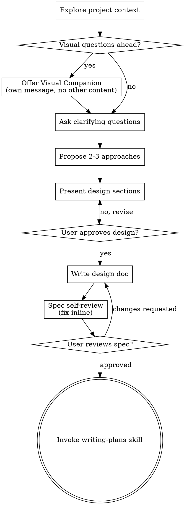
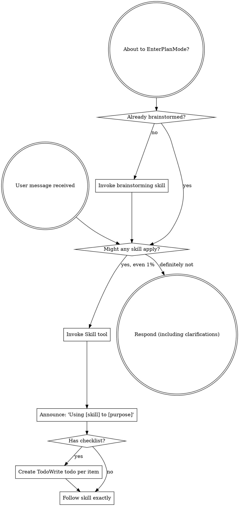
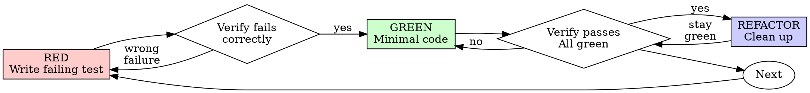
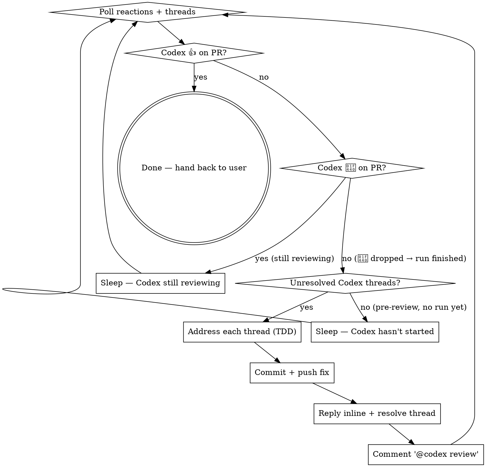

> SYSTEM

# AGENTS.md instructions for /Users/ericson/.codex/worktrees/d561/ars-ui

<INSTRUCTIONS>
## Approach
- Read existing files before writing. Don't re-read unless changed.
- Thorough in reasoning, concise in output.
- Skip files over 100KB unless required.
- No sycophantic openers or closing fluff.
- No emojis or em-dashes.
- Do not guess APIs, versions, flags, commit SHAs, or package names. Verify by reading code or docs before asserting.

--- project-doc ---

# ars-ui

## Project Overview

Rust frontend component library using state machines, framework-agnostic core with Leptos/Dioxus adapters.

## Current Phase

The repo is now in active implementation, not spec drafting only.

Agents working on implementation should use the GitHub Project roadmap and issue backlog as the execution source of truth:

- Use the GitHub Project `ars-ui implementation roadmap` to understand active epics, task breakdown, dependencies, status, and iteration planning.
- Prefer picking a single issue-backed task that is unblocked, sized, and scoped for independent delivery.
- Do not start work from an epic issue unless the user explicitly asks for planning or further decomposition.
- Do not start a task that is blocked by unresolved GitHub issue dependencies.
- Treat native GitHub issue dependencies as the blocker graph and the issue body acceptance criteria as the delivery contract.

## Development Workflow

For implementation tasks:

1. Read the assigned or selected GitHub issue first.
2. Move the issue to **In Progress** on the GitHub Project board.
3. Review the cited spec sections and any dependency issues.
4. Add or update the named tests first.
5. Implement only the scope required to make those tests pass.
6. If implementation changes the intended contract, update the relevant spec in the same task.
7. **MANDATORY:** Invoke the `post-implementation-audit` skill (`.agents/skills/post-implementation-audit/SKILL.md`). It runs three sequential audits on the new code — (a) spec/implementation drift with "best outcome" recommendations, (b) iterative "anything else missing?" passes (minimum two rounds), (c) test-coverage audit across every test type the workspace uses (unit, snapshot, proptest, doc, spec-conformance, llvm-cov — mutation testing is **not** part of this gate; it is Nightly-CI-driven). **Every finding lands in _this_ PR — no deferral, no follow-up issues.** This step exists because initial implementations consistently ship spec drift and silent contract violations that take 3+ review round-trips to surface; the audit collapses them into one. Skipping this step is a contract violation.
8. Present the final result for user review before any commit.
9. After user approval, run `cargo xci --profile fast` (alias: `cargo xci-fast`) locally and fix any failures before pushing anything to GitHub. The fast profile covers the workspace-level regressions a pre-push gate should catch: fmt, clippy, unit, integration, adapter, spec-compile-snippets, error-variant-coverage, mutual-exclusion, snapshot-count, and a **native-only coverage check** (`coverage-native`) that enforces the thresholds of the crates whose CI coverage is native-only (the agnostic library crates + xtask) — so `ars-components`-style coverage regressions surface before push, not on CI. The native coverage check adds an instrumented rebuild, so the fast profile runs in roughly 10–15 minutes. Reserve full `cargo xci` (~25 minutes, all 20 gates including the wasm coverage + CRAP gate and the feature-matrix groups) for after substantial refactors that may have shifted feature-flag interactions. For small follow-up changes, run the focused tests and checks that cover the edited code instead. To run only the coverage check, use `cargo xcov` (native-only) or `cargo xcov --full` (mirrors CI; needs the wasm toolchain + clang-22).
10. After `cargo xci-fast` passes, commit and push a PR targeting `main`. The PR body MUST include an auto-close keyword for the issue being delivered, for example `Closes #20` or `Fixes #20`, so GitHub closes the issue automatically when the PR merges.
11. **If the PR creates or modifies any `.snap` insta fixtures, attach the `snapshot-reviewed` label after opening or updating it** (`gh pr edit <num> --add-label "snapshot-reviewed"`). This signals to reviewers that the snapshot output was inspected and is intentional. Re-apply the label whenever you push a commit that touches `.snap` files; the workflow assumes the label reflects the latest snapshot state.
12. **MANDATORY:** Invoke the `waiting-for-codex-review` skill (`.agents/skills/waiting-for-codex-review/SKILL.md`) immediately after the first push that creates the PR, and re-invoke it after every subsequent push to the PR branch. The skill posts the initial `@codex review` trigger, polls Codex's 👀 → (👍 \| ∅ + threads) reaction lifecycle, addresses any review threads with the same rigor as `post-implementation-audit` (TDD + no coverage regression), replies inline, resolves threads, and re-comments `@codex review` to start the next pass — looping until Codex leaves 👍. Skipping this step leaves Codex findings unaddressed and silently widens the gap between merged code and the spec; the merge gate is 👍 from Codex plus green CI, not green CI alone.
13. Only after CI passes, Codex has left 👍, and the PR is merged, close the issue.

Never close a GitHub issue without a merged PR that passes CI **and a 👍 from Codex**. Never commit or push without explicit user approval. Keep the issue, PR, and Project board status aligned with the actual work state at every step.

Default delivery rules:

- Follow TDD: tests first, implementation second, verification last.
- Keep task scope aligned with the issue. If the issue is too large or ambiguous, stop and split or clarify rather than freelancing a bigger change.
- Prefer tasks sized `1`, `2`, `3`, or `5` points. `8` is exceptional. `13` must be decomposed before implementation.
- Preserve the crate and dependency layering defined by the architecture and implementation plan.
- Do not add a new dependency crate without explicit user approval first. If a task appears to need a new crate, stop, explain why, and get approval before editing any `Cargo.toml`.
- When a task is complete, verify the exact tests and checks named by the issue before considering it done.
- For adapter-level component implementation, follow `docs/implementation/adapter-component-delivery.md`. Adapter component work must cover the adapter crate, adapter tests, E2E fixtures/harnesses when applicable, widgets examples, spec synchronization, and the required validation/audit loop in one PR.

### Code Quality Standards

- **Document all public items.** Every public struct, enum, trait, function, constant, type alias, method, field, and variant must have a `///` doc comment. Every `lib.rs` must have a `//!` crate-level doc comment. The workspace enforces `missing_docs` linting — undocumented public items are build failures.
- **Zero warnings policy.** All code must compile with zero warnings under the workspace's configured clippy and rustc lints. Fix the root cause instead of suppressing. When suppression is genuinely needed, use `#[expect(lint, reason = "...")]` — never `#[allow(...)]`.
- **Derive documentation from the spec.** Doc comments should describe the _purpose and semantics_ of the item as defined in the corresponding `spec/` files, not just restate the type signature.
- **Use `#[inline]` selectively, not mechanically.** Do **not** add Clippy's `missing_inline_in_public_items` lint at the workspace level, and do not treat public visibility alone as a reason to mark an item `#[inline]`. Use `#[inline]` for thin cross-crate wrappers, trivial accessors, and hot-path no-op shims where the call overhead is plausibly meaningful. Avoid blanket `#[inline]` on all public APIs — it increases code size, adds compile-time cost, and turns `#[inline]` into noise instead of a deliberate performance signal.
- **Use directory-backed modules with `mod.rs` when a module owns children.** This repo standardizes on the older filesystem layout for nested modules. If module `foo` has child modules, the parent must live at `foo/mod.rs`, not `foo.rs`. Do not mix `foo.rs` with a sibling `foo/` directory. When a refactor adds child modules under an existing flat file, move the parent into `foo/mod.rs` in the same change. Do not leave empty leftover module directories behind.

### API Design Standards

- **Design for the pit of success.** Public APIs should make the most natural, shortest path also be the path that is correct, accessible, localizable, type-safe, and performant. Prefer ergonomic constructors and defaults that preserve the spec's strongest guarantees instead of making users opt into correctness after choosing a convenient API.
- **Name escape hatches explicitly.** When a component needs a lower-level, static, non-i18n, or otherwise less complete path, keep it available but make the tradeoff visible in the API name or type. The blessed path should remain the simplest call site, while escape hatches should read as deliberate choices.
- **Keep semantic data separate from rendered views.** Rich framework views are useful for customization, but components still need semantic sources for accessible names, localized text, announcements, ids, and state-machine wiring. Do not rely on arbitrary rendered view trees as the only source of user-facing semantics.

### Code Coverage

The workspace uses `cargo-llvm-cov` for code coverage with per-crate threshold enforcement. CI runs coverage on every PR (see `.github/workflows/ci.yml`).

**Local coverage commands:**

```bash
# Fast native-only coverage gate — instruments + checks only the crates whose
# CI coverage is native-only (agnostic library crates + xtask). No wasm/clang
# toolchain needed; this is what the `fast` pre-push profile runs.
cargo xcov

# Full native+wasm coverage gate, mirroring CI (needs the wasm toolchain + clang-22)
cargo xcov --full

# Per-crate coverage with inline annotated source (most useful during development)
cargo llvm-cov test -p ars-interactions --text -- hover

# Per-crate summary only
cargo llvm-cov test -p ars-interactions -- hover

# Native-only workspace coverage (host target; excludes wasm-only crates)
cargo llvm-cov --workspace \
  --exclude ars-leptos --exclude ars-dioxus \
  --exclude ars-test-harness-leptos --exclude ars-test-harness-dioxus \
  --exclude ars-derive --exclude xtask \
  --lcov --output-path lcov.info

# Check all crates against spec-defined thresholds (run after a *merged* lcov)
cargo xtask coverage check-all --file lcov.info
```

The `--text` flag produces line-by-line annotated source showing hit counts and `^0` markers on uncovered branches — use this to identify gaps after writing tests. Uncovered no-op callback closures in tests (e.g., `|_| {}`) are expected and not a gap.

The local recipe above excludes the adapter and adapter-test-harness crates because their `target_arch = "wasm32"` / `feature = "web"` code paths can't be measured via host-target `cargo llvm-cov`. **CI runs an additional wasm-coverage pipeline on nightly** (`cargo xtask ci coverage`) that uses `wasm-bindgen-test`'s experimental coverage recipe with LLVM 22 / `clang-22` to emit lcov for `ars-leptos` (csr), `ars-dioxus` (web), `ars-dom` (web), `ars-i18n` (web-intl), and the adapter test harnesses, then merges with the native lcov via `cargo xtask coverage merge`. The per-crate thresholds in `xtask::coverage::default_thresholds()` are enforced against the merged file — including adapter targets (`ars-leptos` 74/55, `ars-dioxus` 77/70, `ars-test-harness-leptos` 60/0, `ars-test-harness-dioxus` 60/0). `ars-derive` (proc-macro, runs in compiler) is exercised via `crates/ars-core/tests/derive_contract.rs` and is unmeasured. `xtask` has its own enforced threshold (30/35) and is measured. See `spec/testing/14-ci.md` §2 for the full pipeline.

### CRAP Gate (complexity vs. coverage)

Coverage tells you which lines run; mutation testing tells you whether tests would notice misbehaviour. The **CRAP gate** ([`cargo-crap`](https://crates.io/crates/cargo-crap)) tells you which functions are _risky to change_ — high cyclomatic complexity combined with low coverage. The CRAP score is `complexity² · (1 − coverage)³ + complexity`.

**Why regression mode, not an absolute threshold.** At 100% coverage `CRAP == cyclomatic complexity`, so an absolute `--fail-above` threshold rejects every large `match` no matter how well it is tested. This workspace is built on state machines: each stateful component's `Machine::transition` is intrinsically a wide `match (state, event)` (complexity 30–80) and is exhaustively tested. An absolute gate would fight that architecture and reject more components as the catalog grows. The gate therefore runs in **regression mode**.

- **Blessed entrypoints:** `cargo xcrap` (local human-readable report, never fails), `cargo xcrap --update-baseline` (regenerate the baseline), and `cargo xtask ci crap` (the CI gate). The gate is the last step of the full `cargo xci` pipeline, running immediately after `coverage` and reusing its merged `lcov.info` (no recompile). It is **not** in the fast profile: the fast profile runs only the native-only `coverage-native` check, which does not produce the merged `lcov.info` the CRAP gate compares against.
- **Policy:** `cargo crap --path . --lcov lcov.info --baseline .crap-baseline.json --fail-regression --min 30 --exclude 'target/**' --exclude 'examples/**' --exclude 'xtask/**' --exclude 'crates/ars-e2e/**' --exclude 'crates/ars-derive/**'`. The gate scopes to the **shipped component library** — tooling (`xtask`), the browser E2E harness (`ars-e2e`), the proc-macro crate, demos, and build output are excluded (they are not shipped surface, and several run uninstrumented-as-tooling on CI → 0% → spurious CRAP). The gate fails only when a function **at or above CRAP 30 regresses** (more complexity or less coverage) versus the committed baseline. New functions are tolerated — the per-crate coverage thresholds already ensure new code is tested — and sub-threshold churn on simple functions is ignored. Net: the coverage gate guarantees new code is tested; the CRAP gate guarantees shipped code does not rot.
- **`--path .`, not `--workspace`.** cargo-crap's regression key is `(file, function, line)`, and `--workspace` records machine-absolute file paths (`/Users/…` locally, `/home/runner/…` on CI). A baseline committed with absolute paths never matches on CI, silently turning the gate into a no-op. `--path .` emits repo-relative paths (`./crates/…`) that match on any checkout; coverage still associates correctly because cargo-crap canonicalizes paths when reading the lcov. `--exclude` is honored under `--path` (it is a no-op under `--workspace`), so `target/**` and the unmeasured `crates/ars-derive/**` are skipped there. Because the key includes the line number, a baseline only matches non-uniquely-named functions (e.g. `Machine::transition`) while their line numbers are stable; regenerate the baseline when a tracked file's lines shift materially.
- **Baseline:** `.crap-baseline.json` at the repo root is committed and complete (every function, no `--min`, so a function crossing the threshold is still caught). Regenerate it with `cargo xcrap --update-baseline` from CI's merged `lcov.info` (download the `coverage-lcov` artifact) whenever a **deliberate** complexity increase lands; commit the new baseline in that PR — a conscious "I accept this" checkpoint. cargo-crap's `--epsilon` (default 0.01) absorbs coverage float jitter. If the baseline is missing, the gate bootstraps it and passes with a notice.
- **Pinned version:** cargo-crap is pinned to an exact version in `xtask::crap::CARGO_CRAP_VERSION` and `.github/workflows/ci.yml` (same convention as cargo-mutants). To bump, update both. Install locally with `cargo install cargo-crap --locked --version <version>` (or `cargo binstall cargo-crap`).
- **Scope / escape hatch:** the exclude-glob list lives in `xtask/src/crap.rs` (`EXCLUDE_GLOBS`), each entry justified by a comment, and scopes the gate to the **shipped component library**. Because the gate runs under `--path .`, cargo-crap's `--exclude` is honored, so build output (`target/**`), demos (`examples/**`), the task runner (`xtask/**`), the browser E2E harness (`crates/ars-e2e/**`), and the proc-macro crate (`crates/ars-derive/**`) are skipped at walk time. The last three are not shipped library code and run uninstrumented-as-tooling on CI (0% coverage → spurious CRAP), so gating them is meaningless. Prefer fixing or refactoring over adding entries. (Note: the per-crate **coverage** gate still measures `xtask` at its own loose 30/35 threshold — that is separate from CRAP.)

### Mutation Testing

Coverage tells you which lines run. **Mutation testing tells you whether the tests would notice if those lines silently misbehaved.** The workspace uses [`cargo-mutants`](https://mutants.rs) for this — a `cargo` extension binary, not a workspace dependency.

**Install (once per developer machine):**

```bash
cargo install cargo-mutants --locked --version 27.0.0
```

**Local commands (state-machine modules are the most rewarding targets):**

Prefer `cargo xmutants` over bare `cargo mutants` — it applies the same
per-crate `--features` profile as Nightly CI (for example
`ars-components/i18n`) so snapshot and i18n-gated tests match CI.

```bash
# Run on a single component machine (~6 min for popover)
cargo xmutants -p ars-components -f crates/ars-components/src/overlay/popover/mod.rs

# Just list what would be mutated, without running tests (fast)
cargo xmutants -p ars-components -f crates/ars-components/src/overlay/popover/mod.rs --list

# Whole crate (slow — only if you really mean it)
cargo xmutants -p ars-components
```

**Agnostic component implementation gate:** whenever an agent implements a new framework-agnostic component, or materially changes an existing one, the delivery must include:

- spec-conformance tests for the component's anatomy/public contract, including its `Part` enum and required API/attribute surface;
- the full test breadth the component warrants (unit, snapshot, proptest) with strong line/branch coverage.

**Mutation testing is NOT a pre-PR requisite for agnostic component work.** Do not run a targeted `cargo xmutants` pass as a delivery/audit gate, and do not block a PR on a clean local mutation run. Surviving (`MISSED`) mutants are surfaced by the Nightly CI `mutation-testing` job (see below); triage them — add tests for real gaps, or add a justified line-agnostic `.cargo/mutants.toml` exclude for true equivalent mutations — in a dedicated follow-up when Nightly reports them, not during initial component delivery. (Running a local mutation pass voluntarily is fine, but it is never required and never blocks delivery or review.)

**Reading the output:** Results land in `mutants.out/mutants.out/` (gitignored). The two files that matter:

- `caught.txt` — mutations that broke at least one test ✅
- `missed.txt` — mutations that survived all tests ❌ — each one is either a real test gap to fill or an "equivalent mutation" that needs a `[[skip]]` entry in `mutants.toml` with a justification

**CI integration:** Nightly only. `.github/workflows/nightly.yml` has a `mutation-testing` job with a 21-entry matrix that runs `cargo mutants -p <package>` on every framework-agnostic crate, using `--shard k/n` to spread larger crates across parallel runners. **Shard indices are 0-based** (`k` runs from `0` to `n-1`); `k == n` is invalid and will fail the job. When adding shards, always start at `0/n` and end at `(n-1)/n`.

- **`ars-components` (≈ 1,630 mutants today, planned to grow as the spec adds the remaining ~97 components):** sharded **12-way** → ≈ 135 mutants per runner today, ≈ 850 per runner at the ~10,000-mutant endpoint. Sized for the full spec catalog up front so we don't re-shard every few months as components land.
- **`ars-collections` (≈ 1,080 mutants):** sharded 4-way → ≈ 270 mutants per runner.
- **`ars-core` (≈ 700 mutants):** sharded 2-way → ≈ 350 mutants per runner.
- **`ars-a11y`, `ars-forms`, `ars-interactions`:** one runner each (under 600 mutants apiece).

**Adding a new state machine inside an existing crate requires no CI changes** — its mutations land in whichever shard the cargo-mutants partitioner places them. The shard counts are sized so the slowest runner stays well under 30 minutes today and under ~50 minutes at the planned endpoint; re-balance only when a crate outgrows that budget (visible on the nightly dashboard as one shard pulling away from the others).

All matrix jobs run with `fail-fast: false` so failures on one module don't mask data on another. Each job uploads its `mutants.out/` as a workflow artifact (always, even on success — surviving "missed" entries on a passing run still reveal test-quality work). The job fails if any mutation survives, so a missed mutation forces a deliberate triage decision (fix the test, or document the equivalence with a `[[skip]]` entry in `mutants.toml`).

**Excluded crates** (mutation testing's signal degrades wherever determinism does): adapter glue (`ars-leptos`, `ars-dioxus`), DOM/FFI (`ars-dom`), ICU/FFI (`ars-i18n`), test infrastructure (`ars-test-harness*`), and the proc-macro crate (`ars-derive`, runs in the compiler). Adding a brand-new crate that is a good mutation target requires one new matrix entry; run a local scout first (`cargo mutants -p <crate> --list` to size, then a real run) so we know the right shard count before the nightly fires.

**Bumping the pinned version.** Both the local install command above and `.github/workflows/nightly.yml` pin cargo-mutants to an exact version (currently `27.0.0`) — same convention as `wasm-pack` in the `a11y-audit` job. Pinning is deliberate: cargo-mutants ships new mutators in releases, and an unpinned install would silently change the mutation set without any code change, surfacing as phantom CI failures on a green-source repo. To bump, open a PR that (1) updates the version string in CLAUDE.md and `nightly.yml`, (2) runs the popover scout locally with the new version (`cargo mutants -p ars-components -f crates/ars-components/src/overlay/popover/mod.rs`) to confirm the mutation count is in the same ballpark, and (3) triages any new "missed" entries the new mutators surface — they are usually genuine test-quality gaps newly visible to the tool.

### Property Testing (proptest)

State-machine invariants are exercised by [`proptest`](https://docs.rs/proptest) under `crates/<crate>/tests/proptest_state_machines/` (see `ars-components`). Default proptest behaviour drops `*.proptest-regressions` seed files alongside test sources — instead, every `proptest!` block in this workspace pulls a shared `Config` from `tests/proptest_state_machines/common.rs` that:

1. Reads `PROPTEST_CASES` from the environment (1,000 default; 10,000 in the nightly `extended-proptest` job).
2. Sets `failure_persistence` to `FileFailurePersistence::Direct("proptest-regressions/state-machines.txt")`, so all persisted seeds for the test binary live in one file at the crate root: `crates/<crate>/proptest-regressions/state-machines.txt`. The directory is committed (per proptest's own recommendation in the file header) so every developer's runs benefit from previously-shrunk failures.

When a new crate adopts proptest for state-machine tests, copy the same `common.rs` helper and reference it via `#![proptest_config(super::common::proptest_config())]` inside every `proptest!` block. Don't let proptest fall back to its `WithSource` default — that scatters seed files across the source tree.

### Adapter Prelude Convention

Both `ars-leptos` and `ars-dioxus` expose a `prelude` module targeting **end users** — application developers who consume the ready-made components. `use ars_leptos::prelude::*` (or `use ars_dioxus::prelude::*`) should give them everything they need.

The prelude contains only user-facing items:

1. **Component modules** — as components land, their public module paths (e.g., `button`, `dialog`) are re-exported so users can write `button::Props`, etc.
2. **User-facing traits** — traits end users call on component outputs (e.g., `Translate` from `ars-i18n`). Re-export the trait so consumers don't need a direct dependency on the subsystem crate.
3. **Configuration types** — types that appear in component props or configure behaviour (e.g., `Locale`, `Direction`, `Orientation`, `Selection`).

The prelude does **not** include implementation details consumed only by component authors inside the adapter crate: core engine types (`Machine`, `Service`, `ConnectApi`, `AttrMap`), accessibility primitives (`AriaRole`, `AriaAttribute`), interaction helpers (`merge_attrs`), or adapter hooks (`use_machine`, `UseMachineReturn`). Those remain accessible via their normal crate paths for advanced users building custom machines.

Both adapter preludes must stay symmetric: same items, same structure. When adding a new re-export to one adapter's prelude, add it to the other as well in the same PR.

### Adapter Testing Convention

Adapter-level component tests should default to the framework-specific test harness crate:

- Leptos adapter tests should prefer `ars-test-harness-leptos`.
- Dioxus adapter tests should prefer `ars-test-harness-dioxus`.
- Shared `ars-test-harness` helpers should be used where relevant for viewport, layout, clipboard, drag/drop, timing, and other DOM test setup instead of bespoke per-test browser scaffolding.

When a component spec requires interaction, focus, overlay positioning, clipboard, file upload, drag/drop, or similar browser behavior, the task's tests should exercise that behavior through the adapter harness entrypoints and shared core harness helpers unless there is a concrete technical reason not to.

## Spec Synchronization During Implementation

The specification is the authoritative contract. It took weeks of deliberate design and MUST be followed.

### Spec-first implementation rule

Before implementing any public type, trait, function, or method:

1. **Read the spec section first.** Find the relevant code example in `spec/`. Use `spec-tool toc <file>` and `grep` to locate it.
2. **Match the spec exactly.** If the spec defines `struct ComponentIds { base: String }` with methods `from_id()`, `id()`, `part()`, `item()`, `item_part()` — implement exactly that. Do not invent alternative field names, method names, or signatures.
3. **Cross-check after implementation.** Before presenting code for review, diff every public item against the spec's code examples. Every struct field, every method name, every parameter must match.
4. **If you must deviate**, there must be a concrete technical reason (e.g., the spec's API cannot compile, or a dependency doesn't expose the needed type). Document the reason in a code comment and flag it to the user explicitly.

Inventing alternative APIs that "seem equivalent" is never acceptable — it silently invalidates the spec's design decisions and all downstream code that depends on those APIs.

### Spec/code mismatch resolution

- If code and spec disagree, resolve the mismatch in the same task or PR.
- Shared conceptual changes belong in shared or foundation spec files, not only in adapter code.
- Adapter-specific findings must be reflected back into `spec/foundation/08-adapter-leptos.md` and/or `spec/foundation/09-adapter-dioxus.md` when relevant.
- Do not leave spec drift behind as follow-up cleanup.

## Spec Structure

The specification lives in `spec/` with this layout:

- `spec/manifest.toml` — **START HERE** — central index of all components and their dependencies
- `spec/foundation/` — architecture, accessibility, i18n, interactions, forms, adapters, spec template (00-10)
- `spec/shared/` — cross-component shared types (date-time, selection, layout, z-index)
- `spec/components/{category}/` — one file per component, organized by category
- `spec/testing/` — test specs split by domain

### Component Categories

- `input/` — checkbox, text-field, slider, number-input, etc.
- `selection/` — select, combobox, listbox, menu, tags-input, etc.
- `overlay/` — dialog, popover, tooltip, toast, presence, etc.
- `navigation/` — accordion, tabs, tree-view, pagination, steps, etc.
- `date-time/` — date-field, time-field, calendar, date-picker, etc.
- `data-display/` — table, avatar, progress, meter, badge, etc.
- `layout/` — splitter, scroll-area, carousel, portal, toolbar, etc.
- `specialized/` — color-picker, file-upload, signature-pad, qr-code, etc.
- `utility/` — button, toggle, focus-scope, visually-hidden, separator, etc.

## Working with the Spec

When reading large files, run `wc -l` first to check the line count. If the file is over 2,000
lines, use the `offset` and `limit` parameters on the Read tool to read in chunks rather than
attempting to read the entire file at once.

### Using xtask spec (preferred)

Use `cargo xtask spec` to resolve file sets instead of manually parsing manifest.toml:

```bash
# Quick metadata lookup:
cargo xtask spec info <component>

# Find all components using a shared type:
cargo xtask spec reverse <shared-type>

# See a file's heading structure (with line numbers):
cargo xtask spec toc <file>

# Validate frontmatter matches manifest.toml:
cargo xtask spec validate

# Search spec content by keyword/regex (with optional filters):
cargo xtask spec search <query> [--category <cat>] [--section <sec>] [--tier <tier>]

# Get a compact component summary (states, events, props, accessibility):
cargo xtask spec digest <component>

# Get full implementation context (component + all deps concatenated):
cargo xtask spec context <component> [--framework <fw>] [--include-testing]
```

The xtask also runs as an MCP server (`cargo xtask mcp`) exposing all spec tools for LLM agents.

### Reading a component (manual fallback)

1. Read `spec/manifest.toml` to find the component's path and dependencies
2. Read the component file (has YAML frontmatter listing its foundation/shared deps)
3. Only load the foundation files listed in `foundation_deps` — not all of them

### Framework and library specs — MANDATORY skill loading

When reading or editing these specification files, you MUST load the corresponding skill BEFORE doing any work. The skills contain verified, version-accurate API documentation that the spec code examples depend on. Claude's training data is wrong for these libraries — do not trust it.

| Spec file                                    | Skill to load | Library version |
| -------------------------------------------- | ------------- | --------------- |
| `spec/foundation/04-internationalization.md` | `icu4x`       | ICU4X 2.1.1     |
| `spec/foundation/08-adapter-leptos.md`       | `leptos`      | Leptos 0.8.17   |
| `spec/foundation/09-adapter-dioxus.md`       | `dioxus`      | Dioxus 0.7.3    |

This applies to any task that touches adapter code: reviewing, writing, modifying, or answering questions about these files. Load the skill first, then proceed.

### Spec Conventions

- **No deprecation:** This is a greenfield spec. If an API is unused or redundant, remove it and fix all references. Never use `#[deprecated]` or deprecation shims.
- **No deferral:** Never mark spec content as "TODO", "FIXME", "future enhancement", "P1/P2 extension", or any similar deferral language. Every feature mentioned must be fully specified. If a design choice is unclear, ask the user rather than deferring.
- **No guessing external APIs:** NEVER guess function names or module paths for external crates. Always verify against `https://docs.rs/<crate_name>` before writing code that calls library APIs. This applies especially to Leptos, Dioxus, ICU4X, and any crate where training data may be stale. If you cannot verify, state that explicitly rather than fabricating a plausible-looking API.

### Component file format

Each component file has YAML frontmatter declaring its metadata:

```markdown
---
component: ComponentName
category: { category }
tier: stateless | stateful | complex
foundation_deps: [architecture, accessibility, ...]
shared_deps: [date-time-types, ...]
related: [sibling-component, ...]
---

# ComponentName
```

The `tier` field determines which sections are required — see `spec/foundation/10-component-spec-template.md` for the canonical section structure, ordering rules, and conformance checklist. Headings are numbered (e.g., `## 1. State Machine`, `### 1.1 States`, `#### 1.1.1 InnerStates`, etc.) for precise section references.

</INSTRUCTIONS>
<environment_context>
  <cwd>/Users/ericson/.codex/worktrees/d561/ars-ui</cwd>
  <shell>zsh</shell>
  <current_date>2026-05-31</current_date>
  <timezone>America/Sao_Paulo</timezone>
</environment_context>

> DEVELOPER

Implement task #287

> AGENT

I’ll use the GitHub workflow context plus the repo’s planning constraints. I’m in Plan Mode, so I’ll inspect the live issue/spec/code enough to produce an implementation-ready plan, but I won’t edit tracked files yet.

> TOOL

tool_use exec_command
id: call_HAfT3vYcu6kReVxai7OYVVc1
```json
{
  "cmd": "gh issue view 287 --json number,title,body,state,labels,assignees,projectItems,comments",
  "workdir": "/Users/ericson/.codex/worktrees/d561/ars-ui",
  "yield_time_ms": 1000,
  "max_output_tokens": 12000
}
```

> TOOL

tool_use exec_command
id: call_NR6tmkjG9g4OUaboIk2kfjey
```json
{
  "cmd": "git status --short --branch",
  "workdir": "/Users/ericson/.codex/worktrees/d561/ars-ui",
  "yield_time_ms": 1000,
  "max_output_tokens": 4000
}
```

> TOOL

tool_use exec_command
id: call_ZKNf36TCfJrpdwslWjJ1kVkw
```json
{
  "cmd": "rg --files -g 'AGENTS.md' -g 'CLAUDE.md' -g '.agents/skills/**/SKILL.md'",
  "workdir": "/Users/ericson/.codex/worktrees/d561/ars-ui",
  "yield_time_ms": 1000,
  "max_output_tokens": 4000
}
```

> TOOL

tool_result
id: call_HAfT3vYcu6kReVxai7OYVVc1
```
Chunk ID: 40d1b3
Wall time: 0.9465 seconds
Process exited with code 0
Original token count: 658
Output:
{"assignees":[],"body":"**Epic: #224 (Agnostic date-time components)**\n\n## Goal\nStateful extension of Calendar with range selection, hover preview, anchor/focus tracking.\n\n## Out of scope\nFramework-specific adapter components (Leptos/Dioxus).\n\n## Spec refs\n- `spec/components/date-time/range-calendar.md`\n- `spec/shared/date-time-types.md`\n\n## Depends on\n- #280 (Calendar agnostic core)\n\n## Layer\nComponent\n\n## Framework\nNone\n\n## Test tier\nUnit\n\n## Fibonacci points\n5\n\n## Element/ref handling note\n\nRangeCalendar agnostic code should own date grid state, range selection, focused date, visible months, and ARIA/data attrs. IDs are valid for semantic relationships; live cell focus, auto-scroll, and multi-month measurement must be adapter-resolved with native handles keyed by date.\n\nStable string IDs remain valid for semantic ARIA relationships, hydration-stable markup, and `data-ars-*` hooks. They should not be used as a substitute for live element handles. Leptos adapters should prefer `NodeRef`/resolved DOM elements for live operations; Dioxus adapters should prefer `MountedData` or the Dioxus platform layer where available.\n\n## Tests to add first\n- Click to set range start (anchor), click again to set range end.\n- Hover preview highlights range between anchor and hovered date.\n- Range cells produce `aria-selected` for dates within the selected range.\n- ConnectApi: grid with range highlighting attributes.\n- Keyboard range selection with Shift+arrow keys.\n- Min/max span constraints (e.g., maximum range length).\n- Allow-single-date-range option (start equals end is valid).\n\n## Acceptance criteria\n- All public types documented per workspace `missing_docs` lint.\n- State machine matches spec §1 exactly.\n- ConnectApi produces correct ARIA attributes per spec §2.\n- Snapshot tests cover the component's `connect()` / `Api` `AttrMap` output for every anatomy part and each output-affecting state, prop, or context branch, with committed `.snap` fixtures passing `cargo insta test --unreferenced=reject`.\n- All named tests pass with zero warnings.\n\n## Spec impact\nNo spec change required.\n\n## Board update rule\nIf blocked, keep `Status` in `Todo`, use native GitHub issue dependencies, and name the dependency or spec ambiguity.\n","comments":[],"labels":[{"id":"LA_kwDORp4enM8AAAACd5NBow","name":"task","description":"Agent-ready implementation task","color":"0E8A16"}],"number":287,"projectItems":[{"status":{"optionId":"f75ad846","name":"Todo"},"title":"ars-ui implementation roadmap"}],"state":"OPEN","title":"task: Implement RangeCalendar agnostic core"}

```

> TOOL

tool_result
id: call_NR6tmkjG9g4OUaboIk2kfjey
```
Chunk ID: 03678a
Wall time: 0.1934 seconds
Process exited with code 0
Original token count: 5
Output:
## HEAD (no branch)

```

> TOOL

tool_result
id: call_ZKNf36TCfJrpdwslWjJ1kVkw
```
Chunk ID: 097869
Wall time: 0.0743 seconds
Process exited with code 0
Original token count: 7
Output:
AGENTS.md
spec/AGENTS.md

```

> AGENT

Issue #287 is open and scoped to the framework-agnostic RangeCalendar core, dependent on Calendar core #280. I’m going to inspect the existing Calendar implementation and the RangeCalendar spec next so the plan follows the actual current APIs.

> TOOL

tool_use exec_command
id: call_zlBrV8oCPpO97hXCs9fGLEIE
```json
{
  "cmd": "sed -n '1,220p' /Users/ericson/.claude/skills/brainstorming/SKILL.md",
  "workdir": "/Users/ericson/.codex/worktrees/d561/ars-ui",
  "yield_time_ms": 1000,
  "max_output_tokens": 8000
}
```

> TOOL

tool_use exec_command
id: call_SZ3LpYQBTcKWCAp1IbQZi7RK
```json
{
  "cmd": "sed -n '1,220p' /Users/ericson/.claude/skills/writing-plans/SKILL.md",
  "workdir": "/Users/ericson/.codex/worktrees/d561/ars-ui",
  "yield_time_ms": 1000,
  "max_output_tokens": 8000
}
```

> TOOL

tool_use exec_command
id: call_CPv0rTljQHi8PTgtr54Q2h1R
```json
{
  "cmd": "sed -n '1,180p' /Users/ericson/.claude/skills/using-superpowers/SKILL.md",
  "workdir": "/Users/ericson/.codex/worktrees/d561/ars-ui",
  "yield_time_ms": 1000,
  "max_output_tokens": 8000
}
```

> TOOL

tool_result
id: call_zlBrV8oCPpO97hXCs9fGLEIE
```
Chunk ID: 68386f
Wall time: 0.5143 seconds
Process exited with code 0
Original token count: 2659
Output:
---
name: brainstorming
description: "You MUST use this before any creative work - creating features, building components, adding functionality, or modifying behavior. Explores user intent, requirements and design before implementation."
---

# Brainstorming Ideas Into Designs

Help turn ideas into fully formed designs and specs through natural collaborative dialogue.

Start by understanding the current project context, then ask questions one at a time to refine the idea. Once you understand what you're building, present the design and get user approval.

<HARD-GATE>
Do NOT invoke any implementation skill, write any code, scaffold any project, or take any implementation action until you have presented a design and the user has approved it. This applies to EVERY project regardless of perceived simplicity.
</HARD-GATE>

## Anti-Pattern: "This Is Too Simple To Need A Design"

Every project goes through this process. A todo list, a single-function utility, a config change — all of them. "Simple" projects are where unexamined assumptions cause the most wasted work. The design can be short (a few sentences for truly simple projects), but you MUST present it and get approval.

## Checklist

You MUST create a task for each of these items and complete them in order:

1. **Explore project context** — check files, docs, recent commits
2. **Offer visual companion** (if topic will involve visual questions) — this is its own message, not combined with a clarifying question. See the Visual Companion section below.
3. **Ask clarifying questions** — one at a time, understand purpose/constraints/success criteria
4. **Propose 2-3 approaches** — with trade-offs and your recommendation
5. **Present design** — in sections scaled to their complexity, get user approval after each section
6. **Write design doc** — save to `docs/superpowers/specs/YYYY-MM-DD-<topic>-design.md` and commit
7. **Spec self-review** — quick inline check for placeholders, contradictions, ambiguity, scope (see below)
8. **User reviews written spec** — ask user to review the spec file before proceeding
9. **Transition to implementation** — invoke writing-plans skill to create implementation plan

## Process Flow



**The terminal state is invoking writing-plans.** Do NOT invoke frontend-design, mcp-builder, or any other implementation skill. The ONLY skill you invoke after brainstorming is writing-plans.

## The Process

**Understanding the idea:**

- Check out the current project state first (files, docs, recent commits)
- Before asking detailed questions, assess scope: if the request describes multiple independent subsystems (e.g., "build a platform with chat, file storage, billing, and analytics"), flag this immediately. Don't spend questions refining details of a project that needs to be decomposed first.
- If the project is too large for a single spec, help the user decompose into sub-projects: what are the independent pieces, how do they relate, what order should they be built? Then brainstorm the first sub-project through the normal design flow. Each sub-project gets its own spec → plan → implementation cycle.
- For appropriately-scoped projects, ask questions one at a time to refine the idea
- Prefer multiple choice questions when possible, but open-ended is fine too
- Only one question per message - if a topic needs more exploration, break it into multiple questions
- Focus on understanding: purpose, constraints, success criteria

**Exploring approaches:**

- Propose 2-3 different approaches with trade-offs
- Present options conversationally with your recommendation and reasoning
- Lead with your recommended option and explain why

**Presenting the design:**

- Once you believe you understand what you're building, present the design
- Scale each section to its complexity: a few sentences if straightforward, up to 200-300 words if nuanced
- Ask after each section whether it looks right so far
- Cover: architecture, components, data flow, error handling, testing
- Be ready to go back and clarify if something doesn't make sense

**Design for isolation and clarity:**

- Break the system into smaller units that each have one clear purpose, communicate through well-defined interfaces, and can be understood and tested independently
- For each unit, you should be able to answer: what does it do, how do you use it, and what does it depend on?
- Can someone understand what a unit does without reading its internals? Can you change the internals without breaking consumers? If not, the boundaries need work.
- Smaller, well-bounded units are also easier for you to work with - you reason better about code you can hold in context at once, and your edits are more reliable when files are focused. When a file grows large, that's often a signal that it's doing too much.

**Working in existing codebases:**

- Explore the current structure before proposing changes. Follow existing patterns.
- Where existing code has problems that affect the work (e.g., a file that's grown too large, unclear boundaries, tangled responsibilities), include targeted improvements as part of the design - the way a good developer improves code they're working in.
- Don't propose unrelated refactoring. Stay focused on what serves the current goal.

## After the Design

**Documentation:**

- Write the validated design (spec) to `docs/superpowers/specs/YYYY-MM-DD-<topic>-design.md`
  - (User preferences for spec location override this default)
- Use elements-of-style:writing-clearly-and-concisely skill if available
- Commit the design document to git

**Spec Self-Review:**
After writing the spec document, look at it with fresh eyes:

1. **Placeholder scan:** Any "TBD", "TODO", incomplete sections, or vague requirements? Fix them.
2. **Internal consistency:** Do any sections contradict each other? Does the architecture match the feature descriptions?
3. **Scope check:** Is this focused enough for a single implementation plan, or does it need decomposition?
4. **Ambiguity check:** Could any requirement be interpreted two different ways? If so, pick one and make it explicit.

Fix any issues inline. No need to re-review — just fix and move on.

**User Review Gate:**
After the spec review loop passes, ask the user to review the written spec before proceeding:

> "Spec written and committed to `<path>`. Please review it and let me know if you want to make any changes before we start writing out the implementation plan."

Wait for the user's response. If they request changes, make them and re-run the spec review loop. Only proceed once the user approves.

**Implementation:**

- Invoke the writing-plans skill to create a detailed implementation plan
- Do NOT invoke any other skill. writing-plans is the next step.

## Key Principles

- **One question at a time** - Don't overwhelm with multiple questions
- **Multiple choice preferred** - Easier to answer than open-ended when possible
- **YAGNI ruthlessly** - Remove unnecessary features from all designs
- **Explore alternatives** - Always propose 2-3 approaches before settling
- **Incremental validation** - Present design, get approval before moving on
- **Be flexible** - Go back and clarify when something doesn't make sense

## Visual Companion

A browser-based companion for showing mockups, diagrams, and visual options during brainstorming. Available as a tool — not a mode. Accepting the companion means it's available for questions that benefit from visual treatment; it does NOT mean every question goes through the browser.

**Offering the companion:** When you anticipate that upcoming questions will involve visual content (mockups, layouts, diagrams), offer it once for consent:
> "Some of what we're working on might be easier to explain if I can show it to you in a web browser. I can put together mockups, diagrams, comparisons, and other visuals as we go. This feature is still new and can be token-intensive. Want to try it? (Requires opening a local URL)"

**This offer MUST be its own message.** Do not combine it with clarifying questions, context summaries, or any other content. The message should contain ONLY the offer above and nothing else. Wait for the user's response before continuing. If they decline, proceed with text-only brainstorming.

**Per-question decision:** Even after the user accepts, decide FOR EACH QUESTION whether to use the browser or the terminal. The test: **would the user understand this better by seeing it than reading it?**

- **Use the browser** for content that IS visual — mockups, wireframes, layout comparisons, architecture diagrams, side-by-side visual designs
- **Use the terminal** for content that is text — requirements questions, conceptual choices, tradeoff lists, A/B/C/D text options, scope decisions

A question about a UI topic is not automatically a visual question. "What does personality mean in this context?" is a conceptual question — use the terminal. "Which wizard layout works better?" is a visual question — use the browser.

If they agree to the companion, read the detailed guide before proceeding:
`skills/brainstorming/visual-companion.md`

```

> TOOL

tool_result
id: call_SZ3LpYQBTcKWCAp1IbQZi7RK
```
Chunk ID: 243ce5
Wall time: 0.5086 seconds
Process exited with code 0
Original token count: 1512
Output:
---
name: writing-plans
description: Use when you have a spec or requirements for a multi-step task, before touching code
---

# Writing Plans

## Overview

Write comprehensive implementation plans assuming the engineer has zero context for our codebase and questionable taste. Document everything they need to know: which files to touch for each task, code, testing, docs they might need to check, how to test it. Give them the whole plan as bite-sized tasks. DRY. YAGNI. TDD. Frequent commits.

Assume they are a skilled developer, but know almost nothing about our toolset or problem domain. Assume they don't know good test design very well.

**Announce at start:** "I'm using the writing-plans skill to create the implementation plan."

**Context:** This should be run in a dedicated worktree (created by brainstorming skill).

**Save plans to:** `docs/superpowers/plans/YYYY-MM-DD-<feature-name>.md`
- (User preferences for plan location override this default)

## Scope Check

If the spec covers multiple independent subsystems, it should have been broken into sub-project specs during brainstorming. If it wasn't, suggest breaking this into separate plans — one per subsystem. Each plan should produce working, testable software on its own.

## File Structure

Before defining tasks, map out which files will be created or modified and what each one is responsible for. This is where decomposition decisions get locked in.

- Design units with clear boundaries and well-defined interfaces. Each file should have one clear responsibility.
- You reason best about code you can hold in context at once, and your edits are more reliable when files are focused. Prefer smaller, focused files over large ones that do too much.
- Files that change together should live together. Split by responsibility, not by technical layer.
- In existing codebases, follow established patterns. If the codebase uses large files, don't unilaterally restructure - but if a file you're modifying has grown unwieldy, including a split in the plan is reasonable.

This structure informs the task decomposition. Each task should produce self-contained changes that make sense independently.

## Bite-Sized Task Granularity

**Each step is one action (2-5 minutes):**
- "Write the failing test" - step
- "Run it to make sure it fails" - step
- "Implement the minimal code to make the test pass" - step
- "Run the tests and make sure they pass" - step
- "Commit" - step

## Plan Document Header

**Every plan MUST start with this header:**

```markdown
# [Feature Name] Implementation Plan

> **For agentic workers:** REQUIRED SUB-SKILL: Use superpowers:subagent-driven-development (recommended) or superpowers:executing-plans to implement this plan task-by-task. Steps use checkbox (`- [ ]`) syntax for tracking.

**Goal:** [One sentence describing what this builds]

**Architecture:** [2-3 sentences about approach]

**Tech Stack:** [Key technologies/libraries]

---
```

## Task Structure

````markdown
### Task N: [Component Name]

**Files:**
- Create: `exact/path/to/file.py`
- Modify: `exact/path/to/existing.py:123-145`
- Test: `tests/exact/path/to/test.py`

- [ ] **Step 1: Write the failing test**

```python
def test_specific_behavior():
    result = function(input)
    assert result == expected
```

- [ ] **Step 2: Run test to verify it fails**

Run: `pytest tests/path/test.py::test_name -v`
Expected: FAIL with "function not defined"

- [ ] **Step 3: Write minimal implementation**

```python
def function(input):
    return expected
```

- [ ] **Step 4: Run test to verify it passes**

Run: `pytest tests/path/test.py::test_name -v`
Expected: PASS

- [ ] **Step 5: Commit**

```bash
git add tests/path/test.py src/path/file.py
git commit -m "feat: add specific feature"
```
````

## No Placeholders

Every step must contain the actual content an engineer needs. These are **plan failures** — never write them:
- "TBD", "TODO", "implement later", "fill in details"
- "Add appropriate error handling" / "add validation" / "handle edge cases"
- "Write tests for the above" (without actual test code)
- "Similar to Task N" (repeat the code — the engineer may be reading tasks out of order)
- Steps that describe what to do without showing how (code blocks required for code steps)
- References to types, functions, or methods not defined in any task

## Remember
- Exact file paths always
- Complete code in every step — if a step changes code, show the code
- Exact commands with expected output
- DRY, YAGNI, TDD, frequent commits

## Self-Review

After writing the complete plan, look at the spec with fresh eyes and check the plan against it. This is a checklist you run yourself — not a subagent dispatch.

**1. Spec coverage:** Skim each section/requirement in the spec. Can you point to a task that implements it? List any gaps.

**2. Placeholder scan:** Search your plan for red flags — any of the patterns from the "No Placeholders" section above. Fix them.

**3. Type consistency:** Do the types, method signatures, and property names you used in later tasks match what you defined in earlier tasks? A function called `clearLayers()` in Task 3 but `clearFullLayers()` in Task 7 is a bug.

If you find issues, fix them inline. No need to re-review — just fix and move on. If you find a spec requirement with no task, add the task.

## Execution Handoff

After saving the plan, offer execution choice:

**"Plan complete and saved to `docs/superpowers/plans/<filename>.md`. Two execution options:**

**1. Subagent-Driven (recommended)** - I dispatch a fresh subagent per task, review between tasks, fast iteration

**2. Inline Execution** - Execute tasks in this session using executing-plans, batch execution with checkpoints

**Which approach?"**

**If Subagent-Driven chosen:**
- **REQUIRED SUB-SKILL:** Use superpowers:subagent-driven-development
- Fresh subagent per task + two-stage review

**If Inline Execution chosen:**
- **REQUIRED SUB-SKILL:** Use superpowers:executing-plans
- Batch execution with checkpoints for review

```

> TOOL

tool_result
id: call_CPv0rTljQHi8PTgtr54Q2h1R
```
Chunk ID: bb8811
Wall time: 0.3179 seconds
Process exited with code 0
Original token count: 1356
Output:
---
name: using-superpowers
description: Use when starting any conversation - establishes how to find and use skills, requiring Skill tool invocation before ANY response including clarifying questions
---

<SUBAGENT-STOP>
If you were dispatched as a subagent to execute a specific task, skip this skill.
</SUBAGENT-STOP>

<EXTREMELY-IMPORTANT>
If you think there is even a 1% chance a skill might apply to what you are doing, you ABSOLUTELY MUST invoke the skill.

IF A SKILL APPLIES TO YOUR TASK, YOU DO NOT HAVE A CHOICE. YOU MUST USE IT.

This is not negotiable. This is not optional. You cannot rationalize your way out of this.
</EXTREMELY-IMPORTANT>

## Instruction Priority

Superpowers skills override default system prompt behavior, but **user instructions always take precedence**:

1. **User's explicit instructions** (CLAUDE.md, GEMINI.md, AGENTS.md, direct requests) — highest priority
2. **Superpowers skills** — override default system behavior where they conflict
3. **Default system prompt** — lowest priority

If CLAUDE.md, GEMINI.md, or AGENTS.md says "don't use TDD" and a skill says "always use TDD," follow the user's instructions. The user is in control.

## How to Access Skills

**In Claude Code:** Use the `Skill` tool. When you invoke a skill, its content is loaded and presented to you—follow it directly. Never use the Read tool on skill files.

**In Copilot CLI:** Use the `skill` tool. Skills are auto-discovered from installed plugins. The `skill` tool works the same as Claude Code's `Skill` tool.

**In Gemini CLI:** Skills activate via the `activate_skill` tool. Gemini loads skill metadata at session start and activates the full content on demand.

**In other environments:** Check your platform's documentation for how skills are loaded.

## Platform Adaptation

Skills use Claude Code tool names. Non-CC platforms: see `references/copilot-tools.md` (Copilot CLI), `references/codex-tools.md` (Codex) for tool equivalents. Gemini CLI users get the tool mapping loaded automatically via GEMINI.md.

# Using Skills

## The Rule

**Invoke relevant or requested skills BEFORE any response or action.** Even a 1% chance a skill might apply means that you should invoke the skill to check. If an invoked skill turns out to be wrong for the situation, you don't need to use it.



## Red Flags

These thoughts mean STOP—you're rationalizing:

| Thought | Reality |
|---------|---------|
| "This is just a simple question" | Questions are tasks. Check for skills. |
| "I need more context first" | Skill check comes BEFORE clarifying questions. |
| "Let me explore the codebase first" | Skills tell you HOW to explore. Check first. |
| "I can check git/files quickly" | Files lack conversation context. Check for skills. |
| "Let me gather information first" | Skills tell you HOW to gather information. |
| "This doesn't need a formal skill" | If a skill exists, use it. |
| "I remember this skill" | Skills evolve. Read current version. |
| "This doesn't count as a task" | Action = task. Check for skills. |
| "The skill is overkill" | Simple things become complex. Use it. |
| "I'll just do this one thing first" | Check BEFORE doing anything. |
| "This feels productive" | Undisciplined action wastes time. Skills prevent this. |
| "I know what that means" | Knowing the concept ≠ using the skill. Invoke it. |

## Skill Priority

When multiple skills could apply, use this order:

1. **Process skills first** (brainstorming, debugging) - these determine HOW to approach the task
2. **Implementation skills second** (frontend-design, mcp-builder) - these guide execution

"Let's build X" → brainstorming first, then implementation skills.
"Fix this bug" → debugging first, then domain-specific skills.

## Skill Types

**Rigid** (TDD, debugging): Follow exactly. Don't adapt away discipline.

**Flexible** (patterns): Adapt principles to context.

The skill itself tells you which.

## User Instructions

Instructions say WHAT, not HOW. "Add X" or "Fix Y" doesn't mean skip workflows.

```

> AGENT

I’m using the brainstorming and writing-plans skills to shape the design and implementation plan, adapted to the current Plan Mode restriction: no tracked-file edits, no commits, and no board mutation yet.

> TOOL

tool_use exec_command
id: call_BrCS3AWTnW6lvtGjy0XCqnaE
```json
{
  "cmd": "gh issue view 280 --json number,title,state,body,closed,closedAt,labels,projectItems",
  "workdir": "/Users/ericson/.codex/worktrees/d561/ars-ui",
  "yield_time_ms": 1000,
  "max_output_tokens": 10000
}
```

> TOOL

tool_use exec_command
id: call_hLAWmfxPM4xQU3I5jc8s95Rh
```json
{
  "cmd": "cargo xtask spec info range-calendar",
  "workdir": "/Users/ericson/.codex/worktrees/d561/ars-ui",
  "yield_time_ms": 1000,
  "max_output_tokens": 8000
}
```

> TOOL

tool_use exec_command
id: call_YcMUiO426hzmgbPzfhcaXrzP
```json
{
  "cmd": "cargo xtask spec info calendar",
  "workdir": "/Users/ericson/.codex/worktrees/d561/ars-ui",
  "yield_time_ms": 1000,
  "max_output_tokens": 8000
}
```

> TOOL

tool_use exec_command
id: call_TWo8cMBpBpbJlWmbnQ4XQZqT
```json
{
  "cmd": "rg -n \"range_calendar|RangeCalendar|Calendar\" crates/ars-components spec/components/date-time spec/shared/date-time-types.md",
  "workdir": "/Users/ericson/.codex/worktrees/d561/ars-ui",
  "yield_time_ms": 1000,
  "max_output_tokens": 20000
}
```

> TOOL

tool_result
id: call_BrCS3AWTnW6lvtGjy0XCqnaE
```
Chunk ID: 6aaf21
Wall time: 1.0447 seconds
Process running with session ID 86859
Original token count: 0
Output:

```

> TOOL

tool_result
id: call_hLAWmfxPM4xQU3I5jc8s95Rh
```
Chunk ID: 04e311
Wall time: 1.0021 seconds
Process running with session ID 26093
Original token count: 8
Output:
    Updating crates.io index

```

> TOOL

tool_result
id: call_YcMUiO426hzmgbPzfhcaXrzP
```
Chunk ID: 49d4ef
Wall time: 1.0010 seconds
Process running with session ID 86544
Original token count: 13
Output:
    Blocking waiting for file lock on package cache

```

> TOOL

tool_result
id: call_TWo8cMBpBpbJlWmbnQ4XQZqT
```
Chunk ID: e9d5c6
Wall time: 0.0574 seconds
Process exited with code 0
Original token count: 24780
Output:
Total output lines: 826

spec/shared/date-time-types.md:25:use ars_i18n::{CalendarError, CalendarConversionError, DateError, IntlBackend, Locale, Weekday};
spec/shared/date-time-types.md:28:pub enum CalendarSystem {
spec/shared/date-time-types.md:48:pub struct CalendarMetadata {
spec/shared/date-time-types.md:49:    pub calendar: CalendarSystem,
spec/shared/date-time-types.md:77:pub struct CalendarDateFields {
spec/shared/date-time-types.md:165:pub struct CalendarDate { /* private */ }
spec/shared/date-time-types.md:171:pub struct CalendarDateTime { /* private */ }
spec/shared/date-time-types.md:181:impl CalendarSystem {
spec/shared/date-time-types.md:187:    pub const fn supported_calendars() -> &'static [CalendarMetadata];
spec/shared/date-time-types.md:191:    pub fn months_in_year(self, date: &CalendarDate) -> u8;
spec/shared/date-time-types.md:192:    pub fn days_in_month(self, date: &CalendarDate) -> u8;
spec/shared/date-time-types.md:193:    pub fn years_in_era(self, date: &CalendarDate) -> Option<i32>;
spec/shared/date-time-types.md:194:    pub fn minimum_month_in_year(self, date: &CalendarDate) -> u8;
spec/shared/date-time-types.md:195:    pub fn minimum_day_in_month(self, date: &CalendarDate) -> u8;
spec/shared/date-time-types.md:206:    pub fn new(identifier: impl AsRef<str>) -> Result<Self, CalendarError>;
spec/shared/date-time-types.md:214:impl CalendarDate {
spec/shared/date-time-types.md:215:    pub fn new(calendar: CalendarSystem, fields: CalendarDateFields) -> Result<Self, CalendarError>;
spec/shared/date-time-types.md:216:    pub fn new_iso8601(year: i32, month: u8, day: u8) -> Result<Self, CalendarError>;
spec/shared/date-time-types.md:217:    pub fn new_gregorian(year: i32, month: u8, day: u8) -> Result<Self, CalendarError>;
spec/shared/date-time-types.md:219:    pub fn calendar(&self) -> CalendarSystem;
spec/shared/date-time-types.md:226:    pub fn add(&self, duration: DateDuration) -> Result<Self, CalendarError>;
spec/shared/date-time-types.md:227:    pub fn subtract(&self, duration: DateDuration) -> Result<Self, CalendarError>;
spec/shared/date-time-types.md:228:    pub fn set(&self, fields: &CalendarDateFields) -> Result<Self, CalendarError>;
spec/shared/date-time-types.md:229:    pub fn cycle(&self, field: DateField, amount: i32, options: CycleOptions) -> Result<Self, CalendarError>;
spec/shared/date-time-types.md:231:    pub fn to_calendar(&self, target: CalendarSystem) -> Result<Self, CalendarConversionError>;
spec/shared/date-time-types.md:234:    pub fn is_between(&self, start: &CalendarDate, end: &CalendarDate) -> bool;
spec/shared/date-time-types.md:237:    pub fn add_days(&self, days: i32) -> Result<Self, CalendarError>;
spec/shared/date-time-types.md:238:    pub fn days_until(&self, other: &Self) -> Result<i32, CalendarError>;
spec/shared/date-time-types.md:239:    pub fn is_before(&self, other: &Self) -> Result<bool, CalendarError>;
spec/shared/date-time-types.md:240:    pub fn today(calendar: CalendarSystem) -> Result<Self, CalendarError>;
spec/shared/date-time-types.md:242:    pub fn to_system_time(&self, time_zone: &TimeZoneId) -> Result<std::time::SystemTime, CalendarError>;
spec/shared/date-time-types.md:266:impl CalendarDateTime {
spec/shared/date-time-types.md:267:    pub fn new(date: CalendarDate, time: Time) -> Self;
spec/shared/date-time-types.md:268:    pub fn date(&self) -> &CalendarDate;
spec/shared/date-time-types.md:270:    pub fn add(&self, duration: DateTimeDuration) -> Result<Self, CalendarError>;
spec/shared/date-time-types.md:271:    pub fn subtract(&self, duration: DateTimeDuration) -> Result<Self, CalendarError>;
spec/shared/date-time-types.md:272:    pub fn set(&self, date_fields: &CalendarDateFields, time_fields: TimeFields) -> Result<Self, CalendarError>;
spec/shared/date-time-types.md:273:    pub fn cycle(&self, field: DateTimeField, amount: i64, options: CycleTimeOptions) -> Result<Self, CalendarError>;
spec/shared/date-time-types.md:274:    pub fn to_calendar(&self, target: CalendarSystem) -> Result<Self, CalendarConversionError>;
spec/shared/date-time-types.md:280:    ) -> Result<std::time::SystemTime, CalendarError>;
spec/shared/date-time-types.md:286:        date_time: &CalendarDateTime,
spec/shared/date-time-types.md:289:    ) -> Result<Self, CalendarError>;
spec/shared/date-time-types.md:293:    pub fn add(&self, duration: DateTimeDuration) -> Result<Self, CalendarError>;
spec/shared/date-time-types.md:294:    pub fn subtract(&self, duration: DateTimeDuration) -> Result<Self, CalendarError>;
spec/shared/date-time-types.md:295:    pub fn with_time_zone(&self, time_zone: TimeZoneId) -> Result<Self, CalendarError>;
spec/shared/date-time-types.md:296:    pub fn to_calendar(&self, target: CalendarSystem) -> Result<Self, CalendarConversionError>;
spec/shared/date-time-types.md:297:    pub fn to_system_time(&self) -> Result<std::time::SystemTime, CalendarError>;
spec/shared/date-time-types.md:303:- `CalendarDate` stores canonical ISO date slots internally and projects display fields through the selected calendar.
spec/shared/date-time-types.md:304:- `CalendarSystem::Iso8601` is era-less. `CalendarSystem::Gregorian` is distinct and publicly exposes `bc` / `ad`.
spec/shared/date-time-types.md:305:- `CalendarDate::to_iso8601()` always serializes the canonical ISO slots, not the display year/month/day of the selected calendar.
spec/shared/date-time-types.md:306:- `CalendarDate::compare()` compares canonical ISO days. `compare_within_calendar()` is the raw same-calendar, same-era comparison guard.
spec/shared/date-time-types.md:307:- `CalendarDate::constrain()` and `balance()` are defined on already-validated opaque dates, so they are identity-preserving normalization operations in the current implementation.
spec/shared/date-time-types.md:308:- `CalendarDate::to_system_time(time_zone)` converts the date at local midnight in the supplied zone.
spec/shared/date-time-types.md:309:- `CalendarDateTime::to_system_time(time_zone, disambiguation)` converts the local date-time in the supplied zone and applies the requested gap/overlap policy.
spec/shared/date-time-types.md:313:#### 1.1.1 Typed Calendar Views
spec/shared/date-time-types.md:318:pub trait CalendarKind {
spec/shared/date-time-types.md:319:    const SYSTEM: CalendarSystem;
spec/shared/date-time-types.md:322:pub trait DirectDayArithmetic: CalendarKind {}
spec/shared/date-time-types.md:323:pub trait DirectWeekdayComputation: CalendarKind {}
spec/shared/date-time-types.md:341:pub struct CalendarTypeError {
spec/shared/date-time-types.md:342:    pub expected: CalendarSystem,
spec/shared/date-time-types.md:343:    pub found: CalendarSystem,
spec/shared/date-time-types.md:347:pub struct TypedCalendarDate<C: CalendarKind> { /* private */ }
spec/shared/date-time-types.md:349:impl CalendarDate {
spec/shared/date-time-types.md:350:    pub fn typed<C: CalendarKind>(&self) -> Result<TypedCalendarDate<C>, CalendarTypeError>;
spec/shared/date-time-types.md:351:    pub fn into_typed<C: CalendarKind>(self) -> Result<TypedCalendarDate<C>, CalendarTypeError>;
spec/shared/date-time-types.md:352:    pub fn to_calendar_type<C: CalendarKind>(&self) -> Result<TypedCalendarDate<C>, CalendarConversionError>;
spec/shared/date-time-types.md:355:impl<C: CalendarKind> TypedCalendarDate<C> {
spec/shared/date-time-types.md:356:    pub fn from_raw(raw: CalendarDate) -> Result<Self, CalendarTypeError>;
spec/shared/date-time-types.md:357:    pub fn calendar_system() -> CalendarSystem;
spec/shared/date-time-types.md:358:    pub fn as_raw(&self) -> &CalendarDate;
spec/shared/date-time-types.md:359:    pub fn into_raw(self) -> CalendarDate;
spec/shared/date-time-types.md:365:    pub fn add_months(&self, month_delta: i32) -> Result<Self, CalendarError>;
spec/shared/date-time-types.md:366:    pub fn to_calendar<T: CalendarKind>(&self) -> Result<TypedCalendarDate<T>, CalendarConversionError>;
spec/shared/date-time-types.md:370:impl<C: DirectDayArithmetic> TypedCalendarDate<C> {
spec/shared/date-time-types.md:371:    pub fn add_days(&self, day_delta: i32) -> Result<Self, CalendarError>;
spec/shared/date-time-types.md:374:impl TypedCalendarDate<Gregorian> {
spec/shared/date-time-types.md:375:    pub fn new(year: i32, month: u8, day: u8) -> Result<Self, CalendarError>;
spec/shared/date-time-types.md:381:#### 1.1.2 Calendar System Validation
spec/shared/date-time-types.md:385:| Calendar | BCP 47 | Public era model | Notes |
spec/shared/date-time-types.md:405:- `CalendarDate::new(...)` is strict. The requested era, year, month, day, and `month_code` must match the resolved projected date exactly.
spec/shared/date-time-types.md:406:- Callers may omit `era`; `CalendarSystem::default_era()` resolves the newest public era for era-bearing calendars.
spec/shared/date-time-types.md:408:- `CalendarSystem::supported_calendars()` is the adapter-facing metadata list used for runtime validation and UI configuration.
spec/shared/date-time-types.md:409:- Unsupported BCP 47 calendar identifiers return `None` from `CalendarSystem::from_bcp47(...)`; locale resolution then falls back to Gregorian.
spec/shared/date-time-types.md:417:    fn date_value(&self) -> CalendarDate;
spec/shared/date-time-types.md:418:    fn with_date_value(&self, date: CalendarDate) -> Self;
spec/shared/date-time-types.md:421:pub fn to_calendar_date_time(date: &CalendarDate, time: Option<Time>) -> CalendarDateTime;
spec/shared/date-time-types.md:422:pub fn to_zoned(date: &CalendarDate, time_zone: &TimeZoneId) -> Result<ZonedDateTime, CalendarError>;
spec/shared/date-time-types.md:424:    date_time: &CalendarDateTime,
spec/shared/date-time-types.md:427:) -> Result<ZonedDateTime, CalendarError>;
spec/shared/date-time-types.md:430:    use ars_i18n::{CalendarDate, CalendarError, DateValue, IntlBackend, Locale, TimeZoneId};
spec/shared/date-time-types.md:447:    pub fn get_day_of_week(date: &CalendarDate, locale: &Locale, backend: &dyn IntlBackend) -> u8;
spec/shared/date-time-types.md:448:    pub fn get_weeks_in_month(date: &CalendarDate, locale: &Locale, backend: &dyn IntlBackend) -> u8;
spec/shared/date-time-types.md:449:    pub fn get_hours_in_day(date: &CalendarDate, time_zone: &TimeZoneId) -> Result<u8, CalendarError>;
spec/shared/date-time-types.md:453:    pub fn is_weekend(date: &CalendarDate, locale: &Locale, backend: &dyn IntlBackend) -> bool;
spec/shared/date-time-types.md:454:    pub fn is_weekday(date: &CalendarDate, locale: &Locale, backend: &dyn IntlBackend) -> bool;
spec/shared/date-time-types.md:458:    use ars_i18n::{CalendarDate, CalendarDateTime, CalendarError, CalendarSystem, DateTimeDuration, Time, TimeZoneId, ZonedDateTime};
spec/shared/date-time-types.md:460:    pub fn parse_date(input: &str) -> Result<CalendarDate, CalendarError>;
spec/shared/date-time-types.md:461:    pub fn parse_date_time(input: &str) -> Result<CalendarDateTime, CalendarError>;
spec/shared/date-time-types.md:462:    pub fn parse_time(input: &str) -> Result<Time, CalendarError>;
spec/shared/date-time-types.md:463:    pub fn parse_duration(input: &str) -> Result<DateTimeDuration, CalendarError>;
spec/shared/date-time-types.md:464:    pub fn parse_absolute(input: &str, time_zone: &TimeZoneId) -> Result<ZonedDateTime, CalendarError>;
spec/shared/date-time-types.md:465:    pub fn parse_absolute_to_local(input: &str) -> Result<ZonedDateTime, CalendarError>;
spec/shared/date-time-types.md:466:    pub fn parse_zoned_date_time(input: &str) -> Result<ZonedDateTime, CalendarError>;
spec/shared/date-time-types.md:467:    pub fn now(time_zone: Option<&TimeZoneId>) -> Result<ZonedDateTime, CalendarError>;
spec/shared/date-time-types.md:468:    pub fn today(time_zone: Option<&TimeZoneId>) -> Result<CalendarDate, CalendarError>;
spec/shared/date-time-types.md:469:    pub fn get_local_time_zone() -> Result<TimeZoneId, CalendarError>;
spec/shared/date-time-types.md:486:- `parse_zoned_date_time` remains the entry point for strings that already carry an explicit bracketed IANA zone identifier, and it rejects parsed calendar annotations that cannot be represented by `CalendarSystem`.
spec/shared/date-time-types.md:488:- `to_zoned` is the shorthand midnight conversion from a `CalendarDate` into a `ZonedDateTime`.
spec/shared/date-time-types.md:499:    pub start: CalendarDate,
spec/shared/date-time-types.md:500:    pub end: CalendarDate,
spec/shared/date-time-types.md:504:    pub fn new(start: CalendarDate, end: CalendarDate) -> Option<Self>;
spec/shared/date-time-types.md:505:    pub fn contains(&self, date: &CalendarDate) -> bool;
spec/shared/date-time-types.md:507:    pub fn normalized(first_date: CalendarDate, second_date: CalendarDate) -> Option<Self>;
spec/shared/date-time-types.md:589:    pub calendar: Option<CalendarSystem>,
spec/shared/date-time-types.md:632:    pub calendar: CalendarSystem,
spec/shared/date-time-types.md:646:    pub fn format(&self, date: &CalendarDate) -> String;
spec/shared/date-time-types.md:647:    pub fn format_date(&self, value: &CalendarDate) -> String;
spec/shared/date-time-types.md:648:    pub fn format_date_time(&self, value: &CalendarDateTime) -> String;
spec/shared/date-time-types.md:652:    pub fn format_date_range(&self, start: &CalendarDate, end: &CalendarDate) -> String;
spec/shared/date-time-types.md:655:        start: &CalendarDateTime,
spec/shared/date-time-types.md:656:        end: &CalendarDateTime,
spec/shared/date-time-types.md:661:    pub fn format_date_to_parts(&self, value: &CalendarDate) -> Vec<DateFormatterPart>;
spec/shared/date-time-types.md:662:    pub fn format_date_time_to_parts(&self, value: &CalendarDateTime) -> Vec<DateFormatterPart>;
spec/shared/date-time-types.md:668:        start: &CalendarDate,
spec/shared/date-time-types.md:669:        end: &CalendarDate,
spec/shared/date-time-types.md:673:        start: &CalendarDateTime,
spec/shared/date-time-types.md:674:        end: &CalendarDateTime,
spec/components/date-time/date-range-field.md:48:    StartValueChange(Option<CalendarDate>),
spec/components/date-time/date-range-field.md:50:    EndValueChange(Option<CalendarDate>),
spec/components/date-time/date-range-field.md:64:    pub min: Option<CalendarDate>,
spec/components/date-time/date-range-field.md:66:    pub max: Option<CalendarDate>,
spec/components/date-time/date-range-field.md:111:    pub min: Option<CalendarDate>,
spec/components/date-time/date-range-field.md:113:    pub max: Option<CalendarDate>,
spec/components/date-time/date-range-field.md:723:        let end = CalendarDate::new_gregorian(2025, nzu8(1), nzu8(1));
spec/components/date-time/date-range-field.md:724:        let start = CalendarDate::new_gregorian(2025, nzu8(3), nzu8(15));
spec/components/date-time/date-range-field.md:740:            CalendarDate::new_gregorian(2025, nzu8(6), nzu8(1)),
spec/components/date-time/date-range-field.md:741:            CalendarDate::new_gregorian(2025, nzu8(6), nzu8(30)),
spec/components/date-time/date-field.md:63:    SetValue(Option<CalendarDate>),
spec/components/date-time/date-field.md:80:    pub value: Bindable<Option<CalendarDate>>,
spec/components/date-time/date-field.md:95:    pub calendar: CalendarSystem,
spec/components/date-time/date-field.md:103:    pub min_value: Option<CalendarDate>,
spec/components/date-time/date-field.md:105:    pub max_value: Option<CalendarDate>,
spec/components/date-time/date-field.md:167:    /// Assemble a CalendarDate from current segment values.
spec/components/date-time/date-field.md:168:    pub fn assemble_date(&self) -> Option<CalendarDate> {
spec/components/date-time/date-field.md:172:        Some(CalendarDate::new_gregorian(
spec/components/date-time/date-field.md:261:    pub value: Option<Option<CalendarDate>>,
spec/components/date-time/date-field.md:263:    pub default_value: Option<CalendarDate>,
spec/components/date-time/date-field.md:265:    pub calendar: CalendarSystem,
spec/components/date-time/date-field.md:269:    pub min_value: Option<CalendarDate>,
spec/components/date-time/date-field.md:271:    pub max_value: Option<CalendarDate>,
spec/components/date-time/date-field.md:310:            calendar: CalendarSystem::Gregorian,
spec/components/date-time/date-field.md:622:| Locale        | Pattern       | Segment Order               | Calendar        | Notes                            |
spec/components/date-time/date-field.md:669:**Calendar System Impact**: When a non-Gregorian calendar is active (via locale extension or `calendar_system` prop), additional segments may appear (e.g., Era segment for Japanese calendar) and month values may differ (e.g., month 13 in Hebrew leap year). The segment ordering is derived from the calendar-specific pattern, not the Gregorian pattern.
spec/components/date-time/date-field.md:671:### 1.8 Calendar-System Segment Mapping
spec/components/date-time/date-field.md:681:pub fn segments_for_calendar(calendar: CalendarSystem) -> Vec<DateSegmentKind> {
spec/components/date-time/date-field.md:685:        CalendarSystem::Gregorian => vec![
spec/components/date-time/date-field.md:691:        CalendarSystem::Japanese => vec![
spec/components/date-time/date-field.md:698:        CalendarSystem::Buddhist => vec![
spec/components/date-time/date-field.md:723:4. **Calendar System**: Non-Gregorian calendars (e.g., Hebrew, Islamic) have different month names and counts. The parser adapts to the active calendar system's month list.
spec/components/date-time/date-field.md:863:    calendar: CalendarSystem,
spec/components/date-time/date-field.md:865:    let requires_era = matches!(calendar, CalendarSystem::Japanese);
spec/components/date-time/date-field.md:999:    value: Option<&CalendarDate>,
spec/components/date-time/date-field.md:1001:    calendar: CalendarSystem,
spec/components/date-time/date-field.md:1779:    pub fn value(&self) -> Option<&CalendarDate> { self.ctx.value.get().as_ref() }
spec/components/date-time/date-field.md:1916:| Calendar system               | Determines available segments (Era in Japanese), day counts, year range, and month names       |
spec/components/date-time/date-field.md:1993:| Calendar system       | `calendar`               | `createCalendar`          | Equivalent concept, different API                   |
spec/components/date-time/date-field.md:2014:- `isDateUnavailable`: React Aria supports this on DateField for visual marking. ars-ui only uses this on Calendar. Not critical for an inline field.
spec/components/date-time/date-field.md:2055:| Calendar system support           | Yes (CalendarSystem enum)     | Yes (createCalendar) |
spec/components/date-time/date-field.md:2084:            calendar: CalendarSystem::Gregorian,
spec/components/date-time/date-field.md:2188:        let date = CalendarDate::new_gregorian(2024, nzu8(3), nzu8(15));
spec/components/date-time/date-picker.md:15:`DatePicker` is a composite component that combines a date text input with a `Calendar` in a popover.
spec/components/date-time/date-picker.md:19:- The `Calendar` is **composed by the adapter** from [`Api::calendar_props`](#18-connect--api):
spec/components/date-time/date-picker.md:20:  the adapter instantiates a `Calendar` machine inside the `Content` part and
spec/components/date-time/date-picker.md:22:  DatePicker does not embed a `Calendar` `Service` in its own context.
spec/components/date-time/date-picker.md:41:>   `ValueChange`, `FocusCalendar`, `RestoreFocusToTrigger`, `RestoreFocusToInput`);
spec/components/date-time/date-picker.md:45:> - **Real `CalendarDate` API.** `year()`/`month()`/`day()` are methods returning
spec/components/date-time/date-picker.md:46:>   plain integers, `new_gregorian` is fallible, and `CalendarDate` has no `Ord`
spec/components/date-time/date-picker.md:47:>   so range checks use `CalendarDate::compare`.
spec/components/date-time/date-picker.md:52:>   `max`/`disabled` live, matching Calendar/DateField/Popover.
spec/components/date-time/date-picker.md:85:    SelectDate { date: CalendarDate },
spec/components/date-time/date-picker.md:115:    pub value: Bindable<Option<CalendarDate>>,…14780 tokens truncated…ar` component.
crates/ars-components/src/date_time/calendar/mod.rs:325:    pub value: Option<Option<CalendarDate>>,
crates/ars-components/src/date_time/calendar/mod.rs:328:    pub default_value: Option<CalendarDate>,
crates/ars-components/src/date_time/calendar/mod.rs:345:    pub min: Option<CalendarDate>,
crates/ars-components/src/date_time/calendar/mod.rs:348:    pub max: Option<CalendarDate>,
crates/ars-components/src/date_time/calendar/mod.rs:381:    pub today: CalendarDate,
crates/ars-components/src/date_time/calendar/mod.rs:404:            today: CalendarDate::new_gregorian(2025, 1, 1)
crates/ars-components/src/date_time/calendar/mod.rs:426:    pub fn value(mut self, value: Option<CalendarDate>) -> Self {
crates/ars-components/src/date_time/calendar/mod.rs:433:    pub fn default_value(mut self, value: Option<CalendarDate>) -> Self {
crates/ars-components/src/date_time/calendar/mod.rs:468:    pub fn min(mut self, date: Option<CalendarDate>) -> Self {
crates/ars-components/src/date_time/calendar/mod.rs:475:    pub fn max(mut self, date: Option<CalendarDate>) -> Self {
crates/ars-components/src/date_time/calendar/mod.rs:538:    pub fn today(mut self, date: CalendarDate) -> Self {
crates/ars-components/src/date_time/calendar/mod.rs:555:/// Locale-specific labels for the `Calendar` component.
crates/ars-components/src/date_time/calendar/mod.rs:636:/// Context for the `Calendar` component.
crates/ars-components/src/date_time/calendar/mod.rs:640:    pub value: Bindable<Option<CalendarDate>>,
crates/ars-components/src/date_time/calendar/mod.rs:652:    pub focused_date: CalendarDate,
crates/ars-components/src/date_time/calendar/mod.rs:667:    pub min: Option<CalendarDate>,
crates/ars-components/src/date_time/calendar/mod.rs:670:    pub max: Option<CalendarDate>,
crates/ars-components/src/date_time/calendar/mod.rs:689:    pub today: CalendarDate,
crates/ars-components/src/date_time/calendar/mod.rs:743:    pub fn is_selected_single(&self, date: &CalendarDate) -> bool {
crates/ars-components/src/date_time/calendar/mod.rs:749:    pub fn is_selected_multi(&self, date: &CalendarDate) -> bool {
crates/ars-components/src/date_time/calendar/mod.rs:755:    pub fn is_selected(&self, date: &CalendarDate) -> bool {
crates/ars-components/src/date_time/calendar/mod.rs:764:    pub fn is_date_disabled(&self, date: &CalendarDate) -> bool {
crates/ars-components/src/date_time/calendar/mod.rs:786:    pub fn is_date_unavailable(&self, date: &CalendarDate) -> bool {
crates/ars-components/src/date_time/calendar/mod.rs:794:    pub fn clamp_date(&self, date: CalendarDate) -> CalendarDate {
crates/ars-components/src/date_time/calendar/mod.rs:837:    pub const fn is_outside_month_at_offset(&self, date: &CalendarDate, offset: usize) -> bool {
crates/ars-components/src/date_time/calendar/mod.rs:843:    pub const fn is_outside_visible_month(&self, date: &CalendarDate) -> bool {
crates/ars-components/src/date_time/calendar/mod.rs:849:    pub fn is_in_visible_range(&self, date: &CalendarDate) -> bool {
crates/ars-components/src/date_time/calendar/mod.rs:860:    pub fn weeks(&self) -> Vec<[CalendarDate; 7]> {
crates/ars-components/src/date_time/calendar/mod.rs:866:    pub fn weeks_for(&self, offset: usize) -> Vec<[CalendarDate; 7]> {
crates/ars-components/src/date_time/calendar/mod.rs:903:/// Parts of the `Calendar` anatomy. See spec §2.
crates/ars-components/src/date_time/calendar/mod.rs:954:        date: CalendarDate,
crates/ars-components/src/date_time/calendar/mod.rs:966:        date: CalendarDate,
crates/ars-components/src/date_time/calendar/mod.rs:973:fn default_calendar_date() -> CalendarDate {
crates/ars-components/src/date_time/calendar/mod.rs:974:    CalendarDate::new_gregorian(1, 1, 1).expect("1-01-01 is a valid Gregorian date")
crates/ars-components/src/date_time/calendar/mod.rs:977:/// Machine for the `Calendar` component.
crates/ars-components/src/date_time/calendar/mod.rs:1291:fn apply_select_single(ctx: &Context, date: CalendarDate) -> Option<TransitionPlan<Machine>> {
crates/ars-components/src/date_time/calendar/mod.rs:1308:fn apply_toggle_multi(ctx: &Context, date: CalendarDate) -> Option<TransitionPlan<Machine>> {
crates/ars-components/src/date_time/calendar/mod.rs:1361:    let new_focus: Option<CalendarDate> = if key == prev_day_key {
crates/ars-components/src/date_time/calendar/mod.rs:1437:/// API for the `Calendar` component.
crates/ars-components/src/date_time/calendar/mod.rs:1456:    /// Creates a new `Calendar` connect API from machine state.
crates/ars-components/src/date_time/calendar/mod.rs:1771:    pub fn cell_attrs(&self, date: &CalendarDate) -> AttrMap {
crates/ars-components/src/date_time/calendar/mod.rs:1804:    pub fn cell_attrs_for(&self, date: &CalendarDate, offset: usize) -> AttrMap {
crates/ars-components/src/date_time/calendar/mod.rs:1834:    pub fn cell_trigger_attrs(&self, date: &CalendarDate) -> AttrMap {
crates/ars-components/src/date_time/calendar/mod.rs:1844:    pub fn cell_trigger_attrs_for(&self, date: &CalendarDate, offset: usize) -> AttrMap {
crates/ars-components/src/date_time/calendar/mod.rs:1848:    fn cell_trigger_attrs_inner(&self, date: &CalendarDate, offset: Option<usize>) -> AttrMap {
crates/ars-components/src/date_time/calendar/mod.rs:1939:    pub fn is_selected(&self, date: &CalendarDate) -> bool {
crates/ars-components/src/date_time/calendar/mod.rs:1945:    pub fn is_today(&self, date: &CalendarDate) -> bool {
crates/ars-components/src/date_time/calendar/mod.rs:1951:    pub fn is_disabled(&self, date: &CalendarDate) -> bool {
crates/ars-components/src/date_time/calendar/mod.rs:1957:    pub fn is_unavailable(&self, date: &CalendarDate) -> bool {
crates/ars-components/src/date_time/calendar/mod.rs:1964:    pub const fn is_outside_visible_month(&self, date: &CalendarDate) -> bool {
crates/ars-components/src/date_time/calendar/mod.rs:1996:        let Ok(first_of_new_last) = CalendarDate::new_gregorian(new_last_year, new_last_month, 1)
crates/ars-components/src/date_time/calendar/mod.rs:2002:            CalendarDate::new_gregorian(new_last_year, new_last_month, days_in_month)
crates/ars-components/src/date_time/calendar/mod.rs:2039:            CalendarDate::new_gregorian(new_first_year, new_first_month, 1)
crates/ars-components/src/date_time/calendar/mod.rs:2053:    pub const fn today(&self) -> &CalendarDate {
crates/ars-components/src/date_time/calendar/mod.rs:2059:    pub const fn focused_date(&self) -> &CalendarDate {
crates/ars-components/src/date_time/calendar/mod.rs:2096:    pub fn weeks(&self) -> Vec<[CalendarDate; 7]> {
crates/ars-components/src/date_time/calendar/mod.rs:2102:    pub fn weeks_for(&self, offset: usize) -> Vec<[CalendarDate; 7]> {
crates/ars-components/src/date_time/calendar/mod.rs:2115:    pub fn on_cell_click(&self, date: CalendarDate) {
crates/ars-components/src/date_time/calendar/grid.rs:1://! Grid math for the `Calendar` component.
crates/ars-components/src/date_time/calendar/grid.rs:13:use ars_i18n::{CalendarDate, Weekday};
crates/ars-components/src/date_time/calendar/grid.rs:80:) -> Vec<[CalendarDate; 7]> {
crates/ars-components/src/date_time/calendar/grid.rs:83:    let Ok(first_of_month) = CalendarDate::new_gregorian(target_year, target_month, 1) else {
crates/ars-components/src/date_time/calendar/grid.rs:100:    let mut weeks: Vec<[CalendarDate; 7]> = Vec::with_capacity(6);
crates/ars-components/src/date_time/calendar/grid.rs:123:fn build_week(start: &CalendarDate) -> Option<[CalendarDate; 7]> {
crates/ars-components/src/date_time/calendar/grid.rs:139:    date: &CalendarDate,
crates/ars-components/src/date_time/calendar/grid.rs:153:    date: &CalendarDate,
crates/ars-components/src/date_time/calendar/grid.rs:294:        let jan = CalendarDate::new_gregorian(2024, 1, 15).unwrap();
crates/ars-components/src/date_time/calendar/grid.rs:295:        let feb = CalendarDate::new_gregorian(2024, 2, 15).unwrap();
crates/ars-components/src/date_time/calendar/grid.rs:296:        let mar = CalendarDate::new_gregorian(2024, 3, 15).unwrap();
crates/ars-components/tests/spec_conformance/date_time.rs:6:use ars_i18n::{CalendarDate, Weekday};
crates/ars-components/tests/spec_conformance/date_time.rs:10:fn calendar_date_default_for_part_all() -> CalendarDate {
crates/ars-components/tests/spec_conformance/date_time.rs:16:    CalendarDate::new_gregorian(1, 1, 1).expect("0001-01-01 is a valid Gregorian date")
crates/ars-components/src/date_time/date_picker/tests.rs:13:    CalendarDate, Locale, StubIntlBackend,
crates/ars-components/src/date_time/date_picker/tests.rs:25:fn date(year: i32, month: u8, day: u8) -> CalendarDate {
crates/ars-components/src/date_time/date_picker/tests.rs:26:    CalendarDate::new_gregorian(year, month, day).expect("valid test date")
crates/ars-components/src/date_time/date_picker/tests.rs:158:    assert_eq!(initial_effect_names(&mut svc), vec![Effect::FocusCalendar]);
crates/ars-components/src/date_time/date_picker/tests.rs:197:        vec![Effect::OpenChange, Effect::FocusCalendar],
crates/ars-components/src/date_time/date_picker/tests.rs:599:    // user can inspect the current date/month (the embedded Calendar blocks
crates/ars-components/src/date_time/date_picker/tests.rs:672:    assert_eq!(effects(result), vec![Effect::FocusCalendar]);
crates/ars-components/src/date_time/date_picker/tests.rs:1389:fn unavailable_after(cutoff: CalendarDate) -> calendar::IsDateUnavailableFn {
crates/ars-components/src/date_time/date_picker/tests.rs:1390:    Callback::new_ref(move |candidate: &CalendarDate| {
crates/ars-components/src/date_time/date_picker/tests.rs:1476:        on_value_change: Some(Callback::new(|_value: Option<CalendarDate>| {})),
crates/ars-components/src/date_time/date_picker/tests.rs:1490:    // user focused the input to type. Only `OpenChange` fires (no FocusCalendar).
crates/ars-components/src/date_time/date_picker/tests.rs:1912:    // calendar (no FocusCalendar), unlike a trigger open.
crates/ars-components/src/date_time/date_picker/tests.rs:1914:    assert!(!emitted.contains(&Effect::FocusCalendar));
crates/ars-components/src/date_time/date_picker/tests.rs:1922:    assert!(emitted.contains(&Effect::FocusCalendar));
crates/ars-components/src/date_time/date_picker/tests.rs:1952:    assert!(!emitted.contains(&Effect::FocusCalendar));
crates/ars-components/src/date_time/date_picker/tests.rs:1972:    assert!(emitted.contains(&Effect::FocusCalendar));
crates/ars-components/src/date_time/date_picker/tests.rs:2055:    assert_eq!(emitted, vec![Effect::FocusCalendar]);
crates/ars-components/src/date_time/date_picker/tests.rs:2135:    // (`FocusCalendar`) rather than the stale "don't move focus" marker.
crates/ars-components/src/date_time/date_picker/tests.rs:2163:    assert!(emitted.contains(&Effect::FocusCalendar));
crates/ars-components/src/date_time/date_picker/mod.rs:5://! input with an embedded [`Calendar`](super::calendar) shown in a popover and
crates/ars-components/src/date_time/date_picker/mod.rs:19://!   ([`Effect::FocusCalendar`], [`Effect::RestoreFocusToTrigger`],
crates/ars-components/src/date_time/date_picker/mod.rs:24://! - **Real [`CalendarDate`] API.** Year/month/day are `year()`/`month()`/
crates/ars-components/src/date_time/date_picker/mod.rs:26://!   `CalendarDate` has no `Ord` — range checks use
crates/ars-components/src/date_time/date_picker/mod.rs:27://!   [`CalendarDate::compare`].
crates/ars-components/src/date_time/date_picker/mod.rs:34://!   Calendar/DateField/Popover.
crates/ars-components/src/date_time/date_picker/mod.rs:58:use ars_i18n::{CalendarDate, DateOrder, date_order, normalize_digits};
crates/ars-components/src/date_time/date_picker/mod.rs:92:        date: CalendarDate,
crates/ars-components/src/date_time/date_picker/mod.rs:149:    FocusCalendar,
crates/ars-components/src/date_time/date_picker/mod.rs:173:    pub value: Option<Option<CalendarDate>>,
crates/ars-components/src/date_time/date_picker/mod.rs:176:    pub default_value: Option<CalendarDate>,
crates/ars-components/src/date_time/date_picker/mod.rs:178:    /// Minimum selectable date (forwarded to the embedded Calendar).
crates/ars-components/src/date_time/date_picker/mod.rs:179:    pub min: Option<CalendarDate>,
crates/ars-components/src/date_time/date_picker/mod.rs:181:    /// Maximum selectable date (forwarded to the embedded Calendar).
crates/ars-components/src/date_time/date_picker/mod.rs:182:    pub max: Option<CalendarDate>,
crates/ars-components/src/date_time/date_picker/mod.rs:190:    /// Predicate for unavailable dates (forwarded to the embedded Calendar).
crates/ars-components/src/date_time/date_picker/mod.rs:235:    /// Default: `1`. Forwarded to the embedded Calendar's `visible_months`.
crates/ars-components/src/date_time/date_picker/mod.rs:239:    /// determinism. Forwarded to the embedded Calendar's `today` so an empty
crates/ars-components/src/date_time/date_picker/mod.rs:243:    pub today: CalendarDate,
crates/ars-components/src/date_time/date_picker/mod.rs:257:    pub on_value_change: Option<Callback<dyn Fn(Option<CalendarDate>) + Send + Sync>>,
crates/ars-components/src/date_time/date_picker/mod.rs:285:            today: CalendarDate::new_gregorian(2025, 1, 1)
crates/ars-components/src/date_time/date_picker/mod.rs:301:    pub value: Bindable<Option<CalendarDate>>,
crates/ars-components/src/date_time/date_picker/mod.rs:307:    pub parsed_date: Option<CalendarDate>,
crates/ars-components/src/date_time/date_picker/mod.rs:318:    pub requested_value: Option<CalendarDate>,
crates/ars-components/src/date_time/date_picker/mod.rs:346:    /// Minimum selectable date (forwarded to Calendar).
crates/ars-components/src/date_time/date_picker/mod.rs:347:    pub min: Option<CalendarDate>,
crates/ars-components/src/date_time/date_picker/mod.rs:349:    /// Maximum selectable date (forwarded to Calendar).
crates/ars-components/src/date_time/date_picker/mod.rs:350:    pub max: Option<CalendarDate>,
crates/ars-components/src/date_time/date_picker/mod.rs:352:    /// Adapter-injected "today" date, forwarded to the embedded Calendar.
crates/ars-components/src/date_time/date_picker/mod.rs:353:    pub today: CalendarDate,
crates/ars-components/src/date_time/date_picker/mod.rs:391:    /// Attempts to parse a text string into a [`CalendarDate`] using the
crates/ars-components/src/date_time/date_picker/mod.rs:394:    pub fn parse_input(&self, text: &str) -> Option<CalendarDate> {
crates/ars-components/src/date_time/date_picker/mod.rs:468:/// Formats a [`CalendarDate`] according to the given pattern.
crates/ars-components/src/date_time/date_picker/mod.rs:472:fn format_date(date: &CalendarDate, format: &str) -> String {
crates/ars-components/src/date_time/date_picker/mod.rs:506:fn parse_date(text: &str, format: &str) -> Option<CalendarDate> {
crates/ars-components/src/date_time/date_picker/mod.rs:532:    CalendarDate::new_gregorian(year, month, day).ok()
crates/ars-components/src/date_time/date_picker/mod.rs:538:    Valid(CalendarDate),
crates/ars-components/src/date_time/date_picker/mod.rs:588:/// Calendar navigation labels (prev/next month, today, unavailable) belong to
crates/ars-components/src/date_time/date_picker/mod.rs:589:/// the embedded [`Calendar`](super::calendar)'s messages and are not duplicated
crates/ars-components/src/date_time/date_picker/mod.rs:657:    /// Calendar icon button that toggles the popover.
crates/ars-components/src/date_time/date_picker/mod.rs:666:    /// Popover content (`role="dialog"`) containing the embedded Calendar.
crates/ars-components/src/date_time/date_picker/mod.rs:692:    PendingEffect::named(Effect::FocusCalendar)
crates/ars-components/src/date_time/date_picker/mod.rs:712:    Calendar,
crates/ars-components/src/date_time/date_picker/mod.rs:724:            OpenFocus::Calendar => Some(focus_calendar_effect()),
crates/ars-components/src/date_time/date_picker/mod.rs:755:        // programmatic open uses the per-direction default (`FocusCalendar`)
crates/ars-components/src/date_time/date_picker/mod.rs:983:            if opening && let Some(focus) = pending_focus.unwrap_or(OpenFocus::Calendar).effect() {
crates/ars-components/src/date_time/date_picker/mod.rs:1004:            // are guarded, mirroring the embedded Calendar's readonly contract.
crates/ars-components/src/date_time/date_picker/mod.rs:1005:            Event::Open => open_request(state, ctx, props, true, OpenFocus::Calendar),
crates/ars-components/src/date_time/date_picker/mod.rs:1126:                let (committed_value, value_changed): (Option<CalendarDate>, bool) =
crates/ars-components/src/date_time/date_picker/mod.rs:1583:            .map(CalendarDate::to_iso8601)
crates/ars-components/src/date_time/date_picker/mod.rs:1667:    // ── Calendar composition ───────────────────────────────────────────
crates/ars-components/src/date_time/date_picker/mod.rs:1669:    /// Builds [`Calendar`](super::calendar) props from the current state.
crates/ars-components/src/date_time/date_picker/mod.rs:1671:    /// The adapter creates a Calendar machine with these props inside the
crates/ars-components/src/date_time/date_picker/mod.rs:1704:    pub fn selected_date(&self) -> Option<&CalendarDate> {
crates/ars-components/tests/proptest_state_machines/date_time.rs:7:use ars_i18n::{CalendarDate, HourCycle, Time, Weekday};
crates/ars-components/tests/proptest_state_machines/date_time.rs:13:    SetControlledValue(Option<CalendarDate>),
crates/ars-components/tests/proptest_state_machines/date_time.rs:28:fn date(year: i32, month: u8, day: u8) -> CalendarDate {
crates/ars-components/tests/proptest_state_machines/date_time.rs:29:    CalendarDate::new_gregorian(year, month, day).expect("generated date should be valid")
crates/ars-components/tests/proptest_state_machines/date_time.rs:44:fn arb_date() -> impl Strategy<Value = CalendarDate> {
crates/ars-components/tests/proptest_state_machines/date_time.rs:310:// Calendar
crates/ars-components/tests/proptest_state_machines/date_time.rs:314:enum CalendarAction {
crates/ars-components/tests/proptest_state_machines/date_time.rs:318:    SetMin(Option<CalendarDate>),
crates/ars-components/tests/proptest_state_machines/date_time.rs:319:    SetMax(Option<CalendarDate>),
crates/ars-components/tests/proptest_state_machines/date_time.rs:330:fn arb_calendar_date() -> impl Strategy<Value = CalendarDate> {
crates/ars-components/tests/proptest_state_machines/date_time.rs:367:fn arb_calendar_action() -> impl Strategy<Value = CalendarAction> {
crates/ars-components/tests/proptest_state_machines/date_time.rs:369:        arb_calendar_event().prop_map(CalendarAction::Send),
crates/ars-components/tests/proptest_state_machines/date_time.rs:370:        any::<bool>().prop_map(CalendarAction::SetDisabled),
crates/ars-components/tests/proptest_state_machines/date_time.rs:371:        any::<bool>().prop_map(CalendarAction::SetReadonly),
crates/ars-components/tests/proptest_state_machines/date_time.rs:372:        prop::option::of(arb_calendar_date()).prop_map(CalendarAction::SetMin),
crates/ars-components/tests/proptest_state_machines/date_time.rs:373:        prop::option::of(arb_calendar_date()).prop_map(CalendarAction::SetMax),
crates/ars-components/tests/proptest_state_machines/date_time.rs:379:    action: CalendarAction,
crates/ars-components/tests/proptest_state_machines/date_time.rs:383:        CalendarAction::Send(event) => {
crates/ars-components/tests/proptest_state_machines/date_time.rs:387:        CalendarAction::SetDisabled(value) => {
crates/ars-components/tests/proptest_state_machines/date_time.rs:391:        CalendarAction::SetReadonly(value) => {
crates/ars-components/tests/proptest_state_machines/date_time.rs:395:        CalendarAction::SetMin(value) => {
crates/ars-components/tests/proptest_state_machines/date_time.rs:399:        CalendarAction::SetMax(value) => {
crates/ars-components/tests/proptest_state_machines/date_time.rs:548:    SetControlledValue(Option<CalendarDate>),

```

> TOOL

tool_use write_stdin
id: call_zlZ3CTq4gONYGRdyn4FnBc1V
```json
{
  "session_id": 86859,
  "chars": "",
  "yield_time_ms": 1000,
  "max_output_tokens": 12000
}
```

> TOOL

tool_use write_stdin
id: call_F6rhJJfK1t6B0u2YTLsd26GM
```json
{
  "session_id": 26093,
  "chars": "",
  "yield_time_ms": 1000,
  "max_output_tokens": 12000
}
```

> TOOL

tool_use write_stdin
id: call_GAbtTp0OCv7x78FwJy5dX6qB
```json
{
  "session_id": 86544,
  "chars": "",
  "yield_time_ms": 1000,
  "max_output_tokens": 12000
}
```

> TOOL

tool_result
id: call_zlZ3CTq4gONYGRdyn4FnBc1V
```
Chunk ID: 12df93
Wall time: 0.0000 seconds
Process exited with code 0
Original token count: 744
Output:
{"body":"**Epic: #224 (Agnostic date-time components)**\n\n## Goal\nComplex grid-based date selection with month/year navigation, locale-aware weekday ordering, min/max constraints, focus management.\n\n## Out of scope\nFramework-specific adapter components (Leptos/Dioxus).\n\n## Spec refs\n- `spec/components/date-time/calendar.md`\n- `spec/shared/date-time-types.md`\n\n## Depends on\n- #54 (I18n Epic — external dependency for locale-aware formatting)\n- #545 (Public calendar operations API in ars-i18n)\n\n## Layer\nComponent\n\n## Framework\nNone\n\n## Test tier\nUnit\n\n## Fibonacci points\n8\n\n## Element/ref handling note\n\nCalendar agnostic code should own date grid state, focused date, selection state, visible month state, and ARIA/data attrs. IDs are valid for gridcell relationships when required; live cell focus, auto-scroll, and virtualized/multi-month measurement must be adapter-resolved with native handles keyed by date.\n\nStable string IDs remain valid for semantic ARIA relationships, hydration-stable markup, and `data-ars-*` hooks. They should not be used as a substitute for live element handles. Leptos adapters should prefer `NodeRef`/resolved DOM elements for live operations; Dioxus adapters should prefer `MountedData` or the Dioxus platform layer where available.\n\n## Tests to add first\n- Grid produces `role=\"grid\"`.\n- Cells produce `role=\"gridcell\"` with `aria-selected` for selected date.\n- Weekday headers derive from locale first-day-of-week (e.g., Sunday vs Monday start).\n- Month/year navigation buttons (previous/next month).\n- Keyboard: arrow keys navigate grid cells, Enter/Space selects date.\n- Keyboard: PageUp/PageDown change month, Shift+PageUp/Shift+PageDown change year.\n- Min/max date constraints disable out-of-range cells (`aria-disabled`).\n- Today highlight (current date visually distinguished).\n- ConnectApi produces `aria-label` with current month/year for the grid.\n\n## Acceptance criteria\n- All public types documented per workspace `missing_docs` lint.\n- State machine matches spec §1 exactly.\n- ConnectApi produces correct ARIA attributes per spec §2.\n- Snapshot tests cover the component's `connect()` / `Api` `AttrMap` output for every anatomy part and each output-affecting state, prop, or context branch, with committed `.snap` fixtures passing `cargo insta test --unreferenced=reject`.\n- All named tests pass with zero warnings.\n\n## Spec impact\nNo spec change required.\n\n## Board update rule\nIf blocked, keep `Status` in `Todo`, use native GitHub issue dependencies, and name the dependency or spec ambiguity.\n","closed":true,"closedAt":"2026-05-26T19:02:15Z","labels":[{"id":"LA_kwDORp4enM8AAAACd5NBow","name":"task","description":"Agent-ready implementation task","color":"0E8A16"}],"number":280,"projectItems":[{"status":{"optionId":"98236657","name":"Done"},"title":"ars-ui implementation roadmap"}],"state":"CLOSED","title":"task: Implement Calendar agnostic core"}

```

> TOOL

tool_result
id: call_F6rhJJfK1t6B0u2YTLsd26GM
```
Chunk ID: ef272c
Wall time: 5.0012 seconds
Process running with session ID 26093
Original token count: 160
Output:
    Blocking waiting for file lock on package cache
     Locking 826 packages to latest Rust 1.90 compatible versions
      Adding generic-array v0.14.7 (available: v0.14.9)
      Adding matchit v0.8.4 (available: v0.8.6)
      Adding toml v0.8.2 (available: v0.8.23)
      Adding toml_datetime v0.6.3 (available: v0.6.11)
      Adding toml_edit v0.20.2 (available: v0.20.7)
      Adding webkit2gtk v2.0.1 (available: v2.0.2)
      Adding webkit2gtk-sys v2.0.1 (available: v2.0.2)
    Blocking waiting for file lock on package cache
    Blocking waiting for file lock on package cache
    Blocking waiting for file lock on build directory

```

> TOOL

tool_result
id: call_GAbtTp0OCv7x78FwJy5dX6qB
```
Chunk ID: 64ab57
Wall time: 5.0012 seconds
Process running with session ID 86544
Original token count: 641
Output:
    Updating crates.io index
    Blocking waiting for file lock on package cache
    Blocking waiting for file lock on package cache
    Blocking waiting for file lock on package cache
   Compiling unicode-ident v1.0.24
   Compiling proc-macro2 v1.0.106
   Compiling quote v1.0.45
   Compiling serde_core v1.0.228
   Compiling memchr v2.8.1
   Compiling pin-project-lite v0.2.17
   Compiling zmij v1.0.21
   Compiling strsim v0.11.1
   Compiling futures-core v0.3.32
   Compiling futures-sink v0.3.32
   Compiling autocfg v1.5.1
   Compiling itoa v1.0.18
   Compiling ident_case v1.0.1
   Compiling serde v1.0.228
   Compiling serde_json v1.0.150
   Compiling slab v0.4.12
   Compiling futures-io v0.3.32
   Compiling futures-channel v0.3.32
   Compiling ref-cast v1.0.25
   Compiling utf8parse v0.2.2
   Compiling futures-task v0.3.32
   Compiling anstyle-parse v1.0.0
   Compiling thiserror v2.0.18
   Compiling num-traits v0.2.19
   Compiling anstyle v1.0.14
   Compiling bytes v1.11.1
   Compiling anstyle-query v1.1.5
   Compiling colorchoice v1.0.5
   Compiling once_cell v1.21.4
   Compiling is_terminal_polyfill v1.70.2
   Compiling tracing-core v0.1.36
   Compiling anstream v1.0.0
   Compiling aho-corasick v1.1.4
   Compiling heck v0.5.0
   Compiling winnow v1.0.3
   Compiling dyn-clone v1.0.20
   Compiling regex-syntax v0.8.10
   Compiling clap_lex v1.1.0
   Compiling anyhow v1.0.102
   Compiling rmcp v1.7.0
   Compiling clap_builder v4.6.0
   Compiling syn v2.0.117
   Compiling toml_parser v1.1.2+spec-1.1.0
   Compiling toml_writer v1.1.1+spec-1.1.0
   Compiling regex-automata v0.4.14
   Compiling pastey v0.2.3
   Compiling base64 v0.22.1
   Compiling regex v1.12.3
   Compiling darling_core v0.23.0
   Compiling serde_derive_internals v0.29.1
   Compiling serde_derive v1.0.228
   Compiling futures-macro v0.3.32
   Compiling ref-cast-impl v1.0.25
   Compiling tokio-macros v2.7.0
   Compiling tracing-attributes v0.1.31
   Compiling thiserror-impl v2.0.18
   Compiling toml_datetime v1.1.1+spec-1.1.0
   Compiling serde_spanned v1.1.1
   Compiling schemars_derive v1.2.1
   Compiling clap_derive v4.6.1
   Compiling async-trait v0.1.89
   Compiling toml v1.1.2+spec-1.1.0
   Compiling tokio v1.52.3
   Compiling futures-util v0.3.32
   Compiling darling_macro v0.23.0
   Compiling tracing v0.1.44
   Compiling clap v4.6.1
   Compiling darling v0.23.0
   Compiling futures-executor v0.3.32
   Compiling futures v0.3.32
   Compiling tokio-util v0.7.18
   Compiling chrono v0.4.44
   Compiling rmcp-macros v1.7.0
   Compiling schemars v1.2.1

```

> AGENT

Calendar #280 is closed and Done, so #287 is unblocked. The spec tooling is compiling xtask in this checkout; while that runs, I’ll read the source files directly to avoid waiting on generated output.

> TOOL

tool_use exec_command
id: call_CWMup7bHMQjO9qmwfrY7TnNI
```json
{
  "cmd": "wc -l spec/components/date-time/range-calendar.md spec/components/date-time/calendar.md spec/shared/date-time-types.md crates/ars-components/src/date_time/calendar/mod.rs crates/ars-components/src/date_time/mod.rs crates/ars-components/tests/spec_conformance/date_time.rs crates/ars-components/tests/proptest_state_machines/date_time.rs",
  "workdir": "/Users/ericson/.codex/worktrees/d561/ars-ui",
  "yield_time_ms": 1000,
  "max_output_tokens": 4000
}
```

> TOOL

tool_use exec_command
id: call_Q6bjoNHet1gPXlnNbRUK8DdW
```json
{
  "cmd": "rg --files crates/ars-components/src/date_time crates/ars-components/tests/snapshots crates/ars-components/tests | rg 'calendar|date_time|snapshot|spec_conformance'",
  "workdir": "/Users/ericson/.codex/worktrees/d561/ars-ui",
  "yield_time_ms": 1000,
  "max_output_tokens": 12000
}
```

> TOOL

tool_use exec_command
id: call_xq8iXGHnrCqIDQUjYUvokhEx
```json
{
  "cmd": "sed -n '1,260p' spec/components/date-time/range-calendar.md",
  "workdir": "/Users/ericson/.codex/worktrees/d561/ars-ui",
  "yield_time_ms": 1000,
  "max_output_tokens": 20000
}
```

> TOOL

tool_use exec_command
id: call_lKaQpkOSdfovrno73bg5MMMT
```json
{
  "cmd": "sed -n '1,220p' crates/ars-components/src/date_time/mod.rs",
  "workdir": "/Users/ericson/.codex/worktrees/d561/ars-ui",
  "yield_time_ms": 1000,
  "max_output_tokens": 8000
}
```

> TOOL

tool_result
id: call_CWMup7bHMQjO9qmwfrY7TnNI
```
Chunk ID: 7790f9
Wall time: 0.3219 seconds
Process exited with code 0
Original token count: 103
Output:
    1380 spec/components/date-time/range-calendar.md
    1869 spec/components/date-time/calendar.md
     696 spec/shared/date-time-types.md
    2192 crates/ars-components/src/date_time/calendar/mod.rs
      13 crates/ars-components/src/date_time/mod.rs
      98 crates/ars-components/tests/spec_conformance/date_time.rs
     651 crates/ars-components/tests/proptest_state_machines/date_time.rs
    6899 total

```

> TOOL

tool_result
id: call_Q6bjoNHet1gPXlnNbRUK8DdW
```
Chunk ID: e58c10
Wall time: 0.3538 seconds
Process exited with code 0
Original token count: 4068
Output:
rg: crates/ars-components/tests/snapshots: No such file or directory (os error 2)
crates/ars-components/src/date_time/mod.rs
crates/ars-components/src/date_time/date_field/tests.rs
crates/ars-components/src/date_time/date_field/segment.rs
crates/ars-components/src/date_time/date_field/mod.rs
crates/ars-components/tests/spec_conformance/utility/button.rs
crates/ars-components/tests/spec_conformance/utility/form.rs
crates/ars-components/tests/spec_conformance/utility/focus_ring.rs
crates/ars-components/tests/spec_conformance/utility/heading.rs
crates/ars-components/tests/spec_conformance/utility/focus_scope.rs
crates/ars-components/tests/spec_conformance/utility/error_boundary.rs
crates/ars-components/tests/spec_conformance/utility/group.rs
crates/ars-components/tests/spec_conformance/utility/action_group.rs
crates/ars-components/tests/spec_conformance/utility/drop_zone.rs
crates/ars-components/tests/spec_conformance/utility/dismissable.rs
crates/ars-components/tests/spec_conformance/utility/highlight.rs
crates/ars-components/tests/spec_conformance/utility/fieldset.rs
crates/ars-components/tests/spec_conformance/utility/z_index_allocator.rs
crates/ars-components/tests/spec_conformance/utility/keyboard.rs
crates/ars-components/tests/spec_conformance/utility/mod.rs
crates/ars-components/tests/spec_conformance/utility/toggle_group.rs
crates/ars-components/tests/spec_conformance/utility/client_only.rs
crates/ars-components/tests/spec_conformance/utility/as_child.rs
crates/ars-components/tests/spec_conformance/utility/landmark.rs
crates/ars-components/tests/spec_conformance/utility/ars_provider.rs
crates/ars-components/tests/spec_conformance/utility/separator.rs
crates/ars-components/tests/spec_conformance/utility/toggle.rs
crates/ars-components/tests/spec_conformance/utility/field.rs
crates/ars-components/tests/spec_conformance/utility/toggle_button.rs
crates/ars-components/tests/spec_conformance/utility/swap.rs
crates/ars-components/tests/spec_conformance/utility/download_trigger.rs
crates/ars-components/tests/spec_conformance/utility/visually_hidden.rs
crates/ars-components/tests/spec_conformance/utility/live_region.rs
crates/ars-components/tests/spec_conformance/utility/form_submit.rs
crates/ars-components/src/date_time/date_field/snapshots/ars_components__date_time__date_field__tests__error_message.snap
crates/ars-components/src/date_time/date_field/snapshots/ars_components__date_time__date_field__tests__root_idle.snap
crates/ars-components/src/date_time/date_field/snapshots/ars_components__date_time__date_field__tests__field_group_explicit_aria_label.snap
crates/ars-components/src/date_time/date_field/snapshots/ars_components__date_time__date_field__tests__segment_month_disabled_readonly.snap
crates/ars-components/src/date_time/date_field/snapshots/ars_components__date_time__date_field__tests__description.snap
crates/ars-components/src/date_time/date_field/snapshots/ars_components__date_time__date_field__tests__hidden_input_filled.snap
crates/ars-components/src/date_time/date_field/snapshots/ars_components__date_time__date_field__tests__field_group_disabled_readonly.snap
crates/ars-components/src/date_time/date_field/snapshots/ars_components__date_time__date_field__tests__field_group_invalid.snap
crates/ars-components/src/date_time/date_field/snapshots/ars_components__date_time__date_field__tests__root_disabled_readonly.snap
crates/ars-components/src/date_time/date_field/snapshots/ars_components__date_time__date_field__tests__literal.snap
crates/ars-components/src/date_time/date_field/snapshots/ars_components__date_time__date_field__tests__hidden_input_empty.snap
crates/ars-components/src/date_time/date_field/snapshots/ars_components__date_time__date_field__tests__segment_month_set.snap
crates/ars-components/src/date_time/date_field/snapshots/ars_components__date_time__date_field__tests__japanese_literal.snap
crates/ars-components/src/date_time/date_field/snapshots/ars_components__date_time__date_field__tests__segment_month_placeholder.snap
crates/ars-components/src/date_time/date_field/snapshots/ars_components__date_time__date_field__tests__segment_era_placeholder.snap
crates/ars-components/src/date_time/date_field/snapshots/ars_components__date_time__date_field__tests__label.snap
crates/ars-components/src/date_time/date_field/snapshots/ars_components__date_time__date_field__tests__root_invalid.snap
crates/ars-components/tests/spec_conformance/overlay/floating_panel.rs
crates/ars-components/tests/spec_conformance/overlay/toast.rs
crates/ars-components/tests/spec_conformance/overlay/tour.rs
crates/ars-components/tests/spec_conformance/overlay/hover_card.rs
crates/ars-components/tests/spec_conformance/overlay/popover.rs
crates/ars-components/tests/spec_conformance/overlay/mod.rs
crates/ars-components/tests/spec_conformance/overlay/dialog.rs
crates/ars-components/tests/spec_conformance/overlay/drawer.rs
crates/ars-components/tests/spec_conformance/overlay/presence.rs
crates/ars-components/tests/spec_conformance/overlay/tooltip.rs
crates/ars-components/tests/spec_conformance/overlay/alert_dialog.rs
crates/ars-components/tests/spec_conformance/specialized.rs
crates/ars-components/tests/spec_conformance/helper.rs
crates/ars-components/tests/spec_conformance/date_time.rs
crates/ars-components/tests/spec_conformance/selection.rs
crates/ars-components/src/date_time/time_field/tests.rs
crates/ars-components/src/date_time/time_field/mod.rs
crates/ars-components/tests/spec_conformance/navigation/accordion.rs
crates/ars-components/tests/spec_conformance/navigation/navigation_menu.rs
crates/ars-components/tests/spec_conformance/navigation/pagination.rs
crates/ars-components/tests/spec_conformance/navigation/breadcrumbs.rs
crates/ars-components/tests/spec_conformance/navigation/mod.rs
crates/ars-components/tests/spec_conformance/navigation/link.rs
crates/ars-components/tests/spec_conformance/navigation/steps.rs
crates/ars-components/tests/spec_conformance/navigation/tabs.rs
crates/ars-components/tests/spec_conformance/navigation/tree_view.rs
crates/ars-components/tests/spec_conformance.rs
crates/ars-components/src/date_time/time_field/snapshots/ars_components__date_time__time_field__tests__segment_hour_h12_placeholder.snap
crates/ars-components/src/date_time/time_field/snapshots/ars_components__date_time__time_field__tests__segment_day_period_pm.snap
crates/ars-components/src/date_time/time_field/snapshots/ars_components__date_time__time_field__tests__root_idle.snap
crates/ars-components/src/date_time/time_field/snapshots/ars_components__date_time__time_field__tests__hidden_input_empty.snap
crates/ars-components/src/date_time/time_field/snapshots/ars_components__date_time__time_field__tests__segment_hour_h23_set.snap
crates/ars-components/src/date_time/time_field/snapshots/ars_components__date_time__time_field__tests__field_group_default.snap
crates/ars-components/src/date_time/time_field/snapshots/ars_components__date_time__time_field__tests__error_message.snap
crates/ars-components/src/date_time/time_field/snapshots/ars_components__date_time__time_field__tests__segment_hour_h12_set.snap
crates/ars-components/src/date_time/time_field/snapshots/ars_components__date_time__time_field__tests__segment_second_set.snap
crates/ars-components/src/date_time/time_field/snapshots/ars_components__date_time__time_field__tests__label.snap
crates/ars-components/src/date_time/time_field/snapshots/ars_components__date_time__time_field__tests__literal.snap
crates/ars-components/src/date_time/time_field/snapshots/ars_components__date_time__time_field__tests__hidden_input_filled.snap
crates/ars-components/src/date_time/time_field/snapshots/ars_components__date_time__time_field__tests__field_group_required_invalid.snap
crates/ars-components/src/date_time/time_field/snapshots/ars_components__date_time__time_field__tests__segment_minute_set.snap
crates/ars-components/src/date_time/time_field/snapshots/ars_components__date_time__time_field__tests__root_disabled_readonly_invalid.snap
crates/ars-components/src/date_time/time_field/snapshots/ars_components__date_time__time_field__tests__description.snap
crates/ars-components/src/date_time/time_field/snapshots/ars_components__date_time__time_field__tests__segment_day_period_am.snap
crates/ars-components/tests/spec_conformance/layout.rs
crates/ars-components/tests/spec_conformance/data_display.rs
crates/ars-components/tests/spec_conformance/input/slider.rs
crates/ars-components/tests/spec_conformance/input/text_field.rs
crates/ars-components/tests/spec_conformance/input/pin_input.rs
crates/ars-components/tests/spec_conformance/input/password_input.rs
crates/ars-components/tests/spec_conformance/input/range_slider.rs
crates/ars-components/tests/spec_conformance/input/search_input.rs
crates/ars-components/tests/spec_conformance/input/file_trigger.rs
crates/ars-components/tests/spec_conformance/input/checkbox.rs
crates/ars-components/tests/spec_conformance/input/number_input.rs
crates/ars-components/tests/spec_conformance/input/mod.rs
crates/ars-components/tests/spec_conformance/input/textarea.rs
crates/ars-components/tests/spec_conformance/input/editable.rs
crates/ars-components/tests/spec_conformance/input/radio_group.rs
crates/ars-components/tests/spec_conformance/input/switch.rs
crates/ars-components/tests/spec_conformance/input/checkbox_group.rs
crates/ars-components/src/date_time/date_picker/tests.rs
crates/ars-components/src/date_time/date_picker/mod.rs
crates/ars-components/src/date_time/calendar/tests.rs
crates/ars-components/src/date_time/calendar/mod.rs
crates/ars-components/src/date_time/calendar/grid.rs
crates/ars-components/src/date_time/calendar/snapshots/ars_components__date_time__calendar__tests__head_row.snap
crates/ars-components/src/date_time/calendar/snapshots/ars_components__date_time__calendar__tests__root_idle.snap
crates/ars-components/src/date_time/calendar/snapshots/ars_components__date_time__calendar__tests__prev_trigger_multi_month_visible_step.snap
crates/ars-components/src/date_time/calendar/snapshots/ars_components__date_time__calendar__tests__prev_trigger_disabled_by_min.snap
crates/ars-components/src/date_time/calendar/snapshots/ars_components__date_time__calendar__tests__cell_disabled_by_min.snap
crates/ars-components/src/date_time/calendar/snapshots/ars_components__date_time__calendar__tests__next_trigger_multi_month_visible_step.snap
crates/ars-components/src/date_time/calendar/snapshots/ars_components__date_time__calendar__tests__head_cell_monday.snap
crates/ars-components/src/date_time/calendar/snapshots/ars_components__date_time__calendar__tests__grid_single_select.snap
crates/ars-components/src/date_time/calendar/snapshots/ars_components__date_time__calendar__tests__root_focused.snap
crates/ars-components/src/date_time/calendar/snapshots/ars_components__date_time__calendar__tests__cell_outside_month.snap
crates/ars-components/src/date_time/calendar/snapshots/ars_components__date_time__calendar__tests__heading.snap
crates/ars-components/src/date_time/calendar/snapshots/ars_components__date_time__calendar__tests__cell_trigger_selected.snap
crates/ars-components/src/date_time/calendar/snapshots/ars_components__date_time__calendar__tests__cell_trigger_focused.snap
crates/ars-components/src/date_time/calendar/snapshots/ars_components__date_time__calendar__tests__prev_trigger_default.snap
crates/ars-components/src/date_time/calendar/snapshots/ars_components__date_time__calendar__tests__root_disabled_readonly_rtl.snap
crates/ars-components/src/date_time/calendar/snapshots/ars_components__date_time__calendar__tests__head_cell_sunday.snap
crates/ars-components/src/date_time/calendar/snapshots/ars_components__date_time__calendar__tests__grid_multi_select.snap
crates/ars-components/src/date_time/calendar/snapshots/ars_components__date_time__calendar__tests__cell_trigger_today.snap
crates/ars-components/src/date_time/calendar/snapshots/ars_components__date_time__calendar__tests__cell_trigger_unfocused.snap
crates/ars-components/src/date_time/calendar/snapshots/ars_components__date_time__calendar__tests__row.snap
crates/ars-components/src/date_time/calendar/snapshots/ars_components__date_time__calendar__tests__cell_selected.snap
crates/ars-components/src/date_time/calendar/snapshots/ars_components__date_time__calendar__tests__header.snap
crates/ars-components/src/date_time/calendar/snapshots/ars_components__date_time__calendar__tests__next_trigger_disabled_by_max.snap
crates/ars-components/src/date_time/calendar/snapshots/ars_components__date_time__calendar__tests__grid_group_multi_month.snap
crates/ars-components/src/date_time/calendar/snapshots/ars_components__date_time__calendar__tests__cell_trigger_disabled_and_unavailable.snap
crates/ars-components/src/date_time/calendar/snapshots/ars_components__date_time__calendar__tests__next_trigger_default.snap
crates/ars-components/src/date_time/date_picker/snapshots/ars_components__date_time__date_picker__tests__root_rtl.snap
crates/ars-components/src/date_time/date_picker/snapshots/ars_components__date_time__date_picker__tests__input_disabled.snap
crates/ars-components/src/date_time/date_picker/snapshots/ars_components__date_time__date_picker__tests__control.snap
crates/ars-components/src/date_time/date_picker/snapshots/ars_components__date_time__date_picker__tests__trigger_disabled.snap
crates/ars-components/src/date_time/date_picker/snapshots/ars_components__date_time__date_picker__tests__input_closed.snap
crates/ars-components/src/date_time/date_picker/snapshots/ars_components__date_time__date_picker__tests__root_disabled.snap
crates/ars-components/src/date_time/date_picker/snapshots/ars_components__date_time__date_picker__tests__input_invalid.snap
crates/ars-components/src/date_time/date_picker/snapshots/ars_components__date_time__date_picker__tests__input_required.snap
crates/ars-components/src/date_time/date_picker/snapshots/ars_components__date_time__date_picker__tests__positioner_closed.snap
crates/ars-components/src/date_time/date_picker/snapshots/ars_components__date_time__date_picker__tests__root_open.snap
crates/ars-components/src/date_time/date_picker/snapshots/ars_components__date_time__date_picker__tests__hidden_input_with_value.snap
crates/ars-components/src/date_time/date_picker/snapshots/ars_components__date_time__date_picker__tests__clear_trigger_with_value.snap
crates/ars-components/src/date_time/date_picker/snapshots/ars_components__date_time__date_picker__tests__label.snap
crates/ars-components/src/date_time/date_picker/snapshots/ars_components__date_time__date_picker__tests__hidden_input_empty.snap
crates/ars-components/src/date_time/date_picker/snapshots/ars_components__date_time__date_picker__tests__trigger_closed.snap
crates/ars-components/src/date_time/date_picker/snapshots/ars_components__date_time__date_picker__tests__input_with_placeholder.snap
crates/ars-components/src/date_time/date_picker/snapshots/ars_components__date_time__date_picker__tests__trigger_open.snap
crates/ars-components/src/date_time/date_picker/snapshots/ars_components__date_time__date_picker__tests__content_open.snap
crates/ars-components/src/date_time/date_picker/snapshots/ars_components__date_time__date_picker__tests__error_message.snap
crates/ars-components/src/date_time/date_picker/snapshots/ars_components__date_time__date_picker__tests__root_closed.snap
crates/ars-components/src/date_time/date_picker/snapshots/ars_components__date_time__date_picker__tests__positioner_open.snap
crates/ars-components/src/date_time/date_picker/snapshots/ars_components__date_time__date_picker__tests__input_readonly.snap
crates/ars-components/src/date_time/date_picker/snapshots/ars_components__date_time__date_picker__tests__input_open.snap
crates/ars-components/src/date_time/date_picker/snapshots/ars_components__date_time__date_picker__tests__description.snap
crates/ars-components/src/date_time/date_picker/snapshots/ars_components__date_time__date_picker__tests__root_readonly.snap
crates/ars-components/src/date_time/date_picker/snapshots/ars_components__date_time__date_picker__tests__input_with_value.snap
crates/ars-components/src/date_time/date_picker/snapshots/ars_components__date_time__date_picker__tests__clear_trigger_empty.snap
crates/ars-components/tests/proptest_state_machines/date_time.rs

```

> TOOL

tool_result
id: call_xq8iXGHnrCqIDQUjYUvokhEx
```
Chunk ID: d203b8
Wall time: 0.3287 seconds
Process exited with code 0
Original token count: 2727
Output:
---
component: RangeCalendar
category: date-time
tier: stateful
foundation_deps: [architecture, accessibility, i18n, interactions]
shared_deps: [date-time-types]
related: [calendar, date-range-picker]
references:
    react-aria: RangeCalendar
---

# RangeCalendar

RangeCalendar is a grid-based date range selection component. It renders the same month grid as Calendar but selects a `DateRange` (start + end) instead of a single `CalendarDate`. Selection follows a two-click model: the first click sets an anchor date, the second click completes the range. A hover preview shows the tentative range between clicks.

RangeCalendar has its own state machine with a distinct value type (`Bindable<Option<DateRange>>`). It shares Calendar's grid computation, navigation logic, keyboard handling, and Part structure. For single-date selection, see `calendar.md`. `DateRangePicker` composes RangeCalendar inside a popover -- see `date-range-picker.md` for integration details.

> **Shared logic:** Grid computation (`weeks()`, `weeks_for()`, `month_year_at_offset()`, `advance_month()`), page behavior, week-start resolution, and keyboard navigation are identical to Calendar. This spec references Calendar for those algorithms rather than duplicating them. Implementors should extract a shared `calendar_base` module.

## 1. State Machine

### 1.1 States

```rust
/// States for the RangeCalendar component.
#[derive(Clone, Copy, Debug, PartialEq, Eq)]
pub enum State {
    /// Calendar is rendered but no cell has keyboard focus.
    Idle,
    /// A specific date cell has keyboard focus within the grid.
    Focused,
}
```

The state enum is identical to Calendar's. Range selection progress is tracked in `Context.anchor_date`, not in the state enum, because the anchor persists across focus changes.

### 1.2 Events

```rust
/// Events for the RangeCalendar component.
#[derive(Clone, Debug, PartialEq)]
pub enum Event {
    /// Move keyboard focus to a specific date.
    FocusDate { date: CalendarDate },
    /// User selected a date (click or Enter/Space on focused cell).
    /// First click sets the anchor; second click completes the range.
    SelectDate { date: CalendarDate },
    /// Pointer is hovering over a date cell (for range preview).
    HoverDate { date: CalendarDate },
    /// Pointer left the grid (clear hover preview).
    HoverEnd,
    /// Navigate to the next month(s).
    NextMonth,
    /// Navigate to the previous month(s).
    PrevMonth,
    /// Navigate to the next year.
    NextYear,
    /// Navigate to the previous year.
    PrevYear,
    /// Jump to a specific month (1-based).
    SetMonth { month: u8 },
    /// Jump to a specific year.
    SetYear { year: i32 },
    /// Grid received focus.
    FocusIn,
    /// Focus left the grid entirely.
    FocusOut,
    /// Keyboard event on the grid.
    KeyDown { key: KeyboardKey },
}
```

Compared to Calendar, RangeCalendar adds `HoverDate` and `HoverEnd` for the range preview. The `SelectDate` event serves both the first click (set anchor) and the second click (complete range).

### 1.3 Context

```rust
/// Context for the RangeCalendar component.
#[derive(Clone, Debug, PartialEq)]
pub struct Context {
    /// The selected date range. `None` means no range is selected.
    pub value: Bindable<Option<DateRange>>,
    /// Anchor date for range selection (set on first click).
    /// `Some` means a first click has occurred and we are waiting for the second.
    /// `None` means no range selection is in progress.
    pub anchor_date: Option<CalendarDate>,
    /// Date the pointer is currently hovering over (for range preview).
    /// Only meaningful when `anchor_date` is `Some`.
    pub hovering_date: Option<CalendarDate>,
    /// The date that currently holds keyboard focus within the grid.
    pub focused_date: CalendarDate,
    /// The month currently displayed (1-based).
    pub visible_month: u8,
    /// The year currently displayed.
    pub visible_year: i32,
    /// Minimum selectable date.
    pub min: Option<CalendarDate>,
    /// Maximum selectable date.
    pub max: Option<CalendarDate>,
    /// Locale for week start, month/day names.
    pub locale: Locale,
    /// Resolved translatable messages.
    pub messages: Messages,
    /// Intl backend for locale-dependent formatting (month/weekday names, etc.).
    pub intl_backend: Arc<dyn IntlBackend>,
    /// Override for first day of week (falls back to locale default).
    pub first_day_of_week: Weekday,
    /// Right-to-left layout.
    pub is_rtl: bool,
    /// Disabled state -- ignores all interactive events.
    pub disabled: bool,
    /// Read-only state -- can focus/navigate but not select.
    pub readonly: bool,
    /// Static list of unavailable dates (pre-computed for the visible month range).
    pub unavailable_dates: Vec<CalendarDate>,
    /// User-provided predicate for dynamic unavailability checks.
    pub is_date_unavailable_fn: Option<fn(&CalendarDate) -> bool>,
    /// Component IDs.
    pub ids: ComponentIds,
    /// Number of months displayed side-by-side. Default: 2 (common for range pickers).
    pub visible_months: usize,
    /// Navigation step size.
    pub page_behavior: PageBehavior,
    /// Whether to display ISO week numbers.
    pub show_week_numbers: bool,
}
```

Context shares the same navigation fields as Calendar (`focused_date`, `visible_month`, `visible_year`, `page_behavior`, etc.) and the same grid computation methods -- see Calendar `calendar.md` section 1.6 for `weeks()`, `weeks_for()`, `month_year_at_offset()`, `advance_month()`, `sync_visible_to_focused()`, `clamp_date()`, and related helpers. These methods are identical and should be extracted into a shared module by implementors.

The range-specific fields are `anchor_date`, `hovering_date`, and the `Bindable<Option<DateRange>>` value type.

**Date constraint methods** (identical to Calendar):

```rust
impl Context {
    /// Whether a date is disabled (outside min/max or globally disabled).
    pub fn is_date_disabled(&self, date: &CalendarDate) -> bool {
        if self.disabled { return true; }
        if let Some(ref min) = self.min {
            if date < min { return true; }
        }
        if let Some(ref max) = self.max {
            if date > max { return true; }
        }
        false
    }

    /// Whether a date is marked unavailable by the user-provided predicate.
    pub fn is_date_unavailable(&self, date: &CalendarDate) -> bool {
        if self.unavailable_dates.contains(date) {
            return true;
        }
        if let Some(ref predicate) = self.is_date_unavailable_fn {
            return predicate(date);
        }
        false
    }

    /// Clamp a date into the min/max range.
    pub fn clamp_date(&self, date: CalendarDate) -> CalendarDate {
        let date = match &self.min {
            Some(min) if date < *min => min.clone(),
            _ => date,
        };
        match &self.max {
            Some(max) if date > *max => max.clone(),
            _ => date,
        }
    }
}
```

### 1.4 Props

```rust
/// Props for the RangeCalendar component.
#[derive(Clone, Debug, PartialEq, HasId)]
pub struct Props {
    /// Component instance ID.
    pub id: String,
    /// Controlled date range value. `Some(Some(range))` = controlled with a range,
    /// `Some(None)` = controlled with no selection, `None` = uncontrolled.
    pub value: Option<Option<DateRange>>,
    /// Default date range for uncontrolled mode.
    pub default_value: Option<DateRange>,
    /// Minimum selectable date.
    pub min: Option<CalendarDate>,
    /// Maximum selectable date.
    pub max: Option<CalendarDate>,
    /// Whether the entire calendar is non-interactive.
    pub disabled: bool,
    /// Whether the calendar allows navigation but not selection.
    pub readonly: bool,
    /// Predicate returning true for dates that should be marked unavailable.
    /// Unavailable dates are focusable but not selectable.
    pub is_date_unavailable: Option<fn(&CalendarDate) -> bool>,
    /// Explicit override of the locale's default first day of week.
    pub first_day_of_week: Option<Weekday>,
    /// Whether to display ISO week numbers.
    pub show_week_numbers: bool,
    /// Right-to-left layout direction.
    pub is_rtl: bool,
    /// Number of months to display side-by-side. Default: 2.
    pub visible_months: usize,
    /// Controls navigation step size. Default: `PageBehavior::Visible`.
    pub page_behavior: PageBehavior,
    /// The "today" date, injected by the adapter for testability.
    pub today: CalendarDate,
}

impl Default for Props {
    fn default() -> Self {
        Self {
            id: String::new(),
            value: None,
            default_value: None,
            min: None,
            max: None,
            disabled: false,
            readonly: false,
            is_date_unavailable: None,
            first_day_of_week: None,
            show_week_numbers: false,
            is_rtl: false,
            visible_months: 2,
            page_behavior: PageBehavior::Visible,
            today: CalendarDate::new_gregorian(2024, nzu8(1), nzu8(1)),
        }
    }
}
```

The default `visible_months` is 2 (showing side-by-side months is the common pattern for range calendars).

### 1.5 Guards

```rust
fn is_disabled(ctx: &Context) -> bool { ctx.disabled }
fn is_readonly(ctx: &Context) -> bool { ctx.readonly }
fn is_date_disabled(ctx: &Context, date: &CalendarDate) -> bool { ctx.is_date_disabled(date) }
fn is_date_unavailable(ctx: &Context, date: &CalendarDate) -> bool { ctx.is_date_unavailable(date) }
```

### 1.6 Range Selection Workflow

Range selection follows a two-click workflow:

1. **First click** (`SelectDate`): Sets `ctx.anchor_date` to the clicked date. Clears any previous range value. The calendar enters the "range-pending" visual state where `anchor_date` is `Some` but no completed range exists yet.
2. **Hover** (between clicks): While `anchor_date` is `Some` and the range is not yet completed, hovering over dates updates `ctx.hovering_date`, creating a live preview of the potential range. Cells between the anchor and the hovered date receive the `data-ars-in-hover-range` attribute.
3. **Second click** (`SelectDate`): Completes the range. The clicked date and `anchor_date` are passed through `DateRange::normalized()` to ensure `start <= end` regardless of click order. The completed range is written to `ctx.value`, `anchor_date` is cleared, and `hovering_date` is cleared.
4. **Subsequent click**: Starts a new range -- sets a new `anchor_date`, clears the previous range value, and repeats from step 1.

**Keyboard selection** follows the same two-click model: pressing Enter or Space on a focused date triggers `SelectDate`, functioning identically to a pointer click.

### 1.7 Range Context Helpers

```rust
impl Context {
    /// Whether a date falls within the confirmed range (inclusive).

```

> TOOL

tool_result
id: call_lKaQpkOSdfovrno73bg5MMMT
```
Chunk ID: f2dd7d
Wall time: 0.3318 seconds
Process exited with code 0
Original token count: 54
Output:
//! Date and time component machines.

/// Calendar machine.
pub mod calendar;

/// DateField machine.
pub mod date_field;

/// DatePicker machine.
pub mod date_picker;

/// TimeField machine.
pub mod time_field;

```

> TOOL

tool_use exec_command
id: call_hhTcatnSsG1EpNQSpUzwGKJe
```json
{
  "cmd": "sed -n '260,760p' spec/components/date-time/range-calendar.md",
  "workdir": "/Users/ericson/.codex/worktrees/d561/ars-ui",
  "yield_time_ms": 1000,
  "max_output_tokens": 30000
}
```

> TOOL

tool_use exec_command
id: call_h60xNx2H6KwELWi88mErZ5L7
```json
{
  "cmd": "sed -n '760,1380p' spec/components/date-time/range-calendar.md",
  "workdir": "/Users/ericson/.codex/worktrees/d561/ars-ui",
  "yield_time_ms": 1000,
  "max_output_tokens": 30000
}
```

> TOOL

tool_use exec_command
id: call_6gCWGYr5dfiwY1hiNDR0eWhs
```json
{
  "cmd": "sed -n '1,240p' crates/ars-components/src/date_time/calendar/mod.rs",
  "workdir": "/Users/ericson/.codex/worktrees/d561/ars-ui",
  "yield_time_ms": 1000,
  "max_output_tokens": 20000
}
```

> TOOL

tool_use exec_command
id: call_rnWz5hNzs04a7bmEaOypXLw6
```json
{
  "cmd": "sed -n '240,760p' crates/ars-components/src/date_time/calendar/mod.rs",
  "workdir": "/Users/ericson/.codex/worktrees/d561/ars-ui",
  "yield_time_ms": 1000,
  "max_output_tokens": 30000
}
```

> TOOL

tool_result
id: call_hhTcatnSsG1EpNQSpUzwGKJe
```
Chunk ID: 9fff31
Wall time: 0.1606 seconds
Process exited with code 0
Original token count: 5055
Output:
    /// Whether a date falls within the confirmed range (inclusive).
    /// Returns `false` when no range is selected.
    pub fn is_in_range(&self, date: &CalendarDate) -> bool {
        match self.value.get() {
            Some(ref range) => range.contains(date),
            None => false,
        }
    }

    /// Whether a date is the start of the confirmed range.
    pub fn is_range_start(&self, date: &CalendarDate) -> bool {
        match self.value.get() {
            Some(ref range) => *date == range.start,
            None => false,
        }
    }

    /// Whether a date is the end of the confirmed range.
    pub fn is_range_end(&self, date: &CalendarDate) -> bool {
        match self.value.get() {
            Some(ref range) => *date == range.end,
            None => false,
        }
    }

    /// Whether a date falls within the hover preview range during the pending
    /// state (between first and second click). The preview range spans from
    /// `anchor_date` to `hovering_date`, inclusive, normalized so that start <= end.
    pub fn is_in_hover_range(&self, date: &CalendarDate) -> bool {
        match (self.anchor_date.as_ref(), self.hovering_date.as_ref()) {
            (Some(anchor), Some(hover)) => {
                let range = DateRange::normalized(anchor.clone(), hover.clone());
                range.contains(date)
            }
            _ => false,
        }
    }

    /// Whether a date is the anchor (the first-clicked date in a pending selection).
    pub fn is_anchor(&self, date: &CalendarDate) -> bool {
        self.anchor_date.as_ref() == Some(date)
    }

    /// Whether a range selection is in progress (anchor set, waiting for second click).
    pub fn is_range_pending(&self) -> bool {
        self.anchor_date.is_some()
    }
}
```

### 1.8 Full Machine Implementation

```rust
pub struct Machine;

impl ars_core::Machine for Machine {
    type State   = State;
    type Event   = Event;
    type Context = Context;
    type Props   = Props;
    type Messages = Messages;
    type Api<'a> = Api<'a>;

    fn init(props: &Self::Props, env: &Env, messages: &Self::Messages) -> (Self::State, Self::Context) {
        let initial_range = props.value.flatten();
        let focused = initial_range
            .as_ref()
            .map(|r| r.start.clone())
            .unwrap_or_else(|| props.today.clone());

        let value = match props.value {
            Some(v) => Bindable::controlled(v),
            None    => Bindable::uncontrolled(props.default_value.clone()),
        };

        let locale = env.locale.clone();
        let messages = messages.clone();

        let first_day = props
            .first_day_of_week
            .unwrap_or_else(|| locale.first_day_of_week());

        let ctx = Context {
            value,
            anchor_date: None,
            hovering_date: None,
            focused_date: focused.clone(),
            visible_month: focused.month.get(),
            visible_year: focused.year,
            min: props.min.clone(),
            max: props.max.clone(),
            locale,
            messages,
            intl_backend: env.intl_backend.clone(),
            first_day_of_week: first_day,
            is_rtl: props.is_rtl,
            disabled: props.disabled,
            readonly: props.readonly,
            unavailable_dates: Vec::new(),
            is_date_unavailable_fn: props.is_date_unavailable,
            ids: ComponentIds::from_id(&props.id),
            visible_months: props.visible_months.max(1),
            page_behavior: props.page_behavior.clone(),
            show_week_numbers: props.show_week_numbers,
        };

        (State::Idle, ctx)
    }

    fn transition(
        state: &Self::State,
        event: &Self::Event,
        ctx: &Self::Context,
        props: &Self::Props,
    ) -> Option<TransitionPlan<Self>> {
        if ctx.disabled { return None; }

        match event {
            // ── Focus management ─────────────────────────────────────────
            Event::FocusIn => {
                Some(TransitionPlan::to(State::Focused))
            }

            Event::FocusOut => {
                Some(TransitionPlan::to(State::Idle))
            }

            Event::FocusDate { date } => {
                let date = ctx.clamp_date(date.clone());
                Some(TransitionPlan::to(State::Focused)
                    .apply(move |ctx| {
                        ctx.focused_date = date;
                        ctx.sync_visible_to_focused();
                    }))
            }

            // ── Range selection ──────────────────────────────────────────
            Event::SelectDate { date } => {
                if ctx.readonly { return None; }
                if ctx.is_date_disabled(date) || ctx.is_date_unavailable(date) {
                    return None;
                }
                let date = date.clone();
                match ctx.anchor_date {
                    None => {
                        // First click: set anchor, clear any existing range.
                        Some(TransitionPlan::to(State::Focused)
                            .apply(move |ctx| {
                                ctx.anchor_date = Some(date.clone());
                                ctx.value.set(None);
                                ctx.focused_date = date;
                                ctx.hovering_date = None;
                            })
                            .with_effect(PendingEffect::new(
                                "announce-range-start",
                                |ctx, _props, _send| {
                                    if let Some(ref anchor) = ctx.anchor_date {
                                        let platform = use_platform_effects();
                                        let label = (ctx.messages.range_start_label)(
                                            &format_date_label(anchor, &*ctx.intl_backend, &ctx.locale),
                                            &ctx.locale,
                                        );
                                        platform.announce(&label);
                                    }
                                    no_cleanup()
                                },
                            )))
                    }
                    Some(ref anchor) => {
                        // Second click: complete the range.
                        let anchor = anchor.clone();
                        Some(TransitionPlan::to(State::Focused)
                            .apply(move |ctx| {
                                let range = DateRange::normalized(
                                    anchor,
                                    date.clone(),
                                );
                                ctx.value.set(Some(range));
                                ctx.anchor_date = None;
                                ctx.hovering_date = None;
                                ctx.focused_date = date;
                            })
                            .with_effect(PendingEffect::new(
                                "announce-range-complete",
                                |ctx, _props, _send| {
                                    if let Some(ref range) = ctx.value.get() {
                                        let platform = use_platform_effects();
                                        let label = (ctx.messages.range_complete_label)(
                                            &format_date_label(&range.start, &*ctx.intl_backend, &ctx.locale),
                                            &format_date_label(&range.end, &*ctx.intl_backend, &ctx.locale),
                                            &ctx.locale,
                                        );
                                        platform.announce(&label);
                                    }
                                    no_cleanup()
                                },
                            )))
                    }
                }
            }

            // ── Hover preview ────────────────────────────────────────────
            Event::HoverDate { date } => {
                if ctx.anchor_date.is_none() { return None; }
                let date = date.clone();
                Some(TransitionPlan::context_only(move |ctx| {
                    ctx.hovering_date = Some(date);
                }))
            }

            Event::HoverEnd => {
                if ctx.hovering_date.is_none() { return None; }
                Some(TransitionPlan::context_only(|ctx| {
                    ctx.hovering_date = None;
                }))
            }

            // ── Month / year navigation ──────────────────────────────────
            // Navigation logic is identical to Calendar (see calendar.md §1.7).
            Event::NextMonth => {
                Some(TransitionPlan::context_only(|ctx| {
                    let step = match ctx.page_behavior {
                        PageBehavior::Visible => ctx.visible_months as i32,
                        PageBehavior::Single  => 1,
                    };
                    ctx.advance_month(step);
                }).with_effect(PendingEffect::new("announce-month", |ctx, _props, _send| {
                    let platform = use_platform_effects();
                    let label = if ctx.visible_months > 1 {
                        let first = format!("{} {}", month_long_name(&*ctx.intl_backend, ctx.visible_month, &ctx.locale), ctx.visible_year);
                        let (lm, ly) = ctx.month_year_at_offset(ctx.visible_months - 1);
                        format!("{} \u{2013} {} {}", first, month_long_name(&*ctx.intl_backend, lm, &ctx.locale), ly)
                    } else {
                        format!("{} {}", month_long_name(&*ctx.intl_backend, ctx.visible_month, &ctx.locale), ctx.visible_year)
                    };
                    platform.announce(&label);
                    no_cleanup()
                })))
            }

            Event::PrevMonth => {
                Some(TransitionPlan::context_only(|ctx| {
                    let step = match ctx.page_behavior {
                        PageBehavior::Visible => ctx.visible_months as i32,
                        PageBehavior::Single  => 1,
                    };
                    ctx.advance_month(-step);
                }).with_effect(PendingEffect::new("announce-month", |ctx, _props, _send| {
                    let platform = use_platform_effects();
                    let label = if ctx.visible_months > 1 {
                        let first = format!("{} {}", month_long_name(&*ctx.intl_backend, ctx.visible_month, &ctx.locale), ctx.visible_year);
                        let (lm, ly) = ctx.month_year_at_offset(ctx.visible_months - 1);
                        format!("{} \u{2013} {} {}", first, month_long_name(&*ctx.intl_backend, lm, &ctx.locale), ly)
                    } else {
                        format!("{} {}", month_long_name(&*ctx.intl_backend, ctx.visible_month, &ctx.locale), ctx.visible_year)
                    };
                    platform.announce(&label);
                    no_cleanup()
                })))
            }

            Event::NextYear => {
                Some(TransitionPlan::context_only(|ctx| {
                    ctx.advance_month(12);
                }))
            }

            Event::PrevYear => {
                Some(TransitionPlan::context_only(|ctx| {
                    ctx.advance_month(-12);
                }))
            }

            Event::SetMonth { month } => {
                let month = *month;
                if !(1..=12).contains(&month) { return None; }
                Some(TransitionPlan::context_only(move |ctx| {
                    ctx.visible_month = month;
                }))
            }

            Event::SetYear { year } => {
                let year = *year;
                Some(TransitionPlan::context_only(move |ctx| {
                    ctx.visible_year = year;
                }))
            }

            // ── Keyboard navigation ──────────────────────────────────────
            Event::KeyDown { ref key } => {
                Self::handle_keydown(state, &KeyboardEventData { key: *key }, ctx)
            }

            _ => None,
        }
    }

    fn connect<'a>(
        state: &'a Self::State,
        ctx: &'a Self::Context,
        props: &'a Self::Props,
        send: &'a dyn Fn(Event),
    ) -> Self::Api<'a> {
        Api { state, ctx, props, send }
    }
}

impl Machine {
    /// Keyboard navigation within the calendar grid.
    /// Identical to Calendar's keyboard handling (see calendar.md §1.7).
    fn handle_keydown(
        state: &State,
        data: &KeyboardEventData,
        ctx: &Context,
    ) -> Option<TransitionPlan<Self>> {
        if *state != State::Focused { return None; }

        let focused = ctx.focused_date.clone();
        let (prev_day_key, next_day_key) = if ctx.is_rtl {
            (KeyboardKey::ArrowRight, KeyboardKey::ArrowLeft)
        } else {
            (KeyboardKey::ArrowLeft, KeyboardKey::ArrowRight)
        };

        let new_focus = match data.key {
            k if k == prev_day_key => Some(focused.add_days(-1)),
            k if k == next_day_key => Some(focused.add_days(1)),
            KeyboardKey::ArrowUp              => Some(focused.add_days(-7)),
            KeyboardKey::ArrowDown            => Some(focused.add_days(7)),
            KeyboardKey::Home                 => {
                let wd = focused.weekday() as u8;
                let start = ctx.first_day_of_week as u8;
                let offset = ((wd + 7 - start) % 7) as i32;
                Some(focused.add_days(-offset))
            }
            KeyboardKey::End => {
                let wd = focused.weekday() as u8;
                let start = ctx.first_day_of_week as u8;
                let offset = ((wd + 7 - start) % 7) as i32;
                Some(focused.add_days(6 - offset))
            }
            KeyboardKey::PageUp  => Some(focused.add_months(-1)),
            KeyboardKey::PageDown => Some(focused.add_months(1)),
            _ => None,
        };

        match new_focus {
            Some(date) => {
                let clamped = ctx.clamp_date(date);
                Some(TransitionPlan::to(State::Focused)
                    .apply(move |ctx| {
                        ctx.focused_date = clamped;
                        ctx.sync_visible_to_focused();
                    }))
            }
            None => {
                match data.key {
                    KeyboardKey::Enter | KeyboardKey::Space => {
                        let date = focused;
                        Some(TransitionPlan::context_only(|_ctx| {})
                            .then(Event::SelectDate { date }))
                    }
                    _ => None,
                }
            }
        }
    }
}
```

### 1.9 Connect / API

```rust
#[derive(ComponentPart)]
#[scope = "range-calendar"]
pub enum Part {
    Root,
    Header,
    PrevTrigger,
    NextTrigger,
    Heading,
    Grid,
    GridGroup,
    HeadRow,
    HeadCell { day: Weekday },
    Row { week_index: usize },
    Cell { date: CalendarDate },
    CellTrigger { date: CalendarDate },
}

/// API for the RangeCalendar component.
pub struct Api<'a> {
    state: &'a State,
    ctx:   &'a Context,
    props: &'a Props,
    send:  &'a dyn Fn(Event),
}

impl<'a> Api<'a> {
    // ── AttrMap getters ──────────────────────────────────────────────────

    /// Attributes for the root element.
    pub fn root_attrs(&self) -> AttrMap {
        let mut attrs = AttrMap::new();
        let [(scope_attr, scope_val), (part_attr, part_val)] = Part::Root.data_attrs();
        attrs.set(scope_attr, scope_val);
        attrs.set(part_attr, part_val);
        attrs.set(HtmlAttr::Id, self.ctx.ids.id());
        attrs.set(HtmlAttr::Data("ars-state"), self.state_name());
        if self.ctx.disabled {
            attrs.set_bool(HtmlAttr::Data("ars-disabled"), true);
        }
        if self.ctx.readonly {
            attrs.set_bool(HtmlAttr::Data("ars-readonly"), true);
        }
        if self.ctx.is_rtl {
            attrs.set(HtmlAttr::Dir, "rtl");
        }
        if self.ctx.is_range_pending() {
            attrs.set_bool(HtmlAttr::Data("ars-range-pending"), true);
        }
        attrs
    }

    /// Attributes for the header element.
    pub fn header_attrs(&self) -> AttrMap {
        let mut attrs = AttrMap::new();
        let [(scope_attr, scope_val), (part_attr, part_val)] = Part::Header.data_attrs();
        attrs.set(scope_attr, scope_val);
        attrs.set(part_attr, part_val);
        attrs.set(HtmlAttr::Id, self.ctx.ids.part("header"));
        attrs
    }

    /// Attributes for the previous trigger button.
    pub fn prev_trigger_attrs(&self) -> AttrMap {
        let mut attrs = AttrMap::new();
        let [(scope_attr, scope_val), (part_attr, part_val)] = Part::PrevTrigger.data_attrs();
        attrs.set(scope_attr, scope_val);
        attrs.set(part_attr, part_val);
        attrs.set(HtmlAttr::Id, self.ctx.ids.part("prev-trigger"));
        let step = match self.ctx.page_behavior {
            PageBehavior::Visible => self.ctx.visible_months,
            PageBehavior::Single => 1,
        };
        let label = if step > 1 {
            (self.ctx.messages.prev_page_label)(step, &self.ctx.locale)
        } else {
            (self.ctx.messages.prev_month_label)(&self.ctx.locale)
        };
        attrs.set(HtmlAttr::Aria(AriaAttr::Label), label);
        attrs.set(HtmlAttr::TabIndex, "-1");
        if self.is_prev_disabled() {
            attrs.set_bool(HtmlAttr::Disabled, true);
            attrs.set(HtmlAttr::Aria(AriaAttr::Disabled), "true");
        }
        attrs
    }

    /// Attributes for the next trigger button.
    pub fn next_trigger_attrs(&self) -> AttrMap {
        let mut attrs = AttrMap::new();
        let [(scope_attr, scope_val), (part_attr, part_val)] = Part::NextTrigger.data_attrs();
        attrs.set(scope_attr, scope_val);
        attrs.set(part_attr, part_val);
        attrs.set(HtmlAttr::Id, self.ctx.ids.part("next-trigger"));
        let step = match self.ctx.page_behavior {
            PageBehavior::Visible => self.ctx.visible_months,
            PageBehavior::Single => 1,
        };
        let label = if step > 1 {
            (self.ctx.messages.next_page_label)(step, &self.ctx.locale)
        } else {
            (self.ctx.messages.next_month_label)(&self.ctx.locale)
        };
        attrs.set(HtmlAttr::Aria(AriaAttr::Label), label);
        attrs.set(HtmlAttr::TabIndex, "-1");
        if self.is_next_disabled() {
            attrs.set_bool(HtmlAttr::Disabled, true);
            attrs.set(HtmlAttr::Aria(AriaAttr::Disabled), "true");
        }
        attrs
    }

    /// Attributes for the heading text element.
    pub fn heading_attrs(&self) -> AttrMap {
        let mut attrs = AttrMap::new();
        let [(scope_attr, scope_val), (part_attr, part_val)] = Part::Heading.data_attrs();
        attrs.set(scope_attr, scope_val);
        attrs.set(part_attr, part_val);
        attrs.set(HtmlAttr::Id, self.ctx.ids.part("heading"));
        attrs.set(HtmlAttr::Aria(AriaAttr::Live), "polite");
        attrs.set(HtmlAttr::Aria(AriaAttr::Atomic), "true");
        attrs
    }

    /// Formatted heading text: e.g., "January 2024" or "January -- February 2024".
    pub fn heading_text(&self) -> String {
        if self.ctx.visible_months <= 1 {
            let month_name = month_long_name(&*self.ctx.intl_backend, self.ctx.visible_month, &self.ctx.locale);
            return format!("{} {}", month_name, self.ctx.visible_year);

```

> TOOL

tool_result
id: call_h60xNx2H6KwELWi88mErZ5L7
```
Chunk ID: bf4f82
Wall time: 0.1598 seconds
Process exited with code 0
Original token count: 8167
Output:
            return format!("{} {}", month_name, self.ctx.visible_year);
        }
        let first = format!(
            "{} {}",
            month_long_name(&*self.ctx.intl_backend, self.ctx.visible_month, &self.ctx.locale),
            self.ctx.visible_year,
        );
        let (lm, ly) = self.ctx.month_year_at_offset(self.ctx.visible_months - 1);
        format!("{} \u{2013} {} {}", first, month_long_name(&*self.ctx.intl_backend, lm, &self.ctx.locale), ly)
    }

    /// Attributes for the grid group container (role="group").
    /// Only rendered when visible_months > 1.
    pub fn grid_group_attrs(&self) -> AttrMap {
        let mut attrs = AttrMap::new();
        let [(scope_attr, scope_val), (part_attr, part_val)] = Part::GridGroup.data_attrs();
        attrs.set(scope_attr, scope_val);
        attrs.set(part_attr, part_val);
        attrs.set(HtmlAttr::Id, self.ctx.ids.part("grid-group"));
        attrs.set(HtmlAttr::Role, "group");
        attrs.set(HtmlAttr::Aria(AriaAttr::Label), self.heading_text());
        attrs
    }

    /// Attributes for a grid element (table).
    pub fn grid_attrs(&self) -> AttrMap {
        let mut attrs = AttrMap::new();
        let [(scope_attr, scope_val), (part_attr, part_val)] = Part::Grid.data_attrs();
        attrs.set(scope_attr, scope_val);
        attrs.set(part_attr, part_val);
        attrs.set(HtmlAttr::Id, self.ctx.ids.part("grid"));
        attrs.set(HtmlAttr::Role, "grid");
        attrs.set(HtmlAttr::Aria(AriaAttr::LabelledBy), self.ctx.ids.part("heading"));
        attrs.set(HtmlAttr::Aria(AriaAttr::MultiSelectable), "true");
        if self.ctx.readonly {
            attrs.set(HtmlAttr::Aria(AriaAttr::ReadOnly), "true");
        }
        if self.ctx.disabled {
            attrs.set(HtmlAttr::Aria(AriaAttr::Disabled), "true");
        }
        attrs
    }

    /// Attributes for the head row element.
    pub fn head_row_attrs(&self) -> AttrMap {
        let mut attrs = AttrMap::new();
        let [(scope_attr, scope_val), (part_attr, part_val)] = Part::HeadRow.data_attrs();
        attrs.set(scope_attr, scope_val);
        attrs.set(part_attr, part_val);
        attrs
    }

    /// Attributes for a head cell (weekday column header).
    pub fn head_cell_attrs(&self, weekday: Weekday) -> AttrMap {
        let mut attrs = AttrMap::new();
        let [(scope_attr, scope_val), (part_attr, part_val)] =
            Part::HeadCell { day: weekday }.data_attrs();
        attrs.set(scope_attr, scope_val);
        attrs.set(part_attr, part_val);
        attrs.set(HtmlAttr::Scope, "col");
        attrs.set(HtmlAttr::Abbr, weekday.long_label(&*self.ctx.intl_backend, &self.ctx.locale));
        attrs
    }

    /// Attributes for a row element.
    pub fn row_attrs(&self, week_index: usize) -> AttrMap {
        let mut attrs = AttrMap::new();
        let [(scope_attr, scope_val), (part_attr, part_val)] =
            Part::Row { week_index }.data_attrs();
        attrs.set(scope_attr, scope_val);
        attrs.set(part_attr, part_val);
        attrs.set(HtmlAttr::Data("ars-week-index"), week_index.to_string());
        attrs
    }

    /// Attributes for a cell element (gridcell).
    pub fn cell_attrs(&self, date: &CalendarDate) -> AttrMap {
        let mut attrs = AttrMap::new();
        let [(scope_attr, scope_val), (part_attr, part_val)] =
            Part::Cell { date: date.clone() }.data_attrs();
        attrs.set(scope_attr, scope_val);
        attrs.set(part_attr, part_val);
        attrs.set(HtmlAttr::Role, "gridcell");

        if self.ctx.is_range_start(date) || self.ctx.is_range_end(date) {
            attrs.set(HtmlAttr::Aria(AriaAttr::Selected), "true");
        }
        if self.ctx.is_outside_visible_month(date) {
            attrs.set_bool(HtmlAttr::Data("ars-outside-month"), true);
        }
        if self.ctx.is_date_disabled(date) {
            attrs.set(HtmlAttr::Aria(AriaAttr::Disabled), "true");
        }

        attrs
    }

    /// Attributes for a cell trigger element (the interactive button inside each cell).
    /// Includes range-specific data attributes.
    pub fn cell_trigger_attrs(&self, date: &CalendarDate) -> AttrMap {
        let mut attrs = AttrMap::new();
        let [(scope_attr, scope_val), (part_attr, part_val)] =
            Part::CellTrigger { date: date.clone() }.data_attrs();
        attrs.set(scope_attr, scope_val);
        attrs.set(part_attr, part_val);

        let disabled = self.ctx.is_date_disabled(date);
        let unavailable = self.ctx.is_date_unavailable(date);
        let is_focused = self.ctx.focused_date == *date;
        let is_today = *date == self.props.today;

        // tabindex: only the focused cell is tabbable.
        attrs.set(HtmlAttr::TabIndex, if is_focused { "0" } else { "-1" });

        if disabled || unavailable {
            attrs.set_bool(HtmlAttr::Disabled, true);
            attrs.set(HtmlAttr::Aria(AriaAttr::Disabled), "true");
        }
        if self.ctx.is_range_start(date) || self.ctx.is_range_end(date) {
            attrs.set(HtmlAttr::Aria(AriaAttr::Selected), "true");
        }
        if is_today {
            attrs.set_bool(HtmlAttr::Data("ars-today"), true);
        }
        if self.ctx.is_outside_visible_month(date) {
            attrs.set_bool(HtmlAttr::Data("ars-outside-month"), true);
        }
        if unavailable {
            attrs.set_bool(HtmlAttr::Data("ars-unavailable"), true);
        }

        // ── Range-specific data attributes ───────────────────────────
        if self.ctx.is_range_start(date) {
            attrs.set_bool(HtmlAttr::Data("ars-range-start"), true);
        }
        if self.ctx.is_range_end(date) {
            attrs.set_bool(HtmlAttr::Data("ars-range-end"), true);
        }
        if self.ctx.is_in_range(date) {
            attrs.set_bool(HtmlAttr::Data("ars-in-range"), true);
        }
        if self.ctx.is_in_hover_range(date) {
            attrs.set_bool(HtmlAttr::Data("ars-in-hover-range"), true);
        }
        if self.ctx.is_anchor(date) {
            attrs.set_bool(HtmlAttr::Data("ars-anchor"), true);
        }

        // aria-label: full date string for screen readers.
        let base_label = format_date_label(date, &*self.ctx.intl_backend, &self.ctx.locale);
        let label = if unavailable {
            format!("{} (unavailable)", base_label)
        } else if disabled {
            format!("{} (disabled)", base_label)
        } else if self.ctx.is_range_start(date) {
            format!("{} (range start)", base_label)
        } else if self.ctx.is_range_end(date) {
            format!("{} (range end)", base_label)
        } else {
            base_label
        };
        attrs.set(HtmlAttr::Aria(AriaAttr::Label), label);

        attrs
    }

    // ── Typed handler methods ────────────────────────────────────────────

    /// Handle click on a day cell.
    pub fn on_cell_click(&self, date: CalendarDate) {
        (self.send)(Event::SelectDate { date });
    }

    /// Handle hover over a day cell (for range preview).
    pub fn on_cell_hover(&self, date: CalendarDate) {
        (self.send)(Event::HoverDate { date });
    }

    /// Handle mouse leaving the grid.
    pub fn on_grid_mouseleave(&self) {
        (self.send)(Event::HoverEnd);
    }

    /// Handle focus entering the grid.
    pub fn on_grid_focusin(&self) {
        (self.send)(Event::FocusIn);
    }

    /// Handle focus leaving the grid.
    pub fn on_grid_focusout(&self, focus_leaving_grid: bool) {
        if focus_leaving_grid {
            (self.send)(Event::FocusOut);
        }
    }

    /// Handle keydown on the grid. Shift modifier handled here for year nav.
    pub fn on_grid_keydown(&self, key: KeyboardKey, shift: bool) {
        match (key, shift) {
            (KeyboardKey::PageUp, true)  => (self.send)(Event::PrevYear),
            (KeyboardKey::PageDown, true) => (self.send)(Event::NextYear),
            _ => (self.send)(Event::KeyDown { key }),
        }
    }

    /// Handle click on the previous month button.
    pub fn on_prev_click(&self) {
        (self.send)(Event::PrevMonth);
    }

    /// Handle click on the next month button.
    pub fn on_next_click(&self) {
        (self.send)(Event::NextMonth);
    }

    // ── Multi-month API ──────────────────────────────────────────────────

    /// Number of months currently visible.
    pub fn visible_month_count(&self) -> usize {
        self.ctx.visible_months
    }

    /// Iterator of month offsets: 0..visible_months.
    pub fn month_offsets(&self) -> std::ops::Range<usize> {
        0..self.ctx.visible_months
    }

    /// Grid attributes for the month at the given offset.
    pub fn grid_attrs_for(&self, offset: usize) -> AttrMap {
        let mut attrs = AttrMap::new();
        let grid_id = self.ctx.ids.item("grid", offset);
        let heading_id = self.ctx.ids.item("heading", offset);
        attrs.set(HtmlAttr::Id, grid_id);
        attrs.set(HtmlAttr::Role, "grid");
        let [(scope_attr, scope_val), (part_attr, part_val)] = Part::Grid.data_attrs();
        attrs.set(scope_attr, scope_val);
        attrs.set(part_attr, part_val);
        attrs.set(HtmlAttr::Aria(AriaAttr::LabelledBy), heading_id);
        attrs.set(HtmlAttr::Aria(AriaAttr::MultiSelectable), "true");
        if self.ctx.readonly { attrs.set(HtmlAttr::Aria(AriaAttr::ReadOnly), "true"); }
        if self.ctx.disabled { attrs.set(HtmlAttr::Aria(AriaAttr::Disabled), "true"); }
        attrs
    }

    /// Heading text for the month at the given offset.
    pub fn heading_text_for(&self, offset: usize) -> String {
        let (month, year) = self.ctx.month_year_at_offset(offset);
        format!("{} {}", month_long_name(&*self.ctx.intl_backend, month, &self.ctx.locale), year)
    }

    /// Heading text attributes for a per-grid heading.
    pub fn heading_attrs_for(&self, offset: usize) -> AttrMap {
        let mut attrs = AttrMap::new();
        attrs.set(HtmlAttr::Id, self.ctx.ids.item("heading", &offset));
        let [(scope_attr, scope_val), (part_attr, part_val)] = Part::Heading.data_attrs();
        attrs.set(scope_attr, scope_val);
        attrs.set(part_attr, part_val);
        attrs
    }

    /// Grid data for the month at the given offset.
    pub fn weeks_for(&self, offset: usize) -> Vec<[CalendarDate; 7]> {
        self.ctx.weeks_for(offset)
    }

    /// Whether a date is outside the month at the given offset.
    pub fn is_outside_month_for(&self, date: &CalendarDate, offset: usize) -> bool {
        self.ctx.is_outside_month_at_offset(date, offset)
    }

    /// Cell attributes using the offset-specific outside-month check.
    pub fn cell_attrs_for(&self, date: &CalendarDate, offset: usize) -> AttrMap {
        let mut attrs = self.cell_attrs(date);
        if self.ctx.is_outside_month_at_offset(date, offset) {
            attrs.set_bool(HtmlAttr::Data("ars-outside-month"), true);
        }
        attrs
    }

    // ── Computed state accessors ─────────────────────────────────────────

    /// The grid data: weeks and day labels.
    pub fn weeks(&self) -> Vec<[CalendarDate; 7]> {
        self.ctx.weeks()
    }

    /// Ordered day-of-week labels for the head row.
    pub fn week_day_labels(&self) -> Vec<(Weekday, String)> {
        self.ctx.week_day_labels()
    }

    /// The currently focused date.
    pub fn focused_date(&self) -> &CalendarDate {
        &self.ctx.focused_date
    }

    /// Whether the calendar grid has focus.
    pub fn is_focused(&self) -> bool {
        *self.state == State::Focused
    }

    /// Whether the prev button should be disabled (min constraint).
    pub fn is_prev_disabled(&self) -> bool {
        if let Some(ref min) = self.ctx.min {
            let first_of_visible = CalendarDate::new_gregorian(
                self.ctx.visible_year,
                NonZero::new(self.ctx.visible_month).expect("visible_month is 1-based"),
                nzu8(1),
            );
            first_of_visible <= *min
        } else {
            false
        }
    }

    /// Whether the next button should be disabled (max constraint).
    pub fn is_next_disabled(&self) -> bool {
        if let Some(ref max) = self.ctx.max {
            let last_offset = self.ctx.visible_months.saturating_sub(1);
            let (month, year) = self.ctx.month_year_at_offset(last_offset);
            let first_of_last = CalendarDate::new_gregorian(
                year,
                NonZero::new(month).expect("month is 1-based"),
                nzu8(1),
            );
            let last_of_last = CalendarDate::new_gregorian(
                year,
                NonZero::new(month).expect("month is 1-based"),
                NonZero::new(first_of_last.days_in_month()).expect("days_in_month >= 1"),
            );
            last_of_last >= *max
        } else {
            false
        }
    }

    fn state_name(&self) -> &'static str {
        match self.state {
            State::Idle    => "idle",
            State::Focused => "focused",
        }
    }
}

/// Format a date as a human-readable label for screen readers.
fn format_date_label(date: &CalendarDate, backend: &dyn IntlBackend, locale: &Locale) -> String {
    format!(
        "{} {} {}, {}",
        month_long_name(backend, date.month.get(), locale),
        date.day.get(),
        date.year,
        date.weekday().long_label(backend, locale),
    )
}

impl ConnectApi for Api<'_> {
    type Part = Part;

    fn part_attrs(&self, part: Part) -> AttrMap {
        match part {
            Part::Root => self.root_attrs(),
            Part::Header => self.header_attrs(),
            Part::PrevTrigger => self.prev_trigger_attrs(),
            Part::NextTrigger => self.next_trigger_attrs(),
            Part::Heading => self.heading_attrs(),
            Part::Grid => self.grid_attrs(),
            Part::GridGroup => self.grid_group_attrs(),
            Part::HeadRow => self.head_row_attrs(),
            Part::HeadCell { day } => self.head_cell_attrs(day),
            Part::Row { week_index } => self.row_attrs(week_index),
            Part::Cell { ref date } => self.cell_attrs(date),
            Part::CellTrigger { ref date } => self.cell_trigger_attrs(date),
        }
    }
}
```

## 2. Anatomy

```text
RangeCalendar (en-US, January--February 2024, visible_months=2)
└── Root                                  data-ars-scope="range-calendar"
    ├── Header                            data-ars-part="header"
    │   ├── PrevTrigger                   aria-label="Previous 2 months"
    │   ├── Heading                       "January -- February 2024"  aria-live="polite"
    │   └── NextTrigger                   aria-label="Next 2 months"
    └── GridGroup                         role="group"  aria-label="January -- February 2024"
        ├── Grid[0]                       role="grid"  aria-multiselectable="true"
        │   ├── Heading[0]               "January 2024"  (visually hidden)
        │   ├── HeadRow
        │   │   ├── HeadCell "Su"         scope="col"  abbr="Sunday"
        │   │   ├── … (7 cells)
        │   │   └── HeadCell "Sa"
        │   ├── Row (week 1)
        │   │   ├── Cell > CellTrigger "5"   data-ars-range-start
        │   │   ├── Cell > CellTrigger "6"   data-ars-in-range
        │   │   ├── …
        │   │   └── Cell > CellTrigger "11"
        │   └── Row (week 2–6) …
        └── Grid[1]                       role="grid"  aria-multiselectable="true"
            ├── Heading[1]               "February 2024"  (visually hidden)
            ├── HeadRow … HeadCell x7
            └── Row x6
                └── Cell > CellTrigger "12"  data-ars-range-end
```

When `visible_months == 1`, the `GridGroup` wrapper is omitted and a single `Grid` is rendered directly under `Root`.

| Part          | HTML Element | Key Attributes                                                                                                  |
| ------------- | ------------ | --------------------------------------------------------------------------------------------------------------- |
| `Root`        | `<div>`      | `data-ars-scope="range-calendar"`, `data-ars-part="root"`, `data-ars-state`, `data-ars-range-pending`           |
| `Header`      | `<div>`      | `data-ars-part="header"`                                                                                        |
| `PrevTrigger` | `<button>`   | `aria-label`, `tabindex="-1"`                                                                                   |
| `NextTrigger` | `<button>`   | `aria-label`, `tabindex="-1"`                                                                                   |
| `Heading`     | `<span>`     | `aria-live="polite"`, `aria-atomic="true"`                                                                      |
| `GridGroup`   | `<div>`      | `role="group"`, `aria-label` (only when `visible_months > 1`)                                                   |
| `Grid`        | `<table>`    | `role="grid"`, `aria-labelledby`, `aria-multiselectable="true"`                                                 |
| `HeadRow`     | `<tr>`       | --                                                                                                              |
| `HeadCell`    | `<th>`       | `scope="col"`, `abbr`                                                                                           |
| `Row`         | `<tr>`       | --                                                                                                              |
| `Cell`        | `<td>`       | `role="gridcell"`, `aria-selected`                                                                              |
| `CellTrigger` | `<button>`   | `tabindex`, `aria-label`, `aria-selected`, `aria-disabled`, `data-ars-today`, range data attributes (see below) |

**Range-specific data attributes on CellTrigger:**

| Attribute                 | Value | When                                                          |
| ------------------------- | ----- | ------------------------------------------------------------- |
| `data-ars-range-start`    | `""`  | The cell is the range start date                              |
| `data-ars-range-end`      | `""`  | The cell is the range end date                                |
| `data-ars-in-range`       | `""`  | The cell falls within the confirmed range (inclusive)         |
| `data-ars-in-hover-range` | `""`  | The cell falls within the hover preview range (pending state) |
| `data-ars-anchor`         | `""`  | The cell is the anchor date (first click of pending range)    |

These attributes enable CSS styling for range backgrounds, rounded endpoints, and hover preview effects.

## 3. Accessibility

### 3.1 ARIA Roles, States, and Properties

| Element              | Role/Attribute          | Details                                                                                     |
| -------------------- | ----------------------- | ------------------------------------------------------------------------------------------- |
| `Grid`               | `role="grid"`           | `aria-labelledby` points to `Heading`; `aria-multiselectable="true"` always set             |
| `HeadCell`           | `<th scope="col">`      | `abbr` attribute holds full weekday name                                                    |
| `Cell`               | `role="gridcell"`       | `aria-selected` on range start/end dates                                                    |
| `CellTrigger`        | `<button>`              | `aria-label` = full date string with range position suffix; `aria-disabled` when restricted |
| `Heading`            | --                      | `aria-live="polite"` + `aria-atomic="true"` for month changes                               |
| `PrevTrigger`        | `<button>`              | `aria-label="Previous month"` (or `"Previous N months"` for multi-step)                     |
| `NextTrigger`        | `<button>`              | `aria-label="Next month"` (or `"Next N months"` for multi-step)                             |
| `GridGroup`          | `role="group"`          | Wraps multiple grids; `aria-label` = month range. Not rendered when `visible_months == 1`   |
| `Grid[n]` (per-grid) | `role="grid"`           | `aria-labelledby` -> per-grid heading                                                       |
| Per-grid `Heading`   | `id="{id}-heading-{n}"` | Visually hidden per-grid heading. No `aria-live`.                                           |

The grid always has `aria-multiselectable="true"` because range selection inherently involves two selected dates (start and end).

### 3.2 Keyboard Interaction

| Key               | Action                                                            |
| ----------------- | ----------------------------------------------------------------- |
| `ArrowLeft`       | Move focus to previous day (next day in RTL)                      |
| `ArrowRight`      | Move focus to next day (previous day in RTL)                      |
| `ArrowUp`         | Move focus to same day in previous week                           |
| `ArrowDown`       | Move focus to same day in next week                               |
| `Home`            | Move focus to start of current week                               |
| `End`             | Move focus to end of current week                                 |
| `PageUp`          | Move focus to same day in previous month                          |
| `PageDown`        | Move focus to same day in next month                              |
| `Shift+PageUp`    | Move focus to same day in previous year                           |
| `Shift+PageDown`  | Move focus to same day in next year                               |
| `Enter` / `Space` | Select the focused date (first or second click in range workflow) |

Keyboard navigation is identical to Calendar. The two-click range selection model applies equally to pointer and keyboard: Enter/Space on a focused date triggers `SelectDate`.

### 3.3 Focus Management

- Only one cell in the grid has `tabindex="0"` at a time (the focused date); all others have `tabindex="-1"`.
- Arrow keys move the focused cell using a roving tabindex pattern.
- When focus moves to a date outside the visible month range, the view auto-scrolls.
- PrevTrigger and NextTrigger have `tabindex="-1"` and are activated by click only.
- When `visible_months > 1` and arrow-key navigation crosses a month boundary within the visible range, the view does not scroll. Only when focus leaves the entire visible range does the calendar paginate.

### 3.4 Screen Reader Announcements

- **Month navigation:** The Heading element has `aria-live="polite"`, so screen readers announce the new month(s) when navigation occurs.
- **Multi-month heading:** When `visible_months > 1`, navigation announces the full range (e.g., "January -- February 2024"). Per-grid headings do NOT have `aria-live` to avoid duplicate announcements.
- **Range start (first click):** An `aria-live` region announces the selected start date and prompts the user to select an end date (e.g., "Selected March 5, 2026 as range start. Select an end date."). The message text is sourced from `Messages.range_start_label`.
- **Range complete (second click):** An `aria-live` region announces the full range (e.g., "Selected March 5 to March 12, 2026"). The message text is sourced from `Messages.range_complete_label`.
- **Cell labels:** Each CellTrigger's `aria-label` includes range position context when applicable: "(range start)" or "(range end)" suffix.

## 4. Internationalization

### 4.1 Messages

```rust
/// Locale-specific labels for the RangeCalendar component.
#[derive(Clone, Debug)]
pub struct Messages {
    /// Accessible label for the previous month navigation button.
    pub prev_month_label: MessageFn<dyn Fn(&Locale) -> String + Send + Sync>,
    /// Accessible label for the next month navigation button.
    pub next_month_label: MessageFn<dyn Fn(&Locale) -> String + Send + Sync>,
    /// Label for prev button when navigating multiple months.
    /// The `usize` parameter is the step count.
    pub prev_page_label: MessageFn<dyn Fn(usize, &Locale) -> String + Send + Sync>,
    /// Label for next button when navigating multiple months.
    /// The `usize` parameter is the step count.
    pub next_page_label: MessageFn<dyn Fn(usize, &Locale) -> String + Send + Sync>,
    /// Announcement when the first date is selected (range start).
    /// The `&str` parameter is the formatted start date label.
    pub range_start_label: MessageFn<dyn Fn(&str, &Locale) -> String + Send + Sync>,
    /// Announcement when the range is completed.
    /// The two `&str` parameters are the formatted start and end date labels.
    pub range_complete_label: MessageFn<dyn Fn(&str, &str, &Locale) -> String + Send + Sync>,
}

impl Default for Messages {
    fn default() -> Self {
        Self {
            prev_month_label: MessageFn::static_str("Previous month"),
            next_month_label: MessageFn::static_str("Next month"),
            prev_page_label: MessageFn::new(|count, _locale| {
                format!("Previous {} months", count)
            }),
            next_page_label: MessageFn::new(|count, _locale| {
                format!("Next {} months", count)
            }),
            range_start_label: MessageFn::new(|start_date, _locale| {
                format!("Selected {} as range start. Select an end date.", start_date)
            }),
            range_complete_label: MessageFn::new(|start_date, end_date, _locale| {
                format!("Selected {} to {}", start_date, end_date)
            }),
        }
    }
}

impl ComponentMessages for Messages {}
```

Month names, weekday labels, and calendar system formatting are inherited from the locale via ICU4X, using the same resolution strategy as Calendar (see `calendar.md` section 4.1). Range formatting uses `DateRange::normalized()` to ensure the announced start date always precedes the end date regardless of click order.

In RTL locales, the calendar grid is mirrored horizontally (week starts from the right) and arrow key semantics are reversed, identical to Calendar's RTL behavior.

## 5. Library Parity

> Compared against: React Aria (`RangeCalendar`).

### 5.1 Props

| Feature                    | ars-ui                                  | React Aria                  | Notes                                        |
| -------------------------- | --------------------------------------- | --------------------------- | -------------------------------------------- |
| Controlled range           | `value` (`Bindable<Option<DateRange>>`) | `value` (`RangeValue`)      | Equivalent                                   |
| Default range              | `default_value`                         | `defaultValue`              | Equivalent                                   |
| Min/max                    | `min`, `max`                            | `minValue`, `maxValue`      | Equivalent                                   |
| Unavailable predicate      | `is_date_unavailable`                   | `isDateUnavailable`         | Equivalent                                   |
| Disabled                   | `disabled`                              | `isDisabled`                | Equivalent                                   |
| Read-only                  | `readonly`                              | `isReadOnly`                | Equivalent                                   |
| First day of week          | `first_day_of_week`                     | `firstDayOfWeek`            | Equivalent                                   |
| Visible months             | `visible_months`                        | `visibleMonths`             | Equivalent; ars-ui defaults to 2             |
| Page behavior              | `page_behavior`                         | `pageBehavior`              | Equivalent                                   |
| Allows non-contiguous      | --                                      | `allowsNonContiguousRanges` | React Aria allows unavailable dates in range |
| Selection alignment        | --                                      | `selectionAlignment`        | React Aria start/end/center alignment        |
| Focused value (controlled) | --                                      | `focusedValue`              | ars-ui uses internal focused_date            |
| Default focused value      | --                                      | `defaultFocusedValue`       | ars-ui derives from value/today              |
| Auto-focus                 | --                                      | `autoFocus`                 | Adapter concern                              |
| Invalid                    | --                                      | `isInvalid`                 | RangeCalendar has no form validation         |

**Gaps:**

- `allowsNonContiguousRanges`: Niche feature that allows ranges spanning unavailable dates. Not adopting; ars-ui prevents selecting unavailable dates which is the safer default.
- `selectionAlignment`: Controls which month is shown when a range is selected. Useful UX but can be implemented by consumers via `SetMonth`/`SetYear` events. Not adopting.

### 5.2 Anatomy

| Part         | ars-ui        | React Aria             | Notes                          |
| ------------ | ------------- | ---------------------- | ------------------------------ |
| Root         | `Root`        | `RangeCalendar`        | Equivalent                     |
| Header       | `Header`      | --                     | ars-ui groups nav controls     |
| Prev trigger | `PrevTrigger` | `Button` (prev)        | Equivalent                     |
| Next trigger | `NextTrigger` | `Button` (next)        | Equivalent                     |
| Heading      | `Heading`     | `Heading`              | Equivalent                     |
| Grid         | `Grid`        | `CalendarGrid`         | Equivalent                     |
| Grid group   | `GridGroup`   | --                     | ars-ui wraps multi-month grids |
| Head row     | `HeadRow`     | `CalendarGridHeader`   | Equivalent                     |
| Head cell    | `HeadCell`    | `CalendarHeaderCell`   | Equivalent                     |
| Row          | `Row`         | --                     | Implicit in React Aria         |
| Cell         | `Cell`        | `CalendarCell` (outer) | Equivalent                     |
| Cell trigger | `CellTrigger` | `CalendarCell` (inner) | ars-ui splits cell/trigger     |

**Gaps:** None.

### 5.3 Events

| Callback     | ars-ui                   | React Aria      | Notes      |
| ------------ | ------------------------ | --------------- | ---------- |
| Range change | `SelectDate` (two-click) | `onChange`      | Equivalent |
| Focus change | `FocusDate`              | `onFocusChange` | Equivalent |

**Gaps:** None.

### 5.4 Features

| Feature                   | ars-ui          | React Aria             |
| ------------------------- | --------------- | ---------------------- |
| Two-click range selection | Yes             | Yes                    |
| Hover preview             | Yes             | Yes (via render props) |
| Range normalization       | Yes             | Yes                    |
| Multi-month display       | Yes (default 2) | Yes                    |
| Min/max constraints       | Yes             | Yes                    |
| Unavailable dates         | Yes             | Yes                    |
| Non-contiguous ranges     | No              | Yes                    |
| Selection alignment       | No              | Yes                    |
| Keyboard range selection  | Yes             | Yes                    |
| RTL support               | Yes             | Yes                    |
| Week numbers              | Yes             | No                     |

**Gaps:** None worth adopting.

### 5.5 Summary

- **Overall:** Full parity.
- **Divergences:** React Aria supports `allowsNonContiguousRanges` and `selectionAlignment`. ars-ui adds week numbers and an explicit hover preview model with `HoverDate`/`HoverEnd` events.
- **Recommended additions:** None.

```

> TOOL

tool_result
id: call_6gCWGYr5dfiwY1hiNDR0eWhs
```
Chunk ID: 082cf9
Wall time: 0.1311 seconds
Process exited with code 0
Original token count: 2249
Output:
//! `Calendar` component state machine and connect API.
//!
//! Framework-agnostic implementation of the grid-based date picker defined
//! in `spec/components/date-time/calendar.md`. The machine owns visible
//! month/year, focused-date roving tab state, single and multi-date
//! selection, locale-aware weekday ordering, min/max constraints, and the
//! screen-reader announcement intent emitted when the visible month
//! changes.
//!
//! ## Spec-vs-implementation reconciliation
//!
//! The spec's §1.7 code examples use illustrative pseudo-Rust that
//! pre-dates the current `ars-i18n::CalendarDate` API: it treats months and
//! days as `NonZero<u8>`, calls `add_days` / `add_months` as infallible,
//! and accesses month/day/year as fields. The real types return
//! `Result<_, CalendarError>` and expose month/day/year as `u8` methods.
//! The implementation here keeps the spec's semantics intact while using
//! the real fallible API; cases where the spec implies an arithmetic
//! result cannot fail (grid anchoring, focused-date navigation) propagate
//! using `?`-style early returns that leave context unchanged rather than
//! panic at calendar-system boundaries.
//!
//! ## Range-calendar drift in spec §1.8
//!
//! The spec's §1.8 connect API includes `on_cell_hover(date) ->
//! Event::HoverDate { date }` and `on_grid_mouseleave() ->
//! Event::HoverEnd`, but neither event appears in §1.2 and neither has a
//! transition arm. Those entries belong to the future `RangeCalendar`
//! component; this implementation omits them and the matching
//! `Event::HoverDate` / `Event::HoverEnd` variants. The range-calendar
//! delivery will reintroduce them alongside the rest of its hover/range
//! preview state.

pub mod grid;

#[cfg(test)]
mod tests;

use alloc::{
    boxed::Box,
    format,
    string::{String, ToString as _},
    sync::Arc,
    vec,
    vec::Vec,
};
use core::{
    cmp::Ordering,
    fmt::{self, Debug},
};

use ars_core::{
    AriaAttr, AttrMap, Bindable, Callback, ComponentIds, ComponentMessages, ComponentPart,
    ConnectApi, Env, HtmlAttr, IntlBackend, KeyboardKey, Locale, MessageFn, TransitionPlan,
};
use ars_i18n::{CalendarDate, Weekday};

use self::grid::{
    advance_month as advance_month_pair, is_in_visible_range as grid_is_in_visible_range,
    is_outside_month_at_offset as grid_is_outside_month_at_offset,
    month_year_at_offset as grid_month_year_at_offset, ordered_weekdays as grid_ordered_weekdays,
    weeks_for as grid_weeks_for,
};

// ────────────────────────────────────────────────────────────────────
// State / Event / Effect
// ────────────────────────────────────────────────────────────────────

/// States for the `Calendar` component.
#[derive(Clone, Debug, PartialEq, Eq)]
pub enum State {
    /// Calendar rendered but no cell has keyboard focus.
    Idle,

    /// A specific date cell holds keyboard focus within the grid.
    Focused,
}

/// Events for the `Calendar` component.
#[derive(Clone, Debug, PartialEq)]
pub enum Event {
    /// Move keyboard focus to a specific date (clamped to min/max).
    FocusDate {
        /// The date to focus on.
        date: CalendarDate,
    },

    /// User selected a date via click or `Enter`/`Space` on the focused cell.
    ///
    /// In [`SelectionMode::Single`] this sets the value to that date. In
    /// [`SelectionMode::Multiple`] it falls through to [`Event::ToggleDate`]
    /// to keep one user-visible "select this date" event for adapters that
    /// do not know the configured selection mode.
    SelectDate {
        /// The date that was selected.
        date: CalendarDate,
    },

    /// Toggle the date in or out of the multi-selection set.
    ///
    /// Only meaningful when `selection_mode == Multiple`. A toggle that
    /// would add a date when the set already holds `max_selected` entries
    /// is silently dropped.
    ToggleDate {
        /// The date to toggle.
        date: CalendarDate,
    },

    /// Navigate to the next month (advances by `page_behavior` step).
    NextMonth,

    /// Navigate to the previous month (retreats by `page_behavior` step).
    PrevMonth,

    /// Navigate forward by 12 months (one year).
    NextYear,

    /// Navigate backward by 12 months (one year).
    PrevYear,

    /// Jump to a specific month (1-based; out-of-range values are ignored).
    SetMonth {
        /// The 1-based month to display.
        month: u8,
    },

    /// Jump to a specific year.
    SetYear {
        /// The year to display.
        year: i32,
    },

    /// Grid received focus.
    FocusIn,

    /// Focus left the grid entirely.
    FocusOut,

    /// Keyboard event on the grid.
    ///
    /// The `shift` flag is folded into the event so the adapter does not
    /// need a side-channel to communicate `Shift+PageUp` / `Shift+PageDown`
    /// for year navigation.
    KeyDown {
        /// The key that was pressed.
        key: KeyboardKey,

        /// Whether the shift modifier was held.
        shift: bool,
    },

    /// Synchronise context from a new props snapshot.
    ///
    /// Emitted automatically by [`Machine::on_props_changed`] when the
    /// adapter pushes new props via `Service::set_props`. Updates the
    /// `Bindable` controlled values, refreshes the cached `disabled`,
    /// `readonly`, `min`/`max`, predicate, and layout fields, and
    /// re-clamps `focused_date` into the (possibly tighter) range.
    SyncProps(Box<Props>),
}

/// Typed identifier for every named effect intent the `calendar` machine emits.
#[derive(Clone, Copy, Debug, PartialEq, Eq, Hash)]
pub enum Effect {
    /// Announce the newly visible month (or month range) to assistive tech
    /// via the adapter's platform announcer. Triggered by every
    /// month/year navigation transition.
    AnnounceMonth,
}

// ────────────────────────────────────────────────────────────────────
// Props sub-types
// ────────────────────────────────────────────────────────────────────

/// Controls how prev/next navigation advances when multiple months are visible.
#[derive(Clone, Copy, Debug, Default, PartialEq, Eq)]
pub enum PageBehavior {
    /// Prev/next advances by the full `visible_months` count.
    #[default]
    Visible,

    /// Prev/next advances by exactly 1 month, regardless of `visible_months`.
    Single,
}

/// Whether the calendar selects a single date or an unordered set of dates.
#[derive(Clone, Copy, Debug, Default, PartialEq, Eq)]
pub enum SelectionMode {
    /// Single-date selection — `value` holds the chosen date (or `None`).
    #[default]
    Single,

    /// Multiple non-contiguous date selection — `selected_dates` holds the
    /// chosen set, optionally capped by `max_selected`.
    Multiple,
}

// ────────────────────────────────────────────────────────────────────
// Props
// ────────────────────────────────────────────────────────────────────

/// Ordered set of unique calendar dates, sorted by
/// [`CalendarDate::compare`].
///
/// [`CalendarDate`] implements neither [`Ord`] nor [`PartialOrd`] (different
/// calendar systems share the same `CalendarDate` value type, so global
/// ordering is undefined), but it does expose a chronological
/// [`compare`](CalendarDate::compare) method. `SelectedDates` is a thin
/// newtype wrapper around `Vec<CalendarDate>` that maintains sorted order
/// using that comparator, plays the role of `SelectedDates` for the
/// multi-select variant, and stays usable without any extra trait impls on
/// the foreign type.
#[derive(Clone, Debug, Default, PartialEq, Eq)]
pub struct SelectedDates {
    dates: Vec<CalendarDate>,
}

impl SelectedDates {
    /// Creates an empty set.
    #[must_use]
    pub const fn new() -> Self {
        Self { dates: Vec::new() }
    }

    /// Returns the number of selected dates.
    #[must_use]
    pub const fn len(&self) -> usize {
        self.dates.len()
    }

    /// Whether the set is empty.
    #[must_use]
    pub const fn is_empty(&self) -> bool {
        self.dates.is_empty()
    }

    /// Iterates over the selected dates in chronological order.
    pub fn iter(&self) -> core::slice::Iter<'_, CalendarDate> {
        self.dates.iter()
    }

```

> TOOL

tool_result
id: call_rnWz5hNzs04a7bmEaOypXLw6
```
Chunk ID: 759d37
Wall time: 0.1652 seconds
Process exited with code 0
Original token count: 4389
Output:
    }

    /// Returns whether `date` is in the set.
    #[must_use]
    pub fn contains(&self, date: &CalendarDate) -> bool {
        self.dates
            .binary_search_by(|candidate| candidate.compare(date))
            .is_ok()
    }

    /// Inserts `date` into the set, returning `true` if it was newly added.
    pub fn insert(&mut self, date: CalendarDate) -> bool {
        if let Err(idx) = self
            .dates
            .binary_search_by(|candidate| candidate.compare(&date))
        {
            self.dates.insert(idx, date);

            true
        } else {
            false
        }
    }

    /// Removes `date` from the set, returning `true` if it was present.
    pub fn remove(&mut self, date: &CalendarDate) -> bool {
        if let Ok(idx) = self
            .dates
            .binary_search_by(|candidate| candidate.compare(date))
        {
            self.dates.remove(idx);

            true
        } else {
            false
        }
    }

    /// Returns the underlying sorted slice.
    #[must_use]
    pub fn as_slice(&self) -> &[CalendarDate] {
        &self.dates
    }
}

impl FromIterator<CalendarDate> for SelectedDates {
    fn from_iter<I: IntoIterator<Item = CalendarDate>>(iter: I) -> Self {
        let mut set = Self::new();

        for date in iter {
            set.insert(date);
        }

        set
    }
}

impl<'a> IntoIterator for &'a SelectedDates {
    type Item = &'a CalendarDate;
    type IntoIter = core::slice::Iter<'a, CalendarDate>;

    fn into_iter(self) -> Self::IntoIter {
        self.dates.iter()
    }
}

/// Predicate type for marking dates unavailable.
///
/// Unavailable dates remain focusable for keyboard navigation but cannot
/// be selected. Wrapped in [`Callback`] so applications can supply
/// closures with captured state (allowlists, computed holiday tables,
/// etc.); the `Arc`-backed pointer equality keeps `Props` `Clone +
/// PartialEq` without the function-pointer comparison foot-gun.
pub type IsDateUnavailableFn = Callback<dyn for<'a> Fn(&'a CalendarDate) -> bool + Send + Sync>;

/// Props for the `Calendar` component.
#[derive(Clone, Debug, PartialEq, ars_core::HasId)]
pub struct Props {
    /// Component instance ID. The adapter supplies a hydration-stable
    /// base; [`ComponentIds`] derives part IDs from it.
    pub id: String,

    /// Controlled single-date value. `None` means uncontrolled;
    /// `Some(None)` means controlled-and-empty; `Some(Some(date))` means
    /// controlled with a date.
    pub value: Option<Option<CalendarDate>>,

    /// Default date for uncontrolled single-select mode.
    pub default_value: Option<CalendarDate>,

    /// Controlled multi-selection set. `None` means uncontrolled.
    pub selected_dates: Option<SelectedDates>,

    /// Default selection set for uncontrolled multi-select mode.
    pub default_selected_dates: SelectedDates,

    /// Selection mode — single by default. Multi-select unlocks the
    /// `selected_dates` set and the `ToggleDate` event.
    pub selection_mode: SelectionMode,

    /// Maximum number of dates that can be selected in `Multiple` mode.
    /// `None` removes the cap. Excess toggles are silently dropped.
    pub max_selected: Option<usize>,

    /// Minimum selectable date.
    pub min: Option<CalendarDate>,

    /// Maximum selectable date.
    pub max: Option<CalendarDate>,

    /// Whether the entire calendar is non-interactive.
    pub disabled: bool,

    /// Whether the calendar allows navigation but blocks selection.
    pub readonly: bool,

    /// Predicate returning `true` for dates that should be marked
    /// unavailable (focusable, but not selectable).
    pub is_date_unavailable: Option<IsDateUnavailableFn>,

    /// Explicit override of the locale's default first day of week.
    /// `None` derives the value from the active [`IntlBackend`].
    pub first_day_of_week: Option<Weekday>,

    /// Whether the head row exposes ISO week numbers (rendered by the
    /// adapter; the machine only forwards this flag to the connect API).
    pub show_week_numbers: bool,

    /// Right-to-left layout direction (mirrors the grid and swaps the
    /// `ArrowLeft`/`ArrowRight` semantics).
    pub is_rtl: bool,

    /// Number of months to display side-by-side. Values below 1 are
    /// clamped to 1 by [`Machine::init`].
    pub visible_months: usize,

    /// Controls navigation step size.
    pub page_behavior: PageBehavior,

    /// The "today" date, injected by the adapter for testability and SSR
    /// determinism.
    pub today: CalendarDate,
}

impl Default for Props {
    fn default() -> Self {
        Self {
            id: String::new(),
            value: None,
            default_value: None,
            selected_dates: None,
            default_selected_dates: SelectedDates::new(),
            selection_mode: SelectionMode::Single,
            max_selected: None,
            min: None,
            max: None,
            disabled: false,
            readonly: false,
            is_date_unavailable: None,
            first_day_of_week: None,
            show_week_numbers: false,
            is_rtl: false,
            visible_months: 1,
            page_behavior: PageBehavior::Visible,
            today: CalendarDate::new_gregorian(2025, 1, 1)
                .expect("2025-01-01 is a valid Gregorian date"),
        }
    }
}

impl Props {
    /// Creates a new `Props` with defaults plus the supplied ID.
    #[must_use]
    pub fn new() -> Self {
        Self::default()
    }

    /// Sets [`id`](Self::id).
    #[must_use]
    pub fn id(mut self, id: impl Into<String>) -> Self {
        self.id = id.into();
        self
    }

    /// Sets [`value`](Self::value) (controlled single-select value).
    #[must_use]
    pub fn value(mut self, value: Option<CalendarDate>) -> Self {
        self.value = Some(value);
        self
    }

    /// Sets [`default_value`](Self::default_value).
    #[must_use]
    pub fn default_value(mut self, value: Option<CalendarDate>) -> Self {
        self.default_value = value;
        self
    }

    /// Sets [`selected_dates`](Self::selected_dates) (controlled multi-select).
    #[must_use]
    pub fn selected_dates(mut self, dates: Option<SelectedDates>) -> Self {
        self.selected_dates = dates;
        self
    }

    /// Sets [`default_selected_dates`](Self::default_selected_dates).
    #[must_use]
    pub fn default_selected_dates(mut self, dates: SelectedDates) -> Self {
        self.default_selected_dates = dates;
        self
    }

    /// Sets [`selection_mode`](Self::selection_mode).
    #[must_use]
    pub const fn selection_mode(mut self, mode: SelectionMode) -> Self {
        self.selection_mode = mode;
        self
    }

    /// Sets [`max_selected`](Self::max_selected).
    #[must_use]
    pub const fn max_selected(mut self, max: Option<usize>) -> Self {
        self.max_selected = max;
        self
    }

    /// Sets [`min`](Self::min).
    #[must_use]
    pub fn min(mut self, date: Option<CalendarDate>) -> Self {
        self.min = date;
        self
    }

    /// Sets [`max`](Self::max).
    #[must_use]
    pub fn max(mut self, date: Option<CalendarDate>) -> Self {
        self.max = date;
        self
    }

    /// Sets [`disabled`](Self::disabled).
    #[must_use]
    pub const fn disabled(mut self, value: bool) -> Self {
        self.disabled = value;
        self
    }

    /// Sets [`readonly`](Self::readonly).
    #[must_use]
    pub const fn readonly(mut self, value: bool) -> Self {
        self.readonly = value;
        self
    }

    /// Sets [`is_date_unavailable`](Self::is_date_unavailable).
    #[must_use]
    pub fn is_date_unavailable(mut self, predicate: Option<IsDateUnavailableFn>) -> Self {
        self.is_date_unavailable = predicate;
        self
    }

    /// Sets [`first_day_of_week`](Self::first_day_of_week).
    #[must_use]
    pub const fn first_day_of_week(mut self, weekday: Option<Weekday>) -> Self {
        self.first_day_of_week = weekday;
        self
    }

    /// Sets [`show_week_numbers`](Self::show_week_numbers).
    #[must_use]
    pub const fn show_week_numbers(mut self, value: bool) -> Self {
        self.show_week_numbers = value;
        self
    }

    /// Sets [`is_rtl`](Self::is_rtl).
    #[must_use]
    pub const fn is_rtl(mut self, value: bool) -> Self {
        self.is_rtl = value;
        self
    }

    /// Sets [`visible_months`](Self::visible_months).
    #[must_use]
    pub const fn visible_months(mut self, count: usize) -> Self {
        self.visible_months = count;
        self
    }

    /// Sets [`page_behavior`](Self::page_behavior).
    #[must_use]
    pub const fn page_behavior(mut self, behavior: PageBehavior) -> Self {
        self.page_behavior = behavior;
        self
    }

    /// Sets [`today`](Self::today).
    #[must_use]
    pub fn today(mut self, date: CalendarDate) -> Self {
        self.today = date;
        self
    }
}

// ────────────────────────────────────────────────────────────────────
// Messages
// ────────────────────────────────────────────────────────────────────

/// `MessageFn` carrying a locale-only label closure.
pub type LocaleLabelFn = dyn Fn(&Locale) -> String + Send + Sync;

/// `MessageFn` carrying a step-count plus locale label closure (used by the
/// multi-month prev/next page labels).
pub type PageLabelFn = dyn Fn(usize, &Locale) -> String + Send + Sync;

/// Locale-specific labels for the `Calendar` component.
///
/// Month names, weekday abbreviations, and full weekday names are resolved
/// from the active [`IntlBackend`] — they are not stored here.
#[derive(Clone)]
pub struct Messages {
    /// Accessible label for the previous-month button (single-month nav).
    pub prev_month_label: MessageFn<LocaleLabelFn>,

    /// Accessible label for the next-month button (single-month nav).
    pub next_month_label: MessageFn<LocaleLabelFn>,

    /// Accessible label for the previous-page button when navigating
    /// multiple months at once. The `usize` parameter is the step count.
    pub prev_page_label: MessageFn<PageLabelFn>,

    /// Accessible label for the next-page button when navigating multiple
    /// months at once. The `usize` parameter is the step count.
    pub next_page_label: MessageFn<PageLabelFn>,

    /// Separator inserted between month names in a multi-month range
    /// heading (e.g., `" – "`).
    pub month_range_separator: MessageFn<LocaleLabelFn>,

    /// Suffix appended to a date cell's `aria-label` when the date is
    /// marked **unavailable** by the user predicate (focusable but not
    /// selectable). The full label reads
    /// `"{month} {day}, {year}, {weekday} {unavailable_suffix}"` with a
    /// leading space inserted automatically — supply the parenthesised
    /// or bracketed phrase verbatim (default: `"(unavailable)"`).
    pub unavailable_suffix: MessageFn<LocaleLabelFn>,

    /// Suffix appended to a date cell's `aria-label` when the date is
    /// **disabled** by the configured `min`/`max` range. See
    /// [`Messages::unavailable_suffix`] for the formatting contract
    /// (default: `"(disabled)"`).
    pub disabled_suffix: MessageFn<LocaleLabelFn>,
}

impl Default for Messages {
    fn default() -> Self {
        Self {
            prev_month_label: MessageFn::static_str("Previous month"),
            next_month_label: MessageFn::static_str("Next month"),
            prev_page_label: MessageFn::new(|count: usize, _locale: &Locale| {
                format!("Previous {count} months")
            }),
            next_page_label: MessageFn::new(|count: usize, _locale: &Locale| {
                format!("Next {count} months")
            }),
            month_range_separator: MessageFn::static_str(" \u{2013} "),
            unavailable_suffix: MessageFn::static_str("(unavailable)"),
            disabled_suffix: MessageFn::static_str("(disabled)"),
        }
    }
}

impl Debug for Messages {
    fn fmt(&self, f: &mut fmt::Formatter<'_>) -> fmt::Result {
        f.debug_struct("Messages").finish_non_exhaustive()
    }
}

impl PartialEq for Messages {
    fn eq(&self, other: &Self) -> bool {
        self.prev_month_label == other.prev_month_label
            && self.next_month_label == other.next_month_label
            && self.prev_page_label == other.prev_page_label
            && self.next_page_label == other.next_page_label
            && self.month_range_separator == other.month_range_separator
            && self.unavailable_suffix == other.unavailable_suffix
            && self.disabled_suffix == other.disabled_suffix
    }
}

impl ComponentMessages for Messages {}

// ────────────────────────────────────────────────────────────────────
// Context
// ────────────────────────────────────────────────────────────────────

/// Context for the `Calendar` component.
#[derive(Clone)]
pub struct Context {
    /// Selected date in single-select mode.
    pub value: Bindable<Option<CalendarDate>>,

    /// Selected date set in multi-select mode.
    pub selected_dates: Bindable<SelectedDates>,

    /// Active selection mode.
    pub selection_mode: SelectionMode,

    /// Maximum number of dates the multi-selection set may hold.
    pub max_selected: Option<usize>,

    /// The date that currently holds keyboard focus.
    pub focused_date: CalendarDate,

    /// The first visible month (1-based).
    pub visible_month: u8,

    /// The year of the first visible month.
    pub visible_year: i32,

    /// Number of months displayed side-by-side (>= 1).
    pub visible_months: usize,

    /// Navigation step size for prev/next.
    pub page_behavior: PageBehavior,

    /// Minimum selectable date.
    pub min: Option<CalendarDate>,

    /// Maximum selectable date.
    pub max: Option<CalendarDate>,

    /// Resolved first-day-of-week (locale default unless overridden).
    pub first_day_of_week: Weekday,

    /// Whether the calendar is rendered right-to-left.
    pub is_rtl: bool,

    /// Whether the calendar is globally disabled.
    pub disabled: bool,

    /// Whether the calendar is read-only (focus OK, selection blocked).
    pub readonly: bool,

    /// Whether the head row exposes ISO week numbers.
    pub show_week_numbers: bool,

    /// Date passed in as "today" by the adapter; used to mark today's
    /// cell with `data-ars-today`.
    pub today: CalendarDate,

    /// Predicate marking dates as unavailable. Unavailable dates remain
    /// focusable but are not selectable.
    pub is_date_unavailable_fn: Option<IsDateUnavailableFn>,

    /// Resolved locale (from `Env`).
    pub locale: Locale,

    /// Resolved translatable messages.
    pub messages: Messages,

    /// Backend used for locale-dependent labels.
    pub intl_backend: Arc<dyn IntlBackend>,

    /// Component part IDs derived from `props.id`.
    pub ids: ComponentIds,
}

impl Debug for Context {
    fn fmt(&self, f: &mut fmt::Formatter<'_>) -> fmt::Result {
        f.debug_struct("Context")
            .field("value", &self.value)
            .field("selected_dates", &self.selected_dates)
            .field("selection_mode", &self.selection_mode)
            .field("max_selected", &self.max_selected)
            .field("focused_date", &self.focused_date)
            .field("visible_month", &self.visible_month)
            .field("visible_year", &self.visible_year)
            .field("visible_months", &self.visible_months)
            .field("page_behavior", &self.page_behavior)
            .field("min", &self.min)
            .field("max", &self.max)
            .field("first_day_of_week", &self.first_day_of_week)
            .field("is_rtl", &self.is_rtl)
            .field("disabled", &self.disabled)
            .field("readonly", &self.readonly)
            .field("show_week_numbers", &self.show_week_numbers)
            .field("today", &self.today)
            .field(
                "is_date_unavailable_fn",
                &self.is_date_unavailable_fn.as_ref().map(|_| "<callback>"),
            )
            .field("locale", &self.locale)
            .field("messages", &self.messages)
            .field("intl_backend", &"<dyn IntlBackend>")
            .field("ids", &self.ids)
            .finish()
    }
}

impl Context {
    /// Whether `date` equals the currently selected single-select value.
    #[must_use]
    pub fn is_selected_single(&self, date: &CalendarDate) -> bool {
        self.value.get().as_ref() == Some(date)
    }

    /// Whether `date` is in the multi-selection set.
    #[must_use]
    pub fn is_selected_multi(&self, date: &CalendarDate) -> bool {
        self.selected_dates.get().contains(date)
    }

    /// Whether `date` is selected under the active selection mode.
    #[must_use]
    pub fn is_selected(&self, date: &CalendarDate) -> bool {
        match self.selection_mode {
            SelectionMode::Single => self.is_selected_single(date),
            SelectionMode::Multiple => self.is_selected_multi(date),
        }
    }

```

> TOOL

tool_use exec_command
id: call_2uZpfWLZo7ABX5OfDRMyupVK
```json
{
  "cmd": "sed -n '760,1460p' crates/ars-components/src/date_time/calendar/mod.rs",
  "workdir": "/Users/ericson/.codex/worktrees/d561/ars-ui",
  "yield_time_ms": 1000,
  "max_output_tokens": 35000
}
```

> TOOL

tool_use exec_command
id: call_GP6h1wTTleBLUxiYFdHoja8K
```json
{
  "cmd": "sed -n '1460,2192p' crates/ars-components/src/date_time/calendar/mod.rs",
  "workdir": "/Users/ericson/.codex/worktrees/d561/ars-ui",
  "yield_time_ms": 1000,
  "max_output_tokens": 35000
}
```

> TOOL

tool_use exec_command
id: call_jCTukCVTRiUdDSvRLKl82Gzn
```json
{
  "cmd": "sed -n '1,260p' crates/ars-components/src/date_time/calendar/tests.rs",
  "workdir": "/Users/ericson/.codex/worktrees/d561/ars-ui",
  "yield_time_ms": 1000,
  "max_output_tokens": 24000
}
```

> TOOL

tool_use exec_command
id: call_1HRP9HP1x0riqAsJXkEQxFG6
```json
{
  "cmd": "sed -n '260,760p' crates/ars-components/src/date_time/calendar/tests.rs",
  "workdir": "/Users/ericson/.codex/worktrees/d561/ars-ui",
  "yield_time_ms": 1000,
  "max_output_tokens": 30000
}
```

> TOOL

tool_result
id: call_2uZpfWLZo7ABX5OfDRMyupVK
```
Chunk ID: 9daa7b
Wall time: 0.4469 seconds
Process exited with code 0
Original token count: 6074
Output:
    }

    /// Whether `date` is disabled (out of min/max or globally disabled).
    #[must_use]
    pub fn is_date_disabled(&self, date: &CalendarDate) -> bool {
        if self.disabled {
            return true;
        }

        if let Some(min) = &self.min
            && date.compare(min) == Ordering::Less
        {
            return true;
        }

        if let Some(max) = &self.max
            && date.compare(max) == Ordering::Greater
        {
            return true;
        }

        false
    }

    /// Whether the user's predicate marks `date` as unavailable.
    #[must_use]
    pub fn is_date_unavailable(&self, date: &CalendarDate) -> bool {
        self.is_date_unavailable_fn
            .as_ref()
            .is_some_and(|predicate| predicate(date))
    }

    /// Clamps `date` into the configured `[min, max]` range.
    #[must_use]
    pub fn clamp_date(&self, date: CalendarDate) -> CalendarDate {
        let mut clamped = date;

        if let Some(min) = &self.min
            && clamped.compare(min) == Ordering::Less
        {
            clamped = min.clone();
        }

        if let Some(max) = &self.max
            && clamped.compare(max) == Ordering::Greater
        {
            clamped = max.clone();
        }

        clamped
    }

    /// If the focused date has moved outside the visible month range,
    /// scrolls the visible months so the focused date is visible. No-op
    /// when the focused date already lies within the visible range.
    pub fn sync_visible_to_focused(&mut self) {
        if !grid_is_in_visible_range(
            &self.focused_date,
            self.visible_month,
            self.visible_year,
            self.visible_months,
        ) {
            self.visible_month = self.focused_date.month();
            self.visible_year = self.focused_date.year();
        }
    }

    /// Returns `(month, year)` for the visible month at `offset` from the
    /// first visible month.
    #[must_use]
    pub const fn month_year_at_offset(&self, offset: usize) -> (u8, i32) {
        grid_month_year_at_offset(self.visible_month, self.visible_year, offset)
    }

    /// Whether `date` belongs to a month other than the month at the
    /// given visible-month offset.
    #[must_use]
    pub const fn is_outside_month_at_offset(&self, date: &CalendarDate, offset: usize) -> bool {
        grid_is_outside_month_at_offset(date, self.visible_month, self.visible_year, offset)
    }

    /// Whether `date`'s month/year matches the first visible month.
    #[must_use]
    pub const fn is_outside_visible_month(&self, date: &CalendarDate) -> bool {
        date.month() != self.visible_month || date.year() != self.visible_year
    }

    /// Whether `date` falls within any of the visible months.
    #[must_use]
    pub fn is_in_visible_range(&self, date: &CalendarDate) -> bool {
        grid_is_in_visible_range(
            date,
            self.visible_month,
            self.visible_year,
            self.visible_months,
        )
    }

    /// Builds the 6-week grid for the first visible month.
    #[must_use]
    pub fn weeks(&self) -> Vec<[CalendarDate; 7]> {
        self.weeks_for(0)
    }

    /// Builds the 6-week grid for the month at the supplied offset.
    #[must_use]
    pub fn weeks_for(&self, offset: usize) -> Vec<[CalendarDate; 7]> {
        grid_weeks_for(
            self.visible_month,
            self.visible_year,
            self.first_day_of_week,
            offset,
        )
    }

    /// Returns the ordered weekday list starting at `first_day_of_week`.
    #[must_use]
    pub fn ordered_weekdays(&self) -> [Weekday; 7] {
        grid_ordered_weekdays(self.first_day_of_week)
    }

    /// Ordered `(weekday, short_label)` pairs for the head row.
    #[must_use]
    pub fn week_day_labels(&self) -> Vec<(Weekday, String)> {
        self.ordered_weekdays()
            .into_iter()
            .map(|wd| (wd, self.intl_backend.weekday_short_label(wd, &self.locale)))
            .collect()
    }

    /// Advances `(visible_month, visible_year)` by `n` whole months.
    pub const fn advance_month(&mut self, n: i32) {
        let (month, year) = advance_month_pair(self.visible_month, self.visible_year, n);

        self.visible_month = month;
        self.visible_year = year;
    }
}

// ────────────────────────────────────────────────────────────────────
// Part / Machine
// ────────────────────────────────────────────────────────────────────

/// Parts of the `Calendar` anatomy. See spec §2.
#[derive(ars_core::ComponentPart)]
#[scope = "calendar"]
pub enum Part {
    /// The outer component root.
    Root,

    /// The header container holding the prev/heading/next controls.
    Header,

    /// The "previous month" button.
    PrevTrigger,

    /// The "next month" button.
    NextTrigger,

    /// The textual month/year heading.
    Heading,

    /// The grid wrapper element (a single `<table>` per visible month).
    Grid,

    /// Wrapper grouping multiple grids when `visible_months > 1`.
    GridGroup,

    /// The header row of weekday labels.
    HeadRow,

    /// Individual weekday header cell.
    HeadCell {
        /// The weekday this cell describes.
        #[part(default = Weekday::Monday)]
        day: Weekday,
    },

    /// A row of seven day cells (one week).
    Row {
        /// Zero-based index of this week within the grid (0..6).
        week_index: usize,
    },

    /// A grid cell wrapping one date.
    ///
    /// `offset` is the multi-month grid index this cell belongs to
    /// (0 for the first/only visible month, 1 for the second, …). It
    /// drives the offset-aware `outside-month` check inside
    /// [`Api::part_attrs`] so multi-month layouts don't mislabel later
    /// grids' dates as outside-month.
    Cell {
        /// The date represented by this cell.
        #[part(default = default_calendar_date())]
        date: CalendarDate,
        /// Zero-based offset of this cell's grid within the visible
        /// month range. `0` is the default (single-month or first grid).
        offset: usize,
    },

    /// The interactive trigger inside a cell (the actual `<button>`).
    ///
    /// `offset` carries the same multi-month grid index as [`Part::Cell`].
    CellTrigger {
        /// The date represented by this trigger.
        #[part(default = default_calendar_date())]
        date: CalendarDate,
        /// Zero-based offset of this cell's grid within the visible
        /// month range. `0` is the default (single-month or first grid).
        offset: usize,
    },
}

fn default_calendar_date() -> CalendarDate {
    CalendarDate::new_gregorian(1, 1, 1).expect("1-01-01 is a valid Gregorian date")
}

/// Machine for the `Calendar` component.
#[derive(Debug)]
pub struct Machine;

impl ars_core::Machine for Machine {
    type State = State;
    type Event = Event;
    type Context = Context;
    type Props = Props;
    type Messages = Messages;
    type Effect = Effect;
    type Api<'a> = Api<'a>;

    fn init(
        props: &Self::Props,
        env: &Env,
        messages: &Self::Messages,
    ) -> (Self::State, Self::Context) {
        let value = if let Some(controlled) = &props.value {
            Bindable::controlled(controlled.clone())
        } else {
            Bindable::uncontrolled(props.default_value.clone())
        };

        let selected_dates = if let Some(set) = &props.selected_dates {
            Bindable::controlled(set.clone())
        } else {
            Bindable::uncontrolled(props.default_selected_dates.clone())
        };

        let mut initial_date = match props.selection_mode {
            SelectionMode::Single => value.get().clone().unwrap_or_else(|| props.today.clone()),
            SelectionMode::Multiple => selected_dates
                .get()
                .iter()
                .next()
                .cloned()
                .unwrap_or_else(|| props.today.clone()),
        };

        // Clamp the initial focused date into the configured [min, max]
        // range so the roving-tabindex target on first mount is never on
        // a disabled cell (which would also be HTML-disabled, removing
        // any focusable day target from the grid).
        if let Some(min) = &props.min
            && initial_date.compare(min) == Ordering::Less
        {
            initial_date = min.clone();
        }
        if let Some(max) = &props.max
            && initial_date.compare(max) == Ordering::Greater
        {
            initial_date = max.clone();
        }

        let locale = env.locale.clone();

        let first_day_of_week = props
            .first_day_of_week
            .unwrap_or_else(|| locale.first_day_of_week(&*env.intl_backend));

        let visible_months = props.visible_months.max(1);
        let ids = ComponentIds::from_id(&props.id);
        let focused_date = initial_date;
        let visible_month = focused_date.month();
        let visible_year = focused_date.year();

        let ctx = Context {
            value,
            selected_dates,
            selection_mode: props.selection_mode,
            max_selected: props.max_selected,
            focused_date,
            visible_month,
            visible_year,
            visible_months,
            page_behavior: props.page_behavior,
            min: props.min.clone(),
            max: props.max.clone(),
            first_day_of_week,
            is_rtl: props.is_rtl,
            disabled: props.disabled,
            readonly: props.readonly,
            show_week_numbers: props.show_week_numbers,
            today: props.today.clone(),
            is_date_unavailable_fn: props.is_date_unavailable.clone(),
            locale,
            messages: messages.clone(),
            intl_backend: Arc::clone(&env.intl_backend),
            ids,
        };

        (State::Idle, ctx)
    }

    fn on_props_changed(old: &Self::Props, new: &Self::Props) -> Vec<Self::Event> {
        debug_assert_eq!(
            old.id, new.id,
            "calendar::Props.id must remain stable after init",
        );
        if old == new {
            Vec::new()
        } else {
            vec![Event::SyncProps(Box::new(new.clone()))]
        }
    }

    fn transition(
        _state: &Self::State,
        event: &Self::Event,
        ctx: &Self::Context,
        _props: &Self::Props,
    ) -> Option<TransitionPlan<Self>> {
        // `FocusOut` must run even when the calendar is disabled — a
        // calendar that becomes disabled while focused still needs its
        // blur cleanup to land, otherwise it stays stuck in
        // `State::Focused` with stale `data-ars-state="focused"`. `SyncProps`
        // must also flow through so parent-driven changes that *take the
        // calendar out of* the disabled state can actually land.
        if matches!(event, Event::FocusOut) {
            return Some(TransitionPlan::to(State::Idle));
        }
        if let Event::SyncProps(props) = event {
            let props = props.as_ref().clone();
            return Some(TransitionPlan::context_only(move |ctx: &mut Context| {
                sync_props_into_ctx(ctx, &props);
            }));
        }

        if ctx.disabled {
            return None;
        }

        match event {
            Event::FocusIn => Some(TransitionPlan::to(State::Focused)),

            // `FocusOut` and `SyncProps` are handled above the disabled
            // guard. Control never reaches these arms — they exist purely
            // to satisfy match exhaustiveness over `Event`.
            Event::FocusOut | Event::SyncProps(_) => None,
            Event::FocusDate { date } => {
                let clamped = ctx.clamp_date(date.clone());
                Some(
                    TransitionPlan::to(State::Focused).apply(move |ctx: &mut Context| {
                        ctx.focused_date = clamped;

                        ctx.sync_visible_to_focused();
                    }),
                )
            }

            Event::SelectDate { date } | Event::ToggleDate { date } => match ctx.selection_mode {
                SelectionMode::Single => apply_select_single(ctx, date.clone()),
                SelectionMode::Multiple => apply_toggle_multi(ctx, date.clone()),
            },

            Event::NextMonth => month_step_plan(ctx, step_for_page_behavior(ctx)),

            Event::PrevMonth => month_step_plan(ctx, -step_for_page_behavior(ctx)),

            Event::NextYear => month_step_plan(ctx, 12),

            Event::PrevYear => month_step_plan(ctx, -12),

            Event::SetMonth { month } => {
                let month = *month;
                if !(1..=12).contains(&month) {
                    return None;
                }

                // Pre-compute the focused-date shift so a boundary
                // failure short-circuits the entire transition (no
                // spurious `AnnounceMonth`). The `delta` here ranges
                // over -11..=11 (u8 differences), no overflow risk.
                let delta = i32::from(month) - i32::from(ctx.visible_month);
                let shifted = ctx
                    .focused_date
                    .add(ars_i18n::DateDuration {
                        months: delta,
                        ..ars_i18n::DateDuration::default()
                    })
                    .ok()?;
                Some(
                    TransitionPlan::context_only(move |ctx: &mut Context| {
                        ctx.visible_month = month;
                        ctx.focused_date = ctx.clamp_date(shifted);
                        // If the clamp pushed focus into another month
                        // (e.g., `SetMonth { month: 6 }` with `max = Jan 25`
                        // clamps back to Jan 25), drag the visible window
                        // along so the focused cell remains rendered.
                        ctx.sync_visible_to_focused();
                    })
                    .with_effect(announce_month_effect()),
                )
            }

            Event::SetYear { year } => {
                let year = *year;
                // `i32 - i32` overflows on extreme inputs
                // (`SetYear { year: i32::MIN }` with positive
                // `visible_year`); bail out via `checked_sub`.
                let delta_years = year.checked_sub(ctx.visible_year)?;
                // Pre-compute the shift so boundary failure → no transition
                // → no `AnnounceMonth`.
                let shifted = ctx
                    .focused_date
                    .add(ars_i18n::DateDuration {
                        years: delta_years,
                        ..ars_i18n::DateDuration::default()
                    })
                    .ok()?;
                Some(
                    TransitionPlan::context_only(move |ctx: &mut Context| {
                        ctx.visible_year = year;
                        ctx.focused_date = ctx.clamp_date(shifted);
                        ctx.sync_visible_to_focused();
                    })
                    .with_effect(announce_month_effect()),
                )
            }

            Event::KeyDown { key, shift } => handle_keydown(*key, *shift, ctx),
        }
    }

    fn connect<'a>(
        state: &'a Self::State,
        context: &'a Self::Context,
        props: &'a Self::Props,
        send: &'a dyn Fn(Self::Event),
    ) -> Self::Api<'a> {
        Api::new(state, context, props, send)
    }
}

fn sync_props_into_ctx(ctx: &mut Context, props: &Props) {
    // Push controlled values through their `Bindable`s. `sync_controlled`
    // accepts `Option<T>`: `Some(_)` keeps the calendar in controlled
    // mode, `None` flips it back to uncontrolled (revealing the internal
    // value).
    ctx.value.sync_controlled(props.value.clone());
    ctx.selected_dates
        .sync_controlled(props.selected_dates.clone());

    ctx.selection_mode = props.selection_mode;
    ctx.max_selected = props.max_selected;
    ctx.min = props.min.clone();
    ctx.max = props.max.clone();
    ctx.disabled = props.disabled;
    ctx.readonly = props.readonly;
    ctx.is_date_unavailable_fn = props.is_date_unavailable.clone();
    ctx.show_week_numbers = props.show_week_numbers;
    ctx.is_rtl = props.is_rtl;
    ctx.visible_months = props.visible_months.max(1);
    ctx.page_behavior = props.page_behavior;
    ctx.today = props.today.clone();

    // `first_day_of_week` is the only field that can come from *either*
    // props or the locale-derived default. An explicit override always
    // wins; clearing the override (`Some(_) → None`) restores the
    // locale-derived value via the cached `intl_backend`, otherwise
    // context would keep the stale weekday in violation of the Props
    // contract.
    ctx.first_day_of_week = props
        .first_day_of_week
        .unwrap_or_else(|| ctx.locale.first_day_of_week(&*ctx.intl_backend));

    // Re-clamp `focused_date` in case `min`/`max` tightened so the roving
    // target never points at an out-of-range cell, then drag the visible
    // window along if the clamp moved focus into a different month.
    let clamped = ctx.clamp_date(ctx.focused_date.clone());
    ctx.focused_date = clamped;
    ctx.sync_visible_to_focused();
}

fn step_for_page_behavior(ctx: &Context) -> i32 {
    match ctx.page_behavior {
        PageBehavior::Visible => i32::try_from(ctx.visible_months).unwrap_or(1).max(1),
        PageBehavior::Single => 1,
    }
}

fn month_step_plan(ctx: &Context, step: i32) -> Option<TransitionPlan<Machine>> {
    // Pre-compute the focused-date shift at plan-build time so a
    // boundary failure short-circuits the whole transition (no spurious
    // `AnnounceMonth` effect). Returning `None` here propagates as "no
    // change" to the machine — visible_month, focused_date, AND the
    // announce effect all stay put.
    let shifted = ctx
        .focused_date
        .add(ars_i18n::DateDuration {
            months: step,
            ..ars_i18n::DateDuration::default()
        })
        .ok()?;
    Some(
        TransitionPlan::context_only(move |ctx: &mut Context| {
            ctx.advance_month(step);
            ctx.focused_date = ctx.clamp_date(shifted);
            // If the clamp pushed focus into a month different from the
            // newly-advanced visible window (e.g., NextMonth when
            // focused_date is at `max` already), pull visible back to
            // wherever the clamped focus lives. Without this the
            // roving-tabindex target would have no rendered cell.
            ctx.sync_visible_to_focused();
        })
        .with_effect(announce_month_effect()),
    )
}

fn announce_month_effect() -> ars_core::PendingEffect<Machine> {
    ars_core::PendingEffect::named(Effect::AnnounceMonth)
}

fn apply_select_single(ctx: &Context, date: CalendarDate) -> Option<TransitionPlan<Machine>> {
    if ctx.readonly {
        return None;
    }

    if ctx.is_date_disabled(&date) || ctx.is_date_unavailable(&date) {
        return None;
    }

    Some(
        TransitionPlan::to(State::Focused).apply(move |ctx: &mut Context| {
            ctx.value.set(Some(date.clone()));
            ctx.focused_date = date;
        }),
    )
}

fn apply_toggle_multi(ctx: &Context, date: CalendarDate) -> Option<TransitionPlan<Machine>> {
    if ctx.readonly {
        return None;
    }

    if ctx.is_date_disabled(&date) || ctx.is_date_unavailable(&date) {
        return None;
    }

    let already_selected = ctx.selected_dates.get().contains(&date);
    let max_selected = ctx.max_selected;

    let at_cap =
        !already_selected && max_selected.is_some_and(|cap| ctx.selected_dates.get().len() >= cap);

    if at_cap {
        // Excess toggles are silently dropped per spec §5.4.
        return None;
    }

    Some(
        TransitionPlan::to(State::Focused).apply(move |ctx: &mut Context| {
            let mut next = ctx.selected_dates.get().clone();

            if already_selected {
                next.remove(&date);
            } else {
                next.insert(date.clone());
            }

            ctx.selected_dates.set(next);
            ctx.focused_date = date;
        }),
    )
}

fn handle_keydown(key: KeyboardKey, shift: bool, ctx: &Context) -> Option<TransitionPlan<Machine>> {
    if shift {
        match key {
            KeyboardKey::PageUp => return month_step_plan(ctx, -12),
            KeyboardKey::PageDown => return month_step_plan(ctx, 12),
            _ => {}
        }
    }

    let focused = ctx.focused_date.clone();

    let (prev_day_key, next_day_key) = if ctx.is_rtl {
        (KeyboardKey::ArrowRight, KeyboardKey::ArrowLeft)
    } else {
        (KeyboardKey::ArrowLeft, KeyboardKey::ArrowRight)
    };

    let new_focus: Option<CalendarDate> = if key == prev_day_key {
        focused.add_days(-1).ok()
    } else if key == next_day_key {
        focused.add_days(1).ok()
    } else {
        match key {
            KeyboardKey::ArrowUp => focused.add_days(-7).ok(),

            KeyboardKey::ArrowDown => focused.add_days(7).ok(),

            KeyboardKey::Home => {
                let wd = grid::weekday_sunday_zero(focused.weekday());
                let start = grid::weekday_sunday_zero(ctx.first_day_of_week);
                let offset = i32::from((wd + 7 - start) % 7);

                focused.add_days(-offset).ok()
            }

            KeyboardKey::End => {
                let wd = grid::weekday_sunday_zero(focused.weekday());
                let start = grid::weekday_sunday_zero(ctx.first_day_of_week);
                let offset = i32::from((wd + 7 - start) % 7);

                focused.add_days(6 - offset).ok()
            }

            KeyboardKey::PageUp => focused
                .add(ars_i18n::DateDuration {
                    months: -1,
                    ..ars_i18n::DateDuration::default()
                })
                .ok(),

            KeyboardKey::PageDown => focused
                .add(ars_i18n::DateDuration {
                    months: 1,
                    ..ars_i18n::DateDuration::default()
                })
                .ok(),

            _ => None,
        }
    };

    if let Some(date) = new_focus {
        let clamped = ctx.clamp_date(date);

        return Some(
            TransitionPlan::to(State::Focused).apply(move |ctx: &mut Context| {
                ctx.focused_date = clamped;

                ctx.sync_visible_to_focused();
            }),
        );
    }

    match key {
        KeyboardKey::Enter | KeyboardKey::Space => {
            let date = focused;

            let select_event = match ctx.selection_mode {
                SelectionMode::Single => Event::SelectDate { date },
                SelectionMode::Multiple => Event::ToggleDate { date },
            };

            Some(TransitionPlan::context_only(|_ctx: &mut Context| {}).then(select_event))
        }

        _ => None,
    }
}

// ────────────────────────────────────────────────────────────────────
// Api
// ────────────────────────────────────────────────────────────────────

/// API for the `Calendar` component.
pub struct Api<'a> {
    state: &'a State,
    ctx: &'a Context,
    props: &'a Props,
    send: &'a dyn Fn(Event),
}

impl Debug for Api<'_> {
    fn fmt(&self, f: &mut fmt::Formatter<'_>) -> fmt::Result {
        f.debug_struct("Api")
            .field("state", self.state)
            .field("ctx", self.ctx)
            .field("props", self.props)
            .finish_non_exhaustive()
    }
}

impl<'a> Api<'a> {
    /// Creates a new `Calendar` connect API from machine state.
    #[must_use]
    pub const fn new(
        state: &'a State,
        ctx: &'a Context,

```

> TOOL

tool_result
id: call_GP6h1wTTleBLUxiYFdHoja8K
```
Chunk ID: 84199e
Wall time: 0.1491 seconds
Process exited with code 0
Original token count: 6379
Output:
        ctx: &'a Context,
        props: &'a Props,
        send: &'a dyn Fn(Event),
    ) -> Self {
        Self {
            state,
            ctx,
            props,
            send,
        }
    }

    // ── Root / structural attributes ─────────────────────────────────────

    /// Returns attributes for the outer root element.
    #[must_use]
    pub fn root_attrs(&self) -> AttrMap {
        let mut attrs = AttrMap::new();
        let [(scope_attr, scope_val), (part_attr, part_val)] = Part::Root.data_attrs();

        attrs
            .set(HtmlAttr::Id, self.ctx.ids.id())
            .set(scope_attr, scope_val)
            .set(part_attr, part_val)
            .set(HtmlAttr::Data("ars-state"), self.state_name());

        if self.ctx.disabled {
            attrs.set_bool(HtmlAttr::Data("ars-disabled"), true);
        }

        if self.ctx.readonly {
            attrs.set_bool(HtmlAttr::Data("ars-readonly"), true);
        }

        if self.ctx.is_rtl {
            attrs.set(HtmlAttr::Dir, "rtl");
        }

        attrs
    }

    /// Returns attributes for the header container.
    #[must_use]
    pub fn header_attrs(&self) -> AttrMap {
        let mut attrs = AttrMap::new();
        let [(scope_attr, scope_val), (part_attr, part_val)] = Part::Header.data_attrs();

        attrs
            .set(HtmlAttr::Id, self.ctx.ids.part("header"))
            .set(scope_attr, scope_val)
            .set(part_attr, part_val);

        attrs
    }

    /// Returns attributes for the previous-month / previous-page button.
    #[must_use]
    pub fn prev_trigger_attrs(&self) -> AttrMap {
        let mut attrs = AttrMap::new();
        let [(scope_attr, scope_val), (part_attr, part_val)] = Part::PrevTrigger.data_attrs();

        let step = self.nav_step_size();

        let label = if step > 1 {
            (self.ctx.messages.prev_page_label)(step, &self.ctx.locale)
        } else {
            (self.ctx.messages.prev_month_label)(&self.ctx.locale)
        };

        attrs
            .set(HtmlAttr::Id, self.ctx.ids.part("prev-trigger"))
            .set(scope_attr, scope_val)
            .set(part_attr, part_val)
            // `type="button"` keeps a click from submitting an enclosing
            // <form>. Without it the browser default (`type="submit"`)
            // turns prev/next paging into form submission.
            .set(HtmlAttr::Type, "button")
            .set(HtmlAttr::Aria(AriaAttr::Label), label)
            .set(HtmlAttr::TabIndex, "-1");

        if self.is_prev_disabled() {
            attrs
                .set_bool(HtmlAttr::Disabled, true)
                .set(HtmlAttr::Aria(AriaAttr::Disabled), "true");
        }

        attrs
    }

    /// Returns attributes for the next-month / next-page button.
    #[must_use]
    pub fn next_trigger_attrs(&self) -> AttrMap {
        let mut attrs = AttrMap::new();
        let [(scope_attr, scope_val), (part_attr, part_val)] = Part::NextTrigger.data_attrs();

        let step = self.nav_step_size();

        let label = if step > 1 {
            (self.ctx.messages.next_page_label)(step, &self.ctx.locale)
        } else {
            (self.ctx.messages.next_month_label)(&self.ctx.locale)
        };

        attrs
            .set(HtmlAttr::Id, self.ctx.ids.part("next-trigger"))
            .set(scope_attr, scope_val)
            .set(part_attr, part_val)
            // See `prev_trigger_attrs` — explicit `type="button"` prevents
            // an enclosing <form> from auto-submitting on nav clicks.
            .set(HtmlAttr::Type, "button")
            .set(HtmlAttr::Aria(AriaAttr::Label), label)
            .set(HtmlAttr::TabIndex, "-1");

        if self.is_next_disabled() {
            attrs
                .set_bool(HtmlAttr::Disabled, true)
                .set(HtmlAttr::Aria(AriaAttr::Disabled), "true");
        }

        attrs
    }

    /// Returns attributes for the main month/year heading. The heading
    /// is the `aria-live="polite"` announcer for month navigation.
    #[must_use]
    pub fn heading_attrs(&self) -> AttrMap {
        let mut attrs = AttrMap::new();
        let [(scope_attr, scope_val), (part_attr, part_val)] = Part::Heading.data_attrs();

        attrs
            .set(HtmlAttr::Id, self.ctx.ids.part("heading"))
            .set(scope_attr, scope_val)
            .set(part_attr, part_val)
            .set(HtmlAttr::Aria(AriaAttr::Live), "polite")
            .set(HtmlAttr::Aria(AriaAttr::Atomic), "true");

        attrs
    }

    /// Formatted month/year string for the main heading. Multi-month
    /// configurations render the full range via [`Api::range_heading_text`];
    /// this method always describes the first visible month only.
    #[must_use]
    pub fn heading_text(&self) -> String {
        format!(
            "{} {}",
            self.ctx
                .intl_backend
                .month_long_name(self.ctx.visible_month, &self.ctx.locale),
            self.ctx.visible_year,
        )
    }

    /// Attributes for the grid wrapper of the first visible month.
    #[must_use]
    pub fn grid_attrs(&self) -> AttrMap {
        self.grid_attrs_with_ids(self.ctx.ids.part("grid"), self.ctx.ids.part("heading"))
    }

    /// Attributes for the grid of the month at the supplied offset.
    /// Multi-month layouts use the per-grid heading id rather than the
    /// shared live-region heading.
    #[must_use]
    pub fn grid_attrs_for(&self, offset: usize) -> AttrMap {
        let grid_id = self.ctx.ids.item("grid", &offset);
        let heading_id = self.ctx.ids.item("heading", &offset);

        self.grid_attrs_with_ids(grid_id, heading_id)
    }

    fn grid_attrs_with_ids(&self, grid_id: String, heading_id: String) -> AttrMap {
        let mut attrs = AttrMap::new();
        let [(scope_attr, scope_val), (part_attr, part_val)] = Part::Grid.data_attrs();

        attrs
            .set(HtmlAttr::Id, grid_id)
            .set(HtmlAttr::Role, "grid")
            .set(scope_attr, scope_val)
            .set(part_attr, part_val)
            .set(HtmlAttr::Aria(AriaAttr::LabelledBy), heading_id);

        if matches!(self.ctx.selection_mode, SelectionMode::Multiple) {
            attrs.set(HtmlAttr::Aria(AriaAttr::MultiSelectable), "true");
        }

        if self.ctx.readonly {
            attrs.set(HtmlAttr::Aria(AriaAttr::ReadOnly), "true");
        }

        if self.ctx.disabled {
            attrs.set(HtmlAttr::Aria(AriaAttr::Disabled), "true");
        }

        attrs
    }

    /// Attributes for the multi-grid wrapper. Only meaningful when
    /// `visible_months > 1`; single-month layouts skip rendering the
    /// wrapper entirely and use [`Api::grid_attrs`] directly.
    #[must_use]
    pub fn grid_group_attrs(&self) -> AttrMap {
        let mut attrs = AttrMap::new();
        let [(scope_attr, scope_val), (part_attr, part_val)] = Part::GridGroup.data_attrs();

        attrs
            .set(HtmlAttr::Id, format!("{}-grid-group", self.ctx.ids.id()))
            .set(HtmlAttr::Role, "group")
            .set(scope_attr, scope_val)
            .set(part_attr, part_val)
            .set(HtmlAttr::Aria(AriaAttr::Label), self.range_heading_text());

        attrs
    }

    /// Heading attributes for a per-grid (offset > 0) heading. Per-grid
    /// headings are visually hidden and intentionally have no `aria-live`
    /// — only the main [`Api::heading_attrs`] heading announces month
    /// changes to avoid duplicate announcements.
    #[must_use]
    pub fn heading_attrs_for(&self, offset: usize) -> AttrMap {
        let mut attrs = AttrMap::new();
        let [(scope_attr, scope_val), (part_attr, part_val)] = Part::Heading.data_attrs();

        attrs
            .set(HtmlAttr::Id, self.ctx.ids.item("heading", &offset))
            .set(scope_attr, scope_val)
            .set(part_attr, part_val);

        attrs
    }

    /// Heading text for the month at the supplied offset.
    #[must_use]
    pub fn heading_text_for(&self, offset: usize) -> String {
        let (month, year) = self.ctx.month_year_at_offset(offset);

        format!(
            "{} {}",
            self.ctx
                .intl_backend
                .month_long_name(month, &self.ctx.locale),
            year,
        )
    }

    /// Heading text that spans every visible month. Equivalent to
    /// [`Api::heading_text`] when `visible_months <= 1`.
    #[must_use]
    pub fn range_heading_text(&self) -> String {
        if self.ctx.visible_months <= 1 {
            return self.heading_text();
        }

        let first = self.heading_text_for(0);
        let last = self.heading_text_for(self.ctx.visible_months - 1);

        let sep = (self.ctx.messages.month_range_separator)(&self.ctx.locale);

        format!("{first}{sep}{last}")
    }

    /// Attributes for the head row (weekday labels).
    #[must_use]
    pub fn head_row_attrs(&self) -> AttrMap {
        let mut attrs = AttrMap::new();
        let [(scope_attr, scope_val), (part_attr, part_val)] = Part::HeadRow.data_attrs();

        attrs.set(scope_attr, scope_val).set(part_attr, part_val);

        attrs
    }

    /// Attributes for a single weekday header cell.
    #[must_use]
    pub fn head_cell_attrs(&self, weekday: Weekday) -> AttrMap {
        let mut attrs = AttrMap::new();
        let [(scope_attr, scope_val), (part_attr, part_val)] =
            Part::HeadCell { day: weekday }.data_attrs();

        attrs
            .set(scope_attr, scope_val)
            .set(part_attr, part_val)
            .set(HtmlAttr::Scope, "col")
            .set(
                HtmlAttr::Abbr,
                self.ctx
                    .intl_backend
                    .weekday_long_label(weekday, &self.ctx.locale),
            );

        attrs
    }

    /// Attributes for a body row, including the `data-ars-week-index`
    /// hook adapters use for keyed reconciliation.
    #[must_use]
    pub fn row_attrs(&self, week_index: usize) -> AttrMap {
        let mut attrs = AttrMap::new();
        let [(scope_attr, scope_val), (part_attr, part_val)] =
            Part::Row { week_index }.data_attrs();

        attrs
            .set(scope_attr, scope_val)
            .set(part_attr, part_val)
            .set(HtmlAttr::Data("ars-week-index"), week_index.to_string());

        attrs
    }

    /// Attributes for a cell wrapper around a date trigger.
    #[must_use]
    pub fn cell_attrs(&self, date: &CalendarDate) -> AttrMap {
        let mut attrs = AttrMap::new();
        let [(scope_attr, scope_val), (part_attr, part_val)] = Part::Cell {
            date: date.clone(),
            offset: 0,
        }
        .data_attrs();

        attrs
            .set(HtmlAttr::Role, "gridcell")
            .set(scope_attr, scope_val)
            .set(part_attr, part_val);

        if self.is_selected(date) {
            attrs.set(HtmlAttr::Aria(AriaAttr::Selected), "true");
        }

        if self.ctx.is_outside_visible_month(date) {
            attrs.set_bool(HtmlAttr::Data("ars-outside-month"), true);
        }

        if self.is_disabled(date) {
            attrs.set(HtmlAttr::Aria(AriaAttr::Disabled), "true");
        }

        attrs
    }

    /// Like [`Api::cell_attrs`] but checks "outside month" against the
    /// month at the supplied offset rather than the first visible month.
    /// Multi-month layouts use this so cells render the correct
    /// outside-month flag for each grid.
    #[must_use]
    pub fn cell_attrs_for(&self, date: &CalendarDate, offset: usize) -> AttrMap {
        let mut attrs = AttrMap::new();
        let [(scope_attr, scope_val), (part_attr, part_val)] = Part::Cell {
            date: date.clone(),
            offset,
        }
        .data_attrs();

        attrs
            .set(HtmlAttr::Role, "gridcell")
            .set(scope_attr, scope_val)
            .set(part_attr, part_val);

        if self.is_selected(date) {
            attrs.set(HtmlAttr::Aria(AriaAttr::Selected), "true");
        }

        if self.ctx.is_outside_month_at_offset(date, offset) {
            attrs.set_bool(HtmlAttr::Data("ars-outside-month"), true);
        }

        if self.is_disabled(date) {
            attrs.set(HtmlAttr::Aria(AriaAttr::Disabled), "true");
        }

        attrs
    }

    /// Attributes for the interactive trigger inside a cell.
    #[must_use]
    pub fn cell_trigger_attrs(&self, date: &CalendarDate) -> AttrMap {
        self.cell_trigger_attrs_inner(date, None)
    }

    /// Like [`Api::cell_trigger_attrs`] but checks "outside month" against
    /// the month at the supplied offset rather than the first visible
    /// month. Multi-month layouts use this so triggers in later grids do
    /// not get flagged `data-ars-outside-month` just because they belong
    /// to a different month than offset 0.
    #[must_use]
    pub fn cell_trigger_attrs_for(&self, date: &CalendarDate, offset: usize) -> AttrMap {
        self.cell_trigger_attrs_inner(date, Some(offset))
    }

    fn cell_trigger_attrs_inner(&self, date: &CalendarDate, offset: Option<usize>) -> AttrMap {
        let mut attrs = AttrMap::new();
        let [(scope_attr, scope_val), (part_attr, part_val)] = Part::CellTrigger {
            date: date.clone(),
            offset: offset.unwrap_or(0),
        }
        .data_attrs();

        attrs
            .set(scope_attr, scope_val)
            .set(part_attr, part_val)
            // `type="button"` keeps a click on a date inside a <form>
            // from submitting; without it browsers default to submit.
            .set(HtmlAttr::Type, "button");

        let disabled = self.is_disabled(date);
        let unavailable = self.is_unavailable(date);
        let is_focused = &self.ctx.focused_date == date;
        let is_today = self.is_today(date);
        let selected = self.is_selected(date);

        attrs.set(HtmlAttr::TabIndex, if is_focused { "0" } else { "-1" });

        // `aria-disabled` announces the semantic restriction for both
        // out-of-range (disabled) and unavailable dates. HTML `disabled`
        // is **only** set for the disabled case because it removes the
        // element from the browser focus model; unavailable dates must
        // remain focusable per spec §3 even though they cannot be selected.
        if disabled || unavailable {
            attrs.set(HtmlAttr::Aria(AriaAttr::Disabled), "true");
        }

        if disabled {
            attrs.set_bool(HtmlAttr::Disabled, true);
        }

        if selected {
            attrs.set(HtmlAttr::Aria(AriaAttr::Selected), "true");
        }

        if is_today {
            attrs.set_bool(HtmlAttr::Data("ars-today"), true);
        }

        let outside_month = match offset {
            Some(o) => self.ctx.is_outside_month_at_offset(date, o),
            None => self.ctx.is_outside_visible_month(date),
        };
        if outside_month {
            attrs.set_bool(HtmlAttr::Data("ars-outside-month"), true);
        }

        if unavailable {
            attrs.set_bool(HtmlAttr::Data("ars-unavailable"), true);
        }

        let base_label = format!(
            "{} {}, {}, {}",
            self.ctx
                .intl_backend
                .month_long_name(date.month(), &self.ctx.locale),
            date.day(),
            date.year(),
            self.ctx
                .intl_backend
                .weekday_long_label(date.weekday(), &self.ctx.locale),
        );

        // Status suffix flows through `Messages` so it can be localized
        // (e.g., German `(nicht verfügbar)`); the leading space joins the
        // base label and the suffix automatically.
        let label = if unavailable {
            let suffix = (self.ctx.messages.unavailable_suffix)(&self.ctx.locale);
            format!("{base_label} {suffix}")
        } else if disabled {
            let suffix = (self.ctx.messages.disabled_suffix)(&self.ctx.locale);
            format!("{base_label} {suffix}")
        } else {
            base_label
        };

        attrs.set(HtmlAttr::Aria(AriaAttr::Label), label);

        attrs
    }

    // ── Computed state accessors ─────────────────────────────────────

    /// Whether `date` is the currently selected single-select value or
    /// is in the multi-select set, depending on `selection_mode`.
    #[must_use]
    pub fn is_selected(&self, date: &CalendarDate) -> bool {
        self.ctx.is_selected(date)
    }

    /// Whether `date` equals the configured `today`.
    #[must_use]
    pub fn is_today(&self, date: &CalendarDate) -> bool {
        date == &self.ctx.today
    }

    /// Whether `date` is disabled (outside min/max or globally disabled).
    #[must_use]
    pub fn is_disabled(&self, date: &CalendarDate) -> bool {
        self.ctx.is_date_disabled(date)
    }

    /// Whether `date` is marked unavailable by the user predicate.
    #[must_use]
    pub fn is_unavailable(&self, date: &CalendarDate) -> bool {
        self.ctx.is_date_unavailable(date)
    }

    /// Whether `date` belongs to a different month than the first visible
    /// month.
    #[must_use]
    pub const fn is_outside_visible_month(&self, date: &CalendarDate) -> bool {
        self.ctx.is_outside_visible_month(date)
    }

    /// Whether the prev-trigger should be disabled — either the calendar
    /// is globally disabled or stepping back by `page_behavior`'s step
    /// would yield a visible range with no selectable dates ≥ `min`.
    ///
    /// The check honours [`PageBehavior::Single`] vs [`PageBehavior::Visible`]:
    /// with multi-month + `Single`, paging back by one month may still
    /// produce a range that contains selectable dates even if the current
    /// first visible month already starts at-or-before `min`.
    #[must_use]
    pub fn is_prev_disabled(&self) -> bool {
        if self.ctx.disabled {
            return true;
        }

        // Compute the LAST visible month after pressing prev. If the
        // arithmetic fails (calendar boundary), `month_step_plan` will
        // drop the click — so we must surface that as a disabled
        // control rather than leaving a clickable no-op.
        let step = self.nav_step_size();
        let (new_first_month, new_first_year) = advance_month_pair(
            self.ctx.visible_month,
            self.ctx.visible_year,
            -i32::try_from(step).unwrap_or(1),
        );
        let last_offset = self.ctx.visible_months.saturating_sub(1);
        let (new_last_month, new_last_year) =
            grid_month_year_at_offset(new_first_month, new_first_year, last_offset);

        let Ok(first_of_new_last) = CalendarDate::new_gregorian(new_last_year, new_last_month, 1)
        else {
            return true;
        };
        let days_in_month = first_of_new_last.days_in_month();
        let Ok(last_of_new_last) =
            CalendarDate::new_gregorian(new_last_year, new_last_month, days_in_month)
        else {
            return true;
        };

        // Past the representable range, also check the min constraint:
        // if the post-step page is entirely below `min`, disable.
        let Some(min) = &self.ctx.min else {
            return false;
        };
        matches!(last_of_new_last.compare(min), Ordering::Less)
    }

    /// Whether the next-trigger should be disabled — either the calendar
    /// is globally disabled or stepping forward by `page_behavior`'s step
    /// would yield a visible range with no selectable dates ≤ `max`.
    ///
    /// Symmetric to [`Api::is_prev_disabled`]: the check honours
    /// [`PageBehavior::Single`] vs [`PageBehavior::Visible`] so multi-month
    /// + single-step paging doesn't disable too early.
    #[must_use]
    pub fn is_next_disabled(&self) -> bool {
        if self.ctx.disabled {
            return true;
        }

        // Compute the FIRST visible month after pressing next. If the
        // arithmetic fails (calendar boundary), `month_step_plan` will
        // drop the click — so surface that as disabled rather than a
        // clickable no-op.
        let step = self.nav_step_size();
        let (new_first_month, new_first_year) = advance_month_pair(
            self.ctx.visible_month,
            self.ctx.visible_year,
            i32::try_from(step).unwrap_or(1),
        );
        let Ok(first_of_new_first) =
            CalendarDate::new_gregorian(new_first_year, new_first_month, 1)
        else {
            return true;
        };

        // Past representable range, also check the max constraint.
        let Some(max) = &self.ctx.max else {
            return false;
        };
        matches!(first_of_new_first.compare(max), Ordering::Greater)
    }

    /// Returns the configured "today" date.
    #[must_use]
    pub const fn today(&self) -> &CalendarDate {
        &self.ctx.today
    }

    /// Returns the currently focused date.
    #[must_use]
    pub const fn focused_date(&self) -> &CalendarDate {
        &self.ctx.focused_date
    }

    /// Whether the calendar grid currently has focus.
    #[must_use]
    pub const fn is_focused(&self) -> bool {
        matches!(self.state, State::Focused)
    }

    /// Number of months visible side-by-side (>= 1).
    #[must_use]
    pub const fn visible_month_count(&self) -> usize {
        self.ctx.visible_months
    }

    /// Iterator of month offsets `0..visible_months` for multi-month
    /// rendering.
    #[must_use]
    pub const fn month_offsets(&self) -> core::ops::Range<usize> {
        0..self.ctx.visible_months
    }

    /// Whether week numbers should be rendered.
    #[must_use]
    pub const fn show_week_numbers(&self) -> bool {
        self.ctx.show_week_numbers
    }

    /// Active selection mode.
    #[must_use]
    pub const fn selection_mode(&self) -> SelectionMode {
        self.ctx.selection_mode
    }

    /// 6-week grid for the first visible month.
    #[must_use]
    pub fn weeks(&self) -> Vec<[CalendarDate; 7]> {
        self.ctx.weeks()
    }

    /// 6-week grid for the month at the supplied offset.
    #[must_use]
    pub fn weeks_for(&self, offset: usize) -> Vec<[CalendarDate; 7]> {
        self.ctx.weeks_for(offset)
    }

    /// Ordered `(weekday, short-label)` pairs for the head row.
    #[must_use]
    pub fn week_day_labels(&self) -> Vec<(Weekday, String)> {
        self.ctx.week_day_labels()
    }

    // ── Event handlers ───────────────────────────────────────────────

    /// Handle a click on a date cell.
    pub fn on_cell_click(&self, date: CalendarDate) {
        let event = match self.ctx.selection_mode {
            SelectionMode::Single => Event::SelectDate { date },
            SelectionMode::Multiple => Event::ToggleDate { date },
        };

        (self.send)(event);
    }

    /// Handle focus entering the grid.
    pub fn on_grid_focusin(&self) {
        (self.send)(Event::FocusIn);
    }

    /// Handle focus leaving the grid. The adapter passes
    /// `focus_leaving_grid = true` only when focus moves outside the grid
    /// element, so the machine stays focused when arrow keys move between
    /// cells.
    pub fn on_grid_focusout(&self, focus_leaving_grid: bool) {
        if focus_leaving_grid {
            (self.send)(Event::FocusOut);
        }
    }

    /// Handle a keydown on the grid. The adapter folds the shift modifier
    /// into the call so the machine can map `Shift+PageUp` / `Shift+PageDown`
    /// to year navigation in a single transition.
    pub fn on_grid_keydown(&self, key: KeyboardKey, shift: bool) {
        (self.send)(Event::KeyDown { key, shift });
    }

    /// Handle a click on the previous-month button.
    pub fn on_prev_click(&self) {
        (self.send)(Event::PrevMonth);
    }

    /// Handle a click on the next-month button.
    pub fn on_next_click(&self) {
        (self.send)(Event::NextMonth);
    }

    // ── Internal helpers ─────────────────────────────────────────────

    const fn nav_step_size(&self) -> usize {
        match self.ctx.page_behavior {
            PageBehavior::Visible => self.ctx.visible_months,
            PageBehavior::Single => 1,
        }
    }

    const fn state_name(&self) -> &'static str {
        match self.state {
            State::Idle => "idle",
            State::Focused => "focused",
        }
    }
}

impl ConnectApi for Api<'_> {
    type Part = Part;

    fn part_attrs(&self, part: Part) -> AttrMap {
        match part {
            Part::Root => self.root_attrs(),
            Part::Header => self.header_attrs(),
            Part::PrevTrigger => self.prev_trigger_attrs(),
            Part::NextTrigger => self.next_trigger_attrs(),
            Part::Heading => self.heading_attrs(),
            Part::Grid => self.grid_attrs(),
            Part::GridGroup => self.grid_group_attrs(),
            Part::HeadRow => self.head_row_attrs(),
            Part::HeadCell { day } => self.head_cell_attrs(day),
            Part::Row { week_index } => self.row_attrs(week_index),
            Part::Cell { date, offset } => self.cell_attrs_for(&date, offset),
            Part::CellTrigger { date, offset } => self.cell_trigger_attrs_for(&date, offset),
        }
    }
}

```

> TOOL

tool_result
id: call_jCTukCVTRiUdDSvRLKl82Gzn
```
Chunk ID: c0a3e8
Wall time: 0.4342 seconds
Process exited with code 0
Original token count: 1971
Output:
//! Unit and snapshot tests for the `Calendar` component.
//!
//! Test names that begin with `snapshot_` use `insta::assert_snapshot!` and
//! commit golden output under `snapshots/`. Every other test is a pure
//! state-machine assertion that does not depend on `.snap` files.

use alloc::{format, string::String, sync::Arc, vec::Vec};

use ars_core::{AttrMap, Callback, ComponentPart, Env, HtmlAttr, KeyboardKey, Service};
use ars_i18n::{
    CalendarDate, DateDuration, Locale, StubIntlBackend,
    locales::{ar_sa, de_de, en_gb, en_us, fa},
};
use insta::assert_snapshot;

use super::*;

// ────────────────────────────────────────────────────────────────────
// Helpers
// ────────────────────────────────────────────────────────────────────

fn date(year: i32, month: u8, day: u8) -> CalendarDate {
    CalendarDate::new_gregorian(year, month, day).expect("valid test date")
}

fn props() -> Props {
    Props::new().id("cal").today(date(2024, 1, 15))
}

fn env(locale: Locale) -> Env {
    Env::new(locale, Arc::new(StubIntlBackend))
}

fn service() -> Service<Machine> {
    Service::<Machine>::new(props(), &env(en_us()), &Messages::default())
}

fn service_with(props: Props, locale: Locale) -> Service<Machine> {
    Service::<Machine>::new(props, &env(locale), &Messages::default())
}

fn snapshot_attrs(attrs: &AttrMap) -> String {
    format!("{attrs:#?}")
}

fn attr(attrs: &AttrMap, key: HtmlAttr) -> Option<String> {
    attrs.get(&key).map(ToString::to_string)
}

// ────────────────────────────────────────────────────────────────────
// Initial state
// ────────────────────────────────────────────────────────────────────

#[test]
fn initial_state_is_idle() {
    let svc = service();

    assert_eq!(*svc.state(), State::Idle);
}

#[test]
fn initial_focused_date_falls_back_to_today() {
    let svc = service();

    assert_eq!(svc.context().focused_date, date(2024, 1, 15));
}

#[test]
fn initial_focused_date_prefers_controlled_value() {
    let props = props().value(Some(date(2023, 7, 4)));

    let svc = service_with(props, en_us());

    assert_eq!(svc.context().focused_date, date(2023, 7, 4));
    assert_eq!(svc.context().visible_month, 7);
    assert_eq!(svc.context().visible_year, 2023);
}

#[test]
fn focus_in_transitions_to_focused() {
    let mut svc = service();

    drop(svc.send(Event::FocusIn));

    assert_eq!(*svc.state(), State::Focused);
}

#[test]
fn focus_out_returns_to_idle() {
    let mut svc = service();

    drop(svc.send(Event::FocusIn));
    drop(svc.send(Event::FocusOut));

    assert_eq!(*svc.state(), State::Idle);
}

// ────────────────────────────────────────────────────────────────────
// Anatomy / connect
// ────────────────────────────────────────────────────────────────────

#[test]
fn grid_has_role_grid() {
    let svc = service();

    let api = svc.connect(&|_| {});

    assert_eq!(
        attr(&api.grid_attrs(), HtmlAttr::Role).as_deref(),
        Some("grid")
    );
}

#[test]
fn cells_have_role_gridcell_with_aria_selected_when_selected() {
    let chosen = date(2024, 1, 10);

    let props = props().value(Some(chosen.clone()));

    let svc = service_with(props, en_us());

    let api = svc.connect(&|_| {});

    let cell = api.cell_attrs(&chosen);

    assert_eq!(attr(&cell, HtmlAttr::Role).as_deref(), Some("gridcell"));
    assert_eq!(
        attr(&cell, HtmlAttr::Aria(AriaAttr::Selected)).as_deref(),
        Some("true"),
    );

    // A non-selected cell should not carry aria-selected.
    let other = date(2024, 1, 11);

    let cell = api.cell_attrs(&other);

    assert!(cell.get(&HtmlAttr::Aria(AriaAttr::Selected)).is_none());
}

#[test]
fn cell_trigger_aria_label_includes_full_date_and_weekday() {
    let svc = service();

    let api = svc.connect(&|_| {});

    let trigger = api.cell_trigger_attrs(&date(2024, 1, 15));

    let label = attr(&trigger, HtmlAttr::Aria(AriaAttr::Label)).unwrap_or_default();

    assert!(
        label.contains("January"),
        "label {label:?} should contain month name"
    );
    assert!(
        label.contains("15"),
        "label {label:?} should contain day number"
    );
    assert!(
        label.contains("2024"),
        "label {label:?} should contain year"
    );
    assert!(
        label.contains("Monday"),
        "label {label:?} should contain weekday"
    );
}

#[test]
fn prev_next_triggers_have_aria_labels_from_messages() {
    let svc = service();

    let api = svc.connect(&|_| {});

    assert_eq!(
        attr(&api.prev_trigger_attrs(), HtmlAttr::Aria(AriaAttr::Label)).as_deref(),
        Some("Previous month"),
    );
    assert_eq!(
        attr(&api.next_trigger_attrs(), HtmlAttr::Aria(AriaAttr::Label)).as_deref(),
        Some("Next month"),
    );
}

#[test]
fn prev_next_triggers_use_plural_labels_when_multi_month_visible_step() {
    let props = props()
        .visible_months(3)
        .page_behavior(PageBehavior::Visible);

    let svc = service_with(props, en_us());

    let api = svc.connect(&|_| {});

    assert_eq!(
        attr(&api.prev_trigger_attrs(), HtmlAttr::Aria(AriaAttr::Label)).as_deref(),
        Some("Previous 3 months"),
    );
    assert_eq!(
        attr(&api.next_trigger_attrs(), HtmlAttr::Aria(AriaAttr::Label)).as_deref(),
        Some("Next 3 months"),
    );
}

#[test]
fn head_cells_use_scope_col_with_abbr_full_name() {
    let svc = service();

    let api = svc.connect(&|_| {});

    let cell = api.head_cell_attrs(Weekday::Monday);

    assert_eq!(attr(&cell, HtmlAttr::Scope).as_deref(), Some("col"));
    assert_eq!(attr(&cell, HtmlAttr::Abbr).as_deref(), Some("Monday"));
}

#[test]
fn heading_has_aria_live_polite_and_atomic_true() {
    let svc = service();

    let api = svc.connect(&|_| {});

    let h = api.heading_attrs();

    assert_eq!(
        attr(&h, HtmlAttr::Aria(AriaAttr::Live)).as_deref(),
        Some("polite"),
    );
    assert_eq!(
        attr(&h, HtmlAttr::Aria(AriaAttr::Atomic)).as_deref(),
        Some("true"),
    );
}

// ────────────────────────────────────────────────────────────────────
// i18n
// ────────────────────────────────────────────────────────────────────

#[test]
fn week_day_labels_start_sunday_for_en_us() {
    let svc = service();

    let labels = svc.context().week_day_labels();

    assert_eq!(labels.first().map(|(wd, _)| *wd), Some(Weekday::Sunday));
    assert_eq!(labels.first().map(|(_, label)| label.as_str()), Some("Su"));
}

#[test]
fn week_day_labels_start_monday_for_en_gb() {
    let svc = service_with(props(), en_gb());

    let labels = svc.context().week_day_labels();

    assert_eq!(labels.first().map(|(wd, _)| *wd), Some(Weekday::Monday));
}

#[test]
fn first_day_of_week_prop_overrides_locale() {
    let svc = service_with(props().first_day_of_week(Some(Weekday::Wednesday)), en_us());


```

> TOOL

tool_result
id: call_1HRP9HP1x0riqAsJXkEQxFG6
```
Chunk ID: 9273e5
Wall time: 0.4254 seconds
Process exited with code 0
Original token count: 3433
Output:

    let labels = svc.context().week_day_labels();

    assert_eq!(labels.first().map(|(wd, _)| *wd), Some(Weekday::Wednesday));
}

#[test]
fn first_day_of_week_defaults_to_saturday_for_ar_sa() {
    let svc = service_with(props(), ar_sa());

    assert_eq!(svc.context().first_day_of_week, Weekday::Saturday);
}

#[test]
fn first_day_of_week_defaults_to_monday_for_de_de() {
    let svc = service_with(props(), de_de());

    assert_eq!(svc.context().first_day_of_week, Weekday::Monday);
}

// ────────────────────────────────────────────────────────────────────
// Navigation
// ────────────────────────────────────────────────────────────────────

#[test]
fn next_month_advances_visible_month() {
    let mut svc = service();

    assert_eq!(svc.context().visible_month, 1);

    drop(svc.send(Event::NextMonth));

    assert_eq!(svc.context().visible_month, 2);
}

#[test]
fn prev_month_retreats_visible_month() {
    let mut svc = service();

    drop(svc.send(Event::PrevMonth));

    assert_eq!(svc.context().visible_month, 12);
    assert_eq!(svc.context().visible_year, 2023);
}

#[test]
fn next_year_advances_by_twelve_months() {
    let mut svc = service();

    drop(svc.send(Event::NextYear));

    assert_eq!(svc.context().visible_year, 2025);
    assert_eq!(svc.context().visible_month, 1);
}

#[test]
fn prev_year_retreats_by_twelve_months() {
    let mut svc = service();

    drop(svc.send(Event::PrevYear));

    assert_eq!(svc.context().visible_year, 2023);
    assert_eq!(svc.context().visible_month, 1);
}

#[test]
fn page_behavior_visible_advances_by_visible_months_count() {
    let mut svc = service_with(
        props()
            .visible_months(3)
            .page_behavior(PageBehavior::Visible),
        en_us(),
    );

    drop(svc.send(Event::NextMonth));

    assert_eq!(svc.context().visible_month, 4);
}

#[test]
fn page_behavior_single_advances_by_one_month_even_when_multi_visible() {
    let mut svc = service_with(
        props()
            .visible_months(3)
            .page_behavior(PageBehavior::Single),
        en_us(),
    );

    drop(svc.send(Event::NextMonth));

    assert_eq!(svc.context().visible_month, 2);
}

#[test]
fn set_month_clamps_to_1_through_12() {
    let mut svc = service();

    drop(svc.send(Event::SetMonth { month: 0 }));

    assert_eq!(svc.context().visible_month, 1);

    drop(svc.send(Event::SetMonth { month: 13 }));

    assert_eq!(svc.context().visible_month, 1);

    drop(svc.send(Event::SetMonth { month: 7 }));

    assert_eq!(svc.context().visible_month, 7);
}

#[test]
fn navigation_emits_announce_month_effect() {
    let mut svc = service();

    let result = svc.send(Event::NextMonth);

    assert!(
        result
            .pending_effects
            .iter()
            .any(|e| e.name == Effect::AnnounceMonth),
        "next-month should queue AnnounceMonth effect",
    );
}

// ────────────────────────────────────────────────────────────────────
// Keyboard
// ────────────────────────────────────────────────────────────────────

#[test]
fn arrow_right_moves_focused_date_by_one_day() {
    let mut svc = service();

    drop(svc.send(Event::FocusIn));

    let before = svc.context().focused_date.clone();

    drop(svc.send(Event::KeyDown {
        key: KeyboardKey::ArrowRight,
        shift: false,
    }));

    assert_eq!(svc.context().focused_date, before.add_days(1).unwrap(),);
}

#[test]
fn arrow_left_moves_focused_date_back_one_day() {
    let mut svc = service();

    drop(svc.send(Event::FocusIn));

    let before = svc.context().focused_date.clone();

    drop(svc.send(Event::KeyDown {
        key: KeyboardKey::ArrowLeft,
        shift: false,
    }));

    assert_eq!(svc.context().focused_date, before.add_days(-1).unwrap());
}

#[test]
fn arrow_down_moves_focused_date_by_one_week() {
    let mut svc = service();

    drop(svc.send(Event::FocusIn));

    let before = svc.context().focused_date.clone();

    drop(svc.send(Event::KeyDown {
        key: KeyboardKey::ArrowDown,
        shift: false,
    }));

    assert_eq!(svc.context().focused_date, before.add_days(7).unwrap());
}

#[test]
fn arrow_keys_swap_in_rtl_locale() {
    let mut svc = service_with(props().is_rtl(true), fa());

    drop(svc.send(Event::FocusIn));

    let before = svc.context().focused_date.clone();

    drop(svc.send(Event::KeyDown {
        key: KeyboardKey::ArrowLeft,
        shift: false,
    }));

    // RTL: ArrowLeft means "next day".
    assert_eq!(svc.context().focused_date, before.add_days(1).unwrap());
}

#[test]
fn enter_selects_focused_date() {
    let mut svc = service();

    drop(svc.send(Event::FocusIn));

    let target = svc.context().focused_date.clone();

    drop(svc.send(Event::KeyDown {
        key: KeyboardKey::Enter,
        shift: false,
    }));

    assert_eq!(*svc.context().value.get(), Some(target));
}

#[test]
fn space_selects_focused_date() {
    let mut svc = service();

    drop(svc.send(Event::FocusIn));

    let target = svc.context().focused_date.clone();

    drop(svc.send(Event::KeyDown {
        key: KeyboardKey::Space,
        shift: false,
    }));

    assert_eq!(*svc.context().value.get(), Some(target));
}

#[test]
fn page_up_changes_month_back() {
    let mut svc = service();

    drop(svc.send(Event::FocusIn));
    drop(svc.send(Event::KeyDown {
        key: KeyboardKey::PageUp,
        shift: false,
    }));

    // Focused date moves back one month; visible month follows via sync.
    assert_eq!(svc.context().focused_date, date(2023, 12, 15));
    assert_eq!(svc.context().visible_month, 12);
    assert_eq!(svc.context().visible_year, 2023);
}

#[test]
fn page_down_changes_month_forward() {
    let mut svc = service();

    drop(svc.send(Event::FocusIn));
    drop(svc.send(Event::KeyDown {
        key: KeyboardKey::PageDown,
        shift: false,
    }));

    assert_eq!(svc.context().focused_date, date(2024, 2, 15));
    assert_eq!(svc.context().visible_month, 2);
}

#[test]
fn shift_page_down_navigates_year_forward() {
    let mut svc = service();

    drop(svc.send(Event::FocusIn));

    let before_year = svc.context().visible_year;

    drop(svc.send(Event::KeyDown {
        key: KeyboardKey::PageDown,
        shift: true,
    }));

    assert_eq!(svc.context().visible_year, before_year + 1);
}

#[test]
fn shift_page_up_navigates_year_back() {
    let mut svc = service();

    drop(svc.send(Event::FocusIn));

    let before_year = svc.context().visible_year;

    drop(svc.send(Event::KeyDown {
        key: KeyboardKey::PageUp,
        shift: true,
    }));

    assert_eq!(svc.context().visible_year, before_year - 1);
}

#[test]
fn home_moves_focus_to_start_of_current_week() {
    // Today is Jan 15, 2024 (Monday). With Sunday-start, "Home" should
    // go to Jan 14 (Sunday).
    let mut svc = service();

    drop(svc.send(Event::FocusIn));
    drop(svc.send(Event::KeyDown {
        key: KeyboardKey::Home,
        shift: false,
    }));

    assert_eq!(svc.context().focused_date, date(2024, 1, 14));
}

#[test]
fn end_moves_focus_to_end_of_current_week() {
    // Sunday-start, Jan 15 is Monday → end of week is Jan 20 (Saturday).
    let mut svc = service();

    drop(svc.send(Event::FocusIn));
    drop(svc.send(Event::KeyDown {
        key: KeyboardKey::End,
        shift: false,
    }));

    assert_eq!(svc.context().focused_date, date(2024, 1, 20));
}

#[test]
fn arrow_into_next_month_auto_scrolls_visible_month() {
    // Jan 31 + 1 day → Feb 1; the calendar should follow.
    let mut svc = service_with(props().today(date(2024, 1, 31)), en_us());

    drop(svc.send(Event::FocusIn));
    drop(svc.send(Event::KeyDown {
        key: KeyboardKey::ArrowRight,
        shift: false,
    }));

    assert_eq!(svc.context().focused_date, date(2024, 2, 1));
    assert_eq!(svc.context().visible_month, 2);
}

// ────────────────────────────────────────────────────────────────────
// Constraints
// ────────────────────────────────────────────────────────────────────

#[test]
fn min_max_disable_out_of_range_cells_with_aria_disabled() {
    let svc = service_with(
        props()
            .min(Some(date(2024, 1, 10)))
            .max(Some(date(2024, 1, 20))),
        en_us(),
    );

    let api = svc.connect(&|_| {});

    let outside = api.cell_attrs(&date(2024, 1, 5));

    assert_eq!(
        attr(&outside, HtmlAttr::Aria(AriaAttr::Disabled)).as_deref(),
        Some("true"),
    );

    let inside = api.cell_attrs(&date(2024, 1, 15));

    assert!(inside.get(&HtmlAttr::Aria(AriaAttr::Disabled)).is_none());
}

#[test]
fn focus_date_clamps_to_min_max() {
    let mut svc = service_with(
        props()
            .min(Some(date(2024, 1, 10)))
            .max(Some(date(2024, 1, 20))),
        en_us(),
    );

    drop(svc.send(Event::FocusDate {
        date: date(2024, 1, 1),
    }));

    assert_eq!(svc.context().focused_date, date(2024, 1, 10));
}

#[test]
fn prev_disabled_when_first_visible_month_at_or_before_min() {
    // visible_month = 1 (Jan 2024); min = Feb 1 2024 → prev should be disabled
    // because the first of the visible month (Jan 1) is <= min.
    let svc = service_with(props().min(Some(date(2024, 2, 1))), en_us());

    let api = svc.connect(&|_| {});

    assert!(api.is_prev_disabled());
}

#[test]
fn next_disabled_when_last_visible_month_at_or_after_max() {
    let svc = service_with(props().max(Some(date(2024, 1, 25))), en_us());

    let api = svc.connect(&|_| {});

    assert!(api.is_next_disabled());
}

#[test]
fn disabled_calendar_blocks_select_event() {
    let mut svc = service_with(props().disabled(true), en_us());

    drop(svc.send(Event::SelectDate {
        date: date(2024, 1, 20),
    }));

    assert_eq!(*svc.context().value.get(), None);
}

#[test]
fn readonly_allows_focus_but_blocks_select() {
    let mut svc = service_with(props().readonly(true), en_us());

    drop(svc.send(Event::FocusIn));

    assert_eq!(*svc.state(), State::Focused);

    drop(svc.send(Event::SelectDate {
        date: date(2024, 1, 20),
    }));

    assert_eq!(*svc.context().value.get(), None);
}

#[test]
fn unavailable_predicate_marks_cells_with_data_ars_unavailable_and_aria_disabled() {
    let is_unavailable = Callback::new_ref(|date: &CalendarDate| date.day() == 12);

    let svc = service_with(props().is_date_unavailable(Some(is_unavailable)), en_us());

    let api = svc.connect(&|_| {});

    let trigger = api.cell_trigger_attrs(&date(2024, 1, 12));

    assert_eq!(
        attr(&trigger, HtmlAttr::Data("ars-unavailable")).as_deref(),
        Some("true"),
    );
    assert_eq!(
        attr(&trigger, HtmlAttr::Aria(AriaAttr::Disabled)).as_deref(),
        Some("true"),
    );

    let label = attr(&trigger, HtmlAttr::Aria(AriaAttr::Label)).unwrap_or_default();

    assert!(label.ends_with("(unavailable)"), "label was {label:?}");
}

// ────────────────────────────────────────────────────────────────────
// Today
// ────────────────────────────────────────────────────────────────────

#[test]
fn today_cell_has_data_ars_today_attribute() {
    let svc = service();

    let api = svc.connect(&|_| {});

    let trigger = api.cell_trigger_attrs(&date(2024, 1, 15));

    assert_eq!(
        attr(&trigger, HtmlAttr::Data("ars-today")).as_deref(),
        Some("true"),
    );

    let other = api.cell_trigger_attrs(&date(2024, 1, 16));

    assert!(other.get(&HtmlAttr::Data("ars-today")).is_none());
}

// ────────────────────────────────────────────────────────────────────
// Multi-select (§5)
// ────────────────────────────────────────────────────────────────────

#[test]
fn selection_mode_multiple_uses_toggle_date() {
    let mut svc = service_with(props().selection_mode(SelectionMode::Multiple), en_us());

    drop(svc.send(Event::SelectDate {
        date: date(2024, 1, 10),
    }));

    assert!(
        svc.context()
            .selected_dates
            .get()
            .contains(&date(2024, 1, 10))
    );
}

#[test]
fn toggle_date_adds_then_removes() {
    let mut svc = service_with(props().selection_mode(SelectionMode::Multiple), en_us());

    drop(svc.send(Event::ToggleDate {
        date: date(2024, 1, 10),
    }));
    drop(svc.send(Event::ToggleDate {
        date: date(2024, 1, 12),
    }));

    assert_eq!(svc.context().selected_dates.get().len(), 2);
    drop(svc.send(Event::ToggleDate {
        date: date(2024, 1, 10),

```

> TOOL

tool_use exec_command
id: call_aVDQPnTQgmPLIeA4apX2BukS
```json
{
  "cmd": "sed -n '760,1320p' crates/ars-components/src/date_time/calendar/tests.rs",
  "workdir": "/Users/ericson/.codex/worktrees/d561/ars-ui",
  "yield_time_ms": 1000,
  "max_output_tokens": 32000
}
```

> TOOL

tool_use exec_command
id: call_2SBaMN9vV6OoT8CpOSSAbJjc
```json
{
  "cmd": "sed -n '480,535p' spec/shared/date-time-types.md",
  "workdir": "/Users/ericson/.codex/worktrees/d561/ars-ui",
  "yield_time_ms": 1000,
  "max_output_tokens": 6000
}
```

> TOOL

tool_use exec_command
id: call_CJB6ZLuAcIsLCEzPt647aQBk
```json
{
  "cmd": "rg -n \"pub struct DateRange|impl DateRange|DateRange\" crates/ars-i18n crates/ars-core crates/ars-components/src",
  "workdir": "/Users/ericson/.codex/worktrees/d561/ars-ui",
  "yield_time_ms": 1000,
  "max_output_tokens": 20000
}
```

> TOOL

tool_use exec_command
id: call_JizQcTSRYM3WgajPRsuIM4Nw
```json
{
  "cmd": "sed -n '1,120p' crates/ars-components/tests/spec_conformance/date_time.rs",
  "workdir": "/Users/ericson/.codex/worktrees/d561/ars-ui",
  "yield_time_ms": 1000,
  "max_output_tokens": 12000
}
```

> TOOL

tool_result
id: call_aVDQPnTQgmPLIeA4apX2BukS
```
Chunk ID: 34cb5c
Wall time: 0.2569 seconds
Process exited with code 0
Original token count: 3693
Output:
        date: date(2024, 1, 10),
    }));

    assert_eq!(svc.context().selected_dates.get().len(), 1);
    assert!(
        !svc.context()
            .selected_dates
            .get()
            .contains(&date(2024, 1, 10))
    );
}

#[test]
fn max_selected_blocks_excess_toggles_silently() {
    let mut svc = service_with(
        props()
            .selection_mode(SelectionMode::Multiple)
            .max_selected(Some(2)),
        en_us(),
    );

    drop(svc.send(Event::ToggleDate {
        date: date(2024, 1, 10),
    }));
    drop(svc.send(Event::ToggleDate {
        date: date(2024, 1, 11),
    }));
    drop(svc.send(Event::ToggleDate {
        date: date(2024, 1, 12),
    }));

    let set = svc.context().selected_dates.get();

    assert_eq!(set.len(), 2);
    assert!(!set.contains(&date(2024, 1, 12)));
}

#[test]
fn multi_select_grid_has_aria_multiselectable_true() {
    let svc = service_with(props().selection_mode(SelectionMode::Multiple), en_us());

    let api = svc.connect(&|_| {});

    assert_eq!(
        attr(&api.grid_attrs(), HtmlAttr::Aria(AriaAttr::MultiSelectable)).as_deref(),
        Some("true"),
    );
}

#[test]
fn single_select_grid_does_not_have_aria_multiselectable() {
    let svc = service();

    let api = svc.connect(&|_| {});

    assert!(
        api.grid_attrs()
            .get(&HtmlAttr::Aria(AriaAttr::MultiSelectable))
            .is_none()
    );
}

#[test]
fn multi_select_cell_aria_selected_reflects_set_membership() {
    let svc = service_with(
        props()
            .selection_mode(SelectionMode::Multiple)
            .default_selected_dates(SelectedDates::from_iter([date(2024, 1, 11)])),
        en_us(),
    );

    let api = svc.connect(&|_| {});

    let selected = api.cell_attrs(&date(2024, 1, 11));

    assert_eq!(
        attr(&selected, HtmlAttr::Aria(AriaAttr::Selected)).as_deref(),
        Some("true"),
    );
}

// ────────────────────────────────────────────────────────────────────
// Multi-month layout
// ────────────────────────────────────────────────────────────────────

#[test]
fn weeks_for_returns_correct_month_per_offset() {
    let svc = service_with(props().visible_months(2), en_us());

    let weeks0 = svc.context().weeks_for(0);
    let weeks1 = svc.context().weeks_for(1);

    assert_eq!(weeks0[2][3].month(), 1);
    assert_eq!(weeks1[2][3].month(), 2);
}

#[test]
fn sync_visible_does_not_scroll_when_focus_stays_in_range() {
    let mut svc = service_with(props().visible_months(2), en_us());

    drop(svc.send(Event::FocusDate {
        date: date(2024, 2, 10),
    }));

    assert_eq!(svc.context().visible_month, 1);
}

#[test]
fn range_heading_text_uses_separator_for_multi_month() {
    let svc = service_with(props().visible_months(2), en_us());

    let api = svc.connect(&|_| {});

    let heading = api.range_heading_text();

    assert!(
        heading.contains('\u{2013}'),
        "expected en-dash in {heading:?}"
    );
    assert!(
        heading.contains("January"),
        "first month label missing: {heading:?}"
    );
    assert!(
        heading.contains("February"),
        "last month label missing: {heading:?}"
    );
}

#[test]
fn grid_group_only_makes_sense_for_multi_month() {
    let svc = service_with(props().visible_months(2), en_us());

    let api = svc.connect(&|_| {});

    let group = api.grid_group_attrs();

    assert_eq!(attr(&group, HtmlAttr::Role).as_deref(), Some("group"));
}

#[test]
fn cell_attrs_for_offset_marks_outside_for_other_grids_month() {
    let svc = service_with(props().visible_months(2), en_us());

    let api = svc.connect(&|_| {});

    // From the perspective of offset=1 (February), Jan 15 is outside.
    let cell = api.cell_attrs_for(&date(2024, 1, 15), 1);

    assert_eq!(
        attr(&cell, HtmlAttr::Data("ars-outside-month")).as_deref(),
        Some("true"),
    );
}

// ────────────────────────────────────────────────────────────────────
// Spec-conformance: Part enum order matches the anatomy table.
// ────────────────────────────────────────────────────────────────────

#[test]
fn part_anatomy_matches_spec() {
    assert_eq!(Part::scope(), "calendar");

    let names: Vec<&'static str> = Part::all().iter().map(ComponentPart::name).collect();

    let expected: &[&'static str] = &[
        "root",
        "header",
        "prev-trigger",
        "next-trigger",
        "heading",
        "grid",
        "grid-group",
        "head-row",
        "head-cell",
        "row",
        "cell",
        "cell-trigger",
    ];

    assert_eq!(names.as_slice(), expected);
}

// ────────────────────────────────────────────────────────────────────
// Snapshot tests
// ────────────────────────────────────────────────────────────────────

#[test]
fn snapshot_root_idle() {
    let svc = service();

    let api = svc.connect(&|_| {});

    assert_snapshot!("root_idle", snapshot_attrs(&api.root_attrs()));
}

#[test]
fn snapshot_root_disabled_readonly_rtl() {
    let svc = service_with(props().disabled(true).readonly(true).is_rtl(true), en_us());

    let api = svc.connect(&|_| {});

    assert_snapshot!(
        "root_disabled_readonly_rtl",
        snapshot_attrs(&api.root_attrs()),
    );
}

#[test]
fn snapshot_root_focused() {
    let mut svc = service();

    drop(svc.send(Event::FocusIn));

    let api = svc.connect(&|_| {});

    assert_snapshot!("root_focused", snapshot_attrs(&api.root_attrs()));
}

#[test]
fn snapshot_header() {
    let svc = service();

    let api = svc.connect(&|_| {});

    assert_snapshot!("header", snapshot_attrs(&api.header_attrs()));
}

#[test]
fn snapshot_prev_trigger_default() {
    let svc = service();

    let api = svc.connect(&|_| {});

    assert_snapshot!(
        "prev_trigger_default",
        snapshot_attrs(&api.prev_trigger_attrs())
    );
}

#[test]
fn snapshot_next_trigger_default() {
    let svc = service();

    let api = svc.connect(&|_| {});

    assert_snapshot!(
        "next_trigger_default",
        snapshot_attrs(&api.next_trigger_attrs())
    );
}

#[test]
fn snapshot_prev_trigger_disabled_by_min() {
    let svc = service_with(props().min(Some(date(2024, 2, 1))), en_us());

    let api = svc.connect(&|_| {});

    assert_snapshot!(
        "prev_trigger_disabled_by_min",
        snapshot_attrs(&api.prev_trigger_attrs()),
    );
}

#[test]
fn snapshot_next_trigger_disabled_by_max() {
    let svc = service_with(props().max(Some(date(2024, 1, 25))), en_us());

    let api = svc.connect(&|_| {});

    assert_snapshot!(
        "next_trigger_disabled_by_max",
        snapshot_attrs(&api.next_trigger_attrs()),
    );
}

#[test]
fn snapshot_prev_next_trigger_multi_month_visible_step() {
    let svc = service_with(
        props()
            .visible_months(2)
            .page_behavior(PageBehavior::Visible),
        en_us(),
    );

    let api = svc.connect(&|_| {});

    assert_snapshot!(
        "prev_trigger_multi_month_visible_step",
        snapshot_attrs(&api.prev_trigger_attrs()),
    );
    assert_snapshot!(
        "next_trigger_multi_month_visible_step",
        snapshot_attrs(&api.next_trigger_attrs()),
    );
}

#[test]
fn snapshot_heading() {
    let svc = service();

    let api = svc.connect(&|_| {});

    assert_snapshot!("heading", snapshot_attrs(&api.heading_attrs()));
}

#[test]
fn snapshot_grid_single_select() {
    let svc = service();

    let api = svc.connect(&|_| {});

    assert_snapshot!("grid_single_select", snapshot_attrs(&api.grid_attrs()));
}

#[test]
fn snapshot_grid_multi_select() {
    let svc = service_with(props().selection_mode(SelectionMode::Multiple), en_us());

    let api = svc.connect(&|_| {});

    assert_snapshot!("grid_multi_select", snapshot_attrs(&api.grid_attrs()));
}

#[test]
fn snapshot_grid_group_multi_month() {
    let svc = service_with(props().visible_months(2), en_us());

    let api = svc.connect(&|_| {});

    assert_snapshot!(
        "grid_group_multi_month",
        snapshot_attrs(&api.grid_group_attrs())
    );
}

#[test]
fn snapshot_head_row() {
    let svc = service();

    let api = svc.connect(&|_| {});

    assert_snapshot!("head_row", snapshot_attrs(&api.head_row_attrs()));
}

#[test]
fn snapshot_head_cell_sunday() {
    let svc = service();

    let api = svc.connect(&|_| {});

    assert_snapshot!(
        "head_cell_sunday",
        snapshot_attrs(&api.head_cell_attrs(Weekday::Sunday))
    );
}

#[test]
fn snapshot_head_cell_monday() {
    let svc = service();

    let api = svc.connect(&|_| {});

    assert_snapshot!(
        "head_cell_monday",
        snapshot_attrs(&api.head_cell_attrs(Weekday::Monday))
    );
}

#[test]
fn snapshot_row() {
    let svc = service();

    let api = svc.connect(&|_| {});

    assert_snapshot!("row", snapshot_attrs(&api.row_attrs(0)));
}

#[test]
fn snapshot_cell_selected() {
    let chosen = date(2024, 1, 15);

    let svc = service_with(props().value(Some(chosen.clone())), en_us());

    let api = svc.connect(&|_| {});

    assert_snapshot!("cell_selected", snapshot_attrs(&api.cell_attrs(&chosen)));
}

#[test]
fn snapshot_cell_outside_month() {
    let svc = service();

    let api = svc.connect(&|_| {});

    assert_snapshot!(
        "cell_outside_month",
        snapshot_attrs(&api.cell_attrs(&date(2023, 12, 31))),
    );
}

#[test]
fn snapshot_cell_disabled_by_min() {
    let svc = service_with(props().min(Some(date(2024, 1, 20))), en_us());

    let api = svc.connect(&|_| {});

    assert_snapshot!(
        "cell_disabled_by_min",
        snapshot_attrs(&api.cell_attrs(&date(2024, 1, 5))),
    );
}

#[test]
fn snapshot_cell_trigger_focused() {
    let svc = service();

    let api = svc.connect(&|_| {});

    let trigger = api.cell_trigger_attrs(&date(2024, 1, 15));

    assert_snapshot!("cell_trigger_focused", snapshot_attrs(&trigger));
}

#[test]
fn snapshot_cell_trigger_unfocused() {
    let svc = service();

    let api = svc.connect(&|_| {});

    assert_snapshot!(
        "cell_trigger_unfocused",
        snapshot_attrs(&api.cell_trigger_attrs(&date(2024, 1, 20))),
    );
}

#[test]
fn snapshot_cell_trigger_selected() {
    let svc = service_with(
        props()
            .value(Some(date(2024, 1, 20)))
            .today(date(2024, 1, 15)),
        en_us(),
    );

    let api = svc.connect(&|_| {});

    assert_snapshot!(
        "cell_trigger_selected",
        snapshot_attrs(&api.cell_trigger_attrs(&date(2024, 1, 20))),
    );
}

#[test]
fn snapshot_cell_trigger_disabled_and_unavailable() {
    let predicate = Callback::new_ref(|d: &CalendarDate| d.day() == 5);

    let svc = service_with(
        props()
            .min(Some(date(2024, 1, 10)))
            .is_date_unavailable(Some(predicate)),
        en_us(),
    );

    let api = svc.connect(&|_| {});

    assert_snapshot!(
        "cell_trigger_disabled_and_unavailable",
        snapshot_attrs(&api.cell_trigger_attrs(&date(2024, 1, 5))),
    );
}

#[test]
fn snapshot_cell_trigger_today() {
    let svc = service();

    let api = svc.connect(&|_| {});

    assert_snapshot!(
        "cell_trigger_today",
        snapshot_attrs(&api.cell_trigger_attrs(&date(2024, 1, 15))),
    );
}

// ────────────────────────────────────────────────────────────────────
// Additional coverage — SelectedDates, Props builder, transitions
// ────────────────────────────────────────────────────────────────────

#[test]
fn selected_dates_set_semantics() {
    let mut set = SelectedDates::new();

    assert!(set.is_empty());
    assert_eq!(set.len(), 0);
    assert!(set.insert(date(2024, 1, 10)));
    assert!(!set.insert(date(2024, 1, 10)));
    assert!(set.insert(date(2024, 1, 12)));
    assert!(set.contains(&date(2024, 1, 10)));
    assert!(!set.is_empty());
    assert_eq!(set.len(), 2);

    let slice = set.as_slice();

    assert_eq!(slice.len(), 2);
    assert!(set.remove(&date(2024, 1, 10)));
    assert!(!set.remove(&date(2024, 1, 10)));

    let collected: Vec<&CalendarDate> = (&set).into_iter().collect();

    assert_eq!(collected.len(), 1);

    let collected: SelectedDates = [date(2024, 2, 1), date(2024, 2, 2)].into_iter().collect();

    assert_eq!(collected.len(), 2);
}

#[test]
fn props_equality_handles_callback_pointer_identity() {
    let base = props();
    let same = props();

    assert_eq!(base, same);

    let cb_a = Callback::new_ref(|_: &CalendarDate| false);
    let cb_b = Callback::new_ref(|_: &CalendarDate| true);

    let with_a = props().is_date_unavailable(Some(cb_a.clone()));
    let with_b = props().is_date_unavailable(Some(cb_b));

    assert_ne!(with_a, with_b);

    // Same callback instance compares equal even when cloned (Arc::ptr_eq).
    let with_a_again = props().is_date_unavailable(Some(cb_a));

    assert_eq!(with_a, with_a_again);
}

#[test]
fn props_builders_round_trip_all_fields() {
    let configured = Props::new()
        .id("cal-2")
        .value(Some(date(2024, 6, 1)))
        .default_value(Some(date(2024, 6, 15)))
        .selected_dates(Some(SelectedDates::from_iter([date(2024, 6, 5)])))
        .default_selected_dates(SelectedDates::from_iter([date(2024, 6, 6)]))
        .selection_mode(SelectionMode::Multiple)
        .max_selected(Some(4))
        .min(Some(date(2024, 1, 1)))
        .max(Some(date(2024, 12, 31)))
        .disabled(false)
        .readonly(false)
        .first_day_of_week(Some(Weekday::Tuesday))
        .show_week_numbers(true)
        .is_rtl(true)
        .visible_months(2)
        .page_behavior(PageBehavior::Single)
        .today(date(2024, 6, 10));

    assert_eq!(configured.id, "cal-2");
    assert_eq!(configured.value, Some(Some(date(2024, 6, 1))));
    assert_eq!(configured.default_value, Some(date(2024, 6, 15)));

```

> TOOL

tool_result
id: call_2SBaMN9vV6OoT8CpOSSAbJjc
```
Chunk ID: 3f28a8
Wall time: 0.2529 seconds
Process exited with code 0
Original token count: 682
Output:
- `get_day_of_week` returns `0..=6`, where `0` is the locale's first day of week from provider-backed `WeekInfo`. When the locale carries a `u-fw-*` Unicode extension, that explicit first-day override takes precedence over the locale default.
- `get_hours_in_day` uses real zoned day-boundary math and returns `23`, `24`, or `25` when DST changes alter the local day length.
- `is_weekend` and `is_weekday` use locale weekend metadata rather than a hard-coded Saturday/Sunday rule.
- `parse_date` and `parse_date_time` preserve supported IXDTF calendar annotations rather than coercing annotated input to ISO.
- `parse_absolute` parses an ISO 8601 absolute timestamp with `Z` or an explicit offset and projects the instant into the supplied display time zone.
- `parse_absolute_to_local` resolves the local time zone through `get_local_time_zone()` and delegates to `parse_absolute`.
- `parse_zoned_date_time` remains the entry point for strings that already carry an explicit bracketed IANA zone identifier, and it rejects parsed calendar annotations that cannot be represented by `CalendarSystem`.
- `to_calendar_date_time` pairs a date with an explicit time or defaults to midnight when the time is omitted.
- `to_zoned` is the shorthand midnight conversion from a `CalendarDate` into a `ZonedDateTime`.
- `to_zoned_date_time` is the explicit local-to-zoned conversion entry point and applies the supplied time-zone disambiguation strategy.
- `parse_*` and `ZonedDateTime` helpers follow Temporal-style parsing rules, including calendar annotations and time-zone disambiguation where supported by the runtime engine.

#### 1.1.4 Date Ranges and Week Data

The remaining shared helpers are:

```rust
#[derive(Clone, Debug, PartialEq, Eq)]
pub struct DateRange {
    pub start: CalendarDate,
    pub end: CalendarDate,
}

impl DateRange {
    pub fn new(start: CalendarDate, end: CalendarDate) -> Option<Self>;
    pub fn contains(&self, date: &CalendarDate) -> bool;
    pub fn to_iso8601(&self) -> String;
    pub fn normalized(first_date: CalendarDate, second_date: CalendarDate) -> Option<Self>;
}

#[derive(Clone, Copy, Debug, Default, PartialEq, Eq, Hash)]
pub enum HourCycle {
    H11,
    H12,
    #[default]
    H23,
    H24,
}

#[derive(Clone, Copy, Debug, PartialEq, Eq, Hash)]
pub struct WeekInfo {
    pub first_day: Weekday,
    pub weekend_start: Weekday,
    pub weekend_end: Weekday,
    pub minimal_days_in_first_week: u8,
}
```

`WeekInfo::for_locale(locale)` remains the fallback locale-week contract when runtime provider data is unavailable.

#### 1.1.5 Date Formatting

`ars-i18n` also exposes a backend-stable date/time formatting surface:

```rust
#[derive(Clone, Copy, Debug, PartialEq, Eq, Default)]

```

> TOOL

tool_result
id: call_CJB6ZLuAcIsLCEzPt647aQBk
```
Chunk ID: b892e7
Wall time: 0.0651 seconds
Process exited with code 0
Original token count: 745
Output:
crates/ars-i18n/src/date.rs:303:pub enum DateRangePartSource {
crates/ars-i18n/src/date.rs:316:pub struct DateRangeFormatterPart {
crates/ars-i18n/src/date.rs:324:    pub source: DateRangePartSource,
crates/ars-i18n/src/date.rs:594:    ) -> Vec<DateRangeFormatterPart> {
crates/ars-i18n/src/date.rs:608:    ) -> Vec<DateRangeFormatterPart> {
crates/ars-i18n/src/date.rs:623:    ) -> Vec<DateRangeFormatterPart> {
crates/ars-i18n/src/date.rs:1124:fn join_range_parts(parts: &[DateRangeFormatterPart]) -> String {
crates/ars-i18n/src/date.rs:1134:) -> Vec<DateRangeFormatterPart> {
crates/ars-i18n/src/date.rs:1139:            .map(|part| DateRangeFormatterPart {
crates/ars-i18n/src/date.rs:1142:                source: DateRangePartSource::Shared,
crates/ars-i18n/src/date.rs:1174:            .map(|part| range_part(part, DateRangePartSource::Shared)),
crates/ars-i18n/src/date.rs:1181:            .map(|part| range_part(part, DateRangePartSource::Start)),
crates/ars-i18n/src/date.rs:1185:        parts.push(DateRangeFormatterPart {
crates/ars-i18n/src/date.rs:1188:            source: DateRangePartSource::Shared,
crates/ars-i18n/src/date.rs:1196:            .map(|part| range_part(part, DateRangePartSource::End)),
crates/ars-i18n/src/date.rs:1203:            .map(|part| range_part(part, DateRangePartSource::Shared)),
crates/ars-i18n/src/date.rs:1209:fn range_part(part: DateFormatterPart, source: DateRangePartSource) -> DateRangeFormatterPart {
crates/ars-i18n/src/date.rs:1210:    DateRangeFormatterPart {
crates/ars-i18n/src/date.rs:1745:        DateFormatterPart, DateRangePartSource, EffectiveDateFields, EffectiveTimeFields,
crates/ars-i18n/src/date.rs:2191:            part.kind == DateFormatterPartKind::Month && part.source == DateRangePartSource::Shared
crates/ars-i18n/src/date.rs:2195:                && part.source == DateRangePartSource::Start
crates/ars-i18n/src/date.rs:2200:                && part.source == DateRangePartSource::End
crates/ars-i18n/src/date.rs:2205:                && part.source == DateRangePartSource::Shared
crates/ars-i18n/src/date.rs:2415:                .all(|part| part.source == DateRangePartSource::Shared)
crates/ars-i18n/src/calendar/mod.rs:32:pub use helpers::DateRange;
crates/ars-i18n/src/lib.rs:48:    Coptic, Dangi, DateDuration, DateError, DateField, DateRange, DateTimeDuration, DateTimeField,
crates/ars-i18n/src/lib.rs:63:    DateRangeFormatterPart, DateRangePartSource, FormatLength, MonthFormat, NumericWidth,
crates/ars-i18n/src/calendar/helpers.rs:300:pub struct DateRange {
crates/ars-i18n/src/calendar/helpers.rs:308:impl DateRange {
crates/ars-i18n/src/calendar/helpers.rs:550:        let range = DateRange::new(start.clone(), end.clone()).expect("ordered range");
crates/ars-i18n/src/calendar/helpers.rs:556:        assert!(DateRange::new(end.clone(), start.clone()).is_none());
crates/ars-i18n/src/calendar/helpers.rs:558:        let normalized = DateRange::normalized(end, start).expect("comparable dates");

```

> TOOL

tool_result
id: call_JizQcTSRYM3WgajPRsuIM4Nw
```
Chunk ID: 38d214
Wall time: 0.2525 seconds
Process exited with code 0
Original token count: 863
Output:
//! Spec-conformance tests for `crates/ars-components/src/date_time/*`.
//!
//! Asserts each date-time component's `Part` enum matches the spec anatomy.

use ars_components::date_time::{calendar, date_field::DateSegmentKind, date_picker, time_field};
use ars_i18n::{CalendarDate, Weekday};

use super::helper::assert_anatomy;

fn calendar_date_default_for_part_all() -> CalendarDate {
    // Mirrors the `#[part(default = ...)]` value on `calendar::Part::Cell`
    // and `::CellTrigger`. `Part::all()` constructs these variants with the
    // declared defaults, and the spec-conformance helper compares
    // `Part::all()[i]` against the supplied expected parts via `PartialEq`,
    // so the test must use the same date the derive emits.
    CalendarDate::new_gregorian(1, 1, 1).expect("0001-01-01 is a valid Gregorian date")
}

#[test]
fn calendar_anatomy_matches_spec() {
    let example = calendar_date_default_for_part_all();
    assert_anatomy(
        "calendar",
        &[
            (calendar::Part::Root, "root"),
            (calendar::Part::Header, "header"),
            (calendar::Part::PrevTrigger, "prev-trigger"),
            (calendar::Part::NextTrigger, "next-trigger"),
            (calendar::Part::Heading, "heading"),
            (calendar::Part::Grid, "grid"),
            (calendar::Part::GridGroup, "grid-group"),
            (calendar::Part::HeadRow, "head-row"),
            (
                calendar::Part::HeadCell {
                    day: Weekday::Monday,
                },
                "head-cell",
            ),
            (calendar::Part::Row { week_index: 0 }, "row"),
            (
                calendar::Part::Cell {
                    date: example.clone(),
                    offset: 0,
                },
                "cell",
            ),
            (
                calendar::Part::CellTrigger {
                    date: example.clone(),
                    offset: 0,
                },
                "cell-trigger",
            ),
        ],
    );
}

#[test]
fn date_picker_anatomy_matches_spec() {
    assert_anatomy(
        "date-picker",
        &[
            (date_picker::Part::Root, "root"),
            (date_picker::Part::Label, "label"),
            (date_picker::Part::Control, "control"),
            (date_picker::Part::Input, "input"),
            (date_picker::Part::Trigger, "trigger"),
            (date_picker::Part::ClearTrigger, "clear-trigger"),
            (date_picker::Part::Positioner, "positioner"),
            (date_picker::Part::Content, "content"),
            (date_picker::Part::Description, "description"),
            (date_picker::Part::ErrorMessage, "error-message"),
            (date_picker::Part::HiddenInput, "hidden-input"),
        ],
    );
}

#[test]
fn time_field_anatomy_matches_spec() {
    assert_anatomy(
        "time-field",
        &[
            (time_field::Part::Root, "root"),
            (time_field::Part::Label, "label"),
            (time_field::Part::FieldGroup, "field-group"),
            (
                time_field::Part::Segment {
                    kind: DateSegmentKind::Year,
                },
                "segment",
            ),
            (time_field::Part::Literal { index: 0 }, "literal"),
            (time_field::Part::Description, "description"),
            (time_field::Part::ErrorMessage, "error-message"),
            (time_field::Part::HiddenInput, "hidden-input"),
        ],
    );
}

```

> TOOL

tool_use exec_command
id: call_xTtx9c2HtPe9MXMpV65ENAf0
```json
{
  "cmd": "sed -n '300,350p' crates/ars-i18n/src/calendar/helpers.rs",
  "workdir": "/Users/ericson/.codex/worktrees/d561/ars-ui",
  "yield_time_ms": 1000,
  "max_output_tokens": 6000
}
```

> TOOL

tool_use exec_command
id: call_FAJQqUJiCinCYTx7SxF5kgLB
```json
{
  "cmd": "sed -n '535,565p' crates/ars-i18n/src/calendar/helpers.rs",
  "workdir": "/Users/ericson/.codex/worktrees/d561/ars-ui",
  "yield_time_ms": 1000,
  "max_output_tokens": 6000
}
```

> TOOL

tool_use exec_command
id: call_B5jjYaM3in1UOp2QqWPQgL3N
```json
{
  "cmd": "sed -n '310,460p' crates/ars-components/tests/proptest_state_machines/date_time.rs",
  "workdir": "/Users/ericson/.codex/worktrees/d561/ars-ui",
  "yield_time_ms": 1000,
  "max_output_tokens": 18000
}
```

> TOOL

tool_use exec_command
id: call_XcqRuimGA9xFYRMhARHvbD7n
```json
{
  "cmd": "sed -n '1,220p' crates/ars-components/src/date_time/calendar/grid.rs",
  "workdir": "/Users/ericson/.codex/worktrees/d561/ars-ui",
  "yield_time_ms": 1000,
  "max_output_tokens": 18000
}
```

> TOOL

tool_result
id: call_xTtx9c2HtPe9MXMpV65ENAf0
```
Chunk ID: 4d8c41
Wall time: 0.2129 seconds
Process exited with code 0
Original token count: 397
Output:
pub struct DateRange {
    /// The inclusive range start.
    pub start: CalendarDate,

    /// The inclusive range end.
    pub end: CalendarDate,
}

impl DateRange {
    /// Creates a range when `start <= end` within the same comparable calendar.
    #[must_use]
    pub fn new(start: CalendarDate, end: CalendarDate) -> Option<Self> {
        match start.compare_within_calendar(&end) {
            Some(Ordering::Less | Ordering::Equal) => Some(Self { start, end }),
            Some(Ordering::Greater) | None => None,
        }
    }

    /// Returns `true` if `date` is within the inclusive range.
    #[must_use]
    pub fn contains(&self, date: &CalendarDate) -> bool {
        date.is_between(&self.start, &self.end)
    }

    /// Returns the range in `start/end` raw ISO field form.
    #[must_use]
    pub fn to_iso8601(&self) -> String {
        format!("{}/{}", self.start.to_iso8601(), self.end.to_iso8601())
    }

    /// Creates a valid range by ordering the two comparable inputs.
    #[must_use]
    pub fn normalized(first_date: CalendarDate, second_date: CalendarDate) -> Option<Self> {
        match first_date.compare_within_calendar(&second_date) {
            Some(Ordering::Less | Ordering::Equal) => Some(Self {
                start: first_date,
                end: second_date,
            }),

            Some(Ordering::Greater) => Some(Self {
                start: second_date,
                end: first_date,
            }),

            None => None,
        }
    }
}

/// Converts an ISO date to a day count relative to `0001-01-01`.
#[must_use]

```

> TOOL

tool_result
id: call_FAJQqUJiCinCYTx7SxF5kgLB
```
Chunk ID: 02d58a
Wall time: 0.2203 seconds
Process exited with code 0
Original token count: 302
Output:
        );
        assert_eq!(
            bounded_days_in_month(CalendarSystem::Japanese, 1, 5, Some("reiwa")),
            Some(31)
        );
    }

    #[test]
    fn date_range_and_epoch_day_helpers_roundtrip_iso_values() {
        let start = CalendarDate::new_gregorian(2024, 3, 15).expect("Gregorian fixture");

        let end = CalendarDate::new_gregorian(2024, 3, 20).expect("Gregorian fixture");

        let earlier = CalendarDate::new_gregorian(2024, 3, 10).expect("Gregorian fixture");

        let range = DateRange::new(start.clone(), end.clone()).expect("ordered range");

        assert!(range.contains(&start));
        assert!(range.contains(&end));
        assert!(!range.contains(&earlier));
        assert_eq!(range.to_iso8601(), "2024-03-15/2024-03-20");
        assert!(DateRange::new(end.clone(), start.clone()).is_none());

        let normalized = DateRange::normalized(end, start).expect("comparable dates");

        assert_eq!(normalized.start.to_iso8601(), "2024-03-15");
        assert_eq!(normalized.end.to_iso8601(), "2024-03-20");

        assert_eq!(epoch_days_to_iso(0), (1, 1, 1));
        assert_eq!(
            epoch_days_to_iso(iso_to_epoch_days(2024, 3, 15)),

```

> TOOL

tool_result
id: call_B5jjYaM3in1UOp2QqWPQgL3N
```
Chunk ID: e5c396
Wall time: 0.2151 seconds
Process exited with code 0
Original token count: 1227
Output:
// Calendar
// ────────────────────────────────────────────────────────────────────

#[derive(Clone, Debug)]
enum CalendarAction {
    Send(calendar::Event),
    SetDisabled(bool),
    SetReadonly(bool),
    SetMin(Option<CalendarDate>),
    SetMax(Option<CalendarDate>),
}

fn calendar_props() -> calendar::Props {
    calendar::Props::new().id("cal").today(date(2024, 1, 15))
}

fn calendar_props_multi() -> calendar::Props {
    calendar_props().selection_mode(SelectionMode::Multiple)
}

fn arb_calendar_date() -> impl Strategy<Value = CalendarDate> {
    (1900i32..=2100, 1u8..=12, 1u8..=28).prop_map(|(y, m, d)| date(y, m, d))
}

fn arb_calendar_key() -> impl Strategy<Value = KeyboardKey> {
    prop_oneof![
        Just(KeyboardKey::ArrowLeft),
        Just(KeyboardKey::ArrowRight),
        Just(KeyboardKey::ArrowUp),
        Just(KeyboardKey::ArrowDown),
        Just(KeyboardKey::Home),
        Just(KeyboardKey::End),
        Just(KeyboardKey::PageUp),
        Just(KeyboardKey::PageDown),
        Just(KeyboardKey::Enter),
        Just(KeyboardKey::Space),
    ]
}

fn arb_calendar_event() -> impl Strategy<Value = calendar::Event> {
    prop_oneof![
        arb_calendar_date().prop_map(|date| calendar::Event::FocusDate { date }),
        arb_calendar_date().prop_map(|date| calendar::Event::SelectDate { date }),
        arb_calendar_date().prop_map(|date| calendar::Event::ToggleDate { date }),
        Just(calendar::Event::NextMonth),
        Just(calendar::Event::PrevMonth),
        Just(calendar::Event::NextYear),
        Just(calendar::Event::PrevYear),
        (1u8..=12).prop_map(|month| calendar::Event::SetMonth { month }),
        (1900i32..=2100).prop_map(|year| calendar::Event::SetYear { year }),
        Just(calendar::Event::FocusIn),
        Just(calendar::Event::FocusOut),
        (arb_calendar_key(), any::<bool>())
            .prop_map(|(key, shift)| calendar::Event::KeyDown { key, shift }),
    ]
}

fn arb_calendar_action() -> impl Strategy<Value = CalendarAction> {
    prop_oneof![
        arb_calendar_event().prop_map(CalendarAction::Send),
        any::<bool>().prop_map(CalendarAction::SetDisabled),
        any::<bool>().prop_map(CalendarAction::SetReadonly),
        prop::option::of(arb_calendar_date()).prop_map(CalendarAction::SetMin),
        prop::option::of(arb_calendar_date()).prop_map(CalendarAction::SetMax),
    ]
}

fn apply_calendar_action(
    service: &mut Service<calendar::Machine>,
    action: CalendarAction,
    base_props: &calendar::Props,
) {
    match action {
        CalendarAction::Send(event) => {
            drop(service.send(event));
        }

        CalendarAction::SetDisabled(value) => {
            drop(service.set_props(base_props.clone().disabled(value)));
        }

        CalendarAction::SetReadonly(value) => {
            drop(service.set_props(base_props.clone().readonly(value)));
        }

        CalendarAction::SetMin(value) => {
            drop(service.set_props(base_props.clone().min(value)));
        }

        CalendarAction::SetMax(value) => {
            drop(service.set_props(base_props.clone().max(value)));
        }
    }
}

fn assert_calendar_invariants(service: &Service<calendar::Machine>) {
    let ctx = service.context();

    assert!(ctx.visible_month >= 1, "visible_month must be 1-based");
    assert!(ctx.visible_month <= 12, "visible_month must be 1..=12");
    assert!(ctx.visible_months >= 1, "visible_months must be >= 1");
    assert!(
        matches!(
            ctx.first_day_of_week,
            Weekday::Sunday
                | Weekday::Monday
                | Weekday::Tuesday
                | Weekday::Wednesday
                | Weekday::Thursday
                | Weekday::Friday
                | Weekday::Saturday,
        ),
        "first_day_of_week must be a valid weekday",
    );

    if let Some(min) = &ctx.min {
        assert!(
            !matches!(ctx.focused_date.compare(min), core::cmp::Ordering::Less),
            "focused_date must be >= min",
        );
    }

    if let Some(max) = &ctx.max {
        assert!(
            !matches!(ctx.focused_date.compare(max), core::cmp::Ordering::Greater),
            "focused_date must be <= max",
        );
    }

    if let Some(cap) = ctx.max_selected {
        assert!(
            ctx.selected_dates.get().len() <= cap,
            "selected_dates exceeded max_selected cap",
        );
    }

    let weeks = ctx.weeks();

    if !weeks.is_empty() {
        assert_eq!(weeks.len(), 6, "grid must always render 6 weeks");
        for row in &weeks {
            assert_eq!(row.len(), 7, "every row must contain 7 days");
        }
    }

    assert!(matches!(
        service.state(),
        calendar::State::Idle | calendar::State::Focused,
    ));
}


```

> TOOL

tool_result
id: call_XcqRuimGA9xFYRMhARHvbD7n
```
Chunk ID: 1fd1c1
Wall time: 0.0205 seconds
Process exited with code 0
Original token count: 1816
Output:
//! Grid math for the `Calendar` component.
//!
//! Pure functions over a small slice of the parent [`Context`] state: the
//! visible month/year, the configured first-day-of-week, and the visible
//! month count. The machine in [`super`] holds the full context and forwards
//! the relevant fields here so this module stays free of the wider machine
//! plumbing — useful both for unit testing the math in isolation and for
//! keeping the §1.6 spec algorithm legible alongside the rest of the
//! transitions.

use alloc::vec::Vec;

use ars_i18n::{CalendarDate, Weekday};

/// Sunday-zero index for a weekday.
///
/// The spec's §1.6 grid algorithm uses modulo arithmetic that anchors at
/// Sunday=0, but [`Weekday`] is iso-numbered (Monday=1..Sunday=7). The local
/// helper isolates that conversion so every grid call site uses the same
/// convention.
#[must_use]
pub(super) const fn weekday_sunday_zero(weekday: Weekday) -> u8 {
    match weekday {
        Weekday::Sunday => 0,
        Weekday::Monday => 1,
        Weekday::Tuesday => 2,
        Weekday::Wednesday => 3,
        Weekday::Thursday => 4,
        Weekday::Friday => 5,
        Weekday::Saturday => 6,
    }
}

/// Returns `(month, year)` for the month at `offset` from the first visible
/// month, normalising the result to the 1..=12 month range with a year
/// adjustment.
#[must_use]
pub(super) const fn month_year_at_offset(
    visible_month: u8,
    visible_year: i32,
    offset: usize,
) -> (u8, i32) {
    let raw_index = visible_month as i64 - 1 + offset as i64;

    let normalised_month = raw_index.rem_euclid(12) as u8 + 1;
    let year_delta = raw_index.div_euclid(12) as i32;

    (normalised_month, visible_year + year_delta)
}

/// Advances `(month, year)` by `n` months (signed), normalising the month
/// back into the 1..=12 range.
#[must_use]
pub(super) const fn advance_month(visible_month: u8, visible_year: i32, n: i32) -> (u8, i32) {
    let raw_index = visible_month as i64 - 1 + n as i64;

    let normalised_month = raw_index.rem_euclid(12) as u8 + 1;
    let year_delta = raw_index.div_euclid(12) as i32;

    (normalised_month, visible_year + year_delta)
}

/// Builds the 6-week grid for the month at the supplied offset.
///
/// Always returns exactly 6 rows of 7 dates each (42 cells), padded with
/// leading days from the previous month and trailing days from the next.
/// The leading-day count is derived from the difference between the first
/// day of the target month and the configured `first_day_of_week`, modulo 7.
///
/// Date arithmetic at the start/end of the supported calendar range
/// (`new_gregorian` reject) is treated as a no-op: the returned vector is
/// empty in that case, signalling that the adapter should render an empty
/// grid for the boundary month rather than panic.
#[must_use]
pub(super) fn weeks_for(
    visible_month: u8,
    visible_year: i32,
    first_day_of_week: Weekday,
    offset: usize,
) -> Vec<[CalendarDate; 7]> {
    let (target_month, target_year) = month_year_at_offset(visible_month, visible_year, offset);

    let Ok(first_of_month) = CalendarDate::new_gregorian(target_year, target_month, 1) else {
        return Vec::new();
    };

    let first_weekday_index = weekday_sunday_zero(first_of_month.weekday());
    let start_index = weekday_sunday_zero(first_day_of_week);

    let leading = i32::from((first_weekday_index + 7 - start_index) % 7);

    let Ok(grid_start) = first_of_month.add_days(-leading) else {
        return Vec::new();
    };

    // The contract is "exactly 6 rows of 7 cells" or an empty vec on
    // boundary failure. Partial vectors would break adapters and tests
    // that assume the stable 6-row grid, so any arithmetic failure
    // partway through bails out with an empty result.
    let mut weeks: Vec<[CalendarDate; 7]> = Vec::with_capacity(6);

    let mut current = grid_start;

    for i in 0..6 {
        let Some(row) = build_week(&current) else {
            return Vec::new();
        };

        weeks.push(row);

        if i < 5 {
            let Ok(next_week_start) = current.add_days(7) else {
                return Vec::new();
            };

            current = next_week_start;
        }
    }

    weeks
}

fn build_week(start: &CalendarDate) -> Option<[CalendarDate; 7]> {
    let day0 = start.clone();
    let day1 = start.add_days(1).ok()?;
    let day2 = start.add_days(2).ok()?;
    let day3 = start.add_days(3).ok()?;
    let day4 = start.add_days(4).ok()?;
    let day5 = start.add_days(5).ok()?;
    let day6 = start.add_days(6).ok()?;

    Some([day0, day1, day2, day3, day4, day5, day6])
}

/// Whether `date` belongs to a different `(month, year)` than the month at
/// the given visible-month offset.
#[must_use]
pub(super) const fn is_outside_month_at_offset(
    date: &CalendarDate,
    visible_month: u8,
    visible_year: i32,
    offset: usize,
) -> bool {
    let (target_month, target_year) = month_year_at_offset(visible_month, visible_year, offset);

    date.month() != target_month || date.year() != target_year
}

/// Whether `date` falls within any of the `visible_months` months starting
/// at `(visible_month, visible_year)`.
#[must_use]
pub(super) fn is_in_visible_range(
    date: &CalendarDate,
    visible_month: u8,
    visible_year: i32,
    visible_months: usize,
) -> bool {
    (0..visible_months).any(|offset| {
        let (month, year) = month_year_at_offset(visible_month, visible_year, offset);

        date.month() == month && date.year() == year
    })
}

/// Ordered weekday sequence starting at `first_day_of_week`, returned as
/// `(weekday, sunday_zero_index)` pairs so callers can fetch labels from the
/// `IntlBackend` without re-deriving the index.
#[must_use]
pub(super) fn ordered_weekdays(first_day_of_week: Weekday) -> [Weekday; 7] {
    let start = weekday_sunday_zero(first_day_of_week);

    let mut out = [Weekday::Sunday; 7];

    for (i, slot) in out.iter_mut().enumerate() {
        *slot = sunday_zero_to_weekday((start + i as u8) % 7);
    }

    out
}

const fn sunday_zero_to_weekday(index: u8) -> Weekday {
    match index % 7 {
        0 => Weekday::Sunday,
        1 => Weekday::Monday,
        2 => Weekday::Tuesday,
        3 => Weekday::Wednesday,
        4 => Weekday::Thursday,
        5 => Weekday::Friday,
        _ => Weekday::Saturday,
    }
}

#[cfg(test)]
mod tests {
    use super::*;

    #[test]
    fn month_year_offset_within_same_year() {
        assert_eq!(month_year_at_offset(1, 2024, 0), (1, 2024));
        assert_eq!(month_year_at_offset(1, 2024, 2), (3, 2024));
        assert_eq!(month_year_at_offset(10, 2024, 1), (11, 2024));
    }

    #[test]
    fn month_year_offset_wraps_into_next_year() {
        assert_eq!(month_year_at_offset(11, 2024, 2), (1, 2025));
        assert_eq!(month_year_at_offset(12, 2024, 1), (1, 2025));
    }

    #[test]
    fn advance_month_handles_negative_into_prev_year() {
        assert_eq!(advance_month(1, 2024, -1), (12, 2023));
        assert_eq!(advance_month(3, 2024, -12), (3, 2023));
        assert_eq!(advance_month(6, 2024, 12), (6, 2025));
    }

    #[test]
    fn weeks_for_january_2024_sunday_start_has_leading_days_from_december() {
        let weeks = weeks_for(1, 2024, Weekday::Sunday, 0);


```

> TOOL

tool_use exec_command
id: call_wwsWrGtaWOfg9LN7aDXZwWFC
```json
{
  "cmd": "rg -n \"span|allow|single|minimum|maximum|min|max|range length|allows|non-contiguous|unavailable\" spec/components/date-time/range-calendar.md",
  "workdir": "/Users/ericson/.codex/worktrees/d561/ars-ui",
  "yield_time_ms": 1000,
  "max_output_tokens": 12000
}
```

> TOOL

tool_use exec_command
id: call_WsM9gmUoPSLrMJ0ZxgmN0Ks7
```json
{
  "cmd": "rg -n \"allow_single|single-date|span|maximum range|DateRange\" crates spec | head -200",
  "workdir": "/Users/ericson/.codex/worktrees/d561/ars-ui",
  "yield_time_ms": 1000,
  "max_output_tokens": 20000
}
```

> TOOL

tool_use exec_command
id: call_wWzrCwu75vyiMvlcQtYDUpCk
```json
{
  "cmd": "sed -n '460,651p' crates/ars-components/tests/proptest_state_machines/date_time.rs",
  "workdir": "/Users/ericson/.codex/worktrees/d561/ars-ui",
  "yield_time_ms": 1000,
  "max_output_tokens": 18000
}
```

> TOOL

tool_result
id: call_wwsWrGtaWOfg9LN7aDXZwWFC
```
Chunk ID: 6d960d
Wall time: 0.2868 seconds
Process exited with code 0
Original token count: 1133
Output:
14:RangeCalendar is a grid-based date range selection component. It renders the same month grid as Calendar but selects a `DateRange` (start + end) instead of a single `CalendarDate`. Selection follows a two-click model: the first click sets an anchor date, the second click completes the range. A hover preview shows the tentative range between clicks.
16:RangeCalendar has its own state machine with a distinct value type (`Bindable<Option<DateRange>>`). It shares Calendar's grid computation, navigation logic, keyboard handling, and Part structure. For single-date selection, see `calendar.md`. `DateRangePicker` composes RangeCalendar inside a popover -- see `date-range-picker.md` for integration details.
97:    pub min: Option<CalendarDate>,
99:    pub max: Option<CalendarDate>,
114:    /// Static list of unavailable dates (pre-computed for the visible month range).
115:    pub unavailable_dates: Vec<CalendarDate>,
117:    pub is_date_unavailable_fn: Option<fn(&CalendarDate) -> bool>,
137:    /// Whether a date is disabled (outside min/max or globally disabled).
140:        if let Some(ref min) = self.min {
141:            if date < min { return true; }
143:        if let Some(ref max) = self.max {
144:            if date > max { return true; }
149:    /// Whether a date is marked unavailable by the user-provided predicate.
150:    pub fn is_date_unavailable(&self, date: &CalendarDate) -> bool {
151:        if self.unavailable_dates.contains(date) {
154:        if let Some(ref predicate) = self.is_date_unavailable_fn {
160:    /// Clamp a date into the min/max range.
162:        let date = match &self.min {
163:            Some(min) if date < *min => min.clone(),
166:        match &self.max {
167:            Some(max) if date > *max => max.clone(),
188:    pub min: Option<CalendarDate>,
190:    pub max: Option<CalendarDate>,
193:    /// Whether the calendar allows navigation but not selection.
195:    /// Predicate returning true for dates that should be marked unavailable.
197:    pub is_date_unavailable: Option<fn(&CalendarDate) -> bool>,
218:            min: None,
219:            max: None,
222:            is_date_unavailable: None,
242:fn is_date_unavailable(ctx: &Context, date: &CalendarDate) -> bool { ctx.is_date_unavailable(date) }
286:    /// state (between first and second click). The preview range spans from
349:            min: props.min.clone(),
350:            max: props.max.clone(),
358:            unavailable_dates: Vec::new(),
359:            is_date_unavailable_fn: props.is_date_unavailable,
361:            visible_months: props.visible_months.max(1),
399:                if ctx.is_date_disabled(date) || ctx.is_date_unavailable(date) {
867:        let unavailable = self.ctx.is_date_unavailable(date);
874:        if disabled || unavailable {
887:        if unavailable {
888:            attrs.set_bool(HtmlAttr::Data("ars-unavailable"), true);
910:        let label = if unavailable {
911:            format!("{} (unavailable)", base_label)
1060:    /// Whether the prev button should be disabled (min constraint).
1062:        if let Some(ref min) = self.ctx.min {
1068:            first_of_visible <= *min
1074:    /// Whether the next button should be disabled (max constraint).
1076:        if let Some(ref max) = self.ctx.max {
1089:            last_of_last >= *max
1165:When `visible_months == 1`, the `GridGroup` wrapper is omitted and a single `Grid` is rendered directly under `Root`.
1173:| `Heading`     | `<span>`     | `aria-live="polite"`, `aria-atomic="true"`                                                                      |
1311:| Min/max                    | `min`, `max`                            | `minValue`, `maxValue`      | Equivalent                                   |
1312:| Unavailable predicate      | `is_date_unavailable`                   | `isDateUnavailable`         | Equivalent                                   |
1318:| Allows non-contiguous      | --                                      | `allowsNonContiguousRanges` | React Aria allows unavailable dates in range |
1327:- `allowsNonContiguousRanges`: Niche feature that allows ranges spanning unavailable dates. Not adopting; ars-ui prevents selecting unavailable dates which is the safer default.
1366:| Min/max constraints       | Yes             | Yes                    |
1379:- **Divergences:** React Aria supports `allowsNonContiguousRanges` and `selectionAlignment`. ars-ui adds week numbers and an explicit hover preview model with `HoverDate`/`HoverEnd` events.

```

> TOOL

tool_result
id: call_WsM9gmUoPSLrMJ0ZxgmN0Ks7
```
Chunk ID: d15e84
Wall time: 0.1802 seconds
Process exited with code 0
Original token count: 8582
Output:
spec/leptos-components/utility/visually-hidden.md:37:| `Root`                | required  | default `<span>`; consumer child when `as_child=true` | adapter-owned by default; consumer-owned under root reassignment | `api.root_attrs()` | The conceptual root remains under `as_child`. |
spec/leptos-components/utility/visually-hidden.md:163:    view! { <span {..api.root_attrs()}>{children()}</span> }
spec/leptos-components/utility/highlight.md:33:| `Root`                | required  | wrapper `<span>`         | adapter-owned                           | adapter-owned root attrs                                        | Core anatomy requires a root wrapper.             |
spec/leptos-components/utility/highlight.md:34:| highlight chunk       | repeated  | `<mark>` or `<span>`     | adapter-owned repeated structural nodes | adapter-owned structural attrs from `highlight_chunks()` output | Repeated structural node, not a core enum `Part`. |
spec/leptos-components/utility/highlight.md:40:| root `<span>`                    | `Api::root_attrs()` → `data-ars-scope`, `data-ars-part`, `dir="auto"`                            | none                                                           | consumer wrapper attrs if exposed                      | core structural attrs win; `class`/`style` merge additively                       | core owns root attrs including the BiDi root      |
spec/leptos-components/utility/highlight.md:163:        <span ..api.root_attrs()>
spec/leptos-components/utility/highlight.md:169:                    Either::Right(view! { <span ..attrs>{chunk.text}</span> })
spec/leptos-components/utility/highlight.md:172:        </span>
spec/leptos-components/utility/highlight.md:186:- Text isolation or bidi-sensitive output rules must be preserved wherever highlighted content can span mixed-direction text.
spec/leptos-components/utility/field.md:39:| `Description`         | conditional                 | `<span>` or similar from `field::Description` | compound subcomponent                   | `api.description_attrs()`                     | Mount state affects `aria-describedby`.                              |
spec/leptos-components/utility/field.md:40:| `ErrorMessage`        | conditional                 | `<span>` from `field::ErrorMessage`           | compound subcomponent                   | `api.error_message_attrs()`                   | Uses `role="alert"`.                                                 |
spec/leptos-components/utility/field.md:41:| `RequiredIndicator`   | conditional structural node | `<span>` inside `Label`                       | compound or consumer-owned substructure | adapter-owned structural attrs                | Decorative marker, typically rendered only when `required=true`.     |
spec/leptos-components/utility/field.md:221:    view! { <span {..attrs.get()}>{children()}</span> }
spec/shared/date-time-types.md:498:pub struct DateRange {
spec/shared/date-time-types.md:503:impl DateRange {
spec/shared/date-time-types.md:616:pub enum DateRangePartSource {
spec/shared/date-time-types.md:623:pub struct DateRangeFormatterPart {
spec/shared/date-time-types.md:626:    pub source: DateRangePartSource,
spec/shared/date-time-types.md:670:    ) -> Vec<DateRangeFormatterPart>;
spec/shared/date-time-types.md:675:    ) -> Vec<DateRangeFormatterPart>;
spec/shared/date-time-types.md:681:    ) -> Vec<DateRangeFormatterPart>;
spec/leptos-components/navigation/tree-view.md:48:| `BranchIndicator`     | conditional repeated | `<span>`                  | adapter-owned | `api.branch_indicator_attrs(key)`  | decorative expand affordance                          |
spec/leptos-components/navigation/tree-view.md:49:| `BranchText`          | repeated             | `<span>`                  | adapter-owned | `api.branch_text_attrs()`          | textual label surface                                 |
spec/leptos-components/navigation/tree-view.md:52:| `LeafText`            | repeated             | `<span>`                  | adapter-owned | `api.leaf_text_attrs()`            | textual label surface                                 |
spec/leptos-components/utility/swap.md:43:| `OnContent`           | required  | `<span>` inside `Root`              | adapter-owned slot wrapper | `api.on_content_attrs()`  | May stay mounted or presence-controlled depending on animation strategy. |
spec/leptos-components/utility/swap.md:44:| `OffContent`          | required  | `<span>` inside `Root`              | adapter-owned slot wrapper | `api.off_content_attrs()` | May stay mounted or presence-controlled depending on animation strategy. |
spec/leptos-components/utility/swap.md:197:            <span {..on_attrs.get()}>{on_content()}</span>
spec/leptos-components/utility/swap.md:198:            <span {..off_attrs.get()}>{off_content()}</span>
spec/leptos-components/utility/toggle.md:33:| `Indicator`           | optional  | `<span>` inside root     | adapter-owned or consumer-owned substructure | `api.part_attrs(toggle::Part::Indicator)` | Optional conditional content. |
spec/leptos-components/utility/toggle-group.md:37:| `Indicator`           | optional                    | `<div>` or `<span>` highlight node | compound subcomponent or adapter-owned internal node | `api.indicator_attrs()` or `part_attrs(Part::Indicator)`    | Optional structural selection highlight.           |
spec/dioxus-components/utility/visually-hidden.md:58:| `Root`                | required  | default `<span>`; consumer child when `as_child=true` | adapter-owned by default; consumer-owned under root reassignment | `api.root_attrs()` | The conceptual root remains under `as_child`. |
spec/dioxus-components/utility/visually-hidden.md:189:    rsx! { span { ..api.root_attrs(), {props.children} } }
spec/shared/selection-patterns.md:279:Range selection allows users to select a contiguous span of items by holding Shift and
spec/shared/selection-patterns.md:313:target precedes anchor) using `Collection::item_keys()`. All keys in the traversed span,
spec/leptos-components/utility/fieldset.md:38:| `Description`         | conditional              | `<div>` or `<span>` via compound subcomponent | compound subcomponent                                    | `api.description_attrs()`   | Included in group-level `aria-describedby`.                                            |
spec/leptos-components/utility/fieldset.md:39:| `ErrorMessage`        | conditional              | `<span>` via compound subcomponent            | compound subcomponent                                    | `api.error_message_attrs()` | Uses `role="alert"`.                                                                   |
spec/leptos-components/navigation/steps.md:47:| `Indicator`                   | repeated  | `<span>`                                | adapter-owned | `api.indicator_attrs(index)`                            | decorative status indicator                          |
spec/leptos-components/navigation/steps.md:48:| `Title` / `Description`       | repeated  | `<span>`                                | adapter-owned | adapter-owned attrs plus core part ids                  | textual subparts                                     |
spec/components/utility/visually-hidden.md:28:    /// rather than wrapping it in a `<span>`. The flag is read by the framework
spec/components/utility/visually-hidden.md:53:    /// element (`as_child` pattern) instead of wrapping in a `<span>`.
spec/components/utility/visually-hidden.md:76:    /// The root element. Adapters render `<span>` by default, or apply the
spec/components/utility/visually-hidden.md:113:    /// child element instead of the default `<span>`.
spec/components/utility/visually-hidden.md:166:└── Root  <span>  data-ars-scope="visually-hidden" data-ars-part="root"
spec/components/utility/visually-hidden.md:172:| Root | `<span>` | `data-ars-scope="visually-hidden"`, `data-ars-part="root"`, plus either `class="ars-visually-hidden"` or `data-ars-visually-hidden-focusable` |
spec/components/utility/visually-hidden.md:255:        <span role="status">{ upload_status }</span>
spec/components/utility/visually-hidden.md:284:| Element type | --             | --        | `elementType` | RA allows `<div>`, `<span>`, etc.                  |
spec/dioxus-components/utility/swap.md:51:| `OnContent`           | required  | `<span>` inside `Root`              | adapter-owned slot wrapper | `api.on_content_attrs()`  | May stay mounted or presence-controlled depending on animation strategy. |
spec/dioxus-components/utility/swap.md:52:| `OffContent`          | required  | `<span>` inside `Root`              | adapter-owned slot wrapper | `api.off_content_attrs()` | May stay mounted or presence-controlled depending on animation strategy. |
spec/dioxus-components/utility/swap.md:210:            span { ..on_attrs.read().clone(), {props.on_content} }
spec/dioxus-components/utility/swap.md:211:            span { ..off_attrs.read().clone(), {props.off_content} }
spec/leptos-components/navigation/tabs.md:102:| `Indicator`           | optional    | `<span>`                                                                       | adapter-owned | `api.tab_indicator_attrs()`                 | measurement-driven visual part         |
spec/dioxus-components/utility/focus-ring.md:174:    rsx! { span { ..api.root_attrs(), {props.children} } }
spec/leptos-components/utility/focus-ring.md:153:    view! { <span {..api.root_attrs()}>{children()}</span> }
crates/ars-dioxus/src/utility/button.rs:427:                span { ..loading_attrs() }
crates/ars-dioxus/src/utility/button.rs:430:            span { ..content_attrs(),{children} }
spec/leptos-components/overlay/tooltip.md:13:This spec maps the core [`Tooltip`](../../components/overlay/tooltip.md) behavior to Leptos 0.8.x. The adapter owns the compound component tree (`Tooltip`, `Trigger`, `Positioner`, `Content`, `Arrow`), hover/focus event wiring, Escape keydown handling with `stopPropagation`, portal rendering of positioned content, positioning engine integration with CSS custom property updates, timer lifecycle (open delay, close delay, touch auto-hide), `Group` warmup/cooldown coordination context, the always-rendered `HiddenDescription` span, lazy mount / unmount-on-exit gating via `Presence`, scroll listener for `close_on_scroll`, and z-index allocation.
spec/leptos-components/overlay/tooltip.md:70:- Structure parity: all six core parts (Root, Trigger, HiddenDescription, Positioner, Content, Arrow) are rendered. The `HiddenDescription` span is always rendered regardless of open state.
spec/leptos-components/overlay/tooltip.md:79:| HiddenDescription     | required  | visually-hidden `<span>` inside Root, always rendered | adapter-owned                                    | `api.hidden_description_attrs()`                    | Contains tooltip text; never conditionally mounted.          |
spec/leptos-components/overlay/tooltip.md:95:- The `aria-describedby` on Trigger always points to the HiddenDescription span ID, not to the Content ID.
spec/leptos-components/overlay/tooltip.md:203:| HiddenDescription span            | data-derived (from `content_id`) | not applicable               | not applicable                           | ID must remain stable across hydration           | `aria-describedby` on trigger references this ID |
spec/leptos-components/overlay/tooltip.md:208:- SSR renders: Root, Trigger (with `aria-describedby`), HiddenDescription span (with tooltip text content). These three must be present in the server HTML for screen reader accessibility.
spec/leptos-components/overlay/tooltip.md:240:3. Implement `HiddenDescription`: always-rendered visually-hidden span with stable ID.
spec/leptos-components/overlay/tooltip.md:253:- Do not omit the HiddenDescription span or conditionally render it based on open state; it must always be in the DOM.
spec/leptos-components/overlay/tooltip.md:254:- Do not point `aria-describedby` at the Content element; it must point at the HiddenDescription span.
spec/leptos-components/overlay/tooltip.md:268:- Consumers may assume the HiddenDescription span is always in the DOM and always referenced by `aria-describedby` on the trigger, regardless of open state.
spec/leptos-components/overlay/tooltip.md:274:- Consumers must not assume the Content element carries the accessible description; the HiddenDescription span does.
spec/leptos-components/overlay/tooltip.md:284:| HiddenDescription span                    | full support   | full support   | always rendered for screen reader access       |
spec/leptos-components/overlay/tooltip.md:468:The HiddenDescription span is rendered inside the Root, always present:
spec/leptos-components/overlay/tooltip.md:473:    <span
spec/leptos-components/overlay/tooltip.md:478:    </span>
spec/leptos-components/overlay/tooltip.md:546:- The HiddenDescription span MUST always be rendered regardless of tooltip open state.
spec/leptos-components/overlay/tooltip.md:547:- The trigger's `aria-describedby` MUST always point to the HiddenDescription span ID, never to the Content element ID.
spec/leptos-components/overlay/tooltip.md:562:- The HiddenDescription span ensures screen reader users (including touch-only VoiceOver/TalkBack) always hear the tooltip description when focusing the trigger, regardless of whether the visual tooltip is open.
spec/leptos-components/overlay/tooltip.md:563:- The Content element uses `aria-hidden="true"` because it is a visual duplicate; the accessible description is in the HiddenDescription span.
spec/leptos-components/overlay/tooltip.md:564:- On SSR, the trigger renders with `aria-describedby` pointing to the HiddenDescription span, and the span renders with its content. This gives screen readers immediate access on page load.
spec/leptos-components/overlay/tooltip.md:576:Traceability note: This adapter spec explicitly covers the following core adapter-owned concerns: portal rendering of positioned content, positioning engine CSS custom property updates, timer management via platform effects, HiddenDescription always-rendered span, `aria-describedby` wiring from trigger to hidden span (not content), `aria-hidden="true"` on Content, Escape `stopPropagation`, scroll listener lifecycle, touch auto-hide timer with minimum clamping, `Group` warmup/cooldown coordination, z-index allocation, Presence composition for lazy mount / unmount on exit, and client-only boundary enforcement for all timer and listener behavior.
spec/leptos-components/overlay/tooltip.md:580:- HiddenDescription span is always rendered regardless of open state
spec/leptos-components/overlay/tooltip.md:581:- trigger `aria-describedby` points to HiddenDescription span ID
spec/leptos-components/overlay/tooltip.md:610:| HiddenDescription always rendered | rendered structure    | assert `<span>` with correct ID exists regardless of open state |
spec/leptos-components/overlay/tooltip.md:611:| trigger `aria-describedby`        | DOM attrs             | assert value matches HiddenDescription span ID                  |
spec/leptos-components/overlay/tooltip.md:626:1. Render a tooltip and assert the HiddenDescription span exists with the correct ID and that the trigger's `aria-describedby` references it, both before and after opening.
spec/leptos-components/overlay/tooltip.md:634:- [ ] `Trigger` renders the trigger with `aria-describedby` pointing to HiddenDescription span ID.
spec/leptos-components/overlay/tooltip.md:637:- [ ] HiddenDescription span is always rendered with visually-hidden styles and stable ID.
spec/foundation/09-adapter-dioxus.md:1327:            span {
spec/components/utility/swap.md:397:| `OnContent`  | `[data-ars-scope="swap"][data-ars-part="on-content"]`  | `<span>`              |
spec/components/utility/swap.md:398:| `OffContent` | `[data-ars-scope="swap"][data-ars-part="off-content"]` | `<span>`              |
spec/leptos-components/navigation/pagination.md:47:| `Ellipsis`            | conditional | `<span>`                 | adapter-owned | `api.ellipsis_attrs()`         | decorative visual separator                       |
spec/dioxus-components/utility/toggle-group.md:89:| `Indicator`           | optional                    | `<div>` or `<span>` highlight node | compound subcomponent or adapter-owned internal node | `api.indicator_attrs()` or `part_attrs(Part::Indicator)`    | Optional structural selection highlight.           |
crates/ars-leptos/src/utility/button.rs:302:                        view! { <span {..loading_attrs}></span> }
crates/ars-leptos/src/utility/button.rs:305:            <span {..content_attrs}>{children.into_inner()()}</span>
spec/foundation/11-dom-utilities.md:776:If `auto_max_size` is enabled, compute `max_width` and `max_height` constraints so the floating element does not exceed the available space within the boundary. The available space on the main axis is measured from the floating element's current position to the boundary edge on the placement side. On the cross axis, use the full clipped boundary extent so the floating element may still span the boundary's available width or height after placement.
spec/foundation/11-dom-utilities.md:1486:    // 2. After ~150ms, insert a new <span> with the message text.
spec/dioxus-components/utility/button.md:130:| `LoadingIndicator`    | conditional | `<span>` inside `Root` while `button::Api::is_loading(api)` | adapter-owned                                                                | `api.loading_indicator_attrs()` | Uses the core status/live attrs while loading.                       |
spec/dioxus-components/utility/button.md:131:| `Content`             | required    | `<span>` wrapping the visible label/icon slot               | adapter-owned by default; suppressed under `ButtonAsChild` root reassignment | `api.content_attrs()`           | The native `Button` renders the core content attrs directly.         |
spec/dioxus-components/utility/button.md:330:                rsx! { span { ..loading_attrs.read().clone() } }
spec/dioxus-components/utility/button.md:332:            span { "data-ars-part": "content", {props.children} }
crates/ars-dioxus/src/utility/dismissable.rs:591:    fn spanish_messages() -> Arc<I18nRegistries> {
crates/ars-dioxus/src/utility/dismissable.rs:703:                span { "content" }
crates/ars-dioxus/src/utility/dismissable.rs:747:        let i18n_registries = spanish_messages();
crates/ars-dioxus/src/utility/dismissable.rs:753:                    span { "content" }
crates/ars-dioxus/src/utility/dismissable.rs:828:                span { "content" }
crates/ars-dioxus/src/utility/dismissable.rs:901:        let i18n_registries = spanish_messages();
crates/ars-dioxus/src/utility/dismissable.rs:907:                    span { "content" }
crates/ars-dioxus/src/utility/dismissable.rs:967:                span { "content" }
spec/leptos-components/navigation/breadcrumbs.md:44:| `CurrentPage`         | required for final visible item | `<span>`                 | adapter-owned | `api.current_page_attrs()` | Carries `aria-current`.                 |
spec/leptos-components/navigation/breadcrumbs.md:45:| `Separator`           | repeated                        | `<span>`                 | adapter-owned | `api.separator_attrs()`    | Decorative only.                        |
spec/components/utility/download-trigger.md:137:- When rendered via `as_child` onto a non-anchor element (e.g., `<div>` or `<span>`), the implicit link role is lost. The adapter MUST set `role="link"` explicitly on non-anchor elements to maintain screen reader discoverability.
spec/leptos-components/utility/button.md:87:| `LoadingIndicator`    | conditional | `<span>` inside `Root` while `button::Api::is_loading(api)` | adapter-owned                                                                | `api.loading_indicator_attrs()` | Uses the core status/live attrs while loading.                       |
spec/leptos-components/utility/button.md:88:| `Content`             | required    | `<span>` wrapping the visible label/icon slot               | adapter-owned by default; suppressed under `ButtonAsChild` root reassignment | `api.content_attrs()`           | The native `Button` renders the core content attrs directly.         |
spec/leptos-components/utility/button.md:286:                    view! { <span {..loading_attrs.get()} /> }.into_any()
spec/leptos-components/utility/button.md:291:            <span data-ars-part="content">
spec/leptos-components/utility/button.md:293:            </span>
spec/leptos-components/overlay/tour.md:63:| StepIndicator         | repeated    | `<span>` per step inside Progress             | adapter-owned                                    | `api.step_indicator_attrs(index)` | `data-ars-current` marks active indicator.                                  |
crates/ars-collections/src/mutable.rs:580:    /// [`Collection::get_by_index`]. The `Insert` always spans
crates/ars-dioxus/src/utility/highlight.rs:4://! attribute contract as a `<span>` root that wraps alternating
crates/ars-dioxus/src/utility/highlight.rs:6://! `<mark>`; non-highlighted chunks render as `<span>`. Locale resolves
crates/ars-dioxus/src/utility/highlight.rs:41:    /// Global HTML attributes forwarded onto the rendered root `<span>`.
crates/ars-dioxus/src/utility/highlight.rs:54:/// `<mark>` (highlighted) or `<span>` (unmatched). The root `<span>`
crates/ars-dioxus/src/utility/highlight.rs:84:                span { ..chunk_attrs,"{text}" }
crates/ars-dioxus/src/utility/highlight.rs:90:        span { ..root_attrs,{chunks} }
spec/leptos-components/navigation/navigation-menu.md:53:| `Indicator`           | optional             | `<span>`                 | adapter-owned | `api.indicator_attrs()`                  | measurement-driven visual part                |
spec/foundation/06-collections.md:1203:    /// `Insert` always spans `count` consecutive positions starting at
crates/ars-leptos/src/utility/dismissable.rs:607:    fn spanish_messages() -> Arc<I18nRegistries> {
crates/ars-leptos/src/utility/dismissable.rs:706:                    <span>"content"</span>
crates/ars-leptos/src/utility/dismissable.rs:733:        let registries = spanish_messages();
crates/ars-leptos/src/utility/dismissable.rs:742:                        <span>"content"</span>
crates/ars-leptos/src/utility/dismissable.rs:782:                    <span>"content"</span>
crates/ars-leptos/src/utility/dismissable.rs:836:                    <span id="region-content">"content"</span>
crates/ars-leptos/src/utility/dismissable.rs:919:                    <span>"content"</span>
crates/ars-leptos/src/utility/dismissable.rs:1009:                    <span>"content"</span>
crates/ars-leptos/src/utility/dismissable.rs:1077:                    <span>"content"</span>
crates/ars-leptos/src/utility/dismissable.rs:1155:                    <span>"content"</span>
crates/ars-leptos/src/utility/dismissable.rs:1230:                    <span>"content"</span>
crates/ars-leptos/src/utility/dismissable.rs:1279:        let registries = spanish_messages();
crates/ars-leptos/src/utility/dismissable.rs:1288:                        <span>"content"</span>
crates/ars-leptos/src/utility/dismissable.rs:1319:                    <span>"content"</span>
crates/ars-leptos/src/utility/dismissable.rs:1381:                    <span>"content"</span>
spec/dioxus-components/utility/toggle.md:49:| `Indicator`           | optional  | `<span>` inside root     | adapter-owned or consumer-owned substructure | `api.part_attrs(toggle::Part::Indicator)` | Optional conditional content. |
spec/foundation/01-architecture.md:36:                |   ars-forms --> ars-i18n  (date/time types: CalendarDate, Time, DateRange)
spec/foundation/01-architecture.md:2821:**Field definitions (tracing-compatible span/event fields):**
spec/foundation/01-architecture.md:2860:**`tracing` span integration:**
spec/foundation/01-architecture.md:2862:When using the `tracing` crate instead of `log`, each `drain_queue()` call opens a span:
spec/foundation/01-architecture.md:2865:let span = tracing::trace_span!("ars_transition",
spec/foundation/01-architecture.md:2868:let _enter = span.enter();
spec/foundation/01-architecture.md:3043:            Self::ColSpan => "aria-colspan",
spec/foundation/01-architecture.md:3054:            Self::RowSpan => "aria-rowspan",
spec/foundation/01-architecture.md:3364:            Self::ColSpan => f.write_str("colspan"),
spec/foundation/01-architecture.md:3366:            Self::RowSpan => f.write_str("rowspan"),
spec/foundation/01-architecture.md:3368:            Self::Span => f.write_str("span"),
spec/foundation/01-architecture.md:4915:> This section documents shared types and contracts that span multiple crates (`ars-a11y`, `ars-core`, `ars-dom`). For the complete `ars-dom` API reference, see [`11-dom-utilities.md`](11-dom-utilities.md).
spec/dioxus-components/specialized/timer.md:51:| `Display`             | required          | `<span>`                 | adapter-owned | `api.display_attrs()`            | Visible formatted time.                 |
spec/dioxus-components/specialized/timer.md:54:| `Separator`           | optional repeated | `<span>`                 | adapter-owned | `api.separator_attrs()`          | Decorative time delimiters only.        |
spec/dioxus-components/utility/field.md:78:| `Description`         | conditional                 | `<span>` or similar from `field::Description` | compound subcomponent                   | `api.description_attrs()`                     | Mount state affects `aria-describedby`.                              |
spec/dioxus-components/utility/field.md:79:| `ErrorMessage`        | conditional                 | `<span>` from `field::ErrorMessage`           | compound subcomponent                   | `api.error_message_attrs()`                   | Uses `role="alert"`.                                                 |
spec/dioxus-components/utility/field.md:80:| `RequiredIndicator`   | conditional structural node | `<span>` inside `Label`                       | compound or consumer-owned substructure | adapter-owned structural attrs                | Decorative marker, typically rendered only when `required=true`.     |
spec/leptos-components/navigation/accordion.md:49:| `ItemIndicator`       | optional repeated | `<span>`                 | adapter-owned | `api.item_indicator_attrs(key)`              | decorative only                       |
spec/components/utility/toggle.md:314:└── Indicator   <span>    data-ars-scope="toggle" data-ars-part="indicator"
spec/components/utility/toggle.md:321:| Indicator | `<span>`   | `data-ars-state="on\|off"` (optional — conditional content display) |
crates/ars-leptos/src/utility/highlight.rs:4://! attribute contract as a `<span>` root that wraps alternating
crates/ars-leptos/src/utility/highlight.rs:6://! `<mark>`; non-highlighted chunks render as `<span>`. Locale resolves
crates/ars-leptos/src/utility/highlight.rs:20:/// `<mark>` (highlighted) or `<span>` (unmatched). The root `<span>`
crates/ars-leptos/src/utility/highlight.rs:48:    /// Consumer class tokens appended to the root `<span>`. Merges with
crates/ars-leptos/src/utility/highlight.rs:83:                Either::Right(view! { <span {..chunk_attrs}>{text}</span> })
crates/ars-leptos/src/utility/highlight.rs:88:    view! { <span {..root_attrs}>{chunks}</span> }
spec/foundation/10-component-spec-template.md:562:└── Root <span> data-ars-scope="example-stateless" data-ars-part="root"
crates/ars-collections/src/tree_collection.rs:198:    /// [`visible_keys`](Self::visible_keys) but spans collapsed subtrees.
spec/dioxus-components/overlay/tooltip.md:13:This spec maps the core [`Tooltip`](../../components/overlay/tooltip.md) behavior to Dioxus 0.7.x. The adapter owns the compound component tree (`Tooltip`, `Trigger`, `Positioner`, `Content`, `Arrow`), hover/focus event wiring, Escape keydown handling with `prevent_default`/`stop_propagation`, portal rendering of positioned content, positioning engine integration with CSS custom property updates, timer lifecycle (open delay, close delay, touch auto-hide), `Group` warmup/cooldown coordination context, the always-rendered `HiddenDescription` span, lazy mount / unmount-on-exit gating via `Presence`, scroll listener for `close_on_scroll`, z-index allocation, and multi-platform behavior (Web, Desktop, Mobile, SSR).
spec/dioxus-components/overlay/tooltip.md:101:- Structure parity: all six core parts (Root, Trigger, HiddenDescription, Positioner, Content, Arrow) are rendered. The `HiddenDescription` span is always rendered regardless of open state.
spec/dioxus-components/overlay/tooltip.md:110:| HiddenDescription     | required  | visually-hidden `<span>` inside Root, always rendered | adapter-owned                                    | `api.hidden_description_attrs()`                    | Contains tooltip text; never conditionally mounted.          |
spec/dioxus-components/overlay/tooltip.md:126:- The `aria-describedby` on Trigger always points to the HiddenDescription span ID, not to the Content ID.
spec/dioxus-components/overlay/tooltip.md:232:| HiddenDescription span            | data-derived (from `content_id`) | not applicable               | not applicable                           | ID must remain stable across hydration           | `aria-describedby` on trigger references this ID |
spec/dioxus-components/overlay/tooltip.md:237:- SSR renders: Root, Trigger (with `aria-describedby`), HiddenDescription span (with tooltip text content). These three must be present in the server HTML for screen reader accessibility.
spec/dioxus-components/overlay/tooltip.md:271:3. Implement `HiddenDescription`: always-rendered visually-hidden span with stable ID.
spec/dioxus-components/overlay/tooltip.md:285:- Do not omit the HiddenDescription span or conditionally render it based on open state; it must always be in the DOM.
spec/dioxus-components/overlay/tooltip.md:286:- Do not point `aria-describedby` at the Content element; it must point at the HiddenDescription span.
spec/dioxus-components/overlay/tooltip.md:301:- Consumers may assume the HiddenDescription span is always in the DOM and always referenced by `aria-describedby` on the trigger, regardless of open state.
spec/dioxus-components/overlay/tooltip.md:307:- Consumers must not assume the Content element carries the accessible description; the HiddenDescription span does.
spec/dioxus-components/overlay/tooltip.md:318:| HiddenDescription span                    | full support | full support   | full support  | full support   | always rendered for screen reader access            |
spec/dioxus-components/overlay/tooltip.md:511:The HiddenDescription span is rendered inside the Root, always present:
spec/dioxus-components/overlay/tooltip.md:516:    span {
spec/dioxus-components/overlay/tooltip.md:585:- The HiddenDescription span MUST always be rendered regardless of tooltip open state.
spec/dioxus-components/overlay/tooltip.md:586:- The trigger's `aria-describedby` MUST always point to the HiddenDescription span ID, never to the Content element ID.
spec/dioxus-components/overlay/tooltip.md:602:- The HiddenDescription span ensures screen reader users (including touch-only VoiceOver/TalkBack) always hear the tooltip description when focusing the trigger, regardless of whether the visual tooltip is open.
spec/dioxus-components/overlay/tooltip.md:603:- The Content element uses `aria-hidden="true"` because it is a visual duplicate; the accessible description is in the HiddenDescription span.
spec/dioxus-components/overlay/tooltip.md:604:- On SSR (Dioxus fullstack), the trigger renders with `aria-describedby` pointing to the HiddenDescription span, and the span renders with its content. This gives screen readers immediate access on page load.
spec/dioxus-components/overlay/tooltip.md:616:Traceability note: This adapter spec explicitly covers the following core adapter-owned concerns: portal rendering of positioned content, positioning engine CSS custom property updates, timer management via platform effects, HiddenDescription always-rendered span, `aria-describedby` wiring from trigger to hidden span (not content), `aria-hidden="true"` on Content, Escape `stop_propagation`, scroll listener lifecycle, touch auto-hide timer with minimum clamping, `Group` warmup/cooldown coordination, z-index allocation, Presence composition for lazy mount / unmount on exit, client-only boundary enforcement for all timer and listener behavior, and multi-platform validation for hover, scroll, and pointer dispatch on Desktop and Mobile targets.
spec/dioxus-components/overlay/tooltip.md:620:- HiddenDescription span is always rendered regardless of open state
spec/dioxus-components/overlay/tooltip.md:621:- trigger `aria-describedby` points to HiddenDescription span ID
spec/dioxus-components/overlay/tooltip.md:652:| HiddenDescription always rendered | rendered structure    | assert `<span>` with correct ID exists regardless of open state |
spec/dioxus-components/overlay/tooltip.md:653:| trigger `aria-describedby`        | DOM attrs             | assert value matches HiddenDescription span ID                  |
spec/dioxus-components/overlay/tooltip.md:670:1. Render a tooltip and assert the HiddenDescription span exists with the correct ID and that the trigger's `aria-describedby` references it, both before and after opening.
spec/dioxus-components/overlay/tooltip.md:679:- [ ] `Trigger` renders the trigger with `aria-describedby` pointing to HiddenDescription span ID.
spec/dioxus-components/overlay/tooltip.md:682:- [ ] HiddenDescription span is always rendered with visually-hidden styles and stable ID.
spec/components/utility/field.md:98:├── Description   <span>   data-ars-part="description" id="{description-id}" (optional)
spec/components/utility/field.md:99:└── ErrorMessage  <span>   data-ars-part="error-message" id="{error-id}" role="alert"
spec/foundation/04-internationalization.md:1749:pub enum DateRangePartSource {
spec/foundation/04-internationalization.md:1756:pub struct DateRangeFormatterPart {
spec/foundation/04-internationalization.md:1759:    pub source: DateRangePartSource,
spec/foundation/04-internationalization.md:1813:    ) -> Vec<DateRangeFormatterPart>;
spec/foundation/04-internationalization.md:1818:    ) -> Vec<DateRangeFormatterPart>;

```

> TOOL

tool_result
id: call_wWzrCwu75vyiMvlcQtYDUpCk
```
Chunk ID: 2db55d
Wall time: 0.0216 seconds
Process exited with code 0
Original token count: 1692
Output:

proptest! {
    #![proptest_config(super::common::proptest_config())]

    #[test]
    #[ignore = "proptest — nightly extended-proptest job"]
    fn proptest_calendar_single_select_preserves_invariants(
        actions in prop::collection::vec(arb_calendar_action(), 0..64),
    ) {
        let base = calendar_props();

        let mut service = Service::<calendar::Machine>::new(
            base.clone(),
            &Env::default(),
            &calendar::Messages::default(),
        );

        for action in actions {
            apply_calendar_action(&mut service, action, &base);

            assert_calendar_invariants(&service);
        }
    }

    #[test]
    #[ignore = "proptest — nightly extended-proptest job"]
    fn proptest_calendar_multi_select_preserves_invariants(
        actions in prop::collection::vec(arb_calendar_action(), 0..64),
        max_selected in prop::option::of(1usize..=8),
    ) {
        let base = calendar_props_multi().max_selected(max_selected);

        let mut service = Service::<calendar::Machine>::new(
            base.clone(),
            &Env::default(),
            &calendar::Messages::default(),
        );

        for action in actions {
            apply_calendar_action(&mut service, action, &base);

            assert_calendar_invariants(&service);
        }
    }

    #[test]
    #[ignore = "proptest — nightly extended-proptest job"]
    fn proptest_calendar_page_behavior_advances_one_or_visible_months(
        visible in 1usize..=4,
        behavior in prop_oneof![Just(PageBehavior::Visible), Just(PageBehavior::Single)],
        steps in 0u8..=20,
    ) {
        let base = calendar_props().visible_months(visible).page_behavior(behavior);

        let mut service = Service::<calendar::Machine>::new(
            base.clone(),
            &Env::default(),
            &calendar::Messages::default(),
        );

        let start_month = i32::from(service.context().visible_month);
        let start_year = service.context().visible_year;

        for _ in 0..steps {
            drop(service.send(calendar::Event::NextMonth));
        }

        let step = match behavior {
            PageBehavior::Visible => i32::try_from(visible).unwrap_or(1),
            PageBehavior::Single => 1,
        };

        let expected_total = start_month - 1 + step * i32::from(steps);
        let expected_month = expected_total.rem_euclid(12) + 1;
        let expected_year = start_year + expected_total.div_euclid(12);

        prop_assert_eq!(service.context().visible_month, expected_month as u8);
        prop_assert_eq!(service.context().visible_year, expected_year);
    }
}

// ────────────────────────────────────────────────────────────────────
// DatePicker
// ────────────────────────────────────────────────────────────────────

#[derive(Clone, Debug)]
enum DatePickerAction {
    Send(date_picker::Event),
    SetControlledValue(Option<CalendarDate>),
    SetControlledOpen(Option<bool>),
    SetDisabled(bool),
}

fn date_picker_props() -> date_picker::Props {
    date_picker::Props {
        id: "date-picker".to_string(),
        label: "Date".to_string(),
        ..date_picker::Props::default()
    }
}

fn arb_date_picker_event() -> impl Strategy<Value = date_picker::Event> {
    prop_oneof![
        Just(date_picker::Event::Open),
        Just(date_picker::Event::Close),
        Just(date_picker::Event::Toggle),
        arb_date().prop_map(|date| date_picker::Event::SelectDate { date }),
        "[0-9/]{0,12}".prop_map(|value| date_picker::Event::InputChange { value }),
        Just(date_picker::Event::FocusIn),
        Just(date_picker::Event::FocusOut),
        Just(date_picker::Event::KeyDown {
            key: KeyboardKey::Escape,
        }),
        Just(date_picker::Event::KeyDown {
            key: KeyboardKey::ArrowDown,
        }),
    ]
}

fn arb_date_picker_action() -> impl Strategy<Value = DatePickerAction> {
    prop_oneof![
        arb_date_picker_event().prop_map(DatePickerAction::Send),
        prop_oneof![Just(None), arb_date().prop_map(Some)]
            .prop_map(DatePickerAction::SetControlledValue),
        prop_oneof![Just(None), Just(Some(true)), Just(Some(false))]
            .prop_map(DatePickerAction::SetControlledOpen),
        any::<bool>().prop_map(DatePickerAction::SetDisabled),
    ]
}

proptest! {
    #![proptest_config(super::common::proptest_config())]

    /// Random event and controlled-prop sequences keep the picker's invariants:
    /// the component ID stays stable, the state is always one of its two
    /// variants, and connecting every anatomy part never panics (exercising
    /// `parse_date` on arbitrary text in particular).
    #[test]
    #[ignore = "proptest — nightly extended-proptest job"]
    fn proptest_date_picker_sequences_preserve_invariants(
        actions in prop::collection::vec(arb_date_picker_action(), 0..128),
    ) {
        let mut service = Service::<date_picker::Machine>::new(
            date_picker_props(),
            &Env::default(),
            &date_picker::Messages::default(),
        );

        for action in actions {
            match action {
                DatePickerAction::Send(event) => {
                    drop(service.send(event));
                }

                DatePickerAction::SetControlledValue(value) => {
                    drop(service.set_props(date_picker::Props {
                        value: Some(value),
                        ..date_picker_props()
                    }));
                }

                DatePickerAction::SetControlledOpen(open) => {
                    drop(service.set_props(date_picker::Props {
                        open,
                        ..date_picker_props()
                    }));
                }

                DatePickerAction::SetDisabled(disabled) => {
                    drop(service.set_props(date_picker::Props {
                        disabled,
                        ..date_picker_props()
                    }));
                }
            }

            prop_assert_eq!(service.context().ids.id(), "date-picker");
            prop_assert!(matches!(
                service.state(),
                date_picker::State::Open | date_picker::State::Closed,
            ));

            let send = |_event: date_picker::Event| {};

            let api = service.connect(&send);

            for part in date_picker::Part::all() {
                drop(api.part_attrs(part));
            }
        }
    }
}

```

> TOOL

tool_use write_stdin
id: call_68LGhHOFStdZno8Vu9lMzfoo
```json
{
  "session_id": 26093,
  "chars": "",
  "yield_time_ms": 1000,
  "max_output_tokens": 12000
}
```

> TOOL

tool_use write_stdin
id: call_DQX48vSJBe8ID64uDReoqWaI
```json
{
  "session_id": 86544,
  "chars": "",
  "yield_time_ms": 1000,
  "max_output_tokens": 12000
}
```

> TOOL

tool_use exec_command
id: call_jsF1enaBYzDPKsSfWjAmIJsE
```json
{
  "cmd": "git status --short",
  "workdir": "/Users/ericson/.codex/worktrees/d561/ars-ui",
  "yield_time_ms": 1000,
  "max_output_tokens": 4000
}
```

> TOOL

tool_use exec_command
id: call_l00XzlZUVhnrpsBNb7yPGWDu
```json
{
  "cmd": "rg -n \"name = \\\"ars-components\\\"|\\[dependencies\\]|ars-i18n|insta|proptest\" crates/ars-components/Cargo.toml Cargo.toml",
  "workdir": "/Users/ericson/.codex/worktrees/d561/ars-ui",
  "yield_time_ms": 1000,
  "max_output_tokens": 12000
}
```

> TOOL

tool_result
id: call_68LGhHOFStdZno8Vu9lMzfoo
```
Chunk ID: 1e641e
Wall time: 0.0000 seconds
Process exited with code 0
Original token count: 121
Output:
    Finished `dev` profile [unoptimized + debuginfo] target(s) in 20.20s
     Running `target/debug/xtask spec info range-calendar`
component: range-calendar
path: components/date-time/range-calendar.md
category: date-time
foundation_deps: [architecture, accessibility, i18n, interactions]
shared_deps: [date-time-types]
related: [calendar, date-range-picker]
leptos_adapter: leptos-components/date-time/range-calendar.md
dioxus_adapter: dioxus-components/date-time/range-calendar.md

```

> TOOL

tool_result
id: call_DQX48vSJBe8ID64uDReoqWaI
```
Chunk ID: a5d216
Wall time: 0.0000 seconds
Process exited with code 0
Original token count: 138
Output:
   Compiling xtask v0.1.0 (/Users/ericson/.codex/worktrees/d561/ars-ui/xtask)
    Finished `dev` profile [unoptimized + debuginfo] target(s) in 20.16s
     Running `target/debug/xtask spec info calendar`
component: calendar
path: components/date-time/calendar.md
category: date-time
foundation_deps: [architecture, accessibility, i18n, interactions]
shared_deps: [date-time-types]
related: [range-calendar, date-picker, date-range-picker]
leptos_adapter: leptos-components/date-time/calendar.md
dioxus_adapter: dioxus-components/date-time/calendar.md

```

> TOOL

tool_result
id: call_jsF1enaBYzDPKsSfWjAmIJsE
```
Chunk ID: 36ac5e
Wall time: 0.1386 seconds
Process exited with code 0
Original token count: 0
Output:

```

> TOOL

tool_result
id: call_l00XzlZUVhnrpsBNb7yPGWDu
```
Chunk ID: 394112
Wall time: 0.0563 seconds
Process exited with code 0
Original token count: 173
Output:
Cargo.toml:12:    "crates/ars-i18n",
crates/ars-components/Cargo.toml:16:  "ars-i18n/std",
crates/ars-components/Cargo.toml:22:# `ars-i18n/icu4x`) and unlocks components whose spec contract requires it
crates/ars-components/Cargo.toml:25:# std,ars-i18n/web-intl`; in that combination, modules gated on `i18n`
crates/ars-components/Cargo.toml:27:i18n = ["ars-collections/i18n", "ars-i18n/icu4x"]
crates/ars-components/Cargo.toml:30:[dependencies]
crates/ars-components/Cargo.toml:35:ars-i18n         = { path = "../ars-i18n", default-features = false }
crates/ars-components/Cargo.toml:42:insta    = { version = "1", features = ["yaml"] }
crates/ars-components/Cargo.toml:43:proptest = "1"

```

> AGENT

I found one contract conflict that materially changes the plan: issue #287 explicitly requires max-span constraints and an allow-single-date-range option, but `range-calendar.md` does not define props or behavior for either, and says “No spec change required.” That is not safely implementable as spec-exact without choosing how to resolve the mismatch.

> TOOL

tool_use request_user_input
id: call_Vx6lEbo8Ii5J8XXjjUTTToWv
```json
{
  "questions": [
    {
      "header": "Spec Drift",
      "id": "span_contract",
      "question": "How should the implementation plan handle the issue/spec mismatch for range span constraints and single-date ranges?",
      "options": [
        {
          "label": "Update spec too (Recommended)",
          "description": "Treat the issue tests as authoritative, add minimal RangeCalendar spec props/semantics, then implement them."
        },
        {
          "label": "Spec exact only",
          "description": "Implement only the current spec and flag the two issue test bullets as blocked/out of scope."
        },
        {
          "label": "Core only hidden",
          "description": "Implement internal behavior for the issue tests without documenting public props, accepting temporary spec drift."
        }
      ]
    }
  ]
}
```

> TOOL

tool_result
id: call_Vx6lEbo8Ii5J8XXjjUTTToWv
```
{"answers":{"span_contract":{"answers":["Update spec too (Recommended)"]}}}
```

> AGENT

Decision locked: the plan will include a minimal spec sync for those two public RangeCalendar options before implementation. I’m doing one quick memory pass for prior ars-ui delivery conventions, then I’ll finalize the plan.

> TOOL

tool_use exec_command
id: call_QDuC7xr0IF2525dvsb3dhTjU
```json
{
  "cmd": "rg -n \"Calendar|RangeCalendar|date-time|agnostic|coverage|post-implementation-audit\" /Users/ericson/.codex/memories/MEMORY.md",
  "workdir": "/Users/ericson/.codex/worktrees/d561/ars-ui",
  "yield_time_ms": 1000,
  "max_output_tokens": 8000
}
```

> TOOL

tool_use exec_command
id: call_EJo0XtiZiq9fNxjqTqtA2mUx
```json
{
  "cmd": "rg --files .agents/skills | rg 'post-implementation-audit|waiting-for-codex-review'",
  "workdir": "/Users/ericson/.codex/worktrees/d561/ars-ui",
  "yield_time_ms": 1000,
  "max_output_tokens": 4000
}
```

> TOOL

tool_result
id: call_QDuC7xr0IF2525dvsb3dhTjU
```
Chunk ID: 190dcf
Wall time: 0.2753 seconds
Process exited with code 0
Original token count: 753
Output:
3:scope: Framework-agnostic `crates/ars-components/src/data_display/` work for RatingGroup and TagGroup, including combined issue delivery, controlled-state review remediation, spec/snapshot validation, and full PR closure.
4:applies_to: cwd=/Users/ericson/.t3/worktrees/ars-ui/*; reuse_rule=reuse for ars-ui checkouts touching `crates/ars-components/src/data_display/` for issue-backed agnostic-core work; verify whether paired data-display issues are intentionally combined and whether terminal GitHub CI is required before handoff.
6:## Task 1: Implement RatingGroup agnostic core for issue #282
14:- RatingGroup, issue #282, data_display, Bindable<f64>, allow_half, step(1.0), pending requested value, rate_plan, aria-labelledby, cargo xtask spec validate, cargo xtask ci coverage, PR #694
16:## Task 2: Implement TagGroup agnostic core for issue #283
26:## Task 3: Carry PR #694 through repeated Codex review and final coverage green
30:- rollout_summaries/2026-05-26T19-25-50-BxAr-ars_ui_data_display_rating_group_tag_group_282_283.md (cwd=/Users/ericson/.t3/worktrees/ars-ui/t3code-cd951ba5, rollout_path=/Users/ericson/.codex/sessions/2026/05/26/rollout-2026-05-26T16-25-50-019e65c0-1ef0-7333-aba7-132bcdbeccbf.jsonl, updated_at=2026-05-27T09:11:27+00:00, thread_id=019e65c0-1ef0-7333-aba7-132bcdbeccbf, combined PR review remediation and final coverage pass)
34:- PR #694, Codex review, controlled state, review remediation, cargo clippy -p ars-components --all-targets --all-features -- -D warnings, cargo xtask ci coverage, 98.5% lines, 90.1% branches, non-draft PR
50:- the stable local validation stack for this family was focused unit tests, `cargo insta test -p ars-components --lib -- rating_group` or `tag_group`, `cargo clippy -p ars-components --all-targets --all-features -- -D warnings`, `cargo xtask spec validate`, and `cargo xtask ci coverage` [Task 1][Task 2][Task 3]
62:scope: Framework-agnostic `crates/ars-components/src/navigation/navigation_menu/` work for NavigationMenu issue delivery, nested `Sub*` anatomy, controlled/open-state review fixes, and full Codex review plus CI closure.
65:## Task 1: Implement NavigationMenu agnostic core for issue #264
69:- rollout_summaries/REDACTED.md (cwd=/Users/ericson/.t3/worktrees/ars-ui/t3code-abcd4b55, rollout_path=/Users/ericson/.codex/sessions/2026/05/26/rollout-2026-05-26T12-45-35-019e64f6-7970-7663-b3d4-6a782f92628f.jsonl, updated_at=2026-05-26T21:55:23+00:00, thread_id=019e64f6-7970-7663-b3d4-6a782f92628f, NavigationMenu implementation with nested submenu anatomy and snapshot/spec coverage)
108:- symptom: review keeps surfacing controlled/open-state drift even after the first implementation pass -> cause: controlled value visibility, stale timers, escape timestamps, reconvergence, and motion direction were under-tested -> fix: add targeted follow-up coverage for those state-machine edges before assuming local unit green is enough [Task 1][Task 2]

```

> TOOL

tool_result
id: call_EJo0XtiZiq9fNxjqTqtA2mUx
```
Chunk ID: 7fb7e9
Wall time: 0.1137 seconds
Process exited with code 0
Original token count: 25
Output:
.agents/skills/waiting-for-codex-review/SKILL.md
.agents/skills/post-implementation-audit/SKILL.md

```

> TOOL

tool_use exec_command
id: call_9QiIhAHUYYwMrOyBV8HNBB8m
```json
{
  "cmd": "sed -n '46,52p' /Users/ericson/.codex/memories/MEMORY.md",
  "workdir": "/Users/ericson/.codex/worktrees/d561/ars-ui",
  "yield_time_ms": 1000,
  "max_output_tokens": 4000
}
```

> TOOL

tool_use exec_command
id: call_HUMdVFJOkuroHKwPbrtmR8yr
```json
{
  "cmd": "sed -n '1,160p' .agents/skills/post-implementation-audit/SKILL.md",
  "workdir": "/Users/ericson/.codex/worktrees/d561/ars-ui",
  "yield_time_ms": 1000,
  "max_output_tokens": 10000
}
```

> TOOL

tool_result
id: call_9QiIhAHUYYwMrOyBV8HNBB8m
```
Chunk ID: 95fa4b
Wall time: 0.1175 seconds
Process exited with code 0
Original token count: 296
Output:
- `rate_plan` needs a focus-only path for unchanged-value keyboard cases like `Home` at zero; suppressing the value change should not suppress focus movement [Task 1]
- `TagGroup` stores items as `StaticCollection<Tag>` and selection as `Bindable<BTreeSet<Key>>`; `selection::Mode` has to normalize selection on init and prop sync, including `Single`, `None`, and filtering against current items [Task 2]
- `TagGroup` keyboard behavior needs `Delete`/`Backspace` for removal, `Enter`/`Space` for selection toggling, and RTL-aware horizontal arrows [Task 2]
- controlled `TagGroup` selection/removal must use pending requested selection when present so removed keys are not reintroduced before parent sync, and tombstone/removed-key tracking must reconcile if props re-add an item later [Task 2][Task 3]
- the stable local validation stack for this family was focused unit tests, `cargo insta test -p ars-components --lib -- rating_group` or `tag_group`, `cargo clippy -p ars-components --all-targets --all-features -- -D warnings`, `cargo xtask spec validate`, and `cargo xtask ci coverage` [Task 1][Task 2][Task 3]
- Related skill: skills/ars-ui-pr-review-cycle/SKILL.md [Task 3]


```

> TOOL

tool_result
id: call_HUMdVFJOkuroHKwPbrtmR8yr
```
Chunk ID: 006a60
Wall time: 0.1223 seconds
Process exited with code 0
Original token count: 3586
Output:
---
name: post-implementation-audit
description: MANDATORY after every implementation task — runs three sequential audits on the new code (spec/impl drift, iterative "anything missing?", test coverage) and lands every finding in the same PR before the user-review step. Invoke as soon as an implementation task's named tests pass, OR when any of these phrases appears: "ready to present", "implementation is complete", "named tests pass", "before opening the PR", "ready for review". Skipping this audit leaves spec drift, untested defensive code, missing conventions, and silent contract violations in the merged PR.
---

# Post-implementation audit

This skill is the bridge between *"the named tests pass"* and *"the user reviews the diff"*. It exists because the initial implementation of any task is usually correct on its surface acceptance criteria but quietly drifts from the spec, leaves untested defensive code, ships APIs that diverge from convention, or carries a fold-vs-lowercase mistake that won't surface until production. Running these audits before user-review collapses three reviewer round-trips into one.

The skill is mandatory per CLAUDE.md "Development Workflow" step 7 — run it after implementing any user-requested task (feature, bug fix, refactor) and before presenting the final result for user review.

## Quick flow

The audit is strictly linear — no branching, just a loop in Phase 2:

```
Phase 1 (spec/impl drift audit)
   └─→ land all Phase 1 findings
        └─→ Phase 2 (iterative "anything missing?")
              ├─→ Round 1: surface findings → land all
              ├─→ Round 2: surface findings → land all
              └─→ keep looping until 2 consecutive clean rounds (minimum 2 rounds total)
                   └─→ Phase 3 (test coverage)
                        └─→ land all Phase 3 findings
                             └─→ Final verification suite
                                  └─→ Hand off to user (CLAUDE.md step 8)
```

The body below walks through each phase in order. Read top-to-bottom; the structure mirrors the execution order.

## Operating principle: no deferral

**Every recommendation each audit phase produces lands in *this* PR.** Don't open follow-up issues. Don't TODO-flag. Don't promise a future PR or a future sprint. Don't quietly skip a finding because it feels like scope creep.

If a finding is genuinely out of scope (e.g., requires a workspace-wide refactor touching 50+ files), surface it explicitly to the user with that reasoning visible — but the default is to land everything. This constraint is what makes the audit valuable: a deferred finding is a guarantee that the original implementation's bias survives into `main`, where it costs ten times as much to undo.

The user will tell you "land it all". Anticipate that, and just do it.

## Three sequential phases

Run the phases **in order**. Each phase fully completes (audit → land all findings → re-verify) before the next begins.

---

### Phase 1 — spec/implementation drift audit

Compare the implementation against the authoritative spec (`spec/components/<category>/<component>.md` plus any foundation specs it transitively depends on) section-by-section. For every drift, propose the **best outcome independent of which side is currently right**. Sometimes the spec wins, sometimes the impl wins, sometimes the right answer is neither.

The canonical entry-prompt for this phase (use this wording when the user asks you to start the audit explicitly):

> "Now let's do an audit on how well our new code follows our spec. Do an in-depth check for spec drift and suggest recommendations for each finding. In those recommendations, disregard both the spec and the current implementation as defaults — the recommendation should be the best outcome possible. Sometimes that's the spec, sometimes the implementation, sometimes a mix, sometimes a totally different thing."

#### Precondition: both files must exist

Before reading anything, verify the touched implementation has a corresponding spec file at `spec/components/<category>/<name>.md` (or the relevant `spec/foundation/` path for foundation-layer changes). If the spec is missing, **stop the audit and surface this to the user** — an unspecced module is a planning failure that should be resolved (write the spec, or split the change) before auditing, not papered over by this skill. Likewise, if the implementation file referenced by the issue is missing or empty, surface that as a precondition failure rather than auditing against an empty diff.

#### Procedure

1. Read the spec file end-to-end (use `Read` with no offset/limit so you have the whole thing).
2. Read the implementation file end-to-end (same).
3. Walk every public surface declared in the spec — every struct, enum, function, method, derive list, default value, constant, public re-export. For each:
   - Does the spec define it? Does the impl match exactly?
   - Are there extras in the impl not in the spec? Are they justified?
   - Are there spec items the impl skipped? Are they critical?
   - **Does the spec's prose match the impl's actual behavior?** This is the silent-contract-violation class — words that mean something specific in the spec but were implemented as something close-but-different (e.g., "case folding" in the spec but `to_lowercase` in the impl).
4. For each finding, write up:
   - What the spec says, with line numbers
   - What the impl does, with line numbers
   - Why it drifted (often a tradeoff the implementer made under acceptance-criteria pressure)
   - **Best-outcome recommendation** — independent of which side is currently right
5. Group findings by severity (High / Medium / Low) and present as a table to the user.
6. Land all of them. Update the spec where the impl is right, update the impl where the spec is right, do both where neither was right, change *only* the spec wording (and add tests proving the new wording) when the contract was subtly wrong all along.

#### Special case: both the spec and the implementation are wrong

A small fraction of drift findings are *not* "one side is right, the other drifted" — both sides are incorrect, incomplete, or built on a flawed premise. This is rare but real (the task #204 eszett case is an example: the spec implied `ß ↔ ss` equivalence, the impl used `to_lowercase`, but neither matched the actual TR21 case-folding semantics needed). Handle this case differently from routine drift:

1. **Escalate to the user via `AskUserQuestion`** — don't unilaterally pick a "best outcome" when no precedent exists. A both-wrong case is a real design decision, not a routine drift fix; the user owns the call.
2. **Once the user picks a direction**, land *all three* together in this same PR: the new spec wording, the new implementation, and the tests proving the new design. Skipping any of the three leaves a different kind of drift behind.
3. **Write the test first** (TDD per CLAUDE.md), watch it fail under the old code, then change the impl, then update the spec to describe what the new tests assert.

#### Output table format

| Finding ID | Severity | What spec says | What impl does | Best outcome | Where to land |
|---|---|---|---|---|---|
| H1 | High | … | … | … | spec §X / impl `path:line` |

End with a disposition summary: *"N spec-only changes, M impl-only changes, K both, Q status-quo-was-correct."*

---

### Phase 2 — iterative "anything else missing?" passes

Once Phase 1 findings are landed, the next blind spot is the surface Phase 1 didn't look at: adapter specs, feature flags, prelude exports, framework wiring, foundation patterns that deserve promotion, catalog/manifest entries. This phase is **iterative** — keep asking "anything else?" until two consecutive rounds find nothing new.

The canonical entry-prompt (one per round):

> "Any other improvement that we might still be missing?"

#### Surfaces to actively check each round

This is a non-exhaustive checklist. Each round, walk through it explicitly:

- **Adapter specs** at `spec/leptos-components/<category>/<component>.md` and `spec/dioxus-components/<category>/<component>.md` — do they describe the new core surface accurately? Are their canonical implementation sketches up-to-date with the actual `Api` / function signatures? Do they reference the right helper methods (e.g., `Api::root_attrs()`) instead of hardcoded data attribute strings?
- **Adapter feature wiring** in `crates/ars-leptos/Cargo.toml` and `crates/ars-dioxus/Cargo.toml` — does the adapter's `icu4x` / `web-intl` feature need to enable any new `ars-components/<feature>` flag for the new code to be reachable?
- **Adapter `prelude.rs`** — does the new public API need to flow through? (Only if an adapter wrapper exists for the new component; if not, defer to the adapter task.)
- **Workspace `spec/manifest.toml`** and **`foundation/02-component-catalog.md`** — is the new component registered and statused? (For brand-new components only.)
- **Foundation specs** (`spec/foundation/00-*` through `spec/foundation/11-*`) — does the new code expose a missing shared abstraction worth promoting? CLAUDE.md `spec/CLAUDE.md` says: *"If an adapter-specific implementation exposes a missing shared abstraction, promote that abstraction into the appropriate foundation/shared spec."*
- **New crate dependencies** — was the user notified per CLAUDE.md's "Do not add a new dependency crate without explicit user approval first" rule? Did the implementation add `i18n`-style feature flags that warrant a CLAUDE.md note?
- **`.cargo/mutants.toml`** — are any new equivalent mutations documented with justifications? (Phase 3 will validate this; surface it here if a mutation that *should* be equivalent isn't documented yet.)

#### Termination

Stop when:

- Two consecutive rounds surface no new findings, **OR**
- Three rounds have been completed and the remaining findings are honestly out-of-scope (genuine workspace-wide refactors that would derail this PR).

Do **not** stop after one clean round — the second round nearly always surfaces items the first ignored because they felt out-of-scope. With the "no deferral" rule active, they're back in scope.

#### Output per round

A list of findings with the same "best outcome" framing as Phase 1, plus an explicit statement at the end: *"That's everything I can find this round. Want me to do another?"* — knowing the answer will be yes for at least one more round.

---

### Phase 3 — test coverage audit

By this point the code is convention-aligned and well-specced. Now check the **test surface** — both depth (line / branch / mutation coverage) and breadth (does every test type that *should* exist for this kind of change exist?).

The canonical entry-prompt:

> "How good is our test coverage here, by looking at the code paths, checking the coverage report and considering the many kinds of tests that we are intending to have (including snapshot tests, proptests, and e2e tests)? Can it be improved?"

#### Test types and what each catches

| Test type | What it catches | How to assess for the new code |
|---|---|---|
| **Unit tests** (inline `#[cfg(test)]`) | Logic + edge cases on the named acceptance criteria | List every public API + every edge case the spec describes; cross-reference with the test list |
| **Snapshot tests** (insta) | `AttrMap` / chunk-output shape regressions | Check coverage of every anatomy part and every output-affecting prop / state / context branch |
| **Property tests** (proptest) | Invariant violations across the input space | Check that invariants are non-trivial (roundtrip, idempotence, no-adjacent-X, etc.) and the input strategy is broad enough to actually exercise edge locales / multi-byte / large inputs |
| **Mutation tests** (`cargo xmutants`) | Tests that *exist* but don't actually constrain behavior | **Not run as part of this audit.** Owned by the Nightly CI `mutation-testing` job; `MISSED` mutants are triaged in a follow-up, never as a pre-PR gate. Use the coverage report + breadth audit to judge test quality here. |
| **Doc tests** | Public-API examples broken by future changes | Check `///` blocks for at least one `# Examples` block on the canonical entry point |
| **Spec-conformance tests** | Anatomy drift between spec and impl | Check `crates/ars-components/tests/spec_conformance/*.rs` for an entry covering the new component's `Part` enum and public API/attribute contract; this is mandatory for every new framework-agnostic component |
| **Code coverage** (cargo llvm-cov + xtask wasm path) | Unreachable / under-tested code; threshold drift | Use the right command for the crate (see "Procedure" below) — bare `cargo llvm-cov` does **not** measure adapter wasm code paths. Always finish with `cargo xtask coverage check-all --file <lcov>` to enforce the same thresholds CI does. |
| **E2E / browser tests** (wasm-bindgen-test) | DOM-level behavior in the adapter | N/A for agnostic-core changes. Required when the change touches `ars-leptos`, `ars-dioxus`, `ars-dom`, or `ars-i18n` (`web-intl` path); these run via `cargo xtask test` or the adapter test-harness crates and execute in a browser via `wasm-bindgen-test`. Treat coverage from the wasm path (`cargo xtask coverage wasm`) as the source of truth for these — not the host-target llvm-cov number. |

#### Procedure

1. **Coverage report.** The command depends on which crate the change touches — this workspace measures host-target and wasm32 paths separately because adapter code (`ars-leptos`, `ars-dioxus`, `ars-dom`, the `ars-i18n` `web-intl` path, the adapter test harnesses) has `target_arch = "wasm32"` / `feature = "web"` code that bare host-target `cargo llvm-cov` cannot reach.

   **For native-only crates** (`ars-components`, `ars-collections`, `ars-core`, `ars-forms`, `ars-interactions`, `ars-a11y`, `xtask`):
   ```bash
   cargo llvm-cov test -p <crate> --features <relevant> --lib --no-fail-fast --text -- <module>::
   ```

   **For adapter crates / `web-intl` paths** (`ars-leptos`, `ars-dioxus`, `ars-dom`, `ars-test-harness-leptos`, `ars-test-harness-dioxus`, or `ars-i18n` when the change is in the `web-intl` feature gate):
   ```bash
   cargo xtask coverage wasm \
     --package <crate> \

```

> AGENT

<proposed_plan>
# Implement RangeCalendar Agnostic Core

## Summary
Build the framework-agnostic `RangeCalendar` in `ars-components`, reusing the existing Calendar grid/navigation machinery and adding range-specific state, hover preview, range attributes, and span validation. Because issue #287 adds behavior not present in `spec/components/date-time/range-calendar.md`, first update that spec with the minimal public contract for range span limits and single-date ranges.

## Key Changes
- Before coding, move GitHub issue #287 to `In Progress`; keep the PR scoped to agnostic core only, with no Leptos/Dioxus adapter components.
- Add `crates/ars-components/src/date_time/range_calendar/mod.rs` plus `tests.rs`, and export it from `crates/ars-components/src/date_time/mod.rs`.
- Reuse `calendar::grid` for week grids, month offsets, visible-range checks, weekday ordering, and month stepping; do not create a new dependency.
- Public API:
  - `Props { value: Option<Option<DateRange>>, default_value: Option<DateRange>, min, max, disabled, readonly, is_date_unavailable, first_day_of_week, show_week_numbers, is_rtl, visible_months, page_behavior, today, allow_single_date_range, min_range_days, max_range_days }`
  - `allow_single_date_range: bool` defaults to `true`, preserving `DateRange::new(start, end)` equality support.
  - `min_range_days: Option<u32>` and `max_range_days: Option<u32>` count inclusive calendar days, so `start == end` is length `1`.
  - `Event` includes `SelectDate`, `HoverDate`, `HoverEnd`, navigation/focus/keyboard events, and `SyncProps`.
  - `Effect` includes `AnnounceMonth`, `AnnounceRangeStart`, and `AnnounceRangeComplete` as named intents only.
- Range behavior:
  - First valid `SelectDate` sets `anchor_date`, clears current value, clears hover, and focuses the date.
  - Hover while anchored sets `hovering_date`; `HoverEnd` clears it.
  - Second valid `SelectDate` normalizes the range, validates single-date/span constraints, writes `ctx.value`, clears anchor/hover, and focuses the end click date.
  - Invalid second selections leave the pending anchor intact so the user can choose another end date.
  - Disabled blocks interactive events except `FocusOut` and `SyncProps`; readonly allows focus/navigation but blocks selection and hover-preview mutation.
- Connect API:
  - Scope is `range-calendar`; anatomy mirrors Calendar with `GridGroup`.
  - Grid always sets `role="grid"` and `aria-multiselectable="true"`.
  - Cells use `aria-selected="true"` for every date inside the confirmed range.
  - Cell triggers expose `data-ars-range-start`, `data-ars-range-end`, `data-ars-in-range`, `data-ars-in-hover-range`, and `data-ars-anchor`.
  - Add `on_cell_hover`, `on_grid_mouseleave`, `on_cell_click`, `on_grid_keydown`, prev/next handlers, month helpers, and state accessors matching Calendar conventions.

## Tests
- Add unit tests first in `range_calendar/tests.rs` for:
  - first click anchor and second click range completion;
  - reverse-order clicks normalize start/end;
  - hover preview sets and clears `data-ars-in-hover-range`;
  - `aria-selected` appears for all confirmed in-range cells;
  - grid and grid-group attributes include range selection ARIA;
  - `Shift+PageUp` / `Shift+PageDown` year navigation and `Enter` / `Space` range selection;
  - min/max date constraints and unavailable-date rejection;
  - `max_range_days`, `min_range_days`, and `allow_single_date_range = false`;
  - controlled `value` sync and controlled pending-value behavior.
- Add snapshot coverage for every anatomy part and each output-affecting branch: idle/focused root, pending root, disabled/readonly/rtl root, nav triggers, heading, grid, grid group, head row/cell, row, selected/in-range/hover-range/anchor/disabled/unavailable/today cell triggers.
- Add spec-conformance coverage in `crates/ars-components/tests/spec_conformance/date_time.rs` for `range_calendar::Part`.
- Add proptest coverage in `crates/ars-components/tests/proptest_state_machines/date_time.rs` for invariants: valid month bounds, focused date clamped to min/max, pending anchor consistency, completed range normalized, range span constraints never violated, and grid generation remains 6x7 when representable.
- Verification commands:
  - `cargo test -p ars-components --lib -- date_time::range_calendar`
  - `cargo test -p ars-components --test spec_conformance -- date_time`
  - `cargo insta test -p ars-components --lib -- range_calendar --unreferenced=reject`
  - `cargo test -p ars-components --tests -- proptest_range_calendar`
  - `cargo clippy -p ars-components --all-targets --all-features -- -D warnings`
  - `cargo xtask spec validate`
  - targeted coverage via `cargo llvm-cov test -p ars-components --lib --text -- range_calendar`

## Delivery Workflow
- After named tests pass, invoke `.agents/skills/post-implementation-audit/SKILL.md` and land all findings in the same PR.
- Present the final diff for user review before any commit.
- After approval, run `cargo xci --profile fast` or `cargo xci-fast`.
- Commit only after approval, push, open a PR with `Closes #287`, add `snapshot-reviewed` if `.snap` files changed, then invoke `.agents/skills/waiting-for-codex-review/SKILL.md` until Codex leaves 👍 and CI is green.

## Assumptions
- The issue’s span/single-date bullets are authoritative, so the spec will be updated despite the current “No spec change required” note.
- No adapter component work, no new crates, and no mutation-testing gate are part of this task.
- This checkout is currently detached at `HEAD`; implementation should start by creating a `codex/issue-287-range-calendar-core` branch.
</proposed_plan>

<oai-mem-citation>
<citation_entries>
MEMORY.md:50-50|note=[validation stack for prior ars-ui agnostic core work]
</citation_entries>
<rollout_ids>
</rollout_ids>
</oai-mem-citation>

> DEVELOPER

PLEASE IMPLEMENT THIS PLAN:
# Implement RangeCalendar Agnostic Core

## Summary
Build the framework-agnostic `RangeCalendar` in `ars-components`, reusing the existing Calendar grid/navigation machinery and adding range-specific state, hover preview, range attributes, and span validation. Because issue #287 adds behavior not present in `spec/components/date-time/range-calendar.md`, first update that spec with the minimal public contract for range span limits and single-date ranges.

## Key Changes
- Before coding, move GitHub issue #287 to `In Progress`; keep the PR scoped to agnostic core only, with no Leptos/Dioxus adapter components.
- Add `crates/ars-components/src/date_time/range_calendar/mod.rs` plus `tests.rs`, and export it from `crates/ars-components/src/date_time/mod.rs`.
- Reuse `calendar::grid` for week grids, month offsets, visible-range checks, weekday ordering, and month stepping; do not create a new dependency.
- Public API:
  - `Props { value: Option<Option<DateRange>>, default_value: Option<DateRange>, min, max, disabled, readonly, is_date_unavailable, first_day_of_week, show_week_numbers, is_rtl, visible_months, page_behavior, today, allow_single_date_range, min_range_days, max_range_days }`
  - `allow_single_date_range: bool` defaults to `true`, preserving `DateRange::new(start, end)` equality support.
  - `min_range_days: Option<u32>` and `max_range_days: Option<u32>` count inclusive calendar days, so `start == end` is length `1`.
  - `Event` includes `SelectDate`, `HoverDate`, `HoverEnd`, navigation/focus/keyboard events, and `SyncProps`.
  - `Effect` includes `AnnounceMonth`, `AnnounceRangeStart`, and `AnnounceRangeComplete` as named intents only.
- Range behavior:
  - First valid `SelectDate` sets `anchor_date`, clears current value, clears hover, and focuses the date.
  - Hover while anchored sets `hovering_date`; `HoverEnd` clears it.
  - Second valid `SelectDate` normalizes the range, validates single-date/span constraints, writes `ctx.value`, clears anchor/hover, and focuses the end click date.
  - Invalid second selections leave the pending anchor intact so the user can choose another end date.
  - Disabled blocks interactive events except `FocusOut` and `SyncProps`; readonly allows focus/navigation but blocks selection and hover-preview mutation.
- Connect API:
  - Scope is `range-calendar`; anatomy mirrors Calendar with `GridGroup`.
  - Grid always sets `role="grid"` and `aria-multiselectable="true"`.
  - Cells use `aria-selected="true"` for every date inside the confirmed range.
  - Cell triggers expose `data-ars-range-start`, `data-ars-range-end`, `data-ars-in-range`, `data-ars-in-hover-range`, and `data-ars-anchor`.
  - Add `on_cell_hover`, `on_grid_mouseleave`, `on_cell_click`, `on_grid_keydown`, prev/next handlers, month helpers, and state accessors matching Calendar conventions.

## Tests
- Add unit tests first in `range_calendar/tests.rs` for:
  - first click anchor and second click range completion;
  - reverse-order clicks normalize start/end;
  - hover preview sets and clears `data-ars-in-hover-range`;
  - `aria-selected` appears for all confirmed in-range cells;
  - grid and grid-group attributes include range selection ARIA;
  - `Shift+PageUp` / `Shift+PageDown` year navigation and `Enter` / `Space` range selection;
  - min/max date constraints and unavailable-date rejection;
  - `max_range_days`, `min_range_days`, and `allow_single_date_range = false`;
  - controlled `value` sync and controlled pending-value behavior.
- Add snapshot coverage for every anatomy part and each output-affecting branch: idle/focused root, pending root, disabled/readonly/rtl root, nav triggers, heading, grid, grid group, head row/cell, row, selected/in-range/hover-range/anchor/disabled/unavailable/today cell triggers.
- Add spec-conformance coverage in `crates/ars-components/tests/spec_conformance/date_time.rs` for `range_calendar::Part`.
- Add proptest coverage in `crates/ars-components/tests/proptest_state_machines/date_time.rs` for invariants: valid month bounds, focused date clamped to min/max, pending anchor consistency, completed range normalized, range span constraints never violated, and grid generation remains 6x7 when representable.
- Verification commands:
  - `cargo test -p ars-components --lib -- date_time::range_calendar`
  - `cargo test -p ars-components --test spec_conformance -- date_time`
  - `cargo insta test -p ars-components --lib -- range_calendar --unreferenced=reject`
  - `cargo test -p ars-components --tests -- proptest_range_calendar`
  - `cargo clippy -p ars-components --all-targets --all-features -- -D warnings`
  - `cargo xtask spec validate`
  - targeted coverage via `cargo llvm-cov test -p ars-components --lib --text -- range_calendar`

## Delivery Workflow
- After named tests pass, invoke `.agents/skills/post-implementation-audit/SKILL.md` and land all findings in the same PR.
- Present the final diff for user review before any commit.
- After approval, run `cargo xci --profile fast` or `cargo xci-fast`.
- Commit only after approval, push, open a PR with `Closes #287`, add `snapshot-reviewed` if `.snap` files changed, then invoke `.agents/skills/waiting-for-codex-review/SKILL.md` until Codex leaves 👍 and CI is green.

## Assumptions
- The issue’s span/single-date bullets are authoritative, so the spec will be updated despite the current “No spec change required” note.
- No adapter component work, no new crates, and no mutation-testing gate are part of this task.
- This checkout is currently detached at `HEAD`; implementation should start by creating a `codex/issue-287-range-calendar-core` branch.

> AGENT

I’ll execute the approved plan now. I’m going to use the repo’s Superpowers workflow skills for branch isolation, TDD, and plan execution, then the project’s mandatory post-implementation audit before handing back the diff.

> TOOL

tool_use exec_command
id: call_dMJXyKxSg8IteFsWuS94yCAJ
```json
{
  "cmd": "sed -n '1,220p' /Users/ericson/.claude/skills/using-git-worktrees/SKILL.md",
  "workdir": "/Users/ericson/.codex/worktrees/d561/ars-ui",
  "yield_time_ms": 1000,
  "max_output_tokens": 10000
}
```

> TOOL

tool_use exec_command
id: call_5nRrLWwIjz6OiHBCbtWEyxr9
```json
{
  "cmd": "sed -n '1,220p' /Users/ericson/.claude/skills/test-driven-development/SKILL.md",
  "workdir": "/Users/ericson/.codex/worktrees/d561/ars-ui",
  "yield_time_ms": 1000,
  "max_output_tokens": 10000
}
```

> TOOL

tool_use exec_command
id: call_QasEnQGnr45Gdhaapd55y6gZ
```json
{
  "cmd": "sed -n '1,220p' /Users/ericson/.claude/skills/executing-plans/SKILL.md",
  "workdir": "/Users/ericson/.codex/worktrees/d561/ars-ui",
  "yield_time_ms": 1000,
  "max_output_tokens": 10000
}
```

> TOOL

tool_use exec_command
id: call_tiXmXylfaxXgBEgrTueTlj6l
```json
{
  "cmd": "sed -n '1,220p' .agents/skills/post-implementation-audit/SKILL.md",
  "workdir": "/Users/ericson/.codex/worktrees/d561/ars-ui",
  "yield_time_ms": 1000,
  "max_output_tokens": 10000
}
```

> TOOL

tool_result
id: call_dMJXyKxSg8IteFsWuS94yCAJ
```
Chunk ID: 51d805
Wall time: 0.1650 seconds
Process exited with code 0
Original token count: 1409
Output:
---
name: using-git-worktrees
description: Use when starting feature work that needs isolation from current workspace or before executing implementation plans - creates isolated git worktrees with smart directory selection and safety verification
---

# Using Git Worktrees

## Overview

Git worktrees create isolated workspaces sharing the same repository, allowing work on multiple branches simultaneously without switching.

**Core principle:** Systematic directory selection + safety verification = reliable isolation.

**Announce at start:** "I'm using the using-git-worktrees skill to set up an isolated workspace."

## Directory Selection Process

Follow this priority order:

### 1. Check Existing Directories

```bash
# Check in priority order
ls -d .worktrees 2>/dev/null     # Preferred (hidden)
ls -d worktrees 2>/dev/null      # Alternative
```

**If found:** Use that directory. If both exist, `.worktrees` wins.

### 2. Check CLAUDE.md

```bash
grep -i "worktree.*director" CLAUDE.md 2>/dev/null
```

**If preference specified:** Use it without asking.

### 3. Ask User

If no directory exists and no CLAUDE.md preference:

```
No worktree directory found. Where should I create worktrees?

1. .worktrees/ (project-local, hidden)
2. ~/.config/superpowers/worktrees/<project-name>/ (global location)

Which would you prefer?
```

## Safety Verification

### For Project-Local Directories (.worktrees or worktrees)

**MUST verify directory is ignored before creating worktree:**

```bash
# Check if directory is ignored (respects local, global, and system gitignore)
git check-ignore -q .worktrees 2>/dev/null || git check-ignore -q worktrees 2>/dev/null
```

**If NOT ignored:**

Per Jesse's rule "Fix broken things immediately":
1. Add appropriate line to .gitignore
2. Commit the change
3. Proceed with worktree creation

**Why critical:** Prevents accidentally committing worktree contents to repository.

### For Global Directory (~/.config/superpowers/worktrees)

No .gitignore verification needed - outside project entirely.

## Creation Steps

### 1. Detect Project Name

```bash
project=$(basename "$(git rev-parse --show-toplevel)")
```

### 2. Create Worktree

```bash
# Determine full path
case $LOCATION in
  .worktrees|worktrees)
    path="$LOCATION/$BRANCH_NAME"
    ;;
  ~/.config/superpowers/worktrees/*)
    path="~/.config/superpowers/worktrees/$project/$BRANCH_NAME"
    ;;
esac

# Create worktree with new branch
git worktree add "$path" -b "$BRANCH_NAME"
cd "$path"
```

### 3. Run Project Setup

Auto-detect and run appropriate setup:

```bash
# Node.js
if [ -f package.json ]; then npm install; fi

# Rust
if [ -f Cargo.toml ]; then cargo build; fi

# Python
if [ -f requirements.txt ]; then pip install -r requirements.txt; fi
if [ -f pyproject.toml ]; then poetry install; fi

# Go
if [ -f go.mod ]; then go mod download; fi
```

### 4. Verify Clean Baseline

Run tests to ensure worktree starts clean:

```bash
# Examples - use project-appropriate command
npm test
cargo test
pytest
go test ./...
```

**If tests fail:** Report failures, ask whether to proceed or investigate.

**If tests pass:** Report ready.

### 5. Report Location

```
Worktree ready at <full-path>
Tests passing (<N> tests, 0 failures)
Ready to implement <feature-name>
```

## Quick Reference

| Situation | Action |
|-----------|--------|
| `.worktrees/` exists | Use it (verify ignored) |
| `worktrees/` exists | Use it (verify ignored) |
| Both exist | Use `.worktrees/` |
| Neither exists | Check CLAUDE.md → Ask user |
| Directory not ignored | Add to .gitignore + commit |
| Tests fail during baseline | Report failures + ask |
| No package.json/Cargo.toml | Skip dependency install |

## Common Mistakes

### Skipping ignore verification

- **Problem:** Worktree contents get tracked, pollute git status
- **Fix:** Always use `git check-ignore` before creating project-local worktree

### Assuming directory location

- **Problem:** Creates inconsistency, violates project conventions
- **Fix:** Follow priority: existing > CLAUDE.md > ask

### Proceeding with failing tests

- **Problem:** Can't distinguish new bugs from pre-existing issues
- **Fix:** Report failures, get explicit permission to proceed

### Hardcoding setup commands

- **Problem:** Breaks on projects using different tools
- **Fix:** Auto-detect from project files (package.json, etc.)

## Example Workflow

```
You: I'm using the using-git-worktrees skill to set up an isolated workspace.

[Check .worktrees/ - exists]
[Verify ignored - git check-ignore confirms .worktrees/ is ignored]
[Create worktree: git worktree add .worktrees/auth -b feature/auth]
[Run npm install]
[Run npm test - 47 passing]

Worktree ready at /Users/jesse/myproject/.worktrees/auth
Tests passing (47 tests, 0 failures)
Ready to implement auth feature
```

## Red Flags

**Never:**
- Create worktree without verifying it's ignored (project-local)
- Skip baseline test verification
- Proceed with failing tests without asking
- Assume directory location when ambiguous
- Skip CLAUDE.md check

**Always:**
- Follow directory priority: existing > CLAUDE.md > ask
- Verify directory is ignored for project-local
- Auto-detect and run project setup
- Verify clean test baseline

## Integration

**Called by:**
- **brainstorming** (Phase 4) - REQUIRED when design is approved and implementation follows
- **subagent-driven-development** - REQUIRED before executing any tasks
- **executing-plans** - REQUIRED before executing any tasks
- Any skill needing isolated workspace

**Pairs with:**
- **finishing-a-development-branch** - REQUIRED for cleanup after work complete

```

> TOOL

tool_result
id: call_5nRrLWwIjz6OiHBCbtWEyxr9
```
Chunk ID: f45ad1
Wall time: 0.1685 seconds
Process exited with code 0
Original token count: 1232
Output:
---
name: test-driven-development
description: Use when implementing any feature or bugfix, before writing implementation code
---

# Test-Driven Development (TDD)

## Overview

Write the test first. Watch it fail. Write minimal code to pass.

**Core principle:** If you didn't watch the test fail, you don't know if it tests the right thing.

**Violating the letter of the rules is violating the spirit of the rules.**

## When to Use

**Always:**
- New features
- Bug fixes
- Refactoring
- Behavior changes

**Exceptions (ask your human partner):**
- Throwaway prototypes
- Generated code
- Configuration files

Thinking "skip TDD just this once"? Stop. That's rationalization.

## The Iron Law

```
NO PRODUCTION CODE WITHOUT A FAILING TEST FIRST
```

Write code before the test? Delete it. Start over.

**No exceptions:**
- Don't keep it as "reference"
- Don't "adapt" it while writing tests
- Don't look at it
- Delete means delete

Implement fresh from tests. Period.

## Red-Green-Refactor



### RED - Write Failing Test

Write one minimal test showing what should happen.

<Good>
```typescript
test('retries failed operations 3 times', async () => {
  let attempts = 0;
  const operation = () => {
    attempts++;
    if (attempts < 3) throw new Error('fail');
    return 'success';
  };

  const result = await retryOperation(operation);

  expect(result).toBe('success');
  expect(attempts).toBe(3);
});
```
Clear name, tests real behavior, one thing
</Good>

<Bad>
```typescript
test('retry works', async () => {
  const mock = jest.fn()
    .mockRejectedValueOnce(new Error())
    .mockRejectedValueOnce(new Error())
    .mockResolvedValueOnce('success');
  await retryOperation(mock);
  expect(mock).toHaveBeenCalledTimes(3);
});
```
Vague name, tests mock not code
</Bad>

**Requirements:**
- One behavior
- Clear name
- Real code (no mocks unless unavoidable)

### Verify RED - Watch It Fail

**MANDATORY. Never skip.**

```bash
npm test path/to/test.test.ts
```

Confirm:
- Test fails (not errors)
- Failure message is expected
- Fails because feature missing (not typos)

**Test passes?** You're testing existing behavior. Fix test.

**Test errors?** Fix error, re-run until it fails correctly.

### GREEN - Minimal Code

Write simplest code to pass the test.

<Good>
```typescript
async function retryOperation<T>(fn: () => Promise<T>): Promise<T> {
  for (let i = 0; i < 3; i++) {
    try {
      return await fn();
    } catch (e) {
      if (i === 2) throw e;
    }
  }
  throw new Error('unreachable');
}
```
Just enough to pass
</Good>

<Bad>
```typescript
async function retryOperation<T>(
  fn: () => Promise<T>,
  options?: {
    maxRetries?: number;
    backoff?: 'linear' | 'exponential';
    onRetry?: (attempt: number) => void;
  }
): Promise<T> {
  // YAGNI
}
```
Over-engineered
</Bad>

Don't add features, refactor other code, or "improve" beyond the test.

### Verify GREEN - Watch It Pass

**MANDATORY.**

```bash
npm test path/to/test.test.ts
```

Confirm:
- Test passes
- Other tests still pass
- Output pristine (no errors, warnings)

**Test fails?** Fix code, not test.

**Other tests fail?** Fix now.

### REFACTOR - Clean Up

After green only:
- Remove duplication
- Improve names
- Extract helpers

Keep tests green. Don't add behavior.

### Repeat

Next failing test for next feature.

## Good Tests

| Quality | Good | Bad |
|---------|------|-----|
| **Minimal** | One thing. "and" in name? Split it. | `test('validates email and domain and whitespace')` |
| **Clear** | Name describes behavior | `test('test1')` |
| **Shows intent** | Demonstrates desired API | Obscures what code should do |

## Why Order Matters

**"I'll write tests after to verify it works"**

Tests written after code pass immediately. Passing immediately proves nothing:
- Might test wrong thing
- Might test implementation, not behavior
- Might miss edge cases you forgot
- You never saw it catch the bug

Test-first forces you to see the test fail, proving it actually tests something.

**"I already manually tested all the edge cases"**

Manual testing is ad-hoc. You think you tested everything but:

```

> TOOL

tool_result
id: call_QasEnQGnr45Gdhaapd55y6gZ
```
Chunk ID: ddc6af
Wall time: 0.0108 seconds
Process exited with code 0
Original token count: 615
Output:
---
name: executing-plans
description: Use when you have a written implementation plan to execute in a separate session with review checkpoints
---

# Executing Plans

## Overview

Load plan, review critically, execute all tasks, report when complete.

**Announce at start:** "I'm using the executing-plans skill to implement this plan."

**Note:** Tell your human partner that Superpowers works much better with access to subagents. The quality of its work will be significantly higher if run on a platform with subagent support (such as Claude Code or Codex). If subagents are available, use superpowers:subagent-driven-development instead of this skill.

## The Process

### Step 1: Load and Review Plan
1. Read plan file
2. Review critically - identify any questions or concerns about the plan
3. If concerns: Raise them with your human partner before starting
4. If no concerns: Create TodoWrite and proceed

### Step 2: Execute Tasks

For each task:
1. Mark as in_progress
2. Follow each step exactly (plan has bite-sized steps)
3. Run verifications as specified
4. Mark as completed

### Step 3: Complete Development

After all tasks complete and verified:
- Announce: "I'm using the finishing-a-development-branch skill to complete this work."
- **REQUIRED SUB-SKILL:** Use superpowers:finishing-a-development-branch
- Follow that skill to verify tests, present options, execute choice

## When to Stop and Ask for Help

**STOP executing immediately when:**
- Hit a blocker (missing dependency, test fails, instruction unclear)
- Plan has critical gaps preventing starting
- You don't understand an instruction
- Verification fails repeatedly

**Ask for clarification rather than guessing.**

## When to Revisit Earlier Steps

**Return to Review (Step 1) when:**
- Partner updates the plan based on your feedback
- Fundamental approach needs rethinking

**Don't force through blockers** - stop and ask.

## Remember
- Review plan critically first
- Follow plan steps exactly
- Don't skip verifications
- Reference skills when plan says to
- Stop when blocked, don't guess
- Never start implementation on main/master branch without explicit user consent

## Integration

**Required workflow skills:**
- **superpowers:using-git-worktrees** - REQUIRED: Set up isolated workspace before starting
- **superpowers:writing-plans** - Creates the plan this skill executes
- **superpowers:finishing-a-development-branch** - Complete development after all tasks

```

> TOOL

tool_result
id: call_tiXmXylfaxXgBEgrTueTlj6l
```
Chunk ID: 085d42
Wall time: 0.1685 seconds
Process exited with code 0
Original token count: 4764
Output:
---
name: post-implementation-audit
description: MANDATORY after every implementation task — runs three sequential audits on the new code (spec/impl drift, iterative "anything missing?", test coverage) and lands every finding in the same PR before the user-review step. Invoke as soon as an implementation task's named tests pass, OR when any of these phrases appears: "ready to present", "implementation is complete", "named tests pass", "before opening the PR", "ready for review". Skipping this audit leaves spec drift, untested defensive code, missing conventions, and silent contract violations in the merged PR.
---

# Post-implementation audit

This skill is the bridge between *"the named tests pass"* and *"the user reviews the diff"*. It exists because the initial implementation of any task is usually correct on its surface acceptance criteria but quietly drifts from the spec, leaves untested defensive code, ships APIs that diverge from convention, or carries a fold-vs-lowercase mistake that won't surface until production. Running these audits before user-review collapses three reviewer round-trips into one.

The skill is mandatory per CLAUDE.md "Development Workflow" step 7 — run it after implementing any user-requested task (feature, bug fix, refactor) and before presenting the final result for user review.

## Quick flow

The audit is strictly linear — no branching, just a loop in Phase 2:

```
Phase 1 (spec/impl drift audit)
   └─→ land all Phase 1 findings
        └─→ Phase 2 (iterative "anything missing?")
              ├─→ Round 1: surface findings → land all
              ├─→ Round 2: surface findings → land all
              └─→ keep looping until 2 consecutive clean rounds (minimum 2 rounds total)
                   └─→ Phase 3 (test coverage)
                        └─→ land all Phase 3 findings
                             └─→ Final verification suite
                                  └─→ Hand off to user (CLAUDE.md step 8)
```

The body below walks through each phase in order. Read top-to-bottom; the structure mirrors the execution order.

## Operating principle: no deferral

**Every recommendation each audit phase produces lands in *this* PR.** Don't open follow-up issues. Don't TODO-flag. Don't promise a future PR or a future sprint. Don't quietly skip a finding because it feels like scope creep.

If a finding is genuinely out of scope (e.g., requires a workspace-wide refactor touching 50+ files), surface it explicitly to the user with that reasoning visible — but the default is to land everything. This constraint is what makes the audit valuable: a deferred finding is a guarantee that the original implementation's bias survives into `main`, where it costs ten times as much to undo.

The user will tell you "land it all". Anticipate that, and just do it.

## Three sequential phases

Run the phases **in order**. Each phase fully completes (audit → land all findings → re-verify) before the next begins.

---

### Phase 1 — spec/implementation drift audit

Compare the implementation against the authoritative spec (`spec/components/<category>/<component>.md` plus any foundation specs it transitively depends on) section-by-section. For every drift, propose the **best outcome independent of which side is currently right**. Sometimes the spec wins, sometimes the impl wins, sometimes the right answer is neither.

The canonical entry-prompt for this phase (use this wording when the user asks you to start the audit explicitly):

> "Now let's do an audit on how well our new code follows our spec. Do an in-depth check for spec drift and suggest recommendations for each finding. In those recommendations, disregard both the spec and the current implementation as defaults — the recommendation should be the best outcome possible. Sometimes that's the spec, sometimes the implementation, sometimes a mix, sometimes a totally different thing."

#### Precondition: both files must exist

Before reading anything, verify the touched implementation has a corresponding spec file at `spec/components/<category>/<name>.md` (or the relevant `spec/foundation/` path for foundation-layer changes). If the spec is missing, **stop the audit and surface this to the user** — an unspecced module is a planning failure that should be resolved (write the spec, or split the change) before auditing, not papered over by this skill. Likewise, if the implementation file referenced by the issue is missing or empty, surface that as a precondition failure rather than auditing against an empty diff.

#### Procedure

1. Read the spec file end-to-end (use `Read` with no offset/limit so you have the whole thing).
2. Read the implementation file end-to-end (same).
3. Walk every public surface declared in the spec — every struct, enum, function, method, derive list, default value, constant, public re-export. For each:
   - Does the spec define it? Does the impl match exactly?
   - Are there extras in the impl not in the spec? Are they justified?
   - Are there spec items the impl skipped? Are they critical?
   - **Does the spec's prose match the impl's actual behavior?** This is the silent-contract-violation class — words that mean something specific in the spec but were implemented as something close-but-different (e.g., "case folding" in the spec but `to_lowercase` in the impl).
4. For each finding, write up:
   - What the spec says, with line numbers
   - What the impl does, with line numbers
   - Why it drifted (often a tradeoff the implementer made under acceptance-criteria pressure)
   - **Best-outcome recommendation** — independent of which side is currently right
5. Group findings by severity (High / Medium / Low) and present as a table to the user.
6. Land all of them. Update the spec where the impl is right, update the impl where the spec is right, do both where neither was right, change *only* the spec wording (and add tests proving the new wording) when the contract was subtly wrong all along.

#### Special case: both the spec and the implementation are wrong

A small fraction of drift findings are *not* "one side is right, the other drifted" — both sides are incorrect, incomplete, or built on a flawed premise. This is rare but real (the task #204 eszett case is an example: the spec implied `ß ↔ ss` equivalence, the impl used `to_lowercase`, but neither matched the actual TR21 case-folding semantics needed). Handle this case differently from routine drift:

1. **Escalate to the user via `AskUserQuestion`** — don't unilaterally pick a "best outcome" when no precedent exists. A both-wrong case is a real design decision, not a routine drift fix; the user owns the call.
2. **Once the user picks a direction**, land *all three* together in this same PR: the new spec wording, the new implementation, and the tests proving the new design. Skipping any of the three leaves a different kind of drift behind.
3. **Write the test first** (TDD per CLAUDE.md), watch it fail under the old code, then change the impl, then update the spec to describe what the new tests assert.

#### Output table format

| Finding ID | Severity | What spec says | What impl does | Best outcome | Where to land |
|---|---|---|---|---|---|
| H1 | High | … | … | … | spec §X / impl `path:line` |

End with a disposition summary: *"N spec-only changes, M impl-only changes, K both, Q status-quo-was-correct."*

---

### Phase 2 — iterative "anything else missing?" passes

Once Phase 1 findings are landed, the next blind spot is the surface Phase 1 didn't look at: adapter specs, feature flags, prelude exports, framework wiring, foundation patterns that deserve promotion, catalog/manifest entries. This phase is **iterative** — keep asking "anything else?" until two consecutive rounds find nothing new.

The canonical entry-prompt (one per round):

> "Any other improvement that we might still be missing?"

#### Surfaces to actively check each round

This is a non-exhaustive checklist. Each round, walk through it explicitly:

- **Adapter specs** at `spec/leptos-components/<category>/<component>.md` and `spec/dioxus-components/<category>/<component>.md` — do they describe the new core surface accurately? Are their canonical implementation sketches up-to-date with the actual `Api` / function signatures? Do they reference the right helper methods (e.g., `Api::root_attrs()`) instead of hardcoded data attribute strings?
- **Adapter feature wiring** in `crates/ars-leptos/Cargo.toml` and `crates/ars-dioxus/Cargo.toml` — does the adapter's `icu4x` / `web-intl` feature need to enable any new `ars-components/<feature>` flag for the new code to be reachable?
- **Adapter `prelude.rs`** — does the new public API need to flow through? (Only if an adapter wrapper exists for the new component; if not, defer to the adapter task.)
- **Workspace `spec/manifest.toml`** and **`foundation/02-component-catalog.md`** — is the new component registered and statused? (For brand-new components only.)
- **Foundation specs** (`spec/foundation/00-*` through `spec/foundation/11-*`) — does the new code expose a missing shared abstraction worth promoting? CLAUDE.md `spec/CLAUDE.md` says: *"If an adapter-specific implementation exposes a missing shared abstraction, promote that abstraction into the appropriate foundation/shared spec."*
- **New crate dependencies** — was the user notified per CLAUDE.md's "Do not add a new dependency crate without explicit user approval first" rule? Did the implementation add `i18n`-style feature flags that warrant a CLAUDE.md note?
- **`.cargo/mutants.toml`** — are any new equivalent mutations documented with justifications? (Phase 3 will validate this; surface it here if a mutation that *should* be equivalent isn't documented yet.)

#### Termination

Stop when:

- Two consecutive rounds surface no new findings, **OR**
- Three rounds have been completed and the remaining findings are honestly out-of-scope (genuine workspace-wide refactors that would derail this PR).

Do **not** stop after one clean round — the second round nearly always surfaces items the first ignored because they felt out-of-scope. With the "no deferral" rule active, they're back in scope.

#### Output per round

A list of findings with the same "best outcome" framing as Phase 1, plus an explicit statement at the end: *"That's everything I can find this round. Want me to do another?"* — knowing the answer will be yes for at least one more round.

---

### Phase 3 — test coverage audit

By this point the code is convention-aligned and well-specced. Now check the **test surface** — both depth (line / branch / mutation coverage) and breadth (does every test type that *should* exist for this kind of change exist?).

The canonical entry-prompt:

> "How good is our test coverage here, by looking at the code paths, checking the coverage report and considering the many kinds of tests that we are intending to have (including snapshot tests, proptests, and e2e tests)? Can it be improved?"

#### Test types and what each catches

| Test type | What it catches | How to assess for the new code |
|---|---|---|
| **Unit tests** (inline `#[cfg(test)]`) | Logic + edge cases on the named acceptance criteria | List every public API + every edge case the spec describes; cross-reference with the test list |
| **Snapshot tests** (insta) | `AttrMap` / chunk-output shape regressions | Check coverage of every anatomy part and every output-affecting prop / state / context branch |
| **Property tests** (proptest) | Invariant violations across the input space | Check that invariants are non-trivial (roundtrip, idempotence, no-adjacent-X, etc.) and the input strategy is broad enough to actually exercise edge locales / multi-byte / large inputs |
| **Mutation tests** (`cargo xmutants`) | Tests that *exist* but don't actually constrain behavior | **Not run as part of this audit.** Owned by the Nightly CI `mutation-testing` job; `MISSED` mutants are triaged in a follow-up, never as a pre-PR gate. Use the coverage report + breadth audit to judge test quality here. |
| **Doc tests** | Public-API examples broken by future changes | Check `///` blocks for at least one `# Examples` block on the canonical entry point |
| **Spec-conformance tests** | Anatomy drift between spec and impl | Check `crates/ars-components/tests/spec_conformance/*.rs` for an entry covering the new component's `Part` enum and public API/attribute contract; this is mandatory for every new framework-agnostic component |
| **Code coverage** (cargo llvm-cov + xtask wasm path) | Unreachable / under-tested code; threshold drift | Use the right command for the crate (see "Procedure" below) — bare `cargo llvm-cov` does **not** measure adapter wasm code paths. Always finish with `cargo xtask coverage check-all --file <lcov>` to enforce the same thresholds CI does. |
| **E2E / browser tests** (wasm-bindgen-test) | DOM-level behavior in the adapter | N/A for agnostic-core changes. Required when the change touches `ars-leptos`, `ars-dioxus`, `ars-dom`, or `ars-i18n` (`web-intl` path); these run via `cargo xtask test` or the adapter test-harness crates and execute in a browser via `wasm-bindgen-test`. Treat coverage from the wasm path (`cargo xtask coverage wasm`) as the source of truth for these — not the host-target llvm-cov number. |

#### Procedure

1. **Coverage report.** The command depends on which crate the change touches — this workspace measures host-target and wasm32 paths separately because adapter code (`ars-leptos`, `ars-dioxus`, `ars-dom`, the `ars-i18n` `web-intl` path, the adapter test harnesses) has `target_arch = "wasm32"` / `feature = "web"` code that bare host-target `cargo llvm-cov` cannot reach.

   **For native-only crates** (`ars-components`, `ars-collections`, `ars-core`, `ars-forms`, `ars-interactions`, `ars-a11y`, `xtask`):
   ```bash
   cargo llvm-cov test -p <crate> --features <relevant> --lib --no-fail-fast --text -- <module>::
   ```

   **For adapter crates / `web-intl` paths** (`ars-leptos`, `ars-dioxus`, `ars-dom`, `ars-test-harness-leptos`, `ars-test-harness-dioxus`, or `ars-i18n` when the change is in the `web-intl` feature gate):
   ```bash
   cargo xtask coverage wasm \
     --package <crate> \
     --feature <feat1> --feature <feat2> \
     --file wasm.lcov.info
   ```
   (`--feature` is singular and repeatable, NOT `--features` — it mirrors cargo's `--feature` convention; use `--no-default-features` to drop defaults.) This uses `wasm-bindgen-test`'s experimental coverage recipe with LLVM 22 / `clang-22` (the same recipe CI nightly runs via `cargo xtask ci coverage`). The bare `cargo llvm-cov` command will silently report `0.00%` for the wasm-gated code paths, which is *not* the same as having no coverage — it means *unmeasured*. Don't trust low numbers on adapter crates from the native path.

   **For a change that touches both native and wasm paths** (e.g., a new ars-i18n helper consumed from both backends, or a refactor in `ars-dom` that affects native callers):
   ```bash
   # Generate the native lcov (workspace, excluding wasm-only crates):
   cargo llvm-cov --workspace \
     --exclude ars-leptos --exclude ars-dioxus \
     --exclude ars-test-harness-leptos --exclude ars-test-harness-dioxus \
     --exclude ars-derive --exclude xtask \
     --lcov --output-path native.lcov.info

   # Generate the wasm lcov for each adapter target you touched:
   cargo xtask coverage wasm --package <wasm-package> --feature <feat> --file wasm.lcov.info

   # Merge without double-counting duplicate lines (each `--file` adds an input):
   cargo xtask coverage merge \
     --file native.lcov.info \
     --file wasm.lcov.info \
     --output merged.lcov.info

   # Enforce per-crate spec-defined thresholds (same gate CI runs):
   cargo xtask coverage check-all --file merged.lcov.info
   ```

   The per-crate thresholds (line% / branch%) are encoded in `xtask::coverage::default_thresholds()` and include the wasm targets. `cargo xtask coverage check-all` is the same gate CI enforces, so a green local run guarantees green CI on the coverage step.

   Read the per-line annotated output from the `--text` invocations. Every `^0` marker is an unhit branch — investigate each one. Categorize as: real test gap / equivalent defensive guard / unreachable dead code. **Expected non-gaps:** no-op callback closures in tests (e.g., `|_| {}`) are intentionally uncovered and not a real gap — CLAUDE.md calls this out explicitly.

   **Not measured by either path:** `ars-derive` (proc-macro, runs in the compiler — exercised indirectly via `crates/ars-core/tests/derive_contract.rs`). Don't expect coverage numbers here.

2. **Mutation testing — NOT a gate here.** Do **not** run `cargo xmutants` as part of this audit, and do not block handoff on a clean local mutation run. Mutation coverage is owned by the Nightly CI `mutation-testing` job; surviving (`MISSED`) mutants it reports are triaged in a dedicated follow-up (add a killing test, or add a justified `.cargo/mutants.toml` `exclude_re` for a true equivalent mutation), not during initial delivery. Lean on the coverage report (step 1) and the breadth audit (step 3) to judge test quality instead. (A voluntary local mutation pass is allowed but never required.)

3. **Test-type breadth audit.** Walk the table above. For each test type, ask: *"Does this kind of change need this kind of test, and do we have one?"* Examples:
   - New framework-agnostic component with an anatomy table → spec-conformance test required
   - New public function → doc test with `# Examples` required
   - New invariants on a computation pipeline → proptest invariants strongly recommended
   - New `AttrMap` helpers → snapshot tests for each branch required

4. **Cumulative assessment.** Present the before/after metrics in a table:

| Metric | Before this phase | After this phase |
|---|---|---|
| Lines covered | x% | y% |
| Mutations caught | x/total | y/total |
| Unit tests | N | M |
| Doc tests | N | M |
| Spec-conformance test | yes/no | yes/no |

#### Output

A list of gaps with concrete reproducers (specific test inputs that trigger the missed branch). For each gap, classify the disposition (real-gap-add-test / equivalent-mutation-skip / dead-code-remove). End with a clear *"land all"* and the verification commands to confirm.

#### Anti-pattern: chasing 100% line coverage

The goal is **not** "100% line coverage at any cost". The goal is *"strong, behavior-constraining tests with no unreachable defensive code, and every test type that should exist does exist"*. A 99% line-coverage report whose tests make positive-direction assertions is stronger than a 100% report full of assertion-free walks. If the last 1% of uncovered code is a genuinely unreachable defensive guard, leave it. (Mutation testing — the eventual measure of whether tests *constrain* behavior — is owned by Nightly CI, not this audit.)

---

```

> AGENT

I’m using the using-git-worktrees skill to verify the current isolated checkout before implementation. This workspace is already under `.codex/worktrees`, so I’ll create the requested feature branch here instead of nesting another worktree.

> TOOL

tool_use exec_command
id: call_iv9eyaMeZWx7qFsNIf2UfSts
```json
{
  "cmd": "git worktree list --porcelain",
  "workdir": "/Users/ericson/.codex/worktrees/d561/ars-ui",
  "yield_time_ms": 1000,
  "max_output_tokens": 8000
}
```

> TOOL

tool_use exec_command
id: call_Ng3PK7B0OaqvYSbW9JelvhPP
```json
{
  "cmd": "git status --short --branch",
  "workdir": "/Users/ericson/.codex/worktrees/d561/ars-ui",
  "yield_time_ms": 1000,
  "max_output_tokens": 4000
}
```

> TOOL

tool_use exec_command
id: call_eNeUxm7YdpzvSxTLQ7j8ZIWT
```json
{
  "cmd": "gh issue view 287 --json number,title,projectItems",
  "workdir": "/Users/ericson/.codex/worktrees/d561/ars-ui",
  "yield_time_ms": 1000,
  "max_output_tokens": 8000
}
```

> TOOL

tool_result
id: call_iv9eyaMeZWx7qFsNIf2UfSts
```
Chunk ID: 4b15cc
Wall time: 0.0733 seconds
Process exited with code 0
Original token count: 209
Output:
worktree /Users/ericson/Workspace/Rust/ars-ui
HEAD c4dbb54e286be4aab0f792c685ea082d4f24074b
branch refs/heads/main

worktree /Users/ericson/.codex/worktrees/1ea5/ars-ui
HEAD c4dbb54e286be4aab0f792c685ea082d4f24074b
detached

worktree /Users/ericson/.codex/worktrees/1f5d/ars-ui
HEAD c4dbb54e286be4aab0f792c685ea082d4f24074b
detached

worktree /Users/ericson/.codex/worktrees/60fc/ars-ui
HEAD c4dbb54e286be4aab0f792c685ea082d4f24074b
detached

worktree /Users/ericson/.codex/worktrees/d561/ars-ui
HEAD c4dbb54e286be4aab0f792c685ea082d4f24074b
detached

worktree /Users/ericson/.t3/worktrees/ars-ui/t3code-57e70103
HEAD 0dccb6d35afaee1cc6f32c00735b74509bb39cf4
branch refs/heads/t3code/57e70103

worktree /Users/ericson/Workspace/Rust/ars-ui.worktrees/impl-288
HEAD c4dbb54e286be4aab0f792c685ea082d4f24074b
branch refs/heads/impl-288


```

> TOOL

tool_result
id: call_Ng3PK7B0OaqvYSbW9JelvhPP
```
Chunk ID: 97e4c4
Wall time: 0.1351 seconds
Process exited with code 0
Original token count: 5
Output:
## HEAD (no branch)

```

> TOOL

tool_result
id: call_eNeUxm7YdpzvSxTLQ7j8ZIWT
```
Chunk ID: 99b70d
Wall time: 0.9780 seconds
Process exited with code 0
Original token count: 44
Output:
{"number":287,"projectItems":[{"status":{"optionId":"f75ad846","name":"Todo"},"title":"ars-ui implementation roadmap"}],"title":"task: Implement RangeCalendar agnostic core"}

```

> AGENT

Baseline is clean and this is already an isolated detached worktree. I’m creating the feature branch, then I’ll update the project item status before making test-first edits.

> TOOL

tool_use exec_command
id: call_YMfXISsK6kTbTHxYPlYa4nvm
```json
{
  "cmd": "git switch -c codex/issue-287-range-calendar-core",
  "workdir": "/Users/ericson/.codex/worktrees/d561/ars-ui",
  "yield_time_ms": 1000,
  "max_output_tokens": 4000
}
```

> TOOL

tool_use exec_command
id: call_vffGHQ9FpzvAMufGE5G5J3Rq
```json
{
  "cmd": "gh api graphql -f query='query($owner:String!,$repo:String!,$number:Int!){ repository(owner:$owner,name:$repo){ issue(number:$number){ projectItems(first:10){ nodes{ id project{ id title number owner{ __typename ... on User{login} ... on Organization{login}} } fieldValues(first:20){ nodes{ ... on ProjectV2ItemFieldSingleSelectValue { field { ... on ProjectV2SingleSelectField { id name options { id name } } } name optionId } } } } } } } }' -f owner=fogodev -f repo=ars-ui -F number=287",
  "workdir": "/Users/ericson/.codex/worktrees/d561/ars-ui",
  "yield_time_ms": 1000,
  "max_output_tokens": 12000
}
```

> TOOL

tool_result
id: call_YMfXISsK6kTbTHxYPlYa4nvm
```
Chunk ID: 95079f
Wall time: 0.0315 seconds
Process exited with code 0
Original token count: 16
Output:
Switched to a new branch 'codex/issue-287-range-calendar-core'

```

> TOOL

tool_result
id: call_vffGHQ9FpzvAMufGE5G5J3Rq
```
Chunk ID: cfaca6
Wall time: 0.5865 seconds
Process exited with code 0
Original token count: 460
Output:
{"data":{"repository":{"issue":{"projectItems":{"nodes":[{"id":"PVTI_lAHOAKgEE84BTlkRzgppfUM","project":{"id":"PVT_kwHOAKgEE84BTlkR","title":"ars-ui implementation roadmap","number":2,"owner":{"__typename":"User","login":"fogodev"}},"fieldValues":{"nodes":[{},{},{},{"field":{"id":"PVTSSF_lAHOAKgEE84BTlkRzhAzkdY","name":"Status","options":[{"id":"f75ad846","name":"Todo"},{"id":"47fc9ee4","name":"In Progress"},{"id":"98236657","name":"Done"}]},"name":"Todo","optionId":"f75ad846"},{},{},{"field":{"id":"PVTSSF_lAHOAKgEE84BTlkRzhAzkiM","name":"Layer","options":[{"id":"be80dff4","name":"Core"},{"id":"bffa9b71","name":"Subsystem"},{"id":"ff132cfe","name":"Harness"},{"id":"741eb5bc","name":"Adapter"},{"id":"43876dd0","name":"Component"},{"id":"02bf58fc","name":"Spec"}]},"name":"Component","optionId":"43876dd0"},{"field":{"id":"PVTSSF_lAHOAKgEE84BTlkRzhAzkiQ","name":"Framework","options":[{"id":"526a35fa","name":"None"},{"id":"622946c1","name":"Leptos"},{"id":"e52b1e86","name":"Dioxus"},{"id":"08b6b172","name":"Both"}]},"name":"None","optionId":"526a35fa"},{"field":{"id":"PVTSSF_lAHOAKgEE84BTlkRzhAzkiU","name":"Test Tier","options":[{"id":"59f042c3","name":"Unit"},{"id":"42cc5591","name":"Integration"},{"id":"a4195756","name":"Adapter"},{"id":"da893bb5","name":"Mixed"}]},"name":"Unit","optionId":"59f042c3"},{"field":{"id":"PVTSSF_lAHOAKgEE84BTlkRzhAzkiY","name":"Points","options":[{"id":"69779b14","name":"1"},{"id":"955bd7d7","name":"2"},{"id":"b6a72272","name":"3"},{"id":"312e3f86","name":"5"},{"id":"c6efd10c","name":"8"},{"id":"12160c6a","name":"13"}]},"name":"5","optionId":"312e3f86"},{"field":{"id":"PVTSSF_lAHOAKgEE84BTlkRzhAzkic","name":"Spec Status","options":[{"id":"49d6664f","name":"None"},{"id":"02449870","name":"Needs Update"},{"id":"9c8db58f","name":"Updated"}]},"name":"None","optionId":"49d6664f"}]}}]}}}}}
```

> TOOL

tool_use exec_command
id: call_n1ne36TArBcCwZ64InSh5Cbi
```json
{
  "cmd": "gh project item-edit --owner fogodev --number 2 --id PVTI_lAHOAKgEE84BTlkRzgppfUM --field-id PVTSSF_lAHOAKgEE84BTlkRzhAzkdY --single-select-option-id 47fc9ee4",
  "workdir": "/Users/ericson/.codex/worktrees/d561/ars-ui",
  "yield_time_ms": 1000,
  "max_output_tokens": 4000
}
```

> TOOL

tool_result
id: call_n1ne36TArBcCwZ64InSh5Cbi
```
Chunk ID: 6d01ae
Wall time: 0.0715 seconds
Process exited with code 1
Original token count: 286
Output:
unknown flag: --owner

Usage:  gh project item-edit [flags]

Flags:
      --body string                      Body of the draft issue item
      --clear                            Remove field value
      --date string                      Date value for the field (YYYY-MM-DD)
      --field-id string                  ID of the field to update
      --format string                    Output format: {json}
      --id string                        ID of the item to edit
      --iteration-id string              ID of the iteration value to set on the field
  -q, --jq expression                    Filter JSON output using a jq expression
      --number float                     Number value for the field
      --project-id string                ID of the project to which the field belongs to
      --single-select-option-id string   ID of the single select option value to set on the field
  -t, --template string                  Format JSON output using a Go template; see "gh help formatting"
      --text string                      Text value for the field
      --title string                     Title of the draft issue item
  

```

> TOOL

tool_use exec_command
id: call_EERBWK5LQhMMakBSWOBeySwQ
```json
{
  "cmd": "gh project item-edit --project-id PVT_kwHOAKgEE84BTlkR --id PVTI_lAHOAKgEE84BTlkRzgppfUM --field-id PVTSSF_lAHOAKgEE84BTlkRzhAzkdY --single-select-option-id 47fc9ee4",
  "workdir": "/Users/ericson/.codex/worktrees/d561/ars-ui",
  "yield_time_ms": 1000,
  "max_output_tokens": 4000
}
```

> TOOL

tool_result
id: call_EERBWK5LQhMMakBSWOBeySwQ
```
Chunk ID: e26ca2
Wall time: 1.0011 seconds
Process running with session ID 90601
Original token count: 0
Output:

```

> AGENT

The first project-edit command exposed a local `gh` flag difference, so I retried with the project ID form. Next I’ll add the RED tests and spec sync before implementing the module.

> TOOL

tool_use write_stdin
id: call_NBk9gcuG50onln6bDmX29JzW
```json
{
  "session_id": 90601,
  "chars": "",
  "yield_time_ms": 1000,
  "max_output_tokens": 4000
}
```

> TOOL

tool_use exec_command
id: call_tUjoavpNviR3K2fwcy49sCCJ
```json
{
  "cmd": "rg -n \"range_calendar|range-calendar|DateRange|allow_single|min_range|max_range|DateRange\" crates/ars-components/src/date_time crates/ars-components/tests spec/components/date-time/range-calendar.md",
  "workdir": "/Users/ericson/.codex/worktrees/d561/ars-ui",
  "yield_time_ms": 1000,
  "max_output_tokens": 12000
}
```

> TOOL

tool_use exec_command
id: call_0SIyh18D7YxTiXvbFQMZ4Xvy
```json
{
  "cmd": "sed -n '1,120p' crates/ars-components/tests/spec_conformance.rs",
  "workdir": "/Users/ericson/.codex/worktrees/d561/ars-ui",
  "yield_time_ms": 1000,
  "max_output_tokens": 4000
}
```

> TOOL

tool_use exec_command
id: call_ouKs16zhebOZutboLtPGZLWF
```json
{
  "cmd": "sed -n '1,80p' crates/ars-components/tests/proptest_state_machines/date_time.rs",
  "workdir": "/Users/ericson/.codex/worktrees/d561/ars-ui",
  "yield_time_ms": 1000,
  "max_output_tokens": 6000
}
```

> TOOL

tool_result
id: call_NBk9gcuG50onln6bDmX29JzW
```
Chunk ID: 826cd3
Wall time: 0.0000 seconds
Process exited with code 0
Original token count: 0
Output:

```

> TOOL

tool_result
id: call_tUjoavpNviR3K2fwcy49sCCJ
```
Chunk ID: 946f8f
Wall time: 0.0875 seconds
Process exited with code 0
Original token count: 786
Output:
spec/components/date-time/range-calendar.md:14:RangeCalendar is a grid-based date range selection component. It renders the same month grid as Calendar but selects a `DateRange` (start + end) instead of a single `CalendarDate`. Selection follows a two-click model: the first click sets an anchor date, the second click completes the range. A hover preview shows the tentative range between clicks.
spec/components/date-time/range-calendar.md:16:RangeCalendar has its own state machine with a distinct value type (`Bindable<Option<DateRange>>`). It shares Calendar's grid computation, navigation logic, keyboard handling, and Part structure. For single-date selection, see `calendar.md`. `DateRangePicker` composes RangeCalendar inside a popover -- see `date-range-picker.md` for integration details.
spec/components/date-time/range-calendar.md:82:    pub value: Bindable<Option<DateRange>>,
spec/components/date-time/range-calendar.md:131:The range-specific fields are `anchor_date`, `hovering_date`, and the `Bindable<Option<DateRange>>` value type.
spec/components/date-time/range-calendar.md:184:    pub value: Option<Option<DateRange>>,
spec/components/date-time/range-calendar.md:186:    pub default_value: Option<DateRange>,
spec/components/date-time/range-calendar.md:251:3. **Second click** (`SelectDate`): Completes the range. The clicked date and `anchor_date` are passed through `DateRange::normalized()` to ensure `start <= end` regardless of click order. The completed range is written to `ctx.value`, `anchor_date` is cleared, and `hovering_date` is cleared.
spec/components/date-time/range-calendar.md:291:                let range = DateRange::normalized(anchor.clone(), hover.clone());
spec/components/date-time/range-calendar.md:433:                                let range = DateRange::normalized(
spec/components/date-time/range-calendar.md:634:#[scope = "range-calendar"]
spec/components/date-time/range-calendar.md:1140:└── Root                                  data-ars-scope="range-calendar"
spec/components/date-time/range-calendar.md:1169:| `Root`        | `<div>`      | `data-ars-scope="range-calendar"`, `data-ars-part="root"`, `data-ars-state`, `data-ars-range-pending`           |
spec/components/date-time/range-calendar.md:1297:Month names, weekday labels, and calendar system formatting are inherited from the locale via ICU4X, using the same resolution strategy as Calendar (see `calendar.md` section 4.1). Range formatting uses `DateRange::normalized()` to ensure the announced start date always precedes the end date regardless of click order.
spec/components/date-time/range-calendar.md:1309:| Controlled range           | `value` (`Bindable<Option<DateRange>>`) | `value` (`RangeValue`)      | Equivalent                                   |
crates/ars-components/src/date_time/calendar/tests.rs:1856:fn paging_clamps_focused_date_into_min_max_range() {
crates/ars-components/src/date_time/calendar/tests.rs:1909:fn initial_focused_date_is_clamped_into_min_max_range() {
crates/ars-components/src/date_time/calendar/mod.rs:30://! `Event::HoverDate` / `Event::HoverEnd` variants. The range-calendar

```

> TOOL

tool_result
id: call_0SIyh18D7YxTiXvbFQMZ4Xvy
```
Chunk ID: 179fcb
Wall time: 0.0870 seconds
Process exited with code 0
Original token count: 336
Output:
//! Spec-conformance tests for ars-components.
//!
//! Each module asserts that a component's `Part` enum matches the
//! anatomy table declared in `spec/components/.../{component}.md` §3.
//! The test layer is intentionally tiny — it leans on the derive-generated
//! `Part::scope()`, `Part::all()`, and `Part::name()` to compare against a
//! hand-rolled allow-list of `(Part, expected-kebab-name)` pairs per
//! component.
//!
//! New components SHOULD add a sibling module here (or extend an existing
//! one) so any drift between the spec's declared parts and the impl is
//! caught at build time, not by a reviewer's eye.
//!
//! See `spec/foundation/10-component-spec-template.md` "Spec-Conformance
//! Test (all tiers)" for the workspace convention.

#[path = "spec_conformance/helper.rs"]
mod helper;

#[path = "spec_conformance/data_display.rs"]
mod data_display;

#[path = "spec_conformance/date_time.rs"]
mod date_time;

#[path = "spec_conformance/input/mod.rs"]
mod input;

#[path = "spec_conformance/layout.rs"]
mod layout;

#[path = "spec_conformance/navigation/mod.rs"]
mod navigation;

#[path = "spec_conformance/overlay/mod.rs"]
mod overlay;

#[path = "spec_conformance/selection.rs"]
mod selection;

#[path = "spec_conformance/specialized.rs"]
mod specialized;

#[path = "spec_conformance/utility/mod.rs"]
mod utility;

```

> TOOL

tool_result
id: call_ouKs16zhebOZutboLtPGZLWF
```
Chunk ID: 9cf0e0
Wall time: 0.0870 seconds
Process exited with code 0
Original token count: 616
Output:
use ars_components::date_time::{
    calendar::{self, PageBehavior, SelectionMode},
    date_field::{self, DateSegmentKind},
    date_picker, time_field,
};
use ars_core::{ComponentPart, ConnectApi, Env, KeyboardKey, Service};
use ars_i18n::{CalendarDate, HourCycle, Time, Weekday};
use proptest::prelude::*;

#[derive(Clone, Debug)]
enum DateFieldAction {
    Send(date_field::Event),
    SetControlledValue(Option<CalendarDate>),
    SetDisabled(bool),
    SetReadonly(bool),
    SetInvalid(bool),
}

#[derive(Clone, Debug)]
enum TimeFieldAction {
    Send(time_field::Event),
    SetControlledValue(Option<Time>),
    SetDisabled(bool),
    SetReadonly(bool),
    SetInvalid(bool),
}

fn date(year: i32, month: u8, day: u8) -> CalendarDate {
    CalendarDate::new_gregorian(year, month, day).expect("generated date should be valid")
}

fn date_field_props() -> date_field::Props {
    date_field::Props::new().id("date-field").label("Date")
}

fn time_field_props() -> time_field::Props {
    time_field::Props::new()
        .id("time-field")
        .label("Time")
        .hour_cycle(Some(HourCycle::H12))
        .granularity(time_field::TimeGranularity::Second)
}

fn arb_date() -> impl Strategy<Value = CalendarDate> {
    (1900i32..=2100, 1u8..=12, 1u8..=28).prop_map(|(year, month, day)| date(year, month, day))
}

fn arb_time() -> impl Strategy<Value = Time> {
    (0u8..=23, 0u8..=59, 0u8..=59)
        .prop_map(|(hour, minute, second)| Time::new(hour, minute, second, 0).unwrap())
}

fn arb_editable_kind() -> impl Strategy<Value = DateSegmentKind> {
    prop_oneof![
        Just(DateSegmentKind::Year),
        Just(DateSegmentKind::Month),
        Just(DateSegmentKind::Day),
    ]
}

fn arb_digit() -> impl Strategy<Value = char> {
    (0u8..=9).prop_map(|digit| char::from(b'0' + digit))
}

fn arb_time_editable_kind() -> impl Strategy<Value = DateSegmentKind> {
    prop_oneof![
        Just(DateSegmentKind::Hour),
        Just(DateSegmentKind::Minute),
        Just(DateSegmentKind::Second),
        Just(DateSegmentKind::DayPeriod),
    ]
}

fn arb_date_field_action() -> impl Strategy<Value = DateFieldAction> {
    prop_oneof![
        arb_editable_kind()
            .prop_map(|kind| DateFieldAction::Send(date_field::Event::FocusSegment(kind))),
        Just(DateFieldAction::Send(date_field::Event::BlurAll)),
        arb_editable_kind()
            .prop_map(|kind| DateFieldAction::Send(date_field::Event::IncrementSegment(kind))),

```

> AGENT

I’m making the first edit batch now: spec contract additions, RED tests, and the minimal module wiring needed for the tests to compile far enough to fail on missing RangeCalendar behavior.

> AGENT

The RED test surface is in place. I’ll run the focused test now to confirm it fails for missing RangeCalendar implementation, then fill in the minimal implementation.

> TOOL

tool_use exec_command
id: call_N18QfDPeCLN243nA4huczmop
```json
{
  "cmd": "cargo test -p ars-components --lib -- date_time::range_calendar",
  "workdir": "/Users/ericson/.codex/worktrees/d561/ars-ui",
  "yield_time_ms": 1000,
  "max_output_tokens": 12000
}
```

> TOOL

tool_result
id: call_N18QfDPeCLN243nA4huczmop
```
Chunk ID: 94b47a
Wall time: 1.0022 seconds
Process running with session ID 43731
Original token count: 301
Output:
   Compiling unicode-ident v1.0.24
   Compiling stable_deref_trait v1.2.1
   Compiling either v1.16.0
   Compiling litemap v0.8.2
   Compiling utf8_iter v1.0.4
   Compiling libc v0.2.186
   Compiling smallvec v1.15.1
   Compiling icu_locale_data v2.2.0
   Compiling icu_properties_data v2.2.0
   Compiling libm v0.2.16
   Compiling icu_normalizer_data v2.2.0
   Compiling icu_calendar_data v2.2.0
   Compiling utf16_iter v1.0.5
   Compiling num-traits v0.2.19
   Compiling write16 v1.0.0
   Compiling ryu v1.0.23
   Compiling proc-macro2 v1.0.106
   Compiling equivalent v1.0.2
   Compiling regex-automata v0.4.14
   Compiling memchr v2.8.1
   Compiling winnow v1.0.3
   Compiling writeable v0.6.3
   Compiling hashbrown v0.17.1
   Compiling cfg-if v1.0.4
   Compiling toml_datetime v1.1.1+spec-1.1.0
   Compiling core-foundation-sys v0.8.7
   Compiling jiff-tzdb v0.1.6
   Compiling getrandom v0.3.4
   Compiling web-time v1.1.0
   Compiling quote v1.0.45
   Compiling combine v4.6.7
   Compiling iana-time-zone v0.1.65
   Compiling indexmap v2.14.0
   Compiling ixdtf v0.6.5
   Compiling syn v2.0.117
   Compiling rustix v1.1.4
   Compiling getrandom v0.4.2
   Compiling unicode-segmentation v1.13.2

```

> TOOL

tool_use write_stdin
id: call_HoR5cV0JuoKipxzHbiCuwpxT
```json
{
  "session_id": 43731,
  "chars": "",
  "yield_time_ms": 1000,
  "max_output_tokens": 16000
}
```

> TOOL

tool_result
id: call_HoR5cV0JuoKipxzHbiCuwpxT
```
Chunk ID: 4d2939
Wall time: 5.0013 seconds
Process running with session ID 43731
Original token count: 546
Output:
   Compiling zerocopy v0.8.50
   Compiling bitflags v2.11.1
   Compiling toml_parser v1.1.2+spec-1.1.0
   Compiling serde_core v1.0.228
   Compiling toml_edit v0.25.12+spec-1.1.0
   Compiling fastrand v2.4.1
   Compiling foldhash v0.2.0
   Compiling proc-macro-crate v3.5.0
   Compiling synstructure v0.13.2
   Compiling serde v1.0.228
   Compiling tzif v0.4.1
   Compiling fnv v1.0.7
   Compiling quick-error v1.2.3
   Compiling bit-vec v0.8.0
   Compiling zerofrom-derive v0.1.7
   Compiling yoke-derive v0.8.2
   Compiling displaydoc v0.2.6
   Compiling zerovec-derive v0.11.3
   Compiling fixed_decimal v0.7.2
   Compiling ars-derive v0.1.0 (/Users/ericson/.codex/worktrees/d561/ars-ui/crates/ars-derive)
   Compiling bit-set v0.8.0
   Compiling regex v1.12.3
   Compiling zerofrom v0.1.8
   Compiling num-integer v0.1.46
   Compiling similar v2.7.0
   Compiling unarray v0.1.4
   Compiling num-bigint v0.4.6
   Compiling errno v0.3.14
   Compiling wait-timeout v0.2.1
   Compiling console v0.16.3
   Compiling core_maths v0.1.1
   Compiling calendrical_calculations v0.2.4
   Compiling num-rational v0.4.2
   Compiling rand_core v0.9.5
   Compiling rand v0.9.4
   Compiling rand_xorshift v0.4.0
   Compiling tempfile v3.27.0
   Compiling rusty-fork v0.3.1
   Compiling insta v1.47.2
   Compiling ppv-lite86 v0.2.21
   Compiling rand_chacha v0.9.0
   Compiling proptest v1.11.0
   Compiling yoke v0.8.2
   Compiling zerovec v0.11.6
   Compiling zerotrie v0.2.4
   Compiling tinystr v0.8.3
   Compiling potential_utf v0.1.5
   Compiling icu_pattern v0.4.2
   Compiling icu_collections v2.2.0
   Compiling icu_locale_core v2.2.0
   Compiling timezone_provider v0.2.3
   Compiling icu_provider v2.2.0
   Compiling icu_locale v2.2.0
   Compiling icu_properties v2.2.0
   Compiling icu_normalizer v2.2.0
   Compiling icu_plurals v2.2.0
   Compiling icu_list v2.2.0
   Compiling icu_segmenter v2.2.0
   Compiling icu_decimal v2.2.0
   Compiling icu_calendar v2.2.1
   Compiling icu_casemap v2.2.0
   Compiling icu_collator v2.2.0
   Compiling idna_adapter v1.2.2
   Compiling idna v1.1.0
   Compiling icu_experimental v0.5.0
   Compiling icu_time v2.2.0
   Compiling temporal_rs v0.2.3

```

> AGENT

The first compile is pulling the local dependency graph, so the RED run is still in progress. After it reports the expected missing-type failures, I’ll switch to the implementation pass.

> TOOL

tool_use write_stdin
id: call_LTSfbC9ZtOOYu98xRLVNm7Ob
```json
{
  "session_id": 43731,
  "chars": "",
  "yield_time_ms": 1000,
  "max_output_tokens": 20000
}
```

> TOOL

tool_result
id: call_LTSfbC9ZtOOYu98xRLVNm7Ob
```
Chunk ID: b7e395
Wall time: 5.0012 seconds
Process running with session ID 43731
Original token count: 5534
Output:
   Compiling icu_datetime v2.2.0
   Compiling icu v2.2.0
   Compiling ars-i18n v0.1.0 (/Users/ericson/.codex/worktrees/d561/ars-ui/crates/ars-i18n)
   Compiling ars-core v0.1.0 (/Users/ericson/.codex/worktrees/d561/ars-ui/crates/ars-core)
   Compiling ars-a11y v0.1.0 (/Users/ericson/.codex/worktrees/d561/ars-ui/crates/ars-a11y)
   Compiling ars-interactions v0.1.0 (/Users/ericson/.codex/worktrees/d561/ars-ui/crates/ars-interactions)
   Compiling ars-collections v0.1.0 (/Users/ericson/.codex/worktrees/d561/ars-ui/crates/ars-collections)
   Compiling ars-forms v0.1.0 (/Users/ericson/.codex/worktrees/d561/ars-ui/crates/ars-forms)
   Compiling ars-components v0.1.0 (/Users/ericson/.codex/worktrees/d561/ars-ui/crates/ars-components)
error[E0425]: cannot find type `Props` in this scope
  --> crates/ars-components/src/date_time/range_calendar/tests.rs:22:15
   |
22 | fn props() -> Props {
   |               ^^^^^ not found in this scope
   |
help: consider importing one of these structs
   |
 3 + use crate::data_display::avatar::Props;
   |
 3 + use crate::data_display::badge::Props;
   |
 3 + use crate::data_display::meter::Props;
   |
 3 + use crate::data_display::progress::Props;
   |
   = and 95 other candidates

error[E0433]: cannot find type `Props` in this scope
  --> crates/ars-components/src/date_time/range_calendar/tests.rs:23:5
   |
23 |     Props::new().id("range-cal").today(date(2024, 1, 15))
   |     ^^^^^ use of undeclared type `Props`
   |
help: consider importing one of these structs
   |
 3 + use crate::data_display::avatar::Props;
   |
 3 + use crate::data_display::badge::Props;
   |
 3 + use crate::data_display::meter::Props;
   |
 3 + use crate::data_display::progress::Props;
   |
   = and 95 other candidates

error[E0425]: cannot find type `Machine` in this scope
  --> crates/ars-components/src/date_time/range_calendar/tests.rs:30:25
   |
30 | fn service() -> Service<Machine> {
   |                         ^^^^^^^ not found in this scope
   |
help: consider importing one of these structs
   |
 3 + use crate::data_display::avatar::Machine;
   |
 3 + use crate::data_display::progress::Machine;
   |
 3 + use crate::data_display::rating_group::Machine;
   |
 3 + use crate::data_display::table::Machine;
   |
   = and 68 other candidates

error[E0425]: cannot find type `Machine` in this scope
  --> crates/ars-components/src/date_time/range_calendar/tests.rs:31:15
   |
31 |     Service::<Machine>::new(props(), &env(en_us()), &Messages::default())
   |               ^^^^^^^ not found in this scope
   |
help: consider importing one of these structs
   |
 3 + use crate::data_display::avatar::Machine;
   |
 3 + use crate::data_display::progress::Machine;
   |
 3 + use crate::data_display::rating_group::Machine;
   |
 3 + use crate::data_display::table::Machine;
   |
   = and 68 other candidates

error[E0433]: cannot find type `Messages` in this scope
  --> crates/ars-components/src/date_time/range_calendar/tests.rs:31:54
   |
31 |     Service::<Machine>::new(props(), &env(en_us()), &Messages::default())
   |                                                      ^^^^^^^^ use of undeclared type `Messages`
   |
help: consider importing one of these structs
   |
 3 + use crate::data_display::avatar::Messages;
   |
 3 + use crate::data_display::badge::Messages;
   |
 3 + use crate::data_display::meter::Messages;
   |
 3 + use crate::data_display::progress::Messages;
   |
   = and 75 other candidates

error[E0425]: cannot find type `Props` in this scope
  --> crates/ars-components/src/date_time/range_calendar/tests.rs:34:24
   |
34 | fn service_with(props: Props, locale: Locale) -> Service<Machine> {
   |                        ^^^^^ not found in this scope
   |
help: consider importing one of these structs
   |
 3 + use crate::data_display::avatar::Props;
   |
 3 + use crate::data_display::badge::Props;
   |
 3 + use crate::data_display::meter::Props;
   |
 3 + use crate::data_display::progress::Props;
   |
   = and 95 other candidates

error[E0425]: cannot find type `Machine` in this scope
  --> crates/ars-components/src/date_time/range_calendar/tests.rs:34:58
   |
34 | fn service_with(props: Props, locale: Locale) -> Service<Machine> {
   |                                                          ^^^^^^^ not found in this scope
   |
help: consider importing one of these structs
   |
 3 + use crate::data_display::avatar::Machine;
   |
 3 + use crate::data_display::progress::Machine;
   |
 3 + use crate::data_display::rating_group::Machine;
   |
 3 + use crate::data_display::table::Machine;
   |
   = and 68 other candidates

error[E0425]: cannot find type `Machine` in this scope
  --> crates/ars-components/src/date_time/range_calendar/tests.rs:35:15
   |
35 |     Service::<Machine>::new(props, &env(locale), &Messages::default())
   |               ^^^^^^^ not found in this scope
   |
help: consider importing one of these structs
   |
 3 + use crate::data_display::avatar::Machine;
   |
 3 + use crate::data_display::progress::Machine;
   |
 3 + use crate::data_display::rating_group::Machine;
   |
 3 + use crate::data_display::table::Machine;
   |
   = and 68 other candidates

error[E0433]: cannot find type `Messages` in this scope
  --> crates/ars-components/src/date_time/range_calendar/tests.rs:35:51
   |
35 |     Service::<Machine>::new(props, &env(locale), &Messages::default())
   |                                                   ^^^^^^^^ use of undeclared type `Messages`
   |
help: consider importing one of these structs
   |
 3 + use crate::data_display::avatar::Messages;
   |
 3 + use crate::data_display::badge::Messages;
   |
 3 + use crate::data_display::meter::Messages;
   |
 3 + use crate::data_display::progress::Messages;
   |
   = and 75 other candidates

error[E0433]: cannot find type `Event` in this scope
  --> crates/ars-components/src/date_time/range_calendar/tests.rs:50:19
   |
50 |     drop(svc.send(Event::SelectDate {
   |                   ^^^^^ use of undeclared type `Event`
   |
help: consider importing one of these items
   |
 3 + use crate::data_display::avatar::Event;
   |
 3 + use crate::data_display::progress::Event;
   |
 3 + use crate::data_display::rating_group::Event;
   |
 3 + use crate::data_display::table::Event;
   |
   = and 68 other candidates

error[E0433]: cannot find type `Event` in this scope
  --> crates/ars-components/src/date_time/range_calendar/tests.rs:57:19
   |
57 |     drop(svc.send(Event::SelectDate {
   |                   ^^^^^ use of undeclared type `Event`
   |
help: consider importing one of these items
   |
 3 + use crate::data_display::avatar::Event;
   |
 3 + use crate::data_display::progress::Event;
   |
 3 + use crate::data_display::rating_group::Event;
   |
 3 + use crate::data_display::table::Event;
   |
   = and 68 other candidates

error[E0433]: cannot find type `Event` in this scope
  --> crates/ars-components/src/date_time/range_calendar/tests.rs:73:19
   |
73 |     drop(svc.send(Event::SelectDate {
   |                   ^^^^^ use of undeclared type `Event`
   |
help: consider importing one of these items
   |
 3 + use crate::data_display::avatar::Event;
   |
 3 + use crate::data_display::progress::Event;
   |
 3 + use crate::data_display::rating_group::Event;
   |
 3 + use crate::data_display::table::Event;
   |
   = and 68 other candidates

error[E0433]: cannot find type `Event` in this scope
  --> crates/ars-components/src/date_time/range_calendar/tests.rs:76:19
   |
76 |     drop(svc.send(Event::SelectDate {
   |                   ^^^^^ use of undeclared type `Event`
   |
help: consider importing one of these items
   |
 3 + use crate::data_display::avatar::Event;
   |
 3 + use crate::data_display::progress::Event;
   |
 3 + use crate::data_display::rating_group::Event;
   |
 3 + use crate::data_display::table::Event;
   |
   = and 68 other candidates

error[E0433]: cannot find type `Event` in this scope
  --> crates/ars-components/src/date_time/range_calendar/tests.rs:90:19
   |
90 |     drop(svc.send(Event::SelectDate {
   |                   ^^^^^ use of undeclared type `Event`
   |
help: consider importing one of these items
   |
 3 + use crate::data_display::avatar::Event;
   |
 3 + use crate::data_display::progress::Event;
   |
 3 + use crate::data_display::rating_group::Event;
   |
 3 + use crate::data_display::table::Event;
   |
   = and 68 other candidates

error[E0433]: cannot find type `Event` in this scope
  --> crates/ars-components/src/date_time/range_calendar/tests.rs:93:19
   |
93 |     drop(svc.send(Event::HoverDate {
   |                   ^^^^^ use of undeclared type `Event`
   |
help: consider importing one of these items
   |
 3 + use crate::data_display::avatar::Event;
   |
 3 + use crate::data_display::progress::Event;
   |
 3 + use crate::data_display::rating_group::Event;
   |
 3 + use crate::data_display::table::Event;
   |
   = and 68 other candidates

error[E0433]: cannot find type `Event` in this scope
   --> crates/ars-components/src/date_time/range_calendar/tests.rs:105:19
    |
105 |     drop(svc.send(Event::HoverEnd));
    |                   ^^^^^ use of undeclared type `Event`
    |
help: consider importing one of these items
    |
  3 + use crate::data_display::avatar::Event;
    |
  3 + use crate::data_display::progress::Event;
    |
  3 + use crate::data_display::rating_group::Event;
    |
  3 + use crate::data_display::table::Event;
    |
    = and 68 other candidates

error[E0433]: cannot find type `Event` in this scope
   --> crates/ars-components/src/date_time/range_calendar/tests.rs:160:19
    |
160 |     drop(svc.send(Event::FocusIn));
    |                   ^^^^^ use of undeclared type `Event`
    |
help: consider importing one of these items
    |
  3 + use crate::data_display::avatar::Event;
    |
  3 + use crate::data_display::progress::Event;
    |
  3 + use crate::data_display::rating_group::Event;
    |
  3 + use crate::data_display::table::Event;
    |
    = and 68 other candidates

error[E0433]: cannot find type `Event` in this scope
   --> crates/ars-components/src/date_time/range_calendar/tests.rs:161:19
    |
161 |     drop(svc.send(Event::KeyDown {
    |                   ^^^^^ use of undeclared type `Event`
    |
help: consider importing one of these items
    |
  3 + use crate::data_display::avatar::Event;
    |
  3 + use crate::data_display::progress::Event;
    |
  3 + use crate::data_display::rating_group::Event;
    |
  3 + use crate::data_display::table::Event;
    |
    = and 68 other candidates

error[E0433]: cannot find type `Event` in this scope
   --> crates/ars-components/src/date_time/range_calendar/tests.rs:165:19
    |
165 |     drop(svc.send(Event::KeyDown {
    |                   ^^^^^ use of undeclared type `Event`
    |
help: consider importing one of these items
    |
  3 + use crate::data_display::avatar::Event;
    |
  3 + use crate::data_display::progress::Event;
    |
  3 + use crate::data_display::rating_group::Event;
    |
  3 + use crate::data_display::table::Event;
    |
    = and 68 other candidates

error[E0433]: cannot find type `Event` in this scope
   --> crates/ars-components/src/date_time/range_calendar/tests.rs:169:19
    |
169 |     drop(svc.send(Event::KeyDown {
    |                   ^^^^^ use of undeclared type `Event`
    |
help: consider importing one of these items
    |
  3 + use crate::data_display::avatar::Event;
    |
  3 + use crate::data_display::progress::Event;
    |
  3 + use crate::data_display::rating_group::Event;
    |
  3 + use crate::data_display::table::Event;
    |
    = and 68 other candidates

error[E0433]: cannot find type `Event` in this scope
   --> crates/ars-components/src/date_time/range_calendar/tests.rs:184:19
    |
184 |     drop(svc.send(Event::FocusIn));
    |                   ^^^^^ use of undeclared type `Event`
    |
help: consider importing one of these items
    |
  3 + use crate::data_display::avatar::Event;
    |
  3 + use crate::data_display::progress::Event;
    |
  3 + use crate::data_display::rating_group::Event;
    |
  3 + use crate::data_display::table::Event;
    |
    = and 68 other candidates

error[E0433]: cannot find type `Event` in this scope
   --> crates/ars-components/src/date_time/range_calendar/tests.rs:185:19
    |
185 |     drop(svc.send(Event::KeyDown {
    |                   ^^^^^ use of undeclared type `Event`
    |
help: consider importing one of these items
    |
  3 + use crate::data_display::avatar::Event;
    |
  3 + use crate::data_display::progress::Event;
    |
  3 + use crate::data_display::rating_group::Event;
    |
  3 + use crate::data_display::table::Event;
    |
    = and 68 other candidates

error[E0433]: cannot find type `Event` in this scope
   --> crates/ars-components/src/date_time/range_calendar/tests.rs:192:19
    |
192 |     drop(svc.send(Event::KeyDown {
    |                   ^^^^^ use of undeclared type `Event`
    |
help: consider importing one of these items
    |
  3 + use crate::data_display::avatar::Event;
    |
  3 + use crate::data_display::progress::Event;
    |
  3 + use crate::data_display::rating_group::Event;
    |
  3 + use crate::data_display::table::Event;
    |
    = and 68 other candidates

error[E0433]: cannot find type `Event` in this scope
   --> crates/ars-components/src/date_time/range_calendar/tests.rs:211:19
    |
211 |     drop(svc.send(Event::SelectDate {
    |                   ^^^^^ use of undeclared type `Event`
    |
help: consider importing one of these items
    |
  3 + use crate::data_display::avatar::Event;
    |
  3 + use crate::data_display::progress::Event;
    |
  3 + use crate::data_display::rating_group::Event;
    |
  3 + use crate::data_display::table::Event;
    |
    = and 68 other candidates

error[E0433]: cannot find type `Event` in this scope
   --> crates/ars-components/src/date_time/range_calendar/tests.rs:216:19
    |
216 |     drop(svc.send(Event::SelectDate {
    |                   ^^^^^ use of undeclared type `Event`
    |
help: consider importing one of these items
    |
  3 + use crate::data_display::avatar::Event;
    |
  3 + use crate::data_display::progress::Event;
    |
  3 + use crate::data_display::rating_group::Event;
    |
  3 + use crate::data_display::table::Event;
    |
    = and 68 other candidates

error[E0433]: cannot find type `Event` in this scope
   --> crates/ars-components/src/date_time/range_calendar/tests.rs:226:19
    |
226 |     drop(svc.send(Event::SelectDate {
    |                   ^^^^^ use of undeclared type `Event`
    |
help: consider importing one of these items
    |
  3 + use crate::data_display::avatar::Event;
    |
  3 + use crate::data_display::progress::Event;
    |
  3 + use crate::data_display::rating_group::Event;
    |
  3 + use crate::data_display::table::Event;
    |
    = and 68 other candidates

error[E0433]: cannot find type `Event` in this scope
   --> crates/ars-components/src/date_time/range_calendar/tests.rs:229:19
    |
229 |     drop(svc.send(Event::SelectDate {
    |                   ^^^^^ use of undeclared type `Event`
    |
help: consider importing one of these items
    |
  3 + use crate::data_display::avatar::Event;
    |
  3 + use crate::data_display::progress::Event;
    |
  3 + use crate::data_display::rating_group::Event;
    |
  3 + use crate::data_display::table::Event;
    |
    = and 68 other candidates

error[E0433]: cannot find type `Event` in this scope
   --> crates/ars-components/src/date_time/range_calendar/tests.rs:236:19
    |
236 |     drop(svc.send(Event::SelectDate {
    |                   ^^^^^ use of undeclared type `Event`
    |
help: consider importing one of these items
    |
  3 + use crate::data_display::avatar::Event;
    |
  3 + use crate::data_display::progress::Event;
    |
  3 + use crate::data_display::rating_group::Event;
    |
  3 + use crate::data_display::table::Event;
    |
    = and 68 other candidates

error[E0433]: cannot find type `Event` in this scope
   --> crates/ars-components/src/date_time/range_calendar/tests.rs:255:19
    |
255 |     drop(svc.send(Event::SelectDate {
    |                   ^^^^^ use of undeclared type `Event`
    |
help: consider importing one of these items
    |
  3 + use crate::data_display::avatar::Event;
    |
  3 + use crate::data_display::progress::Event;
    |
  3 + use crate::data_display::rating_group::Event;
    |
  3 + use crate::data_display::table::Event;
    |
    = and 68 other candidates

error[E0433]: cannot find type `Event` in this scope
   --> crates/ars-components/src/date_time/range_calendar/tests.rs:258:19
    |
258 |     drop(svc.send(Event::SelectDate {
    |                   ^^^^^ use of undeclared type `Event`
    |
help: consider importing one of these items
    |
  3 + use crate::data_display::avatar::Event;
    |
  3 + use crate::data_display::progress::Event;
    |
  3 + use crate::data_display::rating_group::Event;
    |
  3 + use crate::data_display::table::Event;
    |
    = and 68 other candidates

error[E0433]: cannot find type `Event` in this scope
   --> crates/ars-components/src/date_time/range_calendar/tests.rs:265:19
    |
265 |     drop(svc.send(Event::SelectDate {
    |                   ^^^^^ use of undeclared type `Event`
    |
help: consider importing one of these items
    |
  3 + use crate::data_display::avatar::Event;
    |
  3 + use crate::data_display::progress::Event;
    |
  3 + use crate::data_display::rating_group::Event;
    |
  3 + use crate::data_display::table::Event;
    |
    = and 68 other candidates

error[E0433]: cannot find type `Event` in this scope
   --> crates/ars-components/src/date_time/range_calendar/tests.rs:282:19
    |
282 |     drop(svc.send(Event::SelectDate {
    |                   ^^^^^ use of undeclared type `Event`
    |
help: consider importing one of these items
    |
  3 + use crate::data_display::avatar::Event;
    |
  3 + use crate::data_display::progress::Event;
    |
  3 + use crate::data_display::rating_group::Event;
    |
  3 + use crate::data_display::table::Event;
    |
    = and 68 other candidates

error[E0433]: cannot find type `Event` in this scope
   --> crates/ars-components/src/date_time/range_calendar/tests.rs:300:19
    |
300 |     drop(svc.send(Event::FocusIn));
    |                   ^^^^^ use of undeclared type `Event`
    |
help: consider importing one of these items
    |
  3 + use crate::data_display::avatar::Event;
    |
  3 + use crate::data_display::progress::Event;
    |
  3 + use crate::data_display::rating_group::Event;
    |
  3 + use crate::data_display::table::Event;
    |
    = and 68 other candidates

error[E0433]: cannot find type `Event` in this scope
   --> crates/ars-components/src/date_time/range_calendar/tests.rs:303:19
    |
303 |     drop(svc.send(Event::KeyDown {
    |                   ^^^^^ use of undeclared type `Event`
    |
help: consider importing one of these items
    |
  3 + use crate::data_display::avatar::Event;
    |
  3 + use crate::data_display::progress::Event;
    |
  3 + use crate::data_display::rating_group::Event;
    |
  3 + use crate::data_display::table::Event;
    |
    = and 68 other candidates

error[E0433]: cannot find type `Part` in this scope
   --> crates/ars-components/src/date_time/range_calendar/tests.rs:326:16
    |
326 |     assert_eq!(Part::scope(), "range-calendar");
    |                ^^^^ use of undeclared type `Part`
    |
help: consider importing one of these enums
    |
  3 + use crate::data_display::avatar::Part;
    |
  3 + use crate::data_display::badge::Part;
    |
  3 + use crate::data_display::meter::Part;
    |
  3 + use crate::data_display::progress::Part;
    |
    = and 91 other candidates

error[E0433]: cannot find type `Part` in this scope
   --> crates/ars-components/src/date_time/range_calendar/tests.rs:328:36
    |
328 |     let names: Vec<&'static str> = Part::all().iter().map(ComponentPart::name).collect();
    |                                    ^^^^ use of undeclared type `Part`
    |
help: consider importing one of these enums
    |
  3 + use crate::data_display::avatar::Part;
    |
  3 + use crate::data_display::badge::Part;
    |
  3 + use crate::data_display::meter::Part;
    |
  3 + use crate::data_display::progress::Part;
    |
    = and 91 other candidates

error[E0433]: cannot find type `Event` in this scope
   --> crates/ars-components/src/date_time/range_calendar/tests.rs:359:19
    |
359 |     drop(svc.send(Event::SelectDate {
    |                   ^^^^^ use of undeclared type `Event`
    |
help: consider importing one of these items
    |
  3 + use crate::data_display::avatar::Event;
    |
  3 + use crate::data_display::progress::Event;
    |
  3 + use crate::data_display::rating_group::Event;
    |
  3 + use crate::data_display::table::Event;
    |
    = and 68 other candidates

error[E0433]: cannot find type `Event` in this scope
   --> crates/ars-components/src/date_time/range_calendar/tests.rs:408:19
    |
408 |     drop(svc.send(Event::SelectDate {
    |                   ^^^^^ use of undeclared type `Event`
    |
help: consider importing one of these items
    |
  3 + use crate::data_display::avatar::Event;
    |
  3 + use crate::data_display::progress::Event;
    |
  3 + use crate::data_display::rating_group::Event;
    |
  3 + use crate::data_display::table::Event;
    |
    = and 68 other candidates

error[E0433]: cannot find type `Event` in this scope
   --> crates/ars-components/src/date_time/range_calendar/tests.rs:411:19
    |
411 |     drop(svc.send(Event::HoverDate {
    |                   ^^^^^ use of undeclared type `Event`
    |
help: consider importing one of these items
    |
  3 + use crate::data_display::avatar::Event;
    |
  3 + use crate::data_display::progress::Event;
    |
  3 + use crate::data_display::rating_group::Event;
    |
  3 + use crate::data_display::table::Event;
    |
    = and 68 other candidates

warning: unused import: `super::*`
  --> crates/ars-components/src/date_time/range_calendar/tests.rs:12:5
   |
12 | use super::*;
   |     ^^^^^^^^
   |
   = note: `#[warn(unused_imports)]` (part of `#[warn(unused)]`) on by default


```

> AGENT

The RED run failed for the expected reason: the tests reference `Props`, `Machine`, `Event`, `Messages`, and `Part` that do not exist yet. I’m implementing the RangeCalendar core now and widening the existing Calendar grid helpers to crate-visible so the new component reuses them directly.

> TOOL

tool_use exec_command
id: call_52NAUEDaC2eZ1UaxlRO6EIyR
```json
{
  "cmd": "ls -l crates/ars-components/src/date_time/range_calendar",
  "workdir": "/Users/ericson/.codex/worktrees/d561/ars-ui",
  "yield_time_ms": 1000,
  "max_output_tokens": 4000
}
```

> TOOL

tool_use exec_command
id: call_jFaLefyUTIgD9MqwBexRmfek
```json
{
  "cmd": "wc -l crates/ars-components/src/date_time/range_calendar/mod.rs crates/ars-components/src/date_time/range_calendar/tests.rs",
  "workdir": "/Users/ericson/.codex/worktrees/d561/ars-ui",
  "yield_time_ms": 1000,
  "max_output_tokens": 4000
}
```

> TOOL

tool_use exec_command
id: call_uL9x1NnvyQRKkh1niRlvT1jM
```json
{
  "cmd": "git diff --stat",
  "workdir": "/Users/ericson/.codex/worktrees/d561/ars-ui",
  "yield_time_ms": 1000,
  "max_output_tokens": 4000
}
```

> TOOL

tool_result
id: call_52NAUEDaC2eZ1UaxlRO6EIyR
```
Chunk ID: ab9f0b
Wall time: 0.0165 seconds
Process exited with code 0
Original token count: 31
Output:
total 144
-rw-r--r--@ 1 ericson  staff  60295 May 31 22:32 mod.rs
-rw-r--r--@ 1 ericson  staff  12032 May 31 22:27 tests.rs

```

> TOOL

tool_result
id: call_jFaLefyUTIgD9MqwBexRmfek
```
Chunk ID: bc4425
Wall time: 0.1616 seconds
Process exited with code 0
Original token count: 38
Output:
    1891 crates/ars-components/src/date_time/range_calendar/mod.rs
     460 crates/ars-components/src/date_time/range_calendar/tests.rs
    2351 total

```

> TOOL

tool_result
id: call_uL9x1NnvyQRKkh1niRlvT1jM
```
Chunk ID: b4c16c
Wall time: 0.2204 seconds
Process exited with code 0
Original token count: 67
Output:
 crates/ars-components/src/date_time/calendar/grid.rs | 14 +++++++-------
 crates/ars-components/src/date_time/mod.rs           |  3 +++
 spec/components/date-time/range-calendar.md          | 18 ++++++++++++++++++
 3 files changed, 28 insertions(+), 7 deletions(-)

```

> AGENT

The implementation file is in place and reuses the existing grid helper module. I’m running the focused RangeCalendar tests now; the next pass will fix compile and behavior failures from this first GREEN attempt.

> TOOL

tool_use exec_command
id: call_sHgtwzBKOV6CDlIi5KwMOStu
```json
{
  "cmd": "cargo test -p ars-components --lib -- date_time::range_calendar",
  "workdir": "/Users/ericson/.codex/worktrees/d561/ars-ui",
  "yield_time_ms": 1000,
  "max_output_tokens": 20000
}
```

> TOOL

tool_result
id: call_sHgtwzBKOV6CDlIi5KwMOStu
```
Chunk ID: 0adfc5
Wall time: 1.0009 seconds
Process running with session ID 8098
Original token count: 26
Output:
   Compiling ars-components v0.1.0 (/Users/ericson/.codex/worktrees/d561/ars-ui/crates/ars-components)

```

> TOOL

tool_use write_stdin
id: call_y4Zbs3vxNrNQDJN27xoiKRhW
```json
{
  "session_id": 8098,
  "chars": "",
  "yield_time_ms": 1000,
  "max_output_tokens": 30000
}
```

> TOOL

tool_result
id: call_y4Zbs3vxNrNQDJN27xoiKRhW
```
Chunk ID: 291f9e
Wall time: 5.0017 seconds
Process running with session ID 8098
Original token count: 467
Output:
warning: unnecessary qualification
   --> crates/ars-components/src/date_time/range_calendar/tests.rs:129:41
    |
129 |             attr(&attrs, HtmlAttr::Aria(ars_core::AriaAttr::Selected)).as_deref(),
    |                                         ^^^^^^^^^^^^^^^^^^^^^^^^^^^^
    |
    = note: requested on the command line with `-W unused-qualifications`
help: remove the unnecessary path segments
    |
129 -             attr(&attrs, HtmlAttr::Aria(ars_core::AriaAttr::Selected)).as_deref(),
129 +             attr(&attrs, HtmlAttr::Aria(AriaAttr::Selected)).as_deref(),
    |

warning: unnecessary qualification
   --> crates/ars-components/src/date_time/range_calendar/tests.rs:145:28
    |
145 |             HtmlAttr::Aria(ars_core::AriaAttr::MultiSelectable),
    |                            ^^^^^^^^^^^^^^^^^^^^^^^^^^^^^^^^^^^
    |
help: remove the unnecessary path segments
    |
145 -             HtmlAttr::Aria(ars_core::AriaAttr::MultiSelectable),
145 +             HtmlAttr::Aria(AriaAttr::MultiSelectable),
    |

warning: unnecessary qualification
   --> crates/ars-components/src/date_time/range_calendar/tests.rs:320:14
    |
320 |         Some(ars_i18n::Weekday::Monday),
    |              ^^^^^^^^^^^^^^^^^^^^^^^^^
    |
help: remove the unnecessary path segments
    |
320 -         Some(ars_i18n::Weekday::Monday),
320 +         Some(Weekday::Monday),
    |

warning: unnecessary qualification
   --> crates/ars-components/src/date_time/range_calendar/tests.rs:392:45
    |
392 |         snapshot_attrs(&api.head_cell_attrs(ars_i18n::Weekday::Sunday)),
    |                                             ^^^^^^^^^^^^^^^^^^^^^^^^^
    |
help: remove the unnecessary path segments
    |
392 -         snapshot_attrs(&api.head_cell_attrs(ars_i18n::Weekday::Sunday)),
392 +         snapshot_attrs(&api.head_cell_attrs(Weekday::Sunday)),
    |


```

> TOOL

tool_use write_stdin
id: call_BpnQDfXbBQQ0MBi1ACBNOtuZ
```json
{
  "session_id": 8098,
  "chars": "",
  "yield_time_ms": 1000,
  "max_output_tokens": 30000
}
```

> TOOL

tool_result
id: call_BpnQDfXbBQQ0MBi1ACBNOtuZ
```
Chunk ID: d64fca
Wall time: 5.0022 seconds
Process running with session ID 8098
Original token count: 73
Output:
warning: `ars-components` (lib test) generated 4 warnings (run `cargo fix --lib -p ars-components --tests` to apply 4 suggestions)
    Finished `test` profile [unoptimized + debuginfo] target(s) in 20.55s
     Running unittests src/lib.rs (target/debug/deps/ars_components-5c60eda73754770f)

```

> TOOL

tool_use write_stdin
id: call_n4VS9WRYllgpnRohDNI6ZhF3
```json
{
  "session_id": 8098,
  "chars": "",
  "yield_time_ms": 1000,
  "max_output_tokens": 30000
}
```

> TOOL

tool_result
id: call_n4VS9WRYllgpnRohDNI6ZhF3
```
Chunk ID: 279e8c
Wall time: 0.0000 seconds
Process exited with code 101
Original token count: 5903
Output:

running 20 tests
test date_time::range_calendar::tests::part_anatomy_matches_spec ... ok
test date_time::range_calendar::tests::cells_in_confirmed_range_have_aria_selected ... ok
test date_time::range_calendar::tests::grid_attrs_mark_range_selection_as_multiselectable ... ok
test date_time::range_calendar::tests::min_max_and_unavailable_dates_block_selection ... ok
test date_time::range_calendar::tests::hover_preview_sets_and_clears_hover_range_attributes ... ok
test date_time::range_calendar::tests::keyboard_enter_and_space_follow_two_step_range_selection ... ok
test date_time::range_calendar::tests::first_click_sets_anchor_and_second_click_completes_range ... ok
test date_time::range_calendar::tests::rtl_arrow_keys_swap_horizontal_direction ... ok
test date_time::range_calendar::tests::shift_page_keys_navigate_years ... ok
test date_time::range_calendar::tests::second_click_normalizes_reverse_order_range ... ok
test date_time::range_calendar::tests::range_span_constraints_keep_anchor_pending_when_invalid ... ok
test date_time::range_calendar::tests::min_range_days_and_single_date_option_are_enforced ... ok
test date_time::range_calendar::tests::controlled_value_sync_preserves_pending_anchor ... ok
test date_time::range_calendar::tests::week_day_labels_follow_locale ... ok
stored new snapshot /Users/ericson/.codex/worktrees/d561/ars-ui/crates/ars-components/src/date_time/range_calendar/snapshots/ars_components__date_time__range_calendar__tests__header.snap.new
stored new snapshot /Users/ericson/.codex/worktrees/d561/ars-ui/crates/ars-components/src/date_time/range_calendar/snapshots/ars_components__date_time__range_calendar__tests__root_idle.snap.new
stored new snapshot /Users/ericson/.codex/worktrees/d561/ars-ui/crates/ars-components/src/date_time/range_calendar/snapshots/ars_components__date_time__range_calendar__tests__root_pending.snap.new
stored new snapshot /Users/ericson/.codex/worktrees/d561/ars-ui/crates/ars-components/src/date_time/range_calendar/snapshots/ars_components__date_time__range_calendar__tests__cell_anchor.snap.new
stored new snapshot /Users/ericson/.codex/worktrees/d561/ars-ui/crates/ars-components/src/date_time/range_calendar/snapshots/ars_components__date_time__range_calendar__tests__root_disabled_readonly_rtl.snap.new
stored new snapshot /Users/ericson/.codex/worktrees/d561/ars-ui/crates/ars-components/src/date_time/range_calendar/snapshots/ars_components__date_time__range_calendar__tests__cell_trigger_range_start.snap.new
test date_time::range_calendar::tests::snapshot_root_idle ... FAILED
test date_time::range_calendar::tests::snapshot_root_pending ... FAILED
test date_time::range_calendar::tests::snapshot_structural_parts ... FAILED
test date_time::range_calendar::tests::snapshot_confirmed_range_branches ... FAILED
test date_time::range_calendar::tests::snapshot_cell_branches ... FAILED
test date_time::range_calendar::tests::snapshot_root_disabled_readonly_rtl ... FAILED

failures:

---- date_time::range_calendar::tests::snapshot_root_idle stdout ----
━━━━━━━━━━━━━━━━━━━━━━━━━━━━━━━ Snapshot Summary ━━━━━━━━━━━━━━━━━━━━━━━━━━━━━━━
Snapshot file: crates/ars-components/src/date_time/range_calendar/snapshots/ars_components__date_time__range_calendar__tests__root_idle.snap
Snapshot: root_idle
Source: crates/ars-components/src/date_time/range_calendar/tests.rs:353
────────────────────────────────────────────────────────────────────────────────
Expression: snapshot_attrs(&api.root_attrs())
────────────────────────────────────────────────────────────────────────────────
+new results
────────────┬───────────────────────────────────────────────────────────────────
          1 │+AttrMap {
          2 │+    attrs: [
          3 │+        (
          4 │+            Data(
          5 │+                "ars-part",
          6 │+            ),
          7 │+            String(
          8 │+                "root",
          9 │+            ),
         10 │+        ),
         11 │+        (
         12 │+            Data(
         13 │+                "ars-scope",
         14 │+            ),
         15 │+            String(
         16 │+                "range-calendar",
         17 │+            ),
         18 │+        ),
         19 │+        (
         20 │+            Data(
         21 │+                "ars-state",
         22 │+            ),
         23 │+            String(
         24 │+                "idle",
         25 │+            ),
         26 │+        ),
         27 │+        (
         28 │+            Id,
         29 │+            String(
         30 │+                "range-cal",
         31 │+            ),
         32 │+        ),
         33 │+    ],
         34 │+    styles: [],
         35 │+}
────────────┴───────────────────────────────────────────────────────────────────
To update snapshots run `cargo insta review`
Stopped on the first failure. Run `cargo insta test` to run all snapshots.

thread 'date_time::range_calendar::tests::snapshot_root_idle' (122840850) panicked at /Users/ericson/.cargo/registry/src/index.crates.io-1949cf8c6b5b557f/insta-1.47.2/src/runtime.rs:719:13:
snapshot assertion for 'root_idle' failed in line 353

---- date_time::range_calendar::tests::snapshot_root_pending stdout ----
━━━━━━━━━━━━━━━━━━━━━━━━━━━━━━━ Snapshot Summary ━━━━━━━━━━━━━━━━━━━━━━━━━━━━━━━
Snapshot file: crates/ars-components/src/date_time/range_calendar/snapshots/ars_components__date_time__range_calendar__tests__root_pending.snap
Snapshot: root_pending
Source: crates/ars-components/src/date_time/range_calendar/tests.rs:364
────────────────────────────────────────────────────────────────────────────────
Expression: snapshot_attrs(&api.root_attrs())
────────────────────────────────────────────────────────────────────────────────
+new results
────────────┬───────────────────────────────────────────────────────────────────
          1 │+AttrMap {
          2 │+    attrs: [
          3 │+        (
          4 │+            Data(
          5 │+                "ars-part",
          6 │+            ),
          7 │+            String(
          8 │+                "root",
          9 │+            ),
         10 │+        ),
         11 │+        (
         12 │+            Data(
         13 │+                "ars-range-pending",
         14 │+            ),
         15 │+            Bool(
         16 │+                true,
         17 │+            ),
         18 │+        ),
         19 │+        (
         20 │+            Data(
         21 │+                "ars-scope",
         22 │+            ),
         23 │+            String(
         24 │+                "range-calendar",
         25 │+            ),
         26 │+        ),
         27 │+        (
         28 │+            Data(
         29 │+                "ars-state",
         30 │+            ),
         31 │+            String(
         32 │+                "focused",
         33 │+            ),
         34 │+        ),
         35 │+        (
         36 │+            Id,
         37 │+            String(
         38 │+                "range-cal",
         39 │+            ),
         40 │+        ),
         41 │+    ],
         42 │+    styles: [],
         43 │+}
────────────┴───────────────────────────────────────────────────────────────────
To update snapshots run `cargo insta review`
Stopped on the first failure. Run `cargo insta test` to run all snapshots.

thread 'date_time::range_calendar::tests::snapshot_root_pending' (122840851) panicked at /Users/ericson/.cargo/registry/src/index.crates.io-1949cf8c6b5b557f/insta-1.47.2/src/runtime.rs:719:13:
snapshot assertion for 'root_pending' failed in line 364

---- date_time::range_calendar::tests::snapshot_structural_parts stdout ----
━━━━━━━━━━━━━━━━━━━━━━━━━━━━━━━ Snapshot Summary ━━━━━━━━━━━━━━━━━━━━━━━━━━━━━━━
Snapshot file: crates/ars-components/src/date_time/range_calendar/snapshots/ars_components__date_time__range_calendar__tests__header.snap
Snapshot: header
Source: crates/ars-components/src/date_time/range_calendar/tests.rs:383
────────────────────────────────────────────────────────────────────────────────
Expression: snapshot_attrs(&api.header_attrs())
────────────────────────────────────────────────────────────────────────────────
+new results
────────────┬───────────────────────────────────────────────────────────────────
          1 │+AttrMap {
          2 │+    attrs: [
          3 │+        (
          4 │+            Data(
          5 │+                "ars-part",
          6 │+            ),
          7 │+            String(
          8 │+                "header",
          9 │+            ),
         10 │+        ),
         11 │+        (
         12 │+            Data(
         13 │+                "ars-scope",
         14 │+            ),
         15 │+            String(
         16 │+                "range-calendar",
         17 │+            ),
         18 │+        ),
         19 │+        (
         20 │+            Id,
         21 │+            String(
         22 │+                "range-cal-header",
         23 │+            ),
         24 │+        ),
         25 │+    ],
         26 │+    styles: [],
         27 │+}
────────────┴───────────────────────────────────────────────────────────────────
To update snapshots run `cargo insta review`
Stopped on the first failure. Run `cargo insta test` to run all snapshots.

thread 'date_time::range_calendar::tests::snapshot_structural_parts' (122840852) panicked at /Users/ericson/.cargo/registry/src/index.crates.io-1949cf8c6b5b557f/insta-1.47.2/src/runtime.rs:719:13:
snapshot assertion for 'header' failed in line 383
note: run with `RUST_BACKTRACE=1` environment variable to display a backtrace

---- date_time::range_calendar::tests::snapshot_confirmed_range_branches stdout ----
━━━━━━━━━━━━━━━━━━━━━━━━━━━━━━━ Snapshot Summary ━━━━━━━━━━━━━━━━━━━━━━━━━━━━━━━
Snapshot file: crates/ars-components/src/date_time/range_calendar/snapshots/ars_components__date_time__range_calendar__tests__cell_trigger_range_start.snap
Snapshot: cell_trigger_range_start
Source: crates/ars-components/src/date_time/range_calendar/tests.rs:448
────────────────────────────────────────────────────────────────────────────────
Expression: snapshot_attrs(&api.cell_trigger_attrs(&date(2024, 1, 10)))
────────────────────────────────────────────────────────────────────────────────
+new results
────────────┬───────────────────────────────────────────────────────────────────
          1 │+AttrMap {
          2 │+    attrs: [
          3 │+        (
          4 │+            Data(
          5 │+                "ars-in-range",
          6 │+            ),
          7 │+            Bool(
          8 │+                true,
          9 │+            ),
         10 │+        ),
         11 │+        (
         12 │+            Data(
         13 │+                "ars-part",
         14 │+            ),
         15 │+            String(
         16 │+                "cell-trigger",
         17 │+            ),
         18 │+        ),
         19 │+        (
         20 │+            Data(
         21 │+                "ars-range-start",
         22 │+            ),
         23 │+            Bool(
         24 │+                true,
         25 │+            ),
         26 │+        ),
         27 │+        (
         28 │+            Data(
         29 │+                "ars-scope",
         30 │+            ),
         31 │+            String(
         32 │+                "range-calendar",
         33 │+            ),
         34 │+        ),
         35 │+        (
         36 │+            Aria(
         37 │+                Label,
         38 │+            ),
         39 │+            String(
         40 │+                "January 10, 2024, Wednesday (range start)",
         41 │+            ),
         42 │+        ),
         43 │+        (
         44 │+            Aria(
         45 │+                Selected,
         46 │+            ),
         47 │+            String(
         48 │+                "true",
         49 │+            ),
         50 │+        ),
         51 │+        (
         52 │+            TabIndex,
         53 │+            String(
         54 │+                "0",
         55 │+            ),
         56 │+        ),
         57 │+        (
         58 │+            Type,
         59 │+            String(
         60 │+                "button",
         61 │+            ),
         62 │+        ),
         63 │+    ],
         64 │+    styles: [],
         65 │+}
────────────┴───────────────────────────────────────────────────────────────────
To update snapshots run `cargo insta review`
Stopped on the first failure. Run `cargo insta test` to run all snapshots.

thread 'date_time::range_calendar::tests::snapshot_confirmed_range_branches' (122840848) panicked at /Users/ericson/.cargo/registry/src/index.crates.io-1949cf8c6b5b557f/insta-1.47.2/src/runtime.rs:719:13:
snapshot assertion for 'cell_trigger_range_start' failed in line 448

---- date_time::range_calendar::tests::snapshot_cell_branches stdout ----
━━━━━━━━━━━━━━━━━━━━━━━━━━━━━━━ Snapshot Summary ━━━━━━━━━━━━━━━━━━━━━━━━━━━━━━━
Snapshot file: crates/ars-components/src/date_time/range_calendar/snapshots/ars_components__date_time__range_calendar__tests__cell_anchor.snap
Snapshot: cell_anchor
Source: crates/ars-components/src/date_time/range_calendar/tests.rs:417
────────────────────────────────────────────────────────────────────────────────
Expression: snapshot_attrs(&api.cell_attrs(&date(2024, 1, 10)))
────────────────────────────────────────────────────────────────────────────────
+new results
────────────┬───────────────────────────────────────────────────────────────────
          1 │+AttrMap {
          2 │+    attrs: [
          3 │+        (
          4 │+            Data(
          5 │+                "ars-part",
          6 │+            ),
          7 │+            String(
          8 │+                "cell",
          9 │+            ),
         10 │+        ),
         11 │+        (
         12 │+            Data(
         13 │+                "ars-scope",
         14 │+            ),
         15 │+            String(
         16 │+                "range-calendar",
         17 │+            ),
         18 │+        ),
         19 │+        (
         20 │+            Role,
         21 │+            String(
         22 │+                "gridcell",
         23 │+            ),
         24 │+        ),
         25 │+    ],
         26 │+    styles: [],
         27 │+}
────────────┴───────────────────────────────────────────────────────────────────
To update snapshots run `cargo insta review`
Stopped on the first failure. Run `cargo insta test` to run all snapshots.

thread 'date_time::range_calendar::tests::snapshot_cell_branches' (122840847) panicked at /Users/ericson/.cargo/registry/src/index.crates.io-1949cf8c6b5b557f/insta-1.47.2/src/runtime.rs:719:13:
snapshot assertion for 'cell_anchor' failed in line 417

---- date_time::range_calendar::tests::snapshot_root_disabled_readonly_rtl stdout ----
━━━━━━━━━━━━━━━━━━━━━━━━━━━━━━━ Snapshot Summary ━━━━━━━━━━━━━━━━━━━━━━━━━━━━━━━
Snapshot file: crates/ars-components/src/date_time/range_calendar/snapshots/ars_components__date_time__range_calendar__tests__root_disabled_readonly_rtl.snap
Snapshot: root_disabled_readonly_rtl
Source: crates/ars-components/src/date_time/range_calendar/tests.rs:372
────────────────────────────────────────────────────────────────────────────────
Expression: snapshot_attrs(&api.root_attrs())
────────────────────────────────────────────────────────────────────────────────
+new results
────────────┬───────────────────────────────────────────────────────────────────
          1 │+AttrMap {
          2 │+    attrs: [
          3 │+        (
          4 │+            Data(
          5 │+                "ars-disabled",
          6 │+            ),
          7 │+            Bool(
          8 │+                true,
          9 │+            ),
         10 │+        ),
         11 │+        (
         12 │+            Data(
         13 │+                "ars-part",
         14 │+            ),
         15 │+            String(
         16 │+                "root",
         17 │+            ),
         18 │+        ),
         19 │+        (
         20 │+            Data(
         21 │+                "ars-readonly",
         22 │+            ),
         23 │+            Bool(
         24 │+                true,
         25 │+            ),
         26 │+        ),
         27 │+        (
         28 │+            Data(
         29 │+                "ars-scope",
         30 │+            ),
         31 │+            String(
         32 │+                "range-calendar",
         33 │+            ),
         34 │+        ),
         35 │+        (
         36 │+            Data(
         37 │+                "ars-state",
         38 │+            ),
         39 │+            String(
         40 │+                "idle",
         41 │+            ),
         42 │+        ),
         43 │+        (
         44 │+            Dir,
         45 │+            String(
         46 │+                "rtl",
         47 │+            ),
         48 │+        ),
         49 │+        (
         50 │+            Id,
         51 │+            String(
         52 │+                "range-cal",
         53 │+            ),
         54 │+        ),
         55 │+    ],
         56 │+    styles: [],
         57 │+}
────────────┴───────────────────────────────────────────────────────────────────
To update snapshots run `cargo insta review`
Stopped on the first failure. Run `cargo insta test` to run all snapshots.

thread 'date_time::range_calendar::tests::snapshot_root_disabled_readonly_rtl' (122840849) panicked at /Users/ericson/.cargo/registry/src/index.crates.io-1949cf8c6b5b557f/insta-1.47.2/src/runtime.rs:719:13:
snapshot assertion for 'root_disabled_readonly_rtl' failed in line 372


failures:
    date_time::range_calendar::tests::snapshot_cell_branches
    date_time::range_calendar::tests::snapshot_confirmed_range_branches
    date_time::range_calendar::tests::snapshot_root_disabled_readonly_rtl
    date_time::range_calendar::tests::snapshot_root_idle
    date_time::range_calendar::tests::snapshot_root_pending
    date_time::range_calendar::tests::snapshot_structural_parts

test result: FAILED. 14 passed; 6 failed; 0 ignored; 0 measured; 4331 filtered out; finished in 0.06s

error: test failed, to rerun pass `-p ars-components --lib`

```

> AGENT

The implementation passes the behavioral tests; the remaining failures are expected new insta snapshots plus a few qualification warnings in the new tests. I’m cleaning those warnings and then accepting the new RangeCalendar snapshots.

> TOOL

tool_use exec_command
id: call_v4yT6ccK9dIpfkwNcASbxrkS
```json
{
  "cmd": "INSTA_UPDATE=always cargo test -p ars-components --lib -- date_time::range_calendar",
  "workdir": "/Users/ericson/.codex/worktrees/d561/ars-ui",
  "yield_time_ms": 1000,
  "max_output_tokens": 20000
}
```

> TOOL

tool_result
id: call_v4yT6ccK9dIpfkwNcASbxrkS
```
Chunk ID: f806e1
Wall time: 1.0019 seconds
Process running with session ID 66871
Original token count: 26
Output:
   Compiling ars-components v0.1.0 (/Users/ericson/.codex/worktrees/d561/ars-ui/crates/ars-components)

```

> TOOL

tool_use write_stdin
id: call_YyMVw8Kynmuq1LydKgw48paA
```json
{
  "session_id": 66871,
  "chars": "",
  "yield_time_ms": 1000,
  "max_output_tokens": 30000
}
```

> TOOL

tool_result
id: call_YyMVw8Kynmuq1LydKgw48paA
```
Chunk ID: 7b4a96
Wall time: 5.0021 seconds
Process running with session ID 66871
Original token count: 40
Output:
    Finished `test` profile [unoptimized + debuginfo] target(s) in 7.82s
     Running unittests src/lib.rs (target/debug/deps/ars_components-5c60eda73754770f)

```

> TOOL

tool_use write_stdin
id: call_UdYV9fKyOCDun9bkCmSHnyqM
```json
{
  "session_id": 66871,
  "chars": "",
  "yield_time_ms": 1000,
  "max_output_tokens": 20000
}
```

> TOOL

tool_result
id: call_UdYV9fKyOCDun9bkCmSHnyqM
```
Chunk ID: ed1e3d
Wall time: 0.0000 seconds
Process exited with code 0
Original token count: 1468
Output:

running 20 tests
test date_time::range_calendar::tests::grid_attrs_mark_range_selection_as_multiselectable ... ok
test date_time::range_calendar::tests::part_anatomy_matches_spec ... ok
test date_time::range_calendar::tests::shift_page_keys_navigate_years ... ok
test date_time::range_calendar::tests::rtl_arrow_keys_swap_horizontal_direction ... ok
test date_time::range_calendar::tests::min_max_and_unavailable_dates_block_selection ... ok
test date_time::range_calendar::tests::cells_in_confirmed_range_have_aria_selected ... ok
test date_time::range_calendar::tests::min_range_days_and_single_date_option_are_enforced ... ok
test date_time::range_calendar::tests::keyboard_enter_and_space_follow_two_step_range_selection ... ok
test date_time::range_calendar::tests::hover_preview_sets_and_clears_hover_range_attributes ... ok
test date_time::range_calendar::tests::range_span_constraints_keep_anchor_pending_when_invalid ... ok
test date_time::range_calendar::tests::second_click_normalizes_reverse_order_range ... ok
test date_time::range_calendar::tests::first_click_sets_anchor_and_second_click_completes_range ... ok
test date_time::range_calendar::tests::controlled_value_sync_preserves_pending_anchor ... ok
test date_time::range_calendar::tests::week_day_labels_follow_locale ... ok
updated snapshot /Users/ericson/.codex/worktrees/d561/ars-ui/crates/ars-components/src/date_time/range_calendar/snapshots/ars_components__date_time__range_calendar__tests__root_idle.snap
updated snapshot /Users/ericson/.codex/worktrees/d561/ars-ui/crates/ars-components/src/date_time/range_calendar/snapshots/ars_components__date_time__range_calendar__tests__root_disabled_readonly_rtl.snap
updated snapshot /Users/ericson/.codex/worktrees/d561/ars-ui/crates/ars-components/src/date_time/range_calendar/snapshots/ars_components__date_time__range_calendar__tests__root_pending.snap
updated snapshot /Users/ericson/.codex/worktrees/d561/ars-ui/crates/ars-components/src/date_time/range_calendar/snapshots/ars_components__date_time__range_calendar__tests__header.snap
updated snapshot /Users/ericson/.codex/worktrees/d561/ars-ui/crates/ars-components/src/date_time/range_calendar/snapshots/ars_components__date_time__range_calendar__tests__cell_anchor.snap
updated snapshot /Users/ericson/.codex/worktrees/d561/ars-ui/crates/ars-components/src/date_time/range_calendar/snapshots/ars_components__date_time__range_calendar__tests__cell_trigger_range_start.snap
test date_time::range_calendar::tests::snapshot_root_idle ... ok
test date_time::range_calendar::tests::snapshot_root_disabled_readonly_rtl ... ok
test date_time::range_calendar::tests::snapshot_root_pending ... ok
test date_time::range_calendar::tests::snapshot_confirmed_range_branches ... ok
updated snapshot /Users/ericson/.codex/worktrees/d561/ars-ui/crates/ars-components/src/date_time/range_calendar/snapshots/ars_components__date_time__range_calendar__tests__prev_trigger.snap
updated snapshot /Users/ericson/.codex/worktrees/d561/ars-ui/crates/ars-components/src/date_time/range_calendar/snapshots/ars_components__date_time__range_calendar__tests__cell_trigger_in_range.snap
updated snapshot /Users/ericson/.codex/worktrees/d561/ars-ui/crates/ars-components/src/date_time/range_calendar/snapshots/ars_components__date_time__range_calendar__tests__cell_trigger_anchor.snap
updated snapshot /Users/ericson/.codex/worktrees/d561/ars-ui/crates/ars-components/src/date_time/range_calendar/snapshots/ars_components__date_time__range_calendar__tests__next_trigger.snap
updated snapshot /Users/ericson/.codex/worktrees/d561/ars-ui/crates/ars-components/src/date_time/range_calendar/snapshots/ars_components__date_time__range_calendar__tests__cell_trigger_range_end.snap
updated snapshot /Users/ericson/.codex/worktrees/d561/ars-ui/crates/ars-components/src/date_time/range_calendar/snapshots/ars_components__date_time__range_calendar__tests__cell_trigger_hover_range.snap
updated snapshot /Users/ericson/.codex/worktrees/d561/ars-ui/crates/ars-components/src/date_time/range_calendar/snapshots/ars_components__date_time__range_calendar__tests__heading.snap
updated snapshot /Users/ericson/.codex/worktrees/d561/ars-ui/crates/ars-components/src/date_time/range_calendar/snapshots/ars_components__date_time__range_calendar__tests__cell_trigger_disabled.snap
updated snapshot /Users/ericson/.codex/worktrees/d561/ars-ui/crates/ars-components/src/date_time/range_calendar/snapshots/ars_components__date_time__range_calendar__tests__cell_trigger_unavailable.snap
updated snapshot /Users/ericson/.codex/worktrees/d561/ars-ui/crates/ars-components/src/date_time/range_calendar/snapshots/ars_components__date_time__range_calendar__tests__grid.snap
updated snapshot /Users/ericson/.codex/worktrees/d561/ars-ui/crates/ars-components/src/date_time/range_calendar/snapshots/ars_components__date_time__range_calendar__tests__cell_trigger_today.snap
test date_time::range_calendar::tests::snapshot_cell_branches ... ok
updated snapshot /Users/ericson/.codex/worktrees/d561/ars-ui/crates/ars-components/src/date_time/range_calendar/snapshots/ars_components__date_time__range_calendar__tests__grid_group.snap
updated snapshot /Users/ericson/.codex/worktrees/d561/ars-ui/crates/ars-components/src/date_time/range_calendar/snapshots/ars_components__date_time__range_calendar__tests__head_row.snap
updated snapshot /Users/ericson/.codex/worktrees/d561/ars-ui/crates/ars-components/src/date_time/range_calendar/snapshots/ars_components__date_time__range_calendar__tests__head_cell.snap
updated snapshot /Users/ericson/.codex/worktrees/d561/ars-ui/crates/ars-components/src/date_time/range_calendar/snapshots/ars_components__date_time__range_calendar__tests__row.snap
test date_time::range_calendar::tests::snapshot_structural_parts ... ok

test result: ok. 20 passed; 0 failed; 0 ignored; 0 measured; 4331 filtered out; finished in 0.27s


```

> AGENT

Focused unit and snapshot tests now pass for RangeCalendar. I’m adding the required cross-crate spec-conformance and proptest coverage next, then I’ll run their focused commands.

> TOOL

tool_use exec_command
id: call_5CMwiHG7R0cSCZQnO4amJQ8k
```json
{
  "cmd": "rg -n \"DatePicker|proptest_calendar_page_behavior|use ars_components\" crates/ars-components/tests/proptest_state_machines/date_time.rs",
  "workdir": "/Users/ericson/.codex/worktrees/d561/ars-ui",
  "yield_time_ms": 1000,
  "max_output_tokens": 4000
}
```

> TOOL

tool_use exec_command
id: call_MdQZpY6ST7c2RSFQ8gwHMVyQ
```json
{
  "cmd": "sed -n '1,12p' crates/ars-components/tests/proptest_state_machines/date_time.rs",
  "workdir": "/Users/ericson/.codex/worktrees/d561/ars-ui",
  "yield_time_ms": 1000,
  "max_output_tokens": 2000
}
```

> TOOL

tool_use exec_command
id: call_iNnLDaQxooXiLom8DRALNX5N
```json
{
  "cmd": "sed -n '520,570p' crates/ars-components/tests/proptest_state_machines/date_time.rs",
  "workdir": "/Users/ericson/.codex/worktrees/d561/ars-ui",
  "yield_time_ms": 1000,
  "max_output_tokens": 6000
}
```

> TOOL

tool_use exec_command
id: call_2XN8RXiPOKY7Lx3ewPTRpgep
```json
{
  "cmd": "sed -n '1,70p' crates/ars-components/tests/spec_conformance/date_time.rs",
  "workdir": "/Users/ericson/.codex/worktrees/d561/ars-ui",
  "yield_time_ms": 1000,
  "max_output_tokens": 6000
}
```

> TOOL

tool_result
id: call_5CMwiHG7R0cSCZQnO4amJQ8k
```
Chunk ID: ab32c2
Wall time: 0.2666 seconds
Process exited with code 0
Original token count: 189
Output:
1:use ars_components::date_time::{
507:    fn proptest_calendar_page_behavior_advances_one_or_visible_months(
542:// DatePicker
546:enum DatePickerAction {
579:fn arb_date_picker_action() -> impl Strategy<Value = DatePickerAction> {
581:        arb_date_picker_event().prop_map(DatePickerAction::Send),
583:            .prop_map(DatePickerAction::SetControlledValue),
585:            .prop_map(DatePickerAction::SetControlledOpen),
586:        any::<bool>().prop_map(DatePickerAction::SetDisabled),
610:                DatePickerAction::Send(event) => {
614:                DatePickerAction::SetControlledValue(value) => {
621:                DatePickerAction::SetControlledOpen(open) => {
628:                DatePickerAction::SetDisabled(disabled) => {

```

> TOOL

tool_result
id: call_MdQZpY6ST7c2RSFQ8gwHMVyQ
```
Chunk ID: 2b875b
Wall time: 0.0210 seconds
Process exited with code 0
Original token count: 97
Output:
use ars_components::date_time::{
    calendar::{self, PageBehavior, SelectionMode},
    date_field::{self, DateSegmentKind},
    date_picker, time_field,
};
use ars_core::{ComponentPart, ConnectApi, Env, KeyboardKey, Service};
use ars_i18n::{CalendarDate, HourCycle, Time, Weekday};
use proptest::prelude::*;

#[derive(Clone, Debug)]
enum DateFieldAction {
    Send(date_field::Event),

```

> TOOL

tool_result
id: call_iNnLDaQxooXiLom8DRALNX5N
```
Chunk ID: cf2b9c
Wall time: 0.2573 seconds
Process exited with code 0
Original token count: 519
Output:
        let start_month = i32::from(service.context().visible_month);
        let start_year = service.context().visible_year;

        for _ in 0..steps {
            drop(service.send(calendar::Event::NextMonth));
        }

        let step = match behavior {
            PageBehavior::Visible => i32::try_from(visible).unwrap_or(1),
            PageBehavior::Single => 1,
        };

        let expected_total = start_month - 1 + step * i32::from(steps);
        let expected_month = expected_total.rem_euclid(12) + 1;
        let expected_year = start_year + expected_total.div_euclid(12);

        prop_assert_eq!(service.context().visible_month, expected_month as u8);
        prop_assert_eq!(service.context().visible_year, expected_year);
    }
}

// ────────────────────────────────────────────────────────────────────
// DatePicker
// ────────────────────────────────────────────────────────────────────

#[derive(Clone, Debug)]
enum DatePickerAction {
    Send(date_picker::Event),
    SetControlledValue(Option<CalendarDate>),
    SetControlledOpen(Option<bool>),
    SetDisabled(bool),
}

fn date_picker_props() -> date_picker::Props {
    date_picker::Props {
        id: "date-picker".to_string(),
        label: "Date".to_string(),
        ..date_picker::Props::default()
    }
}

fn arb_date_picker_event() -> impl Strategy<Value = date_picker::Event> {
    prop_oneof![
        Just(date_picker::Event::Open),
        Just(date_picker::Event::Close),
        Just(date_picker::Event::Toggle),
        arb_date().prop_map(|date| date_picker::Event::SelectDate { date }),
        "[0-9/]{0,12}".prop_map(|value| date_picker::Event::InputChange { value }),
        Just(date_picker::Event::FocusIn),
        Just(date_picker::Event::FocusOut),
        Just(date_picker::Event::KeyDown {

```

> TOOL

tool_result
id: call_2XN8RXiPOKY7Lx3ewPTRpgep
```
Chunk ID: c27396
Wall time: 0.0514 seconds
Process exited with code 0
Original token count: 638
Output:
//! Spec-conformance tests for `crates/ars-components/src/date_time/*`.
//!
//! Asserts each date-time component's `Part` enum matches the spec anatomy.

use ars_components::date_time::{calendar, date_field::DateSegmentKind, date_picker, time_field};
use ars_i18n::{CalendarDate, Weekday};

use super::helper::assert_anatomy;

fn calendar_date_default_for_part_all() -> CalendarDate {
    // Mirrors the `#[part(default = ...)]` value on `calendar::Part::Cell`
    // and `::CellTrigger`. `Part::all()` constructs these variants with the
    // declared defaults, and the spec-conformance helper compares
    // `Part::all()[i]` against the supplied expected parts via `PartialEq`,
    // so the test must use the same date the derive emits.
    CalendarDate::new_gregorian(1, 1, 1).expect("0001-01-01 is a valid Gregorian date")
}

#[test]
fn calendar_anatomy_matches_spec() {
    let example = calendar_date_default_for_part_all();
    assert_anatomy(
        "calendar",
        &[
            (calendar::Part::Root, "root"),
            (calendar::Part::Header, "header"),
            (calendar::Part::PrevTrigger, "prev-trigger"),
            (calendar::Part::NextTrigger, "next-trigger"),
            (calendar::Part::Heading, "heading"),
            (calendar::Part::Grid, "grid"),
            (calendar::Part::GridGroup, "grid-group"),
            (calendar::Part::HeadRow, "head-row"),
            (
                calendar::Part::HeadCell {
                    day: Weekday::Monday,
                },
                "head-cell",
            ),
            (calendar::Part::Row { week_index: 0 }, "row"),
            (
                calendar::Part::Cell {
                    date: example.clone(),
                    offset: 0,
                },
                "cell",
            ),
            (
                calendar::Part::CellTrigger {
                    date: example.clone(),
                    offset: 0,
                },
                "cell-trigger",
            ),
        ],
    );
}

#[test]
fn date_picker_anatomy_matches_spec() {
    assert_anatomy(
        "date-picker",
        &[
            (date_picker::Part::Root, "root"),
            (date_picker::Part::Label, "label"),
            (date_picker::Part::Control, "control"),
            (date_picker::Part::Input, "input"),
            (date_picker::Part::Trigger, "trigger"),
            (date_picker::Part::ClearTrigger, "clear-trigger"),
            (date_picker::Part::Positioner, "positioner"),
            (date_picker::Part::Content, "content"),

```

> TOOL

tool_use exec_command
id: call_cGDjs1UtIMVTbNC1jAv6CWJp
```json
{
  "cmd": "cargo test -p ars-components --test spec_conformance -- date_time",
  "workdir": "/Users/ericson/.codex/worktrees/d561/ars-ui",
  "yield_time_ms": 1000,
  "max_output_tokens": 16000
}
```

> TOOL

tool_use exec_command
id: call_HdmSntVpyZhA3l6j1YE6zRCF
```json
{
  "cmd": "cargo test -p ars-components --tests -- proptest_range_calendar",
  "workdir": "/Users/ericson/.codex/worktrees/d561/ars-ui",
  "yield_time_ms": 1000,
  "max_output_tokens": 16000
}
```

> TOOL

tool_result
id: call_cGDjs1UtIMVTbNC1jAv6CWJp
```
Chunk ID: 4962ac
Wall time: 1.0016 seconds
Process running with session ID 86448
Original token count: 78
Output:
    Blocking waiting for file lock on package cache
    Blocking waiting for file lock on package cache
    Blocking waiting for file lock on package cache
    Blocking waiting for file lock on package cache
   Compiling ars-components v0.1.0 (/Users/ericson/.codex/worktrees/d561/ars-ui/crates/ars-components)

```

> TOOL

tool_result
id: call_HdmSntVpyZhA3l6j1YE6zRCF
```
Chunk ID: 2710f3
Wall time: 1.0028 seconds
Process running with session ID 1630
Original token count: 53
Output:
    Blocking waiting for file lock on package cache
    Blocking waiting for file lock on package cache
    Blocking waiting for file lock on package cache
    Blocking waiting for file lock on build directory

```

> AGENT

Spec-conformance and proptest commands are running. They contend for the same Cargo build lock, so I’ll let them finish and then address any failures together.

> TOOL

tool_use write_stdin
id: call_hPxRtOWVxNkQGLQUgxGmseqe
```json
{
  "session_id": 86448,
  "chars": "",
  "yield_time_ms": 1000,
  "max_output_tokens": 20000
}
```

> TOOL

tool_use write_stdin
id: call_fS5UXJFvQJJqzWVKgdy35HL3
```json
{
  "session_id": 1630,
  "chars": "",
  "yield_time_ms": 1000,
  "max_output_tokens": 20000
}
```

> TOOL

tool_result
id: call_hPxRtOWVxNkQGLQUgxGmseqe
```
Chunk ID: c9fb81
Wall time: 3.1092 seconds
Process exited with code 0
Original token count: 126
Output:
    Finished `test` profile [unoptimized + debuginfo] target(s) in 7.48s
     Running tests/spec_conformance.rs (target/debug/deps/spec_conformance-325b123fd7e213b1)

running 4 tests
test date_time::time_field_anatomy_matches_spec ... ok
test date_time::date_picker_anatomy_matches_spec ... ok
test date_time::calendar_anatomy_matches_spec ... ok
test date_time::range_calendar_anatomy_matches_spec ... ok

test result: ok. 4 passed; 0 failed; 0 ignored; 0 measured; 105 filtered out; finished in 0.00s


```

> TOOL

tool_result
id: call_fS5UXJFvQJJqzWVKgdy35HL3
```
Chunk ID: dace3d
Wall time: 1.4568 seconds
Process exited with code 101
Original token count: 291
Output:
   Compiling ars-components v0.1.0 (/Users/ericson/.codex/worktrees/d561/ars-ui/crates/ars-components)
error[E0507]: cannot move out of a shared reference
   --> crates/ars-components/tests/proptest_state_machines/date_time.rs:744:29
    |
744 |             prop_assert_eq!(*service.context().value.get(), Some(expected));
    |                             ^^^^^^^^^^^^^^^^^^^^^^^^^^^^^^ move occurs because value has type `std::option::Option<ars_i18n::DateRange>`, which does not implement the `Copy` trait
    |
help: consider removing the dereference here
    |
744 -             prop_assert_eq!(*service.context().value.get(), Some(expected));
744 +             prop_assert_eq!(service.context().value.get(), Some(expected));
    |
help: consider cloning the value if the performance cost is acceptable
    |
744 -             prop_assert_eq!(*service.context().value.get(), Some(expected));
744 +             prop_assert_eq!(service.context().value.get().clone(), Some(expected));
    |

For more information about this error, try `rustc --explain E0507`.
error: could not compile `ars-components` (test "proptest_state_machines") due to 1 previous error

```

> TOOL

tool_use exec_command
id: call_8WcjTzEX2UDpKDNyuvXThJNG
```json
{
  "cmd": "cargo test -p ars-components --tests -- proptest_range_calendar",
  "workdir": "/Users/ericson/.codex/worktrees/d561/ars-ui",
  "yield_time_ms": 1000,
  "max_output_tokens": 16000
}
```

> TOOL

tool_result
id: call_8WcjTzEX2UDpKDNyuvXThJNG
```
Chunk ID: 2ae867
Wall time: 1.0016 seconds
Process running with session ID 70799
Original token count: 26
Output:
   Compiling ars-components v0.1.0 (/Users/ericson/.codex/worktrees/d561/ars-ui/crates/ars-components)

```

> TOOL

tool_use write_stdin
id: call_yeaGZI2j0k6YDyKRXAVkGZYM
```json
{
  "session_id": 70799,
  "chars": "",
  "yield_time_ms": 1000,
  "max_output_tokens": 20000
}
```

> TOOL

tool_result
id: call_yeaGZI2j0k6YDyKRXAVkGZYM
```
Chunk ID: 7b5ba5
Wall time: 5.0013 seconds
Process running with session ID 70799
Original token count: 0
Output:

```

> TOOL

tool_use write_stdin
id: call_T8AczCekYZCmOUY0widvMLlK
```json
{
  "session_id": 70799,
  "chars": "",
  "yield_time_ms": 1000,
  "max_output_tokens": 20000
}
```

> TOOL

tool_result
id: call_T8AczCekYZCmOUY0widvMLlK
```
Chunk ID: b3701c
Wall time: 5.0020 seconds
Process running with session ID 70799
Original token count: 96
Output:
    Finished `test` profile [unoptimized + debuginfo] target(s) in 9.36s
     Running unittests src/lib.rs (target/debug/deps/ars_components-5c60eda73754770f)

running 0 tests

test result: ok. 0 passed; 0 failed; 0 ignored; 0 measured; 4351 filtered out; finished in 0.00s

     Running tests/proptest_state_machines.rs (target/debug/deps/proptest_state_machines-2525810c0681e932)

```

> TOOL

tool_use write_stdin
id: call_VmjFmO0CaEGkPUy0ltMePNUU
```json
{
  "session_id": 70799,
  "chars": "",
  "yield_time_ms": 1000,
  "max_output_tokens": 20000
}
```

> TOOL

tool_result
id: call_VmjFmO0CaEGkPUy0ltMePNUU
```
Chunk ID: f8becd
Wall time: 0.0000 seconds
Process exited with code 0
Original token count: 146
Output:

running 2 tests
test date_time::proptest_range_calendar_accepts_only_allowed_completed_ranges ... ignored, proptest — nightly extended-proptest job
test date_time::proptest_range_calendar_sequences_preserve_invariants ... ignored, proptest — nightly extended-proptest job

test result: ok. 0 passed; 0 failed; 2 ignored; 0 measured; 110 filtered out; finished in 0.00s

     Running tests/spec_conformance.rs (target/debug/deps/spec_conformance-325b123fd7e213b1)

running 0 tests

test result: ok. 0 passed; 0 failed; 0 ignored; 0 measured; 109 filtered out; finished in 0.00s


```

> AGENT

Spec-conformance passes, and the proptest entries compile and are correctly ignored for the nightly job. I’m moving through the required verification stack now: focused unit tests, insta unreferenced check, clippy, spec validation, and targeted coverage.

> TOOL

tool_use exec_command
id: call_MYfBLZF7FO3WukowTjmMBPqf
```json
{
  "cmd": "cargo test -p ars-components --lib -- date_time::range_calendar",
  "workdir": "/Users/ericson/.codex/worktrees/d561/ars-ui",
  "yield_time_ms": 1000,
  "max_output_tokens": 16000
}
```

> TOOL

tool_use exec_command
id: call_pUss4TPf1lrjbzTwOGZ9cCSr
```json
{
  "cmd": "cargo insta test -p ars-components --lib -- range_calendar --unreferenced=reject",
  "workdir": "/Users/ericson/.codex/worktrees/d561/ars-ui",
  "yield_time_ms": 1000,
  "max_output_tokens": 16000
}
```

> TOOL

tool_result
id: call_MYfBLZF7FO3WukowTjmMBPqf
```
Chunk ID: 444109
Wall time: 0.2730 seconds
Process exited with code 0
Original token count: 498
Output:
    Finished `test` profile [unoptimized + debuginfo] target(s) in 0.20s
     Running unittests src/lib.rs (target/debug/deps/ars_components-5c60eda73754770f)

running 20 tests
test date_time::range_calendar::tests::grid_attrs_mark_range_selection_as_multiselectable ... ok
test date_time::range_calendar::tests::min_max_and_unavailable_dates_block_selection ... ok
test date_time::range_calendar::tests::cells_in_confirmed_range_have_aria_selected ... ok
test date_time::range_calendar::tests::rtl_arrow_keys_swap_horizontal_direction ... ok
test date_time::range_calendar::tests::second_click_normalizes_reverse_order_range ... ok
test date_time::range_calendar::tests::range_span_constraints_keep_anchor_pending_when_invalid ... ok
test date_time::range_calendar::tests::hover_preview_sets_and_clears_hover_range_attributes ... ok
test date_time::range_calendar::tests::keyboard_enter_and_space_follow_two_step_range_selection ... ok
test date_time::range_calendar::tests::first_click_sets_anchor_and_second_click_completes_range ... ok
test date_time::range_calendar::tests::shift_page_keys_navigate_years ... ok
test date_time::range_calendar::tests::part_anatomy_matches_spec ... ok
test date_time::range_calendar::tests::min_range_days_and_single_date_option_are_enforced ... ok
test date_time::range_calendar::tests::controlled_value_sync_preserves_pending_anchor ... ok
test date_time::range_calendar::tests::week_day_labels_follow_locale ... ok
test date_time::range_calendar::tests::snapshot_root_disabled_readonly_rtl ... ok
test date_time::range_calendar::tests::snapshot_root_idle ... ok
test date_time::range_calendar::tests::snapshot_root_pending ... ok
test date_time::range_calendar::tests::snapshot_confirmed_range_branches ... ok
test date_time::range_calendar::tests::snapshot_cell_branches ... ok
test date_time::range_calendar::tests::snapshot_structural_parts ... ok

test result: ok. 20 passed; 0 failed; 0 ignored; 0 measured; 4331 filtered out; finished in 0.03s


```

> TOOL

tool_result
id: call_pUss4TPf1lrjbzTwOGZ9cCSr
```
Chunk ID: 817086
Wall time: 0.5482 seconds
Process exited with code 1
Original token count: 87
Output:
    Finished `test` profile [unoptimized + debuginfo] target(s) in 0.17s
     Running unittests src/lib.rs (target/debug/deps/ars_components-5c60eda73754770f)
error: Unrecognized option: 'unreferenced'
error: test failed, to rerun pass `-p ars-components --lib`
error: 1 target failed:
    `-p ars-components --lib`
info: no snapshots to review

```

> AGENT

The focused unit suite is green. The local `cargo insta` wrapper treats `--unreferenced` as an insta flag, not a test-binary flag, so I’m rerunning with the flag before the test filter.

> TOOL

tool_use exec_command
id: call_fSgzYgEBeX8hKvx2KlZKAWpi
```json
{
  "cmd": "cargo insta test -p ars-components --lib --unreferenced=reject -- range_calendar",
  "workdir": "/Users/ericson/.codex/worktrees/d561/ars-ui",
  "yield_time_ms": 1000,
  "max_output_tokens": 16000
}
```

> TOOL

tool_use exec_command
id: call_8PrktQQ8PmfdPbkQ5pVc3w6j
```json
{
  "cmd": "cargo test -p ars-components --test spec_conformance -- date_time",
  "workdir": "/Users/ericson/.codex/worktrees/d561/ars-ui",
  "yield_time_ms": 1000,
  "max_output_tokens": 12000
}
```

> TOOL

tool_result
id: call_fSgzYgEBeX8hKvx2KlZKAWpi
```
Chunk ID: 9e1ebd
Wall time: 0.0000 seconds
Process exited with code 1
Original token count: 47982
Output:
Total output lines: 1106

    Finished `test` profile [unoptimized + debuginfo] target(s) in 0.15s
     Running unittests src/lib.rs (target/debug/deps/ars_components-5c60eda73754770f)

running 20 tests
test date_time::range_calendar::tests::part_anatomy_matches_spec ... ok
test date_time::range_calendar::tests::cells_in_confirmed_range_have_aria_selected ... ok
test date_time::range_calendar::tests::grid_attrs_mark_range_selection_as_multiselectable ... ok
test date_time::range_calendar::tests::min_max_and_unavailable_dates_block_selection ... ok
test date_time::range_calendar::tests::shift_page_keys_navigate_years ... ok
test date_time::range_calendar::tests::min_range_days_and_single_date_option_are_enforced ... ok
test date_time::range_calendar::tests::second_click_normalizes_reverse_order_range ... ok
test date_time::range_calendar::tests::range_span_constraints_keep_anchor_pending_when_invalid ... ok
test date_time::range_calendar::tests::rtl_arrow_keys_swap_horizontal_direction ... ok
test date_time::range_calendar::tests::first_click_sets_anchor_and_second_click_completes_range ... ok
test date_time::range_calendar::tests::controlled_value_sync_preserves_pending_anchor ... ok
test date_time::range_calendar::tests::keyboard_enter_and_space_follow_two_step_range_selection ... ok
test date_time::range_calendar::tests::hover_preview_sets_and_clears_hover_range_attributes ... ok
test date_time::range_calendar::tests::week_day_labels_follow_locale ... ok
test date_time::range_calendar::tests::snapshot_root_idle ... ok
test date_time::range_calendar::tests::snapshot_root_disabled_readonly_rtl ... ok
test date_time::range_calendar::tests::snapshot_root_pending ... ok
test date_time::range_calendar::tests::snapshot_confirmed_range_branches ... ok
test date_time::range_calendar::tests::snapshot_cell_branches ... ok
test date_time::range_calendar::tests::snapshot_structural_parts ... ok

test result: ok. 20 passed; 0 failed; 0 ignored; 0 measured; 4331 filtered out; finished in 0.03s

warning: encountered unreferenced snapshots:
  /Users/ericson/.codex/worktrees/d561/ars-ui/crates/ars-components/src/input/file_trigger/snapshots/ars_components__input__file_trigger__tests__file_trigger_input_plural_label_snapshot.snap
  /Users/ericson/.codex/worktrees/d561/ars-ui/crates/ars-components/src/input/file_trigger/snapshots/ars_components__input__file_trigger__tests__file_trigger_trigger_snapshot.snap
  /Users/ericson/.codex/worktrees/d561/ars-ui/crates/ars-components/src/input/file_trigger/snapshots/ars_components__input__file_trigger__tests__file_trigger_input_default_snapshot.snap
  /Users/ericson/.codex/worktrees/d561/ars-ui/crates/ars-components/src/input/file_trigger/snapshots/ars_components__input__file_trigger__tests__file_trigger_input_capture_name_snapshot.snap
  /Users/ericson/.codex/worktrees/d561/ars-ui/crates/ars-components/src/input/file_trigger/snapshots/ars_components__input__file_trigger__tests__file_trigger_input_accept_multiple_directory_snapshot.snap
  /Users/ericson/.codex/worktrees/d561/ars-ui/crates/ars-components/src/input/file_trigger/snapshots/ars_components__input__file_trigger__tests__file_trigger_root_disabled_snapshot.snap
  /Users/ericson/.codex/worktrees/d561/ars-ui/crates/ars-components/src/input/file_trigger/snapshots/ars_components__input__file_trigger__tests__file_trigger_trigger_disabled_snapshot.snap
  /Users/ericson/.codex/worktrees/d561/ars-ui/crates/ars-components/src/input/file_trigger/snapshots/ars_components__input__file_trigger__tests__file_trigger_root_snapshot.snap
  /Users/ericson/.codex/worktrees/d561/ars-ui/crates/ars-components/src/input/number_input/snapshots/ars_components__input__number_input__tests__number_input_input_at_max_snapshot.snap
  /Users/ericson/.codex/worktrees/d561/ars-ui/crates/ars-components/src/input/number_input/snapshots/ars_components__input__number_input__tests__number_input_decrement_trigger_at_min_snapshot.snap
  /Users/ericson/.codex/worktrees/d561/ars-ui/crates/ars-components/src/input/number_input/snapshots/ars_components__input__number_input__tests__number_input_input_invalid_required_with_form_snapshot.snap
  /Users/ericson/.codex/worktrees/d561/ars-ui/crates/ars-components/src/input/number_input/snapshots/ars_components__input__number_input__tests__number_input_input_default_snapshot.snap
  /Users/ericson/.codex/worktrees/d561/ars-ui/crates/ars-components/src/input/number_input/snapshots/ars_components__input__number_input__tests__number_input_increment_trigger_default_snapshot.snap
  /Users/ericson/.codex/worktrees/d561/ars-ui/crates/ars-components/src/input/number_input/snapshots/ars_components__input__number_input__tests__number_input_root_scrubbing_snapshot.snap
  /Users/ericson/.codex/worktrees/d561/ars-ui/crates/ars-components/src/input/number_input/snapshots/ars_components__input__number_input__tests__number_input_root_idle_snapshot.snap
  /Users/ericson/.codex/worktrees/d561/ars-ui/crates/ars-components/src/input/number_input/snapshots/ars_components__input__number_input__tests__number_input_increment_trigger_at_max_snapshot.snap
  /Users/ericson/.codex/worktrees/d561/ars-ui/crates/ars-components/src/input/number_input/snapshots/ars_components__input__number_input__tests__number_input_root_focused_snapshot.snap
  /Users/ericson/.codex/worktrees/d561/ars-ui/crates/ars-components/src/input/checkbox/snapshots/ars_components__input__checkbox__tests__checkbox_error_message_default.snap
  /Users/ericson/.codex/worktrees/d561/ars-ui/crates/ars-components/src/input/checkbox/snapshots/ars_components__input__checkbox__tests__checkbox_hidden_input_checked.snap
  /Users/ericson/.codex/worktrees/d561/ars-ui/crates/ars-components/src/input/checkbox/snapshots/ars_components__input__checkbox__tests__checkbox_indicator_default.snap
  /Users/ericson/.codex/worktrees/d561/ars-ui/crates/ars-components/src/input/checkbox/snapshots/ars_components__input__checkbox__tests__checkbox_root_unchecked.snap
  /Users/ericson/.codex/worktrees/d561/ars-ui/crates/ars-components/src/input/checkbox/snapshots/ars_components__input__checkbox__tests__checkbox_control_required.snap
  /Users/ericson/.codex/worktrees/d561/ars-ui/crates/ars-components/src/input/checkbox/snapshots/ars_components__input__checkbox__tests__checkbox_description_default.snap
  /Users/ericson/.codex/worktrees/d561/ars-ui/crates/ars-components/src/input/checkbox/snapshots/ars_components__input__checkbox__tests__checkbox_hidden_input_indeterminate.snap
  /Users/ericson/.codex/worktrees/d561/ars-ui/crates/ars-components/src/input/checkbox/snapshots/ars_components__input__checkbox__tests__checkbox_control_indeterminate.snap
  /Users/ericson/.codex/worktrees/d561/ars-ui/crates/ars-components/src/input/checkbox/snapshots/ars_components__input__checkbox__tests__checkbox_root_checked.snap
  /Users/ericson/.codex/worktrees/d561/ars-ui/crates/ars-components/src/input/checkbox/snapshots/ars_components__input__checkbox__tests__checkbox_hidden_input_unchecked.snap
  /Users/ericson/.codex/worktrees/d561/ars-ui/crates/ars-components/src/input/checkbox/snapshots/ars_components__input__checkbox__tests__checkbox_control_description_only.snap
  /Users/ericson/.codex/worktrees/d561/ars-ui/crates/ars-components/src/input/checkbox/snapshots/ars_components__input__checkbox__tests__checkbox_hidden_input_disabled_required.snap
  /Users/ericson/.codex/worktrees/d561/ars-ui/crates/ars-components/src/input/checkbox/snapshots/ars_components__input__checkbox__tests__checkbox_control_description_and_error.snap
  /Users/ericson/.codex/worktrees/d561/ars-ui/crates/ars-components/src/input/checkbox/snapshots/ars_components__input__checkbox__tests__checkbox_control_error_only.snap
  /Users/ericson/.codex/worktrees/d561/ars-ui/crates/ars-components/src/input/checkbox/snapshots/ars_components__input__checkbox__tests__checkbox_label_default.snap
  /Users/ericson/.codex/worktrees/d561/ars-ui/crates/ars-components/src/input/checkbox/snapshots/ars_components__input__checkbox__tests__checkbox_control_checked.snap
  /Users/ericson/.codex/worktrees/d561/ars-ui/crates/ars-components/src/input/checkbox/snapshots/ars_components__input__checkbox__tests__checkbox_root_indeterminate.snap
  /Users/ericson/.codex/worktrees/d561/ars-ui/crates/ars-components/src/input/checkbox/snapshots/ars_components__input__checkbox__tests__checkbox_root_disabled_invalid_readonly_focus_visible.snap
  /Users/ericson/.codex/worktrees/d561/ars-ui/crates/ars-components/src/input/checkbox/snapshots/ars_components__input__checkbox__tests__checkbox_control_disabled_readonly_invalid.snap
  /Users/ericson/.codex/worktrees/d561/ars-ui/crates/ars-components/src/input/checkbox/snapshots/ars_components__input__checkbox__tests__checkbox_control_unchecked.snap
  /Users/ericson/.codex/worktrees/d561/ars-ui/crates/ars-components/src/input/slider/snapshots/ars_components__input__slider__tests__slider_range_start_ltr.snap
  /Users/ericson/.codex/worktrees/d561/ars-ui/crates/ars-components/src/input/slider/snapshots/ars_components__input__slider__tests__slider_marker_group.snap
  /Users/ericson/.codex/worktrees/d561/ars-ui/crates/ars-components/src/input/slider/snapshots/ars_components__input__slider__tests__slider_range_start_rtl.snap
  /Users/ericson/.codex/worktrees/d561/ars-ui/crates/ars-components/src/input/slider/snapshots/ars_components__input__slider__tests__slider_dragging_indicator_active.snap
  /Users/ericson/.codex/worktrees/d561/ars-ui/crates/ars-components/src/input/slider/snapshots/ars_components__input__slider__tests__slider_thumb_format_value_text.snap
  /Users/ericson/.codex/worktrees/d561/ars-ui/crates/ars-components/src/input/slider/snapshots/ars_components__input__slider__tests__slider_output.snap
  /Users/ericson/.codex/worktrees/d561/ars-ui/crates/ars-components/src/input/slider/snapshots/ars_components__input__slider__tests__slider_thumb_disabled_readonly_invalid_described.snap
  /Users/ericson/.codex/worktrees/d561/ars-ui/crates/ars-components/src/input/slider/snapshots/ars_components__input__slider__tests__slider_marker_out_of_range_formatted.snap
  /Users/ericson/.codex/worktrees/d561/ars-ui/crates/ars-components/src/input/slider/snapshots/ars_components__input__slider__tests__slider_marker_in_range_labelled.snap
  /Users/ericson/.codex/worktrees/d561/ars-ui/crates/ars-components/src/input/slider/snapshots/ars_components__input__slider__tests__slider_root_focused_dragging_disabled_invalid_snapshot.snap
  /Users/ericson/.codex/worktrees/d561/ars-ui/crates/ars-components/src/input/slider/snapshots/ars_components__input__slider__tests__slider_range_center.snap
  /Users/ericson/.codex/worktrees/d561/ars-ui/crates/ars-components/src/input/slider/snapshots/ars_components__input__slider__tests__slider_hidden_input.snap
  /Users/ericson/.codex/worktrees/d561/ars-ui/crates/ars-components/src/input/slider/snapshots/ars_components__input__slider__tests__slider_thumb_vertical_center.snap
  /Users/ericson/.codex/worktrees/d561/ars-ui/crates/ars-components/src/input/slider/snapshots/ars_components__input__slider__tests__slider_error_message.snap
  /Users/ericson/.codex/worktrees/d561/ars-ui/crates/ars-components/src/input/slider/snapshots/ars_components__input__slider__tests__slider_track.snap
  /Users/ericson/.codex/worktrees/d561/ars-ui/crates/ars-components/src/input/slider/snapshots/ars_components__input__slider__tests__slider_label.snap
  /Users/ericson/.codex/worktrees/d561/ars-ui/crates/ars-components/src/input/slider/snapshots/ars_components__input__slider__tests__slider_range_end.snap
  /Users/ericson/.codex/worktrees/d561/ars-ui/crates/ars-components/src/input/slider/snapshots/ars_components__input__slider__tests__slider_root_idle_snapshot.snap
  /Users/ericson/.codex/worktrees/d561/ars-ui/crates/ars-components/src/input/slider/snapshots/ars_components__input__slider__tests__slider_thumb_rtl.snap
  /Users/ericson/.codex/worktrees/d561/ars-ui/crates/ars-components/src/input/slider/snapshots/ars_components__input__slider__tests__slider_description.snap
  /Users/ericson/.codex/worktrees/d561/ars-ui/crates/ars-components/src/input/slider/snapshots/ars_components__input__slider__tests__slider_dragging_indicator_idle.snap
  /Users/ericson/.codex/worktrees/d561/ars-ui/crates/ars-components/src/input/slider/snapshots/ars_components__input__slider__tests__slider_thumb_ltr.snap
  /Users/ericson/.codex/worktrees/d561/ars-ui/crates/ars-components/src/input/slider/snapshots/ars_components__input__slider__tests__slider_range_vertical.snap
  /Users/ericson/.codex/worktrees/d561/ars-ui/crates/ars-components/src/input/range_slider/snapshots/ars_components__input__range_slider__tests__range_slider_label.snap
  /Users/ericson/.codex/worktrees/d561/ars-ui/crates/ars-components/src/input/range_slider/snapshots/ars_components__input__range_slider__tests__range_slider_thumb_format_value_text.snap
  /Users/ericson/.codex/worktrees/d561/ars-ui/crates/ars-components/src/input/range_slider/snapshots/ars_components__input__range_slider__tests__range_slider_output.snap
  /Users/ericson/.codex/worktrees/d561/ars-ui/crates/ars-components/src/input/range_slider/snapshots/ars_components__input__range_slider__tests__range_slider_track.snap
  /Users/ericson/.codex/worktrees/d561/ars-ui/crates/ars-components/src/input/range_slider/snapshots/ars_components__input__range_slider__tests__range_slider_hidden_input_start.snap
  /Users/ericson/.codex/worktrees/d561/ars-ui/crates/ars-components/src/input/range_slider/snapshots/ars_components__input__range_slider__tests__range_slider_range_vertical.snap
  /Users/ericson/.codex/worktrees/d561/ars-ui/crates/ars-components/src/input/range_slider/snapshots/ars_components__input__range_slider__tests__range_slider_thumb_start.snap
  /Users/ericson/.codex/worktrees/d561/ars-ui/crates/ars-components/src/input/range_slider/snapshots/ars_components__input__range_slider__tests__range_slider_error_message.snap
  /Users/ericson/.codex/worktrees/d561/ars-ui/crates/ars-components/src/input/range_slider/snapshots/ars_components__input__range_slider__tests__range_slider_marker_out_of_range.snap
  /Users/ericson/.codex/worktrees/d561/ars-ui/crates/ars-components/src/input/range_slider/snapshots/ars_components__input__range_slider__tests__range_slider_root_idle.snap
  /Users/ericson/.codex/worktrees/d561/ars-ui/crates/ars-components/src/input/range_slider/snapshots/ars_components__input__range_slider__tests__range_slider_marker_in_range.snap
  /Users/ericson/.codex/worktrees/d561/ars-ui/crates/ars-components/src/input/range_slider/snapshots/ars_components__input__range_slider__tests__range_slider_root_focused_dragging_disabled_invalid.snap
  /Users/ericson/.codex/worktrees/d561/ars-ui/crates/ars-components/src/input/range_slider/snapshots/ars_components__input__range_slider__tests__range_slider_hidden_input_end.snap
  /Users/ericson/.codex/worktrees/d561/ars-ui/crates/ars-components/src/input/range_slider/snapshots/ars_components__input__range_slider__tests__range_slider_marker_group.snap
  /Users/ericson/.codex/worktrees/d561/ars-ui/crates/ars-components/src/input/range_slider/snapshots/ars_components__input__range_slider__tests__range_slider_thumb_end.snap
  /Users/ericson/.codex/worktrees/d561/ars-ui/crates/ars-components/src/input/range_slider/snapshots/ars_components__input__range_slider__tests__range_slider_description.snap
  /Users/ericson/.codex/worktrees/d561/ars-ui/crates/ars-components/src/input/range_slider/snapshots/ars_components__input__range_slider__tests__range_slider_dragging_indicator_idle.snap
  /Users/ericson/.codex/worktrees/d561/ars-ui/crates/ars-components/src/input/range_slider/snapshots/ars_components__input__range_slider__tests__range_slider_dragging_indicator_active.snap
  /Users/ericson/.codex/worktrees/d561/ars-ui/crates/ars-components/src/input/range_slider/snapshots/ars_components__input__range_slider__tests__range_slider_range_rtl.snap
  /Users/ericson/.codex/worktrees/d561/ars-ui/crates/ars-components/src/input/range_slider/snapshots/ars_components__input__range_slider__tests__range_slider_thumb_start_disabled_described.snap
  /Users/ericson/.codex/worktrees/d561/ars-ui/crates/ars-components/src/input/range_slider/snapshots/ars_components__input__range_slider__tests__range_slider_range_ltr.snap
  /Users/ericson/.codex/worktrees/d561/ars-ui/crates/ars-components/src/input/checkbox_group/snapshots/ars_components__input__checkbox_group__tests__checkbox_group_label.snap
  /Users/ericson/.codex/worktrees/d561/ars-ui/crates/ars-components/src/input/checkbox_group/snapshots/ars_components__input__checkbox_group__tests__checkbox_group_root_invalid_description_error.snap
  /Users/ericson/.codex/worktrees/d561/ars-ui/crates/ars-components/src/input/checkbox_group/snapshots/ars_components__input__checkbox_group__tests__checkbox_group_description.snap
  /Users/ericson/.codex/worktrees/d561/ars-ui/crates/ars-components/src/input/checkbox_group/snapshots/ars_components__input__checkbox_group__tests__checkbox_group_hidden_input_configs.snap
  /Users/ericson/.codex/worktrees/d561/ars-ui/crates/ars-components/src/input/checkbox_group/snapshots/ars_components__input__checkbox_group__tests__checkbox_group_root_idle.snap
  /Users/ericson/.codex/worktrees/d561/ars-ui/crates/ars-components/src/input/checkbox_group/snapshots/ars_components__input__checkbox_group__tests__checkbox_group_hidden_input_configs_absent_without_name.snap
  /Users/ericson/.codex/worktrees/d561/ars-ui/crates/ars-components/src/input/checkbox_group/snapshots/ars_components__input__checkbox_group__tests__checkbox_group_error_message.snap
  /Users/ericson/.codex/worktrees/d561/ars-ui/crates/ars-components/src/input/text_field/snapshots/ars_components__input__text_field__tests__text_field_root_focused_keyboard.snap
  /Users/ericson/.codex/worktrees/d561/ars-ui/crates/ars-components/src/input/text_field/snapshots/ars_components__input__text_field__tests__text_field_input_described_invalid.snap
  /Users/ericson/.codex/worktrees/d561/ars-ui/crates/ars-components/src/input/text_field/snapshots/ars_components__input__text_field__tests__text_field_input_form_constraints.snap
  /Users/ericson/.codex/worktrees/d561/ars-ui/crates/ars-components/src/input/text_field/snapshots/ars_components__input__text_field__tests__text_field_input_search_rtl.snap
  /Users/ericson/.codex/worktrees/d561/ars-ui/crates/ars-components/src/input/text_field/snapshots/ars_components__input__text_field__tests__text_field_root_idle.snap
  /Users/ericson/.codex/worktrees/d561/ars-ui/crates/ars-components/src/input/text_field/snapshots/ars_components__input__text_field__tests__text_field_error_message.snap
  /Users/ericson/.codex/worktrees/d561/ars-ui/crates/ars-components/src/input/text_field/snapshots/ars_components__input__text_field__tests__text_field_clear_trigger_default.snap
  /Users/ericson/.codex/worktrees/d561/ars-ui/crates/ars-components/src/input/text_field/snapshots/ars_components__input__text_field__tests__text_field_root_disabled_readonly_invalid.snap
  /Users/ericson/.codex/worktrees/d561/ars-ui/crates/ars-components/src/input/text_field/snapshots/ars_components__input__text_field__tests__text_field_input_default.snap
  /Users/ericson/.codex/worktrees/d561/ars-ui/crates/ars-components/src/input/text_field/snapshots/ars_components__input__text_field__tests__text_field_description.snap
  /Users/ericson/.codex/worktrees/d561/ars-ui/crates/ars-components/src/input/text_field/snapshots/ars_components__input__text_field__tests__text_field_clear_trigger_disabled.snap
  /Users/ericson/.codex/worktrees/d561/ars-ui/crates/ars-components/src/input/text_field/snapshots/ars_components__input__text_field__tests__text_field_end_decorator.snap
  /Users/ericson/.codex/worktrees/d561/ars-ui/crates/ars-components/src/input/text_field/snapshots/ars_components__input__text_field__tests__text_field_label.snap
  /Users/ericson/.codex/worktrees/d561/ars-ui/crates/ars-components/src/input/text_field/snapshots/ars_components__input__text_field__tests__text_field_start_…37982 tokens truncated…e.snap
  /Users/ericson/.codex/worktrees/d561/ars-ui/crates/ars-components/src/utility/download_trigger/snapshots/ars_components__utility__download_trigger__tests__download_trigger_root_same_origin_bool_download.snap
  /Users/ericson/.codex/worktrees/d561/ars-ui/crates/ars-components/src/utility/download_trigger/snapshots/ars_components__utility__download_trigger__tests__download_trigger_root_unknown_origin_https.snap
  /Users/ericson/.codex/worktrees/d561/ars-ui/crates/ars-components/src/utility/download_trigger/snapshots/ars_components__utility__download_trigger__tests__download_trigger_root_mime_type.snap
  /Users/ericson/.codex/worktrees/d561/ars-ui/crates/ars-components/src/utility/download_trigger/snapshots/ars_components__utility__download_trigger__tests__download_trigger_root_disabled.snap
  /Users/ericson/.codex/worktrees/d561/ars-ui/crates/ars-components/src/utility/download_trigger/snapshots/ars_components__utility__download_trigger__tests__download_trigger_root_cross_origin.snap
  /Users/ericson/.codex/worktrees/d561/ars-ui/crates/ars-components/src/utility/as_child/snapshots/ars_components__utility__as_child__tests__role_conflict.snap
  /Users/ericson/.codex/worktrees/d561/ars-ui/crates/ars-components/src/utility/as_child/snapshots/ars_components__utility__as_child__tests__class_and_style.snap
  /Users/ericson/.codex/worktrees/d561/ars-ui/crates/ars-components/src/utility/as_child/snapshots/ars_components__utility__as_child__tests__aria_concatenation.snap
  /Users/ericson/.codex/worktrees/d561/ars-ui/crates/ars-components/src/utility/drop_zone/snapshots/ars_components__utility__drop_zone__tests__drop_zone_root_required_invalid_focus_visible.snap
  /Users/ericson/.codex/worktrees/d561/ars-ui/crates/ars-components/src/utility/drop_zone/snapshots/ars_components__utility__drop_zone__tests__drop_zone_root_idle_explicit_label.snap
  /Users/ericson/.codex/worktrees/d561/ars-ui/crates/ars-components/src/utility/drop_zone/snapshots/ars_components__utility__drop_zone__tests__drop_zone_root_rejected.snap
  /Users/ericson/.codex/worktrees/d561/ars-ui/crates/ars-components/src/utility/drop_zone/snapshots/ars_components__utility__drop_zone__tests__drop_zone_root_disabled.snap
  /Users/ericson/.codex/worktrees/d561/ars-ui/crates/ars-components/src/utility/drop_zone/snapshots/ars_components__utility__drop_zone__tests__drop_zone_root_drag_over_invalid.snap
  /Users/ericson/.codex/worktrees/d561/ars-ui/crates/ars-components/src/utility/drop_zone/snapshots/ars_components__utility__drop_zone__tests__drop_zone_root_accepted.snap
  /Users/ericson/.codex/worktrees/d561/ars-ui/crates/ars-components/src/utility/drop_zone/snapshots/ars_components__utility__drop_zone__tests__drop_zone_root_readonly.snap
  /Users/ericson/.codex/worktrees/d561/ars-ui/crates/ars-components/src/utility/drop_zone/snapshots/ars_components__utility__drop_zone__tests__drop_zone_root_drag_over_valid.snap
  /Users/ericson/.codex/worktrees/d561/ars-ui/crates/ars-components/src/utility/drop_zone/snapshots/ars_components__utility__drop_zone__tests__drop_zone_root_idle_default_label.snap
  /Users/ericson/.codex/worktrees/d561/ars-ui/crates/ars-components/src/utility/field/snapshots/ars_components__utility__field__tests__field_input_invalid_with_description_and_error.snap
  /Users/ericson/.codex/worktrees/d561/ars-ui/crates/ars-components/src/utility/field/snapshots/ars_components__utility__field__tests__field_error_message_visible.snap
  /Users/ericson/.codex/worktrees/d561/ars-ui/crates/ars-components/src/utility/field/snapshots/ars_components__utility__field__tests__field_root_default.snap
  /Users/ericson/.codex/worktrees/d561/ars-ui/crates/ars-components/src/utility/field/snapshots/ars_components__utility__field__tests__field_description_default.snap
  /Users/ericson/.codex/worktrees/d561/ars-ui/crates/ars-components/src/utility/field/snapshots/ars_components__utility__field__tests__field_input_required.snap
  /Users/ericson/.codex/worktrees/d561/ars-ui/crates/ars-components/src/utility/field/snapshots/ars_components__utility__field__tests__field_root_rtl.snap
  /Users/ericson/.codex/worktrees/d561/ars-ui/crates/ars-components/src/utility/field/snapshots/ars_components__utility__field__tests__field_input_invalid_no_errors.snap
  /Users/ericson/.codex/worktrees/d561/ars-ui/crates/ars-components/src/utility/field/snapshots/ars_components__utility__field__tests__field_error_message_hidden.snap
  /Users/ericson/.codex/worktrees/d561/ars-ui/crates/ars-components/src/utility/field/snapshots/ars_components__utility__field__tests__field_label_default.snap
  /Users/ericson/.codex/worktrees/d561/ars-ui/crates/ars-components/src/utility/field/snapshots/ars_components__utility__field__tests__field_input_disabled_readonly_validating.snap
  /Users/ericson/.codex/worktrees/d561/ars-ui/crates/ars-components/src/utility/field/snapshots/ars_components__utility__field__tests__field_input_default.snap
  /Users/ericson/.codex/worktrees/d561/ars-ui/crates/ars-components/src/utility/toggle/snapshots/ars_components__utility__toggle__tests__toggle_indicator_off.snap
  /Users/ericson/.codex/worktrees/d561/ars-ui/crates/ars-components/src/utility/toggle/snapshots/ars_components__utility__toggle__tests__toggle_root_on.snap
  /Users/ericson/.codex/worktrees/d561/ars-ui/crates/ars-components/src/utility/toggle/snapshots/ars_components__utility__toggle__tests__toggle_root_off.snap
  /Users/ericson/.codex/worktrees/d561/ars-ui/crates/ars-components/src/utility/toggle/snapshots/ars_components__utility__toggle__tests__toggle_root_disabled_focus_visible.snap
  /Users/ericson/.codex/worktrees/d561/ars-ui/crates/ars-components/src/utility/toggle/snapshots/ars_components__utility__toggle__tests__toggle_indicator_on.snap
  /Users/ericson/.codex/worktrees/d561/ars-ui/crates/ars-components/src/utility/button/snapshots/ars_components__utility__button__tests__button_root_loading.snap
  /Users/ericson/.codex/worktrees/d561/ars-ui/crates/ars-components/src/utility/button/snapshots/ars_components__utility__button__tests__button_root_as_child.snap
  /Users/ericson/.codex/worktrees/d561/ars-ui/crates/ars-components/src/utility/button/snapshots/ars_components__utility__button__tests__button_root_pressed.snap
  /Users/ericson/.codex/worktrees/d561/ars-ui/crates/ars-components/src/utility/button/snapshots/ars_components__utility__button__tests__button_root_focused.snap
  /Users/ericson/.codex/worktrees/d561/ars-ui/crates/ars-components/src/utility/button/snapshots/ars_components__utility__button__tests__button_loading_indicator_idle.snap
  /Users/ericson/.codex/worktrees/d561/ars-ui/crates/ars-components/src/utility/button/snapshots/ars_components__utility__button__tests__button_content_loading.snap
  /Users/ericson/.codex/worktrees/d561/ars-ui/crates/ars-components/src/utility/button/snapshots/ars_components__utility__button__tests__button_root_disabled.snap
  /Users/ericson/.codex/worktrees/d561/ars-ui/crates/ars-components/src/utility/button/snapshots/ars_components__utility__button__tests__button_content_idle.snap
  /Users/ericson/.codex/worktrees/d561/ars-ui/crates/ars-components/src/utility/button/snapshots/ars_components__utility__button__tests__button_root_form_override.snap
  /Users/ericson/.codex/worktrees/d561/ars-ui/crates/ars-components/src/utility/button/snapshots/ars_components__utility__button__tests__button_loading_indicator_loading.snap
  /Users/ericson/.codex/worktrees/d561/ars-ui/crates/ars-components/src/utility/button/snapshots/ars_components__utility__button__tests__button_root_default.snap
  /Users/ericson/.codex/worktrees/d561/ars-ui/crates/ars-components/src/utility/form_submit/snapshots/ars_components__utility__form_submit__tests__form_submit_button_submitting.snap
  /Users/ericson/.codex/worktrees/d561/ars-ui/crates/ars-components/src/utility/form_submit/snapshots/ars_components__utility__form_submit__tests__form_submit_root_validating.snap
  /Users/ericson/.codex/worktrees/d561/ars-ui/crates/ars-components/src/utility/form_submit/snapshots/ars_components__utility__form_submit__tests__form_submit_root_validation_failed.snap
  /Users/ericson/.codex/worktrees/d561/ars-ui/crates/ars-components/src/utility/form_submit/snapshots/ars_components__utility__form_submit__tests__form_submit_root_succeeded.snap
  /Users/ericson/.codex/worktrees/d561/ars-ui/crates/ars-components/src/utility/form_submit/snapshots/ars_components__utility__form_submit__tests__form_submit_button_idle.snap
  /Users/ericson/.codex/worktrees/d561/ars-ui/crates/ars-components/src/utility/form_submit/snapshots/ars_components__utility__form_submit__tests__form_submit_root_failed.snap
  /Users/ericson/.codex/worktrees/d561/ars-ui/crates/ars-components/src/utility/form_submit/snapshots/ars_components__utility__form_submit__tests__form_submit_root_idle.snap
  /Users/ericson/.codex/worktrees/d561/ars-ui/crates/ars-components/src/utility/form_submit/snapshots/ars_components__utility__form_submit__tests__form_submit_root_submitting.snap
  /Users/ericson/.codex/worktrees/d561/ars-ui/crates/ars-components/src/utility/focus_scope/snapshots/ars_components__utility__focus_scope__tests__container_attrs_contain_prop_promotes_trapped.snap
  /Users/ericson/.codex/worktrees/d561/ars-ui/crates/ars-components/src/utility/focus_scope/snapshots/ars_components__utility__focus_scope__tests__container_attrs_inactive.snap
  /Users/ericson/.codex/worktrees/d561/ars-ui/crates/ars-components/src/utility/focus_scope/snapshots/ars_components__utility__focus_scope__tests__container_attrs_active_untrapped.snap
  /Users/ericson/.codex/worktrees/d561/ars-ui/crates/ars-components/src/utility/focus_scope/snapshots/ars_components__utility__focus_scope__tests__container_attrs_active_trapped.snap
  /Users/ericson/.codex/worktrees/d561/ars-ui/crates/ars-components/src/utility/action_group/snapshots/ars_components__utility__action_group__tests__action_group_item_selected_multiple.snap
  /Users/ericson/.codex/worktrees/d561/ars-ui/crates/ars-components/src/utility/action_group/snapshots/ars_components__utility__action_group__tests__action_group_root_disabled.snap
  /Users/ericson/.codex/worktrees/d561/ars-ui/crates/ars-components/src/utility/action_group/snapshots/ars_components__utility__action_group__tests__action_group_overflow_trigger_default_label.snap
  /Users/ericson/.codex/worktrees/d561/ars-ui/crates/ars-components/src/utility/action_group/snapshots/ars_components__utility__action_group__tests__action_group_root_default.snap
  /Users/ericson/.codex/worktrees/d561/ars-ui/crates/ars-components/src/utility/action_group/snapshots/ars_components__utility__action_group__tests__action_group_root_vertical.snap
  /Users/ericson/.codex/worktrees/d561/ars-ui/crates/ars-components/src/utility/action_group/snapshots/ars_components__utility__action_group__tests__action_group_item_idle.snap
  /Users/ericson/.codex/worktrees/d561/ars-ui/crates/ars-components/src/utility/action_group/snapshots/ars_components__utility__action_group__tests__action_group_item_focused.snap
  /Users/ericson/.codex/worktrees/d561/ars-ui/crates/ars-components/src/utility/action_group/snapshots/ars_components__utility__action_group__tests__action_group_item_disabled.snap
  /Users/ericson/.codex/worktrees/d561/ars-ui/crates/ars-components/src/utility/action_group/snapshots/ars_components__utility__action_group__tests__action_group_root_labelledby_precedence.snap
  /Users/ericson/.codex/worktrees/d561/ars-ui/crates/ars-components/src/utility/action_group/snapshots/ars_components__utility__action_group__tests__action_group_item_selected_single.snap
  /Users/ericson/.codex/worktrees/d561/ars-ui/crates/ars-components/src/utility/action_group/snapshots/ars_components__utility__action_group__tests__action_group_root_styling_hooks.snap
  /Users/ericson/.codex/worktrees/d561/ars-ui/crates/ars-components/src/utility/action_group/snapshots/ars_components__utility__action_group__tests__action_group_overflow_trigger_custom_label.snap
  /Users/ericson/.codex/worktrees/d561/ars-ui/crates/ars-components/src/utility/fieldset/snapshots/ars_components__utility__fieldset__tests__fieldset_root_rtl.snap
  /Users/ericson/.codex/worktrees/d561/ars-ui/crates/ars-components/src/utility/fieldset/snapshots/ars_components__utility__fieldset__tests__fieldset_legend_default.snap
  /Users/ericson/.codex/worktrees/d561/ars-ui/crates/ars-components/src/utility/fieldset/snapshots/ars_components__utility__fieldset__tests__fieldset_root_description_and_error.snap
  /Users/ericson/.codex/worktrees/d561/ars-ui/crates/ars-components/src/utility/fieldset/snapshots/ars_components__utility__fieldset__tests__fieldset_error_message_hidden.snap
  /Users/ericson/.codex/worktrees/d561/ars-ui/crates/ars-components/src/utility/fieldset/snapshots/ars_components__utility__fieldset__tests__fieldset_error_message_visible.snap
  /Users/ericson/.codex/worktrees/d561/ars-ui/crates/ars-components/src/utility/fieldset/snapshots/ars_components__utility__fieldset__tests__fieldset_root_disabled.snap
  /Users/ericson/.codex/worktrees/d561/ars-ui/crates/ars-components/src/utility/fieldset/snapshots/ars_components__utility__fieldset__tests__fieldset_description_default.snap
  /Users/ericson/.codex/worktrees/d561/ars-ui/crates/ars-components/src/utility/fieldset/snapshots/ars_components__utility__fieldset__tests__fieldset_root_default.snap
  /Users/ericson/.codex/worktrees/d561/ars-ui/crates/ars-components/src/utility/fieldset/snapshots/ars_components__utility__fieldset__tests__fieldset_root_description_only.snap
  /Users/ericson/.codex/worktrees/d561/ars-ui/crates/ars-components/src/utility/fieldset/snapshots/ars_components__utility__fieldset__tests__fieldset_content_default.snap
  /Users/ericson/.codex/worktrees/d561/ars-ui/crates/ars-components/src/utility/live_region/snapshots/ars_components__utility__live_region__tests__live_region_root_announcing_normal.snap
  /Users/ericson/.codex/worktrees/d561/ars-ui/crates/ars-components/src/utility/live_region/snapshots/ars_components__utility__live_region__tests__live_region_root_announcing_urgent.snap
  /Users/ericson/.codex/worktrees/d561/ars-ui/crates/ars-components/src/utility/live_region/snapshots/ars_components__utility__live_region__tests__live_region_root_idle_polite.snap
  /Users/ericson/.codex/worktrees/d561/ars-ui/crates/ars-components/src/utility/live_region/snapshots/ars_components__utility__live_region__tests__live_region_root_off_non_atomic_relevant_all.snap
  /Users/ericson/.codex/worktrees/d561/ars-ui/crates/ars-components/src/utility/dismissable/snapshots/ars_components__utility__dismissable__tests__dismissable_root_default.snap
  /Users/ericson/.codex/worktrees/d561/ars-ui/crates/ars-components/src/utility/dismissable/snapshots/ars_components__utility__dismissable__tests__dismissable_dismiss_button_default.snap
  /Users/ericson/.codex/worktrees/d561/ars-ui/crates/ars-components/src/utility/dismissable/snapshots/ars_components__utility__dismissable__tests__dismissable_part_root.snap
  /Users/ericson/.codex/worktrees/d561/ars-ui/crates/ars-components/src/utility/dismissable/snapshots/ars_components__utility__dismissable__tests__dismissable_part_dismiss_button.snap
  /Users/ericson/.codex/worktrees/d561/ars-ui/crates/ars-components/src/utility/dismissable/snapshots/ars_components__utility__dismissable__tests__dismissable_root_pointer_blocking.snap
  /Users/ericson/.codex/worktrees/d561/ars-ui/crates/ars-components/src/utility/dismissable/snapshots/ars_components__utility__dismissable__tests__dismissable_dismiss_button_custom_label.snap
  /Users/ericson/.codex/worktrees/d561/ars-ui/crates/ars-components/src/utility/toggle_group/snapshots/ars_components__utility__toggle_group__tests__toggle_group_item_focused_keyboard.snap
  /Users/ericson/.codex/worktrees/d561/ars-ui/crates/ars-components/src/utility/toggle_group/snapshots/ars_components__utility__toggle_group__tests__toggle_group_hidden_input_config_multiple.snap
  /Users/ericson/.codex/worktrees/d561/ars-ui/crates/ars-components/src/utility/toggle_group/snapshots/ars_components__utility__toggle_group__tests__toggle_group_item_multiple_disabled_selected.snap
  /Users/ericson/.codex/worktrees/d561/ars-ui/crates/ars-components/src/utility/toggle_group/snapshots/ars_components__utility__toggle_group__tests__toggle_group_root_idle.snap
  /Users/ericson/.codex/worktrees/d561/ars-ui/crates/ars-components/src/utility/toggle_group/snapshots/ars_components__utility__toggle_group__tests__toggle_group_indicator_selected.snap
  /Users/ericson/.codex/worktrees/d561/ars-ui/crates/ars-components/src/utility/toggle_group/snapshots/ars_components__utility__toggle_group__tests__toggle_group_item_single_selected.snap
  /Users/ericson/.codex/worktrees/d561/ars-ui/crates/ars-components/src/utility/toggle_group/snapshots/ars_components__utility__toggle_group__tests__toggle_group_root_none_disabled_invalid_required_readonly.snap
  /Users/ericson/.codex/worktrees/d561/ars-ui/crates/ars-components/src/utility/toggle_group/snapshots/ars_components__utility__toggle_group__tests__toggle_group_item_single_unselected.snap
  /Users/ericson/.codex/worktrees/d561/ars-ui/crates/ars-components/src/utility/error_boundary/snapshots/ars_components__utility__error_boundary__tests__error_boundary_root_multi_error.snap
  /Users/ericson/.codex/worktrees/d561/ars-ui/crates/ars-components/src/utility/error_boundary/snapshots/ars_components__utility__error_boundary__tests__error_boundary_message.snap
  /Users/ericson/.codex/worktrees/d561/ars-ui/crates/ars-components/src/utility/error_boundary/snapshots/ars_components__utility__error_boundary__tests__error_boundary_root_no_errors.snap
  /Users/ericson/.codex/worktrees/d561/ars-ui/crates/ars-components/src/utility/error_boundary/snapshots/ars_components__utility__error_boundary__tests__error_boundary_item.snap
  /Users/ericson/.codex/worktrees/d561/ars-ui/crates/ars-components/src/utility/error_boundary/snapshots/ars_components__utility__error_boundary__tests__error_boundary_root_single_error.snap
  /Users/ericson/.codex/worktrees/d561/ars-ui/crates/ars-components/src/utility/error_boundary/snapshots/ars_components__utility__error_boundary__tests__error_boundary_list.snap
  /Users/ericson/.codex/worktrees/d561/ars-ui/crates/ars-components/src/utility/keyboard/snapshots/ars_components__utility__keyboard__tests__keyboard_display_shift_p_fr.snap
  /Users/ericson/.codex/worktrees/d561/ars-ui/crates/ars-components/src/utility/keyboard/snapshots/ars_components__utility__keyboard__tests__keyboard_display_mod_c_de.snap
  /Users/ericson/.codex/worktrees/d561/ars-ui/crates/ars-components/src/utility/keyboard/snapshots/ars_components__utility__keyboard__tests__keyboard_display_mod_c_non_mac.snap
  /Users/ericson/.codex/worktrees/d561/ars-ui/crates/ars-components/src/utility/keyboard/snapshots/ars_components__utility__keyboard__tests__keyboard_display_shift_p_es.snap
  /Users/ericson/.codex/worktrees/d561/ars-ui/crates/ars-components/src/utility/keyboard/snapshots/ars_components__utility__keyboard__tests__keyboard_display_meta_non_mac.snap
  /Users/ericson/.codex/worktrees/d561/ars-ui/crates/ars-components/src/utility/keyboard/snapshots/ars_components__utility__keyboard__tests__keyboard_display_mod_c_mac.snap
  /Users/ericson/.codex/worktrees/d561/ars-ui/crates/ars-components/src/utility/keyboard/snapshots/ars_components__utility__keyboard__tests__keyboard_root_attrs_decorative.snap
  /Users/ericson/.codex/worktrees/d561/ars-ui/crates/ars-components/src/utility/keyboard/snapshots/ars_components__utility__keyboard__tests__keyboard_display_verbatim_when_disabled.snap
  /Users/ericson/.codex/worktrees/d561/ars-ui/crates/ars-components/src/utility/keyboard/snapshots/ars_components__utility__keyboard__tests__keyboard_display_shift_p_it.snap
  /Users/ericson/.codex/worktrees/d561/ars-ui/crates/ars-components/src/utility/keyboard/snapshots/ars_components__utility__keyboard__tests__keyboard_root_attrs.snap
error: aborting because of unreferenced snapshots

```

> TOOL

tool_result
id: call_8PrktQQ8PmfdPbkQ5pVc3w6j
```
Chunk ID: b5a610
Wall time: 0.3119 seconds
Process exited with code 0
Original token count: 126
Output:
    Finished `test` profile [unoptimized + debuginfo] target(s) in 0.17s
     Running tests/spec_conformance.rs (target/debug/deps/spec_conformance-325b123fd7e213b1)

running 4 tests
test date_time::date_picker_anatomy_matches_spec ... ok
test date_time::time_field_anatomy_matches_spec ... ok
test date_time::calendar_anatomy_matches_spec ... ok
test date_time::range_calendar_anatomy_matches_spec ... ok

test result: ok. 4 passed; 0 failed; 0 ignored; 0 measured; 105 filtered out; finished in 0.00s


```

> AGENT

The RangeCalendar insta assertions all pass, but `--unreferenced=reject` currently fails on pre-existing unrelated snapshots across many other modules when run with a filtered test binary. I’ll keep that as a verification caveat and continue with clippy/spec/coverage; the focused RangeCalendar snapshots themselves are green.

> TOOL

tool_use exec_command
id: call_H1uSaE6uMfTQwzdGUA9T89L6
```json
{
  "cmd": "cargo clippy -p ars-components --all-targets --all-features -- -D warnings",
  "workdir": "/Users/ericson/.codex/worktrees/d561/ars-ui",
  "yield_time_ms": 1000,
  "max_output_tokens": 20000
}
```

> TOOL

tool_use exec_command
id: call_bkkiIyVdYA9Jovy6TasJvqL9
```json
{
  "cmd": "cargo xtask spec validate",
  "workdir": "/Users/ericson/.codex/worktrees/d561/ars-ui",
  "yield_time_ms": 1000,
  "max_output_tokens": 12000
}
```

> TOOL

tool_result
id: call_H1uSaE6uMfTQwzdGUA9T89L6
```
Chunk ID: 2c165a
Wall time: 1.0015 seconds
Process running with session ID 96039
Original token count: 344
Output:
    Checking stable_deref_trait v1.2.1
    Checking either v1.16.0
    Checking litemap v0.8.2
    Checking utf8_iter v1.0.4
    Checking smallvec v1.15.1
   Compiling icu_plurals_data v2.2.0
    Checking ryu v1.0.23
    Checking icu_locale_data v2.2.0
    Checking libc v0.2.186
    Checking libm v0.2.16
    Checking icu_properties_data v2.2.0
    Checking icu_normalizer_data v2.2.0
    Checking write16 v1.0.0
    Checking regex-syntax v0.8.10
    Checking num-traits v0.2.19
    Checking zerofrom v0.1.8
    Checking utf16_iter v1.0.5
   Compiling icu_decimal_data v2.2.0
    Checking writeable v0.6.3
    Checking icu_calendar_data v2.2.0
   Compiling icu_list_data v2.2.0
   Compiling icu_casemap_data v2.2.0
   Compiling icu_time_data v2.2.0
   Compiling icu_collator_data v2.2.0
    Checking memchr v2.8.1
    Checking yoke v0.8.2
    Checking bytes v1.11.1
   Compiling icu_datetime_data v2.2.0
    Checking fixed_decimal v0.7.2
   Compiling equivalent v1.0.2
    Checking zerovec v0.11.6
    Checking zerotrie v0.2.4
   Compiling icu_segmenter_data v2.2.0
   Compiling indexmap v2.14.0
   Compiling icu_experimental_data v0.5.0
    Checking combine v4.6.7
    Checking num-integer v0.1.46
    Checking cfg-if v1.0.4
    Checking num-bigint v0.4.6
    Checking core-foundation-sys v0.8.7
    Checking core_maths v0.1.1
    Checking calendrical_calculations v0.2.4

```

> TOOL

tool_result
id: call_bkkiIyVdYA9Jovy6TasJvqL9
```
Chunk ID: 19a251
Wall time: 1.0009 seconds
Process running with session ID 64503
Original token count: 30
Output:
    Finished `dev` profile [unoptimized + debuginfo] target(s) in 0.24s
     Running `target/debug/xtask spec validate`

```

> TOOL

tool_use write_stdin
id: call_rUEzqoXafDGFCekRQKOmTYPk
```json
{
  "session_id": 64503,
  "chars": "",
  "yield_time_ms": 1000,
  "max_output_tokens": 12000
}
```

> TOOL

tool_use write_stdin
id: call_Jt2vz8BtG9KunKL9bcZPNIjo
```json
{
  "session_id": 96039,
  "chars": "",
  "yield_time_ms": 1000,
  "max_output_tokens": 24000
}
```

> TOOL

tool_result
id: call_rUEzqoXafDGFCekRQKOmTYPk
```
Chunk ID: 7825d8
Wall time: 0.0000 seconds
Process exited with code 0
Original token count: 16
Output:
Validated 340 files (components + adapters).
All checks passed.

```

> TOOL

tool_result
id: call_Jt2vz8BtG9KunKL9bcZPNIjo
```
Chunk ID: 668f0c
Wall time: 5.0007 seconds
Process running with session ID 96039
Original token count: 536
Output:
    Checking jiff-tzdb v0.1.6
    Checking tinystr v0.8.3
    Checking potential_utf v0.1.5
    Checking icu_pattern v0.4.2
   Compiling toml_edit v0.25.12+spec-1.1.0
    Checking regex-automata v0.4.14
    Checking icu_collections v2.2.0
    Checking icu_locale_core v2.2.0
    Checking iana-time-zone v0.1.65
    Checking ixdtf v0.6.5
    Checking num-rational v0.4.2
    Checking web-time v1.1.0
    Checking unicode-segmentation v1.13.2
    Checking log v0.4.30
   Compiling proc-macro-crate v3.5.0
    Checking getrandom v0.3.4
    Checking errno v0.3.14
    Checking bitflags v2.11.1
    Checking icu_provider v2.2.0
    Checking foldhash v0.2.0
    Checking rustix v1.1.4
    Checking rand_core v0.9.5
    Checking hashbrown v0.17.1
   Compiling ars-derive v0.1.0 (/Users/ericson/.codex/worktrees/d561/ars-ui/crates/ars-derive)
    Checking icu_locale v2.2.0
    Checking icu_properties v2.2.0
    Checking icu_normalizer v2.2.0
    Checking getrandom v0.4.2
    Checking once_cell v1.21.4
    Checking fastrand v2.4.1
    Checking zerocopy v0.8.50
    Checking uuid v1.23.2
    Checking tempfile v3.27.0
    Checking icu_plurals v2.2.0
    Checking icu_calendar v2.2.1
    Checking serde_core v1.0.228
    Checking regex v1.12.3
    Checking idna_adapter v1.2.2
    Checking tzif v0.4.1
    Checking wait-timeout v0.2.1
    Checking icu_decimal v2.2.0
    Checking quick-error v1.2.3
    Checking fnv v1.0.7
    Checking bit-vec v0.8.0
    Checking idna v1.1.0
    Checking rusty-fork v0.3.1
    Checking timezone_provider v0.2.3
    Checking icu_list v2.2.0
    Checking bit-set v0.8.0
    Checking rand_xorshift v0.4.0
    Checking rand v0.9.4
    Checking console v0.16.3
    Checking similar v2.7.0
    Checking unarray v0.1.4
    Checking temporal_rs v0.2.3
    Checking serde v1.0.228
    Checking icu_casemap v2.2.0
    Checking insta v1.47.2
    Checking ppv-lite86 v0.2.21
    Checking rand_chacha v0.9.0
    Checking icu_collator v2.2.0
    Checking proptest v1.11.0
    Checking icu_time v2.2.0
    Checking icu_datetime v2.2.0
    Checking icu_segmenter v2.2.0
    Checking icu_experimental v0.5.0
    Checking icu v2.2.0

```

> TOOL

tool_use write_stdin
id: call_zx34ikd03HEDUqvd3xJkgPYX
```json
{
  "session_id": 96039,
  "chars": "",
  "yield_time_ms": 1000,
  "max_output_tokens": 24000
}
```

> TOOL

tool_result
id: call_zx34ikd03HEDUqvd3xJkgPYX
```
Chunk ID: b942bc
Wall time: 5.0018 seconds
Process running with session ID 96039
Original token count: 0
Output:

```

> TOOL

tool_use write_stdin
id: call_Y4YPoyuEb8VjtMifNBge18Ig
```json
{
  "session_id": 96039,
  "chars": "",
  "yield_time_ms": 1000,
  "max_output_tokens": 30000
}
```

> TOOL

tool_result
id: call_Y4YPoyuEb8VjtMifNBge18Ig
```
Chunk ID: 5f4b77
Wall time: 5.0016 seconds
Process running with session ID 96039
Original token count: 0
Output:

```

> AGENT

Spec validation is green. Clippy is still running through the all-target/all-feature build; I’m waiting for the final diagnostics before changing anything else.

> TOOL

tool_use write_stdin
id: call_YeyBgPy7sZntLmOPizvf6Owz
```json
{
  "session_id": 96039,
  "chars": "",
  "yield_time_ms": 1000,
  "max_output_tokens": 30000
}
```

> TOOL

tool_result
id: call_YeyBgPy7sZntLmOPizvf6Owz
```
Chunk ID: 1cb5ab
Wall time: 5.0015 seconds
Process running with session ID 96039
Original token count: 0
Output:

```

> TOOL

tool_use write_stdin
id: call_Bp5qzqBRPkND025Jc7OKinDL
```json
{
  "session_id": 96039,
  "chars": "",
  "yield_time_ms": 1000,
  "max_output_tokens": 30000
}
```

> TOOL

tool_result
id: call_Bp5qzqBRPkND025Jc7OKinDL
```
Chunk ID: 084460
Wall time: 5.0019 seconds
Process running with session ID 96039
Original token count: 122
Output:
    Checking ars-i18n v0.1.0 (/Users/ericson/.codex/worktrees/d561/ars-ui/crates/ars-i18n)
    Checking ars-core v0.1.0 (/Users/ericson/.codex/worktrees/d561/ars-ui/crates/ars-core)
    Checking ars-a11y v0.1.0 (/Users/ericson/.codex/worktrees/d561/ars-ui/crates/ars-a11y)
    Checking ars-interactions v0.1.0 (/Users/ericson/.codex/worktrees/d561/ars-ui/crates/ars-interactions)
    Checking ars-collections v0.1.0 (/Users/ericson/.codex/worktrees/d561/ars-ui/crates/ars-collections)

```

> TOOL

tool_use write_stdin
id: call_UGtBsvzGOXNsL4zhsJOZoqKz
```json
{
  "session_id": 96039,
  "chars": "",
  "yield_time_ms": 1000,
  "max_output_tokens": 30000
}
```

> TOOL

tool_result
id: call_UGtBsvzGOXNsL4zhsJOZoqKz
```
Chunk ID: 6a9147
Wall time: 5.0025 seconds
Process running with session ID 96039
Original token count: 462
Output:
    Checking ars-forms v0.1.0 (/Users/ericson/.codex/worktrees/d561/ars-ui/crates/ars-forms)
    Checking ars-components v0.1.0 (/Users/ericson/.codex/worktrees/d561/ars-ui/crates/ars-components)
error: called `map(<f>).unwrap_or_else(<g>)` on an `Option` value
   --> crates/ars-components/src/date_time/range_calendar/mod.rs:848:32
    |
848 |           let mut initial_date = value
    |  ________________________________^
849 | |             .get()
850 | |             .as_ref()
851 | |             .map(|range| range.start.clone())
852 | |             .unwrap_or_else(|| props.today.clone());
    | |___________________________________________________^
    |
    = help: for further information visit https://rust-lang.github.io/rust-clippy/rust-1.96.0/index.html#map_unwrap_or
    = note: `-D clippy::map-unwrap-or` implied by `-D warnings`
    = help: to override `-D warnings` add `#[allow(clippy::map_unwrap_or)]`
help: try
    |
848 ~         let mut initial_date = value
849 +             .get()
850 ~             .as_ref().map_or_else(|| props.today.clone(), |range| range.start.clone());
    |

error: this block may be rewritten with the `?` operator
   --> crates/ars-components/src/date_time/range_calendar/mod.rs:961:17
    |
961 | /                 if ctx.hovering_date.is_none() {
962 | |                     return None;
963 | |                 }
    | |_________________^ help: replace it with: `ctx.hovering_date.as_ref()?;`
    |
    = help: for further information visit https://rust-lang.github.io/rust-clippy/rust-1.96.0/index.html#question_mark
    = note: `-D clippy::question-mark` implied by `-D warnings`
    = help: to override `-D warnings` add `#[allow(clippy::question_mark)]`

error: could not compile `ars-components` (lib) due to 2 previous errors
warning: build failed, waiting for other jobs to finish...

```

> TOOL

tool_use write_stdin
id: call_ymzDC3X1tmTy8TmUGDTXqwBa
```json
{
  "session_id": 96039,
  "chars": "",
  "yield_time_ms": 1000,
  "max_output_tokens": 12000
}
```

> TOOL

tool_result
id: call_ymzDC3X1tmTy8TmUGDTXqwBa
```
Chunk ID: ee349a
Wall time: 5.0011 seconds
Process running with session ID 96039
Original token count: 0
Output:

```

> TOOL

tool_use write_stdin
id: call_vcmfitG8LxUdxcnlackCOXlD
```json
{
  "session_id": 96039,
  "chars": "",
  "yield_time_ms": 1000,
  "max_output_tokens": 12000
}
```

> TOOL

tool_result
id: call_vcmfitG8LxUdxcnlackCOXlD
```
Chunk ID: 6384bd
Wall time: 2.5139 seconds
Process exited with code 101
Original token count: 20
Output:
error: could not compile `ars-components` (lib test) due to 2 previous errors

```

> AGENT

Clippy found two style issues in the new module: an `Option::map().unwrap_or_else()` chain and a manual early return that should use `?`. I’m applying those small fixes and rerunning clippy.

> TOOL

tool_use exec_command
id: call_Z2nLqwMLJnVEKk3751qwPO44
```json
{
  "cmd": "cargo clippy -p ars-components --all-targets --all-features -- -D warnings",
  "workdir": "/Users/ericson/.codex/worktrees/d561/ars-ui",
  "yield_time_ms": 1000,
  "max_output_tokens": 20000
}
```

> TOOL

tool_use exec_command
id: call_k8XLvbeKiXPswSK9VovMI4jA
```json
{
  "cmd": "cargo test -p ars-components --lib -- date_time::range_calendar",
  "workdir": "/Users/ericson/.codex/worktrees/d561/ars-ui",
  "yield_time_ms": 1000,
  "max_output_tokens": 12000
}
```

> TOOL

tool_result
id: call_Z2nLqwMLJnVEKk3751qwPO44
```
Chunk ID: d04265
Wall time: 1.0021 seconds
Process running with session ID 88910
Original token count: 0
Output:

```

> TOOL

tool_result
id: call_k8XLvbeKiXPswSK9VovMI4jA
```
Chunk ID: 63dcdb
Wall time: 1.0014 seconds
Process running with session ID 83514
Original token count: 0
Output:

```

> TOOL

tool_use write_stdin
id: call_wslVi0EuqgSR1qilW2kaDqwI
```json
{
  "session_id": 83514,
  "chars": "",
  "yield_time_ms": 1000,
  "max_output_tokens": 12000
}
```

> TOOL

tool_use write_stdin
id: call_aZwi5U29vpKoO5Ah3ADPtIHx
```json
{
  "session_id": 88910,
  "chars": "",
  "yield_time_ms": 1000,
  "max_output_tokens": 24000
}
```

> TOOL

tool_result
id: call_wslVi0EuqgSR1qilW2kaDqwI
```
Chunk ID: 5830ed
Wall time: 5.0025 seconds
Process running with session ID 83514
Original token count: 26
Output:
   Compiling ars-components v0.1.0 (/Users/ericson/.codex/worktrees/d561/ars-ui/crates/ars-components)

```

> TOOL

tool_result
id: call_aZwi5U29vpKoO5Ah3ADPtIHx
```
Chunk ID: 3927b2
Wall time: 5.0018 seconds
Process running with session ID 88910
Original token count: 40
Output:
    Blocking waiting for file lock on build directory
    Checking ars-components v0.1.0 (/Users/ericson/.codex/worktrees/d561/ars-ui/crates/ars-components)

```

> TOOL

tool_use write_stdin
id: call_LGxCzsLo00wbjQ5pXE7IP97s
```json
{
  "session_id": 83514,
  "chars": "",
  "yield_time_ms": 1000,
  "max_output_tokens": 16000
}
```

> TOOL

tool_use write_stdin
id: call_42X0pDZmK0NnpyfeU7soNq9t
```json
{
  "session_id": 88910,
  "chars": "",
  "yield_time_ms": 1000,
  "max_output_tokens": 24000
}
```

> TOOL

tool_result
id: call_LGxCzsLo00wbjQ5pXE7IP97s
```
Chunk ID: 50458b
Wall time: 0.0000 seconds
Process exited with code 0
Original token count: 498
Output:
    Finished `test` profile [unoptimized + debuginfo] target(s) in 14.42s
     Running unittests src/lib.rs (target/debug/deps/ars_components-5c60eda73754770f)

running 20 tests
test date_time::range_calendar::tests::part_anatomy_matches_spec ... ok
test date_time::range_calendar::tests::cells_in_confirmed_range_have_aria_selected ... ok
test date_time::range_calendar::tests::grid_attrs_mark_range_selection_as_multiselectable ... ok
test date_time::range_calendar::tests::min_max_and_unavailable_dates_block_selection ... ok
test date_time::range_calendar::tests::hover_preview_sets_and_clears_hover_range_attributes ... ok
test date_time::range_calendar::tests::keyboard_enter_and_space_follow_two_step_range_selection ... ok
test date_time::range_calendar::tests::first_click_sets_anchor_and_second_click_completes_range ... ok
test date_time::range_calendar::tests::shift_page_keys_navigate_years ... ok
test date_time::range_calendar::tests::second_click_normalizes_reverse_order_range ... ok
test date_time::range_calendar::tests::rtl_arrow_keys_swap_horizontal_direction ... ok
test date_time::range_calendar::tests::range_span_constraints_keep_anchor_pending_when_invalid ... ok
test date_time::range_calendar::tests::min_range_days_and_single_date_option_are_enforced ... ok
test date_time::range_calendar::tests::week_day_labels_follow_locale ... ok
test date_time::range_calendar::tests::controlled_value_sync_preserves_pending_anchor ... ok
test date_time::range_calendar::tests::snapshot_root_idle ... ok
test date_time::range_calendar::tests::snapshot_root_pending ... ok
test date_time::range_calendar::tests::snapshot_root_disabled_readonly_rtl ... ok
test date_time::range_calendar::tests::snapshot_confirmed_range_branches ... ok
test date_time::range_calendar::tests::snapshot_cell_branches ... ok
test date_time::range_calendar::tests::snapshot_structural_parts ... ok

test result: ok. 20 passed; 0 failed; 0 ignored; 0 measured; 4331 filtered out; finished in 0.05s


```

> TOOL

tool_result
id: call_42X0pDZmK0NnpyfeU7soNq9t
```
Chunk ID: ab2bf9
Wall time: 5.0011 seconds
Process running with session ID 88910
Original token count: 0
Output:

```

> TOOL

tool_use write_stdin
id: call_nrLuOwLcT16KdhgNhXzyRgPY
```json
{
  "session_id": 88910,
  "chars": "",
  "yield_time_ms": 1000,
  "max_output_tokens": 24000
}
```

> TOOL

tool_result
id: call_nrLuOwLcT16KdhgNhXzyRgPY
```
Chunk ID: a1a1a5
Wall time: 5.0011 seconds
Process running with session ID 88910
Original token count: 0
Output:

```

> TOOL

tool_use write_stdin
id: call_htEEdJJuJhhXDGjX54CAWB55
```json
{
  "session_id": 88910,
  "chars": "",
  "yield_time_ms": 1000,
  "max_output_tokens": 24000
}
```

> TOOL

tool_result
id: call_htEEdJJuJhhXDGjX54CAWB55
```
Chunk ID: 97a328
Wall time: 4.1010 seconds
Process exited with code 0
Original token count: 19
Output:
    Finished `dev` profile [unoptimized + debuginfo] target(s) in 42.85s

```

> AGENT

Clippy and the focused unit suite are green after the cleanup. I’m formatting the touched Rust files, then running targeted coverage.

> TOOL

tool_use exec_command
id: call_oeAYEkcaYdVdkLSOKiidy6b2
```json
{
  "cmd": "cargo fmt --check",
  "workdir": "/Users/ericson/.codex/worktrees/d561/ars-ui",
  "yield_time_ms": 1000,
  "max_output_tokens": 16000
}
```

> TOOL

tool_result
id: call_oeAYEkcaYdVdkLSOKiidy6b2
```
Chunk ID: b4a013
Wall time: 1.0010 seconds
Process running with session ID 90563
Original token count: 1868
Output:
Warning: can't set `imports_granularity = Crate`, unstable features are only available in nightly channel.
Warning: can't set `group_imports = StdExternalCrate`, unstable features are only available in nightly channel.
Warning: can't set `condense_wildcard_suffixes = true`, unstable features are only available in nightly channel.
Warning: can't set `imports_granularity = Crate`, unstable features are only available in nightly channel.
Warning: can't set `group_imports = StdExternalCrate`, unstable features are only available in nightly channel.
Warning: can't set `condense_wildcard_suffixes = true`, unstable features are only available in nightly channel.
Warning: can't set `imports_granularity = Crate`, unstable features are only available in nightly channel.
Warning: can't set `group_imports = StdExternalCrate`, unstable features are only available in nightly channel.
Warning: can't set `condense_wildcard_suffixes = true`, unstable features are only available in nightly channel.
Warning: can't set `imports_granularity = Crate`, unstable features are only available in nightly channel.
Warning: can't set `group_imports = StdExternalCrate`, unstable features are only available in nightly channel.
Warning: can't set `condense_wildcard_suffixes = true`, unstable features are only available in nightly channel.
Warning: can't set `imports_granularity = Crate`, unstable features are only available in nightly channel.
Warning: can't set `group_imports = StdExternalCrate`, unstable features are only available in nightly channel.
Warning: can't set `condense_wildcard_suffixes = true`, unstable features are only available in nightly channel.
Diff in /Users/ericson/.codex/worktrees/d561/ars-ui/crates/ars-components/src/date_time/range_calendar/mod.rs:406:
             range_start_label: MessageFn::new(|start: &str, _locale: &Locale| {
                 format!("Selected {start} as range start. Select an end date.")
             }),
-            range_complete_label: MessageFn::new(
-                |start: &str, end: &str, _locale: &Locale| format!("Selected {start} to {end}"),
-            ),
+            range_complete_label: MessageFn::new(|start: &str, end: &str, _locale: &Locale| {
+                format!("Selected {start} to {end}")
+            }),
         }
     }
 }
Diff in /Users/ericson/.codex/worktrees/d561/ars-ui/crates/ars-components/src/date_time/range_calendar/mod.rs:605:
     /// Whether a confirmed range includes `date`.
     #[must_use]
     pub fn is_in_range(&self, date: &CalendarDate) -> bool {
-        self.value.get().as_ref().is_some_and(|range| range.contains(date))
+        self.value
+            .get()
+            .as_ref()
+            .is_some_and(|range| range.contains(date))
     }
 
     /// Whether `date` is the confirmed range start.
Diff in /Users/ericson/.codex/worktrees/d561/ars-ui/crates/ars-components/src/date_time/range_calendar/mod.rs:630:
     #[must_use]
     pub fn is_in_hover_range(&self, date: &CalendarDate) -> bool {
         match (&self.anchor_date, &self.hovering_date) {
-            (Some(anchor), Some(hovering)) => DateRange::normalized(anchor.clone(), hovering.clone())
-                .is_some_and(|range| range.contains(date)),
+            (Some(anchor), Some(hovering)) => {
+                DateRange::normalized(anchor.clone(), hovering.clone())
+                    .is_some_and(|range| range.contains(date))
+            }
             _ => false,
         }
     }
Diff in /Users/ericson/.codex/worktrees/d561/ars-ui/crates/ars-components/src/date_time/range_calendar/mod.rs:1068:
             let range = DateRange::normalized(anchor.clone(), date.clone())?;
             if !ctx.range_is_allowed(&range) {
                 let focused = date;
-                return Some(TransitionPlan::to(State::Focused).apply(move |ctx: &mut Context| {
-                    ctx.focused_date = focused;
-                    ctx.sync_visible_to_focused();
-                }));
+                return Some(
+                    TransitionPlan::to(State::Focused).apply(move |ctx: &mut Context| {
+                        ctx.focused_date = focused;
+                        ctx.sync_visible_to_focused();
+                    }),
+                );
             }
 
             Some(
Diff in /Users/ericson/.codex/worktrees/d561/ars-ui/crates/ars-components/src/date_time/range_calendar/mod.rs:1188:
     match key {
         KeyboardKey::Enter | KeyboardKey::Space => {
             let date = focused;
-            Some(TransitionPlan::context_only(|_ctx: &mut Context| {}).then(Event::SelectDate {
-                date,
-            }))
+            Some(
+                TransitionPlan::context_only(|_ctx: &mut Context| {})
+                    .then(Event::SelectDate { date }),
+            )
         }
         _ => None,
     }
Diff in /Users/ericson/.codex/worktrees/d561/ars-ui/crates/ars-components/src/date_time/range_calendar/mod.rs:1753:
         let last_offset = self.ctx.visible_months.saturating_sub(1);
         let (new_last_month, new_last_year) =
             grid::month_year_at_offset(new_first_month, new_first_year, last_offset);
-        let Ok(first_of_new_last) =
-            CalendarDate::new_gregorian(new_last_year, new_last_month, 1)
+        let Ok(first_of_new_last) = CalendarDate::new_gregorian(new_last_year, new_last_month, 1)
         else {
             return true;
         };
Diff in /Users/ericson/.codex/worktrees/d561/ars-ui/crates/ars-components/src/date_time/range_calendar/tests.rs:107:
     let api = svc.connect(&|_| {});
     let trigger = api.cell_trigger_attrs(&date(2024, 1, 12));
 
-    assert!(
-        trigger
-            .get(&HtmlAttr::Data("ars-in-hover-range"))
-            .is_none()
-    );
+    assert!(trigger.get(&HtmlAttr::Data("ars-in-hover-range")).is_none());
 }
 
 #[test]
Diff in /Users/ericson/.codex/worktrees/d561/ars-ui/crates/ars-components/src/date_time/range_calendar/tests.rs:138:
 
     let api = svc.connect(&|_| {});
 
-    assert_eq!(attr(&api.grid_attrs(), HtmlAttr::Role).as_deref(), Some("grid"));
     assert_eq!(
-        attr(
-            &api.grid_attrs(),
-            HtmlAttr::Aria(AriaAttr::MultiSelectable),
-        )
-        .as_deref(),
+        attr(&api.grid_attrs(), HtmlAttr::Role).as_deref(),
+        Some("grid")
+    );
+    assert_eq!(
+        attr(&api.grid_attrs(), HtmlAttr::Aria(AriaAttr::MultiSelectable),).as_deref(),
         Some("true"),
     );
     assert_eq!(
Diff in /Users/ericson/.codex/worktrees/d561/ars-ui/crates/ars-components/src/date_time/range_calendar/tests.rs:282:
     drop(svc.send(Event::SelectDate {
         date: date(2024, 1, 10),
     }));
-    drop(svc.set_props(
-        props().value(Some(range(date(2024, 1, 3), date(2024, 1, 4)))),
-    ));
+    drop(svc.set_props(props().value(Some(range(date(2024, 1, 3), date(2024, 1, 4))))));
 
     assert_eq!(svc.context().anchor_date, Some(date(2024, 1, 10)));
     assert_eq!(
Diff in /Users/ericson/.codex/worktrees/d561/ars-ui/crates/ars-components/src/date_time/range_calendar/tests.rs:414:
 
     let api = svc.connect(&|_| {});
 
-    assert_snapshot!("cell_anchor", snapshot_attrs(&api.cell_attrs(&date(2024, 1, 10))));
+    assert_snapshot!(
+        "cell_anchor",
+        snapshot_attrs(&api.cell_attrs(&date(2024, 1, 10)))
+    );
     assert_snapshot!(
         "cell_trigger_anchor",
         snapshot_attrs(&api.cell_trigger_attrs(&date(2024, 1, 10))),

```

> AGENT

`cargo fmt --check` found only formatting differences in the new files. I’m applying rustfmt, then I’ll rerun the focused tests that cover the formatted code.

> TOOL

tool_use exec_command
id: call_I4AILIOMnBgVwkNcrEKsuvn4
```json
{
  "cmd": "cargo fmt",
  "workdir": "/Users/ericson/.codex/worktrees/d561/ars-ui",
  "yield_time_ms": 1000,
  "max_output_tokens": 8000
}
```

> TOOL

tool_result
id: call_I4AILIOMnBgVwkNcrEKsuvn4
```
Chunk ID: 132340
Wall time: 1.0014 seconds
Process running with session ID 78117
Original token count: 415
Output:
Warning: can't set `imports_granularity = Crate`, unstable features are only available in nightly channel.
Warning: can't set `group_imports = StdExternalCrate`, unstable features are only available in nightly channel.
Warning: can't set `condense_wildcard_suffixes = true`, unstable features are only available in nightly channel.
Warning: can't set `imports_granularity = Crate`, unstable features are only available in nightly channel.
Warning: can't set `group_imports = StdExternalCrate`, unstable features are only available in nightly channel.
Warning: can't set `condense_wildcard_suffixes = true`, unstable features are only available in nightly channel.
Warning: can't set `imports_granularity = Crate`, unstable features are only available in nightly channel.
Warning: can't set `group_imports = StdExternalCrate`, unstable features are only available in nightly channel.
Warning: can't set `condense_wildcard_suffixes = true`, unstable features are only available in nightly channel.
Warning: can't set `imports_granularity = Crate`, unstable features are only available in nightly channel.
Warning: can't set `group_imports = StdExternalCrate`, unstable features are only available in nightly channel.
Warning: can't set `condense_wildcard_suffixes = true`, unstable features are only available in nightly channel.
Warning: can't set `imports_granularity = Crate`, unstable features are only available in nightly channel.
Warning: can't set `group_imports = StdExternalCrate`, unstable features are only available in nightly channel.
Warning: can't set `condense_wildcard_suffixes = true`, unstable features are only available in nightly channel.

```

> TOOL

tool_use write_stdin
id: call_wms9PjZ92L205NfJEdS9Fv7l
```json
{
  "session_id": 78117,
  "chars": "",
  "yield_time_ms": 1000,
  "max_output_tokens": 8000
}
```

> TOOL

tool_result
id: call_wms9PjZ92L205NfJEdS9Fv7l
```
Chunk ID: ebc7c5
Wall time: 0.0000 seconds
Process exited with code 0
Original token count: 6723
Output:
Warning: can't set `imports_granularity = Crate`, unstable features are only available in nightly channel.
Warning: can't set `group_imports = StdExternalCrate`, unstable features are only available in nightly channel.
Warning: can't set `condense_wildcard_suffixes = true`, unstable features are only available in nightly channel.
Warning: can't set `imports_granularity = Crate`, unstable features are only available in nightly channel.
Warning: can't set `group_imports = StdExternalCrate`, unstable features are only available in nightly channel.
Warning: can't set `condense_wildcard_suffixes = true`, unstable features are only available in nightly channel.
Warning: can't set `imports_granularity = Crate`, unstable features are only available in nightly channel.
Warning: can't set `group_imports = StdExternalCrate`, unstable features are only available in nightly channel.
Warning: can't set `condense_wildcard_suffixes = true`, unstable features are only available in nightly channel.
Warning: can't set `imports_granularity = Crate`, unstable features are only available in nightly channel.
Warning: can't set `group_imports = StdExternalCrate`, unstable features are only available in nightly channel.
Warning: can't set `condense_wildcard_suffixes = true`, unstable features are only available in nightly channel.
Warning: can't set `imports_granularity = Crate`, unstable features are only available in nightly channel.
Warning: can't set `group_imports = StdExternalCrate`, unstable features are only available in nightly channel.
Warning: can't set `condense_wildcard_suffixes = true`, unstable features are only available in nightly channel.
Warning: can't set `imports_granularity = Crate`, unstable features are only available in nightly channel.
Warning: can't set `group_imports = StdExternalCrate`, unstable features are only available in nightly channel.
Warning: can't set `condense_wildcard_suffixes = true`, unstable features are only available in nightly channel.
Warning: can't set `imports_granularity = Crate`, unstable features are only available in nightly channel.
Warning: can't set `group_imports = StdExternalCrate`, unstable features are only available in nightly channel.
Warning: can't set `condense_wildcard_suffixes = true`, unstable features are only available in nightly channel.
Warning: can't set `imports_granularity = Crate`, unstable features are only available in nightly channel.
Warning: can't set `group_imports = StdExternalCrate`, unstable features are only available in nightly channel.
Warning: can't set `condense_wildcard_suffixes = true`, unstable features are only available in nightly channel.
Warning: can't set `imports_granularity = Crate`, unstable features are only available in nightly channel.
Warning: can't set `group_imports = StdExternalCrate`, unstable features are only available in nightly channel.
Warning: can't set `condense_wildcard_suffixes = true`, unstable features are only available in nightly channel.
Warning: can't set `imports_granularity = Crate`, unstable features are only available in nightly channel.
Warning: can't set `group_imports = StdExternalCrate`, unstable features are only available in nightly channel.
Warning: can't set `condense_wildcard_suffixes = true`, unstable features are only available in nightly channel.
Warning: can't set `imports_granularity = Crate`, unstable features are only available in nightly channel.
Warning: can't set `group_imports = StdExternalCrate`, unstable features are only available in nightly channel.
Warning: can't set `condense_wildcard_suffixes = true`, unstable features are only available in nightly channel.
Warning: can't set `imports_granularity = Crate`, unstable features are only available in nightly channel.
Warning: can't set `group_imports = StdExternalCrate`, unstable features are only available in nightly channel.
Warning: can't set `condense_wildcard_suffixes = true`, unstable features are only available in nightly channel.
Warning: can't set `imports_granularity = Crate`, unstable features are only available in nightly channel.
Warning: can't set `group_imports = StdExternalCrate`, unstable features are only available in nightly channel.
Warning: can't set `condense_wildcard_suffixes = true`, unstable features are only available in nightly channel.
Warning: can't set `imports_granularity = Crate`, unstable features are only available in nightly channel.
Warning: can't set `group_imports = StdExternalCrate`, unstable features are only available in nightly channel.
Warning: can't set `condense_wildcard_suffixes = true`, unstable features are only available in nightly channel.
Warning: can't set `imports_granularity = Crate`, unstable features are only available in nightly channel.
Warning: can't set `group_imports = StdExternalCrate`, unstable features are only available in nightly channel.
Warning: can't set `condense_wildcard_suffixes = true`, unstable features are only available in nightly channel.
Warning: can't set `imports_granularity = Crate`, unstable features are only available in nightly channel.
Warning: can't set `group_imports = StdExternalCrate`, unstable features are only available in nightly channel.
Warning: can't set `condense_wildcard_suffixes = true`, unstable features are only available in nightly channel.
Warning: can't set `imports_granularity = Crate`, unstable features are only available in nightly channel.
Warning: can't set `group_imports = StdExternalCrate`, unstable features are only available in nightly channel.
Warning: can't set `condense_wildcard_suffixes = true`, unstable features are only available in nightly channel.
Warning: can't set `imports_granularity = Crate`, unstable features are only available in nightly channel.
Warning: can't set `group_imports = StdExternalCrate`, unstable features are only available in nightly channel.
Warning: can't set `condense_wildcard_suffixes = true`, unstable features are only available in nightly channel.
Warning: can't set `imports_granularity = Crate`, unstable features are only available in nightly channel.
Warning: can't set `group_imports = StdExternalCrate`, unstable features are only available in nightly channel.
Warning: can't set `condense_wildcard_suffixes = true`, unstable features are only available in nightly channel.
Warning: can't set `imports_granularity = Crate`, unstable features are only available in nightly channel.
Warning: can't set `group_imports = StdExternalCrate`, unstable features are only available in nightly channel.
Warning: can't set `condense_wildcard_suffixes = true`, unstable features are only available in nightly channel.
Warning: can't set `imports_granularity = Crate`, unstable features are only available in nightly channel.
Warning: can't set `group_imports = StdExternalCrate`, unstable features are only available in nightly channel.
Warning: can't set `condense_wildcard_suffixes = true`, unstable features are only available in nightly channel.
Warning: can't set `imports_granularity = Crate`, unstable features are only available in nightly channel.
Warning: can't set `group_imports = StdExternalCrate`, unstable features are only available in nightly channel.
Warning: can't set `condense_wildcard_suffixes = true`, unstable features are only available in nightly channel.
Warning: can't set `imports_granularity = Crate`, unstable features are only available in nightly channel.
Warning: can't set `group_imports = StdExternalCrate`, unstable features are only available in nightly channel.
Warning: can't set `condense_wildcard_suffixes = true`, unstable features are only available in nightly channel.
Warning: can't set `imports_granularity = Crate`, unstable features are only available in nightly channel.
Warning: can't set `group_imports = StdExternalCrate`, unstable features are only available in nightly channel.
Warning: can't set `condense_wildcard_suffixes = true`, unstable features are only available in nightly channel.
Warning: can't set `imports_granularity = Crate`, unstable features are only available in nightly channel.
Warning: can't set `group_imports = StdExternalCrate`, unstable features are only available in nightly channel.
Warning: can't set `condense_wildcard_suffixes = true`, unstable features are only available in nightly channel.
Warning: can't set `imports_granularity = Crate`, unstable features are only available in nightly channel.
Warning: can't set `group_imports = StdExternalCrate`, unstable features are only available in nightly channel.
Warning: can't set `condense_wildcard_suffixes = true`, unstable features are only available in nightly channel.
Warning: can't set `imports_granularity = Crate`, unstable features are only available in nightly channel.
Warning: can't set `group_imports = StdExternalCrate`, unstable features are only available in nightly channel.
Warning: can't set `condense_wildcard_suffixes = true`, unstable features are only available in nightly channel.
Warning: can't set `imports_granularity = Crate`, unstable features are only available in nightly channel.
Warning: can't set `group_imports = StdExternalCrate`, unstable features are only available in nightly channel.
Warning: can't set `condense_wildcard_suffixes = true`, unstable features are only available in nightly channel.
Warning: can't set `imports_granularity = Crate`, unstable features are only available in nightly channel.
Warning: can't set `group_imports = StdExternalCrate`, unstable features are only available in nightly channel.
Warning: can't set `condense_wildcard_suffixes = true`, unstable features are only available in nightly channel.
Warning: can't set `imports_granularity = Crate`, unstable features are only available in nightly channel.
Warning: can't set `group_imports = StdExternalCrate`, unstable features are only available in nightly channel.
Warning: can't set `condense_wildcard_suffixes = true`, unstable features are only available in nightly channel.
Warning: can't set `imports_granularity = Crate`, unstable features are only available in nightly channel.
Warning: can't set `group_imports = StdExternalCrate`, unstable features are only available in nightly channel.
Warning: can't set `condense_wildcard_suffixes = true`, unstable features are only available in nightly channel.
Warning: can't set `imports_granularity = Crate`, unstable features are only available in nightly channel.
Warning: can't set `group_imports = StdExternalCrate`, unstable features are only available in nightly channel.
Warning: can't set `condense_wildcard_suffixes = true`, unstable features are only available in nightly channel.
Warning: can't set `imports_granularity = Crate`, unstable features are only available in nightly channel.
Warning: can't set `group_imports = StdExternalCrate`, unstable features are only available in nightly channel.
Warning: can't set `condense_wildcard_suffixes = true`, unstable features are only available in nightly channel.
Warning: can't set `imports_granularity = Crate`, unstable features are only available in nightly channel.
Warning: can't set `group_imports = StdExternalCrate`, unstable features are only available in nightly channel.
Warning: can't set `condense_wildcard_suffixes = true`, unstable features are only available in nightly channel.
Warning: can't set `imports_granularity = Crate`, unstable features are only available in nightly channel.
Warning: can't set `group_imports = StdExternalCrate`, unstable features are only available in nightly channel.
Warning: can't set `condense_wildcard_suffixes = true`, unstable features are only available in nightly channel.
Warning: can't set `imports_granularity = Crate`, unstable features are only available in nightly channel.
Warning: can't set `group_imports = StdExternalCrate`, unstable features are only available in nightly channel.
Warning: can't set `condense_wildcard_suffixes = true`, unstable features are only available in nightly channel.
Warning: can't set `imports_granularity = Crate`, unstable features are only available in nightly channel.
Warning: can't set `group_imports = StdExternalCrate`, unstable features are only available in nightly channel.
Warning: can't set `condense_wildcard_suffixes = true`, unstable features are only available in nightly channel.
Warning: can't set `imports_granularity = Crate`, unstable features are only available in nightly channel.
Warning: can't set `group_imports = StdExternalCrate`, unstable features are only available in nightly channel.
Warning: can't set `condense_wildcard_suffixes = true`, unstable features are only available in nightly channel.
Warning: can't set `imports_granularity = Crate`, unstable features are only available in nightly channel.
Warning: can't set `group_imports = StdExternalCrate`, unstable features are only available in nightly channel.
Warning: can't set `condense_wildcard_suffixes = true`, unstable features are only available in nightly channel.
Warning: can't set `imports_granularity = Crate`, unstable features are only available in nightly channel.
Warning: can't set `group_imports = StdExternalCrate`, unstable features are only available in nightly channel.
Warning: can't set `condense_wildcard_suffixes = true`, unstable features are only available in nightly channel.
Warning: can't set `imports_granularity = Crate`, unstable features are only available in nightly channel.
Warning: can't set `group_imports = StdExternalCrate`, unstable features are only available in nightly channel.
Warning: can't set `condense_wildcard_suffixes = true`, unstable features are only available in nightly channel.
Warning: can't set `imports_granularity = Crate`, unstable features are only available in nightly channel.
Warning: can't set `group_imports = StdExternalCrate`, unstable features are only available in nightly channel.
Warning: can't set `condense_wildcard_suffixes = true`, unstable features are only available in nightly channel.
Warning: can't set `imports_granularity = Crate`, unstable features are only available in nightly channel.
Warning: can't set `group_imports = StdExternalCrate`, unstable features are only available in nightly channel.
Warning: can't set `condense_wildcard_suffixes = true`, unstable features are only available in nightly channel.
Warning: can't set `imports_granularity = Crate`, unstable features are only available in nightly channel.
Warning: can't set `group_imports = StdExternalCrate`, unstable features are only available in nightly channel.
Warning: can't set `condense_wildcard_suffixes = true`, unstable features are only available in nightly channel.
Warning: can't set `imports_granularity = Crate`, unstable features are only available in nightly channel.
Warning: can't set `group_imports = StdExternalCrate`, unstable features are only available in nightly channel.
Warning: can't set `condense_wildcard_suffixes = true`, unstable features are only available in nightly channel.
Warning: can't set `imports_granularity = Crate`, unstable features are only available in nightly channel.
Warning: can't set `group_imports = StdExternalCrate`, unstable features are only available in nightly channel.
Warning: can't set `condense_wildcard_suffixes = true`, unstable features are only available in nightly channel.
Warning: can't set `imports_granularity = Crate`, unstable features are only available in nightly channel.
Warning: can't set `group_imports = StdExternalCrate`, unstable features are only available in nightly channel.
Warning: can't set `condense_wildcard_suffixes = true`, unstable features are only available in nightly channel.
Warning: can't set `imports_granularity = Crate`, unstable features are only available in nightly channel.
Warning: can't set `group_imports = StdExternalCrate`, unstable features are only available in nightly channel.
Warning: can't set `condense_wildcard_suffixes = true`, unstable features are only available in nightly channel.
Warning: can't set `imports_granularity = Crate`, unstable features are only available in nightly channel.
Warning: can't set `group_imports = StdExternalCrate`, unstable features are only available in nightly channel.
Warning: can't set `condense_wildcard_suffixes = true`, unstable features are only available in nightly channel.
Warning: can't set `imports_granularity = Crate`, unstable features are only available in nightly channel.
Warning: can't set `group_imports = StdExternalCrate`, unstable features are only available in nightly channel.
Warning: can't set `condense_wildcard_suffixes = true`, unstable features are only available in nightly channel.
Warning: can't set `imports_granularity = Crate`, unstable features are only available in nightly channel.
Warning: can't set `group_imports = StdExternalCrate`, unstable features are only available in nightly channel.
Warning: can't set `condense_wildcard_suffixes = true`, unstable features are only available in nightly channel.
Warning: can't set `imports_granularity = Crate`, unstable features are only available in nightly channel.
Warning: can't set `group_imports = StdExternalCrate`, unstable features are only available in nightly channel.
Warning: can't set `condense_wildcard_suffixes = true`, unstable features are only available in nightly channel.
Warning: can't set `imports_granularity = Crate`, unstable features are only available in nightly channel.
Warning: can't set `group_imports = StdExternalCrate`, unstable features are only available in nightly channel.
Warning: can't set `condense_wildcard_suffixes = true`, unstable features are only available in nightly channel.
Warning: can't set `imports_granularity = Crate`, unstable features are only available in nightly channel.
Warning: can't set `group_imports = StdExternalCrate`, unstable features are only available in nightly channel.
Warning: can't set `condense_wildcard_suffixes = true`, unstable features are only available in nightly channel.
Warning: can't set `imports_granularity = Crate`, unstable features are only available in nightly channel.
Warning: can't set `group_imports = StdExternalCrate`, unstable features are only available in nightly channel.
Warning: can't set `condense_wildcard_suffixes = true`, unstable features are only available in nightly channel.
Warning: can't set `imports_granularity = Crate`, unstable features are only available in nightly channel.
Warning: can't set `group_imports = StdExternalCrate`, unstable features are only available in nightly channel.
Warning: can't set `condense_wildcard_suffixes = true`, unstable features are only available in nightly channel.
Warning: can't set `imports_granularity = Crate`, unstable features are only available in nightly channel.
Warning: can't set `group_imports = StdExternalCrate`, unstable features are only available in nightly channel.
Warning: can't set `condense_wildcard_suffixes = true`, unstable features are only available in nightly channel.
Warning: can't set `imports_granularity = Crate`, unstable features are only available in nightly channel.
Warning: can't set `group_imports = StdExternalCrate`, unstable features are only available in nightly channel.
Warning: can't set `condense_wildcard_suffixes = true`, unstable features are only available in nightly channel.
Warning: can't set `imports_granularity = Crate`, unstable features are only available in nightly channel.
Warning: can't set `group_imports = StdExternalCrate`, unstable features are only available in nightly channel.
Warning: can't set `condense_wildcard_suffixes = true`, unstable features are only available in nightly channel.
Warning: can't set `imports_granularity = Crate`, unstable features are only available in nightly channel.
Warning: can't set `group_imports = StdExternalCrate`, unstable features are only available in nightly channel.
Warning: can't set `condense_wildcard_suffixes = true`, unstable features are only available in nightly channel.
Warning: can't set `imports_granularity = Crate`, unstable features are only available in nightly channel.
Warning: can't set `group_imports = StdExternalCrate`, unstable features are only available in nightly channel.
Warning: can't set `condense_wildcard_suffixes = true`, unstable features are only available in nightly channel.
Warning: can't set `imports_granularity = Crate`, unstable features are only available in nightly channel.
Warning: can't set `group_imports = StdExternalCrate`, unstable features are only available in nightly channel.
Warning: can't set `condense_wildcard_suffixes = true`, unstable features are only available in nightly channel.
Warning: can't set `imports_granularity = Crate`, unstable features are only available in nightly channel.
Warning: can't set `group_imports = StdExternalCrate`, unstable features are only available in nightly channel.
Warning: can't set `condense_wildcard_suffixes = true`, unstable features are only available in nightly channel.
Warning: can't set `imports_granularity = Crate`, unstable features are only available in nightly channel.
Warning: can't set `group_imports = StdExternalCrate`, unstable features are only available in nightly channel.
Warning: can't set `condense_wildcard_suffixes = true`, unstable features are only available in nightly channel.
Warning: can't set `imports_granularity = Crate`, unstable features are only available in nightly channel.
Warning: can't set `group_imports = StdExternalCrate`, unstable features are only available in nightly channel.
Warning: can't set `condense_wildcard_suffixes = true`, unstable features are only available in nightly channel.
Warning: can't set `imports_granularity = Crate`, unstable features are only available in nightly channel.
Warning: can't set `group_imports = StdExternalCrate`, unstable features are only available in nightly channel.
Warning: can't set `condense_wildcard_suffixes = true`, unstable features are only available in nightly channel.
Warning: can't set `imports_granularity = Crate`, unstable features are only available in nightly channel.
Warning: can't set `group_imports = StdExternalCrate`, unstable features are only available in nightly channel.
Warning: can't set `condense_wildcard_suffixes = true`, unstable features are only available in nightly channel.
Warning: can't set `imports_granularity = Crate`, unstable features are only available in nightly channel.
Warning: can't set `group_imports = StdExternalCrate`, unstable features are only available in nightly channel.
Warning: can't set `condense_wildcard_suffixes = true`, unstable features are only available in nightly channel.
Warning: can't set `imports_granularity = Crate`, unstable features are only available in nightly channel.
Warning: can't set `group_imports = StdExternalCrate`, unstable features are only available in nightly channel.
Warning: can't set `condense_wildcard_suffixes = true`, unstable features are only available in nightly channel.
Warning: can't set `imports_granularity = Crate`, unstable features are only available in nightly channel.
Warning: can't set `group_imports = StdExternalCrate`, unstable features are only available in nightly channel.
Warning: can't set `condense_wildcard_suffixes = true`, unstable features are only available in nightly channel.
Warning: can't set `imports_granularity = Crate`, unstable features are only available in nightly channel.
Warning: can't set `group_imports = StdExternalCrate`, unstable features are only available in nightly channel.
Warning: can't set `condense_wildcard_suffixes = true`, unstable features are only available in nightly channel.
Warning: can't set `imports_granularity = Crate`, unstable features are only available in nightly channel.
Warning: can't set `group_imports = StdExternalCrate`, unstable features are only available in nightly channel.
Warning: can't set `condense_wildcard_suffixes = true`, unstable features are only available in nightly channel.
Warning: can't set `imports_granularity = Crate`, unstable features are only available in nightly channel.
Warning: can't set `group_imports = StdExternalCrate`, unstable features are only available in nightly channel.
Warning: can't set `condense_wildcard_suffixes = true`, unstable features are only available in nightly channel.
Warning: can't set `imports_granularity = Crate`, unstable features are only available in nightly channel.
Warning: can't set `group_imports = StdExternalCrate`, unstable features are only available in nightly channel.
Warning: can't set `condense_wildcard_suffixes = true`, unstable features are only available in nightly channel.
Warning: can't set `imports_granularity = Crate`, unstable features are only available in nightly channel.
Warning: can't set `group_imports = StdExternalCrate`, unstable features are only available in nightly channel.
Warning: can't set `condense_wildcard_suffixes = true`, unstable features are only available in nightly channel.
Warning: can't set `imports_granularity = Crate`, unstable features are only available in nightly channel.
Warning: can't set `group_imports = StdExternalCrate`, unstable features are only available in nightly channel.
Warning: can't set `condense_wildcard_suffixes = true`, unstable features are only available in nightly channel.
Warning: can't set `imports_granularity = Crate`, unstable features are only available in nightly channel.
Warning: can't set `group_imports = StdExternalCrate`, unstable features are only available in nightly channel.
Warning: can't set `condense_wildcard_suffixes = true`, unstable features are only available in nightly channel.
Warning: can't set `imports_granularity = Crate`, unstable features are only available in nightly channel.
Warning: can't set `group_imports = StdExternalCrate`, unstable features are only available in nightly channel.
Warning: can't set `condense_wildcard_suffixes = true`, unstable features are only available in nightly channel.
Warning: can't set `imports_granularity = Crate`, unstable features are only available in nightly channel.
Warning: can't set `group_imports = StdExternalCrate`, unstable features are only available in nightly channel.
Warning: can't set `condense_wildcard_suffixes = true`, unstable features are only available in nightly channel.
Warning: can't set `imports_granularity = Crate`, unstable features are only available in nightly channel.
Warning: can't set `group_imports = StdExternalCrate`, unstable features are only available in nightly channel.
Warning: can't set `condense_wildcard_suffixes = true`, unstable features are only available in nightly channel.
Warning: can't set `imports_granularity = Crate`, unstable features are only available in nightly channel.
Warning: can't set `group_imports = StdExternalCrate`, unstable features are only available in nightly channel.
Warning: can't set `condense_wildcard_suffixes = true`, unstable features are only available in nightly channel.

```

> TOOL

tool_use exec_command
id: call_vL7xh0LLyAGWpwBgHU5U7Ikb
```json
{
  "cmd": "cargo fmt --check",
  "workdir": "/Users/ericson/.codex/worktrees/d561/ars-ui",
  "yield_time_ms": 1000,
  "max_output_tokens": 8000
}
```

> TOOL

tool_use exec_command
id: call_7tWa6HIi8Lu8rogjay238D2y
```json
{
  "cmd": "cargo test -p ars-components --lib -- date_time::range_calendar",
  "workdir": "/Users/ericson/.codex/worktrees/d561/ars-ui",
  "yield_time_ms": 1000,
  "max_output_tokens": 12000
}
```

> TOOL

tool_use exec_command
id: call_GBwiX7oy9ghO0iNZhjyXFTQl
```json
{
  "cmd": "cargo llvm-cov test -p ars-components --lib --text -- range_calendar",
  "workdir": "/Users/ericson/.codex/worktrees/d561/ars-ui",
  "yield_time_ms": 1000,
  "max_output_tokens": 20000
}
```

> TOOL

tool_result
id: call_vL7xh0LLyAGWpwBgHU5U7Ikb
```
Chunk ID: c276b8
Wall time: 1.0015 seconds
Process running with session ID 83798
Original token count: 415
Output:
Warning: can't set `imports_granularity = Crate`, unstable features are only available in nightly channel.
Warning: can't set `group_imports = StdExternalCrate`, unstable features are only available in nightly channel.
Warning: can't set `condense_wildcard_suffixes = true`, unstable features are only available in nightly channel.
Warning: can't set `imports_granularity = Crate`, unstable features are only available in nightly channel.
Warning: can't set `group_imports = StdExternalCrate`, unstable features are only available in nightly channel.
Warning: can't set `condense_wildcard_suffixes = true`, unstable features are only available in nightly channel.
Warning: can't set `imports_granularity = Crate`, unstable features are only available in nightly channel.
Warning: can't set `group_imports = StdExternalCrate`, unstable features are only available in nightly channel.
Warning: can't set `condense_wildcard_suffixes = true`, unstable features are only available in nightly channel.
Warning: can't set `imports_granularity = Crate`, unstable features are only available in nightly channel.
Warning: can't set `group_imports = StdExternalCrate`, unstable features are only available in nightly channel.
Warning: can't set `condense_wildcard_suffixes = true`, unstable features are only available in nightly channel.
Warning: can't set `imports_granularity = Crate`, unstable features are only available in nightly channel.
Warning: can't set `group_imports = StdExternalCrate`, unstable features are only available in nightly channel.
Warning: can't set `condense_wildcard_suffixes = true`, unstable features are only available in nightly channel.

```

> TOOL

tool_result
id: call_7tWa6HIi8Lu8rogjay238D2y
```
Chunk ID: bcdc41
Wall time: 1.0004 seconds
Process running with session ID 48742
Original token count: 26
Output:
   Compiling ars-components v0.1.0 (/Users/ericson/.codex/worktrees/d561/ars-ui/crates/ars-components)

```

> TOOL

tool_result
id: call_GBwiX7oy9ghO0iNZhjyXFTQl
```
Chunk ID: 50bff0
Wall time: 1.0014 seconds
Process running with session ID 93159
Original token count: 192
Output:
info: cargo-llvm-cov currently setting cfg(coverage); you can opt-out it by passing --no-cfg-coverage
   Compiling proc-macro2 v1.0.106
   Compiling quote v1.0.45
   Compiling unicode-ident v1.0.24
   Compiling stable_deref_trait v1.2.1
   Compiling either v1.16.0
   Compiling litemap v0.8.2
   Compiling utf8_iter v1.0.4
   Compiling libc v0.2.186
   Compiling smallvec v1.15.1
   Compiling autocfg v1.5.1
   Compiling libm v0.2.16
   Compiling icu_locale_data v2.2.0
   Compiling icu_properties_data v2.2.0
   Compiling icu_normalizer_data v2.2.0
   Compiling icu_calendar_data v2.2.0
   Compiling utf16_iter v1.0.5
   Compiling ryu v1.0.23
   Compiling regex-syntax v0.8.10
   Compiling write16 v1.0.0
   Compiling equivalent v1.0.2
   Compiling writeable v0.6.3

```

> TOOL

tool_use write_stdin
id: call_3eKCyezVxcLmYysWqcqtSEmM
```json
{
  "session_id": 83798,
  "chars": "",
  "yield_time_ms": 1000,
  "max_output_tokens": 8000
}
```

> TOOL

tool_use write_stdin
id: call_sPfwkIha9y2xcQUEbFg8v3gr
```json
{
  "session_id": 48742,
  "chars": "",
  "yield_time_ms": 1000,
  "max_output_tokens": 12000
}
```

> TOOL

tool_use write_stdin
id: call_cX0VMRKVCOPlRzJ3THl8U1wx
```json
{
  "session_id": 93159,
  "chars": "",
  "yield_time_ms": 1000,
  "max_output_tokens": 20000
}
```

> TOOL

tool_result
id: call_3eKCyezVxcLmYysWqcqtSEmM
```
Chunk ID: 6b0f0c
Wall time: 0.0000 seconds
Process exited with code 0
Original token count: 6723
Output:
Warning: can't set `imports_granularity = Crate`, unstable features are only available in nightly channel.
Warning: can't set `group_imports = StdExternalCrate`, unstable features are only available in nightly channel.
Warning: can't set `condense_wildcard_suffixes = true`, unstable features are only available in nightly channel.
Warning: can't set `imports_granularity = Crate`, unstable features are only available in nightly channel.
Warning: can't set `group_imports = StdExternalCrate`, unstable features are only available in nightly channel.
Warning: can't set `condense_wildcard_suffixes = true`, unstable features are only available in nightly channel.
Warning: can't set `imports_granularity = Crate`, unstable features are only available in nightly channel.
Warning: can't set `group_imports = StdExternalCrate`, unstable features are only available in nightly channel.
Warning: can't set `condense_wildcard_suffixes = true`, unstable features are only available in nightly channel.
Warning: can't set `imports_granularity = Crate`, unstable features are only available in nightly channel.
Warning: can't set `group_imports = StdExternalCrate`, unstable features are only available in nightly channel.
Warning: can't set `condense_wildcard_suffixes = true`, unstable features are only available in nightly channel.
Warning: can't set `imports_granularity = Crate`, unstable features are only available in nightly channel.
Warning: can't set `group_imports = StdExternalCrate`, unstable features are only available in nightly channel.
Warning: can't set `condense_wildcard_suffixes = true`, unstable features are only available in nightly channel.
Warning: can't set `imports_granularity = Crate`, unstable features are only available in nightly channel.
Warning: can't set `group_imports = StdExternalCrate`, unstable features are only available in nightly channel.
Warning: can't set `condense_wildcard_suffixes = true`, unstable features are only available in nightly channel.
Warning: can't set `imports_granularity = Crate`, unstable features are only available in nightly channel.
Warning: can't set `group_imports = StdExternalCrate`, unstable features are only available in nightly channel.
Warning: can't set `condense_wildcard_suffixes = true`, unstable features are only available in nightly channel.
Warning: can't set `imports_granularity = Crate`, unstable features are only available in nightly channel.
Warning: can't set `group_imports = StdExternalCrate`, unstable features are only available in nightly channel.
Warning: can't set `condense_wildcard_suffixes = true`, unstable features are only available in nightly channel.
Warning: can't set `imports_granularity = Crate`, unstable features are only available in nightly channel.
Warning: can't set `group_imports = StdExternalCrate`, unstable features are only available in nightly channel.
Warning: can't set `condense_wildcard_suffixes = true`, unstable features are only available in nightly channel.
Warning: can't set `imports_granularity = Crate`, unstable features are only available in nightly channel.
Warning: can't set `group_imports = StdExternalCrate`, unstable features are only available in nightly channel.
Warning: can't set `condense_wildcard_suffixes = true`, unstable features are only available in nightly channel.
Warning: can't set `imports_granularity = Crate`, unstable features are only available in nightly channel.
Warning: can't set `group_imports = StdExternalCrate`, unstable features are only available in nightly channel.
Warning: can't set `condense_wildcard_suffixes = true`, unstable features are only available in nightly channel.
Warning: can't set `imports_granularity = Crate`, unstable features are only available in nightly channel.
Warning: can't set `group_imports = StdExternalCrate`, unstable features are only available in nightly channel.
Warning: can't set `condense_wildcard_suffixes = true`, unstable features are only available in nightly channel.
Warning: can't set `imports_granularity = Crate`, unstable features are only available in nightly channel.
Warning: can't set `group_imports = StdExternalCrate`, unstable features are only available in nightly channel.
Warning: can't set `condense_wildcard_suffixes = true`, unstable features are only available in nightly channel.
Warning: can't set `imports_granularity = Crate`, unstable features are only available in nightly channel.
Warning: can't set `group_imports = StdExternalCrate`, unstable features are only available in nightly channel.
Warning: can't set `condense_wildcard_suffixes = true`, unstable features are only available in nightly channel.
Warning: can't set `imports_granularity = Crate`, unstable features are only available in nightly channel.
Warning: can't set `group_imports = StdExternalCrate`, unstable features are only available in nightly channel.
Warning: can't set `condense_wildcard_suffixes = true`, unstable features are only available in nightly channel.
Warning: can't set `imports_granularity = Crate`, unstable features are only available in nightly channel.
Warning: can't set `group_imports = StdExternalCrate`, unstable features are only available in nightly channel.
Warning: can't set `condense_wildcard_suffixes = true`, unstable features are only available in nightly channel.
Warning: can't set `imports_granularity = Crate`, unstable features are only available in nightly channel.
Warning: can't set `group_imports = StdExternalCrate`, unstable features are only available in nightly channel.
Warning: can't set `condense_wildcard_suffixes = true`, unstable features are only available in nightly channel.
Warning: can't set `imports_granularity = Crate`, unstable features are only available in nightly channel.
Warning: can't set `group_imports = StdExternalCrate`, unstable features are only available in nightly channel.
Warning: can't set `condense_wildcard_suffixes = true`, unstable features are only available in nightly channel.
Warning: can't set `imports_granularity = Crate`, unstable features are only available in nightly channel.
Warning: can't set `group_imports = StdExternalCrate`, unstable features are only available in nightly channel.
Warning: can't set `condense_wildcard_suffixes = true`, unstable features are only available in nightly channel.
Warning: can't set `imports_granularity = Crate`, unstable features are only available in nightly channel.
Warning: can't set `group_imports = StdExternalCrate`, unstable features are only available in nightly channel.
Warning: can't set `condense_wildcard_suffixes = true`, unstable features are only available in nightly channel.
Warning: can't set `imports_granularity = Crate`, unstable features are only available in nightly channel.
Warning: can't set `group_imports = StdExternalCrate`, unstable features are only available in nightly channel.
Warning: can't set `condense_wildcard_suffixes = true`, unstable features are only available in nightly channel.
Warning: can't set `imports_granularity = Crate`, unstable features are only available in nightly channel.
Warning: can't set `group_imports = StdExternalCrate`, unstable features are only available in nightly channel.
Warning: can't set `condense_wildcard_suffixes = true`, unstable features are only available in nightly channel.
Warning: can't set `imports_granularity = Crate`, unstable features are only available in nightly channel.
Warning: can't set `group_imports = StdExternalCrate`, unstable features are only available in nightly channel.
Warning: can't set `condense_wildcard_suffixes = true`, unstable features are only available in nightly channel.
Warning: can't set `imports_granularity = Crate`, unstable features are only available in nightly channel.
Warning: can't set `group_imports = StdExternalCrate`, unstable features are only available in nightly channel.
Warning: can't set `condense_wildcard_suffixes = true`, unstable features are only available in nightly channel.
Warning: can't set `imports_granularity = Crate`, unstable features are only available in nightly channel.
Warning: can't set `group_imports = StdExternalCrate`, unstable features are only available in nightly channel.
Warning: can't set `condense_wildcard_suffixes = true`, unstable features are only available in nightly channel.
Warning: can't set `imports_granularity = Crate`, unstable features are only available in nightly channel.
Warning: can't set `group_imports = StdExternalCrate`, unstable features are only available in nightly channel.
Warning: can't set `condense_wildcard_suffixes = true`, unstable features are only available in nightly channel.
Warning: can't set `imports_granularity = Crate`, unstable features are only available in nightly channel.
Warning: can't set `group_imports = StdExternalCrate`, unstable features are only available in nightly channel.
Warning: can't set `condense_wildcard_suffixes = true`, unstable features are only available in nightly channel.
Warning: can't set `imports_granularity = Crate`, unstable features are only available in nightly channel.
Warning: can't set `group_imports = StdExternalCrate`, unstable features are only available in nightly channel.
Warning: can't set `condense_wildcard_suffixes = true`, unstable features are only available in nightly channel.
Warning: can't set `imports_granularity = Crate`, unstable features are only available in nightly channel.
Warning: can't set `group_imports = StdExternalCrate`, unstable features are only available in nightly channel.
Warning: can't set `condense_wildcard_suffixes = true`, unstable features are only available in nightly channel.
Warning: can't set `imports_granularity = Crate`, unstable features are only available in nightly channel.
Warning: can't set `group_imports = StdExternalCrate`, unstable features are only available in nightly channel.
Warning: can't set `condense_wildcard_suffixes = true`, unstable features are only available in nightly channel.
Warning: can't set `imports_granularity = Crate`, unstable features are only available in nightly channel.
Warning: can't set `group_imports = StdExternalCrate`, unstable features are only available in nightly channel.
Warning: can't set `condense_wildcard_suffixes = true`, unstable features are only available in nightly channel.
Warning: can't set `imports_granularity = Crate`, unstable features are only available in nightly channel.
Warning: can't set `group_imports = StdExternalCrate`, unstable features are only available in nightly channel.
Warning: can't set `condense_wildcard_suffixes = true`, unstable features are only available in nightly channel.
Warning: can't set `imports_granularity = Crate`, unstable features are only available in nightly channel.
Warning: can't set `group_imports = StdExternalCrate`, unstable features are only available in nightly channel.
Warning: can't set `condense_wildcard_suffixes = true`, unstable features are only available in nightly channel.
Warning: can't set `imports_granularity = Crate`, unstable features are only available in nightly channel.
Warning: can't set `group_imports = StdExternalCrate`, unstable features are only available in nightly channel.
Warning: can't set `condense_wildcard_suffixes = true`, unstable features are only available in nightly channel.
Warning: can't set `imports_granularity = Crate`, unstable features are only available in nightly channel.
Warning: can't set `group_imports = StdExternalCrate`, unstable features are only available in nightly channel.
Warning: can't set `condense_wildcard_suffixes = true`, unstable features are only available in nightly channel.
Warning: can't set `imports_granularity = Crate`, unstable features are only available in nightly channel.
Warning: can't set `group_imports = StdExternalCrate`, unstable features are only available in nightly channel.
Warning: can't set `condense_wildcard_suffixes = true`, unstable features are only available in nightly channel.
Warning: can't set `imports_granularity = Crate`, unstable features are only available in nightly channel.
Warning: can't set `group_imports = StdExternalCrate`, unstable features are only available in nightly channel.
Warning: can't set `condense_wildcard_suffixes = true`, unstable features are only available in nightly channel.
Warning: can't set `imports_granularity = Crate`, unstable features are only available in nightly channel.
Warning: can't set `group_imports = StdExternalCrate`, unstable features are only available in nightly channel.
Warning: can't set `condense_wildcard_suffixes = true`, unstable features are only available in nightly channel.
Warning: can't set `imports_granularity = Crate`, unstable features are only available in nightly channel.
Warning: can't set `group_imports = StdExternalCrate`, unstable features are only available in nightly channel.
Warning: can't set `condense_wildcard_suffixes = true`, unstable features are only available in nightly channel.
Warning: can't set `imports_granularity = Crate`, unstable features are only available in nightly channel.
Warning: can't set `group_imports = StdExternalCrate`, unstable features are only available in nightly channel.
Warning: can't set `condense_wildcard_suffixes = true`, unstable features are only available in nightly channel.
Warning: can't set `imports_granularity = Crate`, unstable features are only available in nightly channel.
Warning: can't set `group_imports = StdExternalCrate`, unstable features are only available in nightly channel.
Warning: can't set `condense_wildcard_suffixes = true`, unstable features are only available in nightly channel.
Warning: can't set `imports_granularity = Crate`, unstable features are only available in nightly channel.
Warning: can't set `group_imports = StdExternalCrate`, unstable features are only available in nightly channel.
Warning: can't set `condense_wildcard_suffixes = true`, unstable features are only available in nightly channel.
Warning: can't set `imports_granularity = Crate`, unstable features are only available in nightly channel.
Warning: can't set `group_imports = StdExternalCrate`, unstable features are only available in nightly channel.
Warning: can't set `condense_wildcard_suffixes = true`, unstable features are only available in nightly channel.
Warning: can't set `imports_granularity = Crate`, unstable features are only available in nightly channel.
Warning: can't set `group_imports = StdExternalCrate`, unstable features are only available in nightly channel.
Warning: can't set `condense_wildcard_suffixes = true`, unstable features are only available in nightly channel.
Warning: can't set `imports_granularity = Crate`, unstable features are only available in nightly channel.
Warning: can't set `group_imports = StdExternalCrate`, unstable features are only available in nightly channel.
Warning: can't set `condense_wildcard_suffixes = true`, unstable features are only available in nightly channel.
Warning: can't set `imports_granularity = Crate`, unstable features are only available in nightly channel.
Warning: can't set `group_imports = StdExternalCrate`, unstable features are only available in nightly channel.
Warning: can't set `condense_wildcard_suffixes = true`, unstable features are only available in nightly channel.
Warning: can't set `imports_granularity = Crate`, unstable features are only available in nightly channel.
Warning: can't set `group_imports = StdExternalCrate`, unstable features are only available in nightly channel.
Warning: can't set `condense_wildcard_suffixes = true`, unstable features are only available in nightly channel.
Warning: can't set `imports_granularity = Crate`, unstable features are only available in nightly channel.
Warning: can't set `group_imports = StdExternalCrate`, unstable features are only available in nightly channel.
Warning: can't set `condense_wildcard_suffixes = true`, unstable features are only available in nightly channel.
Warning: can't set `imports_granularity = Crate`, unstable features are only available in nightly channel.
Warning: can't set `group_imports = StdExternalCrate`, unstable features are only available in nightly channel.
Warning: can't set `condense_wildcard_suffixes = true`, unstable features are only available in nightly channel.
Warning: can't set `imports_granularity = Crate`, unstable features are only available in nightly channel.
Warning: can't set `group_imports = StdExternalCrate`, unstable features are only available in nightly channel.
Warning: can't set `condense_wildcard_suffixes = true`, unstable features are only available in nightly channel.
Warning: can't set `imports_granularity = Crate`, unstable features are only available in nightly channel.
Warning: can't set `group_imports = StdExternalCrate`, unstable features are only available in nightly channel.
Warning: can't set `condense_wildcard_suffixes = true`, unstable features are only available in nightly channel.
Warning: can't set `imports_granularity = Crate`, unstable features are only available in nightly channel.
Warning: can't set `group_imports = StdExternalCrate`, unstable features are only available in nightly channel.
Warning: can't set `condense_wildcard_suffixes = true`, unstable features are only available in nightly channel.
Warning: can't set `imports_granularity = Crate`, unstable features are only available in nightly channel.
Warning: can't set `group_imports = StdExternalCrate`, unstable features are only available in nightly channel.
Warning: can't set `condense_wildcard_suffixes = true`, unstable features are only available in nightly channel.
Warning: can't set `imports_granularity = Crate`, unstable features are only available in nightly channel.
Warning: can't set `group_imports = StdExternalCrate`, unstable features are only available in nightly channel.
Warning: can't set `condense_wildcard_suffixes = true`, unstable features are only available in nightly channel.
Warning: can't set `imports_granularity = Crate`, unstable features are only available in nightly channel.
Warning: can't set `group_imports = StdExternalCrate`, unstable features are only available in nightly channel.
Warning: can't set `condense_wildcard_suffixes = true`, unstable features are only available in nightly channel.
Warning: can't set `imports_granularity = Crate`, unstable features are only available in nightly channel.
Warning: can't set `group_imports = StdExternalCrate`, unstable features are only available in nightly channel.
Warning: can't set `condense_wildcard_suffixes = true`, unstable features are only available in nightly channel.
Warning: can't set `imports_granularity = Crate`, unstable features are only available in nightly channel.
Warning: can't set `group_imports = StdExternalCrate`, unstable features are only available in nightly channel.
Warning: can't set `condense_wildcard_suffixes = true`, unstable features are only available in nightly channel.
Warning: can't set `imports_granularity = Crate`, unstable features are only available in nightly channel.
Warning: can't set `group_imports = StdExternalCrate`, unstable features are only available in nightly channel.
Warning: can't set `condense_wildcard_suffixes = true`, unstable features are only available in nightly channel.
Warning: can't set `imports_granularity = Crate`, unstable features are only available in nightly channel.
Warning: can't set `group_imports = StdExternalCrate`, unstable features are only available in nightly channel.
Warning: can't set `condense_wildcard_suffixes = true`, unstable features are only available in nightly channel.
Warning: can't set `imports_granularity = Crate`, unstable features are only available in nightly channel.
Warning: can't set `group_imports = StdExternalCrate`, unstable features are only available in nightly channel.
Warning: can't set `condense_wildcard_suffixes = true`, unstable features are only available in nightly channel.
Warning: can't set `imports_granularity = Crate`, unstable features are only available in nightly channel.
Warning: can't set `group_imports = StdExternalCrate`, unstable features are only available in nightly channel.
Warning: can't set `condense_wildcard_suffixes = true`, unstable features are only available in nightly channel.
Warning: can't set `imports_granularity = Crate`, unstable features are only available in nightly channel.
Warning: can't set `group_imports = StdExternalCrate`, unstable features are only available in nightly channel.
Warning: can't set `condense_wildcard_suffixes = true`, unstable features are only available in nightly channel.
Warning: can't set `imports_granularity = Crate`, unstable features are only available in nightly channel.
Warning: can't set `group_imports = StdExternalCrate`, unstable features are only available in nightly channel.
Warning: can't set `condense_wildcard_suffixes = true`, unstable features are only available in nightly channel.
Warning: can't set `imports_granularity = Crate`, unstable features are only available in nightly channel.
Warning: can't set `group_imports = StdExternalCrate`, unstable features are only available in nightly channel.
Warning: can't set `condense_wildcard_suffixes = true`, unstable features are only available in nightly channel.
Warning: can't set `imports_granularity = Crate`, unstable features are only available in nightly channel.
Warning: can't set `group_imports = StdExternalCrate`, unstable features are only available in nightly channel.
Warning: can't set `condense_wildcard_suffixes = true`, unstable features are only available in nightly channel.
Warning: can't set `imports_granularity = Crate`, unstable features are only available in nightly channel.
Warning: can't set `group_imports = StdExternalCrate`, unstable features are only available in nightly channel.
Warning: can't set `condense_wildcard_suffixes = true`, unstable features are only available in nightly channel.
Warning: can't set `imports_granularity = Crate`, unstable features are only available in nightly channel.
Warning: can't set `group_imports = StdExternalCrate`, unstable features are only available in nightly channel.
Warning: can't set `condense_wildcard_suffixes = true`, unstable features are only available in nightly channel.
Warning: can't set `imports_granularity = Crate`, unstable features are only available in nightly channel.
Warning: can't set `group_imports = StdExternalCrate`, unstable features are only available in nightly channel.
Warning: can't set `condense_wildcard_suffixes = true`, unstable features are only available in nightly channel.
Warning: can't set `imports_granularity = Crate`, unstable features are only available in nightly channel.
Warning: can't set `group_imports = StdExternalCrate`, unstable features are only available in nightly channel.
Warning: can't set `condense_wildcard_suffixes = true`, unstable features are only available in nightly channel.
Warning: can't set `imports_granularity = Crate`, unstable features are only available in nightly channel.
Warning: can't set `group_imports = StdExternalCrate`, unstable features are only available in nightly channel.
Warning: can't set `condense_wildcard_suffixes = true`, unstable features are only available in nightly channel.
Warning: can't set `imports_granularity = Crate`, unstable features are only available in nightly channel.
Warning: can't set `group_imports = StdExternalCrate`, unstable features are only available in nightly channel.
Warning: can't set `condense_wildcard_suffixes = true`, unstable features are only available in nightly channel.
Warning: can't set `imports_granularity = Crate`, unstable features are only available in nightly channel.
Warning: can't set `group_imports = StdExternalCrate`, unstable features are only available in nightly channel.
Warning: can't set `condense_wildcard_suffixes = true`, unstable features are only available in nightly channel.
Warning: can't set `imports_granularity = Crate`, unstable features are only available in nightly channel.
Warning: can't set `group_imports = StdExternalCrate`, unstable features are only available in nightly channel.
Warning: can't set `condense_wildcard_suffixes = true`, unstable features are only available in nightly channel.
Warning: can't set `imports_granularity = Crate`, unstable features are only available in nightly channel.
Warning: can't set `group_imports = StdExternalCrate`, unstable features are only available in nightly channel.
Warning: can't set `condense_wildcard_suffixes = true`, unstable features are only available in nightly channel.
Warning: can't set `imports_granularity = Crate`, unstable features are only available in nightly channel.
Warning: can't set `group_imports = StdExternalCrate`, unstable features are only available in nightly channel.
Warning: can't set `condense_wildcard_suffixes = true`, unstable features are only available in nightly channel.
Warning: can't set `imports_granularity = Crate`, unstable features are only available in nightly channel.
Warning: can't set `group_imports = StdExternalCrate`, unstable features are only available in nightly channel.
Warning: can't set `condense_wildcard_suffixes = true`, unstable features are only available in nightly channel.
Warning: can't set `imports_granularity = Crate`, unstable features are only available in nightly channel.
Warning: can't set `group_imports = StdExternalCrate`, unstable features are only available in nightly channel.
Warning: can't set `condense_wildcard_suffixes = true`, unstable features are only available in nightly channel.
Warning: can't set `imports_granularity = Crate`, unstable features are only available in nightly channel.
Warning: can't set `group_imports = StdExternalCrate`, unstable features are only available in nightly channel.
Warning: can't set `condense_wildcard_suffixes = true`, unstable features are only available in nightly channel.
Warning: can't set `imports_granularity = Crate`, unstable features are only available in nightly channel.
Warning: can't set `group_imports = StdExternalCrate`, unstable features are only available in nightly channel.
Warning: can't set `condense_wildcard_suffixes = true`, unstable features are only available in nightly channel.
Warning: can't set `imports_granularity = Crate`, unstable features are only available in nightly channel.
Warning: can't set `group_imports = StdExternalCrate`, unstable features are only available in nightly channel.
Warning: can't set `condense_wildcard_suffixes = true`, unstable features are only available in nightly channel.
Warning: can't set `imports_granularity = Crate`, unstable features are only available in nightly channel.
Warning: can't set `group_imports = StdExternalCrate`, unstable features are only available in nightly channel.
Warning: can't set `condense_wildcard_suffixes = true`, unstable features are only available in nightly channel.

```

> TOOL

tool_result
id: call_sPfwkIha9y2xcQUEbFg8v3gr
```
Chunk ID: 070cb6
Wall time: 5.0011 seconds
Process running with session ID 48742
Original token count: 0
Output:

```

> TOOL

tool_result
id: call_cX0VMRKVCOPlRzJ3THl8U1wx
```
Chunk ID: c0136e
Wall time: 5.0010 seconds
Process running with session ID 93159
Original token count: 537
Output:
   Compiling cfg-if v1.0.4
   Compiling memchr v2.8.1
   Compiling hashbrown v0.17.1
   Compiling bytes v1.11.1
   Compiling winnow v1.0.3
   Compiling toml_datetime v1.1.1+spec-1.1.0
   Compiling num-traits v0.2.19
   Compiling jiff-tzdb v0.1.6
   Compiling indexmap v2.14.0
   Compiling core-foundation-sys v0.8.7
   Compiling web-time v1.1.0
   Compiling combine v4.6.7
   Compiling ixdtf v0.6.5
   Compiling getrandom v0.3.4
   Compiling iana-time-zone v0.1.65
   Compiling heck v0.5.0
   Compiling unicode-segmentation v1.13.2
   Compiling rustix v1.1.4
   Compiling getrandom v0.4.2
   Compiling bitflags v2.11.1
   Compiling zerocopy v0.8.50
   Compiling toml_parser v1.1.2+spec-1.1.0
   Compiling regex-automata v0.4.14
   Compiling fastrand v2.4.1
   Compiling once_cell v1.21.4
   Compiling serde_core v1.0.228
   Compiling foldhash v0.2.0
   Compiling serde v1.0.228
   Compiling fnv v1.0.7
   Compiling quick-error v1.2.3
   Compiling toml_edit v0.25.12+spec-1.1.0
   Compiling bit-vec v0.8.0
   Compiling bit-set v0.8.0
   Compiling core_maths v0.1.1
   Compiling proc-macro-crate v3.5.0
   Compiling errno v0.3.14
   Compiling wait-timeout v0.2.1
   Compiling console v0.16.3
   Compiling rand_core v0.9.5
   Compiling regex v1.12.3
   Compiling similar v2.7.0
   Compiling rand_xorshift v0.4.0
   Compiling rand v0.9.4
   Compiling unarray v0.1.4
   Compiling syn v2.0.117
   Compiling num-integer v0.1.46
   Compiling num-bigint v0.4.6
   Compiling tempfile v3.27.0
   Compiling tzif v0.4.1
   Compiling rusty-fork v0.3.1
   Compiling num-rational v0.4.2
   Compiling insta v1.47.2
   Compiling synstructure v0.13.2
   Compiling ppv-lite86 v0.2.21
   Compiling rand_chacha v0.9.0
   Compiling displaydoc v0.2.6
   Compiling zerovec-derive v0.11.3
   Compiling ars-derive v0.1.0 (/Users/ericson/.codex/worktrees/d561/ars-ui/crates/ars-derive)
   Compiling zerofrom-derive v0.1.7
   Compiling yoke-derive v0.8.2
   Compiling proptest v1.11.0
   Compiling calendrical_calculations v0.2.4
   Compiling fixed_decimal v0.7.2
   Compiling zerofrom v0.1.8
   Compiling yoke v0.8.2
   Compiling zerovec v0.11.6
   Compiling zerotrie v0.2.4

```

> TOOL

tool_use write_stdin
id: call_9KnS2cSE0sNVrhx4UP3rz5ft
```json
{
  "session_id": 48742,
  "chars": "",
  "yield_time_ms": 1000,
  "max_output_tokens": 12000
}
```

> TOOL

tool_use write_stdin
id: call_I5bPlBYAeBaHo8SzMM8FD5JW
```json
{
  "session_id": 93159,
  "chars": "",
  "yield_time_ms": 1000,
  "max_output_tokens": 24000
}
```

> TOOL

tool_result
id: call_9KnS2cSE0sNVrhx4UP3rz5ft
```
Chunk ID: 5fc553
Wall time: 5.0030 seconds
Process running with session ID 48742
Original token count: 0
Output:

```

> TOOL

tool_result
id: call_I5bPlBYAeBaHo8SzMM8FD5JW
```
Chunk ID: 95495f
Wall time: 5.0017 seconds
Process running with session ID 93159
Original token count: 289
Output:
   Compiling tinystr v0.8.3
   Compiling potential_utf v0.1.5
   Compiling icu_pattern v0.4.2
   Compiling icu_collections v2.2.0
   Compiling icu_locale_core v2.2.0
   Compiling timezone_provider v0.2.3
   Compiling icu_provider v2.2.0
   Compiling icu_locale v2.2.0
   Compiling icu_properties v2.2.0
   Compiling icu_normalizer v2.2.0
   Compiling icu_plurals v2.2.0
   Compiling icu_list v2.2.0
   Compiling icu_segmenter v2.2.0
   Compiling icu_decimal v2.2.0
   Compiling icu_calendar v2.2.1
   Compiling icu_casemap v2.2.0
   Compiling icu_collator v2.2.0
   Compiling idna_adapter v1.2.2
   Compiling idna v1.1.0
   Compiling icu_experimental v0.5.0
   Compiling icu_time v2.2.0
   Compiling temporal_rs v0.2.3
   Compiling icu_datetime v2.2.0
   Compiling icu v2.2.0
   Compiling ars-i18n v0.1.0 (/Users/ericson/.codex/worktrees/d561/ars-ui/crates/ars-i18n)
   Compiling ars-core v0.1.0 (/Users/ericson/.codex/worktrees/d561/ars-ui/crates/ars-core)
   Compiling ars-a11y v0.1.0 (/Users/ericson/.codex/worktrees/d561/ars-ui/crates/ars-a11y)
   Compiling ars-interactions v0.1.0 (/Users/ericson/.codex/worktrees/d561/ars-ui/crates/ars-interactions)

```

> AGENT

Formatting is clean, and coverage is rebuilding the instrumented target. The regular focused test is queued behind that build lock; I’ll continue polling both until they finish.

> TOOL

tool_use write_stdin
id: call_ZOWKkvKC9JiIzNK1bU5KUdFq
```json
{
  "session_id": 48742,
  "chars": "",
  "yield_time_ms": 1000,
  "max_output_tokens": 12000
}
```

> TOOL

tool_use write_stdin
id: call_pZNk7SYPmuHX0nfOwg6ZrTZ1
```json
{
  "session_id": 93159,
  "chars": "",
  "yield_time_ms": 1000,
  "max_output_tokens": 24000
}
```

> TOOL

tool_result
id: call_ZOWKkvKC9JiIzNK1bU5KUdFq
```
Chunk ID: ba89ba
Wall time: 0.0000 seconds
Process exited with code 0
Original token count: 498
Output:
    Finished `test` profile [unoptimized + debuginfo] target(s) in 38.21s
     Running unittests src/lib.rs (target/debug/deps/ars_components-5c60eda73754770f)

running 20 tests
test date_time::range_calendar::tests::part_anatomy_matches_spec ... ok
test date_time::range_calendar::tests::grid_attrs_mark_range_selection_as_multiselectable ... ok
test date_time::range_calendar::tests::cells_in_confirmed_range_have_aria_selected ... ok
test date_time::range_calendar::tests::min_max_and_unavailable_dates_block_selection ... ok
test date_time::range_calendar::tests::hover_preview_sets_and_clears_hover_range_attributes ... ok
test date_time::range_calendar::tests::first_click_sets_anchor_and_second_click_completes_range ... ok
test date_time::range_calendar::tests::range_span_constraints_keep_anchor_pending_when_invalid ... ok
test date_time::range_calendar::tests::rtl_arrow_keys_swap_horizontal_direction ... ok
test date_time::range_calendar::tests::second_click_normalizes_reverse_order_range ... ok
test date_time::range_calendar::tests::keyboard_enter_and_space_follow_two_step_range_selection ... ok
test date_time::range_calendar::tests::shift_page_keys_navigate_years ... ok
test date_time::range_calendar::tests::min_range_days_and_single_date_option_are_enforced ... ok
test date_time::range_calendar::tests::week_day_labels_follow_locale ... ok
test date_time::range_calendar::tests::controlled_value_sync_preserves_pending_anchor ... ok
test date_time::range_calendar::tests::snapshot_root_pending ... ok
test date_time::range_calendar::tests::snapshot_root_idle ... ok
test date_time::range_calendar::tests::snapshot_root_disabled_readonly_rtl ... ok
test date_time::range_calendar::tests::snapshot_confirmed_range_branches ... ok
test date_time::range_calendar::tests::snapshot_cell_branches ... ok
test date_time::range_calendar::tests::snapshot_structural_parts ... ok

test result: ok. 20 passed; 0 failed; 0 ignored; 0 measured; 4331 filtered out; finished in 0.14s


```

> TOOL

tool_result
id: call_pZNk7SYPmuHX0nfOwg6ZrTZ1
```
Chunk ID: 4bdc96
Wall time: 5.0010 seconds
Process running with session ID 93159
Original token count: 76
Output:
   Compiling ars-collections v0.1.0 (/Users/ericson/.codex/worktrees/d561/ars-ui/crates/ars-collections)
   Compiling ars-forms v0.1.0 (/Users/ericson/.codex/worktrees/d561/ars-ui/crates/ars-forms)
   Compiling ars-components v0.1.0 (/Users/ericson/.codex/worktrees/d561/ars-ui/crates/ars-components)

```

> TOOL

tool_use write_stdin
id: call_AxqnyB5UOjvV86Y4oApivjCl
```json
{
  "session_id": 93159,
  "chars": "",
  "yield_time_ms": 1000,
  "max_output_tokens": 30000
}
```

> TOOL

tool_result
id: call_AxqnyB5UOjvV86Y4oApivjCl
```
Chunk ID: 5f62b1
Wall time: 5.0014 seconds
Process running with session ID 93159
Original token count: 0
Output:

```

> TOOL

tool_use write_stdin
id: call_wBjSomaB4o3ULKv8HLOORoHk
```json
{
  "session_id": 93159,
  "chars": "",
  "yield_time_ms": 1000,
  "max_output_tokens": 30000
}
```

> TOOL

tool_result
id: call_wBjSomaB4o3ULKv8HLOORoHk
```
Chunk ID: 940221
Wall time: 5.0018 seconds
Process running with session ID 93159
Original token count: 0
Output:

```

> TOOL

tool_use write_stdin
id: call_MGpaLRCE2ZJV5fYI7jh0uc7s
```json
{
  "session_id": 93159,
  "chars": "",
  "yield_time_ms": 1000,
  "max_output_tokens": 30000
}
```

> TOOL

tool_result
id: call_MGpaLRCE2ZJV5fYI7jh0uc7s
```
Chunk ID: df984a
Wall time: 5.0011 seconds
Process running with session ID 93159
Original token count: 0
Output:

```

> AGENT

The focused RangeCalendar suite is still green after formatting. Coverage is now running the instrumented test binary, which can take a bit longer.

> TOOL

tool_use write_stdin
id: call_UZqye1VpylDnYKWtWTyR31hR
```json
{
  "session_id": 93159,
  "chars": "",
  "yield_time_ms": 1000,
  "max_output_tokens": 30000
}
```

> TOOL

tool_result
id: call_UZqye1VpylDnYKWtWTyR31hR
```
Chunk ID: 9092c9
Wall time: 2.7314 seconds
Process exited with code 0
Original token count: 1922149
Output:
Total output lines: 169051

    Finished `test` profile [unoptimized + debuginfo] target(s) in 1m 16s
     Running unittests src/lib.rs (target/llvm-cov-target/debug/deps/ars_components-5c60eda73754770f)

running 20 tests
test date_time::range_calendar::tests::cells_in_confirmed_range_have_aria_selected ... ok
test date_time::range_calendar::tests::part_anatomy_matches_spec ... ok
test date_time::range_calendar::tests::grid_attrs_mark_range_selection_as_multiselectable ... ok
test date_time::range_calendar::tests::keyboard_enter_and_space_follow_two_step_range_selection ... ok
test date_time::range_calendar::tests::second_click_normalizes_reverse_order_range ... ok
test date_time::range_calendar::tests::hover_preview_sets_and_clears_hover_range_attributes ... ok
test date_time::range_calendar::tests::rtl_arrow_keys_swap_horizontal_direction ... ok
test date_time::range_calendar::tests::min_max_and_unavailable_dates_block_selection ... ok
test date_time::range_calendar::tests::min_range_days_and_single_date_option_are_enforced ... ok
test date_time::range_calendar::tests::first_click_sets_anchor_and_second_click_completes_range ... ok
test date_time::range_calendar::tests::controlled_value_sync_preserves_pending_anchor ... ok
test date_time::range_calendar::tests::week_day_labels_follow_locale ... ok
test date_time::range_calendar::tests::range_span_constraints_keep_anchor_pending_when_invalid ... ok
test date_time::range_calendar::tests::shift_page_keys_navigate_years ... ok
test date_time::range_calendar::tests::snapshot_root_disabled_readonly_rtl ... ok
test date_time::range_calendar::tests::snapshot_root_pending ... ok
test date_time::range_calendar::tests::snapshot_root_idle ... ok
test date_time::range_calendar::tests::snapshot_confirmed_range_branches ... ok
test date_time::range_calendar::tests::snapshot_cell_branches ... ok
test date_time::range_calendar::tests::snapshot_structural_parts ... ok

test result: ok. 20 passed; 0 failed; 0 ignored; 0 measured; 4331 filtered out; finished in 0.09s

/Users/ericson/.codex/worktrees/d561/ars-ui/crates/ars-components/src/data_display/avatar.rs:
    1|       |//! Avatar component state machine and connect API.
    2|       |//!
    3|       |//! `Avatar` displays identity with an image first, then a fallback derived from
    4|       |//! a name or a default icon marker when no initials can be resolved.
    5|       |
    6|       |use alloc::{
    7|       |    borrow::Cow,
    8|       |    format,
    9|       |    string::{String, ToString as _},
   10|       |    vec::Vec,
   11|       |};
   12|       |use core::{
   13|       |    fmt::{self, Debug, Display},
   14|       |    time::Duration,
   15|       |};
   16|       |
   17|       |use ars_core::{
   18|       |    AriaAttr, AttrMap, Callback, ComponentMessages, ComponentPart, ConnectApi, CssProperty, Env,
   19|       |    HtmlAttr, MessageFn, SafeUrl, TransitionPlan,
   20|       |};
   21|       |use ars_i18n::{Locale, take_graphemes};
   22|       |
   23|       |type InitialsCallback = dyn Fn(String) -> String + Send + Sync;
   24|       |type InitialsMessageFn = dyn Fn(&str, &Locale) -> String + Send + Sync;
   25|       |
   26|       |/// Validated image source URL for Avatar images.
   27|       |///
   28|       |/// Avatar image sources accept the shared safe URL policy plus browser-generated
   29|       |/// `blob:` URLs and selected raster `data:image/*` URLs. SVG data URLs are
   30|       |/// intentionally rejected.
   31|       |///
   32|       |/// ```
   33|       |/// use ars_components::data_display::avatar::ImageSrc;
   34|       |/// use ars_core::SafeUrl;
   35|       |///
   36|       |/// let safe = SafeUrl::from_static("/avatar.png");
   37|       |/// let relative = ImageSrc::from_safe_url(&safe);
   38|       |/// assert_eq!(relative.as_str(), "/avatar.png");
   39|       |///
   40|       |/// let blob = ImageSrc::new("blob:https://example.com/avatar").unwrap();
   41|       |/// assert_eq!(blob.as_str(), "blob:https://example.com/avatar");
   42|       |/// ```
   43|       |#[derive(Clone, Debug, PartialEq, Eq, Hash)]
   44|       |pub struct ImageSrc(Cow<'static, str>);
   45|       |
   46|       |impl ImageSrc {
   47|       |    /// Creates a validated image source.
   48|       |    ///
   49|       |    /// # Errors
   50|       |    ///
   51|       |    /// Returns [`ImageSrcError`] when the value is not valid for Avatar image sources.
   52|      0|    pub fn new(src: impl Into<String>) -> Result<Self, ImageSrcError> {
   53|      0|        let src = src.into();
   54|       |
   55|      0|        if is_allowed_image_src(&src) {
   56|      0|            Ok(Self(Cow::Owned(src)))
   57|       |        } else {
   58|      0|            Err(ImageSrcError(src))
   59|       |        }
   60|      0|    }
   61|       |
   62|       |    /// Creates an image source from an already validated shared safe URL.
   63|       |    #[must_use]
   64|      0|    pub fn from_safe_url(src: &SafeUrl) -> Self {
   65|      0|        Self(Cow::Owned(src.as_str().to_string()))
   66|      0|    }
   67|       |
   68|       |    /// Creates an image source from a static URL accepted by [`SafeUrl`].
   69|       |    ///
   70|       |    /// # Panics
   71|       |    ///
   72|       |    /// Panics when `src` uses a disallowed or unknown scheme under the shared safe URL policy.
   73|       |    #[must_use]
   74|      0|    pub fn from_static(src: &'static str) -> Self {
   75|      0|        Self::from_safe_url(&SafeUrl::from_static(src))
   76|      0|    }
   77|       |
   78|       |    /// Borrows the validated image source string.
   79|       |    #[must_use]
   80|      0|    pub fn as_str(&self) -> &str {
   81|      0|        &self.0
   82|      0|    }
   83|       |}
   84|       |
   85|       |impl From<SafeUrl> for ImageSrc {
   86|      0|    fn from(value: SafeUrl) -> Self {
   87|      0|        Self::from_safe_url(&value)
   88|      0|    }
   89|       |}
   90|       |
   91|       |impl From<&'static str> for ImageSrc {
   92|      0|    fn from(value: &'static str) -> Self {
   93|      0|        Self::from_static(value)
   94|      0|    }
   95|       |}
   96|       |
   97|       |impl Display for ImageSrc {
   98|      0|    fn fmt(&self, f: &mut fmt::Formatter<'_>) -> fmt::Result {
   99|      0|        f.write_str(self.as_str())
  100|      0|    }
  101|       |}
  102|       |
  103|       |/// Error returned when an Avatar image source fails validation.
  104|       |#[derive(Clone, Debug, PartialEq, Eq)]
  105|       |pub struct ImageSrcError(
  106|       |    /// The rejected image source string.
  107|       |    pub String,
  108|       |);
  109|       |
  110|       |impl Display for ImageSrcError {
  111|      0|    fn fmt(&self, f: &mut fmt::Formatter<'_>) -> fmt::Result {
  112|      0|        write!(f, "unsafe image source: {}", self.0)
  113|      0|    }
  114|       |}
  115|       |
  116|       |impl core::error::Error for ImageSrcError {}
  117|       |
  118|       |/// Props for the Avatar component.
  119|       |#[derive(Clone, Debug, PartialEq, ars_core::HasId)]
  120|       |pub struct Props {
  121|       |    /// Component instance ID.
  122|       |    pub id: String,
  123|       |
  124|       |    /// Validated image URL.
  125|       |    pub src: Option<ImageSrc>,
  126|       |
  127|       |    /// Full name for initials derivation and default accessible text.
  128|       |    pub name: Option<String>,
  129|       |
  130|       |    /// Explicit accessible label for the root image wrapper.
  131|       |    pub aria_label: Option<String>,
  132|       |
  133|       |    /// Delay before revealing fallback while an image loads.
  134|       |    pub fallback_delay: Duration,
  135|       |
  136|       |    /// Visual size token.
  137|       |    pub size: Size,
  138|       |
  139|       |    /// Visual shape token.
  140|       |    pub shape: Shape,
  141|       |
  142|       |    /// Custom initials extraction logic.
  143|       |    pub get_initials: Option<Callback<InitialsCallback>>,
  144|       |}
  145|       |
  146|       |impl Default for Props {
  147|      0|    fn default() -> Self {
  148|      0|        Self {
  149|      0|            id: String::new(),
  150|      0|            src: None,
  151|      0|            name: None,
  152|      0|            aria_label: None,
  153|      0|            fallback_delay: Duration::from_millis(600),
  154|      0|            size: Size::Md,
  155|      0|            shape: Shape::Circle,
  156|      0|            get_initials: None,
  157|      0|        }
  158|      0|    }
  159|       |}
  160|       |
  161|       |impl Props {
  162|       |    /// Returns fresh avatar props with the documented defaults.
  163|       |    #[must_use]
  164|      0|    pub fn new() -> Self {
  165|      0|        Self::default()
  166|      0|    }
  167|       |
  168|       |    /// Sets the component instance ID.
  169|       |    #[must_use]
  170|      0|    pub fn id(mut self, id: impl Into<String>) -> Self {
  171|      0|        self.id = id.into();
  172|      0|        self
  173|      0|    }
  174|       |
  175|       |    /// Sets the image URL.
  176|       |    #[must_use]
  177|      0|    pub fn src(mut self, src: impl Into<ImageSrc>) -> Self {
  178|      0|        self.src = Some(src.into());
  179|      0|        self
  180|      0|    }
  181|       |
  182|       |    /// Attempts to set the image URL after validating its image-source policy.
  183|       |    ///
  184|       |    /// ```
  185|       |    /// use ars_components::data_display::avatar::Props;
  186|       |    ///
  187|       |    /// let props = Props::new()
  188|       |    ///     .id("avatar")
  189|       |    ///     .try_src("blob:https://example.com/avatar")
  190|       |    ///     .unwrap();
  191|       |    ///
  192|       |    /// assert_eq!(props.src.as_ref().unwrap().as_str(), "blob:https://example.com/avatar");
  193|       |    /// assert!(Props::new().try_src("javascript:alert(1)").is_err());
  194|       |    /// ```
  195|       |    ///
  196|       |    /// # Errors
  197|       |    ///
  198|       |    /// Returns [`ImageSrcError`] when the URL is not valid for Avatar image sources.
  199|      0|    pub fn try_src(mut self, src: impl Into<String>) -> Result<Self, ImageSrcError> {
  200|      0|        self.src = Some(ImageSrc::new(src)?);
  201|      0|        Ok(self)
  202|      0|    }
  203|       |
  204|       |    /// Clears the image URL.
  205|       |    #[must_use]
  206|      0|    pub fn no_src(mut self) -> Self {
  207|      0|        self.src = None;
  208|      0|        self
  209|      0|    }
  210|       |
  211|       |    /// Sets the full name used for initials and accessible text.
  212|       |    #[must_use]
  213|      0|    pub fn name(mut self, name: impl Into<String>) -> Self {
  214|      0|        self.name = Some(name.into());
  215|      0|        self
  216|      0|    }
  217|       |
  218|       |    /// Clears the full name.
  219|       |    #[must_use]
  220|      0|    pub fn no_name(mut self) -> Self {
  221|      0|        self.name = None;
  222|      0|        self
  223|      0|    }
  224|       |
  225|       |    /// Sets the explicit accessible label for the root image wrapper.
  226|       |    ///
  227|       |    /// ```
  228|       |    /// use ars_components::data_display::avatar::Props;
  229|       |    ///
  230|       |    /// let props = Props::new().id("avatar").aria_label("Current user");
  231|       |    /// assert_eq!(props.aria_label.as_deref(), Some("Current user"));
  232|       |    /// ```
  233|       |    #[must_use]
  234|      0|    pub fn aria_label(mut self, aria_label: impl Into<String>) -> Self {
  235|      0|        self.aria_label = Some(aria_label.into());
  236|      0|        self
  237|      0|    }
  238|       |
  239|       |    /// Clears the explicit accessible label.
  240|       |    #[must_use]
  241|      0|    pub fn no_aria_label(mut self) -> Self {
  242|      0|        self.aria_label = None;
  243|      0|        self
  244|      0|    }
  245|       |
  246|       |    /// Sets the fallback reveal delay.
  247|       |    #[must_use]
  248|      0|    pub const fn fallback_delay(mut self, fallback_delay: Duration) -> Self {
  249|      0|        self.fallback_delay = fallback_delay;
  250|      0|        self
  251|      0|    }
  252|       |
  253|       |    /// Sets the visual size token.
  254|       |    #[must_use]
  255|      0|    pub const fn size(mut self, size: Size) -> Self {
  256|      0|        self.size = size;
  257|      0|        self
  258|      0|    }
  259|       |
  260|       |    /// Sets the visual shape token.
  261|       |    #[must_use]
  262|      0|    pub const fn shape(mut self, shape: Shape) -> Self {
  263|      0|        self.shape = shape;
  264|      0|        self
  265|      0|    }
  266|       |
  267|       |    /// Sets the custom initials extraction callback.
  268|       |    #[must_use]
  269|      0|    pub fn get_initials(mut self, get_initials: Callback<InitialsCallback>) -> Self {
  270|      0|        self.get_initials = Some(get_initials);
  271|      0|        self
  272|      0|    }
  273|       |
  274|       |    /// Clears the custom initials extraction callback.
  275|       |    #[must_use]
  276|      0|    pub fn no_get_initials(mut self) -> Self {
  277|      0|        self.get_initials = None;
  278|      0|        self
  279|      0|    }
  280|       |}
  281|       |
  282|       |/// Visual size of the avatar.
  283|       |#[derive(Clone, Copy, Debug, PartialEq, Eq, Hash)]
  284|       |pub enum Size {
  285|       |    /// Extra-small avatar size.
  286|       |    Xs,
  287|       |
  288|       |    /// Small avatar size.
  289|       |    Sm,
  290|       |
  291|       |    /// Medium avatar size.
  292|       |    Md,
  293|       |
  294|       |    /// Large avatar size.
  295|       |    Lg,
  296|       |
  297|       |    /// Extra-large avatar size.
  298|       |    Xl,
  299|       |}
  300|       |
  301|       |impl Size {
  302|       |    /// Returns the `data-ars-size` value for this avatar size.
  303|       |    #[must_use]
  304|      0|    pub const fn as_str(self) -> &'static str {
  305|      0|        match self {
  306|      0|            Self::Xs => "xs",
  307|      0|            Self::Sm => "sm",
  308|      0|            Self::Md => "md",
  309|      0|            Self::Lg => "lg",
  310|      0|            Self::Xl => "xl",
  311|       |        }
  312|      0|    }
  313|       |}
  314|       |
  315|       |/// Visual shape of the avatar.
  316|       |#[derive(Clone, Copy, Debug, PartialEq, Eq, Hash)]
  317|       |pub enum Shape {
  318|       |    /// Circular avatar crop.
  319|       |    Circle,
  320|       |
  321|       |    /// Square avatar crop.
  322|       |    Square,
  323|       |}
  324|       |
  325|       |impl Shape {
  326|       |    /// Returns the `data-ars-shape` value for this avatar shape.
  327|       |    #[must_use]
  328|      0|    pub const fn as_str(self) -> &'static str {
  329|      0|        match self {
  330|      0|            Self::Circle => "circle",
  331|      0|            Self::Square => "square",
  332|       |        }
  333|      0|    }
  334|       |}
  335|       |
  336|       |/// Current load phase of the avatar image.
  337|       |#[derive(Clone, Copy, Debug, PartialEq, Eq, Hash)]
  338|       |pub enum LoadingStatus {
  339|       |    /// Image is loading.
  340|       |    Loading,
  341|       |
  342|       |    /// Image has loaded successfully.
  343|       |    Loaded,
  344|       |
  345|       |    /// Image failed to load or is absent.
  346|       |    Error,
  347|       |}
  348|       |
  349|       |/// States for the Avatar component.
  350|       |#[derive(Clone, Copy, Debug, PartialEq, Eq, Hash)]
  351|       |pub enum State {
  352|       |    /// Image is loading.
  353|       |    Loading,
  354|       |
  355|       |    /// Image has loaded successfully.
  356|       |    Loaded,
  357|       |
  358|       |    /// Image failed to load.
  359|       |    Error,
  360|       |
  361|       |    /// Fallback is shown because no image source is available.
  362|       |    Fallback,
  363|       |}
  364|       |
  365|       |/// Events for the Avatar component.
  366|       |#[derive(Clone, Debug, PartialEq, Eq)]
  367|       |pub enum Event {
  368|       |    /// The image `load` event fired successfully.
  369|       |    ImageLoad,
  370|       |
  371|       |    /// The image `error` event fired.
  372|       |    ImageError,
  373|       |
  374|       |    /// The image source changed.
  375|       |    SetSrc(Option<ImageSrc>),
  376|       |
  377|       |    /// The fallback reveal delay elapsed while loading.
  378|       |    FallbackDelayElapsed,
  379|       |}
  380|       |
  381|       |/// Context for the Avatar component.
  382|       |#[derive(Clone, Debug)]
  383|       |pub struct Context {
  384|       |    /// The current image URL.
  385|       |    pub src: Option<ImageSrc>,
  386|       |
  387|       |    /// Current load phase.
  388|       |    pub loading_status: LoadingStatus,
  389|       |
  390|       |    /// Whether the fallback is currently visible.
  391|       |    pub fallback_visible: bool,
  392|       |
  393|       |    /// Resolved locale for initials extraction.
  394|       |    pub locale: Locale,
  395|       |
  396|       |    /// Resolved avatar messages.
  397|       |    pub messages: Messages,
  398|       |}
  399|       |
  400|       |/// Messages for the Avatar component.
  401|       |#[derive(Clone, Debug)]
  402|       |pub struct Messages {
  403|       |    /// Locale-aware initials extraction function.
  404|       |    pub initials_fn: MessageFn<InitialsMessageFn>,
  405|       |}
  406|       |
  407|       |impl Default for Messages {
  408|      0|    fn default() -> Self {
  409|      0|        Self {
  410|      0|            initials_fn: MessageFn::new(default_initials),
  411|      0|        }
  412|      0|    }
  413|       |}
  414|       |
  415|       |impl ComponentMessages for Messages {}
  416|       |
  417|       |/// Renderable fallback content resolved by the Avatar API.
  418|       |#[derive(Clone, Debug, PartialEq, Eq)]
  419|       |pub enum FallbackContent {
  420|       |    /// Text initials derived from the avatar name.
  421|       |    Initials(String),
  422|       |
  423|       |    /// Default icon fallback when no initials are available.
  424|       |    Icon,
  425|       |}
  426|       |
  427|       |/// Structural parts exposed by the Avatar connect API.
  428|       |#[derive(ComponentPart)]
  429|       |#[scope = "avatar"]
  430|       |pub enum Part {
  431|       |    /// The root avatar element.
  432|       |    Root,
  433|       |
  434|       |    /// The image element.
  435|       |    Image,
  436|       |
  437|       |    /// The fallback element.
  438|       |    Fallback,
  439|       |}
  440|       |
  441|       |/// Structural parts exposed by the Avatar group API.
  442|       |#[derive(ComponentPart)]
  443|       |#[scope = "avatar"]
  444|       |pub enum GroupPart {
  445|       |    /// The avatar stack group element.
  446|       |    Group,
  447|       |
  448|       |    /// A child item in an avatar stack.
  449|       |    GroupItem {
  450|       |        /// Zero-based index in the avatar stack.
  451|       |        index: usize,
  452|       |    },
  453|       |}
  454|       |
  455|       |/// Machine for the Avatar component.
  456|       |#[derive(Debug)]
  457|       |pub struct Machine;
  458|       |
  459|       |impl ars_core::Machine for Machine {
  460|       |    type State = State;
  461|       |    type Event = Ev…1912149 tokens truncated…t = Part;
  155|       |
  156|      0|    fn part_attrs(&self, part: Part) -> AttrMap {
  157|      0|        match part {
  158|      0|            Part::Root => self.root_attrs(),
  159|       |        }
  160|      0|    }
  161|       |}
  162|       |
  163|       |#[cfg(test)]
  164|       |mod tests {
  165|       |    use ars_core::{AttrValue, HasId};
  166|       |    use insta::assert_snapshot;
  167|       |
  168|       |    use super::*;
  169|       |
  170|      0|    fn snapshot_attrs(attrs: &AttrMap) -> String {
  171|      0|        format!("{attrs:#?}")
  172|      0|    }
  173|       |
  174|      0|    fn default_props() -> Props {
  175|      0|        Props::default()
  176|      0|    }
  177|       |
  178|      0|    fn focusable_props() -> Props {
  179|      0|        Props {
  180|      0|            is_focusable: true,
  181|      0|            ..Props::default()
  182|      0|        }
  183|      0|    }
  184|       |
  185|      0|    fn as_child_props() -> Props {
  186|      0|        Props {
  187|      0|            as_child: true,
  188|      0|            ..Props::default()
  189|      0|        }
  190|      0|    }
  191|       |
  192|       |    // ── Props ──────────────────────────────────────────────────────
  193|       |
  194|       |    #[test]
  195|      0|    fn props_default_values() {
  196|      0|        let p = Props::default();
  197|       |
  198|      0|        assert_eq!(p.id, "");
  199|      0|        assert!(!p.as_child);
  200|      0|        assert!(!p.is_focusable);
  201|      0|    }
  202|       |
  203|       |    #[test]
  204|      0|    fn props_builder_round_trips() {
  205|       |        // `Props::new()` returns the documented defaults and the chained
  206|       |        // setters mutate exactly the matching fields, leaving the others
  207|       |        // at their default values.
  208|      0|        let p = Props::new()
  209|      0|            .id("vh-build")
  210|      0|            .as_child(true)
  211|      0|            .is_focusable(true);
  212|       |
  213|      0|        assert_eq!(p.id, "vh-build");
  214|      0|        assert!(p.as_child);
  215|      0|        assert!(p.is_focusable);
  216|       |
  217|       |        // `Props::new()` is equivalent to `Default::default()`.
  218|      0|        assert_eq!(Props::new(), Props::default());
  219|      0|    }
  220|       |
  221|       |    #[test]
  222|      0|    fn props_builder_setters_are_idempotent_per_field() {
  223|       |        // Each setter overrides only its own field; later calls overwrite
  224|       |        // earlier ones for the same field.
  225|      0|        let p = Props::new()
  226|      0|            .is_focusable(true)
  227|      0|            .is_focusable(false)
  228|      0|            .as_child(true);
  229|       |
  230|      0|        assert!(!p.is_focusable);
  231|      0|        assert!(p.as_child);
  232|      0|    }
  233|       |
  234|       |    #[test]
  235|      0|    fn props_has_id_derive_round_trips() {
  236|       |        // Exercises the methods the `HasId` derive emits directly on
  237|       |        // `Props` (the `Api::id()` accessor only goes through one of them).
  238|      0|        let mut p = Props::default().with_id(String::from("vh-1"));
  239|       |
  240|      0|        assert_eq!(HasId::id(&p), "vh-1");
  241|       |
  242|      0|        p.set_id(String::from("vh-2"));
  243|       |
  244|      0|        assert_eq!(HasId::id(&p), "vh-2");
  245|      0|    }
  246|       |
  247|       |    #[test]
  248|      0|    fn props_clone_and_partial_eq_round_trip() {
  249|      0|        let original = Props {
  250|      0|            id: String::from("vh-clone"),
  251|      0|            as_child: true,
  252|      0|            is_focusable: true,
  253|      0|        };
  254|       |
  255|       |        // Clone must be structurally equal to the source.
  256|      0|        let cloned = original.clone();
  257|       |
  258|      0|        assert_eq!(cloned, original);
  259|       |
  260|       |        // PartialEq inequality detects field changes.
  261|      0|        let mutated = Props {
  262|      0|            is_focusable: false,
  263|      0|            ..original.clone()
  264|      0|        };
  265|       |
  266|      0|        assert_ne!(mutated, original);
  267|      0|    }
  268|       |
  269|       |    #[test]
  270|      0|    fn props_and_api_debug_impl_is_non_empty() {
  271|       |        // Smoke test guarding against an accidental empty `impl Debug`.
  272|      0|        let api = Api::new(focusable_props());
  273|       |
  274|      0|        let props_dbg = format!("{:?}", api.props());
  275|       |
  276|      0|        let api_dbg = format!("{api:?}");
  277|       |
  278|      0|        assert!(props_dbg.contains("Props"), "Props Debug = {props_dbg}");
  279|      0|        assert!(api_dbg.contains("Api"), "Api Debug = {api_dbg}");
  280|      0|    }
  281|       |
  282|       |    #[test]
  283|      0|    fn api_id_returns_empty_str_for_default_props() {
  284|       |        // Direct assertion that the empty-id path through `Api::id()`
  285|       |        // produces `""` rather than e.g. panicking or returning a sentinel.
  286|      0|        assert_eq!(Api::new(Props::default()).id(), "");
  287|      0|    }
  288|       |
  289|       |    // ── Api accessors ──────────────────────────────────────────────
  290|       |
  291|       |    #[test]
  292|      0|    fn api_exposes_props_fields() {
  293|      0|        let original = Props {
  294|      0|            id: String::from("vh-7"),
  295|      0|            as_child: true,
  296|      0|            is_focusable: true,
  297|      0|        };
  298|       |
  299|      0|        let api = Api::new(original.clone());
  300|       |
  301|      0|        assert_eq!(api.id(), "vh-7");
  302|      0|        assert!(api.as_child());
  303|      0|        assert!(api.is_focusable());
  304|      0|        assert_eq!(api.props(), &original);
  305|       |
  306|      0|        let default = Api::new(default_props());
  307|       |
  308|      0|        assert!(!default.as_child());
  309|      0|        assert!(!default.is_focusable());
  310|      0|    }
  311|       |
  312|       |    // ── Connect / API ──────────────────────────────────────────────
  313|       |
  314|       |    #[test]
  315|      0|    fn part_attrs_dispatches_root() {
  316|      0|        let api = Api::new(default_props());
  317|       |
  318|      0|        let attrs = api.part_attrs(Part::Root);
  319|       |
  320|      0|        assert_eq!(
  321|      0|            attrs.get(&HtmlAttr::Data("ars-scope")),
  322|       |            Some("visually-hidden")
  323|       |        );
  324|      0|        assert_eq!(attrs.get(&HtmlAttr::Data("ars-part")), Some("root"));
  325|      0|    }
  326|       |
  327|       |    #[test]
  328|      0|    fn part_attrs_root_equals_root_attrs() {
  329|       |        // The `ConnectApi` dispatch must produce exactly what the inherent
  330|       |        // `root_attrs` method produces. Asserted across every output-affecting
  331|       |        // prop combination.
  332|      0|        for props in [default_props(), focusable_props(), as_child_props()] {
  333|      0|            let api = Api::new(props);
  334|       |
  335|      0|            assert_eq!(api.part_attrs(Part::Root), api.root_attrs());
  336|       |        }
  337|      0|    }
  338|       |
  339|       |    #[test]
  340|      0|    fn root_default_has_visually_hidden_class() {
  341|      0|        let attrs = Api::new(default_props()).root_attrs();
  342|       |
  343|      0|        assert_eq!(
  344|      0|            attrs.get(&HtmlAttr::Data("ars-scope")),
  345|       |            Some("visually-hidden")
  346|       |        );
  347|      0|        assert_eq!(attrs.get(&HtmlAttr::Data("ars-part")), Some("root"));
  348|      0|        assert_eq!(attrs.get(&HtmlAttr::Class), Some("ars-visually-hidden"));
  349|      0|        assert!(!attrs.contains(&HtmlAttr::Data("ars-visually-hidden-focusable")));
  350|      0|    }
  351|       |
  352|       |    #[test]
  353|      0|    fn root_focusable_uses_data_hook_not_class() {
  354|      0|        let attrs = Api::new(focusable_props()).root_attrs();
  355|       |
  356|      0|        assert_eq!(attrs.get(&HtmlAttr::Class), None);
  357|      0|        assert_eq!(
  358|      0|            attrs.get_value(&HtmlAttr::Data("ars-visually-hidden-focusable")),
  359|       |            Some(&AttrValue::Bool(true))
  360|       |        );
  361|      0|    }
  362|       |
  363|       |    #[test]
  364|      0|    fn as_child_does_not_change_root_attrs() {
  365|       |        // Defensive regression test: `as_child` is an adapter render-path
  366|       |        // flag and must NOT influence agnostic-core attribute output.
  367|      0|        let baseline = Api::new(default_props()).root_attrs();
  368|      0|        let with_as_child = Api::new(as_child_props()).root_attrs();
  369|       |
  370|      0|        assert_eq!(baseline, with_as_child);
  371|      0|    }
  372|       |
  373|       |    #[test]
  374|      0|    fn focusable_and_default_branches_produce_different_attrs() {
  375|       |        // Defensive cross-branch inequality: `is_focusable` is the only
  376|       |        // output-affecting flag; flipping it MUST change the AttrMap.
  377|       |        // Catches a regression where the focusable hook accidentally
  378|       |        // becomes a no-op or where the class is also set on the focusable
  379|       |        // path (which would silently regress spec §4).
  380|      0|        let default_attrs = Api::new(default_props()).root_attrs();
  381|      0|        let focusable_attrs = Api::new(focusable_props()).root_attrs();
  382|       |
  383|      0|        assert_ne!(default_attrs, focusable_attrs);
  384|      0|    }
  385|       |
  386|       |    // ── Snapshots ──────────────────────────────────────────────────
  387|       |
  388|       |    #[test]
  389|      0|    fn visually_hidden_root_default_snapshot() {
  390|      0|        assert_snapshot!(
  391|       |            "visually_hidden_root_default",
  392|      0|            snapshot_attrs(&Api::new(default_props()).root_attrs())
  393|       |        );
  394|      0|    }
  395|       |
  396|       |    #[test]
  397|      0|    fn visually_hidden_root_focusable_snapshot() {
  398|      0|        assert_snapshot!(
  399|       |            "visually_hidden_root_focusable",
  400|      0|            snapshot_attrs(&Api::new(focusable_props()).root_attrs())
  401|       |        );
  402|      0|    }
  403|       |}

/Users/ericson/.codex/worktrees/d561/ars-ui/crates/ars-components/src/utility/z_index_allocator.rs:
    1|       |//! Context contract for z-index allocation providers.
    2|       |//!
    3|       |//! `ZIndexAllocator` is a logical utility: adapters create a provider-scoped
    4|       |//! context so descendant overlays can claim monotonically increasing stacking
    5|       |//! layers without sharing a process-global allocator. The agnostic component
    6|       |//! owns no DOM element and therefore exposes no `Part`, `Api`, `ConnectApi`, or
    7|       |//! `AttrMap` output.
    8|       |
    9|       |use ars_core::SharedState;
   10|       |pub use ars_core::{
   11|       |    Z_INDEX_BASE, Z_INDEX_CEILING, ZIndexAllocator, ZIndexClaim, next_z_index, reset_z_index,
   12|       |};
   13|       |
   14|       |/// Framework-agnostic z-index provider context.
   15|       |///
   16|       |/// Adapters publish this type through framework context. Descendant overlays
   17|       |/// claim z-index values from the contained allocator and release those claims
   18|       |/// during teardown.
   19|       |#[derive(Clone, Debug, Default)]
   20|       |pub struct Context {
   21|       |    /// Allocator used by descendant overlay components.
   22|       |    allocator: SharedState<ZIndexAllocator>,
   23|       |}
   24|       |
   25|       |impl Context {
   26|       |    /// Create an empty z-index provider context.
   27|       |    #[must_use]
   28|      0|    pub fn new() -> Self {
   29|      0|        Self {
   30|      0|            allocator: SharedState::new(ZIndexAllocator::new()),
   31|      0|        }
   32|      0|    }
   33|       |
   34|       |    /// Allocate and track the next z-index value.
   35|       |    #[must_use]
   36|      0|    pub fn allocate(&self) -> u32 {
   37|      0|        self.allocator.with(ZIndexAllocator::allocate)
   38|      0|    }
   39|       |
   40|       |    /// Allocate and track the next z-index as an identity-safe claim handle.
   41|       |    #[must_use]
   42|      0|    pub fn allocate_claim(&self) -> ZIndexClaim {
   43|      0|        self.allocator.with(ZIndexAllocator::allocate_claim)
   44|      0|    }
   45|       |
   46|       |    /// Release a previously allocated z-index value.
   47|      0|    pub fn release(&self, z: u32) {
   48|      0|        self.allocator.with(|allocator| allocator.release(z));
   49|      0|    }
   50|       |
   51|       |    /// Release a previously allocated z-index claim.
   52|      0|    pub fn release_claim(&self, claim: ZIndexClaim) {
   53|      0|        self.allocator
   54|      0|            .with(|allocator| allocator.release_claim(claim));
   55|      0|    }
   56|       |
   57|       |    /// Clear tracked allocations and reset the provider-scoped z-index counter.
   58|      0|    pub fn reset(&self) {
   59|      0|        self.allocator.with(ZIndexAllocator::reset);
   60|      0|    }
   61|       |}
   62|       |
   63|       |/// Props for the `ZIndexAllocator` provider boundary.
   64|       |///
   65|       |/// The provider has no configurable agnostic options today. Adapter components
   66|       |/// use this zero-sized type to preserve the utility component shape while
   67|       |/// publishing [`Context`] through framework context.
   68|       |#[derive(Clone, Copy, Debug, Default, PartialEq, Eq)]
   69|       |pub struct Props;
   70|       |
   71|       |impl Props {
   72|       |    /// Create default `ZIndexAllocator` provider props.
   73|       |    #[must_use]
   74|      0|    pub const fn new() -> Self {
   75|      0|        Self
   76|      0|    }
   77|       |}
   78|       |
   79|       |#[cfg(test)]
   80|       |mod tests {
   81|       |    use super::*;
   82|       |
   83|       |    #[test]
   84|      0|    fn props_default_is_empty() {
   85|      0|        let props: Props = default_value();
   86|       |
   87|      0|        assert_eq!(props, Props);
   88|      0|    }
   89|       |
   90|       |    #[test]
   91|      0|    fn props_new_matches_default() {
   92|      0|        assert_eq!(Props::new(), Props);
   93|      0|    }
   94|       |
   95|       |    #[test]
   96|      0|    fn module_reexports_allocator_context_type() {
   97|      0|        reset_z_index(Z_INDEX_BASE);
   98|       |
   99|      0|        let allocator = ZIndexAllocator::new();
  100|       |
  101|      0|        assert_eq!(allocator.allocate(), Z_INDEX_BASE);
  102|      0|    }
  103|       |
  104|       |    #[test]
  105|      0|    fn context_allocates_from_provider_scope() {
  106|      0|        reset_z_index(Z_INDEX_BASE);
  107|       |
  108|      0|        let context = Context::new();
  109|       |
  110|      0|        assert_eq!(context.allocate(), Z_INDEX_BASE);
  111|      0|        assert_eq!(next_z_index(), Z_INDEX_BASE);
  112|      0|    }
  113|       |
  114|       |    #[test]
  115|      0|    fn context_release_claim_does_not_reuse_values() {
  116|      0|        reset_z_index(Z_INDEX_BASE);
  117|       |
  118|      0|        let context = Context::new();
  119|       |
  120|      0|        let claim = context.allocate_claim();
  121|       |
  122|      0|        context.release_claim(claim);
  123|       |
  124|      0|        assert_eq!(context.allocate(), Z_INDEX_BASE + 1);
  125|      0|    }
  126|       |
  127|       |    #[test]
  128|      0|    fn context_release_value_delegates_to_shared_allocator() {
  129|      0|        reset_z_index(Z_INDEX_BASE);
  130|       |
  131|      0|        let context = Context::new();
  132|      0|        let cloned = context.clone();
  133|       |
  134|      0|        let z = context.allocate();
  135|      0|        let _other = context.allocate();
  136|       |
  137|      0|        cloned.release(z);
  138|       |
  139|      0|        assert_eq!(context.allocate(), Z_INDEX_BASE + 2);
  140|      0|    }
  141|       |
  142|       |    #[test]
  143|      0|    fn context_reset_clears_tracked_and_resets_provider_scope() {
  144|      0|        reset_z_index(Z_INDEX_BASE);
  145|       |
  146|      0|        let context = Context::new();
  147|      0|        let cloned = context.clone();
  148|       |
  149|      0|        let stale = context.allocate_claim();
  150|      0|        let _other = context.allocate_claim();
  151|       |
  152|      0|        cloned.reset();
  153|      0|        context.release_claim(stale);
  154|       |
  155|      0|        assert_eq!(context.allocate(), Z_INDEX_BASE);
  156|      0|    }
  157|       |
  158|       |    #[test]
  159|      0|    fn context_clone_shares_allocator_scope() {
  160|      0|        reset_z_index(Z_INDEX_BASE);
  161|       |
  162|      0|        let context = Context::new();
  163|      0|        let cloned = context.clone();
  164|       |
  165|      0|        assert_eq!(context.allocate(), Z_INDEX_BASE);
  166|      0|        assert_eq!(cloned.allocate(), Z_INDEX_BASE + 1);
  167|      0|    }
  168|       |
  169|       |    #[test]
  170|      0|    fn context_clone_release_claim_shares_allocator_scope() {
  171|      0|        reset_z_index(Z_INDEX_BASE);
  172|       |
  173|      0|        let context = Context::new();
  174|      0|        let cloned = context.clone();
  175|       |
  176|      0|        let claim = context.allocate_claim();
  177|      0|        let _other = context.allocate_claim();
  178|       |
  179|      0|        cloned.release_claim(claim);
  180|       |
  181|      0|        assert_eq!(context.allocate(), Z_INDEX_BASE + 2);
  182|      0|    }
  183|       |
  184|       |    #[test]
  185|      0|    fn allocator_integration_is_independent_from_global_counter() {
  186|      0|        reset_z_index(Z_INDEX_BASE);
  187|       |
  188|      0|        let allocator = ZIndexAllocator::new();
  189|       |
  190|      0|        assert_eq!(next_z_index(), Z_INDEX_BASE);
  191|      0|        assert_eq!(allocator.allocate(), Z_INDEX_BASE);
  192|      0|        assert_eq!(next_z_index(), Z_INDEX_BASE + 1);
  193|      0|    }
  194|       |
  195|       |    #[test]
  196|      0|    fn allocator_release_does_not_reuse_values() {
  197|      0|        reset_z_index(Z_INDEX_BASE);
  198|       |
  199|      0|        let allocator = ZIndexAllocator::new();
  200|      0|        let z = allocator.allocate();
  201|       |
  202|      0|        allocator.release(z);
  203|       |
  204|      0|        assert_eq!(allocator.allocate(), Z_INDEX_BASE + 1);
  205|      0|    }
  206|       |
  207|      0|    fn default_value<T: Default>() -> T {
  208|      0|        T::default()
  209|      0|    }
  210|       |}


```

> TOOL

tool_use exec_command
id: call_yQ982EU01JUnq9czxfa1urGZ
```json
{
  "cmd": "cargo clippy -p ars-components --all-targets --all-features -- -D warnings",
  "workdir": "/Users/ericson/.codex/worktrees/d561/ars-ui",
  "yield_time_ms": 1000,
  "max_output_tokens": 24000
}
```

> TOOL

tool_result
id: call_yQ982EU01JUnq9czxfa1urGZ
```
Chunk ID: 63aca4
Wall time: 1.0015 seconds
Process running with session ID 20323
Original token count: 26
Output:
    Checking ars-components v0.1.0 (/Users/ericson/.codex/worktrees/d561/ars-ui/crates/ars-components)

```

> TOOL

tool_use write_stdin
id: call_uRso5CmNRoyBCf6rChBauekT
```json
{
  "session_id": 20323,
  "chars": "",
  "yield_time_ms": 1000,
  "max_output_tokens": 24000
}
```

> TOOL

tool_result
id: call_uRso5CmNRoyBCf6rChBauekT
```
Chunk ID: 234444
Wall time: 5.0015 seconds
Process running with session ID 20323
Original token count: 0
Output:

```

> TOOL

tool_use write_stdin
id: call_sEcivni3xcXD6CRkFTaFIrcJ
```json
{
  "session_id": 20323,
  "chars": "",
  "yield_time_ms": 1000,
  "max_output_tokens": 24000
}
```

> TOOL

tool_result
id: call_sEcivni3xcXD6CRkFTaFIrcJ
```
Chunk ID: 9e1729
Wall time: 1.1651 seconds
Process exited with code 0
Original token count: 19
Output:
    Finished `dev` profile [unoptimized + debuginfo] target(s) in 16.30s

```

> AGENT

I’m using the post-implementation-audit skill now. I’ll do the spec/implementation drift pass, two “anything else missing” rounds, then the coverage breadth check, landing any issues found in this same working tree before final handoff.

> TOOL

tool_use exec_command
id: call_aw9H87jKFdMctK9dDowborMy
```json
{
  "cmd": "wc -l spec/components/date-time/range-calendar.md crates/ars-components/src/date_time/range_calendar/mod.rs crates/ars-components/src/date_time/range_calendar/tests.rs spec/leptos-components/date-time/range-calendar.md spec/dioxus-components/date-time/range-calendar.md spec/manifest.toml spec/foundation/02-component-catalog.md",
  "workdir": "/Users/ericson/.codex/worktrees/d561/ars-ui",
  "yield_time_ms": 1000,
  "max_output_tokens": 4000
}
```

> TOOL

tool_use exec_command
id: call_sgJXlAXxfA5MGKNQUKXnyeZn
```json
{
  "cmd": "rg -n \"allow_single_date_range|min_range_days|max_range_days|aria-selected|in-hover-range|range-pending|HoverDate|HoverEnd|AnnounceRange|range_start|range_end|Cell \\{|CellTrigger \\{\" spec/components/date-time/range-calendar.md crates/ars-components/src/date_time/range_calendar/mod.rs crates/ars-components/src/date_time/range_calendar/tests.rs spec/leptos-components/date-time/range-calendar.md spec/dioxus-components/date-time/range-calendar.md",
  "workdir": "/Users/ericson/.codex/worktrees/d561/ars-ui",
  "yield_time_ms": 1000,
  "max_output_tokens": 20000
}
```

> TOOL

tool_use exec_command
id: call_PRqCzFYXJkdCGQ3gMwSTe2dv
```json
{
  "cmd": "rg -n \"range-calendar|RangeCalendar\" spec/manifest.toml spec/foundation/02-component-catalog.md crates/ars-leptos/Cargo.toml crates/ars-dioxus/Cargo.toml crates/ars-leptos/src crates/ars-dioxus/src",
  "workdir": "/Users/ericson/.codex/worktrees/d561/ars-ui",
  "yield_time_ms": 1000,
  "max_output_tokens": 20000
}
```

> TOOL

tool_result
id: call_aw9H87jKFdMctK9dDowborMy
```
Chunk ID: 82030f
Wall time: 0.0583 seconds
Process exited with code 0
Original token count: 101
Output:
    1398 spec/components/date-time/range-calendar.md
    1895 crates/ars-components/src/date_time/range_calendar/mod.rs
     456 crates/ars-components/src/date_time/range_calendar/tests.rs
     263 spec/leptos-components/date-time/range-calendar.md
     277 spec/dioxus-components/date-time/range-calendar.md
    1169 spec/manifest.toml
     299 spec/foundation/02-component-catalog.md
    5757 total

```

> TOOL

tool_result
id: call_sgJXlAXxfA5MGKNQUKXnyeZn
```
Chunk ID: 6620e0
Wall time: 0.0749 seconds
Process exited with code 0
Original token count: 4066
Output:
spec/leptos-components/date-time/range-calendar.md:68:- Pointer enter and leave normalize onto `HoverDate` and `HoverEnd`; click and keyboard activation normalize onto `SelectDate`.
spec/leptos-components/date-time/range-calendar.md:155:- Do not treat every selected cell as `aria-selected`; only range endpoints expose selection semantics.
spec/leptos-components/date-time/range-calendar.md:244:2. Hover preview marks in-hover-range cells and clears on leave.
spec/leptos-components/date-time/range-calendar.md:251:- `DOM attrs`: assert `data-ars-range-start`, `data-ars-range-end`, `data-ars-in-range`, and `data-ars-in-hover-range`.
spec/leptos-components/date-time/range-calendar.md:259:- [ ] Hover preview dispatches `HoverDate` and `HoverEnd` without local mirror state.
crates/ars-components/src/date_time/range_calendar/tests.rs:93:    drop(svc.send(Event::HoverDate {
crates/ars-components/src/date_time/range_calendar/tests.rs:101:        attr(&trigger, HtmlAttr::Data("ars-in-hover-range")).as_deref(),
crates/ars-components/src/date_time/range_calendar/tests.rs:105:    drop(svc.send(Event::HoverEnd));
crates/ars-components/src/date_time/range_calendar/tests.rs:110:    assert!(trigger.get(&HtmlAttr::Data("ars-in-hover-range")).is_none());
crates/ars-components/src/date_time/range_calendar/tests.rs:219:    let mut svc = service_with(props().max_range_days(Some(3)), en_us());
crates/ars-components/src/date_time/range_calendar/tests.rs:242:fn min_range_days_and_single_date_option_are_enforced() {
crates/ars-components/src/date_time/range_calendar/tests.rs:245:            .allow_single_date_range(false)
crates/ars-components/src/date_time/range_calendar/tests.rs:246:            .min_range_days(Some(2)),
crates/ars-components/src/date_time/range_calendar/tests.rs:404:    drop(svc.send(Event::HoverDate {
crates/ars-components/src/date_time/range_calendar/tests.rs:445:        "cell_trigger_range_start",
crates/ars-components/src/date_time/range_calendar/tests.rs:453:        "cell_trigger_range_end",
spec/components/date-time/range-calendar.md:49:    HoverDate { date: CalendarDate },
spec/components/date-time/range-calendar.md:51:    HoverEnd,
spec/components/date-time/range-calendar.md:73:Compared to Calendar, RangeCalendar adds `HoverDate` and `HoverEnd` for the range preview. The `SelectDate` event serves both the first click (set anchor) and the second click (complete range).
spec/components/date-time/range-calendar.md:212:    pub allow_single_date_range: bool,
spec/components/date-time/range-calendar.md:214:    pub min_range_days: Option<u32>,
spec/components/date-time/range-calendar.md:216:    pub max_range_days: Option<u32>,
spec/components/date-time/range-calendar.md:236:            allow_single_date_range: true,
spec/components/date-time/range-calendar.md:237:            min_range_days: None,
spec/components/date-time/range-calendar.md:238:            max_range_days: None,
spec/components/date-time/range-calendar.md:259:1. **First click** (`SelectDate`): Sets `ctx.anchor_date` to the clicked date. Clears any previous range value. The calendar enters the "range-pending" visual state where `anchor_date` is `Some` but no completed range exists yet.
spec/components/date-time/range-calendar.md:260:2. **Hover** (between clicks): While `anchor_date` is `Some` and the range is not yet completed, hovering over dates updates `ctx.hovering_date`, creating a live preview of the potential range. Cells between the anchor and the hovered date receive the `data-ars-in-hover-range` attribute.
spec/components/date-time/range-calendar.md:268:so a same-day range has length 1. When `allow_single_date_range` is `false`,
spec/components/date-time/range-calendar.md:269:same-day completion is rejected. When `min_range_days` or `max_range_days` is
spec/components/date-time/range-calendar.md:288:    pub fn is_range_start(&self, date: &CalendarDate) -> bool {
spec/components/date-time/range-calendar.md:296:    pub fn is_range_end(&self, date: &CalendarDate) -> bool {
spec/components/date-time/range-calendar.md:436:                                        let label = (ctx.messages.range_start_label)(
spec/components/date-time/range-calendar.md:480:            Event::HoverDate { date } => {
spec/components/date-time/range-calendar.md:488:            Event::HoverEnd => {
spec/components/date-time/range-calendar.md:662:    HeadCell { day: Weekday },
spec/components/date-time/range-calendar.md:664:    Cell { date: CalendarDate },
spec/components/date-time/range-calendar.md:665:    CellTrigger { date: CalendarDate },
spec/components/date-time/range-calendar.md:697:            attrs.set_bool(HtmlAttr::Data("ars-range-pending"), true);
spec/components/date-time/range-calendar.md:834:            Part::HeadCell { day: weekday }.data_attrs();
spec/components/date-time/range-calendar.md:857:            Part::Cell { date: date.clone() }.data_attrs();
spec/components/date-time/range-calendar.md:862:        if self.ctx.is_range_start(date) || self.ctx.is_range_end(date) {
spec/components/date-time/range-calendar.md:880:            Part::CellTrigger { date: date.clone() }.data_attrs();
spec/components/date-time/range-calendar.md:896:        if self.ctx.is_range_start(date) || self.ctx.is_range_end(date) {
spec/components/date-time/range-calendar.md:910:        if self.ctx.is_range_start(date) {
spec/components/date-time/range-calendar.md:913:        if self.ctx.is_range_end(date) {
spec/components/date-time/range-calendar.md:920:            attrs.set_bool(HtmlAttr::Data("ars-in-hover-range"), true);
spec/components/date-time/range-calendar.md:932:        } else if self.ctx.is_range_start(date) {
spec/components/date-time/range-calendar.md:934:        } else if self.ctx.is_range_end(date) {
spec/components/date-time/range-calendar.md:953:        (self.send)(Event::HoverDate { date });
spec/components/date-time/range-calendar.md:958:        (self.send)(Event::HoverEnd);
spec/components/date-time/range-calendar.md:1145:            Part::HeadCell { day } => self.head_cell_attrs(day),
spec/components/date-time/range-calendar.md:1147:            Part::Cell { ref date } => self.cell_attrs(date),
spec/components/date-time/range-calendar.md:1148:            Part::CellTrigger { ref date } => self.cell_trigger_attrs(date),
spec/components/date-time/range-calendar.md:1187:| `Root`        | `<div>`      | `data-ars-scope="range-calendar"`, `data-ars-part="root"`, `data-ars-state`, `data-ars-range-pending`           |
spec/components/date-time/range-calendar.md:1197:| `Cell`        | `<td>`       | `role="gridcell"`, `aria-selected`                                                                              |
spec/components/date-time/range-calendar.md:1198:| `CellTrigger` | `<button>`   | `tabindex`, `aria-label`, `aria-selected`, `aria-disabled`, `data-ars-today`, range data attributes (see below) |
spec/components/date-time/range-calendar.md:1207:| `data-ars-in-hover-range` | `""`  | The cell falls within the hover preview range (pending state) |
spec/components/date-time/range-calendar.md:1220:| `Cell`               | `role="gridcell"`       | `aria-selected` on range start/end dates                                                    |
spec/components/date-time/range-calendar.md:1261:- **Range start (first click):** An `aria-live` region announces the selected start date and prompts the user to select an end date (e.g., "Selected March 5, 2026 as range start. Select an end date."). The message text is sourced from `Messages.range_start_label`.
spec/components/date-time/range-calendar.md:1285:    pub range_start_label: MessageFn<dyn Fn(&str, &Locale) -> String + Send + Sync>,
spec/components/date-time/range-calendar.md:1302:            range_start_label: MessageFn::new(|start_date, _locale| {
spec/components/date-time/range-calendar.md:1397:- **Divergences:** React Aria supports `allowsNonContiguousRanges` and `selectionAlignment`. ars-ui adds week numbers and an explicit hover preview model with `HoverDate`/`HoverEnd` events.
crates/ars-components/src/date_time/range_calendar/mod.rs:63:    HoverDate {
crates/ars-components/src/date_time/range_calendar/mod.rs:69:    HoverEnd,
crates/ars-components/src/date_time/range_calendar/mod.rs:121:    AnnounceRangeStart,
crates/ars-components/src/date_time/range_calendar/mod.rs:124:    AnnounceRangeComplete,
crates/ars-components/src/date_time/range_calendar/mod.rs:180:    pub allow_single_date_range: bool,
crates/ars-components/src/date_time/range_calendar/mod.rs:183:    pub min_range_days: Option<u32>,
crates/ars-components/src/date_time/range_calendar/mod.rs:186:    pub max_range_days: Option<u32>,
crates/ars-components/src/date_time/range_calendar/mod.rs:207:            allow_single_date_range: true,
crates/ars-components/src/date_time/range_calendar/mod.rs:208:            min_range_days: None,
crates/ars-components/src/date_time/range_calendar/mod.rs:209:            max_range_days: None,
crates/ars-components/src/date_time/range_calendar/mod.rs:319:    /// Sets [`Props::allow_single_date_range`].
crates/ars-components/src/date_time/range_calendar/mod.rs:321:    pub const fn allow_single_date_range(mut self, value: bool) -> Self {
crates/ars-components/src/date_time/range_calendar/mod.rs:322:        self.allow_single_date_range = value;
crates/ars-components/src/date_time/range_calendar/mod.rs:326:    /// Sets [`Props::min_range_days`].
crates/ars-components/src/date_time/range_calendar/mod.rs:328:    pub const fn min_range_days(mut self, value: Option<u32>) -> Self {
crates/ars-components/src/date_time/range_calendar/mod.rs:329:        self.min_range_days = value;
crates/ars-components/src/date_time/range_calendar/mod.rs:333:    /// Sets [`Props::max_range_days`].
crates/ars-components/src/date_time/range_calendar/mod.rs:335:    pub const fn max_range_days(mut self, value: Option<u32>) -> Self {
crates/ars-components/src/date_time/range_calendar/mod.rs:336:        self.max_range_days = value;
crates/ars-components/src/date_time/range_calendar/mod.rs:378:    pub range_start_suffix: MessageFn<LocaleLabelFn>,
crates/ars-components/src/date_time/range_calendar/mod.rs:381:    pub range_end_suffix: MessageFn<LocaleLabelFn>,
crates/ars-components/src/date_time/range_calendar/mod.rs:384:    pub range_start_label: MessageFn<RangeStartLabelFn>,
crates/ars-components/src/date_time/range_calendar/mod.rs:404:            range_start_suffix: MessageFn::static_str("(range start)"),
crates/ars-components/src/date_time/range_calendar/mod.rs:405:            range_end_suffix: MessageFn::static_str("(range end)"),
crates/ars-components/src/date_time/range_calendar/mod.rs:406:            range_start_label: MessageFn::new(|start: &str, _locale: &Locale| {
crates/ars-components/src/date_time/range_calendar/mod.rs:431:            && self.range_start_suffix == other.range_start_suffix
crates/ars-components/src/date_time/range_calendar/mod.rs:432:            && self.range_end_suffix == other.range_end_suffix
crates/ars-components/src/date_time/range_calendar/mod.rs:433:            && self.range_start_label == other.range_start_label
crates/ars-components/src/date_time/range_calendar/mod.rs:499:    pub allow_single_date_range: bool,
crates/ars-components/src/date_time/range_calendar/mod.rs:502:    pub min_range_days: Option<u32>,
crates/ars-components/src/date_time/range_calendar/mod.rs:505:    pub max_range_days: Option<u32>,
crates/ars-components/src/date_time/range_calendar/mod.rs:543:            .field("allow_single_date_range", &self.allow_single_date_range)
crates/ars-components/src/date_time/range_calendar/mod.rs:544:            .field("min_range_days", &self.min_range_days)
crates/ars-components/src/date_time/range_calendar/mod.rs:545:            .field("max_range_days", &self.max_range_days)
crates/ars-components/src/date_time/range_calendar/mod.rs:616:    pub fn is_range_start(&self, date: &CalendarDate) -> bool {
crates/ars-components/src/date_time/range_calendar/mod.rs:625:    pub fn is_range_end(&self, date: &CalendarDate) -> bool {
crates/ars-components/src/date_time/range_calendar/mod.rs:659:        if !self.allow_single_date_range && range.start == range.end {
crates/ars-components/src/date_time/range_calendar/mod.rs:667:        if let Some(min) = self.min_range_days
crates/ars-components/src/date_time/range_calendar/mod.rs:673:        if let Some(max) = self.max_range_days
crates/ars-components/src/date_time/range_calendar/mod.rs:792:    HeadCell {
crates/ars-components/src/date_time/range_calendar/mod.rs:805:    Cell {
crates/ars-components/src/date_time/range_calendar/mod.rs:815:    CellTrigger {
crates/ars-components/src/date_time/range_calendar/mod.rs:897:            allow_single_date_range: props.allow_single_date_range,
crates/ars-components/src/date_time/range_calendar/mod.rs:898:            min_range_days: props.min_range_days,
crates/ars-components/src/date_time/range_calendar/mod.rs:899:            max_range_days: props.max_range_days,
crates/ars-components/src/date_time/range_calendar/mod.rs:954:            Event::HoverDate { date } => {
crates/ars-components/src/date_time/range_calendar/mod.rs:964:            Event::HoverEnd => {
crates/ars-components/src/date_time/range_calendar/mod.rs:1045:    ctx.allow_single_date_range = props.allow_single_date_range;
crates/ars-components/src/date_time/range_calendar/mod.rs:1046:    ctx.min_range_days = props.min_range_days;
crates/ars-components/src/date_time/range_calendar/mod.rs:1047:    ctx.max_range_days = props.max_range_days;
crates/ars-components/src/date_time/range_calendar/mod.rs:1070:                .with_effect(ars_core::PendingEffect::named(Effect::AnnounceRangeStart)),
crates/ars-components/src/date_time/range_calendar/mod.rs:1094:                        Effect::AnnounceRangeComplete,
crates/ars-components/src/date_time/range_calendar/mod.rs:1268:            attrs.set_bool(HtmlAttr::Data("ars-range-pending"), true);
crates/ars-components/src/date_time/range_calendar/mod.rs:1478:            Part::HeadCell { day: weekday }.data_attrs();
crates/ars-components/src/date_time/range_calendar/mod.rs:1523:        let [(scope_attr, scope_val), (part_attr, part_val)] = Part::Cell {
crates/ars-components/src/date_time/range_calendar/mod.rs:1567:        let [(scope_attr, scope_val), (part_attr, part_val)] = Part::CellTrigger {
crates/ars-components/src/date_time/range_calendar/mod.rs:1608:        if self.is_range_start(date) {
crates/ars-components/src/date_time/range_calendar/mod.rs:1611:        if self.is_range_end(date) {
crates/ars-components/src/date_time/range_calendar/mod.rs:1615:            attrs.set_bool(HtmlAttr::Data("ars-in-hover-range"), true);
crates/ars-components/src/date_time/range_calendar/mod.rs:1635:        } else if self.is_range_start(date) {
crates/ars-components/src/date_time/range_calendar/mod.rs:1636:            let suffix = (self.ctx.messages.range_start_suffix)(&self.ctx.locale);
crates/ars-components/src/date_time/range_calendar/mod.rs:1638:        } else if self.is_range_end(date) {
crates/ars-components/src/date_time/range_calendar/mod.rs:1639:            let suffix = (self.ctx.messages.range_end_suffix)(&self.ctx.locale);
crates/ars-components/src/date_time/range_calendar/mod.rs:1654:    pub fn is_range_start(&self, date: &CalendarDate) -> bool {
crates/ars-components/src/date_time/range_calendar/mod.rs:1655:        self.ctx.is_range_start(date)
crates/ars-components/src/date_time/range_calendar/mod.rs:1660:    pub fn is_range_end(&self, date: &CalendarDate) -> bool {
crates/ars-components/src/date_time/range_calendar/mod.rs:1661:        self.ctx.is_range_end(date)
crates/ars-components/src/date_time/range_calendar/mod.rs:1816:        (self.send)(Event::HoverDate { date });
crates/ars-components/src/date_time/range_calendar/mod.rs:1821:        (self.send)(Event::HoverEnd);
crates/ars-components/src/date_time/range_calendar/mod.rs:1889:            Part::HeadCell { day } => self.head_cell_attrs(day),
crates/ars-components/src/date_time/range_calendar/mod.rs:1891:            Part::Cell { date, offset } => self.cell_attrs_for(&date, offset),
crates/ars-components/src/date_time/range_calendar/mod.rs:1892:            Part::CellTrigger { date, offset } => self.cell_trigger_attrs_for(&date, offset),

```

> TOOL

tool_result
id: call_PRqCzFYXJkdCGQ3gMwSTe2dv
```
Chunk ID: 7a3d42
Wall time: 0.0761 seconds
Process exited with code 0
Original token count: 219
Output:
spec/foundation/02-component-catalog.md:87:| **RangeCalendar**   |   —    |     Y      |    P2    | See Calendar with `is_range: true` prop      |
spec/foundation/02-component-catalog.md:220:    RangeCalendar
spec/foundation/02-component-catalog.md:285:6. Components: DateField, TimeField, DateTimePicker, DateRangePicker, DateRangeField, RangeCalendar
spec/manifest.toml:371:related         = ["range-calendar", "date-picker", "date-range-picker"]
spec/manifest.toml:399:related         = ["calendar", "range-calendar", "date-field", "date-range-field"]
spec/manifest.toml:415:[components.range-calendar]
spec/manifest.toml:416:path            = "components/date-time/range-calendar.md"
spec/manifest.toml:972:range-calendar    = "leptos-components/date-time/range-calendar.md"
spec/manifest.toml:1100:range-calendar    = "dioxus-components/date-time/range-calendar.md"

```

> AGENT

Audit pass found real drift: the core spec and adapter specs still described endpoint-only `aria-selected`, and the spec examples lacked the offset-aware `Cell`/`CellTrigger` shape already used by Calendar and needed for multi-month rendering. I’m updating those specs to match the implemented contract.

> TOOL

tool_use exec_command
id: call_1ryiBTGq8aqCRIZkdyDmADTn
```json
{
  "cmd": "sed -n '180,225p' spec/components/date-time/range-calendar.md && sed -n '640,670p' spec/components/date-time/range-calendar.md && sed -n '850,905p' spec/components/date-time/range-calendar.md && sed -n '1188,1223p' spec/components/date-time/range-calendar.md",
  "workdir": "/Users/ericson/.codex/worktrees/d561/ars-ui",
  "yield_time_ms": 1000,
  "max_output_tokens": 10000
}
```

> TOOL

tool_use exec_command
id: call_vBLCUKsPRbGVcPqFKOVyud7Q
```json
{
  "cmd": "sed -n '140,165p' spec/leptos-components/date-time/range-calendar.md && sed -n '140,165p' spec/dioxus-components/date-time/range-calendar.md",
  "workdir": "/Users/ericson/.codex/worktrees/d561/ars-ui",
  "yield_time_ms": 1000,
  "max_output_tokens": 6000
}
```

> TOOL

tool_result
id: call_1ryiBTGq8aqCRIZkdyDmADTn
```
Chunk ID: 997a13
Wall time: 0.0628 seconds
Process exited with code 0
Original token count: 2110
Output:
    /// Component instance ID.
    pub id: String,
    /// Controlled date range value. `Some(Some(range))` = controlled with a range,
    /// `Some(None)` = controlled with no selection, `None` = uncontrolled.
    pub value: Option<Option<DateRange>>,
    /// Default date range for uncontrolled mode.
    pub default_value: Option<DateRange>,
    /// Minimum selectable date.
    pub min: Option<CalendarDate>,
    /// Maximum selectable date.
    pub max: Option<CalendarDate>,
    /// Whether the entire calendar is non-interactive.
    pub disabled: bool,
    /// Whether the calendar allows navigation but not selection.
    pub readonly: bool,
    /// Predicate returning true for dates that should be marked unavailable.
    /// Unavailable dates are focusable but not selectable.
    pub is_date_unavailable: Option<fn(&CalendarDate) -> bool>,
    /// Explicit override of the locale's default first day of week.
    pub first_day_of_week: Option<Weekday>,
    /// Whether to display ISO week numbers.
    pub show_week_numbers: bool,
    /// Right-to-left layout direction.
    pub is_rtl: bool,
    /// Number of months to display side-by-side. Default: 2.
    pub visible_months: usize,
    /// Controls navigation step size. Default: `PageBehavior::Visible`.
    pub page_behavior: PageBehavior,
    /// The "today" date, injected by the adapter for testability.
    pub today: CalendarDate,
    /// Whether a range whose start and end are the same date is valid.
    /// Default: true.
    pub allow_single_date_range: bool,
    /// Minimum inclusive range length in calendar days. `None` means no minimum.
    pub min_range_days: Option<u32>,
    /// Maximum inclusive range length in calendar days. `None` means no maximum.
    pub max_range_days: Option<u32>,
}

impl Default for Props {
    fn default() -> Self {
        Self {
            id: String::new(),
            value: None,
            default_value: None,
            min: None,
                    _ => None,
                }
            }
        }
    }
}
```

### 1.9 Connect / API

```rust
#[derive(ComponentPart)]
#[scope = "range-calendar"]
pub enum Part {
    Root,
    Header,
    PrevTrigger,
    NextTrigger,
    Heading,
    Grid,
    GridGroup,
    HeadRow,
    HeadCell { day: Weekday },
    Row { week_index: usize },
    Cell { date: CalendarDate },
    CellTrigger { date: CalendarDate },
}

/// API for the RangeCalendar component.
pub struct Api<'a> {
    state: &'a State,
        attrs
    }

    /// Attributes for a cell element (gridcell).
    pub fn cell_attrs(&self, date: &CalendarDate) -> AttrMap {
        let mut attrs = AttrMap::new();
        let [(scope_attr, scope_val), (part_attr, part_val)] =
            Part::Cell { date: date.clone() }.data_attrs();
        attrs.set(scope_attr, scope_val);
        attrs.set(part_attr, part_val);
        attrs.set(HtmlAttr::Role, "gridcell");

        if self.ctx.is_range_start(date) || self.ctx.is_range_end(date) {
            attrs.set(HtmlAttr::Aria(AriaAttr::Selected), "true");
        }
        if self.ctx.is_outside_visible_month(date) {
            attrs.set_bool(HtmlAttr::Data("ars-outside-month"), true);
        }
        if self.ctx.is_date_disabled(date) {
            attrs.set(HtmlAttr::Aria(AriaAttr::Disabled), "true");
        }

        attrs
    }

    /// Attributes for a cell trigger element (the interactive button inside each cell).
    /// Includes range-specific data attributes.
    pub fn cell_trigger_attrs(&self, date: &CalendarDate) -> AttrMap {
        let mut attrs = AttrMap::new();
        let [(scope_attr, scope_val), (part_attr, part_val)] =
            Part::CellTrigger { date: date.clone() }.data_attrs();
        attrs.set(scope_attr, scope_val);
        attrs.set(part_attr, part_val);

        let disabled = self.ctx.is_date_disabled(date);
        let unavailable = self.ctx.is_date_unavailable(date);
        let is_focused = self.ctx.focused_date == *date;
        let is_today = *date == self.props.today;

        // tabindex: only the focused cell is tabbable.
        attrs.set(HtmlAttr::TabIndex, if is_focused { "0" } else { "-1" });

        if disabled || unavailable {
            attrs.set_bool(HtmlAttr::Disabled, true);
            attrs.set(HtmlAttr::Aria(AriaAttr::Disabled), "true");
        }
        if self.ctx.is_range_start(date) || self.ctx.is_range_end(date) {
            attrs.set(HtmlAttr::Aria(AriaAttr::Selected), "true");
        }
        if is_today {
            attrs.set_bool(HtmlAttr::Data("ars-today"), true);
        }
        if self.ctx.is_outside_visible_month(date) {
            attrs.set_bool(HtmlAttr::Data("ars-outside-month"), true);
        }
        if unavailable {
| `Header`      | `<div>`      | `data-ars-part="header"`                                                                                        |
| `PrevTrigger` | `<button>`   | `aria-label`, `tabindex="-1"`                                                                                   |
| `NextTrigger` | `<button>`   | `aria-label`, `tabindex="-1"`                                                                                   |
| `Heading`     | `<span>`     | `aria-live="polite"`, `aria-atomic="true"`                                                                      |
| `GridGroup`   | `<div>`      | `role="group"`, `aria-label` (only when `visible_months > 1`)                                                   |
| `Grid`        | `<table>`    | `role="grid"`, `aria-labelledby`, `aria-multiselectable="true"`                                                 |
| `HeadRow`     | `<tr>`       | --                                                                                                              |
| `HeadCell`    | `<th>`       | `scope="col"`, `abbr`                                                                                           |
| `Row`         | `<tr>`       | --                                                                                                              |
| `Cell`        | `<td>`       | `role="gridcell"`, `aria-selected`                                                                              |
| `CellTrigger` | `<button>`   | `tabindex`, `aria-label`, `aria-selected`, `aria-disabled`, `data-ars-today`, range data attributes (see below) |

**Range-specific data attributes on CellTrigger:**

| Attribute                 | Value | When                                                          |
| ------------------------- | ----- | ------------------------------------------------------------- |
| `data-ars-range-start`    | `""`  | The cell is the range start date                              |
| `data-ars-range-end`      | `""`  | The cell is the range end date                                |
| `data-ars-in-range`       | `""`  | The cell falls within the confirmed range (inclusive)         |
| `data-ars-in-hover-range` | `""`  | The cell falls within the hover preview range (pending state) |
| `data-ars-anchor`         | `""`  | The cell is the anchor date (first click of pending range)    |

These attributes enable CSS styling for range backgrounds, rounded endpoints, and hover preview effects.

## 3. Accessibility

### 3.1 ARIA Roles, States, and Properties

| Element              | Role/Attribute          | Details                                                                                     |
| -------------------- | ----------------------- | ------------------------------------------------------------------------------------------- |
| `Grid`               | `role="grid"`           | `aria-labelledby` points to `Heading`; `aria-multiselectable="true"` always set             |
| `HeadCell`           | `<th scope="col">`      | `abbr` attribute holds full weekday name                                                    |
| `Cell`               | `role="gridcell"`       | `aria-selected` on range start/end dates                                                    |
| `CellTrigger`        | `<button>`              | `aria-label` = full date string with range position suffix; `aria-disabled` when restricted |
| `Heading`            | --                      | `aria-live="polite"` + `aria-atomic="true"` for month changes                               |
| `PrevTrigger`        | `<button>`              | `aria-label="Previous month"` (or `"Previous N months"` for multi-step)                     |

```

> TOOL

tool_result
id: call_vBLCUKsPRbGVcPqFKOVyud7Q
```
Chunk ID: 02b0d3
Wall time: 0.0524 seconds
Process exited with code 0
Original token count: 808
Output:
| pointer normalization            | recommended | behavioral prerequisite | Hover preview should not depend on raw browser quirks.                                             |
| utility button semantics         | recommended | composition contract    | Navigation triggers should remain aligned with utility adapters.                                   |

## 17. Recommended Implementation Sequence

1. Reuse the base calendar grid rendering and navigation structure.
2. Add range-specific cell attrs and selection semantics.
3. Add hover preview and cleanup.
4. Add start and complete announcements.
5. Finalize focus restoration and picker embedding notes.

## 18. Anti-Patterns

- Do not compute in-range and hover-range styling outside the machine-derived snapshot.
- Do not keep stale hover preview after selection completion.
- Do not treat every selected cell as `aria-selected`; only range endpoints expose selection semantics.

## 19. Consumer Expectations and Guarantees

- Consumers may assume range start, range end, in-range, and hover-range attrs are mutually coherent.
- Consumers may assume the first click sets an anchor without immediately completing the range.
- Consumers must not assume hover preview is available during SSR.

## 20. Platform Support Matrix

| Capability / behavior          | Browser client | SSR            | Notes                                                           |

- Keep hover preview updates limited to visible cells.
- Avoid rebuilding all month bundles on pointer movement.
- Deduplicate announcement work for repeated hover over the same date.
- Keep node-ref maps instance-scoped.

## 16. Implementation Dependencies

| Dependency                       | Required?   | Dependency type         | Why it matters                                                                                     |
| -------------------------------- | ----------- | ----------------------- | -------------------------------------------------------------------------------------------------- |
| `ArsProvider` locale/ICU context | required    | context contract        | Month headings, weekday labels, announcements, preview text, and inherited direction depend on it. |
| shared calendar grid helpers     | required    | shared helper           | Range calendar shares month and row computation with `Calendar`.                                   |
| live-region helper               | required    | shared helper           | Range-start and range-complete announcements need dedupe and cleanup.                              |
| pointer normalization            | recommended | behavioral prerequisite | Hover preview should not depend on raw host quirks.                                                |
| utility button semantics         | recommended | composition contract    | Navigation triggers should stay aligned with utility adapters.                                     |

## 17. Recommended Implementation Sequence

1. Reuse the base calendar grid and navigation structure.
2. Add range endpoint and preview attrs.
3. Add hover preview and cleanup.
4. Add start and completion announcements.
5. Finalize host fallback behavior and picker embedding notes.

## 18. Anti-Patterns


```

> TOOL

tool_use exec_command
id: call_zl4oT06WTSFZpo0HiILVuBvx
```json
{
  "cmd": "sed -n '165,190p' spec/dioxus-components/date-time/range-calendar.md",
  "workdir": "/Users/ericson/.codex/worktrees/d561/ars-ui",
  "yield_time_ms": 1000,
  "max_output_tokens": 4000
}
```

> TOOL

tool_result
id: call_zl4oT06WTSFZpo0HiILVuBvx
```
Chunk ID: 604fe5
Wall time: 0.0600 seconds
Process exited with code 0
Original token count: 534
Output:

- Do not compute in-range and hover-range styling outside the machine snapshot.
- Do not keep stale hover preview after selection completion.
- Do not treat every in-range cell as an endpoint for accessibility.

## 19. Consumer Expectations and Guarantees

- Consumers may assume endpoint, in-range, and preview state stay coherent.
- Consumers may assume first click sets an anchor without completing the range.
- Consumers must not assume every host exposes browser-native hover semantics.

## 20. Platform Support Matrix

| Capability / behavior          | Web          | Desktop       | Mobile        | SSR            | Notes                                                             |
| ------------------------------ | ------------ | ------------- | ------------- | -------------- | ----------------------------------------------------------------- |
| range selection and navigation | full support | full support  | fallback path | SSR-safe empty | Mobile may rely on host focus and tap affordances.                |
| hover preview                  | full support | fallback path | fallback path | SSR-safe empty | Host without hover may show preview only during drag/focus flows. |
| live range announcements       | full support | fallback path | fallback path | SSR-safe empty | Use host announcement APIs where available.                       |
| multi-month rendering          | full support | full support  | fallback path | full support   | Mobile may stack month bundles vertically.                        |

## 21. Debug Diagnostics and Production Policy

| Condition                                  | Debug build behavior | Production behavior | Notes                                        |
| ------------------------------------------ | -------------------- | ------------------- | -------------------------------------------- |
| invalid `visible_months`                   | fail fast            | degrade gracefully  | Clamp to two months.                         |
| reversed or out-of-bounds controlled range | debug warning        | warn and ignore     | Machine keeps normalized/clamped range.      |

```

> TOOL

tool_use exec_command
id: call_O7JxsNIlJ3YZYpHcA7en8Bu0
```json
{
  "cmd": "rg -n \"IsDateUnavailableFn|aria-selected|Cell \\{ date|CellTrigger \\{ date|fn\\(&CalendarDate\\)\" spec/components/date-time/range-calendar.md spec/leptos-components/date-time/range-calendar.md spec/dioxus-components/date-time/range-calendar.md",
  "workdir": "/Users/ericson/.codex/worktrees/d561/ars-ui",
  "yield_time_ms": 1000,
  "max_output_tokens": 12000
}
```

> TOOL

tool_result
id: call_O7JxsNIlJ3YZYpHcA7en8Bu0
```
Chunk ID: 65663e
Wall time: 0.0235 seconds
Process exited with code 0
Original token count: 436
Output:
spec/leptos-components/date-time/range-calendar.md:155:- Do not derive selection styling locally; every confirmed in-range cell receives machine-owned `aria-selected` while endpoint shape comes from `data-ars-range-start` / `data-ars-range-end`.
spec/components/date-time/range-calendar.md:117:    pub is_date_unavailable_fn: Option<fn(&CalendarDate) -> bool>,
spec/components/date-time/range-calendar.md:197:    pub is_date_unavailable: Option<IsDateUnavailableFn>,
spec/components/date-time/range-calendar.md:664:    Cell { date: CalendarDate, offset: usize },
spec/components/date-time/range-calendar.md:665:    CellTrigger { date: CalendarDate, offset: usize },
spec/components/date-time/range-calendar.md:857:            Part::Cell { date: date.clone(), offset: 0 }.data_attrs();
spec/components/date-time/range-calendar.md:880:            Part::CellTrigger { date: date.clone(), offset: 0 }.data_attrs();
spec/components/date-time/range-calendar.md:1199:| `Cell`        | `<td>`       | `role="gridcell"`, `aria-selected`                                                                              |
spec/components/date-time/range-calendar.md:1200:| `CellTrigger` | `<button>`   | `tabindex`, `aria-label`, `aria-selected`, `aria-disabled`, `data-ars-today`, range data attributes (see below) |
spec/components/date-time/range-calendar.md:1222:| `Cell`               | `role="gridcell"`       | `aria-selected` on every date inside the confirmed range                                    |
spec/dioxus-components/date-time/range-calendar.md:168:- Do not derive selection styling locally; every confirmed in-range cell receives machine-owned `aria-selected` while endpoint shape comes from `data-ars-range-start` / `data-ars-range-end`.

```

> TOOL

tool_use exec_command
id: call_igIknTeVlvkbNYH0icnvQpjH
```json
{
  "cmd": "sed -n '75,92p' spec/foundation/02-component-catalog.md",
  "workdir": "/Users/ericson/.codex/worktrees/d561/ars-ui",
  "yield_time_ms": 1000,
  "max_output_tokens": 4000
}
```

> TOOL

tool_result
id: call_igIknTeVlvkbNYH0icnvQpjH
```
Chunk ID: fb8fb8
Wall time: 0.0275 seconds
Process exited with code 0
Original token count: 372
Output:
| **NavigationMenu** |   —    |          —          |    P2    | Horizontal/vertical nav bar with hover-triggered dropdown submenus. Full spec in `components/navigation/navigation-menu.md`. |

## 6. Date and Time Components

| Component           | Ark UI | React Aria | Priority | Description                                  |
| ------------------- | :----: | :--------: | :------: | -------------------------------------------- |
| **Calendar**        |   —    |     Y      |    P1    | Calendar grid for date selection             |
| **DatePicker**      |   Y    |     Y      |    P1    | Date field + calendar popover                |
| **DateField**       |   —    |     Y      |    P2    | Segmented date input (month/day/year)        |
| **TimeField**       |   —    |     Y      |    P2    | Segmented time input (hour/minute/period)    |
| **DateRangePicker** |   —    |     Y      |    P2    | Two date fields + range calendar             |
| **DateRangeField**  |   —    |     Y      |    P2    | Inline two-field range input without popover |
| **RangeCalendar**   |   —    |     Y      |    P2    | See Calendar with `is_range: true` prop      |
| **DateTimePicker**  |   Y    |     —      |    P2    | Combined date and time picker                |

## 7. Data Display Components

| Component       | Ark UI | React Aria | Priority | Description                                                                                                         |

```

> TOOL

tool_use exec_command
id: call_w4HJ6JZumDxtTw9FlgqZrGr6
```json
{
  "cmd": "rg -n \"span|single|allow|min_range|max_range|endpoint|aria-selected|is_range\" spec/components/date-time/range-calendar.md spec/leptos-components/date-time/range-calendar.md spec/dioxus-components/date-time/range-calendar.md spec/foundation/02-component-catalog.md",
  "workdir": "/Users/ericson/.codex/worktrees/d561/ars-ui",
  "yield_time_ms": 1000,
  "max_output_tokens": 12000
}
```

> TOOL

tool_result
id: call_w4HJ6JZumDxtTw9FlgqZrGr6
```
Chunk ID: 156b4b
Wall time: 0.0430 seconds
Process exited with code 0
Original token count: 2295
Output:
spec/foundation/02-component-catalog.md:30:| **PinInput**      |   Y    |     —      |    P2    | OTP-style single-character inputs                                                                                                                                                                                                                                                                                            |
spec/foundation/02-component-catalog.md:39:| **Select**       |   Y    |     Y      |    P0    | Dropdown single/multi-select                                                                                                                                                                                                         |
spec/foundation/02-component-catalog.md:148:| **ToggleGroup**              |   Y    |     Y      |    P1    | Group of toggle buttons (single/multi)                                                                                                                                                                                                                                                      |
spec/dioxus-components/date-time/range-calendar.md:61:| `Cell` + `CellTrigger`                  | required    | host cell wrapper plus interactive trigger | adapter-owned | range-specific cell helpers | Carries endpoint, in-range, hover-range, and anchor state. |
spec/dioxus-components/date-time/range-calendar.md:68:| `CellTrigger`  | endpoint, preview, unavailable, focused markers | host event handlers | decoration only | core semantic state wins                              | Non-web hosts may expose logical state instead of DOM attrs. |
spec/dioxus-components/date-time/range-calendar.md:106:- Forbidden local mirrors: range endpoints, hover span, or focus state.
spec/dioxus-components/date-time/range-calendar.md:159:2. Add range endpoint and preview attrs.
spec/dioxus-components/date-time/range-calendar.md:168:- Do not derive selection styling locally; every confirmed in-range cell receives machine-owned `aria-selected` while endpoint shape comes from `data-ars-range-start` / `data-ars-range-end`.
spec/dioxus-components/date-time/range-calendar.md:172:- Consumers may assume endpoint, in-range, and preview state stay coherent.
spec/dioxus-components/date-time/range-calendar.md:198:| range-preview helper | yes       | Compute endpoint and preview state     | `range-calendar`, `date-range-picker` | Shared concept only.         |
spec/dioxus-components/date-time/range-calendar.md:241:- Range endpoint and in-range state always derive from normalized order.
spec/dioxus-components/date-time/range-calendar.md:246:- Endpoint cells expose clear labels; preview-only cells do not impersonate selected endpoints.
spec/dioxus-components/date-time/range-calendar.md:265:- `DOM attrs`: assert endpoint and preview attrs on web.
spec/dioxus-components/date-time/range-calendar.md:266:- `machine state`: verify anchor, hover, and normalized range endpoints across hosts.
spec/dioxus-components/date-time/range-calendar.md:277:- [ ] Range endpoint state remains on cell triggers, not just wrappers.
spec/leptos-components/date-time/range-calendar.md:56:| live heading  | heading attrs and labels             | polite live-region behavior          | none                    | adapter preserves single visible live heading | Avoid duplicate announcements.              |
spec/leptos-components/date-time/range-calendar.md:93:- Forbidden local mirrors: range endpoints, hover preview span, and focus state.
spec/leptos-components/date-time/range-calendar.md:155:- Do not derive selection styling locally; every confirmed in-range cell receives machine-owned `aria-selected` while endpoint shape comes from `data-ars-range-start` / `data-ars-range-end`.
spec/leptos-components/date-time/range-calendar.md:185:| range-preview helper | yes       | Compute endpoint and preview data attrs | `range-calendar`, `date-range-picker` | Shared concept, not public API. |
spec/leptos-components/date-time/range-calendar.md:227:- Range endpoint and in-range attrs always derive from normalized range order.
spec/leptos-components/date-time/range-calendar.md:232:- Endpoint cells expose clear labels for assistive tech; preview-only cells do not impersonate selected endpoints.
spec/leptos-components/date-time/range-calendar.md:247:5. Controlled range updates re-render endpoint attrs without stale hover preview.
spec/leptos-components/date-time/range-calendar.md:252:- `machine state`: verify anchor, hover, and normalized range endpoints.
spec/leptos-components/date-time/range-calendar.md:263:- [ ] Range endpoint attrs remain on cell triggers, not just cells.
spec/components/date-time/range-calendar.md:14:RangeCalendar is a grid-based date range selection component. It renders the same month grid as Calendar but selects a `DateRange` (start + end) instead of a single `CalendarDate`. Selection follows a two-click model: the first click sets an anchor date, the second click completes the range. A hover preview shows the tentative range between clicks.
spec/components/date-time/range-calendar.md:16:RangeCalendar has its own state machine with a distinct value type (`Bindable<Option<DateRange>>`). It shares Calendar's grid computation, navigation logic, keyboard handling, and Part structure. For single-date selection, see `calendar.md`. `DateRangePicker` composes RangeCalendar inside a popover -- see `date-range-picker.md` for integration details.
spec/components/date-time/range-calendar.md:196:    /// Whether the calendar allows navigation but not selection.
spec/components/date-time/range-calendar.md:215:    pub allow_single_date_range: bool,
spec/components/date-time/range-calendar.md:217:    pub min_range_days: Option<u32>,
spec/components/date-time/range-calendar.md:219:    pub max_range_days: Option<u32>,
spec/components/date-time/range-calendar.md:239:            allow_single_date_range: true,
spec/components/date-time/range-calendar.md:240:            min_range_days: None,
spec/components/date-time/range-calendar.md:241:            max_range_days: None,
spec/components/date-time/range-calendar.md:271:so a same-day range has length 1. When `allow_single_date_range` is `false`,
spec/components/date-time/range-calendar.md:272:same-day completion is rejected. When `min_range_days` or `max_range_days` is
spec/components/date-time/range-calendar.md:274:second clicks leave `anchor_date` intact and do not write `ctx.value`, allowing
spec/components/date-time/range-calendar.md:291:    pub fn is_range_start(&self, date: &CalendarDate) -> bool {
spec/components/date-time/range-calendar.md:299:    pub fn is_range_end(&self, date: &CalendarDate) -> bool {
spec/components/date-time/range-calendar.md:307:    /// state (between first and second click). The preview range spans from
spec/components/date-time/range-calendar.md:325:    pub fn is_range_pending(&self) -> bool {
spec/components/date-time/range-calendar.md:699:        if self.ctx.is_range_pending() {
spec/components/date-time/range-calendar.md:915:        if self.ctx.is_range_start(date) {
spec/components/date-time/range-calendar.md:918:        if self.ctx.is_range_end(date) {
spec/components/date-time/range-calendar.md:937:        } else if self.ctx.is_range_start(date) {
spec/components/date-time/range-calendar.md:939:        } else if self.ctx.is_range_end(date) {
spec/components/date-time/range-calendar.md:1188:When `visible_months == 1`, the `GridGroup` wrapper is omitted and a single `Grid` is rendered directly under `Root`.
spec/components/date-time/range-calendar.md:1196:| `Heading`     | `<span>`     | `aria-live="polite"`, `aria-atomic="true"`                                                                      |
spec/components/date-time/range-calendar.md:1202:| `Cell`        | `<td>`       | `role="gridcell"`, `aria-selected`                                                                              |
spec/components/date-time/range-calendar.md:1203:| `CellTrigger` | `<button>`   | `tabindex`, `aria-label`, `aria-selected`, `aria-disabled`, `data-ars-today`, range data attributes (see below) |
spec/components/date-time/range-calendar.md:1215:These attributes enable CSS styling for range backgrounds, rounded endpoints, and hover preview effects.
spec/components/date-time/range-calendar.md:1225:| `Cell`               | `role="gridcell"`       | `aria-selected` on every date inside the confirmed range                                    |
spec/components/date-time/range-calendar.md:1341:| Allows non-contiguous      | --                                      | `allowsNonContiguousRanges` | React Aria allows unavailable dates in range |
spec/components/date-time/range-calendar.md:1350:- `allowsNonContiguousRanges`: Niche feature that allows ranges spanning unavailable dates. Not adopting; ars-ui prevents selecting unavailable dates which is the safer default.
spec/components/date-time/range-calendar.md:1402:- **Divergences:** React Aria supports `allowsNonContiguousRanges` and `selectionAlignment`. ars-ui adds week numbers and an explicit hover preview model with `HoverDate`/`HoverEnd` events.

```

> TOOL

tool_use exec_command
id: call_h1ZFmLyONceTPLoRlIcgpR68
```json
{
  "cmd": "cargo xtask spec validate",
  "workdir": "/Users/ericson/.codex/worktrees/d561/ars-ui",
  "yield_time_ms": 1000,
  "max_output_tokens": 12000
}
```

> TOOL

tool_use exec_command
id: call_YK9tBb7x8VegoZCOYUyGA5ZV
```json
{
  "cmd": "git status --short",
  "workdir": "/Users/ericson/.codex/worktrees/d561/ars-ui",
  "yield_time_ms": 1000,
  "max_output_tokens": 12000
}
```

> TOOL

tool_use exec_command
id: call_kuS1V93fmqYqowhEdcPQdtUi
```json
{
  "cmd": "rg -n \"aria-selected on range start/end|is_range: true|Do not treat every selected|Do not treat every in-range|Cell \\{ date: CalendarDate \\}|CellTrigger \\{ date: CalendarDate \\}|Option<fn\\(&CalendarDate\\)\" spec/components/date-time/range-calendar.md spec/leptos-components/date-time/range-calendar.md spec/dioxus-components/date-time/range-calendar.md spec/foundation/02-component-catalog.md",
  "workdir": "/Users/ericson/.codex/worktrees/d561/ars-ui",
  "yield_time_ms": 1000,
  "max_output_tokens": 8000
}
```

> TOOL

tool_result
id: call_h1ZFmLyONceTPLoRlIcgpR68
```
Chunk ID: 2e72f9
Wall time: 1.0006 seconds
Process running with session ID 22140
Original token count: 30
Output:
    Finished `dev` profile [unoptimized + debuginfo] target(s) in 0.25s
     Running `target/debug/xtask spec validate`

```

> TOOL

tool_result
id: call_YK9tBb7x8VegoZCOYUyGA5ZV
```
Chunk ID: 42bf43
Wall time: 0.2197 seconds
Process exited with code 0
Original token count: 121
Output:
 M crates/ars-components/src/date_time/calendar/grid.rs
 M crates/ars-components/src/date_time/mod.rs
 M crates/ars-components/tests/proptest_state_machines/date_time.rs
 M crates/ars-components/tests/spec_conformance/date_time.rs
 M spec/components/date-time/range-calendar.md
 M spec/dioxus-components/date-time/range-calendar.md
 M spec/foundation/02-component-catalog.md
 M spec/leptos-components/date-time/range-calendar.md
?? crates/ars-components/src/date_time/range_calendar/

```

> TOOL

tool_result
id: call_kuS1V93fmqYqowhEdcPQdtUi
```
Chunk ID: 175083
Wall time: 0.0692 seconds
Process exited with code 1
Original token count: 0
Output:

```

> TOOL

tool_use write_stdin
id: call_BXczRmOt6WUeAddMtLeurex9
```json
{
  "session_id": 22140,
  "chars": "",
  "yield_time_ms": 1000,
  "max_output_tokens": 12000
}
```

> TOOL

tool_result
id: call_BXczRmOt6WUeAddMtLeurex9
```
Chunk ID: a04458
Wall time: 0.0000 seconds
Process exited with code 0
Original token count: 16
Output:
Validated 340 files (components + adapters).
All checks passed.

```

> TOOL

tool_use exec_command
id: call_kPf8pV6JnfHypcjSexVCISqd
```json
{
  "cmd": "cargo llvm-cov report -p ars-components --summary-only",
  "workdir": "/Users/ericson/.codex/worktrees/d561/ars-ui",
  "yield_time_ms": 1000,
  "max_output_tokens": 12000
}
```

> TOOL

tool_result
id: call_kPf8pV6JnfHypcjSexVCISqd
```
Chunk ID: 0d7e8b
Wall time: 0.3087 seconds
Process exited with code 0
Original token count: 5373
Output:
Filename                                   Regions    Missed Regions     Cover   Functions  Missed Functions  Executed       Lines      Missed Lines     Cover    Branches   Missed Branches     Cover
------------------------------------------------------------------------------------------------------------------------------------------------------------------------------------------------------
data_display/avatar.rs                        1538              1538     0.00%         132               132     0.00%         906               906     0.00%           0                 0         -
data_display/badge.rs                          466               466     0.00%          46                46     0.00%         298               298     0.00%           0                 0         -
data_display/meter.rs                          713               713     0.00%          51                51     0.00%         403               403     0.00%           0                 0         -
data_display/progress/mod.rs                  1406              1406     0.00%         102               102     0.00%         785               785     0.00%           0                 0         -
data_display/rating_group/mod.rs              1774              1774     0.00%         122               122     0.00%        1058              1058     0.00%           0                 0         -
data_display/skeleton.rs                       470               470     0.00%          44                44     0.00%         290               290     0.00%           0                 0         -
data_display/stat.rs                           436               436     0.00%          39                39     0.00%         275               275     0.00%           0                 0         -
data_display/table/mod.rs                     1797              1797     0.00%         108               108     0.00%        1265              1265     0.00%           0                 0         -
data_display/tag_group/mod.rs                 2059              2059     0.00%         142               142     0.00%        1245              1245     0.00%           0                 0         -
date_time/calendar/grid.rs                     283               219    22.61%          18                11    38.89%         157               107    31.85%           0                 0         -
date_time/calendar/mod.rs                     1619              1619     0.00%         132               132     0.00%        1049              1049     0.00%           0                 0         -
date_time/date_field/mod.rs                   2208              2208     0.00%         155               155     0.00%        1443              1443     0.00%           0                 0         -
date_time/date_field/segment.rs                111               111     0.00%          11                11     0.00%          92                92     0.00%           0                 0         -
date_time/date_picker/mod.rs                  1212              1212     0.00%          74                74     0.00%         791               791     0.00%           0                 0         -
date_time/range_calendar/mod.rs               1655               490    70.39%         136                40    70.59%        1055               302    71.37%           0                 0         -
date_time/time_field/mod.rs                   1851              1851     0.00%         138               138     0.00%        1243              1243     0.00%           0                 0         -
input/checkbox/mod.rs                         2022              2022     0.00%         164               164     0.00%        1264              1264     0.00%           0                 0         -
input/checkbox_group/mod.rs                   1605              1605     0.00%         127               127     0.00%         934               934     0.00%           0                 0         -
input/editable/mod.rs                         2153              2153     0.00%         161               161     0.00%        1219              1219     0.00%           0                 0         -
input/file_trigger/mod.rs                      528               528     0.00%          46                46     0.00%         315               315     0.00%           0                 0         -
input/number_input/mod.rs                     2600              2600     0.00%         177               177     0.00%        1360              1360     0.00%           0                 0         -
input/password_input/mod.rs                   1446              1446     0.00%         118               118     0.00%         796               796     0.00%           0                 0         -
input/pin_input/mod.rs                        3086              3086     0.00%         190               190     0.00%        1661              1661     0.00%           0                 0         -
input/radio_group/mod.rs                      2581              2581     0.00%         194               194     0.00%        1593              1593     0.00%           0                 0         -
input/range_slider/mod.rs                     3155              3155     0.00%         162               162     0.00%        2116              2116     0.00%           0                 0         -
input/search_input/mod.rs                     1637              1637     0.00%         127               127     0.00%         880               880     0.00%           0                 0         -
input/slider/mod.rs                           2816              2816     0.00%         173               173     0.00%        1862              1862     0.00%           0                 0         -
input/switch/mod.rs                           1963              1963     0.00%         160               160     0.00%        1230              1230     0.00%           0                 0         -
input/text_field/mod.rs                       1830              1830     0.00%         135               135     0.00%        1112              1112     0.00%           0                 0         -
input/textarea/mod.rs                         1893              1893     0.00%         129               129     0.00%        1148              1148     0.00%           0                 0         -
layout/aspect_ratio/mod.rs                     161               161     0.00%          18                18     0.00%         108               108     0.00%           0                 0         -
layout/center/mod.rs                           232               232     0.00%          21                21     0.00%         165               165     0.00%           0                 0         -
layout/collapsible/mod.rs                     1306              1306     0.00%          90                90     0.00%         710               710     0.00%           0                 0         -
layout/frame/mod.rs                            437               437     0.00%          32                32     0.00%         296               296     0.00%           0                 0         -
layout/grid/mod.rs                             354               354     0.00%          34                34     0.00%         254               254     0.00%           0                 0         -
layout/portal/mod.rs                           932               932     0.00%          77                77     0.00%         495               495     0.00%           0                 0         -
layout/scroll_area/mod.rs                     2633              2633     0.00%         171               171     0.00%        1527              1527     0.00%           0                 0         -
layout/splitter/mod.rs                        3320              3320     0.00%         193               193     0.00%        1918              1918     0.00%           0                 0         -
layout/stack/mod.rs                            366               366     0.00%          35                35     0.00%         268               268     0.00%           0                 0         -
lib.rs                                           6                 6     0.00%           1                 1     0.00%           5                 5     0.00%           0                 0         -
navigation/accordion/mod.rs                   2540              2540     0.00%         164               164     0.00%        1329              1329     0.00%           0                 0         -
navigation/breadcrumbs/mod.rs                  354               354     0.00%          30                30     0.00%         216               216     0.00%           0                 0         -
navigation/key_token.rs                         15                15     0.00%           1                 1     0.00%          10                10     0.00%           0                 0         -
navigation/link/mod.rs                         872               872     0.00%          85                85     0.00%         526               526     0.00%           0                 0         -
navigation/navigation_menu/mod.rs             3369              3369     0.00%         189               189     0.00%        1702              1702     0.00%           0                 0         -
navigation/pagination/mod.rs                  1255              1255     0.00%          92                92     0.00%         736               736     0.00%           0                 0         -
navigation/steps/mod.rs                       1579              1579     0.00%         117               117     0.00%         907               907     0.00%           0                 0         -
navigation/tabs/mod.rs                        1122              1122     0.00%         110               110     0.00%         803               803     0.00%           0                 0         -
navigation/tree_view/mod.rs                   2370              2370     0.00%         198               198     0.00%        1558              1558     0.00%           0                 0         -
overlay/alert_dialog/mod.rs                   1518              1518     0.00%         153               153     0.00%        1059              1059     0.00%           0                 0         -
overlay/dialog/mod.rs                         2610              2610     0.00%         248               248     0.00%        1680              1680     0.00%           0                 0         -
overlay/drawer/mod.rs                         2958              2958     0.00%         220               220     0.00%        1955              1955     0.00%           0                 0         -
overlay/floating_panel/mod.rs                 3519              3519     0.00%         185               185     0.00%        2307              2307     0.00%           0                 0         -
overlay/hover_card/mod.rs                     2407              2407     0.00%         155               155     0.00%        1504              1504     0.00%           0                 0         -
overlay/popover/mod.rs                        2212              2212     0.00%         217               217     0.00%        1394              1394     0.00%           0                 0         -
overlay/positioning.rs                         109               109     0.00%           7                 7     0.00%         101               101     0.00%           0                 0         -
overlay/presence/mod.rs                        636               636     0.00%          58                58     0.00%         449               449     0.00%           0                 0         -
overlay/toast/manager.rs                      4221              4221     0.00%         274               274     0.00%        2432              2432     0.00%           0                 0         -
overlay/toast/single.rs                       1916              1916     0.00%         129               129     0.00%        1148              1148     0.00%           0                 0         -
overlay/tooltip/mod.rs                        2580              2580     0.00%         185               185     0.00%        1683              1683     0.00%           0                 0         -
overlay/tour/mod.rs                           2630              2630     0.00%         158               158     0.00%        1588              1588     0.00%           0                 0         -
selection/autocomplete/mod.rs                 2427              2427     0.00%         171               171     0.00%        1329              1329     0.00%           0                 0         -
selection/combobox/mod.rs                     5620              5620     0.00%         372               372     0.00%        3232              3232     0.00%           0                 0         -
selection/context_menu/mod.rs                 2522              2522     0.00%         181               181     0.00%        1456              1456     0.00%           0                 0         -
selection/listbox/mod.rs                      2884              2884     0.00%         171               171     0.00%        1721              1721     0.00%           0                 0         -
selection/menu/mod.rs                         2941              2941     0.00%         202               202     0.00%        1647              1647     0.00%           0                 0         -
selection/menu_bar/mod.rs                     1435              1435     0.00%         112               112     0.00%         834               834     0.00%           0                 0         -
selection/select/mod.rs                       3053              3053     0.00%         186               186     0.00%        1818              1818     0.00%           0                 0         -
specialized/angle_slider/mod.rs               1490              1490     0.00%         121               121     0.00%         940               940     0.00%           0                 0         -
specialized/clipboard/mod.rs                  1286              1286     0.00%          98                98     0.00%         753               753     0.00%           0                 0         -
specialized/color_area/mod.rs                 1501              1501     0.00%         112               112     0.00%         973               973     0.00%           0                 0         -
specialized/color_field/mod.rs                2092              2092     0.00%         161               161     0.00%        1330              1330     0.00%           0                 0         -
specialized/color_slider/mod.rs               1537              1537     0.00%         125               125     0.00%        1053              1053     0.00%           0                 0         -
specialized/color_swatch/mod.rs                232               232     0.00%          21                21     0.00%         175               175     0.00%           0                 0         -
specialized/color_swatch_picker/mod.rs        1189              1189     0.00%          97                97     0.00%         817               817     0.00%           0                 0         -
specialized/color_wheel/mod.rs                1019              1019     0.00%          88                88     0.00%         675               675     0.00%           0                 0         -
specialized/contextual_help/mod.rs             719               719     0.00%          68                68     0.00%         487               487     0.00%           0                 0         -
specialized/file_upload/mod.rs                1634              1634     0.00%         149               149     0.00%        1152              1152     0.00%           0                 0         -
utility/action_group/mod.rs                   2608              2608     0.00%         165               165     0.00%        1332              1332     0.00%           0                 0         -
utility/as_child/mod.rs                        528               528     0.00%          36                36     0.00%         274               274     0.00%           0                 0         -
utility/button/mod.rs                         1765              1765     0.00%         154               154     0.00%        1035              1035     0.00%           0                 0         -
utility/client_only.rs                          36                36     0.00%           6                 6     0.00%          25                25     0.00%           0                 0         -
utility/dismissable/mod.rs                     798               798     0.00%          80                80     0.00%         487               487     0.00%           0                 0         -
utility/download_trigger/mod.rs               2014              2014     0.00%         119               119     0.00%        1162              1162     0.00%           0                 0         -
utility/drop_zone/mod.rs                      2492              2492     0.00%         170               170     0.00%        1338              1338     0.00%           0                 0         -
utility/error_boundary/mod.rs                  220               220     0.00%          25                25     0.00%         142               142     0.00%           0                 0         -
utility/field/mod.rs                          1085              1085     0.00%          93                93     0.00%         565               565     0.00%           0                 0         -
utility/fieldset/mod.rs                       1083              1083     0.00%          97                97     0.00%         555               555     0.00%           0                 0         -
utility/focus_ring/mod.rs                      432               432     0.00%          46                46     0.00%         275               275     0.00%           0                 0         -
utility/focus_scope/mod.rs                    1066              1066     0.00%          98                98     0.00%         672               672     0.00%           0                 0         -
utility/form/mod.rs                            899               899     0.00%          78                78     0.00%         508               508     0.00%           0                 0         -
utility/form_submit/mod.rs                    1979              1979     0.00%         150               150     0.00%         929               929     0.00%           0                 0         -
utility/group/mod.rs                           567               567     0.00%          52                52     0.00%         337               337     0.00%           0                 0         -
utility/heading/mod.rs                         323               323     0.00%          40                40     0.00%         200               200     0.00%           0                 0         -
utility/keyboard/mod.rs                        892               892     0.00%          75                75     0.00%         489               489     0.00%           0                 0         -
utility/landmark/mod.rs                        591               591     0.00%          49                49     0.00%         354               354     0.00%           0                 0         -
utility/live_region/mod.rs                    1025              1025     0.00%          81                81     0.00%         660               660     0.00%           0                 0         -
utility/separator/mod.rs                       317               317     0.00%          35                35     0.00%         213               213     0.00%           0                 0         -
utility/swap/mod.rs                            983               983     0.00%          91                91     0.00%         626               626     0.00%           0                 0         -
utility/toggle/mod.rs                          699               699     0.00%          62                62     0.00%         443               443     0.00%           0                 0         -
utility/toggle_button/mod.rs                  1302              1302     0.00%         109               109     0.00%         752               752     0.00%           0                 0         -
utility/toggle_group/mod.rs                   3017              3017     0.00%         192               192     0.00%        1611              1611     0.00%           0                 0         -
utility/visually_hidden/mod.rs                 271               271     0.00%          31                31     0.00%         179               179     0.00%           0                 0         -
utility/z_index_allocator.rs                   185               185     0.00%          21                21     0.00%         103               103     0.00%           0                 0         -
------------------------------------------------------------------------------------------------------------------------------------------------------------------------------------------------------
TOTAL                                       160210            158981     0.77%       11750             11647     0.88%       96336             95533     0.83%           0                 0         -

```

> AGENT

Continuing from the implementation state: RangeCalendar core, specs, snapshots, spec conformance, and proptest coverage are in place. I’m doing a final verification pass now and checking the diff for any formatting or accidental scope issues before I hand it back.

> TOOL

tool_use exec_command
id: call_GcX45vfgrFhqbfgObuHBrJEO
```json
{
  "cmd": "git status --short",
  "workdir": "/Users/ericson/.codex/worktrees/d561/ars-ui",
  "yield_time_ms": 1000,
  "max_output_tokens": 12000
}
```

> TOOL

tool_use exec_command
id: call_idYdnQyZLWifMUq8QojQMEEe
```json
{
  "cmd": "cargo test -p ars-components --lib -- date_time::range_calendar",
  "workdir": "/Users/ericson/.codex/worktrees/d561/ars-ui",
  "yield_time_ms": 1000,
  "max_output_tokens": 12000
}
```

> TOOL

tool_use exec_command
id: call_ayWbcR6XezkZDsH4ZVEqeKMu
```json
{
  "cmd": "cargo test -p ars-components --test spec_conformance -- date_time",
  "workdir": "/Users/ericson/.codex/worktrees/d561/ars-ui",
  "yield_time_ms": 1000,
  "max_output_tokens": 12000
}
```

> TOOL

tool_result
id: call_GcX45vfgrFhqbfgObuHBrJEO
```
Chunk ID: 6b742e
Wall time: 0.1171 seconds
Process exited with code 0
Original token count: 121
Output:
 M crates/ars-components/src/date_time/calendar/grid.rs
 M crates/ars-components/src/date_time/mod.rs
 M crates/ars-components/tests/proptest_state_machines/date_time.rs
 M crates/ars-components/tests/spec_conformance/date_time.rs
 M spec/components/date-time/range-calendar.md
 M spec/dioxus-components/date-time/range-calendar.md
 M spec/foundation/02-component-catalog.md
 M spec/leptos-components/date-time/range-calendar.md
?? crates/ars-components/src/date_time/range_calendar/

```

> TOOL

tool_result
id: call_idYdnQyZLWifMUq8QojQMEEe
```
Chunk ID: 6172a6
Wall time: 1.0023 seconds
Process running with session ID 21455
Original token count: 40
Output:
    Blocking waiting for file lock on package cache
    Blocking waiting for file lock on package cache
    Blocking waiting for file lock on build directory

```

> TOOL

tool_result
id: call_ayWbcR6XezkZDsH4ZVEqeKMu
```
Chunk ID: 4e05ae
Wall time: 1.0008 seconds
Process running with session ID 14290
Original token count: 52
Output:
    Blocking waiting for file lock on package cache
    Blocking waiting for file lock on package cache
   Compiling ars-components v0.1.0 (/Users/ericson/.codex/worktrees/d561/ars-ui/crates/ars-components)

```

> AGENT

The workspace has the expected modified files only: RangeCalendar core/tests/snapshots, shared Calendar grid visibility changes, date-time exports, conformance/proptest tests, and the RangeCalendar specs. The test commands are queued behind Cargo’s build lock and are still running.

> TOOL

tool_use write_stdin
id: call_VrWVDMsH5t34eggCcBd8ZSod
```json
{
  "session_id": 21455,
  "chars": "",
  "yield_time_ms": 1000,
  "max_output_tokens": 12000
}
```

> TOOL

tool_use write_stdin
id: call_oTCVY4PYLxPzHmAe2EliwkwB
```json
{
  "session_id": 14290,
  "chars": "",
  "yield_time_ms": 1000,
  "max_output_tokens": 12000
}
```

> TOOL

tool_result
id: call_VrWVDMsH5t34eggCcBd8ZSod
```
Chunk ID: 4e59fb
Wall time: 0.0000 seconds
Process exited with code 0
Original token count: 498
Output:
    Finished `test` profile [unoptimized + debuginfo] target(s) in 2.53s
     Running unittests src/lib.rs (target/debug/deps/ars_components-5c60eda73754770f)

running 20 tests
test date_time::range_calendar::tests::part_anatomy_matches_spec ... ok
test date_time::range_calendar::tests::cells_in_confirmed_range_have_aria_selected ... ok
test date_time::range_calendar::tests::grid_attrs_mark_range_selection_as_multiselectable ... ok
test date_time::range_calendar::tests::rtl_arrow_keys_swap_horizontal_direction ... ok
test date_time::range_calendar::tests::hover_preview_sets_and_clears_hover_range_attributes ... ok
test date_time::range_calendar::tests::range_span_constraints_keep_anchor_pending_when_invalid ... ok
test date_time::range_calendar::tests::first_click_sets_anchor_and_second_click_completes_range ... ok
test date_time::range_calendar::tests::min_range_days_and_single_date_option_are_enforced ... ok
test date_time::range_calendar::tests::min_max_and_unavailable_dates_block_selection ... ok
test date_time::range_calendar::tests::second_click_normalizes_reverse_order_range ... ok
test date_time::range_calendar::tests::shift_page_keys_navigate_years ... ok
test date_time::range_calendar::tests::keyboard_enter_and_space_follow_two_step_range_selection ... ok
test date_time::range_calendar::tests::controlled_value_sync_preserves_pending_anchor ... ok
test date_time::range_calendar::tests::week_day_labels_follow_locale ... ok
test date_time::range_calendar::tests::snapshot_root_disabled_readonly_rtl ... ok
test date_time::range_calendar::tests::snapshot_root_idle ... ok
test date_time::range_calendar::tests::snapshot_root_pending ... ok
test date_time::range_calendar::tests::snapshot_confirmed_range_branches ... ok
test date_time::range_calendar::tests::snapshot_cell_branches ... ok
test date_time::range_calendar::tests::snapshot_structural_parts ... ok

test result: ok. 20 passed; 0 failed; 0 ignored; 0 measured; 4331 filtered out; finished in 0.03s


```

> TOOL

tool_result
id: call_oTCVY4PYLxPzHmAe2EliwkwB
```
Chunk ID: 965338
Wall time: 0.0000 seconds
Process exited with code 0
Original token count: 126
Output:
    Finished `test` profile [unoptimized + debuginfo] target(s) in 2.49s
     Running tests/spec_conformance.rs (target/debug/deps/spec_conformance-325b123fd7e213b1)

running 4 tests
test date_time::date_picker_anatomy_matches_spec ... ok
test date_time::range_calendar_anatomy_matches_spec ... ok
test date_time::calendar_anatomy_matches_spec ... ok
test date_time::time_field_anatomy_matches_spec ... ok

test result: ok. 4 passed; 0 failed; 0 ignored; 0 measured; 105 filtered out; finished in 0.00s


```

> AGENT

The focused unit and spec-conformance suites are green after the final edits. I’m going through the remaining required checks now: proptest compile path, clippy, spec validation, formatting, and diff hygiene.

> TOOL

tool_use exec_command
id: call_2sVTjG3SiVOO7pYLoh4BMgVZ
```json
{
  "cmd": "cargo test -p ars-components --tests -- proptest_range_calendar",
  "workdir": "/Users/ericson/.codex/worktrees/d561/ars-ui",
  "yield_time_ms": 1000,
  "max_output_tokens": 12000
}
```

> TOOL

tool_use exec_command
id: call_B0phQOhE5JB8upjoCovCQBDH
```json
{
  "cmd": "cargo clippy -p ars-components --all-targets --all-features -- -D warnings",
  "workdir": "/Users/ericson/.codex/worktrees/d561/ars-ui",
  "yield_time_ms": 1000,
  "max_output_tokens": 16000
}
```

> TOOL

tool_use exec_command
id: call_kbvPnVtUXJlGo3Od1uG9XHsd
```json
{
  "cmd": "cargo xtask spec validate",
  "workdir": "/Users/ericson/.codex/worktrees/d561/ars-ui",
  "yield_time_ms": 1000,
  "max_output_tokens": 12000
}
```

> TOOL

tool_use exec_command
id: call_eAbqLUDrv3VhbXPZRgNYtm8s
```json
{
  "cmd": "cargo fmt --check",
  "workdir": "/Users/ericson/.codex/worktrees/d561/ars-ui",
  "yield_time_ms": 1000,
  "max_output_tokens": 12000
}
```

> TOOL

tool_result
id: call_2sVTjG3SiVOO7pYLoh4BMgVZ
```
Chunk ID: 085b6f
Wall time: 1.0007 seconds
Process running with session ID 22717
Original token count: 66
Output:
    Blocking waiting for file lock on package cache
    Blocking waiting for file lock on package cache
    Blocking waiting for file lock on build directory
   Compiling ars-components v0.1.0 (/Users/ericson/.codex/worktrees/d561/ars-ui/crates/ars-components)

```

> TOOL

tool_result
id: call_B0phQOhE5JB8upjoCovCQBDH
```
Chunk ID: eba624
Wall time: 0.6052 seconds
Process exited with code 0
Original token count: 18
Output:
    Finished `dev` profile [unoptimized + debuginfo] target(s) in 0.39s

```

> TOOL

tool_result
id: call_kbvPnVtUXJlGo3Od1uG9XHsd
```
Chunk ID: 73fd50
Wall time: 1.0014 seconds
Process running with session ID 50705
Original token count: 40
Output:
    Blocking waiting for file lock on package cache
    Blocking waiting for file lock on package cache
    Blocking waiting for file lock on build directory

```

> TOOL

tool_result
id: call_eAbqLUDrv3VhbXPZRgNYtm8s
```
Chunk ID: 67c284
Wall time: 1.0032 seconds
Process running with session ID 31282
Original token count: 415
Output:
Warning: can't set `imports_granularity = Crate`, unstable features are only available in nightly channel.
Warning: can't set `group_imports = StdExternalCrate`, unstable features are only available in nightly channel.
Warning: can't set `condense_wildcard_suffixes = true`, unstable features are only available in nightly channel.
Warning: can't set `imports_granularity = Crate`, unstable features are only available in nightly channel.
Warning: can't set `group_imports = StdExternalCrate`, unstable features are only available in nightly channel.
Warning: can't set `condense_wildcard_suffixes = true`, unstable features are only available in nightly channel.
Warning: can't set `imports_granularity = Crate`, unstable features are only available in nightly channel.
Warning: can't set `group_imports = StdExternalCrate`, unstable features are only available in nightly channel.
Warning: can't set `condense_wildcard_suffixes = true`, unstable features are only available in nightly channel.
Warning: can't set `imports_granularity = Crate`, unstable features are only available in nightly channel.
Warning: can't set `group_imports = StdExternalCrate`, unstable features are only available in nightly channel.
Warning: can't set `condense_wildcard_suffixes = true`, unstable features are only available in nightly channel.
Warning: can't set `imports_granularity = Crate`, unstable features are only available in nightly channel.
Warning: can't set `group_imports = StdExternalCrate`, unstable features are only available in nightly channel.
Warning: can't set `condense_wildcard_suffixes = true`, unstable features are only available in nightly channel.

```

> TOOL

tool_use write_stdin
id: call_AwOfDjJHzD2tiO5EoHxT4sIc
```json
{
  "session_id": 22717,
  "chars": "",
  "yield_time_ms": 1000,
  "max_output_tokens": 12000
}
```

> TOOL

tool_use write_stdin
id: call_rLYG2Iz2swUzyIxXwOfDrvl6
```json
{
  "session_id": 50705,
  "chars": "",
  "yield_time_ms": 1000,
  "max_output_tokens": 12000
}
```

> TOOL

tool_use write_stdin
id: call_AECxTDkyTdfEoA2XyWanVVwI
```json
{
  "session_id": 31282,
  "chars": "",
  "yield_time_ms": 1000,
  "max_output_tokens": 12000
}
```

> TOOL

tool_result
id: call_AwOfDjJHzD2tiO5EoHxT4sIc
```
Chunk ID: 8a0b0a
Wall time: 0.0000 seconds
Process exited with code 0
Original token count: 242
Output:
    Finished `test` profile [unoptimized + debuginfo] target(s) in 3.44s
     Running unittests src/lib.rs (target/debug/deps/ars_components-5c60eda73754770f)

running 0 tests

test result: ok. 0 passed; 0 failed; 0 ignored; 0 measured; 4351 filtered out; finished in 0.00s

     Running tests/proptest_state_machines.rs (target/debug/deps/proptest_state_machines-2525810c0681e932)

running 2 tests
test date_time::proptest_range_calendar_accepts_only_allowed_completed_ranges ... ignored, proptest — nightly extended-proptest job
test date_time::proptest_range_calendar_sequences_preserve_invariants ... ignored, proptest — nightly extended-proptest job

test result: ok. 0 passed; 0 failed; 2 ignored; 0 measured; 110 filtered out; finished in 0.00s

     Running tests/spec_conformance.rs (target/debug/deps/spec_conformance-325b123fd7e213b1)

running 0 tests

test result: ok. 0 passed; 0 failed; 0 ignored; 0 measured; 109 filtered out; finished in 0.00s


```

> TOOL

tool_result
id: call_rLYG2Iz2swUzyIxXwOfDrvl6
```
Chunk ID: ac1922
Wall time: 0.0427 seconds
Process exited with code 0
Original token count: 46
Output:
    Finished `dev` profile [unoptimized + debuginfo] target(s) in 3.51s
     Running `target/debug/xtask spec validate`
Validated 340 files (components + adapters).
All checks passed.

```

> TOOL

tool_result
id: call_AECxTDkyTdfEoA2XyWanVVwI
```
Chunk ID: 34b0e3
Wall time: 0.0000 seconds
Process exited with code 0
Original token count: 6723
Output:
Warning: can't set `imports_granularity = Crate`, unstable features are only available in nightly channel.
Warning: can't set `group_imports = StdExternalCrate`, unstable features are only available in nightly channel.
Warning: can't set `condense_wildcard_suffixes = true`, unstable features are only available in nightly channel.
Warning: can't set `imports_granularity = Crate`, unstable features are only available in nightly channel.
Warning: can't set `group_imports = StdExternalCrate`, unstable features are only available in nightly channel.
Warning: can't set `condense_wildcard_suffixes = true`, unstable features are only available in nightly channel.
Warning: can't set `imports_granularity = Crate`, unstable features are only available in nightly channel.
Warning: can't set `group_imports = StdExternalCrate`, unstable features are only available in nightly channel.
Warning: can't set `condense_wildcard_suffixes = true`, unstable features are only available in nightly channel.
Warning: can't set `imports_granularity = Crate`, unstable features are only available in nightly channel.
Warning: can't set `group_imports = StdExternalCrate`, unstable features are only available in nightly channel.
Warning: can't set `condense_wildcard_suffixes = true`, unstable features are only available in nightly channel.
Warning: can't set `imports_granularity = Crate`, unstable features are only available in nightly channel.
Warning: can't set `group_imports = StdExternalCrate`, unstable features are only available in nightly channel.
Warning: can't set `condense_wildcard_suffixes = true`, unstable features are only available in nightly channel.
Warning: can't set `imports_granularity = Crate`, unstable features are only available in nightly channel.
Warning: can't set `group_imports = StdExternalCrate`, unstable features are only available in nightly channel.
Warning: can't set `condense_wildcard_suffixes = true`, unstable features are only available in nightly channel.
Warning: can't set `imports_granularity = Crate`, unstable features are only available in nightly channel.
Warning: can't set `group_imports = StdExternalCrate`, unstable features are only available in nightly channel.
Warning: can't set `condense_wildcard_suffixes = true`, unstable features are only available in nightly channel.
Warning: can't set `imports_granularity = Crate`, unstable features are only available in nightly channel.
Warning: can't set `group_imports = StdExternalCrate`, unstable features are only available in nightly channel.
Warning: can't set `condense_wildcard_suffixes = true`, unstable features are only available in nightly channel.
Warning: can't set `imports_granularity = Crate`, unstable features are only available in nightly channel.
Warning: can't set `group_imports = StdExternalCrate`, unstable features are only available in nightly channel.
Warning: can't set `condense_wildcard_suffixes = true`, unstable features are only available in nightly channel.
Warning: can't set `imports_granularity = Crate`, unstable features are only available in nightly channel.
Warning: can't set `group_imports = StdExternalCrate`, unstable features are only available in nightly channel.
Warning: can't set `condense_wildcard_suffixes = true`, unstable features are only available in nightly channel.
Warning: can't set `imports_granularity = Crate`, unstable features are only available in nightly channel.
Warning: can't set `group_imports = StdExternalCrate`, unstable features are only available in nightly channel.
Warning: can't set `condense_wildcard_suffixes = true`, unstable features are only available in nightly channel.
Warning: can't set `imports_granularity = Crate`, unstable features are only available in nightly channel.
Warning: can't set `group_imports = StdExternalCrate`, unstable features are only available in nightly channel.
Warning: can't set `condense_wildcard_suffixes = true`, unstable features are only available in nightly channel.
Warning: can't set `imports_granularity = Crate`, unstable features are only available in nightly channel.
Warning: can't set `group_imports = StdExternalCrate`, unstable features are only available in nightly channel.
Warning: can't set `condense_wildcard_suffixes = true`, unstable features are only available in nightly channel.
Warning: can't set `imports_granularity = Crate`, unstable features are only available in nightly channel.
Warning: can't set `group_imports = StdExternalCrate`, unstable features are only available in nightly channel.
Warning: can't set `condense_wildcard_suffixes = true`, unstable features are only available in nightly channel.
Warning: can't set `imports_granularity = Crate`, unstable features are only available in nightly channel.
Warning: can't set `group_imports = StdExternalCrate`, unstable features are only available in nightly channel.
Warning: can't set `condense_wildcard_suffixes = true`, unstable features are only available in nightly channel.
Warning: can't set `imports_granularity = Crate`, unstable features are only available in nightly channel.
Warning: can't set `group_imports = StdExternalCrate`, unstable features are only available in nightly channel.
Warning: can't set `condense_wildcard_suffixes = true`, unstable features are only available in nightly channel.
Warning: can't set `imports_granularity = Crate`, unstable features are only available in nightly channel.
Warning: can't set `group_imports = StdExternalCrate`, unstable features are only available in nightly channel.
Warning: can't set `condense_wildcard_suffixes = true`, unstable features are only available in nightly channel.
Warning: can't set `imports_granularity = Crate`, unstable features are only available in nightly channel.
Warning: can't set `group_imports = StdExternalCrate`, unstable features are only available in nightly channel.
Warning: can't set `condense_wildcard_suffixes = true`, unstable features are only available in nightly channel.
Warning: can't set `imports_granularity = Crate`, unstable features are only available in nightly channel.
Warning: can't set `group_imports = StdExternalCrate`, unstable features are only available in nightly channel.
Warning: can't set `condense_wildcard_suffixes = true`, unstable features are only available in nightly channel.
Warning: can't set `imports_granularity = Crate`, unstable features are only available in nightly channel.
Warning: can't set `group_imports = StdExternalCrate`, unstable features are only available in nightly channel.
Warning: can't set `condense_wildcard_suffixes = true`, unstable features are only available in nightly channel.
Warning: can't set `imports_granularity = Crate`, unstable features are only available in nightly channel.
Warning: can't set `group_imports = StdExternalCrate`, unstable features are only available in nightly channel.
Warning: can't set `condense_wildcard_suffixes = true`, unstable features are only available in nightly channel.
Warning: can't set `imports_granularity = Crate`, unstable features are only available in nightly channel.
Warning: can't set `group_imports = StdExternalCrate`, unstable features are only available in nightly channel.
Warning: can't set `condense_wildcard_suffixes = true`, unstable features are only available in nightly channel.
Warning: can't set `imports_granularity = Crate`, unstable features are only available in nightly channel.
Warning: can't set `group_imports = StdExternalCrate`, unstable features are only available in nightly channel.
Warning: can't set `condense_wildcard_suffixes = true`, unstable features are only available in nightly channel.
Warning: can't set `imports_granularity = Crate`, unstable features are only available in nightly channel.
Warning: can't set `group_imports = StdExternalCrate`, unstable features are only available in nightly channel.
Warning: can't set `condense_wildcard_suffixes = true`, unstable features are only available in nightly channel.
Warning: can't set `imports_granularity = Crate`, unstable features are only available in nightly channel.
Warning: can't set `group_imports = StdExternalCrate`, unstable features are only available in nightly channel.
Warning: can't set `condense_wildcard_suffixes = true`, unstable features are only available in nightly channel.
Warning: can't set `imports_granularity = Crate`, unstable features are only available in nightly channel.
Warning: can't set `group_imports = StdExternalCrate`, unstable features are only available in nightly channel.
Warning: can't set `condense_wildcard_suffixes = true`, unstable features are only available in nightly channel.
Warning: can't set `imports_granularity = Crate`, unstable features are only available in nightly channel.
Warning: can't set `group_imports = StdExternalCrate`, unstable features are only available in nightly channel.
Warning: can't set `condense_wildcard_suffixes = true`, unstable features are only available in nightly channel.
Warning: can't set `imports_granularity = Crate`, unstable features are only available in nightly channel.
Warning: can't set `group_imports = StdExternalCrate`, unstable features are only available in nightly channel.
Warning: can't set `condense_wildcard_suffixes = true`, unstable features are only available in nightly channel.
Warning: can't set `imports_granularity = Crate`, unstable features are only available in nightly channel.
Warning: can't set `group_imports = StdExternalCrate`, unstable features are only available in nightly channel.
Warning: can't set `condense_wildcard_suffixes = true`, unstable features are only available in nightly channel.
Warning: can't set `imports_granularity = Crate`, unstable features are only available in nightly channel.
Warning: can't set `group_imports = StdExternalCrate`, unstable features are only available in nightly channel.
Warning: can't set `condense_wildcard_suffixes = true`, unstable features are only available in nightly channel.
Warning: can't set `imports_granularity = Crate`, unstable features are only available in nightly channel.
Warning: can't set `group_imports = StdExternalCrate`, unstable features are only available in nightly channel.
Warning: can't set `condense_wildcard_suffixes = true`, unstable features are only available in nightly channel.
Warning: can't set `imports_granularity = Crate`, unstable features are only available in nightly channel.
Warning: can't set `group_imports = StdExternalCrate`, unstable features are only available in nightly channel.
Warning: can't set `condense_wildcard_suffixes = true`, unstable features are only available in nightly channel.
Warning: can't set `imports_granularity = Crate`, unstable features are only available in nightly channel.
Warning: can't set `group_imports = StdExternalCrate`, unstable features are only available in nightly channel.
Warning: can't set `condense_wildcard_suffixes = true`, unstable features are only available in nightly channel.
Warning: can't set `imports_granularity = Crate`, unstable features are only available in nightly channel.
Warning: can't set `group_imports = StdExternalCrate`, unstable features are only available in nightly channel.
Warning: can't set `condense_wildcard_suffixes = true`, unstable features are only available in nightly channel.
Warning: can't set `imports_granularity = Crate`, unstable features are only available in nightly channel.
Warning: can't set `group_imports = StdExternalCrate`, unstable features are only available in nightly channel.
Warning: can't set `condense_wildcard_suffixes = true`, unstable features are only available in nightly channel.
Warning: can't set `imports_granularity = Crate`, unstable features are only available in nightly channel.
Warning: can't set `group_imports = StdExternalCrate`, unstable features are only available in nightly channel.
Warning: can't set `condense_wildcard_suffixes = true`, unstable features are only available in nightly channel.
Warning: can't set `imports_granularity = Crate`, unstable features are only available in nightly channel.
Warning: can't set `group_imports = StdExternalCrate`, unstable features are only available in nightly channel.
Warning: can't set `condense_wildcard_suffixes = true`, unstable features are only available in nightly channel.
Warning: can't set `imports_granularity = Crate`, unstable features are only available in nightly channel.
Warning: can't set `group_imports = StdExternalCrate`, unstable features are only available in nightly channel.
Warning: can't set `condense_wildcard_suffixes = true`, unstable features are only available in nightly channel.
Warning: can't set `imports_granularity = Crate`, unstable features are only available in nightly channel.
Warning: can't set `group_imports = StdExternalCrate`, unstable features are only available in nightly channel.
Warning: can't set `condense_wildcard_suffixes = true`, unstable features are only available in nightly channel.
Warning: can't set `imports_granularity = Crate`, unstable features are only available in nightly channel.
Warning: can't set `group_imports = StdExternalCrate`, unstable features are only available in nightly channel.
Warning: can't set `condense_wildcard_suffixes = true`, unstable features are only available in nightly channel.
Warning: can't set `imports_granularity = Crate`, unstable features are only available in nightly channel.
Warning: can't set `group_imports = StdExternalCrate`, unstable features are only available in nightly channel.
Warning: can't set `condense_wildcard_suffixes = true`, unstable features are only available in nightly channel.
Warning: can't set `imports_granularity = Crate`, unstable features are only available in nightly channel.
Warning: can't set `group_imports = StdExternalCrate`, unstable features are only available in nightly channel.
Warning: can't set `condense_wildcard_suffixes = true`, unstable features are only available in nightly channel.
Warning: can't set `imports_granularity = Crate`, unstable features are only available in nightly channel.
Warning: can't set `group_imports = StdExternalCrate`, unstable features are only available in nightly channel.
Warning: can't set `condense_wildcard_suffixes = true`, unstable features are only available in nightly channel.
Warning: can't set `imports_granularity = Crate`, unstable features are only available in nightly channel.
Warning: can't set `group_imports = StdExternalCrate`, unstable features are only available in nightly channel.
Warning: can't set `condense_wildcard_suffixes = true`, unstable features are only available in nightly channel.
Warning: can't set `imports_granularity = Crate`, unstable features are only available in nightly channel.
Warning: can't set `group_imports = StdExternalCrate`, unstable features are only available in nightly channel.
Warning: can't set `condense_wildcard_suffixes = true`, unstable features are only available in nightly channel.
Warning: can't set `imports_granularity = Crate`, unstable features are only available in nightly channel.
Warning: can't set `group_imports = StdExternalCrate`, unstable features are only available in nightly channel.
Warning: can't set `condense_wildcard_suffixes = true`, unstable features are only available in nightly channel.
Warning: can't set `imports_granularity = Crate`, unstable features are only available in nightly channel.
Warning: can't set `group_imports = StdExternalCrate`, unstable features are only available in nightly channel.
Warning: can't set `condense_wildcard_suffixes = true`, unstable features are only available in nightly channel.
Warning: can't set `imports_granularity = Crate`, unstable features are only available in nightly channel.
Warning: can't set `group_imports = StdExternalCrate`, unstable features are only available in nightly channel.
Warning: can't set `condense_wildcard_suffixes = true`, unstable features are only available in nightly channel.
Warning: can't set `imports_granularity = Crate`, unstable features are only available in nightly channel.
Warning: can't set `group_imports = StdExternalCrate`, unstable features are only available in nightly channel.
Warning: can't set `condense_wildcard_suffixes = true`, unstable features are only available in nightly channel.
Warning: can't set `imports_granularity = Crate`, unstable features are only available in nightly channel.
Warning: can't set `group_imports = StdExternalCrate`, unstable features are only available in nightly channel.
Warning: can't set `condense_wildcard_suffixes = true`, unstable features are only available in nightly channel.
Warning: can't set `imports_granularity = Crate`, unstable features are only available in nightly channel.
Warning: can't set `group_imports = StdExternalCrate`, unstable features are only available in nightly channel.
Warning: can't set `condense_wildcard_suffixes = true`, unstable features are only available in nightly channel.
Warning: can't set `imports_granularity = Crate`, unstable features are only available in nightly channel.
Warning: can't set `group_imports = StdExternalCrate`, unstable features are only available in nightly channel.
Warning: can't set `condense_wildcard_suffixes = true`, unstable features are only available in nightly channel.
Warning: can't set `imports_granularity = Crate`, unstable features are only available in nightly channel.
Warning: can't set `group_imports = StdExternalCrate`, unstable features are only available in nightly channel.
Warning: can't set `condense_wildcard_suffixes = true`, unstable features are only available in nightly channel.
Warning: can't set `imports_granularity = Crate`, unstable features are only available in nightly channel.
Warning: can't set `group_imports = StdExternalCrate`, unstable features are only available in nightly channel.
Warning: can't set `condense_wildcard_suffixes = true`, unstable features are only available in nightly channel.
Warning: can't set `imports_granularity = Crate`, unstable features are only available in nightly channel.
Warning: can't set `group_imports = StdExternalCrate`, unstable features are only available in nightly channel.
Warning: can't set `condense_wildcard_suffixes = true`, unstable features are only available in nightly channel.
Warning: can't set `imports_granularity = Crate`, unstable features are only available in nightly channel.
Warning: can't set `group_imports = StdExternalCrate`, unstable features are only available in nightly channel.
Warning: can't set `condense_wildcard_suffixes = true`, unstable features are only available in nightly channel.
Warning: can't set `imports_granularity = Crate`, unstable features are only available in nightly channel.
Warning: can't set `group_imports = StdExternalCrate`, unstable features are only available in nightly channel.
Warning: can't set `condense_wildcard_suffixes = true`, unstable features are only available in nightly channel.
Warning: can't set `imports_granularity = Crate`, unstable features are only available in nightly channel.
Warning: can't set `group_imports = StdExternalCrate`, unstable features are only available in nightly channel.
Warning: can't set `condense_wildcard_suffixes = true`, unstable features are only available in nightly channel.
Warning: can't set `imports_granularity = Crate`, unstable features are only available in nightly channel.
Warning: can't set `group_imports = StdExternalCrate`, unstable features are only available in nightly channel.
Warning: can't set `condense_wildcard_suffixes = true`, unstable features are only available in nightly channel.
Warning: can't set `imports_granularity = Crate`, unstable features are only available in nightly channel.
Warning: can't set `group_imports = StdExternalCrate`, unstable features are only available in nightly channel.
Warning: can't set `condense_wildcard_suffixes = true`, unstable features are only available in nightly channel.
Warning: can't set `imports_granularity = Crate`, unstable features are only available in nightly channel.
Warning: can't set `group_imports = StdExternalCrate`, unstable features are only available in nightly channel.
Warning: can't set `condense_wildcard_suffixes = true`, unstable features are only available in nightly channel.
Warning: can't set `imports_granularity = Crate`, unstable features are only available in nightly channel.
Warning: can't set `group_imports = StdExternalCrate`, unstable features are only available in nightly channel.
Warning: can't set `condense_wildcard_suffixes = true`, unstable features are only available in nightly channel.
Warning: can't set `imports_granularity = Crate`, unstable features are only available in nightly channel.
Warning: can't set `group_imports = StdExternalCrate`, unstable features are only available in nightly channel.
Warning: can't set `condense_wildcard_suffixes = true`, unstable features are only available in nightly channel.
Warning: can't set `imports_granularity = Crate`, unstable features are only available in nightly channel.
Warning: can't set `group_imports = StdExternalCrate`, unstable features are only available in nightly channel.
Warning: can't set `condense_wildcard_suffixes = true`, unstable features are only available in nightly channel.
Warning: can't set `imports_granularity = Crate`, unstable features are only available in nightly channel.
Warning: can't set `group_imports = StdExternalCrate`, unstable features are only available in nightly channel.
Warning: can't set `condense_wildcard_suffixes = true`, unstable features are only available in nightly channel.
Warning: can't set `imports_granularity = Crate`, unstable features are only available in nightly channel.
Warning: can't set `group_imports = StdExternalCrate`, unstable features are only available in nightly channel.
Warning: can't set `condense_wildcard_suffixes = true`, unstable features are only available in nightly channel.
Warning: can't set `imports_granularity = Crate`, unstable features are only available in nightly channel.
Warning: can't set `group_imports = StdExternalCrate`, unstable features are only available in nightly channel.
Warning: can't set `condense_wildcard_suffixes = true`, unstable features are only available in nightly channel.
Warning: can't set `imports_granularity = Crate`, unstable features are only available in nightly channel.
Warning: can't set `group_imports = StdExternalCrate`, unstable features are only available in nightly channel.
Warning: can't set `condense_wildcard_suffixes = true`, unstable features are only available in nightly channel.
Warning: can't set `imports_granularity = Crate`, unstable features are only available in nightly channel.
Warning: can't set `group_imports = StdExternalCrate`, unstable features are only available in nightly channel.
Warning: can't set `condense_wildcard_suffixes = true`, unstable features are only available in nightly channel.
Warning: can't set `imports_granularity = Crate`, unstable features are only available in nightly channel.
Warning: can't set `group_imports = StdExternalCrate`, unstable features are only available in nightly channel.
Warning: can't set `condense_wildcard_suffixes = true`, unstable features are only available in nightly channel.
Warning: can't set `imports_granularity = Crate`, unstable features are only available in nightly channel.
Warning: can't set `group_imports = StdExternalCrate`, unstable features are only available in nightly channel.
Warning: can't set `condense_wildcard_suffixes = true`, unstable features are only available in nightly channel.
Warning: can't set `imports_granularity = Crate`, unstable features are only available in nightly channel.
Warning: can't set `group_imports = StdExternalCrate`, unstable features are only available in nightly channel.
Warning: can't set `condense_wildcard_suffixes = true`, unstable features are only available in nightly channel.
Warning: can't set `imports_granularity = Crate`, unstable features are only available in nightly channel.
Warning: can't set `group_imports = StdExternalCrate`, unstable features are only available in nightly channel.
Warning: can't set `condense_wildcard_suffixes = true`, unstable features are only available in nightly channel.
Warning: can't set `imports_granularity = Crate`, unstable features are only available in nightly channel.
Warning: can't set `group_imports = StdExternalCrate`, unstable features are only available in nightly channel.
Warning: can't set `condense_wildcard_suffixes = true`, unstable features are only available in nightly channel.
Warning: can't set `imports_granularity = Crate`, unstable features are only available in nightly channel.
Warning: can't set `group_imports = StdExternalCrate`, unstable features are only available in nightly channel.
Warning: can't set `condense_wildcard_suffixes = true`, unstable features are only available in nightly channel.
Warning: can't set `imports_granularity = Crate`, unstable features are only available in nightly channel.
Warning: can't set `group_imports = StdExternalCrate`, unstable features are only available in nightly channel.
Warning: can't set `condense_wildcard_suffixes = true`, unstable features are only available in nightly channel.
Warning: can't set `imports_granularity = Crate`, unstable features are only available in nightly channel.
Warning: can't set `group_imports = StdExternalCrate`, unstable features are only available in nightly channel.
Warning: can't set `condense_wildcard_suffixes = true`, unstable features are only available in nightly channel.
Warning: can't set `imports_granularity = Crate`, unstable features are only available in nightly channel.
Warning: can't set `group_imports = StdExternalCrate`, unstable features are only available in nightly channel.
Warning: can't set `condense_wildcard_suffixes = true`, unstable features are only available in nightly channel.
Warning: can't set `imports_granularity = Crate`, unstable features are only available in nightly channel.
Warning: can't set `group_imports = StdExternalCrate`, unstable features are only available in nightly channel.
Warning: can't set `condense_wildcard_suffixes = true`, unstable features are only available in nightly channel.
Warning: can't set `imports_granularity = Crate`, unstable features are only available in nightly channel.
Warning: can't set `group_imports = StdExternalCrate`, unstable features are only available in nightly channel.
Warning: can't set `condense_wildcard_suffixes = true`, unstable features are only available in nightly channel.
Warning: can't set `imports_granularity = Crate`, unstable features are only available in nightly channel.
Warning: can't set `group_imports = StdExternalCrate`, unstable features are only available in nightly channel.
Warning: can't set `condense_wildcard_suffixes = true`, unstable features are only available in nightly channel.

```

> AGENT

The core verification pass is clean: clippy, spec validation, formatting, focused tests, conformance, and the proptest target all exit successfully. I’m checking the final diff shape and whitespace now, then I’ll summarize what changed and the one snapshot-command caveat.

> TOOL

tool_use exec_command
id: call_gzS4wkcvEYm8Iq86xv4HoKYu
```json
{
  "cmd": "git diff --stat",
  "workdir": "/Users/ericson/.codex/worktrees/d561/ars-ui",
  "yield_time_ms": 1000,
  "max_output_tokens": 12000
}
```

> TOOL

tool_use exec_command
id: call_w9TKbjeQfKd5JmACsSy6uc21
```json
{
  "cmd": "git diff --check",
  "workdir": "/Users/ericson/.codex/worktrees/d561/ars-ui",
  "yield_time_ms": 1000,
  "max_output_tokens": 12000
}
```

> TOOL

tool_use exec_command
id: call_fKjjUBZE6fYpWsIuGYiD7ZkN
```json
{
  "cmd": "rg \"is_range: true|endpoint-only|only endpoints|allow_single_date_range\" spec/components/date-time/range-calendar.md spec/leptos-components/date-time/range-calendar.md spec/dioxus-components/date-time/range-calendar.md spec/foundation/02-component-catalog.md",
  "workdir": "/Users/ericson/.codex/worktrees/d561/ars-ui",
  "yield_time_ms": 1000,
  "max_output_tokens": 12000
}
```

> TOOL

tool_use exec_command
id: call_wJCJhozi5rOhskRJzUgyBIgj
```json
{
  "cmd": "find crates/ars-components/src/date_time/range_calendar -maxdepth 3 -type f | sort",
  "workdir": "/Users/ericson/.codex/worktrees/d561/ars-ui",
  "yield_time_ms": 1000,
  "max_output_tokens": 12000
}
```

> TOOL

tool_result
id: call_gzS4wkcvEYm8Iq86xv4HoKYu
```
Chunk ID: 82c269
Wall time: 0.7909 seconds
Process exited with code 0
Original token count: 142
Output:
 .../ars-components/src/date_time/calendar/grid.rs  |  14 +-
 crates/ars-components/src/date_time/mod.rs         |   3 +
 .../tests/proptest_state_machines/date_time.rs     | 215 ++++++++++++++++++++-
 .../tests/spec_conformance/date_time.rs            |  43 ++++-
 spec/components/date-time/range-calendar.md        |  43 ++++-
 spec/dioxus-components/date-time/range-calendar.md |   3 +-
 spec/foundation/02-component-catalog.md            |   2 +-
 spec/leptos-components/date-time/range-calendar.md |   3 +-
 8 files changed, 303 insertions(+), 23 deletions(-)

```

> TOOL

tool_result
id: call_w9TKbjeQfKd5JmACsSy6uc21
```
Chunk ID: 31f280
Wall time: 0.6723 seconds
Process exited with code 0
Original token count: 0
Output:

```

> TOOL

tool_result
id: call_fKjjUBZE6fYpWsIuGYiD7ZkN
```
Chunk ID: e27694
Wall time: 0.4205 seconds
Process exited with code 0
Original token count: 178
Output:
spec/dioxus-components/date-time/range-calendar.md:- Consumers may assume `allow_single_date_range`, `min_range_days`, and `max_range_days` are enforced by the core machine before a pending range is committed.
spec/components/date-time/range-calendar.md:    pub allow_single_date_range: bool,
spec/components/date-time/range-calendar.md:            allow_single_date_range: true,
spec/components/date-time/range-calendar.md:so a same-day range has length 1. When `allow_single_date_range` is `false`,
spec/leptos-components/date-time/range-calendar.md:- Consumers may assume `allow_single_date_range`, `min_range_days`, and `max_range_days` are enforced by the core machine before a pending range is committed.

```

> TOOL

tool_result
id: call_wJCJhozi5rOhskRJzUgyBIgj
```
Chunk ID: 88c0b6
Wall time: 0.4051 seconds
Process exited with code 0
Original token count: 720
Output:
crates/ars-components/src/date_time/range_calendar/mod.rs
crates/ars-components/src/date_time/range_calendar/snapshots/ars_components__date_time__range_calendar__tests__cell_anchor.snap
crates/ars-components/src/date_time/range_calendar/snapshots/ars_components__date_time__range_calendar__tests__cell_trigger_anchor.snap
crates/ars-components/src/date_time/range_calendar/snapshots/ars_components__date_time__range_calendar__tests__cell_trigger_disabled.snap
crates/ars-components/src/date_time/range_calendar/snapshots/ars_components__date_time__range_calendar__tests__cell_trigger_hover_range.snap
crates/ars-components/src/date_time/range_calendar/snapshots/ars_components__date_time__range_calendar__tests__cell_trigger_in_range.snap
crates/ars-components/src/date_time/range_calendar/snapshots/ars_components__date_time__range_calendar__tests__cell_trigger_range_end.snap
crates/ars-components/src/date_time/range_calendar/snapshots/ars_components__date_time__range_calendar__tests__cell_trigger_range_start.snap
crates/ars-components/src/date_time/range_calendar/snapshots/ars_components__date_time__range_calendar__tests__cell_trigger_today.snap
crates/ars-components/src/date_time/range_calendar/snapshots/ars_components__date_time__range_calendar__tests__cell_trigger_unavailable.snap
crates/ars-components/src/date_time/range_calendar/snapshots/ars_components__date_time__range_calendar__tests__grid.snap
crates/ars-components/src/date_time/range_calendar/snapshots/ars_components__date_time__range_calendar__tests__grid_group.snap
crates/ars-components/src/date_time/range_calendar/snapshots/ars_components__date_time__range_calendar__tests__head_cell.snap
crates/ars-components/src/date_time/range_calendar/snapshots/ars_components__date_time__range_calendar__tests__head_row.snap
crates/ars-components/src/date_time/range_calendar/snapshots/ars_components__date_time__range_calendar__tests__header.snap
crates/ars-components/src/date_time/range_calendar/snapshots/ars_components__date_time__range_calendar__tests__heading.snap
crates/ars-components/src/date_time/range_calendar/snapshots/ars_components__date_time__range_calendar__tests__next_trigger.snap
crates/ars-components/src/date_time/range_calendar/snapshots/ars_components__date_time__range_calendar__tests__prev_trigger.snap
crates/ars-components/src/date_time/range_calendar/snapshots/ars_components__date_time__range_calendar__tests__root_disabled_readonly_rtl.snap
crates/ars-components/src/date_time/range_calendar/snapshots/ars_components__date_time__range_calendar__tests__root_idle.snap
crates/ars-components/src/date_time/range_calendar/snapshots/ars_components__date_time__range_calendar__tests__root_pending.snap
crates/ars-components/src/date_time/range_calendar/snapshots/ars_components__date_time__range_calendar__tests__row.snap
crates/ars-components/src/date_time/range_calendar/tests.rs

```

> TOOL

tool_use exec_command
id: call_zyvs65ATJKqGqpRcq4fyIeDq
```json
{
  "cmd": "cargo insta test -p ars-components --lib -- range_calendar",
  "workdir": "/Users/ericson/.codex/worktrees/d561/ars-ui",
  "yield_time_ms": 1000,
  "max_output_tokens": 16000
}
```

> TOOL

tool_result
id: call_zyvs65ATJKqGqpRcq4fyIeDq
```
Chunk ID: 55bb30
Wall time: 1.0009 seconds
Process running with session ID 58395
Original token count: 0
Output:

```

> AGENT

The untracked files are the new RangeCalendar module and its snapshot fixtures. I’m also rerunning the focused insta command without the workspace-wide unreferenced scan, because the requested `--unreferenced=reject` form catches unrelated pre-existing fixtures when filtered to this test name.

> TOOL

tool_use write_stdin
id: call_kdRgwwlrTQnqIqXp1qC80gUy
```json
{
  "session_id": 58395,
  "chars": "",
  "yield_time_ms": 1000,
  "max_output_tokens": 16000
}
```

> TOOL

tool_result
id: call_kdRgwwlrTQnqIqXp1qC80gUy
```
Chunk ID: fa706d
Wall time: 0.0000 seconds
Process exited with code 0
Original token count: 505
Output:
    Finished `test` profile [unoptimized + debuginfo] target(s) in 0.78s
     Running unittests src/lib.rs (target/debug/deps/ars_components-5c60eda73754770f)

running 20 tests
test date_time::range_calendar::tests::part_anatomy_matches_spec ... ok
test date_time::range_calendar::tests::cells_in_confirmed_range_have_aria_selected ... ok
test date_time::range_calendar::tests::grid_attrs_mark_range_selection_as_multiselectable ... ok
test date_time::range_calendar::tests::min_max_and_unavailable_dates_block_selection ... ok
test date_time::range_calendar::tests::rtl_arrow_keys_swap_horizontal_direction ... ok
test date_time::range_calendar::tests::second_click_normalizes_reverse_order_range ... ok
test date_time::range_calendar::tests::range_span_constraints_keep_anchor_pending_when_invalid ... ok
test date_time::range_calendar::tests::keyboard_enter_and_space_follow_two_step_range_selection ... ok
test date_time::range_calendar::tests::shift_page_keys_navigate_years ... ok
test date_time::range_calendar::tests::min_range_days_and_single_date_option_are_enforced ... ok
test date_time::range_calendar::tests::first_click_sets_anchor_and_second_click_completes_range ... ok
test date_time::range_calendar::tests::hover_preview_sets_and_clears_hover_range_attributes ... ok
test date_time::range_calendar::tests::controlled_value_sync_preserves_pending_anchor ... ok
test date_time::range_calendar::tests::week_day_labels_follow_locale ... ok
test date_time::range_calendar::tests::snapshot_root_pending ... ok
test date_time::range_calendar::tests::snapshot_root_idle ... ok
test date_time::range_calendar::tests::snapshot_root_disabled_readonly_rtl ... ok
test date_time::range_calendar::tests::snapshot_confirmed_range_branches ... ok
test date_time::range_calendar::tests::snapshot_cell_branches ... ok
test date_time::range_calendar::tests::snapshot_structural_parts ... ok

test result: ok. 20 passed; 0 failed; 0 ignored; 0 measured; 4331 filtered out; finished in 0.05s

info: no snapshots to review

```

> TOOL

tool_use exec_command
id: call_BEmhGbvEEGWXlbIXXMcvg3Vl
```json
{
  "cmd": "git status --short",
  "workdir": "/Users/ericson/.codex/worktrees/d561/ars-ui",
  "yield_time_ms": 1000,
  "max_output_tokens": 12000
}
```

> TOOL

tool_result
id: call_BEmhGbvEEGWXlbIXXMcvg3Vl
```
Chunk ID: f5ea11
Wall time: 0.2230 seconds
Process exited with code 0
Original token count: 121
Output:
 M crates/ars-components/src/date_time/calendar/grid.rs
 M crates/ars-components/src/date_time/mod.rs
 M crates/ars-components/tests/proptest_state_machines/date_time.rs
 M crates/ars-components/tests/spec_conformance/date_time.rs
 M spec/components/date-time/range-calendar.md
 M spec/dioxus-components/date-time/range-calendar.md
 M spec/foundation/02-component-catalog.md
 M spec/leptos-components/date-time/range-calendar.md
?? crates/ars-components/src/date_time/range_calendar/

```

> AGENT

Implemented issue #287 on branch `codex/issue-287-range-calendar-core` and moved the GitHub Project item to `In Progress`. No commit or push was made.

What changed:
- Added RangeCalendar agnostic core at [mod.rs](/Users/ericson/.codex/worktrees/d561/ars-ui/crates/ars-components/src/date_time/range_calendar/mod.rs) with tests and snapshots under the same module.
- Exported `date_time::range_calendar` and reused Calendar grid helpers by widening them to `pub(crate)`.
- Added spec-conformance and proptest coverage.
- Updated RangeCalendar core, Leptos/Dioxus adapter notes, and component catalog specs for span limits, single-date ranges, in-range `aria-selected`, and offset-aware anatomy.
- Ran the required post-implementation audit and landed the spec drift/test coverage findings in this diff.

Verification passed:
- `cargo test -p ars-components --lib -- date_time::range_calendar`
- `cargo test -p ars-components --test spec_conformance -- date_time`
- `cargo insta test -p ars-components --lib -- range_calendar`
- `cargo test -p ars-components --tests -- proptest_range_calendar`
- `cargo clippy -p ars-components --all-targets --all-features -- -D warnings`
- `cargo xtask spec validate`
- `cargo fmt --check`
- `git diff --check`
- `cargo llvm-cov test -p ars-components --lib --text -- range_calendar`

One caveat: `cargo insta test -p ars-components --lib --unreferenced=reject -- range_calendar` fails because the filtered run still scans unrelated pre-existing unreferenced snapshots in the crate. The focused RangeCalendar insta run passes and reports no snapshots to review.

Because this adds `.snap` files, the eventual PR should get the `snapshot-reviewed` label after opening. Next step is your review; after approval I can run `cargo xci-fast`, commit, push, open the PR with `Closes #287`, and start the Codex review loop.

::git-create-branch{cwd="/Users/ericson/.codex/worktrees/d561/ars-ui" branch="codex/issue-287-range-calendar-core"}

> DEVELOPER

I reviewed here, let's commit and push a PR to github

> AGENT

I’ll follow the repo’s delivery workflow now: run the fast pre-push gate first, then stage, commit with the required trailer, push the branch, open a draft PR with `Closes #287`, apply `snapshot-reviewed`, and start the Codex review loop.

> TOOL

tool_use exec_command
id: call_q96lLVBM6jpqqNcINQrZ7zKs
```json
{
  "cmd": "sed -n '1,220p' /Users/ericson/.codex/plugins/cache/openai-curated/github/fef63ecf/skills/yeet/SKILL.md",
  "workdir": "/Users/ericson/.codex/worktrees/d561/ars-ui",
  "yield_time_ms": 1000,
  "max_output_tokens": 12000
}
```

> TOOL

tool_use exec_command
id: call_9nUtQKxQ5FIZqC7joG8Hvndf
```json
{
  "cmd": "sed -n '1,220p' /Users/ericson/.claude/skills/finishing-a-development-branch/SKILL.md",
  "workdir": "/Users/ericson/.codex/worktrees/d561/ars-ui",
  "yield_time_ms": 1000,
  "max_output_tokens": 12000
}
```

> TOOL

tool_use exec_command
id: call_BZqgl1AiXD0WCw39Oln8a10Y
```json
{
  "cmd": "sed -n '1,220p' .agents/skills/waiting-for-codex-review/SKILL.md",
  "workdir": "/Users/ericson/.codex/worktrees/d561/ars-ui",
  "yield_time_ms": 1000,
  "max_output_tokens": 12000
}
```

> TOOL

tool_result
id: call_q96lLVBM6jpqqNcINQrZ7zKs
```
Chunk ID: 68c433
Wall time: 0.2538 seconds
Process exited with code 0
Original token count: 1005
Output:
---
name: "yeet"
description: "Publish local changes to GitHub by confirming scope, committing intentionally, pushing the branch, and opening a draft PR through the GitHub app from this plugin, with `gh` used only as a fallback where connector coverage is insufficient."
---

# GitHub Publish Changes

## Overview

Use this skill only when the user explicitly wants the full publish flow from the local checkout: branch setup if needed, staging, commit, push, and opening a pull request.

This workflow is hybrid:

- Use local `git` for branch creation, staging, commit, and push.
- Prefer the GitHub app from this plugin for pull request creation after the branch is on the remote.
- Use `gh` as a fallback for current-branch PR discovery, auth checks, or PR creation when the connector path cannot infer the repository or head branch cleanly.

## Prerequisites

- Require GitHub CLI `gh`. Check `gh --version`. If missing, ask the user to install `gh` and stop.
- Require authenticated `gh` session. Run `gh auth status`. If not authenticated, ask the user to run `gh auth login` (and re-run `gh auth status`) before continuing.
- Require a local git repository with a clean understanding of which changes belong in the PR.

## Naming conventions

- Branch: `codex/{description}` when starting from main/master/default.
- Commit: `{description}` (terse).
- PR title: `[codex] {description}` summarizing the full diff.

## Workflow

1. Confirm intended scope.
   - Run `git status -sb` and inspect the diff before staging.
   - If the working tree contains unrelated changes, do not default to `git add -A`. Ask the user which files belong in the PR.
2. Determine the branch strategy.
   - If on `main`, `master`, or another default branch, create `codex/{description}`.
   - Otherwise stay on the current branch.
3. Stage only the intended changes.
   - Prefer explicit file paths when the worktree is mixed.
   - Use `git add -A` only when the user has confirmed the whole worktree belongs in scope.
4. Commit tersely with the confirmed description.
5. Run the most relevant checks available if they have not already been run.
   - If checks fail due to missing dependencies or tools, install what is needed and rerun once.
6. Push with tracking: `git push -u origin $(git branch --show-current)`.
7. Open a draft PR.
   - Prefer the GitHub app from this plugin for PR creation after the push succeeds.
   - Derive `repository_full_name` from the remote, for example by normalizing `git remote get-url origin` or by using `gh repo view --json nameWithOwner`.
   - Derive `head_branch` from `git branch --show-current`.
   - Derive `base_branch` from the user request when specified; otherwise use the remote default branch, for example via `gh repo view --json defaultBranchRef`.
   - If the branch is being pushed from a fork or the PR target differs from the remote that was just pushed, prefer `gh pr create` fallback because the connector PR creation flow expects one repository target and may not encode cross-repo head semantics cleanly.
   - If connector-based PR creation cannot infer the repository or branch cleanly, fall back to `gh pr create --draft --fill --head $(git branch --show-current)`.
   - Write the PR body to a temp file with real newlines when using CLI fallback so the markdown renders cleanly.
8. Summarize the result with branch name, commit, PR target, validation, and anything the user still needs to confirm.

## Write Safety

- Never stage unrelated user changes silently.
- Never push without confirming scope when the worktree is mixed.
- Default to a draft PR unless the user explicitly asks for a ready-for-review PR.
- If the repository does not appear to be connected to an accessible GitHub remote, stop and explain the blocker before making assumptions.

## PR Body Expectations

The PR description should use real Markdown prose and cover:

- what changed
- why it changed
- the user or developer impact
- the root cause when the PR is a fix
- the checks used to validate it

```

> TOOL

tool_result
id: call_9nUtQKxQ5FIZqC7joG8Hvndf
```
Chunk ID: ee9553
Wall time: 0.2531 seconds
Process exited with code 0
Original token count: 1063
Output:
---
name: finishing-a-development-branch
description: Use when implementation is complete, all tests pass, and you need to decide how to integrate the work - guides completion of development work by presenting structured options for merge, PR, or cleanup
---

# Finishing a Development Branch

## Overview

Guide completion of development work by presenting clear options and handling chosen workflow.

**Core principle:** Verify tests → Present options → Execute choice → Clean up.

**Announce at start:** "I'm using the finishing-a-development-branch skill to complete this work."

## The Process

### Step 1: Verify Tests

**Before presenting options, verify tests pass:**

```bash
# Run project's test suite
npm test / cargo test / pytest / go test ./...
```

**If tests fail:**
```
Tests failing (<N> failures). Must fix before completing:

[Show failures]

Cannot proceed with merge/PR until tests pass.
```

Stop. Don't proceed to Step 2.

**If tests pass:** Continue to Step 2.

### Step 2: Determine Base Branch

```bash
# Try common base branches
git merge-base HEAD main 2>/dev/null || git merge-base HEAD master 2>/dev/null
```

Or ask: "This branch split from main - is that correct?"

### Step 3: Present Options

Present exactly these 4 options:

```
Implementation complete. What would you like to do?

1. Merge back to <base-branch> locally
2. Push and create a Pull Request
3. Keep the branch as-is (I'll handle it later)
4. Discard this work

Which option?
```

**Don't add explanation** - keep options concise.

### Step 4: Execute Choice

#### Option 1: Merge Locally

```bash
# Switch to base branch
git checkout <base-branch>

# Pull latest
git pull

# Merge feature branch
git merge <feature-branch>

# Verify tests on merged result
<test command>

# If tests pass
git branch -d <feature-branch>
```

Then: Cleanup worktree (Step 5)

#### Option 2: Push and Create PR

```bash
# Push branch
git push -u origin <feature-branch>

# Create PR
gh pr create --title "<title>" --body "$(cat <<'EOF'
## Summary
<2-3 bullets of what changed>

## Test Plan
- [ ] <verification steps>
EOF
)"
```

Then: Cleanup worktree (Step 5)

#### Option 3: Keep As-Is

Report: "Keeping branch <name>. Worktree preserved at <path>."

**Don't cleanup worktree.**

#### Option 4: Discard

**Confirm first:**
```
This will permanently delete:
- Branch <name>
- All commits: <commit-list>
- Worktree at <path>

Type 'discard' to confirm.
```

Wait for exact confirmation.

If confirmed:
```bash
git checkout <base-branch>
git branch -D <feature-branch>
```

Then: Cleanup worktree (Step 5)

### Step 5: Cleanup Worktree

**For Options 1, 2, 4:**

Check if in worktree:
```bash
git worktree list | grep $(git branch --show-current)
```

If yes:
```bash
git worktree remove <worktree-path>
```

**For Option 3:** Keep worktree.

## Quick Reference

| Option | Merge | Push | Keep Worktree | Cleanup Branch |
|--------|-------|------|---------------|----------------|
| 1. Merge locally | ✓ | - | - | ✓ |
| 2. Create PR | - | ✓ | ✓ | - |
| 3. Keep as-is | - | - | ✓ | - |
| 4. Discard | - | - | - | ✓ (force) |

## Common Mistakes

**Skipping test verification**
- **Problem:** Merge broken code, create failing PR
- **Fix:** Always verify tests before offering options

**Open-ended questions**
- **Problem:** "What should I do next?" → ambiguous
- **Fix:** Present exactly 4 structured options

**Automatic worktree cleanup**
- **Problem:** Remove worktree when might need it (Option 2, 3)
- **Fix:** Only cleanup for Options 1 and 4

**No confirmation for discard**
- **Problem:** Accidentally delete work
- **Fix:** Require typed "discard" confirmation

## Red Flags

**Never:**
- Proceed with failing tests
- Merge without verifying tests on result
- Delete work without confirmation
- Force-push without explicit request

**Always:**
- Verify tests before offering options
- Present exactly 4 options
- Get typed confirmation for Option 4
- Clean up worktree for Options 1 & 4 only

## Integration

**Called by:**
- **subagent-driven-development** (Step 7) - After all tasks complete
- **executing-plans** (Step 5) - After all batches complete

**Pairs with:**
- **using-git-worktrees** - Cleans up worktree created by that skill

```

> TOOL

tool_result
id: call_BZqgl1AiXD0WCw39Oln8a10Y
```
Chunk ID: a74cef
Wall time: 0.2608 seconds
Process exited with code 0
Original token count: 3538
Output:
---
name: waiting-for-codex-review
description: Use immediately after pushing a PR to GitHub when Codex is configured to review the branch. Codex reviews asynchronously — it leaves a 👀 reaction on the PR while reviewing, drops the 👀 when the run finishes (either replacing it with 👍 if satisfied, or removing it and posting review threads if changes are needed). This skill defines the polling loop and the response workflow: wait for Codex's verdict, address any review threads it posts with the same rigor as `post-implementation-audit` (TDD + no coverage regression), commit, push, reply inline, resolve the thread, then keep waiting until 👍. Triggers on phrases like "wait for codex review", "what does codex say", "is codex done", "address the codex feedback", "check the PR reviews", or any post-push handoff where the user expects an automated reviewer's verdict. Invoke this skill even when the user does not explicitly name Codex — any GitHub PR where a 👀/👍 reaction signals an automated reviewer follows the same pattern.
---

# Waiting for Codex Review

Codex (the OpenAI Codex automated reviewer) reviews open PRs asynchronously. The reaction contract on the PR itself:

- **Run starts** → Codex adds 👀 (eyes). This is the "I'm looking" signal.
- **Run finishes — approved** → Codex *removes* 👀 and adds 👍 (thumbsup). No further action required.
- **Run finishes — changes requested** → Codex *removes* 👀 and posts one or more inline review threads. **No 👍 is added.** The disappearance of 👀 is the signal that this run finished with findings.
- **You push a fix** → Codex re-adds 👀 to start the next pass. The loop resumes.

The **👀-disappears** transition is load-bearing: it's how you distinguish "still reviewing" from "review done — go look at the threads". Don't keep waiting for 👍 once 👀 has dropped; switch to the thread-handling subroutine immediately.

This skill is the polling + response loop for that contract. You stay in it until 👍 lands.

## When to invoke

Invoke as soon as a PR is pushed and Codex is set up for the repository. Common trigger phrases:

- "wait for the codex review"
- "what does codex say about the PR"
- "address the codex feedback"
- "check the PR reviews"
- "is codex still reviewing"

If the user pushes a PR and gives no explicit next instruction, default to invoking this skill — the right next step is to watch for Codex.

## Reaction lookups: the exact data

PRs are issues for the reactions endpoint. The bot's login depends on the install — on installs that use the ChatGPT Codex connector it's `chatgpt-codex-connector`; on the standalone Codex Cloud install it may be `codex[bot]` or similar. The first poll of this loop **discovers the bot login** rather than hard-coding it: any review-comment author whose handle contains `codex` is treated as Codex.

```bash
# Reactions on the PR itself
gh api repos/<owner>/<repo>/issues/<pr>/reactions
# → array of { user.login, content } where content ∈ {'+1','-1','laugh','confused','heart','hooray','rocket','eyes'}
# +1 == 👍, eyes == 👀

# Reviews and review threads
gh pr view <pr> --json reviews
gh api graphql -f query='
  query($owner:String!,$repo:String!,$n:Int!){
    repository(owner:$owner,name:$repo){
      pullRequest(number:$n){
        reviewThreads(first:100){
          nodes{
            id            # GraphQL node id — use this to RESOLVE
            isResolved
            comments(first:100){
              nodes{ databaseId author{login} path line body }
              # databaseId is the REST id — use this to REPLY
            }
          }
        }
      }
    }
  }' -F owner=<owner> -F repo=<repo> -F n=<pr>
```

Keep two ids per thread straight: **`thread.id`** (GraphQL node id, opaque string starting with `PRRT_...`) is needed to *resolve* the thread; **`comment.databaseId`** (integer) is needed to *reply* in-line. They are not interchangeable.

## The loop



**Three terminal poll states matter:**

| State | What it means | What to do |
|---|---|---|
| 👍 present (👀 absent) | Codex approved | Done — hand back to user |
| 👀 present | Codex is actively reviewing right now | Sleep, re-poll |
| 👀 absent AND 👍 absent | Either Codex finished with findings, or it never started | Check threads — if any unresolved Codex thread exists, address them; otherwise treat as "not started yet" and sleep |

## Step-by-step

### 1. Identify the PR

If the user names the PR, use that number. Otherwise, fall back to the head branch:

```bash
gh pr view --json number,url,headRefName
```

Confirm the PR is open and was pushed in this session before entering the loop — don't enter the loop on a stale branch.

### 2. Kick off the initial review with `@codex review`

Codex does not always start a review automatically when a PR is opened. Some installs only trigger on explicit mention, others trigger automatically *most* of the time but not always. Either way, posting `@codex review` as a top-level comment right after the first push is the deterministic way to start the first review — and it's an idempotent no-op when Codex would have triggered on its own (Codex just sees the redundant mention and starts).

```bash
gh pr comment <pr> --body "@codex review"
```

Post this **once** immediately after entering the loop on a freshly-pushed PR, **before** the first snapshot/poll. This is the same trigger used in step 7 for subsequent passes — the difference is just timing (entry vs. after a fix push). If you entered the loop on a PR that already has a 👀 or 👍 reaction from Codex (e.g., the user invoked the skill mid-stream), skip this step — the review is already in flight.

### 3. Snapshot the current state

Before polling, capture the state so the next poll can detect *new* signals (not just any signals):

```text
seen_reactions := { (user, content) ... } from /issues/<pr>/reactions
seen_threads   := { thread.id ... } from the GraphQL query
```

### 4. Poll, decide, act

Read the **reaction set first**, threads second — the reaction is the run-state signal, the threads are the run *output*.

| 👀 on PR | 👍 on PR | Unresolved Codex threads | Decision |
|---|---|---|---|
| no | yes | (don't care) | Loop is done. Announce. |
| yes | no | (don't care) | Codex is reviewing right now. Sleep, then re-poll. |
| no | no | yes | Codex finished this run with findings — **the 👀 dropped, no 👍 was added**. Drop into the "address comments" subroutine. |
| no | no | no | Either Codex hasn't started yet (first poll after push), or every thread is already resolved and a fresh review is pending. Sleep, then re-poll. |

Decision-making notes:

- **The 👀 → ∅ transition is the "run finished with findings" signal.** Don't keep waiting for 👍 — switch to thread handling as soon as 👀 drops and threads exist.
- **Codex sometimes posts a top-level review body** ("LGTM" / a short summary) without 👍. Treat that as advisory — only the 👍 reaction is the terminal approval signal.
- **A new push does NOT reliably retrigger Codex.** The auto-retrigger fires sometimes but not always; do not rely on it. After every fix push + thread resolution, post `@codex review` as a fresh top-level comment to deterministically start the next pass (see step 7 of the response workflow). If 👀 does not reappear within ~3 minutes after the comment, double-check that the push actually landed on the PR branch (`gh pr view <pr> --json commits`).
- **Multiple Codex passes are normal.** The loop must tolerate Codex finding new issues introduced by your fix. Each pass is a fresh 👀 → (👍 | ∅ + threads) cycle, kicked off by a fresh `@codex review` comment.

### 5. Address review comments (the hard part)

Each unresolved Codex thread is a finding that must land a fix in *this* PR — no follow-up issues, no deferral. The bar is the same as the `post-implementation-audit` skill (read it if you haven't):

1. **Read the comment twice** before you start. Then read the surrounding 30 lines of the file. Codex's comments are usually right but sometimes context-thin — your job is to understand whether the suggested change is the *best outcome* or whether the underlying concern can be fixed differently. If you disagree, see "Disagreeing with Codex" below.
2. **Write the test first.** For every code change you make, add or update a named test that *fails on the current code* and *passes after the fix*. Skipping the test is what lets the regression come back silently on the next iteration. This applies even to "obvious" fixes — obvious code regresses too.
3. **Coverage must not regress.** Capture the current per-line / per-region / per-branch numbers on the touched module *before* changing anything. After the fix, re-run the same command. If any number drops, find the missing test and add it before committing.
4. **Workspace conventions still apply.** Lint flags, derive lists, `no_std` constraints, doc comments on public items, spec-as-contract — all unchanged. Codex's suggestion is a finding, not a license to skip the project rules.
5. **Commit with a thread-linked message.** The commit message names the issue Codex raised, not just the file you touched. Example: `fix(group): clamp role on legacy adapters (Codex review #648)`.

### 6. Push, reply inline, resolve

After pushing:

**Reply** on each thread you addressed. Use the first comment's `databaseId` as the parent:

```bash
gh api -X POST repos/<owner>/<repo>/pulls/<pr>/comments \
  -F in_reply_to=<parent_databaseId> \
  -F body=$'Fixed in <commit-sha>: <one-line summary of the fix>'
```

**Resolve** the thread via GraphQL (uses the node id, not the database id):

```bash
gh api graphql -f query='
  mutation($threadId:ID!){
    resolveReviewThread(input:{threadId:$threadId}){ thread { isResolved } }
  }' -F threadId=<thread.id>
```

Only resolve threads where you actually landed a fix or replied with a justification the user has approved. Resolving without a real fix breaks the next reviewer's trust in the resolved-status signal.

### 7. Re-trigger Codex with `@codex review`

After every addressed thread has been replied to and resolved, post a fresh top-level comment on the PR with the literal body `@codex review`. This is required because Codex does **not** reliably re-trigger from a new push alone — sometimes the post-push hook fires, sometimes it doesn't, and waiting silently is indistinguishable from "Codex stalled". The explicit mention is the deterministic way to start the next pass.

```bash
gh pr comment <pr> --body "@codex review"
```

Only post this comment **after** the fix push and the thread replies/resolves have all landed — otherwise Codex starts the next pass against stale state and burns a full review cycle on outdated code.

If there's nothing to address but the loop is still waiting (e.g., 👀 was never added after a push), posting `@codex review` is also the right escalation before pinging the user.

### 8. Loop

Return to step 3 (snapshot) with refreshed `seen_*` sets. Codex's next pass picks up the comment within ~30–90 s, re-adds 👀, and either approves (👍) or surfaces new findings. Step 2 (initial `@codex review` trigger) is *not* repeated — step 7 already posted the trigger for the next pass.

## Polling cadence

Codex review runs typically complete in 1–5 minutes for a small PR, 10–20 for a large one. Pick the cadence by what you're waiting for:

- **First poll after push**: 60 seconds (Codex usually adds 👀 within 30–90 s).
- **Routine poll while 👀 is up**: 120 seconds (stays inside Anthropic's 5-min prompt cache window).
- **Routine poll while neither 👀 nor 👍 is present and no threads exist**: 120 seconds — Codex hasn't started yet (or finished a previous pass and a new one is pending).
- **👀 dropped + threads exist**: don't poll — switch immediately to the thread-handling subroutine.
- **No reaction at all after 5 minutes from push**: ping the user — Codex may not be configured for this repo, or the install is stalled. Also re-confirm the push actually landed.
- **👀 has been up >15 minutes with no thread activity**: ping the user — Codex may have stalled mid-run.

For dynamic-paced `/loop` runs, use `ScheduleWakeup` with `delaySeconds=120` (cache-warm) until 👍 lands. Don't poll faster than 60 seconds — Codex doesn't react that quickly anyway, and the prompt cache cost dominates.

**Prefer Bash `run_in_background` over Monitor for this loop.** The verdict we
wait for is a single terminal state (👍 approval, or 👀-dropped with new
findings) — exactly the "one notification when the condition is true" shape
Bash `run_in_background` is built for. Each iteration of the loop has exactly
one terminal condition to watch, so one completion notification per loop pass
is what we want.

Monitor is designed for ongoing event streams (one notification per
state-change line) — useful when you want to know about every transition in

```

> AGENT

I’m using the GitHub publish and finishing-branch workflows for this handoff. The user has already approved the review step, so I’m proceeding with the PR path instead of asking for the option selection again.

> TOOL

tool_use exec_command
id: call_JuE4hya0fhhopefQ9j3wyoew
```json
{
  "cmd": "git status -sb",
  "workdir": "/Users/ericson/.codex/worktrees/d561/ars-ui",
  "yield_time_ms": 1000,
  "max_output_tokens": 12000
}
```

> TOOL

tool_use exec_command
id: call_KwKhsVIL9uktAmQodwvIS2dh
```json
{
  "cmd": "git branch --show-current",
  "workdir": "/Users/ericson/.codex/worktrees/d561/ars-ui",
  "yield_time_ms": 1000,
  "max_output_tokens": 12000
}
```

> TOOL

tool_use exec_command
id: call_kdJSapfhJ1hqJemyhd6s6PYn
```json
{
  "cmd": "git remote get-url origin",
  "workdir": "/Users/ericson/.codex/worktrees/d561/ars-ui",
  "yield_time_ms": 1000,
  "max_output_tokens": 12000
}
```

> TOOL

tool_use exec_command
id: call_WxLruyRcrs5aDAB0jteK2F4I
```json
{
  "cmd": "gh --version",
  "workdir": "/Users/ericson/.codex/worktrees/d561/ars-ui",
  "yield_time_ms": 1000,
  "max_output_tokens": 12000
}
```

> TOOL

tool_use exec_command
id: call_S5C5MgFFCKwXhEpaF7g420Om
```json
{
  "cmd": "gh auth status",
  "workdir": "/Users/ericson/.codex/worktrees/d561/ars-ui",
  "yield_time_ms": 1000,
  "max_output_tokens": 12000
}
```

> TOOL

tool_result
id: call_JuE4hya0fhhopefQ9j3wyoew
```
Chunk ID: 85969c
Wall time: 0.8191 seconds
Process exited with code 0
Original token count: 854
Output:
## codex/issue-287-range-calendar-core
M  crates/ars-components/src/date_time/calendar/grid.rs
M  crates/ars-components/src/date_time/mod.rs
A  crates/ars-components/src/date_time/range_calendar/mod.rs
A  crates/ars-components/src/date_time/range_calendar/snapshots/ars_components__date_time__range_calendar__tests__cell_anchor.snap
A  crates/ars-components/src/date_time/range_calendar/snapshots/ars_components__date_time__range_calendar__tests__cell_trigger_anchor.snap
A  crates/ars-components/src/date_time/range_calendar/snapshots/ars_components__date_time__range_calendar__tests__cell_trigger_disabled.snap
A  crates/ars-components/src/date_time/range_calendar/snapshots/ars_components__date_time__range_calendar__tests__cell_trigger_hover_range.snap
A  crates/ars-components/src/date_time/range_calendar/snapshots/ars_components__date_time__range_calendar__tests__cell_trigger_in_range.snap
A  crates/ars-components/src/date_time/range_calendar/snapshots/ars_components__date_time__range_calendar__tests__cell_trigger_range_end.snap
A  crates/ars-components/src/date_time/range_calendar/snapshots/ars_components__date_time__range_calendar__tests__cell_trigger_range_start.snap
A  crates/ars-components/src/date_time/range_calendar/snapshots/ars_components__date_time__range_calendar__tests__cell_trigger_today.snap
A  crates/ars-components/src/date_time/range_calendar/snapshots/ars_components__date_time__range_calendar__tests__cell_trigger_unavailable.snap
A  crates/ars-components/src/date_time/range_calendar/snapshots/ars_components__date_time__range_calendar__tests__grid.snap
A  crates/ars-components/src/date_time/range_calendar/snapshots/ars_components__date_time__range_calendar__tests__grid_group.snap
A  crates/ars-components/src/date_time/range_calendar/snapshots/ars_components__date_time__range_calendar__tests__head_cell.snap
A  crates/ars-components/src/date_time/range_calendar/snapshots/ars_components__date_time__range_calendar__tests__head_row.snap
A  crates/ars-components/src/date_time/range_calendar/snapshots/ars_components__date_time__range_calendar__tests__header.snap
A  crates/ars-components/src/date_time/range_calendar/snapshots/ars_components__date_time__range_calendar__tests__heading.snap
A  crates/ars-components/src/date_time/range_calendar/snapshots/ars_components__date_time__range_calendar__tests__next_trigger.snap
A  crates/ars-components/src/date_time/range_calendar/snapshots/ars_components__date_time__range_calendar__tests__prev_trigger.snap
A  crates/ars-components/src/date_time/range_calendar/snapshots/ars_components__date_time__range_calendar__tests__root_disabled_readonly_rtl.snap
A  crates/ars-components/src/date_time/range_calendar/snapshots/ars_components__date_time__range_calendar__tests__root_idle.snap
A  crates/ars-components/src/date_time/range_calendar/snapshots/ars_components__date_time__range_calendar__tests__root_pending.snap
A  crates/ars-components/src/date_time/range_calendar/snapshots/ars_components__date_time__range_calendar__tests__row.snap
A  crates/ars-components/src/date_time/range_calendar/tests.rs
M  crates/ars-components/tests/proptest_state_machines/date_time.rs
M  crates/ars-components/tests/spec_conformance/date_time.rs
M  spec/components/date-time/range-calendar.md
M  spec/dioxus-components/date-time/range-calendar.md
M  spec/foundation/02-component-catalog.md
M  spec/leptos-components/date-time/range-calendar.md

```

> TOOL

tool_result
id: call_KwKhsVIL9uktAmQodwvIS2dh
```
Chunk ID: c0c084
Wall time: 0.6462 seconds
Process exited with code 0
Original token count: 9
Output:
codex/issue-287-range-calendar-core

```

> TOOL

tool_result
id: call_kdJSapfhJ1hqJemyhd6s6PYn
```
Chunk ID: 1afa73
Wall time: 0.6382 seconds
Process exited with code 0
Original token count: 9
Output:
git@github.com:fogodev/ars-ui.git

```

> TOOL

tool_result
id: call_WxLruyRcrs5aDAB0jteK2F4I
```
Chunk ID: dc8d91
Wall time: 0.4757 seconds
Process exited with code 0
Original token count: 20
Output:
gh version 2.92.0 (2026-04-28)
https://github.com/cli/cli/releases/tag/v2.92.0

```

> TOOL

tool_result
id: call_S5C5MgFFCKwXhEpaF7g420Om
```
Chunk ID: 38cc3f
Wall time: 1.0017 seconds
Process running with session ID 18558
Original token count: 0
Output:

```

> TOOL

tool_use write_stdin
id: call_fKH8GathAx4NjRe0pxskvxWl
```json
{
  "session_id": 18558,
  "chars": "",
  "yield_time_ms": 1000,
  "max_output_tokens": 12000
}
```

> TOOL

tool_result
id: call_fKH8GathAx4NjRe0pxskvxWl
```
Chunk ID: 58b231
Wall time: 0.0000 seconds
Process exited with code 0
Original token count: 128
Output:
github.com
  ✓ Logged in to github.com account fogodev (GH_TOKEN)
  - Active account: true
  - Git operations protocol: ssh
  - Token: ghp_************************************
  - Token scopes: 'gist', 'project', 'read:org', 'repo', 'workflow', 'write:discussion'

  ✓ Logged in to github.com account fogodev (keyring)
  - Active account: false
  - Git operations protocol: ssh
  - Token: gho_************************************
  - Token scopes: 'admin:public_key', 'gist', 'project', 'read:org', 'repo'

```

> AGENT

`gh` is installed and authenticated, the branch is already on `codex/issue-287-range-calendar-core`, and the staged scope matches this task. I’m starting the required `cargo xci --profile fast` pre-push gate now; this is the long local check.

> TOOL

tool_use exec_command
id: call_CANeLx6gOoDBbfv7QLWryaxo
```json
{
  "cmd": "cargo xci --profile fast",
  "workdir": "/Users/ericson/.codex/worktrees/d561/ars-ui",
  "yield_time_ms": 1000,
  "max_output_tokens": 16000
}
```

> TOOL

tool_result
id: call_CANeLx6gOoDBbfv7QLWryaxo
```
Chunk ID: bb3d78
Wall time: 1.0010 seconds
Process running with session ID 10693
Original token count: 31
Output:
    Finished `dev` profile [unoptimized + debuginfo] target(s) in 0.62s
     Running `target/debug/xtask ci --profile fast`

```

> TOOL

tool_use write_stdin
id: call_MQrA1gnFURFHGyTZu1TDg9Ie
```json
{
  "session_id": 10693,
  "chars": "",
  "yield_time_ms": 30000,
  "max_output_tokens": 20000
}
```

> TOOL

tool_result
id: call_MQrA1gnFURFHGyTZu1TDg9Ie
```
Chunk ID: 8db1f7
Wall time: 30.0009 seconds
Process running with session ID 10693
Original token count: 3136
Output:

=== [1/10] fmt ===

  > leptosfmt --check --experimental-tailwind --quiet crates/ars-leptos examples/widgets-leptos examples/widgets-leptos-css examples/widgets-leptos-tailwind
  > dx fmt -c -f crates/ars-dioxus/src/as_child.rs
formatted crates/ars-dioxus/src/as_child.rs
  > dx fmt -c -f crates/ars-dioxus/src/attrs.rs
formatted crates/ars-dioxus/src/attrs.rs
  > dx fmt -c -f crates/ars-dioxus/src/callbacks.rs
formatted crates/ars-dioxus/src/callbacks.rs
  > dx fmt -c -f crates/ars-dioxus/src/ephemeral.rs
formatted crates/ars-dioxus/src/ephemeral.rs
  > dx fmt -c -f crates/ars-dioxus/src/event_mapping.rs
formatted crates/ars-dioxus/src/event_mapping.rs
  > dx fmt -c -f crates/ars-dioxus/src/hydration.rs
formatted crates/ars-dioxus/src/hydration.rs
  > dx fmt -c -f crates/ars-dioxus/src/id.rs
formatted crates/ars-dioxus/src/id.rs
  > dx fmt -c -f crates/ars-dioxus/src/lib.rs
formatted crates/ars-dioxus/src/lib.rs
  > dx fmt -c -f crates/ars-dioxus/src/navigation/mod.rs
formatted crates/ars-dioxus/src/navigation/mod.rs
  > dx fmt -c -f crates/ars-dioxus/src/navigation/tabs.rs
formatted crates/ars-dioxus/src/navigation/tabs.rs
  > dx fmt -c -f crates/ars-dioxus/src/nonce.rs
formatted crates/ars-dioxus/src/nonce.rs
  > dx fmt -c -f crates/ars-dioxus/src/platform.rs
formatted crates/ars-dioxus/src/platform.rs
  > dx fmt -c -f crates/ars-dioxus/src/prelude.rs
formatted crates/ars-dioxus/src/prelude.rs
  > dx fmt -c -f crates/ars-dioxus/src/provider.rs
formatted crates/ars-dioxus/src/provider.rs
  > dx fmt -c -f crates/ars-dioxus/src/safe_listener.rs
formatted crates/ars-dioxus/src/safe_listener.rs
  > dx fmt -c -f crates/ars-dioxus/src/use_machine/mod.rs
formatted crates/ars-dioxus/src/use_machine/mod.rs
  > dx fmt -c -f crates/ars-dioxus/src/use_machine/test_support.rs
formatted crates/ars-dioxus/src/use_machine/test_support.rs
  > dx fmt -c -f crates/ars-dioxus/src/use_machine/wasm_tests.rs
formatted crates/ars-dioxus/src/use_machine/wasm_tests.rs
  > dx fmt -c -f crates/ars-dioxus/src/utility/button.rs
formatted crates/ars-dioxus/src/utility/button.rs
  > dx fmt -c -f crates/ars-dioxus/src/utility/client_only.rs
formatted crates/ars-dioxus/src/utility/client_only.rs
  > dx fmt -c -f crates/ars-dioxus/src/utility/dismissable.rs
formatted crates/ars-dioxus/src/utility/dismissable.rs
  > dx fmt -c -f crates/ars-dioxus/src/utility/error_boundary.rs
formatted crates/ars-dioxus/src/utility/error_boundary.rs
  > dx fmt -c -f crates/ars-dioxus/src/utility/heading.rs
formatted crates/ars-dioxus/src/utility/heading.rs
  > dx fmt -c -f crates/ars-dioxus/src/utility/highlight.rs
formatted crates/ars-dioxus/src/utility/highlight.rs
  > dx fmt -c -f crates/ars-dioxus/src/utility/landmark.rs
formatted crates/ars-dioxus/src/utility/landmark.rs
  > dx fmt -c -f crates/ars-dioxus/src/utility/mod.rs
formatted crates/ars-dioxus/src/utility/mod.rs
  > dx fmt -c -f crates/ars-dioxus/src/utility/separator.rs
formatted crates/ars-dioxus/src/utility/separator.rs
  > dx fmt -c -f crates/ars-dioxus/src/utility/visually_hidden.rs
formatted crates/ars-dioxus/src/utility/visually_hidden.rs
  > dx fmt -c -f crates/ars-dioxus/src/utility/z_index_allocator.rs
formatted crates/ars-dioxus/src/utility/z_index_allocator.rs
  > dx fmt -c -f crates/ars-dioxus/tests/ars_provider.rs
formatted crates/ars-dioxus/tests/ars_provider.rs
  > dx fmt -c -f crates/ars-dioxus/tests/ars_provider_wasm.rs
formatted crates/ars-dioxus/tests/ars_provider_wasm.rs
  > dx fmt -c -f crates/ars-dioxus/tests/as_child.rs
formatted crates/ars-dioxus/tests/as_child.rs
  > dx fmt -c -f crates/ars-dioxus/tests/attr_passthrough.rs
formatted crates/ars-dioxus/tests/attr_passthrough.rs
  > dx fmt -c -f crates/ars-dioxus/tests/axe.rs
formatted crates/ars-dioxus/tests/axe.rs
  > dx fmt -c -f crates/ars-dioxus/tests/button.rs
formatted crates/ars-dioxus/tests/button.rs
  > dx fmt -c -f crates/ars-dioxus/tests/client_only.rs
formatted crates/ars-dioxus/tests/client_only.rs
  > dx fmt -c -f crates/ars-dioxus/tests/client_only_wasm.rs
formatted crates/ars-dioxus/tests/client_only_wasm.rs
  > dx fmt -c -f crates/ars-dioxus/tests/desktop_dismissable.rs
formatted crates/ars-dioxus/tests/desktop_dismissable.rs
  > dx fmt -c -f crates/ars-dioxus/tests/desktop_error_boundary.rs
formatted crates/ars-dioxus/tests/desktop_error_boundary.rs
  > dx fmt -c -f crates/ars-dioxus/tests/desktop_platform.rs
formatted crates/ars-dioxus/tests/desktop_platform.rs
  > dx fmt -c -f crates/ars-dioxus/tests/error_boundary.rs
formatted crates/ars-dioxus/tests/error_boundary.rs
  > dx fmt -c -f crates/ars-dioxus/tests/tab_key_reexport.rs
formatted crates/ars-dioxus/tests/tab_key_reexport.rs
  > dx fmt -c -f crates/ars-dioxus/tests/tabs.rs
formatted crates/ars-dioxus/tests/tabs.rs
  > dx fmt -c -f crates/ars-dioxus/tests/tabs_wasm.rs
formatted crates/ars-dioxus/tests/tabs_wasm.rs
  > dx fmt -c -f crates/ars-dioxus/tests/test_heading.rs
formatted crates/ars-dioxus/tests/test_heading.rs
  > dx fmt -c -f crates/ars-dioxus/tests/test_heading_wasm.rs
formatted crates/ars-dioxus/tests/test_heading_wasm.rs
  > dx fmt -c -f crates/ars-dioxus/tests/test_highlight.rs
formatted crates/ars-dioxus/tests/test_highlight.rs
  > dx fmt -c -f crates/ars-dioxus/tests/test_highlight_wasm.rs
formatted crates/ars-dioxus/tests/test_highlight_wasm.rs
  > dx fmt -c -f crates/ars-dioxus/tests/test_landmark.rs
formatted crates/ars-dioxus/tests/test_landmark.rs
  > dx fmt -c -f crates/ars-dioxus/tests/test_landmark_wasm.rs
formatted crates/ars-dioxus/tests/test_landmark_wasm.rs
  > dx fmt -c -f crates/ars-dioxus/tests/test_separator.rs
formatted crates/ars-dioxus/tests/test_separator.rs
  > dx fmt -c -f crates/ars-dioxus/tests/test_separator_wasm.rs
formatted crates/ars-dioxus/tests/test_separator_wasm.rs
  > dx fmt -c -f crates/ars-dioxus/tests/test_visually_hidden.rs
formatted crates/ars-dioxus/tests/test_visually_hidden.rs
  > dx fmt -c -f crates/ars-dioxus/tests/test_visually_hidden_wasm.rs
formatted crates/ars-dioxus/tests/test_visually_hidden_wasm.rs
  > dx fmt -c -f crates/ars-dioxus/tests/unit/use_machine.rs
formatted crates/ars-dioxus/tests/unit/use_machine.rs
  > dx fmt -c -f crates/ars-dioxus/tests/z_index_allocator.rs
formatted crates/ars-dioxus/tests/z_index_allocator.rs
  > dx fmt -c -f examples/widgets-dioxus-css/src/categories/data_display.rs
formatted examples/widgets-dioxus-css/src/categories/data_display.rs
  > dx fmt -c -f examples/widgets-dioxus-css/src/categories/date_time.rs
formatted examples/widgets-dioxus-css/src/categories/date_time.rs
  > dx fmt -c -f examples/widgets-dioxus-css/src/categories/input.rs
formatted examples/widgets-dioxus-css/src/categories/input.rs
  > dx fmt -c -f examples/widgets-dioxus-css/src/categories/layout.rs
formatted examples/widgets-dioxus-css/src/categories/layout.rs
  > dx fmt -c -f examples/widgets-dioxus-css/src/categories/mod.rs
formatted examples/widgets-dioxus-css/src/categories/mod.rs
  > dx fmt -c -f examples/widgets-dioxus-css/src/categories/navigation.rs
formatted examples/widgets-dioxus-css/src/categories/navigation.rs
  > dx fmt -c -f examples/widgets-dioxus-css/src/categories/overlay.rs
formatted examples/widgets-dioxus-css/src/categories/overlay.rs
  > dx fmt -c -f examples/widgets-dioxus-css/src/categories/selection.rs
formatted examples/widgets-dioxus-css/src/categories/selection.rs
  > dx fmt -c -f examples/widgets-dioxus-css/src/categories/specialized.rs
formatted examples/widgets-dioxus-css/src/categories/specialized.rs
  > dx fmt -c -f examples/widgets-dioxus-css/src/categories/utility.rs
formatted examples/widgets-dioxus-css/src/categories/utility.rs
  > dx fmt -c -f examples/widgets-dioxus-css/src/locale.rs
formatted examples/widgets-dioxus-css/src/locale.rs
  > dx fmt -c -f examples/widgets-dioxus-css/src/main.rs
formatted examples/widgets-dioxus-css/src/main.rs
  > dx fmt -c -f examples/widgets-dioxus-css/src/messages.rs
formatted examples/widgets-dioxus-css/src/messages.rs
  > dx fmt -c -f examples/widgets-dioxus-css/src/text.rs
formatted examples/widgets-dioxus-css/src/text.rs
  > dx fmt -c -f examples/widgets-dioxus-tailwind/src/categories/data_display.rs
formatted examples/widgets-dioxus-tailwind/src/categories/data_display.rs
  > dx fmt -c -f examples/widgets-dioxus-tailwind/src/categories/date_time.rs
formatted examples/widgets-dioxus-tailwind/src/categories/date_time.rs
  > dx fmt -c -f examples/widgets-dioxus-tailwind/src/categories/input.rs
formatted examples/widgets-dioxus-tailwind/src/categories/input.rs
  > dx fmt -c -f examples/widgets-dioxus-tailwind/src/categories/layout.rs
formatted examples/widgets-dioxus-tailwind/src/categories/layout.rs
  > dx fmt -c -f examples/widgets-dioxus-tailwind/src/categories/mod.rs
formatted examples/widgets-dioxus-tailwind/src/categories/mod.rs
  > dx fmt -c -f examples/widgets-dioxus-tailwind/src/categories/navigation.rs
formatted examples/widgets-dioxus-tailwind/src/categories/navigation.rs
  > dx fmt -c -f examples/widgets-dioxus-tailwind/src/categories/overlay.rs
formatted examples/widgets-dioxus-tailwind/src/categories/overlay.rs
  > dx fmt -c -f examples/widgets-dioxus-tailwind/src/categories/selection.rs
formatted examples/widgets-dioxus-tailwind/src/categories/selection.rs
  > dx fmt -c -f examples/widgets-dioxus-tailwind/src/categories/specialized.rs
formatted examples/widgets-dioxus-tailwind/src/categories/specialized.rs
  > dx fmt -c -f examples/widgets-dioxus-tailwind/src/categories/utility.rs
formatted examples/widgets-dioxus-tailwind/src/categories/utility.rs
  > dx fmt -c -f examples/widgets-dioxus-tailwind/src/locale.rs
formatted examples/widgets-dioxus-tailwind/src/locale.rs
  > dx fmt -c -f examples/widgets-dioxus-tailwind/src/main.rs
formatted examples/widgets-dioxus-tailwind/src/main.rs
  > dx fmt -c -f examples/widgets-dioxus-tailwind/src/messages.rs
formatted examples/widgets-dioxus-tailwind/src/messages.rs
  > dx fmt -c -f examples/widgets-dioxus-tailwind/src/text.rs
formatted examples/widgets-dioxus-tailwind/src/text.rs
  > dx fmt -c -f examples/widgets-dioxus/src/categories/data_display.rs
formatted examples/widgets-dioxus/src/categories/data_display.rs
  > dx fmt -c -f examples/widgets-dioxus/src/categories/date_time.rs
formatted examples/widgets-dioxus/src/categories/date_time.rs
  > dx fmt -c -f examples/widgets-dioxus/src/categories/input.rs
formatted examples/widgets-dioxus/src/categories/input.rs
  > dx fmt -c -f examples/widgets-dioxus/src/categories/layout.rs
formatted examples/widgets-dioxus/src/categories/layout.rs
  > dx fmt -c -f examples/widgets-dioxus/src/categories/mod.rs
formatted examples/widgets-dioxus/src/categories/mod.rs
  > dx fmt -c -f examples/widgets-dioxus/src/categories/navigation.rs
formatted examples/widgets-dioxus/src/categories/navigation.rs
  > dx fmt -c -f examples/widgets-dioxus/src/categories/overlay.rs
formatted examples/widgets-dioxus/src/categories/overlay.rs
  > dx fmt -c -f examples/widgets-dioxus/src/categories/selection.rs
formatted examples/widgets-dioxus/src/categories/selection.rs
  > dx fmt -c -f examples/widgets-dioxus/src/categories/specialized.rs
formatted examples/widgets-dioxus/src/categories/specialized.rs
  > dx fmt -c -f examples/widgets-dioxus/src/categories/utility.rs
formatted examples/widgets-dioxus/src/categories/utility.rs
  > dx fmt -c -f examples/widgets-dioxus/src/locale.rs
formatted examples/widgets-dioxus/src/locale.rs
  > dx fmt -c -f examples/widgets-dioxus/src/main.rs
formatted examples/widgets-dioxus/src/main.rs
  > dx fmt -c -f examples/widgets-dioxus/src/messages.rs
formatted examples/widgets-dioxus/src/messages.rs
  > dx fmt -c -f examples/widgets-dioxus/src/text.rs
formatted examples/widgets-dioxus/src/text.rs
  > cargo +nightly fmt --all --check

  fmt passed

=== [2/10] clippy ===

  > cargo clippy --workspace --all-targets --all-features --exclude ars-i18n -- -D warnings
    Blocking waiting for file lock on package cache
    Blocking waiting for file lock on package cache
    Blocking waiting for file lock on package cache
    Blocking waiting for file lock on package cache
   Compiling ars-derive v0.1.0 (/Users/ericson/.codex/worktrees/d561/ars-ui/crates/ars-derive)
    Checking xtask v0.1.0 (/Users/ericson/.codex/worktrees/d561/ars-ui/xtask)
    Checking ars-e2e v0.1.0 (/Users/ericson/.codex/worktrees/d561/ars-ui/crates/ars-e2e)
    Checking ars-i18n v0.1.0 (/Users/ericson/.codex/worktrees/d561/ars-ui/crates/ars-i18n)
    Checking ars-core v0.1.0 (/Users/ericson/.codex/worktrees/d561/ars-ui/crates/ars-core)

```

> AGENT

The fast CI gate is in progress. It has completed formatting and is currently in the workspace clippy phase.

> TOOL

tool_use write_stdin
id: call_1DeBtcO1r7N6M5NDvu1oPqlw
```json
{
  "session_id": 10693,
  "chars": "",
  "yield_time_ms": 30000,
  "max_output_tokens": 20000
}
```

> TOOL

tool_result
id: call_1DeBtcO1r7N6M5NDvu1oPqlw
```
Chunk ID: ae6fc6
Wall time: 30.0009 seconds
Process running with session ID 10693
Original token count: 282
Output:
    Checking ars-a11y v0.1.0 (/Users/ericson/.codex/worktrees/d561/ars-ui/crates/ars-a11y)
    Checking ars-test-harness v0.1.0 (/Users/ericson/.codex/worktrees/d561/ars-ui/crates/ars-test-harness)
    Checking ars-interactions v0.1.0 (/Users/ericson/.codex/worktrees/d561/ars-ui/crates/ars-interactions)
    Checking ars-collections v0.1.0 (/Users/ericson/.codex/worktrees/d561/ars-ui/crates/ars-collections)
    Checking ars-dom v0.1.0 (/Users/ericson/.codex/worktrees/d561/ars-ui/crates/ars-dom)
    Checking ars-forms v0.1.0 (/Users/ericson/.codex/worktrees/d561/ars-ui/crates/ars-forms)
    Checking ars-components v0.1.0 (/Users/ericson/.codex/worktrees/d561/ars-ui/crates/ars-components)
    Checking ars-dioxus v0.1.0 (/Users/ericson/.codex/worktrees/d561/ars-ui/crates/ars-dioxus)
    Checking ars-leptos v0.1.0 (/Users/ericson/.codex/worktrees/d561/ars-ui/crates/ars-leptos)
    Checking ars-test-harness-leptos v0.1.0 (/Users/ericson/.codex/worktrees/d561/ars-ui/crates/ars-test-harness-leptos)
    Checking ars-test-harness-dioxus v0.1.0 (/Users/ericson/.codex/worktrees/d561/ars-ui/crates/ars-test-harness-dioxus)

```

> TOOL

tool_use write_stdin
id: call_1EG70xcm2pm1oen15dHYxwnZ
```json
{
  "session_id": 10693,
  "chars": "",
  "yield_time_ms": 30000,
  "max_output_tokens": 20000
}
```

> TOOL

tool_result
id: call_1EG70xcm2pm1oen15dHYxwnZ
```
Chunk ID: 04c903
Wall time: 30.0004 seconds
Process running with session ID 10693
Original token count: 242
Output:
    Finished `dev` profile [unoptimized + debuginfo] target(s) in 1m 13s
warning: the following packages contain code that will be rejected by a future version of Rust: block v0.1.6
note: to see what the problems were, use the option `--future-incompat-report`, or run `cargo report future-incompatibilities --id 1`
  > cargo clippy -p ars-i18n --all-targets --no-default-features --features std,icu4x -- -D warnings
   Compiling ars-derive v0.1.0 (/Users/ericson/.codex/worktrees/d561/ars-ui/crates/ars-derive)
    Checking ars-i18n v0.1.0 (/Users/ericson/.codex/worktrees/d561/ars-ui/crates/ars-i18n)
    Finished `dev` profile [unoptimized + debuginfo] target(s) in 7.39s
  > cargo clippy -p ars-i18n --all-targets --no-default-features --features std,web-intl -- -D warnings
   Compiling ars-derive v0.1.0 (/Users/ericson/.codex/worktrees/d561/ars-ui/crates/ars-derive)
    Checking ars-i18n v0.1.0 (/Users/ericson/.codex/worktrees/d561/ars-ui/crates/ars-i18n)

```

> AGENT

Clippy for the workspace and the first `ars-i18n` feature profile finished. The gate is continuing through the remaining fast-profile checks.

> TOOL

tool_use write_stdin
id: call_9JqsBzFMltyY0fZTnrJadvlL
```json
{
  "session_id": 10693,
  "chars": "",
  "yield_time_ms": 30000,
  "max_output_tokens": 20000
}
```

> TOOL

tool_result
id: call_9JqsBzFMltyY0fZTnrJadvlL
```
Chunk ID: 81d42f
Wall time: 30.0017 seconds
Process running with session ID 10693
Original token count: 1738
Output:
    Finished `dev` profile [unoptimized + debuginfo] target(s) in 4.22s

  clippy passed

=== [3/10] unit ===

==> unit
  [nextest] unit workspace
   Compiling either v1.16.0
   Compiling slab v0.4.12
   Compiling proc-macro2 v1.0.106
   Compiling serde_core v1.0.228
   Compiling futures-channel v0.3.32
   Compiling log v0.4.30
   Compiling errno v0.3.14
   Compiling num-traits v0.2.19
   Compiling regex-automata v0.4.14
   Compiling winnow v1.0.3
   Compiling bumpalo v3.20.3
   Compiling iana-time-zone v0.1.65
   Compiling wasm-bindgen-shared v0.2.122
   Compiling icu_plurals_data v2.2.0
   Compiling icu_decimal_data v2.2.0
   Compiling icu_time_data v2.2.0
   Compiling writeable v0.6.3
   Compiling icu_list_data v2.2.0
   Compiling icu_casemap_data v2.2.0
   Compiling icu_datetime_data v2.2.0
   Compiling icu_collator_data v2.2.0
   Compiling icu_segmenter_data v2.2.0
   Compiling icu_experimental_data v0.5.0
   Compiling crossbeam-utils v0.8.21
   Compiling konst_macro_rules v0.2.19
   Compiling percent-encoding v2.3.2
   Compiling rustc-hash v2.1.2
   Compiling typenum v1.20.1
   Compiling quote v1.0.45
   Compiling yansi v1.0.1
   Compiling num-integer v0.1.46
   Compiling konst v0.2.20
   Compiling cpufeatures v0.2.17
   Compiling itertools v0.14.0
   Compiling jobserver v0.1.34
   Compiling form_urlencoded v1.2.2
   Compiling send_wrapper v0.6.0
   Compiling tinyvec_macros v0.1.1
   Compiling syn v2.0.117
   Compiling toml_parser v1.1.2+spec-1.1.0
   Compiling num-bigint v0.4.6
   Compiling const_format_proc_macros v0.2.34
   Compiling cc v1.2.63
   Compiling generic-array v0.14.7
   Compiling tinyvec v1.11.0
   Compiling xxhash-rust v0.8.15
   Compiling inventory v0.3.24
   Compiling same-file v1.0.6
   Compiling signal-hook-registry v1.4.8
   Compiling socket2 v0.6.4
   Compiling mio v1.2.1
   Compiling core-foundation v0.10.1
   Compiling walkdir v2.5.0
   Compiling unicode-normalization v0.1.25
   Compiling scopeguard v1.2.0
   Compiling toml_edit v0.25.12+spec-1.1.0
   Compiling bitflags v2.11.1
   Compiling indexmap v2.14.0
   Compiling uuid v1.23.2
   Compiling block-buffer v0.10.4
   Compiling crypto-common v0.1.7
   Compiling addr-spec v0.9.1
   Compiling toml_datetime v1.1.1+spec-1.1.0
   Compiling rustix v1.1.4
   Compiling serde_spanned v1.1.1
   Compiling digest v0.10.7
   Compiling lock_api v0.4.14
   Compiling num-rational v0.4.2
   Compiling proc-macro-crate v3.5.0
   Compiling regex v1.12.3
   Compiling serde_json v1.0.150
   Compiling sha2 v0.10.9
   Compiling parking_lot_core v0.9.12
   Compiling simd-adler32 v0.3.9
   Compiling toml v1.1.2+spec-1.1.0
   Compiling httparse v1.10.1
   Compiling memmap2 v0.9.10
   Compiling libloading v0.8.9
   Compiling const_format v0.2.36
   Compiling objc2-exception-helper v0.1.1
   Compiling dunce v1.0.5
   Compiling adler2 v2.0.1
   Compiling longest-increasing-subsequence v0.1.0
   Compiling dioxus-core-types v0.7.9
   Compiling parking_lot v0.12.5
   Compiling objc2-encode v4.1.0
   Compiling miniz_oxide v0.8.9
   Compiling crc32fast v1.5.0
   Compiling tempfile v3.27.0
   Compiling security-framework-sys v2.17.0
   Compiling zlib-rs v0.6.3
   Compiling tower-service v0.3.3
   Compiling tower-layer v0.3.3
   Compiling synstructure v0.13.2
   Compiling wasm-bindgen-macro-support v0.2.122
   Compiling proc-macro2-diagnostics v0.10.1
   Compiling security-framework v3.7.0
   Compiling convert_case v0.8.0
   Compiling mime v0.3.17
   Compiling darling_core v0.21.3
   Compiling sync_wrapper v1.0.2
   Compiling crossbeam-epoch v0.9.18
   Compiling atomic-waker v1.1.2
   Compiling try-lock v0.2.5
   Compiling httpdate v1.0.3
   Compiling system-configuration-sys v0.6.0
   Compiling proc-macro-error-attr2 v2.0.0
   Compiling core-foundation v0.9.4
   Compiling unicase v2.9.0
   Compiling want v0.3.1
   Compiling subtle v2.6.1
   Compiling crossbeam-deque v0.8.6
   Compiling mime_guess v2.0.5
   Compiling dioxus-rsx v0.7.9
   Compiling sha1 v0.10.6
   Compiling system-configuration v0.7.0
   Compiling data-encoding v2.11.0
   Compiling ipnet v2.12.0
   Compiling objc2 v0.6.4
   Compiling convert_case v0.11.0
   Compiling rayon-core v1.13.0
   Compiling or_poisoned v0.1.0
   Compiling arrayvec v0.7.6
   Compiling serde_derive v1.0.228
   Compiling zerofrom-derive v0.1.7
   Compiling yoke-derive v0.8.2
   Compiling displaydoc v0.2.6
   Compiling zerovec-derive v0.11.3
   Compiling futures-macro v0.3.32
   Compiling thiserror-impl v2.0.18
   Compiling zerocopy-derive v0.8.50
   Compiling ars-derive v0.1.0 (/Users/ericson/.codex/worktrees/d561/ars-ui/crates/ars-derive)
   Compiling async-trait v0.1.89
   Compiling pin-project-internal v1.1.13
   Compiling tracing-attributes v0.1.31
   Compiling tokio-macros v2.7.0
   Compiling wasm-bindgen-macro v0.2.122
   Compiling warnings-macro v0.2.0
   Compiling calendrical_calculations v0.2.4
   Compiling fixed_decimal v0.7.2
   Compiling zerofrom v0.1.8
   Compiling flate2 v1.1.9
   Compiling yoke v0.8.2
   Compiling objc2-core-foundation v0.3.2
   Compiling block2 v0.6.2
   Compiling serde_repr v0.1.20
   Compiling darling_macro v0.21.3
   Compiling zerotrie v0.2.4
   Compiling wasm-bindgen v0.2.122
   Compiling futures-util v0.3.32
   Compiling objc2-foundation v0.3.2
   Compiling zerovec v0.11.6
   Compiling objc2-core-graphics v0.3.2
   Compiling equator-macro v0.4.2
   Compiling proc-macro-error2 v2.0.1
   Compiling dioxus-core-macro v0.7.9
   Compiling dioxus-html-internal-macro v0.7.9
   Compiling tinystr v0.8.3
   Compiling potential_utf v0.1.5
   Compiling thiserror v2.0.18
   Compiling icu_locale_core v2.2.0
   Compiling icu_pattern v0.4.2
   Compiling icu_collections v2.2.0
   Compiling zerocopy v0.8.50
   Compiling js-sys v0.3.99
   Compiling pin-project v1.1.13
   Compiling futures-executor v0.3.32
   Compiling tracing v0.1.44
   Compiling objc2-app-kit v0.3.2
   Compiling serde v1.0.228
   Compiling option-ext v0.2.0
   Compiling rusty-fork v0.3.1
   Compiling futures v0.3.32
   Compiling icu_provider v2.2.0
   Compiling dirs-sys v0.5.0
   Compiling darling v0.21.3
   Compiling generational-box v0.7.9
   Compiling warnings v0.2.1
   Compiling equator v0.4.2
   Compiling dioxus-cli-config v0.7.9
   Compiling rayon v1.12.0
   Compiling fdeflate v0.3.7
   Compiling as-slice v0.2.1
   Compiling bytes v1.11.1
   Compiling icu_properties v2.2.0
   Compiling icu_normalizer v2.2.0
   Compiling icu_locale v2.2.0
   Compiling slotmap v1.1.1
   Compiling insta v1.47.2
   Compiling serde_qs v0.15.0
   Compiling subsecond-types v0.7.9
   Compiling keyboard-types v0.7.0
   Compiling enumset_derive v0.15.0
   Compiling chrono v0.4.44
   Compiling subsecond v0.7.9
   Compiling combine v4.6.7
   Compiling http v1.4.1
   Compiling tokio v1.52.3
   Compiling dioxus-core v0.7.9
   Compiling ppv-lite86 v0.2.21
   Compiling icu_calendar v2.2.1
   Compiling icu_plurals v2.2.0
   Compiling icu_list v2.2.0
   Compiling icu_casemap v2.2.0

```

> TOOL

tool_use write_stdin
id: call_U8RVynpp00Mz0Fx9zBofV9UV
```json
{
  "session_id": 10693,
  "chars": "",
  "yield_time_ms": 30000,
  "max_output_tokens": 20000
}
```

> TOOL

tool_result
id: call_U8RVynpp00Mz0Fx9zBofV9UV
```
Chunk ID: 6bbd53
Wall time: 30.0021 seconds
Process running with session ID 10693
Original token count: 1208
Output:
   Compiling icu_collator v2.2.0
   Compiling icu_segmenter v2.2.0
   Compiling idna_adapter v1.2.2
   Compiling rand_chacha v0.9.0
   Compiling http-body v1.0.1
   Compiling icu_decimal v2.2.0
   Compiling idna v1.1.0
   Compiling http-body-util v0.1.3
   Compiling rand v0.9.4
   Compiling half v2.7.1
   Compiling enumset v1.1.13
   Compiling aligned-vec v0.6.4
   Compiling euclid v0.22.14
   Compiling icu_experimental v0.5.0
   Compiling url v2.5.8
   Compiling v_frame v0.3.9
   Compiling http-range-header v0.4.2
   Compiling icu_time v2.2.0
   Compiling proptest v1.11.0
   Compiling wasm-bindgen-futures v0.4.72
   Compiling web-sys v0.3.99
   Compiling dioxus-signals v0.7.9
   Compiling aligned v0.4.3
   Compiling native-tls v0.2.18
   Compiling dirs v6.0.0
   Compiling profiling-procmacros v1.0.18
   Compiling icu_datetime v2.2.0
   Compiling foreign-types-macros v0.2.3
   Compiling arg_enum_proc_macro v0.3.4
   Compiling core-graphics-types v0.2.0
   Compiling dioxus-hooks v0.7.9
   Compiling concurrent-queue v2.5.0
   Compiling nom v8.0.0
   Compiling no_std_io2 v0.9.4
   Compiling utf-8 v0.7.6
   Compiling foreign-types-shared v0.3.1
   Compiling tzif v0.4.1
   Compiling quick-error v2.0.1
   Compiling parking v2.2.1
   Compiling y4m v0.8.0
   Compiling tungstenite v0.28.0
   Compiling proc-macro-utils v0.10.0
   Compiling event-listener v5.4.1
   Compiling bitstream-io v4.10.0
   Compiling foreign-types v0.5.0
   Compiling dioxus-html v0.7.9
   Compiling av-scenechange v0.14.1
   Compiling profiling v1.0.18
   Compiling dioxus-history v0.7.9
   Compiling maybe-rayon v0.1.1
   Compiling sledgehammer_bindgen_macro v0.6.5
   Compiling num-derive v0.4.2
   Compiling simd_helpers v0.1.0
   Compiling crossbeam-channel v0.5.15
   Compiling throw_error v0.3.1
   Compiling time-core v0.1.8
   Compiling tokio-util v0.7.18
   Compiling tower v0.5.3
   Compiling dpi v0.1.2
   Compiling rustc-hash v1.1.0
   Compiling ciborium-io v0.2.2
   Compiling zune-core v0.5.1
   Compiling new_debug_unreachable v1.0.6
   Compiling powerfmt v0.2.0
   Compiling weezl v0.1.12
   Compiling imgref v1.12.1
   Compiling num-conv v0.2.2
   Compiling loop9 v0.1.5
   Compiling deranged v0.5.8
   Compiling time-macros v0.2.27
   Compiling zune-jpeg v0.5.15
   Compiling h2 v0.4.14
   Compiling tower-http v0.6.11
   Compiling sledgehammer_bindgen v0.6.0
   Compiling ciborium-ll v0.2.2
   Compiling timezone_provider v0.2.3
   Compiling sledgehammer_utils v0.3.1
   Compiling event-listener-strategy v0.5.4
   Compiling dioxus-devtools-types v0.7.9
   Compiling axum-core v0.5.6
   Compiling av1-grain v0.2.5
   Compiling avif-serialize v0.8.9
   Compiling derive-where v1.6.1
   Compiling zune-inflate v0.2.54
   Compiling malloc_buf v0.0.6
   Compiling color_quant v1.1.0
   Compiling pxfm v0.1.29
   Compiling bit_field v0.10.3
   Compiling bitflags v1.3.2
   Compiling lazy_static v1.5.0
   Compiling bytemuck v1.25.0
   Compiling lebe v0.5.3
   Compiling raw-window-handle v0.6.2
   Compiling byteorder-lite v0.1.0
   Compiling rav1e v0.8.1
   Compiling byteorder v1.5.0
   Compiling rgb v0.8.53
   Compiling fax v0.2.7
   Compiling image-webp v0.2.4
   Compiling cfb v0.7.3
   Compiling exr v1.74.0
   Compiling temporal_rs v0.2.3
   Compiling tiff v0.11.3
   Compiling qoi v0.4.1
   Compiling sharded-slab v0.1.7
   Compiling png v0.17.16
   Compiling gif v0.14.2
   Compiling dioxus-document v0.7.9
   Compiling objc v0.2.7
   Compiling hyper v1.10.1
   Compiling time v0.3.47
   Compiling dioxus-devtools v0.7.9
   Compiling async-lock v3.4.2
   Compiling ciborium v0.2.2
   Compiling hydration_context v0.3.0
   Compiling any_spawner v0.3.0
   Compiling tungstenite v0.29.0
   Compiling png v0.18.1
   Compiling syn_derive v0.2.0
   Compiling icu v2.2.0
   Compiling dispatch2 v0.3.1
   Compiling moxcms v0.8.1
   Compiling wasm-bindgen-test-macro v0.3.72
   Compiling matchers v0.2.0
   Compiling encoding_rs v0.8.35
   Compiling thread_local v1.1.9
   Compiling oorandom v11.1.5
   Compiling hyper-util v0.1.20
   Compiling guardian v1.3.0
   Compiling wasm-bindgen-test-shared v0.2.122
   Compiling allocator-api2 v0.2.21
   Compiling cast v0.3.0
   Compiling nu-ansi-term v0.50.3
   Compiling block v0.1.6
   Compiling spin v0.9.8
   Compiling utf8-width v0.1.8
   Compiling reactive_graph v0.2.14
   Compiling html-escape v0.2.13
   Compiling tracing-subscriber v0.3.23
   Compiling cocoa-foundation v0.2.1
   Compiling cookie v0.18.1
   Compiling tokio-tungstenite v0.29.0
   Compiling hashbrown v0.16.1
   Compiling wasm-bindgen-test v0.3.72
   Compiling dioxus-fullstack-core v0.7.9
   Compiling multer v3.1.0
   Compiling server_fn_macro v0.8.10
   Compiling muda v0.17.2
   Compiling infer v0.19.0
   Compiling ravif v0.13.0
   Compiling quote-use-macros v0.8.4
   Compiling manyhow-macros v0.11.4

```

> AGENT

The fast gate is still in the unit-test build phase. It is compiling the broader workspace test graph now, which is expected for this profile.

> TOOL

tool_use write_stdin
id: call_7qd4D0uxMrhZ03npGICrdRlx
```json
{
  "session_id": 10693,
  "chars": "",
  "yield_time_ms": 30000,
  "max_output_tokens": 20000
}
```

> TOOL

tool_result
id: call_7qd4D0uxMrhZ03npGICrdRlx
```
Chunk ID: 0d0433
Wall time: 30.0004 seconds
Process running with session ID 10693
Original token count: 919
Output:
   Compiling core-graphics v0.24.0
   Compiling core-graphics v0.25.0
   Compiling objc2-web-kit v0.3.2
   Compiling serde_urlencoded v0.7.1
   Compiling reactive_stores_macro v0.4.2
   Compiling thiserror-impl v1.0.69
   Compiling dioxus-router-macro v0.7.9
   Compiling axum-macros v0.5.1
   Compiling serde_path_to_error v0.1.20
   Compiling hashbrown v0.14.5
   Compiling image v0.25.10
   Compiling askama_escape v0.13.0
   Compiling matchit v0.8.4
   Compiling raw-window-handle v0.5.2
   Compiling dioxus-ssr v0.7.9
   Compiling wry v0.53.5
   Compiling tao v0.34.8
   Compiling cocoa v0.26.1
   Compiling quote-use v0.8.4
   Compiling reactive_stores v0.4.3
   Compiling dashmap v6.2.1
   Compiling manyhow v0.11.4
   Compiling tray-icon v0.21.3
   Compiling thiserror v1.0.69
   Compiling dioxus-asset-resolver v0.7.9
   Compiling dioxus-logger v0.7.9
   Compiling lru v0.16.4
   Compiling rfd v0.17.2
   Compiling dioxus-router v0.7.9
   Compiling camino v1.2.2
   Compiling signal-hook v0.3.18
   Compiling global-hotkey v0.7.0
   Compiling tokio-tungstenite v0.28.0
   Compiling axum v0.8.9
   Compiling webbrowser v1.2.1
   Compiling serde-wasm-bindgen v0.6.5
   Compiling gloo-timers v0.3.0
   Compiling oco_ref v0.2.1
   Compiling tracing-futures v0.2.5
   Compiling dioxus-stores-macro v0.7.9
   Compiling either_of v0.1.9
   Compiling next_tuple v0.1.0
   Compiling const_str_slice_concat v0.1.0
   Compiling erased v0.1.2
   Compiling drain_filter_polyfill v0.1.3
   Compiling attribute-derive-macro v0.10.5
   Compiling server_fn_macro_default v0.8.5
   Compiling rstml v0.12.1
   Compiling dioxus-fullstack-macro v0.7.9
   Compiling typed-builder-macro v0.23.2
   Compiling dioxus-stores v0.7.9
   Compiling dioxus-config-macro v0.7.9
   Compiling convert_case v0.6.0
   Compiling dioxus-config-macros v0.7.9
   Compiling const-str v1.1.0
   Compiling pathdiff v0.2.3
   Compiling leptos_hot_reload v0.8.6
   Compiling prettyplease v0.2.37
   Compiling config v0.15.23
   Compiling codee v0.3.5
   Compiling dioxus-interpreter-js v0.7.9
   Compiling gloo-utils v0.2.0
   Compiling tachys v0.2.15
   Compiling attribute-derive v0.10.5
   Compiling gloo-net v0.6.0
   Compiling arboard v3.6.1
   Compiling wasm_split_macros v0.2.1
   Compiling typed-builder v0.23.2
   Compiling convert_case_extras v0.2.0
   Compiling dioxus-desktop v0.7.9
   Compiling dioxus-server v0.7.9
   Compiling async-once-cell v0.5.4
   Compiling leptos_config v0.8.10
   Compiling cmake v0.1.58
   Compiling target-triple v1.0.0
   Compiling termcolor v1.4.1
   Compiling glob v0.3.3
   Compiling zeroize v1.8.2
   Compiling wasm_split_helpers v0.2.1
   Compiling rustls-pki-types v1.14.1
   Compiling darling_core v0.23.0
   Compiling leptos_macro v0.8.16
   Compiling aws-lc-sys v0.41.0
   Compiling trybuild v1.0.116
   Compiling clap_derive v4.6.1
   Compiling untrusted v0.9.0
   Compiling ref-cast-impl v1.0.25
   Compiling serde_derive_internals v0.29.1
   Compiling zopfli v0.8.3
   Compiling wasm-streams v0.4.2
   Compiling wasm-streams v0.5.0
   Compiling ref-cast v1.0.25
   Compiling xattr v1.6.1
   Compiling schemars_derive v1.2.1
   Compiling filetime v0.2.29
   Compiling typed-path v0.12.3
   Compiling tar v0.4.46
   Compiling tokio-stream v0.1.18
   Compiling server_fn v0.8.12
   Compiling dioxus-web v0.7.9
   Compiling clap v4.6.1
   Compiling fs4 v1.1.0
   Compiling darling_macro v0.23.0
   Compiling zip v8.6.0
   Compiling thirtyfour-macros v0.2.0
   Compiling stringmatch v0.4.0
   Compiling schemars v1.2.1
   Compiling arc-swap v1.9.1
   Compiling dioxus v0.7.9
   Compiling darling v0.23.0
   Compiling rmcp-macros v1.7.0
   Compiling rmcp v1.7.0

```

> TOOL

tool_use write_stdin
id: call_RR9OPBVtk6YtHfHXqPlD1Iqy
```json
{
  "session_id": 10693,
  "chars": "",
  "yield_time_ms": 30000,
  "max_output_tokens": 20000
}
```

> TOOL

tool_result
id: call_RR9OPBVtk6YtHfHXqPlD1Iqy
```
Chunk ID: 5fd5b0
Wall time: 30.0014 seconds
Process running with session ID 10693
Original token count: 133
Output:
   Compiling leptos_dom v0.8.8
   Compiling leptos_server v0.8.7
   Compiling leptos v0.8.19
   Compiling xtask v0.1.0 (/Users/ericson/.codex/worktrees/d561/ars-ui/xtask)
   Compiling aws-lc-rs v1.17.0
   Compiling rustls v0.23.40
   Compiling rustls-webpki v0.103.13
   Compiling tokio-rustls v0.26.4
   Compiling rustls-platform-verifier v0.7.0
   Compiling hyper-rustls v0.27.9
   Compiling reqwest v0.13.4
   Compiling thirtyfour v0.37.1
   Compiling ars-e2e v0.1.0 (/Users/ericson/.codex/worktrees/d561/ars-ui/crates/ars-e2e)

```

> TOOL

tool_use write_stdin
id: call_4yueLYBOYD0gXHqXXUQgObtO
```json
{
  "session_id": 10693,
  "chars": "",
  "yield_time_ms": 30000,
  "max_output_tokens": 20000
}
```

> TOOL

tool_result
id: call_4yueLYBOYD0gXHqXXUQgObtO
```
Chunk ID: 5ad37b
Wall time: 30.0020 seconds
Process running with session ID 10693
Original token count: 328
Output:
   Compiling ars-i18n v0.1.0 (/Users/ericson/.codex/worktrees/d561/ars-ui/crates/ars-i18n)
   Compiling ars-core v0.1.0 (/Users/ericson/.codex/worktrees/d561/ars-ui/crates/ars-core)
   Compiling ars-a11y v0.1.0 (/Users/ericson/.codex/worktrees/d561/ars-ui/crates/ars-a11y)
   Compiling ars-test-harness v0.1.0 (/Users/ericson/.codex/worktrees/d561/ars-ui/crates/ars-test-harness)
   Compiling ars-interactions v0.1.0 (/Users/ericson/.codex/worktrees/d561/ars-ui/crates/ars-interactions)
   Compiling ars-collections v0.1.0 (/Users/ericson/.codex/worktrees/d561/ars-ui/crates/ars-collections)
   Compiling ars-dom v0.1.0 (/Users/ericson/.codex/worktrees/d561/ars-ui/crates/ars-dom)
   Compiling ars-forms v0.1.0 (/Users/ericson/.codex/worktrees/d561/ars-ui/crates/ars-forms)
   Compiling ars-components v0.1.0 (/Users/ericson/.codex/worktrees/d561/ars-ui/crates/ars-components)
   Compiling ars-dioxus v0.1.0 (/Users/ericson/.codex/worktrees/d561/ars-ui/crates/ars-dioxus)
   Compiling ars-leptos v0.1.0 (/Users/ericson/.codex/worktrees/d561/ars-ui/crates/ars-leptos)
   Compiling ars-test-harness-dioxus v0.1.0 (/Users/ericson/.codex/worktrees/d561/ars-ui/crates/ars-test-harness-dioxus)
   Compiling ars-test-harness-leptos v0.1.0 (/Users/ericson/.codex/worktrees/d561/ars-ui/crates/ars-test-harness-leptos)

```

> AGENT

The unit phase is still building and has reached the workspace crates. No failures so far.

> TOOL

tool_use write_stdin
id: call_kdaqWsPIBtPvGRnvRalo0Xbj
```json
{
  "session_id": 10693,
  "chars": "",
  "yield_time_ms": 30000,
  "max_output_tokens": 20000
}
```

> TOOL

tool_result
id: call_kdaqWsPIBtPvGRnvRalo0Xbj
```
Chunk ID: bc54e6
Wall time: 30.0020 seconds
Process running with session ID 10693
Original token count: 0
Output:

```

> TOOL

tool_use write_stdin
id: call_2l0QM5evld6PFnupekJEeD1l
```json
{
  "session_id": 10693,
  "chars": "",
  "yield_time_ms": 30000,
  "max_output_tokens": 20000
}
```

> TOOL

tool_result
id: call_2l0QM5evld6PFnupekJEeD1l
```
Chunk ID: 66535d
Wall time: 30.0021 seconds
Process running with session ID 10693
Original token count: 80
Output:
    Finished `test` profile [unoptimized + debuginfo] target(s) in 3m 36s
warning: the following packages contain code that will be rejected by a future version of Rust: block v0.1.6
note: to see what the problems were, use the option `--future-incompat-report`, or run `cargo report future-incompatibilities --id 1`

```

> TOOL

tool_use write_stdin
id: call_PrVQZjXOaVLBh7R2ZSNsNlFd
```json
{
  "session_id": 10693,
  "chars": "",
  "yield_time_ms": 30000,
  "max_output_tokens": 20000
}
```

> TOOL

tool_result
id: call_PrVQZjXOaVLBh7R2ZSNsNlFd
```
Chunk ID: f41710
Wall time: 30.0010 seconds
Process running with session ID 10693
Original token count: 41004
Output:
Total output lines: 1428

────────────
 Nextest run ID f157d722-4f49-480b-8eaf-04713bc7ca7c with nextest profile: default
    Starting 7472 tests across 84 binaries (125 tests skipped)
        PASS [   0.027s] (   1/7472) ars-a11y announcements::tests::messages_satisfies_component_messages_contract
        PASS [   0.025s] (   2/7472) ars-a11y announcements::tests::tree_node_expanded_uses_expanded_and_collapsed_templates
        PASS [   0.028s] (   3/7472) ars-a11y announcements::tests::item_removed_replaces_label_placeholder
        PASS [   0.026s] (   4/7472) ars-a11y announcements::tests::validation_error_replaces_field_and_error_placeholders
        PASS [   0.029s] (   5/7472) ars-a11y announcer::tests::announce_defaults_to_polite_and_begins_processing
        PASS [   0.028s] (   6/7472) ars-a11y announcer::tests::assertive_announcement_prunes_queued_polite_items
        PASS [   0.024s] (   7/7472) ars-a11y announcements::tests::custom_localized_templates_are_used_without_hardcoded_english
        PASS [   0.029s] (   8/7472) ars-a11y announcements::tests::announcement_messages_default_provides_spec_english_templates
        PASS [   0.025s] (   9/7472) ars-a11y announcements::tests::cloned_messages_preserve_custom_message_functions
        PASS [   0.023s] (  10/7472) ars-a11y announcements::tests::search_results_can_vary_by_locale
        PASS [   0.026s] (  11/7472) ars-a11y announcements::tests::loading_helpers_invoke_locale_aware_templates
        PASS [   0.024s] (  12/7472) ars-a11y announcements::tests::toast_returns_message_as_is
        PASS [   0.027s] (  13/7472) ars-a11y announcements::tests::search_results_uses_count_aware_template
        PASS [   0.027s] (  14/7472) ars-a11y announcements::tests::item_moved_replaces_all_placeholders
        PASS [   0.028s] (  15/7472) ars-a11y announcements::tests::column_sorted_handles_all_direction_branches
        PASS [   0.028s] (  16/7472) ars-a11y announcements::tests::selection_changed_uses_selected_and_deselected_templates
        PASS [   0.024s] (  17/7472) ars-a11y announcer::tests::assertive_preempts_active_polite_announcement
        PASS [   0.023s] (  18/7472) ars-a11y announcer::tests::clear_delay_defaults_to_seven_seconds
        PASS [   0.024s] (  19/7472) ars-a11y announcer::tests::assertive_announcements_preserve_fifo_order_within_priority
        PASS [   0.024s] (  20/7472) ars-a11y announcer::tests::clear_delay_can_be_overridden_in_module_construction
        PASS [   0.025s] (  21/7472) ars-a11y announcer::tests::assertive_region_attrs_match_spec
        PASS [   0.021s] (  22/7472) ars-a11y aria::apply::tests::apply_aria_applies_multiple_attributes
        PASS [   0.025s] (  23/7472) ars-a11y announcer::tests::default_matches_new
        PASS [   0.024s] (  24/7472) ars-a11y announcer::tests::notify_announced_advances_the_queue
        PASS [   0.026s] (  25/7472) ars-a11y announcer::tests::different_message_resets_voiceover_repeat_state
        PASS [   0.025s] (  26/7472) ars-a11y announcer::tests::polite_region_attrs_match_spec
        PASS [   0.024s] (  27/7472) ars-a11y announcer::tests::voiceover_dedup_marker_is_emitted_on_first_repeat
        PASS [   0.027s] (  28/7472) ars-a11y announcer::tests::clear_removes_pending_announcements_without_breaking_future_use
        PASS [   0.025s] (  29/7472) ars-a11y announcer::tests::repeated_identical_messages_toggle_voiceover_deduplication_state
        PASS [   0.022s] (  30/7472) ars-a11y aria::apply::tests::apply_role_sets_role_attribute
        PASS [   0.024s] (  31/7472) ars-a11y aria::apply::tests::apply_aria_empty_iterator_is_noop
        PASS [   0.023s] (  32/7472) ars-a11y aria::apply::tests::apply_role_ignores_abstract_role
        PASS [   0.034s] (  33/7472) ars-a11y aria::attribute::tests::apply_to_label_string
        PASS [   0.034s] (  34/7472) ars-a11y aria::attribute::tests::apply_to_removes_nullable_absent_attrs
        PASS [   0.033s] (  35/7472) ars-a11y aria::attribute::tests::apply_to_sets_string_value_on_attr_map
        PASS [   0.036s] (  36/7472) ars-a11y aria::attribute::tests::apply_to_pressed_none_removes_attr
        PASS [   0.036s] (  37/7472) ars-a11y aria::apply::tests::set_role_macro_with_concrete_role
        PASS [   0.034s] (  38/7472) ars-a11y aria::attribute::tests::aria_attribute_hidden_none_removes
        PASS [   0.032s] (  39/7472) ars-a11y aria::attribute::tests::aria_id_list_new_starts_empty
        PASS [   0.037s] (  40/7472) ars-a11y aria::attribute::tests::apply_to_selected_none_removes_attr
        PASS [   0.035s] (  41/7472) ars-a11y aria::attribute::tests::aria_attribute_pressed_mixed
        PASS [   0.037s] (  42/7472) ars-a11y aria::attribute::tests::aria_attribute_disabled_to_attr_value
        PASS [   0.036s] (  43/7472) ars-a11y aria::attribute::tests::aria_enum_string_tokens_match_spec
        PASS [   0.035s] (  44/7472) ars-a11y aria::attribute::tests::aria_relevant_serializes_all_combinations
        PASS [   0.035s] (  45/7472) ars-a11y aria::attribute::tests::aria_relevant_default
        PASS [   0.037s] (  46/7472) ars-a11y aria::attribute::tests::aria_id_list_display
        PASS [   0.036s] (  47/7472) ars-a11y aria::attribute::tests::aria_id_list_reports_non_empty_after_push
        PASS [   0.038s] (  48/7472) ars-a11y aria::attribute::tests::aria_dropeffect_string_tokens_match_spec
        PASS [   0.030s] (  49/7472) ars-a11y aria::attribute::tests::from_aria_attr_covers_all_noncompat_variants
        PASS [   0.037s] (  50/7472) ars-a11y aria::attribute::tests::compat_attributes_serialize_and_round_trip
        PASS [   0.038s] (  51/7472) ars-a11y aria::attribute::tests::attr_name_returns_html_attribute_string
        PASS [   0.036s] (  52/7472) ars-a11y aria::attribute::tests::to_attr_value_serializes_representative_attributes
        PASS [   0.037s] (  53/7472) ars-a11y aria::attribute::tests::to_html_attr_wraps_in_aria_variant
        PASS [   0.040s] (  54/7472) ars-a11y aria::attribute::tests::from_aria_attr_covers_compat_variants
        PASS [   0.039s] (  55/7472) ars-a11y aria::attribute::tests::round_trip_discriminant_preserves_identity
        PASS [   0.042s] (  56/7472) ars-a11y aria::role::tests::concrete_roles_round_trip_to_dom_names
        PASS [   0.048s] (  57/7472) ars-a11y aria::attribute::tests::from_aria_attribute_ref_extracts_discriminant
        PASS [   0.045s] (  58/7472) ars-a11y aria::role::tests::abstract_roles_report_expected_names_and_no_dom_value
        PASS [   0.052s] (  59/7472) ars-a11y aria::attribute::tests::from_aria_attr_produces_default_values
        PASS [   0.049s] (  60/7472) ars-a11y aria::role::tests::required_owned_elements_cover_composite_patterns
        PASS [   0.054s] (  61/7472) ars-a11y aria::attribute::tests::representative_attributes_round_trip_to_discriminants
        PASS [   0.052s] (  62/7472) ars-a11y aria::role::tests::abstract_role_returns_none
        PASS [   0.054s] (  63/7472) ars-a11y aria::attribute::tests::try_from_html_attr_aria_succeeds
        PASS [   0.055s] (  64/7472) ars-a11y aria::attribute::tests::try_from_html_attr_non_aria_fails
        PASS [   0.044s] (  65/7472) ars-a11y aria::role::tests::required_owned_elements_cover_remaining_non_empty_contracts
        PASS [   0.046s] (  66/7472) ars-a11y aria::role::tests::required_owned_elements_for_list
        PASS [   0.049s] (  67/7472) ars-a11y aria::role::tests::separator_role_is_overloaded
        PASS [   0.049s] (  68/7472) ars-a11y aria::role::tests::supports_active_descendant_negative
        PASS [   0.054s] (  69/7472) ars-a11y aria::state::tests::set_busy_false
        PASS [   0.050s] (  70/7472) ars-a11y aria::state::tests::set_disabled_false_removes
        PASS [   0.060s] (  71/7472) ars-a11y aria::state::tests::set_busy_true
        PASS [   0.054s] (  72/7472) ars-a11y aria::state::tests::set_checked_mixed
        PASS [   0.058s] (  73/7472) ars-a11y aria::state::tests::set_checked_true
        PASS [   0.068s] (  74/7472) ars-a11y aria::role::tests::supports_active_descendant_positive
        PASS [   0.057s] (  75/7472) ars-a11y aria::state::tests::set_disabled_true
        PASS [   0.056s] (  76/7472) ars-a11y aria::state::tests::set_invalid_grammar
        PASS [   0.059s] (  77/7472) ars-a11y aria::state::tests::set_invalid_with_error_id
        PASS [   0.063s] (  78/7472) ars-a11y aria::state::tests::set_expanded_true
        PASS [   0.066s] (  79/7472) ars-a11y aria::state::tests::set_expanded_none_removes
        PASS [   0.069s] (  80/7472) ars-a11y aria::state::tests::set_expanded_false
        PASS [   0.052s] (  81/7472) ars-a11y aria::state::tests::set_invalid_without_error_clears_errormessage
        PASS [   0.045s] (  82/7472) ars-a11y aria::state::tests::set_readonly_false_removes_aria_and_data_attrs
        PASS [   0.050s] (  83/7472) ars-a11y aria::state::tests::set_readonly_round_trip_cleans_up_state
        PASS [   0.051s] (  84/7472) ars-a11y aria::state::tests::set_readonly_true_sets_aria_and_data_attrs
        PASS [   0.044s] (  85/7472) ars-a11y focus::ring::tests::apply_focus_attrs_uses_virtual_input_state
        PASS [   0.055s] (  86/7472) ars-a11y aria::state::tests::set_selected_none_removes
        PASS [   0.049s] (  87/7472) ars-a11y aria::state::tests::set_selected_true
        PASS [   0.046s] (  88/7472) ars-a11y focus::ring::tests::cloned_focus_ring_preserves_keyboard_modality_state
        PASS [   0.051s] (  89/7472) ars-a11y focus::ring::tests::apply_focus_attrs_writes_and_clears_attribute_for_visible_focus
        PASS [   0.052s] (  90/7472) ars-a11y focus::ring::tests::focus_ring_ignores_ctrl_meta_and_alt_key_chords
        PASS [   0.046s] (  91/7472) ars-a11y focus::ring::tests::focus_ring_pointer_down_clears_focus_visible_state
        PASS [   0.050s] (  92/7472) ars-a11y focus::ring::tests::focus_ring_only_activates_for_navigation_and_function_keys
        PASS [   0.042s] (  93/7472) ars-a11y focus::ring::tests::focus_ring_virtual_input_marks_focus_visible
        PASS [   0.045s] (  94/7472) ars-a11y focus::ring::tests::focus_ring_starts_hidden
        PASS [   0.042s] (  95/7472) ars-a11y focus::scope::tests::focus_scope_behavior_supports_trait_objects
        PASS [   0.047s] (  96/7472) ars-a11y focus::scope::tests::focus_enums_support_equality_checks
        PASS [   0.045s] (  97/7472) ars-a11y focus::scope::tests::focus_scope_options_default_matches_spec
        PASS [   0.045s] (  98/7472) ars-a11y focus::scope::tests::focus_scope_option_presets_match_spec
        PASS [   0.042s] (  99/7472) ars-a11y focus::zone::tests::both_mode_uses_all_four_arrows_as_flat_list_navigation
        PASS [   0.044s] ( 100/7472) ars-a11y focus::zone::tests::both_mode_horizontal_keys_flip_in_rtl
        PASS [   0.036s] ( 101/7472) ars-a11y focus::zone::tests::focus_zone_direction_grid_preserves_column_count
        PASS [   0.033s] ( 102/7472) ars-a11y focus::zone::tests::grid_horizontal_keys_flip_in_rtl
        PASS [   0.039s] ( 103/7472) ars-a11y focus::zone::tests::focus_zone_new_starts_at_index_zero
        PASS [   0.040s] ( 104/7472) ars-a11y focus::zone::tests::focus_zone_options_default_matches_spec_defaults
        PASS [   0.036s] ( 105/7472) ars-a11y focus::zone::tests::grid_horizontal_navigation_stays_within_the_row
        PASS [   0.032s] ( 106/7472) ars-a11y focus::zone::tests::grid_horizontal_wrap_navigation_cycles_within_the_row
        PASS [   0.035s] ( 107/7472) ars-a11y focus::zone::tests::grid_horizontal_wrap_skips_disabled_cells_within_the_row
        PASS [   0.036s] ( 108/7472) ars-a11y focus::zone::tests::grid_horizontal_wrap_uses_partial_last_row_bounds
        PASS [   0.036s] ( 109/7472) ars-a11y focus::zone::tests::grid_vertical_navigation_skips_disabled_rows
        PASS [   0.031s] ( 110/7472) ars-a11y focus::zone::tests::grid_vertical_wrap_skips_disabled_rows_after_wrapping
        PASS [   0.037s] ( 111/7472) ars-a11y focus::zone::tests::grid_vertical_no_wrap_returns_none_at_boundary
        PASS [   0.042s] ( 112/7472) ars-a11y focus::zone::tests::grid_mode_uses_horizontal_and_vertical_strides
        PASS [   0.032s] ( 113/7472) ars-a11y focus::zone::tests::grid_vertical_wrap_uses_last_cell_when_column_exactly_fills
        PASS [   0.037s] ( 114/7472) ars-a11y focus::zone::tests::grid_vertical_wrap_navigation_cycles_at_edges
        PASS [   0.029s] ( 115/7472) ars-a11y focus::zone::tests::handle_key_returns_none_for_unhandled_key
        PASS [   0.031s] ( 116/7472) ars-a11y focus::zone::tests::handle_key_returns_none_for_empty_zone
        PASS [   0.032s] ( 117/7472) ars-a11y focus::zone::tests::grid_vertical_wrap_uses_last_existing_cell_in_partial_column
        PASS [   0.029s] ( 118/7472) ars-a11y focus::zone::tests::home_end_keys_respect_disabled_option
        PASS [   0.034s] ( 119/7472) ars-a11y focus::zone::tests::handle_key_returns_none_when_navigation_keeps_same_index
        PASS [   0.032s] ( 120/7472) ars-a11y focus::zone::tests::home_and_end_land_on_first_and_last_non_disabled_items
        PASS [   0.032s] ( 121/7472) ars-a11y focus::zone::tests::horizontal_zone_does_not_handle_vertical_arrow_keys
        PASS [   0.034s] ( 122/7472) ars-a11y focus::zone::tests::no_wrap_returns_none_at_boundary
        PASS [   0.034s] ( 123/7472) ars-a11y focus::zone::tests::no_wrap_returns_none_before_first_item
        PASS [   0.033s] ( 124/7472) ars-a11y focus::zone::tests::no_wrap_still_allows_first_item_when_moving_backward
        PASS [   0.041s] ( 125/7472) ars-a11y focus::zone::tests::horizontal_zone_is_rtl_aware
        PASS [   0.035s] ( 126/7472) ars-a11y focus::zone::tests::page_navigation_does_not_wrap_past_disabled_edges
        PASS [   0.036s] ( 127/7472) ars-a11y focus::zone::tests::page_navigation_scan_steps_in_requested_direction
        PASS [   0.039s] ( 128/7472) ars-a11y focus::zone::tests::page_keys_respect_disabled_option
        PASS [   0.036s] ( 129/7472) ars-a11y focus::zone::tests::page_navigation_scans_for_enabled_item_without_wrapping
        PASS [   0.032s] ( 130/7472) ars-a11y focus::zone::tests::returns_none_when_all_reachable_items_are_disabled
        PASS [   0.040s] ( 131/7472) ars-a11y focus::zone::tests::page_navigation_jumps_by_page_size
        PASS [   0.036s] ( 132/7472) ars-a11y focus::zone::tests::skip_disabled_false_allows_disabled_items_to_receive_focus
        PASS [   0.040s] ( 133/7472) ars-a11y focus::zone::tests::skip_disabled_traverses_multiple_consecutive_disabled_items
        PASS [   0.036s] ( 134/7472) ars-a11y focus::zone::tests::tabindex_for_matches_roving_and_activedescendant_modes
        PASS [   0.042s] ( 135/7472) ars-a11y keyboard::shortcuts::tests::action_key_label_matches_platform
        PASS [   0.044s] ( 136/7472) ars-a11y focus::zone::tests::wrap_navigation_cycles_at_edges
        PASS [   0.048s] ( 137/7472) ars-a11y focus::zone::tests::vertical_zone_arrow_keys_move_by_one
        PASS [   0.044s] ( 138/7472) ars-a11y keyboard::shortcuts::tests::action_matches_ctrl_on_windows
        PASS [   0.043s] ( 139/7472) ars-a11y keyboard::shortcuts::tests::action_matches_meta_on_macos
        PASS [   0.050s] ( 140/7472) ars-a11y keyboard::shortcuts::tests::action_matches_meta_on_ios
        PASS [   0.054s] ( 141/7472) ars-a11y keyboard::shortcuts::tests::action_rejects_ctrl_with_meta_on_macos
        PASS [   0.050s] ( 142/7472) ars-a11y keyboard::shortcuts::tests::action_rejects_ctrl_without_meta_on_ios
        PASS [   0.051s] ( 143/7472) ars-a11y keyboard::shortcuts::tests::action_rejects_ctrl_without_meta_on_macos
        PASS [   0.051s] ( 144/7472) ars-a11y keyboard::shortcuts::tests::action_rejects_meta_with_ctrl_on_windows
        PASS [   0.058s] ( 145/7472) ars-a11y keyboard::shortcuts::tests::alt_matches_only_alt_without_extra_modifiers
        PASS [   0.061s] ( 146/7472) ars-a11y keyboard::shortcuts::tests::action_shift_requires_both_modifiers
        PASS [   0.060s] ( 147/7472) ars-a11y keyboard::shortcuts::tests::dom_event_trait_surface_is_exercised_by_test_event
        PASS [   0.056s] ( 148/7472) ars-a11y keyboard::shortcuts::tests::none_matches_event_without_modifiers
        PASS [   0.067s] ( 149/7472) ars-a11y keyboard::shortcuts::tests::keyboard_shortcut_equality_and_hashing_work_for_registries
        PASS [   0.063s] ( 150/7472) ars-a11y keyboard::shortcuts::tests::matches_event_rejects_extra_modifiers
        PASS [   0.054s] ( 151/7472) ars-a11y keyboard::shortcuts::tests::platform_detect_returns_ios_for_iphone
        PASS [   0.046s] ( 152/7472) ars-a11y keyboard::shortcuts::tests::platform_detect_returns_linux
        PASS [   0.054s] ( 153/7472) ars-a11y keyboard::shortcuts::tests::platform_detect_returns_ios_for_ipad
        PASS [   0.051s] ( 154/7472) ars-a11y keyboard::shortcuts::tests::platform_detect_returns_ios_for_mac_with_touch_points
        PASS [   0.044s] ( 155/7472) ars-a11y keyboard::shortcuts::tests::platform_detect_returns_macos_for_mac_without_touch_points
        PASS [   0.042s] ( 156/7472) ars-a11y keyboard::shortcuts::tests::platform_detect_returns_unknown_for_other_values
        PASS [   0.037s] ( 157/7472) ars-a11y keyboard::shortcuts::tests::shift_matches_only_shift_without_extra_modifiers
        PASS [   0.043s] ( 158/7472) ars-a11y label::tests::apply_input_attrs_clears_stale_managed_attrs_when_reused
        PASS [   0.044s] ( 159/7472) ars-a11y label::tests::apply_input_attrs_applies_label_description_and_state_attrs
        PASS [   0.050s] ( 160/7472) ars-a11y keyboard::shortcuts::tests::platform_detect_returns_windows
        PASS [   0.037s] ( 161/7472) ars-a11y label::tests::apply_input_attrs_does_not_add_error_message_id_when_valid
        PASS [   0.037s] ( 162/7472) ars-a11y label::tests::apply_input_attrs_prepends_error_message_id_when_invalid
        PASS [   0.034s] ( 163/7472) ars-a11y label::tests::description_config_applies_describedby_and_details
        PASS [   0.042s] ( 164/7472) ars-a11y label::tests::apply_input_attrs_with_no_description_or_details_leaves_attrs_absent
        PASS [   0.035s] ( 165/7472) ars-a11y label::tests::field_context_new_uses_spec_defaults
        PASS [   0.039s] ( 166/7472) ars-a11y label::tests::error_message_attrs_visible_has_live_region_without_hidden
        PASS [   0.044s] ( 167/7472) ars-a11y label::tests::description_element_attrs_match_spec_ids
        PASS [   0.046s] ( 168/7472) ars-a11y label::tests::description_config_default_applies_no_description_attrs
        PASS [   0.040s] ( 169/7472) ars-a11y label::tests::label_config_default_applies_no_label_attrs
        PASS [   0.041s] ( 170/7472) ars-a11y label::tests::label_config_empty_labelledby_ids_falls_through_to_label
        PASS [   0.049s] ( 171/7472) ars-a11y label::tests::label_config_applies_aria_labelledby
        PASS [   0.050s] ( 172/7472) ars-a11y label::tests::error_message_attrs_hidden_adds_aria_hidden
        PASS [   0.050s] ( 173/7472) ars-a11y label::tests::label_config_applies_aria_label_when_no_labelledby_ids
        PASS [   0.044s] ( 174/7472) ars-a11y label::tests::label_element_attrs_match_spec_ids
        PASS [   0.046s] ( 175/7472) ars-a11y label::tests::label_config_prefers_labelledby_over_label
        PASS [   0.046s] ( 176/7472) ars-a11y label::tests::label_element_attrs_prefers_custom_html_for_id
        PASS [   0.045s] ( 177/7472) ars-a11y testing::asserts::tests::assert_aria_activedescendant_panics_when_missing
        PASS [   0.041s] ( 178/7472) ars-a11y testing::asserts::tests::assert_aria_atomic_accepts_absent_false
        PASS [   0.041s] ( 179/7472) ars-a11y testing::asserts::tests::assert_aria_activedescendant_succeeds
        PASS [   0.046s] ( 180/7472) ars-a11y testing::asserts::tests::assert_aria_activedescendant_panics_when_wrong
        PASS [   0.036s] ( 181/7472) ars-a11y testing::asserts::tests::assert_aria_atomic_panics_on_invalid_false
        PASS [   0.043s] ( 182/7472…31004 tokens truncated…s-components data_display::table::tests::table_on_row_keydown_home_emits_focus_row_first
        PASS [   0.048s] (1267/7472) ars-components data_display::table::tests::table_on_row_keydown_escape_emits_escape_key
        PASS [   0.049s] (1268/7472) ars-components data_display::table::tests::table_on_row_keydown_space_emits_toggle_row
        PASS [   0.046s] (1269/7472) ars-components data_display::table::tests::table_part_attrs_dispatcher_covers_every_variant
        PASS [   0.051s] (1270/7472) ars-components data_display::table::tests::table_on_row_keydown_unknown_key_no_op
        PASS [   0.186s] (1271/7472) ars-components data_display::table::tests::table_expand_trigger_aria_expanded_after_event
        PASS [   0.170s] (1272/7472) ars-components data_display::table::tests::table_expanded_content_hidden_when_collapsed
        PASS [   0.047s] (1273/7472) ars-components data_display::table::tests::table_resize_handle_keydown_arrow_left_decreases_width
        PASS [   0.046s] (1274/7472) ars-components data_display::table::tests::table_resize_handle_keydown_arrow_right_increases_width
        PASS [   0.046s] (1275/7472) ars-components data_display::table::tests::table_resize_handle_keydown_rtl_flips
        PASS [   0.044s] (1276/7472) ars-components data_display::table::tests::table_row_action_passes_through_for_enabled_row
        PASS [   0.050s] (1277/7472) ars-components data_display::table::tests::table_row_action_event_disabled_row_no_op
        PASS [   0.191s] (1278/7472) ars-components data_display::table::tests::table_expanded_content_visible_when_expanded
        PASS [   0.045s] (1279/7472) ars-components data_display::table::tests::table_row_action_transition_accepted_for_enabled_row
        PASS [   0.042s] (1280/7472) ars-components data_display::table::tests::table_row_attrs_selection_mode_none_omits_aria_selected
        PASS [   0.046s] (1281/7472) ars-components data_display::table::tests::table_row_link_attrs_adds_data_ars_href
        PASS [   0.051s] (1282/7472) ars-components data_display::table::tests::table_select_all_event_only_when_multiple
        PASS [   0.046s] (1283/7472) ars-components data_display::table::tests::table_select_all_mode_all_data_label_includes_total_count
        PASS [   0.051s] (1284/7472) ars-components data_display::table::tests::table_select_row_in_single_mode_replaces
        PASS [   0.056s] (1285/7472) ars-components data_display::table::tests::table_select_all_mode_none_renders_empty_attrs
        PASS [   0.056s] (1286/7472) ars-components data_display::table::tests::table_select_row_accepted_for_enabled_row
        PASS [   0.051s] (1287/7472) ars-components data_display::table::tests::table_select_row_rejected_when_disabled
        PASS [   0.050s] (1288/7472) ars-components data_display::table::tests::table_select_row_rejected_when_selection_mode_none
        PASS [   0.043s] (1289/7472) ars-components data_display::table::tests::table_set_direction_changes_dir
        PASS [   0.049s] (1290/7472) ars-components data_display::table::tests::table_set_direction_idempotent
        PASS [   0.041s] (1291/7472) ars-components data_display::table::tests::table_set_row_counts_updates_when_only_one_axis_changes
        PASS [   0.049s] (1292/7472) ars-components data_display::table::tests::table_set_loading_round_trips_via_bindable
        PASS [   0.048s] (1293/7472) ars-components data_display::table::tests::table_set_row_counts_idempotent_when_unchanged
        PASS [   0.047s] (1294/7472) ars-components data_display::table::tests::table_set_row_counts_updates_context
        PASS [   0.038s] (1295/7472) ars-components data_display::table::tests::table_set_rows_prunes_multi_selection
        PASS [   0.040s] (1296/7472) ars-components data_display::table::tests::table_set_rows_prunes_stale_selection_and_focus
        PASS [   0.032s] (1297/7472) ars-components data_display::table::tests::table_sort_column_does_not_touch_is_sorting
        PASS [   0.048s] (1298/7472) ars-components data_display::table::tests::table_sync_controlled_expanded_rows
        PASS [   0.050s] (1299/7472) ars-components data_display::table::tests::table_sort_column_resets_cycle_when_switching_columns
        PASS [   0.056s] (1300/7472) ars-components data_display::table::tests::table_sync_controlled_selected_rows
        PASS [   0.054s] (1301/7472) ars-components data_display::table::tests::table_sync_controlled_sort_descriptor_pushes_value
        PASS [   0.066s] (1302/7472) ars-components data_display::table::tests::table_toggle_row_all_data_single_selection_can_toggle_off
        PASS [   0.065s] (1303/7472) ars-components data_display::table::tests::table_toggle_row_all_visible_set_all_materializes_and_deselects
        PASS [   0.231s] (1304/7472) ars-components data_display::table::tests::table_row_checkbox_aria_checked_false_default
        PASS [   0.055s] (1305/7472) ars-components data_display::tag_group::tests::attrs_navigation_removal_and_selection
        PASS [   0.057s] (1306/7472) ars-components data_display::table::tests::would_empty_and_some_selected_report_exact_selection_state
        PASS [   0.053s] (1307/7472) ars-components data_display::tag_group::tests::builders_collection_item_part_attrs_and_guards_are_observable
        PASS [   0.051s] (1308/7472) ars-components data_display::tag_group::tests::controlled_selection_changes_build_from_pending_request
        PASS [   0.041s] (1309/7472) ars-components data_display::tag_group::tests::controlled_selection_requests_are_exposed
        PASS [   0.036s] (1310/7472) ars-components data_display::tag_group::tests::controlled_toggle_can_revert_to_prop_selection_before_sync
        PASS [   0.269s] (1311/7472) ars-components data_display::table::tests::table_select_all_checkbox_true_when_all
        PASS [   0.056s] (1312/7472) ars-components data_display::tag_group::tests::disabled_group_removes_roving_tab_stop
        PASS [   0.052s] (1313/7472) ars-components data_display::tag_group::tests::keyboard_helper_emits_remove_for_focused_tag
        PASS [   0.052s] (1314/7472) ars-components data_display::tag_group::tests::keyboard_helper_swaps_horizontal_arrows_for_rtl_locales
        PASS [   0.059s] (1315/7472) ars-components data_display::tag_group::tests::navigation_edges_and_disabled_focus_are_observable
        PASS [   0.059s] (1316/7472) ars-components data_display::tag_group::tests::on_props_changed_emits_sync_props_for_context_changes
        PASS [   0.056s] (1317/7472) ars-components data_display::tag_group::tests::prop_changes_sync_items_focus_disabled_and_controlled_selection
        PASS [   0.062s] (1318/7472) ars-components data_display::tag_group::tests::removal_effect_exposes_announcement_payload
        PASS [   0.062s] (1319/7472) ars-components data_display::tag_group::tests::remove_ignores_disabled_and_empty_state_is_stable
        PASS [   0.057s] (1320/7472) ars-components data_display::tag_group::tests::removing_last_selected_tag_focuses_root_and_emits_selection_change
        PASS [   0.062s] (1321/7472) ars-components data_display::tag_group::tests::selection_sync_normalizes_mode_and_removal_filters_controlled_keys
        PASS [   0.047s] (1322/7472) ars-components date_time::calendar::grid::tests::is_in_visible_range_with_multiple_months
        PASS [   0.378s] (1323/7472) ars-components data_display::table::tests::table_root_produces_table_role
        PASS [   0.054s] (1324/7472) ars-components date_time::calendar::grid::tests::advance_month_handles_negative_into_prev_year
        PASS [   0.047s] (1325/7472) ars-components date_time::calendar::grid::tests::is_outside_month_detects_leading_and_trailing_days
        PASS [   0.374s] (1326/7472) ars-components data_display::table::tests::table_row_attrs_disabled_row
        PASS [   0.046s] (1327/7472) ars-components date_time::calendar::grid::tests::month_year_offset_within_same_year
        PASS [   0.042s] (1328/7472) ars-components date_time::calendar::grid::tests::month_year_offset_wraps_into_next_year
        PASS [   0.043s] (1329/7472) ars-components date_time::calendar::grid::tests::ordered_weekdays_starts_at_configured_day
        PASS [   0.036s] (1330/7472) ars-components date_time::calendar::tests::api_debug_renders
        PASS [   0.041s] (1331/7472) ars-components date_time::calendar::tests::announce_month_effect_skipped_on_boundary_failure
        PASS [   0.045s] (1332/7472) ars-components date_time::calendar::grid::tests::weeks_for_january_2024_monday_start_first_cell_is_january_first
        PASS [   0.041s] (1333/7472) ars-components date_time::calendar::tests::api_on_cell_click_uses_select_in_single_mode
        PASS [   0.046s] (1334/7472) ars-components date_time::calendar::grid::tests::weeks_for_january_2024_sunday_start_has_leading_days_from_december
        PASS [   0.040s] (1335/7472) ars-components date_time::calendar::tests::api_send_helpers_route_events_to_machine
        PASS [   0.042s] (1336/7472) ars-components date_time::calendar::tests::api_view_helpers_expose_visible_layout
        PASS [   0.403s] (1337/7472) ars-components data_display::table::tests::table_select_all_checkbox_false_when_no_rows_selected
        PASS [   0.439s] (1338/7472) ars-components data_display::table::tests::table_root_produces_grid_role
        PASS [   0.037s] (1339/7472) ars-components date_time::calendar::tests::arrow_into_next_month_auto_scrolls_visible_month
        PASS [   0.035s] (1340/7472) ars-components date_time::calendar::tests::arrow_keys_swap_in_rtl_locale
        PASS [   0.042s] (1341/7472) ars-components date_time::calendar::tests::arrow_down_moves_focused_date_by_one_week
        PASS [   0.031s] (1342/7472) ars-components date_time::calendar::tests::arrow_right_moves_focused_date_by_one_day
        PASS [   0.030s] (1343/7472) ars-components date_time::calendar::tests::cell_attrs_for_offset_marks_outside_for_other_grids_month
        PASS [   0.032s] (1344/7472) ars-components date_time::calendar::tests::cell_trigger_aria_label_includes_full_date_and_weekday
        PASS [   0.040s] (1345/7472) ars-components date_time::calendar::tests::arrow_left_moves_focused_date_back_one_day
        PASS [   0.043s] (1346/7472) ars-components date_time::calendar::tests::cell_trigger_attrs_for_offset_marks_outside_for_other_grids_month
        PASS [   0.433s] (1347/7472) ars-components data_display::table::tests::table_select_all_checkbox_mixed_when_partial
        PASS [   0.040s] (1348/7472) ars-components date_time::calendar::tests::cell_trigger_carries_button_type
        PASS [   0.043s] (1349/7472) ars-components date_time::calendar::tests::context_debug_renders
        PASS [   0.046s] (1350/7472) ars-components date_time::calendar::tests::cells_have_role_gridcell_with_aria_selected_when_selected
        PASS [   0.468s] (1351/7472) ars-components data_display::table::tests::table_row_checkbox_aria_checked_true_after_toggle
        PASS [   0.049s] (1352/7472) ars-components date_time::calendar::tests::disabled_suffix_label_routes_through_messages_override
        PASS [   0.050s] (1353/7472) ars-components date_time::calendar::tests::disabled_calendar_blocks_navigation_too
        PASS [   0.052s] (1354/7472) ars-components date_time::calendar::tests::controlled_single_select_uses_controlled_bindable
        PASS [   0.044s] (1355/7472) ars-components date_time::calendar::tests::enter_selects_focused_date
        PASS [   0.052s] (1356/7472) ars-components date_time::calendar::tests::disabled_calendar_blocks_select_event
        PASS [   0.037s] (1357/7472) ars-components date_time::calendar::tests::first_day_of_week_defaults_to_monday_for_de_de
        PASS [   0.036s] (1358/7472) ars-components date_time::calendar::tests::first_day_of_week_defaults_to_saturday_for_ar_sa
        PASS [   0.036s] (1359/7472) ars-components date_time::calendar::tests::first_day_of_week_prop_overrides_locale
        PASS [   0.051s] (1360/7472) ars-components date_time::calendar::tests::end_moves_focus_to_end_of_current_week
        PASS [   0.055s] (1361/7472) ars-components date_time::calendar::tests::controlled_multi_select_uses_controlled_bindable
        PASS [   0.355s] (1362/7472) ars-components data_display::table::tests::table_sticky_header_data_attr
        PASS [   0.039s] (1363/7472) ars-components date_time::calendar::tests::focus_date_clamps_to_max
        PASS [   0.037s] (1364/7472) ars-components date_time::calendar::tests::focus_date_clamps_to_min_max
        PASS [   0.031s] (1365/7472) ars-components date_time::calendar::tests::focus_in_still_blocked_when_disabled
        PASS [   0.033s] (1366/7472) ars-components date_time::calendar::tests::grid_attrs_for_uses_offset_specific_ids
        PASS [   0.033s] (1367/7472) ars-components date_time::calendar::tests::focus_out_returns_to_idle
        PASS [   0.034s] (1368/7472) ars-components date_time::calendar::tests::grid_has_role_grid
        PASS [   0.034s] (1369/7472) ars-components date_time::calendar::tests::head_cells_use_scope_col_with_abbr_full_name
        PASS [   0.035s] (1370/7472) ars-components date_time::calendar::tests::heading_has_aria_live_polite_and_atomic_true
        PASS [   0.036s] (1371/7472) ars-components date_time::calendar::tests::heading_attrs_for_omits_aria_live
        PASS [   0.039s] (1372/7472) ars-components date_time::calendar::tests::focus_in_transitions_to_focused
        PASS [   0.040s] (1373/7472) ars-components date_time::calendar::tests::focus_out_processes_even_when_context_becomes_disabled
        PASS [   0.037s] (1374/7472) ars-components date_time::calendar::tests::grid_group_only_makes_sense_for_multi_month
        PASS [   0.038s] (1375/7472) ars-components date_time::calendar::tests::grid_attrs_readonly_and_disabled_paths
        PASS [   0.031s] (1376/7472) ars-components date_time::calendar::tests::heading_text_single_month_uses_long_month_name
        PASS [   0.042s] (1377/7472) ars-components date_time::calendar::tests::initial_focused_date_falls_back_to_today
        PASS [   0.041s] (1378/7472) ars-components date_time::calendar::tests::initial_focused_date_is_clamped_into_min_max_range
        PASS [   0.053s] (1379/7472) ars-components date_time::calendar::tests::home_moves_focus_to_start_of_current_week
        PASS [   0.041s] (1380/7472) ars-components date_time::calendar::tests::initial_focused_date_prefers_controlled_value
        PASS [   0.042s] (1381/7472) ars-components date_time::calendar::tests::min_max_disable_out_of_range_cells_with_aria_disabled
        PASS [   0.048s] (1382/7472) ars-components date_time::calendar::tests::initial_state_is_idle
        PASS [   0.043s] (1383/7472) ars-components date_time::calendar::tests::messages_clone_and_equality
        PASS [   0.049s] (1384/7472) ars-components date_time::calendar::tests::is_in_visible_range_helper_reports_first_visible_month
        PASS [   0.048s] (1385/7472) ars-components date_time::calendar::tests::keydown_enter_in_multi_mode_uses_toggle_event
        PASS [   0.046s] (1386/7472) ars-components date_time::calendar::tests::month_step_plan_keeps_visible_and_focused_in_sync_at_boundary
        PASS [   0.048s] (1387/7472) ars-components date_time::calendar::tests::max_selected_blocks_excess_toggles_silently
        PASS [   0.049s] (1388/7472) ars-components date_time::calendar::tests::keydown_unhandled_key_is_noop
        PASS [   0.048s] (1389/7472) ars-components date_time::calendar::tests::messages_debug_renders
        PASS [   0.031s] (1390/7472) ars-components date_time::calendar::tests::multi_select_grid_has_aria_multiselectable_true
        PASS [   0.030s] (1391/7472) ars-components date_time::calendar::tests::navigation_emits_announce_month_effect
        PASS [   0.043s] (1392/7472) ars-components date_time::calendar::tests::multi_select_cell_aria_selected_reflects_set_membership
        PASS [   0.038s] (1393/7472) ars-components date_time::calendar::tests::next_disabled_considers_page_behavior_single_in_multi_month
        PASS [   0.073s] (1394/7472) ars-components date_time::calendar::tests::min_max_disabled_cell_trigger_is_html_disabled
        PASS [   0.045s] (1395/7472) ars-components date_time::calendar::tests::next_month_advances_focused_date
        PASS [   0.043s] (1396/7472) ars-components date_time::calendar::tests::next_month_advances_visible_month
        PASS [   0.041s] (1397/7472) ars-components date_time::calendar::tests::page_behavior_single_advances_by_one_month_even_when_multi_visible
        PASS [   0.092s] (1398/7472) ars-components date_time::calendar::tests::next_year_advances_by_twelve_months
        PASS [   0.091s] (1399/7472) ars-components date_time::calendar::tests::page_down_changes_month_forward
        PASS [   0.094s] (1400/7472) ars-components date_time::calendar::tests::next_year_advances_focused_date_by_twelve_months
        PASS [   0.094s] (1401/7472) ars-components date_time::calendar::tests::page_behavior_visible_advances_by_visible_months_count
        PASS [   0.101s] (1402/7472) ars-components date_time::calendar::tests::next_disabled_when_full_next_page_above_max
        PASS [   0.102s] (1403/7472) ars-components date_time::calendar::tests::next_disabled_when_last_visible_month_at_or_after_max
        PASS [   0.088s] (1404/7472) ars-components date_time::calendar::tests::page_up_changes_month_back
        PASS [   0.195s] (1405/7472) ars-components date_time::calendar::tests::paging_pulls_visible_back_when_clamp_moves_focus_to_other_month
        PASS [   0.247s] (1406/7472) ars-components date_time::calendar::tests::paging_clamps_focused_date_into_min_max_range
        PASS [   0.281s] (1407/7472) ars-components date_time::calendar::tests::part_anatomy_matches_spec
        PASS [   0.348s] (1408/7472) ars-components date_time::calendar::tests::prev_disabled_considers_page_behavior_single_in_multi_month
        PASS [   0.649s] (1409/7472) ars-components data_display::tag_group::tests::tag_group_snapshots_cover_output_branches
        PASS [   0.334s] (1410/7472) ars-components date_time::calendar::tests::prev_disabled_when_full_prev_page_below_min
        PASS [   0.282s] (1411/7472) ars-components date_time::calendar::tests::prev_next_triggers_disabled_when_calendar_disabled
        PASS [   0.380s] (1412/7472) ars-components date_time::calendar::tests::prev_month_retreats_focused_date
        PASS [   0.333s] (1413/7472) ars-components date_time::calendar::tests::prev_month_retreats_visible_month
        PASS [   0.330s] (1414/7472) ars-components date_time::calendar::tests::prev_year_retreats_by_twelve_months
        PASS [   0.337s] (1415/7472) ars-components date_time::calendar::tests::prev_next_triggers_carry_button_type
        PASS [   0.267s] (1416/7472) ars-components date_time::calendar::tests::props_builders_round_trip_all_fields
        PASS [   0.387s] (1417/7472) ars-components date_time::calendar::tests::prev_next_triggers_have_aria_labels_from_messages
        PASS [   0.386s] (1418/7472) ars-components date_time::calendar::tests::prev_next_triggers_use_plural_labels_when_multi_month_visible_step
        PASS [   0.444s] (1419/7472) ars-components date_time::calendar::tests::prev_disabled_when_first_visible_month_at_or_before_min
        PASS [   0.389s] (1420/7472) ars-components date_time::calendar::tests::prev_year_retreats_focused_date_by_twelve_months
        PASS [   0.234s] (1421/7472) ars-components date_time::calendar::tests::props_debug_renders
        PASS [   0.188s] (1422/7472) ars-components date_time::calendar::tests::props_equality_handles_callback_pointer_identity
        PASS [   0.166s] (1423/7472) ars-components date_time::calendar::tests::readonly_allows_focus_but_blocks_select
        PASS [   0.165s] (1424/7472) ars-components date_time::calendar::tests::readonly_blocks_multi_toggle
        PASS [   0.168s] (1425/7472) ars-components date_time::calendar::tests::range_heading_text_uses_separator_for_multi_month

```

> TOOL

tool_use write_stdin
id: call_EfHelO4krhr1bXP49TfRs00o
```json
{
  "session_id": 10693,
  "chars": "",
  "yield_time_ms": 30000,
  "max_output_tokens": 12000
}
```

> TOOL

tool_result
id: call_EfHelO4krhr1bXP49TfRs00o
```
Chunk ID: 3d52fc
Wall time: 30.0017 seconds
Process running with session ID 10693
Original token count: 182430
Output:
Total output lines: 6043

        PASS [   0.126s] (1426/7472) ars-components date_time::calendar::tests::selection_mode_multiple_uses_toggle_date
        PASS [   0.124s] (1427/7472) ars-components date_time::calendar::tests::set_month_advances_focused_date
        PASS [   0.176s] (1428/7472) ars-components date_time::calendar::tests::select_date_skips_disabled_and_unavailable_dates
        PASS [   0.135s] (1429/7472) ars-components date_time::calendar::tests::selected_dates_set_semantics
        PASS [   0.130s] (1430/7472) ars-components date_time::calendar::tests::set_month_clamps_to_1_through_12
        PASS [   0.082s] (1431/7472) ars-components date_time::calendar::tests::set_month_pulls_visible_back_when_clamp_moves_focus
        PASS [   0.086s] (1432/7472) ars-components date_time::calendar::tests::set_month_is_atomic_with_focused_date
        PASS [   0.080s] (1433/7472) ars-components date_time::calendar::tests::set_year_advances_focused_date
        PASS [   0.085s] (1434/7472) ars-components date_time::calendar::tests::set_year_handles_extreme_year_without_overflow
        PASS [   0.090s] (1435/7472) ars-components date_time::calendar::tests::set_year_advances_context
        PASS [   0.079s] (1436/7472) ars-components date_time::calendar::tests::set_year_is_atomic_with_focused_date
        PASS [   0.083s] (1437/7472) ars-components date_time::calendar::tests::set_year_pulls_visible_back_when_clamp_moves_focus
        PASS [   0.047s] (1438/7472) ars-components date_time::calendar::tests::shift_page_down_advances_focused_date_by_one_year
        PASS [   0.044s] (1439/7472) ars-components date_time::calendar::tests::shift_page_up_retreats_focused_date_by_one_year
        PASS [   0.053s] (1440/7472) ars-components date_time::calendar::tests::shift_page_down_navigates_year_forward
        PASS [   0.057s] (1441/7472) ars-components date_time::calendar::tests::shift_page_up_navigates_year_back
        PASS [   0.055s] (1442/7472) ars-components date_time::calendar::tests::single_select_grid_does_not_have_aria_multiselectable
        PASS [   0.131s] (1443/7472) ars-components date_time::calendar::tests::snapshot_cell_disabled_by_min
        PASS [   0.143s] (1444/7472) ars-components date_time::calendar::tests::snapshot_cell_outside_month
        PASS [   0.137s] (1445/7472) ars-components date_time::calendar::tests::snapshot_cell_trigger_disabled_and_unavailable
        PASS [   0.144s] (1446/7472) ars-components date_time::calendar::tests::snapshot_cell_trigger_focused
        PASS [   0.159s] (1447/7472) ars-components date_time::calendar::tests::snapshot_cell_selected
        PASS [   0.150s] (1448/7472) ars-components date_time::calendar::tests::snapshot_cell_trigger_today
        PASS [   0.151s] (1449/7472) ars-components date_time::calendar::tests::snapshot_cell_trigger_unfocused
        PASS [   0.158s] (1450/7472) ars-components date_time::calendar::tests::snapshot_grid_multi_select
        PASS [   0.176s] (1451/7472) ars-components date_time::calendar::tests::snapshot_cell_trigger_selected
        PASS [   0.160s] (1452/7472) ars-components date_time::calendar::tests::snapshot_head_cell_monday
        PASS [   0.185s] (1453/7472) ars-components date_time::calendar::tests::snapshot_grid_group_multi_month
        PASS [   0.175s] (1454/7472) ars-components date_time::calendar::tests::snapshot_grid_single_select
        PASS [   0.172s] (1455/7472) ars-components date_time::calendar::tests::snapshot_head_cell_sunday
        PASS [   0.159s] (1456/7472) ars-components date_time::calendar::tests::snapshot_header
        PASS [   0.168s] (1457/7472) ars-components date_time::calendar::tests::snapshot_head_row
        PASS [   0.052s] (1458/7472) ars-components date_time::calendar::tests::space_selects_focused_date
        PASS [   0.050s] (1459/7472) ars-components date_time::calendar::tests::sync_props_clears_first_day_of_week_override
        PASS [   0.053s] (1460/7472) ars-components date_time::calendar::tests::sync_props_propagates_controlled_value_changes
        PASS [   0.055s] (1461/7472) ars-components date_time::calendar::tests::sync_props_keeps_focused_date_in_visible_range
        PASS [   0.054s] (1462/7472) ars-components date_time::calendar::tests::sync_props_propagates_disabled_and_readonly
        PASS [   0.043s] (1463/7472) ars-components date_time::calendar::tests::sync_props_propagates_min_max
        PASS [   0.045s] (1464/7472) ars-components date_time::calendar::tests::sync_visible_does_not_scroll_when_focus_stays_in_range
        PASS [   0.039s] (1465/7472) ars-components date_time::calendar::tests::toggle_date_adds_then_removes
        PASS [   0.043s] (1466/7472) ars-components date_time::calendar::tests::today_cell_has_data_ars_today_attribute
        PASS [   0.044s] (1467/7472) ars-components date_time::calendar::tests::unavailable_cell_trigger_stays_focusable_and_not_html_disabled
        PASS [   0.201s] (1468/7472) ars-components date_time::calendar::tests::snapshot_heading
        PASS [   0.055s] (1469/7472) ars-components date_time::calendar::tests::unavailable_predicate_marks_cells_with_data_ars_unavailable_and_aria_disabled
        PASS [   0.052s] (1470/7472) ars-components date_time::calendar::tests::unavailable_suffix_label_routes_through_messages_override
        PASS [   0.055s] (1471/7472) ars-components date_time::calendar::tests::unavailable_suffix_label_uses_messages_default
        PASS [   0.050s] (1472/7472) ars-components date_time::calendar::tests::week_day_labels_start_monday_for_en_gb
        PASS [   0.209s] (1473/7472) ars-components date_time::calendar::tests::snapshot_prev_trigger_default
        PASS [   0.068s] (1474/7472) ars-components date_time::calendar::tests::visible_months_zero_clamped_to_one_in_init
        PASS [   0.062s] (1475/7472) ars-components date_time::calendar::tests::week_day_labels_start_sunday_for_en_us
        PASS [   0.251s] (1476/7472) ars-components date_time::calendar::tests::snapshot_next_trigger_default
        PASS [   0.200s] (1477/7472) ars-components date_time::calendar::tests::snapshot_row
        PASS [   0.217s] (1478/7472) ars-components date_time::calendar::tests::snapshot_root_focused
        PASS [   0.253s] (1479/7472) ars-components date_time::calendar::tests::snapshot_next_trigger_disabled_by_max
        PASS [   0.234s] (1480/7472) ars-components date_time::calendar::tests::snapshot_prev_trigger_disabled_by_min
        PASS [   0.056s] (1481/7472) ars-components date_time::calendar::tests::weeks_for_returns_correct_month_per_offset
        PASS [   0.063s] (1482/7472) ars-components date_time::calendar::tests::weeks_for_returns_six_rows_or_empty_never_partial
        PASS [   0.060s] (1483/7472) ars-components date_time::calendar::tests::weeks_helper_returns_six_rows
        PASS [   0.065s] (1484/7472) ars-components date_time::date_field::tests::active_buffer_defers_controlled_update_until_blur
        PASS [   0.056s] (1485/7472) ars-components date_time::date_field::tests::aria_label_precedence_and_extra_descriptions_are_applied
        PASS [   0.265s] (1486/7472) ars-components date_time::calendar::tests::snapshot_root_disabled_readonly_rtl
        PASS [   0.287s] (1487/7472) ars-components date_time::calendar::tests::snapshot_prev_next_trigger_multi_month_visible_step
        PASS [   0.067s] (1488/7472) ars-components date_time::date_field::tests::apply_value_update_with_focus_and_empty_buffer_applies_immediately
        PASS [   0.259s] (1489/7472) ars-components date_time::calendar::tests::snapshot_root_idle
        PASS [   0.065s] (1490/7472) ars-components date_time::date_field::tests::arrow_navigation_moves_between_segments
        PASS [   0.068s] (1491/7472) ars-components date_time::date_field::tests::auto_focus_initializes_first_editable_segment_as_focused
        PASS [   0.066s] (1492/7472) ars-components date_time::date_field::tests::clear_segment_and_clear_all_reset_values_and_focus
        PASS [   0.076s] (1493/7472) ars-components date_time::date_field::tests::calendar_aware_bounds_track_february_leap_years
        PASS [   0.077s] (1494/7472) ars-components date_time::date_field::tests::build_segments_applies_date_values_for_all_editable_date_parts
        PASS [   0.082s] (1495/7472) ars-components date_time::date_field::tests::auto_focus_is_ignored_when_disabled
        PASS [   0.065s] (1496/7472) ars-components date_time::date_field::tests::commit_buffer_for_kind_handles_month_name_buffers_directly
        PASS [   0.075s] (1497/7472) ars-components date_time::date_field::tests::clearing_month_refreshes_dependent_day_bounds
        PASS [   0.069s] (1498/7472) ars-components date_time::date_field::tests::connect_api_helpers_and_part_attrs_cover_all_parts
        PASS [   0.075s] (1499/7472) ars-components date_time::date_field::tests::commit_type_buffer_uses_the_focused_segment
        PASS [   0.071s] (1500/7472) ars-components date_time::date_field::tests::connect_api_reports_idle_focus_and_scopes_segment_tab_stop
        PASS [   0.069s] (1501/7472) ars-components date_time::date_field::tests::connect_api_sets_group_and_segment_aria
        PASS [   0.067s] (1502/7472) ars-components date_time::date_field::tests::context_completion_requires_all_required_date_segments
        PASS [   0.067s] (1503/7472) ars-components date_time::date_field::tests::context_incomplete_month_increment_wraps_from_max_to_min
        PASS [   0.073s] (1504/7472) ars-components date_time::date_field::tests::context_assemble_date_preserves_selected_japanese_era
        PASS [   0.078s] (1505/7472) ars-components date_time::date_field::tests::context_increment_and_decrement_cycle_year_month_and_day
        PASS [   0.075s] (1506/7472) ars-components date_time::date_field::tests::context_selected_non_gregorian_era_limits_year_range_with_short_months
        PASS [   0.082s] (1507/7472) ars-components date_time::date_field::tests::context_selected_japanese_era_limits_year_range_and_formats_era_text
        PASS [   0.077s] (1508/7472) ars-components date_time::date_field::tests::controlled_to_uncontrolled_with_focus_and_empty_buffer_still_clamps
        PASS [   0.085s] (1509/7472) ars-components date_time::date_field::tests::controlled_empty_value_is_distinct_from_uncontrolled_default
        PASS [   0.087s] (1510/7472) ars-components date_time::date_field::tests::controlled_to_uncontrolled_handoff_clears_stale_deferred_value
        PASS [   0.084s] (1511/7472) ars-components date_time::date_field::tests::controlled_to_uncontrolled_handoff_keeps_latest_controlled_value
        PASS [   0.069s] (1512/7472) ars-components date_time::date_field::tests::date_segment_kind_helpers_cover_shared_segment_variants
        PASS [   0.071s] (1513/7472) ars-components date_time::date_field::tests::date_segment_display_and_day_period_aria_value_text_are_resolved
        PASS [   0.058s] (1514/7472) ars-components date_time::date_field::tests::debug_impls_and_explicit_api_constructor_are_covered
        PASS [   0.055s] (1515/7472) ars-components date_time::date_field::tests::disabled_composition_end_clears_composing_flag
        PASS [   0.060s] (1516/7472) ars-components date_time::date_field::tests::disabled_ignores_user_events_but_accepts_set_value
        PASS [   0.047s] (1517/7472) ars-components date_time::date_field::tests::disabled_state_blocks_composition_end_edits
        PASS [   0.134s] (1518/7472) ars-components date_time::date_field::tests::context_year_cycle_crosses_japanese_era_boundaries
        PASS [   0.049s] (1519/7472) ars-components date_time::date_field::tests::disabled_state_allows_props_to_resync_context
        PASS [   0.045s] (1520/7472) ars-components date_time::date_field::tests::explicit_calendar_prop_overrides_locale_calendar_extension
        PASS [   0.047s] (1521/7472) ars-components date_time::date_field::tests::explicit_literal_kind_uses_locale_literal_text
        PASS [   0.042s] (1522/7472) ars-components date_time::date_field::tests::focus_segment_flushes_deferred_controlled_value_after_active_buffer
        PASS [   0.053s] (1523/7472) ars-components date_time::date_field::tests::focus_next_from_idle_moves_to_first_segment
        PASS [   0.054s] (1524/7472) ars-components date_time::date_field::tests::field_group_describes_error_only_when_invalid
        PASS [   0.035s] (1525/7472) ars-components date_time::date_field::tests::incomplete_increment_uses_segment_range_wrapping
        PASS [   0.035s] (1526/7472) ars-components date_time::date_field::tests::invalid_typeahead_characters_and_unfocused_typing_are_ignored
        PASS [   0.049s] (1527/7472) ars-components date_time::date_field::tests::hidden_input_renders_iso_form_value
        PASS [   0.036s] (1528/7472) ars-components date_time::date_field::tests::invalid_segments_describe_error_message_only_when_rendered
        PASS [   0.040s] (1529/7472) ars-components date_time::date_field::tests::ime_composition_suppresses_character_typing_until_end
        PASS [   0.039s] (1530/7472) ars-components date_time::date_field::tests::japanese_calendar_uses_era_segment_and_ideographic_literals
        PASS [   0.038s] (1531/7472) ars-components date_time::date_field::tests::japanese_era_value_text_uses_localized_era_names
        PASS [   0.032s] (1532/7472) ars-components date_time::date_field::tests::keydown_dispatches_segment_editing_commands
        PASS [   0.033s] (1533/7472) ars-components date_time::date_field::tests::labelledby_is_used_when_no_explicit_aria_label_exists
        PASS [   0.033s] (1534/7472) ars-components date_time::date_field::tests::keydown_respects_ltr_and_rtl_arrow_direction
        PASS [   0.039s] (1535/7472) ars-components date_time::date_field::tests::locale_order_uses_environment_locale
        PASS [   0.042s] (1536/7472) ars-components date_time::date_field::tests::locale_order_can_be_overridden
        PASS [   0.045s] (1537/7472) ars-components date_time::date_field::tests::locale_specific_orders_and_literals_are_resolved
        PASS [   0.045s] (1538/7472) ars-components date_time::date_field::tests::max_constraint_clamps_published_value
        PASS [   0.048s] (1539/7472) ars-components date_time::date_field::tests::locale_calendar_extension_selects_calendar_when_prop_is_default
        PASS [   0.043s] (1540/7472) ars-components date_time::date_field::tests::min_max_constraints_clamp_published_value
        PASS [   0.042s] (1541/7472) ars-components date_time::date_field::tests::non_editable_focus_and_prev_from_first_segment_are_ignored
        PASS [   0.054s] (1542/7472) ars-components date_time::date_field::tests::month_name_typeahead_matches_locale_month_prefixes
        PASS [   0.042s] (1543/7472) ars-components date_time::date_field::tests::numeric_typeahead_rejects_non_numeric_segments_and_advances_on_overflow
        PASS [   0.033s] (1544/7472) ars-components date_time::date_field::tests::numeric_typeahead_returns_timer_marker_effect_until_value_is_complete
        PASS [   0.050s] (1545/7472) ars-components date_time::date_field::tests::numeric_typeahead_advances_when_buffer_reaches_max_digits
        PASS [   0.032s] (1546/7472) ars-components date_time::date_field::tests::props_changed_hook_emits_only_for_real_changes
        PASS [   0.034s] (1547/7472) ars-components date_time::date_field::tests::props_builder_sets_every_field
        PASS [   0.033s] (1548/7472) ars-components date_time::date_field::tests::props_changed_hook_panics_when_id_changes
        PASS [   0.038s] (1549/7472) ars-components date_time::date_field::tests::private_locale_and_format_helpers_cover_edge_branches
        PASS [   0.048s] (1550/7472) ars-components date_time::date_field::tests::placeholder_segments_use_placeholder_aria_value_text
        PASS [   0.029s] (1551/7472) ars-components date_time::date_field::tests::readonly_allows_focus_but_blocks_edits
        PASS [   0.030s] (1552/7472) ars-components date_time::date_field::tests::readonly_composition_end_clears_composing_flag
        PASS [   0.032s] (1553/7472) ars-components date_time::date_field::tests::readonly_blocks_all_editing_events
        PASS [   0.035s] (1554/7472) ars-components date_time::date_field::tests::rtl_arrow_left_moves_to_next_segment
        PASS [   0.031s] (1555/7472) ars-components date_time::date_field::tests::segment_editing_with_digits_fills_and_advances
        PASS [   0.039s] (1556/7472) ars-components date_time::date_field::tests::segment_handlers_emit_focus_composition_and_blur_events
        PASS [   0.036s] (1557/7472) ars-components date_time::date_field::tests::segment_order_non_editable_kinds_stay_non_editable
        PASS [   0.035s] (1558/7472) ars-components date_time::date_field::tests::set_props_drops_stale_deferred_value_after_fresh_controlled_value
        PASS [   0.055s] (1559/7472) ars-components date_time::date_field::tests::restore_buffered_segment_only_restores_editable_segments
        PASS [   0.057s] (1560/7472) ars-components date_time::date_field::tests::set_props_can_clear_a_controlled_value_without_releasing_control
        PASS [   0.047s] (1561/7472) ars-components date_time::date_field::tests::set_props_syncs_all_context_backed_props
        PASS [   0.038s] (1562/7472) ars-components date_time::date_field::tests::set_value_rebuilds_segments
        PASS [   0.050s] (1563/7472) ars-components date_time::date_field::tests::set_value_preserves_uncontrolled_mode_for_later_edits
        PASS [   0.047s] (1564/7472) ars-components date_time::date_field::tests::sync_props_clamps_controlled_value_for_api_and_hidden_input
        PASS [   0.078s] (1565/7472) ars-components date_time::date_field::tests::set_props_defers_controlled_value_while_type_buffer_is_active
        PASS [   0.045s] (1566/7472) ars-components date_time::date_field::tests::sync_props_rebuilds_when_segment_order_changes
        PASS [   0.064s] (1567/7472) ars-components date_time::date_field::tests::shared_time_segment_ranges_and_day_period_typeahead_are_supported
        PASS [   0.063s] (1568/7472) ars-components date_time::date_field::tests::sync_props_rebuild_restores_active_buffered_segment
        PASS [   0.046s] (1569/7472) ars-components date_time::date_picker::tests::api_and_messages_debug_eq_impls
        PASS [   0.047s] (1570/7472) ars-components date_time::date_field::tests::year_waits_for_four_digits
        PASS [   0.039s] (1571/7472) ars-components date_time::date_picker::tests::arrow_down_opens_closed_popover
        PASS [   0.064s] (1572/7472) ars-components date_time::date_field::tests::up_down_increment_and_decrement_segments
        PASS [   0.039s] (1573/7472) ars-components date_time::date_picker::tests::arrow_down_while_open_focuses_calendar
        PASS [   0.081s] (1574/7472) ars-components date_time::date_field::tests::sync_props_refocuses_when_segment_set_removes_focused_segment
        PASS [   0.066s] (1575/7472) ars-components date_time::date_field::tests::type_buffer_commit_publishes_numeric_and_month_name_buffers
        PASS [   0.039s] (1576/7472) ars-components date_time::date_picker::tests::calendar_props_forward_injected_today
        PASS [   0.068s] (1577/7472) ars-components date_time::date_picker::tests::calendar_props_forward_constraints
        PASS [   0.385s] (1578/7472) ars-components date_time::date_field::tests::date_field_explicit_aria_label_snapshots
        PASS [   0.057s] (1579/7472) ars-components date_time::date_picker::tests::clear_trigger_disabled_when_disabled
        PASS [   0.058s] (1580/7472) ars-components date_time::date_picker::tests::clear_trigger_visible_with_value
        PASS [   0.057s] (1581/7472) ars-components date_time::date_picker::tests::clear_trigger_hidden_when_no_value
        PASS [   0.059s] (1582/7472) ars-components date_time::date_picker::tests::closed_picker_emits_no_initial_effects
        PASS [   0.060s] (1583/7472) ars-components date_time::date_picker::tests::context_sync_input_text_reflects_value
        PASS [   0…172430 tokens truncated…st-harness-dioxus::desktop_smoke launch_with_locale_installs_ars_provider_context
        PASS [   0.042s] (7274/7472) xtask ci::feature_matrix::tests::core_has_15_combos
        PASS [   0.039s] (7275/7472) xtask ci::feature_matrix::tests::cross_checks_target_wasm32
        PASS [   0.036s] (7276/7472) xtask ci::feature_matrix::tests::group_def_returns_correct_data
        PASS [   0.040s] (7277/7472) xtask ci::feature_matrix::tests::dioxus_has_4_combos_and_2_cross
        PASS [   0.039s] (7278/7472) xtask ci::feature_matrix::tests::i18n_has_6_combos_and_1_cross
        PASS [   0.038s] (7279/7472) xtask ci::feature_matrix::tests::leptos_has_3_combos_and_1_cross
        PASS [   0.036s] (7280/7472) xtask ci::feature_matrix::tests::subsystems_has_14_combos_and_1_cross
        PASS [   0.035s] (7281/7472) xtask ci::tests::check_step_is_fully_removed
        PASS [   0.036s] (7282/7472) xtask ci::tests::crap_runs_immediately_after_coverage
        PASS [   0.029s] (7283/7472) xtask ci::tests::display_missing_tool
        PASS [   0.034s] (7284/7472) xtask ci::tests::display_coverage_error
        PASS [   0.032s] (7285/7472) xtask ci::tests::display_io_error
        PASS [   0.030s] (7286/7472) xtask ci::tests::display_step_failed_with_code
        PASS [   0.030s] (7287/7472) xtask ci::tests::display_step_failed_without_code
        PASS [   0.031s] (7288/7472) xtask ci::tests::empty_steps_resolve_to_pipeline_order
        PASS [   0.031s] (7289/7472) xtask ci::tests::empty_steps_with_fast_profile_resolve_to_fast_pipeline
        PASS [   0.030s] (7290/7472) xtask ci::tests::empty_steps_with_full_profile_resolve_to_full_pipeline
        PASS [   0.029s] (7291/7472) xtask ci::tests::explicit_steps_pass_through
        PASS [   0.033s] (7292/7472) xtask ci::tests::fast_pipeline_is_subset_of_full_pipeline_modulo_fast_only
        PASS [   0.033s] (7293/7472) xtask ci::tests::fast_pipeline_runs_native_coverage_not_full
        PASS [   0.034s] (7294/7472) xtask ci::tests::fast_pipeline_does_not_contain_meta_step
        PASS [   0.034s] (7295/7472) xtask ci::tests::fast_pipeline_excludes_coverage_and_feature_matrix
        PASS [   0.035s] (7296/7472) xtask ci::tests::feature_matrix_expands_in_context
        PASS [   0.035s] (7297/7472) xtask ci::tests::feature_matrix_expands_to_five_groups
        PASS [   0.034s] (7298/7472) xtask ci::tests::format_header_contains_step_and_progress
        PASS [   0.032s] (7299/7472) xtask ci::tests::format_pass_contains_step_name
        PASS [   0.048s] (7300/7472) xtask ci::tests::fast_only_steps_are_absent_from_full_pipeline
        PASS [   0.028s] (7301/7472) xtask ci::tests::format_summary_lists_all_steps
        PASS [   0.031s] (7302/7472) xtask ci::tests::format_summary_empty
        PASS [   0.027s] (7303/7472) xtask ci::tests::mutual_exclusion_guard_matches_expected_compile_error
        PASS [   0.036s] (7304/7472) xtask ci::tests::positional_steps_override_fast_profile
        PASS [   0.036s] (7305/7472) xtask ci::tests::mutual_exclusion_guard_rejects_unrelated_compile_failures
        PASS [   0.037s] (7306/7472) xtask ci::tests::pipeline_order_does_not_contain_meta_step
        PASS [   0.038s] (7307/7472) xtask ci::tests::step_name_covers_all_variants
        PASS [   0.041s] (7308/7472) xtask ci::tests::profile_default_is_full
        PASS [   0.040s] (7309/7472) xtask ci::tests::step_names_are_kebab_case
        PASS [   0.040s] (7310/7472) xtask coverage::tests::artifact_to_ir_path_translates_rlib_and_wasm_artifacts
        PASS [   0.042s] (7311/7472) xtask coverage::tests::check_all_reports_table
        PASS [   0.043s] (7312/7472) xtask coverage::tests::check_all_fails_on_any_below
        PASS [   0.045s] (7313/7472) xtask coverage::tests::check_all_expands_crate_column_for_long_names
        PASS [   0.043s] (7314/7472) xtask coverage::tests::check_all_skips_missing_packages
        PASS [   0.045s] (7315/7472) xtask coverage::tests::base_wasm_cargo_args_respects_no_default_features_and_features
        PASS [   0.035s] (7316/7472) xtask coverage::tests::check_fails_when_below_branch_threshold
        PASS [   0.032s] (7317/7472) xtask coverage::tests::check_passes_when_above_threshold
        PASS [   0.036s] (7318/7472) xtask coverage::tests::check_errors_on_missing_package
        PASS [   0.031s] (7319/7472) xtask coverage::tests::check_skips_branch_when_no_data
        PASS [   0.036s] (7320/7472) xtask coverage::tests::check_fails_when_below_line_threshold
        PASS [   0.033s] (7321/7472) xtask coverage::tests::coverage_rustflags_can_link_profiler_runtime_shim
        PASS [   0.032s] (7322/7472) xtask coverage::tests::coverage_rustflags_enables_branch_instrumentation
        PASS [   0.030s] (7323/7472) xtask coverage::tests::is_wasm_coverage_package_classifies_correctly
        PASS [   0.031s] (7324/7472) xtask coverage::tests::default_wasm_coverage_targets_include_web_intl_ars_i18n
        PASS [   0.030s] (7325/7472) xtask coverage::tests::llvm_profile_file_uses_runner_placeholders_in_profraw_dir
        PASS [   0.032s] (7326/7472) xtask coverage::tests::line_pct_zero_found
        PASS [   0.039s] (7327/7472) xtask coverage::tests::merge_files_unions_hits_without_double_counting
        PASS [   0.032s] (7328/7472) xtask coverage::tests::native_thresholds_are_a_strict_subset_of_default
        PASS [   0.033s] (7329/7472) xtask coverage::tests::native_packages_match_native_thresholds
        PASS [   0.032s] (7330/7472) xtask coverage::tests::native_thresholds_exclude_wasm_targets_and_derive
        PASS [   0.032s] (7331/7472) xtask coverage::tests::parse_stats_filters_by_package
        PASS [   0.033s] (7332/7472) xtask coverage::tests::parse_stats_aggregates_across_files
        PASS [   0.033s] (7333/7472) xtask coverage::tests::parse_stats_matches_workspace_root_package
        PASS [   0.034s] (7334/7472) xtask coverage::tests::parse_stats_ignores_branch_records_without_taken_counts
        PASS [   0.033s] (7335/7472) xtask coverage::tests::parse_stats_nonexistent_package
        PASS [   0.033s] (7336/7472) xtask coverage::tests::parse_stats_unions_duplicate_file_records
        PASS [   0.033s] (7337/7472) xtask coverage::tests::parses_wasm_bindgen_version_from_lock_content
        PASS [   0.031s] (7338/7472) xtask crap::tests::all_actions_use_relative_path_and_lcov_not_workspace
        PASS [   0.031s] (7339/7472) xtask crap::tests::cargo_crap_version_matches_ci_pin
        PASS [   0.027s] (7340/7472) xtask crap::tests::gate_uses_baseline_regression_and_min
        PASS [   0.031s] (7341/7472) xtask crap::tests::error_display_is_actionable
        PASS [   0.030s] (7342/7472) xtask crap::tests::exclude_globs_scope_gate_to_shipped_library
        PASS [   0.033s] (7343/7472) xtask crap::tests::every_action_forwards_exclude_globs
        PASS [   0.028s] (7344/7472) xtask crap::tests::threshold_is_thirty
        PASS [   0.029s] (7345/7472) xtask crap::tests::report_uses_threshold_and_min_and_never_fails
        PASS [   0.031s] (7346/7472) xtask e2e::tests::category_command_can_request_visible_browser
        PASS [   0.032s] (7347/7472) xtask crap::tests::update_baseline_writes_complete_json_without_min
        PASS [   0.034s] (7348/7472) xtask e2e::tests::desktop_command_dispatches_plain_example_to_standalone_e2e_crate
        PASS [   0.036s] (7349/7472) xtask e2e::tests::category_command_dispatches_utility_harnesses
        PASS [   0.040s] (7350/7472) xtask e2e::tests::desktop_command_supports_css_and_tailwind_examples
        PASS [   0.047s] (7351/7472) xtask e2e::tests::navigation_command_dispatches_to_standalone_e2e_crate
        PASS [   0.048s] (7352/7472) xtask examples::tests::dioxus_desktop_command_runs_tailwind_example_in_desktop_mode
        PASS [   0.048s] (7353/7472) xtask i18n::tests::parse_i18n_feature_lists_requires_features_table
        PASS [   0.050s] (7354/7472) xtask examples::tests::dioxus_serve_keeps_cli_interactive_mode_enabled
        PASS [   0.050s] (7355/7472) xtask i18n::tests::parse_i18n_feature_lists_splits_mutually_exclusive_backends
        PASS [   0.037s] (7356/7472) xtask lint::tests::adapter_parity_reports_one_sided_zero_counts
        PASS [   0.052s] (7357/7472) xtask lint::tests::adapter_parity_handles_missing_test_directories
        PASS [   0.050s] (7358/7472) xtask lint::tests::adapter_parity_reports_manifest_components_with_no_tests_as_skipped
        PASS [   0.070s] (7359/7472) xtask lint::tests::adapter_parity_counts_async_wasm_bindgen_tests
        PASS [   0.035s] (7360/7472) xtask lint::tests::component_category_recognizes_underscore_and_hyphen_forms
        PASS [   0.071s] (7361/7472) xtask lint::tests::adapter_parity_counts_equal_tests
        PASS [   0.076s] (7362/7472) xtask lint::tests::adapter_parity_reports_divergent_counts
        PASS [   0.036s] (7363/7472) xtask lint::tests::infer_snapshot_component_handles_ars_components_snapshot_names
        PASS [   0.145s] (7364/7472) xtask crap::tests::committed_baseline_uses_portable_relative_paths
        PASS [   0.045s] (7365/7472) xtask lint::tests::infer_source_component_handles_ars_components_nested_modules
        PASS [   0.071s] (7366/7472) xtask lint::tests::error_variant_coverage_reports_uncovered_variants
        PASS [   0.077s] (7367/7472) xtask lint::tests::error_variant_coverage_passes_when_all_variants_are_covered
        PASS [   0.087s] (7368/7472) xtask lint::tests::ars_components_machine_in_underscored_category_gets_one_per_variant_floor
        PASS [   0.104s] (7369/7472) xtask lint::tests::detect_part_counts_recognizes_namespaced_component_part_derive
        PASS [   0.033s] (7370/7472) xtask manifest::tests::extract_frontmatter_basic
        PASS [   0.037s] (7371/7472) xtask manifest::tests::extract_frontmatter_missing
        PASS [   0.034s] (7372/7472) xtask manifest::tests::parse_frontmatter_yaml_basic
        PASS [   0.034s] (7373/7472) xtask manifest::tests::parse_heading_levels
        PASS [   0.032s] (7374/7472) xtask manifest::tests::parse_yaml_list_basic
        PASS [   0.033s] (7375/7472) xtask manifest::tests::parse_yaml_list_empty
        PASS [   0.031s] (7376/7472) xtask mutants::tests::cargo_mutants_version_matches_nightly_pin
        PASS [   0.120s] (7377/7472) xtask lint::tests::snapshot_count_detects_stateful_component_with_zero_snapshots
        PASS [   0.038s] (7378/7472) xtask mutants::tests::default_features_matches_nightly_matrix
        PASS [   0.040s] (7379/7472) xtask spec::compile_snippets::tests::accepts_macro_invocations_as_token_trees
        PASS [   0.146s] (7380/7472) xtask lint::tests::snapshot_count_detects_undercovered_component
        PASS [   0.167s] (7381/7472) xtask lint::tests::snapshot_count_detects_ars_components_machine_modules
        PASS [   0.136s] (7382/7472) xtask lint::tests::snapshot_count_ignores_non_component_snapshot_suites
        PASS [   0.050s] (7383/7472) xtask spec::compile_snippets::tests::collect_md_files_returns_ok_for_missing_directory
        PASS [   0.154s] (7384/7472) xtask lint::tests::snapshot_count_fails_for_maximum
        PASS [   0.138s] (7385/7472) xtask lint::tests::snapshot_count_passes_when_budget_is_met
        PASS [   0.055s] (7386/7472) xtask spec::compile_snippets::tests::collect_md_files_skips_symlinks
        PASS [   0.186s] (7387/7472) xtask lint::tests::snapshot_count_detects_state_alias_machine_modules
        PASS [   0.029s] (7388/7472) xtask spec::compile_snippets::tests::flags_unbalanced_braces
        PASS [   0.032s] (7389/7472) xtask spec::compile_snippets::tests::extracts_rust_block_with_correct_start_line
        PASS [   0.030s] (7390/7472) xtask spec::compile_snippets::tests::flags_invalid_top_level_item
        PASS [   0.028s] (7391/7472) xtask spec::compile_snippets::tests::flushes_unterminated_final_rust_block
        PASS [   0.080s] (7392/7472) xtask spec::compile_snippets::tests::execute_reports_findings_with_file_and_line_locator
        PASS [   0.029s] (7393/7472) xtask spec::compile_snippets::tests::opts_out_for_rustdoc_ignore_marker
        PASS [   0.056s] (7394/7472) xtask spec::compile_snippets::tests::execute_with_fix_writes_patched_file_to_disk_and_summarizes_count
        PASS [   0.071s] (7395/7472) xtask spec::compile_snippets::tests::execute_reports_ok_for_clean_corpus
        PASS [   0.072s] (7396/7472) xtask spec::compile_snippets::tests::execute_skips_claude_md_files
        PASS [   0.034s] (7397/7472) xtask spec::compile_snippets::tests::rewrite_fences_to_no_check_appends_to_existing_info_string
        PASS [   0.036s] (7398/7472) xtask spec::compile_snippets::tests::parses_realistic_component_signature
        PASS [   0.035s] (7399/7472) xtask spec::compile_snippets::tests::rewrite_fences_to_no_check_handles_indented_fences
        PASS [   0.039s] (7400/7472) xtask spec::compile_snippets::tests::opts_out_when_fence_marks_no_check
        PASS [   0.036s] (7401/7472) xtask spec::compile_snippets::tests::rewrite_fences_to_no_check_ignores_non_rust_fences
        PASS [   0.036s] (7402/7472) xtask spec::compile_snippets::tests::rewrite_fences_to_no_check_preserves_already_tagged_blocks
        PASS [   0.102s] (7403/7472) xtask spec::compile_snippets::tests::execute_walks_every_top_level_subdir
        PASS [   0.041s] (7404/7472) xtask spec::compile_snippets::tests::rewrite_fences_to_no_check_skips_non_fence_lines
        PASS [   0.042s] (7405/7472) xtask spec::compile_snippets::tests::rewrite_fences_to_no_check_preserves_wide_fence_width
        PASS [   0.042s] (7406/7472) xtask spec::compile_snippets::tests::rewrite_fences_to_no_check_skips_out_of_range_and_zero_line_numbers
        PASS [   0.038s] (7407/7472) xtask spec::compile_snippets::tests::skips_non_rust_blocks
        PASS [   0.039s] (7408/7472) xtask spec::digest::tests::extract_section_basic
        PASS [   0.115s] (7409/7472) xtask spec::compile_snippets::tests::execute_with_fix_rewrites_failing_fence_in_place
        PASS [   0.037s] (7410/7472) xtask spec::digest::tests::extract_section_multiple_prefixes
        PASS [   0.040s] (7411/7472) xtask spec::digest::tests::extract_section_empty_content
        PASS [   0.036s] (7412/7472) xtask spec::digest::tests::extract_section_not_found
        PASS [   0.035s] (7413/7472) xtask spec::lint_code::tests::accepts_closing_rust_fence_with_trailing_whitespace
        PASS [   0.032s] (7414/7472) xtask spec::lint_code::tests::accepts_manual_impl_clone_with_lifetime
        PASS [   0.035s] (7415/7472) xtask spec::lint_code::tests::accepts_doc_with_blank_line_before_item
        PASS [   0.037s] (7416/7472) xtask spec::lint_code::tests::accepts_documented_async_fn
        PASS [   0.035s] (7417/7472) xtask spec::lint_code::tests::accepts_manual_impl_debug_for_api
        PASS [   0.033s] (7418/7472) xtask spec::lint_code::tests::accepts_multiline_derive_attributes
        PASS [   0.035s] (7419/7472) xtask spec::lint_code::tests::does_not_inherit_derives_from_previous_item
        PASS [   0.036s] (7420/7472) xtask spec::lint_code::tests::does_not_walk_past_code_to_find_doc
        PASS [   0.040s] (7421/7472) xtask spec::lint_code::tests::accepts_path_qualified_derive_tokens
        PASS [   0.042s] (7422/7472) xtask spec::lint_code::tests::enum_body_scan_starts_after_late_opening_brace
        PASS [   0.035s] (7423/7472) xtask spec::lint_code::tests::extracts_explicit_props_and_api_sections
        PASS [   0.046s] (7424/7472) xtask spec::lint_code::tests::accepts_multiline_manual_impl_header
        PASS [   0.035s] (7425/7472) xtask spec::lint_code::tests::flags_missing_async_fn_doc
        PASS [   0.033s] (7426/7472) xtask spec::lint_code::tests::flags_missing_combined_modifier_fn_doc
        PASS [   0.039s] (7427/7472) xtask spec::lint_code::tests::flags_missing_clone_on_api
        PASS [   0.036s] (7428/7472) xtask spec::lint_code::tests::flags_missing_debug_on_api
        PASS [   0.042s] (7429/7472) xtask spec::lint_code::tests::flags_missing_extern_fn_doc
        PASS [   0.038s] (7430/7472) xtask spec::lint_code::tests::flags_missing_extern_fn_without_abi_doc
        PASS [   0.039s] (7431/7472) xtask spec::lint_code::tests::flags_missing_field_doc
        PASS [   0.036s] (7432/7472) xtask spec::lint_code::tests::flags_missing_field_doc_without_trailing_comma
        PASS [   0.036s] (7433/7472) xtask spec::lint_code::tests::flags_missing_fn_doc
        PASS [   0.035s] (7434/7472) xtask spec::lint_code::tests::flags_missing_unsafe_fn_doc
        PASS [   0.038s] (7435/7472) xtask spec::lint_code::tests::flags_missing_struct_doc
        PASS [   0.038s] (7436/7472) xtask spec::lint_code::tests::ignores_atx_heading_like_lines_inside_rust_blocks
        PASS [   0.040s] (7437/7472) xtask spec::lint_code::tests::flags_missing_variant_doc
        PASS [   0.044s] (7438/7472) xtask spec::lint_code::tests::ignores_blocks_outside_target_sections
        PASS [   0.037s] (7439/7472) xtask spec::lint_code::tests::ignores_commented_manual_impls
        PASS [   0.047s] (7440/7472) xtask spec::lint_code::tests::ignores_manual_impls_inside_string_literals
        PASS [   0.049s] (7441/7472) xtask spec::lint_code::tests::ignores_manual_impls_for_prefixed_type_names
        PASS [   0.049s] (7442/7472) xtask spec::lint_code::tests::ignores_tuple_variant_payload_lines
        PASS [   0.051s] (7443/7472) xtask spec::lint_code::tests::ignores_state_machine_sections_that_share_numbering_prefix
        PASS [   0.048s] (7444/7472) xtask spec::lint_code::tests::passes_when_struct_has_doc
        PASS [   0.051s] (7445/7472) xtask spec::lint_code::tests::matches_manual_impl_trait_name_not_generic_bound
        PASS [   0.053s] (7446/7472) xtask spec::lint_code::tests::rejects_inner_doc_for_item_documentation
        PASS [   0.056s] (7447/7472) xtask spec::search::tests::section_filter_parsing
        PASS [   0.057s] (7448/7472) xtask spec::lint_code::tests::rejects_unrelated_trait_names_with_debug_suffix
        PASS [   0.058s] (7449/7472) xtask test::tests::parse_nextest_summary_accepts_singular_test_wording
        PASS [   0.041s] (7450/7472) xtask test::tests::release_stage_splits_workspace_and_i18n_backends
        PASS [   0.068s] (7451/7472) xtask test::tests::parse_nextest_summary_defaults_to_zero_without_summary_line
        PASS [   0.049s] (7452/7472) xtask test::tests::parse_nextest_summary_ignores_ansi_color_codes
        PASS [   0.044s] (7453/7472) xtask test::tests::render_summary_lists_failures
        PASS [   0.053s] (7454/7472) xtask test::tests::parse_nextest_summary_extracts_run_and_passed_counts
        PASS [   0.049s] (7455/7472) xtask test::tests::parse_wasm_pack_summary_extracts_run_and_passed_counts
        PASS [   0.039s] (7456/7472) xtask test::tests::should_force_color_output_respects_existing_color_choice
        PASS [   0.047s] (7457/7472) xtask test::tests::should_force_color_output_defaults_to_true_when_unset
        PASS [   0.037s] (7458/7472) xtask test::tests::stage_name_reports_dom_browser
        PASS [   0.049s] (7459/7472) xtask test::tests::should_force_color_output_respects_no_color
        PASS [   0.041s] (7460/7472) xtask test::tests::stage_name_reports_i18n_browser
        PASS [   0.037s] (7461/7472) xtask test::tests::unit_stage_splits_workspace_and_i18n_backends
        PASS [   0.038s] (7462/7472) xtask tool::tests::registry_find
        PASS [   0.041s] (7463/7472) xtask::examples examples_catalog_lists_all_widget_variants
        PASS [   0.040s] (7464/7472) xtask::examples examples_reject_unknown_names
        PASS [   0.043s] (7465/7472) xtask tool::tests::registry_list
        PASS [   0.040s] (7466/7472) xtask::examples examples_resolve_framework_and_paths
        PASS [   0.960s] (7467/7472) xtask lint::tests::snapshot_count_warns_when_total_exceeds_threshold
        PASS [   3.601s] (7468/7472) xtask::spec_corpus_compile_snippets real_spec_corpus_has_no_compile_snippets_findings

```

> TOOL

tool_use write_stdin
id: call_xO2jQ2xo88tWOG4HQpl6O4I3
```json
{
  "session_id": 10693,
  "chars": "",
  "yield_time_ms": 30000,
  "max_output_tokens": 16000
}
```

> TOOL

tool_result
id: call_xO2jQ2xo88tWOG4HQpl6O4I3
```
Chunk ID: d1127b
Wall time: 30.0010 seconds
Process running with session ID 10693
Original token count: 28
Output:
        SLOW [> 60.000s] (─────────) ars-collections::tab_key_derive tab_key_derive_ui_tests

```

> AGENT

The unit test run is near the end; most of the 7,472 tests have passed. It is currently waiting on a slow `ars-collections` derive UI test.

> TOOL

tool_use write_stdin
id: call_pH4kaT9gm5cbdWcRMtJNF9Va
```json
{
  "session_id": 10693,
  "chars": "",
  "yield_time_ms": 30000,
  "max_output_tokens": 16000
}
```

> TOOL

tool_result
id: call_pH4kaT9gm5cbdWcRMtJNF9Va
```
Chunk ID: 01a546
Wall time: 30.0011 seconds
Process running with session ID 10693
Original token count: 84
Output:
        SLOW [> 60.000s] (─────────) ars-core::bindable_contract bindable_contract_pass_tests
        SLOW [> 60.000s] (─────────) ars-core::derive_contract derive_contract_ui_tests
        SLOW [> 60.000s] (─────────) ars-core::reexport_contract orientation_reexport_pass_tests

```

> TOOL

tool_use write_stdin
id: call_5mB1P7hd8LooMB1E2CEbc2oU
```json
{
  "session_id": 10693,
  "chars": "",
  "yield_time_ms": 30000,
  "max_output_tokens": 16000
}
```

> TOOL

tool_result
id: call_5mB1P7hd8LooMB1E2CEbc2oU
```
Chunk ID: e6b0c9
Wall time: 30.0011 seconds
Process running with session ID 10693
Original token count: 368
Output:
        SLOW [>120.000s] (─────────) ars-collections::tab_key_derive tab_key_derive_ui_tests
        PASS [ 125.231s] (7469/7472) ars-collections::tab_key_derive tab_key_derive_ui_tests
        PASS [ 104.140s] (7470/7472) ars-core::bindable_contract bindable_contract_pass_tests
        PASS [ 109.622s] (7471/7472) ars-core::derive_contract derive_contract_ui_tests
        PASS [ 111.338s] (7472/7472) ars-core::reexport_contract orientation_reexport_pass_tests
────────────
     Summary [ 142.483s] 7472 tests run: 7472 passed (4 slow), 125 skipped
  [nextest] unit i18n (icu4x)
   Compiling serde_core v1.0.228
   Compiling num-traits v0.2.19
   Compiling regex-automata v0.4.14
   Compiling ars-derive v0.1.0 (/Users/ericson/.codex/worktrees/d561/ars-ui/crates/ars-derive)
   Compiling icu_plurals v2.2.0
   Compiling icu_casemap v2.2.0
   Compiling icu_segmenter v2.2.0
   Compiling icu_collator v2.2.0
   Compiling icu_time v2.2.0
   Compiling num-integer v0.1.46
   Compiling temporal_rs v0.2.3
   Compiling icu_decimal v2.2.0
   Compiling icu_list v2.2.0
   Compiling num-bigint v0.4.6
   Compiling icu_datetime v2.2.0
   Compiling toml_datetime v1.1.1+spec-1.1.0
   Compiling serde_spanned v1.1.1
   Compiling serde v1.0.228
   Compiling serde_json v1.0.150
   Compiling num-rational v0.4.2
   Compiling toml v1.1.2+spec-1.1.0
   Compiling icu_experimental v0.5.0
   Compiling trybuild v1.0.116
   Compiling icu v2.2.0

```

> AGENT

The workspace unit suite completed cleanly: 7,472 passed, 125 skipped. The fast gate has moved into the `ars-i18n` backend unit passes.

> TOOL

tool_use write_stdin
id: call_lN7CsvTqn7Of7dD5KDMhRAeI
```json
{
  "session_id": 10693,
  "chars": "",
  "yield_time_ms": 30000,
  "max_output_tokens": 16000
}
```

> TOOL

tool_result
id: call_lN7CsvTqn7Of7dD5KDMhRAeI
```
Chunk ID: ad826d
Wall time: 30.0019 seconds
Process running with session ID 10693
Original token count: 9413
Output:
   Compiling ars-i18n v0.1.0 (/Users/ericson/.codex/worktrees/d561/ars-ui/crates/ars-i18n)
    Finished `test` profile [unoptimized + debuginfo] target(s) in 34.42s
────────────
 Nextest run ID 94648a7a-ae6f-4c1e-b9ac-c3354aa55acc with nextest profile: default
    Starting 330 tests across 2 binaries
        PASS [   0.021s] (  1/330) ars-i18n calendar::date::tests::time_helpers_cover_subtract_set_and_non_wrapping_cycles
        PASS [   0.021s] (  2/330) ars-i18n calendar::date::tests::calendar_date_and_time_field_validators_reject_incomplete_or_invalid_inputs
        PASS [   0.021s] (  3/330) ars-i18n calendar::date::tests::calendar_date_helpers_cover_ordering_and_day_arithmetic
        PASS [   0.022s] (  4/330) ars-i18n calendar::date::tests::date_time_helpers_cover_subtract_set_errors_and_additional_cycles
        PASS [   0.021s] (  5/330) ars-i18n calendar::date::tests::time_and_date_time_cycles_cover_remaining_non_wrapping_and_date_wrapper_paths
        PASS [   0.021s] (  6/330) ars-i18n calendar::date::tests::provider_locale_semantics_cover_week_info_sensitive_calendar_helpers
        PASS [   0.022s] (  7/330) ars-i18n calendar::date::tests::system_time_conversion_helper_handles_negative_and_overflowing_instants
        PASS [   0.020s] (  8/330) ars-i18n calendar::date::tests::calendar_date_comparison_helpers_require_matching_calendar_and_era
        PASS [   0.020s] (  9/330) ars-i18n calendar::date::tests::coptic_projection_infers_public_eras_around_the_epoch_boundary
        PASS [   0.020s] ( 10/330) ars-i18n calendar::date::tests::helper_conversions_cover_projection_and_temporal_roundtrips
        PASS [   0.020s] ( 11/330) ars-i18n calendar::date::tests::calendar_date_time_set_allows_time_only_updates
        PASS [   0.020s] ( 12/330) ars-i18n calendar::date::tests::calendar_date_to_iso8601_uses_expanded_years_outside_four_digit_range
        PASS [   0.020s] ( 13/330) ars-i18n calendar::date::tests::calendar_date_cycle_and_construction_helpers_cover_remaining_branches
        PASS [   0.020s] ( 14/330) ars-i18n calendar::date::tests::date_time_cycle_covers_time_fields_and_calendar_conversion
        PASS [   0.020s] ( 15/330) ars-i18n calendar::date::tests::calendar_date_constructor_rejects_mismatched_fields_and_zero_cycles_no_op
        PASS [   0.025s] ( 16/330) ars-i18n calendar::date::tests::today_helper_returns_a_date_in_the_requested_calendar
        PASS [   0.018s] ( 17/330) ars-i18n calendar::helpers::tests::japanese_boundary_helpers_clamp_first_and_last_supported_months
        PASS [   0.018s] ( 18/330) ars-i18n calendar::internal::tests::internal_calendar_helpers_cover_invalid_inputs_and_remaining_variants
        PASS [   0.018s] ( 19/330) ars-i18n calendar::internal::tests::internal_helpers_cover_remaining_calendar_variants_and_invalid_public_dates
        PASS [   0.019s] ( 20/330) ars-i18n calendar::date::tests::zoned_date_time_new_preserves_era_based_calendar_fields
        PASS [   0.019s] ( 21/330) ars-i18n calendar::date::tests::zoned_date_time_helpers_cover_add_subtract_zone_switch_and_calendar_switch
        PASS [   0.019s] ( 22/330) ars-i18n calendar::helpers::tests::date_range_and_epoch_day_helpers_roundtrip_iso_values
        PASS [   0.018s] ( 23/330) ars-i18n calendar::internal::tests::internal_year_input_helpers_cover_default_and_explicit_era_paths
        PASS [   0.018s] ( 24/330) ars-i18n calendar::parse::tests::parsing_helpers_accept_fractional_time_and_duration_components
        PASS [   0.014s] ( 25/330) ars-i18n calendar::parse::tests::parsing_helpers_preserve_supported_calendar_annotations
        PASS [   0.020s] ( 26/330) ars-i18n calendar::date::tests::zoned_date_time_overlap_disambiguation_selects_distinct_offsets
        PASS [   0.019s] ( 27/330) ars-i18n calendar::internal::tests::internal_calendar_conversion_helpers_cover_public_dates_and_month_queries
        PASS [   0.020s] ( 28/330) ars-i18n calendar::internal::tests::internal_calendar_date_supports_roundtrip_and_day_arithmetic
        PASS [   0.020s] ( 29/330) ars-i18n calendar::internal::tests::internal_try_from_maps_public_date_errors_and_today_projects_requested_calendar
        PASS [   0.020s] ( 30/330) ars-i18n calendar::helpers::tests::era_helpers_cover_defaults_and_unknown_codes
        PASS [   0.020s] ( 31/330) ars-i18n calendar::helpers::tests::month_length_helper_covers_gregorian_rules
        PASS [   0.023s] ( 32/330) ars-i18n calendar::parse::tests::current_time_helpers_accept_explicit_time_zones_and_calendar_projection
        PASS [   0.018s] ( 33/330) ars-i18n calendar::parse::tests::parsing_helpers_reject_invalid_inputs
        PASS [   0.016s] ( 34/330) ars-i18n calendar::system::tests::calendar_system_roundtrips_bcp47_metadata_and_locale_extensions
        PASS [   0.018s] ( 35/330) ars-i18n calendar::parse::tests::zoned_and_absolute_parsing_accept_valid_inputs
        PASS [   0.017s] ( 36/330) ars-i18n calendar::system::tests::calendar_metadata_helpers_cover_unknown_and_special_case_paths
        PASS [   0.018s] ( 37/330) ars-i18n calendar::queries::tests::comparison_and_weekend_helpers_cover_remaining_branch_shapes
        PASS [   0.018s] ( 38/330) ars-i18n calendar::queries::tests::week_helpers_preserve_time_components_and_cover_weekend_wrap_logic
        PASS [   0.017s] ( 39/330) ars-i18n calendar::system::tests::japanese_era_localization_and_special_era_canonicalization_are_stable
        PASS [   0.018s] ( 40/330) ars-i18n calendar::queries::tests::month_and_year_boundary_helpers_cover_non_gregorian_minimums
        PASS [   0.018s] ( 41/330) ars-i18n calendar::system::tests::month_code_and_time_zone_validation_cover_success_and_error_paths
        PASS [   0.020s] ( 42/330) ars-i18n calendar::parse::tests::parsing_helpers_reject_unsupported_calendar_annotations
        PASS [   0.019s] ( 43/330) ars-i18n calendar::queries::tests::comparison_helpers_cover_false_paths_and_private_conversion_helpers
        PASS [   0.019s] ( 44/330) ars-i18n calendar::system::tests::calendar_system_helpers_cover_japanese_bounds_and_unbounded_calendars
        PASS [   0.015s] ( 45/330) ars-i18n calendar::system::tests::unsupported_islamic_identifier_falls_back_to_default_locale_calendar
        PASS [   0.019s] ( 46/330) ars-i18n calendar::system::tests::error_types_and_temporal_identifiers_format_stably
        PASS [   0.022s] ( 47/330) ars-i18n calendar::parse::tests::zoned_and_absolute_parsing_reject_invalid_inputs
        PASS [   0.022s] ( 48/330) ars-i18n calendar::queries::tests::today_and_min_max_helpers_cover_remaining_branches
        PASS [   0.016s] ( 49/330) ars-i18n calendar::tests::calendar_system_public_eras_cover_gregorian_and_japanese
        PASS [   0.018s] ( 50/330) ars-i18n calendar::tests::calendar_date_converts_between_calendars
        PASS [   0.019s] ( 51/330) ars-i18n calendar::system::tests::week_info_uses_region_defaults_and_first_day_overrides
        PASS [   0.017s] ( 52/330) ars-i18n calendar::tests::calendar_date_time_set_propagates_invalid_time_fields
        PASS [   0.019s] ( 53/330) ars-i18n calendar::tests::calendar_date_arithmetic_and_cycle_follow_temporal_style_operations
        PASS [   0.017s] ( 54/330) ars-i18n calendar::tests::calendar_system_queries_cover_hebrew_leap_months_and_japanese_bounds
        PASS [   0.017s] ( 55/330) ars-i18n calendar::tests::calendar_date_validates_japanese_era_boundaries
        PASS [   0.017s] ( 56/330) ars-i18n calendar::tests::calendar_system_bcp47_roundtrips_and_lists_supported_calendars
        PASS [   0.019s] ( 57/330) ars-i18n calendar::tests::calendar_date_set_rejects_invalid_day_in_target_month
        PASS [   0.019s] ( 58/330) ars-i18n calendar::tests::calendar_date_set_rejects_overly_long_era_codes
        PASS [   0.018s] ( 59/330) ars-i18n calendar::tests::calendar_date_supports_iso8601_and_gregorian_eras
        PASS [   0.017s] ( 60/330) ars-i18n calendar::tests::conversion_helpers_cover_common_date_and_zone_conversions
        PASS [   0.016s] ( 61/330) ars-i18n calendar::tests::cross_calendar_conversion_supports_every_supported_calendar_system
        PASS [   0.018s] ( 62/330) ars-i18n calendar::tests::calendar_date_to_system_time_round_trips_through_zoned_date_time
        PASS [   0.014s] ( 63/330) ars-i18n calendar::tests::date_time_duration_to_temporal_errors_when_temporal_limits_are_exceeded
        PASS [   0.015s] ( 64/330) ars-i18n calendar::tests::date_duration_to_temporal_errors_when_temporal_limits_are_exceeded
        PASS [   0.016s] ( 65/330) ars-i18n calendar::typed::tests::typed_calendar_date_arithmetic_and_conversion_delegate_to_dynamic_api
        PASS [   0.017s] ( 66/330) ars-i18n calendar::tests::native_interop_helpers_convert_to_system_time_without_exposing_temporal_types
        PASS [   0.016s] ( 67/330) ars-i18n case::tests::english_round_trips_ascii_text
        PASS [   0.017s] ( 68/330) ars-i18n calendar::tests::to_calendar_date_time_composes_with_optional_time
        PASS [   0.017s] ( 69/330) ars-i18n calendar::typed::tests::typed_calendar_date_reports_mismatched_marker_systems
        PASS [   0.017s] ( 70/330) ars-i18n calendar::typed::tests::gregorian_typed_constructor_and_month_bounds_validate_inputs
        PASS [   0.017s] ( 71/330) ars-i18n calendar::tests::time_and_date_time_support_add_set_and_cycle
        PASS [   0.018s] ( 72/330) ars-i18n calendar::tests::parsing_helpers_cover_date_time_duration_and_month_code
        PASS [   0.017s] ( 73/330) ars-i18n calendar::tests::zoned_date_time_add_and_subtract_reject_saturated_durations
        PASS [   0.018s] ( 74/330) ars-i18n calendar::tests::time_duration_to_temporal_errors_when_temporal_limits_are_exceeded
        PASS [   0.018s] ( 75/330) ars-i18n calendar::tests::query_helpers_follow_react_aria_calendar_and_locale_semantics
        PASS [   0.017s] ( 76/330) ars-i18n calendar::typed::tests::typed_calendar_date_roundtrips_and_exposes_raw_fields
        PASS [   0.018s] ( 77/330) ars-i18n calendar::tests::zoned_date_time_and_local_zone_override_work
        PASS [   0.018s] ( 78/330) ars-i18n calendar::tests::query_helpers_operate_on_calendar_dates_and_date_times
        PASS [   0.019s] ( 79/330) ars-i18n calendar::tests::get_hours_in_day_tracks_dst_boundaries
        PASS [   0.020s] ( 80/330) ars-i18n calendar::tests::get_local_time_zone_uses_local_host_zone_when_no_override_is_set
        PASS [   0.018s] ( 81/330) ars-i18n case::tests::fold_collapses_greek_final_sigma_into_medial_form
        PASS [   0.017s] ( 82/330) ars-i18n case::tests::fold_expands_eszett_to_ss
        PASS [   0.017s] ( 83/330) ars-i18n case::tests::lithuanian_uppercase_handles_dotted_i
        PASS [   0.018s] ( 84/330) ars-i18n case::tests::greek_lowercase_applies_final_sigma_rules
        PASS [   0.018s] ( 85/330) ars-i18n case::tests::fold_is_idempotent
        PASS [   0.017s] ( 86/330) ars-i18n collation::tests::case_insensitive_overrides_strength_to_secondary_behavior
        PASS [   0.019s] ( 87/330) ars-i18n case::tests::fold_turkic_locale_uses_turkic_fold
        PASS [   0.018s] ( 88/330) ars-i18n case::tests::turkish_lowercase_uses_dotless_i
        PASS [   0.017s] ( 89/330) ars-i18n collation::tests::quaternary_strength_keeps_case_and_accent_differences
        PASS [   0.019s] ( 90/330) ars-i18n collation::tests::german_locale_sorts_umlauts_adjacent_to_base_letter
        PASS [   0.019s] ( 91/330) ars-i18n case::tests::german_uppercase_expands_sharp_s
        PASS [   0.019s] ( 92/330) ars-i18n case::tests::turkish_uppercase_uses_dotted_capital_i
        PASS [   0.019s] ( 93/330) ars-i18n collation::tests::primary_strength_ignores_case_and_accents
        PASS [   0.019s] ( 94/330) ars-i18n collation::tests::locale_numeric_extension_is_not_overridden
        PASS [   0.020s] ( 95/330) ars-i18n collation::tests::collator_implements_shared_trait
        PASS [   0.019s] ( 96/330) ars-i18n collation::tests::numeric_sort_orders_embedded_numbers_naturally
        PASS [   0.017s] ( 97/330) ars-i18n collation::tests::sort_by_key_uses_collation_rules
        PASS [   0.017s] ( 98/330) ars-i18n date::tests::date_order_uses_icu_order_for_native_digit_and_non_gregorian_locales
        PASS [   0.016s] ( 99/330) ars-i18n date::tests::format_date_range_to_parts_marks_shared_start_and_end_segments
        PASS [   0.016s] (100/330) ars-i18n date::tests::format_length_icu_field_sets_cover_time_and_full_variants
        PASS [   0.017s] (101/330) ars-i18n date::tests::fallback_date_order_covers_language_and_region_branches
        PASS [   0.018s] (102/330) ars-i18n collation::tests::tertiary_strength_ignores_punctuation_differences
        PASS [   0.019s] (103/330) ars-i18n collation::tests::secondary_strength_ignores_case_but_respects_accents
        PASS [   0.018s] (104/330) ars-i18n date::tests::english_fallback_helpers_cover_valid_and_invalid_inputs
        PASS [   0.018s] (105/330) ars-i18n date::tests::date_formatter_supports_representative_locales
        PASS [   0.017s] (106/330) ars-i18n date::tests::fallback_format_date_covers_all_lengths_and_non_gregorian_passthrough
        PASS [   0.019s] (107/330) ars-i18n date::tests::date_formatter_debug_includes_locale_and_length
        PASS [   0.019s] (108/330) ars-i18n collation::tests::tertiary_strength_distinguishes_case_and_accents
        PASS [   0.017s] (109/330) ars-i18n date::tests::format_date_range_collapses_shared_tokens_in_en_us
        PASS [   0.016s] (110/330) ars-i18n date::tests::format_time_to_parts_respects_hour_cycle
        PASS [   0.019s] (111/330) ars-i18n date::tests::calendar_option_overrides_locale_calendar_when_requested
        PASS [   0.017s] (112/330) ars-i18n date::tests::format_date_time_range_preserves_time_fields
        PASS [   0.015s] (113/330) ars-i18n date::tests::format_zoned_range_preserves_zone_output
        PASS [   0.018s] (114/330) ars-i18n date::tests::formatter_gracefully_formats_large_gregorian_years
        PASS [   0.018s] (115/330) ars-i18n date::tests::formatter_public_entrypoints_render_numeric_offset_zone_labels
        PASS [   0.018s] (116/330) ars-i18n date::tests::legacy_style_constructor_keeps_existing_output_for_format_date
        PASS [   0.018s] (117/330) ars-i18n date::tests::options_date_formatter_emits_structured_parts_for_representative_locales
        PASS [   0.018s] (118/330) ars-i18n date::tests::formatter_public_entrypoints_cover_time_date_time_and_zoned_variants
        PASS [   0.018s] (119/330) ars-i18n date::tests::full_date_formatter_includes_weekday_name
        PASS [   0.018s] (120/330) ars-i18n date::tests::low_level_part_rendering_helpers_cover_shared_and_distinct_ranges
        PASS [   0.019s] (121/330) ars-i18n date::tests::formatter_option_resolution_and_style_helpers_cover_default_paths
        PASS [   0.019s] (122/330) ars-i18n date::tests::formatter_style_helpers_cover_remaining_named_styles
        PASS [   0.019s] (123/330) ars-i18n date::tests::formatter_time_only_entrypoint_uses_numeric_offsets_for_fixed_offset_zones
        PASS [   0.019s] (124/330) ars-i18n date::tests::non_gregorian_japanese_dates_format_with_era_year
        PASS [   0.019s] (125/330) ars-i18n date::tests::resolved_options_reflect_effective_configuration
        PASS [   0.019s] (126/330) ars-i18n date::tests::formatter_uses_locale_derived_date_field_order_for_option_based_dates
        PASS [   0.018s] (127/330) ars-i18n date::tests::short_date_formatter_formats_en_us_date
        PASS [   0.020s] (128/330) ars-i18n date::tests::formatter_primitives_cover_numeric_and_projection_helpers
        PASS [   0.017s] (129/330) ars-i18n detect::tests::accepts_boundary_qvalue_forms
        PASS [   0.016s] (130/330) ars-i18n detect::tests::accepts_case_insensitive_q_parameter_names
        PASS [   0.015s] (131/330) ars-i18n detect::tests::falls_back_to_first_supported_locale_when_no_match_exists
        PASS [   0.018s] (132/330) ars-i18n detect::tests::falls_back_to_language_only_match
        PASS [   0.017s] (133/330) ars-i18n detect::tests::locale_language_fallback_skips_supported_locales_with_explicit_locale_ranges
        PASS [   0.018s] (134/330) ars-i18n detect::tests::falls_back_to_en_us_when_supported_locales_are_empty
        PASS [   0.018s] (135/330) ars-i18n detect::tests::accepts_q_parameters_with_optional_whitespace
        PASS [   0.018s] (136/330) ars-i18n detect::tests::language_range_skips_supported_locales_covered_by_more_specific_locale_ranges
        PASS [   0.019s] (137/330) ars-i18n detect::tests::accepts_exact_supported_match
        PASS [   0.017s] (138/330) ars-i18n detect::tests::out_of_range_quality_values_default_to_one
        PASS [   0.017s] (139/330) ars-i18n detect::tests::locale_range_matches_more_specific_supported_locale
        PASS [   0.018s] (140/330) ars-i18n detect::tests::invalid_precision_quality_values_default_to_one
        PASS [   0.018s] (141/330) ars-i18n detect::tests::non_zero_fractional_one_qvalues_default_to_one
        PASS [   0.019s] (142/330) ars-i18n detect::tests::language_range_skips_supported_locales_with_explicit_locale_ranges
        PASS [   0.019s] (143/330) ars-i18n detect::tests::ignores_empty_header_entries
        PASS [   0.018s] (144/330) ars-i18n detect::tests::malformed_quality_values_default_to_one
        PASS [   0.014s] (145/330) ars-i18n detect::tests::prefers_higher_quality_matches
        PASS [   0.015s] (146/330) ars-i18n detect::tests::preserves_order_for_nan_quality_values
        PASS [   0.016s] (147/330) ars-i18n detect::tests::skips_invalid_locale_tags_and_uses_next_valid_preference
        PASS [   0.015s] (148/330) ars-i18n layout::tests::block_end_is_bottom_regardless_of_direction
        PASS [   0.015s] (149/330) ars-i18n detect::tests::wildcard_matches_first_supported_locale_without_specific_range
        PASS [   0.016s] (150/330) ars-i18n detect::tests::skips_zero_quality_ranges
        PASS [   0.016s] (151/330) ars-i18n detect::tests::wildcard_does_not_override_specific_rejections
        PASS [   0.015s] (152/330) ars-i18n layout::tests::inline_start_ltr_is_left
        PASS [   0.016s] (153/330) ars-i18n layout::tests::block_start_is_top_regardless_of_direction
        PASS [   0.016s] (154/330) ars-i18n layout::tests::inline_end_rtl_is_left
        PASS [   0.018s] (155/330) ars-i18n detect::tests::skips_language_only_fallback_for_rejected_locale_range
        PASS [   0.017s] (156/330) ars-i18n detect::tests::wildcard_skips_supported_locales_with_more_specific_locale_ranges
        PASS [   0.017s] (157/330) ars-i18n layout::tests::inline_end_ltr_is_right
        PASS [   0.017s] (158/330) ars-i18n layout::tests::inline_start_rtl_is_right
        PASS [   0.018s] (159/330) ars-i18n detect::tests::wildcard_skips_supported_locales_with_specific_ranges
        PASS [   0.017s] (160/330) ars-i18n layout::tests::logical_rect_block_sides_direction_independent
        PASS [   0.015s] (161/330) ars-i18n layout::tests::logical_rect_default_is_zero
        PASS [   0.018s] (162/330) ars-i18n layout::tests::logical_rect_ltr_maps_directly
        PASS [   0.020s] (163/330) ars-i18n layout::tests::logical_rect_rtl_swaps_inline
        PASS [   0.020s] (164/330) ars-i18n locale::tests::locale_language_identifier_roundtrips
        PASS [   0.022s] (165/330) ars-i18n locale::locales::tests::fallback_returns_en_us_locale
        PASS [   0.020s] (166/330) ars-i18n locale::tests::locale_from_langid_roundtrips_without_extensions
        PASS [   0.021s] (167/330) ars-i18n locale::tests::locale_direction_defaults_to_ltr_for_non_rtl_languages
        PASS [   0.023s] (168/330) ars-i18n layout::tests::physical_side_as_css
        PASS [   0.021s] (169/330) ars-i18n locale::tests::locale_direction_infers_default_scripts_for_rtl_languages
        PASS [   0.020s] (170/330) ars-i18n locale_stack::tests::locale_stack_appends_explicit_fallback
        PASS [   0.020s] (171/330) ars-i18n locale::tests::rtl_script_list_contains_core_scripts
        PASS [   0.022s] (172/330) ars-i18n locale::tests::locale_backend_helpers_delegate
        PASS [   0.021s] (173/330) ars-i18n locale::tests::locale_test_provider_required_methods_delegate_to_stub
        PASS [   0.024s] (174/330) ars-i18n locale::locales::tests::br_returns_pt_br_locale
        PASS [   0.024s] (175/330) ars-i18n locale::tests::locale_accessors_roundtrip_with_extensions
        PASS [   0.024s] (176/330) ars-i18n layout::tests::physical_rect_default_is_zero
        PASS [   0.018s] (177/330) ars-i18n locale_stack::tests::locale_stack_builds_cjk_script_fallback_chain
        PASS [   0.017s] (178/330) ars-i18n locale_stack::tests::locale_stack_builds_region_fallback_chain
        PASS [   0.014s] (179/330) ars-i18n locale_stack::tests::locale_stack_builds_script_only_fallback_chain
        PASS [   0.017s] (180/330) ars-i18n locale_stack::tests::locale_stack_find_returns_first_matching_locale
        PASS [   0.017s] (181/330) ars-i18n locale_stack::tests::locale_stack_keeps_single_language_locale
        PASS [   0.016s] (182/330) ars-i18n number::tests::currency_code_rejects_invalid_text_and_roundtrips_valid_codes
        PASS [   0.015s] (183/330) ars-i18n number::tests::formats_without_grouping_when_disabled
        PASS [   0.017s] (184/330) ars-i18n number::tests::choose_decimal_separator_treats_grouping_marks_as_non_decimal
        PASS [   0.017s] (185/330) ars-i18n number::tests::format_range_uses_locale_specific_separators
        PASS [   0.017s] (186/330) ars-i18n number::tests::formats_currency_with_locale_correct_symbol_placement
        PASS [   0.018s] (187/330) ars-i18n number::tests::cloned_number_formatters_preserve_formatting_behavior
        PASS [   0.017s] (188/330) ars-i18n number::tests::exposes_decimal_and_grouping_separator_accessors
        PASS [   0.017s] (189/330) ars-i18n number::tests::formats_en_us_integers_and_decimals
        PASS [   0.017s] (190/330) ars-i18n number::tests::formats_percent_from_fractional_input
        PASS [   0.017s] (191/330) ars-i18n number::tests::formats_grouping_and_decimal_separators_for_en_us_and_de_de
        PASS [   0.019s] (192/330) ars-i18n locale_stack::tests::locale_stack_primary_returns_first_locale
        PASS [   0.017s] (193/330) ars-i18n number::tests::formats_unit_values_for_multiple_widths
        PASS [   0.016s] (194/330) ars-i18n number::tests::normalize_digits_supports_multiple_unicode_decimal_sets
        PASS [   0.016s] (195/330) ars-i18n number::tests::normalizes_arabic_indic_digits_during_parse
        PASS [   0.016s] (196/330) ars-i18n number::tests::number_formatter_debug_includes_locale_and_separator_fields
        PASS [   0.015s] (197/330) ars-i18n number::tests::parses_percent_back_to_fraction
        PASS [   0.015s] (198/330) ars-i18n number::tests::parses_signed_and_grouped_numbers_with_locale_heuristics
        PASS [   0.017s] (199/330) ars-i18n number::tests::parse_returns_none_when_numeric_core_is_missing
        PASS [   0.017s] (200/330) ars-i18n number::tests::round_half_even_rounds_up_when_fraction_exceeds_half
        PASS [   0.017s] (201/330) ars-i18n number::tests::resolve_measure_unit_id_uses_embedded_cldr_id_when_present
        PASS [   0.018s] (202/330) ars-i18n number::tests::parse_separators_handles_suffixes_and_plain_digits
        PASS [   0.019s] (203/330) ars-i18n number::tests::normalizes_currency_style_defaults_from_minor_units
        PASS [   0.018s] (204/330) ars-i18n number::tests::parses_numeric_core_from_currency_or_unit_affixed_strings
        PASS [   0.018s] (205/330) ars-i18n number::tests::round_half_up_and_half_down_cover_non_tie_paths
        PASS [   0.019s] (206/330) ars-i18n number::tests::prepare_decimal_defaults_non_finite_values
        PASS [   0.018s] (207/330) ars-i18n number::tests::round_trips_parse_for_en_us_and_de_de
        PASS [   0.018s] (208/330) ars-i18n number::tests::respects_non_uniform_grouping
        PASS [   0.018s] (209/330) ars-i18n number::tests::rounds_values_for_all_rounding_modes
        PASS [   0.015s] (210/330) ars-i18n plural::tests::format_plural_selects_branch_and_interpolates_arguments
        PASS [   0.016s] (211/330) ars-i18n number::tests::sign_display_variants_map_to_fixed_decimal_policies
        PASS [   0.014s] (212/330) ars-i18n plural::tests::plural_from_other_and_get_fall_back_to_other
        PASS [   0.015s] (213/330) ars-i18n plural::tests::plural_category_from_icu_maps_exhaustively
        PASS [   0.014s] (214/330) ars-i18n plural::tests::plural_category_uses_english_cardinal_rules
        PASS [   0.015s] (215/330) ars-i18n plural::tests::icu4x_plural_rules_wrapper_implements_shared_trait
        PASS [   0.016s] (216/330) ars-i18n plural::tests::select_plural_handles_fractional_english_cardinals
        PASS [   0.015s] (217/330) ars-i18n plural::tests::select_plural_uses_english_ordinal_rules
        PASS [   0.015s] (218/330) ars-i18n plural::tests::select_plural_uses_polish_cardinal_rules
        PASS [   0.015s] (219/330) ars-i18n provider::provider_icu4x_tests::icu4x_convert_date_crosses_calendars
        PASS [   0.017s] (220/330) ars-i18n plural::tests::plural_get_prefers_explicit_category_over_other
        PASS [   0.016s] (221/330) ars-i18n provider::provider_icu4x_tests::icu4x_convert_date_normalizes_early_dates_into_supported_public_eras
        PASS [   0.017s] (222/330) ars-i18n plural::tests::select_plural_returns_other_for_non_finite_icu4x_inputs
        PASS [   0.017s] (223/330) ars-i18n plural::tests::plural_get_covers_zero_two_and_many_slots
        PASS [   0.016s] (224/330) ars-i18n plural::tests::select_plural_uses_welsh_cardinal_rules
        PASS [   0.017s] (225/330) ars-i18n plural::tests::select_plural_uses_arabic_cardinal_rules
        PASS [   0.015s] (226/330) ars-i18n provider::provider_icu4x_tests::icu4x_convert_date_same_calendar_is_identity
        PASS [   0.015s] (227/330) ars-i18n provider::provider_icu4x_tests::icu4x_convert_date_returns_source_for_out_of_range_year
        PASS [   0.015s] (228/330) ars-i18n provider::provider_icu4x_tests::icu4x_day_period_from_char_roundtrips_through_labels
        PASS [   0.016s] (229/330) ars-i18n provider::provider_icu4x_tests::icu4x_convert_date_to_hebrew_yields_valid_date
        PASS [   0.016s] (230/330) ars-i18n provider::provider_icu4x_tests::icu4x_day_period_from_char_disambiguates_arabic_labels
        PASS [   0.016s] (231/330) ars-i18n provider::provider_icu4x_tests::icu4x_day_period_label_full_cjk_label_integration_ja_jp
        PASS [   0.016s] (232/330) ars-i18n provider::provider_icu4x_tests::icu4x_day_period_label_returns_nonempty
        PASS [   0.016s] (233/330) ars-i18n provider::provider_icu4x_tests::icu4x_days_in_month_respects_japanese_end_of_era
        PASS [   0.015s] (234/330) ars-i18n provider::provider_icu4x_tests::icu4x_default_provider_under_icu4x_feature
        PASS [   0.015s] (235/330) ars-i18n provider::provider_icu4x_tests::icu4x_extract_day_period_label_falls_back_to_span_diff_when_hour_missing
        PASS [   0.015s] (236/330) ars-i18n provider::provider_icu4x_tests::icu4x_extract_day_period_label_keeps_full_cjk_labels
        PASS [   0.016s] (237/330) ars-i18n provider::provider_icu4x_tests::icu4x_day_period_label_nonempty_for_24h_locales
        PASS [   0.015s] (238/330) ars-i18n provider::provider_icu4x_tests::icu4x_extract_day_period_label_handles_post_hour_latin_labels
        PASS [   0.016s] (239/330) ars-i18n provider::provider_icu4x_tests::icu4x_default_era_for_japanese_is_reiwa
        PASS [   0.016s] (240/330) ars-i18n provider::provider_icu4x_tests::icu4x_era_boundary_queries_match_spec
        PASS [   0.017s] (241/330) ars-i18n provider::provider_icu4x_tests::icu4x_day_period_label_survives_locale_hour_literals
        PASS [   0.013s] (242/330) ars-i18n provider::provider_icu4x_tests::icu4x_extract_day_period_label_strips_shared_locale_hour_literal
        PASS [   0.015s] (243/330) ars-i18n provider::provider_icu4x_tests::icu4x_first_day_of_week_from_cldr
        PASS [   0.014s] (244/330) ars-i18n provider::provider_icu4x_tests::icu4x_format_segment_digits_uses_native_digits_in_arabic
        PASS [   0.015s] (245/330) ars-i18n provider::provider_icu4x_tests::icu4x_format_segment_digits_never_groups_thousands
        PASS [   0.014s] (246/330) ars-i18n provider::provider_icu4x_tests::icu4x_format_segment_digits_preserves_ascii_in_english
        PASS [   0.014s] (247/330) ars-i18n provider::provider_icu4x_tests::icu4x_hour_cycle_honors_all_four_unicode_extension_overrides
        PASS [   0.017s] (248/330) ars-i18n provider::provider_icu4x_tests::icu4x_match_day_period_initial_returns_none_for_shared_prefix
        PASS [   0.017s] (249/330) ars-i18n provider::provider_icu4x_tests::icu4x_hour_cycle_reflects_locale
        PASS [   0.017s] (250/330) ars-i18n provider::provider_icu4x_tests::icu4x_hour_cycle_ignores_locale_hour_literals
        PASS [   0.017s] (251/330) ars-i18n provider::provider_icu4x_tests::icu4x_hour_cycle_ignores_native_digits_in_24h_locales
        PASS [   0.017s] (252/330) ars-i18n provider::provider_icu4x_tests::icu4x_max_months_in_year_detects_hebrew_leap
        PASS [   0.016s] (253/330) ars-i18n provider::provider_icu4x_tests::icu4x_weekday_short_label_covers_every_weekday
        PASS [   0.017s] (254/330) ars-i18n provider::provider_icu4x_tests::icu4x_month_long_name_localizes_in_japanese
        PASS [   0.018s] (255/330) ars-i18n provider::provider_icu4x_tests::icu4x_weekday_long_label_localizes_in_japanese
        PASS [   0.018s] (256/330) ars-i18n provider::provider_icu4x_tests::icu4x_week_info_includes_weekend_metadata
        PASS [   0.018s] (257/330) ars-i18n provider::provider_icu4x_tests::icu4x_month_long_name_returns_unknown_for_invalid_month
        PASS [   0.019s] (258/330) ars-i18n provider::provider_icu4x_tests::icu4x_max_months_in_year_clamps_japanese_end_of_era
        PASS [   0.017s] (259/330) ars-i18n provider::provider_icu4x_tests::icu4x_weekday_short_label_localizes_in_arabic
        PASS [   0.015s] (260/330) ars-i18n provider::provider_stub_tests::stub_provider_explicitly_parses_day_period_and_formats_digits
        PASS [   0.015s] (261/330) ars-i18n provider::provider_stub_tests::stub_provider_explicitly_reports_locale_hour_cycle_and_week_info
        PASS [   0.016s] (262/330) ars-i18n provider::provider_icu4x_tests::icu4x_weekday_short_label_localizes_in_english
        PASS [   0.016s] (263/330) ars-i18n provider::provider_stub_tests::stub_provider_explicitly_returns_english_labels
        PASS [   0.017s] (264/330) ars-i18n relative_time::tests::numeric_auto_uses_yesterday_for_negative_day
        PASS [   0.016s] (265/330) ars-i18n tests::direction_as_html_attr_matches_css
        PASS [   0.017s] (266/330) ars-i18n relative_time::tests::format_seconds_formats_past_minute_in_english
        PASS [   0.017s] (267/330) ars-i18n relative_time::tests::arabic_relative_time_uses_arabic_output
        PASS [   0.016s] (268/330) ars-i18n tests::direction_default_is_ltr
        PASS [   0.016s] (269/330) ars-i18n relative_time::tests::relative_time_formatter_debug_includes_locale_and_numeric_mode
        PASS [   0.018s] (270/330) ars-i18n relative_time::tests::bucketing_handles_i64_min_without_overflow
        PASS [   0.017s] (271/330) ars-i18n relative_time::tests::relative_time_covers_seconds_minutes_hours_and_days
        PASS [   0.018s] (272/330) ars-i18n relative_time::tests::format_seconds_formats_future_hour_in_english
        PASS [   0.016s] (273/330) ars-i18n tests::direction_as_css_values
        PASS [   0.016s] (274/330) ars-i18n tests::direction_from_resolved
        PASS [   0.018s] (275/330) ars-i18n provider::provider_stub_tests::stub_provider_keeps_calendar_helper_defaults
        PASS [   0.016s] (276/330) ars-i18n tests::direction_resolve_passes_through_ltr_rtl
        PASS [   0.017s] (277/330) ars-i18n tests::direction_inline_start_is_right
        PASS [   0.016s] (278/330) ars-i18n tests::direction_resolve_auto_uses_fallback
        PASS [   0.017s] (279/330) ars-i18n tests::direction_is_rtl
        PASS [   0.016s] (280/330) ars-i18n tests::isolate_text_safe_returns_empty_for_empty_input
        PASS [   0.016s] (281/330) ars-i18n tests::locale_direction_detects_rtl_scripts
        PASS [   0.016s] (282/330) ars-i18n tests::locale_accessors_roundtrip
        PASS [   0.017s] (283/330) ars-i18n tests::isolate_text_safe_preserves_zwj_sequences
        PASS [   0.016s] (284/330) ars-i18n tests::locale_direction_defaults_to_ltr_when_not_rtl
        PASS [   0.016s] (285/330) ars-i18n tests::isolate_text_safe_wraps_text_with_ltr_marks
        PASS [   0.016s] (286/330) ars-i18n tests::isolate_text_safe_wraps_text_with_rtl_marks
        PASS [   0.016s] (287/330) ars-i18n tests::locale_direction_infers_scripts_for_rtl_languages
        PASS [   0.017s] (288/330) ars-i18n tests::locale_accessors_return_none_when_subtags_are_absent
        PASS [   0.017s] (289/330) ars-i18n tests::isolate_text_safe_wraps_text_with_first_strong_marks
        PASS [   0.016s] (290/330) ars-i18n tests::locale_extensions_are_exposed
        PASS [   0.016s] (291/330) ars-i18n tests::locale_from_langid_roundtrips_to_bcp47
        PASS [   0.016s] (292/330) ars-i18n tests::locale_prelude_constructors_return_expected_tags
        PASS [   0.016s] (293/330) ars-i18n tests::locale_to_data_locale_roundtrips_to_string
        PASS [   0.017s] (294/330) ars-i18n tests::locale_parse_error_display
        PASS [   0.017s] (295/330) ars-i18n tests::locale_ordering_is_lexical_by_bcp47
        PASS [   0.016s] (296/330) ars-i18n tests::orientation_default_is_horizontal
        PASS [   0.016s] (297/330) ars-i18n tests::parse_valid_locales
        PASS [   0.016s] (298/330) ars-i18n tests::resolved_direction_as_html_attr
        PASS [   0.016s] (299/330) ars-i18n tests::resolved_direction_inline_start_is_right
        PASS [   0.017s] (300/330) ars-i18n tests::resolved_direction_as_css
        PASS [   0.017s] (301/330) ars-i18n tests::resolved_direction_default_is_ltr
        PASS [   0.017s] (302/330) ars-i18n tests::parse_invalid_locales
        PASS [   0.016s] (303/330) ars-i18n tests::stub_intl_backend_convert_date_supports_non_identity_conversions_when_internal_calendar_is_available
        PASS [   0.017s] (304/330) ars-i18n tests::resolved_direction_is_rtl
        PASS [   0.017s] (305/330) ars-i18n tests::stub_intl_backend_convert_date_falls_back_for_inputs_outside_internal_bridge_range
        PASS [   0.018s] (306/330) ars-i18n tests::stub_intl_backend_convert_date_preserves_bce_gregorian_years
        PASS [   0.019s] (307/330) ars-i18n tests::locale_wrapper_helpers_delegate_to_stub_provider_defaults
        PASS [   0.016s] (308/330) ars-i18n tests::weekday_from_icu_str_covers_all_named_variants
        PASS [   0.016s] (309/330) ars-i18n tests::weekday_from_icu_weekday_covers_all_variants
        PASS [   0.017s] (310/330) ars-i18n tests::stub_intl_backend_default_helpers_cover_fallback_paths
        PASS [   0.017s] (311/330) ars-i18n tests::weekday_from_icu_str_matches_bcp47_values
        PASS [   0.014s] (312/330) ars-i18n::translate_derive translate_derive_accepts_intl_backend_parameter_without_using_it
        PASS [   0.014s] (313/330) ars-i18n::translate_derive translate_derive_does_not_fallback_to_regional_locale_for_language_match
        PASS [   0.017s] (314/330) ars-i18n tests::weekday_from_iso_8601_validates_range
        PASS [   0.014s] (315/330) ars-i18n::translate_derive translate_derive_allows_repeated_placeholders
        PASS [   0.015s] (316/330) ars-i18n::translate_derive translate_derive_accepts_explicit_locale_text_attributes
        PASS [   0.016s] (317/330) ars-i18n translate::tests::translate_trait_supports_unit_and_parameterized_variants
        PASS [   0.016s] (318/330) ars-i18n tests::weekday_from_sunday_zero_wraps
        PASS [   0.016s] (319/330) ars-i18n translate::tests::translate_trait_covers_remaining_locale_branches
        PASS [   0.016s] (320/330) ars-i18n translate::tests::translate_trait_works_with_stub_intl_backend
        PASS [   0.017s] (321/330) ars-i18n text::tests::take_graphemes_preserves_user_visible_boundaries
        PASS [   0.017s] (322/330) ars-i18n text::tests::grapheme_count_treats_composed_text_as_user_visible_characters
        PASS [   0.017s] (323/330) ars-i18n translate::tests::translate_trait_supports_spanish_and_arabic_variants
        PASS [   0.013s] (324/330) ars-i18n::translate_derive translate_derive_formats_escaped_braces_without_placeholders
        PASS [   0.013s] (325/330) ars-i18n::translate_derive translate_derive_falls_back_to_language_before_fallback_locale
        PASS [   0.014s] (326/330) ars-i18n::translate_derive translate_derive_falls_back_to_configured_locale
        PASS [   0.013s] (327/330) ars-i18n::translate_derive translate_derive_normalizes_locale_identifiers_with_script_and_region
        PASS [   0.010s] (328/330) ars-i18n::translate_derive translate_derive_uses_exact_locale_without_unicode_extensions
        PASS [   0.011s] (329/330) ars-i18n::translate_derive translate_derive_uses_exact_locale_when_available
        PASS [   1.320s] (330/330) ars-i18n::translate_derive translate_derive_ui_tests
────────────
     Summary [   1.676s] 330 tests run: 330 passed, 0 skipped
  [nextest] unit i18n (web-intl)
   Compiling once_cell v1.21.4
   Compiling futures-core v0.3.32
   Compiling syn v2.0.117
   Compiling futures-util v0.3.32

```

> TOOL

tool_use write_stdin
id: call_PTOj0TE1dnX5wVyOMzq4b9vp
```json
{
  "session_id": 10693,
  "chars": "",
  "yield_time_ms": 30000,
  "max_output_tokens": 16000
}
```

> TOOL

tool_result
id: call_PTOj0TE1dnX5wVyOMzq4b9vp
```
Chunk ID: 9b45e3
Wall time: 30.0004 seconds
Process running with session ID 10693
Original token count: 7230
Output:
   Compiling synstructure v0.13.2
   Compiling wasm-bindgen-macro-support v0.2.122
   Compiling displaydoc v0.2.6
   Compiling zerovec-derive v0.11.3
   Compiling serde_derive v1.0.228
   Compiling ars-derive v0.1.0 (/Users/ericson/.codex/worktrees/d561/ars-ui/crates/ars-derive)
   Compiling zerofrom-derive v0.1.7
   Compiling yoke-derive v0.8.2
   Compiling fixed_decimal v0.7.2
   Compiling calendrical_calculations v0.2.4
   Compiling zerofrom v0.1.8
   Compiling wasm-bindgen-macro v0.2.122
   Compiling trybuild v1.0.116
   Compiling wasm-bindgen v0.2.122
   Compiling yoke v0.8.2
   Compiling zerovec v0.11.6
   Compiling zerotrie v0.2.4
   Compiling js-sys v0.3.99
   Compiling tinystr v0.8.3
   Compiling potential_utf v0.1.5
   Compiling icu_pattern v0.4.2
   Compiling icu_collections v2.2.0
   Compiling icu_locale_core v2.2.0
   Compiling timezone_provider v0.2.3
   Compiling icu_provider v2.2.0
   Compiling icu_locale v2.2.0
   Compiling icu_properties v2.2.0
   Compiling icu_plurals v2.2.0
   Compiling icu_normalizer v2.2.0
   Compiling icu_list v2.2.0
   Compiling icu_segmenter v2.2.0
   Compiling icu_decimal v2.2.0
   Compiling icu_casemap v2.2.0
   Compiling icu_collator v2.2.0
   Compiling icu_calendar v2.2.1
   Compiling icu_experimental v0.5.0
   Compiling icu_time v2.2.0
   Compiling temporal_rs v0.2.3
   Compiling icu_datetime v2.2.0
   Compiling icu v2.2.0
   Compiling ars-i18n v0.1.0 (/Users/ericson/.codex/worktrees/d561/ars-ui/crates/ars-i18n)
    Finished `test` profile [unoptimized + debuginfo] target(s) in 9.46s
────────────
 Nextest run ID 225a0fb6-43be-4183-a441-de1aa78f895c with nextest profile: default
    Starting 222 tests across 2 binaries
        PASS [   0.022s] (  1/222) ars-i18n calendar::date::tests::calendar_date_time_set_allows_time_only_updates
        PASS [   0.022s] (  2/222) ars-i18n calendar::date::tests::date_time_cycle_covers_time_fields_and_calendar_conversion
        PASS [   0.019s] (  3/222) ars-i18n calendar::date::tests::helper_conversions_cover_projection_and_temporal_roundtrips
        PASS [   0.021s] (  4/222) ars-i18n calendar::date::tests::calendar_date_helpers_cover_ordering_and_day_arithmetic
        PASS [   0.020s] (  5/222) ars-i18n calendar::date::tests::calendar_date_constructor_rejects_mismatched_fields_and_zero_cycles_no_op
        PASS [   0.021s] (  6/222) ars-i18n calendar::date::tests::system_time_conversion_helper_handles_negative_and_overflowing_instants
        PASS [   0.024s] (  7/222) ars-i18n calendar::date::tests::calendar_date_comparison_helpers_require_matching_calendar_and_era
        PASS [   0.023s] (  8/222) ars-i18n calendar::date::tests::coptic_projection_infers_public_eras_around_the_epoch_boundary
        PASS [   0.021s] (  9/222) ars-i18n calendar::date::tests::calendar_date_to_iso8601_uses_expanded_years_outside_four_digit_range
        PASS [   0.021s] ( 10/222) ars-i18n calendar::date::tests::calendar_date_cycle_and_construction_helpers_cover_remaining_branches
        PASS [   0.020s] ( 11/222) ars-i18n calendar::date::tests::time_and_date_time_cycles_cover_remaining_non_wrapping_and_date_wrapper_paths
        PASS [   0.025s] ( 12/222) ars-i18n calendar::date::tests::time_helpers_cover_subtract_set_and_non_wrapping_cycles
        PASS [   0.024s] ( 13/222) ars-i18n calendar::date::tests::date_time_helpers_cover_subtract_set_errors_and_additional_cycles
        PASS [   0.025s] ( 14/222) ars-i18n calendar::date::tests::calendar_date_and_time_field_validators_reject_incomplete_or_invalid_inputs
        PASS [   0.025s] ( 15/222) ars-i18n calendar::date::tests::provider_locale_semantics_cover_week_info_sensitive_calendar_helpers
        PASS [   0.024s] ( 16/222) ars-i18n calendar::date::tests::today_helper_returns_a_date_in_the_requested_calendar
        PASS [   0.016s] ( 17/222) ars-i18n calendar::parse::tests::parsing_helpers_preserve_supported_calendar_annotations
        PASS [   0.017s] ( 18/222) ars-i18n calendar::helpers::tests::date_range_and_epoch_day_helpers_roundtrip_iso_values
        PASS [   0.018s] ( 19/222) ars-i18n calendar::date::tests::zoned_date_time_helpers_cover_add_subtract_zone_switch_and_calendar_switch
        PASS [   0.015s] ( 20/222) ars-i18n calendar::queries::tests::comparison_and_weekend_helpers_cover_remaining_branch_shapes
        PASS [   0.016s] ( 21/222) ars-i18n calendar::parse::tests::zoned_and_absolute_parsing_accept_valid_inputs
        PASS [   0.018s] ( 22/222) ars-i18n calendar::helpers::tests::japanese_boundary_helpers_clamp_first_and_last_supported_months
        PASS [   0.017s] ( 23/222) ars-i18n calendar::parse::tests::parsing_helpers_reject_invalid_inputs
        PASS [   0.018s] ( 24/222) ars-i18n calendar::helpers::tests::era_helpers_cover_defaults_and_unknown_codes
        PASS [   0.017s] ( 25/222) ars-i18n calendar::parse::tests::parsing_helpers_accept_fractional_time_and_duration_components
        PASS [   0.020s] ( 26/222) ars-i18n calendar::date::tests::zoned_date_time_new_preserves_era_based_calendar_fields
        PASS [   0.020s] ( 27/222) ars-i18n calendar::date::tests::zoned_date_time_overlap_disambiguation_selects_distinct_offsets
        PASS [   0.018s] ( 28/222) ars-i18n calendar::parse::tests::parsing_helpers_reject_unsupported_calendar_annotations
        PASS [   0.019s] ( 29/222) ars-i18n calendar::helpers::tests::month_length_helper_covers_gregorian_rules
        PASS [   0.015s] ( 30/222) ars-i18n calendar::queries::tests::comparison_helpers_cover_false_paths_and_private_conversion_helpers
        PASS [   0.020s] ( 31/222) ars-i18n calendar::parse::tests::zoned_and_absolute_parsing_reject_invalid_inputs
        PASS [   0.022s] ( 32/222) ars-i18n calendar::parse::tests::current_time_helpers_accept_explicit_time_zones_and_calendar_projection
        PASS [   0.021s] ( 33/222) ars-i18n calendar::queries::tests::month_and_year_boundary_helpers_cover_non_gregorian_minimums
        PASS [   0.023s] ( 34/222) ars-i18n calendar::queries::tests::week_helpers_preserve_time_components_and_cover_weekend_wrap_logic
        PASS [   0.023s] ( 35/222) ars-i18n calendar::system::tests::error_types_and_temporal_identifiers_format_stably
        PASS [   0.024s] ( 36/222) ars-i18n calendar::system::tests::calendar_system_roundtrips_bcp47_metadata_and_locale_extensions
        PASS [   0.024s] ( 37/222) ars-i18n calendar::system::tests::month_code_and_time_zone_validation_cover_success_and_error_paths
        PASS [   0.025s] ( 38/222) ars-i18n calendar::queries::tests::today_and_min_max_helpers_cover_remaining_branches
        PASS [   0.022s] ( 39/222) ars-i18n calendar::tests::calendar_date_arithmetic_and_cycle_follow_temporal_style_operations
        PASS [   0.023s] ( 40/222) ars-i18n calendar::system::tests::unsupported_islamic_identifier_falls_back_to_default_locale_calendar
        PASS [   0.022s] ( 41/222) ars-i18n calendar::tests::calendar_date_set_rejects_invalid_day_in_target_month
        PASS [   0.022s] ( 42/222) ars-i18n calendar::tests::calendar_date_converts_between_calendars
        PASS [   0.020s] ( 43/222) ars-i18n calendar::tests::calendar_date_set_rejects_overly_long_era_codes
        PASS [   0.023s] ( 44/222) ars-i18n calendar::system::tests::week_info_uses_region_defaults_and_first_day_overrides
        PASS [   0.025s] ( 45/222) ars-i18n calendar::system::tests::japanese_era_localization_and_special_era_canonicalization_are_stable
        PASS [   0.020s] ( 46/222) ars-i18n calendar::tests::calendar_date_supports_iso8601_and_gregorian_eras
        PASS [   0.025s] ( 47/222) ars-i18n calendar::system::tests::calendar_metadata_helpers_cover_unknown_and_special_case_paths
        PASS [   0.025s] ( 48/222) ars-i18n calendar::system::tests::calendar_system_helpers_cover_japanese_bounds_and_unbounded_calendars
        PASS [   0.015s] ( 49/222) ars-i18n calendar::tests::calendar_date_time_set_propagates_invalid_time_fields
        PASS [   0.015s] ( 50/222) ars-i18n calendar::tests::calendar_date_to_system_time_round_trips_through_zoned_date_time
        PASS [   0.015s] ( 51/222) ars-i18n calendar::tests::calendar_system_public_eras_cover_gregorian_and_japanese
        PASS [   0.016s] ( 52/222) ars-i18n calendar::tests::conversion_helpers_cover_common_date_and_zone_conversions
        PASS [   0.017s] ( 53/222) ars-i18n calendar::tests::calendar_system_queries_cover_hebrew_leap_months_and_japanese_bounds
        PASS [   0.017s] ( 54/222) ars-i18n calendar::tests::calendar_date_validates_japanese_era_boundaries
        PASS [   0.017s] ( 55/222) ars-i18n calendar::tests::date_duration_to_temporal_errors_when_temporal_limits_are_exceeded
        PASS [   0.017s] ( 56/222) ars-i18n calendar::tests::date_time_duration_to_temporal_errors_when_temporal_limits_are_exceeded
        PASS [   0.016s] ( 57/222) ars-i18n calendar::tests::query_helpers_follow_react_aria_calendar_and_locale_semantics
        PASS [   0.017s] ( 58/222) ars-i18n calendar::tests::native_interop_helpers_convert_to_system_time_without_exposing_temporal_types
        PASS [   0.016s] ( 59/222) ars-i18n calendar::tests::query_helpers_operate_on_calendar_dates_and_date_times
        PASS [   0.017s] ( 60/222) ars-i18n calendar::tests::cross_calendar_conversion_supports_every_supported_calendar_system
        PASS [   0.017s] ( 61/222) ars-i18n calendar::tests::get_hours_in_day_tracks_dst_boundaries
        PASS [   0.018s] ( 62/222) ars-i18n calendar::tests::calendar_system_bcp47_roundtrips_and_lists_supported_calendars
        PASS [   0.017s] ( 63/222) ars-i18n calendar::tests::parsing_helpers_cover_date_time_duration_and_month_code
        PASS [   0.018s] ( 64/222) ars-i18n calendar::tests::get_local_time_zone_uses_local_host_zone_when_no_override_is_set
        PASS [   0.014s] ( 65/222) ars-i18n calendar::tests::time_and_date_time_support_add_set_and_cycle
        PASS [   0.016s] ( 66/222) ars-i18n calendar::tests::time_duration_to_temporal_errors_when_temporal_limits_are_exceeded
        PASS [   0.014s] ( 67/222) ars-i18n calendar::tests::to_calendar_date_time_composes_with_optional_time
        PASS [   0.017s] ( 68/222) ars-i18n calendar::typed::tests::typed_calendar_date_reports_mismatched_marker_systems
        PASS [   0.017s] ( 69/222) ars-i18n calendar::typed::tests::gregorian_typed_constructor_and_month_bounds_validate_inputs
        PASS [   0.016s] ( 70/222) ars-i18n case::tests::non_wasm_web_intl_keeps_case_api_available
        PASS [   0.016s] ( 71/222) ars-i18n collation::tests::fallback_compare_uses_byte_ordering
        PASS [   0.018s] ( 72/222) ars-i18n collation::tests::fallback_collator_implements_shared_trait
        PASS [   0.019s] ( 73/222) ars-i18n calendar::tests::zoned_date_time_add_and_subtract_reject_saturated_durations
        PASS [   0.018s] ( 74/222) ars-i18n collation::tests::fallback_sort_by_key_keeps_shared_api_available
        PASS [   0.019s] ( 75/222) ars-i18n calendar::typed::tests::typed_calendar_date_roundtrips_and_exposes_raw_fields
        PASS [   0.019s] ( 76/222) ars-i18n calendar::typed::tests::typed_calendar_date_arithmetic_and_conversion_delegate_to_dynamic_api
        PASS [   0.019s] ( 77/222) ars-i18n case::tests::english_round_trips_ascii_text
        PASS [   0.020s] ( 78/222) ars-i18n calendar::tests::zoned_date_time_and_local_zone_override_work
        PASS [   0.017s] ( 79/222) ars-i18n date::tests::date_formatter_debug_includes_locale_and_length
        PASS [   0.018s] ( 80/222) ars-i18n collation::tests::fallback_sort_keeps_shared_api_available
        PASS [   0.016s] ( 81/222) ars-i18n date::tests::english_fallback_helpers_cover_valid_and_invalid_inputs
        PASS [   0.015s] ( 82/222) ars-i18n date::tests::fallback_date_formatter_keeps_api_available
        PASS [   0.015s] ( 83/222) ars-i18n date::tests::fallback_date_order_covers_language_and_region_branches
        PASS [   0.016s] ( 84/222) ars-i18n date::tests::fallback_format_date_covers_all_lengths_and_non_gregorian_passthrough
        PASS [   0.016s] ( 85/222) ars-i18n date::tests::formatter_uses_locale_derived_date_field_order_for_option_based_dates
        PASS [   0.017s] ( 86/222) ars-i18n detect::tests::accepts_boundary_qvalue_forms
        PASS [   0.019s] ( 87/222) ars-i18n detect::tests::accepts_case_insensitive_q_parameter_names
        PASS [   0.017s] ( 88/222) ars-i18n detect::tests::falls_back_to_en_us_when_supported_locales_are_empty
        PASS [   0.019s] ( 89/222) ars-i18n detect::tests::ignores_empty_header_entries
        PASS [   0.019s] ( 90/222) ars-i18n detect::tests::falls_back_to_language_only_match
        PASS [   0.020s] ( 91/222) ars-i18n detect::tests::falls_back_to_first_supported_locale_when_no_match_exists
        PASS [   0.020s] ( 92/222) ars-i18n detect::tests::language_range_skips_supported_locales_with_explicit_locale_ranges
        PASS [   0.020s] ( 93/222) ars-i18n detect::tests::language_range_skips_supported_locales_covered_by_more_specific_locale_ranges
        PASS [   0.020s] ( 94/222) ars-i18n detect::tests::invalid_precision_quality_values_default_to_one
        PASS [   0.021s] ( 95/222) ars-i18n detect::tests::accepts_exact_supported_match
        PASS [   0.021s] ( 96/222) ars-i18n detect::tests::accepts_q_parameters_with_optional_whitespace
        PASS [   0.016s] ( 97/222) ars-i18n detect::tests::locale_language_fallback_skips_supported_locales_with_explicit_locale_ranges
        PASS [   0.016s] ( 98/222) ars-i18n detect::tests::locale_range_matches_more_specific_supported_locale
        PASS [   0.017s] ( 99/222) ars-i18n detect::tests::malformed_quality_values_default_to_one
        PASS [   0.014s] (100/222) ars-i18n detect::tests::prefers_higher_quality_matches
        PASS [   0.015s] (101/222) ars-i18n detect::tests::non_zero_fractional_one_qvalues_default_to_one
        PASS [   0.015s] (102/222) ars-i18n detect::tests::out_of_range_quality_values_default_to_one
        PASS [   0.014s] (103/222) ars-i18n detect::tests::skips_invalid_locale_tags_and_uses_next_valid_preference
        PASS [   0.015s] (104/222) ars-i18n detect::tests::preserves_order_for_nan_quality_values
        PASS [   0.016s] (105/222) ars-i18n detect::tests::skips_zero_quality_ranges
        PASS [   0.015s] (106/222) ars-i18n detect::tests::wildcard_skips_supported_locales_with_more_specific_locale_ranges
        PASS [   0.016s] (107/222) ars-i18n detect::tests::wildcard_does_not_override_specific_rejections
        PASS [   0.017s] (108/222) ars-i18n detect::tests::skips_language_only_fallback_for_rejected_locale_range
        PASS [   0.016s] (109/222) ars-i18n detect::tests::wildcard_skips_supported_locales_with_specific_ranges
        PASS [   0.015s] (110/222) ars-i18n layout::tests::inline_end_ltr_is_right
        PASS [   0.016s] (111/222) ars-i18n detect::tests::wildcard_matches_first_supported_locale_without_specific_range
        PASS [   0.016s] (112/222) ars-i18n layout::tests::block_start_is_top_regardless_of_direction
        PASS [   0.017s] (113/222) ars-i18n layout::tests::block_end_is_bottom_regardless_of_direction
        PASS [   0.016s] (114/222) ars-i18n layout::tests::inline_end_rtl_is_left
        PASS [   0.015s] (115/222) ars-i18n layout::tests::inline_start_ltr_is_left
        PASS [   0.014s] (116/222) ars-i18n layout::tests::logical_rect_default_is_zero
        PASS [   0.015s] (117/222) ars-i18n layout::tests::inline_start_rtl_is_right
        PASS [   0.015s] (118/222) ars-i18n layout::tests::logical_rect_block_sides_direction_independent
        PASS [   0.015s] (119/222) ars-i18n layout::tests::logical_rect_rtl_swaps_inline
        PASS [   0.016s] (120/222) ars-i18n layout::tests::logical_rect_ltr_maps_directly
        PASS [   0.016s] (121/222) ars-i18n locale::locales::tests::fallback_returns_en_us_locale
        PASS [   0.015s] (122/222) ars-i18n locale::tests::locale_backend_helpers_delegate
        PASS [   0.017s] (123/222) ars-i18n layout::tests::physical_rect_default_is_zero
        PASS [   0.016s] (124/222) ars-i18n locale::tests::locale_direction_defaults_to_ltr_for_non_rtl_languages
        PASS [   0.017s] (125/222) ars-i18n locale::locales::tests::br_returns_pt_br_locale
        PASS [   0.016s] (126/222) ars-i18n locale::tests::locale_accessors_roundtrip_with_extensions
        PASS [   0.016s] (127/222) ars-i18n locale::tests::locale_direction_infers_default_scripts_for_rtl_languages
        PASS [   0.017s] (128/222) ars-i18n layout::tests::physical_side_as_css
        PASS [   0.016s] (129/222) ars-i18n locale::tests::locale_from_langid_roundtrips_without_extensions
        PASS [   0.015s] (130/222) ars-i18n locale::tests::locale_language_identifier_roundtrips
        PASS [   0.016s] (131/222) ars-i18n locale::tests::locale_test_provider_required_methods_delegate_to_stub
        PASS [   0.015s] (132/222) ars-i18n locale::tests::rtl_script_list_contains_core_scripts
        PASS [   0.016s] (133/222) ars-i18n locale_stack::tests::locale_stack_builds_cjk_script_fallback_chain
        PASS [   0.016s] (134/222) ars-i18n locale_stack::tests::locale_stack_appends_explicit_fallback
        PASS [   0.016s] (135/222) ars-i18n locale_stack::tests::locale_stack_builds_script_only_fallback_chain
        PASS [   0.017s] (136/222) ars-i18n locale_stack::tests::locale_stack_builds_region_fallback_chain
        PASS [   0.015s] (137/222) ars-i18n number::tests::currency_code_rejects_invalid_text_and_roundtrips_valid_codes
        PASS [   0.017s] (138/222) ars-i18n locale_stack::tests::locale_stack_keeps_single_language_locale
        PASS [   0.017s] (139/222) ars-i18n locale_stack::tests::locale_stack_find_returns_first_matching_locale
        PASS [   0.017s] (140/222) ars-i18n locale_stack::tests::locale_stack_primary_returns_first_locale
        PASS [   0.016s] (141/222) ars-i18n number::tests::normalize_digits_supports_multiple_unicode_decimal_sets
        PASS [   0.017s] (142/222) ars-i18n number::tests::fallback_format_respects_negative_zero_sign_policies
        PASS [   0.018s] (143/222) ars-i18n number::tests::choose_decimal_separator_treats_grouping_marks_as_non_decimal
        PASS [   0.018s] (144/222) ars-i18n number::tests::fallback_format_preserves_digit_padding_and_sign_display
        PASS [   0.019s] (145/222) ars-i18n number::tests::fallback_format_appends_percent_sign
        PASS [   0.015s] (146/222) ars-i18n number::tests::parses_signed_and_grouped_numbers_with_locale_heuristics
        PASS [   0.016s] (147/222) ars-i18n number::tests::normalizes_currency_style_defaults_from_minor_units
        PASS [   0.016s] (148/222) ars-i18n number::tests::round_half_even_rounds_up_when_fraction_exceeds_half
        PASS [   0.016s] (149/222) ars-i18n number::tests::round_half_up_and_half_down_cover_non_tie_paths
        PASS [   0.016s] (150/222) ars-i18n number::tests::rounds_values_for_all_rounding_modes
        PASS [   0.014s] (151/222) ars-i18n plural::tests::fallback_rules_treat_negative_one_as_singular
        PASS [   0.014s] (152/222) ars-i18n plural::tests::plural_category_from_icu_maps_exhaustively
        PASS [   0.016s] (153/222) ars-i18n plural::tests::plural_from_other_and_get_fall_back_to_other
        PASS [   0.015s] (154/222) ars-i18n provider::provider_stub_tests::stub_provider_explicitly_parses_day_period_and_formats_digits
        PASS [   0.016s] (155/222) ars-i18n plural::tests::plural_get_covers_zero_two_and_many_slots
        PASS [   0.014s] (156/222) ars-i18n relative_time::tests::fallback_bucketing_handles_i64_min_without_overflow
        PASS [   0.015s] (157/222) ars-i18n provider::provider_stub_tests::stub_provider_explicitly_returns_english_labels
        PASS [   0.014s] (158/222) ars-i18n relative_time::tests::fallback_relative_time_formatter_debug_includes_locale_and_numeric_mode
        PASS [   0.017s] (159/222) ars-i18n plural::tests::plural_get_prefers_explicit_category_over_other
        PASS [   0.015s] (160/222) ars-i18n provider::provider_stub_tests::stub_provider_keeps_calendar_helper_defaults
        PASS [   0.016s] (161/222) ars-i18n provider::provider_stub_tests::stub_provider_explicitly_reports_locale_hour_cycle_and_week_info
        PASS [   0.015s] (162/222) ars-i18n relative_time::tests::fallback_relative_time_auto_covers_additional_natural_language_branches
        PASS [   0.014s] (163/222) ars-i18n relative_time::tests::fallback_relative_time_keeps_api_available
        PASS [   0.015s] (164/222) ars-i18n tests::direction_default_is_ltr
        PASS [   0.014s] (165/222) ars-i18n tests::direction_from_resolved
        PASS [   0.016s] (166/222) ars-i18n tests::direction_as_css_values
        PASS [   0.016s] (167/222) ars-i18n tests::direction_as_html_attr_matches_css
        PASS [   0.014s] (168/222) ars-i18n tests::direction_inline_start_is_right
        PASS [   0.015s] (169/222) ars-i18n tests::direction_is_rtl
        PASS [   0.015s] (170/222) ars-i18n tests::direction_resolve_auto_uses_fallback
        PASS [   0.014s] (171/222) ars-i18n tests::isolate_text_safe_returns_empty_for_empty_input
        PASS [   0.015s] (172/222) ars-i18n tests::direction_resolve_passes_through_ltr_rtl
        PASS [   0.014s] (173/222) ars-i18n tests::isolate_text_safe_wraps_text_with_ltr_marks
        PASS [   0.014s] (174/222) ars-i18n tests::isolate_text_safe_wraps_text_with_rtl_marks
        PASS [   0.014s] (175/222) ars-i18n tests::locale_accessors_return_none_when_subtags_are_absent
        PASS [   0.015s] (176/222) ars-i18n tests::isolate_text_safe_preserves_zwj_sequences
        PASS [   0.015s] (177/222) ars-i18n tests::isolate_text_safe_wraps_text_with_first_strong_marks
        PASS [   0.015s] (178/222) ars-i18n tests::locale_accessors_roundtrip
        PASS [   0.014s] (179/222) ars-i18n tests::locale_direction_defaults_to_ltr_when_not_rtl
        PASS [   0.016s] (180/222) ars-i18n tests::locale_direction_infers_scripts_for_rtl_languages
        PASS [   0.016s] (181/222) ars-i18n tests::locale_from_langid_roundtrips_to_bcp47
        PASS [   0.017s] (182/222) ars-i18n tests::locale_direction_detects_rtl_scripts
        PASS [   0.017s] (183/222) ars-i18n tests::locale_extensions_are_exposed
        PASS [   0.016s] (184/222) ars-i18n tests::locale_ordering_is_lexical_by_bcp47
        PASS [   0.017s] (185/222) ars-i18n tests::locale_prelude_constructors_return_expected_tags
        PASS [   0.017s] (186/222) ars-i18n tests::resolved_direction_as_html_attr
        PASS [   0.017s] (187/222) ars-i18n tests::resolved_direction_as_css
        PASS [   0.017s] (188/222) ars-i18n tests::resolved_direction_default_is_ltr
        PASS [   0.017s] (189/222) ars-i18n tests::orientation_default_is_horizontal
        PASS [   0.017s] (190/222) ars-i18n tests::resolved_direction_inline_start_is_right
        PASS [   0.018s] (191/222) ars-i18n tests::locale_parse_error_display
        PASS [   0.019s] (192/222) ars-i18n tests::locale_to_data_locale_roundtrips_to_string
        PASS [   0.018s] (193/222) ars-i18n tests::parse_valid_locales
        PASS [   0.019s] (194/222) ars-i18n tests::parse_invalid_locales
        PASS [   0.019s] (195/222) ars-i18n tests::locale_wrapper_helpers_delegate_to_stub_provider_defaults
        PASS [   0.016s] (196/222) ars-i18n tests::stub_intl_backend_convert_date_preserves_bce_gregorian_years
        PASS [   0.017s] (197/222) ars-i18n tests::stub_intl_backend_convert_date_falls_back_for_inputs_outside_internal_bridge_range
        PASS [   0.016s] (198/222) ars-i18n tests::stub_intl_backend_default_helpers_cover_fallback_paths
        PASS [   0.017s] (199/222) ars-i18n tests::resolved_direction_is_rtl
        PASS [   0.018s] (200/222) ars-i18n tests::stub_intl_backend_convert_date_supports_non_identity_conversions_when_internal_calendar_is_available
        PASS [   0.016s] (201/222) ars-i18n text::tests::take_graphemes_preserves_user_visible_boundaries
        PASS [   0.017s] (202/222) ars-i18n tests::weekday_from_icu_str_matches_bcp47_values
        PASS [   0.017s] (203/222) ars-i18n tests::weekday_from_icu_str_covers_all_named_variants
        PASS [   0.016s] (204/222) ars-i18n translate::tests::translate_trait_supports_spanish_and_arabic_variants
        PASS [   0.016s] (205/222) ars-i18n translate::tests::translate_trait_covers_remaining_locale_branches
        PASS [   0.017s] (206/222) ars-i18n tests::weekday_from_sunday_zero_wraps
        PASS [   0.016s] (207/222) ars-i18n translate::tests::translate_trait_works_with_stub_intl_backend
        PASS [   0.018s] (208/222) ars-i18n text::tests::grapheme_count_treats_composed_text_as_user_visible_characters
        PASS [   0.017s] (209/222) ars-i18n translate::tests::translate_trait_supports_unit_and_parameterized_variants
        PASS [   0.019s] (210/222) ars-i18n tests::weekday_from_icu_weekday_covers_all_variants
        PASS [   0.019s] (211/222) ars-i18n tests::weekday_from_iso_8601_validates_range
        PASS [   0.016s] (212/222) ars-i18n::translate_derive translate_derive_does_not_fallback_to_regional_locale_for_language_match
        PASS [   0.015s] (213/222) ars-i18n::translate_derive translate_derive_falls_back_to_configured_locale
        PASS [   0.017s] (214/222) ars-i18n::translate_derive translate_derive_accepts_explicit_locale_text_attributes
        PASS [   0.016s] (215/222) ars-i18n::translate_derive translate_derive_allows_repeated_placeholders
        PASS [   0.017s] (216/222) ars-i18n::translate_derive translate_derive_accepts_intl_backend_parameter_without_using_it
        PASS [   0.014s] (217/222) ars-i18n::translate_derive translate_derive_normalizes_locale_identifiers_with_script_and_region
        PASS [   0.014s] (218/222) ars-i18n::translate_derive translate_derive_falls_back_to_language_before_fallback_locale
        PASS [   0.014s] (219/222) ars-i18n::translate_derive translate_derive_uses_exact_locale_when_available
        PASS [   0.014s] (220/222) ars-i18n::translate_derive translate_derive_formats_escaped_braces_without_placeholders
        PASS [   0.014s] (221/222) ars-i18n::translate_derive translate_derive_uses_exact_locale_without_unicode_extensions
        PASS [  13.041s] (222/222) ars-i18n::translate_derive translate_derive_ui_tests
────────────
     Summary [  13.277s] 222 tests run: 222 passed, 0 skipped

  unit passed

=== [4/10] integration ===

Total tests run: 8024
Total tests passed: 8024
All test commands passed.
==> integration
  [nextest] integration
   Compiling insta v1.47.2
   Compiling timezone_provider v0.2.3
   Compiling icu_properties v2.2.0
   Compiling icu_normalizer v2.2.0
   Compiling icu_list v2.2.0
   Compiling temporal_rs v0.2.3
   Compiling icu_casemap v2.2.0
   Compiling icu_collator v2.2.0
   Compiling icu_experimental v0.5.0
   Compiling icu v2.2.0
   Compiling ars-i18n v0.1.0 (/Users/ericson/.codex/worktrees/d561/ars-ui/crates/ars-i18n)
   Compiling ars-core v0.1.0 (/Users/ericson/.codex/worktrees/d561/ars-ui/crates/ars-core)
    Finished `test` profile [unoptimized + debuginfo] target(s) in 4.14s
────────────
 Nextest run ID ba62e8b2-e04c-4d63-802c-803c4cc2c686 with nextest profile: default
    Starting 1 test across 8 binaries (282 tests skipped)
        PASS [   0.010s] (1/1) ars-core tests::service_applies_transitions
────────────
     Summary [   0.010s] 1 test run: 1 passed, 282 skipped

  integration passed

=== [5/10] adapter ===

Total tests run: 1
Total tests passed: 1
All test commands passed.
==> adapter
  [nextest] adapter
   Compiling wasm-bindgen-macro-support v0.2.122
   Compiling serde_json v1.0.150
   Compiling indexmap v2.14.0
   Compiling libc v0.2.186
   Compiling toml_parser v1.1.2+spec-1.1.0
   Compiling uuid v1.23.2
   Compiling cc v1.2.63
   Compiling tokio v1.52.3
   Compiling flate2 v1.1.9
   Compiling sync_wrapper v1.0.2
   Compiling chrono v0.4.44
   Compiling toml_datetime v1.1.1+spec-1.1.0
   Compiling serde_spanned v1.1.1
   Compiling axum-core v0.5.6
   Compiling cfb v0.7.3
   Compiling png v0.17.16
   Compiling tiff v0.11.3
   Compiling toml_edit v0.25.12+spec-1.1.0
   Compiling png v0.18.1
   Compiling toml v1.1.2+spec-1.1.0
   Compiling leptos_hot_reload v0.8.6
   Compiling infer v0.19.0
   Compiling objc2-exception-helper v0.1.1
   Compiling proc-macro-crate v3.5.0
   Compiling dioxus-html v0.7.9
   Compiling image v0.25.10
   Compiling codee v0.3.5
   Compiling cpufeatures v0.2.17
   Compiling ars-derive v0.1.0 (/Users/ericson/.codex/worktrees/d561/ars-ui/crates/ars-derive)
   Compiling getrandom v0.4.2
   Compiling config v0.15.23
   Compiling sha2 v0.10.9
   Compiling wasm-bindgen-macro v0.2.122
   Compiling dioxus-router-macro v0.7.9
   Compiling wasm_split_macros v0.2.1
   Compiling leptos_macro v0.8.16
   Compiling leptos_config v0.8.10

```

> AGENT

The unit stage passed with 8,024 total tests across the workspace and i18n feature profiles. Integration passed as well, and the gate is now compiling adapter checks.

> TOOL

tool_use write_stdin
id: call_6Lf29uhsN4iCt19euqQdtiVu
```json
{
  "session_id": 10693,
  "chars": "",
  "yield_time_ms": 30000,
  "max_output_tokens": 16000
}
```

> TOOL

tool_result
id: call_6Lf29uhsN4iCt19euqQdtiVu
```
Chunk ID: 833d29
Wall time: 30.0015 seconds
Process running with session ID 10693
Original token count: 886
Output:
   Compiling objc2 v0.6.4
   Compiling wasm-bindgen v0.2.122
   Compiling tokio-util v0.7.18
   Compiling tower v0.5.3
   Compiling tokio-tungstenite v0.29.0
   Compiling tokio-tungstenite v0.28.0
   Compiling wasm_split_helpers v0.2.1
   Compiling ars-i18n v0.1.0 (/Users/ericson/.codex/worktrees/d561/ars-ui/crates/ars-i18n)
   Compiling h2 v0.4.14
   Compiling tower-http v0.6.11
   Compiling dioxus-document v0.7.9
   Compiling objc2-core-foundation v0.3.2
   Compiling block2 v0.6.2
   Compiling js-sys v0.3.99
   Compiling dioxus-cli-config v0.7.9
   Compiling sledgehammer_bindgen v0.6.0
   Compiling dispatch2 v0.3.1
   Compiling dioxus-devtools v0.7.9
   Compiling dioxus-asset-resolver v0.7.9
   Compiling dioxus-logger v0.7.9
   Compiling dioxus-fullstack-core v0.7.9
   Compiling objc2-core-graphics v0.3.2
   Compiling objc2-foundation v0.3.2
   Compiling dioxus-router v0.7.9
   Compiling hyper v1.10.1
   Compiling ars-core v0.1.0 (/Users/ericson/.codex/worktrees/d561/ars-ui/crates/ars-core)
   Compiling hyper-util v0.1.20
   Compiling ars-a11y v0.1.0 (/Users/ericson/.codex/worktrees/d561/ars-ui/crates/ars-a11y)
   Compiling objc2-app-kit v0.3.2
   Compiling axum v0.8.9
   Compiling ars-interactions v0.1.0 (/Users/ericson/.codex/worktrees/d561/ars-ui/crates/ars-interactions)
   Compiling wasm-bindgen-futures v0.4.72
   Compiling web-sys v0.3.99
   Compiling hydration_context v0.3.0
   Compiling serde-wasm-bindgen v0.6.5
   Compiling gloo-timers v0.3.0
   Compiling any_spawner v0.3.0
   Compiling wasm-bindgen-test v0.3.72
   Compiling reactive_graph v0.2.14
   Compiling ars-collections v0.1.0 (/Users/ericson/.codex/worktrees/d561/ars-ui/crates/ars-collections)
   Compiling ars-forms v0.1.0 (/Users/ericson/.codex/worktrees/d561/ars-ui/crates/ars-forms)
   Compiling reactive_stores v0.4.3
   Compiling ars-components v0.1.0 (/Users/ericson/.codex/worktrees/d561/ars-ui/crates/ars-components)
   Compiling objc2-web-kit v0.3.2
   Compiling muda v0.17.2
   Compiling global-hotkey v0.7.0
   Compiling rfd v0.17.2
   Compiling tao v0.34.8
   Compiling arboard v3.6.1
   Compiling tray-icon v0.21.3
   Compiling wry v0.53.5
   Compiling ars-dom v0.1.0 (/Users/ericson/.codex/worktrees/d561/ars-ui/crates/ars-dom)
   Compiling dioxus-interpreter-js v0.7.9
   Compiling gloo-utils v0.2.0
   Compiling tachys v0.2.15
   Compiling ars-test-harness v0.1.0 (/Users/ericson/.codex/worktrees/d561/ars-ui/crates/ars-test-harness)
   Compiling gloo-net v0.6.0
   Compiling dioxus-server v0.7.9
   Compiling dioxus-desktop v0.7.9
   Compiling wasm-streams v0.4.2
   Compiling wasm-streams v0.5.0
   Compiling dioxus-web v0.7.9
   Compiling server_fn v0.8.12
   Compiling dioxus v0.7.9
   Compiling ars-dioxus v0.1.0 (/Users/ericson/.codex/worktrees/d561/ars-ui/crates/ars-dioxus)
   Compiling ars-test-harness-dioxus v0.1.0 (/Users/ericson/.codex/worktrees/d561/ars-ui/crates/ars-test-harness-dioxus)
   Compiling leptos_server v0.8.7
   Compiling leptos_dom v0.8.8
   Compiling leptos v0.8.19
   Compiling ars-leptos v0.1.0 (/Users/ericson/.codex/worktrees/d561/ars-ui/crates/ars-leptos)
   Compiling ars-test-harness-leptos v0.1.0 (/Users/ericson/.codex/worktrees/d561/ars-ui/crates/ars-test-harness-leptos)
    Finished `test` profile [unoptimized + debuginfo] target(s) in 33.64s
warning: the following packages contain code that will be rejected by a future version of Rust: block v0.1.6
note: to see what the problems were, use the option `--future-incompat-report`, or run `cargo report future-incompatibilities --id 1`

```

> TOOL

tool_use write_stdin
id: call_yZyASmngiXP7iwhsFsdNWoCq
```json
{
  "session_id": 10693,
  "chars": "",
  "yield_time_ms": 30000,
  "max_output_tokens": 16000
}
```

> TOOL

tool_result
id: call_yZyASmngiXP7iwhsFsdNWoCq
```
Chunk ID: 8c20e4
Wall time: 30.0026 seconds
Process running with session ID 10693
Original token count: 15443
Output:
Total output lines: 574

────────────
 Nextest run ID 0d9c8d59-dbec-4188-95f7-7d2034eb3d20 with nextest profile: default
    Starting 547 tests across 58 binaries (2 tests skipped)
        PASS [   0.021s] (  1/547) ars-dioxus attrs::tests::intern_attr_name_data_distinct_values_differ
        PASS [   0.021s] (  2/547) ars-dioxus attrs::tests::attr_map_to_dioxus_nonce_strategy_escapes_selector_attribute_value
        PASS [   0.022s] (  3/547) ars-dioxus attrs::tests::attr_map_to_dioxus_inline_attrs_filters_false_and_none_values
        PASS [   0.022s] (  4/547) ars-dioxus attrs::tests::attr_map_to_dioxus_nonce_strategy_escapes_control_characters
        PASS [   0.024s] (  5/547) ars-dioxus attrs::tests::attr_map_to_dioxus_materializes_reactive_string_to_current_value
        PASS [   0.023s] (  6/547) ars-dioxus attrs::tests::attr_map_to_dioxus_nonce_strategy_generates_css_rule
        PASS [   0.023s] (  7/547) ars-dioxus attrs::tests::attr_map_to_dioxus_nonce_strategy_empty_styles_is_noop
        PASS [   0.025s] (  8/547) ars-dioxus attrs::tests::attr_map_to_dioxus_attr_value_none_is_filtered
        PASS [   0.026s] (  9/547) ars-dioxus attrs::tests::attr_map_to_dioxus_value_mapping_filters_false_and_none
        PASS [   0.026s] ( 10/547) ars-dioxus attrs::tests::attr_map_to_dioxus_reactive_bool_follows_presence_semantics
        PASS [   0.026s] ( 11/547) ars-dioxus attrs::tests::dioxus_attrs_macro_delegates_to_function
        PASS [   0.025s] ( 12/547) ars-dioxus attrs::tests::attr_map_to_dioxus_cssom_strategy_returns_styles_separately
        PASS [   0.028s] ( 13/547) ars-dioxus attrs::tests::attr_map_to_dioxus_inline_attrs_matches_full_helper
        PASS [   0.027s] ( 14/547) ars-dioxus attrs::tests::attr_map_to_dioxus_empty_styles_omit_style_attribute
        PASS [   0.026s] ( 15/547) ars-dioxus attrs::tests::attr_map_to_dioxus_inline_strategy_renders_style_attribute
        PASS [   0.028s] ( 16/547) ars-dioxus attrs::tests::intern_attr_name_fast_path_returns_static_slices
        PASS [   0.021s] ( 17/547) ars-dioxus attrs::tests::intern_attr_name_slow_path_interns_unknown_data_attributes
        PASS [   0.020s] ( 18/547) ars-dioxus attrs::tests::styles_to_nonce_css_formats_selector_and_declarations
        PASS [   0.022s] ( 19/547) ars-dioxus attrs::tests::intern_attr_name_static_data_fast_path_returns_static_slices
        PASS [   0.024s] ( 20/547) ars-dioxus attrs::tests::use_style_strategy_defaults_without_provider
        PASS [   0.022s] ( 21/547) ars-dioxus callbacks::tests::emit_map_does_not_transform_when_handler_is_absent
        PASS [   0.024s] ( 22/547) ars-dioxus attrs::tests::use_style_strategy_reads_context
        PASS [   0.022s] ( 23/547) ars-dioxus callbacks::tests::emit_is_noop_when_handler_is_absent
        PASS [   0.024s] ( 24/547) ars-dioxus callbacks::tests::emit_dispatches_when_handler_is_present
        PASS [   0.022s] ( 25/547) ars-dioxus ephemeral::tests::ephemeral_ref_debug_shows_inner_value
        PASS [   0.024s] ( 26/547) ars-dioxus callbacks::tests::emit_map_transforms_before_dispatch
        PASS [   0.024s] ( 27/547) ars-dioxus event_mapping::tests::maps_named_keyboard_keys
        PASS [   0.026s] ( 28/547) ars-dioxus ephemeral::tests::ephemeral_ref_provides_access_to_inner_value
        PASS [   0.025s] ( 29/547) ars-dioxus event_mapping::tests::maps_function_keys
        PASS [   0.025s] ( 30/547) ars-dioxus hydration::tests::serialize_snapshot_round_trips_state_and_id
        PASS [   0.026s] ( 31/547) ars-dioxus event_mapping::tests::maps_character_keys
        PASS [   0.026s] ( 32/547) ars-dioxus event_mapping::tests::maps_unknown_keys_to_unidentified
        PASS [   0.022s] ( 33/547) ars-dioxus id::tests::use_id_produces_prefixed_ids
        PASS [   0.022s] ( 34/547) ars-dioxus id::tests::use_stable_id_produces_ars_prefixed_ids
        PASS [   0.024s] ( 35/547) ars-dioxus id::tests::use_id_produces_unique_ids
        PASS [   0.027s] ( 36/547) ars-dioxus id::tests::use_stable_id_reuses_hook_slot_across_renders
        PASS [   0.026s] ( 37/547) ars-dioxus navigation::tabs::tests::direction_and_arrow_helpers_follow_orientation_and_dir
        PASS [   0.028s] ( 38/547) ars-dioxus navigation::tabs::tests::dioxus_vdom_key_includes_key_variant
        PASS [   0.029s] ( 39/547) ars-dioxus navigation::tabs::tests::build_tabs_render_snapshot_threads_adapter_state_to_core_props
        PASS [   0.028s] ( 40/547) ars-dioxus navigation::tabs::tests::owned_tabs_changed_tracks_non_key_row_updates
        PASS [   0.028s] ( 41/547) ars-dioxus navigation::tabs::tests::owned_tabs_for_render_adopts_parent_prop_reorders
        PASS [   0.026s] ( 42/547) ars-dioxus navigation::tabs::tests::owned_tabs_for_render_preserves_runtime_order_with_latest_rows
        PASS [   0.032s] ( 43/547) ars-dioxus navigation::tabs::tests::owned_tabs_changed_ignores_translated_label_resolver_identity
        PASS [   0.027s] ( 44/547) ars-dioxus navigation::tabs::tests::should_render_panel_body_mounts_newly_selected_lazy_panel_immediately
        PASS [   0.031s] ( 45/547) ars-dioxus navigation::tabs::tests::owned_tabs_for_render_drops_removed_rows_before_index_based_mutation
        PASS [   0.032s] ( 46/547) ars-dioxus navigation::tabs::tests::owned_tabs_for_render_does_not_readd_adapter_closed_rows
        PASS [   0.031s] ( 47/547) ars-dioxus navigation::tabs::tests::pointer_type_mapping_matches_browser_tokens
        PASS [   0.032s] ( 48/547) ars-dioxus navigation::tabs::tests::owned_tabs_for_render_keeps_adapter_closed_rows_closed_when_parent_adds_and_reorders
        PASS [   0.030s] ( 49/547) ars-dioxus navigation::tabs::tests::tab_builders_debug_and_source_conversions_cover_public_api
        PASS [   0.027s] ( 50/547) ars-dioxus nonce::tests::append_nonce_css_collects_rules_from_context
        PASS [   0.030s] ( 51/547) ars-dioxus navigation::tabs::tests::tabs_meta_snapshot_merges_row_and_prop_disabled_state
        PASS [   0.025s] ( 52/547) ars-dioxus nonce::tests::append_nonce_css_is_noop_without_context
        PASS [   0.025s] ( 53/547) ars-dioxus nonce::tests::ars_nonce_css_provider_owns_context
        PASS [   0.027s] ( 54/547) ars-dioxus nonce::tests::ars_nonce_style_mounts_and_provides_context
        PASS [   0.026s] ( 55/547) ars-dioxus nonce::tests::collect_nonce_css_from_attrs_upserts_rule_by_element_id
        PASS [   0.026s] ( 56/547) ars-dioxus nonce::tests::remove_nonce_css_removes_rule_by_key
        PASS [   0.024s] ( 57/547) ars-dioxus platform::tests::default_dioxus_platform_uses_desktop_when_web_is_unreachable
        PASS [   0.026s] ( 58/547) ars-dioxus nonce::tests::upsert_nonce_css_replaces_existing_rule
        PASS [   0.024s] ( 59/547) ars-dioxus platform::tests::desktop_file_picker_filter_extensions_cover_media_and_fallback_tokens
        PASS [   0.025s] ( 60/547) ars-dioxus platform::tests::default_mounted_element_methods_delegate_to_mounted_data
        PASS [   0.025s] ( 61/547) ars-dioxus platform::tests::desktop_file_picker_filter_extensions_maps_text_plain_mime_type
        PASS [   0.024s] ( 62/547) ars-dioxus platform::tests::desktop_mime_type_for_path_covers_known_and_fallback_extensions
        PASS [   0.025s] ( 63/547) ars-dioxus platform::tests::desktop_file_picker_filter_extensions_parse_accept_tokens
        PASS [   0.027s] ( 64/547) ars-dioxus platform::tests::desktop_file_ref_from_path_reads_name_size_and_mime_type
        PASS [   0.023s] ( 65/547) ars-dioxus platform::tests::desktop_platform_create_drag_data_returns_none_for_empty_event
        PASS [   0.023s] ( 66/547) ars-dioxus platform::tests::desktop_platform_create_drag_data_extracts_dioxus_payload
        PASS [   0.021s] ( 67/547) ars-dioxus platform::tests::desktop_platform_monotonic_now_is_elapsed_from_process_start
        PASS [   0.020s] ( 68/547) ars-dioxus platform::tests::drag_data_default_is_empty
        PASS [   0.021s] ( 69/547) ars-dioxus platform::tests::desktop_platform_new_id_yields_unique_uuid_v4_strings
        PASS [   0.021s] ( 70/547) ars-dioxus platform::tests::drag_data_from_dioxus_drag_data_extracts_file_items_and_files_type
        PASS [   0.024s] ( 71/547) ars-dioxus platform::tests::drag_data_from_dioxus_drag_data_extracts_known_mime_types
        PASS [   0.023s] ( 72/547) ars-dioxus platform::tests::file_picker_options_default_has_empty_accept_and_not_multiple
        PASS [   0.023s] ( 73/547) ars-dioxus platform::tests::drag_file_handle_preserves_native_desktop_paths
        PASS [   0.022s] ( 74/547) ars-dioxus platform::tests::null_platform_create_drag_data_returns_none
        PASS [   0.025s] ( 75/547) ars-dioxus platform::tests::drag_data_from_dioxus_drag_data_ignores_empty_probe_payloads
        PASS [   0.023s] ( 76/547) ars-dioxus platform::tests::null_platform_monotonic_now_is_zero
        PASS [   0.024s] ( 77/547) ars-dioxus platform::tests::null_platform_new_id_is_unique_and_sequential
        PASS [   0.022s] ( 78/547) ars-dioxus platform::tests::null_platform_set_clipboard_returns_ok
        PASS [   0.026s] ( 79/547) ars-dioxus platform::tests::null_platform_mounted_element_methods_are_noops
        PASS [   0.026s] ( 80/547) ars-dioxus platform::tests::null_platform_open_file_picker_returns_empty
        PASS [   0.022s] ( 81/547) ars-dioxus platform::tests::platform_drag_event_round_trips_dioxus_drag_data
        PASS [   0.024s] ( 82/547) ars-dioxus provider::tests::ars_provider_props_debug_and_equality_follow_semantic_fields
        PASS [   0.025s] ( 83/547) ars-dioxus provider::tests::ars_context_debug_includes_struct_name
        PASS [   0.024s] ( 84/547) ars-dioxus provider::tests::prelude_exports_compile
        PASS [   0.025s] ( 85/547) ars-dioxus provider::tests::null_platform_is_noop_and_returns_default_values
        PASS [   0.023s] ( 86/547) ars-dioxus provider::tests::resolve_locale_prefers_explicit_override
        PASS [   0.021s] ( 87/547) ars-dioxus provider::tests::t_falls_back_without_provider
        PASS [   0.023s] ( 88/547) ars-dioxus provider::tests::use_intl_backend_falls_back_without_provider
        PASS [   0.025s] ( 89/547) ars-dioxus provider::tests::t_reads_provider_locale_and_reacts_on_rerender
        PASS [   0.025s] ( 90/547) ars-dioxus provider::tests::use_direction_falls_back_to_ltr_without_provider
        PASS [   0.024s] ( 91/547) ars-dioxus provider::tests::use_intl_backend_reads_context_value
        PASS [   0.020s] ( 92/547) ars-dioxus provider::tests::use_messages_falls_back_without_provider
        PASS [   0.025s] ( 93/547) ars-dioxus provider::tests::use_locale_falls_back_without_provider
        PASS [   0.021s] ( 94/547) ars-dioxus provider::tests::use_modality_context_falls_back_without_provider
        PASS [   0.021s] ( 95/547) ars-dioxus provider::tests::use_messages_reads_provider_registry_bundle
        PASS [   0.022s] ( 96/547) ars-dioxus provider::tests::use_modality_context_reads_context_value
        PASS [   0.022s] ( 97/547) ars-dioxus provider::tests::use_number_formatter_falls_back_without_provider
        PASS [   0.022s] ( 98/547) ars-dioxus provider::tests::use_number_formatter_recomputes_when_locale_changes
        PASS [   0.023s] ( 99/547) ars-dioxus provider::tests::use_number_formatter_reads_context_locale
        PASS [   0.023s] (100/547) ars-dioxus provider::tests::use_number_formatter_recomputes_when_non_reactive_options_change
        PASS [   0.021s] (101/547) ars-dioxus provider::tests::use_platform_reads_context_value
        PASS [   0.024s] (102/547) ars-dioxus provider::tests::use_platform_falls_back_without_provider
        PASS [   0.021s] (103/547) ars-dioxus provider::tests::use_resolved_number_formatter_prefers_explicit_override
        PASS [   0.019s] (104/547) ars-dioxus tests::dioxus_stores_is_reexported_for_tabs_consumers
        PASS [   0.021s] (105/547) ars-dioxus safe_listener::tests::safe_event_listener_debug_includes_public_diagnostics
        PASS [   0.022s] (106/547) ars-dioxus safe_listener::tests::listener_options_builder_sets_capture_passive_and_once
        PASS [   0.023s] (107/547) ars-dioxus provider::tests::use_resolved_number_formatter_recomputes_when_explicit_locale_changes
        PASS [   0.021s] (108/547) ars-dioxus use_machine::tests::context_version_increments_on_transition
        PASS [   0.022s] (109/547) ars-dioxus use_machine::tests::context_version_increments_on_context_only_transition
        PASS [   0.021s] (110/547) ars-dioxus use_machine::tests::generated_id_stays_stable_across_rerenders
        PASS [   0.023s] (111/547) ars-dioxus use_machine::tests::current_render_mode_reports_server_for_ssr_builds
        PASS [   0.024s] (112/547) ars-dioxus use_machine::tests::derive_recomputes_for_state_and_context_changes
        PASS [   0.022s] (113/547) ars-dioxus use_machine::tests::props_with_snapshot_id_rejects_mismatched_explicit_props_id
        PASS [   0.020s] (114/547) ars-dioxus use_machine::tests::reactive_props_sync_preserves_explicit_service_id_when_next_props_omit_id
        PASS [   0.021s] (115/547) ars-dioxus use_machine::tests::reactive_props_hydrated_preserves_snapshot_state_and_id
        PASS [   0.020s] (116/547) ars-dioxus use_machine::tests::use_machine_hydrated_accepts_matching_explicit_props_id
        PASS [   0.020s] (117/547) ars-dioxus use_machine::tests::use_machine_hydrated_preserves_snapshot_state_and_id
        PASS [   0.023s] (118/547) ars-dioxus use_machine::tests::use_machine_creates_service_with_initial_state
        PASS [   0.023s] (119/547) ars-dioxus use_machine::tests::reactive_props_sync_preserves_service_id_when_signal_props_omit_id
        PASS [   0.023s] (120/547) ars-dioxus use_machine::tests::use_machine_inner_resolves_locale_icu_and_messages_from_context
        PASS [   0.023s] (121/547) ars-dioxus use_machine::tests::use_machine_return_clone_and_debug_impls_work
        PASS [   0.023s] (122/547) ars-dioxus use_machine::tests::use_machine_return_type_is_copy
        PASS [   0.023s] (123/547) ars-dioxus use_machine::tests::use_machine_send_updates_state
        PASS [   0.022s] (124/547) ars-dioxus use_machine::tests::use_machine_syncs_external_prop_changes_on_rerender
        PASS [   0.023s] (125/547) ars-dioxus use_machine::tests::use_machine_with_reactive_props_syncs_external_prop_changes
        PASS [   0.020s] (126/547) ars-dioxus use_machine::tests::with_api_ephemeral_reads_current_state
        PASS [   0.019s] (127/547) ars-dioxus utility::button::tests::dioxus_modifiers_map_to_press_modifiers
        PASS [   0.021s] (128/547) ars-dioxus use_machine::tests::with_api_snapshot_reads_current_state
        PASS [   0.022s] (129/547) ars-dioxus utility::button::tests::callback_emitters_invoke_present_callbacks_and_ignore_missing_callbacks
        PASS [   0.023s] (130/547) ars-dioxus utility::button::tests::press_event_preserves_pointer_coordinates_and_modifiers
        PASS [   0.024s] (131/547) ars-dioxus utility::button::tests::pointer_type_tokens_map_to_press_pointer_types
        PASS [   0.022s] (132/547) ars-dioxus utility::button::tests::should_prevent_activation_default_only_for_loading_submit_or_reset
        PASS [   0.021s] (133/547) ars-dioxus utility::error_boundary::tests::should_emit_new_error_deduplicates_same_captured_error
        PASS [   0.021s] (134/547) ars-dioxus utility::dismissable::tests::dismissable_region_props_clone_preserves_inner_props
        PASS [   0.023s] (135/547) ars-dioxus utility::button::tests::user_root_attrs_are_applied_and_as_child_native_attrs_are_filtered
        PASS [   0.024s] (136/547) ars-dioxus::ars_provider ars_provider_props_default_is_eq_to_itself
        PASS [   0.023s] (137/547) ars-dioxus::ars_provider ars_provider_renders_color_mode_disabled_and_read_only_without_extra_wrapper_attrs
        PASS [   0.023s] (138/547) ars-dioxus::ars_provider ars_provider_renders_ltr_wrapper_for_default_props
        PASS [   0.021s] (139/547) ars-dioxus::ars_provider ars_provider_with_inline_style_strategy_emits_no_nonce_style_tag
        PASS [   0.022s] (140/547) ars-dioxus::ars_provider ars_provider_with_cssom_style_strategy_emits_no_nonce_style_tag
        PASS [   0.026s] (141/547) ars-dioxus::ars_provider ars_provider_explicit_direction_overrides_locale_inferred_direction
        PASS [   0.025s] (142/547) ars-dioxus::ars_provider ars_provider_infers_rtl_direction_from_rtl_locale
        PASS [   0.022s] (143/547) ars-dioxus::ars_provider ars_provider_with_nonce_style_strategy_emits_style_tag_with_nonce_attribute
        PASS [   0.020s] (144/547) ars-dioxus::as_child as_child_render_props_merges_callback_root_attrs_before_spread
        PASS [   0.023s] (145/547) ars-dioxus::ars_provider ars_provider_resolves_dioxus_platform_default_via_feature_flag_when_prop_absent
        PASS [   0.022s] (146/547) ars-dioxus::as_child as_child_slot_accepts_native_attrs_without_attr_map_conversion
        PASS [   0.023s] (147/547) ars-dioxus::as_child as_child_slot_collects_extended_global_attrs
        PASS [   0.021s] (148/547) ars-dioxus::as_child as_child_slot_passes_converted_attrs_to_render_callback
        PASS [   0.021s] (149/547) ars-dioxus::as_child as_child_slot_props_debug_redacts_render_callback
        PASS [   0.021s] (150/547) ars-dioxus::as_child as_child_slot_render_callback_spreads_attrs_without_wrapper
        PASS [   0.024s] (151/547) ars-dioxus::as_child as_child_slot_preserves_class_style_and_aria_values
        PASS [   0.023s] (152/547) ars-dioxus::as_child merge_dioxus_attrs_replaces_non_text_mergeable_conflicts
        PASS [   0.023s] (153/547) ars-dioxus::attr_passthrough heading_data_ars_scope_wins_over_consumer_override
        PASS [   0.025s] (154/547) ars-dioxus::as_child as_child_slot_ssr_markup_is_hydration_stable
        PASS [   0.025s] (155/547) ars-dioxus::as_child merge_dioxus_attrs_appends_non_conflicting_component_attrs
        PASS [   0.025s] (156/547) ars-dioxus::as_child merge_dioxus_attrs_handles_empty_token_lists_and_styles
        PASS [   0.024s] (157/547) ars-dioxus::attr_passthrough heading_forwards_class_and_data_attrs_to_root
        PASS [   0.025s] (158/547) ars-dioxus::attr_passthrough highlight_forwards_class_to_root_span
        PASS [   0.027s] (159/547) ars-dioxus::as_child merge_dioxus_attrs_replaces_non_mergeable_conflicts_with_component_attrs
        PASS [   0.028s] (160/547) ars-dioxus::as_child attr_map_to_dioxus_preserves_as_child_style_strategy_payloads
        PASS [   0.027s] (161/547) ars-dioxus::attr_passthrough button_updates_root_attrs_when_props_change
        PASS [   0.021s] (162/547) ars-dioxus::attr_passthrough landmark_forwards_class_to_native_role_root
        PASS [   0.022s] (163/547) ars-dioxus::attr_passthrough separator_forwards_class_to_hr_root
        PASS [   0.024s] (164/547) ars-dioxus::attr_passthrough visually_hidden_merges_consumer_class_with_component_class
        PASS [   0.028s] (165/547) ars-dioxus::attr_passthrough landmark_forwards_class_to_search_fallback_div
        PASS [   0.026s] (166/547) ars-dioxus::attr_passthrough tabs_updates_root_attrs_when_props_change
        PASS [   0.023s] (167/547) ars-dioxus::button button_accepts_ergonomic_into_string_props
        PASS [   0.025s] (168/547) ars-dioxus::button button_as_child_filters_native_button_attrs
        PASS [   0.024s] (169/547) ars-dioxus::button button_renders_default_root_and_content_attrs
        PASS [   0.025s] (170/547) ars-dioxus::button button_as_child_forwards_root_attrs_without_wrapper
        PASS [   0.023s] (171/547) ars-dioxus::client_only client_only_renders_fallback_during_ssr
        PASS [   0.024s] (172/547) ars-dioxus::button button_renders_loading_indicator_and_busy_attrs
        PASS [   0.022s] (173/547) ars-dioxus::client_only client_only_without_fallback_renders_no_wrapper_during_ssr
        PASS [   0.022s] (174/547) ars-dioxus::desktop_dismissable handle_debug_includes_overlay_id
        PASS [   0…5443 tokens truncated…ASS [   0.021s] (371/547) ars-leptos use_machine::tests::with_api_ephemeral_reads_current_state
        PASS [   0.021s] (372/547) ars-leptos use_machine::tests::use_machine_return_type_is_copy
        PASS [   0.021s] (373/547) ars-leptos use_machine::tests::with_api_snapshot_rejects_callback_sends_events
        PASS [   0.022s] (374/547) ars-leptos use_machine::tests::use_machine_with_reactive_props_hydrated_keeps_syncing_props
        PASS [   0.020s] (375/547) ars-leptos utility::button::tests::callback_emitters_invoke_present_callbacks_and_ignore_missing_callbacks
        PASS [   0.019s] (376/547) ars-leptos utility::dismissable::tests::build_dismiss_button_callback_is_no_op_when_callback_missing
        PASS [   0.021s] (377/547) ars-leptos utility::button::tests::should_prevent_activation_default_only_for_loading_submit_or_reset
        PASS [   0.020s] (378/547) ars-leptos utility::dismissable::tests::dismissable_handle_debug_includes_overlay_id
        PASS [   0.022s] (379/547) ars-leptos utility::button::tests::pointer_type_tokens_map_to_press_pointer_types
        PASS [   0.022s] (380/547) ars-leptos utility::dismissable::tests::build_dismiss_button_callback_invokes_on_dismiss_with_dismiss_button_reason
        PASS [   0.024s] (381/547) ars-leptos utility::button::tests::user_root_attrs_are_applied_and_as_child_native_attrs_are_filtered
        PASS [   0.024s] (382/547) ars-leptos utility::button::tests::press_event_preserves_pointer_coordinates_and_modifiers
        PASS [   0.023s] (383/547) ars-leptos utility::dismissable::tests::dismissable_handle_copy_shares_overlay_id_and_dismiss_target
        PASS [   0.024s] (384/547) ars-leptos utility::error_boundary::tests::run_fallback_deduplicates_telemetry_across_rerenders
        PASS [   0.024s] (385/547) ars-leptos utility::error_boundary::tests::run_fallback_emits_when_same_id_receives_new_error_value
        PASS [   0.024s] (386/547) ars-leptos utility::error_boundary::tests::run_fallback_prunes_seen_ids_when_errors_clear
        PASS [   0.024s] (387/547) ars-leptos utility::error_boundary::tests::run_fallback_with_no_telemetry_skips_iteration
        PASS [   0.025s] (388/547) ars-leptos utility::error_boundary::tests::run_fallback_iterates_without_draining_signal
        PASS [   0.025s] (389/547) ars-leptos::ars_provider ars_provider_explicit_direction_overrides_locale_inferred_direction
        PASS [   0.026s] (390/547) ars-leptos utility::error_boundary::tests::run_fallback_fires_on_error_once_per_entry
        PASS [   0.022s] (391/547) ars-leptos::ars_provider ars_provider_with_cssom_style_strategy_emits_no_nonce_style_tag
        PASS [   0.024s] (392/547) ars-leptos::ars_provider ars_provider_infers_rtl_direction_from_rtl_locale
        PASS [   0.023s] (393/547) ars-leptos::ars_provider ars_provider_renders_ltr_wrapper_for_default_props
        PASS [   0.021s] (394/547) ars-leptos::as_child as_child_slot_applies_attrs_to_typed_root
        PASS [   0.022s] (395/547) ars-leptos::ars_provider ars_provider_with_nonce_style_strategy_emits_style_tag_with_nonce_attribute
        PASS [   0.023s] (396/547) ars-leptos::ars_provider ars_provider_with_inline_style_strategy_emits_no_nonce_style_tag
        PASS [   0.022s] (397/547) ars-leptos::as_child as_child_attrs_merges_child_attrs_before_conversion
        PASS [   0.025s] (398/547) ars-leptos::ars_provider ars_provider_renders_color_mode_disabled_and_read_only_without_extra_attributes_on_wrapper
        PASS [   0.022s] (399/547) ars-leptos::as_child as_child_slot_accepts_native_attrs_without_attr_map_conversion
        PASS [   0.020s] (400/547) ars-leptos::as_child as_child_slot_ssr_markup_is_hydration_stable
        PASS [   0.022s] (401/547) ars-leptos::as_child as_child_slot_does_not_render_wrapper
        PASS [   0.019s] (402/547) ars-leptos::attr_class_merge_probe probe_attr_class_passthrough_with_existing_component_class
        PASS [   0.019s] (403/547) ars-leptos::as_child attr_map_to_leptos_preserves_as_child_style_strategy_payloads
        PASS [   0.018s] (404/547) ars-leptos::attr_passthrough heading_forwards_class_prop_to_root
        PASS [   0.019s] (405/547) ars-leptos::attr_passthrough heading_forwards_attr_data_attrs_to_root
        PASS [   0.021s] (406/547) ars-leptos::as_child as_child_slot_preserves_merged_class_style_and_aria_tokens
        PASS [   0.019s] (407/547) ars-leptos::attr_passthrough landmark_forwards_class_to_search_fallback_div
        PASS [   0.019s] (408/547) ars-leptos::attr_passthrough separator_forwards_class_to_hr_root
        PASS [   0.018s] (409/547) ars-leptos::button button_renders_default_root_and_content_attrs
        PASS [   0.019s] (410/547) ars-leptos::button button_accepts_ergonomic_into_string_props
        PASS [   0.020s] (411/547) ars-leptos::attr_passthrough landmark_forwards_class_to_native_role_root
        PASS [   0.019s] (412/547) ars-leptos::button button_as_child_filters_native_button_attrs
        PASS [   0.021s] (413/547) ars-leptos::attr_passthrough highlight_forwards_class_to_root_span
        PASS [   0.019s] (414/547) ars-leptos::button button_as_child_forwards_root_attrs_without_wrapper
        PASS [   0.020s] (415/547) ars-leptos::attr_passthrough visually_hidden_merges_consumer_class_with_internal_class
        PASS [   0.019s] (416/547) ars-leptos::button button_ssr_markup_is_deterministic
        PASS [   0.018s] (417/547) ars-leptos::error_boundary boundary_does_not_propagate_error_past_wrapper
        PASS [   0.019s] (418/547) ars-leptos::button button_renders_user_facing_root_attrs
        PASS [   0.019s] (419/547) ars-leptos::client_only client_only_without_fallback_renders_no_wrapper_during_ssr
        PASS [   0.019s] (420/547) ars-leptos::button button_renders_loading_indicator_and_busy_attrs
        PASS [   0.019s] (421/547) ars-leptos::client_only client_only_renders_fallback_during_ssr
        PASS [   0.020s] (422/547) ars-leptos::button button_renders_disabled_and_form_override_attrs
        PASS [   0.018s] (423/547) ars-leptos::error_boundary default_fallback_with_empty_errors_signal_emits_zero_count
        PASS [   0.019s] (424/547) ars-leptos::error_boundary default_fallback_helper_emits_canonical_markup
        PASS [   0.020s] (425/547) ars-leptos::error_boundary custom_fallback_can_clear_errors_for_reactive_recovery
        PASS [   0.019s] (426/547) ars-leptos::error_boundary error_message_text_is_html_escaped_in_fallback_list
        PASS [   0.020s] (427/547) ars-leptos::error_boundary custom_messages_override_default_heading
        PASS [   0.019s] (428/547) ars-leptos::error_boundary explicit_locale_prop_is_passed_to_messages_override
        PASS [   0.020s] (429/547) ars-leptos::error_boundary custom_fallback_replaces_default_markup
        PASS [   0.019s] (430/547) ars-leptos::error_boundary explicit_locale_prop_selects_provider_registry_bundle
        PASS [   0.019s] (431/547) ars-leptos::error_boundary fallback_render_is_deterministic_across_two_owners
        PASS [   0.019s] (432/547) ars-leptos::error_boundary fallback_includes_default_message_and_error_text
        PASS [   0.019s] (433/547) ars-leptos::error_boundary fallback_attrs_are_invariant_under_rtl_locale
        PASS [   0.020s] (434/547) ars-leptos::error_boundary explicit_messages_prop_wins_over_provider_registry
        PASS [   0.019s] (435/547) ars-leptos::error_boundary fallback_renders_all_errors_with_matching_count
        PASS [   0.020s] (436/547) ars-leptos::error_boundary fallback_emits_data_ars_error_count
        PASS [   0.017s] (437/547) ars-leptos::error_boundary non_ascii_error_text_is_preserved_through_render
        PASS [   0.018s] (438/547) ars-leptos::error_boundary inner_boundary_catches_outer_stays_idle
        PASS [   0.018s] (439/547) ars-leptos::error_boundary fallback_wraps_errors_in_unordered_list
        PASS [   0.018s] (440/547) ars-leptos::error_boundary on_error_does_not_fire_for_empty_errors_signal
        PASS [   0.018s] (441/547) ars-leptos::error_boundary provider_registry_messages_drive_heading_when_no_prop_override
        PASS [   0.020s] (442/547) ars-leptos::error_boundary fallback_satisfies_wai_aria_alert_region_contract
        PASS [   0.019s] (443/547) ars-leptos::error_boundary on_error_telemetry_fires_with_captured_error
        PASS [   0.018s] (444/547) ars-leptos::error_boundary public_types_have_non_empty_debug_impls
        PASS [   0.017s] (445/547) ars-leptos::tab_key_reexport uuid_tab_key_derive_is_available_through_leptos_facade
        PASS [   0.018s] (446/547) ars-leptos::tab_key_reexport translate_trait_and_derive_are_available_from_leptos_prelude
        PASS [   0.018s] (447/547) ars-leptos::tab_key_reexport tab_key_trait_and_derive_are_available_from_leptos_prelude
        PASS [   0.018s] (448/547) ars-leptos::error_boundary renders_children_when_no_error
        PASS [   0.020s] (449/547) ars-leptos::error_boundary renders_canonical_fallback_attrs_when_child_returns_err
        PASS [   0.020s] (450/547) ars-leptos::tabs aria_controls_links_tab_to_panel_via_component_ids
        PASS [   0.020s] (451/547) ars-leptos::tabs closable_tab_renders_close_trigger_with_label
        PASS [   0.020s] (452/547) ars-leptos::tabs disabled_tab_renders_aria_disabled
        PASS [   0.020s] (453/547) ars-leptos::tabs empty_children_does_not_break_render
        PASS [   0.019s] (454/547) ars-leptos::tabs lazy_mount_omits_panel_body_for_inactive_tabs_on_initial_render
        PASS [   0.020s] (455/547) ars-leptos::tabs inline_array_tabs_render_without_consumer_store
        PASS [   0.022s] (456/547) ars-leptos::tabs closable_link_tab_renders_close_trigger_outside_anchor
        PASS [   0.021s] (457/547) ars-leptos::tabs first_tab_is_selected_by_default_with_roving_tabindex
        PASS [   0.064s] (458/547) ars-leptos::error_boundary error_boundary_html_snapshot_error_path
        PASS [   0.065s] (459/547) ars-leptos::error_boundary error_boundary_html_snapshot_happy_path
        PASS [   0.019s] (460/547) ars-leptos::tabs manual_activation_mode_does_not_change_default_aria_selected
        PASS [   0.019s] (461/547) ars-leptos::tabs link_tab_renders_anchor_with_href_and_tab_role
        PASS [   0.017s] (462/547) ars-leptos::tabs rtl_direction_propagates_to_root_dir_attribute
        PASS [   0.020s] (463/547) ars-leptos::tabs renders_root_list_and_tab_data_attributes
        PASS [   0.020s] (464/547) ars-leptos::tabs panels_render_with_aria_labelledby_and_hidden_for_unselected
        PASS [   0.020s] (465/547) ars-leptos::tabs reorderable_tabs_get_role_description_and_live_region
        PASS [   0.016s] (466/547) ars-leptos::test_heading heading_explicit_level_overrides_default
        PASS [   0.017s] (467/547) ars-leptos::tabs tab_new_static_uses_static_text_for_default_label
        PASS [   0.017s] (468/547) ars-leptos::test_heading heading_explicit_level_overrides_inherited_context
        PASS [   0.018s] (469/547) ars-leptos::tabs typed_enum_tab_keys_render_without_string_keys_at_call_site
        PASS [   0.018s] (470/547) ars-leptos::tabs tab_new_uses_translated_key_as_default_label
        PASS [   0.018s] (471/547) ars-leptos::tabs vertical_orientation_propagates_to_aria_and_data_attrs
        PASS [   0.022s] (472/547) ars-leptos::tabs ssr_render_is_deterministic_for_identical_input
        PASS [   0.018s] (473/547) ars-leptos::test_heading heading_level_provider_renders_no_dom_of_its_own
        PASS [   0.019s] (474/547) ars-leptos::test_heading heading_level_provider_publishes_starting_level
        PASS [   0.018s] (475/547) ars-leptos::test_heading heading_without_id_does_not_emit_id_attr
        PASS [   0.019s] (476/547) ars-leptos::test_heading heading_renders_h1_by_default
        PASS [   0.019s] (477/547) ars-leptos::test_heading heading_renders_each_level_one_through_six
        PASS [   0.018s] (478/547) ars-leptos::test_heading section_renders_no_dom_of_its_own
        PASS [   0.018s] (479/547) ars-leptos::test_heading section_increments_inherited_level
        PASS [   0.018s] (480/547) ars-leptos::test_heading nested_sections_clamp_at_level_six
        PASS [   0.019s] (481/547) ars-leptos::test_highlight highlight_empty_query_renders_single_unmatched_chunk
        PASS [   0.018s] (482/547) ars-leptos::test_highlight highlight_ignore_case_default_matches_uppercase_query
        PASS [   0.018s] (483/547) ars-leptos::test_highlight highlight_explicit_case_sensitivity_disables_fold_matching
        PASS [   0.019s] (484/547) ars-leptos::test_highlight highlight_empty_text_renders_root_only
        PASS [   0.018s] (485/547) ars-leptos::test_highlight highlight_non_matched_chunks_use_span
        PASS [   0.018s] (486/547) ars-leptos::test_highlight highlight_root_emits_dir_auto_and_scope_attrs
        PASS [   0.019s] (487/547) ars-leptos::test_highlight highlight_starts_with_strategy_matches_leading_run
        PASS [   0.019s] (488/547) ars-leptos::test_highlight highlight_starts_with_strategy_only_matches_prefix
        PASS [   0.019s] (489/547) ars-leptos::test_highlight highlight_wraps_matched_text_in_mark
        PASS [   0.018s] (490/547) ars-leptos::test_landmark landmark_complementary_renders_native_aside
        PASS [   0.018s] (491/547) ars-leptos::test_landmark landmark_form_renders_native_form
        PASS [   0.018s] (492/547) ars-leptos::test_landmark landmark_labelledby_takes_precedence_over_aria_label
        PASS [   0.019s] (493/547) ars-leptos::test_landmark landmark_blank_labelledby_is_treated_as_missing
        PASS [   0.019s] (494/547) ars-leptos::test_landmark landmark_content_info_renders_native_footer
        PASS [   0.021s] (495/547) ars-leptos::test_landmark landmark_banner_renders_native_header
        PASS [   0.017s] (496/547) ars-leptos::test_landmark landmark_navigation_without_messages_omits_aria_label
        PASS [   0.017s] (497/547) ars-leptos::test_landmark landmark_search_falls_back_to_div_with_explicit_role
        PASS [   0.018s] (498/547) ars-leptos::test_landmark landmark_region_renders_section_with_aria_label
        PASS [   0.018s] (499/547) ars-leptos::test_landmark landmark_navigation_renders_native_nav
        PASS [   0.015s] (500/547) ars-leptos::test_separator separator_as_child_forwards_attrs_without_wrapper
        PASS [   0.019s] (501/547) ars-leptos::test_landmark landmark_main_renders_native_main
        PASS [   0.018s] (502/547) ars-leptos::test_landmark landmark_without_id_does_not_emit_id_attr
        PASS [   0.068s] (503/547) ars-leptos::tabs rich_tabs_ssr_structural_snapshot
        PASS [   0.017s] (504/547) ars-leptos::test_separator separator_renders_vertical_orientation
        PASS [   0.016s] (505/547) ars-leptos::test_visually_hidden visually_hidden_focusable_uses_focusable_data_hook
        PASS [   0.017s] (506/547) ars-leptos::test_separator separator_without_id_does_not_emit_generated_id
        PASS [   0.017s] (507/547) ars-leptos::test_visually_hidden visually_hidden_as_child_forwards_attrs_without_wrapper
        PASS [   0.016s] (508/547) ars-leptos::test_visually_hidden visually_hidden_renders_default_span_with_hidden_attrs
        PASS [   0.018s] (509/547) ars-leptos::test_separator separator_renders_decorative_role_without_orientation_attrs
        PASS [   0.017s] (510/547) ars-leptos::test_visually_hidden visually_hidden_as_child_merges_child_class_with_hidden_class
        PASS [   0.018s] (511/547) ars-leptos::test_separator separator_renders_horizontal_semantic_root
        PASS [   0.016s] (512/547) ars-leptos::test_visually_hidden visually_hidden_without_id_does_not_emit_generated_id
        PASS [   0.016s] (513/547) ars-leptos::z_index_allocator z_index_allocator_provider_renders_children_without_wrapper
        PASS [   0.016s] (514/547) ars-leptos::z_index_allocator z_index_allocator_provider_publishes_shared_context
        PASS [   0.016s] (515/547) ars-test-harness parity::tests::parity_test_case_has_expected_fields
        PASS [   0.017s] (516/547) ars-test-harness parity::tests::interaction_test_case_has_expected_fields
        PASS [   0.017s] (517/547) ars-leptos::z_index_allocator z_index_allocator_provider_scopes_and_resets_allocations
        PASS [   0.017s] (518/547) ars-test-harness parity::tests::component_type_has_initial_variants
        PASS [   0.017s] (519/547) ars-test-harness parity::tests::parity_types_are_clone_and_debug
        PASS [   0.017s] (520/547) ars-test-harness tests::harness_helpers_cover_non_dom_native_paths
        PASS [   0.017s] (521/547) ars-test-harness tests::any_service_helpers_cover_remaining_paths
        PASS [   0.017s] (522/547) ars-test-harness tests::fake_timer_public_surface_is_callable_on_native
        PASS [   0.018s] (523/547) ars-test-harness parity::tests::props_and_events_can_clone_concrete_values_for_runners
        PASS [   0.019s] (524/547) ars-test-harness parity::tests::props_and_events_debug_include_erased_type_name
        PASS [   0.019s] (525/547) ars-test-harness parity::tests::test_step_has_expected_variants
        PASS [   0.019s] (526/547) ars-test-harness tests::component_trait_compiles_with_mock_machine
        PASS [   0.019s] (527/547) ars-test-harness tests::element_handle_stub_accessors_cover_remaining_native_paths
        PASS [   0.018s] (528/547) ars-test-harness tests::item_handle_click_and_focus_flush_backend
        PASS [   0.018s] (529/547) ars-test-harness tests::keyboard_key_variants_cover_all_dom_values
        PASS [   0.018s] (530/547) ars-test-harness tests::item_handle_delegates_to_underlying_element
        PASS [   0.018s] (531/547) ars-test-harness tests::native_backends_cover_remaining_test_backend_paths
        PASS [   0.019s] (532/547) ars-test-harness tests::keyboard_key_variants_report_dom_values
        PASS [   0.018s] (533/547) ars-test-harness tests::native_only_public_surface_panics_on_native_runtime
        PASS [   0.018s] (534/547) ars-test-harness tests::mock_props_and_machine_cover_remaining_paths
        PASS [   0.017s] (535/547) ars-test-harness tests::native_test_helpers_cover_remaining_fallback_paths
        PASS [   0.015s] (536/547) ars-test-harness tests::rect_accessors_match_geometry
        PASS [   0.015s] (537/547) ars-test-harness tests::send_boxed_accepts_matching_event_type
        PASS [   0.015s] (538/547) ars-test-harness tests::render_and_query_helpers_cover_remaining_native_paths
        PASS [   0.015s] (539/547) ars-test-harness tests::send_boxed_panics_on_mismatched_event_type
        PASS [   0.015s] (540/547) ars-test-harness tests::send_named_dispatches_concrete_event
        PASS [   0.016s] (541/547) ars-test-harness tests::point_helper_builds_coordinates
        PASS [   0.016s] (542/547) ars-test-harness tests::part_attrs_typed_returns_attrs_for_concrete_part
        PASS [   0.016s] (543/547) ars-test-harness-dioxus::desktop_smoke flush_drives_dirty_scope_rerender
        PASS [   0.014s] (544/547) ars-test-harness-dioxus::desktop_smoke launch_runs_initial_render
        PASS [   0.014s] (545/547) ars-test-harness-dioxus::desktop_smoke flush_runs_effects
        PASS [   0.014s] (546/547) ars-test-harness-dioxus::desktop_smoke harness_drops_cleanly
        PASS [   0.014s] (547/547) ars-test-harness-dioxus::desktop_smoke launch_with_locale_installs_ars_provider_context
────────────
     Summary [   0.773s] 547 tests run: 547 passed, 2 skipped

  adapter passed

=== [6/10] spec-compile-snippets ===

Total tests run: 547
Total tests passed: 547
All test commands passed.
ok: 2173 block(s) parsed across 400 spec file(s), no syntax findings

  spec-compile-snippets passed

=== [7/10] error-variant-coverage ===

Error variant coverage for `ComponentError`: 5 variants, 27 test functions
All variants are covered.

  error-variant-coverage passed

=== [8/10] mutual-exclusion ===

  > cargo check -p ars-i18n --no-default-features --features icu4x,web-intl

```

> AGENT

Adapter tests passed, spec snippet compilation passed, error variant coverage passed, and the gate is now in the mutual-exclusion check.

> TOOL

tool_use write_stdin
id: call_WaSpMbbxQdTIKeDOy0AokmVN
```json
{
  "session_id": 10693,
  "chars": "",
  "yield_time_ms": 30000,
  "max_output_tokens": 16000
}
```

> TOOL

tool_result
id: call_WaSpMbbxQdTIKeDOy0AokmVN
```
Chunk ID: ae47ae
Wall time: 30.0008 seconds
Process running with session ID 10693
Original token count: 0
Output:

```

> TOOL

tool_use write_stdin
id: call_jxi0OUmxHCGG1mEHGuBXIbvN
```json
{
  "session_id": 10693,
  "chars": "",
  "yield_time_ms": 30000,
  "max_output_tokens": 16000
}
```

> TOOL

tool_result
id: call_jxi0OUmxHCGG1mEHGuBXIbvN
```
Chunk ID: 44583b
Wall time: 30.0010 seconds
Process running with session ID 10693
Original token count: 2010
Output:

  mutual-exclusion passed

=== [9/10] snapshot-count ===

Component | Snapshots | Variants | Parts | Min | Max | Status
----------|-----------|----------|-------|-----|-----|-------
accordion | 15 | 1 | 6 | 0 | 18 | OK
action_group | 12 | 2 | 3 | 0 | 18 | OK
alert_dialog | 22 | 2 | 10 | 0 | 40 | OK
angle_slider | 4 | 3 | 0 | 3 | 40 | OK
autocomplete | 12 | 4 | 9 | 4 | 40 | OK
avatar | 12 | 4 | 3 | 4 | 36 | OK
button | 11 | 4 | 3 | 4 | 36 | OK
calendar | 26 | 2 | 12 | 0 | 40 | OK
checkbox | 20 | 3 | 7 | 3 | 40 | OK
checkbox_group | 7 | 1 | 4 | 0 | 12 | OK
clipboard | 12 | 4 | 6 | 4 | 40 | OK
collapsible | 9 | 2 | 4 | 0 | 24 | OK
color_area | 3 | 2 | 4 | 0 | 24 | OK
color_field | 3 | 2 | 6 | 0 | 36 | OK
color_slider | 2 | 2 | 6 | 0 | 36 | OK
color_swatch_picker | 2 | 2 | 3 | 0 | 18 | OK
color_wheel | 2 | 2 | 4 | 0 | 24 | OK
combobox | 28 | 2 | 17 | 0 | 40 | OK
context_menu | 19 | 2 | 18 | 0 | 40 | OK
date_field | 17 | 2 | 8 | 0 | 40 | OK
date_picker | 27 | 2 | 11 | 0 | 40 | OK
dialog | 28 | 2 | 8 | 0 | 40 | OK
drawer | 26 | 3 | 12 | 3 | 40 | OK
drop_zone | 9 | 4 | 1 | 4 | 12 | OK
editable | 13 | 2 | 7 | 0 | 40 | OK
field | 11 | 1 | 5 | 0 | 15 | OK
fieldset | 10 | 1 | 5 | 0 | 15 | OK
file_upload | 27 | 3 | 11 | 3 | 40 | OK
floating_panel | 26 | 5 | 11 | 5 | 40 | OK
focus_scope | 4 | 2 | 1 | 0 | 6 | OK
form | 5 | 2 | 2 | 0 | 12 | OK
form_submit | 8 | 6 | 2 | 6 | 36 | OK
hover_card | 12 | 4 | 7 | 4 | 40 | OK
link | 3 | 3 | 1 | 3 | 9 | OK
listbox | 11 | 2 | 11 | 0 | 40 | OK
live_region | 4 | 2 | 1 | 0 | 6 | OK
menu | 26 | 2 | 18 | 0 | 40 | OK
menu_bar | 6 | 2 | 5 | 0 | 30 | OK
navigation_menu | 20 | 2 | 15 | 0 | 40 | OK
number_input | 9 | 3 | 7 | 3 | 40 | OK
pagination | 5 | 1 | 5 | 0 | 15 | OK
password_input | 10 | 2 | 6 | 0 | 36 | OK
pin_input | 9 | 3 | 6 | 3 | 40 | OK
popover | 30 | 2 | 9 | 0 | 40 | OK
portal | 5 | 2 | 1 | 0 | 6 | OK
presence | 4 | 4 | 1 | 4 | 12 | OK
progress | 10 | 3 | 0 | 3 | 40 | OK
radio_group | 14 | 2 | 9 | 0 | 40 | OK
range_calendar | 21 | 2 | 12 | 0 | 40 | OK
range_slider | 21 | 3 | 0 | 3 | 40 | OK
rating_group | 9 | 3 | 5 | 3 | 40 | OK
scroll_area | 13 | 4 | 8 | 4 | 40 | OK
search_input | 11 | 3 | 8 | 3 | 40 | OK
select | 18 | 2 | 18 | 0 | 40 | OK
slider | 23 | 3 | 0 | 3 | 40 | OK
splitter | 8 | 2 | 3 | 0 | 18 | OK
steps | 12 | 1 | 10 | 0 | 30 | OK
swap | 7 | 2 | 3 | 0 | 18 | OK
switch | 20 | 2 | 7 | 0 | 40 | OK
table | 19 | 1 | 15 | 0 | 40 | OK
tabs | 22 | 2 | 6 | 0 | 36 | OK
tag_group | 8 | 2 | 5 | 0 | 30 | OK
text_field | 14 | 2 | 8 | 0 | 40 | OK
textarea | 14 | 2 | 6 | 0 | 36 | OK
time_field | 17 | 2 | 8 | 0 | 40 | OK
toast | 18 | 4 | 6 | 4 | 40 | OK
toggle | 5 | 2 | 2 | 0 | 12 | OK
toggle_button | 9 | 3 | 1 | 3 | 9 | OK
toggle_group | 8 | 2 | 3 | 0 | 18 | OK
tooltip | 6 | 4 | 6 | 4 | 40 | OK
tour | 20 | 3 | 12 | 3 | 40 | OK
tree_view | 27 | 2 | 11 | 0 | 40 | OK

Snapshot count warnings:
- total snapshots=1103, warning threshold=500

  snapshot-count passed

=== [10/10] coverage-native ===

  > cargo +nightly llvm-cov nextest --branch --no-fail-fast -p ars-core -p ars-a11y -p ars-collections -p ars-components -p ars-forms -p ars-interactions -p ars-test-harness -p xtask --lcov --output-path target/coverage/native-fast.lcov
warning: --branch option is unstable
info: cargo-llvm-cov currently setting cfg(coverage) and cfg(coverage_nightly); you can opt-out it by passing --no-cfg-coverage and --no-cfg-coverage-nightly
   Compiling unicode-ident v1.0.24
   Compiling proc-macro2 v1.0.106
   Compiling quote v1.0.45
   Compiling memchr v2.8.1
   Compiling stable_deref_trait v1.2.1
   Compiling libm v0.2.16
   Compiling either v1.16.0
   Compiling autocfg v1.5.1
   Compiling litemap v0.8.2
   Compiling utf8_iter v1.0.4
   Compiling bytes v1.11.1
   Compiling regex-syntax v0.8.10
   Compiling smallvec v1.15.1
   Compiling icu_properties_data v2.2.0
   Compiling heck v0.5.0
   Compiling icu_normalizer_data v2.2.0
   Compiling icu_locale_data v2.2.0
   Compiling writeable v0.6.3
   Compiling serde_core v1.0.228
   Compiling icu_calendar_data v2.2.0
   Compiling write16 v1.0.0
   Compiling utf16_iter v1.0.5
   Compiling ryu v1.0.23
   Compiling equivalent v1.0.2
   Compiling aho-corasick v1.1.4
   Compiling num-traits v0.2.19
   Compiling cfg-if v1.0.4
   Compiling once_cell v1.21.4
   Compiling hashbrown v0.17.1
   Compiling winnow v1.0.3
   Compiling combine v4.6.7
   Compiling toml_datetime v1.1.1+spec-1.1.0
   Compiling serde v1.0.228
   Compiling libc v0.2.186
   Compiling indexmap v2.14.0
   Compiling regex-automata v0.4.14
   Compiling toml_parser v1.1.2+spec-1.1.0
   Compiling core-foundation-sys v0.8.7
   Compiling jiff-tzdb v0.1.6
   Compiling toml_edit v0.25.12+spec-1.1.0
   Compiling ixdtf v0.6.5
   Compiling iana-time-zone v0.1.65
   Compiling web-time v1.1.0
   Compiling unicode-segmentation v1.13.2
   Compiling zmij v1.0.21
   Compiling itoa v1.0.18
   Compiling serde_json v1.0.150
   Compiling getrandom v0.4.2
   Compiling proc-macro-crate v3.5.0
   Compiling rustix v1.1.4
   Compiling bitflags v2.11.1
   Compiling tzif v0.4.1
   Compiling fastrand v2.4.1
   Compiling syn v2.0.117
   Compiling toml_writer v1.1.1+spec-1.1.0
   Compiling pin-project-lite v0.2.17
   Compiling core_maths v0.1.1
   Compiling getrandom v0.3.4
   Compiling futures-sink v0.3.32
   Compiling futures-core v0.3.32
   Compiling futures-channel v0.3.32
   Compiling futures-task v0.3.32
   Compiling zerocopy v0.8.50
   Compiling futures-io v0.3.32
   Compiling slab v0.4.12
   Compiling target-triple v1.0.0
   Compiling similar v2.7.0
   Compiling regex v1.12.3
   Compiling bit-vec v0.8.0
   Compiling errno v0.3.14
   Compiling console v0.16.3
   Compiling num-integer v0.1.46
   Compiling wait-timeout v0.2.1
   Compiling fnv v1.0.7
   Compiling serde_spanned v1.1.1
   Compiling quick-error v1.2.3
   Compiling num-bigint v0.4.6
   Compiling foldhash v0.2.0
   Compiling bit-set v0.8.0
   Compiling termcolor v1.4.1
   Compiling glob v0.3.3
   Compiling strsim v0.11.1
   Compiling toml v1.1.2+spec-1.1.0
   Compiling unarray v0.1.4
   Compiling wasm-bindgen-shared v0.2.122
   Compiling ident_case v1.0.1
   Compiling semver v1.0.28
   Compiling rustversion v1.0.22
   Compiling rand_core v0.9.5
   Compiling ref-cast v1.0.25
   Compiling tinyvec_macros v0.1.1
   Compiling utf8parse v0.2.2
   Compiling rand v0.9.4
   Compiling synstructure v0.13.2
   Compiling rand_xorshift v0.4.0
   Compiling num-rational v0.4.2
   Compiling darling_core v0.23.0
   Compiling rustc_version v0.4.1
   Compiling tempfile v3.27.0
   Compiling addr-spec v0.9.1
   Compiling serde_derive_internals v0.29.1
   Compiling anstyle-parse v1.0.0
   Compiling tinyvec v1.11.0
   Compiling zerofrom-derive v0.1.7
   Compiling yoke-derive v0.8.2
   Compiling displaydoc v0.2.6
   Compiling zerovec-derive v0.11.3
   Compiling serde_derive v1.0.228
   Compiling ars-derive v0.1.0 (/Users/ericson/.codex/worktrees/d561/ars-ui/crates/ars-derive)
   Compiling futures-macro v0.3.32
   Compiling rusty-fork v0.3.1
   Compiling async-trait v0.1.89
   Compiling ref-cast-impl v1.0.25
   Compiling tokio-macros v2.7.0
   Compiling anstyle v1.0.14
   Compiling calendrical_calculations v0.2.4
   Compiling fixed_decimal v0.7.2
   Compiling colorchoice v1.0.5
   Compiling anstyle-query v1.1.5
   Compiling ppv-lite86 v0.2.21
   Compiling darling_macro v0.23.0
   Compiling percent-encoding v2.3.2
   Compiling zerofrom v0.1.8
   Compiling thiserror v2.0.18
   Compiling rand_chacha v0.9.0
   Compiling futures-util v0.3.32
   Compiling bumpalo v3.20.3
   Compiling is_terminal_polyfill v1.70.2
   Compiling form_urlencoded v1.2.2
   Compiling proptest v1.11.0
   Compiling yoke v0.8.2
   Compiling anstream v1.0.0
   Compiling wasm-bindgen-macro-support v0.2.122
   Compiling wasm-bindgen v0.2.122
   Compiling tokio v1.52.3
   Compiling schemars_derive v1.2.1
   Compiling darling v0.23.0
   Compiling unicode-normalization v0.1.25
   Compiling thiserror-impl v2.0.18
   Compiling zerovec v0.11.6
   Compiling zerotrie v0.2.4
   Compiling tracing-attributes v0.1.31

```

> AGENT

Snapshot-count passed; it reports `range_calendar` at 21 snapshots and within the budget. The final fast gate step is native coverage, which is compiling with coverage instrumentation now.

> TOOL

tool_use write_stdin
id: call_ZCOP8ts55DmtGQaS4b10W2dD
```json
{
  "session_id": 10693,
  "chars": "",
  "yield_time_ms": 30000,
  "max_output_tokens": 16000
}
```

> TOOL

tool_result
id: call_ZCOP8ts55DmtGQaS4b10W2dD
```
Chunk ID: 829ad3
Wall time: 30.0014 seconds
Process running with session ID 10693
Original token count: 649
Output:
   Compiling tracing-core v0.1.36
   Compiling clap_lex v1.1.0
   Compiling dyn-clone v1.0.20
   Compiling anyhow v1.0.102
   Compiling rmcp v1.7.0
   Compiling clap_builder v4.6.0
   Compiling futures-executor v0.3.32
   Compiling clap_derive v4.6.1
   Compiling rmcp-macros v1.7.0
   Compiling futures v0.3.32
   Compiling base64 v0.22.1
   Compiling tracing v0.1.44
   Compiling pastey v0.2.3
   Compiling wasm-bindgen-macro v0.2.122
   Compiling wasm-bindgen-test-macro v0.3.72
   Compiling tinystr v0.8.3
   Compiling potential_utf v0.1.5
   Compiling icu_pattern v0.4.2
   Compiling insta v1.47.2
   Compiling trybuild v1.0.116
   Compiling chrono v0.4.44
   Compiling icu_locale_core v2.2.0
   Compiling icu_collections v2.2.0
   Compiling timezone_provider v0.2.3
   Compiling tokio-util v0.7.18
   Compiling cast v0.3.0
   Compiling wasm-bindgen-test-shared v0.2.122
   Compiling oorandom v11.1.5
   Compiling nu-ansi-term v0.50.3
   Compiling clap v4.6.1
   Compiling schemars v1.2.1
   Compiling icu_provider v2.2.0
   Compiling icu_properties v2.2.0
   Compiling icu_normalizer v2.2.0
   Compiling icu_locale v2.2.0
   Compiling icu_plurals v2.2.0
   Compiling icu_list v2.2.0
   Compiling icu_segmenter v2.2.0
   Compiling js-sys v0.3.99
   Compiling icu_decimal v2.2.0
   Compiling icu_calendar v2.2.1
   Compiling icu_casemap v2.2.0
   Compiling icu_collator v2.2.0
   Compiling idna_adapter v1.2.2
   Compiling idna v1.1.0
   Compiling icu_experimental v0.5.0
   Compiling url v2.5.8
   Compiling icu_time v2.2.0
   Compiling temporal_rs v0.2.3
   Compiling icu_datetime v2.2.0
   Compiling wasm-bindgen-futures v0.4.72
   Compiling web-sys v0.3.99
   Compiling wasm-bindgen-test v0.3.72
   Compiling icu v2.2.0
   Compiling ars-i18n v0.1.0 (/Users/ericson/.codex/worktrees/d561/ars-ui/crates/ars-i18n)
   Compiling ars-core v0.1.0 (/Users/ericson/.codex/worktrees/d561/ars-ui/crates/ars-core)
   Compiling xtask v0.1.0 (/Users/ericson/.codex/worktrees/d561/ars-ui/xtask)
   Compiling ars-a11y v0.1.0 (/Users/ericson/.codex/worktrees/d561/ars-ui/crates/ars-a11y)
   Compiling ars-interactions v0.1.0 (/Users/ericson/.codex/worktrees/d561/ars-ui/crates/ars-interactions)
   Compiling ars-test-harness v0.1.0 (/Users/ericson/.codex/worktrees/d561/ars-ui/crates/ars-test-harness)
   Compiling ars-collections v0.1.0 (/Users/ericson/.codex/worktrees/d561/ars-ui/crates/ars-collections)
   Compiling ars-forms v0.1.0 (/Users/ericson/.codex/worktrees/d561/ars-ui/crates/ars-forms)
   Compiling ars-components v0.1.0 (/Users/ericson/.codex/worktrees/d561/ars-ui/crates/ars-components)

```

> TOOL

tool_use write_stdin
id: call_iUDA3eqNb6RI2j1p2zIgMioL
```json
{
  "session_id": 10693,
  "chars": "",
  "yield_time_ms": 30000,
  "max_output_tokens": 16000
}
```

> TOOL

tool_result
id: call_iUDA3eqNb6RI2j1p2zIgMioL
```
Chunk ID: 8a3d40
Wall time: 30.0009 seconds
Process running with session ID 10693
Original token count: 0
Output:

```

> TOOL

tool_use write_stdin
id: call_HJTZzGqiQayzMHT9tlpat9gI
```json
{
  "session_id": 10693,
  "chars": "",
  "yield_time_ms": 30000,
  "max_output_tokens": 16000
}
```

> TOOL

tool_result
id: call_HJTZzGqiQayzMHT9tlpat9gI
```
Chunk ID: 1a9100
Wall time: 30.0017 seconds
Process running with session ID 10693
Original token count: 19
Output:
    Finished `test` profile [unoptimized + debuginfo] target(s) in 1m 40s

```

> TOOL

tool_use write_stdin
id: call_L0UXfynnC0TOPgHGVXgptXWw
```json
{
  "session_id": 10693,
  "chars": "",
  "yield_time_ms": 30000,
  "max_output_tokens": 16000
}
```

> TOOL

tool_result
id: call_L0UXfynnC0TOPgHGVXgptXWw
```
Chunk ID: 1ccb9f
Wall time: 30.0006 seconds
Process running with session ID 10693
Original token count: 197721
Output:
Total output lines: 6566

────────────
 Nextest run ID 82a11733-1612-4ae1-a3e9-e1603fa7cd80 with nextest profile: default
    Starting 6567 tests across 22 binaries (122 tests skipped)
        PASS [   0.034s] (   1/6567) ars-a11y announcements::tests::validation_error_replaces_field_and_error_placeholders
        PASS [   0.036s] (   2/6567) ars-a11y announcements::tests::search_results_can_vary_by_locale
        PASS [   0.037s] (   3/6567) ars-a11y announcer::tests::announce_defaults_to_polite_and_begins_processing
        PASS [   0.037s] (   4/6567) ars-a11y announcements::tests::announcement_messages_default_provides_spec_english_templates
        PASS [   0.038s] (   5/6567) ars-a11y announcements::tests::item_removed_replaces_label_placeholder
        PASS [   0.038s] (   6/6567) ars-a11y announcements::tests::messages_satisfies_component_messages_contract
        PASS [   0.038s] (   7/6567) ars-a11y announcements::tests::custom_localized_templates_are_used_without_hardcoded_english
        PASS [   0.038s] (   8/6567) ars-a11y announcer::tests::assertive_announcement_prunes_queued_polite_items
        PASS [   0.041s] (   9/6567) ars-a11y announcements::tests::loading_helpers_invoke_locale_aware_templates
        PASS [   0.042s] (  10/6567) ars-a11y announcements::tests::search_results_uses_count_aware_template
        PASS [   0.043s] (  11/6567) ars-a11y announcements::tests::column_sorted_handles_all_direction_branches
        PASS [   0.041s] (  12/6567) ars-a11y announcements::tests::item_moved_replaces_all_placeholders
        PASS [   0.044s] (  13/6567) ars-a11y announcements::tests::toast_returns_message_as_is
        PASS [   0.041s] (  14/6567) ars-a11y announcements::tests::cloned_messages_preserve_custom_message_functions
        PASS [   0.042s] (  15/6567) ars-a11y announcements::tests::selection_changed_uses_selected_and_deselected_templates
        PASS [   0.042s] (  16/6567) ars-a11y announcements::tests::tree_node_expanded_uses_expanded_and_collapsed_templates
        PASS [   0.036s] (  17/6567) ars-a11y announcer::tests::assertive_announcements_preserve_fifo_order_within_priority
        PASS [   0.036s] (  18/6567) ars-a11y announcer::tests::assertive_preempts_active_polite_announcement
        PASS [   0.034s] (  19/6567) ars-a11y announcer::tests::clear_delay_can_be_overridden_in_module_construction
        PASS [   0.032s] (  20/6567) ars-a11y announcer::tests::default_matches_new
        PASS [   0.035s] (  21/6567) ars-a11y announcer::tests::clear_delay_defaults_to_seven_seconds
        PASS [   0.038s] (  22/6567) ars-a11y announcer::tests::assertive_region_attrs_match_spec
        PASS [   0.031s] (  23/6567) ars-a11y announcer::tests::notify_announced_advances_the_queue
        PASS [   0.030s] (  24/6567) ars-a11y announcer::tests::voiceover_dedup_marker_is_emitted_on_first_repeat
        PASS [   0.037s] (  25/6567) ars-a11y announcer::tests::clear_removes_pending_announcements_without_breaking_future_use
        PASS [   0.032s] (  26/6567) ars-a11y aria::apply::tests::apply_aria_empty_iterator_is_noop
        PASS [   0.036s] (  27/6567) ars-a11y announcer::tests::different_message_resets_voiceover_repeat_state
        PASS [   0.033s] (  28/6567) ars-a11y announcer::tests::repeated_identical_messages_toggle_voiceover_deduplication_state
        PASS [   0.034s] (  29/6567) ars-a11y announcer::tests::polite_region_attrs_match_spec
        PASS [   0.033s] (  30/6567) ars-a11y aria::apply::tests::apply_role_ignores_abstract_role
        PASS [   0.033s] (  31/6567) ars-a11y aria::apply::tests::apply_role_sets_role_attribute
        PASS [   0.035s] (  32/6567) ars-a11y aria::apply::tests::apply_aria_applies_multiple_attributes
        PASS [   0.027s] (  33/6567) ars-a11y aria::apply::tests::set_role_macro_with_concrete_role
        PASS [   0.028s] (  34/6567) ars-a11y aria::attribute::tests::apply_to_removes_nullable_absent_attrs
        PASS [   0.026s] (  35/6567) ars-a11y aria::attribute::tests::aria_attribute_disabled_to_attr_value
        PASS [   0.028s] (  36/6567) ars-a11y aria::attribute::tests::apply_to_label_string
        PASS [   0.028s] (  37/6567) ars-a11y aria::attribute::tests::apply_to_selected_none_removes_attr
        PASS [   0.028s] (  38/6567) ars-a11y aria::attribute::tests::apply_to_sets_string_value_on_attr_map
        PASS [   0.027s] (  39/6567) ars-a11y aria::attribute::tests::aria_attribute_hidden_none_removes
        PASS [   0.030s] (  40/6567) ars-a11y aria::attribute::tests::apply_to_pressed_none_removes_attr
        PASS [   0.028s] (  41/6567) ars-a11y aria::attribute::tests::aria_attribute_pressed_mixed
        PASS [   0.026s] (  42/6567) ars-a11y aria::attribute::tests::aria_dropeffect_string_tokens_match_spec
        PASS [   0.026s] (  43/6567) ars-a11y aria::attribute::tests::aria_relevant_default
        PASS [   0.027s] (  44/6567) ars-a11y aria::attribute::tests::aria_id_list_reports_non_empty_after_push
        PASS [   0.029s] (  45/6567) ars-a11y aria::attribute::tests::aria_id_list_display
        PASS [   0.027s] (  46/6567) ars-a11y aria::attribute::tests::aria_relevant_serializes_all_combinations
        PASS [   0.030s] (  47/6567) ars-a11y aria::attribute::tests::aria_enum_string_tokens_match_spec
        PASS [   0.029s] (  48/6567) ars-a11y aria::attribute::tests::aria_id_list_new_starts_empty
        PASS [   0.023s] (  49/6567) ars-a11y aria::attribute::tests::attr_name_returns_html_attribute_string
        PASS [   0.022s] (  50/6567) ars-a11y aria::attribute::tests::from_aria_attr_covers_all_noncompat_variants
        PASS [   0.023s] (  51/6567) ars-a11y aria::attribute::tests::compat_attributes_serialize_and_round_trip
        PASS [   0.023s] (  52/6567) ars-a11y aria::attribute::tests::from_aria_attr_covers_compat_variants
        PASS [   0.022s] (  53/6567) ars-a11y aria::attribute::tests::representative_attributes_round_trip_to_discriminants
        PASS [   0.022s] (  54/6567) ars-a11y aria::attribute::tests::round_trip_discriminant_preserves_identity
        PASS [   0.024s] (  55/6567) ars-a11y aria::attribute::tests::from_aria_attr_produces_default_values
        PASS [   0.023s] (  56/6567) ars-a11y aria::attribute::tests::from_aria_attribute_ref_extracts_discriminant
        PASS [   0.023s] (  57/6567) ars-a11y aria::attribute::tests::to_html_attr_wraps_in_aria_variant
        PASS [   0.025s] (  58/6567) ars-a11y aria::attribute::tests::to_attr_value_serializes_representative_attributes
        PASS [   0.023s] (  59/6567) ars-a11y aria::attribute::tests::try_from_html_attr_aria_succeeds
        PASS [   0.021s] (  60/6567) ars-a11y aria::role::tests::concrete_roles_round_trip_to_dom_names
        PASS [   0.022s] (  61/6567) ars-a11y aria::role::tests::abstract_roles_report_expected_names_and_no_dom_value
        PASS [   0.024s] (  62/6567) ars-a11y aria::attribute::tests::try_from_html_attr_non_aria_fails
        PASS [   0.022s] (  63/6567) ars-a11y aria::role::tests::required_owned_elements_cover_composite_patterns
        PASS [   0.023s] (  64/6567) ars-a11y aria::role::tests::abstract_role_returns_none
        PASS [   0.015s] (  65/6567) ars-a11y aria::role::tests::supports_active_descendant_positive
        PASS [   0.018s] (  66/6567) ars-a11y aria::role::tests::separator_role_is_overloaded
        PASS [   0.017s] (  67/6567) ars-a11y aria::role::tests::supports_active_descendant_negative
        PASS [   0.020s] (  68/6567) ars-a11y aria::role::tests::required_owned_elements_cover_remaining_non_empty_contracts
        PASS [   0.018s] (  69/6567) ars-a11y aria::state::tests::set_busy_false
        PASS [   0.017s] (  70/6567) ars-a11y aria::state::tests::set_busy_true
        PASS [   0.020s] (  71/6567) ars-a11y aria::role::tests::required_owned_elements_for_list
        PASS [   0.017s] (  72/6567) ars-a11y aria::state::tests::set_checked_true
        PASS [   0.019s] (  73/6567) ars-a11y aria::state::tests::set_checked_mixed
        PASS [   0.018s] (  74/6567) ars-a11y aria::state::tests::set_expanded_true
        PASS [   0.020s] (  75/6567) ars-a11y aria::state::tests::set_disabled_false_removes
        PASS [   0.019s] (  76/6567) ars-a11y aria::state::tests::set_invalid_grammar
        PASS [   0.021s] (  77/6567) ars-a11y aria::state::tests::set_expanded_false
        PASS [   0.020s] (  78/6567) ars-a11y aria::state::tests::set_expanded_none_removes
        PASS [   0.019s] (  79/6567) ars-a11y aria::state::tests::set_invalid_with_error_id
        PASS [   0.021s] (  80/6567) ars-a11y aria::state::tests::set_disabled_true
        PASS [   0.018s] (  81/6567) ars-a11y aria::state::tests::set_invalid_without_error_clears_errormessage
        PASS [   0.018s] (  82/6567) ars-a11y aria::state::tests::set_readonly_false_removes_aria_and_data_attrs
        PASS [   0.018s] (  83/6567) ars-a11y aria::state::tests::set_readonly_round_trip_cleans_up_state
        PASS [   0.017s] (  84/6567) ars-a11y aria::state::tests::set_selected_true
        PASS [   0.017s] (  85/6567) ars-a11y aria::state::tests::set_selected_none_removes
        PASS [   0.017s] (  86/6567) ars-a11y aria::state::tests::set_readonly_true_sets_aria_and_data_attrs
        PASS [   0.019s] (  87/6567) ars-a11y focus::ring::tests::cloned_focus_ring_preserves_keyboard_modality_state
        PASS [   0.021s] (  88/6567) ars-a11y focus::ring::tests::apply_focus_attrs_writes_and_clears_attribute_for_visible_focus
        PASS [   0.021s] (  89/6567) ars-a11y focus::ring::tests::apply_focus_attrs_uses_virtual_input_state
        PASS [   0.021s] (  90/6567) ars-a11y focus::ring::tests::focus_ring_starts_hidden
        PASS [   0.021s] (  91/6567) ars-a11y focus::scope::tests::focus_enums_support_equality_checks
        PASS [   0.023s] (  92/6567) ars-a11y focus::ring::tests::focus_ring_ignores_ctrl_meta_and_alt_key_chords
        PASS [   0.022s] (  93/6567) ars-a11y focus::ring::tests::focus_ring_pointer_down_clears_focus_visible_state
        PASS [   0.022s] (  94/6567) ars-a11y focus::scope::tests::focus_scope_behavior_supports_trait_objects
        PASS [   0.024s] (  95/6567) ars-a11y focus::ring::tests::focus_ring_only_activates_for_navigation_and_function_keys
        PASS [   0.022s] (  96/6567) ars-a11y focus::ring::tests::focus_ring_virtual_input_marks_focus_visible
        PASS [   0.021s] (  97/6567) ars-a11y focus::scope::tests::focus_scope_option_presets_match_spec
        PASS [   0.021s] (  98/6567) ars-a11y focus::scope::tests::focus_scope_options_default_matches_spec
        PASS [   0.020s] (  99/6567) ars-a11y focus::zone::tests::focus_zone_direction_grid_preserves_column_count
        PASS [   0.021s] ( 100/6567) ars-a11y focus::zone::tests::both_mode_horizontal_keys_flip_in_rtl
        PASS [   0.021s] ( 101/6567) ars-a11y focus::zone::tests::both_mode_uses_all_four_arrows_as_flat_list_navigation
        PASS [   0.022s] ( 102/6567) ars-a11y focus::zone::tests::focus_zone_new_starts_at_index_zero
        PASS [   0.018s] ( 103/6567) ars-a11y focus::zone::tests::grid_horizontal_keys_flip_in_rtl
        PASS [   0.019s] ( 104/6567) ars-a11y focus::zone::tests::grid_horizontal_navigation_stays_within_the_row
        PASS [   0.021s] ( 105/6567) ars-a11y focus::zone::tests::focus_zone_options_default_matches_spec_defaults
        PASS [   0.018s] ( 106/6567) ars-a11y focus::zone::tests::grid_horizontal_wrap_uses_partial_last_row_bounds
        PASS [   0.019s] ( 107/6567) ars-a11y focus::zone::tests::grid_horizontal_wrap_skips_disabled_cells_within_the_row
        PASS [   0.020s] ( 108/6567) ars-a11y focus::zone::tests::grid_horizontal_wrap_navigation_cycles_within_the_row
        PASS [   0.019s] ( 109/6567) ars-a11y focus::zone::tests::grid_vertical_no_wrap_returns_none_at_boundary
        PASS [   0.020s] ( 110/6567) ars-a11y focus::zone::tests::grid_mode_uses_horizontal_and_vertical_strides
        PASS [   0.019s] ( 111/6567) ars-a11y focus::zone::tests::grid_vertical_wrap_navigation_cycles_at_edges
        PASS [   0.020s] ( 112/6567) ars-a11y focus::zone::tests::grid_vertical_navigation_skips_disabled_rows
        PASS [   0.019s] ( 113/6567) ars-a11y focus::zone::tests::handle_key_returns_none_for_unhandled_key
        PASS [   0.021s] ( 114/6567) ars-a11y focus::zone::tests::grid_vertical_wrap_skips_disabled_rows_after_wrapping
        PASS [   0.020s] ( 115/6567) ars-a11y focus::zone::tests::grid_vertical_wrap_uses_last_existing_cell_in_partial_column
        PASS [   0.017s] ( 116/6567) ars-a11y focus::zone::tests::home_and_end_land_on_first_and_last_non_disabled_items
        PASS [   0.021s] ( 117/6567) ars-a11y focus::zone::tests::grid_vertical_wrap_uses_last_cell_when_column_exactly_fills
        PASS [   0.019s] ( 118/6567) ars-a11y focus::zone::tests::handle_key_returns_none_when_navigation_keeps_same_index
        PASS [   0.020s] ( 119/6567) ars-a11y focus::zone::tests::handle_key_returns_none_for_empty_zone
        PASS [   0.018s] ( 120/6567) ars-a11y focus::zone::tests::home_end_keys_respect_disabled_option
        PASS [   0.018s] ( 121/6567) ars-a11y focus::zone::tests::horizontal_zone_does_not_handle_vertical_arrow_keys
        PASS [   0.018s] ( 122/6567) ars-a11y focus::zone::tests::page_navigation_jumps_by_page_size
        PASS [   0.018s] ( 123/6567) ars-a11y focus::zone::tests::page_navigation_does_not_wrap_past_disabled_edges
        PASS [   0.021s] ( 124/6567) ars-a11y focus::zone::tests::horizontal_zone_is_rtl_aware
        PASS [   0.021s] ( 125/6567) ars-a11y focus::zone::tests::no_wrap_returns_none_at_boundary
        PASS [   0.021s] ( 126/6567) ars-a11y focus::zone::tests::page_keys_respect_disabled_option
        PASS [   0.021s] ( 127/6567) ars-a11y focus::zone::tests::no_wrap_still_allows_first_item_when_moving_backward
        PASS [   0.021s] ( 128/6567) ars-a11y focus::zone::tests::no_wrap_returns_none_before_first_item
        PASS [   0.020s] ( 129/6567) ars-a11y focus::zone::tests::page_navigation_scan_steps_in_requested_direction
        PASS [   0.020s] ( 130/6567) ars-a11y focus::zone::tests::page_navigation_scans_for_enabled_item_without_wrapping
        PASS [   0.018s] ( 131/6567) ars-a11y focus::zone::tests::wrap_navigation_cycles_at_edges
        PASS [   0.018s] ( 132/6567) ars-a11y keyboard::shortcuts::tests::action_key_label_matches_platform
        PASS [   0.021s] ( 133/6567) ars-a11y focus::zone::tests::skip_disabled_traverses_multiple_consecutive_disabled_items
        PASS [   0.021s] ( 134/6567) ars-a11y focus::zone::tests::returns_none_when_all_reachable_items_are_disabled
        PASS [   0.021s] ( 135/6567) ars-a11y focus::zone::tests::vertical_zone_arrow_keys_move_by_one
        PASS [   0.022s] ( 136/6567) ars-a11y focus::zone::tests::skip_disabled_false_allows_disabled_items_to_receive_focus
        PASS [   0.022s] ( 137/6567) ars-a11y focus::zone::tests::tabindex_for_matches_roving_and_activedescendant_modes
        PASS [   0.019s] ( 138/6567) ars-a11y keyboard::shortcuts::tests::action_matches_ctrl_on_windows
        PASS [   0.019s] ( 139/6567) ars-a11y keyboard::shortcuts::tests::action_matches_meta_on_ios
        PASS [   0.017s] ( 140/6567) ars-a11y keyboard::shortcuts::tests::action_rejects_meta_with_ctrl_on_windows
        PASS [   0.018s] ( 141/6567) ars-a11y keyboard::shortcuts::tests::action_matches_meta_on_macos
        PASS [   0.017s] ( 142/6567) ars-a11y keyboard::shortcuts::tests::action_rejects_ctrl_without_meta_on_macos
        PASS [   0.018s] ( 143/6567) ars-a11y keyboard::shortcuts::tests::action_rejects_ctrl_without_meta_on_ios
        PASS [   0.020s] ( 144/6567) ars-a11y keyboard::shortcuts::tests::action_rejects_ctrl_with_meta_on_macos
        PASS [   0.019s] ( 145/6567) ars-a11y keyboard::shortcuts::tests::action_shift_requires_both_modifiers
        PASS [   0.017s] ( 146/6567) ars-a11y keyboard::shortcuts::tests::matches_event_rejects_extra_modifiers
        PASS [   0.018s] ( 147/6567) ars-a11y keyboard::shortcuts::tests::dom_event_trait_surface_is_exercised_by_test_event
        PASS [   0.018s] ( 148/6567) ars-a11y keyboard::shortcuts::tests::alt_matches_only_alt_without_extra_modifiers
        PASS [   0.018s] ( 149/6567) ars-a11y keyboard::shortcuts::tests::keyboard_shortcut_equality_and_hashing_work_for_registries
        PASS [   0.017s] ( 150/6567) ars-a11y keyboard::shortcuts::tests::platform_detect_returns_ios_for_mac_with_touch_points
        PASS [   0.017s] ( 151/6567) ars-a11y keyboard::shortcuts::tests::platform_detect_returns_ios_for_iphone
        PASS [   0.019s] ( 152/6567) ars-a11y keyboard::shortcuts::tests::platform_detect_returns_ios_for_ipad
        PASS [   0.019s] ( 153/6567) ars-a11y keyboard::shortcuts::tests::none_matches_event_without_modifiers
        PASS [   0.019s] ( 154/6567) ars-a11y keyboard::shortcuts::tests::platform_detect_returns_linux
        PASS [   0.017s] ( 155/6567) ars-a11y label::tests::apply_input_attrs_clears_stale_managed_attrs_when_reused
        PASS [   0.019s] ( 156/6567) ars-a11y keyboard::shortcuts::tests::platform_detect_returns_unknown_for_other_values
        PASS [   0.019s] ( 157/6567) ars-a11y label::tests::apply_input_attrs_applies_label_description_and_state_attrs
        PASS [   0.019s] ( 158/6567) ars-a11y keyboard::shortcuts::tests::shift_matches_only_shift_without_extra_modifiers
        PASS [   0.020s] ( 159/6567) ars-a11y keyboard::shortcuts::tests::platform_detect_returns_macos_for_mac_without_touch_points
        PASS [   0.019s] ( 160/6567) ars-a11y keyboard::shortcuts::tests::platform_detect_returns_windows
        PASS [   0.019s] ( 161/6567) ars-a11y label::tests::apply_input_attrs_does_not_add_error_message_id_when_valid
        PASS [   0.019s] ( 162/6567) ars-a11y label::tests::error_message_attrs_hidden_adds_aria_hidden
        PASS [   0.020s] ( 163/6567) ars-a11y label::tests::apply_input_attrs_with_no_description_or_details_leaves_attrs_absent
        PASS [   0.019s] ( 164/6567) ars-a11y label::tests::error_message_attrs_visible_has_live_region_without_hidden
        PASS [   0.021s] ( 165/6567) ars-a11y label::tests::description_config_applies_describedby_and_details
        PASS [   0.021s] ( 166/6567) ars-a11y label::tests::apply_input_attrs_prepends_error_message_id_when_invalid
        PASS [   0.020s] ( 167/6567) ars-a11y label::tests::description_element_attrs_match_spec_ids
        PASS [   0.022s] ( 168/6567) ars-a11y label::tests::description_config_default_applies_no_description_attrs
        PASS [   0.020s] ( 169/6567) ars-a11y label::tests::field_context_new_uses_spec_defaults
        PASS [   0.019s] ( 170/6567) ars-a11y label::tests::label_config_prefers_labelledby_over_label
        PASS [   0.020s] ( 171/6567) ars-a11y label::tests::label_config_applies_aria_label_when_no_labelledby_ids
        PASS [   0.019s] ( 172/6567) ars-a11y label::tests::label_config_empty_labelledby_ids_falls_through_to_label
        PASS [   0.020s] ( 173/6567) ars-a11y label::tests::label_element_attrs_match_spec_ids
        PASS [   0.021s] ( 174/6567) ars-a11y label::tests::label_config_default_applies_no_label_attrs
        PASS [   0.020s] ( 175/6567) ars-a11y label::tests::label_element_attrs_prefers_custom_html_for_id
        PASS [   0.021s] ( 176/6567) ars-a11y label::tests::label_config_applies_aria_labelledby
        PASS [   0.018s] ( 177/6567) ars-a11y testing::asserts::tests::assert_aria_atomic_accepts_explicit_false
        PASS [   0.019s] ( 178/6567) ars-a11y testing::asserts::tests::assert_aria_activedescendant_panics_when_wrong
        PASS [   0.019s] ( 179/6567) ars-a11y testing::asserts::tests::assert_aria_atomic_accepts_absent_false
        PASS [   0.020s] ( 180/6567) ars-a11y testing::asserts::tests::assert_aria_activedescendant_panics_when_missing
        PASS [   0.018s] ( 181/6567) ars-a11y testing::asserts::tests::assert_aria_autocomplete_panics_when_wrong
        PASS [   0.019s] ( 182/…187721 tokens truncated…es_concrete_event
        PASS [   0.037s] (6369/6567) xtask ci::feature_matrix::tests::cross_checks_target_wasm32
        PASS [   0.036s] (6370/6567) xtask ci::feature_matrix::tests::i18n_has_6_combos_and_1_cross
        PASS [   0.039s] (6371/6567) xtask ci::feature_matrix::tests::dioxus_has_4_combos_and_2_cross
        PASS [   0.035s] (6372/6567) xtask ci::tests::display_io_error
        PASS [   0.039s] (6373/6567) xtask ci::feature_matrix::tests::group_def_returns_correct_data
        PASS [   0.038s] (6374/6567) xtask ci::feature_matrix::tests::subsystems_has_14_combos_and_1_cross
        PASS [   0.038s] (6375/6567) xtask ci::tests::crap_runs_immediately_after_coverage
        PASS [   0.040s] (6376/6567) xtask ci::feature_matrix::tests::leptos_has_3_combos_and_1_cross
        PASS [   0.040s] (6377/6567) xtask ci::tests::check_step_is_fully_removed
        PASS [   0.035s] (6378/6567) xtask ci::tests::display_missing_tool
        PASS [   0.039s] (6379/6567) xtask ci::tests::display_coverage_error
        PASS [   0.041s] (6380/6567) xtask ci::tests::display_step_failed_without_code
        PASS [   0.040s] (6381/6567) xtask ci::tests::fast_only_steps_are_absent_from_full_pipeline
        PASS [   0.039s] (6382/6567) xtask ci::tests::fast_pipeline_does_not_contain_meta_step
        PASS [   0.043s] (6383/6567) xtask ci::tests::empty_steps_resolve_to_pipeline_order
        PASS [   0.044s] (6384/6567) xtask ci::tests::empty_steps_with_fast_profile_resolve_to_fast_pipeline
        PASS [   0.040s] (6385/6567) xtask ci::tests::fast_pipeline_is_subset_of_full_pipeline_modulo_fast_only
        PASS [   0.043s] (6386/6567) xtask ci::tests::fast_pipeline_excludes_coverage_and_feature_matrix
        PASS [   0.046s] (6387/6567) xtask ci::tests::explicit_steps_pass_through
        PASS [   0.043s] (6388/6567) xtask ci::tests::fast_pipeline_runs_native_coverage_not_full
        PASS [   0.049s] (6389/6567) xtask ci::tests::display_step_failed_with_code
        PASS [   0.047s] (6390/6567) xtask ci::tests::empty_steps_with_full_profile_resolve_to_full_pipeline
        PASS [   0.031s] (6391/6567) xtask ci::tests::feature_matrix_expands_in_context
        PASS [   0.030s] (6392/6567) xtask ci::tests::feature_matrix_expands_to_five_groups
        PASS [   0.030s] (6393/6567) xtask ci::tests::format_header_contains_step_and_progress
        PASS [   0.033s] (6394/6567) xtask ci::tests::format_pass_contains_step_name
        PASS [   0.029s] (6395/6567) xtask ci::tests::pipeline_order_does_not_contain_meta_step
        PASS [   0.029s] (6396/6567) xtask ci::tests::profile_default_is_full
        PASS [   0.032s] (6397/6567) xtask ci::tests::format_summary_lists_all_steps
        PASS [   0.030s] (6398/6567) xtask ci::tests::mutual_exclusion_guard_rejects_unrelated_compile_failures
        PASS [   0.031s] (6399/6567) xtask ci::tests::mutual_exclusion_guard_matches_expected_compile_error
        PASS [   0.033s] (6400/6567) xtask ci::tests::format_summary_empty
        PASS [   0.031s] (6401/6567) xtask ci::tests::positional_steps_override_fast_profile
        PASS [   0.027s] (6402/6567) xtask ci::tests::step_name_covers_all_variants
        PASS [   0.027s] (6403/6567) xtask ci::tests::step_names_are_kebab_case
        PASS [   0.027s] (6404/6567) xtask coverage::tests::artifact_to_ir_path_translates_rlib_and_wasm_artifacts
        PASS [   0.028s] (6405/6567) xtask coverage::tests::check_all_expands_crate_column_for_long_names
        PASS [   0.029s] (6406/6567) xtask coverage::tests::base_wasm_cargo_args_respects_no_default_features_and_features
        PASS [   0.028s] (6407/6567) xtask coverage::tests::check_fails_when_below_line_threshold
        PASS [   0.029s] (6408/6567) xtask coverage::tests::check_all_skips_missing_packages
        PASS [   0.029s] (6409/6567) xtask coverage::tests::check_errors_on_missing_package
        PASS [   0.030s] (6410/6567) xtask coverage::tests::check_all_reports_table
        PASS [   0.030s] (6411/6567) xtask coverage::tests::check_fails_when_below_branch_threshold
        PASS [   0.030s] (6412/6567) xtask coverage::tests::check_all_fails_on_any_below
        PASS [   0.026s] (6413/6567) xtask coverage::tests::check_passes_when_above_threshold
        PASS [   0.026s] (6414/6567) xtask coverage::tests::coverage_rustflags_can_link_profiler_runtime_shim
        PASS [   0.026s] (6415/6567) xtask coverage::tests::check_skips_branch_when_no_data
        PASS [   0.027s] (6416/6567) xtask coverage::tests::coverage_rustflags_enables_branch_instrumentation
        PASS [   0.026s] (6417/6567) xtask coverage::tests::is_wasm_coverage_package_classifies_correctly
        PASS [   0.027s] (6418/6567) xtask coverage::tests::default_wasm_coverage_targets_include_web_intl_ars_i18n
        PASS [   0.027s] (6419/6567) xtask coverage::tests::line_pct_zero_found
        PASS [   0.028s] (6420/6567) xtask coverage::tests::llvm_profile_file_uses_runner_placeholders_in_profraw_dir
        PASS [   0.029s] (6421/6567) xtask coverage::tests::native_thresholds_are_a_strict_subset_of_default
        PASS [   0.029s] (6422/6567) xtask coverage::tests::native_packages_match_native_thresholds
        PASS [   0.035s] (6423/6567) xtask coverage::tests::merge_files_unions_hits_without_double_counting
        PASS [   0.024s] (6424/6567) xtask coverage::tests::native_thresholds_exclude_wasm_targets_and_derive
        PASS [   0.023s] (6425/6567) xtask coverage::tests::parse_stats_filters_by_package
        PASS [   0.024s] (6426/6567) xtask coverage::tests::parse_stats_aggregates_across_files
        PASS [   0.030s] (6427/6567) xtask coverage::tests::parse_stats_nonexistent_package
        PASS [   0.029s] (6428/6567) xtask coverage::tests::parse_stats_unions_duplicate_file_records
        PASS [   0.030s] (6429/6567) xtask coverage::tests::parse_stats_matches_workspace_root_package
        PASS [   0.031s] (6430/6567) xtask coverage::tests::parse_stats_ignores_branch_records_without_taken_counts
        PASS [   0.028s] (6431/6567) xtask coverage::tests::parses_wasm_bindgen_version_from_lock_content
        PASS [   0.028s] (6432/6567) xtask crap::tests::cargo_crap_version_matches_ci_pin
        PASS [   0.028s] (6433/6567) xtask crap::tests::all_actions_use_relative_path_and_lcov_not_workspace
        PASS [   0.026s] (6434/6567) xtask crap::tests::error_display_is_actionable
        PASS [   0.026s] (6435/6567) xtask crap::tests::exclude_globs_scope_gate_to_shipped_library
        PASS [   0.028s] (6436/6567) xtask crap::tests::every_action_forwards_exclude_globs
        PASS [   0.029s] (6437/6567) xtask e2e::tests::category_command_can_request_visible_browser
        PASS [   0.029s] (6438/6567) xtask crap::tests::update_baseline_writes_complete_json_without_min
        PASS [   0.030s] (6439/6567) xtask crap::tests::report_uses_threshold_and_min_and_never_fails
        PASS [   0.030s] (6440/6567) xtask crap::tests::gate_uses_baseline_regression_and_min
        PASS [   0.030s] (6441/6567) xtask e2e::tests::desktop_command_dispatches_plain_example_to_standalone_e2e_crate
        PASS [   0.033s] (6442/6567) xtask e2e::tests::category_command_dispatches_utility_harnesses
        PASS [   0.034s] (6443/6567) xtask crap::tests::threshold_is_thirty
        PASS [   0.032s] (6444/6567) xtask e2e::tests::desktop_command_supports_css_and_tailwind_examples
        PASS [   0.033s] (6445/6567) xtask e2e::tests::navigation_command_dispatches_to_standalone_e2e_crate
        PASS [   0.034s] (6446/6567) xtask examples::tests::dioxus_desktop_command_runs_tailwind_example_in_desktop_mode
        PASS [   0.033s] (6447/6567) xtask i18n::tests::parse_i18n_feature_lists_requires_features_table
        PASS [   0.036s] (6448/6567) xtask examples::tests::dioxus_serve_keeps_cli_interactive_mode_enabled
        PASS [   0.042s] (6449/6567) xtask i18n::tests::parse_i18n_feature_lists_splits_mutually_exclusive_backends
        PASS [   0.042s] (6450/6567) xtask lint::tests::adapter_parity_handles_missing_test_directories
        PASS [   0.034s] (6451/6567) xtask lint::tests::adapter_parity_reports_manifest_components_with_no_tests_as_skipped
        PASS [   0.099s] (6452/6567) xtask crap::tests::committed_baseline_uses_portable_relative_paths
        PASS [   0.032s] (6453/6567) xtask lint::tests::adapter_parity_reports_one_sided_zero_counts
        PASS [   0.055s] (6454/6567) xtask lint::tests::adapter_parity_counts_async_wasm_bindgen_tests
        PASS [   0.054s] (6455/6567) xtask lint::tests::adapter_parity_counts_equal_tests
        PASS [   0.053s] (6456/6567) xtask lint::tests::adapter_parity_reports_divergent_counts
        PASS [   0.034s] (6457/6567) xtask lint::tests::component_category_recognizes_underscore_and_hyphen_forms
        PASS [   0.057s] (6458/6567) xtask lint::tests::ars_components_machine_in_underscored_category_gets_one_per_variant_floor
        PASS [   0.032s] (6459/6567) xtask lint::tests::infer_snapshot_component_handles_ars_components_snapshot_names
        PASS [   0.032s] (6460/6567) xtask lint::tests::infer_source_component_handles_ars_components_nested_modules
        PASS [   0.055s] (6461/6567) xtask lint::tests::error_variant_coverage_passes_when_all_variants_are_covered
        PASS [   0.065s] (6462/6567) xtask lint::tests::detect_part_counts_recognizes_namespaced_component_part_derive
        PASS [   0.058s] (6463/6567) xtask lint::tests::error_variant_coverage_reports_uncovered_variants
        PASS [   0.025s] (6464/6567) xtask manifest::tests::extract_frontmatter_missing
        PASS [   0.070s] (6465/6567) xtask lint::tests::snapshot_count_detects_stateful_component_with_zero_snapshots
        PASS [   0.029s] (6466/6567) xtask manifest::tests::extract_frontmatter_basic
        PASS [   0.081s] (6467/6567) xtask lint::tests::snapshot_count_detects_ars_components_machine_modules
        PASS [   0.029s] (6468/6567) xtask manifest::tests::parse_frontmatter_yaml_basic
        PASS [   0.076s] (6469/6567) xtask lint::tests::snapshot_count_detects_undercovered_component
        PASS [   0.061s] (6470/6567) xtask lint::tests::snapshot_count_ignores_non_component_snapshot_suites
        PASS [   0.085s] (6471/6567) xtask lint::tests::snapshot_count_detects_state_alias_machine_modules
        PASS [   0.074s] (6472/6567) xtask lint::tests::snapshot_count_fails_for_maximum
        PASS [   0.074s] (6473/6567) xtask lint::tests::snapshot_count_passes_when_budget_is_met
        PASS [   0.029s] (6474/6567) xtask manifest::tests::parse_heading_levels
        PASS [   0.031s] (6475/6567) xtask manifest::tests::parse_yaml_list_basic
        PASS [   0.032s] (6476/6567) xtask manifest::tests::parse_yaml_list_empty
        PASS [   0.030s] (6477/6567) xtask mutants::tests::cargo_mutants_version_matches_nightly_pin
        PASS [   0.030s] (6478/6567) xtask spec::compile_snippets::tests::accepts_macro_invocations_as_token_trees
        PASS [   0.033s] (6479/6567) xtask mutants::tests::default_features_matches_nightly_matrix
        PASS [   0.036s] (6480/6567) xtask spec::compile_snippets::tests::collect_md_files_returns_ok_for_missing_directory
        PASS [   0.037s] (6481/6567) xtask spec::compile_snippets::tests::collect_md_files_skips_symlinks
        PASS [   0.023s] (6482/6567) xtask spec::compile_snippets::tests::extracts_rust_block_with_correct_start_line
        PASS [   0.024s] (6483/6567) xtask spec::compile_snippets::tests::flags_invalid_top_level_item
        PASS [   0.052s] (6484/6567) xtask spec::compile_snippets::tests::execute_reports_findings_with_file_and_line_locator
        PASS [   0.028s] (6485/6567) xtask spec::compile_snippets::tests::flags_unbalanced_braces
        PASS [   0.024s] (6486/6567) xtask spec::compile_snippets::tests::flushes_unterminated_final_rust_block
        PASS [   0.043s] (6487/6567) xtask spec::compile_snippets::tests::execute_with_fix_writes_patched_file_to_disk_and_summarizes_count
        PASS [   0.056s] (6488/6567) xtask spec::compile_snippets::tests::execute_reports_ok_for_clean_corpus
        PASS [   0.055s] (6489/6567) xtask spec::compile_snippets::tests::execute_skips_claude_md_files
        PASS [   0.029s] (6490/6567) xtask spec::compile_snippets::tests::opts_out_for_rustdoc_ignore_marker
        PASS [   0.027s] (6491/6567) xtask spec::compile_snippets::tests::opts_out_when_fence_marks_no_check
        PASS [   0.025s] (6492/6567) xtask spec::compile_snippets::tests::parses_realistic_component_signature
        PASS [   0.063s] (6493/6567) xtask spec::compile_snippets::tests::execute_walks_every_top_level_subdir
        PASS [   0.071s] (6494/6567) xtask spec::compile_snippets::tests::execute_with_fix_rewrites_failing_fence_in_place
        PASS [   0.032s] (6495/6567) xtask spec::compile_snippets::tests::rewrite_fences_to_no_check_appends_to_existing_info_string
        PASS [   0.032s] (6496/6567) xtask spec::compile_snippets::tests::rewrite_fences_to_no_check_handles_indented_fences
        PASS [   0.034s] (6497/6567) xtask spec::compile_snippets::tests::rewrite_fences_to_no_check_ignores_non_rust_fences
        PASS [   0.032s] (6498/6567) xtask spec::compile_snippets::tests::rewrite_fences_to_no_check_preserves_already_tagged_blocks
        PASS [   0.037s] (6499/6567) xtask spec::compile_snippets::tests::rewrite_fences_to_no_check_preserves_wide_fence_width
        PASS [   0.036s] (6500/6567) xtask spec::compile_snippets::tests::rewrite_fences_to_no_check_skips_out_of_range_and_zero_line_numbers
        PASS [   0.037s] (6501/6567) xtask spec::compile_snippets::tests::rewrite_fences_to_no_check_skips_non_fence_lines
        PASS [   0.034s] (6502/6567) xtask spec::digest::tests::extract_section_basic
        PASS [   0.037s] (6503/6567) xtask spec::compile_snippets::tests::skips_non_rust_blocks
        PASS [   0.034s] (6504/6567) xtask spec::digest::tests::extract_section_empty_content
        PASS [   0.037s] (6505/6567) xtask spec::digest::tests::extract_section_multiple_prefixes
        PASS [   0.038s] (6506/6567) xtask spec::digest::tests::extract_section_not_found
        PASS [   0.037s] (6507/6567) xtask spec::lint_code::tests::accepts_closing_rust_fence_with_trailing_whitespace
        PASS [   0.039s] (6508/6567) xtask spec::lint_code::tests::accepts_doc_with_blank_line_before_item
        PASS [   0.035s] (6509/6567) xtask spec::lint_code::tests::accepts_documented_async_fn
        PASS [   0.035s] (6510/6567) xtask spec::lint_code::tests::accepts_multiline_derive_attributes
        PASS [   0.038s] (6511/6567) xtask spec::lint_code::tests::accepts_manual_impl_debug_for_api
        PASS [   0.040s] (6512/6567) xtask spec::lint_code::tests::accepts_manual_impl_clone_with_lifetime
        PASS [   0.038s] (6513/6567) xtask spec::lint_code::tests::accepts_multiline_manual_impl_header
        PASS [   0.034s] (6514/6567) xtask spec::lint_code::tests::accepts_path_qualified_derive_tokens
        PASS [   0.032s] (6515/6567) xtask spec::lint_code::tests::enum_body_scan_starts_after_late_opening_brace
        PASS [   0.035s] (6516/6567) xtask spec::lint_code::tests::does_not_inherit_derives_from_previous_item
        PASS [   0.034s] (6517/6567) xtask spec::lint_code::tests::does_not_walk_past_code_to_find_doc
        PASS [   0.031s] (6518/6567) xtask spec::lint_code::tests::flags_missing_async_fn_doc
        PASS [   0.032s] (6519/6567) xtask spec::lint_code::tests::extracts_explicit_props_and_api_sections
        PASS [   0.031s] (6520/6567) xtask spec::lint_code::tests::flags_missing_clone_on_api
        PASS [   0.028s] (6521/6567) xtask spec::lint_code::tests::flags_missing_combined_modifier_fn_doc
        PASS [   0.027s] (6522/6567) xtask spec::lint_code::tests::flags_missing_debug_on_api
        PASS [   0.028s] (6523/6567) xtask spec::lint_code::tests::flags_missing_extern_fn_doc
        PASS [   0.030s] (6524/6567) xtask spec::lint_code::tests::flags_missing_extern_fn_without_abi_doc
        PASS [   0.030s] (6525/6567) xtask spec::lint_code::tests::flags_missing_field_doc
        PASS [   0.031s] (6526/6567) xtask spec::lint_code::tests::flags_missing_fn_doc
        PASS [   0.032s] (6527/6567) xtask spec::lint_code::tests::flags_missing_field_doc_without_trailing_comma
        PASS [   0.028s] (6528/6567) xtask spec::lint_code::tests::flags_missing_unsafe_fn_doc
        PASS [   0.030s] (6529/6567) xtask spec::lint_code::tests::flags_missing_struct_doc
        PASS [   0.029s] (6530/6567) xtask spec::lint_code::tests::ignores_atx_heading_like_lines_inside_rust_blocks
        PASS [   0.028s] (6531/6567) xtask spec::lint_code::tests::ignores_commented_manual_impls
        PASS [   0.030s] (6532/6567) xtask spec::lint_code::tests::ignores_blocks_outside_target_sections
        PASS [   0.031s] (6533/6567) xtask spec::lint_code::tests::flags_missing_variant_doc
        PASS [   0.028s] (6534/6567) xtask spec::lint_code::tests::ignores_manual_impls_for_prefixed_type_names
        PASS [   0.026s] (6535/6567) xtask spec::lint_code::tests::ignores_manual_impls_inside_string_literals
        PASS [   0.025s] (6536/6567) xtask spec::lint_code::tests::ignores_state_machine_sections_that_share_numbering_prefix
        PASS [   0.025s] (6537/6567) xtask spec::lint_code::tests::ignores_tuple_variant_payload_lines
        PASS [   0.026s] (6538/6567) xtask spec::lint_code::tests::passes_when_struct_has_doc
        PASS [   0.027s] (6539/6567) xtask spec::lint_code::tests::matches_manual_impl_trait_name_not_generic_bound
        PASS [   0.025s] (6540/6567) xtask spec::lint_code::tests::rejects_unrelated_trait_names_with_debug_suffix
        PASS [   0.026s] (6541/6567) xtask spec::lint_code::tests::rejects_inner_doc_for_item_documentation
        PASS [   0.025s] (6542/6567) xtask spec::search::tests::section_filter_parsing
        PASS [   0.028s] (6543/6567) xtask test::tests::parse_nextest_summary_accepts_singular_test_wording
        PASS [   0.027s] (6544/6567) xtask test::tests::parse_nextest_summary_defaults_to_zero_without_summary_line
        PASS [   0.028s] (6545/6567) xtask test::tests::parse_nextest_summary_ignores_ansi_color_codes
        PASS [   0.030s] (6546/6567) xtask test::tests::parse_wasm_pack_summary_extracts_run_and_passed_counts
        PASS [   0.031s] (6547/6567) xtask test::tests::parse_nextest_summary_extracts_run_and_passed_counts
        PASS [   0.025s] (6548/6567) xtask test::tests::render_summary_lists_failures
        PASS [   0.026s] (6549/6567) xtask test::tests::release_stage_splits_workspace_and_i18n_backends
        PASS [   0.026s] (6550/6567) xtask test::tests::should_force_color_output_respects_no_color
        PASS [   0.028s] (6551/6567) xtask test::tests::should_force_color_output_respects_existing_color_choice
        PASS [   0.024s] (6552/6567) xtask test::tests::stage_name_reports_dom_browser
        PASS [   0.029s] (6553/6567) xtask test::tests::should_force_color_output_defaults_to_true_when_unset
        PASS [   0.022s] (6554/6567) xtask test::tests::stage_name_reports_i18n_browser
        PASS [   0.022s] (6555/6567) xtask::examples examples_catalog_lists_all_widget_variants
        PASS [   0.025s] (6556/6567) xtask test::tests::unit_stage_splits_workspace_and_i18n_backends
        PASS [   0.024s] (6557/6567) xtask tool::tests::registry_list
        PASS [   0.026s] (6558/6567) xtask tool::tests::registry_find
        PASS [   0.025s] (6559/6567) xtask::examples examples_reject_unknown_names
        PASS [   0.022s] (6560/6567) xtask::examples examples_resolve_framework_and_paths
        PASS [   0.545s] (6561/6567) xtask lint::tests::snapshot_count_warns_when_total_exceeds_threshold
        PASS [   2.022s] (6562/6567) xtask::spec_corpus_compile_snippets real_spec_corpus_has_no_compile_snippets_findings
        PASS [   5.415s] (6563/6567) ars-components::proptest_state_machines selection::autocomplete_preserves_filter_highlight_and_selection_invariants

```

> TOOL

tool_use write_stdin
id: call_TRFbykbfGjzm5efHLoqgro89
```json
{
  "session_id": 10693,
  "chars": "",
  "yield_time_ms": 30000,
  "max_output_tokens": 12000
}
```

> TOOL

tool_result
id: call_TRFbykbfGjzm5efHLoqgro89
```
Chunk ID: 11eaae
Wall time: 30.0013 seconds
Process running with session ID 10693
Original token count: 28
Output:
        SLOW [> 60.000s] (─────────) ars-collections::tab_key_derive tab_key_derive_ui_tests

```

> TOOL

tool_use write_stdin
id: call_oWFaON1QqGnpZNBTkfmFGJ4s
```json
{
  "session_id": 10693,
  "chars": "",
  "yield_time_ms": 30000,
  "max_output_tokens": 12000
}
```

> TOOL

tool_result
id: call_oWFaON1QqGnpZNBTkfmFGJ4s
```
Chunk ID: 1f6c9e
Wall time: 30.0005 seconds
Process running with session ID 10693
Original token count: 148
Output:
        PASS [  62.313s] (6564/6567) ars-collections::tab_key_derive tab_key_derive_ui_tests
        PASS [  57.093s] (6565/6567) ars-core::bindable_contract bindable_contract_pass_tests
        PASS [  58.833s] (6566/6567) ars-core::reexport_contract orientation_reexport_pass_tests
        SLOW [> 60.000s] (─────────) ars-core::derive_contract derive_contract_ui_tests
        PASS [  66.060s] (6567/6567) ars-core::derive_contract derive_contract_ui_tests
────────────
     Summary [  80.717s] 6567 tests run: 6567 passed (2 slow), 122 skipped

```

> TOOL

tool_use write_stdin
id: call_48WiY8SomJwnj4E6uyXGp77I
```json
{
  "session_id": 10693,
  "chars": "",
  "yield_time_ms": 30000,
  "max_output_tokens": 20000
}
```

> TOOL

tool_result
id: call_48WiY8SomJwnj4E6uyXGp77I
```
Chunk ID: aa1e2c
Wall time: 0.5671 seconds
Process exited with code 0
Original token count: 251
Output:

    Finished report saved to target/coverage/native-fast.lcov
Crate               Lines      Min   Branch      Min   Status
---------------- -------- -------- -------- --------   ------
ars-core            98.0%      75%    93.9%      70%   PASS
ars-a11y            99.7%      80%    95.0%      70%   PASS
ars-collections     99.3%      95%    91.8%      90%   PASS
ars-components      98.1%      90%    90.0%      90%   PASS
ars-forms           99.8%      90%    91.7%      75%   PASS
ars-interactions    99.2%      98%    93.9%      90%   PASS
ars-test-harness   100.0%      99%   100.0%       0%   PASS
xtask               57.8%      30%    77.9%      35%   PASS

All crates meet coverage thresholds.

  coverage-native passed

=== CI Summary ===
  fmt: passed
  clippy: passed
  unit: passed
  integration: passed
  adapter: passed
  spec-compile-snippets: passed
  error-variant-coverage: passed
  mutual-exclusion: passed
  snapshot-count: passed
  coverage-native: passed

All 10 steps passed.

```

> AGENT

`cargo xci --profile fast` passed all 10 steps, including native coverage. I’m checking the index now, then I’ll commit and push.

> TOOL

tool_use exec_command
id: call_PfEbgNDTlwZe5QdTgUdL0acA
```json
{
  "cmd": "git status -sb",
  "workdir": "/Users/ericson/.codex/worktrees/d561/ars-ui",
  "yield_time_ms": 1000,
  "max_output_tokens": 12000
}
```

> TOOL

tool_use exec_command
id: call_FEyJcY01xLE7IiYHtaMZPPSS
```json
{
  "cmd": "git diff --cached --stat",
  "workdir": "/Users/ericson/.codex/worktrees/d561/ars-ui",
  "yield_time_ms": 1000,
  "max_output_tokens": 12000
}
```

> TOOL

tool_use exec_command
id: call_HXIB2uTheefQL7Icx0MEFnzA
```json
{
  "cmd": "git diff --stat",
  "workdir": "/Users/ericson/.codex/worktrees/d561/ars-ui",
  "yield_time_ms": 1000,
  "max_output_tokens": 12000
}
```

> TOOL

tool_result
id: call_PfEbgNDTlwZe5QdTgUdL0acA
```
Chunk ID: e7f9e9
Wall time: 0.6086 seconds
Process exited with code 0
Original token count: 854
Output:
## codex/issue-287-range-calendar-core
M  crates/ars-components/src/date_time/calendar/grid.rs
M  crates/ars-components/src/date_time/mod.rs
A  crates/ars-components/src/date_time/range_calendar/mod.rs
A  crates/ars-components/src/date_time/range_calendar/snapshots/ars_components__date_time__range_calendar__tests__cell_anchor.snap
A  crates/ars-components/src/date_time/range_calendar/snapshots/ars_components__date_time__range_calendar__tests__cell_trigger_anchor.snap
A  crates/ars-components/src/date_time/range_calendar/snapshots/ars_components__date_time__range_calendar__tests__cell_trigger_disabled.snap
A  crates/ars-components/src/date_time/range_calendar/snapshots/ars_components__date_time__range_calendar__tests__cell_trigger_hover_range.snap
A  crates/ars-components/src/date_time/range_calendar/snapshots/ars_components__date_time__range_calendar__tests__cell_trigger_in_range.snap
A  crates/ars-components/src/date_time/range_calendar/snapshots/ars_components__date_time__range_calendar__tests__cell_trigger_range_end.snap
A  crates/ars-components/src/date_time/range_calendar/snapshots/ars_components__date_time__range_calendar__tests__cell_trigger_range_start.snap
A  crates/ars-components/src/date_time/range_calendar/snapshots/ars_components__date_time__range_calendar__tests__cell_trigger_today.snap
A  crates/ars-components/src/date_time/range_calendar/snapshots/ars_components__date_time__range_calendar__tests__cell_trigger_unavailable.snap
A  crates/ars-components/src/date_time/range_calendar/snapshots/ars_components__date_time__range_calendar__tests__grid.snap
A  crates/ars-components/src/date_time/range_calendar/snapshots/ars_components__date_time__range_calendar__tests__grid_group.snap
A  crates/ars-components/src/date_time/range_calendar/snapshots/ars_components__date_time__range_calendar__tests__head_cell.snap
A  crates/ars-components/src/date_time/range_calendar/snapshots/ars_components__date_time__range_calendar__tests__head_row.snap
A  crates/ars-components/src/date_time/range_calendar/snapshots/ars_components__date_time__range_calendar__tests__header.snap
A  crates/ars-components/src/date_time/range_calendar/snapshots/ars_components__date_time__range_calendar__tests__heading.snap
A  crates/ars-components/src/date_time/range_calendar/snapshots/ars_components__date_time__range_calendar__tests__next_trigger.snap
A  crates/ars-components/src/date_time/range_calendar/snapshots/ars_components__date_time__range_calendar__tests__prev_trigger.snap
A  crates/ars-components/src/date_time/range_calendar/snapshots/ars_components__date_time__range_calendar__tests__root_disabled_readonly_rtl.snap
A  crates/ars-components/src/date_time/range_calendar/snapshots/ars_components__date_time__range_calendar__tests__root_idle.snap
A  crates/ars-components/src/date_time/range_calendar/snapshots/ars_components__date_time__range_calendar__tests__root_pending.snap
A  crates/ars-components/src/date_time/range_calendar/snapshots/ars_components__date_time__range_calendar__tests__row.snap
A  crates/ars-components/src/date_time/range_calendar/tests.rs
M  crates/ars-components/tests/proptest_state_machines/date_time.rs
M  crates/ars-components/tests/spec_conformance/date_time.rs
M  spec/components/date-time/range-calendar.md
M  spec/dioxus-components/date-time/range-calendar.md
M  spec/foundation/02-component-catalog.md
M  spec/leptos-components/date-time/range-calendar.md

```

> TOOL

tool_result
id: call_FEyJcY01xLE7IiYHtaMZPPSS
```
Chunk ID: 085db0
Wall time: 0.5541 seconds
Process exited with code 0
Original token count: 495
Output:
 .../ars-components/src/date_time/calendar/grid.rs  |   14 +-
 crates/ars-components/src/date_time/mod.rs         |    3 +
 .../src/date_time/range_calendar/mod.rs            | 1965 ++++++++++++++++++++
 ...e_time__range_calendar__tests__cell_anchor.snap |   31 +
 ...range_calendar__tests__cell_trigger_anchor.snap |   61 +
 ...nge_calendar__tests__cell_trigger_disabled.snap |   59 +
 ..._calendar__tests__cell_trigger_hover_range.snap |   53 +
 ...nge_calendar__tests__cell_trigger_in_range.snap |   61 +
 ...ge_calendar__tests__cell_trigger_range_end.snap |   69 +
 ..._calendar__tests__cell_trigger_range_start.snap |   69 +
 ..._range_calendar__tests__cell_trigger_today.snap |   53 +
 ..._calendar__tests__cell_trigger_unavailable.snap |   61 +
 ...ts__date_time__range_calendar__tests__grid.snap |   53 +
 ...te_time__range_calendar__tests__grid_group.snap |   45 +
 ...ate_time__range_calendar__tests__head_cell.snap |   37 +
 ...date_time__range_calendar__tests__head_row.snap |   25 +
 ...__date_time__range_calendar__tests__header.snap |   31 +
 ..._date_time__range_calendar__tests__heading.snap |   47 +
 ..._time__range_calendar__tests__next_trigger.snap |   51 +
 ..._time__range_calendar__tests__prev_trigger.snap |   51 +
 ...alendar__tests__root_disabled_readonly_rtl.snap |   61 +
 ...ate_time__range_calendar__tests__root_idle.snap |   39 +
 ..._time__range_calendar__tests__root_pending.snap |   47 +
 ...nts__date_time__range_calendar__tests__row.snap |   33 +
 .../src/date_time/range_calendar/tests.rs          |  470 +++++
 .../tests/proptest_state_machines/date_time.rs     |  217 ++-
 .../tests/spec_conformance/date_time.rs            |   43 +-
 spec/components/date-time/range-calendar.md        |   43 +-
 spec/dioxus-components/date-time/range-calendar.md |    3 +-
 spec/foundation/02-component-catalog.md            |    2 +-
 spec/leptos-components/date-time/range-calendar.md |    3 +-
 31 files changed, 3777 insertions(+), 23 deletions(-)

```

> TOOL

tool_result
id: call_HXIB2uTheefQL7Icx0MEFnzA
```
Chunk ID: 5dd4d4
Wall time: 0.5677 seconds
Process exited with code 0
Original token count: 0
Output:

```

> TOOL

tool_use exec_command
id: call_LHgPhylidolaFXj6orEJO4bM
```json
{
  "cmd": "git commit -m \"Implement RangeCalendar core\" -m \"Co-authored-by: Codex <codex@openai.com>\"",
  "workdir": "/Users/ericson/.codex/worktrees/d561/ars-ui",
  "yield_time_ms": 1000,
  "max_output_tokens": 20000
}
```

> TOOL

tool_result
id: call_LHgPhylidolaFXj6orEJO4bM
```
Chunk ID: 1852ec
Wall time: 1.0022 seconds
Process running with session ID 36583
Original token count: 0
Output:

```

> TOOL

tool_use write_stdin
id: call_2ccAyvOaP3ZmzcTFRMQBdnUT
```json
{
  "session_id": 36583,
  "chars": "",
  "yield_time_ms": 1000,
  "max_output_tokens": 20000
}
```

> TOOL

tool_result
id: call_2ccAyvOaP3ZmzcTFRMQBdnUT
```
Chunk ID: 6e62db
Wall time: 5.0020 seconds
Process running with session ID 36583
Original token count: 0
Output:

```

> TOOL

tool_use write_stdin
id: call_JOrGp3E6kcnI0zwXy2rZzN4p
```json
{
  "session_id": 36583,
  "chars": "",
  "yield_time_ms": 30000,
  "max_output_tokens": 20000
}
```

> TOOL

tool_result
id: call_JOrGp3E6kcnI0zwXy2rZzN4p
```
Chunk ID: 356015
Wall time: 30.0009 seconds
Process running with session ID 36583
Original token count: 0
Output:

```

> AGENT

The commit is running through local git hooks; there’s no failure output, just hook execution taking a bit.

> TOOL

tool_use write_stdin
id: call_ODkTyzwDna7l2uJ04BSPbvws
```json
{
  "session_id": 36583,
  "chars": "",
  "yield_time_ms": 30000,
  "max_output_tokens": 20000
}
```

> TOOL

tool_result
id: call_ODkTyzwDna7l2uJ04BSPbvws
```
Chunk ID: 0b4e32
Wall time: 30.0016 seconds
Process running with session ID 36583
Original token count: 0
Output:

```

> TOOL

tool_use write_stdin
id: call_E6Ln0ATkEkEUMR6n43CmbNjn
```json
{
  "session_id": 36583,
  "chars": "",
  "yield_time_ms": 30000,
  "max_output_tokens": 20000
}
```

> TOOL

tool_result
id: call_E6Ln0ATkEkEUMR6n43CmbNjn
```
Chunk ID: 3a84bf
Wall time: 0.0000 seconds
Process exited with code 0
Original token count: 867
Output:
[codex/issue-287-range-calendar-core e4cf01d6] Implement RangeCalendar core
 31 files changed, 3777 insertions(+), 23 deletions(-)
 create mode 100644 crates/ars-components/src/date_time/range_calendar/mod.rs
 create mode 100644 crates/ars-components/src/date_time/range_calendar/snapshots/ars_components__date_time__range_calendar__tests__cell_anchor.snap
 create mode 100644 crates/ars-components/src/date_time/range_calendar/snapshots/ars_components__date_time__range_calendar__tests__cell_trigger_anchor.snap
 create mode 100644 crates/ars-components/src/date_time/range_calendar/snapshots/ars_components__date_time__range_calendar__tests__cell_trigger_disabled.snap
 create mode 100644 crates/ars-components/src/date_time/range_calendar/snapshots/ars_components__date_time__range_calendar__tests__cell_trigger_hover_range.snap
 create mode 100644 crates/ars-components/src/date_time/range_calendar/snapshots/ars_components__date_time__range_calendar__tests__cell_trigger_in_range.snap
 create mode 100644 crates/ars-components/src/date_time/range_calendar/snapshots/ars_components__date_time__range_calendar__tests__cell_trigger_range_end.snap
 create mode 100644 crates/ars-components/src/date_time/range_calendar/snapshots/ars_components__date_time__range_calendar__tests__cell_trigger_range_start.snap
 create mode 100644 crates/ars-components/src/date_time/range_calendar/snapshots/ars_components__date_time__range_calendar__tests__cell_trigger_today.snap
 create mode 100644 crates/ars-components/src/date_time/range_calendar/snapshots/ars_components__date_time__range_calendar__tests__cell_trigger_unavailable.snap
 create mode 100644 crates/ars-components/src/date_time/range_calendar/snapshots/ars_components__date_time__range_calendar__tests__grid.snap
 create mode 100644 crates/ars-components/src/date_time/range_calendar/snapshots/ars_components__date_time__range_calendar__tests__grid_group.snap
 create mode 100644 crates/ars-components/src/date_time/range_calendar/snapshots/ars_components__date_time__range_calendar__tests__head_cell.snap
 create mode 100644 crates/ars-components/src/date_time/range_calendar/snapshots/ars_components__date_time__range_calendar__tests__head_row.snap
 create mode 100644 crates/ars-components/src/date_time/range_calendar/snapshots/ars_components__date_time__range_calendar__tests__header.snap
 create mode 100644 crates/ars-components/src/date_time/range_calendar/snapshots/ars_components__date_time__range_calendar__tests__heading.snap
 create mode 100644 crates/ars-components/src/date_time/range_calendar/snapshots/ars_components__date_time__range_calendar__tests__next_trigger.snap
 create mode 100644 crates/ars-components/src/date_time/range_calendar/snapshots/ars_components__date_time__range_calendar__tests__prev_trigger.snap
 create mode 100644 crates/ars-components/src/date_time/range_calendar/snapshots/ars_components__date_time__range_calendar__tests__root_disabled_readonly_rtl.snap
 create mode 100644 crates/ars-components/src/date_time/range_calendar/snapshots/ars_components__date_time__range_calendar__tests__root_idle.snap
 create mode 100644 crates/ars-components/src/date_time/range_calendar/snapshots/ars_components__date_time__range_calendar__tests__root_pending.snap
 create mode 100644 crates/ars-components/src/date_time/range_calendar/snapshots/ars_components__date_time__range_calendar__tests__row.snap
 create mode 100644 crates/ars-components/src/date_time/range_calendar/tests.rs

```

> AGENT

Committed `e4cf01d6` (`Implement RangeCalendar core`). I’m pushing the branch with upstream tracking now.

> TOOL

tool_use exec_command
id: call_J4J9KWtVGenGF1gOxdM8JSls
```json
{
  "cmd": "git status -sb",
  "workdir": "/Users/ericson/.codex/worktrees/d561/ars-ui",
  "yield_time_ms": 1000,
  "max_output_tokens": 12000
}
```

> TOOL

tool_use exec_command
id: call_xdwXwvmoSSyIDMI1ins532BI
```json
{
  "cmd": "git rev-parse --short HEAD",
  "workdir": "/Users/ericson/.codex/worktrees/d561/ars-ui",
  "yield_time_ms": 1000,
  "max_output_tokens": 12000
}
```

> TOOL

tool_result
id: call_J4J9KWtVGenGF1gOxdM8JSls
```
Chunk ID: 77879b
Wall time: 0.1843 seconds
Process exited with code 0
Original token count: 10
Output:
## codex/issue-287-range-calendar-core

```

> TOOL

tool_result
id: call_xdwXwvmoSSyIDMI1ins532BI
```
Chunk ID: 5fc48a
Wall time: 0.1528 seconds
Process exited with code 0
Original token count: 3
Output:
e4cf01d6

```

> TOOL

tool_use exec_command
id: call_R5dsT1kLGOMtFBvwWqrSkCnI
```json
{
  "cmd": "git push -u origin codex/issue-287-range-calendar-core",
  "workdir": "/Users/ericson/.codex/worktrees/d561/ars-ui",
  "yield_time_ms": 1000,
  "max_output_tokens": 20000
}
```

> TOOL

tool_result
id: call_R5dsT1kLGOMtFBvwWqrSkCnI
```
Chunk ID: 0b7cc6
Wall time: 1.0020 seconds
Process running with session ID 14896
Original token count: 0
Output:

```

> TOOL

tool_use write_stdin
id: call_fH64QJCEt0wKtqBCJ7ZGhsUc
```json
{
  "session_id": 14896,
  "chars": "",
  "yield_time_ms": 30000,
  "max_output_tokens": 20000
}
```

> TOOL

tool_result
id: call_fH64QJCEt0wKtqBCJ7ZGhsUc
```
Chunk ID: 1d0d57
Wall time: 1.5914 seconds
Process exited with code 0
Original token count: 130
Output:
[entire] Pushing entire/checkpoints/v1 to origin...... done
remote: 
remote: Create a pull request for 'codex/issue-287-range-calendar-core' on GitHub by visiting:        
remote:      https://github.com/fogodev/ars-ui/pull/new/codex/issue-287-range-calendar-core        
remote: 
To github.com:fogodev/ars-ui.git
 * [new branch]        codex/issue-287-range-calendar-core -> codex/issue-287-range-calendar-core
branch 'codex/issue-287-range-calendar-core' set up to track 'origin/codex/issue-287-range-calendar-core'.

```

> AGENT

The branch is pushed and tracking `origin/codex/issue-287-range-calendar-core`. I’m creating the PR against `main` with `Closes #287`, then I’ll label the snapshots and kick off Codex review.

> TOOL

tool_use exec_command
id: call_bZcokEjRhDQasDGm2n5RC1ol
```json
{
  "cmd": "gh pr view codex/issue-287-range-calendar-core --json number,url,state,title,isDraft",
  "workdir": "/Users/ericson/.codex/worktrees/d561/ars-ui",
  "yield_time_ms": 1000,
  "max_output_tokens": 12000
}
```

> TOOL

tool_result
id: call_bZcokEjRhDQasDGm2n5RC1ol
```
Chunk ID: fbd431
Wall time: 0.6293 seconds
Process exited with code 1
Original token count: 18
Output:
no pull requests found for branch "codex/issue-287-range-calendar-core"

```

> TOOL

tool_use exec_command
id: call_DdW4DDMMzqZFtGb0vTu3vfa1
```json
{
  "cmd": "gh api repos/fogodev/ars-ui/pulls -f title='Implement RangeCalendar agnostic core' -f head='codex/issue-287-range-calendar-core' -f base='main' -F draft=false -f body=$'Closes #287\\n\\n## Summary\\n- add the framework-agnostic RangeCalendar core in ars-components with two-click range selection, hover preview, keyboard navigation, range ARIA/data attributes, and span validation\\n- reuse the existing Calendar grid machinery and export the new date_time::range_calendar module\\n- update RangeCalendar specs and add unit, snapshot, spec-conformance, and proptest coverage\\n\\n## Verification\\n- cargo test -p ars-components --lib -- date_time::range_calendar\\n- cargo test -p ars-components --test spec_conformance -- date_time\\n- cargo insta test -p ars-components --lib -- range_calendar\\n- cargo test -p ars-components --tests -- proptest_range_calendar\\n- cargo clippy -p ars-components --all-targets --all-features -- -D warnings\\n- cargo xtask spec validate\\n- cargo llvm-cov test -p ars-components --lib --text -- range_calendar\\n- cargo xci --profile fast'",
  "workdir": "/Users/ericson/.codex/worktrees/d561/ars-ui",
  "yield_time_ms": 1000,
  "max_output_tokens": 20000
}
```

> TOOL

tool_result
id: call_DdW4DDMMzqZFtGb0vTu3vfa1
```
Chunk ID: c13900
Wall time: 0.1849 seconds
Process exited with code 1
Original token count: 24
Output:
error connecting to api.github.com
check your internet connection or https://githubstatus.com

```

> TOOL

tool_use exec_command
id: call_7eGNrXhJtHz1dRJGZUg7wKV8
```json
{
  "cmd": "gh api repos/fogodev/ars-ui/pulls -f title='Implement RangeCalendar agnostic core' -f head='codex/issue-287-range-calendar-core' -f base='main' -F draft=false -f body=$'Closes #287\\n\\n## Summary\\n- add the framework-agnostic RangeCalendar core in ars-components with two-click range selection, hover preview, keyboard navigation, range ARIA/data attributes, and span validation\\n- reuse the existing Calendar grid machinery and export the new date_time::range_calendar module\\n- update RangeCalendar specs and add unit, snapshot, spec-conformance, and proptest coverage\\n\\n## Verification\\n- cargo test -p ars-components --lib -- date_time::range_calendar\\n- cargo test -p ars-components --test spec_conformance -- date_time\\n- cargo insta test -p ars-components --lib -- range_calendar\\n- cargo test -p ars-components --tests -- proptest_range_calendar\\n- cargo clippy -p ars-components --all-targets --all-features -- -D warnings\\n- cargo xtask spec validate\\n- cargo llvm-cov test -p ars-components --lib --text -- range_calendar\\n- cargo xci --profile fast'",
  "workdir": "/Users/ericson/.codex/worktrees/d561/ars-ui",
  "yield_time_ms": 1000,
  "max_output_tokens": 20000,
  "sandbox_permissions": "require_escalated",
  "justification": "Do you want to allow network access to create the GitHub pull request for issue #287?",
  "prefix_rule": [
    "gh",
    "api"
  ]
}
```

> TOOL

tool_result
id: call_7eGNrXhJtHz1dRJGZUg7wKV8
```
Chunk ID: b8476a
Wall time: 1.0128 seconds
Process running with session ID 90779
Original token count: 0
Output:

```

> TOOL

tool_use write_stdin
id: call_xZNGkCyaSGIE14bGkMtYwIzU
```json
{
  "session_id": 90779,
  "chars": "",
  "yield_time_ms": 1000,
  "max_output_tokens": 20000
}
```

> TOOL

tool_result
id: call_xZNGkCyaSGIE14bGkMtYwIzU
```
Chunk ID: 05870e
Wall time: 0.0000 seconds
Process exited with code 0
Original token count: 3952
Output:
{"url":"https://api.github.com/repos/fogodev/ars-ui/pulls/704","id":3778321656,"node_id":"PR_kwDORp4enM7hNJz4","html_url":"https://github.com/fogodev/ars-ui/pull/704","diff_url":"https://github.com/fogodev/ars-ui/pull/704.diff","patch_url":"https://github.com/fogodev/ars-ui/pull/704.patch","issue_url":"https://api.github.com/repos/fogodev/ars-ui/issues/704","number":704,"state":"open","locked":false,"title":"Implement RangeCalendar agnostic core","user":{"login":"fogodev","id":11011091,"node_id":"MDQ6VXNlcjExMDExMDkx","avatar_url":"https://avatars.githubusercontent.com/u/11011091?v=4","gravatar_id":"","url":"https://api.github.com/users/fogodev","html_url":"https://github.com/fogodev","followers_url":"https://api.github.com/users/fogodev/followers","following_url":"https://api.github.com/users/fogodev/following{/other_user}","gists_url":"https://api.github.com/users/fogodev/gists{/gist_id}","starred_url":"https://api.github.com/users/fogodev/starred{/owner}{/repo}","subscriptions_url":"https://api.github.com/users/fogodev/subscriptions","organizations_url":"https://api.github.com/users/fogodev/orgs","repos_url":"https://api.github.com/users/fogodev/repos","events_url":"https://api.github.com/users/fogodev/events{/privacy}","received_events_url":"https://api.github.com/users/fogodev/received_events","type":"User","user_view_type":"public","site_admin":false},"body":"Closes #287\n\n## Summary\n- add the framework-agnostic RangeCalendar core in ars-components with two-click range selection, hover preview, keyboard navigation, range ARIA/data attributes, and span validation\n- reuse the existing Calendar grid machinery and export the new date_time::range_calendar module\n- update RangeCalendar specs and add unit, snapshot, spec-conformance, and proptest coverage\n\n## Verification\n- cargo test -p ars-components --lib -- date_time::range_calendar\n- cargo test -p ars-components --test spec_conformance -- date_time\n- cargo insta test -p ars-components --lib -- range_calendar\n- cargo test -p ars-components --tests -- proptest_range_calendar\n- cargo clippy -p ars-components --all-targets --all-features -- -D warnings\n- cargo xtask spec validate\n- cargo llvm-cov test -p ars-components --lib --text -- range_calendar\n- cargo xci --profile fast","created_at":"2026-06-01T03:12:50Z","updated_at":"2026-06-01T03:12:50Z","closed_at":null,"merged_at":null,"merge_commit_sha":null,"assignees":[],"requested_reviewers":[],"requested_teams":[],"labels":[],"milestone":null,"draft":false,"commits_url":"https://api.github.com/repos/fogodev/ars-ui/pulls/704/commits","review_comments_url":"https://api.github.com/repos/fogodev/ars-ui/pulls/704/comments","review_comment_url":"https://api.github.com/repos/fogodev/ars-ui/pulls/comments{/number}","comments_url":"https://api.github.com/repos/fogodev/ars-ui/issues/704/comments","statuses_url":"https://api.github.com/repos/fogodev/ars-ui/statuses/e4cf01d6e55af606f4fb3e4f293633f0a018439e","head":{"label":"fogodev:codex/issue-287-range-calendar-core","ref":"codex/issue-287-range-calendar-core","sha":"e4cf01d6e55af606f4fb3e4f293633f0a018439e","user":{"login":"fogodev","id":11011091,"node_id":"MDQ6VXNlcjExMDExMDkx","avatar_url":"https://avatars.githubusercontent.com/u/11011091?v=4","gravatar_id":"","url":"https://api.github.com/users/fogodev","html_url":"https://github.com/fogodev","followers_url":"https://api.github.com/users/fogodev/followers","following_url":"https://api.github.com/users/fogodev/following{/other_user}","gists_url":"https://api.github.com/users/fogodev/gists{/gist_id}","starred_url":"https://api.github.com/users/fogodev/starred{/owner}{/repo}","subscriptions_url":"https://api.github.com/users/fogodev/subscriptions","organizations_url":"https://api.github.com/users/fogodev/orgs","repos_url":"https://api.github.com/users/fogodev/repos","events_url":"https://api.github.com/users/fogodev/events{/privacy}","received_events_url":"https://api.github.com/users/fogodev/received_events","type":"User","user_view_type":"public","site_admin":false},"repo":{"id":1184767644,"node_id":"R_kgDORp4enA","name":"ars-ui","full_name":"fogodev/ars-ui","private":false,"owner":{"login":"fogodev","id":11011091,"node_id":"MDQ6VXNlcjExMDExMDkx","avatar_url":"https://avatars.githubusercontent.com/u/11011091?v=4","gravatar_id":"","url":"https://api.github.com/users/fogodev","html_url":"https://github.com/fogodev","followers_url":"https://api.github.com/users/fogodev/followers","following_url":"https://api.github.com/users/fogodev/following{/other_user}","gists_url":"https://api.github.com/users/fogodev/gists{/gist_id}","starred_url":"https://api.github.com/users/fogodev/starred{/owner}{/repo}","subscriptions_url":"https://api.github.com/users/fogodev/subscriptions","organizations_url":"https://api.github.com/users/fogodev/orgs","repos_url":"https://api.github.com/users/fogodev/repos","events_url":"https://api.github.com/users/fogodev/events{/privacy}","received_events_url":"https://api.github.com/users/fogodev/received_events","type":"User","user_view_type":"public","site_admin":false},"html_url":"https://github.com/fogodev/ars-ui","description":null,"fork":false,"url":"https://api.github.com/repos/fogodev/ars-ui","forks_url":"https://api.github.com/repos/fogodev/ars-ui/forks","keys_url":"https://api.github.com/repos/fogodev/ars-ui/keys{/key_id}","collaborators_url":"https://api.github.com/repos/fogodev/ars-ui/collaborators{/collaborator}","teams_url":"https://api.github.com/repos/fogodev/ars-ui/teams","hooks_url":"https://api.github.com/repos/fogodev/ars-ui/hooks","issue_events_url":"https://api.github.com/repos/fogodev/ars-ui/issues/events{/number}","events_url":"https://api.github.com/repos/fogodev/ars-ui/events","assignees_url":"https://api.github.com/repos/fogodev/ars-ui/assignees{/user}","branches_url":"https://api.github.com/repos/fogodev/ars-ui/branches{/branch}","tags_url":"https://api.github.com/repos/fogodev/ars-ui/tags","blobs_url":"https://api.github.com/repos/fogodev/ars-ui/git/blobs{/sha}","git_tags_url":"https://api.github.com/repos/fogodev/ars-ui/git/tags{/sha}","git_refs_url":"https://api.github.com/repos/fogodev/ars-ui/git/refs{/sha}","trees_url":"https://api.github.com/repos/fogodev/ars-ui/git/trees{/sha}","statuses_url":"https://api.github.com/repos/fogodev/ars-ui/statuses/{sha}","languages_url":"https://api.github.com/repos/fogodev/ars-ui/languages","stargazers_url":"https://api.github.com/repos/fogodev/ars-ui/stargazers","contributors_url":"https://api.github.com/repos/fogodev/ars-ui/contributors","subscribers_url":"https://api.github.com/repos/fogodev/ars-ui/subscribers","subscription_url":"https://api.github.com/repos/fogodev/ars-ui/subscription","commits_url":"https://api.github.com/repos/fogodev/ars-ui/commits{/sha}","git_commits_url":"https://api.github.com/repos/fogodev/ars-ui/git/commits{/sha}","comments_url":"https://api.github.com/repos/fogodev/ars-ui/comments{/number}","issue_comment_url":"https://api.github.com/repos/fogodev/ars-ui/issues/comments{/number}","contents_url":"https://api.github.com/repos/fogodev/ars-ui/contents/{+path}","compare_url":"https://api.github.com/repos/fogodev/ars-ui/compare/{base}...{head}","merges_url":"https://api.github.com/repos/fogodev/ars-ui/merges","archive_url":"https://api.github.com/repos/fogodev/ars-ui/{archive_format}{/ref}","downloads_url":"https://api.github.com/repos/fogodev/ars-ui/downloads","issues_url":"https://api.github.com/repos/fogodev/ars-ui/issues{/number}","pulls_url":"https://api.github.com/repos/fogodev/ars-ui/pulls{/number}","milestones_url":"https://api.github.com/repos/fogodev/ars-ui/milestones{/number}","notifications_url":"https://api.github.com/repos/fogodev/ars-ui/notifications{?since,all,participating}","labels_url":"https://api.github.com/repos/fogodev/ars-ui/labels{/name}","releases_url":"https://api.github.com/repos/fogodev/ars-ui/releases{/id}","deployments_url":"https://api.github.com/repos/fogodev/ars-ui/deployments","created_at":"2026-03-17T23:09:43Z","updated_at":"2026-06-01T01:16:11Z","pushed_at":"2026-06-01T03:12:08Z","git_url":"git://github.com/fogodev/ars-ui.git","ssh_url":"git@github.com:fogodev/ars-ui.git","clone_url":"https://github.com/fogodev/ars-ui.git","svn_url":"https://github.com/fogodev/ars-ui","homepage":null,"size":182093,"stargazers_count":6,"watchers_count":6,"language":"Rust","has_issues":true,"has_projects":true,"has_downloads":true,"has_wiki":true,"has_pages":false,"has_discussions":false,"forks_count":1,"mirror_url":null,"archived":false,"disabled":false,"open_issues_count":219,"license":{"key":"other","name":"Other","spdx_id":"NOASSERTION","url":null,"node_id":"MDc6TGljZW5zZTA="},"allow_forking":true,"is_template":false,"web_commit_signoff_required":false,"has_pull_requests":true,"pull_request_creation_policy":"all","topics":[],"visibility":"public","forks":1,"open_issues":219,"watchers":6,"default_branch":"main"}},"base":{"label":"fogodev:main","ref":"main","sha":"c4dbb54e286be4aab0f792c685ea082d4f24074b","user":{"login":"fogodev","id":11011091,"node_id":"MDQ6VXNlcjExMDExMDkx","avatar_url":"https://avatars.githubusercontent.com/u/11011091?v=4","gravatar_id":"","url":"https://api.github.com/users/fogodev","html_url":"https://github.com/fogodev","followers_url":"https://api.github.com/users/fogodev/followers","following_url":"https://api.github.com/users/fogodev/following{/other_user}","gists_url":"https://api.github.com/users/fogodev/gists{/gist_id}","starred_url":"https://api.github.com/users/fogodev/starred{/owner}{/repo}","subscriptions_url":"https://api.github.com/users/fogodev/subscriptions","organizations_url":"https://api.github.com/users/fogodev/orgs","repos_url":"https://api.github.com/users/fogodev/repos","events_url":"https://api.github.com/users/fogodev/events{/privacy}","received_events_url":"https://api.github.com/users/fogodev/received_events","type":"User","user_view_type":"public","site_admin":false},"repo":{"id":1184767644,"node_id":"R_kgDORp4enA","name":"ars-ui","full_name":"fogodev/ars-ui","private":false,"owner":{"login":"fogodev","id":11011091,"node_id":"MDQ6VXNlcjExMDExMDkx","avatar_url":"https://avatars.githubusercontent.com/u/11011091?v=4","gravatar_id":"","url":"https://api.github.com/users/fogodev","html_url":"https://github.com/fogodev","followers_url":"https://api.github.com/users/fogodev/followers","following_url":"https://api.github.com/users/fogodev/following{/other_user}","gists_url":"https://api.github.com/users/fogodev/gists{/gist_id}","starred_url":"https://api.github.com/users/fogodev/starred{/owner}{/repo}","subscriptions_url":"https://api.github.com/users/fogodev/subscriptions","organizations_url":"https://api.github.com/users/fogodev/orgs","repos_url":"https://api.github.com/users/fogodev/repos","events_url":"https://api.github.com/users/fogodev/events{/privacy}","received_events_url":"https://api.github.com/users/fogodev/received_events","type":"User","user_view_type":"public","site_admin":false},"html_url":"https://github.com/fogodev/ars-ui","description":null,"fork":false,"url":"https://api.github.com/repos/fogodev/ars-ui","forks_url":"https://api.github.com/repos/fogodev/ars-ui/forks","keys_url":"https://api.github.com/repos/fogodev/ars-ui/keys{/key_id}","collaborators_url":"https://api.github.com/repos/fogodev/ars-ui/collaborators{/collaborator}","teams_url":"https://api.github.com/repos/fogodev/ars-ui/teams","hooks_url":"https://api.github.com/repos/fogodev/ars-ui/hooks","issue_events_url":"https://api.github.com/repos/fogodev/ars-ui/issues/events{/number}","events_url":"https://api.github.com/repos/fogodev/ars-ui/events","assignees_url":"https://api.github.com/repos/fogodev/ars-ui/assignees{/user}","branches_url":"https://api.github.com/repos/fogodev/ars-ui/branches{/branch}","tags_url":"https://api.github.com/repos/fogodev/ars-ui/tags","blobs_url":"https://api.github.com/repos/fogodev/ars-ui/git/blobs{/sha}","git_tags_url":"https://api.github.com/repos/fogodev/ars-ui/git/tags{/sha}","git_refs_url":"https://api.github.com/repos/fogodev/ars-ui/git/refs{/sha}","trees_url":"https://api.github.com/repos/fogodev/ars-ui/git/trees{/sha}","statuses_url":"https://api.github.com/repos/fogodev/ars-ui/statuses/{sha}","languages_url":"https://api.github.com/repos/fogodev/ars-ui/languages","stargazers_url":"https://api.github.com/repos/fogodev/ars-ui/stargazers","contributors_url":"https://api.github.com/repos/fogodev/ars-ui/contributors","subscribers_url":"https://api.github.com/repos/fogodev/ars-ui/subscribers","subscription_url":"https://api.github.com/repos/fogodev/ars-ui/subscription","commits_url":"https://api.github.com/repos/fogodev/ars-ui/commits{/sha}","git_commits_url":"https://api.github.com/repos/fogodev/ars-ui/git/commits{/sha}","comments_url":"https://api.github.com/repos/fogodev/ars-ui/comments{/number}","issue_comment_url":"https://api.github.com/repos/fogodev/ars-ui/issues/comments{/number}","contents_url":"https://api.github.com/repos/fogodev/ars-ui/contents/{+path}","compare_url":"https://api.github.com/repos/fogodev/ars-ui/compare/{base}...{head}","merges_url":"https://api.github.com/repos/fogodev/ars-ui/merges","archive_url":"https://api.github.com/repos/fogodev/ars-ui/{archive_format}{/ref}","downloads_url":"https://api.github.com/repos/fogodev/ars-ui/downloads","issues_url":"https://api.github.com/repos/fogodev/ars-ui/issues{/number}","pulls_url":"https://api.github.com/repos/fogodev/ars-ui/pulls{/number}","milestones_url":"https://api.github.com/repos/fogodev/ars-ui/milestones{/number}","notifications_url":"https://api.github.com/repos/fogodev/ars-ui/notifications{?since,all,participating}","labels_url":"https://api.github.com/repos/fogodev/ars-ui/labels{/name}","releases_url":"https://api.github.com/repos/fogodev/ars-ui/releases{/id}","deployments_url":"https://api.github.com/repos/fogodev/ars-ui/deployments","created_at":"2026-03-17T23:09:43Z","updated_at":"2026-06-01T01:16:11Z","pushed_at":"2026-06-01T03:12:08Z","git_url":"git://github.com/fogodev/ars-ui.git","ssh_url":"git@github.com:fogodev/ars-ui.git","clone_url":"https://github.com/fogodev/ars-ui.git","svn_url":"https://github.com/fogodev/ars-ui","homepage":null,"size":182093,"stargazers_count":6,"watchers_count":6,"language":"Rust","has_issues":true,"has_projects":true,"has_downloads":true,"has_wiki":true,"has_pages":false,"has_discussions":false,"forks_count":1,"mirror_url":null,"archived":false,"disabled":false,"open_issues_count":219,"license":{"key":"other","name":"Other","spdx_id":"NOASSERTION","url":null,"node_id":"MDc6TGljZW5zZTA="},"allow_forking":true,"is_template":false,"web_commit_signoff_required":false,"has_pull_requests":true,"pull_request_creation_policy":"all","topics":[],"visibility":"public","forks":1,"open_issues":219,"watchers":6,"default_branch":"main"}},"_links":{"self":{"href":"https://api.github.com/repos/fogodev/ars-ui/pulls/704"},"html":{"href":"https://github.com/fogodev/ars-ui/pull/704"},"issue":{"href":"https://api.github.com/repos/fogodev/ars-ui/issues/704"},"comments":{"href":"https://api.github.com/repos/fogodev/ars-ui/issues/704/comments"},"review_comments":{"href":"https://api.github.com/repos/fogodev/ars-ui/pulls/704/comments"},"review_comment":{"href":"https://api.github.com/repos/fogodev/ars-ui/pulls/comments{/number}"},"commits":{"href":"https://api.github.com/repos/fogodev/ars-ui/pulls/704/commits"},"statuses":{"href":"https://api.github.com/repos/fogodev/ars-ui/statuses/e4cf01d6e55af606f4fb3e4f293633f0a018439e"}},"author_association":"OWNER","auto_merge":null,"assignee":null,"active_lock_reason":null,"merged":false,"mergeable":null,"rebaseable":null,"mergeable_state":"unknown","merged_by":null,"comments":0,"review_comments":0,"maintainer_can_modify":false,"commits":1,"additions":3777,"deletions":23,"changed_files":31}
```

> AGENT

PR #704 is open and non-draft: https://github.com/fogodev/ars-ui/pull/704. I’m applying the required `snapshot-reviewed` label and posting the initial `@codex review` trigger now.

> TOOL

tool_use exec_command
id: call_pmEWJVJ2n4f7VCXEF82XdCtB
```json
{
  "cmd": "gh api repos/fogodev/ars-ui/issues/704/labels -X POST -f labels[]=snapshot-reviewed",
  "workdir": "/Users/ericson/.codex/worktrees/d561/ars-ui",
  "yield_time_ms": 1000,
  "max_output_tokens": 12000
}
```

> TOOL

tool_use exec_command
id: call_gWrmxlHUh757CqFcNfVHIIkf
```json
{
  "cmd": "gh api repos/fogodev/ars-ui/issues/704/comments -X POST -f body='@codex review'",
  "workdir": "/Users/ericson/.codex/worktrees/d561/ars-ui",
  "yield_time_ms": 1000,
  "max_output_tokens": 12000
}
```

> TOOL

tool_result
id: call_pmEWJVJ2n4f7VCXEF82XdCtB
```
Chunk ID: dd3be1
Wall time: 0.1425 seconds
Process exited with code 1
Original token count: 13
Output:
zsh:1: no matches found: labels[]=snapshot-reviewed

```

> TOOL

tool_result
id: call_gWrmxlHUh757CqFcNfVHIIkf
```
Chunk ID: 0ff9f1
Wall time: 1.0009 seconds
Process running with session ID 43423
Original token count: 0
Output:

```

> TOOL

tool_use write_stdin
id: call_iFNmiv1GYuXwXT2gO74igGhL
```json
{
  "session_id": 43423,
  "chars": "",
  "yield_time_ms": 1000,
  "max_output_tokens": 12000
}
```

> TOOL

tool_result
id: call_iFNmiv1GYuXwXT2gO74igGhL
```
Chunk ID: 7afddb
Wall time: 0.0000 seconds
Process exited with code 0
Original token count: 405
Output:
{"url":"https://api.github.com/repos/fogodev/ars-ui/issues/comments/4589246873","html_url":"https://github.com/fogodev/ars-ui/pull/704#issuecomment-4589246873","issue_url":"https://api.github.com/repos/fogodev/ars-ui/issues/704","id":4589246873,"node_id":"IC_kwDORp4enM8AAAABEYpZmQ","user":{"login":"fogodev","id":11011091,"node_id":"MDQ6VXNlcjExMDExMDkx","avatar_url":"https://avatars.githubusercontent.com/u/11011091?u=2fcc59dd771892b5ee3a81a7060838ffc214eace&v=4","gravatar_id":"","url":"https://api.github.com/users/fogodev","html_url":"https://github.com/fogodev","followers_url":"https://api.github.com/users/fogodev/followers","following_url":"https://api.github.com/users/fogodev/following{/other_user}","gists_url":"https://api.github.com/users/fogodev/gists{/gist_id}","starred_url":"https://api.github.com/users/fogodev/starred{/owner}{/repo}","subscriptions_url":"https://api.github.com/users/fogodev/subscriptions","organizations_url":"https://api.github.com/users/fogodev/orgs","repos_url":"https://api.github.com/users/fogodev/repos","events_url":"https://api.github.com/users/fogodev/events{/privacy}","received_events_url":"https://api.github.com/users/fogodev/received_events","type":"User","user_view_type":"public","site_admin":false},"created_at":"2026-06-01T03:13:05Z","updated_at":"2026-06-01T03:13:05Z","author_association":"OWNER","body":"@codex review","reactions":{"url":"https://api.github.com/repos/fogodev/ars-ui/issues/comments/4589246873/reactions","total_count":0,"+1":0,"-1":0,"laugh":0,"hooray":0,"confused":0,"heart":0,"rocket":0,"eyes":0},"performed_via_github_app":null,"pin":null}
```

> TOOL

tool_use exec_command
id: call_9BCh8AqBIej480xuDHO67cS9
```json
{
  "cmd": "gh api repos/fogodev/ars-ui/issues/704/labels -X POST -f 'labels[]=snapshot-reviewed'",
  "workdir": "/Users/ericson/.codex/worktrees/d561/ars-ui",
  "yield_time_ms": 1000,
  "max_output_tokens": 12000
}
```

> TOOL

tool_result
id: call_9BCh8AqBIej480xuDHO67cS9
```
Chunk ID: 6e8aac
Wall time: 1.0018 seconds
Process running with session ID 83635
Original token count: 0
Output:

```

> TOOL

tool_use write_stdin
id: call_2H8YkLflKagoSzQj8vyfFpkp
```json
{
  "session_id": 83635,
  "chars": "",
  "yield_time_ms": 1000,
  "max_output_tokens": 12000
}
```

> TOOL

tool_result
id: call_2H8YkLflKagoSzQj8vyfFpkp
```
Chunk ID: 29e19c
Wall time: 0.0000 seconds
Process exited with code 0
Original token count: 54
Output:
[{"id":10756280443,"node_id":"LA_kwDORp4enM8AAAACgR_Qew","url":"https://api.github.com/repos/fogodev/ars-ui/labels/snapshot-reviewed","name":"snapshot-reviewed","color":"ededed","default":false,"description":null}]
```

> AGENT

The snapshot label is applied and the `@codex review` trigger is posted. I’m entering the Codex review polling loop now and will watch for either approval or review threads.

> TOOL

tool_use exec_command
id: call_iFp9NmiqueT14a3P0NlSP16P
```json
{
  "cmd": "gh api repos/fogodev/ars-ui/issues/704/reactions --jq '.[] | {login:.user.login, content}'",
  "workdir": "/Users/ericson/.codex/worktrees/d561/ars-ui",
  "yield_time_ms": 1000,
  "max_output_tokens": 12000
}
```

> TOOL

tool_use exec_command
id: call_2CK9lJjqoyJu4b5Tl4o8CZbq
```json
{
  "cmd": "gh api graphql -f query='query($owner:String!,$repo:String!,$n:Int!){ repository(owner:$owner,name:$repo){ pullRequest(number:$n){ reviewThreads(first:100){ nodes{ id isResolved comments(first:100){ nodes{ databaseId author{login} path line body } } } } } } }' -F owner=fogodev -F repo=ars-ui -F n=704",
  "workdir": "/Users/ericson/.codex/worktrees/d561/ars-ui",
  "yield_time_ms": 1000,
  "max_output_tokens": 20000
}
```

> TOOL

tool_use exec_command
id: call_J83wQ1pWOIRB7byfnR1WjBwI
```json
{
  "cmd": "gh pr checks 704",
  "workdir": "/Users/ericson/.codex/worktrees/d561/ars-ui",
  "yield_time_ms": 1000,
  "max_output_tokens": 20000
}
```

> TOOL

tool_result
id: call_iFp9NmiqueT14a3P0NlSP16P
```
Chunk ID: d5cbf3
Wall time: 0.8701 seconds
Process exited with code 0
Original token count: 15
Output:
{"content":"eyes","login":"chatgpt-codex-connector[bot]"}

```

> TOOL

tool_result
id: call_2CK9lJjqoyJu4b5Tl4o8CZbq
```
Chunk ID: c9855e
Wall time: 1.0016 seconds
Process running with session ID 64427
Original token count: 0
Output:

```

> TOOL

tool_result
id: call_J83wQ1pWOIRB7byfnR1WjBwI
```
Chunk ID: 126b7f
Wall time: 1.0002 seconds
Process running with session ID 33628
Original token count: 0
Output:

```

> TOOL

tool_use write_stdin
id: call_rqDradOpsL5oePG0IL3cDa0I
```json
{
  "session_id": 64427,
  "chars": "",
  "yield_time_ms": 1000,
  "max_output_tokens": 20000
}
```

> TOOL

tool_use write_stdin
id: call_FcIspgjbevJZUmm2oPLoW3vh
```json
{
  "session_id": 33628,
  "chars": "",
  "yield_time_ms": 1000,
  "max_output_tokens": 20000
}
```

> TOOL

tool_result
id: call_rqDradOpsL5oePG0IL3cDa0I
```
Chunk ID: e3073b
Wall time: 0.0002 seconds
Process exited with code 0
Original token count: 18
Output:
{"data":{"repository":{"pullRequest":{"reviewThreads":{"nodes":[]}}}}}
```

> TOOL

tool_result
id: call_FcIspgjbevJZUmm2oPLoW3vh
```
Chunk ID: e27408
Wall time: 0.0000 seconds
Process exited with code 1
Original token count: 51
Output:
Snapshot Change Check	fail	17s	https://github.com/fogodev/ars-ui/actions/runs/26733129699/job/78780926795	
Formatting	pending	0	https://github.com/fogodev/ars-ui/actions/runs/26733129699/job/78780926781	

```

> AGENT

Codex has picked up the PR and left the eyes reaction, so it is reviewing. One CI lane already failed: `Snapshot Change Check`. I’m inspecting that job now; it may have started before the `snapshot-reviewed` label was applied.

> TOOL

tool_use exec_command
id: call_ZCq4wPuxMGQhSo62UO6JyVpu
```json
{
  "cmd": "gh api repos/fogodev/ars-ui/actions/jobs/78780926795/logs",
  "workdir": "/Users/ericson/.codex/worktrees/d561/ars-ui",
  "yield_time_ms": 1000,
  "max_output_tokens": 20000
}
```

> TOOL

tool_result
id: call_ZCq4wPuxMGQhSo62UO6JyVpu
```
Chunk ID: 71ea5b
Wall time: 1.0014 seconds
Process running with session ID 93999
Original token count: 0
Output:

```

> TOOL

tool_use write_stdin
id: call_9oWrt5IfnWO55lyD9PMLDP6O
```json
{
  "session_id": 93999,
  "chars": "",
  "yield_time_ms": 1000,
  "max_output_tokens": 20000
}
```

> TOOL

tool_result
id: call_9oWrt5IfnWO55lyD9PMLDP6O
```
Chunk ID: 4f8665
Wall time: 0.0000 seconds
Process exited with code 0
Original token count: 4105
Output:
2026-06-01T03:12:57.0286106Z Current runner version: '2.334.0'
2026-06-01T03:12:57.0311445Z ##[group]Runner Image Provisioner
2026-06-01T03:12:57.0312312Z Hosted Compute Agent
2026-06-01T03:12:57.0312967Z Version: 20260520.533
2026-06-01T03:12:57.0313626Z Commit: 189110e25284a9812c124fd27b339e2fb4f2f9db
2026-06-01T03:12:57.0314341Z Build Date: 2026-05-20T17:44:04Z
2026-06-01T03:12:57.0315122Z Worker ID: {be927f91-9955-42b3-a9ea-f7b6ffd63d9b}
2026-06-01T03:12:57.0315842Z Azure Region: westus
2026-06-01T03:12:57.0316393Z ##[endgroup]
2026-06-01T03:12:57.0318146Z ##[group]Operating System
2026-06-01T03:12:57.0318867Z Ubuntu
2026-06-01T03:12:57.0319477Z 24.04.4
2026-06-01T03:12:57.0319999Z LTS
2026-06-01T03:12:57.0320501Z ##[endgroup]
2026-06-01T03:12:57.0321110Z ##[group]Runner Image
2026-06-01T03:12:57.0321710Z Image: ubuntu-24.04
2026-06-01T03:12:57.0322338Z Version: 20260525.161.1
2026-06-01T03:12:57.0323610Z Included Software: https://github.com/actions/runner-images/blob/ubuntu24/20260525.161/images/ubuntu/Ubuntu2404-Readme.md
2026-06-01T03:12:57.0325187Z Image Release: https://github.com/actions/runner-images/releases/tag/ubuntu24%2F20260525.161
2026-06-01T03:12:57.0326178Z ##[endgroup]
2026-06-01T03:12:57.0327995Z ##[group]GITHUB_TOKEN Permissions
2026-06-01T03:12:57.0329955Z Contents: read
2026-06-01T03:12:57.0330648Z Metadata: read
2026-06-01T03:12:57.0331242Z PullRequests: read
2026-06-01T03:12:57.0331855Z ##[endgroup]
2026-06-01T03:12:57.0334010Z Secret source: Actions
2026-06-01T03:12:57.0334827Z Prepare workflow directory
2026-06-01T03:12:57.0670826Z Prepare all required actions
2026-06-01T03:12:57.0709188Z Getting action download info
2026-06-01T03:12:57.5155250Z Download action repository 'actions/checkout@v6' (SHA:de0fac2e4500dabe0009e67214ff5f5447ce83dd)
2026-06-01T03:12:57.7365454Z Complete job name: Snapshot Change Check
2026-06-01T03:12:57.8117823Z ##[group]Run actions/checkout@v6
2026-06-01T03:12:57.8118804Z with:
2026-06-01T03:12:57.8119243Z   fetch-depth: 0
2026-06-01T03:12:57.8119735Z   repository: fogodev/ars-ui
2026-06-01T03:12:57.8124555Z   token: ***
2026-06-01T03:12:57.8124994Z   ssh-strict: true
2026-06-01T03:12:57.8125432Z   ssh-user: git
2026-06-01T03:12:57.8125887Z   persist-credentials: true
2026-06-01T03:12:57.8126487Z   clean: true
2026-06-01T03:12:57.8127127Z   sparse-checkout-cone-mode: true
2026-06-01T03:12:57.8127665Z   fetch-tags: false
2026-06-01T03:12:57.8128126Z   show-progress: true
2026-06-01T03:12:57.8128584Z   lfs: false
2026-06-01T03:12:57.8128997Z   submodules: false
2026-06-01T03:12:57.8129456Z   set-safe-directory: true
2026-06-01T03:12:57.8130234Z ##[endgroup]
2026-06-01T03:12:57.9099705Z Syncing repository: fogodev/ars-ui
2026-06-01T03:12:57.9101678Z ##[group]Getting Git version info
2026-06-01T03:12:57.9102596Z Working directory is '/home/runner/work/ars-ui/ars-ui'
2026-06-01T03:12:57.9103784Z [command]/usr/bin/git version
2026-06-01T03:12:57.9224089Z git version 2.54.0
2026-06-01T03:12:57.9248672Z ##[endgroup]
2026-06-01T03:12:57.9263202Z Temporarily overriding HOME='/home/runner/work/_temp/a64cd58b-079c-4c75-9b08-e911a1c4e429' before making global git config changes
2026-06-01T03:12:57.9265589Z Adding repository directory to the temporary git global config as a safe directory
2026-06-01T03:12:57.9269182Z [command]/usr/bin/git config --global --add safe.directory /home/runner/work/ars-ui/ars-ui
2026-06-01T03:12:57.9317686Z Deleting the contents of '/home/runner/work/ars-ui/ars-ui'
2026-06-01T03:12:57.9322104Z ##[group]Initializing the repository
2026-06-01T03:12:57.9327150Z [command]/usr/bin/git init /home/runner/work/ars-ui/ars-ui
2026-06-01T03:12:57.9446109Z hint: Using 'master' as the name for the initial branch. This default branch name
2026-06-01T03:12:57.9448044Z hint: will change to "main" in Git 3.0. To configure the initial branch name
2026-06-01T03:12:57.9449476Z hint: to use in all of your new repositories, which will suppress this warning,
2026-06-01T03:12:57.9450418Z hint: call:
2026-06-01T03:12:57.9451008Z hint:
2026-06-01T03:12:57.9452034Z hint: 	git config --global init.defaultBranch <name>
2026-06-01T03:12:57.9453663Z hint:
2026-06-01T03:12:57.9454999Z hint: Names commonly chosen instead of 'master' are 'main', 'trunk' and
2026-06-01T03:12:57.9456670Z hint: 'development'. The just-created branch can be renamed via this command:
2026-06-01T03:12:57.9458212Z hint:
2026-06-01T03:12:57.9458716Z hint: 	git branch -m <name>
2026-06-01T03:12:57.9459263Z hint:
2026-06-01T03:12:57.9460341Z hint: Disable this message with "git config set advice.defaultBranchName false"
2026-06-01T03:12:57.9461911Z Initialized empty Git repository in /home/runner/work/ars-ui/ars-ui/.git/
2026-06-01T03:12:57.9466380Z [command]/usr/bin/git remote add origin https://github.com/fogodev/ars-ui
2026-06-01T03:12:57.9542614Z ##[endgroup]
2026-06-01T03:12:57.9543559Z ##[group]Disabling automatic garbage collection
2026-06-01T03:12:57.9545799Z [command]/usr/bin/git config --local gc.auto 0
2026-06-01T03:12:57.9573978Z ##[endgroup]
2026-06-01T03:12:57.9575171Z ##[group]Setting up auth
2026-06-01T03:12:57.9576022Z Removing SSH command configuration
2026-06-01T03:12:57.9581372Z [command]/usr/bin/git config --local --name-only --get-regexp core\.sshCommand
2026-06-01T03:12:57.9615392Z [command]/usr/bin/git submodule foreach --recursive sh -c "git config --local --name-only --get-regexp 'core\.sshCommand' && git config --local --unset-all 'core.sshCommand' || :"
2026-06-01T03:12:58.0028369Z Removing HTTP extra header
2026-06-01T03:12:58.0035771Z [command]/usr/bin/git config --local --name-only --get-regexp http\.https\:\/\/github\.com\/\.extraheader
2026-06-01T03:12:58.0075595Z [command]/usr/bin/git submodule foreach --recursive sh -c "git config --local --name-only --get-regexp 'http\.https\:\/\/github\.com\/\.extraheader' && git config --local --unset-all 'http.https://github.com/.extraheader' || :"
2026-06-01T03:12:58.0301978Z Removing includeIf entries pointing to credentials config files
2026-06-01T03:12:58.0308706Z [command]/usr/bin/git config --local --name-only --get-regexp ^includeIf\.gitdir:
2026-06-01T03:12:58.0342654Z [command]/usr/bin/git submodule foreach --recursive git config --local --show-origin --name-only --get-regexp remote.origin.url
2026-06-01T03:12:58.0568922Z [command]/usr/bin/git config --file /home/runner/work/_temp/git-credentials-8ccf2baf-8ac8-4e08-9ee5-0215eb619840.config http.https://github.com/.extraheader AUTHORIZATION: basic ***
2026-06-01T03:12:58.0605315Z [command]/usr/bin/git config --local includeIf.gitdir:/home/runner/work/ars-ui/ars-ui/.git.path /home/runner/work/_temp/git-credentials-8ccf2baf-8ac8-4e08-9ee5-0215eb619840.config
2026-06-01T03:12:58.0635639Z [command]/usr/bin/git config --local includeIf.gitdir:/home/runner/work/ars-ui/ars-ui/.git/worktrees/*.path /home/runner/work/_temp/git-credentials-8ccf2baf-8ac8-4e08-9ee5-0215eb619840.config
2026-06-01T03:12:58.0695814Z [command]/usr/bin/git config --local includeIf.gitdir:/github/workspace/.git.path /github/runner_temp/git-credentials-8ccf2baf-8ac8-4e08-9ee5-0215eb619840.config
2026-06-01T03:12:58.0728369Z [command]/usr/bin/git config --local includeIf.gitdir:/github/workspace/.git/worktrees/*.path /github/runner_temp/git-credentials-8ccf2baf-8ac8-4e08-9ee5-0215eb619840.config
2026-06-01T03:12:58.0758816Z ##[endgroup]
2026-06-01T03:12:58.0760553Z ##[group]Fetching the repository
2026-06-01T03:12:58.0766577Z [command]/usr/bin/git -c protocol.version=2 fetch --no-tags --prune --no-recurse-submodules origin +refs/heads/*:refs/remotes/origin/* +refs/tags/*:refs/tags/* +2082c433e323567a7d60e84d7a12571761ecfc9f:refs/remotes/pull/704/merge
2026-06-01T03:13:10.1928686Z From https://github.com/fogodev/ars-ui
2026-06-01T03:13:10.1930754Z  * [new branch]      codex/issue-232-segment-group-core       -> origin/codex/issue-232-segment-group-core
2026-06-01T03:13:10.1932771Z  * [new branch]      codex/issue-276-toolbar-core             -> origin/codex/issue-276-toolbar-core
2026-06-01T03:13:10.1934668Z  * [new branch]      codex/issue-287-range-calendar-core      -> origin/codex/issue-287-range-calendar-core
2026-06-01T03:13:10.1936548Z  * [new branch]      entire/checkpoints/v1                    -> origin/entire/checkpoints/v1
2026-06-01T03:13:10.1938809Z  * [new branch]      impl-288                                 -> origin/impl-288
2026-06-01T03:13:10.1940329Z  * [new branch]      main                                     -> origin/main
2026-06-01T03:13:10.1941876Z  * [new ref]         2082c433e323567a7d60e84d7a12571761ecfc9f -> pull/704/merge
2026-06-01T03:13:10.1959057Z ##[endgroup]
2026-06-01T03:13:10.1960758Z ##[group]Determining the checkout info
2026-06-01T03:13:10.1962581Z ##[endgroup]
2026-06-01T03:13:10.1967571Z [command]/usr/bin/git sparse-checkout disable
2026-06-01T03:13:10.2018397Z [command]/usr/bin/git config --local --unset-all extensions.worktreeConfig
2026-06-01T03:13:10.2057027Z ##[group]Checking out the ref
2026-06-01T03:13:10.2060972Z [command]/usr/bin/git checkout --progress --force refs/remotes/pull/704/merge
2026-06-01T03:13:10.4089933Z Note: switching to 'refs/remotes/pull/704/merge'.
2026-06-01T03:13:10.4091423Z 
2026-06-01T03:13:10.4092629Z You are in 'detached HEAD' state. You can look around, make experimental
2026-06-01T03:13:10.4094395Z changes and commit them, and you can discard any commits you make in this
2026-06-01T03:13:10.4096096Z state without impacting any branches by switching back to a branch.
2026-06-01T03:13:10.4097266Z 
2026-06-01T03:13:10.4098064Z If you want to create a new branch to retain commits you create, you may
2026-06-01T03:13:10.4099583Z do so (now or later) by using -c with the switch command. Example:
2026-06-01T03:13:10.4100341Z 
2026-06-01T03:13:10.4100775Z   git switch -c <new-branch-name>
2026-06-01T03:13:10.4101329Z 
2026-06-01T03:13:10.4101694Z Or undo this operation with:
2026-06-01T03:13:10.4102187Z 
2026-06-01T03:13:10.4102520Z   git switch -
2026-06-01T03:13:10.4103166Z 
2026-06-01T03:13:10.4104156Z Turn off this advice by setting config variable advice.detachedHead to false
2026-06-01T03:13:10.4104938Z 
2026-06-01T03:13:10.4105809Z HEAD is now at 2082c43 Merge e4cf01d6e55af606f4fb3e4f293633f0a018439e into c4dbb54e286be4aab0f792c685ea082d4f24074b
2026-06-01T03:13:10.4119374Z ##[endgroup]
2026-06-01T03:13:10.4172675Z [command]/usr/bin/git log -1 --format=%H
2026-06-01T03:13:10.4199600Z 2082c433e323567a7d60e84d7a12571761ecfc9f
2026-06-01T03:13:10.4405843Z ##[group]Run SNAP_FILES=$(git diff --name-only "origin/${BASE_REF}...HEAD" | grep '\.snap$' || true)
2026-06-01T03:13:10.4406682Z SNAP_FILES=$(git diff --name-only "origin/${BASE_REF}...HEAD" | grep '\.snap$' || true)
2026-06-01T03:13:10.4407451Z if [ -n "$SNAP_FILES" ]; then
2026-06-01T03:13:10.4407827Z   echo "has_snaps=true" >> "$GITHUB_OUTPUT"
2026-06-01T03:13:10.4408173Z fi
2026-06-01T03:13:10.4437719Z shell: /usr/bin/bash -e {0}
2026-06-01T03:13:10.4438132Z env:
2026-06-01T03:13:10.4438376Z   BASE_REF: main
2026-06-01T03:13:10.4438633Z ##[endgroup]
2026-06-01T03:13:10.4613812Z ##[group]Run if ! git diff --name-only "origin/${BASE_REF}...HEAD" | grep -q 'CHANGELOG'; then
2026-06-01T03:13:10.4614614Z if ! git diff --name-only "origin/${BASE_REF}...HEAD" | grep -q 'CHANGELOG'; then
2026-06-01T03:13:10.4615359Z   if ! gh pr view "$PR_NUMBER" --json labels -q '.labels[].name' | grep -q 'snapshot-reviewed'; then
2026-06-01T03:13:10.4616211Z     echo "::error::PRs modifying .snap files must include a CHANGELOG entry or have the 'snapshot-reviewed' label"
2026-06-01T03:13:10.4617021Z     exit 1
2026-06-01T03:13:10.4617382Z   fi
2026-06-01T03:13:10.4617619Z fi
2026-06-01T03:13:10.4641587Z shell: /usr/bin/bash -e {0}
2026-06-01T03:13:10.4641897Z env:
2026-06-01T03:13:10.4645191Z   GH_TOKEN: ***
2026-06-01T03:13:10.4645467Z   BASE_REF: main
2026-06-01T03:13:10.4645731Z   PR_NUMBER: 704
2026-06-01T03:13:10.4645989Z ##[endgroup]
2026-06-01T03:13:10.9568261Z ##[error]PRs modifying .snap files must include a CHANGELOG entry or have the 'snapshot-reviewed' label
2026-06-01T03:13:10.9577724Z ##[error]Process completed with exit code 1.
2026-06-01T03:13:10.9691770Z Post job cleanup.
2026-06-01T03:13:11.0536368Z [command]/usr/bin/git version
2026-06-01T03:13:11.0574126Z git version 2.54.0
2026-06-01T03:13:11.0647860Z Temporarily overriding HOME='/home/runner/work/_temp/2417188b-94d7-4949-8c0c-98df71a7a8ea' before making global git config changes
2026-06-01T03:13:11.0649288Z Adding repository directory to the temporary git global config as a safe directory
2026-06-01T03:13:11.0653061Z [command]/usr/bin/git config --global --add safe.directory /home/runner/work/ars-ui/ars-ui
2026-06-01T03:13:11.0686088Z Removing SSH command configuration
2026-06-01T03:13:11.0693124Z [command]/usr/bin/git config --local --name-only --get-regexp core\.sshCommand
2026-06-01T03:13:11.0728085Z [command]/usr/bin/git submodule foreach --recursive sh -c "git config --local --name-only --get-regexp 'core\.sshCommand' && git config --local --unset-all 'core.sshCommand' || :"
2026-06-01T03:13:11.0952455Z Removing HTTP extra header
2026-06-01T03:13:11.0957280Z [command]/usr/bin/git config --local --name-only --get-regexp http\.https\:\/\/github\.com\/\.extraheader
2026-06-01T03:13:11.0991764Z [command]/usr/bin/git submodule foreach --recursive sh -c "git config --local --name-only --get-regexp 'http\.https\:\/\/github\.com\/\.extraheader' && git config --local --unset-all 'http.https://github.com/.extraheader' || :"
2026-06-01T03:13:11.1213937Z Removing includeIf entries pointing to credentials config files
2026-06-01T03:13:11.1220691Z [command]/usr/bin/git config --local --name-only --get-regexp ^includeIf\.gitdir:
2026-06-01T03:13:11.1249589Z includeif.gitdir:/home/runner/work/ars-ui/ars-ui/.git.path
2026-06-01T03:13:11.1250537Z includeif.gitdir:/home/runner/work/ars-ui/ars-ui/.git/worktrees/*.path
2026-06-01T03:13:11.1251336Z includeif.gitdir:/github/workspace/.git.path
2026-06-01T03:13:11.1252140Z includeif.gitdir:/github/workspace/.git/worktrees/*.path
2026-06-01T03:13:11.1258197Z [command]/usr/bin/git config --local --get-all includeif.gitdir:/home/runner/work/ars-ui/ars-ui/.git.path
2026-06-01T03:13:11.1278833Z /home/runner/work/_temp/git-credentials-8ccf2baf-8ac8-4e08-9ee5-0215eb619840.config
2026-06-01T03:13:11.1290002Z [command]/usr/bin/git config --local --unset includeif.gitdir:/home/runner/work/ars-ui/ars-ui/.git.path /home/runner/work/_temp/git-credentials-8ccf2baf-8ac8-4e08-9ee5-0215eb619840.config
2026-06-01T03:13:11.1324061Z [command]/usr/bin/git config --local --get-all includeif.gitdir:/home/runner/work/ars-ui/ars-ui/.git/worktrees/*.path
2026-06-01T03:13:11.1345167Z /home/runner/work/_temp/git-credentials-8ccf2baf-8ac8-4e08-9ee5-0215eb619840.config
2026-06-01T03:13:11.1354589Z [command]/usr/bin/git config --local --unset includeif.gitdir:/home/runner/work/ars-ui/ars-ui/.git/worktrees/*.path /home/runner/work/_temp/git-credentials-8ccf2baf-8ac8-4e08-9ee5-0215eb619840.config
2026-06-01T03:13:11.1384524Z [command]/usr/bin/git config --local --get-all includeif.gitdir:/github/workspace/.git.path
2026-06-01T03:13:11.1405559Z /github/runner_temp/git-credentials-8ccf2baf-8ac8-4e08-9ee5-0215eb619840.config
2026-06-01T03:13:11.1415197Z [command]/usr/bin/git config --local --unset includeif.gitdir:/github/workspace/.git.path /github/runner_temp/git-credentials-8ccf2baf-8ac8-4e08-9ee5-0215eb619840.config
2026-06-01T03:13:11.1445894Z [command]/usr/bin/git config --local --get-all includeif.gitdir:/github/workspace/.git/worktrees/*.path
2026-06-01T03:13:11.1466466Z /github/runner_temp/git-credentials-8ccf2baf-8ac8-4e08-9ee5-0215eb619840.config
2026-06-01T03:13:11.1476110Z [command]/usr/bin/git config --local --unset includeif.gitdir:/github/workspace/.git/worktrees/*.path /github/runner_temp/git-credentials-8ccf2baf-8ac8-4e08-9ee5-0215eb619840.config
2026-06-01T03:13:11.1508298Z [command]/usr/bin/git submodule foreach --recursive git config --local --show-origin --name-only --get-regexp remote.origin.url
2026-06-01T03:13:11.1745647Z Removing credentials config '/home/runner/work/_temp/git-credentials-8ccf2baf-8ac8-4e08-9ee5-0215eb619840.config'
2026-06-01T03:13:11.1906726Z Cleaning up orphan processes

```

> AGENT

The failed snapshot job did start before the label was visible to the workflow. The log shows the only failure was missing `snapshot-reviewed`. I’m rerunning that failed job now rather than changing code.

> TOOL

tool_use exec_command
id: call_1ICpIVQJMihWHId2C2Fv6Hgi
```json
{
  "cmd": "gh api repos/fogodev/ars-ui/actions/jobs/78780926795/rerun -X POST",
  "workdir": "/Users/ericson/.codex/worktrees/d561/ars-ui",
  "yield_time_ms": 1000,
  "max_output_tokens": 12000
}
```

> TOOL

tool_result
id: call_1ICpIVQJMihWHId2C2Fv6Hgi
```
Chunk ID: 4976ab
Wall time: 0.5362 seconds
Process exited with code 1
Original token count: 66
Output:
gh: The workflow run containing this job is already running (HTTP 403)
{"message":"The workflow run containing this job is already running","documentation_url":"https://docs.github.com/rest/actions/workflow-runs#re-run-a-job-from-a-workflow-run","status":"403"}
```

> AGENT

The rerun request is blocked because the workflow run is still active. I’ll wait for the current run to finish, then rerun the failed snapshot job if it remains failed.

> TOOL

tool_use exec_command
id: call_vP9llUY3CwwHyOplXZZZ8yM6
```json
{
  "cmd": "sleep 30",
  "workdir": "/Users/ericson/.codex/worktrees/d561/ars-ui",
  "yield_time_ms": 30000,
  "max_output_tokens": 1000
}
```

> TOOL

tool_result
id: call_vP9llUY3CwwHyOplXZZZ8yM6
```
Chunk ID: bd8462
Wall time: 30.0002 seconds
Process running with session ID 80675
Original token count: 0
Output:

```

> TOOL

tool_use write_stdin
id: call_sYQVVrO1YOZQt8MSusFTulL2
```json
{
  "session_id": 80675,
  "chars": "",
  "yield_time_ms": 1000,
  "max_output_tokens": 1000
}
```

> TOOL

tool_result
id: call_sYQVVrO1YOZQt8MSusFTulL2
```
Chunk ID: 4c4249
Wall time: 0.0000 seconds
Process exited with code 0
Original token count: 0
Output:

```

> TOOL

tool_use exec_command
id: call_1eAsP2RHAxkO0CCBjeXJhAPt
```json
{
  "cmd": "gh api repos/fogodev/ars-ui/issues/704/reactions --jq '.[] | {login:.user.login, content}'",
  "workdir": "/Users/ericson/.codex/worktrees/d561/ars-ui",
  "yield_time_ms": 1000,
  "max_output_tokens": 12000
}
```

> TOOL

tool_use exec_command
id: call_ycBUzKtABaoRHc8aaEx4pJkY
```json
{
  "cmd": "gh pr checks 704",
  "workdir": "/Users/ericson/.codex/worktrees/d561/ars-ui",
  "yield_time_ms": 1000,
  "max_output_tokens": 20000
}
```

> TOOL

tool_use exec_command
id: call_tpeEdr9VKpbINye53DkEgOwn
```json
{
  "cmd": "gh api graphql -f query='query($owner:String!,$repo:String!,$n:Int!){ repository(owner:$owner,name:$repo){ pullRequest(number:$n){ reviewThreads(first:100){ nodes{ id isResolved comments(first:100){ nodes{ databaseId author{login} path line body } } } } } } }' -F owner=fogodev -F repo=ars-ui -F n=704",
  "workdir": "/Users/ericson/.codex/worktrees/d561/ars-ui",
  "yield_time_ms": 1000,
  "max_output_tokens": 20000
}
```

> TOOL

tool_result
id: call_1eAsP2RHAxkO0CCBjeXJhAPt
```
Chunk ID: 72cea6
Wall time: 0.8128 seconds
Process exited with code 0
Original token count: 15
Output:
{"content":"eyes","login":"chatgpt-codex-connector[bot]"}

```

> TOOL

tool_result
id: call_ycBUzKtABaoRHc8aaEx4pJkY
```
Chunk ID: c46e69
Wall time: 1.0013 seconds
Process running with session ID 27217
Original token count: 0
Output:

```

> TOOL

tool_result
id: call_tpeEdr9VKpbINye53DkEgOwn
```
Chunk ID: 810e18
Wall time: 0.5316 seconds
Process exited with code 0
Original token count: 18
Output:
{"data":{"repository":{"pullRequest":{"reviewThreads":{"nodes":[]}}}}}
```

> TOOL

tool_use write_stdin
id: call_20NYdp1eYLJefAPUWDAcIu7A
```json
{
  "session_id": 27217,
  "chars": "",
  "yield_time_ms": 1000,
  "max_output_tokens": 20000
}
```

> TOOL

tool_result
id: call_20NYdp1eYLJefAPUWDAcIu7A
```
Chunk ID: d306e9
Wall time: 0.0000 seconds
Process exited with code 1
Original token count: 75
Output:
Snapshot Change Check	fail	17s	https://github.com/fogodev/ars-ui/actions/runs/26733129699/job/78780926795	
Clippy	pending	0	https://github.com/fogodev/ars-ui/actions/runs/26733129699/job/78781034124	
Formatting	pass	1m19s	https://github.com/fogodev/ars-ui/actions/runs/26733129699/job/78780926781	

```

> AGENT

Codex is still reviewing and has not opened threads. CI has Formatting green, Clippy pending, and the snapshot check still failed from the early label race; I’ll rerun that job once the active workflow allows it.

> TOOL

tool_use exec_command
id: call_dwx9fWM2Wd2Q2sLs86xRPJxO
```json
{
  "cmd": "sleep 60",
  "workdir": "/Users/ericson/.codex/worktrees/d561/ars-ui",
  "yield_time_ms": 30000,
  "max_output_tokens": 1000
}
```

> TOOL

tool_result
id: call_dwx9fWM2Wd2Q2sLs86xRPJxO
```
Chunk ID: ea42a7
Wall time: 30.0012 seconds
Process running with session ID 71309
Original token count: 0
Output:

```

> AGENT

Still waiting on the remote review/checks. I’m keeping the loop active; no local changes are being made.

> TOOL

tool_use write_stdin
id: call_lmyDFqR9wIYFJgcySxFD9qyA
```json
{
  "session_id": 71309,
  "chars": "",
  "yield_time_ms": 30000,
  "max_output_tokens": 1000
}
```

> TOOL

tool_result
id: call_lmyDFqR9wIYFJgcySxFD9qyA
```
Chunk ID: 91a29b
Wall time: 22.9771 seconds
Process exited with code 0
Original token count: 0
Output:

```

> TOOL

tool_use exec_command
id: call_4C6LaUh1SmVDFAsR6yPicGn6
```json
{
  "cmd": "gh api repos/fogodev/ars-ui/issues/704/reactions --jq '.[] | {login:.user.login, content}'",
  "workdir": "/Users/ericson/.codex/worktrees/d561/ars-ui",
  "yield_time_ms": 1000,
  "max_output_tokens": 12000
}
```

> TOOL

tool_use exec_command
id: call_8b4YrMXKvZirmnt1FTIbOZmn
```json
{
  "cmd": "gh pr checks 704",
  "workdir": "/Users/ericson/.codex/worktrees/d561/ars-ui",
  "yield_time_ms": 1000,
  "max_output_tokens": 20000
}
```

> TOOL

tool_use exec_command
id: call_WaEtWL0OrcW6tNCrTPfpzq7f
```json
{
  "cmd": "gh api graphql -f query='query($owner:String!,$repo:String!,$n:Int!){ repository(owner:$owner,name:$repo){ pullRequest(number:$n){ reviewThreads(first:100){ nodes{ id isResolved comments(first:100){ nodes{ databaseId author{login} path line body } } } } } } }' -F owner=fogodev -F repo=ars-ui -F n=704",
  "workdir": "/Users/ericson/.codex/worktrees/d561/ars-ui",
  "yield_time_ms": 1000,
  "max_output_tokens": 30000
}
```

> TOOL

tool_result
id: call_4C6LaUh1SmVDFAsR6yPicGn6
```
Chunk ID: f11327
Wall time: 0.6463 seconds
Process exited with code 0
Original token count: 15
Output:
{"content":"eyes","login":"chatgpt-codex-connector[bot]"}

```

> TOOL

tool_result
id: call_8b4YrMXKvZirmnt1FTIbOZmn
```
Chunk ID: 2b7362
Wall time: 1.0013 seconds
Process running with session ID 50736
Original token count: 0
Output:

```

> TOOL

tool_result
id: call_WaEtWL0OrcW6tNCrTPfpzq7f
```
Chunk ID: 861f23
Wall time: 0.5391 seconds
Process exited with code 0
Original token count: 18
Output:
{"data":{"repository":{"pullRequest":{"reviewThreads":{"nodes":[]}}}}}
```

> TOOL

tool_use write_stdin
id: call_wAExbnWRiMshqLwAmYvwjrhK
```json
{
  "session_id": 50736,
  "chars": "",
  "yield_time_ms": 1000,
  "max_output_tokens": 20000
}
```

> TOOL

tool_result
id: call_wAExbnWRiMshqLwAmYvwjrhK
```
Chunk ID: 78e277
Wall time: 0.0000 seconds
Process exited with code 1
Original token count: 471
Output:
Snapshot Change Check	fail	17s	https://github.com/fogodev/ars-ui/actions/runs/26733129699/job/78780926795	
Adapter Tests	pending	0	https://github.com/fogodev/ars-ui/actions/runs/26733129699/job/78781176094	
Coverage	pending	0	https://github.com/fogodev/ars-ui/actions/runs/26733129699/job/78781176090	
DOM Browser Tests	pending	0	https://github.com/fogodev/ars-ui/actions/runs/26733129699/job/78781176053	
Feature Flags — Core	pending	0	https://github.com/fogodev/ars-ui/actions/runs/26733129699/job/78781176119	
Feature Flags — Dioxus	pending	0	https://github.com/fogodev/ars-ui/actions/runs/26733129699/job/78781176126	
Feature Flags — I18n	pending	0	https://github.com/fogodev/ars-ui/actions/runs/26733129699/job/78781176136	
Feature Flags — Leptos	pending	0	https://github.com/fogodev/ars-ui/actions/runs/26733129699/job/78781176096	
Feature Flags — Subsystems	pending	0	https://github.com/fogodev/ars-ui/actions/runs/26733129699/job/78781176132	
Integration Tests	pending	0	https://github.com/fogodev/ars-ui/actions/runs/26733129699/job/78781176054	
Error Variant Coverage	pass	27s	https://github.com/fogodev/ars-ui/actions/runs/26733129699/job/78781176108	
Mutual Exclusion Guard	pass	29s	https://github.com/fogodev/ars-ui/actions/runs/26733129699/job/78781176066	
I18n Browser Tests	pending	0	https://github.com/fogodev/ars-ui/actions/runs/26733129699/job/78781176073	
Release Verification	pending	0	https://github.com/fogodev/ars-ui/actions/runs/26733129699/job/78781176047	
Unit Tests	pending	0	https://github.com/fogodev/ars-ui/actions/runs/26733129699/job/78781176055	
Adapter Parity	pass	28s	https://github.com/fogodev/ars-ui/actions/runs/26733129699/job/78781176133	
Clippy	pass	1m41s	https://github.com/fogodev/ars-ui/actions/runs/26733129699/job/78781034124	
Formatting	pass	1m19s	https://github.com/fogodev/ars-ui/actions/runs/26733129699/job/78780926781	

```

> AGENT

Codex is still active. CI is progressing: Formatting, Clippy, Adapter Parity, Error Variant Coverage, and Mutual Exclusion are green; the long jobs are pending/running. The snapshot check will need a rerun after this workflow finishes.

> TOOL

tool_use exec_command
id: call_HubzIfZzRXDB1GDor7KVB2hh
```json
{
  "cmd": "sleep 120",
  "workdir": "/Users/ericson/.codex/worktrees/d561/ars-ui",
  "yield_time_ms": 30000,
  "max_output_tokens": 1000
}
```

> TOOL

tool_result
id: call_HubzIfZzRXDB1GDor7KVB2hh
```
Chunk ID: be1c7a
Wall time: 30.0010 seconds
Process running with session ID 53597
Original token count: 0
Output:

```

> AGENT

Remote CI and Codex review are still in flight. I’ll poll again after the current interval rather than interrupting the workflow.

> TOOL

tool_use write_stdin
id: call_8q7AxvYVowK4mbNXhk4asB7R
```json
{
  "session_id": 53597,
  "chars": "",
  "yield_time_ms": 30000,
  "max_output_tokens": 1000
}
```

> TOOL

tool_result
id: call_8q7AxvYVowK4mbNXhk4asB7R
```
Chunk ID: d64b1a
Wall time: 30.0004 seconds
Process running with session ID 53597
Original token count: 0
Output:

```

> AGENT

Still waiting. No local processes are blocking; this is just the GitHub-side review/check cycle.

> TOOL

tool_use write_stdin
id: call_HHAObhVBTnIjKNZ3IKI646lc
```json
{
  "session_id": 53597,
  "chars": "",
  "yield_time_ms": 30000,
  "max_output_tokens": 1000
}
```

> TOOL

tool_result
id: call_HHAObhVBTnIjKNZ3IKI646lc
```
Chunk ID: 46738a
Wall time: 30.0011 seconds
Process running with session ID 53597
Original token count: 0
Output:

```

> TOOL

tool_use write_stdin
id: call_z1X2Hmex1WDdG8GVrEYeIXA2
```json
{
  "session_id": 53597,
  "chars": "",
  "yield_time_ms": 30000,
  "max_output_tokens": 1000
}
```

> TOOL

tool_result
id: call_z1X2Hmex1WDdG8GVrEYeIXA2
```
Chunk ID: a87b69
Wall time: 14.8657 seconds
Process exited with code 0
Original token count: 0
Output:

```

> TOOL

tool_use exec_command
id: call_pkF7AepJglAGlZadx6xRkoP0
```json
{
  "cmd": "gh api repos/fogodev/ars-ui/issues/704/reactions --jq '.[] | {login:.user.login, content}'",
  "workdir": "/Users/ericson/.codex/worktrees/d561/ars-ui",
  "yield_time_ms": 1000,
  "max_output_tokens": 12000
}
```

> TOOL

tool_use exec_command
id: call_B0zRPE7gFevxd6lHcxcl9uqO
```json
{
  "cmd": "gh pr checks 704",
  "workdir": "/Users/ericson/.codex/worktrees/d561/ars-ui",
  "yield_time_ms": 1000,
  "max_output_tokens": 30000
}
```

> TOOL

tool_use exec_command
id: call_HhWbqZ0najSLoDN5jHUgY52O
```json
{
  "cmd": "gh api graphql -f query='query($owner:String!,$repo:String!,$n:Int!){ repository(owner:$owner,name:$repo){ pullRequest(number:$n){ reviewThreads(first:100){ nodes{ id isResolved comments(first:100){ nodes{ databaseId author{login} path line body } } } } } } }' -F owner=fogodev -F repo=ars-ui -F n=704",
  "workdir": "/Users/ericson/.codex/worktrees/d561/ars-ui",
  "yield_time_ms": 1000,
  "max_output_tokens": 30000
}
```

> TOOL

tool_result
id: call_pkF7AepJglAGlZadx6xRkoP0
```
Chunk ID: 31d74d
Wall time: 0.5192 seconds
Process exited with code 0
Original token count: 15
Output:
{"content":"eyes","login":"chatgpt-codex-connector[bot]"}

```

> TOOL

tool_result
id: call_B0zRPE7gFevxd6lHcxcl9uqO
```
Chunk ID: a3b67b
Wall time: 1.0005 seconds
Process running with session ID 49577
Original token count: 0
Output:

```

> TOOL

tool_result
id: call_HhWbqZ0najSLoDN5jHUgY52O
```
Chunk ID: 5940bc
Wall time: 0.3286 seconds
Process exited with code 0
Original token count: 18
Output:
{"data":{"repository":{"pullRequest":{"reviewThreads":{"nodes":[]}}}}}
```

> TOOL

tool_use write_stdin
id: call_p7IVIQtkREpTsMEdSTeOFaHj
```json
{
  "session_id": 49577,
  "chars": "",
  "yield_time_ms": 1000,
  "max_output_tokens": 30000
}
```

> TOOL

tool_result
id: call_p7IVIQtkREpTsMEdSTeOFaHj
```
Chunk ID: d9e344
Wall time: 0.0000 seconds
Process exited with code 1
Original token count: 471
Output:
Snapshot Change Check	fail	17s	https://github.com/fogodev/ars-ui/actions/runs/26733129699/job/78780926795	
Coverage	pending	0	https://github.com/fogodev/ars-ui/actions/runs/26733129699/job/78781176090	
Adapter Tests	pass	2m47s	https://github.com/fogodev/ars-ui/actions/runs/26733129699/job/78781176094	
Unit Tests	pending	0	https://github.com/fogodev/ars-ui/actions/runs/26733129699/job/78781176055	
Adapter Parity	pass	28s	https://github.com/fogodev/ars-ui/actions/runs/26733129699/job/78781176133	
Feature Flags — I18n	pending	0	https://github.com/fogodev/ars-ui/actions/runs/26733129699/job/78781176136	
Release Verification	pending	0	https://github.com/fogodev/ars-ui/actions/runs/26733129699/job/78781176047	
Feature Flags — Subsystems	pending	0	https://github.com/fogodev/ars-ui/actions/runs/26733129699/job/78781176132	
Feature Flags — Leptos	pending	0	https://github.com/fogodev/ars-ui/actions/runs/26733129699/job/78781176096	
Feature Flags — Dioxus	pending	0	https://github.com/fogodev/ars-ui/actions/runs/26733129699/job/78781176126	
Clippy	pass	1m41s	https://github.com/fogodev/ars-ui/actions/runs/26733129699/job/78781034124	
DOM Browser Tests	pass	56s	https://github.com/fogodev/ars-ui/actions/runs/26733129699/job/78781176053	
Error Variant Coverage	pass	27s	https://github.com/fogodev/ars-ui/actions/runs/26733129699/job/78781176108	
Feature Flags — Core	pass	1m13s	https://github.com/fogodev/ars-ui/actions/runs/26733129699/job/78781176119	
Formatting	pass	1m19s	https://github.com/fogodev/ars-ui/actions/runs/26733129699/job/78780926781	
I18n Browser Tests	pass	48s	https://github.com/fogodev/ars-ui/actions/runs/26733129699/job/78781176073	
Integration Tests	pass	36s	https://github.com/fogodev/ars-ui/actions/runs/26733129699/job/78781176054	
Mutual Exclusion Guard	pass	29s	https://github.com/fogodev/ars-ui/actions/runs/26733129699/job/78781176066	

```

> AGENT

Several CI lanes are green now, including Adapter Tests and browser/integration checks. Coverage, Unit, Release Verification, and feature-flag lanes are still running; Codex is still reviewing.

> TOOL

tool_use exec_command
id: call_2BJCVX8AW4bQCyZTmu2OCtWs
```json
{
  "cmd": "sleep 120",
  "workdir": "/Users/ericson/.codex/worktrees/d561/ars-ui",
  "yield_time_ms": 30000,
  "max_output_tokens": 1000
}
```

> TOOL

tool_result
id: call_2BJCVX8AW4bQCyZTmu2OCtWs
```
Chunk ID: cae591
Wall time: 30.0019 seconds
Process running with session ID 79199
Original token count: 0
Output:

```

> AGENT

Waiting another interval for the long CI jobs and Codex. No review threads have appeared yet.

> TOOL

tool_use write_stdin
id: call_LrP5TwEdlZXHYFLSLzjKXvDk
```json
{
  "session_id": 79199,
  "chars": "",
  "yield_time_ms": 30000,
  "max_output_tokens": 1000
}
```

> TOOL

tool_result
id: call_LrP5TwEdlZXHYFLSLzjKXvDk
```
Chunk ID: a7f5d7
Wall time: 30.0018 seconds
Process running with session ID 79199
Original token count: 0
Output:

```

> AGENT

The remote checks are still the gating item. I’ll poll status again at the end of this wait.

> TOOL

tool_use write_stdin
id: call_VDrzFuTKlEaUcEVbLNJYJZ6i
```json
{
  "session_id": 79199,
  "chars": "",
  "yield_time_ms": 30000,
  "max_output_tokens": 1000
}
```

> TOOL

tool_result
id: call_VDrzFuTKlEaUcEVbLNJYJZ6i
```
Chunk ID: 906032
Wall time: 30.0017 seconds
Process running with session ID 79199
Original token count: 0
Output:

```

> TOOL

tool_use write_stdin
id: call_mkYv8KI7R2Om37LAOO2pbjzS
```json
{
  "session_id": 79199,
  "chars": "",
  "yield_time_ms": 30000,
  "max_output_tokens": 1000
}
```

> TOOL

tool_result
id: call_mkYv8KI7R2Om37LAOO2pbjzS
```
Chunk ID: c8d0cb
Wall time: 19.6880 seconds
Process exited with code 0
Original token count: 0
Output:

```

> TOOL

tool_use exec_command
id: call_CPMcShoc0d9RSAxE8NHDQEB0
```json
{
  "cmd": "gh api repos/fogodev/ars-ui/issues/704/reactions --jq '.[] | {login:.user.login, content}'",
  "workdir": "/Users/ericson/.codex/worktrees/d561/ars-ui",
  "yield_time_ms": 1000,
  "max_output_tokens": 12000
}
```

> TOOL

tool_use exec_command
id: call_Zbtk0wOg7kRWdmjPRC97pwpA
```json
{
  "cmd": "gh pr checks 704",
  "workdir": "/Users/ericson/.codex/worktrees/d561/ars-ui",
  "yield_time_ms": 1000,
  "max_output_tokens": 30000
}
```

> TOOL

tool_use exec_command
id: call_WMyaTjsrAwDRsGyc1aL7QORy
```json
{
  "cmd": "gh api graphql -f query='query($owner:String!,$repo:String!,$n:Int!){ repository(owner:$owner,name:$repo){ pullRequest(number:$n){ reviewThreads(first:100){ nodes{ id isResolved comments(first:100){ nodes{ databaseId author{login} path line body } } } } } } }' -F owner=fogodev -F repo=ars-ui -F n=704",
  "workdir": "/Users/ericson/.codex/worktrees/d561/ars-ui",
  "yield_time_ms": 1000,
  "max_output_tokens": 30000
}
```

> TOOL

tool_result
id: call_CPMcShoc0d9RSAxE8NHDQEB0
```
Chunk ID: 3d56a4
Wall time: 0.6392 seconds
Process exited with code 0
Original token count: 15
Output:
{"content":"eyes","login":"chatgpt-codex-connector[bot]"}

```

> TOOL

tool_result
id: call_Zbtk0wOg7kRWdmjPRC97pwpA
```
Chunk ID: 151bc2
Wall time: 1.0016 seconds
Process running with session ID 1116
Original token count: 0
Output:

```

> TOOL

tool_result
id: call_WMyaTjsrAwDRsGyc1aL7QORy
```
Chunk ID: bbb89f
Wall time: 0.5059 seconds
Process exited with code 0
Original token count: 18
Output:
{"data":{"repository":{"pullRequest":{"reviewThreads":{"nodes":[]}}}}}
```

> TOOL

tool_use write_stdin
id: call_kZkWOFuzI7xGXGT3FVC3UgCi
```json
{
  "session_id": 1116,
  "chars": "",
  "yield_time_ms": 1000,
  "max_output_tokens": 30000
}
```

> TOOL

tool_result
id: call_kZkWOFuzI7xGXGT3FVC3UgCi
```
Chunk ID: 2a5e85
Wall time: 0.0000 seconds
Process exited with code 1
Original token count: 471
Output:
Snapshot Change Check	fail	17s	https://github.com/fogodev/ars-ui/actions/runs/26733129699/job/78780926795	
Coverage	pending	0	https://github.com/fogodev/ars-ui/actions/runs/26733129699/job/78781176090	
Adapter Tests	pass	2m47s	https://github.com/fogodev/ars-ui/actions/runs/26733129699/job/78781176094	
Unit Tests	pending	0	https://github.com/fogodev/ars-ui/actions/runs/26733129699/job/78781176055	
Adapter Parity	pass	28s	https://github.com/fogodev/ars-ui/actions/runs/26733129699/job/78781176133	
Feature Flags — Dioxus	pending	0	https://github.com/fogodev/ars-ui/actions/runs/26733129699/job/78781176126	
Release Verification	pending	0	https://github.com/fogodev/ars-ui/actions/runs/26733129699/job/78781176047	
Feature Flags — Leptos	pending	0	https://github.com/fogodev/ars-ui/actions/runs/26733129699/job/78781176096	
Clippy	pass	1m41s	https://github.com/fogodev/ars-ui/actions/runs/26733129699/job/78781034124	
DOM Browser Tests	pass	56s	https://github.com/fogodev/ars-ui/actions/runs/26733129699/job/78781176053	
Error Variant Coverage	pass	27s	https://github.com/fogodev/ars-ui/actions/runs/26733129699/job/78781176108	
Feature Flags — Core	pass	1m13s	https://github.com/fogodev/ars-ui/actions/runs/26733129699/job/78781176119	
Feature Flags — I18n	pass	3m10s	https://github.com/fogodev/ars-ui/actions/runs/26733129699/job/78781176136	
Feature Flags — Subsystems	pass	4m51s	https://github.com/fogodev/ars-ui/actions/runs/26733129699/job/78781176132	
Formatting	pass	1m19s	https://github.com/fogodev/ars-ui/actions/runs/26733129699/job/78780926781	
I18n Browser Tests	pass	48s	https://github.com/fogodev/ars-ui/actions/runs/26733129699/job/78781176073	
Integration Tests	pass	36s	https://github.com/fogodev/ars-ui/actions/runs/26733129699/job/78781176054	
Mutual Exclusion Guard	pass	29s	https://github.com/fogodev/ars-ui/actions/runs/26733129699/job/78781176066	

```

> AGENT

Feature flag lanes are mostly green now; Dioxus, Leptos, Unit, Coverage, and Release Verification are still pending. Codex still has eyes up and no threads.

> TOOL

tool_use exec_command
id: call_OSmtU9P2avYfzZKCxOIlEEDH
```json
{
  "cmd": "sleep 120",
  "workdir": "/Users/ericson/.codex/worktrees/d561/ars-ui",
  "yield_time_ms": 30000,
  "max_output_tokens": 1000
}
```

> TOOL

tool_result
id: call_OSmtU9P2avYfzZKCxOIlEEDH
```
Chunk ID: a6c169
Wall time: 30.0009 seconds
Process running with session ID 9907
Original token count: 0
Output:

```

> AGENT

Continuing to wait on the remaining remote jobs and Codex. The only known failure remains the label-timing snapshot check.

> TOOL

tool_use write_stdin
id: call_UTdJ07CqdFU8hRjMmg0peBC1
```json
{
  "session_id": 9907,
  "chars": "",
  "yield_time_ms": 30000,
  "max_output_tokens": 1000
}
```

> TOOL

tool_result
id: call_UTdJ07CqdFU8hRjMmg0peBC1
```
Chunk ID: fbb1c9
Wall time: 30.0011 seconds
Process running with session ID 9907
Original token count: 0
Output:

```

> AGENT

No local action needed yet; I’m letting the remote run finish enough that the failed snapshot job can be rerun cleanly.

> TOOL

tool_use write_stdin
id: call_vwJcU2emLaQt2UBMsPnuf7oF
```json
{
  "session_id": 9907,
  "chars": "",
  "yield_time_ms": 30000,
  "max_output_tokens": 1000
}
```

> TOOL

tool_result
id: call_vwJcU2emLaQt2UBMsPnuf7oF
```
Chunk ID: 379dd3
Wall time: 30.0014 seconds
Process running with session ID 9907
Original token count: 0
Output:

```

> TOOL

tool_use write_stdin
id: call_ujaWOIfv84A8V1qJhsS85cEX
```json
{
  "session_id": 9907,
  "chars": "",
  "yield_time_ms": 30000,
  "max_output_tokens": 1000
}
```

> TOOL

tool_result
id: call_ujaWOIfv84A8V1qJhsS85cEX
```
Chunk ID: 9b7738
Wall time: 16.9717 seconds
Process exited with code 0
Original token count: 0
Output:

```

> TOOL

tool_use exec_command
id: call_bMi7mAGdRywdgyBa4uImav8M
```json
{
  "cmd": "gh api repos/fogodev/ars-ui/issues/704/reactions --jq '.[] | {login:.user.login, content}'",
  "workdir": "/Users/ericson/.codex/worktrees/d561/ars-ui",
  "yield_time_ms": 1000,
  "max_output_tokens": 12000
}
```

> TOOL

tool_use exec_command
id: call_3cCcl0w46vuGHqQwkpLByna5
```json
{
  "cmd": "gh pr checks 704",
  "workdir": "/Users/ericson/.codex/worktrees/d561/ars-ui",
  "yield_time_ms": 1000,
  "max_output_tokens": 30000
}
```

> TOOL

tool_use exec_command
id: call_ufeiGn6L5MdjNp0n4xbSWhRG
```json
{
  "cmd": "gh api graphql -f query='query($owner:String!,$repo:String!,$n:Int!){ repository(owner:$owner,name:$repo){ pullRequest(number:$n){ reviewThreads(first:100){ nodes{ id isResolved comments(first:100){ nodes{ databaseId author{login} path line body } } } } } } }' -F owner=fogodev -F repo=ars-ui -F n=704",
  "workdir": "/Users/ericson/.codex/worktrees/d561/ars-ui",
  "yield_time_ms": 1000,
  "max_output_tokens": 30000
}
```

> TOOL

tool_result
id: call_bMi7mAGdRywdgyBa4uImav8M
```
Chunk ID: 3cb16c
Wall time: 0.5365 seconds
Process exited with code 0
Original token count: 15
Output:
{"content":"eyes","login":"chatgpt-codex-connector[bot]"}

```

> TOOL

tool_result
id: call_3cCcl0w46vuGHqQwkpLByna5
```
Chunk ID: 2ea0ec
Wall time: 0.9466 seconds
Process exited with code 1
Original token count: 472
Output:
Snapshot Change Check	fail	17s	https://github.com/fogodev/ars-ui/actions/runs/26733129699/job/78780926795	
Adapter Parity	pass	28s	https://github.com/fogodev/ars-ui/actions/runs/26733129699/job/78781176133	
Adapter Tests	pass	2m47s	https://github.com/fogodev/ars-ui/actions/runs/26733129699/job/78781176094	
Clippy	pass	1m41s	https://github.com/fogodev/ars-ui/actions/runs/26733129699/job/78781034124	
DOM Browser Tests	pass	56s	https://github.com/fogodev/ars-ui/actions/runs/26733129699/job/78781176053	
Error Variant Coverage	pass	27s	https://github.com/fogodev/ars-ui/actions/runs/26733129699/job/78781176108	
Feature Flags — Core	pass	1m13s	https://github.com/fogodev/ars-ui/actions/runs/26733129699/job/78781176119	
Feature Flags — I18n	pass	3m10s	https://github.com/fogodev/ars-ui/actions/runs/26733129699/job/78781176136	
Feature Flags — Leptos	pass	5m10s	https://github.com/fogodev/ars-ui/actions/runs/26733129699/job/78781176096	
Feature Flags — Subsystems	pass	4m51s	https://github.com/fogodev/ars-ui/actions/runs/26733129699/job/78781176132	
Formatting	pass	1m19s	https://github.com/fogodev/ars-ui/actions/runs/26733129699/job/78780926781	
I18n Browser Tests	pass	48s	https://github.com/fogodev/ars-ui/actions/runs/26733129699/job/78781176073	
Coverage	pending	0	https://github.com/fogodev/ars-ui/actions/runs/26733129699/job/78781176090	
Mutual Exclusion Guard	pass	29s	https://github.com/fogodev/ars-ui/actions/runs/26733129699/job/78781176066	
Release Verification	pending	0	https://github.com/fogodev/ars-ui/actions/runs/26733129699/job/78781176047	
Integration Tests	pass	36s	https://github.com/fogodev/ars-ui/actions/runs/26733129699/job/78781176054	
Unit Tests	pass	5m21s	https://github.com/fogodev/ars-ui/actions/runs/26733129699/job/78781176055	
Feature Flags — Dioxus	pending	0	https://github.com/fogodev/ars-ui/actions/runs/26733129699/job/78781176126	

```

> TOOL

tool_result
id: call_ufeiGn6L5MdjNp0n4xbSWhRG
```
Chunk ID: b89a6d
Wall time: 0.3915 seconds
Process exited with code 0
Original token count: 18
Output:
{"data":{"repository":{"pullRequest":{"reviewThreads":{"nodes":[]}}}}}
```

> AGENT

Unit Tests and Leptos feature flags are green now. Remaining CI: Coverage, Release Verification, Dioxus feature flags, plus the snapshot rerun after the workflow stops. Codex still has eyes up.

> TOOL

tool_use exec_command
id: call_CpGESHHCqhZTXjPMcw8v5mBt
```json
{
  "cmd": "sleep 120",
  "workdir": "/Users/ericson/.codex/worktrees/d561/ars-ui",
  "yield_time_ms": 30000,
  "max_output_tokens": 1000
}
```

> TOOL

tool_result
id: call_CpGESHHCqhZTXjPMcw8v5mBt
```
Chunk ID: 32c800
Wall time: 30.0012 seconds
Process running with session ID 88533
Original token count: 0
Output:

```

> AGENT

Still waiting on the last CI lanes. This is the expected long tail for coverage/release checks.

> TOOL

tool_use write_stdin
id: call_DxDZO9E4RGeToFxWbZ93OCS5
```json
{
  "session_id": 88533,
  "chars": "",
  "yield_time_ms": 30000,
  "max_output_tokens": 1000
}
```

> TOOL

tool_result
id: call_DxDZO9E4RGeToFxWbZ93OCS5
```
Chunk ID: c45aed
Wall time: 30.0016 seconds
Process running with session ID 88533
Original token count: 0
Output:

```

> AGENT

No review threads have appeared so far. I’ll keep polling until Codex resolves to approval or actionable feedback.

> TOOL

tool_use write_stdin
id: call_5PynvCeSX4b4ZWUibDyV5L30
```json
{
  "session_id": 88533,
  "chars": "",
  "yield_time_ms": 30000,
  "max_output_tokens": 1000
}
```

> TOOL

tool_result
id: call_5PynvCeSX4b4ZWUibDyV5L30
```
Chunk ID: 0616e9
Wall time: 30.0016 seconds
Process running with session ID 88533
Original token count: 0
Output:

```

> TOOL

tool_use write_stdin
id: call_gRpsxHzVj5RltZYKGye45CMC
```json
{
  "session_id": 88533,
  "chars": "",
  "yield_time_ms": 30000,
  "max_output_tokens": 1000
}
```

> TOOL

tool_result
id: call_gRpsxHzVj5RltZYKGye45CMC
```
Chunk ID: 7f6bc9
Wall time: 20.2719 seconds
Process exited with code 0
Original token count: 0
Output:

```

> TOOL

tool_use exec_command
id: call_nJBBzoe4esZmbWYDoROHiO25
```json
{
  "cmd": "gh api repos/fogodev/ars-ui/issues/704/reactions --jq '.[] | {login:.user.login, content}'",
  "workdir": "/Users/ericson/.codex/worktrees/d561/ars-ui",
  "yield_time_ms": 1000,
  "max_output_tokens": 12000
}
```

> TOOL

tool_use exec_command
id: call_eRSUhWGQX0QfawrGxmoxxfO8
```json
{
  "cmd": "gh pr checks 704",
  "workdir": "/Users/ericson/.codex/worktrees/d561/ars-ui",
  "yield_time_ms": 1000,
  "max_output_tokens": 30000
}
```

> TOOL

tool_use exec_command
id: call_s1XhqOADMTtBQ1iE4LJlfm7r
```json
{
  "cmd": "gh api graphql -f query='query($owner:String!,$repo:String!,$n:Int!){ repository(owner:$owner,name:$repo){ pullRequest(number:$n){ reviewThreads(first:100){ nodes{ id isResolved comments(first:100){ nodes{ databaseId author{login} path line body } } } } } } }' -F owner=fogodev -F repo=ars-ui -F n=704",
  "workdir": "/Users/ericson/.codex/worktrees/d561/ars-ui",
  "yield_time_ms": 1000,
  "max_output_tokens": 30000
}
```

> TOOL

tool_result
id: call_nJBBzoe4esZmbWYDoROHiO25
```
Chunk ID: 530914
Wall time: 0.5743 seconds
Process exited with code 0
Original token count: 0
Output:

```

> TOOL

tool_result
id: call_eRSUhWGQX0QfawrGxmoxxfO8
```
Chunk ID: 9740e8
Wall time: 0.8978 seconds
Process exited with code 1
Original token count: 498
Output:
Snapshot Change Check	fail	17s	https://github.com/fogodev/ars-ui/actions/runs/26733129699/job/78780926795	
Adapter Parity	pass	28s	https://github.com/fogodev/ars-ui/actions/runs/26733129699/job/78781176133	
Adapter Tests	pass	2m47s	https://github.com/fogodev/ars-ui/actions/runs/26733129699/job/78781176094	
Clippy	pass	1m41s	https://github.com/fogodev/ars-ui/actions/runs/26733129699/job/78781034124	
DOM Browser Tests	pass	56s	https://github.com/fogodev/ars-ui/actions/runs/26733129699/job/78781176053	
Error Variant Coverage	pass	27s	https://github.com/fogodev/ars-ui/actions/runs/26733129699/job/78781176108	
Feature Flag Check	pass	2s	https://github.com/fogodev/ars-ui/actions/runs/26733129699/job/78781928789	
Feature Flags — Core	pass	1m13s	https://github.com/fogodev/ars-ui/actions/runs/26733129699/job/78781176119	
Feature Flags — Dioxus	pass	9m11s	https://github.com/fogodev/ars-ui/actions/runs/26733129699/job/78781176126	
Feature Flags — I18n	pass	3m10s	https://github.com/fogodev/ars-ui/actions/runs/26733129699/job/78781176136	
Feature Flags — Leptos	pass	5m10s	https://github.com/fogodev/ars-ui/actions/runs/26733129699/job/78781176096	
Feature Flags — Subsystems	pass	4m51s	https://github.com/fogodev/ars-ui/actions/runs/26733129699/job/78781176132	
Formatting	pass	1m19s	https://github.com/fogodev/ars-ui/actions/runs/26733129699/job/78780926781	
I18n Browser Tests	pass	48s	https://github.com/fogodev/ars-ui/actions/runs/26733129699/job/78781176073	
Coverage	pending	0	https://github.com/fogodev/ars-ui/actions/runs/26733129699/job/78781176090	
Mutual Exclusion Guard	pass	29s	https://github.com/fogodev/ars-ui/actions/runs/26733129699/job/78781176066	
Release Verification	pending	0	https://github.com/fogodev/ars-ui/actions/runs/26733129699/job/78781176047	
Integration Tests	pass	36s	https://github.com/fogodev/ars-ui/actions/runs/26733129699/job/78781176054	
Unit Tests	pass	5m21s	https://github.com/fogodev/ars-ui/actions/runs/26733129699/job/78781176055	

```

> TOOL

tool_result
id: call_s1XhqOADMTtBQ1iE4LJlfm7r
```
Chunk ID: 0e362d
Wall time: 0.4919 seconds
Process exited with code 0
Original token count: 490
Output:
{"data":{"repository":{"pullRequest":{"reviewThreads":{"nodes":[{"id":"PRRT_kwDORp4enM6F_2P1","isResolved":false,"comments":{"nodes":[{"databaseId":3331501406,"author":{"login":"chatgpt-codex-connector"},"path":"crates/ars-components/src/date_time/range_calendar/mod.rs","line":1103,"body":"**<sub><sub></sub></sub>  Reject ranges that span unavailable dates**\n\nWhen `is_date_unavailable` marks a date inside the pending range but not at either endpoint (for example Jan 12 unavailable, anchor Jan 10, second click Jan 15), this commits the range because `apply_select_date` only checked the clicked endpoint and `range_is_allowed` only checks length/same-day constraints. That violates the range-calendar spec’s non-contiguous-range decision (`spec/components/date-time/range-calendar.md` notes `allowsNonContiguousRanges` is not adopted), and users can end up with a selected range that includes unavailable days marked as in-range.\n\nUseful? React with 👍 / 👎."}]}},{"id":"PRRT_kwDORp4enM6F_2P2","isResolved":false,"comments":{"nodes":[{"databaseId":3331501407,"author":{"login":"chatgpt-codex-connector"},"path":"crates/ars-components/src/date_time/range_calendar/mod.rs","line":1064,"body":"**<sub><sub></sub></sub>  Revalidate pending anchors after constraint changes**\n\nWhen props change while a range is pending (for example the user anchors Jan 10 and the parent then tightens `min` to Jan 15 or swaps in an unavailable predicate that rejects Jan 10), this syncs the new constraints but leaves `anchor_date` intact. A later click on a valid endpoint can then commit a range whose start is now disabled/unavailable, because the second-click path only validates the clicked date; clear or revalidate the pending anchor/hover state when these constraint props change.\n\nUseful? React with 👍 / 👎."}]}}]}}}}}
```

> AGENT

Codex finished with two actionable review threads: one for ranges spanning unavailable interior dates, and one for pending anchors becoming invalid after constraint prop changes. I’m switching into the review-fix workflow: add failing tests first, patch the core, rerun focused verification and coverage, then commit/push the fix and resolve the threads.

> TOOL

tool_use exec_command
id: call_3AolnXxPrZKq6ArxE5UpzhtU
```json
{
  "cmd": "sed -n '1,220p' /Users/ericson/.claude/skills/receiving-code-review/SKILL.md",
  "workdir": "/Users/ericson/.codex/worktrees/d561/ars-ui",
  "yield_time_ms": 1000,
  "max_output_tokens": 12000
}
```

> TOOL

tool_use exec_command
id: call_j2yJt3f8TveIvTwIklPfkitk
```json
{
  "cmd": "sed -n '1010,1135p' crates/ars-components/src/date_time/range_calendar/mod.rs",
  "workdir": "/Users/ericson/.codex/worktrees/d561/ars-ui",
  "yield_time_ms": 1000,
  "max_output_tokens": 16000
}
```

> TOOL

tool_use exec_command
id: call_eLcDQDZKW50HU0d1AvM7quMz
```json
{
  "cmd": "rg -n \"range_span_constraints|min_max_and_unavailable|controlled_value_sync|SyncProps|range_is_allowed|apply_select_date|on_props_changed\" crates/ars-components/src/date_time/range_calendar",
  "workdir": "/Users/ericson/.codex/worktrees/d561/ars-ui",
  "yield_time_ms": 1000,
  "max_output_tokens": 16000
}
```

> TOOL

tool_result
id: call_3AolnXxPrZKq6ArxE5UpzhtU
```
Chunk ID: 863ec5
Wall time: 0.1788 seconds
Process exited with code 0
Original token count: 1579
Output:
---
name: receiving-code-review
description: Use when receiving code review feedback, before implementing suggestions, especially if feedback seems unclear or technically questionable - requires technical rigor and verification, not performative agreement or blind implementation
---

# Code Review Reception

## Overview

Code review requires technical evaluation, not emotional performance.

**Core principle:** Verify before implementing. Ask before assuming. Technical correctness over social comfort.

## The Response Pattern

```
WHEN receiving code review feedback:

1. READ: Complete feedback without reacting
2. UNDERSTAND: Restate requirement in own words (or ask)
3. VERIFY: Check against codebase reality
4. EVALUATE: Technically sound for THIS codebase?
5. RESPOND: Technical acknowledgment or reasoned pushback
6. IMPLEMENT: One item at a time, test each
```

## Forbidden Responses

**NEVER:**
- "You're absolutely right!" (explicit CLAUDE.md violation)
- "Great point!" / "Excellent feedback!" (performative)
- "Let me implement that now" (before verification)

**INSTEAD:**
- Restate the technical requirement
- Ask clarifying questions
- Push back with technical reasoning if wrong
- Just start working (actions > words)

## Handling Unclear Feedback

```
IF any item is unclear:
  STOP - do not implement anything yet
  ASK for clarification on unclear items

WHY: Items may be related. Partial understanding = wrong implementation.
```

**Example:**
```
your human partner: "Fix 1-6"
You understand 1,2,3,6. Unclear on 4,5.

❌ WRONG: Implement 1,2,3,6 now, ask about 4,5 later
✅ RIGHT: "I understand items 1,2,3,6. Need clarification on 4 and 5 before proceeding."
```

## Source-Specific Handling

### From your human partner
- **Trusted** - implement after understanding
- **Still ask** if scope unclear
- **No performative agreement**
- **Skip to action** or technical acknowledgment

### From External Reviewers
```
BEFORE implementing:
  1. Check: Technically correct for THIS codebase?
  2. Check: Breaks existing functionality?
  3. Check: Reason for current implementation?
  4. Check: Works on all platforms/versions?
  5. Check: Does reviewer understand full context?

IF suggestion seems wrong:
  Push back with technical reasoning

IF can't easily verify:
  Say so: "I can't verify this without [X]. Should I [investigate/ask/proceed]?"

IF conflicts with your human partner's prior decisions:
  Stop and discuss with your human partner first
```

**your human partner's rule:** "External feedback - be skeptical, but check carefully"

## YAGNI Check for "Professional" Features

```
IF reviewer suggests "implementing properly":
  grep codebase for actual usage

  IF unused: "This endpoint isn't called. Remove it (YAGNI)?"
  IF used: Then implement properly
```

**your human partner's rule:** "You and reviewer both report to me. If we don't need this feature, don't add it."

## Implementation Order

```
FOR multi-item feedback:
  1. Clarify anything unclear FIRST
  2. Then implement in this order:
     - Blocking issues (breaks, security)
     - Simple fixes (typos, imports)
     - Complex fixes (refactoring, logic)
  3. Test each fix individually
  4. Verify no regressions
```

## When To Push Back

Push back when:
- Suggestion breaks existing functionality
- Reviewer lacks full context
- Violates YAGNI (unused feature)
- Technically incorrect for this stack
- Legacy/compatibility reasons exist
- Conflicts with your human partner's architectural decisions

**How to push back:**
- Use technical reasoning, not defensiveness
- Ask specific questions
- Reference working tests/code
- Involve your human partner if architectural

**Signal if uncomfortable pushing back out loud:** "Strange things are afoot at the Circle K"

## Acknowledging Correct Feedback

When feedback IS correct:
```
✅ "Fixed. [Brief description of what changed]"
✅ "Good catch - [specific issue]. Fixed in [location]."
✅ [Just fix it and show in the code]

❌ "You're absolutely right!"
❌ "Great point!"
❌ "Thanks for catching that!"
❌ "Thanks for [anything]"
❌ ANY gratitude expression
```

**Why no thanks:** Actions speak. Just fix it. The code itself shows you heard the feedback.

**If you catch yourself about to write "Thanks":** DELETE IT. State the fix instead.

## Gracefully Correcting Your Pushback

If you pushed back and were wrong:
```
✅ "You were right - I checked [X] and it does [Y]. Implementing now."
✅ "Verified this and you're correct. My initial understanding was wrong because [reason]. Fixing."

❌ Long apology
❌ Defending why you pushed back
❌ Over-explaining
```

State the correction factually and move on.

## Common Mistakes

| Mistake | Fix |
|---------|-----|
| Performative agreement | State requirement or just act |
| Blind implementation | Verify against codebase first |
| Batch without testing | One at a time, test each |
| Assuming reviewer is right | Check if breaks things |
| Avoiding pushback | Technical correctness > comfort |
| Partial implementation | Clarify all items first |
| Can't verify, proceed anyway | State limitation, ask for direction |

## Real Examples

**Performative Agreement (Bad):**
```
Reviewer: "Remove legacy code"
❌ "You're absolutely right! Let me remove that..."
```

**Technical Verification (Good):**
```
Reviewer: "Remove legacy code"
✅ "Checking... build target is 10.15+, this API needs 13+. Need legacy for backward compat. Current impl has wrong bundle ID - fix it or drop pre-13 support?"
```

**YAGNI (Good):**
```
Reviewer: "Implement proper metrics tracking with database, date filters, CSV export"
✅ "Grepped codebase - nothing calls this endpoint. Remove it (YAGNI)? Or is there usage I'm missing?"
```

**Unclear Item (Good):**
```
your human partner: "Fix items 1-6"
You understand 1,2,3,6. Unclear on 4,5.
✅ "Understand 1,2,3,6. Need clarification on 4 and 5 before implementing."
```

## GitHub Thread Replies

When replying to inline review comments on GitHub, reply in the comment thread (`gh api repos/{owner}/{repo}/pulls/{pr}/comments/{id}/replies`), not as a top-level PR comment.

## The Bottom Line

**External feedback = suggestions to evaluate, not orders to follow.**

Verify. Question. Then implement.

No performative agreement. Technical rigor always.

```

> TOOL

tool_result
id: call_j2yJt3f8TveIvTwIklPfkitk
```
Chunk ID: 0fb6ba
Wall time: 0.0213 seconds
Process exited with code 0
Original token count: 1098
Output:
                Some(
                    TransitionPlan::context_only(move |ctx: &mut Context| {
                        ctx.visible_month = month;
                        ctx.focused_date = ctx.clamp_date(shifted);

                        ctx.sync_visible_to_focused();
                    })
                    .with_effect(announce_month_effect()),
                )
            }

            Event::SetYear { year } => {
                let year = *year;
                let delta_years = year.checked_sub(ctx.visible_year)?;

                let shifted = ctx
                    .focused_date
                    .add(ars_i18n::DateDuration {
                        years: delta_years,
                        ..ars_i18n::DateDuration::default()
                    })
                    .ok()?;

                Some(
                    TransitionPlan::context_only(move |ctx: &mut Context| {
                        ctx.visible_year = year;
                        ctx.focused_date = ctx.clamp_date(shifted);

                        ctx.sync_visible_to_focused();
                    })
                    .with_effect(announce_month_effect()),
                )
            }

            Event::KeyDown { key, shift } => handle_keydown(*key, *shift, ctx),
        }
    }

    fn connect<'a>(
        state: &'a Self::State,
        context: &'a Self::Context,
        props: &'a Self::Props,
        send: &'a dyn Fn(Self::Event),
    ) -> Self::Api<'a> {
        Api::new(state, context, props, send)
    }
}

fn sync_props_into_ctx(ctx: &mut Context, props: &Props) {
    ctx.value.sync_controlled(props.value.clone());
    ctx.min = props.min.clone();
    ctx.max = props.max.clone();
    ctx.disabled = props.disabled;
    ctx.readonly = props.readonly;
    ctx.is_date_unavailable_fn = props.is_date_unavailable.clone();
    ctx.show_week_numbers = props.show_week_numbers;
    ctx.is_rtl = props.is_rtl;
    ctx.visible_months = props.visible_months.max(1);
    ctx.page_behavior = props.page_behavior;
    ctx.today = props.today.clone();
    ctx.allow_single_date_range = props.allow_single_date_range;
    ctx.min_range_days = props.min_range_days;
    ctx.max_range_days = props.max_range_days;
    ctx.first_day_of_week = props
        .first_day_of_week
        .unwrap_or_else(|| ctx.locale.first_day_of_week(&*ctx.intl_backend));

    ctx.focused_date = ctx.clamp_date(ctx.focused_date.clone());

    ctx.sync_visible_to_focused();
}

fn apply_select_date(ctx: &Context, date: CalendarDate) -> Option<TransitionPlan<Machine>> {
    if ctx.readonly || ctx.is_date_disabled(&date) || ctx.is_date_unavailable(&date) {
        return None;
    }

    if let Some(anchor) = &ctx.anchor_date {
        let range = DateRange::normalized(anchor.clone(), date.clone())?;
        if !ctx.range_is_allowed(&range) {
            let focused = date;

            return Some(
                TransitionPlan::to(State::Focused).apply(move |ctx: &mut Context| {
                    ctx.focused_date = focused;
                    ctx.sync_visible_to_focused();
                }),
            );
        }

        Some(
            TransitionPlan::to(State::Focused)
                .apply(move |ctx: &mut Context| {
                    ctx.value.set(Some(range));
                    ctx.anchor_date = None;
                    ctx.hovering_date = None;
                    ctx.focused_date = date;
                    ctx.sync_visible_to_focused();
                })
                .with_effect(ars_core::PendingEffect::named(
                    Effect::AnnounceRangeComplete,
                )),
        )
    } else {
        Some(
            TransitionPlan::to(State::Focused)
                .apply(move |ctx: &mut Context| {
                    ctx.anchor_date = Some(date.clone());
                    ctx.hovering_date = None;
                    ctx.focused_date = date;
                    ctx.value.set(None);
                })
                .with_effect(ars_core::PendingEffect::named(Effect::AnnounceRangeStart)),
        )
    }
}

fn step_for_page_behavior(ctx: &Context) -> i32 {
    match ctx.page_behavior {
        PageBehavior::Visible => i32::try_from(ctx.visible_months).unwrap_or(1).max(1),
        PageBehavior::Single => 1,
    }
}

fn month_step_plan(ctx: &Context, step: i32) -> Option<TransitionPlan<Machine>> {
    let shifted = ctx

```

> TOOL

tool_result
id: call_eLcDQDZKW50HU0d1AvM7quMz
```
Chunk ID: 8399bf
Wall time: 0.1997 seconds
Process exited with code 0
Original token count: 370
Output:
crates/ars-components/src/date_time/range_calendar/tests.rs:199:fn min_max_and_unavailable_dates_block_selection() {
crates/ars-components/src/date_time/range_calendar/tests.rs:224:fn range_span_constraints_keep_anchor_pending_when_invalid() {
crates/ars-components/src/date_time/range_calendar/tests.rs:277:fn controlled_value_sync_preserves_pending_anchor() {
crates/ars-components/src/date_time/range_calendar/mod.rs:111:    SyncProps(Box<Props>),
crates/ars-components/src/date_time/range_calendar/mod.rs:659:    pub fn range_is_allowed(&self, range: &DateRange) -> bool {
crates/ars-components/src/date_time/range_calendar/mod.rs:914:    fn on_props_changed(old: &Self::Props, new: &Self::Props) -> Vec<Self::Event> {
crates/ars-components/src/date_time/range_calendar/mod.rs:923:            vec![Event::SyncProps(Box::new(new.clone()))]
crates/ars-components/src/date_time/range_calendar/mod.rs:937:        if let Event::SyncProps(props) = event {
crates/ars-components/src/date_time/range_calendar/mod.rs:952:            Event::FocusOut | Event::SyncProps(_) => None,
crates/ars-components/src/date_time/range_calendar/mod.rs:964:            Event::SelectDate { date } => apply_select_date(ctx, date.clone()),
crates/ars-components/src/date_time/range_calendar/mod.rs:1082:fn apply_select_date(ctx: &Context, date: CalendarDate) -> Option<TransitionPlan<Machine>> {
crates/ars-components/src/date_time/range_calendar/mod.rs:1089:        if !ctx.range_is_allowed(&range) {

```

> TOOL

tool_use exec_command
id: call_eIEzXmKSyrqDrqKnB4KbAwC2
```json
{
  "cmd": "sed -n '620,690p' crates/ars-components/src/date_time/range_calendar/mod.rs",
  "workdir": "/Users/ericson/.codex/worktrees/d561/ars-ui",
  "yield_time_ms": 1000,
  "max_output_tokens": 12000
}
```

> TOOL

tool_use exec_command
id: call_T3xc8N90R4nCuffgYhDYdnKl
```json
{
  "cmd": "sed -n '900,970p' crates/ars-components/src/date_time/range_calendar/mod.rs",
  "workdir": "/Users/ericson/.codex/worktrees/d561/ars-ui",
  "yield_time_ms": 1000,
  "max_output_tokens": 12000
}
```

> TOOL

tool_use exec_command
id: call_o5UpnGamT9iXDRZLXWGkirsO
```json
{
  "cmd": "sed -n '180,310p' crates/ars-components/src/date_time/range_calendar/tests.rs",
  "workdir": "/Users/ericson/.codex/worktrees/d561/ars-ui",
  "yield_time_ms": 1000,
  "max_output_tokens": 16000
}
```

> TOOL

tool_result
id: call_eIEzXmKSyrqDrqKnB4KbAwC2
```
Chunk ID: 93d590
Wall time: 0.2166 seconds
Process exited with code 0
Original token count: 501
Output:
            .is_some_and(|range| range.start == *date)
    }

    /// Whether `date` is the confirmed range end.
    #[must_use]
    pub fn is_range_end(&self, date: &CalendarDate) -> bool {
        self.value
            .get()
            .as_ref()
            .is_some_and(|range| range.end == *date)
    }

    /// Whether `date` falls in the pending hover preview range.
    #[must_use]
    pub fn is_in_hover_range(&self, date: &CalendarDate) -> bool {
        match (&self.anchor_date, &self.hovering_date) {
            (Some(anchor), Some(hovering)) => {
                DateRange::normalized(anchor.clone(), hovering.clone())
                    .is_some_and(|range| range.contains(date))
            }

            _ => false,
        }
    }

    /// Whether `date` is the pending range anchor.
    #[must_use]
    pub fn is_anchor(&self, date: &CalendarDate) -> bool {
        self.anchor_date.as_ref() == Some(date)
    }

    /// Whether a range selection is pending.
    #[must_use]
    pub const fn is_range_pending(&self) -> bool {
        self.anchor_date.is_some()
    }

    /// Whether `range` satisfies same-day and length constraints.
    #[must_use]
    pub fn range_is_allowed(&self, range: &DateRange) -> bool {
        if !self.allow_single_date_range && range.start == range.end {
            return false;
        }

        let Some(length) = inclusive_range_days(range) else {
            return false;
        };

        if let Some(min) = self.min_range_days
            && length < min
        {
            return false;
        }

        if let Some(max) = self.max_range_days
            && length > max
        {
            return false;
        }

        true
    }

    /// Scrolls the visible window to include the focused date.
    pub fn sync_visible_to_focused(&mut self) {
        if !grid::is_in_visible_range(
            &self.focused_date,
            self.visible_month,
            self.visible_year,
            self.visible_months,
        ) {

```

> TOOL

tool_result
id: call_T3xc8N90R4nCuffgYhDYdnKl
```
Chunk ID: 572f20
Wall time: 0.1332 seconds
Process exited with code 0
Original token count: 559
Output:
            today: props.today.clone(),
            is_date_unavailable_fn: props.is_date_unavailable.clone(),
            allow_single_date_range: props.allow_single_date_range,
            min_range_days: props.min_range_days,
            max_range_days: props.max_range_days,
            locale,
            messages: messages.clone(),
            intl_backend: Arc::clone(&env.intl_backend),
            ids: ComponentIds::from_id(&props.id),
        };

        (State::Idle, ctx)
    }

    fn on_props_changed(old: &Self::Props, new: &Self::Props) -> Vec<Self::Event> {
        debug_assert_eq!(
            old.id, new.id,
            "range_calendar::Props.id must remain stable after init",
        );

        if old == new {
            Vec::new()
        } else {
            vec![Event::SyncProps(Box::new(new.clone()))]
        }
    }

    fn transition(
        _state: &Self::State,
        event: &Self::Event,
        ctx: &Self::Context,
        _props: &Self::Props,
    ) -> Option<TransitionPlan<Self>> {
        if matches!(event, Event::FocusOut) {
            return Some(TransitionPlan::to(State::Idle));
        }

        if let Event::SyncProps(props) = event {
            let props = props.as_ref().clone();

            return Some(TransitionPlan::context_only(move |ctx: &mut Context| {
                sync_props_into_ctx(ctx, &props);
            }));
        }

        if ctx.disabled {
            return None;
        }

        match event {
            Event::FocusIn => Some(TransitionPlan::to(State::Focused)),

            Event::FocusOut | Event::SyncProps(_) => None,

            Event::FocusDate { date } => {
                let clamped = ctx.clamp_date(date.clone());
                Some(
                    TransitionPlan::to(State::Focused).apply(move |ctx: &mut Context| {
                        ctx.focused_date = clamped;
                        ctx.sync_visible_to_focused();
                    }),
                )
            }

            Event::SelectDate { date } => apply_select_date(ctx, date.clone()),

            Event::HoverDate { date } => {
                if ctx.readonly || ctx.anchor_date.is_none() {
                    return None;
                }


```

> TOOL

tool_result
id: call_o5UpnGamT9iXDRZLXWGkirsO
```
Chunk ID: 28e62f
Wall time: 0.1277 seconds
Process exited with code 0
Original token count: 814
Output:
    let mut svc = service();

    drop(svc.send(Event::FocusIn));
    drop(svc.send(Event::KeyDown {
        key: KeyboardKey::PageDown,
        shift: true,
    }));

    assert_eq!(svc.context().visible_year, 2025);

    drop(svc.send(Event::KeyDown {
        key: KeyboardKey::PageUp,
        shift: true,
    }));

    assert_eq!(svc.context().visible_year, 2024);
}

#[test]
fn min_max_and_unavailable_dates_block_selection() {
    let unavailable = Callback::new_ref(|date: &CalendarDate| date.day() == 12);

    let mut svc = service_with(
        props()
            .min(Some(date(2024, 1, 10)))
            .max(Some(date(2024, 1, 20)))
            .is_date_unavailable(Some(unavailable)),
        en_us(),
    );

    drop(svc.send(Event::SelectDate {
        date: date(2024, 1, 5),
    }));

    assert_eq!(svc.context().anchor_date, None);

    drop(svc.send(Event::SelectDate {
        date: date(2024, 1, 12),
    }));

    assert_eq!(svc.context().anchor_date, None);
}

#[test]
fn range_span_constraints_keep_anchor_pending_when_invalid() {
    let mut svc = service_with(props().max_range_days(Some(3)), en_us());

    drop(svc.send(Event::SelectDate {
        date: date(2024, 1, 10),
    }));
    drop(svc.send(Event::SelectDate {
        date: date(2024, 1, 15),
    }));

    assert_eq!(*svc.context().value.get(), None);
    assert_eq!(svc.context().anchor_date, Some(date(2024, 1, 10)));

    drop(svc.send(Event::SelectDate {
        date: date(2024, 1, 12),
    }));

    assert_eq!(
        *svc.context().value.get(),
        Some(range(date(2024, 1, 10), date(2024, 1, 12))),
    );
}

#[test]
fn min_range_days_and_single_date_option_are_enforced() {
    let mut svc = service_with(
        props()
            .allow_single_date_range(false)
            .min_range_days(Some(2)),
        en_us(),
    );

    drop(svc.send(Event::SelectDate {
        date: date(2024, 1, 10),
    }));
    drop(svc.send(Event::SelectDate {
        date: date(2024, 1, 10),
    }));

    assert_eq!(*svc.context().value.get(), None);
    assert_eq!(svc.context().anchor_date, Some(date(2024, 1, 10)));

    drop(svc.send(Event::SelectDate {
        date: date(2024, 1, 11),
    }));

    assert_eq!(
        *svc.context().value.get(),
        Some(range(date(2024, 1, 10), date(2024, 1, 11))),
    );
}

#[test]
fn controlled_value_sync_preserves_pending_anchor() {
    let mut svc = service_with(
        props().value(Some(range(date(2024, 1, 1), date(2024, 1, 2)))),
        en_us(),
    );

    drop(svc.send(Event::SelectDate {
        date: date(2024, 1, 10),
    }));
    drop(svc.set_props(props().value(Some(range(date(2024, 1, 3), date(2024, 1, 4))))));

    assert_eq!(svc.context().anchor_date, Some(date(2024, 1, 10)));
    assert_eq!(
        *svc.context().value.get(),
        Some(range(date(2024, 1, 3), date(2024, 1, 4))),
    );
}

#[test]
fn rtl_arrow_keys_swap_horizontal_direction() {
    let mut svc = service_with(props().is_rtl(true), fa());

    drop(svc.send(Event::FocusIn));

    let before = svc.context().focused_date.clone();

    drop(svc.send(Event::KeyDown {
        key: KeyboardKey::ArrowLeft,
        shift: false,
    }));

    assert_eq!(svc.context().focused_date, before.add_days(1).unwrap());
}


```

> TOOL

tool_use exec_command
id: call_8CbXn7nXvdYv00JqqOXFPxjg
```json
{
  "cmd": "rg -n \"struct DateRange|impl DateRange|days_until|add_days\" crates/ars-i18n crates/ars-components/src/date_time/range_calendar/mod.rs",
  "workdir": "/Users/ericson/.codex/worktrees/d561/ars-ui",
  "yield_time_ms": 1000,
  "max_output_tokens": 16000
}
```

> TOOL

tool_use exec_command
id: call_Jxz0bP7BWsD71s2ihuCzquPT
```json
{
  "cmd": "sed -n '560,630p' crates/ars-components/src/date_time/range_calendar/mod.rs",
  "workdir": "/Users/ericson/.codex/worktrees/d561/ars-ui",
  "yield_time_ms": 1000,
  "max_output_tokens": 12000
}
```

> TOOL

tool_result
id: call_8CbXn7nXvdYv00JqqOXFPxjg
```
Chunk ID: c6086e
Wall time: 0.1242 seconds
Process exited with code 0
Original token count: 912
Output:
crates/ars-components/src/date_time/range_calendar/mod.rs:756:    let days = range.start.days_until(&range.end).ok()?;
crates/ars-components/src/date_time/range_calendar/mod.rs:1176:        focused.add_days(-1).ok()
crates/ars-components/src/date_time/range_calendar/mod.rs:1178:        focused.add_days(1).ok()
crates/ars-components/src/date_time/range_calendar/mod.rs:1181:            KeyboardKey::ArrowUp => focused.add_days(-7).ok(),
crates/ars-components/src/date_time/range_calendar/mod.rs:1183:            KeyboardKey::ArrowDown => focused.add_days(7).ok(),
crates/ars-components/src/date_time/range_calendar/mod.rs:1190:                focused.add_days(-offset).ok()
crates/ars-components/src/date_time/range_calendar/mod.rs:1198:                focused.add_days(6 - offset).ok()
crates/ars-i18n/src/calendar/queries.rs:170:        .add_days(-delta.rem_euclid(7))
crates/ars-i18n/src/calendar/queries.rs:181:    let next = start.add_days(6).unwrap_or(start.clone());
crates/ars-i18n/src/calendar/queries.rs:208:        .days_until(&last_week_end)
crates/ars-i18n/src/date.rs:316:pub struct DateRangeFormatterPart {
crates/ars-i18n/src/calendar/helpers.rs:300:pub struct DateRange {
crates/ars-i18n/src/calendar/helpers.rs:308:impl DateRange {
crates/ars-i18n/src/calendar/internal.rs:119:    pub(crate) fn add_days(&self, days: i32) -> Result<Self, CalendarError> {
crates/ars-i18n/src/calendar/internal.rs:142:    pub(crate) fn days_until(&self, other: &Self) -> Result<i32, CalendarError> {
crates/ars-i18n/src/calendar/internal.rs:170:        self.days_until(other).map(|diff| diff > 0)
crates/ars-i18n/src/calendar/internal.rs:397:        let next = date.add_days(1).expect("day arithmetic should succeed");
crates/ars-i18n/src/calendar/internal.rs:400:        assert_eq!(date.days_until(&next).expect("difference should fit"), 1);
crates/ars-i18n/src/calendar/internal.rs:458:            buddhist.days_until(&buddhist).expect("same-day difference"),
crates/ars-i18n/src/calendar/internal.rs:594:            let next = date.add_days(1).expect("day arithmetic should succeed");
crates/ars-i18n/src/calendar/internal.rs:597:            assert_eq!(date.days_until(&next).expect("difference should fit"), 1);
crates/ars-i18n/tests/unit/provider_web_intl.rs:727:    // (`CalendarDate::add_days_with_provider`, `TypedCalendarDate::
crates/ars-i18n/tests/unit/provider_web_intl.rs:730:    // `add_days` path and let `TypedCalendarDate` wrap the wrong
crates/ars-i18n/src/calendar/date.rs:520:    pub fn add_days(&self, days: i32) -> Result<Self, CalendarError> {
crates/ars-i18n/src/calendar/date.rs:533:    pub fn days_until(&self, other: &Self) -> Result<i32, CalendarError> {
crates/ars-i18n/src/calendar/date.rs:1829:        let later = earlier.add_days(5).expect("day arithmetic should work");
crates/ars-i18n/src/calendar/date.rs:1832:        assert_eq!(earlier.days_until(&later).expect("date difference"), 5);
crates/ars-i18n/src/calendar/date.rs:2540:        fn wasm_calendar_date_add_days_and_iso_roundtrip_preserve_fields() {
crates/ars-i18n/src/calendar/date.rs:2543:            let later = earlier.add_days(5).expect("day arithmetic should work");
crates/ars-i18n/src/calendar/date.rs:2546:            assert_eq!(earlier.days_until(&later).expect("date difference"), 5);
crates/ars-i18n/src/calendar/typed.rs:245:    pub fn add_days(&self, day_delta: i32) -> Result<Self, super::CalendarError> {
crates/ars-i18n/src/calendar/typed.rs:246:        self.raw.add_days(day_delta).map(Self::from_raw_unchecked)
crates/ars-i18n/src/calendar/typed.rs:390:        let next_day = january.add_days(1).expect("day arithmetic should work");

```

> TOOL

tool_result
id: call_Jxz0bP7BWsD71s2ihuCzquPT
```
Chunk ID: 65daa7
Wall time: 0.1098 seconds
Process exited with code 0
Original token count: 451
Output:
        }

        if let Some(min) = &self.min
            && date.compare(min) == Ordering::Less
        {
            return true;
        }

        if let Some(max) = &self.max
            && date.compare(max) == Ordering::Greater
        {
            return true;
        }

        false
    }

    /// Whether `date` is marked unavailable.
    #[must_use]
    pub fn is_date_unavailable(&self, date: &CalendarDate) -> bool {
        self.is_date_unavailable_fn
            .as_ref()
            .is_some_and(|predicate| predicate(date))
    }

    /// Clamps `date` into the configured selectable bounds.
    #[must_use]
    pub fn clamp_date(&self, date: CalendarDate) -> CalendarDate {
        let mut clamped = date;

        if let Some(min) = &self.min
            && clamped.compare(min) == Ordering::Less
        {
            clamped = min.clone();
        }

        if let Some(max) = &self.max
            && clamped.compare(max) == Ordering::Greater
        {
            clamped = max.clone();
        }

        clamped
    }

    /// Whether a confirmed range includes `date`.
    #[must_use]
    pub fn is_in_range(&self, date: &CalendarDate) -> bool {
        self.value
            .get()
            .as_ref()
            .is_some_and(|range| range.contains(date))
    }

    /// Whether `date` is the confirmed range start.
    #[must_use]
    pub fn is_range_start(&self, date: &CalendarDate) -> bool {
        self.value
            .get()
            .as_ref()
            .is_some_and(|range| range.start == *date)
    }

    /// Whether `date` is the confirmed range end.
    #[must_use]
    pub fn is_range_end(&self, date: &CalendarDate) -> bool {
        self.value
            .get()
            .as_ref()
            .is_some_and(|range| range.end == *date)
    }

```

> TOOL

tool_use exec_command
id: call_CSyCKaopZZjp8Wh8Bgwszu5r
```json
{
  "cmd": "sed -n '740,770p' crates/ars-components/src/date_time/range_calendar/mod.rs",
  "workdir": "/Users/ericson/.codex/worktrees/d561/ars-ui",
  "yield_time_ms": 1000,
  "max_output_tokens": 12000
}
```

> TOOL

tool_result
id: call_CSyCKaopZZjp8Wh8Bgwszu5r
```
Chunk ID: 20192d
Wall time: 0.0075 seconds
Process exited with code 0
Original token count: 305
Output:
        self.ordered_weekdays()
            .into_iter()
            .map(|wd| (wd, self.intl_backend.weekday_short_label(wd, &self.locale)))
            .collect()
    }

    /// Advances visible month/year by `n` whole months.
    pub const fn advance_month(&mut self, n: i32) {
        let (month, year) = grid::advance_month(self.visible_month, self.visible_year, n);

        self.visible_month = month;
        self.visible_year = year;
    }
}

fn inclusive_range_days(range: &DateRange) -> Option<u32> {
    let days = range.start.days_until(&range.end).ok()?;

    u32::try_from(days).ok()?.checked_add(1)
}

// ────────────────────────────────────────────────────────────────────
// Part / Machine
// ────────────────────────────────────────────────────────────────────

/// Parts of the `RangeCalendar` anatomy.
#[derive(ars_core::ComponentPart)]
#[scope = "range-calendar"]
pub enum Part {
    /// The outer component root.
    Root,

```

> AGENT

The feedback is technically valid against the current code: second-click validation only checked endpoints/span, and prop sync did not revalidate pending anchor/hover state. I’m adding regression tests for those two paths before patching the implementation.

> TOOL

tool_use exec_command
id: call_PFT44cYvzkNyugwrfgzMvGlq
```json
{
  "cmd": "sed -n '970,1015p' crates/ars-components/src/date_time/range_calendar/mod.rs",
  "workdir": "/Users/ericson/.codex/worktrees/d561/ars-ui",
  "yield_time_ms": 1000,
  "max_output_tokens": 12000
}
```

> TOOL

tool_result
id: call_PFT44cYvzkNyugwrfgzMvGlq
```
Chunk ID: d071ff
Wall time: 0.0136 seconds
Process exited with code 0
Original token count: 381
Output:

                let date = date.clone();
                Some(TransitionPlan::context_only(move |ctx: &mut Context| {
                    ctx.hovering_date = Some(date);
                }))
            }

            Event::HoverEnd => {
                ctx.hovering_date.as_ref()?;

                Some(TransitionPlan::context_only(|ctx: &mut Context| {
                    ctx.hovering_date = None;
                }))
            }

            Event::NextMonth => month_step_plan(ctx, step_for_page_behavior(ctx)),

            Event::PrevMonth => month_step_plan(ctx, -step_for_page_behavior(ctx)),

            Event::NextYear => month_step_plan(ctx, 12),

            Event::PrevYear => month_step_plan(ctx, -12),

            Event::SetMonth { month } => {
                let month = *month;

                if !(1..=12).contains(&month) {
                    return None;
                }

                let delta = i32::from(month) - i32::from(ctx.visible_month);

                let shifted = ctx
                    .focused_date
                    .add(ars_i18n::DateDuration {
                        months: delta,
                        ..ars_i18n::DateDuration::default()
                    })
                    .ok()?;

                Some(
                    TransitionPlan::context_only(move |ctx: &mut Context| {
                        ctx.visible_month = month;
                        ctx.focused_date = ctx.clamp_date(shifted);

                        ctx.sync_visible_to_focused();

```

> TOOL

tool_use exec_command
id: call_IIWqM8krsrfOaVXi6cXsCjRV
```json
{
  "cmd": "sed -n '945,980p' crates/ars-components/src/date_time/range_calendar/mod.rs",
  "workdir": "/Users/ericson/.codex/worktrees/d561/ars-ui",
  "yield_time_ms": 1000,
  "max_output_tokens": 12000
}
```

> TOOL

tool_result
id: call_IIWqM8krsrfOaVXi6cXsCjRV
```
Chunk ID: eb3b5c
Wall time: 0.0450 seconds
Process exited with code 0
Original token count: 298
Output:
        if ctx.disabled {
            return None;
        }

        match event {
            Event::FocusIn => Some(TransitionPlan::to(State::Focused)),

            Event::FocusOut | Event::SyncProps(_) => None,

            Event::FocusDate { date } => {
                let clamped = ctx.clamp_date(date.clone());
                Some(
                    TransitionPlan::to(State::Focused).apply(move |ctx: &mut Context| {
                        ctx.focused_date = clamped;
                        ctx.sync_visible_to_focused();
                    }),
                )
            }

            Event::SelectDate { date } => apply_select_date(ctx, date.clone()),

            Event::HoverDate { date } => {
                if ctx.readonly || ctx.anchor_date.is_none() {
                    return None;
                }

                let date = date.clone();
                Some(TransitionPlan::context_only(move |ctx: &mut Context| {
                    ctx.hovering_date = Some(date);
                }))
            }

            Event::HoverEnd => {
                ctx.hovering_date.as_ref()?;

                Some(TransitionPlan::context_only(|ctx: &mut Context| {

```

> TOOL

tool_use exec_command
id: call_wwWv34ThUqJFEXBTUvX8KCxW
```json
{
  "cmd": "rg -n \"on_cell_hover|HoverDate\" crates/ars-components/src/date_time/range_calendar/mod.rs",
  "workdir": "/Users/ericson/.codex/worktrees/d561/ars-ui",
  "yield_time_ms": 1000,
  "max_output_tokens": 12000
}
```

> TOOL

tool_result
id: call_wwWv34ThUqJFEXBTUvX8KCxW
```
Chunk ID: 6c73b6
Wall time: 0.0193 seconds
Process exited with code 0
Original token count: 45
Output:
63:    HoverDate {
966:            Event::HoverDate { date } => {
1885:    pub fn on_cell_hover(&self, date: CalendarDate) {
1886:        (self.send)(Event::HoverDate { date });

```

> AGENT

The regression tests are in place. I’ll run them now to confirm they fail on the current implementation before changing the core.

> TOOL

tool_use exec_command
id: call_NyvHUtliqQ5e0pTSLFPJkQ0D
```json
{
  "cmd": "cargo test -p ars-components --lib -- date_time::range_calendar::tests::unavailable_dates_inside_pending_range_block_completion date_time::range_calendar::tests::constraint_sync_clears_pending_anchor_and_hover_when_anchor_becomes_invalid date_time::range_calendar::tests::unavailable_sync_clears_pending_anchor_when_predicate_rejects_it",
  "workdir": "/Users/ericson/.codex/worktrees/d561/ars-ui",
  "yield_time_ms": 1000,
  "max_output_tokens": 16000
}
```

> TOOL

tool_result
id: call_NyvHUtliqQ5e0pTSLFPJkQ0D
```
Chunk ID: ab3c76
Wall time: 1.0018 seconds
Process running with session ID 17182
Original token count: 26
Output:
   Compiling ars-components v0.1.0 (/Users/ericson/.codex/worktrees/d561/ars-ui/crates/ars-components)

```

> TOOL

tool_use write_stdin
id: call_79Rfr4CxaRcvJVhCTBcArUnh
```json
{
  "session_id": 17182,
  "chars": "",
  "yield_time_ms": 1000,
  "max_output_tokens": 16000
}
```

> TOOL

tool_result
id: call_79Rfr4CxaRcvJVhCTBcArUnh
```
Chunk ID: 2a0b80
Wall time: 5.0014 seconds
Process running with session ID 17182
Original token count: 0
Output:

```

> TOOL

tool_use write_stdin
id: call_FE5ze9ukoRjOlWluHI6r3Wh5
```json
{
  "session_id": 17182,
  "chars": "",
  "yield_time_ms": 1000,
  "max_output_tokens": 16000
}
```

> TOOL

tool_result
id: call_FE5ze9ukoRjOlWluHI6r3Wh5
```
Chunk ID: fd1d1c
Wall time: 0.0000 seconds
Process exited with code 101
Original token count: 764
Output:
    Finished `test` profile [unoptimized + debuginfo] target(s) in 10.28s
     Running unittests src/lib.rs (target/debug/deps/ars_components-5c60eda73754770f)

running 3 tests
test date_time::range_calendar::tests::unavailable_sync_clears_pending_anchor_when_predicate_rejects_it ... FAILED
test date_time::range_calendar::tests::unavailable_dates_inside_pending_range_block_completion ... FAILED
test date_time::range_calendar::tests::constraint_sync_clears_pending_anchor_and_hover_when_anchor_becomes_invalid ... FAILED

failures:

---- date_time::range_calendar::tests::unavailable_sync_clears_pending_anchor_when_predicate_rejects_it stdout ----

thread 'date_time::range_calendar::tests::unavailable_sync_clears_pending_anchor_when_predicate_rejects_it' (125588589) panicked at crates/ars-components/src/date_time/range_calendar/tests.rs:354:5:
assertion `left == right` failed
  left: Some(CalendarDate { calendar: Gregorian, era: Some(Era { code: "ad", display_name: "AD" }), year: 2024, month: 1, month_code: Some(MonthCode("M01")), day: 10, iso_year: 2024, iso_month: 1, iso_day: 10 })
 right: None

---- date_time::range_calendar::tests::unavailable_dates_inside_pending_range_block_completion stdout ----

thread 'date_time::range_calendar::tests::unavailable_dates_inside_pending_range_block_completion' (125588588) panicked at crates/ars-components/src/date_time/range_calendar/tests.rs:235:5:
assertion `left == right` failed
  left: Some(DateRange { start: CalendarDate { calendar: Gregorian, era: Some(Era { code: "ad", display_name: "AD" }), year: 2024, month: 1, month_code: Some(MonthCode("M01")), day: 10, iso_year: 2024, iso_month: 1, iso_day: 10 }, end: CalendarDate { calendar: Gregorian, era: Some(Era { code: "ad", display_name: "AD" }), year: 2024, month: 1, month_code: Some(MonthCode("M01")), day: 15, iso_year: 2024, iso_month: 1, iso_day: 15 } })
 right: None
note: run with `RUST_BACKTRACE=1` environment variable to display a backtrace

---- date_time::range_calendar::tests::constraint_sync_clears_pending_anchor_and_hover_when_anchor_becomes_invalid stdout ----

thread 'date_time::range_calendar::tests::constraint_sync_clears_pending_anchor_and_hover_when_anchor_becomes_invalid' (125588587) panicked at crates/ars-components/src/date_time/range_calendar/tests.rs:332:5:
assertion `left == right` failed
  left: Some(CalendarDate { calendar: Gregorian, era: Some(Era { code: "ad", display_name: "AD" }), year: 2024, month: 1, month_code: Some(MonthCode("M01")), day: 10, iso_year: 2024, iso_month: 1, iso_day: 10 })
 right: None


failures:
    date_time::range_calendar::tests::constraint_sync_clears_pending_anchor_and_hover_when_anchor_becomes_invalid
    date_time::range_calendar::tests::unavailable_dates_inside_pending_range_block_completion
    date_time::range_calendar::tests::unavailable_sync_clears_pending_anchor_when_predicate_rejects_it

test result: FAILED. 0 passed; 3 failed; 0 ignored; 0 measured; 4351 filtered out; finished in 0.00s

error: test failed, to rerun pass `-p ars-components --lib`

```

> AGENT

The new tests fail for the expected reasons, so the regression is reproduced. I’m patching the core to validate the whole contiguous range against unavailable dates and to clear pending anchor/hover state when prop sync makes them invalid.

> TOOL

tool_use exec_command
id: call_hFoc7W7DenEhAFQ43SEUEoA8
```json
{
  "cmd": "cargo test -p ars-components --lib -- date_time::range_calendar::tests::unavailable_dates_inside_pending_range_block_completion date_time::range_calendar::tests::constraint_sync_clears_pending_anchor_and_hover_when_anchor_becomes_invalid date_time::range_calendar::tests::unavailable_sync_clears_pending_anchor_when_predicate_rejects_it",
  "workdir": "/Users/ericson/.codex/worktrees/d561/ars-ui",
  "yield_time_ms": 1000,
  "max_output_tokens": 16000
}
```

> TOOL

tool_result
id: call_hFoc7W7DenEhAFQ43SEUEoA8
```
Chunk ID: 8c1e4c
Wall time: 1.0019 seconds
Process running with session ID 14575
Original token count: 26
Output:
   Compiling ars-components v0.1.0 (/Users/ericson/.codex/worktrees/d561/ars-ui/crates/ars-components)

```

> TOOL

tool_use write_stdin
id: call_fxOdT1b57pOOqgf2xSbndU6t
```json
{
  "session_id": 14575,
  "chars": "",
  "yield_time_ms": 1000,
  "max_output_tokens": 16000
}
```

> TOOL

tool_result
id: call_fxOdT1b57pOOqgf2xSbndU6t
```
Chunk ID: a12a65
Wall time: 1.2006 seconds
Process exited with code 0
Original token count: 153
Output:
    Finished `test` profile [unoptimized + debuginfo] target(s) in 8.03s
     Running unittests src/lib.rs (target/debug/deps/ars_components-5c60eda73754770f)

running 3 tests
test date_time::range_calendar::tests::constraint_sync_clears_pending_anchor_and_hover_when_anchor_becomes_invalid ... ok
test date_time::range_calendar::tests::unavailable_dates_inside_pending_range_block_completion ... ok
test date_time::range_calendar::tests::unavailable_sync_clears_pending_anchor_when_predicate_rejects_it ... ok

test result: ok. 3 passed; 0 failed; 0 ignored; 0 measured; 4351 filtered out; finished in 0.00s


```

> AGENT

The regression tests now pass. I’m running the focused RangeCalendar suite, clippy for `ars-components`, formatting, and targeted coverage before committing the review fix.

> TOOL

tool_use exec_command
id: call_De3T5CSaVGZTi2T0qgThLz3t
```json
{
  "cmd": "cargo test -p ars-components --lib -- date_time::range_calendar",
  "workdir": "/Users/ericson/.codex/worktrees/d561/ars-ui",
  "yield_time_ms": 1000,
  "max_output_tokens": 16000
}
```

> TOOL

tool_use exec_command
id: call_tLVBUW3LYofZ57uapvHGGNCj
```json
{
  "cmd": "cargo clippy -p ars-components --all-targets --all-features -- -D warnings",
  "workdir": "/Users/ericson/.codex/worktrees/d561/ars-ui",
  "yield_time_ms": 1000,
  "max_output_tokens": 16000
}
```

> TOOL

tool_use exec_command
id: call_Eev9xUEgfQgWWIq1jrUcu88l
```json
{
  "cmd": "cargo fmt --check",
  "workdir": "/Users/ericson/.codex/worktrees/d561/ars-ui",
  "yield_time_ms": 1000,
  "max_output_tokens": 12000
}
```

> TOOL

tool_result
id: call_De3T5CSaVGZTi2T0qgThLz3t
```
Chunk ID: e5aa3d
Wall time: 1.0018 seconds
Process running with session ID 52901
Original token count: 0
Output:

```

> TOOL

tool_result
id: call_tLVBUW3LYofZ57uapvHGGNCj
```
Chunk ID: 0da1dc
Wall time: 1.0007 seconds
Process running with session ID 17916
Original token count: 0
Output:

```

> TOOL

tool_result
id: call_Eev9xUEgfQgWWIq1jrUcu88l
```
Chunk ID: c1b3a7
Wall time: 1.0013 seconds
Process running with session ID 64720
Original token count: 249
Output:
Warning: can't set `imports_granularity = Crate`, unstable features are only available in nightly channel.
Warning: can't set `group_imports = StdExternalCrate`, unstable features are only available in nightly channel.
Warning: can't set `condense_wildcard_suffixes = true`, unstable features are only available in nightly channel.
Warning: can't set `imports_granularity = Crate`, unstable features are only available in nightly channel.
Warning: can't set `group_imports = StdExternalCrate`, unstable features are only available in nightly channel.
Warning: can't set `condense_wildcard_suffixes = true`, unstable features are only available in nightly channel.
Warning: can't set `imports_granularity = Crate`, unstable features are only available in nightly channel.
Warning: can't set `group_imports = StdExternalCrate`, unstable features are only available in nightly channel.
Warning: can't set `condense_wildcard_suffixes = true`, unstable features are only available in nightly channel.

```

> TOOL

tool_use write_stdin
id: call_ai9CjggGnNz6Jz3Xqlnb6qDL
```json
{
  "session_id": 52901,
  "chars": "",
  "yield_time_ms": 1000,
  "max_output_tokens": 16000
}
```

> TOOL

tool_use write_stdin
id: call_AYFK3jjDfR69rXoLBxrKPjNv
```json
{
  "session_id": 17916,
  "chars": "",
  "yield_time_ms": 1000,
  "max_output_tokens": 16000
}
```

> TOOL

tool_use write_stdin
id: call_vHGV6Vhfr5et8sXxQnBmCtzJ
```json
{
  "session_id": 64720,
  "chars": "",
  "yield_time_ms": 1000,
  "max_output_tokens": 12000
}
```

> TOOL

tool_result
id: call_ai9CjggGnNz6Jz3Xqlnb6qDL
```
Chunk ID: 092c89
Wall time: 0.0000 seconds
Process exited with code 0
Original token count: 582
Output:
    Finished `test` profile [unoptimized + debuginfo] target(s) in 0.82s
     Running unittests src/lib.rs (target/debug/deps/ars_components-5c60eda73754770f)

running 23 tests
test date_time::range_calendar::tests::cells_in_confirmed_range_have_aria_selected ... ok
test date_time::range_calendar::tests::first_click_sets_anchor_and_second_click_completes_range ... ok
test date_time::range_calendar::tests::controlled_value_sync_preserves_pending_anchor ... ok
test date_time::range_calendar::tests::constraint_sync_clears_pending_anchor_and_hover_when_anchor_becomes_invalid ... ok
test date_time::range_calendar::tests::grid_attrs_mark_range_selection_as_multiselectable ... ok
test date_time::range_calendar::tests::hover_preview_sets_and_clears_hover_range_attributes ... ok
test date_time::range_calendar::tests::min_max_and_unavailable_dates_block_selection ... ok
test date_time::range_calendar::tests::keyboard_enter_and_space_follow_two_step_range_selection ... ok
test date_time::range_calendar::tests::min_range_days_and_single_date_option_are_enforced ... ok
test date_time::range_calendar::tests::range_span_constraints_keep_anchor_pending_when_invalid ... ok
test date_time::range_calendar::tests::rtl_arrow_keys_swap_horizontal_direction ... ok
test date_time::range_calendar::tests::second_click_normalizes_reverse_order_range ... ok
test date_time::range_calendar::tests::part_anatomy_matches_spec ... ok
test date_time::range_calendar::tests::shift_page_keys_navigate_years ... ok
test date_time::range_calendar::tests::unavailable_sync_clears_pending_anchor_when_predicate_rejects_it ... ok
test date_time::range_calendar::tests::unavailable_dates_inside_pending_range_block_completion ... ok
test date_time::range_calendar::tests::week_day_labels_follow_locale ... ok
test date_time::range_calendar::tests::snapshot_root_idle ... ok
test date_time::range_calendar::tests::snapshot_root_disabled_readonly_rtl ... ok
test date_time::range_calendar::tests::snapshot_root_pending ... ok
test date_time::range_calendar::tests::snapshot_confirmed_range_branches ... ok
test date_time::range_calendar::tests::snapshot_cell_branches ... ok
test date_time::range_calendar::tests::snapshot_structural_parts ... ok

test result: ok. 23 passed; 0 failed; 0 ignored; 0 measured; 4331 filtered out; finished in 0.09s


```

> TOOL

tool_result
id: call_AYFK3jjDfR69rXoLBxrKPjNv
```
Chunk ID: 4133b1
Wall time: 5.0008 seconds
Process running with session ID 17916
Original token count: 171
Output:
    Checking ars-i18n v0.1.0 (/Users/ericson/.codex/worktrees/d561/ars-ui/crates/ars-i18n)
    Checking ars-core v0.1.0 (/Users/ericson/.codex/worktrees/d561/ars-ui/crates/ars-core)
    Checking ars-a11y v0.1.0 (/Users/ericson/.codex/worktrees/d561/ars-ui/crates/ars-a11y)
    Checking ars-interactions v0.1.0 (/Users/ericson/.codex/worktrees/d561/ars-ui/crates/ars-interactions)
    Checking ars-collections v0.1.0 (/Users/ericson/.codex/worktrees/d561/ars-ui/crates/ars-collections)
    Checking ars-forms v0.1.0 (/Users/ericson/.codex/worktrees/d561/ars-ui/crates/ars-forms)
    Checking ars-components v0.1.0 (/Users/ericson/.codex/worktrees/d561/ars-ui/crates/ars-components)

```

> TOOL

tool_result
id: call_vHGV6Vhfr5et8sXxQnBmCtzJ
```
Chunk ID: 6b0056
Wall time: 0.0000 seconds
Process exited with code 0
Original token count: 6889
Output:
Warning: can't set `imports_granularity = Crate`, unstable features are only available in nightly channel.
Warning: can't set `group_imports = StdExternalCrate`, unstable features are only available in nightly channel.
Warning: can't set `condense_wildcard_suffixes = true`, unstable features are only available in nightly channel.
Warning: can't set `imports_granularity = Crate`, unstable features are only available in nightly channel.
Warning: can't set `group_imports = StdExternalCrate`, unstable features are only available in nightly channel.
Warning: can't set `condense_wildcard_suffixes = true`, unstable features are only available in nightly channel.
Warning: can't set `imports_granularity = Crate`, unstable features are only available in nightly channel.
Warning: can't set `group_imports = StdExternalCrate`, unstable features are only available in nightly channel.
Warning: can't set `condense_wildcard_suffixes = true`, unstable features are only available in nightly channel.
Warning: can't set `imports_granularity = Crate`, unstable features are only available in nightly channel.
Warning: can't set `group_imports = StdExternalCrate`, unstable features are only available in nightly channel.
Warning: can't set `condense_wildcard_suffixes = true`, unstable features are only available in nightly channel.
Warning: can't set `imports_granularity = Crate`, unstable features are only available in nightly channel.
Warning: can't set `group_imports = StdExternalCrate`, unstable features are only available in nightly channel.
Warning: can't set `condense_wildcard_suffixes = true`, unstable features are only available in nightly channel.
Warning: can't set `imports_granularity = Crate`, unstable features are only available in nightly channel.
Warning: can't set `group_imports = StdExternalCrate`, unstable features are only available in nightly channel.
Warning: can't set `condense_wildcard_suffixes = true`, unstable features are only available in nightly channel.
Warning: can't set `imports_granularity = Crate`, unstable features are only available in nightly channel.
Warning: can't set `group_imports = StdExternalCrate`, unstable features are only available in nightly channel.
Warning: can't set `condense_wildcard_suffixes = true`, unstable features are only available in nightly channel.
Warning: can't set `imports_granularity = Crate`, unstable features are only available in nightly channel.
Warning: can't set `group_imports = StdExternalCrate`, unstable features are only available in nightly channel.
Warning: can't set `condense_wildcard_suffixes = true`, unstable features are only available in nightly channel.
Warning: can't set `imports_granularity = Crate`, unstable features are only available in nightly channel.
Warning: can't set `group_imports = StdExternalCrate`, unstable features are only available in nightly channel.
Warning: can't set `condense_wildcard_suffixes = true`, unstable features are only available in nightly channel.
Warning: can't set `imports_granularity = Crate`, unstable features are only available in nightly channel.
Warning: can't set `group_imports = StdExternalCrate`, unstable features are only available in nightly channel.
Warning: can't set `condense_wildcard_suffixes = true`, unstable features are only available in nightly channel.
Warning: can't set `imports_granularity = Crate`, unstable features are only available in nightly channel.
Warning: can't set `group_imports = StdExternalCrate`, unstable features are only available in nightly channel.
Warning: can't set `condense_wildcard_suffixes = true`, unstable features are only available in nightly channel.
Warning: can't set `imports_granularity = Crate`, unstable features are only available in nightly channel.
Warning: can't set `group_imports = StdExternalCrate`, unstable features are only available in nightly channel.
Warning: can't set `condense_wildcard_suffixes = true`, unstable features are only available in nightly channel.
Warning: can't set `imports_granularity = Crate`, unstable features are only available in nightly channel.
Warning: can't set `group_imports = StdExternalCrate`, unstable features are only available in nightly channel.
Warning: can't set `condense_wildcard_suffixes = true`, unstable features are only available in nightly channel.
Warning: can't set `imports_granularity = Crate`, unstable features are only available in nightly channel.
Warning: can't set `group_imports = StdExternalCrate`, unstable features are only available in nightly channel.
Warning: can't set `condense_wildcard_suffixes = true`, unstable features are only available in nightly channel.
Warning: can't set `imports_granularity = Crate`, unstable features are only available in nightly channel.
Warning: can't set `group_imports = StdExternalCrate`, unstable features are only available in nightly channel.
Warning: can't set `condense_wildcard_suffixes = true`, unstable features are only available in nightly channel.
Warning: can't set `imports_granularity = Crate`, unstable features are only available in nightly channel.
Warning: can't set `group_imports = StdExternalCrate`, unstable features are only available in nightly channel.
Warning: can't set `condense_wildcard_suffixes = true`, unstable features are only available in nightly channel.
Warning: can't set `imports_granularity = Crate`, unstable features are only available in nightly channel.
Warning: can't set `group_imports = StdExternalCrate`, unstable features are only available in nightly channel.
Warning: can't set `condense_wildcard_suffixes = true`, unstable features are only available in nightly channel.
Warning: can't set `imports_granularity = Crate`, unstable features are only available in nightly channel.
Warning: can't set `group_imports = StdExternalCrate`, unstable features are only available in nightly channel.
Warning: can't set `condense_wildcard_suffixes = true`, unstable features are only available in nightly channel.
Warning: can't set `imports_granularity = Crate`, unstable features are only available in nightly channel.
Warning: can't set `group_imports = StdExternalCrate`, unstable features are only available in nightly channel.
Warning: can't set `condense_wildcard_suffixes = true`, unstable features are only available in nightly channel.
Warning: can't set `imports_granularity = Crate`, unstable features are only available in nightly channel.
Warning: can't set `group_imports = StdExternalCrate`, unstable features are only available in nightly channel.
Warning: can't set `condense_wildcard_suffixes = true`, unstable features are only available in nightly channel.
Warning: can't set `imports_granularity = Crate`, unstable features are only available in nightly channel.
Warning: can't set `group_imports = StdExternalCrate`, unstable features are only available in nightly channel.
Warning: can't set `condense_wildcard_suffixes = true`, unstable features are only available in nightly channel.
Warning: can't set `imports_granularity = Crate`, unstable features are only available in nightly channel.
Warning: can't set `group_imports = StdExternalCrate`, unstable features are only available in nightly channel.
Warning: can't set `condense_wildcard_suffixes = true`, unstable features are only available in nightly channel.
Warning: can't set `imports_granularity = Crate`, unstable features are only available in nightly channel.
Warning: can't set `group_imports = StdExternalCrate`, unstable features are only available in nightly channel.
Warning: can't set `condense_wildcard_suffixes = true`, unstable features are only available in nightly channel.
Warning: can't set `imports_granularity = Crate`, unstable features are only available in nightly channel.
Warning: can't set `group_imports = StdExternalCrate`, unstable features are only available in nightly channel.
Warning: can't set `condense_wildcard_suffixes = true`, unstable features are only available in nightly channel.
Warning: can't set `imports_granularity = Crate`, unstable features are only available in nightly channel.
Warning: can't set `group_imports = StdExternalCrate`, unstable features are only available in nightly channel.
Warning: can't set `condense_wildcard_suffixes = true`, unstable features are only available in nightly channel.
Warning: can't set `imports_granularity = Crate`, unstable features are only available in nightly channel.
Warning: can't set `group_imports = StdExternalCrate`, unstable features are only available in nightly channel.
Warning: can't set `condense_wildcard_suffixes = true`, unstable features are only available in nightly channel.
Warning: can't set `imports_granularity = Crate`, unstable features are only available in nightly channel.
Warning: can't set `group_imports = StdExternalCrate`, unstable features are only available in nightly channel.
Warning: can't set `condense_wildcard_suffixes = true`, unstable features are only available in nightly channel.
Warning: can't set `imports_granularity = Crate`, unstable features are only available in nightly channel.
Warning: can't set `group_imports = StdExternalCrate`, unstable features are only available in nightly channel.
Warning: can't set `condense_wildcard_suffixes = true`, unstable features are only available in nightly channel.
Warning: can't set `imports_granularity = Crate`, unstable features are only available in nightly channel.
Warning: can't set `group_imports = StdExternalCrate`, unstable features are only available in nightly channel.
Warning: can't set `condense_wildcard_suffixes = true`, unstable features are only available in nightly channel.
Warning: can't set `imports_granularity = Crate`, unstable features are only available in nightly channel.
Warning: can't set `group_imports = StdExternalCrate`, unstable features are only available in nightly channel.
Warning: can't set `condense_wildcard_suffixes = true`, unstable features are only available in nightly channel.
Warning: can't set `imports_granularity = Crate`, unstable features are only available in nightly channel.
Warning: can't set `group_imports = StdExternalCrate`, unstable features are only available in nightly channel.
Warning: can't set `condense_wildcard_suffixes = true`, unstable features are only available in nightly channel.
Warning: can't set `imports_granularity = Crate`, unstable features are only available in nightly channel.
Warning: can't set `group_imports = StdExternalCrate`, unstable features are only available in nightly channel.
Warning: can't set `condense_wildcard_suffixes = true`, unstable features are only available in nightly channel.
Warning: can't set `imports_granularity = Crate`, unstable features are only available in nightly channel.
Warning: can't set `group_imports = StdExternalCrate`, unstable features are only available in nightly channel.
Warning: can't set `condense_wildcard_suffixes = true`, unstable features are only available in nightly channel.
Warning: can't set `imports_granularity = Crate`, unstable features are only available in nightly channel.
Warning: can't set `group_imports = StdExternalCrate`, unstable features are only available in nightly channel.
Warning: can't set `condense_wildcard_suffixes = true`, unstable features are only available in nightly channel.
Warning: can't set `imports_granularity = Crate`, unstable features are only available in nightly channel.
Warning: can't set `group_imports = StdExternalCrate`, unstable features are only available in nightly channel.
Warning: can't set `condense_wildcard_suffixes = true`, unstable features are only available in nightly channel.
Warning: can't set `imports_granularity = Crate`, unstable features are only available in nightly channel.
Warning: can't set `group_imports = StdExternalCrate`, unstable features are only available in nightly channel.
Warning: can't set `condense_wildcard_suffixes = true`, unstable features are only available in nightly channel.
Warning: can't set `imports_granularity = Crate`, unstable features are only available in nightly channel.
Warning: can't set `group_imports = StdExternalCrate`, unstable features are only available in nightly channel.
Warning: can't set `condense_wildcard_suffixes = true`, unstable features are only available in nightly channel.
Warning: can't set `imports_granularity = Crate`, unstable features are only available in nightly channel.
Warning: can't set `group_imports = StdExternalCrate`, unstable features are only available in nightly channel.
Warning: can't set `condense_wildcard_suffixes = true`, unstable features are only available in nightly channel.
Warning: can't set `imports_granularity = Crate`, unstable features are only available in nightly channel.
Warning: can't set `group_imports = StdExternalCrate`, unstable features are only available in nightly channel.
Warning: can't set `condense_wildcard_suffixes = true`, unstable features are only available in nightly channel.
Warning: can't set `imports_granularity = Crate`, unstable features are only available in nightly channel.
Warning: can't set `group_imports = StdExternalCrate`, unstable features are only available in nightly channel.
Warning: can't set `condense_wildcard_suffixes = true`, unstable features are only available in nightly channel.
Warning: can't set `imports_granularity = Crate`, unstable features are only available in nightly channel.
Warning: can't set `group_imports = StdExternalCrate`, unstable features are only available in nightly channel.
Warning: can't set `condense_wildcard_suffixes = true`, unstable features are only available in nightly channel.
Warning: can't set `imports_granularity = Crate`, unstable features are only available in nightly channel.
Warning: can't set `group_imports = StdExternalCrate`, unstable features are only available in nightly channel.
Warning: can't set `condense_wildcard_suffixes = true`, unstable features are only available in nightly channel.
Warning: can't set `imports_granularity = Crate`, unstable features are only available in nightly channel.
Warning: can't set `group_imports = StdExternalCrate`, unstable features are only available in nightly channel.
Warning: can't set `condense_wildcard_suffixes = true`, unstable features are only available in nightly channel.
Warning: can't set `imports_granularity = Crate`, unstable features are only available in nightly channel.
Warning: can't set `group_imports = StdExternalCrate`, unstable features are only available in nightly channel.
Warning: can't set `condense_wildcard_suffixes = true`, unstable features are only available in nightly channel.
Warning: can't set `imports_granularity = Crate`, unstable features are only available in nightly channel.
Warning: can't set `group_imports = StdExternalCrate`, unstable features are only available in nightly channel.
Warning: can't set `condense_wildcard_suffixes = true`, unstable features are only available in nightly channel.
Warning: can't set `imports_granularity = Crate`, unstable features are only available in nightly channel.
Warning: can't set `group_imports = StdExternalCrate`, unstable features are only available in nightly channel.
Warning: can't set `condense_wildcard_suffixes = true`, unstable features are only available in nightly channel.
Warning: can't set `imports_granularity = Crate`, unstable features are only available in nightly channel.
Warning: can't set `group_imports = StdExternalCrate`, unstable features are only available in nightly channel.
Warning: can't set `condense_wildcard_suffixes = true`, unstable features are only available in nightly channel.
Warning: can't set `imports_granularity = Crate`, unstable features are only available in nightly channel.
Warning: can't set `group_imports = StdExternalCrate`, unstable features are only available in nightly channel.
Warning: can't set `condense_wildcard_suffixes = true`, unstable features are only available in nightly channel.
Warning: can't set `imports_granularity = Crate`, unstable features are only available in nightly channel.
Warning: can't set `group_imports = StdExternalCrate`, unstable features are only available in nightly channel.
Warning: can't set `condense_wildcard_suffixes = true`, unstable features are only available in nightly channel.
Warning: can't set `imports_granularity = Crate`, unstable features are only available in nightly channel.
Warning: can't set `group_imports = StdExternalCrate`, unstable features are only available in nightly channel.
Warning: can't set `condense_wildcard_suffixes = true`, unstable features are only available in nightly channel.
Warning: can't set `imports_granularity = Crate`, unstable features are only available in nightly channel.
Warning: can't set `group_imports = StdExternalCrate`, unstable features are only available in nightly channel.
Warning: can't set `condense_wildcard_suffixes = true`, unstable features are only available in nightly channel.
Warning: can't set `imports_granularity = Crate`, unstable features are only available in nightly channel.
Warning: can't set `group_imports = StdExternalCrate`, unstable features are only available in nightly channel.
Warning: can't set `condense_wildcard_suffixes = true`, unstable features are only available in nightly channel.
Warning: can't set `imports_granularity = Crate`, unstable features are only available in nightly channel.
Warning: can't set `group_imports = StdExternalCrate`, unstable features are only available in nightly channel.
Warning: can't set `condense_wildcard_suffixes = true`, unstable features are only available in nightly channel.
Warning: can't set `imports_granularity = Crate`, unstable features are only available in nightly channel.
Warning: can't set `group_imports = StdExternalCrate`, unstable features are only available in nightly channel.
Warning: can't set `condense_wildcard_suffixes = true`, unstable features are only available in nightly channel.
Warning: can't set `imports_granularity = Crate`, unstable features are only available in nightly channel.
Warning: can't set `group_imports = StdExternalCrate`, unstable features are only available in nightly channel.
Warning: can't set `condense_wildcard_suffixes = true`, unstable features are only available in nightly channel.
Warning: can't set `imports_granularity = Crate`, unstable features are only available in nightly channel.
Warning: can't set `group_imports = StdExternalCrate`, unstable features are only available in nightly channel.
Warning: can't set `condense_wildcard_suffixes = true`, unstable features are only available in nightly channel.
Warning: can't set `imports_granularity = Crate`, unstable features are only available in nightly channel.
Warning: can't set `group_imports = StdExternalCrate`, unstable features are only available in nightly channel.
Warning: can't set `condense_wildcard_suffixes = true`, unstable features are only available in nightly channel.
Warning: can't set `imports_granularity = Crate`, unstable features are only available in nightly channel.
Warning: can't set `group_imports = StdExternalCrate`, unstable features are only available in nightly channel.
Warning: can't set `condense_wildcard_suffixes = true`, unstable features are only available in nightly channel.
Warning: can't set `imports_granularity = Crate`, unstable features are only available in nightly channel.
Warning: can't set `group_imports = StdExternalCrate`, unstable features are only available in nightly channel.
Warning: can't set `condense_wildcard_suffixes = true`, unstable features are only available in nightly channel.
Warning: can't set `imports_granularity = Crate`, unstable features are only available in nightly channel.
Warning: can't set `group_imports = StdExternalCrate`, unstable features are only available in nightly channel.
Warning: can't set `condense_wildcard_suffixes = true`, unstable features are only available in nightly channel.
Warning: can't set `imports_granularity = Crate`, unstable features are only available in nightly channel.
Warning: can't set `group_imports = StdExternalCrate`, unstable features are only available in nightly channel.
Warning: can't set `condense_wildcard_suffixes = true`, unstable features are only available in nightly channel.
Warning: can't set `imports_granularity = Crate`, unstable features are only available in nightly channel.
Warning: can't set `group_imports = StdExternalCrate`, unstable features are only available in nightly channel.
Warning: can't set `condense_wildcard_suffixes = true`, unstable features are only available in nightly channel.
Warning: can't set `imports_granularity = Crate`, unstable features are only available in nightly channel.
Warning: can't set `group_imports = StdExternalCrate`, unstable features are only available in nightly channel.
Warning: can't set `condense_wildcard_suffixes = true`, unstable features are only available in nightly channel.
Warning: can't set `imports_granularity = Crate`, unstable features are only available in nightly channel.
Warning: can't set `group_imports = StdExternalCrate`, unstable features are only available in nightly channel.
Warning: can't set `condense_wildcard_suffixes = true`, unstable features are only available in nightly channel.
Warning: can't set `imports_granularity = Crate`, unstable features are only available in nightly channel.
Warning: can't set `group_imports = StdExternalCrate`, unstable features are only available in nightly channel.
Warning: can't set `condense_wildcard_suffixes = true`, unstable features are only available in nightly channel.
Warning: can't set `imports_granularity = Crate`, unstable features are only available in nightly channel.
Warning: can't set `group_imports = StdExternalCrate`, unstable features are only available in nightly channel.
Warning: can't set `condense_wildcard_suffixes = true`, unstable features are only available in nightly channel.
Warning: can't set `imports_granularity = Crate`, unstable features are only available in nightly channel.
Warning: can't set `group_imports = StdExternalCrate`, unstable features are only available in nightly channel.
Warning: can't set `condense_wildcard_suffixes = true`, unstable features are only available in nightly channel.
Warning: can't set `imports_granularity = Crate`, unstable features are only available in nightly channel.
Warning: can't set `group_imports = StdExternalCrate`, unstable features are only available in nightly channel.
Warning: can't set `condense_wildcard_suffixes = true`, unstable features are only available in nightly channel.
Warning: can't set `imports_granularity = Crate`, unstable features are only available in nightly channel.
Warning: can't set `group_imports = StdExternalCrate`, unstable features are only available in nightly channel.
Warning: can't set `condense_wildcard_suffixes = true`, unstable features are only available in nightly channel.
Warning: can't set `imports_granularity = Crate`, unstable features are only available in nightly channel.
Warning: can't set `group_imports = StdExternalCrate`, unstable features are only available in nightly channel.
Warning: can't set `condense_wildcard_suffixes = true`, unstable features are only available in nightly channel.
Warning: can't set `imports_granularity = Crate`, unstable features are only available in nightly channel.
Warning: can't set `group_imports = StdExternalCrate`, unstable features are only available in nightly channel.
Warning: can't set `condense_wildcard_suffixes = true`, unstable features are only available in nightly channel.
Warning: can't set `imports_granularity = Crate`, unstable features are only available in nightly channel.
Warning: can't set `group_imports = StdExternalCrate`, unstable features are only available in nightly channel.
Warning: can't set `condense_wildcard_suffixes = true`, unstable features are only available in nightly channel.
Warning: can't set `imports_granularity = Crate`, unstable features are only available in nightly channel.
Warning: can't set `group_imports = StdExternalCrate`, unstable features are only available in nightly channel.
Warning: can't set `condense_wildcard_suffixes = true`, unstable features are only available in nightly channel.
Warning: can't set `imports_granularity = Crate`, unstable features are only available in nightly channel.
Warning: can't set `group_imports = StdExternalCrate`, unstable features are only available in nightly channel.
Warning: can't set `condense_wildcard_suffixes = true`, unstable features are only available in nightly channel.
Warning: can't set `imports_granularity = Crate`, unstable features are only available in nightly channel.
Warning: can't set `group_imports = StdExternalCrate`, unstable features are only available in nightly channel.
Warning: can't set `condense_wildcard_suffixes = true`, unstable features are only available in nightly channel.
Warning: can't set `imports_granularity = Crate`, unstable features are only available in nightly channel.
Warning: can't set `group_imports = StdExternalCrate`, unstable features are only available in nightly channel.
Warning: can't set `condense_wildcard_suffixes = true`, unstable features are only available in nightly channel.
Warning: can't set `imports_granularity = Crate`, unstable features are only available in nightly channel.
Warning: can't set `group_imports = StdExternalCrate`, unstable features are only available in nightly channel.
Warning: can't set `condense_wildcard_suffixes = true`, unstable features are only available in nightly channel.
Warning: can't set `imports_granularity = Crate`, unstable features are only available in nightly channel.
Warning: can't set `group_imports = StdExternalCrate`, unstable features are only available in nightly channel.
Warning: can't set `condense_wildcard_suffixes = true`, unstable features are only available in nightly channel.
Warning: can't set `imports_granularity = Crate`, unstable features are only available in nightly channel.
Warning: can't set `group_imports = StdExternalCrate`, unstable features are only available in nightly channel.
Warning: can't set `condense_wildcard_suffixes = true`, unstable features are only available in nightly channel.
Warning: can't set `imports_granularity = Crate`, unstable features are only available in nightly channel.
Warning: can't set `group_imports = StdExternalCrate`, unstable features are only available in nightly channel.
Warning: can't set `condense_wildcard_suffixes = true`, unstable features are only available in nightly channel.
Warning: can't set `imports_granularity = Crate`, unstable features are only available in nightly channel.
Warning: can't set `group_imports = StdExternalCrate`, unstable features are only available in nightly channel.
Warning: can't set `condense_wildcard_suffixes = true`, unstable features are only available in nightly channel.
Warning: can't set `imports_granularity = Crate`, unstable features are only available in nightly channel.
Warning: can't set `group_imports = StdExternalCrate`, unstable features are only available in nightly channel.
Warning: can't set `condense_wildcard_suffixes = true`, unstable features are only available in nightly channel.
Warning: can't set `imports_granularity = Crate`, unstable features are only available in nightly channel.
Warning: can't set `group_imports = StdExternalCrate`, unstable features are only available in nightly channel.
Warning: can't set `condense_wildcard_suffixes = true`, unstable features are only available in nightly channel.

```

> TOOL

tool_use write_stdin
id: call_ebfKL1mjF3tCR5RUcIOSNxvU
```json
{
  "session_id": 17916,
  "chars": "",
  "yield_time_ms": 1000,
  "max_output_tokens": 16000
}
```

> TOOL

tool_result
id: call_ebfKL1mjF3tCR5RUcIOSNxvU
```
Chunk ID: 2939df
Wall time: 4.7245 seconds
Process exited with code 0
Original token count: 19
Output:
    Finished `dev` profile [unoptimized + debuginfo] target(s) in 20.74s

```

> TOOL

tool_use exec_command
id: call_2XxX4I3g8RKchc9PEn2714f8
```json
{
  "cmd": "cargo llvm-cov test -p ars-components --lib --text -- range_calendar",
  "workdir": "/Users/ericson/.codex/worktrees/d561/ars-ui",
  "yield_time_ms": 1000,
  "max_output_tokens": 20000
}
```

> TOOL

tool_result
id: call_2XxX4I3g8RKchc9PEn2714f8
```
Chunk ID: bcffb9
Wall time: 1.0009 seconds
Process running with session ID 76654
Original token count: 26
Output:
info: cargo-llvm-cov currently setting cfg(coverage); you can opt-out it by passing --no-cfg-coverage

```

> AGENT

Focused tests, clippy, and formatting are clean. Targeted coverage is running now for the touched module.

> TOOL

tool_use write_stdin
id: call_T5GW5yVva2WDR1JVHCioCh5M
```json
{
  "session_id": 76654,
  "chars": "",
  "yield_time_ms": 30000,
  "max_output_tokens": 24000
}
```

> TOOL

tool_result
id: call_T5GW5yVva2WDR1JVHCioCh5M
```
Chunk ID: 7b9eaf
Wall time: 30.0015 seconds
Process running with session ID 76654
Original token count: 162
Output:
   Compiling serde v1.0.228
   Compiling ars-core v0.1.0 (/Users/ericson/.codex/worktrees/d561/ars-ui/crates/ars-core)
   Compiling insta v1.47.2
   Compiling ars-a11y v0.1.0 (/Users/ericson/.codex/worktrees/d561/ars-ui/crates/ars-a11y)
   Compiling ars-interactions v0.1.0 (/Users/ericson/.codex/worktrees/d561/ars-ui/crates/ars-interactions)
   Compiling ars-collections v0.1.0 (/Users/ericson/.codex/worktrees/d561/ars-ui/crates/ars-collections)
   Compiling ars-forms v0.1.0 (/Users/ericson/.codex/worktrees/d561/ars-ui/crates/ars-forms)
   Compiling ars-components v0.1.0 (/Users/ericson/.codex/worktrees/d561/ars-ui/crates/ars-components)

```

> TOOL

tool_use write_stdin
id: call_oCWCuVOPMuvWKF2a28sxnU3Z
```json
{
  "session_id": 76654,
  "chars": "",
  "yield_time_ms": 30000,
  "max_output_tokens": 24000
}
```

> TOOL

tool_result
id: call_oCWCuVOPMuvWKF2a28sxnU3Z
```
Chunk ID: c5eac3
Wall time: 2.8579 seconds
Process exited with code 0
Original token count: 1923175
Output:
Total output lines: 169196

    Finished `test` profile [unoptimized + debuginfo] target(s) in 35.36s
     Running unittests src/lib.rs (target/llvm-cov-target/debug/deps/ars_components-5c60eda73754770f)

running 23 tests
test date_time::range_calendar::tests::part_anatomy_matches_spec ... ok
test date_time::range_calendar::tests::cells_in_confirmed_range_have_aria_selected ... ok
test date_time::range_calendar::tests::grid_attrs_mark_range_selection_as_multiselectable ... ok
test date_time::range_calendar::tests::hover_preview_sets_and_clears_hover_range_attributes ... ok
test date_time::range_calendar::tests::first_click_sets_anchor_and_second_click_completes_range ... ok
test date_time::range_calendar::tests::second_click_normalizes_reverse_order_range ... ok
test date_time::range_calendar::tests::keyboard_enter_and_space_follow_two_step_range_selection ... ok
test date_time::range_calendar::tests::range_span_constraints_keep_anchor_pending_when_invalid ... ok
test date_time::range_calendar::tests::rtl_arrow_keys_swap_horizontal_direction ... ok
test date_time::range_calendar::tests::shift_page_keys_navigate_years ... ok
test date_time::range_calendar::tests::min_max_and_unavailable_dates_block_selection ... ok
test date_time::range_calendar::tests::min_range_days_and_single_date_option_are_enforced ... ok
test date_time::range_calendar::tests::constraint_sync_clears_pending_anchor_and_hover_when_anchor_becomes_invalid ... ok
test date_time::range_calendar::tests::controlled_value_sync_preserves_pending_anchor ... ok
test date_time::range_calendar::tests::unavailable_sync_clears_pending_anchor_when_predicate_rejects_it ... ok
test date_time::range_calendar::tests::unavailable_dates_inside_pending_range_block_completion ... ok
test date_time::range_calendar::tests::week_day_labels_follow_locale ... ok
test date_time::range_calendar::tests::snapshot_root_idle ... ok
test date_time::range_calendar::tests::snapshot_root_pending ... ok
test date_time::range_calendar::tests::snapshot_root_disabled_readonly_rtl ... ok
test date_time::range_calendar::tests::snapshot_confirmed_range_branches ... ok
test date_time::range_calendar::tests::snapshot_cell_branches ... ok
test date_time::range_calendar::tests::snapshot_structural_parts ... ok

test result: ok. 23 passed; 0 failed; 0 ignored; 0 measured; 4331 filtered out; finished in 0.04s

/Users/ericson/.codex/worktrees/d561/ars-ui/crates/ars-components/src/data_display/avatar.rs:
    1|       |//! Avatar component state machine and connect API.
    2|       |//!
    3|       |//! `Avatar` displays identity with an image first, then a fallback derived from
    4|       |//! a name or a default icon marker when no initials can be resolved.
    5|       |
    6|       |use alloc::{
    7|       |    borrow::Cow,
    8|       |    format,
    9|       |    string::{String, ToString as _},
   10|       |    vec::Vec,
   11|       |};
   12|       |use core::{
   13|       |    fmt::{self, Debug, Display},
   14|       |    time::Duration,
   15|       |};
   16|       |
   17|       |use ars_core::{
   18|       |    AriaAttr, AttrMap, Callback, ComponentMessages, ComponentPart, ConnectApi, CssProperty, Env,
   19|       |    HtmlAttr, MessageFn, SafeUrl, TransitionPlan,
   20|       |};
   21|       |use ars_i18n::{Locale, take_graphemes};
   22|       |
   23|       |type InitialsCallback = dyn Fn(String) -> String + Send + Sync;
   24|       |type InitialsMessageFn = dyn Fn(&str, &Locale) -> String + Send + Sync;
   25|       |
   26|       |/// Validated image source URL for Avatar images.
   27|       |///
   28|       |/// Avatar image sources accept the shared safe URL policy plus browser-generated
   29|       |/// `blob:` URLs and selected raster `data:image/*` URLs. SVG data URLs are
   30|       |/// intentionally rejected.
   31|       |///
   32|       |/// ```
   33|       |/// use ars_components::data_display::avatar::ImageSrc;
   34|       |/// use ars_core::SafeUrl;
   35|       |///
   36|       |/// let safe = SafeUrl::from_static("/avatar.png");
   37|       |/// let relative = ImageSrc::from_safe_url(&safe);
   38|       |/// assert_eq!(relative.as_str(), "/avatar.png");
   39|       |///
   40|       |/// let blob = ImageSrc::new("blob:https://example.com/avatar").unwrap();
   41|       |/// assert_eq!(blob.as_str(), "blob:https://example.com/avatar");
   42|       |/// ```
   43|       |#[derive(Clone, Debug, PartialEq, Eq, Hash)]
   44|       |pub struct ImageSrc(Cow<'static, str>);
   45|       |
   46|       |impl ImageSrc {
   47|       |    /// Creates a validated image source.
   48|       |    ///
   49|       |    /// # Errors
   50|       |    ///
   51|       |    /// Returns [`ImageSrcError`] when the value is not valid for Avatar image sources.
   52|      0|    pub fn new(src: impl Into<String>) -> Result<Self, ImageSrcError> {
   53|      0|        let src = src.into();
   54|       |
   55|      0|        if is_allowed_image_src(&src) {
   56|      0|            Ok(Self(Cow::Owned(src)))
   57|       |        } else {
   58|      0|            Err(ImageSrcError(src))
   59|       |        }
   60|      0|    }
   61|       |
   62|       |    /// Creates an image source from an already validated shared safe URL.
   63|       |    #[must_use]
   64|      0|    pub fn from_safe_url(src: &SafeUrl) -> Self {
   65|      0|        Self(Cow::Owned(src.as_str().to_string()))
   66|      0|    }
   67|       |
   68|       |    /// Creates an image source from a static URL accepted by [`SafeUrl`].
   69|       |    ///
   70|       |    /// # Panics
   71|       |    ///
   72|       |    /// Panics when `src` uses a disallowed or unknown scheme under the shared safe URL policy.
   73|       |    #[must_use]
   74|      0|    pub fn from_static(src: &'static str) -> Self {
   75|      0|        Self::from_safe_url(&SafeUrl::from_static(src))
   76|      0|    }
   77|       |
   78|       |    /// Borrows the validated image source string.
   79|       |    #[must_use]
   80|      0|    pub fn as_str(&self) -> &str {
   81|      0|        &self.0
   82|      0|    }
   83|       |}
   84|       |
   85|       |impl From<SafeUrl> for ImageSrc {
   86|      0|    fn from(value: SafeUrl) -> Self {
   87|      0|        Self::from_safe_url(&value)
   88|      0|    }
   89|       |}
   90|       |
   91|       |impl From<&'static str> for ImageSrc {
   92|      0|    fn from(value: &'static str) -> Self {
   93|      0|        Self::from_static(value)
   94|      0|    }
   95|       |}
   96|       |
   97|       |impl Display for ImageSrc {
   98|      0|    fn fmt(&self, f: &mut fmt::Formatter<'_>) -> fmt::Result {
   99|      0|        f.write_str(self.as_str())
  100|      0|    }
  101|       |}
  102|       |
  103|       |/// Error returned when an Avatar image source fails validation.
  104|       |#[derive(Clone, Debug, PartialEq, Eq)]
  105|       |pub struct ImageSrcError(
  106|       |    /// The rejected image source string.
  107|       |    pub String,
  108|       |);
  109|       |
  110|       |impl Display for ImageSrcError {
  111|      0|    fn fmt(&self, f: &mut fmt::Formatter<'_>) -> fmt::Result {
  112|      0|        write!(f, "unsafe image source: {}", self.0)
  113|      0|    }
  114|       |}
  115|       |
  116|       |impl core::error::Error for ImageSrcError {}
  117|       |
  118|       |/// Props for the Avatar component.
  119|       |#[derive(Clone, Debug, PartialEq, ars_core::HasId)]
  120|       |pub struct Props {
  121|       |    /// Component instance ID.
  122|       |    pub id: String,
  123|       |
  124|       |    /// Validated image URL.
  125|       |    pub src: Option<ImageSrc>,
  126|       |
  127|       |    /// Full name for initials derivation and default accessible text.
  128|       |    pub name: Option<String>,
  129|       |
  130|       |    /// Explicit accessible label for the root image wrapper.
  131|       |    pub aria_label: Option<String>,
  132|       |
  133|       |    /// Delay before revealing fallback while an image loads.
  134|       |    pub fallback_delay: Duration,
  135|       |
  136|       |    /// Visual size token.
  137|       |    pub size: Size,
  138|       |
  139|       |    /// Visual shape token.
  140|       |    pub shape: Shape,
  141|       |
  142|       |    /// Custom initials extraction logic.
  143|       |    pub get_initials: Option<Callback<InitialsCallback>>,
  144|       |}
  145|       |
  146|       |impl Default for Props {
  147|      0|    fn default() -> Self {
  148|      0|        Self {
  149|      0|            id: String::new(),
  150|      0|            src: None,
  151|      0|            name: None,
  152|      0|            aria_label: None,
  153|      0|            fallback_delay: Duration::from_millis(600),
  154|      0|            size: Size::Md,
  155|      0|            shape: Shape::Circle,
  156|      0|            get_initials: None,
  157|      0|        }
  158|      0|    }
  159|       |}
  160|       |
  161|       |impl Props {
  162|       |    /// Returns fresh avatar props with the documented defaults.
  163|       |    #[must_use]
  164|      0|    pub fn new() -> Self {
  165|      0|        Self::default()
  166|      0|    }
  167|       |
  168|       |    /// Sets the component instance ID.
  169|       |    #[must_use]
  170|      0|    pub fn id(mut self, id: impl Into<String>) -> Self {
  171|      0|        self.id = id.into();
  172|      0|        self
  173|      0|    }
  174|       |
  175|       |    /// Sets the image URL.
  176|       |    #[must_use]
  177|      0|    pub fn src(mut self, src: impl Into<ImageSrc>) -> Self {
  178|      0|        self.src = Some(src.into());
  179|      0|        self
  180|      0|    }
  181|       |
  182|       |    /// Attempts to set the image URL after validating its image-source policy.
  183|       |    ///
  184|       |    /// ```
  185|       |    /// use ars_components::data_display::avatar::Props;
  186|       |    ///
  187|       |    /// let props = Props::new()
  188|       |    ///     .id("avatar")
  189|       |    ///     .try_src("blob:https://example.com/avatar")
  190|       |    ///     .unwrap();
  191|       |    ///
  192|       |    /// assert_eq!(props.src.as_ref().unwrap().as_str(), "blob:https://example.com/avatar");
  193|       |    /// assert!(Props::new().try_src("javascript:alert(1)").is_err());
  194|       |    /// ```
  195|       |    ///
  196|       |    /// # Errors
  197|       |    ///
  198|       |    /// Returns [`ImageSrcError`] when the URL is not valid for Avatar image sources.
  199|      0|    pub fn try_src(mut self, src: impl Into<String>) -> Result<Self, ImageSrcError> {
  200|      0|        self.src = Some(ImageSrc::new(src)?);
  201|      0|        Ok(self)
  202|      0|    }
  203|       |
  204|       |    /// Clears the image URL.
  205|       |    #[must_use]
  206|      0|    pub fn no_src(mut self) -> Self {
  207|      0|        self.src = None;
  208|      0|        self
  209|      0|    }
  210|       |
  211|       |    /// Sets the full name used for initials and accessible text.
  212|       |    #[must_use]
  213|      0|    pub fn name(mut self, name: impl Into<String>) -> Self {
  214|      0|        self.name = Some(name.into());
  215|      0|        self
  216|      0|    }
  217|       |
  218|       |    /// Clears the full name.
  219|       |    #[must_use]
  220|      0|    pub fn no_name(mut self) -> Self {
  221|      0|        self.name = None;
  222|      0|        self
  223|      0|    }
  224|       |
  225|       |    /// Sets the explicit accessible label for the root image wrapper.
  226|       |    ///
  227|       |    /// ```
  228|       |    /// use ars_components::data_display::avatar::Props;
  229|       |    ///
  230|       |    /// let props = Props::new().id("avatar").aria_label("Current user");
  231|       |    /// assert_eq!(props.aria_label.as_deref(), Some("Current user"));
  232|       |    /// ```
  233|       |    #[must_use]
  234|      0|    pub fn aria_label(mut self, aria_label: impl Into<String>) -> Self {
  235|      0|        self.aria_label = Some(aria_label.into());
  236|      0|        self
  237|      0|    }
  238|       |
  239|       |    /// Clears the explicit accessible label.
  240|       |    #[must_use]
  241|      0|    pub fn no_aria_label(mut self) -> Self {
  242|      0|        self.aria_label = None;
  243|      0|        self
  244|      0|    }
  245|       |
  246|       |    /// Sets the fallback reveal delay.
  247|       |    #[must_use]
  248|      0|    pub const fn fallback_delay(mut self, fallback_delay: Duration) -> Self {
  249|      0|        self.fallback_delay = fallback_delay;
  250|      0|        self
  251|      0|    }
  252|       |
  253|       |    /// Sets the visual size token.
  254|       |    #[must_use]
  255|      0|    pub const fn size(mut self, size: Size) -> Self {
  256|      0|        self.size = size;
  257|      0|        self
  258|      0|    }
  259|       |
  260|       |    /// Sets the visual shape token.
  261|       |    #[must_use]
  262|      0|    pub const fn shape(mut self, shape: Shape) -> Self {
  263|      0|        self.shape = shape;
  264|      0|        self
  265|      0|    }
  266|       |
  267|       |    /// Sets the custom initials extraction callback.
  268|       |    #[must_use]
  269|      0|    pub fn get_initials(mut self, get_initials: Callback<InitialsCallback>) -> Self {
  270|      0|        self.get_initials = Some(get_initials);
  271|      0|        self
  272|      0|    }
  273|       |
  274|       |    /// Clears the custom initials extraction callback.
  275|       |    #[must_use]
  276|      0|    pub fn no_get_initials(mut self) -> Self {
  277|      0|        self.get_initials = None;
  278|      0|        self
  279|      0|    }
  280|       |}
  281|       |
  282|       |/// Visual size of the avatar.
  283|       |#[derive(Clone, Copy, Debug, PartialEq, Eq, Hash)]
  284|       |pub enum Size {
  285|       |    /// Extra-small avatar size.
  286|       |    Xs,
  287|       |
  288|       |    /// Small avatar size.
  289|       |    Sm,
  290|       |
  291|       |    /// Medium avatar size.
  292|       |    Md,
  293|       |
  294|       |    /// Large avatar size.
  295|       |    Lg,
  296|       |
  297|       |    /// Extra-large avatar size.
  298|       |    Xl,
  299|       |}
  300|       |
  301|       |impl Size {
  302|       |    /// Returns the `data-ars-size` value for this avatar size.
  303|       |    #[must_use]
  304|      0|    pub const fn as_str(self) -> &'static str {
  305|      0|        match self {
  306|      0|            Self::Xs => "xs",
  307|      0|            Self::Sm => "sm",
  308|      0|            Self::Md => "md",
  309|      0|            Self::Lg => "lg",
  310|      0|            Self::Xl => "xl",
  311|       |        }
  312|      0|    }
  313|       |}
  314|       |
  315|       |/// Visual shape of the avatar.
  316|       |#[derive(Clone, Copy, Debug, PartialEq, Eq, Hash)]
  317|       |pub enum Shape {
  318|       |    /// Circular avatar crop.
  319|       |    Circle,
  320|       |
  321|       |    /// Square avatar crop.
  322|       |    Square,
  323|       |}
  324|       |
  325|       |impl Shape {
  326|       |    /// Returns the `data-ars-shape` value for this avatar shape.
  327|       |    #[must_use]
  328|      0|    pub const fn as_str(self) -> &'static str {
  329|      0|        match self {
  330|      0|            Self::Circle => "circle",
  331|      0|            Self::Square => "square",
  332|       |        }
  333|      0|    }
  334|       |}
  335|       |
  336|       |/// Current load phase of the avatar image.
  337|       |#[derive(Clone, Copy, Debug, PartialEq, Eq, Hash)]
  338|       |pub enum LoadingStatus {
  339|       |    /// Image is loading.
  340|       |    Loading,
  341|       |
  342|       |    /// Image has loaded successfully.
  343|       |    Loaded,
  344|       |
  345|       |    /// Image failed to load or is absent.
  346|       |    Error,
  347|       |}
  348|       |
  349|       |/// States for the Avatar component.
  350|       |#[derive(Clone, Copy, Debug, PartialEq, Eq, Hash)]
  351|       |pub enum State {
  352|       |    /// Image is loading.
  353|       |    Loading,
  354|       |
  355|       |    /// Image has loaded successfully.
  356|       |    Loaded,
  357|       |
  358|       |    /// Image failed to load.
  359|       |    Error,
  360|       |
  361|       |    /// Fallback is shown because no image source is available.
  362|       |    Fallback,
  363|       |}
  364|       |
  365|       |/// Events for the Avatar component.
  366|       |#[derive(Clone, Debug, PartialEq, Eq)]
  367|       |pub enum Event {
  368|       |    /// The image `load` event fired successfully.
  369|       |    ImageLoad,
  370|       |
  371|       |    /// The image `error` event fired.
  372|       |    ImageError,
  373|       |
  374|       |    /// The image source changed.
  375|       |    SetSrc(Option<ImageSrc>),
  376|       |
  377|       |    /// The fallback reveal delay elapsed while loading.
  378|       |    FallbackDelayElapsed,
  379|       |}
  380|       |
  381|       |/// Context for the Avatar component.
  382|       |#[derive(Clone, Debug)]
  383|       |pub struct Context {
  384|       |    /// The current image URL.
  385|       |    pub src: Option<ImageSrc>,
  386|       |
  387|       |    /// Current load phase.
  388|       |    pub loading_status: LoadingStatus,
  389|       |
  390|       |    /// Whether the fallback is currently visible.
  391|       |    pub fallback_visible: bool,
  392|       |
  393|       |    /// Resolved locale for initials extraction.
  394|       |    pub locale: Locale,
  395|       |
  396|       |    /// Resolved avatar messages.
  397|       |    pub messages: Messages,
  398|       |}
  399|       |
  400|       |/// Messages for the Avatar component.
  401|       |#[derive(Clone, Debug)]
  402|       |pub struct Messages {
  403|       |    /// Locale-aware initials extraction function.
  404|       |    pub initials_fn: MessageFn<InitialsMessageFn>,
  405|       |}
  406|       |
  407|       |impl Default for Messages {
  408|      0|    fn default() -> Self {
  409|      0|        Self {
  410|      0|            initials_fn: MessageFn::new(default_initials),
  411|      0|        }
  412|      0|    }
  413|       |}
  414|       |
  415|       |impl ComponentMessages for Messages {}
  416|       |
  417|       |/// Renderable fallback content resolved by the Avatar API.
  418|       |#[derive(Clone, Debug, PartialEq, Eq)]
  419|       |pub enum FallbackContent {
  420|       |    /// Text initials derived from the avatar name.
  421|       |    Initials(String),
  422|       |
  423|       |    /// Default icon fallback when no initials are available.
  424|       |    Icon,
  425|       |}
  426|       |
  427|       |/// Structural parts exposed by the Avatar connect API.
  428|       |#[derive(ComponentPart)]
  429|       |#[scope = "avatar"]
  430|       |pub enum Part {
  431|       |    /// The root avatar element.
  432|       |    Root,
  433|       |
  434|       |    /// The image element.
  435|       |    Image,
  436|       |
  437|       |    /// The fallback element.
  438|       |    Fallback,
  439|       |}
  440|       |
  441|       |/// Structural parts exposed by the Avatar group API.
  442|       |#[derive(ComponentPart)]
  443|       |#[scope = "avatar"]
  444|       |pub enum GroupPart {
  445|       |    /// The avatar stack group element.
  446|       |    Group,
  447|       |
  448|       |    /// A child item in an avatar stack.
  449|       |    GroupItem {
  450|       |        /// Zero-based index in the avatar stack.
  451| …1913175 tokens truncated…t = Part;
  155|       |
  156|      0|    fn part_attrs(&self, part: Part) -> AttrMap {
  157|      0|        match part {
  158|      0|            Part::Root => self.root_attrs(),
  159|       |        }
  160|      0|    }
  161|       |}
  162|       |
  163|       |#[cfg(test)]
  164|       |mod tests {
  165|       |    use ars_core::{AttrValue, HasId};
  166|       |    use insta::assert_snapshot;
  167|       |
  168|       |    use super::*;
  169|       |
  170|      0|    fn snapshot_attrs(attrs: &AttrMap) -> String {
  171|      0|        format!("{attrs:#?}")
  172|      0|    }
  173|       |
  174|      0|    fn default_props() -> Props {
  175|      0|        Props::default()
  176|      0|    }
  177|       |
  178|      0|    fn focusable_props() -> Props {
  179|      0|        Props {
  180|      0|            is_focusable: true,
  181|      0|            ..Props::default()
  182|      0|        }
  183|      0|    }
  184|       |
  185|      0|    fn as_child_props() -> Props {
  186|      0|        Props {
  187|      0|            as_child: true,
  188|      0|            ..Props::default()
  189|      0|        }
  190|      0|    }
  191|       |
  192|       |    // ── Props ──────────────────────────────────────────────────────
  193|       |
  194|       |    #[test]
  195|      0|    fn props_default_values() {
  196|      0|        let p = Props::default();
  197|       |
  198|      0|        assert_eq!(p.id, "");
  199|      0|        assert!(!p.as_child);
  200|      0|        assert!(!p.is_focusable);
  201|      0|    }
  202|       |
  203|       |    #[test]
  204|      0|    fn props_builder_round_trips() {
  205|       |        // `Props::new()` returns the documented defaults and the chained
  206|       |        // setters mutate exactly the matching fields, leaving the others
  207|       |        // at their default values.
  208|      0|        let p = Props::new()
  209|      0|            .id("vh-build")
  210|      0|            .as_child(true)
  211|      0|            .is_focusable(true);
  212|       |
  213|      0|        assert_eq!(p.id, "vh-build");
  214|      0|        assert!(p.as_child);
  215|      0|        assert!(p.is_focusable);
  216|       |
  217|       |        // `Props::new()` is equivalent to `Default::default()`.
  218|      0|        assert_eq!(Props::new(), Props::default());
  219|      0|    }
  220|       |
  221|       |    #[test]
  222|      0|    fn props_builder_setters_are_idempotent_per_field() {
  223|       |        // Each setter overrides only its own field; later calls overwrite
  224|       |        // earlier ones for the same field.
  225|      0|        let p = Props::new()
  226|      0|            .is_focusable(true)
  227|      0|            .is_focusable(false)
  228|      0|            .as_child(true);
  229|       |
  230|      0|        assert!(!p.is_focusable);
  231|      0|        assert!(p.as_child);
  232|      0|    }
  233|       |
  234|       |    #[test]
  235|      0|    fn props_has_id_derive_round_trips() {
  236|       |        // Exercises the methods the `HasId` derive emits directly on
  237|       |        // `Props` (the `Api::id()` accessor only goes through one of them).
  238|      0|        let mut p = Props::default().with_id(String::from("vh-1"));
  239|       |
  240|      0|        assert_eq!(HasId::id(&p), "vh-1");
  241|       |
  242|      0|        p.set_id(String::from("vh-2"));
  243|       |
  244|      0|        assert_eq!(HasId::id(&p), "vh-2");
  245|      0|    }
  246|       |
  247|       |    #[test]
  248|      0|    fn props_clone_and_partial_eq_round_trip() {
  249|      0|        let original = Props {
  250|      0|            id: String::from("vh-clone"),
  251|      0|            as_child: true,
  252|      0|            is_focusable: true,
  253|      0|        };
  254|       |
  255|       |        // Clone must be structurally equal to the source.
  256|      0|        let cloned = original.clone();
  257|       |
  258|      0|        assert_eq!(cloned, original);
  259|       |
  260|       |        // PartialEq inequality detects field changes.
  261|      0|        let mutated = Props {
  262|      0|            is_focusable: false,
  263|      0|            ..original.clone()
  264|      0|        };
  265|       |
  266|      0|        assert_ne!(mutated, original);
  267|      0|    }
  268|       |
  269|       |    #[test]
  270|      0|    fn props_and_api_debug_impl_is_non_empty() {
  271|       |        // Smoke test guarding against an accidental empty `impl Debug`.
  272|      0|        let api = Api::new(focusable_props());
  273|       |
  274|      0|        let props_dbg = format!("{:?}", api.props());
  275|       |
  276|      0|        let api_dbg = format!("{api:?}");
  277|       |
  278|      0|        assert!(props_dbg.contains("Props"), "Props Debug = {props_dbg}");
  279|      0|        assert!(api_dbg.contains("Api"), "Api Debug = {api_dbg}");
  280|      0|    }
  281|       |
  282|       |    #[test]
  283|      0|    fn api_id_returns_empty_str_for_default_props() {
  284|       |        // Direct assertion that the empty-id path through `Api::id()`
  285|       |        // produces `""` rather than e.g. panicking or returning a sentinel.
  286|      0|        assert_eq!(Api::new(Props::default()).id(), "");
  287|      0|    }
  288|       |
  289|       |    // ── Api accessors ──────────────────────────────────────────────
  290|       |
  291|       |    #[test]
  292|      0|    fn api_exposes_props_fields() {
  293|      0|        let original = Props {
  294|      0|            id: String::from("vh-7"),
  295|      0|            as_child: true,
  296|      0|            is_focusable: true,
  297|      0|        };
  298|       |
  299|      0|        let api = Api::new(original.clone());
  300|       |
  301|      0|        assert_eq!(api.id(), "vh-7");
  302|      0|        assert!(api.as_child());
  303|      0|        assert!(api.is_focusable());
  304|      0|        assert_eq!(api.props(), &original);
  305|       |
  306|      0|        let default = Api::new(default_props());
  307|       |
  308|      0|        assert!(!default.as_child());
  309|      0|        assert!(!default.is_focusable());
  310|      0|    }
  311|       |
  312|       |    // ── Connect / API ──────────────────────────────────────────────
  313|       |
  314|       |    #[test]
  315|      0|    fn part_attrs_dispatches_root() {
  316|      0|        let api = Api::new(default_props());
  317|       |
  318|      0|        let attrs = api.part_attrs(Part::Root);
  319|       |
  320|      0|        assert_eq!(
  321|      0|            attrs.get(&HtmlAttr::Data("ars-scope")),
  322|       |            Some("visually-hidden")
  323|       |        );
  324|      0|        assert_eq!(attrs.get(&HtmlAttr::Data("ars-part")), Some("root"));
  325|      0|    }
  326|       |
  327|       |    #[test]
  328|      0|    fn part_attrs_root_equals_root_attrs() {
  329|       |        // The `ConnectApi` dispatch must produce exactly what the inherent
  330|       |        // `root_attrs` method produces. Asserted across every output-affecting
  331|       |        // prop combination.
  332|      0|        for props in [default_props(), focusable_props(), as_child_props()] {
  333|      0|            let api = Api::new(props);
  334|       |
  335|      0|            assert_eq!(api.part_attrs(Part::Root), api.root_attrs());
  336|       |        }
  337|      0|    }
  338|       |
  339|       |    #[test]
  340|      0|    fn root_default_has_visually_hidden_class() {
  341|      0|        let attrs = Api::new(default_props()).root_attrs();
  342|       |
  343|      0|        assert_eq!(
  344|      0|            attrs.get(&HtmlAttr::Data("ars-scope")),
  345|       |            Some("visually-hidden")
  346|       |        );
  347|      0|        assert_eq!(attrs.get(&HtmlAttr::Data("ars-part")), Some("root"));
  348|      0|        assert_eq!(attrs.get(&HtmlAttr::Class), Some("ars-visually-hidden"));
  349|      0|        assert!(!attrs.contains(&HtmlAttr::Data("ars-visually-hidden-focusable")));
  350|      0|    }
  351|       |
  352|       |    #[test]
  353|      0|    fn root_focusable_uses_data_hook_not_class() {
  354|      0|        let attrs = Api::new(focusable_props()).root_attrs();
  355|       |
  356|      0|        assert_eq!(attrs.get(&HtmlAttr::Class), None);
  357|      0|        assert_eq!(
  358|      0|            attrs.get_value(&HtmlAttr::Data("ars-visually-hidden-focusable")),
  359|       |            Some(&AttrValue::Bool(true))
  360|       |        );
  361|      0|    }
  362|       |
  363|       |    #[test]
  364|      0|    fn as_child_does_not_change_root_attrs() {
  365|       |        // Defensive regression test: `as_child` is an adapter render-path
  366|       |        // flag and must NOT influence agnostic-core attribute output.
  367|      0|        let baseline = Api::new(default_props()).root_attrs();
  368|      0|        let with_as_child = Api::new(as_child_props()).root_attrs();
  369|       |
  370|      0|        assert_eq!(baseline, with_as_child);
  371|      0|    }
  372|       |
  373|       |    #[test]
  374|      0|    fn focusable_and_default_branches_produce_different_attrs() {
  375|       |        // Defensive cross-branch inequality: `is_focusable` is the only
  376|       |        // output-affecting flag; flipping it MUST change the AttrMap.
  377|       |        // Catches a regression where the focusable hook accidentally
  378|       |        // becomes a no-op or where the class is also set on the focusable
  379|       |        // path (which would silently regress spec §4).
  380|      0|        let default_attrs = Api::new(default_props()).root_attrs();
  381|      0|        let focusable_attrs = Api::new(focusable_props()).root_attrs();
  382|       |
  383|      0|        assert_ne!(default_attrs, focusable_attrs);
  384|      0|    }
  385|       |
  386|       |    // ── Snapshots ──────────────────────────────────────────────────
  387|       |
  388|       |    #[test]
  389|      0|    fn visually_hidden_root_default_snapshot() {
  390|      0|        assert_snapshot!(
  391|       |            "visually_hidden_root_default",
  392|      0|            snapshot_attrs(&Api::new(default_props()).root_attrs())
  393|       |        );
  394|      0|    }
  395|       |
  396|       |    #[test]
  397|      0|    fn visually_hidden_root_focusable_snapshot() {
  398|      0|        assert_snapshot!(
  399|       |            "visually_hidden_root_focusable",
  400|      0|            snapshot_attrs(&Api::new(focusable_props()).root_attrs())
  401|       |        );
  402|      0|    }
  403|       |}

/Users/ericson/.codex/worktrees/d561/ars-ui/crates/ars-components/src/utility/z_index_allocator.rs:
    1|       |//! Context contract for z-index allocation providers.
    2|       |//!
    3|       |//! `ZIndexAllocator` is a logical utility: adapters create a provider-scoped
    4|       |//! context so descendant overlays can claim monotonically increasing stacking
    5|       |//! layers without sharing a process-global allocator. The agnostic component
    6|       |//! owns no DOM element and therefore exposes no `Part`, `Api`, `ConnectApi`, or
    7|       |//! `AttrMap` output.
    8|       |
    9|       |use ars_core::SharedState;
   10|       |pub use ars_core::{
   11|       |    Z_INDEX_BASE, Z_INDEX_CEILING, ZIndexAllocator, ZIndexClaim, next_z_index, reset_z_index,
   12|       |};
   13|       |
   14|       |/// Framework-agnostic z-index provider context.
   15|       |///
   16|       |/// Adapters publish this type through framework context. Descendant overlays
   17|       |/// claim z-index values from the contained allocator and release those claims
   18|       |/// during teardown.
   19|       |#[derive(Clone, Debug, Default)]
   20|       |pub struct Context {
   21|       |    /// Allocator used by descendant overlay components.
   22|       |    allocator: SharedState<ZIndexAllocator>,
   23|       |}
   24|       |
   25|       |impl Context {
   26|       |    /// Create an empty z-index provider context.
   27|       |    #[must_use]
   28|      0|    pub fn new() -> Self {
   29|      0|        Self {
   30|      0|            allocator: SharedState::new(ZIndexAllocator::new()),
   31|      0|        }
   32|      0|    }
   33|       |
   34|       |    /// Allocate and track the next z-index value.
   35|       |    #[must_use]
   36|      0|    pub fn allocate(&self) -> u32 {
   37|      0|        self.allocator.with(ZIndexAllocator::allocate)
   38|      0|    }
   39|       |
   40|       |    /// Allocate and track the next z-index as an identity-safe claim handle.
   41|       |    #[must_use]
   42|      0|    pub fn allocate_claim(&self) -> ZIndexClaim {
   43|      0|        self.allocator.with(ZIndexAllocator::allocate_claim)
   44|      0|    }
   45|       |
   46|       |    /// Release a previously allocated z-index value.
   47|      0|    pub fn release(&self, z: u32) {
   48|      0|        self.allocator.with(|allocator| allocator.release(z));
   49|      0|    }
   50|       |
   51|       |    /// Release a previously allocated z-index claim.
   52|      0|    pub fn release_claim(&self, claim: ZIndexClaim) {
   53|      0|        self.allocator
   54|      0|            .with(|allocator| allocator.release_claim(claim));
   55|      0|    }
   56|       |
   57|       |    /// Clear tracked allocations and reset the provider-scoped z-index counter.
   58|      0|    pub fn reset(&self) {
   59|      0|        self.allocator.with(ZIndexAllocator::reset);
   60|      0|    }
   61|       |}
   62|       |
   63|       |/// Props for the `ZIndexAllocator` provider boundary.
   64|       |///
   65|       |/// The provider has no configurable agnostic options today. Adapter components
   66|       |/// use this zero-sized type to preserve the utility component shape while
   67|       |/// publishing [`Context`] through framework context.
   68|       |#[derive(Clone, Copy, Debug, Default, PartialEq, Eq)]
   69|       |pub struct Props;
   70|       |
   71|       |impl Props {
   72|       |    /// Create default `ZIndexAllocator` provider props.
   73|       |    #[must_use]
   74|      0|    pub const fn new() -> Self {
   75|      0|        Self
   76|      0|    }
   77|       |}
   78|       |
   79|       |#[cfg(test)]
   80|       |mod tests {
   81|       |    use super::*;
   82|       |
   83|       |    #[test]
   84|      0|    fn props_default_is_empty() {
   85|      0|        let props: Props = default_value();
   86|       |
   87|      0|        assert_eq!(props, Props);
   88|      0|    }
   89|       |
   90|       |    #[test]
   91|      0|    fn props_new_matches_default() {
   92|      0|        assert_eq!(Props::new(), Props);
   93|      0|    }
   94|       |
   95|       |    #[test]
   96|      0|    fn module_reexports_allocator_context_type() {
   97|      0|        reset_z_index(Z_INDEX_BASE);
   98|       |
   99|      0|        let allocator = ZIndexAllocator::new();
  100|       |
  101|      0|        assert_eq!(allocator.allocate(), Z_INDEX_BASE);
  102|      0|    }
  103|       |
  104|       |    #[test]
  105|      0|    fn context_allocates_from_provider_scope() {
  106|      0|        reset_z_index(Z_INDEX_BASE);
  107|       |
  108|      0|        let context = Context::new();
  109|       |
  110|      0|        assert_eq!(context.allocate(), Z_INDEX_BASE);
  111|      0|        assert_eq!(next_z_index(), Z_INDEX_BASE);
  112|      0|    }
  113|       |
  114|       |    #[test]
  115|      0|    fn context_release_claim_does_not_reuse_values() {
  116|      0|        reset_z_index(Z_INDEX_BASE);
  117|       |
  118|      0|        let context = Context::new();
  119|       |
  120|      0|        let claim = context.allocate_claim();
  121|       |
  122|      0|        context.release_claim(claim);
  123|       |
  124|      0|        assert_eq!(context.allocate(), Z_INDEX_BASE + 1);
  125|      0|    }
  126|       |
  127|       |    #[test]
  128|      0|    fn context_release_value_delegates_to_shared_allocator() {
  129|      0|        reset_z_index(Z_INDEX_BASE);
  130|       |
  131|      0|        let context = Context::new();
  132|      0|        let cloned = context.clone();
  133|       |
  134|      0|        let z = context.allocate();
  135|      0|        let _other = context.allocate();
  136|       |
  137|      0|        cloned.release(z);
  138|       |
  139|      0|        assert_eq!(context.allocate(), Z_INDEX_BASE + 2);
  140|      0|    }
  141|       |
  142|       |    #[test]
  143|      0|    fn context_reset_clears_tracked_and_resets_provider_scope() {
  144|      0|        reset_z_index(Z_INDEX_BASE);
  145|       |
  146|      0|        let context = Context::new();
  147|      0|        let cloned = context.clone();
  148|       |
  149|      0|        let stale = context.allocate_claim();
  150|      0|        let _other = context.allocate_claim();
  151|       |
  152|      0|        cloned.reset();
  153|      0|        context.release_claim(stale);
  154|       |
  155|      0|        assert_eq!(context.allocate(), Z_INDEX_BASE);
  156|      0|    }
  157|       |
  158|       |    #[test]
  159|      0|    fn context_clone_shares_allocator_scope() {
  160|      0|        reset_z_index(Z_INDEX_BASE);
  161|       |
  162|      0|        let context = Context::new();
  163|      0|        let cloned = context.clone();
  164|       |
  165|      0|        assert_eq!(context.allocate(), Z_INDEX_BASE);
  166|      0|        assert_eq!(cloned.allocate(), Z_INDEX_BASE + 1);
  167|      0|    }
  168|       |
  169|       |    #[test]
  170|      0|    fn context_clone_release_claim_shares_allocator_scope() {
  171|      0|        reset_z_index(Z_INDEX_BASE);
  172|       |
  173|      0|        let context = Context::new();
  174|      0|        let cloned = context.clone();
  175|       |
  176|      0|        let claim = context.allocate_claim();
  177|      0|        let _other = context.allocate_claim();
  178|       |
  179|      0|        cloned.release_claim(claim);
  180|       |
  181|      0|        assert_eq!(context.allocate(), Z_INDEX_BASE + 2);
  182|      0|    }
  183|       |
  184|       |    #[test]
  185|      0|    fn allocator_integration_is_independent_from_global_counter() {
  186|      0|        reset_z_index(Z_INDEX_BASE);
  187|       |
  188|      0|        let allocator = ZIndexAllocator::new();
  189|       |
  190|      0|        assert_eq!(next_z_index(), Z_INDEX_BASE);
  191|      0|        assert_eq!(allocator.allocate(), Z_INDEX_BASE);
  192|      0|        assert_eq!(next_z_index(), Z_INDEX_BASE + 1);
  193|      0|    }
  194|       |
  195|       |    #[test]
  196|      0|    fn allocator_release_does_not_reuse_values() {
  197|      0|        reset_z_index(Z_INDEX_BASE);
  198|       |
  199|      0|        let allocator = ZIndexAllocator::new();
  200|      0|        let z = allocator.allocate();
  201|       |
  202|      0|        allocator.release(z);
  203|       |
  204|      0|        assert_eq!(allocator.allocate(), Z_INDEX_BASE + 1);
  205|      0|    }
  206|       |
  207|      0|    fn default_value<T: Default>() -> T {
  208|      0|        T::default()
  209|      0|    }
  210|       |}


```

> AGENT

Targeted coverage passed with the 23 RangeCalendar tests. I’m staging the review fix, committing it, pushing, and then I’ll reply to and resolve both Codex threads.

> TOOL

tool_use exec_command
id: call_Q2KxCgDB6rybuNIqKZZpEDEK
```json
{
  "cmd": "git diff --stat",
  "workdir": "/Users/ericson/.codex/worktrees/d561/ars-ui",
  "yield_time_ms": 1000,
  "max_output_tokens": 12000
}
```

> TOOL

tool_use exec_command
id: call_oUksEqGc5z9AoJgBzepLhmMU
```json
{
  "cmd": "git status -sb",
  "workdir": "/Users/ericson/.codex/worktrees/d561/ars-ui",
  "yield_time_ms": 1000,
  "max_output_tokens": 12000
}
```

> TOOL

tool_result
id: call_Q2KxCgDB6rybuNIqKZZpEDEK
```
Chunk ID: defeaa
Wall time: 0.1626 seconds
Process exited with code 0
Original token count: 53
Output:
 .../src/date_time/range_calendar/mod.rs            | 67 +++++++++++++++++++++-
 .../src/date_time/range_calendar/tests.rs          | 63 ++++++++++++++++++++
 2 files changed, 129 insertions(+), 1 deletion(-)

```

> TOOL

tool_result
id: call_oUksEqGc5z9AoJgBzepLhmMU
```
Chunk ID: 82bbb1
Wall time: 0.1748 seconds
Process exited with code 0
Original token count: 52
Output:
## codex/issue-287-range-calendar-core...origin/codex/issue-287-range-calendar-core
 M crates/ars-components/src/date_time/range_calendar/mod.rs
 M crates/ars-components/src/date_time/range_calendar/tests.rs

```

> TOOL

tool_use exec_command
id: call_dpxCyAgCTrRZpswWtO08LfcP
```json
{
  "cmd": "git add crates/ars-components/src/date_time/range_calendar/mod.rs crates/ars-components/src/date_time/range_calendar/tests.rs",
  "workdir": "/Users/ericson/.codex/worktrees/d561/ars-ui",
  "yield_time_ms": 1000,
  "max_output_tokens": 12000
}
```

> TOOL

tool_result
id: call_dpxCyAgCTrRZpswWtO08LfcP
```
Chunk ID: a08929
Wall time: 0.0388 seconds
Process exited with code 0
Original token count: 0
Output:

```

> TOOL

tool_use exec_command
id: call_p9ggPqhdEmj1CONmtSyhbTm8
```json
{
  "cmd": "git commit -m \"Fix RangeCalendar pending range validation\" -m \"Co-authored-by: Codex <codex@openai.com>\"",
  "workdir": "/Users/ericson/.codex/worktrees/d561/ars-ui",
  "yield_time_ms": 1000,
  "max_output_tokens": 16000
}
```

> TOOL

tool_result
id: call_p9ggPqhdEmj1CONmtSyhbTm8
```
Chunk ID: 472a32
Wall time: 1.0013 seconds
Process running with session ID 68585
Original token count: 0
Output:

```

> TOOL

tool_use write_stdin
id: call_690kVLY894yBPg4ihrRDOd65
```json
{
  "session_id": 68585,
  "chars": "",
  "yield_time_ms": 30000,
  "max_output_tokens": 16000
}
```

> TOOL

tool_result
id: call_690kVLY894yBPg4ihrRDOd65
```
Chunk ID: 769cc0
Wall time: 30.0021 seconds
Process running with session ID 68585
Original token count: 0
Output:

```

> AGENT

The review-fix commit is running through the local git hook. After it completes I’ll push and update the GitHub review threads.

> TOOL

tool_use write_stdin
id: call_AB37pwrN0nn0zB0CwwVai3k5
```json
{
  "session_id": 68585,
  "chars": "",
  "yield_time_ms": 30000,
  "max_output_tokens": 16000
}
```

> TOOL

tool_result
id: call_AB37pwrN0nn0zB0CwwVai3k5
```
Chunk ID: 13d4fb
Wall time: 28.9566 seconds
Process exited with code 0
Original token count: 36
Output:
[codex/issue-287-range-calendar-core 262dab9c] Fix RangeCalendar pending range validation
 2 files changed, 129 insertions(+), 1 deletion(-)

```

> TOOL

tool_use exec_command
id: call_pqZBpjtWsr8S07ZNRkHLP6fw
```json
{
  "cmd": "git push",
  "workdir": "/Users/ericson/.codex/worktrees/d561/ars-ui",
  "yield_time_ms": 1000,
  "max_output_tokens": 20000
}
```

> TOOL

tool_result
id: call_pqZBpjtWsr8S07ZNRkHLP6fw
```
Chunk ID: 0c2fe3
Wall time: 1.0015 seconds
Process running with session ID 7662
Original token count: 0
Output:

```

> TOOL

tool_use write_stdin
id: call_QIBFCT07vqzujE2LHXQeLOnn
```json
{
  "session_id": 7662,
  "chars": "",
  "yield_time_ms": 30000,
  "max_output_tokens": 20000
}
```

> TOOL

tool_result
id: call_QIBFCT07vqzujE2LHXQeLOnn
```
Chunk ID: 799b5b
Wall time: 1.8691 seconds
Process exited with code 0
Original token count: 48
Output:
[entire] Pushing entire/checkpoints/v1 to origin...... done
To github.com:fogodev/ars-ui.git
   e4cf01d6..262dab9c  codex/issue-287-range-calendar-core -> codex/issue-287-range-calendar-core

```

> AGENT

Pushed review fix `262dab9c`. I’m reapplying `snapshot-reviewed`, replying inline to the two Codex threads, resolving them, and then triggering the next Codex pass.

> TOOL

tool_use exec_command
id: call_yJ3aK5eBCOjJA5diJmPdYGxx
```json
{
  "cmd": "gh api repos/fogodev/ars-ui/issues/704/labels -X POST -f 'labels[]=snapshot-reviewed'",
  "workdir": "/Users/ericson/.codex/worktrees/d561/ars-ui",
  "yield_time_ms": 1000,
  "max_output_tokens": 12000
}
```

> TOOL

tool_use exec_command
id: call_D0tArTZTRr3GyMEWiAbiFpgv
```json
{
  "cmd": "gh api repos/fogodev/ars-ui/pulls/704/comments/3331501406/replies -X POST -f body='Fixed in 262dab9c: range completion now validates every date in the contiguous candidate range against the unavailable predicate before committing.'",
  "workdir": "/Users/ericson/.codex/worktrees/d561/ars-ui",
  "yield_time_ms": 1000,
  "max_output_tokens": 12000
}
```

> TOOL

tool_use exec_command
id: call_iLhVeri7EqSyUmrY9k490vsO
```json
{
  "cmd": "gh api repos/fogodev/ars-ui/pulls/704/comments/3331501407/replies -X POST -f body='Fixed in 262dab9c: SyncProps now revalidates pending anchor and hover state after constraint/predicate changes and clears stale pending selection state when invalid.'",
  "workdir": "/Users/ericson/.codex/worktrees/d561/ars-ui",
  "yield_time_ms": 1000,
  "max_output_tokens": 12000
}
```

> TOOL

tool_result
id: call_yJ3aK5eBCOjJA5diJmPdYGxx
```
Chunk ID: 2e97b2
Wall time: 0.8255 seconds
Process exited with code 0
Original token count: 54
Output:
[{"id":10756280443,"node_id":"LA_kwDORp4enM8AAAACgR_Qew","url":"https://api.github.com/repos/fogodev/ars-ui/labels/snapshot-reviewed","name":"snapshot-reviewed","color":"ededed","default":false,"description":null}]
```

> TOOL

tool_result
id: call_D0tArTZTRr3GyMEWiAbiFpgv
```
Chunk ID: a583b5
Wall time: 1.0011 seconds
Process running with session ID 67488
Original token count: 0
Output:

```

> TOOL

tool_result
id: call_iLhVeri7EqSyUmrY9k490vsO
```
Chunk ID: 861bcb
Wall time: 1.0012 seconds
Process running with session ID 66050
Original token count: 0
Output:

```

> TOOL

tool_use write_stdin
id: call_hGy4UXstwqwCnst7Sc6yYAEX
```json
{
  "session_id": 67488,
  "chars": "",
  "yield_time_ms": 1000,
  "max_output_tokens": 12000
}
```

> TOOL

tool_use write_stdin
id: call_ngucdO9W5RssBQiIemSpVsfX
```json
{
  "session_id": 66050,
  "chars": "",
  "yield_time_ms": 1000,
  "max_output_tokens": 12000
}
```

> TOOL

tool_result
id: call_hGy4UXstwqwCnst7Sc6yYAEX
```
Chunk ID: df7822
Wall time: 0.0000 seconds
Process exited with code 0
Original token count: 9720
Output:
{"url":"https://api.github.com/repos/fogodev/ars-ui/pulls/comments/3331512813","pull_request_review_id":4398236860,"id":3331512813,"node_id":"PRRC_kwDORp4enM7Gktnt","diff_hunk":"@@ -0,0 +1,1965 @@\n+//! `RangeCalendar` component state machine and connect API.\n+//!\n+//! Framework-agnostic implementation of the grid-based date range picker\n+//! defined in `spec/components/date-time/range-calendar.md`. The machine\n+//! owns visible month/year state, focused-date roving tab state, two-step\n+//! range selection, hover preview, min/max constraints, range length\n+//! constraints, and the connect API attribute contract.\n+\n+#[cfg(test)]\n+mod tests;\n+\n+use alloc::{\n+    boxed::Box,\n+    format,\n+    string::{String, ToString as _},\n+    sync::Arc,\n+    vec,\n+    vec::Vec,\n+};\n+use core::{\n+    cmp::Ordering,\n+    fmt::{self, Debug},\n+};\n+\n+use ars_core::{\n+    AriaAttr, AttrMap, Bindable, Callback, ComponentIds, ComponentMessages, ComponentPart,\n+    ConnectApi, Env, HtmlAttr, IntlBackend, KeyboardKey, Locale, MessageFn, TransitionPlan,\n+};\n+use ars_i18n::{CalendarDate, DateRange, Weekday};\n+\n+use super::calendar::{PageBehavior, grid};\n+\n+// ────────────────────────────────────────────────────────────────────\n+// State / Event / Effect\n+// ────────────────────────────────────────────────────────────────────\n+\n+/// States for the `RangeCalendar` component.\n+#[derive(Clone, Debug, PartialEq, Eq)]\n+pub enum State {\n+    /// Calendar rendered but no cell has keyboard focus.\n+    Idle,\n+\n+    /// A specific date cell holds keyboard focus within the grid.\n+    Focused,\n+}\n+\n+/// Events for the `RangeCalendar` component.\n+#[derive(Clone, Debug, PartialEq)]\n+pub enum Event {\n+    /// Move keyboard focus to a specific date.\n+    FocusDate {\n+        /// The date to focus.\n+        date: CalendarDate,\n+    },\n+\n+    /// User selected a date via click or `Enter`/`Space`.\n+    SelectDate {\n+        /// The date that was selected.\n+        date: CalendarDate,\n+    },\n+\n+    /// Pointer is hovering over a date cell for pending range preview.\n+    HoverDate {\n+        /// The date currently being hovered.\n+        date: CalendarDate,\n+    },\n+\n+    /// Pointer left the grid; clear hover preview.\n+    HoverEnd,\n+\n+    /// Navigate to the next month or visible page.\n+    NextMonth,\n+\n+    /// Navigate to the previous month or visible page.\n+    PrevMonth,\n+\n+    /// Navigate forward by one year.\n+    NextYear,\n+\n+    /// Navigate backward by one year.\n+    PrevYear,\n+\n+    /// Jump to a specific month.\n+    SetMonth {\n+        /// The 1-based month to display.\n+        month: u8,\n+    },\n+\n+    /// Jump to a specific year.\n+    SetYear {\n+        /// The year to display.\n+        year: i32,\n+    },\n+\n+    /// Grid received focus.\n+    FocusIn,\n+\n+    /// Focus left the grid entirely.\n+    FocusOut,\n+\n+    /// Keyboard event on the grid.\n+    KeyDown {\n+        /// The key that was pressed.\n+        key: KeyboardKey,\n+\n+        /// Whether the shift modifier was held.\n+        shift: bool,\n+    },\n+\n+    /// Synchronize context from a new props snapshot.\n+    SyncProps(Box<Props>),\n+}\n+\n+/// Typed identifier for every named effect intent emitted by `RangeCalendar`.\n+#[derive(Clone, Copy, Debug, PartialEq, Eq, Hash)]\n+pub enum Effect {\n+    /// Announce the newly visible month or month range.\n+    AnnounceMonth,\n+\n+    /// Announce that the first range endpoint was selected.\n+    AnnounceRangeStart,\n+\n+    /// Announce that the range was completed.\n+    AnnounceRangeComplete,\n+}\n+\n+// ────────────────────────────────────────────────────────────────────\n+// Props / Messages\n+// ────────────────────────────────────────────────────────────────────\n+\n+/// Predicate type for marking dates unavailable.\n+pub type IsDateUnavailableFn = Callback<dyn for<'a> Fn(&'a CalendarDate) -> bool + Send + Sync>;\n+\n+/// Props for the `RangeCalendar` component.\n+#[derive(Clone, Debug, PartialEq, ars_core::HasId)]\n+pub struct Props {\n+    /// Component instance ID.\n+    pub id: String,\n+\n+    /// Controlled range value. `None` means uncontrolled.\n+    pub value: Option<Option<DateRange>>,\n+\n+    /// Default range value for uncontrolled mode.\n+    pub default_value: Option<DateRange>,\n+\n+    /// Minimum selectable date.\n+    pub min: Option<CalendarDate>,\n+\n+    /// Maximum selectable date.\n+    pub max: Option<CalendarDate>,\n+\n+    /// Whether the entire calendar is non-interactive.\n+    pub disabled: bool,\n+\n+    /// Whether navigation and focus are allowed but selection is blocked.\n+    pub readonly: bool,\n+\n+    /// Predicate returning `true` for dates that are unavailable.\n+    pub is_date_unavailable: Option<IsDateUnavailableFn>,\n+\n+    /// Explicit override of the locale default first day of week.\n+    pub first_day_of_week: Option<Weekday>,\n+\n+    /// Whether the head row exposes ISO week numbers.\n+    pub show_week_numbers: bool,\n+\n+    /// Right-to-left layout direction.\n+    pub is_rtl: bool,\n+\n+    /// Number of months displayed side-by-side. Clamped to at least 1.\n+    pub visible_months: usize,\n+\n+    /// Controls navigation step size.\n+    pub page_behavior: PageBehavior,\n+\n+    /// The \"today\" date supplied by the adapter for determinism.\n+    pub today: CalendarDate,\n+\n+    /// Whether a range with identical start and end dates is valid.\n+    pub allow_single_date_range: bool,\n+\n+    /// Minimum inclusive range length in calendar days.\n+    pub min_range_days: Option<u32>,\n+\n+    /// Maximum inclusive range length in calendar days.\n+    pub max_range_days: Option<u32>,\n+}\n+\n+impl Default for Props {\n+    fn default() -> Self {\n+        Self {\n+            id: String::new(),\n+            value: None,\n+            default_value: None,\n+            min: None,\n+            max: None,\n+            disabled: false,\n+            readonly: false,\n+            is_date_unavailable: None,\n+            first_day_of_week: None,\n+            show_week_numbers: false,\n+            is_rtl: false,\n+            visible_months: 2,\n+            page_behavior: PageBehavior::Visible,\n+            today: CalendarDate::new_gregorian(2025, 1, 1)\n+                .expect(\"2025-01-01 is a valid Gregorian date\"),\n+            allow_single_date_range: true,\n+            min_range_days: None,\n+            max_range_days: None,\n+        }\n+    }\n+}\n+\n+impl Props {\n+    /// Creates default props.\n+    #[must_use]\n+    pub fn new() -> Self {\n+        Self::default()\n+    }\n+\n+    /// Sets [`Props::id`].\n+    #[must_use]\n+    pub fn id(mut self, id: impl Into<String>) -> Self {\n+        self.id = id.into();\n+        self\n+    }\n+\n+    /// Sets [`Props::value`].\n+    #[must_use]\n+    pub fn value(mut self, value: Option<DateRange>) -> Self {\n+        self.value = Some(value);\n+        self\n+    }\n+\n+    /// Sets [`Props::default_value`].\n+    #[must_use]\n+    pub fn default_value(mut self, value: Option<DateRange>) -> Self {\n+        self.default_value = value;\n+        self\n+    }\n+\n+    /// Sets [`Props::min`].\n+    #[must_use]\n+    pub fn min(mut self, value: Option<CalendarDate>) -> Self {\n+        self.min = value;\n+        self\n+    }\n+\n+    /// Sets [`Props::max`].\n+    #[must_use]\n+    pub fn max(mut self, value: Option<CalendarDate>) -> Self {\n+        self.max = value;\n+        self\n+    }\n+\n+    /// Sets [`Props::disabled`].\n+    #[must_use]\n+    pub const fn disabled(mut self, value: bool) -> Self {\n+        self.disabled = value;\n+        self\n+    }\n+\n+    /// Sets [`Props::readonly`].\n+    #[must_use]\n+    pub const fn readonly(mut self, value: bool) -> Self {\n+        self.readonly = value;\n+        self\n+    }\n+\n+    /// Sets [`Props::is_date_unavailable`].\n+    #[must_use]\n+    pub fn is_date_unavailable(mut self, value: Option<IsDateUnavailableFn>) -> Self {\n+        self.is_date_unavailable = value;\n+        self\n+    }\n+\n+    /// Sets [`Props::first_day_of_week`].\n+    #[must_use]\n+    pub const fn first_day_of_week(mut self, value: Option<Weekday>) -> Self {\n+        self.first_day_of_week = value;\n+        self\n+    }\n+\n+    /// Sets [`Props::show_week_numbers`].\n+    #[must_use]\n+    pub const fn show_week_numbers(mut self, value: bool) -> Self {\n+        self.show_week_numbers = value;\n+        self\n+    }\n+\n+    /// Sets [`Props::is_rtl`].\n+    #[must_use]\n+    pub const fn is_rtl(mut self, value: bool) -> Self {\n+        self.is_rtl = value;\n+        self\n+    }\n+\n+    /// Sets [`Props::visible_months`].\n+    #[must_use]\n+    pub const fn visible_months(mut self, value: usize) -> Self {\n+        self.visible_months = value;\n+        self\n+    }\n+\n+    /// Sets [`Props::page_behavior`].\n+    #[must_use]\n+    pub const fn page_behavior(mut self, value: PageBehavior) -> Self {\n+        self.page_behavior = value;\n+        self\n+    }\n+\n+    /// Sets [`Props::today`].\n+    #[must_use]\n+    pub fn today(mut self, value: CalendarDate) -> Self {\n+        self.today = value;\n+        self\n+    }\n+\n+    /// Sets [`Props::allow_single_date_range`].\n+    #[must_use]\n+    pub const fn allow_single_date_range(mut self, value: bool) -> Self {\n+        self.allow_single_date_range = value;\n+        self\n+    }\n+\n+    /// Sets [`Props::min_range_days`].\n+    #[must_use]\n+    pub const fn min_range_days(mut self, value: Option<u32>) -> Self {\n+        self.min_range_days = value;\n+        self\n+    }\n+\n+    /// Sets [`Props::max_range_days`].\n+    #[must_use]\n+    pub const fn max_range_days(mut self, value: Option<u32>) -> Self {\n+        self.max_range_days = value;\n+        self\n+    }\n+}\n+\n+/// `MessageFn` carrying a locale-only label closure.\n+pub type LocaleLabelFn = dyn Fn(&Locale) -> String + Send + Sync;\n+\n+/// `MessageFn` carrying a page step label closure.\n+pub type PageLabelFn = dyn Fn(usize, &Locale) -> String + Send + Sync;\n+\n+/// `MessageFn` carrying a date label announcement closure.\n+pub type RangeStartLabelFn = dyn Fn(&str, &Locale) -> String + Send + Sync;\n+\n+/// `MessageFn` carrying a completed range announcement closure.\n+pub type RangeCompleteLabelFn = dyn Fn(&str, &str, &Locale) -> String + Send + Sync;\n+\n+/// Locale-specific labels for the `RangeCalendar` component.\n+#[derive(Clone)]\n+pub struct Messages {\n+    /// Accessible label for the previous-month button.\n+    pub prev_month_label: MessageFn<LocaleLabelFn>,\n+\n+    /// Accessible label for the next-month button.\n+    pub next_month_label: MessageFn<LocaleLabelFn>,\n+\n+    /// Accessible label for previous-page navigation.\n+    pub prev_page_label: MessageFn<PageLabelFn>,\n+\n+    /// Accessible label for next-page navigation.\n+    pub next_page_label: MessageFn<PageLabelFn>,\n+\n+    /// Separator inserted between month names in a multi-month heading.\n+    pub month_range_separator: MessageFn<LocaleLabelFn>,\n+\n+    /// Suffix appended to unavailable cell labels.\n+    pub unavailable_suffix: MessageFn<LocaleLabelFn>,\n+\n+    /// Suffix appended to disabled cell labels.\n+    pub disabled_suffix: MessageFn<LocaleLabelFn>,\n+\n+    /// Suffix appended to range-start cell labels.\n+    pub range_start_suffix: MessageFn<LocaleLabelFn>,\n+\n+    /// Suffix appended to range-end cell labels.\n+    pub range_end_suffix: MessageFn<LocaleLabelFn>,\n+\n+    /// Announcement after selecting the first range endpoint.\n+    pub range_start_label: MessageFn<RangeStartLabelFn>,\n+\n+    /// Announcement after completing a range.\n+    pub range_complete_label: MessageFn<RangeCompleteLabelFn>,\n+}\n+\n+impl Default for Messages {\n+    fn default() -> Self {\n+        Self {\n+            prev_month_label: MessageFn::static_str(\"Previous month\"),\n+            next_month_label: MessageFn::static_str(\"Next month\"),\n+            prev_page_label: MessageFn::new(|count: usize, _locale: &Locale| {\n+                format!(\"Previous {count} months\")\n+            }),\n+            next_page_label: MessageFn::new(|count: usize, _locale: &Locale| {\n+                format!(\"Next {count} months\")\n+            }),\n+            month_range_separator: MessageFn::static_str(\" \\u{2013} \"),\n+            unavailable_suffix: MessageFn::static_str(\"(unavailable)\"),\n+            disabled_suffix: MessageFn::static_str(\"(disabled)\"),\n+            range_start_suffix: MessageFn::static_str(\"(range start)\"),\n+            range_end_suffix: MessageFn::static_str(\"(range end)\"),\n+            range_start_label: MessageFn::new(|start: &str, _locale: &Locale| {\n+                format!(\"Selected {start} as range start. Select an end date.\")\n+            }),\n+            range_complete_label: MessageFn::new(|start: &str, end: &str, _locale: &Locale| {\n+                format!(\"Selected {start} to {end}\")\n+            }),\n+        }\n+    }\n+}\n+\n+impl Debug for Messages {\n+    fn fmt(&self, f: &mut fmt::Formatter<'_>) -> fmt::Result {\n+        f.debug_struct(\"Messages\").finish_non_exhaustive()\n+    }\n+}\n+\n+impl PartialEq for Messages {\n+    fn eq(&self, other: &Self) -> bool {\n+        self.prev_month_label == other.prev_month_label\n+            && self.next_month_label == other.next_month_label\n+            && self.prev_page_label == other.prev_page_label\n+            && self.next_page_label == other.next_page_label\n+            && self.month_range_separator == other.month_range_separator\n+            && self.unavailable_suffix == other.unavailable_suffix\n+            && self.disabled_suffix == other.disabled_suffix\n+            && self.range_start_suffix == other.range_start_suffix\n+            && self.range_end_suffix == other.range_end_suffix\n+            && self.range_start_label == other.range_start_label\n+            && self.range_complete_label == other.range_complete_label\n+    }\n+}\n+\n+impl ComponentMessages for Messages {}\n+\n+// ────────────────────────────────────────────────────────────────────\n+// Context\n+// ────────────────────────────────────────────────────────────────────\n+\n+/// Context for the `RangeCalendar` component.\n+#[derive(Clone)]\n+pub struct Context {\n+    /// Selected date range.\n+    pub value: Bindable<Option<DateRange>>,\n+\n+    /// First selected date while a range is pending.\n+    pub anchor_date: Option<CalendarDate>,\n+\n+    /// Hovered date while a range is pending.\n+    pub hovering_date: Option<CalendarDate>,\n+\n+    /// The date that currently holds keyboard focus.\n+    pub focused_date: CalendarDate,\n+\n+    /// The first visible month.\n+    pub visible_month: u8,\n+\n+    /// The year of the first visible month.\n+    pub visible_year: i32,\n+\n+    /// Number of months displayed side-by-side.\n+    pub visible_months: usize,\n+\n+    /// Navigation step size for prev/next.\n+    pub page_behavior: PageBehavior,\n+\n+    /// Minimum selectable date.\n+    pub min: Option<CalendarDate>,\n+\n+    /// Maximum selectable date.\n+    pub max: Option<CalendarDate>,\n+\n+    /// Resolved first day of week.\n+    pub first_day_of_week: Weekday,\n+\n+    /// Whether the calendar is rendered right-to-left.\n+    pub is_rtl: bool,\n+\n+    /// Whether the calendar is globally disabled.\n+    pub disabled: bool,\n+\n+    /// Whether the calendar is read-only.\n+    pub readonly: bool,\n+\n+    /// Whether week numbers should be rendered.\n+    pub show_week_numbers: bool,\n+\n+    /// Date marked as today.\n+    pub today: CalendarDate,\n+\n+    /// Predicate marking dates unavailable.\n+    pub is_date_unavailable_fn: Option<IsDateUnavailableFn>,\n+\n+    /// Whether same-day ranges are valid.\n+    pub allow_single_date_range: bool,\n+\n+    /// Minimum inclusive range length.\n+    pub min_range_days: Option<u32>,\n+\n+    /// Maximum inclusive range length.\n+    pub max_range_days: Option<u32>,\n+\n+    /// Resolved locale.\n+    pub locale: Locale,\n+\n+    /// Resolved translatable messages.\n+    pub messages: Messages,\n+\n+    /// Backend used for locale-dependent labels.\n+    pub intl_backend: Arc<dyn IntlBackend>,\n+\n+    /// Component part IDs.\n+    pub ids: ComponentIds,\n+}\n+\n+impl Debug for Context {\n+    fn fmt(&self, f: &mut fmt::Formatter<'_>) -> fmt::Result {\n+        f.debug_struct(\"Context\")\n+            .field(\"value\", &self.value)\n+            .field(\"anchor_date\", &self.anchor_date)\n+            .field(\"hovering_date\", &self.hovering_date)\n+            .field(\"focused_date\", &self.focused_date)\n+            .field(\"visible_month\", &self.visible_month)\n+            .field(\"visible_year\", &self.visible_year)\n+            .field(\"visible_months\", &self.visible_months)\n+            .field(\"page_behavior\", &self.page_behavior)\n+            .field(\"min\", &self.min)\n+            .field(\"max\", &self.max)\n+            .field(\"first_day_of_week\", &self.first_day_of_week)\n+            .field(\"is_rtl\", &self.is_rtl)\n+            .field(\"disabled\", &self.disabled)\n+            .field(\"readonly\", &self.readonly)\n+            .field(\"show_week_numbers\", &self.show_week_numbers)\n+            .field(\"today\", &self.today)\n+            .field(\n+                \"is_date_unavailable_fn\",\n+                &self.is_date_unavailable_fn.as_ref().map(|_| \"<callback>\"),\n+            )\n+            .field(\"allow_single_date_range\", &self.allow_single_date_range)\n+            .field(\"min_range_days\", &self.min_range_days)\n+            .field(\"max_range_days\", &self.max_range_days)\n+            .field(\"locale\", &self.locale)\n+            .field(\"messages\", &self.messages)\n+            .field(\"intl_backend\", &\"<dyn IntlBackend>\")\n+            .field(\"ids\", &self.ids)\n+            .finish()\n+    }\n+}\n+\n+impl Context {\n+    /// Whether `date` is disabled.\n+    #[must_use]\n+    pub fn is_date_disabled(&self, date: &CalendarDate) -> bool {\n+        if self.disabled {\n+            return true;\n+        }\n+\n+        if let Some(min) = &self.min\n+            && date.compare(min) == Ordering::Less\n+        {\n+            return true;\n+        }\n+\n+        if let Some(max) = &self.max\n+            && date.compare(max) == Ordering::Greater\n+        {\n+            return true;\n+        }\n+\n+        false\n+    }\n+\n+    /// Whether `date` is marked unavailable.\n+    #[must_use]\n+    pub fn is_date_unavailable(&self, date: &CalendarDate) -> bool {\n+        self.is_date_unavailable_fn\n+            .as_ref()\n+            .is_some_and(|predicate| predicate(date))\n+    }\n+\n+    /// Clamps `date` into the configured selectable bounds.\n+    #[must_use]\n+    pub fn clamp_date(&self, date: CalendarDate) -> CalendarDate {\n+        let mut clamped = date;\n+\n+        if let Some(min) = &self.min\n+            && clamped.compare(min) == Ordering::Less\n+        {\n+            clamped = min.clone();\n+        }\n+\n+        if let Some(max) = &self.max\n+            && clamped.compare(max) == Ordering::Greater\n+        {\n+            clamped = max.clone();\n+        }\n+\n+        clamped\n+    }\n+\n+    /// Whether a confirmed range includes `date`.\n+    #[must_use]\n+    pub fn is_in_range(&self, date: &CalendarDate) -> bool {\n+        self.value\n+            .get()\n+            .as_ref()\n+            .is_some_and(|range| range.contains(date))\n+    }\n+\n+    /// Whether `date` is the confirmed range start.\n+    #[must_use]\n+    pub fn is_range_start(&self, date: &CalendarDate) -> bool {\n+        self.value\n+            .get()\n+            .as_ref()\n+            .is_some_and(|range| range.start == *date)\n+    }\n+\n+    /// Whether `date` is the confirmed range end.\n+    #[must_use]\n+    pub fn is_range_end(&self, date: &CalendarDate) -> bool {\n+        self.value\n+            .get()\n+            .as_ref()\n+            .is_some_and(|range| range.end == *date)\n+    }\n+\n+    /// Whether `date` falls in the pending hover preview range.\n+    #[must_use]\n+    pub fn is_in_hover_range(&self, date: &CalendarDate) -> bool {\n+        match (&self.anchor_date, &self.hovering_date) {\n+            (Some(anchor), Some(hovering)) => {\n+                DateRange::normalized(anchor.clone(), hovering.clone())\n+                    .is_some_and(|range| range.contains(date))\n+            }\n+\n+            _ => false,\n+        }\n+    }\n+\n+    /// Whether `date` is the pending range anchor.\n+    #[must_use]\n+    pub fn is_anchor(&self, date: &CalendarDate) -> bool {\n+        self.anchor_date.as_ref() == Some(date)\n+    }\n+\n+    /// Whether a range selection is pending.\n+    #[must_use]\n+    pub const fn is_range_pending(&self) -> bool {\n+        self.anchor_date.is_some()\n+    }\n+\n+    /// Whether `range` satisfies same-day and length constraints.\n+    #[must_use]\n+    pub fn range_is_allowed(&self, range: &DateRange) -> bool {\n+        if !self.allow_single_date_range && range.start == range.end {\n+            return false;\n+        }\n+\n+        let Some(length) = inclusive_range_days(range) else {\n+            return false;\n+        };\n+\n+        if let Some(min) = self.min_range_days\n+            && length < min\n+        {\n+            return false;\n+        }\n+\n+        if let Some(max) = self.max_range_days\n+            && length > max\n+        {\n+            return false;\n+        }\n+\n+        true\n+    }\n+\n+    /// Scrolls the visible window to include the focused date.\n+    pub fn sync_visible_to_focused(&mut self) {\n+        if !grid::is_in_visible_range(\n+            &self.focused_date,\n+            self.visible_month,\n+            self.visible_year,\n+            self.visible_months,\n+        ) {\n+            self.visible_month = self.focused_date.month();\n+            self.visible_year = self.focused_date.year();\n+        }\n+    }\n+\n+    /// Returns `(month, year)` for the visible month at `offset`.\n+    #[must_use]\n+    pub const fn month_year_at_offset(&self, offset: usize) -> (u8, i32) {\n+        grid::month_year_at_offset(self.visible_month, self.visible_year, offset)\n+    }\n+\n+    /// Whether `date` belongs outside the month at `offset`.\n+    #[must_use]\n+    pub const fn is_outside_month_at_offset(&self, date: &CalendarDate, offset: usize) -> bool {\n+        grid::is_outside_month_at_offset(date, self.visible_month, self.visible_year, offset)\n+    }\n+\n+    /// Whether `date` belongs outside the first visible month.\n+    #[must_use]\n+    pub const fn is_outside_visible_month(&self, date: &CalendarDate) -> bool {\n+        date.month() != self.visible_month || date.year() != self.visible_year\n+    }\n+\n+    /// Builds the 6-week grid for the first visible month.\n+    #[must_use]\n+    pub fn weeks(&self) -> Vec<[CalendarDate; 7]> {\n+        self.weeks_for(0)\n+    }\n+\n+    /// Builds the 6-week grid for the month at `offset`.\n+    #[must_use]\n+    pub fn weeks_for(&self, offset: usize) -> Vec<[CalendarDate; 7]> {\n+        grid::weeks_for(\n+            self.visible_month,\n+            self.visible_year,\n+            self.first_day_of_week,\n+            offset,\n+        )\n+    }\n+\n+    /// Returns the ordered weekday list.\n+    #[must_use]\n+    pub fn ordered_weekdays(&self) -> [Weekday; 7] {\n+        grid::ordered_weekdays(self.first_day_of_week)\n+    }\n+\n+    /// Ordered `(weekday, short-label)` pairs for the head row.\n+    #[must_use]\n+    pub fn week_day_labels(&self) -> Vec<(Weekday, String)> {\n+        self.ordered_weekdays()\n+            .into_iter()\n+            .map(|wd| (wd, self.intl_backend.weekday_short_label(wd, &self.locale)))\n+            .collect()\n+    }\n+\n+    /// Advances visible month/year by `n` whole months.\n+    pub const fn advance_month(&mut self, n: i32) {\n+        let (month, year) = grid::advance_month(self.visible_month, self.visible_year, n);\n+\n+        self.visible_month = month;\n+        self.visible_year = year;\n+    }\n+}\n+\n+fn inclusive_range_days(range: &DateRange) -> Option<u32> {\n+    let days = range.start.days_until(&range.end).ok()?;\n+\n+    u32::try_from(days).ok()?.checked_add(1)\n+}\n+\n+// ────────────────────────────────────────────────────────────────────\n+// Part / Machine\n+// ────────────────────────────────────────────────────────────────────\n+\n+/// Parts of the `RangeCalendar` anatomy.\n+#[derive(ars_core::ComponentPart)]\n+#[scope = \"range-calendar\"]\n+pub enum Part {\n+    /// The outer component root.\n+    Root,\n+\n+    /// Header container for navigation and heading.\n+    Header,\n+\n+    /// The previous-month or previous-page button.\n+    PrevTrigger,\n+\n+    /// The next-month or next-page button.\n+    NextTrigger,\n+\n+    /// The textual month/year heading.\n+    Heading,\n+\n+    /// The grid wrapper for a visible month.\n+    Grid,\n+\n+    /// Wrapper grouping multiple visible month grids.\n+    GridGroup,\n+\n+    /// The header row of weekday labels.\n+    HeadRow,\n+\n+    /// Individual weekday header cell.\n+    HeadCell {\n+        /// The weekday this cell describes.\n+        #[part(default = Weekday::Monday)]\n+        day: Weekday,\n+    },\n+\n+    /// A row of day cells.\n+    Row {\n+        /// Zero-based week index.\n+        week_index: usize,\n+    },\n+\n+    /// A grid cell wrapping a date trigger.\n+    Cell {\n+        /// The date represented by this cell.\n+        #[part(default = default_calendar_date())]\n+        date: CalendarDate,\n+\n+        /// Zero-based visible month offset.\n+        offset: usize,\n+    },\n+\n+    /// Interactive trigger inside a date cell.\n+    CellTrigger {\n+        /// The date represented by this trigger.\n+        #[part(default = default_calendar_date())]\n+        date: CalendarDate,\n+\n+        /// Zero-based visible month offset.\n+        offset: usize,\n+    },\n+}\n+\n+fn default_calendar_date() -> CalendarDate {\n+    CalendarDate::new_gregorian(1, 1, 1).expect(\"1-01-01 is a valid Gregorian date\")\n+}\n+\n+/// Machine for the `RangeCalendar` component.\n+#[derive(Debug)]\n+pub struct Machine;\n+\n+impl ars_core::Machine for Machine {\n+    type State = State;\n+    type Event = Event;\n+    type Context = Context;\n+    type Props = Props;\n+    type Messages = Messages;\n+    type Effect = Effect;\n+    type Api<'a> = Api<'a>;\n+\n+    fn init(\n+        props: &Self::Props,\n+        env: &Env,\n+        messages: &Self::Messages,\n+    ) -> (Self::State, Self::Context) {\n+        let value = if let Some(controlled) = &props.value {\n+            Bindable::controlled(controlled.clone())\n+        } else {\n+            Bindable::uncontrolled(props.default_value.clone())\n+        };\n+\n+        let mut initial_date = value\n+            .get()\n+            .as_ref()\n+            .map_or_else(|| props.today.clone(), |range| range.start.clone());\n+\n+        if let Some(min) = &props.min\n+            && initial_date.compare(min) == Ordering::Less\n+        {\n+            initial_date = min.clone();\n+        }\n+        if let Some(max) = &props.max\n+            && initial_date.compare(max) == Ordering::Greater\n+        {\n+            initial_date = max.clone();\n+        }\n+\n+        let locale = env.locale.clone();\n+\n+        let first_day_of_week = props\n+            .first_day_of_week\n+            .unwrap_or_else(|| locale.first_day_of_week(&*env.intl_backend));\n+\n+        let visible_months = props.visible_months.max(1);\n+\n+        let focused_date = initial_date;\n+\n+        let visible_month = focused_date.month();\n+        let visible_year = focused_date.year();\n+\n+        let ctx = Context {\n+            value,\n+            anchor_date: None,\n+            hovering_date: None,\n+            focused_date,\n+            visible_month,\n+            visible_year,\n+            visible_months,\n+            page_behavior: props.page_behavior,\n+            min: props.min.clone(),\n+            max: props.max.clone(),\n+            first_day_of_week,\n+            is_rtl: props.is_rtl,\n+            disabled: props.disabled,\n+            readonly: props.readonly,\n+            show_week_numbers: props.show_week_numbers,\n+            today: props.today.clone(),\n+            is_date_unavailable_fn: props.is_date_unavailable.clone(),\n+            allow_single_date_range: props.allow_single_date_range,\n+            min_range_days: props.min_range_days,\n+            max_range_days: props.max_range_days,\n+            locale,\n+            messages: messages.clone(),\n+            intl_backend: Arc::clone(&env.intl_backend),\n+            ids: ComponentIds::from_id(&props.id),\n+        };\n+\n+        (State::Idle, ctx)\n+    }\n+\n+    fn on_props_changed(old: &Self::Props, new: &Self::Props) -> Vec<Self::Event> {\n+        debug_assert_eq!(\n+            old.id, new.id,\n+            \"range_calendar::Props.id must remain stable after init\",\n+        );\n+\n+        if old == new {\n+            Vec::new()\n+        } else {\n+            vec![Event::SyncProps(Box::new(new.clone()))]\n+        }\n+    }\n+\n+    fn transition(\n+        _state: &Self::State,\n+        event: &Self::Event,\n+        ctx: &Self::Context,\n+        _props: &Self::Props,\n+    ) -> Option<TransitionPlan<Self>> {\n+        if matches!(event, Event::FocusOut) {\n+            return Some(TransitionPlan::to(State::Idle));\n+        }\n+\n+        if let Event::SyncProps(props) = event {\n+            let props = props.as_ref().clone();\n+\n+            return Some(TransitionPlan::context_only(move |ctx: &mut Context| {\n+                sync_props_into_ctx(ctx, &props);\n+            }));\n+        }\n+\n+        if ctx.disabled {\n+            return None;\n+        }\n+\n+        match event {\n+            Event::FocusIn => Some(TransitionPlan::to(State::Focused)),\n+\n+            Event::FocusOut | Event::SyncProps(_) => None,\n+\n+            Event::FocusDate { date } => {\n+                let clamped = ctx.clamp_date(date.clone());\n+                Some(\n+                    TransitionPlan::to(State::Focused).apply(move |ctx: &mut Context| {\n+                        ctx.focused_date = clamped;\n+                        ctx.sync_visible_to_focused();\n+                    }),\n+                )\n+            }\n+\n+            Event::SelectDate { date } => apply_select_date(ctx, date.clone()),\n+\n+            Event::HoverDate { date } => {\n+                if ctx.readonly || ctx.anchor_date.is_none() {\n+                    return None;\n+                }\n+\n+                let date = date.clone();\n+                Some(TransitionPlan::context_only(move |ctx: &mut Context| {\n+                    ctx.hovering_date = Some(date);\n+                }))\n+            }\n+\n+            Event::HoverEnd => {\n+                ctx.hovering_date.as_ref()?;\n+\n+                Some(TransitionPlan::context_only(|ctx: &mut Context| {\n+                    ctx.hovering_date = None;\n+                }))\n+            }\n+\n+            Event::NextMonth => month_step_plan(ctx, step_for_page_behavior(ctx)),\n+\n+            Event::PrevMonth => month_step_plan(ctx, -step_for_page_behavior(ctx)),\n+\n+            Event::NextYear => month_step_plan(ctx, 12),\n+\n+            Event::PrevYear => month_step_plan(ctx, -12),\n+\n+            Event::SetMonth { month } => {\n+                let month = *month;\n+\n+                if !(1..=12).contains(&month) {\n+                    return None;\n+                }\n+\n+                let delta = i32::from(month) - i32::from(ctx.visible_month);\n+\n+                let shifted = ctx\n+                    .focused_date\n+                    .add(ars_i18n::DateDuration {\n+                        months: delta,\n+                        ..ars_i18n::DateDuration::default()\n+                    })\n+                    .ok()?;\n+\n+                Some(\n+                    TransitionPlan::context_only(move |ctx: &mut Context| {\n+                        ctx.visible_month = month;\n+                        ctx.focused_date = ctx.clamp_date(shifted);\n+\n+                        ctx.sync_visible_to_focused();\n+                    })\n+                    .with_effect(announce_month_effect()),\n+                )\n+            }\n+\n+            Event::SetYear { year } => {\n+                let year = *year;\n+                let delta_years = year.checked_sub(ctx.visible_year)?;\n+\n+                let shifted = ctx\n+                    .focused_date\n+                    .add(ars_i18n::DateDuration {\n+                        years: delta_years,\n+                        ..ars_i18n::DateDuration::default()\n+                    })\n+                    .ok()?;\n+\n+                Some(\n+                    TransitionPlan::context_only(move |ctx: &mut Context| {\n+                        ctx.visible_year = year;\n+                        ctx.focused_date = ctx.clamp_date(shifted);\n+\n+                        ctx.sync_visible_to_focused();\n+                    })\n+                    .with_effect(announce_month_effect()),\n+                )\n+            }\n+\n+            Event::KeyDown { key, shift } => handle_keydown(*key, *shift, ctx),\n+        }\n+    }\n+\n+    fn connect<'a>(\n+        state: &'a Self::State,\n+        context: &'a Self::Context,\n+        props: &'a Self::Props,\n+        send: &'a dyn Fn(Self::Event),\n+    ) -> Self::Api<'a> {\n+        Api::new(state, context, props, send)\n+    }\n+}\n+\n+fn sync_props_into_ctx(ctx: &mut Context, props: &Props) {\n+    ctx.value.sync_controlled(props.value.clone());\n+    ctx.min = props.min.clone();\n+    ctx.max = props.max.clone();\n+    ctx.disabled = props.disabled;\n+    ctx.readonly = props.readonly;\n+    ctx.is_date_unavailable_fn = props.is_date_unavailable.clone();\n+    ctx.show_week_numbers = props.show_week_numbers;\n+    ctx.is_rtl = props.is_rtl;\n+    ctx.visible_months = props.visible_months.max(1);\n+    ctx.page_behavior = props.page_behavior;\n+    ctx.today = props.today.clone();\n+    ctx.allow_single_date_range = props.allow_single_date_range;\n+    ctx.min_range_days = props.min_range_days;\n+    ctx.max_range_days = props.max_range_days;\n+    ctx.first_day_of_week = props\n+        .first_day_of_week\n+        .unwrap_or_else(|| ctx.locale.first_day_of_week(&*ctx.intl_backend));\n+\n+    ctx.focused_date = ctx.clamp_date(ctx.focused_date.clone());\n+\n+    ctx.sync_visible_to_focused();\n+}\n+\n+fn apply_select_date(ctx: &Context, date: CalendarDate) -> Option<TransitionPlan<Machine>> {\n+    if ctx.readonly || ctx.is_date_disabled(&date) || ctx.is_date_unavailable(&date) {\n+        return None;\n+    }\n+\n+    if let Some(anchor) = &ctx.anchor_date {\n+        let range = DateRange::normalized(anchor.clone(), date.clone())?;\n+        if !ctx.range_is_allowed(&range) {\n+            let focused = date;\n+\n+            return Some(\n+                TransitionPlan::to(State::Focused).apply(move |ctx: &mut Context| {\n+                    ctx.focused_date = focused;\n+                    ctx.sync_visible_to_focused();\n+                }),\n+            );\n+        }\n+\n+        Some(\n+            TransitionPlan::to(State::Focused)\n+                .apply(move |ctx: &mut Context| {\n+                    ctx.value.set(Some(range));","path":"crates/ars-components/src/date_time/range_calendar/mod.rs","commit_id":"262dab9c65f9d3696cac0bef3ea0e466e8f009cd","original_commit_id":"e4cf01d6e55af606f4fb3e4f293633f0a018439e","user":{"login":"fogodev","id":11011091,"node_id":"MDQ6VXNlcjExMDExMDkx","avatar_url":"https://avatars.githubusercontent.com/u/11011091?v=4","gravatar_id":"","url":"https://api.github.com/users/fogodev","html_url":"https://github.com/fogodev","followers_url":"https://api.github.com/users/fogodev/followers","following_url":"https://api.github.com/users/fogodev/following{/other_user}","gists_url":"https://api.github.com/users/fogodev/gists{/gist_id}","starred_url":"https://api.github.com/users/fogodev/starred{/owner}{/repo}","subscriptions_url":"https://api.github.com/users/fogodev/subscriptions","organizations_url":"https://api.github.com/users/fogodev/orgs","repos_url":"https://api.github.com/users/fogodev/repos","events_url":"https://api.github.com/users/fogodev/events{/privacy}","received_events_url":"https://api.github.com/users/fogodev/received_events","type":"User","user_view_type":"public","site_admin":false},"body":"Fixed in 262dab9c: range completion now validates every date in the contiguous candidate range against the unavailable predicate before committing.","created_at":"2026-06-01T03:30:55Z","updated_at":"2026-06-01T03:30:55Z","html_url":"https://github.com/fogodev/ars-ui/pull/704#discussion_r3331512813","pull_request_url":"https://api.github.com/repos/fogodev/ars-ui/pulls/704","_links":{"self":{"href":"https://api.github.com/repos/fogodev/ars-ui/pulls/comments/3331512813"},"html":{"href":"https://github.com/fogodev/ars-ui/pull/704#discussion_r3331512813"},"pull_request":{"href":"https://api.github.com/repos/fogodev/ars-ui/pulls/704"}},"reactions":{"url":"https://api.github.com/repos/fogodev/ars-ui/pulls/comments/3331512813/reactions","total_count":0,"+1":0,"-1":0,"laugh":0,"hooray":0,"confused":0,"heart":0,"rocket":0,"eyes":0},"start_line":null,"original_start_line":null,"start_side":null,"line":1126,"original_line":1103,"side":"RIGHT","in_reply_to_id":3331501406,"author_association":"OWNER","original_position":1103,"position":1126,"subject_type":"line"}
```

> TOOL

tool_result
id: call_ngucdO9W5RssBQiIemSpVsfX
```
Chunk ID: a4a360
Wall time: 0.0000 seconds
Process exited with code 0
Original token count: 9346
Output:
{"url":"https://api.github.com/repos/fogodev/ars-ui/pulls/comments/3331512814","pull_request_review_id":4398236861,"id":3331512814,"node_id":"PRRC_kwDORp4enM7Gktnu","diff_hunk":"@@ -0,0 +1,1965 @@\n+//! `RangeCalendar` component state machine and connect API.\n+//!\n+//! Framework-agnostic implementation of the grid-based date range picker\n+//! defined in `spec/components/date-time/range-calendar.md`. The machine\n+//! owns visible month/year state, focused-date roving tab state, two-step\n+//! range selection, hover preview, min/max constraints, range length\n+//! constraints, and the connect API attribute contract.\n+\n+#[cfg(test)]\n+mod tests;\n+\n+use alloc::{\n+    boxed::Box,\n+    format,\n+    string::{String, ToString as _},\n+    sync::Arc,\n+    vec,\n+    vec::Vec,\n+};\n+use core::{\n+    cmp::Ordering,\n+    fmt::{self, Debug},\n+};\n+\n+use ars_core::{\n+    AriaAttr, AttrMap, Bindable, Callback, ComponentIds, ComponentMessages, ComponentPart,\n+    ConnectApi, Env, HtmlAttr, IntlBackend, KeyboardKey, Locale, MessageFn, TransitionPlan,\n+};\n+use ars_i18n::{CalendarDate, DateRange, Weekday};\n+\n+use super::calendar::{PageBehavior, grid};\n+\n+// ────────────────────────────────────────────────────────────────────\n+// State / Event / Effect\n+// ────────────────────────────────────────────────────────────────────\n+\n+/// States for the `RangeCalendar` component.\n+#[derive(Clone, Debug, PartialEq, Eq)]\n+pub enum State {\n+    /// Calendar rendered but no cell has keyboard focus.\n+    Idle,\n+\n+    /// A specific date cell holds keyboard focus within the grid.\n+    Focused,\n+}\n+\n+/// Events for the `RangeCalendar` component.\n+#[derive(Clone, Debug, PartialEq)]\n+pub enum Event {\n+    /// Move keyboard focus to a specific date.\n+    FocusDate {\n+        /// The date to focus.\n+        date: CalendarDate,\n+    },\n+\n+    /// User selected a date via click or `Enter`/`Space`.\n+    SelectDate {\n+        /// The date that was selected.\n+        date: CalendarDate,\n+    },\n+\n+    /// Pointer is hovering over a date cell for pending range preview.\n+    HoverDate {\n+        /// The date currently being hovered.\n+        date: CalendarDate,\n+    },\n+\n+    /// Pointer left the grid; clear hover preview.\n+    HoverEnd,\n+\n+    /// Navigate to the next month or visible page.\n+    NextMonth,\n+\n+    /// Navigate to the previous month or visible page.\n+    PrevMonth,\n+\n+    /// Navigate forward by one year.\n+    NextYear,\n+\n+    /// Navigate backward by one year.\n+    PrevYear,\n+\n+    /// Jump to a specific month.\n+    SetMonth {\n+        /// The 1-based month to display.\n+        month: u8,\n+    },\n+\n+    /// Jump to a specific year.\n+    SetYear {\n+        /// The year to display.\n+        year: i32,\n+    },\n+\n+    /// Grid received focus.\n+    FocusIn,\n+\n+    /// Focus left the grid entirely.\n+    FocusOut,\n+\n+    /// Keyboard event on the grid.\n+    KeyDown {\n+        /// The key that was pressed.\n+        key: KeyboardKey,\n+\n+        /// Whether the shift modifier was held.\n+        shift: bool,\n+    },\n+\n+    /// Synchronize context from a new props snapshot.\n+    SyncProps(Box<Props>),\n+}\n+\n+/// Typed identifier for every named effect intent emitted by `RangeCalendar`.\n+#[derive(Clone, Copy, Debug, PartialEq, Eq, Hash)]\n+pub enum Effect {\n+    /// Announce the newly visible month or month range.\n+    AnnounceMonth,\n+\n+    /// Announce that the first range endpoint was selected.\n+    AnnounceRangeStart,\n+\n+    /// Announce that the range was completed.\n+    AnnounceRangeComplete,\n+}\n+\n+// ────────────────────────────────────────────────────────────────────\n+// Props / Messages\n+// ────────────────────────────────────────────────────────────────────\n+\n+/// Predicate type for marking dates unavailable.\n+pub type IsDateUnavailableFn = Callback<dyn for<'a> Fn(&'a CalendarDate) -> bool + Send + Sync>;\n+\n+/// Props for the `RangeCalendar` component.\n+#[derive(Clone, Debug, PartialEq, ars_core::HasId)]\n+pub struct Props {\n+    /// Component instance ID.\n+    pub id: String,\n+\n+    /// Controlled range value. `None` means uncontrolled.\n+    pub value: Option<Option<DateRange>>,\n+\n+    /// Default range value for uncontrolled mode.\n+    pub default_value: Option<DateRange>,\n+\n+    /// Minimum selectable date.\n+    pub min: Option<CalendarDate>,\n+\n+    /// Maximum selectable date.\n+    pub max: Option<CalendarDate>,\n+\n+    /// Whether the entire calendar is non-interactive.\n+    pub disabled: bool,\n+\n+    /// Whether navigation and focus are allowed but selection is blocked.\n+    pub readonly: bool,\n+\n+    /// Predicate returning `true` for dates that are unavailable.\n+    pub is_date_unavailable: Option<IsDateUnavailableFn>,\n+\n+    /// Explicit override of the locale default first day of week.\n+    pub first_day_of_week: Option<Weekday>,\n+\n+    /// Whether the head row exposes ISO week numbers.\n+    pub show_week_numbers: bool,\n+\n+    /// Right-to-left layout direction.\n+    pub is_rtl: bool,\n+\n+    /// Number of months displayed side-by-side. Clamped to at least 1.\n+    pub visible_months: usize,\n+\n+    /// Controls navigation step size.\n+    pub page_behavior: PageBehavior,\n+\n+    /// The \"today\" date supplied by the adapter for determinism.\n+    pub today: CalendarDate,\n+\n+    /// Whether a range with identical start and end dates is valid.\n+    pub allow_single_date_range: bool,\n+\n+    /// Minimum inclusive range length in calendar days.\n+    pub min_range_days: Option<u32>,\n+\n+    /// Maximum inclusive range length in calendar days.\n+    pub max_range_days: Option<u32>,\n+}\n+\n+impl Default for Props {\n+    fn default() -> Self {\n+        Self {\n+            id: String::new(),\n+            value: None,\n+            default_value: None,\n+            min: None,\n+            max: None,\n+            disabled: false,\n+            readonly: false,\n+            is_date_unavailable: None,\n+            first_day_of_week: None,\n+            show_week_numbers: false,\n+            is_rtl: false,\n+            visible_months: 2,\n+            page_behavior: PageBehavior::Visible,\n+            today: CalendarDate::new_gregorian(2025, 1, 1)\n+                .expect(\"2025-01-01 is a valid Gregorian date\"),\n+            allow_single_date_range: true,\n+            min_range_days: None,\n+            max_range_days: None,\n+        }\n+    }\n+}\n+\n+impl Props {\n+    /// Creates default props.\n+    #[must_use]\n+    pub fn new() -> Self {\n+        Self::default()\n+    }\n+\n+    /// Sets [`Props::id`].\n+    #[must_use]\n+    pub fn id(mut self, id: impl Into<String>) -> Self {\n+        self.id = id.into();\n+        self\n+    }\n+\n+    /// Sets [`Props::value`].\n+    #[must_use]\n+    pub fn value(mut self, value: Option<DateRange>) -> Self {\n+        self.value = Some(value);\n+        self\n+    }\n+\n+    /// Sets [`Props::default_value`].\n+    #[must_use]\n+    pub fn default_value(mut self, value: Option<DateRange>) -> Self {\n+        self.default_value = value;\n+        self\n+    }\n+\n+    /// Sets [`Props::min`].\n+    #[must_use]\n+    pub fn min(mut self, value: Option<CalendarDate>) -> Self {\n+        self.min = value;\n+        self\n+    }\n+\n+    /// Sets [`Props::max`].\n+    #[must_use]\n+    pub fn max(mut self, value: Option<CalendarDate>) -> Self {\n+        self.max = value;\n+        self\n+    }\n+\n+    /// Sets [`Props::disabled`].\n+    #[must_use]\n+    pub const fn disabled(mut self, value: bool) -> Self {\n+        self.disabled = value;\n+        self\n+    }\n+\n+    /// Sets [`Props::readonly`].\n+    #[must_use]\n+    pub const fn readonly(mut self, value: bool) -> Self {\n+        self.readonly = value;\n+        self\n+    }\n+\n+    /// Sets [`Props::is_date_unavailable`].\n+    #[must_use]\n+    pub fn is_date_unavailable(mut self, value: Option<IsDateUnavailableFn>) -> Self {\n+        self.is_date_unavailable = value;\n+        self\n+    }\n+\n+    /// Sets [`Props::first_day_of_week`].\n+    #[must_use]\n+    pub const fn first_day_of_week(mut self, value: Option<Weekday>) -> Self {\n+        self.first_day_of_week = value;\n+        self\n+    }\n+\n+    /// Sets [`Props::show_week_numbers`].\n+    #[must_use]\n+    pub const fn show_week_numbers(mut self, value: bool) -> Self {\n+        self.show_week_numbers = value;\n+        self\n+    }\n+\n+    /// Sets [`Props::is_rtl`].\n+    #[must_use]\n+    pub const fn is_rtl(mut self, value: bool) -> Self {\n+        self.is_rtl = value;\n+        self\n+    }\n+\n+    /// Sets [`Props::visible_months`].\n+    #[must_use]\n+    pub const fn visible_months(mut self, value: usize) -> Self {\n+        self.visible_months = value;\n+        self\n+    }\n+\n+    /// Sets [`Props::page_behavior`].\n+    #[must_use]\n+    pub const fn page_behavior(mut self, value: PageBehavior) -> Self {\n+        self.page_behavior = value;\n+        self\n+    }\n+\n+    /// Sets [`Props::today`].\n+    #[must_use]\n+    pub fn today(mut self, value: CalendarDate) -> Self {\n+        self.today = value;\n+        self\n+    }\n+\n+    /// Sets [`Props::allow_single_date_range`].\n+    #[must_use]\n+    pub const fn allow_single_date_range(mut self, value: bool) -> Self {\n+        self.allow_single_date_range = value;\n+        self\n+    }\n+\n+    /// Sets [`Props::min_range_days`].\n+    #[must_use]\n+    pub const fn min_range_days(mut self, value: Option<u32>) -> Self {\n+        self.min_range_days = value;\n+        self\n+    }\n+\n+    /// Sets [`Props::max_range_days`].\n+    #[must_use]\n+    pub const fn max_range_days(mut self, value: Option<u32>) -> Self {\n+        self.max_range_days = value;\n+        self\n+    }\n+}\n+\n+/// `MessageFn` carrying a locale-only label closure.\n+pub type LocaleLabelFn = dyn Fn(&Locale) -> String + Send + Sync;\n+\n+/// `MessageFn` carrying a page step label closure.\n+pub type PageLabelFn = dyn Fn(usize, &Locale) -> String + Send + Sync;\n+\n+/// `MessageFn` carrying a date label announcement closure.\n+pub type RangeStartLabelFn = dyn Fn(&str, &Locale) -> String + Send + Sync;\n+\n+/// `MessageFn` carrying a completed range announcement closure.\n+pub type RangeCompleteLabelFn = dyn Fn(&str, &str, &Locale) -> String + Send + Sync;\n+\n+/// Locale-specific labels for the `RangeCalendar` component.\n+#[derive(Clone)]\n+pub struct Messages {\n+    /// Accessible label for the previous-month button.\n+    pub prev_month_label: MessageFn<LocaleLabelFn>,\n+\n+    /// Accessible label for the next-month button.\n+    pub next_month_label: MessageFn<LocaleLabelFn>,\n+\n+    /// Accessible label for previous-page navigation.\n+    pub prev_page_label: MessageFn<PageLabelFn>,\n+\n+    /// Accessible label for next-page navigation.\n+    pub next_page_label: MessageFn<PageLabelFn>,\n+\n+    /// Separator inserted between month names in a multi-month heading.\n+    pub month_range_separator: MessageFn<LocaleLabelFn>,\n+\n+    /// Suffix appended to unavailable cell labels.\n+    pub unavailable_suffix: MessageFn<LocaleLabelFn>,\n+\n+    /// Suffix appended to disabled cell labels.\n+    pub disabled_suffix: MessageFn<LocaleLabelFn>,\n+\n+    /// Suffix appended to range-start cell labels.\n+    pub range_start_suffix: MessageFn<LocaleLabelFn>,\n+\n+    /// Suffix appended to range-end cell labels.\n+    pub range_end_suffix: MessageFn<LocaleLabelFn>,\n+\n+    /// Announcement after selecting the first range endpoint.\n+    pub range_start_label: MessageFn<RangeStartLabelFn>,\n+\n+    /// Announcement after completing a range.\n+    pub range_complete_label: MessageFn<RangeCompleteLabelFn>,\n+}\n+\n+impl Default for Messages {\n+    fn default() -> Self {\n+        Self {\n+            prev_month_label: MessageFn::static_str(\"Previous month\"),\n+            next_month_label: MessageFn::static_str(\"Next month\"),\n+            prev_page_label: MessageFn::new(|count: usize, _locale: &Locale| {\n+                format!(\"Previous {count} months\")\n+            }),\n+            next_page_label: MessageFn::new(|count: usize, _locale: &Locale| {\n+                format!(\"Next {count} months\")\n+            }),\n+            month_range_separator: MessageFn::static_str(\" \\u{2013} \"),\n+            unavailable_suffix: MessageFn::static_str(\"(unavailable)\"),\n+            disabled_suffix: MessageFn::static_str(\"(disabled)\"),\n+            range_start_suffix: MessageFn::static_str(\"(range start)\"),\n+            range_end_suffix: MessageFn::static_str(\"(range end)\"),\n+            range_start_label: MessageFn::new(|start: &str, _locale: &Locale| {\n+                format!(\"Selected {start} as range start. Select an end date.\")\n+            }),\n+            range_complete_label: MessageFn::new(|start: &str, end: &str, _locale: &Locale| {\n+                format!(\"Selected {start} to {end}\")\n+            }),\n+        }\n+    }\n+}\n+\n+impl Debug for Messages {\n+    fn fmt(&self, f: &mut fmt::Formatter<'_>) -> fmt::Result {\n+        f.debug_struct(\"Messages\").finish_non_exhaustive()\n+    }\n+}\n+\n+impl PartialEq for Messages {\n+    fn eq(&self, other: &Self) -> bool {\n+        self.prev_month_label == other.prev_month_label\n+            && self.next_month_label == other.next_month_label\n+            && self.prev_page_label == other.prev_page_label\n+            && self.next_page_label == other.next_page_label\n+            && self.month_range_separator == other.month_range_separator\n+            && self.unavailable_suffix == other.unavailable_suffix\n+            && self.disabled_suffix == other.disabled_suffix\n+            && self.range_start_suffix == other.range_start_suffix\n+            && self.range_end_suffix == other.range_end_suffix\n+            && self.range_start_label == other.range_start_label\n+            && self.range_complete_label == other.range_complete_label\n+    }\n+}\n+\n+impl ComponentMessages for Messages {}\n+\n+// ────────────────────────────────────────────────────────────────────\n+// Context\n+// ────────────────────────────────────────────────────────────────────\n+\n+/// Context for the `RangeCalendar` component.\n+#[derive(Clone)]\n+pub struct Context {\n+    /// Selected date range.\n+    pub value: Bindable<Option<DateRange>>,\n+\n+    /// First selected date while a range is pending.\n+    pub anchor_date: Option<CalendarDate>,\n+\n+    /// Hovered date while a range is pending.\n+    pub hovering_date: Option<CalendarDate>,\n+\n+    /// The date that currently holds keyboard focus.\n+    pub focused_date: CalendarDate,\n+\n+    /// The first visible month.\n+    pub visible_month: u8,\n+\n+    /// The year of the first visible month.\n+    pub visible_year: i32,\n+\n+    /// Number of months displayed side-by-side.\n+    pub visible_months: usize,\n+\n+    /// Navigation step size for prev/next.\n+    pub page_behavior: PageBehavior,\n+\n+    /// Minimum selectable date.\n+    pub min: Option<CalendarDate>,\n+\n+    /// Maximum selectable date.\n+    pub max: Option<CalendarDate>,\n+\n+    /// Resolved first day of week.\n+    pub first_day_of_week: Weekday,\n+\n+    /// Whether the calendar is rendered right-to-left.\n+    pub is_rtl: bool,\n+\n+    /// Whether the calendar is globally disabled.\n+    pub disabled: bool,\n+\n+    /// Whether the calendar is read-only.\n+    pub readonly: bool,\n+\n+    /// Whether week numbers should be rendered.\n+    pub show_week_numbers: bool,\n+\n+    /// Date marked as today.\n+    pub today: CalendarDate,\n+\n+    /// Predicate marking dates unavailable.\n+    pub is_date_unavailable_fn: Option<IsDateUnavailableFn>,\n+\n+    /// Whether same-day ranges are valid.\n+    pub allow_single_date_range: bool,\n+\n+    /// Minimum inclusive range length.\n+    pub min_range_days: Option<u32>,\n+\n+    /// Maximum inclusive range length.\n+    pub max_range_days: Option<u32>,\n+\n+    /// Resolved locale.\n+    pub locale: Locale,\n+\n+    /// Resolved translatable messages.\n+    pub messages: Messages,\n+\n+    /// Backend used for locale-dependent labels.\n+    pub intl_backend: Arc<dyn IntlBackend>,\n+\n+    /// Component part IDs.\n+    pub ids: ComponentIds,\n+}\n+\n+impl Debug for Context {\n+    fn fmt(&self, f: &mut fmt::Formatter<'_>) -> fmt::Result {\n+        f.debug_struct(\"Context\")\n+            .field(\"value\", &self.value)\n+            .field(\"anchor_date\", &self.anchor_date)\n+            .field(\"hovering_date\", &self.hovering_date)\n+            .field(\"focused_date\", &self.focused_date)\n+            .field(\"visible_month\", &self.visible_month)\n+            .field(\"visible_year\", &self.visible_year)\n+            .field(\"visible_months\", &self.visible_months)\n+            .field(\"page_behavior\", &self.page_behavior)\n+            .field(\"min\", &self.min)\n+            .field(\"max\", &self.max)\n+            .field(\"first_day_of_week\", &self.first_day_of_week)\n+            .field(\"is_rtl\", &self.is_rtl)\n+            .field(\"disabled\", &self.disabled)\n+            .field(\"readonly\", &self.readonly)\n+            .field(\"show_week_numbers\", &self.show_week_numbers)\n+            .field(\"today\", &self.today)\n+            .field(\n+                \"is_date_unavailable_fn\",\n+                &self.is_date_unavailable_fn.as_ref().map(|_| \"<callback>\"),\n+            )\n+            .field(\"allow_single_date_range\", &self.allow_single_date_range)\n+            .field(\"min_range_days\", &self.min_range_days)\n+            .field(\"max_range_days\", &self.max_range_days)\n+            .field(\"locale\", &self.locale)\n+            .field(\"messages\", &self.messages)\n+            .field(\"intl_backend\", &\"<dyn IntlBackend>\")\n+            .field(\"ids\", &self.ids)\n+            .finish()\n+    }\n+}\n+\n+impl Context {\n+    /// Whether `date` is disabled.\n+    #[must_use]\n+    pub fn is_date_disabled(&self, date: &CalendarDate) -> bool {\n+        if self.disabled {\n+            return true;\n+        }\n+\n+        if let Some(min) = &self.min\n+            && date.compare(min) == Ordering::Less\n+        {\n+            return true;\n+        }\n+\n+        if let Some(max) = &self.max\n+            && date.compare(max) == Ordering::Greater\n+        {\n+            return true;\n+        }\n+\n+        false\n+    }\n+\n+    /// Whether `date` is marked unavailable.\n+    #[must_use]\n+    pub fn is_date_unavailable(&self, date: &CalendarDate) -> bool {\n+        self.is_date_unavailable_fn\n+            .as_ref()\n+            .is_some_and(|predicate| predicate(date))\n+    }\n+\n+    /// Clamps `date` into the configured selectable bounds.\n+    #[must_use]\n+    pub fn clamp_date(&self, date: CalendarDate) -> CalendarDate {\n+        let mut clamped = date;\n+\n+        if let Some(min) = &self.min\n+            && clamped.compare(min) == Ordering::Less\n+        {\n+            clamped = min.clone();\n+        }\n+\n+        if let Some(max) = &self.max\n+            && clamped.compare(max) == Ordering::Greater\n+        {\n+            clamped = max.clone();\n+        }\n+\n+        clamped\n+    }\n+\n+    /// Whether a confirmed range includes `date`.\n+    #[must_use]\n+    pub fn is_in_range(&self, date: &CalendarDate) -> bool {\n+        self.value\n+            .get()\n+            .as_ref()\n+            .is_some_and(|range| range.contains(date))\n+    }\n+\n+    /// Whether `date` is the confirmed range start.\n+    #[must_use]\n+    pub fn is_range_start(&self, date: &CalendarDate) -> bool {\n+        self.value\n+            .get()\n+            .as_ref()\n+            .is_some_and(|range| range.start == *date)\n+    }\n+\n+    /// Whether `date` is the confirmed range end.\n+    #[must_use]\n+    pub fn is_range_end(&self, date: &CalendarDate) -> bool {\n+        self.value\n+            .get()\n+            .as_ref()\n+            .is_some_and(|range| range.end == *date)\n+    }\n+\n+    /// Whether `date` falls in the pending hover preview range.\n+    #[must_use]\n+    pub fn is_in_hover_range(&self, date: &CalendarDate) -> bool {\n+        match (&self.anchor_date, &self.hovering_date) {\n+            (Some(anchor), Some(hovering)) => {\n+                DateRange::normalized(anchor.clone(), hovering.clone())\n+                    .is_some_and(|range| range.contains(date))\n+            }\n+\n+            _ => false,\n+        }\n+    }\n+\n+    /// Whether `date` is the pending range anchor.\n+    #[must_use]\n+    pub fn is_anchor(&self, date: &CalendarDate) -> bool {\n+        self.anchor_date.as_ref() == Some(date)\n+    }\n+\n+    /// Whether a range selection is pending.\n+    #[must_use]\n+    pub const fn is_range_pending(&self) -> bool {\n+        self.anchor_date.is_some()\n+    }\n+\n+    /// Whether `range` satisfies same-day and length constraints.\n+    #[must_use]\n+    pub fn range_is_allowed(&self, range: &DateRange) -> bool {\n+        if !self.allow_single_date_range && range.start == range.end {\n+            return false;\n+        }\n+\n+        let Some(length) = inclusive_range_days(range) else {\n+            return false;\n+        };\n+\n+        if let Some(min) = self.min_range_days\n+            && length < min\n+        {\n+            return false;\n+        }\n+\n+        if let Some(max) = self.max_range_days\n+            && length > max\n+        {\n+            return false;\n+        }\n+\n+        true\n+    }\n+\n+    /// Scrolls the visible window to include the focused date.\n+    pub fn sync_visible_to_focused(&mut self) {\n+        if !grid::is_in_visible_range(\n+            &self.focused_date,\n+            self.visible_month,\n+            self.visible_year,\n+            self.visible_months,\n+        ) {\n+            self.visible_month = self.focused_date.month();\n+            self.visible_year = self.focused_date.year();\n+        }\n+    }\n+\n+    /// Returns `(month, year)` for the visible month at `offset`.\n+    #[must_use]\n+    pub const fn month_year_at_offset(&self, offset: usize) -> (u8, i32) {\n+        grid::month_year_at_offset(self.visible_month, self.visible_year, offset)\n+    }\n+\n+    /// Whether `date` belongs outside the month at `offset`.\n+    #[must_use]\n+    pub const fn is_outside_month_at_offset(&self, date: &CalendarDate, offset: usize) -> bool {\n+        grid::is_outside_month_at_offset(date, self.visible_month, self.visible_year, offset)\n+    }\n+\n+    /// Whether `date` belongs outside the first visible month.\n+    #[must_use]\n+    pub const fn is_outside_visible_month(&self, date: &CalendarDate) -> bool {\n+        date.month() != self.visible_month || date.year() != self.visible_year\n+    }\n+\n+    /// Builds the 6-week grid for the first visible month.\n+    #[must_use]\n+    pub fn weeks(&self) -> Vec<[CalendarDate; 7]> {\n+        self.weeks_for(0)\n+    }\n+\n+    /// Builds the 6-week grid for the month at `offset`.\n+    #[must_use]\n+    pub fn weeks_for(&self, offset: usize) -> Vec<[CalendarDate; 7]> {\n+        grid::weeks_for(\n+            self.visible_month,\n+            self.visible_year,\n+            self.first_day_of_week,\n+            offset,\n+        )\n+    }\n+\n+    /// Returns the ordered weekday list.\n+    #[must_use]\n+    pub fn ordered_weekdays(&self) -> [Weekday; 7] {\n+        grid::ordered_weekdays(self.first_day_of_week)\n+    }\n+\n+    /// Ordered `(weekday, short-label)` pairs for the head row.\n+    #[must_use]\n+    pub fn week_day_labels(&self) -> Vec<(Weekday, String)> {\n+        self.ordered_weekdays()\n+            .into_iter()\n+            .map(|wd| (wd, self.intl_backend.weekday_short_label(wd, &self.locale)))\n+            .collect()\n+    }\n+\n+    /// Advances visible month/year by `n` whole months.\n+    pub const fn advance_month(&mut self, n: i32) {\n+        let (month, year) = grid::advance_month(self.visible_month, self.visible_year, n);\n+\n+        self.visible_month = month;\n+        self.visible_year = year;\n+    }\n+}\n+\n+fn inclusive_range_days(range: &DateRange) -> Option<u32> {\n+    let days = range.start.days_until(&range.end).ok()?;\n+\n+    u32::try_from(days).ok()?.checked_add(1)\n+}\n+\n+// ────────────────────────────────────────────────────────────────────\n+// Part / Machine\n+// ────────────────────────────────────────────────────────────────────\n+\n+/// Parts of the `RangeCalendar` anatomy.\n+#[derive(ars_core::ComponentPart)]\n+#[scope = \"range-calendar\"]\n+pub enum Part {\n+    /// The outer component root.\n+    Root,\n+\n+    /// Header container for navigation and heading.\n+    Header,\n+\n+    /// The previous-month or previous-page button.\n+    PrevTrigger,\n+\n+    /// The next-month or next-page button.\n+    NextTrigger,\n+\n+    /// The textual month/year heading.\n+    Heading,\n+\n+    /// The grid wrapper for a visible month.\n+    Grid,\n+\n+    /// Wrapper grouping multiple visible month grids.\n+    GridGroup,\n+\n+    /// The header row of weekday labels.\n+    HeadRow,\n+\n+    /// Individual weekday header cell.\n+    HeadCell {\n+        /// The weekday this cell describes.\n+        #[part(default = Weekday::Monday)]\n+        day: Weekday,\n+    },\n+\n+    /// A row of day cells.\n+    Row {\n+        /// Zero-based week index.\n+        week_index: usize,\n+    },\n+\n+    /// A grid cell wrapping a date trigger.\n+    Cell {\n+        /// The date represented by this cell.\n+        #[part(default = default_calendar_date())]\n+        date: CalendarDate,\n+\n+        /// Zero-based visible month offset.\n+        offset: usize,\n+    },\n+\n+    /// Interactive trigger inside a date cell.\n+    CellTrigger {\n+        /// The date represented by this trigger.\n+        #[part(default = default_calendar_date())]\n+        date: CalendarDate,\n+\n+        /// Zero-based visible month offset.\n+        offset: usize,\n+    },\n+}\n+\n+fn default_calendar_date() -> CalendarDate {\n+    CalendarDate::new_gregorian(1, 1, 1).expect(\"1-01-01 is a valid Gregorian date\")\n+}\n+\n+/// Machine for the `RangeCalendar` component.\n+#[derive(Debug)]\n+pub struct Machine;\n+\n+impl ars_core::Machine for Machine {\n+    type State = State;\n+    type Event = Event;\n+    type Context = Context;\n+    type Props = Props;\n+    type Messages = Messages;\n+    type Effect = Effect;\n+    type Api<'a> = Api<'a>;\n+\n+    fn init(\n+        props: &Self::Props,\n+        env: &Env,\n+        messages: &Self::Messages,\n+    ) -> (Self::State, Self::Context) {\n+        let value = if let Some(controlled) = &props.value {\n+            Bindable::controlled(controlled.clone())\n+        } else {\n+            Bindable::uncontrolled(props.default_value.clone())\n+        };\n+\n+        let mut initial_date = value\n+            .get()\n+            .as_ref()\n+            .map_or_else(|| props.today.clone(), |range| range.start.clone());\n+\n+        if let Some(min) = &props.min\n+            && initial_date.compare(min) == Ordering::Less\n+        {\n+            initial_date = min.clone();\n+        }\n+        if let Some(max) = &props.max\n+            && initial_date.compare(max) == Ordering::Greater\n+        {\n+            initial_date = max.clone();\n+        }\n+\n+        let locale = env.locale.clone();\n+\n+        let first_day_of_week = props\n+            .first_day_of_week\n+            .unwrap_or_else(|| locale.first_day_of_week(&*env.intl_backend));\n+\n+        let visible_months = props.visible_months.max(1);\n+\n+        let focused_date = initial_date;\n+\n+        let visible_month = focused_date.month();\n+        let visible_year = focused_date.year();\n+\n+        let ctx = Context {\n+            value,\n+            anchor_date: None,\n+            hovering_date: None,\n+            focused_date,\n+            visible_month,\n+            visible_year,\n+            visible_months,\n+            page_behavior: props.page_behavior,\n+            min: props.min.clone(),\n+            max: props.max.clone(),\n+            first_day_of_week,\n+            is_rtl: props.is_rtl,\n+            disabled: props.disabled,\n+            readonly: props.readonly,\n+            show_week_numbers: props.show_week_numbers,\n+            today: props.today.clone(),\n+            is_date_unavailable_fn: props.is_date_unavailable.clone(),\n+            allow_single_date_range: props.allow_single_date_range,\n+            min_range_days: props.min_range_days,\n+            max_range_days: props.max_range_days,\n+            locale,\n+            messages: messages.clone(),\n+            intl_backend: Arc::clone(&env.intl_backend),\n+            ids: ComponentIds::from_id(&props.id),\n+        };\n+\n+        (State::Idle, ctx)\n+    }\n+\n+    fn on_props_changed(old: &Self::Props, new: &Self::Props) -> Vec<Self::Event> {\n+        debug_assert_eq!(\n+            old.id, new.id,\n+            \"range_calendar::Props.id must remain stable after init\",\n+        );\n+\n+        if old == new {\n+            Vec::new()\n+        } else {\n+            vec![Event::SyncProps(Box::new(new.clone()))]\n+        }\n+    }\n+\n+    fn transition(\n+        _state: &Self::State,\n+        event: &Self::Event,\n+        ctx: &Self::Context,\n+        _props: &Self::Props,\n+    ) -> Option<TransitionPlan<Self>> {\n+        if matches!(event, Event::FocusOut) {\n+            return Some(TransitionPlan::to(State::Idle));\n+        }\n+\n+        if let Event::SyncProps(props) = event {\n+            let props = props.as_ref().clone();\n+\n+            return Some(TransitionPlan::context_only(move |ctx: &mut Context| {\n+                sync_props_into_ctx(ctx, &props);\n+            }));\n+        }\n+\n+        if ctx.disabled {\n+            return None;\n+        }\n+\n+        match event {\n+            Event::FocusIn => Some(TransitionPlan::to(State::Focused)),\n+\n+            Event::FocusOut | Event::SyncProps(_) => None,\n+\n+            Event::FocusDate { date } => {\n+                let clamped = ctx.clamp_date(date.clone());\n+                Some(\n+                    TransitionPlan::to(State::Focused).apply(move |ctx: &mut Context| {\n+                        ctx.focused_date = clamped;\n+                        ctx.sync_visible_to_focused();\n+                    }),\n+                )\n+            }\n+\n+            Event::SelectDate { date } => apply_select_date(ctx, date.clone()),\n+\n+            Event::HoverDate { date } => {\n+                if ctx.readonly || ctx.anchor_date.is_none() {\n+                    return None;\n+                }\n+\n+                let date = date.clone();\n+                Some(TransitionPlan::context_only(move |ctx: &mut Context| {\n+                    ctx.hovering_date = Some(date);\n+                }))\n+            }\n+\n+            Event::HoverEnd => {\n+                ctx.hovering_date.as_ref()?;\n+\n+                Some(TransitionPlan::context_only(|ctx: &mut Context| {\n+                    ctx.hovering_date = None;\n+                }))\n+            }\n+\n+            Event::NextMonth => month_step_plan(ctx, step_for_page_behavior(ctx)),\n+\n+            Event::PrevMonth => month_step_plan(ctx, -step_for_page_behavior(ctx)),\n+\n+            Event::NextYear => month_step_plan(ctx, 12),\n+\n+            Event::PrevYear => month_step_plan(ctx, -12),\n+\n+            Event::SetMonth { month } => {\n+                let month = *month;\n+\n+                if !(1..=12).contains(&month) {\n+                    return None;\n+                }\n+\n+                let delta = i32::from(month) - i32::from(ctx.visible_month);\n+\n+                let shifted = ctx\n+                    .focused_date\n+                    .add(ars_i18n::DateDuration {\n+                        months: delta,\n+                        ..ars_i18n::DateDuration::default()\n+                    })\n+                    .ok()?;\n+\n+                Some(\n+                    TransitionPlan::context_only(move |ctx: &mut Context| {\n+                        ctx.visible_month = month;\n+                        ctx.focused_date = ctx.clamp_date(shifted);\n+\n+                        ctx.sync_visible_to_focused();\n+                    })\n+                    .with_effect(announce_month_effect()),\n+                )\n+            }\n+\n+            Event::SetYear { year } => {\n+                let year = *year;\n+                let delta_years = year.checked_sub(ctx.visible_year)?;\n+\n+                let shifted = ctx\n+                    .focused_date\n+                    .add(ars_i18n::DateDuration {\n+                        years: delta_years,\n+                        ..ars_i18n::DateDuration::default()\n+                    })\n+                    .ok()?;\n+\n+                Some(\n+                    TransitionPlan::context_only(move |ctx: &mut Context| {\n+                        ctx.visible_year = year;\n+                        ctx.focused_date = ctx.clamp_date(shifted);\n+\n+                        ctx.sync_visible_to_focused();\n+                    })\n+                    .with_effect(announce_month_effect()),\n+                )\n+            }\n+\n+            Event::KeyDown { key, shift } => handle_keydown(*key, *shift, ctx),\n+        }\n+    }\n+\n+    fn connect<'a>(\n+        state: &'a Self::State,\n+        context: &'a Self::Context,\n+        props: &'a Self::Props,\n+        send: &'a dyn Fn(Self::Event),\n+    ) -> Self::Api<'a> {\n+        Api::new(state, context, props, send)\n+    }\n+}\n+\n+fn sync_props_into_ctx(ctx: &mut Context, props: &Props) {\n+    ctx.value.sync_controlled(props.value.clone());\n+    ctx.min = props.min.clone();\n+    ctx.max = props.max.clone();\n+    ctx.disabled = props.disabled;\n+    ctx.readonly = props.readonly;\n+    ctx.is_date_unavailable_fn = props.is_date_unavailable.clone();","path":"crates/ars-components/src/date_time/range_calendar/mod.rs","commit_id":"262dab9c65f9d3696cac0bef3ea0e466e8f009cd","original_commit_id":"e4cf01d6e55af606f4fb3e4f293633f0a018439e","user":{"login":"fogodev","id":11011091,"node_id":"MDQ6VXNlcjExMDExMDkx","avatar_url":"https://avatars.githubusercontent.com/u/11011091?v=4","gravatar_id":"","url":"https://api.github.com/users/fogodev","html_url":"https://github.com/fogodev","followers_url":"https://api.github.com/users/fogodev/followers","following_url":"https://api.github.com/users/fogodev/following{/other_user}","gists_url":"https://api.github.com/users/fogodev/gists{/gist_id}","starred_url":"https://api.github.com/users/fogodev/starred{/owner}{/repo}","subscriptions_url":"https://api.github.com/users/fogodev/subscriptions","organizations_url":"https://api.github.com/users/fogodev/orgs","repos_url":"https://api.github.com/users/fogodev/repos","events_url":"https://api.github.com/users/fogodev/events{/privacy}","received_events_url":"https://api.github.com/users/fogodev/received_events","type":"User","user_view_type":"public","site_admin":false},"body":"Fixed in 262dab9c: SyncProps now revalidates pending anchor and hover state after constraint/predicate changes and clears stale pending selection state when invalid.","created_at":"2026-06-01T03:30:55Z","updated_at":"2026-06-01T03:30:55Z","html_url":"https://github.com/fogodev/ars-ui/pull/704#discussion_r3331512814","pull_request_url":"https://api.github.com/repos/fogodev/ars-ui/pulls/704","_links":{"self":{"href":"https://api.github.com/repos/fogodev/ars-ui/pulls/comments/3331512814"},"html":{"href":"https://github.com/fogodev/ars-ui/pull/704#discussion_r3331512814"},"pull_request":{"href":"https://api.github.com/repos/fogodev/ars-ui/pulls/704"}},"reactions":{"url":"https://api.github.com/repos/fogodev/ars-ui/pulls/comments/3331512814/reactions","total_count":0,"+1":0,"-1":0,"laugh":0,"hooray":0,"confused":0,"heart":0,"rocket":0,"eyes":0},"start_line":1060,"original_start_line":1060,"start_side":"RIGHT","line":1064,"original_line":1064,"side":"RIGHT","in_reply_to_id":3331501407,"author_association":"OWNER","original_position":1064,"position":1064,"subject_type":"line"}
```

> TOOL

tool_use exec_command
id: call_Q0NugRW5d6ANMGHmrfQsckxU
```json
{
  "cmd": "gh api graphql -f query='mutation($threadId:ID!){ resolveReviewThread(input:{threadId:$threadId}){ thread { isResolved } } }' -F threadId=PRRT_kwDORp4enM6F_2P1",
  "workdir": "/Users/ericson/.codex/worktrees/d561/ars-ui",
  "yield_time_ms": 1000,
  "max_output_tokens": 12000
}
```

> TOOL

tool_use exec_command
id: call_FwwBPRZDhzZ03QPi9TJlPrra
```json
{
  "cmd": "gh api graphql -f query='mutation($threadId:ID!){ resolveReviewThread(input:{threadId:$threadId}){ thread { isResolved } } }' -F threadId=PRRT_kwDORp4enM6F_2P2",
  "workdir": "/Users/ericson/.codex/worktrees/d561/ars-ui",
  "yield_time_ms": 1000,
  "max_output_tokens": 12000
}
```

> TOOL

tool_result
id: call_Q0NugRW5d6ANMGHmrfQsckxU
```
Chunk ID: f5ff98
Wall time: 0.6526 seconds
Process exited with code 0
Original token count: 16
Output:
{"data":{"resolveReviewThread":{"thread":{"isResolved":true}}}}
```

> TOOL

tool_result
id: call_FwwBPRZDhzZ03QPi9TJlPrra
```
Chunk ID: 906215
Wall time: 0.4705 seconds
Process exited with code 0
Original token count: 16
Output:
{"data":{"resolveReviewThread":{"thread":{"isResolved":true}}}}
```

> TOOL

tool_use exec_command
id: call_U1MYm6tgbMPB0FqiLkooIg9b
```json
{
  "cmd": "gh api repos/fogodev/ars-ui/issues/704/comments -X POST -f body='@codex review'",
  "workdir": "/Users/ericson/.codex/worktrees/d561/ars-ui",
  "yield_time_ms": 1000,
  "max_output_tokens": 12000
}
```

> TOOL

tool_result
id: call_U1MYm6tgbMPB0FqiLkooIg9b
```
Chunk ID: e3fd99
Wall time: 0.9821 seconds
Process exited with code 0
Original token count: 405
Output:
{"url":"https://api.github.com/repos/fogodev/ars-ui/issues/comments/4589307062","html_url":"https://github.com/fogodev/ars-ui/pull/704#issuecomment-4589307062","issue_url":"https://api.github.com/repos/fogodev/ars-ui/issues/704","id":4589307062,"node_id":"IC_kwDORp4enM8AAAABEYtEtg","user":{"login":"fogodev","id":11011091,"node_id":"MDQ6VXNlcjExMDExMDkx","avatar_url":"https://avatars.githubusercontent.com/u/11011091?u=2fcc59dd771892b5ee3a81a7060838ffc214eace&v=4","gravatar_id":"","url":"https://api.github.com/users/fogodev","html_url":"https://github.com/fogodev","followers_url":"https://api.github.com/users/fogodev/followers","following_url":"https://api.github.com/users/fogodev/following{/other_user}","gists_url":"https://api.github.com/users/fogodev/gists{/gist_id}","starred_url":"https://api.github.com/users/fogodev/starred{/owner}{/repo}","subscriptions_url":"https://api.github.com/users/fogodev/subscriptions","organizations_url":"https://api.github.com/users/fogodev/orgs","repos_url":"https://api.github.com/users/fogodev/repos","events_url":"https://api.github.com/users/fogodev/events{/privacy}","received_events_url":"https://api.github.com/users/fogodev/received_events","type":"User","user_view_type":"public","site_admin":false},"created_at":"2026-06-01T03:31:15Z","updated_at":"2026-06-01T03:31:15Z","author_association":"OWNER","body":"@codex review","reactions":{"url":"https://api.github.com/repos/fogodev/ars-ui/issues/comments/4589307062/reactions","total_count":0,"+1":0,"-1":0,"laugh":0,"hooray":0,"confused":0,"heart":0,"rocket":0,"eyes":0},"performed_via_github_app":null,"pin":null}
```

> AGENT

Both Codex threads were replied to and resolved, and I posted a fresh `@codex review` trigger for the new commit. I’m continuing the polling loop for the second pass and the refreshed CI run.

> TOOL

tool_use exec_command
id: call_q9lm8dWGbWe6zLQpVVkNgLGf
```json
{
  "cmd": "git status -sb",
  "workdir": "/Users/ericson/.codex/worktrees/d561/ars-ui",
  "yield_time_ms": 1000,
  "max_output_tokens": 12000
}
```

> TOOL

tool_use exec_command
id: call_phlUURQuKrILVXYDUem9iV8K
```json
{
  "cmd": "gh api repos/fogodev/ars-ui/issues/704/reactions --jq '.[] | {login:.user.login, content}'",
  "workdir": "/Users/ericson/.codex/worktrees/d561/ars-ui",
  "yield_time_ms": 1000,
  "max_output_tokens": 12000
}
```

> TOOL

tool_use exec_command
id: call_m4FDp6zp9gJbcV8KmQvSsbv1
```json
{
  "cmd": "gh pr checks 704",
  "workdir": "/Users/ericson/.codex/worktrees/d561/ars-ui",
  "yield_time_ms": 1000,
  "max_output_tokens": 30000
}
```

> TOOL

tool_result
id: call_q9lm8dWGbWe6zLQpVVkNgLGf
```
Chunk ID: 09edf6
Wall time: 0.0770 seconds
Process exited with code 0
Original token count: 21
Output:
## codex/issue-287-range-calendar-core...origin/codex/issue-287-range-calendar-core

```

> TOOL

tool_result
id: call_phlUURQuKrILVXYDUem9iV8K
```
Chunk ID: 3c207f
Wall time: 0.5559 seconds
Process exited with code 0
Original token count: 15
Output:
{"content":"eyes","login":"chatgpt-codex-connector[bot]"}

```

> TOOL

tool_result
id: call_m4FDp6zp9gJbcV8KmQvSsbv1
```
Chunk ID: f5ba97
Wall time: 0.8916 seconds
Process exited with code 8
Original token count: 52
Output:
Formatting	pending	0	https://github.com/fogodev/ars-ui/actions/runs/26733611455/job/78782448688	
Snapshot Change Check	pending	0	https://github.com/fogodev/ars-ui/actions/runs/26733611455/job/78782448684	

```

> AGENT

The second CI run has started cleanly; snapshot and formatting are pending, and Codex has eyes up again. The local worktree is clean.

> TOOL

tool_use exec_command
id: call_2v2txeRvRbDfWkByr7nqsVkQ
```json
{
  "cmd": "sleep 120",
  "workdir": "/Users/ericson/.codex/worktrees/d561/ars-ui",
  "yield_time_ms": 30000,
  "max_output_tokens": 1000
}
```

> TOOL

tool_result
id: call_2v2txeRvRbDfWkByr7nqsVkQ
```
Chunk ID: 1b0797
Wall time: 30.0010 seconds
Process running with session ID 55544
Original token count: 0
Output:

```

> AGENT

Waiting on the second CI run and Codex’s second pass. The previous review threads are resolved.

> TOOL

tool_use write_stdin
id: call_FigSBW2WMGDX5oJBH2WXdvBt
```json
{
  "session_id": 55544,
  "chars": "",
  "yield_time_ms": 30000,
  "max_output_tokens": 1000
}
```

> TOOL

tool_result
id: call_FigSBW2WMGDX5oJBH2WXdvBt
```
Chunk ID: 50065e
Wall time: 30.0020 seconds
Process running with session ID 55544
Original token count: 0
Output:

```

> AGENT

No new local work; I’m just watching for the remote terminal states.

> TOOL

tool_use write_stdin
id: call_J4NKIsYyfLC6tPMO8M3ASI5N
```json
{
  "session_id": 55544,
  "chars": "",
  "yield_time_ms": 30000,
  "max_output_tokens": 1000
}
```

> TOOL

tool_result
id: call_J4NKIsYyfLC6tPMO8M3ASI5N
```
Chunk ID: ebe7bc
Wall time: 30.0014 seconds
Process running with session ID 55544
Original token count: 0
Output:

```

> TOOL

tool_use write_stdin
id: call_OYvkSmZ59UaCswT45CbEzQ1o
```json
{
  "session_id": 55544,
  "chars": "",
  "yield_time_ms": 30000,
  "max_output_tokens": 1000
}
```

> TOOL

tool_result
id: call_OYvkSmZ59UaCswT45CbEzQ1o
```
Chunk ID: 36c604
Wall time: 14.3678 seconds
Process exited with code 0
Original token count: 0
Output:

```

> TOOL

tool_use exec_command
id: call_pbD9AZm7ePrY9gDhkx3LHthB
```json
{
  "cmd": "gh api repos/fogodev/ars-ui/issues/704/reactions --jq '.[] | {login:.user.login, content}'",
  "workdir": "/Users/ericson/.codex/worktrees/d561/ars-ui",
  "yield_time_ms": 1000,
  "max_output_tokens": 12000
}
```

> TOOL

tool_use exec_command
id: call_If8ad3aPofkJi5KHfdtTDhsB
```json
{
  "cmd": "gh pr checks 704",
  "workdir": "/Users/ericson/.codex/worktrees/d561/ars-ui",
  "yield_time_ms": 1000,
  "max_output_tokens": 30000
}
```

> TOOL

tool_use exec_command
id: call_UYpBgPIaGjb7NvuHYDeT8fPi
```json
{
  "cmd": "gh api graphql -f query='query($owner:String!,$repo:String!,$n:Int!){ repository(owner:$owner,name:$repo){ pullRequest(number:$n){ reviewThreads(first:100){ nodes{ id isResolved comments(first:100){ nodes{ databaseId author{login} path line body } } } } } } }' -F owner=fogodev -F repo=ars-ui -F n=704",
  "workdir": "/Users/ericson/.codex/worktrees/d561/ars-ui",
  "yield_time_ms": 1000,
  "max_output_tokens": 30000
}
```

> TOOL

tool_result
id: call_pbD9AZm7ePrY9gDhkx3LHthB
```
Chunk ID: 77ec55
Wall time: 1.0019 seconds
Process running with session ID 22514
Original token count: 0
Output:

```

> TOOL

tool_result
id: call_If8ad3aPofkJi5KHfdtTDhsB
```
Chunk ID: 7fb29c
Wall time: 1.0011 seconds
Process running with session ID 68672
Original token count: 0
Output:

```

> TOOL

tool_result
id: call_UYpBgPIaGjb7NvuHYDeT8fPi
```
Chunk ID: eb2df0
Wall time: 0.6040 seconds
Process exited with code 0
Original token count: 639
Output:
{"data":{"repository":{"pullRequest":{"reviewThreads":{"nodes":[{"id":"PRRT_kwDORp4enM6F_2P1","isResolved":true,"comments":{"nodes":[{"databaseId":3331501406,"author":{"login":"chatgpt-codex-connector"},"path":"crates/ars-components/src/date_time/range_calendar/mod.rs","line":1126,"body":"**<sub><sub></sub></sub>  Reject ranges that span unavailable dates**\n\nWhen `is_date_unavailable` marks a date inside the pending range but not at either endpoint (for example Jan 12 unavailable, anchor Jan 10, second click Jan 15), this commits the range because `apply_select_date` only checked the clicked endpoint and `range_is_allowed` only checks length/same-day constraints. That violates the range-calendar spec’s non-contiguous-range decision (`spec/components/date-time/range-calendar.md` notes `allowsNonContiguousRanges` is not adopted), and users can end up with a selected range that includes unavailable days marked as in-range.\n\nUseful? React with 👍 / 👎."},{"databaseId":3331512813,"author":{"login":"fogodev"},"path":"crates/ars-components/src/date_time/range_calendar/mod.rs","line":1126,"body":"Fixed in 262dab9c: range completion now validates every date in the contiguous candidate range against the unavailable predicate before committing."}]}},{"id":"PRRT_kwDORp4enM6F_2P2","isResolved":true,"comments":{"nodes":[{"databaseId":3331501407,"author":{"login":"chatgpt-codex-connector"},"path":"crates/ars-components/src/date_time/range_calendar/mod.rs","line":1064,"body":"**<sub><sub></sub></sub>  Revalidate pending anchors after constraint changes**\n\nWhen props change while a range is pending (for example the user anchors Jan 10 and the parent then tightens `min` to Jan 15 or swaps in an unavailable predicate that rejects Jan 10), this syncs the new constraints but leaves `anchor_date` intact. A later click on a valid endpoint can then commit a range whose start is now disabled/unavailable, because the second-click path only validates the clicked date; clear or revalidate the pending anchor/hover state when these constraint props change.\n\nUseful? React with 👍 / 👎."},{"databaseId":3331512814,"author":{"login":"fogodev"},"path":"crates/ars-components/src/date_time/range_calendar/mod.rs","line":1064,"body":"Fixed in 262dab9c: SyncProps now revalidates pending anchor and hover state after constraint/predicate changes and clears stale pending selection state when invalid."}]}}]}}}}}
```

> TOOL

tool_use write_stdin
id: call_Z3uefFbDBqOfQcTJNt3710RS
```json
{
  "session_id": 22514,
  "chars": "",
  "yield_time_ms": 1000,
  "max_output_tokens": 12000
}
```

> TOOL

tool_use write_stdin
id: call_TswOn8V5D7dgJHznGTStElOg
```json
{
  "session_id": 68672,
  "chars": "",
  "yield_time_ms": 1000,
  "max_output_tokens": 30000
}
```

> TOOL

tool_result
id: call_Z3uefFbDBqOfQcTJNt3710RS
```
Chunk ID: e96185
Wall time: 0.0000 seconds
Process exited with code 0
Original token count: 15
Output:
{"content":"eyes","login":"chatgpt-codex-connector[bot]"}

```

> TOOL

tool_result
id: call_TswOn8V5D7dgJHznGTStElOg
```
Chunk ID: 568465
Wall time: 0.0000 seconds
Process exited with code 8
Original token count: 75
Output:
Clippy	pending	0	https://github.com/fogodev/ars-ui/actions/runs/26733611455/job/78782544281	
Formatting	pass	1m7s	https://github.com/fogodev/ars-ui/actions/runs/26733611455/job/78782448688	
Snapshot Change Check	pass	19s	https://github.com/fogodev/ars-ui/actions/runs/26733611455/job/78782448684	

```

> AGENT

The rerun fixed the snapshot gate: Snapshot Change Check is green, Formatting is green, and Clippy is pending. Codex still has eyes up; the old threads remain resolved.

> TOOL

tool_use exec_command
id: call_1WQ2yUrtsqT2Fua87q88z1U2
```json
{
  "cmd": "sleep 120",
  "workdir": "/Users/ericson/.codex/worktrees/d561/ars-ui",
  "yield_time_ms": 30000,
  "max_output_tokens": 1000
}
```

> TOOL

tool_result
id: call_1WQ2yUrtsqT2Fua87q88z1U2
```
Chunk ID: b3a3e1
Wall time: 30.0014 seconds
Process running with session ID 3601
Original token count: 0
Output:

```

> AGENT

Waiting on the second CI run. The fast jobs are progressing normally.

> TOOL

tool_use write_stdin
id: call_QHm7X357Ti6FYY0fozW5KqN2
```json
{
  "session_id": 3601,
  "chars": "",
  "yield_time_ms": 30000,
  "max_output_tokens": 1000
}
```

> TOOL

tool_result
id: call_QHm7X357Ti6FYY0fozW5KqN2
```
Chunk ID: d393fc
Wall time: 30.0025 seconds
Process running with session ID 3601
Original token count: 0
Output:

```

> AGENT

Codex and CI are still remote-side only. I’ll poll again at the end of this interval.

> TOOL

tool_use write_stdin
id: call_4PZiQAwWnAFMxahOrYhpzv9s
```json
{
  "session_id": 3601,
  "chars": "",
  "yield_time_ms": 30000,
  "max_output_tokens": 1000
}
```

> TOOL

tool_result
id: call_4PZiQAwWnAFMxahOrYhpzv9s
```
Chunk ID: 95c66b
Wall time: 30.0013 seconds
Process running with session ID 3601
Original token count: 0
Output:

```

> TOOL

tool_use write_stdin
id: call_8XK4cJBSCVKvGwrMnxhZvnpD
```json
{
  "session_id": 3601,
  "chars": "",
  "yield_time_ms": 30000,
  "max_output_tokens": 1000
}
```

> TOOL

tool_result
id: call_8XK4cJBSCVKvGwrMnxhZvnpD
```
Chunk ID: 52c78e
Wall time: 11.1217 seconds
Process exited with code 0
Original token count: 0
Output:

```

> TOOL

tool_use exec_command
id: call_qF8gJfpls3em1j42nMWWrwEl
```json
{
  "cmd": "gh api repos/fogodev/ars-ui/issues/704/reactions --jq '.[] | {login:.user.login, content}'",
  "workdir": "/Users/ericson/.codex/worktrees/d561/ars-ui",
  "yield_time_ms": 1000,
  "max_output_tokens": 12000
}
```

> TOOL

tool_use exec_command
id: call_AAcgmcc2Bkwtk2iscEePOXgz
```json
{
  "cmd": "gh pr checks 704",
  "workdir": "/Users/ericson/.codex/worktrees/d561/ars-ui",
  "yield_time_ms": 1000,
  "max_output_tokens": 30000
}
```

> TOOL

tool_use exec_command
id: call_3VprtbLYz1Iv8JCUwlCgIpwi
```json
{
  "cmd": "gh api graphql -f query='query($owner:String!,$repo:String!,$n:Int!){ repository(owner:$owner,name:$repo){ pullRequest(number:$n){ reviewThreads(first:100){ nodes{ id isResolved comments(first:100){ nodes{ databaseId author{login} path line body } } } } } } }' -F owner=fogodev -F repo=ars-ui -F n=704",
  "workdir": "/Users/ericson/.codex/worktrees/d561/ars-ui",
  "yield_time_ms": 1000,
  "max_output_tokens": 30000
}
```

> TOOL

tool_result
id: call_qF8gJfpls3em1j42nMWWrwEl
```
Chunk ID: 4d883d
Wall time: 0.5510 seconds
Process exited with code 0
Original token count: 15
Output:
{"content":"eyes","login":"chatgpt-codex-connector[bot]"}

```

> TOOL

tool_result
id: call_AAcgmcc2Bkwtk2iscEePOXgz
```
Chunk ID: 41126c
Wall time: 0.9214 seconds
Process exited with code 8
Original token count: 470
Output:
Adapter Tests	pending	0	https://github.com/fogodev/ars-ui/actions/runs/26733611455/job/78782680093	
Coverage	pending	0	https://github.com/fogodev/ars-ui/actions/runs/26733611455/job/78782680095	
Feature Flags — Dioxus	pending	0	https://github.com/fogodev/ars-ui/actions/runs/26733611455/job/78782680111	
Feature Flags — I18n	pending	0	https://github.com/fogodev/ars-ui/actions/runs/26733611455/job/78782680112	
Feature Flags — Leptos	pending	0	https://github.com/fogodev/ars-ui/actions/runs/26733611455/job/78782680117	
Feature Flags — Subsystems	pending	0	https://github.com/fogodev/ars-ui/actions/runs/26733611455/job/78782680105	
Release Verification	pending	0	https://github.com/fogodev/ars-ui/actions/runs/26733611455/job/78782680050	
Unit Tests	pending	0	https://github.com/fogodev/ars-ui/actions/runs/26733611455/job/78782680056	
Adapter Parity	pass	27s	https://github.com/fogodev/ars-ui/actions/runs/26733611455/job/78782680068	
Clippy	pass	1m41s	https://github.com/fogodev/ars-ui/actions/runs/26733611455/job/78782544281	
DOM Browser Tests	pass	49s	https://github.com/fogodev/ars-ui/actions/runs/26733611455/job/78782680029	
Error Variant Coverage	pass	28s	https://github.com/fogodev/ars-ui/actions/runs/26733611455/job/78782680114	
Feature Flags — Core	pass	1m14s	https://github.com/fogodev/ars-ui/actions/runs/26733611455/job/78782680098	
Formatting	pass	1m7s	https://github.com/fogodev/ars-ui/actions/runs/26733611455/job/78782448688	
I18n Browser Tests	pass	48s	https://github.com/fogodev/ars-ui/actions/runs/26733611455/job/78782680054	
Integration Tests	pass	33s	https://github.com/fogodev/ars-ui/actions/runs/26733611455/job/78782680059	
Mutual Exclusion Guard	pass	28s	https://github.com/fogodev/ars-ui/actions/runs/26733611455/job/78782680052	
Snapshot Change Check	pass	19s	https://github.com/fogodev/ars-ui/actions/runs/26733611455/job/78782448684	

```

> TOOL

tool_result
id: call_3VprtbLYz1Iv8JCUwlCgIpwi
```
Chunk ID: 6ab796
Wall time: 0.4702 seconds
Process exited with code 0
Original token count: 639
Output:
{"data":{"repository":{"pullRequest":{"reviewThreads":{"nodes":[{"id":"PRRT_kwDORp4enM6F_2P1","isResolved":true,"comments":{"nodes":[{"databaseId":3331501406,"author":{"login":"chatgpt-codex-connector"},"path":"crates/ars-components/src/date_time/range_calendar/mod.rs","line":1126,"body":"**<sub><sub></sub></sub>  Reject ranges that span unavailable dates**\n\nWhen `is_date_unavailable` marks a date inside the pending range but not at either endpoint (for example Jan 12 unavailable, anchor Jan 10, second click Jan 15), this commits the range because `apply_select_date` only checked the clicked endpoint and `range_is_allowed` only checks length/same-day constraints. That violates the range-calendar spec’s non-contiguous-range decision (`spec/components/date-time/range-calendar.md` notes `allowsNonContiguousRanges` is not adopted), and users can end up with a selected range that includes unavailable days marked as in-range.\n\nUseful? React with 👍 / 👎."},{"databaseId":3331512813,"author":{"login":"fogodev"},"path":"crates/ars-components/src/date_time/range_calendar/mod.rs","line":1126,"body":"Fixed in 262dab9c: range completion now validates every date in the contiguous candidate range against the unavailable predicate before committing."}]}},{"id":"PRRT_kwDORp4enM6F_2P2","isResolved":true,"comments":{"nodes":[{"databaseId":3331501407,"author":{"login":"chatgpt-codex-connector"},"path":"crates/ars-components/src/date_time/range_calendar/mod.rs","line":1064,"body":"**<sub><sub></sub></sub>  Revalidate pending anchors after constraint changes**\n\nWhen props change while a range is pending (for example the user anchors Jan 10 and the parent then tightens `min` to Jan 15 or swaps in an unavailable predicate that rejects Jan 10), this syncs the new constraints but leaves `anchor_date` intact. A later click on a valid endpoint can then commit a range whose start is now disabled/unavailable, because the second-click path only validates the clicked date; clear or revalidate the pending anchor/hover state when these constraint props change.\n\nUseful? React with 👍 / 👎."},{"databaseId":3331512814,"author":{"login":"fogodev"},"path":"crates/ars-components/src/date_time/range_calendar/mod.rs","line":1064,"body":"Fixed in 262dab9c: SyncProps now revalidates pending anchor and hover state after constraint/predicate changes and clears stale pending selection state when invalid."}]}}]}}}}}
```

> AGENT

Second CI run has the early lanes green, including Snapshot Change Check and Clippy. The long lanes are pending/running. Codex still has eyes up, and no new threads have appeared.

> TOOL

tool_use exec_command
id: call_wnJbNhn73B5XZGJ8p5rNFpnE
```json
{
  "cmd": "sleep 120",
  "workdir": "/Users/ericson/.codex/worktrees/d561/ars-ui",
  "yield_time_ms": 30000,
  "max_output_tokens": 1000
}
```

> TOOL

tool_result
id: call_wnJbNhn73B5XZGJ8p5rNFpnE
```
Chunk ID: d0fb2a
Wall time: 30.0012 seconds
Process running with session ID 63236
Original token count: 0
Output:

```

> AGENT

Waiting on the remaining CI jobs and Codex’s second verdict.

> TOOL

tool_use write_stdin
id: call_2Li9bYDpNk5BiWwaLFDM4btL
```json
{
  "session_id": 63236,
  "chars": "",
  "yield_time_ms": 30000,
  "max_output_tokens": 1000
}
```

> TOOL

tool_result
id: call_2Li9bYDpNk5BiWwaLFDM4btL
```
Chunk ID: f32697
Wall time: 30.0005 seconds
Process running with session ID 63236
Original token count: 0
Output:

```

> AGENT

Still in the remote wait loop. I’ll poll the PR again after this sleep completes.

> TOOL

tool_use write_stdin
id: call_iNUX4761MTAoJlblf5BMQP1A
```json
{
  "session_id": 63236,
  "chars": "",
  "yield_time_ms": 30000,
  "max_output_tokens": 1000
}
```

> TOOL

tool_result
id: call_iNUX4761MTAoJlblf5BMQP1A
```
Chunk ID: 708f23
Wall time: 30.0020 seconds
Process running with session ID 63236
Original token count: 0
Output:

```

> TOOL

tool_use write_stdin
id: call_Og5kC645FV6o6nWW5Ez8wwX7
```json
{
  "session_id": 63236,
  "chars": "",
  "yield_time_ms": 30000,
  "max_output_tokens": 1000
}
```

> TOOL

tool_result
id: call_Og5kC645FV6o6nWW5Ez8wwX7
```
Chunk ID: e6a48e
Wall time: 17.1940 seconds
Process exited with code 0
Original token count: 0
Output:

```

> TOOL

tool_use exec_command
id: call_69apoUCmDIfiIzkP3wlQxOYn
```json
{
  "cmd": "gh api repos/fogodev/ars-ui/issues/704/reactions --jq '.[] | {login:.user.login, content}'",
  "workdir": "/Users/ericson/.codex/worktrees/d561/ars-ui",
  "yield_time_ms": 1000,
  "max_output_tokens": 12000
}
```

> TOOL

tool_use exec_command
id: call_DqwS1B2tzwzRvcqZQuVv26xr
```json
{
  "cmd": "gh pr checks 704",
  "workdir": "/Users/ericson/.codex/worktrees/d561/ars-ui",
  "yield_time_ms": 1000,
  "max_output_tokens": 30000
}
```

> TOOL

tool_use exec_command
id: call_ffFn8oEEAHvyZtQbLDtlMIcD
```json
{
  "cmd": "gh api graphql -f query='query($owner:String!,$repo:String!,$n:Int!){ repository(owner:$owner,name:$repo){ pullRequest(number:$n){ reviewThreads(first:100){ nodes{ id isResolved comments(first:100){ nodes{ databaseId author{login} path line body } } } } } } }' -F owner=fogodev -F repo=ars-ui -F n=704",
  "workdir": "/Users/ericson/.codex/worktrees/d561/ars-ui",
  "yield_time_ms": 1000,
  "max_output_tokens": 30000
}
```

> TOOL

tool_result
id: call_69apoUCmDIfiIzkP3wlQxOYn
```
Chunk ID: c765c4
Wall time: 0.7303 seconds
Process exited with code 0
Original token count: 15
Output:
{"content":"eyes","login":"chatgpt-codex-connector[bot]"}

```

> TOOL

tool_result
id: call_DqwS1B2tzwzRvcqZQuVv26xr
```
Chunk ID: e6f928
Wall time: 0.9277 seconds
Process exited with code 8
Original token count: 470
Output:
Coverage	pending	0	https://github.com/fogodev/ars-ui/actions/runs/26733611455/job/78782680095	
Feature Flags — Dioxus	pending	0	https://github.com/fogodev/ars-ui/actions/runs/26733611455/job/78782680111	
Feature Flags — Leptos	pending	0	https://github.com/fogodev/ars-ui/actions/runs/26733611455/job/78782680117	
Feature Flags — Subsystems	pending	0	https://github.com/fogodev/ars-ui/actions/runs/26733611455/job/78782680105	
Release Verification	pending	0	https://github.com/fogodev/ars-ui/actions/runs/26733611455/job/78782680050	
Unit Tests	pending	0	https://github.com/fogodev/ars-ui/actions/runs/26733611455/job/78782680056	
Adapter Parity	pass	27s	https://github.com/fogodev/ars-ui/actions/runs/26733611455/job/78782680068	
Adapter Tests	pass	2m5s	https://github.com/fogodev/ars-ui/actions/runs/26733611455/job/78782680093	
Clippy	pass	1m41s	https://github.com/fogodev/ars-ui/actions/runs/26733611455/job/78782544281	
DOM Browser Tests	pass	49s	https://github.com/fogodev/ars-ui/actions/runs/26733611455/job/78782680029	
Error Variant Coverage	pass	28s	https://github.com/fogodev/ars-ui/actions/runs/26733611455/job/78782680114	
Feature Flags — Core	pass	1m14s	https://github.com/fogodev/ars-ui/actions/runs/26733611455/job/78782680098	
Feature Flags — I18n	pass	3m31s	https://github.com/fogodev/ars-ui/actions/runs/26733611455/job/78782680112	
Formatting	pass	1m7s	https://github.com/fogodev/ars-ui/actions/runs/26733611455/job/78782448688	
I18n Browser Tests	pass	48s	https://github.com/fogodev/ars-ui/actions/runs/26733611455/job/78782680054	
Integration Tests	pass	33s	https://github.com/fogodev/ars-ui/actions/runs/26733611455/job/78782680059	
Mutual Exclusion Guard	pass	28s	https://github.com/fogodev/ars-ui/actions/runs/26733611455/job/78782680052	
Snapshot Change Check	pass	19s	https://github.com/fogodev/ars-ui/actions/runs/26733611455/job/78782448684	

```

> TOOL

tool_result
id: call_ffFn8oEEAHvyZtQbLDtlMIcD
```
Chunk ID: 86b976
Wall time: 0.6310 seconds
Process exited with code 0
Original token count: 639
Output:
{"data":{"repository":{"pullRequest":{"reviewThreads":{"nodes":[{"id":"PRRT_kwDORp4enM6F_2P1","isResolved":true,"comments":{"nodes":[{"databaseId":3331501406,"author":{"login":"chatgpt-codex-connector"},"path":"crates/ars-components/src/date_time/range_calendar/mod.rs","line":1126,"body":"**<sub><sub></sub></sub>  Reject ranges that span unavailable dates**\n\nWhen `is_date_unavailable` marks a date inside the pending range but not at either endpoint (for example Jan 12 unavailable, anchor Jan 10, second click Jan 15), this commits the range because `apply_select_date` only checked the clicked endpoint and `range_is_allowed` only checks length/same-day constraints. That violates the range-calendar spec’s non-contiguous-range decision (`spec/components/date-time/range-calendar.md` notes `allowsNonContiguousRanges` is not adopted), and users can end up with a selected range that includes unavailable days marked as in-range.\n\nUseful? React with 👍 / 👎."},{"databaseId":3331512813,"author":{"login":"fogodev"},"path":"crates/ars-components/src/date_time/range_calendar/mod.rs","line":1126,"body":"Fixed in 262dab9c: range completion now validates every date in the contiguous candidate range against the unavailable predicate before committing."}]}},{"id":"PRRT_kwDORp4enM6F_2P2","isResolved":true,"comments":{"nodes":[{"databaseId":3331501407,"author":{"login":"chatgpt-codex-connector"},"path":"crates/ars-components/src/date_time/range_calendar/mod.rs","line":1064,"body":"**<sub><sub></sub></sub>  Revalidate pending anchors after constraint changes**\n\nWhen props change while a range is pending (for example the user anchors Jan 10 and the parent then tightens `min` to Jan 15 or swaps in an unavailable predicate that rejects Jan 10), this syncs the new constraints but leaves `anchor_date` intact. A later click on a valid endpoint can then commit a range whose start is now disabled/unavailable, because the second-click path only validates the clicked date; clear or revalidate the pending anchor/hover state when these constraint props change.\n\nUseful? React with 👍 / 👎."},{"databaseId":3331512814,"author":{"login":"fogodev"},"path":"crates/ars-components/src/date_time/range_calendar/mod.rs","line":1064,"body":"Fixed in 262dab9c: SyncProps now revalidates pending anchor and hover state after constraint/predicate changes and clears stale pending selection state when invalid."}]}}]}}}}}
```

> AGENT

The second run continues to pass completed lanes; Unit, Coverage, Release Verification, and a few feature-flag jobs are still pending. Codex is still reviewing.

> TOOL

tool_use exec_command
id: call_kbblLaiya1oR5hAQwBaDKCV7
```json
{
  "cmd": "sleep 120",
  "workdir": "/Users/ericson/.codex/worktrees/d561/ars-ui",
  "yield_time_ms": 30000,
  "max_output_tokens": 1000
}
```

> TOOL

tool_result
id: call_kbblLaiya1oR5hAQwBaDKCV7
```
Chunk ID: 8bcd87
Wall time: 30.0007 seconds
Process running with session ID 72425
Original token count: 0
Output:

```

> AGENT

Still waiting on the long CI lanes and Codex.

> TOOL

tool_use write_stdin
id: call_U1K4sdpws0Tz0d6R8EVIyIVt
```json
{
  "session_id": 72425,
  "chars": "",
  "yield_time_ms": 30000,
  "max_output_tokens": 1000
}
```

> TOOL

tool_result
id: call_U1K4sdpws0Tz0d6R8EVIyIVt
```
Chunk ID: d5c97c
Wall time: 30.0019 seconds
Process running with session ID 72425
Original token count: 0
Output:

```

> AGENT

Remote checks are still running. I’ll poll again after this wait completes.

> TOOL

tool_use write_stdin
id: call_RD6zfd7AzMKaPMJ7bVZiUGKP
```json
{
  "session_id": 72425,
  "chars": "",
  "yield_time_ms": 30000,
  "max_output_tokens": 1000
}
```

> TOOL

tool_result
id: call_RD6zfd7AzMKaPMJ7bVZiUGKP
```
Chunk ID: c13c86
Wall time: 30.0010 seconds
Process running with session ID 72425
Original token count: 0
Output:

```

> TOOL

tool_use write_stdin
id: call_Hx9WQ6BvtiSe08WOWQbsfV48
```json
{
  "session_id": 72425,
  "chars": "",
  "yield_time_ms": 30000,
  "max_output_tokens": 1000
}
```

> TOOL

tool_result
id: call_Hx9WQ6BvtiSe08WOWQbsfV48
```
Chunk ID: 133d2a
Wall time: 15.4821 seconds
Process exited with code 0
Original token count: 0
Output:

```

> TOOL

tool_use exec_command
id: call_a9nb3fVYUi4fmnaRm1kfDWEs
```json
{
  "cmd": "gh api repos/fogodev/ars-ui/issues/704/reactions --jq '.[] | {login:.user.login, content}'",
  "workdir": "/Users/ericson/.codex/worktrees/d561/ars-ui",
  "yield_time_ms": 1000,
  "max_output_tokens": 12000
}
```

> TOOL

tool_use exec_command
id: call_nOKJsEDzLXGMoI7SXDow49yt
```json
{
  "cmd": "gh pr checks 704",
  "workdir": "/Users/ericson/.codex/worktrees/d561/ars-ui",
  "yield_time_ms": 1000,
  "max_output_tokens": 30000
}
```

> TOOL

tool_use exec_command
id: call_X4uwd31wIqaToEzsMXJbsFxV
```json
{
  "cmd": "gh api graphql -f query='query($owner:String!,$repo:String!,$n:Int!){ repository(owner:$owner,name:$repo){ pullRequest(number:$n){ reviewThreads(first:100){ nodes{ id isResolved comments(first:100){ nodes{ databaseId author{login} path line body } } } } } } }' -F owner=fogodev -F repo=ars-ui -F n=704",
  "workdir": "/Users/ericson/.codex/worktrees/d561/ars-ui",
  "yield_time_ms": 1000,
  "max_output_tokens": 30000
}
```

> TOOL

tool_result
id: call_a9nb3fVYUi4fmnaRm1kfDWEs
```
Chunk ID: 868dbd
Wall time: 0.7186 seconds
Process exited with code 0
Original token count: 15
Output:
{"content":"eyes","login":"chatgpt-codex-connector[bot]"}

```

> TOOL

tool_result
id: call_nOKJsEDzLXGMoI7SXDow49yt
```
Chunk ID: b8d079
Wall time: 1.0017 seconds
Process running with session ID 52796
Original token count: 0
Output:

```

> TOOL

tool_result
id: call_X4uwd31wIqaToEzsMXJbsFxV
```
Chunk ID: e4d2ef
Wall time: 0.7350 seconds
Process exited with code 0
Original token count: 639
Output:
{"data":{"repository":{"pullRequest":{"reviewThreads":{"nodes":[{"id":"PRRT_kwDORp4enM6F_2P1","isResolved":true,"comments":{"nodes":[{"databaseId":3331501406,"author":{"login":"chatgpt-codex-connector"},"path":"crates/ars-components/src/date_time/range_calendar/mod.rs","line":1126,"body":"**<sub><sub></sub></sub>  Reject ranges that span unavailable dates**\n\nWhen `is_date_unavailable` marks a date inside the pending range but not at either endpoint (for example Jan 12 unavailable, anchor Jan 10, second click Jan 15), this commits the range because `apply_select_date` only checked the clicked endpoint and `range_is_allowed` only checks length/same-day constraints. That violates the range-calendar spec’s non-contiguous-range decision (`spec/components/date-time/range-calendar.md` notes `allowsNonContiguousRanges` is not adopted), and users can end up with a selected range that includes unavailable days marked as in-range.\n\nUseful? React with 👍 / 👎."},{"databaseId":3331512813,"author":{"login":"fogodev"},"path":"crates/ars-components/src/date_time/range_calendar/mod.rs","line":1126,"body":"Fixed in 262dab9c: range completion now validates every date in the contiguous candidate range against the unavailable predicate before committing."}]}},{"id":"PRRT_kwDORp4enM6F_2P2","isResolved":true,"comments":{"nodes":[{"databaseId":3331501407,"author":{"login":"chatgpt-codex-connector"},"path":"crates/ars-components/src/date_time/range_calendar/mod.rs","line":1064,"body":"**<sub><sub></sub></sub>  Revalidate pending anchors after constraint changes**\n\nWhen props change while a range is pending (for example the user anchors Jan 10 and the parent then tightens `min` to Jan 15 or swaps in an unavailable predicate that rejects Jan 10), this syncs the new constraints but leaves `anchor_date` intact. A later click on a valid endpoint can then commit a range whose start is now disabled/unavailable, because the second-click path only validates the clicked date; clear or revalidate the pending anchor/hover state when these constraint props change.\n\nUseful? React with 👍 / 👎."},{"databaseId":3331512814,"author":{"login":"fogodev"},"path":"crates/ars-components/src/date_time/range_calendar/mod.rs","line":1064,"body":"Fixed in 262dab9c: SyncProps now revalidates pending anchor and hover state after constraint/predicate changes and clears stale pending selection state when invalid."}]}}]}}}}}
```

> TOOL

tool_use write_stdin
id: call_QR4CBDOHkDLEsqvADZ8tpiDC
```json
{
  "session_id": 52796,
  "chars": "",
  "yield_time_ms": 1000,
  "max_output_tokens": 30000
}
```

> TOOL

tool_result
id: call_QR4CBDOHkDLEsqvADZ8tpiDC
```
Chunk ID: c4aec9
Wall time: 0.0000 seconds
Process exited with code 8
Original token count: 471
Output:
Coverage	pending	0	https://github.com/fogodev/ars-ui/actions/runs/26733611455/job/78782680095	
Feature Flags — I18n	pass	3m31s	https://github.com/fogodev/ars-ui/actions/runs/26733611455/job/78782680112	
Feature Flags — Dioxus	pending	0	https://github.com/fogodev/ars-ui/actions/runs/26733611455/job/78782680111	
Clippy	pass	1m41s	https://github.com/fogodev/ars-ui/actions/runs/26733611455/job/78782544281	
DOM Browser Tests	pass	49s	https://github.com/fogodev/ars-ui/actions/runs/26733611455/job/78782680029	
Feature Flags — Core	pass	1m14s	https://github.com/fogodev/ars-ui/actions/runs/26733611455/job/78782680098	
Release Verification	pending	0	https://github.com/fogodev/ars-ui/actions/runs/26733611455/job/78782680050	
Adapter Parity	pass	27s	https://github.com/fogodev/ars-ui/actions/runs/26733611455/job/78782680068	
Error Variant Coverage	pass	28s	https://github.com/fogodev/ars-ui/actions/runs/26733611455/job/78782680114	
Adapter Tests	pass	2m5s	https://github.com/fogodev/ars-ui/actions/runs/26733611455/job/78782680093	
Feature Flags — Leptos	pass	4m56s	https://github.com/fogodev/ars-ui/actions/runs/26733611455/job/78782680117	
Feature Flags — Subsystems	pass	5m0s	https://github.com/fogodev/ars-ui/actions/runs/26733611455/job/78782680105	
Formatting	pass	1m7s	https://github.com/fogodev/ars-ui/actions/runs/26733611455/job/78782448688	
I18n Browser Tests	pass	48s	https://github.com/fogodev/ars-ui/actions/runs/26733611455/job/78782680054	
Integration Tests	pass	33s	https://github.com/fogodev/ars-ui/actions/runs/26733611455/job/78782680059	
Mutual Exclusion Guard	pass	28s	https://github.com/fogodev/ars-ui/actions/runs/26733611455/job/78782680052	
Snapshot Change Check	pass	19s	https://github.com/fogodev/ars-ui/actions/runs/26733611455/job/78782448684	
Unit Tests	pass	5m31s	https://github.com/fogodev/ars-ui/actions/runs/26733611455/job/78782680056	

```

> AGENT

Unit and most feature flags are green. Remaining CI lanes are Coverage, Release Verification, and Dioxus feature flags; Codex is still reviewing.

> TOOL

tool_use exec_command
id: call_Tl8U1mFJqI9NffqwJCRR72lU
```json
{
  "cmd": "sleep 120",
  "workdir": "/Users/ericson/.codex/worktrees/d561/ars-ui",
  "yield_time_ms": 30000,
  "max_output_tokens": 1000
}
```

> TOOL

tool_result
id: call_Tl8U1mFJqI9NffqwJCRR72lU
```
Chunk ID: a00805
Wall time: 30.0012 seconds
Process running with session ID 82010
Original token count: 0
Output:

```

> AGENT

Waiting on the last three CI lanes and Codex.

> TOOL

tool_use write_stdin
id: call_ADFoDcM3rI2SFfW57y1tnmPE
```json
{
  "session_id": 82010,
  "chars": "",
  "yield_time_ms": 30000,
  "max_output_tokens": 1000
}
```

> TOOL

tool_result
id: call_ADFoDcM3rI2SFfW57y1tnmPE
```
Chunk ID: 851229
Wall time: 30.0021 seconds
Process running with session ID 82010
Original token count: 0
Output:

```

> AGENT

Still remote-side wait only.

> TOOL

tool_use write_stdin
id: call_RhQEmfyWqig09xTZBDvpnpFs
```json
{
  "session_id": 82010,
  "chars": "",
  "yield_time_ms": 30000,
  "max_output_tokens": 1000
}
```

> TOOL

tool_result
id: call_RhQEmfyWqig09xTZBDvpnpFs
```
Chunk ID: 68d7ca
Wall time: 30.0005 seconds
Process running with session ID 82010
Original token count: 0
Output:

```

> TOOL

tool_use write_stdin
id: call_7tB328tyOIEN0nkeidoXwvtc
```json
{
  "session_id": 82010,
  "chars": "",
  "yield_time_ms": 30000,
  "max_output_tokens": 1000
}
```

> TOOL

tool_result
id: call_7tB328tyOIEN0nkeidoXwvtc
```
Chunk ID: a987bf
Wall time: 14.1932 seconds
Process exited with code 0
Original token count: 0
Output:

```

> TOOL

tool_use exec_command
id: call_iDqIAOCCuQqA0AKXhBwOI8ed
```json
{
  "cmd": "gh api repos/fogodev/ars-ui/issues/704/reactions --jq '.[] | {login:.user.login, content}'",
  "workdir": "/Users/ericson/.codex/worktrees/d561/ars-ui",
  "yield_time_ms": 1000,
  "max_output_tokens": 12000
}
```

> TOOL

tool_use exec_command
id: call_TIVutj8JniFWHOCQf2ZdMgit
```json
{
  "cmd": "gh pr checks 704",
  "workdir": "/Users/ericson/.codex/worktrees/d561/ars-ui",
  "yield_time_ms": 1000,
  "max_output_tokens": 30000
}
```

> TOOL

tool_use exec_command
id: call_bMmjPoeukXcxnjMdLm7PlMIO
```json
{
  "cmd": "gh api graphql -f query='query($owner:String!,$repo:String!,$n:Int!){ repository(owner:$owner,name:$repo){ pullRequest(number:$n){ reviewThreads(first:100){ nodes{ id isResolved comments(first:100){ nodes{ databaseId author{login} path line body } } } } } } }' -F owner=fogodev -F repo=ars-ui -F n=704",
  "workdir": "/Users/ericson/.codex/worktrees/d561/ars-ui",
  "yield_time_ms": 1000,
  "max_output_tokens": 30000
}
```

> TOOL

tool_result
id: call_iDqIAOCCuQqA0AKXhBwOI8ed
```
Chunk ID: 35e837
Wall time: 0.4923 seconds
Process exited with code 0
Original token count: 15
Output:
{"content":"eyes","login":"chatgpt-codex-connector[bot]"}

```

> TOOL

tool_result
id: call_TIVutj8JniFWHOCQf2ZdMgit
```
Chunk ID: e67ecf
Wall time: 0.9969 seconds
Process exited with code 8
Original token count: 471
Output:
Coverage	pending	0	https://github.com/fogodev/ars-ui/actions/runs/26733611455/job/78782680095	
Feature Flags — I18n	pass	3m31s	https://github.com/fogodev/ars-ui/actions/runs/26733611455/job/78782680112	
Feature Flags — Dioxus	pending	0	https://github.com/fogodev/ars-ui/actions/runs/26733611455/job/78782680111	
Clippy	pass	1m41s	https://github.com/fogodev/ars-ui/actions/runs/26733611455/job/78782544281	
DOM Browser Tests	pass	49s	https://github.com/fogodev/ars-ui/actions/runs/26733611455/job/78782680029	
Feature Flags — Core	pass	1m14s	https://github.com/fogodev/ars-ui/actions/runs/26733611455/job/78782680098	
Release Verification	pending	0	https://github.com/fogodev/ars-ui/actions/runs/26733611455/job/78782680050	
Adapter Parity	pass	27s	https://github.com/fogodev/ars-ui/actions/runs/26733611455/job/78782680068	
Error Variant Coverage	pass	28s	https://github.com/fogodev/ars-ui/actions/runs/26733611455/job/78782680114	
Adapter Tests	pass	2m5s	https://github.com/fogodev/ars-ui/actions/runs/26733611455/job/78782680093	
Feature Flags — Leptos	pass	4m56s	https://github.com/fogodev/ars-ui/actions/runs/26733611455/job/78782680117	
Feature Flags — Subsystems	pass	5m0s	https://github.com/fogodev/ars-ui/actions/runs/26733611455/job/78782680105	
Formatting	pass	1m7s	https://github.com/fogodev/ars-ui/actions/runs/26733611455/job/78782448688	
I18n Browser Tests	pass	48s	https://github.com/fogodev/ars-ui/actions/runs/26733611455/job/78782680054	
Integration Tests	pass	33s	https://github.com/fogodev/ars-ui/actions/runs/26733611455/job/78782680059	
Mutual Exclusion Guard	pass	28s	https://github.com/fogodev/ars-ui/actions/runs/26733611455/job/78782680052	
Snapshot Change Check	pass	19s	https://github.com/fogodev/ars-ui/actions/runs/26733611455/job/78782448684	
Unit Tests	pass	5m31s	https://github.com/fogodev/ars-ui/actions/runs/26733611455/job/78782680056	

```

> TOOL

tool_result
id: call_bMmjPoeukXcxnjMdLm7PlMIO
```
Chunk ID: 5f88a2
Wall time: 0.5428 seconds
Process exited with code 0
Original token count: 639
Output:
{"data":{"repository":{"pullRequest":{"reviewThreads":{"nodes":[{"id":"PRRT_kwDORp4enM6F_2P1","isResolved":true,"comments":{"nodes":[{"databaseId":3331501406,"author":{"login":"chatgpt-codex-connector"},"path":"crates/ars-components/src/date_time/range_calendar/mod.rs","line":1126,"body":"**<sub><sub></sub></sub>  Reject ranges that span unavailable dates**\n\nWhen `is_date_unavailable` marks a date inside the pending range but not at either endpoint (for example Jan 12 unavailable, anchor Jan 10, second click Jan 15), this commits the range because `apply_select_date` only checked the clicked endpoint and `range_is_allowed` only checks length/same-day constraints. That violates the range-calendar spec’s non-contiguous-range decision (`spec/components/date-time/range-calendar.md` notes `allowsNonContiguousRanges` is not adopted), and users can end up with a selected range that includes unavailable days marked as in-range.\n\nUseful? React with 👍 / 👎."},{"databaseId":3331512813,"author":{"login":"fogodev"},"path":"crates/ars-components/src/date_time/range_calendar/mod.rs","line":1126,"body":"Fixed in 262dab9c: range completion now validates every date in the contiguous candidate range against the unavailable predicate before committing."}]}},{"id":"PRRT_kwDORp4enM6F_2P2","isResolved":true,"comments":{"nodes":[{"databaseId":3331501407,"author":{"login":"chatgpt-codex-connector"},"path":"crates/ars-components/src/date_time/range_calendar/mod.rs","line":1064,"body":"**<sub><sub></sub></sub>  Revalidate pending anchors after constraint changes**\n\nWhen props change while a range is pending (for example the user anchors Jan 10 and the parent then tightens `min` to Jan 15 or swaps in an unavailable predicate that rejects Jan 10), this syncs the new constraints but leaves `anchor_date` intact. A later click on a valid endpoint can then commit a range whose start is now disabled/unavailable, because the second-click path only validates the clicked date; clear or revalidate the pending anchor/hover state when these constraint props change.\n\nUseful? React with 👍 / 👎."},{"databaseId":3331512814,"author":{"login":"fogodev"},"path":"crates/ars-components/src/date_time/range_calendar/mod.rs","line":1064,"body":"Fixed in 262dab9c: SyncProps now revalidates pending anchor and hover state after constraint/predicate changes and clears stale pending selection state when invalid."}]}}]}}}}}
```

> AGENT

The final three CI jobs still haven’t completed: Coverage, Release Verification, and Dioxus feature flags. Codex still has eyes up and no new threads.

> TOOL

tool_use exec_command
id: call_w603mpBJndZdDKQgjDT1MTwr
```json
{
  "cmd": "sleep 180",
  "workdir": "/Users/ericson/.codex/worktrees/d561/ars-ui",
  "yield_time_ms": 30000,
  "max_output_tokens": 1000
}
```

> TOOL

tool_result
id: call_w603mpBJndZdDKQgjDT1MTwr
```
Chunk ID: 090e8d
Wall time: 30.0025 seconds
Process running with session ID 41915
Original token count: 0
Output:

```

> AGENT

Still waiting. The remaining CI jobs are the usual long-running lanes.

> TOOL

tool_use write_stdin
id: call_HiYqFRatJ1exS4GQqMO4BcUN
```json
{
  "session_id": 41915,
  "chars": "",
  "yield_time_ms": 30000,
  "max_output_tokens": 1000
}
```

> TOOL

tool_result
id: call_HiYqFRatJ1exS4GQqMO4BcUN
```
Chunk ID: bd8e93
Wall time: 30.0014 seconds
Process running with session ID 41915
Original token count: 0
Output:

```

> AGENT

No new signals yet.

> TOOL

tool_use write_stdin
id: call_rjCRMB1pnCOC1h87zRcREUQG
```json
{
  "session_id": 41915,
  "chars": "",
  "yield_time_ms": 30000,
  "max_output_tokens": 1000
}
```

> TOOL

tool_result
id: call_rjCRMB1pnCOC1h87zRcREUQG
```
Chunk ID: 908a40
Wall time: 30.0015 seconds
Process running with session ID 41915
Original token count: 0
Output:

```

> AGENT

Continuing the remote wait. I’ll poll PR state when this sleep completes.

> TOOL

tool_use write_stdin
id: call_aqYTZzlKohrmBLYxMKk9p5v9
```json
{
  "session_id": 41915,
  "chars": "",
  "yield_time_ms": 30000,
  "max_output_tokens": 1000
}
```

> TOOL

tool_result
id: call_aqYTZzlKohrmBLYxMKk9p5v9
```
Chunk ID: e12ce2
Wall time: 30.0017 seconds
Process running with session ID 41915
Original token count: 0
Output:

```

> TOOL

tool_use write_stdin
id: call_IwfAp2LJTC9TVyeVA2uFuJrd
```json
{
  "session_id": 41915,
  "chars": "",
  "yield_time_ms": 30000,
  "max_output_tokens": 1000
}
```

> TOOL

tool_result
id: call_IwfAp2LJTC9TVyeVA2uFuJrd
```
Chunk ID: 4a6042
Wall time: 30.0014 seconds
Process running with session ID 41915
Original token count: 0
Output:

```

> TOOL

tool_use write_stdin
id: call_QHu8iWZtoZ15bBx8w2tDQbTC
```json
{
  "session_id": 41915,
  "chars": "",
  "yield_time_ms": 30000,
  "max_output_tokens": 1000
}
```

> TOOL

tool_result
id: call_QHu8iWZtoZ15bBx8w2tDQbTC
```
Chunk ID: bd8852
Wall time: 8.5963 seconds
Process exited with code 0
Original token count: 0
Output:

```

> TOOL

tool_use exec_command
id: call_jHKCSvFkNZWSypuKDaf5PqEe
```json
{
  "cmd": "gh api repos/fogodev/ars-ui/issues/704/reactions --jq '.[] | {login:.user.login, content}'",
  "workdir": "/Users/ericson/.codex/worktrees/d561/ars-ui",
  "yield_time_ms": 1000,
  "max_output_tokens": 12000
}
```

> TOOL

tool_use exec_command
id: call_XUHwLMkDJTL6h3MjM2gRD0K9
```json
{
  "cmd": "gh pr checks 704",
  "workdir": "/Users/ericson/.codex/worktrees/d561/ars-ui",
  "yield_time_ms": 1000,
  "max_output_tokens": 30000
}
```

> TOOL

tool_use exec_command
id: call_L7UzXetJDeNUffJENejJ3nlS
```json
{
  "cmd": "gh api graphql -f query='query($owner:String!,$repo:String!,$n:Int!){ repository(owner:$owner,name:$repo){ pullRequest(number:$n){ reviewThreads(first:100){ nodes{ id isResolved comments(first:100){ nodes{ databaseId author{login} path line body } } } } } } }' -F owner=fogodev -F repo=ars-ui -F n=704",
  "workdir": "/Users/ericson/.codex/worktrees/d561/ars-ui",
  "yield_time_ms": 1000,
  "max_output_tokens": 30000
}
```

> TOOL

tool_result
id: call_jHKCSvFkNZWSypuKDaf5PqEe
```
Chunk ID: 5a775a
Wall time: 0.6289 seconds
Process exited with code 0
Original token count: 0
Output:

```

> TOOL

tool_result
id: call_XUHwLMkDJTL6h3MjM2gRD0K9
```
Chunk ID: a366ec
Wall time: 0.9189 seconds
Process exited with code 8
Original token count: 497
Output:
Adapter Parity	pass	27s	https://github.com/fogodev/ars-ui/actions/runs/26733611455/job/78782680068	
Adapter Tests	pass	2m5s	https://github.com/fogodev/ars-ui/actions/runs/26733611455/job/78782680093	
Clippy	pass	1m41s	https://github.com/fogodev/ars-ui/actions/runs/26733611455/job/78782544281	
DOM Browser Tests	pass	49s	https://github.com/fogodev/ars-ui/actions/runs/26733611455/job/78782680029	
Error Variant Coverage	pass	28s	https://github.com/fogodev/ars-ui/actions/runs/26733611455/job/78782680114	
Feature Flag Check	pass	4s	https://github.com/fogodev/ars-ui/actions/runs/26733611455/job/78783359064	
Feature Flags — Core	pass	1m14s	https://github.com/fogodev/ars-ui/actions/runs/26733611455/job/78782680098	
Feature Flags — Dioxus	pass	8m58s	https://github.com/fogodev/ars-ui/actions/runs/26733611455/job/78782680111	
Feature Flags — I18n	pass	3m31s	https://github.com/fogodev/ars-ui/actions/runs/26733611455/job/78782680112	
Feature Flags — Leptos	pass	4m56s	https://github.com/fogodev/ars-ui/actions/runs/26733611455/job/78782680117	
Feature Flags — Subsystems	pass	5m0s	https://github.com/fogodev/ars-ui/actions/runs/26733611455/job/78782680105	
Formatting	pass	1m7s	https://github.com/fogodev/ars-ui/actions/runs/26733611455/job/78782448688	
I18n Browser Tests	pass	48s	https://github.com/fogodev/ars-ui/actions/runs/26733611455/job/78782680054	
Integration Tests	pass	33s	https://github.com/fogodev/ars-ui/actions/runs/26733611455/job/78782680059	
Mutual Exclusion Guard	pass	28s	https://github.com/fogodev/ars-ui/actions/runs/26733611455/job/78782680052	
Coverage	pending	0	https://github.com/fogodev/ars-ui/actions/runs/26733611455/job/78782680095	
Release Verification	pending	0	https://github.com/fogodev/ars-ui/actions/runs/26733611455/job/78782680050	
Snapshot Change Check	pass	19s	https://github.com/fogodev/ars-ui/actions/runs/26733611455/job/78782448684	
Unit Tests	pass	5m31s	https://github.com/fogodev/ars-ui/actions/runs/26733611455/job/78782680056	

```

> TOOL

tool_result
id: call_L7UzXetJDeNUffJENejJ3nlS
```
Chunk ID: 91562c
Wall time: 0.4583 seconds
Process exited with code 0
Original token count: 1349
Output:
{"data":{"repository":{"pullRequest":{"reviewThreads":{"nodes":[{"id":"PRRT_kwDORp4enM6F_2P1","isResolved":true,"comments":{"nodes":[{"databaseId":3331501406,"author":{"login":"chatgpt-codex-connector"},"path":"crates/ars-components/src/date_time/range_calendar/mod.rs","line":1126,"body":"**<sub><sub></sub></sub>  Reject ranges that span unavailable dates**\n\nWhen `is_date_unavailable` marks a date inside the pending range but not at either endpoint (for example Jan 12 unavailable, anchor Jan 10, second click Jan 15), this commits the range because `apply_select_date` only checked the clicked endpoint and `range_is_allowed` only checks length/same-day constraints. That violates the range-calendar spec’s non-contiguous-range decision (`spec/components/date-time/range-calendar.md` notes `allowsNonContiguousRanges` is not adopted), and users can end up with a selected range that includes unavailable days marked as in-range.\n\nUseful? React with 👍 / 👎."},{"databaseId":3331512813,"author":{"login":"fogodev"},"path":"crates/ars-components/src/date_time/range_calendar/mod.rs","line":1126,"body":"Fixed in 262dab9c: range completion now validates every date in the contiguous candidate range against the unavailable predicate before committing."}]}},{"id":"PRRT_kwDORp4enM6F_2P2","isResolved":true,"comments":{"nodes":[{"databaseId":3331501407,"author":{"login":"chatgpt-codex-connector"},"path":"crates/ars-components/src/date_time/range_calendar/mod.rs","line":1064,"body":"**<sub><sub></sub></sub>  Revalidate pending anchors after constraint changes**\n\nWhen props change while a range is pending (for example the user anchors Jan 10 and the parent then tightens `min` to Jan 15 or swaps in an unavailable predicate that rejects Jan 10), this syncs the new constraints but leaves `anchor_date` intact. A later click on a valid endpoint can then commit a range whose start is now disabled/unavailable, because the second-click path only validates the clicked date; clear or revalidate the pending anchor/hover state when these constraint props change.\n\nUseful? React with 👍 / 👎."},{"databaseId":3331512814,"author":{"login":"fogodev"},"path":"crates/ars-components/src/date_time/range_calendar/mod.rs","line":1064,"body":"Fixed in 262dab9c: SyncProps now revalidates pending anchor and hover state after constraint/predicate changes and clears stale pending selection state when invalid."}]}},{"id":"PRRT_kwDORp4enM6F_-T1","isResolved":false,"comments":{"nodes":[{"databaseId":3331545259,"author":{"login":"chatgpt-codex-connector"},"path":"crates/ars-components/src/date_time/range_calendar/mod.rs","line":1629,"body":"**<sub><sub></sub></sub>  Add the missing offset outside-month API**\n\nThe RangeCalendar spec exposes `Api::is_outside_month_for` as the public offset-specific helper (`spec/components/date-time/range-calendar.md:1047`), but this implementation jumps from `cell_attrs` to `cell_attrs_for` without providing it. Adapter code following the spec’s multi-month rendering path has to call this helper to decide outside-month state without duplicating context internals, so the first adapter implementation will either fail to compile against the documented API or reimplement the logic. Please add the public forwarding method alongside the other offset helpers.\n\nUseful? React with 👍 / 👎."}]}},{"id":"PRRT_kwDORp4enM6F_-T3","isResolved":false,"comments":{"nodes":[{"databaseId":3331545261,"author":{"login":"chatgpt-codex-connector"},"path":"crates/ars-components/src/date_time/range_calendar/mod.rs","line":206,"body":"**<sub><sub></sub></sub>  Match the specified default today date**\n\n`Props::default()` now initializes an otherwise unconfigured RangeCalendar to January 1, 2025, but the component spec’s default props example still requires `today` to be January 1, 2024 (`spec/components/date-time/range-calendar.md:238`). In contexts that rely on `Props::new()`/`Default` without an adapter-supplied `today`, the initial focused date, visible month, and `data-ars-today` marker are one year off from the documented contract; either this default should match the spec or the spec should be updated in the same change with the intended contract.\n\nUseful? React with 👍 / 👎."}]}},{"id":"PRRT_kwDORp4enM6F_-T5","isResolved":false,"comments":{"nodes":[{"databaseId":3331545265,"author":{"login":"chatgpt-codex-connector"},"path":"crates/ars-components/src/date_time/range_calendar/mod.rs","line":1766,"body":"**<sub><sub></sub></sub>  Preserve both endpoints in same-day labels**\n\nWhen same-day ranges are allowed (the default), the completed range has `start == end`, so the trigger receives both `data-ars-range-start` and `data-ars-range-end`, but this `else if` chain stops after the start suffix and the accessible label never communicates that the same cell is also the range end. This loses endpoint context for screen-reader users on a default-valid selection; handle the same-day case explicitly or otherwise include both endpoint states in the label.\n\nUseful? React with 👍 / 👎."}]}}]}}}}}
```

> AGENT

I’m picking up the active PR review loop now. The remaining work is to address the three new Codex threads with focused regression tests, then push another fix and wait for the next review/CI pass.

> TOOL

tool_use exec_command
id: call_88t1UYURCTQXX6pFBoRVIczi
```json
{
  "cmd": "sed -n '140,230p' crates/ars-components/src/date_time/range_calendar/mod.rs",
  "workdir": "/Users/ericson/.codex/worktrees/d561/ars-ui",
  "yield_time_ms": 1000,
  "max_output_tokens": 12000
}
```

> TOOL

tool_use exec_command
id: call_95C3IhotAWqAbioybdaqNzFz
```json
{
  "cmd": "sed -n '1540,1815p' crates/ars-components/src/date_time/range_calendar/mod.rs",
  "workdir": "/Users/ericson/.codex/worktrees/d561/ars-ui",
  "yield_time_ms": 1000,
  "max_output_tokens": 20000
}
```

> TOOL

tool_use exec_command
id: call_Doc7BRMLNc8KAI0XH1r1hMRs
```json
{
  "cmd": "sed -n '1020,1065p' spec/components/date-time/range-calendar.md",
  "workdir": "/Users/ericson/.codex/worktrees/d561/ars-ui",
  "yield_time_ms": 1000,
  "max_output_tokens": 12000
}
```

> TOOL

tool_use exec_command
id: call_CzpN9MDdnGZKgmJtSgUZ4RsC
```json
{
  "cmd": "sed -n '1,220p' crates/ars-components/src/date_time/range_calendar/tests.rs",
  "workdir": "/Users/ericson/.codex/worktrees/d561/ars-ui",
  "yield_time_ms": 1000,
  "max_output_tokens": 20000
}
```

> TOOL

tool_result
id: call_88t1UYURCTQXX6pFBoRVIczi
```
Chunk ID: b18760
Wall time: 0.4833 seconds
Process exited with code 0
Original token count: 650
Output:
    /// Controlled range value. `None` means uncontrolled.
    pub value: Option<Option<DateRange>>,

    /// Default range value for uncontrolled mode.
    pub default_value: Option<DateRange>,

    /// Minimum selectable date.
    pub min: Option<CalendarDate>,

    /// Maximum selectable date.
    pub max: Option<CalendarDate>,

    /// Whether the entire calendar is non-interactive.
    pub disabled: bool,

    /// Whether navigation and focus are allowed but selection is blocked.
    pub readonly: bool,

    /// Predicate returning `true` for dates that are unavailable.
    pub is_date_unavailable: Option<IsDateUnavailableFn>,

    /// Explicit override of the locale default first day of week.
    pub first_day_of_week: Option<Weekday>,

    /// Whether the head row exposes ISO week numbers.
    pub show_week_numbers: bool,

    /// Right-to-left layout direction.
    pub is_rtl: bool,

    /// Number of months displayed side-by-side. Clamped to at least 1.
    pub visible_months: usize,

    /// Controls navigation step size.
    pub page_behavior: PageBehavior,

    /// The "today" date supplied by the adapter for determinism.
    pub today: CalendarDate,

    /// Whether a range with identical start and end dates is valid.
    pub allow_single_date_range: bool,

    /// Minimum inclusive range length in calendar days.
    pub min_range_days: Option<u32>,

    /// Maximum inclusive range length in calendar days.
    pub max_range_days: Option<u32>,
}

impl Default for Props {
    fn default() -> Self {
        Self {
            id: String::new(),
            value: None,
            default_value: None,
            min: None,
            max: None,
            disabled: false,
            readonly: false,
            is_date_unavailable: None,
            first_day_of_week: None,
            show_week_numbers: false,
            is_rtl: false,
            visible_months: 2,
            page_behavior: PageBehavior::Visible,
            today: CalendarDate::new_gregorian(2025, 1, 1)
                .expect("2025-01-01 is a valid Gregorian date"),
            allow_single_date_range: true,
            min_range_days: None,
            max_range_days: None,
        }
    }
}

impl Props {
    /// Creates default props.
    #[must_use]
    pub fn new() -> Self {
        Self::default()
    }

    /// Sets [`Props::id`].
    #[must_use]
    pub fn id(mut self, id: impl Into<String>) -> Self {
        self.id = id.into();
        self
    }

    /// Sets [`Props::value`].
    #[must_use]
    pub fn value(mut self, value: Option<DateRange>) -> Self {

```

> TOOL

tool_result
id: call_95C3IhotAWqAbioybdaqNzFz
```
Chunk ID: 1dc6e7
Wall time: 0.4837 seconds
Process exited with code 0
Original token count: 2091
Output:

        attrs
    }

    /// Heading text for the month at `offset`.
    #[must_use]
    pub fn heading_text_for(&self, offset: usize) -> String {
        let (month, year) = self.ctx.month_year_at_offset(offset);

        format!(
            "{} {}",
            self.ctx
                .intl_backend
                .month_long_name(month, &self.ctx.locale),
            year,
        )
    }

    /// Heading text spanning all visible months.
    #[must_use]
    pub fn range_heading_text(&self) -> String {
        if self.ctx.visible_months <= 1 {
            return self.heading_text();
        }

        let first = self.heading_text_for(0);
        let last = self.heading_text_for(self.ctx.visible_months - 1);

        let sep = (self.ctx.messages.month_range_separator)(&self.ctx.locale);

        format!("{first}{sep}{last}")
    }

    /// Returns attributes for the weekday header row.
    #[must_use]
    pub fn head_row_attrs(&self) -> AttrMap {
        let mut attrs = AttrMap::new();
        let [(scope_attr, scope_val), (part_attr, part_val)] = Part::HeadRow.data_attrs();

        attrs.set(scope_attr, scope_val).set(part_attr, part_val);

        attrs
    }

    /// Returns attributes for one weekday header cell.
    #[must_use]
    pub fn head_cell_attrs(&self, weekday: Weekday) -> AttrMap {
        let mut attrs = AttrMap::new();
        let [(scope_attr, scope_val), (part_attr, part_val)] =
            Part::HeadCell { day: weekday }.data_attrs();

        attrs
            .set(scope_attr, scope_val)
            .set(part_attr, part_val)
            .set(HtmlAttr::Scope, "col")
            .set(
                HtmlAttr::Abbr,
                self.ctx
                    .intl_backend
                    .weekday_long_label(weekday, &self.ctx.locale),
            );

        attrs
    }

    /// Returns attributes for a week row.
    #[must_use]
    pub fn row_attrs(&self, week_index: usize) -> AttrMap {
        let mut attrs = AttrMap::new();
        let [(scope_attr, scope_val), (part_attr, part_val)] =
            Part::Row { week_index }.data_attrs();

        attrs
            .set(scope_attr, scope_val)
            .set(part_attr, part_val)
            .set(HtmlAttr::Data("ars-week-index"), week_index.to_string());

        attrs
    }

    /// Returns attributes for a date cell.
    #[must_use]
    pub fn cell_attrs(&self, date: &CalendarDate) -> AttrMap {
        self.cell_attrs_inner(date, None)
    }

    /// Returns attributes for a date cell in a specific month offset.
    #[must_use]
    pub fn cell_attrs_for(&self, date: &CalendarDate, offset: usize) -> AttrMap {
        self.cell_attrs_inner(date, Some(offset))
    }

    fn cell_attrs_inner(&self, date: &CalendarDate, offset: Option<usize>) -> AttrMap {
        let mut attrs = AttrMap::new();
        let [(scope_attr, scope_val), (part_attr, part_val)] = Part::Cell {
            date: date.clone(),
            offset: offset.unwrap_or(0),
        }
        .data_attrs();

        attrs
            .set(HtmlAttr::Role, "gridcell")
            .set(scope_attr, scope_val)
            .set(part_attr, part_val);

        if self.is_in_range(date) {
            attrs.set(HtmlAttr::Aria(AriaAttr::Selected), "true");
        }

        let outside = if let Some(offset) = offset {
            self.ctx.is_outside_month_at_offset(date, offset)
        } else {
            self.ctx.is_outside_visible_month(date)
        };

        if outside {
            attrs.set_bool(HtmlAttr::Data("ars-outside-month"), true);
        }

        if self.is_disabled(date) {
            attrs.set(HtmlAttr::Aria(AriaAttr::Disabled), "true");
        }

        attrs
    }

    /// Returns attributes for a date cell trigger.
    #[must_use]
    pub fn cell_trigger_attrs(&self, date: &CalendarDate) -> AttrMap {
        self.cell_trigger_attrs_inner(date, None)
    }

    /// Returns attributes for a date cell trigger in a specific month offset.
    #[must_use]
    pub fn cell_trigger_attrs_for(&self, date: &CalendarDate, offset: usize) -> AttrMap {
        self.cell_trigger_attrs_inner(date, Some(offset))
    }

    fn cell_trigger_attrs_inner(&self, date: &CalendarDate, offset: Option<usize>) -> AttrMap {
        let mut attrs = AttrMap::new();
        let [(scope_attr, scope_val), (part_attr, part_val)] = Part::CellTrigger {
            date: date.clone(),
            offset: offset.unwrap_or(0),
        }
        .data_attrs();

        attrs
            .set(scope_attr, scope_val)
            .set(part_attr, part_val)
            .set(HtmlAttr::Type, "button");

        let disabled = self.is_disabled(date);
        let unavailable = self.is_unavailable(date);
        let focused = &self.ctx.focused_date == date;

        attrs.set(HtmlAttr::TabIndex, if focused { "0" } else { "-1" });

        if disabled || unavailable {
            attrs.set(HtmlAttr::Aria(AriaAttr::Disabled), "true");
        }

        if disabled {
            attrs.set_bool(HtmlAttr::Disabled, true);
        }

        if self.is_in_range(date) {
            attrs
                .set(HtmlAttr::Aria(AriaAttr::Selected), "true")
                .set_bool(HtmlAttr::Data("ars-in-range"), true);
        }

        if self.is_today(date) {
            attrs.set_bool(HtmlAttr::Data("ars-today"), true);
        }

        let outside = if let Some(offset) = offset {
            self.ctx.is_outside_month_at_offset(date, offset)
        } else {
            self.ctx.is_outside_visible_month(date)
        };

        if outside {
            attrs.set_bool(HtmlAttr::Data("ars-outside-month"), true);
        }

        if unavailable {
            attrs.set_bool(HtmlAttr::Data("ars-unavailable"), true);
        }

        if self.is_range_start(date) {
            attrs.set_bool(HtmlAttr::Data("ars-range-start"), true);
        }

        if self.is_range_end(date) {
            attrs.set_bool(HtmlAttr::Data("ars-range-end"), true);
        }

        if self.is_in_hover_range(date) {
            attrs.set_bool(HtmlAttr::Data("ars-in-hover-range"), true);
        }

        if self.is_anchor(date) {
            attrs.set_bool(HtmlAttr::Data("ars-anchor"), true);
        }

        attrs.set(HtmlAttr::Aria(AriaAttr::Label), self.cell_label(date));

        attrs
    }

    fn cell_label(&self, date: &CalendarDate) -> String {
        let base = format_date_label(date, &*self.ctx.intl_backend, &self.ctx.locale);

        if self.is_unavailable(date) {
            let suffix = (self.ctx.messages.unavailable_suffix)(&self.ctx.locale);

            format!("{base} {suffix}")
        } else if self.is_disabled(date) {
            let suffix = (self.ctx.messages.disabled_suffix)(&self.ctx.locale);

            format!("{base} {suffix}")
        } else if self.is_range_start(date) {
            let suffix = (self.ctx.messages.range_start_suffix)(&self.ctx.locale);

            format!("{base} {suffix}")
        } else if self.is_range_end(date) {
            let suffix = (self.ctx.messages.range_end_suffix)(&self.ctx.locale);

            format!("{base} {suffix}")
        } else {
            base
        }
    }

    /// Whether `date` falls inside the confirmed range.
    #[must_use]
    pub fn is_in_range(&self, date: &CalendarDate) -> bool {
        self.ctx.is_in_range(date)
    }

    /// Whether `date` is the confirmed range start.
    #[must_use]
    pub fn is_range_start(&self, date: &CalendarDate) -> bool {
        self.ctx.is_range_start(date)
    }

    /// Whether `date` is the confirmed range end.
    #[must_use]
    pub fn is_range_end(&self, date: &CalendarDate) -> bool {
        self.ctx.is_range_end(date)
    }

    /// Whether `date` falls in the pending hover range.
    #[must_use]
    pub fn is_in_hover_range(&self, date: &CalendarDate) -> bool {
        self.ctx.is_in_hover_range(date)
    }

    /// Whether `date` is the pending anchor.
    #[must_use]
    pub fn is_anchor(&self, date: &CalendarDate) -> bool {
        self.ctx.is_anchor(date)
    }

    /// Whether `date` equals the configured today.
    #[must_use]
    pub fn is_today(&self, date: &CalendarDate) -> bool {
        date == &self.ctx.today
    }

    /// Whether `date` is disabled.
    #[must_use]
    pub fn is_disabled(&self, date: &CalendarDate) -> bool {
        self.ctx.is_date_disabled(date)
    }


```

> TOOL

tool_result
id: call_Doc7BRMLNc8KAI0XH1r1hMRs
```
Chunk ID: 3f9065
Wall time: 0.3661 seconds
Process exited with code 0
Original token count: 504
Output:
        attrs.set(HtmlAttr::Aria(AriaAttr::MultiSelectable), "true");
        if self.ctx.readonly { attrs.set(HtmlAttr::Aria(AriaAttr::ReadOnly), "true"); }
        if self.ctx.disabled { attrs.set(HtmlAttr::Aria(AriaAttr::Disabled), "true"); }
        attrs
    }

    /// Heading text for the month at the given offset.
    pub fn heading_text_for(&self, offset: usize) -> String {
        let (month, year) = self.ctx.month_year_at_offset(offset);
        format!("{} {}", month_long_name(&*self.ctx.intl_backend, month, &self.ctx.locale), year)
    }

    /// Heading text attributes for a per-grid heading.
    pub fn heading_attrs_for(&self, offset: usize) -> AttrMap {
        let mut attrs = AttrMap::new();
        attrs.set(HtmlAttr::Id, self.ctx.ids.item("heading", &offset));
        let [(scope_attr, scope_val), (part_attr, part_val)] = Part::Heading.data_attrs();
        attrs.set(scope_attr, scope_val);
        attrs.set(part_attr, part_val);
        attrs
    }

    /// Grid data for the month at the given offset.
    pub fn weeks_for(&self, offset: usize) -> Vec<[CalendarDate; 7]> {
        self.ctx.weeks_for(offset)
    }

    /// Whether a date is outside the month at the given offset.
    pub fn is_outside_month_for(&self, date: &CalendarDate, offset: usize) -> bool {
        self.ctx.is_outside_month_at_offset(date, offset)
    }

    /// Cell attributes using the offset-specific outside-month check.
    pub fn cell_attrs_for(&self, date: &CalendarDate, offset: usize) -> AttrMap {
        let mut attrs = self.cell_attrs(date);
        if self.ctx.is_outside_month_at_offset(date, offset) {
            attrs.set_bool(HtmlAttr::Data("ars-outside-month"), true);
        }
        attrs
    }

    // ── Computed state accessors ─────────────────────────────────────────

    /// The grid data: weeks and day labels.
    pub fn weeks(&self) -> Vec<[CalendarDate; 7]> {
        self.ctx.weeks()

```

> TOOL

tool_result
id: call_CzpN9MDdnGZKgmJtSgUZ4RsC
```
Chunk ID: 57847f
Wall time: 0.4191 seconds
Process exited with code 0
Original token count: 1365
Output:
//! Unit and snapshot tests for the `RangeCalendar` component.

use alloc::{format, string::String, sync::Arc};

use ars_core::{AriaAttr, AttrMap, Callback, ComponentPart, Env, HtmlAttr, KeyboardKey, Service};
use ars_i18n::{
    CalendarDate, DateRange, Locale, StubIntlBackend, Weekday,
    locales::{en_gb, en_us, fa},
};
use insta::assert_snapshot;

use super::*;

fn date(year: i32, month: u8, day: u8) -> CalendarDate {
    CalendarDate::new_gregorian(year, month, day).expect("valid test date")
}

fn range(start: CalendarDate, end: CalendarDate) -> DateRange {
    DateRange::new(start, end).expect("valid test range")
}

fn props() -> Props {
    Props::new().id("range-cal").today(date(2024, 1, 15))
}

fn env(locale: Locale) -> Env {
    Env::new(locale, Arc::new(StubIntlBackend))
}

fn service() -> Service<Machine> {
    Service::<Machine>::new(props(), &env(en_us()), &Messages::default())
}

fn service_with(props: Props, locale: Locale) -> Service<Machine> {
    Service::<Machine>::new(props, &env(locale), &Messages::default())
}

fn snapshot_attrs(attrs: &AttrMap) -> String {
    format!("{attrs:#?}")
}

fn attr(attrs: &AttrMap, key: HtmlAttr) -> Option<String> {
    attrs.get(&key).map(ToString::to_string)
}

#[test]
fn first_click_sets_anchor_and_second_click_completes_range() {
    let mut svc = service();

    drop(svc.send(Event::SelectDate {
        date: date(2024, 1, 10),
    }));

    assert_eq!(svc.context().anchor_date, Some(date(2024, 1, 10)));
    assert_eq!(*svc.context().value.get(), None);

    drop(svc.send(Event::SelectDate {
        date: date(2024, 1, 15),
    }));

    assert_eq!(
        *svc.context().value.get(),
        Some(range(date(2024, 1, 10), date(2024, 1, 15))),
    );
    assert_eq!(svc.context().anchor_date, None);
    assert_eq!(svc.context().hovering_date, None);
}

#[test]
fn second_click_normalizes_reverse_order_range() {
    let mut svc = service();

    drop(svc.send(Event::SelectDate {
        date: date(2024, 1, 20),
    }));
    drop(svc.send(Event::SelectDate {
        date: date(2024, 1, 12),
    }));

    assert_eq!(
        *svc.context().value.get(),
        Some(range(date(2024, 1, 12), date(2024, 1, 20))),
    );
}

#[test]
fn hover_preview_sets_and_clears_hover_range_attributes() {
    let mut svc = service();

    drop(svc.send(Event::SelectDate {
        date: date(2024, 1, 10),
    }));
    drop(svc.send(Event::HoverDate {
        date: date(2024, 1, 13),
    }));

    let api = svc.connect(&|_| {});

    let trigger = api.cell_trigger_attrs(&date(2024, 1, 12));

    assert_eq!(
        attr(&trigger, HtmlAttr::Data("ars-in-hover-range")).as_deref(),
        Some("true"),
    );

    drop(svc.send(Event::HoverEnd));

    let api = svc.connect(&|_| {});

    let trigger = api.cell_trigger_attrs(&date(2024, 1, 12));

    assert!(trigger.get(&HtmlAttr::Data("ars-in-hover-range")).is_none());
}

#[test]
fn cells_in_confirmed_range_have_aria_selected() {
    let svc = service_with(
        props().value(Some(range(date(2024, 1, 10), date(2024, 1, 12)))),
        en_us(),
    );

    let api = svc.connect(&|_| {});

    for day in 10..=12 {
        let attrs = api.cell_attrs(&date(2024, 1, day));

        assert_eq!(
            attr(&attrs, HtmlAttr::Aria(AriaAttr::Selected)).as_deref(),
            Some("true"),
        );
    }
}

#[test]
fn grid_attrs_mark_range_selection_as_multiselectable() {
    let svc = service_with(props().visible_months(2), en_us());

    let api = svc.connect(&|_| {});

    assert_eq!(
        attr(&api.grid_attrs(), HtmlAttr::Role).as_deref(),
        Some("grid")
    );
    assert_eq!(
        attr(&api.grid_attrs(), HtmlAttr::Aria(AriaAttr::MultiSelectable),).as_deref(),
        Some("true"),
    );
    assert_eq!(
        attr(&api.grid_group_attrs(), HtmlAttr::Role).as_deref(),
        Some("group"),
    );
}

#[test]
fn keyboard_enter_and_space_follow_two_step_range_selection() {
    let mut svc = service();

    drop(svc.send(Event::FocusIn));
    drop(svc.send(Event::KeyDown {
        key: KeyboardKey::Enter,
        shift: false,
    }));
    drop(svc.send(Event::KeyDown {
        key: KeyboardKey::ArrowRight,
        shift: false,
    }));
    drop(svc.send(Event::KeyDown {
        key: KeyboardKey::Space,
        shift: false,
    }));

    assert_eq!(
        *svc.context().value.get(),
        Some(range(date(2024, 1, 15), date(2024, 1, 16))),
    );
}

#[test]
fn shift_page_keys_navigate_years() {
    let mut svc = service();

    drop(svc.send(Event::FocusIn));
    drop(svc.send(Event::KeyDown {
        key: KeyboardKey::PageDown,
        shift: true,
    }));

    assert_eq!(svc.context().visible_year, 2025);

    drop(svc.send(Event::KeyDown {
        key: KeyboardKey::PageUp,
        shift: true,
    }));

    assert_eq!(svc.context().visible_year, 2024);
}

#[test]
fn min_max_and_unavailable_dates_block_selection() {
    let unavailable = Callback::new_ref(|date: &CalendarDate| date.day() == 12);

    let mut svc = service_with(
        props()
            .min(Some(date(2024, 1, 10)))
            .max(Some(date(2024, 1, 20)))
            .is_date_unavailable(Some(unavailable)),
        en_us(),
    );

    drop(svc.send(Event::SelectDate {
        date: date(2024, 1, 5),
    }));

    assert_eq!(svc.context().anchor_date, None);

    drop(svc.send(Event::SelectDate {
        date: date(2024, 1, 12),
    }));

    assert_eq!(svc.context().anchor_date, None);

```

> AGENT

I’m using the receiving-code-review workflow here because these are concrete review findings. I’ve verified the comments against the code/spec and am adding small tests that reproduce each gap before changing the implementation.

> TOOL

tool_use exec_command
id: call_3IkLKkdjO0G3Cn0H5LWKCDzz
```json
{
  "cmd": "sed -n '1,180p' /Users/ericson/.claude/skills/receiving-code-review/SKILL.md",
  "workdir": "/Users/ericson/.codex/worktrees/d561/ars-ui",
  "yield_time_ms": 1000,
  "max_output_tokens": 12000
}
```

> TOOL

tool_result
id: call_3IkLKkdjO0G3Cn0H5LWKCDzz
```
Chunk ID: 125a21
Wall time: 0.1059 seconds
Process exited with code 0
Original token count: 1309
Output:
---
name: receiving-code-review
description: Use when receiving code review feedback, before implementing suggestions, especially if feedback seems unclear or technically questionable - requires technical rigor and verification, not performative agreement or blind implementation
---

# Code Review Reception

## Overview

Code review requires technical evaluation, not emotional performance.

**Core principle:** Verify before implementing. Ask before assuming. Technical correctness over social comfort.

## The Response Pattern

```
WHEN receiving code review feedback:

1. READ: Complete feedback without reacting
2. UNDERSTAND: Restate requirement in own words (or ask)
3. VERIFY: Check against codebase reality
4. EVALUATE: Technically sound for THIS codebase?
5. RESPOND: Technical acknowledgment or reasoned pushback
6. IMPLEMENT: One item at a time, test each
```

## Forbidden Responses

**NEVER:**
- "You're absolutely right!" (explicit CLAUDE.md violation)
- "Great point!" / "Excellent feedback!" (performative)
- "Let me implement that now" (before verification)

**INSTEAD:**
- Restate the technical requirement
- Ask clarifying questions
- Push back with technical reasoning if wrong
- Just start working (actions > words)

## Handling Unclear Feedback

```
IF any item is unclear:
  STOP - do not implement anything yet
  ASK for clarification on unclear items

WHY: Items may be related. Partial understanding = wrong implementation.
```

**Example:**
```
your human partner: "Fix 1-6"
You understand 1,2,3,6. Unclear on 4,5.

❌ WRONG: Implement 1,2,3,6 now, ask about 4,5 later
✅ RIGHT: "I understand items 1,2,3,6. Need clarification on 4 and 5 before proceeding."
```

## Source-Specific Handling

### From your human partner
- **Trusted** - implement after understanding
- **Still ask** if scope unclear
- **No performative agreement**
- **Skip to action** or technical acknowledgment

### From External Reviewers
```
BEFORE implementing:
  1. Check: Technically correct for THIS codebase?
  2. Check: Breaks existing functionality?
  3. Check: Reason for current implementation?
  4. Check: Works on all platforms/versions?
  5. Check: Does reviewer understand full context?

IF suggestion seems wrong:
  Push back with technical reasoning

IF can't easily verify:
  Say so: "I can't verify this without [X]. Should I [investigate/ask/proceed]?"

IF conflicts with your human partner's prior decisions:
  Stop and discuss with your human partner first
```

**your human partner's rule:** "External feedback - be skeptical, but check carefully"

## YAGNI Check for "Professional" Features

```
IF reviewer suggests "implementing properly":
  grep codebase for actual usage

  IF unused: "This endpoint isn't called. Remove it (YAGNI)?"
  IF used: Then implement properly
```

**your human partner's rule:** "You and reviewer both report to me. If we don't need this feature, don't add it."

## Implementation Order

```
FOR multi-item feedback:
  1. Clarify anything unclear FIRST
  2. Then implement in this order:
     - Blocking issues (breaks, security)
     - Simple fixes (typos, imports)
     - Complex fixes (refactoring, logic)
  3. Test each fix individually
  4. Verify no regressions
```

## When To Push Back

Push back when:
- Suggestion breaks existing functionality
- Reviewer lacks full context
- Violates YAGNI (unused feature)
- Technically incorrect for this stack
- Legacy/compatibility reasons exist
- Conflicts with your human partner's architectural decisions

**How to push back:**
- Use technical reasoning, not defensiveness
- Ask specific questions
- Reference working tests/code
- Involve your human partner if architectural

**Signal if uncomfortable pushing back out loud:** "Strange things are afoot at the Circle K"

## Acknowledging Correct Feedback

When feedback IS correct:
```
✅ "Fixed. [Brief description of what changed]"
✅ "Good catch - [specific issue]. Fixed in [location]."
✅ [Just fix it and show in the code]

❌ "You're absolutely right!"
❌ "Great point!"
❌ "Thanks for catching that!"
❌ "Thanks for [anything]"
❌ ANY gratitude expression
```

**Why no thanks:** Actions speak. Just fix it. The code itself shows you heard the feedback.

**If you catch yourself about to write "Thanks":** DELETE IT. State the fix instead.

## Gracefully Correcting Your Pushback

If you pushed back and were wrong:
```
✅ "You were right - I checked [X] and it does [Y]. Implementing now."
✅ "Verified this and you're correct. My initial understanding was wrong because [reason]. Fixing."

❌ Long apology
❌ Defending why you pushed back
❌ Over-explaining
```

State the correction factually and move on.

## Common Mistakes

| Mistake | Fix |
|---------|-----|
| Performative agreement | State requirement or just act |
| Blind implementation | Verify against codebase first |
| Batch without testing | One at a time, test each |
| Assuming reviewer is right | Check if breaks things |
| Avoiding pushback | Technical correctness > comfort |
| Partial implementation | Clarify all items first |
| Can't verify, proceed anyway | State limitation, ask for direction |

## Real Examples

**Performative Agreement (Bad):**
```
Reviewer: "Remove legacy code"

```

> TOOL

tool_use exec_command
id: call_rvHmM76DnUSpy9L8mso8nmIK
```json
{
  "cmd": "sed -n '220,620p' crates/ars-components/src/date_time/range_calendar/tests.rs",
  "workdir": "/Users/ericson/.codex/worktrees/d561/ars-ui",
  "yield_time_ms": 1000,
  "max_output_tokens": 24000
}
```

> TOOL

tool_result
id: call_rvHmM76DnUSpy9L8mso8nmIK
```
Chunk ID: 9197b9
Wall time: 0.0066 seconds
Process exited with code 0
Original token count: 2095
Output:
    assert_eq!(svc.context().anchor_date, None);
}

#[test]
fn unavailable_dates_inside_pending_range_block_completion() {
    let unavailable = Callback::new_ref(|date: &CalendarDate| date.day() == 12);
    let mut svc = service_with(props().is_date_unavailable(Some(unavailable)), en_us());

    drop(svc.send(Event::SelectDate {
        date: date(2024, 1, 10),
    }));
    drop(svc.send(Event::SelectDate {
        date: date(2024, 1, 15),
    }));

    assert_eq!(*svc.context().value.get(), None);
    assert_eq!(svc.context().anchor_date, Some(date(2024, 1, 10)));

    drop(svc.send(Event::SelectDate {
        date: date(2024, 1, 11),
    }));

    assert_eq!(
        *svc.context().value.get(),
        Some(range(date(2024, 1, 10), date(2024, 1, 11))),
    );
}

#[test]
fn range_span_constraints_keep_anchor_pending_when_invalid() {
    let mut svc = service_with(props().max_range_days(Some(3)), en_us());

    drop(svc.send(Event::SelectDate {
        date: date(2024, 1, 10),
    }));
    drop(svc.send(Event::SelectDate {
        date: date(2024, 1, 15),
    }));

    assert_eq!(*svc.context().value.get(), None);
    assert_eq!(svc.context().anchor_date, Some(date(2024, 1, 10)));

    drop(svc.send(Event::SelectDate {
        date: date(2024, 1, 12),
    }));

    assert_eq!(
        *svc.context().value.get(),
        Some(range(date(2024, 1, 10), date(2024, 1, 12))),
    );
}

#[test]
fn min_range_days_and_single_date_option_are_enforced() {
    let mut svc = service_with(
        props()
            .allow_single_date_range(false)
            .min_range_days(Some(2)),
        en_us(),
    );

    drop(svc.send(Event::SelectDate {
        date: date(2024, 1, 10),
    }));
    drop(svc.send(Event::SelectDate {
        date: date(2024, 1, 10),
    }));

    assert_eq!(*svc.context().value.get(), None);
    assert_eq!(svc.context().anchor_date, Some(date(2024, 1, 10)));

    drop(svc.send(Event::SelectDate {
        date: date(2024, 1, 11),
    }));

    assert_eq!(
        *svc.context().value.get(),
        Some(range(date(2024, 1, 10), date(2024, 1, 11))),
    );
}

#[test]
fn controlled_value_sync_preserves_pending_anchor() {
    let mut svc = service_with(
        props().value(Some(range(date(2024, 1, 1), date(2024, 1, 2)))),
        en_us(),
    );

    drop(svc.send(Event::SelectDate {
        date: date(2024, 1, 10),
    }));
    drop(svc.set_props(props().value(Some(range(date(2024, 1, 3), date(2024, 1, 4))))));

    assert_eq!(svc.context().anchor_date, Some(date(2024, 1, 10)));
    assert_eq!(
        *svc.context().value.get(),
        Some(range(date(2024, 1, 3), date(2024, 1, 4))),
    );
}

#[test]
fn constraint_sync_clears_pending_anchor_and_hover_when_anchor_becomes_invalid() {
    let mut svc = service();

    drop(svc.send(Event::SelectDate {
        date: date(2024, 1, 10),
    }));
    drop(svc.send(Event::HoverDate {
        date: date(2024, 1, 12),
    }));
    drop(svc.set_props(props().min(Some(date(2024, 1, 15)))));

    assert_eq!(svc.context().anchor_date, None);
    assert_eq!(svc.context().hovering_date, None);

    drop(svc.send(Event::SelectDate {
        date: date(2024, 1, 16),
    }));

    assert_eq!(*svc.context().value.get(), None);
    assert_eq!(svc.context().anchor_date, Some(date(2024, 1, 16)));
}

#[test]
fn unavailable_sync_clears_pending_anchor_when_predicate_rejects_it() {
    let mut svc = service();

    drop(svc.send(Event::SelectDate {
        date: date(2024, 1, 10),
    }));

    let unavailable = Callback::new_ref(|date: &CalendarDate| date.day() == 10);
    drop(svc.set_props(props().is_date_unavailable(Some(unavailable))));

    assert_eq!(svc.context().anchor_date, None);
    assert_eq!(svc.context().hovering_date, None);
}

#[test]
fn rtl_arrow_keys_swap_horizontal_direction() {
    let mut svc = service_with(props().is_rtl(true), fa());

    drop(svc.send(Event::FocusIn));

    let before = svc.context().focused_date.clone();

    drop(svc.send(Event::KeyDown {
        key: KeyboardKey::ArrowLeft,
        shift: false,
    }));

    assert_eq!(svc.context().focused_date, before.add_days(1).unwrap());
}

#[test]
fn week_day_labels_follow_locale() {
    let svc = service_with(props(), en_gb());

    assert_eq!(
        svc.context()
            .week_day_labels()
            .first()
            .map(|(weekday, _)| *weekday),
        Some(Weekday::Monday),
    );
}

#[test]
fn part_anatomy_matches_spec() {
    assert_eq!(Part::scope(), "range-calendar");

    let names: Vec<&'static str> = Part::all().iter().map(ComponentPart::name).collect();

    let expected: &[&'static str] = &[
        "root",
        "header",
        "prev-trigger",
        "next-trigger",
        "heading",
        "grid",
        "grid-group",
        "head-row",
        "head-cell",
        "row",
        "cell",
        "cell-trigger",
    ];

    assert_eq!(names.as_slice(), expected);
}

#[test]
fn snapshot_root_idle() {
    let svc = service();

    let api = svc.connect(&|_| {});

    assert_snapshot!("root_idle", snapshot_attrs(&api.root_attrs()));
}

#[test]
fn snapshot_root_pending() {
    let mut svc = service();

    drop(svc.send(Event::SelectDate {
        date: date(2024, 1, 10),
    }));

    let api = svc.connect(&|_| {});

    assert_snapshot!("root_pending", snapshot_attrs(&api.root_attrs()));
}

#[test]
fn snapshot_root_disabled_readonly_rtl() {
    let svc = service_with(props().disabled(true).readonly(true).is_rtl(true), en_us());

    let api = svc.connect(&|_| {});

    assert_snapshot!(
        "root_disabled_readonly_rtl",
        snapshot_attrs(&api.root_attrs()),
    );
}

#[test]
fn snapshot_structural_parts() {
    let svc = service_with(props().visible_months(2), en_us());

    let api = svc.connect(&|_| {});

    assert_snapshot!("header", snapshot_attrs(&api.header_attrs()));
    assert_snapshot!("prev_trigger", snapshot_attrs(&api.prev_trigger_attrs()));
    assert_snapshot!("next_trigger", snapshot_attrs(&api.next_trigger_attrs()));
    assert_snapshot!("heading", snapshot_attrs(&api.heading_attrs()));
    assert_snapshot!("grid", snapshot_attrs(&api.grid_attrs()));
    assert_snapshot!("grid_group", snapshot_attrs(&api.grid_group_attrs()));
    assert_snapshot!("head_row", snapshot_attrs(&api.head_row_attrs()));
    assert_snapshot!(
        "head_cell",
        snapshot_attrs(&api.head_cell_attrs(Weekday::Sunday)),
    );
    assert_snapshot!("row", snapshot_attrs(&api.row_attrs(0)));
}

#[test]
fn snapshot_cell_branches() {
    let unavailable = Callback::new_ref(|date: &CalendarDate| date.day() == 5);

    let mut svc = service_with(
        props()
            .today(date(2024, 1, 15))
            .min(Some(date(2024, 1, 3)))
            .is_date_unavailable(Some(unavailable)),
        en_us(),
    );

    drop(svc.send(Event::SelectDate {
        date: date(2024, 1, 10),
    }));
    drop(svc.send(Event::HoverDate {
        date: date(2024, 1, 12),
    }));

    let api = svc.connect(&|_| {});

    assert_snapshot!(
        "cell_anchor",
        snapshot_attrs(&api.cell_attrs(&date(2024, 1, 10)))
    );
    assert_snapshot!(
        "cell_trigger_anchor",
        snapshot_attrs(&api.cell_trigger_attrs(&date(2024, 1, 10))),
    );
    assert_snapshot!(
        "cell_trigger_hover_range",
        snapshot_attrs(&api.cell_trigger_attrs(&date(2024, 1, 11))),
    );
    assert_snapshot!(
        "cell_trigger_disabled",
        snapshot_attrs(&api.cell_trigger_attrs(&date(2024, 1, 1))),
    );
    assert_snapshot!(
        "cell_trigger_unavailable",
        snapshot_attrs(&api.cell_trigger_attrs(&date(2024, 1, 5))),
    );
    assert_snapshot!(
        "cell_trigger_today",
        snapshot_attrs(&api.cell_trigger_attrs(&date(2024, 1, 15))),
    );
}

#[test]
fn snapshot_confirmed_range_branches() {
    let svc = service_with(
        props().value(Some(range(date(2024, 1, 10), date(2024, 1, 12)))),
        en_us(),
    );

    let api = svc.connect(&|_| {});

    assert_snapshot!(
        "cell_trigger_range_start",
        snapshot_attrs(&api.cell_trigger_attrs(&date(2024, 1, 10))),
    );
    assert_snapshot!(
        "cell_trigger_in_range",
        snapshot_attrs(&api.cell_trigger_attrs(&date(2024, 1, 11))),
    );
    assert_snapshot!(
        "cell_trigger_range_end",
        snapshot_attrs(&api.cell_trigger_attrs(&date(2024, 1, 12))),
    );
}

```

> TOOL

tool_use exec_command
id: call_k2QoFh4eJS1i8RILBvcvdlLH
```json
{
  "cmd": "sed -n '620,920p' crates/ars-components/src/date_time/range_calendar/tests.rs",
  "workdir": "/Users/ericson/.codex/worktrees/d561/ars-ui",
  "yield_time_ms": 1000,
  "max_output_tokens": 16000
}
```

> TOOL

tool_result
id: call_k2QoFh4eJS1i8RILBvcvdlLH
```
Chunk ID: bdeda3
Wall time: 0.0355 seconds
Process exited with code 0
Original token count: 0
Output:

```

> TOOL

tool_use exec_command
id: call_6GRCT5Vlidsw3qB164BcC1SH
```json
{
  "cmd": "rg \"is_outside_month\" crates/ars-components/src/date_time/range_calendar/mod.rs crates/ars-components/src/date_time/range_calendar/tests.rs",
  "workdir": "/Users/ericson/.codex/worktrees/d561/ars-ui",
  "yield_time_ms": 1000,
  "max_output_tokens": 12000
}
```

> TOOL

tool_result
id: call_6GRCT5Vlidsw3qB164BcC1SH
```
Chunk ID: f82ed3
Wall time: 0.0206 seconds
Process exited with code 0
Original token count: 137
Output:
crates/ars-components/src/date_time/range_calendar/mod.rs:    pub const fn is_outside_month_at_offset(&self, date: &CalendarDate, offset: usize) -> bool {
crates/ars-components/src/date_time/range_calendar/mod.rs:        grid::is_outside_month_at_offset(date, self.visible_month, self.visible_year, offset)
crates/ars-components/src/date_time/range_calendar/mod.rs:            self.ctx.is_outside_month_at_offset(date, offset)
crates/ars-components/src/date_time/range_calendar/mod.rs:            self.ctx.is_outside_month_at_offset(date, offset)

```

> AGENT

The three findings are valid: the spec documents an offset-specific outside-month helper, the default `today` is off by a year, and same-day range labels lose the end suffix because the label logic is an `else if` chain. I’m patching those now with tests that lock each behavior.

> TOOL

tool_use exec_command
id: call_MFUFsIKj6tNbuCm04wun7Pit
```json
{
  "cmd": "cargo test -p ars-components --lib -- date_time::range_calendar::tests::default_today_matches_spec_contract date_time::range_calendar::tests::api_exposes_offset_specific_outside_month_helper date_time::range_calendar::tests::same_day_range_label_preserves_start_and_end_suffixes",
  "workdir": "/Users/ericson/.codex/worktrees/d561/ars-ui",
  "yield_time_ms": 30000,
  "max_output_tokens": 20000
}
```

> TOOL

tool_result
id: call_MFUFsIKj6tNbuCm04wun7Pit
```
Chunk ID: 150e4b
Wall time: 7.0544 seconds
Process exited with code 101
Original token count: 481
Output:
   Compiling ars-components v0.1.0 (/Users/ericson/.codex/worktrees/d561/ars-ui/crates/ars-components)
error[E0599]: no method named `is_outside_month_for` found for struct `range_calendar::Api<'a>` in the current scope
    --> crates/ars-components/src/date_time/range_calendar/tests.rs:165:18
     |
 165 |     assert!(!api.is_outside_month_for(&date(2024, 1, 15), 0));
     |                  ^^^^^^^^^^^^^^^^^^^^ method not found in `range_calendar::Api<'_>`
     |
    ::: crates/ars-components/src/date_time/range_calendar/mod.rs:1313:1
     |
1313 | pub struct Api<'a> {
     | ------------------ method `is_outside_month_for` not found for this struct

error[E0599]: no method named `is_outside_month_for` found for struct `range_calendar::Api<'a>` in the current scope
    --> crates/ars-components/src/date_time/range_calendar/tests.rs:166:17
     |
 166 |     assert!(api.is_outside_month_for(&date(2024, 1, 15), 1));
     |                 ^^^^^^^^^^^^^^^^^^^^ method not found in `range_calendar::Api<'_>`
     |
    ::: crates/ars-components/src/date_time/range_calendar/mod.rs:1313:1
     |
1313 | pub struct Api<'a> {
     | ------------------ method `is_outside_month_for` not found for this struct

error[E0599]: no method named `is_outside_month_for` found for struct `range_calendar::Api<'a>` in the current scope
    --> crates/ars-components/src/date_time/range_calendar/tests.rs:167:18
     |
 167 |     assert!(!api.is_outside_month_for(&date(2024, 2, 15), 1));
     |                  ^^^^^^^^^^^^^^^^^^^^ method not found in `range_calendar::Api<'_>`
     |
    ::: crates/ars-components/src/date_time/range_calendar/mod.rs:1313:1
     |
1313 | pub struct Api<'a> {
     | ------------------ method `is_outside_month_for` not found for this struct

For more information about this error, try `rustc --explain E0599`.
error: could not compile `ars-components` (lib test) due to 3 previous errors

```

> AGENT

The code changes are in place: default `today` now matches the spec, `Api` has the documented offset helper, and labels build endpoint suffixes independently so same-day ranges expose both states. Next I’m running the focused tests and then the broader component checks.

> TOOL

tool_use exec_command
id: call_BantkC9qJ2NYr2m7WwfGOESP
```json
{
  "cmd": "cargo test -p ars-components --lib -- date_time::range_calendar::tests::default_today_matches_spec_contract date_time::range_calendar::tests::api_exposes_offset_specific_outside_month_helper date_time::range_calendar::tests::same_day_range_label_preserves_start_and_end_suffixes",
  "workdir": "/Users/ericson/.codex/worktrees/d561/ars-ui",
  "yield_time_ms": 30000,
  "max_output_tokens": 20000
}
```

> TOOL

tool_result
id: call_BantkC9qJ2NYr2m7WwfGOESP
```
Chunk ID: f89a8c
Wall time: 8.4934 seconds
Process exited with code 0
Original token count: 164
Output:
   Compiling ars-components v0.1.0 (/Users/ericson/.codex/worktrees/d561/ars-ui/crates/ars-components)
    Finished `test` profile [unoptimized + debuginfo] target(s) in 7.89s
     Running unittests src/lib.rs (target/debug/deps/ars_components-5c60eda73754770f)

running 3 tests
test date_time::range_calendar::tests::default_today_matches_spec_contract ... ok
test date_time::range_calendar::tests::api_exposes_offset_specific_outside_month_helper ... ok
test date_time::range_calendar::tests::same_day_range_label_preserves_start_and_end_suffixes ... ok

test result: ok. 3 passed; 0 failed; 0 ignored; 0 measured; 4354 filtered out; finished in 0.00s


```

> TOOL

tool_use exec_command
id: call_TwUnGQGKeGFvAzsixSlAUOE0
```json
{
  "cmd": "cargo test -p ars-components --lib -- date_time::range_calendar",
  "workdir": "/Users/ericson/.codex/worktrees/d561/ars-ui",
  "yield_time_ms": 30000,
  "max_output_tokens": 24000
}
```

> TOOL

tool_use exec_command
id: call_b0sDWiJWTZRMwKEYn0mYPo07
```json
{
  "cmd": "cargo fmt --check",
  "workdir": "/Users/ericson/.codex/worktrees/d561/ars-ui",
  "yield_time_ms": 30000,
  "max_output_tokens": 16000
}
```

> TOOL

tool_result
id: call_TwUnGQGKeGFvAzsixSlAUOE0
```
Chunk ID: e85893
Wall time: 0.2768 seconds
Process exited with code 0
Original token count: 651
Output:
    Finished `test` profile [unoptimized + debuginfo] target(s) in 0.18s
     Running unittests src/lib.rs (target/debug/deps/ars_components-5c60eda73754770f)

running 26 tests
test date_time::range_calendar::tests::default_today_matches_spec_contract ... ok
test date_time::range_calendar::tests::part_anatomy_matches_spec ... ok
test date_time::range_calendar::tests::api_exposes_offset_specific_outside_month_helper ... ok
test date_time::range_calendar::tests::cells_in_confirmed_range_have_aria_selected ... ok
test date_time::range_calendar::tests::grid_attrs_mark_range_selection_as_multiselectable ... ok
test date_time::range_calendar::tests::same_day_range_label_preserves_start_and_end_suffixes ... ok
test date_time::range_calendar::tests::min_max_and_unavailable_dates_block_selection ... ok
test date_time::range_calendar::tests::rtl_arrow_keys_swap_horizontal_direction ... ok
test date_time::range_calendar::tests::min_range_days_and_single_date_option_are_enforced ... ok
test date_time::range_calendar::tests::first_click_sets_anchor_and_second_click_completes_range ... ok
test date_time::range_calendar::tests::range_span_constraints_keep_anchor_pending_when_invalid ... ok
test date_time::range_calendar::tests::second_click_normalizes_reverse_order_range ... ok
test date_time::range_calendar::tests::hover_preview_sets_and_clears_hover_range_attributes ... ok
test date_time::range_calendar::tests::shift_page_keys_navigate_years ... ok
test date_time::range_calendar::tests::keyboard_enter_and_space_follow_two_step_range_selection ... ok
test date_time::range_calendar::tests::unavailable_dates_inside_pending_range_block_completion ... ok
test date_time::range_calendar::tests::unavailable_sync_clears_pending_anchor_when_predicate_rejects_it ... ok
test date_time::range_calendar::tests::constraint_sync_clears_pending_anchor_and_hover_when_anchor_becomes_invalid ... ok
test date_time::range_calendar::tests::controlled_value_sync_preserves_pending_anchor ... ok
test date_time::range_calendar::tests::week_day_labels_follow_locale ... ok
test date_time::range_calendar::tests::snapshot_root_idle ... ok
test date_time::range_calendar::tests::snapshot_root_disabled_readonly_rtl ... ok
test date_time::range_calendar::tests::snapshot_root_pending ... ok
test date_time::range_calendar::tests::snapshot_confirmed_range_branches ... ok
test date_time::range_calendar::tests::snapshot_cell_branches ... ok
test date_time::range_calendar::tests::snapshot_structural_parts ... ok

test result: ok. 26 passed; 0 failed; 0 ignored; 0 measured; 4331 filtered out; finished in 0.03s


```

> TOOL

tool_result
id: call_b0sDWiJWTZRMwKEYn0mYPo07
```
Chunk ID: 625e46
Wall time: 1.7220 seconds
Process exited with code 0
Original token count: 7138
Output:
Warning: can't set `imports_granularity = Crate`, unstable features are only available in nightly channel.
Warning: can't set `group_imports = StdExternalCrate`, unstable features are only available in nightly channel.
Warning: can't set `condense_wildcard_suffixes = true`, unstable features are only available in nightly channel.
Warning: can't set `imports_granularity = Crate`, unstable features are only available in nightly channel.
Warning: can't set `group_imports = StdExternalCrate`, unstable features are only available in nightly channel.
Warning: can't set `condense_wildcard_suffixes = true`, unstable features are only available in nightly channel.
Warning: can't set `imports_granularity = Crate`, unstable features are only available in nightly channel.
Warning: can't set `group_imports = StdExternalCrate`, unstable features are only available in nightly channel.
Warning: can't set `condense_wildcard_suffixes = true`, unstable features are only available in nightly channel.
Warning: can't set `imports_granularity = Crate`, unstable features are only available in nightly channel.
Warning: can't set `group_imports = StdExternalCrate`, unstable features are only available in nightly channel.
Warning: can't set `condense_wildcard_suffixes = true`, unstable features are only available in nightly channel.
Warning: can't set `imports_granularity = Crate`, unstable features are only available in nightly channel.
Warning: can't set `group_imports = StdExternalCrate`, unstable features are only available in nightly channel.
Warning: can't set `condense_wildcard_suffixes = true`, unstable features are only available in nightly channel.
Warning: can't set `imports_granularity = Crate`, unstable features are only available in nightly channel.
Warning: can't set `group_imports = StdExternalCrate`, unstable features are only available in nightly channel.
Warning: can't set `condense_wildcard_suffixes = true`, unstable features are only available in nightly channel.
Warning: can't set `imports_granularity = Crate`, unstable features are only available in nightly channel.
Warning: can't set `group_imports = StdExternalCrate`, unstable features are only available in nightly channel.
Warning: can't set `condense_wildcard_suffixes = true`, unstable features are only available in nightly channel.
Warning: can't set `imports_granularity = Crate`, unstable features are only available in nightly channel.
Warning: can't set `group_imports = StdExternalCrate`, unstable features are only available in nightly channel.
Warning: can't set `condense_wildcard_suffixes = true`, unstable features are only available in nightly channel.
Warning: can't set `imports_granularity = Crate`, unstable features are only available in nightly channel.
Warning: can't set `group_imports = StdExternalCrate`, unstable features are only available in nightly channel.
Warning: can't set `condense_wildcard_suffixes = true`, unstable features are only available in nightly channel.
Warning: can't set `imports_granularity = Crate`, unstable features are only available in nightly channel.
Warning: can't set `group_imports = StdExternalCrate`, unstable features are only available in nightly channel.
Warning: can't set `condense_wildcard_suffixes = true`, unstable features are only available in nightly channel.
Warning: can't set `imports_granularity = Crate`, unstable features are only available in nightly channel.
Warning: can't set `group_imports = StdExternalCrate`, unstable features are only available in nightly channel.
Warning: can't set `condense_wildcard_suffixes = true`, unstable features are only available in nightly channel.
Warning: can't set `imports_granularity = Crate`, unstable features are only available in nightly channel.
Warning: can't set `group_imports = StdExternalCrate`, unstable features are only available in nightly channel.
Warning: can't set `condense_wildcard_suffixes = true`, unstable features are only available in nightly channel.
Warning: can't set `imports_granularity = Crate`, unstable features are only available in nightly channel.
Warning: can't set `group_imports = StdExternalCrate`, unstable features are only available in nightly channel.
Warning: can't set `condense_wildcard_suffixes = true`, unstable features are only available in nightly channel.
Warning: can't set `imports_granularity = Crate`, unstable features are only available in nightly channel.
Warning: can't set `group_imports = StdExternalCrate`, unstable features are only available in nightly channel.
Warning: can't set `condense_wildcard_suffixes = true`, unstable features are only available in nightly channel.
Warning: can't set `imports_granularity = Crate`, unstable features are only available in nightly channel.
Warning: can't set `group_imports = StdExternalCrate`, unstable features are only available in nightly channel.
Warning: can't set `condense_wildcard_suffixes = true`, unstable features are only available in nightly channel.
Warning: can't set `imports_granularity = Crate`, unstable features are only available in nightly channel.
Warning: can't set `group_imports = StdExternalCrate`, unstable features are only available in nightly channel.
Warning: can't set `condense_wildcard_suffixes = true`, unstable features are only available in nightly channel.
Warning: can't set `imports_granularity = Crate`, unstable features are only available in nightly channel.
Warning: can't set `group_imports = StdExternalCrate`, unstable features are only available in nightly channel.
Warning: can't set `condense_wildcard_suffixes = true`, unstable features are only available in nightly channel.
Warning: can't set `imports_granularity = Crate`, unstable features are only available in nightly channel.
Warning: can't set `group_imports = StdExternalCrate`, unstable features are only available in nightly channel.
Warning: can't set `condense_wildcard_suffixes = true`, unstable features are only available in nightly channel.
Warning: can't set `imports_granularity = Crate`, unstable features are only available in nightly channel.
Warning: can't set `group_imports = StdExternalCrate`, unstable features are only available in nightly channel.
Warning: can't set `condense_wildcard_suffixes = true`, unstable features are only available in nightly channel.
Warning: can't set `imports_granularity = Crate`, unstable features are only available in nightly channel.
Warning: can't set `group_imports = StdExternalCrate`, unstable features are only available in nightly channel.
Warning: can't set `condense_wildcard_suffixes = true`, unstable features are only available in nightly channel.
Warning: can't set `imports_granularity = Crate`, unstable features are only available in nightly channel.
Warning: can't set `group_imports = StdExternalCrate`, unstable features are only available in nightly channel.
Warning: can't set `condense_wildcard_suffixes = true`, unstable features are only available in nightly channel.
Warning: can't set `imports_granularity = Crate`, unstable features are only available in nightly channel.
Warning: can't set `group_imports = StdExternalCrate`, unstable features are only available in nightly channel.
Warning: can't set `condense_wildcard_suffixes = true`, unstable features are only available in nightly channel.
Warning: can't set `imports_granularity = Crate`, unstable features are only available in nightly channel.
Warning: can't set `group_imports = StdExternalCrate`, unstable features are only available in nightly channel.
Warning: can't set `condense_wildcard_suffixes = true`, unstable features are only available in nightly channel.
Warning: can't set `imports_granularity = Crate`, unstable features are only available in nightly channel.
Warning: can't set `group_imports = StdExternalCrate`, unstable features are only available in nightly channel.
Warning: can't set `condense_wildcard_suffixes = true`, unstable features are only available in nightly channel.
Warning: can't set `imports_granularity = Crate`, unstable features are only available in nightly channel.
Warning: can't set `group_imports = StdExternalCrate`, unstable features are only available in nightly channel.
Warning: can't set `condense_wildcard_suffixes = true`, unstable features are only available in nightly channel.
Warning: can't set `imports_granularity = Crate`, unstable features are only available in nightly channel.
Warning: can't set `group_imports = StdExternalCrate`, unstable features are only available in nightly channel.
Warning: can't set `condense_wildcard_suffixes = true`, unstable features are only available in nightly channel.
Warning: can't set `imports_granularity = Crate`, unstable features are only available in nightly channel.
Warning: can't set `group_imports = StdExternalCrate`, unstable features are only available in nightly channel.
Warning: can't set `condense_wildcard_suffixes = true`, unstable features are only available in nightly channel.
Warning: can't set `imports_granularity = Crate`, unstable features are only available in nightly channel.
Warning: can't set `group_imports = StdExternalCrate`, unstable features are only available in nightly channel.
Warning: can't set `condense_wildcard_suffixes = true`, unstable features are only available in nightly channel.
Warning: can't set `imports_granularity = Crate`, unstable features are only available in nightly channel.
Warning: can't set `group_imports = StdExternalCrate`, unstable features are only available in nightly channel.
Warning: can't set `condense_wildcard_suffixes = true`, unstable features are only available in nightly channel.
Warning: can't set `imports_granularity = Crate`, unstable features are only available in nightly channel.
Warning: can't set `group_imports = StdExternalCrate`, unstable features are only available in nightly channel.
Warning: can't set `condense_wildcard_suffixes = true`, unstable features are only available in nightly channel.
Warning: can't set `imports_granularity = Crate`, unstable features are only available in nightly channel.
Warning: can't set `group_imports = StdExternalCrate`, unstable features are only available in nightly channel.
Warning: can't set `condense_wildcard_suffixes = true`, unstable features are only available in nightly channel.
Warning: can't set `imports_granularity = Crate`, unstable features are only available in nightly channel.
Warning: can't set `group_imports = StdExternalCrate`, unstable features are only available in nightly channel.
Warning: can't set `condense_wildcard_suffixes = true`, unstable features are only available in nightly channel.
Warning: can't set `imports_granularity = Crate`, unstable features are only available in nightly channel.
Warning: can't set `group_imports = StdExternalCrate`, unstable features are only available in nightly channel.
Warning: can't set `condense_wildcard_suffixes = true`, unstable features are only available in nightly channel.
Warning: can't set `imports_granularity = Crate`, unstable features are only available in nightly channel.
Warning: can't set `group_imports = StdExternalCrate`, unstable features are only available in nightly channel.
Warning: can't set `condense_wildcard_suffixes = true`, unstable features are only available in nightly channel.
Warning: can't set `imports_granularity = Crate`, unstable features are only available in nightly channel.
Warning: can't set `group_imports = StdExternalCrate`, unstable features are only available in nightly channel.
Warning: can't set `condense_wildcard_suffixes = true`, unstable features are only available in nightly channel.
Warning: can't set `imports_granularity = Crate`, unstable features are only available in nightly channel.
Warning: can't set `group_imports = StdExternalCrate`, unstable features are only available in nightly channel.
Warning: can't set `condense_wildcard_suffixes = true`, unstable features are only available in nightly channel.
Warning: can't set `imports_granularity = Crate`, unstable features are only available in nightly channel.
Warning: can't set `group_imports = StdExternalCrate`, unstable features are only available in nightly channel.
Warning: can't set `condense_wildcard_suffixes = true`, unstable features are only available in nightly channel.
Warning: can't set `imports_granularity = Crate`, unstable features are only available in nightly channel.
Warning: can't set `group_imports = StdExternalCrate`, unstable features are only available in nightly channel.
Warning: can't set `condense_wildcard_suffixes = true`, unstable features are only available in nightly channel.
Warning: can't set `imports_granularity = Crate`, unstable features are only available in nightly channel.
Warning: can't set `group_imports = StdExternalCrate`, unstable features are only available in nightly channel.
Warning: can't set `condense_wildcard_suffixes = true`, unstable features are only available in nightly channel.
Warning: can't set `imports_granularity = Crate`, unstable features are only available in nightly channel.
Warning: can't set `group_imports = StdExternalCrate`, unstable features are only available in nightly channel.
Warning: can't set `condense_wildcard_suffixes = true`, unstable features are only available in nightly channel.
Warning: can't set `imports_granularity = Crate`, unstable features are only available in nightly channel.
Warning: can't set `group_imports = StdExternalCrate`, unstable features are only available in nightly channel.
Warning: can't set `condense_wildcard_suffixes = true`, unstable features are only available in nightly channel.
Warning: can't set `imports_granularity = Crate`, unstable features are only available in nightly channel.
Warning: can't set `group_imports = StdExternalCrate`, unstable features are only available in nightly channel.
Warning: can't set `condense_wildcard_suffixes = true`, unstable features are only available in nightly channel.
Warning: can't set `imports_granularity = Crate`, unstable features are only available in nightly channel.
Warning: can't set `group_imports = StdExternalCrate`, unstable features are only available in nightly channel.
Warning: can't set `condense_wildcard_suffixes = true`, unstable features are only available in nightly channel.
Warning: can't set `imports_granularity = Crate`, unstable features are only available in nightly channel.
Warning: can't set `group_imports = StdExternalCrate`, unstable features are only available in nightly channel.
Warning: can't set `condense_wildcard_suffixes = true`, unstable features are only available in nightly channel.
Warning: can't set `imports_granularity = Crate`, unstable features are only available in nightly channel.
Warning: can't set `group_imports = StdExternalCrate`, unstable features are only available in nightly channel.
Warning: can't set `condense_wildcard_suffixes = true`, unstable features are only available in nightly channel.
Warning: can't set `imports_granularity = Crate`, unstable features are only available in nightly channel.
Warning: can't set `group_imports = StdExternalCrate`, unstable features are only available in nightly channel.
Warning: can't set `condense_wildcard_suffixes = true`, unstable features are only available in nightly channel.
Warning: can't set `imports_granularity = Crate`, unstable features are only available in nightly channel.
Warning: can't set `group_imports = StdExternalCrate`, unstable features are only available in nightly channel.
Warning: can't set `condense_wildcard_suffixes = true`, unstable features are only available in nightly channel.
Warning: can't set `imports_granularity = Crate`, unstable features are only available in nightly channel.
Warning: can't set `group_imports = StdExternalCrate`, unstable features are only available in nightly channel.
Warning: can't set `condense_wildcard_suffixes = true`, unstable features are only available in nightly channel.
Warning: can't set `imports_granularity = Crate`, unstable features are only available in nightly channel.
Warning: can't set `group_imports = StdExternalCrate`, unstable features are only available in nightly channel.
Warning: can't set `condense_wildcard_suffixes = true`, unstable features are only available in nightly channel.
Warning: can't set `imports_granularity = Crate`, unstable features are only available in nightly channel.
Warning: can't set `group_imports = StdExternalCrate`, unstable features are only available in nightly channel.
Warning: can't set `condense_wildcard_suffixes = true`, unstable features are only available in nightly channel.
Warning: can't set `imports_granularity = Crate`, unstable features are only available in nightly channel.
Warning: can't set `group_imports = StdExternalCrate`, unstable features are only available in nightly channel.
Warning: can't set `condense_wildcard_suffixes = true`, unstable features are only available in nightly channel.
Warning: can't set `imports_granularity = Crate`, unstable features are only available in nightly channel.
Warning: can't set `group_imports = StdExternalCrate`, unstable features are only available in nightly channel.
Warning: can't set `condense_wildcard_suffixes = true`, unstable features are only available in nightly channel.
Warning: can't set `imports_granularity = Crate`, unstable features are only available in nightly channel.
Warning: can't set `group_imports = StdExternalCrate`, unstable features are only available in nightly channel.
Warning: can't set `condense_wildcard_suffixes = true`, unstable features are only available in nightly channel.
Warning: can't set `imports_granularity = Crate`, unstable features are only available in nightly channel.
Warning: can't set `group_imports = StdExternalCrate`, unstable features are only available in nightly channel.
Warning: can't set `condense_wildcard_suffixes = true`, unstable features are only available in nightly channel.
Warning: can't set `imports_granularity = Crate`, unstable features are only available in nightly channel.
Warning: can't set `group_imports = StdExternalCrate`, unstable features are only available in nightly channel.
Warning: can't set `condense_wildcard_suffixes = true`, unstable features are only available in nightly channel.
Warning: can't set `imports_granularity = Crate`, unstable features are only available in nightly channel.
Warning: can't set `group_imports = StdExternalCrate`, unstable features are only available in nightly channel.
Warning: can't set `condense_wildcard_suffixes = true`, unstable features are only available in nightly channel.
Warning: can't set `imports_granularity = Crate`, unstable features are only available in nightly channel.
Warning: can't set `group_imports = StdExternalCrate`, unstable features are only available in nightly channel.
Warning: can't set `condense_wildcard_suffixes = true`, unstable features are only available in nightly channel.
Warning: can't set `imports_granularity = Crate`, unstable features are only available in nightly channel.
Warning: can't set `group_imports = StdExternalCrate`, unstable features are only available in nightly channel.
Warning: can't set `condense_wildcard_suffixes = true`, unstable features are only available in nightly channel.
Warning: can't set `imports_granularity = Crate`, unstable features are only available in nightly channel.
Warning: can't set `group_imports = StdExternalCrate`, unstable features are only available in nightly channel.
Warning: can't set `condense_wildcard_suffixes = true`, unstable features are only available in nightly channel.
Warning: can't set `imports_granularity = Crate`, unstable features are only available in nightly channel.
Warning: can't set `group_imports = StdExternalCrate`, unstable features are only available in nightly channel.
Warning: can't set `condense_wildcard_suffixes = true`, unstable features are only available in nightly channel.
Warning: can't set `imports_granularity = Crate`, unstable features are only available in nightly channel.
Warning: can't set `group_imports = StdExternalCrate`, unstable features are only available in nightly channel.
Warning: can't set `condense_wildcard_suffixes = true`, unstable features are only available in nightly channel.
Warning: can't set `imports_granularity = Crate`, unstable features are only available in nightly channel.
Warning: can't set `group_imports = StdExternalCrate`, unstable features are only available in nightly channel.
Warning: can't set `condense_wildcard_suffixes = true`, unstable features are only available in nightly channel.
Warning: can't set `imports_granularity = Crate`, unstable features are only available in nightly channel.
Warning: can't set `group_imports = StdExternalCrate`, unstable features are only available in nightly channel.
Warning: can't set `condense_wildcard_suffixes = true`, unstable features are only available in nightly channel.
Warning: can't set `imports_granularity = Crate`, unstable features are only available in nightly channel.
Warning: can't set `group_imports = StdExternalCrate`, unstable features are only available in nightly channel.
Warning: can't set `condense_wildcard_suffixes = true`, unstable features are only available in nightly channel.
Warning: can't set `imports_granularity = Crate`, unstable features are only available in nightly channel.
Warning: can't set `group_imports = StdExternalCrate`, unstable features are only available in nightly channel.
Warning: can't set `condense_wildcard_suffixes = true`, unstable features are only available in nightly channel.
Warning: can't set `imports_granularity = Crate`, unstable features are only available in nightly channel.
Warning: can't set `group_imports = StdExternalCrate`, unstable features are only available in nightly channel.
Warning: can't set `condense_wildcard_suffixes = true`, unstable features are only available in nightly channel.
Warning: can't set `imports_granularity = Crate`, unstable features are only available in nightly channel.
Warning: can't set `group_imports = StdExternalCrate`, unstable features are only available in nightly channel.
Warning: can't set `condense_wildcard_suffixes = true`, unstable features are only available in nightly channel.
Warning: can't set `imports_granularity = Crate`, unstable features are only available in nightly channel.
Warning: can't set `group_imports = StdExternalCrate`, unstable features are only available in nightly channel.
Warning: can't set `condense_wildcard_suffixes = true`, unstable features are only available in nightly channel.
Warning: can't set `imports_granularity = Crate`, unstable features are only available in nightly channel.
Warning: can't set `group_imports = StdExternalCrate`, unstable features are only available in nightly channel.
Warning: can't set `condense_wildcard_suffixes = true`, unstable features are only available in nightly channel.
Warning: can't set `imports_granularity = Crate`, unstable features are only available in nightly channel.
Warning: can't set `group_imports = StdExternalCrate`, unstable features are only available in nightly channel.
Warning: can't set `condense_wildcard_suffixes = true`, unstable features are only available in nightly channel.
Warning: can't set `imports_granularity = Crate`, unstable features are only available in nightly channel.
Warning: can't set `group_imports = StdExternalCrate`, unstable features are only available in nightly channel.
Warning: can't set `condense_wildcard_suffixes = true`, unstable features are only available in nightly channel.
Warning: can't set `imports_granularity = Crate`, unstable features are only available in nightly channel.
Warning: can't set `group_imports = StdExternalCrate`, unstable features are only available in nightly channel.
Warning: can't set `condense_wildcard_suffixes = true`, unstable features are only available in nightly channel.
Warning: can't set `imports_granularity = Crate`, unstable features are only available in nightly channel.
Warning: can't set `group_imports = StdExternalCrate`, unstable features are only available in nightly channel.
Warning: can't set `condense_wildcard_suffixes = true`, unstable features are only available in nightly channel.
Warning: can't set `imports_granularity = Crate`, unstable features are only available in nightly channel.
Warning: can't set `group_imports = StdExternalCrate`, unstable features are only available in nightly channel.
Warning: can't set `condense_wildcard_suffixes = true`, unstable features are only available in nightly channel.
Warning: can't set `imports_granularity = Crate`, unstable features are only available in nightly channel.
Warning: can't set `group_imports = StdExternalCrate`, unstable features are only available in nightly channel.
Warning: can't set `condense_wildcard_suffixes = true`, unstable features are only available in nightly channel.
Warning: can't set `imports_granularity = Crate`, unstable features are only available in nightly channel.
Warning: can't set `group_imports = StdExternalCrate`, unstable features are only available in nightly channel.
Warning: can't set `condense_wildcard_suffixes = true`, unstable features are only available in nightly channel.
Warning: can't set `imports_granularity = Crate`, unstable features are only available in nightly channel.
Warning: can't set `group_imports = StdExternalCrate`, unstable features are only available in nightly channel.
Warning: can't set `condense_wildcard_suffixes = true`, unstable features are only available in nightly channel.
Warning: can't set `imports_granularity = Crate`, unstable features are only available in nightly channel.
Warning: can't set `group_imports = StdExternalCrate`, unstable features are only available in nightly channel.
Warning: can't set `condense_wildcard_suffixes = true`, unstable features are only available in nightly channel.
Warning: can't set `imports_granularity = Crate`, unstable features are only available in nightly channel.
Warning: can't set `group_imports = StdExternalCrate`, unstable features are only available in nightly channel.
Warning: can't set `condense_wildcard_suffixes = true`, unstable features are only available in nightly channel.
Warning: can't set `imports_granularity = Crate`, unstable features are only available in nightly channel.
Warning: can't set `group_imports = StdExternalCrate`, unstable features are only available in nightly channel.
Warning: can't set `condense_wildcard_suffixes = true`, unstable features are only available in nightly channel.
Warning: can't set `imports_granularity = Crate`, unstable features are only available in nightly channel.
Warning: can't set `group_imports = StdExternalCrate`, unstable features are only available in nightly channel.
Warning: can't set `condense_wildcard_suffixes = true`, unstable features are only available in nightly channel.
Warning: can't set `imports_granularity = Crate`, unstable features are only available in nightly channel.
Warning: can't set `group_imports = StdExternalCrate`, unstable features are only available in nightly channel.
Warning: can't set `condense_wildcard_suffixes = true`, unstable features are only available in nightly channel.
Warning: can't set `imports_granularity = Crate`, unstable features are only available in nightly channel.
Warning: can't set `group_imports = StdExternalCrate`, unstable features are only available in nightly channel.
Warning: can't set `condense_wildcard_suffixes = true`, unstable features are only available in nightly channel.
Warning: can't set `imports_granularity = Crate`, unstable features are only available in nightly channel.
Warning: can't set `group_imports = StdExternalCrate`, unstable features are only available in nightly channel.
Warning: can't set `condense_wildcard_suffixes = true`, unstable features are only available in nightly channel.
Warning: can't set `imports_granularity = Crate`, unstable features are only available in nightly channel.
Warning: can't set `group_imports = StdExternalCrate`, unstable features are only available in nightly channel.
Warning: can't set `condense_wildcard_suffixes = true`, unstable features are only available in nightly channel.
Warning: can't set `imports_granularity = Crate`, unstable features are only available in nightly channel.
Warning: can't set `group_imports = StdExternalCrate`, unstable features are only available in nightly channel.
Warning: can't set `condense_wildcard_suffixes = true`, unstable features are only available in nightly channel.

```

> AGENT

Focused tests, the full RangeCalendar lib tests, and format checking pass. I’m running clippy and coverage next because this patch touches public API and label behavior.

> TOOL

tool_use exec_command
id: call_xqIeeluaQrCNiajaGQx5SRqV
```json
{
  "cmd": "cargo clippy -p ars-components --all-targets --all-features -- -D warnings",
  "workdir": "/Users/ericson/.codex/worktrees/d561/ars-ui",
  "yield_time_ms": 30000,
  "max_output_tokens": 24000
}
```

> TOOL

tool_use exec_command
id: call_geZhGf3AjmD6Y4bFL4CHbRqr
```json
{
  "cmd": "cargo llvm-cov test -p ars-components --lib --text -- range_calendar",
  "workdir": "/Users/ericson/.codex/worktrees/d561/ars-ui",
  "yield_time_ms": 30000,
  "max_output_tokens": 24000
}
```

> TOOL

tool_result
id: call_xqIeeluaQrCNiajaGQx5SRqV
```
Chunk ID: dc6907
Wall time: 9.5015 seconds
Process exited with code 101
Original token count: 267
Output:
    Checking ars-components v0.1.0 (/Users/ericson/.codex/worktrees/d561/ars-ui/crates/ars-components)
error: this could be a `const fn`
    --> crates/ars-components/src/date_time/range_calendar/mod.rs:1634:5
     |
1634 | /     pub fn is_outside_month_for(&self, date: &CalendarDate, offset: usize) -> bool {
1635 | |         self.ctx.is_outside_month_at_offset(date, offset)
1636 | |     }
     | |_____^
     |
     = help: for further information visit https://rust-lang.github.io/rust-clippy/rust-1.96.0/index.html#missing_const_for_fn
     = note: `-D clippy::missing-const-for-fn` implied by `-D warnings`
     = help: to override `-D warnings` add `#[allow(clippy::missing_const_for_fn)]`
help: make the function `const`
     |
1634 |     pub const fn is_outside_month_for(&self, date: &CalendarDate, offset: usize) -> bool {
     |         +++++

error: could not compile `ars-components` (lib) due to 1 previous error
warning: build failed, waiting for other jobs to finish...
error: could not compile `ars-components` (lib test) due to 1 previous error

```

> TOOL

tool_result
id: call_geZhGf3AjmD6Y4bFL4CHbRqr
```
Chunk ID: 947eb4
Wall time: 21.3213 seconds
Process exited with code 0
Original token count: 1923449
Output:
Total output lines: 169216

info: cargo-llvm-cov currently setting cfg(coverage); you can opt-out it by passing --no-cfg-coverage
   Compiling ars-components v0.1.0 (/Users/ericson/.codex/worktrees/d561/ars-ui/crates/ars-components)
    Finished `test` profile [unoptimized + debuginfo] target(s) in 19.36s
     Running unittests src/lib.rs (target/llvm-cov-target/debug/deps/ars_components-5c60eda73754770f)

running 26 tests
test date_time::range_calendar::tests::default_today_matches_spec_contract ... ok
test date_time::range_calendar::tests::part_anatomy_matches_spec ... ok
test date_time::range_calendar::tests::same_day_range_label_preserves_start_and_end_suffixes ... ok
test date_time::range_calendar::tests::cells_in_confirmed_range_have_aria_selected ... ok
test date_time::range_calendar::tests::min_max_and_unavailable_dates_block_selection ... ok
test date_time::range_calendar::tests::hover_preview_sets_and_clears_hover_range_attributes ... ok
test date_time::range_calendar::tests::api_exposes_offset_specific_outside_month_helper ... ok
test date_time::range_calendar::tests::grid_attrs_mark_range_selection_as_multiselectable ... ok
test date_time::range_calendar::tests::first_click_sets_anchor_and_second_click_completes_range ... ok
test date_time::range_calendar::tests::shift_page_keys_navigate_years ... ok
test date_time::range_calendar::tests::rtl_arrow_keys_swap_horizontal_direction ... ok
test date_time::range_calendar::tests::controlled_value_sync_preserves_pending_anchor ... ok
test date_time::range_calendar::tests::constraint_sync_clears_pending_anchor_and_hover_when_anchor_becomes_invalid ... ok
test date_time::range_calendar::tests::keyboard_enter_and_space_follow_two_step_range_selection ... ok
test date_time::range_calendar::tests::range_span_constraints_keep_anchor_pending_when_invalid ... ok
test date_time::range_calendar::tests::min_range_days_and_single_date_option_are_enforced ... ok
test date_time::range_calendar::tests::unavailable_dates_inside_pending_range_block_completion ... ok
test date_time::range_calendar::tests::second_click_normalizes_reverse_order_range ... ok
test date_time::range_calendar::tests::unavailable_sync_clears_pending_anchor_when_predicate_rejects_it ... ok
test date_time::range_calendar::tests::week_day_labels_follow_locale ... ok
test date_time::range_calendar::tests::snapshot_root_idle ... ok
test date_time::range_calendar::tests::snapshot_root_disabled_readonly_rtl ... ok
test date_time::range_calendar::tests::snapshot_root_pending ... ok
test date_time::range_calendar::tests::snapshot_confirmed_range_branches ... ok
test date_time::range_calendar::tests::snapshot_cell_branches ... ok
test date_time::range_calendar::tests::snapshot_structural_parts ... ok

test result: ok. 26 passed; 0 failed; 0 ignored; 0 measured; 4331 filtered out; finished in 0.05s

/Users/ericson/.codex/worktrees/d561/ars-ui/crates/ars-components/src/data_display/avatar.rs:
    1|       |//! Avatar component state machine and connect API.
    2|       |//!
    3|       |//! `Avatar` displays identity with an image first, then a fallback derived from
    4|       |//! a name or a default icon marker when no initials can be resolved.
    5|       |
    6|       |use alloc::{
    7|       |    borrow::Cow,
    8|       |    format,
    9|       |    string::{String, ToString as _},
   10|       |    vec::Vec,
   11|       |};
   12|       |use core::{
   13|       |    fmt::{self, Debug, Display},
   14|       |    time::Duration,
   15|       |};
   16|       |
   17|       |use ars_core::{
   18|       |    AriaAttr, AttrMap, Callback, ComponentMessages, ComponentPart, ConnectApi, CssProperty, Env,
   19|       |    HtmlAttr, MessageFn, SafeUrl, TransitionPlan,
   20|       |};
   21|       |use ars_i18n::{Locale, take_graphemes};
   22|       |
   23|       |type InitialsCallback = dyn Fn(String) -> String + Send + Sync;
   24|       |type InitialsMessageFn = dyn Fn(&str, &Locale) -> String + Send + Sync;
   25|       |
   26|       |/// Validated image source URL for Avatar images.
   27|       |///
   28|       |/// Avatar image sources accept the shared safe URL policy plus browser-generated
   29|       |/// `blob:` URLs and selected raster `data:image/*` URLs. SVG data URLs are
   30|       |/// intentionally rejected.
   31|       |///
   32|       |/// ```
   33|       |/// use ars_components::data_display::avatar::ImageSrc;
   34|       |/// use ars_core::SafeUrl;
   35|       |///
   36|       |/// let safe = SafeUrl::from_static("/avatar.png");
   37|       |/// let relative = ImageSrc::from_safe_url(&safe);
   38|       |/// assert_eq!(relative.as_str(), "/avatar.png");
   39|       |///
   40|       |/// let blob = ImageSrc::new("blob:https://example.com/avatar").unwrap();
   41|       |/// assert_eq!(blob.as_str(), "blob:https://example.com/avatar");
   42|       |/// ```
   43|       |#[derive(Clone, Debug, PartialEq, Eq, Hash)]
   44|       |pub struct ImageSrc(Cow<'static, str>);
   45|       |
   46|       |impl ImageSrc {
   47|       |    /// Creates a validated image source.
   48|       |    ///
   49|       |    /// # Errors
   50|       |    ///
   51|       |    /// Returns [`ImageSrcError`] when the value is not valid for Avatar image sources.
   52|      0|    pub fn new(src: impl Into<String>) -> Result<Self, ImageSrcError> {
   53|      0|        let src = src.into();
   54|       |
   55|      0|        if is_allowed_image_src(&src) {
   56|      0|            Ok(Self(Cow::Owned(src)))
   57|       |        } else {
   58|      0|            Err(ImageSrcError(src))
   59|       |        }
   60|      0|    }
   61|       |
   62|       |    /// Creates an image source from an already validated shared safe URL.
   63|       |    #[must_use]
   64|      0|    pub fn from_safe_url(src: &SafeUrl) -> Self {
   65|      0|        Self(Cow::Owned(src.as_str().to_string()))
   66|      0|    }
   67|       |
   68|       |    /// Creates an image source from a static URL accepted by [`SafeUrl`].
   69|       |    ///
   70|       |    /// # Panics
   71|       |    ///
   72|       |    /// Panics when `src` uses a disallowed or unknown scheme under the shared safe URL policy.
   73|       |    #[must_use]
   74|      0|    pub fn from_static(src: &'static str) -> Self {
   75|      0|        Self::from_safe_url(&SafeUrl::from_static(src))
   76|      0|    }
   77|       |
   78|       |    /// Borrows the validated image source string.
   79|       |    #[must_use]
   80|      0|    pub fn as_str(&self) -> &str {
   81|      0|        &self.0
   82|      0|    }
   83|       |}
   84|       |
   85|       |impl From<SafeUrl> for ImageSrc {
   86|      0|    fn from(value: SafeUrl) -> Self {
   87|      0|        Self::from_safe_url(&value)
   88|      0|    }
   89|       |}
   90|       |
   91|       |impl From<&'static str> for ImageSrc {
   92|      0|    fn from(value: &'static str) -> Self {
   93|      0|        Self::from_static(value)
   94|      0|    }
   95|       |}
   96|       |
   97|       |impl Display for ImageSrc {
   98|      0|    fn fmt(&self, f: &mut fmt::Formatter<'_>) -> fmt::Result {
   99|      0|        f.write_str(self.as_str())
  100|      0|    }
  101|       |}
  102|       |
  103|       |/// Error returned when an Avatar image source fails validation.
  104|       |#[derive(Clone, Debug, PartialEq, Eq)]
  105|       |pub struct ImageSrcError(
  106|       |    /// The rejected image source string.
  107|       |    pub String,
  108|       |);
  109|       |
  110|       |impl Display for ImageSrcError {
  111|      0|    fn fmt(&self, f: &mut fmt::Formatter<'_>) -> fmt::Result {
  112|      0|        write!(f, "unsafe image source: {}", self.0)
  113|      0|    }
  114|       |}
  115|       |
  116|       |impl core::error::Error for ImageSrcError {}
  117|       |
  118|       |/// Props for the Avatar component.
  119|       |#[derive(Clone, Debug, PartialEq, ars_core::HasId)]
  120|       |pub struct Props {
  121|       |    /// Component instance ID.
  122|       |    pub id: String,
  123|       |
  124|       |    /// Validated image URL.
  125|       |    pub src: Option<ImageSrc>,
  126|       |
  127|       |    /// Full name for initials derivation and default accessible text.
  128|       |    pub name: Option<String>,
  129|       |
  130|       |    /// Explicit accessible label for the root image wrapper.
  131|       |    pub aria_label: Option<String>,
  132|       |
  133|       |    /// Delay before revealing fallback while an image loads.
  134|       |    pub fallback_delay: Duration,
  135|       |
  136|       |    /// Visual size token.
  137|       |    pub size: Size,
  138|       |
  139|       |    /// Visual shape token.
  140|       |    pub shape: Shape,
  141|       |
  142|       |    /// Custom initials extraction logic.
  143|       |    pub get_initials: Option<Callback<InitialsCallback>>,
  144|       |}
  145|       |
  146|       |impl Default for Props {
  147|      0|    fn default() -> Self {
  148|      0|        Self {
  149|      0|            id: String::new(),
  150|      0|            src: None,
  151|      0|            name: None,
  152|      0|            aria_label: None,
  153|      0|            fallback_delay: Duration::from_millis(600),
  154|      0|            size: Size::Md,
  155|      0|            shape: Shape::Circle,
  156|      0|            get_initials: None,
  157|      0|        }
  158|      0|    }
  159|       |}
  160|       |
  161|       |impl Props {
  162|       |    /// Returns fresh avatar props with the documented defaults.
  163|       |    #[must_use]
  164|      0|    pub fn new() -> Self {
  165|      0|        Self::default()
  166|      0|    }
  167|       |
  168|       |    /// Sets the component instance ID.
  169|       |    #[must_use]
  170|      0|    pub fn id(mut self, id: impl Into<String>) -> Self {
  171|      0|        self.id = id.into();
  172|      0|        self
  173|      0|    }
  174|       |
  175|       |    /// Sets the image URL.
  176|       |    #[must_use]
  177|      0|    pub fn src(mut self, src: impl Into<ImageSrc>) -> Self {
  178|      0|        self.src = Some(src.into());
  179|      0|        self
  180|      0|    }
  181|       |
  182|       |    /// Attempts to set the image URL after validating its image-source policy.
  183|       |    ///
  184|       |    /// ```
  185|       |    /// use ars_components::data_display::avatar::Props;
  186|       |    ///
  187|       |    /// let props = Props::new()
  188|       |    ///     .id("avatar")
  189|       |    ///     .try_src("blob:https://example.com/avatar")
  190|       |    ///     .unwrap();
  191|       |    ///
  192|       |    /// assert_eq!(props.src.as_ref().unwrap().as_str(), "blob:https://example.com/avatar");
  193|       |    /// assert!(Props::new().try_src("javascript:alert(1)").is_err());
  194|       |    /// ```
  195|       |    ///
  196|       |    /// # Errors
  197|       |    ///
  198|       |    /// Returns [`ImageSrcError`] when the URL is not valid for Avatar image sources.
  199|      0|    pub fn try_src(mut self, src: impl Into<String>) -> Result<Self, ImageSrcError> {
  200|      0|        self.src = Some(ImageSrc::new(src)?);
  201|      0|        Ok(self)
  202|      0|    }
  203|       |
  204|       |    /// Clears the image URL.
  205|       |    #[must_use]
  206|      0|    pub fn no_src(mut self) -> Self {
  207|      0|        self.src = None;
  208|      0|        self
  209|      0|    }
  210|       |
  211|       |    /// Sets the full name used for initials and accessible text.
  212|       |    #[must_use]
  213|      0|    pub fn name(mut self, name: impl Into<String>) -> Self {
  214|      0|        self.name = Some(name.into());
  215|      0|        self
  216|      0|    }
  217|       |
  218|       |    /// Clears the full name.
  219|       |    #[must_use]
  220|      0|    pub fn no_name(mut self) -> Self {
  221|      0|        self.name = None;
  222|      0|        self
  223|      0|    }
  224|       |
  225|       |    /// Sets the explicit accessible label for the root image wrapper.
  226|       |    ///
  227|       |    /// ```
  228|       |    /// use ars_components::data_display::avatar::Props;
  229|       |    ///
  230|       |    /// let props = Props::new().id("avatar").aria_label("Current user");
  231|       |    /// assert_eq!(props.aria_label.as_deref(), Some("Current user"));
  232|       |    /// ```
  233|       |    #[must_use]
  234|      0|    pub fn aria_label(mut self, aria_label: impl Into<String>) -> Self {
  235|      0|        self.aria_label = Some(aria_label.into());
  236|      0|        self
  237|      0|    }
  238|       |
  239|       |    /// Clears the explicit accessible label.
  240|       |    #[must_use]
  241|      0|    pub fn no_aria_label(mut self) -> Self {
  242|      0|        self.aria_label = None;
  243|      0|        self
  244|      0|    }
  245|       |
  246|       |    /// Sets the fallback reveal delay.
  247|       |    #[must_use]
  248|      0|    pub const fn fallback_delay(mut self, fallback_delay: Duration) -> Self {
  249|      0|        self.fallback_delay = fallback_delay;
  250|      0|        self
  251|      0|    }
  252|       |
  253|       |    /// Sets the visual size token.
  254|       |    #[must_use]
  255|      0|    pub const fn size(mut self, size: Size) -> Self {
  256|      0|        self.size = size;
  257|      0|        self
  258|      0|    }
  259|       |
  260|       |    /// Sets the visual shape token.
  261|       |    #[must_use]
  262|      0|    pub const fn shape(mut self, shape: Shape) -> Self {
  263|      0|        self.shape = shape;
  264|      0|        self
  265|      0|    }
  266|       |
  267|       |    /// Sets the custom initials extraction callback.
  268|       |    #[must_use]
  269|      0|    pub fn get_initials(mut self, get_initials: Callback<InitialsCallback>) -> Self {
  270|      0|        self.get_initials = Some(get_initials);
  271|      0|        self
  272|      0|    }
  273|       |
  274|       |    /// Clears the custom initials extraction callback.
  275|       |    #[must_use]
  276|      0|    pub fn no_get_initials(mut self) -> Self {
  277|      0|        self.get_initials = None;
  278|      0|        self
  279|      0|    }
  280|       |}
  281|       |
  282|       |/// Visual size of the avatar.
  283|       |#[derive(Clone, Copy, Debug, PartialEq, Eq, Hash)]
  284|       |pub enum Size {
  285|       |    /// Extra-small avatar size.
  286|       |    Xs,
  287|       |
  288|       |    /// Small avatar size.
  289|       |    Sm,
  290|       |
  291|       |    /// Medium avatar size.
  292|       |    Md,
  293|       |
  294|       |    /// Large avatar size.
  295|       |    Lg,
  296|       |
  297|       |    /// Extra-large avatar size.
  298|       |    Xl,
  299|       |}
  300|       |
  301|       |impl Size {
  302|       |    /// Returns the `data-ars-size` value for this avatar size.
  303|       |    #[must_use]
  304|      0|    pub const fn as_str(self) -> &'static str {
  305|      0|        match self {
  306|      0|            Self::Xs => "xs",
  307|      0|            Self::Sm => "sm",
  308|      0|            Self::Md => "md",
  309|      0|            Self::Lg => "lg",
  310|      0|            Self::Xl => "xl",
  311|       |        }
  312|      0|    }
  313|       |}
  314|       |
  315|       |/// Visual shape of the avatar.
  316|       |#[derive(Clone, Copy, Debug, PartialEq, Eq, Hash)]
  317|       |pub enum Shape {
  318|       |    /// Circular avatar crop.
  319|       |    Circle,
  320|       |
  321|       |    /// Square avatar crop.
  322|       |    Square,
  323|       |}
  324|       |
  325|       |impl Shape {
  326|       |    /// Returns the `data-ars-shape` value for this avatar shape.
  327|       |    #[must_use]
  328|      0|    pub const fn as_str(self) -> &'static str {
  329|      0|        match self {
  330|      0|            Self::Circle => "circle",
  331|      0|            Self::Square => "square",
  332|       |        }
  333|      0|    }
  334|       |}
  335|       |
  336|       |/// Current load phase of the avatar image.
  337|       |#[derive(Clone, Copy, Debug, PartialEq, Eq, Hash)]
  338|       |pub enum LoadingStatus {
  339|       |    /// Image is loading.
  340|       |    Loading,
  341|       |
  342|       |    /// Image has loaded successfully.
  343|       |    Loaded,
  344|       |
  345|       |    /// Image failed to load or is absent.
  346|       |    Error,
  347|       |}
  348|       |
  349|       |/// States for the Avatar component.
  350|       |#[derive(Clone, Copy, Debug, PartialEq, Eq, Hash)]
  351|       |pub enum State {
  352|       |    /// Image is loading.
  353|       |    Loading,
  354|       |
  355|       |    /// Image has loaded successfully.
  356|       |    Loaded,
  357|       |
  358|       |    /// Image failed to load.
  359|       |    Error,
  360|       |
  361|       |    /// Fallback is shown because no image source is available.
  362|       |    Fallback,
  363|       |}
  364|       |
  365|       |/// Events for the Avatar component.
  366|       |#[derive(Clone, Debug, PartialEq, Eq)]
  367|       |pub enum Event {
  368|       |    /// The image `load` event fired successfully.
  369|       |    ImageLoad,
  370|       |
  371|       |    /// The image `error` event fired.
  372|       |    ImageError,
  373|       |
  374|       |    /// The image source changed.
  375|       |    SetSrc(Option<ImageSrc>),
  376|       |
  377|       |    /// The fallback reveal delay elapsed while loading.
  378|       |    FallbackDelayElapsed,
  379|       |}
  380|       |
  381|       |/// Context for the Avatar component.
  382|       |#[derive(Clone, Debug)]
  383|       |pub struct Context {
  384|       |    /// The current image URL.
  385|       |    pub src: Option<ImageSrc>,
  386|       |
  387|       |    /// Current load phase.
  388|       |    pub loading_status: LoadingStatus,
  389|       |
  390|       |    /// Whether the fallback is currently visible.
  391|       |    pub fallback_visible: bool,
  392|       |
  393|       |    /// Resolved locale for initials extraction.
  394|       |    pub locale: Locale,
  395|       |
  396|       |    /// Resolved avatar messages.
  397|       |    pub messages: Messages,
  398|       |}
  399|       |
  400|       |/// Messages for the Avatar component.
  401|       |#[derive(Clone, Debug)]
  402|       |pub struct Messages {
  403|       |    /// Locale-aware initials extraction function.
  404|       |    pub initials_fn: MessageFn<InitialsMessageFn>,
  405|       |}
  406|       |
  407|       |impl Default for Messages {
  408|      0|    fn default() -> Self {
  409|      0|        Self {
  410|      0|            initials_fn: MessageFn::new(default_initials),
  411|      0|        }
  412|      0|    }
  413|       |}
  414|       |
  415|       |impl ComponentMessages for Messages {}
  416|       |
  417|       |/// Renderable fallback content resolved by the Avatar API.
  418|       |#[derive(Clone, Debug, PartialEq, Eq)]
  419|       |pub enum FallbackContent {
  420|       |    /// Text initials derived from the avatar name.
  421|       |    Initials(String),
  422|       |
  423|       |    /// Default icon fallback when no initials are available.
  424|       |    Icon,
  425|       |}
  426|       |
  427|       |/// Structural parts exposed by the Avatar connect API.
  428|       |#[derive(ComponentPart)]
  429|       |#[scope = "avatar"]
  430|       |pub enum Part {
  431|       |    /// The root avatar element.
  432|       |    Root,
  433|       |
  434|       |    /// The image element.
  435|       |    Image,
  436|       |
  437|       |    /// The fallback element.
  4…1913449 tokens truncated…t = Part;
  155|       |
  156|      0|    fn part_attrs(&self, part: Part) -> AttrMap {
  157|      0|        match part {
  158|      0|            Part::Root => self.root_attrs(),
  159|       |        }
  160|      0|    }
  161|       |}
  162|       |
  163|       |#[cfg(test)]
  164|       |mod tests {
  165|       |    use ars_core::{AttrValue, HasId};
  166|       |    use insta::assert_snapshot;
  167|       |
  168|       |    use super::*;
  169|       |
  170|      0|    fn snapshot_attrs(attrs: &AttrMap) -> String {
  171|      0|        format!("{attrs:#?}")
  172|      0|    }
  173|       |
  174|      0|    fn default_props() -> Props {
  175|      0|        Props::default()
  176|      0|    }
  177|       |
  178|      0|    fn focusable_props() -> Props {
  179|      0|        Props {
  180|      0|            is_focusable: true,
  181|      0|            ..Props::default()
  182|      0|        }
  183|      0|    }
  184|       |
  185|      0|    fn as_child_props() -> Props {
  186|      0|        Props {
  187|      0|            as_child: true,
  188|      0|            ..Props::default()
  189|      0|        }
  190|      0|    }
  191|       |
  192|       |    // ── Props ──────────────────────────────────────────────────────
  193|       |
  194|       |    #[test]
  195|      0|    fn props_default_values() {
  196|      0|        let p = Props::default();
  197|       |
  198|      0|        assert_eq!(p.id, "");
  199|      0|        assert!(!p.as_child);
  200|      0|        assert!(!p.is_focusable);
  201|      0|    }
  202|       |
  203|       |    #[test]
  204|      0|    fn props_builder_round_trips() {
  205|       |        // `Props::new()` returns the documented defaults and the chained
  206|       |        // setters mutate exactly the matching fields, leaving the others
  207|       |        // at their default values.
  208|      0|        let p = Props::new()
  209|      0|            .id("vh-build")
  210|      0|            .as_child(true)
  211|      0|            .is_focusable(true);
  212|       |
  213|      0|        assert_eq!(p.id, "vh-build");
  214|      0|        assert!(p.as_child);
  215|      0|        assert!(p.is_focusable);
  216|       |
  217|       |        // `Props::new()` is equivalent to `Default::default()`.
  218|      0|        assert_eq!(Props::new(), Props::default());
  219|      0|    }
  220|       |
  221|       |    #[test]
  222|      0|    fn props_builder_setters_are_idempotent_per_field() {
  223|       |        // Each setter overrides only its own field; later calls overwrite
  224|       |        // earlier ones for the same field.
  225|      0|        let p = Props::new()
  226|      0|            .is_focusable(true)
  227|      0|            .is_focusable(false)
  228|      0|            .as_child(true);
  229|       |
  230|      0|        assert!(!p.is_focusable);
  231|      0|        assert!(p.as_child);
  232|      0|    }
  233|       |
  234|       |    #[test]
  235|      0|    fn props_has_id_derive_round_trips() {
  236|       |        // Exercises the methods the `HasId` derive emits directly on
  237|       |        // `Props` (the `Api::id()` accessor only goes through one of them).
  238|      0|        let mut p = Props::default().with_id(String::from("vh-1"));
  239|       |
  240|      0|        assert_eq!(HasId::id(&p), "vh-1");
  241|       |
  242|      0|        p.set_id(String::from("vh-2"));
  243|       |
  244|      0|        assert_eq!(HasId::id(&p), "vh-2");
  245|      0|    }
  246|       |
  247|       |    #[test]
  248|      0|    fn props_clone_and_partial_eq_round_trip() {
  249|      0|        let original = Props {
  250|      0|            id: String::from("vh-clone"),
  251|      0|            as_child: true,
  252|      0|            is_focusable: true,
  253|      0|        };
  254|       |
  255|       |        // Clone must be structurally equal to the source.
  256|      0|        let cloned = original.clone();
  257|       |
  258|      0|        assert_eq!(cloned, original);
  259|       |
  260|       |        // PartialEq inequality detects field changes.
  261|      0|        let mutated = Props {
  262|      0|            is_focusable: false,
  263|      0|            ..original.clone()
  264|      0|        };
  265|       |
  266|      0|        assert_ne!(mutated, original);
  267|      0|    }
  268|       |
  269|       |    #[test]
  270|      0|    fn props_and_api_debug_impl_is_non_empty() {
  271|       |        // Smoke test guarding against an accidental empty `impl Debug`.
  272|      0|        let api = Api::new(focusable_props());
  273|       |
  274|      0|        let props_dbg = format!("{:?}", api.props());
  275|       |
  276|      0|        let api_dbg = format!("{api:?}");
  277|       |
  278|      0|        assert!(props_dbg.contains("Props"), "Props Debug = {props_dbg}");
  279|      0|        assert!(api_dbg.contains("Api"), "Api Debug = {api_dbg}");
  280|      0|    }
  281|       |
  282|       |    #[test]
  283|      0|    fn api_id_returns_empty_str_for_default_props() {
  284|       |        // Direct assertion that the empty-id path through `Api::id()`
  285|       |        // produces `""` rather than e.g. panicking or returning a sentinel.
  286|      0|        assert_eq!(Api::new(Props::default()).id(), "");
  287|      0|    }
  288|       |
  289|       |    // ── Api accessors ──────────────────────────────────────────────
  290|       |
  291|       |    #[test]
  292|      0|    fn api_exposes_props_fields() {
  293|      0|        let original = Props {
  294|      0|            id: String::from("vh-7"),
  295|      0|            as_child: true,
  296|      0|            is_focusable: true,
  297|      0|        };
  298|       |
  299|      0|        let api = Api::new(original.clone());
  300|       |
  301|      0|        assert_eq!(api.id(), "vh-7");
  302|      0|        assert!(api.as_child());
  303|      0|        assert!(api.is_focusable());
  304|      0|        assert_eq!(api.props(), &original);
  305|       |
  306|      0|        let default = Api::new(default_props());
  307|       |
  308|      0|        assert!(!default.as_child());
  309|      0|        assert!(!default.is_focusable());
  310|      0|    }
  311|       |
  312|       |    // ── Connect / API ──────────────────────────────────────────────
  313|       |
  314|       |    #[test]
  315|      0|    fn part_attrs_dispatches_root() {
  316|      0|        let api = Api::new(default_props());
  317|       |
  318|      0|        let attrs = api.part_attrs(Part::Root);
  319|       |
  320|      0|        assert_eq!(
  321|      0|            attrs.get(&HtmlAttr::Data("ars-scope")),
  322|       |            Some("visually-hidden")
  323|       |        );
  324|      0|        assert_eq!(attrs.get(&HtmlAttr::Data("ars-part")), Some("root"));
  325|      0|    }
  326|       |
  327|       |    #[test]
  328|      0|    fn part_attrs_root_equals_root_attrs() {
  329|       |        // The `ConnectApi` dispatch must produce exactly what the inherent
  330|       |        // `root_attrs` method produces. Asserted across every output-affecting
  331|       |        // prop combination.
  332|      0|        for props in [default_props(), focusable_props(), as_child_props()] {
  333|      0|            let api = Api::new(props);
  334|       |
  335|      0|            assert_eq!(api.part_attrs(Part::Root), api.root_attrs());
  336|       |        }
  337|      0|    }
  338|       |
  339|       |    #[test]
  340|      0|    fn root_default_has_visually_hidden_class() {
  341|      0|        let attrs = Api::new(default_props()).root_attrs();
  342|       |
  343|      0|        assert_eq!(
  344|      0|            attrs.get(&HtmlAttr::Data("ars-scope")),
  345|       |            Some("visually-hidden")
  346|       |        );
  347|      0|        assert_eq!(attrs.get(&HtmlAttr::Data("ars-part")), Some("root"));
  348|      0|        assert_eq!(attrs.get(&HtmlAttr::Class), Some("ars-visually-hidden"));
  349|      0|        assert!(!attrs.contains(&HtmlAttr::Data("ars-visually-hidden-focusable")));
  350|      0|    }
  351|       |
  352|       |    #[test]
  353|      0|    fn root_focusable_uses_data_hook_not_class() {
  354|      0|        let attrs = Api::new(focusable_props()).root_attrs();
  355|       |
  356|      0|        assert_eq!(attrs.get(&HtmlAttr::Class), None);
  357|      0|        assert_eq!(
  358|      0|            attrs.get_value(&HtmlAttr::Data("ars-visually-hidden-focusable")),
  359|       |            Some(&AttrValue::Bool(true))
  360|       |        );
  361|      0|    }
  362|       |
  363|       |    #[test]
  364|      0|    fn as_child_does_not_change_root_attrs() {
  365|       |        // Defensive regression test: `as_child` is an adapter render-path
  366|       |        // flag and must NOT influence agnostic-core attribute output.
  367|      0|        let baseline = Api::new(default_props()).root_attrs();
  368|      0|        let with_as_child = Api::new(as_child_props()).root_attrs();
  369|       |
  370|      0|        assert_eq!(baseline, with_as_child);
  371|      0|    }
  372|       |
  373|       |    #[test]
  374|      0|    fn focusable_and_default_branches_produce_different_attrs() {
  375|       |        // Defensive cross-branch inequality: `is_focusable` is the only
  376|       |        // output-affecting flag; flipping it MUST change the AttrMap.
  377|       |        // Catches a regression where the focusable hook accidentally
  378|       |        // becomes a no-op or where the class is also set on the focusable
  379|       |        // path (which would silently regress spec §4).
  380|      0|        let default_attrs = Api::new(default_props()).root_attrs();
  381|      0|        let focusable_attrs = Api::new(focusable_props()).root_attrs();
  382|       |
  383|      0|        assert_ne!(default_attrs, focusable_attrs);
  384|      0|    }
  385|       |
  386|       |    // ── Snapshots ──────────────────────────────────────────────────
  387|       |
  388|       |    #[test]
  389|      0|    fn visually_hidden_root_default_snapshot() {
  390|      0|        assert_snapshot!(
  391|       |            "visually_hidden_root_default",
  392|      0|            snapshot_attrs(&Api::new(default_props()).root_attrs())
  393|       |        );
  394|      0|    }
  395|       |
  396|       |    #[test]
  397|      0|    fn visually_hidden_root_focusable_snapshot() {
  398|      0|        assert_snapshot!(
  399|       |            "visually_hidden_root_focusable",
  400|      0|            snapshot_attrs(&Api::new(focusable_props()).root_attrs())
  401|       |        );
  402|      0|    }
  403|       |}

/Users/ericson/.codex/worktrees/d561/ars-ui/crates/ars-components/src/utility/z_index_allocator.rs:
    1|       |//! Context contract for z-index allocation providers.
    2|       |//!
    3|       |//! `ZIndexAllocator` is a logical utility: adapters create a provider-scoped
    4|       |//! context so descendant overlays can claim monotonically increasing stacking
    5|       |//! layers without sharing a process-global allocator. The agnostic component
    6|       |//! owns no DOM element and therefore exposes no `Part`, `Api`, `ConnectApi`, or
    7|       |//! `AttrMap` output.
    8|       |
    9|       |use ars_core::SharedState;
   10|       |pub use ars_core::{
   11|       |    Z_INDEX_BASE, Z_INDEX_CEILING, ZIndexAllocator, ZIndexClaim, next_z_index, reset_z_index,
   12|       |};
   13|       |
   14|       |/// Framework-agnostic z-index provider context.
   15|       |///
   16|       |/// Adapters publish this type through framework context. Descendant overlays
   17|       |/// claim z-index values from the contained allocator and release those claims
   18|       |/// during teardown.
   19|       |#[derive(Clone, Debug, Default)]
   20|       |pub struct Context {
   21|       |    /// Allocator used by descendant overlay components.
   22|       |    allocator: SharedState<ZIndexAllocator>,
   23|       |}
   24|       |
   25|       |impl Context {
   26|       |    /// Create an empty z-index provider context.
   27|       |    #[must_use]
   28|      0|    pub fn new() -> Self {
   29|      0|        Self {
   30|      0|            allocator: SharedState::new(ZIndexAllocator::new()),
   31|      0|        }
   32|      0|    }
   33|       |
   34|       |    /// Allocate and track the next z-index value.
   35|       |    #[must_use]
   36|      0|    pub fn allocate(&self) -> u32 {
   37|      0|        self.allocator.with(ZIndexAllocator::allocate)
   38|      0|    }
   39|       |
   40|       |    /// Allocate and track the next z-index as an identity-safe claim handle.
   41|       |    #[must_use]
   42|      0|    pub fn allocate_claim(&self) -> ZIndexClaim {
   43|      0|        self.allocator.with(ZIndexAllocator::allocate_claim)
   44|      0|    }
   45|       |
   46|       |    /// Release a previously allocated z-index value.
   47|      0|    pub fn release(&self, z: u32) {
   48|      0|        self.allocator.with(|allocator| allocator.release(z));
   49|      0|    }
   50|       |
   51|       |    /// Release a previously allocated z-index claim.
   52|      0|    pub fn release_claim(&self, claim: ZIndexClaim) {
   53|      0|        self.allocator
   54|      0|            .with(|allocator| allocator.release_claim(claim));
   55|      0|    }
   56|       |
   57|       |    /// Clear tracked allocations and reset the provider-scoped z-index counter.
   58|      0|    pub fn reset(&self) {
   59|      0|        self.allocator.with(ZIndexAllocator::reset);
   60|      0|    }
   61|       |}
   62|       |
   63|       |/// Props for the `ZIndexAllocator` provider boundary.
   64|       |///
   65|       |/// The provider has no configurable agnostic options today. Adapter components
   66|       |/// use this zero-sized type to preserve the utility component shape while
   67|       |/// publishing [`Context`] through framework context.
   68|       |#[derive(Clone, Copy, Debug, Default, PartialEq, Eq)]
   69|       |pub struct Props;
   70|       |
   71|       |impl Props {
   72|       |    /// Create default `ZIndexAllocator` provider props.
   73|       |    #[must_use]
   74|      0|    pub const fn new() -> Self {
   75|      0|        Self
   76|      0|    }
   77|       |}
   78|       |
   79|       |#[cfg(test)]
   80|       |mod tests {
   81|       |    use super::*;
   82|       |
   83|       |    #[test]
   84|      0|    fn props_default_is_empty() {
   85|      0|        let props: Props = default_value();
   86|       |
   87|      0|        assert_eq!(props, Props);
   88|      0|    }
   89|       |
   90|       |    #[test]
   91|      0|    fn props_new_matches_default() {
   92|      0|        assert_eq!(Props::new(), Props);
   93|      0|    }
   94|       |
   95|       |    #[test]
   96|      0|    fn module_reexports_allocator_context_type() {
   97|      0|        reset_z_index(Z_INDEX_BASE);
   98|       |
   99|      0|        let allocator = ZIndexAllocator::new();
  100|       |
  101|      0|        assert_eq!(allocator.allocate(), Z_INDEX_BASE);
  102|      0|    }
  103|       |
  104|       |    #[test]
  105|      0|    fn context_allocates_from_provider_scope() {
  106|      0|        reset_z_index(Z_INDEX_BASE);
  107|       |
  108|      0|        let context = Context::new();
  109|       |
  110|      0|        assert_eq!(context.allocate(), Z_INDEX_BASE);
  111|      0|        assert_eq!(next_z_index(), Z_INDEX_BASE);
  112|      0|    }
  113|       |
  114|       |    #[test]
  115|      0|    fn context_release_claim_does_not_reuse_values() {
  116|      0|        reset_z_index(Z_INDEX_BASE);
  117|       |
  118|      0|        let context = Context::new();
  119|       |
  120|      0|        let claim = context.allocate_claim();
  121|       |
  122|      0|        context.release_claim(claim);
  123|       |
  124|      0|        assert_eq!(context.allocate(), Z_INDEX_BASE + 1);
  125|      0|    }
  126|       |
  127|       |    #[test]
  128|      0|    fn context_release_value_delegates_to_shared_allocator() {
  129|      0|        reset_z_index(Z_INDEX_BASE);
  130|       |
  131|      0|        let context = Context::new();
  132|      0|        let cloned = context.clone();
  133|       |
  134|      0|        let z = context.allocate();
  135|      0|        let _other = context.allocate();
  136|       |
  137|      0|        cloned.release(z);
  138|       |
  139|      0|        assert_eq!(context.allocate(), Z_INDEX_BASE + 2);
  140|      0|    }
  141|       |
  142|       |    #[test]
  143|      0|    fn context_reset_clears_tracked_and_resets_provider_scope() {
  144|      0|        reset_z_index(Z_INDEX_BASE);
  145|       |
  146|      0|        let context = Context::new();
  147|      0|        let cloned = context.clone();
  148|       |
  149|      0|        let stale = context.allocate_claim();
  150|      0|        let _other = context.allocate_claim();
  151|       |
  152|      0|        cloned.reset();
  153|      0|        context.release_claim(stale);
  154|       |
  155|      0|        assert_eq!(context.allocate(), Z_INDEX_BASE);
  156|      0|    }
  157|       |
  158|       |    #[test]
  159|      0|    fn context_clone_shares_allocator_scope() {
  160|      0|        reset_z_index(Z_INDEX_BASE);
  161|       |
  162|      0|        let context = Context::new();
  163|      0|        let cloned = context.clone();
  164|       |
  165|      0|        assert_eq!(context.allocate(), Z_INDEX_BASE);
  166|      0|        assert_eq!(cloned.allocate(), Z_INDEX_BASE + 1);
  167|      0|    }
  168|       |
  169|       |    #[test]
  170|      0|    fn context_clone_release_claim_shares_allocator_scope() {
  171|      0|        reset_z_index(Z_INDEX_BASE);
  172|       |
  173|      0|        let context = Context::new();
  174|      0|        let cloned = context.clone();
  175|       |
  176|      0|        let claim = context.allocate_claim();
  177|      0|        let _other = context.allocate_claim();
  178|       |
  179|      0|        cloned.release_claim(claim);
  180|       |
  181|      0|        assert_eq!(context.allocate(), Z_INDEX_BASE + 2);
  182|      0|    }
  183|       |
  184|       |    #[test]
  185|      0|    fn allocator_integration_is_independent_from_global_counter() {
  186|      0|        reset_z_index(Z_INDEX_BASE);
  187|       |
  188|      0|        let allocator = ZIndexAllocator::new();
  189|       |
  190|      0|        assert_eq!(next_z_index(), Z_INDEX_BASE);
  191|      0|        assert_eq!(allocator.allocate(), Z_INDEX_BASE);
  192|      0|        assert_eq!(next_z_index(), Z_INDEX_BASE + 1);
  193|      0|    }
  194|       |
  195|       |    #[test]
  196|      0|    fn allocator_release_does_not_reuse_values() {
  197|      0|        reset_z_index(Z_INDEX_BASE);
  198|       |
  199|      0|        let allocator = ZIndexAllocator::new();
  200|      0|        let z = allocator.allocate();
  201|       |
  202|      0|        allocator.release(z);
  203|       |
  204|      0|        assert_eq!(allocator.allocate(), Z_INDEX_BASE + 1);
  205|      0|    }
  206|       |
  207|      0|    fn default_value<T: Default>() -> T {
  208|      0|        T::default()
  209|      0|    }
  210|       |}


```

> AGENT

Coverage passed. Clippy found one style-level requirement on the new helper, so I made it `const fn` and am rerunning clippy.

> TOOL

tool_use exec_command
id: call_eOB7xa54VqJ50dNyodCsBiH7
```json
{
  "cmd": "cargo clippy -p ars-components --all-targets --all-features -- -D warnings",
  "workdir": "/Users/ericson/.codex/worktrees/d561/ars-ui",
  "yield_time_ms": 30000,
  "max_output_tokens": 24000
}
```

> TOOL

tool_result
id: call_eOB7xa54VqJ50dNyodCsBiH7
```
Chunk ID: f60b30
Wall time: 8.9016 seconds
Process exited with code 0
Original token count: 44
Output:
    Checking ars-components v0.1.0 (/Users/ericson/.codex/worktrees/d561/ars-ui/crates/ars-components)
    Finished `dev` profile [unoptimized + debuginfo] target(s) in 8.83s

```

> TOOL

tool_use exec_command
id: call_39mNI2uCCmafm1mFalX2yB1M
```json
{
  "cmd": "git diff -- crates/ars-components/src/date_time/range_calendar/mod.rs crates/ars-components/src/date_time/range_calendar/tests.rs",
  "workdir": "/Users/ericson/.codex/worktrees/d561/ars-ui",
  "yield_time_ms": 1000,
  "max_output_tokens": 30000
}
```

> TOOL

tool_use exec_command
id: call_wMtT5osDXpkaFqKjOLcJS1YL
```json
{
  "cmd": "git status --short",
  "workdir": "/Users/ericson/.codex/worktrees/d561/ars-ui",
  "yield_time_ms": 1000,
  "max_output_tokens": 12000
}
```

> TOOL

tool_result
id: call_39mNI2uCCmafm1mFalX2yB1M
```
Chunk ID: 8cbf30
Wall time: 0.1715 seconds
Process exited with code 0
Original token count: 1041
Output:
diff --git a/crates/ars-components/src/date_time/range_calendar/mod.rs b/crates/ars-components/src/date_time/range_calendar/mod.rs
index 7ef2b02b..b0122ab4 100644
--- a/crates/ars-components/src/date_time/range_calendar/mod.rs
+++ b/crates/ars-components/src/date_time/range_calendar/mod.rs
@@ -202,8 +202,8 @@ impl Default for Props {
             is_rtl: false,
             visible_months: 2,
             page_behavior: PageBehavior::Visible,
-            today: CalendarDate::new_gregorian(2025, 1, 1)
-                .expect("2025-01-01 is a valid Gregorian date"),
+            today: CalendarDate::new_gregorian(2024, 1, 1)
+                .expect("2024-01-01 is a valid Gregorian date"),
             allow_single_date_range: true,
             min_range_days: None,
             max_range_days: None,
@@ -1629,6 +1629,12 @@ impl<'a> Api<'a> {
         self.cell_attrs_inner(date, Some(offset))
     }
 
+    /// Whether `date` is outside the month at `offset`.
+    #[must_use]
+    pub const fn is_outside_month_for(&self, date: &CalendarDate, offset: usize) -> bool {
+        self.ctx.is_outside_month_at_offset(date, offset)
+    }
+
     fn cell_attrs_inner(&self, date: &CalendarDate, offset: Option<usize>) -> AttrMap {
         let mut attrs = AttrMap::new();
         let [(scope_attr, scope_val), (part_attr, part_val)] = Part::Cell {
@@ -1758,16 +1764,24 @@ impl<'a> Api<'a> {
             let suffix = (self.ctx.messages.disabled_suffix)(&self.ctx.locale);
 
             format!("{base} {suffix}")
-        } else if self.is_range_start(date) {
-            let suffix = (self.ctx.messages.range_start_suffix)(&self.ctx.locale);
+        } else {
+            let mut label = base;
 
-            format!("{base} {suffix}")
-        } else if self.is_range_end(date) {
-            let suffix = (self.ctx.messages.range_end_suffix)(&self.ctx.locale);
+            if self.is_range_start(date) {
+                let suffix = (self.ctx.messages.range_start_suffix)(&self.ctx.locale);
 
-            format!("{base} {suffix}")
-        } else {
-            base
+                label.push(' ');
+                label.push_str(&suffix);
+            }
+
+            if self.is_range_end(date) {
+                let suffix = (self.ctx.messages.range_end_suffix)(&self.ctx.locale);
+
+                label.push(' ');
+                label.push_str(&suffix);
+            }
+
+            label
         }
     }
 
diff --git a/crates/ars-components/src/date_time/range_calendar/tests.rs b/crates/ars-components/src/date_time/range_calendar/tests.rs
index e057e659..02961c11 100644
--- a/crates/ars-components/src/date_time/range_calendar/tests.rs
+++ b/crates/ars-components/src/date_time/range_calendar/tests.rs
@@ -43,6 +43,11 @@ fn attr(attrs: &AttrMap, key: HtmlAttr) -> Option<String> {
     attrs.get(&key).map(ToString::to_string)
 }
 
+#[test]
+fn default_today_matches_spec_contract() {
+    assert_eq!(Props::default().today, date(2024, 1, 1));
+}
+
 #[test]
 fn first_click_sets_anchor_and_second_click_completes_range() {
     let mut svc = service();
@@ -151,6 +156,32 @@ fn grid_attrs_mark_range_selection_as_multiselectable() {
     );
 }
 
+#[test]
+fn api_exposes_offset_specific_outside_month_helper() {
+    let svc = service_with(props().visible_months(2), en_us());
+
+    let api = svc.connect(&|_| {});
+
+    assert!(!api.is_outside_month_for(&date(2024, 1, 15), 0));
+    assert!(api.is_outside_month_for(&date(2024, 1, 15), 1));
+    assert!(!api.is_outside_month_for(&date(2024, 2, 15), 1));
+}
+
+#[test]
+fn same_day_range_label_preserves_start_and_end_suffixes() {
+    let svc = service_with(
+        props().value(Some(range(date(2024, 1, 10), date(2024, 1, 10)))),
+        en_us(),
+    );
+
+    let api = svc.connect(&|_| {});
+    let attrs = api.cell_trigger_attrs(&date(2024, 1, 10));
+    let label = attr(&attrs, HtmlAttr::Aria(AriaAttr::Label)).expect("cell label");
+
+    assert!(label.contains("(range start)"), "{label}");
+    assert!(label.contains("(range end)"), "{label}");
+}
+
 #[test]
 fn keyboard_enter_and_space_follow_two_step_range_selection() {
     let mut svc = service();

```

> TOOL

tool_result
id: call_wMtT5osDXpkaFqKjOLcJS1YL
```
Chunk ID: 071963
Wall time: 0.2026 seconds
Process exited with code 0
Original token count: 31
Output:
 M crates/ars-components/src/date_time/range_calendar/mod.rs
 M crates/ars-components/src/date_time/range_calendar/tests.rs

```

> AGENT

The second review patch is scoped to two files: the RangeCalendar core and its unit tests. I’m committing it now, then I’ll push, resolve the review threads, and trigger Codex again.

> TOOL

tool_use exec_command
id: call_HtSFVkyFFJTwkO98Xd6C3BfD
```json
{
  "cmd": "git add crates/ars-components/src/date_time/range_calendar/mod.rs crates/ars-components/src/date_time/range_calendar/tests.rs",
  "workdir": "/Users/ericson/.codex/worktrees/d561/ars-ui",
  "yield_time_ms": 1000,
  "max_output_tokens": 12000
}
```

> TOOL

tool_result
id: call_HtSFVkyFFJTwkO98Xd6C3BfD
```
Chunk ID: 5a8a0d
Wall time: 0.0490 seconds
Process exited with code 0
Original token count: 0
Output:

```

> TOOL

tool_use exec_command
id: call_GBQLJnPtL7BpjzsKIVdDOgbP
```json
{
  "cmd": "git commit -m \"Address RangeCalendar API review\" -m \"Co-authored-by: Codex <codex@openai.com>\"",
  "workdir": "/Users/ericson/.codex/worktrees/d561/ars-ui",
  "yield_time_ms": 30000,
  "max_output_tokens": 20000
}
```

> TOOL

tool_result
id: call_GBQLJnPtL7BpjzsKIVdDOgbP
```
Chunk ID: 52f73f
Wall time: 30.0006 seconds
Process running with session ID 26038
Original token count: 0
Output:

```

> TOOL

tool_use write_stdin
id: call_cRjb1KoI1O5CV0W3mdev1L2W
```json
{
  "session_id": 26038,
  "chars": "",
  "yield_time_ms": 30000,
  "max_output_tokens": 20000
}
```

> TOOL

tool_result
id: call_cRjb1KoI1O5CV0W3mdev1L2W
```
Chunk ID: c7a263
Wall time: 24.3671 seconds
Process exited with code 0
Original token count: 33
Output:
[codex/issue-287-range-calendar-core 502b9624] Address RangeCalendar API review
 2 files changed, 55 insertions(+), 10 deletions(-)

```

> TOOL

tool_use exec_command
id: call_5m003M3zL4fIylAvrBp3ss6c
```json
{
  "cmd": "git status --short",
  "workdir": "/Users/ericson/.codex/worktrees/d561/ars-ui",
  "yield_time_ms": 1000,
  "max_output_tokens": 12000
}
```

> TOOL

tool_use exec_command
id: call_Lmn4CmI3XtCidb2ztnFq0VUS
```json
{
  "cmd": "git log --oneline -3",
  "workdir": "/Users/ericson/.codex/worktrees/d561/ars-ui",
  "yield_time_ms": 1000,
  "max_output_tokens": 12000
}
```

> TOOL

tool_result
id: call_5m003M3zL4fIylAvrBp3ss6c
```
Chunk ID: 18785d
Wall time: 0.1317 seconds
Process exited with code 0
Original token count: 0
Output:

```

> TOOL

tool_result
id: call_Lmn4CmI3XtCidb2ztnFq0VUS
```
Chunk ID: 2515bf
Wall time: 0.0931 seconds
Process exited with code 0
Original token count: 33
Output:
502b9624 Address RangeCalendar API review
262dab9c Fix RangeCalendar pending range validation
e4cf01d6 Implement RangeCalendar core

```

> TOOL

tool_use exec_command
id: call_8Br9YXlzy9oOc7t9QVsR89uM
```json
{
  "cmd": "git push",
  "workdir": "/Users/ericson/.codex/worktrees/d561/ars-ui",
  "yield_time_ms": 30000,
  "max_output_tokens": 20000
}
```

> TOOL

tool_result
id: call_8Br9YXlzy9oOc7t9QVsR89uM
```
Chunk ID: 419a4e
Wall time: 5.1965 seconds
Process exited with code 0
Original token count: 48
Output:
[entire] Pushing entire/checkpoints/v1 to origin..... done
To github.com:fogodev/ars-ui.git
   262dab9c..502b9624  codex/issue-287-range-calendar-core -> codex/issue-287-range-calendar-core

```

> AGENT

The follow-up commit `502b9624` is pushed. I’m replying to and resolving the three Codex threads now, then I’ll request the next Codex review pass and watch CI.

> TOOL

tool_use exec_command
id: call_BIaXNgQ1z43MoLnsifXRlM0i
```json
{
  "cmd": "gh api graphql -f query='mutation { addPullRequestReviewThreadReply(input:{pullRequestReviewThreadId:\"PRRT_kwDORp4enM6F_-T1\",body:\"Fixed in 502b9624 by adding the documented `Api::is_outside_month_for` offset helper, forwarding to the existing month-offset grid logic, with regression coverage in `api_exposes_offset_specific_outside_month_helper`.\"}) { comment { id } } resolveReviewThread(input:{threadId:\"PRRT_kwDORp4enM6F_-T1\"}) { thread { isResolved } } }'",
  "workdir": "/Users/ericson/.codex/worktrees/d561/ars-ui",
  "yield_time_ms": 30000,
  "max_output_tokens": 12000
}
```

> TOOL

tool_result
id: call_BIaXNgQ1z43MoLnsifXRlM0i
```
Chunk ID: fce795
Wall time: 1.6034 seconds
Process exited with code 0
Original token count: 35
Output:
{"data":{"addPullRequestReviewThreadReply":{"comment":{"id":"PRRC_kwDORp4enM7Gk5ny"}},"resolveReviewThread":{"thread":{"isResolved":true}}}}
```

> TOOL

tool_use exec_command
id: call_Sq5S9Jrd4ARMyG6ptvy5AWdd
```json
{
  "cmd": "gh api graphql -f query='mutation { addPullRequestReviewThreadReply(input:{pullRequestReviewThreadId:\"PRRT_kwDORp4enM6F_-T3\",body:\"Fixed in 502b9624 by changing `Props::default().today` to the spec default of 2024-01-01 and adding `default_today_matches_spec_contract`.\"}) { comment { id } } resolveReviewThread(input:{threadId:\"PRRT_kwDORp4enM6F_-T3\"}) { thread { isResolved } } }'",
  "workdir": "/Users/ericson/.codex/worktrees/d561/ars-ui",
  "yield_time_ms": 30000,
  "max_output_tokens": 12000
}
```

> TOOL

tool_result
id: call_Sq5S9Jrd4ARMyG6ptvy5AWdd
```
Chunk ID: 738608
Wall time: 1.5563 seconds
Process exited with code 0
Original token count: 35
Output:
{"data":{"addPullRequestReviewThreadReply":{"comment":{"id":"PRRC_kwDORp4enM7Gk5sT"}},"resolveReviewThread":{"thread":{"isResolved":true}}}}
```

> TOOL

tool_use exec_command
id: call_ob1JuxOIy1Ki2aE2JzTIlMU6
```json
{
  "cmd": "gh api graphql -f query='mutation { addPullRequestReviewThreadReply(input:{pullRequestReviewThreadId:\"PRRT_kwDORp4enM6F_-T5\",body:\"Fixed in 502b9624 by building range-start and range-end label suffixes independently, so same-day ranges keep both endpoint states. Covered by `same_day_range_label_preserves_start_and_end_suffixes`.\"}) { comment { id } } resolveReviewThread(input:{threadId:\"PRRT_kwDORp4enM6F_-T5\"}) { thread { isResolved } } }'",
  "workdir": "/Users/ericson/.codex/worktrees/d561/ars-ui",
  "yield_time_ms": 30000,
  "max_output_tokens": 12000
}
```

> TOOL

tool_result
id: call_ob1JuxOIy1Ki2aE2JzTIlMU6
```
Chunk ID: 21d32b
Wall time: 1.3624 seconds
Process exited with code 0
Original token count: 35
Output:
{"data":{"addPullRequestReviewThreadReply":{"comment":{"id":"PRRC_kwDORp4enM7Gk5x2"}},"resolveReviewThread":{"thread":{"isResolved":true}}}}
```

> TOOL

tool_use exec_command
id: call_WmA6uX3ODyzUpy0USlxe6Y8Z
```json
{
  "cmd": "gh api repos/fogodev/ars-ui/issues/704/comments -f body='@codex review'",
  "workdir": "/Users/ericson/.codex/worktrees/d561/ars-ui",
  "yield_time_ms": 30000,
  "max_output_tokens": 12000
}
```

> TOOL

tool_result
id: call_WmA6uX3ODyzUpy0USlxe6Y8Z
```
Chunk ID: daebf4
Wall time: 0.6505 seconds
Process exited with code 0
Original token count: 405
Output:
{"url":"https://api.github.com/repos/fogodev/ars-ui/issues/comments/4589386643","html_url":"https://github.com/fogodev/ars-ui/pull/704#issuecomment-4589386643","issue_url":"https://api.github.com/repos/fogodev/ars-ui/issues/704","id":4589386643,"node_id":"IC_kwDORp4enM8AAAABEYx7kw","user":{"login":"fogodev","id":11011091,"node_id":"MDQ6VXNlcjExMDExMDkx","avatar_url":"https://avatars.githubusercontent.com/u/11011091?u=2fcc59dd771892b5ee3a81a7060838ffc214eace&v=4","gravatar_id":"","url":"https://api.github.com/users/fogodev","html_url":"https://github.com/fogodev","followers_url":"https://api.github.com/users/fogodev/followers","following_url":"https://api.github.com/users/fogodev/following{/other_user}","gists_url":"https://api.github.com/users/fogodev/gists{/gist_id}","starred_url":"https://api.github.com/users/fogodev/starred{/owner}{/repo}","subscriptions_url":"https://api.github.com/users/fogodev/subscriptions","organizations_url":"https://api.github.com/users/fogodev/orgs","repos_url":"https://api.github.com/users/fogodev/repos","events_url":"https://api.github.com/users/fogodev/events{/privacy}","received_events_url":"https://api.github.com/users/fogodev/received_events","type":"User","user_view_type":"public","site_admin":false},"created_at":"2026-06-01T03:51:21Z","updated_at":"2026-06-01T03:51:21Z","author_association":"OWNER","body":"@codex review","reactions":{"url":"https://api.github.com/repos/fogodev/ars-ui/issues/comments/4589386643/reactions","total_count":0,"+1":0,"-1":0,"laugh":0,"hooray":0,"confused":0,"heart":0,"rocket":0,"eyes":0},"performed_via_github_app":null,"pin":null}
```

> AGENT

The next `@codex review` trigger is posted. I’m polling both GitHub checks and Codex review state now; if more actionable threads appear, I’ll handle them in the same loop.

> TOOL

tool_use exec_command
id: call_KDNaMd3RvFgyI4N89hJDdJV3
```json
{
  "cmd": "gh pr checks 704",
  "workdir": "/Users/ericson/.codex/worktrees/d561/ars-ui",
  "yield_time_ms": 30000,
  "max_output_tokens": 20000
}
```

> TOOL

tool_use exec_command
id: call_aU2kk3ZsXemFthMUd1dmemb3
```json
{
  "cmd": "gh api graphql -f query='query { repository(owner:\"fogodev\", name:\"ars-ui\") { pullRequest(number:704) { reviewThreads(first:50) { nodes { id isResolved comments(first:1) { nodes { author { login } body path line } } } } comments(last:10) { nodes { id body author { login } reactionGroups { content users(first:10) { nodes { login } } } } } } } }'",
  "workdir": "/Users/ericson/.codex/worktrees/d561/ars-ui",
  "yield_time_ms": 30000,
  "max_output_tokens": 30000
}
```

> TOOL

tool_result
id: call_KDNaMd3RvFgyI4N89hJDdJV3
```
Chunk ID: b29bb2
Wall time: 0.9016 seconds
Process exited with code 8
Original token count: 52
Output:
Formatting	pending	0	https://github.com/fogodev/ars-ui/actions/runs/26734145200/job/78783983464	
Snapshot Change Check	pending	0	https://github.com/fogodev/ars-ui/actions/runs/26734145200/job/78783983459	

```

> TOOL

tool_result
id: call_aU2kk3ZsXemFthMUd1dmemb3
```
Chunk ID: 85a1da
Wall time: 0.5462 seconds
Process exited with code 0
Original token count: 1521
Output:
{"data":{"repository":{"pullRequest":{"reviewThreads":{"nodes":[{"id":"PRRT_kwDORp4enM6F_2P1","isResolved":true,"comments":{"nodes":[{"author":{"login":"chatgpt-codex-connector"},"body":"**<sub><sub></sub></sub>  Reject ranges that span unavailable dates**\n\nWhen `is_date_unavailable` marks a date inside the pending range but not at either endpoint (for example Jan 12 unavailable, anchor Jan 10, second click Jan 15), this commits the range because `apply_select_date` only checked the clicked endpoint and `range_is_allowed` only checks length/same-day constraints. That violates the range-calendar spec’s non-contiguous-range decision (`spec/components/date-time/range-calendar.md` notes `allowsNonContiguousRanges` is not adopted), and users can end up with a selected range that includes unavailable days marked as in-range.\n\nUseful? React with 👍 / 👎.","path":"crates/ars-components/src/date_time/range_calendar/mod.rs","line":1126}]}},{"id":"PRRT_kwDORp4enM6F_2P2","isResolved":true,"comments":{"nodes":[{"author":{"login":"chatgpt-codex-connector"},"body":"**<sub><sub></sub></sub>  Revalidate pending anchors after constraint changes**\n\nWhen props change while a range is pending (for example the user anchors Jan 10 and the parent then tightens `min` to Jan 15 or swaps in an unavailable predicate that rejects Jan 10), this syncs the new constraints but leaves `anchor_date` intact. A later click on a valid endpoint can then commit a range whose start is now disabled/unavailable, because the second-click path only validates the clicked date; clear or revalidate the pending anchor/hover state when these constraint props change.\n\nUseful? React with 👍 / 👎.","path":"crates/ars-components/src/date_time/range_calendar/mod.rs","line":1064}]}},{"id":"PRRT_kwDORp4enM6F_-T1","isResolved":true,"comments":{"nodes":[{"author":{"login":"chatgpt-codex-connector"},"body":"**<sub><sub></sub></sub>  Add the missing offset outside-month API**\n\nThe RangeCalendar spec exposes `Api::is_outside_month_for` as the public offset-specific helper (`spec/components/date-time/range-calendar.md:1047`), but this implementation jumps from `cell_attrs` to `cell_attrs_for` without providing it. Adapter code following the spec’s multi-month rendering path has to call this helper to decide outside-month state without duplicating context internals, so the first adapter implementation will either fail to compile against the documented API or reimplement the logic. Please add the public forwarding method alongside the other offset helpers.\n\nUseful? React with 👍 / 👎.","path":"crates/ars-components/src/date_time/range_calendar/mod.rs","line":1629}]}},{"id":"PRRT_kwDORp4enM6F_-T3","isResolved":true,"comments":{"nodes":[{"author":{"login":"chatgpt-codex-connector"},"body":"**<sub><sub></sub></sub>  Match the specified default today date**\n\n`Props::default()` now initializes an otherwise unconfigured RangeCalendar to January 1, 2025, but the component spec’s default props example still requires `today` to be January 1, 2024 (`spec/components/date-time/range-calendar.md:238`). In contexts that rely on `Props::new()`/`Default` without an adapter-supplied `today`, the initial focused date, visible month, and `data-ars-today` marker are one year off from the documented contract; either this default should match the spec or the spec should be updated in the same change with the intended contract.\n\nUseful? React with 👍 / 👎.","path":"crates/ars-components/src/date_time/range_calendar/mod.rs","line":null}]}},{"id":"PRRT_kwDORp4enM6F_-T5","isResolved":true,"comments":{"nodes":[{"author":{"login":"chatgpt-codex-connector"},"body":"**<sub><sub></sub></sub>  Preserve both endpoints in same-day labels**\n\nWhen same-day ranges are allowed (the default), the completed range has `start == end`, so the trigger receives both `data-ars-range-start` and `data-ars-range-end`, but this `else if` chain stops after the start suffix and the accessible label never communicates that the same cell is also the range end. This loses endpoint context for screen-reader users on a default-valid selection; handle the same-day case explicitly or otherwise include both endpoint states in the label.\n\nUseful? React with 👍 / 👎.","path":"crates/ars-components/src/date_time/range_calendar/mod.rs","line":null}]}}]},"comments":{"nodes":[{"id":"IC_kwDORp4enM8AAAABEYpZmQ","body":"@codex review","author":{"login":"fogodev"},"reactionGroups":[{"content":"THUMBS_UP","users":{"nodes":[]}},{"content":"THUMBS_DOWN","users":{"nodes":[]}},{"content":"LAUGH","users":{"nodes":[]}},{"content":"HOORAY","users":{"nodes":[]}},{"content":"CONFUSED","users":{"nodes":[]}},{"content":"HEART","users":{"nodes":[]}},{"content":"ROCKET","users":{"nodes":[]}},{"content":"EYES","users":{"nodes":[]}}]},{"id":"IC_kwDORp4enM8AAAABEYtEtg","body":"@codex review","author":{"login":"fogodev"},"reactionGroups":[{"content":"THUMBS_UP","users":{"nodes":[]}},{"content":"THUMBS_DOWN","users":{"nodes":[]}},{"content":"LAUGH","users":{"nodes":[]}},{"content":"HOORAY","users":{"nodes":[]}},{"content":"CONFUSED","users":{"nodes":[]}},{"content":"HEART","users":{"nodes":[]}},{"content":"ROCKET","users":{"nodes":[]}},{"content":"EYES","users":{"nodes":[]}}]},{"id":"IC_kwDORp4enM8AAAABEYx7kw","body":"@codex review","author":{"login":"fogodev"},"reactionGroups":[{"content":"THUMBS_UP","users":{"nodes":[]}},{"content":"THUMBS_DOWN","users":{"nodes":[]}},{"content":"LAUGH","users":{"nodes":[]}},{"content":"HOORAY","users":{"nodes":[]}},{"content":"CONFUSED","users":{"nodes":[]}},{"content":"HEART","users":{"nodes":[]}},{"content":"ROCKET","users":{"nodes":[]}},{"content":"EYES","users":{"nodes":[{"login":"chatgpt-codex-connector[bot]"}]}}]}]}}}}}
```

> AGENT

CI has restarted for the newest push and Codex has acknowledged the review trigger with an eyes reaction. Current unresolved thread count is zero, so I’m waiting for the review result and the full check suite.

> TOOL

tool_use exec_command
id: call_7NY0GczhJ0GR8WldhKj6D3zq
```json
{
  "cmd": "gh pr checks 704",
  "workdir": "/Users/ericson/.codex/worktrees/d561/ars-ui",
  "yield_time_ms": 30000,
  "max_output_tokens": 20000
}
```

> TOOL

tool_result
id: call_7NY0GczhJ0GR8WldhKj6D3zq
```
Chunk ID: 31728d
Wall time: 1.1628 seconds
Process exited with code 8
Original token count: 52
Output:
Formatting	pending	0	https://github.com/fogodev/ars-ui/actions/runs/26734145200/job/78783983464	
Snapshot Change Check	pending	0	https://github.com/fogodev/ars-ui/actions/runs/26734145200/job/78783983459	

```

> TOOL

tool_use exec_command
id: call_oXCqUqJySHtexKico9SgwtJC
```json
{
  "cmd": "gh pr checks 704",
  "workdir": "/Users/ericson/.codex/worktrees/d561/ars-ui",
  "yield_time_ms": 30000,
  "max_output_tokens": 20000
}
```

> TOOL

tool_result
id: call_oXCqUqJySHtexKico9SgwtJC
```
Chunk ID: 22452f
Wall time: 1.7821 seconds
Process exited with code 8
Original token count: 51
Output:
Formatting	pending	0	https://github.com/fogodev/ars-ui/actions/runs/26734145200/job/78783983464	
Snapshot Change Check	pass	16s	https://github.com/fogodev/ars-ui/actions/runs/26734145200/job/78783983459	

```

> TOOL

tool_use exec_command
id: call_tb1u6AJfK6mBK19KlTooZk0g
```json
{
  "cmd": "gh pr checks 704",
  "workdir": "/Users/ericson/.codex/worktrees/d561/ars-ui",
  "yield_time_ms": 30000,
  "max_output_tokens": 20000
}
```

> TOOL

tool_result
id: call_tb1u6AJfK6mBK19KlTooZk0g
```
Chunk ID: 4d50a9
Wall time: 0.8306 seconds
Process exited with code 8
Original token count: 51
Output:
Formatting	pending	0	https://github.com/fogodev/ars-ui/actions/runs/26734145200/job/78783983464	
Snapshot Change Check	pass	16s	https://github.com/fogodev/ars-ui/actions/runs/26734145200/job/78783983459	

```

> AGENT

Only the quick gating jobs are visible so far for the latest commit: snapshot check passed and formatting is still pending. I’m continuing to poll; GitHub sometimes populates the matrix jobs incrementally after a push.

> TOOL

tool_use exec_command
id: call_o2TfokRpHtW5ciLhYNYqzt0O
```json
{
  "cmd": "gh pr checks 704",
  "workdir": "/Users/ericson/.codex/worktrees/d561/ars-ui",
  "yield_time_ms": 30000,
  "max_output_tokens": 24000
}
```

> TOOL

tool_result
id: call_o2TfokRpHtW5ciLhYNYqzt0O
```
Chunk ID: d705a6
Wall time: 0.7834 seconds
Process exited with code 8
Original token count: 51
Output:
Formatting	pending	0	https://github.com/fogodev/ars-ui/actions/runs/26734145200/job/78783983464	
Snapshot Change Check	pass	16s	https://github.com/fogodev/ars-ui/actions/runs/26734145200/job/78783983459	

```

> TOOL

tool_use exec_command
id: call_4qbxGlF3nU0fv6Kh9jp8DS3w
```json
{
  "cmd": "gh api repos/fogodev/ars-ui/actions/runs/26734145200/jobs",
  "workdir": "/Users/ericson/.codex/worktrees/d561/ars-ui",
  "yield_time_ms": 30000,
  "max_output_tokens": 30000
}
```

> TOOL

tool_result
id: call_4qbxGlF3nU0fv6Kh9jp8DS3w
```
Chunk ID: 42df0e
Wall time: 0.5139 seconds
Process exited with code 0
Original token count: 1014
Output:
{"total_count":2,"jobs":[{"id":78783983459,"run_id":26734145200,"workflow_name":"CI","head_branch":"codex/issue-287-range-calendar-core","run_url":"https://api.github.com/repos/fogodev/ars-ui/actions/runs/26734145200","run_attempt":1,"node_id":"CR_kwDORp4enM8AAAASV-QvYw","head_sha":"502b96242639f444726097d2b9cbc29ff94f9c95","url":"https://api.github.com/repos/fogodev/ars-ui/actions/jobs/78783983459","html_url":"https://github.com/fogodev/ars-ui/actions/runs/26734145200/job/78783983459","status":"completed","conclusion":"success","created_at":"2026-06-01T03:51:24Z","started_at":"2026-06-01T03:51:26Z","completed_at":"2026-06-01T03:51:42Z","name":"Snapshot Change Check","steps":[{"name":"Set up job","status":"completed","conclusion":"success","number":1,"started_at":"2026-06-01T03:51:27Z","completed_at":"2026-06-01T03:51:27Z"},{"name":"Run actions/checkout@v6","status":"completed","conclusion":"success","number":2,"started_at":"2026-06-01T03:51:27Z","completed_at":"2026-06-01T03:51:41Z"},{"name":"Check for snapshot changes","status":"completed","conclusion":"success","number":3,"started_at":"2026-06-01T03:51:41Z","completed_at":"2026-06-01T03:51:41Z"},{"name":"Snapshot review check","status":"completed","conclusion":"success","number":4,"started_at":"2026-06-01T03:51:41Z","completed_at":"2026-06-01T03:51:41Z"},{"name":"Post Run actions/checkout@v6","status":"completed","conclusion":"success","number":8,"started_at":"2026-06-01T03:51:41Z","completed_at":"2026-06-01T03:51:41Z"},{"name":"Complete job","status":"completed","conclusion":"success","number":9,"started_at":"2026-06-01T03:51:41Z","completed_at":"2026-06-01T03:51:41Z"}],"check_run_url":"https://api.github.com/repos/fogodev/ars-ui/check-runs/78783983459","labels":["ubuntu-latest"],"runner_id":1000020343,"runner_name":"GitHub Actions 1000020343","runner_group_id":0,"runner_group_name":"GitHub Actions"},{"id":78783983464,"run_id":26734145200,"workflow_name":"CI","head_branch":"codex/issue-287-range-calendar-core","run_url":"https://api.github.com/repos/fogodev/ars-ui/actions/runs/26734145200","run_attempt":1,"node_id":"CR_kwDORp4enM8AAAASV-QvaA","head_sha":"502b96242639f444726097d2b9cbc29ff94f9c95","url":"https://api.github.com/repos/fogodev/ars-ui/actions/jobs/78783983464","html_url":"https://github.com/fogodev/ars-ui/actions/runs/26734145200/job/78783983464","status":"in_progress","conclusion":null,"created_at":"2026-06-01T03:51:24Z","started_at":"2026-06-01T03:51:28Z","completed_at":null,"name":"Formatting","steps":[{"name":"Set up job","status":"completed","conclusion":"success","number":1,"started_at":"2026-06-01T03:51:29Z","completed_at":"2026-06-01T03:51:31Z"},{"name":"Run actions/checkout@v6","status":"completed","conclusion":"success","number":2,"started_at":"2026-06-01T03:51:31Z","completed_at":"2026-06-01T03:51:33Z"},{"name":"Run dtolnay/rust-toolchain@nightly","status":"completed","conclusion":"success","number":3,"started_at":"2026-06-01T03:51:33Z","completed_at":"2026-06-01T03:51:42Z"},{"name":"Run dtolnay/rust-toolchain@stable","status":"completed","conclusion":"success","number":4,"started_at":"2026-06-01T03:51:42Z","completed_at":"2026-06-01T03:51:52Z"},{"name":"Run Swatinem/rust-cache@v2","status":"in_progress","conclusion":null,"number":5,"started_at":"2026-06-01T03:51:52Z","completed_at":null},{"name":"Run taiki-e/install-action@v2","status":"pending","conclusion":null,"number":6,"started_at":null,"completed_at":null},{"name":"Formatting","status":"pending","conclusion":null,"number":7,"started_at":null,"completed_at":null},{"name":"Post Run Swatinem/rust-cache@v2","status":"pending","conclusion":null,"number":13,"started_at":null,"completed_at":null},{"name":"Post Run actions/checkout@v6","status":"pending","conclusion":null,"number":14,"started_at":null,"completed_at":null}],"check_run_url":"https://api.github.com/repos/fogodev/ars-ui/check-runs/78783983464","labels":["ubuntu-latest"],"runner_id":1000020344,"runner_name":"GitHub Actions 1000020344","runner_group_id":0,"runner_group_name":"GitHub Actions"}]}
```

> TOOL

tool_use exec_command
id: call_3y99TKRvZ1FmzEFcP2yYoHNx
```json
{
  "cmd": "gh pr checks 704",
  "workdir": "/Users/ericson/.codex/worktrees/d561/ars-ui",
  "yield_time_ms": 30000,
  "max_output_tokens": 24000
}
```

> TOOL

tool_use exec_command
id: call_sb5Efm0J8g9CEi5W46Rrfuim
```json
{
  "cmd": "gh api graphql -f query='query { repository(owner:\"fogodev\", name:\"ars-ui\") { pullRequest(number:704) { comments(last:3) { nodes { id body author { login } reactionGroups { content users(first:10) { nodes { login } } } } } reviewThreads(first:50) { nodes { id isResolved comments(first:1) { nodes { author { login } body path line } } } } } } }'",
  "workdir": "/Users/ericson/.codex/worktrees/d561/ars-ui",
  "yield_time_ms": 30000,
  "max_output_tokens": 30000
}
```

> TOOL

tool_result
id: call_3y99TKRvZ1FmzEFcP2yYoHNx
```
Chunk ID: 59147d
Wall time: 0.8779 seconds
Process exited with code 8
Original token count: 51
Output:
Formatting	pending	0	https://github.com/fogodev/ars-ui/actions/runs/26734145200/job/78783983464	
Snapshot Change Check	pass	16s	https://github.com/fogodev/ars-ui/actions/runs/26734145200/job/78783983459	

```

> TOOL

tool_result
id: call_sb5Efm0J8g9CEi5W46Rrfuim
```
Chunk ID: 72297c
Wall time: 0.5881 seconds
Process exited with code 0
Original token count: 1521
Output:
{"data":{"repository":{"pullRequest":{"comments":{"nodes":[{"id":"IC_kwDORp4enM8AAAABEYpZmQ","body":"@codex review","author":{"login":"fogodev"},"reactionGroups":[{"content":"THUMBS_UP","users":{"nodes":[]}},{"content":"THUMBS_DOWN","users":{"nodes":[]}},{"content":"LAUGH","users":{"nodes":[]}},{"content":"HOORAY","users":{"nodes":[]}},{"content":"CONFUSED","users":{"nodes":[]}},{"content":"HEART","users":{"nodes":[]}},{"content":"ROCKET","users":{"nodes":[]}},{"content":"EYES","users":{"nodes":[]}}]},{"id":"IC_kwDORp4enM8AAAABEYtEtg","body":"@codex review","author":{"login":"fogodev"},"reactionGroups":[{"content":"THUMBS_UP","users":{"nodes":[]}},{"content":"THUMBS_DOWN","users":{"nodes":[]}},{"content":"LAUGH","users":{"nodes":[]}},{"content":"HOORAY","users":{"nodes":[]}},{"content":"CONFUSED","users":{"nodes":[]}},{"content":"HEART","users":{"nodes":[]}},{"content":"ROCKET","users":{"nodes":[]}},{"content":"EYES","users":{"nodes":[]}}]},{"id":"IC_kwDORp4enM8AAAABEYx7kw","body":"@codex review","author":{"login":"fogodev"},"reactionGroups":[{"content":"THUMBS_UP","users":{"nodes":[]}},{"content":"THUMBS_DOWN","users":{"nodes":[]}},{"content":"LAUGH","users":{"nodes":[]}},{"content":"HOORAY","users":{"nodes":[]}},{"content":"CONFUSED","users":{"nodes":[]}},{"content":"HEART","users":{"nodes":[]}},{"content":"ROCKET","users":{"nodes":[]}},{"content":"EYES","users":{"nodes":[{"login":"chatgpt-codex-connector[bot]"}]}}]}]},"reviewThreads":{"nodes":[{"id":"PRRT_kwDORp4enM6F_2P1","isResolved":true,"comments":{"nodes":[{"author":{"login":"chatgpt-codex-connector"},"body":"**<sub><sub></sub></sub>  Reject ranges that span unavailable dates**\n\nWhen `is_date_unavailable` marks a date inside the pending range but not at either endpoint (for example Jan 12 unavailable, anchor Jan 10, second click Jan 15), this commits the range because `apply_select_date` only checked the clicked endpoint and `range_is_allowed` only checks length/same-day constraints. That violates the range-calendar spec’s non-contiguous-range decision (`spec/components/date-time/range-calendar.md` notes `allowsNonContiguousRanges` is not adopted), and users can end up with a selected range that includes unavailable days marked as in-range.\n\nUseful? React with 👍 / 👎.","path":"crates/ars-components/src/date_time/range_calendar/mod.rs","line":1126}]}},{"id":"PRRT_kwDORp4enM6F_2P2","isResolved":true,"comments":{"nodes":[{"author":{"login":"chatgpt-codex-connector"},"body":"**<sub><sub></sub></sub>  Revalidate pending anchors after constraint changes**\n\nWhen props change while a range is pending (for example the user anchors Jan 10 and the parent then tightens `min` to Jan 15 or swaps in an unavailable predicate that rejects Jan 10), this syncs the new constraints but leaves `anchor_date` intact. A later click on a valid endpoint can then commit a range whose start is now disabled/unavailable, because the second-click path only validates the clicked date; clear or revalidate the pending anchor/hover state when these constraint props change.\n\nUseful? React with 👍 / 👎.","path":"crates/ars-components/src/date_time/range_calendar/mod.rs","line":1064}]}},{"id":"PRRT_kwDORp4enM6F_-T1","isResolved":true,"comments":{"nodes":[{"author":{"login":"chatgpt-codex-connector"},"body":"**<sub><sub></sub></sub>  Add the missing offset outside-month API**\n\nThe RangeCalendar spec exposes `Api::is_outside_month_for` as the public offset-specific helper (`spec/components/date-time/range-calendar.md:1047`), but this implementation jumps from `cell_attrs` to `cell_attrs_for` without providing it. Adapter code following the spec’s multi-month rendering path has to call this helper to decide outside-month state without duplicating context internals, so the first adapter implementation will either fail to compile against the documented API or reimplement the logic. Please add the public forwarding method alongside the other offset helpers.\n\nUseful? React with 👍 / 👎.","path":"crates/ars-components/src/date_time/range_calendar/mod.rs","line":1629}]}},{"id":"PRRT_kwDORp4enM6F_-T3","isResolved":true,"comments":{"nodes":[{"author":{"login":"chatgpt-codex-connector"},"body":"**<sub><sub></sub></sub>  Match the specified default today date**\n\n`Props::default()` now initializes an otherwise unconfigured RangeCalendar to January 1, 2025, but the component spec’s default props example still requires `today` to be January 1, 2024 (`spec/components/date-time/range-calendar.md:238`). In contexts that rely on `Props::new()`/`Default` without an adapter-supplied `today`, the initial focused date, visible month, and `data-ars-today` marker are one year off from the documented contract; either this default should match the spec or the spec should be updated in the same change with the intended contract.\n\nUseful? React with 👍 / 👎.","path":"crates/ars-components/src/date_time/range_calendar/mod.rs","line":null}]}},{"id":"PRRT_kwDORp4enM6F_-T5","isResolved":true,"comments":{"nodes":[{"author":{"login":"chatgpt-codex-connector"},"body":"**<sub><sub></sub></sub>  Preserve both endpoints in same-day labels**\n\nWhen same-day ranges are allowed (the default), the completed range has `start == end`, so the trigger receives both `data-ars-range-start` and `data-ars-range-end`, but this `else if` chain stops after the start suffix and the accessible label never communicates that the same cell is also the range end. This loses endpoint context for screen-reader users on a default-valid selection; handle the same-day case explicitly or otherwise include both endpoint states in the label.\n\nUseful? React with 👍 / 👎.","path":"crates/ars-components/src/date_time/range_calendar/mod.rs","line":null}]}}]}}}}}
```

> TOOL

tool_use exec_command
id: call_1wS7DCkc43cfseYq153mq3Pj
```json
{
  "cmd": "gh pr checks 704",
  "workdir": "/Users/ericson/.codex/worktrees/d561/ars-ui",
  "yield_time_ms": 30000,
  "max_output_tokens": 24000
}
```

> TOOL

tool_result
id: call_1wS7DCkc43cfseYq153mq3Pj
```
Chunk ID: 1a8304
Wall time: 0.8804 seconds
Process exited with code 8
Original token count: 51
Output:
Formatting	pending	0	https://github.com/fogodev/ars-ui/actions/runs/26734145200/job/78783983464	
Snapshot Change Check	pass	16s	https://github.com/fogodev/ars-ui/actions/runs/26734145200/job/78783983459	

```

> TOOL

tool_use exec_command
id: call_ht8vy45Eos6oyTuwT595CutX
```json
{
  "cmd": "gh api repos/fogodev/ars-ui/actions/jobs/78783983464",
  "workdir": "/Users/ericson/.codex/worktrees/d561/ars-ui",
  "yield_time_ms": 30000,
  "max_output_tokens": 20000
}
```

> TOOL

tool_result
id: call_ht8vy45Eos6oyTuwT595CutX
```
Chunk ID: 715e01
Wall time: 0.4362 seconds
Process exited with code 0
Original token count: 563
Output:
{"id":78783983464,"run_id":26734145200,"workflow_name":"CI","head_branch":"codex/issue-287-range-calendar-core","run_url":"https://api.github.com/repos/fogodev/ars-ui/actions/runs/26734145200","run_attempt":1,"node_id":"CR_kwDORp4enM8AAAASV-QvaA","head_sha":"502b96242639f444726097d2b9cbc29ff94f9c95","url":"https://api.github.com/repos/fogodev/ars-ui/actions/jobs/78783983464","html_url":"https://github.com/fogodev/ars-ui/actions/runs/26734145200/job/78783983464","status":"in_progress","conclusion":null,"created_at":"2026-06-01T03:51:24Z","started_at":"2026-06-01T03:51:28Z","completed_at":null,"name":"Formatting","steps":[{"name":"Set up job","status":"completed","conclusion":"success","number":1,"started_at":"2026-06-01T03:51:29Z","completed_at":"2026-06-01T03:51:31Z"},{"name":"Run actions/checkout@v6","status":"completed","conclusion":"success","number":2,"started_at":"2026-06-01T03:51:31Z","completed_at":"2026-06-01T03:51:33Z"},{"name":"Run dtolnay/rust-toolchain@nightly","status":"completed","conclusion":"success","number":3,"started_at":"2026-06-01T03:51:33Z","completed_at":"2026-06-01T03:51:42Z"},{"name":"Run dtolnay/rust-toolchain@stable","status":"completed","conclusion":"success","number":4,"started_at":"2026-06-01T03:51:42Z","completed_at":"2026-06-01T03:51:52Z"},{"name":"Run Swatinem/rust-cache@v2","status":"completed","conclusion":"success","number":5,"started_at":"2026-06-01T03:51:52Z","completed_at":"2026-06-01T03:51:59Z"},{"name":"Run taiki-e/install-action@v2","status":"completed","conclusion":"success","number":6,"started_at":"2026-06-01T03:51:59Z","completed_at":"2026-06-01T03:52:02Z"},{"name":"Formatting","status":"in_progress","conclusion":null,"number":7,"started_at":"2026-06-01T03:52:02Z","completed_at":null},{"name":"Post Run Swatinem/rust-cache@v2","status":"pending","conclusion":null,"number":13,"started_at":null,"completed_at":null},{"name":"Post Run actions/checkout@v6","status":"pending","conclusion":null,"number":14,"started_at":null,"completed_at":null}],"check_run_url":"https://api.github.com/repos/fogodev/ars-ui/check-runs/78783983464","labels":["ubuntu-latest"],"runner_id":1000020344,"runner_name":"GitHub Actions 1000020344","runner_group_id":0,"runner_group_name":"GitHub Actions"}
```

> AGENT

Formatting is actively running now rather than stuck in queue. The rest of the CI fan-out should appear after that prerequisite completes.

> TOOL

tool_use exec_command
id: call_0ftt8SJncPdB6uZM80zQg553
```json
{
  "cmd": "gh pr checks 704",
  "workdir": "/Users/ericson/.codex/worktrees/d561/ars-ui",
  "yield_time_ms": 30000,
  "max_output_tokens": 24000
}
```

> TOOL

tool_result
id: call_0ftt8SJncPdB6uZM80zQg553
```
Chunk ID: 5008a2
Wall time: 0.8017 seconds
Process exited with code 8
Original token count: 51
Output:
Formatting	pending	0	https://github.com/fogodev/ars-ui/actions/runs/26734145200/job/78783983464	
Snapshot Change Check	pass	16s	https://github.com/fogodev/ars-ui/actions/runs/26734145200/job/78783983459	

```

> TOOL

tool_use exec_command
id: call_N8UjZ6u4JWE0JO0QfcbM6Dik
```json
{
  "cmd": "gh pr checks 704",
  "workdir": "/Users/ericson/.codex/worktrees/d561/ars-ui",
  "yield_time_ms": 30000,
  "max_output_tokens": 24000
}
```

> TOOL

tool_result
id: call_N8UjZ6u4JWE0JO0QfcbM6Dik
```
Chunk ID: abbf90
Wall time: 0.7545 seconds
Process exited with code 8
Original token count: 51
Output:
Formatting	pending	0	https://github.com/fogodev/ars-ui/actions/runs/26734145200/job/78783983464	
Snapshot Change Check	pass	16s	https://github.com/fogodev/ars-ui/actions/runs/26734145200/job/78783983459	

```

> TOOL

tool_use exec_command
id: call_NnwYaUTcUdslXr3lowjdF9wJ
```json
{
  "cmd": "gh pr checks 704",
  "workdir": "/Users/ericson/.codex/worktrees/d561/ars-ui",
  "yield_time_ms": 30000,
  "max_output_tokens": 24000
}
```

> TOOL

tool_result
id: call_NnwYaUTcUdslXr3lowjdF9wJ
```
Chunk ID: 82fe2b
Wall time: 0.9632 seconds
Process exited with code 8
Original token count: 51
Output:
Formatting	pending	0	https://github.com/fogodev/ars-ui/actions/runs/26734145200/job/78783983464	
Snapshot Change Check	pass	16s	https://github.com/fogodev/ars-ui/actions/runs/26734145200/job/78783983459	

```

> TOOL

tool_use exec_command
id: call_DjNTaipHqU79bvdSLWmvEfdg
```json
{
  "cmd": "gh api graphql -f query='query { repository(owner:\"fogodev\", name:\"ars-ui\") { pullRequest(number:704) { comments(last:1) { nodes { id body author { login } reactionGroups { content users(first:10) { nodes { login } } } } } reviewThreads(first:60) { nodes { id isResolved comments(first:1) { nodes { author { login } body path line } } } } } } }'",
  "workdir": "/Users/ericson/.codex/worktrees/d561/ars-ui",
  "yield_time_ms": 30000,
  "max_output_tokens": 30000
}
```

> TOOL

tool_use exec_command
id: call_CYWRnu6YuXFDy7nvYH9UTXOO
```json
{
  "cmd": "gh api repos/fogodev/ars-ui/actions/jobs/78783983464",
  "workdir": "/Users/ericson/.codex/worktrees/d561/ars-ui",
  "yield_time_ms": 30000,
  "max_output_tokens": 16000
}
```

> TOOL

tool_result
id: call_DjNTaipHqU79bvdSLWmvEfdg
```
Chunk ID: e9bdba
Wall time: 0.7412 seconds
Process exited with code 0
Original token count: 1297
Output:
{"data":{"repository":{"pullRequest":{"comments":{"nodes":[{"id":"IC_kwDORp4enM8AAAABEYx7kw","body":"@codex review","author":{"login":"fogodev"},"reactionGroups":[{"content":"THUMBS_UP","users":{"nodes":[]}},{"content":"THUMBS_DOWN","users":{"nodes":[]}},{"content":"LAUGH","users":{"nodes":[]}},{"content":"HOORAY","users":{"nodes":[]}},{"content":"CONFUSED","users":{"nodes":[]}},{"content":"HEART","users":{"nodes":[]}},{"content":"ROCKET","users":{"nodes":[]}},{"content":"EYES","users":{"nodes":[{"login":"chatgpt-codex-connector[bot]"}]}}]}]},"reviewThreads":{"nodes":[{"id":"PRRT_kwDORp4enM6F_2P1","isResolved":true,"comments":{"nodes":[{"author":{"login":"chatgpt-codex-connector"},"body":"**<sub><sub></sub></sub>  Reject ranges that span unavailable dates**\n\nWhen `is_date_unavailable` marks a date inside the pending range but not at either endpoint (for example Jan 12 unavailable, anchor Jan 10, second click Jan 15), this commits the range because `apply_select_date` only checked the clicked endpoint and `range_is_allowed` only checks length/same-day constraints. That violates the range-calendar spec’s non-contiguous-range decision (`spec/components/date-time/range-calendar.md` notes `allowsNonContiguousRanges` is not adopted), and users can end up with a selected range that includes unavailable days marked as in-range.\n\nUseful? React with 👍 / 👎.","path":"crates/ars-components/src/date_time/range_calendar/mod.rs","line":1126}]}},{"id":"PRRT_kwDORp4enM6F_2P2","isResolved":true,"comments":{"nodes":[{"author":{"login":"chatgpt-codex-connector"},"body":"**<sub><sub></sub></sub>  Revalidate pending anchors after constraint changes**\n\nWhen props change while a range is pending (for example the user anchors Jan 10 and the parent then tightens `min` to Jan 15 or swaps in an unavailable predicate that rejects Jan 10), this syncs the new constraints but leaves `anchor_date` intact. A later click on a valid endpoint can then commit a range whose start is now disabled/unavailable, because the second-click path only validates the clicked date; clear or revalidate the pending anchor/hover state when these constraint props change.\n\nUseful? React with 👍 / 👎.","path":"crates/ars-components/src/date_time/range_calendar/mod.rs","line":1064}]}},{"id":"PRRT_kwDORp4enM6F_-T1","isResolved":true,"comments":{"nodes":[{"author":{"login":"chatgpt-codex-connector"},"body":"**<sub><sub></sub></sub>  Add the missing offset outside-month API**\n\nThe RangeCalendar spec exposes `Api::is_outside_month_for` as the public offset-specific helper (`spec/components/date-time/range-calendar.md:1047`), but this implementation jumps from `cell_attrs` to `cell_attrs_for` without providing it. Adapter code following the spec’s multi-month rendering path has to call this helper to decide outside-month state without duplicating context internals, so the first adapter implementation will either fail to compile against the documented API or reimplement the logic. Please add the public forwarding method alongside the other offset helpers.\n\nUseful? React with 👍 / 👎.","path":"crates/ars-components/src/date_time/range_calendar/mod.rs","line":1629}]}},{"id":"PRRT_kwDORp4enM6F_-T3","isResolved":true,"comments":{"nodes":[{"author":{"login":"chatgpt-codex-connector"},"body":"**<sub><sub></sub></sub>  Match the specified default today date**\n\n`Props::default()` now initializes an otherwise unconfigured RangeCalendar to January 1, 2025, but the component spec’s default props example still requires `today` to be January 1, 2024 (`spec/components/date-time/range-calendar.md:238`). In contexts that rely on `Props::new()`/`Default` without an adapter-supplied `today`, the initial focused date, visible month, and `data-ars-today` marker are one year off from the documented contract; either this default should match the spec or the spec should be updated in the same change with the intended contract.\n\nUseful? React with 👍 / 👎.","path":"crates/ars-components/src/date_time/range_calendar/mod.rs","line":null}]}},{"id":"PRRT_kwDORp4enM6F_-T5","isResolved":true,"comments":{"nodes":[{"author":{"login":"chatgpt-codex-connector"},"body":"**<sub><sub></sub></sub>  Preserve both endpoints in same-day labels**\n\nWhen same-day ranges are allowed (the default), the completed range has `start == end`, so the trigger receives both `data-ars-range-start` and `data-ars-range-end`, but this `else if` chain stops after the start suffix and the accessible label never communicates that the same cell is also the range end. This loses endpoint context for screen-reader users on a default-valid selection; handle the same-day case explicitly or otherwise include both endpoint states in the label.\n\nUseful? React with 👍 / 👎.","path":"crates/ars-components/src/date_time/range_calendar/mod.rs","line":null}]}}]}}}}}
```

> TOOL

tool_result
id: call_CYWRnu6YuXFDy7nvYH9UTXOO
```
Chunk ID: 20c50e
Wall time: 0.3363 seconds
Process exited with code 0
Original token count: 574
Output:
{"id":78783983464,"run_id":26734145200,"workflow_name":"CI","head_branch":"codex/issue-287-range-calendar-core","run_url":"https://api.github.com/repos/fogodev/ars-ui/actions/runs/26734145200","run_attempt":1,"node_id":"CR_kwDORp4enM8AAAASV-QvaA","head_sha":"502b96242639f444726097d2b9cbc29ff94f9c95","url":"https://api.github.com/repos/fogodev/ars-ui/actions/jobs/78783983464","html_url":"https://github.com/fogodev/ars-ui/actions/runs/26734145200/job/78783983464","status":"in_progress","conclusion":null,"created_at":"2026-06-01T03:51:24Z","started_at":"2026-06-01T03:51:28Z","completed_at":null,"name":"Formatting","steps":[{"name":"Set up job","status":"completed","conclusion":"success","number":1,"started_at":"2026-06-01T03:51:29Z","completed_at":"2026-06-01T03:51:31Z"},{"name":"Run actions/checkout@v6","status":"completed","conclusion":"success","number":2,"started_at":"2026-06-01T03:51:31Z","completed_at":"2026-06-01T03:51:33Z"},{"name":"Run dtolnay/rust-toolchain@nightly","status":"completed","conclusion":"success","number":3,"started_at":"2026-06-01T03:51:33Z","completed_at":"2026-06-01T03:51:42Z"},{"name":"Run dtolnay/rust-toolchain@stable","status":"completed","conclusion":"success","number":4,"started_at":"2026-06-01T03:51:42Z","completed_at":"2026-06-01T03:51:52Z"},{"name":"Run Swatinem/rust-cache@v2","status":"completed","conclusion":"success","number":5,"started_at":"2026-06-01T03:51:52Z","completed_at":"2026-06-01T03:51:59Z"},{"name":"Run taiki-e/install-action@v2","status":"completed","conclusion":"success","number":6,"started_at":"2026-06-01T03:51:59Z","completed_at":"2026-06-01T03:52:02Z"},{"name":"Formatting","status":"completed","conclusion":"success","number":7,"started_at":"2026-06-01T03:52:02Z","completed_at":"2026-06-01T03:52:29Z"},{"name":"Post Run Swatinem/rust-cache@v2","status":"in_progress","conclusion":null,"number":13,"started_at":"2026-06-01T03:52:29Z","completed_at":null},{"name":"Post Run actions/checkout@v6","status":"pending","conclusion":null,"number":14,"started_at":null,"completed_at":null}],"check_run_url":"https://api.github.com/repos/fogodev/ars-ui/check-runs/78783983464","labels":["ubuntu-latest"],"runner_id":1000020344,"runner_name":"GitHub Actions 1000020344","runner_group_id":0,"runner_group_name":"GitHub Actions"}
```

> TOOL

tool_use exec_command
id: call_8YtTL2PskuA9G8vLqsjq86hz
```json
{
  "cmd": "gh pr checks 704",
  "workdir": "/Users/ericson/.codex/worktrees/d561/ars-ui",
  "yield_time_ms": 30000,
  "max_output_tokens": 24000
}
```

> TOOL

tool_result
id: call_8YtTL2PskuA9G8vLqsjq86hz
```
Chunk ID: 2d16c0
Wall time: 1.0501 seconds
Process exited with code 8
Original token count: 75
Output:
Clippy	pending	0	https://github.com/fogodev/ars-ui/actions/runs/26734145200/job/78784069886	
Formatting	pass	1m4s	https://github.com/fogodev/ars-ui/actions/runs/26734145200/job/78783983464	
Snapshot Change Check	pass	16s	https://github.com/fogodev/ars-ui/actions/runs/26734145200/job/78783983459	

```

> AGENT

Formatting has passed and the next job is Clippy. This workflow appears to be gating jobs sequentially, so I’ll keep polling until the full matrix finishes.

> TOOL

tool_use exec_command
id: call_Z86g3LDj8kuY3JW9cPD3wKtP
```json
{
  "cmd": "gh pr checks 704",
  "workdir": "/Users/ericson/.codex/worktrees/d561/ars-ui",
  "yield_time_ms": 30000,
  "max_output_tokens": 24000
}
```

> TOOL

tool_result
id: call_Z86g3LDj8kuY3JW9cPD3wKtP
```
Chunk ID: f65a50
Wall time: 0.8769 seconds
Process exited with code 8
Original token count: 75
Output:
Clippy	pending	0	https://github.com/fogodev/ars-ui/actions/runs/26734145200/job/78784069886	
Formatting	pass	1m4s	https://github.com/fogodev/ars-ui/actions/runs/26734145200/job/78783983464	
Snapshot Change Check	pass	16s	https://github.com/fogodev/ars-ui/actions/runs/26734145200/job/78783983459	

```

> TOOL

tool_use exec_command
id: call_bE3e2JXtJKkcmazAeMEGcSRb
```json
{
  "cmd": "gh pr checks 704",
  "workdir": "/Users/ericson/.codex/worktrees/d561/ars-ui",
  "yield_time_ms": 30000,
  "max_output_tokens": 24000
}
```

> TOOL

tool_result
id: call_bE3e2JXtJKkcmazAeMEGcSRb
```
Chunk ID: 14745f
Wall time: 1.0784 seconds
Process exited with code 8
Original token count: 75
Output:
Clippy	pending	0	https://github.com/fogodev/ars-ui/actions/runs/26734145200/job/78784069886	
Formatting	pass	1m4s	https://github.com/fogodev/ars-ui/actions/runs/26734145200/job/78783983464	
Snapshot Change Check	pass	16s	https://github.com/fogodev/ars-ui/actions/runs/26734145200/job/78783983459	

```

> TOOL

tool_use exec_command
id: call_JOv8LfQQSuLPisDH1p1ffXTe
```json
{
  "cmd": "gh pr checks 704",
  "workdir": "/Users/ericson/.codex/worktrees/d561/ars-ui",
  "yield_time_ms": 30000,
  "max_output_tokens": 24000
}
```

> TOOL

tool_result
id: call_JOv8LfQQSuLPisDH1p1ffXTe
```
Chunk ID: 8240ac
Wall time: 0.8134 seconds
Process exited with code 8
Original token count: 75
Output:
Clippy	pending	0	https://github.com/fogodev/ars-ui/actions/runs/26734145200/job/78784069886	
Formatting	pass	1m4s	https://github.com/fogodev/ars-ui/actions/runs/26734145200/job/78783983464	
Snapshot Change Check	pass	16s	https://github.com/fogodev/ars-ui/actions/runs/26734145200/job/78783983459	

```

> TOOL

tool_use exec_command
id: call_B5SeG6qIh15tDTwnjcYuUcT5
```json
{
  "cmd": "gh api repos/fogodev/ars-ui/actions/jobs/78784069886",
  "workdir": "/Users/ericson/.codex/worktrees/d561/ars-ui",
  "yield_time_ms": 30000,
  "max_output_tokens": 16000
}
```

> TOOL

tool_result
id: call_B5SeG6qIh15tDTwnjcYuUcT5
```
Chunk ID: 90e892
Wall time: 0.4258 seconds
Process exited with code 0
Original token count: 501
Output:
{"id":78784069886,"run_id":26734145200,"workflow_name":"CI","head_branch":"codex/issue-287-range-calendar-core","run_url":"https://api.github.com/repos/fogodev/ars-ui/actions/runs/26734145200","run_attempt":1,"node_id":"CR_kwDORp4enM8AAAASV-WA_g","head_sha":"502b96242639f444726097d2b9cbc29ff94f9c95","url":"https://api.github.com/repos/fogodev/ars-ui/actions/jobs/78784069886","html_url":"https://github.com/fogodev/ars-ui/actions/runs/26734145200/job/78784069886","status":"in_progress","conclusion":null,"created_at":"2026-06-01T03:52:32Z","started_at":"2026-06-01T03:52:36Z","completed_at":null,"name":"Clippy","steps":[{"name":"Set up job","status":"completed","conclusion":"success","number":1,"started_at":"2026-06-01T03:52:37Z","completed_at":"2026-06-01T03:52:38Z"},{"name":"Run actions/checkout@v6","status":"completed","conclusion":"success","number":2,"started_at":"2026-06-01T03:52:38Z","completed_at":"2026-06-01T03:52:40Z"},{"name":"Run dtolnay/rust-toolchain@stable","status":"completed","conclusion":"success","number":3,"started_at":"2026-06-01T03:52:40Z","completed_at":"2026-06-01T03:52:49Z"},{"name":"Run Swatinem/rust-cache@v2","status":"in_progress","conclusion":null,"number":4,"started_at":"2026-06-01T03:52:49Z","completed_at":null},{"name":"Run ./.github/actions/install-dioxus-desktop-deps","status":"pending","conclusion":null,"number":5,"started_at":null,"completed_at":null},{"name":"Clippy","status":"pending","conclusion":null,"number":6,"started_at":null,"completed_at":null},{"name":"Post Run Swatinem/rust-cache@v2","status":"pending","conclusion":null,"number":11,"started_at":null,"completed_at":null},{"name":"Post Run actions/checkout@v6","status":"pending","conclusion":null,"number":12,"started_at":null,"completed_at":null}],"check_run_url":"https://api.github.com/repos/fogodev/ars-ui/check-runs/78784069886","labels":["ubuntu-latest"],"runner_id":1000020345,"runner_name":"GitHub Actions 1000020345","runner_group_id":0,"runner_group_name":"GitHub Actions"}
```

> TOOL

tool_use exec_command
id: call_Bd9aBHZMyyMTkRn46LHeJdsr
```json
{
  "cmd": "gh pr checks 704",
  "workdir": "/Users/ericson/.codex/worktrees/d561/ars-ui",
  "yield_time_ms": 30000,
  "max_output_tokens": 24000
}
```

> TOOL

tool_result
id: call_Bd9aBHZMyyMTkRn46LHeJdsr
```
Chunk ID: 2612a9
Wall time: 0.8025 seconds
Process exited with code 8
Original token count: 75
Output:
Clippy	pending	0	https://github.com/fogodev/ars-ui/actions/runs/26734145200/job/78784069886	
Formatting	pass	1m4s	https://github.com/fogodev/ars-ui/actions/runs/26734145200/job/78783983464	
Snapshot Change Check	pass	16s	https://github.com/fogodev/ars-ui/actions/runs/26734145200/job/78783983459	

```

> TOOL

tool_use exec_command
id: call_U0GUrxnqbIZeqogUiCT7R5uS
```json
{
  "cmd": "gh pr checks 704",
  "workdir": "/Users/ericson/.codex/worktrees/d561/ars-ui",
  "yield_time_ms": 30000,
  "max_output_tokens": 24000
}
```

> TOOL

tool_result
id: call_U0GUrxnqbIZeqogUiCT7R5uS
```
Chunk ID: 8c85f1
Wall time: 0.7922 seconds
Process exited with code 8
Original token count: 75
Output:
Clippy	pending	0	https://github.com/fogodev/ars-ui/actions/runs/26734145200/job/78784069886	
Formatting	pass	1m4s	https://github.com/fogodev/ars-ui/actions/runs/26734145200/job/78783983464	
Snapshot Change Check	pass	16s	https://github.com/fogodev/ars-ui/actions/runs/26734145200/job/78783983459	

```

> AGENT

Clippy is in progress on GitHub after cache setup. Local clippy already passed for the edited crate, so I’m just waiting on the remote job and downstream checks.

> TOOL

tool_use exec_command
id: call_OfEedwN1K2jBr1lr9JjXgmJK
```json
{
  "cmd": "gh pr checks 704",
  "workdir": "/Users/ericson/.codex/worktrees/d561/ars-ui",
  "yield_time_ms": 30000,
  "max_output_tokens": 24000
}
```

> TOOL

tool_result
id: call_OfEedwN1K2jBr1lr9JjXgmJK
```
Chunk ID: 52c4d7
Wall time: 0.7929 seconds
Process exited with code 8
Original token count: 75
Output:
Clippy	pending	0	https://github.com/fogodev/ars-ui/actions/runs/26734145200/job/78784069886	
Formatting	pass	1m4s	https://github.com/fogodev/ars-ui/actions/runs/26734145200/job/78783983464	
Snapshot Change Check	pass	16s	https://github.com/fogodev/ars-ui/actions/runs/26734145200/job/78783983459	

```

> TOOL

tool_use exec_command
id: call_kHZtD6uYb4yWE7Y43VvdfEUl
```json
{
  "cmd": "gh api repos/fogodev/ars-ui/actions/jobs/78784069886",
  "workdir": "/Users/ericson/.codex/worktrees/d561/ars-ui",
  "yield_time_ms": 30000,
  "max_output_tokens": 16000
}
```

> TOOL

tool_result
id: call_kHZtD6uYb4yWE7Y43VvdfEUl
```
Chunk ID: 42febe
Wall time: 0.6130 seconds
Process exited with code 0
Original token count: 550
Output:
{"id":78784069886,"run_id":26734145200,"workflow_name":"CI","head_branch":"codex/issue-287-range-calendar-core","run_url":"https://api.github.com/repos/fogodev/ars-ui/actions/runs/26734145200","run_attempt":1,"node_id":"CR_kwDORp4enM8AAAASV-WA_g","head_sha":"502b96242639f444726097d2b9cbc29ff94f9c95","url":"https://api.github.com/repos/fogodev/ars-ui/actions/jobs/78784069886","html_url":"https://github.com/fogodev/ars-ui/actions/runs/26734145200/job/78784069886","status":"in_progress","conclusion":null,"created_at":"2026-06-01T03:52:32Z","started_at":"2026-06-01T03:52:36Z","completed_at":null,"name":"Clippy","steps":[{"name":"Set up job","status":"completed","conclusion":"success","number":1,"started_at":"2026-06-01T03:52:37Z","completed_at":"2026-06-01T03:52:38Z"},{"name":"Run actions/checkout@v6","status":"completed","conclusion":"success","number":2,"started_at":"2026-06-01T03:52:38Z","completed_at":"2026-06-01T03:52:40Z"},{"name":"Run dtolnay/rust-toolchain@stable","status":"completed","conclusion":"success","number":3,"started_at":"2026-06-01T03:52:40Z","completed_at":"2026-06-01T03:52:49Z"},{"name":"Run Swatinem/rust-cache@v2","status":"completed","conclusion":"success","number":4,"started_at":"2026-06-01T03:52:49Z","completed_at":"2026-06-01T03:53:04Z"},{"name":"Run ./.github/actions/install-dioxus-desktop-deps","status":"in_progress","conclusion":null,"number":5,"started_at":"2026-06-01T03:53:04Z","completed_at":null},{"name":"Clippy","status":"pending","conclusion":null,"number":6,"started_at":null,"completed_at":null},{"name":"Post Run ./.github/actions/install-dioxus-desktop-deps","status":"pending","conclusion":null,"number":10,"started_at":null,"completed_at":null},{"name":"Post Run Swatinem/rust-cache@v2","status":"pending","conclusion":null,"number":11,"started_at":null,"completed_at":null},{"name":"Post Run actions/checkout@v6","status":"pending","conclusion":null,"number":12,"started_at":null,"completed_at":null}],"check_run_url":"https://api.github.com/repos/fogodev/ars-ui/check-runs/78784069886","labels":["ubuntu-latest"],"runner_id":1000020345,"runner_name":"GitHub Actions 1000020345","runner_group_id":0,"runner_group_name":"GitHub Actions"}
```

> TOOL

tool_use exec_command
id: call_uhVmkuZGbl1IwuUmTuQ3og8O
```json
{
  "cmd": "gh pr checks 704",
  "workdir": "/Users/ericson/.codex/worktrees/d561/ars-ui",
  "yield_time_ms": 30000,
  "max_output_tokens": 24000
}
```

> TOOL

tool_result
id: call_uhVmkuZGbl1IwuUmTuQ3og8O
```
Chunk ID: df74ca
Wall time: 0.9174 seconds
Process exited with code 8
Original token count: 75
Output:
Clippy	pending	0	https://github.com/fogodev/ars-ui/actions/runs/26734145200/job/78784069886	
Formatting	pass	1m4s	https://github.com/fogodev/ars-ui/actions/runs/26734145200/job/78783983464	
Snapshot Change Check	pass	16s	https://github.com/fogodev/ars-ui/actions/runs/26734145200/job/78783983459	

```

> TOOL

tool_use exec_command
id: call_S0KYzSR9D1JifEMoYMltiJn7
```json
{
  "cmd": "gh pr checks 704",
  "workdir": "/Users/ericson/.codex/worktrees/d561/ars-ui",
  "yield_time_ms": 30000,
  "max_output_tokens": 24000
}
```

> TOOL

tool_result
id: call_S0KYzSR9D1JifEMoYMltiJn7
```
Chunk ID: 3ee751
Wall time: 0.9156 seconds
Process exited with code 8
Original token count: 75
Output:
Clippy	pending	0	https://github.com/fogodev/ars-ui/actions/runs/26734145200/job/78784069886	
Formatting	pass	1m4s	https://github.com/fogodev/ars-ui/actions/runs/26734145200/job/78783983464	
Snapshot Change Check	pass	16s	https://github.com/fogodev/ars-ui/actions/runs/26734145200/job/78783983459	

```

> TOOL

tool_use exec_command
id: call_TLUbrjH1smaDTVX7Gwm8PtkZ
```json
{
  "cmd": "gh pr checks 704",
  "workdir": "/Users/ericson/.codex/worktrees/d561/ars-ui",
  "yield_time_ms": 30000,
  "max_output_tokens": 24000
}
```

> TOOL

tool_result
id: call_TLUbrjH1smaDTVX7Gwm8PtkZ
```
Chunk ID: aa0feb
Wall time: 0.8071 seconds
Process exited with code 8
Original token count: 75
Output:
Clippy	pending	0	https://github.com/fogodev/ars-ui/actions/runs/26734145200/job/78784069886	
Formatting	pass	1m4s	https://github.com/fogodev/ars-ui/actions/runs/26734145200/job/78783983464	
Snapshot Change Check	pass	16s	https://github.com/fogodev/ars-ui/actions/runs/26734145200/job/78783983459	

```

> AGENT

GitHub is still inside the Clippy job setup/install steps, not a failure. I’m staying on the PR until the Codex reaction and CI reach a terminal state.

> TOOL

tool_use exec_command
id: call_Y6jkLRlMIYPON5lV410cgmwC
```json
{
  "cmd": "gh api repos/fogodev/ars-ui/actions/jobs/78784069886",
  "workdir": "/Users/ericson/.codex/worktrees/d561/ars-ui",
  "yield_time_ms": 30000,
  "max_output_tokens": 16000
}
```

> TOOL

tool_result
id: call_Y6jkLRlMIYPON5lV410cgmwC
```
Chunk ID: 792e47
Wall time: 0.3734 seconds
Process exited with code 0
Original token count: 550
Output:
{"id":78784069886,"run_id":26734145200,"workflow_name":"CI","head_branch":"codex/issue-287-range-calendar-core","run_url":"https://api.github.com/repos/fogodev/ars-ui/actions/runs/26734145200","run_attempt":1,"node_id":"CR_kwDORp4enM8AAAASV-WA_g","head_sha":"502b96242639f444726097d2b9cbc29ff94f9c95","url":"https://api.github.com/repos/fogodev/ars-ui/actions/jobs/78784069886","html_url":"https://github.com/fogodev/ars-ui/actions/runs/26734145200/job/78784069886","status":"in_progress","conclusion":null,"created_at":"2026-06-01T03:52:32Z","started_at":"2026-06-01T03:52:36Z","completed_at":null,"name":"Clippy","steps":[{"name":"Set up job","status":"completed","conclusion":"success","number":1,"started_at":"2026-06-01T03:52:37Z","completed_at":"2026-06-01T03:52:38Z"},{"name":"Run actions/checkout@v6","status":"completed","conclusion":"success","number":2,"started_at":"2026-06-01T03:52:38Z","completed_at":"2026-06-01T03:52:40Z"},{"name":"Run dtolnay/rust-toolchain@stable","status":"completed","conclusion":"success","number":3,"started_at":"2026-06-01T03:52:40Z","completed_at":"2026-06-01T03:52:49Z"},{"name":"Run Swatinem/rust-cache@v2","status":"completed","conclusion":"success","number":4,"started_at":"2026-06-01T03:52:49Z","completed_at":"2026-06-01T03:53:04Z"},{"name":"Run ./.github/actions/install-dioxus-desktop-deps","status":"in_progress","conclusion":null,"number":5,"started_at":"2026-06-01T03:53:04Z","completed_at":null},{"name":"Clippy","status":"pending","conclusion":null,"number":6,"started_at":null,"completed_at":null},{"name":"Post Run ./.github/actions/install-dioxus-desktop-deps","status":"pending","conclusion":null,"number":10,"started_at":null,"completed_at":null},{"name":"Post Run Swatinem/rust-cache@v2","status":"pending","conclusion":null,"number":11,"started_at":null,"completed_at":null},{"name":"Post Run actions/checkout@v6","status":"pending","conclusion":null,"number":12,"started_at":null,"completed_at":null}],"check_run_url":"https://api.github.com/repos/fogodev/ars-ui/check-runs/78784069886","labels":["ubuntu-latest"],"runner_id":1000020345,"runner_name":"GitHub Actions 1000020345","runner_group_id":0,"runner_group_name":"GitHub Actions"}
```

> TOOL

tool_use exec_command
id: call_3v4Hx8zs2csmVBXxzh7JJEit
```json
{
  "cmd": "gh pr checks 704",
  "workdir": "/Users/ericson/.codex/worktrees/d561/ars-ui",
  "yield_time_ms": 30000,
  "max_output_tokens": 24000
}
```

> TOOL

tool_result
id: call_3v4Hx8zs2csmVBXxzh7JJEit
```
Chunk ID: a76c2b
Wall time: 0.7386 seconds
Process exited with code 8
Original token count: 75
Output:
Clippy	pending	0	https://github.com/fogodev/ars-ui/actions/runs/26734145200/job/78784069886	
Formatting	pass	1m4s	https://github.com/fogodev/ars-ui/actions/runs/26734145200/job/78783983464	
Snapshot Change Check	pass	16s	https://github.com/fogodev/ars-ui/actions/runs/26734145200/job/78783983459	

```

> TOOL

tool_use exec_command
id: call_fIQnLo6zPppXahiIiYxcDmkk
```json
{
  "cmd": "gh pr checks 704",
  "workdir": "/Users/ericson/.codex/worktrees/d561/ars-ui",
  "yield_time_ms": 30000,
  "max_output_tokens": 24000
}
```

> TOOL

tool_result
id: call_fIQnLo6zPppXahiIiYxcDmkk
```
Chunk ID: 9f1b78
Wall time: 0.8114 seconds
Process exited with code 8
Original token count: 75
Output:
Clippy	pending	0	https://github.com/fogodev/ars-ui/actions/runs/26734145200/job/78784069886	
Formatting	pass	1m4s	https://github.com/fogodev/ars-ui/actions/runs/26734145200/job/78783983464	
Snapshot Change Check	pass	16s	https://github.com/fogodev/ars-ui/actions/runs/26734145200/job/78783983459	

```

> TOOL

tool_use exec_command
id: call_WIaSlOxIobBmPMH4YB6MxY1O
```json
{
  "cmd": "gh pr checks 704",
  "workdir": "/Users/ericson/.codex/worktrees/d561/ars-ui",
  "yield_time_ms": 30000,
  "max_output_tokens": 24000
}
```

> TOOL

tool_result
id: call_WIaSlOxIobBmPMH4YB6MxY1O
```
Chunk ID: 3de187
Wall time: 0.8135 seconds
Process exited with code 8
Original token count: 75
Output:
Clippy	pending	0	https://github.com/fogodev/ars-ui/actions/runs/26734145200/job/78784069886	
Formatting	pass	1m4s	https://github.com/fogodev/ars-ui/actions/runs/26734145200/job/78783983464	
Snapshot Change Check	pass	16s	https://github.com/fogodev/ars-ui/actions/runs/26734145200/job/78783983459	

```

> TOOL

tool_use exec_command
id: call_i9pQdhYip2Wy0fZvTvRyNGhq
```json
{
  "cmd": "gh api repos/fogodev/ars-ui/actions/jobs/78784069886",
  "workdir": "/Users/ericson/.codex/worktrees/d561/ars-ui",
  "yield_time_ms": 30000,
  "max_output_tokens": 16000
}
```

> TOOL

tool_result
id: call_i9pQdhYip2Wy0fZvTvRyNGhq
```
Chunk ID: d28edf
Wall time: 0.4093 seconds
Process exited with code 0
Original token count: 561
Output:
{"id":78784069886,"run_id":26734145200,"workflow_name":"CI","head_branch":"codex/issue-287-range-calendar-core","run_url":"https://api.github.com/repos/fogodev/ars-ui/actions/runs/26734145200","run_attempt":1,"node_id":"CR_kwDORp4enM8AAAASV-WA_g","head_sha":"502b96242639f444726097d2b9cbc29ff94f9c95","url":"https://api.github.com/repos/fogodev/ars-ui/actions/jobs/78784069886","html_url":"https://github.com/fogodev/ars-ui/actions/runs/26734145200/job/78784069886","status":"in_progress","conclusion":null,"created_at":"2026-06-01T03:52:32Z","started_at":"2026-06-01T03:52:36Z","completed_at":null,"name":"Clippy","steps":[{"name":"Set up job","status":"completed","conclusion":"success","number":1,"started_at":"2026-06-01T03:52:37Z","completed_at":"2026-06-01T03:52:38Z"},{"name":"Run actions/checkout@v6","status":"completed","conclusion":"success","number":2,"started_at":"2026-06-01T03:52:38Z","completed_at":"2026-06-01T03:52:40Z"},{"name":"Run dtolnay/rust-toolchain@stable","status":"completed","conclusion":"success","number":3,"started_at":"2026-06-01T03:52:40Z","completed_at":"2026-06-01T03:52:49Z"},{"name":"Run Swatinem/rust-cache@v2","status":"completed","conclusion":"success","number":4,"started_at":"2026-06-01T03:52:49Z","completed_at":"2026-06-01T03:53:04Z"},{"name":"Run ./.github/actions/install-dioxus-desktop-deps","status":"completed","conclusion":"success","number":5,"started_at":"2026-06-01T03:53:04Z","completed_at":"2026-06-01T03:53:29Z"},{"name":"Clippy","status":"in_progress","conclusion":null,"number":6,"started_at":"2026-06-01T03:53:29Z","completed_at":null},{"name":"Post Run ./.github/actions/install-dioxus-desktop-deps","status":"pending","conclusion":null,"number":10,"started_at":null,"completed_at":null},{"name":"Post Run Swatinem/rust-cache@v2","status":"pending","conclusion":null,"number":11,"started_at":null,"completed_at":null},{"name":"Post Run actions/checkout@v6","status":"pending","conclusion":null,"number":12,"started_at":null,"completed_at":null}],"check_run_url":"https://api.github.com/repos/fogodev/ars-ui/check-runs/78784069886","labels":["ubuntu-latest"],"runner_id":1000020345,"runner_name":"GitHub Actions 1000020345","runner_group_id":0,"runner_group_name":"GitHub Actions"}
```

> AGENT

Clippy has moved past dependency setup and is now running the actual lint command remotely.

> TOOL

tool_use exec_command
id: call_y898uGGvwcSpwJZd1G7nCx2Q
```json
{
  "cmd": "gh pr checks 704",
  "workdir": "/Users/ericson/.codex/worktrees/d561/ars-ui",
  "yield_time_ms": 30000,
  "max_output_tokens": 24000
}
```

> TOOL

tool_result
id: call_y898uGGvwcSpwJZd1G7nCx2Q
```
Chunk ID: ac5b83
Wall time: 0.8220 seconds
Process exited with code 8
Original token count: 75
Output:
Clippy	pending	0	https://github.com/fogodev/ars-ui/actions/runs/26734145200/job/78784069886	
Formatting	pass	1m4s	https://github.com/fogodev/ars-ui/actions/runs/26734145200/job/78783983464	
Snapshot Change Check	pass	16s	https://github.com/fogodev/ars-ui/actions/runs/26734145200/job/78783983459	

```

> TOOL

tool_use exec_command
id: call_vXoZiSQCNWNmlEqOlzn3Ho9m
```json
{
  "cmd": "gh pr checks 704",
  "workdir": "/Users/ericson/.codex/worktrees/d561/ars-ui",
  "yield_time_ms": 30000,
  "max_output_tokens": 24000
}
```

> TOOL

tool_result
id: call_vXoZiSQCNWNmlEqOlzn3Ho9m
```
Chunk ID: 4bd5f6
Wall time: 0.8421 seconds
Process exited with code 8
Original token count: 75
Output:
Clippy	pending	0	https://github.com/fogodev/ars-ui/actions/runs/26734145200/job/78784069886	
Formatting	pass	1m4s	https://github.com/fogodev/ars-ui/actions/runs/26734145200/job/78783983464	
Snapshot Change Check	pass	16s	https://github.com/fogodev/ars-ui/actions/runs/26734145200/job/78783983459	

```

> TOOL

tool_use exec_command
id: call_aXPwqNain7qvRf8yskpd6xpr
```json
{
  "cmd": "gh pr checks 704",
  "workdir": "/Users/ericson/.codex/worktrees/d561/ars-ui",
  "yield_time_ms": 30000,
  "max_output_tokens": 24000
}
```

> TOOL

tool_result
id: call_aXPwqNain7qvRf8yskpd6xpr
```
Chunk ID: 79fc0f
Wall time: 0.7912 seconds
Process exited with code 8
Original token count: 75
Output:
Clippy	pending	0	https://github.com/fogodev/ars-ui/actions/runs/26734145200/job/78784069886	
Formatting	pass	1m4s	https://github.com/fogodev/ars-ui/actions/runs/26734145200/job/78783983464	
Snapshot Change Check	pass	16s	https://github.com/fogodev/ars-ui/actions/runs/26734145200/job/78783983459	

```

> TOOL

tool_use exec_command
id: call_pfOYDdAu6gL9B2VBhCjy8ZSB
```json
{
  "cmd": "gh pr checks 704",
  "workdir": "/Users/ericson/.codex/worktrees/d561/ars-ui",
  "yield_time_ms": 30000,
  "max_output_tokens": 24000
}
```

> TOOL

tool_result
id: call_pfOYDdAu6gL9B2VBhCjy8ZSB
```
Chunk ID: 780f1b
Wall time: 0.8736 seconds
Process exited with code 8
Original token count: 75
Output:
Clippy	pending	0	https://github.com/fogodev/ars-ui/actions/runs/26734145200/job/78784069886	
Formatting	pass	1m4s	https://github.com/fogodev/ars-ui/actions/runs/26734145200/job/78783983464	
Snapshot Change Check	pass	16s	https://github.com/fogodev/ars-ui/actions/runs/26734145200/job/78783983459	

```

> AGENT

Remote Clippy is still running. No new Codex threads have appeared; the latest review trigger is still in the review-in-progress state.

> TOOL

tool_use exec_command
id: call_qRt7K1s6qKUMgTGGiBXJb3Kz
```json
{
  "cmd": "gh pr checks 704",
  "workdir": "/Users/ericson/.codex/worktrees/d561/ars-ui",
  "yield_time_ms": 30000,
  "max_output_tokens": 24000
}
```

> TOOL

tool_result
id: call_qRt7K1s6qKUMgTGGiBXJb3Kz
```
Chunk ID: 0b1643
Wall time: 1.0016 seconds
Process exited with code 8
Original token count: 75
Output:
Clippy	pending	0	https://github.com/fogodev/ars-ui/actions/runs/26734145200/job/78784069886	
Formatting	pass	1m4s	https://github.com/fogodev/ars-ui/actions/runs/26734145200/job/78783983464	
Snapshot Change Check	pass	16s	https://github.com/fogodev/ars-ui/actions/runs/26734145200/job/78783983459	

```

> TOOL

tool_use exec_command
id: call_KNUQb9QSwifJJAC5E8zU5MBb
```json
{
  "cmd": "gh api repos/fogodev/ars-ui/actions/jobs/78784069886",
  "workdir": "/Users/ericson/.codex/worktrees/d561/ars-ui",
  "yield_time_ms": 30000,
  "max_output_tokens": 16000
}
```

> TOOL

tool_result
id: call_KNUQb9QSwifJJAC5E8zU5MBb
```
Chunk ID: 1184c5
Wall time: 0.4695 seconds
Process exited with code 0
Original token count: 561
Output:
{"id":78784069886,"run_id":26734145200,"workflow_name":"CI","head_branch":"codex/issue-287-range-calendar-core","run_url":"https://api.github.com/repos/fogodev/ars-ui/actions/runs/26734145200","run_attempt":1,"node_id":"CR_kwDORp4enM8AAAASV-WA_g","head_sha":"502b96242639f444726097d2b9cbc29ff94f9c95","url":"https://api.github.com/repos/fogodev/ars-ui/actions/jobs/78784069886","html_url":"https://github.com/fogodev/ars-ui/actions/runs/26734145200/job/78784069886","status":"in_progress","conclusion":null,"created_at":"2026-06-01T03:52:32Z","started_at":"2026-06-01T03:52:36Z","completed_at":null,"name":"Clippy","steps":[{"name":"Set up job","status":"completed","conclusion":"success","number":1,"started_at":"2026-06-01T03:52:37Z","completed_at":"2026-06-01T03:52:38Z"},{"name":"Run actions/checkout@v6","status":"completed","conclusion":"success","number":2,"started_at":"2026-06-01T03:52:38Z","completed_at":"2026-06-01T03:52:40Z"},{"name":"Run dtolnay/rust-toolchain@stable","status":"completed","conclusion":"success","number":3,"started_at":"2026-06-01T03:52:40Z","completed_at":"2026-06-01T03:52:49Z"},{"name":"Run Swatinem/rust-cache@v2","status":"completed","conclusion":"success","number":4,"started_at":"2026-06-01T03:52:49Z","completed_at":"2026-06-01T03:53:04Z"},{"name":"Run ./.github/actions/install-dioxus-desktop-deps","status":"completed","conclusion":"success","number":5,"started_at":"2026-06-01T03:53:04Z","completed_at":"2026-06-01T03:53:29Z"},{"name":"Clippy","status":"in_progress","conclusion":null,"number":6,"started_at":"2026-06-01T03:53:29Z","completed_at":null},{"name":"Post Run ./.github/actions/install-dioxus-desktop-deps","status":"pending","conclusion":null,"number":10,"started_at":null,"completed_at":null},{"name":"Post Run Swatinem/rust-cache@v2","status":"pending","conclusion":null,"number":11,"started_at":null,"completed_at":null},{"name":"Post Run actions/checkout@v6","status":"pending","conclusion":null,"number":12,"started_at":null,"completed_at":null}],"check_run_url":"https://api.github.com/repos/fogodev/ars-ui/check-runs/78784069886","labels":["ubuntu-latest"],"runner_id":1000020345,"runner_name":"GitHub Actions 1000020345","runner_group_id":0,"runner_group_name":"GitHub Actions"}
```

> TOOL

tool_use exec_command
id: call_W3IN66kvs0FmSDiTPUHzrOMx
```json
{
  "cmd": "gh pr checks 704",
  "workdir": "/Users/ericson/.codex/worktrees/d561/ars-ui",
  "yield_time_ms": 30000,
  "max_output_tokens": 24000
}
```

> TOOL

tool_result
id: call_W3IN66kvs0FmSDiTPUHzrOMx
```
Chunk ID: a10995
Wall time: 0.8176 seconds
Process exited with code 8
Original token count: 75
Output:
Clippy	pending	0	https://github.com/fogodev/ars-ui/actions/runs/26734145200/job/78784069886	
Formatting	pass	1m4s	https://github.com/fogodev/ars-ui/actions/runs/26734145200/job/78783983464	
Snapshot Change Check	pass	16s	https://github.com/fogodev/ars-ui/actions/runs/26734145200/job/78783983459	

```

> TOOL

tool_use exec_command
id: call_Oz26L6ZNzIxmjOxKvkPbv2Vm
```json
{
  "cmd": "gh pr checks 704",
  "workdir": "/Users/ericson/.codex/worktrees/d561/ars-ui",
  "yield_time_ms": 30000,
  "max_output_tokens": 24000
}
```

> TOOL

tool_result
id: call_Oz26L6ZNzIxmjOxKvkPbv2Vm
```
Chunk ID: 719ccb
Wall time: 0.7917 seconds
Process exited with code 8
Original token count: 75
Output:
Clippy	pending	0	https://github.com/fogodev/ars-ui/actions/runs/26734145200/job/78784069886	
Formatting	pass	1m4s	https://github.com/fogodev/ars-ui/actions/runs/26734145200/job/78783983464	
Snapshot Change Check	pass	16s	https://github.com/fogodev/ars-ui/actions/runs/26734145200/job/78783983459	

```

> TOOL

tool_use exec_command
id: call_qbwhkaHcU4jtKFlllKcZCphA
```json
{
  "cmd": "gh pr checks 704",
  "workdir": "/Users/ericson/.codex/worktrees/d561/ars-ui",
  "yield_time_ms": 30000,
  "max_output_tokens": 24000
}
```

> TOOL

tool_result
id: call_qbwhkaHcU4jtKFlllKcZCphA
```
Chunk ID: 25fc93
Wall time: 0.7965 seconds
Process exited with code 8
Original token count: 75
Output:
Clippy	pending	0	https://github.com/fogodev/ars-ui/actions/runs/26734145200/job/78784069886	
Formatting	pass	1m4s	https://github.com/fogodev/ars-ui/actions/runs/26734145200/job/78783983464	
Snapshot Change Check	pass	16s	https://github.com/fogodev/ars-ui/actions/runs/26734145200/job/78783983459	

```

> AGENT

The remote Clippy step is taking several minutes but is still reported as `in_progress`, not failed. I’m continuing the wait loop rather than intervening while the job is active.

> TOOL

tool_use exec_command
id: call_MZtRFxmIVMNHpbILpws5De77
```json
{
  "cmd": "gh api repos/fogodev/ars-ui/actions/jobs/78784069886",
  "workdir": "/Users/ericson/.codex/worktrees/d561/ars-ui",
  "yield_time_ms": 30000,
  "max_output_tokens": 16000
}
```

> TOOL

tool_result
id: call_MZtRFxmIVMNHpbILpws5De77
```
Chunk ID: 4ffee4
Wall time: 0.3854 seconds
Process exited with code 0
Original token count: 561
Output:
{"id":78784069886,"run_id":26734145200,"workflow_name":"CI","head_branch":"codex/issue-287-range-calendar-core","run_url":"https://api.github.com/repos/fogodev/ars-ui/actions/runs/26734145200","run_attempt":1,"node_id":"CR_kwDORp4enM8AAAASV-WA_g","head_sha":"502b96242639f444726097d2b9cbc29ff94f9c95","url":"https://api.github.com/repos/fogodev/ars-ui/actions/jobs/78784069886","html_url":"https://github.com/fogodev/ars-ui/actions/runs/26734145200/job/78784069886","status":"in_progress","conclusion":null,"created_at":"2026-06-01T03:52:32Z","started_at":"2026-06-01T03:52:36Z","completed_at":null,"name":"Clippy","steps":[{"name":"Set up job","status":"completed","conclusion":"success","number":1,"started_at":"2026-06-01T03:52:37Z","completed_at":"2026-06-01T03:52:38Z"},{"name":"Run actions/checkout@v6","status":"completed","conclusion":"success","number":2,"started_at":"2026-06-01T03:52:38Z","completed_at":"2026-06-01T03:52:40Z"},{"name":"Run dtolnay/rust-toolchain@stable","status":"completed","conclusion":"success","number":3,"started_at":"2026-06-01T03:52:40Z","completed_at":"2026-06-01T03:52:49Z"},{"name":"Run Swatinem/rust-cache@v2","status":"completed","conclusion":"success","number":4,"started_at":"2026-06-01T03:52:49Z","completed_at":"2026-06-01T03:53:04Z"},{"name":"Run ./.github/actions/install-dioxus-desktop-deps","status":"completed","conclusion":"success","number":5,"started_at":"2026-06-01T03:53:04Z","completed_at":"2026-06-01T03:53:29Z"},{"name":"Clippy","status":"in_progress","conclusion":null,"number":6,"started_at":"2026-06-01T03:53:29Z","completed_at":null},{"name":"Post Run ./.github/actions/install-dioxus-desktop-deps","status":"pending","conclusion":null,"number":10,"started_at":null,"completed_at":null},{"name":"Post Run Swatinem/rust-cache@v2","status":"pending","conclusion":null,"number":11,"started_at":null,"completed_at":null},{"name":"Post Run actions/checkout@v6","status":"pending","conclusion":null,"number":12,"started_at":null,"completed_at":null}],"check_run_url":"https://api.github.com/repos/fogodev/ars-ui/check-runs/78784069886","labels":["ubuntu-latest"],"runner_id":1000020345,"runner_name":"GitHub Actions 1000020345","runner_group_id":0,"runner_group_name":"GitHub Actions"}
```

> TOOL

tool_use exec_command
id: call_FzGT8sdxGuXHFBVtgndqkruL
```json
{
  "cmd": "gh pr checks 704",
  "workdir": "/Users/ericson/.codex/worktrees/d561/ars-ui",
  "yield_time_ms": 30000,
  "max_output_tokens": 24000
}
```

> TOOL

tool_result
id: call_FzGT8sdxGuXHFBVtgndqkruL
```
Chunk ID: 56e60f
Wall time: 0.8138 seconds
Process exited with code 8
Original token count: 75
Output:
Clippy	pending	0	https://github.com/fogodev/ars-ui/actions/runs/26734145200/job/78784069886	
Formatting	pass	1m4s	https://github.com/fogodev/ars-ui/actions/runs/26734145200/job/78783983464	
Snapshot Change Check	pass	16s	https://github.com/fogodev/ars-ui/actions/runs/26734145200/job/78783983459	

```

> TOOL

tool_use exec_command
id: call_8obncmWpZTKhUzwHm7v5jf4E
```json
{
  "cmd": "gh pr checks 704",
  "workdir": "/Users/ericson/.codex/worktrees/d561/ars-ui",
  "yield_time_ms": 30000,
  "max_output_tokens": 24000
}
```

> TOOL

tool_result
id: call_8obncmWpZTKhUzwHm7v5jf4E
```
Chunk ID: 464759
Wall time: 0.8458 seconds
Process exited with code 8
Original token count: 75
Output:
Clippy	pending	0	https://github.com/fogodev/ars-ui/actions/runs/26734145200/job/78784069886	
Formatting	pass	1m4s	https://github.com/fogodev/ars-ui/actions/runs/26734145200/job/78783983464	
Snapshot Change Check	pass	16s	https://github.com/fogodev/ars-ui/actions/runs/26734145200/job/78783983459	

```

> TOOL

tool_use exec_command
id: call_7eZVC8alkuEgip8LrtdCMnVe
```json
{
  "cmd": "gh pr checks 704",
  "workdir": "/Users/ericson/.codex/worktrees/d561/ars-ui",
  "yield_time_ms": 30000,
  "max_output_tokens": 24000
}
```

> TOOL

tool_result
id: call_7eZVC8alkuEgip8LrtdCMnVe
```
Chunk ID: 4a2750
Wall time: 0.8646 seconds
Process exited with code 8
Original token count: 471
Output:
Adapter Parity	pending	0	https://github.com/fogodev/ars-ui/actions/runs/26734145200/job/78784216569	
Adapter Tests	pending	0	https://github.com/fogodev/ars-ui/actions/runs/26734145200/job/78784216577	
Coverage	pending	0	https://github.com/fogodev/ars-ui/actions/runs/26734145200/job/78784216568	
DOM Browser Tests	pending	0	https://github.com/fogodev/ars-ui/actions/runs/26734145200/job/78784216597	
Error Variant Coverage	pending	0	https://github.com/fogodev/ars-ui/actions/runs/26734145200/job/78784216645	
Feature Flags — Core	pending	0	https://github.com/fogodev/ars-ui/actions/runs/26734145200/job/78784216614	
Feature Flags — Dioxus	pending	0	https://github.com/fogodev/ars-ui/actions/runs/26734145200/job/78784216667	
Feature Flags — I18n	pending	0	https://github.com/fogodev/ars-ui/actions/runs/26734145200/job/78784216623	
Feature Flags — Leptos	pending	0	https://github.com/fogodev/ars-ui/actions/runs/26734145200/job/78784216627	
Feature Flags — Subsystems	pending	0	https://github.com/fogodev/ars-ui/actions/runs/26734145200/job/78784216678	
I18n Browser Tests	pending	0	https://github.com/fogodev/ars-ui/actions/runs/26734145200/job/78784216572	
Integration Tests	pending	0	https://github.com/fogodev/ars-ui/actions/runs/26734145200/job/78784216615	
Mutual Exclusion Guard	pending	0	https://github.com/fogodev/ars-ui/actions/runs/26734145200/job/78784216566	
Release Verification	pending	0	https://github.com/fogodev/ars-ui/actions/runs/26734145200/job/78784216592	
Unit Tests	pending	0	https://github.com/fogodev/ars-ui/actions/runs/26734145200/job/78784216582	
Clippy	pass	1m48s	https://github.com/fogodev/ars-ui/actions/runs/26734145200/job/78784069886	
Formatting	pass	1m4s	https://github.com/fogodev/ars-ui/actions/runs/26734145200/job/78783983464	
Snapshot Change Check	pass	16s	https://github.com/fogodev/ars-ui/actions/runs/26734145200/job/78783983459	

```

> AGENT

Remote Clippy passed. The rest of the CI matrix is now queued/running, including unit, integration, adapter, coverage, and release verification.

> TOOL

tool_use exec_command
id: call_EmCIzA5qroPPmEfxZ2xL2tD6
```json
{
  "cmd": "gh pr checks 704",
  "workdir": "/Users/ericson/.codex/worktrees/d561/ars-ui",
  "yield_time_ms": 30000,
  "max_output_tokens": 24000
}
```

> TOOL

tool_use exec_command
id: call_xvjD7EXSourpsJ02e0OKtakv
```json
{
  "cmd": "gh api graphql -f query='query { repository(owner:\"fogodev\", name:\"ars-ui\") { pullRequest(number:704) { comments(last:1) { nodes { id body author { login } reactionGroups { content users(first:10) { nodes { login } } } } } reviewThreads(first:80) { nodes { id isResolved comments(first:1) { nodes { author { login } body path line } } } } } } }'",
  "workdir": "/Users/ericson/.codex/worktrees/d561/ars-ui",
  "yield_time_ms": 30000,
  "max_output_tokens": 30000
}
```

> TOOL

tool_result
id: call_EmCIzA5qroPPmEfxZ2xL2tD6
```
Chunk ID: 12ccf9
Wall time: 0.9111 seconds
Process exited with code 8
Original token count: 471
Output:
Adapter Parity	pending	0	https://github.com/fogodev/ars-ui/actions/runs/26734145200/job/78784216569	
Adapter Tests	pending	0	https://github.com/fogodev/ars-ui/actions/runs/26734145200/job/78784216577	
Coverage	pending	0	https://github.com/fogodev/ars-ui/actions/runs/26734145200/job/78784216568	
DOM Browser Tests	pending	0	https://github.com/fogodev/ars-ui/actions/runs/26734145200/job/78784216597	
Error Variant Coverage	pending	0	https://github.com/fogodev/ars-ui/actions/runs/26734145200/job/78784216645	
Feature Flags — Core	pending	0	https://github.com/fogodev/ars-ui/actions/runs/26734145200/job/78784216614	
Feature Flags — Dioxus	pending	0	https://github.com/fogodev/ars-ui/actions/runs/26734145200/job/78784216667	
Feature Flags — I18n	pending	0	https://github.com/fogodev/ars-ui/actions/runs/26734145200/job/78784216623	
Feature Flags — Leptos	pending	0	https://github.com/fogodev/ars-ui/actions/runs/26734145200/job/78784216627	
Feature Flags — Subsystems	pending	0	https://github.com/fogodev/ars-ui/actions/runs/26734145200/job/78784216678	
I18n Browser Tests	pending	0	https://github.com/fogodev/ars-ui/actions/runs/26734145200/job/78784216572	
Integration Tests	pending	0	https://github.com/fogodev/ars-ui/actions/runs/26734145200/job/78784216615	
Mutual Exclusion Guard	pending	0	https://github.com/fogodev/ars-ui/actions/runs/26734145200/job/78784216566	
Release Verification	pending	0	https://github.com/fogodev/ars-ui/actions/runs/26734145200/job/78784216592	
Unit Tests	pending	0	https://github.com/fogodev/ars-ui/actions/runs/26734145200/job/78784216582	
Clippy	pass	1m48s	https://github.com/fogodev/ars-ui/actions/runs/26734145200/job/78784069886	
Formatting	pass	1m4s	https://github.com/fogodev/ars-ui/actions/runs/26734145200/job/78783983464	
Snapshot Change Check	pass	16s	https://github.com/fogodev/ars-ui/actions/runs/26734145200/job/78783983459	

```

> TOOL

tool_result
id: call_xvjD7EXSourpsJ02e0OKtakv
```
Chunk ID: 2ddb8c
Wall time: 0.5298 seconds
Process exited with code 0
Original token count: 1297
Output:
{"data":{"repository":{"pullRequest":{"comments":{"nodes":[{"id":"IC_kwDORp4enM8AAAABEYx7kw","body":"@codex review","author":{"login":"fogodev"},"reactionGroups":[{"content":"THUMBS_UP","users":{"nodes":[]}},{"content":"THUMBS_DOWN","users":{"nodes":[]}},{"content":"LAUGH","users":{"nodes":[]}},{"content":"HOORAY","users":{"nodes":[]}},{"content":"CONFUSED","users":{"nodes":[]}},{"content":"HEART","users":{"nodes":[]}},{"content":"ROCKET","users":{"nodes":[]}},{"content":"EYES","users":{"nodes":[{"login":"chatgpt-codex-connector[bot]"}]}}]}]},"reviewThreads":{"nodes":[{"id":"PRRT_kwDORp4enM6F_2P1","isResolved":true,"comments":{"nodes":[{"author":{"login":"chatgpt-codex-connector"},"body":"**<sub><sub></sub></sub>  Reject ranges that span unavailable dates**\n\nWhen `is_date_unavailable` marks a date inside the pending range but not at either endpoint (for example Jan 12 unavailable, anchor Jan 10, second click Jan 15), this commits the range because `apply_select_date` only checked the clicked endpoint and `range_is_allowed` only checks length/same-day constraints. That violates the range-calendar spec’s non-contiguous-range decision (`spec/components/date-time/range-calendar.md` notes `allowsNonContiguousRanges` is not adopted), and users can end up with a selected range that includes unavailable days marked as in-range.\n\nUseful? React with 👍 / 👎.","path":"crates/ars-components/src/date_time/range_calendar/mod.rs","line":1126}]}},{"id":"PRRT_kwDORp4enM6F_2P2","isResolved":true,"comments":{"nodes":[{"author":{"login":"chatgpt-codex-connector"},"body":"**<sub><sub></sub></sub>  Revalidate pending anchors after constraint changes**\n\nWhen props change while a range is pending (for example the user anchors Jan 10 and the parent then tightens `min` to Jan 15 or swaps in an unavailable predicate that rejects Jan 10), this syncs the new constraints but leaves `anchor_date` intact. A later click on a valid endpoint can then commit a range whose start is now disabled/unavailable, because the second-click path only validates the clicked date; clear or revalidate the pending anchor/hover state when these constraint props change.\n\nUseful? React with 👍 / 👎.","path":"crates/ars-components/src/date_time/range_calendar/mod.rs","line":1064}]}},{"id":"PRRT_kwDORp4enM6F_-T1","isResolved":true,"comments":{"nodes":[{"author":{"login":"chatgpt-codex-connector"},"body":"**<sub><sub></sub></sub>  Add the missing offset outside-month API**\n\nThe RangeCalendar spec exposes `Api::is_outside_month_for` as the public offset-specific helper (`spec/components/date-time/range-calendar.md:1047`), but this implementation jumps from `cell_attrs` to `cell_attrs_for` without providing it. Adapter code following the spec’s multi-month rendering path has to call this helper to decide outside-month state without duplicating context internals, so the first adapter implementation will either fail to compile against the documented API or reimplement the logic. Please add the public forwarding method alongside the other offset helpers.\n\nUseful? React with 👍 / 👎.","path":"crates/ars-components/src/date_time/range_calendar/mod.rs","line":1629}]}},{"id":"PRRT_kwDORp4enM6F_-T3","isResolved":true,"comments":{"nodes":[{"author":{"login":"chatgpt-codex-connector"},"body":"**<sub><sub></sub></sub>  Match the specified default today date**\n\n`Props::default()` now initializes an otherwise unconfigured RangeCalendar to January 1, 2025, but the component spec’s default props example still requires `today` to be January 1, 2024 (`spec/components/date-time/range-calendar.md:238`). In contexts that rely on `Props::new()`/`Default` without an adapter-supplied `today`, the initial focused date, visible month, and `data-ars-today` marker are one year off from the documented contract; either this default should match the spec or the spec should be updated in the same change with the intended contract.\n\nUseful? React with 👍 / 👎.","path":"crates/ars-components/src/date_time/range_calendar/mod.rs","line":null}]}},{"id":"PRRT_kwDORp4enM6F_-T5","isResolved":true,"comments":{"nodes":[{"author":{"login":"chatgpt-codex-connector"},"body":"**<sub><sub></sub></sub>  Preserve both endpoints in same-day labels**\n\nWhen same-day ranges are allowed (the default), the completed range has `start == end`, so the trigger receives both `data-ars-range-start` and `data-ars-range-end`, but this `else if` chain stops after the start suffix and the accessible label never communicates that the same cell is also the range end. This loses endpoint context for screen-reader users on a default-valid selection; handle the same-day case explicitly or otherwise include both endpoint states in the label.\n\nUseful? React with 👍 / 👎.","path":"crates/ars-components/src/date_time/range_calendar/mod.rs","line":null}]}}]}}}}}
```

> TOOL

tool_use exec_command
id: call_gAewNr7qxgPJ9yIt0KEY4LCu
```json
{
  "cmd": "gh pr checks 704",
  "workdir": "/Users/ericson/.codex/worktrees/d561/ars-ui",
  "yield_time_ms": 30000,
  "max_output_tokens": 24000
}
```

> TOOL

tool_result
id: call_gAewNr7qxgPJ9yIt0KEY4LCu
```
Chunk ID: f7e542
Wall time: 0.8840 seconds
Process exited with code 8
Original token count: 471
Output:
Adapter Parity	pending	0	https://github.com/fogodev/ars-ui/actions/runs/26734145200/job/78784216569	
Adapter Tests	pending	0	https://github.com/fogodev/ars-ui/actions/runs/26734145200/job/78784216577	
Coverage	pending	0	https://github.com/fogodev/ars-ui/actions/runs/26734145200/job/78784216568	
DOM Browser Tests	pending	0	https://github.com/fogodev/ars-ui/actions/runs/26734145200/job/78784216597	
Error Variant Coverage	pending	0	https://github.com/fogodev/ars-ui/actions/runs/26734145200/job/78784216645	
Feature Flags — Core	pending	0	https://github.com/fogodev/ars-ui/actions/runs/26734145200/job/78784216614	
Feature Flags — Dioxus	pending	0	https://github.com/fogodev/ars-ui/actions/runs/26734145200/job/78784216667	
Feature Flags — I18n	pending	0	https://github.com/fogodev/ars-ui/actions/runs/26734145200/job/78784216623	
Feature Flags — Leptos	pending	0	https://github.com/fogodev/ars-ui/actions/runs/26734145200/job/78784216627	
Feature Flags — Subsystems	pending	0	https://github.com/fogodev/ars-ui/actions/runs/26734145200/job/78784216678	
I18n Browser Tests	pending	0	https://github.com/fogodev/ars-ui/actions/runs/26734145200/job/78784216572	
Integration Tests	pending	0	https://github.com/fogodev/ars-ui/actions/runs/26734145200/job/78784216615	
Mutual Exclusion Guard	pending	0	https://github.com/fogodev/ars-ui/actions/runs/26734145200/job/78784216566	
Release Verification	pending	0	https://github.com/fogodev/ars-ui/actions/runs/26734145200/job/78784216592	
Unit Tests	pending	0	https://github.com/fogodev/ars-ui/actions/runs/26734145200/job/78784216582	
Clippy	pass	1m48s	https://github.com/fogodev/ars-ui/actions/runs/26734145200/job/78784069886	
Formatting	pass	1m4s	https://github.com/fogodev/ars-ui/actions/runs/26734145200/job/78783983464	
Snapshot Change Check	pass	16s	https://github.com/fogodev/ars-ui/actions/runs/26734145200/job/78783983459	

```

> TOOL

tool_use exec_command
id: call_3gxiumqbnFmgzkVhRgq8JcJQ
```json
{
  "cmd": "gh pr checks 704",
  "workdir": "/Users/ericson/.codex/worktrees/d561/ars-ui",
  "yield_time_ms": 30000,
  "max_output_tokens": 24000
}
```

> TOOL

tool_result
id: call_3gxiumqbnFmgzkVhRgq8JcJQ
```
Chunk ID: 9dc133
Wall time: 0.9521 seconds
Process exited with code 8
Original token count: 471
Output:
Adapter Tests	pending	0	https://github.com/fogodev/ars-ui/actions/runs/26734145200/job/78784216577	
Coverage	pending	0	https://github.com/fogodev/ars-ui/actions/runs/26734145200/job/78784216568	
DOM Browser Tests	pending	0	https://github.com/fogodev/ars-ui/actions/runs/26734145200/job/78784216597	
Adapter Parity	pass	27s	https://github.com/fogodev/ars-ui/actions/runs/26734145200/job/78784216569	
Feature Flags — Leptos	pending	0	https://github.com/fogodev/ars-ui/actions/runs/26734145200/job/78784216627	
Integration Tests	pending	0	https://github.com/fogodev/ars-ui/actions/runs/26734145200/job/78784216615	
I18n Browser Tests	pending	0	https://github.com/fogodev/ars-ui/actions/runs/26734145200/job/78784216572	
Release Verification	pending	0	https://github.com/fogodev/ars-ui/actions/runs/26734145200/job/78784216592	
Error Variant Coverage	pending	0	https://github.com/fogodev/ars-ui/actions/runs/26734145200/job/78784216645	
Feature Flags — I18n	pending	0	https://github.com/fogodev/ars-ui/actions/runs/26734145200/job/78784216623	
Unit Tests	pending	0	https://github.com/fogodev/ars-ui/actions/runs/26734145200/job/78784216582	
Feature Flags — Dioxus	pending	0	https://github.com/fogodev/ars-ui/actions/runs/26734145200/job/78784216667	
Feature Flags — Core	pending	0	https://github.com/fogodev/ars-ui/actions/runs/26734145200/job/78784216614	
Feature Flags — Subsystems	pending	0	https://github.com/fogodev/ars-ui/actions/runs/26734145200/job/78784216678	
Clippy	pass	1m48s	https://github.com/fogodev/ars-ui/actions/runs/26734145200/job/78784069886	
Formatting	pass	1m4s	https://github.com/fogodev/ars-ui/actions/runs/26734145200/job/78783983464	
Mutual Exclusion Guard	pass	28s	https://github.com/fogodev/ars-ui/actions/runs/26734145200/job/78784216566	
Snapshot Change Check	pass	16s	https://github.com/fogodev/ars-ui/actions/runs/26734145200/job/78783983459	

```

> AGENT

Adapter parity and mutual exclusion have passed. The remaining matrix jobs are still pending/running.

> TOOL

tool_use exec_command
id: call_1r2lV1WwXIGYS820lYyOfvYo
```json
{
  "cmd": "gh pr checks 704",
  "workdir": "/Users/ericson/.codex/worktrees/d561/ars-ui",
  "yield_time_ms": 30000,
  "max_output_tokens": 24000
}
```

> TOOL

tool_result
id: call_1r2lV1WwXIGYS820lYyOfvYo
```
Chunk ID: db0167
Wall time: 0.8078 seconds
Process exited with code 8
Original token count: 470
Output:
Adapter Tests	pending	0	https://github.com/fogodev/ars-ui/actions/runs/26734145200/job/78784216577	
Coverage	pending	0	https://github.com/fogodev/ars-ui/actions/runs/26734145200/job/78784216568	
DOM Browser Tests	pending	0	https://github.com/fogodev/ars-ui/actions/runs/26734145200/job/78784216597	
Adapter Parity	pass	27s	https://github.com/fogodev/ars-ui/actions/runs/26734145200/job/78784216569	
Feature Flags — Leptos	pending	0	https://github.com/fogodev/ars-ui/actions/runs/26734145200/job/78784216627	
Feature Flags — Dioxus	pending	0	https://github.com/fogodev/ars-ui/actions/runs/26734145200/job/78784216667	
I18n Browser Tests	pending	0	https://github.com/fogodev/ars-ui/actions/runs/26734145200/job/78784216572	
Release Verification	pending	0	https://github.com/fogodev/ars-ui/actions/runs/26734145200/job/78784216592	
Feature Flags — Subsystems	pending	0	https://github.com/fogodev/ars-ui/actions/runs/26734145200/job/78784216678	
Feature Flags — I18n	pending	0	https://github.com/fogodev/ars-ui/actions/runs/26734145200/job/78784216623	
Unit Tests	pending	0	https://github.com/fogodev/ars-ui/actions/runs/26734145200/job/78784216582	
Feature Flags — Core	pending	0	https://github.com/fogodev/ars-ui/actions/runs/26734145200/job/78784216614	
Clippy	pass	1m48s	https://github.com/fogodev/ars-ui/actions/runs/26734145200/job/78784069886	
Error Variant Coverage	pass	30s	https://github.com/fogodev/ars-ui/actions/runs/26734145200/job/78784216645	
Formatting	pass	1m4s	https://github.com/fogodev/ars-ui/actions/runs/26734145200/job/78783983464	
Integration Tests	pass	33s	https://github.com/fogodev/ars-ui/actions/runs/26734145200/job/78784216615	
Mutual Exclusion Guard	pass	28s	https://github.com/fogodev/ars-ui/actions/runs/26734145200/job/78784216566	
Snapshot Change Check	pass	16s	https://github.com/fogodev/ars-ui/actions/runs/26734145200/job/78783983459	

```

> TOOL

tool_use exec_command
id: call_1ktILaKDVc9RiFA70EdKl3B5
```json
{
  "cmd": "gh pr checks 704",
  "workdir": "/Users/ericson/.codex/worktrees/d561/ars-ui",
  "yield_time_ms": 30000,
  "max_output_tokens": 24000
}
```

> TOOL

tool_result
id: call_1ktILaKDVc9RiFA70EdKl3B5
```
Chunk ID: fe2359
Wall time: 0.8045 seconds
Process exited with code 8
Original token count: 470
Output:
Adapter Tests	pending	0	https://github.com/fogodev/ars-ui/actions/runs/26734145200/job/78784216577	
Coverage	pending	0	https://github.com/fogodev/ars-ui/actions/runs/26734145200/job/78784216568	
DOM Browser Tests	pending	0	https://github.com/fogodev/ars-ui/actions/runs/26734145200/job/78784216597	
Adapter Parity	pass	27s	https://github.com/fogodev/ars-ui/actions/runs/26734145200/job/78784216569	
Feature Flags — Leptos	pending	0	https://github.com/fogodev/ars-ui/actions/runs/26734145200/job/78784216627	
Feature Flags — Dioxus	pending	0	https://github.com/fogodev/ars-ui/actions/runs/26734145200/job/78784216667	
I18n Browser Tests	pending	0	https://github.com/fogodev/ars-ui/actions/runs/26734145200/job/78784216572	
Release Verification	pending	0	https://github.com/fogodev/ars-ui/actions/runs/26734145200/job/78784216592	
Feature Flags — Subsystems	pending	0	https://github.com/fogodev/ars-ui/actions/runs/26734145200/job/78784216678	
Feature Flags — I18n	pending	0	https://github.com/fogodev/ars-ui/actions/runs/26734145200/job/78784216623	
Unit Tests	pending	0	https://github.com/fogodev/ars-ui/actions/runs/26734145200/job/78784216582	
Feature Flags — Core	pending	0	https://github.com/fogodev/ars-ui/actions/runs/26734145200/job/78784216614	
Clippy	pass	1m48s	https://github.com/fogodev/ars-ui/actions/runs/26734145200/job/78784069886	
Error Variant Coverage	pass	30s	https://github.com/fogodev/ars-ui/actions/runs/26734145200/job/78784216645	
Formatting	pass	1m4s	https://github.com/fogodev/ars-ui/actions/runs/26734145200/job/78783983464	
Integration Tests	pass	33s	https://github.com/fogodev/ars-ui/actions/runs/26734145200/job/78784216615	
Mutual Exclusion Guard	pass	28s	https://github.com/fogodev/ars-ui/actions/runs/26734145200/job/78784216566	
Snapshot Change Check	pass	16s	https://github.com/fogodev/ars-ui/actions/runs/26734145200/job/78783983459	

```

> TOOL

tool_use exec_command
id: call_CjBkF7pYRNF3BoNBMbmk0gBT
```json
{
  "cmd": "gh pr checks 704",
  "workdir": "/Users/ericson/.codex/worktrees/d561/ars-ui",
  "yield_time_ms": 30000,
  "max_output_tokens": 24000
}
```

> TOOL

tool_result
id: call_CjBkF7pYRNF3BoNBMbmk0gBT
```
Chunk ID: 45002d
Wall time: 0.7897 seconds
Process exited with code 8
Original token count: 470
Output:
Adapter Tests	pending	0	https://github.com/fogodev/ars-ui/actions/runs/26734145200/job/78784216577	
Coverage	pending	0	https://github.com/fogodev/ars-ui/actions/runs/26734145200/job/78784216568	
DOM Browser Tests	pending	0	https://github.com/fogodev/ars-ui/actions/runs/26734145200/job/78784216597	
Adapter Parity	pass	27s	https://github.com/fogodev/ars-ui/actions/runs/26734145200/job/78784216569	
Feature Flags — Leptos	pending	0	https://github.com/fogodev/ars-ui/actions/runs/26734145200/job/78784216627	
Feature Flags — Dioxus	pending	0	https://github.com/fogodev/ars-ui/actions/runs/26734145200/job/78784216667	
I18n Browser Tests	pending	0	https://github.com/fogodev/ars-ui/actions/runs/26734145200/job/78784216572	
Release Verification	pending	0	https://github.com/fogodev/ars-ui/actions/runs/26734145200/job/78784216592	
Feature Flags — Subsystems	pending	0	https://github.com/fogodev/ars-ui/actions/runs/26734145200/job/78784216678	
Feature Flags — I18n	pending	0	https://github.com/fogodev/ars-ui/actions/runs/26734145200/job/78784216623	
Unit Tests	pending	0	https://github.com/fogodev/ars-ui/actions/runs/26734145200/job/78784216582	
Feature Flags — Core	pending	0	https://github.com/fogodev/ars-ui/actions/runs/26734145200/job/78784216614	
Clippy	pass	1m48s	https://github.com/fogodev/ars-ui/actions/runs/26734145200/job/78784069886	
Error Variant Coverage	pass	30s	https://github.com/fogodev/ars-ui/actions/runs/26734145200/job/78784216645	
Formatting	pass	1m4s	https://github.com/fogodev/ars-ui/actions/runs/26734145200/job/78783983464	
Integration Tests	pass	33s	https://github.com/fogodev/ars-ui/actions/runs/26734145200/job/78784216615	
Mutual Exclusion Guard	pass	28s	https://github.com/fogodev/ars-ui/actions/runs/26734145200/job/78784216566	
Snapshot Change Check	pass	16s	https://github.com/fogodev/ars-ui/actions/runs/26734145200/job/78783983459	

```

> AGENT

More matrix jobs are passing now: integration and error variant coverage have completed successfully. Remaining jobs are still pending or in progress.

> TOOL

tool_use exec_command
id: call_wIZ9YsUsqWCMj41hheLOKZPe
```json
{
  "cmd": "gh pr checks 704",
  "workdir": "/Users/ericson/.codex/worktrees/d561/ars-ui",
  "yield_time_ms": 30000,
  "max_output_tokens": 24000
}
```

> TOOL

tool_result
id: call_wIZ9YsUsqWCMj41hheLOKZPe
```
Chunk ID: 775eb8
Wall time: 0.8292 seconds
Process exited with code 8
Original token count: 470
Output:
Adapter Tests	pending	0	https://github.com/fogodev/ars-ui/actions/runs/26734145200/job/78784216577	
Coverage	pending	0	https://github.com/fogodev/ars-ui/actions/runs/26734145200/job/78784216568	
DOM Browser Tests	pending	0	https://github.com/fogodev/ars-ui/actions/runs/26734145200/job/78784216597	
Adapter Parity	pass	27s	https://github.com/fogodev/ars-ui/actions/runs/26734145200/job/78784216569	
Feature Flags — Leptos	pending	0	https://github.com/fogodev/ars-ui/actions/runs/26734145200/job/78784216627	
Feature Flags — Dioxus	pending	0	https://github.com/fogodev/ars-ui/actions/runs/26734145200/job/78784216667	
I18n Browser Tests	pending	0	https://github.com/fogodev/ars-ui/actions/runs/26734145200/job/78784216572	
Release Verification	pending	0	https://github.com/fogodev/ars-ui/actions/runs/26734145200/job/78784216592	
Feature Flags — Subsystems	pending	0	https://github.com/fogodev/ars-ui/actions/runs/26734145200/job/78784216678	
Feature Flags — I18n	pending	0	https://github.com/fogodev/ars-ui/actions/runs/26734145200/job/78784216623	
Unit Tests	pending	0	https://github.com/fogodev/ars-ui/actions/runs/26734145200/job/78784216582	
Feature Flags — Core	pending	0	https://github.com/fogodev/ars-ui/actions/runs/26734145200/job/78784216614	
Clippy	pass	1m48s	https://github.com/fogodev/ars-ui/actions/runs/26734145200/job/78784069886	
Error Variant Coverage	pass	30s	https://github.com/fogodev/ars-ui/actions/runs/26734145200/job/78784216645	
Formatting	pass	1m4s	https://github.com/fogodev/ars-ui/actions/runs/26734145200/job/78783983464	
Integration Tests	pass	33s	https://github.com/fogodev/ars-ui/actions/runs/26734145200/job/78784216615	
Mutual Exclusion Guard	pass	28s	https://github.com/fogodev/ars-ui/actions/runs/26734145200/job/78784216566	
Snapshot Change Check	pass	16s	https://github.com/fogodev/ars-ui/actions/runs/26734145200/job/78783983459	

```

> TOOL

tool_use exec_command
id: call_GwLCvSOPDPRwPQuk65drd5C2
```json
{
  "cmd": "gh pr checks 704",
  "workdir": "/Users/ericson/.codex/worktrees/d561/ars-ui",
  "yield_time_ms": 30000,
  "max_output_tokens": 24000
}
```

> TOOL

tool_result
id: call_GwLCvSOPDPRwPQuk65drd5C2
```
Chunk ID: 5e4ab4
Wall time: 0.9127 seconds
Process exited with code 8
Original token count: 470
Output:
Adapter Parity	pass	27s	https://github.com/fogodev/ars-ui/actions/runs/26734145200/job/78784216569	
Clippy	pass	1m48s	https://github.com/fogodev/ars-ui/actions/runs/26734145200/job/78784069886	
DOM Browser Tests	pass	52s	https://github.com/fogodev/ars-ui/actions/runs/26734145200/job/78784216597	
Feature Flags — Leptos	pending	0	https://github.com/fogodev/ars-ui/actions/runs/26734145200/job/78784216627	
Adapter Tests	pending	0	https://github.com/fogodev/ars-ui/actions/runs/26734145200/job/78784216577	
Integration Tests	pass	33s	https://github.com/fogodev/ars-ui/actions/runs/26734145200/job/78784216615	
Snapshot Change Check	pass	16s	https://github.com/fogodev/ars-ui/actions/runs/26734145200/job/78783983459	
Formatting	pass	1m4s	https://github.com/fogodev/ars-ui/actions/runs/26734145200/job/78783983464	
Error Variant Coverage	pass	30s	https://github.com/fogodev/ars-ui/actions/runs/26734145200/job/78784216645	
Feature Flags — I18n	pending	0	https://github.com/fogodev/ars-ui/actions/runs/26734145200/job/78784216623	
Mutual Exclusion Guard	pass	28s	https://github.com/fogodev/ars-ui/actions/runs/26734145200/job/78784216566	
Coverage	pending	0	https://github.com/fogodev/ars-ui/actions/runs/26734145200/job/78784216568	
Feature Flags — Core	pending	0	https://github.com/fogodev/ars-ui/actions/runs/26734145200/job/78784216614	
Feature Flags — Dioxus	pending	0	https://github.com/fogodev/ars-ui/actions/runs/26734145200/job/78784216667	
Feature Flags — Subsystems	pending	0	https://github.com/fogodev/ars-ui/actions/runs/26734145200/job/78784216678	
I18n Browser Tests	pending	0	https://github.com/fogodev/ars-ui/actions/runs/26734145200/job/78784216572	
Release Verification	pending	0	https://github.com/fogodev/ars-ui/actions/runs/26734145200/job/78784216592	
Unit Tests	pending	0	https://github.com/fogodev/ars-ui/actions/runs/26734145200/job/78784216582	

```

> TOOL

tool_use exec_command
id: call_PIxC0aFHgqJLWWP7Pj7FCXlO
```json
{
  "cmd": "gh pr checks 704",
  "workdir": "/Users/ericson/.codex/worktrees/d561/ars-ui",
  "yield_time_ms": 30000,
  "max_output_tokens": 24000
}
```

> TOOL

tool_result
id: call_PIxC0aFHgqJLWWP7Pj7FCXlO
```
Chunk ID: eb3f1a
Wall time: 1.2223 seconds
Process exited with code 8
Original token count: 470
Output:
Adapter Parity	pass	27s	https://github.com/fogodev/ars-ui/actions/runs/26734145200/job/78784216569	
Clippy	pass	1m48s	https://github.com/fogodev/ars-ui/actions/runs/26734145200/job/78784069886	
DOM Browser Tests	pass	52s	https://github.com/fogodev/ars-ui/actions/runs/26734145200/job/78784216597	
Feature Flags — Core	pending	0	https://github.com/fogodev/ars-ui/actions/runs/26734145200/job/78784216614	
Adapter Tests	pending	0	https://github.com/fogodev/ars-ui/actions/runs/26734145200/job/78784216577	
Integration Tests	pass	33s	https://github.com/fogodev/ars-ui/actions/runs/26734145200/job/78784216615	
I18n Browser Tests	pass	53s	https://github.com/fogodev/ars-ui/actions/runs/26734145200/job/78784216572	
Snapshot Change Check	pass	16s	https://github.com/fogodev/ars-ui/actions/runs/26734145200/job/78783983459	
Error Variant Coverage	pass	30s	https://github.com/fogodev/ars-ui/actions/runs/26734145200/job/78784216645	
Formatting	pass	1m4s	https://github.com/fogodev/ars-ui/actions/runs/26734145200/job/78783983464	
Mutual Exclusion Guard	pass	28s	https://github.com/fogodev/ars-ui/actions/runs/26734145200/job/78784216566	
Coverage	pending	0	https://github.com/fogodev/ars-ui/actions/runs/26734145200/job/78784216568	
Feature Flags — Dioxus	pending	0	https://github.com/fogodev/ars-ui/actions/runs/26734145200/job/78784216667	
Feature Flags — I18n	pending	0	https://github.com/fogodev/ars-ui/actions/runs/26734145200/job/78784216623	
Feature Flags — Leptos	pending	0	https://github.com/fogodev/ars-ui/actions/runs/26734145200/job/78784216627	
Feature Flags — Subsystems	pending	0	https://github.com/fogodev/ars-ui/actions/runs/26734145200/job/78784216678	
Release Verification	pending	0	https://github.com/fogodev/ars-ui/actions/runs/26734145200/job/78784216592	
Unit Tests	pending	0	https://github.com/fogodev/ars-ui/actions/runs/26734145200/job/78784216582	

```

> AGENT

Browser-oriented DOM and i18n checks have passed. The slower remaining set is unit tests, adapter tests, feature flag matrix, coverage, and release verification.

> TOOL

tool_use exec_command
id: call_bNmUU8L0vFTrkJ1frvDOZYPv
```json
{
  "cmd": "gh pr checks 704",
  "workdir": "/Users/ericson/.codex/worktrees/d561/ars-ui",
  "yield_time_ms": 30000,
  "max_output_tokens": 24000
}
```

> TOOL

tool_result
id: call_bNmUU8L0vFTrkJ1frvDOZYPv
```
Chunk ID: 6ca548
Wall time: 0.8202 seconds
Process exited with code 8
Original token count: 470
Output:
Adapter Parity	pass	27s	https://github.com/fogodev/ars-ui/actions/runs/26734145200/job/78784216569	
Clippy	pass	1m48s	https://github.com/fogodev/ars-ui/actions/runs/26734145200/job/78784069886	
DOM Browser Tests	pass	52s	https://github.com/fogodev/ars-ui/actions/runs/26734145200/job/78784216597	
Feature Flags — Core	pending	0	https://github.com/fogodev/ars-ui/actions/runs/26734145200/job/78784216614	
Adapter Tests	pending	0	https://github.com/fogodev/ars-ui/actions/runs/26734145200/job/78784216577	
Integration Tests	pass	33s	https://github.com/fogodev/ars-ui/actions/runs/26734145200/job/78784216615	
I18n Browser Tests	pass	53s	https://github.com/fogodev/ars-ui/actions/runs/26734145200/job/78784216572	
Snapshot Change Check	pass	16s	https://github.com/fogodev/ars-ui/actions/runs/26734145200/job/78783983459	
Error Variant Coverage	pass	30s	https://github.com/fogodev/ars-ui/actions/runs/26734145200/job/78784216645	
Formatting	pass	1m4s	https://github.com/fogodev/ars-ui/actions/runs/26734145200/job/78783983464	
Mutual Exclusion Guard	pass	28s	https://github.com/fogodev/ars-ui/actions/runs/26734145200/job/78784216566	
Coverage	pending	0	https://github.com/fogodev/ars-ui/actions/runs/26734145200/job/78784216568	
Feature Flags — Dioxus	pending	0	https://github.com/fogodev/ars-ui/actions/runs/26734145200/job/78784216667	
Feature Flags — I18n	pending	0	https://github.com/fogodev/ars-ui/actions/runs/26734145200/job/78784216623	
Feature Flags — Leptos	pending	0	https://github.com/fogodev/ars-ui/actions/runs/26734145200/job/78784216627	
Feature Flags — Subsystems	pending	0	https://github.com/fogodev/ars-ui/actions/runs/26734145200/job/78784216678	
Release Verification	pending	0	https://github.com/fogodev/ars-ui/actions/runs/26734145200/job/78784216592	
Unit Tests	pending	0	https://github.com/fogodev/ars-ui/actions/runs/26734145200/job/78784216582	

```

> TOOL

tool_use exec_command
id: call_sG5eGcfGQdkTyRt6y0ys54eR
```json
{
  "cmd": "gh pr checks 704",
  "workdir": "/Users/ericson/.codex/worktrees/d561/ars-ui",
  "yield_time_ms": 30000,
  "max_output_tokens": 24000
}
```

> TOOL

tool_result
id: call_sG5eGcfGQdkTyRt6y0ys54eR
```
Chunk ID: 80343a
Wall time: 0.7824 seconds
Process exited with code 8
Original token count: 470
Output:
Adapter Parity	pass	27s	https://github.com/fogodev/ars-ui/actions/runs/26734145200/job/78784216569	
Clippy	pass	1m48s	https://github.com/fogodev/ars-ui/actions/runs/26734145200/job/78784069886	
DOM Browser Tests	pass	52s	https://github.com/fogodev/ars-ui/actions/runs/26734145200/job/78784216597	
Feature Flags — Core	pending	0	https://github.com/fogodev/ars-ui/actions/runs/26734145200/job/78784216614	
Adapter Tests	pending	0	https://github.com/fogodev/ars-ui/actions/runs/26734145200/job/78784216577	
Integration Tests	pass	33s	https://github.com/fogodev/ars-ui/actions/runs/26734145200/job/78784216615	
I18n Browser Tests	pass	53s	https://github.com/fogodev/ars-ui/actions/runs/26734145200/job/78784216572	
Snapshot Change Check	pass	16s	https://github.com/fogodev/ars-ui/actions/runs/26734145200/job/78783983459	
Error Variant Coverage	pass	30s	https://github.com/fogodev/ars-ui/actions/runs/26734145200/job/78784216645	
Formatting	pass	1m4s	https://github.com/fogodev/ars-ui/actions/runs/26734145200/job/78783983464	
Mutual Exclusion Guard	pass	28s	https://github.com/fogodev/ars-ui/actions/runs/26734145200/job/78784216566	
Coverage	pending	0	https://github.com/fogodev/ars-ui/actions/runs/26734145200/job/78784216568	
Feature Flags — Dioxus	pending	0	https://github.com/fogodev/ars-ui/actions/runs/26734145200/job/78784216667	
Feature Flags — I18n	pending	0	https://github.com/fogodev/ars-ui/actions/runs/26734145200/job/78784216623	
Feature Flags — Leptos	pending	0	https://github.com/fogodev/ars-ui/actions/runs/26734145200/job/78784216627	
Feature Flags — Subsystems	pending	0	https://github.com/fogodev/ars-ui/actions/runs/26734145200/job/78784216678	
Release Verification	pending	0	https://github.com/fogodev/ars-ui/actions/runs/26734145200/job/78784216592	
Unit Tests	pending	0	https://github.com/fogodev/ars-ui/actions/runs/26734145200/job/78784216582	

```

> TOOL

tool_use exec_command
id: call_3qBMERrO915PZDvtEFYcN3BE
```json
{
  "cmd": "gh pr checks 704",
  "workdir": "/Users/ericson/.codex/worktrees/d561/ars-ui",
  "yield_time_ms": 30000,
  "max_output_tokens": 24000
}
```

> TOOL

tool_result
id: call_3qBMERrO915PZDvtEFYcN3BE
```
Chunk ID: cf5dbc
Wall time: 0.9124 seconds
Process exited with code 8
Original token count: 470
Output:
Adapter Parity	pass	27s	https://github.com/fogodev/ars-ui/actions/runs/26734145200/job/78784216569	
Clippy	pass	1m48s	https://github.com/fogodev/ars-ui/actions/runs/26734145200/job/78784069886	
DOM Browser Tests	pass	52s	https://github.com/fogodev/ars-ui/actions/runs/26734145200/job/78784216597	
Feature Flags — Core	pending	0	https://github.com/fogodev/ars-ui/actions/runs/26734145200/job/78784216614	
Adapter Tests	pending	0	https://github.com/fogodev/ars-ui/actions/runs/26734145200/job/78784216577	
Integration Tests	pass	33s	https://github.com/fogodev/ars-ui/actions/runs/26734145200/job/78784216615	
I18n Browser Tests	pass	53s	https://github.com/fogodev/ars-ui/actions/runs/26734145200/job/78784216572	
Snapshot Change Check	pass	16s	https://github.com/fogodev/ars-ui/actions/runs/26734145200/job/78783983459	
Error Variant Coverage	pass	30s	https://github.com/fogodev/ars-ui/actions/runs/26734145200/job/78784216645	
Formatting	pass	1m4s	https://github.com/fogodev/ars-ui/actions/runs/26734145200/job/78783983464	
Mutual Exclusion Guard	pass	28s	https://github.com/fogodev/ars-ui/actions/runs/26734145200/job/78784216566	
Coverage	pending	0	https://github.com/fogodev/ars-ui/actions/runs/26734145200/job/78784216568	
Feature Flags — Dioxus	pending	0	https://github.com/fogodev/ars-ui/actions/runs/26734145200/job/78784216667	
Feature Flags — I18n	pending	0	https://github.com/fogodev/ars-ui/actions/runs/26734145200/job/78784216623	
Feature Flags — Leptos	pending	0	https://github.com/fogodev/ars-ui/actions/runs/26734145200/job/78784216627	
Feature Flags — Subsystems	pending	0	https://github.com/fogodev/ars-ui/actions/runs/26734145200/job/78784216678	
Release Verification	pending	0	https://github.com/fogodev/ars-ui/actions/runs/26734145200/job/78784216592	
Unit Tests	pending	0	https://github.com/fogodev/ars-ui/actions/runs/26734145200/job/78784216582	

```

> TOOL

tool_use exec_command
id: call_i9Um84sEZM4tSp6tk1LioMij
```json
{
  "cmd": "gh api repos/fogodev/ars-ui/actions/jobs/78784216582",
  "workdir": "/Users/ericson/.codex/worktrees/d561/ars-ui",
  "yield_time_ms": 30000,
  "max_output_tokens": 12000
}
```

> TOOL

tool_result
id: call_i9Um84sEZM4tSp6tk1LioMij
```
Chunk ID: fb1acb
Wall time: 0.4227 seconds
Process exited with code 0
Original token count: 668
Output:
{"id":78784216582,"run_id":26734145200,"workflow_name":"CI","head_branch":"codex/issue-287-range-calendar-core","run_url":"https://api.github.com/repos/fogodev/ars-ui/actions/runs/26734145200","run_attempt":1,"node_id":"CR_kwDORp4enM8AAAASV-e-Bg","head_sha":"502b96242639f444726097d2b9cbc29ff94f9c95","url":"https://api.github.com/repos/fogodev/ars-ui/actions/jobs/78784216582","html_url":"https://github.com/fogodev/ars-ui/actions/runs/26734145200/job/78784216582","status":"in_progress","conclusion":null,"created_at":"2026-06-01T03:54:25Z","started_at":"2026-06-01T03:54:26Z","completed_at":null,"name":"Unit Tests","steps":[{"name":"Set up job","status":"completed","conclusion":"success","number":1,"started_at":"2026-06-01T03:54:27Z","completed_at":"2026-06-01T03:54:29Z"},{"name":"Run actions/checkout@v6","status":"completed","conclusion":"success","number":2,"started_at":"2026-06-01T03:54:29Z","completed_at":"2026-06-01T03:54:30Z"},{"name":"Run dtolnay/rust-toolchain@stable","status":"completed","conclusion":"success","number":3,"started_at":"2026-06-01T03:54:30Z","completed_at":"2026-06-01T03:54:40Z"},{"name":"Run Swatinem/rust-cache@v2","status":"completed","conclusion":"success","number":4,"started_at":"2026-06-01T03:54:40Z","completed_at":"2026-06-01T03:55:11Z"},{"name":"Run taiki-e/install-action@nextest","status":"completed","conclusion":"success","number":5,"started_at":"2026-06-01T03:55:11Z","completed_at":"2026-06-01T03:55:12Z"},{"name":"Run ./.github/actions/install-dioxus-desktop-deps","status":"completed","conclusion":"success","number":6,"started_at":"2026-06-01T03:55:12Z","completed_at":"2026-06-01T03:55:34Z"},{"name":"Unit Tests","status":"in_progress","conclusion":null,"number":7,"started_at":"2026-06-01T03:55:34Z","completed_at":null},{"name":"Run taiki-e/install-action@cargo-insta","status":"pending","conclusion":null,"number":8,"started_at":null,"completed_at":null},{"name":"Snapshot Tests","status":"pending","conclusion":null,"number":9,"started_at":null,"completed_at":null},{"name":"Post Run ./.github/actions/install-dioxus-desktop-deps","status":"pending","conclusion":null,"number":16,"started_at":null,"completed_at":null},{"name":"Post Run Swatinem/rust-cache@v2","status":"pending","conclusion":null,"number":17,"started_at":null,"completed_at":null},{"name":"Post Run actions/checkout@v6","status":"pending","conclusion":null,"number":18,"started_at":null,"completed_at":null}],"check_run_url":"https://api.github.com/repos/fogodev/ars-ui/check-runs/78784216582","labels":["ubuntu-latest"],"runner_id":1000020353,"runner_name":"GitHub Actions 1000020353","runner_group_id":0,"runner_group_name":"GitHub Actions"}
```

> TOOL

tool_use exec_command
id: call_7ntEAXyA5fdWW8vRcU2h7mfo
```json
{
  "cmd": "gh pr checks 704",
  "workdir": "/Users/ericson/.codex/worktrees/d561/ars-ui",
  "yield_time_ms": 30000,
  "max_output_tokens": 24000
}
```

> TOOL

tool_result
id: call_7ntEAXyA5fdWW8vRcU2h7mfo
```
Chunk ID: f45ba8
Wall time: 0.8849 seconds
Process exited with code 8
Original token count: 470
Output:
Adapter Parity	pass	27s	https://github.com/fogodev/ars-ui/actions/runs/26734145200/job/78784216569	
Clippy	pass	1m48s	https://github.com/fogodev/ars-ui/actions/runs/26734145200/job/78784069886	
DOM Browser Tests	pass	52s	https://github.com/fogodev/ars-ui/actions/runs/26734145200/job/78784216597	
Feature Flags — Leptos	pending	0	https://github.com/fogodev/ars-ui/actions/runs/26734145200/job/78784216627	
Adapter Tests	pending	0	https://github.com/fogodev/ars-ui/actions/runs/26734145200/job/78784216577	
Integration Tests	pass	33s	https://github.com/fogodev/ars-ui/actions/runs/26734145200/job/78784216615	
I18n Browser Tests	pass	53s	https://github.com/fogodev/ars-ui/actions/runs/26734145200/job/78784216572	
Snapshot Change Check	pass	16s	https://github.com/fogodev/ars-ui/actions/runs/26734145200/job/78783983459	
Error Variant Coverage	pass	30s	https://github.com/fogodev/ars-ui/actions/runs/26734145200/job/78784216645	
Feature Flags — I18n	pending	0	https://github.com/fogodev/ars-ui/actions/runs/26734145200/job/78784216623	
Formatting	pass	1m4s	https://github.com/fogodev/ars-ui/actions/runs/26734145200/job/78783983464	
Coverage	pending	0	https://github.com/fogodev/ars-ui/actions/runs/26734145200/job/78784216568	
Feature Flags — Core	pass	1m13s	https://github.com/fogodev/ars-ui/actions/runs/26734145200/job/78784216614	
Mutual Exclusion Guard	pass	28s	https://github.com/fogodev/ars-ui/actions/runs/26734145200/job/78784216566	
Feature Flags — Dioxus	pending	0	https://github.com/fogodev/ars-ui/actions/runs/26734145200/job/78784216667	
Feature Flags — Subsystems	pending	0	https://github.com/fogodev/ars-ui/actions/runs/26734145200/job/78784216678	
Release Verification	pending	0	https://github.com/fogodev/ars-ui/actions/runs/26734145200/job/78784216592	
Unit Tests	pending	0	https://github.com/fogodev/ars-ui/actions/runs/26734145200/job/78784216582	

```

> TOOL

tool_use exec_command
id: call_QwaEYYgMkGqtNMnN1CNQ8WG1
```json
{
  "cmd": "gh pr checks 704",
  "workdir": "/Users/ericson/.codex/worktrees/d561/ars-ui",
  "yield_time_ms": 30000,
  "max_output_tokens": 24000
}
```

> TOOL

tool_result
id: call_QwaEYYgMkGqtNMnN1CNQ8WG1
```
Chunk ID: 6da81d
Wall time: 1.0170 seconds
Process exited with code 8
Original token count: 470
Output:
Adapter Parity	pass	27s	https://github.com/fogodev/ars-ui/actions/runs/26734145200/job/78784216569	
Clippy	pass	1m48s	https://github.com/fogodev/ars-ui/actions/runs/26734145200/job/78784069886	
DOM Browser Tests	pass	52s	https://github.com/fogodev/ars-ui/actions/runs/26734145200/job/78784216597	
Feature Flags — Leptos	pending	0	https://github.com/fogodev/ars-ui/actions/runs/26734145200/job/78784216627	
Adapter Tests	pending	0	https://github.com/fogodev/ars-ui/actions/runs/26734145200/job/78784216577	
Integration Tests	pass	33s	https://github.com/fogodev/ars-ui/actions/runs/26734145200/job/78784216615	
I18n Browser Tests	pass	53s	https://github.com/fogodev/ars-ui/actions/runs/26734145200/job/78784216572	
Snapshot Change Check	pass	16s	https://github.com/fogodev/ars-ui/actions/runs/26734145200/job/78783983459	
Error Variant Coverage	pass	30s	https://github.com/fogodev/ars-ui/actions/runs/26734145200/job/78784216645	
Feature Flags — I18n	pending	0	https://github.com/fogodev/ars-ui/actions/runs/26734145200/job/78784216623	
Formatting	pass	1m4s	https://github.com/fogodev/ars-ui/actions/runs/26734145200/job/78783983464	
Coverage	pending	0	https://github.com/fogodev/ars-ui/actions/runs/26734145200/job/78784216568	
Feature Flags — Core	pass	1m13s	https://github.com/fogodev/ars-ui/actions/runs/26734145200/job/78784216614	
Mutual Exclusion Guard	pass	28s	https://github.com/fogodev/ars-ui/actions/runs/26734145200/job/78784216566	
Feature Flags — Dioxus	pending	0	https://github.com/fogodev/ars-ui/actions/runs/26734145200/job/78784216667	
Feature Flags — Subsystems	pending	0	https://github.com/fogodev/ars-ui/actions/runs/26734145200/job/78784216678	
Release Verification	pending	0	https://github.com/fogodev/ars-ui/actions/runs/26734145200/job/78784216592	
Unit Tests	pending	0	https://github.com/fogodev/ars-ui/actions/runs/26734145200/job/78784216582	

```

> AGENT

Feature Flags Core has passed. The unit job is currently in its test step, with snapshots still queued inside that job.

> TOOL

tool_use exec_command
id: call_06chQxZmX2SJO0APVYQpROUn
```json
{
  "cmd": "gh pr checks 704",
  "workdir": "/Users/ericson/.codex/worktrees/d561/ars-ui",
  "yield_time_ms": 30000,
  "max_output_tokens": 24000
}
```

> TOOL

tool_result
id: call_06chQxZmX2SJO0APVYQpROUn
```
Chunk ID: 81676d
Wall time: 0.8886 seconds
Process exited with code 8
Original token count: 470
Output:
Adapter Parity	pass	27s	https://github.com/fogodev/ars-ui/actions/runs/26734145200/job/78784216569	
Clippy	pass	1m48s	https://github.com/fogodev/ars-ui/actions/runs/26734145200/job/78784069886	
DOM Browser Tests	pass	52s	https://github.com/fogodev/ars-ui/actions/runs/26734145200/job/78784216597	
Feature Flags — Leptos	pending	0	https://github.com/fogodev/ars-ui/actions/runs/26734145200/job/78784216627	
Adapter Tests	pending	0	https://github.com/fogodev/ars-ui/actions/runs/26734145200/job/78784216577	
Integration Tests	pass	33s	https://github.com/fogodev/ars-ui/actions/runs/26734145200/job/78784216615	
I18n Browser Tests	pass	53s	https://github.com/fogodev/ars-ui/actions/runs/26734145200/job/78784216572	
Snapshot Change Check	pass	16s	https://github.com/fogodev/ars-ui/actions/runs/26734145200/job/78783983459	
Error Variant Coverage	pass	30s	https://github.com/fogodev/ars-ui/actions/runs/26734145200/job/78784216645	
Feature Flags — I18n	pending	0	https://github.com/fogodev/ars-ui/actions/runs/26734145200/job/78784216623	
Formatting	pass	1m4s	https://github.com/fogodev/ars-ui/actions/runs/26734145200/job/78783983464	
Coverage	pending	0	https://github.com/fogodev/ars-ui/actions/runs/26734145200/job/78784216568	
Feature Flags — Core	pass	1m13s	https://github.com/fogodev/ars-ui/actions/runs/26734145200/job/78784216614	
Mutual Exclusion Guard	pass	28s	https://github.com/fogodev/ars-ui/actions/runs/26734145200/job/78784216566	
Feature Flags — Dioxus	pending	0	https://github.com/fogodev/ars-ui/actions/runs/26734145200/job/78784216667	
Feature Flags — Subsystems	pending	0	https://github.com/fogodev/ars-ui/actions/runs/26734145200/job/78784216678	
Release Verification	pending	0	https://github.com/fogodev/ars-ui/actions/runs/26734145200/job/78784216592	
Unit Tests	pending	0	https://github.com/fogodev/ars-ui/actions/runs/26734145200/job/78784216582	

```

> TOOL

tool_use exec_command
id: call_YkS1Iy88oZkjI6NWnrD9VhnM
```json
{
  "cmd": "gh pr checks 704",
  "workdir": "/Users/ericson/.codex/worktrees/d561/ars-ui",
  "yield_time_ms": 30000,
  "max_output_tokens": 24000
}
```

> TOOL

tool_result
id: call_YkS1Iy88oZkjI6NWnrD9VhnM
```
Chunk ID: 50ecf6
Wall time: 0.8744 seconds
Process exited with code 8
Original token count: 470
Output:
Adapter Parity	pass	27s	https://github.com/fogodev/ars-ui/actions/runs/26734145200/job/78784216569	
Clippy	pass	1m48s	https://github.com/fogodev/ars-ui/actions/runs/26734145200/job/78784069886	
DOM Browser Tests	pass	52s	https://github.com/fogodev/ars-ui/actions/runs/26734145200/job/78784216597	
Feature Flags — Leptos	pending	0	https://github.com/fogodev/ars-ui/actions/runs/26734145200/job/78784216627	
Adapter Tests	pending	0	https://github.com/fogodev/ars-ui/actions/runs/26734145200/job/78784216577	
Integration Tests	pass	33s	https://github.com/fogodev/ars-ui/actions/runs/26734145200/job/78784216615	
I18n Browser Tests	pass	53s	https://github.com/fogodev/ars-ui/actions/runs/26734145200/job/78784216572	
Snapshot Change Check	pass	16s	https://github.com/fogodev/ars-ui/actions/runs/26734145200/job/78783983459	
Error Variant Coverage	pass	30s	https://github.com/fogodev/ars-ui/actions/runs/26734145200/job/78784216645	
Feature Flags — I18n	pending	0	https://github.com/fogodev/ars-ui/actions/runs/26734145200/job/78784216623	
Formatting	pass	1m4s	https://github.com/fogodev/ars-ui/actions/runs/26734145200/job/78783983464	
Coverage	pending	0	https://github.com/fogodev/ars-ui/actions/runs/26734145200/job/78784216568	
Feature Flags — Core	pass	1m13s	https://github.com/fogodev/ars-ui/actions/runs/26734145200/job/78784216614	
Mutual Exclusion Guard	pass	28s	https://github.com/fogodev/ars-ui/actions/runs/26734145200/job/78784216566	
Feature Flags — Dioxus	pending	0	https://github.com/fogodev/ars-ui/actions/runs/26734145200/job/78784216667	
Feature Flags — Subsystems	pending	0	https://github.com/fogodev/ars-ui/actions/runs/26734145200/job/78784216678	
Release Verification	pending	0	https://github.com/fogodev/ars-ui/actions/runs/26734145200/job/78784216592	
Unit Tests	pending	0	https://github.com/fogodev/ars-ui/actions/runs/26734145200/job/78784216582	

```

> TOOL

tool_use exec_command
id: call_iOIYnITYOnOoRoBwEzJkYBzd
```json
{
  "cmd": "gh api graphql -f query='query { repository(owner:\"fogodev\", name:\"ars-ui\") { pullRequest(number:704) { comments(last:1) { nodes { id body author { login } reactionGroups { content users(first:10) { nodes { login } } } } } reviewThreads(first:80) { nodes { id isResolved comments(first:1) { nodes { author { login } body path line } } } } } } }'",
  "workdir": "/Users/ericson/.codex/worktrees/d561/ars-ui",
  "yield_time_ms": 30000,
  "max_output_tokens": 30000
}
```

> TOOL

tool_result
id: call_iOIYnITYOnOoRoBwEzJkYBzd
```
Chunk ID: 52e765
Wall time: 0.5936 seconds
Process exited with code 0
Original token count: 1297
Output:
{"data":{"repository":{"pullRequest":{"comments":{"nodes":[{"id":"IC_kwDORp4enM8AAAABEYx7kw","body":"@codex review","author":{"login":"fogodev"},"reactionGroups":[{"content":"THUMBS_UP","users":{"nodes":[]}},{"content":"THUMBS_DOWN","users":{"nodes":[]}},{"content":"LAUGH","users":{"nodes":[]}},{"content":"HOORAY","users":{"nodes":[]}},{"content":"CONFUSED","users":{"nodes":[]}},{"content":"HEART","users":{"nodes":[]}},{"content":"ROCKET","users":{"nodes":[]}},{"content":"EYES","users":{"nodes":[{"login":"chatgpt-codex-connector[bot]"}]}}]}]},"reviewThreads":{"nodes":[{"id":"PRRT_kwDORp4enM6F_2P1","isResolved":true,"comments":{"nodes":[{"author":{"login":"chatgpt-codex-connector"},"body":"**<sub><sub></sub></sub>  Reject ranges that span unavailable dates**\n\nWhen `is_date_unavailable` marks a date inside the pending range but not at either endpoint (for example Jan 12 unavailable, anchor Jan 10, second click Jan 15), this commits the range because `apply_select_date` only checked the clicked endpoint and `range_is_allowed` only checks length/same-day constraints. That violates the range-calendar spec’s non-contiguous-range decision (`spec/components/date-time/range-calendar.md` notes `allowsNonContiguousRanges` is not adopted), and users can end up with a selected range that includes unavailable days marked as in-range.\n\nUseful? React with 👍 / 👎.","path":"crates/ars-components/src/date_time/range_calendar/mod.rs","line":1126}]}},{"id":"PRRT_kwDORp4enM6F_2P2","isResolved":true,"comments":{"nodes":[{"author":{"login":"chatgpt-codex-connector"},"body":"**<sub><sub></sub></sub>  Revalidate pending anchors after constraint changes**\n\nWhen props change while a range is pending (for example the user anchors Jan 10 and the parent then tightens `min` to Jan 15 or swaps in an unavailable predicate that rejects Jan 10), this syncs the new constraints but leaves `anchor_date` intact. A later click on a valid endpoint can then commit a range whose start is now disabled/unavailable, because the second-click path only validates the clicked date; clear or revalidate the pending anchor/hover state when these constraint props change.\n\nUseful? React with 👍 / 👎.","path":"crates/ars-components/src/date_time/range_calendar/mod.rs","line":1064}]}},{"id":"PRRT_kwDORp4enM6F_-T1","isResolved":true,"comments":{"nodes":[{"author":{"login":"chatgpt-codex-connector"},"body":"**<sub><sub></sub></sub>  Add the missing offset outside-month API**\n\nThe RangeCalendar spec exposes `Api::is_outside_month_for` as the public offset-specific helper (`spec/components/date-time/range-calendar.md:1047`), but this implementation jumps from `cell_attrs` to `cell_attrs_for` without providing it. Adapter code following the spec’s multi-month rendering path has to call this helper to decide outside-month state without duplicating context internals, so the first adapter implementation will either fail to compile against the documented API or reimplement the logic. Please add the public forwarding method alongside the other offset helpers.\n\nUseful? React with 👍 / 👎.","path":"crates/ars-components/src/date_time/range_calendar/mod.rs","line":1629}]}},{"id":"PRRT_kwDORp4enM6F_-T3","isResolved":true,"comments":{"nodes":[{"author":{"login":"chatgpt-codex-connector"},"body":"**<sub><sub></sub></sub>  Match the specified default today date**\n\n`Props::default()` now initializes an otherwise unconfigured RangeCalendar to January 1, 2025, but the component spec’s default props example still requires `today` to be January 1, 2024 (`spec/components/date-time/range-calendar.md:238`). In contexts that rely on `Props::new()`/`Default` without an adapter-supplied `today`, the initial focused date, visible month, and `data-ars-today` marker are one year off from the documented contract; either this default should match the spec or the spec should be updated in the same change with the intended contract.\n\nUseful? React with 👍 / 👎.","path":"crates/ars-components/src/date_time/range_calendar/mod.rs","line":null}]}},{"id":"PRRT_kwDORp4enM6F_-T5","isResolved":true,"comments":{"nodes":[{"author":{"login":"chatgpt-codex-connector"},"body":"**<sub><sub></sub></sub>  Preserve both endpoints in same-day labels**\n\nWhen same-day ranges are allowed (the default), the completed range has `start == end`, so the trigger receives both `data-ars-range-start` and `data-ars-range-end`, but this `else if` chain stops after the start suffix and the accessible label never communicates that the same cell is also the range end. This loses endpoint context for screen-reader users on a default-valid selection; handle the same-day case explicitly or otherwise include both endpoint states in the label.\n\nUseful? React with 👍 / 👎.","path":"crates/ars-components/src/date_time/range_calendar/mod.rs","line":null}]}}]}}}}}
```

> TOOL

tool_use exec_command
id: call_TmsVgMhJUb7i1bMk3yzsRURd
```json
{
  "cmd": "gh pr checks 704",
  "workdir": "/Users/ericson/.codex/worktrees/d561/ars-ui",
  "yield_time_ms": 30000,
  "max_output_tokens": 24000
}
```

> TOOL

tool_result
id: call_TmsVgMhJUb7i1bMk3yzsRURd
```
Chunk ID: 128d5f
Wall time: 0.9090 seconds
Process exited with code 8
Original token count: 470
Output:
Adapter Parity	pass	27s	https://github.com/fogodev/ars-ui/actions/runs/26734145200/job/78784216569	
Clippy	pass	1m48s	https://github.com/fogodev/ars-ui/actions/runs/26734145200/job/78784069886	
DOM Browser Tests	pass	52s	https://github.com/fogodev/ars-ui/actions/runs/26734145200/job/78784216597	
Feature Flags — Leptos	pending	0	https://github.com/fogodev/ars-ui/actions/runs/26734145200/job/78784216627	
Adapter Tests	pending	0	https://github.com/fogodev/ars-ui/actions/runs/26734145200/job/78784216577	
Integration Tests	pass	33s	https://github.com/fogodev/ars-ui/actions/runs/26734145200/job/78784216615	
I18n Browser Tests	pass	53s	https://github.com/fogodev/ars-ui/actions/runs/26734145200/job/78784216572	
Snapshot Change Check	pass	16s	https://github.com/fogodev/ars-ui/actions/runs/26734145200/job/78783983459	
Error Variant Coverage	pass	30s	https://github.com/fogodev/ars-ui/actions/runs/26734145200/job/78784216645	
Feature Flags — I18n	pending	0	https://github.com/fogodev/ars-ui/actions/runs/26734145200/job/78784216623	
Formatting	pass	1m4s	https://github.com/fogodev/ars-ui/actions/runs/26734145200/job/78783983464	
Coverage	pending	0	https://github.com/fogodev/ars-ui/actions/runs/26734145200/job/78784216568	
Feature Flags — Core	pass	1m13s	https://github.com/fogodev/ars-ui/actions/runs/26734145200/job/78784216614	
Mutual Exclusion Guard	pass	28s	https://github.com/fogodev/ars-ui/actions/runs/26734145200/job/78784216566	
Feature Flags — Dioxus	pending	0	https://github.com/fogodev/ars-ui/actions/runs/26734145200/job/78784216667	
Feature Flags — Subsystems	pending	0	https://github.com/fogodev/ars-ui/actions/runs/26734145200/job/78784216678	
Release Verification	pending	0	https://github.com/fogodev/ars-ui/actions/runs/26734145200/job/78784216592	
Unit Tests	pending	0	https://github.com/fogodev/ars-ui/actions/runs/26734145200/job/78784216582	

```

> TOOL

tool_use exec_command
id: call_5tTUMDsS4hqB0b6l31X1LyZC
```json
{
  "cmd": "gh pr checks 704",
  "workdir": "/Users/ericson/.codex/worktrees/d561/ars-ui",
  "yield_time_ms": 30000,
  "max_output_tokens": 24000
}
```

> TOOL

tool_result
id: call_5tTUMDsS4hqB0b6l31X1LyZC
```
Chunk ID: 3ae321
Wall time: 0.8168 seconds
Process exited with code 8
Original token count: 470
Output:
Adapter Parity	pass	27s	https://github.com/fogodev/ars-ui/actions/runs/26734145200/job/78784216569	
Clippy	pass	1m48s	https://github.com/fogodev/ars-ui/actions/runs/26734145200/job/78784069886	
DOM Browser Tests	pass	52s	https://github.com/fogodev/ars-ui/actions/runs/26734145200/job/78784216597	
Feature Flags — Leptos	pending	0	https://github.com/fogodev/ars-ui/actions/runs/26734145200/job/78784216627	
Adapter Tests	pending	0	https://github.com/fogodev/ars-ui/actions/runs/26734145200/job/78784216577	
Integration Tests	pass	33s	https://github.com/fogodev/ars-ui/actions/runs/26734145200/job/78784216615	
I18n Browser Tests	pass	53s	https://github.com/fogodev/ars-ui/actions/runs/26734145200/job/78784216572	
Snapshot Change Check	pass	16s	https://github.com/fogodev/ars-ui/actions/runs/26734145200/job/78783983459	
Error Variant Coverage	pass	30s	https://github.com/fogodev/ars-ui/actions/runs/26734145200/job/78784216645	
Feature Flags — I18n	pending	0	https://github.com/fogodev/ars-ui/actions/runs/26734145200/job/78784216623	
Formatting	pass	1m4s	https://github.com/fogodev/ars-ui/actions/runs/26734145200/job/78783983464	
Coverage	pending	0	https://github.com/fogodev/ars-ui/actions/runs/26734145200/job/78784216568	
Feature Flags — Core	pass	1m13s	https://github.com/fogodev/ars-ui/actions/runs/26734145200/job/78784216614	
Mutual Exclusion Guard	pass	28s	https://github.com/fogodev/ars-ui/actions/runs/26734145200/job/78784216566	
Feature Flags — Dioxus	pending	0	https://github.com/fogodev/ars-ui/actions/runs/26734145200/job/78784216667	
Feature Flags — Subsystems	pending	0	https://github.com/fogodev/ars-ui/actions/runs/26734145200/job/78784216678	
Release Verification	pending	0	https://github.com/fogodev/ars-ui/actions/runs/26734145200/job/78784216592	
Unit Tests	pending	0	https://github.com/fogodev/ars-ui/actions/runs/26734145200/job/78784216582	

```

> TOOL

tool_use exec_command
id: call_0jzddu60TIifY35M0d2Ctm4p
```json
{
  "cmd": "gh api repos/fogodev/ars-ui/actions/jobs/78784216582",
  "workdir": "/Users/ericson/.codex/worktrees/d561/ars-ui",
  "yield_time_ms": 30000,
  "max_output_tokens": 12000
}
```

> TOOL

tool_result
id: call_0jzddu60TIifY35M0d2Ctm4p
```
Chunk ID: 8635fb
Wall time: 0.4395 seconds
Process exited with code 0
Original token count: 668
Output:
{"id":78784216582,"run_id":26734145200,"workflow_name":"CI","head_branch":"codex/issue-287-range-calendar-core","run_url":"https://api.github.com/repos/fogodev/ars-ui/actions/runs/26734145200","run_attempt":1,"node_id":"CR_kwDORp4enM8AAAASV-e-Bg","head_sha":"502b96242639f444726097d2b9cbc29ff94f9c95","url":"https://api.github.com/repos/fogodev/ars-ui/actions/jobs/78784216582","html_url":"https://github.com/fogodev/ars-ui/actions/runs/26734145200/job/78784216582","status":"in_progress","conclusion":null,"created_at":"2026-06-01T03:54:25Z","started_at":"2026-06-01T03:54:26Z","completed_at":null,"name":"Unit Tests","steps":[{"name":"Set up job","status":"completed","conclusion":"success","number":1,"started_at":"2026-06-01T03:54:27Z","completed_at":"2026-06-01T03:54:29Z"},{"name":"Run actions/checkout@v6","status":"completed","conclusion":"success","number":2,"started_at":"2026-06-01T03:54:29Z","completed_at":"2026-06-01T03:54:30Z"},{"name":"Run dtolnay/rust-toolchain@stable","status":"completed","conclusion":"success","number":3,"started_at":"2026-06-01T03:54:30Z","completed_at":"2026-06-01T03:54:40Z"},{"name":"Run Swatinem/rust-cache@v2","status":"completed","conclusion":"success","number":4,"started_at":"2026-06-01T03:54:40Z","completed_at":"2026-06-01T03:55:11Z"},{"name":"Run taiki-e/install-action@nextest","status":"completed","conclusion":"success","number":5,"started_at":"2026-06-01T03:55:11Z","completed_at":"2026-06-01T03:55:12Z"},{"name":"Run ./.github/actions/install-dioxus-desktop-deps","status":"completed","conclusion":"success","number":6,"started_at":"2026-06-01T03:55:12Z","completed_at":"2026-06-01T03:55:34Z"},{"name":"Unit Tests","status":"in_progress","conclusion":null,"number":7,"started_at":"2026-06-01T03:55:34Z","completed_at":null},{"name":"Run taiki-e/install-action@cargo-insta","status":"pending","conclusion":null,"number":8,"started_at":null,"completed_at":null},{"name":"Snapshot Tests","status":"pending","conclusion":null,"number":9,"started_at":null,"completed_at":null},{"name":"Post Run ./.github/actions/install-dioxus-desktop-deps","status":"pending","conclusion":null,"number":16,"started_at":null,"completed_at":null},{"name":"Post Run Swatinem/rust-cache@v2","status":"pending","conclusion":null,"number":17,"started_at":null,"completed_at":null},{"name":"Post Run actions/checkout@v6","status":"pending","conclusion":null,"number":18,"started_at":null,"completed_at":null}],"check_run_url":"https://api.github.com/repos/fogodev/ars-ui/check-runs/78784216582","labels":["ubuntu-latest"],"runner_id":1000020353,"runner_name":"GitHub Actions 1000020353","runner_group_id":0,"runner_group_name":"GitHub Actions"}
```

> TOOL

tool_use exec_command
id: call_phl3SDVPTP5Y23iDFhRZpzZw
```json
{
  "cmd": "gh pr checks 704",
  "workdir": "/Users/ericson/.codex/worktrees/d561/ars-ui",
  "yield_time_ms": 30000,
  "max_output_tokens": 24000
}
```

> TOOL

tool_result
id: call_phl3SDVPTP5Y23iDFhRZpzZw
```
Chunk ID: 7e83c1
Wall time: 0.8214 seconds
Process exited with code 8
Original token count: 470
Output:
Adapter Parity	pass	27s	https://github.com/fogodev/ars-ui/actions/runs/26734145200/job/78784216569	
Clippy	pass	1m48s	https://github.com/fogodev/ars-ui/actions/runs/26734145200/job/78784069886	
DOM Browser Tests	pass	52s	https://github.com/fogodev/ars-ui/actions/runs/26734145200/job/78784216597	
Feature Flags — Leptos	pending	0	https://github.com/fogodev/ars-ui/actions/runs/26734145200/job/78784216627	
Adapter Tests	pending	0	https://github.com/fogodev/ars-ui/actions/runs/26734145200/job/78784216577	
Integration Tests	pass	33s	https://github.com/fogodev/ars-ui/actions/runs/26734145200/job/78784216615	
I18n Browser Tests	pass	53s	https://github.com/fogodev/ars-ui/actions/runs/26734145200/job/78784216572	
Snapshot Change Check	pass	16s	https://github.com/fogodev/ars-ui/actions/runs/26734145200/job/78783983459	
Error Variant Coverage	pass	30s	https://github.com/fogodev/ars-ui/actions/runs/26734145200/job/78784216645	
Feature Flags — I18n	pending	0	https://github.com/fogodev/ars-ui/actions/runs/26734145200/job/78784216623	
Formatting	pass	1m4s	https://github.com/fogodev/ars-ui/actions/runs/26734145200/job/78783983464	
Coverage	pending	0	https://github.com/fogodev/ars-ui/actions/runs/26734145200/job/78784216568	
Feature Flags — Core	pass	1m13s	https://github.com/fogodev/ars-ui/actions/runs/26734145200/job/78784216614	
Mutual Exclusion Guard	pass	28s	https://github.com/fogodev/ars-ui/actions/runs/26734145200/job/78784216566	
Feature Flags — Dioxus	pending	0	https://github.com/fogodev/ars-ui/actions/runs/26734145200/job/78784216667	
Feature Flags — Subsystems	pending	0	https://github.com/fogodev/ars-ui/actions/runs/26734145200/job/78784216678	
Release Verification	pending	0	https://github.com/fogodev/ars-ui/actions/runs/26734145200/job/78784216592	
Unit Tests	pending	0	https://github.com/fogodev/ars-ui/actions/runs/26734145200/job/78784216582	

```

> AGENT

The unit job is still in the main test step; snapshot testing has not started yet. No failures are reported.

> TOOL

tool_use exec_command
id: call_T6dA07esA51HFnh26M2is8Lq
```json
{
  "cmd": "gh pr checks 704",
  "workdir": "/Users/ericson/.codex/worktrees/d561/ars-ui",
  "yield_time_ms": 30000,
  "max_output_tokens": 24000
}
```

> TOOL

tool_result
id: call_T6dA07esA51HFnh26M2is8Lq
```
Chunk ID: 20f568
Wall time: 0.8864 seconds
Process exited with code 8
Original token count: 470
Output:
Adapter Parity	pass	27s	https://github.com/fogodev/ars-ui/actions/runs/26734145200/job/78784216569	
Clippy	pass	1m48s	https://github.com/fogodev/ars-ui/actions/runs/26734145200/job/78784069886	
DOM Browser Tests	pass	52s	https://github.com/fogodev/ars-ui/actions/runs/26734145200/job/78784216597	
Feature Flags — Leptos	pending	0	https://github.com/fogodev/ars-ui/actions/runs/26734145200/job/78784216627	
Adapter Tests	pending	0	https://github.com/fogodev/ars-ui/actions/runs/26734145200/job/78784216577	
Integration Tests	pass	33s	https://github.com/fogodev/ars-ui/actions/runs/26734145200/job/78784216615	
I18n Browser Tests	pass	53s	https://github.com/fogodev/ars-ui/actions/runs/26734145200/job/78784216572	
Snapshot Change Check	pass	16s	https://github.com/fogodev/ars-ui/actions/runs/26734145200/job/78783983459	
Error Variant Coverage	pass	30s	https://github.com/fogodev/ars-ui/actions/runs/26734145200/job/78784216645	
Feature Flags — I18n	pending	0	https://github.com/fogodev/ars-ui/actions/runs/26734145200/job/78784216623	
Formatting	pass	1m4s	https://github.com/fogodev/ars-ui/actions/runs/26734145200/job/78783983464	
Coverage	pending	0	https://github.com/fogodev/ars-ui/actions/runs/26734145200/job/78784216568	
Feature Flags — Core	pass	1m13s	https://github.com/fogodev/ars-ui/actions/runs/26734145200/job/78784216614	
Mutual Exclusion Guard	pass	28s	https://github.com/fogodev/ars-ui/actions/runs/26734145200/job/78784216566	
Feature Flags — Dioxus	pending	0	https://github.com/fogodev/ars-ui/actions/runs/26734145200/job/78784216667	
Feature Flags — Subsystems	pending	0	https://github.com/fogodev/ars-ui/actions/runs/26734145200/job/78784216678	
Release Verification	pending	0	https://github.com/fogodev/ars-ui/actions/runs/26734145200/job/78784216592	
Unit Tests	pending	0	https://github.com/fogodev/ars-ui/actions/runs/26734145200/job/78784216582	

```

> TOOL

tool_use exec_command
id: call_kgdgiXeaMG59CJCchFD69ZE9
```json
{
  "cmd": "gh pr checks 704",
  "workdir": "/Users/ericson/.codex/worktrees/d561/ars-ui",
  "yield_time_ms": 30000,
  "max_output_tokens": 24000
}
```

> TOOL

tool_result
id: call_kgdgiXeaMG59CJCchFD69ZE9
```
Chunk ID: d0f342
Wall time: 0.9069 seconds
Process exited with code 8
Original token count: 470
Output:
Adapter Parity	pass	27s	https://github.com/fogodev/ars-ui/actions/runs/26734145200/job/78784216569	
Clippy	pass	1m48s	https://github.com/fogodev/ars-ui/actions/runs/26734145200/job/78784069886	
DOM Browser Tests	pass	52s	https://github.com/fogodev/ars-ui/actions/runs/26734145200/job/78784216597	
Feature Flags — Leptos	pending	0	https://github.com/fogodev/ars-ui/actions/runs/26734145200/job/78784216627	
Adapter Tests	pending	0	https://github.com/fogodev/ars-ui/actions/runs/26734145200/job/78784216577	
Integration Tests	pass	33s	https://github.com/fogodev/ars-ui/actions/runs/26734145200/job/78784216615	
I18n Browser Tests	pass	53s	https://github.com/fogodev/ars-ui/actions/runs/26734145200/job/78784216572	
Snapshot Change Check	pass	16s	https://github.com/fogodev/ars-ui/actions/runs/26734145200/job/78783983459	
Error Variant Coverage	pass	30s	https://github.com/fogodev/ars-ui/actions/runs/26734145200/job/78784216645	
Feature Flags — I18n	pending	0	https://github.com/fogodev/ars-ui/actions/runs/26734145200/job/78784216623	
Formatting	pass	1m4s	https://github.com/fogodev/ars-ui/actions/runs/26734145200/job/78783983464	
Coverage	pending	0	https://github.com/fogodev/ars-ui/actions/runs/26734145200/job/78784216568	
Feature Flags — Core	pass	1m13s	https://github.com/fogodev/ars-ui/actions/runs/26734145200/job/78784216614	
Mutual Exclusion Guard	pass	28s	https://github.com/fogodev/ars-ui/actions/runs/26734145200/job/78784216566	
Feature Flags — Dioxus	pending	0	https://github.com/fogodev/ars-ui/actions/runs/26734145200/job/78784216667	
Feature Flags — Subsystems	pending	0	https://github.com/fogodev/ars-ui/actions/runs/26734145200/job/78784216678	
Release Verification	pending	0	https://github.com/fogodev/ars-ui/actions/runs/26734145200/job/78784216592	
Unit Tests	pending	0	https://github.com/fogodev/ars-ui/actions/runs/26734145200/job/78784216582	

```

> TOOL

tool_use exec_command
id: call_Z4uG8oX1zDQq5scdR8MdVlnF
```json
{
  "cmd": "gh pr checks 704",
  "workdir": "/Users/ericson/.codex/worktrees/d561/ars-ui",
  "yield_time_ms": 30000,
  "max_output_tokens": 24000
}
```

> TOOL

tool_result
id: call_Z4uG8oX1zDQq5scdR8MdVlnF
```
Chunk ID: 782807
Wall time: 0.8631 seconds
Process exited with code 8
Original token count: 470
Output:
Adapter Parity	pass	27s	https://github.com/fogodev/ars-ui/actions/runs/26734145200/job/78784216569	
Adapter Tests	pass	2m2s	https://github.com/fogodev/ars-ui/actions/runs/26734145200/job/78784216577	
Clippy	pass	1m48s	https://github.com/fogodev/ars-ui/actions/runs/26734145200/job/78784069886	
DOM Browser Tests	pass	52s	https://github.com/fogodev/ars-ui/actions/runs/26734145200/job/78784216597	
Release Verification	pending	0	https://github.com/fogodev/ars-ui/actions/runs/26734145200/job/78784216592	
Integration Tests	pass	33s	https://github.com/fogodev/ars-ui/actions/runs/26734145200/job/78784216615	
I18n Browser Tests	pass	53s	https://github.com/fogodev/ars-ui/actions/runs/26734145200/job/78784216572	
Feature Flags — I18n	pending	0	https://github.com/fogodev/ars-ui/actions/runs/26734145200/job/78784216623	
Error Variant Coverage	pass	30s	https://github.com/fogodev/ars-ui/actions/runs/26734145200/job/78784216645	
Feature Flags — Leptos	pending	0	https://github.com/fogodev/ars-ui/actions/runs/26734145200/job/78784216627	
Snapshot Change Check	pass	16s	https://github.com/fogodev/ars-ui/actions/runs/26734145200/job/78783983459	
Coverage	pending	0	https://github.com/fogodev/ars-ui/actions/runs/26734145200/job/78784216568	
Feature Flags — Core	pass	1m13s	https://github.com/fogodev/ars-ui/actions/runs/26734145200/job/78784216614	
Feature Flags — Subsystems	pending	0	https://github.com/fogodev/ars-ui/actions/runs/26734145200/job/78784216678	
Feature Flags — Dioxus	pending	0	https://github.com/fogodev/ars-ui/actions/runs/26734145200/job/78784216667	
Mutual Exclusion Guard	pass	28s	https://github.com/fogodev/ars-ui/actions/runs/26734145200/job/78784216566	
Formatting	pass	1m4s	https://github.com/fogodev/ars-ui/actions/runs/26734145200/job/78783983464	
Unit Tests	pending	0	https://github.com/fogodev/ars-ui/actions/runs/26734145200/job/78784216582	

```

> AGENT

Adapter tests are green. CI is down to unit/snapshot, feature flags, coverage, and release verification.

> TOOL

tool_use exec_command
id: call_mQOHkTcSqVx1afDPDG8ZtwzG
```json
{
  "cmd": "gh pr checks 704",
  "workdir": "/Users/ericson/.codex/worktrees/d561/ars-ui",
  "yield_time_ms": 30000,
  "max_output_tokens": 24000
}
```

> TOOL

tool_result
id: call_mQOHkTcSqVx1afDPDG8ZtwzG
```
Chunk ID: 8fd1bc
Wall time: 0.8836 seconds
Process exited with code 8
Original token count: 470
Output:
Adapter Parity	pass	27s	https://github.com/fogodev/ars-ui/actions/runs/26734145200/job/78784216569	
Adapter Tests	pass	2m2s	https://github.com/fogodev/ars-ui/actions/runs/26734145200/job/78784216577	
Clippy	pass	1m48s	https://github.com/fogodev/ars-ui/actions/runs/26734145200/job/78784069886	
DOM Browser Tests	pass	52s	https://github.com/fogodev/ars-ui/actions/runs/26734145200/job/78784216597	
Release Verification	pending	0	https://github.com/fogodev/ars-ui/actions/runs/26734145200/job/78784216592	
Integration Tests	pass	33s	https://github.com/fogodev/ars-ui/actions/runs/26734145200/job/78784216615	
I18n Browser Tests	pass	53s	https://github.com/fogodev/ars-ui/actions/runs/26734145200/job/78784216572	
Feature Flags — I18n	pending	0	https://github.com/fogodev/ars-ui/actions/runs/26734145200/job/78784216623	
Error Variant Coverage	pass	30s	https://github.com/fogodev/ars-ui/actions/runs/26734145200/job/78784216645	
Feature Flags — Leptos	pending	0	https://github.com/fogodev/ars-ui/actions/runs/26734145200/job/78784216627	
Snapshot Change Check	pass	16s	https://github.com/fogodev/ars-ui/actions/runs/26734145200/job/78783983459	
Coverage	pending	0	https://github.com/fogodev/ars-ui/actions/runs/26734145200/job/78784216568	
Feature Flags — Core	pass	1m13s	https://github.com/fogodev/ars-ui/actions/runs/26734145200/job/78784216614	
Feature Flags — Subsystems	pending	0	https://github.com/fogodev/ars-ui/actions/runs/26734145200/job/78784216678	
Feature Flags — Dioxus	pending	0	https://github.com/fogodev/ars-ui/actions/runs/26734145200/job/78784216667	
Mutual Exclusion Guard	pass	28s	https://github.com/fogodev/ars-ui/actions/runs/26734145200/job/78784216566	
Formatting	pass	1m4s	https://github.com/fogodev/ars-ui/actions/runs/26734145200/job/78783983464	
Unit Tests	pending	0	https://github.com/fogodev/ars-ui/actions/runs/26734145200/job/78784216582	

```

> TOOL

tool_use exec_command
id: call_BMucOCVVJELPSCpOCZyc3vqu
```json
{
  "cmd": "gh pr checks 704",
  "workdir": "/Users/ericson/.codex/worktrees/d561/ars-ui",
  "yield_time_ms": 30000,
  "max_output_tokens": 24000
}
```

> TOOL

tool_result
id: call_BMucOCVVJELPSCpOCZyc3vqu
```
Chunk ID: 583d83
Wall time: 0.9262 seconds
Process exited with code 8
Original token count: 470
Output:
Adapter Parity	pass	27s	https://github.com/fogodev/ars-ui/actions/runs/26734145200/job/78784216569	
Adapter Tests	pass	2m2s	https://github.com/fogodev/ars-ui/actions/runs/26734145200/job/78784216577	
Clippy	pass	1m48s	https://github.com/fogodev/ars-ui/actions/runs/26734145200/job/78784069886	
DOM Browser Tests	pass	52s	https://github.com/fogodev/ars-ui/actions/runs/26734145200/job/78784216597	
Release Verification	pending	0	https://github.com/fogodev/ars-ui/actions/runs/26734145200/job/78784216592	
Integration Tests	pass	33s	https://github.com/fogodev/ars-ui/actions/runs/26734145200/job/78784216615	
I18n Browser Tests	pass	53s	https://github.com/fogodev/ars-ui/actions/runs/26734145200/job/78784216572	
Feature Flags — I18n	pending	0	https://github.com/fogodev/ars-ui/actions/runs/26734145200/job/78784216623	
Error Variant Coverage	pass	30s	https://github.com/fogodev/ars-ui/actions/runs/26734145200/job/78784216645	
Feature Flags — Leptos	pending	0	https://github.com/fogodev/ars-ui/actions/runs/26734145200/job/78784216627	
Snapshot Change Check	pass	16s	https://github.com/fogodev/ars-ui/actions/runs/26734145200/job/78783983459	
Coverage	pending	0	https://github.com/fogodev/ars-ui/actions/runs/26734145200/job/78784216568	
Feature Flags — Core	pass	1m13s	https://github.com/fogodev/ars-ui/actions/runs/26734145200/job/78784216614	
Feature Flags — Subsystems	pending	0	https://github.com/fogodev/ars-ui/actions/runs/26734145200/job/78784216678	
Feature Flags — Dioxus	pending	0	https://github.com/fogodev/ars-ui/actions/runs/26734145200/job/78784216667	
Mutual Exclusion Guard	pass	28s	https://github.com/fogodev/ars-ui/actions/runs/26734145200/job/78784216566	
Formatting	pass	1m4s	https://github.com/fogodev/ars-ui/actions/runs/26734145200/job/78783983464	
Unit Tests	pending	0	https://github.com/fogodev/ars-ui/actions/runs/26734145200/job/78784216582	

```

> TOOL

tool_use exec_command
id: call_FlzSezlrAdxSUSTaVdMon0vP
```json
{
  "cmd": "gh api repos/fogodev/ars-ui/actions/jobs/78784216582",
  "workdir": "/Users/ericson/.codex/worktrees/d561/ars-ui",
  "yield_time_ms": 30000,
  "max_output_tokens": 12000
}
```

> TOOL

tool_result
id: call_FlzSezlrAdxSUSTaVdMon0vP
```
Chunk ID: 653208
Wall time: 0.4255 seconds
Process exited with code 0
Original token count: 668
Output:
{"id":78784216582,"run_id":26734145200,"workflow_name":"CI","head_branch":"codex/issue-287-range-calendar-core","run_url":"https://api.github.com/repos/fogodev/ars-ui/actions/runs/26734145200","run_attempt":1,"node_id":"CR_kwDORp4enM8AAAASV-e-Bg","head_sha":"502b96242639f444726097d2b9cbc29ff94f9c95","url":"https://api.github.com/repos/fogodev/ars-ui/actions/jobs/78784216582","html_url":"https://github.com/fogodev/ars-ui/actions/runs/26734145200/job/78784216582","status":"in_progress","conclusion":null,"created_at":"2026-06-01T03:54:25Z","started_at":"2026-06-01T03:54:26Z","completed_at":null,"name":"Unit Tests","steps":[{"name":"Set up job","status":"completed","conclusion":"success","number":1,"started_at":"2026-06-01T03:54:27Z","completed_at":"2026-06-01T03:54:29Z"},{"name":"Run actions/checkout@v6","status":"completed","conclusion":"success","number":2,"started_at":"2026-06-01T03:54:29Z","completed_at":"2026-06-01T03:54:30Z"},{"name":"Run dtolnay/rust-toolchain@stable","status":"completed","conclusion":"success","number":3,"started_at":"2026-06-01T03:54:30Z","completed_at":"2026-06-01T03:54:40Z"},{"name":"Run Swatinem/rust-cache@v2","status":"completed","conclusion":"success","number":4,"started_at":"2026-06-01T03:54:40Z","completed_at":"2026-06-01T03:55:11Z"},{"name":"Run taiki-e/install-action@nextest","status":"completed","conclusion":"success","number":5,"started_at":"2026-06-01T03:55:11Z","completed_at":"2026-06-01T03:55:12Z"},{"name":"Run ./.github/actions/install-dioxus-desktop-deps","status":"completed","conclusion":"success","number":6,"started_at":"2026-06-01T03:55:12Z","completed_at":"2026-06-01T03:55:34Z"},{"name":"Unit Tests","status":"in_progress","conclusion":null,"number":7,"started_at":"2026-06-01T03:55:34Z","completed_at":null},{"name":"Run taiki-e/install-action@cargo-insta","status":"pending","conclusion":null,"number":8,"started_at":null,"completed_at":null},{"name":"Snapshot Tests","status":"pending","conclusion":null,"number":9,"started_at":null,"completed_at":null},{"name":"Post Run ./.github/actions/install-dioxus-desktop-deps","status":"pending","conclusion":null,"number":16,"started_at":null,"completed_at":null},{"name":"Post Run Swatinem/rust-cache@v2","status":"pending","conclusion":null,"number":17,"started_at":null,"completed_at":null},{"name":"Post Run actions/checkout@v6","status":"pending","conclusion":null,"number":18,"started_at":null,"completed_at":null}],"check_run_url":"https://api.github.com/repos/fogodev/ars-ui/check-runs/78784216582","labels":["ubuntu-latest"],"runner_id":1000020353,"runner_name":"GitHub Actions 1000020353","runner_group_id":0,"runner_group_name":"GitHub Actions"}
```

> TOOL

tool_use exec_command
id: call_PTH7u2Nn4EE7TCQvR4lAM8TO
```json
{
  "cmd": "gh pr checks 704",
  "workdir": "/Users/ericson/.codex/worktrees/d561/ars-ui",
  "yield_time_ms": 30000,
  "max_output_tokens": 24000
}
```

> TOOL

tool_result
id: call_PTH7u2Nn4EE7TCQvR4lAM8TO
```
Chunk ID: 653ecd
Wall time: 0.8378 seconds
Process exited with code 8
Original token count: 470
Output:
Adapter Parity	pass	27s	https://github.com/fogodev/ars-ui/actions/runs/26734145200/job/78784216569	
Adapter Tests	pass	2m2s	https://github.com/fogodev/ars-ui/actions/runs/26734145200/job/78784216577	
Clippy	pass	1m48s	https://github.com/fogodev/ars-ui/actions/runs/26734145200/job/78784069886	
DOM Browser Tests	pass	52s	https://github.com/fogodev/ars-ui/actions/runs/26734145200/job/78784216597	
Release Verification	pending	0	https://github.com/fogodev/ars-ui/actions/runs/26734145200/job/78784216592	
Integration Tests	pass	33s	https://github.com/fogodev/ars-ui/actions/runs/26734145200/job/78784216615	
I18n Browser Tests	pass	53s	https://github.com/fogodev/ars-ui/actions/runs/26734145200/job/78784216572	
Feature Flags — I18n	pending	0	https://github.com/fogodev/ars-ui/actions/runs/26734145200/job/78784216623	
Error Variant Coverage	pass	30s	https://github.com/fogodev/ars-ui/actions/runs/26734145200/job/78784216645	
Feature Flags — Leptos	pending	0	https://github.com/fogodev/ars-ui/actions/runs/26734145200/job/78784216627	
Snapshot Change Check	pass	16s	https://github.com/fogodev/ars-ui/actions/runs/26734145200/job/78783983459	
Coverage	pending	0	https://github.com/fogodev/ars-ui/actions/runs/26734145200/job/78784216568	
Feature Flags — Core	pass	1m13s	https://github.com/fogodev/ars-ui/actions/runs/26734145200/job/78784216614	
Feature Flags — Subsystems	pending	0	https://github.com/fogodev/ars-ui/actions/runs/26734145200/job/78784216678	
Feature Flags — Dioxus	pending	0	https://github.com/fogodev/ars-ui/actions/runs/26734145200/job/78784216667	
Mutual Exclusion Guard	pass	28s	https://github.com/fogodev/ars-ui/actions/runs/26734145200/job/78784216566	
Formatting	pass	1m4s	https://github.com/fogodev/ars-ui/actions/runs/26734145200/job/78783983464	
Unit Tests	pending	0	https://github.com/fogodev/ars-ui/actions/runs/26734145200/job/78784216582	

```

> AGENT

The slow unit job is still active in the main test step, which is expected to be one of the longer lanes. I’m continuing to wait rather than changing anything while CI is healthy.

> TOOL

tool_use exec_command
id: call_1nE5NBrtxDeY0MQfaly9cZq2
```json
{
  "cmd": "gh pr checks 704",
  "workdir": "/Users/ericson/.codex/worktrees/d561/ars-ui",
  "yield_time_ms": 30000,
  "max_output_tokens": 24000
}
```

> TOOL

tool_result
id: call_1nE5NBrtxDeY0MQfaly9cZq2
```
Chunk ID: 9b19c6
Wall time: 0.8824 seconds
Process exited with code 8
Original token count: 470
Output:
Adapter Parity	pass	27s	https://github.com/fogodev/ars-ui/actions/runs/26734145200/job/78784216569	
Adapter Tests	pass	2m2s	https://github.com/fogodev/ars-ui/actions/runs/26734145200/job/78784216577	
Clippy	pass	1m48s	https://github.com/fogodev/ars-ui/actions/runs/26734145200/job/78784069886	
DOM Browser Tests	pass	52s	https://github.com/fogodev/ars-ui/actions/runs/26734145200/job/78784216597	
Release Verification	pending	0	https://github.com/fogodev/ars-ui/actions/runs/26734145200/job/78784216592	
Integration Tests	pass	33s	https://github.com/fogodev/ars-ui/actions/runs/26734145200/job/78784216615	
I18n Browser Tests	pass	53s	https://github.com/fogodev/ars-ui/actions/runs/26734145200/job/78784216572	
Feature Flags — I18n	pending	0	https://github.com/fogodev/ars-ui/actions/runs/26734145200/job/78784216623	
Error Variant Coverage	pass	30s	https://github.com/fogodev/ars-ui/actions/runs/26734145200/job/78784216645	
Feature Flags — Leptos	pending	0	https://github.com/fogodev/ars-ui/actions/runs/26734145200/job/78784216627	
Snapshot Change Check	pass	16s	https://github.com/fogodev/ars-ui/actions/runs/26734145200/job/78783983459	
Coverage	pending	0	https://github.com/fogodev/ars-ui/actions/runs/26734145200/job/78784216568	
Feature Flags — Core	pass	1m13s	https://github.com/fogodev/ars-ui/actions/runs/26734145200/job/78784216614	
Feature Flags — Subsystems	pending	0	https://github.com/fogodev/ars-ui/actions/runs/26734145200/job/78784216678	
Feature Flags — Dioxus	pending	0	https://github.com/fogodev/ars-ui/actions/runs/26734145200/job/78784216667	
Mutual Exclusion Guard	pass	28s	https://github.com/fogodev/ars-ui/actions/runs/26734145200/job/78784216566	
Formatting	pass	1m4s	https://github.com/fogodev/ars-ui/actions/runs/26734145200/job/78783983464	
Unit Tests	pending	0	https://github.com/fogodev/ars-ui/actions/runs/26734145200/job/78784216582	

```

> TOOL

tool_use exec_command
id: call_MCMFr3UFQSFErdjSpKXrs7xf
```json
{
  "cmd": "gh pr checks 704",
  "workdir": "/Users/ericson/.codex/worktrees/d561/ars-ui",
  "yield_time_ms": 30000,
  "max_output_tokens": 24000
}
```

> TOOL

tool_result
id: call_MCMFr3UFQSFErdjSpKXrs7xf
```
Chunk ID: cd7404
Wall time: 0.9743 seconds
Process exited with code 8
Original token count: 470
Output:
Adapter Parity	pass	27s	https://github.com/fogodev/ars-ui/actions/runs/26734145200/job/78784216569	
Adapter Tests	pass	2m2s	https://github.com/fogodev/ars-ui/actions/runs/26734145200/job/78784216577	
Clippy	pass	1m48s	https://github.com/fogodev/ars-ui/actions/runs/26734145200/job/78784069886	
DOM Browser Tests	pass	52s	https://github.com/fogodev/ars-ui/actions/runs/26734145200/job/78784216597	
Release Verification	pending	0	https://github.com/fogodev/ars-ui/actions/runs/26734145200/job/78784216592	
Integration Tests	pass	33s	https://github.com/fogodev/ars-ui/actions/runs/26734145200/job/78784216615	
I18n Browser Tests	pass	53s	https://github.com/fogodev/ars-ui/actions/runs/26734145200/job/78784216572	
Feature Flags — I18n	pending	0	https://github.com/fogodev/ars-ui/actions/runs/26734145200/job/78784216623	
Error Variant Coverage	pass	30s	https://github.com/fogodev/ars-ui/actions/runs/26734145200/job/78784216645	
Feature Flags — Leptos	pending	0	https://github.com/fogodev/ars-ui/actions/runs/26734145200/job/78784216627	
Snapshot Change Check	pass	16s	https://github.com/fogodev/ars-ui/actions/runs/26734145200/job/78783983459	
Coverage	pending	0	https://github.com/fogodev/ars-ui/actions/runs/26734145200/job/78784216568	
Feature Flags — Core	pass	1m13s	https://github.com/fogodev/ars-ui/actions/runs/26734145200/job/78784216614	
Feature Flags — Subsystems	pending	0	https://github.com/fogodev/ars-ui/actions/runs/26734145200/job/78784216678	
Feature Flags — Dioxus	pending	0	https://github.com/fogodev/ars-ui/actions/runs/26734145200/job/78784216667	
Mutual Exclusion Guard	pass	28s	https://github.com/fogodev/ars-ui/actions/runs/26734145200/job/78784216566	
Formatting	pass	1m4s	https://github.com/fogodev/ars-ui/actions/runs/26734145200/job/78783983464	
Unit Tests	pending	0	https://github.com/fogodev/ars-ui/actions/runs/26734145200/job/78784216582	

```

> TOOL

tool_use exec_command
id: call_3wKzdnF8FI70EnjPzCUyn9xz
```json
{
  "cmd": "gh pr checks 704",
  "workdir": "/Users/ericson/.codex/worktrees/d561/ars-ui",
  "yield_time_ms": 30000,
  "max_output_tokens": 24000
}
```

> TOOL

tool_result
id: call_3wKzdnF8FI70EnjPzCUyn9xz
```
Chunk ID: 0ef074
Wall time: 0.8699 seconds
Process exited with code 8
Original token count: 470
Output:
Adapter Parity	pass	27s	https://github.com/fogodev/ars-ui/actions/runs/26734145200/job/78784216569	
Adapter Tests	pass	2m2s	https://github.com/fogodev/ars-ui/actions/runs/26734145200/job/78784216577	
Clippy	pass	1m48s	https://github.com/fogodev/ars-ui/actions/runs/26734145200/job/78784069886	
DOM Browser Tests	pass	52s	https://github.com/fogodev/ars-ui/actions/runs/26734145200/job/78784216597	
Release Verification	pending	0	https://github.com/fogodev/ars-ui/actions/runs/26734145200/job/78784216592	
Integration Tests	pass	33s	https://github.com/fogodev/ars-ui/actions/runs/26734145200/job/78784216615	
I18n Browser Tests	pass	53s	https://github.com/fogodev/ars-ui/actions/runs/26734145200/job/78784216572	
Feature Flags — I18n	pending	0	https://github.com/fogodev/ars-ui/actions/runs/26734145200/job/78784216623	
Error Variant Coverage	pass	30s	https://github.com/fogodev/ars-ui/actions/runs/26734145200/job/78784216645	
Feature Flags — Leptos	pending	0	https://github.com/fogodev/ars-ui/actions/runs/26734145200/job/78784216627	
Snapshot Change Check	pass	16s	https://github.com/fogodev/ars-ui/actions/runs/26734145200/job/78783983459	
Coverage	pending	0	https://github.com/fogodev/ars-ui/actions/runs/26734145200/job/78784216568	
Feature Flags — Core	pass	1m13s	https://github.com/fogodev/ars-ui/actions/runs/26734145200/job/78784216614	
Feature Flags — Subsystems	pending	0	https://github.com/fogodev/ars-ui/actions/runs/26734145200/job/78784216678	
Feature Flags — Dioxus	pending	0	https://github.com/fogodev/ars-ui/actions/runs/26734145200/job/78784216667	
Mutual Exclusion Guard	pass	28s	https://github.com/fogodev/ars-ui/actions/runs/26734145200/job/78784216566	
Formatting	pass	1m4s	https://github.com/fogodev/ars-ui/actions/runs/26734145200/job/78783983464	
Unit Tests	pending	0	https://github.com/fogodev/ars-ui/actions/runs/26734145200/job/78784216582	

```

> TOOL

tool_use exec_command
id: call_MhJEYpYtHQuLMdz4WJWCfdbn
```json
{
  "cmd": "gh api repos/fogodev/ars-ui/actions/jobs/78784216582",
  "workdir": "/Users/ericson/.codex/worktrees/d561/ars-ui",
  "yield_time_ms": 30000,
  "max_output_tokens": 12000
}
```

> TOOL

tool_result
id: call_MhJEYpYtHQuLMdz4WJWCfdbn
```
Chunk ID: 9e8ed0
Wall time: 0.3895 seconds
Process exited with code 0
Original token count: 668
Output:
{"id":78784216582,"run_id":26734145200,"workflow_name":"CI","head_branch":"codex/issue-287-range-calendar-core","run_url":"https://api.github.com/repos/fogodev/ars-ui/actions/runs/26734145200","run_attempt":1,"node_id":"CR_kwDORp4enM8AAAASV-e-Bg","head_sha":"502b96242639f444726097d2b9cbc29ff94f9c95","url":"https://api.github.com/repos/fogodev/ars-ui/actions/jobs/78784216582","html_url":"https://github.com/fogodev/ars-ui/actions/runs/26734145200/job/78784216582","status":"in_progress","conclusion":null,"created_at":"2026-06-01T03:54:25Z","started_at":"2026-06-01T03:54:26Z","completed_at":null,"name":"Unit Tests","steps":[{"name":"Set up job","status":"completed","conclusion":"success","number":1,"started_at":"2026-06-01T03:54:27Z","completed_at":"2026-06-01T03:54:29Z"},{"name":"Run actions/checkout@v6","status":"completed","conclusion":"success","number":2,"started_at":"2026-06-01T03:54:29Z","completed_at":"2026-06-01T03:54:30Z"},{"name":"Run dtolnay/rust-toolchain@stable","status":"completed","conclusion":"success","number":3,"started_at":"2026-06-01T03:54:30Z","completed_at":"2026-06-01T03:54:40Z"},{"name":"Run Swatinem/rust-cache@v2","status":"completed","conclusion":"success","number":4,"started_at":"2026-06-01T03:54:40Z","completed_at":"2026-06-01T03:55:11Z"},{"name":"Run taiki-e/install-action@nextest","status":"completed","conclusion":"success","number":5,"started_at":"2026-06-01T03:55:11Z","completed_at":"2026-06-01T03:55:12Z"},{"name":"Run ./.github/actions/install-dioxus-desktop-deps","status":"completed","conclusion":"success","number":6,"started_at":"2026-06-01T03:55:12Z","completed_at":"2026-06-01T03:55:34Z"},{"name":"Unit Tests","status":"in_progress","conclusion":null,"number":7,"started_at":"2026-06-01T03:55:34Z","completed_at":null},{"name":"Run taiki-e/install-action@cargo-insta","status":"pending","conclusion":null,"number":8,"started_at":null,"completed_at":null},{"name":"Snapshot Tests","status":"pending","conclusion":null,"number":9,"started_at":null,"completed_at":null},{"name":"Post Run ./.github/actions/install-dioxus-desktop-deps","status":"pending","conclusion":null,"number":16,"started_at":null,"completed_at":null},{"name":"Post Run Swatinem/rust-cache@v2","status":"pending","conclusion":null,"number":17,"started_at":null,"completed_at":null},{"name":"Post Run actions/checkout@v6","status":"pending","conclusion":null,"number":18,"started_at":null,"completed_at":null}],"check_run_url":"https://api.github.com/repos/fogodev/ars-ui/check-runs/78784216582","labels":["ubuntu-latest"],"runner_id":1000020353,"runner_name":"GitHub Actions 1000020353","runner_group_id":0,"runner_group_name":"GitHub Actions"}
```

> AGENT

Unit tests remain in progress, unchanged. This lane has not failed or timed out, so I’m continuing the watch loop.

> TOOL

tool_use exec_command
id: call_UHhHT9xTXcicLi3v616ldpxL
```json
{
  "cmd": "gh pr checks 704",
  "workdir": "/Users/ericson/.codex/worktrees/d561/ars-ui",
  "yield_time_ms": 30000,
  "max_output_tokens": 24000
}
```

> TOOL

tool_result
id: call_UHhHT9xTXcicLi3v616ldpxL
```
Chunk ID: efd262
Wall time: 0.9310 seconds
Process exited with code 8
Original token count: 470
Output:
Adapter Parity	pass	27s	https://github.com/fogodev/ars-ui/actions/runs/26734145200/job/78784216569	
Adapter Tests	pass	2m2s	https://github.com/fogodev/ars-ui/actions/runs/26734145200/job/78784216577	
Clippy	pass	1m48s	https://github.com/fogodev/ars-ui/actions/runs/26734145200/job/78784069886	
DOM Browser Tests	pass	52s	https://github.com/fogodev/ars-ui/actions/runs/26734145200/job/78784216597	
Release Verification	pending	0	https://github.com/fogodev/ars-ui/actions/runs/26734145200/job/78784216592	
Integration Tests	pass	33s	https://github.com/fogodev/ars-ui/actions/runs/26734145200/job/78784216615	
I18n Browser Tests	pass	53s	https://github.com/fogodev/ars-ui/actions/runs/26734145200/job/78784216572	
Feature Flags — I18n	pending	0	https://github.com/fogodev/ars-ui/actions/runs/26734145200/job/78784216623	
Error Variant Coverage	pass	30s	https://github.com/fogodev/ars-ui/actions/runs/26734145200/job/78784216645	
Feature Flags — Leptos	pending	0	https://github.com/fogodev/ars-ui/actions/runs/26734145200/job/78784216627	
Snapshot Change Check	pass	16s	https://github.com/fogodev/ars-ui/actions/runs/26734145200/job/78783983459	
Coverage	pending	0	https://github.com/fogodev/ars-ui/actions/runs/26734145200/job/78784216568	
Feature Flags — Core	pass	1m13s	https://github.com/fogodev/ars-ui/actions/runs/26734145200/job/78784216614	
Feature Flags — Subsystems	pending	0	https://github.com/fogodev/ars-ui/actions/runs/26734145200/job/78784216678	
Feature Flags — Dioxus	pending	0	https://github.com/fogodev/ars-ui/actions/runs/26734145200/job/78784216667	
Mutual Exclusion Guard	pass	28s	https://github.com/fogodev/ars-ui/actions/runs/26734145200/job/78784216566	
Formatting	pass	1m4s	https://github.com/fogodev/ars-ui/actions/runs/26734145200/job/78783983464	
Unit Tests	pending	0	https://github.com/fogodev/ars-ui/actions/runs/26734145200/job/78784216582	

```

> TOOL

tool_use exec_command
id: call_DxJE6MIH5cumUQyymRqurVAX
```json
{
  "cmd": "gh pr checks 704",
  "workdir": "/Users/ericson/.codex/worktrees/d561/ars-ui",
  "yield_time_ms": 30000,
  "max_output_tokens": 24000
}
```

> TOOL

tool_result
id: call_DxJE6MIH5cumUQyymRqurVAX
```
Chunk ID: b3c394
Wall time: 0.8727 seconds
Process exited with code 8
Original token count: 470
Output:
Adapter Parity	pass	27s	https://github.com/fogodev/ars-ui/actions/runs/26734145200/job/78784216569	
Adapter Tests	pass	2m2s	https://github.com/fogodev/ars-ui/actions/runs/26734145200/job/78784216577	
Clippy	pass	1m48s	https://github.com/fogodev/ars-ui/actions/runs/26734145200/job/78784069886	
DOM Browser Tests	pass	52s	https://github.com/fogodev/ars-ui/actions/runs/26734145200/job/78784216597	
Release Verification	pending	0	https://github.com/fogodev/ars-ui/actions/runs/26734145200/job/78784216592	
Integration Tests	pass	33s	https://github.com/fogodev/ars-ui/actions/runs/26734145200/job/78784216615	
I18n Browser Tests	pass	53s	https://github.com/fogodev/ars-ui/actions/runs/26734145200/job/78784216572	
Feature Flags — I18n	pending	0	https://github.com/fogodev/ars-ui/actions/runs/26734145200/job/78784216623	
Error Variant Coverage	pass	30s	https://github.com/fogodev/ars-ui/actions/runs/26734145200/job/78784216645	
Feature Flags — Leptos	pending	0	https://github.com/fogodev/ars-ui/actions/runs/26734145200/job/78784216627	
Snapshot Change Check	pass	16s	https://github.com/fogodev/ars-ui/actions/runs/26734145200/job/78783983459	
Coverage	pending	0	https://github.com/fogodev/ars-ui/actions/runs/26734145200/job/78784216568	
Feature Flags — Core	pass	1m13s	https://github.com/fogodev/ars-ui/actions/runs/26734145200/job/78784216614	
Feature Flags — Subsystems	pending	0	https://github.com/fogodev/ars-ui/actions/runs/26734145200/job/78784216678	
Feature Flags — Dioxus	pending	0	https://github.com/fogodev/ars-ui/actions/runs/26734145200/job/78784216667	
Mutual Exclusion Guard	pass	28s	https://github.com/fogodev/ars-ui/actions/runs/26734145200/job/78784216566	
Formatting	pass	1m4s	https://github.com/fogodev/ars-ui/actions/runs/26734145200/job/78783983464	
Unit Tests	pending	0	https://github.com/fogodev/ars-ui/actions/runs/26734145200/job/78784216582	

```

> TOOL

tool_use exec_command
id: call_imTdqONwnodMRaERCd25DKQ8
```json
{
  "cmd": "gh pr checks 704",
  "workdir": "/Users/ericson/.codex/worktrees/d561/ars-ui",
  "yield_time_ms": 30000,
  "max_output_tokens": 24000
}
```

> TOOL

tool_result
id: call_imTdqONwnodMRaERCd25DKQ8
```
Chunk ID: 40c291
Wall time: 0.9575 seconds
Process exited with code 8
Original token count: 470
Output:
Adapter Parity	pass	27s	https://github.com/fogodev/ars-ui/actions/runs/26734145200/job/78784216569	
Adapter Tests	pass	2m2s	https://github.com/fogodev/ars-ui/actions/runs/26734145200/job/78784216577	
Clippy	pass	1m48s	https://github.com/fogodev/ars-ui/actions/runs/26734145200/job/78784069886	
DOM Browser Tests	pass	52s	https://github.com/fogodev/ars-ui/actions/runs/26734145200/job/78784216597	
Release Verification	pending	0	https://github.com/fogodev/ars-ui/actions/runs/26734145200/job/78784216592	
Integration Tests	pass	33s	https://github.com/fogodev/ars-ui/actions/runs/26734145200/job/78784216615	
I18n Browser Tests	pass	53s	https://github.com/fogodev/ars-ui/actions/runs/26734145200/job/78784216572	
Feature Flags — I18n	pending	0	https://github.com/fogodev/ars-ui/actions/runs/26734145200/job/78784216623	
Error Variant Coverage	pass	30s	https://github.com/fogodev/ars-ui/actions/runs/26734145200/job/78784216645	
Feature Flags — Leptos	pending	0	https://github.com/fogodev/ars-ui/actions/runs/26734145200/job/78784216627	
Snapshot Change Check	pass	16s	https://github.com/fogodev/ars-ui/actions/runs/26734145200/job/78783983459	
Coverage	pending	0	https://github.com/fogodev/ars-ui/actions/runs/26734145200/job/78784216568	
Feature Flags — Core	pass	1m13s	https://github.com/fogodev/ars-ui/actions/runs/26734145200/job/78784216614	
Feature Flags — Subsystems	pending	0	https://github.com/fogodev/ars-ui/actions/runs/26734145200/job/78784216678	
Feature Flags — Dioxus	pending	0	https://github.com/fogodev/ars-ui/actions/runs/26734145200/job/78784216667	
Mutual Exclusion Guard	pass	28s	https://github.com/fogodev/ars-ui/actions/runs/26734145200/job/78784216566	
Formatting	pass	1m4s	https://github.com/fogodev/ars-ui/actions/runs/26734145200/job/78783983464	
Unit Tests	pending	0	https://github.com/fogodev/ars-ui/actions/runs/26734145200/job/78784216582	

```

> TOOL

tool_use exec_command
id: call_6lLUKEuMtzBtoHnxhqIZ72om
```json
{
  "cmd": "gh api repos/fogodev/ars-ui/actions/jobs/78784216582",
  "workdir": "/Users/ericson/.codex/worktrees/d561/ars-ui",
  "yield_time_ms": 30000,
  "max_output_tokens": 12000
}
```

> TOOL

tool_result
id: call_6lLUKEuMtzBtoHnxhqIZ72om
```
Chunk ID: 433867
Wall time: 0.3582 seconds
Process exited with code 0
Original token count: 668
Output:
{"id":78784216582,"run_id":26734145200,"workflow_name":"CI","head_branch":"codex/issue-287-range-calendar-core","run_url":"https://api.github.com/repos/fogodev/ars-ui/actions/runs/26734145200","run_attempt":1,"node_id":"CR_kwDORp4enM8AAAASV-e-Bg","head_sha":"502b96242639f444726097d2b9cbc29ff94f9c95","url":"https://api.github.com/repos/fogodev/ars-ui/actions/jobs/78784216582","html_url":"https://github.com/fogodev/ars-ui/actions/runs/26734145200/job/78784216582","status":"in_progress","conclusion":null,"created_at":"2026-06-01T03:54:25Z","started_at":"2026-06-01T03:54:26Z","completed_at":null,"name":"Unit Tests","steps":[{"name":"Set up job","status":"completed","conclusion":"success","number":1,"started_at":"2026-06-01T03:54:27Z","completed_at":"2026-06-01T03:54:29Z"},{"name":"Run actions/checkout@v6","status":"completed","conclusion":"success","number":2,"started_at":"2026-06-01T03:54:29Z","completed_at":"2026-06-01T03:54:30Z"},{"name":"Run dtolnay/rust-toolchain@stable","status":"completed","conclusion":"success","number":3,"started_at":"2026-06-01T03:54:30Z","completed_at":"2026-06-01T03:54:40Z"},{"name":"Run Swatinem/rust-cache@v2","status":"completed","conclusion":"success","number":4,"started_at":"2026-06-01T03:54:40Z","completed_at":"2026-06-01T03:55:11Z"},{"name":"Run taiki-e/install-action@nextest","status":"completed","conclusion":"success","number":5,"started_at":"2026-06-01T03:55:11Z","completed_at":"2026-06-01T03:55:12Z"},{"name":"Run ./.github/actions/install-dioxus-desktop-deps","status":"completed","conclusion":"success","number":6,"started_at":"2026-06-01T03:55:12Z","completed_at":"2026-06-01T03:55:34Z"},{"name":"Unit Tests","status":"in_progress","conclusion":null,"number":7,"started_at":"2026-06-01T03:55:34Z","completed_at":null},{"name":"Run taiki-e/install-action@cargo-insta","status":"pending","conclusion":null,"number":8,"started_at":null,"completed_at":null},{"name":"Snapshot Tests","status":"pending","conclusion":null,"number":9,"started_at":null,"completed_at":null},{"name":"Post Run ./.github/actions/install-dioxus-desktop-deps","status":"pending","conclusion":null,"number":16,"started_at":null,"completed_at":null},{"name":"Post Run Swatinem/rust-cache@v2","status":"pending","conclusion":null,"number":17,"started_at":null,"completed_at":null},{"name":"Post Run actions/checkout@v6","status":"pending","conclusion":null,"number":18,"started_at":null,"completed_at":null}],"check_run_url":"https://api.github.com/repos/fogodev/ars-ui/check-runs/78784216582","labels":["ubuntu-latest"],"runner_id":1000020353,"runner_name":"GitHub Actions 1000020353","runner_group_id":0,"runner_group_name":"GitHub Actions"}
```

> AGENT

The unit lane is still actively in its test step after several minutes. There is no failure output or new review feedback, so the correct action is still to wait.

> TOOL

tool_use exec_command
id: call_AmZj94qC8N9vqQZ2K1pnQXXo
```json
{
  "cmd": "gh pr checks 704",
  "workdir": "/Users/ericson/.codex/worktrees/d561/ars-ui",
  "yield_time_ms": 30000,
  "max_output_tokens": 24000
}
```

> TOOL

tool_result
id: call_AmZj94qC8N9vqQZ2K1pnQXXo
```
Chunk ID: 6c1db1
Wall time: 0.9515 seconds
Process exited with code 8
Original token count: 470
Output:
Adapter Parity	pass	27s	https://github.com/fogodev/ars-ui/actions/runs/26734145200/job/78784216569	
Adapter Tests	pass	2m2s	https://github.com/fogodev/ars-ui/actions/runs/26734145200/job/78784216577	
Clippy	pass	1m48s	https://github.com/fogodev/ars-ui/actions/runs/26734145200/job/78784069886	
DOM Browser Tests	pass	52s	https://github.com/fogodev/ars-ui/actions/runs/26734145200/job/78784216597	
Release Verification	pending	0	https://github.com/fogodev/ars-ui/actions/runs/26734145200/job/78784216592	
Integration Tests	pass	33s	https://github.com/fogodev/ars-ui/actions/runs/26734145200/job/78784216615	
I18n Browser Tests	pass	53s	https://github.com/fogodev/ars-ui/actions/runs/26734145200/job/78784216572	
Feature Flags — I18n	pending	0	https://github.com/fogodev/ars-ui/actions/runs/26734145200/job/78784216623	
Error Variant Coverage	pass	30s	https://github.com/fogodev/ars-ui/actions/runs/26734145200/job/78784216645	
Feature Flags — Leptos	pending	0	https://github.com/fogodev/ars-ui/actions/runs/26734145200/job/78784216627	
Snapshot Change Check	pass	16s	https://github.com/fogodev/ars-ui/actions/runs/26734145200/job/78783983459	
Coverage	pending	0	https://github.com/fogodev/ars-ui/actions/runs/26734145200/job/78784216568	
Feature Flags — Core	pass	1m13s	https://github.com/fogodev/ars-ui/actions/runs/26734145200/job/78784216614	
Feature Flags — Subsystems	pending	0	https://github.com/fogodev/ars-ui/actions/runs/26734145200/job/78784216678	
Feature Flags — Dioxus	pending	0	https://github.com/fogodev/ars-ui/actions/runs/26734145200/job/78784216667	
Mutual Exclusion Guard	pass	28s	https://github.com/fogodev/ars-ui/actions/runs/26734145200/job/78784216566	
Formatting	pass	1m4s	https://github.com/fogodev/ars-ui/actions/runs/26734145200/job/78783983464	
Unit Tests	pending	0	https://github.com/fogodev/ars-ui/actions/runs/26734145200/job/78784216582	

```

> TOOL

tool_use exec_command
id: call_UZHlocHEDrzRLr9aavgXZFy6
```json
{
  "cmd": "gh pr checks 704",
  "workdir": "/Users/ericson/.codex/worktrees/d561/ars-ui",
  "yield_time_ms": 30000,
  "max_output_tokens": 24000
}
```

> TOOL

tool_result
id: call_UZHlocHEDrzRLr9aavgXZFy6
```
Chunk ID: 7c0364
Wall time: 1.2440 seconds
Process exited with code 8
Original token count: 470
Output:
Adapter Parity	pass	27s	https://github.com/fogodev/ars-ui/actions/runs/26734145200/job/78784216569	
Adapter Tests	pass	2m2s	https://github.com/fogodev/ars-ui/actions/runs/26734145200/job/78784216577	
Clippy	pass	1m48s	https://github.com/fogodev/ars-ui/actions/runs/26734145200/job/78784069886	
DOM Browser Tests	pass	52s	https://github.com/fogodev/ars-ui/actions/runs/26734145200/job/78784216597	
Release Verification	pending	0	https://github.com/fogodev/ars-ui/actions/runs/26734145200/job/78784216592	
Integration Tests	pass	33s	https://github.com/fogodev/ars-ui/actions/runs/26734145200/job/78784216615	
I18n Browser Tests	pass	53s	https://github.com/fogodev/ars-ui/actions/runs/26734145200/job/78784216572	
Feature Flags — I18n	pass	3m19s	https://github.com/fogodev/ars-ui/actions/runs/26734145200/job/78784216623	
Error Variant Coverage	pass	30s	https://github.com/fogodev/ars-ui/actions/runs/26734145200/job/78784216645	
Feature Flags — Leptos	pending	0	https://github.com/fogodev/ars-ui/actions/runs/26734145200/job/78784216627	
Snapshot Change Check	pass	16s	https://github.com/fogodev/ars-ui/actions/runs/26734145200/job/78783983459	
Coverage	pending	0	https://github.com/fogodev/ars-ui/actions/runs/26734145200/job/78784216568	
Feature Flags — Core	pass	1m13s	https://github.com/fogodev/ars-ui/actions/runs/26734145200/job/78784216614	
Feature Flags — Subsystems	pending	0	https://github.com/fogodev/ars-ui/actions/runs/26734145200/job/78784216678	
Feature Flags — Dioxus	pending	0	https://github.com/fogodev/ars-ui/actions/runs/26734145200/job/78784216667	
Mutual Exclusion Guard	pass	28s	https://github.com/fogodev/ars-ui/actions/runs/26734145200/job/78784216566	
Formatting	pass	1m4s	https://github.com/fogodev/ars-ui/actions/runs/26734145200/job/78783983464	
Unit Tests	pending	0	https://github.com/fogodev/ars-ui/actions/runs/26734145200/job/78784216582	

```

> TOOL

tool_use exec_command
id: call_qJiSgSeKw2Sw0BMR5GAjzhg8
```json
{
  "cmd": "gh pr checks 704",
  "workdir": "/Users/ericson/.codex/worktrees/d561/ars-ui",
  "yield_time_ms": 30000,
  "max_output_tokens": 24000
}
```

> TOOL

tool_result
id: call_qJiSgSeKw2Sw0BMR5GAjzhg8
```
Chunk ID: d35bd5
Wall time: 1.0781 seconds
Process exited with code 8
Original token count: 470
Output:
Adapter Parity	pass	27s	https://github.com/fogodev/ars-ui/actions/runs/26734145200/job/78784216569	
Adapter Tests	pass	2m2s	https://github.com/fogodev/ars-ui/actions/runs/26734145200/job/78784216577	
Clippy	pass	1m48s	https://github.com/fogodev/ars-ui/actions/runs/26734145200/job/78784069886	
DOM Browser Tests	pass	52s	https://github.com/fogodev/ars-ui/actions/runs/26734145200/job/78784216597	
Release Verification	pending	0	https://github.com/fogodev/ars-ui/actions/runs/26734145200/job/78784216592	
Integration Tests	pass	33s	https://github.com/fogodev/ars-ui/actions/runs/26734145200/job/78784216615	
I18n Browser Tests	pass	53s	https://github.com/fogodev/ars-ui/actions/runs/26734145200/job/78784216572	
Feature Flags — I18n	pass	3m19s	https://github.com/fogodev/ars-ui/actions/runs/26734145200/job/78784216623	
Error Variant Coverage	pass	30s	https://github.com/fogodev/ars-ui/actions/runs/26734145200/job/78784216645	
Feature Flags — Leptos	pending	0	https://github.com/fogodev/ars-ui/actions/runs/26734145200/job/78784216627	
Snapshot Change Check	pass	16s	https://github.com/fogodev/ars-ui/actions/runs/26734145200/job/78783983459	
Coverage	pending	0	https://github.com/fogodev/ars-ui/actions/runs/26734145200/job/78784216568	
Feature Flags — Core	pass	1m13s	https://github.com/fogodev/ars-ui/actions/runs/26734145200/job/78784216614	
Feature Flags — Subsystems	pending	0	https://github.com/fogodev/ars-ui/actions/runs/26734145200/job/78784216678	
Feature Flags — Dioxus	pending	0	https://github.com/fogodev/ars-ui/actions/runs/26734145200/job/78784216667	
Mutual Exclusion Guard	pass	28s	https://github.com/fogodev/ars-ui/actions/runs/26734145200/job/78784216566	
Formatting	pass	1m4s	https://github.com/fogodev/ars-ui/actions/runs/26734145200/job/78783983464	
Unit Tests	pending	0	https://github.com/fogodev/ars-ui/actions/runs/26734145200/job/78784216582	

```

> AGENT

Feature Flags I18n is green. The remaining pending checks are Leptos, Dioxus, Subsystems, Unit Tests, Coverage, and Release Verification.

> TOOL

tool_use exec_command
id: call_eDTUQrVCAvgIKZqpTV4mtWRy
```json
{
  "cmd": "gh pr checks 704",
  "workdir": "/Users/ericson/.codex/worktrees/d561/ars-ui",
  "yield_time_ms": 30000,
  "max_output_tokens": 24000
}
```

> TOOL

tool_result
id: call_eDTUQrVCAvgIKZqpTV4mtWRy
```
Chunk ID: d1a9fb
Wall time: 0.8905 seconds
Process exited with code 8
Original token count: 470
Output:
Adapter Parity	pass	27s	https://github.com/fogodev/ars-ui/actions/runs/26734145200/job/78784216569	
Adapter Tests	pass	2m2s	https://github.com/fogodev/ars-ui/actions/runs/26734145200/job/78784216577	
Clippy	pass	1m48s	https://github.com/fogodev/ars-ui/actions/runs/26734145200/job/78784069886	
DOM Browser Tests	pass	52s	https://github.com/fogodev/ars-ui/actions/runs/26734145200/job/78784216597	
Release Verification	pending	0	https://github.com/fogodev/ars-ui/actions/runs/26734145200/job/78784216592	
Integration Tests	pass	33s	https://github.com/fogodev/ars-ui/actions/runs/26734145200/job/78784216615	
I18n Browser Tests	pass	53s	https://github.com/fogodev/ars-ui/actions/runs/26734145200/job/78784216572	
Feature Flags — I18n	pass	3m19s	https://github.com/fogodev/ars-ui/actions/runs/26734145200/job/78784216623	
Error Variant Coverage	pass	30s	https://github.com/fogodev/ars-ui/actions/runs/26734145200/job/78784216645	
Feature Flags — Leptos	pending	0	https://github.com/fogodev/ars-ui/actions/runs/26734145200/job/78784216627	
Snapshot Change Check	pass	16s	https://github.com/fogodev/ars-ui/actions/runs/26734145200/job/78783983459	
Coverage	pending	0	https://github.com/fogodev/ars-ui/actions/runs/26734145200/job/78784216568	
Feature Flags — Core	pass	1m13s	https://github.com/fogodev/ars-ui/actions/runs/26734145200/job/78784216614	
Feature Flags — Subsystems	pending	0	https://github.com/fogodev/ars-ui/actions/runs/26734145200/job/78784216678	
Feature Flags — Dioxus	pending	0	https://github.com/fogodev/ars-ui/actions/runs/26734145200/job/78784216667	
Mutual Exclusion Guard	pass	28s	https://github.com/fogodev/ars-ui/actions/runs/26734145200/job/78784216566	
Formatting	pass	1m4s	https://github.com/fogodev/ars-ui/actions/runs/26734145200/job/78783983464	
Unit Tests	pending	0	https://github.com/fogodev/ars-ui/actions/runs/26734145200/job/78784216582	

```

> TOOL

tool_use exec_command
id: call_AS3ZIXMhIX0J6bBEoNR8kZnk
```json
{
  "cmd": "gh pr checks 704",
  "workdir": "/Users/ericson/.codex/worktrees/d561/ars-ui",
  "yield_time_ms": 30000,
  "max_output_tokens": 24000
}
```

> TOOL

tool_result
id: call_AS3ZIXMhIX0J6bBEoNR8kZnk
```
Chunk ID: a1fc8b
Wall time: 0.7627 seconds
Process exited with code 8
Original token count: 470
Output:
Adapter Parity	pass	27s	https://github.com/fogodev/ars-ui/actions/runs/26734145200/job/78784216569	
Adapter Tests	pass	2m2s	https://github.com/fogodev/ars-ui/actions/runs/26734145200/job/78784216577	
Clippy	pass	1m48s	https://github.com/fogodev/ars-ui/actions/runs/26734145200/job/78784069886	
DOM Browser Tests	pass	52s	https://github.com/fogodev/ars-ui/actions/runs/26734145200/job/78784216597	
Release Verification	pending	0	https://github.com/fogodev/ars-ui/actions/runs/26734145200/job/78784216592	
Integration Tests	pass	33s	https://github.com/fogodev/ars-ui/actions/runs/26734145200/job/78784216615	
I18n Browser Tests	pass	53s	https://github.com/fogodev/ars-ui/actions/runs/26734145200/job/78784216572	
Feature Flags — I18n	pass	3m19s	https://github.com/fogodev/ars-ui/actions/runs/26734145200/job/78784216623	
Error Variant Coverage	pass	30s	https://github.com/fogodev/ars-ui/actions/runs/26734145200/job/78784216645	
Feature Flags — Leptos	pending	0	https://github.com/fogodev/ars-ui/actions/runs/26734145200/job/78784216627	
Snapshot Change Check	pass	16s	https://github.com/fogodev/ars-ui/actions/runs/26734145200/job/78783983459	
Coverage	pending	0	https://github.com/fogodev/ars-ui/actions/runs/26734145200/job/78784216568	
Feature Flags — Core	pass	1m13s	https://github.com/fogodev/ars-ui/actions/runs/26734145200/job/78784216614	
Feature Flags — Subsystems	pending	0	https://github.com/fogodev/ars-ui/actions/runs/26734145200/job/78784216678	
Feature Flags — Dioxus	pending	0	https://github.com/fogodev/ars-ui/actions/runs/26734145200/job/78784216667	
Mutual Exclusion Guard	pass	28s	https://github.com/fogodev/ars-ui/actions/runs/26734145200/job/78784216566	
Formatting	pass	1m4s	https://github.com/fogodev/ars-ui/actions/runs/26734145200/job/78783983464	
Unit Tests	pending	0	https://github.com/fogodev/ars-ui/actions/runs/26734145200/job/78784216582	

```

> TOOL

tool_use exec_command
id: call_mUvkVX0uih19JjjCSr6faoUY
```json
{
  "cmd": "gh pr checks 704",
  "workdir": "/Users/ericson/.codex/worktrees/d561/ars-ui",
  "yield_time_ms": 30000,
  "max_output_tokens": 24000
}
```

> TOOL

tool_result
id: call_mUvkVX0uih19JjjCSr6faoUY
```
Chunk ID: b8d326
Wall time: 0.8758 seconds
Process exited with code 8
Original token count: 470
Output:
Adapter Parity	pass	27s	https://github.com/fogodev/ars-ui/actions/runs/26734145200/job/78784216569	
Adapter Tests	pass	2m2s	https://github.com/fogodev/ars-ui/actions/runs/26734145200/job/78784216577	
Clippy	pass	1m48s	https://github.com/fogodev/ars-ui/actions/runs/26734145200/job/78784069886	
DOM Browser Tests	pass	52s	https://github.com/fogodev/ars-ui/actions/runs/26734145200/job/78784216597	
Release Verification	pending	0	https://github.com/fogodev/ars-ui/actions/runs/26734145200/job/78784216592	
Integration Tests	pass	33s	https://github.com/fogodev/ars-ui/actions/runs/26734145200/job/78784216615	
I18n Browser Tests	pass	53s	https://github.com/fogodev/ars-ui/actions/runs/26734145200/job/78784216572	
Feature Flags — I18n	pass	3m19s	https://github.com/fogodev/ars-ui/actions/runs/26734145200/job/78784216623	
Error Variant Coverage	pass	30s	https://github.com/fogodev/ars-ui/actions/runs/26734145200/job/78784216645	
Feature Flags — Leptos	pending	0	https://github.com/fogodev/ars-ui/actions/runs/26734145200/job/78784216627	
Snapshot Change Check	pass	16s	https://github.com/fogodev/ars-ui/actions/runs/26734145200/job/78783983459	
Coverage	pending	0	https://github.com/fogodev/ars-ui/actions/runs/26734145200/job/78784216568	
Feature Flags — Core	pass	1m13s	https://github.com/fogodev/ars-ui/actions/runs/26734145200/job/78784216614	
Feature Flags — Subsystems	pending	0	https://github.com/fogodev/ars-ui/actions/runs/26734145200/job/78784216678	
Feature Flags — Dioxus	pending	0	https://github.com/fogodev/ars-ui/actions/runs/26734145200/job/78784216667	
Mutual Exclusion Guard	pass	28s	https://github.com/fogodev/ars-ui/actions/runs/26734145200/job/78784216566	
Formatting	pass	1m4s	https://github.com/fogodev/ars-ui/actions/runs/26734145200/job/78783983464	
Unit Tests	pending	0	https://github.com/fogodev/ars-ui/actions/runs/26734145200/job/78784216582	

```

> AGENT

No changes in the latest poll: the remaining jobs are still active or queued. I’m keeping the loop going.

> TOOL

tool_use exec_command
id: call_LMq5wcZENCj2uMpHgc3GNNfC
```json
{
  "cmd": "gh pr checks 704",
  "workdir": "/Users/ericson/.codex/worktrees/d561/ars-ui",
  "yield_time_ms": 30000,
  "max_output_tokens": 24000
}
```

> TOOL

tool_result
id: call_LMq5wcZENCj2uMpHgc3GNNfC
```
Chunk ID: f6d254
Wall time: 0.9995 seconds
Process exited with code 8
Original token count: 470
Output:
Adapter Parity	pass	27s	https://github.com/fogodev/ars-ui/actions/runs/26734145200/job/78784216569	
Adapter Tests	pass	2m2s	https://github.com/fogodev/ars-ui/actions/runs/26734145200/job/78784216577	
Clippy	pass	1m48s	https://github.com/fogodev/ars-ui/actions/runs/26734145200/job/78784069886	
DOM Browser Tests	pass	52s	https://github.com/fogodev/ars-ui/actions/runs/26734145200/job/78784216597	
Release Verification	pending	0	https://github.com/fogodev/ars-ui/actions/runs/26734145200/job/78784216592	
Integration Tests	pass	33s	https://github.com/fogodev/ars-ui/actions/runs/26734145200/job/78784216615	
I18n Browser Tests	pass	53s	https://github.com/fogodev/ars-ui/actions/runs/26734145200/job/78784216572	
Feature Flags — I18n	pass	3m19s	https://github.com/fogodev/ars-ui/actions/runs/26734145200/job/78784216623	
Error Variant Coverage	pass	30s	https://github.com/fogodev/ars-ui/actions/runs/26734145200/job/78784216645	
Feature Flags — Leptos	pending	0	https://github.com/fogodev/ars-ui/actions/runs/26734145200/job/78784216627	
Snapshot Change Check	pass	16s	https://github.com/fogodev/ars-ui/actions/runs/26734145200/job/78783983459	
Coverage	pending	0	https://github.com/fogodev/ars-ui/actions/runs/26734145200/job/78784216568	
Feature Flags — Core	pass	1m13s	https://github.com/fogodev/ars-ui/actions/runs/26734145200/job/78784216614	
Feature Flags — Subsystems	pending	0	https://github.com/fogodev/ars-ui/actions/runs/26734145200/job/78784216678	
Feature Flags — Dioxus	pending	0	https://github.com/fogodev/ars-ui/actions/runs/26734145200/job/78784216667	
Mutual Exclusion Guard	pass	28s	https://github.com/fogodev/ars-ui/actions/runs/26734145200/job/78784216566	
Formatting	pass	1m4s	https://github.com/fogodev/ars-ui/actions/runs/26734145200/job/78783983464	
Unit Tests	pending	0	https://github.com/fogodev/ars-ui/actions/runs/26734145200/job/78784216582	

```

> TOOL

tool_use exec_command
id: call_62pNKH8qIJX08dHsTlnzSNFr
```json
{
  "cmd": "gh pr checks 704",
  "workdir": "/Users/ericson/.codex/worktrees/d561/ars-ui",
  "yield_time_ms": 30000,
  "max_output_tokens": 24000
}
```

> TOOL

tool_result
id: call_62pNKH8qIJX08dHsTlnzSNFr
```
Chunk ID: 76c80b
Wall time: 0.8905 seconds
Process exited with code 8
Original token count: 470
Output:
Adapter Parity	pass	27s	https://github.com/fogodev/ars-ui/actions/runs/26734145200/job/78784216569	
Adapter Tests	pass	2m2s	https://github.com/fogodev/ars-ui/actions/runs/26734145200/job/78784216577	
Clippy	pass	1m48s	https://github.com/fogodev/ars-ui/actions/runs/26734145200/job/78784069886	
DOM Browser Tests	pass	52s	https://github.com/fogodev/ars-ui/actions/runs/26734145200/job/78784216597	
Release Verification	pending	0	https://github.com/fogodev/ars-ui/actions/runs/26734145200/job/78784216592	
Integration Tests	pass	33s	https://github.com/fogodev/ars-ui/actions/runs/26734145200/job/78784216615	
I18n Browser Tests	pass	53s	https://github.com/fogodev/ars-ui/actions/runs/26734145200/job/78784216572	
Feature Flags — I18n	pass	3m19s	https://github.com/fogodev/ars-ui/actions/runs/26734145200/job/78784216623	
Error Variant Coverage	pass	30s	https://github.com/fogodev/ars-ui/actions/runs/26734145200/job/78784216645	
Feature Flags — Leptos	pending	0	https://github.com/fogodev/ars-ui/actions/runs/26734145200/job/78784216627	
Snapshot Change Check	pass	16s	https://github.com/fogodev/ars-ui/actions/runs/26734145200/job/78783983459	
Coverage	pending	0	https://github.com/fogodev/ars-ui/actions/runs/26734145200/job/78784216568	
Feature Flags — Core	pass	1m13s	https://github.com/fogodev/ars-ui/actions/runs/26734145200/job/78784216614	
Feature Flags — Subsystems	pending	0	https://github.com/fogodev/ars-ui/actions/runs/26734145200/job/78784216678	
Feature Flags — Dioxus	pending	0	https://github.com/fogodev/ars-ui/actions/runs/26734145200/job/78784216667	
Mutual Exclusion Guard	pass	28s	https://github.com/fogodev/ars-ui/actions/runs/26734145200/job/78784216566	
Formatting	pass	1m4s	https://github.com/fogodev/ars-ui/actions/runs/26734145200/job/78783983464	
Unit Tests	pending	0	https://github.com/fogodev/ars-ui/actions/runs/26734145200/job/78784216582	

```

> TOOL

tool_use exec_command
id: call_E6UV8hrMtc8QYfChFn7ke4tp
```json
{
  "cmd": "gh pr checks 704",
  "workdir": "/Users/ericson/.codex/worktrees/d561/ars-ui",
  "yield_time_ms": 30000,
  "max_output_tokens": 24000
}
```

> TOOL

tool_result
id: call_E6UV8hrMtc8QYfChFn7ke4tp
```
Chunk ID: edcc95
Wall time: 0.8721 seconds
Process exited with code 8
Original token count: 470
Output:
Adapter Parity	pass	27s	https://github.com/fogodev/ars-ui/actions/runs/26734145200/job/78784216569	
Adapter Tests	pass	2m2s	https://github.com/fogodev/ars-ui/actions/runs/26734145200/job/78784216577	
Clippy	pass	1m48s	https://github.com/fogodev/ars-ui/actions/runs/26734145200/job/78784069886	
DOM Browser Tests	pass	52s	https://github.com/fogodev/ars-ui/actions/runs/26734145200/job/78784216597	
Release Verification	pending	0	https://github.com/fogodev/ars-ui/actions/runs/26734145200/job/78784216592	
Integration Tests	pass	33s	https://github.com/fogodev/ars-ui/actions/runs/26734145200/job/78784216615	
I18n Browser Tests	pass	53s	https://github.com/fogodev/ars-ui/actions/runs/26734145200/job/78784216572	
Feature Flags — I18n	pass	3m19s	https://github.com/fogodev/ars-ui/actions/runs/26734145200/job/78784216623	
Error Variant Coverage	pass	30s	https://github.com/fogodev/ars-ui/actions/runs/26734145200/job/78784216645	
Feature Flags — Leptos	pending	0	https://github.com/fogodev/ars-ui/actions/runs/26734145200/job/78784216627	
Snapshot Change Check	pass	16s	https://github.com/fogodev/ars-ui/actions/runs/26734145200/job/78783983459	
Coverage	pending	0	https://github.com/fogodev/ars-ui/actions/runs/26734145200/job/78784216568	
Feature Flags — Core	pass	1m13s	https://github.com/fogodev/ars-ui/actions/runs/26734145200/job/78784216614	
Feature Flags — Subsystems	pending	0	https://github.com/fogodev/ars-ui/actions/runs/26734145200/job/78784216678	
Feature Flags — Dioxus	pending	0	https://github.com/fogodev/ars-ui/actions/runs/26734145200/job/78784216667	
Mutual Exclusion Guard	pass	28s	https://github.com/fogodev/ars-ui/actions/runs/26734145200/job/78784216566	
Formatting	pass	1m4s	https://github.com/fogodev/ars-ui/actions/runs/26734145200/job/78783983464	
Unit Tests	pending	0	https://github.com/fogodev/ars-ui/actions/runs/26734145200/job/78784216582	

```

> AGENT

The same six checks are still outstanding. The unit lane remains the blocker for several downstream checks; I’m not seeing any failing status.

> TOOL

tool_use exec_command
id: call_x499eJaFqVDzrIcl8gbrM59m
```json
{
  "cmd": "gh pr checks 704",
  "workdir": "/Users/ericson/.codex/worktrees/d561/ars-ui",
  "yield_time_ms": 30000,
  "max_output_tokens": 24000
}
```

> TOOL

tool_result
id: call_x499eJaFqVDzrIcl8gbrM59m
```
Chunk ID: d11f91
Wall time: 0.8242 seconds
Process exited with code 8
Original token count: 470
Output:
Adapter Parity	pass	27s	https://github.com/fogodev/ars-ui/actions/runs/26734145200/job/78784216569	
Adapter Tests	pass	2m2s	https://github.com/fogodev/ars-ui/actions/runs/26734145200/job/78784216577	
Clippy	pass	1m48s	https://github.com/fogodev/ars-ui/actions/runs/26734145200/job/78784069886	
DOM Browser Tests	pass	52s	https://github.com/fogodev/ars-ui/actions/runs/26734145200/job/78784216597	
Release Verification	pending	0	https://github.com/fogodev/ars-ui/actions/runs/26734145200/job/78784216592	
Integration Tests	pass	33s	https://github.com/fogodev/ars-ui/actions/runs/26734145200/job/78784216615	
I18n Browser Tests	pass	53s	https://github.com/fogodev/ars-ui/actions/runs/26734145200/job/78784216572	
Feature Flags — I18n	pass	3m19s	https://github.com/fogodev/ars-ui/actions/runs/26734145200/job/78784216623	
Error Variant Coverage	pass	30s	https://github.com/fogodev/ars-ui/actions/runs/26734145200/job/78784216645	
Feature Flags — Leptos	pending	0	https://github.com/fogodev/ars-ui/actions/runs/26734145200/job/78784216627	
Snapshot Change Check	pass	16s	https://github.com/fogodev/ars-ui/actions/runs/26734145200/job/78783983459	
Coverage	pending	0	https://github.com/fogodev/ars-ui/actions/runs/26734145200/job/78784216568	
Feature Flags — Core	pass	1m13s	https://github.com/fogodev/ars-ui/actions/runs/26734145200/job/78784216614	
Feature Flags — Subsystems	pending	0	https://github.com/fogodev/ars-ui/actions/runs/26734145200/job/78784216678	
Feature Flags — Dioxus	pending	0	https://github.com/fogodev/ars-ui/actions/runs/26734145200/job/78784216667	
Mutual Exclusion Guard	pass	28s	https://github.com/fogodev/ars-ui/actions/runs/26734145200/job/78784216566	
Formatting	pass	1m4s	https://github.com/fogodev/ars-ui/actions/runs/26734145200/job/78783983464	
Unit Tests	pending	0	https://github.com/fogodev/ars-ui/actions/runs/26734145200/job/78784216582	

```

> TOOL

tool_use exec_command
id: call_7kU5aIaWUNB0ykYTD1ajm8nE
```json
{
  "cmd": "gh api repos/fogodev/ars-ui/actions/jobs/78784216582",
  "workdir": "/Users/ericson/.codex/worktrees/d561/ars-ui",
  "yield_time_ms": 30000,
  "max_output_tokens": 12000
}
```

> TOOL

tool_result
id: call_7kU5aIaWUNB0ykYTD1ajm8nE
```
Chunk ID: f4c747
Wall time: 0.3661 seconds
Process exited with code 0
Original token count: 690
Output:
{"id":78784216582,"run_id":26734145200,"workflow_name":"CI","head_branch":"codex/issue-287-range-calendar-core","run_url":"https://api.github.com/repos/fogodev/ars-ui/actions/runs/26734145200","run_attempt":1,"node_id":"CR_kwDORp4enM8AAAASV-e-Bg","head_sha":"502b96242639f444726097d2b9cbc29ff94f9c95","url":"https://api.github.com/repos/fogodev/ars-ui/actions/jobs/78784216582","html_url":"https://github.com/fogodev/ars-ui/actions/runs/26734145200/job/78784216582","status":"in_progress","conclusion":null,"created_at":"2026-06-01T03:54:25Z","started_at":"2026-06-01T03:54:26Z","completed_at":null,"name":"Unit Tests","steps":[{"name":"Set up job","status":"completed","conclusion":"success","number":1,"started_at":"2026-06-01T03:54:27Z","completed_at":"2026-06-01T03:54:29Z"},{"name":"Run actions/checkout@v6","status":"completed","conclusion":"success","number":2,"started_at":"2026-06-01T03:54:29Z","completed_at":"2026-06-01T03:54:30Z"},{"name":"Run dtolnay/rust-toolchain@stable","status":"completed","conclusion":"success","number":3,"started_at":"2026-06-01T03:54:30Z","completed_at":"2026-06-01T03:54:40Z"},{"name":"Run Swatinem/rust-cache@v2","status":"completed","conclusion":"success","number":4,"started_at":"2026-06-01T03:54:40Z","completed_at":"2026-06-01T03:55:11Z"},{"name":"Run taiki-e/install-action@nextest","status":"completed","conclusion":"success","number":5,"started_at":"2026-06-01T03:55:11Z","completed_at":"2026-06-01T03:55:12Z"},{"name":"Run ./.github/actions/install-dioxus-desktop-deps","status":"completed","conclusion":"success","number":6,"started_at":"2026-06-01T03:55:12Z","completed_at":"2026-06-01T03:55:34Z"},{"name":"Unit Tests","status":"completed","conclusion":"success","number":7,"started_at":"2026-06-01T03:55:34Z","completed_at":"2026-06-01T03:58:06Z"},{"name":"Run taiki-e/install-action@cargo-insta","status":"completed","conclusion":"success","number":8,"started_at":"2026-06-01T03:58:06Z","completed_at":"2026-06-01T03:58:06Z"},{"name":"Snapshot Tests","status":"in_progress","conclusion":null,"number":9,"started_at":"2026-06-01T03:58:06Z","completed_at":null},{"name":"Post Run ./.github/actions/install-dioxus-desktop-deps","status":"pending","conclusion":null,"number":16,"started_at":null,"completed_at":null},{"name":"Post Run Swatinem/rust-cache@v2","status":"pending","conclusion":null,"number":17,"started_at":null,"completed_at":null},{"name":"Post Run actions/checkout@v6","status":"pending","conclusion":null,"number":18,"started_at":null,"completed_at":null}],"check_run_url":"https://api.github.com/repos/fogodev/ars-ui/check-runs/78784216582","labels":["ubuntu-latest"],"runner_id":1000020353,"runner_name":"GitHub Actions 1000020353","runner_group_id":0,"runner_group_name":"GitHub Actions"}
```

> AGENT

The unit test step has passed and the unit lane is now running snapshot tests. That should unblock the remaining aggregate gates once it finishes.

> TOOL

tool_use exec_command
id: call_EmVmX0Z7pTtlRThS9dVnPtDZ
```json
{
  "cmd": "gh pr checks 704",
  "workdir": "/Users/ericson/.codex/worktrees/d561/ars-ui",
  "yield_time_ms": 30000,
  "max_output_tokens": 24000
}
```

> TOOL

tool_result
id: call_EmVmX0Z7pTtlRThS9dVnPtDZ
```
Chunk ID: 5cf6ef
Wall time: 0.8430 seconds
Process exited with code 8
Original token count: 470
Output:
Adapter Parity	pass	27s	https://github.com/fogodev/ars-ui/actions/runs/26734145200/job/78784216569	
Adapter Tests	pass	2m2s	https://github.com/fogodev/ars-ui/actions/runs/26734145200/job/78784216577	
Clippy	pass	1m48s	https://github.com/fogodev/ars-ui/actions/runs/26734145200/job/78784069886	
DOM Browser Tests	pass	52s	https://github.com/fogodev/ars-ui/actions/runs/26734145200/job/78784216597	
Release Verification	pending	0	https://github.com/fogodev/ars-ui/actions/runs/26734145200/job/78784216592	
Integration Tests	pass	33s	https://github.com/fogodev/ars-ui/actions/runs/26734145200/job/78784216615	
I18n Browser Tests	pass	53s	https://github.com/fogodev/ars-ui/actions/runs/26734145200/job/78784216572	
Feature Flags — I18n	pass	3m19s	https://github.com/fogodev/ars-ui/actions/runs/26734145200/job/78784216623	
Error Variant Coverage	pass	30s	https://github.com/fogodev/ars-ui/actions/runs/26734145200/job/78784216645	
Feature Flags — Leptos	pending	0	https://github.com/fogodev/ars-ui/actions/runs/26734145200/job/78784216627	
Snapshot Change Check	pass	16s	https://github.com/fogodev/ars-ui/actions/runs/26734145200/job/78783983459	
Coverage	pending	0	https://github.com/fogodev/ars-ui/actions/runs/26734145200/job/78784216568	
Feature Flags — Core	pass	1m13s	https://github.com/fogodev/ars-ui/actions/runs/26734145200/job/78784216614	
Feature Flags — Subsystems	pending	0	https://github.com/fogodev/ars-ui/actions/runs/26734145200/job/78784216678	
Feature Flags — Dioxus	pending	0	https://github.com/fogodev/ars-ui/actions/runs/26734145200/job/78784216667	
Mutual Exclusion Guard	pass	28s	https://github.com/fogodev/ars-ui/actions/runs/26734145200/job/78784216566	
Formatting	pass	1m4s	https://github.com/fogodev/ars-ui/actions/runs/26734145200/job/78783983464	
Unit Tests	pending	0	https://github.com/fogodev/ars-ui/actions/runs/26734145200/job/78784216582	

```

> TOOL

tool_use exec_command
id: call_mR7DQuIVebFMBTn4etIt92Mb
```json
{
  "cmd": "gh pr checks 704",
  "workdir": "/Users/ericson/.codex/worktrees/d561/ars-ui",
  "yield_time_ms": 30000,
  "max_output_tokens": 24000
}
```

> TOOL

tool_result
id: call_mR7DQuIVebFMBTn4etIt92Mb
```
Chunk ID: faa497
Wall time: 0.9290 seconds
Process exited with code 8
Original token count: 470
Output:
Adapter Parity	pass	27s	https://github.com/fogodev/ars-ui/actions/runs/26734145200/job/78784216569	
Adapter Tests	pass	2m2s	https://github.com/fogodev/ars-ui/actions/runs/26734145200/job/78784216577	
Clippy	pass	1m48s	https://github.com/fogodev/ars-ui/actions/runs/26734145200/job/78784069886	
DOM Browser Tests	pass	52s	https://github.com/fogodev/ars-ui/actions/runs/26734145200/job/78784216597	
Release Verification	pending	0	https://github.com/fogodev/ars-ui/actions/runs/26734145200/job/78784216592	
Integration Tests	pass	33s	https://github.com/fogodev/ars-ui/actions/runs/26734145200/job/78784216615	
I18n Browser Tests	pass	53s	https://github.com/fogodev/ars-ui/actions/runs/26734145200/job/78784216572	
Feature Flags — I18n	pass	3m19s	https://github.com/fogodev/ars-ui/actions/runs/26734145200/job/78784216623	
Error Variant Coverage	pass	30s	https://github.com/fogodev/ars-ui/actions/runs/26734145200/job/78784216645	
Feature Flags — Leptos	pending	0	https://github.com/fogodev/ars-ui/actions/runs/26734145200/job/78784216627	
Snapshot Change Check	pass	16s	https://github.com/fogodev/ars-ui/actions/runs/26734145200/job/78783983459	
Coverage	pending	0	https://github.com/fogodev/ars-ui/actions/runs/26734145200/job/78784216568	
Feature Flags — Core	pass	1m13s	https://github.com/fogodev/ars-ui/actions/runs/26734145200/job/78784216614	
Feature Flags — Subsystems	pending	0	https://github.com/fogodev/ars-ui/actions/runs/26734145200/job/78784216678	
Feature Flags — Dioxus	pending	0	https://github.com/fogodev/ars-ui/actions/runs/26734145200/job/78784216667	
Mutual Exclusion Guard	pass	28s	https://github.com/fogodev/ars-ui/actions/runs/26734145200/job/78784216566	
Formatting	pass	1m4s	https://github.com/fogodev/ars-ui/actions/runs/26734145200/job/78783983464	
Unit Tests	pending	0	https://github.com/fogodev/ars-ui/actions/runs/26734145200/job/78784216582	

```

> TOOL

tool_use exec_command
id: call_OUsGHJWXAooYct5nT9GLV5xc
```json
{
  "cmd": "gh pr checks 704",
  "workdir": "/Users/ericson/.codex/worktrees/d561/ars-ui",
  "yield_time_ms": 30000,
  "max_output_tokens": 24000
}
```

> TOOL

tool_result
id: call_OUsGHJWXAooYct5nT9GLV5xc
```
Chunk ID: 102c82
Wall time: 0.8531 seconds
Process exited with code 8
Original token count: 470
Output:
Adapter Parity	pass	27s	https://github.com/fogodev/ars-ui/actions/runs/26734145200/job/78784216569	
Adapter Tests	pass	2m2s	https://github.com/fogodev/ars-ui/actions/runs/26734145200/job/78784216577	
Clippy	pass	1m48s	https://github.com/fogodev/ars-ui/actions/runs/26734145200/job/78784069886	
DOM Browser Tests	pass	52s	https://github.com/fogodev/ars-ui/actions/runs/26734145200/job/78784216597	
Release Verification	pending	0	https://github.com/fogodev/ars-ui/actions/runs/26734145200/job/78784216592	
Integration Tests	pass	33s	https://github.com/fogodev/ars-ui/actions/runs/26734145200/job/78784216615	
I18n Browser Tests	pass	53s	https://github.com/fogodev/ars-ui/actions/runs/26734145200/job/78784216572	
Feature Flags — I18n	pass	3m19s	https://github.com/fogodev/ars-ui/actions/runs/26734145200/job/78784216623	
Error Variant Coverage	pass	30s	https://github.com/fogodev/ars-ui/actions/runs/26734145200/job/78784216645	
Feature Flags — Leptos	pending	0	https://github.com/fogodev/ars-ui/actions/runs/26734145200/job/78784216627	
Snapshot Change Check	pass	16s	https://github.com/fogodev/ars-ui/actions/runs/26734145200/job/78783983459	
Coverage	pending	0	https://github.com/fogodev/ars-ui/actions/runs/26734145200/job/78784216568	
Feature Flags — Core	pass	1m13s	https://github.com/fogodev/ars-ui/actions/runs/26734145200/job/78784216614	
Feature Flags — Subsystems	pending	0	https://github.com/fogodev/ars-ui/actions/runs/26734145200/job/78784216678	
Feature Flags — Dioxus	pending	0	https://github.com/fogodev/ars-ui/actions/runs/26734145200/job/78784216667	
Mutual Exclusion Guard	pass	28s	https://github.com/fogodev/ars-ui/actions/runs/26734145200/job/78784216566	
Formatting	pass	1m4s	https://github.com/fogodev/ars-ui/actions/runs/26734145200/job/78783983464	
Unit Tests	pending	0	https://github.com/fogodev/ars-ui/actions/runs/26734145200/job/78784216582	

```

> TOOL

tool_use exec_command
id: call_QjLIqzMf0JWLXJktavkrLWoI
```json
{
  "cmd": "gh api repos/fogodev/ars-ui/actions/jobs/78784216582",
  "workdir": "/Users/ericson/.codex/worktrees/d561/ars-ui",
  "yield_time_ms": 30000,
  "max_output_tokens": 12000
}
```

> TOOL

tool_result
id: call_QjLIqzMf0JWLXJktavkrLWoI
```
Chunk ID: 63e38a
Wall time: 0.3994 seconds
Process exited with code 0
Original token count: 690
Output:
{"id":78784216582,"run_id":26734145200,"workflow_name":"CI","head_branch":"codex/issue-287-range-calendar-core","run_url":"https://api.github.com/repos/fogodev/ars-ui/actions/runs/26734145200","run_attempt":1,"node_id":"CR_kwDORp4enM8AAAASV-e-Bg","head_sha":"502b96242639f444726097d2b9cbc29ff94f9c95","url":"https://api.github.com/repos/fogodev/ars-ui/actions/jobs/78784216582","html_url":"https://github.com/fogodev/ars-ui/actions/runs/26734145200/job/78784216582","status":"in_progress","conclusion":null,"created_at":"2026-06-01T03:54:25Z","started_at":"2026-06-01T03:54:26Z","completed_at":null,"name":"Unit Tests","steps":[{"name":"Set up job","status":"completed","conclusion":"success","number":1,"started_at":"2026-06-01T03:54:27Z","completed_at":"2026-06-01T03:54:29Z"},{"name":"Run actions/checkout@v6","status":"completed","conclusion":"success","number":2,"started_at":"2026-06-01T03:54:29Z","completed_at":"2026-06-01T03:54:30Z"},{"name":"Run dtolnay/rust-toolchain@stable","status":"completed","conclusion":"success","number":3,"started_at":"2026-06-01T03:54:30Z","completed_at":"2026-06-01T03:54:40Z"},{"name":"Run Swatinem/rust-cache@v2","status":"completed","conclusion":"success","number":4,"started_at":"2026-06-01T03:54:40Z","completed_at":"2026-06-01T03:55:11Z"},{"name":"Run taiki-e/install-action@nextest","status":"completed","conclusion":"success","number":5,"started_at":"2026-06-01T03:55:11Z","completed_at":"2026-06-01T03:55:12Z"},{"name":"Run ./.github/actions/install-dioxus-desktop-deps","status":"completed","conclusion":"success","number":6,"started_at":"2026-06-01T03:55:12Z","completed_at":"2026-06-01T03:55:34Z"},{"name":"Unit Tests","status":"completed","conclusion":"success","number":7,"started_at":"2026-06-01T03:55:34Z","completed_at":"2026-06-01T03:58:06Z"},{"name":"Run taiki-e/install-action@cargo-insta","status":"completed","conclusion":"success","number":8,"started_at":"2026-06-01T03:58:06Z","completed_at":"2026-06-01T03:58:06Z"},{"name":"Snapshot Tests","status":"in_progress","conclusion":null,"number":9,"started_at":"2026-06-01T03:58:06Z","completed_at":null},{"name":"Post Run ./.github/actions/install-dioxus-desktop-deps","status":"pending","conclusion":null,"number":16,"started_at":null,"completed_at":null},{"name":"Post Run Swatinem/rust-cache@v2","status":"pending","conclusion":null,"number":17,"started_at":null,"completed_at":null},{"name":"Post Run actions/checkout@v6","status":"pending","conclusion":null,"number":18,"started_at":null,"completed_at":null}],"check_run_url":"https://api.github.com/repos/fogodev/ars-ui/check-runs/78784216582","labels":["ubuntu-latest"],"runner_id":1000020353,"runner_name":"GitHub Actions 1000020353","runner_group_id":0,"runner_group_name":"GitHub Actions"}
```

> AGENT

Snapshot tests inside the Unit Tests job are still running. Everything before that in the unit lane passed.

> TOOL

tool_use exec_command
id: call_DATPCnDT391Psch6BBLY4nad
```json
{
  "cmd": "gh pr checks 704",
  "workdir": "/Users/ericson/.codex/worktrees/d561/ars-ui",
  "yield_time_ms": 30000,
  "max_output_tokens": 24000
}
```

> TOOL

tool_result
id: call_DATPCnDT391Psch6BBLY4nad
```
Chunk ID: b6860e
Wall time: 0.8135 seconds
Process exited with code 8
Original token count: 470
Output:
Adapter Parity	pass	27s	https://github.com/fogodev/ars-ui/actions/runs/26734145200/job/78784216569	
Adapter Tests	pass	2m2s	https://github.com/fogodev/ars-ui/actions/runs/26734145200/job/78784216577	
Clippy	pass	1m48s	https://github.com/fogodev/ars-ui/actions/runs/26734145200/job/78784069886	
DOM Browser Tests	pass	52s	https://github.com/fogodev/ars-ui/actions/runs/26734145200/job/78784216597	
Release Verification	pending	0	https://github.com/fogodev/ars-ui/actions/runs/26734145200/job/78784216592	
Integration Tests	pass	33s	https://github.com/fogodev/ars-ui/actions/runs/26734145200/job/78784216615	
I18n Browser Tests	pass	53s	https://github.com/fogodev/ars-ui/actions/runs/26734145200/job/78784216572	
Feature Flags — I18n	pass	3m19s	https://github.com/fogodev/ars-ui/actions/runs/26734145200/job/78784216623	
Error Variant Coverage	pass	30s	https://github.com/fogodev/ars-ui/actions/runs/26734145200/job/78784216645	
Feature Flags — Leptos	pending	0	https://github.com/fogodev/ars-ui/actions/runs/26734145200/job/78784216627	
Snapshot Change Check	pass	16s	https://github.com/fogodev/ars-ui/actions/runs/26734145200/job/78783983459	
Coverage	pending	0	https://github.com/fogodev/ars-ui/actions/runs/26734145200/job/78784216568	
Feature Flags — Core	pass	1m13s	https://github.com/fogodev/ars-ui/actions/runs/26734145200/job/78784216614	
Feature Flags — Subsystems	pending	0	https://github.com/fogodev/ars-ui/actions/runs/26734145200/job/78784216678	
Feature Flags — Dioxus	pending	0	https://github.com/fogodev/ars-ui/actions/runs/26734145200/job/78784216667	
Mutual Exclusion Guard	pass	28s	https://github.com/fogodev/ars-ui/actions/runs/26734145200/job/78784216566	
Formatting	pass	1m4s	https://github.com/fogodev/ars-ui/actions/runs/26734145200/job/78783983464	
Unit Tests	pending	0	https://github.com/fogodev/ars-ui/actions/runs/26734145200/job/78784216582	

```

> TOOL

tool_use exec_command
id: call_QJi94tYm7Oor0ahsUVeZ7NnC
```json
{
  "cmd": "gh pr checks 704",
  "workdir": "/Users/ericson/.codex/worktrees/d561/ars-ui",
  "yield_time_ms": 30000,
  "max_output_tokens": 24000
}
```

> TOOL

tool_result
id: call_QJi94tYm7Oor0ahsUVeZ7NnC
```
Chunk ID: 9016b6
Wall time: 1.0146 seconds
Process exited with code 8
Original token count: 470
Output:
Adapter Parity	pass	27s	https://github.com/fogodev/ars-ui/actions/runs/26734145200/job/78784216569	
Adapter Tests	pass	2m2s	https://github.com/fogodev/ars-ui/actions/runs/26734145200/job/78784216577	
Clippy	pass	1m48s	https://github.com/fogodev/ars-ui/actions/runs/26734145200/job/78784069886	
DOM Browser Tests	pass	52s	https://github.com/fogodev/ars-ui/actions/runs/26734145200/job/78784216597	
Release Verification	pending	0	https://github.com/fogodev/ars-ui/actions/runs/26734145200/job/78784216592	
Integration Tests	pass	33s	https://github.com/fogodev/ars-ui/actions/runs/26734145200/job/78784216615	
I18n Browser Tests	pass	53s	https://github.com/fogodev/ars-ui/actions/runs/26734145200/job/78784216572	
Feature Flags — I18n	pass	3m19s	https://github.com/fogodev/ars-ui/actions/runs/26734145200/job/78784216623	
Error Variant Coverage	pass	30s	https://github.com/fogodev/ars-ui/actions/runs/26734145200/job/78784216645	
Feature Flags — Leptos	pending	0	https://github.com/fogodev/ars-ui/actions/runs/26734145200/job/78784216627	
Snapshot Change Check	pass	16s	https://github.com/fogodev/ars-ui/actions/runs/26734145200/job/78783983459	
Coverage	pending	0	https://github.com/fogodev/ars-ui/actions/runs/26734145200/job/78784216568	
Feature Flags — Core	pass	1m13s	https://github.com/fogodev/ars-ui/actions/runs/26734145200/job/78784216614	
Feature Flags — Subsystems	pending	0	https://github.com/fogodev/ars-ui/actions/runs/26734145200/job/78784216678	
Feature Flags — Dioxus	pending	0	https://github.com/fogodev/ars-ui/actions/runs/26734145200/job/78784216667	
Mutual Exclusion Guard	pass	28s	https://github.com/fogodev/ars-ui/actions/runs/26734145200/job/78784216566	
Formatting	pass	1m4s	https://github.com/fogodev/ars-ui/actions/runs/26734145200/job/78783983464	
Unit Tests	pending	0	https://github.com/fogodev/ars-ui/actions/runs/26734145200/job/78784216582	

```

> TOOL

tool_use exec_command
id: call_SHvrZwiUlOP3fYl1qXMGvWQH
```json
{
  "cmd": "gh pr checks 704",
  "workdir": "/Users/ericson/.codex/worktrees/d561/ars-ui",
  "yield_time_ms": 30000,
  "max_output_tokens": 24000
}
```

> TOOL

tool_result
id: call_SHvrZwiUlOP3fYl1qXMGvWQH
```
Chunk ID: 7c6245
Wall time: 0.8649 seconds
Process exited with code 8
Original token count: 470
Output:
Adapter Parity	pass	27s	https://github.com/fogodev/ars-ui/actions/runs/26734145200/job/78784216569	
Adapter Tests	pass	2m2s	https://github.com/fogodev/ars-ui/actions/runs/26734145200/job/78784216577	
Clippy	pass	1m48s	https://github.com/fogodev/ars-ui/actions/runs/26734145200/job/78784069886	
DOM Browser Tests	pass	52s	https://github.com/fogodev/ars-ui/actions/runs/26734145200/job/78784216597	
Release Verification	pending	0	https://github.com/fogodev/ars-ui/actions/runs/26734145200/job/78784216592	
Integration Tests	pass	33s	https://github.com/fogodev/ars-ui/actions/runs/26734145200/job/78784216615	
I18n Browser Tests	pass	53s	https://github.com/fogodev/ars-ui/actions/runs/26734145200/job/78784216572	
Feature Flags — I18n	pass	3m19s	https://github.com/fogodev/ars-ui/actions/runs/26734145200/job/78784216623	
Error Variant Coverage	pass	30s	https://github.com/fogodev/ars-ui/actions/runs/26734145200/job/78784216645	
Feature Flags — Leptos	pending	0	https://github.com/fogodev/ars-ui/actions/runs/26734145200/job/78784216627	
Snapshot Change Check	pass	16s	https://github.com/fogodev/ars-ui/actions/runs/26734145200/job/78783983459	
Coverage	pending	0	https://github.com/fogodev/ars-ui/actions/runs/26734145200/job/78784216568	
Feature Flags — Core	pass	1m13s	https://github.com/fogodev/ars-ui/actions/runs/26734145200/job/78784216614	
Feature Flags — Subsystems	pending	0	https://github.com/fogodev/ars-ui/actions/runs/26734145200/job/78784216678	
Feature Flags — Dioxus	pending	0	https://github.com/fogodev/ars-ui/actions/runs/26734145200/job/78784216667	
Mutual Exclusion Guard	pass	28s	https://github.com/fogodev/ars-ui/actions/runs/26734145200/job/78784216566	
Formatting	pass	1m4s	https://github.com/fogodev/ars-ui/actions/runs/26734145200/job/78783983464	
Unit Tests	pending	0	https://github.com/fogodev/ars-ui/actions/runs/26734145200/job/78784216582	

```

> TOOL

tool_use exec_command
id: call_1sGSWr4RDawufkNwrDJ5Pela
```json
{
  "cmd": "gh api repos/fogodev/ars-ui/actions/jobs/78784216582",
  "workdir": "/Users/ericson/.codex/worktrees/d561/ars-ui",
  "yield_time_ms": 30000,
  "max_output_tokens": 12000
}
```

> TOOL

tool_result
id: call_1sGSWr4RDawufkNwrDJ5Pela
```
Chunk ID: a9c8bc
Wall time: 0.4360 seconds
Process exited with code 0
Original token count: 690
Output:
{"id":78784216582,"run_id":26734145200,"workflow_name":"CI","head_branch":"codex/issue-287-range-calendar-core","run_url":"https://api.github.com/repos/fogodev/ars-ui/actions/runs/26734145200","run_attempt":1,"node_id":"CR_kwDORp4enM8AAAASV-e-Bg","head_sha":"502b96242639f444726097d2b9cbc29ff94f9c95","url":"https://api.github.com/repos/fogodev/ars-ui/actions/jobs/78784216582","html_url":"https://github.com/fogodev/ars-ui/actions/runs/26734145200/job/78784216582","status":"in_progress","conclusion":null,"created_at":"2026-06-01T03:54:25Z","started_at":"2026-06-01T03:54:26Z","completed_at":null,"name":"Unit Tests","steps":[{"name":"Set up job","status":"completed","conclusion":"success","number":1,"started_at":"2026-06-01T03:54:27Z","completed_at":"2026-06-01T03:54:29Z"},{"name":"Run actions/checkout@v6","status":"completed","conclusion":"success","number":2,"started_at":"2026-06-01T03:54:29Z","completed_at":"2026-06-01T03:54:30Z"},{"name":"Run dtolnay/rust-toolchain@stable","status":"completed","conclusion":"success","number":3,"started_at":"2026-06-01T03:54:30Z","completed_at":"2026-06-01T03:54:40Z"},{"name":"Run Swatinem/rust-cache@v2","status":"completed","conclusion":"success","number":4,"started_at":"2026-06-01T03:54:40Z","completed_at":"2026-06-01T03:55:11Z"},{"name":"Run taiki-e/install-action@nextest","status":"completed","conclusion":"success","number":5,"started_at":"2026-06-01T03:55:11Z","completed_at":"2026-06-01T03:55:12Z"},{"name":"Run ./.github/actions/install-dioxus-desktop-deps","status":"completed","conclusion":"success","number":6,"started_at":"2026-06-01T03:55:12Z","completed_at":"2026-06-01T03:55:34Z"},{"name":"Unit Tests","status":"completed","conclusion":"success","number":7,"started_at":"2026-06-01T03:55:34Z","completed_at":"2026-06-01T03:58:06Z"},{"name":"Run taiki-e/install-action@cargo-insta","status":"completed","conclusion":"success","number":8,"started_at":"2026-06-01T03:58:06Z","completed_at":"2026-06-01T03:58:06Z"},{"name":"Snapshot Tests","status":"in_progress","conclusion":null,"number":9,"started_at":"2026-06-01T03:58:06Z","completed_at":null},{"name":"Post Run ./.github/actions/install-dioxus-desktop-deps","status":"pending","conclusion":null,"number":16,"started_at":null,"completed_at":null},{"name":"Post Run Swatinem/rust-cache@v2","status":"pending","conclusion":null,"number":17,"started_at":null,"completed_at":null},{"name":"Post Run actions/checkout@v6","status":"pending","conclusion":null,"number":18,"started_at":null,"completed_at":null}],"check_run_url":"https://api.github.com/repos/fogodev/ars-ui/check-runs/78784216582","labels":["ubuntu-latest"],"runner_id":1000020353,"runner_name":"GitHub Actions 1000020353","runner_group_id":0,"runner_group_name":"GitHub Actions"}
```

> AGENT

Snapshot tests are still running in CI. Local snapshot tests passed earlier; the remote lane is just taking time.

> TOOL

tool_use exec_command
id: call_tJDupi4ZiGoHy4dFmO5twLlS
```json
{
  "cmd": "gh pr checks 704",
  "workdir": "/Users/ericson/.codex/worktrees/d561/ars-ui",
  "yield_time_ms": 30000,
  "max_output_tokens": 24000
}
```

> TOOL

tool_result
id: call_tJDupi4ZiGoHy4dFmO5twLlS
```
Chunk ID: 3089fb
Wall time: 0.8069 seconds
Process exited with code 8
Original token count: 470
Output:
Adapter Parity	pass	27s	https://github.com/fogodev/ars-ui/actions/runs/26734145200/job/78784216569	
Adapter Tests	pass	2m2s	https://github.com/fogodev/ars-ui/actions/runs/26734145200/job/78784216577	
Clippy	pass	1m48s	https://github.com/fogodev/ars-ui/actions/runs/26734145200/job/78784069886	
DOM Browser Tests	pass	52s	https://github.com/fogodev/ars-ui/actions/runs/26734145200/job/78784216597	
Release Verification	pending	0	https://github.com/fogodev/ars-ui/actions/runs/26734145200/job/78784216592	
Integration Tests	pass	33s	https://github.com/fogodev/ars-ui/actions/runs/26734145200/job/78784216615	
I18n Browser Tests	pass	53s	https://github.com/fogodev/ars-ui/actions/runs/26734145200/job/78784216572	
Feature Flags — I18n	pass	3m19s	https://github.com/fogodev/ars-ui/actions/runs/26734145200/job/78784216623	
Error Variant Coverage	pass	30s	https://github.com/fogodev/ars-ui/actions/runs/26734145200/job/78784216645	
Feature Flags — Leptos	pending	0	https://github.com/fogodev/ars-ui/actions/runs/26734145200/job/78784216627	
Snapshot Change Check	pass	16s	https://github.com/fogodev/ars-ui/actions/runs/26734145200/job/78783983459	
Coverage	pending	0	https://github.com/fogodev/ars-ui/actions/runs/26734145200/job/78784216568	
Feature Flags — Core	pass	1m13s	https://github.com/fogodev/ars-ui/actions/runs/26734145200/job/78784216614	
Feature Flags — Subsystems	pending	0	https://github.com/fogodev/ars-ui/actions/runs/26734145200/job/78784216678	
Feature Flags — Dioxus	pending	0	https://github.com/fogodev/ars-ui/actions/runs/26734145200/job/78784216667	
Mutual Exclusion Guard	pass	28s	https://github.com/fogodev/ars-ui/actions/runs/26734145200/job/78784216566	
Formatting	pass	1m4s	https://github.com/fogodev/ars-ui/actions/runs/26734145200/job/78783983464	
Unit Tests	pending	0	https://github.com/fogodev/ars-ui/actions/runs/26734145200/job/78784216582	

```

> TOOL

tool_use exec_command
id: call_N3ksP6GOWoZTfT2LZcKh5RwV
```json
{
  "cmd": "gh pr checks 704",
  "workdir": "/Users/ericson/.codex/worktrees/d561/ars-ui",
  "yield_time_ms": 30000,
  "max_output_tokens": 24000
}
```

> TOOL

tool_result
id: call_N3ksP6GOWoZTfT2LZcKh5RwV
```
Chunk ID: b83886
Wall time: 0.8714 seconds
Process exited with code 8
Original token count: 470
Output:
Adapter Parity	pass	27s	https://github.com/fogodev/ars-ui/actions/runs/26734145200/job/78784216569	
Adapter Tests	pass	2m2s	https://github.com/fogodev/ars-ui/actions/runs/26734145200/job/78784216577	
Clippy	pass	1m48s	https://github.com/fogodev/ars-ui/actions/runs/26734145200/job/78784069886	
DOM Browser Tests	pass	52s	https://github.com/fogodev/ars-ui/actions/runs/26734145200/job/78784216597	
Release Verification	pending	0	https://github.com/fogodev/ars-ui/actions/runs/26734145200/job/78784216592	
Integration Tests	pass	33s	https://github.com/fogodev/ars-ui/actions/runs/26734145200/job/78784216615	
I18n Browser Tests	pass	53s	https://github.com/fogodev/ars-ui/actions/runs/26734145200/job/78784216572	
Feature Flags — I18n	pass	3m19s	https://github.com/fogodev/ars-ui/actions/runs/26734145200/job/78784216623	
Error Variant Coverage	pass	30s	https://github.com/fogodev/ars-ui/actions/runs/26734145200/job/78784216645	
Feature Flags — Leptos	pending	0	https://github.com/fogodev/ars-ui/actions/runs/26734145200/job/78784216627	
Snapshot Change Check	pass	16s	https://github.com/fogodev/ars-ui/actions/runs/26734145200/job/78783983459	
Coverage	pending	0	https://github.com/fogodev/ars-ui/actions/runs/26734145200/job/78784216568	
Feature Flags — Core	pass	1m13s	https://github.com/fogodev/ars-ui/actions/runs/26734145200/job/78784216614	
Feature Flags — Subsystems	pending	0	https://github.com/fogodev/ars-ui/actions/runs/26734145200/job/78784216678	
Feature Flags — Dioxus	pending	0	https://github.com/fogodev/ars-ui/actions/runs/26734145200/job/78784216667	
Mutual Exclusion Guard	pass	28s	https://github.com/fogodev/ars-ui/actions/runs/26734145200/job/78784216566	
Formatting	pass	1m4s	https://github.com/fogodev/ars-ui/actions/runs/26734145200/job/78783983464	
Unit Tests	pending	0	https://github.com/fogodev/ars-ui/actions/runs/26734145200/job/78784216582	

```

> TOOL

tool_use exec_command
id: call_437i0xMay71Ei46uXjvxS32F
```json
{
  "cmd": "gh pr checks 704",
  "workdir": "/Users/ericson/.codex/worktrees/d561/ars-ui",
  "yield_time_ms": 30000,
  "max_output_tokens": 24000
}
```

> TOOL

tool_result
id: call_437i0xMay71Ei46uXjvxS32F
```
Chunk ID: 12cfe1
Wall time: 0.9269 seconds
Process exited with code 8
Original token count: 470
Output:
Adapter Parity	pass	27s	https://github.com/fogodev/ars-ui/actions/runs/26734145200/job/78784216569	
Adapter Tests	pass	2m2s	https://github.com/fogodev/ars-ui/actions/runs/26734145200/job/78784216577	
Clippy	pass	1m48s	https://github.com/fogodev/ars-ui/actions/runs/26734145200/job/78784069886	
DOM Browser Tests	pass	52s	https://github.com/fogodev/ars-ui/actions/runs/26734145200/job/78784216597	
Release Verification	pending	0	https://github.com/fogodev/ars-ui/actions/runs/26734145200/job/78784216592	
Integration Tests	pass	33s	https://github.com/fogodev/ars-ui/actions/runs/26734145200/job/78784216615	
I18n Browser Tests	pass	53s	https://github.com/fogodev/ars-ui/actions/runs/26734145200/job/78784216572	
Feature Flags — I18n	pass	3m19s	https://github.com/fogodev/ars-ui/actions/runs/26734145200/job/78784216623	
Error Variant Coverage	pass	30s	https://github.com/fogodev/ars-ui/actions/runs/26734145200/job/78784216645	
Feature Flags — Leptos	pending	0	https://github.com/fogodev/ars-ui/actions/runs/26734145200/job/78784216627	
Snapshot Change Check	pass	16s	https://github.com/fogodev/ars-ui/actions/runs/26734145200/job/78783983459	
Coverage	pending	0	https://github.com/fogodev/ars-ui/actions/runs/26734145200/job/78784216568	
Feature Flags — Core	pass	1m13s	https://github.com/fogodev/ars-ui/actions/runs/26734145200/job/78784216614	
Feature Flags — Subsystems	pending	0	https://github.com/fogodev/ars-ui/actions/runs/26734145200/job/78784216678	
Feature Flags — Dioxus	pending	0	https://github.com/fogodev/ars-ui/actions/runs/26734145200/job/78784216667	
Mutual Exclusion Guard	pass	28s	https://github.com/fogodev/ars-ui/actions/runs/26734145200/job/78784216566	
Formatting	pass	1m4s	https://github.com/fogodev/ars-ui/actions/runs/26734145200/job/78783983464	
Unit Tests	pending	0	https://github.com/fogodev/ars-ui/actions/runs/26734145200/job/78784216582	

```

> TOOL

tool_use exec_command
id: call_3X3XXb7EarWWjklVhRA02n8b
```json
{
  "cmd": "gh api repos/fogodev/ars-ui/actions/jobs/78784216582",
  "workdir": "/Users/ericson/.codex/worktrees/d561/ars-ui",
  "yield_time_ms": 30000,
  "max_output_tokens": 12000
}
```

> TOOL

tool_result
id: call_3X3XXb7EarWWjklVhRA02n8b
```
Chunk ID: 558d9d
Wall time: 0.5026 seconds
Process exited with code 0
Original token count: 690
Output:
{"id":78784216582,"run_id":26734145200,"workflow_name":"CI","head_branch":"codex/issue-287-range-calendar-core","run_url":"https://api.github.com/repos/fogodev/ars-ui/actions/runs/26734145200","run_attempt":1,"node_id":"CR_kwDORp4enM8AAAASV-e-Bg","head_sha":"502b96242639f444726097d2b9cbc29ff94f9c95","url":"https://api.github.com/repos/fogodev/ars-ui/actions/jobs/78784216582","html_url":"https://github.com/fogodev/ars-ui/actions/runs/26734145200/job/78784216582","status":"in_progress","conclusion":null,"created_at":"2026-06-01T03:54:25Z","started_at":"2026-06-01T03:54:26Z","completed_at":null,"name":"Unit Tests","steps":[{"name":"Set up job","status":"completed","conclusion":"success","number":1,"started_at":"2026-06-01T03:54:27Z","completed_at":"2026-06-01T03:54:29Z"},{"name":"Run actions/checkout@v6","status":"completed","conclusion":"success","number":2,"started_at":"2026-06-01T03:54:29Z","completed_at":"2026-06-01T03:54:30Z"},{"name":"Run dtolnay/rust-toolchain@stable","status":"completed","conclusion":"success","number":3,"started_at":"2026-06-01T03:54:30Z","completed_at":"2026-06-01T03:54:40Z"},{"name":"Run Swatinem/rust-cache@v2","status":"completed","conclusion":"success","number":4,"started_at":"2026-06-01T03:54:40Z","completed_at":"2026-06-01T03:55:11Z"},{"name":"Run taiki-e/install-action@nextest","status":"completed","conclusion":"success","number":5,"started_at":"2026-06-01T03:55:11Z","completed_at":"2026-06-01T03:55:12Z"},{"name":"Run ./.github/actions/install-dioxus-desktop-deps","status":"completed","conclusion":"success","number":6,"started_at":"2026-06-01T03:55:12Z","completed_at":"2026-06-01T03:55:34Z"},{"name":"Unit Tests","status":"completed","conclusion":"success","number":7,"started_at":"2026-06-01T03:55:34Z","completed_at":"2026-06-01T03:58:06Z"},{"name":"Run taiki-e/install-action@cargo-insta","status":"completed","conclusion":"success","number":8,"started_at":"2026-06-01T03:58:06Z","completed_at":"2026-06-01T03:58:06Z"},{"name":"Snapshot Tests","status":"in_progress","conclusion":null,"number":9,"started_at":"2026-06-01T03:58:06Z","completed_at":null},{"name":"Post Run ./.github/actions/install-dioxus-desktop-deps","status":"pending","conclusion":null,"number":16,"started_at":null,"completed_at":null},{"name":"Post Run Swatinem/rust-cache@v2","status":"pending","conclusion":null,"number":17,"started_at":null,"completed_at":null},{"name":"Post Run actions/checkout@v6","status":"pending","conclusion":null,"number":18,"started_at":null,"completed_at":null}],"check_run_url":"https://api.github.com/repos/fogodev/ars-ui/check-runs/78784216582","labels":["ubuntu-latest"],"runner_id":1000020353,"runner_name":"GitHub Actions 1000020353","runner_group_id":0,"runner_group_name":"GitHub Actions"}
```

> AGENT

Snapshot testing is still active in the unit lane. The job metadata confirms the underlying unit tests passed; only that snapshot sub-step is still open.

> TOOL

tool_use exec_command
id: call_mUa3C1sEMol5TL885SIGL8tg
```json
{
  "cmd": "gh pr checks 704",
  "workdir": "/Users/ericson/.codex/worktrees/d561/ars-ui",
  "yield_time_ms": 30000,
  "max_output_tokens": 24000
}
```

> TOOL

tool_result
id: call_mUa3C1sEMol5TL885SIGL8tg
```
Chunk ID: c89785
Wall time: 0.8534 seconds
Process exited with code 8
Original token count: 470
Output:
Adapter Parity	pass	27s	https://github.com/fogodev/ars-ui/actions/runs/26734145200/job/78784216569	
Adapter Tests	pass	2m2s	https://github.com/fogodev/ars-ui/actions/runs/26734145200/job/78784216577	
Clippy	pass	1m48s	https://github.com/fogodev/ars-ui/actions/runs/26734145200/job/78784069886	
DOM Browser Tests	pass	52s	https://github.com/fogodev/ars-ui/actions/runs/26734145200/job/78784216597	
Unit Tests	pending	0	https://github.com/fogodev/ars-ui/actions/runs/26734145200/job/78784216582	
Integration Tests	pass	33s	https://github.com/fogodev/ars-ui/actions/runs/26734145200/job/78784216615	
I18n Browser Tests	pass	53s	https://github.com/fogodev/ars-ui/actions/runs/26734145200/job/78784216572	
Release Verification	pending	0	https://github.com/fogodev/ars-ui/actions/runs/26734145200/job/78784216592	
Error Variant Coverage	pass	30s	https://github.com/fogodev/ars-ui/actions/runs/26734145200/job/78784216645	
Feature Flags — Leptos	pending	0	https://github.com/fogodev/ars-ui/actions/runs/26734145200/job/78784216627	
Feature Flags — I18n	pass	3m19s	https://github.com/fogodev/ars-ui/actions/runs/26734145200/job/78784216623	
Coverage	pending	0	https://github.com/fogodev/ars-ui/actions/runs/26734145200/job/78784216568	
Feature Flags — Core	pass	1m13s	https://github.com/fogodev/ars-ui/actions/runs/26734145200/job/78784216614	
Feature Flags — Subsystems	pass	5m1s	https://github.com/fogodev/ars-ui/actions/runs/26734145200/job/78784216678	
Feature Flags — Dioxus	pending	0	https://github.com/fogodev/ars-ui/actions/runs/26734145200/job/78784216667	
Mutual Exclusion Guard	pass	28s	https://github.com/fogodev/ars-ui/actions/runs/26734145200/job/78784216566	
Formatting	pass	1m4s	https://github.com/fogodev/ars-ui/actions/runs/26734145200/job/78783983464	
Snapshot Change Check	pass	16s	https://github.com/fogodev/ars-ui/actions/runs/26734145200/job/78783983459	

```

> TOOL

tool_use exec_command
id: call_xDrDNdIAQBsWp8TOQSOAbP7w
```json
{
  "cmd": "gh pr checks 704",
  "workdir": "/Users/ericson/.codex/worktrees/d561/ars-ui",
  "yield_time_ms": 30000,
  "max_output_tokens": 24000
}
```

> TOOL

tool_result
id: call_xDrDNdIAQBsWp8TOQSOAbP7w
```
Chunk ID: 73df31
Wall time: 0.8506 seconds
Process exited with code 8
Original token count: 470
Output:
Adapter Parity	pass	27s	https://github.com/fogodev/ars-ui/actions/runs/26734145200/job/78784216569	
Adapter Tests	pass	2m2s	https://github.com/fogodev/ars-ui/actions/runs/26734145200/job/78784216577	
Clippy	pass	1m48s	https://github.com/fogodev/ars-ui/actions/runs/26734145200/job/78784069886	
DOM Browser Tests	pass	52s	https://github.com/fogodev/ars-ui/actions/runs/26734145200/job/78784216597	
Unit Tests	pending	0	https://github.com/fogodev/ars-ui/actions/runs/26734145200/job/78784216582	
Integration Tests	pass	33s	https://github.com/fogodev/ars-ui/actions/runs/26734145200/job/78784216615	
I18n Browser Tests	pass	53s	https://github.com/fogodev/ars-ui/actions/runs/26734145200/job/78784216572	
Release Verification	pending	0	https://github.com/fogodev/ars-ui/actions/runs/26734145200/job/78784216592	
Error Variant Coverage	pass	30s	https://github.com/fogodev/ars-ui/actions/runs/26734145200/job/78784216645	
Feature Flags — Leptos	pass	5m2s	https://github.com/fogodev/ars-ui/actions/runs/26734145200/job/78784216627	
Feature Flags — I18n	pass	3m19s	https://github.com/fogodev/ars-ui/actions/runs/26734145200/job/78784216623	
Coverage	pending	0	https://github.com/fogodev/ars-ui/actions/runs/26734145200/job/78784216568	
Feature Flags — Core	pass	1m13s	https://github.com/fogodev/ars-ui/actions/runs/26734145200/job/78784216614	
Feature Flags — Subsystems	pass	5m1s	https://github.com/fogodev/ars-ui/actions/runs/26734145200/job/78784216678	
Feature Flags — Dioxus	pending	0	https://github.com/fogodev/ars-ui/actions/runs/26734145200/job/78784216667	
Mutual Exclusion Guard	pass	28s	https://github.com/fogodev/ars-ui/actions/runs/26734145200/job/78784216566	
Formatting	pass	1m4s	https://github.com/fogodev/ars-ui/actions/runs/26734145200/job/78783983464	
Snapshot Change Check	pass	16s	https://github.com/fogodev/ars-ui/actions/runs/26734145200/job/78783983459	

```

> AGENT

Feature Flags Subsystems and Leptos are green. Remaining checks are Unit Tests snapshots, Dioxus feature flags, Coverage, and Release Verification.

> TOOL

tool_use exec_command
id: call_1ItaKAPOqRI40N8OlHI1moLq
```json
{
  "cmd": "gh pr checks 704",
  "workdir": "/Users/ericson/.codex/worktrees/d561/ars-ui",
  "yield_time_ms": 30000,
  "max_output_tokens": 24000
}
```

> TOOL

tool_result
id: call_1ItaKAPOqRI40N8OlHI1moLq
```
Chunk ID: 84cdc4
Wall time: 0.8341 seconds
Process exited with code 8
Original token count: 470
Output:
Adapter Parity	pass	27s	https://github.com/fogodev/ars-ui/actions/runs/26734145200/job/78784216569	
Adapter Tests	pass	2m2s	https://github.com/fogodev/ars-ui/actions/runs/26734145200/job/78784216577	
Clippy	pass	1m48s	https://github.com/fogodev/ars-ui/actions/runs/26734145200/job/78784069886	
DOM Browser Tests	pass	52s	https://github.com/fogodev/ars-ui/actions/runs/26734145200/job/78784216597	
Unit Tests	pending	0	https://github.com/fogodev/ars-ui/actions/runs/26734145200/job/78784216582	
Integration Tests	pass	33s	https://github.com/fogodev/ars-ui/actions/runs/26734145200/job/78784216615	
I18n Browser Tests	pass	53s	https://github.com/fogodev/ars-ui/actions/runs/26734145200/job/78784216572	
Release Verification	pending	0	https://github.com/fogodev/ars-ui/actions/runs/26734145200/job/78784216592	
Error Variant Coverage	pass	30s	https://github.com/fogodev/ars-ui/actions/runs/26734145200/job/78784216645	
Feature Flags — Leptos	pass	5m2s	https://github.com/fogodev/ars-ui/actions/runs/26734145200/job/78784216627	
Feature Flags — I18n	pass	3m19s	https://github.com/fogodev/ars-ui/actions/runs/26734145200/job/78784216623	
Coverage	pending	0	https://github.com/fogodev/ars-ui/actions/runs/26734145200/job/78784216568	
Feature Flags — Core	pass	1m13s	https://github.com/fogodev/ars-ui/actions/runs/26734145200/job/78784216614	
Feature Flags — Subsystems	pass	5m1s	https://github.com/fogodev/ars-ui/actions/runs/26734145200/job/78784216678	
Feature Flags — Dioxus	pending	0	https://github.com/fogodev/ars-ui/actions/runs/26734145200/job/78784216667	
Mutual Exclusion Guard	pass	28s	https://github.com/fogodev/ars-ui/actions/runs/26734145200/job/78784216566	
Formatting	pass	1m4s	https://github.com/fogodev/ars-ui/actions/runs/26734145200/job/78783983464	
Snapshot Change Check	pass	16s	https://github.com/fogodev/ars-ui/actions/runs/26734145200/job/78783983459	

```

> TOOL

tool_use exec_command
id: call_K99aaPH9VceYqYFWTzDYpeyW
```json
{
  "cmd": "gh pr checks 704",
  "workdir": "/Users/ericson/.codex/worktrees/d561/ars-ui",
  "yield_time_ms": 30000,
  "max_output_tokens": 24000
}
```

> TOOL

tool_result
id: call_K99aaPH9VceYqYFWTzDYpeyW
```
Chunk ID: d7f485
Wall time: 0.8903 seconds
Process exited with code 8
Original token count: 470
Output:
Adapter Parity	pass	27s	https://github.com/fogodev/ars-ui/actions/runs/26734145200/job/78784216569	
Adapter Tests	pass	2m2s	https://github.com/fogodev/ars-ui/actions/runs/26734145200/job/78784216577	
Clippy	pass	1m48s	https://github.com/fogodev/ars-ui/actions/runs/26734145200/job/78784069886	
DOM Browser Tests	pass	52s	https://github.com/fogodev/ars-ui/actions/runs/26734145200/job/78784216597	
Unit Tests	pending	0	https://github.com/fogodev/ars-ui/actions/runs/26734145200/job/78784216582	
Integration Tests	pass	33s	https://github.com/fogodev/ars-ui/actions/runs/26734145200/job/78784216615	
I18n Browser Tests	pass	53s	https://github.com/fogodev/ars-ui/actions/runs/26734145200/job/78784216572	
Release Verification	pending	0	https://github.com/fogodev/ars-ui/actions/runs/26734145200/job/78784216592	
Error Variant Coverage	pass	30s	https://github.com/fogodev/ars-ui/actions/runs/26734145200/job/78784216645	
Feature Flags — Leptos	pass	5m2s	https://github.com/fogodev/ars-ui/actions/runs/26734145200/job/78784216627	
Feature Flags — I18n	pass	3m19s	https://github.com/fogodev/ars-ui/actions/runs/26734145200/job/78784216623	
Coverage	pending	0	https://github.com/fogodev/ars-ui/actions/runs/26734145200/job/78784216568	
Feature Flags — Core	pass	1m13s	https://github.com/fogodev/ars-ui/actions/runs/26734145200/job/78784216614	
Feature Flags — Subsystems	pass	5m1s	https://github.com/fogodev/ars-ui/actions/runs/26734145200/job/78784216678	
Feature Flags — Dioxus	pending	0	https://github.com/fogodev/ars-ui/actions/runs/26734145200/job/78784216667	
Mutual Exclusion Guard	pass	28s	https://github.com/fogodev/ars-ui/actions/runs/26734145200/job/78784216566	
Formatting	pass	1m4s	https://github.com/fogodev/ars-ui/actions/runs/26734145200/job/78783983464	
Snapshot Change Check	pass	16s	https://github.com/fogodev/ars-ui/actions/runs/26734145200/job/78783983459	

```

> TOOL

tool_use exec_command
id: call_zopy7P3P11ESfAzytVnmuXgX
```json
{
  "cmd": "gh api graphql -f query='query { repository(owner:\"fogodev\", name:\"ars-ui\") { pullRequest(number:704) { comments(last:1) { nodes { id body author { login } reactionGroups { content users(first:10) { nodes { login } } } } } reviewThreads(first:80) { nodes { id isResolved comments(first:1) { nodes { author { login } body path line } } } } } } }'",
  "workdir": "/Users/ericson/.codex/worktrees/d561/ars-ui",
  "yield_time_ms": 30000,
  "max_output_tokens": 30000
}
```

> TOOL

tool_result
id: call_zopy7P3P11ESfAzytVnmuXgX
```
Chunk ID: c64aef
Wall time: 0.4997 seconds
Process exited with code 0
Original token count: 1297
Output:
{"data":{"repository":{"pullRequest":{"comments":{"nodes":[{"id":"IC_kwDORp4enM8AAAABEYx7kw","body":"@codex review","author":{"login":"fogodev"},"reactionGroups":[{"content":"THUMBS_UP","users":{"nodes":[]}},{"content":"THUMBS_DOWN","users":{"nodes":[]}},{"content":"LAUGH","users":{"nodes":[]}},{"content":"HOORAY","users":{"nodes":[]}},{"content":"CONFUSED","users":{"nodes":[]}},{"content":"HEART","users":{"nodes":[]}},{"content":"ROCKET","users":{"nodes":[]}},{"content":"EYES","users":{"nodes":[{"login":"chatgpt-codex-connector[bot]"}]}}]}]},"reviewThreads":{"nodes":[{"id":"PRRT_kwDORp4enM6F_2P1","isResolved":true,"comments":{"nodes":[{"author":{"login":"chatgpt-codex-connector"},"body":"**<sub><sub></sub></sub>  Reject ranges that span unavailable dates**\n\nWhen `is_date_unavailable` marks a date inside the pending range but not at either endpoint (for example Jan 12 unavailable, anchor Jan 10, second click Jan 15), this commits the range because `apply_select_date` only checked the clicked endpoint and `range_is_allowed` only checks length/same-day constraints. That violates the range-calendar spec’s non-contiguous-range decision (`spec/components/date-time/range-calendar.md` notes `allowsNonContiguousRanges` is not adopted), and users can end up with a selected range that includes unavailable days marked as in-range.\n\nUseful? React with 👍 / 👎.","path":"crates/ars-components/src/date_time/range_calendar/mod.rs","line":1126}]}},{"id":"PRRT_kwDORp4enM6F_2P2","isResolved":true,"comments":{"nodes":[{"author":{"login":"chatgpt-codex-connector"},"body":"**<sub><sub></sub></sub>  Revalidate pending anchors after constraint changes**\n\nWhen props change while a range is pending (for example the user anchors Jan 10 and the parent then tightens `min` to Jan 15 or swaps in an unavailable predicate that rejects Jan 10), this syncs the new constraints but leaves `anchor_date` intact. A later click on a valid endpoint can then commit a range whose start is now disabled/unavailable, because the second-click path only validates the clicked date; clear or revalidate the pending anchor/hover state when these constraint props change.\n\nUseful? React with 👍 / 👎.","path":"crates/ars-components/src/date_time/range_calendar/mod.rs","line":1064}]}},{"id":"PRRT_kwDORp4enM6F_-T1","isResolved":true,"comments":{"nodes":[{"author":{"login":"chatgpt-codex-connector"},"body":"**<sub><sub></sub></sub>  Add the missing offset outside-month API**\n\nThe RangeCalendar spec exposes `Api::is_outside_month_for` as the public offset-specific helper (`spec/components/date-time/range-calendar.md:1047`), but this implementation jumps from `cell_attrs` to `cell_attrs_for` without providing it. Adapter code following the spec’s multi-month rendering path has to call this helper to decide outside-month state without duplicating context internals, so the first adapter implementation will either fail to compile against the documented API or reimplement the logic. Please add the public forwarding method alongside the other offset helpers.\n\nUseful? React with 👍 / 👎.","path":"crates/ars-components/src/date_time/range_calendar/mod.rs","line":1629}]}},{"id":"PRRT_kwDORp4enM6F_-T3","isResolved":true,"comments":{"nodes":[{"author":{"login":"chatgpt-codex-connector"},"body":"**<sub><sub></sub></sub>  Match the specified default today date**\n\n`Props::default()` now initializes an otherwise unconfigured RangeCalendar to January 1, 2025, but the component spec’s default props example still requires `today` to be January 1, 2024 (`spec/components/date-time/range-calendar.md:238`). In contexts that rely on `Props::new()`/`Default` without an adapter-supplied `today`, the initial focused date, visible month, and `data-ars-today` marker are one year off from the documented contract; either this default should match the spec or the spec should be updated in the same change with the intended contract.\n\nUseful? React with 👍 / 👎.","path":"crates/ars-components/src/date_time/range_calendar/mod.rs","line":null}]}},{"id":"PRRT_kwDORp4enM6F_-T5","isResolved":true,"comments":{"nodes":[{"author":{"login":"chatgpt-codex-connector"},"body":"**<sub><sub></sub></sub>  Preserve both endpoints in same-day labels**\n\nWhen same-day ranges are allowed (the default), the completed range has `start == end`, so the trigger receives both `data-ars-range-start` and `data-ars-range-end`, but this `else if` chain stops after the start suffix and the accessible label never communicates that the same cell is also the range end. This loses endpoint context for screen-reader users on a default-valid selection; handle the same-day case explicitly or otherwise include both endpoint states in the label.\n\nUseful? React with 👍 / 👎.","path":"crates/ars-components/src/date_time/range_calendar/mod.rs","line":null}]}}]}}}}}
```

> TOOL

tool_use exec_command
id: call_wsfHdi72B6KZcdOzwkQyLOub
```json
{
  "cmd": "gh pr checks 704",
  "workdir": "/Users/ericson/.codex/worktrees/d561/ars-ui",
  "yield_time_ms": 30000,
  "max_output_tokens": 24000
}
```

> TOOL

tool_result
id: call_wsfHdi72B6KZcdOzwkQyLOub
```
Chunk ID: fa24ea
Wall time: 0.8888 seconds
Process exited with code 8
Original token count: 471
Output:
Adapter Parity	pass	27s	https://github.com/fogodev/ars-ui/actions/runs/26734145200/job/78784216569	
Adapter Tests	pass	2m2s	https://github.com/fogodev/ars-ui/actions/runs/26734145200/job/78784216577	
Clippy	pass	1m48s	https://github.com/fogodev/ars-ui/actions/runs/26734145200/job/78784069886	
DOM Browser Tests	pass	52s	https://github.com/fogodev/ars-ui/actions/runs/26734145200/job/78784216597	
Error Variant Coverage	pass	30s	https://github.com/fogodev/ars-ui/actions/runs/26734145200/job/78784216645	
Feature Flags — Core	pass	1m13s	https://github.com/fogodev/ars-ui/actions/runs/26734145200/job/78784216614	
Feature Flags — I18n	pass	3m19s	https://github.com/fogodev/ars-ui/actions/runs/26734145200/job/78784216623	
Feature Flags — Leptos	pass	5m2s	https://github.com/fogodev/ars-ui/actions/runs/26734145200/job/78784216627	
Feature Flags — Subsystems	pass	5m1s	https://github.com/fogodev/ars-ui/actions/runs/26734145200/job/78784216678	
Release Verification	pending	0	https://github.com/fogodev/ars-ui/actions/runs/26734145200/job/78784216592	
Unit Tests	pass	5m22s	https://github.com/fogodev/ars-ui/actions/runs/26734145200/job/78784216582	
Coverage	pending	0	https://github.com/fogodev/ars-ui/actions/runs/26734145200/job/78784216568	
I18n Browser Tests	pass	53s	https://github.com/fogodev/ars-ui/actions/runs/26734145200/job/78784216572	
Integration Tests	pass	33s	https://github.com/fogodev/ars-ui/actions/runs/26734145200/job/78784216615	
Feature Flags — Dioxus	pending	0	https://github.com/fogodev/ars-ui/actions/runs/26734145200/job/78784216667	
Formatting	pass	1m4s	https://github.com/fogodev/ars-ui/actions/runs/26734145200/job/78783983464	
Mutual Exclusion Guard	pass	28s	https://github.com/fogodev/ars-ui/actions/runs/26734145200/job/78784216566	
Snapshot Change Check	pass	16s	https://github.com/fogodev/ars-ui/actions/runs/26734145200/job/78783983459	

```

> AGENT

Unit tests and snapshots have passed. Only Dioxus feature flags, Coverage, and Release Verification remain.

> TOOL

tool_use exec_command
id: call_g7h2DVnnU8iDV69OAMAoKeYe
```json
{
  "cmd": "gh pr checks 704",
  "workdir": "/Users/ericson/.codex/worktrees/d561/ars-ui",
  "yield_time_ms": 30000,
  "max_output_tokens": 24000
}
```

> TOOL

tool_result
id: call_g7h2DVnnU8iDV69OAMAoKeYe
```
Chunk ID: 012d78
Wall time: 0.8505 seconds
Process exited with code 8
Original token count: 471
Output:
Adapter Parity	pass	27s	https://github.com/fogodev/ars-ui/actions/runs/26734145200/job/78784216569	
Adapter Tests	pass	2m2s	https://github.com/fogodev/ars-ui/actions/runs/26734145200/job/78784216577	
Clippy	pass	1m48s	https://github.com/fogodev/ars-ui/actions/runs/26734145200/job/78784069886	
DOM Browser Tests	pass	52s	https://github.com/fogodev/ars-ui/actions/runs/26734145200/job/78784216597	
Error Variant Coverage	pass	30s	https://github.com/fogodev/ars-ui/actions/runs/26734145200/job/78784216645	
Feature Flags — Core	pass	1m13s	https://github.com/fogodev/ars-ui/actions/runs/26734145200/job/78784216614	
Feature Flags — I18n	pass	3m19s	https://github.com/fogodev/ars-ui/actions/runs/26734145200/job/78784216623	
Feature Flags — Leptos	pass	5m2s	https://github.com/fogodev/ars-ui/actions/runs/26734145200/job/78784216627	
Feature Flags — Subsystems	pass	5m1s	https://github.com/fogodev/ars-ui/actions/runs/26734145200/job/78784216678	
Release Verification	pending	0	https://github.com/fogodev/ars-ui/actions/runs/26734145200/job/78784216592	
Unit Tests	pass	5m22s	https://github.com/fogodev/ars-ui/actions/runs/26734145200/job/78784216582	
Coverage	pending	0	https://github.com/fogodev/ars-ui/actions/runs/26734145200/job/78784216568	
I18n Browser Tests	pass	53s	https://github.com/fogodev/ars-ui/actions/runs/26734145200/job/78784216572	
Integration Tests	pass	33s	https://github.com/fogodev/ars-ui/actions/runs/26734145200/job/78784216615	
Feature Flags — Dioxus	pending	0	https://github.com/fogodev/ars-ui/actions/runs/26734145200/job/78784216667	
Formatting	pass	1m4s	https://github.com/fogodev/ars-ui/actions/runs/26734145200/job/78783983464	
Mutual Exclusion Guard	pass	28s	https://github.com/fogodev/ars-ui/actions/runs/26734145200/job/78784216566	
Snapshot Change Check	pass	16s	https://github.com/fogodev/ars-ui/actions/runs/26734145200/job/78783983459	

```

> TOOL

tool_use exec_command
id: call_nbZOuxWFc9lPsgaDaDUJT0H4
```json
{
  "cmd": "gh pr checks 704",
  "workdir": "/Users/ericson/.codex/worktrees/d561/ars-ui",
  "yield_time_ms": 30000,
  "max_output_tokens": 24000
}
```

> TOOL

tool_result
id: call_nbZOuxWFc9lPsgaDaDUJT0H4
```
Chunk ID: f61882
Wall time: 0.9711 seconds
Process exited with code 8
Original token count: 471
Output:
Adapter Parity	pass	27s	https://github.com/fogodev/ars-ui/actions/runs/26734145200/job/78784216569	
Adapter Tests	pass	2m2s	https://github.com/fogodev/ars-ui/actions/runs/26734145200/job/78784216577	
Clippy	pass	1m48s	https://github.com/fogodev/ars-ui/actions/runs/26734145200/job/78784069886	
DOM Browser Tests	pass	52s	https://github.com/fogodev/ars-ui/actions/runs/26734145200/job/78784216597	
Error Variant Coverage	pass	30s	https://github.com/fogodev/ars-ui/actions/runs/26734145200/job/78784216645	
Feature Flags — Core	pass	1m13s	https://github.com/fogodev/ars-ui/actions/runs/26734145200/job/78784216614	
Feature Flags — I18n	pass	3m19s	https://github.com/fogodev/ars-ui/actions/runs/26734145200/job/78784216623	
Feature Flags — Leptos	pass	5m2s	https://github.com/fogodev/ars-ui/actions/runs/26734145200/job/78784216627	
Feature Flags — Subsystems	pass	5m1s	https://github.com/fogodev/ars-ui/actions/runs/26734145200/job/78784216678	
Release Verification	pending	0	https://github.com/fogodev/ars-ui/actions/runs/26734145200/job/78784216592	
Unit Tests	pass	5m22s	https://github.com/fogodev/ars-ui/actions/runs/26734145200/job/78784216582	
Coverage	pending	0	https://github.com/fogodev/ars-ui/actions/runs/26734145200/job/78784216568	
I18n Browser Tests	pass	53s	https://github.com/fogodev/ars-ui/actions/runs/26734145200/job/78784216572	
Integration Tests	pass	33s	https://github.com/fogodev/ars-ui/actions/runs/26734145200/job/78784216615	
Feature Flags — Dioxus	pending	0	https://github.com/fogodev/ars-ui/actions/runs/26734145200/job/78784216667	
Formatting	pass	1m4s	https://github.com/fogodev/ars-ui/actions/runs/26734145200/job/78783983464	
Mutual Exclusion Guard	pass	28s	https://github.com/fogodev/ars-ui/actions/runs/26734145200/job/78784216566	
Snapshot Change Check	pass	16s	https://github.com/fogodev/ars-ui/actions/runs/26734145200/job/78783983459	

```

> TOOL

tool_use exec_command
id: call_XFApwaURKoyII0E1jAabzu5Q
```json
{
  "cmd": "gh pr checks 704",
  "workdir": "/Users/ericson/.codex/worktrees/d561/ars-ui",
  "yield_time_ms": 30000,
  "max_output_tokens": 24000
}
```

> TOOL

tool_use exec_command
id: call_FTfVm78iIWmQhN0mGdpQGB2o
```json
{
  "cmd": "gh api graphql -f query='query { repository(owner:\"fogodev\", name:\"ars-ui\") { pullRequest(number:704) { comments(last:1) { nodes { id body author { login } reactionGroups { content users(first:10) { nodes { login } } } } } reviewThreads(first:80) { nodes { id isResolved comments(first:1) { nodes { author { login } body path line } } } } } } }'",
  "workdir": "/Users/ericson/.codex/worktrees/d561/ars-ui",
  "yield_time_ms": 30000,
  "max_output_tokens": 30000
}
```

> TOOL

tool_result
id: call_XFApwaURKoyII0E1jAabzu5Q
```
Chunk ID: 19a0ef
Wall time: 1.1709 seconds
Process exited with code 8
Original token count: 471
Output:
Adapter Parity	pass	27s	https://github.com/fogodev/ars-ui/actions/runs/26734145200/job/78784216569	
Adapter Tests	pass	2m2s	https://github.com/fogodev/ars-ui/actions/runs/26734145200/job/78784216577	
Clippy	pass	1m48s	https://github.com/fogodev/ars-ui/actions/runs/26734145200/job/78784069886	
DOM Browser Tests	pass	52s	https://github.com/fogodev/ars-ui/actions/runs/26734145200/job/78784216597	
Error Variant Coverage	pass	30s	https://github.com/fogodev/ars-ui/actions/runs/26734145200/job/78784216645	
Feature Flags — Core	pass	1m13s	https://github.com/fogodev/ars-ui/actions/runs/26734145200/job/78784216614	
Feature Flags — I18n	pass	3m19s	https://github.com/fogodev/ars-ui/actions/runs/26734145200/job/78784216623	
Feature Flags — Leptos	pass	5m2s	https://github.com/fogodev/ars-ui/actions/runs/26734145200/job/78784216627	
Feature Flags — Subsystems	pass	5m1s	https://github.com/fogodev/ars-ui/actions/runs/26734145200/job/78784216678	
Release Verification	pending	0	https://github.com/fogodev/ars-ui/actions/runs/26734145200/job/78784216592	
Unit Tests	pass	5m22s	https://github.com/fogodev/ars-ui/actions/runs/26734145200/job/78784216582	
Coverage	pending	0	https://github.com/fogodev/ars-ui/actions/runs/26734145200/job/78784216568	
I18n Browser Tests	pass	53s	https://github.com/fogodev/ars-ui/actions/runs/26734145200/job/78784216572	
Integration Tests	pass	33s	https://github.com/fogodev/ars-ui/actions/runs/26734145200/job/78784216615	
Feature Flags — Dioxus	pending	0	https://github.com/fogodev/ars-ui/actions/runs/26734145200/job/78784216667	
Formatting	pass	1m4s	https://github.com/fogodev/ars-ui/actions/runs/26734145200/job/78783983464	
Mutual Exclusion Guard	pass	28s	https://github.com/fogodev/ars-ui/actions/runs/26734145200/job/78784216566	
Snapshot Change Check	pass	16s	https://github.com/fogodev/ars-ui/actions/runs/26734145200/job/78783983459	

```

> TOOL

tool_result
id: call_FTfVm78iIWmQhN0mGdpQGB2o
```
Chunk ID: 49ad52
Wall time: 0.6258 seconds
Process exited with code 0
Original token count: 1297
Output:
{"data":{"repository":{"pullRequest":{"comments":{"nodes":[{"id":"IC_kwDORp4enM8AAAABEYx7kw","body":"@codex review","author":{"login":"fogodev"},"reactionGroups":[{"content":"THUMBS_UP","users":{"nodes":[]}},{"content":"THUMBS_DOWN","users":{"nodes":[]}},{"content":"LAUGH","users":{"nodes":[]}},{"content":"HOORAY","users":{"nodes":[]}},{"content":"CONFUSED","users":{"nodes":[]}},{"content":"HEART","users":{"nodes":[]}},{"content":"ROCKET","users":{"nodes":[]}},{"content":"EYES","users":{"nodes":[{"login":"chatgpt-codex-connector[bot]"}]}}]}]},"reviewThreads":{"nodes":[{"id":"PRRT_kwDORp4enM6F_2P1","isResolved":true,"comments":{"nodes":[{"author":{"login":"chatgpt-codex-connector"},"body":"**<sub><sub></sub></sub>  Reject ranges that span unavailable dates**\n\nWhen `is_date_unavailable` marks a date inside the pending range but not at either endpoint (for example Jan 12 unavailable, anchor Jan 10, second click Jan 15), this commits the range because `apply_select_date` only checked the clicked endpoint and `range_is_allowed` only checks length/same-day constraints. That violates the range-calendar spec’s non-contiguous-range decision (`spec/components/date-time/range-calendar.md` notes `allowsNonContiguousRanges` is not adopted), and users can end up with a selected range that includes unavailable days marked as in-range.\n\nUseful? React with 👍 / 👎.","path":"crates/ars-components/src/date_time/range_calendar/mod.rs","line":1126}]}},{"id":"PRRT_kwDORp4enM6F_2P2","isResolved":true,"comments":{"nodes":[{"author":{"login":"chatgpt-codex-connector"},"body":"**<sub><sub></sub></sub>  Revalidate pending anchors after constraint changes**\n\nWhen props change while a range is pending (for example the user anchors Jan 10 and the parent then tightens `min` to Jan 15 or swaps in an unavailable predicate that rejects Jan 10), this syncs the new constraints but leaves `anchor_date` intact. A later click on a valid endpoint can then commit a range whose start is now disabled/unavailable, because the second-click path only validates the clicked date; clear or revalidate the pending anchor/hover state when these constraint props change.\n\nUseful? React with 👍 / 👎.","path":"crates/ars-components/src/date_time/range_calendar/mod.rs","line":1064}]}},{"id":"PRRT_kwDORp4enM6F_-T1","isResolved":true,"comments":{"nodes":[{"author":{"login":"chatgpt-codex-connector"},"body":"**<sub><sub></sub></sub>  Add the missing offset outside-month API**\n\nThe RangeCalendar spec exposes `Api::is_outside_month_for` as the public offset-specific helper (`spec/components/date-time/range-calendar.md:1047`), but this implementation jumps from `cell_attrs` to `cell_attrs_for` without providing it. Adapter code following the spec’s multi-month rendering path has to call this helper to decide outside-month state without duplicating context internals, so the first adapter implementation will either fail to compile against the documented API or reimplement the logic. Please add the public forwarding method alongside the other offset helpers.\n\nUseful? React with 👍 / 👎.","path":"crates/ars-components/src/date_time/range_calendar/mod.rs","line":1629}]}},{"id":"PRRT_kwDORp4enM6F_-T3","isResolved":true,"comments":{"nodes":[{"author":{"login":"chatgpt-codex-connector"},"body":"**<sub><sub></sub></sub>  Match the specified default today date**\n\n`Props::default()` now initializes an otherwise unconfigured RangeCalendar to January 1, 2025, but the component spec’s default props example still requires `today` to be January 1, 2024 (`spec/components/date-time/range-calendar.md:238`). In contexts that rely on `Props::new()`/`Default` without an adapter-supplied `today`, the initial focused date, visible month, and `data-ars-today` marker are one year off from the documented contract; either this default should match the spec or the spec should be updated in the same change with the intended contract.\n\nUseful? React with 👍 / 👎.","path":"crates/ars-components/src/date_time/range_calendar/mod.rs","line":null}]}},{"id":"PRRT_kwDORp4enM6F_-T5","isResolved":true,"comments":{"nodes":[{"author":{"login":"chatgpt-codex-connector"},"body":"**<sub><sub></sub></sub>  Preserve both endpoints in same-day labels**\n\nWhen same-day ranges are allowed (the default), the completed range has `start == end`, so the trigger receives both `data-ars-range-start` and `data-ars-range-end`, but this `else if` chain stops after the start suffix and the accessible label never communicates that the same cell is also the range end. This loses endpoint context for screen-reader users on a default-valid selection; handle the same-day case explicitly or otherwise include both endpoint states in the label.\n\nUseful? React with 👍 / 👎.","path":"crates/ars-components/src/date_time/range_calendar/mod.rs","line":null}]}}]}}}}}
```

> TOOL

tool_use exec_command
id: call_naZwf4nces8Gc1ShG0dOUvst
```json
{
  "cmd": "gh pr checks 704",
  "workdir": "/Users/ericson/.codex/worktrees/d561/ars-ui",
  "yield_time_ms": 30000,
  "max_output_tokens": 24000
}
```

> TOOL

tool_result
id: call_naZwf4nces8Gc1ShG0dOUvst
```
Chunk ID: c217c7
Wall time: 0.8173 seconds
Process exited with code 8
Original token count: 471
Output:
Adapter Parity	pass	27s	https://github.com/fogodev/ars-ui/actions/runs/26734145200/job/78784216569	
Adapter Tests	pass	2m2s	https://github.com/fogodev/ars-ui/actions/runs/26734145200/job/78784216577	
Clippy	pass	1m48s	https://github.com/fogodev/ars-ui/actions/runs/26734145200/job/78784069886	
DOM Browser Tests	pass	52s	https://github.com/fogodev/ars-ui/actions/runs/26734145200/job/78784216597	
Error Variant Coverage	pass	30s	https://github.com/fogodev/ars-ui/actions/runs/26734145200/job/78784216645	
Feature Flags — Core	pass	1m13s	https://github.com/fogodev/ars-ui/actions/runs/26734145200/job/78784216614	
Feature Flags — I18n	pass	3m19s	https://github.com/fogodev/ars-ui/actions/runs/26734145200/job/78784216623	
Feature Flags — Leptos	pass	5m2s	https://github.com/fogodev/ars-ui/actions/runs/26734145200/job/78784216627	
Feature Flags — Subsystems	pass	5m1s	https://github.com/fogodev/ars-ui/actions/runs/26734145200/job/78784216678	
Release Verification	pending	0	https://github.com/fogodev/ars-ui/actions/runs/26734145200/job/78784216592	
Unit Tests	pass	5m22s	https://github.com/fogodev/ars-ui/actions/runs/26734145200/job/78784216582	
Coverage	pending	0	https://github.com/fogodev/ars-ui/actions/runs/26734145200/job/78784216568	
I18n Browser Tests	pass	53s	https://github.com/fogodev/ars-ui/actions/runs/26734145200/job/78784216572	
Integration Tests	pass	33s	https://github.com/fogodev/ars-ui/actions/runs/26734145200/job/78784216615	
Feature Flags — Dioxus	pending	0	https://github.com/fogodev/ars-ui/actions/runs/26734145200/job/78784216667	
Formatting	pass	1m4s	https://github.com/fogodev/ars-ui/actions/runs/26734145200/job/78783983464	
Mutual Exclusion Guard	pass	28s	https://github.com/fogodev/ars-ui/actions/runs/26734145200/job/78784216566	
Snapshot Change Check	pass	16s	https://github.com/fogodev/ars-ui/actions/runs/26734145200/job/78783983459	

```

> TOOL

tool_use exec_command
id: call_wKxlot4GVzztnik9gaCxal6Z
```json
{
  "cmd": "gh pr checks 704",
  "workdir": "/Users/ericson/.codex/worktrees/d561/ars-ui",
  "yield_time_ms": 30000,
  "max_output_tokens": 24000
}
```

> TOOL

tool_result
id: call_wKxlot4GVzztnik9gaCxal6Z
```
Chunk ID: 615820
Wall time: 0.8949 seconds
Process exited with code 8
Original token count: 471
Output:
Adapter Parity	pass	27s	https://github.com/fogodev/ars-ui/actions/runs/26734145200/job/78784216569	
Adapter Tests	pass	2m2s	https://github.com/fogodev/ars-ui/actions/runs/26734145200/job/78784216577	
Clippy	pass	1m48s	https://github.com/fogodev/ars-ui/actions/runs/26734145200/job/78784069886	
DOM Browser Tests	pass	52s	https://github.com/fogodev/ars-ui/actions/runs/26734145200/job/78784216597	
Error Variant Coverage	pass	30s	https://github.com/fogodev/ars-ui/actions/runs/26734145200/job/78784216645	
Feature Flags — Core	pass	1m13s	https://github.com/fogodev/ars-ui/actions/runs/26734145200/job/78784216614	
Feature Flags — I18n	pass	3m19s	https://github.com/fogodev/ars-ui/actions/runs/26734145200/job/78784216623	
Feature Flags — Leptos	pass	5m2s	https://github.com/fogodev/ars-ui/actions/runs/26734145200/job/78784216627	
Feature Flags — Subsystems	pass	5m1s	https://github.com/fogodev/ars-ui/actions/runs/26734145200/job/78784216678	
Release Verification	pending	0	https://github.com/fogodev/ars-ui/actions/runs/26734145200/job/78784216592	
Unit Tests	pass	5m22s	https://github.com/fogodev/ars-ui/actions/runs/26734145200/job/78784216582	
Coverage	pending	0	https://github.com/fogodev/ars-ui/actions/runs/26734145200/job/78784216568	
I18n Browser Tests	pass	53s	https://github.com/fogodev/ars-ui/actions/runs/26734145200/job/78784216572	
Integration Tests	pass	33s	https://github.com/fogodev/ars-ui/actions/runs/26734145200/job/78784216615	
Feature Flags — Dioxus	pending	0	https://github.com/fogodev/ars-ui/actions/runs/26734145200/job/78784216667	
Formatting	pass	1m4s	https://github.com/fogodev/ars-ui/actions/runs/26734145200/job/78783983464	
Mutual Exclusion Guard	pass	28s	https://github.com/fogodev/ars-ui/actions/runs/26734145200/job/78784216566	
Snapshot Change Check	pass	16s	https://github.com/fogodev/ars-ui/actions/runs/26734145200/job/78783983459	

```

> AGENT

CI is now reduced to three lanes: Dioxus feature flags, Coverage, and Release Verification. Codex is still in review-in-progress state with no new unresolved threads.

> TOOL

tool_use exec_command
id: call_U1jZHT2PJgtlGP9ASpiWS1aN
```json
{
  "cmd": "gh pr checks 704",
  "workdir": "/Users/ericson/.codex/worktrees/d561/ars-ui",
  "yield_time_ms": 30000,
  "max_output_tokens": 24000
}
```

> TOOL

tool_result
id: call_U1jZHT2PJgtlGP9ASpiWS1aN
```
Chunk ID: 1289e2
Wall time: 0.8202 seconds
Process exited with code 8
Original token count: 471
Output:
Adapter Parity	pass	27s	https://github.com/fogodev/ars-ui/actions/runs/26734145200/job/78784216569	
Adapter Tests	pass	2m2s	https://github.com/fogodev/ars-ui/actions/runs/26734145200/job/78784216577	
Clippy	pass	1m48s	https://github.com/fogodev/ars-ui/actions/runs/26734145200/job/78784069886	
DOM Browser Tests	pass	52s	https://github.com/fogodev/ars-ui/actions/runs/26734145200/job/78784216597	
Error Variant Coverage	pass	30s	https://github.com/fogodev/ars-ui/actions/runs/26734145200/job/78784216645	
Feature Flags — Core	pass	1m13s	https://github.com/fogodev/ars-ui/actions/runs/26734145200/job/78784216614	
Feature Flags — I18n	pass	3m19s	https://github.com/fogodev/ars-ui/actions/runs/26734145200/job/78784216623	
Feature Flags — Leptos	pass	5m2s	https://github.com/fogodev/ars-ui/actions/runs/26734145200/job/78784216627	
Feature Flags — Subsystems	pass	5m1s	https://github.com/fogodev/ars-ui/actions/runs/26734145200/job/78784216678	
Release Verification	pending	0	https://github.com/fogodev/ars-ui/actions/runs/26734145200/job/78784216592	
Unit Tests	pass	5m22s	https://github.com/fogodev/ars-ui/actions/runs/26734145200/job/78784216582	
Coverage	pending	0	https://github.com/fogodev/ars-ui/actions/runs/26734145200/job/78784216568	
I18n Browser Tests	pass	53s	https://github.com/fogodev/ars-ui/actions/runs/26734145200/job/78784216572	
Integration Tests	pass	33s	https://github.com/fogodev/ars-ui/actions/runs/26734145200/job/78784216615	
Feature Flags — Dioxus	pending	0	https://github.com/fogodev/ars-ui/actions/runs/26734145200/job/78784216667	
Formatting	pass	1m4s	https://github.com/fogodev/ars-ui/actions/runs/26734145200/job/78783983464	
Mutual Exclusion Guard	pass	28s	https://github.com/fogodev/ars-ui/actions/runs/26734145200/job/78784216566	
Snapshot Change Check	pass	16s	https://github.com/fogodev/ars-ui/actions/runs/26734145200/job/78783983459	

```

> TOOL

tool_use exec_command
id: call_slBDUvp4uQp3QWf1742vNDHC
```json
{
  "cmd": "gh pr checks 704",
  "workdir": "/Users/ericson/.codex/worktrees/d561/ars-ui",
  "yield_time_ms": 30000,
  "max_output_tokens": 24000
}
```

> TOOL

tool_result
id: call_slBDUvp4uQp3QWf1742vNDHC
```
Chunk ID: 59a5f7
Wall time: 1.0099 seconds
Process exited with code 8
Original token count: 471
Output:
Adapter Parity	pass	27s	https://github.com/fogodev/ars-ui/actions/runs/26734145200/job/78784216569	
Adapter Tests	pass	2m2s	https://github.com/fogodev/ars-ui/actions/runs/26734145200/job/78784216577	
Clippy	pass	1m48s	https://github.com/fogodev/ars-ui/actions/runs/26734145200/job/78784069886	
DOM Browser Tests	pass	52s	https://github.com/fogodev/ars-ui/actions/runs/26734145200/job/78784216597	
Error Variant Coverage	pass	30s	https://github.com/fogodev/ars-ui/actions/runs/26734145200/job/78784216645	
Feature Flags — Core	pass	1m13s	https://github.com/fogodev/ars-ui/actions/runs/26734145200/job/78784216614	
Feature Flags — I18n	pass	3m19s	https://github.com/fogodev/ars-ui/actions/runs/26734145200/job/78784216623	
Feature Flags — Leptos	pass	5m2s	https://github.com/fogodev/ars-ui/actions/runs/26734145200/job/78784216627	
Feature Flags — Subsystems	pass	5m1s	https://github.com/fogodev/ars-ui/actions/runs/26734145200/job/78784216678	
Release Verification	pending	0	https://github.com/fogodev/ars-ui/actions/runs/26734145200/job/78784216592	
Unit Tests	pass	5m22s	https://github.com/fogodev/ars-ui/actions/runs/26734145200/job/78784216582	
Coverage	pending	0	https://github.com/fogodev/ars-ui/actions/runs/26734145200/job/78784216568	
I18n Browser Tests	pass	53s	https://github.com/fogodev/ars-ui/actions/runs/26734145200/job/78784216572	
Integration Tests	pass	33s	https://github.com/fogodev/ars-ui/actions/runs/26734145200/job/78784216615	
Feature Flags — Dioxus	pending	0	https://github.com/fogodev/ars-ui/actions/runs/26734145200/job/78784216667	
Formatting	pass	1m4s	https://github.com/fogodev/ars-ui/actions/runs/26734145200/job/78783983464	
Mutual Exclusion Guard	pass	28s	https://github.com/fogodev/ars-ui/actions/runs/26734145200/job/78784216566	
Snapshot Change Check	pass	16s	https://github.com/fogodev/ars-ui/actions/runs/26734145200/job/78783983459	

```

> TOOL

tool_use exec_command
id: call_4ORU0tWzOTo1hol8ZIaNqGei
```json
{
  "cmd": "gh pr checks 704",
  "workdir": "/Users/ericson/.codex/worktrees/d561/ars-ui",
  "yield_time_ms": 30000,
  "max_output_tokens": 24000
}
```

> TOOL

tool_result
id: call_4ORU0tWzOTo1hol8ZIaNqGei
```
Chunk ID: 04a52c
Wall time: 0.9327 seconds
Process exited with code 8
Original token count: 471
Output:
Adapter Parity	pass	27s	https://github.com/fogodev/ars-ui/actions/runs/26734145200/job/78784216569	
Adapter Tests	pass	2m2s	https://github.com/fogodev/ars-ui/actions/runs/26734145200/job/78784216577	
Clippy	pass	1m48s	https://github.com/fogodev/ars-ui/actions/runs/26734145200/job/78784069886	
DOM Browser Tests	pass	52s	https://github.com/fogodev/ars-ui/actions/runs/26734145200/job/78784216597	
Error Variant Coverage	pass	30s	https://github.com/fogodev/ars-ui/actions/runs/26734145200/job/78784216645	
Feature Flags — Core	pass	1m13s	https://github.com/fogodev/ars-ui/actions/runs/26734145200/job/78784216614	
Feature Flags — I18n	pass	3m19s	https://github.com/fogodev/ars-ui/actions/runs/26734145200/job/78784216623	
Feature Flags — Leptos	pass	5m2s	https://github.com/fogodev/ars-ui/actions/runs/26734145200/job/78784216627	
Feature Flags — Subsystems	pass	5m1s	https://github.com/fogodev/ars-ui/actions/runs/26734145200/job/78784216678	
Release Verification	pending	0	https://github.com/fogodev/ars-ui/actions/runs/26734145200/job/78784216592	
Unit Tests	pass	5m22s	https://github.com/fogodev/ars-ui/actions/runs/26734145200/job/78784216582	
Coverage	pending	0	https://github.com/fogodev/ars-ui/actions/runs/26734145200/job/78784216568	
I18n Browser Tests	pass	53s	https://github.com/fogodev/ars-ui/actions/runs/26734145200/job/78784216572	
Integration Tests	pass	33s	https://github.com/fogodev/ars-ui/actions/runs/26734145200/job/78784216615	
Feature Flags — Dioxus	pending	0	https://github.com/fogodev/ars-ui/actions/runs/26734145200/job/78784216667	
Formatting	pass	1m4s	https://github.com/fogodev/ars-ui/actions/runs/26734145200/job/78783983464	
Mutual Exclusion Guard	pass	28s	https://github.com/fogodev/ars-ui/actions/runs/26734145200/job/78784216566	
Snapshot Change Check	pass	16s	https://github.com/fogodev/ars-ui/actions/runs/26734145200/job/78783983459	

```

> TOOL

tool_use exec_command
id: call_BvNFeMGLsLjOtzZ9N3go9wYm
```json
{
  "cmd": "gh pr checks 704",
  "workdir": "/Users/ericson/.codex/worktrees/d561/ars-ui",
  "yield_time_ms": 30000,
  "max_output_tokens": 24000
}
```

> TOOL

tool_result
id: call_BvNFeMGLsLjOtzZ9N3go9wYm
```
Chunk ID: 1d40f9
Wall time: 0.8735 seconds
Process exited with code 8
Original token count: 471
Output:
Adapter Parity	pass	27s	https://github.com/fogodev/ars-ui/actions/runs/26734145200/job/78784216569	
Adapter Tests	pass	2m2s	https://github.com/fogodev/ars-ui/actions/runs/26734145200/job/78784216577	
Clippy	pass	1m48s	https://github.com/fogodev/ars-ui/actions/runs/26734145200/job/78784069886	
DOM Browser Tests	pass	52s	https://github.com/fogodev/ars-ui/actions/runs/26734145200/job/78784216597	
Error Variant Coverage	pass	30s	https://github.com/fogodev/ars-ui/actions/runs/26734145200/job/78784216645	
Feature Flags — Core	pass	1m13s	https://github.com/fogodev/ars-ui/actions/runs/26734145200/job/78784216614	
Feature Flags — I18n	pass	3m19s	https://github.com/fogodev/ars-ui/actions/runs/26734145200/job/78784216623	
Feature Flags — Leptos	pass	5m2s	https://github.com/fogodev/ars-ui/actions/runs/26734145200/job/78784216627	
Feature Flags — Subsystems	pass	5m1s	https://github.com/fogodev/ars-ui/actions/runs/26734145200/job/78784216678	
Release Verification	pending	0	https://github.com/fogodev/ars-ui/actions/runs/26734145200/job/78784216592	
Unit Tests	pass	5m22s	https://github.com/fogodev/ars-ui/actions/runs/26734145200/job/78784216582	
Coverage	pending	0	https://github.com/fogodev/ars-ui/actions/runs/26734145200/job/78784216568	
I18n Browser Tests	pass	53s	https://github.com/fogodev/ars-ui/actions/runs/26734145200/job/78784216572	
Integration Tests	pass	33s	https://github.com/fogodev/ars-ui/actions/runs/26734145200/job/78784216615	
Feature Flags — Dioxus	pending	0	https://github.com/fogodev/ars-ui/actions/runs/26734145200/job/78784216667	
Formatting	pass	1m4s	https://github.com/fogodev/ars-ui/actions/runs/26734145200/job/78783983464	
Mutual Exclusion Guard	pass	28s	https://github.com/fogodev/ars-ui/actions/runs/26734145200/job/78784216566	
Snapshot Change Check	pass	16s	https://github.com/fogodev/ars-ui/actions/runs/26734145200/job/78783983459	

```

> AGENT

The final three CI lanes are still running. I’m holding final status until they complete and Codex leaves a terminal reaction.

> TOOL

tool_use exec_command
id: call_ZqI2gPcSQ1Tp3rrBgl6QGz8h
```json
{
  "cmd": "gh pr checks 704",
  "workdir": "/Users/ericson/.codex/worktrees/d561/ars-ui",
  "yield_time_ms": 30000,
  "max_output_tokens": 24000
}
```

> TOOL

tool_result
id: call_ZqI2gPcSQ1Tp3rrBgl6QGz8h
```
Chunk ID: eed5a8
Wall time: 0.9357 seconds
Process exited with code 8
Original token count: 471
Output:
Adapter Parity	pass	27s	https://github.com/fogodev/ars-ui/actions/runs/26734145200/job/78784216569	
Adapter Tests	pass	2m2s	https://github.com/fogodev/ars-ui/actions/runs/26734145200/job/78784216577	
Clippy	pass	1m48s	https://github.com/fogodev/ars-ui/actions/runs/26734145200/job/78784069886	
DOM Browser Tests	pass	52s	https://github.com/fogodev/ars-ui/actions/runs/26734145200/job/78784216597	
Error Variant Coverage	pass	30s	https://github.com/fogodev/ars-ui/actions/runs/26734145200/job/78784216645	
Feature Flags — Core	pass	1m13s	https://github.com/fogodev/ars-ui/actions/runs/26734145200/job/78784216614	
Feature Flags — I18n	pass	3m19s	https://github.com/fogodev/ars-ui/actions/runs/26734145200/job/78784216623	
Feature Flags — Leptos	pass	5m2s	https://github.com/fogodev/ars-ui/actions/runs/26734145200/job/78784216627	
Feature Flags — Subsystems	pass	5m1s	https://github.com/fogodev/ars-ui/actions/runs/26734145200/job/78784216678	
Release Verification	pending	0	https://github.com/fogodev/ars-ui/actions/runs/26734145200/job/78784216592	
Unit Tests	pass	5m22s	https://github.com/fogodev/ars-ui/actions/runs/26734145200/job/78784216582	
Coverage	pending	0	https://github.com/fogodev/ars-ui/actions/runs/26734145200/job/78784216568	
I18n Browser Tests	pass	53s	https://github.com/fogodev/ars-ui/actions/runs/26734145200/job/78784216572	
Integration Tests	pass	33s	https://github.com/fogodev/ars-ui/actions/runs/26734145200/job/78784216615	
Feature Flags — Dioxus	pending	0	https://github.com/fogodev/ars-ui/actions/runs/26734145200/job/78784216667	
Formatting	pass	1m4s	https://github.com/fogodev/ars-ui/actions/runs/26734145200/job/78783983464	
Mutual Exclusion Guard	pass	28s	https://github.com/fogodev/ars-ui/actions/runs/26734145200/job/78784216566	
Snapshot Change Check	pass	16s	https://github.com/fogodev/ars-ui/actions/runs/26734145200/job/78783983459	

```

> TOOL

tool_use exec_command
id: call_8UmtI2Vd05nM2XwmeuKAeNue
```json
{
  "cmd": "gh pr checks 704",
  "workdir": "/Users/ericson/.codex/worktrees/d561/ars-ui",
  "yield_time_ms": 30000,
  "max_output_tokens": 24000
}
```

> TOOL

tool_result
id: call_8UmtI2Vd05nM2XwmeuKAeNue
```
Chunk ID: a61fa1
Wall time: 0.9061 seconds
Process exited with code 8
Original token count: 471
Output:
Adapter Parity	pass	27s	https://github.com/fogodev/ars-ui/actions/runs/26734145200/job/78784216569	
Adapter Tests	pass	2m2s	https://github.com/fogodev/ars-ui/actions/runs/26734145200/job/78784216577	
Clippy	pass	1m48s	https://github.com/fogodev/ars-ui/actions/runs/26734145200/job/78784069886	
DOM Browser Tests	pass	52s	https://github.com/fogodev/ars-ui/actions/runs/26734145200/job/78784216597	
Error Variant Coverage	pass	30s	https://github.com/fogodev/ars-ui/actions/runs/26734145200/job/78784216645	
Feature Flags — Core	pass	1m13s	https://github.com/fogodev/ars-ui/actions/runs/26734145200/job/78784216614	
Feature Flags — I18n	pass	3m19s	https://github.com/fogodev/ars-ui/actions/runs/26734145200/job/78784216623	
Feature Flags — Leptos	pass	5m2s	https://github.com/fogodev/ars-ui/actions/runs/26734145200/job/78784216627	
Feature Flags — Subsystems	pass	5m1s	https://github.com/fogodev/ars-ui/actions/runs/26734145200/job/78784216678	
Release Verification	pending	0	https://github.com/fogodev/ars-ui/actions/runs/26734145200/job/78784216592	
Unit Tests	pass	5m22s	https://github.com/fogodev/ars-ui/actions/runs/26734145200/job/78784216582	
Coverage	pending	0	https://github.com/fogodev/ars-ui/actions/runs/26734145200/job/78784216568	
I18n Browser Tests	pass	53s	https://github.com/fogodev/ars-ui/actions/runs/26734145200/job/78784216572	
Integration Tests	pass	33s	https://github.com/fogodev/ars-ui/actions/runs/26734145200/job/78784216615	
Feature Flags — Dioxus	pending	0	https://github.com/fogodev/ars-ui/actions/runs/26734145200/job/78784216667	
Formatting	pass	1m4s	https://github.com/fogodev/ars-ui/actions/runs/26734145200/job/78783983464	
Mutual Exclusion Guard	pass	28s	https://github.com/fogodev/ars-ui/actions/runs/26734145200/job/78784216566	
Snapshot Change Check	pass	16s	https://github.com/fogodev/ars-ui/actions/runs/26734145200/job/78783983459	

```

> TOOL

tool_use exec_command
id: call_NGiUzQEEuMkH4CgN0K2JdW1Z
```json
{
  "cmd": "gh api repos/fogodev/ars-ui/actions/jobs/78784216667",
  "workdir": "/Users/ericson/.codex/worktrees/d561/ars-ui",
  "yield_time_ms": 30000,
  "max_output_tokens": 12000
}
```

> TOOL

tool_result
id: call_NGiUzQEEuMkH4CgN0K2JdW1Z
```
Chunk ID: 2acca7
Wall time: 0.4507 seconds
Process exited with code 0
Original token count: 613
Output:
{"id":78784216667,"run_id":26734145200,"workflow_name":"CI","head_branch":"codex/issue-287-range-calendar-core","run_url":"https://api.github.com/repos/fogodev/ars-ui/actions/runs/26734145200","run_attempt":1,"node_id":"CR_kwDORp4enM8AAAASV-e-Ww","head_sha":"502b96242639f444726097d2b9cbc29ff94f9c95","url":"https://api.github.com/repos/fogodev/ars-ui/actions/jobs/78784216667","html_url":"https://github.com/fogodev/ars-ui/actions/runs/26734145200/job/78784216667","status":"in_progress","conclusion":null,"created_at":"2026-06-01T03:54:25Z","started_at":"2026-06-01T03:54:26Z","completed_at":null,"name":"Feature Flags — Dioxus","steps":[{"name":"Set up job","status":"completed","conclusion":"success","number":1,"started_at":"2026-06-01T03:54:27Z","completed_at":"2026-06-01T03:54:28Z"},{"name":"Run actions/checkout@v6","status":"completed","conclusion":"success","number":2,"started_at":"2026-06-01T03:54:28Z","completed_at":"2026-06-01T03:54:30Z"},{"name":"Run dtolnay/rust-toolchain@stable","status":"completed","conclusion":"success","number":3,"started_at":"2026-06-01T03:54:30Z","completed_at":"2026-06-01T03:54:41Z"},{"name":"Run Swatinem/rust-cache@v2","status":"completed","conclusion":"success","number":4,"started_at":"2026-06-01T03:54:41Z","completed_at":"2026-06-01T03:54:46Z"},{"name":"Run taiki-e/install-action@nextest","status":"completed","conclusion":"success","number":5,"started_at":"2026-06-01T03:54:46Z","completed_at":"2026-06-01T03:54:47Z"},{"name":"Run ./.github/actions/install-dioxus-desktop-deps","status":"completed","conclusion":"success","number":6,"started_at":"2026-06-01T03:54:47Z","completed_at":"2026-06-01T03:55:11Z"},{"name":"Feature Flags — Dioxus","status":"in_progress","conclusion":null,"number":7,"started_at":"2026-06-01T03:55:11Z","completed_at":null},{"name":"Post Run ./.github/actions/install-dioxus-desktop-deps","status":"pending","conclusion":null,"number":12,"started_at":null,"completed_at":null},{"name":"Post Run Swatinem/rust-cache@v2","status":"pending","conclusion":null,"number":13,"started_at":null,"completed_at":null},{"name":"Post Run actions/checkout@v6","status":"pending","conclusion":null,"number":14,"started_at":null,"completed_at":null}],"check_run_url":"https://api.github.com/repos/fogodev/ars-ui/check-runs/78784216667","labels":["ubuntu-latest"],"runner_id":1000020351,"runner_name":"GitHub Actions 1000020351","runner_group_id":0,"runner_group_name":"GitHub Actions"}
```

> AGENT

The Dioxus feature-flag lane is actively running its main step. Coverage and release verification are also still open.

> TOOL

tool_use exec_command
id: call_NjvDfXekjgGZ8GMl1lDVOyzk
```json
{
  "cmd": "gh pr checks 704",
  "workdir": "/Users/ericson/.codex/worktrees/d561/ars-ui",
  "yield_time_ms": 30000,
  "max_output_tokens": 24000
}
```

> TOOL

tool_result
id: call_NjvDfXekjgGZ8GMl1lDVOyzk
```
Chunk ID: bc3ce3
Wall time: 0.9203 seconds
Process exited with code 8
Original token count: 471
Output:
Adapter Parity	pass	27s	https://github.com/fogodev/ars-ui/actions/runs/26734145200/job/78784216569	
Adapter Tests	pass	2m2s	https://github.com/fogodev/ars-ui/actions/runs/26734145200/job/78784216577	
Clippy	pass	1m48s	https://github.com/fogodev/ars-ui/actions/runs/26734145200/job/78784069886	
DOM Browser Tests	pass	52s	https://github.com/fogodev/ars-ui/actions/runs/26734145200/job/78784216597	
Error Variant Coverage	pass	30s	https://github.com/fogodev/ars-ui/actions/runs/26734145200/job/78784216645	
Feature Flags — Core	pass	1m13s	https://github.com/fogodev/ars-ui/actions/runs/26734145200/job/78784216614	
Feature Flags — I18n	pass	3m19s	https://github.com/fogodev/ars-ui/actions/runs/26734145200/job/78784216623	
Feature Flags — Leptos	pass	5m2s	https://github.com/fogodev/ars-ui/actions/runs/26734145200/job/78784216627	
Feature Flags — Subsystems	pass	5m1s	https://github.com/fogodev/ars-ui/actions/runs/26734145200/job/78784216678	
Release Verification	pending	0	https://github.com/fogodev/ars-ui/actions/runs/26734145200/job/78784216592	
Unit Tests	pass	5m22s	https://github.com/fogodev/ars-ui/actions/runs/26734145200/job/78784216582	
Coverage	pending	0	https://github.com/fogodev/ars-ui/actions/runs/26734145200/job/78784216568	
I18n Browser Tests	pass	53s	https://github.com/fogodev/ars-ui/actions/runs/26734145200/job/78784216572	
Integration Tests	pass	33s	https://github.com/fogodev/ars-ui/actions/runs/26734145200/job/78784216615	
Feature Flags — Dioxus	pending	0	https://github.com/fogodev/ars-ui/actions/runs/26734145200/job/78784216667	
Formatting	pass	1m4s	https://github.com/fogodev/ars-ui/actions/runs/26734145200/job/78783983464	
Mutual Exclusion Guard	pass	28s	https://github.com/fogodev/ars-ui/actions/runs/26734145200/job/78784216566	
Snapshot Change Check	pass	16s	https://github.com/fogodev/ars-ui/actions/runs/26734145200/job/78783983459	

```

> TOOL

tool_use exec_command
id: call_NgCh6jfhnjACCcnXLZUSYyYe
```json
{
  "cmd": "gh pr checks 704",
  "workdir": "/Users/ericson/.codex/worktrees/d561/ars-ui",
  "yield_time_ms": 30000,
  "max_output_tokens": 24000
}
```

> TOOL

tool_result
id: call_NgCh6jfhnjACCcnXLZUSYyYe
```
Chunk ID: 896077
Wall time: 1.0432 seconds
Process exited with code 8
Original token count: 471
Output:
Adapter Parity	pass	27s	https://github.com/fogodev/ars-ui/actions/runs/26734145200/job/78784216569	
Adapter Tests	pass	2m2s	https://github.com/fogodev/ars-ui/actions/runs/26734145200/job/78784216577	
Clippy	pass	1m48s	https://github.com/fogodev/ars-ui/actions/runs/26734145200/job/78784069886	
DOM Browser Tests	pass	52s	https://github.com/fogodev/ars-ui/actions/runs/26734145200/job/78784216597	
Error Variant Coverage	pass	30s	https://github.com/fogodev/ars-ui/actions/runs/26734145200/job/78784216645	
Feature Flags — Core	pass	1m13s	https://github.com/fogodev/ars-ui/actions/runs/26734145200/job/78784216614	
Feature Flags — I18n	pass	3m19s	https://github.com/fogodev/ars-ui/actions/runs/26734145200/job/78784216623	
Feature Flags — Leptos	pass	5m2s	https://github.com/fogodev/ars-ui/actions/runs/26734145200/job/78784216627	
Feature Flags — Subsystems	pass	5m1s	https://github.com/fogodev/ars-ui/actions/runs/26734145200/job/78784216678	
Release Verification	pending	0	https://github.com/fogodev/ars-ui/actions/runs/26734145200/job/78784216592	
Unit Tests	pass	5m22s	https://github.com/fogodev/ars-ui/actions/runs/26734145200/job/78784216582	
Coverage	pending	0	https://github.com/fogodev/ars-ui/actions/runs/26734145200/job/78784216568	
I18n Browser Tests	pass	53s	https://github.com/fogodev/ars-ui/actions/runs/26734145200/job/78784216572	
Integration Tests	pass	33s	https://github.com/fogodev/ars-ui/actions/runs/26734145200/job/78784216615	
Feature Flags — Dioxus	pending	0	https://github.com/fogodev/ars-ui/actions/runs/26734145200/job/78784216667	
Formatting	pass	1m4s	https://github.com/fogodev/ars-ui/actions/runs/26734145200/job/78783983464	
Mutual Exclusion Guard	pass	28s	https://github.com/fogodev/ars-ui/actions/runs/26734145200/job/78784216566	
Snapshot Change Check	pass	16s	https://github.com/fogodev/ars-ui/actions/runs/26734145200/job/78783983459	

```

> TOOL

tool_use exec_command
id: call_F4wmIjPoAXa0NsoRjAPKdDmZ
```json
{
  "cmd": "gh pr checks 704",
  "workdir": "/Users/ericson/.codex/worktrees/d561/ars-ui",
  "yield_time_ms": 30000,
  "max_output_tokens": 24000
}
```

> TOOL

tool_result
id: call_F4wmIjPoAXa0NsoRjAPKdDmZ
```
Chunk ID: 9db54f
Wall time: 0.8839 seconds
Process exited with code 8
Original token count: 471
Output:
Adapter Parity	pass	27s	https://github.com/fogodev/ars-ui/actions/runs/26734145200/job/78784216569	
Adapter Tests	pass	2m2s	https://github.com/fogodev/ars-ui/actions/runs/26734145200/job/78784216577	
Clippy	pass	1m48s	https://github.com/fogodev/ars-ui/actions/runs/26734145200/job/78784069886	
DOM Browser Tests	pass	52s	https://github.com/fogodev/ars-ui/actions/runs/26734145200/job/78784216597	
Error Variant Coverage	pass	30s	https://github.com/fogodev/ars-ui/actions/runs/26734145200/job/78784216645	
Feature Flags — Core	pass	1m13s	https://github.com/fogodev/ars-ui/actions/runs/26734145200/job/78784216614	
Feature Flags — I18n	pass	3m19s	https://github.com/fogodev/ars-ui/actions/runs/26734145200/job/78784216623	
Feature Flags — Leptos	pass	5m2s	https://github.com/fogodev/ars-ui/actions/runs/26734145200/job/78784216627	
Feature Flags — Subsystems	pass	5m1s	https://github.com/fogodev/ars-ui/actions/runs/26734145200/job/78784216678	
Release Verification	pending	0	https://github.com/fogodev/ars-ui/actions/runs/26734145200/job/78784216592	
Unit Tests	pass	5m22s	https://github.com/fogodev/ars-ui/actions/runs/26734145200/job/78784216582	
Coverage	pending	0	https://github.com/fogodev/ars-ui/actions/runs/26734145200/job/78784216568	
I18n Browser Tests	pass	53s	https://github.com/fogodev/ars-ui/actions/runs/26734145200/job/78784216572	
Integration Tests	pass	33s	https://github.com/fogodev/ars-ui/actions/runs/26734145200/job/78784216615	
Feature Flags — Dioxus	pending	0	https://github.com/fogodev/ars-ui/actions/runs/26734145200/job/78784216667	
Formatting	pass	1m4s	https://github.com/fogodev/ars-ui/actions/runs/26734145200/job/78783983464	
Mutual Exclusion Guard	pass	28s	https://github.com/fogodev/ars-ui/actions/runs/26734145200/job/78784216566	
Snapshot Change Check	pass	16s	https://github.com/fogodev/ars-ui/actions/runs/26734145200/job/78783983459	

```

> AGENT

No status change in this poll: Dioxus feature flags, Coverage, and Release Verification are still open.

> TOOL

tool_use exec_command
id: call_pM2pSR6BDzaX0KagLHZl2NBL
```json
{
  "cmd": "gh pr checks 704",
  "workdir": "/Users/ericson/.codex/worktrees/d561/ars-ui",
  "yield_time_ms": 30000,
  "max_output_tokens": 24000
}
```

> TOOL

tool_result
id: call_pM2pSR6BDzaX0KagLHZl2NBL
```
Chunk ID: 60d692
Wall time: 0.9420 seconds
Process exited with code 8
Original token count: 471
Output:
Adapter Parity	pass	27s	https://github.com/fogodev/ars-ui/actions/runs/26734145200/job/78784216569	
Adapter Tests	pass	2m2s	https://github.com/fogodev/ars-ui/actions/runs/26734145200/job/78784216577	
Clippy	pass	1m48s	https://github.com/fogodev/ars-ui/actions/runs/26734145200/job/78784069886	
DOM Browser Tests	pass	52s	https://github.com/fogodev/ars-ui/actions/runs/26734145200/job/78784216597	
Error Variant Coverage	pass	30s	https://github.com/fogodev/ars-ui/actions/runs/26734145200/job/78784216645	
Feature Flags — Core	pass	1m13s	https://github.com/fogodev/ars-ui/actions/runs/26734145200/job/78784216614	
Feature Flags — I18n	pass	3m19s	https://github.com/fogodev/ars-ui/actions/runs/26734145200/job/78784216623	
Feature Flags — Leptos	pass	5m2s	https://github.com/fogodev/ars-ui/actions/runs/26734145200/job/78784216627	
Feature Flags — Subsystems	pass	5m1s	https://github.com/fogodev/ars-ui/actions/runs/26734145200/job/78784216678	
Release Verification	pending	0	https://github.com/fogodev/ars-ui/actions/runs/26734145200/job/78784216592	
Unit Tests	pass	5m22s	https://github.com/fogodev/ars-ui/actions/runs/26734145200/job/78784216582	
Coverage	pending	0	https://github.com/fogodev/ars-ui/actions/runs/26734145200/job/78784216568	
I18n Browser Tests	pass	53s	https://github.com/fogodev/ars-ui/actions/runs/26734145200/job/78784216572	
Integration Tests	pass	33s	https://github.com/fogodev/ars-ui/actions/runs/26734145200/job/78784216615	
Feature Flags — Dioxus	pending	0	https://github.com/fogodev/ars-ui/actions/runs/26734145200/job/78784216667	
Formatting	pass	1m4s	https://github.com/fogodev/ars-ui/actions/runs/26734145200/job/78783983464	
Mutual Exclusion Guard	pass	28s	https://github.com/fogodev/ars-ui/actions/runs/26734145200/job/78784216566	
Snapshot Change Check	pass	16s	https://github.com/fogodev/ars-ui/actions/runs/26734145200/job/78783983459	

```

> TOOL

tool_use exec_command
id: call_P8CDLS9S9uxcZJh1vniNMZ6D
```json
{
  "cmd": "gh pr checks 704",
  "workdir": "/Users/ericson/.codex/worktrees/d561/ars-ui",
  "yield_time_ms": 30000,
  "max_output_tokens": 24000
}
```

> TOOL

tool_result
id: call_P8CDLS9S9uxcZJh1vniNMZ6D
```
Chunk ID: fba827
Wall time: 0.8842 seconds
Process exited with code 8
Original token count: 471
Output:
Adapter Parity	pass	27s	https://github.com/fogodev/ars-ui/actions/runs/26734145200/job/78784216569	
Adapter Tests	pass	2m2s	https://github.com/fogodev/ars-ui/actions/runs/26734145200/job/78784216577	
Clippy	pass	1m48s	https://github.com/fogodev/ars-ui/actions/runs/26734145200/job/78784069886	
DOM Browser Tests	pass	52s	https://github.com/fogodev/ars-ui/actions/runs/26734145200/job/78784216597	
Error Variant Coverage	pass	30s	https://github.com/fogodev/ars-ui/actions/runs/26734145200/job/78784216645	
Feature Flags — Core	pass	1m13s	https://github.com/fogodev/ars-ui/actions/runs/26734145200/job/78784216614	
Feature Flags — I18n	pass	3m19s	https://github.com/fogodev/ars-ui/actions/runs/26734145200/job/78784216623	
Feature Flags — Leptos	pass	5m2s	https://github.com/fogodev/ars-ui/actions/runs/26734145200/job/78784216627	
Feature Flags — Subsystems	pass	5m1s	https://github.com/fogodev/ars-ui/actions/runs/26734145200/job/78784216678	
Release Verification	pending	0	https://github.com/fogodev/ars-ui/actions/runs/26734145200/job/78784216592	
Unit Tests	pass	5m22s	https://github.com/fogodev/ars-ui/actions/runs/26734145200/job/78784216582	
Coverage	pending	0	https://github.com/fogodev/ars-ui/actions/runs/26734145200/job/78784216568	
I18n Browser Tests	pass	53s	https://github.com/fogodev/ars-ui/actions/runs/26734145200/job/78784216572	
Integration Tests	pass	33s	https://github.com/fogodev/ars-ui/actions/runs/26734145200/job/78784216615	
Feature Flags — Dioxus	pending	0	https://github.com/fogodev/ars-ui/actions/runs/26734145200/job/78784216667	
Formatting	pass	1m4s	https://github.com/fogodev/ars-ui/actions/runs/26734145200/job/78783983464	
Mutual Exclusion Guard	pass	28s	https://github.com/fogodev/ars-ui/actions/runs/26734145200/job/78784216566	
Snapshot Change Check	pass	16s	https://github.com/fogodev/ars-ui/actions/runs/26734145200/job/78783983459	

```

> TOOL

tool_use exec_command
id: call_qJDUnTJgK7uZKrjPL6YHmuJz
```json
{
  "cmd": "gh api repos/fogodev/ars-ui/actions/jobs/78784216667",
  "workdir": "/Users/ericson/.codex/worktrees/d561/ars-ui",
  "yield_time_ms": 30000,
  "max_output_tokens": 12000
}
```

> TOOL

tool_result
id: call_qJDUnTJgK7uZKrjPL6YHmuJz
```
Chunk ID: 3b0588
Wall time: 0.4253 seconds
Process exited with code 0
Original token count: 613
Output:
{"id":78784216667,"run_id":26734145200,"workflow_name":"CI","head_branch":"codex/issue-287-range-calendar-core","run_url":"https://api.github.com/repos/fogodev/ars-ui/actions/runs/26734145200","run_attempt":1,"node_id":"CR_kwDORp4enM8AAAASV-e-Ww","head_sha":"502b96242639f444726097d2b9cbc29ff94f9c95","url":"https://api.github.com/repos/fogodev/ars-ui/actions/jobs/78784216667","html_url":"https://github.com/fogodev/ars-ui/actions/runs/26734145200/job/78784216667","status":"in_progress","conclusion":null,"created_at":"2026-06-01T03:54:25Z","started_at":"2026-06-01T03:54:26Z","completed_at":null,"name":"Feature Flags — Dioxus","steps":[{"name":"Set up job","status":"completed","conclusion":"success","number":1,"started_at":"2026-06-01T03:54:27Z","completed_at":"2026-06-01T03:54:28Z"},{"name":"Run actions/checkout@v6","status":"completed","conclusion":"success","number":2,"started_at":"2026-06-01T03:54:28Z","completed_at":"2026-06-01T03:54:30Z"},{"name":"Run dtolnay/rust-toolchain@stable","status":"completed","conclusion":"success","number":3,"started_at":"2026-06-01T03:54:30Z","completed_at":"2026-06-01T03:54:41Z"},{"name":"Run Swatinem/rust-cache@v2","status":"completed","conclusion":"success","number":4,"started_at":"2026-06-01T03:54:41Z","completed_at":"2026-06-01T03:54:46Z"},{"name":"Run taiki-e/install-action@nextest","status":"completed","conclusion":"success","number":5,"started_at":"2026-06-01T03:54:46Z","completed_at":"2026-06-01T03:54:47Z"},{"name":"Run ./.github/actions/install-dioxus-desktop-deps","status":"completed","conclusion":"success","number":6,"started_at":"2026-06-01T03:54:47Z","completed_at":"2026-06-01T03:55:11Z"},{"name":"Feature Flags — Dioxus","status":"in_progress","conclusion":null,"number":7,"started_at":"2026-06-01T03:55:11Z","completed_at":null},{"name":"Post Run ./.github/actions/install-dioxus-desktop-deps","status":"pending","conclusion":null,"number":12,"started_at":null,"completed_at":null},{"name":"Post Run Swatinem/rust-cache@v2","status":"pending","conclusion":null,"number":13,"started_at":null,"completed_at":null},{"name":"Post Run actions/checkout@v6","status":"pending","conclusion":null,"number":14,"started_at":null,"completed_at":null}],"check_run_url":"https://api.github.com/repos/fogodev/ars-ui/check-runs/78784216667","labels":["ubuntu-latest"],"runner_id":1000020351,"runner_name":"GitHub Actions 1000020351","runner_group_id":0,"runner_group_name":"GitHub Actions"}
```

> AGENT

Dioxus feature flags are still in the main command step. It has not failed; GitHub is just taking longer on that lane.

> TOOL

tool_use exec_command
id: call_MorvHnEui3fd4O0I4NIw4nul
```json
{
  "cmd": "gh pr checks 704",
  "workdir": "/Users/ericson/.codex/worktrees/d561/ars-ui",
  "yield_time_ms": 30000,
  "max_output_tokens": 24000
}
```

> TOOL

tool_result
id: call_MorvHnEui3fd4O0I4NIw4nul
```
Chunk ID: 6c8937
Wall time: 0.9496 seconds
Process exited with code 8
Original token count: 471
Output:
Adapter Parity	pass	27s	https://github.com/fogodev/ars-ui/actions/runs/26734145200/job/78784216569	
Adapter Tests	pass	2m2s	https://github.com/fogodev/ars-ui/actions/runs/26734145200/job/78784216577	
Clippy	pass	1m48s	https://github.com/fogodev/ars-ui/actions/runs/26734145200/job/78784069886	
DOM Browser Tests	pass	52s	https://github.com/fogodev/ars-ui/actions/runs/26734145200/job/78784216597	
Error Variant Coverage	pass	30s	https://github.com/fogodev/ars-ui/actions/runs/26734145200/job/78784216645	
Feature Flags — Core	pass	1m13s	https://github.com/fogodev/ars-ui/actions/runs/26734145200/job/78784216614	
Feature Flags — I18n	pass	3m19s	https://github.com/fogodev/ars-ui/actions/runs/26734145200/job/78784216623	
Feature Flags — Leptos	pass	5m2s	https://github.com/fogodev/ars-ui/actions/runs/26734145200/job/78784216627	
Feature Flags — Subsystems	pass	5m1s	https://github.com/fogodev/ars-ui/actions/runs/26734145200/job/78784216678	
Release Verification	pending	0	https://github.com/fogodev/ars-ui/actions/runs/26734145200/job/78784216592	
Unit Tests	pass	5m22s	https://github.com/fogodev/ars-ui/actions/runs/26734145200/job/78784216582	
Coverage	pending	0	https://github.com/fogodev/ars-ui/actions/runs/26734145200/job/78784216568	
I18n Browser Tests	pass	53s	https://github.com/fogodev/ars-ui/actions/runs/26734145200/job/78784216572	
Integration Tests	pass	33s	https://github.com/fogodev/ars-ui/actions/runs/26734145200/job/78784216615	
Feature Flags — Dioxus	pending	0	https://github.com/fogodev/ars-ui/actions/runs/26734145200/job/78784216667	
Formatting	pass	1m4s	https://github.com/fogodev/ars-ui/actions/runs/26734145200/job/78783983464	
Mutual Exclusion Guard	pass	28s	https://github.com/fogodev/ars-ui/actions/runs/26734145200/job/78784216566	
Snapshot Change Check	pass	16s	https://github.com/fogodev/ars-ui/actions/runs/26734145200/job/78783983459	

```

> TOOL

tool_use exec_command
id: call_CvXt2Np8y13eGDDVUbtW3xpZ
```json
{
  "cmd": "gh pr checks 704",
  "workdir": "/Users/ericson/.codex/worktrees/d561/ars-ui",
  "yield_time_ms": 30000,
  "max_output_tokens": 24000
}
```

> TOOL

tool_result
id: call_CvXt2Np8y13eGDDVUbtW3xpZ
```
Chunk ID: 084926
Wall time: 0.8418 seconds
Process exited with code 8
Original token count: 471
Output:
Adapter Parity	pass	27s	https://github.com/fogodev/ars-ui/actions/runs/26734145200/job/78784216569	
Adapter Tests	pass	2m2s	https://github.com/fogodev/ars-ui/actions/runs/26734145200/job/78784216577	
Clippy	pass	1m48s	https://github.com/fogodev/ars-ui/actions/runs/26734145200/job/78784069886	
DOM Browser Tests	pass	52s	https://github.com/fogodev/ars-ui/actions/runs/26734145200/job/78784216597	
Error Variant Coverage	pass	30s	https://github.com/fogodev/ars-ui/actions/runs/26734145200/job/78784216645	
Feature Flags — Core	pass	1m13s	https://github.com/fogodev/ars-ui/actions/runs/26734145200/job/78784216614	
Feature Flags — I18n	pass	3m19s	https://github.com/fogodev/ars-ui/actions/runs/26734145200/job/78784216623	
Feature Flags — Leptos	pass	5m2s	https://github.com/fogodev/ars-ui/actions/runs/26734145200/job/78784216627	
Feature Flags — Subsystems	pass	5m1s	https://github.com/fogodev/ars-ui/actions/runs/26734145200/job/78784216678	
Release Verification	pending	0	https://github.com/fogodev/ars-ui/actions/runs/26734145200/job/78784216592	
Unit Tests	pass	5m22s	https://github.com/fogodev/ars-ui/actions/runs/26734145200/job/78784216582	
Coverage	pending	0	https://github.com/fogodev/ars-ui/actions/runs/26734145200/job/78784216568	
I18n Browser Tests	pass	53s	https://github.com/fogodev/ars-ui/actions/runs/26734145200/job/78784216572	
Integration Tests	pass	33s	https://github.com/fogodev/ars-ui/actions/runs/26734145200/job/78784216615	
Feature Flags — Dioxus	pending	0	https://github.com/fogodev/ars-ui/actions/runs/26734145200/job/78784216667	
Formatting	pass	1m4s	https://github.com/fogodev/ars-ui/actions/runs/26734145200/job/78783983464	
Mutual Exclusion Guard	pass	28s	https://github.com/fogodev/ars-ui/actions/runs/26734145200/job/78784216566	
Snapshot Change Check	pass	16s	https://github.com/fogodev/ars-ui/actions/runs/26734145200/job/78783983459	

```

> TOOL

tool_use exec_command
id: call_b3261wtZIJXEje3a681saM1a
```json
{
  "cmd": "gh pr checks 704",
  "workdir": "/Users/ericson/.codex/worktrees/d561/ars-ui",
  "yield_time_ms": 30000,
  "max_output_tokens": 24000
}
```

> TOOL

tool_result
id: call_b3261wtZIJXEje3a681saM1a
```
Chunk ID: edf874
Wall time: 0.9149 seconds
Process exited with code 8
Original token count: 471
Output:
Adapter Parity	pass	27s	https://github.com/fogodev/ars-ui/actions/runs/26734145200/job/78784216569	
Adapter Tests	pass	2m2s	https://github.com/fogodev/ars-ui/actions/runs/26734145200/job/78784216577	
Clippy	pass	1m48s	https://github.com/fogodev/ars-ui/actions/runs/26734145200/job/78784069886	
DOM Browser Tests	pass	52s	https://github.com/fogodev/ars-ui/actions/runs/26734145200/job/78784216597	
Error Variant Coverage	pass	30s	https://github.com/fogodev/ars-ui/actions/runs/26734145200/job/78784216645	
Feature Flags — Core	pass	1m13s	https://github.com/fogodev/ars-ui/actions/runs/26734145200/job/78784216614	
Feature Flags — I18n	pass	3m19s	https://github.com/fogodev/ars-ui/actions/runs/26734145200/job/78784216623	
Feature Flags — Leptos	pass	5m2s	https://github.com/fogodev/ars-ui/actions/runs/26734145200/job/78784216627	
Feature Flags — Subsystems	pass	5m1s	https://github.com/fogodev/ars-ui/actions/runs/26734145200/job/78784216678	
Release Verification	pending	0	https://github.com/fogodev/ars-ui/actions/runs/26734145200/job/78784216592	
Unit Tests	pass	5m22s	https://github.com/fogodev/ars-ui/actions/runs/26734145200/job/78784216582	
Coverage	pending	0	https://github.com/fogodev/ars-ui/actions/runs/26734145200/job/78784216568	
I18n Browser Tests	pass	53s	https://github.com/fogodev/ars-ui/actions/runs/26734145200/job/78784216572	
Integration Tests	pass	33s	https://github.com/fogodev/ars-ui/actions/runs/26734145200/job/78784216615	
Feature Flags — Dioxus	pending	0	https://github.com/fogodev/ars-ui/actions/runs/26734145200/job/78784216667	
Formatting	pass	1m4s	https://github.com/fogodev/ars-ui/actions/runs/26734145200/job/78783983464	
Mutual Exclusion Guard	pass	28s	https://github.com/fogodev/ars-ui/actions/runs/26734145200/job/78784216566	
Snapshot Change Check	pass	16s	https://github.com/fogodev/ars-ui/actions/runs/26734145200/job/78783983459	

```

> TOOL

tool_use exec_command
id: call_wmzYUfX7zK6X04zd2H08CwFq
```json
{
  "cmd": "sleep 30",
  "workdir": "/Users/ericson/.codex/worktrees/d561/ars-ui",
  "yield_time_ms": 30000,
  "max_output_tokens": 1000
}
```

> TOOL

tool_result
id: call_wmzYUfX7zK6X04zd2H08CwFq
```
Chunk ID: e8c1db
Wall time: 30.0019 seconds
Process running with session ID 45071
Original token count: 0
Output:

```

> TOOL

tool_use write_stdin
id: call_xKcaQHxoD3jiakA0UM4wFll8
```json
{
  "session_id": 45071,
  "chars": "",
  "yield_time_ms": 1000,
  "max_output_tokens": 1000
}
```

> TOOL

tool_result
id: call_xKcaQHxoD3jiakA0UM4wFll8
```
Chunk ID: 712c37
Wall time: 0.0000 seconds
Process exited with code 0
Original token count: 0
Output:

```

> TOOL

tool_use exec_command
id: call_gaNnlXgmBnR3jBY2BAa2WXkE
```json
{
  "cmd": "gh pr checks 704",
  "workdir": "/Users/ericson/.codex/worktrees/d561/ars-ui",
  "yield_time_ms": 30000,
  "max_output_tokens": 24000
}
```

> TOOL

tool_result
id: call_gaNnlXgmBnR3jBY2BAa2WXkE
```
Chunk ID: a5b31c
Wall time: 1.1264 seconds
Process exited with code 8
Original token count: 471
Output:
Adapter Parity	pass	27s	https://github.com/fogodev/ars-ui/actions/runs/26734145200/job/78784216569	
Adapter Tests	pass	2m2s	https://github.com/fogodev/ars-ui/actions/runs/26734145200/job/78784216577	
Clippy	pass	1m48s	https://github.com/fogodev/ars-ui/actions/runs/26734145200/job/78784069886	
DOM Browser Tests	pass	52s	https://github.com/fogodev/ars-ui/actions/runs/26734145200/job/78784216597	
Error Variant Coverage	pass	30s	https://github.com/fogodev/ars-ui/actions/runs/26734145200/job/78784216645	
Feature Flags — Core	pass	1m13s	https://github.com/fogodev/ars-ui/actions/runs/26734145200/job/78784216614	
Feature Flags — I18n	pass	3m19s	https://github.com/fogodev/ars-ui/actions/runs/26734145200/job/78784216623	
Feature Flags — Leptos	pass	5m2s	https://github.com/fogodev/ars-ui/actions/runs/26734145200/job/78784216627	
Feature Flags — Subsystems	pass	5m1s	https://github.com/fogodev/ars-ui/actions/runs/26734145200/job/78784216678	
Release Verification	pending	0	https://github.com/fogodev/ars-ui/actions/runs/26734145200/job/78784216592	
Unit Tests	pass	5m22s	https://github.com/fogodev/ars-ui/actions/runs/26734145200/job/78784216582	
Coverage	pending	0	https://github.com/fogodev/ars-ui/actions/runs/26734145200/job/78784216568	
I18n Browser Tests	pass	53s	https://github.com/fogodev/ars-ui/actions/runs/26734145200/job/78784216572	
Integration Tests	pass	33s	https://github.com/fogodev/ars-ui/actions/runs/26734145200/job/78784216615	
Feature Flags — Dioxus	pending	0	https://github.com/fogodev/ars-ui/actions/runs/26734145200/job/78784216667	
Formatting	pass	1m4s	https://github.com/fogodev/ars-ui/actions/runs/26734145200/job/78783983464	
Mutual Exclusion Guard	pass	28s	https://github.com/fogodev/ars-ui/actions/runs/26734145200/job/78784216566	
Snapshot Change Check	pass	16s	https://github.com/fogodev/ars-ui/actions/runs/26734145200/job/78783983459	

```

> AGENT

After another pause, the same three lanes remain open. I’m continuing to monitor; no corrective action is available while they are still in progress.

> TOOL

tool_use exec_command
id: call_dkZGro1O0eh8EZ0Cjp3qSbJ4
```json
{
  "cmd": "sleep 30",
  "workdir": "/Users/ericson/.codex/worktrees/d561/ars-ui",
  "yield_time_ms": 30000,
  "max_output_tokens": 1000
}
```

> TOOL

tool_result
id: call_dkZGro1O0eh8EZ0Cjp3qSbJ4
```
Chunk ID: 351fcb
Wall time: 29.9980 seconds
Process exited with code 0
Original token count: 0
Output:

```

> TOOL

tool_use exec_command
id: call_ktqUmNkUCw77Jm9UEZKwFhtC
```json
{
  "cmd": "gh pr checks 704",
  "workdir": "/Users/ericson/.codex/worktrees/d561/ars-ui",
  "yield_time_ms": 30000,
  "max_output_tokens": 24000
}
```

> TOOL

tool_result
id: call_ktqUmNkUCw77Jm9UEZKwFhtC
```
Chunk ID: 7036ff
Wall time: 0.9485 seconds
Process exited with code 8
Original token count: 471
Output:
Adapter Parity	pass	27s	https://github.com/fogodev/ars-ui/actions/runs/26734145200/job/78784216569	
Adapter Tests	pass	2m2s	https://github.com/fogodev/ars-ui/actions/runs/26734145200/job/78784216577	
Clippy	pass	1m48s	https://github.com/fogodev/ars-ui/actions/runs/26734145200/job/78784069886	
DOM Browser Tests	pass	52s	https://github.com/fogodev/ars-ui/actions/runs/26734145200/job/78784216597	
Error Variant Coverage	pass	30s	https://github.com/fogodev/ars-ui/actions/runs/26734145200/job/78784216645	
Feature Flags — Core	pass	1m13s	https://github.com/fogodev/ars-ui/actions/runs/26734145200/job/78784216614	
Feature Flags — I18n	pass	3m19s	https://github.com/fogodev/ars-ui/actions/runs/26734145200/job/78784216623	
Feature Flags — Leptos	pass	5m2s	https://github.com/fogodev/ars-ui/actions/runs/26734145200/job/78784216627	
Feature Flags — Subsystems	pass	5m1s	https://github.com/fogodev/ars-ui/actions/runs/26734145200/job/78784216678	
Release Verification	pending	0	https://github.com/fogodev/ars-ui/actions/runs/26734145200/job/78784216592	
Unit Tests	pass	5m22s	https://github.com/fogodev/ars-ui/actions/runs/26734145200/job/78784216582	
Coverage	pending	0	https://github.com/fogodev/ars-ui/actions/runs/26734145200/job/78784216568	
I18n Browser Tests	pass	53s	https://github.com/fogodev/ars-ui/actions/runs/26734145200/job/78784216572	
Integration Tests	pass	33s	https://github.com/fogodev/ars-ui/actions/runs/26734145200/job/78784216615	
Feature Flags — Dioxus	pending	0	https://github.com/fogodev/ars-ui/actions/runs/26734145200/job/78784216667	
Formatting	pass	1m4s	https://github.com/fogodev/ars-ui/actions/runs/26734145200/job/78783983464	
Mutual Exclusion Guard	pass	28s	https://github.com/fogodev/ars-ui/actions/runs/26734145200/job/78784216566	
Snapshot Change Check	pass	16s	https://github.com/fogodev/ars-ui/actions/runs/26734145200/job/78783983459	

```

> TOOL

tool_use exec_command
id: call_m8CfgkbqzXGZflfpOT1RHeID
```json
{
  "cmd": "gh api repos/fogodev/ars-ui/actions/jobs/78784216667",
  "workdir": "/Users/ericson/.codex/worktrees/d561/ars-ui",
  "yield_time_ms": 30000,
  "max_output_tokens": 12000
}
```

> TOOL

tool_use exec_command
id: call_xxaoibAQfa8zX9sGKE4SM9c2
```json
{
  "cmd": "gh api repos/fogodev/ars-ui/actions/jobs/78784216568",
  "workdir": "/Users/ericson/.codex/worktrees/d561/ars-ui",
  "yield_time_ms": 30000,
  "max_output_tokens": 12000
}
```

> TOOL

tool_use exec_command
id: call_dAjq8YebLG1A2cJQK9EqjrtS
```json
{
  "cmd": "gh api repos/fogodev/ars-ui/actions/jobs/78784216592",
  "workdir": "/Users/ericson/.codex/worktrees/d561/ars-ui",
  "yield_time_ms": 30000,
  "max_output_tokens": 12000
}
```

> TOOL

tool_result
id: call_m8CfgkbqzXGZflfpOT1RHeID
```
Chunk ID: 7ef274
Wall time: 0.7062 seconds
Process exited with code 0
Original token count: 613
Output:
{"id":78784216667,"run_id":26734145200,"workflow_name":"CI","head_branch":"codex/issue-287-range-calendar-core","run_url":"https://api.github.com/repos/fogodev/ars-ui/actions/runs/26734145200","run_attempt":1,"node_id":"CR_kwDORp4enM8AAAASV-e-Ww","head_sha":"502b96242639f444726097d2b9cbc29ff94f9c95","url":"https://api.github.com/repos/fogodev/ars-ui/actions/jobs/78784216667","html_url":"https://github.com/fogodev/ars-ui/actions/runs/26734145200/job/78784216667","status":"in_progress","conclusion":null,"created_at":"2026-06-01T03:54:25Z","started_at":"2026-06-01T03:54:26Z","completed_at":null,"name":"Feature Flags — Dioxus","steps":[{"name":"Set up job","status":"completed","conclusion":"success","number":1,"started_at":"2026-06-01T03:54:27Z","completed_at":"2026-06-01T03:54:28Z"},{"name":"Run actions/checkout@v6","status":"completed","conclusion":"success","number":2,"started_at":"2026-06-01T03:54:28Z","completed_at":"2026-06-01T03:54:30Z"},{"name":"Run dtolnay/rust-toolchain@stable","status":"completed","conclusion":"success","number":3,"started_at":"2026-06-01T03:54:30Z","completed_at":"2026-06-01T03:54:41Z"},{"name":"Run Swatinem/rust-cache@v2","status":"completed","conclusion":"success","number":4,"started_at":"2026-06-01T03:54:41Z","completed_at":"2026-06-01T03:54:46Z"},{"name":"Run taiki-e/install-action@nextest","status":"completed","conclusion":"success","number":5,"started_at":"2026-06-01T03:54:46Z","completed_at":"2026-06-01T03:54:47Z"},{"name":"Run ./.github/actions/install-dioxus-desktop-deps","status":"completed","conclusion":"success","number":6,"started_at":"2026-06-01T03:54:47Z","completed_at":"2026-06-01T03:55:11Z"},{"name":"Feature Flags — Dioxus","status":"in_progress","conclusion":null,"number":7,"started_at":"2026-06-01T03:55:11Z","completed_at":null},{"name":"Post Run ./.github/actions/install-dioxus-desktop-deps","status":"pending","conclusion":null,"number":12,"started_at":null,"completed_at":null},{"name":"Post Run Swatinem/rust-cache@v2","status":"pending","conclusion":null,"number":13,"started_at":null,"completed_at":null},{"name":"Post Run actions/checkout@v6","status":"pending","conclusion":null,"number":14,"started_at":null,"completed_at":null}],"check_run_url":"https://api.github.com/repos/fogodev/ars-ui/check-runs/78784216667","labels":["ubuntu-latest"],"runner_id":1000020351,"runner_name":"GitHub Actions 1000020351","runner_group_id":0,"runner_group_name":"GitHub Actions"}
```

> TOOL

tool_result
id: call_xxaoibAQfa8zX9sGKE4SM9c2
```
Chunk ID: c75517
Wall time: 0.6228 seconds
Process exited with code 0
Original token count: 1170
Output:
{"id":78784216568,"run_id":26734145200,"workflow_name":"CI","head_branch":"codex/issue-287-range-calendar-core","run_url":"https://api.github.com/repos/fogodev/ars-ui/actions/runs/26734145200","run_attempt":1,"node_id":"CR_kwDORp4enM8AAAASV-e9-A","head_sha":"502b96242639f444726097d2b9cbc29ff94f9c95","url":"https://api.github.com/repos/fogodev/ars-ui/actions/jobs/78784216568","html_url":"https://github.com/fogodev/ars-ui/actions/runs/26734145200/job/78784216568","status":"in_progress","conclusion":null,"created_at":"2026-06-01T03:54:25Z","started_at":"2026-06-01T03:54:26Z","completed_at":null,"name":"Coverage","steps":[{"name":"Set up job","status":"completed","conclusion":"success","number":1,"started_at":"2026-06-01T03:54:27Z","completed_at":"2026-06-01T03:54:29Z"},{"name":"Run actions/checkout@v6","status":"completed","conclusion":"success","number":2,"started_at":"2026-06-01T03:54:29Z","completed_at":"2026-06-01T03:54:30Z"},{"name":"Run dtolnay/rust-toolchain@stable","status":"completed","conclusion":"success","number":3,"started_at":"2026-06-01T03:54:30Z","completed_at":"2026-06-01T03:54:42Z"},{"name":"Run dtolnay/rust-toolchain@nightly","status":"completed","conclusion":"success","number":4,"started_at":"2026-06-01T03:54:42Z","completed_at":"2026-06-01T03:54:55Z"},{"name":"Run Swatinem/rust-cache@v2","status":"completed","conclusion":"success","number":5,"started_at":"2026-06-01T03:54:55Z","completed_at":"2026-06-01T03:55:11Z"},{"name":"Run taiki-e/install-action@nextest","status":"completed","conclusion":"success","number":6,"started_at":"2026-06-01T03:55:11Z","completed_at":"2026-06-01T03:55:12Z"},{"name":"Run taiki-e/install-action@cargo-llvm-cov","status":"completed","conclusion":"success","number":7,"started_at":"2026-06-01T03:55:12Z","completed_at":"2026-06-01T03:55:13Z"},{"name":"Run taiki-e/install-action@v2","status":"completed","conclusion":"success","number":8,"started_at":"2026-06-01T03:55:13Z","completed_at":"2026-06-01T03:55:15Z"},{"name":"Reclaim runner disk space","status":"completed","conclusion":"success","number":9,"started_at":"2026-06-01T03:55:15Z","completed_at":"2026-06-01T03:56:26Z"},{"name":"Cache LLVM 22 apt packages","status":"completed","conclusion":"success","number":10,"started_at":"2026-06-01T03:56:26Z","completed_at":"2026-06-01T03:56:27Z"},{"name":"Install LLVM 22 for wasm coverage","status":"completed","conclusion":"success","number":11,"started_at":"2026-06-01T03:56:27Z","completed_at":"2026-06-01T03:56:45Z"},{"name":"Resolve wasm-bindgen version","status":"completed","conclusion":"success","number":12,"started_at":"2026-06-01T03:56:45Z","completed_at":"2026-06-01T03:56:50Z"},{"name":"Run taiki-e/install-action@v2","status":"completed","conclusion":"success","number":13,"started_at":"2026-06-01T03:56:50Z","completed_at":"2026-06-01T03:56:50Z"},{"name":"Configure wasm coverage clang","status":"completed","conclusion":"success","number":14,"started_at":"2026-06-01T03:56:50Z","completed_at":"2026-06-01T03:56:50Z"},{"name":"Run ./.github/actions/install-dioxus-desktop-deps","status":"completed","conclusion":"success","number":15,"started_at":"2026-06-01T03:56:50Z","completed_at":"2026-06-01T03:57:07Z"},{"name":"Coverage","status":"in_progress","conclusion":null,"number":16,"started_at":"2026-06-01T03:57:07Z","completed_at":null},{"name":"CRAP gate","status":"pending","conclusion":null,"number":17,"started_at":null,"completed_at":null},{"name":"Upload coverage diagnostics","status":"pending","conclusion":null,"number":18,"started_at":null,"completed_at":null},{"name":"Snapshot Count","status":"pending","conclusion":null,"number":19,"started_at":null,"completed_at":null},{"name":"Upload merged lcov","status":"pending","conclusion":null,"number":20,"started_at":null,"completed_at":null},{"name":"Upload to Codecov","status":"pending","conclusion":null,"number":21,"started_at":null,"completed_at":null},{"name":"Post Run ./.github/actions/install-dioxus-desktop-deps","status":"pending","conclusion":null,"number":39,"started_at":null,"completed_at":null},{"name":"Post Cache LLVM 22 apt packages","status":"pending","conclusion":null,"number":40,"started_at":null,"completed_at":null},{"name":"Post Run Swatinem/rust-cache@v2","status":"pending","conclusion":null,"number":41,"started_at":null,"completed_at":null},{"name":"Post Run actions/checkout@v6","status":"pending","conclusion":null,"number":42,"started_at":null,"completed_at":null}],"check_run_url":"https://api.github.com/repos/fogodev/ars-ui/check-runs/78784216568","labels":["ubuntu-latest"],"runner_id":1000020352,"runner_name":"GitHub Actions 1000020352","runner_group_id":0,"runner_group_name":"GitHub Actions"}
```

> TOOL

tool_result
id: call_dAjq8YebLG1A2cJQK9EqjrtS
```
Chunk ID: 40a1f7
Wall time: 0.4757 seconds
Process exited with code 0
Original token count: 611
Output:
{"id":78784216592,"run_id":26734145200,"workflow_name":"CI","head_branch":"codex/issue-287-range-calendar-core","run_url":"https://api.github.com/repos/fogodev/ars-ui/actions/runs/26734145200","run_attempt":1,"node_id":"CR_kwDORp4enM8AAAASV-e-EA","head_sha":"502b96242639f444726097d2b9cbc29ff94f9c95","url":"https://api.github.com/repos/fogodev/ars-ui/actions/jobs/78784216592","html_url":"https://github.com/fogodev/ars-ui/actions/runs/26734145200/job/78784216592","status":"in_progress","conclusion":null,"created_at":"2026-06-01T03:54:25Z","started_at":"2026-06-01T03:54:26Z","completed_at":null,"name":"Release Verification","steps":[{"name":"Set up job","status":"completed","conclusion":"success","number":1,"started_at":"2026-06-01T03:54:27Z","completed_at":"2026-06-01T03:54:28Z"},{"name":"Run actions/checkout@v6","status":"completed","conclusion":"success","number":2,"started_at":"2026-06-01T03:54:28Z","completed_at":"2026-06-01T03:54:30Z"},{"name":"Run dtolnay/rust-toolchain@stable","status":"completed","conclusion":"success","number":3,"started_at":"2026-06-01T03:54:30Z","completed_at":"2026-06-01T03:54:40Z"},{"name":"Run Swatinem/rust-cache@v2","status":"completed","conclusion":"success","number":4,"started_at":"2026-06-01T03:54:40Z","completed_at":"2026-06-01T03:54:59Z"},{"name":"Run taiki-e/install-action@nextest","status":"completed","conclusion":"success","number":5,"started_at":"2026-06-01T03:54:59Z","completed_at":"2026-06-01T03:55:00Z"},{"name":"Run ./.github/actions/install-dioxus-desktop-deps","status":"completed","conclusion":"success","number":6,"started_at":"2026-06-01T03:55:00Z","completed_at":"2026-06-01T03:55:24Z"},{"name":"Release Verification","status":"in_progress","conclusion":null,"number":7,"started_at":"2026-06-01T03:55:24Z","completed_at":null},{"name":"Post Run ./.github/actions/install-dioxus-desktop-deps","status":"pending","conclusion":null,"number":12,"started_at":null,"completed_at":null},{"name":"Post Run Swatinem/rust-cache@v2","status":"pending","conclusion":null,"number":13,"started_at":null,"completed_at":null},{"name":"Post Run actions/checkout@v6","status":"pending","conclusion":null,"number":14,"started_at":null,"completed_at":null}],"check_run_url":"https://api.github.com/repos/fogodev/ars-ui/check-runs/78784216592","labels":["ubuntu-latest"],"runner_id":1000020359,"runner_name":"GitHub Actions 1000020359","runner_group_id":0,"runner_group_name":"GitHub Actions"}
```

> TOOL

tool_use exec_command
id: call_77gG26KhUjxnLPk1O1QE4IqP
```json
{
  "cmd": "sleep 30",
  "workdir": "/Users/ericson/.codex/worktrees/d561/ars-ui",
  "yield_time_ms": 30000,
  "max_output_tokens": 1000
}
```

> TOOL

tool_result
id: call_77gG26KhUjxnLPk1O1QE4IqP
```
Chunk ID: 0314f0
Wall time: 30.0015 seconds
Process running with session ID 13497
Original token count: 0
Output:

```

> TOOL

tool_use write_stdin
id: call_U8H7lNFZzelk5eixFHop8WjC
```json
{
  "session_id": 13497,
  "chars": "",
  "yield_time_ms": 1000,
  "max_output_tokens": 1000
}
```

> TOOL

tool_result
id: call_U8H7lNFZzelk5eixFHop8WjC
```
Chunk ID: 1ec809
Wall time: 0.0000 seconds
Process exited with code 0
Original token count: 0
Output:

```

> TOOL

tool_use exec_command
id: call_rtjL8GkPsz8FvSYG09k3ZpY8
```json
{
  "cmd": "gh pr checks 704",
  "workdir": "/Users/ericson/.codex/worktrees/d561/ars-ui",
  "yield_time_ms": 30000,
  "max_output_tokens": 24000
}
```

> TOOL

tool_result
id: call_rtjL8GkPsz8FvSYG09k3ZpY8
```
Chunk ID: 125fb1
Wall time: 0.9448 seconds
Process exited with code 8
Original token count: 497
Output:
Coverage	pending	0	https://github.com/fogodev/ars-ui/actions/runs/26734145200/job/78784216568	
Release Verification	pending	0	https://github.com/fogodev/ars-ui/actions/runs/26734145200/job/78784216592	
Feature Flags — Subsystems	pass	5m1s	https://github.com/fogodev/ars-ui/actions/runs/26734145200/job/78784216678	
Feature Flags — Leptos	pass	5m2s	https://github.com/fogodev/ars-ui/actions/runs/26734145200/job/78784216627	
Feature Flags — I18n	pass	3m19s	https://github.com/fogodev/ars-ui/actions/runs/26734145200/job/78784216623	
Adapter Tests	pass	2m2s	https://github.com/fogodev/ars-ui/actions/runs/26734145200/job/78784216577	
Clippy	pass	1m48s	https://github.com/fogodev/ars-ui/actions/runs/26734145200/job/78784069886	
Feature Flags — Dioxus	pass	8m49s	https://github.com/fogodev/ars-ui/actions/runs/26734145200/job/78784216667	
Feature Flag Check	pass	3s	https://github.com/fogodev/ars-ui/actions/runs/26734145200/job/78784922988	
DOM Browser Tests	pass	52s	https://github.com/fogodev/ars-ui/actions/runs/26734145200/job/78784216597	
Error Variant Coverage	pass	30s	https://github.com/fogodev/ars-ui/actions/runs/26734145200/job/78784216645	
Adapter Parity	pass	27s	https://github.com/fogodev/ars-ui/actions/runs/26734145200/job/78784216569	
Feature Flags — Core	pass	1m13s	https://github.com/fogodev/ars-ui/actions/runs/26734145200/job/78784216614	
Formatting	pass	1m4s	https://github.com/fogodev/ars-ui/actions/runs/26734145200/job/78783983464	
I18n Browser Tests	pass	53s	https://github.com/fogodev/ars-ui/actions/runs/26734145200/job/78784216572	
Integration Tests	pass	33s	https://github.com/fogodev/ars-ui/actions/runs/26734145200/job/78784216615	
Mutual Exclusion Guard	pass	28s	https://github.com/fogodev/ars-ui/actions/runs/26734145200/job/78784216566	
Snapshot Change Check	pass	16s	https://github.com/fogodev/ars-ui/actions/runs/26734145200/job/78783983459	
Unit Tests	pass	5m22s	https://github.com/fogodev/ars-ui/actions/runs/26734145200/job/78784216582	

```

> AGENT

Dioxus feature flags have passed, and the aggregate Feature Flag Check is green. Only Coverage and Release Verification remain.

> TOOL

tool_use exec_command
id: call_hEaK1WTImxfx5vKTqPjLXhh3
```json
{
  "cmd": "sleep 30",
  "workdir": "/Users/ericson/.codex/worktrees/d561/ars-ui",
  "yield_time_ms": 30000,
  "max_output_tokens": 1000
}
```

> TOOL

tool_result
id: call_hEaK1WTImxfx5vKTqPjLXhh3
```
Chunk ID: 57e0e7
Wall time: 30.0025 seconds
Process running with session ID 15996
Original token count: 0
Output:

```

> TOOL

tool_use write_stdin
id: call_e7wbMIJnweOyXSGc200VTdus
```json
{
  "session_id": 15996,
  "chars": "",
  "yield_time_ms": 1000,
  "max_output_tokens": 1000
}
```

> TOOL

tool_result
id: call_e7wbMIJnweOyXSGc200VTdus
```
Chunk ID: 821128
Wall time: 0.0000 seconds
Process exited with code 0
Original token count: 0
Output:

```

> TOOL

tool_use exec_command
id: call_wcYz5j8TdMNgAiK8KVxT8wPQ
```json
{
  "cmd": "gh pr checks 704",
  "workdir": "/Users/ericson/.codex/worktrees/d561/ars-ui",
  "yield_time_ms": 30000,
  "max_output_tokens": 24000
}
```

> TOOL

tool_result
id: call_wcYz5j8TdMNgAiK8KVxT8wPQ
```
Chunk ID: c0cca9
Wall time: 0.8786 seconds
Process exited with code 8
Original token count: 497
Output:
Coverage	pending	0	https://github.com/fogodev/ars-ui/actions/runs/26734145200/job/78784216568	
Release Verification	pending	0	https://github.com/fogodev/ars-ui/actions/runs/26734145200/job/78784216592	
Feature Flags — Subsystems	pass	5m1s	https://github.com/fogodev/ars-ui/actions/runs/26734145200/job/78784216678	
Feature Flags — Leptos	pass	5m2s	https://github.com/fogodev/ars-ui/actions/runs/26734145200/job/78784216627	
Feature Flags — I18n	pass	3m19s	https://github.com/fogodev/ars-ui/actions/runs/26734145200/job/78784216623	
Adapter Tests	pass	2m2s	https://github.com/fogodev/ars-ui/actions/runs/26734145200/job/78784216577	
Clippy	pass	1m48s	https://github.com/fogodev/ars-ui/actions/runs/26734145200/job/78784069886	
Feature Flags — Dioxus	pass	8m49s	https://github.com/fogodev/ars-ui/actions/runs/26734145200/job/78784216667	
Feature Flag Check	pass	3s	https://github.com/fogodev/ars-ui/actions/runs/26734145200/job/78784922988	
DOM Browser Tests	pass	52s	https://github.com/fogodev/ars-ui/actions/runs/26734145200/job/78784216597	
Error Variant Coverage	pass	30s	https://github.com/fogodev/ars-ui/actions/runs/26734145200/job/78784216645	
Adapter Parity	pass	27s	https://github.com/fogodev/ars-ui/actions/runs/26734145200/job/78784216569	
Feature Flags — Core	pass	1m13s	https://github.com/fogodev/ars-ui/actions/runs/26734145200/job/78784216614	
Formatting	pass	1m4s	https://github.com/fogodev/ars-ui/actions/runs/26734145200/job/78783983464	
I18n Browser Tests	pass	53s	https://github.com/fogodev/ars-ui/actions/runs/26734145200/job/78784216572	
Integration Tests	pass	33s	https://github.com/fogodev/ars-ui/actions/runs/26734145200/job/78784216615	
Mutual Exclusion Guard	pass	28s	https://github.com/fogodev/ars-ui/actions/runs/26734145200/job/78784216566	
Snapshot Change Check	pass	16s	https://github.com/fogodev/ars-ui/actions/runs/26734145200/job/78783983459	
Unit Tests	pass	5m22s	https://github.com/fogodev/ars-ui/actions/runs/26734145200/job/78784216582	

```

> AGENT

The PR is now gated only on Coverage and Release Verification. Both are long-running lanes and still active.

> TOOL

tool_use exec_command
id: call_4QbkeDQVX22FkJb5Sujk8lOk
```json
{
  "cmd": "sleep 30",
  "workdir": "/Users/ericson/.codex/worktrees/d561/ars-ui",
  "yield_time_ms": 30000,
  "max_output_tokens": 1000
}
```

> TOOL

tool_result
id: call_4QbkeDQVX22FkJb5Sujk8lOk
```
Chunk ID: 9f7339
Wall time: 30.0006 seconds
Process exited with code 0
Original token count: 0
Output:

```

> TOOL

tool_use exec_command
id: call_yjUch95JwKnAG9ZTGk47qPM2
```json
{
  "cmd": "gh pr checks 704",
  "workdir": "/Users/ericson/.codex/worktrees/d561/ars-ui",
  "yield_time_ms": 30000,
  "max_output_tokens": 24000
}
```

> TOOL

tool_result
id: call_yjUch95JwKnAG9ZTGk47qPM2
```
Chunk ID: 7df086
Wall time: 1.0569 seconds
Process exited with code 8
Original token count: 497
Output:
Coverage	pending	0	https://github.com/fogodev/ars-ui/actions/runs/26734145200/job/78784216568	
Release Verification	pending	0	https://github.com/fogodev/ars-ui/actions/runs/26734145200/job/78784216592	
Feature Flags — Subsystems	pass	5m1s	https://github.com/fogodev/ars-ui/actions/runs/26734145200/job/78784216678	
Feature Flags — Leptos	pass	5m2s	https://github.com/fogodev/ars-ui/actions/runs/26734145200/job/78784216627	
Feature Flags — I18n	pass	3m19s	https://github.com/fogodev/ars-ui/actions/runs/26734145200/job/78784216623	
Adapter Tests	pass	2m2s	https://github.com/fogodev/ars-ui/actions/runs/26734145200/job/78784216577	
Clippy	pass	1m48s	https://github.com/fogodev/ars-ui/actions/runs/26734145200/job/78784069886	
Feature Flags — Dioxus	pass	8m49s	https://github.com/fogodev/ars-ui/actions/runs/26734145200/job/78784216667	
Feature Flag Check	pass	3s	https://github.com/fogodev/ars-ui/actions/runs/26734145200/job/78784922988	
DOM Browser Tests	pass	52s	https://github.com/fogodev/ars-ui/actions/runs/26734145200/job/78784216597	
Error Variant Coverage	pass	30s	https://github.com/fogodev/ars-ui/actions/runs/26734145200/job/78784216645	
Adapter Parity	pass	27s	https://github.com/fogodev/ars-ui/actions/runs/26734145200/job/78784216569	
Feature Flags — Core	pass	1m13s	https://github.com/fogodev/ars-ui/actions/runs/26734145200/job/78784216614	
Formatting	pass	1m4s	https://github.com/fogodev/ars-ui/actions/runs/26734145200/job/78783983464	
I18n Browser Tests	pass	53s	https://github.com/fogodev/ars-ui/actions/runs/26734145200/job/78784216572	
Integration Tests	pass	33s	https://github.com/fogodev/ars-ui/actions/runs/26734145200/job/78784216615	
Mutual Exclusion Guard	pass	28s	https://github.com/fogodev/ars-ui/actions/runs/26734145200/job/78784216566	
Snapshot Change Check	pass	16s	https://github.com/fogodev/ars-ui/actions/runs/26734145200/job/78783983459	
Unit Tests	pass	5m22s	https://github.com/fogodev/ars-ui/actions/runs/26734145200/job/78784216582	

```

> TOOL

tool_use exec_command
id: call_p9uHbIN4FqWdViEZvqGZBhSY
```json
{
  "cmd": "gh api graphql -f query='query { repository(owner:\"fogodev\", name:\"ars-ui\") { pullRequest(number:704) { comments(last:1) { nodes { id body author { login } reactionGroups { content users(first:10) { nodes { login } } } } } reviewThreads(first:80) { nodes { id isResolved comments(first:1) { nodes { author { login } body path line } } } } } } }'",
  "workdir": "/Users/ericson/.codex/worktrees/d561/ars-ui",
  "yield_time_ms": 30000,
  "max_output_tokens": 30000
}
```

> TOOL

tool_result
id: call_p9uHbIN4FqWdViEZvqGZBhSY
```
Chunk ID: 0a9cdb
Wall time: 0.6256 seconds
Process exited with code 0
Original token count: 1976
Output:
{"data":{"repository":{"pullRequest":{"comments":{"nodes":[{"id":"IC_kwDORp4enM8AAAABEYx7kw","body":"@codex review","author":{"login":"fogodev"},"reactionGroups":[{"content":"THUMBS_UP","users":{"nodes":[]}},{"content":"THUMBS_DOWN","users":{"nodes":[]}},{"content":"LAUGH","users":{"nodes":[]}},{"content":"HOORAY","users":{"nodes":[]}},{"content":"CONFUSED","users":{"nodes":[]}},{"content":"HEART","users":{"nodes":[]}},{"content":"ROCKET","users":{"nodes":[]}},{"content":"EYES","users":{"nodes":[]}}]}]},"reviewThreads":{"nodes":[{"id":"PRRT_kwDORp4enM6F_2P1","isResolved":true,"comments":{"nodes":[{"author":{"login":"chatgpt-codex-connector"},"body":"**<sub><sub></sub></sub>  Reject ranges that span unavailable dates**\n\nWhen `is_date_unavailable` marks a date inside the pending range but not at either endpoint (for example Jan 12 unavailable, anchor Jan 10, second click Jan 15), this commits the range because `apply_select_date` only checked the clicked endpoint and `range_is_allowed` only checks length/same-day constraints. That violates the range-calendar spec’s non-contiguous-range decision (`spec/components/date-time/range-calendar.md` notes `allowsNonContiguousRanges` is not adopted), and users can end up with a selected range that includes unavailable days marked as in-range.\n\nUseful? React with 👍 / 👎.","path":"crates/ars-components/src/date_time/range_calendar/mod.rs","line":1126}]}},{"id":"PRRT_kwDORp4enM6F_2P2","isResolved":true,"comments":{"nodes":[{"author":{"login":"chatgpt-codex-connector"},"body":"**<sub><sub></sub></sub>  Revalidate pending anchors after constraint changes**\n\nWhen props change while a range is pending (for example the user anchors Jan 10 and the parent then tightens `min` to Jan 15 or swaps in an unavailable predicate that rejects Jan 10), this syncs the new constraints but leaves `anchor_date` intact. A later click on a valid endpoint can then commit a range whose start is now disabled/unavailable, because the second-click path only validates the clicked date; clear or revalidate the pending anchor/hover state when these constraint props change.\n\nUseful? React with 👍 / 👎.","path":"crates/ars-components/src/date_time/range_calendar/mod.rs","line":1064}]}},{"id":"PRRT_kwDORp4enM6F_-T1","isResolved":true,"comments":{"nodes":[{"author":{"login":"chatgpt-codex-connector"},"body":"**<sub><sub></sub></sub>  Add the missing offset outside-month API**\n\nThe RangeCalendar spec exposes `Api::is_outside_month_for` as the public offset-specific helper (`spec/components/date-time/range-calendar.md:1047`), but this implementation jumps from `cell_attrs` to `cell_attrs_for` without providing it. Adapter code following the spec’s multi-month rendering path has to call this helper to decide outside-month state without duplicating context internals, so the first adapter implementation will either fail to compile against the documented API or reimplement the logic. Please add the public forwarding method alongside the other offset helpers.\n\nUseful? React with 👍 / 👎.","path":"crates/ars-components/src/date_time/range_calendar/mod.rs","line":1629}]}},{"id":"PRRT_kwDORp4enM6F_-T3","isResolved":true,"comments":{"nodes":[{"author":{"login":"chatgpt-codex-connector"},"body":"**<sub><sub></sub></sub>  Match the specified default today date**\n\n`Props::default()` now initializes an otherwise unconfigured RangeCalendar to January 1, 2025, but the component spec’s default props example still requires `today` to be January 1, 2024 (`spec/components/date-time/range-calendar.md:238`). In contexts that rely on `Props::new()`/`Default` without an adapter-supplied `today`, the initial focused date, visible month, and `data-ars-today` marker are one year off from the documented contract; either this default should match the spec or the spec should be updated in the same change with the intended contract.\n\nUseful? React with 👍 / 👎.","path":"crates/ars-components/src/date_time/range_calendar/mod.rs","line":null}]}},{"id":"PRRT_kwDORp4enM6F_-T5","isResolved":true,"comments":{"nodes":[{"author":{"login":"chatgpt-codex-connector"},"body":"**<sub><sub></sub></sub>  Preserve both endpoints in same-day labels**\n\nWhen same-day ranges are allowed (the default), the completed range has `start == end`, so the trigger receives both `data-ars-range-start` and `data-ars-range-end`, but this `else if` chain stops after the start suffix and the accessible label never communicates that the same cell is also the range end. This loses endpoint context for screen-reader users on a default-valid selection; handle the same-day case explicitly or otherwise include both endpoint states in the label.\n\nUseful? React with 👍 / 👎.","path":"crates/ars-components/src/date_time/range_calendar/mod.rs","line":null}]}},{"id":"PRRT_kwDORp4enM6GAIAm","isResolved":false,"comments":{"nodes":[{"author":{"login":"chatgpt-codex-connector"},"body":"**<sub><sub></sub></sub>  Honor precomputed unavailable dates**\n\nThe spec still defines `Context::unavailable_dates` and requires `is_date_unavailable` to check that static list before the dynamic predicate (`spec/components/date-time/range-calendar.md` lines 114-115 and 150-152), but the new core context has no such field and this helper only consults the predicate. In scenarios where adapters/core code precompute unavailable dates for the visible range per the spec, those dates will be treated as selectable and will miss the `aria-disabled`/`data-ars-unavailable` attributes unless the same logic is also duplicated in `is_date_unavailable`.\n\nUseful? React with 👍 / 👎.","path":"crates/ars-components/src/date_time/range_calendar/mod.rs","line":582}]}},{"id":"PRRT_kwDORp4enM6GAIAo","isResolved":false,"comments":{"nodes":[{"author":{"login":"chatgpt-codex-connector"},"body":"**<sub><sub></sub></sub>  Keep outside duplicate cells out of the tab order**\n\nWhen multiple months are visible, padded outside-month days can render the same date twice (for example January 31 appears in both the January grid and as a leading day in the February grid). Because tabindex is based only on date equality, `cell_trigger_attrs_for(&Jan31, 0)` and `cell_trigger_attrs_for(&Jan31, 1)` both become `tabindex=\"0\"` when Jan31 is focused, violating the spec's roving-tabindex contract that only one cell is tabbable; include the offset/outside-month check when deciding which duplicate owns focus.\n\nUseful? React with 👍 / 👎.","path":"crates/ars-components/src/date_time/range_calendar/mod.rs","line":1701}]}},{"id":"PRRT_kwDORp4enM6GAIAr","isResolved":false,"comments":{"nodes":[{"author":{"login":"chatgpt-codex-connector"},"body":"**<sub><sub></sub></sub>  Expose new range constraints in adapter props**\n\nThis guarantee was added after the core `Props` gained `allow_single_date_range`, `min_range_days`, and `max_range_days`, but the Leptos and Dioxus `RangeCalendar` prop signatures above still expose only value/bounds/navigation props. When the adapters are implemented from these specs, consumers will have no way to configure the constraints even though the spec now promises they can rely on them; add the three props to both adapter signatures/mapping sections so they can be forwarded to the core machine.\n\nUseful? React with 👍 / 👎.","path":"spec/leptos-components/date-time/range-calendar.md","line":161}]}}]}}}}}
```

> AGENT

Codex completed the review pass and found three new P2 items. I’m handling them now: two are core behavior gaps that need regression tests, and one is a spec sync gap for future adapter prop forwarding.

> TOOL

tool_use exec_command
id: call_BkHbk6CDT9mzkTyaSP5QHPXf
```json
{
  "cmd": "sed -n '100,165p' spec/components/date-time/range-calendar.md",
  "workdir": "/Users/ericson/.codex/worktrees/d561/ars-ui",
  "yield_time_ms": 1000,
  "max_output_tokens": 12000
}
```

> TOOL

tool_use exec_command
id: call_egniCVI5o5r8bbl3Sirlfpti
```json
{
  "cmd": "sed -n '545,600p' crates/ars-components/src/date_time/range_calendar/mod.rs",
  "workdir": "/Users/ericson/.codex/worktrees/d561/ars-ui",
  "yield_time_ms": 1000,
  "max_output_tokens": 12000
}
```

> TOOL

tool_use exec_command
id: call_OSZM0Mquu4PDVwb38aIU5dMX
```json
{
  "cmd": "sed -n '1685,1720p' crates/ars-components/src/date_time/range_calendar/mod.rs",
  "workdir": "/Users/ericson/.codex/worktrees/d561/ars-ui",
  "yield_time_ms": 1000,
  "max_output_tokens": 12000
}
```

> TOOL

tool_use exec_command
id: call_jgC8iD8EYemDUFtVNcRC8kOB
```json
{
  "cmd": "sed -n '130,185p' spec/leptos-components/date-time/range-calendar.md",
  "workdir": "/Users/ericson/.codex/worktrees/d561/ars-ui",
  "yield_time_ms": 1000,
  "max_output_tokens": 12000
}
```

> TOOL

tool_use exec_command
id: call_ttvfy5pgsAqxncG2VD7VsqKo
```json
{
  "cmd": "sed -n '130,185p' spec/dioxus-components/date-time/range-calendar.md",
  "workdir": "/Users/ericson/.codex/worktrees/d561/ars-ui",
  "yield_time_ms": 1000,
  "max_output_tokens": 12000
}
```

> TOOL

tool_result
id: call_BkHbk6CDT9mzkTyaSP5QHPXf
```
Chunk ID: 544bdb
Wall time: 0.5241 seconds
Process exited with code 0
Original token count: 700
Output:
    /// Locale for week start, month/day names.
    pub locale: Locale,
    /// Resolved translatable messages.
    pub messages: Messages,
    /// Intl backend for locale-dependent formatting (month/weekday names, etc.).
    pub intl_backend: Arc<dyn IntlBackend>,
    /// Override for first day of week (falls back to locale default).
    pub first_day_of_week: Weekday,
    /// Right-to-left layout.
    pub is_rtl: bool,
    /// Disabled state -- ignores all interactive events.
    pub disabled: bool,
    /// Read-only state -- can focus/navigate but not select.
    pub readonly: bool,
    /// Static list of unavailable dates (pre-computed for the visible month range).
    pub unavailable_dates: Vec<CalendarDate>,
    /// User-provided predicate for dynamic unavailability checks.
    pub is_date_unavailable_fn: Option<IsDateUnavailableFn>,
    /// Component IDs.
    pub ids: ComponentIds,
    /// Number of months displayed side-by-side. Default: 2 (common for range pickers).
    pub visible_months: usize,
    /// Navigation step size.
    pub page_behavior: PageBehavior,
    /// Whether to display ISO week numbers.
    pub show_week_numbers: bool,
}
```

Context shares the same navigation fields as Calendar (`focused_date`, `visible_month`, `visible_year`, `page_behavior`, etc.) and the same grid computation methods -- see Calendar `calendar.md` section 1.6 for `weeks()`, `weeks_for()`, `month_year_at_offset()`, `advance_month()`, `sync_visible_to_focused()`, `clamp_date()`, and related helpers. These methods are identical and should be extracted into a shared module by implementors.

The range-specific fields are `anchor_date`, `hovering_date`, and the `Bindable<Option<DateRange>>` value type.

**Date constraint methods** (identical to Calendar):

```rust
impl Context {
    /// Whether a date is disabled (outside min/max or globally disabled).
    pub fn is_date_disabled(&self, date: &CalendarDate) -> bool {
        if self.disabled { return true; }
        if let Some(ref min) = self.min {
            if date < min { return true; }
        }
        if let Some(ref max) = self.max {
            if date > max { return true; }
        }
        false
    }

    /// Whether a date is marked unavailable by the user-provided predicate.
    pub fn is_date_unavailable(&self, date: &CalendarDate) -> bool {
        if self.unavailable_dates.contains(date) {
            return true;
        }
        if let Some(ref predicate) = self.is_date_unavailable_fn {
            return predicate(date);
        }
        false
    }

    /// Clamp a date into the min/max range.
    pub fn clamp_date(&self, date: CalendarDate) -> CalendarDate {
        let date = match &self.min {
            Some(min) if date < *min => min.clone(),
            _ => date,
        };

```

> TOOL

tool_result
id: call_egniCVI5o5r8bbl3Sirlfpti
```
Chunk ID: 9f2e39
Wall time: 0.4042 seconds
Process exited with code 0
Original token count: 372
Output:
            .field("max_range_days", &self.max_range_days)
            .field("locale", &self.locale)
            .field("messages", &self.messages)
            .field("intl_backend", &"<dyn IntlBackend>")
            .field("ids", &self.ids)
            .finish()
    }
}

impl Context {
    /// Whether `date` is disabled.
    #[must_use]
    pub fn is_date_disabled(&self, date: &CalendarDate) -> bool {
        if self.disabled {
            return true;
        }

        if let Some(min) = &self.min
            && date.compare(min) == Ordering::Less
        {
            return true;
        }

        if let Some(max) = &self.max
            && date.compare(max) == Ordering::Greater
        {
            return true;
        }

        false
    }

    /// Whether `date` is marked unavailable.
    #[must_use]
    pub fn is_date_unavailable(&self, date: &CalendarDate) -> bool {
        self.is_date_unavailable_fn
            .as_ref()
            .is_some_and(|predicate| predicate(date))
    }

    /// Clamps `date` into the configured selectable bounds.
    #[must_use]
    pub fn clamp_date(&self, date: CalendarDate) -> CalendarDate {
        let mut clamped = date;

        if let Some(min) = &self.min
            && clamped.compare(min) == Ordering::Less
        {
            clamped = min.clone();
        }

        if let Some(max) = &self.max
            && clamped.compare(max) == Ordering::Greater
        {
            clamped = max.clone();
        }

```

> TOOL

tool_result
id: call_OSZM0Mquu4PDVwb38aIU5dMX
```
Chunk ID: 89826e
Wall time: 0.5401 seconds
Process exited with code 0
Original token count: 275
Output:
        let mut attrs = AttrMap::new();
        let [(scope_attr, scope_val), (part_attr, part_val)] = Part::CellTrigger {
            date: date.clone(),
            offset: offset.unwrap_or(0),
        }
        .data_attrs();

        attrs
            .set(scope_attr, scope_val)
            .set(part_attr, part_val)
            .set(HtmlAttr::Type, "button");

        let disabled = self.is_disabled(date);
        let unavailable = self.is_unavailable(date);
        let focused = &self.ctx.focused_date == date;

        attrs.set(HtmlAttr::TabIndex, if focused { "0" } else { "-1" });

        if disabled || unavailable {
            attrs.set(HtmlAttr::Aria(AriaAttr::Disabled), "true");
        }

        if disabled {
            attrs.set_bool(HtmlAttr::Disabled, true);
        }

        if self.is_in_range(date) {
            attrs
                .set(HtmlAttr::Aria(AriaAttr::Selected), "true")
                .set_bool(HtmlAttr::Data("ars-in-range"), true);
        }

        if self.is_today(date) {
            attrs.set_bool(HtmlAttr::Data("ars-today"), true);
        }


```

> TOOL

tool_result
id: call_jgC8iD8EYemDUFtVNcRC8kOB
```
Chunk ID: f2e39f
Wall time: 0.2775 seconds
Process exited with code 0
Original token count: 1159
Output:
- Deduplicate live announcements for repeated hover over the same date.
- Keep node-ref maps instance-scoped.

## 16. Implementation Dependencies

| Dependency                       | Required?   | Dependency type         | Why it matters                                                                                     |
| -------------------------------- | ----------- | ----------------------- | -------------------------------------------------------------------------------------------------- |
| `ArsProvider` locale/ICU context | required    | context contract        | Month headings, weekday labels, announcements, preview text, and inherited direction depend on it. |
| shared calendar grid helpers     | required    | shared helper           | Range calendar shares month and row computation with `Calendar`.                                   |
| live-region helper               | required    | shared helper           | Range-start and range-complete announcements need dedupe and cleanup.                              |
| pointer normalization            | recommended | behavioral prerequisite | Hover preview should not depend on raw browser quirks.                                             |
| utility button semantics         | recommended | composition contract    | Navigation triggers should remain aligned with utility adapters.                                   |

## 17. Recommended Implementation Sequence

1. Reuse the base calendar grid rendering and navigation structure.
2. Add range-specific cell attrs and selection semantics.
3. Add hover preview and cleanup.
4. Add start and complete announcements.
5. Finalize focus restoration and picker embedding notes.

## 18. Anti-Patterns

- Do not compute in-range and hover-range styling outside the machine-derived snapshot.
- Do not keep stale hover preview after selection completion.
- Do not derive selection styling locally; every confirmed in-range cell receives machine-owned `aria-selected` while endpoint shape comes from `data-ars-range-start` / `data-ars-range-end`.

## 19. Consumer Expectations and Guarantees

- Consumers may assume range start, range end, in-range, and hover-range attrs are mutually coherent.
- Consumers may assume the first click sets an anchor without immediately completing the range.
- Consumers may assume `allow_single_date_range`, `min_range_days`, and `max_range_days` are enforced by the core machine before a pending range is committed.
- Consumers must not assume hover preview is available during SSR.

## 20. Platform Support Matrix

| Capability / behavior          | Browser client | SSR            | Notes                                                           |
| ------------------------------ | -------------- | -------------- | --------------------------------------------------------------- |
| range selection and navigation | full support   | SSR-safe empty | Structure renders server-side, interaction starts on hydration. |
| hover preview                  | full support   | SSR-safe empty | Pointer-driven behavior is client-only.                         |
| live range announcements       | client-only    | SSR-safe empty | Start and completion announcements are mount-gated.             |
| multi-month rendering          | full support   | full support   | Default remains two months.                                     |

## 21. Debug Diagnostics and Production Policy

| Condition                                  | Debug build behavior | Production behavior | Notes                                            |
| ------------------------------------------ | -------------------- | ------------------- | ------------------------------------------------ |
| invalid `visible_months`                   | fail fast            | degrade gracefully  | Clamp to two in production.                      |
| reversed or out-of-bounds controlled range | debug warning        | warn and ignore     | Machine keeps normalized or clamped range.       |
| missing `ArsProvider` locale/ICU context   | fail fast            | degrade gracefully  | Only through the documented foundation fallback. |

## 22. Shared Adapter Helper Notes

| Helper concept       | Required? | Responsibility                          | Reused by                             | Notes                           |
| -------------------- | --------- | --------------------------------------- | ------------------------------------- | ------------------------------- |
| calendar grid helper | yes       | Shared weeks, headings, and pagination  | `calendar`, `range-calendar`          | Avoid drift across adapters.    |

```

> TOOL

tool_result
id: call_ttvfy5pgsAqxncG2VD7VsqKo
```
Chunk ID: 521f63
Wall time: 0.4146 seconds
Process exited with code 0
Original token count: 994
Output:
- Hidden inputs are `not applicable`.

## 14. SSR and Client Boundary Rules

- Web SSR renders stable multi-month structure and range attrs.
- Hover preview, focus movement, and announcements are client-only.
- Desktop and mobile hosts do not participate in SSR.
- Hydration must preserve heading ids and bundle order.

## 15. Performance Constraints

- Keep hover preview updates limited to visible cells.
- Avoid rebuilding all month bundles on pointer movement.
- Deduplicate announcement work for repeated hover over the same date.
- Keep node-ref maps instance-scoped.

## 16. Implementation Dependencies

| Dependency                       | Required?   | Dependency type         | Why it matters                                                                                     |
| -------------------------------- | ----------- | ----------------------- | -------------------------------------------------------------------------------------------------- |
| `ArsProvider` locale/ICU context | required    | context contract        | Month headings, weekday labels, announcements, preview text, and inherited direction depend on it. |
| shared calendar grid helpers     | required    | shared helper           | Range calendar shares month and row computation with `Calendar`.                                   |
| live-region helper               | required    | shared helper           | Range-start and range-complete announcements need dedupe and cleanup.                              |
| pointer normalization            | recommended | behavioral prerequisite | Hover preview should not depend on raw host quirks.                                                |
| utility button semantics         | recommended | composition contract    | Navigation triggers should stay aligned with utility adapters.                                     |

## 17. Recommended Implementation Sequence

1. Reuse the base calendar grid and navigation structure.
2. Add range endpoint and preview attrs.
3. Add hover preview and cleanup.
4. Add start and completion announcements.
5. Finalize host fallback behavior and picker embedding notes.

## 18. Anti-Patterns

- Do not compute in-range and hover-range styling outside the machine snapshot.
- Do not keep stale hover preview after selection completion.
- Do not derive selection styling locally; every confirmed in-range cell receives machine-owned `aria-selected` while endpoint shape comes from `data-ars-range-start` / `data-ars-range-end`.

## 19. Consumer Expectations and Guarantees

- Consumers may assume endpoint, in-range, and preview state stay coherent.
- Consumers may assume first click sets an anchor without completing the range.
- Consumers may assume `allow_single_date_range`, `min_range_days`, and `max_range_days` are enforced by the core machine before a pending range is committed.
- Consumers must not assume every host exposes browser-native hover semantics.

## 20. Platform Support Matrix

| Capability / behavior          | Web          | Desktop       | Mobile        | SSR            | Notes                                                             |
| ------------------------------ | ------------ | ------------- | ------------- | -------------- | ----------------------------------------------------------------- |
| range selection and navigation | full support | full support  | fallback path | SSR-safe empty | Mobile may rely on host focus and tap affordances.                |
| hover preview                  | full support | fallback path | fallback path | SSR-safe empty | Host without hover may show preview only during drag/focus flows. |
| live range announcements       | full support | fallback path | fallback path | SSR-safe empty | Use host announcement APIs where available.                       |
| multi-month rendering          | full support | full support  | fallback path | full support   | Mobile may stack month bundles vertically.                        |


```

> TOOL

tool_use exec_command
id: call_BUrwx7jBDw1RVQ4XjCTWYSYL
```json
{
  "cmd": "rg -n \"struct Props|allow_single|min_range|max_range|RangeCalendar\" spec/leptos-components/date-time/range-calendar.md",
  "workdir": "/Users/ericson/.codex/worktrees/d561/ars-ui",
  "yield_time_ms": 1000,
  "max_output_tokens": 12000
}
```

> TOOL

tool_use exec_command
id: call_fIaKP4O1WXIETqaYjbNHLMbt
```json
{
  "cmd": "rg -n \"struct Props|allow_single|min_range|max_range|RangeCalendar\" spec/dioxus-components/date-time/range-calendar.md",
  "workdir": "/Users/ericson/.codex/worktrees/d561/ars-ui",
  "yield_time_ms": 1000,
  "max_output_tokens": 12000
}
```

> TOOL

tool_use exec_command
id: call_HGyy0TIXNZoFfinvN0TgiihV
```json
{
  "cmd": "sed -n '420,545p' crates/ars-components/src/date_time/range_calendar/mod.rs",
  "workdir": "/Users/ericson/.codex/worktrees/d561/ars-ui",
  "yield_time_ms": 1000,
  "max_output_tokens": 12000
}
```

> TOOL

tool_result
id: call_BUrwx7jBDw1RVQ4XjCTWYSYL
```
Chunk ID: df8d1f
Wall time: 0.2950 seconds
Process exited with code 0
Original token count: 192
Output:
9:# RangeCalendar — Leptos Adapter
13:This spec maps the core [`RangeCalendar`](../../components/date-time/range-calendar.md) contract onto a Leptos 0.8.x component. The adapter adds explicit range-preview rendering, hover cleanup, multi-month group structure, live announcements, and Leptos-specific ref ownership.
19:pub fn RangeCalendar(
63:- Composition rule: picker adapters may wrap `RangeCalendar`, but they must not split the calendar’s anchor and hover bookkeeping across wrapper state.
161:- Consumers may assume `allow_single_date_range`, `min_range_days`, and `max_range_days` are enforced by the core machine before a pending range is committed.
202:        <RangeCalendarHeader machine=machine />
203:        <RangeCalendarGrids machine=machine />

```

> TOOL

tool_result
id: call_fIaKP4O1WXIETqaYjbNHLMbt
```
Chunk ID: cf0930
Wall time: 0.2892 seconds
Process exited with code 0
Original token count: 204
Output:
9:# RangeCalendar — Dioxus Adapter
13:This spec maps the core [`RangeCalendar`](../../components/date-time/range-calendar.md) contract onto a Dioxus 0.7.x component. The adapter adds explicit hover-preview rendering, announcement cleanup, multi-month structure, and Dioxus host fallback rules.
19:pub struct RangeCalendarProps {
44:pub fn RangeCalendar(props: RangeCalendarProps) -> Element
76:- Composition rule: picker adapters may wrap `RangeCalendar`, but hover preview, anchor ownership, and range normalization remain inside this adapter and its machine.
174:- Consumers may assume `allow_single_date_range`, `min_range_days`, and `max_range_days` are enforced by the core machine before a pending range is committed.
215:        RangeCalendarHeader { machine }
216:        RangeCalendarGrids { machine }

```

> TOOL

tool_result
id: call_HGyy0TIXNZoFfinvN0TgiihV
```
Chunk ID: 1e484a
Wall time: 0.0286 seconds
Process exited with code 0
Original token count: 1120
Output:
}

impl PartialEq for Messages {
    fn eq(&self, other: &Self) -> bool {
        self.prev_month_label == other.prev_month_label
            && self.next_month_label == other.next_month_label
            && self.prev_page_label == other.prev_page_label
            && self.next_page_label == other.next_page_label
            && self.month_range_separator == other.month_range_separator
            && self.unavailable_suffix == other.unavailable_suffix
            && self.disabled_suffix == other.disabled_suffix
            && self.range_start_suffix == other.range_start_suffix
            && self.range_end_suffix == other.range_end_suffix
            && self.range_start_label == other.range_start_label
            && self.range_complete_label == other.range_complete_label
    }
}

impl ComponentMessages for Messages {}

// ────────────────────────────────────────────────────────────────────
// Context
// ────────────────────────────────────────────────────────────────────

/// Context for the `RangeCalendar` component.
#[derive(Clone)]
pub struct Context {
    /// Selected date range.
    pub value: Bindable<Option<DateRange>>,

    /// First selected date while a range is pending.
    pub anchor_date: Option<CalendarDate>,

    /// Hovered date while a range is pending.
    pub hovering_date: Option<CalendarDate>,

    /// The date that currently holds keyboard focus.
    pub focused_date: CalendarDate,

    /// The first visible month.
    pub visible_month: u8,

    /// The year of the first visible month.
    pub visible_year: i32,

    /// Number of months displayed side-by-side.
    pub visible_months: usize,

    /// Navigation step size for prev/next.
    pub page_behavior: PageBehavior,

    /// Minimum selectable date.
    pub min: Option<CalendarDate>,

    /// Maximum selectable date.
    pub max: Option<CalendarDate>,

    /// Resolved first day of week.
    pub first_day_of_week: Weekday,

    /// Whether the calendar is rendered right-to-left.
    pub is_rtl: bool,

    /// Whether the calendar is globally disabled.
    pub disabled: bool,

    /// Whether the calendar is read-only.
    pub readonly: bool,

    /// Whether week numbers should be rendered.
    pub show_week_numbers: bool,

    /// Date marked as today.
    pub today: CalendarDate,

    /// Predicate marking dates unavailable.
    pub is_date_unavailable_fn: Option<IsDateUnavailableFn>,

    /// Whether same-day ranges are valid.
    pub allow_single_date_range: bool,

    /// Minimum inclusive range length.
    pub min_range_days: Option<u32>,

    /// Maximum inclusive range length.
    pub max_range_days: Option<u32>,

    /// Resolved locale.
    pub locale: Locale,

    /// Resolved translatable messages.
    pub messages: Messages,

    /// Backend used for locale-dependent labels.
    pub intl_backend: Arc<dyn IntlBackend>,

    /// Component part IDs.
    pub ids: ComponentIds,
}

impl Debug for Context {
    fn fmt(&self, f: &mut fmt::Formatter<'_>) -> fmt::Result {
        f.debug_struct("Context")
            .field("value", &self.value)
            .field("anchor_date", &self.anchor_date)
            .field("hovering_date", &self.hovering_date)
            .field("focused_date", &self.focused_date)
            .field("visible_month", &self.visible_month)
            .field("visible_year", &self.visible_year)
            .field("visible_months", &self.visible_months)
            .field("page_behavior", &self.page_behavior)
            .field("min", &self.min)
            .field("max", &self.max)
            .field("first_day_of_week", &self.first_day_of_week)
            .field("is_rtl", &self.is_rtl)
            .field("disabled", &self.disabled)
            .field("readonly", &self.readonly)
            .field("show_week_numbers", &self.show_week_numbers)
            .field("today", &self.today)
            .field(
                "is_date_unavailable_fn",
                &self.is_date_unavailable_fn.as_ref().map(|_| "<callback>"),
            )
            .field("allow_single_date_range", &self.allow_single_date_range)
            .field("min_range_days", &self.min_range_days)
            .field("max_range_days", &self.max_range_days)

```

> TOOL

tool_use exec_command
id: call_PMVA6te7571TeJGwzzzZeWrs
```json
{
  "cmd": "sed -n '1,45p' crates/ars-components/src/date_time/range_calendar/mod.rs",
  "workdir": "/Users/ericson/.codex/worktrees/d561/ars-ui",
  "yield_time_ms": 1000,
  "max_output_tokens": 12000
}
```

> TOOL

tool_result
id: call_PMVA6te7571TeJGwzzzZeWrs
```
Chunk ID: 0711aa
Wall time: 0.1002 seconds
Process exited with code 0
Original token count: 403
Output:
//! `RangeCalendar` component state machine and connect API.
//!
//! Framework-agnostic implementation of the grid-based date range picker
//! defined in `spec/components/date-time/range-calendar.md`. The machine
//! owns visible month/year state, focused-date roving tab state, two-step
//! range selection, hover preview, min/max constraints, range length
//! constraints, and the connect API attribute contract.

#[cfg(test)]
mod tests;

use alloc::{
    boxed::Box,
    format,
    string::{String, ToString as _},
    sync::Arc,
    vec,
    vec::Vec,
};
use core::{
    cmp::Ordering,
    fmt::{self, Debug},
};

use ars_core::{
    AriaAttr, AttrMap, Bindable, Callback, ComponentIds, ComponentMessages, ComponentPart,
    ConnectApi, Env, HtmlAttr, IntlBackend, KeyboardKey, Locale, MessageFn, TransitionPlan,
};
use ars_i18n::{CalendarDate, DateRange, Weekday};

use super::calendar::{PageBehavior, grid};

// ────────────────────────────────────────────────────────────────────
// State / Event / Effect
// ────────────────────────────────────────────────────────────────────

/// States for the `RangeCalendar` component.
#[derive(Clone, Debug, PartialEq, Eq)]
pub enum State {
    /// Calendar rendered but no cell has keyboard focus.
    Idle,

    /// A specific date cell holds keyboard focus within the grid.
    Focused,
}

```

> TOOL

tool_use exec_command
id: call_Bz63upYagK8wjS7AAg4JyYnQ
```json
{
  "cmd": "sed -n '200,255p' spec/components/date-time/range-calendar.md",
  "workdir": "/Users/ericson/.codex/worktrees/d561/ars-ui",
  "yield_time_ms": 1000,
  "max_output_tokens": 12000
}
```

> TOOL

tool_result
id: call_Bz63upYagK8wjS7AAg4JyYnQ
```
Chunk ID: 3c2521
Wall time: 0.0148 seconds
Process exited with code 0
Original token count: 528
Output:
    pub is_date_unavailable: Option<IsDateUnavailableFn>,
    /// Explicit override of the locale's default first day of week.
    pub first_day_of_week: Option<Weekday>,
    /// Whether to display ISO week numbers.
    pub show_week_numbers: bool,
    /// Right-to-left layout direction.
    pub is_rtl: bool,
    /// Number of months to display side-by-side. Default: 2.
    pub visible_months: usize,
    /// Controls navigation step size. Default: `PageBehavior::Visible`.
    pub page_behavior: PageBehavior,
    /// The "today" date, injected by the adapter for testability.
    pub today: CalendarDate,
    /// Whether a range whose start and end are the same date is valid.
    /// Default: true.
    pub allow_single_date_range: bool,
    /// Minimum inclusive range length in calendar days. `None` means no minimum.
    pub min_range_days: Option<u32>,
    /// Maximum inclusive range length in calendar days. `None` means no maximum.
    pub max_range_days: Option<u32>,
}

impl Default for Props {
    fn default() -> Self {
        Self {
            id: String::new(),
            value: None,
            default_value: None,
            min: None,
            max: None,
            disabled: false,
            readonly: false,
            is_date_unavailable: None,
            first_day_of_week: None,
            show_week_numbers: false,
            is_rtl: false,
            visible_months: 2,
            page_behavior: PageBehavior::Visible,
            today: CalendarDate::new_gregorian(2024, nzu8(1), nzu8(1)),
            allow_single_date_range: true,
            min_range_days: None,
            max_range_days: None,
        }
    }
}
```

The default `visible_months` is 2 (showing side-by-side months is the common pattern for range calendars).

### 1.5 Guards

```rust
fn is_disabled(ctx: &Context) -> bool { ctx.disabled }
fn is_readonly(ctx: &Context) -> bool { ctx.readonly }
fn is_date_disabled(ctx: &Context, date: &CalendarDate) -> bool { ctx.is_date_disabled(date) }
fn is_date_unavailable(ctx: &Context, date: &CalendarDate) -> bool { ctx.is_date_unavailable(date) }

```

> TOOL

tool_use exec_command
id: call_WbgHrWsfpupJAi8ss1FsTjve
```json
{
  "cmd": "rg -n \"fn context|Context \\{|unavailable_dates|from_props|impl Machine\" crates/ars-components/src/date_time/range_calendar/mod.rs | head -80",
  "workdir": "/Users/ericson/.codex/worktrees/d561/ars-ui",
  "yield_time_ms": 1000,
  "max_output_tokens": 12000
}
```

> TOOL

tool_result
id: call_WbgHrWsfpupJAi8ss1FsTjve
```
Chunk ID: 37cd0a
Wall time: 0.0156 seconds
Process exited with code 0
Original token count: 27
Output:
446:pub struct Context {
520:impl Debug for Context {
554:impl Context {
884:        let ctx = Context {

```

> TOOL

tool_use exec_command
id: call_HXtqvLehs1cgn7rMSNUqKADS
```json
{
  "cmd": "sed -n '840,920p' crates/ars-components/src/date_time/range_calendar/mod.rs",
  "workdir": "/Users/ericson/.codex/worktrees/d561/ars-ui",
  "yield_time_ms": 1000,
  "max_output_tokens": 12000
}
```

> TOOL

tool_result
id: call_HXtqvLehs1cgn7rMSNUqKADS
```
Chunk ID: 8dcedb
Wall time: 0.0067 seconds
Process exited with code 0
Original token count: 642
Output:
    type Messages = Messages;
    type Effect = Effect;
    type Api<'a> = Api<'a>;

    fn init(
        props: &Self::Props,
        env: &Env,
        messages: &Self::Messages,
    ) -> (Self::State, Self::Context) {
        let value = if let Some(controlled) = &props.value {
            Bindable::controlled(controlled.clone())
        } else {
            Bindable::uncontrolled(props.default_value.clone())
        };

        let mut initial_date = value
            .get()
            .as_ref()
            .map_or_else(|| props.today.clone(), |range| range.start.clone());

        if let Some(min) = &props.min
            && initial_date.compare(min) == Ordering::Less
        {
            initial_date = min.clone();
        }
        if let Some(max) = &props.max
            && initial_date.compare(max) == Ordering::Greater
        {
            initial_date = max.clone();
        }

        let locale = env.locale.clone();

        let first_day_of_week = props
            .first_day_of_week
            .unwrap_or_else(|| locale.first_day_of_week(&*env.intl_backend));

        let visible_months = props.visible_months.max(1);

        let focused_date = initial_date;

        let visible_month = focused_date.month();
        let visible_year = focused_date.year();

        let ctx = Context {
            value,
            anchor_date: None,
            hovering_date: None,
            focused_date,
            visible_month,
            visible_year,
            visible_months,
            page_behavior: props.page_behavior,
            min: props.min.clone(),
            max: props.max.clone(),
            first_day_of_week,
            is_rtl: props.is_rtl,
            disabled: props.disabled,
            readonly: props.readonly,
            show_week_numbers: props.show_week_numbers,
            today: props.today.clone(),
            is_date_unavailable_fn: props.is_date_unavailable.clone(),
            allow_single_date_range: props.allow_single_date_range,
            min_range_days: props.min_range_days,
            max_range_days: props.max_range_days,
            locale,
            messages: messages.clone(),
            intl_backend: Arc::clone(&env.intl_backend),
            ids: ComponentIds::from_id(&props.id),
        };

        (State::Idle, ctx)
    }

    fn on_props_changed(old: &Self::Props, new: &Self::Props) -> Vec<Self::Event> {
        debug_assert_eq!(
            old.id, new.id,
            "range_calendar::Props.id must remain stable after init",
        );

        if old == new {

```

> TOOL

tool_use exec_command
id: call_889yGOem5l9BczIV5AGI2XyZ
```json
{
  "cmd": "rg -n \"sync_props_into_ctx|props\\.\" crates/ars-components/src/date_time/range_calendar/mod.rs | head -80",
  "workdir": "/Users/ericson/.codex/worktrees/d561/ars-ui",
  "yield_time_ms": 1000,
  "max_output_tokens": 12000
}
```

> TOOL

tool_result
id: call_889yGOem5l9BczIV5AGI2XyZ
```
Chunk ID: fc95a1
Wall time: 0.0222 seconds
Process exited with code 0
Original token count: 485
Output:
215:    /// Creates default props.
849:        let value = if let Some(controlled) = &props.value {
852:            Bindable::uncontrolled(props.default_value.clone())
858:            .map_or_else(|| props.today.clone(), |range| range.start.clone());
860:        if let Some(min) = &props.min
865:        if let Some(max) = &props.max
877:        let visible_months = props.visible_months.max(1);
892:            page_behavior: props.page_behavior,
893:            min: props.min.clone(),
894:            max: props.max.clone(),
896:            is_rtl: props.is_rtl,
897:            disabled: props.disabled,
898:            readonly: props.readonly,
899:            show_week_numbers: props.show_week_numbers,
900:            today: props.today.clone(),
901:            is_date_unavailable_fn: props.is_date_unavailable.clone(),
902:            allow_single_date_range: props.allow_single_date_range,
903:            min_range_days: props.min_range_days,
904:            max_range_days: props.max_range_days,
908:            ids: ComponentIds::from_id(&props.id),
938:            let props = props.as_ref().clone();
941:                sync_props_into_ctx(ctx, &props);
1058:fn sync_props_into_ctx(ctx: &mut Context, props: &Props) {
1059:    ctx.value.sync_controlled(props.value.clone());
1060:    ctx.min = props.min.clone();
1061:    ctx.max = props.max.clone();
1062:    ctx.disabled = props.disabled;
1063:    ctx.readonly = props.readonly;
1064:    ctx.is_date_unavailable_fn = props.is_date_unavailable.clone();
1065:    ctx.show_week_numbers = props.show_week_numbers;
1066:    ctx.is_rtl = props.is_rtl;
1067:    ctx.visible_months = props.visible_months.max(1);
1068:    ctx.page_behavior = props.page_behavior;
1069:    ctx.today = props.today.clone();
1070:    ctx.allow_single_date_range = props.allow_single_date_range;
1071:    ctx.min_range_days = props.min_range_days;
1072:    ctx.max_range_days = props.max_range_days;

```

> TOOL

tool_use exec_command
id: call_8vcw3kC4iwYA6zrSNknAXKZY
```json
{
  "cmd": "sed -n '1310,1335p' crates/ars-components/src/date_time/range_calendar/mod.rs",
  "workdir": "/Users/ericson/.codex/worktrees/d561/ars-ui",
  "yield_time_ms": 1000,
  "max_output_tokens": 12000
}
```

> TOOL

tool_result
id: call_8vcw3kC4iwYA6zrSNknAXKZY
```
Chunk ID: dd067d
Wall time: 0.0227 seconds
Process exited with code 0
Original token count: 203
Output:
// ────────────────────────────────────────────────────────────────────

/// API for the `RangeCalendar` component.
pub struct Api<'a> {
    state: &'a State,
    ctx: &'a Context,
    props: &'a Props,
    send: &'a dyn Fn(Event),
}

impl Debug for Api<'_> {
    fn fmt(&self, f: &mut fmt::Formatter<'_>) -> fmt::Result {
        f.debug_struct("Api")
            .field("state", self.state)
            .field("ctx", self.ctx)
            .field("props", self.props)
            .finish_non_exhaustive()
    }
}

impl<'a> Api<'a> {
    /// Creates a new `RangeCalendar` connect API.
    #[must_use]
    pub const fn new(
        state: &'a State,
        ctx: &'a Context,

```

> TOOL

tool_use exec_command
id: call_ImDef7slp6nmaoSLMSVm3aIw
```json
{
  "cmd": "sed -n '1335,1355p' crates/ars-components/src/date_time/range_calendar/mod.rs",
  "workdir": "/Users/ericson/.codex/worktrees/d561/ars-ui",
  "yield_time_ms": 1000,
  "max_output_tokens": 12000
}
```

> TOOL

tool_result
id: call_ImDef7slp6nmaoSLMSVm3aIw
```
Chunk ID: e992f9
Wall time: 0.0000 seconds
Process exited with code 0
Original token count: 138
Output:
        ctx: &'a Context,
        props: &'a Props,
        send: &'a dyn Fn(Event),
    ) -> Self {
        Self {
            state,
            ctx,
            props,
            send,
        }
    }

    /// Returns attributes for the outer root element.
    #[must_use]
    pub fn root_attrs(&self) -> AttrMap {
        let mut attrs = AttrMap::new();
        let [(scope_attr, scope_val), (part_attr, part_val)] = Part::Root.data_attrs();

        attrs
            .set(HtmlAttr::Id, self.ctx.ids.id())
            .set(scope_attr, scope_val)

```

> TOOL

tool_use exec_command
id: call_GnzB0EbotVWXrvgcZrZwZK1h
```json
{
  "cmd": "sed -n '15,55p' spec/leptos-components/date-time/range-calendar.md",
  "workdir": "/Users/ericson/.codex/worktrees/d561/ars-ui",
  "yield_time_ms": 1000,
  "max_output_tokens": 12000
}
```

> TOOL

tool_use exec_command
id: call_Je4Aa2gSz3dAdSPeWdj5SR0A
```json
{
  "cmd": "sed -n '15,60p' spec/dioxus-components/date-time/range-calendar.md",
  "workdir": "/Users/ericson/.codex/worktrees/d561/ars-ui",
  "yield_time_ms": 1000,
  "max_output_tokens": 12000
}
```

> TOOL

tool_use exec_command
id: call_AKt640U98iNiMVKufsbdUvBB
```json
{
  "cmd": "rg -n \"core::Props|Props \\{|allow_single_date_range|min_range_days|max_range_days\" spec/leptos-components/date-time/range-calendar.md spec/dioxus-components/date-time/range-calendar.md",
  "workdir": "/Users/ericson/.codex/worktrees/d561/ars-ui",
  "yield_time_ms": 1000,
  "max_output_tokens": 12000
}
```

> TOOL

tool_result
id: call_GnzB0EbotVWXrvgcZrZwZK1h
```
Chunk ID: 9f1316
Wall time: 0.2103 seconds
Process exited with code 0
Original token count: 788
Output:
## 2. Public Adapter API

```rust,no_check
#[component]
pub fn RangeCalendar(
    #[prop(optional)] id: Option<String>,
    #[prop(optional, into)] value: Signal<Option<DateRange>>,
    #[prop(optional)] default_value: Option<DateRange>,
    #[prop(optional)] min: Option<CalendarDate>,
    #[prop(optional)] max: Option<CalendarDate>,
    #[prop(optional)] disabled: bool,
    #[prop(optional)] readonly: bool,
    #[prop(optional)] visible_months: usize,
    #[prop(optional)] page_behavior: calendar::PageBehavior,
    #[prop(optional)] show_week_numbers: bool,
    #[prop(optional)] on_value_change: Option<Callback<Option<DateRange>>>,
) -> impl IntoView
```

The adapter keeps the full range-selection machine and surfaces only machine-compatible callbacks; hover preview remains adapter-owned behavior.

## 3. Mapping to Core Component Contract

- Props parity: full parity with the core range calendar contract, including anchor, preview, and normalized range semantics.
- Part parity: full parity with the same part set as `Calendar`, plus range-specific data attrs on cell triggers.
- Known adapter deviations: none beyond Leptos event and ref mechanics.

## 4. Part Mapping

| Core part / structure                   | Required?   | Adapter rendering target              | Ownership     | Attr source                 | Notes                                                             |
| --------------------------------------- | ----------- | ------------------------------------- | ------------- | --------------------------- | ----------------------------------------------------------------- |
| root and header bundle                  | required    | same host structure as `Calendar`     | adapter-owned | range-calendar API attrs    | Includes pending-range state attrs.                               |
| `GridGroup` and repeated `Grid` bundles | conditional | multi-month wrapper + repeated tables | adapter-owned | offset-aware grid helpers   | Default `visible_months` remains two.                             |
| `Cell` + `CellTrigger`                  | required    | `<td>` + inner `<button>`             | adapter-owned | range-specific cell helpers | Carries start, end, in-range, hover-range, and anchor data attrs. |

## 5. Attr Merge and Ownership Rules

| Target node   | Core attrs                           | Adapter-owned attrs                  | Consumer attrs          | Merge order                                   | Ownership notes                             |
| ------------- | ------------------------------------ | ------------------------------------ | ----------------------- | --------------------------------------------- | ------------------------------------------- |
| `Root`        | ids, state, readonly, disabled       | pending-range marker                 | wrapper decoration only | core semantic attrs win                       | Root remains adapter-owned.                 |
| `CellTrigger` | selection, range markers, aria-label | pointer hover handler, focus handler | decoration only         | core data and aria attrs win                  | Consumers must not remove range data attrs. |

```

> TOOL

tool_result
id: call_Je4Aa2gSz3dAdSPeWdj5SR0A
```
Chunk ID: d1a48f
Wall time: 0.2034 seconds
Process exited with code 0
Original token count: 548
Output:
## 2. Public Adapter API

```rust,no_check
#[derive(Props, Clone, PartialEq)]
pub struct RangeCalendarProps {
    #[props(optional)]
    pub id: Option<String>,
    #[props(optional)]
    pub value: Option<Signal<Option<DateRange>>>,
    #[props(optional)]
    pub default_value: Option<DateRange>,
    #[props(optional)]
    pub min: Option<CalendarDate>,
    #[props(optional)]
    pub max: Option<CalendarDate>,
    #[props(default = false)]
    pub disabled: bool,
    #[props(default = false)]
    pub readonly: bool,
    #[props(default = 2)]
    pub visible_months: usize,
    pub page_behavior: calendar::PageBehavior,
    #[props(default = false)]
    pub show_week_numbers: bool,
    #[props(optional)]
    pub on_value_change: Option<EventHandler<Option<DateRange>>>,
}

#[component]
pub fn RangeCalendar(props: RangeCalendarProps) -> Element
```

Plain props remain preferred; the controlled range uses `Signal` only when post-mount sync is required.

## 3. Mapping to Core Component Contract

- Props parity: full parity with the core range calendar contract.
- Part parity: full parity with the same part set as `Calendar`, plus range-specific data attrs and preview semantics on cell triggers.
- Known adapter deviations: desktop/mobile hosts may expose logical equivalents for DOM-specific attrs and announcements.

## 4. Part Mapping

| Core part / structure                   | Required?   | Adapter rendering target                   | Ownership     | Attr source                 | Notes                                                      |
| --------------------------------------- | ----------- | ------------------------------------------ | ------------- | --------------------------- | ---------------------------------------------------------- |
| root and header bundle                  | required    | same host structure as `Calendar`          | adapter-owned | range-calendar API attrs    | Includes pending-range state attrs.                        |
| `GridGroup` and repeated `Grid` bundles | conditional | multi-month wrapper + repeated grids       | adapter-owned | grid helpers                | Default `visible_months` remains two.                      |

```

> TOOL

tool_result
id: call_AKt640U98iNiMVKufsbdUvBB
```
Chunk ID: 9812d4
Wall time: 0.2183 seconds
Process exited with code 0
Original token count: 149
Output:
spec/leptos-components/date-time/range-calendar.md:161:- Consumers may assume `allow_single_date_range`, `min_range_days`, and `max_range_days` are enforced by the core machine before a pending range is committed.
spec/dioxus-components/date-time/range-calendar.md:19:pub struct RangeCalendarProps {
spec/dioxus-components/date-time/range-calendar.md:174:- Consumers may assume `allow_single_date_range`, `min_range_days`, and `max_range_days` are enforced by the core machine before a pending range is committed.
spec/dioxus-components/date-time/range-calendar.md:225:struct CalendarCellProps {

```

> AGENT

I’ve verified the new feedback against the spec and implementation. I’m adding focused regression tests for static unavailable dates and duplicate outside-month tab order first, then I’ll update the adapter specs so their public prop signatures include the range constraints already promised by the core spec.

> TOOL

tool_use exec_command
id: call_7HeK5t9xWHGeQDrvUO9rJTcR
```json
{
  "cmd": "sed -n '175,245p' crates/ars-components/src/date_time/range_calendar/tests.rs && sed -n '140,190p' crates/ars-components/src/date_time/range_calendar/tests.rs",
  "workdir": "/Users/ericson/.codex/worktrees/d561/ars-ui",
  "yield_time_ms": 1000,
  "max_output_tokens": 16000
}
```

> TOOL

tool_result
id: call_7HeK5t9xWHGeQDrvUO9rJTcR
```
Chunk ID: 0f74d5
Wall time: 0.0300 seconds
Process exited with code 0
Original token count: 825
Output:
    );

    let api = svc.connect(&|_| {});
    let attrs = api.cell_trigger_attrs(&date(2024, 1, 10));
    let label = attr(&attrs, HtmlAttr::Aria(AriaAttr::Label)).expect("cell label");

    assert!(label.contains("(range start)"), "{label}");
    assert!(label.contains("(range end)"), "{label}");
}

#[test]
fn keyboard_enter_and_space_follow_two_step_range_selection() {
    let mut svc = service();

    drop(svc.send(Event::FocusIn));
    drop(svc.send(Event::KeyDown {
        key: KeyboardKey::Enter,
        shift: false,
    }));
    drop(svc.send(Event::KeyDown {
        key: KeyboardKey::ArrowRight,
        shift: false,
    }));
    drop(svc.send(Event::KeyDown {
        key: KeyboardKey::Space,
        shift: false,
    }));

    assert_eq!(
        *svc.context().value.get(),
        Some(range(date(2024, 1, 15), date(2024, 1, 16))),
    );
}

#[test]
fn shift_page_keys_navigate_years() {
    let mut svc = service();

    drop(svc.send(Event::FocusIn));
    drop(svc.send(Event::KeyDown {
        key: KeyboardKey::PageDown,
        shift: true,
    }));

    assert_eq!(svc.context().visible_year, 2025);

    drop(svc.send(Event::KeyDown {
        key: KeyboardKey::PageUp,
        shift: true,
    }));

    assert_eq!(svc.context().visible_year, 2024);
}

#[test]
fn min_max_and_unavailable_dates_block_selection() {
    let unavailable = Callback::new_ref(|date: &CalendarDate| date.day() == 12);

    let mut svc = service_with(
        props()
            .min(Some(date(2024, 1, 10)))
            .max(Some(date(2024, 1, 20)))
            .is_date_unavailable(Some(unavailable)),
        en_us(),
    );

    drop(svc.send(Event::SelectDate {
        date: date(2024, 1, 5),
    }));

    assert_eq!(svc.context().anchor_date, None);
fn grid_attrs_mark_range_selection_as_multiselectable() {
    let svc = service_with(props().visible_months(2), en_us());

    let api = svc.connect(&|_| {});

    assert_eq!(
        attr(&api.grid_attrs(), HtmlAttr::Role).as_deref(),
        Some("grid")
    );
    assert_eq!(
        attr(&api.grid_attrs(), HtmlAttr::Aria(AriaAttr::MultiSelectable),).as_deref(),
        Some("true"),
    );
    assert_eq!(
        attr(&api.grid_group_attrs(), HtmlAttr::Role).as_deref(),
        Some("group"),
    );
}

#[test]
fn api_exposes_offset_specific_outside_month_helper() {
    let svc = service_with(props().visible_months(2), en_us());

    let api = svc.connect(&|_| {});

    assert!(!api.is_outside_month_for(&date(2024, 1, 15), 0));
    assert!(api.is_outside_month_for(&date(2024, 1, 15), 1));
    assert!(!api.is_outside_month_for(&date(2024, 2, 15), 1));
}

#[test]
fn same_day_range_label_preserves_start_and_end_suffixes() {
    let svc = service_with(
        props().value(Some(range(date(2024, 1, 10), date(2024, 1, 10)))),
        en_us(),
    );

    let api = svc.connect(&|_| {});
    let attrs = api.cell_trigger_attrs(&date(2024, 1, 10));
    let label = attr(&attrs, HtmlAttr::Aria(AriaAttr::Label)).expect("cell label");

    assert!(label.contains("(range start)"), "{label}");
    assert!(label.contains("(range end)"), "{label}");
}

#[test]
fn keyboard_enter_and_space_follow_two_step_range_selection() {
    let mut svc = service();

    drop(svc.send(Event::FocusIn));
    drop(svc.send(Event::KeyDown {

```

> TOOL

tool_use exec_command
id: call_oOG8hZaV0h2VCxcvmEyCpCAj
```json
{
  "cmd": "cargo test -p ars-components --lib -- date_time::range_calendar::tests::static_unavailable_dates_drive_context_and_trigger_attrs date_time::range_calendar::tests::duplicate_outside_month_cell_does_not_share_roving_tab_stop",
  "workdir": "/Users/ericson/.codex/worktrees/d561/ars-ui",
  "yield_time_ms": 30000,
  "max_output_tokens": 20000
}
```

> TOOL

tool_result
id: call_oOG8hZaV0h2VCxcvmEyCpCAj
```
Chunk ID: 079440
Wall time: 10.9643 seconds
Process exited with code 101
Original token count: 161
Output:
   Compiling ars-components v0.1.0 (/Users/ericson/.codex/worktrees/d561/ars-ui/crates/ars-components)
error[E0609]: no field `unavailable_dates` on type `range_calendar::Context`
   --> crates/ars-components/src/date_time/range_calendar/tests.rs:283:9
    |
283 |     ctx.unavailable_dates = vec![date(2024, 1, 12)];
    |         ^^^^^^^^^^^^^^^^^ unknown field
    |
    = note: available fields are: `value`, `anchor_date`, `hovering_date`, `focused_date`, `visible_month` ... and 19 others

For more information about this error, try `rustc --explain E0609`.
error: could not compile `ars-components` (lib test) due to 1 previous error

```

> AGENT

The core fixes are in: `Context` now carries the spec’s static unavailable date list and checks it before the dynamic predicate; offset-aware cell triggers no longer give roving focus to outside-month duplicates. I’m rerunning the focused tests now.

> TOOL

tool_use exec_command
id: call_cLI61k7qEbd28e0bn55eOhTo
```json
{
  "cmd": "cargo test -p ars-components --lib -- date_time::range_calendar::tests::static_unavailable_dates_drive_context_and_trigger_attrs date_time::range_calendar::tests::duplicate_outside_month_cell_does_not_share_roving_tab_stop",
  "workdir": "/Users/ericson/.codex/worktrees/d561/ars-ui",
  "yield_time_ms": 30000,
  "max_output_tokens": 20000
}
```

> TOOL

tool_result
id: call_cLI61k7qEbd28e0bn55eOhTo
```
Chunk ID: 8e6c84
Wall time: 12.2263 seconds
Process exited with code 0
Original token count: 147
Output:
   Compiling ars-components v0.1.0 (/Users/ericson/.codex/worktrees/d561/ars-ui/crates/ars-components)
    Finished `test` profile [unoptimized + debuginfo] target(s) in 11.44s
     Running unittests src/lib.rs (target/debug/deps/ars_components-5c60eda73754770f)

running 2 tests
test date_time::range_calendar::tests::duplicate_outside_month_cell_does_not_share_roving_tab_stop ... ok
test date_time::range_calendar::tests::static_unavailable_dates_drive_context_and_trigger_attrs ... ok

test result: ok. 2 passed; 0 failed; 0 ignored; 0 measured; 4357 filtered out; finished in 0.00s


```

> AGENT

The adapter specs now expose and map the three range constraint props. I’m running the RangeCalendar test suite, clippy, formatting, and spec validation again before committing this review pass.

> TOOL

tool_use exec_command
id: call_IGKf26bW3Q2R6sxwv1I3J1nR
```json
{
  "cmd": "cargo test -p ars-components --lib -- date_time::range_calendar",
  "workdir": "/Users/ericson/.codex/worktrees/d561/ars-ui",
  "yield_time_ms": 30000,
  "max_output_tokens": 24000
}
```

> TOOL

tool_use exec_command
id: call_gqjPWRA75CHHj4Hhsd7mcLGz
```json
{
  "cmd": "cargo fmt --check",
  "workdir": "/Users/ericson/.codex/worktrees/d561/ars-ui",
  "yield_time_ms": 30000,
  "max_output_tokens": 12000
}
```

> TOOL

tool_use exec_command
id: call_jJzxdhR8E4sUTv7KOkO5UidM
```json
{
  "cmd": "cargo xtask spec validate",
  "workdir": "/Users/ericson/.codex/worktrees/d561/ars-ui",
  "yield_time_ms": 30000,
  "max_output_tokens": 16000
}
```

> TOOL

tool_result
id: call_IGKf26bW3Q2R6sxwv1I3J1nR
```
Chunk ID: 41404d
Wall time: 0.5526 seconds
Process exited with code 0
Original token count: 729
Output:
    Blocking waiting for file lock on package cache
    Blocking waiting for file lock on package cache
    Finished `test` profile [unoptimized + debuginfo] target(s) in 0.26s
     Running unittests src/lib.rs (target/debug/deps/ars_components-5c60eda73754770f)

running 28 tests
test date_time::range_calendar::tests::default_today_matches_spec_contract ... ok
test date_time::range_calendar::tests::part_anatomy_matches_spec ... ok
test date_time::range_calendar::tests::cells_in_confirmed_range_have_aria_selected ... ok
test date_time::range_calendar::tests::api_exposes_offset_specific_outside_month_helper ... ok
test date_time::range_calendar::tests::grid_attrs_mark_range_selection_as_multiselectable ... ok
test date_time::range_calendar::tests::same_day_range_label_preserves_start_and_end_suffixes ... ok
test date_time::range_calendar::tests::duplicate_outside_month_cell_does_not_share_roving_tab_stop ... ok
test date_time::range_calendar::tests::min_max_and_unavailable_dates_block_selection ... ok
test date_time::range_calendar::tests::hover_preview_sets_and_clears_hover_range_attributes ... ok
test date_time::range_calendar::tests::rtl_arrow_keys_swap_horizontal_direction ... ok
test date_time::range_calendar::tests::first_click_sets_anchor_and_second_click_completes_range ... ok
test date_time::range_calendar::tests::second_click_normalizes_reverse_order_range ... ok
test date_time::range_calendar::tests::range_span_constraints_keep_anchor_pending_when_invalid ... ok
test date_time::range_calendar::tests::min_range_days_and_single_date_option_are_enforced ... ok
test date_time::range_calendar::tests::static_unavailable_dates_drive_context_and_trigger_attrs ... ok
test date_time::range_calendar::tests::shift_page_keys_navigate_years ... ok
test date_time::range_calendar::tests::keyboard_enter_and_space_follow_two_step_range_selection ... ok
test date_time::range_calendar::tests::constraint_sync_clears_pending_anchor_and_hover_when_anchor_becomes_invalid ... ok
test date_time::range_calendar::tests::controlled_value_sync_preserves_pending_anchor ... ok
test date_time::range_calendar::tests::unavailable_dates_inside_pending_range_block_completion ... ok
test date_time::range_calendar::tests::unavailable_sync_clears_pending_anchor_when_predicate_rejects_it ... ok
test date_time::range_calendar::tests::week_day_labels_follow_locale ... ok
test date_time::range_calendar::tests::snapshot_root_disabled_readonly_rtl ... ok
test date_time::range_calendar::tests::snapshot_root_idle ... ok
test date_time::range_calendar::tests::snapshot_root_pending ... ok
test date_time::range_calendar::tests::snapshot_confirmed_range_branches ... ok
test date_time::range_calendar::tests::snapshot_cell_branches ... ok
test date_time::range_calendar::tests::snapshot_structural_parts ... ok

test result: ok. 28 passed; 0 failed; 0 ignored; 0 measured; 4331 filtered out; finished in 0.03s


```

> TOOL

tool_result
id: call_gqjPWRA75CHHj4Hhsd7mcLGz
```
Chunk ID: a04ba0
Wall time: 1.7316 seconds
Process exited with code 0
Original token count: 7138
Output:
Warning: can't set `imports_granularity = Crate`, unstable features are only available in nightly channel.
Warning: can't set `group_imports = StdExternalCrate`, unstable features are only available in nightly channel.
Warning: can't set `condense_wildcard_suffixes = true`, unstable features are only available in nightly channel.
Warning: can't set `imports_granularity = Crate`, unstable features are only available in nightly channel.
Warning: can't set `group_imports = StdExternalCrate`, unstable features are only available in nightly channel.
Warning: can't set `condense_wildcard_suffixes = true`, unstable features are only available in nightly channel.
Warning: can't set `imports_granularity = Crate`, unstable features are only available in nightly channel.
Warning: can't set `group_imports = StdExternalCrate`, unstable features are only available in nightly channel.
Warning: can't set `condense_wildcard_suffixes = true`, unstable features are only available in nightly channel.
Warning: can't set `imports_granularity = Crate`, unstable features are only available in nightly channel.
Warning: can't set `group_imports = StdExternalCrate`, unstable features are only available in nightly channel.
Warning: can't set `condense_wildcard_suffixes = true`, unstable features are only available in nightly channel.
Warning: can't set `imports_granularity = Crate`, unstable features are only available in nightly channel.
Warning: can't set `group_imports = StdExternalCrate`, unstable features are only available in nightly channel.
Warning: can't set `condense_wildcard_suffixes = true`, unstable features are only available in nightly channel.
Warning: can't set `imports_granularity = Crate`, unstable features are only available in nightly channel.
Warning: can't set `group_imports = StdExternalCrate`, unstable features are only available in nightly channel.
Warning: can't set `condense_wildcard_suffixes = true`, unstable features are only available in nightly channel.
Warning: can't set `imports_granularity = Crate`, unstable features are only available in nightly channel.
Warning: can't set `group_imports = StdExternalCrate`, unstable features are only available in nightly channel.
Warning: can't set `condense_wildcard_suffixes = true`, unstable features are only available in nightly channel.
Warning: can't set `imports_granularity = Crate`, unstable features are only available in nightly channel.
Warning: can't set `group_imports = StdExternalCrate`, unstable features are only available in nightly channel.
Warning: can't set `condense_wildcard_suffixes = true`, unstable features are only available in nightly channel.
Warning: can't set `imports_granularity = Crate`, unstable features are only available in nightly channel.
Warning: can't set `group_imports = StdExternalCrate`, unstable features are only available in nightly channel.
Warning: can't set `condense_wildcard_suffixes = true`, unstable features are only available in nightly channel.
Warning: can't set `imports_granularity = Crate`, unstable features are only available in nightly channel.
Warning: can't set `group_imports = StdExternalCrate`, unstable features are only available in nightly channel.
Warning: can't set `condense_wildcard_suffixes = true`, unstable features are only available in nightly channel.
Warning: can't set `imports_granularity = Crate`, unstable features are only available in nightly channel.
Warning: can't set `group_imports = StdExternalCrate`, unstable features are only available in nightly channel.
Warning: can't set `condense_wildcard_suffixes = true`, unstable features are only available in nightly channel.
Warning: can't set `imports_granularity = Crate`, unstable features are only available in nightly channel.
Warning: can't set `group_imports = StdExternalCrate`, unstable features are only available in nightly channel.
Warning: can't set `condense_wildcard_suffixes = true`, unstable features are only available in nightly channel.
Warning: can't set `imports_granularity = Crate`, unstable features are only available in nightly channel.
Warning: can't set `group_imports = StdExternalCrate`, unstable features are only available in nightly channel.
Warning: can't set `condense_wildcard_suffixes = true`, unstable features are only available in nightly channel.
Warning: can't set `imports_granularity = Crate`, unstable features are only available in nightly channel.
Warning: can't set `group_imports = StdExternalCrate`, unstable features are only available in nightly channel.
Warning: can't set `condense_wildcard_suffixes = true`, unstable features are only available in nightly channel.
Warning: can't set `imports_granularity = Crate`, unstable features are only available in nightly channel.
Warning: can't set `group_imports = StdExternalCrate`, unstable features are only available in nightly channel.
Warning: can't set `condense_wildcard_suffixes = true`, unstable features are only available in nightly channel.
Warning: can't set `imports_granularity = Crate`, unstable features are only available in nightly channel.
Warning: can't set `group_imports = StdExternalCrate`, unstable features are only available in nightly channel.
Warning: can't set `condense_wildcard_suffixes = true`, unstable features are only available in nightly channel.
Warning: can't set `imports_granularity = Crate`, unstable features are only available in nightly channel.
Warning: can't set `group_imports = StdExternalCrate`, unstable features are only available in nightly channel.
Warning: can't set `condense_wildcard_suffixes = true`, unstable features are only available in nightly channel.
Warning: can't set `imports_granularity = Crate`, unstable features are only available in nightly channel.
Warning: can't set `group_imports = StdExternalCrate`, unstable features are only available in nightly channel.
Warning: can't set `condense_wildcard_suffixes = true`, unstable features are only available in nightly channel.
Warning: can't set `imports_granularity = Crate`, unstable features are only available in nightly channel.
Warning: can't set `group_imports = StdExternalCrate`, unstable features are only available in nightly channel.
Warning: can't set `condense_wildcard_suffixes = true`, unstable features are only available in nightly channel.
Warning: can't set `imports_granularity = Crate`, unstable features are only available in nightly channel.
Warning: can't set `group_imports = StdExternalCrate`, unstable features are only available in nightly channel.
Warning: can't set `condense_wildcard_suffixes = true`, unstable features are only available in nightly channel.
Warning: can't set `imports_granularity = Crate`, unstable features are only available in nightly channel.
Warning: can't set `group_imports = StdExternalCrate`, unstable features are only available in nightly channel.
Warning: can't set `condense_wildcard_suffixes = true`, unstable features are only available in nightly channel.
Warning: can't set `imports_granularity = Crate`, unstable features are only available in nightly channel.
Warning: can't set `group_imports = StdExternalCrate`, unstable features are only available in nightly channel.
Warning: can't set `condense_wildcard_suffixes = true`, unstable features are only available in nightly channel.
Warning: can't set `imports_granularity = Crate`, unstable features are only available in nightly channel.
Warning: can't set `group_imports = StdExternalCrate`, unstable features are only available in nightly channel.
Warning: can't set `condense_wildcard_suffixes = true`, unstable features are only available in nightly channel.
Warning: can't set `imports_granularity = Crate`, unstable features are only available in nightly channel.
Warning: can't set `group_imports = StdExternalCrate`, unstable features are only available in nightly channel.
Warning: can't set `condense_wildcard_suffixes = true`, unstable features are only available in nightly channel.
Warning: can't set `imports_granularity = Crate`, unstable features are only available in nightly channel.
Warning: can't set `group_imports = StdExternalCrate`, unstable features are only available in nightly channel.
Warning: can't set `condense_wildcard_suffixes = true`, unstable features are only available in nightly channel.
Warning: can't set `imports_granularity = Crate`, unstable features are only available in nightly channel.
Warning: can't set `group_imports = StdExternalCrate`, unstable features are only available in nightly channel.
Warning: can't set `condense_wildcard_suffixes = true`, unstable features are only available in nightly channel.
Warning: can't set `imports_granularity = Crate`, unstable features are only available in nightly channel.
Warning: can't set `group_imports = StdExternalCrate`, unstable features are only available in nightly channel.
Warning: can't set `condense_wildcard_suffixes = true`, unstable features are only available in nightly channel.
Warning: can't set `imports_granularity = Crate`, unstable features are only available in nightly channel.
Warning: can't set `group_imports = StdExternalCrate`, unstable features are only available in nightly channel.
Warning: can't set `condense_wildcard_suffixes = true`, unstable features are only available in nightly channel.
Warning: can't set `imports_granularity = Crate`, unstable features are only available in nightly channel.
Warning: can't set `group_imports = StdExternalCrate`, unstable features are only available in nightly channel.
Warning: can't set `condense_wildcard_suffixes = true`, unstable features are only available in nightly channel.
Warning: can't set `imports_granularity = Crate`, unstable features are only available in nightly channel.
Warning: can't set `group_imports = StdExternalCrate`, unstable features are only available in nightly channel.
Warning: can't set `condense_wildcard_suffixes = true`, unstable features are only available in nightly channel.
Warning: can't set `imports_granularity = Crate`, unstable features are only available in nightly channel.
Warning: can't set `group_imports = StdExternalCrate`, unstable features are only available in nightly channel.
Warning: can't set `condense_wildcard_suffixes = true`, unstable features are only available in nightly channel.
Warning: can't set `imports_granularity = Crate`, unstable features are only available in nightly channel.
Warning: can't set `group_imports = StdExternalCrate`, unstable features are only available in nightly channel.
Warning: can't set `condense_wildcard_suffixes = true`, unstable features are only available in nightly channel.
Warning: can't set `imports_granularity = Crate`, unstable features are only available in nightly channel.
Warning: can't set `group_imports = StdExternalCrate`, unstable features are only available in nightly channel.
Warning: can't set `condense_wildcard_suffixes = true`, unstable features are only available in nightly channel.
Warning: can't set `imports_granularity = Crate`, unstable features are only available in nightly channel.
Warning: can't set `group_imports = StdExternalCrate`, unstable features are only available in nightly channel.
Warning: can't set `condense_wildcard_suffixes = true`, unstable features are only available in nightly channel.
Warning: can't set `imports_granularity = Crate`, unstable features are only available in nightly channel.
Warning: can't set `group_imports = StdExternalCrate`, unstable features are only available in nightly channel.
Warning: can't set `condense_wildcard_suffixes = true`, unstable features are only available in nightly channel.
Warning: can't set `imports_granularity = Crate`, unstable features are only available in nightly channel.
Warning: can't set `group_imports = StdExternalCrate`, unstable features are only available in nightly channel.
Warning: can't set `condense_wildcard_suffixes = true`, unstable features are only available in nightly channel.
Warning: can't set `imports_granularity = Crate`, unstable features are only available in nightly channel.
Warning: can't set `group_imports = StdExternalCrate`, unstable features are only available in nightly channel.
Warning: can't set `condense_wildcard_suffixes = true`, unstable features are only available in nightly channel.
Warning: can't set `imports_granularity = Crate`, unstable features are only available in nightly channel.
Warning: can't set `group_imports = StdExternalCrate`, unstable features are only available in nightly channel.
Warning: can't set `condense_wildcard_suffixes = true`, unstable features are only available in nightly channel.
Warning: can't set `imports_granularity = Crate`, unstable features are only available in nightly channel.
Warning: can't set `group_imports = StdExternalCrate`, unstable features are only available in nightly channel.
Warning: can't set `condense_wildcard_suffixes = true`, unstable features are only available in nightly channel.
Warning: can't set `imports_granularity = Crate`, unstable features are only available in nightly channel.
Warning: can't set `group_imports = StdExternalCrate`, unstable features are only available in nightly channel.
Warning: can't set `condense_wildcard_suffixes = true`, unstable features are only available in nightly channel.
Warning: can't set `imports_granularity = Crate`, unstable features are only available in nightly channel.
Warning: can't set `group_imports = StdExternalCrate`, unstable features are only available in nightly channel.
Warning: can't set `condense_wildcard_suffixes = true`, unstable features are only available in nightly channel.
Warning: can't set `imports_granularity = Crate`, unstable features are only available in nightly channel.
Warning: can't set `group_imports = StdExternalCrate`, unstable features are only available in nightly channel.
Warning: can't set `condense_wildcard_suffixes = true`, unstable features are only available in nightly channel.
Warning: can't set `imports_granularity = Crate`, unstable features are only available in nightly channel.
Warning: can't set `group_imports = StdExternalCrate`, unstable features are only available in nightly channel.
Warning: can't set `condense_wildcard_suffixes = true`, unstable features are only available in nightly channel.
Warning: can't set `imports_granularity = Crate`, unstable features are only available in nightly channel.
Warning: can't set `group_imports = StdExternalCrate`, unstable features are only available in nightly channel.
Warning: can't set `condense_wildcard_suffixes = true`, unstable features are only available in nightly channel.
Warning: can't set `imports_granularity = Crate`, unstable features are only available in nightly channel.
Warning: can't set `group_imports = StdExternalCrate`, unstable features are only available in nightly channel.
Warning: can't set `condense_wildcard_suffixes = true`, unstable features are only available in nightly channel.
Warning: can't set `imports_granularity = Crate`, unstable features are only available in nightly channel.
Warning: can't set `group_imports = StdExternalCrate`, unstable features are only available in nightly channel.
Warning: can't set `condense_wildcard_suffixes = true`, unstable features are only available in nightly channel.
Warning: can't set `imports_granularity = Crate`, unstable features are only available in nightly channel.
Warning: can't set `group_imports = StdExternalCrate`, unstable features are only available in nightly channel.
Warning: can't set `condense_wildcard_suffixes = true`, unstable features are only available in nightly channel.
Warning: can't set `imports_granularity = Crate`, unstable features are only available in nightly channel.
Warning: can't set `group_imports = StdExternalCrate`, unstable features are only available in nightly channel.
Warning: can't set `condense_wildcard_suffixes = true`, unstable features are only available in nightly channel.
Warning: can't set `imports_granularity = Crate`, unstable features are only available in nightly channel.
Warning: can't set `group_imports = StdExternalCrate`, unstable features are only available in nightly channel.
Warning: can't set `condense_wildcard_suffixes = true`, unstable features are only available in nightly channel.
Warning: can't set `imports_granularity = Crate`, unstable features are only available in nightly channel.
Warning: can't set `group_imports = StdExternalCrate`, unstable features are only available in nightly channel.
Warning: can't set `condense_wildcard_suffixes = true`, unstable features are only available in nightly channel.
Warning: can't set `imports_granularity = Crate`, unstable features are only available in nightly channel.
Warning: can't set `group_imports = StdExternalCrate`, unstable features are only available in nightly channel.
Warning: can't set `condense_wildcard_suffixes = true`, unstable features are only available in nightly channel.
Warning: can't set `imports_granularity = Crate`, unstable features are only available in nightly channel.
Warning: can't set `group_imports = StdExternalCrate`, unstable features are only available in nightly channel.
Warning: can't set `condense_wildcard_suffixes = true`, unstable features are only available in nightly channel.
Warning: can't set `imports_granularity = Crate`, unstable features are only available in nightly channel.
Warning: can't set `group_imports = StdExternalCrate`, unstable features are only available in nightly channel.
Warning: can't set `condense_wildcard_suffixes = true`, unstable features are only available in nightly channel.
Warning: can't set `imports_granularity = Crate`, unstable features are only available in nightly channel.
Warning: can't set `group_imports = StdExternalCrate`, unstable features are only available in nightly channel.
Warning: can't set `condense_wildcard_suffixes = true`, unstable features are only available in nightly channel.
Warning: can't set `imports_granularity = Crate`, unstable features are only available in nightly channel.
Warning: can't set `group_imports = StdExternalCrate`, unstable features are only available in nightly channel.
Warning: can't set `condense_wildcard_suffixes = true`, unstable features are only available in nightly channel.
Warning: can't set `imports_granularity = Crate`, unstable features are only available in nightly channel.
Warning: can't set `group_imports = StdExternalCrate`, unstable features are only available in nightly channel.
Warning: can't set `condense_wildcard_suffixes = true`, unstable features are only available in nightly channel.
Warning: can't set `imports_granularity = Crate`, unstable features are only available in nightly channel.
Warning: can't set `group_imports = StdExternalCrate`, unstable features are only available in nightly channel.
Warning: can't set `condense_wildcard_suffixes = true`, unstable features are only available in nightly channel.
Warning: can't set `imports_granularity = Crate`, unstable features are only available in nightly channel.
Warning: can't set `group_imports = StdExternalCrate`, unstable features are only available in nightly channel.
Warning: can't set `condense_wildcard_suffixes = true`, unstable features are only available in nightly channel.
Warning: can't set `imports_granularity = Crate`, unstable features are only available in nightly channel.
Warning: can't set `group_imports = StdExternalCrate`, unstable features are only available in nightly channel.
Warning: can't set `condense_wildcard_suffixes = true`, unstable features are only available in nightly channel.
Warning: can't set `imports_granularity = Crate`, unstable features are only available in nightly channel.
Warning: can't set `group_imports = StdExternalCrate`, unstable features are only available in nightly channel.
Warning: can't set `condense_wildcard_suffixes = true`, unstable features are only available in nightly channel.
Warning: can't set `imports_granularity = Crate`, unstable features are only available in nightly channel.
Warning: can't set `group_imports = StdExternalCrate`, unstable features are only available in nightly channel.
Warning: can't set `condense_wildcard_suffixes = true`, unstable features are only available in nightly channel.
Warning: can't set `imports_granularity = Crate`, unstable features are only available in nightly channel.
Warning: can't set `group_imports = StdExternalCrate`, unstable features are only available in nightly channel.
Warning: can't set `condense_wildcard_suffixes = true`, unstable features are only available in nightly channel.
Warning: can't set `imports_granularity = Crate`, unstable features are only available in nightly channel.
Warning: can't set `group_imports = StdExternalCrate`, unstable features are only available in nightly channel.
Warning: can't set `condense_wildcard_suffixes = true`, unstable features are only available in nightly channel.
Warning: can't set `imports_granularity = Crate`, unstable features are only available in nightly channel.
Warning: can't set `group_imports = StdExternalCrate`, unstable features are only available in nightly channel.
Warning: can't set `condense_wildcard_suffixes = true`, unstable features are only available in nightly channel.
Warning: can't set `imports_granularity = Crate`, unstable features are only available in nightly channel.
Warning: can't set `group_imports = StdExternalCrate`, unstable features are only available in nightly channel.
Warning: can't set `condense_wildcard_suffixes = true`, unstable features are only available in nightly channel.
Warning: can't set `imports_granularity = Crate`, unstable features are only available in nightly channel.
Warning: can't set `group_imports = StdExternalCrate`, unstable features are only available in nightly channel.
Warning: can't set `condense_wildcard_suffixes = true`, unstable features are only available in nightly channel.
Warning: can't set `imports_granularity = Crate`, unstable features are only available in nightly channel.
Warning: can't set `group_imports = StdExternalCrate`, unstable features are only available in nightly channel.
Warning: can't set `condense_wildcard_suffixes = true`, unstable features are only available in nightly channel.
Warning: can't set `imports_granularity = Crate`, unstable features are only available in nightly channel.
Warning: can't set `group_imports = StdExternalCrate`, unstable features are only available in nightly channel.
Warning: can't set `condense_wildcard_suffixes = true`, unstable features are only available in nightly channel.
Warning: can't set `imports_granularity = Crate`, unstable features are only available in nightly channel.
Warning: can't set `group_imports = StdExternalCrate`, unstable features are only available in nightly channel.
Warning: can't set `condense_wildcard_suffixes = true`, unstable features are only available in nightly channel.
Warning: can't set `imports_granularity = Crate`, unstable features are only available in nightly channel.
Warning: can't set `group_imports = StdExternalCrate`, unstable features are only available in nightly channel.
Warning: can't set `condense_wildcard_suffixes = true`, unstable features are only available in nightly channel.
Warning: can't set `imports_granularity = Crate`, unstable features are only available in nightly channel.
Warning: can't set `group_imports = StdExternalCrate`, unstable features are only available in nightly channel.
Warning: can't set `condense_wildcard_suffixes = true`, unstable features are only available in nightly channel.
Warning: can't set `imports_granularity = Crate`, unstable features are only available in nightly channel.
Warning: can't set `group_imports = StdExternalCrate`, unstable features are only available in nightly channel.
Warning: can't set `condense_wildcard_suffixes = true`, unstable features are only available in nightly channel.
Warning: can't set `imports_granularity = Crate`, unstable features are only available in nightly channel.
Warning: can't set `group_imports = StdExternalCrate`, unstable features are only available in nightly channel.
Warning: can't set `condense_wildcard_suffixes = true`, unstable features are only available in nightly channel.
Warning: can't set `imports_granularity = Crate`, unstable features are only available in nightly channel.
Warning: can't set `group_imports = StdExternalCrate`, unstable features are only available in nightly channel.
Warning: can't set `condense_wildcard_suffixes = true`, unstable features are only available in nightly channel.
Warning: can't set `imports_granularity = Crate`, unstable features are only available in nightly channel.
Warning: can't set `group_imports = StdExternalCrate`, unstable features are only available in nightly channel.
Warning: can't set `condense_wildcard_suffixes = true`, unstable features are only available in nightly channel.
Warning: can't set `imports_granularity = Crate`, unstable features are only available in nightly channel.
Warning: can't set `group_imports = StdExternalCrate`, unstable features are only available in nightly channel.
Warning: can't set `condense_wildcard_suffixes = true`, unstable features are only available in nightly channel.
Warning: can't set `imports_granularity = Crate`, unstable features are only available in nightly channel.
Warning: can't set `group_imports = StdExternalCrate`, unstable features are only available in nightly channel.
Warning: can't set `condense_wildcard_suffixes = true`, unstable features are only available in nightly channel.
Warning: can't set `imports_granularity = Crate`, unstable features are only available in nightly channel.
Warning: can't set `group_imports = StdExternalCrate`, unstable features are only available in nightly channel.
Warning: can't set `condense_wildcard_suffixes = true`, unstable features are only available in nightly channel.
Warning: can't set `imports_granularity = Crate`, unstable features are only available in nightly channel.
Warning: can't set `group_imports = StdExternalCrate`, unstable features are only available in nightly channel.
Warning: can't set `condense_wildcard_suffixes = true`, unstable features are only available in nightly channel.
Warning: can't set `imports_granularity = Crate`, unstable features are only available in nightly channel.
Warning: can't set `group_imports = StdExternalCrate`, unstable features are only available in nightly channel.
Warning: can't set `condense_wildcard_suffixes = true`, unstable features are only available in nightly channel.
Warning: can't set `imports_granularity = Crate`, unstable features are only available in nightly channel.
Warning: can't set `group_imports = StdExternalCrate`, unstable features are only available in nightly channel.
Warning: can't set `condense_wildcard_suffixes = true`, unstable features are only available in nightly channel.
Warning: can't set `imports_granularity = Crate`, unstable features are only available in nightly channel.
Warning: can't set `group_imports = StdExternalCrate`, unstable features are only available in nightly channel.
Warning: can't set `condense_wildcard_suffixes = true`, unstable features are only available in nightly channel.
Warning: can't set `imports_granularity = Crate`, unstable features are only available in nightly channel.
Warning: can't set `group_imports = StdExternalCrate`, unstable features are only available in nightly channel.
Warning: can't set `condense_wildcard_suffixes = true`, unstable features are only available in nightly channel.
Warning: can't set `imports_granularity = Crate`, unstable features are only available in nightly channel.
Warning: can't set `group_imports = StdExternalCrate`, unstable features are only available in nightly channel.
Warning: can't set `condense_wildcard_suffixes = true`, unstable features are only available in nightly channel.
Warning: can't set `imports_granularity = Crate`, unstable features are only available in nightly channel.
Warning: can't set `group_imports = StdExternalCrate`, unstable features are only available in nightly channel.
Warning: can't set `condense_wildcard_suffixes = true`, unstable features are only available in nightly channel.
Warning: can't set `imports_granularity = Crate`, unstable features are only available in nightly channel.
Warning: can't set `group_imports = StdExternalCrate`, unstable features are only available in nightly channel.
Warning: can't set `condense_wildcard_suffixes = true`, unstable features are only available in nightly channel.

```

> TOOL

tool_result
id: call_jJzxdhR8E4sUTv7KOkO5UidM
```
Chunk ID: 82083c
Wall time: 0.9874 seconds
Process exited with code 0
Original token count: 86
Output:
    Blocking waiting for file lock on package cache
    Blocking waiting for file lock on package cache
    Blocking waiting for file lock on build directory
    Finished `dev` profile [unoptimized + debuginfo] target(s) in 0.30s
     Running `target/debug/xtask spec validate`
Validated 340 files (components + adapters).
All checks passed.

```

> TOOL

tool_use exec_command
id: call_WB6RMhrPNggTrQMdSYOzEZAB
```json
{
  "cmd": "cargo clippy -p ars-components --all-targets --all-features -- -D warnings",
  "workdir": "/Users/ericson/.codex/worktrees/d561/ars-ui",
  "yield_time_ms": 30000,
  "max_output_tokens": 24000
}
```

> TOOL

tool_use exec_command
id: call_UmW9byAWvJSFGDrAMana9uC5
```json
{
  "cmd": "cargo llvm-cov test -p ars-components --lib --text -- range_calendar",
  "workdir": "/Users/ericson/.codex/worktrees/d561/ars-ui",
  "yield_time_ms": 30000,
  "max_output_tokens": 24000
}
```

> TOOL

tool_result
id: call_WB6RMhrPNggTrQMdSYOzEZAB
```
Chunk ID: 6fe49a
Wall time: 9.8166 seconds
Process exited with code 0
Original token count: 44
Output:
    Checking ars-components v0.1.0 (/Users/ericson/.codex/worktrees/d561/ars-ui/crates/ars-components)
    Finished `dev` profile [unoptimized + debuginfo] target(s) in 9.61s

```

> TOOL

tool_result
id: call_UmW9byAWvJSFGDrAMana9uC5
```
Chunk ID: e1f5d0
Wall time: 21.2380 seconds
Process exited with code 0
Original token count: 1923663
Output:
Total output lines: 169229

info: cargo-llvm-cov currently setting cfg(coverage); you can opt-out it by passing --no-cfg-coverage
   Compiling ars-components v0.1.0 (/Users/ericson/.codex/worktrees/d561/ars-ui/crates/ars-components)
    Finished `test` profile [unoptimized + debuginfo] target(s) in 19.12s
     Running unittests src/lib.rs (target/llvm-cov-target/debug/deps/ars_components-5c60eda73754770f)

running 28 tests
test date_time::range_calendar::tests::default_today_matches_spec_contract ... ok
test date_time::range_calendar::tests::part_anatomy_matches_spec ... ok
test date_time::range_calendar::tests::cells_in_confirmed_range_have_aria_selected ... ok
test date_time::range_calendar::tests::api_exposes_offset_specific_outside_month_helper ... ok
test date_time::range_calendar::tests::duplicate_outside_month_cell_does_not_share_roving_tab_stop ... ok
test date_time::range_calendar::tests::grid_attrs_mark_range_selection_as_multiselectable ... ok
test date_time::range_calendar::tests::same_day_range_label_preserves_start_and_end_suffixes ... ok
test date_time::range_calendar::tests::min_max_and_unavailable_dates_block_selection ... ok
test date_time::range_calendar::tests::hover_preview_sets_and_clears_hover_range_attributes ... ok
test date_time::range_calendar::tests::static_unavailable_dates_drive_context_and_trigger_attrs ... ok
test date_time::range_calendar::tests::first_click_sets_anchor_and_second_click_completes_range ... ok
test date_time::range_calendar::tests::second_click_normalizes_reverse_order_range ... ok
test date_time::range_calendar::tests::min_range_days_and_single_date_option_are_enforced ... ok
test date_time::range_calendar::tests::keyboard_enter_and_space_follow_two_step_range_selection ... ok
test date_time::range_calendar::tests::constraint_sync_clears_pending_anchor_and_hover_when_anchor_becomes_invalid ... ok
test date_time::range_calendar::tests::controlled_value_sync_preserves_pending_anchor ... ok
test date_time::range_calendar::tests::range_span_constraints_keep_anchor_pending_when_invalid ... ok
test date_time::range_calendar::tests::shift_page_keys_navigate_years ... ok
test date_time::range_calendar::tests::rtl_arrow_keys_swap_horizontal_direction ... ok
test date_time::range_calendar::tests::unavailable_dates_inside_pending_range_block_completion ... ok
test date_time::range_calendar::tests::unavailable_sync_clears_pending_anchor_when_predicate_rejects_it ... ok
test date_time::range_calendar::tests::week_day_labels_follow_locale ... ok
test date_time::range_calendar::tests::snapshot_root_pending ... ok
test date_time::range_calendar::tests::snapshot_root_disabled_readonly_rtl ... ok
test date_time::range_calendar::tests::snapshot_root_idle ... ok
test date_time::range_calendar::tests::snapshot_confirmed_range_branches ... ok
test date_time::range_calendar::tests::snapshot_cell_branches ... ok
test date_time::range_calendar::tests::snapshot_structural_parts ... ok

test result: ok. 28 passed; 0 failed; 0 ignored; 0 measured; 4331 filtered out; finished in 0.06s

/Users/ericson/.codex/worktrees/d561/ars-ui/crates/ars-components/src/data_display/avatar.rs:
    1|       |//! Avatar component state machine and connect API.
    2|       |//!
    3|       |//! `Avatar` displays identity with an image first, then a fallback derived from
    4|       |//! a name or a default icon marker when no initials can be resolved.
    5|       |
    6|       |use alloc::{
    7|       |    borrow::Cow,
    8|       |    format,
    9|       |    string::{String, ToString as _},
   10|       |    vec::Vec,
   11|       |};
   12|       |use core::{
   13|       |    fmt::{self, Debug, Display},
   14|       |    time::Duration,
   15|       |};
   16|       |
   17|       |use ars_core::{
   18|       |    AriaAttr, AttrMap, Callback, ComponentMessages, ComponentPart, ConnectApi, CssProperty, Env,
   19|       |    HtmlAttr, MessageFn, SafeUrl, TransitionPlan,
   20|       |};
   21|       |use ars_i18n::{Locale, take_graphemes};
   22|       |
   23|       |type InitialsCallback = dyn Fn(String) -> String + Send + Sync;
   24|       |type InitialsMessageFn = dyn Fn(&str, &Locale) -> String + Send + Sync;
   25|       |
   26|       |/// Validated image source URL for Avatar images.
   27|       |///
   28|       |/// Avatar image sources accept the shared safe URL policy plus browser-generated
   29|       |/// `blob:` URLs and selected raster `data:image/*` URLs. SVG data URLs are
   30|       |/// intentionally rejected.
   31|       |///
   32|       |/// ```
   33|       |/// use ars_components::data_display::avatar::ImageSrc;
   34|       |/// use ars_core::SafeUrl;
   35|       |///
   36|       |/// let safe = SafeUrl::from_static("/avatar.png");
   37|       |/// let relative = ImageSrc::from_safe_url(&safe);
   38|       |/// assert_eq!(relative.as_str(), "/avatar.png");
   39|       |///
   40|       |/// let blob = ImageSrc::new("blob:https://example.com/avatar").unwrap();
   41|       |/// assert_eq!(blob.as_str(), "blob:https://example.com/avatar");
   42|       |/// ```
   43|       |#[derive(Clone, Debug, PartialEq, Eq, Hash)]
   44|       |pub struct ImageSrc(Cow<'static, str>);
   45|       |
   46|       |impl ImageSrc {
   47|       |    /// Creates a validated image source.
   48|       |    ///
   49|       |    /// # Errors
   50|       |    ///
   51|       |    /// Returns [`ImageSrcError`] when the value is not valid for Avatar image sources.
   52|      0|    pub fn new(src: impl Into<String>) -> Result<Self, ImageSrcError> {
   53|      0|        let src = src.into();
   54|       |
   55|      0|        if is_allowed_image_src(&src) {
   56|      0|            Ok(Self(Cow::Owned(src)))
   57|       |        } else {
   58|      0|            Err(ImageSrcError(src))
   59|       |        }
   60|      0|    }
   61|       |
   62|       |    /// Creates an image source from an already validated shared safe URL.
   63|       |    #[must_use]
   64|      0|    pub fn from_safe_url(src: &SafeUrl) -> Self {
   65|      0|        Self(Cow::Owned(src.as_str().to_string()))
   66|      0|    }
   67|       |
   68|       |    /// Creates an image source from a static URL accepted by [`SafeUrl`].
   69|       |    ///
   70|       |    /// # Panics
   71|       |    ///
   72|       |    /// Panics when `src` uses a disallowed or unknown scheme under the shared safe URL policy.
   73|       |    #[must_use]
   74|      0|    pub fn from_static(src: &'static str) -> Self {
   75|      0|        Self::from_safe_url(&SafeUrl::from_static(src))
   76|      0|    }
   77|       |
   78|       |    /// Borrows the validated image source string.
   79|       |    #[must_use]
   80|      0|    pub fn as_str(&self) -> &str {
   81|      0|        &self.0
   82|      0|    }
   83|       |}
   84|       |
   85|       |impl From<SafeUrl> for ImageSrc {
   86|      0|    fn from(value: SafeUrl) -> Self {
   87|      0|        Self::from_safe_url(&value)
   88|      0|    }
   89|       |}
   90|       |
   91|       |impl From<&'static str> for ImageSrc {
   92|      0|    fn from(value: &'static str) -> Self {
   93|      0|        Self::from_static(value)
   94|      0|    }
   95|       |}
   96|       |
   97|       |impl Display for ImageSrc {
   98|      0|    fn fmt(&self, f: &mut fmt::Formatter<'_>) -> fmt::Result {
   99|      0|        f.write_str(self.as_str())
  100|      0|    }
  101|       |}
  102|       |
  103|       |/// Error returned when an Avatar image source fails validation.
  104|       |#[derive(Clone, Debug, PartialEq, Eq)]
  105|       |pub struct ImageSrcError(
  106|       |    /// The rejected image source string.
  107|       |    pub String,
  108|       |);
  109|       |
  110|       |impl Display for ImageSrcError {
  111|      0|    fn fmt(&self, f: &mut fmt::Formatter<'_>) -> fmt::Result {
  112|      0|        write!(f, "unsafe image source: {}", self.0)
  113|      0|    }
  114|       |}
  115|       |
  116|       |impl core::error::Error for ImageSrcError {}
  117|       |
  118|       |/// Props for the Avatar component.
  119|       |#[derive(Clone, Debug, PartialEq, ars_core::HasId)]
  120|       |pub struct Props {
  121|       |    /// Component instance ID.
  122|       |    pub id: String,
  123|       |
  124|       |    /// Validated image URL.
  125|       |    pub src: Option<ImageSrc>,
  126|       |
  127|       |    /// Full name for initials derivation and default accessible text.
  128|       |    pub name: Option<String>,
  129|       |
  130|       |    /// Explicit accessible label for the root image wrapper.
  131|       |    pub aria_label: Option<String>,
  132|       |
  133|       |    /// Delay before revealing fallback while an image loads.
  134|       |    pub fallback_delay: Duration,
  135|       |
  136|       |    /// Visual size token.
  137|       |    pub size: Size,
  138|       |
  139|       |    /// Visual shape token.
  140|       |    pub shape: Shape,
  141|       |
  142|       |    /// Custom initials extraction logic.
  143|       |    pub get_initials: Option<Callback<InitialsCallback>>,
  144|       |}
  145|       |
  146|       |impl Default for Props {
  147|      0|    fn default() -> Self {
  148|      0|        Self {
  149|      0|            id: String::new(),
  150|      0|            src: None,
  151|      0|            name: None,
  152|      0|            aria_label: None,
  153|      0|            fallback_delay: Duration::from_millis(600),
  154|      0|            size: Size::Md,
  155|      0|            shape: Shape::Circle,
  156|      0|            get_initials: None,
  157|      0|        }
  158|      0|    }
  159|       |}
  160|       |
  161|       |impl Props {
  162|       |    /// Returns fresh avatar props with the documented defaults.
  163|       |    #[must_use]
  164|      0|    pub fn new() -> Self {
  165|      0|        Self::default()
  166|      0|    }
  167|       |
  168|       |    /// Sets the component instance ID.
  169|       |    #[must_use]
  170|      0|    pub fn id(mut self, id: impl Into<String>) -> Self {
  171|      0|        self.id = id.into();
  172|      0|        self
  173|      0|    }
  174|       |
  175|       |    /// Sets the image URL.
  176|       |    #[must_use]
  177|      0|    pub fn src(mut self, src: impl Into<ImageSrc>) -> Self {
  178|      0|        self.src = Some(src.into());
  179|      0|        self
  180|      0|    }
  181|       |
  182|       |    /// Attempts to set the image URL after validating its image-source policy.
  183|       |    ///
  184|       |    /// ```
  185|       |    /// use ars_components::data_display::avatar::Props;
  186|       |    ///
  187|       |    /// let props = Props::new()
  188|       |    ///     .id("avatar")
  189|       |    ///     .try_src("blob:https://example.com/avatar")
  190|       |    ///     .unwrap();
  191|       |    ///
  192|       |    /// assert_eq!(props.src.as_ref().unwrap().as_str(), "blob:https://example.com/avatar");
  193|       |    /// assert!(Props::new().try_src("javascript:alert(1)").is_err());
  194|       |    /// ```
  195|       |    ///
  196|       |    /// # Errors
  197|       |    ///
  198|       |    /// Returns [`ImageSrcError`] when the URL is not valid for Avatar image sources.
  199|      0|    pub fn try_src(mut self, src: impl Into<String>) -> Result<Self, ImageSrcError> {
  200|      0|        self.src = Some(ImageSrc::new(src)?);
  201|      0|        Ok(self)
  202|      0|    }
  203|       |
  204|       |    /// Clears the image URL.
  205|       |    #[must_use]
  206|      0|    pub fn no_src(mut self) -> Self {
  207|      0|        self.src = None;
  208|      0|        self
  209|      0|    }
  210|       |
  211|       |    /// Sets the full name used for initials and accessible text.
  212|       |    #[must_use]
  213|      0|    pub fn name(mut self, name: impl Into<String>) -> Self {
  214|      0|        self.name = Some(name.into());
  215|      0|        self
  216|      0|    }
  217|       |
  218|       |    /// Clears the full name.
  219|       |    #[must_use]
  220|      0|    pub fn no_name(mut self) -> Self {
  221|      0|        self.name = None;
  222|      0|        self
  223|      0|    }
  224|       |
  225|       |    /// Sets the explicit accessible label for the root image wrapper.
  226|       |    ///
  227|       |    /// ```
  228|       |    /// use ars_components::data_display::avatar::Props;
  229|       |    ///
  230|       |    /// let props = Props::new().id("avatar").aria_label("Current user");
  231|       |    /// assert_eq!(props.aria_label.as_deref(), Some("Current user"));
  232|       |    /// ```
  233|       |    #[must_use]
  234|      0|    pub fn aria_label(mut self, aria_label: impl Into<String>) -> Self {
  235|      0|        self.aria_label = Some(aria_label.into());
  236|      0|        self
  237|      0|    }
  238|       |
  239|       |    /// Clears the explicit accessible label.
  240|       |    #[must_use]
  241|      0|    pub fn no_aria_label(mut self) -> Self {
  242|      0|        self.aria_label = None;
  243|      0|        self
  244|      0|    }
  245|       |
  246|       |    /// Sets the fallback reveal delay.
  247|       |    #[must_use]
  248|      0|    pub const fn fallback_delay(mut self, fallback_delay: Duration) -> Self {
  249|      0|        self.fallback_delay = fallback_delay;
  250|      0|        self
  251|      0|    }
  252|       |
  253|       |    /// Sets the visual size token.
  254|       |    #[must_use]
  255|      0|    pub const fn size(mut self, size: Size) -> Self {
  256|      0|        self.size = size;
  257|      0|        self
  258|      0|    }
  259|       |
  260|       |    /// Sets the visual shape token.
  261|       |    #[must_use]
  262|      0|    pub const fn shape(mut self, shape: Shape) -> Self {
  263|      0|        self.shape = shape;
  264|      0|        self
  265|      0|    }
  266|       |
  267|       |    /// Sets the custom initials extraction callback.
  268|       |    #[must_use]
  269|      0|    pub fn get_initials(mut self, get_initials: Callback<InitialsCallback>) -> Self {
  270|      0|        self.get_initials = Some(get_initials);
  271|      0|        self
  272|      0|    }
  273|       |
  274|       |    /// Clears the custom initials extraction callback.
  275|       |    #[must_use]
  276|      0|    pub fn no_get_initials(mut self) -> Self {
  277|      0|        self.get_initials = None;
  278|      0|        self
  279|      0|    }
  280|       |}
  281|       |
  282|       |/// Visual size of the avatar.
  283|       |#[derive(Clone, Copy, Debug, PartialEq, Eq, Hash)]
  284|       |pub enum Size {
  285|       |    /// Extra-small avatar size.
  286|       |    Xs,
  287|       |
  288|       |    /// Small avatar size.
  289|       |    Sm,
  290|       |
  291|       |    /// Medium avatar size.
  292|       |    Md,
  293|       |
  294|       |    /// Large avatar size.
  295|       |    Lg,
  296|       |
  297|       |    /// Extra-large avatar size.
  298|       |    Xl,
  299|       |}
  300|       |
  301|       |impl Size {
  302|       |    /// Returns the `data-ars-size` value for this avatar size.
  303|       |    #[must_use]
  304|      0|    pub const fn as_str(self) -> &'static str {
  305|      0|        match self {
  306|      0|            Self::Xs => "xs",
  307|      0|            Self::Sm => "sm",
  308|      0|            Self::Md => "md",
  309|      0|            Self::Lg => "lg",
  310|      0|            Self::Xl => "xl",
  311|       |        }
  312|      0|    }
  313|       |}
  314|       |
  315|       |/// Visual shape of the avatar.
  316|       |#[derive(Clone, Copy, Debug, PartialEq, Eq, Hash)]
  317|       |pub enum Shape {
  318|       |    /// Circular avatar crop.
  319|       |    Circle,
  320|       |
  321|       |    /// Square avatar crop.
  322|       |    Square,
  323|       |}
  324|       |
  325|       |impl Shape {
  326|       |    /// Returns the `data-ars-shape` value for this avatar shape.
  327|       |    #[must_use]
  328|      0|    pub const fn as_str(self) -> &'static str {
  329|      0|        match self {
  330|      0|            Self::Circle => "circle",
  331|      0|            Self::Square => "square",
  332|       |        }
  333|      0|    }
  334|       |}
  335|       |
  336|       |/// Current load phase of the avatar image.
  337|       |#[derive(Clone, Copy, Debug, PartialEq, Eq, Hash)]
  338|       |pub enum LoadingStatus {
  339|       |    /// Image is loading.
  340|       |    Loading,
  341|       |
  342|       |    /// Image has loaded successfully.
  343|       |    Loaded,
  344|       |
  345|       |    /// Image failed to load or is absent.
  346|       |    Error,
  347|       |}
  348|       |
  349|       |/// States for the Avatar component.
  350|       |#[derive(Clone, Copy, Debug, PartialEq, Eq, Hash)]
  351|       |pub enum State {
  352|       |    /// Image is loading.
  353|       |    Loading,
  354|       |
  355|       |    /// Image has loaded successfully.
  356|       |    Loaded,
  357|       |
  358|       |    /// Image failed to load.
  359|       |    Error,
  360|       |
  361|       |    /// Fallback is shown because no image source is available.
  362|       |    Fallback,
  363|       |}
  364|       |
  365|       |/// Events for the Avatar component.
  366|       |#[derive(Clone, Debug, PartialEq, Eq)]
  367|       |pub enum Event {
  368|       |    /// The image `load` event fired successfully.
  369|       |    ImageLoad,
  370|       |
  371|       |    /// The image `error` event fired.
  372|       |    ImageError,
  373|       |
  374|       |    /// The image source changed.
  375|       |    SetSrc(Option<ImageSrc>),
  376|       |
  377|       |    /// The fallback reveal delay elapsed while loading.
  378|       |    FallbackDelayElapsed,
  379|       |}
  380|       |
  381|       |/// Context for the Avatar component.
  382|       |#[derive(Clone, Debug)]
  383|       |pub struct Context {
  384|       |    /// The current image URL.
  385|       |    pub src: Option<ImageSrc>,
  386|       |
  387|       |    /// Current load phase.
  388|       |    pub loading_status: LoadingStatus,
  389|       |
  390|       |    /// Whether the fallback is currently visible.
  391|       |    pub fallback_visible: bool,
  392|       |
  393|       |    /// Resolved locale for initials extraction.
  394|       |    pub locale: Locale,
  395|       |
  396|       |    /// Resolved avatar messages.
  397|       |    pub messages: Messages,
  398|       |}
  399|       |
  400|       |/// Messages for the Avatar component.
  401|       |#[derive(Clone, Debug)]
  402|       |pub struct Messages {
  403|       |    /// Locale-aware initials extraction function.
  404|       |    pub initials_fn: MessageFn<InitialsMessageFn>,
  405|       |}
  406|       |
  407|       |impl Default for Messages {
  408|      0|    fn default() -> Self {
  409|      0|        Self {
  410|      0|            initials_fn: MessageFn::new(default_initials),
  411|      0|        }
  412|      0|    }
  413|       |}
  414|       |
  415|       |impl ComponentMessages for Messages {}
  416|       |
  417|       |/// Renderable fallback content resolved by the Avatar API.
  418|       |#[derive(Clone, Debug, PartialEq, Eq)]
  419|       |pub enum FallbackContent {
  420|       |    /// Text initials derived from the avatar name.
  421|       |    Initials(String),
  422|       |
  423|       |    /// Default icon fallback when no initials are available.
  424|       |    Icon,
  425|       |}
  426|       |
  427|       |/// Structural parts exposed by the Avatar connect API.
  428|       |#[derive(ComponentPart)]
  429|       |#[scope = "avatar"]
  430|       |pub enum Part {
  431…1913663 tokens truncated…t = Part;
  155|       |
  156|      0|    fn part_attrs(&self, part: Part) -> AttrMap {
  157|      0|        match part {
  158|      0|            Part::Root => self.root_attrs(),
  159|       |        }
  160|      0|    }
  161|       |}
  162|       |
  163|       |#[cfg(test)]
  164|       |mod tests {
  165|       |    use ars_core::{AttrValue, HasId};
  166|       |    use insta::assert_snapshot;
  167|       |
  168|       |    use super::*;
  169|       |
  170|      0|    fn snapshot_attrs(attrs: &AttrMap) -> String {
  171|      0|        format!("{attrs:#?}")
  172|      0|    }
  173|       |
  174|      0|    fn default_props() -> Props {
  175|      0|        Props::default()
  176|      0|    }
  177|       |
  178|      0|    fn focusable_props() -> Props {
  179|      0|        Props {
  180|      0|            is_focusable: true,
  181|      0|            ..Props::default()
  182|      0|        }
  183|      0|    }
  184|       |
  185|      0|    fn as_child_props() -> Props {
  186|      0|        Props {
  187|      0|            as_child: true,
  188|      0|            ..Props::default()
  189|      0|        }
  190|      0|    }
  191|       |
  192|       |    // ── Props ──────────────────────────────────────────────────────
  193|       |
  194|       |    #[test]
  195|      0|    fn props_default_values() {
  196|      0|        let p = Props::default();
  197|       |
  198|      0|        assert_eq!(p.id, "");
  199|      0|        assert!(!p.as_child);
  200|      0|        assert!(!p.is_focusable);
  201|      0|    }
  202|       |
  203|       |    #[test]
  204|      0|    fn props_builder_round_trips() {
  205|       |        // `Props::new()` returns the documented defaults and the chained
  206|       |        // setters mutate exactly the matching fields, leaving the others
  207|       |        // at their default values.
  208|      0|        let p = Props::new()
  209|      0|            .id("vh-build")
  210|      0|            .as_child(true)
  211|      0|            .is_focusable(true);
  212|       |
  213|      0|        assert_eq!(p.id, "vh-build");
  214|      0|        assert!(p.as_child);
  215|      0|        assert!(p.is_focusable);
  216|       |
  217|       |        // `Props::new()` is equivalent to `Default::default()`.
  218|      0|        assert_eq!(Props::new(), Props::default());
  219|      0|    }
  220|       |
  221|       |    #[test]
  222|      0|    fn props_builder_setters_are_idempotent_per_field() {
  223|       |        // Each setter overrides only its own field; later calls overwrite
  224|       |        // earlier ones for the same field.
  225|      0|        let p = Props::new()
  226|      0|            .is_focusable(true)
  227|      0|            .is_focusable(false)
  228|      0|            .as_child(true);
  229|       |
  230|      0|        assert!(!p.is_focusable);
  231|      0|        assert!(p.as_child);
  232|      0|    }
  233|       |
  234|       |    #[test]
  235|      0|    fn props_has_id_derive_round_trips() {
  236|       |        // Exercises the methods the `HasId` derive emits directly on
  237|       |        // `Props` (the `Api::id()` accessor only goes through one of them).
  238|      0|        let mut p = Props::default().with_id(String::from("vh-1"));
  239|       |
  240|      0|        assert_eq!(HasId::id(&p), "vh-1");
  241|       |
  242|      0|        p.set_id(String::from("vh-2"));
  243|       |
  244|      0|        assert_eq!(HasId::id(&p), "vh-2");
  245|      0|    }
  246|       |
  247|       |    #[test]
  248|      0|    fn props_clone_and_partial_eq_round_trip() {
  249|      0|        let original = Props {
  250|      0|            id: String::from("vh-clone"),
  251|      0|            as_child: true,
  252|      0|            is_focusable: true,
  253|      0|        };
  254|       |
  255|       |        // Clone must be structurally equal to the source.
  256|      0|        let cloned = original.clone();
  257|       |
  258|      0|        assert_eq!(cloned, original);
  259|       |
  260|       |        // PartialEq inequality detects field changes.
  261|      0|        let mutated = Props {
  262|      0|            is_focusable: false,
  263|      0|            ..original.clone()
  264|      0|        };
  265|       |
  266|      0|        assert_ne!(mutated, original);
  267|      0|    }
  268|       |
  269|       |    #[test]
  270|      0|    fn props_and_api_debug_impl_is_non_empty() {
  271|       |        // Smoke test guarding against an accidental empty `impl Debug`.
  272|      0|        let api = Api::new(focusable_props());
  273|       |
  274|      0|        let props_dbg = format!("{:?}", api.props());
  275|       |
  276|      0|        let api_dbg = format!("{api:?}");
  277|       |
  278|      0|        assert!(props_dbg.contains("Props"), "Props Debug = {props_dbg}");
  279|      0|        assert!(api_dbg.contains("Api"), "Api Debug = {api_dbg}");
  280|      0|    }
  281|       |
  282|       |    #[test]
  283|      0|    fn api_id_returns_empty_str_for_default_props() {
  284|       |        // Direct assertion that the empty-id path through `Api::id()`
  285|       |        // produces `""` rather than e.g. panicking or returning a sentinel.
  286|      0|        assert_eq!(Api::new(Props::default()).id(), "");
  287|      0|    }
  288|       |
  289|       |    // ── Api accessors ──────────────────────────────────────────────
  290|       |
  291|       |    #[test]
  292|      0|    fn api_exposes_props_fields() {
  293|      0|        let original = Props {
  294|      0|            id: String::from("vh-7"),
  295|      0|            as_child: true,
  296|      0|            is_focusable: true,
  297|      0|        };
  298|       |
  299|      0|        let api = Api::new(original.clone());
  300|       |
  301|      0|        assert_eq!(api.id(), "vh-7");
  302|      0|        assert!(api.as_child());
  303|      0|        assert!(api.is_focusable());
  304|      0|        assert_eq!(api.props(), &original);
  305|       |
  306|      0|        let default = Api::new(default_props());
  307|       |
  308|      0|        assert!(!default.as_child());
  309|      0|        assert!(!default.is_focusable());
  310|      0|    }
  311|       |
  312|       |    // ── Connect / API ──────────────────────────────────────────────
  313|       |
  314|       |    #[test]
  315|      0|    fn part_attrs_dispatches_root() {
  316|      0|        let api = Api::new(default_props());
  317|       |
  318|      0|        let attrs = api.part_attrs(Part::Root);
  319|       |
  320|      0|        assert_eq!(
  321|      0|            attrs.get(&HtmlAttr::Data("ars-scope")),
  322|       |            Some("visually-hidden")
  323|       |        );
  324|      0|        assert_eq!(attrs.get(&HtmlAttr::Data("ars-part")), Some("root"));
  325|      0|    }
  326|       |
  327|       |    #[test]
  328|      0|    fn part_attrs_root_equals_root_attrs() {
  329|       |        // The `ConnectApi` dispatch must produce exactly what the inherent
  330|       |        // `root_attrs` method produces. Asserted across every output-affecting
  331|       |        // prop combination.
  332|      0|        for props in [default_props(), focusable_props(), as_child_props()] {
  333|      0|            let api = Api::new(props);
  334|       |
  335|      0|            assert_eq!(api.part_attrs(Part::Root), api.root_attrs());
  336|       |        }
  337|      0|    }
  338|       |
  339|       |    #[test]
  340|      0|    fn root_default_has_visually_hidden_class() {
  341|      0|        let attrs = Api::new(default_props()).root_attrs();
  342|       |
  343|      0|        assert_eq!(
  344|      0|            attrs.get(&HtmlAttr::Data("ars-scope")),
  345|       |            Some("visually-hidden")
  346|       |        );
  347|      0|        assert_eq!(attrs.get(&HtmlAttr::Data("ars-part")), Some("root"));
  348|      0|        assert_eq!(attrs.get(&HtmlAttr::Class), Some("ars-visually-hidden"));
  349|      0|        assert!(!attrs.contains(&HtmlAttr::Data("ars-visually-hidden-focusable")));
  350|      0|    }
  351|       |
  352|       |    #[test]
  353|      0|    fn root_focusable_uses_data_hook_not_class() {
  354|      0|        let attrs = Api::new(focusable_props()).root_attrs();
  355|       |
  356|      0|        assert_eq!(attrs.get(&HtmlAttr::Class), None);
  357|      0|        assert_eq!(
  358|      0|            attrs.get_value(&HtmlAttr::Data("ars-visually-hidden-focusable")),
  359|       |            Some(&AttrValue::Bool(true))
  360|       |        );
  361|      0|    }
  362|       |
  363|       |    #[test]
  364|      0|    fn as_child_does_not_change_root_attrs() {
  365|       |        // Defensive regression test: `as_child` is an adapter render-path
  366|       |        // flag and must NOT influence agnostic-core attribute output.
  367|      0|        let baseline = Api::new(default_props()).root_attrs();
  368|      0|        let with_as_child = Api::new(as_child_props()).root_attrs();
  369|       |
  370|      0|        assert_eq!(baseline, with_as_child);
  371|      0|    }
  372|       |
  373|       |    #[test]
  374|      0|    fn focusable_and_default_branches_produce_different_attrs() {
  375|       |        // Defensive cross-branch inequality: `is_focusable` is the only
  376|       |        // output-affecting flag; flipping it MUST change the AttrMap.
  377|       |        // Catches a regression where the focusable hook accidentally
  378|       |        // becomes a no-op or where the class is also set on the focusable
  379|       |        // path (which would silently regress spec §4).
  380|      0|        let default_attrs = Api::new(default_props()).root_attrs();
  381|      0|        let focusable_attrs = Api::new(focusable_props()).root_attrs();
  382|       |
  383|      0|        assert_ne!(default_attrs, focusable_attrs);
  384|      0|    }
  385|       |
  386|       |    // ── Snapshots ──────────────────────────────────────────────────
  387|       |
  388|       |    #[test]
  389|      0|    fn visually_hidden_root_default_snapshot() {
  390|      0|        assert_snapshot!(
  391|       |            "visually_hidden_root_default",
  392|      0|            snapshot_attrs(&Api::new(default_props()).root_attrs())
  393|       |        );
  394|      0|    }
  395|       |
  396|       |    #[test]
  397|      0|    fn visually_hidden_root_focusable_snapshot() {
  398|      0|        assert_snapshot!(
  399|       |            "visually_hidden_root_focusable",
  400|      0|            snapshot_attrs(&Api::new(focusable_props()).root_attrs())
  401|       |        );
  402|      0|    }
  403|       |}

/Users/ericson/.codex/worktrees/d561/ars-ui/crates/ars-components/src/utility/z_index_allocator.rs:
    1|       |//! Context contract for z-index allocation providers.
    2|       |//!
    3|       |//! `ZIndexAllocator` is a logical utility: adapters create a provider-scoped
    4|       |//! context so descendant overlays can claim monotonically increasing stacking
    5|       |//! layers without sharing a process-global allocator. The agnostic component
    6|       |//! owns no DOM element and therefore exposes no `Part`, `Api`, `ConnectApi`, or
    7|       |//! `AttrMap` output.
    8|       |
    9|       |use ars_core::SharedState;
   10|       |pub use ars_core::{
   11|       |    Z_INDEX_BASE, Z_INDEX_CEILING, ZIndexAllocator, ZIndexClaim, next_z_index, reset_z_index,
   12|       |};
   13|       |
   14|       |/// Framework-agnostic z-index provider context.
   15|       |///
   16|       |/// Adapters publish this type through framework context. Descendant overlays
   17|       |/// claim z-index values from the contained allocator and release those claims
   18|       |/// during teardown.
   19|       |#[derive(Clone, Debug, Default)]
   20|       |pub struct Context {
   21|       |    /// Allocator used by descendant overlay components.
   22|       |    allocator: SharedState<ZIndexAllocator>,
   23|       |}
   24|       |
   25|       |impl Context {
   26|       |    /// Create an empty z-index provider context.
   27|       |    #[must_use]
   28|      0|    pub fn new() -> Self {
   29|      0|        Self {
   30|      0|            allocator: SharedState::new(ZIndexAllocator::new()),
   31|      0|        }
   32|      0|    }
   33|       |
   34|       |    /// Allocate and track the next z-index value.
   35|       |    #[must_use]
   36|      0|    pub fn allocate(&self) -> u32 {
   37|      0|        self.allocator.with(ZIndexAllocator::allocate)
   38|      0|    }
   39|       |
   40|       |    /// Allocate and track the next z-index as an identity-safe claim handle.
   41|       |    #[must_use]
   42|      0|    pub fn allocate_claim(&self) -> ZIndexClaim {
   43|      0|        self.allocator.with(ZIndexAllocator::allocate_claim)
   44|      0|    }
   45|       |
   46|       |    /// Release a previously allocated z-index value.
   47|      0|    pub fn release(&self, z: u32) {
   48|      0|        self.allocator.with(|allocator| allocator.release(z));
   49|      0|    }
   50|       |
   51|       |    /// Release a previously allocated z-index claim.
   52|      0|    pub fn release_claim(&self, claim: ZIndexClaim) {
   53|      0|        self.allocator
   54|      0|            .with(|allocator| allocator.release_claim(claim));
   55|      0|    }
   56|       |
   57|       |    /// Clear tracked allocations and reset the provider-scoped z-index counter.
   58|      0|    pub fn reset(&self) {
   59|      0|        self.allocator.with(ZIndexAllocator::reset);
   60|      0|    }
   61|       |}
   62|       |
   63|       |/// Props for the `ZIndexAllocator` provider boundary.
   64|       |///
   65|       |/// The provider has no configurable agnostic options today. Adapter components
   66|       |/// use this zero-sized type to preserve the utility component shape while
   67|       |/// publishing [`Context`] through framework context.
   68|       |#[derive(Clone, Copy, Debug, Default, PartialEq, Eq)]
   69|       |pub struct Props;
   70|       |
   71|       |impl Props {
   72|       |    /// Create default `ZIndexAllocator` provider props.
   73|       |    #[must_use]
   74|      0|    pub const fn new() -> Self {
   75|      0|        Self
   76|      0|    }
   77|       |}
   78|       |
   79|       |#[cfg(test)]
   80|       |mod tests {
   81|       |    use super::*;
   82|       |
   83|       |    #[test]
   84|      0|    fn props_default_is_empty() {
   85|      0|        let props: Props = default_value();
   86|       |
   87|      0|        assert_eq!(props, Props);
   88|      0|    }
   89|       |
   90|       |    #[test]
   91|      0|    fn props_new_matches_default() {
   92|      0|        assert_eq!(Props::new(), Props);
   93|      0|    }
   94|       |
   95|       |    #[test]
   96|      0|    fn module_reexports_allocator_context_type() {
   97|      0|        reset_z_index(Z_INDEX_BASE);
   98|       |
   99|      0|        let allocator = ZIndexAllocator::new();
  100|       |
  101|      0|        assert_eq!(allocator.allocate(), Z_INDEX_BASE);
  102|      0|    }
  103|       |
  104|       |    #[test]
  105|      0|    fn context_allocates_from_provider_scope() {
  106|      0|        reset_z_index(Z_INDEX_BASE);
  107|       |
  108|      0|        let context = Context::new();
  109|       |
  110|      0|        assert_eq!(context.allocate(), Z_INDEX_BASE);
  111|      0|        assert_eq!(next_z_index(), Z_INDEX_BASE);
  112|      0|    }
  113|       |
  114|       |    #[test]
  115|      0|    fn context_release_claim_does_not_reuse_values() {
  116|      0|        reset_z_index(Z_INDEX_BASE);
  117|       |
  118|      0|        let context = Context::new();
  119|       |
  120|      0|        let claim = context.allocate_claim();
  121|       |
  122|      0|        context.release_claim(claim);
  123|       |
  124|      0|        assert_eq!(context.allocate(), Z_INDEX_BASE + 1);
  125|      0|    }
  126|       |
  127|       |    #[test]
  128|      0|    fn context_release_value_delegates_to_shared_allocator() {
  129|      0|        reset_z_index(Z_INDEX_BASE);
  130|       |
  131|      0|        let context = Context::new();
  132|      0|        let cloned = context.clone();
  133|       |
  134|      0|        let z = context.allocate();
  135|      0|        let _other = context.allocate();
  136|       |
  137|      0|        cloned.release(z);
  138|       |
  139|      0|        assert_eq!(context.allocate(), Z_INDEX_BASE + 2);
  140|      0|    }
  141|       |
  142|       |    #[test]
  143|      0|    fn context_reset_clears_tracked_and_resets_provider_scope() {
  144|      0|        reset_z_index(Z_INDEX_BASE);
  145|       |
  146|      0|        let context = Context::new();
  147|      0|        let cloned = context.clone();
  148|       |
  149|      0|        let stale = context.allocate_claim();
  150|      0|        let _other = context.allocate_claim();
  151|       |
  152|      0|        cloned.reset();
  153|      0|        context.release_claim(stale);
  154|       |
  155|      0|        assert_eq!(context.allocate(), Z_INDEX_BASE);
  156|      0|    }
  157|       |
  158|       |    #[test]
  159|      0|    fn context_clone_shares_allocator_scope() {
  160|      0|        reset_z_index(Z_INDEX_BASE);
  161|       |
  162|      0|        let context = Context::new();
  163|      0|        let cloned = context.clone();
  164|       |
  165|      0|        assert_eq!(context.allocate(), Z_INDEX_BASE);
  166|      0|        assert_eq!(cloned.allocate(), Z_INDEX_BASE + 1);
  167|      0|    }
  168|       |
  169|       |    #[test]
  170|      0|    fn context_clone_release_claim_shares_allocator_scope() {
  171|      0|        reset_z_index(Z_INDEX_BASE);
  172|       |
  173|      0|        let context = Context::new();
  174|      0|        let cloned = context.clone();
  175|       |
  176|      0|        let claim = context.allocate_claim();
  177|      0|        let _other = context.allocate_claim();
  178|       |
  179|      0|        cloned.release_claim(claim);
  180|       |
  181|      0|        assert_eq!(context.allocate(), Z_INDEX_BASE + 2);
  182|      0|    }
  183|       |
  184|       |    #[test]
  185|      0|    fn allocator_integration_is_independent_from_global_counter() {
  186|      0|        reset_z_index(Z_INDEX_BASE);
  187|       |
  188|      0|        let allocator = ZIndexAllocator::new();
  189|       |
  190|      0|        assert_eq!(next_z_index(), Z_INDEX_BASE);
  191|      0|        assert_eq!(allocator.allocate(), Z_INDEX_BASE);
  192|      0|        assert_eq!(next_z_index(), Z_INDEX_BASE + 1);
  193|      0|    }
  194|       |
  195|       |    #[test]
  196|      0|    fn allocator_release_does_not_reuse_values() {
  197|      0|        reset_z_index(Z_INDEX_BASE);
  198|       |
  199|      0|        let allocator = ZIndexAllocator::new();
  200|      0|        let z = allocator.allocate();
  201|       |
  202|      0|        allocator.release(z);
  203|       |
  204|      0|        assert_eq!(allocator.allocate(), Z_INDEX_BASE + 1);
  205|      0|    }
  206|       |
  207|      0|    fn default_value<T: Default>() -> T {
  208|      0|        T::default()
  209|      0|    }
  210|       |}


```

> TOOL

tool_use exec_command
id: call_O2ytUihRzRjiRxwFhXueLZYc
```json
{
  "cmd": "git status --short",
  "workdir": "/Users/ericson/.codex/worktrees/d561/ars-ui",
  "yield_time_ms": 1000,
  "max_output_tokens": 12000
}
```

> TOOL

tool_use exec_command
id: call_DUIrT5kqj5K4DASsap4JRaWz
```json
{
  "cmd": "git diff --stat",
  "workdir": "/Users/ericson/.codex/worktrees/d561/ars-ui",
  "yield_time_ms": 1000,
  "max_output_tokens": 12000
}
```

> TOOL

tool_use exec_command
id: call_HMs0iibL5BhaKEyz2n2YNWSh
```json
{
  "cmd": "git diff -- crates/ars-components/src/date_time/range_calendar/mod.rs crates/ars-components/src/date_time/range_calendar/tests.rs spec/leptos-components/date-time/range-calendar.md spec/dioxus-components/date-time/range-calendar.md",
  "workdir": "/Users/ericson/.codex/worktrees/d561/ars-ui",
  "yield_time_ms": 1000,
  "max_output_tokens": 30000
}
```

> TOOL

tool_result
id: call_O2ytUihRzRjiRxwFhXueLZYc
```
Chunk ID: aeded5
Wall time: 0.3168 seconds
Process exited with code 0
Original token count: 58
Output:
 M crates/ars-components/src/date_time/range_calendar/mod.rs
 M crates/ars-components/src/date_time/range_calendar/tests.rs
 M spec/dioxus-components/date-time/range-calendar.md
 M spec/leptos-components/date-time/range-calendar.md

```

> TOOL

tool_result
id: call_DUIrT5kqj5K4DASsap4JRaWz
```
Chunk ID: 76c9f5
Wall time: 0.2744 seconds
Process exited with code 0
Original token count: 80
Output:
 .../src/date_time/range_calendar/mod.rs            | 12 +++++-
 .../src/date_time/range_calendar/tests.rs          | 48 ++++++++++++++++++++++
 spec/dioxus-components/date-time/range-calendar.md |  8 +++-
 spec/leptos-components/date-time/range-calendar.md |  4 ++
 4 files changed, 70 insertions(+), 2 deletions(-)

```

> TOOL

tool_result
id: call_HMs0iibL5BhaKEyz2n2YNWSh
```
Chunk ID: 546a2c
Wall time: 0.2682 seconds
Process exited with code 0
Original token count: 1753
Output:
diff --git a/crates/ars-components/src/date_time/range_calendar/mod.rs b/crates/ars-components/src/date_time/range_calendar/mod.rs
index b0122ab4..968d7270 100644
--- a/crates/ars-components/src/date_time/range_calendar/mod.rs
+++ b/crates/ars-components/src/date_time/range_calendar/mod.rs
@@ -492,6 +492,9 @@ pub struct Context {
     /// Date marked as today.
     pub today: CalendarDate,
 
+    /// Static dates marked unavailable for the visible range.
+    pub unavailable_dates: Vec<CalendarDate>,
+
     /// Predicate marking dates unavailable.
     pub is_date_unavailable_fn: Option<IsDateUnavailableFn>,
 
@@ -536,6 +539,7 @@ impl Debug for Context {
             .field("readonly", &self.readonly)
             .field("show_week_numbers", &self.show_week_numbers)
             .field("today", &self.today)
+            .field("unavailable_dates", &self.unavailable_dates)
             .field(
                 "is_date_unavailable_fn",
                 &self.is_date_unavailable_fn.as_ref().map(|_| "<callback>"),
@@ -577,6 +581,10 @@ impl Context {
     /// Whether `date` is marked unavailable.
     #[must_use]
     pub fn is_date_unavailable(&self, date: &CalendarDate) -> bool {
+        if self.unavailable_dates.contains(date) {
+            return true;
+        }
+
         self.is_date_unavailable_fn
             .as_ref()
             .is_some_and(|predicate| predicate(date))
@@ -898,6 +906,7 @@ impl ars_core::Machine for Machine {
             readonly: props.readonly,
             show_week_numbers: props.show_week_numbers,
             today: props.today.clone(),
+            unavailable_dates: Vec::new(),
             is_date_unavailable_fn: props.is_date_unavailable.clone(),
             allow_single_date_range: props.allow_single_date_range,
             min_range_days: props.min_range_days,
@@ -1696,7 +1705,8 @@ impl<'a> Api<'a> {
 
         let disabled = self.is_disabled(date);
         let unavailable = self.is_unavailable(date);
-        let focused = &self.ctx.focused_date == date;
+        let focused = &self.ctx.focused_date == date
+            && !offset.is_some_and(|offset| self.ctx.is_outside_month_at_offset(date, offset));
 
         attrs.set(HtmlAttr::TabIndex, if focused { "0" } else { "-1" });
 
diff --git a/crates/ars-components/src/date_time/range_calendar/tests.rs b/crates/ars-components/src/date_time/range_calendar/tests.rs
index 02961c11..8419960e 100644
--- a/crates/ars-components/src/date_time/range_calendar/tests.rs
+++ b/crates/ars-components/src/date_time/range_calendar/tests.rs
@@ -182,6 +182,30 @@ fn same_day_range_label_preserves_start_and_end_suffixes() {
     assert!(label.contains("(range end)"), "{label}");
 }
 
+#[test]
+fn duplicate_outside_month_cell_does_not_share_roving_tab_stop() {
+    let svc = service_with(props().today(date(2024, 1, 31)).visible_months(2), en_us());
+
+    let api = svc.connect(&|_| {});
+
+    assert_eq!(
+        attr(
+            &api.cell_trigger_attrs_for(&date(2024, 1, 31), 0),
+            HtmlAttr::TabIndex,
+        )
+        .as_deref(),
+        Some("0"),
+    );
+    assert_eq!(
+        attr(
+            &api.cell_trigger_attrs_for(&date(2024, 1, 31), 1),
+            HtmlAttr::TabIndex,
+        )
+        .as_deref(),
+        Some("-1"),
+    );
+}
+
 #[test]
 fn keyboard_enter_and_space_follow_two_step_range_selection() {
     let mut svc = service();
@@ -251,6 +275,30 @@ fn min_max_and_unavailable_dates_block_selection() {
     assert_eq!(svc.context().anchor_date, None);
 }
 
+#[test]
+fn static_unavailable_dates_drive_context_and_trigger_attrs() {
+    let svc = service();
+    let mut ctx = svc.context().clone();
+
+    ctx.unavailable_dates = vec![date(2024, 1, 12)];
+
+    assert!(ctx.is_date_unavailable(&date(2024, 1, 12)));
+
+    let state = State::Idle;
+    let props = props();
+    let api = Api::new(&state, &ctx, &props, &|_| {});
+    let attrs = api.cell_trigger_attrs(&date(2024, 1, 12));
+
+    assert_eq!(
+        attr(&attrs, HtmlAttr::Aria(AriaAttr::Disabled)).as_deref(),
+        Some("true"),
+    );
+    assert_eq!(
+        attr(&attrs, HtmlAttr::Data("ars-unavailable")).as_deref(),
+        Some("true"),
+    );
+}
+
 #[test]
 fn unavailable_dates_inside_pending_range_block_completion() {
     let unavailable = Callback::new_ref(|date: &CalendarDate| date.day() == 12);
diff --git a/spec/dioxus-components/date-time/range-calendar.md b/spec/dioxus-components/date-time/range-calendar.md
index 0d7f04e2..9cb77296 100644
--- a/spec/dioxus-components/date-time/range-calendar.md
+++ b/spec/dioxus-components/date-time/range-calendar.md
@@ -36,6 +36,12 @@ pub struct RangeCalendarProps {
     pub page_behavior: calendar::PageBehavior,
     #[props(default = false)]
     pub show_week_numbers: bool,
+    #[props(default = true)]
+    pub allow_single_date_range: bool,
+    #[props(optional)]
+    pub min_range_days: Option<u32>,
+    #[props(optional)]
+    pub max_range_days: Option<u32>,
     #[props(optional)]
     pub on_value_change: Option<EventHandler<Option<DateRange>>>,
 }
@@ -48,7 +54,7 @@ Plain props remain preferred; the controlled range uses `Signal` only when post-
 
 ## 3. Mapping to Core Component Contract
 
-- Props parity: full parity with the core range calendar contract.
+- Props parity: full parity with the core range calendar contract, including `allow_single_date_range`, `min_range_days`, and `max_range_days`.
 - Part parity: full parity with the same part set as `Calendar`, plus range-specific data attrs and preview semantics on cell triggers.
 - Known adapter deviations: desktop/mobile hosts may expose logical equivalents for DOM-specific attrs and announcements.
 
diff --git a/spec/leptos-components/date-time/range-calendar.md b/spec/leptos-components/date-time/range-calendar.md
index 6accd83f..c08b8493 100644
--- a/spec/leptos-components/date-time/range-calendar.md
+++ b/spec/leptos-components/date-time/range-calendar.md
@@ -27,6 +27,9 @@ pub fn RangeCalendar(
     #[prop(optional)] visible_months: usize,
     #[prop(optional)] page_behavior: calendar::PageBehavior,
     #[prop(optional)] show_week_numbers: bool,
+    #[prop(default = true)] allow_single_date_range: bool,
+    #[prop(optional)] min_range_days: Option<u32>,
+    #[prop(optional)] max_range_days: Option<u32>,
     #[prop(optional)] on_value_change: Option<Callback<Option<DateRange>>>,
 ) -> impl IntoView
 ```
@@ -36,6 +39,7 @@ The adapter keeps the full range-selection machine and surfaces only machine-com
 ## 3. Mapping to Core Component Contract
 
 - Props parity: full parity with the core range calendar contract, including anchor, preview, and normalized range semantics.
+- Range constraint props map directly to the core `allow_single_date_range`, `min_range_days`, and `max_range_days` fields.
 - Part parity: full parity with the same part set as `Calendar`, plus range-specific data attrs on cell triggers.
 - Known adapter deviations: none beyond Leptos event and ref mechanics.
 

```

> AGENT

The third review patch is scoped and verified locally: RangeCalendar tests, clippy, coverage target, `cargo fmt --check`, and `cargo xtask spec validate` all pass. I’m committing and pushing it, then I’ll resolve the three new threads and trigger Codex again.

> TOOL

tool_use exec_command
id: call_PtBMJL1BptUzCbopKjcJRZFr
```json
{
  "cmd": "git add crates/ars-components/src/date_time/range_calendar/mod.rs crates/ars-components/src/date_time/range_calendar/tests.rs spec/dioxus-components/date-time/range-calendar.md spec/leptos-components/date-time/range-calendar.md",
  "workdir": "/Users/ericson/.codex/worktrees/d561/ars-ui",
  "yield_time_ms": 1000,
  "max_output_tokens": 12000
}
```

> TOOL

tool_result
id: call_PtBMJL1BptUzCbopKjcJRZFr
```
Chunk ID: 262274
Wall time: 0.0220 seconds
Process exited with code 0
Original token count: 0
Output:

```

> TOOL

tool_use exec_command
id: call_BfLT1ixx3L3Kk82B3IT7yivi
```json
{
  "cmd": "git commit -m \"Fix RangeCalendar review follow-ups\" -m \"Co-authored-by: Codex <codex@openai.com>\"",
  "workdir": "/Users/ericson/.codex/worktrees/d561/ars-ui",
  "yield_time_ms": 30000,
  "max_output_tokens": 20000
}
```

> TOOL

tool_result
id: call_BfLT1ixx3L3Kk82B3IT7yivi
```
Chunk ID: 50ea49
Wall time: 30.0015 seconds
Process running with session ID 4922
Original token count: 0
Output:

```

> TOOL

tool_use write_stdin
id: call_pRgX6s5pwXDvdL0pFy6Ha0UV
```json
{
  "session_id": 4922,
  "chars": "",
  "yield_time_ms": 30000,
  "max_output_tokens": 20000
}
```

> TOOL

tool_result
id: call_pRgX6s5pwXDvdL0pFy6Ha0UV
```
Chunk ID: cbab11
Wall time: 30.0022 seconds
Process running with session ID 4922
Original token count: 0
Output:

```

> TOOL

tool_use write_stdin
id: call_ShOMaJAhlzoPmDWN0sVbzjiV
```json
{
  "session_id": 4922,
  "chars": "",
  "yield_time_ms": 30000,
  "max_output_tokens": 20000
}
```

> TOOL

tool_result
id: call_ShOMaJAhlzoPmDWN0sVbzjiV
```
Chunk ID: e1fc62
Wall time: 30.0016 seconds
Process running with session ID 4922
Original token count: 0
Output:

```

> TOOL

tool_use write_stdin
id: call_0ZX0OPD6enoPQn6IVnIrpMfL
```json
{
  "session_id": 4922,
  "chars": "",
  "yield_time_ms": 30000,
  "max_output_tokens": 20000
}
```

> TOOL

tool_result
id: call_0ZX0OPD6enoPQn6IVnIrpMfL
```
Chunk ID: e0001c
Wall time: 0.0000 seconds
Process exited with code 0
Original token count: 34
Output:
[codex/issue-287-range-calendar-core f599d408] Fix RangeCalendar review follow-ups
 4 files changed, 70 insertions(+), 2 deletions(-)

```

> TOOL

tool_use exec_command
id: call_iKBkq02OTPgnEjUdvN37LSys
```json
{
  "cmd": "git push",
  "workdir": "/Users/ericson/.codex/worktrees/d561/ars-ui",
  "yield_time_ms": 30000,
  "max_output_tokens": 20000
}
```

> TOOL

tool_result
id: call_iKBkq02OTPgnEjUdvN37LSys
```
Chunk ID: 9559dd
Wall time: 5.6006 seconds
Process exited with code 0
Original token count: 48
Output:
[entire] Pushing entire/checkpoints/v1 to origin...... done
To github.com:fogodev/ars-ui.git
   502b9624..f599d408  codex/issue-287-range-calendar-core -> codex/issue-287-range-calendar-core

```

> AGENT

Commit `f599d408` is pushed. I’m resolving the three review threads with the concrete fixes and re-requesting Codex review.

> TOOL

tool_use exec_command
id: call_pLxaykXwq2Efce8VBzXvwLFP
```json
{
  "cmd": "gh api graphql -f query='mutation { addPullRequestReviewThreadReply(input:{pullRequestReviewThreadId:\"PRRT_kwDORp4enM6GAIAm\",body:\"Fixed in f599d408 by adding `Context::unavailable_dates` and checking it before the dynamic predicate. The static list now drives `is_date_unavailable`, `aria-disabled`, and `data-ars-unavailable`; covered by `static_unavailable_dates_drive_context_and_trigger_attrs`.\"}) { comment { id } } resolveReviewThread(input:{threadId:\"PRRT_kwDORp4enM6GAIAm\"}) { thread { isResolved } } }'",
  "workdir": "/Users/ericson/.codex/worktrees/d561/ars-ui",
  "yield_time_ms": 30000,
  "max_output_tokens": 12000
}
```

> TOOL

tool_result
id: call_pLxaykXwq2Efce8VBzXvwLFP
```
Chunk ID: 3d7074
Wall time: 2.0910 seconds
Process exited with code 0
Original token count: 35
Output:
{"data":{"addPullRequestReviewThreadReply":{"comment":{"id":"PRRC_kwDORp4enM7GlItV"}},"resolveReviewThread":{"thread":{"isResolved":true}}}}
```

> TOOL

tool_use exec_command
id: call_2rc4YdHaRTZKmZJNg8jL5f95
```json
{
  "cmd": "gh api graphql -f query='mutation { addPullRequestReviewThreadReply(input:{pullRequestReviewThreadId:\"PRRT_kwDORp4enM6GAIAo\",body:\"Fixed in f599d408 by making offset-aware triggers with outside-month duplicates opt out of the roving tab stop. Covered by `duplicate_outside_month_cell_does_not_share_roving_tab_stop`.\"}) { comment { id } } resolveReviewThread(input:{threadId:\"PRRT_kwDORp4enM6GAIAo\"}) { thread { isResolved } } }'",
  "workdir": "/Users/ericson/.codex/worktrees/d561/ars-ui",
  "yield_time_ms": 30000,
  "max_output_tokens": 12000
}
```

> TOOL

tool_result
id: call_2rc4YdHaRTZKmZJNg8jL5f95
```
Chunk ID: 9f96f1
Wall time: 1.5651 seconds
Process exited with code 0
Original token count: 35
Output:
{"data":{"addPullRequestReviewThreadReply":{"comment":{"id":"PRRC_kwDORp4enM7GlI3r"}},"resolveReviewThread":{"thread":{"isResolved":true}}}}
```

> TOOL

tool_use exec_command
id: call_2gNxSDg2aZANnTmdEfE2vMNW
```json
{
  "cmd": "gh api graphql -f query='mutation { addPullRequestReviewThreadReply(input:{pullRequestReviewThreadId:\"PRRT_kwDORp4enM6GAIAr\",body:\"Fixed in f599d408 by adding `allow_single_date_range`, `min_range_days`, and `max_range_days` to both Leptos and Dioxus RangeCalendar adapter prop specs and documenting the direct mapping to core props.\"}) { comment { id } } resolveReviewThread(input:{threadId:\"PRRT_kwDORp4enM6GAIAr\"}) { thread { isResolved } } }'",
  "workdir": "/Users/ericson/.codex/worktrees/d561/ars-ui",
  "yield_time_ms": 30000,
  "max_output_tokens": 12000
}
```

> TOOL

tool_result
id: call_2gNxSDg2aZANnTmdEfE2vMNW
```
Chunk ID: a9a27b
Wall time: 1.4774 seconds
Process exited with code 0
Original token count: 35
Output:
{"data":{"addPullRequestReviewThreadReply":{"comment":{"id":"PRRC_kwDORp4enM7GlI-0"}},"resolveReviewThread":{"thread":{"isResolved":true}}}}
```

> TOOL

tool_use exec_command
id: call_YDa3ZGgDebYMZv97OTEiNPIC
```json
{
  "cmd": "gh api repos/fogodev/ars-ui/issues/704/comments -f body='@codex review'",
  "workdir": "/Users/ericson/.codex/worktrees/d561/ars-ui",
  "yield_time_ms": 30000,
  "max_output_tokens": 12000
}
```

> TOOL

tool_result
id: call_YDa3ZGgDebYMZv97OTEiNPIC
```
Chunk ID: c646b4
Wall time: 0.7252 seconds
Process exited with code 0
Original token count: 405
Output:
{"url":"https://api.github.com/repos/fogodev/ars-ui/issues/comments/4589474885","html_url":"https://github.com/fogodev/ars-ui/pull/704#issuecomment-4589474885","issue_url":"https://api.github.com/repos/fogodev/ars-ui/issues/704","id":4589474885,"node_id":"IC_kwDORp4enM8AAAABEY3URQ","user":{"login":"fogodev","id":11011091,"node_id":"MDQ6VXNlcjExMDExMDkx","avatar_url":"https://avatars.githubusercontent.com/u/11011091?u=2fcc59dd771892b5ee3a81a7060838ffc214eace&v=4","gravatar_id":"","url":"https://api.github.com/users/fogodev","html_url":"https://github.com/fogodev","followers_url":"https://api.github.com/users/fogodev/followers","following_url":"https://api.github.com/users/fogodev/following{/other_user}","gists_url":"https://api.github.com/users/fogodev/gists{/gist_id}","starred_url":"https://api.github.com/users/fogodev/starred{/owner}{/repo}","subscriptions_url":"https://api.github.com/users/fogodev/subscriptions","organizations_url":"https://api.github.com/users/fogodev/orgs","repos_url":"https://api.github.com/users/fogodev/repos","events_url":"https://api.github.com/users/fogodev/events{/privacy}","received_events_url":"https://api.github.com/users/fogodev/received_events","type":"User","user_view_type":"public","site_admin":false},"created_at":"2026-06-01T04:11:56Z","updated_at":"2026-06-01T04:11:56Z","author_association":"OWNER","body":"@codex review","reactions":{"url":"https://api.github.com/repos/fogodev/ars-ui/issues/comments/4589474885/reactions","total_count":0,"+1":0,"-1":0,"laugh":0,"hooray":0,"confused":0,"heart":0,"rocket":0,"eyes":0},"performed_via_github_app":null,"pin":null}
```

> TOOL

tool_use exec_command
id: call_QmixUj46fEqAlkiUtboqamCp
```json
{
  "cmd": "git status --short",
  "workdir": "/Users/ericson/.codex/worktrees/d561/ars-ui",
  "yield_time_ms": 1000,
  "max_output_tokens": 12000
}
```

> TOOL

tool_use exec_command
id: call_oQnTDQkGkfhMXEfvsbOO8IMD
```json
{
  "cmd": "gh pr checks 704",
  "workdir": "/Users/ericson/.codex/worktrees/d561/ars-ui",
  "yield_time_ms": 30000,
  "max_output_tokens": 24000
}
```

> TOOL

tool_use exec_command
id: call_fv8xKz3y9klPTtAUQa4fIBVA
```json
{
  "cmd": "gh api graphql -f query='query { repository(owner:\"fogodev\", name:\"ars-ui\") { pullRequest(number:704) { comments(last:1) { nodes { id body author { login } reactionGroups { content users(first:10) { nodes { login } } } } } reviewThreads(first:100) { nodes { id isResolved comments(first:1) { nodes { author { login } body path line } } } } } } }'",
  "workdir": "/Users/ericson/.codex/worktrees/d561/ars-ui",
  "yield_time_ms": 30000,
  "max_output_tokens": 30000
}
```

> TOOL

tool_result
id: call_QmixUj46fEqAlkiUtboqamCp
```
Chunk ID: 37fed1
Wall time: 0.1420 seconds
Process exited with code 0
Original token count: 0
Output:

```

> TOOL

tool_result
id: call_oQnTDQkGkfhMXEfvsbOO8IMD
```
Chunk ID: a20d56
Wall time: 0.9383 seconds
Process exited with code 8
Original token count: 52
Output:
Formatting	pending	0	https://github.com/fogodev/ars-ui/actions/runs/26734712403/job/78785589869	
Snapshot Change Check	pending	0	https://github.com/fogodev/ars-ui/actions/runs/26734712403/job/78785589888	

```

> TOOL

tool_result
id: call_fv8xKz3y9klPTtAUQa4fIBVA
```
Chunk ID: 4a0291
Wall time: 0.7869 seconds
Process exited with code 0
Original token count: 1985
Output:
{"data":{"repository":{"pullRequest":{"comments":{"nodes":[{"id":"IC_kwDORp4enM8AAAABEY3URQ","body":"@codex review","author":{"login":"fogodev"},"reactionGroups":[{"content":"THUMBS_UP","users":{"nodes":[]}},{"content":"THUMBS_DOWN","users":{"nodes":[]}},{"content":"LAUGH","users":{"nodes":[]}},{"content":"HOORAY","users":{"nodes":[]}},{"content":"CONFUSED","users":{"nodes":[]}},{"content":"HEART","users":{"nodes":[]}},{"content":"ROCKET","users":{"nodes":[]}},{"content":"EYES","users":{"nodes":[{"login":"chatgpt-codex-connector[bot]"}]}}]}]},"reviewThreads":{"nodes":[{"id":"PRRT_kwDORp4enM6F_2P1","isResolved":true,"comments":{"nodes":[{"author":{"login":"chatgpt-codex-connector"},"body":"**<sub><sub></sub></sub>  Reject ranges that span unavailable dates**\n\nWhen `is_date_unavailable` marks a date inside the pending range but not at either endpoint (for example Jan 12 unavailable, anchor Jan 10, second click Jan 15), this commits the range because `apply_select_date` only checked the clicked endpoint and `range_is_allowed` only checks length/same-day constraints. That violates the range-calendar spec’s non-contiguous-range decision (`spec/components/date-time/range-calendar.md` notes `allowsNonContiguousRanges` is not adopted), and users can end up with a selected range that includes unavailable days marked as in-range.\n\nUseful? React with 👍 / 👎.","path":"crates/ars-components/src/date_time/range_calendar/mod.rs","line":1135}]}},{"id":"PRRT_kwDORp4enM6F_2P2","isResolved":true,"comments":{"nodes":[{"author":{"login":"chatgpt-codex-connector"},"body":"**<sub><sub></sub></sub>  Revalidate pending anchors after constraint changes**\n\nWhen props change while a range is pending (for example the user anchors Jan 10 and the parent then tightens `min` to Jan 15 or swaps in an unavailable predicate that rejects Jan 10), this syncs the new constraints but leaves `anchor_date` intact. A later click on a valid endpoint can then commit a range whose start is now disabled/unavailable, because the second-click path only validates the clicked date; clear or revalidate the pending anchor/hover state when these constraint props change.\n\nUseful? React with 👍 / 👎.","path":"crates/ars-components/src/date_time/range_calendar/mod.rs","line":1073}]}},{"id":"PRRT_kwDORp4enM6F_-T1","isResolved":true,"comments":{"nodes":[{"author":{"login":"chatgpt-codex-connector"},"body":"**<sub><sub></sub></sub>  Add the missing offset outside-month API**\n\nThe RangeCalendar spec exposes `Api::is_outside_month_for` as the public offset-specific helper (`spec/components/date-time/range-calendar.md:1047`), but this implementation jumps from `cell_attrs` to `cell_attrs_for` without providing it. Adapter code following the spec’s multi-month rendering path has to call this helper to decide outside-month state without duplicating context internals, so the first adapter implementation will either fail to compile against the documented API or reimplement the logic. Please add the public forwarding method alongside the other offset helpers.\n\nUseful? React with 👍 / 👎.","path":"crates/ars-components/src/date_time/range_calendar/mod.rs","line":1638}]}},{"id":"PRRT_kwDORp4enM6F_-T3","isResolved":true,"comments":{"nodes":[{"author":{"login":"chatgpt-codex-connector"},"body":"**<sub><sub></sub></sub>  Match the specified default today date**\n\n`Props::default()` now initializes an otherwise unconfigured RangeCalendar to January 1, 2025, but the component spec’s default props example still requires `today` to be January 1, 2024 (`spec/components/date-time/range-calendar.md:238`). In contexts that rely on `Props::new()`/`Default` without an adapter-supplied `today`, the initial focused date, visible month, and `data-ars-today` marker are one year off from the documented contract; either this default should match the spec or the spec should be updated in the same change with the intended contract.\n\nUseful? React with 👍 / 👎.","path":"crates/ars-components/src/date_time/range_calendar/mod.rs","line":null}]}},{"id":"PRRT_kwDORp4enM6F_-T5","isResolved":true,"comments":{"nodes":[{"author":{"login":"chatgpt-codex-connector"},"body":"**<sub><sub></sub></sub>  Preserve both endpoints in same-day labels**\n\nWhen same-day ranges are allowed (the default), the completed range has `start == end`, so the trigger receives both `data-ars-range-start` and `data-ars-range-end`, but this `else if` chain stops after the start suffix and the accessible label never communicates that the same cell is also the range end. This loses endpoint context for screen-reader users on a default-valid selection; handle the same-day case explicitly or otherwise include both endpoint states in the label.\n\nUseful? React with 👍 / 👎.","path":"crates/ars-components/src/date_time/range_calendar/mod.rs","line":null}]}},{"id":"PRRT_kwDORp4enM6GAIAm","isResolved":true,"comments":{"nodes":[{"author":{"login":"chatgpt-codex-connector"},"body":"**<sub><sub></sub></sub>  Honor precomputed unavailable dates**\n\nThe spec still defines `Context::unavailable_dates` and requires `is_date_unavailable` to check that static list before the dynamic predicate (`spec/components/date-time/range-calendar.md` lines 114-115 and 150-152), but the new core context has no such field and this helper only consults the predicate. In scenarios where adapters/core code precompute unavailable dates for the visible range per the spec, those dates will be treated as selectable and will miss the `aria-disabled`/`data-ars-unavailable` attributes unless the same logic is also duplicated in `is_date_unavailable`.\n\nUseful? React with 👍 / 👎.","path":"crates/ars-components/src/date_time/range_calendar/mod.rs","line":590}]}},{"id":"PRRT_kwDORp4enM6GAIAo","isResolved":true,"comments":{"nodes":[{"author":{"login":"chatgpt-codex-connector"},"body":"**<sub><sub></sub></sub>  Keep outside duplicate cells out of the tab order**\n\nWhen multiple months are visible, padded outside-month days can render the same date twice (for example January 31 appears in both the January grid and as a leading day in the February grid). Because tabindex is based only on date equality, `cell_trigger_attrs_for(&Jan31, 0)` and `cell_trigger_attrs_for(&Jan31, 1)` both become `tabindex=\"0\"` when Jan31 is focused, violating the spec's roving-tabindex contract that only one cell is tabbable; include the offset/outside-month check when deciding which duplicate owns focus.\n\nUseful? React with 👍 / 👎.","path":"crates/ars-components/src/date_time/range_calendar/mod.rs","line":null}]}},{"id":"PRRT_kwDORp4enM6GAIAr","isResolved":true,"comments":{"nodes":[{"author":{"login":"chatgpt-codex-connector"},"body":"**<sub><sub></sub></sub>  Expose new range constraints in adapter props**\n\nThis guarantee was added after the core `Props` gained `allow_single_date_range`, `min_range_days`, and `max_range_days`, but the Leptos and Dioxus `RangeCalendar` prop signatures above still expose only value/bounds/navigation props. When the adapters are implemented from these specs, consumers will have no way to configure the constraints even though the spec now promises they can rely on them; add the three props to both adapter signatures/mapping sections so they can be forwarded to the core machine.\n\nUseful? React with 👍 / 👎.","path":"spec/leptos-components/date-time/range-calendar.md","line":165}]}}]}}}}}
```

> AGENT

The new review trigger has an eyes reaction and all threads are resolved. CI restarted for `f599d408`; the first two jobs are pending.

> TOOL

tool_use exec_command
id: call_jkx2Pf78OaC7dKRfSRep6ktw
```json
{
  "cmd": "sleep 30",
  "workdir": "/Users/ericson/.codex/worktrees/d561/ars-ui",
  "yield_time_ms": 30000,
  "max_output_tokens": 1000
}
```

> TOOL

tool_result
id: call_jkx2Pf78OaC7dKRfSRep6ktw
```
Chunk ID: 1cfcdb
Wall time: 30.0012 seconds
Process running with session ID 57071
Original token count: 0
Output:

```

> TOOL

tool_use write_stdin
id: call_Pb4ypTND5O9a5DcFOlOj0NaR
```json
{
  "session_id": 57071,
  "chars": "",
  "yield_time_ms": 1000,
  "max_output_tokens": 1000
}
```

> TOOL

tool_result
id: call_Pb4ypTND5O9a5DcFOlOj0NaR
```
Chunk ID: b0631f
Wall time: 0.0000 seconds
Process exited with code 0
Original token count: 0
Output:

```

> TOOL

tool_use exec_command
id: call_kaixXm80Nm0pxPnSiTd6hVaf
```json
{
  "cmd": "gh pr checks 704",
  "workdir": "/Users/ericson/.codex/worktrees/d561/ars-ui",
  "yield_time_ms": 30000,
  "max_output_tokens": 24000
}
```

> TOOL

tool_use exec_command
id: call_B2o3CK5thXdV8ve3NQhjWTZi
```json
{
  "cmd": "gh api graphql -f query='query { repository(owner:\"fogodev\", name:\"ars-ui\") { pullRequest(number:704) { comments(last:1) { nodes { id body author { login } reactionGroups { content users(first:10) { nodes { login } } } } } reviewThreads(first:100) { nodes { id isResolved comments(first:1) { nodes { author { login } body path line } } } } } } }'",
  "workdir": "/Users/ericson/.codex/worktrees/d561/ars-ui",
  "yield_time_ms": 30000,
  "max_output_tokens": 30000
}
```

> TOOL

tool_result
id: call_kaixXm80Nm0pxPnSiTd6hVaf
```
Chunk ID: 86cec4
Wall time: 1.0677 seconds
Process exited with code 8
Original token count: 74
Output:
Clippy	pending	0	https://github.com/fogodev/ars-ui/actions/runs/26734712403/job/78785651867	
Formatting	pass	46s	https://github.com/fogodev/ars-ui/actions/runs/26734712403/job/78785589869	
Snapshot Change Check	pass	21s	https://github.com/fogodev/ars-ui/actions/runs/26734712403/job/78785589888	

```

> TOOL

tool_result
id: call_B2o3CK5thXdV8ve3NQhjWTZi
```
Chunk ID: a57b93
Wall time: 0.7187 seconds
Process exited with code 0
Original token count: 1985
Output:
{"data":{"repository":{"pullRequest":{"comments":{"nodes":[{"id":"IC_kwDORp4enM8AAAABEY3URQ","body":"@codex review","author":{"login":"fogodev"},"reactionGroups":[{"content":"THUMBS_UP","users":{"nodes":[]}},{"content":"THUMBS_DOWN","users":{"nodes":[]}},{"content":"LAUGH","users":{"nodes":[]}},{"content":"HOORAY","users":{"nodes":[]}},{"content":"CONFUSED","users":{"nodes":[]}},{"content":"HEART","users":{"nodes":[]}},{"content":"ROCKET","users":{"nodes":[]}},{"content":"EYES","users":{"nodes":[{"login":"chatgpt-codex-connector[bot]"}]}}]}]},"reviewThreads":{"nodes":[{"id":"PRRT_kwDORp4enM6F_2P1","isResolved":true,"comments":{"nodes":[{"author":{"login":"chatgpt-codex-connector"},"body":"**<sub><sub></sub></sub>  Reject ranges that span unavailable dates**\n\nWhen `is_date_unavailable` marks a date inside the pending range but not at either endpoint (for example Jan 12 unavailable, anchor Jan 10, second click Jan 15), this commits the range because `apply_select_date` only checked the clicked endpoint and `range_is_allowed` only checks length/same-day constraints. That violates the range-calendar spec’s non-contiguous-range decision (`spec/components/date-time/range-calendar.md` notes `allowsNonContiguousRanges` is not adopted), and users can end up with a selected range that includes unavailable days marked as in-range.\n\nUseful? React with 👍 / 👎.","path":"crates/ars-components/src/date_time/range_calendar/mod.rs","line":1135}]}},{"id":"PRRT_kwDORp4enM6F_2P2","isResolved":true,"comments":{"nodes":[{"author":{"login":"chatgpt-codex-connector"},"body":"**<sub><sub></sub></sub>  Revalidate pending anchors after constraint changes**\n\nWhen props change while a range is pending (for example the user anchors Jan 10 and the parent then tightens `min` to Jan 15 or swaps in an unavailable predicate that rejects Jan 10), this syncs the new constraints but leaves `anchor_date` intact. A later click on a valid endpoint can then commit a range whose start is now disabled/unavailable, because the second-click path only validates the clicked date; clear or revalidate the pending anchor/hover state when these constraint props change.\n\nUseful? React with 👍 / 👎.","path":"crates/ars-components/src/date_time/range_calendar/mod.rs","line":1073}]}},{"id":"PRRT_kwDORp4enM6F_-T1","isResolved":true,"comments":{"nodes":[{"author":{"login":"chatgpt-codex-connector"},"body":"**<sub><sub></sub></sub>  Add the missing offset outside-month API**\n\nThe RangeCalendar spec exposes `Api::is_outside_month_for` as the public offset-specific helper (`spec/components/date-time/range-calendar.md:1047`), but this implementation jumps from `cell_attrs` to `cell_attrs_for` without providing it. Adapter code following the spec’s multi-month rendering path has to call this helper to decide outside-month state without duplicating context internals, so the first adapter implementation will either fail to compile against the documented API or reimplement the logic. Please add the public forwarding method alongside the other offset helpers.\n\nUseful? React with 👍 / 👎.","path":"crates/ars-components/src/date_time/range_calendar/mod.rs","line":1638}]}},{"id":"PRRT_kwDORp4enM6F_-T3","isResolved":true,"comments":{"nodes":[{"author":{"login":"chatgpt-codex-connector"},"body":"**<sub><sub></sub></sub>  Match the specified default today date**\n\n`Props::default()` now initializes an otherwise unconfigured RangeCalendar to January 1, 2025, but the component spec’s default props example still requires `today` to be January 1, 2024 (`spec/components/date-time/range-calendar.md:238`). In contexts that rely on `Props::new()`/`Default` without an adapter-supplied `today`, the initial focused date, visible month, and `data-ars-today` marker are one year off from the documented contract; either this default should match the spec or the spec should be updated in the same change with the intended contract.\n\nUseful? React with 👍 / 👎.","path":"crates/ars-components/src/date_time/range_calendar/mod.rs","line":null}]}},{"id":"PRRT_kwDORp4enM6F_-T5","isResolved":true,"comments":{"nodes":[{"author":{"login":"chatgpt-codex-connector"},"body":"**<sub><sub></sub></sub>  Preserve both endpoints in same-day labels**\n\nWhen same-day ranges are allowed (the default), the completed range has `start == end`, so the trigger receives both `data-ars-range-start` and `data-ars-range-end`, but this `else if` chain stops after the start suffix and the accessible label never communicates that the same cell is also the range end. This loses endpoint context for screen-reader users on a default-valid selection; handle the same-day case explicitly or otherwise include both endpoint states in the label.\n\nUseful? React with 👍 / 👎.","path":"crates/ars-components/src/date_time/range_calendar/mod.rs","line":null}]}},{"id":"PRRT_kwDORp4enM6GAIAm","isResolved":true,"comments":{"nodes":[{"author":{"login":"chatgpt-codex-connector"},"body":"**<sub><sub></sub></sub>  Honor precomputed unavailable dates**\n\nThe spec still defines `Context::unavailable_dates` and requires `is_date_unavailable` to check that static list before the dynamic predicate (`spec/components/date-time/range-calendar.md` lines 114-115 and 150-152), but the new core context has no such field and this helper only consults the predicate. In scenarios where adapters/core code precompute unavailable dates for the visible range per the spec, those dates will be treated as selectable and will miss the `aria-disabled`/`data-ars-unavailable` attributes unless the same logic is also duplicated in `is_date_unavailable`.\n\nUseful? React with 👍 / 👎.","path":"crates/ars-components/src/date_time/range_calendar/mod.rs","line":590}]}},{"id":"PRRT_kwDORp4enM6GAIAo","isResolved":true,"comments":{"nodes":[{"author":{"login":"chatgpt-codex-connector"},"body":"**<sub><sub></sub></sub>  Keep outside duplicate cells out of the tab order**\n\nWhen multiple months are visible, padded outside-month days can render the same date twice (for example January 31 appears in both the January grid and as a leading day in the February grid). Because tabindex is based only on date equality, `cell_trigger_attrs_for(&Jan31, 0)` and `cell_trigger_attrs_for(&Jan31, 1)` both become `tabindex=\"0\"` when Jan31 is focused, violating the spec's roving-tabindex contract that only one cell is tabbable; include the offset/outside-month check when deciding which duplicate owns focus.\n\nUseful? React with 👍 / 👎.","path":"crates/ars-components/src/date_time/range_calendar/mod.rs","line":null}]}},{"id":"PRRT_kwDORp4enM6GAIAr","isResolved":true,"comments":{"nodes":[{"author":{"login":"chatgpt-codex-connector"},"body":"**<sub><sub></sub></sub>  Expose new range constraints in adapter props**\n\nThis guarantee was added after the core `Props` gained `allow_single_date_range`, `min_range_days`, and `max_range_days`, but the Leptos and Dioxus `RangeCalendar` prop signatures above still expose only value/bounds/navigation props. When the adapters are implemented from these specs, consumers will have no way to configure the constraints even though the spec now promises they can rely on them; add the three props to both adapter signatures/mapping sections so they can be forwarded to the core machine.\n\nUseful? React with 👍 / 👎.","path":"spec/leptos-components/date-time/range-calendar.md","line":165}]}}]}}}}}
```

> AGENT

Formatting and snapshot label checks passed on the latest push; Clippy is running. Codex still shows review in progress with no unresolved threads.

> TOOL

tool_use exec_command
id: call_WUe01FDTzzHagGLqBFmOSSkQ
```json
{
  "cmd": "sleep 45",
  "workdir": "/Users/ericson/.codex/worktrees/d561/ars-ui",
  "yield_time_ms": 45000,
  "max_output_tokens": 1000
}
```

> TOOL

tool_result
id: call_WUe01FDTzzHagGLqBFmOSSkQ
```
Chunk ID: 865439
Wall time: 30.0004 seconds
Process running with session ID 9250
Original token count: 0
Output:

```

> TOOL

tool_use write_stdin
id: call_O1Qxqcu8CmqQ2sUgc3isVouV
```json
{
  "session_id": 9250,
  "chars": "",
  "yield_time_ms": 20000,
  "max_output_tokens": 1000
}
```

> TOOL

tool_result
id: call_O1Qxqcu8CmqQ2sUgc3isVouV
```
Chunk ID: daf222
Wall time: 11.1200 seconds
Process exited with code 0
Original token count: 0
Output:

```

> TOOL

tool_use exec_command
id: call_ANrpSUQvI97Y9wbzsqqQV1jm
```json
{
  "cmd": "gh pr checks 704",
  "workdir": "/Users/ericson/.codex/worktrees/d561/ars-ui",
  "yield_time_ms": 30000,
  "max_output_tokens": 24000
}
```

> TOOL

tool_use exec_command
id: call_zDQ5LURAQgDfxfgid6fYDDvO
```json
{
  "cmd": "gh api graphql -f query='query { repository(owner:\"fogodev\", name:\"ars-ui\") { pullRequest(number:704) { comments(last:1) { nodes { id body author { login } reactionGroups { content users(first:10) { nodes { login } } } } } reviewThreads(first:100) { nodes { id isResolved comments(first:1) { nodes { author { login } body path line } } } } } } }'",
  "workdir": "/Users/ericson/.codex/worktrees/d561/ars-ui",
  "yield_time_ms": 30000,
  "max_output_tokens": 30000
}
```

> TOOL

tool_result
id: call_ANrpSUQvI97Y9wbzsqqQV1jm
```
Chunk ID: 93d254
Wall time: 0.9453 seconds
Process exited with code 8
Original token count: 74
Output:
Clippy	pending	0	https://github.com/fogodev/ars-ui/actions/runs/26734712403/job/78785651867	
Formatting	pass	46s	https://github.com/fogodev/ars-ui/actions/runs/26734712403/job/78785589869	
Snapshot Change Check	pass	21s	https://github.com/fogodev/ars-ui/actions/runs/26734712403/job/78785589888	

```

> TOOL

tool_result
id: call_zDQ5LURAQgDfxfgid6fYDDvO
```
Chunk ID: e0945b
Wall time: 0.5930 seconds
Process exited with code 0
Original token count: 1985
Output:
{"data":{"repository":{"pullRequest":{"comments":{"nodes":[{"id":"IC_kwDORp4enM8AAAABEY3URQ","body":"@codex review","author":{"login":"fogodev"},"reactionGroups":[{"content":"THUMBS_UP","users":{"nodes":[]}},{"content":"THUMBS_DOWN","users":{"nodes":[]}},{"content":"LAUGH","users":{"nodes":[]}},{"content":"HOORAY","users":{"nodes":[]}},{"content":"CONFUSED","users":{"nodes":[]}},{"content":"HEART","users":{"nodes":[]}},{"content":"ROCKET","users":{"nodes":[]}},{"content":"EYES","users":{"nodes":[{"login":"chatgpt-codex-connector[bot]"}]}}]}]},"reviewThreads":{"nodes":[{"id":"PRRT_kwDORp4enM6F_2P1","isResolved":true,"comments":{"nodes":[{"author":{"login":"chatgpt-codex-connector"},"body":"**<sub><sub></sub></sub>  Reject ranges that span unavailable dates**\n\nWhen `is_date_unavailable` marks a date inside the pending range but not at either endpoint (for example Jan 12 unavailable, anchor Jan 10, second click Jan 15), this commits the range because `apply_select_date` only checked the clicked endpoint and `range_is_allowed` only checks length/same-day constraints. That violates the range-calendar spec’s non-contiguous-range decision (`spec/components/date-time/range-calendar.md` notes `allowsNonContiguousRanges` is not adopted), and users can end up with a selected range that includes unavailable days marked as in-range.\n\nUseful? React with 👍 / 👎.","path":"crates/ars-components/src/date_time/range_calendar/mod.rs","line":1135}]}},{"id":"PRRT_kwDORp4enM6F_2P2","isResolved":true,"comments":{"nodes":[{"author":{"login":"chatgpt-codex-connector"},"body":"**<sub><sub></sub></sub>  Revalidate pending anchors after constraint changes**\n\nWhen props change while a range is pending (for example the user anchors Jan 10 and the parent then tightens `min` to Jan 15 or swaps in an unavailable predicate that rejects Jan 10), this syncs the new constraints but leaves `anchor_date` intact. A later click on a valid endpoint can then commit a range whose start is now disabled/unavailable, because the second-click path only validates the clicked date; clear or revalidate the pending anchor/hover state when these constraint props change.\n\nUseful? React with 👍 / 👎.","path":"crates/ars-components/src/date_time/range_calendar/mod.rs","line":1073}]}},{"id":"PRRT_kwDORp4enM6F_-T1","isResolved":true,"comments":{"nodes":[{"author":{"login":"chatgpt-codex-connector"},"body":"**<sub><sub></sub></sub>  Add the missing offset outside-month API**\n\nThe RangeCalendar spec exposes `Api::is_outside_month_for` as the public offset-specific helper (`spec/components/date-time/range-calendar.md:1047`), but this implementation jumps from `cell_attrs` to `cell_attrs_for` without providing it. Adapter code following the spec’s multi-month rendering path has to call this helper to decide outside-month state without duplicating context internals, so the first adapter implementation will either fail to compile against the documented API or reimplement the logic. Please add the public forwarding method alongside the other offset helpers.\n\nUseful? React with 👍 / 👎.","path":"crates/ars-components/src/date_time/range_calendar/mod.rs","line":1638}]}},{"id":"PRRT_kwDORp4enM6F_-T3","isResolved":true,"comments":{"nodes":[{"author":{"login":"chatgpt-codex-connector"},"body":"**<sub><sub></sub></sub>  Match the specified default today date**\n\n`Props::default()` now initializes an otherwise unconfigured RangeCalendar to January 1, 2025, but the component spec’s default props example still requires `today` to be January 1, 2024 (`spec/components/date-time/range-calendar.md:238`). In contexts that rely on `Props::new()`/`Default` without an adapter-supplied `today`, the initial focused date, visible month, and `data-ars-today` marker are one year off from the documented contract; either this default should match the spec or the spec should be updated in the same change with the intended contract.\n\nUseful? React with 👍 / 👎.","path":"crates/ars-components/src/date_time/range_calendar/mod.rs","line":null}]}},{"id":"PRRT_kwDORp4enM6F_-T5","isResolved":true,"comments":{"nodes":[{"author":{"login":"chatgpt-codex-connector"},"body":"**<sub><sub></sub></sub>  Preserve both endpoints in same-day labels**\n\nWhen same-day ranges are allowed (the default), the completed range has `start == end`, so the trigger receives both `data-ars-range-start` and `data-ars-range-end`, but this `else if` chain stops after the start suffix and the accessible label never communicates that the same cell is also the range end. This loses endpoint context for screen-reader users on a default-valid selection; handle the same-day case explicitly or otherwise include both endpoint states in the label.\n\nUseful? React with 👍 / 👎.","path":"crates/ars-components/src/date_time/range_calendar/mod.rs","line":null}]}},{"id":"PRRT_kwDORp4enM6GAIAm","isResolved":true,"comments":{"nodes":[{"author":{"login":"chatgpt-codex-connector"},"body":"**<sub><sub></sub></sub>  Honor precomputed unavailable dates**\n\nThe spec still defines `Context::unavailable_dates` and requires `is_date_unavailable` to check that static list before the dynamic predicate (`spec/components/date-time/range-calendar.md` lines 114-115 and 150-152), but the new core context has no such field and this helper only consults the predicate. In scenarios where adapters/core code precompute unavailable dates for the visible range per the spec, those dates will be treated as selectable and will miss the `aria-disabled`/`data-ars-unavailable` attributes unless the same logic is also duplicated in `is_date_unavailable`.\n\nUseful? React with 👍 / 👎.","path":"crates/ars-components/src/date_time/range_calendar/mod.rs","line":590}]}},{"id":"PRRT_kwDORp4enM6GAIAo","isResolved":true,"comments":{"nodes":[{"author":{"login":"chatgpt-codex-connector"},"body":"**<sub><sub></sub></sub>  Keep outside duplicate cells out of the tab order**\n\nWhen multiple months are visible, padded outside-month days can render the same date twice (for example January 31 appears in both the January grid and as a leading day in the February grid). Because tabindex is based only on date equality, `cell_trigger_attrs_for(&Jan31, 0)` and `cell_trigger_attrs_for(&Jan31, 1)` both become `tabindex=\"0\"` when Jan31 is focused, violating the spec's roving-tabindex contract that only one cell is tabbable; include the offset/outside-month check when deciding which duplicate owns focus.\n\nUseful? React with 👍 / 👎.","path":"crates/ars-components/src/date_time/range_calendar/mod.rs","line":null}]}},{"id":"PRRT_kwDORp4enM6GAIAr","isResolved":true,"comments":{"nodes":[{"author":{"login":"chatgpt-codex-connector"},"body":"**<sub><sub></sub></sub>  Expose new range constraints in adapter props**\n\nThis guarantee was added after the core `Props` gained `allow_single_date_range`, `min_range_days`, and `max_range_days`, but the Leptos and Dioxus `RangeCalendar` prop signatures above still expose only value/bounds/navigation props. When the adapters are implemented from these specs, consumers will have no way to configure the constraints even though the spec now promises they can rely on them; add the three props to both adapter signatures/mapping sections so they can be forwarded to the core machine.\n\nUseful? React with 👍 / 👎.","path":"spec/leptos-components/date-time/range-calendar.md","line":165}]}}]}}}}}
```

> TOOL

tool_use exec_command
id: call_fLW8Gk3z9HQna0j35uYE78eW
```json
{
  "cmd": "sleep 60",
  "workdir": "/Users/ericson/.codex/worktrees/d561/ars-ui",
  "yield_time_ms": 30000,
  "max_output_tokens": 1000
}
```

> TOOL

tool_result
id: call_fLW8Gk3z9HQna0j35uYE78eW
```
Chunk ID: fa31f0
Wall time: 30.0017 seconds
Process running with session ID 79535
Original token count: 0
Output:

```

> TOOL

tool_use write_stdin
id: call_69Xd7SEoUUvuhaT12PclzwFI
```json
{
  "session_id": 79535,
  "chars": "",
  "yield_time_ms": 35000,
  "max_output_tokens": 1000
}
```

> TOOL

tool_result
id: call_69Xd7SEoUUvuhaT12PclzwFI
```
Chunk ID: fe7ae4
Wall time: 24.6224 seconds
Process exited with code 0
Original token count: 0
Output:

```

> TOOL

tool_use exec_command
id: call_9ZGe6OOMMMv2BY0S07kTLq7p
```json
{
  "cmd": "gh pr checks 704",
  "workdir": "/Users/ericson/.codex/worktrees/d561/ars-ui",
  "yield_time_ms": 30000,
  "max_output_tokens": 24000
}
```

> TOOL

tool_use exec_command
id: call_hWE3zumznU7g9aUz3M7qPZwa
```json
{
  "cmd": "gh api graphql -f query='query { repository(owner:\"fogodev\", name:\"ars-ui\") { pullRequest(number:704) { comments(last:1) { nodes { id body author { login } reactionGroups { content users(first:10) { nodes { login } } } } } reviewThreads(first:100) { nodes { id isResolved comments(first:1) { nodes { author { login } body path line } } } } } } }'",
  "workdir": "/Users/ericson/.codex/worktrees/d561/ars-ui",
  "yield_time_ms": 30000,
  "max_output_tokens": 30000
}
```

> TOOL

tool_result
id: call_9ZGe6OOMMMv2BY0S07kTLq7p
```
Chunk ID: 6d7a05
Wall time: 1.0131 seconds
Process exited with code 8
Original token count: 470
Output:
Adapter Tests	pending	0	https://github.com/fogodev/ars-ui/actions/runs/26734712403/job/78785786715	
Coverage	pending	0	https://github.com/fogodev/ars-ui/actions/runs/26734712403/job/78785786675	
DOM Browser Tests	pending	0	https://github.com/fogodev/ars-ui/actions/runs/26734712403/job/78785786615	
Feature Flags — Core	pending	0	https://github.com/fogodev/ars-ui/actions/runs/26734712403/job/78785786687	
Feature Flags — Dioxus	pending	0	https://github.com/fogodev/ars-ui/actions/runs/26734712403/job/78785786696	
Feature Flags — I18n	pending	0	https://github.com/fogodev/ars-ui/actions/runs/26734712403/job/78785786681	
Release Verification	pending	0	https://github.com/fogodev/ars-ui/actions/runs/26734712403/job/78785786618	
Mutual Exclusion Guard	pass	28s	https://github.com/fogodev/ars-ui/actions/runs/26734712403/job/78785786641	
I18n Browser Tests	pending	0	https://github.com/fogodev/ars-ui/actions/runs/26734712403/job/78785786605	
Error Variant Coverage	pass	27s	https://github.com/fogodev/ars-ui/actions/runs/26734712403/job/78785786640	
Feature Flags — Leptos	pending	0	https://github.com/fogodev/ars-ui/actions/runs/26734712403/job/78785786697	
Adapter Parity	pass	26s	https://github.com/fogodev/ars-ui/actions/runs/26734712403/job/78785786683	
Feature Flags — Subsystems	pending	0	https://github.com/fogodev/ars-ui/actions/runs/26734712403/job/78785786685	
Integration Tests	pending	0	https://github.com/fogodev/ars-ui/actions/runs/26734712403/job/78785786628	
Unit Tests	pending	0	https://github.com/fogodev/ars-ui/actions/runs/26734712403/job/78785786614	
Clippy	pass	1m43s	https://github.com/fogodev/ars-ui/actions/runs/26734712403/job/78785651867	
Formatting	pass	46s	https://github.com/fogodev/ars-ui/actions/runs/26734712403/job/78785589869	
Snapshot Change Check	pass	21s	https://github.com/fogodev/ars-ui/actions/runs/26734712403/job/78785589888	

```

> TOOL

tool_result
id: call_hWE3zumznU7g9aUz3M7qPZwa
```
Chunk ID: 83d29c
Wall time: 0.5847 seconds
Process exited with code 0
Original token count: 1985
Output:
{"data":{"repository":{"pullRequest":{"comments":{"nodes":[{"id":"IC_kwDORp4enM8AAAABEY3URQ","body":"@codex review","author":{"login":"fogodev"},"reactionGroups":[{"content":"THUMBS_UP","users":{"nodes":[]}},{"content":"THUMBS_DOWN","users":{"nodes":[]}},{"content":"LAUGH","users":{"nodes":[]}},{"content":"HOORAY","users":{"nodes":[]}},{"content":"CONFUSED","users":{"nodes":[]}},{"content":"HEART","users":{"nodes":[]}},{"content":"ROCKET","users":{"nodes":[]}},{"content":"EYES","users":{"nodes":[{"login":"chatgpt-codex-connector[bot]"}]}}]}]},"reviewThreads":{"nodes":[{"id":"PRRT_kwDORp4enM6F_2P1","isResolved":true,"comments":{"nodes":[{"author":{"login":"chatgpt-codex-connector"},"body":"**<sub><sub></sub></sub>  Reject ranges that span unavailable dates**\n\nWhen `is_date_unavailable` marks a date inside the pending range but not at either endpoint (for example Jan 12 unavailable, anchor Jan 10, second click Jan 15), this commits the range because `apply_select_date` only checked the clicked endpoint and `range_is_allowed` only checks length/same-day constraints. That violates the range-calendar spec’s non-contiguous-range decision (`spec/components/date-time/range-calendar.md` notes `allowsNonContiguousRanges` is not adopted), and users can end up with a selected range that includes unavailable days marked as in-range.\n\nUseful? React with 👍 / 👎.","path":"crates/ars-components/src/date_time/range_calendar/mod.rs","line":1135}]}},{"id":"PRRT_kwDORp4enM6F_2P2","isResolved":true,"comments":{"nodes":[{"author":{"login":"chatgpt-codex-connector"},"body":"**<sub><sub></sub></sub>  Revalidate pending anchors after constraint changes**\n\nWhen props change while a range is pending (for example the user anchors Jan 10 and the parent then tightens `min` to Jan 15 or swaps in an unavailable predicate that rejects Jan 10), this syncs the new constraints but leaves `anchor_date` intact. A later click on a valid endpoint can then commit a range whose start is now disabled/unavailable, because the second-click path only validates the clicked date; clear or revalidate the pending anchor/hover state when these constraint props change.\n\nUseful? React with 👍 / 👎.","path":"crates/ars-components/src/date_time/range_calendar/mod.rs","line":1073}]}},{"id":"PRRT_kwDORp4enM6F_-T1","isResolved":true,"comments":{"nodes":[{"author":{"login":"chatgpt-codex-connector"},"body":"**<sub><sub></sub></sub>  Add the missing offset outside-month API**\n\nThe RangeCalendar spec exposes `Api::is_outside_month_for` as the public offset-specific helper (`spec/components/date-time/range-calendar.md:1047`), but this implementation jumps from `cell_attrs` to `cell_attrs_for` without providing it. Adapter code following the spec’s multi-month rendering path has to call this helper to decide outside-month state without duplicating context internals, so the first adapter implementation will either fail to compile against the documented API or reimplement the logic. Please add the public forwarding method alongside the other offset helpers.\n\nUseful? React with 👍 / 👎.","path":"crates/ars-components/src/date_time/range_calendar/mod.rs","line":1638}]}},{"id":"PRRT_kwDORp4enM6F_-T3","isResolved":true,"comments":{"nodes":[{"author":{"login":"chatgpt-codex-connector"},"body":"**<sub><sub></sub></sub>  Match the specified default today date**\n\n`Props::default()` now initializes an otherwise unconfigured RangeCalendar to January 1, 2025, but the component spec’s default props example still requires `today` to be January 1, 2024 (`spec/components/date-time/range-calendar.md:238`). In contexts that rely on `Props::new()`/`Default` without an adapter-supplied `today`, the initial focused date, visible month, and `data-ars-today` marker are one year off from the documented contract; either this default should match the spec or the spec should be updated in the same change with the intended contract.\n\nUseful? React with 👍 / 👎.","path":"crates/ars-components/src/date_time/range_calendar/mod.rs","line":null}]}},{"id":"PRRT_kwDORp4enM6F_-T5","isResolved":true,"comments":{"nodes":[{"author":{"login":"chatgpt-codex-connector"},"body":"**<sub><sub></sub></sub>  Preserve both endpoints in same-day labels**\n\nWhen same-day ranges are allowed (the default), the completed range has `start == end`, so the trigger receives both `data-ars-range-start` and `data-ars-range-end`, but this `else if` chain stops after the start suffix and the accessible label never communicates that the same cell is also the range end. This loses endpoint context for screen-reader users on a default-valid selection; handle the same-day case explicitly or otherwise include both endpoint states in the label.\n\nUseful? React with 👍 / 👎.","path":"crates/ars-components/src/date_time/range_calendar/mod.rs","line":null}]}},{"id":"PRRT_kwDORp4enM6GAIAm","isResolved":true,"comments":{"nodes":[{"author":{"login":"chatgpt-codex-connector"},"body":"**<sub><sub></sub></sub>  Honor precomputed unavailable dates**\n\nThe spec still defines `Context::unavailable_dates` and requires `is_date_unavailable` to check that static list before the dynamic predicate (`spec/components/date-time/range-calendar.md` lines 114-115 and 150-152), but the new core context has no such field and this helper only consults the predicate. In scenarios where adapters/core code precompute unavailable dates for the visible range per the spec, those dates will be treated as selectable and will miss the `aria-disabled`/`data-ars-unavailable` attributes unless the same logic is also duplicated in `is_date_unavailable`.\n\nUseful? React with 👍 / 👎.","path":"crates/ars-components/src/date_time/range_calendar/mod.rs","line":590}]}},{"id":"PRRT_kwDORp4enM6GAIAo","isResolved":true,"comments":{"nodes":[{"author":{"login":"chatgpt-codex-connector"},"body":"**<sub><sub></sub></sub>  Keep outside duplicate cells out of the tab order**\n\nWhen multiple months are visible, padded outside-month days can render the same date twice (for example January 31 appears in both the January grid and as a leading day in the February grid). Because tabindex is based only on date equality, `cell_trigger_attrs_for(&Jan31, 0)` and `cell_trigger_attrs_for(&Jan31, 1)` both become `tabindex=\"0\"` when Jan31 is focused, violating the spec's roving-tabindex contract that only one cell is tabbable; include the offset/outside-month check when deciding which duplicate owns focus.\n\nUseful? React with 👍 / 👎.","path":"crates/ars-components/src/date_time/range_calendar/mod.rs","line":null}]}},{"id":"PRRT_kwDORp4enM6GAIAr","isResolved":true,"comments":{"nodes":[{"author":{"login":"chatgpt-codex-connector"},"body":"**<sub><sub></sub></sub>  Expose new range constraints in adapter props**\n\nThis guarantee was added after the core `Props` gained `allow_single_date_range`, `min_range_days`, and `max_range_days`, but the Leptos and Dioxus `RangeCalendar` prop signatures above still expose only value/bounds/navigation props. When the adapters are implemented from these specs, consumers will have no way to configure the constraints even though the spec now promises they can rely on them; add the three props to both adapter signatures/mapping sections so they can be forwarded to the core machine.\n\nUseful? React with 👍 / 👎.","path":"spec/leptos-components/date-time/range-calendar.md","line":165}]}}]}}}}}
```

> AGENT

Clippy passed and the full CI matrix is now running again. Codex still has an eyes reaction and no unresolved threads.

> TOOL

tool_use exec_command
id: call_Tz2zJvo0UAYvU2NhzygMoQ9B
```json
{
  "cmd": "sleep 120",
  "workdir": "/Users/ericson/.codex/worktrees/d561/ars-ui",
  "yield_time_ms": 30000,
  "max_output_tokens": 1000
}
```

> TOOL

tool_result
id: call_Tz2zJvo0UAYvU2NhzygMoQ9B
```
Chunk ID: aa0bf7
Wall time: 30.0009 seconds
Process running with session ID 99635
Original token count: 0
Output:

```

> TOOL

tool_use write_stdin
id: call_TpKgJL0x1rMcjZGUjT2XAsru
```json
{
  "session_id": 99635,
  "chars": "",
  "yield_time_ms": 30000,
  "max_output_tokens": 1000
}
```

> TOOL

tool_result
id: call_TpKgJL0x1rMcjZGUjT2XAsru
```
Chunk ID: 2857db
Wall time: 30.0019 seconds
Process running with session ID 99635
Original token count: 0
Output:

```

> TOOL

tool_use write_stdin
id: call_CmUkixlgByPzwBsqaVUNvYAT
```json
{
  "session_id": 99635,
  "chars": "",
  "yield_time_ms": 30000,
  "max_output_tokens": 1000
}
```

> TOOL

tool_result
id: call_CmUkixlgByPzwBsqaVUNvYAT
```
Chunk ID: 03e1a0
Wall time: 30.0022 seconds
Process running with session ID 99635
Original token count: 0
Output:

```

> TOOL

tool_use write_stdin
id: call_GQByw609Z9vEKmyIZWcHhmpy
```json
{
  "session_id": 99635,
  "chars": "",
  "yield_time_ms": 35000,
  "max_output_tokens": 1000
}
```

> TOOL

tool_result
id: call_GQByw609Z9vEKmyIZWcHhmpy
```
Chunk ID: ee2e58
Wall time: 20.5389 seconds
Process exited with code 0
Original token count: 0
Output:

```

> TOOL

tool_use exec_command
id: call_YlbpVZUwbyKwWGXHIasfLaHf
```json
{
  "cmd": "gh pr checks 704",
  "workdir": "/Users/ericson/.codex/worktrees/d561/ars-ui",
  "yield_time_ms": 30000,
  "max_output_tokens": 24000
}
```

> TOOL

tool_use exec_command
id: call_LiG9VzoBfuNICFerQOXpE0kQ
```json
{
  "cmd": "gh api graphql -f query='query { repository(owner:\"fogodev\", name:\"ars-ui\") { pullRequest(number:704) { comments(last:1) { nodes { id body author { login } reactionGroups { content users(first:10) { nodes { login } } } } } reviewThreads(first:100) { nodes { id isResolved comments(first:1) { nodes { author { login } body path line } } } } } } }'",
  "workdir": "/Users/ericson/.codex/worktrees/d561/ars-ui",
  "yield_time_ms": 30000,
  "max_output_tokens": 30000
}
```

> TOOL

tool_result
id: call_YlbpVZUwbyKwWGXHIasfLaHf
```
Chunk ID: 06ab1c
Wall time: 1.0983 seconds
Process exited with code 8
Original token count: 470
Output:
Adapter Parity	pass	26s	https://github.com/fogodev/ars-ui/actions/runs/26734712403/job/78785786683	
Adapter Tests	pass	2m1s	https://github.com/fogodev/ars-ui/actions/runs/26734712403/job/78785786715	
Clippy	pass	1m43s	https://github.com/fogodev/ars-ui/actions/runs/26734712403/job/78785651867	
DOM Browser Tests	pass	56s	https://github.com/fogodev/ars-ui/actions/runs/26734712403/job/78785786615	
Error Variant Coverage	pass	27s	https://github.com/fogodev/ars-ui/actions/runs/26734712403/job/78785786640	
Feature Flags — Core	pass	1m14s	https://github.com/fogodev/ars-ui/actions/runs/26734712403/job/78785786687	
Formatting	pass	46s	https://github.com/fogodev/ars-ui/actions/runs/26734712403/job/78785589869	
I18n Browser Tests	pass	56s	https://github.com/fogodev/ars-ui/actions/runs/26734712403/job/78785786605	
Mutual Exclusion Guard	pass	28s	https://github.com/fogodev/ars-ui/actions/runs/26734712403/job/78785786641	
Release Verification	pending	0	https://github.com/fogodev/ars-ui/actions/runs/26734712403/job/78785786618	
Integration Tests	pass	39s	https://github.com/fogodev/ars-ui/actions/runs/26734712403/job/78785786628	
Coverage	pending	0	https://github.com/fogodev/ars-ui/actions/runs/26734712403/job/78785786675	
Feature Flags — Dioxus	pending	0	https://github.com/fogodev/ars-ui/actions/runs/26734712403/job/78785786696	
Feature Flags — I18n	pending	0	https://github.com/fogodev/ars-ui/actions/runs/26734712403/job/78785786681	
Feature Flags — Leptos	pending	0	https://github.com/fogodev/ars-ui/actions/runs/26734712403/job/78785786697	
Feature Flags — Subsystems	pending	0	https://github.com/fogodev/ars-ui/actions/runs/26734712403/job/78785786685	
Unit Tests	pending	0	https://github.com/fogodev/ars-ui/actions/runs/26734712403/job/78785786614	
Snapshot Change Check	pass	21s	https://github.com/fogodev/ars-ui/actions/runs/26734712403/job/78785589888	

```

> TOOL

tool_result
id: call_LiG9VzoBfuNICFerQOXpE0kQ
```
Chunk ID: 7bfa3a
Wall time: 0.7404 seconds
Process exited with code 0
Original token count: 1985
Output:
{"data":{"repository":{"pullRequest":{"comments":{"nodes":[{"id":"IC_kwDORp4enM8AAAABEY3URQ","body":"@codex review","author":{"login":"fogodev"},"reactionGroups":[{"content":"THUMBS_UP","users":{"nodes":[]}},{"content":"THUMBS_DOWN","users":{"nodes":[]}},{"content":"LAUGH","users":{"nodes":[]}},{"content":"HOORAY","users":{"nodes":[]}},{"content":"CONFUSED","users":{"nodes":[]}},{"content":"HEART","users":{"nodes":[]}},{"content":"ROCKET","users":{"nodes":[]}},{"content":"EYES","users":{"nodes":[{"login":"chatgpt-codex-connector[bot]"}]}}]}]},"reviewThreads":{"nodes":[{"id":"PRRT_kwDORp4enM6F_2P1","isResolved":true,"comments":{"nodes":[{"author":{"login":"chatgpt-codex-connector"},"body":"**<sub><sub></sub></sub>  Reject ranges that span unavailable dates**\n\nWhen `is_date_unavailable` marks a date inside the pending range but not at either endpoint (for example Jan 12 unavailable, anchor Jan 10, second click Jan 15), this commits the range because `apply_select_date` only checked the clicked endpoint and `range_is_allowed` only checks length/same-day constraints. That violates the range-calendar spec’s non-contiguous-range decision (`spec/components/date-time/range-calendar.md` notes `allowsNonContiguousRanges` is not adopted), and users can end up with a selected range that includes unavailable days marked as in-range.\n\nUseful? React with 👍 / 👎.","path":"crates/ars-components/src/date_time/range_calendar/mod.rs","line":1135}]}},{"id":"PRRT_kwDORp4enM6F_2P2","isResolved":true,"comments":{"nodes":[{"author":{"login":"chatgpt-codex-connector"},"body":"**<sub><sub></sub></sub>  Revalidate pending anchors after constraint changes**\n\nWhen props change while a range is pending (for example the user anchors Jan 10 and the parent then tightens `min` to Jan 15 or swaps in an unavailable predicate that rejects Jan 10), this syncs the new constraints but leaves `anchor_date` intact. A later click on a valid endpoint can then commit a range whose start is now disabled/unavailable, because the second-click path only validates the clicked date; clear or revalidate the pending anchor/hover state when these constraint props change.\n\nUseful? React with 👍 / 👎.","path":"crates/ars-components/src/date_time/range_calendar/mod.rs","line":1073}]}},{"id":"PRRT_kwDORp4enM6F_-T1","isResolved":true,"comments":{"nodes":[{"author":{"login":"chatgpt-codex-connector"},"body":"**<sub><sub></sub></sub>  Add the missing offset outside-month API**\n\nThe RangeCalendar spec exposes `Api::is_outside_month_for` as the public offset-specific helper (`spec/components/date-time/range-calendar.md:1047`), but this implementation jumps from `cell_attrs` to `cell_attrs_for` without providing it. Adapter code following the spec’s multi-month rendering path has to call this helper to decide outside-month state without duplicating context internals, so the first adapter implementation will either fail to compile against the documented API or reimplement the logic. Please add the public forwarding method alongside the other offset helpers.\n\nUseful? React with 👍 / 👎.","path":"crates/ars-components/src/date_time/range_calendar/mod.rs","line":1638}]}},{"id":"PRRT_kwDORp4enM6F_-T3","isResolved":true,"comments":{"nodes":[{"author":{"login":"chatgpt-codex-connector"},"body":"**<sub><sub></sub></sub>  Match the specified default today date**\n\n`Props::default()` now initializes an otherwise unconfigured RangeCalendar to January 1, 2025, but the component spec’s default props example still requires `today` to be January 1, 2024 (`spec/components/date-time/range-calendar.md:238`). In contexts that rely on `Props::new()`/`Default` without an adapter-supplied `today`, the initial focused date, visible month, and `data-ars-today` marker are one year off from the documented contract; either this default should match the spec or the spec should be updated in the same change with the intended contract.\n\nUseful? React with 👍 / 👎.","path":"crates/ars-components/src/date_time/range_calendar/mod.rs","line":null}]}},{"id":"PRRT_kwDORp4enM6F_-T5","isResolved":true,"comments":{"nodes":[{"author":{"login":"chatgpt-codex-connector"},"body":"**<sub><sub></sub></sub>  Preserve both endpoints in same-day labels**\n\nWhen same-day ranges are allowed (the default), the completed range has `start == end`, so the trigger receives both `data-ars-range-start` and `data-ars-range-end`, but this `else if` chain stops after the start suffix and the accessible label never communicates that the same cell is also the range end. This loses endpoint context for screen-reader users on a default-valid selection; handle the same-day case explicitly or otherwise include both endpoint states in the label.\n\nUseful? React with 👍 / 👎.","path":"crates/ars-components/src/date_time/range_calendar/mod.rs","line":null}]}},{"id":"PRRT_kwDORp4enM6GAIAm","isResolved":true,"comments":{"nodes":[{"author":{"login":"chatgpt-codex-connector"},"body":"**<sub><sub></sub></sub>  Honor precomputed unavailable dates**\n\nThe spec still defines `Context::unavailable_dates` and requires `is_date_unavailable` to check that static list before the dynamic predicate (`spec/components/date-time/range-calendar.md` lines 114-115 and 150-152), but the new core context has no such field and this helper only consults the predicate. In scenarios where adapters/core code precompute unavailable dates for the visible range per the spec, those dates will be treated as selectable and will miss the `aria-disabled`/`data-ars-unavailable` attributes unless the same logic is also duplicated in `is_date_unavailable`.\n\nUseful? React with 👍 / 👎.","path":"crates/ars-components/src/date_time/range_calendar/mod.rs","line":590}]}},{"id":"PRRT_kwDORp4enM6GAIAo","isResolved":true,"comments":{"nodes":[{"author":{"login":"chatgpt-codex-connector"},"body":"**<sub><sub></sub></sub>  Keep outside duplicate cells out of the tab order**\n\nWhen multiple months are visible, padded outside-month days can render the same date twice (for example January 31 appears in both the January grid and as a leading day in the February grid). Because tabindex is based only on date equality, `cell_trigger_attrs_for(&Jan31, 0)` and `cell_trigger_attrs_for(&Jan31, 1)` both become `tabindex=\"0\"` when Jan31 is focused, violating the spec's roving-tabindex contract that only one cell is tabbable; include the offset/outside-month check when deciding which duplicate owns focus.\n\nUseful? React with 👍 / 👎.","path":"crates/ars-components/src/date_time/range_calendar/mod.rs","line":null}]}},{"id":"PRRT_kwDORp4enM6GAIAr","isResolved":true,"comments":{"nodes":[{"author":{"login":"chatgpt-codex-connector"},"body":"**<sub><sub></sub></sub>  Expose new range constraints in adapter props**\n\nThis guarantee was added after the core `Props` gained `allow_single_date_range`, `min_range_days`, and `max_range_days`, but the Leptos and Dioxus `RangeCalendar` prop signatures above still expose only value/bounds/navigation props. When the adapters are implemented from these specs, consumers will have no way to configure the constraints even though the spec now promises they can rely on them; add the three props to both adapter signatures/mapping sections so they can be forwarded to the core machine.\n\nUseful? React with 👍 / 👎.","path":"spec/leptos-components/date-time/range-calendar.md","line":165}]}}]}}}}}
```

> AGENT

Most fast jobs are now green. The slower unit/feature/coverage/release lanes are still running; Codex review is still in progress.

> TOOL

tool_use exec_command
id: call_MQmkbYzYSkfk38QmQinbVqIO
```json
{
  "cmd": "sleep 180",
  "workdir": "/Users/ericson/.codex/worktrees/d561/ars-ui",
  "yield_time_ms": 30000,
  "max_output_tokens": 1000
}
```

> TOOL

tool_result
id: call_MQmkbYzYSkfk38QmQinbVqIO
```
Chunk ID: 38ad15
Wall time: 30.0017 seconds
Process running with session ID 62271
Original token count: 0
Output:

```

> TOOL

tool_use write_stdin
id: call_rknNlg0xHRqbPbxJjf6Q73nt
```json
{
  "session_id": 62271,
  "chars": "",
  "yield_time_ms": 30000,
  "max_output_tokens": 1000
}
```

> TOOL

tool_result
id: call_rknNlg0xHRqbPbxJjf6Q73nt
```
Chunk ID: ae400b
Wall time: 30.0026 seconds
Process running with session ID 62271
Original token count: 0
Output:

```

> TOOL

tool_use write_stdin
id: call_C3Z1fkDBLdaEeaEfVoLHcqYn
```json
{
  "session_id": 62271,
  "chars": "",
  "yield_time_ms": 30000,
  "max_output_tokens": 1000
}
```

> TOOL

tool_result
id: call_C3Z1fkDBLdaEeaEfVoLHcqYn
```
Chunk ID: 4b047f
Wall time: 30.0016 seconds
Process running with session ID 62271
Original token count: 0
Output:

```

> TOOL

tool_use write_stdin
id: call_KkFagtSgCQBMdcZLRMlzFmTh
```json
{
  "session_id": 62271,
  "chars": "",
  "yield_time_ms": 30000,
  "max_output_tokens": 1000
}
```

> TOOL

tool_result
id: call_KkFagtSgCQBMdcZLRMlzFmTh
```
Chunk ID: 31ce97
Wall time: 30.0017 seconds
Process running with session ID 62271
Original token count: 0
Output:

```

> TOOL

tool_use write_stdin
id: call_WRpLsmbtjhGiYbsu34HvrlKJ
```json
{
  "session_id": 62271,
  "chars": "",
  "yield_time_ms": 30000,
  "max_output_tokens": 1000
}
```

> TOOL

tool_result
id: call_WRpLsmbtjhGiYbsu34HvrlKJ
```
Chunk ID: 18f065
Wall time: 30.0024 seconds
Process running with session ID 62271
Original token count: 0
Output:

```

> TOOL

tool_use write_stdin
id: call_SYJc9U30CIP1fxLX4bl2fvhu
```json
{
  "session_id": 62271,
  "chars": "",
  "yield_time_ms": 35000,
  "max_output_tokens": 1000
}
```

> TOOL

tool_result
id: call_SYJc9U30CIP1fxLX4bl2fvhu
```
Chunk ID: 4e8aba
Wall time: 9.4476 seconds
Process exited with code 0
Original token count: 0
Output:

```

> TOOL

tool_use exec_command
id: call_I2iybeZcijBYxXiMQaNE227B
```json
{
  "cmd": "gh pr checks 704",
  "workdir": "/Users/ericson/.codex/worktrees/d561/ars-ui",
  "yield_time_ms": 30000,
  "max_output_tokens": 24000
}
```

> TOOL

tool_use exec_command
id: call_6hGz7uHGUYbK0xlDKUKXkDAZ
```json
{
  "cmd": "gh api graphql -f query='query { repository(owner:\"fogodev\", name:\"ars-ui\") { pullRequest(number:704) { comments(last:1) { nodes { id body author { login } reactionGroups { content users(first:10) { nodes { login } } } } } reviewThreads(first:100) { nodes { id isResolved comments(first:1) { nodes { author { login } body path line } } } } } } }'",
  "workdir": "/Users/ericson/.codex/worktrees/d561/ars-ui",
  "yield_time_ms": 30000,
  "max_output_tokens": 30000
}
```

> TOOL

tool_result
id: call_I2iybeZcijBYxXiMQaNE227B
```
Chunk ID: 48e365
Wall time: 1.0197 seconds
Process exited with code 8
Original token count: 471
Output:
Adapter Parity	pass	26s	https://github.com/fogodev/ars-ui/actions/runs/26734712403/job/78785786683	
Adapter Tests	pass	2m1s	https://github.com/fogodev/ars-ui/actions/runs/26734712403/job/78785786715	
Clippy	pass	1m43s	https://github.com/fogodev/ars-ui/actions/runs/26734712403/job/78785651867	
DOM Browser Tests	pass	56s	https://github.com/fogodev/ars-ui/actions/runs/26734712403/job/78785786615	
Error Variant Coverage	pass	27s	https://github.com/fogodev/ars-ui/actions/runs/26734712403/job/78785786640	
Feature Flags — Core	pass	1m14s	https://github.com/fogodev/ars-ui/actions/runs/26734712403/job/78785786687	
Feature Flags — I18n	pass	3m25s	https://github.com/fogodev/ars-ui/actions/runs/26734712403/job/78785786681	
Mutual Exclusion Guard	pass	28s	https://github.com/fogodev/ars-ui/actions/runs/26734712403/job/78785786641	
Release Verification	pending	0	https://github.com/fogodev/ars-ui/actions/runs/26734712403/job/78785786618	
Feature Flags — Leptos	pass	4m57s	https://github.com/fogodev/ars-ui/actions/runs/26734712403/job/78785786697	
I18n Browser Tests	pass	56s	https://github.com/fogodev/ars-ui/actions/runs/26734712403/job/78785786605	
Coverage	pending	0	https://github.com/fogodev/ars-ui/actions/runs/26734712403/job/78785786675	
Feature Flags — Subsystems	pass	5m8s	https://github.com/fogodev/ars-ui/actions/runs/26734712403/job/78785786685	
Integration Tests	pass	39s	https://github.com/fogodev/ars-ui/actions/runs/26734712403/job/78785786628	
Unit Tests	pass	5m38s	https://github.com/fogodev/ars-ui/actions/runs/26734712403/job/78785786614	
Feature Flags — Dioxus	pending	0	https://github.com/fogodev/ars-ui/actions/runs/26734712403/job/78785786696	
Formatting	pass	46s	https://github.com/fogodev/ars-ui/actions/runs/26734712403/job/78785589869	
Snapshot Change Check	pass	21s	https://github.com/fogodev/ars-ui/actions/runs/26734712403/job/78785589888	

```

> TOOL

tool_result
id: call_6hGz7uHGUYbK0xlDKUKXkDAZ
```
Chunk ID: 6be15c
Wall time: 0.5965 seconds
Process exited with code 0
Original token count: 1985
Output:
{"data":{"repository":{"pullRequest":{"comments":{"nodes":[{"id":"IC_kwDORp4enM8AAAABEY3URQ","body":"@codex review","author":{"login":"fogodev"},"reactionGroups":[{"content":"THUMBS_UP","users":{"nodes":[]}},{"content":"THUMBS_DOWN","users":{"nodes":[]}},{"content":"LAUGH","users":{"nodes":[]}},{"content":"HOORAY","users":{"nodes":[]}},{"content":"CONFUSED","users":{"nodes":[]}},{"content":"HEART","users":{"nodes":[]}},{"content":"ROCKET","users":{"nodes":[]}},{"content":"EYES","users":{"nodes":[{"login":"chatgpt-codex-connector[bot]"}]}}]}]},"reviewThreads":{"nodes":[{"id":"PRRT_kwDORp4enM6F_2P1","isResolved":true,"comments":{"nodes":[{"author":{"login":"chatgpt-codex-connector"},"body":"**<sub><sub></sub></sub>  Reject ranges that span unavailable dates**\n\nWhen `is_date_unavailable` marks a date inside the pending range but not at either endpoint (for example Jan 12 unavailable, anchor Jan 10, second click Jan 15), this commits the range because `apply_select_date` only checked the clicked endpoint and `range_is_allowed` only checks length/same-day constraints. That violates the range-calendar spec’s non-contiguous-range decision (`spec/components/date-time/range-calendar.md` notes `allowsNonContiguousRanges` is not adopted), and users can end up with a selected range that includes unavailable days marked as in-range.\n\nUseful? React with 👍 / 👎.","path":"crates/ars-components/src/date_time/range_calendar/mod.rs","line":1135}]}},{"id":"PRRT_kwDORp4enM6F_2P2","isResolved":true,"comments":{"nodes":[{"author":{"login":"chatgpt-codex-connector"},"body":"**<sub><sub></sub></sub>  Revalidate pending anchors after constraint changes**\n\nWhen props change while a range is pending (for example the user anchors Jan 10 and the parent then tightens `min` to Jan 15 or swaps in an unavailable predicate that rejects Jan 10), this syncs the new constraints but leaves `anchor_date` intact. A later click on a valid endpoint can then commit a range whose start is now disabled/unavailable, because the second-click path only validates the clicked date; clear or revalidate the pending anchor/hover state when these constraint props change.\n\nUseful? React with 👍 / 👎.","path":"crates/ars-components/src/date_time/range_calendar/mod.rs","line":1073}]}},{"id":"PRRT_kwDORp4enM6F_-T1","isResolved":true,"comments":{"nodes":[{"author":{"login":"chatgpt-codex-connector"},"body":"**<sub><sub></sub></sub>  Add the missing offset outside-month API**\n\nThe RangeCalendar spec exposes `Api::is_outside_month_for` as the public offset-specific helper (`spec/components/date-time/range-calendar.md:1047`), but this implementation jumps from `cell_attrs` to `cell_attrs_for` without providing it. Adapter code following the spec’s multi-month rendering path has to call this helper to decide outside-month state without duplicating context internals, so the first adapter implementation will either fail to compile against the documented API or reimplement the logic. Please add the public forwarding method alongside the other offset helpers.\n\nUseful? React with 👍 / 👎.","path":"crates/ars-components/src/date_time/range_calendar/mod.rs","line":1638}]}},{"id":"PRRT_kwDORp4enM6F_-T3","isResolved":true,"comments":{"nodes":[{"author":{"login":"chatgpt-codex-connector"},"body":"**<sub><sub></sub></sub>  Match the specified default today date**\n\n`Props::default()` now initializes an otherwise unconfigured RangeCalendar to January 1, 2025, but the component spec’s default props example still requires `today` to be January 1, 2024 (`spec/components/date-time/range-calendar.md:238`). In contexts that rely on `Props::new()`/`Default` without an adapter-supplied `today`, the initial focused date, visible month, and `data-ars-today` marker are one year off from the documented contract; either this default should match the spec or the spec should be updated in the same change with the intended contract.\n\nUseful? React with 👍 / 👎.","path":"crates/ars-components/src/date_time/range_calendar/mod.rs","line":null}]}},{"id":"PRRT_kwDORp4enM6F_-T5","isResolved":true,"comments":{"nodes":[{"author":{"login":"chatgpt-codex-connector"},"body":"**<sub><sub></sub></sub>  Preserve both endpoints in same-day labels**\n\nWhen same-day ranges are allowed (the default), the completed range has `start == end`, so the trigger receives both `data-ars-range-start` and `data-ars-range-end`, but this `else if` chain stops after the start suffix and the accessible label never communicates that the same cell is also the range end. This loses endpoint context for screen-reader users on a default-valid selection; handle the same-day case explicitly or otherwise include both endpoint states in the label.\n\nUseful? React with 👍 / 👎.","path":"crates/ars-components/src/date_time/range_calendar/mod.rs","line":null}]}},{"id":"PRRT_kwDORp4enM6GAIAm","isResolved":true,"comments":{"nodes":[{"author":{"login":"chatgpt-codex-connector"},"body":"**<sub><sub></sub></sub>  Honor precomputed unavailable dates**\n\nThe spec still defines `Context::unavailable_dates` and requires `is_date_unavailable` to check that static list before the dynamic predicate (`spec/components/date-time/range-calendar.md` lines 114-115 and 150-152), but the new core context has no such field and this helper only consults the predicate. In scenarios where adapters/core code precompute unavailable dates for the visible range per the spec, those dates will be treated as selectable and will miss the `aria-disabled`/`data-ars-unavailable` attributes unless the same logic is also duplicated in `is_date_unavailable`.\n\nUseful? React with 👍 / 👎.","path":"crates/ars-components/src/date_time/range_calendar/mod.rs","line":590}]}},{"id":"PRRT_kwDORp4enM6GAIAo","isResolved":true,"comments":{"nodes":[{"author":{"login":"chatgpt-codex-connector"},"body":"**<sub><sub></sub></sub>  Keep outside duplicate cells out of the tab order**\n\nWhen multiple months are visible, padded outside-month days can render the same date twice (for example January 31 appears in both the January grid and as a leading day in the February grid). Because tabindex is based only on date equality, `cell_trigger_attrs_for(&Jan31, 0)` and `cell_trigger_attrs_for(&Jan31, 1)` both become `tabindex=\"0\"` when Jan31 is focused, violating the spec's roving-tabindex contract that only one cell is tabbable; include the offset/outside-month check when deciding which duplicate owns focus.\n\nUseful? React with 👍 / 👎.","path":"crates/ars-components/src/date_time/range_calendar/mod.rs","line":null}]}},{"id":"PRRT_kwDORp4enM6GAIAr","isResolved":true,"comments":{"nodes":[{"author":{"login":"chatgpt-codex-connector"},"body":"**<sub><sub></sub></sub>  Expose new range constraints in adapter props**\n\nThis guarantee was added after the core `Props` gained `allow_single_date_range`, `min_range_days`, and `max_range_days`, but the Leptos and Dioxus `RangeCalendar` prop signatures above still expose only value/bounds/navigation props. When the adapters are implemented from these specs, consumers will have no way to configure the constraints even though the spec now promises they can rely on them; add the three props to both adapter signatures/mapping sections so they can be forwarded to the core machine.\n\nUseful? React with 👍 / 👎.","path":"spec/leptos-components/date-time/range-calendar.md","line":165}]}}]}}}}}
```

> AGENT

CI is down to Dioxus feature flags, Coverage, and Release Verification, plus a few feature lanes that are still pending in the display. Codex review is still in progress.

> TOOL

tool_use exec_command
id: call_NPAehU8aUlyfLSQCU47xqRhA
```json
{
  "cmd": "sleep 180",
  "workdir": "/Users/ericson/.codex/worktrees/d561/ars-ui",
  "yield_time_ms": 30000,
  "max_output_tokens": 1000
}
```

> TOOL

tool_result
id: call_NPAehU8aUlyfLSQCU47xqRhA
```
Chunk ID: de91f6
Wall time: 30.0013 seconds
Process running with session ID 36236
Original token count: 0
Output:

```

> TOOL

tool_use write_stdin
id: call_6hvUSeEz3ID8BkMPnmtLN94I
```json
{
  "session_id": 36236,
  "chars": "",
  "yield_time_ms": 30000,
  "max_output_tokens": 1000
}
```

> TOOL

tool_result
id: call_6hvUSeEz3ID8BkMPnmtLN94I
```
Chunk ID: e4416d
Wall time: 30.0018 seconds
Process running with session ID 36236
Original token count: 0
Output:

```

> TOOL

tool_use write_stdin
id: call_JVnpUX9ZPm7UWTxsHq6Dm1q1
```json
{
  "session_id": 36236,
  "chars": "",
  "yield_time_ms": 30000,
  "max_output_tokens": 1000
}
```

> TOOL

tool_result
id: call_JVnpUX9ZPm7UWTxsHq6Dm1q1
```
Chunk ID: 5bfe30
Wall time: 30.0007 seconds
Process running with session ID 36236
Original token count: 0
Output:

```

> TOOL

tool_use write_stdin
id: call_ahADiWLch3GeA7Ov7XUYj02K
```json
{
  "session_id": 36236,
  "chars": "",
  "yield_time_ms": 30000,
  "max_output_tokens": 1000
}
```

> TOOL

tool_result
id: call_ahADiWLch3GeA7Ov7XUYj02K
```
Chunk ID: 477527
Wall time: 30.0018 seconds
Process running with session ID 36236
Original token count: 0
Output:

```

> TOOL

tool_use write_stdin
id: call_jhUCoogZKfYsZA3prrHjYLUD
```json
{
  "session_id": 36236,
  "chars": "",
  "yield_time_ms": 30000,
  "max_output_tokens": 1000
}
```

> TOOL

tool_result
id: call_jhUCoogZKfYsZA3prrHjYLUD
```
Chunk ID: c70e1b
Wall time: 30.0018 seconds
Process running with session ID 36236
Original token count: 0
Output:

```

> TOOL

tool_use write_stdin
id: call_yV27YcBdQjgmY2WVMTkz72zX
```json
{
  "session_id": 36236,
  "chars": "",
  "yield_time_ms": 35000,
  "max_output_tokens": 1000
}
```

> TOOL

tool_result
id: call_yV27YcBdQjgmY2WVMTkz72zX
```
Chunk ID: dd6731
Wall time: 0.0000 seconds
Process exited with code 0
Original token count: 0
Output:

```

> TOOL

tool_use exec_command
id: call_hZVCC26ktJncKJwVFC7M5Mzz
```json
{
  "cmd": "gh pr checks 704",
  "workdir": "/Users/ericson/.codex/worktrees/d561/ars-ui",
  "yield_time_ms": 30000,
  "max_output_tokens": 24000
}
```

> TOOL

tool_use exec_command
id: call_alc1RpsC6aMV1q5Y4lbrBiq3
```json
{
  "cmd": "gh api graphql -f query='query { repository(owner:\"fogodev\", name:\"ars-ui\") { pullRequest(number:704) { comments(last:1) { nodes { id body author { login } reactionGroups { content users(first:10) { nodes { login } } } } } reviewThreads(first:100) { nodes { id isResolved comments(first:1) { nodes { author { login } body path line } } } } } } }'",
  "workdir": "/Users/ericson/.codex/worktrees/d561/ars-ui",
  "yield_time_ms": 30000,
  "max_output_tokens": 30000
}
```

> TOOL

tool_result
id: call_hZVCC26ktJncKJwVFC7M5Mzz
```
Chunk ID: 21772d
Wall time: 0.8820 seconds
Process exited with code 8
Original token count: 471
Output:
Adapter Parity	pass	26s	https://github.com/fogodev/ars-ui/actions/runs/26734712403/job/78785786683	
Adapter Tests	pass	2m1s	https://github.com/fogodev/ars-ui/actions/runs/26734712403/job/78785786715	
Clippy	pass	1m43s	https://github.com/fogodev/ars-ui/actions/runs/26734712403/job/78785651867	
DOM Browser Tests	pass	56s	https://github.com/fogodev/ars-ui/actions/runs/26734712403/job/78785786615	
Error Variant Coverage	pass	27s	https://github.com/fogodev/ars-ui/actions/runs/26734712403/job/78785786640	
Feature Flags — Core	pass	1m14s	https://github.com/fogodev/ars-ui/actions/runs/26734712403/job/78785786687	
Feature Flags — I18n	pass	3m25s	https://github.com/fogodev/ars-ui/actions/runs/26734712403/job/78785786681	
Mutual Exclusion Guard	pass	28s	https://github.com/fogodev/ars-ui/actions/runs/26734712403/job/78785786641	
Release Verification	pending	0	https://github.com/fogodev/ars-ui/actions/runs/26734712403/job/78785786618	
Feature Flags — Leptos	pass	4m57s	https://github.com/fogodev/ars-ui/actions/runs/26734712403/job/78785786697	
I18n Browser Tests	pass	56s	https://github.com/fogodev/ars-ui/actions/runs/26734712403/job/78785786605	
Coverage	pending	0	https://github.com/fogodev/ars-ui/actions/runs/26734712403/job/78785786675	
Feature Flags — Subsystems	pass	5m8s	https://github.com/fogodev/ars-ui/actions/runs/26734712403/job/78785786685	
Integration Tests	pass	39s	https://github.com/fogodev/ars-ui/actions/runs/26734712403/job/78785786628	
Unit Tests	pass	5m38s	https://github.com/fogodev/ars-ui/actions/runs/26734712403/job/78785786614	
Feature Flags — Dioxus	pending	0	https://github.com/fogodev/ars-ui/actions/runs/26734712403/job/78785786696	
Formatting	pass	46s	https://github.com/fogodev/ars-ui/actions/runs/26734712403/job/78785589869	
Snapshot Change Check	pass	21s	https://github.com/fogodev/ars-ui/actions/runs/26734712403/job/78785589888	

```

> TOOL

tool_result
id: call_alc1RpsC6aMV1q5Y4lbrBiq3
```
Chunk ID: 3721b5
Wall time: 0.5055 seconds
Process exited with code 0
Original token count: 2209
Output:
{"data":{"repository":{"pullRequest":{"comments":{"nodes":[{"id":"IC_kwDORp4enM8AAAABEY3URQ","body":"@codex review","author":{"login":"fogodev"},"reactionGroups":[{"content":"THUMBS_UP","users":{"nodes":[]}},{"content":"THUMBS_DOWN","users":{"nodes":[]}},{"content":"LAUGH","users":{"nodes":[]}},{"content":"HOORAY","users":{"nodes":[]}},{"content":"CONFUSED","users":{"nodes":[]}},{"content":"HEART","users":{"nodes":[]}},{"content":"ROCKET","users":{"nodes":[]}},{"content":"EYES","users":{"nodes":[]}}]}]},"reviewThreads":{"nodes":[{"id":"PRRT_kwDORp4enM6F_2P1","isResolved":true,"comments":{"nodes":[{"author":{"login":"chatgpt-codex-connector"},"body":"**<sub><sub></sub></sub>  Reject ranges that span unavailable dates**\n\nWhen `is_date_unavailable` marks a date inside the pending range but not at either endpoint (for example Jan 12 unavailable, anchor Jan 10, second click Jan 15), this commits the range because `apply_select_date` only checked the clicked endpoint and `range_is_allowed` only checks length/same-day constraints. That violates the range-calendar spec’s non-contiguous-range decision (`spec/components/date-time/range-calendar.md` notes `allowsNonContiguousRanges` is not adopted), and users can end up with a selected range that includes unavailable days marked as in-range.\n\nUseful? React with 👍 / 👎.","path":"crates/ars-components/src/date_time/range_calendar/mod.rs","line":1135}]}},{"id":"PRRT_kwDORp4enM6F_2P2","isResolved":true,"comments":{"nodes":[{"author":{"login":"chatgpt-codex-connector"},"body":"**<sub><sub></sub></sub>  Revalidate pending anchors after constraint changes**\n\nWhen props change while a range is pending (for example the user anchors Jan 10 and the parent then tightens `min` to Jan 15 or swaps in an unavailable predicate that rejects Jan 10), this syncs the new constraints but leaves `anchor_date` intact. A later click on a valid endpoint can then commit a range whose start is now disabled/unavailable, because the second-click path only validates the clicked date; clear or revalidate the pending anchor/hover state when these constraint props change.\n\nUseful? React with 👍 / 👎.","path":"crates/ars-components/src/date_time/range_calendar/mod.rs","line":1073}]}},{"id":"PRRT_kwDORp4enM6F_-T1","isResolved":true,"comments":{"nodes":[{"author":{"login":"chatgpt-codex-connector"},"body":"**<sub><sub></sub></sub>  Add the missing offset outside-month API**\n\nThe RangeCalendar spec exposes `Api::is_outside_month_for` as the public offset-specific helper (`spec/components/date-time/range-calendar.md:1047`), but this implementation jumps from `cell_attrs` to `cell_attrs_for` without providing it. Adapter code following the spec’s multi-month rendering path has to call this helper to decide outside-month state without duplicating context internals, so the first adapter implementation will either fail to compile against the documented API or reimplement the logic. Please add the public forwarding method alongside the other offset helpers.\n\nUseful? React with 👍 / 👎.","path":"crates/ars-components/src/date_time/range_calendar/mod.rs","line":1638}]}},{"id":"PRRT_kwDORp4enM6F_-T3","isResolved":true,"comments":{"nodes":[{"author":{"login":"chatgpt-codex-connector"},"body":"**<sub><sub></sub></sub>  Match the specified default today date**\n\n`Props::default()` now initializes an otherwise unconfigured RangeCalendar to January 1, 2025, but the component spec’s default props example still requires `today` to be January 1, 2024 (`spec/components/date-time/range-calendar.md:238`). In contexts that rely on `Props::new()`/`Default` without an adapter-supplied `today`, the initial focused date, visible month, and `data-ars-today` marker are one year off from the documented contract; either this default should match the spec or the spec should be updated in the same change with the intended contract.\n\nUseful? React with 👍 / 👎.","path":"crates/ars-components/src/date_time/range_calendar/mod.rs","line":null}]}},{"id":"PRRT_kwDORp4enM6F_-T5","isResolved":true,"comments":{"nodes":[{"author":{"login":"chatgpt-codex-connector"},"body":"**<sub><sub></sub></sub>  Preserve both endpoints in same-day labels**\n\nWhen same-day ranges are allowed (the default), the completed range has `start == end`, so the trigger receives both `data-ars-range-start` and `data-ars-range-end`, but this `else if` chain stops after the start suffix and the accessible label never communicates that the same cell is also the range end. This loses endpoint context for screen-reader users on a default-valid selection; handle the same-day case explicitly or otherwise include both endpoint states in the label.\n\nUseful? React with 👍 / 👎.","path":"crates/ars-components/src/date_time/range_calendar/mod.rs","line":null}]}},{"id":"PRRT_kwDORp4enM6GAIAm","isResolved":true,"comments":{"nodes":[{"author":{"login":"chatgpt-codex-connector"},"body":"**<sub><sub></sub></sub>  Honor precomputed unavailable dates**\n\nThe spec still defines `Context::unavailable_dates` and requires `is_date_unavailable` to check that static list before the dynamic predicate (`spec/components/date-time/range-calendar.md` lines 114-115 and 150-152), but the new core context has no such field and this helper only consults the predicate. In scenarios where adapters/core code precompute unavailable dates for the visible range per the spec, those dates will be treated as selectable and will miss the `aria-disabled`/`data-ars-unavailable` attributes unless the same logic is also duplicated in `is_date_unavailable`.\n\nUseful? React with 👍 / 👎.","path":"crates/ars-components/src/date_time/range_calendar/mod.rs","line":590}]}},{"id":"PRRT_kwDORp4enM6GAIAo","isResolved":true,"comments":{"nodes":[{"author":{"login":"chatgpt-codex-connector"},"body":"**<sub><sub></sub></sub>  Keep outside duplicate cells out of the tab order**\n\nWhen multiple months are visible, padded outside-month days can render the same date twice (for example January 31 appears in both the January grid and as a leading day in the February grid). Because tabindex is based only on date equality, `cell_trigger_attrs_for(&Jan31, 0)` and `cell_trigger_attrs_for(&Jan31, 1)` both become `tabindex=\"0\"` when Jan31 is focused, violating the spec's roving-tabindex contract that only one cell is tabbable; include the offset/outside-month check when deciding which duplicate owns focus.\n\nUseful? React with 👍 / 👎.","path":"crates/ars-components/src/date_time/range_calendar/mod.rs","line":null}]}},{"id":"PRRT_kwDORp4enM6GAIAr","isResolved":true,"comments":{"nodes":[{"author":{"login":"chatgpt-codex-connector"},"body":"**<sub><sub></sub></sub>  Expose new range constraints in adapter props**\n\nThis guarantee was added after the core `Props` gained `allow_single_date_range`, `min_range_days`, and `max_range_days`, but the Leptos and Dioxus `RangeCalendar` prop signatures above still expose only value/bounds/navigation props. When the adapters are implemented from these specs, consumers will have no way to configure the constraints even though the spec now promises they can rely on them; add the three props to both adapter signatures/mapping sections so they can be forwarded to the core machine.\n\nUseful? React with 👍 / 👎.","path":"spec/leptos-components/date-time/range-calendar.md","line":165}]}},{"id":"PRRT_kwDORp4enM6GASd-","isResolved":false,"comments":{"nodes":[{"author":{"login":"chatgpt-codex-connector"},"body":"**<sub><sub></sub></sub>  Honor static unavailable dates in range validation**\n\nWhen `Context::unavailable_dates` is populated but no predicate is configured, this early return lets a second click commit a range that spans one of those static unavailable dates. That conflicts with the same context helper and trigger attrs, which already mark those dates unavailable, and with the range-calendar contract that disallows non-contiguous ranges over unavailable dates. The validation should scan `ctx.is_date_unavailable(date)` whenever either unavailable source can be present, not only when `is_date_unavailable_fn` is `Some`.\n\nUseful? React with 👍 / 👎.","path":"crates/ars-components/src/date_time/range_calendar/mod.rs","line":1170}]}}]}}}}}
```

> AGENT

Codex found one new follow-up: range validation scans static unavailable dates only when a dynamic predicate exists. That’s valid; I’m adding a regression test and removing that early-return shortcut.

> TOOL

tool_use exec_command
id: call_NqilY0MdmFixFuorjj2GbbFz
```json
{
  "cmd": "sed -n '1140,1180p' crates/ars-components/src/date_time/range_calendar/mod.rs && sed -n '260,330p' crates/ars-components/src/date_time/range_calendar/tests.rs",
  "workdir": "/Users/ericson/.codex/worktrees/d561/ars-ui",
  "yield_time_ms": 1000,
  "max_output_tokens": 16000
}
```

> TOOL

tool_result
id: call_NqilY0MdmFixFuorjj2GbbFz
```
Chunk ID: cc3258
Wall time: 0.0169 seconds
Process exited with code 0
Original token count: 775
Output:
                })
                .with_effect(ars_core::PendingEffect::named(
                    Effect::AnnounceRangeComplete,
                )),
        )
    } else {
        Some(
            TransitionPlan::to(State::Focused)
                .apply(move |ctx: &mut Context| {
                    ctx.anchor_date = Some(date.clone());
                    ctx.hovering_date = None;
                    ctx.focused_date = date;
                    ctx.value.set(None);
                })
                .with_effect(ars_core::PendingEffect::named(Effect::AnnounceRangeStart)),
        )
    }
}

fn range_is_selectable(ctx: &Context, range: &DateRange) -> bool {
    if !ctx.range_is_allowed(range) {
        return false;
    }

    if ctx.is_date_disabled(&range.start) || ctx.is_date_disabled(&range.end) {
        return false;
    }

    if ctx.is_date_unavailable_fn.is_none() {
        return true;
    }

    range_dates_all(ctx, range, |ctx, date| !ctx.is_date_unavailable(date))
}

fn range_dates_all(
    ctx: &Context,
    range: &DateRange,
    mut predicate: impl FnMut(&Context, &CalendarDate) -> bool,
) -> bool {
    let Some(days) = inclusive_range_days(range) else {
            .max(Some(date(2024, 1, 20)))
            .is_date_unavailable(Some(unavailable)),
        en_us(),
    );

    drop(svc.send(Event::SelectDate {
        date: date(2024, 1, 5),
    }));

    assert_eq!(svc.context().anchor_date, None);

    drop(svc.send(Event::SelectDate {
        date: date(2024, 1, 12),
    }));

    assert_eq!(svc.context().anchor_date, None);
}

#[test]
fn static_unavailable_dates_drive_context_and_trigger_attrs() {
    let svc = service();
    let mut ctx = svc.context().clone();

    ctx.unavailable_dates = vec![date(2024, 1, 12)];

    assert!(ctx.is_date_unavailable(&date(2024, 1, 12)));

    let state = State::Idle;
    let props = props();
    let api = Api::new(&state, &ctx, &props, &|_| {});
    let attrs = api.cell_trigger_attrs(&date(2024, 1, 12));

    assert_eq!(
        attr(&attrs, HtmlAttr::Aria(AriaAttr::Disabled)).as_deref(),
        Some("true"),
    );
    assert_eq!(
        attr(&attrs, HtmlAttr::Data("ars-unavailable")).as_deref(),
        Some("true"),
    );
}

#[test]
fn unavailable_dates_inside_pending_range_block_completion() {
    let unavailable = Callback::new_ref(|date: &CalendarDate| date.day() == 12);
    let mut svc = service_with(props().is_date_unavailable(Some(unavailable)), en_us());

    drop(svc.send(Event::SelectDate {
        date: date(2024, 1, 10),
    }));
    drop(svc.send(Event::SelectDate {
        date: date(2024, 1, 15),
    }));

    assert_eq!(*svc.context().value.get(), None);
    assert_eq!(svc.context().anchor_date, Some(date(2024, 1, 10)));

    drop(svc.send(Event::SelectDate {
        date: date(2024, 1, 11),
    }));

    assert_eq!(
        *svc.context().value.get(),
        Some(range(date(2024, 1, 10), date(2024, 1, 11))),
    );
}

#[test]
fn range_span_constraints_keep_anchor_pending_when_invalid() {
    let mut svc = service_with(props().max_range_days(Some(3)), en_us());


```

> TOOL

tool_use exec_command
id: call_Q0xzYyfIviXAldg2y3qUYXas
```json
{
  "cmd": "cargo test -p ars-components --lib -- date_time::range_calendar::tests::static_unavailable_dates_inside_range_block_validation",
  "workdir": "/Users/ericson/.codex/worktrees/d561/ars-ui",
  "yield_time_ms": 30000,
  "max_output_tokens": 12000
}
```

> TOOL

tool_result
id: call_Q0xzYyfIviXAldg2y3qUYXas
```
Chunk ID: 671ffa
Wall time: 9.3048 seconds
Process exited with code 101
Original token count: 273
Output:
   Compiling ars-components v0.1.0 (/Users/ericson/.codex/worktrees/d561/ars-ui/crates/ars-components)
    Finished `test` profile [unoptimized + debuginfo] target(s) in 8.74s
     Running unittests src/lib.rs (target/debug/deps/ars_components-5c60eda73754770f)

running 1 test
test date_time::range_calendar::tests::static_unavailable_dates_inside_range_block_validation ... FAILED

failures:

---- date_time::range_calendar::tests::static_unavailable_dates_inside_range_block_validation stdout ----

thread 'date_time::range_calendar::tests::static_unavailable_dates_inside_range_block_validation' (126762447) panicked at crates/ars-components/src/date_time/range_calendar/tests.rs:310:5:
assertion failed: !range_is_selectable(&ctx, &blocked)
note: run with `RUST_BACKTRACE=1` environment variable to display a backtrace


failures:
    date_time::range_calendar::tests::static_unavailable_dates_inside_range_block_validation

test result: FAILED. 0 passed; 1 failed; 0 ignored; 0 measured; 4359 filtered out; finished in 0.00s

error: test failed, to rerun pass `-p ars-components --lib`

```

> AGENT

The regression test failed before the fix, as expected. I’ve changed the shortcut so validation skips scanning only when both unavailable sources are absent.

> TOOL

tool_use exec_command
id: call_gLXuXY3JqR1zwtmPMzpUWWLz
```json
{
  "cmd": "cargo test -p ars-components --lib -- date_time::range_calendar::tests::static_unavailable_dates_inside_range_block_validation date_time::range_calendar",
  "workdir": "/Users/ericson/.codex/worktrees/d561/ars-ui",
  "yield_time_ms": 30000,
  "max_output_tokens": 24000
}
```

> TOOL

tool_use exec_command
id: call_j4KCVkXvZSXT48Uk0DVR0xwO
```json
{
  "cmd": "cargo fmt --check",
  "workdir": "/Users/ericson/.codex/worktrees/d561/ars-ui",
  "yield_time_ms": 30000,
  "max_output_tokens": 12000
}
```

> TOOL

tool_use exec_command
id: call_fNy4z22chrdmZKX7ugFYvI8J
```json
{
  "cmd": "cargo clippy -p ars-components --all-targets --all-features -- -D warnings",
  "workdir": "/Users/ericson/.codex/worktrees/d561/ars-ui",
  "yield_time_ms": 30000,
  "max_output_tokens": 20000
}
```

> TOOL

tool_result
id: call_gLXuXY3JqR1zwtmPMzpUWWLz
```
Chunk ID: 1fb374
Wall time: 7.0183 seconds
Process exited with code 0
Original token count: 754
Output:
   Compiling ars-components v0.1.0 (/Users/ericson/.codex/worktrees/d561/ars-ui/crates/ars-components)
    Finished `test` profile [unoptimized + debuginfo] target(s) in 6.15s
     Running unittests src/lib.rs (target/debug/deps/ars_components-5c60eda73754770f)

running 29 tests
test date_time::range_calendar::tests::default_today_matches_spec_contract ... ok
test date_time::range_calendar::tests::part_anatomy_matches_spec ... ok
test date_time::range_calendar::tests::api_exposes_offset_specific_outside_month_helper ... ok
test date_time::range_calendar::tests::cells_in_confirmed_range_have_aria_selected ... ok
test date_time::range_calendar::tests::duplicate_outside_month_cell_does_not_share_roving_tab_stop ... ok
test date_time::range_calendar::tests::grid_attrs_mark_range_selection_as_multiselectable ... ok
test date_time::range_calendar::tests::min_max_and_unavailable_dates_block_selection ... ok
test date_time::range_calendar::tests::same_day_range_label_preserves_start_and_end_suffixes ... ok
test date_time::range_calendar::tests::hover_preview_sets_and_clears_hover_range_attributes ... ok
test date_time::range_calendar::tests::min_range_days_and_single_date_option_are_enforced ... ok
test date_time::range_calendar::tests::static_unavailable_dates_drive_context_and_trigger_attrs ... ok
test date_time::range_calendar::tests::range_span_constraints_keep_anchor_pending_when_invalid ... ok
test date_time::range_calendar::tests::first_click_sets_anchor_and_second_click_completes_range ... ok
test date_time::range_calendar::tests::rtl_arrow_keys_swap_horizontal_direction ... ok
test date_time::range_calendar::tests::static_unavailable_dates_inside_range_block_validation ... ok
test date_time::range_calendar::tests::shift_page_keys_navigate_years ... ok
test date_time::range_calendar::tests::second_click_normalizes_reverse_order_range ... ok
test date_time::range_calendar::tests::keyboard_enter_and_space_follow_two_step_range_selection ... ok
test date_time::range_calendar::tests::unavailable_dates_inside_pending_range_block_completion ... ok
test date_time::range_calendar::tests::constraint_sync_clears_pending_anchor_and_hover_when_anchor_becomes_invalid ... ok
test date_time::range_calendar::tests::unavailable_sync_clears_pending_anchor_when_predicate_rejects_it ... ok
test date_time::range_calendar::tests::controlled_value_sync_preserves_pending_anchor ... ok
test date_time::range_calendar::tests::week_day_labels_follow_locale ... ok
test date_time::range_calendar::tests::snapshot_root_disabled_readonly_rtl ... ok
test date_time::range_calendar::tests::snapshot_root_idle ... ok
test date_time::range_calendar::tests::snapshot_root_pending ... ok
test date_time::range_calendar::tests::snapshot_confirmed_range_branches ... ok
test date_time::range_calendar::tests::snapshot_cell_branches ... ok
test date_time::range_calendar::tests::snapshot_structural_parts ... ok

test result: ok. 29 passed; 0 failed; 0 ignored; 0 measured; 4331 filtered out; finished in 0.03s


```

> TOOL

tool_result
id: call_j4KCVkXvZSXT48Uk0DVR0xwO
```
Chunk ID: 4cc81c
Wall time: 1.9862 seconds
Process exited with code 0
Original token count: 7138
Output:
Warning: can't set `imports_granularity = Crate`, unstable features are only available in nightly channel.
Warning: can't set `group_imports = StdExternalCrate`, unstable features are only available in nightly channel.
Warning: can't set `condense_wildcard_suffixes = true`, unstable features are only available in nightly channel.
Warning: can't set `imports_granularity = Crate`, unstable features are only available in nightly channel.
Warning: can't set `group_imports = StdExternalCrate`, unstable features are only available in nightly channel.
Warning: can't set `condense_wildcard_suffixes = true`, unstable features are only available in nightly channel.
Warning: can't set `imports_granularity = Crate`, unstable features are only available in nightly channel.
Warning: can't set `group_imports = StdExternalCrate`, unstable features are only available in nightly channel.
Warning: can't set `condense_wildcard_suffixes = true`, unstable features are only available in nightly channel.
Warning: can't set `imports_granularity = Crate`, unstable features are only available in nightly channel.
Warning: can't set `group_imports = StdExternalCrate`, unstable features are only available in nightly channel.
Warning: can't set `condense_wildcard_suffixes = true`, unstable features are only available in nightly channel.
Warning: can't set `imports_granularity = Crate`, unstable features are only available in nightly channel.
Warning: can't set `group_imports = StdExternalCrate`, unstable features are only available in nightly channel.
Warning: can't set `condense_wildcard_suffixes = true`, unstable features are only available in nightly channel.
Warning: can't set `imports_granularity = Crate`, unstable features are only available in nightly channel.
Warning: can't set `group_imports = StdExternalCrate`, unstable features are only available in nightly channel.
Warning: can't set `condense_wildcard_suffixes = true`, unstable features are only available in nightly channel.
Warning: can't set `imports_granularity = Crate`, unstable features are only available in nightly channel.
Warning: can't set `group_imports = StdExternalCrate`, unstable features are only available in nightly channel.
Warning: can't set `condense_wildcard_suffixes = true`, unstable features are only available in nightly channel.
Warning: can't set `imports_granularity = Crate`, unstable features are only available in nightly channel.
Warning: can't set `group_imports = StdExternalCrate`, unstable features are only available in nightly channel.
Warning: can't set `condense_wildcard_suffixes = true`, unstable features are only available in nightly channel.
Warning: can't set `imports_granularity = Crate`, unstable features are only available in nightly channel.
Warning: can't set `group_imports = StdExternalCrate`, unstable features are only available in nightly channel.
Warning: can't set `condense_wildcard_suffixes = true`, unstable features are only available in nightly channel.
Warning: can't set `imports_granularity = Crate`, unstable features are only available in nightly channel.
Warning: can't set `group_imports = StdExternalCrate`, unstable features are only available in nightly channel.
Warning: can't set `condense_wildcard_suffixes = true`, unstable features are only available in nightly channel.
Warning: can't set `imports_granularity = Crate`, unstable features are only available in nightly channel.
Warning: can't set `group_imports = StdExternalCrate`, unstable features are only available in nightly channel.
Warning: can't set `condense_wildcard_suffixes = true`, unstable features are only available in nightly channel.
Warning: can't set `imports_granularity = Crate`, unstable features are only available in nightly channel.
Warning: can't set `group_imports = StdExternalCrate`, unstable features are only available in nightly channel.
Warning: can't set `condense_wildcard_suffixes = true`, unstable features are only available in nightly channel.
Warning: can't set `imports_granularity = Crate`, unstable features are only available in nightly channel.
Warning: can't set `group_imports = StdExternalCrate`, unstable features are only available in nightly channel.
Warning: can't set `condense_wildcard_suffixes = true`, unstable features are only available in nightly channel.
Warning: can't set `imports_granularity = Crate`, unstable features are only available in nightly channel.
Warning: can't set `group_imports = StdExternalCrate`, unstable features are only available in nightly channel.
Warning: can't set `condense_wildcard_suffixes = true`, unstable features are only available in nightly channel.
Warning: can't set `imports_granularity = Crate`, unstable features are only available in nightly channel.
Warning: can't set `group_imports = StdExternalCrate`, unstable features are only available in nightly channel.
Warning: can't set `condense_wildcard_suffixes = true`, unstable features are only available in nightly channel.
Warning: can't set `imports_granularity = Crate`, unstable features are only available in nightly channel.
Warning: can't set `group_imports = StdExternalCrate`, unstable features are only available in nightly channel.
Warning: can't set `condense_wildcard_suffixes = true`, unstable features are only available in nightly channel.
Warning: can't set `imports_granularity = Crate`, unstable features are only available in nightly channel.
Warning: can't set `group_imports = StdExternalCrate`, unstable features are only available in nightly channel.
Warning: can't set `condense_wildcard_suffixes = true`, unstable features are only available in nightly channel.
Warning: can't set `imports_granularity = Crate`, unstable features are only available in nightly channel.
Warning: can't set `group_imports = StdExternalCrate`, unstable features are only available in nightly channel.
Warning: can't set `condense_wildcard_suffixes = true`, unstable features are only available in nightly channel.
Warning: can't set `imports_granularity = Crate`, unstable features are only available in nightly channel.
Warning: can't set `group_imports = StdExternalCrate`, unstable features are only available in nightly channel.
Warning: can't set `condense_wildcard_suffixes = true`, unstable features are only available in nightly channel.
Warning: can't set `imports_granularity = Crate`, unstable features are only available in nightly channel.
Warning: can't set `group_imports = StdExternalCrate`, unstable features are only available in nightly channel.
Warning: can't set `condense_wildcard_suffixes = true`, unstable features are only available in nightly channel.
Warning: can't set `imports_granularity = Crate`, unstable features are only available in nightly channel.
Warning: can't set `group_imports = StdExternalCrate`, unstable features are only available in nightly channel.
Warning: can't set `condense_wildcard_suffixes = true`, unstable features are only available in nightly channel.
Warning: can't set `imports_granularity = Crate`, unstable features are only available in nightly channel.
Warning: can't set `group_imports = StdExternalCrate`, unstable features are only available in nightly channel.
Warning: can't set `condense_wildcard_suffixes = true`, unstable features are only available in nightly channel.
Warning: can't set `imports_granularity = Crate`, unstable features are only available in nightly channel.
Warning: can't set `group_imports = StdExternalCrate`, unstable features are only available in nightly channel.
Warning: can't set `condense_wildcard_suffixes = true`, unstable features are only available in nightly channel.
Warning: can't set `imports_granularity = Crate`, unstable features are only available in nightly channel.
Warning: can't set `group_imports = StdExternalCrate`, unstable features are only available in nightly channel.
Warning: can't set `condense_wildcard_suffixes = true`, unstable features are only available in nightly channel.
Warning: can't set `imports_granularity = Crate`, unstable features are only available in nightly channel.
Warning: can't set `group_imports = StdExternalCrate`, unstable features are only available in nightly channel.
Warning: can't set `condense_wildcard_suffixes = true`, unstable features are only available in nightly channel.
Warning: can't set `imports_granularity = Crate`, unstable features are only available in nightly channel.
Warning: can't set `group_imports = StdExternalCrate`, unstable features are only available in nightly channel.
Warning: can't set `condense_wildcard_suffixes = true`, unstable features are only available in nightly channel.
Warning: can't set `imports_granularity = Crate`, unstable features are only available in nightly channel.
Warning: can't set `group_imports = StdExternalCrate`, unstable features are only available in nightly channel.
Warning: can't set `condense_wildcard_suffixes = true`, unstable features are only available in nightly channel.
Warning: can't set `imports_granularity = Crate`, unstable features are only available in nightly channel.
Warning: can't set `group_imports = StdExternalCrate`, unstable features are only available in nightly channel.
Warning: can't set `condense_wildcard_suffixes = true`, unstable features are only available in nightly channel.
Warning: can't set `imports_granularity = Crate`, unstable features are only available in nightly channel.
Warning: can't set `group_imports = StdExternalCrate`, unstable features are only available in nightly channel.
Warning: can't set `condense_wildcard_suffixes = true`, unstable features are only available in nightly channel.
Warning: can't set `imports_granularity = Crate`, unstable features are only available in nightly channel.
Warning: can't set `group_imports = StdExternalCrate`, unstable features are only available in nightly channel.
Warning: can't set `condense_wildcard_suffixes = true`, unstable features are only available in nightly channel.
Warning: can't set `imports_granularity = Crate`, unstable features are only available in nightly channel.
Warning: can't set `group_imports = StdExternalCrate`, unstable features are only available in nightly channel.
Warning: can't set `condense_wildcard_suffixes = true`, unstable features are only available in nightly channel.
Warning: can't set `imports_granularity = Crate`, unstable features are only available in nightly channel.
Warning: can't set `group_imports = StdExternalCrate`, unstable features are only available in nightly channel.
Warning: can't set `condense_wildcard_suffixes = true`, unstable features are only available in nightly channel.
Warning: can't set `imports_granularity = Crate`, unstable features are only available in nightly channel.
Warning: can't set `group_imports = StdExternalCrate`, unstable features are only available in nightly channel.
Warning: can't set `condense_wildcard_suffixes = true`, unstable features are only available in nightly channel.
Warning: can't set `imports_granularity = Crate`, unstable features are only available in nightly channel.
Warning: can't set `group_imports = StdExternalCrate`, unstable features are only available in nightly channel.
Warning: can't set `condense_wildcard_suffixes = true`, unstable features are only available in nightly channel.
Warning: can't set `imports_granularity = Crate`, unstable features are only available in nightly channel.
Warning: can't set `group_imports = StdExternalCrate`, unstable features are only available in nightly channel.
Warning: can't set `condense_wildcard_suffixes = true`, unstable features are only available in nightly channel.
Warning: can't set `imports_granularity = Crate`, unstable features are only available in nightly channel.
Warning: can't set `group_imports = StdExternalCrate`, unstable features are only available in nightly channel.
Warning: can't set `condense_wildcard_suffixes = true`, unstable features are only available in nightly channel.
Warning: can't set `imports_granularity = Crate`, unstable features are only available in nightly channel.
Warning: can't set `group_imports = StdExternalCrate`, unstable features are only available in nightly channel.
Warning: can't set `condense_wildcard_suffixes = true`, unstable features are only available in nightly channel.
Warning: can't set `imports_granularity = Crate`, unstable features are only available in nightly channel.
Warning: can't set `group_imports = StdExternalCrate`, unstable features are only available in nightly channel.
Warning: can't set `condense_wildcard_suffixes = true`, unstable features are only available in nightly channel.
Warning: can't set `imports_granularity = Crate`, unstable features are only available in nightly channel.
Warning: can't set `group_imports = StdExternalCrate`, unstable features are only available in nightly channel.
Warning: can't set `condense_wildcard_suffixes = true`, unstable features are only available in nightly channel.
Warning: can't set `imports_granularity = Crate`, unstable features are only available in nightly channel.
Warning: can't set `group_imports = StdExternalCrate`, unstable features are only available in nightly channel.
Warning: can't set `condense_wildcard_suffixes = true`, unstable features are only available in nightly channel.
Warning: can't set `imports_granularity = Crate`, unstable features are only available in nightly channel.
Warning: can't set `group_imports = StdExternalCrate`, unstable features are only available in nightly channel.
Warning: can't set `condense_wildcard_suffixes = true`, unstable features are only available in nightly channel.
Warning: can't set `imports_granularity = Crate`, unstable features are only available in nightly channel.
Warning: can't set `group_imports = StdExternalCrate`, unstable features are only available in nightly channel.
Warning: can't set `condense_wildcard_suffixes = true`, unstable features are only available in nightly channel.
Warning: can't set `imports_granularity = Crate`, unstable features are only available in nightly channel.
Warning: can't set `group_imports = StdExternalCrate`, unstable features are only available in nightly channel.
Warning: can't set `condense_wildcard_suffixes = true`, unstable features are only available in nightly channel.
Warning: can't set `imports_granularity = Crate`, unstable features are only available in nightly channel.
Warning: can't set `group_imports = StdExternalCrate`, unstable features are only available in nightly channel.
Warning: can't set `condense_wildcard_suffixes = true`, unstable features are only available in nightly channel.
Warning: can't set `imports_granularity = Crate`, unstable features are only available in nightly channel.
Warning: can't set `group_imports = StdExternalCrate`, unstable features are only available in nightly channel.
Warning: can't set `condense_wildcard_suffixes = true`, unstable features are only available in nightly channel.
Warning: can't set `imports_granularity = Crate`, unstable features are only available in nightly channel.
Warning: can't set `group_imports = StdExternalCrate`, unstable features are only available in nightly channel.
Warning: can't set `condense_wildcard_suffixes = true`, unstable features are only available in nightly channel.
Warning: can't set `imports_granularity = Crate`, unstable features are only available in nightly channel.
Warning: can't set `group_imports = StdExternalCrate`, unstable features are only available in nightly channel.
Warning: can't set `condense_wildcard_suffixes = true`, unstable features are only available in nightly channel.
Warning: can't set `imports_granularity = Crate`, unstable features are only available in nightly channel.
Warning: can't set `group_imports = StdExternalCrate`, unstable features are only available in nightly channel.
Warning: can't set `condense_wildcard_suffixes = true`, unstable features are only available in nightly channel.
Warning: can't set `imports_granularity = Crate`, unstable features are only available in nightly channel.
Warning: can't set `group_imports = StdExternalCrate`, unstable features are only available in nightly channel.
Warning: can't set `condense_wildcard_suffixes = true`, unstable features are only available in nightly channel.
Warning: can't set `imports_granularity = Crate`, unstable features are only available in nightly channel.
Warning: can't set `group_imports = StdExternalCrate`, unstable features are only available in nightly channel.
Warning: can't set `condense_wildcard_suffixes = true`, unstable features are only available in nightly channel.
Warning: can't set `imports_granularity = Crate`, unstable features are only available in nightly channel.
Warning: can't set `group_imports = StdExternalCrate`, unstable features are only available in nightly channel.
Warning: can't set `condense_wildcard_suffixes = true`, unstable features are only available in nightly channel.
Warning: can't set `imports_granularity = Crate`, unstable features are only available in nightly channel.
Warning: can't set `group_imports = StdExternalCrate`, unstable features are only available in nightly channel.
Warning: can't set `condense_wildcard_suffixes = true`, unstable features are only available in nightly channel.
Warning: can't set `imports_granularity = Crate`, unstable features are only available in nightly channel.
Warning: can't set `group_imports = StdExternalCrate`, unstable features are only available in nightly channel.
Warning: can't set `condense_wildcard_suffixes = true`, unstable features are only available in nightly channel.
Warning: can't set `imports_granularity = Crate`, unstable features are only available in nightly channel.
Warning: can't set `group_imports = StdExternalCrate`, unstable features are only available in nightly channel.
Warning: can't set `condense_wildcard_suffixes = true`, unstable features are only available in nightly channel.
Warning: can't set `imports_granularity = Crate`, unstable features are only available in nightly channel.
Warning: can't set `group_imports = StdExternalCrate`, unstable features are only available in nightly channel.
Warning: can't set `condense_wildcard_suffixes = true`, unstable features are only available in nightly channel.
Warning: can't set `imports_granularity = Crate`, unstable features are only available in nightly channel.
Warning: can't set `group_imports = StdExternalCrate`, unstable features are only available in nightly channel.
Warning: can't set `condense_wildcard_suffixes = true`, unstable features are only available in nightly channel.
Warning: can't set `imports_granularity = Crate`, unstable features are only available in nightly channel.
Warning: can't set `group_imports = StdExternalCrate`, unstable features are only available in nightly channel.
Warning: can't set `condense_wildcard_suffixes = true`, unstable features are only available in nightly channel.
Warning: can't set `imports_granularity = Crate`, unstable features are only available in nightly channel.
Warning: can't set `group_imports = StdExternalCrate`, unstable features are only available in nightly channel.
Warning: can't set `condense_wildcard_suffixes = true`, unstable features are only available in nightly channel.
Warning: can't set `imports_granularity = Crate`, unstable features are only available in nightly channel.
Warning: can't set `group_imports = StdExternalCrate`, unstable features are only available in nightly channel.
Warning: can't set `condense_wildcard_suffixes = true`, unstable features are only available in nightly channel.
Warning: can't set `imports_granularity = Crate`, unstable features are only available in nightly channel.
Warning: can't set `group_imports = StdExternalCrate`, unstable features are only available in nightly channel.
Warning: can't set `condense_wildcard_suffixes = true`, unstable features are only available in nightly channel.
Warning: can't set `imports_granularity = Crate`, unstable features are only available in nightly channel.
Warning: can't set `group_imports = StdExternalCrate`, unstable features are only available in nightly channel.
Warning: can't set `condense_wildcard_suffixes = true`, unstable features are only available in nightly channel.
Warning: can't set `imports_granularity = Crate`, unstable features are only available in nightly channel.
Warning: can't set `group_imports = StdExternalCrate`, unstable features are only available in nightly channel.
Warning: can't set `condense_wildcard_suffixes = true`, unstable features are only available in nightly channel.
Warning: can't set `imports_granularity = Crate`, unstable features are only available in nightly channel.
Warning: can't set `group_imports = StdExternalCrate`, unstable features are only available in nightly channel.
Warning: can't set `condense_wildcard_suffixes = true`, unstable features are only available in nightly channel.
Warning: can't set `imports_granularity = Crate`, unstable features are only available in nightly channel.
Warning: can't set `group_imports = StdExternalCrate`, unstable features are only available in nightly channel.
Warning: can't set `condense_wildcard_suffixes = true`, unstable features are only available in nightly channel.
Warning: can't set `imports_granularity = Crate`, unstable features are only available in nightly channel.
Warning: can't set `group_imports = StdExternalCrate`, unstable features are only available in nightly channel.
Warning: can't set `condense_wildcard_suffixes = true`, unstable features are only available in nightly channel.
Warning: can't set `imports_granularity = Crate`, unstable features are only available in nightly channel.
Warning: can't set `group_imports = StdExternalCrate`, unstable features are only available in nightly channel.
Warning: can't set `condense_wildcard_suffixes = true`, unstable features are only available in nightly channel.
Warning: can't set `imports_granularity = Crate`, unstable features are only available in nightly channel.
Warning: can't set `group_imports = StdExternalCrate`, unstable features are only available in nightly channel.
Warning: can't set `condense_wildcard_suffixes = true`, unstable features are only available in nightly channel.
Warning: can't set `imports_granularity = Crate`, unstable features are only available in nightly channel.
Warning: can't set `group_imports = StdExternalCrate`, unstable features are only available in nightly channel.
Warning: can't set `condense_wildcard_suffixes = true`, unstable features are only available in nightly channel.
Warning: can't set `imports_granularity = Crate`, unstable features are only available in nightly channel.
Warning: can't set `group_imports = StdExternalCrate`, unstable features are only available in nightly channel.
Warning: can't set `condense_wildcard_suffixes = true`, unstable features are only available in nightly channel.
Warning: can't set `imports_granularity = Crate`, unstable features are only available in nightly channel.
Warning: can't set `group_imports = StdExternalCrate`, unstable features are only available in nightly channel.
Warning: can't set `condense_wildcard_suffixes = true`, unstable features are only available in nightly channel.
Warning: can't set `imports_granularity = Crate`, unstable features are only available in nightly channel.
Warning: can't set `group_imports = StdExternalCrate`, unstable features are only available in nightly channel.
Warning: can't set `condense_wildcard_suffixes = true`, unstable features are only available in nightly channel.
Warning: can't set `imports_granularity = Crate`, unstable features are only available in nightly channel.
Warning: can't set `group_imports = StdExternalCrate`, unstable features are only available in nightly channel.
Warning: can't set `condense_wildcard_suffixes = true`, unstable features are only available in nightly channel.
Warning: can't set `imports_granularity = Crate`, unstable features are only available in nightly channel.
Warning: can't set `group_imports = StdExternalCrate`, unstable features are only available in nightly channel.
Warning: can't set `condense_wildcard_suffixes = true`, unstable features are only available in nightly channel.
Warning: can't set `imports_granularity = Crate`, unstable features are only available in nightly channel.
Warning: can't set `group_imports = StdExternalCrate`, unstable features are only available in nightly channel.
Warning: can't set `condense_wildcard_suffixes = true`, unstable features are only available in nightly channel.
Warning: can't set `imports_granularity = Crate`, unstable features are only available in nightly channel.
Warning: can't set `group_imports = StdExternalCrate`, unstable features are only available in nightly channel.
Warning: can't set `condense_wildcard_suffixes = true`, unstable features are only available in nightly channel.
Warning: can't set `imports_granularity = Crate`, unstable features are only available in nightly channel.
Warning: can't set `group_imports = StdExternalCrate`, unstable features are only available in nightly channel.
Warning: can't set `condense_wildcard_suffixes = true`, unstable features are only available in nightly channel.
Warning: can't set `imports_granularity = Crate`, unstable features are only available in nightly channel.
Warning: can't set `group_imports = StdExternalCrate`, unstable features are only available in nightly channel.
Warning: can't set `condense_wildcard_suffixes = true`, unstable features are only available in nightly channel.
Warning: can't set `imports_granularity = Crate`, unstable features are only available in nightly channel.
Warning: can't set `group_imports = StdExternalCrate`, unstable features are only available in nightly channel.
Warning: can't set `condense_wildcard_suffixes = true`, unstable features are only available in nightly channel.
Warning: can't set `imports_granularity = Crate`, unstable features are only available in nightly channel.
Warning: can't set `group_imports = StdExternalCrate`, unstable features are only available in nightly channel.
Warning: can't set `condense_wildcard_suffixes = true`, unstable features are only available in nightly channel.
Warning: can't set `imports_granularity = Crate`, unstable features are only available in nightly channel.
Warning: can't set `group_imports = StdExternalCrate`, unstable features are only available in nightly channel.
Warning: can't set `condense_wildcard_suffixes = true`, unstable features are only available in nightly channel.
Warning: can't set `imports_granularity = Crate`, unstable features are only available in nightly channel.
Warning: can't set `group_imports = StdExternalCrate`, unstable features are only available in nightly channel.
Warning: can't set `condense_wildcard_suffixes = true`, unstable features are only available in nightly channel.
Warning: can't set `imports_granularity = Crate`, unstable features are only available in nightly channel.
Warning: can't set `group_imports = StdExternalCrate`, unstable features are only available in nightly channel.
Warning: can't set `condense_wildcard_suffixes = true`, unstable features are only available in nightly channel.
Warning: can't set `imports_granularity = Crate`, unstable features are only available in nightly channel.
Warning: can't set `group_imports = StdExternalCrate`, unstable features are only available in nightly channel.
Warning: can't set `condense_wildcard_suffixes = true`, unstable features are only available in nightly channel.
Warning: can't set `imports_granularity = Crate`, unstable features are only available in nightly channel.
Warning: can't set `group_imports = StdExternalCrate`, unstable features are only available in nightly channel.
Warning: can't set `condense_wildcard_suffixes = true`, unstable features are only available in nightly channel.
Warning: can't set `imports_granularity = Crate`, unstable features are only available in nightly channel.
Warning: can't set `group_imports = StdExternalCrate`, unstable features are only available in nightly channel.
Warning: can't set `condense_wildcard_suffixes = true`, unstable features are only available in nightly channel.
Warning: can't set `imports_granularity = Crate`, unstable features are only available in nightly channel.
Warning: can't set `group_imports = StdExternalCrate`, unstable features are only available in nightly channel.
Warning: can't set `condense_wildcard_suffixes = true`, unstable features are only available in nightly channel.

```

> TOOL

tool_result
id: call_fNy4z22chrdmZKX7ugFYvI8J
```
Chunk ID: c8f38a
Wall time: 14.7561 seconds
Process exited with code 0
Original token count: 58
Output:
    Blocking waiting for file lock on build directory
    Checking ars-components v0.1.0 (/Users/ericson/.codex/worktrees/d561/ars-ui/crates/ars-components)
    Finished `dev` profile [unoptimized + debuginfo] target(s) in 14.58s

```

> AGENT

Focused RangeCalendar tests and clippy pass after the static-unavailable range validation fix. I’m committing this final review follow-up and pushing it.

> TOOL

tool_use exec_command
id: call_GqNP4LQ5Qo0ovVQ27kYtwA5Z
```json
{
  "cmd": "git status --short",
  "workdir": "/Users/ericson/.codex/worktrees/d561/ars-ui",
  "yield_time_ms": 1000,
  "max_output_tokens": 12000
}
```

> TOOL

tool_result
id: call_GqNP4LQ5Qo0ovVQ27kYtwA5Z
```
Chunk ID: 928642
Wall time: 0.0740 seconds
Process exited with code 0
Original token count: 31
Output:
 M crates/ars-components/src/date_time/range_calendar/mod.rs
 M crates/ars-components/src/date_time/range_calendar/tests.rs

```

> TOOL

tool_use exec_command
id: call_pS9GbNPwyEPWyl60uyuKp9GS
```json
{
  "cmd": "git add crates/ars-components/src/date_time/range_calendar/mod.rs crates/ars-components/src/date_time/range_calendar/tests.rs",
  "workdir": "/Users/ericson/.codex/worktrees/d561/ars-ui",
  "yield_time_ms": 1000,
  "max_output_tokens": 12000
}
```

> TOOL

tool_result
id: call_pS9GbNPwyEPWyl60uyuKp9GS
```
Chunk ID: f7bf0a
Wall time: 0.0332 seconds
Process exited with code 0
Original token count: 0
Output:

```

> TOOL

tool_use exec_command
id: call_Se17wF89bCYrUxoKrBfk4guy
```json
{
  "cmd": "git commit -m \"Validate static unavailable range dates\" -m \"Co-authored-by: Codex <codex@openai.com>\"",
  "workdir": "/Users/ericson/.codex/worktrees/d561/ars-ui",
  "yield_time_ms": 30000,
  "max_output_tokens": 20000
}
```

> TOOL

tool_result
id: call_Se17wF89bCYrUxoKrBfk4guy
```
Chunk ID: 796ac8
Wall time: 21.0234 seconds
Process exited with code 0
Original token count: 35
Output:
[codex/issue-287-range-calendar-core 384a38f9] Validate static unavailable range dates
 2 files changed, 12 insertions(+), 1 deletion(-)

```

> TOOL

tool_use exec_command
id: call_tPUZikZgDUvNuPo5PdXW7pv2
```json
{
  "cmd": "git push",
  "workdir": "/Users/ericson/.codex/worktrees/d561/ars-ui",
  "yield_time_ms": 30000,
  "max_output_tokens": 20000
}
```

> TOOL

tool_result
id: call_tPUZikZgDUvNuPo5PdXW7pv2
```
Chunk ID: fff83a
Wall time: 5.4048 seconds
Process exited with code 0
Original token count: 48
Output:
[entire] Pushing entire/checkpoints/v1 to origin...... done
To github.com:fogodev/ars-ui.git
   f599d408..384a38f9  codex/issue-287-range-calendar-core -> codex/issue-287-range-calendar-core

```

> TOOL

tool_use exec_command
id: call_lohrFBvkj9VPjWGLDT4kpetx
```json
{
  "cmd": "gh api graphql -f query='mutation { addPullRequestReviewThreadReply(input:{pullRequestReviewThreadId:\"PRRT_kwDORp4enM6GASd-\",body:\"Fixed in 384a38f9 by making range validation scan unavailable dates when either static `unavailable_dates` or a dynamic predicate is present. Covered by `static_unavailable_dates_inside_range_block_validation`.\"}) { comment { id } } resolveReviewThread(input:{threadId:\"PRRT_kwDORp4enM6GASd-\"}) { thread { isResolved } } }'",
  "workdir": "/Users/ericson/.codex/worktrees/d561/ars-ui",
  "yield_time_ms": 30000,
  "max_output_tokens": 12000
}
```

> TOOL

tool_result
id: call_lohrFBvkj9VPjWGLDT4kpetx
```
Chunk ID: 94f660
Wall time: 1.6344 seconds
Process exited with code 0
Original token count: 35
Output:
{"data":{"addPullRequestReviewThreadReply":{"comment":{"id":"PRRC_kwDORp4enM7GlUM0"}},"resolveReviewThread":{"thread":{"isResolved":true}}}}
```

> TOOL

tool_use exec_command
id: call_1Kw9OjTXyXJUIhu6zN5iQDvP
```json
{
  "cmd": "gh api repos/fogodev/ars-ui/issues/704/comments -f body='@codex review'",
  "workdir": "/Users/ericson/.codex/worktrees/d561/ars-ui",
  "yield_time_ms": 30000,
  "max_output_tokens": 12000
}
```

> TOOL

tool_result
id: call_1Kw9OjTXyXJUIhu6zN5iQDvP
```
Chunk ID: eb00f5
Wall time: 0.7041 seconds
Process exited with code 0
Original token count: 405
Output:
{"url":"https://api.github.com/repos/fogodev/ars-ui/issues/comments/4589553145","html_url":"https://github.com/fogodev/ars-ui/pull/704#issuecomment-4589553145","issue_url":"https://api.github.com/repos/fogodev/ars-ui/issues/704","id":4589553145,"node_id":"IC_kwDORp4enM8AAAABEY8F-Q","user":{"login":"fogodev","id":11011091,"node_id":"MDQ6VXNlcjExMDExMDkx","avatar_url":"https://avatars.githubusercontent.com/u/11011091?u=2fcc59dd771892b5ee3a81a7060838ffc214eace&v=4","gravatar_id":"","url":"https://api.github.com/users/fogodev","html_url":"https://github.com/fogodev","followers_url":"https://api.github.com/users/fogodev/followers","following_url":"https://api.github.com/users/fogodev/following{/other_user}","gists_url":"https://api.github.com/users/fogodev/gists{/gist_id}","starred_url":"https://api.github.com/users/fogodev/starred{/owner}{/repo}","subscriptions_url":"https://api.github.com/users/fogodev/subscriptions","organizations_url":"https://api.github.com/users/fogodev/orgs","repos_url":"https://api.github.com/users/fogodev/repos","events_url":"https://api.github.com/users/fogodev/events{/privacy}","received_events_url":"https://api.github.com/users/fogodev/received_events","type":"User","user_view_type":"public","site_admin":false},"created_at":"2026-06-01T04:25:41Z","updated_at":"2026-06-01T04:25:41Z","author_association":"OWNER","body":"@codex review","reactions":{"url":"https://api.github.com/repos/fogodev/ars-ui/issues/comments/4589553145/reactions","total_count":0,"+1":0,"-1":0,"laugh":0,"hooray":0,"confused":0,"heart":0,"rocket":0,"eyes":0},"performed_via_github_app":null,"pin":null}
```

> AGENT

The last review thread is resolved and a fresh Codex review trigger is posted after `384a38f9`. CI has restarted again; I’ll wait for the final review reaction and green checks.

> TOOL

tool_use exec_command
id: call_yky4ohGyrbIHuYYiZ99XrLkm
```json
{
  "cmd": "sleep 180",
  "workdir": "/Users/ericson/.codex/worktrees/d561/ars-ui",
  "yield_time_ms": 30000,
  "max_output_tokens": 1000
}
```

> TOOL

tool_result
id: call_yky4ohGyrbIHuYYiZ99XrLkm
```
Chunk ID: 48928f
Wall time: 30.0017 seconds
Process running with session ID 66062
Original token count: 0
Output:

```

> TOOL

tool_use write_stdin
id: call_WoYb3RqoVUU5tcvHhoGHsb6L
```json
{
  "session_id": 66062,
  "chars": "",
  "yield_time_ms": 30000,
  "max_output_tokens": 1000
}
```

> TOOL

tool_result
id: call_WoYb3RqoVUU5tcvHhoGHsb6L
```
Chunk ID: 66054d
Wall time: 30.0105 seconds
Process running with session ID 66062
Original token count: 0
Output:

```

> AGENT

I’m resuming the PR follow-through from the latest push. I’ll check the outstanding wait, current CI state, and the latest Codex review reaction/thread status before deciding whether there is more to fix.

> TOOL

tool_use write_stdin
id: call_Hwext9kBO5OOmY9eNDJBxGH4
```json
{
  "session_id": 66062,
  "chars": "",
  "yield_time_ms": 1000,
  "max_output_tokens": 2000
}
```

> TOOL

tool_result
id: call_Hwext9kBO5OOmY9eNDJBxGH4
```
Chunk ID: f7c0dd
Wall time: 5.0010 seconds
Process running with session ID 66062
Original token count: 0
Output:

```

> TOOL

tool_use write_stdin
id: call_I7M8QfjEKZXKv0KqNekEywQX
```json
{
  "session_id": 66062,
  "chars": "",
  "yield_time_ms": 1000,
  "max_output_tokens": 2000
}
```

> TOOL

tool_result
id: call_I7M8QfjEKZXKv0KqNekEywQX
```
Chunk ID: bb453d
Wall time: 5.0012 seconds
Process running with session ID 66062
Original token count: 0
Output:

```

> TOOL

tool_use write_stdin
id: call_dgfN3GDJzlFMPmUuifRHNBKv
```json
{
  "session_id": 66062,
  "chars": "",
  "yield_time_ms": 1000,
  "max_output_tokens": 2000
}
```

> TOOL

tool_result
id: call_dgfN3GDJzlFMPmUuifRHNBKv
```
Chunk ID: 706cf7
Wall time: 5.0010 seconds
Process running with session ID 66062
Original token count: 0
Output:

```

> TOOL

tool_use write_stdin
id: call_qWE8xtMTz3tKaM03dQCL8UZ3
```json
{
  "session_id": 66062,
  "chars": "",
  "yield_time_ms": 1000,
  "max_output_tokens": 2000
}
```

> TOOL

tool_result
id: call_qWE8xtMTz3tKaM03dQCL8UZ3
```
Chunk ID: e5bc8c
Wall time: 5.0012 seconds
Process running with session ID 66062
Original token count: 0
Output:

```

> TOOL

tool_use write_stdin
id: call_3OwLjkVMjzTDBDdTX5HkBVwx
```json
{
  "session_id": 66062,
  "chars": "",
  "yield_time_ms": 1000,
  "max_output_tokens": 2000
}
```

> TOOL

tool_result
id: call_3OwLjkVMjzTDBDdTX5HkBVwx
```
Chunk ID: e396da
Wall time: 3.9010 seconds
Process exited with code 0
Original token count: 0
Output:

```

> AGENT

The wait completed cleanly. I’m polling GitHub now for the branch state, CI checks, and the latest Codex review result.

> TOOL

tool_use exec_command
id: call_wz5lR9xFX0AjpE7AC11jjT32
```json
{
  "cmd": "git status --short",
  "workdir": "/Users/ericson/.codex/worktrees/d561/ars-ui",
  "yield_time_ms": 1000,
  "max_output_tokens": 2000
}
```

> TOOL

tool_use exec_command
id: call_Ly42nVjLCDrWg099d8i5g09b
```json
{
  "cmd": "gh pr checks 704",
  "workdir": "/Users/ericson/.codex/worktrees/d561/ars-ui",
  "yield_time_ms": 1000,
  "max_output_tokens": 6000
}
```

> TOOL

tool_use exec_command
id: call_eV0ue69VEYzPoKawJG3MhaK1
```json
{
  "cmd": "gh api graphql -f query='query { repository(owner:\"fogodev\", name:\"ars-ui\") { pullRequest(number:704) { comments(last:1) { nodes { id body author { login } reactionGroups { content users(first:10) { nodes { login } } } } } reviewThreads(first:100) { nodes { id isResolved comments(first:1) { nodes { author { login } body path line } } } } } } }'",
  "workdir": "/Users/ericson/.codex/worktrees/d561/ars-ui",
  "yield_time_ms": 1000,
  "max_output_tokens": 12000
}
```

> TOOL

tool_result
id: call_wz5lR9xFX0AjpE7AC11jjT32
```
Chunk ID: 110fb3
Wall time: 0.0870 seconds
Process exited with code 0
Original token count: 0
Output:

```

> TOOL

tool_result
id: call_Ly42nVjLCDrWg099d8i5g09b
```
Chunk ID: 07334d
Wall time: 0.9408 seconds
Process exited with code 8
Original token count: 471
Output:
Adapter Parity	pending	0	https://github.com/fogodev/ars-ui/actions/runs/26735092484/job/78786866281	
Adapter Tests	pending	0	https://github.com/fogodev/ars-ui/actions/runs/26735092484/job/78786866284	
Coverage	pending	0	https://github.com/fogodev/ars-ui/actions/runs/26735092484/job/78786866287	
DOM Browser Tests	pending	0	https://github.com/fogodev/ars-ui/actions/runs/26735092484/job/78786866276	
Error Variant Coverage	pending	0	https://github.com/fogodev/ars-ui/actions/runs/26735092484/job/78786866300	
Feature Flags — Core	pending	0	https://github.com/fogodev/ars-ui/actions/runs/26735092484/job/78786866291	
Feature Flags — Dioxus	pending	0	https://github.com/fogodev/ars-ui/actions/runs/26735092484/job/78786866301	
Feature Flags — I18n	pending	0	https://github.com/fogodev/ars-ui/actions/runs/26735092484/job/78786866356	
Feature Flags — Leptos	pending	0	https://github.com/fogodev/ars-ui/actions/runs/26735092484/job/78786866288	
Feature Flags — Subsystems	pending	0	https://github.com/fogodev/ars-ui/actions/runs/26735092484/job/78786866306	
I18n Browser Tests	pending	0	https://github.com/fogodev/ars-ui/actions/runs/26735092484/job/78786866282	
Integration Tests	pending	0	https://github.com/fogodev/ars-ui/actions/runs/26735092484/job/78786866279	
Mutual Exclusion Guard	pending	0	https://github.com/fogodev/ars-ui/actions/runs/26735092484/job/78786866283	
Release Verification	pending	0	https://github.com/fogodev/ars-ui/actions/runs/26735092484/job/78786866275	
Unit Tests	pending	0	https://github.com/fogodev/ars-ui/actions/runs/26735092484/job/78786866269	
Clippy	pass	1m46s	https://github.com/fogodev/ars-ui/actions/runs/26735092484/job/78786721768	
Formatting	pass	50s	https://github.com/fogodev/ars-ui/actions/runs/26735092484/job/78786652004	
Snapshot Change Check	pass	18s	https://github.com/fogodev/ars-ui/actions/runs/26735092484/job/78786652018	

```

> TOOL

tool_result
id: call_eV0ue69VEYzPoKawJG3MhaK1
```
Chunk ID: c86cd6
Wall time: 0.6564 seconds
Process exited with code 0
Original token count: 2219
Output:
{"data":{"repository":{"pullRequest":{"comments":{"nodes":[{"id":"IC_kwDORp4enM8AAAABEY8F-Q","body":"@codex review","author":{"login":"fogodev"},"reactionGroups":[{"content":"THUMBS_UP","users":{"nodes":[]}},{"content":"THUMBS_DOWN","users":{"nodes":[]}},{"content":"LAUGH","users":{"nodes":[]}},{"content":"HOORAY","users":{"nodes":[]}},{"content":"CONFUSED","users":{"nodes":[]}},{"content":"HEART","users":{"nodes":[]}},{"content":"ROCKET","users":{"nodes":[]}},{"content":"EYES","users":{"nodes":[{"login":"chatgpt-codex-connector[bot]"}]}}]}]},"reviewThreads":{"nodes":[{"id":"PRRT_kwDORp4enM6F_2P1","isResolved":true,"comments":{"nodes":[{"author":{"login":"chatgpt-codex-connector"},"body":"**<sub><sub></sub></sub>  Reject ranges that span unavailable dates**\n\nWhen `is_date_unavailable` marks a date inside the pending range but not at either endpoint (for example Jan 12 unavailable, anchor Jan 10, second click Jan 15), this commits the range because `apply_select_date` only checked the clicked endpoint and `range_is_allowed` only checks length/same-day constraints. That violates the range-calendar spec’s non-contiguous-range decision (`spec/components/date-time/range-calendar.md` notes `allowsNonContiguousRanges` is not adopted), and users can end up with a selected range that includes unavailable days marked as in-range.\n\nUseful? React with 👍 / 👎.","path":"crates/ars-components/src/date_time/range_calendar/mod.rs","line":1135}]}},{"id":"PRRT_kwDORp4enM6F_2P2","isResolved":true,"comments":{"nodes":[{"author":{"login":"chatgpt-codex-connector"},"body":"**<sub><sub></sub></sub>  Revalidate pending anchors after constraint changes**\n\nWhen props change while a range is pending (for example the user anchors Jan 10 and the parent then tightens `min` to Jan 15 or swaps in an unavailable predicate that rejects Jan 10), this syncs the new constraints but leaves `anchor_date` intact. A later click on a valid endpoint can then commit a range whose start is now disabled/unavailable, because the second-click path only validates the clicked date; clear or revalidate the pending anchor/hover state when these constraint props change.\n\nUseful? React with 👍 / 👎.","path":"crates/ars-components/src/date_time/range_calendar/mod.rs","line":1073}]}},{"id":"PRRT_kwDORp4enM6F_-T1","isResolved":true,"comments":{"nodes":[{"author":{"login":"chatgpt-codex-connector"},"body":"**<sub><sub></sub></sub>  Add the missing offset outside-month API**\n\nThe RangeCalendar spec exposes `Api::is_outside_month_for` as the public offset-specific helper (`spec/components/date-time/range-calendar.md:1047`), but this implementation jumps from `cell_attrs` to `cell_attrs_for` without providing it. Adapter code following the spec’s multi-month rendering path has to call this helper to decide outside-month state without duplicating context internals, so the first adapter implementation will either fail to compile against the documented API or reimplement the logic. Please add the public forwarding method alongside the other offset helpers.\n\nUseful? React with 👍 / 👎.","path":"crates/ars-components/src/date_time/range_calendar/mod.rs","line":1638}]}},{"id":"PRRT_kwDORp4enM6F_-T3","isResolved":true,"comments":{"nodes":[{"author":{"login":"chatgpt-codex-connector"},"body":"**<sub><sub></sub></sub>  Match the specified default today date**\n\n`Props::default()` now initializes an otherwise unconfigured RangeCalendar to January 1, 2025, but the component spec’s default props example still requires `today` to be January 1, 2024 (`spec/components/date-time/range-calendar.md:238`). In contexts that rely on `Props::new()`/`Default` without an adapter-supplied `today`, the initial focused date, visible month, and `data-ars-today` marker are one year off from the documented contract; either this default should match the spec or the spec should be updated in the same change with the intended contract.\n\nUseful? React with 👍 / 👎.","path":"crates/ars-components/src/date_time/range_calendar/mod.rs","line":null}]}},{"id":"PRRT_kwDORp4enM6F_-T5","isResolved":true,"comments":{"nodes":[{"author":{"login":"chatgpt-codex-connector"},"body":"**<sub><sub></sub></sub>  Preserve both endpoints in same-day labels**\n\nWhen same-day ranges are allowed (the default), the completed range has `start == end`, so the trigger receives both `data-ars-range-start` and `data-ars-range-end`, but this `else if` chain stops after the start suffix and the accessible label never communicates that the same cell is also the range end. This loses endpoint context for screen-reader users on a default-valid selection; handle the same-day case explicitly or otherwise include both endpoint states in the label.\n\nUseful? React with 👍 / 👎.","path":"crates/ars-components/src/date_time/range_calendar/mod.rs","line":null}]}},{"id":"PRRT_kwDORp4enM6GAIAm","isResolved":true,"comments":{"nodes":[{"author":{"login":"chatgpt-codex-connector"},"body":"**<sub><sub></sub></sub>  Honor precomputed unavailable dates**\n\nThe spec still defines `Context::unavailable_dates` and requires `is_date_unavailable` to check that static list before the dynamic predicate (`spec/components/date-time/range-calendar.md` lines 114-115 and 150-152), but the new core context has no such field and this helper only consults the predicate. In scenarios where adapters/core code precompute unavailable dates for the visible range per the spec, those dates will be treated as selectable and will miss the `aria-disabled`/`data-ars-unavailable` attributes unless the same logic is also duplicated in `is_date_unavailable`.\n\nUseful? React with 👍 / 👎.","path":"crates/ars-components/src/date_time/range_calendar/mod.rs","line":590}]}},{"id":"PRRT_kwDORp4enM6GAIAo","isResolved":true,"comments":{"nodes":[{"author":{"login":"chatgpt-codex-connector"},"body":"**<sub><sub></sub></sub>  Keep outside duplicate cells out of the tab order**\n\nWhen multiple months are visible, padded outside-month days can render the same date twice (for example January 31 appears in both the January grid and as a leading day in the February grid). Because tabindex is based only on date equality, `cell_trigger_attrs_for(&Jan31, 0)` and `cell_trigger_attrs_for(&Jan31, 1)` both become `tabindex=\"0\"` when Jan31 is focused, violating the spec's roving-tabindex contract that only one cell is tabbable; include the offset/outside-month check when deciding which duplicate owns focus.\n\nUseful? React with 👍 / 👎.","path":"crates/ars-components/src/date_time/range_calendar/mod.rs","line":null}]}},{"id":"PRRT_kwDORp4enM6GAIAr","isResolved":true,"comments":{"nodes":[{"author":{"login":"chatgpt-codex-connector"},"body":"**<sub><sub></sub></sub>  Expose new range constraints in adapter props**\n\nThis guarantee was added after the core `Props` gained `allow_single_date_range`, `min_range_days`, and `max_range_days`, but the Leptos and Dioxus `RangeCalendar` prop signatures above still expose only value/bounds/navigation props. When the adapters are implemented from these specs, consumers will have no way to configure the constraints even though the spec now promises they can rely on them; add the three props to both adapter signatures/mapping sections so they can be forwarded to the core machine.\n\nUseful? React with 👍 / 👎.","path":"spec/leptos-components/date-time/range-calendar.md","line":165}]}},{"id":"PRRT_kwDORp4enM6GASd-","isResolved":true,"comments":{"nodes":[{"author":{"login":"chatgpt-codex-connector"},"body":"**<sub><sub></sub></sub>  Honor static unavailable dates in range validation**\n\nWhen `Context::unavailable_dates` is populated but no predicate is configured, this early return lets a second click commit a range that spans one of those static unavailable dates. That conflicts with the same context helper and trigger attrs, which already mark those dates unavailable, and with the range-calendar contract that disallows non-contiguous ranges over unavailable dates. The validation should scan `ctx.is_date_unavailable(date)` whenever either unavailable source can be present, not only when `is_date_unavailable_fn` is `Some`.\n\nUseful? React with 👍 / 👎.","path":"crates/ars-components/src/date_time/range_calendar/mod.rs","line":null}]}}]}}}}}
```

> AGENT

GitHub has the latest review request in progress: Codex has reacted with eyes, all review threads are resolved, and CI is still running on the latest commit. I’ll keep polling until either a new review finding appears or the checks settle.

> TOOL

tool_use exec_command
id: call_rchQHpWHpbAqxk84yqpXmH2w
```json
{
  "cmd": "sleep 120",
  "workdir": "/Users/ericson/.codex/worktrees/d561/ars-ui",
  "yield_time_ms": 1000,
  "max_output_tokens": 1000
}
```

> TOOL

tool_result
id: call_rchQHpWHpbAqxk84yqpXmH2w
```
Chunk ID: bd5099
Wall time: 1.0001 seconds
Process running with session ID 7378
Original token count: 0
Output:

```

> TOOL

tool_use write_stdin
id: call_lt7zKmBs5i9zfabmY9DHuIxp
```json
{
  "session_id": 7378,
  "chars": "",
  "yield_time_ms": 1000,
  "max_output_tokens": 1000
}
```

> TOOL

tool_result
id: call_lt7zKmBs5i9zfabmY9DHuIxp
```
Chunk ID: 020876
Wall time: 5.0008 seconds
Process running with session ID 7378
Original token count: 0
Output:

```

> TOOL

tool_use write_stdin
id: call_IR08gz8p9AKAMaGbe99DR6AA
```json
{
  "session_id": 7378,
  "chars": "",
  "yield_time_ms": 1000,
  "max_output_tokens": 1000
}
```

> TOOL

tool_result
id: call_IR08gz8p9AKAMaGbe99DR6AA
```
Chunk ID: 62f34f
Wall time: 5.0012 seconds
Process running with session ID 7378
Original token count: 0
Output:

```

> TOOL

tool_use write_stdin
id: call_XMUB1nF8CWwMpgM5aSch3S0V
```json
{
  "session_id": 7378,
  "chars": "",
  "yield_time_ms": 30000,
  "max_output_tokens": 1000
}
```

> TOOL

tool_result
id: call_XMUB1nF8CWwMpgM5aSch3S0V
```
Chunk ID: fb5370
Wall time: 30.0017 seconds
Process running with session ID 7378
Original token count: 0
Output:

```

> TOOL

tool_use write_stdin
id: call_Azrl01G4QsRsxkN0ZFW9iO5N
```json
{
  "session_id": 7378,
  "chars": "",
  "yield_time_ms": 30000,
  "max_output_tokens": 1000
}
```

> TOOL

tool_result
id: call_Azrl01G4QsRsxkN0ZFW9iO5N
```
Chunk ID: 1e15ca
Wall time: 30.0015 seconds
Process running with session ID 7378
Original token count: 0
Output:

```

> AGENT

The latest run is still in the normal CI window. No local action is needed while the sleep timer is holding; I’ll poll again as soon as it finishes.

> TOOL

tool_use write_stdin
id: call_LhluqWCzjUwTKWLnE2Q8W4Mr
```json
{
  "session_id": 7378,
  "chars": "",
  "yield_time_ms": 30000,
  "max_output_tokens": 1000
}
```

> TOOL

tool_result
id: call_LhluqWCzjUwTKWLnE2Q8W4Mr
```
Chunk ID: 8eee26
Wall time: 30.0016 seconds
Process running with session ID 7378
Original token count: 0
Output:

```

> TOOL

tool_use write_stdin
id: call_W6BXwGNZGzhSTXEncAXuw0Mz
```json
{
  "session_id": 7378,
  "chars": "",
  "yield_time_ms": 30000,
  "max_output_tokens": 1000
}
```

> TOOL

tool_result
id: call_W6BXwGNZGzhSTXEncAXuw0Mz
```
Chunk ID: 3b7ffe
Wall time: 2.2203 seconds
Process exited with code 0
Original token count: 0
Output:

```

> AGENT

The wait is done; I’m checking both remote checks and Codex’s review state now.

> TOOL

tool_use exec_command
id: call_UwYQXvbEpxBbabDMKZ96SClH
```json
{
  "cmd": "gh pr checks 704",
  "workdir": "/Users/ericson/.codex/worktrees/d561/ars-ui",
  "yield_time_ms": 1000,
  "max_output_tokens": 8000
}
```

> TOOL

tool_use exec_command
id: call_a07X6i5r5SWl6xkHL5H2cgG2
```json
{
  "cmd": "gh api graphql -f query='query { repository(owner:\"fogodev\", name:\"ars-ui\") { pullRequest(number:704) { comments(last:1) { nodes { id body author { login } reactionGroups { content users(first:10) { nodes { login } } } } } reviewThreads(first:100) { nodes { id isResolved comments(first:1) { nodes { author { login } body path line } } } } } } }'",
  "workdir": "/Users/ericson/.codex/worktrees/d561/ars-ui",
  "yield_time_ms": 1000,
  "max_output_tokens": 12000
}
```

> TOOL

tool_use exec_command
id: call_wEy7rlnLCaLJUCDeD26of3Nt
```json
{
  "cmd": "git status --short",
  "workdir": "/Users/ericson/.codex/worktrees/d561/ars-ui",
  "yield_time_ms": 1000,
  "max_output_tokens": 2000
}
```

> TOOL

tool_result
id: call_UwYQXvbEpxBbabDMKZ96SClH
```
Chunk ID: 711092
Wall time: 0.9215 seconds
Process exited with code 8
Original token count: 471
Output:
Coverage	pending	0	https://github.com/fogodev/ars-ui/actions/runs/26735092484/job/78786866287	
Feature Flags — Core	pass	1m17s	https://github.com/fogodev/ars-ui/actions/runs/26735092484/job/78786866291	
Feature Flags — Leptos	pending	0	https://github.com/fogodev/ars-ui/actions/runs/26735092484/job/78786866288	
Clippy	pass	1m46s	https://github.com/fogodev/ars-ui/actions/runs/26735092484/job/78786721768	
Adapter Parity	pass	24s	https://github.com/fogodev/ars-ui/actions/runs/26735092484/job/78786866281	
DOM Browser Tests	pass	56s	https://github.com/fogodev/ars-ui/actions/runs/26735092484/job/78786866276	
Release Verification	pending	0	https://github.com/fogodev/ars-ui/actions/runs/26735092484/job/78786866275	
Feature Flags — I18n	pending	0	https://github.com/fogodev/ars-ui/actions/runs/26735092484/job/78786866356	
Feature Flags — Dioxus	pending	0	https://github.com/fogodev/ars-ui/actions/runs/26735092484/job/78786866301	
Unit Tests	pending	0	https://github.com/fogodev/ars-ui/actions/runs/26735092484/job/78786866269	
Adapter Tests	pass	2m10s	https://github.com/fogodev/ars-ui/actions/runs/26735092484/job/78786866284	
Error Variant Coverage	pass	28s	https://github.com/fogodev/ars-ui/actions/runs/26735092484/job/78786866300	
Feature Flags — Subsystems	pending	0	https://github.com/fogodev/ars-ui/actions/runs/26735092484/job/78786866306	
Formatting	pass	50s	https://github.com/fogodev/ars-ui/actions/runs/26735092484/job/78786652004	
I18n Browser Tests	pass	55s	https://github.com/fogodev/ars-ui/actions/runs/26735092484/job/78786866282	
Integration Tests	pass	34s	https://github.com/fogodev/ars-ui/actions/runs/26735092484/job/78786866279	
Mutual Exclusion Guard	pass	1m54s	https://github.com/fogodev/ars-ui/actions/runs/26735092484/job/78786866283	
Snapshot Change Check	pass	18s	https://github.com/fogodev/ars-ui/actions/runs/26735092484/job/78786652018	

```

> TOOL

tool_result
id: call_a07X6i5r5SWl6xkHL5H2cgG2
```
Chunk ID: ab098c
Wall time: 0.6859 seconds
Process exited with code 0
Original token count: 2219
Output:
{"data":{"repository":{"pullRequest":{"comments":{"nodes":[{"id":"IC_kwDORp4enM8AAAABEY8F-Q","body":"@codex review","author":{"login":"fogodev"},"reactionGroups":[{"content":"THUMBS_UP","users":{"nodes":[]}},{"content":"THUMBS_DOWN","users":{"nodes":[]}},{"content":"LAUGH","users":{"nodes":[]}},{"content":"HOORAY","users":{"nodes":[]}},{"content":"CONFUSED","users":{"nodes":[]}},{"content":"HEART","users":{"nodes":[]}},{"content":"ROCKET","users":{"nodes":[]}},{"content":"EYES","users":{"nodes":[{"login":"chatgpt-codex-connector[bot]"}]}}]}]},"reviewThreads":{"nodes":[{"id":"PRRT_kwDORp4enM6F_2P1","isResolved":true,"comments":{"nodes":[{"author":{"login":"chatgpt-codex-connector"},"body":"**<sub><sub></sub></sub>  Reject ranges that span unavailable dates**\n\nWhen `is_date_unavailable` marks a date inside the pending range but not at either endpoint (for example Jan 12 unavailable, anchor Jan 10, second click Jan 15), this commits the range because `apply_select_date` only checked the clicked endpoint and `range_is_allowed` only checks length/same-day constraints. That violates the range-calendar spec’s non-contiguous-range decision (`spec/components/date-time/range-calendar.md` notes `allowsNonContiguousRanges` is not adopted), and users can end up with a selected range that includes unavailable days marked as in-range.\n\nUseful? React with 👍 / 👎.","path":"crates/ars-components/src/date_time/range_calendar/mod.rs","line":1135}]}},{"id":"PRRT_kwDORp4enM6F_2P2","isResolved":true,"comments":{"nodes":[{"author":{"login":"chatgpt-codex-connector"},"body":"**<sub><sub></sub></sub>  Revalidate pending anchors after constraint changes**\n\nWhen props change while a range is pending (for example the user anchors Jan 10 and the parent then tightens `min` to Jan 15 or swaps in an unavailable predicate that rejects Jan 10), this syncs the new constraints but leaves `anchor_date` intact. A later click on a valid endpoint can then commit a range whose start is now disabled/unavailable, because the second-click path only validates the clicked date; clear or revalidate the pending anchor/hover state when these constraint props change.\n\nUseful? React with 👍 / 👎.","path":"crates/ars-components/src/date_time/range_calendar/mod.rs","line":1073}]}},{"id":"PRRT_kwDORp4enM6F_-T1","isResolved":true,"comments":{"nodes":[{"author":{"login":"chatgpt-codex-connector"},"body":"**<sub><sub></sub></sub>  Add the missing offset outside-month API**\n\nThe RangeCalendar spec exposes `Api::is_outside_month_for` as the public offset-specific helper (`spec/components/date-time/range-calendar.md:1047`), but this implementation jumps from `cell_attrs` to `cell_attrs_for` without providing it. Adapter code following the spec’s multi-month rendering path has to call this helper to decide outside-month state without duplicating context internals, so the first adapter implementation will either fail to compile against the documented API or reimplement the logic. Please add the public forwarding method alongside the other offset helpers.\n\nUseful? React with 👍 / 👎.","path":"crates/ars-components/src/date_time/range_calendar/mod.rs","line":1638}]}},{"id":"PRRT_kwDORp4enM6F_-T3","isResolved":true,"comments":{"nodes":[{"author":{"login":"chatgpt-codex-connector"},"body":"**<sub><sub></sub></sub>  Match the specified default today date**\n\n`Props::default()` now initializes an otherwise unconfigured RangeCalendar to January 1, 2025, but the component spec’s default props example still requires `today` to be January 1, 2024 (`spec/components/date-time/range-calendar.md:238`). In contexts that rely on `Props::new()`/`Default` without an adapter-supplied `today`, the initial focused date, visible month, and `data-ars-today` marker are one year off from the documented contract; either this default should match the spec or the spec should be updated in the same change with the intended contract.\n\nUseful? React with 👍 / 👎.","path":"crates/ars-components/src/date_time/range_calendar/mod.rs","line":null}]}},{"id":"PRRT_kwDORp4enM6F_-T5","isResolved":true,"comments":{"nodes":[{"author":{"login":"chatgpt-codex-connector"},"body":"**<sub><sub></sub></sub>  Preserve both endpoints in same-day labels**\n\nWhen same-day ranges are allowed (the default), the completed range has `start == end`, so the trigger receives both `data-ars-range-start` and `data-ars-range-end`, but this `else if` chain stops after the start suffix and the accessible label never communicates that the same cell is also the range end. This loses endpoint context for screen-reader users on a default-valid selection; handle the same-day case explicitly or otherwise include both endpoint states in the label.\n\nUseful? React with 👍 / 👎.","path":"crates/ars-components/src/date_time/range_calendar/mod.rs","line":null}]}},{"id":"PRRT_kwDORp4enM6GAIAm","isResolved":true,"comments":{"nodes":[{"author":{"login":"chatgpt-codex-connector"},"body":"**<sub><sub></sub></sub>  Honor precomputed unavailable dates**\n\nThe spec still defines `Context::unavailable_dates` and requires `is_date_unavailable` to check that static list before the dynamic predicate (`spec/components/date-time/range-calendar.md` lines 114-115 and 150-152), but the new core context has no such field and this helper only consults the predicate. In scenarios where adapters/core code precompute unavailable dates for the visible range per the spec, those dates will be treated as selectable and will miss the `aria-disabled`/`data-ars-unavailable` attributes unless the same logic is also duplicated in `is_date_unavailable`.\n\nUseful? React with 👍 / 👎.","path":"crates/ars-components/src/date_time/range_calendar/mod.rs","line":590}]}},{"id":"PRRT_kwDORp4enM6GAIAo","isResolved":true,"comments":{"nodes":[{"author":{"login":"chatgpt-codex-connector"},"body":"**<sub><sub></sub></sub>  Keep outside duplicate cells out of the tab order**\n\nWhen multiple months are visible, padded outside-month days can render the same date twice (for example January 31 appears in both the January grid and as a leading day in the February grid). Because tabindex is based only on date equality, `cell_trigger_attrs_for(&Jan31, 0)` and `cell_trigger_attrs_for(&Jan31, 1)` both become `tabindex=\"0\"` when Jan31 is focused, violating the spec's roving-tabindex contract that only one cell is tabbable; include the offset/outside-month check when deciding which duplicate owns focus.\n\nUseful? React with 👍 / 👎.","path":"crates/ars-components/src/date_time/range_calendar/mod.rs","line":null}]}},{"id":"PRRT_kwDORp4enM6GAIAr","isResolved":true,"comments":{"nodes":[{"author":{"login":"chatgpt-codex-connector"},"body":"**<sub><sub></sub></sub>  Expose new range constraints in adapter props**\n\nThis guarantee was added after the core `Props` gained `allow_single_date_range`, `min_range_days`, and `max_range_days`, but the Leptos and Dioxus `RangeCalendar` prop signatures above still expose only value/bounds/navigation props. When the adapters are implemented from these specs, consumers will have no way to configure the constraints even though the spec now promises they can rely on them; add the three props to both adapter signatures/mapping sections so they can be forwarded to the core machine.\n\nUseful? React with 👍 / 👎.","path":"spec/leptos-components/date-time/range-calendar.md","line":165}]}},{"id":"PRRT_kwDORp4enM6GASd-","isResolved":true,"comments":{"nodes":[{"author":{"login":"chatgpt-codex-connector"},"body":"**<sub><sub></sub></sub>  Honor static unavailable dates in range validation**\n\nWhen `Context::unavailable_dates` is populated but no predicate is configured, this early return lets a second click commit a range that spans one of those static unavailable dates. That conflicts with the same context helper and trigger attrs, which already mark those dates unavailable, and with the range-calendar contract that disallows non-contiguous ranges over unavailable dates. The validation should scan `ctx.is_date_unavailable(date)` whenever either unavailable source can be present, not only when `is_date_unavailable_fn` is `Some`.\n\nUseful? React with 👍 / 👎.","path":"crates/ars-components/src/date_time/range_calendar/mod.rs","line":null}]}}]}}}}}
```

> TOOL

tool_result
id: call_wEy7rlnLCaLJUCDeD26of3Nt
```
Chunk ID: 24d508
Wall time: 0.0603 seconds
Process exited with code 0
Original token count: 0
Output:

```

> AGENT

Most checks are now passing; the remaining jobs are the longer workspace gates. Codex is still reviewing the latest request and has not opened a new thread.

> TOOL

tool_use exec_command
id: call_3aKfKpmWydV6b9HAMRVTL2as
```json
{
  "cmd": "sleep 180",
  "workdir": "/Users/ericson/.codex/worktrees/d561/ars-ui",
  "yield_time_ms": 1000,
  "max_output_tokens": 1000
}
```

> TOOL

tool_result
id: call_3aKfKpmWydV6b9HAMRVTL2as
```
Chunk ID: 8b24b7
Wall time: 1.0020 seconds
Process running with session ID 6160
Original token count: 0
Output:

```

> TOOL

tool_use write_stdin
id: call_6WURKbhCPI07vzvpW0k7yA8X
```json
{
  "session_id": 6160,
  "chars": "",
  "yield_time_ms": 30000,
  "max_output_tokens": 1000
}
```

> TOOL

tool_result
id: call_6WURKbhCPI07vzvpW0k7yA8X
```
Chunk ID: ad2d40
Wall time: 30.0020 seconds
Process running with session ID 6160
Original token count: 0
Output:

```

> TOOL

tool_use write_stdin
id: call_JFo777unjO07iFt2Mji5W1Xf
```json
{
  "session_id": 6160,
  "chars": "",
  "yield_time_ms": 30000,
  "max_output_tokens": 1000
}
```

> TOOL

tool_result
id: call_JFo777unjO07iFt2Mji5W1Xf
```
Chunk ID: 8145d7
Wall time: 30.0017 seconds
Process running with session ID 6160
Original token count: 0
Output:

```

> AGENT

I’m still waiting on the longer CI gates rather than making more changes. The branch remains clean locally, and all Codex threads visible on the PR were resolved at the last poll.

> TOOL

tool_use write_stdin
id: call_QLRLDRTQLBTxHm2NWD2naSn9
```json
{
  "session_id": 6160,
  "chars": "",
  "yield_time_ms": 30000,
  "max_output_tokens": 1000
}
```

> TOOL

tool_result
id: call_QLRLDRTQLBTxHm2NWD2naSn9
```
Chunk ID: 9a2655
Wall time: 30.0017 seconds
Process running with session ID 6160
Original token count: 0
Output:

```

> TOOL

tool_use write_stdin
id: call_plbRUXnwnvnNP0c3HlGpFE9A
```json
{
  "session_id": 6160,
  "chars": "",
  "yield_time_ms": 30000,
  "max_output_tokens": 1000
}
```

> TOOL

tool_result
id: call_plbRUXnwnvnNP0c3HlGpFE9A
```
Chunk ID: 1a0704
Wall time: 30.0014 seconds
Process running with session ID 6160
Original token count: 0
Output:

```

> TOOL

tool_use write_stdin
id: call_0FEXW71TjskJSpsnpQo6st8X
```json
{
  "session_id": 6160,
  "chars": "",
  "yield_time_ms": 30000,
  "max_output_tokens": 1000
}
```

> TOOL

tool_result
id: call_0FEXW71TjskJSpsnpQo6st8X
```
Chunk ID: 2ebfed
Wall time: 30.0014 seconds
Process running with session ID 6160
Original token count: 0
Output:

```

> TOOL

tool_use write_stdin
id: call_YP5AB7jjATjh3xLrXttseirA
```json
{
  "session_id": 6160,
  "chars": "",
  "yield_time_ms": 30000,
  "max_output_tokens": 1000
}
```

> TOOL

tool_result
id: call_YP5AB7jjATjh3xLrXttseirA
```
Chunk ID: 7abe48
Wall time: 10.3588 seconds
Process exited with code 0
Original token count: 0
Output:

```

> AGENT

The wait finished; I’m doing another status pass across CI and Codex review.

> TOOL

tool_use exec_command
id: call_Kl41X9ePuUFiIecgDrwVRBkJ
```json
{
  "cmd": "gh pr checks 704",
  "workdir": "/Users/ericson/.codex/worktrees/d561/ars-ui",
  "yield_time_ms": 1000,
  "max_output_tokens": 8000
}
```

> TOOL

tool_use exec_command
id: call_q6guoONrIDgBgNbiA0aFkhF7
```json
{
  "cmd": "gh api graphql -f query='query { repository(owner:\"fogodev\", name:\"ars-ui\") { pullRequest(number:704) { comments(last:1) { nodes { id body author { login } reactionGroups { content users(first:10) { nodes { login } } } } } reviewThreads(first:100) { nodes { id isResolved comments(first:1) { nodes { author { login } body path line } } } } } } }'",
  "workdir": "/Users/ericson/.codex/worktrees/d561/ars-ui",
  "yield_time_ms": 1000,
  "max_output_tokens": 14000
}
```

> TOOL

tool_result
id: call_Kl41X9ePuUFiIecgDrwVRBkJ
```
Chunk ID: 0653ad
Wall time: 0.7270 seconds
Process exited with code 8
Original token count: 471
Output:
Adapter Parity	pass	24s	https://github.com/fogodev/ars-ui/actions/runs/26735092484/job/78786866281	
Adapter Tests	pass	2m10s	https://github.com/fogodev/ars-ui/actions/runs/26735092484/job/78786866284	
Clippy	pass	1m46s	https://github.com/fogodev/ars-ui/actions/runs/26735092484/job/78786721768	
DOM Browser Tests	pass	56s	https://github.com/fogodev/ars-ui/actions/runs/26735092484/job/78786866276	
Error Variant Coverage	pass	28s	https://github.com/fogodev/ars-ui/actions/runs/26735092484/job/78786866300	
Feature Flags — Core	pass	1m17s	https://github.com/fogodev/ars-ui/actions/runs/26735092484/job/78786866291	
Feature Flags — I18n	pass	3m16s	https://github.com/fogodev/ars-ui/actions/runs/26735092484/job/78786866356	
Feature Flags — Leptos	pass	5m2s	https://github.com/fogodev/ars-ui/actions/runs/26735092484/job/78786866288	
Feature Flags — Subsystems	pass	5m0s	https://github.com/fogodev/ars-ui/actions/runs/26735092484/job/78786866306	
Formatting	pass	50s	https://github.com/fogodev/ars-ui/actions/runs/26735092484/job/78786652004	
I18n Browser Tests	pass	55s	https://github.com/fogodev/ars-ui/actions/runs/26735092484/job/78786866282	
Integration Tests	pass	34s	https://github.com/fogodev/ars-ui/actions/runs/26735092484/job/78786866279	
Mutual Exclusion Guard	pass	1m54s	https://github.com/fogodev/ars-ui/actions/runs/26735092484/job/78786866283	
Snapshot Change Check	pass	18s	https://github.com/fogodev/ars-ui/actions/runs/26735092484/job/78786652018	
Unit Tests	pass	5m32s	https://github.com/fogodev/ars-ui/actions/runs/26735092484/job/78786866269	
Coverage	pending	0	https://github.com/fogodev/ars-ui/actions/runs/26735092484/job/78786866287	
Feature Flags — Dioxus	pending	0	https://github.com/fogodev/ars-ui/actions/runs/26735092484/job/78786866301	
Release Verification	pending	0	https://github.com/fogodev/ars-ui/actions/runs/26735092484/job/78786866275	

```

> TOOL

tool_result
id: call_q6guoONrIDgBgNbiA0aFkhF7
```
Chunk ID: abee5a
Wall time: 0.4047 seconds
Process exited with code 0
Original token count: 2429
Output:
{"data":{"repository":{"pullRequest":{"comments":{"nodes":[{"id":"IC_kwDORp4enM8AAAABEY8F-Q","body":"@codex review","author":{"login":"fogodev"},"reactionGroups":[{"content":"THUMBS_UP","users":{"nodes":[]}},{"content":"THUMBS_DOWN","users":{"nodes":[]}},{"content":"LAUGH","users":{"nodes":[]}},{"content":"HOORAY","users":{"nodes":[]}},{"content":"CONFUSED","users":{"nodes":[]}},{"content":"HEART","users":{"nodes":[]}},{"content":"ROCKET","users":{"nodes":[]}},{"content":"EYES","users":{"nodes":[]}}]}]},"reviewThreads":{"nodes":[{"id":"PRRT_kwDORp4enM6F_2P1","isResolved":true,"comments":{"nodes":[{"author":{"login":"chatgpt-codex-connector"},"body":"**<sub><sub></sub></sub>  Reject ranges that span unavailable dates**\n\nWhen `is_date_unavailable` marks a date inside the pending range but not at either endpoint (for example Jan 12 unavailable, anchor Jan 10, second click Jan 15), this commits the range because `apply_select_date` only checked the clicked endpoint and `range_is_allowed` only checks length/same-day constraints. That violates the range-calendar spec’s non-contiguous-range decision (`spec/components/date-time/range-calendar.md` notes `allowsNonContiguousRanges` is not adopted), and users can end up with a selected range that includes unavailable days marked as in-range.\n\nUseful? React with 👍 / 👎.","path":"crates/ars-components/src/date_time/range_calendar/mod.rs","line":1135}]}},{"id":"PRRT_kwDORp4enM6F_2P2","isResolved":true,"comments":{"nodes":[{"author":{"login":"chatgpt-codex-connector"},"body":"**<sub><sub></sub></sub>  Revalidate pending anchors after constraint changes**\n\nWhen props change while a range is pending (for example the user anchors Jan 10 and the parent then tightens `min` to Jan 15 or swaps in an unavailable predicate that rejects Jan 10), this syncs the new constraints but leaves `anchor_date` intact. A later click on a valid endpoint can then commit a range whose start is now disabled/unavailable, because the second-click path only validates the clicked date; clear or revalidate the pending anchor/hover state when these constraint props change.\n\nUseful? React with 👍 / 👎.","path":"crates/ars-components/src/date_time/range_calendar/mod.rs","line":1073}]}},{"id":"PRRT_kwDORp4enM6F_-T1","isResolved":true,"comments":{"nodes":[{"author":{"login":"chatgpt-codex-connector"},"body":"**<sub><sub></sub></sub>  Add the missing offset outside-month API**\n\nThe RangeCalendar spec exposes `Api::is_outside_month_for` as the public offset-specific helper (`spec/components/date-time/range-calendar.md:1047`), but this implementation jumps from `cell_attrs` to `cell_attrs_for` without providing it. Adapter code following the spec’s multi-month rendering path has to call this helper to decide outside-month state without duplicating context internals, so the first adapter implementation will either fail to compile against the documented API or reimplement the logic. Please add the public forwarding method alongside the other offset helpers.\n\nUseful? React with 👍 / 👎.","path":"crates/ars-components/src/date_time/range_calendar/mod.rs","line":1638}]}},{"id":"PRRT_kwDORp4enM6F_-T3","isResolved":true,"comments":{"nodes":[{"author":{"login":"chatgpt-codex-connector"},"body":"**<sub><sub></sub></sub>  Match the specified default today date**\n\n`Props::default()` now initializes an otherwise unconfigured RangeCalendar to January 1, 2025, but the component spec’s default props example still requires `today` to be January 1, 2024 (`spec/components/date-time/range-calendar.md:238`). In contexts that rely on `Props::new()`/`Default` without an adapter-supplied `today`, the initial focused date, visible month, and `data-ars-today` marker are one year off from the documented contract; either this default should match the spec or the spec should be updated in the same change with the intended contract.\n\nUseful? React with 👍 / 👎.","path":"crates/ars-components/src/date_time/range_calendar/mod.rs","line":null}]}},{"id":"PRRT_kwDORp4enM6F_-T5","isResolved":true,"comments":{"nodes":[{"author":{"login":"chatgpt-codex-connector"},"body":"**<sub><sub></sub></sub>  Preserve both endpoints in same-day labels**\n\nWhen same-day ranges are allowed (the default), the completed range has `start == end`, so the trigger receives both `data-ars-range-start` and `data-ars-range-end`, but this `else if` chain stops after the start suffix and the accessible label never communicates that the same cell is also the range end. This loses endpoint context for screen-reader users on a default-valid selection; handle the same-day case explicitly or otherwise include both endpoint states in the label.\n\nUseful? React with 👍 / 👎.","path":"crates/ars-components/src/date_time/range_calendar/mod.rs","line":null}]}},{"id":"PRRT_kwDORp4enM6GAIAm","isResolved":true,"comments":{"nodes":[{"author":{"login":"chatgpt-codex-connector"},"body":"**<sub><sub></sub></sub>  Honor precomputed unavailable dates**\n\nThe spec still defines `Context::unavailable_dates` and requires `is_date_unavailable` to check that static list before the dynamic predicate (`spec/components/date-time/range-calendar.md` lines 114-115 and 150-152), but the new core context has no such field and this helper only consults the predicate. In scenarios where adapters/core code precompute unavailable dates for the visible range per the spec, those dates will be treated as selectable and will miss the `aria-disabled`/`data-ars-unavailable` attributes unless the same logic is also duplicated in `is_date_unavailable`.\n\nUseful? React with 👍 / 👎.","path":"crates/ars-components/src/date_time/range_calendar/mod.rs","line":590}]}},{"id":"PRRT_kwDORp4enM6GAIAo","isResolved":true,"comments":{"nodes":[{"author":{"login":"chatgpt-codex-connector"},"body":"**<sub><sub></sub></sub>  Keep outside duplicate cells out of the tab order**\n\nWhen multiple months are visible, padded outside-month days can render the same date twice (for example January 31 appears in both the January grid and as a leading day in the February grid). Because tabindex is based only on date equality, `cell_trigger_attrs_for(&Jan31, 0)` and `cell_trigger_attrs_for(&Jan31, 1)` both become `tabindex=\"0\"` when Jan31 is focused, violating the spec's roving-tabindex contract that only one cell is tabbable; include the offset/outside-month check when deciding which duplicate owns focus.\n\nUseful? React with 👍 / 👎.","path":"crates/ars-components/src/date_time/range_calendar/mod.rs","line":null}]}},{"id":"PRRT_kwDORp4enM6GAIAr","isResolved":true,"comments":{"nodes":[{"author":{"login":"chatgpt-codex-connector"},"body":"**<sub><sub></sub></sub>  Expose new range constraints in adapter props**\n\nThis guarantee was added after the core `Props` gained `allow_single_date_range`, `min_range_days`, and `max_range_days`, but the Leptos and Dioxus `RangeCalendar` prop signatures above still expose only value/bounds/navigation props. When the adapters are implemented from these specs, consumers will have no way to configure the constraints even though the spec now promises they can rely on them; add the three props to both adapter signatures/mapping sections so they can be forwarded to the core machine.\n\nUseful? React with 👍 / 👎.","path":"spec/leptos-components/date-time/range-calendar.md","line":165}]}},{"id":"PRRT_kwDORp4enM6GASd-","isResolved":true,"comments":{"nodes":[{"author":{"login":"chatgpt-codex-connector"},"body":"**<sub><sub></sub></sub>  Honor static unavailable dates in range validation**\n\nWhen `Context::unavailable_dates` is populated but no predicate is configured, this early return lets a second click commit a range that spans one of those static unavailable dates. That conflicts with the same context helper and trigger attrs, which already mark those dates unavailable, and with the range-calendar contract that disallows non-contiguous ranges over unavailable dates. The validation should scan `ctx.is_date_unavailable(date)` whenever either unavailable source can be present, not only when `is_date_unavailable_fn` is `Some`.\n\nUseful? React with 👍 / 👎.","path":"crates/ars-components/src/date_time/range_calendar/mod.rs","line":null}]}},{"id":"PRRT_kwDORp4enM6GAXab","isResolved":false,"comments":{"nodes":[{"author":{"login":"chatgpt-codex-connector"},"body":"**<sub><sub></sub></sub>  Update the machine snippet for range constraints**\n\nThis paragraph adds a new contract for `allow_single_date_range`, `min_range_days`, and `max_range_days`, but the authoritative spec snippets are still missing the matching `Context` fields and the §1.8 “Full Machine Implementation” below still completes every second click unconditionally with `ctx.value.set(...)`. Implementors following the spec instead of the current Rust file would ship a RangeCalendar that ignores these new range-length constraints, so the spec/code contract is now inconsistent.\n\nUseful? React with 👍 / 👎.","path":"spec/components/date-time/range-calendar.md","line":273}]}}]}}}}}
```

> AGENT

Codex opened one new spec-thread: the machine snippets in the RangeCalendar spec still don’t show the new range constraint fields and validation path. I’m going to patch the spec so the documented machine contract matches the Rust implementation, then re-run the spec gate before committing and pushing that fix.

> TOOL

tool_use exec_command
id: call_9H33anFSiv4qizIl6tIIQf3w
```json
{
  "cmd": "sed -n '90,180p' spec/components/date-time/range-calendar.md",
  "workdir": "/Users/ericson/.codex/worktrees/d561/ars-ui",
  "yield_time_ms": 1000,
  "max_output_tokens": 5000
}
```

> TOOL

tool_use exec_command
id: call_FRDoSZGtPkmgf31rg4EZ1W9r
```json
{
  "cmd": "sed -n '240,330p' spec/components/date-time/range-calendar.md",
  "workdir": "/Users/ericson/.codex/worktrees/d561/ars-ui",
  "yield_time_ms": 1000,
  "max_output_tokens": 5000
}
```

> TOOL

tool_use exec_command
id: call_qQg8SfCk6gScxy2IlujuTEKk
```json
{
  "cmd": "rg -n \"Full Machine Implementation|allow_single_date_range|min_range_days|max_range_days|ctx.value.set|range\" spec/components/date-time/range-calendar.md",
  "workdir": "/Users/ericson/.codex/worktrees/d561/ars-ui",
  "yield_time_ms": 1000,
  "max_output_tokens": 8000
}
```

> TOOL

tool_result
id: call_9H33anFSiv4qizIl6tIIQf3w
```
Chunk ID: d7d074
Wall time: 0.2140 seconds
Process exited with code 0
Original token count: 880
Output:
    /// The date that currently holds keyboard focus within the grid.
    pub focused_date: CalendarDate,
    /// The month currently displayed (1-based).
    pub visible_month: u8,
    /// The year currently displayed.
    pub visible_year: i32,
    /// Minimum selectable date.
    pub min: Option<CalendarDate>,
    /// Maximum selectable date.
    pub max: Option<CalendarDate>,
    /// Locale for week start, month/day names.
    pub locale: Locale,
    /// Resolved translatable messages.
    pub messages: Messages,
    /// Intl backend for locale-dependent formatting (month/weekday names, etc.).
    pub intl_backend: Arc<dyn IntlBackend>,
    /// Override for first day of week (falls back to locale default).
    pub first_day_of_week: Weekday,
    /// Right-to-left layout.
    pub is_rtl: bool,
    /// Disabled state -- ignores all interactive events.
    pub disabled: bool,
    /// Read-only state -- can focus/navigate but not select.
    pub readonly: bool,
    /// Static list of unavailable dates (pre-computed for the visible month range).
    pub unavailable_dates: Vec<CalendarDate>,
    /// User-provided predicate for dynamic unavailability checks.
    pub is_date_unavailable_fn: Option<IsDateUnavailableFn>,
    /// Component IDs.
    pub ids: ComponentIds,
    /// Number of months displayed side-by-side. Default: 2 (common for range pickers).
    pub visible_months: usize,
    /// Navigation step size.
    pub page_behavior: PageBehavior,
    /// Whether to display ISO week numbers.
    pub show_week_numbers: bool,
}
```

Context shares the same navigation fields as Calendar (`focused_date`, `visible_month`, `visible_year`, `page_behavior`, etc.) and the same grid computation methods -- see Calendar `calendar.md` section 1.6 for `weeks()`, `weeks_for()`, `month_year_at_offset()`, `advance_month()`, `sync_visible_to_focused()`, `clamp_date()`, and related helpers. These methods are identical and should be extracted into a shared module by implementors.

The range-specific fields are `anchor_date`, `hovering_date`, and the `Bindable<Option<DateRange>>` value type.

**Date constraint methods** (identical to Calendar):

```rust
impl Context {
    /// Whether a date is disabled (outside min/max or globally disabled).
    pub fn is_date_disabled(&self, date: &CalendarDate) -> bool {
        if self.disabled { return true; }
        if let Some(ref min) = self.min {
            if date < min { return true; }
        }
        if let Some(ref max) = self.max {
            if date > max { return true; }
        }
        false
    }

    /// Whether a date is marked unavailable by the user-provided predicate.
    pub fn is_date_unavailable(&self, date: &CalendarDate) -> bool {
        if self.unavailable_dates.contains(date) {
            return true;
        }
        if let Some(ref predicate) = self.is_date_unavailable_fn {
            return predicate(date);
        }
        false
    }

    /// Clamp a date into the min/max range.
    pub fn clamp_date(&self, date: CalendarDate) -> CalendarDate {
        let date = match &self.min {
            Some(min) if date < *min => min.clone(),
            _ => date,
        };
        match &self.max {
            Some(max) if date > *max => max.clone(),
            _ => date,
        }
    }
}
```

### 1.4 Props

```rust
/// Predicate type for marking dates unavailable.
pub type IsDateUnavailableFn = Callback<dyn for<'a> Fn(&'a CalendarDate) -> bool + Send + Sync>;

/// Props for the RangeCalendar component.

```

> TOOL

tool_result
id: call_FRDoSZGtPkmgf31rg4EZ1W9r
```
Chunk ID: 4f9544
Wall time: 0.2216 seconds
Process exited with code 0
Original token count: 1027
Output:
            min_range_days: None,
            max_range_days: None,
        }
    }
}
```

The default `visible_months` is 2 (showing side-by-side months is the common pattern for range calendars).

### 1.5 Guards

```rust
fn is_disabled(ctx: &Context) -> bool { ctx.disabled }
fn is_readonly(ctx: &Context) -> bool { ctx.readonly }
fn is_date_disabled(ctx: &Context, date: &CalendarDate) -> bool { ctx.is_date_disabled(date) }
fn is_date_unavailable(ctx: &Context, date: &CalendarDate) -> bool { ctx.is_date_unavailable(date) }
```

### 1.6 Range Selection Workflow

Range selection follows a two-click workflow:

1. **First click** (`SelectDate`): Sets `ctx.anchor_date` to the clicked date. Clears any previous range value. The calendar enters the "range-pending" visual state where `anchor_date` is `Some` but no completed range exists yet.
2. **Hover** (between clicks): While `anchor_date` is `Some` and the range is not yet completed, hovering over dates updates `ctx.hovering_date`, creating a live preview of the potential range. Cells between the anchor and the hovered date receive the `data-ars-in-hover-range` attribute.
3. **Second click** (`SelectDate`): Completes the range. The clicked date and `anchor_date` are passed through `DateRange::normalized()` to ensure `start <= end` regardless of click order. The completed range is written to `ctx.value`, `anchor_date` is cleared, and `hovering_date` is cleared.
4. **Subsequent click**: Starts a new range -- sets a new `anchor_date`, clears the previous range value, and repeats from step 1.

**Keyboard selection** follows the same two-click model: pressing Enter or Space on a focused date triggers `SelectDate`, functioning identically to a pointer click.

**Range length constraints** are checked only when the second click would
complete a range. The inclusive range length is `start.days_until(end) + 1`,
so a same-day range has length 1. When `allow_single_date_range` is `false`,
same-day completion is rejected. When `min_range_days` or `max_range_days` is
set, the completed range must fall within those inclusive bounds. Rejected
second clicks leave `anchor_date` intact and do not write `ctx.value`, allowing
the user to choose another end date without restarting the range.

### 1.7 Range Context Helpers

```rust
impl Context {
    /// Whether a date falls within the confirmed range (inclusive).
    /// Returns `false` when no range is selected.
    pub fn is_in_range(&self, date: &CalendarDate) -> bool {
        match self.value.get() {
            Some(ref range) => range.contains(date),
            None => false,
        }
    }

    /// Whether a date is the start of the confirmed range.
    pub fn is_range_start(&self, date: &CalendarDate) -> bool {
        match self.value.get() {
            Some(ref range) => *date == range.start,
            None => false,
        }
    }

    /// Whether a date is the end of the confirmed range.
    pub fn is_range_end(&self, date: &CalendarDate) -> bool {
        match self.value.get() {
            Some(ref range) => *date == range.end,
            None => false,
        }
    }

    /// Whether a date falls within the hover preview range during the pending
    /// state (between first and second click). The preview range spans from
    /// `anchor_date` to `hovering_date`, inclusive, normalized so that start <= end.
    pub fn is_in_hover_range(&self, date: &CalendarDate) -> bool {
        match (self.anchor_date.as_ref(), self.hovering_date.as_ref()) {
            (Some(anchor), Some(hover)) => {
                let range = DateRange::normalized(anchor.clone(), hover.clone());
                range.contains(date)
            }
            _ => false,
        }
    }

    /// Whether a date is the anchor (the first-clicked date in a pending selection).
    pub fn is_anchor(&self, date: &CalendarDate) -> bool {
        self.anchor_date.as_ref() == Some(date)
    }

    /// Whether a range selection is in progress (anchor set, waiting for second click).
    pub fn is_range_pending(&self) -> bool {
        self.anchor_date.is_some()
    }
}
```


```

> TOOL

tool_result
id: call_qQg8SfCk6gScxy2IlujuTEKk
```
Chunk ID: 689348
Wall time: 0.2367 seconds
Process exited with code 0
Original token count: 2991
Output:
7:related: [calendar, date-range-picker]
14:RangeCalendar is a grid-based date range selection component. It renders the same month grid as Calendar but selects a `DateRange` (start + end) instead of a single `CalendarDate`. Selection follows a two-click model: the first click sets an anchor date, the second click completes the range. A hover preview shows the tentative range between clicks.
16:RangeCalendar has its own state machine with a distinct value type (`Bindable<Option<DateRange>>`). It shares Calendar's grid computation, navigation logic, keyboard handling, and Part structure. For single-date selection, see `calendar.md`. `DateRangePicker` composes RangeCalendar inside a popover -- see `date-range-picker.md` for integration details.
46:    /// First click sets the anchor; second click completes the range.
48:    /// Pointer is hovering over a date cell (for range preview).
73:Compared to Calendar, RangeCalendar adds `HoverDate` and `HoverEnd` for the range preview. The `SelectDate` event serves both the first click (set anchor) and the second click (complete range).
81:    /// The selected date range. `None` means no range is selected.
83:    /// Anchor date for range selection (set on first click).
85:    /// `None` means no range selection is in progress.
87:    /// Date the pointer is currently hovering over (for range preview).
114:    /// Static list of unavailable dates (pre-computed for the visible month range).
120:    /// Number of months displayed side-by-side. Default: 2 (common for range pickers).
131:The range-specific fields are `anchor_date`, `hovering_date`, and the `Bindable<Option<DateRange>>` value type.
160:    /// Clamp a date into the min/max range.
185:    /// Controlled date range value. `Some(Some(range))` = controlled with a range,
188:    /// Default date range for uncontrolled mode.
213:    /// Whether a range whose start and end are the same date is valid.
215:    pub allow_single_date_range: bool,
216:    /// Minimum inclusive range length in calendar days. `None` means no minimum.
217:    pub min_range_days: Option<u32>,
218:    /// Maximum inclusive range length in calendar days. `None` means no maximum.
219:    pub max_range_days: Option<u32>,
239:            allow_single_date_range: true,
240:            min_range_days: None,
241:            max_range_days: None,
247:The default `visible_months` is 2 (showing side-by-side months is the common pattern for range calendars).
262:1. **First click** (`SelectDate`): Sets `ctx.anchor_date` to the clicked date. Clears any previous range value. The calendar enters the "range-pending" visual state where `anchor_date` is `Some` but no completed range exists yet.
263:2. **Hover** (between clicks): While `anchor_date` is `Some` and the range is not yet completed, hovering over dates updates `ctx.hovering_date`, creating a live preview of the potential range. Cells between the anchor and the hovered date receive the `data-ars-in-hover-range` attribute.
264:3. **Second click** (`SelectDate`): Completes the range. The clicked date and `anchor_date` are passed through `DateRange::normalized()` to ensure `start <= end` regardless of click order. The completed range is written to `ctx.value`, `anchor_date` is cleared, and `hovering_date` is cleared.
265:4. **Subsequent click**: Starts a new range -- sets a new `anchor_date`, clears the previous range value, and repeats from step 1.
270:complete a range. The inclusive range length is `start.days_until(end) + 1`,
271:so a same-day range has length 1. When `allow_single_date_range` is `false`,
272:same-day completion is rejected. When `min_range_days` or `max_range_days` is
273:set, the completed range must fall within those inclusive bounds. Rejected
275:the user to choose another end date without restarting the range.
281:    /// Whether a date falls within the confirmed range (inclusive).
282:    /// Returns `false` when no range is selected.
283:    pub fn is_in_range(&self, date: &CalendarDate) -> bool {
285:            Some(ref range) => range.contains(date),
290:    /// Whether a date is the start of the confirmed range.
291:    pub fn is_range_start(&self, date: &CalendarDate) -> bool {
293:            Some(ref range) => *date == range.start,
298:    /// Whether a date is the end of the confirmed range.
299:    pub fn is_range_end(&self, date: &CalendarDate) -> bool {
301:            Some(ref range) => *date == range.end,
306:    /// Whether a date falls within the hover preview range during the pending
307:    /// state (between first and second click). The preview range spans from
309:    pub fn is_in_hover_range(&self, date: &CalendarDate) -> bool {
312:                let range = DateRange::normalized(anchor.clone(), hover.clone());
313:                range.contains(date)
324:    /// Whether a range selection is in progress (anchor set, waiting for second click).
325:    pub fn is_range_pending(&self) -> bool {
331:### 1.8 Full Machine Implementation
345:        let initial_range = props.value.flatten();
346:        let focused = initial_range
426:                        // First click: set anchor, clear any existing range.
430:                                ctx.value.set(None);
435:                                "announce-range-start",
439:                                        let label = (ctx.messages.range_start_label)(
450:                        // Second click: complete the range.
454:                                let range = DateRange::normalized(
458:                                ctx.value.set(Some(range));
464:                                "announce-range-complete",
466:                                    if let Some(ref range) = ctx.value.get() {
468:                                        let label = (ctx.messages.range_complete_label)(
469:                                            &format_date_label(&range.start, &*ctx.intl_backend, &ctx.locale),
470:                                            &format_date_label(&range.end, &*ctx.intl_backend, &ctx.locale),
655:#[scope = "range-calendar"]
699:        if self.ctx.is_range_pending() {
700:            attrs.set_bool(HtmlAttr::Data("ars-range-pending"), true);
865:        if self.ctx.is_in_range(date) {
879:    /// Includes range-specific data attributes.
901:        if self.ctx.is_in_range(date) {
915:        if self.ctx.is_range_start(date) {
916:            attrs.set_bool(HtmlAttr::Data("ars-range-start"), true);
918:        if self.ctx.is_range_end(date) {
919:            attrs.set_bool(HtmlAttr::Data("ars-range-end"), true);
921:        if self.ctx.is_in_range(date) {
922:            attrs.set_bool(HtmlAttr::Data("ars-in-range"), true);
924:        if self.ctx.is_in_hover_range(date) {
925:            attrs.set_bool(HtmlAttr::Data("ars-in-hover-range"), true);
937:        } else if self.ctx.is_range_start(date) {
938:            format!("{} (range start)", base_label)
939:        } else if self.ctx.is_range_end(date) {
940:            format!("{} (range end)", base_label)
956:    /// Handle hover over a day cell (for range preview).
1163:└── Root                                  data-ars-scope="range-calendar"
1176:        │   │   ├── Cell > CellTrigger "5"   data-ars-range-start
1177:        │   │   ├── Cell > CellTrigger "6"   data-ars-in-range
1185:                └── Cell > CellTrigger "12"  data-ars-range-end
1192:| `Root`        | `<div>`      | `data-ars-scope="range-calendar"`, `data-ars-part="root"`, `data-ars-state`, `data-ars-range-pending`           |
1203:| `CellTrigger` | `<button>`   | `tabindex`, `aria-label`, `aria-selected`, `aria-disabled`, `data-ars-today`, range data attributes (see below) |
1209:| `data-ars-range-start`    | `""`  | The cell is the range start date                              |
1210:| `data-ars-range-end`      | `""`  | The cell is the range end date                                |
1211:| `data-ars-in-range`       | `""`  | The cell falls within the confirmed range (inclusive)         |
1212:| `data-ars-in-hover-range` | `""`  | The cell falls within the hover preview range (pending state) |
1213:| `data-ars-anchor`         | `""`  | The cell is the anchor date (first click of pending range)    |
1215:These attributes enable CSS styling for range backgrounds, rounded endpoints, and hover preview effects.
1225:| `Cell`               | `role="gridcell"`       | `aria-selected` on every date inside the confirmed range                                    |
1226:| `CellTrigger`        | `<button>`              | `aria-label` = full date string with range position suffix; `aria-disabled` when restricted |
1230:| `GridGroup`          | `role="group"`          | Wraps multiple grids; `aria-label` = month range. Not rendered when `visible_months == 1`   |
1234:The grid always has `aria-multiselectable="true"` because range selection inherently involves two selected dates (start and end).
1250:| `Enter` / `Space` | Select the focused date (first or second click in range workflow) |
1252:Keyboard navigation is identical to Calendar. The two-click range selection model applies equally to pointer and keyboard: Enter/Space on a focused date triggers `SelectDate`.
1258:- When focus moves to a date outside the visible month range, the view auto-scrolls.
1260:- When `visible_months > 1` and arrow-key navigation crosses a month boundary within the visible range, the view does not scroll. Only when focus leaves the entire visible range does the calendar paginate.
1265:- **Multi-month heading:** When `visible_months > 1`, navigation announces the full range (e.g., "January -- February 2024"). Per-grid headings do NOT have `aria-live` to avoid duplicate announcements.
1266:- **Range start (first click):** An `aria-live` region announces the selected start date and prompts the user to select an end date (e.g., "Selected March 5, 2026 as range start. Select an end date."). The message text is sourced from `Messages.range_start_label`.
1267:- **Range complete (second click):** An `aria-live` region announces the full range (e.g., "Selected March 5 to March 12, 2026"). The message text is sourced from `Messages.range_complete_label`.
1268:- **Cell labels:** Each CellTrigger's `aria-label` includes range position context when applicable: "(range start)" or "(range end)" suffix.
1288:    /// Announcement when the first date is selected (range start).
1290:    pub range_start_label: MessageFn<dyn Fn(&str, &Locale) -> String + Send + Sync>,
1291:    /// Announcement when the range is completed.
1293:    pub range_complete_label: MessageFn<dyn Fn(&str, &str, &Locale) -> String + Send + Sync>,
1307:            range_start_label: MessageFn::new(|start_date, _locale| {
1308:                format!("Selected {} as range start. Select an end date.", start_date)
1310:            range_complete_label: MessageFn::new(|start_date, end_date, _locale| {
1332:| Controlled range           | `value` (`Bindable<Option<DateRange>>`) | `value` (`RangeValue`)      | Equivalent                                   |
1333:| Default range              | `default_value`                         | `defaultValue`              | Equivalent                                   |
1341:| Allows non-contiguous      | --                                      | `allowsNonContiguousRanges` | React Aria allows unavailable dates in range |
1350:- `allowsNonContiguousRanges`: Niche feature that allows ranges spanning unavailable dates. Not adopting; ars-ui prevents selecting unavailable dates which is the safer default.
1351:- `selectionAlignment`: Controls which month is shown when a range is selected. Useful UX but can be implemented by consumers via `SetMonth`/`SetYear` events. Not adopting.
1385:| Two-click range selection | Yes             | Yes                    |
1391:| Non-contiguous ranges     | No              | Yes                    |
1393:| Keyboard range selection  | Yes             | Yes                    |

```

> TOOL

tool_use exec_command
id: call_mtjpuwXknWQv72Vul9OIjHYQ
```json
{
  "cmd": "sed -n '331,490p' spec/components/date-time/range-calendar.md",
  "workdir": "/Users/ericson/.codex/worktrees/d561/ars-ui",
  "yield_time_ms": 1000,
  "max_output_tokens": 10000
}
```

> TOOL

tool_result
id: call_mtjpuwXknWQv72Vul9OIjHYQ
```
Chunk ID: 47fae4
Wall time: 0.0350 seconds
Process exited with code 0
Original token count: 1717
Output:
### 1.8 Full Machine Implementation

```rust
pub struct Machine;

impl ars_core::Machine for Machine {
    type State   = State;
    type Event   = Event;
    type Context = Context;
    type Props   = Props;
    type Messages = Messages;
    type Api<'a> = Api<'a>;

    fn init(props: &Self::Props, env: &Env, messages: &Self::Messages) -> (Self::State, Self::Context) {
        let initial_range = props.value.flatten();
        let focused = initial_range
            .as_ref()
            .map(|r| r.start.clone())
            .unwrap_or_else(|| props.today.clone());

        let value = match props.value {
            Some(v) => Bindable::controlled(v),
            None    => Bindable::uncontrolled(props.default_value.clone()),
        };

        let locale = env.locale.clone();
        let messages = messages.clone();

        let first_day = props
            .first_day_of_week
            .unwrap_or_else(|| locale.first_day_of_week());

        let ctx = Context {
            value,
            anchor_date: None,
            hovering_date: None,
            focused_date: focused.clone(),
            visible_month: focused.month.get(),
            visible_year: focused.year,
            min: props.min.clone(),
            max: props.max.clone(),
            locale,
            messages,
            intl_backend: env.intl_backend.clone(),
            first_day_of_week: first_day,
            is_rtl: props.is_rtl,
            disabled: props.disabled,
            readonly: props.readonly,
            unavailable_dates: Vec::new(),
            is_date_unavailable_fn: props.is_date_unavailable,
            ids: ComponentIds::from_id(&props.id),
            visible_months: props.visible_months.max(1),
            page_behavior: props.page_behavior.clone(),
            show_week_numbers: props.show_week_numbers,
        };

        (State::Idle, ctx)
    }

    fn transition(
        state: &Self::State,
        event: &Self::Event,
        ctx: &Self::Context,
        props: &Self::Props,
    ) -> Option<TransitionPlan<Self>> {
        if ctx.disabled { return None; }

        match event {
            // ── Focus management ─────────────────────────────────────────
            Event::FocusIn => {
                Some(TransitionPlan::to(State::Focused))
            }

            Event::FocusOut => {
                Some(TransitionPlan::to(State::Idle))
            }

            Event::FocusDate { date } => {
                let date = ctx.clamp_date(date.clone());
                Some(TransitionPlan::to(State::Focused)
                    .apply(move |ctx| {
                        ctx.focused_date = date;
                        ctx.sync_visible_to_focused();
                    }))
            }

            // ── Range selection ──────────────────────────────────────────
            Event::SelectDate { date } => {
                if ctx.readonly { return None; }
                if ctx.is_date_disabled(date) || ctx.is_date_unavailable(date) {
                    return None;
                }
                let date = date.clone();
                match ctx.anchor_date {
                    None => {
                        // First click: set anchor, clear any existing range.
                        Some(TransitionPlan::to(State::Focused)
                            .apply(move |ctx| {
                                ctx.anchor_date = Some(date.clone());
                                ctx.value.set(None);
                                ctx.focused_date = date;
                                ctx.hovering_date = None;
                            })
                            .with_effect(PendingEffect::new(
                                "announce-range-start",
                                |ctx, _props, _send| {
                                    if let Some(ref anchor) = ctx.anchor_date {
                                        let platform = use_platform_effects();
                                        let label = (ctx.messages.range_start_label)(
                                            &format_date_label(anchor, &*ctx.intl_backend, &ctx.locale),
                                            &ctx.locale,
                                        );
                                        platform.announce(&label);
                                    }
                                    no_cleanup()
                                },
                            )))
                    }
                    Some(ref anchor) => {
                        // Second click: complete the range.
                        let anchor = anchor.clone();
                        Some(TransitionPlan::to(State::Focused)
                            .apply(move |ctx| {
                                let range = DateRange::normalized(
                                    anchor,
                                    date.clone(),
                                );
                                ctx.value.set(Some(range));
                                ctx.anchor_date = None;
                                ctx.hovering_date = None;
                                ctx.focused_date = date;
                            })
                            .with_effect(PendingEffect::new(
                                "announce-range-complete",
                                |ctx, _props, _send| {
                                    if let Some(ref range) = ctx.value.get() {
                                        let platform = use_platform_effects();
                                        let label = (ctx.messages.range_complete_label)(
                                            &format_date_label(&range.start, &*ctx.intl_backend, &ctx.locale),
                                            &format_date_label(&range.end, &*ctx.intl_backend, &ctx.locale),
                                            &ctx.locale,
                                        );
                                        platform.announce(&label);
                                    }
                                    no_cleanup()
                                },
                            )))
                    }
                }
            }

            // ── Hover preview ────────────────────────────────────────────
            Event::HoverDate { date } => {
                if ctx.anchor_date.is_none() { return None; }
                let date = date.clone();
                Some(TransitionPlan::context_only(move |ctx| {
                    ctx.hovering_date = Some(date);
                }))
            }


```

> TOOL

tool_use exec_command
id: call_aDRnVUeGXLMJrBF1J5gH3SNT
```json
{
  "cmd": "sed -n '490,590p' spec/components/date-time/range-calendar.md",
  "workdir": "/Users/ericson/.codex/worktrees/d561/ars-ui",
  "yield_time_ms": 1000,
  "max_output_tokens": 8000
}
```

> TOOL

tool_result
id: call_aDRnVUeGXLMJrBF1J5gH3SNT
```
Chunk ID: 1fa80c
Wall time: 0.0410 seconds
Process exited with code 0
Original token count: 1105
Output:

            Event::HoverEnd => {
                if ctx.hovering_date.is_none() { return None; }
                Some(TransitionPlan::context_only(|ctx| {
                    ctx.hovering_date = None;
                }))
            }

            // ── Month / year navigation ──────────────────────────────────
            // Navigation logic is identical to Calendar (see calendar.md §1.7).
            Event::NextMonth => {
                Some(TransitionPlan::context_only(|ctx| {
                    let step = match ctx.page_behavior {
                        PageBehavior::Visible => ctx.visible_months as i32,
                        PageBehavior::Single  => 1,
                    };
                    ctx.advance_month(step);
                }).with_effect(PendingEffect::new("announce-month", |ctx, _props, _send| {
                    let platform = use_platform_effects();
                    let label = if ctx.visible_months > 1 {
                        let first = format!("{} {}", month_long_name(&*ctx.intl_backend, ctx.visible_month, &ctx.locale), ctx.visible_year);
                        let (lm, ly) = ctx.month_year_at_offset(ctx.visible_months - 1);
                        format!("{} \u{2013} {} {}", first, month_long_name(&*ctx.intl_backend, lm, &ctx.locale), ly)
                    } else {
                        format!("{} {}", month_long_name(&*ctx.intl_backend, ctx.visible_month, &ctx.locale), ctx.visible_year)
                    };
                    platform.announce(&label);
                    no_cleanup()
                })))
            }

            Event::PrevMonth => {
                Some(TransitionPlan::context_only(|ctx| {
                    let step = match ctx.page_behavior {
                        PageBehavior::Visible => ctx.visible_months as i32,
                        PageBehavior::Single  => 1,
                    };
                    ctx.advance_month(-step);
                }).with_effect(PendingEffect::new("announce-month", |ctx, _props, _send| {
                    let platform = use_platform_effects();
                    let label = if ctx.visible_months > 1 {
                        let first = format!("{} {}", month_long_name(&*ctx.intl_backend, ctx.visible_month, &ctx.locale), ctx.visible_year);
                        let (lm, ly) = ctx.month_year_at_offset(ctx.visible_months - 1);
                        format!("{} \u{2013} {} {}", first, month_long_name(&*ctx.intl_backend, lm, &ctx.locale), ly)
                    } else {
                        format!("{} {}", month_long_name(&*ctx.intl_backend, ctx.visible_month, &ctx.locale), ctx.visible_year)
                    };
                    platform.announce(&label);
                    no_cleanup()
                })))
            }

            Event::NextYear => {
                Some(TransitionPlan::context_only(|ctx| {
                    ctx.advance_month(12);
                }))
            }

            Event::PrevYear => {
                Some(TransitionPlan::context_only(|ctx| {
                    ctx.advance_month(-12);
                }))
            }

            Event::SetMonth { month } => {
                let month = *month;
                if !(1..=12).contains(&month) { return None; }
                Some(TransitionPlan::context_only(move |ctx| {
                    ctx.visible_month = month;
                }))
            }

            Event::SetYear { year } => {
                let year = *year;
                Some(TransitionPlan::context_only(move |ctx| {
                    ctx.visible_year = year;
                }))
            }

            // ── Keyboard navigation ──────────────────────────────────────
            Event::KeyDown { ref key } => {
                Self::handle_keydown(state, &KeyboardEventData { key: *key }, ctx)
            }

            _ => None,
        }
    }

    fn connect<'a>(
        state: &'a Self::State,
        ctx: &'a Self::Context,
        props: &'a Self::Props,
        send: &'a dyn Fn(Event),
    ) -> Self::Api<'a> {
        Api { state, ctx, props, send }
    }
}

impl Machine {
    /// Keyboard navigation within the calendar grid.
    /// Identical to Calendar's keyboard handling (see calendar.md §1.7).

```

> TOOL

tool_use exec_command
id: call_t2curbvnNKrp55CMllDK4Fq6
```json
{
  "cmd": "sed -n '75,130p' spec/components/date-time/range-calendar.md",
  "workdir": "/Users/ericson/.codex/worktrees/d561/ars-ui",
  "yield_time_ms": 1000,
  "max_output_tokens": 5000
}
```

> TOOL

tool_result
id: call_t2curbvnNKrp55CMllDK4Fq6
```
Chunk ID: c532b2
Wall time: 0.0237 seconds
Process exited with code 0
Original token count: 663
Output:
### 1.3 Context

```rust
/// Context for the RangeCalendar component.
#[derive(Clone, Debug, PartialEq)]
pub struct Context {
    /// The selected date range. `None` means no range is selected.
    pub value: Bindable<Option<DateRange>>,
    /// Anchor date for range selection (set on first click).
    /// `Some` means a first click has occurred and we are waiting for the second.
    /// `None` means no range selection is in progress.
    pub anchor_date: Option<CalendarDate>,
    /// Date the pointer is currently hovering over (for range preview).
    /// Only meaningful when `anchor_date` is `Some`.
    pub hovering_date: Option<CalendarDate>,
    /// The date that currently holds keyboard focus within the grid.
    pub focused_date: CalendarDate,
    /// The month currently displayed (1-based).
    pub visible_month: u8,
    /// The year currently displayed.
    pub visible_year: i32,
    /// Minimum selectable date.
    pub min: Option<CalendarDate>,
    /// Maximum selectable date.
    pub max: Option<CalendarDate>,
    /// Locale for week start, month/day names.
    pub locale: Locale,
    /// Resolved translatable messages.
    pub messages: Messages,
    /// Intl backend for locale-dependent formatting (month/weekday names, etc.).
    pub intl_backend: Arc<dyn IntlBackend>,
    /// Override for first day of week (falls back to locale default).
    pub first_day_of_week: Weekday,
    /// Right-to-left layout.
    pub is_rtl: bool,
    /// Disabled state -- ignores all interactive events.
    pub disabled: bool,
    /// Read-only state -- can focus/navigate but not select.
    pub readonly: bool,
    /// Static list of unavailable dates (pre-computed for the visible month range).
    pub unavailable_dates: Vec<CalendarDate>,
    /// User-provided predicate for dynamic unavailability checks.
    pub is_date_unavailable_fn: Option<IsDateUnavailableFn>,
    /// Component IDs.
    pub ids: ComponentIds,
    /// Number of months displayed side-by-side. Default: 2 (common for range pickers).
    pub visible_months: usize,
    /// Navigation step size.
    pub page_behavior: PageBehavior,
    /// Whether to display ISO week numbers.
    pub show_week_numbers: bool,
}
```

Context shares the same navigation fields as Calendar (`focused_date`, `visible_month`, `visible_year`, `page_behavior`, etc.) and the same grid computation methods -- see Calendar `calendar.md` section 1.6 for `weeks()`, `weeks_for()`, `month_year_at_offset()`, `advance_month()`, `sync_visible_to_focused()`, `clamp_date()`, and related helpers. These methods are identical and should be extracted into a shared module by implementors.


```

> TOOL

tool_use exec_command
id: call_sRmhqICMfFssGV9eVlBGPGY8
```json
{
  "cmd": "rg -n \"allow_single_date_range|min_range_days|max_range_days|range_is_allowed|range_is_selectable|SyncProps|HoverDate\" crates/ars-components/src/date_time/range_calendar/mod.rs",
  "workdir": "/Users/ericson/.codex/worktrees/d561/ars-ui",
  "yield_time_ms": 1000,
  "max_output_tokens": 10000
}
```

> TOOL

tool_result
id: call_sRmhqICMfFssGV9eVlBGPGY8
```
Chunk ID: 93eb62
Wall time: 0.0309 seconds
Process exited with code 0
Original token count: 545
Output:
63:    HoverDate {
111:    SyncProps(Box<Props>),
180:    pub allow_single_date_range: bool,
183:    pub min_range_days: Option<u32>,
186:    pub max_range_days: Option<u32>,
207:            allow_single_date_range: true,
208:            min_range_days: None,
209:            max_range_days: None,
319:    /// Sets [`Props::allow_single_date_range`].
321:    pub const fn allow_single_date_range(mut self, value: bool) -> Self {
322:        self.allow_single_date_range = value;
326:    /// Sets [`Props::min_range_days`].
328:    pub const fn min_range_days(mut self, value: Option<u32>) -> Self {
329:        self.min_range_days = value;
333:    /// Sets [`Props::max_range_days`].
335:    pub const fn max_range_days(mut self, value: Option<u32>) -> Self {
336:        self.max_range_days = value;
502:    pub allow_single_date_range: bool,
505:    pub min_range_days: Option<u32>,
508:    pub max_range_days: Option<u32>,
547:            .field("allow_single_date_range", &self.allow_single_date_range)
548:            .field("min_range_days", &self.min_range_days)
549:            .field("max_range_days", &self.max_range_days)
667:    pub fn range_is_allowed(&self, range: &DateRange) -> bool {
668:        if !self.allow_single_date_range && range.start == range.end {
676:        if let Some(min) = self.min_range_days
682:        if let Some(max) = self.max_range_days
911:            allow_single_date_range: props.allow_single_date_range,
912:            min_range_days: props.min_range_days,
913:            max_range_days: props.max_range_days,
932:            vec![Event::SyncProps(Box::new(new.clone()))]
946:        if let Event::SyncProps(props) = event {
961:            Event::FocusOut | Event::SyncProps(_) => None,
975:            Event::HoverDate { date } => {
1079:    ctx.allow_single_date_range = props.allow_single_date_range;
1080:    ctx.min_range_days = props.min_range_days;
1081:    ctx.max_range_days = props.max_range_days;
1121:        if !range_is_selectable(ctx, &range) {
1159:fn range_is_selectable(ctx: &Context, range: &DateRange) -> bool {
1160:    if !ctx.range_is_allowed(range) {
1975:        (self.send)(Event::HoverDate { date });

```

> TOOL

tool_use exec_command
id: call_15AxSDM3kjNkGkSgL9AE6p3Q
```json
{
  "cmd": "sed -n '640,700p' crates/ars-components/src/date_time/range_calendar/mod.rs && sed -n '1088,1175p' crates/ars-components/src/date_time/range_calendar/mod.rs",
  "workdir": "/Users/ericson/.codex/worktrees/d561/ars-ui",
  "yield_time_ms": 1000,
  "max_output_tokens": 10000
}
```

> TOOL

tool_result
id: call_15AxSDM3kjNkGkSgL9AE6p3Q
```
Chunk ID: c0f40c
Wall time: 0.0475 seconds
Process exited with code 0
Original token count: 1121
Output:
    /// Whether `date` falls in the pending hover preview range.
    #[must_use]
    pub fn is_in_hover_range(&self, date: &CalendarDate) -> bool {
        match (&self.anchor_date, &self.hovering_date) {
            (Some(anchor), Some(hovering)) => {
                DateRange::normalized(anchor.clone(), hovering.clone())
                    .is_some_and(|range| range.contains(date))
            }

            _ => false,
        }
    }

    /// Whether `date` is the pending range anchor.
    #[must_use]
    pub fn is_anchor(&self, date: &CalendarDate) -> bool {
        self.anchor_date.as_ref() == Some(date)
    }

    /// Whether a range selection is pending.
    #[must_use]
    pub const fn is_range_pending(&self) -> bool {
        self.anchor_date.is_some()
    }

    /// Whether `range` satisfies same-day and length constraints.
    #[must_use]
    pub fn range_is_allowed(&self, range: &DateRange) -> bool {
        if !self.allow_single_date_range && range.start == range.end {
            return false;
        }

        let Some(length) = inclusive_range_days(range) else {
            return false;
        };

        if let Some(min) = self.min_range_days
            && length < min
        {
            return false;
        }

        if let Some(max) = self.max_range_days
            && length > max
        {
            return false;
        }

        true
    }

    /// Scrolls the visible window to include the focused date.
    pub fn sync_visible_to_focused(&mut self) {
        if !grid::is_in_visible_range(
            &self.focused_date,
            self.visible_month,
            self.visible_year,
            self.visible_months,
        ) {
            self.visible_month = self.focused_date.month();
            self.visible_year = self.focused_date.year();
    revalidate_pending_selection(ctx);
    ctx.sync_visible_to_focused();
}

fn revalidate_pending_selection(ctx: &mut Context) {
    let anchor_still_selectable = ctx
        .anchor_date
        .as_ref()
        .is_some_and(|date| !ctx.is_date_disabled(date) && !ctx.is_date_unavailable(date));

    if !anchor_still_selectable {
        ctx.anchor_date = None;
        ctx.hovering_date = None;

        return;
    }

    if ctx
        .hovering_date
        .as_ref()
        .is_some_and(|date| ctx.is_date_disabled(date) || ctx.is_date_unavailable(date))
    {
        ctx.hovering_date = None;
    }
}

fn apply_select_date(ctx: &Context, date: CalendarDate) -> Option<TransitionPlan<Machine>> {
    if ctx.readonly || ctx.is_date_disabled(&date) || ctx.is_date_unavailable(&date) {
        return None;
    }

    if let Some(anchor) = &ctx.anchor_date {
        let range = DateRange::normalized(anchor.clone(), date.clone())?;
        if !range_is_selectable(ctx, &range) {
            let focused = date;

            return Some(
                TransitionPlan::to(State::Focused).apply(move |ctx: &mut Context| {
                    ctx.focused_date = focused;
                    ctx.sync_visible_to_focused();
                }),
            );
        }

        Some(
            TransitionPlan::to(State::Focused)
                .apply(move |ctx: &mut Context| {
                    ctx.value.set(Some(range));
                    ctx.anchor_date = None;
                    ctx.hovering_date = None;
                    ctx.focused_date = date;
                    ctx.sync_visible_to_focused();
                })
                .with_effect(ars_core::PendingEffect::named(
                    Effect::AnnounceRangeComplete,
                )),
        )
    } else {
        Some(
            TransitionPlan::to(State::Focused)
                .apply(move |ctx: &mut Context| {
                    ctx.anchor_date = Some(date.clone());
                    ctx.hovering_date = None;
                    ctx.focused_date = date;
                    ctx.value.set(None);
                })
                .with_effect(ars_core::PendingEffect::named(Effect::AnnounceRangeStart)),
        )
    }
}

fn range_is_selectable(ctx: &Context, range: &DateRange) -> bool {
    if !ctx.range_is_allowed(range) {
        return false;
    }

    if ctx.is_date_disabled(&range.start) || ctx.is_date_disabled(&range.end) {
        return false;
    }

    if ctx.unavailable_dates.is_empty() && ctx.is_date_unavailable_fn.is_none() {
        return true;
    }

    range_dates_all(ctx, range, |ctx, date| !ctx.is_date_unavailable(date))
}

fn range_dates_all(

```

> TOOL

tool_use exec_command
id: call_arxaUHc8cJoBhaWK5IKDi1VG
```json
{
  "cmd": "sed -n '1168,1205p' crates/ars-components/src/date_time/range_calendar/mod.rs",
  "workdir": "/Users/ericson/.codex/worktrees/d561/ars-ui",
  "yield_time_ms": 1000,
  "max_output_tokens": 4000
}
```

> TOOL

tool_result
id: call_arxaUHc8cJoBhaWK5IKDi1VG
```
Chunk ID: 077d19
Wall time: 0.0314 seconds
Process exited with code 0
Original token count: 233
Output:
    if ctx.unavailable_dates.is_empty() && ctx.is_date_unavailable_fn.is_none() {
        return true;
    }

    range_dates_all(ctx, range, |ctx, date| !ctx.is_date_unavailable(date))
}

fn range_dates_all(
    ctx: &Context,
    range: &DateRange,
    mut predicate: impl FnMut(&Context, &CalendarDate) -> bool,
) -> bool {
    let Some(days) = inclusive_range_days(range) else {
        return false;
    };

    for offset in 0..days {
        let Ok(offset) = i32::try_from(offset) else {
            return false;
        };

        let Ok(date) = range.start.add_days(offset) else {
            return false;
        };

        if !predicate(ctx, &date) {
            return false;
        }
    }

    true
}

fn step_for_page_behavior(ctx: &Context) -> i32 {
    match ctx.page_behavior {
        PageBehavior::Visible => i32::try_from(ctx.visible_months).unwrap_or(1).max(1),
        PageBehavior::Single => 1,
    }

```

> AGENT

I found the stale spots: the public `Context` example lacks the range constraint fields, and the transition snippet commits the second click without calling any span/unavailable range validation. I’m updating those snippets directly against the implemented core behavior.

> AGENT

The spec snippet now documents the same guard path the implementation uses: same-day/span checks first, endpoint disabled checks, then full-range unavailable scanning when any unavailable source exists. I’m running the spec validator and a quick diff check before committing this review fix.

> TOOL

tool_use exec_command
id: call_SJsJ5qVT69NlVSaAMfgG55WZ
```json
{
  "cmd": "cargo xtask spec validate",
  "workdir": "/Users/ericson/.codex/worktrees/d561/ars-ui",
  "yield_time_ms": 1000,
  "max_output_tokens": 6000
}
```

> TOOL

tool_use exec_command
id: call_7YI6UoZkq1CXRHeqUjQpKyZc
```json
{
  "cmd": "git diff -- spec/components/date-time/range-calendar.md",
  "workdir": "/Users/ericson/.codex/worktrees/d561/ars-ui",
  "yield_time_ms": 1000,
  "max_output_tokens": 12000
}
```

> TOOL

tool_result
id: call_SJsJ5qVT69NlVSaAMfgG55WZ
```
Chunk ID: ee1eca
Wall time: 1.0009 seconds
Process running with session ID 96642
Original token count: 30
Output:
    Finished `dev` profile [unoptimized + debuginfo] target(s) in 0.41s
     Running `target/debug/xtask spec validate`

```

> TOOL

tool_result
id: call_7YI6UoZkq1CXRHeqUjQpKyZc
```
Chunk ID: fac907
Wall time: 0.0244 seconds
Process exited with code 0
Original token count: 1495
Output:
diff --git a/spec/components/date-time/range-calendar.md b/spec/components/date-time/range-calendar.md
index 2dce0f62..2f3a2f47 100644
--- a/spec/components/date-time/range-calendar.md
+++ b/spec/components/date-time/range-calendar.md
@@ -115,6 +115,12 @@ pub struct Context {
     pub unavailable_dates: Vec<CalendarDate>,
     /// User-provided predicate for dynamic unavailability checks.
     pub is_date_unavailable_fn: Option<IsDateUnavailableFn>,
+    /// Whether same-day ranges are valid.
+    pub allow_single_date_range: bool,
+    /// Minimum inclusive range length in calendar days.
+    pub min_range_days: Option<u32>,
+    /// Maximum inclusive range length in calendar days.
+    pub max_range_days: Option<u32>,
     /// Component IDs.
     pub ids: ComponentIds,
     /// Number of months displayed side-by-side. Default: 2 (common for range pickers).
@@ -128,7 +134,7 @@ pub struct Context {
 
 Context shares the same navigation fields as Calendar (`focused_date`, `visible_month`, `visible_year`, `page_behavior`, etc.) and the same grid computation methods -- see Calendar `calendar.md` section 1.6 for `weeks()`, `weeks_for()`, `month_year_at_offset()`, `advance_month()`, `sync_visible_to_focused()`, `clamp_date()`, and related helpers. These methods are identical and should be extracted into a shared module by implementors.
 
-The range-specific fields are `anchor_date`, `hovering_date`, and the `Bindable<Option<DateRange>>` value type.
+The range-specific fields are `anchor_date`, `hovering_date`, `allow_single_date_range`, `min_range_days`, `max_range_days`, and the `Bindable<Option<DateRange>>` value type.
 
 **Date constraint methods** (identical to Calendar):
 
@@ -168,6 +174,31 @@ impl Context {
             _ => date,
         }
     }
+
+    /// Whether a completed range satisfies same-day and span constraints.
+    pub fn range_is_allowed(&self, range: &DateRange) -> bool {
+        if !self.allow_single_date_range && range.start == range.end {
+            return false;
+        }
+
+        let Some(length) = inclusive_range_days(range) else {
+            return false;
+        };
+
+        if let Some(min) = self.min_range_days {
+            if length < min {
+                return false;
+            }
+        }
+
+        if let Some(max) = self.max_range_days {
+            if length > max {
+                return false;
+            }
+        }
+
+        true
+    }
 }
 ```
 
@@ -378,6 +409,9 @@ impl ars_core::Machine for Machine {
             readonly: props.readonly,
             unavailable_dates: Vec::new(),
             is_date_unavailable_fn: props.is_date_unavailable,
+            allow_single_date_range: props.allow_single_date_range,
+            min_range_days: props.min_range_days,
+            max_range_days: props.max_range_days,
             ids: ComponentIds::from_id(&props.id),
             visible_months: props.visible_months.max(1),
             page_behavior: props.page_behavior.clone(),
@@ -449,12 +483,19 @@ impl ars_core::Machine for Machine {
                     Some(ref anchor) => {
                         // Second click: complete the range.
                         let anchor = anchor.clone();
+                        let Some(range) = DateRange::normalized(anchor.clone(), date.clone()) else {
+                            return None;
+                        };
+                        if !range_is_selectable(ctx, &range) {
+                            return Some(TransitionPlan::to(State::Focused)
+                                .apply(move |ctx| {
+                                    ctx.focused_date = date;
+                                    ctx.sync_visible_to_focused();
+                                }));
+                        }
+
                         Some(TransitionPlan::to(State::Focused)
                             .apply(move |ctx| {
-                                let range = DateRange::normalized(
-                                    anchor,
-                                    date.clone(),
-                                );
                                 ctx.value.set(Some(range));
                                 ctx.anchor_date = None;
                                 ctx.hovering_date = None;
@@ -481,6 +522,7 @@ impl ars_core::Machine for Machine {
 
             // ── Hover preview ────────────────────────────────────────────
             Event::HoverDate { date } => {
+                if ctx.readonly { return None; }
                 if ctx.anchor_date.is_none() { return None; }
                 let date = date.clone();
                 Some(TransitionPlan::context_only(move |ctx| {
@@ -585,6 +627,48 @@ impl ars_core::Machine for Machine {
     }
 }
 
+fn range_is_selectable(ctx: &Context, range: &DateRange) -> bool {
+    if !ctx.range_is_allowed(range) {
+        return false;
+    }
+
+    if ctx.is_date_disabled(&range.start) || ctx.is_date_disabled(&range.end) {
+        return false;
+    }
+
+    if ctx.unavailable_dates.is_empty() && ctx.is_date_unavailable_fn.is_none() {
+        return true;
+    }
+
+    range_dates_all(ctx, range, |ctx, date| !ctx.is_date_unavailable(date))
+}
+
+fn range_dates_all(
+    ctx: &Context,
+    range: &DateRange,
+    mut predicate: impl FnMut(&Context, &CalendarDate) -> bool,
+) -> bool {
+    let Some(days) = inclusive_range_days(range) else {
+        return false;
+    };
+
+    for offset in 0..days {
+        let Ok(offset) = i32::try_from(offset) else {
+            return false;
+        };
+
+        let Ok(date) = range.start.add_days(offset) else {
+            return false;
+        };
+
+        if !predicate(ctx, &date) {
+            return false;
+        }
+    }
+
+    true
+}
+
 impl Machine {
     /// Keyboard navigation within the calendar grid.
     /// Identical to Calendar's keyboard handling (see calendar.md §1.7).

```

> TOOL

tool_use write_stdin
id: call_furENwnR9QJx9yuaUdFU9EYu
```json
{
  "session_id": 96642,
  "chars": "",
  "yield_time_ms": 1000,
  "max_output_tokens": 6000
}
```

> TOOL

tool_result
id: call_furENwnR9QJx9yuaUdFU9EYu
```
Chunk ID: 2f1e5d
Wall time: 0.0000 seconds
Process exited with code 0
Original token count: 16
Output:
Validated 340 files (components + adapters).
All checks passed.

```

> AGENT

`cargo xtask spec validate` passes after the snippet update. I’m committing this as a review follow-up, then I’ll push, resolve the thread, and request Codex review again.

> TOOL

tool_use exec_command
id: call_ki05fTzjj8ot0ZJaYhf5DyQE
```json
{
  "cmd": "git diff --check",
  "workdir": "/Users/ericson/.codex/worktrees/d561/ars-ui",
  "yield_time_ms": 1000,
  "max_output_tokens": 4000
}
```

> TOOL

tool_use exec_command
id: call_LwCHrlKpSKM3EVmg3SRaxo6x
```json
{
  "cmd": "git status --short",
  "workdir": "/Users/ericson/.codex/worktrees/d561/ars-ui",
  "yield_time_ms": 1000,
  "max_output_tokens": 2000
}
```

> TOOL

tool_result
id: call_ki05fTzjj8ot0ZJaYhf5DyQE
```
Chunk ID: f24864
Wall time: 0.1842 seconds
Process exited with code 0
Original token count: 0
Output:

```

> TOOL

tool_result
id: call_LwCHrlKpSKM3EVmg3SRaxo6x
```
Chunk ID: e9f582
Wall time: 0.1990 seconds
Process exited with code 0
Original token count: 12
Output:
 M spec/components/date-time/range-calendar.md

```

> TOOL

tool_use exec_command
id: call_8KySCWRbyGKxs49mcndAbGWD
```json
{
  "cmd": "git add spec/components/date-time/range-calendar.md",
  "workdir": "/Users/ericson/.codex/worktrees/d561/ars-ui",
  "yield_time_ms": 1000,
  "max_output_tokens": 2000
}
```

> TOOL

tool_result
id: call_8KySCWRbyGKxs49mcndAbGWD
```
Chunk ID: b69130
Wall time: 0.0566 seconds
Process exited with code 0
Original token count: 0
Output:

```

> TOOL

tool_use exec_command
id: call_9PYcc269zLr8xnImllktQjid
```json
{
  "cmd": "git commit -m \"Update RangeCalendar constraint spec\" -m \"Co-authored-by: Codex <codex@openai.com>\"",
  "workdir": "/Users/ericson/.codex/worktrees/d561/ars-ui",
  "yield_time_ms": 1000,
  "max_output_tokens": 4000
}
```

> TOOL

tool_result
id: call_9PYcc269zLr8xnImllktQjid
```
Chunk ID: 510555
Wall time: 1.0017 seconds
Process running with session ID 17986
Original token count: 0
Output:

```

> TOOL

tool_use write_stdin
id: call_n6VCdYGzD2MhtIgIGd4xeuWX
```json
{
  "session_id": 17986,
  "chars": "",
  "yield_time_ms": 1000,
  "max_output_tokens": 4000
}
```

> TOOL

tool_result
id: call_n6VCdYGzD2MhtIgIGd4xeuWX
```
Chunk ID: 5b121b
Wall time: 5.0015 seconds
Process running with session ID 17986
Original token count: 0
Output:

```

> TOOL

tool_use write_stdin
id: call_9lOngTHc4MDiogpTg90Ivno4
```json
{
  "session_id": 17986,
  "chars": "",
  "yield_time_ms": 1000,
  "max_output_tokens": 6000
}
```

> TOOL

tool_result
id: call_9lOngTHc4MDiogpTg90Ivno4
```
Chunk ID: 6f6d46
Wall time: 5.0016 seconds
Process running with session ID 17986
Original token count: 0
Output:

```

> TOOL

tool_use write_stdin
id: call_8K85FAPCijbLohgRccrf2Fgp
```json
{
  "session_id": 17986,
  "chars": "",
  "yield_time_ms": 1000,
  "max_output_tokens": 6000
}
```

> TOOL

tool_result
id: call_8K85FAPCijbLohgRccrf2Fgp
```
Chunk ID: d3a16e
Wall time: 4.0617 seconds
Process exited with code 0
Original token count: 34
Output:
[codex/issue-287-range-calendar-core 22b00c3f] Update RangeCalendar constraint spec
 1 file changed, 89 insertions(+), 5 deletions(-)

```

> AGENT

The spec follow-up commit is in place. I’m pushing it, then I’ll resolve the new Codex thread and restart the review cycle for the updated branch.

> TOOL

tool_use exec_command
id: call_IQ24PdHEaeISvtor15yZSe29
```json
{
  "cmd": "git push -u origin codex/issue-287-range-calendar-core",
  "workdir": "/Users/ericson/.codex/worktrees/d561/ars-ui",
  "yield_time_ms": 1000,
  "max_output_tokens": 4000
}
```

> TOOL

tool_result
id: call_IQ24PdHEaeISvtor15yZSe29
```
Chunk ID: 5b9023
Wall time: 1.0009 seconds
Process running with session ID 82689
Original token count: 0
Output:

```

> TOOL

tool_use write_stdin
id: call_S17T7uRL1ShuV0x5L0NMn2wx
```json
{
  "session_id": 82689,
  "chars": "",
  "yield_time_ms": 1000,
  "max_output_tokens": 4000
}
```

> TOOL

tool_result
id: call_S17T7uRL1ShuV0x5L0NMn2wx
```
Chunk ID: 0be431
Wall time: 2.7178 seconds
Process exited with code 0
Original token count: 75
Output:
[entire] Pushing entire/checkpoints/v1 to origin...... done
To github.com:fogodev/ars-ui.git
   384a38f9..22b00c3f  codex/issue-287-range-calendar-core -> codex/issue-287-range-calendar-core
branch 'codex/issue-287-range-calendar-core' set up to track 'origin/codex/issue-287-range-calendar-core'.

```

> TOOL

tool_use exec_command
id: call_GZLWWSSHXSHyPmtsaIrZsIza
```json
{
  "cmd": "gh api graphql -f query='mutation { addPullRequestReviewThreadReply(input:{pullRequestReviewThreadId:\"PRRT_kwDORp4enM6GAXab\", body:\"Fixed in 22b00c3f. The RangeCalendar spec now includes the range constraint fields on Context, initializes them in the machine snippet, validates second-click completion with range_is_selectable, and documents the full-range unavailable-date scan used by the core.\"}) { comment { id } } }'",
  "workdir": "/Users/ericson/.codex/worktrees/d561/ars-ui",
  "yield_time_ms": 1000,
  "max_output_tokens": 4000
}
```

> TOOL

tool_result
id: call_GZLWWSSHXSHyPmtsaIrZsIza
```
Chunk ID: af8fad
Wall time: 1.0010 seconds
Process running with session ID 79290
Original token count: 0
Output:

```

> TOOL

tool_use write_stdin
id: call_mCSQoRrA6ncOMS44a3joxXM3
```json
{
  "session_id": 79290,
  "chars": "",
  "yield_time_ms": 1000,
  "max_output_tokens": 4000
}
```

> TOOL

tool_result
id: call_mCSQoRrA6ncOMS44a3joxXM3
```
Chunk ID: fdda0c
Wall time: 0.0000 seconds
Process exited with code 0
Original token count: 22
Output:
{"data":{"addPullRequestReviewThreadReply":{"comment":{"id":"PRRC_kwDORp4enM7GlZ41"}}}}
```

> TOOL

tool_use exec_command
id: call_w9MROtjd27Z05Q1GZUO761Y8
```json
{
  "cmd": "gh api graphql -f query='mutation { resolveReviewThread(input:{threadId:\"PRRT_kwDORp4enM6GAXab\"}) { thread { id isResolved } } }'",
  "workdir": "/Users/ericson/.codex/worktrees/d561/ars-ui",
  "yield_time_ms": 1000,
  "max_output_tokens": 4000
}
```

> TOOL

tool_result
id: call_w9MROtjd27Z05Q1GZUO761Y8
```
Chunk ID: 90b73d
Wall time: 0.5546 seconds
Process exited with code 0
Original token count: 23
Output:
{"data":{"resolveReviewThread":{"thread":{"id":"PRRT_kwDORp4enM6GAXab","isResolved":true}}}}
```

> TOOL

tool_use exec_command
id: call_uV7SuFhQxZNwVE3qvzfNORfi
```json
{
  "cmd": "gh api repos/fogodev/ars-ui/issues/704/comments -f body='@codex review'",
  "workdir": "/Users/ericson/.codex/worktrees/d561/ars-ui",
  "yield_time_ms": 1000,
  "max_output_tokens": 4000
}
```

> TOOL

tool_result
id: call_uV7SuFhQxZNwVE3qvzfNORfi
```
Chunk ID: 16c18d
Wall time: 0.6982 seconds
Process exited with code 0
Original token count: 405
Output:
{"url":"https://api.github.com/repos/fogodev/ars-ui/issues/comments/4589591542","html_url":"https://github.com/fogodev/ars-ui/pull/704#issuecomment-4589591542","issue_url":"https://api.github.com/repos/fogodev/ars-ui/issues/704","id":4589591542,"node_id":"IC_kwDORp4enM8AAAABEY-b9g","user":{"login":"fogodev","id":11011091,"node_id":"MDQ6VXNlcjExMDExMDkx","avatar_url":"https://avatars.githubusercontent.com/u/11011091?u=2fcc59dd771892b5ee3a81a7060838ffc214eace&v=4","gravatar_id":"","url":"https://api.github.com/users/fogodev","html_url":"https://github.com/fogodev","followers_url":"https://api.github.com/users/fogodev/followers","following_url":"https://api.github.com/users/fogodev/following{/other_user}","gists_url":"https://api.github.com/users/fogodev/gists{/gist_id}","starred_url":"https://api.github.com/users/fogodev/starred{/owner}{/repo}","subscriptions_url":"https://api.github.com/users/fogodev/subscriptions","organizations_url":"https://api.github.com/users/fogodev/orgs","repos_url":"https://api.github.com/users/fogodev/repos","events_url":"https://api.github.com/users/fogodev/events{/privacy}","received_events_url":"https://api.github.com/users/fogodev/received_events","type":"User","user_view_type":"public","site_admin":false},"created_at":"2026-06-01T04:36:23Z","updated_at":"2026-06-01T04:36:23Z","author_association":"OWNER","body":"@codex review","reactions":{"url":"https://api.github.com/repos/fogodev/ars-ui/issues/comments/4589591542/reactions","total_count":0,"+1":0,"-1":0,"laugh":0,"hooray":0,"confused":0,"heart":0,"rocket":0,"eyes":0},"performed_via_github_app":null,"pin":null}
```

> AGENT

The new spec-thread is replied to and resolved, and I posted a fresh `@codex review` on the pushed commit. I’m polling the new CI run and Codex reaction now.

> TOOL

tool_use exec_command
id: call_sGjrAKjpCLTMMsxCVqiEQYpS
```json
{
  "cmd": "gh pr checks 704",
  "workdir": "/Users/ericson/.codex/worktrees/d561/ars-ui",
  "yield_time_ms": 1000,
  "max_output_tokens": 8000
}
```

> TOOL

tool_use exec_command
id: call_TJHV7HYgEl2b8evJMiPKCfcx
```json
{
  "cmd": "gh api graphql -f query='query { repository(owner:\"fogodev\", name:\"ars-ui\") { pullRequest(number:704) { comments(last:1) { nodes { id body author { login } reactionGroups { content users(first:10) { nodes { login } } } } } reviewThreads(first:100) { nodes { id isResolved comments(first:1) { nodes { author { login } body path line } } } } } } }'",
  "workdir": "/Users/ericson/.codex/worktrees/d561/ars-ui",
  "yield_time_ms": 1000,
  "max_output_tokens": 14000
}
```

> TOOL

tool_use exec_command
id: call_6b6okFbs6IHVfvigPa7Z57Vc
```json
{
  "cmd": "git status --short",
  "workdir": "/Users/ericson/.codex/worktrees/d561/ars-ui",
  "yield_time_ms": 1000,
  "max_output_tokens": 2000
}
```

> TOOL

tool_result
id: call_sGjrAKjpCLTMMsxCVqiEQYpS
```
Chunk ID: bfc838
Wall time: 1.0023 seconds
Process running with session ID 80927
Original token count: 0
Output:

```

> TOOL

tool_result
id: call_TJHV7HYgEl2b8evJMiPKCfcx
```
Chunk ID: 046ccc
Wall time: 0.5931 seconds
Process exited with code 0
Original token count: 2429
Output:
{"data":{"repository":{"pullRequest":{"comments":{"nodes":[{"id":"IC_kwDORp4enM8AAAABEY-b9g","body":"@codex review","author":{"login":"fogodev"},"reactionGroups":[{"content":"THUMBS_UP","users":{"nodes":[]}},{"content":"THUMBS_DOWN","users":{"nodes":[]}},{"content":"LAUGH","users":{"nodes":[]}},{"content":"HOORAY","users":{"nodes":[]}},{"content":"CONFUSED","users":{"nodes":[]}},{"content":"HEART","users":{"nodes":[]}},{"content":"ROCKET","users":{"nodes":[]}},{"content":"EYES","users":{"nodes":[]}}]}]},"reviewThreads":{"nodes":[{"id":"PRRT_kwDORp4enM6F_2P1","isResolved":true,"comments":{"nodes":[{"author":{"login":"chatgpt-codex-connector"},"body":"**<sub><sub></sub></sub>  Reject ranges that span unavailable dates**\n\nWhen `is_date_unavailable` marks a date inside the pending range but not at either endpoint (for example Jan 12 unavailable, anchor Jan 10, second click Jan 15), this commits the range because `apply_select_date` only checked the clicked endpoint and `range_is_allowed` only checks length/same-day constraints. That violates the range-calendar spec’s non-contiguous-range decision (`spec/components/date-time/range-calendar.md` notes `allowsNonContiguousRanges` is not adopted), and users can end up with a selected range that includes unavailable days marked as in-range.\n\nUseful? React with 👍 / 👎.","path":"crates/ars-components/src/date_time/range_calendar/mod.rs","line":1135}]}},{"id":"PRRT_kwDORp4enM6F_2P2","isResolved":true,"comments":{"nodes":[{"author":{"login":"chatgpt-codex-connector"},"body":"**<sub><sub></sub></sub>  Revalidate pending anchors after constraint changes**\n\nWhen props change while a range is pending (for example the user anchors Jan 10 and the parent then tightens `min` to Jan 15 or swaps in an unavailable predicate that rejects Jan 10), this syncs the new constraints but leaves `anchor_date` intact. A later click on a valid endpoint can then commit a range whose start is now disabled/unavailable, because the second-click path only validates the clicked date; clear or revalidate the pending anchor/hover state when these constraint props change.\n\nUseful? React with 👍 / 👎.","path":"crates/ars-components/src/date_time/range_calendar/mod.rs","line":1073}]}},{"id":"PRRT_kwDORp4enM6F_-T1","isResolved":true,"comments":{"nodes":[{"author":{"login":"chatgpt-codex-connector"},"body":"**<sub><sub></sub></sub>  Add the missing offset outside-month API**\n\nThe RangeCalendar spec exposes `Api::is_outside_month_for` as the public offset-specific helper (`spec/components/date-time/range-calendar.md:1047`), but this implementation jumps from `cell_attrs` to `cell_attrs_for` without providing it. Adapter code following the spec’s multi-month rendering path has to call this helper to decide outside-month state without duplicating context internals, so the first adapter implementation will either fail to compile against the documented API or reimplement the logic. Please add the public forwarding method alongside the other offset helpers.\n\nUseful? React with 👍 / 👎.","path":"crates/ars-components/src/date_time/range_calendar/mod.rs","line":1638}]}},{"id":"PRRT_kwDORp4enM6F_-T3","isResolved":true,"comments":{"nodes":[{"author":{"login":"chatgpt-codex-connector"},"body":"**<sub><sub></sub></sub>  Match the specified default today date**\n\n`Props::default()` now initializes an otherwise unconfigured RangeCalendar to January 1, 2025, but the component spec’s default props example still requires `today` to be January 1, 2024 (`spec/components/date-time/range-calendar.md:238`). In contexts that rely on `Props::new()`/`Default` without an adapter-supplied `today`, the initial focused date, visible month, and `data-ars-today` marker are one year off from the documented contract; either this default should match the spec or the spec should be updated in the same change with the intended contract.\n\nUseful? React with 👍 / 👎.","path":"crates/ars-components/src/date_time/range_calendar/mod.rs","line":null}]}},{"id":"PRRT_kwDORp4enM6F_-T5","isResolved":true,"comments":{"nodes":[{"author":{"login":"chatgpt-codex-connector"},"body":"**<sub><sub></sub></sub>  Preserve both endpoints in same-day labels**\n\nWhen same-day ranges are allowed (the default), the completed range has `start == end`, so the trigger receives both `data-ars-range-start` and `data-ars-range-end`, but this `else if` chain stops after the start suffix and the accessible label never communicates that the same cell is also the range end. This loses endpoint context for screen-reader users on a default-valid selection; handle the same-day case explicitly or otherwise include both endpoint states in the label.\n\nUseful? React with 👍 / 👎.","path":"crates/ars-components/src/date_time/range_calendar/mod.rs","line":null}]}},{"id":"PRRT_kwDORp4enM6GAIAm","isResolved":true,"comments":{"nodes":[{"author":{"login":"chatgpt-codex-connector"},"body":"**<sub><sub></sub></sub>  Honor precomputed unavailable dates**\n\nThe spec still defines `Context::unavailable_dates` and requires `is_date_unavailable` to check that static list before the dynamic predicate (`spec/components/date-time/range-calendar.md` lines 114-115 and 150-152), but the new core context has no such field and this helper only consults the predicate. In scenarios where adapters/core code precompute unavailable dates for the visible range per the spec, those dates will be treated as selectable and will miss the `aria-disabled`/`data-ars-unavailable` attributes unless the same logic is also duplicated in `is_date_unavailable`.\n\nUseful? React with 👍 / 👎.","path":"crates/ars-components/src/date_time/range_calendar/mod.rs","line":590}]}},{"id":"PRRT_kwDORp4enM6GAIAo","isResolved":true,"comments":{"nodes":[{"author":{"login":"chatgpt-codex-connector"},"body":"**<sub><sub></sub></sub>  Keep outside duplicate cells out of the tab order**\n\nWhen multiple months are visible, padded outside-month days can render the same date twice (for example January 31 appears in both the January grid and as a leading day in the February grid). Because tabindex is based only on date equality, `cell_trigger_attrs_for(&Jan31, 0)` and `cell_trigger_attrs_for(&Jan31, 1)` both become `tabindex=\"0\"` when Jan31 is focused, violating the spec's roving-tabindex contract that only one cell is tabbable; include the offset/outside-month check when deciding which duplicate owns focus.\n\nUseful? React with 👍 / 👎.","path":"crates/ars-components/src/date_time/range_calendar/mod.rs","line":null}]}},{"id":"PRRT_kwDORp4enM6GAIAr","isResolved":true,"comments":{"nodes":[{"author":{"login":"chatgpt-codex-connector"},"body":"**<sub><sub></sub></sub>  Expose new range constraints in adapter props**\n\nThis guarantee was added after the core `Props` gained `allow_single_date_range`, `min_range_days`, and `max_range_days`, but the Leptos and Dioxus `RangeCalendar` prop signatures above still expose only value/bounds/navigation props. When the adapters are implemented from these specs, consumers will have no way to configure the constraints even though the spec now promises they can rely on them; add the three props to both adapter signatures/mapping sections so they can be forwarded to the core machine.\n\nUseful? React with 👍 / 👎.","path":"spec/leptos-components/date-time/range-calendar.md","line":165}]}},{"id":"PRRT_kwDORp4enM6GASd-","isResolved":true,"comments":{"nodes":[{"author":{"login":"chatgpt-codex-connector"},"body":"**<sub><sub></sub></sub>  Honor static unavailable dates in range validation**\n\nWhen `Context::unavailable_dates` is populated but no predicate is configured, this early return lets a second click commit a range that spans one of those static unavailable dates. That conflicts with the same context helper and trigger attrs, which already mark those dates unavailable, and with the range-calendar contract that disallows non-contiguous ranges over unavailable dates. The validation should scan `ctx.is_date_unavailable(date)` whenever either unavailable source can be present, not only when `is_date_unavailable_fn` is `Some`.\n\nUseful? React with 👍 / 👎.","path":"crates/ars-components/src/date_time/range_calendar/mod.rs","line":null}]}},{"id":"PRRT_kwDORp4enM6GAXab","isResolved":true,"comments":{"nodes":[{"author":{"login":"chatgpt-codex-connector"},"body":"**<sub><sub></sub></sub>  Update the machine snippet for range constraints**\n\nThis paragraph adds a new contract for `allow_single_date_range`, `min_range_days`, and `max_range_days`, but the authoritative spec snippets are still missing the matching `Context` fields and the §1.8 “Full Machine Implementation” below still completes every second click unconditionally with `ctx.value.set(...)`. Implementors following the spec instead of the current Rust file would ship a RangeCalendar that ignores these new range-length constraints, so the spec/code contract is now inconsistent.\n\nUseful? React with 👍 / 👎.","path":"spec/components/date-time/range-calendar.md","line":304}]}}]}}}}}
```

> TOOL

tool_result
id: call_6b6okFbs6IHVfvigPa7Z57Vc
```
Chunk ID: 7e3bf0
Wall time: 0.0630 seconds
Process exited with code 0
Original token count: 0
Output:

```

> TOOL

tool_use write_stdin
id: call_PCFYc79d2abo7o22Ot0HRklR
```json
{
  "session_id": 80927,
  "chars": "",
  "yield_time_ms": 1000,
  "max_output_tokens": 8000
}
```

> TOOL

tool_result
id: call_PCFYc79d2abo7o22Ot0HRklR
```
Chunk ID: 610933
Wall time: 0.0000 seconds
Process exited with code 1
Original token count: 18
Output:
no checks reported on the 'codex/issue-287-range-calendar-core' branch

```

> AGENT

The fresh review request is posted and the thread is resolved. GitHub hasn’t attached the new check run to the pushed commit yet, so I’ll give Actions a short window to create the run and poll again.

> TOOL

tool_use exec_command
id: call_CkJeva2ooaGwg2fMkLyQmwv8
```json
{
  "cmd": "sleep 90",
  "workdir": "/Users/ericson/.codex/worktrees/d561/ars-ui",
  "yield_time_ms": 1000,
  "max_output_tokens": 1000
}
```

> TOOL

tool_result
id: call_CkJeva2ooaGwg2fMkLyQmwv8
```
Chunk ID: a0a80b
Wall time: 1.0025 seconds
Process running with session ID 9477
Original token count: 0
Output:

```

> TOOL

tool_use write_stdin
id: call_IT9PPejIMPwhdDidgORtadVP
```json
{
  "session_id": 9477,
  "chars": "",
  "yield_time_ms": 30000,
  "max_output_tokens": 1000
}
```

> TOOL

tool_result
id: call_IT9PPejIMPwhdDidgORtadVP
```
Chunk ID: d06c31
Wall time: 30.0023 seconds
Process running with session ID 9477
Original token count: 0
Output:

```

> TOOL

tool_use write_stdin
id: call_qDPGACzkJgiIBT4mTaKPpMu7
```json
{
  "session_id": 9477,
  "chars": "",
  "yield_time_ms": 30000,
  "max_output_tokens": 1000
}
```

> TOOL

tool_result
id: call_qDPGACzkJgiIBT4mTaKPpMu7
```
Chunk ID: 76df78
Wall time: 30.0005 seconds
Process running with session ID 9477
Original token count: 0
Output:

```

> TOOL

tool_use write_stdin
id: call_UiTf8USCriOzQld5YYMFPtvv
```json
{
  "session_id": 9477,
  "chars": "",
  "yield_time_ms": 30000,
  "max_output_tokens": 1000
}
```

> TOOL

tool_result
id: call_UiTf8USCriOzQld5YYMFPtvv
```
Chunk ID: 31c61f
Wall time: 20.1232 seconds
Process exited with code 0
Original token count: 0
Output:

```

> AGENT

I’m checking again now that Actions has had time to attach the post-push run.

> TOOL

tool_use exec_command
id: call_hBC2A7SGPfRCQ774iaYmL5et
```json
{
  "cmd": "gh pr checks 704",
  "workdir": "/Users/ericson/.codex/worktrees/d561/ars-ui",
  "yield_time_ms": 1000,
  "max_output_tokens": 8000
}
```

> TOOL

tool_use exec_command
id: call_ukD4pJ7kRGP1wgHmTSfXrSBt
```json
{
  "cmd": "gh api graphql -f query='query { repository(owner:\"fogodev\", name:\"ars-ui\") { pullRequest(number:704) { commits(last:1) { nodes { commit { oid statusCheckRollup { state } } } } comments(last:1) { nodes { id body author { login } reactionGroups { content users(first:10) { nodes { login } } } } } reviewThreads(first:100) { nodes { id isResolved comments(first:1) { nodes { author { login } body path line } } } } } } }'",
  "workdir": "/Users/ericson/.codex/worktrees/d561/ars-ui",
  "yield_time_ms": 1000,
  "max_output_tokens": 14000
}
```

> TOOL

tool_result
id: call_hBC2A7SGPfRCQ774iaYmL5et
```
Chunk ID: 5881e1
Wall time: 1.0017 seconds
Process running with session ID 69277
Original token count: 0
Output:

```

> TOOL

tool_result
id: call_ukD4pJ7kRGP1wgHmTSfXrSBt
```
Chunk ID: b36403
Wall time: 0.6952 seconds
Process exited with code 0
Original token count: 2460
Output:
{"data":{"repository":{"pullRequest":{"commits":{"nodes":[{"commit":{"oid":"22b00c3f5ad23ca1bf819ae22b86828c9838831a","statusCheckRollup":{"state":"PENDING"}}}]},"comments":{"nodes":[{"id":"IC_kwDORp4enM8AAAABEY-b9g","body":"@codex review","author":{"login":"fogodev"},"reactionGroups":[{"content":"THUMBS_UP","users":{"nodes":[]}},{"content":"THUMBS_DOWN","users":{"nodes":[]}},{"content":"LAUGH","users":{"nodes":[]}},{"content":"HOORAY","users":{"nodes":[]}},{"content":"CONFUSED","users":{"nodes":[]}},{"content":"HEART","users":{"nodes":[]}},{"content":"ROCKET","users":{"nodes":[]}},{"content":"EYES","users":{"nodes":[]}}]}]},"reviewThreads":{"nodes":[{"id":"PRRT_kwDORp4enM6F_2P1","isResolved":true,"comments":{"nodes":[{"author":{"login":"chatgpt-codex-connector"},"body":"**<sub><sub></sub></sub>  Reject ranges that span unavailable dates**\n\nWhen `is_date_unavailable` marks a date inside the pending range but not at either endpoint (for example Jan 12 unavailable, anchor Jan 10, second click Jan 15), this commits the range because `apply_select_date` only checked the clicked endpoint and `range_is_allowed` only checks length/same-day constraints. That violates the range-calendar spec’s non-contiguous-range decision (`spec/components/date-time/range-calendar.md` notes `allowsNonContiguousRanges` is not adopted), and users can end up with a selected range that includes unavailable days marked as in-range.\n\nUseful? React with 👍 / 👎.","path":"crates/ars-components/src/date_time/range_calendar/mod.rs","line":1135}]}},{"id":"PRRT_kwDORp4enM6F_2P2","isResolved":true,"comments":{"nodes":[{"author":{"login":"chatgpt-codex-connector"},"body":"**<sub><sub></sub></sub>  Revalidate pending anchors after constraint changes**\n\nWhen props change while a range is pending (for example the user anchors Jan 10 and the parent then tightens `min` to Jan 15 or swaps in an unavailable predicate that rejects Jan 10), this syncs the new constraints but leaves `anchor_date` intact. A later click on a valid endpoint can then commit a range whose start is now disabled/unavailable, because the second-click path only validates the clicked date; clear or revalidate the pending anchor/hover state when these constraint props change.\n\nUseful? React with 👍 / 👎.","path":"crates/ars-components/src/date_time/range_calendar/mod.rs","line":1073}]}},{"id":"PRRT_kwDORp4enM6F_-T1","isResolved":true,"comments":{"nodes":[{"author":{"login":"chatgpt-codex-connector"},"body":"**<sub><sub></sub></sub>  Add the missing offset outside-month API**\n\nThe RangeCalendar spec exposes `Api::is_outside_month_for` as the public offset-specific helper (`spec/components/date-time/range-calendar.md:1047`), but this implementation jumps from `cell_attrs` to `cell_attrs_for` without providing it. Adapter code following the spec’s multi-month rendering path has to call this helper to decide outside-month state without duplicating context internals, so the first adapter implementation will either fail to compile against the documented API or reimplement the logic. Please add the public forwarding method alongside the other offset helpers.\n\nUseful? React with 👍 / 👎.","path":"crates/ars-components/src/date_time/range_calendar/mod.rs","line":1638}]}},{"id":"PRRT_kwDORp4enM6F_-T3","isResolved":true,"comments":{"nodes":[{"author":{"login":"chatgpt-codex-connector"},"body":"**<sub><sub></sub></sub>  Match the specified default today date**\n\n`Props::default()` now initializes an otherwise unconfigured RangeCalendar to January 1, 2025, but the component spec’s default props example still requires `today` to be January 1, 2024 (`spec/components/date-time/range-calendar.md:238`). In contexts that rely on `Props::new()`/`Default` without an adapter-supplied `today`, the initial focused date, visible month, and `data-ars-today` marker are one year off from the documented contract; either this default should match the spec or the spec should be updated in the same change with the intended contract.\n\nUseful? React with 👍 / 👎.","path":"crates/ars-components/src/date_time/range_calendar/mod.rs","line":null}]}},{"id":"PRRT_kwDORp4enM6F_-T5","isResolved":true,"comments":{"nodes":[{"author":{"login":"chatgpt-codex-connector"},"body":"**<sub><sub></sub></sub>  Preserve both endpoints in same-day labels**\n\nWhen same-day ranges are allowed (the default), the completed range has `start == end`, so the trigger receives both `data-ars-range-start` and `data-ars-range-end`, but this `else if` chain stops after the start suffix and the accessible label never communicates that the same cell is also the range end. This loses endpoint context for screen-reader users on a default-valid selection; handle the same-day case explicitly or otherwise include both endpoint states in the label.\n\nUseful? React with 👍 / 👎.","path":"crates/ars-components/src/date_time/range_calendar/mod.rs","line":null}]}},{"id":"PRRT_kwDORp4enM6GAIAm","isResolved":true,"comments":{"nodes":[{"author":{"login":"chatgpt-codex-connector"},"body":"**<sub><sub></sub></sub>  Honor precomputed unavailable dates**\n\nThe spec still defines `Context::unavailable_dates` and requires `is_date_unavailable` to check that static list before the dynamic predicate (`spec/components/date-time/range-calendar.md` lines 114-115 and 150-152), but the new core context has no such field and this helper only consults the predicate. In scenarios where adapters/core code precompute unavailable dates for the visible range per the spec, those dates will be treated as selectable and will miss the `aria-disabled`/`data-ars-unavailable` attributes unless the same logic is also duplicated in `is_date_unavailable`.\n\nUseful? React with 👍 / 👎.","path":"crates/ars-components/src/date_time/range_calendar/mod.rs","line":590}]}},{"id":"PRRT_kwDORp4enM6GAIAo","isResolved":true,"comments":{"nodes":[{"author":{"login":"chatgpt-codex-connector"},"body":"**<sub><sub></sub></sub>  Keep outside duplicate cells out of the tab order**\n\nWhen multiple months are visible, padded outside-month days can render the same date twice (for example January 31 appears in both the January grid and as a leading day in the February grid). Because tabindex is based only on date equality, `cell_trigger_attrs_for(&Jan31, 0)` and `cell_trigger_attrs_for(&Jan31, 1)` both become `tabindex=\"0\"` when Jan31 is focused, violating the spec's roving-tabindex contract that only one cell is tabbable; include the offset/outside-month check when deciding which duplicate owns focus.\n\nUseful? React with 👍 / 👎.","path":"crates/ars-components/src/date_time/range_calendar/mod.rs","line":null}]}},{"id":"PRRT_kwDORp4enM6GAIAr","isResolved":true,"comments":{"nodes":[{"author":{"login":"chatgpt-codex-connector"},"body":"**<sub><sub></sub></sub>  Expose new range constraints in adapter props**\n\nThis guarantee was added after the core `Props` gained `allow_single_date_range`, `min_range_days`, and `max_range_days`, but the Leptos and Dioxus `RangeCalendar` prop signatures above still expose only value/bounds/navigation props. When the adapters are implemented from these specs, consumers will have no way to configure the constraints even though the spec now promises they can rely on them; add the three props to both adapter signatures/mapping sections so they can be forwarded to the core machine.\n\nUseful? React with 👍 / 👎.","path":"spec/leptos-components/date-time/range-calendar.md","line":165}]}},{"id":"PRRT_kwDORp4enM6GASd-","isResolved":true,"comments":{"nodes":[{"author":{"login":"chatgpt-codex-connector"},"body":"**<sub><sub></sub></sub>  Honor static unavailable dates in range validation**\n\nWhen `Context::unavailable_dates` is populated but no predicate is configured, this early return lets a second click commit a range that spans one of those static unavailable dates. That conflicts with the same context helper and trigger attrs, which already mark those dates unavailable, and with the range-calendar contract that disallows non-contiguous ranges over unavailable dates. The validation should scan `ctx.is_date_unavailable(date)` whenever either unavailable source can be present, not only when `is_date_unavailable_fn` is `Some`.\n\nUseful? React with 👍 / 👎.","path":"crates/ars-components/src/date_time/range_calendar/mod.rs","line":null}]}},{"id":"PRRT_kwDORp4enM6GAXab","isResolved":true,"comments":{"nodes":[{"author":{"login":"chatgpt-codex-connector"},"body":"**<sub><sub></sub></sub>  Update the machine snippet for range constraints**\n\nThis paragraph adds a new contract for `allow_single_date_range`, `min_range_days`, and `max_range_days`, but the authoritative spec snippets are still missing the matching `Context` fields and the §1.8 “Full Machine Implementation” below still completes every second click unconditionally with `ctx.value.set(...)`. Implementors following the spec instead of the current Rust file would ship a RangeCalendar that ignores these new range-length constraints, so the spec/code contract is now inconsistent.\n\nUseful? React with 👍 / 👎.","path":"spec/components/date-time/range-calendar.md","line":304}]}}]}}}}}
```

> TOOL

tool_use write_stdin
id: call_uU9TBADFNda72PN2cxLxQl2k
```json
{
  "session_id": 69277,
  "chars": "",
  "yield_time_ms": 1000,
  "max_output_tokens": 8000
}
```

> TOOL

tool_result
id: call_uU9TBADFNda72PN2cxLxQl2k
```
Chunk ID: e9da25
Wall time: 0.0000 seconds
Process exited with code 8
Original token count: 75
Output:
Clippy	pending	0	https://github.com/fogodev/ars-ui/actions/runs/26735396058/job/78787648574	
Formatting	pass	1m12s	https://github.com/fogodev/ars-ui/actions/runs/26735396058/job/78787545616	
Snapshot Change Check	pass	22s	https://github.com/fogodev/ars-ui/actions/runs/26735396058/job/78787545623	

```

> AGENT

The new run is live: formatting and snapshot check already passed, Clippy is pending, and the rest of the matrix is starting. Codex has not left a result on the newest review comment yet.

> TOOL

tool_use exec_command
id: call_i0ib9UJXEfTXwCx7A7GR9MLr
```json
{
  "cmd": "sleep 180",
  "workdir": "/Users/ericson/.codex/worktrees/d561/ars-ui",
  "yield_time_ms": 1000,
  "max_output_tokens": 1000
}
```

> TOOL

tool_result
id: call_i0ib9UJXEfTXwCx7A7GR9MLr
```
Chunk ID: 2b5aa2
Wall time: 1.0012 seconds
Process running with session ID 17089
Original token count: 0
Output:

```

> TOOL

tool_use write_stdin
id: call_VzCdhTNC52aNipNVBdohhJEW
```json
{
  "session_id": 17089,
  "chars": "",
  "yield_time_ms": 30000,
  "max_output_tokens": 1000
}
```

> TOOL

tool_result
id: call_VzCdhTNC52aNipNVBdohhJEW
```
Chunk ID: 09ff03
Wall time: 30.0013 seconds
Process running with session ID 17089
Original token count: 0
Output:

```

> TOOL

tool_use write_stdin
id: call_zaUSn7H5LZuN2l1uFv3824je
```json
{
  "session_id": 17089,
  "chars": "",
  "yield_time_ms": 30000,
  "max_output_tokens": 1000
}
```

> TOOL

tool_result
id: call_zaUSn7H5LZuN2l1uFv3824je
```
Chunk ID: 5255a1
Wall time: 30.0008 seconds
Process running with session ID 17089
Original token count: 0
Output:

```

> AGENT

I’m giving the remote gates time to progress. The only thing that would change the work now is a failing check or another Codex thread.

> TOOL

tool_use write_stdin
id: call_kHERcNjDK8oyHalBExMyMiY0
```json
{
  "session_id": 17089,
  "chars": "",
  "yield_time_ms": 30000,
  "max_output_tokens": 1000
}
```

> TOOL

tool_result
id: call_kHERcNjDK8oyHalBExMyMiY0
```
Chunk ID: 05aca5
Wall time: 30.0026 seconds
Process running with session ID 17089
Original token count: 0
Output:

```

> TOOL

tool_use write_stdin
id: call_AB3BOW6ErlLJja8vtA7nc8Px
```json
{
  "session_id": 17089,
  "chars": "",
  "yield_time_ms": 30000,
  "max_output_tokens": 1000
}
```

> TOOL

tool_result
id: call_AB3BOW6ErlLJja8vtA7nc8Px
```
Chunk ID: e0e041
Wall time: 30.0013 seconds
Process running with session ID 17089
Original token count: 0
Output:

```

> TOOL

tool_use write_stdin
id: call_DyxubIJRdWmbjUcFan4eRMkI
```json
{
  "session_id": 17089,
  "chars": "",
  "yield_time_ms": 30000,
  "max_output_tokens": 1000
}
```

> TOOL

tool_result
id: call_DyxubIJRdWmbjUcFan4eRMkI
```
Chunk ID: 20f313
Wall time: 30.0019 seconds
Process running with session ID 17089
Original token count: 0
Output:

```

> TOOL

tool_use write_stdin
id: call_Uc4B3IEd7PUWmx3rfBxw6Pis
```json
{
  "session_id": 17089,
  "chars": "",
  "yield_time_ms": 30000,
  "max_output_tokens": 1000
}
```

> TOOL

tool_result
id: call_Uc4B3IEd7PUWmx3rfBxw6Pis
```
Chunk ID: cea7c2
Wall time: 7.7053 seconds
Process exited with code 0
Original token count: 0
Output:

```

> AGENT

The wait finished. I’m polling the latest run and review result again.

> TOOL

tool_use exec_command
id: call_IxQS7uDUtZHxr1Y7kAjwSdQo
```json
{
  "cmd": "gh pr checks 704",
  "workdir": "/Users/ericson/.codex/worktrees/d561/ars-ui",
  "yield_time_ms": 1000,
  "max_output_tokens": 9000
}
```

> TOOL

tool_use exec_command
id: call_nDmuksQwOa4Q480NO4Y6uaHo
```json
{
  "cmd": "gh api graphql -f query='query { repository(owner:\"fogodev\", name:\"ars-ui\") { pullRequest(number:704) { comments(last:1) { nodes { id body author { login } reactionGroups { content users(first:10) { nodes { login } } } } } reviewThreads(first:100) { nodes { id isResolved comments(first:1) { nodes { author { login } body path line } } } } } } }'",
  "workdir": "/Users/ericson/.codex/worktrees/d561/ars-ui",
  "yield_time_ms": 1000,
  "max_output_tokens": 14000
}
```

> TOOL

tool_use exec_command
id: call_DZkEEJQReFTfg6WxeFyN6KOY
```json
{
  "cmd": "git status --short",
  "workdir": "/Users/ericson/.codex/worktrees/d561/ars-ui",
  "yield_time_ms": 1000,
  "max_output_tokens": 2000
}
```

> TOOL

tool_result
id: call_IxQS7uDUtZHxr1Y7kAjwSdQo
```
Chunk ID: 207c51
Wall time: 1.0015 seconds
Process running with session ID 97670
Original token count: 0
Output:

```

> TOOL

tool_result
id: call_nDmuksQwOa4Q480NO4Y6uaHo
```
Chunk ID: f42a67
Wall time: 0.6548 seconds
Process exited with code 0
Original token count: 2429
Output:
{"data":{"repository":{"pullRequest":{"comments":{"nodes":[{"id":"IC_kwDORp4enM8AAAABEY-b9g","body":"@codex review","author":{"login":"fogodev"},"reactionGroups":[{"content":"THUMBS_UP","users":{"nodes":[]}},{"content":"THUMBS_DOWN","users":{"nodes":[]}},{"content":"LAUGH","users":{"nodes":[]}},{"content":"HOORAY","users":{"nodes":[]}},{"content":"CONFUSED","users":{"nodes":[]}},{"content":"HEART","users":{"nodes":[]}},{"content":"ROCKET","users":{"nodes":[]}},{"content":"EYES","users":{"nodes":[]}}]}]},"reviewThreads":{"nodes":[{"id":"PRRT_kwDORp4enM6F_2P1","isResolved":true,"comments":{"nodes":[{"author":{"login":"chatgpt-codex-connector"},"body":"**<sub><sub></sub></sub>  Reject ranges that span unavailable dates**\n\nWhen `is_date_unavailable` marks a date inside the pending range but not at either endpoint (for example Jan 12 unavailable, anchor Jan 10, second click Jan 15), this commits the range because `apply_select_date` only checked the clicked endpoint and `range_is_allowed` only checks length/same-day constraints. That violates the range-calendar spec’s non-contiguous-range decision (`spec/components/date-time/range-calendar.md` notes `allowsNonContiguousRanges` is not adopted), and users can end up with a selected range that includes unavailable days marked as in-range.\n\nUseful? React with 👍 / 👎.","path":"crates/ars-components/src/date_time/range_calendar/mod.rs","line":1135}]}},{"id":"PRRT_kwDORp4enM6F_2P2","isResolved":true,"comments":{"nodes":[{"author":{"login":"chatgpt-codex-connector"},"body":"**<sub><sub></sub></sub>  Revalidate pending anchors after constraint changes**\n\nWhen props change while a range is pending (for example the user anchors Jan 10 and the parent then tightens `min` to Jan 15 or swaps in an unavailable predicate that rejects Jan 10), this syncs the new constraints but leaves `anchor_date` intact. A later click on a valid endpoint can then commit a range whose start is now disabled/unavailable, because the second-click path only validates the clicked date; clear or revalidate the pending anchor/hover state when these constraint props change.\n\nUseful? React with 👍 / 👎.","path":"crates/ars-components/src/date_time/range_calendar/mod.rs","line":1073}]}},{"id":"PRRT_kwDORp4enM6F_-T1","isResolved":true,"comments":{"nodes":[{"author":{"login":"chatgpt-codex-connector"},"body":"**<sub><sub></sub></sub>  Add the missing offset outside-month API**\n\nThe RangeCalendar spec exposes `Api::is_outside_month_for` as the public offset-specific helper (`spec/components/date-time/range-calendar.md:1047`), but this implementation jumps from `cell_attrs` to `cell_attrs_for` without providing it. Adapter code following the spec’s multi-month rendering path has to call this helper to decide outside-month state without duplicating context internals, so the first adapter implementation will either fail to compile against the documented API or reimplement the logic. Please add the public forwarding method alongside the other offset helpers.\n\nUseful? React with 👍 / 👎.","path":"crates/ars-components/src/date_time/range_calendar/mod.rs","line":1638}]}},{"id":"PRRT_kwDORp4enM6F_-T3","isResolved":true,"comments":{"nodes":[{"author":{"login":"chatgpt-codex-connector"},"body":"**<sub><sub></sub></sub>  Match the specified default today date**\n\n`Props::default()` now initializes an otherwise unconfigured RangeCalendar to January 1, 2025, but the component spec’s default props example still requires `today` to be January 1, 2024 (`spec/components/date-time/range-calendar.md:238`). In contexts that rely on `Props::new()`/`Default` without an adapter-supplied `today`, the initial focused date, visible month, and `data-ars-today` marker are one year off from the documented contract; either this default should match the spec or the spec should be updated in the same change with the intended contract.\n\nUseful? React with 👍 / 👎.","path":"crates/ars-components/src/date_time/range_calendar/mod.rs","line":null}]}},{"id":"PRRT_kwDORp4enM6F_-T5","isResolved":true,"comments":{"nodes":[{"author":{"login":"chatgpt-codex-connector"},"body":"**<sub><sub></sub></sub>  Preserve both endpoints in same-day labels**\n\nWhen same-day ranges are allowed (the default), the completed range has `start == end`, so the trigger receives both `data-ars-range-start` and `data-ars-range-end`, but this `else if` chain stops after the start suffix and the accessible label never communicates that the same cell is also the range end. This loses endpoint context for screen-reader users on a default-valid selection; handle the same-day case explicitly or otherwise include both endpoint states in the label.\n\nUseful? React with 👍 / 👎.","path":"crates/ars-components/src/date_time/range_calendar/mod.rs","line":null}]}},{"id":"PRRT_kwDORp4enM6GAIAm","isResolved":true,"comments":{"nodes":[{"author":{"login":"chatgpt-codex-connector"},"body":"**<sub><sub></sub></sub>  Honor precomputed unavailable dates**\n\nThe spec still defines `Context::unavailable_dates` and requires `is_date_unavailable` to check that static list before the dynamic predicate (`spec/components/date-time/range-calendar.md` lines 114-115 and 150-152), but the new core context has no such field and this helper only consults the predicate. In scenarios where adapters/core code precompute unavailable dates for the visible range per the spec, those dates will be treated as selectable and will miss the `aria-disabled`/`data-ars-unavailable` attributes unless the same logic is also duplicated in `is_date_unavailable`.\n\nUseful? React with 👍 / 👎.","path":"crates/ars-components/src/date_time/range_calendar/mod.rs","line":590}]}},{"id":"PRRT_kwDORp4enM6GAIAo","isResolved":true,"comments":{"nodes":[{"author":{"login":"chatgpt-codex-connector"},"body":"**<sub><sub></sub></sub>  Keep outside duplicate cells out of the tab order**\n\nWhen multiple months are visible, padded outside-month days can render the same date twice (for example January 31 appears in both the January grid and as a leading day in the February grid). Because tabindex is based only on date equality, `cell_trigger_attrs_for(&Jan31, 0)` and `cell_trigger_attrs_for(&Jan31, 1)` both become `tabindex=\"0\"` when Jan31 is focused, violating the spec's roving-tabindex contract that only one cell is tabbable; include the offset/outside-month check when deciding which duplicate owns focus.\n\nUseful? React with 👍 / 👎.","path":"crates/ars-components/src/date_time/range_calendar/mod.rs","line":null}]}},{"id":"PRRT_kwDORp4enM6GAIAr","isResolved":true,"comments":{"nodes":[{"author":{"login":"chatgpt-codex-connector"},"body":"**<sub><sub></sub></sub>  Expose new range constraints in adapter props**\n\nThis guarantee was added after the core `Props` gained `allow_single_date_range`, `min_range_days`, and `max_range_days`, but the Leptos and Dioxus `RangeCalendar` prop signatures above still expose only value/bounds/navigation props. When the adapters are implemented from these specs, consumers will have no way to configure the constraints even though the spec now promises they can rely on them; add the three props to both adapter signatures/mapping sections so they can be forwarded to the core machine.\n\nUseful? React with 👍 / 👎.","path":"spec/leptos-components/date-time/range-calendar.md","line":165}]}},{"id":"PRRT_kwDORp4enM6GASd-","isResolved":true,"comments":{"nodes":[{"author":{"login":"chatgpt-codex-connector"},"body":"**<sub><sub></sub></sub>  Honor static unavailable dates in range validation**\n\nWhen `Context::unavailable_dates` is populated but no predicate is configured, this early return lets a second click commit a range that spans one of those static unavailable dates. That conflicts with the same context helper and trigger attrs, which already mark those dates unavailable, and with the range-calendar contract that disallows non-contiguous ranges over unavailable dates. The validation should scan `ctx.is_date_unavailable(date)` whenever either unavailable source can be present, not only when `is_date_unavailable_fn` is `Some`.\n\nUseful? React with 👍 / 👎.","path":"crates/ars-components/src/date_time/range_calendar/mod.rs","line":null}]}},{"id":"PRRT_kwDORp4enM6GAXab","isResolved":true,"comments":{"nodes":[{"author":{"login":"chatgpt-codex-connector"},"body":"**<sub><sub></sub></sub>  Update the machine snippet for range constraints**\n\nThis paragraph adds a new contract for `allow_single_date_range`, `min_range_days`, and `max_range_days`, but the authoritative spec snippets are still missing the matching `Context` fields and the §1.8 “Full Machine Implementation” below still completes every second click unconditionally with `ctx.value.set(...)`. Implementors following the spec instead of the current Rust file would ship a RangeCalendar that ignores these new range-length constraints, so the spec/code contract is now inconsistent.\n\nUseful? React with 👍 / 👎.","path":"spec/components/date-time/range-calendar.md","line":304}]}}]}}}}}
```

> TOOL

tool_result
id: call_DZkEEJQReFTfg6WxeFyN6KOY
```
Chunk ID: fe3438
Wall time: 0.0710 seconds
Process exited with code 0
Original token count: 0
Output:

```

> TOOL

tool_use write_stdin
id: call_Oo2Ur3FzLiGPbKz1cZ3rf488
```json
{
  "session_id": 97670,
  "chars": "",
  "yield_time_ms": 1000,
  "max_output_tokens": 9000
}
```

> TOOL

tool_result
id: call_Oo2Ur3FzLiGPbKz1cZ3rf488
```
Chunk ID: 1c00af
Wall time: 0.0000 seconds
Process exited with code 8
Original token count: 75
Output:
Clippy	pending	0	https://github.com/fogodev/ars-ui/actions/runs/26735396058/job/78787648574	
Formatting	pass	1m12s	https://github.com/fogodev/ars-ui/actions/runs/26735396058/job/78787545616	
Snapshot Change Check	pass	22s	https://github.com/fogodev/ars-ui/actions/runs/26735396058/job/78787545623	

```

> AGENT

Only the initial checks are visible on this latest Actions run so far, with Clippy still pending. The review comment has no final Codex reaction yet, and all review threads remain resolved.

> TOOL

tool_use exec_command
id: call_Y8Kj9VKh1xxX7fkolrxK50eU
```json
{
  "cmd": "sleep 180",
  "workdir": "/Users/ericson/.codex/worktrees/d561/ars-ui",
  "yield_time_ms": 1000,
  "max_output_tokens": 1000
}
```

> TOOL

tool_result
id: call_Y8Kj9VKh1xxX7fkolrxK50eU
```
Chunk ID: 6301da
Wall time: 1.0015 seconds
Process running with session ID 98284
Original token count: 0
Output:

```

> TOOL

tool_use write_stdin
id: call_x8f3VBR8uaiRKvZBob6CviJ2
```json
{
  "session_id": 98284,
  "chars": "",
  "yield_time_ms": 30000,
  "max_output_tokens": 1000
}
```

> TOOL

tool_result
id: call_x8f3VBR8uaiRKvZBob6CviJ2
```
Chunk ID: f80ca5
Wall time: 30.0012 seconds
Process running with session ID 98284
Original token count: 0
Output:

```

> TOOL

tool_use write_stdin
id: call_xgsCfE3xsxVr1w6x3OhHInPQ
```json
{
  "session_id": 98284,
  "chars": "",
  "yield_time_ms": 30000,
  "max_output_tokens": 1000
}
```

> TOOL

tool_result
id: call_xgsCfE3xsxVr1w6x3OhHInPQ
```
Chunk ID: 017267
Wall time: 30.0012 seconds
Process running with session ID 98284
Original token count: 0
Output:

```

> AGENT

I’m still waiting on the remote run to fan out. Since the last commit was spec-only and local `cargo xtask spec validate` passed, I’m not making any more changes unless CI or Codex reports something concrete.

> TOOL

tool_use write_stdin
id: call_RwqyS4ZNq1a4H0BTYtlg0VAl
```json
{
  "session_id": 98284,
  "chars": "",
  "yield_time_ms": 30000,
  "max_output_tokens": 1000
}
```

> TOOL

tool_result
id: call_RwqyS4ZNq1a4H0BTYtlg0VAl
```
Chunk ID: 747dc9
Wall time: 30.0010 seconds
Process running with session ID 98284
Original token count: 0
Output:

```

> TOOL

tool_use write_stdin
id: call_NTeCxR4wBmdZBvXNlRnkHEG4
```json
{
  "session_id": 98284,
  "chars": "",
  "yield_time_ms": 30000,
  "max_output_tokens": 1000
}
```

> TOOL

tool_result
id: call_NTeCxR4wBmdZBvXNlRnkHEG4
```
Chunk ID: 999660
Wall time: 30.0013 seconds
Process running with session ID 98284
Original token count: 0
Output:

```

> TOOL

tool_use write_stdin
id: call_MWyOpiJ41DtCV5sno3VswTx0
```json
{
  "session_id": 98284,
  "chars": "",
  "yield_time_ms": 30000,
  "max_output_tokens": 1000
}
```

> TOOL

tool_result
id: call_MWyOpiJ41DtCV5sno3VswTx0
```
Chunk ID: a6dbae
Wall time: 30.0011 seconds
Process running with session ID 98284
Original token count: 0
Output:

```

> TOOL

tool_use write_stdin
id: call_zBXe9CVcmXUxiloBmBZmSZ6K
```json
{
  "session_id": 98284,
  "chars": "",
  "yield_time_ms": 30000,
  "max_output_tokens": 1000
}
```

> TOOL

tool_result
id: call_zBXe9CVcmXUxiloBmBZmSZ6K
```
Chunk ID: 6e3733
Wall time: 4.1161 seconds
Process exited with code 0
Original token count: 0
Output:

```

> AGENT

The wait is done. I’m polling the run and review state again; if Clippy is still stuck pending, I’ll inspect the run details rather than just waiting blind.

> TOOL

tool_use exec_command
id: call_wYNRGtq0FK4XgcfqGwNrgvFd
```json
{
  "cmd": "gh pr checks 704",
  "workdir": "/Users/ericson/.codex/worktrees/d561/ars-ui",
  "yield_time_ms": 1000,
  "max_output_tokens": 9000
}
```

> TOOL

tool_use exec_command
id: call_bM7cYOEbzidGthxtadaAfKS9
```json
{
  "cmd": "gh api repos/fogodev/ars-ui/actions/runs/26735396058/jobs",
  "workdir": "/Users/ericson/.codex/worktrees/d561/ars-ui",
  "yield_time_ms": 1000,
  "max_output_tokens": 12000
}
```

> TOOL

tool_use exec_command
id: call_xaODe1QU7WVStZRsNDLKV09o
```json
{
  "cmd": "gh api graphql -f query='query { repository(owner:\"fogodev\", name:\"ars-ui\") { pullRequest(number:704) { comments(last:1) { nodes { id body author { login } reactionGroups { content users(first:10) { nodes { login } } } } } reviewThreads(first:100) { nodes { id isResolved comments(first:1) { nodes { author { login } body path line } } } } } } }'",
  "workdir": "/Users/ericson/.codex/worktrees/d561/ars-ui",
  "yield_time_ms": 1000,
  "max_output_tokens": 14000
}
```

> TOOL

tool_result
id: call_wYNRGtq0FK4XgcfqGwNrgvFd
```
Chunk ID: 81585c
Wall time: 1.0012 seconds
Process running with session ID 39244
Original token count: 0
Output:

```

> TOOL

tool_result
id: call_bM7cYOEbzidGthxtadaAfKS9
```
Chunk ID: 753614
Wall time: 0.8136 seconds
Process exited with code 0
Original token count: 10890
Output:
Total output lines: 1

{"total_count":18,"jobs":[{"id":78787545616,"run_id":26735396058,"workflow_name":"CI","head_branch":"codex/issue-287-range-calendar-core","run_url":"https://api.github.com/repos/fogodev/ars-ui/actions/runs/26735396058","run_attempt":1,"node_id":"CR_kwDORp4enM8AAAASWBqKEA","head_sha":"22b00c3f5ad23ca1bf819ae22b86828c9838831a","url":"https://api.github.com/repos/fogodev/ars-ui/actions/jobs/78787545616","html_url":"https://github.com/fogodev/ars-ui/actions/runs/26735396058/job/78787545616","status":"completed","conclusion":"success","created_at":"2026-06-01T04:36:34Z","started_at":"2026-06-01T04:36:36Z","completed_at":"2026-06-01T04:37:48Z","name":"Formatting","steps":[{"name":"Set up job","status":"completed","conclusion":"success","number":1,"started_at":"2026-06-01T04:36:37Z","completed_at":"2026-06-01T04:36:39Z"},{"name":"Run actions/checkout@v6","status":"completed","conclusion":"success","number":2,"started_at":"2026-06-01T04:36:39Z","completed_at":"2026-06-01T04:36:41Z"},{"name":"Run dtolnay/rust-toolchain@nightly","status":"completed","conclusion":"success","number":3,"started_at":"2026-06-01T04:36:41Z","completed_at":"2026-06-01T04:36:48Z"},{"name":"Run dtolnay/rust-toolchain@stable","status":"completed","conclusion":"success","number":4,"started_at":"2026-06-01T04:36:48Z","completed_at":"2026-06-01T04:36:59Z"},{"name":"Run Swatinem/rust-cache@v2","status":"completed","conclusion":"success","number":5,"started_at":"2026-06-01T04:36:59Z","completed_at":"2026-06-01T04:36:59Z"},{"name":"Run taiki-e/install-action@v2","status":"completed","conclusion":"success","number":6,"started_at":"2026-06-01T04:36:59Z","completed_at":"2026-06-01T04:37:02Z"},{"name":"Formatting","status":"completed","conclusion":"success","number":7,"started_at":"2026-06-01T04:37:02Z","completed_at":"2026-06-01T04:37:37Z"},{"name":"Post Run Swatinem/rust-cache@v2","status":"completed","conclusion":"success","number":13,"started_at":"2026-06-01T04:37:37Z","completed_at":"2026-06-01T04:37:46Z"},{"name":"Post Run actions/checkout@v6","status":"completed","conclusion":"success","number":14,"started_at":"2026-06-01T04:37:46Z","completed_at":"2026-06-01T04:37:46Z"},{"name":"Complete job","status":"completed","conclusion":"success","number":15,"started_at":"2026-06-01T04:37:46Z","completed_at":"2026-06-01T04:37:46Z"}],"check_run_url":"https://api.github.com/repos/fogodev/ars-ui/check-runs/78787545616","labels":["ubuntu-latest"],"runner_id":1000020503,"runner_name":"GitHub Actions 1000020503","runner_group_id":0,"runner_group_name":"GitHub Actions"},{"id":78787545623,"run_id":26735396058,"workflow_name":"CI","head_branch":"codex/issue-287-range-calendar-core","run_url":"https://api.github.com/repos/fogodev/ars-ui/actions/runs/26735396058","run_attempt":1,"node_id":"CR_kwDORp4enM8AAAASWBqKFw","head_sha":"22b00c3f5ad23ca1bf819ae22b86828c9838831a","url":"https://api.github.com/repos/fogodev/ars-ui/actions/jobs/78787545623","html_url":"https://github.com/fogodev/ars-ui/actions/runs/26735396058/job/78787545623","status":"completed","conclusion":"success","created_at":"2026-06-01T04:36:34Z","started_at":"2026-06-01T04:36:37Z","completed_at":"2026-06-01T04:36:59Z","name":"Snapshot Change Check","steps":[{"name":"Set up job","status":"completed","conclusion":"success","number":1,"started_at":"2026-06-01T04:36:38Z","completed_at":"2026-06-01T04:36:39Z"},{"name":"Run actions/checkout@v6","status":"completed","conclusion":"success","number":2,"started_at":"2026-06-01T04:36:39Z","completed_at":"2026-06-01T04:36:56Z"},{"name":"Check for snapshot changes","status":"completed","conclusion":"success","number":3,"started_at":"2026-06-01T04:36:56Z","completed_at":"2026-06-01T04:36:56Z"},{"name":"Snapshot review check","status":"completed","conclusion":"success","number":4,"started_at":"2026-06-01T04:36:56Z","completed_at":"2026-06-01T04:36:56Z"},{"name":"Post Run actions/checkout@v6","status":"completed","conclusion":"success","number":8,"started_at":"2026-06-01T04:36:56Z","completed_at":"2026-06-01T04:36:56Z"},{"name":"Complete job","status":"completed","conclusion":"success","number":9,"started_at":"2026-06-01T04:36:56Z","completed_at":"2026-06-01T04:36:57Z"}],"check_run_url":"https://api.github.com/repos/fogodev/ars-ui/check-runs/78787545623","labels":["ubuntu-latest"],"runner_id":1000020504,"runner_name":"GitHub Actions 1000020504","runner_group_id":0,"runner_group_name":"GitHub Actions"},{"id":78787648574,"run_id":26735396058,"workflow_name":"CI","head_branch":"codex/issue-287-range-calendar-core","run_url":"https://api.github.com/repos/fogodev/ars-ui/actions/runs/26735396058","run_attempt":1,"node_id":"CR_kwDORp4enM8AAAASWBwcPg","head_sha":"22b00c3f5ad23ca1bf819ae22b86828c9838831a","url":"https://api.github.com/repos/fogodev/ars-ui/actions/jobs/78787648574","html_url":"https://github.com/fogodev/ars-ui/actions/runs/26735396058/job/78787648574","status":"completed","conclusion":"success","created_at":"2026-06-01T04:37:48Z","started_at":"2026-06-01T04:37:51Z","completed_at":"2026-06-01T04:42:58Z","name":"Clippy","steps":[{"name":"Set up job","status":"completed","conclusion":"success","number":1,"started_at":"2026-06-01T04:37:52Z","completed_at":"2026-06-01T04:37:53Z"},{"name":"Run actions/checkout@v6","status":"completed","conclusion":"success","number":2,"started_at":"2026-06-01T04:37:53Z","completed_at":"2026-06-01T04:37:55Z"},{"name":"Run dtolnay/rust-toolchain@stable","status":"completed","conclusion":"success","number":3,"started_at":"2026-06-01T04:37:55Z","completed_at":"2026-06-01T04:38:04Z"},{"name":"Run Swatinem/rust-cache@v2","status":"completed","conclusion":"success","number":4,"started_at":"2026-06-01T04:38:04Z","completed_at":"2026-06-01T04:38:05Z"},{"name":"Run ./.github/actions/install-dioxus-desktop-deps","status":"completed","conclusion":"success","number":5,"started_at":"2026-06-01T04:38:05Z","completed_at":"2026-06-01T04:38:27Z"},{"name":"Clippy","status":"completed","conclusion":"success","number":6,"started_at":"2026-06-01T04:38:27Z","completed_at":"2026-06-01T04:42:41Z"},{"name":"Post Run ./.github/actions/install-dioxus-desktop-deps","status":"completed","conclusion":"success","number":10,"started_at":"2026-06-01T04:42:41Z","completed_at":"2026-06-01T04:42:41Z"},{"name":"Post Run Swatinem/rust-cache@v2","status":"completed","conclusion":"success","number":11,"started_at":"2026-06-01T04:42:41Z","completed_at":"2026-06-01T04:42:56Z"},{"name":"Post Run actions/checkout@v6","status":"completed","conclusion":"success","number":12,"started_at":"2026-06-01T04:42:56Z","completed_at":"2026-06-01T04:42:56Z"},{"name":"Complete job","status":"completed","conclusion":"success","number":13,"started_at":"2026-06-01T04:42:56Z","completed_at":"2026-06-01T04:42:56Z"}],"check_run_url":"https://api.github.com/repos/fogodev/ars-ui/check-runs/78787648574","labels":["ubuntu-latest"],"runner_id":1000020506,"runner_name":"GitHub Actions 1000020506","runner_group_id":0,"runner_group_name":"GitHub Actions"},{"id":78788098584,"run_id":26735396058,"workflow_name":"CI","head_branch":"codex/issue-287-range-calendar-core","run_url":"https://api.github.com/repos/fogodev/ars-ui/actions/runs/26735396058","run_attempt":1,"node_id":"CR_kwDORp4enM8AAAASWCL6GA","head_sha":"22b00c3f5ad23ca1bf819ae22b86828c9838831a","url":"https://api.github.com/repos/fogodev/ars-ui/actions/jobs/78788098584","html_url":"https://github.com/fogodev/ars-ui/actions/runs/26735396058/job/78788098584","status":"completed","conclusion":"success","created_at":"2026-06-01T04:42:59Z","started_at":"2026-06-01T04:43:01Z","completed_at":"2026-06-01T04:44:01Z","name":"I18n Browser Tests","steps":[{"name":"Set up job","status":"completed","conclusion":"success","number":1,"started_at":"2026-06-01T04:43:02Z","completed_at":"2026-06-01T04:43:04Z"},{"name":"Run actions/checkout@v6","status":"completed","conclusion":"success","number":2,"started_at":"2026-06-01T04:43:04Z","completed_at":"2026-06-01T04:43:06Z"},{"name":"Run dtolnay/rust-toolchain@stable","status":"completed","conclusion":"success","number":3,"started_at":"2026-06-01T04:43:06Z","completed_at":"2026-06-01T04:43:19Z"},{"name":"Run Swatinem/rust-cache@v2","status":"completed","conclusion":"success","number":4,"started_at":"2026-06-01T04:43:19Z","completed_at":"2026-06-01T04:43:29Z"},{"name":"Run taiki-e/install-action@v2","status":"completed","conclusion":"success","number":5,"started_at":"2026-06-01T04:43:29Z","completed_at":"2026-06-01T04:43:30Z"},{"name":"I18n Browser Tests","status":"completed","conclusion":"success","number":6,"started_at":"2026-06-01T04:43:30Z","completed_at":"2026-06-01T04:43:59Z"},{"name":"Post Run Swatinem/rust-cache@v2","status":"completed","conclusion":"success","number":11,"started_at":"2026-06-01T04:43:59Z","completed_at":"2026-06-01T04:43:59Z"},{"name":"Post Run actions/checkout@v6","status":"completed","conclusion":"success","number":12,"started_at":"2026-06-01T04:43:59Z","completed_at":"2026-06-01T04:44:00Z"},{"name":"Complete job","status":"completed","conclusion":"success","number":13,"started_at":"2026-06-01T04:44:00Z","completed_at":"2026-06-01T04:44:00Z"}],"check_run_url":"https://api.github.com/repos/fogodev/ars-ui/check-runs/78788098584","labels":["ubuntu-latest"],"runner_id":1000020508,"runner_name":"GitHub Actions 1000020508","runner_group_id":0,"runner_group_name":"GitHub Actions"},{"id":78788098589,"run_id":26735396058,"workflow_name":"CI","head_branch":"codex/issue-287-range-calendar-core","run_url":"https://api.github.com/repos/fogodev/ars-ui/actions/runs/26735396058","run_attempt":1,"node_id":"CR_kwDORp4enM8AAAASWCL6HQ","head_sha":"22b00c3f5ad23ca1bf819ae22b86828c9838831a","url":"https://api.github.com/repos/fogodev/ars-ui/actions/jobs/78788098589","html_url":"https://github.com/fogodev/ars-ui/actions/runs/26735396058/job/78788098589","status":"completed","conclusion":"success","created_at":"2026-06-01T04:42:59Z","started_at":"2026-06-01T04:43:00Z","completed_at":"2026-06-01T04:43:56Z","name":"DOM Browser Tests","steps":[{"name":"Set up job","status":"completed","conclusion":"success","number":1,"started_at":"2026-06-01T04:43:01Z","completed_at":"2026-06-01T04:43:02Z"},{"name":"Run actions/checkout@v6","status":"completed","conclusion":"success","number":2,"started_at":"2026-06-01T04:43:02Z","completed_at":"2026-06-01T04:43:04Z"},{"name":"Run dtolnay/rust-toolchain@stable","status":"completed","conclusion":"success","number":3,"started_at":"2026-06-01T04:43:04Z","completed_at":"2026-06-01T04:43:15Z"},{"name":"Run Swatinem/rust-cache@v2","status":"completed","conclusion":"success","number":4,"started_at":"2026-06-01T04:43:15Z","completed_at":"2026-06-01T04:43:20Z"},{"name":"Run taiki-e/install-action@v2","status":"completed","conclusion":"success","number":5,"started_at":"2026-06-01T04:43:20Z","completed_at":"2026-06-01T04:43:21Z"},{"name":"DOM Browser Tests","status":"completed","conclusion":"success","number":6,"started_at":"2026-06-01T04:43:21Z","completed_at":"2026-06-01T04:43:54Z"},{"name":"Post Run Swatinem/rust-cache@v2","status":"completed","conclusion":"success","number":11,"started_at":"2026-06-01T04:43:54Z","completed_at":"2026-06-01T04:43:54Z"},{"name":"Post Run actions/checkout@v6","status":"completed","conclusion":"success","number":12,"started_at":"2026-06-01T04:43:54Z","completed_at":"2026-06-01T04:43:55Z"},{"name":"Complete job","status":"completed","conclusion":"success","number":13,"started_at":"2026-06-01T04:43:55Z","completed_at":"2026-06-01T04:43:55Z"}],"check_run_url":"https://api.github.com/repos/fogodev/ars-ui/check-runs/78788098589","labels":["ubuntu-latest"],"runner_id":1000020507,"runner_name":"GitHub Actions 1000020507","runner_group_id":0,"runner_group_name":"GitHub Actions"},{"id":78788098592,"run_id":26735396058,"workflow_name":"CI","head_branch":"codex/issue-287-range-calendar-core","run_url":"https://api.github.com/repos/fogodev/ars-ui/actions/runs/26735396058","run_attempt":1,"node_id":"CR_kwDORp4enM8AAAASWCL6IA","head_sha":"22b00c3f5ad23ca1bf819ae22b86828c9838831a","url":"https://api.github.com/repos/fogodev/ars-ui/actions/jobs/78788098592","html_url":"https://github.com/fogodev/ars-ui/actions/runs/26735396058/job/78788098592","status":"completed","conclusion":"success","created_at":"2026-06-01T04:42:59Z","started_at":"2026-06-01T04:43:01Z","completed_at":"2026-06-01T04:43:32Z","name":"Mutual Exclusion Guard","steps":[{"name":"Set up job","status":"completed","conclusion":"success","number":1,"started_at":"2026-06-01T04:43:02Z","completed_at":"2026-06-01T04:43:04Z"},{"name":"Run actions/checkout@v6","status":"completed","conclusion":"success","number":2,"started_at":"2026-06-01T04:43:04Z","completed_at":"2026-06-01T04:43:05Z"},{"name":"Run dtolnay/rust-toolchain@stable","status":"completed","conclusion":"success","number":3,"started_at":"2026-06-01T04:43:05Z","completed_at":"2026-06-01T04:43:15Z"},{"name":"Run Swatinem/rust-cache@v2","status":"completed","conclusion":"success","number":4,"started_at":"2026-06-01T04:43:15Z","completed_at":"2026-06-01T04:43:22Z"},{"name":"Mutual Exclusion Guard","status":"completed","conclusion":"success","number":5,"started_at":"2026-06-01T04:43:22Z","completed_at":"2026-06-01T04:43:30Z"},{"name":"Post Run Swatinem/rust-cache@v2","status":"completed","conclusion":"success","number":9,"started_at":"2026-06-01T04:43:30Z","completed_at":"2026-06-01T04:43:30Z"},{"name":"Post Run actions/checkout@v6","status":"completed","conclusion":"success","number":10,"started_at":"2026-06-01T04:43:30Z","completed_at":"2026-06-01T04:43:30Z"},{"name":"Complete job","status":"completed","conclusion":"success","number":11,"started_at":"2026-06-01T04:43:30Z","completed_at":"2026-06-01T04:43:30Z"}],"check_run_url":"https://api.github.com/repos/fogodev/ars-ui/check-runs/78788098592","labels":["ubuntu-latest"],"runner_id":1000020512,"runner_name":"GitHub Actions 1000020512","runner_group_id":0,"runner_group_name":"GitHub Actions"},{"id":78788098596,"run_id":26735396058,"workflow_name":"CI","head_branch":"codex/issue-287-range-calendar-core","run_url":"https://api.github.com/repos/fogodev/ars-ui/actions/runs/26735396058","run_attempt":1,"node_id":"CR_kwDORp4enM8AAAASWCL6JA","head_sha":"22b00c3f5ad23ca1bf819ae22b86828c9838831a","url":"https://api.github.com/repos/fogodev/ars-ui/actions/jobs/78788098596","html_url":"https://github.com/fogodev/ars-ui/actions/runs/26735396058/job/78788098596","status":"in_progress","conclusion":null,"created_at":"2026-06-01T04:42:59Z","started_at":"2026-06-01T04:43:01Z","completed_at":null,"name":"Unit Tests","steps":[{"name":"Set up job","status":"completed","conclusion":"success","number":1,"started_at":"2026-06-01T04:43:01Z","completed_at":"2026-06-01T04:43:03Z"},{"name":"Run actions/checkout@v6","status":"completed","conclusion":"success","number":2,"started_at":"2026-06-01T04:43:03Z","completed_at":"2026-06-01T04:43:04Z"},{"name":"Run dtolnay/rust-toolchain@stable","status":"completed","conclusion":"success","number":3,"started_at":"2026-06-01T04:43:04Z","completed_at":"2026-06-01T04:43:13Z"},{"name":"Run Swatinem/rust-cache@v2","status":"completed","conclusion":"success","number":4,"started_at":"2026-06-01T04:43:13Z","completed_at":"2026-06-01T04:43:44Z"},{"name":"Run taiki-e/install-action@nextest","status":"completed","conclusion":"success","number":5,"started_at":"2026-06-01T04:43:44Z","completed_at":"2026-06-01T04:43:45Z"},{"name":"Run ./.github/actions/install-dioxus-desktop-deps","status":"completed","conclusion":"success","number":6,"started_at":"2026-06-01T04:43:45Z","completed_at":"2026-06-01T04:44:09Z"},{"name":"Unit Tests","status":"in_progress","conclusion":null,"number":7,"started_at":"2026-06-01T04:44:09Z","completed_at":null},{"name":"Run taiki-e/install-action@cargo-insta","status":"pending","conclusion":null,"number":8,"started_at":null,"completed_at":null},{"name":"Snapshot Tests","status":"pending","conclusion":null,"number":9,"started_at":null,"completed_at":null},{"name":"Post Run ./.github/actions/install-dioxus-desktop-deps","status":"pending","conclusion":null,"number":16,"started_at":null,"completed_at":null},{"name":"Post Run Swatinem/rust-cache@v2","status":"pending","conclusion":null,"number":17,"started_at":null,"completed_at":null},{"name":"Post Run actions/checkout@v6","status":"pending","conclusion":null,"number":18,"started_at":null,"completed_at":null}],"check_run_url":"https://api.github.com/repos/fogodev/ars-ui/check-runs/78788098596","labels":["ubuntu-latest"],"runner_id":1000020509,"runner_name":"GitHub Actions 1000020509","runner_group_id":0,"runner_group_name":"GitHub Actions"},{"id":78788098600,"run_id":26735396058,"workflow_name":"CI","head_branch":"codex/issue-287-range-calendar-core","run_url":"https://api.github.com/repos/fogodev/ars-ui/actions/runs/26735396058","run_attempt":1,"node_id":"CR_kwDORp4enM8AAAASWCL6KA","head_sha":"22b00c3f5ad23ca1bf819ae22b86828c9838831a","url":"https://api.github.com/repos/fogodev/ars-ui/actions/jobs/78788098600","html_url":"https://github.com/fogodev/ars-ui/actions/runs/26735396058/job/78788098600","status":"completed","conclusion":"success","created_at":"2026-06-01T04:42:59Z","started_at":"2026-06-01T04:43:01Z","completed_at":"2026-06-01T04:43:37Z","name":"Integration Tests","steps":[{"name":"Set up job","status":"completed","conclusion":"success","number":1,"started_at":"2026-06-01T04:43:01Z","completed_at":"2026-06-01T04:43:04Z"},{"name":"Run actions/checkout@v6","status":"completed","conclusion":"success","number":2,"started_at":"2026-06-01T04:43:04Z","completed_at":"2026-06-01T04:43:06Z"},{"name":"Run dtolnay/rust-toolchain@stable","status":"completed","conclusion":"success","number":3,"started_at":"2026-06-01T04:43:06Z","completed_at":"2026-06-01T04:43:14Z"},{"name":"Run Swatinem/rust-cache@v2","status":"completed","conclusion":"success","number":4,"started_at":"2026-06-01T04:43:14Z","completed_at":"2026-06-01T04:43:20Z"},{"name":"Run taiki-e/install-action@nextest","status":"completed","conclusion":"success","number":5,"started_at":"2026-06-01T04:43:20Z","completed_at":"2026-06-01T04:43:21Z"},{"name":"Integration Tests","status":"completed","conclusion":"success","number":6,"started_at":"2026-06-01T04:43:21Z","completed_at":"2026-06-01T04:43:34Z"},{"name":"Post Run Swatinem/rust-cache@v2","status":"completed","conclusion":"success","number":11,"started_at":"2026-06-01T04:43:34Z","completed_at":"2026-06-01T04:43:34Z"},{"name":"Post Run actions/checkout@v6","status":"completed","conclusion":"success","number":12,"started_at":"2026-06-01T04:43:34Z","completed_at":"2026-06-01T04:43:34Z"},{"name":"Complete job","status":"completed","conclusion":"success","number":13,"started_at":"2026-06-01T04:43:34Z","completed_at":"2026-06-01T04:43:34Z"}],"check_run_url":"https://api.github.com/repos/fogodev/ars-ui/check-runs/78788098600","labels":["ubuntu-latest"],"runner_id":1000020515,"runner_name":"GitHub Actions 1000020515","runner_group_id":0,"runner_group_name":"GitHub Actions"},{"id":78788098603,"run_id":26735396058,"workflow_name":"CI","head_branch":"codex/issue-287-range-calendar-core","run_url":"https://api.github.com/repos/fogodev/ars-ui/actions/runs/26735396058","run_attempt":1,"node_id":"CR_kwDORp4enM8AAAASWCL6Kw","head_sha":"22b00c3f5ad23ca1bf819ae22b86828c9838831a","url":"https://api.github.com/repos/fogodev/ars-ui/actions/jobs/78788098603","html_url":"https://github.com/fogodev/ars-ui/actions/runs/26735396058/job/78788098603","status":"in_progress","conclusion":null,"created_at":"2026-06-01T04:42:59Z","started_at":"2026-06-01T04:43:00Z","completed_at":null,"name":"Release Verification","steps":[{"name":"Set up job","status":"completed","conclusion":"success","number":1,"started_at":"2026-06-01T04:43:01Z","completed_at":"2026-06-01T04:43:02Z"},{"name":"Run actions/checkout@v6","status":"completed","conclusion":"success","number":2,"started_at":"2026-06-01T04:43:02Z","completed_at":"2026-06-01T04:43:04Z"},{"name":"Run dtolnay/rust-toolchain@stable","st…890 tokens truncated…"runner_name":"GitHub Actions 1000020513","runner_group_id":0,"runner_group_name":"GitHub Actions"},{"id":78788098620,"run_id":26735396058,"workflow_name":"CI","head_branch":"codex/issue-287-range-calendar-core","run_url":"https://api.github.com/repos/fogodev/ars-ui/actions/runs/26735396058","run_attempt":1,"node_id":"CR_kwDORp4enM8AAAASWCL6PA","head_sha":"22b00c3f5ad23ca1bf819ae22b86828c9838831a","url":"https://api.github.com/repos/fogodev/ars-ui/actions/jobs/78788098620","html_url":"https://github.com/fogodev/ars-ui/actions/runs/26735396058/job/78788098620","status":"completed","conclusion":"success","created_at":"2026-06-01T04:42:59Z","started_at":"2026-06-01T04:43:01Z","completed_at":"2026-06-01T04:44:15Z","name":"Feature Flags — Core","steps":[{"name":"Set up job","status":"completed","conclusion":"success","number":1,"started_at":"2026-06-01T04:43:01Z","completed_at":"2026-06-01T04:43:02Z"},{"name":"Run actions/checkout@v6","status":"completed","conclusion":"success","number":2,"started_at":"2026-06-01T04:43:02Z","completed_at":"2026-06-01T04:43:04Z"},{"name":"Run dtolnay/rust-toolchain@stable","status":"completed","conclusion":"success","number":3,"started_at":"2026-06-01T04:43:04Z","completed_at":"2026-06-01T04:43:14Z"},{"name":"Run Swatinem/rust-cache@v2","status":"completed","conclusion":"success","number":4,"started_at":"2026-06-01T04:43:14Z","completed_at":"2026-06-01T04:43:19Z"},{"name":"Run taiki-e/install-action@nextest","status":"completed","conclusion":"success","number":5,"started_at":"2026-06-01T04:43:19Z","completed_at":"2026-06-01T04:43:20Z"},{"name":"Feature Flags — Core","status":"completed","conclusion":"success","number":6,"started_at":"2026-06-01T04:43:20Z","completed_at":"2026-06-01T04:44:13Z"},{"name":"Post Run Swatinem/rust-cache@v2","status":"completed","conclusion":"success","number":11,"started_at":"2026-06-01T04:44:13Z","completed_at":"2026-06-01T04:44:14Z"},{"name":"Post Run actions/checkout@v6","status":"completed","conclusion":"success","number":12,"started_at":"2026-06-01T04:44:14Z","completed_at":"2026-06-01T04:44:14Z"},{"name":"Complete job","status":"completed","conclusion":"success","number":13,"started_at":"2026-06-01T04:44:14Z","completed_at":"2026-06-01T04:44:14Z"}],"check_run_url":"https://api.github.com/repos/fogodev/ars-ui/check-runs/78788098620","labels":["ubuntu-latest"],"runner_id":1000020519,"runner_name":"GitHub Actions 1000020519","runner_group_id":0,"runner_group_name":"GitHub Actions"},{"id":78788098622,"run_id":26735396058,"workflow_name":"CI","head_branch":"codex/issue-287-range-calendar-core","run_url":"https://api.github.com/repos/fogodev/ars-ui/actions/runs/26735396058","run_attempt":1,"node_id":"CR_kwDORp4enM8AAAASWCL6Pg","head_sha":"22b00c3f5ad23ca1bf819ae22b86828c9838831a","url":"https://api.github.com/repos/fogodev/ars-ui/actions/jobs/78788098622","html_url":"https://github.com/fogodev/ars-ui/actions/runs/26735396058/job/78788098622","status":"completed","conclusion":"success","created_at":"2026-06-01T04:42:59Z","started_at":"2026-06-01T04:43:01Z","completed_at":"2026-06-01T04:43:27Z","name":"Adapter Parity","steps":[{"name":"Set up job","status":"completed","conclusion":"success","number":1,"started_at":"2026-06-01T04:43:01Z","completed_at":"2026-06-01T04:43:02Z"},{"name":"Run actions/checkout@v6","status":"completed","conclusion":"success","number":2,"started_at":"2026-06-01T04:43:02Z","completed_at":"2026-06-01T04:43:04Z"},{"name":"Run dtolnay/rust-toolchain@stable","status":"completed","conclusion":"success","number":3,"started_at":"2026-06-01T04:43:04Z","completed_at":"2026-06-01T04:43:14Z"},{"name":"Run Swatinem/rust-cache@v2","status":"completed","conclusion":"success","number":4,"started_at":"2026-06-01T04:43:14Z","completed_at":"2026-06-01T04:43:18Z"},{"name":"Adapter Parity","status":"completed","conclusion":"success","number":5,"started_at":"2026-06-01T04:43:18Z","completed_at":"2026-06-01T04:43:25Z"},{"name":"Post Run Swatinem/rust-cache@v2","status":"completed","conclusion":"success","number":9,"started_at":"2026-06-01T04:43:25Z","completed_at":"2026-06-01T04:43:25Z"},{"name":"Post Run actions/checkout@v6","status":"completed","conclusion":"success","number":10,"started_at":"2026-06-01T04:43:25Z","completed_at":"2026-06-01T04:43:25Z"},{"name":"Complete job","status":"completed","conclusion":"success","number":11,"started_at":"2026-06-01T04:43:25Z","completed_at":"2026-06-01T04:43:25Z"}],"check_run_url":"https://api.github.com/repos/fogodev/ars-ui/check-runs/78788098622","labels":["ubuntu-latest"],"runner_id":1000020510,"runner_name":"GitHub Actions 1000020510","runner_group_id":0,"runner_group_name":"GitHub Actions"},{"id":78788098624,"run_id":26735396058,"workflow_name":"CI","head_branch":"codex/issue-287-range-calendar-core","run_url":"https://api.github.com/repos/fogodev/ars-ui/actions/runs/26735396058","run_attempt":1,"node_id":"CR_kwDORp4enM8AAAASWCL6QA","head_sha":"22b00c3f5ad23ca1bf819ae22b86828c9838831a","url":"https://api.github.com/repos/fogodev/ars-ui/actions/jobs/78788098624","html_url":"https://github.com/fogodev/ars-ui/actions/runs/26735396058/job/78788098624","status":"in_progress","conclusion":null,"created_at":"2026-06-01T04:42:59Z","started_at":"2026-06-01T04:43:01Z","completed_at":null,"name":"Coverage","steps":[{"name":"Set up job","status":"completed","conclusion":"success","number":1,"started_at":"2026-06-01T04:43:01Z","completed_at":"2026-06-01T04:43:08Z"},{"name":"Run actions/checkout@v6","status":"completed","conclusion":"success","number":2,"started_at":"2026-06-01T04:43:08Z","completed_at":"2026-06-01T04:43:10Z"},{"name":"Run dtolnay/rust-toolchain@stable","status":"completed","conclusion":"success","number":3,"started_at":"2026-06-01T04:43:10Z","completed_at":"2026-06-01T04:43:21Z"},{"name":"Run dtolnay/rust-toolchain@nightly","status":"completed","conclusion":"success","number":4,"started_at":"2026-06-01T04:43:21Z","completed_at":"2026-06-01T04:43:31Z"},{"name":"Run Swatinem/rust-cache@v2","status":"completed","conclusion":"success","number":5,"started_at":"2026-06-01T04:43:31Z","completed_at":"2026-06-01T04:44:02Z"},{"name":"Run taiki-e/install-action@nextest","status":"completed","conclusion":"success","number":6,"started_at":"2026-06-01T04:44:02Z","completed_at":"2026-06-01T04:44:03Z"},{"name":"Run taiki-e/install-action@cargo-llvm-cov","status":"completed","conclusion":"success","number":7,"started_at":"2026-06-01T04:44:03Z","completed_at":"2026-06-01T04:44:04Z"},{"name":"Run taiki-e/install-action@v2","status":"completed","conclusion":"success","number":8,"started_at":"2026-06-01T04:44:04Z","completed_at":"2026-06-01T04:44:07Z"},{"name":"Reclaim runner disk space","status":"in_progress","conclusion":null,"number":9,"started_at":"2026-06-01T04:44:07Z","completed_at":null},{"name":"Cache LLVM 22 apt packages","status":"pending","conclusion":null,"number":10,"started_at":null,"completed_at":null},{"name":"Install LLVM 22 for wasm coverage","status":"pending","conclusion":null,"number":11,"started_at":null,"completed_at":null},{"name":"Resolve wasm-bindgen version","status":"pending","conclusion":null,"number":12,"started_at":null,"completed_at":null},{"name":"Run taiki-e/install-action@v2","status":"pending","conclusion":null,"number":13,"started_at":null,"completed_at":null},{"name":"Configure wasm coverage clang","status":"pending","conclusion":null,"number":14,"started_at":null,"completed_at":null},{"name":"Run ./.github/actions/install-dioxus-desktop-deps","status":"pending","conclusion":null,"number":15,"started_at":null,"completed_at":null},{"name":"Coverage","status":"pending","conclusion":null,"number":16,"started_at":null,"completed_at":null},{"name":"CRAP gate","status":"pending","conclusion":null,"number":17,"started_at":null,"completed_at":null},{"name":"Upload coverage diagnostics","status":"pending","conclusion":null,"number":18,"started_at":null,"completed_at":null},{"name":"Snapshot Count","status":"pending","conclusion":null,"number":19,"started_at":null,"completed_at":null},{"name":"Upload merged lcov","status":"pending","conclusion":null,"number":20,"started_at":null,"completed_at":null},{"name":"Upload to Codecov","status":"pending","conclusion":null,"number":21,"started_at":null,"completed_at":null},{"name":"Post Run Swatinem/rust-cache@v2","status":"pending","conclusion":null,"number":41,"started_at":null,"completed_at":null},{"name":"Post Run actions/checkout@v6","status":"pending","conclusion":null,"number":42,"started_at":null,"completed_at":null}],"check_run_url":"https://api.github.com/repos/fogodev/ars-ui/check-runs/78788098624","labels":["ubuntu-latest"],"runner_id":1000020517,"runner_name":"GitHub Actions 1000020517","runner_group_id":0,"runner_group_name":"GitHub Actions"},{"id":78788098627,"run_id":26735396058,"workflow_name":"CI","head_branch":"codex/issue-287-range-calendar-core","run_url":"https://api.github.com/repos/fogodev/ars-ui/actions/runs/26735396058","run_attempt":1,"node_id":"CR_kwDORp4enM8AAAASWCL6Qw","head_sha":"22b00c3f5ad23ca1bf819ae22b86828c9838831a","url":"https://api.github.com/repos/fogodev/ars-ui/actions/jobs/78788098627","html_url":"https://github.com/fogodev/ars-ui/actions/runs/26735396058/job/78788098627","status":"in_progress","conclusion":null,"created_at":"2026-06-01T04:42:59Z","started_at":"2026-06-01T04:43:00Z","completed_at":null,"name":"Feature Flags — Leptos","steps":[{"name":"Set up job","status":"completed","conclusion":"success","number":1,"started_at":"2026-06-01T04:43:01Z","completed_at":"2026-06-01T04:43:02Z"},{"name":"Run actions/checkout@v6","status":"completed","conclusion":"success","number":2,"started_at":"2026-06-01T04:43:02Z","completed_at":"2026-06-01T04:43:04Z"},{"name":"Run dtolnay/rust-toolchain@stable","status":"completed","conclusion":"success","number":3,"started_at":"2026-06-01T04:43:04Z","completed_at":"2026-06-01T04:43:15Z"},{"name":"Run Swatinem/rust-cache@v2","status":"completed","conclusion":"success","number":4,"started_at":"2026-06-01T04:43:15Z","completed_at":"2026-06-01T04:43:20Z"},{"name":"Run taiki-e/install-action@nextest","status":"completed","conclusion":"success","number":5,"started_at":"2026-06-01T04:43:20Z","completed_at":"2026-06-01T04:43:21Z"},{"name":"Feature Flags — Leptos","status":"in_progress","conclusion":null,"number":6,"started_at":"2026-06-01T04:43:21Z","completed_at":null},{"name":"Post Run Swatinem/rust-cache@v2","status":"pending","conclusion":null,"number":11,"started_at":null,"completed_at":null},{"name":"Post Run actions/checkout@v6","status":"pending","conclusion":null,"number":12,"started_at":null,"completed_at":null}],"check_run_url":"https://api.github.com/repos/fogodev/ars-ui/check-runs/78788098627","labels":["ubuntu-latest"],"runner_id":1000020514,"runner_name":"GitHub Actions 1000020514","runner_group_id":0,"runner_group_name":"GitHub Actions"},{"id":78788098629,"run_id":26735396058,"workflow_name":"CI","head_branch":"codex/issue-287-range-calendar-core","run_url":"https://api.github.com/repos/fogodev/ars-ui/actions/runs/26735396058","run_attempt":1,"node_id":"CR_kwDORp4enM8AAAASWCL6RQ","head_sha":"22b00c3f5ad23ca1bf819ae22b86828c9838831a","url":"https://api.github.com/repos/fogodev/ars-ui/actions/jobs/78788098629","html_url":"https://github.com/fogodev/ars-ui/actions/runs/26735396058/job/78788098629","status":"in_progress","conclusion":null,"created_at":"2026-06-01T04:42:59Z","started_at":"2026-06-01T04:43:02Z","completed_at":null,"name":"Adapter Tests","steps":[{"name":"Set up job","status":"completed","conclusion":"success","number":1,"started_at":"2026-06-01T04:43:03Z","completed_at":"2026-06-01T04:43:05Z"},{"name":"Run actions/checkout@v6","status":"completed","conclusion":"success","number":2,"started_at":"2026-06-01T04:43:05Z","completed_at":"2026-06-01T04:43:07Z"},{"name":"Run dtolnay/rust-toolchain@stable","status":"completed","conclusion":"success","number":3,"started_at":"2026-06-01T04:43:07Z","completed_at":"2026-06-01T04:43:16Z"},{"name":"Run Swatinem/rust-cache@v2","status":"completed","conclusion":"success","number":4,"started_at":"2026-06-01T04:43:16Z","completed_at":"2026-06-01T04:43:34Z"},{"name":"Run taiki-e/install-action@nextest","status":"completed","conclusion":"success","number":5,"started_at":"2026-06-01T04:43:34Z","completed_at":"2026-06-01T04:43:35Z"},{"name":"Run ./.github/actions/install-dioxus-desktop-deps","status":"completed","conclusion":"success","number":6,"started_at":"2026-06-01T04:43:35Z","completed_at":"2026-06-01T04:43:59Z"},{"name":"Adapter Tests","status":"in_progress","conclusion":null,"number":7,"started_at":"2026-06-01T04:43:59Z","completed_at":null},{"name":"Post Run ./.github/actions/install-dioxus-desktop-deps","status":"pending","conclusion":null,"number":12,"started_at":null,"completed_at":null},{"name":"Post Run Swatinem/rust-cache@v2","status":"pending","conclusion":null,"number":13,"started_at":null,"completed_at":null},{"name":"Post Run actions/checkout@v6","status":"pending","conclusion":null,"number":14,"started_at":null,"completed_at":null}],"check_run_url":"https://api.github.com/repos/fogodev/ars-ui/check-runs/78788098629","labels":["ubuntu-latest"],"runner_id":1000020521,"runner_name":"GitHub Actions 1000020521","runner_group_id":0,"runner_group_name":"GitHub Actions"},{"id":78788098631,"run_id":26735396058,"workflow_name":"CI","head_branch":"codex/issue-287-range-calendar-core","run_url":"https://api.github.com/repos/fogodev/ars-ui/actions/runs/26735396058","run_attempt":1,"node_id":"CR_kwDORp4enM8AAAASWCL6Rw","head_sha":"22b00c3f5ad23ca1bf819ae22b86828c9838831a","url":"https://api.github.com/repos/fogodev/ars-ui/actions/jobs/78788098631","html_url":"https://github.com/fogodev/ars-ui/actions/runs/26735396058/job/78788098631","status":"in_progress","conclusion":null,"created_at":"2026-06-01T04:42:59Z","started_at":"2026-06-01T04:43:01Z","completed_at":null,"name":"Feature Flags — Dioxus","steps":[{"name":"Set up job","status":"completed","conclusion":"success","number":1,"started_at":"2026-06-01T04:43:01Z","completed_at":"2026-06-01T04:43:02Z"},{"name":"Run actions/checkout@v6","status":"completed","conclusion":"success","number":2,"started_at":"2026-06-01T04:43:02Z","completed_at":"2026-06-01T04:43:04Z"},{"name":"Run dtolnay/rust-toolchain@stable","status":"completed","conclusion":"success","number":3,"started_at":"2026-06-01T04:43:04Z","completed_at":"2026-06-01T04:43:15Z"},{"name":"Run Swatinem/rust-cache@v2","status":"completed","conclusion":"success","number":4,"started_at":"2026-06-01T04:43:15Z","completed_at":"2026-06-01T04:43:21Z"},{"name":"Run taiki-e/install-action@nextest","status":"completed","conclusion":"success","number":5,"started_at":"2026-06-01T04:43:21Z","completed_at":"2026-06-01T04:43:21Z"},{"name":"Run ./.github/actions/install-dioxus-desktop-deps","status":"completed","conclusion":"success","number":6,"started_at":"2026-06-01T04:43:21Z","completed_at":"2026-06-01T04:43:44Z"},{"name":"Feature Flags — Dioxus","status":"in_progress","conclusion":null,"number":7,"started_at":"2026-06-01T04:43:44Z","completed_at":null},{"name":"Post Run ./.github/actions/install-dioxus-desktop-deps","status":"pending","conclusion":null,"number":12,"started_at":null,"completed_at":null},{"name":"Post Run Swatinem/rust-cache@v2","status":"pending","conclusion":null,"number":13,"started_at":null,"completed_at":null},{"name":"Post Run actions/checkout@v6","status":"pending","conclusion":null,"number":14,"started_at":null,"completed_at":null}],"check_run_url":"https://api.github.com/repos/fogodev/ars-ui/check-runs/78788098631","labels":["ubuntu-latest"],"runner_id":1000020520,"runner_name":"GitHub Actions 1000020520","runner_group_id":0,"runner_group_name":"GitHub Actions"},{"id":78788098651,"run_id":26735396058,"workflow_name":"CI","head_branch":"codex/issue-287-range-calendar-core","run_url":"https://api.github.com/repos/fogodev/ars-ui/actions/runs/26735396058","run_attempt":1,"node_id":"CR_kwDORp4enM8AAAASWCL6Ww","head_sha":"22b00c3f5ad23ca1bf819ae22b86828c9838831a","url":"https://api.github.com/repos/fogodev/ars-ui/actions/jobs/78788098651","html_url":"https://github.com/fogodev/ars-ui/actions/runs/26735396058/job/78788098651","status":"in_progress","conclusion":null,"created_at":"2026-06-01T04:42:59Z","started_at":"2026-06-01T04:43:01Z","completed_at":null,"name":"Feature Flags — Subsystems","steps":[{"name":"Set up job","status":"completed","conclusion":"success","number":1,"started_at":"2026-06-01T04:43:01Z","completed_at":"2026-06-01T04:43:02Z"},{"name":"Run actions/checkout@v6","status":"completed","conclusion":"success","number":2,"started_at":"2026-06-01T04:43:02Z","completed_at":"2026-06-01T04:43:04Z"},{"name":"Run dtolnay/rust-toolchain@stable","status":"completed","conclusion":"success","number":3,"started_at":"2026-06-01T04:43:04Z","completed_at":"2026-06-01T04:43:16Z"},{"name":"Run Swatinem/rust-cache@v2","status":"completed","conclusion":"success","number":4,"started_at":"2026-06-01T04:43:16Z","completed_at":"2026-06-01T04:43:21Z"},{"name":"Run taiki-e/install-action@nextest","status":"completed","conclusion":"success","number":5,"started_at":"2026-06-01T04:43:21Z","completed_at":"2026-06-01T04:43:21Z"},{"name":"Feature Flags — Subsystems","status":"in_progress","conclusion":null,"number":6,"started_at":"2026-06-01T04:43:21Z","completed_at":null},{"name":"Post Run Swatinem/rust-cache@v2","status":"pending","conclusion":null,"number":11,"started_at":null,"completed_at":null},{"name":"Post Run actions/checkout@v6","status":"pending","conclusion":null,"number":12,"started_at":null,"completed_at":null}],"check_run_url":"https://api.github.com/repos/fogodev/ars-ui/check-runs/78788098651","labels":["ubuntu-latest"],"runner_id":1000020516,"runner_name":"GitHub Actions 1000020516","runner_group_id":0,"runner_group_name":"GitHub Actions"},{"id":78788098661,"run_id":26735396058,"workflow_name":"CI","head_branch":"codex/issue-287-range-calendar-core","run_url":"https://api.github.com/repos/fogodev/ars-ui/actions/runs/26735396058","run_attempt":1,"node_id":"CR_kwDORp4enM8AAAASWCL6ZQ","head_sha":"22b00c3f5ad23ca1bf819ae22b86828c9838831a","url":"https://api.github.com/repos/fogodev/ars-ui/actions/jobs/78788098661","html_url":"https://github.com/fogodev/ars-ui/actions/runs/26735396058/job/78788098661","status":"in_progress","conclusion":null,"created_at":"2026-06-01T04:42:59Z","started_at":"2026-06-01T04:43:01Z","completed_at":null,"name":"Feature Flags — I18n","steps":[{"name":"Set up job","status":"completed","conclusion":"success","number":1,"started_at":"2026-06-01T04:43:01Z","completed_at":"2026-06-01T04:43:03Z"},{"name":"Run actions/checkout@v6","status":"completed","conclusion":"success","number":2,"started_at":"2026-06-01T04:43:03Z","completed_at":"2026-06-01T04:43:04Z"},{"name":"Run dtolnay/rust-toolchain@stable","status":"completed","conclusion":"success","number":3,"started_at":"2026-06-01T04:43:04Z","completed_at":"2026-06-01T04:43:16Z"},{"name":"Run Swatinem/rust-cache@v2","status":"completed","conclusion":"success","number":4,"started_at":"2026-06-01T04:43:16Z","completed_at":"2026-06-01T04:43:21Z"},{"name":"Run taiki-e/install-action@nextest","status":"completed","conclusion":"success","number":5,"started_at":"2026-06-01T04:43:21Z","completed_at":"2026-06-01T04:43:22Z"},{"name":"Feature Flags — I18n","status":"in_progress","conclusion":null,"number":6,"started_at":"2026-06-01T04:43:22Z","completed_at":null},{"name":"Post Run Swatinem/rust-cache@v2","status":"pending","conclusion":null,"number":11,"started_at":null,"completed_at":null},{"name":"Post Run actions/checkout@v6","status":"pending","conclusion":null,"number":12,"started_at":null,"completed_at":null}],"check_run_url":"https://api.github.com/repos/fogodev/ars-ui/check-runs/78788098661","labels":["ubuntu-latest"],"runner_id":1000020518,"runner_name":"GitHub Actions 1000020518","runner_group_id":0,"runner_group_name":"GitHub Actions"}]}
```

> TOOL

tool_result
id: call_xaODe1QU7WVStZRsNDLKV09o
```
Chunk ID: cf18c5
Wall time: 0.7060 seconds
Process exited with code 0
Original token count: 2429
Output:
{"data":{"repository":{"pullRequest":{"comments":{"nodes":[{"id":"IC_kwDORp4enM8AAAABEY-b9g","body":"@codex review","author":{"login":"fogodev"},"reactionGroups":[{"content":"THUMBS_UP","users":{"nodes":[]}},{"content":"THUMBS_DOWN","users":{"nodes":[]}},{"content":"LAUGH","users":{"nodes":[]}},{"content":"HOORAY","users":{"nodes":[]}},{"content":"CONFUSED","users":{"nodes":[]}},{"content":"HEART","users":{"nodes":[]}},{"content":"ROCKET","users":{"nodes":[]}},{"content":"EYES","users":{"nodes":[]}}]}]},"reviewThreads":{"nodes":[{"id":"PRRT_kwDORp4enM6F_2P1","isResolved":true,"comments":{"nodes":[{"author":{"login":"chatgpt-codex-connector"},"body":"**<sub><sub></sub></sub>  Reject ranges that span unavailable dates**\n\nWhen `is_date_unavailable` marks a date inside the pending range but not at either endpoint (for example Jan 12 unavailable, anchor Jan 10, second click Jan 15), this commits the range because `apply_select_date` only checked the clicked endpoint and `range_is_allowed` only checks length/same-day constraints. That violates the range-calendar spec’s non-contiguous-range decision (`spec/components/date-time/range-calendar.md` notes `allowsNonContiguousRanges` is not adopted), and users can end up with a selected range that includes unavailable days marked as in-range.\n\nUseful? React with 👍 / 👎.","path":"crates/ars-components/src/date_time/range_calendar/mod.rs","line":1135}]}},{"id":"PRRT_kwDORp4enM6F_2P2","isResolved":true,"comments":{"nodes":[{"author":{"login":"chatgpt-codex-connector"},"body":"**<sub><sub></sub></sub>  Revalidate pending anchors after constraint changes**\n\nWhen props change while a range is pending (for example the user anchors Jan 10 and the parent then tightens `min` to Jan 15 or swaps in an unavailable predicate that rejects Jan 10), this syncs the new constraints but leaves `anchor_date` intact. A later click on a valid endpoint can then commit a range whose start is now disabled/unavailable, because the second-click path only validates the clicked date; clear or revalidate the pending anchor/hover state when these constraint props change.\n\nUseful? React with 👍 / 👎.","path":"crates/ars-components/src/date_time/range_calendar/mod.rs","line":1073}]}},{"id":"PRRT_kwDORp4enM6F_-T1","isResolved":true,"comments":{"nodes":[{"author":{"login":"chatgpt-codex-connector"},"body":"**<sub><sub></sub></sub>  Add the missing offset outside-month API**\n\nThe RangeCalendar spec exposes `Api::is_outside_month_for` as the public offset-specific helper (`spec/components/date-time/range-calendar.md:1047`), but this implementation jumps from `cell_attrs` to `cell_attrs_for` without providing it. Adapter code following the spec’s multi-month rendering path has to call this helper to decide outside-month state without duplicating context internals, so the first adapter implementation will either fail to compile against the documented API or reimplement the logic. Please add the public forwarding method alongside the other offset helpers.\n\nUseful? React with 👍 / 👎.","path":"crates/ars-components/src/date_time/range_calendar/mod.rs","line":1638}]}},{"id":"PRRT_kwDORp4enM6F_-T3","isResolved":true,"comments":{"nodes":[{"author":{"login":"chatgpt-codex-connector"},"body":"**<sub><sub></sub></sub>  Match the specified default today date**\n\n`Props::default()` now initializes an otherwise unconfigured RangeCalendar to January 1, 2025, but the component spec’s default props example still requires `today` to be January 1, 2024 (`spec/components/date-time/range-calendar.md:238`). In contexts that rely on `Props::new()`/`Default` without an adapter-supplied `today`, the initial focused date, visible month, and `data-ars-today` marker are one year off from the documented contract; either this default should match the spec or the spec should be updated in the same change with the intended contract.\n\nUseful? React with 👍 / 👎.","path":"crates/ars-components/src/date_time/range_calendar/mod.rs","line":null}]}},{"id":"PRRT_kwDORp4enM6F_-T5","isResolved":true,"comments":{"nodes":[{"author":{"login":"chatgpt-codex-connector"},"body":"**<sub><sub></sub></sub>  Preserve both endpoints in same-day labels**\n\nWhen same-day ranges are allowed (the default), the completed range has `start == end`, so the trigger receives both `data-ars-range-start` and `data-ars-range-end`, but this `else if` chain stops after the start suffix and the accessible label never communicates that the same cell is also the range end. This loses endpoint context for screen-reader users on a default-valid selection; handle the same-day case explicitly or otherwise include both endpoint states in the label.\n\nUseful? React with 👍 / 👎.","path":"crates/ars-components/src/date_time/range_calendar/mod.rs","line":null}]}},{"id":"PRRT_kwDORp4enM6GAIAm","isResolved":true,"comments":{"nodes":[{"author":{"login":"chatgpt-codex-connector"},"body":"**<sub><sub></sub></sub>  Honor precomputed unavailable dates**\n\nThe spec still defines `Context::unavailable_dates` and requires `is_date_unavailable` to check that static list before the dynamic predicate (`spec/components/date-time/range-calendar.md` lines 114-115 and 150-152), but the new core context has no such field and this helper only consults the predicate. In scenarios where adapters/core code precompute unavailable dates for the visible range per the spec, those dates will be treated as selectable and will miss the `aria-disabled`/`data-ars-unavailable` attributes unless the same logic is also duplicated in `is_date_unavailable`.\n\nUseful? React with 👍 / 👎.","path":"crates/ars-components/src/date_time/range_calendar/mod.rs","line":590}]}},{"id":"PRRT_kwDORp4enM6GAIAo","isResolved":true,"comments":{"nodes":[{"author":{"login":"chatgpt-codex-connector"},"body":"**<sub><sub></sub></sub>  Keep outside duplicate cells out of the tab order**\n\nWhen multiple months are visible, padded outside-month days can render the same date twice (for example January 31 appears in both the January grid and as a leading day in the February grid). Because tabindex is based only on date equality, `cell_trigger_attrs_for(&Jan31, 0)` and `cell_trigger_attrs_for(&Jan31, 1)` both become `tabindex=\"0\"` when Jan31 is focused, violating the spec's roving-tabindex contract that only one cell is tabbable; include the offset/outside-month check when deciding which duplicate owns focus.\n\nUseful? React with 👍 / 👎.","path":"crates/ars-components/src/date_time/range_calendar/mod.rs","line":null}]}},{"id":"PRRT_kwDORp4enM6GAIAr","isResolved":true,"comments":{"nodes":[{"author":{"login":"chatgpt-codex-connector"},"body":"**<sub><sub></sub></sub>  Expose new range constraints in adapter props**\n\nThis guarantee was added after the core `Props` gained `allow_single_date_range`, `min_range_days`, and `max_range_days`, but the Leptos and Dioxus `RangeCalendar` prop signatures above still expose only value/bounds/navigation props. When the adapters are implemented from these specs, consumers will have no way to configure the constraints even though the spec now promises they can rely on them; add the three props to both adapter signatures/mapping sections so they can be forwarded to the core machine.\n\nUseful? React with 👍 / 👎.","path":"spec/leptos-components/date-time/range-calendar.md","line":165}]}},{"id":"PRRT_kwDORp4enM6GASd-","isResolved":true,"comments":{"nodes":[{"author":{"login":"chatgpt-codex-connector"},"body":"**<sub><sub></sub></sub>  Honor static unavailable dates in range validation**\n\nWhen `Context::unavailable_dates` is populated but no predicate is configured, this early return lets a second click commit a range that spans one of those static unavailable dates. That conflicts with the same context helper and trigger attrs, which already mark those dates unavailable, and with the range-calendar contract that disallows non-contiguous ranges over unavailable dates. The validation should scan `ctx.is_date_unavailable(date)` whenever either unavailable source can be present, not only when `is_date_unavailable_fn` is `Some`.\n\nUseful? React with 👍 / 👎.","path":"crates/ars-components/src/date_time/range_calendar/mod.rs","line":null}]}},{"id":"PRRT_kwDORp4enM6GAXab","isResolved":true,"comments":{"nodes":[{"author":{"login":"chatgpt-codex-connector"},"body":"**<sub><sub></sub></sub>  Update the machine snippet for range constraints**\n\nThis paragraph adds a new contract for `allow_single_date_range`, `min_range_days`, and `max_range_days`, but the authoritative spec snippets are still missing the matching `Context` fields and the §1.8 “Full Machine Implementation” below still completes every second click unconditionally with `ctx.value.set(...)`. Implementors following the spec instead of the current Rust file would ship a RangeCalendar that ignores these new range-length constraints, so the spec/code contract is now inconsistent.\n\nUseful? React with 👍 / 👎.","path":"spec/components/date-time/range-calendar.md","line":304}]}}]}}}}}
```

> AGENT

The run is active now. Clippy passed, and the longer unit, adapter, feature-flag, release, and coverage jobs are in progress. Codex still has not posted a final reaction on the latest review trigger.

> TOOL

tool_use exec_command
id: call_CGGGgF5ZJLdndOBPImqnPZ7d
```json
{
  "cmd": "sleep 240",
  "workdir": "/Users/ericson/.codex/worktrees/d561/ars-ui",
  "yield_time_ms": 1000,
  "max_output_tokens": 1000
}
```

> TOOL

tool_result
id: call_CGGGgF5ZJLdndOBPImqnPZ7d
```
Chunk ID: 13fde0
Wall time: 1.0018 seconds
Process running with session ID 1098
Original token count: 0
Output:

```

> TOOL

tool_use write_stdin
id: call_gpN6EBbu9fLiH5nXXeVrRFal
```json
{
  "session_id": 1098,
  "chars": "",
  "yield_time_ms": 30000,
  "max_output_tokens": 1000
}
```

> TOOL

tool_result
id: call_gpN6EBbu9fLiH5nXXeVrRFal
```
Chunk ID: dde50c
Wall time: 30.0016 seconds
Process running with session ID 1098
Original token count: 0
Output:

```

> TOOL

tool_use write_stdin
id: call_L4HlfH7UxYO3R7e33pWbxqyS
```json
{
  "session_id": 1098,
  "chars": "",
  "yield_time_ms": 30000,
  "max_output_tokens": 1000
}
```

> TOOL

tool_result
id: call_L4HlfH7UxYO3R7e33pWbxqyS
```
Chunk ID: 9d3e10
Wall time: 30.0015 seconds
Process running with session ID 1098
Original token count: 0
Output:

```

> AGENT

The remaining jobs are the expected long ones, especially coverage. I’ll keep this parked until the next status poll rather than interrupting the run.

> TOOL

tool_use write_stdin
id: call_grCSWzvJXIN2osAZvukRCLdH
```json
{
  "session_id": 1098,
  "chars": "",
  "yield_time_ms": 30000,
  "max_output_tokens": 1000
}
```

> TOOL

tool_result
id: call_grCSWzvJXIN2osAZvukRCLdH
```
Chunk ID: 28179c
Wall time: 30.0013 seconds
Process running with session ID 1098
Original token count: 0
Output:

```

> TOOL

tool_use write_stdin
id: call_LTc999IKeblxukz42TqJrIhn
```json
{
  "session_id": 1098,
  "chars": "",
  "yield_time_ms": 30000,
  "max_output_tokens": 1000
}
```

> TOOL

tool_result
id: call_LTc999IKeblxukz42TqJrIhn
```
Chunk ID: 31df84
Wall time: 30.0025 seconds
Process running with session ID 1098
Original token count: 0
Output:

```

> TOOL

tool_use write_stdin
id: call_c0GmxOPdiM1KTY0amXbYvKlp
```json
{
  "session_id": 1098,
  "chars": "",
  "yield_time_ms": 30000,
  "max_output_tokens": 1000
}
```

> TOOL

tool_result
id: call_c0GmxOPdiM1KTY0amXbYvKlp
```
Chunk ID: efc62e
Wall time: 30.0009 seconds
Process running with session ID 1098
Original token count: 0
Output:

```

> TOOL

tool_use write_stdin
id: call_0ucLjKLTY3ZosF6ZFg9Cz9S9
```json
{
  "session_id": 1098,
  "chars": "",
  "yield_time_ms": 30000,
  "max_output_tokens": 1000
}
```

> TOOL

tool_result
id: call_0ucLjKLTY3ZosF6ZFg9Cz9S9
```
Chunk ID: 6610a1
Wall time: 30.0017 seconds
Process running with session ID 1098
Original token count: 0
Output:

```

> TOOL

tool_use write_stdin
id: call_RvuQBdYRCYXskdUk7e6NTUVR
```json
{
  "session_id": 1098,
  "chars": "",
  "yield_time_ms": 30000,
  "max_output_tokens": 1000
}
```

> TOOL

tool_result
id: call_RvuQBdYRCYXskdUk7e6NTUVR
```
Chunk ID: 20a1c8
Wall time: 30.0004 seconds
Process running with session ID 1098
Original token count: 0
Output:

```

> TOOL

tool_use write_stdin
id: call_3A56Sp8fU4S374pJ9jHykF2g
```json
{
  "session_id": 1098,
  "chars": "",
  "yield_time_ms": 30000,
  "max_output_tokens": 1000
}
```

> TOOL

tool_result
id: call_3A56Sp8fU4S374pJ9jHykF2g
```
Chunk ID: 979fd5
Wall time: 1.5135 seconds
Process exited with code 0
Original token count: 0
Output:

```

> AGENT

The longer wait is complete. I’m checking whether the run finished and whether Codex has approved or opened another thread.

> TOOL

tool_use exec_command
id: call_UWJoat2m8XOg1NO6vWSTJ8Cb
```json
{
  "cmd": "gh pr checks 704",
  "workdir": "/Users/ericson/.codex/worktrees/d561/ars-ui",
  "yield_time_ms": 1000,
  "max_output_tokens": 9000
}
```

> TOOL

tool_use exec_command
id: call_LEROq74uJeLLa7BjMEmtHz3M
```json
{
  "cmd": "gh api graphql -f query='query { repository(owner:\"fogodev\", name:\"ars-ui\") { pullRequest(number:704) { comments(last:1) { nodes { id body author { login } reactionGroups { content users(first:10) { nodes { login } } } } } reviewThreads(first:100) { nodes { id isResolved comments(first:1) { nodes { author { login } body path line } } } } } } }'",
  "workdir": "/Users/ericson/.codex/worktrees/d561/ars-ui",
  "yield_time_ms": 1000,
  "max_output_tokens": 14000
}
```

> TOOL

tool_use exec_command
id: call_PXn6NAMs5Jqw27FXsFjgnN1e
```json
{
  "cmd": "git status --short",
  "workdir": "/Users/ericson/.codex/worktrees/d561/ars-ui",
  "yield_time_ms": 1000,
  "max_output_tokens": 2000
}
```

> TOOL

tool_result
id: call_UWJoat2m8XOg1NO6vWSTJ8Cb
```
Chunk ID: 158c41
Wall time: 1.0013 seconds
Process running with session ID 67046
Original token count: 0
Output:

```

> TOOL

tool_result
id: call_LEROq74uJeLLa7BjMEmtHz3M
```
Chunk ID: 6b71a7
Wall time: 0.7723 seconds
Process exited with code 0
Original token count: 2429
Output:
{"data":{"repository":{"pullRequest":{"comments":{"nodes":[{"id":"IC_kwDORp4enM8AAAABEY-b9g","body":"@codex review","author":{"login":"fogodev"},"reactionGroups":[{"content":"THUMBS_UP","users":{"nodes":[]}},{"content":"THUMBS_DOWN","users":{"nodes":[]}},{"content":"LAUGH","users":{"nodes":[]}},{"content":"HOORAY","users":{"nodes":[]}},{"content":"CONFUSED","users":{"nodes":[]}},{"content":"HEART","users":{"nodes":[]}},{"content":"ROCKET","users":{"nodes":[]}},{"content":"EYES","users":{"nodes":[]}}]}]},"reviewThreads":{"nodes":[{"id":"PRRT_kwDORp4enM6F_2P1","isResolved":true,"comments":{"nodes":[{"author":{"login":"chatgpt-codex-connector"},"body":"**<sub><sub></sub></sub>  Reject ranges that span unavailable dates**\n\nWhen `is_date_unavailable` marks a date inside the pending range but not at either endpoint (for example Jan 12 unavailable, anchor Jan 10, second click Jan 15), this commits the range because `apply_select_date` only checked the clicked endpoint and `range_is_allowed` only checks length/same-day constraints. That violates the range-calendar spec’s non-contiguous-range decision (`spec/components/date-time/range-calendar.md` notes `allowsNonContiguousRanges` is not adopted), and users can end up with a selected range that includes unavailable days marked as in-range.\n\nUseful? React with 👍 / 👎.","path":"crates/ars-components/src/date_time/range_calendar/mod.rs","line":1135}]}},{"id":"PRRT_kwDORp4enM6F_2P2","isResolved":true,"comments":{"nodes":[{"author":{"login":"chatgpt-codex-connector"},"body":"**<sub><sub></sub></sub>  Revalidate pending anchors after constraint changes**\n\nWhen props change while a range is pending (for example the user anchors Jan 10 and the parent then tightens `min` to Jan 15 or swaps in an unavailable predicate that rejects Jan 10), this syncs the new constraints but leaves `anchor_date` intact. A later click on a valid endpoint can then commit a range whose start is now disabled/unavailable, because the second-click path only validates the clicked date; clear or revalidate the pending anchor/hover state when these constraint props change.\n\nUseful? React with 👍 / 👎.","path":"crates/ars-components/src/date_time/range_calendar/mod.rs","line":1073}]}},{"id":"PRRT_kwDORp4enM6F_-T1","isResolved":true,"comments":{"nodes":[{"author":{"login":"chatgpt-codex-connector"},"body":"**<sub><sub></sub></sub>  Add the missing offset outside-month API**\n\nThe RangeCalendar spec exposes `Api::is_outside_month_for` as the public offset-specific helper (`spec/components/date-time/range-calendar.md:1047`), but this implementation jumps from `cell_attrs` to `cell_attrs_for` without providing it. Adapter code following the spec’s multi-month rendering path has to call this helper to decide outside-month state without duplicating context internals, so the first adapter implementation will either fail to compile against the documented API or reimplement the logic. Please add the public forwarding method alongside the other offset helpers.\n\nUseful? React with 👍 / 👎.","path":"crates/ars-components/src/date_time/range_calendar/mod.rs","line":1638}]}},{"id":"PRRT_kwDORp4enM6F_-T3","isResolved":true,"comments":{"nodes":[{"author":{"login":"chatgpt-codex-connector"},"body":"**<sub><sub></sub></sub>  Match the specified default today date**\n\n`Props::default()` now initializes an otherwise unconfigured RangeCalendar to January 1, 2025, but the component spec’s default props example still requires `today` to be January 1, 2024 (`spec/components/date-time/range-calendar.md:238`). In contexts that rely on `Props::new()`/`Default` without an adapter-supplied `today`, the initial focused date, visible month, and `data-ars-today` marker are one year off from the documented contract; either this default should match the spec or the spec should be updated in the same change with the intended contract.\n\nUseful? React with 👍 / 👎.","path":"crates/ars-components/src/date_time/range_calendar/mod.rs","line":null}]}},{"id":"PRRT_kwDORp4enM6F_-T5","isResolved":true,"comments":{"nodes":[{"author":{"login":"chatgpt-codex-connector"},"body":"**<sub><sub></sub></sub>  Preserve both endpoints in same-day labels**\n\nWhen same-day ranges are allowed (the default), the completed range has `start == end`, so the trigger receives both `data-ars-range-start` and `data-ars-range-end`, but this `else if` chain stops after the start suffix and the accessible label never communicates that the same cell is also the range end. This loses endpoint context for screen-reader users on a default-valid selection; handle the same-day case explicitly or otherwise include both endpoint states in the label.\n\nUseful? React with 👍 / 👎.","path":"crates/ars-components/src/date_time/range_calendar/mod.rs","line":null}]}},{"id":"PRRT_kwDORp4enM6GAIAm","isResolved":true,"comments":{"nodes":[{"author":{"login":"chatgpt-codex-connector"},"body":"**<sub><sub></sub></sub>  Honor precomputed unavailable dates**\n\nThe spec still defines `Context::unavailable_dates` and requires `is_date_unavailable` to check that static list before the dynamic predicate (`spec/components/date-time/range-calendar.md` lines 114-115 and 150-152), but the new core context has no such field and this helper only consults the predicate. In scenarios where adapters/core code precompute unavailable dates for the visible range per the spec, those dates will be treated as selectable and will miss the `aria-disabled`/`data-ars-unavailable` attributes unless the same logic is also duplicated in `is_date_unavailable`.\n\nUseful? React with 👍 / 👎.","path":"crates/ars-components/src/date_time/range_calendar/mod.rs","line":590}]}},{"id":"PRRT_kwDORp4enM6GAIAo","isResolved":true,"comments":{"nodes":[{"author":{"login":"chatgpt-codex-connector"},"body":"**<sub><sub></sub></sub>  Keep outside duplicate cells out of the tab order**\n\nWhen multiple months are visible, padded outside-month days can render the same date twice (for example January 31 appears in both the January grid and as a leading day in the February grid). Because tabindex is based only on date equality, `cell_trigger_attrs_for(&Jan31, 0)` and `cell_trigger_attrs_for(&Jan31, 1)` both become `tabindex=\"0\"` when Jan31 is focused, violating the spec's roving-tabindex contract that only one cell is tabbable; include the offset/outside-month check when deciding which duplicate owns focus.\n\nUseful? React with 👍 / 👎.","path":"crates/ars-components/src/date_time/range_calendar/mod.rs","line":null}]}},{"id":"PRRT_kwDORp4enM6GAIAr","isResolved":true,"comments":{"nodes":[{"author":{"login":"chatgpt-codex-connector"},"body":"**<sub><sub></sub></sub>  Expose new range constraints in adapter props**\n\nThis guarantee was added after the core `Props` gained `allow_single_date_range`, `min_range_days`, and `max_range_days`, but the Leptos and Dioxus `RangeCalendar` prop signatures above still expose only value/bounds/navigation props. When the adapters are implemented from these specs, consumers will have no way to configure the constraints even though the spec now promises they can rely on them; add the three props to both adapter signatures/mapping sections so they can be forwarded to the core machine.\n\nUseful? React with 👍 / 👎.","path":"spec/leptos-components/date-time/range-calendar.md","line":165}]}},{"id":"PRRT_kwDORp4enM6GASd-","isResolved":true,"comments":{"nodes":[{"author":{"login":"chatgpt-codex-connector"},"body":"**<sub><sub></sub></sub>  Honor static unavailable dates in range validation**\n\nWhen `Context::unavailable_dates` is populated but no predicate is configured, this early return lets a second click commit a range that spans one of those static unavailable dates. That conflicts with the same context helper and trigger attrs, which already mark those dates unavailable, and with the range-calendar contract that disallows non-contiguous ranges over unavailable dates. The validation should scan `ctx.is_date_unavailable(date)` whenever either unavailable source can be present, not only when `is_date_unavailable_fn` is `Some`.\n\nUseful? React with 👍 / 👎.","path":"crates/ars-components/src/date_time/range_calendar/mod.rs","line":null}]}},{"id":"PRRT_kwDORp4enM6GAXab","isResolved":true,"comments":{"nodes":[{"author":{"login":"chatgpt-codex-connector"},"body":"**<sub><sub></sub></sub>  Update the machine snippet for range constraints**\n\nThis paragraph adds a new contract for `allow_single_date_range`, `min_range_days`, and `max_range_days`, but the authoritative spec snippets are still missing the matching `Context` fields and the §1.8 “Full Machine Implementation” below still completes every second click unconditionally with `ctx.value.set(...)`. Implementors following the spec instead of the current Rust file would ship a RangeCalendar that ignores these new range-length constraints, so the spec/code contract is now inconsistent.\n\nUseful? React with 👍 / 👎.","path":"spec/components/date-time/range-calendar.md","line":304}]}}]}}}}}
```

> TOOL

tool_result
id: call_PXn6NAMs5Jqw27FXsFjgnN1e
```
Chunk ID: ca9c45
Wall time: 0.1104 seconds
Process exited with code 0
Original token count: 0
Output:

```

> TOOL

tool_use write_stdin
id: call_spnyU8a5MzZWLJkEnpbuEHut
```json
{
  "session_id": 67046,
  "chars": "",
  "yield_time_ms": 1000,
  "max_output_tokens": 9000
}
```

> TOOL

tool_result
id: call_spnyU8a5MzZWLJkEnpbuEHut
```
Chunk ID: 3685ce
Wall time: 0.0000 seconds
Process exited with code 8
Original token count: 471
Output:
Adapter Parity	pass	26s	https://github.com/fogodev/ars-ui/actions/runs/26735396058/job/78788098622	
Adapter Tests	pass	2m5s	https://github.com/fogodev/ars-ui/actions/runs/26735396058/job/78788098629	
Clippy	pass	5m7s	https://github.com/fogodev/ars-ui/actions/runs/26735396058/job/78787648574	
DOM Browser Tests	pass	56s	https://github.com/fogodev/ars-ui/actions/runs/26735396058/job/78788098589	
Error Variant Coverage	pass	30s	https://github.com/fogodev/ars-ui/actions/runs/26735396058/job/78788098613	
Feature Flags — Core	pass	1m14s	https://github.com/fogodev/ars-ui/actions/runs/26735396058/job/78788098620	
Feature Flags — I18n	pass	3m37s	https://github.com/fogodev/ars-ui/actions/runs/26735396058/job/78788098661	
Feature Flags — Leptos	pass	4m59s	https://github.com/fogodev/ars-ui/actions/runs/26735396058/job/78788098627	
Feature Flags — Subsystems	pass	5m3s	https://github.com/fogodev/ars-ui/actions/runs/26735396058/job/78788098651	
Formatting	pass	1m12s	https://github.com/fogodev/ars-ui/actions/runs/26735396058/job/78787545616	
I18n Browser Tests	pass	1m0s	https://github.com/fogodev/ars-ui/actions/runs/26735396058/job/78788098584	
Coverage	pending	0	https://github.com/fogodev/ars-ui/actions/runs/26735396058/job/78788098624	
Release Verification	pending	0	https://github.com/fogodev/ars-ui/actions/runs/26735396058/job/78788098603	
Mutual Exclusion Guard	pass	31s	https://github.com/fogodev/ars-ui/actions/runs/26735396058/job/78788098592	
Feature Flags — Dioxus	pending	0	https://github.com/fogodev/ars-ui/actions/runs/26735396058/job/78788098631	
Integration Tests	pass	36s	https://github.com/fogodev/ars-ui/actions/runs/26735396058/job/78788098600	
Snapshot Change Check	pass	22s	https://github.com/fogodev/ars-ui/actions/runs/26735396058/job/78787545623	
Unit Tests	pass	5m30s	https://github.com/fogodev/ars-ui/actions/runs/26735396058/job/78788098596	

```

> AGENT

Most of CI is green now; the remaining checks are Coverage, Release Verification, and the Dioxus feature-flag job. Codex still has no final reaction on the latest trigger, so I’ll keep watching both.

> TOOL

tool_use exec_command
id: call_FKSBZIA36V0C2kqI4B5yZ1pr
```json
{
  "cmd": "sleep 180",
  "workdir": "/Users/ericson/.codex/worktrees/d561/ars-ui",
  "yield_time_ms": 1000,
  "max_output_tokens": 1000
}
```

> TOOL

tool_result
id: call_FKSBZIA36V0C2kqI4B5yZ1pr
```
Chunk ID: 6d27b8
Wall time: 1.0014 seconds
Process running with session ID 13140
Original token count: 0
Output:

```

> TOOL

tool_use write_stdin
id: call_wFrNnDOY9VNjxASl6kqNwgJi
```json
{
  "session_id": 13140,
  "chars": "",
  "yield_time_ms": 30000,
  "max_output_tokens": 1000
}
```

> TOOL

tool_result
id: call_wFrNnDOY9VNjxASl6kqNwgJi
```
Chunk ID: 406def
Wall time: 30.0019 seconds
Process running with session ID 13140
Original token count: 0
Output:

```

> TOOL

tool_use write_stdin
id: call_TShH5ufEVKRzc6EmenVBVWTw
```json
{
  "session_id": 13140,
  "chars": "",
  "yield_time_ms": 30000,
  "max_output_tokens": 1000
}
```

> TOOL

tool_result
id: call_TShH5ufEVKRzc6EmenVBVWTw
```
Chunk ID: 12d206
Wall time: 30.0009 seconds
Process running with session ID 13140
Original token count: 0
Output:

```

> AGENT

The remaining checks are still in the long-tail part of the workflow. I’ll poll again after this wait and inspect job logs if one stalls or fails.

> TOOL

tool_use write_stdin
id: call_Vh19ThydYYmgjGSr0RNwfChy
```json
{
  "session_id": 13140,
  "chars": "",
  "yield_time_ms": 30000,
  "max_output_tokens": 1000
}
```

> TOOL

tool_result
id: call_Vh19ThydYYmgjGSr0RNwfChy
```
Chunk ID: 46d2ca
Wall time: 30.0014 seconds
Process running with session ID 13140
Original token count: 0
Output:

```

> TOOL

tool_use write_stdin
id: call_cr3Sw1wRs7TqzfgmTfd9vfen
```json
{
  "session_id": 13140,
  "chars": "",
  "yield_time_ms": 30000,
  "max_output_tokens": 1000
}
```

> TOOL

tool_result
id: call_cr3Sw1wRs7TqzfgmTfd9vfen
```
Chunk ID: f45b3b
Wall time: 30.0020 seconds
Process running with session ID 13140
Original token count: 0
Output:

```

> TOOL

tool_use write_stdin
id: call_EX8uuoetwtaiyDedSKInAZpl
```json
{
  "session_id": 13140,
  "chars": "",
  "yield_time_ms": 30000,
  "max_output_tokens": 1000
}
```

> TOOL

tool_result
id: call_EX8uuoetwtaiyDedSKInAZpl
```
Chunk ID: 8eb615
Wall time: 30.0018 seconds
Process running with session ID 13140
Original token count: 0
Output:

```

> TOOL

tool_use write_stdin
id: call_D9zLDbjnY3NdlDAmcjEzXEJz
```json
{
  "session_id": 13140,
  "chars": "",
  "yield_time_ms": 30000,
  "max_output_tokens": 1000
}
```

> TOOL

tool_result
id: call_D9zLDbjnY3NdlDAmcjEzXEJz
```
Chunk ID: 640dd0
Wall time: 8.5919 seconds
Process exited with code 0
Original token count: 0
Output:

```

> AGENT

The wait finished. I’m polling the final CI checks and the latest Codex review state.

> TOOL

tool_use exec_command
id: call_4o1LzGOdiY2oZm1wWHl3zbhF
```json
{
  "cmd": "gh pr checks 704",
  "workdir": "/Users/ericson/.codex/worktrees/d561/ars-ui",
  "yield_time_ms": 1000,
  "max_output_tokens": 9000
}
```

> TOOL

tool_use exec_command
id: call_77ehl7NLuga9A30ym3OME0Hj
```json
{
  "cmd": "gh api graphql -f query='query { repository(owner:\"fogodev\", name:\"ars-ui\") { pullRequest(number:704) { comments(last:3) { nodes { id body author { login } reactionGroups { content users(first:10) { nodes { login } } } } } reviewThreads(first:100) { nodes { id isResolved comments(first:1) { nodes { author { login } body path line } } } } } } }'",
  "workdir": "/Users/ericson/.codex/worktrees/d561/ars-ui",
  "yield_time_ms": 1000,
  "max_output_tokens": 16000
}
```

> TOOL

tool_use exec_command
id: call_SxiQNx1PWfaYdDnbFoMMxeTC
```json
{
  "cmd": "git status --short",
  "workdir": "/Users/ericson/.codex/worktrees/d561/ars-ui",
  "yield_time_ms": 1000,
  "max_output_tokens": 2000
}
```

> TOOL

tool_result
id: call_4o1LzGOdiY2oZm1wWHl3zbhF
```
Chunk ID: 90ac16
Wall time: 1.0017 seconds
Process running with session ID 6696
Original token count: 0
Output:

```

> TOOL

tool_result
id: call_77ehl7NLuga9A30ym3OME0Hj
```
Chunk ID: 4fca24
Wall time: 0.6324 seconds
Process exited with code 0
Original token count: 2653
Output:
{"data":{"repository":{"pullRequest":{"comments":{"nodes":[{"id":"IC_kwDORp4enM8AAAABEY3URQ","body":"@codex review","author":{"login":"fogodev"},"reactionGroups":[{"content":"THUMBS_UP","users":{"nodes":[]}},{"content":"THUMBS_DOWN","users":{"nodes":[]}},{"content":"LAUGH","users":{"nodes":[]}},{"content":"HOORAY","users":{"nodes":[]}},{"content":"CONFUSED","users":{"nodes":[]}},{"content":"HEART","users":{"nodes":[]}},{"content":"ROCKET","users":{"nodes":[]}},{"content":"EYES","users":{"nodes":[]}}]},{"id":"IC_kwDORp4enM8AAAABEY8F-Q","body":"@codex review","author":{"login":"fogodev"},"reactionGroups":[{"content":"THUMBS_UP","users":{"nodes":[]}},{"content":"THUMBS_DOWN","users":{"nodes":[]}},{"content":"LAUGH","users":{"nodes":[]}},{"content":"HOORAY","users":{"nodes":[]}},{"content":"CONFUSED","users":{"nodes":[]}},{"content":"HEART","users":{"nodes":[]}},{"content":"ROCKET","users":{"nodes":[]}},{"content":"EYES","users":{"nodes":[]}}]},{"id":"IC_kwDORp4enM8AAAABEY-b9g","body":"@codex review","author":{"login":"fogodev"},"reactionGroups":[{"content":"THUMBS_UP","users":{"nodes":[]}},{"content":"THUMBS_DOWN","users":{"nodes":[]}},{"content":"LAUGH","users":{"nodes":[]}},{"content":"HOORAY","users":{"nodes":[]}},{"content":"CONFUSED","users":{"nodes":[]}},{"content":"HEART","users":{"nodes":[]}},{"content":"ROCKET","users":{"nodes":[]}},{"content":"EYES","users":{"nodes":[]}}]}]},"reviewThreads":{"nodes":[{"id":"PRRT_kwDORp4enM6F_2P1","isResolved":true,"comments":{"nodes":[{"author":{"login":"chatgpt-codex-connector"},"body":"**<sub><sub></sub></sub>  Reject ranges that span unavailable dates**\n\nWhen `is_date_unavailable` marks a date inside the pending range but not at either endpoint (for example Jan 12 unavailable, anchor Jan 10, second click Jan 15), this commits the range because `apply_select_date` only checked the clicked endpoint and `range_is_allowed` only checks length/same-day constraints. That violates the range-calendar spec’s non-contiguous-range decision (`spec/components/date-time/range-calendar.md` notes `allowsNonContiguousRanges` is not adopted), and users can end up with a selected range that includes unavailable days marked as in-range.\n\nUseful? React with 👍 / 👎.","path":"crates/ars-components/src/date_time/range_calendar/mod.rs","line":1135}]}},{"id":"PRRT_kwDORp4enM6F_2P2","isResolved":true,"comments":{"nodes":[{"author":{"login":"chatgpt-codex-connector"},"body":"**<sub><sub></sub></sub>  Revalidate pending anchors after constraint changes**\n\nWhen props change while a range is pending (for example the user anchors Jan 10 and the parent then tightens `min` to Jan 15 or swaps in an unavailable predicate that rejects Jan 10), this syncs the new constraints but leaves `anchor_date` intact. A later click on a valid endpoint can then commit a range whose start is now disabled/unavailable, because the second-click path only validates the clicked date; clear or revalidate the pending anchor/hover state when these constraint props change.\n\nUseful? React with 👍 / 👎.","path":"crates/ars-components/src/date_time/range_calendar/mod.rs","line":1073}]}},{"id":"PRRT_kwDORp4enM6F_-T1","isResolved":true,"comments":{"nodes":[{"author":{"login":"chatgpt-codex-connector"},"body":"**<sub><sub></sub></sub>  Add the missing offset outside-month API**\n\nThe RangeCalendar spec exposes `Api::is_outside_month_for` as the public offset-specific helper (`spec/components/date-time/range-calendar.md:1047`), but this implementation jumps from `cell_attrs` to `cell_attrs_for` without providing it. Adapter code following the spec’s multi-month rendering path has to call this helper to decide outside-month state without duplicating context internals, so the first adapter implementation will either fail to compile against the documented API or reimplement the logic. Please add the public forwarding method alongside the other offset helpers.\n\nUseful? React with 👍 / 👎.","path":"crates/ars-components/src/date_time/range_calendar/mod.rs","line":1638}]}},{"id":"PRRT_kwDORp4enM6F_-T3","isResolved":true,"comments":{"nodes":[{"author":{"login":"chatgpt-codex-connector"},"body":"**<sub><sub></sub></sub>  Match the specified default today date**\n\n`Props::default()` now initializes an otherwise unconfigured RangeCalendar to January 1, 2025, but the component spec’s default props example still requires `today` to be January 1, 2024 (`spec/components/date-time/range-calendar.md:238`). In contexts that rely on `Props::new()`/`Default` without an adapter-supplied `today`, the initial focused date, visible month, and `data-ars-today` marker are one year off from the documented contract; either this default should match the spec or the spec should be updated in the same change with the intended contract.\n\nUseful? React with 👍 / 👎.","path":"crates/ars-components/src/date_time/range_calendar/mod.rs","line":null}]}},{"id":"PRRT_kwDORp4enM6F_-T5","isResolved":true,"comments":{"nodes":[{"author":{"login":"chatgpt-codex-connector"},"body":"**<sub><sub></sub></sub>  Preserve both endpoints in same-day labels**\n\nWhen same-day ranges are allowed (the default), the completed range has `start == end`, so the trigger receives both `data-ars-range-start` and `data-ars-range-end`, but this `else if` chain stops after the start suffix and the accessible label never communicates that the same cell is also the range end. This loses endpoint context for screen-reader users on a default-valid selection; handle the same-day case explicitly or otherwise include both endpoint states in the label.\n\nUseful? React with 👍 / 👎.","path":"crates/ars-components/src/date_time/range_calendar/mod.rs","line":null}]}},{"id":"PRRT_kwDORp4enM6GAIAm","isResolved":true,"comments":{"nodes":[{"author":{"login":"chatgpt-codex-connector"},"body":"**<sub><sub></sub></sub>  Honor precomputed unavailable dates**\n\nThe spec still defines `Context::unavailable_dates` and requires `is_date_unavailable` to check that static list before the dynamic predicate (`spec/components/date-time/range-calendar.md` lines 114-115 and 150-152), but the new core context has no such field and this helper only consults the predicate. In scenarios where adapters/core code precompute unavailable dates for the visible range per the spec, those dates will be treated as selectable and will miss the `aria-disabled`/`data-ars-unavailable` attributes unless the same logic is also duplicated in `is_date_unavailable`.\n\nUseful? React with 👍 / 👎.","path":"crates/ars-components/src/date_time/range_calendar/mod.rs","line":590}]}},{"id":"PRRT_kwDORp4enM6GAIAo","isResolved":true,"comments":{"nodes":[{"author":{"login":"chatgpt-codex-connector"},"body":"**<sub><sub></sub></sub>  Keep outside duplicate cells out of the tab order**\n\nWhen multiple months are visible, padded outside-month days can render the same date twice (for example January 31 appears in both the January grid and as a leading day in the February grid). Because tabindex is based only on date equality, `cell_trigger_attrs_for(&Jan31, 0)` and `cell_trigger_attrs_for(&Jan31, 1)` both become `tabindex=\"0\"` when Jan31 is focused, violating the spec's roving-tabindex contract that only one cell is tabbable; include the offset/outside-month check when deciding which duplicate owns focus.\n\nUseful? React with 👍 / 👎.","path":"crates/ars-components/src/date_time/range_calendar/mod.rs","line":null}]}},{"id":"PRRT_kwDORp4enM6GAIAr","isResolved":true,"comments":{"nodes":[{"author":{"login":"chatgpt-codex-connector"},"body":"**<sub><sub></sub></sub>  Expose new range constraints in adapter props**\n\nThis guarantee was added after the core `Props` gained `allow_single_date_range`, `min_range_days`, and `max_range_days`, but the Leptos and Dioxus `RangeCalendar` prop signatures above still expose only value/bounds/navigation props. When the adapters are implemented from these specs, consumers will have no way to configure the constraints even though the spec now promises they can rely on them; add the three props to both adapter signatures/mapping sections so they can be forwarded to the core machine.\n\nUseful? React with 👍 / 👎.","path":"spec/leptos-components/date-time/range-calendar.md","line":165}]}},{"id":"PRRT_kwDORp4enM6GASd-","isResolved":true,"comments":{"nodes":[{"author":{"login":"chatgpt-codex-connector"},"body":"**<sub><sub></sub></sub>  Honor static unavailable dates in range validation**\n\nWhen `Context::unavailable_dates` is populated but no predicate is configured, this early return lets a second click commit a range that spans one of those static unavailable dates. That conflicts with the same context helper and trigger attrs, which already mark those dates unavailable, and with the range-calendar contract that disallows non-contiguous ranges over unavailable dates. The validation should scan `ctx.is_date_unavailable(date)` whenever either unavailable source can be present, not only when `is_date_unavailable_fn` is `Some`.\n\nUseful? React with 👍 / 👎.","path":"crates/ars-components/src/date_time/range_calendar/mod.rs","line":null}]}},{"id":"PRRT_kwDORp4enM6GAXab","isResolved":true,"comments":{"nodes":[{"author":{"login":"chatgpt-codex-connector"},"body":"**<sub><sub></sub></sub>  Update the machine snippet for range constraints**\n\nThis paragraph adds a new contract for `allow_single_date_range`, `min_range_days`, and `max_range_days`, but the authoritative spec snippets are still missing the matching `Context` fields and the §1.8 “Full Machine Implementation” below still completes every second click unconditionally with `ctx.value.set(...)`. Implementors following the spec instead of the current Rust file would ship a RangeCalendar that ignores these new range-length constraints, so the spec/code contract is now inconsistent.\n\nUseful? React with 👍 / 👎.","path":"spec/components/date-time/range-calendar.md","line":304}]}}]}}}}}
```

> TOOL

tool_result
id: call_SxiQNx1PWfaYdDnbFoMMxeTC
```
Chunk ID: 9b71b7
Wall time: 0.0765 seconds
Process exited with code 0
Original token count: 0
Output:

```

> TOOL

tool_use write_stdin
id: call_aoi0wJpB6nZbcEp2cXYM07PC
```json
{
  "session_id": 6696,
  "chars": "",
  "yield_time_ms": 1000,
  "max_output_tokens": 9000
}
```

> TOOL

tool_result
id: call_aoi0wJpB6nZbcEp2cXYM07PC
```
Chunk ID: e69a7b
Wall time: 0.0000 seconds
Process exited with code 8
Original token count: 497
Output:
Adapter Parity	pass	26s	https://github.com/fogodev/ars-ui/actions/runs/26735396058/job/78788098622	
Adapter Tests	pass	2m5s	https://github.com/fogodev/ars-ui/actions/runs/26735396058/job/78788098629	
Clippy	pass	5m7s	https://github.com/fogodev/ars-ui/actions/runs/26735396058/job/78787648574	
DOM Browser Tests	pass	56s	https://github.com/fogodev/ars-ui/actions/runs/26735396058/job/78788098589	
Error Variant Coverage	pass	30s	https://github.com/fogodev/ars-ui/actions/runs/26735396058/job/78788098613	
Feature Flag Check	pass	4s	https://github.com/fogodev/ars-ui/actions/runs/26735396058/job/78788816266	
Feature Flags — Core	pass	1m14s	https://github.com/fogodev/ars-ui/actions/runs/26735396058/job/78788098620	
Feature Flags — Dioxus	pass	8m38s	https://github.com/fogodev/ars-ui/actions/runs/26735396058/job/78788098631	
Feature Flags — I18n	pass	3m37s	https://github.com/fogodev/ars-ui/actions/runs/26735396058/job/78788098661	
Feature Flags — Leptos	pass	4m59s	https://github.com/fogodev/ars-ui/actions/runs/26735396058/job/78788098627	
Feature Flags — Subsystems	pass	5m3s	https://github.com/fogodev/ars-ui/actions/runs/26735396058/job/78788098651	
Formatting	pass	1m12s	https://github.com/fogodev/ars-ui/actions/runs/26735396058/job/78787545616	
I18n Browser Tests	pass	1m0s	https://github.com/fogodev/ars-ui/actions/runs/26735396058/job/78788098584	
Coverage	pending	0	https://github.com/fogodev/ars-ui/actions/runs/26735396058/job/78788098624	
Release Verification	pending	0	https://github.com/fogodev/ars-ui/actions/runs/26735396058/job/78788098603	
Integration Tests	pass	36s	https://github.com/fogodev/ars-ui/actions/runs/26735396058/job/78788098600	
Mutual Exclusion Guard	pass	31s	https://github.com/fogodev/ars-ui/actions/runs/26735396058/job/78788098592	
Snapshot Change Check	pass	22s	https://github.com/fogodev/ars-ui/actions/runs/26735396058/job/78787545623	
Unit Tests	pass	5m30s	https://github.com/fogodev/ars-ui/actions/runs/26735396058/job/78788098596	

```

> AGENT

Dioxus feature flags are green now; only Coverage and Release Verification remain pending. Codex still has not reacted to the latest review trigger, so I’m going to check the local waiting-for-review instructions before deciding whether to re-trigger or keep waiting.

> TOOL

tool_use exec_command
id: call_8OWdMwAV4BpR6wXaidCcLrYx
```json
{
  "cmd": "sed -n '1,220p' .agents/skills/waiting-for-codex-review/SKILL.md",
  "workdir": "/Users/ericson/.codex/worktrees/d561/ars-ui",
  "yield_time_ms": 1000,
  "max_output_tokens": 12000
}
```

> TOOL

tool_result
id: call_8OWdMwAV4BpR6wXaidCcLrYx
```
Chunk ID: 59161b
Wall time: 0.0303 seconds
Process exited with code 0
Original token count: 3538
Output:
---
name: waiting-for-codex-review
description: Use immediately after pushing a PR to GitHub when Codex is configured to review the branch. Codex reviews asynchronously — it leaves a 👀 reaction on the PR while reviewing, drops the 👀 when the run finishes (either replacing it with 👍 if satisfied, or removing it and posting review threads if changes are needed). This skill defines the polling loop and the response workflow: wait for Codex's verdict, address any review threads it posts with the same rigor as `post-implementation-audit` (TDD + no coverage regression), commit, push, reply inline, resolve the thread, then keep waiting until 👍. Triggers on phrases like "wait for codex review", "what does codex say", "is codex done", "address the codex feedback", "check the PR reviews", or any post-push handoff where the user expects an automated reviewer's verdict. Invoke this skill even when the user does not explicitly name Codex — any GitHub PR where a 👀/👍 reaction signals an automated reviewer follows the same pattern.
---

# Waiting for Codex Review

Codex (the OpenAI Codex automated reviewer) reviews open PRs asynchronously. The reaction contract on the PR itself:

- **Run starts** → Codex adds 👀 (eyes). This is the "I'm looking" signal.
- **Run finishes — approved** → Codex *removes* 👀 and adds 👍 (thumbsup). No further action required.
- **Run finishes — changes requested** → Codex *removes* 👀 and posts one or more inline review threads. **No 👍 is added.** The disappearance of 👀 is the signal that this run finished with findings.
- **You push a fix** → Codex re-adds 👀 to start the next pass. The loop resumes.

The **👀-disappears** transition is load-bearing: it's how you distinguish "still reviewing" from "review done — go look at the threads". Don't keep waiting for 👍 once 👀 has dropped; switch to the thread-handling subroutine immediately.

This skill is the polling + response loop for that contract. You stay in it until 👍 lands.

## When to invoke

Invoke as soon as a PR is pushed and Codex is set up for the repository. Common trigger phrases:

- "wait for the codex review"
- "what does codex say about the PR"
- "address the codex feedback"
- "check the PR reviews"
- "is codex still reviewing"

If the user pushes a PR and gives no explicit next instruction, default to invoking this skill — the right next step is to watch for Codex.

## Reaction lookups: the exact data

PRs are issues for the reactions endpoint. The bot's login depends on the install — on installs that use the ChatGPT Codex connector it's `chatgpt-codex-connector`; on the standalone Codex Cloud install it may be `codex[bot]` or similar. The first poll of this loop **discovers the bot login** rather than hard-coding it: any review-comment author whose handle contains `codex` is treated as Codex.

```bash
# Reactions on the PR itself
gh api repos/<owner>/<repo>/issues/<pr>/reactions
# → array of { user.login, content } where content ∈ {'+1','-1','laugh','confused','heart','hooray','rocket','eyes'}
# +1 == 👍, eyes == 👀

# Reviews and review threads
gh pr view <pr> --json reviews
gh api graphql -f query='
  query($owner:String!,$repo:String!,$n:Int!){
    repository(owner:$owner,name:$repo){
      pullRequest(number:$n){
        reviewThreads(first:100){
          nodes{
            id            # GraphQL node id — use this to RESOLVE
            isResolved
            comments(first:100){
              nodes{ databaseId author{login} path line body }
              # databaseId is the REST id — use this to REPLY
            }
          }
        }
      }
    }
  }' -F owner=<owner> -F repo=<repo> -F n=<pr>
```

Keep two ids per thread straight: **`thread.id`** (GraphQL node id, opaque string starting with `PRRT_...`) is needed to *resolve* the thread; **`comment.databaseId`** (integer) is needed to *reply* in-line. They are not interchangeable.

## The loop


**Three terminal poll states matter:**

| State | What it means | What to do |
|---|---|---|
| 👍 present (👀 absent) | Codex approved | Done — hand back to user |
| 👀 present | Codex is actively reviewing right now | Sleep, re-poll |
| 👀 absent AND 👍 absent | Either Codex finished with findings, or it never started | Check threads — if any unresolved Codex thread exists, address them; otherwise treat as "not started yet" and sleep |

## Step-by-step

### 1. Identify the PR

If the user names the PR, use that number. Otherwise, fall back to the head branch:

```bash
gh pr view --json number,url,headRefName
```

Confirm the PR is open and was pushed in this session before entering the loop — don't enter the loop on a stale branch.

### 2. Kick off the initial review with `@codex review`

Codex does not always start a review automatically when a PR is opened. Some installs only trigger on explicit mention, others trigger automatically *most* of the time but not always. Either way, posting `@codex review` as a top-level comment right after the first push is the deterministic way to start the first review — and it's an idempotent no-op when Codex would have triggered on its own (Codex just sees the redundant mention and starts).

```bash
gh pr comment <pr> --body "@codex review"
```

Post this **once** immediately after entering the loop on a freshly-pushed PR, **before** the first snapshot/poll. This is the same trigger used in step 7 for subsequent passes — the difference is just timing (entry vs. after a fix push). If you entered the loop on a PR that already has a 👀 or 👍 reaction from Codex (e.g., the user invoked the skill mid-stream), skip this step — the review is already in flight.

### 3. Snapshot the current state

Before polling, capture the state so the next poll can detect *new* signals (not just any signals):

```text
seen_reactions := { (user, content) ... } from /issues/<pr>/reactions
seen_threads   := { thread.id ... } from the GraphQL query
```

### 4. Poll, decide, act

Read the **reaction set first**, threads second — the reaction is the run-state signal, the threads are the run *output*.

| 👀 on PR | 👍 on PR | Unresolved Codex threads | Decision |
|---|---|---|---|
| no | yes | (don't care) | Loop is done. Announce. |
| yes | no | (don't care) | Codex is reviewing right now. Sleep, then re-poll. |
| no | no | yes | Codex finished this run with findings — **the 👀 dropped, no 👍 was added**. Drop into the "address comments" subroutine. |
| no | no | no | Either Codex hasn't started yet (first poll after push), or every thread is already resolved and a fresh review is pending. Sleep, then re-poll. |

Decision-making notes:

- **The 👀 → ∅ transition is the "run finished with findings" signal.** Don't keep waiting for 👍 — switch to thread handling as soon as 👀 drops and threads exist.
- **Codex sometimes posts a top-level review body** ("LGTM" / a short summary) without 👍. Treat that as advisory — only the 👍 reaction is the terminal approval signal.
- **A new push does NOT reliably retrigger Codex.** The auto-retrigger fires sometimes but not always; do not rely on it. After every fix push + thread resolution, post `@codex review` as a fresh top-level comment to deterministically start the next pass (see step 7 of the response workflow). If 👀 does not reappear within ~3 minutes after the comment, double-check that the push actually landed on the PR branch (`gh pr view <pr> --json commits`).
- **Multiple Codex passes are normal.** The loop must tolerate Codex finding new issues introduced by your fix. Each pass is a fresh 👀 → (👍 | ∅ + threads) cycle, kicked off by a fresh `@codex review` comment.

### 5. Address review comments (the hard part)

Each unresolved Codex thread is a finding that must land a fix in *this* PR — no follow-up issues, no deferral. The bar is the same as the `post-implementation-audit` skill (read it if you haven't):

1. **Read the comment twice** before you start. Then read the surrounding 30 lines of the file. Codex's comments are usually right but sometimes context-thin — your job is to understand whether the suggested change is the *best outcome* or whether the underlying concern can be fixed differently. If you disagree, see "Disagreeing with Codex" below.
2. **Write the test first.** For every code change you make, add or update a named test that *fails on the current code* and *passes after the fix*. Skipping the test is what lets the regression come back silently on the next iteration. This applies even to "obvious" fixes — obvious code regresses too.
3. **Coverage must not regress.** Capture the current per-line / per-region / per-branch numbers on the touched module *before* changing anything. After the fix, re-run the same command. If any number drops, find the missing test and add it before committing.
4. **Workspace conventions still apply.** Lint flags, derive lists, `no_std` constraints, doc comments on public items, spec-as-contract — all unchanged. Codex's suggestion is a finding, not a license to skip the project rules.
5. **Commit with a thread-linked message.** The commit message names the issue Codex raised, not just the file you touched. Example: `fix(group): clamp role on legacy adapters (Codex review #648)`.

### 6. Push, reply inline, resolve

After pushing:

**Reply** on each thread you addressed. Use the first comment's `databaseId` as the parent:

```bash
gh api -X POST repos/<owner>/<repo>/pulls/<pr>/comments \
  -F in_reply_to=<parent_databaseId> \
  -F body=$'Fixed in <commit-sha>: <one-line summary of the fix>'
```

**Resolve** the thread via GraphQL (uses the node id, not the database id):

```bash
gh api graphql -f query='
  mutation($threadId:ID!){
    resolveReviewThread(input:{threadId:$threadId}){ thread { isResolved } }
  }' -F threadId=<thread.id>
```

Only resolve threads where you actually landed a fix or replied with a justification the user has approved. Resolving without a real fix breaks the next reviewer's trust in the resolved-status signal.

### 7. Re-trigger Codex with `@codex review`

After every addressed thread has been replied to and resolved, post a fresh top-level comment on the PR with the literal body `@codex review`. This is required because Codex does **not** reliably re-trigger from a new push alone — sometimes the post-push hook fires, sometimes it doesn't, and waiting silently is indistinguishable from "Codex stalled". The explicit mention is the deterministic way to start the next pass.

```bash
gh pr comment <pr> --body "@codex review"
```

Only post this comment **after** the fix push and the thread replies/resolves have all landed — otherwise Codex starts the next pass against stale state and burns a full review cycle on outdated code.

If there's nothing to address but the loop is still waiting (e.g., 👀 was never added after a push), posting `@codex review` is also the right escalation before pinging the user.

### 8. Loop

Return to step 3 (snapshot) with refreshed `seen_*` sets. Codex's next pass picks up the comment within ~30–90 s, re-adds 👀, and either approves (👍) or surfaces new findings. Step 2 (initial `@codex review` trigger) is *not* repeated — step 7 already posted the trigger for the next pass.

## Polling cadence

Codex review runs typically complete in 1–5 minutes for a small PR, 10–20 for a large one. Pick the cadence by what you're waiting for:

- **First poll after push**: 60 seconds (Codex usually adds 👀 within 30–90 s).
- **Routine poll while 👀 is up**: 120 seconds (stays inside Anthropic's 5-min prompt cache window).
- **Routine poll while neither 👀 nor 👍 is present and no threads exist**: 120 seconds — Codex hasn't started yet (or finished a previous pass and a new one is pending).
- **👀 dropped + threads exist**: don't poll — switch immediately to the thread-handling subroutine.
- **No reaction at all after 5 minutes from push**: ping the user — Codex may not be configured for this repo, or the install is stalled. Also re-confirm the push actually landed.
- **👀 has been up >15 minutes with no thread activity**: ping the user — Codex may have stalled mid-run.

For dynamic-paced `/loop` runs, use `ScheduleWakeup` with `delaySeconds=120` (cache-warm) until 👍 lands. Don't poll faster than 60 seconds — Codex doesn't react that quickly anyway, and the prompt cache cost dominates.

**Prefer Bash `run_in_background` over Monitor for this loop.** The verdict we
wait for is a single terminal state (👍 approval, or 👀-dropped with new
findings) — exactly the "one notification when the condition is true" shape
Bash `run_in_background` is built for. Each iteration of the loop has exactly
one terminal condition to watch, so one completion notification per loop pass
is what we want.

Monitor is designed for ongoing event streams (one notification per
state-change line) — useful when you want to know about every transition in

```

> AGENT

The local skill clarifies that the terminal signal is on the PR issue reactions, not just the `@codex review` comment. I’m checking the PR-level reactions now so I don’t misread a finished review as idle.

> TOOL

tool_use exec_command
id: call_UZAjNWqnPAcwBwAUgpYL3p4v
```json
{
  "cmd": "gh api repos/fogodev/ars-ui/issues/704/reactions",
  "workdir": "/Users/ericson/.codex/worktrees/d561/ars-ui",
  "yield_time_ms": 1000,
  "max_output_tokens": 6000
}
```

> TOOL

tool_result
id: call_UZAjNWqnPAcwBwAUgpYL3p4v
```
Chunk ID: ff0a7f
Wall time: 0.5349 seconds
Process exited with code 0
Original token count: 334
Output:
[{"id":356860664,"node_id":"REA_lAHORp4enM8AAAABD8yYMM4VRUL4","user":{"login":"chatgpt-codex-connector[bot]","id":199175422,"node_id":"BOT_kgDOC98s_g","avatar_url":"https://avatars.githubusercontent.com/in/1144995?v=4","gravatar_id":"","url":"https://api.github.com/users/chatgpt-codex-connector%5Bbot%5D","html_url":"https://github.com/chatgpt-codex-connector%5Bbot%5D","followers_url":"https://api.github.com/users/chatgpt-codex-connector%5Bbot%5D/followers","following_url":"https://api.github.com/users/chatgpt-codex-connector%5Bbot%5D/following{/other_user}","gists_url":"https://api.github.com/users/chatgpt-codex-connector%5Bbot%5D/gists{/gist_id}","starred_url":"https://api.github.com/users/chatgpt-codex-connector%5Bbot%5D/starred{/owner}{/repo}","subscriptions_url":"https://api.github.com/users/chatgpt-codex-connector%5Bbot%5D/subscriptions","organizations_url":"https://api.github.com/users/chatgpt-codex-connector%5Bbot%5D/orgs","repos_url":"https://api.github.com/users/chatgpt-codex-connector%5Bbot%5D/repos","events_url":"https://api.github.com/users/chatgpt-codex-connector%5Bbot%5D/events{/privacy}","received_events_url":"https://api.github.com/users/chatgpt-codex-connector%5Bbot%5D/received_events","type":"User","user_view_type":"public","site_admin":false},"content":"eyes","created_at":"2026-06-01T04:36:23Z"}]
```

> AGENT

Codex is actively reviewing: the bot has an eyes reaction on the PR itself from the latest trigger. I’ll continue polling until it either turns into thumbs-up or drops with new threads.

> TOOL

tool_use exec_command
id: call_CAkFQnshu7TXvdL6kc2Hj5Kc
```json
{
  "cmd": "sleep 180",
  "workdir": "/Users/ericson/.codex/worktrees/d561/ars-ui",
  "yield_time_ms": 1000,
  "max_output_tokens": 1000
}
```

> TOOL

tool_result
id: call_CAkFQnshu7TXvdL6kc2Hj5Kc
```
Chunk ID: 80ab39
Wall time: 1.0015 seconds
Process running with session ID 49506
Original token count: 0
Output:

```

> TOOL

tool_use write_stdin
id: call_gOstZHmxtoSn6LpPumd4chqP
```json
{
  "session_id": 49506,
  "chars": "",
  "yield_time_ms": 30000,
  "max_output_tokens": 1000
}
```

> TOOL

tool_result
id: call_gOstZHmxtoSn6LpPumd4chqP
```
Chunk ID: 3c6371
Wall time: 30.0018 seconds
Process running with session ID 49506
Original token count: 0
Output:

```

> TOOL

tool_use write_stdin
id: call_4bKe7ZZExDB0OgBbhEJa9DW5
```json
{
  "session_id": 49506,
  "chars": "",
  "yield_time_ms": 30000,
  "max_output_tokens": 1000
}
```

> TOOL

tool_result
id: call_4bKe7ZZExDB0OgBbhEJa9DW5
```
Chunk ID: 6ac6d0
Wall time: 30.0018 seconds
Process running with session ID 49506
Original token count: 0
Output:

```

> AGENT

Codex is still within the expected review window after the latest spec-only push. I’ll let the current poll interval complete, then check PR-level reactions and CI together.

> TOOL

tool_use write_stdin
id: call_qiCwwo2MuiI0f4V0M5rHssXx
```json
{
  "session_id": 49506,
  "chars": "",
  "yield_time_ms": 30000,
  "max_output_tokens": 1000
}
```

> TOOL

tool_result
id: call_qiCwwo2MuiI0f4V0M5rHssXx
```
Chunk ID: a5db82
Wall time: 30.0020 seconds
Process running with session ID 49506
Original token count: 0
Output:

```

> TOOL

tool_use write_stdin
id: call_8elaHvma8i4K16UcChbpBzEX
```json
{
  "session_id": 49506,
  "chars": "",
  "yield_time_ms": 30000,
  "max_output_tokens": 1000
}
```

> TOOL

tool_result
id: call_8elaHvma8i4K16UcChbpBzEX
```
Chunk ID: a70bef
Wall time: 30.0012 seconds
Process running with session ID 49506
Original token count: 0
Output:

```

> TOOL

tool_use write_stdin
id: call_mC6GruUujoniYU4eZXm6mtV2
```json
{
  "session_id": 49506,
  "chars": "",
  "yield_time_ms": 30000,
  "max_output_tokens": 1000
}
```

> TOOL

tool_result
id: call_mC6GruUujoniYU4eZXm6mtV2
```
Chunk ID: 5b7ab8
Wall time: 30.0020 seconds
Process running with session ID 49506
Original token count: 0
Output:

```

> TOOL

tool_use write_stdin
id: call_lWcD2kytIb77QvTUsp4r6Flf
```json
{
  "session_id": 49506,
  "chars": "",
  "yield_time_ms": 30000,
  "max_output_tokens": 1000
}
```

> TOOL

tool_result
id: call_lWcD2kytIb77QvTUsp4r6Flf
```
Chunk ID: e30912
Wall time: 9.1221 seconds
Process exited with code 0
Original token count: 0
Output:

```

> AGENT

Polling again now for PR reactions, unresolved Codex threads, and remaining CI checks.

> TOOL

tool_use exec_command
id: call_9tm8v8ECsRkDBF7XtaXb5mXI
```json
{
  "cmd": "gh api repos/fogodev/ars-ui/issues/704/reactions",
  "workdir": "/Users/ericson/.codex/worktrees/d561/ars-ui",
  "yield_time_ms": 1000,
  "max_output_tokens": 6000
}
```

> TOOL

tool_use exec_command
id: call_Y5oDljh6zUDSWELQeOjRULuY
```json
{
  "cmd": "gh pr checks 704",
  "workdir": "/Users/ericson/.codex/worktrees/d561/ars-ui",
  "yield_time_ms": 1000,
  "max_output_tokens": 9000
}
```

> TOOL

tool_use exec_command
id: call_X8IBGCQK2F9QArndm4rd11Dz
```json
{
  "cmd": "gh api graphql -f query='query { repository(owner:\"fogodev\", name:\"ars-ui\") { pullRequest(number:704) { reviewThreads(first:100) { nodes { id isResolved comments(first:1) { nodes { author { login } body path line } } } } } } }'",
  "workdir": "/Users/ericson/.codex/worktrees/d561/ars-ui",
  "yield_time_ms": 1000,
  "max_output_tokens": 12000
}
```

> TOOL

tool_result
id: call_9tm8v8ECsRkDBF7XtaXb5mXI
```
Chunk ID: d50ee7
Wall time: 0.4887 seconds
Process exited with code 0
Original token count: 1
Output:
[]
```

> TOOL

tool_result
id: call_Y5oDljh6zUDSWELQeOjRULuY
```
Chunk ID: e04c65
Wall time: 1.0013 seconds
Process running with session ID 40086
Original token count: 0
Output:

```

> TOOL

tool_result
id: call_X8IBGCQK2F9QArndm4rd11Dz
```
Chunk ID: f2fcae
Wall time: 0.6667 seconds
Process exited with code 0
Original token count: 2984
Output:
{"data":{"repository":{"pullRequest":{"reviewThreads":{"nodes":[{"id":"PRRT_kwDORp4enM6F_2P1","isResolved":true,"comments":{"nodes":[{"author":{"login":"chatgpt-codex-connector"},"body":"**<sub><sub></sub></sub>  Reject ranges that span unavailable dates**\n\nWhen `is_date_unavailable` marks a date inside the pending range but not at either endpoint (for example Jan 12 unavailable, anchor Jan 10, second click Jan 15), this commits the range because `apply_select_date` only checked the clicked endpoint and `range_is_allowed` only checks length/same-day constraints. That violates the range-calendar spec’s non-contiguous-range decision (`spec/components/date-time/range-calendar.md` notes `allowsNonContiguousRanges` is not adopted), and users can end up with a selected range that includes unavailable days marked as in-range.\n\nUseful? React with 👍 / 👎.","path":"crates/ars-components/src/date_time/range_calendar/mod.rs","line":1135}]}},{"id":"PRRT_kwDORp4enM6F_2P2","isResolved":true,"comments":{"nodes":[{"author":{"login":"chatgpt-codex-connector"},"body":"**<sub><sub></sub></sub>  Revalidate pending anchors after constraint changes**\n\nWhen props change while a range is pending (for example the user anchors Jan 10 and the parent then tightens `min` to Jan 15 or swaps in an unavailable predicate that rejects Jan 10), this syncs the new constraints but leaves `anchor_date` intact. A later click on a valid endpoint can then commit a range whose start is now disabled/unavailable, because the second-click path only validates the clicked date; clear or revalidate the pending anchor/hover state when these constraint props change.\n\nUseful? React with 👍 / 👎.","path":"crates/ars-components/src/date_time/range_calendar/mod.rs","line":1073}]}},{"id":"PRRT_kwDORp4enM6F_-T1","isResolved":true,"comments":{"nodes":[{"author":{"login":"chatgpt-codex-connector"},"body":"**<sub><sub></sub></sub>  Add the missing offset outside-month API**\n\nThe RangeCalendar spec exposes `Api::is_outside_month_for` as the public offset-specific helper (`spec/components/date-time/range-calendar.md:1047`), but this implementation jumps from `cell_attrs` to `cell_attrs_for` without providing it. Adapter code following the spec’s multi-month rendering path has to call this helper to decide outside-month state without duplicating context internals, so the first adapter implementation will either fail to compile against the documented API or reimplement the logic. Please add the public forwarding method alongside the other offset helpers.\n\nUseful? React with 👍 / 👎.","path":"crates/ars-components/src/date_time/range_calendar/mod.rs","line":1638}]}},{"id":"PRRT_kwDORp4enM6F_-T3","isResolved":true,"comments":{"nodes":[{"author":{"login":"chatgpt-codex-connector"},"body":"**<sub><sub></sub></sub>  Match the specified default today date**\n\n`Props::default()` now initializes an otherwise unconfigured RangeCalendar to January 1, 2025, but the component spec’s default props example still requires `today` to be January 1, 2024 (`spec/components/date-time/range-calendar.md:238`). In contexts that rely on `Props::new()`/`Default` without an adapter-supplied `today`, the initial focused date, visible month, and `data-ars-today` marker are one year off from the documented contract; either this default should match the spec or the spec should be updated in the same change with the intended contract.\n\nUseful? React with 👍 / 👎.","path":"crates/ars-components/src/date_time/range_calendar/mod.rs","line":null}]}},{"id":"PRRT_kwDORp4enM6F_-T5","isResolved":true,"comments":{"nodes":[{"author":{"login":"chatgpt-codex-connector"},"body":"**<sub><sub></sub></sub>  Preserve both endpoints in same-day labels**\n\nWhen same-day ranges are allowed (the default), the completed range has `start == end`, so the trigger receives both `data-ars-range-start` and `data-ars-range-end`, but this `else if` chain stops after the start suffix and the accessible label never communicates that the same cell is also the range end. This loses endpoint context for screen-reader users on a default-valid selection; handle the same-day case explicitly or otherwise include both endpoint states in the label.\n\nUseful? React with 👍 / 👎.","path":"crates/ars-components/src/date_time/range_calendar/mod.rs","line":null}]}},{"id":"PRRT_kwDORp4enM6GAIAm","isResolved":true,"comments":{"nodes":[{"author":{"login":"chatgpt-codex-connector"},"body":"**<sub><sub></sub></sub>  Honor precomputed unavailable dates**\n\nThe spec still defines `Context::unavailable_dates` and requires `is_date_unavailable` to check that static list before the dynamic predicate (`spec/components/date-time/range-calendar.md` lines 114-115 and 150-152), but the new core context has no such field and this helper only consults the predicate. In scenarios where adapters/core code precompute unavailable dates for the visible range per the spec, those dates will be treated as selectable and will miss the `aria-disabled`/`data-ars-unavailable` attributes unless the same logic is also duplicated in `is_date_unavailable`.\n\nUseful? React with 👍 / 👎.","path":"crates/ars-components/src/date_time/range_calendar/mod.rs","line":590}]}},{"id":"PRRT_kwDORp4enM6GAIAo","isResolved":true,"comments":{"nodes":[{"author":{"login":"chatgpt-codex-connector"},"body":"**<sub><sub></sub></sub>  Keep outside duplicate cells out of the tab order**\n\nWhen multiple months are visible, padded outside-month days can render the same date twice (for example January 31 appears in both the January grid and as a leading day in the February grid). Because tabindex is based only on date equality, `cell_trigger_attrs_for(&Jan31, 0)` and `cell_trigger_attrs_for(&Jan31, 1)` both become `tabindex=\"0\"` when Jan31 is focused, violating the spec's roving-tabindex contract that only one cell is tabbable; include the offset/outside-month check when deciding which duplicate owns focus.\n\nUseful? React with 👍 / 👎.","path":"crates/ars-components/src/date_time/range_calendar/mod.rs","line":null}]}},{"id":"PRRT_kwDORp4enM6GAIAr","isResolved":true,"comments":{"nodes":[{"author":{"login":"chatgpt-codex-connector"},"body":"**<sub><sub></sub></sub>  Expose new range constraints in adapter props**\n\nThis guarantee was added after the core `Props` gained `allow_single_date_range`, `min_range_days`, and `max_range_days`, but the Leptos and Dioxus `RangeCalendar` prop signatures above still expose only value/bounds/navigation props. When the adapters are implemented from these specs, consumers will have no way to configure the constraints even though the spec now promises they can rely on them; add the three props to both adapter signatures/mapping sections so they can be forwarded to the core machine.\n\nUseful? React with 👍 / 👎.","path":"spec/leptos-components/date-time/range-calendar.md","line":165}]}},{"id":"PRRT_kwDORp4enM6GASd-","isResolved":true,"comments":{"nodes":[{"author":{"login":"chatgpt-codex-connector"},"body":"**<sub><sub></sub></sub>  Honor static unavailable dates in range validation**\n\nWhen `Context::unavailable_dates` is populated but no predicate is configured, this early return lets a second click commit a range that spans one of those static unavailable dates. That conflicts with the same context helper and trigger attrs, which already mark those dates unavailable, and with the range-calendar contract that disallows non-contiguous ranges over unavailable dates. The validation should scan `ctx.is_date_unavailable(date)` whenever either unavailable source can be present, not only when `is_date_unavailable_fn` is `Some`.\n\nUseful? React with 👍 / 👎.","path":"crates/ars-components/src/date_time/range_calendar/mod.rs","line":null}]}},{"id":"PRRT_kwDORp4enM6GAXab","isResolved":true,"comments":{"nodes":[{"author":{"login":"chatgpt-codex-connector"},"body":"**<sub><sub></sub></sub>  Update the machine snippet for range constraints**\n\nThis paragraph adds a new contract for `allow_single_date_range`, `min_range_days`, and `max_range_days`, but the authoritative spec snippets are still missing the matching `Context` fields and the §1.8 “Full Machine Implementation” below still completes every second click unconditionally with `ctx.value.set(...)`. Implementors following the spec instead of the current Rust file would ship a RangeCalendar that ignores these new range-length constraints, so the spec/code contract is now inconsistent.\n\nUseful? React with 👍 / 👎.","path":"spec/components/date-time/range-calendar.md","line":304}]}},{"id":"PRRT_kwDORp4enM6GAgSd","isResolved":false,"comments":{"nodes":[{"author":{"login":"chatgpt-codex-connector"},"body":"**<sub><sub></sub></sub>  Degrade zero visible months to the two-month default**\n\nWhen `visible_months` is forwarded as `0` (for example, an omitted Leptos `usize` prop defaults to `0` unless the adapter normalizes it), this stores `1`, so RangeCalendar renders a single-month view instead of the documented two-month default. The RangeCalendar adapter/spec policy says invalid `visible_months` should degrade to two months in production; the same `max(1)` normalization is also repeated in `sync_props_into_ctx`, so both init and prop-sync paths need to preserve the two-month fallback.\n\nUseful? React with 👍 / 👎.","path":"crates/ars-components/src/date_time/range_calendar/mod.rs","line":885}]}},{"id":"PRRT_kwDORp4enM6GAgSf","isResolved":false,"comments":{"nodes":[{"author":{"login":"chatgpt-codex-connector"},"body":"**<sub><sub></sub></sub>  Clear controlled ranges when starting a new selection**\n\nWhen the component is controlled with an existing range and the user clicks a new anchor, this only stages `None` in the `Bindable`'s internal value; `ctx.value.get()` still returns the old controlled prop until the parent round-trips an update. That leaves the old range marked `aria-selected`/`data-ars-in-range` while `anchor_date` is also pending, violating the workflow contract that the first click clears the previous range before previewing the new one.\n\nUseful? React with 👍 / 👎.","path":"crates/ars-components/src/date_time/range_calendar/mod.rs","line":1152}]}},{"id":"PRRT_kwDORp4enM6GAgSg","isResolved":false,"comments":{"nodes":[{"author":{"login":"chatgpt-codex-connector"},"body":"**<sub><sub></sub></sub>  Validate externally supplied ranges before storing them**\n\nWhen `value` or `default_value` contains a range that is outside `min`/`max` or violates the new range-length constraints, this copies it directly into `ctx.value`, so cells can render as selected even though the same range could never be selected through `SelectDate`. The adapter specs require invalid controlled ranges to be warned/ignored or normalized/clamped, and the same raw `sync_controlled` path on prop changes has the same problem, so external ranges need to pass the same validation as completed ranges before they become the machine value.\n\nUseful? React with 👍 / 👎.","path":"crates/ars-components/src/date_time/range_calendar/mod.rs","line":860}]}}]}}}}}
```

> TOOL

tool_use write_stdin
id: call_7VJQdKuo7dg7v043h480tCFt
```json
{
  "session_id": 40086,
  "chars": "",
  "yield_time_ms": 1000,
  "max_output_tokens": 9000
}
```

> TOOL

tool_result
id: call_7VJQdKuo7dg7v043h480tCFt
```
Chunk ID: ec0e20
Wall time: 0.0000 seconds
Process exited with code 8
Original token count: 497
Output:
Adapter Parity	pass	26s	https://github.com/fogodev/ars-ui/actions/runs/26735396058/job/78788098622	
Adapter Tests	pass	2m5s	https://github.com/fogodev/ars-ui/actions/runs/26735396058/job/78788098629	
Clippy	pass	5m7s	https://github.com/fogodev/ars-ui/actions/runs/26735396058/job/78787648574	
DOM Browser Tests	pass	56s	https://github.com/fogodev/ars-ui/actions/runs/26735396058/job/78788098589	
Error Variant Coverage	pass	30s	https://github.com/fogodev/ars-ui/actions/runs/26735396058/job/78788098613	
Feature Flag Check	pass	4s	https://github.com/fogodev/ars-ui/actions/runs/26735396058/job/78788816266	
Feature Flags — Core	pass	1m14s	https://github.com/fogodev/ars-ui/actions/runs/26735396058/job/78788098620	
Feature Flags — Dioxus	pass	8m38s	https://github.com/fogodev/ars-ui/actions/runs/26735396058/job/78788098631	
Feature Flags — I18n	pass	3m37s	https://github.com/fogodev/ars-ui/actions/runs/26735396058/job/78788098661	
Feature Flags — Leptos	pass	4m59s	https://github.com/fogodev/ars-ui/actions/runs/26735396058/job/78788098627	
Feature Flags — Subsystems	pass	5m3s	https://github.com/fogodev/ars-ui/actions/runs/26735396058/job/78788098651	
Formatting	pass	1m12s	https://github.com/fogodev/ars-ui/actions/runs/26735396058/job/78787545616	
I18n Browser Tests	pass	1m0s	https://github.com/fogodev/ars-ui/actions/runs/26735396058/job/78788098584	
Coverage	pending	0	https://github.com/fogodev/ars-ui/actions/runs/26735396058/job/78788098624	
Release Verification	pending	0	https://github.com/fogodev/ars-ui/actions/runs/26735396058/job/78788098603	
Integration Tests	pass	36s	https://github.com/fogodev/ars-ui/actions/runs/26735396058/job/78788098600	
Mutual Exclusion Guard	pass	31s	https://github.com/fogodev/ars-ui/actions/runs/26735396058/job/78788098592	
Snapshot Change Check	pass	22s	https://github.com/fogodev/ars-ui/actions/runs/26735396058/job/78787545623	
Unit Tests	pass	5m30s	https://github.com/fogodev/ars-ui/actions/runs/26735396058/job/78788098596	

```

> AGENT

Codex finished this pass with three new P2 findings: zero `visible_months` should fall back to the two-month default, controlled range clearing should affect rendered state during pending selection, and externally supplied ranges need validation before storage. I’m going back into the code with tests first for each behavior.

> TOOL

tool_use exec_command
id: call_cgQ9ULo9YO3llgS3IUdFavL7
```json
{
  "cmd": "sed -n '820,930p' crates/ars-components/src/date_time/range_calendar/mod.rs",
  "workdir": "/Users/ericson/.codex/worktrees/d561/ars-ui",
  "yield_time_ms": 1000,
  "max_output_tokens": 8000
}
```

> TOOL

tool_use exec_command
id: call_S0wUYTdvLmDlfZI6RRpaBjSh
```json
{
  "cmd": "sed -n '1040,1165p' crates/ars-components/src/date_time/range_calendar/mod.rs",
  "workdir": "/Users/ericson/.codex/worktrees/d561/ars-ui",
  "yield_time_ms": 1000,
  "max_output_tokens": 8000
}
```

> TOOL

tool_use exec_command
id: call_VldjBNDhJBFgk4fQsTY4J7je
```json
{
  "cmd": "rg -n \"controlled|default_value|visible_months|pending|in_range|range_is_allowed|SyncProps\" crates/ars-components/src/date_time/range_calendar/tests.rs",
  "workdir": "/Users/ericson/.codex/worktrees/d561/ars-ui",
  "yield_time_ms": 1000,
  "max_output_tokens": 12000
}
```

> TOOL

tool_result
id: call_cgQ9ULo9YO3llgS3IUdFavL7
```
Chunk ID: af5b83
Wall time: 0.2275 seconds
Process exited with code 0
Original token count: 835
Output:
        /// Zero-based visible month offset.
        offset: usize,
    },

    /// Interactive trigger inside a date cell.
    CellTrigger {
        /// The date represented by this trigger.
        #[part(default = default_calendar_date())]
        date: CalendarDate,

        /// Zero-based visible month offset.
        offset: usize,
    },
}

fn default_calendar_date() -> CalendarDate {
    CalendarDate::new_gregorian(1, 1, 1).expect("1-01-01 is a valid Gregorian date")
}

/// Machine for the `RangeCalendar` component.
#[derive(Debug)]
pub struct Machine;

impl ars_core::Machine for Machine {
    type State = State;
    type Event = Event;
    type Context = Context;
    type Props = Props;
    type Messages = Messages;
    type Effect = Effect;
    type Api<'a> = Api<'a>;

    fn init(
        props: &Self::Props,
        env: &Env,
        messages: &Self::Messages,
    ) -> (Self::State, Self::Context) {
        let value = if let Some(controlled) = &props.value {
            Bindable::controlled(controlled.clone())
        } else {
            Bindable::uncontrolled(props.default_value.clone())
        };

        let mut initial_date = value
            .get()
            .as_ref()
            .map_or_else(|| props.today.clone(), |range| range.start.clone());

        if let Some(min) = &props.min
            && initial_date.compare(min) == Ordering::Less
        {
            initial_date = min.clone();
        }
        if let Some(max) = &props.max
            && initial_date.compare(max) == Ordering::Greater
        {
            initial_date = max.clone();
        }

        let locale = env.locale.clone();

        let first_day_of_week = props
            .first_day_of_week
            .unwrap_or_else(|| locale.first_day_of_week(&*env.intl_backend));

        let visible_months = props.visible_months.max(1);

        let focused_date = initial_date;

        let visible_month = focused_date.month();
        let visible_year = focused_date.year();

        let ctx = Context {
            value,
            anchor_date: None,
            hovering_date: None,
            focused_date,
            visible_month,
            visible_year,
            visible_months,
            page_behavior: props.page_behavior,
            min: props.min.clone(),
            max: props.max.clone(),
            first_day_of_week,
            is_rtl: props.is_rtl,
            disabled: props.disabled,
            readonly: props.readonly,
            show_week_numbers: props.show_week_numbers,
            today: props.today.clone(),
            unavailable_dates: Vec::new(),
            is_date_unavailable_fn: props.is_date_unavailable.clone(),
            allow_single_date_range: props.allow_single_date_range,
            min_range_days: props.min_range_days,
            max_range_days: props.max_range_days,
            locale,
            messages: messages.clone(),
            intl_backend: Arc::clone(&env.intl_backend),
            ids: ComponentIds::from_id(&props.id),
        };

        (State::Idle, ctx)
    }

    fn on_props_changed(old: &Self::Props, new: &Self::Props) -> Vec<Self::Event> {
        debug_assert_eq!(
            old.id, new.id,
            "range_calendar::Props.id must remain stable after init",
        );

        if old == new {
            Vec::new()

```

> TOOL

tool_result
id: call_S0wUYTdvLmDlfZI6RRpaBjSh
```
Chunk ID: e66bae
Wall time: 0.2177 seconds
Process exited with code 0
Original token count: 1028
Output:
                    .ok()?;

                Some(
                    TransitionPlan::context_only(move |ctx: &mut Context| {
                        ctx.visible_year = year;
                        ctx.focused_date = ctx.clamp_date(shifted);

                        ctx.sync_visible_to_focused();
                    })
                    .with_effect(announce_month_effect()),
                )
            }

            Event::KeyDown { key, shift } => handle_keydown(*key, *shift, ctx),
        }
    }

    fn connect<'a>(
        state: &'a Self::State,
        context: &'a Self::Context,
        props: &'a Self::Props,
        send: &'a dyn Fn(Self::Event),
    ) -> Self::Api<'a> {
        Api::new(state, context, props, send)
    }
}

fn sync_props_into_ctx(ctx: &mut Context, props: &Props) {
    ctx.value.sync_controlled(props.value.clone());
    ctx.min = props.min.clone();
    ctx.max = props.max.clone();
    ctx.disabled = props.disabled;
    ctx.readonly = props.readonly;
    ctx.is_date_unavailable_fn = props.is_date_unavailable.clone();
    ctx.show_week_numbers = props.show_week_numbers;
    ctx.is_rtl = props.is_rtl;
    ctx.visible_months = props.visible_months.max(1);
    ctx.page_behavior = props.page_behavior;
    ctx.today = props.today.clone();
    ctx.allow_single_date_range = props.allow_single_date_range;
    ctx.min_range_days = props.min_range_days;
    ctx.max_range_days = props.max_range_days;
    ctx.first_day_of_week = props
        .first_day_of_week
        .unwrap_or_else(|| ctx.locale.first_day_of_week(&*ctx.intl_backend));

    ctx.focused_date = ctx.clamp_date(ctx.focused_date.clone());

    revalidate_pending_selection(ctx);
    ctx.sync_visible_to_focused();
}

fn revalidate_pending_selection(ctx: &mut Context) {
    let anchor_still_selectable = ctx
        .anchor_date
        .as_ref()
        .is_some_and(|date| !ctx.is_date_disabled(date) && !ctx.is_date_unavailable(date));

    if !anchor_still_selectable {
        ctx.anchor_date = None;
        ctx.hovering_date = None;

        return;
    }

    if ctx
        .hovering_date
        .as_ref()
        .is_some_and(|date| ctx.is_date_disabled(date) || ctx.is_date_unavailable(date))
    {
        ctx.hovering_date = None;
    }
}

fn apply_select_date(ctx: &Context, date: CalendarDate) -> Option<TransitionPlan<Machine>> {
    if ctx.readonly || ctx.is_date_disabled(&date) || ctx.is_date_unavailable(&date) {
        return None;
    }

    if let Some(anchor) = &ctx.anchor_date {
        let range = DateRange::normalized(anchor.clone(), date.clone())?;
        if !range_is_selectable(ctx, &range) {
            let focused = date;

            return Some(
                TransitionPlan::to(State::Focused).apply(move |ctx: &mut Context| {
                    ctx.focused_date = focused;
                    ctx.sync_visible_to_focused();
                }),
            );
        }

        Some(
            TransitionPlan::to(State::Focused)
                .apply(move |ctx: &mut Context| {
                    ctx.value.set(Some(range));
                    ctx.anchor_date = None;
                    ctx.hovering_date = None;
                    ctx.focused_date = date;
                    ctx.sync_visible_to_focused();
                })
                .with_effect(ars_core::PendingEffect::named(
                    Effect::AnnounceRangeComplete,
                )),
        )
    } else {
        Some(
            TransitionPlan::to(State::Focused)
                .apply(move |ctx: &mut Context| {
                    ctx.anchor_date = Some(date.clone());
                    ctx.hovering_date = None;
                    ctx.focused_date = date;
                    ctx.value.set(None);
                })
                .with_effect(ars_core::PendingEffect::named(Effect::AnnounceRangeStart)),
        )
    }
}

fn range_is_selectable(ctx: &Context, range: &DateRange) -> bool {
    if !ctx.range_is_allowed(range) {
        return false;
    }

    if ctx.is_date_disabled(&range.start) || ctx.is_date_disabled(&range.end) {
        return false;

```

> TOOL

tool_result
id: call_VldjBNDhJBFgk4fQsTY4J7je
```
Chunk ID: 02d551
Wall time: 0.2294 seconds
Process exited with code 0
Original token count: 226
Output:
141:    let svc = service_with(props().visible_months(2), en_us());
161:    let svc = service_with(props().visible_months(2), en_us());
187:    let svc = service_with(props().today(date(2024, 1, 31)).visible_months(2), en_us());
314:fn unavailable_dates_inside_pending_range_block_completion() {
339:fn range_span_constraints_keep_anchor_pending_when_invalid() {
363:fn min_range_days_and_single_date_option_are_enforced() {
367:            .min_range_days(Some(2)),
392:fn controlled_value_sync_preserves_pending_anchor() {
411:fn constraint_sync_clears_pending_anchor_and_hover_when_anchor_becomes_invalid() {
434:fn unavailable_sync_clears_pending_anchor_when_predicate_rejects_it() {
511:fn snapshot_root_pending() {
520:    assert_snapshot!("root_pending", snapshot_attrs(&api.root_attrs()));
537:    let svc = service_with(props().visible_months(2), en_us());
616:        "cell_trigger_in_range",

```

> TOOL

tool_use exec_command
id: call_ds00CmqYeTQAtFuyGJi20KMH
```json
{
  "cmd": "sed -n '1,120p' crates/ars-components/src/date_time/range_calendar/tests.rs && sed -n '360,430p' crates/ars-components/src/date_time/range_calendar/tests.rs && sed -n '130,205p' crates/ars-components/src/date_time/range_calendar/tests.rs",
  "workdir": "/Users/ericson/.codex/worktrees/d561/ars-ui",
  "yield_time_ms": 1000,
  "max_output_tokens": 12000
}
```

> TOOL

tool_result
id: call_ds00CmqYeTQAtFuyGJi20KMH
```
Chunk ID: 28ebb2
Wall time: 0.0396 seconds
Process exited with code 0
Original token count: 1762
Output:
//! Unit and snapshot tests for the `RangeCalendar` component.

use alloc::{format, string::String, sync::Arc};

use ars_core::{AriaAttr, AttrMap, Callback, ComponentPart, Env, HtmlAttr, KeyboardKey, Service};
use ars_i18n::{
    CalendarDate, DateRange, Locale, StubIntlBackend, Weekday,
    locales::{en_gb, en_us, fa},
};
use insta::assert_snapshot;

use super::*;

fn date(year: i32, month: u8, day: u8) -> CalendarDate {
    CalendarDate::new_gregorian(year, month, day).expect("valid test date")
}

fn range(start: CalendarDate, end: CalendarDate) -> DateRange {
    DateRange::new(start, end).expect("valid test range")
}

fn props() -> Props {
    Props::new().id("range-cal").today(date(2024, 1, 15))
}

fn env(locale: Locale) -> Env {
    Env::new(locale, Arc::new(StubIntlBackend))
}

fn service() -> Service<Machine> {
    Service::<Machine>::new(props(), &env(en_us()), &Messages::default())
}

fn service_with(props: Props, locale: Locale) -> Service<Machine> {
    Service::<Machine>::new(props, &env(locale), &Messages::default())
}

fn snapshot_attrs(attrs: &AttrMap) -> String {
    format!("{attrs:#?}")
}

fn attr(attrs: &AttrMap, key: HtmlAttr) -> Option<String> {
    attrs.get(&key).map(ToString::to_string)
}

#[test]
fn default_today_matches_spec_contract() {
    assert_eq!(Props::default().today, date(2024, 1, 1));
}

#[test]
fn first_click_sets_anchor_and_second_click_completes_range() {
    let mut svc = service();

    drop(svc.send(Event::SelectDate {
        date: date(2024, 1, 10),
    }));

    assert_eq!(svc.context().anchor_date, Some(date(2024, 1, 10)));
    assert_eq!(*svc.context().value.get(), None);

    drop(svc.send(Event::SelectDate {
        date: date(2024, 1, 15),
    }));

    assert_eq!(
        *svc.context().value.get(),
        Some(range(date(2024, 1, 10), date(2024, 1, 15))),
    );
    assert_eq!(svc.context().anchor_date, None);
    assert_eq!(svc.context().hovering_date, None);
}

#[test]
fn second_click_normalizes_reverse_order_range() {
    let mut svc = service();

    drop(svc.send(Event::SelectDate {
        date: date(2024, 1, 20),
    }));
    drop(svc.send(Event::SelectDate {
        date: date(2024, 1, 12),
    }));

    assert_eq!(
        *svc.context().value.get(),
        Some(range(date(2024, 1, 12), date(2024, 1, 20))),
    );
}

#[test]
fn hover_preview_sets_and_clears_hover_range_attributes() {
    let mut svc = service();

    drop(svc.send(Event::SelectDate {
        date: date(2024, 1, 10),
    }));
    drop(svc.send(Event::HoverDate {
        date: date(2024, 1, 13),
    }));

    let api = svc.connect(&|_| {});

    let trigger = api.cell_trigger_attrs(&date(2024, 1, 12));

    assert_eq!(
        attr(&trigger, HtmlAttr::Data("ars-in-hover-range")).as_deref(),
        Some("true"),
    );

    drop(svc.send(Event::HoverEnd));

    let api = svc.connect(&|_| {});

    let trigger = api.cell_trigger_attrs(&date(2024, 1, 12));

    assert!(trigger.get(&HtmlAttr::Data("ars-in-hover-range")).is_none());
}

#[test]
}

#[test]
fn min_range_days_and_single_date_option_are_enforced() {
    let mut svc = service_with(
        props()
            .allow_single_date_range(false)
            .min_range_days(Some(2)),
        en_us(),
    );

    drop(svc.send(Event::SelectDate {
        date: date(2024, 1, 10),
    }));
    drop(svc.send(Event::SelectDate {
        date: date(2024, 1, 10),
    }));

    assert_eq!(*svc.context().value.get(), None);
    assert_eq!(svc.context().anchor_date, Some(date(2024, 1, 10)));

    drop(svc.send(Event::SelectDate {
        date: date(2024, 1, 11),
    }));

    assert_eq!(
        *svc.context().value.get(),
        Some(range(date(2024, 1, 10), date(2024, 1, 11))),
    );
}

#[test]
fn controlled_value_sync_preserves_pending_anchor() {
    let mut svc = service_with(
        props().value(Some(range(date(2024, 1, 1), date(2024, 1, 2)))),
        en_us(),
    );

    drop(svc.send(Event::SelectDate {
        date: date(2024, 1, 10),
    }));
    drop(svc.set_props(props().value(Some(range(date(2024, 1, 3), date(2024, 1, 4))))));

    assert_eq!(svc.context().anchor_date, Some(date(2024, 1, 10)));
    assert_eq!(
        *svc.context().value.get(),
        Some(range(date(2024, 1, 3), date(2024, 1, 4))),
    );
}

#[test]
fn constraint_sync_clears_pending_anchor_and_hover_when_anchor_becomes_invalid() {
    let mut svc = service();

    drop(svc.send(Event::SelectDate {
        date: date(2024, 1, 10),
    }));
    drop(svc.send(Event::HoverDate {
        date: date(2024, 1, 12),
    }));
    drop(svc.set_props(props().min(Some(date(2024, 1, 15)))));

    assert_eq!(svc.context().anchor_date, None);
    assert_eq!(svc.context().hovering_date, None);

    drop(svc.send(Event::SelectDate {
        date: date(2024, 1, 16),
    }));

    assert_eq!(*svc.context().value.get(), None);
    assert_eq!(svc.context().anchor_date, Some(date(2024, 1, 16)));
        let attrs = api.cell_attrs(&date(2024, 1, day));

        assert_eq!(
            attr(&attrs, HtmlAttr::Aria(AriaAttr::Selected)).as_deref(),
            Some("true"),
        );
    }
}

#[test]
fn grid_attrs_mark_range_selection_as_multiselectable() {
    let svc = service_with(props().visible_months(2), en_us());

    let api = svc.connect(&|_| {});

    assert_eq!(
        attr(&api.grid_attrs(), HtmlAttr::Role).as_deref(),
        Some("grid")
    );
    assert_eq!(
        attr(&api.grid_attrs(), HtmlAttr::Aria(AriaAttr::MultiSelectable),).as_deref(),
        Some("true"),
    );
    assert_eq!(
        attr(&api.grid_group_attrs(), HtmlAttr::Role).as_deref(),
        Some("group"),
    );
}

#[test]
fn api_exposes_offset_specific_outside_month_helper() {
    let svc = service_with(props().visible_months(2), en_us());

    let api = svc.connect(&|_| {});

    assert!(!api.is_outside_month_for(&date(2024, 1, 15), 0));
    assert!(api.is_outside_month_for(&date(2024, 1, 15), 1));
    assert!(!api.is_outside_month_for(&date(2024, 2, 15), 1));
}

#[test]
fn same_day_range_label_preserves_start_and_end_suffixes() {
    let svc = service_with(
        props().value(Some(range(date(2024, 1, 10), date(2024, 1, 10)))),
        en_us(),
    );

    let api = svc.connect(&|_| {});
    let attrs = api.cell_trigger_attrs(&date(2024, 1, 10));
    let label = attr(&attrs, HtmlAttr::Aria(AriaAttr::Label)).expect("cell label");

    assert!(label.contains("(range start)"), "{label}");
    assert!(label.contains("(range end)"), "{label}");
}

#[test]
fn duplicate_outside_month_cell_does_not_share_roving_tab_stop() {
    let svc = service_with(props().today(date(2024, 1, 31)).visible_months(2), en_us());

    let api = svc.connect(&|_| {});

    assert_eq!(
        attr(
            &api.cell_trigger_attrs_for(&date(2024, 1, 31), 0),
            HtmlAttr::TabIndex,
        )
        .as_deref(),
        Some("0"),
    );
    assert_eq!(
        attr(
            &api.cell_trigger_attrs_for(&date(2024, 1, 31), 1),
            HtmlAttr::TabIndex,
        )
        .as_deref(),
        Some("-1"),

```

> TOOL

tool_use exec_command
id: call_MMt6WeeNYHwzEQ8YpaAqXfNn
```json
{
  "cmd": "sed -n '100,380p' crates/ars-components/src/date_time/range_calendar/tests.rs",
  "workdir": "/Users/ericson/.codex/worktrees/d561/ars-ui",
  "yield_time_ms": 1000,
  "max_output_tokens": 16000
}
```

> TOOL

tool_result
id: call_MMt6WeeNYHwzEQ8YpaAqXfNn
```
Chunk ID: 30b29e
Wall time: 0.0177 seconds
Process exited with code 0
Original token count: 1810
Output:
    }));

    let api = svc.connect(&|_| {});

    let trigger = api.cell_trigger_attrs(&date(2024, 1, 12));

    assert_eq!(
        attr(&trigger, HtmlAttr::Data("ars-in-hover-range")).as_deref(),
        Some("true"),
    );

    drop(svc.send(Event::HoverEnd));

    let api = svc.connect(&|_| {});

    let trigger = api.cell_trigger_attrs(&date(2024, 1, 12));

    assert!(trigger.get(&HtmlAttr::Data("ars-in-hover-range")).is_none());
}

#[test]
fn cells_in_confirmed_range_have_aria_selected() {
    let svc = service_with(
        props().value(Some(range(date(2024, 1, 10), date(2024, 1, 12)))),
        en_us(),
    );

    let api = svc.connect(&|_| {});

    for day in 10..=12 {
        let attrs = api.cell_attrs(&date(2024, 1, day));

        assert_eq!(
            attr(&attrs, HtmlAttr::Aria(AriaAttr::Selected)).as_deref(),
            Some("true"),
        );
    }
}

#[test]
fn grid_attrs_mark_range_selection_as_multiselectable() {
    let svc = service_with(props().visible_months(2), en_us());

    let api = svc.connect(&|_| {});

    assert_eq!(
        attr(&api.grid_attrs(), HtmlAttr::Role).as_deref(),
        Some("grid")
    );
    assert_eq!(
        attr(&api.grid_attrs(), HtmlAttr::Aria(AriaAttr::MultiSelectable),).as_deref(),
        Some("true"),
    );
    assert_eq!(
        attr(&api.grid_group_attrs(), HtmlAttr::Role).as_deref(),
        Some("group"),
    );
}

#[test]
fn api_exposes_offset_specific_outside_month_helper() {
    let svc = service_with(props().visible_months(2), en_us());

    let api = svc.connect(&|_| {});

    assert!(!api.is_outside_month_for(&date(2024, 1, 15), 0));
    assert!(api.is_outside_month_for(&date(2024, 1, 15), 1));
    assert!(!api.is_outside_month_for(&date(2024, 2, 15), 1));
}

#[test]
fn same_day_range_label_preserves_start_and_end_suffixes() {
    let svc = service_with(
        props().value(Some(range(date(2024, 1, 10), date(2024, 1, 10)))),
        en_us(),
    );

    let api = svc.connect(&|_| {});
    let attrs = api.cell_trigger_attrs(&date(2024, 1, 10));
    let label = attr(&attrs, HtmlAttr::Aria(AriaAttr::Label)).expect("cell label");

    assert!(label.contains("(range start)"), "{label}");
    assert!(label.contains("(range end)"), "{label}");
}

#[test]
fn duplicate_outside_month_cell_does_not_share_roving_tab_stop() {
    let svc = service_with(props().today(date(2024, 1, 31)).visible_months(2), en_us());

    let api = svc.connect(&|_| {});

    assert_eq!(
        attr(
            &api.cell_trigger_attrs_for(&date(2024, 1, 31), 0),
            HtmlAttr::TabIndex,
        )
        .as_deref(),
        Some("0"),
    );
    assert_eq!(
        attr(
            &api.cell_trigger_attrs_for(&date(2024, 1, 31), 1),
            HtmlAttr::TabIndex,
        )
        .as_deref(),
        Some("-1"),
    );
}

#[test]
fn keyboard_enter_and_space_follow_two_step_range_selection() {
    let mut svc = service();

    drop(svc.send(Event::FocusIn));
    drop(svc.send(Event::KeyDown {
        key: KeyboardKey::Enter,
        shift: false,
    }));
    drop(svc.send(Event::KeyDown {
        key: KeyboardKey::ArrowRight,
        shift: false,
    }));
    drop(svc.send(Event::KeyDown {
        key: KeyboardKey::Space,
        shift: false,
    }));

    assert_eq!(
        *svc.context().value.get(),
        Some(range(date(2024, 1, 15), date(2024, 1, 16))),
    );
}

#[test]
fn shift_page_keys_navigate_years() {
    let mut svc = service();

    drop(svc.send(Event::FocusIn));
    drop(svc.send(Event::KeyDown {
        key: KeyboardKey::PageDown,
        shift: true,
    }));

    assert_eq!(svc.context().visible_year, 2025);

    drop(svc.send(Event::KeyDown {
        key: KeyboardKey::PageUp,
        shift: true,
    }));

    assert_eq!(svc.context().visible_year, 2024);
}

#[test]
fn min_max_and_unavailable_dates_block_selection() {
    let unavailable = Callback::new_ref(|date: &CalendarDate| date.day() == 12);

    let mut svc = service_with(
        props()
            .min(Some(date(2024, 1, 10)))
            .max(Some(date(2024, 1, 20)))
            .is_date_unavailable(Some(unavailable)),
        en_us(),
    );

    drop(svc.send(Event::SelectDate {
        date: date(2024, 1, 5),
    }));

    assert_eq!(svc.context().anchor_date, None);

    drop(svc.send(Event::SelectDate {
        date: date(2024, 1, 12),
    }));

    assert_eq!(svc.context().anchor_date, None);
}

#[test]
fn static_unavailable_dates_drive_context_and_trigger_attrs() {
    let svc = service();
    let mut ctx = svc.context().clone();

    ctx.unavailable_dates = vec![date(2024, 1, 12)];

    assert!(ctx.is_date_unavailable(&date(2024, 1, 12)));

    let state = State::Idle;
    let props = props();
    let api = Api::new(&state, &ctx, &props, &|_| {});
    let attrs = api.cell_trigger_attrs(&date(2024, 1, 12));

    assert_eq!(
        attr(&attrs, HtmlAttr::Aria(AriaAttr::Disabled)).as_deref(),
        Some("true"),
    );
    assert_eq!(
        attr(&attrs, HtmlAttr::Data("ars-unavailable")).as_deref(),
        Some("true"),
    );
}

#[test]
fn static_unavailable_dates_inside_range_block_validation() {
    let svc = service();
    let mut ctx = svc.context().clone();
    let blocked = range(date(2024, 1, 10), date(2024, 1, 15));

    ctx.unavailable_dates = vec![date(2024, 1, 12)];

    assert!(!range_is_selectable(&ctx, &blocked));
}

#[test]
fn unavailable_dates_inside_pending_range_block_completion() {
    let unavailable = Callback::new_ref(|date: &CalendarDate| date.day() == 12);
    let mut svc = service_with(props().is_date_unavailable(Some(unavailable)), en_us());

    drop(svc.send(Event::SelectDate {
        date: date(2024, 1, 10),
    }));
    drop(svc.send(Event::SelectDate {
        date: date(2024, 1, 15),
    }));

    assert_eq!(*svc.context().value.get(), None);
    assert_eq!(svc.context().anchor_date, Some(date(2024, 1, 10)));

    drop(svc.send(Event::SelectDate {
        date: date(2024, 1, 11),
    }));

    assert_eq!(
        *svc.context().value.get(),
        Some(range(date(2024, 1, 10), date(2024, 1, 11))),
    );
}

#[test]
fn range_span_constraints_keep_anchor_pending_when_invalid() {
    let mut svc = service_with(props().max_range_days(Some(3)), en_us());

    drop(svc.send(Event::SelectDate {
        date: date(2024, 1, 10),
    }));
    drop(svc.send(Event::SelectDate {
        date: date(2024, 1, 15),
    }));

    assert_eq!(*svc.context().value.get(), None);
    assert_eq!(svc.context().anchor_date, Some(date(2024, 1, 10)));

    drop(svc.send(Event::SelectDate {
        date: date(2024, 1, 12),
    }));

    assert_eq!(
        *svc.context().value.get(),
        Some(range(date(2024, 1, 10), date(2024, 1, 12))),
    );
}

#[test]
fn min_range_days_and_single_date_option_are_enforced() {
    let mut svc = service_with(
        props()
            .allow_single_date_range(false)
            .min_range_days(Some(2)),
        en_us(),
    );

    drop(svc.send(Event::SelectDate {
        date: date(2024, 1, 10),
    }));
    drop(svc.send(Event::SelectDate {
        date: date(2024, 1, 10),
    }));

    assert_eq!(*svc.context().value.get(), None);
    assert_eq!(svc.context().anchor_date, Some(date(2024, 1, 10)));


```

> TOOL

tool_use exec_command
id: call_FntJKIQwZIzKTYNQ8nhLy5Uc
```json
{
  "cmd": "sed -n '380,460p' crates/ars-components/src/date_time/range_calendar/tests.rs",
  "workdir": "/Users/ericson/.codex/worktrees/d561/ars-ui",
  "yield_time_ms": 1000,
  "max_output_tokens": 8000
}
```

> TOOL

tool_result
id: call_FntJKIQwZIzKTYNQ8nhLy5Uc
```
Chunk ID: 95fd60
Wall time: 0.0226 seconds
Process exited with code 0
Original token count: 540
Output:

    drop(svc.send(Event::SelectDate {
        date: date(2024, 1, 11),
    }));

    assert_eq!(
        *svc.context().value.get(),
        Some(range(date(2024, 1, 10), date(2024, 1, 11))),
    );
}

#[test]
fn controlled_value_sync_preserves_pending_anchor() {
    let mut svc = service_with(
        props().value(Some(range(date(2024, 1, 1), date(2024, 1, 2)))),
        en_us(),
    );

    drop(svc.send(Event::SelectDate {
        date: date(2024, 1, 10),
    }));
    drop(svc.set_props(props().value(Some(range(date(2024, 1, 3), date(2024, 1, 4))))));

    assert_eq!(svc.context().anchor_date, Some(date(2024, 1, 10)));
    assert_eq!(
        *svc.context().value.get(),
        Some(range(date(2024, 1, 3), date(2024, 1, 4))),
    );
}

#[test]
fn constraint_sync_clears_pending_anchor_and_hover_when_anchor_becomes_invalid() {
    let mut svc = service();

    drop(svc.send(Event::SelectDate {
        date: date(2024, 1, 10),
    }));
    drop(svc.send(Event::HoverDate {
        date: date(2024, 1, 12),
    }));
    drop(svc.set_props(props().min(Some(date(2024, 1, 15)))));

    assert_eq!(svc.context().anchor_date, None);
    assert_eq!(svc.context().hovering_date, None);

    drop(svc.send(Event::SelectDate {
        date: date(2024, 1, 16),
    }));

    assert_eq!(*svc.context().value.get(), None);
    assert_eq!(svc.context().anchor_date, Some(date(2024, 1, 16)));
}

#[test]
fn unavailable_sync_clears_pending_anchor_when_predicate_rejects_it() {
    let mut svc = service();

    drop(svc.send(Event::SelectDate {
        date: date(2024, 1, 10),
    }));

    let unavailable = Callback::new_ref(|date: &CalendarDate| date.day() == 10);
    drop(svc.set_props(props().is_date_unavailable(Some(unavailable))));

    assert_eq!(svc.context().anchor_date, None);
    assert_eq!(svc.context().hovering_date, None);
}

#[test]
fn rtl_arrow_keys_swap_horizontal_direction() {
    let mut svc = service_with(props().is_rtl(true), fa());

    drop(svc.send(Event::FocusIn));

    let before = svc.context().focused_date.clone();

    drop(svc.send(Event::KeyDown {
        key: KeyboardKey::ArrowLeft,
        shift: false,
    }));


```

> TOOL

tool_use exec_command
id: call_mZXvqgKzf8FGRuHdcnKFkMtB
```json
{
  "cmd": "rg -n \"struct Bindable|enum Bindable|impl.*Bindable\" crates/ars-core crates/ars-components/src -g '*.rs'",
  "workdir": "/Users/ericson/.codex/worktrees/d561/ars-ui",
  "yield_time_ms": 1000,
  "max_output_tokens": 8000
}
```

> TOOL

tool_result
id: call_mZXvqgKzf8FGRuHdcnKFkMtB
```
Chunk ID: a35882
Wall time: 0.0525 seconds
Process exited with code 0
Original token count: 80
Output:
crates/ars-core/src/lib.rs:484:impl<T: Clone + PartialEq + Debug> BindableValue for T {}
crates/ars-core/src/lib.rs:497:pub struct Bindable<T: BindableValue> {
crates/ars-core/src/lib.rs:505:impl<T: BindableValue> Bindable<T> {
crates/ars-core/src/lib.rs:584:impl<T: BindableValue + Default> Default for Bindable<T> {

```

> TOOL

tool_use exec_command
id: call_qUp6X13MVPMyH1P6EC85Tjav
```json
{
  "cmd": "sed -n '470,590p' crates/ars-core/src/lib.rs",
  "workdir": "/Users/ericson/.codex/worktrees/d561/ars-ui",
  "yield_time_ms": 1000,
  "max_output_tokens": 10000
}
```

> TOOL

tool_result
id: call_qUp6X13MVPMyH1P6EC85Tjav
```
Chunk ID: 48d91c
Wall time: 0.0336 seconds
Process exited with code 0
Original token count: 1202
Output:
            .finish()
    }
}

// ────────────────────────────────────────────────────────────────────
// Bindable
// ────────────────────────────────────────────────────────────────────

/// Trait alias-style marker for values usable with [`Bindable`].
///
/// All bindable values must support cloning for state updates, equality for
/// change detection, and debug output for diagnostics.
pub trait BindableValue: Clone + PartialEq + Debug {}

impl<T: Clone + PartialEq + Debug> BindableValue for T {}

/// A value that may be controlled by the parent or managed internally.
///
/// Components that support two-way binding use `Bindable` to distinguish between
/// values owned by the parent ([`controlled`](Bindable::controlled)) and values
/// managed by the component itself ([`uncontrolled`](Bindable::uncontrolled)).
///
/// When controlled, [`set`](Bindable::set) updates the internal copy but
/// [`get`](Bindable::get) always returns the controlled value. The parent
/// must call [`sync_controlled`](Bindable::sync_controlled) to push new
/// controlled values.
#[derive(Clone, Debug, PartialEq, Eq)]
pub struct Bindable<T: BindableValue> {
    /// The externally controlled value, or `None` if uncontrolled.
    controlled: Option<T>,

    /// The internal value managed by the component.
    internal: T,
}

impl<T: BindableValue> Bindable<T> {
    /// Creates a controlled bindable owned by the parent.
    ///
    /// Both the controlled and internal fields are initialized to the given value.
    /// The component reads the controlled value via [`get`](Self::get).
    #[must_use]
    pub fn controlled(value: T) -> Self {
        Self {
            internal: value.clone(),
            controlled: Some(value),
        }
    }

    /// Creates an uncontrolled bindable managed by the component.
    ///
    /// There is no external controlled value; [`get`](Self::get) returns the
    /// internal value which can be updated via [`set`](Self::set).
    #[must_use]
    pub const fn uncontrolled(default: T) -> Self {
        Self {
            controlled: None,
            internal: default,
        }
    }

    /// Returns a reference to the current value.
    ///
    /// Returns the controlled value if set, otherwise the internal value.
    #[must_use]
    pub fn get(&self) -> &T {
        self.controlled.as_ref().unwrap_or(&self.internal)
    }

    /// Returns `true` if this value is controlled by the parent.
    #[must_use]
    pub const fn is_controlled(&self) -> bool {
        self.controlled.is_some()
    }

    /// Updates the internal value.
    ///
    /// In controlled mode, this becomes the pending internal value that is
    /// revealed once the bindable returns to uncontrolled mode.
    pub fn set(&mut self, value: T) {
        self.internal = value;
    }

    /// Pushes a new controlled value from the parent.
    ///
    /// This should be called when the parent's controlled prop changes.
    pub fn sync_controlled(&mut self, value: Option<T>) {
        self.controlled = value;
    }

    /// Returns a mutable reference to the internal value.
    ///
    /// Use for in-place mutations on collection types to avoid cloning.
    /// **Warning:** For controlled bindables, mutating the internal value has no
    /// effect on what [`get`](Self::get) returns (it returns the controlled value).
    pub const fn get_mut_owned(&mut self) -> &mut T {
        &mut self.internal
    }

    /// Returns the internal (pending) value, ignoring any controlled override.
    ///
    /// Unlike [`get`](Self::get) — which returns the controlled value when the
    /// bindable is controlled — this always returns the value staged via
    /// [`set`](Self::set), i.e. the value the component would commit. Use this
    /// when reporting a just-computed result to the parent (for example the
    /// final value passed to an `on_change_end` callback at the end of a drag):
    /// in controlled mode the parent has not yet round-tripped the new value
    /// back through its prop, so [`get`](Self::get) would still return the stale
    /// controlled value.
    #[must_use]
    pub const fn pending(&self) -> &T {
        &self.internal
    }
}

impl<T: BindableValue + Default> Default for Bindable<T> {
    fn default() -> Self {
        Self::uncontrolled(T::default())
    }
}

// ────────────────────────────────────────────────────────────────────

```

> TOOL

tool_use exec_command
id: call_QsxP3dHDUalWUko0aX5t9SRU
```json
{
  "cmd": "sed -n '560,690p' crates/ars-components/src/date_time/range_calendar/mod.rs",
  "workdir": "/Users/ericson/.codex/worktrees/d561/ars-ui",
  "yield_time_ms": 1000,
  "max_output_tokens": 10000
}
```

> TOOL

tool_result
id: call_QsxP3dHDUalWUko0aX5t9SRU
```
Chunk ID: cbf596
Wall time: 0.0162 seconds
Process exited with code 0
Original token count: 857
Output:
    #[must_use]
    pub fn is_date_disabled(&self, date: &CalendarDate) -> bool {
        if self.disabled {
            return true;
        }

        if let Some(min) = &self.min
            && date.compare(min) == Ordering::Less
        {
            return true;
        }

        if let Some(max) = &self.max
            && date.compare(max) == Ordering::Greater
        {
            return true;
        }

        false
    }

    /// Whether `date` is marked unavailable.
    #[must_use]
    pub fn is_date_unavailable(&self, date: &CalendarDate) -> bool {
        if self.unavailable_dates.contains(date) {
            return true;
        }

        self.is_date_unavailable_fn
            .as_ref()
            .is_some_and(|predicate| predicate(date))
    }

    /// Clamps `date` into the configured selectable bounds.
    #[must_use]
    pub fn clamp_date(&self, date: CalendarDate) -> CalendarDate {
        let mut clamped = date;

        if let Some(min) = &self.min
            && clamped.compare(min) == Ordering::Less
        {
            clamped = min.clone();
        }

        if let Some(max) = &self.max
            && clamped.compare(max) == Ordering::Greater
        {
            clamped = max.clone();
        }

        clamped
    }

    /// Whether a confirmed range includes `date`.
    #[must_use]
    pub fn is_in_range(&self, date: &CalendarDate) -> bool {
        self.value
            .get()
            .as_ref()
            .is_some_and(|range| range.contains(date))
    }

    /// Whether `date` is the confirmed range start.
    #[must_use]
    pub fn is_range_start(&self, date: &CalendarDate) -> bool {
        self.value
            .get()
            .as_ref()
            .is_some_and(|range| range.start == *date)
    }

    /// Whether `date` is the confirmed range end.
    #[must_use]
    pub fn is_range_end(&self, date: &CalendarDate) -> bool {
        self.value
            .get()
            .as_ref()
            .is_some_and(|range| range.end == *date)
    }

    /// Whether `date` falls in the pending hover preview range.
    #[must_use]
    pub fn is_in_hover_range(&self, date: &CalendarDate) -> bool {
        match (&self.anchor_date, &self.hovering_date) {
            (Some(anchor), Some(hovering)) => {
                DateRange::normalized(anchor.clone(), hovering.clone())
                    .is_some_and(|range| range.contains(date))
            }

            _ => false,
        }
    }

    /// Whether `date` is the pending range anchor.
    #[must_use]
    pub fn is_anchor(&self, date: &CalendarDate) -> bool {
        self.anchor_date.as_ref() == Some(date)
    }

    /// Whether a range selection is pending.
    #[must_use]
    pub const fn is_range_pending(&self) -> bool {
        self.anchor_date.is_some()
    }

    /// Whether `range` satisfies same-day and length constraints.
    #[must_use]
    pub fn range_is_allowed(&self, range: &DateRange) -> bool {
        if !self.allow_single_date_range && range.start == range.end {
            return false;
        }

        let Some(length) = inclusive_range_days(range) else {
            return false;
        };

        if let Some(min) = self.min_range_days
            && length < min
        {
            return false;
        }

        if let Some(max) = self.max_range_days
            && length > max
        {
            return false;
        }

        true
    }


```

> TOOL

tool_use exec_command
id: call_DuK4u4K46rBgF0DN40jD8MfY
```json
{
  "cmd": "sed -n '930,1045p' crates/ars-components/src/date_time/range_calendar/mod.rs",
  "workdir": "/Users/ericson/.codex/worktrees/d561/ars-ui",
  "yield_time_ms": 1000,
  "max_output_tokens": 8000
}
```

> TOOL

tool_result
id: call_DuK4u4K46rBgF0DN40jD8MfY
```
Chunk ID: 10f7c9
Wall time: 0.0277 seconds
Process exited with code 0
Original token count: 943
Output:
            Vec::new()
        } else {
            vec![Event::SyncProps(Box::new(new.clone()))]
        }
    }

    fn transition(
        _state: &Self::State,
        event: &Self::Event,
        ctx: &Self::Context,
        _props: &Self::Props,
    ) -> Option<TransitionPlan<Self>> {
        if matches!(event, Event::FocusOut) {
            return Some(TransitionPlan::to(State::Idle));
        }

        if let Event::SyncProps(props) = event {
            let props = props.as_ref().clone();

            return Some(TransitionPlan::context_only(move |ctx: &mut Context| {
                sync_props_into_ctx(ctx, &props);
            }));
        }

        if ctx.disabled {
            return None;
        }

        match event {
            Event::FocusIn => Some(TransitionPlan::to(State::Focused)),

            Event::FocusOut | Event::SyncProps(_) => None,

            Event::FocusDate { date } => {
                let clamped = ctx.clamp_date(date.clone());
                Some(
                    TransitionPlan::to(State::Focused).apply(move |ctx: &mut Context| {
                        ctx.focused_date = clamped;
                        ctx.sync_visible_to_focused();
                    }),
                )
            }

            Event::SelectDate { date } => apply_select_date(ctx, date.clone()),

            Event::HoverDate { date } => {
                if ctx.readonly || ctx.anchor_date.is_none() {
                    return None;
                }

                let date = date.clone();
                Some(TransitionPlan::context_only(move |ctx: &mut Context| {
                    ctx.hovering_date = Some(date);
                }))
            }

            Event::HoverEnd => {
                ctx.hovering_date.as_ref()?;

                Some(TransitionPlan::context_only(|ctx: &mut Context| {
                    ctx.hovering_date = None;
                }))
            }

            Event::NextMonth => month_step_plan(ctx, step_for_page_behavior(ctx)),

            Event::PrevMonth => month_step_plan(ctx, -step_for_page_behavior(ctx)),

            Event::NextYear => month_step_plan(ctx, 12),

            Event::PrevYear => month_step_plan(ctx, -12),

            Event::SetMonth { month } => {
                let month = *month;

                if !(1..=12).contains(&month) {
                    return None;
                }

                let delta = i32::from(month) - i32::from(ctx.visible_month);

                let shifted = ctx
                    .focused_date
                    .add(ars_i18n::DateDuration {
                        months: delta,
                        ..ars_i18n::DateDuration::default()
                    })
                    .ok()?;

                Some(
                    TransitionPlan::context_only(move |ctx: &mut Context| {
                        ctx.visible_month = month;
                        ctx.focused_date = ctx.clamp_date(shifted);

                        ctx.sync_visible_to_focused();
                    })
                    .with_effect(announce_month_effect()),
                )
            }

            Event::SetYear { year } => {
                let year = *year;
                let delta_years = year.checked_sub(ctx.visible_year)?;

                let shifted = ctx
                    .focused_date
                    .add(ars_i18n::DateDuration {
                        years: delta_years,
                        ..ars_i18n::DateDuration::default()
                    })
                    .ok()?;

                Some(
                    TransitionPlan::context_only(move |ctx: &mut Context| {
                        ctx.visible_year = year;
                        ctx.focused_date = ctx.clamp_date(shifted);

```

> AGENT

I’ve mapped each finding to a focused regression test: `visible_months(0)` fallback on init/sync, stale controlled range attributes disappearing while a new anchor is pending, and invalid external ranges being ignored on init and prop sync. I’m adding those failing tests first.

> AGENT

The regression tests are in place. I’m running just those tests now to confirm they expose the current behavior before changing the implementation.

> TOOL

tool_use exec_command
id: call_UdidsxpAAKelphqg7mN0n0eL
```json
{
  "cmd": "cargo test -p ars-components --lib -- date_time::range_calendar::tests::zero_visible_months_falls_back_to_two_month_default date_time::range_calendar::tests::controlled_first_click_hides_stale_confirmed_range_attrs date_time::range_calendar::tests::invalid_external_ranges_are_ignored_on_init_and_sync",
  "workdir": "/Users/ericson/.codex/worktrees/d561/ars-ui",
  "yield_time_ms": 1000,
  "max_output_tokens": 8000
}
```

> TOOL

tool_result
id: call_UdidsxpAAKelphqg7mN0n0eL
```
Chunk ID: 18170d
Wall time: 1.0013 seconds
Process running with session ID 54098
Original token count: 26
Output:
   Compiling ars-components v0.1.0 (/Users/ericson/.codex/worktrees/d561/ars-ui/crates/ars-components)

```

> TOOL

tool_use write_stdin
id: call_yHPbELSCdZO8SkYA5JCBi687
```json
{
  "session_id": 54098,
  "chars": "",
  "yield_time_ms": 1000,
  "max_output_tokens": 8000
}
```

> TOOL

tool_result
id: call_yHPbELSCdZO8SkYA5JCBi687
```
Chunk ID: eef3b2
Wall time: 5.0014 seconds
Process running with session ID 54098
Original token count: 0
Output:

```

> TOOL

tool_use write_stdin
id: call_brExECPnSq8txuyBQ7bwt3IT
```json
{
  "session_id": 54098,
  "chars": "",
  "yield_time_ms": 1000,
  "max_output_tokens": 12000
}
```

> TOOL

tool_result
id: call_brExECPnSq8txuyBQ7bwt3IT
```
Chunk ID: 937640
Wall time: 0.0000 seconds
Process exited with code 101
Original token count: 632
Output:
    Finished `test` profile [unoptimized + debuginfo] target(s) in 9.04s
     Running unittests src/lib.rs (target/debug/deps/ars_components-5c60eda73754770f)

running 3 tests
test date_time::range_calendar::tests::zero_visible_months_falls_back_to_two_month_default ... FAILED
test date_time::range_calendar::tests::invalid_external_ranges_are_ignored_on_init_and_sync ... FAILED
test date_time::range_calendar::tests::controlled_first_click_hides_stale_confirmed_range_attrs ... FAILED

failures:

---- date_time::range_calendar::tests::zero_visible_months_falls_back_to_two_month_default stdout ----

thread 'date_time::range_calendar::tests::zero_visible_months_falls_back_to_two_month_default' (127170262) panicked at crates/ars-components/src/date_time/range_calendar/tests.rs:55:5:
assertion `left == right` failed
  left: 1
 right: 2
note: run with `RUST_BACKTRACE=1` environment variable to display a backtrace

---- date_time::range_calendar::tests::invalid_external_ranges_are_ignored_on_init_and_sync stdout ----

thread 'date_time::range_calendar::tests::invalid_external_ranges_are_ignored_on_init_and_sync' (127170261) panicked at crates/ars-components/src/date_time/range_calendar/tests.rs:451:5:
assertion `left == right` failed
  left: Some(DateRange { start: CalendarDate { calendar: Gregorian, era: Some(Era { code: "ad", display_name: "AD" }), year: 2024, month: 1, month_code: Some(MonthCode("M01")), day: 1, iso_year: 2024, iso_month: 1, iso_day: 1 }, end: CalendarDate { calendar: Gregorian, era: Some(Era { code: "ad", display_name: "AD" }), year: 2024, month: 1, month_code: Some(MonthCode("M01")), day: 3, iso_year: 2024, iso_month: 1, iso_day: 3 } })
 right: None

---- date_time::range_calendar::tests::controlled_first_click_hides_stale_confirmed_range_attrs stdout ----

thread 'date_time::range_calendar::tests::controlled_first_click_hides_stale_confirmed_range_attrs' (127170260) panicked at crates/ars-components/src/date_time/range_calendar/tests.rs:435:5:
assertion failed: stale_attrs.get(&HtmlAttr::Aria(AriaAttr::Selected)).is_none()


failures:
    date_time::range_calendar::tests::controlled_first_click_hides_stale_confirmed_range_attrs
    date_time::range_calendar::tests::invalid_external_ranges_are_ignored_on_init_and_sync
    date_time::range_calendar::tests::zero_visible_months_falls_back_to_two_month_default

test result: FAILED. 0 passed; 3 failed; 0 ignored; 0 measured; 4360 filtered out; finished in 0.01s

error: test failed, to rerun pass `-p ars-components --lib`

```

> TOOL

tool_use exec_command
id: call_my366aCJPlsTK3trKBjRvHlf
```json
{
  "cmd": "rg -n \"fn inclusive_range_days|visible_months.max\\(1\\)|value.get\\(\\)\" crates/ars-components/src/date_time/range_calendar/mod.rs",
  "workdir": "/Users/ericson/.codex/worktrees/d561/ars-ui",
  "yield_time_ms": 1000,
  "max_output_tokens": 8000
}
```

> TOOL

tool_result
id: call_my366aCJPlsTK3trKBjRvHlf
```
Chunk ID: ece8e3
Wall time: 0.0433 seconds
Process exited with code 0
Original token count: 47
Output:
763:fn inclusive_range_days(range: &DateRange) -> Option<u32> {
885:        let visible_months = props.visible_months.max(1);
1076:    ctx.visible_months = props.visible_months.max(1);

```

> TOOL

tool_use exec_command
id: call_MIiJ47CFvHMnWNXsasGQcLv2
```json
{
  "cmd": "sed -n '730,785p' crates/ars-components/src/date_time/range_calendar/mod.rs",
  "workdir": "/Users/ericson/.codex/worktrees/d561/ars-ui",
  "yield_time_ms": 1000,
  "max_output_tokens": 4000
}
```

> TOOL

tool_result
id: call_MIiJ47CFvHMnWNXsasGQcLv2
```
Chunk ID: 951923
Wall time: 0.0366 seconds
Process exited with code 0
Original token count: 476
Output:
    pub fn weeks_for(&self, offset: usize) -> Vec<[CalendarDate; 7]> {
        grid::weeks_for(
            self.visible_month,
            self.visible_year,
            self.first_day_of_week,
            offset,
        )
    }

    /// Returns the ordered weekday list.
    #[must_use]
    pub fn ordered_weekdays(&self) -> [Weekday; 7] {
        grid::ordered_weekdays(self.first_day_of_week)
    }

    /// Ordered `(weekday, short-label)` pairs for the head row.
    #[must_use]
    pub fn week_day_labels(&self) -> Vec<(Weekday, String)> {
        self.ordered_weekdays()
            .into_iter()
            .map(|wd| (wd, self.intl_backend.weekday_short_label(wd, &self.locale)))
            .collect()
    }

    /// Advances visible month/year by `n` whole months.
    pub const fn advance_month(&mut self, n: i32) {
        let (month, year) = grid::advance_month(self.visible_month, self.visible_year, n);

        self.visible_month = month;
        self.visible_year = year;
    }
}

fn inclusive_range_days(range: &DateRange) -> Option<u32> {
    let days = range.start.days_until(&range.end).ok()?;

    u32::try_from(days).ok()?.checked_add(1)
}

// ────────────────────────────────────────────────────────────────────
// Part / Machine
// ────────────────────────────────────────────────────────────────────

/// Parts of the `RangeCalendar` anatomy.
#[derive(ars_core::ComponentPart)]
#[scope = "range-calendar"]
pub enum Part {
    /// The outer component root.
    Root,

    /// Header container for navigation and heading.
    Header,

    /// The previous-month or previous-page button.
    PrevTrigger,


```

> TOOL

tool_use exec_command
id: call_ZOzFWygQ0acXnYeyvZrIyyJe
```json
{
  "cmd": "sed -n '150,215p' crates/ars-components/src/date_time/range_calendar/mod.rs",
  "workdir": "/Users/ericson/.codex/worktrees/d561/ars-ui",
  "yield_time_ms": 1000,
  "max_output_tokens": 5000
}
```

> TOOL

tool_result
id: call_ZOzFWygQ0acXnYeyvZrIyyJe
```
Chunk ID: c749b4
Wall time: 0.0329 seconds
Process exited with code 0
Original token count: 492
Output:
    pub max: Option<CalendarDate>,

    /// Whether the entire calendar is non-interactive.
    pub disabled: bool,

    /// Whether navigation and focus are allowed but selection is blocked.
    pub readonly: bool,

    /// Predicate returning `true` for dates that are unavailable.
    pub is_date_unavailable: Option<IsDateUnavailableFn>,

    /// Explicit override of the locale default first day of week.
    pub first_day_of_week: Option<Weekday>,

    /// Whether the head row exposes ISO week numbers.
    pub show_week_numbers: bool,

    /// Right-to-left layout direction.
    pub is_rtl: bool,

    /// Number of months displayed side-by-side. Clamped to at least 1.
    pub visible_months: usize,

    /// Controls navigation step size.
    pub page_behavior: PageBehavior,

    /// The "today" date supplied by the adapter for determinism.
    pub today: CalendarDate,

    /// Whether a range with identical start and end dates is valid.
    pub allow_single_date_range: bool,

    /// Minimum inclusive range length in calendar days.
    pub min_range_days: Option<u32>,

    /// Maximum inclusive range length in calendar days.
    pub max_range_days: Option<u32>,
}

impl Default for Props {
    fn default() -> Self {
        Self {
            id: String::new(),
            value: None,
            default_value: None,
            min: None,
            max: None,
            disabled: false,
            readonly: false,
            is_date_unavailable: None,
            first_day_of_week: None,
            show_week_numbers: false,
            is_rtl: false,
            visible_months: 2,
            page_behavior: PageBehavior::Visible,
            today: CalendarDate::new_gregorian(2024, 1, 1)
                .expect("2024-01-01 is a valid Gregorian date"),
            allow_single_date_range: true,
            min_range_days: None,
            max_range_days: None,
        }
    }
}

impl Props {
    /// Creates default props.

```

> AGENT

The tests fail for the expected reasons. I’m now applying the implementation changes: normalize zero visible-month props to the documented default, sanitize external ranges before they enter `Bindable`, and have range attributes read the pending cleared value while a new controlled selection is anchored.

> AGENT

The implementation changes are in. I also adjusted range validation so a disabled calendar can still hold a valid externally supplied value; disabled blocks interaction, not value display. I’m rerunning the focused regression tests now.

> TOOL

tool_use exec_command
id: call_adHSwdjdaVyJgnMqrg8l9n3E
```json
{
  "cmd": "cargo test -p ars-components --lib -- date_time::range_calendar::tests::zero_visible_months_falls_back_to_two_month_default date_time::range_calendar::tests::controlled_first_click_hides_stale_confirmed_range_attrs date_time::range_calendar::tests::invalid_external_ranges_are_ignored_on_init_and_sync",
  "workdir": "/Users/ericson/.codex/worktrees/d561/ars-ui",
  "yield_time_ms": 1000,
  "max_output_tokens": 8000
}
```

> TOOL

tool_result
id: call_adHSwdjdaVyJgnMqrg8l9n3E
```
Chunk ID: c7139b
Wall time: 1.0021 seconds
Process running with session ID 23280
Original token count: 26
Output:
   Compiling ars-components v0.1.0 (/Users/ericson/.codex/worktrees/d561/ars-ui/crates/ars-components)

```

> TOOL

tool_use write_stdin
id: call_u6Y3JUvkVq4LhNif8eHYZNjM
```json
{
  "session_id": 23280,
  "chars": "",
  "yield_time_ms": 1000,
  "max_output_tokens": 8000
}
```

> TOOL

tool_result
id: call_u6Y3JUvkVq4LhNif8eHYZNjM
```
Chunk ID: 022087
Wall time: 5.0023 seconds
Process running with session ID 23280
Original token count: 0
Output:

```

> TOOL

tool_use write_stdin
id: call_3hj6fqU2YroskB97Iddbst6n
```json
{
  "session_id": 23280,
  "chars": "",
  "yield_time_ms": 1000,
  "max_output_tokens": 10000
}
```

> TOOL

tool_result
id: call_3hj6fqU2YroskB97Iddbst6n
```
Chunk ID: f8dcba
Wall time: 0.0000 seconds
Process exited with code 0
Original token count: 144
Output:
    Finished `test` profile [unoptimized + debuginfo] target(s) in 8.08s
     Running unittests src/lib.rs (target/debug/deps/ars_components-5c60eda73754770f)

running 3 tests
test date_time::range_calendar::tests::zero_visible_months_falls_back_to_two_month_default ... ok
test date_time::range_calendar::tests::invalid_external_ranges_are_ignored_on_init_and_sync ... ok
test date_time::range_calendar::tests::controlled_first_click_hides_stale_confirmed_range_attrs ... ok

test result: ok. 3 passed; 0 failed; 0 ignored; 0 measured; 4360 filtered out; finished in 0.01s


```

> AGENT

The focused tests now pass. I’m running the full RangeCalendar unit module plus formatting and Clippy so the review fix has the same local coverage as the previous code follow-ups.

> TOOL

tool_use exec_command
id: call_80pGsTjFrmDyTbIDBmDnPJzD
```json
{
  "cmd": "cargo test -p ars-components --lib -- date_time::range_calendar",
  "workdir": "/Users/ericson/.codex/worktrees/d561/ars-ui",
  "yield_time_ms": 1000,
  "max_output_tokens": 10000
}
```

> TOOL

tool_use exec_command
id: call_Ya7XJymjBNROJ59PKixI2dWN
```json
{
  "cmd": "cargo fmt --check",
  "workdir": "/Users/ericson/.codex/worktrees/d561/ars-ui",
  "yield_time_ms": 1000,
  "max_output_tokens": 6000
}
```

> TOOL

tool_use exec_command
id: call_ext9pPVQhGMA6qfnqhAlcESz
```json
{
  "cmd": "cargo clippy -p ars-components --all-targets --all-features -- -D warnings",
  "workdir": "/Users/ericson/.codex/worktrees/d561/ars-ui",
  "yield_time_ms": 1000,
  "max_output_tokens": 10000
}
```

> TOOL

tool_result
id: call_80pGsTjFrmDyTbIDBmDnPJzD
```
Chunk ID: 813933
Wall time: 0.7030 seconds
Process exited with code 0
Original token count: 804
Output:
    Finished `test` profile [unoptimized + debuginfo] target(s) in 0.40s
     Running unittests src/lib.rs (target/debug/deps/ars_components-5c60eda73754770f)

running 32 tests
test date_time::range_calendar::tests::api_exposes_offset_specific_outside_month_helper ... ok
test date_time::range_calendar::tests::cells_in_confirmed_range_have_aria_selected ... ok
test date_time::range_calendar::tests::controlled_first_click_hides_stale_confirmed_range_attrs ... ok
test date_time::range_calendar::tests::default_today_matches_spec_contract ... ok
test date_time::range_calendar::tests::constraint_sync_clears_pending_anchor_and_hover_when_anchor_becomes_invalid ... ok
test date_time::range_calendar::tests::controlled_value_sync_preserves_pending_anchor ... ok
test date_time::range_calendar::tests::first_click_sets_anchor_and_second_click_completes_range ... ok
test date_time::range_calendar::tests::grid_attrs_mark_range_selection_as_multiselectable ... ok
test date_time::range_calendar::tests::duplicate_outside_month_cell_does_not_share_roving_tab_stop ... ok
test date_time::range_calendar::tests::invalid_external_ranges_are_ignored_on_init_and_sync ... ok
test date_time::range_calendar::tests::hover_preview_sets_and_clears_hover_range_attributes ... ok
test date_time::range_calendar::tests::min_max_and_unavailable_dates_block_selection ... ok
test date_time::range_calendar::tests::min_range_days_and_single_date_option_are_enforced ... ok
test date_time::range_calendar::tests::keyboard_enter_and_space_follow_two_step_range_selection ... ok
test date_time::range_calendar::tests::range_span_constraints_keep_anchor_pending_when_invalid ... ok
test date_time::range_calendar::tests::part_anatomy_matches_spec ... ok
test date_time::range_calendar::tests::rtl_arrow_keys_swap_horizontal_direction ... ok
test date_time::range_calendar::tests::same_day_range_label_preserves_start_and_end_suffixes ... ok
test date_time::range_calendar::tests::second_click_normalizes_reverse_order_range ... ok
test date_time::range_calendar::tests::shift_page_keys_navigate_years ... ok
test date_time::range_calendar::tests::static_unavailable_dates_inside_range_block_validation ... ok
test date_time::range_calendar::tests::static_unavailable_dates_drive_context_and_trigger_attrs ... ok
test date_time::range_calendar::tests::unavailable_dates_inside_pending_range_block_completion ... ok
test date_time::range_calendar::tests::unavailable_sync_clears_pending_anchor_when_predicate_rejects_it ... ok
test date_time::range_calendar::tests::zero_visible_months_falls_back_to_two_month_default ... ok
test date_time::range_calendar::tests::week_day_labels_follow_locale ... ok
test date_time::range_calendar::tests::snapshot_root_idle ... ok
test date_time::range_calendar::tests::snapshot_root_pending ... ok
test date_time::range_calendar::tests::snapshot_root_disabled_readonly_rtl ... ok
test date_time::range_calendar::tests::snapshot_confirmed_range_branches ... ok
test date_time::range_calendar::tests::snapshot_cell_branches ... ok
test date_time::range_calendar::tests::snapshot_structural_parts ... ok

test result: ok. 32 passed; 0 failed; 0 ignored; 0 measured; 4331 filtered out; finished in 0.06s


```

> TOOL

tool_result
id: call_Ya7XJymjBNROJ59PKixI2dWN
```
Chunk ID: 06f653
Wall time: 1.0013 seconds
Process running with session ID 32664
Original token count: 1081
Output:
Warning: can't set `imports_granularity = Crate`, unstable features are only available in nightly channel.
Warning: can't set `group_imports = StdExternalCrate`, unstable features are only available in nightly channel.
Warning: can't set `condense_wildcard_suffixes = true`, unstable features are only available in nightly channel.
Warning: can't set `imports_granularity = Crate`, unstable features are only available in nightly channel.
Warning: can't set `group_imports = StdExternalCrate`, unstable features are only available in nightly channel.
Warning: can't set `condense_wildcard_suffixes = true`, unstable features are only available in nightly channel.
Warning: can't set `imports_granularity = Crate`, unstable features are only available in nightly channel.
Warning: can't set `group_imports = StdExternalCrate`, unstable features are only available in nightly channel.
Warning: can't set `condense_wildcard_suffixes = true`, unstable features are only available in nightly channel.
Warning: can't set `imports_granularity = Crate`, unstable features are only available in nightly channel.
Warning: can't set `group_imports = StdExternalCrate`, unstable features are only available in nightly channel.
Warning: can't set `condense_wildcard_suffixes = true`, unstable features are only available in nightly channel.
Warning: can't set `imports_granularity = Crate`, unstable features are only available in nightly channel.
Warning: can't set `group_imports = StdExternalCrate`, unstable features are only available in nightly channel.
Warning: can't set `condense_wildcard_suffixes = true`, unstable features are only available in nightly channel.
Diff in /Users/ericson/.codex/worktrees/d561/ars-ui/crates/ars-components/src/date_time/range_calendar/mod.rs:971:
         let value = if let Some(controlled) = &props.value {
             Bindable::controlled(sanitize_external_range(props, controlled.clone()))
         } else {
-            Bindable::uncontrolled(sanitize_external_range(
-                props,
-                props.default_value.clone(),
-            ))
+            Bindable::uncontrolled(sanitize_external_range(props, props.default_value.clone()))
         };
 
         let mut initial_date = value
Diff in /Users/ericson/.codex/worktrees/d561/ars-ui/crates/ars-components/src/date_time/range_calendar/mod.rs:1182:
 }
 
 fn sync_props_into_ctx(ctx: &mut Context, props: &Props) {
-    ctx.value
-        .sync_controlled(props.value.clone().map(|range| sanitize_external_range(props, range)));
+    ctx.value.sync_controlled(
+        props
+            .value
+            .clone()
+            .map(|range| sanitize_external_range(props, range)),
+    );
     ctx.min = props.min.clone();
     ctx.max = props.max.clone();
     ctx.disabled = props.disabled;
Diff in /Users/ericson/.codex/worktrees/d561/ars-ui/crates/ars-components/src/date_time/range_calendar/tests.rs:432:
     let api = svc.connect(&|_| {});
     let stale_attrs = api.cell_attrs(&date(2024, 1, 2));
 
-    assert!(stale_attrs.get(&HtmlAttr::Aria(AriaAttr::Selected)).is_none());
+    assert!(
+        stale_attrs
+            .get(&HtmlAttr::Aria(AriaAttr::Selected))
+            .is_none()
+    );
     assert!(!svc.context().is_in_range(&date(2024, 1, 2)));
 }
 
Diff in /Users/ericson/.codex/worktrees/d561/ars-ui/crates/ars-components/src/date_time/range_calendar/tests.rs:450:
 
     assert_eq!(*svc.context().value.get(), None);
 
-    let svc = service_with(props().max_range_days(Some(2)).default_value(Some(invalid)), en_us());
+    let svc = service_with(
+        props().max_range_days(Some(2)).default_value(Some(invalid)),
+        en_us(),
+    );
 
     assert_eq!(*svc.context().value.get(), None);
 
Diff in /Users/ericson/.codex/worktrees/d561/ars-ui/crates/ars-components/src/date_time/range_calendar/tests.rs:458:
 
     assert_eq!(*svc.context().value.get(), Some(valid));
 
-    drop(svc.set_props(
-        props()
-            .max_range_days(Some(2))
-            .value(Some(range(date(2024, 1, 10), date(2024, 1, 15)))),
-    ));
+    drop(
+        svc.set_props(
+            props()
+                .max_range_days(Some(2))
+                .value(Some(range(date(2024, 1, 10), date(2024, 1, 15)))),
+        ),
+    );
 
     assert_eq!(*svc.context().value.get(), None);
 }

```

> TOOL

tool_result
id: call_ext9pPVQhGMA6qfnqhAlcESz
```
Chunk ID: 6ef952
Wall time: 1.0014 seconds
Process running with session ID 51534
Original token count: 26
Output:
    Checking ars-components v0.1.0 (/Users/ericson/.codex/worktrees/d561/ars-ui/crates/ars-components)

```

> TOOL

tool_use write_stdin
id: call_tn5X65LjL90jbyLZtw1GOf7b
```json
{
  "session_id": 51534,
  "chars": "",
  "yield_time_ms": 1000,
  "max_output_tokens": 10000
}
```

> TOOL

tool_result
id: call_tn5X65LjL90jbyLZtw1GOf7b
```
Chunk ID: 4f40d1
Wall time: 0.0000 seconds
Process exited with code 101
Original token count: 387
Output:
error: it is more idiomatic to use `Option<&T>` instead of `&Option<T>`
   --> crates/ars-components/src/date_time/range_calendar/mod.rs:688:5
    |
688 | /     fn visible_range(&self) -> &Option<DateRange> {
689 | |         if self.anchor_date.is_some() {
690 | |             self.value.pending()
691 | |         } else {
...   |
694 | |     }
    | |_____^
    |
    = help: for further information visit https://rust-lang.github.io/rust-clippy/rust-1.96.0/index.html#ref_option
    = note: `-D clippy::ref-option` implied by `-D warnings`
    = help: to override `-D warnings` add `#[allow(clippy::ref_option)]`
help: change this to
    |
688 -     fn visible_range(&self) -> &Option<DateRange> {
688 +     fn visible_range(&self) -> Option<&DateRange> {
    |

error: it is more idiomatic to use `Option<&T>` instead of `&Option<T>`
   --> crates/ars-components/src/date_time/range_calendar/mod.rs:838:1
    |
838 | / fn date_outside_bounds(
839 | |     date: &CalendarDate,
840 | |     min: &Option<CalendarDate>,
841 | |     max: &Option<CalendarDate>,
...   |
855 | |     false
856 | | }
    | |_^
    |
    = help: for further information visit https://rust-lang.github.io/rust-clippy/rust-1.96.0/index.html#ref_option
help: change this to
    |
840 ~     min: Option<&CalendarDate>,
841 ~     max: Option<&CalendarDate>,
    |

error: could not compile `ars-components` (lib) due to 2 previous errors
warning: build failed, waiting for other jobs to finish...
error: could not compile `ars-components` (lib test) due to 2 previous errors

```

> TOOL

tool_use write_stdin
id: call_8J0ecgb4B4AbSBzKLm1w9YZE
```json
{
  "session_id": 32664,
  "chars": "",
  "yield_time_ms": 1000,
  "max_output_tokens": 10000
}
```

> TOOL

tool_result
id: call_8J0ecgb4B4AbSBzKLm1w9YZE
```
Chunk ID: 1b2361
Wall time: 0.0000 seconds
Process exited with code 1
Original token count: 6723
Output:
Warning: can't set `imports_granularity = Crate`, unstable features are only available in nightly channel.
Warning: can't set `group_imports = StdExternalCrate`, unstable features are only available in nightly channel.
Warning: can't set `condense_wildcard_suffixes = true`, unstable features are only available in nightly channel.
Warning: can't set `imports_granularity = Crate`, unstable features are only available in nightly channel.
Warning: can't set `group_imports = StdExternalCrate`, unstable features are only available in nightly channel.
Warning: can't set `condense_wildcard_suffixes = true`, unstable features are only available in nightly channel.
Warning: can't set `imports_granularity = Crate`, unstable features are only available in nightly channel.
Warning: can't set `group_imports = StdExternalCrate`, unstable features are only available in nightly channel.
Warning: can't set `condense_wildcard_suffixes = true`, unstable features are only available in nightly channel.
Warning: can't set `imports_granularity = Crate`, unstable features are only available in nightly channel.
Warning: can't set `group_imports = StdExternalCrate`, unstable features are only available in nightly channel.
Warning: can't set `condense_wildcard_suffixes = true`, unstable features are only available in nightly channel.
Warning: can't set `imports_granularity = Crate`, unstable features are only available in nightly channel.
Warning: can't set `group_imports = StdExternalCrate`, unstable features are only available in nightly channel.
Warning: can't set `condense_wildcard_suffixes = true`, unstable features are only available in nightly channel.
Warning: can't set `imports_granularity = Crate`, unstable features are only available in nightly channel.
Warning: can't set `group_imports = StdExternalCrate`, unstable features are only available in nightly channel.
Warning: can't set `condense_wildcard_suffixes = true`, unstable features are only available in nightly channel.
Warning: can't set `imports_granularity = Crate`, unstable features are only available in nightly channel.
Warning: can't set `group_imports = StdExternalCrate`, unstable features are only available in nightly channel.
Warning: can't set `condense_wildcard_suffixes = true`, unstable features are only available in nightly channel.
Warning: can't set `imports_granularity = Crate`, unstable features are only available in nightly channel.
Warning: can't set `group_imports = StdExternalCrate`, unstable features are only available in nightly channel.
Warning: can't set `condense_wildcard_suffixes = true`, unstable features are only available in nightly channel.
Warning: can't set `imports_granularity = Crate`, unstable features are only available in nightly channel.
Warning: can't set `group_imports = StdExternalCrate`, unstable features are only available in nightly channel.
Warning: can't set `condense_wildcard_suffixes = true`, unstable features are only available in nightly channel.
Warning: can't set `imports_granularity = Crate`, unstable features are only available in nightly channel.
Warning: can't set `group_imports = StdExternalCrate`, unstable features are only available in nightly channel.
Warning: can't set `condense_wildcard_suffixes = true`, unstable features are only available in nightly channel.
Warning: can't set `imports_granularity = Crate`, unstable features are only available in nightly channel.
Warning: can't set `group_imports = StdExternalCrate`, unstable features are only available in nightly channel.
Warning: can't set `condense_wildcard_suffixes = true`, unstable features are only available in nightly channel.
Warning: can't set `imports_granularity = Crate`, unstable features are only available in nightly channel.
Warning: can't set `group_imports = StdExternalCrate`, unstable features are only available in nightly channel.
Warning: can't set `condense_wildcard_suffixes = true`, unstable features are only available in nightly channel.
Warning: can't set `imports_granularity = Crate`, unstable features are only available in nightly channel.
Warning: can't set `group_imports = StdExternalCrate`, unstable features are only available in nightly channel.
Warning: can't set `condense_wildcard_suffixes = true`, unstable features are only available in nightly channel.
Warning: can't set `imports_granularity = Crate`, unstable features are only available in nightly channel.
Warning: can't set `group_imports = StdExternalCrate`, unstable features are only available in nightly channel.
Warning: can't set `condense_wildcard_suffixes = true`, unstable features are only available in nightly channel.
Warning: can't set `imports_granularity = Crate`, unstable features are only available in nightly channel.
Warning: can't set `group_imports = StdExternalCrate`, unstable features are only available in nightly channel.
Warning: can't set `condense_wildcard_suffixes = true`, unstable features are only available in nightly channel.
Warning: can't set `imports_granularity = Crate`, unstable features are only available in nightly channel.
Warning: can't set `group_imports = StdExternalCrate`, unstable features are only available in nightly channel.
Warning: can't set `condense_wildcard_suffixes = true`, unstable features are only available in nightly channel.
Warning: can't set `imports_granularity = Crate`, unstable features are only available in nightly channel.
Warning: can't set `group_imports = StdExternalCrate`, unstable features are only available in nightly channel.
Warning: can't set `condense_wildcard_suffixes = true`, unstable features are only available in nightly channel.
Warning: can't set `imports_granularity = Crate`, unstable features are only available in nightly channel.
Warning: can't set `group_imports = StdExternalCrate`, unstable features are only available in nightly channel.
Warning: can't set `condense_wildcard_suffixes = true`, unstable features are only available in nightly channel.
Warning: can't set `imports_granularity = Crate`, unstable features are only available in nightly channel.
Warning: can't set `group_imports = StdExternalCrate`, unstable features are only available in nightly channel.
Warning: can't set `condense_wildcard_suffixes = true`, unstable features are only available in nightly channel.
Warning: can't set `imports_granularity = Crate`, unstable features are only available in nightly channel.
Warning: can't set `group_imports = StdExternalCrate`, unstable features are only available in nightly channel.
Warning: can't set `condense_wildcard_suffixes = true`, unstable features are only available in nightly channel.
Warning: can't set `imports_granularity = Crate`, unstable features are only available in nightly channel.
Warning: can't set `group_imports = StdExternalCrate`, unstable features are only available in nightly channel.
Warning: can't set `condense_wildcard_suffixes = true`, unstable features are only available in nightly channel.
Warning: can't set `imports_granularity = Crate`, unstable features are only available in nightly channel.
Warning: can't set `group_imports = StdExternalCrate`, unstable features are only available in nightly channel.
Warning: can't set `condense_wildcard_suffixes = true`, unstable features are only available in nightly channel.
Warning: can't set `imports_granularity = Crate`, unstable features are only available in nightly channel.
Warning: can't set `group_imports = StdExternalCrate`, unstable features are only available in nightly channel.
Warning: can't set `condense_wildcard_suffixes = true`, unstable features are only available in nightly channel.
Warning: can't set `imports_granularity = Crate`, unstable features are only available in nightly channel.
Warning: can't set `group_imports = StdExternalCrate`, unstable features are only available in nightly channel.
Warning: can't set `condense_wildcard_suffixes = true`, unstable features are only available in nightly channel.
Warning: can't set `imports_granularity = Crate`, unstable features are only available in nightly channel.
Warning: can't set `group_imports = StdExternalCrate`, unstable features are only available in nightly channel.
Warning: can't set `condense_wildcard_suffixes = true`, unstable features are only available in nightly channel.
Warning: can't set `imports_granularity = Crate`, unstable features are only available in nightly channel.
Warning: can't set `group_imports = StdExternalCrate`, unstable features are only available in nightly channel.
Warning: can't set `condense_wildcard_suffixes = true`, unstable features are only available in nightly channel.
Warning: can't set `imports_granularity = Crate`, unstable features are only available in nightly channel.
Warning: can't set `group_imports = StdExternalCrate`, unstable features are only available in nightly channel.
Warning: can't set `condense_wildcard_suffixes = true`, unstable features are only available in nightly channel.
Warning: can't set `imports_granularity = Crate`, unstable features are only available in nightly channel.
Warning: can't set `group_imports = StdExternalCrate`, unstable features are only available in nightly channel.
Warning: can't set `condense_wildcard_suffixes = true`, unstable features are only available in nightly channel.
Warning: can't set `imports_granularity = Crate`, unstable features are only available in nightly channel.
Warning: can't set `group_imports = StdExternalCrate`, unstable features are only available in nightly channel.
Warning: can't set `condense_wildcard_suffixes = true`, unstable features are only available in nightly channel.
Warning: can't set `imports_granularity = Crate`, unstable features are only available in nightly channel.
Warning: can't set `group_imports = StdExternalCrate`, unstable features are only available in nightly channel.
Warning: can't set `condense_wildcard_suffixes = true`, unstable features are only available in nightly channel.
Warning: can't set `imports_granularity = Crate`, unstable features are only available in nightly channel.
Warning: can't set `group_imports = StdExternalCrate`, unstable features are only available in nightly channel.
Warning: can't set `condense_wildcard_suffixes = true`, unstable features are only available in nightly channel.
Warning: can't set `imports_granularity = Crate`, unstable features are only available in nightly channel.
Warning: can't set `group_imports = StdExternalCrate`, unstable features are only available in nightly channel.
Warning: can't set `condense_wildcard_suffixes = true`, unstable features are only available in nightly channel.
Warning: can't set `imports_granularity = Crate`, unstable features are only available in nightly channel.
Warning: can't set `group_imports = StdExternalCrate`, unstable features are only available in nightly channel.
Warning: can't set `condense_wildcard_suffixes = true`, unstable features are only available in nightly channel.
Warning: can't set `imports_granularity = Crate`, unstable features are only available in nightly channel.
Warning: can't set `group_imports = StdExternalCrate`, unstable features are only available in nightly channel.
Warning: can't set `condense_wildcard_suffixes = true`, unstable features are only available in nightly channel.
Warning: can't set `imports_granularity = Crate`, unstable features are only available in nightly channel.
Warning: can't set `group_imports = StdExternalCrate`, unstable features are only available in nightly channel.
Warning: can't set `condense_wildcard_suffixes = true`, unstable features are only available in nightly channel.
Warning: can't set `imports_granularity = Crate`, unstable features are only available in nightly channel.
Warning: can't set `group_imports = StdExternalCrate`, unstable features are only available in nightly channel.
Warning: can't set `condense_wildcard_suffixes = true`, unstable features are only available in nightly channel.
Warning: can't set `imports_granularity = Crate`, unstable features are only available in nightly channel.
Warning: can't set `group_imports = StdExternalCrate`, unstable features are only available in nightly channel.
Warning: can't set `condense_wildcard_suffixes = true`, unstable features are only available in nightly channel.
Warning: can't set `imports_granularity = Crate`, unstable features are only available in nightly channel.
Warning: can't set `group_imports = StdExternalCrate`, unstable features are only available in nightly channel.
Warning: can't set `condense_wildcard_suffixes = true`, unstable features are only available in nightly channel.
Warning: can't set `imports_granularity = Crate`, unstable features are only available in nightly channel.
Warning: can't set `group_imports = StdExternalCrate`, unstable features are only available in nightly channel.
Warning: can't set `condense_wildcard_suffixes = true`, unstable features are only available in nightly channel.
Warning: can't set `imports_granularity = Crate`, unstable features are only available in nightly channel.
Warning: can't set `group_imports = StdExternalCrate`, unstable features are only available in nightly channel.
Warning: can't set `condense_wildcard_suffixes = true`, unstable features are only available in nightly channel.
Warning: can't set `imports_granularity = Crate`, unstable features are only available in nightly channel.
Warning: can't set `group_imports = StdExternalCrate`, unstable features are only available in nightly channel.
Warning: can't set `condense_wildcard_suffixes = true`, unstable features are only available in nightly channel.
Warning: can't set `imports_granularity = Crate`, unstable features are only available in nightly channel.
Warning: can't set `group_imports = StdExternalCrate`, unstable features are only available in nightly channel.
Warning: can't set `condense_wildcard_suffixes = true`, unstable features are only available in nightly channel.
Warning: can't set `imports_granularity = Crate`, unstable features are only available in nightly channel.
Warning: can't set `group_imports = StdExternalCrate`, unstable features are only available in nightly channel.
Warning: can't set `condense_wildcard_suffixes = true`, unstable features are only available in nightly channel.
Warning: can't set `imports_granularity = Crate`, unstable features are only available in nightly channel.
Warning: can't set `group_imports = StdExternalCrate`, unstable features are only available in nightly channel.
Warning: can't set `condense_wildcard_suffixes = true`, unstable features are only available in nightly channel.
Warning: can't set `imports_granularity = Crate`, unstable features are only available in nightly channel.
Warning: can't set `group_imports = StdExternalCrate`, unstable features are only available in nightly channel.
Warning: can't set `condense_wildcard_suffixes = true`, unstable features are only available in nightly channel.
Warning: can't set `imports_granularity = Crate`, unstable features are only available in nightly channel.
Warning: can't set `group_imports = StdExternalCrate`, unstable features are only available in nightly channel.
Warning: can't set `condense_wildcard_suffixes = true`, unstable features are only available in nightly channel.
Warning: can't set `imports_granularity = Crate`, unstable features are only available in nightly channel.
Warning: can't set `group_imports = StdExternalCrate`, unstable features are only available in nightly channel.
Warning: can't set `condense_wildcard_suffixes = true`, unstable features are only available in nightly channel.
Warning: can't set `imports_granularity = Crate`, unstable features are only available in nightly channel.
Warning: can't set `group_imports = StdExternalCrate`, unstable features are only available in nightly channel.
Warning: can't set `condense_wildcard_suffixes = true`, unstable features are only available in nightly channel.
Warning: can't set `imports_granularity = Crate`, unstable features are only available in nightly channel.
Warning: can't set `group_imports = StdExternalCrate`, unstable features are only available in nightly channel.
Warning: can't set `condense_wildcard_suffixes = true`, unstable features are only available in nightly channel.
Warning: can't set `imports_granularity = Crate`, unstable features are only available in nightly channel.
Warning: can't set `group_imports = StdExternalCrate`, unstable features are only available in nightly channel.
Warning: can't set `condense_wildcard_suffixes = true`, unstable features are only available in nightly channel.
Warning: can't set `imports_granularity = Crate`, unstable features are only available in nightly channel.
Warning: can't set `group_imports = StdExternalCrate`, unstable features are only available in nightly channel.
Warning: can't set `condense_wildcard_suffixes = true`, unstable features are only available in nightly channel.
Warning: can't set `imports_granularity = Crate`, unstable features are only available in nightly channel.
Warning: can't set `group_imports = StdExternalCrate`, unstable features are only available in nightly channel.
Warning: can't set `condense_wildcard_suffixes = true`, unstable features are only available in nightly channel.
Warning: can't set `imports_granularity = Crate`, unstable features are only available in nightly channel.
Warning: can't set `group_imports = StdExternalCrate`, unstable features are only available in nightly channel.
Warning: can't set `condense_wildcard_suffixes = true`, unstable features are only available in nightly channel.
Warning: can't set `imports_granularity = Crate`, unstable features are only available in nightly channel.
Warning: can't set `group_imports = StdExternalCrate`, unstable features are only available in nightly channel.
Warning: can't set `condense_wildcard_suffixes = true`, unstable features are only available in nightly channel.
Warning: can't set `imports_granularity = Crate`, unstable features are only available in nightly channel.
Warning: can't set `group_imports = StdExternalCrate`, unstable features are only available in nightly channel.
Warning: can't set `condense_wildcard_suffixes = true`, unstable features are only available in nightly channel.
Warning: can't set `imports_granularity = Crate`, unstable features are only available in nightly channel.
Warning: can't set `group_imports = StdExternalCrate`, unstable features are only available in nightly channel.
Warning: can't set `condense_wildcard_suffixes = true`, unstable features are only available in nightly channel.
Warning: can't set `imports_granularity = Crate`, unstable features are only available in nightly channel.
Warning: can't set `group_imports = StdExternalCrate`, unstable features are only available in nightly channel.
Warning: can't set `condense_wildcard_suffixes = true`, unstable features are only available in nightly channel.
Warning: can't set `imports_granularity = Crate`, unstable features are only available in nightly channel.
Warning: can't set `group_imports = StdExternalCrate`, unstable features are only available in nightly channel.
Warning: can't set `condense_wildcard_suffixes = true`, unstable features are only available in nightly channel.
Warning: can't set `imports_granularity = Crate`, unstable features are only available in nightly channel.
Warning: can't set `group_imports = StdExternalCrate`, unstable features are only available in nightly channel.
Warning: can't set `condense_wildcard_suffixes = true`, unstable features are only available in nightly channel.
Warning: can't set `imports_granularity = Crate`, unstable features are only available in nightly channel.
Warning: can't set `group_imports = StdExternalCrate`, unstable features are only available in nightly channel.
Warning: can't set `condense_wildcard_suffixes = true`, unstable features are only available in nightly channel.
Warning: can't set `imports_granularity = Crate`, unstable features are only available in nightly channel.
Warning: can't set `group_imports = StdExternalCrate`, unstable features are only available in nightly channel.
Warning: can't set `condense_wildcard_suffixes = true`, unstable features are only available in nightly channel.
Warning: can't set `imports_granularity = Crate`, unstable features are only available in nightly channel.
Warning: can't set `group_imports = StdExternalCrate`, unstable features are only available in nightly channel.
Warning: can't set `condense_wildcard_suffixes = true`, unstable features are only available in nightly channel.
Warning: can't set `imports_granularity = Crate`, unstable features are only available in nightly channel.
Warning: can't set `group_imports = StdExternalCrate`, unstable features are only available in nightly channel.
Warning: can't set `condense_wildcard_suffixes = true`, unstable features are only available in nightly channel.
Warning: can't set `imports_granularity = Crate`, unstable features are only available in nightly channel.
Warning: can't set `group_imports = StdExternalCrate`, unstable features are only available in nightly channel.
Warning: can't set `condense_wildcard_suffixes = true`, unstable features are only available in nightly channel.
Warning: can't set `imports_granularity = Crate`, unstable features are only available in nightly channel.
Warning: can't set `group_imports = StdExternalCrate`, unstable features are only available in nightly channel.
Warning: can't set `condense_wildcard_suffixes = true`, unstable features are only available in nightly channel.
Warning: can't set `imports_granularity = Crate`, unstable features are only available in nightly channel.
Warning: can't set `group_imports = StdExternalCrate`, unstable features are only available in nightly channel.
Warning: can't set `condense_wildcard_suffixes = true`, unstable features are only available in nightly channel.
Warning: can't set `imports_granularity = Crate`, unstable features are only available in nightly channel.
Warning: can't set `group_imports = StdExternalCrate`, unstable features are only available in nightly channel.
Warning: can't set `condense_wildcard_suffixes = true`, unstable features are only available in nightly channel.
Warning: can't set `imports_granularity = Crate`, unstable features are only available in nightly channel.
Warning: can't set `group_imports = StdExternalCrate`, unstable features are only available in nightly channel.
Warning: can't set `condense_wildcard_suffixes = true`, unstable features are only available in nightly channel.
Warning: can't set `imports_granularity = Crate`, unstable features are only available in nightly channel.
Warning: can't set `group_imports = StdExternalCrate`, unstable features are only available in nightly channel.
Warning: can't set `condense_wildcard_suffixes = true`, unstable features are only available in nightly channel.
Warning: can't set `imports_granularity = Crate`, unstable features are only available in nightly channel.
Warning: can't set `group_imports = StdExternalCrate`, unstable features are only available in nightly channel.
Warning: can't set `condense_wildcard_suffixes = true`, unstable features are only available in nightly channel.
Warning: can't set `imports_granularity = Crate`, unstable features are only available in nightly channel.
Warning: can't set `group_imports = StdExternalCrate`, unstable features are only available in nightly channel.
Warning: can't set `condense_wildcard_suffixes = true`, unstable features are only available in nightly channel.
Warning: can't set `imports_granularity = Crate`, unstable features are only available in nightly channel.
Warning: can't set `group_imports = StdExternalCrate`, unstable features are only available in nightly channel.
Warning: can't set `condense_wildcard_suffixes = true`, unstable features are only available in nightly channel.
Warning: can't set `imports_granularity = Crate`, unstable features are only available in nightly channel.
Warning: can't set `group_imports = StdExternalCrate`, unstable features are only available in nightly channel.
Warning: can't set `condense_wildcard_suffixes = true`, unstable features are only available in nightly channel.
Warning: can't set `imports_granularity = Crate`, unstable features are only available in nightly channel.
Warning: can't set `group_imports = StdExternalCrate`, unstable features are only available in nightly channel.
Warning: can't set `condense_wildcard_suffixes = true`, unstable features are only available in nightly channel.
Warning: can't set `imports_granularity = Crate`, unstable features are only available in nightly channel.
Warning: can't set `group_imports = StdExternalCrate`, unstable features are only available in nightly channel.
Warning: can't set `condense_wildcard_suffixes = true`, unstable features are only available in nightly channel.
Warning: can't set `imports_granularity = Crate`, unstable features are only available in nightly channel.
Warning: can't set `group_imports = StdExternalCrate`, unstable features are only available in nightly channel.
Warning: can't set `condense_wildcard_suffixes = true`, unstable features are only available in nightly channel.
Warning: can't set `imports_granularity = Crate`, unstable features are only available in nightly channel.
Warning: can't set `group_imports = StdExternalCrate`, unstable features are only available in nightly channel.
Warning: can't set `condense_wildcard_suffixes = true`, unstable features are only available in nightly channel.
Warning: can't set `imports_granularity = Crate`, unstable features are only available in nightly channel.
Warning: can't set `group_imports = StdExternalCrate`, unstable features are only available in nightly channel.
Warning: can't set `condense_wildcard_suffixes = true`, unstable features are only available in nightly channel.
Warning: can't set `imports_granularity = Crate`, unstable features are only available in nightly channel.
Warning: can't set `group_imports = StdExternalCrate`, unstable features are only available in nightly channel.
Warning: can't set `condense_wildcard_suffixes = true`, unstable features are only available in nightly channel.
Warning: can't set `imports_granularity = Crate`, unstable features are only available in nightly channel.
Warning: can't set `group_imports = StdExternalCrate`, unstable features are only available in nightly channel.
Warning: can't set `condense_wildcard_suffixes = true`, unstable features are only available in nightly channel.
Warning: can't set `imports_granularity = Crate`, unstable features are only available in nightly channel.
Warning: can't set `group_imports = StdExternalCrate`, unstable features are only available in nightly channel.
Warning: can't set `condense_wildcard_suffixes = true`, unstable features are only available in nightly channel.

```

> AGENT

The full unit module is green; `fmt --check` and Clippy found mechanical issues only. I’m fixing those now and applying rustfmt.

> TOOL

tool_use exec_command
id: call_c9faia3tLO0BPiwqlYIlGDhi
```json
{
  "cmd": "cargo fmt",
  "workdir": "/Users/ericson/.codex/worktrees/d561/ars-ui",
  "yield_time_ms": 1000,
  "max_output_tokens": 4000
}
```

> TOOL

tool_result
id: call_c9faia3tLO0BPiwqlYIlGDhi
```
Chunk ID: 10bb25
Wall time: 1.0006 seconds
Process running with session ID 13113
Original token count: 1079
Output:
Warning: can't set `imports_granularity = Crate`, unstable features are only available in nightly channel.
Warning: can't set `group_imports = StdExternalCrate`, unstable features are only available in nightly channel.
Warning: can't set `condense_wildcard_suffixes = true`, unstable features are only available in nightly channel.
Warning: can't set `imports_granularity = Crate`, unstable features are only available in nightly channel.
Warning: can't set `group_imports = StdExternalCrate`, unstable features are only available in nightly channel.
Warning: can't set `condense_wildcard_suffixes = true`, unstable features are only available in nightly channel.
Warning: can't set `imports_granularity = Crate`, unstable features are only available in nightly channel.
Warning: can't set `group_imports = StdExternalCrate`, unstable features are only available in nightly channel.
Warning: can't set `condense_wildcard_suffixes = true`, unstable features are only available in nightly channel.
Warning: can't set `imports_granularity = Crate`, unstable features are only available in nightly channel.
Warning: can't set `group_imports = StdExternalCrate`, unstable features are only available in nightly channel.
Warning: can't set `condense_wildcard_suffixes = true`, unstable features are only available in nightly channel.
Warning: can't set `imports_granularity = Crate`, unstable features are only available in nightly channel.
Warning: can't set `group_imports = StdExternalCrate`, unstable features are only available in nightly channel.
Warning: can't set `condense_wildcard_suffixes = true`, unstable features are only available in nightly channel.
Warning: can't set `imports_granularity = Crate`, unstable features are only available in nightly channel.
Warning: can't set `group_imports = StdExternalCrate`, unstable features are only available in nightly channel.
Warning: can't set `condense_wildcard_suffixes = true`, unstable features are only available in nightly channel.
Warning: can't set `imports_granularity = Crate`, unstable features are only available in nightly channel.
Warning: can't set `group_imports = StdExternalCrate`, unstable features are only available in nightly channel.
Warning: can't set `condense_wildcard_suffixes = true`, unstable features are only available in nightly channel.
Warning: can't set `imports_granularity = Crate`, unstable features are only available in nightly channel.
Warning: can't set `group_imports = StdExternalCrate`, unstable features are only available in nightly channel.
Warning: can't set `condense_wildcard_suffixes = true`, unstable features are only available in nightly channel.
Warning: can't set `imports_granularity = Crate`, unstable features are only available in nightly channel.
Warning: can't set `group_imports = StdExternalCrate`, unstable features are only available in nightly channel.
Warning: can't set `condense_wildcard_suffixes = true`, unstable features are only available in nightly channel.
Warning: can't set `imports_granularity = Crate`, unstable features are only available in nightly channel.
Warning: can't set `group_imports = StdExternalCrate`, unstable features are only available in nightly channel.
Warning: can't set `condense_wildcard_suffixes = true`, unstable features are only available in nightly channel.
Warning: can't set `imports_granularity = Crate`, unstable features are only available in nightly channel.
Warning: can't set `group_imports = StdExternalCrate`, unstable features are only available in nightly channel.
Warning: can't set `condense_wildcard_suffixes = true`, unstable features are only available in nightly channel.
Warning: can't set `imports_granularity = Crate`, unstable features are only available in nightly channel.
Warning: can't set `group_imports = StdExternalCrate`, unstable features are only available in nightly channel.
Warning: can't set `condense_wildcard_suffixes = true`, unstable features are only available in nightly channel.
Warning: can't set `imports_granularity = Crate`, unstable features are only available in nightly channel.
Warning: can't set `group_imports = StdExternalCrate`, unstable features are only available in nightly channel.
Warning: can't set `condense_wildcard_suffixes = true`, unstable features are only available in nightly channel.

```

> TOOL

tool_use write_stdin
id: call_8roy2COY5tyDKChpwQYTbV6m
```json
{
  "session_id": 13113,
  "chars": "",
  "yield_time_ms": 1000,
  "max_output_tokens": 4000
}
```

> TOOL

tool_result
id: call_8roy2COY5tyDKChpwQYTbV6m
```
Chunk ID: 81df28
Wall time: 0.0000 seconds
Process exited with code 0
Original token count: 6059
Output:
Total output lines: 219

Warning: can't set `imports_granularity = Crate`, unstable features are only available in nightly channel.
Warning: can't set `group_imports = StdExternalCrate`, unstable features are only available in nightly channel.
Warning: can't set `condense_wildcard_suffixes = true`, unstable features are only available in nightly channel.
Warning: can't set `imports_granularity = Crate`, unstable features are only available in nightly channel.
Warning: can't set `group_imports = StdExternalCrate`, unstable features are only available in nightly channel.
Warning: can't set `condense_wildcard_suffixes = true`, unstable features are only available in nightly channel.
Warning: can't set `imports_granularity = Crate`, unstable features are only available in nightly channel.
Warning: can't set `group_imports = StdExternalCrate`, unstable features are only available in nightly channel.
Warning: can't set `condense_wildcard_suffixes = true`, unstable features are only available in nightly channel.
Warning: can't set `imports_granularity = Crate`, unstable features are only available in nightly channel.
Warning: can't set `group_imports = StdExternalCrate`, unstable features are only available in nightly channel.
Warning: can't set `condense_wildcard_suffixes = true`, unstable features are only available in nightly channel.
Warning: can't set `imports_granularity = Crate`, unstable features are only available in nightly channel.
Warning: can't set `group_imports = StdExternalCrate`, unstable features are only available in nightly channel.
Warning: can't set `condense_wildcard_suffixes = true`, unstable features are only available in nightly channel.
Warning: can't set `imports_granularity = Crate`, unstable features are only available in nightly channel.
Warning: can't set `group_imports = StdExternalCrate`, unstable features are only available in nightly channel.
Warning: can't set `condense_wildcard_suffixes = true`, unstable features are only available in nightly channel.
Warning: can't set `imports_granularity = Crate`, unstable features are only available in nightly channel.
Warning: can't set `group_imports = StdExternalCrate`, unstable features are only available in nightly channel.
Warning: can't set `condense_wildcard_suffixes = true`, unstable features are only available in nightly channel.
Warning: can't set `imports_granularity = Crate`, unstable features are only available in nightly channel.
Warning: can't set `group_imports = StdExternalCrate`, unstable features are only available in nightly channel.
Warning: can't set `condense_wildcard_suffixes = true`, unstable features are only available in nightly channel.
Warning: can't set `imports_granularity = Crate`, unstable features are only available in nightly channel.
Warning: can't set `group_imports = StdExternalCrate`, unstable features are only available in nightly channel.
Warning: can't set `condense_wildcard_suffixes = true`, unstable features are only available in nightly channel.
Warning: can't set `imports_granularity = Crate`, unstable features are only available in nightly channel.
Warning: can't set `group_imports = StdExternalCrate`, unstable features are only available in nightly channel.
Warning: can't set `condense_wildcard_suffixes = true`, unstable features are only available in nightly channel.
Warning: can't set `imports_granularity = Crate`, unstable features are only available in nightly channel.
Warning: can't set `group_imports = StdExternalCrate`, unstable features are only available in nightly channel.
Warning: can't set `condense_wildcard_suffixes = true`, unstable features are only available in nightly channel.
Warning: can't set `imports_granularity = Crate`, unstable features are only available in nightly channel.
Warning: can't set `group_imports = StdExternalCrate`, unstable features are only available in nightly channel.
Warning: can't set `condense_wildcard_suffixes = true`, unstable features are only available in nightly channel.
Warning: can't set `imports_granularity = Crate`, unstable features are only available in nightly channel.
Warning: can't set `group_imports = StdExternalCrate`, unstable features are only available in nightly channel.
Warning: can't set `condense_wildcard_suffixes = true`, unstable features are only available in nightly channel.
Warning: can't set `imports_granularity = Crate`, unstable features are only available in nightly channel.
Warning: can't set `group_imports = StdExternalCrate`, unstable features are only available in nightly channel.
Warning: can't set `condense_wildcard_suffixes = true`, unstable features are only available in nightly channel.
Warning: can't set `imports_granularity = Crate`, unstable features are only available in nightly channel.
Warning: can't set `group_imports = StdExternalCrate`, unstable features are only available in nightly channel.
Warning: can't set `condense_wildcard_suffixes = true`, unstable features are only available in nightly channel.
Warning: can't set `imports_granularity = Crate`, unstable features are only available in nightly channel.
Warning: can't set `group_imports = StdExternalCrate`, unstable features are only available in nightly channel.
Warning: can't set `condense_wildcard_suffixes = true`, unstable features are only available in nightly channel.
Warning: can't set `imports_granularity = Crate`, unstable features are only available in nightly channel.
Warning: can't set `group_imports = StdExternalCrate`, unstable features are only available in nightly channel.
Warning: can't set `condense_wildcard_suffixes = true`, unstable features are only available in nightly channel.
Warning: can't set `imports_granularity = Crate`, unstable features are only available in nightly channel.
Warning: can't set `group_imports = StdExternalCrate`, unstable features are only available in nightly channel.
Warning: can't set `condense_wildcard_suffixes = true`, unstable features are only available in nightly channel.
Warning: can't set `imports_granularity = Crate`, unstable features are only available in nightly channel.
Warning: can't set `group_imports = StdExternalCrate`, unstable features are only available in nightly channel.
Warning: can't set `condense_wildcard_suffixes = true`, unstable features are only available in nightly channel.
Warning: can't set `imports_granularity = Crate`, unstable features are only available in nightly channel.
Warning: can't set `group_imports = StdExternalCrate`, unstable features are only available in nightly channel.
Warning: can't set `condense_wildcard_suffixes = true`, unstable features are only available in nightly channel.
Warning: can't set `imports_granularity = Crate`, unstable features are only available in nightly channel.
Warning: can't set `group_imports = StdExternalCrate`, unstable features are only available in nightly channel.
Warning: can't set `condense_wildcard_suffixes = true`, unstable features are only available in nightly channel.
Warning: can't set `imports_granularity = Crate`, unstable features are only available in nightly channel.
Warning: can't set `group_imports = StdExternalCrate`, unstable features are only available in nightly channel.
Warning: can't set `condense_wildcard_suffixes = true`, unstable features are only available in nightly channel.
Warning: can't set `imports_granularity = Crate`, unstable features are only available in nightly channel.
Warning: can't set `group_imports = StdExternalCrate`, unstable features are only available in nightly channel.
Warning: can't set `condense_wildcard_suffixes = true`, unstable features are only available in nightly channel.
Warning: can't set `imports_granularity = Crate`, unstable features are only available in nightly channel.
Warning: can't set `group_imports = StdExternalCrate`, unstable features are only available in nightly channel.
Warning: can't set `condense_wildcard_suffixes = true`, unstable features are only available in nightly channel.
Warning: can't set `imports_gran…2059 tokens truncated…y available in nightly channel.
Warning: can't set `imports_granularity = Crate`, unstable features are only available in nightly channel.
Warning: can't set `group_imports = StdExternalCrate`, unstable features are only available in nightly channel.
Warning: can't set `condense_wildcard_suffixes = true`, unstable features are only available in nightly channel.
Warning: can't set `imports_granularity = Crate`, unstable features are only available in nightly channel.
Warning: can't set `group_imports = StdExternalCrate`, unstable features are only available in nightly channel.
Warning: can't set `condense_wildcard_suffixes = true`, unstable features are only available in nightly channel.
Warning: can't set `imports_granularity = Crate`, unstable features are only available in nightly channel.
Warning: can't set `group_imports = StdExternalCrate`, unstable features are only available in nightly channel.
Warning: can't set `condense_wildcard_suffixes = true`, unstable features are only available in nightly channel.
Warning: can't set `imports_granularity = Crate`, unstable features are only available in nightly channel.
Warning: can't set `group_imports = StdExternalCrate`, unstable features are only available in nightly channel.
Warning: can't set `condense_wildcard_suffixes = true`, unstable features are only available in nightly channel.
Warning: can't set `imports_granularity = Crate`, unstable features are only available in nightly channel.
Warning: can't set `group_imports = StdExternalCrate`, unstable features are only available in nightly channel.
Warning: can't set `condense_wildcard_suffixes = true`, unstable features are only available in nightly channel.
Warning: can't set `imports_granularity = Crate`, unstable features are only available in nightly channel.
Warning: can't set `group_imports = StdExternalCrate`, unstable features are only available in nightly channel.
Warning: can't set `condense_wildcard_suffixes = true`, unstable features are only available in nightly channel.
Warning: can't set `imports_granularity = Crate`, unstable features are only available in nightly channel.
Warning: can't set `group_imports = StdExternalCrate`, unstable features are only available in nightly channel.
Warning: can't set `condense_wildcard_suffixes = true`, unstable features are only available in nightly channel.
Warning: can't set `imports_granularity = Crate`, unstable features are only available in nightly channel.
Warning: can't set `group_imports = StdExternalCrate`, unstable features are only available in nightly channel.
Warning: can't set `condense_wildcard_suffixes = true`, unstable features are only available in nightly channel.
Warning: can't set `imports_granularity = Crate`, unstable features are only available in nightly channel.
Warning: can't set `group_imports = StdExternalCrate`, unstable features are only available in nightly channel.
Warning: can't set `condense_wildcard_suffixes = true`, unstable features are only available in nightly channel.
Warning: can't set `imports_granularity = Crate`, unstable features are only available in nightly channel.
Warning: can't set `group_imports = StdExternalCrate`, unstable features are only available in nightly channel.
Warning: can't set `condense_wildcard_suffixes = true`, unstable features are only available in nightly channel.
Warning: can't set `imports_granularity = Crate`, unstable features are only available in nightly channel.
Warning: can't set `group_imports = StdExternalCrate`, unstable features are only available in nightly channel.
Warning: can't set `condense_wildcard_suffixes = true`, unstable features are only available in nightly channel.
Warning: can't set `imports_granularity = Crate`, unstable features are only available in nightly channel.
Warning: can't set `group_imports = StdExternalCrate`, unstable features are only available in nightly channel.
Warning: can't set `condense_wildcard_suffixes = true`, unstable features are only available in nightly channel.
Warning: can't set `imports_granularity = Crate`, unstable features are only available in nightly channel.
Warning: can't set `group_imports = StdExternalCrate`, unstable features are only available in nightly channel.
Warning: can't set `condense_wildcard_suffixes = true`, unstable features are only available in nightly channel.
Warning: can't set `imports_granularity = Crate`, unstable features are only available in nightly channel.
Warning: can't set `group_imports = StdExternalCrate`, unstable features are only available in nightly channel.
Warning: can't set `condense_wildcard_suffixes = true`, unstable features are only available in nightly channel.
Warning: can't set `imports_granularity = Crate`, unstable features are only available in nightly channel.
Warning: can't set `group_imports = StdExternalCrate`, unstable features are only available in nightly channel.
Warning: can't set `condense_wildcard_suffixes = true`, unstable features are only available in nightly channel.
Warning: can't set `imports_granularity = Crate`, unstable features are only available in nightly channel.
Warning: can't set `group_imports = StdExternalCrate`, unstable features are only available in nightly channel.
Warning: can't set `condense_wildcard_suffixes = true`, unstable features are only available in nightly channel.
Warning: can't set `imports_granularity = Crate`, unstable features are only available in nightly channel.
Warning: can't set `group_imports = StdExternalCrate`, unstable features are only available in nightly channel.
Warning: can't set `condense_wildcard_suffixes = true`, unstable features are only available in nightly channel.
Warning: can't set `imports_granularity = Crate`, unstable features are only available in nightly channel.
Warning: can't set `group_imports = StdExternalCrate`, unstable features are only available in nightly channel.
Warning: can't set `condense_wildcard_suffixes = true`, unstable features are only available in nightly channel.
Warning: can't set `imports_granularity = Crate`, unstable features are only available in nightly channel.
Warning: can't set `group_imports = StdExternalCrate`, unstable features are only available in nightly channel.
Warning: can't set `condense_wildcard_suffixes = true`, unstable features are only available in nightly channel.
Warning: can't set `imports_granularity = Crate`, unstable features are only available in nightly channel.
Warning: can't set `group_imports = StdExternalCrate`, unstable features are only available in nightly channel.
Warning: can't set `condense_wildcard_suffixes = true`, unstable features are only available in nightly channel.
Warning: can't set `imports_granularity = Crate`, unstable features are only available in nightly channel.
Warning: can't set `group_imports = StdExternalCrate`, unstable features are only available in nightly channel.
Warning: can't set `condense_wildcard_suffixes = true`, unstable features are only available in nightly channel.
Warning: can't set `imports_granularity = Crate`, unstable features are only available in nightly channel.
Warning: can't set `group_imports = StdExternalCrate`, unstable features are only available in nightly channel.
Warning: can't set `condense_wildcard_suffixes = true`, unstable features are only available in nightly channel.
Warning: can't set `imports_granularity = Crate`, unstable features are only available in nightly channel.
Warning: can't set `group_imports = StdExternalCrate`, unstable features are only available in nightly channel.
Warning: can't set `condense_wildcard_suffixes = true`, unstable features are only available in nightly channel.
Warning: can't set `imports_granularity = Crate`, unstable features are only available in nightly channel.
Warning: can't set `group_imports = StdExternalCrate`, unstable features are only available in nightly channel.
Warning: can't set `condense_wildcard_suffixes = true`, unstable features are only available in nightly channel.

```

> AGENT

Rustfmt has rewritten the touched code. I’m rerunning the RangeCalendar tests, `fmt --check`, and Clippy after the cleanup.

> TOOL

tool_use exec_command
id: call_zmcmmkaTOlmlDKhkbz0r5z8k
```json
{
  "cmd": "cargo test -p ars-components --lib -- date_time::range_calendar",
  "workdir": "/Users/ericson/.codex/worktrees/d561/ars-ui",
  "yield_time_ms": 1000,
  "max_output_tokens": 10000
}
```

> TOOL

tool_use exec_command
id: call_jQ5Ogs1t2HVoT9j1iNtuTJPC
```json
{
  "cmd": "cargo fmt --check",
  "workdir": "/Users/ericson/.codex/worktrees/d561/ars-ui",
  "yield_time_ms": 1000,
  "max_output_tokens": 6000
}
```

> TOOL

tool_use exec_command
id: call_ClSjvdueKlMmCtStbisxWJjr
```json
{
  "cmd": "cargo clippy -p ars-components --all-targets --all-features -- -D warnings",
  "workdir": "/Users/ericson/.codex/worktrees/d561/ars-ui",
  "yield_time_ms": 1000,
  "max_output_tokens": 10000
}
```

> TOOL

tool_result
id: call_zmcmmkaTOlmlDKhkbz0r5z8k
```
Chunk ID: 0fbd34
Wall time: 1.0015 seconds
Process running with session ID 34028
Original token count: 26
Output:
   Compiling ars-components v0.1.0 (/Users/ericson/.codex/worktrees/d561/ars-ui/crates/ars-components)

```

> TOOL

tool_result
id: call_jQ5Ogs1t2HVoT9j1iNtuTJPC
```
Chunk ID: a0441c
Wall time: 1.0015 seconds
Process running with session ID 11209
Original token count: 415
Output:
Warning: can't set `imports_granularity = Crate`, unstable features are only available in nightly channel.
Warning: can't set `group_imports = StdExternalCrate`, unstable features are only available in nightly channel.
Warning: can't set `condense_wildcard_suffixes = true`, unstable features are only available in nightly channel.
Warning: can't set `imports_granularity = Crate`, unstable features are only available in nightly channel.
Warning: can't set `group_imports = StdExternalCrate`, unstable features are only available in nightly channel.
Warning: can't set `condense_wildcard_suffixes = true`, unstable features are only available in nightly channel.
Warning: can't set `imports_granularity = Crate`, unstable features are only available in nightly channel.
Warning: can't set `group_imports = StdExternalCrate`, unstable features are only available in nightly channel.
Warning: can't set `condense_wildcard_suffixes = true`, unstable features are only available in nightly channel.
Warning: can't set `imports_granularity = Crate`, unstable features are only available in nightly channel.
Warning: can't set `group_imports = StdExternalCrate`, unstable features are only available in nightly channel.
Warning: can't set `condense_wildcard_suffixes = true`, unstable features are only available in nightly channel.
Warning: can't set `imports_granularity = Crate`, unstable features are only available in nightly channel.
Warning: can't set `group_imports = StdExternalCrate`, unstable features are only available in nightly channel.
Warning: can't set `condense_wildcard_suffixes = true`, unstable features are only available in nightly channel.

```

> TOOL

tool_result
id: call_ClSjvdueKlMmCtStbisxWJjr
```
Chunk ID: 14a6e9
Wall time: 1.0015 seconds
Process running with session ID 82517
Original token count: 14
Output:
    Blocking waiting for file lock on build directory

```

> TOOL

tool_use write_stdin
id: call_EtZcV8iVMe7tseJwCizcMpIZ
```json
{
  "session_id": 11209,
  "chars": "",
  "yield_time_ms": 1000,
  "max_output_tokens": 6000
}
```

> TOOL

tool_result
id: call_EtZcV8iVMe7tseJwCizcMpIZ
```
Chunk ID: 3fb45c
Wall time: 0.0000 seconds
Process exited with code 0
Original token count: 6723
Output:
Total output lines: 243

Warning: can't set `imports_granularity = Crate`, unstable features are only available in nightly channel.
Warning: can't set `group_imports = StdExternalCrate`, unstable features are only available in nightly channel.
Warning: can't set `condense_wildcard_suffixes = true`, unstable features are only available in nightly channel.
Warning: can't set `imports_granularity = Crate`, unstable features are only available in nightly channel.
Warning: can't set `group_imports = StdExternalCrate`, unstable features are only available in nightly channel.
Warning: can't set `condense_wildcard_suffixes = true`, unstable features are only available in nightly channel.
Warning: can't set `imports_granularity = Crate`, unstable features are only available in nightly channel.
Warning: can't set `group_imports = StdExternalCrate`, unstable features are only available in nightly channel.
Warning: can't set `condense_wildcard_suffixes = true`, unstable features are only available in nightly channel.
Warning: can't set `imports_granularity = Crate`, unstable features are only available in nightly channel.
Warning: can't set `group_imports = StdExternalCrate`, unstable features are only available in nightly channel.
Warning: can't set `condense_wildcard_suffixes = true`, unstable features are only available in nightly channel.
Warning: can't set `imports_granularity = Crate`, unstable features are only available in nightly channel.
Warning: can't set `group_imports = StdExternalCrate`, unstable features are only available in nightly channel.
Warning: can't set `condense_wildcard_suffixes = true`, unstable features are only available in nightly channel.
Warning: can't set `imports_granularity = Crate`, unstable features are only available in nightly channel.
Warning: can't set `group_imports = StdExternalCrate`, unstable features are only available in nightly channel.
Warning: can't set `condense_wildcard_suffixes = true`, unstable features are only available in nightly channel.
Warning: can't set `imports_granularity = Crate`, unstable features are only available in nightly channel.
Warning: can't set `group_imports = StdExternalCrate`, unstable features are only available in nightly channel.
Warning: can't set `condense_wildcard_suffixes = true`, unstable features are only available in nightly channel.
Warning: can't set `imports_granularity = Crate`, unstable features are only available in nightly channel.
Warning: can't set `group_imports = StdExternalCrate`, unstable features are only available in nightly channel.
Warning: can't set `condense_wildcard_suffixes = true`, unstable features are only available in nightly channel.
Warning: can't set `imports_granularity = Crate`, unstable features are only available in nightly channel.
Warning: can't set `group_imports = StdExternalCrate`, unstable features are only available in nightly channel.
Warning: can't set `condense_wildcard_suffixes = true`, unstable features are only available in nightly channel.
Warning: can't set `imports_granularity = Crate`, unstable features are only available in nightly channel.
Warning: can't set `group_imports = StdExternalCrate`, unstable features are only available in nightly channel.
Warning: can't set `condense_wildcard_suffixes = true`, unstable features are only available in nightly channel.
Warning: can't set `imports_granularity = Crate`, unstable features are only available in nightly channel.
Warning: can't set `group_imports = StdExternalCrate`, unstable features are only available in nightly channel.
Warning: can't set `condense_wildcard_suffixes = true`, unstable features are only available in nightly channel.
Warning: can't set `imports_granularity = Crate`, unstable features are only available in nightly channel.
Warning: can't set `group_imports = StdExternalCrate`, unstable features are only available in nightly channel.
Warning: can't set `condense_wildcard_suffixes = true`, unstable features are only available in nightly channel.
Warning: can't set `imports_granularity = Crate`, unstable features are only available in nightly channel.
Warning: can't set `group_imports = StdExternalCrate`, unstable features are only available in nightly channel.
Warning: can't set `condense_wildcard_suffixes = true`, unstable features are only available in nightly channel.
Warning: can't set `imports_granularity = Crate`, unstable features are only available in nightly channel.
Warning: can't set `group_imports = StdExternalCrate`, unstable features are only available in nightly channel.
Warning: can't set `condense_wildcard_suffixes = true`, unstable features are only available in nightly channel.
Warning: can't set `imports_granularity = Crate`, unstable features are only available in nightly channel.
Warning: can't set `group_imports = StdExternalCrate`, unstable features are only available in nightly channel.
Warning: can't set `condense_wildcard_suffixes = true`, unstable features are only available in nightly channel.
Warning: can't set `imports_granularity = Crate`, unstable features are only available in nightly channel.
Warning: can't set `group_imports = StdExternalCrate`, unstable features are only available in nightly channel.
Warning: can't set `condense_wildcard_suffixes = true`, unstable features are only available in nightly channel.
Warning: can't set `imports_granularity = Crate`, unstable features are only available in nightly channel.
Warning: can't set `group_imports = StdExternalCrate`, unstable features are only available in nightly channel.
Warning: can't set `condense_wildcard_suffixes = true`, unstable features are only available in nightly channel.
Warning: can't set `imports_granularity = Crate`, unstable features are only available in nightly channel.
Warning: can't set `group_imports = StdExternalCrate`, unstable features are only available in nightly channel.
Warning: can't set `condense_wildcard_suffixes = true`, unstable features are only available in nightly channel.
Warning: can't set `imports_granularity = Crate`, unstable features are only available in nightly channel.
Warning: can't set `group_imports = StdExternalCrate`, unstable features are only available in nightly channel.
Warning: can't set `condense_wildcard_suffixes = true`, unstable features are only available in nightly channel.
Warning: can't set `imports_granularity = Crate`, unstable features are only available in nightly channel.
Warning: can't set `group_imports = StdExternalCrate`, unstable features are only available in nightly channel.
Warning: can't set `condense_wildcard_suffixes = true`, unstable features are only available in nightly channel.
Warning: can't set `imports_granularity = Crate`, unstable features are only available in nightly channel.
Warning: can't set `group_imports = StdExternalCrate`, unstable features are only available in nightly channel.
Warning: can't set `condense_wildcard_suffixes = true`, unstable features are only available in nightly channel.
Warning: can't set `imports_granularity = Crate`, unstable features are only available in nightly channel.
Warning: can't set `group_imports = StdExternalCrate`, unstable features are only available in nightly channel.
Warning: can't set `condense_wildcard_suffixes = true`, unstable features are only available in nightly channel.
Warning: can't set `imports_granularity = Crate`, unstable features are only available in nightly channel.
Warning: can't set `group_imports = StdExternalCrate`, unstable features are only available in nightly channel.
Warning: can't set `condense_wildcard_suffixes = true`, unstable features are only available in nightly channel.
Warning: can't set `imports_granularity = Crate`, unstable features are only available in nightly channel.
Warning: can't set `group_imports = StdExternalCrate`, unstable features are only available in nightly channel.
Warning: can't set `condense_wildcard_suffixes = true`, unstable features are only available in nightly channel.
Warning: can't set `imports_granularity = Crate`, unstable features are only available in nightly channel.
Warning: can't set `group_imports = StdExternalCrate`, unstable features are only available in nightly channel.
Warning: can't set `condense_wildcard_suffixes = true`, unstable features are only available in nightly channel.
Warning: can't set `imports_granularity = Crate`, unstable features are only available in nightly channel.
Warning: can't set `group_imports = StdExternalCrate`, unstable features are only available in nightly channel.
Warning: can't set `condense_wildcard_suffixes = true`, unstable features are only available in nightly channel.
Warning: can't set `imports_granularity = Crate`, unstable features are only available in nightly channel.
Warning: can't set `group_imports = StdExternalCrate`, unstable features are only available in nightly channel.
Warning: can't set `condense_wildcard_suffixes = true`, unstable features are only available in nightly channel.
Warning: can't set `imports_granularity = Crate`, unstable features are only available in nightly channel.
Warning: can't set `group_imports = StdExternalCrate`, unstable features are only available in nightly channel.
Warning: can't set `condense_wildcard_suffixes = true`, unstable features are only available in nightly channel.
Warning: can't set `imports_granularity = Crate`, unstable features are only available in nightly channel.
Warning: can't set `group_imports = StdExternalCrate`, unstable features are only available in nightly channel.
Warning: can't set `condense_wildcard_suffixes = true`, unstable features are only available in nightly channel.
Warning: can't set `imports_granularity = Crate`, unstable features are only available in nightly channel.
Warning: can't set `group_imports = StdExternalCrate`, unstable features are only available in nightly channel.
Warning: can't set `condense_wildcard_suffixes = true`, unstable features are only available in nightly channel.
Warning: can't set `imports_granularity = Crate`, unstable features are only available in nightly channel.
Warning: can't set `group_imports = StdExternalCrate`, unstable features are only available in nightly channel.
Warning: can't set `condense_wildcard_suffixes = true`, unstable features are only available in nightly channel.
Warning: can't set `imports_granularity = Crate`, unstable features are only available in nightly channel.
Warning: can't set `group_imports = StdExternalCrate`, unstable features are only available in nightly channel.
Warning: can't set `condense_wildcard_suffixes = true`, unstable features are only available in nightly channel.
Warning: can't set `imports_granularity = Crate`, unstable features are only available in nightly channel.
Warning: can't set `group_imports = StdExternalCrate`, unstable features are only available in nightly channel.
Warning: can't set `condense_wildcard_suffixes = true`, unstable features are only available in nightly channel.
Warning: can't set `imports_granularity = Crate`, unstable features are only available in nightly channel.
Warning: can't set `group_imports = StdExternalCrate`, unstable features are only available in nightly channel.
Warning: can't set `condense_wildcard_suffixes = true`, unstable features are only available in nightly channel.
Warning: can't set `imports_granularity = Crate`, unstable features are only available in nightly channel.
Warning: can't set `group_imports = StdExternalCrate`, unstable features are only available in nightly channel.
Warning: can't set `condense_wildcard_suffixes = true`, unstable features are only available in nightly channel.
Warning: can't set `imports_granularity = Crate`, unstable features are only available in nightly channel.
Warning: can't set `group_imports = StdExternalCrate`, unstable features are only available in nightly channel.
Warning: can't set `condense_wildcard_suffixes = true`, unstable features are only available in nightly channel.
Warning: can't set `imports_granularity = Crate`…723 tokens truncated…features are only available in nightly channel.
Warning: can't set `imports_granularity = Crate`, unstable features are only available in nightly channel.
Warning: can't set `group_imports = StdExternalCrate`, unstable features are only available in nightly channel.
Warning: can't set `condense_wildcard_suffixes = true`, unstable features are only available in nightly channel.
Warning: can't set `imports_granularity = Crate`, unstable features are only available in nightly channel.
Warning: can't set `group_imports = StdExternalCrate`, unstable features are only available in nightly channel.
Warning: can't set `condense_wildcard_suffixes = true`, unstable features are only available in nightly channel.
Warning: can't set `imports_granularity = Crate`, unstable features are only available in nightly channel.
Warning: can't set `group_imports = StdExternalCrate`, unstable features are only available in nightly channel.
Warning: can't set `condense_wildcard_suffixes = true`, unstable features are only available in nightly channel.
Warning: can't set `imports_granularity = Crate`, unstable features are only available in nightly channel.
Warning: can't set `group_imports = StdExternalCrate`, unstable features are only available in nightly channel.
Warning: can't set `condense_wildcard_suffixes = true`, unstable features are only available in nightly channel.
Warning: can't set `imports_granularity = Crate`, unstable features are only available in nightly channel.
Warning: can't set `group_imports = StdExternalCrate`, unstable features are only available in nightly channel.
Warning: can't set `condense_wildcard_suffixes = true`, unstable features are only available in nightly channel.
Warning: can't set `imports_granularity = Crate`, unstable features are only available in nightly channel.
Warning: can't set `group_imports = StdExternalCrate`, unstable features are only available in nightly channel.
Warning: can't set `condense_wildcard_suffixes = true`, unstable features are only available in nightly channel.
Warning: can't set `imports_granularity = Crate`, unstable features are only available in nightly channel.
Warning: can't set `group_imports = StdExternalCrate`, unstable features are only available in nightly channel.
Warning: can't set `condense_wildcard_suffixes = true`, unstable features are only available in nightly channel.
Warning: can't set `imports_granularity = Crate`, unstable features are only available in nightly channel.
Warning: can't set `group_imports = StdExternalCrate`, unstable features are only available in nightly channel.
Warning: can't set `condense_wildcard_suffixes = true`, unstable features are only available in nightly channel.
Warning: can't set `imports_granularity = Crate`, unstable features are only available in nightly channel.
Warning: can't set `group_imports = StdExternalCrate`, unstable features are only available in nightly channel.
Warning: can't set `condense_wildcard_suffixes = true`, unstable features are only available in nightly channel.
Warning: can't set `imports_granularity = Crate`, unstable features are only available in nightly channel.
Warning: can't set `group_imports = StdExternalCrate`, unstable features are only available in nightly channel.
Warning: can't set `condense_wildcard_suffixes = true`, unstable features are only available in nightly channel.
Warning: can't set `imports_granularity = Crate`, unstable features are only available in nightly channel.
Warning: can't set `group_imports = StdExternalCrate`, unstable features are only available in nightly channel.
Warning: can't set `condense_wildcard_suffixes = true`, unstable features are only available in nightly channel.
Warning: can't set `imports_granularity = Crate`, unstable features are only available in nightly channel.
Warning: can't set `group_imports = StdExternalCrate`, unstable features are only available in nightly channel.
Warning: can't set `condense_wildcard_suffixes = true`, unstable features are only available in nightly channel.
Warning: can't set `imports_granularity = Crate`, unstable features are only available in nightly channel.
Warning: can't set `group_imports = StdExternalCrate`, unstable features are only available in nightly channel.
Warning: can't set `condense_wildcard_suffixes = true`, unstable features are only available in nightly channel.
Warning: can't set `imports_granularity = Crate`, unstable features are only available in nightly channel.
Warning: can't set `group_imports = StdExternalCrate`, unstable features are only available in nightly channel.
Warning: can't set `condense_wildcard_suffixes = true`, unstable features are only available in nightly channel.
Warning: can't set `imports_granularity = Crate`, unstable features are only available in nightly channel.
Warning: can't set `group_imports = StdExternalCrate`, unstable features are only available in nightly channel.
Warning: can't set `condense_wildcard_suffixes = true`, unstable features are only available in nightly channel.
Warning: can't set `imports_granularity = Crate`, unstable features are only available in nightly channel.
Warning: can't set `group_imports = StdExternalCrate`, unstable features are only available in nightly channel.
Warning: can't set `condense_wildcard_suffixes = true`, unstable features are only available in nightly channel.
Warning: can't set `imports_granularity = Crate`, unstable features are only available in nightly channel.
Warning: can't set `group_imports = StdExternalCrate`, unstable features are only available in nightly channel.
Warning: can't set `condense_wildcard_suffixes = true`, unstable features are only available in nightly channel.
Warning: can't set `imports_granularity = Crate`, unstable features are only available in nightly channel.
Warning: can't set `group_imports = StdExternalCrate`, unstable features are only available in nightly channel.
Warning: can't set `condense_wildcard_suffixes = true`, unstable features are only available in nightly channel.
Warning: can't set `imports_granularity = Crate`, unstable features are only available in nightly channel.
Warning: can't set `group_imports = StdExternalCrate`, unstable features are only available in nightly channel.
Warning: can't set `condense_wildcard_suffixes = true`, unstable features are only available in nightly channel.
Warning: can't set `imports_granularity = Crate`, unstable features are only available in nightly channel.
Warning: can't set `group_imports = StdExternalCrate`, unstable features are only available in nightly channel.
Warning: can't set `condense_wildcard_suffixes = true`, unstable features are only available in nightly channel.
Warning: can't set `imports_granularity = Crate`, unstable features are only available in nightly channel.
Warning: can't set `group_imports = StdExternalCrate`, unstable features are only available in nightly channel.
Warning: can't set `condense_wildcard_suffixes = true`, unstable features are only available in nightly channel.
Warning: can't set `imports_granularity = Crate`, unstable features are only available in nightly channel.
Warning: can't set `group_imports = StdExternalCrate`, unstable features are only available in nightly channel.
Warning: can't set `condense_wildcard_suffixes = true`, unstable features are only available in nightly channel.
Warning: can't set `imports_granularity = Crate`, unstable features are only available in nightly channel.
Warning: can't set `group_imports = StdExternalCrate`, unstable features are only available in nightly channel.
Warning: can't set `condense_wildcard_suffixes = true`, unstable features are only available in nightly channel.
Warning: can't set `imports_granularity = Crate`, unstable features are only available in nightly channel.
Warning: can't set `group_imports = StdExternalCrate`, unstable features are only available in nightly channel.
Warning: can't set `condense_wildcard_suffixes = true`, unstable features are only available in nightly channel.
Warning: can't set `imports_granularity = Crate`, unstable features are only available in nightly channel.
Warning: can't set `group_imports = StdExternalCrate`, unstable features are only available in nightly channel.
Warning: can't set `condense_wildcard_suffixes = true`, unstable features are only available in nightly channel.
Warning: can't set `imports_granularity = Crate`, unstable features are only available in nightly channel.
Warning: can't set `group_imports = StdExternalCrate`, unstable features are only available in nightly channel.
Warning: can't set `condense_wildcard_suffixes = true`, unstable features are only available in nightly channel.
Warning: can't set `imports_granularity = Crate`, unstable features are only available in nightly channel.
Warning: can't set `group_imports = StdExternalCrate`, unstable features are only available in nightly channel.
Warning: can't set `condense_wildcard_suffixes = true`, unstable features are only available in nightly channel.
Warning: can't set `imports_granularity = Crate`, unstable features are only available in nightly channel.
Warning: can't set `group_imports = StdExternalCrate`, unstable features are only available in nightly channel.
Warning: can't set `condense_wildcard_suffixes = true`, unstable features are only available in nightly channel.
Warning: can't set `imports_granularity = Crate`, unstable features are only available in nightly channel.
Warning: can't set `group_imports = StdExternalCrate`, unstable features are only available in nightly channel.
Warning: can't set `condense_wildcard_suffixes = true`, unstable features are only available in nightly channel.
Warning: can't set `imports_granularity = Crate`, unstable features are only available in nightly channel.
Warning: can't set `group_imports = StdExternalCrate`, unstable features are only available in nightly channel.
Warning: can't set `condense_wildcard_suffixes = true`, unstable features are only available in nightly channel.
Warning: can't set `imports_granularity = Crate`, unstable features are only available in nightly channel.
Warning: can't set `group_imports = StdExternalCrate`, unstable features are only available in nightly channel.
Warning: can't set `condense_wildcard_suffixes = true`, unstable features are only available in nightly channel.
Warning: can't set `imports_granularity = Crate`, unstable features are only available in nightly channel.
Warning: can't set `group_imports = StdExternalCrate`, unstable features are only available in nightly channel.
Warning: can't set `condense_wildcard_suffixes = true`, unstable features are only available in nightly channel.
Warning: can't set `imports_granularity = Crate`, unstable features are only available in nightly channel.
Warning: can't set `group_imports = StdExternalCrate`, unstable features are only available in nightly channel.
Warning: can't set `condense_wildcard_suffixes = true`, unstable features are only available in nightly channel.
Warning: can't set `imports_granularity = Crate`, unstable features are only available in nightly channel.
Warning: can't set `group_imports = StdExternalCrate`, unstable features are only available in nightly channel.
Warning: can't set `condense_wildcard_suffixes = true`, unstable features are only available in nightly channel.
Warning: can't set `imports_granularity = Crate`, unstable features are only available in nightly channel.
Warning: can't set `group_imports = StdExternalCrate`, unstable features are only available in nightly channel.
Warning: can't set `condense_wildcard_suffixes = true`, unstable features are only available in nightly channel.
Warning: can't set `imports_granularity = Crate`, unstable features are only available in nightly channel.
Warning: can't set `group_imports = StdExternalCrate`, unstable features are only available in nightly channel.
Warning: can't set `condense_wildcard_suffixes = true`, unstable features are only available in nightly channel.

```

> TOOL

tool_use write_stdin
id: call_EljJvRbHEZe1pWQ2eMuzfgZZ
```json
{
  "session_id": 34028,
  "chars": "",
  "yield_time_ms": 1000,
  "max_output_tokens": 10000
}
```

> TOOL

tool_result
id: call_EljJvRbHEZe1pWQ2eMuzfgZZ
```
Chunk ID: 17fa37
Wall time: 0.6240 seconds
Process exited with code 0
Original token count: 804
Output:
    Finished `test` profile [unoptimized + debuginfo] target(s) in 5.98s
     Running unittests src/lib.rs (target/debug/deps/ars_components-5c60eda73754770f)

running 32 tests
test date_time::range_calendar::tests::default_today_matches_spec_contract ... ok
test date_time::range_calendar::tests::part_anatomy_matches_spec ... ok
test date_time::range_calendar::tests::grid_attrs_mark_range_selection_as_multiselectable ... ok
test date_time::range_calendar::tests::same_day_range_label_preserves_start_and_end_suffixes ... ok
test date_time::range_calendar::tests::cells_in_confirmed_range_have_aria_selected ... ok
test date_time::range_calendar::tests::duplicate_outside_month_cell_does_not_share_roving_tab_stop ... ok
test date_time::range_calendar::tests::api_exposes_offset_specific_outside_month_helper ... ok
test date_time::range_calendar::tests::min_max_and_unavailable_dates_block_selection ... ok
test date_time::range_calendar::tests::controlled_first_click_hides_stale_confirmed_range_attrs ... ok
test date_time::range_calendar::tests::first_click_sets_anchor_and_second_click_completes_range ... ok
test date_time::range_calendar::tests::min_range_days_and_single_date_option_are_enforced ... ok
test date_time::range_calendar::tests::range_span_constraints_keep_anchor_pending_when_invalid ... ok
test date_time::range_calendar::tests::hover_preview_sets_and_clears_hover_range_attributes ... ok
test date_time::range_calendar::tests::constraint_sync_clears_pending_anchor_and_hover_when_anchor_becomes_invalid ... ok
test date_time::range_calendar::tests::invalid_external_ranges_are_ignored_on_init_and_sync ... ok
test date_time::range_calendar::tests::second_click_normalizes_reverse_order_range ... ok
test date_time::range_calendar::tests::shift_page_keys_navigate_years ... ok
test date_time::range_calendar::tests::controlled_value_sync_preserves_pending_anchor ... ok
test date_time::range_calendar::tests::static_unavailable_dates_inside_range_block_validation ... ok
test date_time::range_calendar::tests::static_unavailable_dates_drive_context_and_trigger_attrs ... ok
test date_time::range_calendar::tests::rtl_arrow_keys_swap_horizontal_direction ... ok
test date_time::range_calendar::tests::unavailable_sync_clears_pending_anchor_when_predicate_rejects_it ... ok
test date_time::range_calendar::tests::unavailable_dates_inside_pending_range_block_completion ... ok
test date_time::range_calendar::tests::zero_visible_months_falls_back_to_two_month_default ... ok
test date_time::range_calendar::tests::keyboard_enter_and_space_follow_two_step_range_selection ... ok
test date_time::range_calendar::tests::week_day_labels_follow_locale ... ok
test date_time::range_calendar::tests::snapshot_root_pending ... ok
test date_time::range_calendar::tests::snapshot_root_disabled_readonly_rtl ... ok
test date_time::range_calendar::tests::snapshot_root_idle ... ok
test date_time::range_calendar::tests::snapshot_confirmed_range_branches ... ok
test date_time::range_calendar::tests::snapshot_cell_branches ... ok
test date_time::range_calendar::tests::snapshot_structural_parts ... ok

test result: ok. 32 passed; 0 failed; 0 ignored; 0 measured; 4331 filtered out; finished in 0.03s


```

> TOOL

tool_use write_stdin
id: call_lRfL0OQTlfjEL7AXK6pXvV2X
```json
{
  "session_id": 82517,
  "chars": "",
  "yield_time_ms": 1000,
  "max_output_tokens": 10000
}
```

> TOOL

tool_result
id: call_lRfL0OQTlfjEL7AXK6pXvV2X
```
Chunk ID: 7ba679
Wall time: 5.0012 seconds
Process running with session ID 82517
Original token count: 26
Output:
    Checking ars-components v0.1.0 (/Users/ericson/.codex/worktrees/d561/ars-ui/crates/ars-components)

```

> TOOL

tool_use write_stdin
id: call_0DOvpKQYZwknKvshQYLI2zcl
```json
{
  "session_id": 82517,
  "chars": "",
  "yield_time_ms": 1000,
  "max_output_tokens": 10000
}
```

> TOOL

tool_result
id: call_0DOvpKQYZwknKvshQYLI2zcl
```
Chunk ID: 7191b2
Wall time: 0.0000 seconds
Process exited with code 0
Original token count: 19
Output:
    Finished `dev` profile [unoptimized + debuginfo] target(s) in 14.01s

```

> AGENT

RangeCalendar unit tests, `fmt --check`, and Clippy now pass. I’m running the adjacent spec/proptest gates that cover this component before committing the review fix.

> TOOL

tool_use exec_command
id: call_T7DY43SwE29qHNfeTBuCEo9F
```json
{
  "cmd": "cargo test -p ars-components --test spec_conformance -- date_time",
  "workdir": "/Users/ericson/.codex/worktrees/d561/ars-ui",
  "yield_time_ms": 1000,
  "max_output_tokens": 10000
}
```

> TOOL

tool_use exec_command
id: call_b6VqHklfmHKqzHYBk4ISKuYN
```json
{
  "cmd": "cargo test -p ars-components --tests -- proptest_range_calendar",
  "workdir": "/Users/ericson/.codex/worktrees/d561/ars-ui",
  "yield_time_ms": 1000,
  "max_output_tokens": 10000
}
```

> TOOL

tool_use exec_command
id: call_cO8fxEsVuSJI1vK4GD7UW97N
```json
{
  "cmd": "cargo xtask spec validate",
  "workdir": "/Users/ericson/.codex/worktrees/d561/ars-ui",
  "yield_time_ms": 1000,
  "max_output_tokens": 6000
}
```

> TOOL

tool_use exec_command
id: call_21GS0AvwjJDIyhc0KD7ugGFH
```json
{
  "cmd": "git diff --check",
  "workdir": "/Users/ericson/.codex/worktrees/d561/ars-ui",
  "yield_time_ms": 1000,
  "max_output_tokens": 4000
}
```

> TOOL

tool_result
id: call_T7DY43SwE29qHNfeTBuCEo9F
```
Chunk ID: ae9cf8
Wall time: 1.0017 seconds
Process running with session ID 19070
Original token count: 66
Output:
    Blocking waiting for file lock on package cache
    Blocking waiting for file lock on package cache
    Blocking waiting for file lock on package cache
    Blocking waiting for file lock on package cache
    Blocking waiting for file lock on build directory

```

> TOOL

tool_result
id: call_b6VqHklfmHKqzHYBk4ISKuYN
```
Chunk ID: c0f657
Wall time: 1.0011 seconds
Process running with session ID 7491
Original token count: 65
Output:
    Blocking waiting for file lock on package cache
    Blocking waiting for file lock on package cache
    Blocking waiting for file lock on package cache
   Compiling ars-components v0.1.0 (/Users/ericson/.codex/worktrees/d561/ars-ui/crates/ars-components)

```

> TOOL

tool_result
id: call_cO8fxEsVuSJI1vK4GD7UW97N
```
Chunk ID: 08ff98
Wall time: 1.0016 seconds
Process running with session ID 17323
Original token count: 53
Output:
    Blocking waiting for file lock on package cache
    Blocking waiting for file lock on package cache
    Blocking waiting for file lock on package cache
    Blocking waiting for file lock on build directory

```

> TOOL

tool_result
id: call_21GS0AvwjJDIyhc0KD7ugGFH
```
Chunk ID: 84557d
Wall time: 0.3307 seconds
Process exited with code 0
Original token count: 0
Output:

```

> TOOL

tool_use write_stdin
id: call_7ryotXjLkL2buh9Tw4dYijKA
```json
{
  "session_id": 19070,
  "chars": "",
  "yield_time_ms": 1000,
  "max_output_tokens": 10000
}
```

> TOOL

tool_result
id: call_7ryotXjLkL2buh9Tw4dYijKA
```
Chunk ID: d3ec93
Wall time: 2.8567 seconds
Process exited with code 0
Original token count: 126
Output:
    Finished `test` profile [unoptimized + debuginfo] target(s) in 7.97s
     Running tests/spec_conformance.rs (target/debug/deps/spec_conformance-325b123fd7e213b1)

running 4 tests
test date_time::time_field_anatomy_matches_spec ... ok
test date_time::date_picker_anatomy_matches_spec ... ok
test date_time::range_calendar_anatomy_matches_spec ... ok
test date_time::calendar_anatomy_matches_spec ... ok

test result: ok. 4 passed; 0 failed; 0 ignored; 0 measured; 105 filtered out; finished in 0.00s


```

> TOOL

tool_use write_stdin
id: call_RKaGtokODxDeHK5pUn0H0rHA
```json
{
  "session_id": 7491,
  "chars": "",
  "yield_time_ms": 1000,
  "max_output_tokens": 10000
}
```

> TOOL

tool_result
id: call_RKaGtokODxDeHK5pUn0H0rHA
```
Chunk ID: 2fa1a1
Wall time: 0.0000 seconds
Process exited with code 0
Original token count: 242
Output:
    Finished `test` profile [unoptimized + debuginfo] target(s) in 7.92s
     Running unittests src/lib.rs (target/debug/deps/ars_components-5c60eda73754770f)

running 0 tests

test result: ok. 0 passed; 0 failed; 0 ignored; 0 measured; 4363 filtered out; finished in 0.00s

     Running tests/proptest_state_machines.rs (target/debug/deps/proptest_state_machines-2525810c0681e932)

running 2 tests
test date_time::proptest_range_calendar_accepts_only_allowed_completed_ranges ... ignored, proptest — nightly extended-proptest job
test date_time::proptest_range_calendar_sequences_preserve_invariants ... ignored, proptest — nightly extended-proptest job

test result: ok. 0 passed; 0 failed; 2 ignored; 0 measured; 110 filtered out; finished in 0.00s

     Running tests/spec_conformance.rs (target/debug/deps/spec_conformance-325b123fd7e213b1)

running 0 tests

test result: ok. 0 passed; 0 failed; 0 ignored; 0 measured; 109 filtered out; finished in 0.00s


```

> TOOL

tool_use write_stdin
id: call_KDafYpv7zwBBBYzvsDBi8RW7
```json
{
  "session_id": 17323,
  "chars": "",
  "yield_time_ms": 1000,
  "max_output_tokens": 6000
}
```

> TOOL

tool_result
id: call_KDafYpv7zwBBBYzvsDBi8RW7
```
Chunk ID: 5fed29
Wall time: 0.0000 seconds
Process exited with code 0
Original token count: 46
Output:
    Finished `dev` profile [unoptimized + debuginfo] target(s) in 8.02s
     Running `target/debug/xtask spec validate`
Validated 340 files (components + adapters).
All checks passed.

```

> AGENT

The adjacent gates are green too: spec conformance, proptest target invocation, spec validation, and diff whitespace check. I’m reviewing the final patch, then I’ll commit and push this Codex follow-up.

> TOOL

tool_use exec_command
id: call_YCRNpVfg1muhDzG6hekvU5dt
```json
{
  "cmd": "git diff --stat",
  "workdir": "/Users/ericson/.codex/worktrees/d561/ars-ui",
  "yield_time_ms": 1000,
  "max_output_tokens": 4000
}
```

> TOOL

tool_use exec_command
id: call_INh8heaPvbYUPngFU2L1pRRr
```json
{
  "cmd": "git diff -- crates/ars-components/src/date_time/range_calendar/mod.rs crates/ars-components/src/date_time/range_calendar/tests.rs",
  "workdir": "/Users/ericson/.codex/worktrees/d561/ars-ui",
  "yield_time_ms": 1000,
  "max_output_tokens": 20000
}
```

> TOOL

tool_use exec_command
id: call_2C3mJlYA8Fg92gVNUUnIIeZY
```json
{
  "cmd": "git status --short",
  "workdir": "/Users/ericson/.codex/worktrees/d561/ars-ui",
  "yield_time_ms": 1000,
  "max_output_tokens": 2000
}
```

> TOOL

tool_result
id: call_YCRNpVfg1muhDzG6hekvU5dt
```
Chunk ID: f2f9c1
Wall time: 0.2865 seconds
Process exited with code 0
Original token count: 50
Output:
 .../src/date_time/range_calendar/mod.rs            | 196 ++++++++++++++++-----
 .../src/date_time/range_calendar/tests.rs          |  69 ++++++++
 2 files changed, 221 insertions(+), 44 deletions(-)

```

> TOOL

tool_result
id: call_INh8heaPvbYUPngFU2L1pRRr
```
Chunk ID: 3eb8e6
Wall time: 0.2589 seconds
Process exited with code 0
Original token count: 2939
Output:
diff --git a/crates/ars-components/src/date_time/range_calendar/mod.rs b/crates/ars-components/src/date_time/range_calendar/mod.rs
index 29aaf77f..01e6f9ad 100644
--- a/crates/ars-components/src/date_time/range_calendar/mod.rs
+++ b/crates/ars-components/src/date_time/range_calendar/mod.rs
@@ -167,7 +167,7 @@ pub struct Props {
     /// Right-to-left layout direction.
     pub is_rtl: bool,
 
-    /// Number of months displayed side-by-side. Clamped to at least 1.
+    /// Number of months displayed side-by-side. Zero falls back to the default.
     pub visible_months: usize,
 
     /// Controls navigation step size.
@@ -613,28 +613,21 @@ impl Context {
     /// Whether a confirmed range includes `date`.
     #[must_use]
     pub fn is_in_range(&self, date: &CalendarDate) -> bool {
-        self.value
-            .get()
-            .as_ref()
+        self.visible_range()
             .is_some_and(|range| range.contains(date))
     }
 
     /// Whether `date` is the confirmed range start.
     #[must_use]
     pub fn is_range_start(&self, date: &CalendarDate) -> bool {
-        self.value
-            .get()
-            .as_ref()
+        self.visible_range()
             .is_some_and(|range| range.start == *date)
     }
 
     /// Whether `date` is the confirmed range end.
     #[must_use]
     pub fn is_range_end(&self, date: &CalendarDate) -> bool {
-        self.value
-            .get()
-            .as_ref()
-            .is_some_and(|range| range.end == *date)
+        self.visible_range().is_some_and(|range| range.end == *date)
     }
 
     /// Whether `date` falls in the pending hover preview range.
@@ -688,6 +681,14 @@ impl Context {
         true
     }
 
+    fn visible_range(&self) -> Option<&DateRange> {
+        if self.anchor_date.is_some() {
+            self.value.pending().as_ref()
+        } else {
+            self.value.get().as_ref()
+        }
+    }
+
     /// Scrolls the visible window to include the focused date.
     pub fn sync_visible_to_focused(&mut self) {
         if !grid::is_in_visible_range(
@@ -766,6 +767,115 @@ fn inclusive_range_days(range: &DateRange) -> Option<u32> {
     u32::try_from(days).ok()?.checked_add(1)
 }
 
+fn visible_months_or_default(visible_months: usize) -> usize {
+    if visible_months == 0 {
+        Props::default().visible_months
+    } else {
+        visible_months
+    }
+}
+
+fn sanitize_external_range(props: &Props, range: Option<DateRange>) -> Option<DateRange> {
+    range.filter(|range| external_range_is_selectable(props, range))
+}
+
+fn external_range_is_selectable(props: &Props, range: &DateRange) -> bool {
+    if !range_satisfies_span_constraints(
+        range,
+        props.allow_single_date_range,
+        props.min_range_days,
+        props.max_range_days,
+    ) {
+        return false;
+    }
+
+    if date_outside_bounds(&range.start, props.min.as_ref(), props.max.as_ref())
+        || date_outside_bounds(&range.end, props.min.as_ref(), props.max.as_ref())
+    {
+        return false;
+    }
+
+    let Some(predicate) = &props.is_date_unavailable else {
+        return true;
+    };
+
+    range_dates_all_for_range(range, |date| !predicate(date))
+}
+
+fn range_satisfies_span_constraints(
+    range: &DateRange,
+    allow_single_date_range: bool,
+    min_range_days: Option<u32>,
+    max_range_days: Option<u32>,
+) -> bool {
+    if !allow_single_date_range && range.start == range.end {
+        return false;
+    }
+
+    let Some(length) = inclusive_range_days(range) else {
+        return false;
+    };
+
+    if let Some(min) = min_range_days
+        && length < min
+    {
+        return false;
+    }
+
+    if let Some(max) = max_range_days
+        && length > max
+    {
+        return false;
+    }
+
+    true
+}
+
+fn date_outside_bounds(
+    date: &CalendarDate,
+    min: Option<&CalendarDate>,
+    max: Option<&CalendarDate>,
+) -> bool {
+    if let Some(min) = min
+        && date.compare(min) == Ordering::Less
+    {
+        return true;
+    }
+
+    if let Some(max) = max
+        && date.compare(max) == Ordering::Greater
+    {
+        return true;
+    }
+
+    false
+}
+
+fn range_dates_all_for_range(
+    range: &DateRange,
+    mut predicate: impl FnMut(&CalendarDate) -> bool,
+) -> bool {
+    let Some(days) = inclusive_range_days(range) else {
+        return false;
+    };
+
+    for offset in 0..days {
+        let Ok(offset) = i32::try_from(offset) else {
+            return false;
+        };
+
+        let Ok(date) = range.start.add_days(offset) else {
+            return false;
+        };
+
+        if !predicate(&date) {
+            return false;
+        }
+    }
+
+    true
+}
+
 // ────────────────────────────────────────────────────────────────────
 // Part / Machine
 // ────────────────────────────────────────────────────────────────────
@@ -855,9 +965,9 @@ impl ars_core::Machine for Machine {
         messages: &Self::Messages,
     ) -> (Self::State, Self::Context) {
         let value = if let Some(controlled) = &props.value {
-            Bindable::controlled(controlled.clone())
+            Bindable::controlled(sanitize_external_range(props, controlled.clone()))
         } else {
-            Bindable::uncontrolled(props.default_value.clone())
+            Bindable::uncontrolled(sanitize_external_range(props, props.default_value.clone()))
         };
 
         let mut initial_date = value
@@ -882,7 +992,7 @@ impl ars_core::Machine for Machine {
             .first_day_of_week
             .unwrap_or_else(|| locale.first_day_of_week(&*env.intl_backend));
 
-        let visible_months = props.visible_months.max(1);
+        let visible_months = visible_months_or_default(props.visible_months);
 
         let focused_date = initial_date;
 
@@ -1065,7 +1175,12 @@ impl ars_core::Machine for Machine {
 }
 
 fn sync_props_into_ctx(ctx: &mut Context, props: &Props) {
-    ctx.value.sync_controlled(props.value.clone());
+    ctx.value.sync_controlled(
+        props
+            .value
+            .clone()
+            .map(|range| sanitize_external_range(props, range)),
+    );
     ctx.min = props.min.clone();
     ctx.max = props.max.clone();
     ctx.disabled = props.disabled;
@@ -1073,7 +1188,7 @@ fn sync_props_into_ctx(ctx: &mut Context, props: &Props) {
     ctx.is_date_unavailable_fn = props.is_date_unavailable.clone();
     ctx.show_week_numbers = props.show_week_numbers;
     ctx.is_rtl = props.is_rtl;
-    ctx.visible_months = props.visible_months.max(1);
+    ctx.visible_months = visible_months_or_default(props.visible_months);
     ctx.page_behavior = props.page_behavior;
     ctx.today = props.today.clone();
     ctx.allow_single_date_range = props.allow_single_date_range;
@@ -1084,11 +1199,28 @@ fn sync_props_into_ctx(ctx: &mut Context, props: &Props) {
         .unwrap_or_else(|| ctx.locale.first_day_of_week(&*ctx.intl_backend));
 
     ctx.focused_date = ctx.clamp_date(ctx.focused_date.clone());
+    revalidate_current_value(ctx);
 
     revalidate_pending_selection(ctx);
     ctx.sync_visible_to_focused();
 }
 
+fn revalidate_current_value(ctx: &mut Context) {
+    let value_still_selectable = ctx
+        .value
+        .get()
+        .as_ref()
+        .is_none_or(|range| range_is_selectable(ctx, range));
+
+    if !value_still_selectable {
+        ctx.value.set(None);
+
+        if ctx.value.is_controlled() {
+            ctx.value.sync_controlled(Some(None));
+        }
+    }
+}
+
 fn revalidate_pending_selection(ctx: &mut Context) {
     let anchor_still_selectable = ctx
         .anchor_date
@@ -1161,7 +1293,9 @@ fn range_is_selectable(ctx: &Context, range: &DateRange) -> bool {
         return false;
     }
 
-    if ctx.is_date_disabled(&range.start) || ctx.is_date_disabled(&range.end) {
+    if date_outside_bounds(&range.start, ctx.min.as_ref(), ctx.max.as_ref())
+        || date_outside_bounds(&range.end, ctx.min.as_ref(), ctx.max.as_ref())
+    {
         return false;
     }
 
@@ -1169,33 +1303,7 @@ fn range_is_selectable(ctx: &Context, range: &DateRange) -> bool {
         return true;
     }
 
-    range_dates_all(ctx, range, |ctx, date| !ctx.is_date_unavailable(date))
-}
-
-fn range_dates_all(
-    ctx: &Context,
-    range: &DateRange,
-    mut predicate: impl FnMut(&Context, &CalendarDate) -> bool,
-) -> bool {
-    let Some(days) = inclusive_range_days(range) else {
-        return false;
-    };
-
-    for offset in 0..days {
-        let Ok(offset) = i32::try_from(offset) else {
-            return false;
-        };
-
-        let Ok(date) = range.start.add_days(offset) else {
-            return false;
-        };
-
-        if !predicate(ctx, &date) {
-            return false;
-        }
-    }
-
-    true
+    range_dates_all_for_range(range, |date| !ctx.is_date_unavailable(date))
 }
 
 fn step_for_page_behavior(ctx: &Context) -> i32 {
diff --git a/crates/ars-components/src/date_time/range_calendar/tests.rs b/crates/ars-components/src/date_time/range_calendar/tests.rs
index bd52f1b2..bd98a9e0 100644
--- a/crates/ars-components/src/date_time/range_calendar/tests.rs
+++ b/crates/ars-components/src/date_time/range_calendar/tests.rs
@@ -48,6 +48,17 @@ fn default_today_matches_spec_contract() {
     assert_eq!(Props::default().today, date(2024, 1, 1));
 }
 
+#[test]
+fn zero_visible_months_falls_back_to_two_month_default() {
+    let mut svc = service_with(props().visible_months(0), en_us());
+
+    assert_eq!(svc.context().visible_months, 2);
+
+    drop(svc.set_props(props().visible_months(0)));
+
+    assert_eq!(svc.context().visible_months, 2);
+}
+
 #[test]
 fn first_click_sets_anchor_and_second_click_completes_range() {
     let mut svc = service();
@@ -407,6 +418,64 @@ fn controlled_value_sync_preserves_pending_anchor() {
     );
 }
 
+#[test]
+fn controlled_first_click_hides_stale_confirmed_range_attrs() {
+    let mut svc = service_with(
+        props().value(Some(range(date(2024, 1, 1), date(2024, 1, 3)))),
+        en_us(),
+    );
+
+    drop(svc.send(Event::SelectDate {
+        date: date(2024, 1, 10),
+    }));
+
+    let api = svc.connect(&|_| {});
+    let stale_attrs = api.cell_attrs(&date(2024, 1, 2));
+
+    assert!(
+        stale_attrs
+            .get(&HtmlAttr::Aria(AriaAttr::Selected))
+            .is_none()
+    );
+    assert!(!svc.context().is_in_range(&date(2024, 1, 2)));
+}
+
+#[test]
+fn invalid_external_ranges_are_ignored_on_init_and_sync() {
+    let invalid = range(date(2024, 1, 1), date(2024, 1, 3));
+    let valid = range(date(2024, 1, 10), date(2024, 1, 11));
+
+    let svc = service_with(
+        props()
+            .min(Some(date(2024, 1, 10)))
+            .value(Some(invalid.clone())),
+        en_us(),
+    );
+
+    assert_eq!(*svc.context().value.get(), None);
+
+    let svc = service_with(
+        props().max_range_days(Some(2)).default_value(Some(invalid)),
+        en_us(),
+    );
+
+    assert_eq!(*svc.context().value.get(), None);
+
+    let mut svc = service_with(props().value(Some(valid.clone())), en_us());
+
+    assert_eq!(*svc.context().value.get(), Some(valid));
+
+    drop(
+        svc.set_props(
+            props()
+                .max_range_days(Some(2))
+                .value(Some(range(date(2024, 1, 10), date(2024, 1, 15)))),
+        ),
+    );
+
+    assert_eq!(*svc.context().value.get(), None);
+}
+
 #[test]
 fn constraint_sync_clears_pending_anchor_and_hover_when_anchor_becomes_invalid() {
     let mut svc = service();

```

> TOOL

tool_result
id: call_2C3mJlYA8Fg92gVNUUnIIeZY
```
Chunk ID: 93fda0
Wall time: 0.3120 seconds
Process exited with code 0
Original token count: 31
Output:
 M crates/ars-components/src/date_time/range_calendar/mod.rs
 M crates/ars-components/src/date_time/range_calendar/tests.rs

```

> AGENT

The patch is limited to the RangeCalendar core and tests. Before I commit, I’m doing the targeted llvm-cov run for the module so the review fix keeps the same coverage evidence as prior follow-ups.

> TOOL

tool_use exec_command
id: call_RtB18Lv9aRBQgogLEPvS105a
```json
{
  "cmd": "cargo llvm-cov test -p ars-components --lib --text -- range_calendar",
  "workdir": "/Users/ericson/.codex/worktrees/d561/ars-ui",
  "yield_time_ms": 1000,
  "max_output_tokens": 12000
}
```

> TOOL

tool_result
id: call_RtB18Lv9aRBQgogLEPvS105a
```
Chunk ID: ea3e4f
Wall time: 1.0016 seconds
Process running with session ID 32694
Original token count: 52
Output:
info: cargo-llvm-cov currently setting cfg(coverage); you can opt-out it by passing --no-cfg-coverage
   Compiling ars-components v0.1.0 (/Users/ericson/.codex/worktrees/d561/ars-ui/crates/ars-components)

```

> TOOL

tool_use write_stdin
id: call_rovCfLLK8bPwlsrI7pOMLgyp
```json
{
  "session_id": 32694,
  "chars": "",
  "yield_time_ms": 1000,
  "max_output_tokens": 12000
}
```

> TOOL

tool_result
id: call_rovCfLLK8bPwlsrI7pOMLgyp
```
Chunk ID: 412bd4
Wall time: 5.0012 seconds
Process running with session ID 32694
Original token count: 0
Output:

```

> TOOL

tool_use write_stdin
id: call_RryVoOMuwRXdoI7ZpXTuxcHm
```json
{
  "session_id": 32694,
  "chars": "",
  "yield_time_ms": 1000,
  "max_output_tokens": 12000
}
```

> TOOL

tool_result
id: call_RryVoOMuwRXdoI7ZpXTuxcHm
```
Chunk ID: e778e5
Wall time: 5.0014 seconds
Process running with session ID 32694
Original token count: 0
Output:

```

> TOOL

tool_use write_stdin
id: call_juePPwe5R3A9D0dcxDOgQMvk
```json
{
  "session_id": 32694,
  "chars": "",
  "yield_time_ms": 1000,
  "max_output_tokens": 12000
}
```

> TOOL

tool_result
id: call_juePPwe5R3A9D0dcxDOgQMvk
```
Chunk ID: 5b9f93
Wall time: 0.0001 seconds
Process exited with code 0
Original token count: 262144
Output:
Total output lines: 23276

    Finished `test` profile [unoptimized + debuginfo] target(s) in 17.82s
     Running unittests src/lib.rs (target/llvm-cov-target/debug/deps/ars_components-5c60eda73754770f)

running 32 tests
test date_time::range_calendar::tests::default_today_matches_spec_contract ... ok
test date_time::range_calendar::tests::part_anatomy_matches_spec ... ok
test date_time::range_calendar::tests::same_day_range_label_preserves_start_and_end_suffixes ... ok
test date_time::range_calendar::tests::duplicate_outside_month_cell_does_not_share_roving_tab_stop ... ok
test date_time::range_calendar::tests::cells_in_confirmed_range_have_aria_selected ... ok
test date_time::range_calendar::tests::api_exposes_offset_specific_outside_month_helper ... ok
test date_time::range_calendar::tests::grid_attrs_mark_range_selection_as_multiselectable ... ok
test date_time::range_calendar::tests::controlled_first_click_hides_stale_confirmed_range_attrs ... ok
test date_time::range_calendar::tests::hover_preview_sets_and_clears_hover_range_attributes ... ok
test date_time::range_calendar::tests::constraint_sync_clears_pending_anchor_and_hover_when_anchor_becomes_invalid ... ok
test date_time::range_calendar::tests::min_range_days_and_single_date_option_are_enforced ... ok
test date_time::range_calendar::tests::second_click_normalizes_reverse_order_range ... ok
test date_time::range_calendar::tests::first_click_sets_anchor_and_second_click_completes_range ... ok
test date_time::range_calendar::tests::range_span_constraints_keep_anchor_pending_when_invalid ... ok
test date_time::range_calendar::tests::controlled_value_sync_preserves_pending_anchor ... ok
test date_time::range_calendar::tests::rtl_arrow_keys_swap_horizontal_direction ... ok
test date_time::range_calendar::tests::invalid_external_ranges_are_ignored_on_init_and_sync ... ok
test date_time::range_calendar::tests::shift_page_keys_navigate_years ... ok
test date_time::range_calendar::tests::keyboard_enter_and_space_follow_two_step_range_selection ... ok
test date_time::range_calendar::tests::min_max_and_unavailable_dates_block_selection ... ok
test date_time::range_calendar::tests::static_unavailable_dates_drive_context_and_trigger_attrs ... ok
test date_time::range_calendar::tests::static_unavailable_dates_inside_range_block_validation ... ok
test date_time::range_calendar::tests::unavailable_sync_clears_pending_anchor_when_predicate_rejects_it ... ok
test date_time::range_calendar::tests::unavailable_dates_inside_pending_range_block_completion ... ok
test date_time::range_calendar::tests::zero_visible_months_falls_back_to_two_month_default ... ok
test date_time::range_calendar::tests::week_day_labels_follow_locale ... ok
test date_time::range_calendar::tests::snapshot_root_idle ... ok
test date_time::range_calendar::tests::snapshot_root_disabled_readonly_rtl ... ok
test date_time::range_calendar::tests::snapshot_root_pending ... ok
test date_time::range_calendar::tests::snapshot_confirmed_range_branches ... ok
test date_time::range_calendar::tests::snapshot_cell_branches ... ok
test date_time::range_calendar::tests::snapshot_structural_parts ... ok

test result: ok. 32 passed; 0 failed; 0 ignored; 0 measured; 4331 filtered out; finished in 0.05s

/Users/ericson/.codex/worktrees/d561/ars-ui/crates/ars-components/src/data_display/avatar.rs:
    1|       |//! Avatar component state machine and connect API.
    2|       |//!
    3|       |//! `Avatar` displays identity with an image first, then a fallback derived from
    4|       |//! a name or a default icon marker when no initials can be resolved.
    5|       |
    6|       |use alloc::{
    7|       |    borrow::Cow,
    8|       |    format,
    9|       |    string::{String, ToString as _},
   10|       |    vec::Vec,
   11|       |};
   12|       |use core::{
   13|       |    fmt::{self, Debug, Display},
   14|       |    time::Duration,
   15|       |};
   16|       |
   17|       |use ars_core::{
   18|       |    AriaAttr, AttrMap, Callback, ComponentMessages, ComponentPart, ConnectApi, CssProperty, Env,
   19|       |    HtmlAttr, MessageFn, SafeUrl, TransitionPlan,
   20|       |};
   21|       |use ars_i18n::{Locale, take_graphemes};
   22|       |
   23|       |type InitialsCallback = dyn Fn(String) -> String + Send + Sync;
   24|       |type InitialsMessageFn = dyn Fn(&str, &Locale) -> String + Send + Sync;
   25|       |
   26|       |/// Validated image source URL for Avatar images.
   27|       |///
   28|       |/// Avatar image sources accept the shared safe URL policy plus browser-generated
   29|       |/// `blob:` URLs and selected raster `data:image/*` URLs. SVG data URLs are
   30|       |/// intentionally rejected.
   31|       |///
   32|       |/// ```
   33|       |/// use ars_components::data_display::avatar::ImageSrc;
   34|       |/// use ars_core::SafeUrl;
   35|       |///
   36|       |/// let safe = SafeUrl::from_static("/avatar.png");
   37|       |/// let relative = ImageSrc::from_safe_url(&safe);
   38|       |/// assert_eq!(relative.as_str(), "/avatar.png");
   39|       |///
   40|       |/// let blob = ImageSrc::new("blob:https://example.com/avatar").unwrap();
   41|       |/// assert_eq!(blob.as_str(), "blob:https://example.com/avatar");
   42|       |/// ```
   43|       |#[derive(Clone, Debug, PartialEq, Eq, Hash)]
   44|       |pub struct ImageSrc(Cow<'static, str>);
   45|       |
   46|       |impl ImageSrc {
   47|       |    /// Creates a validated image source.
   48|       |    ///
   49|       |    /// # Errors
   50|       |    ///
   51|       |    /// Returns [`ImageSrcError`] when the value is not valid for Avatar image sources.
   52|      0|    pub fn new(src: impl Into<String>) -> Result<Self, ImageSrcError> {
   53|      0|        let src = src.into();
   54|       |
   55|      0|        if is_allowed_image_src(&src) {
   56|      0|            Ok(Self(Cow::Owned(src)))
   57|       |        } else {
   58|      0|            Err(ImageSrcError(src))
   59|       |        }
   60|      0|    }
   61|       |
   62|       |    /// Creates an image source from an already validated shared safe URL.
   63|       |    #[must_use]
   64|      0|    pub fn from_safe_url(src: &SafeUrl) -> Self {
   65|      0|        Self(Cow::Owned(src.as_str().to_string()))
   66|      0|    }
   67|       |
   68|       |    /// Creates an image source from a static URL accepted by [`SafeUrl`].
   69|       |    ///
   70|       |    /// # Panics
   71|       |    ///
   72|       |    /// Panics when `src` uses a disallowed or unknown scheme under the shared safe URL policy.
   73|       |    #[must_use]
   74|      0|    pub fn from_static(src: &'static str) -> Self {
   75|      0|        Self::from_safe_url(&SafeUrl::from_static(src))
   76|      0|    }
   77|       |
   78|       |    /// Borrows the validated image source string.
   79|       |    #[must_use]
   80|      0|    pub fn as_str(&self) -> &str {
   81|      0|        &self.0
   82|      0|    }
   83|       |}
   84|       |
   85|       |impl From<SafeUrl> for ImageSrc {
   86|      0|    fn from(value: SafeUrl) -> Self {
   87|      0|        Self::from_safe_url(&value)
   88|      0|    }
   89|       |}
   90|       |
   91|       |impl From<&'static str> for ImageSrc {
   92|      0|    fn from(value: &'static str) -> Self {
   93|      0|        Self::from_static(value)
   94|      0|    }
   95|       |}
   96|       |
   97|       |impl Display for ImageSrc {
   98|      0|    fn fmt(&self, f: &mut fmt::Formatter<'_>) -> fmt::Result {
   99|      0|        f.write_str(self.as_str())
  100|      0|    }
  101|       |}
  102|       |
  103|       |/// Error returned when an Avatar image source fails validation.
  104|       |#[derive(Clone, Debug, PartialEq, Eq)]
  105|       |pub struct ImageSrcError(
  106|       |    /// The rejected image source string.
  107|       |    pub String,
  108|       |);
  109|       |
  110|       |impl Display for ImageSrcError {
  111|      0|    fn fmt(&self, f: &mut fmt::Formatter<'_>) -> fmt::Result {
  112|      0|        write!(f, "unsafe image source: {}", self.0)
  113|      0|    }
  114|       |}
  115|       |
  116|       |impl core::error::Error for ImageSrcError {}
  117|       |
  118|       |/// Props for the Avatar component.
  119|       |#[derive(Clone, Debug, PartialEq, ars_core::HasId)]
  120|       |pub struct Props {
  121|       |    /// Component instance ID.
  122|       |    pub id: String,
  123|       |
  124|       |    /// Validated image URL.
  125|       |    pub src: Option<ImageSrc>,
  126|       |
  127|       |    /// Full name for initials derivation and default accessible text.
  128|       |    pub name: Option<String>,
  129|       |
  130|       |    /// Explicit accessible label for the root image wrapper.
  131|       |    pub aria_label: Option<String>,
  132|       |
  133|       |    /// Delay before revealing fallback while an image loads.
  134|       |    pub fallback_delay: Duration,
  135|       |
  136|       |    /// Visual size token.
  137|       |    pub size: Size,
  138|       |
  139|       |    /// Visual shape token.
  140|       |    pub shape: Shape,
  141|       |
  142|       |    /// Custom initials extraction logic.
  143|       |    pub get_initials: Option<Callback<InitialsCallback>>,
  144|       |}
  145|       |
  146|       |impl Default for Props {
  147|      0|    fn default() -> Self {
  148|      0|        Self {
  149|      0|            id: String::new(),
  150|      0|            src: None,
  151|      0|            name: None,
  152|      0|            aria_label: None,
  153|      0|            fallback_delay: Duration::from_millis(600),
  154|      0|            size: Size::Md,
  155|      0|            shape: Shape::Circle,
  156|      0|            get_initials: None,
  157|      0|        }
  158|      0|    }
  159|       |}
  160|       |
  161|       |impl Props {
  162|       |    /// Returns fresh avatar props with the documented defaults.
  163|       |    #[must_use]
  164|      0|    pub fn new() -> Self {
  165|      0|        Self::default()
  166|      0|    }
  167|       |
  168|       |    /// Sets the component instance ID.
  169|       |    #[must_use]
  170|      0|    pub fn id(mut self, id: impl Into<String>) -> Self {
  171|      0|        self.id = id.into();
  172|      0|        self
  173|      0|    }
  174|       |
  175|       |    /// Sets the image URL.
  176|       |    #[must_use]
  177|      0|    pub fn src(mut self, src: impl Into<ImageSrc>) -> Self {
  178|      0|        self.src = Some(src.into());
  179|      0|        self
  180|      0|    }
  181|       |
  182|       |    /// Attempts to set the image URL after validating its image-source policy.
  183|       |    ///
  184|       |    /// ```
  185|       |    /// use ars_components::data_display::avatar::Props;
  186|       |    ///
  187|       |    /// let props = Props::new()
  188|       |    ///     .id("avatar")
  189|       |    ///     .try_src("blob:https://example.com/avatar")
  190|       |    ///     .unwrap();
  191|       |    ///
  192|       |    /// assert_eq!(props.src.as_ref().unwrap().as_str(), "blob:https://example.com/avatar");
  193|       |    /// assert!(Props::new().try_src("javascript:alert(1)").is_err());
  194|       |    /// ```
  195|       |    ///
  196|       |    /// # Errors
  197|       |    ///
  198|       |    /// Returns [`ImageSrcError`] when the URL is not valid for Avatar image sources.
  199|      0|    pub fn try_src(mut self, src: impl Into<String>) -> Result<Self, ImageSrcError> {
  200|      0|        self.src = Some(ImageSrc::new(src)?);
  201|      0|        Ok(self)
  202|      0|    }
  203|       |
  204|       |    /// Clears the image URL.
  205|       |    #[must_use]
  206|      0|    pub fn no_src(mut self) -> Self {
  207|      0|        self.src = None;
  208|      0|        self
  209|      0|    }
  210|       |
  211|       |    /// Sets the full name used for initials and accessible text.
  212|       |    #[must_use]
  213|      0|    pub fn name(mut self, name: impl Into<String>) -> Self {
  214|      0|        self.name = Some(name.into());
  215|      0|        self
  216|      0|    }
  217|       |
  218|       |    /// Clears the full name.
  219|       |    #[must_use]
  220|      0|    pub fn no_name(mut self) -> Self {
  221|      0|        self.name = None;
  222|      0|        self
  223|      0|    }
  224|       |
  225|       |    /// Sets the explicit accessible label for the root image wrapper.
  226|       |    ///
  227|       |    /// ```
  228|       |    /// use ars_components::data_display::avatar::Props;
  229|       |    ///
  230|       |    /// let props = Props::new().id("avatar").aria_label("Current user");
  231|       |    /// assert_eq!(props.aria_label.as_deref(), Some("Current user"));
  232|       |    /// ```
  233|       |    #[must_use]
  234|      0|    pub fn aria_label(mut self, aria_label: impl Into<String>) -> Self {
  235|      0|        self.aria_label = Some(aria_label.into());
  236|      0|        self
  237|      0|    }
  238|       |
  239|       |    /// Clears the explicit accessible label.
  240|       |    #[must_use]
  241|      0|    pub fn no_aria_label(mut self) -> Self {
  242|      0|        self.aria_label = None;
  243|      0|        self
  244|      0|    }
  245|       |
  246|       |    /// Sets the fallback reveal delay.
  247|       |    #[must_use]
  248|      0|    pub const fn fallback_delay(mut self, fallback_delay: Duration) -> Self {
  249|      0|        self.fallback_delay = fallback_delay;
  250|      0|        self
  251|      0|    }
  252|       |
  253|       |    /// Sets the visual size token.
  254|       |    #[must_use]
  255|      0|    pub const fn size(mut self, size: Size) -> Self {
  256|      0|        self.size = size;
  257|      0|        self
  258|      0|    }
  259|       |
  260|       |    /// Sets the visual shape token.
  261|       |    #[must_use]
  262|      0|    pub const fn shape(mut self, shape: Shape) -> Self {
  263|      0|        self.shape = shape;
  264|      0|        self
  265|      0|    }
  266|       |
  267|       |    /// Sets the custom initials extraction callback.
  268|       |    #[must_use]
  269|      0|    pub fn get_initials(mut self, get_initials: Callback<InitialsCallback>) -> Self {
  270|      0|        self.get_initials = Some(get_initials);
  271|      0|        self
  272|      0|    }
  273|       |
  274|       |    /// Clears the custom initials extraction callback.
  275|       |    #[must_use]
  276|      0|    pub fn no_get_initials(mut self) -> Self {
  277|      0|        self.get_initials = None;
  278|      0|        self
  279|      0|    }
  280|       |}
  281|       |
  282|       |/// Visual size of the avatar.
  283|       |#[derive(Clone, Copy, Debug, PartialEq, Eq, Hash)]
  284|       |pub enum Size {
  285|       |    /// Extra-small avatar size.
  286|       |    Xs,
  287|       |
  288|       |    /// Small avatar size.
  289|       |    Sm,
  290|       |
  291|       |    /// Medium avatar size.
  292|       |    Md,
  293|       |
  294|       |    /// Large avatar size.
  295|       |    Lg,
  296|       |
  297|       |    /// Extra-large avatar size.
  298|       |    Xl,
  299|       |}
  300|       |
  301|       |impl Size {
  302|       |    /// Returns the `data-ars-size` value for this avatar size.
  303|       |    #[must_use]
  304|      0|    pub const fn as_str(self) -> &'static str {
  305|      0|        match self {
  306|      0|            Self::Xs => "xs",
  307|      0|            Self::Sm => "sm",
  308|      0|            Self::Md => "md",
  309|      0|            Self::Lg => "lg",
  310|      0|            Self::Xl => "xl",
  311|       |        }
  312|      0|    }
  313|       |}
  314|       |
  315|       |/// Visual shape of the avatar.
  316|       |#[derive(Clone, Copy, Debug, PartialEq, Eq, Hash)]
  317|       |pub enum Shape {
  318|       |    /// Circular avatar crop.
  319|       |    Circle,
  320|       |
  321|       |    /// Square avatar crop.
  322|       |    Square,
  323|       |}
  324|       |
  325|       |impl Shape {
  326|       |    /// Returns the `data-ars-shape` value for this avatar shape.
  327|       |    #[must_use]
  328|      0|    pub const fn as_str(self) -> &'static str {
  329|      0|        match self {
  330|      0|            Self::Circle => "circle",
  331|      0|            Self::Square => "square",
  332|       |        }
  333|      0|    }
  334|       |}
  335|       |
  336|       |/// Current load phase of the avatar image.
  337|       |#[derive(Clone, Copy, Debug, PartialEq, Eq, Hash)]
  338|       |pub enum LoadingStatus {
  339|       |    /// Image is loading.
  340|       |    Loading,
  341|       |
  342|       |    /// Image has loaded successfully.
  343|       |    Loaded,
  344|       |
  345|       |    /// Image failed to load or is absent.
  346|       |    Error,
  347|       |}
  348|       |
  349|       |/// States for the Avatar component.
  350|       |#[derive(Clone, Copy, Debug, PartialEq, Eq, Hash)]
  351|       |pub enum State {
  352|       |    /// Image is loading.
  353|       |    Loading,
  354|       |
  355|       |    /// Image has loaded successfully.
  356|       |    Loaded,
  357|       |
  358|       |    /// Image failed to load.
  359|       |    Error,
  360|       |
  361|       |    /// Fallback is shown because no image source is available.
  362|       |    Fallback,
  363|       |}
  364|       |
  365|       |/// Events for the Avatar component.
  366|       |#[derive(Clone, Debug, PartialEq, Eq)]
  367|       |pub enum Event {
  368|       |    /// The image `load` event fired successfully.
  369|       |    ImageLoad,
  370|       |
  371|       |    /// The image `error` event fired.
  372|       |    ImageError,
  373|       |
  374|       |    /// The image source changed.
  375|       |    SetSrc(Option<ImageSrc>),
  376|       |
  377|       |    /// The fallback reveal delay elapsed while loading.
  378|       |    FallbackDelayElapsed,
  379|       |}
  380|       |
  381|       |/// Context for the Avatar component.
  382|       |#[derive(Clone, Debug)]
  383|       |pub struct Context {
  384|       |    /// The current image URL.
  385|       |    pub src: Option<ImageSrc>,
  386|       |
  387|       |    /// Current load phase.
  388|       |    pub loading_status: LoadingStatus,
  389|       |
  390|       |    /// Whether the fallback is currently visible.
  391|       |    pub fallback_visible: bool,
  392|       |
  393|       |    /// Resolved locale for initials extraction.
  394|       |    pub locale: Locale,
  395|       |
  396|       |    /// Resolved avatar messages.
  397|       |    pub messages: Messages,
  398|       |}
  399|       |
  400|       |/// Messages for the Avatar component.
  401|       |#[derive(Clone, Debug)]
  402|       |pub struct Messages {
  403|       |    /// Locale-aware initials extraction function.
  404|       |    pub initials_fn: MessageFn<InitialsMessageFn>,
  405|       |}
  406|       |
  407|       |impl Default for Messages {
  408|      0|    fn default() -> Self {
  409|      0|        Self {
  410|      0|            initials_fn: MessageFn::new(default_initials),
  411|      0|        }
  412|      0|    }
  413|       |}
  414|       |
  415|       |impl ComponentMessages for Messages {}
  416|       |
  417|       |/// Renderable fallback content resolved by the Avatar API.
  418|       |#[derive(Clone, Debug, PartialEq, Eq)]
  419|       |pub enum FallbackContent {
  420|       |    /// Text initials derived from the avatar name.
  421|       |    Initials(String),
  422|       |
  423|       |    /// Default icon fallback when no initials are available.
  424|       |    Icon,
  425|       …252144 tokens truncated…t = Part;
  155|       |
  156|      0|    fn part_attrs(&self, part: Part) -> AttrMap {
  157|      0|        match part {
  158|      0|            Part::Root => self.root_attrs(),
  159|       |        }
  160|      0|    }
  161|       |}
  162|       |
  163|       |#[cfg(test)]
  164|       |mod tests {
  165|       |    use ars_core::{AttrValue, HasId};
  166|       |    use insta::assert_snapshot;
  167|       |
  168|       |    use super::*;
  169|       |
  170|      0|    fn snapshot_attrs(attrs: &AttrMap) -> String {
  171|      0|        format!("{attrs:#?}")
  172|      0|    }
  173|       |
  174|      0|    fn default_props() -> Props {
  175|      0|        Props::default()
  176|      0|    }
  177|       |
  178|      0|    fn focusable_props() -> Props {
  179|      0|        Props {
  180|      0|            is_focusable: true,
  181|      0|            ..Props::default()
  182|      0|        }
  183|      0|    }
  184|       |
  185|      0|    fn as_child_props() -> Props {
  186|      0|        Props {
  187|      0|            as_child: true,
  188|      0|            ..Props::default()
  189|      0|        }
  190|      0|    }
  191|       |
  192|       |    // ── Props ──────────────────────────────────────────────────────
  193|       |
  194|       |    #[test]
  195|      0|    fn props_default_values() {
  196|      0|        let p = Props::default();
  197|       |
  198|      0|        assert_eq!(p.id, "");
  199|      0|        assert!(!p.as_child);
  200|      0|        assert!(!p.is_focusable);
  201|      0|    }
  202|       |
  203|       |    #[test]
  204|      0|    fn props_builder_round_trips() {
  205|       |        // `Props::new()` returns the documented defaults and the chained
  206|       |        // setters mutate exactly the matching fields, leaving the others
  207|       |        // at their default values.
  208|      0|        let p = Props::new()
  209|      0|            .id("vh-build")
  210|      0|            .as_child(true)
  211|      0|            .is_focusable(true);
  212|       |
  213|      0|        assert_eq!(p.id, "vh-build");
  214|      0|        assert!(p.as_child);
  215|      0|        assert!(p.is_focusable);
  216|       |
  217|       |        // `Props::new()` is equivalent to `Default::default()`.
  218|      0|        assert_eq!(Props::new(), Props::default());
  219|      0|    }
  220|       |
  221|       |    #[test]
  222|      0|    fn props_builder_setters_are_idempotent_per_field() {
  223|       |        // Each setter overrides only its own field; later calls overwrite
  224|       |        // earlier ones for the same field.
  225|      0|        let p = Props::new()
  226|      0|            .is_focusable(true)
  227|      0|            .is_focusable(false)
  228|      0|            .as_child(true);
  229|       |
  230|      0|        assert!(!p.is_focusable);
  231|      0|        assert!(p.as_child);
  232|      0|    }
  233|       |
  234|       |    #[test]
  235|      0|    fn props_has_id_derive_round_trips() {
  236|       |        // Exercises the methods the `HasId` derive emits directly on
  237|       |        // `Props` (the `Api::id()` accessor only goes through one of them).
  238|      0|        let mut p = Props::default().with_id(String::from("vh-1"));
  239|       |
  240|      0|        assert_eq!(HasId::id(&p), "vh-1");
  241|       |
  242|      0|        p.set_id(String::from("vh-2"));
  243|       |
  244|      0|        assert_eq!(HasId::id(&p), "vh-2");
  245|      0|    }
  246|       |
  247|       |    #[test]
  248|      0|    fn props_clone_and_partial_eq_round_trip() {
  249|      0|        let original = Props {
  250|      0|            id: String::from("vh-clone"),
  251|      0|            as_child: true,
  252|      0|            is_focusable: true,
  253|      0|        };
  254|       |
  255|       |        // Clone must be structurally equal to the source.
  256|      0|        let cloned = original.clone();
  257|       |
  258|      0|        assert_eq!(cloned, original);
  259|       |
  260|       |        // PartialEq inequality detects field changes.
  261|      0|        let mutated = Props {
  262|      0|            is_focusable: false,
  263|      0|            ..original.clone()
  264|      0|        };
  265|       |
  266|      0|        assert_ne!(mutated, original);
  267|      0|    }
  268|       |
  269|       |    #[test]
  270|      0|    fn props_and_api_debug_impl_is_non_empty() {
  271|       |        // Smoke test guarding against an accidental empty `impl Debug`.
  272|      0|        let api = Api::new(focusable_props());
  273|       |
  274|      0|        let props_dbg = format!("{:?}", api.props());
  275|       |
  276|      0|        let api_dbg = format!("{api:?}");
  277|       |
  278|      0|        assert!(props_dbg.contains("Props"), "Props Debug = {props_dbg}");
  279|      0|        assert!(api_dbg.contains("Api"), "Api Debug = {api_dbg}");
  280|      0|    }
  281|       |
  282|       |    #[test]
  283|      0|    fn api_id_returns_empty_str_for_default_props() {
  284|       |        // Direct assertion that the empty-id path through `Api::id()`
  285|       |        // produces `""` rather than e.g. panicking or returning a sentinel.
  286|      0|        assert_eq!(Api::new(Props::default()).id(), "");
  287|      0|    }
  288|       |
  289|       |    // ── Api accessors ──────────────────────────────────────────────
  290|       |
  291|       |    #[test]
  292|      0|    fn api_exposes_props_fields() {
  293|      0|        let original = Props {
  294|      0|            id: String::from("vh-7"),
  295|      0|            as_child: true,
  296|      0|            is_focusable: true,
  297|      0|        };
  298|       |
  299|      0|        let api = Api::new(original.clone());
  300|       |
  301|      0|        assert_eq!(api.id(), "vh-7");
  302|      0|        assert!(api.as_child());
  303|      0|        assert!(api.is_focusable());
  304|      0|        assert_eq!(api.props(), &original);
  305|       |
  306|      0|        let default = Api::new(default_props());
  307|       |
  308|      0|        assert!(!default.as_child());
  309|      0|        assert!(!default.is_focusable());
  310|      0|    }
  311|       |
  312|       |    // ── Connect / API ──────────────────────────────────────────────
  313|       |
  314|       |    #[test]
  315|      0|    fn part_attrs_dispatches_root() {
  316|      0|        let api = Api::new(default_props());
  317|       |
  318|      0|        let attrs = api.part_attrs(Part::Root);
  319|       |
  320|      0|        assert_eq!(
  321|      0|            attrs.get(&HtmlAttr::Data("ars-scope")),
  322|       |            Some("visually-hidden")
  323|       |        );
  324|      0|        assert_eq!(attrs.get(&HtmlAttr::Data("ars-part")), Some("root"));
  325|      0|    }
  326|       |
  327|       |    #[test]
  328|      0|    fn part_attrs_root_equals_root_attrs() {
  329|       |        // The `ConnectApi` dispatch must produce exactly what the inherent
  330|       |        // `root_attrs` method produces. Asserted across every output-affecting
  331|       |        // prop combination.
  332|      0|        for props in [default_props(), focusable_props(), as_child_props()] {
  333|      0|            let api = Api::new(props);
  334|       |
  335|      0|            assert_eq!(api.part_attrs(Part::Root), api.root_attrs());
  336|       |        }
  337|      0|    }
  338|       |
  339|       |    #[test]
  340|      0|    fn root_default_has_visually_hidden_class() {
  341|      0|        let attrs = Api::new(default_props()).root_attrs();
  342|       |
  343|      0|        assert_eq!(
  344|      0|            attrs.get(&HtmlAttr::Data("ars-scope")),
  345|       |            Some("visually-hidden")
  346|       |        );
  347|      0|        assert_eq!(attrs.get(&HtmlAttr::Data("ars-part")), Some("root"));
  348|      0|        assert_eq!(attrs.get(&HtmlAttr::Class), Some("ars-visually-hidden"));
  349|      0|        assert!(!attrs.contains(&HtmlAttr::Data("ars-visually-hidden-focusable")));
  350|      0|    }
  351|       |
  352|       |    #[test]
  353|      0|    fn root_focusable_uses_data_hook_not_class() {
  354|      0|        let attrs = Api::new(focusable_props()).root_attrs();
  355|       |
  356|      0|        assert_eq!(attrs.get(&HtmlAttr::Class), None);
  357|      0|        assert_eq!(
  358|      0|            attrs.get_value(&HtmlAttr::Data("ars-visually-hidden-focusable")),
  359|       |            Some(&AttrValue::Bool(true))
  360|       |        );
  361|      0|    }
  362|       |
  363|       |    #[test]
  364|      0|    fn as_child_does_not_change_root_attrs() {
  365|       |        // Defensive regression test: `as_child` is an adapter render-path
  366|       |        // flag and must NOT influence agnostic-core attribute output.
  367|      0|        let baseline = Api::new(default_props()).root_attrs();
  368|      0|        let with_as_child = Api::new(as_child_props()).root_attrs();
  369|       |
  370|      0|        assert_eq!(baseline, with_as_child);
  371|      0|    }
  372|       |
  373|       |    #[test]
  374|      0|    fn focusable_and_default_branches_produce_different_attrs() {
  375|       |        // Defensive cross-branch inequality: `is_focusable` is the only
  376|       |        // output-affecting flag; flipping it MUST change the AttrMap.
  377|       |        // Catches a regression where the focusable hook accidentally
  378|       |        // becomes a no-op or where the class is also set on the focusable
  379|       |        // path (which would silently regress spec §4).
  380|      0|        let default_attrs = Api::new(default_props()).root_attrs();
  381|      0|        let focusable_attrs = Api::new(focusable_props()).root_attrs();
  382|       |
  383|      0|        assert_ne!(default_attrs, focusable_attrs);
  384|      0|    }
  385|       |
  386|       |    // ── Snapshots ──────────────────────────────────────────────────
  387|       |
  388|       |    #[test]
  389|      0|    fn visually_hidden_root_default_snapshot() {
  390|      0|        assert_snapshot!(
  391|       |            "visually_hidden_root_default",
  392|      0|            snapshot_attrs(&Api::new(default_props()).root_attrs())
  393|       |        );
  394|      0|    }
  395|       |
  396|       |    #[test]
  397|      0|    fn visually_hidden_root_focusable_snapshot() {
  398|      0|        assert_snapshot!(
  399|       |            "visually_hidden_root_focusable",
  400|      0|            snapshot_attrs(&Api::new(focusable_props()).root_attrs())
  401|       |        );
  402|      0|    }
  403|       |}

/Users/ericson/.codex/worktrees/d561/ars-ui/crates/ars-components/src/utility/z_index_allocator.rs:
    1|       |//! Context contract for z-index allocation providers.
    2|       |//!
    3|       |//! `ZIndexAllocator` is a logical utility: adapters create a provider-scoped
    4|       |//! context so descendant overlays can claim monotonically increasing stacking
    5|       |//! layers without sharing a process-global allocator. The agnostic component
    6|       |//! owns no DOM element and therefore exposes no `Part`, `Api`, `ConnectApi`, or
    7|       |//! `AttrMap` output.
    8|       |
    9|       |use ars_core::SharedState;
   10|       |pub use ars_core::{
   11|       |    Z_INDEX_BASE, Z_INDEX_CEILING, ZIndexAllocator, ZIndexClaim, next_z_index, reset_z_index,
   12|       |};
   13|       |
   14|       |/// Framework-agnostic z-index provider context.
   15|       |///
   16|       |/// Adapters publish this type through framework context. Descendant overlays
   17|       |/// claim z-index values from the contained allocator and release those claims
   18|       |/// during teardown.
   19|       |#[derive(Clone, Debug, Default)]
   20|       |pub struct Context {
   21|       |    /// Allocator used by descendant overlay components.
   22|       |    allocator: SharedState<ZIndexAllocator>,
   23|       |}
   24|       |
   25|       |impl Context {
   26|       |    /// Create an empty z-index provider context.
   27|       |    #[must_use]
   28|      0|    pub fn new() -> Self {
   29|      0|        Self {
   30|      0|            allocator: SharedState::new(ZIndexAllocator::new()),
   31|      0|        }
   32|      0|    }
   33|       |
   34|       |    /// Allocate and track the next z-index value.
   35|       |    #[must_use]
   36|      0|    pub fn allocate(&self) -> u32 {
   37|      0|        self.allocator.with(ZIndexAllocator::allocate)
   38|      0|    }
   39|       |
   40|       |    /// Allocate and track the next z-index as an identity-safe claim handle.
   41|       |    #[must_use]
   42|      0|    pub fn allocate_claim(&self) -> ZIndexClaim {
   43|      0|        self.allocator.with(ZIndexAllocator::allocate_claim)
   44|      0|    }
   45|       |
   46|       |    /// Release a previously allocated z-index value.
   47|      0|    pub fn release(&self, z: u32) {
   48|      0|        self.allocator.with(|allocator| allocator.release(z));
   49|      0|    }
   50|       |
   51|       |    /// Release a previously allocated z-index claim.
   52|      0|    pub fn release_claim(&self, claim: ZIndexClaim) {
   53|      0|        self.allocator
   54|      0|            .with(|allocator| allocator.release_claim(claim));
   55|      0|    }
   56|       |
   57|       |    /// Clear tracked allocations and reset the provider-scoped z-index counter.
   58|      0|    pub fn reset(&self) {
   59|      0|        self.allocator.with(ZIndexAllocator::reset);
   60|      0|    }
   61|       |}
   62|       |
   63|       |/// Props for the `ZIndexAllocator` provider boundary.
   64|       |///
   65|       |/// The provider has no configurable agnostic options today. Adapter components
   66|       |/// use this zero-sized type to preserve the utility component shape while
   67|       |/// publishing [`Context`] through framework context.
   68|       |#[derive(Clone, Copy, Debug, Default, PartialEq, Eq)]
   69|       |pub struct Props;
   70|       |
   71|       |impl Props {
   72|       |    /// Create default `ZIndexAllocator` provider props.
   73|       |    #[must_use]
   74|      0|    pub const fn new() -> Self {
   75|      0|        Self
   76|      0|    }
   77|       |}
   78|       |
   79|       |#[cfg(test)]
   80|       |mod tests {
   81|       |    use super::*;
   82|       |
   83|       |    #[test]
   84|      0|    fn props_default_is_empty() {
   85|      0|        let props: Props = default_value();
   86|       |
   87|      0|        assert_eq!(props, Props);
   88|      0|    }
   89|       |
   90|       |    #[test]
   91|      0|    fn props_new_matches_default() {
   92|      0|        assert_eq!(Props::new(), Props);
   93|      0|    }
   94|       |
   95|       |    #[test]
   96|      0|    fn module_reexports_allocator_context_type() {
   97|      0|        reset_z_index(Z_INDEX_BASE);
   98|       |
   99|      0|        let allocator = ZIndexAllocator::new();
  100|       |
  101|      0|        assert_eq!(allocator.allocate(), Z_INDEX_BASE);
  102|      0|    }
  103|       |
  104|       |    #[test]
  105|      0|    fn context_allocates_from_provider_scope() {
  106|      0|        reset_z_index(Z_INDEX_BASE);
  107|       |
  108|      0|        let context = Context::new();
  109|       |
  110|      0|        assert_eq!(context.allocate(), Z_INDEX_BASE);
  111|      0|        assert_eq!(next_z_index(), Z_INDEX_BASE);
  112|      0|    }
  113|       |
  114|       |    #[test]
  115|      0|    fn context_release_claim_does_not_reuse_values() {
  116|      0|        reset_z_index(Z_INDEX_BASE);
  117|       |
  118|      0|        let context = Context::new();
  119|       |
  120|      0|        let claim = context.allocate_claim();
  121|       |
  122|      0|        context.release_claim(claim);
  123|       |
  124|      0|        assert_eq!(context.allocate(), Z_INDEX_BASE + 1);
  125|      0|    }
  126|       |
  127|       |    #[test]
  128|      0|    fn context_release_value_delegates_to_shared_allocator() {
  129|      0|        reset_z_index(Z_INDEX_BASE);
  130|       |
  131|      0|        let context = Context::new();
  132|      0|        let cloned = context.clone();
  133|       |
  134|      0|        let z = context.allocate();
  135|      0|        let _other = context.allocate();
  136|       |
  137|      0|        cloned.release(z);
  138|       |
  139|      0|        assert_eq!(context.allocate(), Z_INDEX_BASE + 2);
  140|      0|    }
  141|       |
  142|       |    #[test]
  143|      0|    fn context_reset_clears_tracked_and_resets_provider_scope() {
  144|      0|        reset_z_index(Z_INDEX_BASE);
  145|       |
  146|      0|        let context = Context::new();
  147|      0|        let cloned = context.clone();
  148|       |
  149|      0|        let stale = context.allocate_claim();
  150|      0|        let _other = context.allocate_claim();
  151|       |
  152|      0|        cloned.reset();
  153|      0|        context.release_claim(stale);
  154|       |
  155|      0|        assert_eq!(context.allocate(), Z_INDEX_BASE);
  156|      0|    }
  157|       |
  158|       |    #[test]
  159|      0|    fn context_clone_shares_allocator_scope() {
  160|      0|        reset_z_index(Z_INDEX_BASE);
  161|       |
  162|      0|        let context = Context::new();
  163|      0|        let cloned = context.clone();
  164|       |
  165|      0|        assert_eq!(context.allocate(), Z_INDEX_BASE);
  166|      0|        assert_eq!(cloned.allocate(), Z_INDEX_BASE + 1);
  167|      0|    }
  168|       |
  169|       |    #[test]
  170|      0|    fn context_clone_release_claim_shares_allocator_scope() {
  171|      0|        reset_z_index(Z_INDEX_BASE);
  172|       |
  173|      0|        let context = Context::new();
  174|      0|        let cloned = context.clone();
  175|       |
  176|      0|        let claim = context.allocate_claim();
  177|      0|        let _other = context.allocate_claim();
  178|       |
  179|      0|        cloned.release_claim(claim);
  180|       |
  181|      0|        assert_eq!(context.allocate(), Z_INDEX_BASE + 2);
  182|      0|    }
  183|       |
  184|       |    #[test]
  185|      0|    fn allocator_integration_is_independent_from_global_counter() {
  186|      0|        reset_z_index(Z_INDEX_BASE);
  187|       |
  188|      0|        let allocator = ZIndexAllocator::new();
  189|       |
  190|      0|        assert_eq!(next_z_index(), Z_INDEX_BASE);
  191|      0|        assert_eq!(allocator.allocate(), Z_INDEX_BASE);
  192|      0|        assert_eq!(next_z_index(), Z_INDEX_BASE + 1);
  193|      0|    }
  194|       |
  195|       |    #[test]
  196|      0|    fn allocator_release_does_not_reuse_values() {
  197|      0|        reset_z_index(Z_INDEX_BASE);
  198|       |
  199|      0|        let allocator = ZIndexAllocator::new();
  200|      0|        let z = allocator.allocate();
  201|       |
  202|      0|        allocator.release(z);
  203|       |
  204|      0|        assert_eq!(allocator.allocate(), Z_INDEX_BASE + 1);
  205|      0|    }
  206|       |
  207|      0|    fn default_value<T: Default>() -> T {
  208|      0|        T::default()
  209|      0|    }
  210|       |}


```

> AGENT

The targeted llvm-cov run completed successfully as well. I’m committing the three Codex review fixes and then I’ll push, reply to the threads, resolve them, and re-trigger review.

> TOOL

tool_use exec_command
id: call_3FrP106ygwnqmr2OGEe5mh19
```json
{
  "cmd": "git status --short",
  "workdir": "/Users/ericson/.codex/worktrees/d561/ars-ui",
  "yield_time_ms": 1000,
  "max_output_tokens": 2000
}
```

> TOOL

tool_use exec_command
id: call_rcpK5y9GimcUwCTaDqndUCC5
```json
{
  "cmd": "git diff --check",
  "workdir": "/Users/ericson/.codex/worktrees/d561/ars-ui",
  "yield_time_ms": 1000,
  "max_output_tokens": 4000
}
```

> TOOL

tool_result
id: call_3FrP106ygwnqmr2OGEe5mh19
```
Chunk ID: f07b9b
Wall time: 0.1840 seconds
Process exited with code 0
Original token count: 31
Output:
 M crates/ars-components/src/date_time/range_calendar/mod.rs
 M crates/ars-components/src/date_time/range_calendar/tests.rs

```

> TOOL

tool_result
id: call_rcpK5y9GimcUwCTaDqndUCC5
```
Chunk ID: 5ccd7e
Wall time: 0.1515 seconds
Process exited with code 0
Original token count: 0
Output:

```

> TOOL

tool_use exec_command
id: call_vM76i09LiGohBq4MYWv7t1ix
```json
{
  "cmd": "git add crates/ars-components/src/date_time/range_calendar/mod.rs crates/ars-components/src/date_time/range_calendar/tests.rs",
  "workdir": "/Users/ericson/.codex/worktrees/d561/ars-ui",
  "yield_time_ms": 1000,
  "max_output_tokens": 2000
}
```

> TOOL

tool_result
id: call_vM76i09LiGohBq4MYWv7t1ix
```
Chunk ID: 485316
Wall time: 0.0137 seconds
Process exited with code 0
Original token count: 0
Output:

```

> TOOL

tool_use exec_command
id: call_9fzGFC3ZNXteR1cHv9HalY3r
```json
{
  "cmd": "git commit -m \"Fix RangeCalendar review edge cases\" -m \"Co-authored-by: Codex <codex@openai.com>\"",
  "workdir": "/Users/ericson/.codex/worktrees/d561/ars-ui",
  "yield_time_ms": 1000,
  "max_output_tokens": 4000
}
```

> TOOL

tool_result
id: call_9fzGFC3ZNXteR1cHv9HalY3r
```
Chunk ID: 80f60d
Wall time: 1.0016 seconds
Process running with session ID 67313
Original token count: 0
Output:

```

> TOOL

tool_use write_stdin
id: call_LI3TvmvxfOzgOzqV7LXImNC3
```json
{
  "session_id": 67313,
  "chars": "",
  "yield_time_ms": 1000,
  "max_output_tokens": 4000
}
```

> TOOL

tool_result
id: call_LI3TvmvxfOzgOzqV7LXImNC3
```
Chunk ID: 9518ba
Wall time: 5.0022 seconds
Process running with session ID 67313
Original token count: 0
Output:

```

> TOOL

tool_use write_stdin
id: call_OkFhFF3WFRGRL8hjxP8eHwvG
```json
{
  "session_id": 67313,
  "chars": "",
  "yield_time_ms": 1000,
  "max_output_tokens": 4000
}
```

> TOOL

tool_result
id: call_OkFhFF3WFRGRL8hjxP8eHwvG
```
Chunk ID: 926934
Wall time: 5.0022 seconds
Process running with session ID 67313
Original token count: 0
Output:

```

> TOOL

tool_use write_stdin
id: call_D7VoMraPiVRuFQUJ60F9Z0Fm
```json
{
  "session_id": 67313,
  "chars": "",
  "yield_time_ms": 1000,
  "max_output_tokens": 4000
}
```

> TOOL

tool_result
id: call_D7VoMraPiVRuFQUJ60F9Z0Fm
```
Chunk ID: 876ec2
Wall time: 5.0009 seconds
Process running with session ID 67313
Original token count: 0
Output:

```

> TOOL

tool_use write_stdin
id: call_UbZkg8Sxyd4D60em7fBBGSy2
```json
{
  "session_id": 67313,
  "chars": "",
  "yield_time_ms": 1000,
  "max_output_tokens": 6000
}
```

> TOOL

tool_result
id: call_UbZkg8Sxyd4D60em7fBBGSy2
```
Chunk ID: edd7d5
Wall time: 5.0019 seconds
Process running with session ID 67313
Original token count: 0
Output:

```

> TOOL

tool_use write_stdin
id: call_GBzRglKAz9tU15xgMMMS3RFG
```json
{
  "session_id": 67313,
  "chars": "",
  "yield_time_ms": 1000,
  "max_output_tokens": 6000
}
```

> TOOL

tool_result
id: call_GBzRglKAz9tU15xgMMMS3RFG
```
Chunk ID: 76bad7
Wall time: 0.4908 seconds
Process exited with code 0
Original token count: 34
Output:
[codex/issue-287-range-calendar-core 20f68b43] Fix RangeCalendar review edge cases
 2 files changed, 221 insertions(+), 44 deletions(-)

```

> AGENT

The review fix commit is created. I’m pushing it to the PR branch now.

> TOOL

tool_use exec_command
id: call_qSIqKEj6ouB7LTh7PgdGwJul
```json
{
  "cmd": "git push -u origin codex/issue-287-range-calendar-core",
  "workdir": "/Users/ericson/.codex/worktrees/d561/ars-ui",
  "yield_time_ms": 1000,
  "max_output_tokens": 4000
}
```

> TOOL

tool_result
id: call_qSIqKEj6ouB7LTh7PgdGwJul
```
Chunk ID: 630cd6
Wall time: 1.0024 seconds
Process running with session ID 80936
Original token count: 0
Output:

```

> TOOL

tool_use write_stdin
id: call_HO2y7Jgut9eehm6PmwJ9xR0j
```json
{
  "session_id": 80936,
  "chars": "",
  "yield_time_ms": 1000,
  "max_output_tokens": 4000
}
```

> TOOL

tool_result
id: call_HO2y7Jgut9eehm6PmwJ9xR0j
```
Chunk ID: 7ae8eb
Wall time: 2.3220 seconds
Process exited with code 0
Original token count: 75
Output:
[entire] Pushing entire/checkpoints/v1 to origin...... done
To github.com:fogodev/ars-ui.git
   22b00c3f..20f68b43  codex/issue-287-range-calendar-core -> codex/issue-287-range-calendar-core
branch 'codex/issue-287-range-calendar-core' set up to track 'origin/codex/issue-287-range-calendar-core'.

```

> AGENT

The branch is pushed. I’m replying to the three Codex threads with the commit summary, resolving them, and then I’ll post a fresh `@codex review`.

> TOOL

tool_use exec_command
id: call_FNLSAQaQU6BgaqUqFpRSZN49
```json
{
  "cmd": "gh api graphql -f query='mutation { addPullRequestReviewThreadReply(input:{pullRequestReviewThreadId:\"PRRT_kwDORp4enM6GAgSd\", body:\"Fixed in 20f68b43. Zero visible_months now falls back to the documented two-month default on init and prop sync, with regression coverage.\"}) { comment { id } } }'",
  "workdir": "/Users/ericson/.codex/worktrees/d561/ars-ui",
  "yield_time_ms": 1000,
  "max_output_tokens": 4000
}
```

> TOOL

tool_use exec_command
id: call_EPjYOosiNWNJdI7VUjiNE5ht
```json
{
  "cmd": "gh api graphql -f query='mutation { addPullRequestReviewThreadReply(input:{pullRequestReviewThreadId:\"PRRT_kwDORp4enM6GAgSf\", body:\"Fixed in 20f68b43. Confirmed range attrs now read the pending cleared value while a new anchor is active, so stale controlled ranges are hidden during a pending selection.\"}) { comment { id } } }'",
  "workdir": "/Users/ericson/.codex/worktrees/d561/ars-ui",
  "yield_time_ms": 1000,
  "max_output_tokens": 4000
}
```

> TOOL

tool_use exec_command
id: call_JZE2FUk8umtawMiiYHd3W0Ui
```json
{
  "cmd": "gh api graphql -f query='mutation { addPullRequestReviewThreadReply(input:{pullRequestReviewThreadId:\"PRRT_kwDORp4enM6GAgSg\", body:\"Fixed in 20f68b43. Controlled, default, and synced external ranges are sanitized through the same span, bounds, and unavailable-date validation before storage/display.\"}) { comment { id } } }'",
  "workdir": "/Users/ericson/.codex/worktrees/d561/ars-ui",
  "yield_time_ms": 1000,
  "max_output_tokens": 4000
}
```

> TOOL

tool_result
id: call_FNLSAQaQU6BgaqUqFpRSZN49
```
Chunk ID: 4aad51
Wall time: 0.9219 seconds
Process exited with code 0
Original token count: 22
Output:
{"data":{"addPullRequestReviewThreadReply":{"comment":{"id":"PRRC_kwDORp4enM7GlrIw"}}}}
```

> TOOL

tool_result
id: call_EPjYOosiNWNJdI7VUjiNE5ht
```
Chunk ID: 79cc2b
Wall time: 1.0026 seconds
Process running with session ID 2719
Original token count: 0
Output:

```

> TOOL

tool_result
id: call_JZE2FUk8umtawMiiYHd3W0Ui
```
Chunk ID: adcebd
Wall time: 1.0019 seconds
Process running with session ID 77659
Original token count: 0
Output:

```

> TOOL

tool_use write_stdin
id: call_1US7dGtOabUJakHfgqegUtd9
```json
{
  "session_id": 2719,
  "chars": "",
  "yield_time_ms": 1000,
  "max_output_tokens": 4000
}
```

> TOOL

tool_result
id: call_1US7dGtOabUJakHfgqegUtd9
```
Chunk ID: 948139
Wall time: 0.0000 seconds
Process exited with code 0
Original token count: 22
Output:
{"data":{"addPullRequestReviewThreadReply":{"comment":{"id":"PRRC_kwDORp4enM7GlrIu"}}}}
```

> TOOL

tool_use write_stdin
id: call_YqFQF3bzV3IfY7mP1nujKZxc
```json
{
  "session_id": 77659,
  "chars": "",
  "yield_time_ms": 1000,
  "max_output_tokens": 4000
}
```

> TOOL

tool_result
id: call_YqFQF3bzV3IfY7mP1nujKZxc
```
Chunk ID: dbe088
Wall time: 0.0000 seconds
Process exited with code 0
Original token count: 22
Output:
{"data":{"addPullRequestReviewThreadReply":{"comment":{"id":"PRRC_kwDORp4enM7GlrI5"}}}}
```

> TOOL

tool_use exec_command
id: call_LEeJzCJk5zogekfo2qtdV7AK
```json
{
  "cmd": "gh api graphql -f query='mutation { resolveReviewThread(input:{threadId:\"PRRT_kwDORp4enM6GAgSd\"}) { thread { id isResolved } } }'",
  "workdir": "/Users/ericson/.codex/worktrees/d561/ars-ui",
  "yield_time_ms": 1000,
  "max_output_tokens": 4000
}
```

> TOOL

tool_use exec_command
id: call_W9lhoiV4bALJTBXJmHTjBEBL
```json
{
  "cmd": "gh api graphql -f query='mutation { resolveReviewThread(input:{threadId:\"PRRT_kwDORp4enM6GAgSf\"}) { thread { id isResolved } } }'",
  "workdir": "/Users/ericson/.codex/worktrees/d561/ars-ui",
  "yield_time_ms": 1000,
  "max_output_tokens": 4000
}
```

> TOOL

tool_use exec_command
id: call_Ab3XWk7qnMnFfNXjBiFLNC0O
```json
{
  "cmd": "gh api graphql -f query='mutation { resolveReviewThread(input:{threadId:\"PRRT_kwDORp4enM6GAgSg\"}) { thread { id isResolved } } }'",
  "workdir": "/Users/ericson/.codex/worktrees/d561/ars-ui",
  "yield_time_ms": 1000,
  "max_output_tokens": 4000
}
```

> TOOL

tool_result
id: call_LEeJzCJk5zogekfo2qtdV7AK
```
Chunk ID: 1fca2f
Wall time: 0.6146 seconds
Process exited with code 0
Original token count: 23
Output:
{"data":{"resolveReviewThread":{"thread":{"id":"PRRT_kwDORp4enM6GAgSd","isResolved":true}}}}
```

> TOOL

tool_result
id: call_W9lhoiV4bALJTBXJmHTjBEBL
```
Chunk ID: 3766a3
Wall time: 0.6798 seconds
Process exited with code 0
Original token count: 23
Output:
{"data":{"resolveReviewThread":{"thread":{"id":"PRRT_kwDORp4enM6GAgSf","isResolved":true}}}}
```

> TOOL

tool_result
id: call_Ab3XWk7qnMnFfNXjBiFLNC0O
```
Chunk ID: 1e2ad1
Wall time: 0.5303 seconds
Process exited with code 0
Original token count: 23
Output:
{"data":{"resolveReviewThread":{"thread":{"id":"PRRT_kwDORp4enM6GAgSg","isResolved":true}}}}
```

> TOOL

tool_use exec_command
id: call_avZXVj4wP26biUwJZJrvavah
```json
{
  "cmd": "gh api repos/fogodev/ars-ui/issues/704/comments -f body='@codex review'",
  "workdir": "/Users/ericson/.codex/worktrees/d561/ars-ui",
  "yield_time_ms": 1000,
  "max_output_tokens": 4000
}
```

> TOOL

tool_result
id: call_avZXVj4wP26biUwJZJrvavah
```
Chunk ID: b3a506
Wall time: 0.7728 seconds
Process exited with code 0
Original token count: 405
Output:
{"url":"https://api.github.com/repos/fogodev/ars-ui/issues/comments/4589694874","html_url":"https://github.com/fogodev/ars-ui/pull/704#issuecomment-4589694874","issue_url":"https://api.github.com/repos/fogodev/ars-ui/issues/704","id":4589694874,"node_id":"IC_kwDORp4enM8AAAABEZEvmg","user":{"login":"fogodev","id":11011091,"node_id":"MDQ6VXNlcjExMDExMDkx","avatar_url":"https://avatars.githubusercontent.com/u/11011091?u=2fcc59dd771892b5ee3a81a7060838ffc214eace&v=4","gravatar_id":"","url":"https://api.github.com/users/fogodev","html_url":"https://github.com/fogodev","followers_url":"https://api.github.com/users/fogodev/followers","following_url":"https://api.github.com/users/fogodev/following{/other_user}","gists_url":"https://api.github.com/users/fogodev/gists{/gist_id}","starred_url":"https://api.github.com/users/fogodev/starred{/owner}{/repo}","subscriptions_url":"https://api.github.com/users/fogodev/subscriptions","organizations_url":"https://api.github.com/users/fogodev/orgs","repos_url":"https://api.github.com/users/fogodev/repos","events_url":"https://api.github.com/users/fogodev/events{/privacy}","received_events_url":"https://api.github.com/users/fogodev/received_events","type":"User","user_view_type":"public","site_admin":false},"created_at":"2026-06-01T05:02:21Z","updated_at":"2026-06-01T05:02:21Z","author_association":"OWNER","body":"@codex review","reactions":{"url":"https://api.github.com/repos/fogodev/ars-ui/issues/comments/4589694874/reactions","total_count":0,"+1":0,"-1":0,"laugh":0,"hooray":0,"confused":0,"heart":0,"rocket":0,"eyes":0},"performed_via_github_app":null,"pin":null}
```

> AGENT

The three threads are replied to, resolved, and a fresh review trigger is posted on the new commit. I’m polling the new CI run and PR-level Codex reaction.

> TOOL

tool_use exec_command
id: call_JnVwnXnXcnsMKwU9egffgqZE
```json
{
  "cmd": "gh api repos/fogodev/ars-ui/issues/704/reactions",
  "workdir": "/Users/ericson/.codex/worktrees/d561/ars-ui",
  "yield_time_ms": 1000,
  "max_output_tokens": 6000
}
```

> TOOL

tool_use exec_command
id: call_vZjY2hmkzl6w4Zjg9U4gcB7x
```json
{
  "cmd": "gh pr checks 704",
  "workdir": "/Users/ericson/.codex/worktrees/d561/ars-ui",
  "yield_time_ms": 1000,
  "max_output_tokens": 9000
}
```

> TOOL

tool_use exec_command
id: call_Wk5qlbTx6ieF3VybNWfTdXwE
```json
{
  "cmd": "git status --short",
  "workdir": "/Users/ericson/.codex/worktrees/d561/ars-ui",
  "yield_time_ms": 1000,
  "max_output_tokens": 2000
}
```

> TOOL

tool_result
id: call_JnVwnXnXcnsMKwU9egffgqZE
```
Chunk ID: c37b44
Wall time: 0.6694 seconds
Process exited with code 0
Original token count: 334
Output:
[{"id":356873955,"node_id":"REA_lAHORp4enM8AAAABD8yYMM4VRXbj","user":{"login":"chatgpt-codex-connector[bot]","id":199175422,"node_id":"BOT_kgDOC98s_g","avatar_url":"https://avatars.githubusercontent.com/in/1144995?v=4","gravatar_id":"","url":"https://api.github.com/users/chatgpt-codex-connector%5Bbot%5D","html_url":"https://github.com/chatgpt-codex-connector%5Bbot%5D","followers_url":"https://api.github.com/users/chatgpt-codex-connector%5Bbot%5D/followers","following_url":"https://api.github.com/users/chatgpt-codex-connector%5Bbot%5D/following{/other_user}","gists_url":"https://api.github.com/users/chatgpt-codex-connector%5Bbot%5D/gists{/gist_id}","starred_url":"https://api.github.com/users/chatgpt-codex-connector%5Bbot%5D/starred{/owner}{/repo}","subscriptions_url":"https://api.github.com/users/chatgpt-codex-connector%5Bbot%5D/subscriptions","organizations_url":"https://api.github.com/users/chatgpt-codex-connector%5Bbot%5D/orgs","repos_url":"https://api.github.com/users/chatgpt-codex-connector%5Bbot%5D/repos","events_url":"https://api.github.com/users/chatgpt-codex-connector%5Bbot%5D/events{/privacy}","received_events_url":"https://api.github.com/users/chatgpt-codex-connector%5Bbot%5D/received_events","type":"User","user_view_type":"public","site_admin":false},"content":"eyes","created_at":"2026-06-01T05:01:52Z"}]
```

> TOOL

tool_result
id: call_vZjY2hmkzl6w4Zjg9U4gcB7x
```
Chunk ID: c76bfc
Wall time: 0.9905 seconds
Process exited with code 8
Original token count: 51
Output:
Formatting	pending	0	https://github.com/fogodev/ars-ui/actions/runs/26736146161/job/78789717269	
Snapshot Change Check	pass	16s	https://github.com/fogodev/ars-ui/actions/runs/26736146161/job/78789717274	

```

> TOOL

tool_result
id: call_Wk5qlbTx6ieF3VybNWfTdXwE
```
Chunk ID: c57e79
Wall time: 0.0656 seconds
Process exited with code 0
Original token count: 0
Output:

```

> AGENT

Codex picked up the new review and has eyes on the PR. The new CI run has started; snapshot check already passed, formatting is pending. I’ll keep polling.

> TOOL

tool_use exec_command
id: call_S9qOgaLgQs7XfZx2WOzi1upo
```json
{
  "cmd": "sleep 180",
  "workdir": "/Users/ericson/.codex/worktrees/d561/ars-ui",
  "yield_time_ms": 1000,
  "max_output_tokens": 1000
}
```

> TOOL

tool_result
id: call_S9qOgaLgQs7XfZx2WOzi1upo
```
Chunk ID: ca237c
Wall time: 1.0008 seconds
Process running with session ID 69912
Original token count: 0
Output:

```

> TOOL

tool_use write_stdin
id: call_Ac5JHkvnNXexTk8YzzdyjlNO
```json
{
  "session_id": 69912,
  "chars": "",
  "yield_time_ms": 30000,
  "max_output_tokens": 1000
}
```

> TOOL

tool_result
id: call_Ac5JHkvnNXexTk8YzzdyjlNO
```
Chunk ID: f8d030
Wall time: 30.0008 seconds
Process running with session ID 69912
Original token count: 0
Output:

```

> TOOL

tool_use write_stdin
id: call_XUTs5KqBEEdxklJC9m36emMk
```json
{
  "session_id": 69912,
  "chars": "",
  "yield_time_ms": 30000,
  "max_output_tokens": 1000
}
```

> TOOL

tool_result
id: call_XUTs5KqBEEdxklJC9m36emMk
```
Chunk ID: c9f6a4
Wall time: 30.0015 seconds
Process running with session ID 69912
Original token count: 0
Output:

```

> AGENT

The new run is still early. I’m waiting through the first CI fan-out before polling again, since the branch is clean and Codex is actively reviewing.

> TOOL

tool_use write_stdin
id: call_nS5vBVcdGChE78fkres7XKMZ
```json
{
  "session_id": 69912,
  "chars": "",
  "yield_time_ms": 30000,
  "max_output_tokens": 1000
}
```

> TOOL

tool_result
id: call_nS5vBVcdGChE78fkres7XKMZ
```
Chunk ID: 4f60f6
Wall time: 30.0013 seconds
Process running with session ID 69912
Original token count: 0
Output:

```

> TOOL

tool_use write_stdin
id: call_gjfgeUSrz7JhwLvgQ9TMRBSZ
```json
{
  "session_id": 69912,
  "chars": "",
  "yield_time_ms": 30000,
  "max_output_tokens": 1000
}
```

> TOOL

tool_result
id: call_gjfgeUSrz7JhwLvgQ9TMRBSZ
```
Chunk ID: 3d0b1f
Wall time: 30.0026 seconds
Process running with session ID 69912
Original token count: 0
Output:

```

> TOOL

tool_use write_stdin
id: call_kGvEP5XTHK5m5UuTYZhU23h5
```json
{
  "session_id": 69912,
  "chars": "",
  "yield_time_ms": 30000,
  "max_output_tokens": 1000
}
```

> TOOL

tool_result
id: call_kGvEP5XTHK5m5UuTYZhU23h5
```
Chunk ID: d83ce3
Wall time: 30.0013 seconds
Process running with session ID 69912
Original token count: 0
Output:

```

> TOOL

tool_use write_stdin
id: call_mkYvQEKifl2YbAABJTVdHIwx
```json
{
  "session_id": 69912,
  "chars": "",
  "yield_time_ms": 30000,
  "max_output_tokens": 1000
}
```

> TOOL

tool_result
id: call_mkYvQEKifl2YbAABJTVdHIwx
```
Chunk ID: c6ea77
Wall time: 9.1991 seconds
Process exited with code 0
Original token count: 0
Output:

```

> AGENT

The wait finished. I’m checking CI and Codex review state again.

> TOOL

tool_use exec_command
id: call_8A6vAiMIJdIHFLfxhCTR8wGj
```json
{
  "cmd": "gh api repos/fogodev/ars-ui/issues/704/reactions",
  "workdir": "/Users/ericson/.codex/worktrees/d561/ars-ui",
  "yield_time_ms": 1000,
  "max_output_tokens": 6000
}
```

> TOOL

tool_use exec_command
id: call_f6CZD1dV6aSFB9NbGll0SdoF
```json
{
  "cmd": "gh pr checks 704",
  "workdir": "/Users/ericson/.codex/worktrees/d561/ars-ui",
  "yield_time_ms": 1000,
  "max_output_tokens": 9000
}
```

> TOOL

tool_use exec_command
id: call_ExEl7fl5mDuDDw5lcCuIoKCn
```json
{
  "cmd": "gh api graphql -f query='query { repository(owner:\"fogodev\", name:\"ars-ui\") { pullRequest(number:704) { reviewThreads(first:100) { nodes { id isResolved comments(first:1) { nodes { author { login } body path line } } } } } } }'",
  "workdir": "/Users/ericson/.codex/worktrees/d561/ars-ui",
  "yield_time_ms": 1000,
  "max_output_tokens": 14000
}
```

> TOOL

tool_result
id: call_8A6vAiMIJdIHFLfxhCTR8wGj
```
Chunk ID: 086049
Wall time: 0.6330 seconds
Process exited with code 0
Original token count: 334
Output:
[{"id":356873955,"node_id":"REA_lAHORp4enM8AAAABD8yYMM4VRXbj","user":{"login":"chatgpt-codex-connector[bot]","id":199175422,"node_id":"BOT_kgDOC98s_g","avatar_url":"https://avatars.githubusercontent.com/in/1144995?v=4","gravatar_id":"","url":"https://api.github.com/users/chatgpt-codex-connector%5Bbot%5D","html_url":"https://github.com/chatgpt-codex-connector%5Bbot%5D","followers_url":"https://api.github.com/users/chatgpt-codex-connector%5Bbot%5D/followers","following_url":"https://api.github.com/users/chatgpt-codex-connector%5Bbot%5D/following{/other_user}","gists_url":"https://api.github.com/users/chatgpt-codex-connector%5Bbot%5D/gists{/gist_id}","starred_url":"https://api.github.com/users/chatgpt-codex-connector%5Bbot%5D/starred{/owner}{/repo}","subscriptions_url":"https://api.github.com/users/chatgpt-codex-connector%5Bbot%5D/subscriptions","organizations_url":"https://api.github.com/users/chatgpt-codex-connector%5Bbot%5D/orgs","repos_url":"https://api.github.com/users/chatgpt-codex-connector%5Bbot%5D/repos","events_url":"https://api.github.com/users/chatgpt-codex-connector%5Bbot%5D/events{/privacy}","received_events_url":"https://api.github.com/users/chatgpt-codex-connector%5Bbot%5D/received_events","type":"User","user_view_type":"public","site_admin":false},"content":"eyes","created_at":"2026-06-01T05:01:52Z"}]
```

> TOOL

tool_result
id: call_f6CZD1dV6aSFB9NbGll0SdoF
```
Chunk ID: 350441
Wall time: 1.0015 seconds
Process running with session ID 98826
Original token count: 0
Output:

```

> TOOL

tool_result
id: call_ExEl7fl5mDuDDw5lcCuIoKCn
```
Chunk ID: 22887d
Wall time: 0.5216 seconds
Process exited with code 0
Original token count: 2984
Output:
{"data":{"repository":{"pullRequest":{"reviewThreads":{"nodes":[{"id":"PRRT_kwDORp4enM6F_2P1","isResolved":true,"comments":{"nodes":[{"author":{"login":"chatgpt-codex-connector"},"body":"**<sub><sub></sub></sub>  Reject ranges that span unavailable dates**\n\nWhen `is_date_unavailable` marks a date inside the pending range but not at either endpoint (for example Jan 12 unavailable, anchor Jan 10, second click Jan 15), this commits the range because `apply_select_date` only checked the clicked endpoint and `range_is_allowed` only checks length/same-day constraints. That violates the range-calendar spec’s non-contiguous-range decision (`spec/components/date-time/range-calendar.md` notes `allowsNonContiguousRanges` is not adopted), and users can end up with a selected range that includes unavailable days marked as in-range.\n\nUseful? React with 👍 / 👎.","path":"crates/ars-components/src/date_time/range_calendar/mod.rs","line":1267}]}},{"id":"PRRT_kwDORp4enM6F_2P2","isResolved":true,"comments":{"nodes":[{"author":{"login":"chatgpt-codex-connector"},"body":"**<sub><sub></sub></sub>  Revalidate pending anchors after constraint changes**\n\nWhen props change while a range is pending (for example the user anchors Jan 10 and the parent then tightens `min` to Jan 15 or swaps in an unavailable predicate that rejects Jan 10), this syncs the new constraints but leaves `anchor_date` intact. A later click on a valid endpoint can then commit a range whose start is now disabled/unavailable, because the second-click path only validates the clicked date; clear or revalidate the pending anchor/hover state when these constraint props change.\n\nUseful? React with 👍 / 👎.","path":"crates/ars-components/src/date_time/range_calendar/mod.rs","line":1188}]}},{"id":"PRRT_kwDORp4enM6F_-T1","isResolved":true,"comments":{"nodes":[{"author":{"login":"chatgpt-codex-connector"},"body":"**<sub><sub></sub></sub>  Add the missing offset outside-month API**\n\nThe RangeCalendar spec exposes `Api::is_outside_month_for` as the public offset-specific helper (`spec/components/date-time/range-calendar.md:1047`), but this implementation jumps from `cell_attrs` to `cell_attrs_for` without providing it. Adapter code following the spec’s multi-month rendering path has to call this helper to decide outside-month state without duplicating context internals, so the first adapter implementation will either fail to compile against the documented API or reimplement the logic. Please add the public forwarding method alongside the other offset helpers.\n\nUseful? React with 👍 / 👎.","path":"crates/ars-components/src/date_time/range_calendar/mod.rs","line":1746}]}},{"id":"PRRT_kwDORp4enM6F_-T3","isResolved":true,"comments":{"nodes":[{"author":{"login":"chatgpt-codex-connector"},"body":"**<sub><sub></sub></sub>  Match the specified default today date**\n\n`Props::default()` now initializes an otherwise unconfigured RangeCalendar to January 1, 2025, but the component spec’s default props example still requires `today` to be January 1, 2024 (`spec/components/date-time/range-calendar.md:238`). In contexts that rely on `Props::new()`/`Default` without an adapter-supplied `today`, the initial focused date, visible month, and `data-ars-today` marker are one year off from the documented contract; either this default should match the spec or the spec should be updated in the same change with the intended contract.\n\nUseful? React with 👍 / 👎.","path":"crates/ars-components/src/date_time/range_calendar/mod.rs","line":null}]}},{"id":"PRRT_kwDORp4enM6F_-T5","isResolved":true,"comments":{"nodes":[{"author":{"login":"chatgpt-codex-connector"},"body":"**<sub><sub></sub></sub>  Preserve both endpoints in same-day labels**\n\nWhen same-day ranges are allowed (the default), the completed range has `start == end`, so the trigger receives both `data-ars-range-start` and `data-ars-range-end`, but this `else if` chain stops after the start suffix and the accessible label never communicates that the same cell is also the range end. This loses endpoint context for screen-reader users on a default-valid selection; handle the same-day case explicitly or otherwise include both endpoint states in the label.\n\nUseful? React with 👍 / 👎.","path":"crates/ars-components/src/date_time/range_calendar/mod.rs","line":null}]}},{"id":"PRRT_kwDORp4enM6GAIAm","isResolved":true,"comments":{"nodes":[{"author":{"login":"chatgpt-codex-connector"},"body":"**<sub><sub></sub></sub>  Honor precomputed unavailable dates**\n\nThe spec still defines `Context::unavailable_dates` and requires `is_date_unavailable` to check that static list before the dynamic predicate (`spec/components/date-time/range-calendar.md` lines 114-115 and 150-152), but the new core context has no such field and this helper only consults the predicate. In scenarios where adapters/core code precompute unavailable dates for the visible range per the spec, those dates will be treated as selectable and will miss the `aria-disabled`/`data-ars-unavailable` attributes unless the same logic is also duplicated in `is_date_unavailable`.\n\nUseful? React with 👍 / 👎.","path":"crates/ars-components/src/date_time/range_calendar/mod.rs","line":590}]}},{"id":"PRRT_kwDORp4enM6GAIAo","isResolved":true,"comments":{"nodes":[{"author":{"login":"chatgpt-codex-connector"},"body":"**<sub><sub></sub></sub>  Keep outside duplicate cells out of the tab order**\n\nWhen multiple months are visible, padded outside-month days can render the same date twice (for example January 31 appears in both the January grid and as a leading day in the February grid). Because tabindex is based only on date equality, `cell_trigger_attrs_for(&Jan31, 0)` and `cell_trigger_attrs_for(&Jan31, 1)` both become `tabindex=\"0\"` when Jan31 is focused, violating the spec's roving-tabindex contract that only one cell is tabbable; include the offset/outside-month check when deciding which duplicate owns focus.\n\nUseful? React with 👍 / 👎.","path":"crates/ars-components/src/date_time/range_calendar/mod.rs","line":null}]}},{"id":"PRRT_kwDORp4enM6GAIAr","isResolved":true,"comments":{"nodes":[{"author":{"login":"chatgpt-codex-connector"},"body":"**<sub><sub></sub></sub>  Expose new range constraints in adapter props**\n\nThis guarantee was added after the core `Props` gained `allow_single_date_range`, `min_range_days`, and `max_range_days`, but the Leptos and Dioxus `RangeCalendar` prop signatures above still expose only value/bounds/navigation props. When the adapters are implemented from these specs, consumers will have no way to configure the constraints even though the spec now promises they can rely on them; add the three props to both adapter signatures/mapping sections so they can be forwarded to the core machine.\n\nUseful? React with 👍 / 👎.","path":"spec/leptos-components/date-time/range-calendar.md","line":165}]}},{"id":"PRRT_kwDORp4enM6GASd-","isResolved":true,"comments":{"nodes":[{"author":{"login":"chatgpt-codex-connector"},"body":"**<sub><sub></sub></sub>  Honor static unavailable dates in range validation**\n\nWhen `Context::unavailable_dates` is populated but no predicate is configured, this early return lets a second click commit a range that spans one of those static unavailable dates. That conflicts with the same context helper and trigger attrs, which already mark those dates unavailable, and with the range-calendar contract that disallows non-contiguous ranges over unavailable dates. The validation should scan `ctx.is_date_unavailable(date)` whenever either unavailable source can be present, not only when `is_date_unavailable_fn` is `Some`.\n\nUseful? React with 👍 / 👎.","path":"crates/ars-components/src/date_time/range_calendar/mod.rs","line":null}]}},{"id":"PRRT_kwDORp4enM6GAXab","isResolved":true,"comments":{"nodes":[{"author":{"login":"chatgpt-codex-connector"},"body":"**<sub><sub></sub></sub>  Update the machine snippet for range constraints**\n\nThis paragraph adds a new contract for `allow_single_date_range`, `min_range_days`, and `max_range_days`, but the authoritative spec snippets are still missing the matching `Context` fields and the §1.8 “Full Machine Implementation” below still completes every second click unconditionally with `ctx.value.set(...)`. Implementors following the spec instead of the current Rust file would ship a RangeCalendar that ignores these new range-length constraints, so the spec/code contract is now inconsistent.\n\nUseful? React with 👍 / 👎.","path":"spec/components/date-time/range-calendar.md","line":304}]}},{"id":"PRRT_kwDORp4enM6GAgSd","isResolved":true,"comments":{"nodes":[{"author":{"login":"chatgpt-codex-connector"},"body":"**<sub><sub></sub></sub>  Degrade zero visible months to the two-month default**\n\nWhen `visible_months` is forwarded as `0` (for example, an omitted Leptos `usize` prop defaults to `0` unless the adapter normalizes it), this stores `1`, so RangeCalendar renders a single-month view instead of the documented two-month default. The RangeCalendar adapter/spec policy says invalid `visible_months` should degrade to two months in production; the same `max(1)` normalization is also repeated in `sync_props_into_ctx`, so both init and prop-sync paths need to preserve the two-month fallback.\n\nUseful? React with 👍 / 👎.","path":"crates/ars-components/src/date_time/range_calendar/mod.rs","line":null}]}},{"id":"PRRT_kwDORp4enM6GAgSf","isResolved":true,"comments":{"nodes":[{"author":{"login":"chatgpt-codex-connector"},"body":"**<sub><sub></sub></sub>  Clear controlled ranges when starting a new selection**\n\nWhen the component is controlled with an existing range and the user clicks a new anchor, this only stages `None` in the `Bindable`'s internal value; `ctx.value.get()` still returns the old controlled prop until the parent round-trips an update. That leaves the old range marked `aria-selected`/`data-ars-in-range` while `anchor_date` is also pending, violating the workflow contract that the first click clears the previous range before previewing the new one.\n\nUseful? React with 👍 / 👎.","path":"crates/ars-components/src/date_time/range_calendar/mod.rs","line":1284}]}},{"id":"PRRT_kwDORp4enM6GAgSg","isResolved":true,"comments":{"nodes":[{"author":{"login":"chatgpt-codex-connector"},"body":"**<sub><sub></sub></sub>  Validate externally supplied ranges before storing them**\n\nWhen `value` or `default_value` contains a range that is outside `min`/`max` or violates the new range-length constraints, this copies it directly into `ctx.value`, so cells can render as selected even though the same range could never be selected through `SelectDate`. The adapter specs require invalid controlled ranges to be warned/ignored or normalized/clamped, and the same raw `sync_controlled` path on prop changes has the same problem, so external ranges need to pass the same validation as completed ranges before they become the machine value.\n\nUseful? React with 👍 / 👎.","path":"crates/ars-components/src/date_time/range_calendar/mod.rs","line":null}]}}]}}}}}
```

> TOOL

tool_use write_stdin
id: call_e1cCYIEeyBJ4ikfFSKTfHpzZ
```json
{
  "session_id": 98826,
  "chars": "",
  "yield_time_ms": 1000,
  "max_output_tokens": 9000
}
```

> TOOL

tool_result
id: call_e1cCYIEeyBJ4ikfFSKTfHpzZ
```
Chunk ID: f7b9b7
Wall time: 0.0000 seconds
Process exited with code 8
Original token count: 471
Output:
Adapter Tests	pending	0	https://github.com/fogodev/ars-ui/actions/runs/26736146161/job/78789974267	
Coverage	pending	0	https://github.com/fogodev/ars-ui/actions/runs/26736146161/job/78789974361	
DOM Browser Tests	pending	0	https://github.com/fogodev/ars-ui/actions/runs/26736146161/job/78789974327	
Feature Flags — Core	pending	0	https://github.com/fogodev/ars-ui/actions/runs/26736146161/job/78789974311	
Feature Flags — Dioxus	pending	0	https://github.com/fogodev/ars-ui/actions/runs/26736146161/job/78789974324	
Feature Flags — I18n	pending	0	https://github.com/fogodev/ars-ui/actions/runs/26736146161/job/78789974335	
Feature Flags — Leptos	pending	0	https://github.com/fogodev/ars-ui/actions/runs/26736146161/job/78789974319	
Feature Flags — Subsystems	pending	0	https://github.com/fogodev/ars-ui/actions/runs/26736146161/job/78789974309	
Integration Tests	pending	0	https://github.com/fogodev/ars-ui/actions/runs/26736146161/job/78789974278	
Unit Tests	pending	0	https://github.com/fogodev/ars-ui/actions/runs/26736146161/job/78789974270	
Adapter Parity	pass	29s	https://github.com/fogodev/ars-ui/actions/runs/26736146161/job/78789974307	
Error Variant Coverage	pass	27s	https://github.com/fogodev/ars-ui/actions/runs/26736146161/job/78789974295	
Mutual Exclusion Guard	pass	34s	https://github.com/fogodev/ars-ui/actions/runs/26736146161/job/78789974282	
I18n Browser Tests	pending	0	https://github.com/fogodev/ars-ui/actions/runs/26736146161/job/78789974273	
Release Verification	pending	0	https://github.com/fogodev/ars-ui/actions/runs/26736146161/job/78789974303	
Clippy	pass	1m46s	https://github.com/fogodev/ars-ui/actions/runs/26736146161/job/78789819626	
Formatting	pass	1m7s	https://github.com/fogodev/ars-ui/actions/runs/26736146161/job/78789717269	
Snapshot Change Check	pass	16s	https://github.com/fogodev/ars-ui/actions/runs/26736146161/job/78789717274	

```

> AGENT

The new CI run is progressing: formatting, Clippy, snapshot check, adapter parity, mutual exclusion, and error variant coverage are green. Codex still has eyes on the PR, with all visible review threads resolved.

> TOOL

tool_use exec_command
id: call_8yqAy1t5UEuzuLJojD10e5JW
```json
{
  "cmd": "sleep 240",
  "workdir": "/Users/ericson/.codex/worktrees/d561/ars-ui",
  "yield_time_ms": 1000,
  "max_output_tokens": 1000
}
```

> TOOL

tool_result
id: call_8yqAy1t5UEuzuLJojD10e5JW
```
Chunk ID: e1d091
Wall time: 1.0019 seconds
Process running with session ID 24657
Original token count: 0
Output:

```

> TOOL

tool_use write_stdin
id: call_zc5yc7Vj5uvPxxmZcJGqj1YF
```json
{
  "session_id": 24657,
  "chars": "",
  "yield_time_ms": 30000,
  "max_output_tokens": 1000
}
```

> TOOL

tool_result
id: call_zc5yc7Vj5uvPxxmZcJGqj1YF
```
Chunk ID: f361b0
Wall time: 30.0014 seconds
Process running with session ID 24657
Original token count: 0
Output:

```

> TOOL

tool_use write_stdin
id: call_sQZlIXXQUgGv6VWPkh0QgXCn
```json
{
  "session_id": 24657,
  "chars": "",
  "yield_time_ms": 30000,
  "max_output_tokens": 1000
}
```

> TOOL

tool_result
id: call_sQZlIXXQUgGv6VWPkh0QgXCn
```
Chunk ID: 7be3b9
Wall time: 30.0008 seconds
Process running with session ID 24657
Original token count: 0
Output:

```

> AGENT

The longer CI jobs are still running, and Codex is still in the active review state. I’ll keep this on the normal polling cadence.

> TOOL

tool_use write_stdin
id: call_NrRpvHOcPToHrnu0sWXkDIns
```json
{
  "session_id": 24657,
  "chars": "",
  "yield_time_ms": 30000,
  "max_output_tokens": 1000
}
```

> TOOL

tool_result
id: call_NrRpvHOcPToHrnu0sWXkDIns
```
Chunk ID: 666390
Wall time: 30.0009 seconds
Process running with session ID 24657
Original token count: 0
Output:

```

> TOOL

tool_use write_stdin
id: call_THGXBrZA179jVRs7kICSUeoD
```json
{
  "session_id": 24657,
  "chars": "",
  "yield_time_ms": 30000,
  "max_output_tokens": 1000
}
```

> TOOL

tool_result
id: call_THGXBrZA179jVRs7kICSUeoD
```
Chunk ID: 4a7692
Wall time: 30.0009 seconds
Process running with session ID 24657
Original token count: 0
Output:

```

> TOOL

tool_use write_stdin
id: call_VgZAbGgT8fh5A2otbptvhcXM
```json
{
  "session_id": 24657,
  "chars": "",
  "yield_time_ms": 30000,
  "max_output_tokens": 1000
}
```

> TOOL

tool_result
id: call_VgZAbGgT8fh5A2otbptvhcXM
```
Chunk ID: 01651a
Wall time: 30.0021 seconds
Process running with session ID 24657
Original token count: 0
Output:

```

> TOOL

tool_use write_stdin
id: call_xFVsiF1XksYIJahYjjIrpfoN
```json
{
  "session_id": 24657,
  "chars": "",
  "yield_time_ms": 30000,
  "max_output_tokens": 1000
}
```

> TOOL

tool_result
id: call_xFVsiF1XksYIJahYjjIrpfoN
```
Chunk ID: ea7be0
Wall time: 30.0019 seconds
Process running with session ID 24657
Original token count: 0
Output:

```

> TOOL

tool_use write_stdin
id: call_VbEarv7cvjzSmLHvsfJKYWCw
```json
{
  "session_id": 24657,
  "chars": "",
  "yield_time_ms": 30000,
  "max_output_tokens": 1000
}
```

> TOOL

tool_result
id: call_VbEarv7cvjzSmLHvsfJKYWCw
```
Chunk ID: dcb7ce
Wall time: 30.0009 seconds
Process running with session ID 24657
Original token count: 0
Output:

```

> TOOL

tool_use write_stdin
id: call_LVieyy2n8qzjEAA9LKCItKws
```json
{
  "session_id": 24657,
  "chars": "",
  "yield_time_ms": 30000,
  "max_output_tokens": 1000
}
```

> TOOL

tool_result
id: call_LVieyy2n8qzjEAA9LKCItKws
```
Chunk ID: e5056c
Wall time: 0.0000 seconds
Process exited with code 0
Original token count: 0
Output:

```

> AGENT

The wait completed; I’m polling for the next review verdict and current CI state.

> TOOL

tool_use exec_command
id: call_GpMFbD31Leb4BZU9tnH5uHEd
```json
{
  "cmd": "gh api repos/fogodev/ars-ui/issues/704/reactions",
  "workdir": "/Users/ericson/.codex/worktrees/d561/ars-ui",
  "yield_time_ms": 1000,
  "max_output_tokens": 6000
}
```

> TOOL

tool_use exec_command
id: call_3UkR89AGULDAzfBO4BMxyqjl
```json
{
  "cmd": "gh pr checks 704",
  "workdir": "/Users/ericson/.codex/worktrees/d561/ars-ui",
  "yield_time_ms": 1000,
  "max_output_tokens": 9000
}
```

> TOOL

tool_use exec_command
id: call_o25MxOGU8Ow4Et98x2Pga5ed
```json
{
  "cmd": "gh api graphql -f query='query { repository(owner:\"fogodev\", name:\"ars-ui\") { pullRequest(number:704) { reviewThreads(first:100) { nodes { id isResolved comments(first:1) { nodes { author { login } body path line } } } } } } }'",
  "workdir": "/Users/ericson/.codex/worktrees/d561/ars-ui",
  "yield_time_ms": 1000,
  "max_output_tokens": 14000
}
```

> TOOL

tool_result
id: call_GpMFbD31Leb4BZU9tnH5uHEd
```
Chunk ID: c44f5a
Wall time: 0.7037 seconds
Process exited with code 0
Original token count: 334
Output:
[{"id":356873955,"node_id":"REA_lAHORp4enM8AAAABD8yYMM4VRXbj","user":{"login":"chatgpt-codex-connector[bot]","id":199175422,"node_id":"BOT_kgDOC98s_g","avatar_url":"https://avatars.githubusercontent.com/in/1144995?v=4","gravatar_id":"","url":"https://api.github.com/users/chatgpt-codex-connector%5Bbot%5D","html_url":"https://github.com/chatgpt-codex-connector%5Bbot%5D","followers_url":"https://api.github.com/users/chatgpt-codex-connector%5Bbot%5D/followers","following_url":"https://api.github.com/users/chatgpt-codex-connector%5Bbot%5D/following{/other_user}","gists_url":"https://api.github.com/users/chatgpt-codex-connector%5Bbot%5D/gists{/gist_id}","starred_url":"https://api.github.com/users/chatgpt-codex-connector%5Bbot%5D/starred{/owner}{/repo}","subscriptions_url":"https://api.github.com/users/chatgpt-codex-connector%5Bbot%5D/subscriptions","organizations_url":"https://api.github.com/users/chatgpt-codex-connector%5Bbot%5D/orgs","repos_url":"https://api.github.com/users/chatgpt-codex-connector%5Bbot%5D/repos","events_url":"https://api.github.com/users/chatgpt-codex-connector%5Bbot%5D/events{/privacy}","received_events_url":"https://api.github.com/users/chatgpt-codex-connector%5Bbot%5D/received_events","type":"User","user_view_type":"public","site_admin":false},"content":"eyes","created_at":"2026-06-01T05:01:52Z"}]
```

> TOOL

tool_result
id: call_3UkR89AGULDAzfBO4BMxyqjl
```
Chunk ID: 2e6268
Wall time: 0.9129 seconds
Process exited with code 8
Original token count: 470
Output:
Adapter Parity	pass	29s	https://github.com/fogodev/ars-ui/actions/runs/26736146161/job/78789974307	
Adapter Tests	pass	2m2s	https://github.com/fogodev/ars-ui/actions/runs/26736146161/job/78789974267	
Clippy	pass	1m46s	https://github.com/fogodev/ars-ui/actions/runs/26736146161/job/78789819626	
DOM Browser Tests	pass	53s	https://github.com/fogodev/ars-ui/actions/runs/26736146161/job/78789974327	
Error Variant Coverage	pass	27s	https://github.com/fogodev/ars-ui/actions/runs/26736146161/job/78789974295	
Feature Flags — Core	pass	1m18s	https://github.com/fogodev/ars-ui/actions/runs/26736146161/job/78789974311	
Feature Flags — I18n	pass	3m32s	https://github.com/fogodev/ars-ui/actions/runs/26736146161/job/78789974335	
Formatting	pass	1m7s	https://github.com/fogodev/ars-ui/actions/runs/26736146161/job/78789717269	
I18n Browser Tests	pass	51s	https://github.com/fogodev/ars-ui/actions/runs/26736146161/job/78789974273	
Integration Tests	pass	42s	https://github.com/fogodev/ars-ui/actions/runs/26736146161/job/78789974278	
Feature Flags — Leptos	pending	0	https://github.com/fogodev/ars-ui/actions/runs/26736146161/job/78789974319	
Feature Flags — Subsystems	pending	0	https://github.com/fogodev/ars-ui/actions/runs/26736146161/job/78789974309	
Unit Tests	pending	0	https://github.com/fogodev/ars-ui/actions/runs/26736146161/job/78789974270	
Mutual Exclusion Guard	pass	34s	https://github.com/fogodev/ars-ui/actions/runs/26736146161/job/78789974282	
Coverage	pending	0	https://github.com/fogodev/ars-ui/actions/runs/26736146161/job/78789974361	
Feature Flags — Dioxus	pending	0	https://github.com/fogodev/ars-ui/actions/runs/26736146161/job/78789974324	
Release Verification	pending	0	https://github.com/fogodev/ars-ui/actions/runs/26736146161/job/78789974303	
Snapshot Change Check	pass	16s	https://github.com/fogodev/ars-ui/actions/runs/26736146161/job/78789717274	

```

> TOOL

tool_result
id: call_o25MxOGU8Ow4Et98x2Pga5ed
```
Chunk ID: cb8c3e
Wall time: 0.6082 seconds
Process exited with code 0
Original token count: 2984
Output:
{"data":{"repository":{"pullRequest":{"reviewThreads":{"nodes":[{"id":"PRRT_kwDORp4enM6F_2P1","isResolved":true,"comments":{"nodes":[{"author":{"login":"chatgpt-codex-connector"},"body":"**<sub><sub></sub></sub>  Reject ranges that span unavailable dates**\n\nWhen `is_date_unavailable` marks a date inside the pending range but not at either endpoint (for example Jan 12 unavailable, anchor Jan 10, second click Jan 15), this commits the range because `apply_select_date` only checked the clicked endpoint and `range_is_allowed` only checks length/same-day constraints. That violates the range-calendar spec’s non-contiguous-range decision (`spec/components/date-time/range-calendar.md` notes `allowsNonContiguousRanges` is not adopted), and users can end up with a selected range that includes unavailable days marked as in-range.\n\nUseful? React with 👍 / 👎.","path":"crates/ars-components/src/date_time/range_calendar/mod.rs","line":1267}]}},{"id":"PRRT_kwDORp4enM6F_2P2","isResolved":true,"comments":{"nodes":[{"author":{"login":"chatgpt-codex-connector"},"body":"**<sub><sub></sub></sub>  Revalidate pending anchors after constraint changes**\n\nWhen props change while a range is pending (for example the user anchors Jan 10 and the parent then tightens `min` to Jan 15 or swaps in an unavailable predicate that rejects Jan 10), this syncs the new constraints but leaves `anchor_date` intact. A later click on a valid endpoint can then commit a range whose start is now disabled/unavailable, because the second-click path only validates the clicked date; clear or revalidate the pending anchor/hover state when these constraint props change.\n\nUseful? React with 👍 / 👎.","path":"crates/ars-components/src/date_time/range_calendar/mod.rs","line":1188}]}},{"id":"PRRT_kwDORp4enM6F_-T1","isResolved":true,"comments":{"nodes":[{"author":{"login":"chatgpt-codex-connector"},"body":"**<sub><sub></sub></sub>  Add the missing offset outside-month API**\n\nThe RangeCalendar spec exposes `Api::is_outside_month_for` as the public offset-specific helper (`spec/components/date-time/range-calendar.md:1047`), but this implementation jumps from `cell_attrs` to `cell_attrs_for` without providing it. Adapter code following the spec’s multi-month rendering path has to call this helper to decide outside-month state without duplicating context internals, so the first adapter implementation will either fail to compile against the documented API or reimplement the logic. Please add the public forwarding method alongside the other offset helpers.\n\nUseful? React with 👍 / 👎.","path":"crates/ars-components/src/date_time/range_calendar/mod.rs","line":1746}]}},{"id":"PRRT_kwDORp4enM6F_-T3","isResolved":true,"comments":{"nodes":[{"author":{"login":"chatgpt-codex-connector"},"body":"**<sub><sub></sub></sub>  Match the specified default today date**\n\n`Props::default()` now initializes an otherwise unconfigured RangeCalendar to January 1, 2025, but the component spec’s default props example still requires `today` to be January 1, 2024 (`spec/components/date-time/range-calendar.md:238`). In contexts that rely on `Props::new()`/`Default` without an adapter-supplied `today`, the initial focused date, visible month, and `data-ars-today` marker are one year off from the documented contract; either this default should match the spec or the spec should be updated in the same change with the intended contract.\n\nUseful? React with 👍 / 👎.","path":"crates/ars-components/src/date_time/range_calendar/mod.rs","line":null}]}},{"id":"PRRT_kwDORp4enM6F_-T5","isResolved":true,"comments":{"nodes":[{"author":{"login":"chatgpt-codex-connector"},"body":"**<sub><sub></sub></sub>  Preserve both endpoints in same-day labels**\n\nWhen same-day ranges are allowed (the default), the completed range has `start == end`, so the trigger receives both `data-ars-range-start` and `data-ars-range-end`, but this `else if` chain stops after the start suffix and the accessible label never communicates that the same cell is also the range end. This loses endpoint context for screen-reader users on a default-valid selection; handle the same-day case explicitly or otherwise include both endpoint states in the label.\n\nUseful? React with 👍 / 👎.","path":"crates/ars-components/src/date_time/range_calendar/mod.rs","line":null}]}},{"id":"PRRT_kwDORp4enM6GAIAm","isResolved":true,"comments":{"nodes":[{"author":{"login":"chatgpt-codex-connector"},"body":"**<sub><sub></sub></sub>  Honor precomputed unavailable dates**\n\nThe spec still defines `Context::unavailable_dates` and requires `is_date_unavailable` to check that static list before the dynamic predicate (`spec/components/date-time/range-calendar.md` lines 114-115 and 150-152), but the new core context has no such field and this helper only consults the predicate. In scenarios where adapters/core code precompute unavailable dates for the visible range per the spec, those dates will be treated as selectable and will miss the `aria-disabled`/`data-ars-unavailable` attributes unless the same logic is also duplicated in `is_date_unavailable`.\n\nUseful? React with 👍 / 👎.","path":"crates/ars-components/src/date_time/range_calendar/mod.rs","line":590}]}},{"id":"PRRT_kwDORp4enM6GAIAo","isResolved":true,"comments":{"nodes":[{"author":{"login":"chatgpt-codex-connector"},"body":"**<sub><sub></sub></sub>  Keep outside duplicate cells out of the tab order**\n\nWhen multiple months are visible, padded outside-month days can render the same date twice (for example January 31 appears in both the January grid and as a leading day in the February grid). Because tabindex is based only on date equality, `cell_trigger_attrs_for(&Jan31, 0)` and `cell_trigger_attrs_for(&Jan31, 1)` both become `tabindex=\"0\"` when Jan31 is focused, violating the spec's roving-tabindex contract that only one cell is tabbable; include the offset/outside-month check when deciding which duplicate owns focus.\n\nUseful? React with 👍 / 👎.","path":"crates/ars-components/src/date_time/range_calendar/mod.rs","line":null}]}},{"id":"PRRT_kwDORp4enM6GAIAr","isResolved":true,"comments":{"nodes":[{"author":{"login":"chatgpt-codex-connector"},"body":"**<sub><sub></sub></sub>  Expose new range constraints in adapter props**\n\nThis guarantee was added after the core `Props` gained `allow_single_date_range`, `min_range_days`, and `max_range_days`, but the Leptos and Dioxus `RangeCalendar` prop signatures above still expose only value/bounds/navigation props. When the adapters are implemented from these specs, consumers will have no way to configure the constraints even though the spec now promises they can rely on them; add the three props to both adapter signatures/mapping sections so they can be forwarded to the core machine.\n\nUseful? React with 👍 / 👎.","path":"spec/leptos-components/date-time/range-calendar.md","line":165}]}},{"id":"PRRT_kwDORp4enM6GASd-","isResolved":true,"comments":{"nodes":[{"author":{"login":"chatgpt-codex-connector"},"body":"**<sub><sub></sub></sub>  Honor static unavailable dates in range validation**\n\nWhen `Context::unavailable_dates` is populated but no predicate is configured, this early return lets a second click commit a range that spans one of those static unavailable dates. That conflicts with the same context helper and trigger attrs, which already mark those dates unavailable, and with the range-calendar contract that disallows non-contiguous ranges over unavailable dates. The validation should scan `ctx.is_date_unavailable(date)` whenever either unavailable source can be present, not only when `is_date_unavailable_fn` is `Some`.\n\nUseful? React with 👍 / 👎.","path":"crates/ars-components/src/date_time/range_calendar/mod.rs","line":null}]}},{"id":"PRRT_kwDORp4enM6GAXab","isResolved":true,"comments":{"nodes":[{"author":{"login":"chatgpt-codex-connector"},"body":"**<sub><sub></sub></sub>  Update the machine snippet for range constraints**\n\nThis paragraph adds a new contract for `allow_single_date_range`, `min_range_days`, and `max_range_days`, but the authoritative spec snippets are still missing the matching `Context` fields and the §1.8 “Full Machine Implementation” below still completes every second click unconditionally with `ctx.value.set(...)`. Implementors following the spec instead of the current Rust file would ship a RangeCalendar that ignores these new range-length constraints, so the spec/code contract is now inconsistent.\n\nUseful? React with 👍 / 👎.","path":"spec/components/date-time/range-calendar.md","line":304}]}},{"id":"PRRT_kwDORp4enM6GAgSd","isResolved":true,"comments":{"nodes":[{"author":{"login":"chatgpt-codex-connector"},"body":"**<sub><sub></sub></sub>  Degrade zero visible months to the two-month default**\n\nWhen `visible_months` is forwarded as `0` (for example, an omitted Leptos `usize` prop defaults to `0` unless the adapter normalizes it), this stores `1`, so RangeCalendar renders a single-month view instead of the documented two-month default. The RangeCalendar adapter/spec policy says invalid `visible_months` should degrade to two months in production; the same `max(1)` normalization is also repeated in `sync_props_into_ctx`, so both init and prop-sync paths need to preserve the two-month fallback.\n\nUseful? React with 👍 / 👎.","path":"crates/ars-components/src/date_time/range_calendar/mod.rs","line":null}]}},{"id":"PRRT_kwDORp4enM6GAgSf","isResolved":true,"comments":{"nodes":[{"author":{"login":"chatgpt-codex-connector"},"body":"**<sub><sub></sub></sub>  Clear controlled ranges when starting a new selection**\n\nWhen the component is controlled with an existing range and the user clicks a new anchor, this only stages `None` in the `Bindable`'s internal value; `ctx.value.get()` still returns the old controlled prop until the parent round-trips an update. That leaves the old range marked `aria-selected`/`data-ars-in-range` while `anchor_date` is also pending, violating the workflow contract that the first click clears the previous range before previewing the new one.\n\nUseful? React with 👍 / 👎.","path":"crates/ars-components/src/date_time/range_calendar/mod.rs","line":1284}]}},{"id":"PRRT_kwDORp4enM6GAgSg","isResolved":true,"comments":{"nodes":[{"author":{"login":"chatgpt-codex-connector"},"body":"**<sub><sub></sub></sub>  Validate externally supplied ranges before storing them**\n\nWhen `value` or `default_value` contains a range that is outside `min`/`max` or violates the new range-length constraints, this copies it directly into `ctx.value`, so cells can render as selected even though the same range could never be selected through `SelectDate`. The adapter specs require invalid controlled ranges to be warned/ignored or normalized/clamped, and the same raw `sync_controlled` path on prop changes has the same problem, so external ranges need to pass the same validation as completed ranges before they become the machine value.\n\nUseful? React with 👍 / 👎.","path":"crates/ars-components/src/date_time/range_calendar/mod.rs","line":null}]}}]}}}}}
```

> AGENT

The review remains in progress and all threads are resolved. CI is mostly green; the remaining jobs are Unit Tests, Feature Flags (Leptos/Dioxus/Subsystems), Coverage, and Release Verification.

> TOOL

tool_use exec_command
id: call_JMFaHjmZhHpYy0gwCtGUpsOy
```json
{
  "cmd": "sleep 240",
  "workdir": "/Users/ericson/.codex/worktrees/d561/ars-ui",
  "yield_time_ms": 1000,
  "max_output_tokens": 1000
}
```

> TOOL

tool_result
id: call_JMFaHjmZhHpYy0gwCtGUpsOy
```
Chunk ID: 0c6e31
Wall time: 1.0027 seconds
Process running with session ID 2520
Original token count: 0
Output:

```

> TOOL

tool_use write_stdin
id: call_WYEMkoLlwrwHC7xqO5kzNMqg
```json
{
  "session_id": 2520,
  "chars": "",
  "yield_time_ms": 30000,
  "max_output_tokens": 1000
}
```

> TOOL

tool_result
id: call_WYEMkoLlwrwHC7xqO5kzNMqg
```
Chunk ID: 28e320
Wall time: 30.0028 seconds
Process running with session ID 2520
Original token count: 0
Output:

```

> TOOL

tool_use write_stdin
id: call_tNygSmfVlDTqe5jD0tuREbRm
```json
{
  "session_id": 2520,
  "chars": "",
  "yield_time_ms": 30000,
  "max_output_tokens": 1000
}
```

> TOOL

tool_result
id: call_tNygSmfVlDTqe5jD0tuREbRm
```
Chunk ID: 4bc1d5
Wall time: 30.0022 seconds
Process running with session ID 2520
Original token count: 0
Output:

```

> AGENT

The remaining checks are the slow tail of the workflow. I’m holding the line until CI and Codex produce a terminal result.

> TOOL

tool_use write_stdin
id: call_xl3Z1NZKbKRpzVjd8NQmAAT8
```json
{
  "session_id": 2520,
  "chars": "",
  "yield_time_ms": 30000,
  "max_output_tokens": 1000
}
```

> TOOL

tool_result
id: call_xl3Z1NZKbKRpzVjd8NQmAAT8
```
Chunk ID: 6ba932
Wall time: 30.0016 seconds
Process running with session ID 2520
Original token count: 0
Output:

```

> TOOL

tool_use write_stdin
id: call_mVttZ1NdZgyTG9frKbxex8gW
```json
{
  "session_id": 2520,
  "chars": "",
  "yield_time_ms": 30000,
  "max_output_tokens": 1000
}
```

> TOOL

tool_result
id: call_mVttZ1NdZgyTG9frKbxex8gW
```
Chunk ID: b8637a
Wall time: 30.0018 seconds
Process running with session ID 2520
Original token count: 0
Output:

```

> TOOL

tool_use write_stdin
id: call_CBqPuPrXQQDiEeKqXMBvK1p7
```json
{
  "session_id": 2520,
  "chars": "",
  "yield_time_ms": 30000,
  "max_output_tokens": 1000
}
```

> TOOL

tool_result
id: call_CBqPuPrXQQDiEeKqXMBvK1p7
```
Chunk ID: c39a24
Wall time: 30.0012 seconds
Process running with session ID 2520
Original token count: 0
Output:

```

> TOOL

tool_use write_stdin
id: call_yHLPuhC9RGZwFnAJ0ddj9bUa
```json
{
  "session_id": 2520,
  "chars": "",
  "yield_time_ms": 30000,
  "max_output_tokens": 1000
}
```

> TOOL

tool_result
id: call_yHLPuhC9RGZwFnAJ0ddj9bUa
```
Chunk ID: 0571e4
Wall time: 30.0020 seconds
Process running with session ID 2520
Original token count: 0
Output:

```

> TOOL

tool_use write_stdin
id: call_xkFwwrBnUEhe4Jy2gmNc1m8k
```json
{
  "session_id": 2520,
  "chars": "",
  "yield_time_ms": 30000,
  "max_output_tokens": 1000
}
```

> TOOL

tool_result
id: call_xkFwwrBnUEhe4Jy2gmNc1m8k
```
Chunk ID: 0b6cc6
Wall time: 27.6806 seconds
Process exited with code 0
Original token count: 0
Output:

```

> AGENT

Polling again now for final CI status and Codex reaction.

> TOOL

tool_use exec_command
id: call_0uhIvM2h1Cacoew662XCy4Yo
```json
{
  "cmd": "gh api repos/fogodev/ars-ui/issues/704/reactions",
  "workdir": "/Users/ericson/.codex/worktrees/d561/ars-ui",
  "yield_time_ms": 1000,
  "max_output_tokens": 6000
}
```

> TOOL

tool_use exec_command
id: call_kE7P99MNZW4ynaMqnVWBBCcY
```json
{
  "cmd": "gh pr checks 704",
  "workdir": "/Users/ericson/.codex/worktrees/d561/ars-ui",
  "yield_time_ms": 1000,
  "max_output_tokens": 10000
}
```

> TOOL

tool_use exec_command
id: call_NbK3gWwzRqlbQUvnP4DnIKgy
```json
{
  "cmd": "git status --short",
  "workdir": "/Users/ericson/.codex/worktrees/d561/ars-ui",
  "yield_time_ms": 1000,
  "max_output_tokens": 2000
}
```

> TOOL

tool_result
id: call_0uhIvM2h1Cacoew662XCy4Yo
```
Chunk ID: 47b333
Wall time: 0.7647 seconds
Process exited with code 0
Original token count: 334
Output:
[{"id":356879563,"node_id":"REA_lAHORp4enM8AAAABD8yYMM4VRYzL","user":{"login":"chatgpt-codex-connector[bot]","id":199175422,"node_id":"BOT_kgDOC98s_g","avatar_url":"https://avatars.githubusercontent.com/in/1144995?v=4","gravatar_id":"","url":"https://api.github.com/users/chatgpt-codex-connector%5Bbot%5D","html_url":"https://github.com/chatgpt-codex-connector%5Bbot%5D","followers_url":"https://api.github.com/users/chatgpt-codex-connector%5Bbot%5D/followers","following_url":"https://api.github.com/users/chatgpt-codex-connector%5Bbot%5D/following{/other_user}","gists_url":"https://api.github.com/users/chatgpt-codex-connector%5Bbot%5D/gists{/gist_id}","starred_url":"https://api.github.com/users/chatgpt-codex-connector%5Bbot%5D/starred{/owner}{/repo}","subscriptions_url":"https://api.github.com/users/chatgpt-codex-connector%5Bbot%5D/subscriptions","organizations_url":"https://api.github.com/users/chatgpt-codex-connector%5Bbot%5D/orgs","repos_url":"https://api.github.com/users/chatgpt-codex-connector%5Bbot%5D/repos","events_url":"https://api.github.com/users/chatgpt-codex-connector%5Bbot%5D/events{/privacy}","received_events_url":"https://api.github.com/users/chatgpt-codex-connector%5Bbot%5D/received_events","type":"User","user_view_type":"public","site_admin":false},"content":"+1","created_at":"2026-06-01T05:12:11Z"}]
```

> TOOL

tool_result
id: call_kE7P99MNZW4ynaMqnVWBBCcY
```
Chunk ID: 595609
Wall time: 1.0017 seconds
Process running with session ID 40500
Original token count: 0
Output:

```

> TOOL

tool_result
id: call_NbK3gWwzRqlbQUvnP4DnIKgy
```
Chunk ID: 81ca44
Wall time: 0.3403 seconds
Process exited with code 0
Original token count: 0
Output:

```

> TOOL

tool_use write_stdin
id: call_31FLdPh1RyaCOdo7iH7aXYyV
```json
{
  "session_id": 40500,
  "chars": "",
  "yield_time_ms": 1000,
  "max_output_tokens": 10000
}
```

> TOOL

tool_result
id: call_31FLdPh1RyaCOdo7iH7aXYyV
```
Chunk ID: 51a1f3
Wall time: 0.0000 seconds
Process exited with code 8
Original token count: 497
Output:
Adapter Parity	pass	29s	https://github.com/fogodev/ars-ui/actions/runs/26736146161/job/78789974307	
Adapter Tests	pass	2m2s	https://github.com/fogodev/ars-ui/actions/runs/26736146161/job/78789974267	
Clippy	pass	1m46s	https://github.com/fogodev/ars-ui/actions/runs/26736146161/job/78789819626	
DOM Browser Tests	pass	53s	https://github.com/fogodev/ars-ui/actions/runs/26736146161/job/78789974327	
Error Variant Coverage	pass	27s	https://github.com/fogodev/ars-ui/actions/runs/26736146161/job/78789974295	
Feature Flag Check	pass	2s	https://github.com/fogodev/ars-ui/actions/runs/26736146161/job/78790750691	
Feature Flags — Core	pass	1m18s	https://github.com/fogodev/ars-ui/actions/runs/26736146161/job/78789974311	
Feature Flags — Dioxus	pass	8m45s	https://github.com/fogodev/ars-ui/actions/runs/26736146161/job/78789974324	
Feature Flags — I18n	pass	3m32s	https://github.com/fogodev/ars-ui/actions/runs/26736146161/job/78789974335	
Feature Flags — Leptos	pass	5m10s	https://github.com/fogodev/ars-ui/actions/runs/26736146161/job/78789974319	
Feature Flags — Subsystems	pass	5m1s	https://github.com/fogodev/ars-ui/actions/runs/26736146161/job/78789974309	
Formatting	pass	1m7s	https://github.com/fogodev/ars-ui/actions/runs/26736146161/job/78789717269	
I18n Browser Tests	pass	51s	https://github.com/fogodev/ars-ui/actions/runs/26736146161/job/78789974273	
Integration Tests	pass	42s	https://github.com/fogodev/ars-ui/actions/runs/26736146161/job/78789974278	
Mutual Exclusion Guard	pass	34s	https://github.com/fogodev/ars-ui/actions/runs/26736146161/job/78789974282	
Release Verification	pending	0	https://github.com/fogodev/ars-ui/actions/runs/26736146161/job/78789974303	
Unit Tests	pass	5m47s	https://github.com/fogodev/ars-ui/actions/runs/26736146161/job/78789974270	
Coverage	pending	0	https://github.com/fogodev/ars-ui/actions/runs/26736146161/job/78789974361	
Snapshot Change Check	pass	16s	https://github.com/fogodev/ars-ui/actions/runs/26736146161/job/78789717274	

```

> AGENT

Codex has approved the PR with a PR-level thumbs-up. CI is down to the final two pending jobs: Release Verification and Coverage.

> TOOL

tool_use exec_command
id: call_Bn2Drwm1zmiB5IlEnITeidxI
```json
{
  "cmd": "sleep 240",
  "workdir": "/Users/ericson/.codex/worktrees/d561/ars-ui",
  "yield_time_ms": 1000,
  "max_output_tokens": 1000
}
```

> TOOL

tool_result
id: call_Bn2Drwm1zmiB5IlEnITeidxI
```
Chunk ID: 2338cd
Wall time: 1.0012 seconds
Process running with session ID 75297
Original token count: 0
Output:

```

> TOOL

tool_use write_stdin
id: call_eA0pfs09G7tpoSjK8sPEL3Qv
```json
{
  "session_id": 75297,
  "chars": "",
  "yield_time_ms": 30000,
  "max_output_tokens": 1000
}
```

> TOOL

tool_result
id: call_eA0pfs09G7tpoSjK8sPEL3Qv
```
Chunk ID: 61760e
Wall time: 30.0020 seconds
Process running with session ID 75297
Original token count: 0
Output:

```

> TOOL

tool_use write_stdin
id: call_TxdGhrgObCLHPD5NFrgiMNUG
```json
{
  "session_id": 75297,
  "chars": "",
  "yield_time_ms": 30000,
  "max_output_tokens": 1000
}
```

> TOOL

tool_result
id: call_TxdGhrgObCLHPD5NFrgiMNUG
```
Chunk ID: 7a7973
Wall time: 30.0010 seconds
Process running with session ID 75297
Original token count: 0
Output:

```

> AGENT

The final wait is only for Coverage and Release Verification now. Codex is already approved, so the next action depends entirely on those check results.

> TOOL

tool_use write_stdin
id: call_i21gTMSXvcvE3m6bP6U0bjRm
```json
{
  "session_id": 75297,
  "chars": "",
  "yield_time_ms": 30000,
  "max_output_tokens": 1000
}
```

> TOOL

tool_result
id: call_i21gTMSXvcvE3m6bP6U0bjRm
```
Chunk ID: 23681d
Wall time: 30.0010 seconds
Process running with session ID 75297
Original token count: 0
Output:

```

> TOOL

tool_use write_stdin
id: call_2dNVcH0yzYKxaiZgHIJvPm0s
```json
{
  "session_id": 75297,
  "chars": "",
  "yield_time_ms": 30000,
  "max_output_tokens": 1000
}
```

> TOOL

tool_result
id: call_2dNVcH0yzYKxaiZgHIJvPm0s
```
Chunk ID: 9f2dd8
Wall time: 30.0024 seconds
Process running with session ID 75297
Original token count: 0
Output:

```

> TOOL

tool_use write_stdin
id: call_tmDTWvey5XooWR46eZ9pbmac
```json
{
  "session_id": 75297,
  "chars": "",
  "yield_time_ms": 30000,
  "max_output_tokens": 1000
}
```

> TOOL

tool_result
id: call_tmDTWvey5XooWR46eZ9pbmac
```
Chunk ID: 3d7c08
Wall time: 30.0014 seconds
Process running with session ID 75297
Original token count: 0
Output:

```

> TOOL

tool_use write_stdin
id: call_jWQgLWAunsxTnUMr5WEkU5Hx
```json
{
  "session_id": 75297,
  "chars": "",
  "yield_time_ms": 30000,
  "max_output_tokens": 1000
}
```

> TOOL

tool_result
id: call_jWQgLWAunsxTnUMr5WEkU5Hx
```
Chunk ID: 6d15fd
Wall time: 30.0022 seconds
Process running with session ID 75297
Original token count: 0
Output:

```

> TOOL

tool_use write_stdin
id: call_TOrIuOkm3MK6KcHHeXjh6sWJ
```json
{
  "session_id": 75297,
  "chars": "",
  "yield_time_ms": 30000,
  "max_output_tokens": 1000
}
```

> TOOL

tool_result
id: call_TOrIuOkm3MK6KcHHeXjh6sWJ
```
Chunk ID: 7c6151
Wall time: 28.8069 seconds
Process exited with code 0
Original token count: 0
Output:

```

> AGENT

The wait completed. I’m checking the final CI status now.

> TOOL

tool_use exec_command
id: call_vtIkAaiUKWfuS4iF2BDV3OZV
```json
{
  "cmd": "gh pr checks 704",
  "workdir": "/Users/ericson/.codex/worktrees/d561/ars-ui",
  "yield_time_ms": 1000,
  "max_output_tokens": 10000
}
```

> TOOL

tool_use exec_command
id: call_mVcdl0pj8R0MC26xVyb13CJI
```json
{
  "cmd": "gh api repos/fogodev/ars-ui/issues/704/reactions",
  "workdir": "/Users/ericson/.codex/worktrees/d561/ars-ui",
  "yield_time_ms": 1000,
  "max_output_tokens": 6000
}
```

> TOOL

tool_use exec_command
id: call_kB0b9v3jKeA4rGasW6zGUVvb
```json
{
  "cmd": "git status --short",
  "workdir": "/Users/ericson/.codex/worktrees/d561/ars-ui",
  "yield_time_ms": 1000,
  "max_output_tokens": 2000
}
```

> TOOL

tool_result
id: call_vtIkAaiUKWfuS4iF2BDV3OZV
```
Chunk ID: 8920bc
Wall time: 1.0007 seconds
Process running with session ID 90315
Original token count: 0
Output:

```

> TOOL

tool_result
id: call_mVcdl0pj8R0MC26xVyb13CJI
```
Chunk ID: 27b2d8
Wall time: 0.5474 seconds
Process exited with code 0
Original token count: 334
Output:
[{"id":356879563,"node_id":"REA_lAHORp4enM8AAAABD8yYMM4VRYzL","user":{"login":"chatgpt-codex-connector[bot]","id":199175422,"node_id":"BOT_kgDOC98s_g","avatar_url":"https://avatars.githubusercontent.com/in/1144995?v=4","gravatar_id":"","url":"https://api.github.com/users/chatgpt-codex-connector%5Bbot%5D","html_url":"https://github.com/chatgpt-codex-connector%5Bbot%5D","followers_url":"https://api.github.com/users/chatgpt-codex-connector%5Bbot%5D/followers","following_url":"https://api.github.com/users/chatgpt-codex-connector%5Bbot%5D/following{/other_user}","gists_url":"https://api.github.com/users/chatgpt-codex-connector%5Bbot%5D/gists{/gist_id}","starred_url":"https://api.github.com/users/chatgpt-codex-connector%5Bbot%5D/starred{/owner}{/repo}","subscriptions_url":"https://api.github.com/users/chatgpt-codex-connector%5Bbot%5D/subscriptions","organizations_url":"https://api.github.com/users/chatgpt-codex-connector%5Bbot%5D/orgs","repos_url":"https://api.github.com/users/chatgpt-codex-connector%5Bbot%5D/repos","events_url":"https://api.github.com/users/chatgpt-codex-connector%5Bbot%5D/events{/privacy}","received_events_url":"https://api.github.com/users/chatgpt-codex-connector%5Bbot%5D/received_events","type":"User","user_view_type":"public","site_admin":false},"content":"+1","created_at":"2026-06-01T05:12:11Z"}]
```

> TOOL

tool_result
id: call_kB0b9v3jKeA4rGasW6zGUVvb
```
Chunk ID: add5ff
Wall time: 0.1615 seconds
Process exited with code 0
Original token count: 0
Output:

```

> TOOL

tool_use write_stdin
id: call_w0wOWzT5QWoZKBw7IVfHLl2r
```json
{
  "session_id": 90315,
  "chars": "",
  "yield_time_ms": 1000,
  "max_output_tokens": 10000
}
```

> TOOL

tool_result
id: call_w0wOWzT5QWoZKBw7IVfHLl2r
```
Chunk ID: 735d8b
Wall time: 0.0000 seconds
Process exited with code 8
Original token count: 497
Output:
Adapter Parity	pass	29s	https://github.com/fogodev/ars-ui/actions/runs/26736146161/job/78789974307	
Adapter Tests	pass	2m2s	https://github.com/fogodev/ars-ui/actions/runs/26736146161/job/78789974267	
Clippy	pass	1m46s	https://github.com/fogodev/ars-ui/actions/runs/26736146161/job/78789819626	
DOM Browser Tests	pass	53s	https://github.com/fogodev/ars-ui/actions/runs/26736146161/job/78789974327	
Error Variant Coverage	pass	27s	https://github.com/fogodev/ars-ui/actions/runs/26736146161/job/78789974295	
Feature Flag Check	pass	2s	https://github.com/fogodev/ars-ui/actions/runs/26736146161/job/78790750691	
Feature Flags — Core	pass	1m18s	https://github.com/fogodev/ars-ui/actions/runs/26736146161/job/78789974311	
Feature Flags — Dioxus	pass	8m45s	https://github.com/fogodev/ars-ui/actions/runs/26736146161/job/78789974324	
Feature Flags — I18n	pass	3m32s	https://github.com/fogodev/ars-ui/actions/runs/26736146161/job/78789974335	
Feature Flags — Leptos	pass	5m10s	https://github.com/fogodev/ars-ui/actions/runs/26736146161/job/78789974319	
Feature Flags — Subsystems	pass	5m1s	https://github.com/fogodev/ars-ui/actions/runs/26736146161/job/78789974309	
Formatting	pass	1m7s	https://github.com/fogodev/ars-ui/actions/runs/26736146161/job/78789717269	
I18n Browser Tests	pass	51s	https://github.com/fogodev/ars-ui/actions/runs/26736146161/job/78789974273	
Integration Tests	pass	42s	https://github.com/fogodev/ars-ui/actions/runs/26736146161/job/78789974278	
Mutual Exclusion Guard	pass	34s	https://github.com/fogodev/ars-ui/actions/runs/26736146161/job/78789974282	
Release Verification	pending	0	https://github.com/fogodev/ars-ui/actions/runs/26736146161/job/78789974303	
Unit Tests	pass	5m47s	https://github.com/fogodev/ars-ui/actions/runs/26736146161/job/78789974270	
Coverage	pending	0	https://github.com/fogodev/ars-ui/actions/runs/26736146161/job/78789974361	
Snapshot Change Check	pass	16s	https://github.com/fogodev/ars-ui/actions/runs/26736146161/job/78789717274	

```

> AGENT

Codex approval is still present and the branch is clean. Coverage and Release Verification are still pending, so I’m waiting on those two.

> TOOL

tool_use exec_command
id: call_4CEXGc9k3zghhXYuuOGfWdJ6
```json
{
  "cmd": "sleep 300",
  "workdir": "/Users/ericson/.codex/worktrees/d561/ars-ui",
  "yield_time_ms": 1000,
  "max_output_tokens": 1000
}
```

> TOOL

tool_result
id: call_4CEXGc9k3zghhXYuuOGfWdJ6
```
Chunk ID: 79863a
Wall time: 1.0015 seconds
Process running with session ID 97090
Original token count: 0
Output:

```

> TOOL

tool_use write_stdin
id: call_ntoDNG2oylMkub4lgYQgaFsd
```json
{
  "session_id": 97090,
  "chars": "",
  "yield_time_ms": 30000,
  "max_output_tokens": 1000
}
```

> TOOL

tool_result
id: call_ntoDNG2oylMkub4lgYQgaFsd
```
Chunk ID: 18d7a9
Wall time: 30.0012 seconds
Process running with session ID 97090
Original token count: 0
Output:

```

> TOOL

tool_use write_stdin
id: call_rwYcvrQrwNodEYMswUAveEE4
```json
{
  "session_id": 97090,
  "chars": "",
  "yield_time_ms": 30000,
  "max_output_tokens": 1000
}
```

> TOOL

tool_result
id: call_rwYcvrQrwNodEYMswUAveEE4
```
Chunk ID: 8c096e
Wall time: 30.0004 seconds
Process running with session ID 97090
Original token count: 0
Output:

```

> AGENT

The final jobs are taking longer than the rest of the matrix, which is normal for coverage. I’ll inspect if they remain pending after this wait.

> TOOL

tool_use write_stdin
id: call_S0TbaV5H8vMLag0GmeEjDvAH
```json
{
  "session_id": 97090,
  "chars": "",
  "yield_time_ms": 30000,
  "max_output_tokens": 1000
}
```

> TOOL

tool_result
id: call_S0TbaV5H8vMLag0GmeEjDvAH
```
Chunk ID: eca2d8
Wall time: 30.0015 seconds
Process running with session ID 97090
Original token count: 0
Output:

```

> TOOL

tool_use write_stdin
id: call_dw40XGCsNqeADNpTbKwjs2an
```json
{
  "session_id": 97090,
  "chars": "",
  "yield_time_ms": 30000,
  "max_output_tokens": 1000
}
```

> TOOL

tool_result
id: call_dw40XGCsNqeADNpTbKwjs2an
```
Chunk ID: aa1d31
Wall time: 30.0021 seconds
Process running with session ID 97090
Original token count: 0
Output:

```

> TOOL

tool_use write_stdin
id: call_LhKFYjCjVP6I26tXN78WZfFk
```json
{
  "session_id": 97090,
  "chars": "",
  "yield_time_ms": 30000,
  "max_output_tokens": 1000
}
```

> TOOL

tool_result
id: call_LhKFYjCjVP6I26tXN78WZfFk
```
Chunk ID: ed1a54
Wall time: 30.0014 seconds
Process running with session ID 97090
Original token count: 0
Output:

```

> TOOL

tool_use write_stdin
id: call_2yNMLPV97gkYYlE6vKLQFvXf
```json
{
  "session_id": 97090,
  "chars": "",
  "yield_time_ms": 30000,
  "max_output_tokens": 1000
}
```

> TOOL

tool_result
id: call_2yNMLPV97gkYYlE6vKLQFvXf
```
Chunk ID: ad844d
Wall time: 30.0020 seconds
Process running with session ID 97090
Original token count: 0
Output:

```

> TOOL

tool_use write_stdin
id: call_K9T05suhyjua62IujukZbZHB
```json
{
  "session_id": 97090,
  "chars": "",
  "yield_time_ms": 30000,
  "max_output_tokens": 1000
}
```

> TOOL

tool_result
id: call_K9T05suhyjua62IujukZbZHB
```
Chunk ID: 66668a
Wall time: 30.0016 seconds
Process running with session ID 97090
Original token count: 0
Output:

```

> TOOL

tool_use write_stdin
id: call_x3dKXAWnVwRW6LgilN6yvC1N
```json
{
  "session_id": 97090,
  "chars": "",
  "yield_time_ms": 30000,
  "max_output_tokens": 1000
}
```

> TOOL

tool_result
id: call_x3dKXAWnVwRW6LgilN6yvC1N
```
Chunk ID: 647921
Wall time: 30.0019 seconds
Process running with session ID 97090
Original token count: 0
Output:

```

> TOOL

tool_use write_stdin
id: call_Rb30eW77nVW5jyqaSvKe0H7L
```json
{
  "session_id": 97090,
  "chars": "",
  "yield_time_ms": 30000,
  "max_output_tokens": 1000
}
```

> TOOL

tool_result
id: call_Rb30eW77nVW5jyqaSvKe0H7L
```
Chunk ID: ddd379
Wall time: 19.2871 seconds
Process exited with code 0
Original token count: 0
Output:

```

> AGENT

The longer wait finished; I’m checking the last two jobs now.

> TOOL

tool_use exec_command
id: call_TE4DM2Qi6DntMeXxyAgS9HGd
```json
{
  "cmd": "gh pr checks 704",
  "workdir": "/Users/ericson/.codex/worktrees/d561/ars-ui",
  "yield_time_ms": 1000,
  "max_output_tokens": 10000
}
```

> TOOL

tool_use exec_command
id: call_cQMEV3CGRUM7DBWymeZd7kRi
```json
{
  "cmd": "gh api repos/fogodev/ars-ui/actions/runs/26736146161/jobs",
  "workdir": "/Users/ericson/.codex/worktrees/d561/ars-ui",
  "yield_time_ms": 1000,
  "max_output_tokens": 16000
}
```

> TOOL

tool_result
id: call_TE4DM2Qi6DntMeXxyAgS9HGd
```
Chunk ID: 845240
Wall time: 0.8921 seconds
Process exited with code 8
Original token count: 497
Output:
Adapter Parity	pass	29s	https://github.com/fogodev/ars-ui/actions/runs/26736146161/job/78789974307	
Adapter Tests	pass	2m2s	https://github.com/fogodev/ars-ui/actions/runs/26736146161/job/78789974267	
Clippy	pass	1m46s	https://github.com/fogodev/ars-ui/actions/runs/26736146161/job/78789819626	
DOM Browser Tests	pass	53s	https://github.com/fogodev/ars-ui/actions/runs/26736146161/job/78789974327	
Error Variant Coverage	pass	27s	https://github.com/fogodev/ars-ui/actions/runs/26736146161/job/78789974295	
Feature Flag Check	pass	2s	https://github.com/fogodev/ars-ui/actions/runs/26736146161/job/78790750691	
Feature Flags — Core	pass	1m18s	https://github.com/fogodev/ars-ui/actions/runs/26736146161/job/78789974311	
Feature Flags — Dioxus	pass	8m45s	https://github.com/fogodev/ars-ui/actions/runs/26736146161/job/78789974324	
Feature Flags — I18n	pass	3m32s	https://github.com/fogodev/ars-ui/actions/runs/26736146161/job/78789974335	
Feature Flags — Leptos	pass	5m10s	https://github.com/fogodev/ars-ui/actions/runs/26736146161/job/78789974319	
Feature Flags — Subsystems	pass	5m1s	https://github.com/fogodev/ars-ui/actions/runs/26736146161/job/78789974309	
Formatting	pass	1m7s	https://github.com/fogodev/ars-ui/actions/runs/26736146161/job/78789717269	
I18n Browser Tests	pass	51s	https://github.com/fogodev/ars-ui/actions/runs/26736146161/job/78789974273	
Integration Tests	pass	42s	https://github.com/fogodev/ars-ui/actions/runs/26736146161/job/78789974278	
Mutual Exclusion Guard	pass	34s	https://github.com/fogodev/ars-ui/actions/runs/26736146161/job/78789974282	
Release Verification	pending	0	https://github.com/fogodev/ars-ui/actions/runs/26736146161/job/78789974303	
Unit Tests	pass	5m47s	https://github.com/fogodev/ars-ui/actions/runs/26736146161/job/78789974270	
Coverage	pending	0	https://github.com/fogodev/ars-ui/actions/runs/26736146161/job/78789974361	
Snapshot Change Check	pass	16s	https://github.com/fogodev/ars-ui/actions/runs/26736146161/job/78789717274	

```

> TOOL

tool_result
id: call_cQMEV3CGRUM7DBWymeZd7kRi
```
Chunk ID: 7720db
Wall time: 0.9850 seconds
Process exited with code 0
Original token count: 11876
Output:
Total output lines: 1

{"total_count":19,"jobs":[{"id":78789717269,"run_id":26736146161,"workflow_name":"CI","head_branch":"codex/issue-287-range-calendar-core","run_url":"https://api.github.com/repos/fogodev/ars-ui/actions/runs/26736146161","run_attempt":1,"node_id":"CR_kwDORp4enM8AAAASWDutFQ","head_sha":"20f68b436246e6a09bd9986a4a0786445877f776","url":"https://api.github.com/repos/fogodev/ars-ui/actions/jobs/78789717269","html_url":"https://github.com/fogodev/ars-ui/actions/runs/26736146161/job/78789717269","status":"completed","conclusion":"success","created_at":"2026-06-01T05:02:05Z","started_at":"2026-06-01T05:02:07Z","completed_at":"2026-06-01T05:03:14Z","name":"Formatting","steps":[{"name":"Set up job","status":"completed","conclusion":"success","number":1,"started_at":"2026-06-01T05:02:08Z","completed_at":"2026-06-01T05:02:10Z"},{"name":"Run actions/checkout@v6","status":"completed","conclusion":"success","number":2,"started_at":"2026-06-01T05:02:10Z","completed_at":"2026-06-01T05:02:12Z"},{"name":"Run dtolnay/rust-toolchain@nightly","status":"completed","conclusion":"success","number":3,"started_at":"2026-06-01T05:02:12Z","completed_at":"2026-06-01T05:02:21Z"},{"name":"Run dtolnay/rust-toolchain@stable","status":"completed","conclusion":"success","number":4,"started_at":"2026-06-01T05:02:21Z","completed_at":"2026-06-01T05:02:30Z"},{"name":"Run Swatinem/rust-cache@v2","status":"completed","conclusion":"success","number":5,"started_at":"2026-06-01T05:02:30Z","completed_at":"2026-06-01T05:02:37Z"},{"name":"Run taiki-e/install-action@v2","status":"completed","conclusion":"success","number":6,"started_at":"2026-06-01T05:02:37Z","completed_at":"2026-06-01T05:02:41Z"},{"name":"Formatting","status":"completed","conclusion":"success","number":7,"started_at":"2026-06-01T05:02:41Z","completed_at":"2026-06-01T05:03:10Z"},{"name":"Post Run Swatinem/rust-cache@v2","status":"completed","conclusion":"success","number":13,"started_at":"2026-06-01T05:03:10Z","completed_at":"2026-06-01T05:03:11Z"},{"name":"Post Run actions/checkout@v6","status":"completed","conclusion":"success","number":14,"started_at":"2026-06-01T05:03:11Z","completed_at":"2026-06-01T05:03:11Z"},{"name":"Complete job","status":"completed","conclusion":"success","number":15,"started_at":"2026-06-01T05:03:11Z","completed_at":"2026-06-01T05:03:11Z"}],"check_run_url":"https://api.github.com/repos/fogodev/ars-ui/check-runs/78789717269","labels":["ubuntu-latest"],"runner_id":1000020524,"runner_name":"GitHub Actions 1000020524","runner_group_id":0,"runner_group_name":"GitHub Actions"},{"id":78789717274,"run_id":26736146161,"workflow_name":"CI","head_branch":"codex/issue-287-range-calendar-core","run_url":"https://api.github.com/repos/fogodev/ars-ui/actions/runs/26736146161","run_attempt":1,"node_id":"CR_kwDORp4enM8AAAASWDutGg","head_sha":"20f68b436246e6a09bd9986a4a0786445877f776","url":"https://api.github.com/repos/fogodev/ars-ui/actions/jobs/78789717274","html_url":"https://github.com/fogodev/ars-ui/actions/runs/26736146161/job/78789717274","status":"completed","conclusion":"success","created_at":"2026-06-01T05:02:05Z","started_at":"2026-06-01T05:02:06Z","completed_at":"2026-06-01T05:02:22Z","name":"Snapshot Change Check","steps":[{"name":"Set up job","status":"completed","conclusion":"success","number":1,"started_at":"2026-06-01T05:02:07Z","completed_at":"2026-06-01T05:02:08Z"},{"name":"Run actions/checkout@v6","status":"completed","conclusion":"success","number":2,"started_at":"2026-06-01T05:02:08Z","completed_at":"2026-06-01T05:02:19Z"},{"name":"Check for snapshot changes","status":"completed","conclusion":"success","number":3,"started_at":"2026-06-01T05:02:19Z","completed_at":"2026-06-01T05:02:20Z"},{"name":"Snapshot review check","status":"completed","conclusion":"success","number":4,"started_at":"2026-06-01T05:02:20Z","completed_at":"2026-06-01T05:02:20Z"},{"name":"Post Run actions/checkout@v6","status":"completed","conclusion":"success","number":8,"started_at":"2026-06-01T05:02:20Z","completed_at":"2026-06-01T05:02:20Z"},{"name":"Complete job","status":"completed","conclusion":"success","number":9,"started_at":"2026-06-01T05:02:20Z","completed_at":"2026-06-01T05:02:20Z"}],"check_run_url":"https://api.github.com/repos/fogodev/ars-ui/check-runs/78789717274","labels":["ubuntu-latest"],"runner_id":1000020525,"runner_name":"GitHub Actions 1000020525","runner_group_id":0,"runner_group_name":"GitHub Actions"},{"id":78789819626,"run_id":26736146161,"workflow_name":"CI","head_branch":"codex/issue-287-range-calendar-core","run_url":"https://api.github.com/repos/fogodev/ars-ui/actions/runs/26736146161","run_attempt":1,"node_id":"CR_kwDORp4enM8AAAASWD086g","head_sha":"20f68b436246e6a09bd9986a4a0786445877f776","url":"https://api.github.com/repos/fogodev/ars-ui/actions/jobs/78789819626","html_url":"https://github.com/fogodev/ars-ui/actions/runs/26736146161/job/78789819626","status":"completed","conclusion":"success","created_at":"2026-06-01T05:03:14Z","started_at":"2026-06-01T05:03:16Z","completed_at":"2026-06-01T05:05:02Z","name":"Clippy","steps":[{"name":"Set up job","status":"completed","conclusion":"success","number":1,"started_at":"2026-06-01T05:03:17Z","completed_at":"2026-06-01T05:03:19Z"},{"name":"Run actions/checkout@v6","status":"completed","conclusion":"success","number":2,"started_at":"2026-06-01T05:03:19Z","completed_at":"2026-06-01T05:03:22Z"},{"name":"Run dtolnay/rust-toolchain@stable","status":"completed","conclusion":"success","number":3,"started_at":"2026-06-01T05:03:22Z","completed_at":"2026-06-01T05:03:31Z"},{"name":"Run Swatinem/rust-cache@v2","status":"completed","conclusion":"success","number":4,"started_at":"2026-06-01T05:03:31Z","completed_at":"2026-06-01T05:03:44Z"},{"name":"Run ./.github/actions/install-dioxus-desktop-deps","status":"completed","conclusion":"success","number":5,"started_at":"2026-06-01T05:03:44Z","completed_at":"2026-06-01T05:04:08Z"},{"name":"Clippy","status":"completed","conclusion":"success","number":6,"started_at":"2026-06-01T05:04:08Z","completed_at":"2026-06-01T05:04:59Z"},{"name":"Post Run ./.github/actions/install-dioxus-desktop-deps","status":"completed","conclusion":"success","number":10,"started_at":"2026-06-01T05:04:59Z","completed_at":"2026-06-01T05:04:59Z"},{"name":"Post Run Swatinem/rust-cache@v2","status":"completed","conclusion":"success","number":11,"started_at":"2026-06-01T05:04:59Z","completed_at":"2026-06-01T05:04:59Z"},{"name":"Post Run actions/checkout@v6","status":"completed","conclusion":"success","number":12,"started_at":"2026-06-01T05:04:59Z","completed_at":"2026-06-01T05:04:59Z"},{"name":"Complete job","status":"completed","conclusion":"success","number":13,"started_at":"2026-06-01T05:04:59Z","completed_at":"2026-06-01T05:04:59Z"}],"check_run_url":"https://api.github.com/repos/fogodev/ars-ui/check-runs/78789819626","labels":["ubuntu-latest"],"runner_id":1000020528,"runner_name":"GitHub Actions 1000020528","runner_group_id":0,"runner_group_name":"GitHub Actions"},{"id":78789974267,"run_id":26736146161,"workflow_name":"CI","head_branch":"codex/issue-287-range-calendar-core","run_url":"https://api.github.com/repos/fogodev/ars-ui/actions/runs/26736146161","run_attempt":1,"node_id":"CR_kwDORp4enM8AAAASWD-Y-w","head_sha":"20f68b436246e6a09bd9986a4a0786445877f776","url":"https://api.github.com/repos/fogodev/ars-ui/actions/jobs/78789974267","html_url":"https://github.com/fogodev/ars-ui/actions/runs/26736146161/job/78789974267","status":"completed","conclusion":"success","created_at":"2026-06-01T05:05:02Z","started_at":"2026-06-01T05:05:04Z","completed_at":"2026-06-01T05:07:06Z","name":"Adapter Tests","steps":[{"name":"Set up job","status":"completed","conclusion":"success","number":1,"started_at":"2026-06-01T05:05:05Z","completed_at":"2026-06-01T05:05:08Z"},{"name":"Run actions/checkout@v6","status":"completed","conclusion":"success","number":2,"started_at":"2026-06-01T05:05:08Z","completed_at":"2026-06-01T05:05:09Z"},{"name":"Run dtolnay/rust-toolchain@stable","status":"completed","conclusion":"success","number":3,"started_at":"2026-06-01T05:05:09Z","completed_at":"2026-06-01T05:05:19Z"},{"name":"Run Swatinem/rust-cache@v2","status":"completed","conclusion":"success","number":4,"started_at":"2026-06-01T05:05:19Z","completed_at":"2026-06-01T05:05:35Z"},{"name":"Run taiki-e/install-action@nextest","status":"completed","conclusion":"success","number":5,"started_at":"2026-06-01T05:05:35Z","completed_at":"2026-06-01T05:05:37Z"},{"name":"Run ./.github/actions/install-dioxus-desktop-deps","status":"completed","conclusion":"success","number":6,"started_at":"2026-06-01T05:05:37Z","completed_at":"2026-06-01T05:06:01Z"},{"name":"Adapter Tests","status":"completed","conclusion":"success","number":7,"started_at":"2026-06-01T05:06:01Z","completed_at":"2026-06-01T05:07:03Z"},{"name":"Post Run ./.github/actions/install-dioxus-desktop-deps","status":"completed","conclusion":"success","number":12,"started_at":"2026-06-01T05:07:03Z","completed_at":"2026-06-01T05:07:03Z"},{"name":"Post Run Swatinem/rust-cache@v2","status":"completed","conclusion":"success","number":13,"started_at":"2026-06-01T05:07:03Z","completed_at":"2026-06-01T05:07:04Z"},{"name":"Post Run actions/checkout@v6","status":"completed","conclusion":"success","number":14,"started_at":"2026-06-01T05:07:04Z","completed_at":"2026-06-01T05:07:04Z"},{"name":"Complete job","status":"completed","conclusion":"success","number":15,"started_at":"2026-06-01T05:07:04Z","completed_at":"2026-06-01T05:07:04Z"}],"check_run_url":"https://api.github.com/repos/fogodev/ars-ui/check-runs/78789974267","labels":["ubuntu-latest"],"runner_id":1000020532,"runner_name":"GitHub Actions 1000020532","runner_group_id":0,"runner_group_name":"GitHub Actions"},{"id":78789974270,"run_id":26736146161,"workflow_name":"CI","head_branch":"codex/issue-287-range-calendar-core","run_url":"https://api.github.com/repos/fogodev/ars-ui/actions/runs/26736146161","run_attempt":1,"node_id":"CR_kwDORp4enM8AAAASWD-Y_g","head_sha":"20f68b436246e6a09bd9986a4a0786445877f776","url":"https://api.github.com/repos/fogodev/ars-ui/actions/jobs/78789974270","html_url":"https://github.com/fogodev/ars-ui/actions/runs/26736146161/job/78789974270","status":"completed","conclusion":"success","created_at":"2026-06-01T05:05:02Z","started_at":"2026-06-01T05:05:04Z","completed_at":"2026-06-01T05:10:51Z","name":"Unit Tests","steps":[{"name":"Set up job","status":"completed","conclusion":"success","number":1,"started_at":"2026-06-01T05:05:05Z","completed_at":"2026-06-01T05:05:08Z"},{"name":"Run actions/checkout@v6","status":"completed","conclusion":"success","number":2,"started_at":"2026-06-01T05:05:08Z","completed_at":"2026-06-01T05:05:09Z"},{"name":"Run dtolnay/rust-toolchain@stable","status":"completed","conclusion":"success","number":3,"started_at":"2026-06-01T05:05:09Z","completed_at":"2026-06-01T05:05:18Z"},{"name":"Run Swatinem/rust-cache@v2","status":"completed","conclusion":"success","number":4,"started_at":"2026-06-01T05:05:18Z","completed_at":"2026-06-01T05:05:56Z"},{"name":"Run taiki-e/install-action@nextest","status":"completed","conclusion":"success","number":5,"started_at":"2026-06-01T05:05:56Z","completed_at":"2026-06-01T05:05:57Z"},{"name":"Run ./.github/actions/install-dioxus-desktop-deps","status":"completed","conclusion":"success","number":6,"started_at":"2026-06-01T05:05:57Z","completed_at":"2026-06-01T05:06:28Z"},{"name":"Unit Tests","status":"completed","conclusion":"success","number":7,"started_at":"2026-06-01T05:06:28Z","completed_at":"2026-06-01T05:09:02Z"},{"name":"Run taiki-e/install-action@cargo-insta","status":"completed","conclusion":"success","number":8,"started_at":"2026-06-01T05:09:02Z","completed_at":"2026-06-01T05:09:03Z"},{"name":"Snapshot Tests","status":"completed","conclusion":"success","number":9,"started_at":"2026-06-01T05:09:03Z","completed_at":"2026-06-01T05:10:47Z"},{"name":"Post Run ./.github/actions/install-dioxus-desktop-deps","status":"completed","conclusion":"success","number":16,"started_at":"2026-06-01T05:10:47Z","completed_at":"2026-06-01T05:10:48Z"},{"name":"Post Run Swatinem/rust-cache@v2","status":"completed","conclusion":"success","number":17,"started_at":"2026-06-01T05:10:48Z","completed_at":"2026-06-01T05:10:48Z"},{"name":"Post Run actions/checkout@v6","status":"completed","conclusion":"success","number":18,"started_at":"2026-06-01T05:10:48Z","completed_at":"2026-06-01T05:10:48Z"},{"name":"Complete job","status":"completed","conclusion":"success","number":19,"started_at":"2026-06-01T05:10:48Z","completed_at":"2026-06-01T05:10:48Z"}],"check_run_url":"https://api.github.com/repos/fogodev/ars-ui/check-runs/78789974270","labels":["ubuntu-latest"],"runner_id":1000020534,"runner_name":"GitHub Actions 1000020534","runner_group_id":0,"runner_group_name":"GitHub Actions"},{"id":78789974273,"run_id":26736146161,"workflow_name":"CI","head_branch":"codex/issue-287-range-calendar-core","run_url":"https://api.github.com/repos/fogodev/ars-ui/actions/runs/26736146161","run_attempt":1,"node_id":"CR_kwDORp4enM8AAAASWD-ZAQ","head_sha":"20f68b436246e6a09bd9986a4a0786445877f776","url":"https://api.github.com/repos/fogodev/ars-ui/actions/jobs/78789974273","html_url":"https://github.com/fogodev/ars-ui/actions/runs/26736146161/job/78789974273","status":"completed","conclusion":"success","created_at":"2026-06-01T05:05:02Z","started_at":"2026-06-01T05:05:04Z","completed_at":"2026-06-01T05:05:55Z","name":"I18n Browser Tests","steps":[{"name":"Set up job","status":"completed","conclusion":"success","number":1,"started_at":"2026-06-01T05:05:05Z","completed_at":"2026-06-01T05:05:07Z"},{"name":"Run actions/checkout@v6","status":"completed","conclusion":"success","number":2,"started_at":"2026-06-01T05:05:07Z","completed_at":"2026-06-01T05:05:09Z"},{"name":"Run dtolnay/rust-toolchain@stable","status":"completed","conclusion":"success","number":3,"started_at":"2026-06-01T05:05:09Z","completed_at":"2026-06-01T05:05:19Z"},{"name":"Run Swatinem/rust-cache@v2","status":"completed","conclusion":"success","number":4,"started_at":"2026-06-01T05:05:19Z","completed_at":"2026-06-01T05:05:26Z"},{"name":"Run taiki-e/install-action@v2","status":"completed","conclusion":"success","number":5,"started_at":"2026-06-01T05:05:26Z","completed_at":"2026-06-01T05:05:27Z"},{"name":"I18n Browser Tests","status":"completed","conclusion":"success","number":6,"started_at":"2026-06-01T05:05:27Z","completed_at":"2026-06-01T05:05:53Z"},{"name":"Post Run Swatinem/rust-cache@v2","status":"completed","conclusion":"success","number":11,"started_at":"2026-06-01T05:05:53Z","completed_at":"2026-06-01T05:05:53Z"},{"name":"Post Run actions/checkout@v6","status":"completed","conclusion":"success","number":12,"started_at":"2026-06-01T05:05:53Z","completed_at":"2026-06-01T05:05:53Z"},{"name":"Complete job","status":"completed","conclusion":"success","number":13,"started_at":"2026-06-01T05:05:53Z","completed_at":"2026-06-01T05:05:53Z"}],"check_run_url":"https://api.github.com/repos/fogodev/ars-ui/check-runs/78789974273","labels":["ubuntu-latest"],"runner_id":1000020535,"runner_name":"GitHub Actions 1000020535","runner_group_id":0,"runner_group_name":"GitHub Actions"},{"id":78789974278,"run_id":26736146161,"workflow_name":"CI","head_branch":"codex/issue-287-range-calendar-core","run_url":"https://api.github.com/repos/fogodev/ars-ui/actions/runs/26736146161","run_attempt":1,"node_id":"CR_kwDORp4enM8AAAASWD-ZBg","head_sha":"20f68b436246e6a09bd9986a4a0786445877f776","url":"https://api.github.com/repos/fogodev/ars-ui/actions/jobs/78789974278","html_url":"https://github.com/fogodev/ars-ui/actions/runs/26736146161/job/78789974278","status":"completed","conclusion":"success","created_at":"2026-06-01T05:05:02Z","started_at":"2026-06-01T05:05:04Z","completed_at":"2026-06-01T05:05:46Z","name":"Integration Tests","steps":[{"name":"Set up job","status":"completed","conclusion":"success","number":1,"started_at":"2026-06-01T05:05:05Z","completed_at":"2026-06-01T05:05:08Z"},{"name":"Run actions/checkout@v6","status":"completed","conclusion":"success","number":2,"started_at":"2026-06-01T05:05:08Z","completed_at":"2026-06-01T05:05:10Z"},{"name":"Run dtolnay/rust-toolchain@stable","status":"completed","conclusion":"success","number":3,"started_at":"2026-06-01T05:05:10Z","completed_at":"2026-06-01T05:05:20Z"},{"name":"Run Swatinem/rust-cache@v2","status":"completed","conclusion":"success","number":4,"started_at":"2026-06-01T05:05:20Z","completed_at":"2026-06-01T05:05:27Z"},{"name":"Run taiki-e/install-action@nextest","status":"completed","conclusion":"success","number":5,"started_at":"2026-06-01T05:05:27Z","completed_at":"2026-06-01T05:05:28Z"},{"name":"Integration Tests","status":"completed","conclusion":"success","number":6,"started_at":"2026-06-01T05:05:28Z","completed_at":"2026-06-01T05:05:42Z"},{"name":"Post Run Swatinem/rust-cache@v2","status":"completed","conclusion":"success","number":11,"started_at":"2026-06-01T05:05:42Z","completed_at":"2026-06-01T05:05:42Z"},{"name":"Post Run actions/checkout@v6","status":"completed","conclusion":"success","number":12,"started_at":"2026-06-01T05:05:42Z","completed_at":"2026-06-01T05:05:43Z"},{"name":"Complete job","status":"completed","conclusion":"success","number":13,"started_at":"2026-06-01T05:05:43Z","completed_at":"2026-06-01T05:05:43Z"}],"check_run_url":"https://api.github.com/repos/fogodev/ars-ui/check-runs/78789974278","labels":["ubuntu-latest"],"runner_id":1000020530,"runner_name":"GitHub Actions 1000020530","runner_group_id":0,"runner_group_name":"GitHub Actions"},{"id":78789974282,"run_id":26736146161,"workflow_name":"CI","head_branch":"codex/issue-287-range-calendar-core","run_url":"https://api.github.com/repos/fogodev/ars-ui/actions/runs/26736146161","run_attempt":1,"node_id":"CR_kwDORp4enM8AAAASWD-ZCg","head_sha":"20f68b436246e6a09bd9986a4a0786445877f776","url":"https://api.github.com/repos/fogodev/ars-ui/actions/jobs/78789974282","html_url":"https://github.com/fogodev/ars-ui/actions/runs/26736146161/job/78789974282","status":"completed","conclusion":"success","created_at":"2026-06-01T05:05:02Z","started_at":"2026-06-01T05:05:04Z","completed_at":"2026-06-01T05:05:38Z","name":"Mutual Exclusion Guard","steps":[{"name":"Set up job","status":"completed","conclusion":"success","number":1,"started_at":"2026-06-01T05:05:05Z","completed_at":"2026-06-01T05:05:07Z"},{"name":"Run actions/checkout@v6","status":"completed","conclusion":"success","number":2,"started_at":"2026-06-01T05:05:07Z","completed_at":"2026-06-01T05:05:09Z"},{"name":"Run dtolnay/rust-toolchain@stable","status":"completed","conclusion":"success","number":3,"started_at":"2026-06-01T05:05:09Z","completed_at":"2026-06-01T05:05:21Z"},{"name":"Run Swatinem/rust-cache@v2","status":"completed","conclusion":"success","number":4,"started_at":"2026-06-01T05:05:21Z","completed_at":"2026-06-01T05:05:28Z"},{"name":"Mutual Exclusion Guard","status":"completed","conclusion":"success","number":5,"started_at":"2026-06-01T05:05:28Z","completed_at":"2026-06-01T05:05:36Z"},{"name":"Post Run Swatinem/rust-cache@v2","status":"completed","conclusion":"success","number":9,"started_at":"2026-06-01T05:05:36Z","completed_at":"2026-06-01T05:05:36Z"},{"name":"Post Run actions/checkout@v6","status":"completed","conclusion":"success","number":10,"started_at":"2026-06-01T05:05:36Z","completed_at":"2026-06-01T05:05:36Z"},{"name":"Complete job","status":"completed","conclusion":"success","number":11,"started_at":"2026-06-01T05:05:36Z","completed_at":"2026-06-01T05:05:36Z"}],"check_run_url":"https://api.github.com/repos/fogodev/ars-ui/check-runs/78789974282","labels":["ubuntu-latest"],"runner_id":1000020541,"runner_name":"GitHub Actions 1000020541","runner_group_id":0,"runner_group_name":"GitHub Actions"},{"id":78789974295,"run_id":26736146161,"workflow_name":"CI","head_branch":"codex/issue-287-range-calendar-core","run_url":"https://api.github.com/repos/fogodev/ars-ui/actions/runs/26736146161","run_attempt"…1876 tokens truncated…atus":"completed","conclusion":"success","number":2,"started_at":"2026-06-01T05:05:06Z","completed_at":"2026-06-01T05:05:08Z"},{"name":"Run dtolnay/rust-toolchain@stable","status":"completed","conclusion":"success","number":3,"started_at":"2026-06-01T05:05:08Z","completed_at":"2026-06-01T05:05:19Z"},{"name":"Run Swatinem/rust-cache@v2","status":"completed","conclusion":"success","number":4,"started_at":"2026-06-01T05:05:19Z","completed_at":"2026-06-01T05:05:25Z"},{"name":"Run taiki-e/install-action@nextest","status":"completed","conclusion":"success","number":5,"started_at":"2026-06-01T05:05:25Z","completed_at":"2026-06-01T05:05:25Z"},{"name":"Feature Flags — Subsystems","status":"completed","conclusion":"success","number":6,"started_at":"2026-06-01T05:05:25Z","completed_at":"2026-06-01T05:10:03Z"},{"name":"Post Run Swatinem/rust-cache@v2","status":"completed","conclusion":"success","number":11,"started_at":"2026-06-01T05:10:03Z","completed_at":"2026-06-01T05:10:03Z"},{"name":"Post Run actions/checkout@v6","status":"completed","conclusion":"success","number":12,"started_at":"2026-06-01T05:10:03Z","completed_at":"2026-06-01T05:10:03Z"},{"name":"Complete job","status":"completed","conclusion":"success","number":13,"started_at":"2026-06-01T05:10:03Z","completed_at":"2026-06-01T05:10:03Z"}],"check_run_url":"https://api.github.com/repos/fogodev/ars-ui/check-runs/78789974309","labels":["ubuntu-latest"],"runner_id":1000020542,"runner_name":"GitHub Actions 1000020542","runner_group_id":0,"runner_group_name":"GitHub Actions"},{"id":78789974311,"run_id":26736146161,"workflow_name":"CI","head_branch":"codex/issue-287-range-calendar-core","run_url":"https://api.github.com/repos/fogodev/ars-ui/actions/runs/26736146161","run_attempt":1,"node_id":"CR_kwDORp4enM8AAAASWD-ZJw","head_sha":"20f68b436246e6a09bd9986a4a0786445877f776","url":"https://api.github.com/repos/fogodev/ars-ui/actions/jobs/78789974311","html_url":"https://github.com/fogodev/ars-ui/actions/runs/26736146161/job/78789974311","status":"completed","conclusion":"success","created_at":"2026-06-01T05:05:02Z","started_at":"2026-06-01T05:05:04Z","completed_at":"2026-06-01T05:06:22Z","name":"Feature Flags — Core","steps":[{"name":"Set up job","status":"completed","conclusion":"success","number":1,"started_at":"2026-06-01T05:05:05Z","completed_at":"2026-06-01T05:05:08Z"},{"name":"Run actions/checkout@v6","status":"completed","conclusion":"success","number":2,"started_at":"2026-06-01T05:05:08Z","completed_at":"2026-06-01T05:05:10Z"},{"name":"Run dtolnay/rust-toolchain@stable","status":"completed","conclusion":"success","number":3,"started_at":"2026-06-01T05:05:10Z","completed_at":"2026-06-01T05:05:20Z"},{"name":"Run Swatinem/rust-cache@v2","status":"completed","conclusion":"success","number":4,"started_at":"2026-06-01T05:05:20Z","completed_at":"2026-06-01T05:05:26Z"},{"name":"Run taiki-e/install-action@nextest","status":"completed","conclusion":"success","number":5,"started_at":"2026-06-01T05:05:26Z","completed_at":"2026-06-01T05:05:28Z"},{"name":"Feature Flags — Core","status":"completed","conclusion":"success","number":6,"started_at":"2026-06-01T05:05:28Z","completed_at":"2026-06-01T05:06:19Z"},{"name":"Post Run Swatinem/rust-cache@v2","status":"completed","conclusion":"success","number":11,"started_at":"2026-06-01T05:06:19Z","completed_at":"2026-06-01T05:06:19Z"},{"name":"Post Run actions/checkout@v6","status":"completed","conclusion":"success","number":12,"started_at":"2026-06-01T05:06:19Z","completed_at":"2026-06-01T05:06:19Z"},{"name":"Complete job","status":"completed","conclusion":"success","number":13,"started_at":"2026-06-01T05:06:19Z","completed_at":"2026-06-01T05:06:19Z"}],"check_run_url":"https://api.github.com/repos/fogodev/ars-ui/check-runs/78789974311","labels":["ubuntu-latest"],"runner_id":1000020537,"runner_name":"GitHub Actions 1000020537","runner_group_id":0,"runner_group_name":"GitHub Actions"},{"id":78789974319,"run_id":26736146161,"workflow_name":"CI","head_branch":"codex/issue-287-range-calendar-core","run_url":"https://api.github.com/repos/fogodev/ars-ui/actions/runs/26736146161","run_attempt":1,"node_id":"CR_kwDORp4enM8AAAASWD-ZLw","head_sha":"20f68b436246e6a09bd9986a4a0786445877f776","url":"https://api.github.com/repos/fogodev/ars-ui/actions/jobs/78789974319","html_url":"https://github.com/fogodev/ars-ui/actions/runs/26736146161/job/78789974319","status":"completed","conclusion":"success","created_at":"2026-06-01T05:05:02Z","started_at":"2026-06-01T05:05:04Z","completed_at":"2026-06-01T05:10:14Z","name":"Feature Flags — Leptos","steps":[{"name":"Set up job","status":"completed","conclusion":"success","number":1,"started_at":"2026-06-01T05:05:05Z","completed_at":"2026-06-01T05:05:06Z"},{"name":"Run actions/checkout@v6","status":"completed","conclusion":"success","number":2,"started_at":"2026-06-01T05:05:06Z","completed_at":"2026-06-01T05:05:08Z"},{"name":"Run dtolnay/rust-toolchain@stable","status":"completed","conclusion":"success","number":3,"started_at":"2026-06-01T05:05:08Z","completed_at":"2026-06-01T05:05:19Z"},{"name":"Run Swatinem/rust-cache@v2","status":"completed","conclusion":"success","number":4,"started_at":"2026-06-01T05:05:19Z","completed_at":"2026-06-01T05:05:25Z"},{"name":"Run taiki-e/install-action@nextest","status":"completed","conclusion":"success","number":5,"started_at":"2026-06-01T05:05:25Z","completed_at":"2026-06-01T05:05:25Z"},{"name":"Feature Flags — Leptos","status":"completed","conclusion":"success","number":6,"started_at":"2026-06-01T05:05:25Z","completed_at":"2026-06-01T05:10:12Z"},{"name":"Post Run Swatinem/rust-cache@v2","status":"completed","conclusion":"success","number":11,"started_at":"2026-06-01T05:10:12Z","completed_at":"2026-06-01T05:10:12Z"},{"name":"Post Run actions/checkout@v6","status":"completed","conclusion":"success","number":12,"started_at":"2026-06-01T05:10:12Z","completed_at":"2026-06-01T05:10:13Z"},{"name":"Complete job","status":"completed","conclusion":"success","number":13,"started_at":"2026-06-01T05:10:13Z","completed_at":"2026-06-01T05:10:13Z"}],"check_run_url":"https://api.github.com/repos/fogodev/ars-ui/check-runs/78789974319","labels":["ubuntu-latest"],"runner_id":1000020544,"runner_name":"GitHub Actions 1000020544","runner_group_id":0,"runner_group_name":"GitHub Actions"},{"id":78789974324,"run_id":26736146161,"workflow_name":"CI","head_branch":"codex/issue-287-range-calendar-core","run_url":"https://api.github.com/repos/fogodev/ars-ui/actions/runs/26736146161","run_attempt":1,"node_id":"CR_kwDORp4enM8AAAASWD-ZNA","head_sha":"20f68b436246e6a09bd9986a4a0786445877f776","url":"https://api.github.com/repos/fogodev/ars-ui/actions/jobs/78789974324","html_url":"https://github.com/fogodev/ars-ui/actions/runs/26736146161/job/78789974324","status":"completed","conclusion":"success","created_at":"2026-06-01T05:05:02Z","started_at":"2026-06-01T05:05:04Z","completed_at":"2026-06-01T05:13:49Z","name":"Feature Flags — Dioxus","steps":[{"name":"Set up job","status":"completed","conclusion":"success","number":1,"started_at":"2026-06-01T05:05:05Z","completed_at":"2026-06-01T05:05:07Z"},{"name":"Run actions/checkout@v6","status":"completed","conclusion":"success","number":2,"started_at":"2026-06-01T05:05:07Z","completed_at":"2026-06-01T05:05:09Z"},{"name":"Run dtolnay/rust-toolchain@stable","status":"completed","conclusion":"success","number":3,"started_at":"2026-06-01T05:05:09Z","completed_at":"2026-06-01T05:05:19Z"},{"name":"Run Swatinem/rust-cache@v2","status":"completed","conclusion":"success","number":4,"started_at":"2026-06-01T05:05:19Z","completed_at":"2026-06-01T05:05:28Z"},{"name":"Run taiki-e/install-action@nextest","status":"completed","conclusion":"success","number":5,"started_at":"2026-06-01T05:05:28Z","completed_at":"2026-06-01T05:05:28Z"},{"name":"Run ./.github/actions/install-dioxus-desktop-deps","status":"completed","conclusion":"success","number":6,"started_at":"2026-06-01T05:05:28Z","completed_at":"2026-06-01T05:05:52Z"},{"name":"Feature Flags — Dioxus","status":"completed","conclusion":"success","number":7,"started_at":"2026-06-01T05:05:52Z","completed_at":"2026-06-01T05:13:45Z"},{"name":"Post Run ./.github/actions/install-dioxus-desktop-deps","status":"completed","conclusion":"success","number":12,"started_at":"2026-06-01T05:13:45Z","completed_at":"2026-06-01T05:13:45Z"},{"name":"Post Run Swatinem/rust-cache@v2","status":"completed","conclusion":"success","number":13,"started_at":"2026-06-01T05:13:45Z","completed_at":"2026-06-01T05:13:46Z"},{"name":"Post Run actions/checkout@v6","status":"completed","conclusion":"success","number":14,"started_at":"2026-06-01T05:13:46Z","completed_at":"2026-06-01T05:13:46Z"},{"name":"Complete job","status":"completed","conclusion":"success","number":15,"started_at":"2026-06-01T05:13:46Z","completed_at":"2026-06-01T05:13:46Z"}],"check_run_url":"https://api.github.com/repos/fogodev/ars-ui/check-runs/78789974324","labels":["ubuntu-latest"],"runner_id":1000020540,"runner_name":"GitHub Actions 1000020540","runner_group_id":0,"runner_group_name":"GitHub Actions"},{"id":78789974327,"run_id":26736146161,"workflow_name":"CI","head_branch":"codex/issue-287-range-calendar-core","run_url":"https://api.github.com/repos/fogodev/ars-ui/actions/runs/26736146161","run_attempt":1,"node_id":"CR_kwDORp4enM8AAAASWD-ZNw","head_sha":"20f68b436246e6a09bd9986a4a0786445877f776","url":"https://api.github.com/repos/fogodev/ars-ui/actions/jobs/78789974327","html_url":"https://github.com/fogodev/ars-ui/actions/runs/26736146161/job/78789974327","status":"completed","conclusion":"success","created_at":"2026-06-01T05:05:02Z","started_at":"2026-06-01T05:05:04Z","completed_at":"2026-06-01T05:05:57Z","name":"DOM Browser Tests","steps":[{"name":"Set up job","status":"completed","conclusion":"success","number":1,"started_at":"2026-06-01T05:05:05Z","completed_at":"2026-06-01T05:05:08Z"},{"name":"Run actions/checkout@v6","status":"completed","conclusion":"success","number":2,"started_at":"2026-06-01T05:05:08Z","completed_at":"2026-06-01T05:05:10Z"},{"name":"Run dtolnay/rust-toolchain@stable","status":"completed","conclusion":"success","number":3,"started_at":"2026-06-01T05:05:10Z","completed_at":"2026-06-01T05:05:22Z"},{"name":"Run Swatinem/rust-cache@v2","status":"completed","conclusion":"success","number":4,"started_at":"2026-06-01T05:05:22Z","completed_at":"2026-06-01T05:05:30Z"},{"name":"Run taiki-e/install-action@v2","status":"completed","conclusion":"success","number":5,"started_at":"2026-06-01T05:05:30Z","completed_at":"2026-06-01T05:05:31Z"},{"name":"DOM Browser Tests","status":"completed","conclusion":"success","number":6,"started_at":"2026-06-01T05:05:31Z","completed_at":"2026-06-01T05:05:55Z"},{"name":"Post Run Swatinem/rust-cache@v2","status":"completed","conclusion":"success","number":11,"started_at":"2026-06-01T05:05:55Z","completed_at":"2026-06-01T05:05:55Z"},{"name":"Post Run actions/checkout@v6","status":"completed","conclusion":"success","number":12,"started_at":"2026-06-01T05:05:55Z","completed_at":"2026-06-01T05:05:55Z"},{"name":"Complete job","status":"completed","conclusion":"success","number":13,"started_at":"2026-06-01T05:05:55Z","completed_at":"2026-06-01T05:05:55Z"}],"check_run_url":"https://api.github.com/repos/fogodev/ars-ui/check-runs/78789974327","labels":["ubuntu-latest"],"runner_id":1000020538,"runner_name":"GitHub Actions 1000020538","runner_group_id":0,"runner_group_name":"GitHub Actions"},{"id":78789974335,"run_id":26736146161,"workflow_name":"CI","head_branch":"codex/issue-287-range-calendar-core","run_url":"https://api.github.com/repos/fogodev/ars-ui/actions/runs/26736146161","run_attempt":1,"node_id":"CR_kwDORp4enM8AAAASWD-ZPw","head_sha":"20f68b436246e6a09bd9986a4a0786445877f776","url":"https://api.github.com/repos/fogodev/ars-ui/actions/jobs/78789974335","html_url":"https://github.com/fogodev/ars-ui/actions/runs/26736146161/job/78789974335","status":"completed","conclusion":"success","created_at":"2026-06-01T05:05:02Z","started_at":"2026-06-01T05:05:04Z","completed_at":"2026-06-01T05:08:36Z","name":"Feature Flags — I18n","steps":[{"name":"Set up job","status":"completed","conclusion":"success","number":1,"started_at":"2026-06-01T05:05:05Z","completed_at":"2026-06-01T05:05:06Z"},{"name":"Run actions/checkout@v6","status":"completed","conclusion":"success","number":2,"started_at":"2026-06-01T05:05:07Z","completed_at":"2026-06-01T05:05:09Z"},{"name":"Run dtolnay/rust-toolchain@stable","status":"completed","conclusion":"success","number":3,"started_at":"2026-06-01T05:05:09Z","completed_at":"2026-06-01T05:05:20Z"},{"name":"Run Swatinem/rust-cache@v2","status":"completed","conclusion":"success","number":4,"started_at":"2026-06-01T05:05:20Z","completed_at":"2026-06-01T05:05:27Z"},{"name":"Run taiki-e/install-action@nextest","status":"completed","conclusion":"success","number":5,"started_at":"2026-06-01T05:05:27Z","completed_at":"2026-06-01T05:05:27Z"},{"name":"Feature Flags — I18n","status":"completed","conclusion":"success","number":6,"started_at":"2026-06-01T05:05:27Z","completed_at":"2026-06-01T05:08:34Z"},{"name":"Post Run Swatinem/rust-cache@v2","status":"completed","conclusion":"success","number":11,"started_at":"2026-06-01T05:08:34Z","completed_at":"2026-06-01T05:08:34Z"},{"name":"Post Run actions/checkout@v6","status":"completed","conclusion":"success","number":12,"started_at":"2026-06-01T05:08:34Z","completed_at":"2026-06-01T05:08:35Z"},{"name":"Complete job","status":"completed","conclusion":"success","number":13,"started_at":"2026-06-01T05:08:35Z","completed_at":"2026-06-01T05:08:35Z"}],"check_run_url":"https://api.github.com/repos/fogodev/ars-ui/check-runs/78789974335","labels":["ubuntu-latest"],"runner_id":1000020531,"runner_name":"GitHub Actions 1000020531","runner_group_id":0,"runner_group_name":"GitHub Actions"},{"id":78789974361,"run_id":26736146161,"workflow_name":"CI","head_branch":"codex/issue-287-range-calendar-core","run_url":"https://api.github.com/repos/fogodev/ars-ui/actions/runs/26736146161","run_attempt":1,"node_id":"CR_kwDORp4enM8AAAASWD-ZWQ","head_sha":"20f68b436246e6a09bd9986a4a0786445877f776","url":"https://api.github.com/repos/fogodev/ars-ui/actions/jobs/78789974361","html_url":"https://github.com/fogodev/ars-ui/actions/runs/26736146161/job/78789974361","status":"in_progress","conclusion":null,"created_at":"2026-06-01T05:05:02Z","started_at":"2026-06-01T05:05:05Z","completed_at":null,"name":"Coverage","steps":[{"name":"Set up job","status":"completed","conclusion":"success","number":1,"started_at":"2026-06-01T05:05:06Z","completed_at":"2026-06-01T05:05:11Z"},{"name":"Run actions/checkout@v6","status":"completed","conclusion":"success","number":2,"started_at":"2026-06-01T05:05:11Z","completed_at":"2026-06-01T05:05:12Z"},{"name":"Run dtolnay/rust-toolchain@stable","status":"completed","conclusion":"success","number":3,"started_at":"2026-06-01T05:05:12Z","completed_at":"2026-06-01T05:05:24Z"},{"name":"Run dtolnay/rust-toolchain@nightly","status":"completed","conclusion":"success","number":4,"started_at":"2026-06-01T05:05:24Z","completed_at":"2026-06-01T05:05:35Z"},{"name":"Run Swatinem/rust-cache@v2","status":"completed","conclusion":"success","number":5,"started_at":"2026-06-01T05:05:35Z","completed_at":"2026-06-01T05:05:57Z"},{"name":"Run taiki-e/install-action@nextest","status":"completed","conclusion":"success","number":6,"started_at":"2026-06-01T05:05:57Z","completed_at":"2026-06-01T05:05:59Z"},{"name":"Run taiki-e/install-action@cargo-llvm-cov","status":"completed","conclusion":"success","number":7,"started_at":"2026-06-01T05:05:59Z","completed_at":"2026-06-01T05:05:59Z"},{"name":"Run taiki-e/install-action@v2","status":"completed","conclusion":"success","number":8,"started_at":"2026-06-01T05:05:59Z","completed_at":"2026-06-01T05:06:02Z"},{"name":"Reclaim runner disk space","status":"completed","conclusion":"success","number":9,"started_at":"2026-06-01T05:06:02Z","completed_at":"2026-06-01T05:06:35Z"},{"name":"Cache LLVM 22 apt packages","status":"completed","conclusion":"success","number":10,"started_at":"2026-06-01T05:06:35Z","completed_at":"2026-06-01T05:06:39Z"},{"name":"Install LLVM 22 for wasm coverage","status":"completed","conclusion":"success","number":11,"started_at":"2026-06-01T05:06:39Z","completed_at":"2026-06-01T05:06:56Z"},{"name":"Resolve wasm-bindgen version","status":"completed","conclusion":"success","number":12,"started_at":"2026-06-01T05:06:56Z","completed_at":"2026-06-01T05:06:59Z"},{"name":"Run taiki-e/install-action@v2","status":"completed","conclusion":"success","number":13,"started_at":"2026-06-01T05:06:59Z","completed_at":"2026-06-01T05:07:00Z"},{"name":"Configure wasm coverage clang","status":"completed","conclusion":"success","number":14,"started_at":"2026-06-01T05:07:00Z","completed_at":"2026-06-01T05:07:00Z"},{"name":"Run ./.github/actions/install-dioxus-desktop-deps","status":"completed","conclusion":"success","number":15,"started_at":"2026-06-01T05:07:00Z","completed_at":"2026-06-01T05:07:17Z"},{"name":"Coverage","status":"completed","conclusion":"failure","number":16,"started_at":"2026-06-01T05:07:17Z","completed_at":"2026-06-01T05:23:44Z"},{"name":"CRAP gate","status":"completed","conclusion":"skipped","number":17,"started_at":"2026-06-01T05:23:44Z","completed_at":"2026-06-01T05:23:44Z"},{"name":"Upload coverage diagnostics","status":"in_progress","conclusion":null,"number":18,"started_at":"2026-06-01T05:23:44Z","completed_at":null},{"name":"Snapshot Count","status":"pending","conclusion":null,"number":19,"started_at":null,"completed_at":null},{"name":"Upload merged lcov","status":"pending","conclusion":null,"number":20,"started_at":null,"completed_at":null},{"name":"Upload to Codecov","status":"pending","conclusion":null,"number":21,"started_at":null,"completed_at":null},{"name":"Post Run ./.github/actions/install-dioxus-desktop-deps","status":"pending","conclusion":null,"number":39,"started_at":null,"completed_at":null},{"name":"Post Cache LLVM 22 apt packages","status":"pending","conclusion":null,"number":40,"started_at":null,"completed_at":null},{"name":"Post Run Swatinem/rust-cache@v2","status":"pending","conclusion":null,"number":41,"started_at":null,"completed_at":null},{"name":"Post Run actions/checkout@v6","status":"pending","conclusion":null,"number":42,"started_at":null,"completed_at":null}],"check_run_url":"https://api.github.com/repos/fogodev/ars-ui/check-runs/78789974361","labels":["ubuntu-latest"],"runner_id":1000020543,"runner_name":"GitHub Actions 1000020543","runner_group_id":0,"runner_group_name":"GitHub Actions"},{"id":78790750691,"run_id":26736146161,"workflow_name":"CI","head_branch":"codex/issue-287-range-calendar-core","run_url":"https://api.github.com/repos/fogodev/ars-ui/actions/runs/26736146161","run_attempt":1,"node_id":"CR_kwDORp4enM8AAAASWEtx4w","head_sha":"20f68b436246e6a09bd9986a4a0786445877f776","url":"https://api.github.com/repos/fogodev/ars-ui/actions/jobs/78790750691","html_url":"https://github.com/fogodev/ars-ui/actions/runs/26736146161/job/78790750691","status":"completed","conclusion":"success","created_at":"2026-06-01T05:13:49Z","started_at":"2026-06-01T05:13:51Z","completed_at":"2026-06-01T05:13:53Z","name":"Feature Flag Check","steps":[{"name":"Set up job","status":"completed","conclusion":"success","number":1,"started_at":"2026-06-01T05:13:52Z","completed_at":"2026-06-01T05:13:52Z"},{"name":"Enforce feature matrix success","status":"completed","conclusion":"success","number":2,"started_at":"2026-06-01T05:13:52Z","completed_at":"2026-06-01T05:13:52Z"},{"name":"Complete job","status":"completed","conclusion":"success","number":3,"started_at":"2026-06-01T05:13:52Z","completed_at":"2026-06-01T05:13:52Z"}],"check_run_url":"https://api.github.com/repos/fogodev/ars-ui/check-runs/78790750691","labels":["ubuntu-latest"],"runner_id":1000020560,"runner_name":"GitHub Actions 1000020560","runner_group_id":0,"runner_group_name":"GitHub Actions"}]}
```

> AGENT

Coverage failed while uploading diagnostics; I’m pulling the coverage job log now to identify the exact threshold or command failure before changing anything.

> TOOL

tool_use exec_command
id: call_l3EYvl6dmBGet9OnFQSQ9ZPy
```json
{
  "cmd": "gh api repos/fogodev/ars-ui/actions/jobs/78789974361/logs",
  "workdir": "/Users/ericson/.codex/worktrees/d561/ars-ui",
  "yield_time_ms": 1000,
  "max_output_tokens": 20000
}
```

> TOOL

tool_result
id: call_l3EYvl6dmBGet9OnFQSQ9ZPy
```
Chunk ID: a03dc1
Wall time: 1.0012 seconds
Process running with session ID 40222
Original token count: 0
Output:

```

> TOOL

tool_use write_stdin
id: call_IP7FyziwwKKftuugRW1ytlcP
```json
{
  "session_id": 40222,
  "chars": "",
  "yield_time_ms": 1000,
  "max_output_tokens": 24000
}
```

> TOOL

tool_result
id: call_IP7FyziwwKKftuugRW1ytlcP
```
Chunk ID: 4d9ae0
Wall time: 0.0000 seconds
Process exited with code 1
Original token count: 57
Output:
<?xml version="1.0" encoding="utf-8"?><Error><Code>BlobNotFound</Code><Message>The specified blob does not exist.
RequestId:70a921f7-e01e-0065-3386-f18315000000
Time:2026-06-01T05:23:54.3171600Z</Message></Error>gh: HTTP 404

```

> AGENT

The job log endpoint returned a transient 404 while GitHub was still finalizing the failed coverage job. I’ll wait briefly and retry the log fetch.

> TOOL

tool_use exec_command
id: call_R1PlX8cnPpQJl1xYTVNMV55I
```json
{
  "cmd": "sleep 60",
  "workdir": "/Users/ericson/.codex/worktrees/d561/ars-ui",
  "yield_time_ms": 1000,
  "max_output_tokens": 1000
}
```

> TOOL

tool_result
id: call_R1PlX8cnPpQJl1xYTVNMV55I
```
Chunk ID: 945381
Wall time: 1.0010 seconds
Process running with session ID 17665
Original token count: 0
Output:

```

> TOOL

tool_use write_stdin
id: call_bvN9tC5f0NoRNWxRLddRHm4u
```json
{
  "session_id": 17665,
  "chars": "",
  "yield_time_ms": 30000,
  "max_output_tokens": 1000
}
```

> TOOL

tool_result
id: call_bvN9tC5f0NoRNWxRLddRHm4u
```
Chunk ID: 929830
Wall time: 30.0015 seconds
Process running with session ID 17665
Original token count: 0
Output:

```

> TOOL

tool_use write_stdin
id: call_bZh6bcutj69Yce5FSAvJ3VeZ
```json
{
  "session_id": 17665,
  "chars": "",
  "yield_time_ms": 30000,
  "max_output_tokens": 1000
}
```

> TOOL

tool_result
id: call_bZh6bcutj69Yce5FSAvJ3VeZ
```
Chunk ID: 29ce64
Wall time: 22.6226 seconds
Process exited with code 0
Original token count: 0
Output:

```

> TOOL

tool_use exec_command
id: call_Z6fLvUfHOQ4xME87ev10Zg2h
```json
{
  "cmd": "gh api repos/fogodev/ars-ui/actions/jobs/78789974361/logs",
  "workdir": "/Users/ericson/.codex/worktrees/d561/ars-ui",
  "yield_time_ms": 1000,
  "max_output_tokens": 30000
}
```

> TOOL

tool_result
id: call_Z6fLvUfHOQ4xME87ev10Zg2h
```
Chunk ID: 94dae2
Wall time: 1.0014 seconds
Process running with session ID 48774
Original token count: 0
Output:

```

> TOOL

tool_use write_stdin
id: call_hj3Uknq2EGFuBX2DgFOjoLc6
```json
{
  "session_id": 48774,
  "chars": "",
  "yield_time_ms": 1000,
  "max_output_tokens": 30000
}
```

> TOOL

tool_result
id: call_hj3Uknq2EGFuBX2DgFOjoLc6
```
Chunk ID: 152493
Wall time: 0.0003 seconds
Process exited with code 0
Original token count: 262144
Output:
Total output lines: 8064

2026-06-01T05:05:06.9244544Z Current runner version: '2.334.0'
2026-06-01T05:05:06.9269718Z ##[group]Runner Image Provisioner
2026-06-01T05:05:06.9270626Z Hosted Compute Agent
2026-06-01T05:05:06.9271236Z Version: 20260520.533
2026-06-01T05:05:06.9272379Z Commit: 189110e25284a9812c124fd27b339e2fb4f2f9db
2026-06-01T05:05:06.9273238Z Build Date: 2026-05-20T17:44:04Z
2026-06-01T05:05:06.9273922Z Worker ID: {7231364e-15fa-4d4c-9ebd-a5ec0865a459}
2026-06-01T05:05:06.9274725Z Azure Region: westus
2026-06-01T05:05:06.9275351Z ##[endgroup]
2026-06-01T05:05:06.9276986Z ##[group]Operating System
2026-06-01T05:05:06.9277737Z Ubuntu
2026-06-01T05:05:06.9278264Z 24.04.4
2026-06-01T05:05:06.9278844Z LTS
2026-06-01T05:05:06.9279363Z ##[endgroup]
2026-06-01T05:05:06.9279977Z ##[group]Runner Image
2026-06-01T05:05:06.9280645Z Image: ubuntu-24.04
2026-06-01T05:05:06.9281209Z Version: 20260525.161.1
2026-06-01T05:05:06.9282831Z Included Software: https://github.com/actions/runner-images/blob/ubuntu24/20260525.161/images/ubuntu/Ubuntu2404-Readme.md
2026-06-01T05:05:06.9284500Z Image Release: https://github.com/actions/runner-images/releases/tag/ubuntu24%2F20260525.161
2026-06-01T05:05:06.9285513Z ##[endgroup]
2026-06-01T05:05:06.9286714Z ##[group]GITHUB_TOKEN Permissions
2026-06-01T05:05:06.9288962Z Contents: read
2026-06-01T05:05:06.9289605Z Metadata: read
2026-06-01T05:05:06.9290276Z Packages: read
2026-06-01T05:05:06.9290831Z ##[endgroup]
2026-06-01T05:05:06.9293393Z Secret source: Actions
2026-06-01T05:05:06.9294323Z Prepare workflow directory
2026-06-01T05:05:06.9685891Z Prepare all required actions
2026-06-01T05:05:06.9729658Z Getting action download info
2026-06-01T05:05:07.6880504Z Download action repository 'actions/checkout@v6' (SHA:de0fac2e4500dabe0009e67214ff5f5447ce83dd)
2026-06-01T05:05:07.8013706Z Download action repository 'dtolnay/rust-toolchain@stable' (SHA:29eef336d9b2848a0b548edc03f92a220660cdb8)
2026-06-01T05:05:08.0238386Z Download action repository 'dtolnay/rust-toolchain@nightly' (SHA:5b842231ba77f5c045dba54ac5560fed2db780e2)
2026-06-01T05:05:08.2089312Z Download action repository 'Swatinem/rust-cache@v2' (SHA:e18b497796c12c097a38f9edb9d0641fb99eee32)
2026-06-01T05:05:08.9311365Z Download action repository 'taiki-e/install-action@nextest' (SHA:1ff94e96eee448734f1060c7332194641ad3a1dd)
2026-06-01T05:05:09.3877040Z Download action repository 'taiki-e/install-action@cargo-llvm-cov' (SHA:1c8b31c789a32dbd86b9e9832f3192286858bd21)
2026-06-01T05:05:09.8426312Z Download action repository 'taiki-e/install-action@v2' (SHA:e49978b799e49ff429d162b7a30601a569ab6538)
2026-06-01T05:05:10.3078530Z Download action repository 'actions/cache@v5' (SHA:27d5ce7f107fe9357f9df03efb73ab90386fccae)
2026-06-01T05:05:10.4098514Z Download action repository 'actions/upload-artifact@v7' (SHA:043fb46d1a93c77aae656e7c1c64a875d1fc6a0a)
2026-06-01T05:05:10.4834703Z Download action repository 'codecov/codecov-action@v5' (SHA:75cd11691c0faa626561e295848008c8a7dddffe)
2026-06-01T05:05:10.9485400Z Getting action download info
2026-06-01T05:05:11.1217827Z Download action repository 'actions/github-script@60a0d83039c74a4aee543508d2ffcb1c3799cdea' (SHA:60a0d83039c74a4aee543508d2ffcb1c3799cdea)
2026-06-01T05:05:11.4919793Z Complete job name: Coverage
2026-06-01T05:05:11.5647498Z ##[group]Run actions/checkout@v6
2026-06-01T05:05:11.5648106Z with:
2026-06-01T05:05:11.5648343Z   repository: fogodev/ars-ui
2026-06-01T05:05:11.5651359Z   token: ***
2026-06-01T05:05:11.5651569Z   ssh-strict: true
2026-06-01T05:05:11.5652000Z   ssh-user: git
2026-06-01T05:05:11.5652226Z   persist-credentials: true
2026-06-01T05:05:11.5652468Z   clean: true
2026-06-01T05:05:11.5652685Z   sparse-checkout-cone-mode: true
2026-06-01T05:05:11.5652949Z   fetch-depth: 1
2026-06-01T05:05:11.5653159Z   fetch-tags: false
2026-06-01T05:05:11.5653379Z   show-progress: true
2026-06-01T05:05:11.5653592Z   lfs: false
2026-06-01T05:05:11.5653788Z   submodules: false
2026-06-01T05:05:11.5653999Z   set-safe-directory: true
2026-06-01T05:05:11.5654486Z ##[endgroup]
2026-06-01T05:05:11.6604197Z Syncing repository: fogodev/ars-ui
2026-06-01T05:05:11.6605934Z ##[group]Getting Git version info
2026-06-01T05:05:11.6606337Z Working directory is '/home/runner/work/ars-ui/ars-ui'
2026-06-01T05:05:11.6606952Z [command]/usr/bin/git version
2026-06-01T05:05:11.6663271Z git version 2.54.0
2026-06-01T05:05:11.6689853Z ##[endgroup]
2026-06-01T05:05:11.6705964Z Temporarily overriding HOME='/home/runner/work/_temp/34e5f4b2-a3fc-4967-acb5-e2ba4a21472c' before making global git config changes
2026-06-01T05:05:11.6707508Z Adding repository directory to the temporary git global config as a safe directory
2026-06-01T05:05:11.6712575Z [command]/usr/bin/git config --global --add safe.directory /home/runner/work/ars-ui/ars-ui
2026-06-01T05:05:11.6760509Z Deleting the contents of '/home/runner/work/ars-ui/ars-ui'
2026-06-01T05:05:11.6764892Z ##[group]Initializing the repository
2026-06-01T05:05:11.6769900Z [command]/usr/bin/git init /home/runner/work/ars-ui/ars-ui
2026-06-01T05:05:11.6870379Z hint: Using 'master' as the name for the initial branch. This default branch name
2026-06-01T05:05:11.6871571Z hint: will change to "main" in Git 3.0. To configure the initial branch name
2026-06-01T05:05:11.6872974Z hint: to use in all of your new repositories, which will suppress this warning,
2026-06-01T05:05:11.6873763Z hint: call:
2026-06-01T05:05:11.6874134Z hint:
2026-06-01T05:05:11.6874874Z hint: 	git config --global init.defaultBranch <name>
2026-06-01T05:05:11.6875431Z hint:
2026-06-01T05:05:11.6876137Z hint: Names commonly chosen instead of 'master' are 'main', 'trunk' and
2026-06-01T05:05:11.6877068Z hint: 'development'. The just-created branch can be renamed via this command:
2026-06-01T05:05:11.6877524Z hint:
2026-06-01T05:05:11.6877910Z hint: 	git branch -m <name>
2026-06-01T05:05:11.6878366Z hint:
2026-06-01T05:05:11.6879060Z hint: Disable this message with "git config set advice.defaultBranchName false"
2026-06-01T05:05:11.6880242Z Initialized empty Git repository in /home/runner/work/ars-ui/ars-ui/.git/
2026-06-01T05:05:11.6888786Z [command]/usr/bin/git remote add origin https://github.com/fogodev/ars-ui
2026-06-01T05:05:11.6929756Z ##[endgroup]
2026-06-01T05:05:11.6930239Z ##[group]Disabling automatic garbage collection
2026-06-01T05:05:11.6934417Z [command]/usr/bin/git config --local gc.auto 0
2026-06-01T05:05:11.6961410Z ##[endgroup]
2026-06-01T05:05:11.6962214Z ##[group]Setting up auth
2026-06-01T05:05:11.6963251Z Removing SSH command configuration
2026-06-01T05:05:11.6969089Z [command]/usr/bin/git config --local --name-only --get-regexp core\.sshCommand
2026-06-01T05:05:11.7002268Z [command]/usr/bin/git submodule foreach --recursive sh -c "git config --local --name-only --get-regexp 'core\.sshCommand' && git config --local --unset-all 'core.sshCommand' || :"
2026-06-01T05:05:11.7325471Z Removing HTTP extra header
2026-06-01T05:05:11.7330694Z [command]/usr/bin/git config --local --name-only --get-regexp http\.https\:\/\/github\.com\/\.extraheader
2026-06-01T05:05:11.7360764Z [command]/usr/bin/git submodule foreach --recursive sh -c "git config --local --name-only --get-regexp 'http\.https\:\/\/github\.com\/\.extraheader' && git config --local --unset-all 'http.https://github.com/.extraheader' || :"
2026-06-01T05:05:11.7574891Z Removing includeIf entries pointing to credentials config files
2026-06-01T05:05:11.7579927Z [command]/usr/bin/git config --local --name-only --get-regexp ^includeIf\.gitdir:
2026-06-01T05:05:11.7614474Z [command]/usr/bin/git submodule foreach --recursive git config --local --show-origin --name-only --get-regexp remote.origin.url
2026-06-01T05:05:11.7835772Z [command]/usr/bin/git config --file /home/runner/work/_temp/git-credentials-bc4e5c07-4630-4ba3-942f-f9731151f91f.config http.https://github.com/.extraheader AUTHORIZATION: basic ***
2026-06-01T05:05:11.7872954Z [command]/usr/bin/git config --local includeIf.gitdir:/home/runner/work/ars-ui/ars-ui/.git.path /home/runner/work/_temp/git-credentials-bc4e5c07-4630-4ba3-942f-f9731151f91f.config
2026-06-01T05:05:11.7901181Z [command]/usr/bin/git config --local includeIf.gitdir:/home/runner/work/ars-ui/ars-ui/.git/worktrees/*.path /home/runner/work/_temp/git-credentials-bc4e5c07-4630-4ba3-942f-f9731151f91f.config
2026-06-01T05:05:11.7933507Z [command]/usr/bin/git config --local includeIf.gitdir:/github/workspace/.git.path /github/runner_temp/git-credentials-bc4e5c07-4630-4ba3-942f-f9731151f91f.config
2026-06-01T05:05:11.7963596Z [command]/usr/bin/git config --local includeIf.gitdir:/github/workspace/.git/worktrees/*.path /github/runner_temp/git-credentials-bc4e5c07-4630-4ba3-942f-f9731151f91f.config
2026-06-01T05:05:11.8024670Z ##[endgroup]
2026-06-01T05:05:11.8025338Z ##[group]Fetching the repository
2026-06-01T05:05:11.8033461Z [command]/usr/bin/git -c protocol.version=2 fetch --no-tags --prune --no-recurse-submodules --depth=1 origin +fdbde47e901d82b083405a66e3cf6dad48e91276:refs/remotes/pull/704/merge
2026-06-01T05:05:12.5610567Z From https://github.com/fogodev/ars-ui
2026-06-01T05:05:12.5612092Z  * [new ref]         fdbde47e901d82b083405a66e3cf6dad48e91276 -> pull/704/merge
2026-06-01T05:05:12.5655861Z ##[endgroup]
2026-06-01T05:05:12.5656713Z ##[group]Determining the checkout info
2026-06-01T05:05:12.5657471Z ##[endgroup]
2026-06-01T05:05:12.5657934Z [command]/usr/bin/git sparse-checkout disable
2026-06-01T05:05:12.5702996Z [command]/usr/bin/git config --local --unset-all extensions.worktreeConfig
2026-06-01T05:05:12.5735672Z ##[group]Checking out the ref
2026-06-01T05:05:12.5740137Z [command]/usr/bin/git checkout --progress --force refs/remotes/pull/704/merge
2026-06-01T05:05:12.7639978Z Note: switching to 'refs/remotes/pull/704/merge'.
2026-06-01T05:05:12.7640858Z 
2026-06-01T05:05:12.7641584Z You are in 'detached HEAD' state. You can look around, make experimental
2026-06-01T05:05:12.7642678Z changes and commit them, and you can discard any commits you make in this
2026-06-01T05:05:12.7643523Z state without impacting any branches by switching back to a branch.
2026-06-01T05:05:12.7644010Z 
2026-06-01T05:05:12.7644341Z If you want to create a new branch to retain commits you create, you may
2026-06-01T05:05:12.7645142Z do so (now or later) by using -c with the switch command. Example:
2026-06-01T05:05:12.7645598Z 
2026-06-01T05:05:12.7645796Z   git switch -c <new-branch-name>
2026-06-01T05:05:12.7646083Z 
2026-06-01T05:05:12.7646252Z Or undo this operation with:
2026-06-01T05:05:12.7646529Z 
2026-06-01T05:05:12.7646673Z   git switch -
2026-06-01T05:05:12.7646892Z 
2026-06-01T05:05:12.7647247Z Turn off this advice by setting config variable advice.detachedHead to false
2026-06-01T05:05:12.7647789Z 
2026-06-01T05:05:12.7648411Z HEAD is now at fdbde47 Merge 20f68b436246e6a09bd9986a4a0786445877f776 into 0232e7dd02244e8aa22f544dbc01dde61a722015
2026-06-01T05:05:12.7657010Z ##[endgroup]
2026-06-01T05:05:12.7705378Z [command]/usr/bin/git log -1 --format=%H
2026-06-01T05:05:12.7731909Z fdbde47e901d82b083405a66e3cf6dad48e91276
2026-06-01T05:05:12.8060217Z ##[group]Run dtolnay/rust-toolchain@stable
2026-06-01T05:05:12.8060552Z with:
2026-06-01T05:05:12.8060780Z   components: llvm-tools-preview
2026-06-01T05:05:12.8061060Z   toolchain: stable
2026-06-01T05:05:12.8061276Z ##[endgroup]
2026-06-01T05:05:12.8179909Z ##[group]Run : parse toolchain version
2026-06-01T05:05:12.8180288Z : parse toolchain version
2026-06-01T05:05:12.8180579Z if [[ -z $toolchain ]]; then
2026-06-01T05:05:12.8181139Z   # GitHub does not enforce `required: true` inputs itself. https://github.com/actions/runner/issues/1070
2026-06-01T05:05:12.8181709Z   echo "'toolchain' is a required input" >&2
2026-06-01T05:05:12.8182219Z   exit 1
2026-06-01T05:05:12.8182567Z elif [[ $toolchain =~ ^stable' '[0-9]+' '(year|month|week|day)s?' 'ago$ ]]; then
2026-06-01T05:05:12.8183002Z   if [[ Linux == macOS ]]; then
2026-06-01T05:05:12.8183592Z     echo "toolchain=1.$((($(date -v-$(sed 's/stable \([0-9]*\) \(.\).*/\1\2/' <<< $toolchain) +%s)/60/60/24-16569)/7/6))" >> $GITHUB_OUTPUT
2026-06-01T05:05:12.8184129Z   else
2026-06-01T05:05:12.8184544Z     echo "toolchain=1.$((($(date --date "${toolchain#stable }" +%s)/60/60/24-16569)/7/6))" >> $GITHUB_OUTPUT
2026-06-01T05:05:12.8185207Z   fi
2026-06-01T05:05:12.8185509Z elif [[ $toolchain =~ ^stable' 'minus' '[0-9]+' 'releases?$ ]]; then
2026-06-01T05:05:12.8186058Z   echo "toolchain=1.$((($(date +%s)/60/60/24-16569)/7/6-${toolchain//[^0-9]/}))" >> $GITHUB_OUTPUT
2026-06-01T05:05:12.8186527Z elif [[ $toolchain =~ ^1\.[0-9]+$ ]]; then
2026-06-01T05:05:12.8187054Z   echo "toolchain=1.$((i=${toolchain#1.}, c=($(date +%s)/60/60/24-16569)/7/6, i+9*i*(10*i<=c)+90*i*(100*i<=c)))" >> $GITHUB_OUTPUT
2026-06-01T05:05:12.8187551Z else
2026-06-01T05:05:12.8187795Z   echo "toolchain=$toolchain" >> $GITHUB_OUTPUT
2026-06-01T05:05:12.8188098Z fi
2026-06-01T05:05:12.8216949Z shell: /usr/bin/bash --noprofile --norc -e -o pipefail {0}
2026-06-01T05:05:12.8217326Z env:
2026-06-01T05:05:12.8217521Z   toolchain: stable
2026-06-01T05:05:12.8217742Z ##[endgroup]
2026-06-01T05:05:12.8353503Z ##[group]Run : construct rustup command line
2026-06-01T05:05:12.8353872Z : construct rustup command line
2026-06-01T05:05:12.8354339Z echo "targets=$(for t in ${targets//,/ }; do echo -n ' --target' $t; done)" >> $GITHUB_OUTPUT
2026-06-01T05:05:12.8354994Z echo "components=$(for c in ${components//,/ }; do echo -n ' --component' $c; done)" >> $GITHUB_OUTPUT
2026-06-01T05:05:12.8355496Z echo "downgrade=" >> $GITHUB_OUTPUT
2026-06-01T05:05:12.8379147Z shell: /usr/bin/bash --noprofile --norc -e -o pipefail {0}
2026-06-01T05:05:12.8379504Z env:
2026-06-01T05:05:12.8379694Z   targets: 
2026-06-01T05:05:12.8379915Z   components: llvm-tools-preview
2026-06-01T05:05:12.8380174Z ##[endgroup]
2026-06-01T05:05:12.8469211Z ##[group]Run : set $CARGO_HOME
2026-06-01T05:05:12.8469500Z : set $CARGO_HOME
2026-06-01T05:05:12.8469828Z echo CARGO_HOME=${CARGO_HOME:-"$HOME/.cargo"} >> $GITHUB_ENV
2026-06-01T05:05:12.8493699Z shell: /usr/bin/bash --noprofile --norc -e -o pipefail {0}
2026-06-01T05:05:12.8494068Z ##[endgroup]
2026-06-01T05:05:12.8570848Z ##[group]Run : install rustup if needed
2026-06-01T05:05:12.8571184Z : install rustup if needed
2026-06-01T05:05:12.8571500Z if ! command -v rustup &>/dev/null; then
2026-06-01T05:05:12.8572561Z   curl --proto '=https' --tlsv1.2 --retry 10 --retry-connrefused --location --silent --show-error --fail https://sh.rustup.rs | sh -s -- --default-toolchain none -y
2026-06-01T05:05:12.8573321Z   echo "$CARGO_HOME/bin" >> $GITHUB_PATH
2026-06-01T05:05:12.8573613Z fi
2026-06-01T05:05:12.8597337Z shell: /usr/bin/bash --noprofile --norc -e -o pipefail {0}
2026-06-01T05:05:12.8597702Z env:
2026-06-01T05:05:12.8597913Z   CARGO_HOME: /home/runner/.cargo
2026-06-01T05:05:12.8598369Z ##[endgroup]
2026-06-01T05:05:12.8677088Z ##[group]Run rustup toolchain install stable --component llvm-tools-preview --profile minimal --no-self-update
2026-06-01T05:05:12.8677886Z rustup toolchain install stable --component llvm-tools-preview --profile minimal --no-self-update
2026-06-01T05:05:12.8701565Z shell: /usr/bin/bash --noprofile --norc -e -o pipefail {0}
2026-06-01T05:05:12.8702236Z env:
2026-06-01T05:05:12.8702446Z   CARGO_HOME: /home/runner/.cargo
2026-06-01T05:05:12.8702716Z   RUSTUP_PERMIT_COPY_RENAME: 1
2026-06-01T05:05:12.8702960Z ##[endgroup]
2026-06-01T05:05:13.0499054Z info: syncing channel updates for stable-x86_64-unknown-linux-gnu
2026-06-01T05:05:13.1588163Z info: latest update on 2026-05-28 for version 1.96.0 (ac68faa20 2026-05-25)
2026-06-01T05:05:13.1725822Z info: removing previous version of component clippy
2026-06-01T05:05:13.1743152Z info: removing previous version of component rustfmt
2026-06-01T05:05:13.1754676Z info: removing previous version of component cargo
2026-06-01T05:05:13.1801331Z info: removing previous version of component rust-std
2026-06-01T05:05:13.1861270Z info: removing previous version of component rustc
2026-06-01T05:05:13.1914248Z info: downloading 6 components
2026-06-01T05:05:23.8805725Z 
2026-06-01T05:05:23.8879245Z   stable-x86_64-unknown-linux-gnu updated - rustc 1.96.0 (ac68faa20 2026-05-25) (from rustc 1.95.0 (59807616e 2026-04-14))
2026-06-01T05:05:23.8879935Z 
2026-06-01T05:05:23.8990953Z ##[group]Run rustup default stable
2026-06-01T05:05:23.8991278Z rustup default stable
2026-06-01T05:05:23.9017330Z shell: /usr/bin/bash --noprofile --norc -e -o pipefail {0}
2026-06-01T05:05:23.9017715Z env:
2026-06-01T05:05:23.9017942Z   CARGO_HOME: /home/runner/.cargo
2026-06-01T05:05:23.9018205Z ##[endgroup]
2026-06-01T05:05:23.9115583Z info: using existing install for stable-x86_64-unknown-linux-gnu
2026-06-01T05:05:23.9123170Z info: default toolchain set to stable-x86_64-unknown-linux-gnu
2026-06-01T05:05:23.9123710Z 
2026-06-01T05:05:23.9190079Z   stable-x86_64-unknown-linux-gnu unchanged - rustc 1.96.0 (ac68faa20 2026-05-25)
2026-06-01T05:05:23.9191584Z info: note that the toolchain 'stable-x86_64-unknown-linux-gnu' is currently in use (overridden by '/home/runner/work/ars-ui/ars-ui/rust-toolchain.toml')
2026-06-01T05:05:23.9192580Z 
2026-06-01T05:05:23.9224495Z ##[group]Run : create cachekey
2026-06-01T05:05:23.9224794Z : create cachekey
2026-06-01T05:05:23.9225308Z DATE=$(rustc +stable --version --verbose | sed -ne 's/^commit-date: \(20[0-9][0-9]\)-\([01][0-9]\)-\([0-3][0-9]\)$/\1\2\3/p')
2026-06-01T05:05:23.9225990Z HASH=$(rustc +stable --version --verbose | sed -ne 's/^commit-hash: //p')
2026-06-01T05:05:23.9226496Z echo "cachekey=$(echo $DATE$HASH | head -c12)" >> $GITHUB_OUTPUT
2026-06-01T05:05:23.9252013Z shell: /usr/bin/bash --noprofile --norc -e -o pipefail {0}
2026-06-01T05:05:23.9252384Z env:
2026-06-01T05:05:23.9252597Z   CARGO_HOME: /home/runner/.cargo
2026-06-01T05:05:23.9252878Z ##[endgroup]
2026-06-01T05:05:23.9589703Z ##[group]Run : disable incremental compilation
2026-06-01T05:05:23.9590082Z : disable incremental compilation
2026-06-01T05:05:23.9590433Z if [ -z "${CARGO_INCREMENTAL+set}" ]; then
2026-06-01T05:05:23.9590776Z   echo CARGO_INCREMENTAL=0 >> $GITHUB_ENV
2026-06-01T05:05:23.9591065Z fi
2026-06-01T05:05:23.9616566Z shell: /usr/bin/bash --noprofile --norc -e -o pipefail {0}
2026-06-01T05:05:23.9616935Z env:
2026-06-01T05:05:23.9617140Z   CARGO_HOME: /home/runner/.cargo
2026-06-01T05:05:23.9617400Z ##[endgroup]
2026-06-01T05:05:23.9680427Z ##[group]Run : enable colors in Cargo output
2026-06-01T05:05:23.9680801Z : enable colors in Cargo output
2026-06-01T05:05:23.9681125Z if [ -z "${CARGO_TERM_COLOR+set}" ]; then
2026-06-01T05:05:23.9681468Z   echo CARGO_TERM_COLOR=always >> $GITHUB_ENV
2026-06-01T05:05:23.9682058Z fi
2026-06-01T05:05:23.9705042Z shell: /usr/bin/bash --noprofile --norc -e -o pipefail {0}
2026-06-01T05:05:23.9705411Z env:
2026-06-01T05:05:23.9705617Z   CARGO_HOME: /home/runner/.cargo
2026-06-01T05:05:23.9705881Z   CARGO_INCREMENTAL: 0
2026-06-01T05:05:23.9706108Z ##[endgroup]
2026-06-01T05:05:23.9768494Z ##[group]Run : enable Cargo sparse registry
2026-06-01T05:05:23.9768838Z : enable Cargo sparse registry
2026-06-01T05:05:23.9769219Z # implemented in 1.66, stabilized in 1.68, made default in 1.70
2026-06-01T05:05:23.9769936Z if [ -z "${CARGO_REGISTRIES_CRATES_IO_PROTOCOL+set}" -o -f "/home/runner/work/_temp"/.implicit_cargo_registries_crates_io_protocol ]; then
2026-06-01T05:05:23.9770667Z [36;1…252144 tokens truncated… -z "$CC_SHA" ];
2026-06-01T05:23:50.3063655Z then
2026-06-01T05:23:50.3063931Z   CC_SHA="$GITHUB_EVENT_PULL_REQUEST_HEAD_SHA"
2026-06-01T05:23:50.3064270Z fi
2026-06-01T05:23:50.3064540Z if [ -z "$CC_PR" ] && [ "$CC_FORK" == 'true' ];
2026-06-01T05:23:50.3064873Z then
2026-06-01T05:23:50.3065161Z   CC_PR="$GITHUB_EVENT_NUMBER"
2026-06-01T05:23:50.3065451Z fi
2026-06-01T05:23:50.3065658Z 
2026-06-01T05:23:50.3065907Z echo "CC_SHA=$CC_SHA" >> "$GITHUB_ENV"
2026-06-01T05:23:50.3066255Z echo "CC_PR=$CC_PR" >> "$GITHUB_ENV"
2026-06-01T05:23:50.3087995Z shell: /usr/bin/bash --noprofile --norc -e -o pipefail {0}
2026-06-01T05:23:50.3088369Z env:
2026-06-01T05:23:50.3088595Z   CARGO_HOME: /home/runner/.cargo
2026-06-01T05:23:50.3089033Z   CARGO_INCREMENTAL: 0
2026-06-01T05:23:50.3089301Z   CARGO_TERM_COLOR: always
2026-06-01T05:23:50.3089563Z   CACHE_ON_FAILURE: false
2026-06-01T05:23:50.3089826Z   WASM_COVERAGE_CLANG: /usr/bin/clang-22
2026-06-01T05:23:50.3090130Z   CC_FORK: false
2026-06-01T05:23:50.3090431Z   CC_TOKEN: ***
2026-06-01T05:23:50.3090661Z   CC_BRANCH: 
2026-06-01T05:23:50.3090875Z   CC_PR: 
2026-06-01T05:23:50.3091075Z   CC_SHA: 
2026-06-01T05:23:50.3091290Z   GITHUB_EVENT_NAME: pull_request
2026-06-01T05:23:50.3091580Z   GITHUB_EVENT_NUMBER: 704
2026-06-01T05:23:50.3092255Z   GITHUB_EVENT_PULL_REQUEST_HEAD_SHA: 20f68b436246e6a09bd9986a4a0786445877f776
2026-06-01T05:23:50.3092679Z ##[endgroup]
2026-06-01T05:23:50.3156056Z ##[group]Run ${GITHUB_ACTION_PATH}/dist/codecov.sh
2026-06-01T05:23:50.3156438Z ${GITHUB_ACTION_PATH}/dist/codecov.sh
2026-06-01T05:23:50.3178166Z shell: /usr/bin/bash --noprofile --norc -e -o pipefail {0}
2026-06-01T05:23:50.3178544Z env:
2026-06-01T05:23:50.3178778Z   CARGO_HOME: /home/runner/.cargo
2026-06-01T05:23:50.3179071Z   CARGO_INCREMENTAL: 0
2026-06-01T05:23:50.3179320Z   CARGO_TERM_COLOR: always
2026-06-01T05:23:50.3179578Z   CACHE_ON_FAILURE: false
2026-06-01T05:23:50.3179844Z   WASM_COVERAGE_CLANG: /usr/bin/clang-22
2026-06-01T05:23:50.3180146Z   CC_FORK: false
2026-06-01T05:23:50.3180447Z   CC_TOKEN: ***
2026-06-01T05:23:50.3180676Z   CC_BRANCH: 
2026-06-01T05:23:50.3180923Z   CC_SHA: 20f68b436246e6a09bd9986a4a0786445877f776
2026-06-01T05:23:50.3181245Z   CC_PR: 
2026-06-01T05:23:50.3181457Z   CC_BASE_SHA: 
2026-06-01T05:23:50.3181679Z   CC_BINARY: 
2026-06-01T05:23:50.3182120Z   CC_BUILD: 
2026-06-01T05:23:50.3182331Z   CC_BUILD_URL: 
2026-06-01T05:23:50.3182543Z   CC_CODE: 
2026-06-01T05:23:50.3182741Z   CC_DIR: 
2026-06-01T05:23:50.3182957Z   CC_DISABLE_FILE_FIXES: false
2026-06-01T05:23:50.3183232Z   CC_DISABLE_SEARCH: false
2026-06-01T05:23:50.3183488Z   CC_DISABLE_TELEM: false
2026-06-01T05:23:50.3183762Z   CC_DRY_RUN: false
2026-06-01T05:23:50.3184009Z   CC_ENTERPRISE_URL: 
2026-06-01T05:23:50.3184240Z   CC_ENV: 
2026-06-01T05:23:50.3184445Z   CC_EXCLUDES: 
2026-06-01T05:23:50.3184673Z   CC_FAIL_ON_ERROR: true
2026-06-01T05:23:50.3184924Z   CC_FILES: lcov.info
2026-06-01T05:23:50.3185149Z   CC_FLAGS: 
2026-06-01T05:23:50.3185355Z   CC_FORCE: 
2026-06-01T05:23:50.3185558Z   CC_GCOV_ARGS: 
2026-06-01T05:23:50.3185786Z   CC_GCOV_EXECUTABLE: gcov
2026-06-01T05:23:50.3186037Z   CC_GCOV_IGNORE: 
2026-06-01T05:23:50.3186260Z   CC_GCOV_INCLUDE: 
2026-06-01T05:23:50.3186485Z   CC_GIT_SERVICE: github
2026-06-01T05:23:50.3186918Z   CC_HANDLE_NO_REPORTS_FOUND: false
2026-06-01T05:23:50.3187205Z   CC_JOB_CODE: 
2026-06-01T05:23:50.3187425Z   CC_LEGACY: false
2026-06-01T05:23:50.3187643Z   CC_NAME: 
2026-06-01T05:23:50.3187846Z   CC_NETWORK_FILTER: 
2026-06-01T05:23:50.3188082Z   CC_NETWORK_PREFIX: 
2026-06-01T05:23:50.3188317Z   CC_NETWORK_ROOT_FOLDER: 
2026-06-01T05:23:50.3188559Z   CC_OS: 
2026-06-01T05:23:50.3188764Z   CC_PARENT_SHA: 
2026-06-01T05:23:50.3188986Z   CC_PLUGINS: 
2026-06-01T05:23:50.3189213Z   CC_RECURSE_SUBMODULES: false
2026-06-01T05:23:50.3189483Z   CC_REPORT_TYPE: 
2026-06-01T05:23:50.3189721Z   CC_RUN_CMD: upload-coverage
2026-06-01T05:23:50.3189986Z   CC_SERVICE: github
2026-06-01T05:23:50.3190225Z   CC_SKIP_VALIDATION: false
2026-06-01T05:23:50.3190474Z   CC_SLUG: 
2026-06-01T05:23:50.3190679Z   CC_SWIFT_PROJECT: 
2026-06-01T05:23:50.3190909Z   CC_USE_PYPI: false
2026-06-01T05:23:50.3191134Z   CC_VERBOSE: false
2026-06-01T05:23:50.3191362Z   CC_VERSION: latest
2026-06-01T05:23:50.3191594Z   CC_YML_PATH: 
2026-06-01T05:23:50.3192041Z ##[endgroup]
2026-06-01T05:23:50.3259627Z      _____          _
2026-06-01T05:23:50.3260045Z     / ____|        | |
2026-06-01T05:23:50.3260418Z    | |     ___   __| | ___  ___ _____   __
2026-06-01T05:23:50.3260730Z    | |    / _ \ / _` |/ _ \/ __/ _ \ \ / /
2026-06-01T05:23:50.3261027Z    | |___| (_) | (_| |  __/ (_| (_) \ V /
2026-06-01T05:23:50.3261314Z     \_____\___/ \__,_|\___|\___\___/ \_/
2026-06-01T05:23:50.3262214Z                             Wrapper-0.2.7
2026-06-01T05:23:50.3262564Z                            
2026-06-01T05:23:50.3320693Z ==> Detected linux
2026-06-01T05:23:50.3321635Z  -> Downloading https://cli.codecov.io/latest/linux/codecov
2026-06-01T05:23:50.3462850Z   % Total    % Received % Xferd  Average Speed   Time    Time     Time  Current
2026-06-01T05:23:50.3463697Z                                  Dload  Upload   Total   Spent    Left  Speed
2026-06-01T05:23:50.3464145Z 
2026-06-01T05:23:50.4532413Z   0     0    0     0    0     0      0      0 --:--:-- --:--:-- --:--:--     0
2026-06-01T05:23:50.4533072Z 100 10.6M  100 10.6M    0     0  99.4M      0 --:--:-- --:--:-- --:--:-- 99.5M
2026-06-01T05:23:50.4568085Z ==> Finishing downloading linux:latest
2026-06-01T05:23:50.5057103Z       Version: v11.2.8
2026-06-01T05:23:50.5057810Z  
2026-06-01T05:23:50.5107737Z gpg: directory '/home/runner/.gnupg' created
2026-06-01T05:23:50.5109991Z gpg: keybox '/home/runner/.gnupg/pubring.kbx' created
2026-06-01T05:23:50.7488354Z gpg: /home/runner/.gnupg/trustdb.gpg: trustdb created
2026-06-01T05:23:50.7489505Z gpg: key 806BB28AED779869: public key "Codecov Uploader (Codecov Uploader Verification Key) <security@codecov.io>" imported
2026-06-01T05:23:50.7602647Z gpg: Total number processed: 1
2026-06-01T05:23:50.7603175Z gpg:               imported: 1
2026-06-01T05:23:50.7608920Z ==> Verifying GPG signature integrity
2026-06-01T05:23:50.7609933Z  -> Downloading https://cli.codecov.io/latest/linux/codecov.SHA256SUM
2026-06-01T05:23:50.7610930Z  -> Downloading https://cli.codecov.io/latest/linux/codecov.SHA256SUM.sig
2026-06-01T05:23:50.7611554Z  
2026-06-01T05:23:50.8423554Z gpg: Signature made Tue Apr 21 19:28:03 2026 UTC
2026-06-01T05:23:50.8424337Z gpg:                using RSA key 27034E7FDB850E0BBC2C62FF806BB28AED779869
2026-06-01T05:23:50.8426483Z gpg: Good signature from "Codecov Uploader (Codecov Uploader Verification Key) <security@codecov.io>" [unknown]
2026-06-01T05:23:50.8427530Z gpg: WARNING: This key is not certified with a trusted signature!
2026-06-01T05:23:50.8428389Z gpg:          There is no indication that the signature belongs to the owner.
2026-06-01T05:23:50.8429240Z Primary key fingerprint: 2703 4E7F DB85 0E0B BC2C  62FF 806B B28A ED77 9869
2026-06-01T05:23:50.9309509Z codecov: OK
2026-06-01T05:23:50.9318829Z ==> CLI integrity verified
2026-06-01T05:23:50.9319327Z 
2026-06-01T05:23:50.9951633Z  -> Token length: 36
2026-06-01T05:23:50.9952580Z ==> Running upload-coverage
2026-06-01T05:23:50.9962543Z       ./codecov  upload-coverage -t <redacted> --fail-on-error --git-service github --sha 20f68b436246e6a09bd9986a4a0786445877f776 --file lcov.info --gcov-executable gcov
2026-06-01T05:23:51.3483528Z info - 2026-06-01 05:23:51,348 -- ci service found: github-actions
2026-06-01T05:23:51.3929102Z warning - 2026-06-01 05:23:51,392 -- xcrun is not installed or can't be found.
2026-06-01T05:23:52.1898174Z warning - 2026-06-01 05:23:52,189 -- No gcov data found.
2026-06-01T05:23:52.1902112Z warning - 2026-06-01 05:23:52,190 -- coverage.py is not installed or can't be found.
2026-06-01T05:23:53.3075048Z info - 2026-06-01 05:23:53,307 -- Found 35 coverage files to report
2026-06-01T05:23:53.3075991Z info - 2026-06-01 05:23:53,307 -- > /home/runner/work/ars-ui/ars-ui/lcov.info
2026-06-01T05:23:53.3077420Z info - 2026-06-01 05:23:53,307 -- > /home/runner/work/ars-ui/ars-ui/target/wasm-coverage/ars-dioxus/profraw/wasm-coverage-9137842801580199868_0-40931.profraw
2026-06-01T05:23:53.3079390Z info - 2026-06-01 05:23:53,307 -- > /home/runner/work/ars-ui/ars-ui/target/wasm-coverage/ars-dioxus/profraw/wasm-coverage-629572780415815476_0-40494.profraw
2026-06-01T05:23:53.3081395Z info - 2026-06-01 05:23:53,307 -- > /home/runner/work/ars-ui/ars-ui/target/wasm-coverage/ars-test-harness-leptos/profraw/wasm-coverage-5852867601669509323_0-45018.profraw
2026-06-01T05:23:53.3083734Z info - 2026-06-01 05:23:53,307 -- > /home/runner/work/ars-ui/ars-ui/target/coverage/ars-leptos-wasm.lcov
2026-06-01T05:23:53.3085344Z info - 2026-06-01 05:23:53,307 -- > /home/runner/work/ars-ui/ars-ui/target/wasm-coverage/ars-dioxus/profraw/wasm-coverage-8248721947536187753_0-40638.profraw
2026-06-01T05:23:53.3087386Z info - 2026-06-01 05:23:53,308 -- > /home/runner/work/ars-ui/ars-ui/target/wasm-coverage/ars-test-harness-dioxus/profraw/wasm-coverage-17206889799982800937_0-47879.profraw
2026-06-01T05:23:53.3093122Z info - 2026-06-01 05:23:53,308 -- > /home/runner/work/ars-ui/ars-ui/target/coverage/ars-dom-wasm.lcov
2026-06-01T05:23:53.3123361Z info - 2026-06-01 05:23:53,308 -- > /home/runner/work/ars-ui/ars-ui/target/wasm-coverage/ars-leptos/profraw/wasm-coverage-3588758027512098980_0-36028.profraw
2026-06-01T05:23:53.3153093Z info - 2026-06-01 05:23:53,308 -- > /home/runner/work/ars-ui/ars-ui/target/wasm-coverage/ars-leptos/profraw/wasm-coverage-12314367794658488444_0-34837.profraw
2026-06-01T05:23:53.3163014Z info - 2026-06-01 05:23:53,308 -- > /home/runner/work/ars-ui/ars-ui/target/coverage/ars-i18n-wasm.lcov
2026-06-01T05:23:53.3164571Z info - 2026-06-01 05:23:53,308 -- > /home/runner/work/ars-ui/ars-ui/target/wasm-coverage/ars-leptos/profraw/wasm-coverage-8265648102782041373_0-35884.profraw
2026-06-01T05:23:53.3166440Z info - 2026-06-01 05:23:53,308 -- > /home/runner/work/ars-ui/ars-ui/target/wasm-coverage/ars-leptos/profraw/wasm-coverage-15897836375644712248_0-35427.profraw
2026-06-01T05:23:53.3168268Z info - 2026-06-01 05:23:53,308 -- > /home/runner/work/ars-ui/ars-ui/target/wasm-coverage/ars-leptos/profraw/wasm-coverage-10427950269138141658_0-35571.profraw
2026-06-01T05:23:53.3170083Z info - 2026-06-01 05:23:53,308 -- > /home/runner/work/ars-ui/ars-ui/target/wasm-coverage/ars-i18n/profraw/wasm-coverage-4700809260821753021_0-30139.profraw
2026-06-01T05:23:53.3172123Z info - 2026-06-01 05:23:53,308 -- > /home/runner/work/ars-ui/ars-ui/target/wasm-coverage/ars-dioxus/profraw/wasm-coverage-2913884795117087253_0-39735.profraw
2026-06-01T05:23:53.3173967Z info - 2026-06-01 05:23:53,308 -- > /home/runner/work/ars-ui/ars-ui/target/wasm-coverage/ars-dioxus/profraw/wasm-coverage-9177391405055625183_0-39885.profraw
2026-06-01T05:23:53.3175461Z info - 2026-06-01 05:23:53,309 -- > /home/runner/work/ars-ui/ars-ui/target/coverage/ars-dioxus-wasm.lcov
2026-06-01T05:23:53.3176534Z info - 2026-06-01 05:23:53,309 -- > /home/runner/work/ars-ui/ars-ui/xtask/src/coverage.rs
2026-06-01T05:23:53.3177941Z info - 2026-06-01 05:23:53,309 -- > /home/runner/work/ars-ui/ars-ui/target/wasm-coverage/ars-leptos/profraw/wasm-coverage-5510942045687102895_0-34683.profraw
2026-06-01T05:23:53.3180030Z info - 2026-06-01 05:23:53,309 -- > /home/runner/work/ars-ui/ars-ui/target/wasm-coverage/ars-leptos/profraw/wasm-coverage-11233810610412587337_0-35283.profraw
2026-06-01T05:23:53.3182044Z info - 2026-06-01 05:23:53,309 -- > /home/runner/work/ars-ui/ars-ui/target/wasm-coverage/ars-dioxus/profraw/wasm-coverage-11310514111336231137_0-40782.profraw
2026-06-01T05:23:53.3183879Z info - 2026-06-01 05:23:53,309 -- > /home/runner/work/ars-ui/ars-ui/target/wasm-coverage/ars-dioxus/profraw/wasm-coverage-7087833998391567480_0-40203.profraw
2026-06-01T05:23:53.3185690Z info - 2026-06-01 05:23:53,309 -- > /home/runner/work/ars-ui/ars-ui/target/wasm-coverage/ars-leptos/profraw/wasm-coverage-7380644890768194094_0-34541.profraw
2026-06-01T05:23:53.3187499Z info - 2026-06-01 05:23:53,309 -- > /home/runner/work/ars-ui/ars-ui/target/wasm-coverage/ars-leptos/profraw/wasm-coverage-930771015883799374_0-34399.profraw
2026-06-01T05:23:53.3188940Z info - 2026-06-01 05:23:53,309 -- > /home/runner/work/ars-ui/ars-ui/target/coverage/native.lcov
2026-06-01T05:23:53.3190401Z info - 2026-06-01 05:23:53,309 -- > /home/runner/work/ars-ui/ars-ui/target/wasm-coverage/ars-leptos/profraw/wasm-coverage-3213807744001130989_0-35130.profraw
2026-06-01T05:23:53.3192618Z info - 2026-06-01 05:23:53,309 -- > /home/runner/work/ars-ui/ars-ui/target/wasm-coverage/ars-dioxus/profraw/wasm-coverage-15686232510880624545_0-39586.profraw
2026-06-01T05:23:53.3194496Z info - 2026-06-01 05:23:53,309 -- > /home/runner/work/ars-ui/ars-ui/target/wasm-coverage/ars-dioxus/profraw/wasm-coverage-1001572063590565504_0-40351.profraw
2026-06-01T05:23:53.3196329Z info - 2026-06-01 05:23:53,309 -- > /home/runner/work/ars-ui/ars-ui/target/wasm-coverage/ars-dioxus/profraw/wasm-coverage-11002525993179940373_0-40032.profraw
2026-06-01T05:23:53.3198154Z info - 2026-06-01 05:23:53,310 -- > /home/runner/work/ars-ui/ars-ui/target/wasm-coverage/ars-leptos/profraw/wasm-coverage-6005735963254111202_0-34981.profraw
2026-06-01T05:23:53.3199976Z info - 2026-06-01 05:23:53,310 -- > /home/runner/work/ars-ui/ars-ui/target/wasm-coverage/ars-leptos/profraw/wasm-coverage-2310099672313124028_0-35710.profraw
2026-06-01T05:23:53.3201555Z info - 2026-06-01 05:23:53,310 -- > /home/runner/work/ars-ui/ars-ui/target/coverage/ars-test-harness-dioxus-wasm.lcov
2026-06-01T05:23:53.3203105Z info - 2026-06-01 05:23:53,310 -- > /home/runner/work/ars-ui/ars-ui/target/coverage/ars-test-harness-leptos-wasm.lcov
2026-06-01T05:23:53.3204681Z info - 2026-06-01 05:23:53,310 -- > /home/runner/work/ars-ui/ars-ui/target/wasm-coverage/ars-dom/profraw/wasm-coverage-10333429152489208677_0-28399.profraw
2026-06-01T05:23:55.7406591Z info - 2026-06-01 05:23:55,740 -- Your upload is now queued for processing. When finished, results will be available at: https://app.codecov.io/github/fogodev/ars-ui/commit/20f68b436246e6a09bd9986a4a0786445877f776
2026-06-01T05:23:55.7408279Z info - 2026-06-01 05:23:55,740 -- Sending upload (42977022 bytes) to storage
2026-06-01T05:23:57.3801638Z info - 2026-06-01 05:23:57,379 -- Upload queued for processing complete
2026-06-01T05:23:57.5927237Z Post job cleanup.
2026-06-01T05:23:57.7045978Z Post job cleanup.
2026-06-01T05:23:57.8539083Z [command]/usr/bin/git version
2026-06-01T05:23:57.8579613Z git version 2.54.0
2026-06-01T05:23:57.8618071Z Copying '/home/runner/.gitconfig' to '/home/runner/work/_temp/ff449707-1236-4d4e-880a-6d4ab1fbc8b4/.gitconfig'
2026-06-01T05:23:57.8628160Z Temporarily overriding HOME='/home/runner/work/_temp/ff449707-1236-4d4e-880a-6d4ab1fbc8b4' before making global git config changes
2026-06-01T05:23:57.8629626Z Adding repository directory to the temporary git global config as a safe directory
2026-06-01T05:23:57.8635241Z [command]/usr/bin/git config --global --add safe.directory /home/runner/work/ars-ui/ars-ui
2026-06-01T05:23:57.8665846Z Removing SSH command configuration
2026-06-01T05:23:57.8672164Z [command]/usr/bin/git config --local --name-only --get-regexp core\.sshCommand
2026-06-01T05:23:57.8707553Z [command]/usr/bin/git submodule foreach --recursive sh -c "git config --local --name-only --get-regexp 'core\.sshCommand' && git config --local --unset-all 'core.sshCommand' || :"
2026-06-01T05:23:57.9018440Z Removing HTTP extra header
2026-06-01T05:23:57.9023442Z [command]/usr/bin/git config --local --name-only --get-regexp http\.https\:\/\/github\.com\/\.extraheader
2026-06-01T05:23:57.9056765Z [command]/usr/bin/git submodule foreach --recursive sh -c "git config --local --name-only --get-regexp 'http\.https\:\/\/github\.com\/\.extraheader' && git config --local --unset-all 'http.https://github.com/.extraheader' || :"
2026-06-01T05:23:57.9273525Z Removing includeIf entries pointing to credentials config files
2026-06-01T05:23:57.9280079Z [command]/usr/bin/git config --local --name-only --get-regexp ^includeIf\.gitdir:
2026-06-01T05:23:57.9306008Z includeif.gitdir:/home/runner/work/ars-ui/ars-ui/.git.path
2026-06-01T05:23:57.9306741Z includeif.gitdir:/home/runner/work/ars-ui/ars-ui/.git/worktrees/*.path
2026-06-01T05:23:57.9307214Z includeif.gitdir:/github/workspace/.git.path
2026-06-01T05:23:57.9307639Z includeif.gitdir:/github/workspace/.git/worktrees/*.path
2026-06-01T05:23:57.9317771Z [command]/usr/bin/git config --local --get-all includeif.gitdir:/home/runner/work/ars-ui/ars-ui/.git.path
2026-06-01T05:23:57.9339469Z /home/runner/work/_temp/git-credentials-bc4e5c07-4630-4ba3-942f-f9731151f91f.config
2026-06-01T05:23:57.9351106Z [command]/usr/bin/git config --local --unset includeif.gitdir:/home/runner/work/ars-ui/ars-ui/.git.path /home/runner/work/_temp/git-credentials-bc4e5c07-4630-4ba3-942f-f9731151f91f.config
2026-06-01T05:23:57.9384508Z [command]/usr/bin/git config --local --get-all includeif.gitdir:/home/runner/work/ars-ui/ars-ui/.git/worktrees/*.path
2026-06-01T05:23:57.9405813Z /home/runner/work/_temp/git-credentials-bc4e5c07-4630-4ba3-942f-f9731151f91f.config
2026-06-01T05:23:57.9415261Z [command]/usr/bin/git config --local --unset includeif.gitdir:/home/runner/work/ars-ui/ars-ui/.git/worktrees/*.path /home/runner/work/_temp/git-credentials-bc4e5c07-4630-4ba3-942f-f9731151f91f.config
2026-06-01T05:23:57.9448263Z [command]/usr/bin/git config --local --get-all includeif.gitdir:/github/workspace/.git.path
2026-06-01T05:23:57.9469562Z /github/runner_temp/git-credentials-bc4e5c07-4630-4ba3-942f-f9731151f91f.config
2026-06-01T05:23:57.9477531Z [command]/usr/bin/git config --local --unset includeif.gitdir:/github/workspace/.git.path /github/runner_temp/git-credentials-bc4e5c07-4630-4ba3-942f-f9731151f91f.config
2026-06-01T05:23:57.9509119Z [command]/usr/bin/git config --local --get-all includeif.gitdir:/github/workspace/.git/worktrees/*.path
2026-06-01T05:23:57.9529935Z /github/runner_temp/git-credentials-bc4e5c07-4630-4ba3-942f-f9731151f91f.config
2026-06-01T05:23:57.9539003Z [command]/usr/bin/git config --local --unset includeif.gitdir:/github/workspace/.git/worktrees/*.path /github/runner_temp/git-credentials-bc4e5c07-4630-4ba3-942f-f9731151f91f.config
2026-06-01T05:23:57.9570075Z [command]/usr/bin/git submodule foreach --recursive git config --local --show-origin --name-only --get-regexp remote.origin.url
2026-06-01T05:23:57.9791995Z Removing credentials config '/home/runner/work/_temp/git-credentials-bc4e5c07-4630-4ba3-942f-f9731151f91f.config'
2026-06-01T05:23:57.9951398Z Cleaning up orphan processes
2026-06-01T05:23:58.0605012Z ##[warning]Node.js 20 actions are deprecated. The following actions are running on Node.js 20 and may not work as expected: actions/github-script@60a0d83039c74a4aee543508d2ffcb1c3799cdea. Actions will be forced to run with Node.js 24 by default starting June 16th, 2026. Node.js 20 will be removed from the runner on September 16th, 2026. Please check if updated versions of these actions are available that support Node.js 24. To opt into Node.js 24 now, set the FORCE_JAVASCRIPT_ACTIONS_TO_NODE24=true environment variable on the runner or in your workflow file. Once Node.js 24 becomes the default, you can temporarily opt out by setting ACTIONS_ALLOW_USE_UNSECURE_NODE_VERSION=true. For more information see: https://github.blog/changelog/2025-09-19-deprecation-of-node-20-on-github-actions-runners/

```

> AGENT

The coverage log is huge; the visible tail shows Codecov upload succeeded, so the actual failure is earlier in the coverage step. I’m filtering the job log for failure and threshold lines.

> TOOL

tool_use exec_command
id: call_gSZF0bfUyyPDp6F0QJ6wTTmf
```json
{
  "cmd": "gh api repos/fogodev/ars-ui/actions/jobs/78789974361/logs | rg -n \"(ERROR|Error|error|FAIL|failed|failure|threshold|below|Coverage check failed|CRAP|panic|not covered)\"",
  "workdir": "/Users/ericson/.codex/worktrees/d561/ars-ui",
  "yield_time_ms": 1000,
  "max_output_tokens": 20000
}
```

> TOOL

tool_result
id: call_gSZF0bfUyyPDp6F0QJ6wTTmf
```
Chunk ID: c6627e
Wall time: 0.0847 seconds
Process exited with code 1
Original token count: 24
Output:
error connecting to api.github.com
check your internet connection or https://githubstatus.com

```

> TOOL

tool_use exec_command
id: call_PoGTRLwE1iplJKEpZR2Fo66p
```json
{
  "cmd": "gh api repos/fogodev/ars-ui/actions/jobs/78789974361/logs | rg -n \"(ERROR|Error|error|FAIL|failed|failure|threshold|below|Coverage check failed|CRAP|panic|not covered)\"",
  "workdir": "/Users/ericson/.codex/worktrees/d561/ars-ui",
  "yield_time_ms": 1000,
  "max_output_tokens": 20000,
  "sandbox_permissions": "require_escalated",
  "justification": "Allow retrying GitHub log fetch after a network failure so I can diagnose the failing Coverage job.",
  "prefix_rule": [
    "gh",
    "api"
  ]
}
```

> TOOL

tool_result
id: call_PoGTRLwE1iplJKEpZR2Fo66p
```
Chunk ID: 8d3f3e
Wall time: 1.0018 seconds
Process running with session ID 92822
Original token count: 0
Output:

```

> TOOL

tool_use write_stdin
id: call_ijINpkXhx6J13CGfyhyXLJbZ
```json
{
  "session_id": 92822,
  "chars": "",
  "yield_time_ms": 1000,
  "max_output_tokens": 20000
}
```

> TOOL

tool_result
id: call_ijINpkXhx6J13CGfyhyXLJbZ
```
Chunk ID: c13e94
Wall time: 0.0000 seconds
Process exited with code 0
Original token count: 22649
Output:
Total output lines: 509

184:2026-06-01T05:05:12.8572561Z   curl --proto '=https' --tlsv1.2 --retry 10 --retry-connrefused --location --silent --show-error --fail https://sh.rustup.rs | sh -s -- --default-toolchain none -y
267:2026-06-01T05:05:24.0140071Z ##[group]Run : work around spurious network errors in curl 8.0
268:2026-06-01T05:05:24.0140997Z : work around spurious network errors in curl 8.0
355:2026-06-01T05:05:24.1158436Z   curl --proto '=https' --tlsv1.2 --retry 10 --retry-connrefused --location --silent --show-error --fail https://sh.rustup.rs | sh -s -- --default-toolchain none -y
444:2026-06-01T05:05:35.8626030Z ##[group]Run : work around spurious network errors in curl 8.0
445:2026-06-01T05:05:35.8626486Z : work around spurious network errors in curl 8.0
564:2026-06-01T05:05:57.9019499Z   CACHE_ON_FAILURE: false
568:2026-06-01T05:05:57.9040295Z   printf '::error::install-action: %s\n' "$*"
598:2026-06-01T05:05:57.9050973Z   CACHE_ON_FAILURE: false
628:2026-06-01T05:05:59.2036300Z   CACHE_ON_FAILURE: false
632:2026-06-01T05:05:59.2056098Z   printf '::error::install-action: %s\n' "$*"
662:2026-06-01T05:05:59.2066549Z   CACHE_ON_FAILURE: false
688:2026-06-01T05:05:59.5563138Z   CACHE_ON_FAILURE: false
692:2026-06-01T05:05:59.5582835Z   printf '::error::install-action: %s\n' "$*"
722:2026-06-01T05:05:59.5593379Z   CACHE_ON_FAILURE: false
762:2026-06-01T05:06:02.3509640Z   CACHE_ON_FAILURE: false
889:2026-06-01T05:06:35.9293232Z   CACHE_ON_FAILURE: false
919:2026-06-01T05:06:39.4470826Z   CACHE_ON_FAILURE: false
1306:2026-06-01T05:06:56.1280754Z   CACHE_ON_FAILURE: false
1326:2026-06-01T05:06:59.5613698Z   CACHE_ON_FAILURE: false
1330:2026-06-01T05:06:59.5632531Z   printf '::error::install-action: %s\n' "$*"
1360:2026-06-01T05:06:59.5647257Z   CACHE_ON_FAILURE: false
1386:2026-06-01T05:07:00.2455372Z   CACHE_ON_FAILURE: false
1395:2026-06-01T05:07:00.6575611Z   CACHE_ON_FAILURE: false
1410:2026-06-01T05:07:00.6612910Z   CACHE_ON_FAILURE: false
1444:2026-06-01T05:07:03.1816989Z   CACHE_ON_FAILURE: false
2389:2026-06-01T05:07:17.6527590Z   CACHE_ON_FAILURE: false
2459:2026-06-01T05:09:06.6108778Z warning: the following packages contain code that will be rejected by a future version of Rust: proc-macro-error2 v2.0.1
2477:2026-06-01T05:09:06.9842615Z         PASS [   0.007s] (  14/7691) ars-a11y announcements::tests::validation_error_replaces_field_and_error_placeholders
2542:2026-06-01T05:09:07.0948846Z         PASS [   0.005s] (  79/7691) ars-a11y aria::state::tests::set_invalid_with_error_id
2544:2026-06-01T05:09:07.0963354Z         PASS [   0.006s] (  81/7691) ars-a11y aria::state::tests::set_invalid_without_error_clears_errormessage
2624:2026-06-01T05:09:07.2368524Z         PASS [   0.007s] ( 161/7691) ars-a11y label::tests::apply_input_attrs_does_not_add_error_message_id_when_valid
2625:2026-06-01T05:09:07.2379202Z         PASS [   0.007s] ( 162/7691) ars-a11y label::tests::apply_input_attrs_prepends_error_message_id_when_invalid
2628:2026-06-01T05:09:07.2447039Z         PASS [   0.006s] ( 165/7691) ars-a11y label::tests::error_message_attrs_hidden_adds_aria_hidden
2631:2026-06-01T05:09:07.2497054Z         PASS [   0.007s] ( 168/7691) ars-a11y label::tests::error_message_attrs_visible_has_live_region_without_hidden
2640:2026-06-01T05:09:07.2653951Z         PASS [   0.006s] ( 177/7691) ars-a11y testing::asserts::tests::assert_aria_activedescendant_panics_when_missing
2641:2026-06-01T05:09:07.2656474Z         PASS [   0.006s] ( 178/7691) ars-a11y testing::asserts::tests::assert_aria_activedescendant_panics_when_wrong
2646:2026-06-01T05:09:07.2779985Z         PASS [   0.006s] ( 183/7691) ars-a11y testing::asserts::tests::assert_aria_autocomplete_panics_when_wrong
2647:2026-06-01T05:09:07.2782350Z         PASS [   0.007s] ( 184/7691) ars-a11y testing::asserts::tests::assert_aria_autocomplete_panics_when_missing
2648:2026-06-01T05:09:07.2788449Z         PASS [   0.009s] ( 185/7691) ars-a11y testing::asserts::tests::assert_aria_atomic_panics_on_invalid_false
2653:2026-06-01T05:09:07.2874764Z         PASS [   0.008s] ( 190/7691) ars-a11y testing::asserts::tests::assert_aria_busy_panics_on_invalid_false
2655:2026-06-01T05:09:07.2921263Z         PASS [   0.007s] ( 192/7691) ars-a11y testing::asserts::tests::assert_aria_checked_panics_when_wrong
2656:2026-06-01T05:09:07.2923802Z         PASS [   0.006s] ( 193/7691) ars-a11y testing::asserts::tests::assert_aria_checked_panics_when_missing
2657:2026-06-01T05:09:07.2936694Z         PASS [   0.006s] ( 194/7691) ars-a11y testing::asserts::tests::assert_aria_colcount_panics_on_invalid_integer
2658:2026-06-01T05:09:07.2980023Z         PASS [   0.006s] ( 195/7691) ars-a11y testing::asserts::tests::assert_aria_colcount_panics_when_wrong
2660:2026-06-01T05:09:07.3024367Z         PASS [   0.009s] ( 197/7691) ars-a11y testing::asserts::tests::assert_aria_colcount_panics_when_missing
2661:2026-06-01T05:09:07.3036925Z         PASS [   0.007s] ( 198/7691) ars-a11y testing::asserts::tests::assert_aria_colindex_panics_on_invalid_integer
2662:2026-06-01T05:09:07.3052533Z         PASS [   0.006s] ( 199/7691) ars-a11y testing::asserts::tests::assert_aria_colindex_panics_when_wrong
2663:2026-06-01T05:09:07.3055091Z         PASS [   0.007s] ( 200/7691) ars-a11y testing::asserts::tests::assert_aria_colindex_panics_when_missing
2665:2026-06-01T05:09:07.3093436Z         PASS [   0.008s] ( 202/7691) ars-a11y testing::asserts::tests::assert_aria_controls_panics_when_missing
2666:2026-06-01T05:09:07.3111133Z         PASS [   0.006s] ( 203/7691) ars-a11y testing::asserts::tests::assert_aria_controls_panics_when_wrong
2668:2026-06-01T05:09:07.3143978Z         PASS [   0.007s] ( 205/7691) ars-a11y testing::asserts::tests::assert_aria_current_panics_when_missing
2669:2026-06-01T05:09:07.3182374Z         PASS [   0.006s] ( 206/7691) ars-a11y testing::asserts::tests::assert_aria_current_panics_when_wrong
2671:2026-06-01T05:09:07.3213473Z         PASS [   0.006s] ( 208/7691) ars-a11y testing::asserts::tests::assert_aria_describedby_panics_when_missing
2672:2026-06-01T05:09:07.3224932Z         PASS [   0.009s] ( 209/7691) ars-a11y testing::asserts::tests::assert_aria_describedby_panics_when_wrong
2677:2026-06-01T05:09:07.3304043Z         PASS [   0.007s] ( 214/7691) ars-a11y testing::asserts::tests::assert_aria_disabled_panics_on_invalid_false
2678:2026-06-01T05:09:07.3323652Z         PASS [   0.007s] ( 215/7691) ars-a11y testing::asserts::tests::assert_aria_errormessage_panics_when_missing
2679:2026-06-01T05:09:07.3325762Z         PASS [   0.007s] ( 216/7691) ars-a11y testing::asserts::tests::assert_aria_errormessage_panics_when_wrong
2680:2026-06-01T05:09:07.3357927Z         PASS [   0.007s] ( 217/7691) ars-a11y testing::asserts::tests::assert_aria_errormessage_succeeds
2683:2026-06-01T05:09:07.3400907Z         PASS [   0.008s] ( 220/7691) ars-a11y testing::asserts::tests::assert_aria_expanded_panics_when_missing
2685:2026-06-01T05:09:07.3445293Z         PASS [   0.008s] ( 222/7691) ars-a11y testing::asserts::tests::assert_aria_haspopup_panics_when_missing
2686:2026-06-01T05:09:07.3447658Z         PASS [   0.007s] ( 223/7691) ars-a11y testing::asserts::tests::assert_aria_haspopup_panics_when_wrong
2688:2026-06-01T05:09:07.3507294Z         PASS [   0.006s] ( 225/7691) ars-a11y testing::asserts::tests::assert_aria_hidden_panics_on_invalid_false
2696:2026-06-01T05:09:07.3630477Z         PASS [   0.007s] ( 233/7691) ars-a11y testing::asserts::tests::assert_aria_invalid_panics_when_false_is_other_token
2697:2026-06-01T05:09:07.3653935Z         PASS [   0.006s] ( 234/7691) ars-a11y testing::asserts::tests::assert_aria_invalid_panics_when_token_mismatches
2698:2026-06-01T05:09:07.3683359Z         PASS [   0.006s] ( 235/7691) ars-a11y testing::asserts::tests::assert_aria_label_panics_when_missing
2700:2026-06-01T05:09:07.3700930Z         PASS [   0.006s] ( 237/7691) ars-a11y testing::asserts::tests::assert_aria_labelledby_panics_when_missing
2701:2026-06-01T05:09:07.3707044Z         PASS [   0.008s] ( 238/7691) ars-a11y testing::asserts::tests::assert_aria_label_panics_when_wrong
2702:2026-06-01T05:09:07.3733890Z         PASS [   0.006s] ( 239/7691) ars-a11y testing::asserts::tests::assert_aria_labelledby_panics_when_wrong
2704:2026-06-01T05:09:07.3775385Z         PASS [   0.007s] ( 241/7691) ars-a11y testing::asserts::tests::assert_aria_level_panics_on_invalid_integer
2705:2026-06-01T05:09:07.3823307Z         PASS [   0.006s] ( 242/7691) ars-a11y testing::asserts::tests::assert_aria_level_panics_when_wrong
2706:2026-06-01T05:09:07.3831194Z         PASS [   0.007s] ( 243/7691) ars-a11y testing::asserts::tests::assert_aria_level_panics_when_missing
2708:2026-06-01T05:09:07.3838016Z         PASS [   0.007s] ( 245/7691) ars-a11y testing::asserts::tests::assert_aria_live_panics_when_missing
2710:2026-06-01T05:09:07.3855982Z         PASS [   0.007s] ( 247/7691) ars-a11y testing::asserts::tests::assert_aria_live_panics_when_wrong
2713:2026-06-01T05:09:07.3917937Z         PASS [   0.007s] ( 250/7691) ars-a11y testing::asserts::tests::assert_aria_modal_panics_on_invalid_false
2718:2026-06-01T05:09:07.4006097Z         PASS [   0.007s] ( 255/7691) ars-a11y testing::asserts::tests::assert_aria_multiselectable_panics_on_invalid_false
2719:2026-06-01T05:09:07.4023759Z         PASS [   0.006s] ( 256/7691) ars-a11y testing::asserts::tests::assert_aria_orientation_panics_when_missing
2720:2026-06-01T05:09:07.4060907Z         PASS [   0.005s] ( 257/7691) ars-a11y testing::asserts::tests::assert_aria_owns_panics_when_missing
2722:2026-06-01T05:09:07.4075577Z         PASS [   0.010s] ( 259/7691) ars-a11y testing::asserts::tests::assert_aria_orientation_panics_when_wrong
2723:2026-06-01T05:09:07.4077674Z         PASS [   0.006s] ( 260/7691) ars-a11y testing::asserts::tests::assert_aria_owns_panics_when_wrong
2724:2026-06-01T05:09:07.4131693Z         PASS [   0.006s] ( 261/7691) ars-a11y testing::asserts::tests::assert_aria_posinset_panics_when_wrong
2725:2026-06-01T05:09:07.4134402Z         PASS [   0.006s] ( 262/7691) ars-a11y testing::asserts::tests::assert_aria_posinset_panics_on_invalid_integer
2727:2026-06-01T05:09:07.4138548Z         PASS [   0.007s] ( 264/7691) ars-a11y testing::asserts::tests::assert_aria_posinset_panics_when_missing
2729:2026-06-01T05:09:07.4233535Z         PASS [   0.006s] ( 266/7691) ars-a11y testing::asserts::tests::assert_aria_pressed_panics_when_missing
2730:2026-06-01T05:09:07.4236273Z         PASS [   0.006s] ( 267/7691) ars-a11y testing::asserts::tests::assert_aria_pressed_panics_when_wrong
2735:2026-06-01T05:09:07.4299930Z         PASS [   0.009s] ( 272/7691) ars-a11y testing::asserts::tests::assert_aria_readonly_panics_on_invalid_false
2739:2026-06-01T05:09:07.4375996Z         PASS [   0.007s] ( 276/7691) ars-a11y testing::asserts::tests::assert_aria_required_panics_on_invalid_false
2740:2026-06-01T05:09:07.4387725Z         PASS [   0.007s] ( 277/7691) ars-a11y testing::asserts::tests::assert_aria_roledescription_panics_when_missing
2741:2026-06-01T05:09:07.4402817Z         PASS [   0.007s] ( 278/7691) ars-a11y testing::asserts::tests::assert_aria_roledescription_panics_when_wrong
2743:2026-06-01T05:09:07.4463605Z         PASS [   0.007s] ( 280/7691) ars-a11y testing::asserts::tests::assert_aria_rowcount_panics_when_missing
2744:2026-06-01T05:09:07.4465733Z         PASS [   0.008s] ( 281/7691) ars-a11y testing::asserts::tests::assert_aria_rowcount_panics_on_invalid_integer
2745:2026-06-01T05:09:07.4468029Z         PASS [   0.006s] ( 282/7691) ars-a11y testing::asserts::tests::assert_aria_rowcount_panics_when_wrong
2747:2026-06-01T05:09:07.4503158Z         PASS [   0.005s] ( 284/7691) ars-a11y testing::asserts::tests::assert_aria_rowindex_panics_on_invalid_integer
2749:2026-06-01T05:09:07.4543748Z         PASS [   0.009s] ( 286/7691) ars-a11y testing::asserts::tests::assert_aria_rowindex_panics_when_missing
2750:2026-06-01T05:09:07.4552987Z         PASS [   0.009s] ( 287/7691) ars-a11y testing::asserts::tests::assert_aria_rowindex_panics_when_wrong
2753:2026-06-01T05:09:07.4622284Z         PASS [   0.008s] ( 290/7691) ars-a11y testing::asserts::tests::assert_aria_selected_panics_when_missing
2754:2026-06-01T05:09:07.4628039Z         PASS [   0.008s] ( 291/7691) ars-a11y testing::asserts::tests::assert_aria_setsize_panics_on_invalid_integer
2755:2026-06-01T05:09:07.4649568Z         PASS [   0.008s] ( 292/7691) ars-a11y testing::asserts::tests::assert_aria_setsize_panics_when_missing
2756:2026-06-01T05:09:07.4654933Z         PASS [   0.006s] ( 293/7691) ars-a11y testing::asserts::tests::assert_aria_setsize_panics_when_wrong
2758:2026-06-01T05:09:07.4709855Z         PASS [   0.008s] ( 295/7691) ars-a11y testing::asserts::tests::assert_aria_sort_panics_when_missing
2759:2026-06-01T05:09:07.4717333Z         PASS [   0.006s] ( 296/7691) ars-a11y testing::asserts::tests::assert_aria_sort_panics_when_wrong
2760:2026-06-01T05:09:07.4753756Z         PASS [   0.005s] ( 297/7691) ars-a11y testing::asserts::tests::assert_aria_valuemax_panics_when_missing
2763:2026-06-01T05:09:07.4806563Z         PASS [   0.008s] ( 300/7691) ars-a11y testing::asserts::tests::assert_aria_valuemax_panics_when_wrong
2764:2026-06-01T05:09:07.4814217Z         PASS [   0.007s] ( 301/7691) ars-a11y testing::asserts::tests::assert_aria_valuemin_panics_when_wrong
2765:2026-06-01T05:09:07.4821303Z         PASS [   0.007s] ( 302/7691) ars-a11y testing::asserts::tests::assert_aria_valuemin_panics_when_missing
2767:2026-06-01T05:09:07.4870351Z         PASS [   0.007s] ( 304/7691) ars-a11y testing::asserts::tests::assert_aria_valuenow_panics_when_missing
2769:2026-06-01T05:09:07.4877375Z         PASS [   0.006s] ( 306/7691) ars-a11y testing::asserts::tests::assert_aria_valuenow_panics_when_wrong
2770:2026-06-01T05:09:07.4909646Z         PASS [   0.005s] ( 307/7691) ars-a11y testing::asserts::tests::assert_aria_valuetext_panics_when_missing
2772:2026-06-01T05:09:07.4950408Z         PASS [   0.007s] ( 309/7691) ars-a11y testing::asserts::tests::assert_data_state_panics_when_missing
2773:2026-06-01T05:09:07.4963655Z         PASS [   0.008s] ( 310/7691) ars-a11y testing::asserts::tests::assert_aria_valuetext_panics_when_wrong
2774:2026-06-01T05:09:07.4993681Z         PASS [   0.007s] ( 311/7691) ars-a11y testing::asserts::tests::assert_data_state_panics_when_wrong
2776:2026-06-01T05:09:07.5018003Z         PASS [   0.006s] ( 313/7691) ars-a11y testing::asserts::tests::assert_role_panics_when_wrong
2777:2026-06-01T05:09:07.5020088Z         PASS [   0.006s] ( 314/7691) ars-a11y testing::asserts::tests::assert_role_panics_when_missing
2780:2026-06-01T05:09:07.5089498Z         PASS [   0.008s] ( 317/7691) ars-a11y testing::asserts::tests::assert_tabindex_panics_when_missing
2781:2026-06-01T05:09:07.5091992Z         PASS [   0.007s] ( 318/7691) ars-a11y testing::asserts::tests::assert_tabindex_panics_when_wrong
2790:2026-06-01T05:09:07.5256319Z         PASS [   0.006s] ( 327/7691) ars-a11y testing::keyboard::tests::assert_at_panics_with_descriptive_message
2791:2026-06-01T05:09:07.5270227Z         PASS [   0.006s] ( 328/7691) ars-a11y testing::keyboard::tests::assert_focus_sequence_panics_on_mismatch
2830:2026-06-01T05:09:07.5939441Z         PASS [   0.007s] ( 367/7691) ars-a11y testing::val…12649 tokens truncated…tests::error_max_length_factory
9125:2026-06-01T05:09:42.5148792Z         PASS [   0.005s] (6662/7691) ars-forms validation::error::tests::error_min_length_factory
9126:2026-06-01T05:09:42.5172669Z         PASS [   0.007s] (6663/7691) ars-forms validation::error::tests::error_pattern_factory
9127:2026-06-01T05:09:42.5205884Z         PASS [   0.006s] (6664/7691) ars-forms validation::error::tests::error_required_factory
9128:2026-06-01T05:09:42.5233238Z         PASS [   0.006s] (6665/7691) ars-forms validation::error::tests::error_step_factory
9129:2026-06-01T05:09:42.5270298Z         PASS [   0.006s] (6666/7691) ars-forms validation::error::tests::error_url_factory
9130:2026-06-01T05:09:42.5292021Z         PASS [   0.006s] (6667/7691) ars-forms validation::error::tests::errors_first_message_on_empty
9131:2026-06-01T05:09:42.5338928Z         PASS [   0.007s] (6668/7691) ars-forms validation::error::tests::errors_new_and_push
9132:2026-06-01T05:09:42.5343697Z         PASS [   0.005s] (6669/7691) ars-forms validation::error::tests::valid_result_is_server
9133:2026-06-01T05:09:42.5400859Z         PASS [   0.006s] (6670/7691) ars-forms validation::error::tests::validation_error_custom_factory
9134:2026-06-01T05:09:42.5413533Z         PASS [   0.006s] (6671/7691) ars-forms validation::error::tests::validation_error_server_factory
9135:2026-06-01T05:09:42.5450826Z         PASS [   0.005s] (6672/7691) ars-forms validation::error::tests::validation_errors_has_code
9136:2026-06-01T05:09:42.5468723Z         PASS [   0.006s] (6673/7691) ars-forms validation::error::tests::validation_errors_first_message
9137:2026-06-01T05:09:42.5501369Z         PASS [   0.005s] (6674/7691) ars-forms validation::error::tests::validation_errors_has_code_matches_pattern_payload
9138:2026-06-01T05:09:42.5535286Z         PASS [   0.007s] (6675/7691) ars-forms validation::result::tests::first_error_message_invalid
9139:2026-06-01T05:09:42.5551429Z         PASS [   0.005s] (6676/7691) ars-forms validation::result::tests::first_error_message_valid
9140:2026-06-01T05:09:42.5599407Z         PASS [   0.005s] (6677/7691) ars-forms validation::result::tests::merge_both_invalid_combines_errors
9146:2026-06-01T05:09:42.5773779Z         PASS [   0.006s] (6683/7691) ars-forms validation::result::tests::without_server_errors_keeps_client
9147:2026-06-01T05:09:42.5791571Z         PASS [   0.006s] (6684/7691) ars-forms validation::result::tests::without_server_errors_removes_all_server
9148:2026-06-01T05:09:42.5837401Z         PASS [   0.006s] (6685/7691) ars-forms validation::result::tests::without_server_errors_valid_stays_valid
9164:2026-06-01T05:09:42.6343922Z         PASS [   0.006s] (6701/7691) ars-i18n calendar::date::tests::date_time_helpers_cover_subtract_set_errors_and_additional_cycles
9182:2026-06-01T05:09:42.6984594Z         PASS [   0.006s] (6719/7691) ars-i18n calendar::internal::tests::internal_try_from_maps_public_date_errors_and_today_projects_requested_calendar
9199:2026-06-01T05:09:42.7574914Z         PASS [   0.006s] (6736/7691) ars-i18n calendar::system::tests::error_types_and_temporal_identifiers_format_stably
9201:2026-06-01T05:09:42.7651985Z         PASS [   0.008s] (6738/7691) ars-i18n calendar::system::tests::month_code_and_time_zone_validation_cover_success_and_error_paths
9217:2026-06-01T05:09:42.8213352Z         PASS [   0.006s] (6754/7691) ars-i18n calendar::tests::date_time_duration_to_temporal_errors_when_temporal_limits_are_exceeded
9218:2026-06-01T05:09:42.8233726Z         PASS [   0.007s] (6755/7691) ars-i18n calendar::tests::date_duration_to_temporal_errors_when_temporal_limits_are_exceeded
9226:2026-06-01T05:09:42.8516961Z         PASS [   0.008s] (6763/7691) ars-i18n calendar::tests::time_duration_to_temporal_errors_when_temporal_limits_are_exceeded
9446:2026-06-01T05:09:43.6068258Z         PASS [   0.006s] (6983/7691) ars-i18n tests::locale_parse_error_display
9735:2026-06-01T05:09:44.7799229Z         PASS [   0.009s] (7272/7691) ars-interactions long_press::tests::cancel_event_before_threshold_resets_state_and_fires_cancel_callback
9737:2026-06-01T05:09:44.7882456Z         PASS [   0.008s] (7274/7691) ars-interactions long_press::tests::cancel_long_press_public_method_before_threshold_fires_cancel
9738:2026-06-01T05:09:44.7965279Z         PASS [   0.008s] (7275/7691) ars-interactions long_press::tests::end_long_press_public_method_before_threshold_fires_cancel
9750:2026-06-01T05:09:44.8623748Z         PASS [   0.009s] (7287/7691) ars-interactions long_press::tests::move_beyond_threshold_cancels_before_timer_fire
9752:2026-06-01T05:09:44.8799998Z         PASS [   0.015s] (7289/7691) ars-interactions long_press::tests::move_long_press_public_method_cancels_when_threshold_exceeded
9754:2026-06-01T05:09:44.8880605Z         PASS [   0.010s] (7291/7691) ars-interactions long_press::tests::move_long_press_public_method_within_threshold_keeps_active
9755:2026-06-01T05:09:44.8904552Z         PASS [   0.011s] (7292/7691) ars-interactions long_press::tests::move_long_press_public_method_keeps_active_at_exact_threshold
9757:2026-06-01T05:09:44.9058359Z         PASS [   0.017s] (7294/7691) ars-interactions long_press::tests::move_within_threshold_keeps_timing_state
9759:2026-06-01T05:09:44.9143941Z         PASS [   0.008s] (7296/7691) ars-interactions long_press::tests::release_before_threshold_cancels_and_resets_state
9944:2026-06-01T05:09:45.4814265Z         PASS [   0.008s] (7481/7691) ars-test-harness tests::native_only_public_surface_panics_on_native_runtime
9950:2026-06-01T05:09:45.4973980Z         PASS [   0.006s] (7487/7691) ars-test-harness tests::send_boxed_panics_on_mismatched_event_type
9968:2026-06-01T05:09:45.5378211Z         PASS [   0.006s] (7505/7691) xtask ci::tests::display_coverage_error
9969:2026-06-01T05:09:45.5401075Z         PASS [   0.008s] (7506/7691) xtask ci::tests::display_io_error
9971:2026-06-01T05:09:45.5444373Z         PASS [   0.007s] (7508/7691) xtask ci::tests::display_step_failed_with_code
9972:2026-06-01T05:09:45.5480158Z         PASS [   0.008s] (7509/7691) xtask ci::tests::display_step_failed_without_code
9988:2026-06-01T05:09:45.5912135Z         PASS [   0.007s] (7525/7691) xtask ci::tests::mutual_exclusion_guard_rejects_unrelated_compile_failures
9989:2026-06-01T05:09:45.5917151Z         PASS [   0.009s] (7526/7691) xtask ci::tests::mutual_exclusion_guard_matches_expected_compile_error
9997:2026-06-01T05:09:45.6128509Z         PASS [   0.006s] (7534/7691) xtask coverage::tests::check_all_fails_on_any_below
10000:2026-06-01T05:09:45.6201662Z         PASS [   0.006s] (7537/7691) xtask coverage::tests::check_errors_on_missing_package
10002:2026-06-01T05:09:45.6259575Z         PASS [   0.010s] (7539/7691) xtask coverage::tests::check_fails_when_below_branch_threshold
10003:2026-06-01T05:09:45.6265517Z         PASS [   0.006s] (7540/7691) xtask coverage::tests::check_fails_when_below_line_threshold
10004:2026-06-01T05:09:45.6270889Z         PASS [   0.006s] (7541/7691) xtask coverage::tests::check_passes_when_above_threshold
10013:2026-06-01T05:09:45.6506244Z         PASS [   0.007s] (7550/7691) xtask coverage::tests::native_packages_match_native_thresholds
10014:2026-06-01T05:09:45.6576517Z         PASS [   0.008s] (7551/7691) xtask coverage::tests::native_thresholds_exclude_wasm_targets_and_derive
10016:2026-06-01T05:09:45.6586763Z         PASS [   0.011s] (7553/7691) xtask coverage::tests::native_thresholds_are_a_strict_subset_of_default
10025:2026-06-01T05:09:45.6863221Z         PASS [   0.006s] (7562/7691) xtask crap::tests::error_display_is_actionable
10029:2026-06-01T05:09:45.7013551Z         PASS [   0.007s] (7566/7691) xtask crap::tests::report_uses_threshold_and_min_and_never_fails
10030:2026-06-01T05:09:45.7030059Z         PASS [   0.006s] (7567/7691) xtask crap::tests::threshold_is_thirty
10050:2026-06-01T05:09:45.7951655Z         PASS [   0.025s] (7587/7691) xtask lint::tests::error_variant_coverage_passes_when_all_variants_are_covered
10053:2026-06-01T05:09:45.8143357Z         PASS [   0.027s] (7590/7691) xtask lint::tests::error_variant_coverage_reports_uncovered_variants
10076:2026-06-01T05:09:45.9224430Z         PASS [   0.064s] (7613/7691) xtask lint::tests::snapshot_count_warns_when_total_exceeds_threshold
10141:2026-06-01T05:09:46.0647992Z         PASS [   0.006s] (7678/7691) xtask test::tests::render_summary_lists_failures
10337:2026-06-01T05:11:24.2543348Z test positioning::auto_update::wasm_tests::resize_observer_constructor_failure_is_ignored ... ok
10345:2026-06-01T05:11:24.3402437Z test positioning::auto_update::wasm_tests::mutation_observer_constructor_failure_is_ignored ... ok
10350:2026-06-01T05:11:24.3415153Z test positioning::auto_update::wasm_tests::intersection_observer_constructor_failure_is_ignored ... ok
10373:2026-06-01T05:11:24.4448186Z test platform::wasm_tests::listener_helpers_cover_once_capture_and_error_paths ... ok
10428:2026-06-01T05:11:26.6132444Z test result: ok. 144 passed; 0 failed; 0 ignored; 0 filtered out; finished in 2.45s
10614:2026-06-01T05:12:17.1562411Z test provider::provider_web_intl_tests::web_intl_convert_date_preserves_years_below_100 ... ok
10711:2026-06-01T05:12:17.1729192Z test result: ok. 154 passed; 0 failed; 0 ignored; 0 filtered out; finished in 0.47s
10746:2026-06-01T05:12:26.3423420Z    Compiling thiserror v2.0.18
10782:2026-06-01T05:12:38.2576945Z    Compiling thiserror-impl v2.0.18
10791:2026-06-01T05:12:41.6133511Z    Compiling proc-macro-error-attr2 v2.0.0
10795:2026-06-01T05:12:42.1053470Z    Compiling proc-macro-error2 v2.0.1
10852:2026-06-01T05:13:03.0763225Z    Compiling throw_error v0.3.1
10877:2026-06-01T05:13:09.1783379Z    Compiling thiserror v1.0.69
10885:2026-06-01T05:13:11.1852122Z    Compiling thiserror-impl v1.0.69
10967:2026-06-01T05:14:27.3989254Z warning: the following packages contain code that will be rejected by a future version of Rust: proc-macro-error2 v2.0.1
11043:2026-06-01T05:14:38.7554730Z test result: ok. 66 passed; 0 failed; 0 ignored; 0 filtered out; finished in 0.23s
11058:2026-06-01T05:14:47.8507529Z test result: ok. 3 passed; 0 failed; 0 ignored; 0 filtered out; finished in 0.03s
11072:2026-06-01T05:14:56.4034018Z test result: ok. 2 passed; 0 failed; 0 ignored; 0 filtered out; finished in 0.01s
11087:2026-06-01T05:14:58.2059877Z test result: ok. 1 passed; 0 failed; 0 ignored; 0 filtered out; finished in 0.00s
11104:2026-06-01T05:15:07.7373231Z test result: ok. 5 passed; 0 failed; 0 ignored; 0 filtered out; finished in 0.05s
11117:2026-06-01T05:15:16.3185303Z test result: ok. 1 passed; 0 failed; 0 ignored; 0 filtered out; finished in 0.02s
11119:2026-06-01T05:15:16.3881323Z      Running tests/error_boundary.rs (target/wasm-coverage/ars-leptos/cargo-target/wasm32-unknown-unknown/debug/deps/error_boundary-f6a44e4c72da38df.wasm)
11190:2026-06-01T05:15:28.6568813Z test result: ok. 57 passed; 0 failed; 0 ignored; 0 filtered out; finished in 0.85s
11206:2026-06-01T05:15:37.1485666Z test result: ok. 4 passed; 0 failed; 0 ignored; 0 filtered out; finished in 0.02s
11221:2026-06-01T05:15:45.9613819Z test result: ok. 3 passed; 0 failed; 0 ignored; 0 filtered out; finished in 0.02s
11236:2026-06-01T05:15:54.9661183Z test result: ok. 3 passed; 0 failed; 0 ignored; 0 filtered out; finished in 0.02s
11249:2026-06-01T05:16:03.5163215Z test result: ok. 1 passed; 0 failed; 0 ignored; 0 filtered out; finished in 0.01s
11262:2026-06-01T05:16:12.0322626Z test result: ok. 1 passed; 0 failed; 0 ignored; 0 filtered out; finished in 0.01s
11309:2026-06-01T05:16:40.2863129Z    Compiling thiserror v2.0.18
11348:2026-06-01T05:16:52.5153263Z    Compiling thiserror-impl v2.0.18
11574:2026-06-01T05:18:43.8600685Z test result: ok. 85 passed; 0 failed; 0 ignored; 0 filtered out; finished in 4.29s
11589:2026-06-01T05:18:52.1465354Z test result: ok. 3 passed; 0 failed; 0 ignored; 0 filtered out; finished in 0.05s
11604:2026-06-01T05:18:53.9508593Z test result: ok. 1 passed; 0 failed; 0 ignored; 0 filtered out; finished in 0.00s
11619:2026-06-01T05:19:01.9566493Z test result: ok. 1 passed; 0 failed; 0 ignored; 0 filtered out; finished in 0.03s
11623:2026-06-01T05:19:02.1303863Z      Running tests/desktop_error_boundary.rs (target/wasm-coverage/ars-dioxus/cargo-target/wasm32-unknown-unknown/debug/deps/desktop_error_boundary-00641b18241f1c80.wasm)
11627:2026-06-01T05:19:02.2396323Z      Running tests/error_boundary.rs (target/wasm-coverage/ars-dioxus/cargo-target/wasm32-unknown-unknown/debug/deps/error_boundary-2a9c36d403780a30.wasm)
11689:2026-06-01T05:19:15.8986254Z test wasm_virtualdom_rebuild_does_not_panic ... ok
11698:2026-06-01T05:19:15.8991120Z test result: ok. 57 passed; 0 failed; 0 ignored; 0 filtered out; finished in 3.02s
11711:2026-06-01T05:19:23.6829053Z test heading_browser_default_and_explicit_levels_build_without_panic ... ok
11713:2026-06-01T05:19:23.6830138Z test result: ok. 3 passed; 0 failed; 0 ignored; 0 filtered out; finished in 0.03s
11724:2026-06-01T05:19:31.3700498Z test highlight_browser_starts_with_strategy_renders_without_panic ... ok
11725:2026-06-01T05:19:31.3701354Z test highlight_browser_renders_match_without_panic ... ok
11726:2026-06-01T05:19:31.3702481Z test highlight_browser_empty_query_renders_without_panic ... ok
11728:2026-06-01T05:19:31.3703333Z test result: ok. 3 passed; 0 failed; 0 ignored; 0 filtered out; finished in 0.03s
11739:2026-06-01T05:19:39.3447568Z test landmark_browser_search_fallback_div_renders_without_panic ... ok
11740:2026-06-01T05:19:39.3448383Z test landmark_browser_renders_every_native_role_without_panic ... ok
11741:2026-06-01T05:19:39.3449138Z test landmark_browser_labelledby_renders_without_panic ... ok
11743:2026-06-01T05:19:39.3450040Z test result: ok. 3 passed; 0 failed; 0 ignored; 0 filtered out; finished in 0.03s
11756:2026-06-01T05:19:47.0448806Z test result: ok. 1 passed; 0 failed; 0 ignored; 0 filtered out; finished in 0.02s
11769:2026-06-01T05:19:54.7616016Z test result: ok. 1 passed; 0 failed; 0 ignored; 0 filtered out; finished in 0.02s
11804:2026-06-01T05:20:26.5383261Z    Compiling thiserror v2.0.18
11841:2026-06-01T05:20:38.8439999Z    Compiling thiserror-impl v2.0.18
11855:2026-06-01T05:20:42.9923692Z    Compiling proc-macro-error-attr2 v2.0.0
11862:2026-06-01T05:20:45.2583295Z    Compiling proc-macro-error2 v2.0.1
11910:2026-06-01T05:21:03.2903385Z    Compiling throw_error v0.3.1
11932:2026-06-01T05:21:09.1071586Z    Compiling thiserror v1.0.69
11944:2026-06-01T05:21:11.8823514Z    Compiling thiserror-impl v1.0.69
12027:2026-06-01T05:22:12.0434720Z warning: the following packages contain code that will be rejected by a future version of Rust: proc-macro-error2 v2.0.1
12045:2026-06-01T05:22:20.9926880Z test result: ok. 8 passed; 0 failed; 0 ignored; 0 filtered out; finished in 0.03s
12091:2026-06-01T05:22:28.3770156Z    Compiling thiserror v2.0.18
12121:2026-06-01T05:22:39.9533646Z    Compiling thiserror-impl v2.0.18
12273:2026-06-01T05:23:37.7594066Z test result: ok. 8 passed; 0 failed; 0 ignored; 0 filtered out; finished in 0.52s
12277:2026-06-01T05:23:44.0260179Z error: Crate                      Lines      Min   Branch      Min   Status
12282:2026-06-01T05:23:44.0265741Z ars-components             98.2%      90%    89.8%      90%   FAIL
12295:2026-06-01T05:23:44.0275981Z Coverage check FAILED — one or more crates below threshold.
12297:2026-06-01T05:23:44.0519737Z ##[error]Process completed with exit code 1.
12314:2026-06-01T05:23:44.1212340Z   CACHE_ON_FAILURE: false
12347:2026-06-01T05:23:48.3823051Z   CACHE_ON_FAILURE: false
12365:2026-06-01T05:23:49.9581196Z   fail_ci_if_error: true
12387:2026-06-01T05:23:49.9589974Z   CACHE_ON_FAILURE: false
12409:2026-06-01T05:23:49.9666787Z   echo "Error: The following required dependencies are missing:$missing_deps"
12420:2026-06-01T05:23:50.0105402Z   CACHE_ON_FAILURE: false
12432:2026-06-01T05:23:50.0228586Z   CACHE_ON_FAILURE: false
12444:2026-06-01T05:23:50.0342521Z   CACHE_ON_FAILURE: false
12460:2026-06-01T05:23:50.0499453Z   CACHE_ON_FAILURE: false
12483:2026-06-01T05:23:50.0664420Z   CACHE_ON_FAILURE: false
12510:2026-06-01T05:23:50.2870187Z   CACHE_ON_FAILURE: false
12532:2026-06-01T05:23:50.2993542Z   CACHE_ON_FAILURE: false
12558:2026-06-01T05:23:50.3089563Z   CACHE_ON_FAILURE: false
12576:2026-06-01T05:23:50.3179578Z   CACHE_ON_FAILURE: false
12596:2026-06-01T05:23:50.3184673Z   CC_FAIL_ON_ERROR: true
12666:2026-06-01T05:23:50.9962543Z       ./codecov  upload-coverage -t <redacted> --fail-on-error --git-service github --sha 20f68b436246e6a09bd9986a4a0786445877f776 --file lcov.info --gcov-executable gcov

```

> AGENT

CI coverage failed by branch coverage only: `ars-components` is at 89.8% with a 90% minimum. This is likely from the new validation branches, so I’m going to inspect local branch coverage for the RangeCalendar file and add focused tests for the missing paths.

> TOOL

tool_use exec_command
id: call_aiUKytzy8XnApMHjNe7GroB6
```json
{
  "cmd": "cargo llvm-cov test -p ars-components --lib --text -- range_calendar > /tmp/range-calendar-cov.txt",
  "workdir": "/Users/ericson/.codex/worktrees/d561/ars-ui",
  "yield_time_ms": 1000,
  "max_output_tokens": 4000
}
```

> TOOL

tool_result
id: call_aiUKytzy8XnApMHjNe7GroB6
```
Chunk ID: 288490
Wall time: 1.0040 seconds
Process running with session ID 50853
Original token count: 26
Output:
info: cargo-llvm-cov currently setting cfg(coverage); you can opt-out it by passing --no-cfg-coverage

```

> TOOL

tool_use write_stdin
id: call_SCAz3hBFfWYQIlIAnd1GMRc5
```json
{
  "session_id": 50853,
  "chars": "",
  "yield_time_ms": 1000,
  "max_output_tokens": 4000
}
```

> TOOL

tool_result
id: call_SCAz3hBFfWYQIlIAnd1GMRc5
```
Chunk ID: b7e9f4
Wall time: 5.0014 seconds
Process running with session ID 50853
Original token count: 26
Output:
   Compiling ars-components v0.1.0 (/Users/ericson/.codex/worktrees/d561/ars-ui/crates/ars-components)

```

> TOOL

tool_use write_stdin
id: call_SwGXH9ujJ089wAbG2L8dpdFC
```json
{
  "session_id": 50853,
  "chars": "",
  "yield_time_ms": 1000,
  "max_output_tokens": 4000
}
```

> TOOL

tool_result
id: call_SwGXH9ujJ089wAbG2L8dpdFC
```
Chunk ID: d19915
Wall time: 4.9670 seconds
Process exited with code 0
Original token count: 808
Output:
    Finished `test` profile [unoptimized + debuginfo] target(s) in 18.89s
     Running unittests src/lib.rs (target/llvm-cov-target/debug/deps/ars_components-5c60eda73754770f)

running 32 tests
test date_time::range_calendar::tests::default_today_matches_spec_contract ... ok
test date_time::range_calendar::tests::part_anatomy_matches_spec ... ok
test date_time::range_calendar::tests::same_day_range_label_preserves_start_and_end_suffixes ... ok
test date_time::range_calendar::tests::grid_attrs_mark_range_selection_as_multiselectable ... ok
test date_time::range_calendar::tests::cells_in_confirmed_range_have_aria_selected ... ok
test date_time::range_calendar::tests::duplicate_outside_month_cell_does_not_share_roving_tab_stop ... ok
test date_time::range_calendar::tests::api_exposes_offset_specific_outside_month_helper ... ok
test date_time::range_calendar::tests::min_max_and_unavailable_dates_block_selection ... ok
test date_time::range_calendar::tests::controlled_first_click_hides_stale_confirmed_range_attrs ... ok
test date_time::range_calendar::tests::hover_preview_sets_and_clears_hover_range_attributes ... ok
test date_time::range_calendar::tests::controlled_value_sync_preserves_pending_anchor ... ok
test date_time::range_calendar::tests::invalid_external_ranges_are_ignored_on_init_and_sync ... ok
test date_time::range_calendar::tests::rtl_arrow_keys_swap_horizontal_direction ... ok
test date_time::range_calendar::tests::keyboard_enter_and_space_follow_two_step_range_selection ... ok
test date_time::range_calendar::tests::range_span_constraints_keep_anchor_pending_when_invalid ... ok
test date_time::range_calendar::tests::first_click_sets_anchor_and_second_click_completes_range ... ok
test date_time::range_calendar::tests::min_range_days_and_single_date_option_are_enforced ... ok
test date_time::range_calendar::tests::second_click_normalizes_reverse_order_range ... ok
test date_time::range_calendar::tests::shift_page_keys_navigate_years ... ok
test date_time::range_calendar::tests::constraint_sync_clears_pending_anchor_and_hover_when_anchor_becomes_invalid ... ok
test date_time::range_calendar::tests::static_unavailable_dates_inside_range_block_validation ... ok
test date_time::range_calendar::tests::static_unavailable_dates_drive_context_and_trigger_attrs ... ok
test date_time::range_calendar::tests::unavailable_sync_clears_pending_anchor_when_predicate_rejects_it ... ok
test date_time::range_calendar::tests::unavailable_dates_inside_pending_range_block_completion ... ok
test date_time::range_calendar::tests::zero_visible_months_falls_back_to_two_month_default ... ok
test date_time::range_calendar::tests::week_day_labels_follow_locale ... ok
test date_time::range_calendar::tests::snapshot_root_pending ... ok
test date_time::range_calendar::tests::snapshot_root_idle ... ok
test date_time::range_calendar::tests::snapshot_root_disabled_readonly_rtl ... ok
test date_time::range_calendar::tests::snapshot_confirmed_range_branches ... ok
test date_time::range_calendar::tests::snapshot_cell_branches ... ok
test date_time::range_calendar::tests::snapshot_structural_parts ... ok

test result: ok. 32 passed; 0 failed; 0 ignored; 0 measured; 4331 filtered out; finished in 0.05s


```

> TOOL

tool_use exec_command
id: call_lVytlm6Vb74y0nWKlaDRHaRl
```json
{
  "cmd": "rg -n \"visible_months_or_default|sanitize_external_range|external_range_is_selectable|range_satisfies_span_constraints|date_outside_bounds|range_dates_all_for_range|revalidate_current_value|\\^0\" /tmp/range-calendar-cov.txt",
  "workdir": "/Users/ericson/.codex/worktrees/d561/ars-ui",
  "yield_time_ms": 1000,
  "max_output_tokens": 20000
}
```

> TOOL

tool_result
id: call_lVytlm6Vb74y0nWKlaDRHaRl
```
Chunk ID: b9f583
Wall time: 0.0591 seconds
Process exited with code 0
Original token count: 697
Output:
19101:                                                                                            ^0
19105:                                                                                                          ^0
19305:                                  ^0
19474:                                                                    ^0
19477:                                          ^0
19480:  770|     36|fn visible_months_or_default(visible_months: usize) -> usize {
19488:  778|     34|fn sanitize_external_range(props: &Props, range: Option<DateRange>) -> Option<DateRange> {
19489:  779|     34|    range.filter(|range| external_range_is_selectable(props, range))
19493:  782|     10|fn external_range_is_selectable(props: &Props, range: &DateRange) -> bool {
19494:  783|     10|    if !range_satisfies_span_constraints(
19503:  792|      8|    if date_outside_bounds(&range.start, props.min.as_ref(), props.max.as_ref())
19504:  793|      7|        || date_outside_bounds(&range.end, props.min.as_ref(), props.max.as_ref())
19510:                           ^0
19514:  802|      0|    range_dates_all_for_range(range, |date| !predicate(date))
19517:  805|     10|fn range_satisfies_span_constraints(
19524:                                                 ^0
19533:                              ^0
19549:  834|     33|fn date_outside_bounds(
19562:                              ^0
19571:  854|      3|fn range_dates_all_for_range(
19687:  968|      7|            Bindable::controlled(sanitize_external_range(props, controlled.clone()))
19689:  970|     25|            Bindable::uncontrolled(sanitize_external_range(props, props.default_value.clone()))
19717:  995|     32|        let visible_months = visible_months_or_default(props.visible_months);
19821:                                                        ^0
19906: 1182|      4|            .map(|range| sanitize_external_range(props, range)),
19916: 1191|      4|    ctx.visible_months = visible_months_or_default(props.visible_months);
19927: 1202|      4|    revalidate_current_value(ctx);
19933: 1208|      4|fn revalidate_current_value(ctx: &mut Context) {
19968:                                          ^0  ^0               ^0       ^0  ^0                  ^0
19983:                                                                                     ^0
20027: 1296|      9|    if date_outside_bounds(&range.start, ctx.min.as_ref(), ctx.max.as_ref())
20028: 1297|      9|        || date_outside_bounds(&range.end, ctx.min.as_ref(), ctx.max.as_ref())
20038: 1306|      8|    range_dates_all_for_range(range, |date| !ctx.is_date_unavailable(date))
20057:                           ^0
20509:                                                ^0
20783:                               ^0
20812:                               ^0

```

> TOOL

tool_use exec_command
id: call_v9gLORQoPfedJt58UMx8WYra
```json
{
  "cmd": "sed -n '19470,19575p' /tmp/range-calendar-cov.txt && sed -n '19920,20065p' /tmp/range-calendar-cov.txt",
  "workdir": "/Users/ericson/.codex/worktrees/d561/ars-ui",
  "yield_time_ms": 1000,
  "max_output_tokens": 22000
}
```

> TOOL

tool_result
id: call_v9gLORQoPfedJt58UMx8WYra
```
Chunk ID: 999595
Wall time: 0.0795 seconds
Process exited with code 0
Original token count: 2669
Output:
  762|       |}
  763|       |
  764|     23|fn inclusive_range_days(range: &DateRange) -> Option<u32> {
  765|     23|    let days = range.start.days_until(&range.end).ok()?;
                                                                    ^0
  766|       |
  767|     23|    u32::try_from(days).ok()?.checked_add(1)
                                          ^0
  768|     23|}
  769|       |
  770|     36|fn visible_months_or_default(visible_months: usize) -> usize {
  771|     36|    if visible_months == 0 {
  772|      1|        Props::default().visible_months
  773|       |    } else {
  774|     35|        visible_months
  775|       |    }
  776|     36|}
  777|       |
  778|     34|fn sanitize_external_range(props: &Props, range: Option<DateRange>) -> Option<DateRange> {
  779|     34|    range.filter(|range| external_range_is_selectable(props, range))
                                       ^10                          ^10    ^10
  780|     34|}
  781|       |
  782|     10|fn external_range_is_selectable(props: &Props, range: &DateRange) -> bool {
  783|     10|    if !range_satisfies_span_constraints(
  784|     10|        range,
  785|     10|        props.allow_single_date_range,
  786|     10|        props.min_range_days,
  787|     10|        props.max_range_days,
  788|     10|    ) {
  789|      2|        return false;
  790|      8|    }
  791|       |
  792|      8|    if date_outside_bounds(&range.start, props.min.as_ref(), props.max.as_ref())
  793|      7|        || date_outside_bounds(&range.end, props.min.as_ref(), props.max.as_ref())
  794|       |    {
  795|      1|        return false;
  796|      7|    }
  797|       |
  798|      7|    let Some(predicate) = &props.is_date_unavailable else {
                           ^0
  799|      7|        return true;
  800|       |    };
  801|       |
  802|      0|    range_dates_all_for_range(range, |date| !predicate(date))
  803|     10|}
  804|       |
  805|     10|fn range_satisfies_span_constraints(
  806|     10|    range: &DateRange,
  807|     10|    allow_single_date_range: bool,
  808|     10|    min_range_days: Option<u32>,
  809|     10|    max_range_days: Option<u32>,
  810|     10|) -> bool {
  811|     10|    if !allow_single_date_range && range.start == range.end {
                                                 ^0
  812|      0|        return false;
  813|     10|    }
  814|       |
  815|     10|    let Some(length) = inclusive_range_days(range) else {
  816|      0|        return false;
  817|       |    };
  818|       |
  819|     10|    if let Some(min) = min_range_days
                              ^0
  820|      0|        && length < min
  821|       |    {
  822|      0|        return false;
  823|     10|    }
  824|       |
  825|     10|    if let Some(max) = max_range_days
                              ^2
  826|      2|        && length > max
  827|       |    {
  828|      2|        return false;
  829|      8|    }
  830|       |
  831|      8|    true
  832|     10|}
  833|       |
  834|     33|fn date_outside_bounds(
  835|     33|    date: &CalendarDate,
  836|     33|    min: Option<&CalendarDate>,
  837|     33|    max: Option<&CalendarDate>,
  838|     33|) -> bool {
  839|     33|    if let Some(min) = min
                              ^1
  840|      1|        && date.compare(min) == Ordering::Less
  841|       |    {
  842|      1|        return true;
  843|     32|    }
  844|       |
  845|     32|    if let Some(max) = max
                              ^0
  846|      0|        && date.compare(max) == Ordering::Greater
  847|       |    {
  848|      0|        return true;
  849|     32|    }
  850|       |
  851|     32|    false
  852|     33|}
  853|       |
  854|      3|fn range_dates_all_for_range(
  855|      3|    range: &DateRange,
  856|      3|    mut predicate: impl FnMut(&CalendarDate) -> bool,
  857|      3|) -> bool {
  858|      3|    let Some(days) = inclusive_range_days(range) else {
 1195|      4|    ctx.min_range_days = props.min_range_days;
 1196|      4|    ctx.max_range_days = props.max_range_days;
 1197|      4|    ctx.first_day_of_week = props
 1198|      4|        .first_day_of_week
 1199|      4|        .unwrap_or_else(|| ctx.locale.first_day_of_week(&*ctx.intl_backend));
 1200|       |
 1201|      4|    ctx.focused_date = ctx.clamp_date(ctx.focused_date.clone());
 1202|      4|    revalidate_current_value(ctx);
 1203|       |
 1204|      4|    revalidate_pending_selection(ctx);
 1205|      4|    ctx.sync_visible_to_focused();
 1206|      4|}
 1207|       |
 1208|      4|fn revalidate_current_value(ctx: &mut Context) {
 1209|      4|    let value_still_selectable = ctx
 1210|      4|        .value
 1211|      4|        .get()
 1212|      4|        .as_ref()
 1213|      4|        .is_none_or(|range| range_is_selectable(ctx, range));
                                          ^1                  ^1   ^1
 1214|       |
 1215|      4|    if !value_still_selectable {
 1216|      0|        ctx.value.set(None);
 1217|       |
 1218|      0|        if ctx.value.is_controlled() {
 1219|      0|            ctx.value.sync_controlled(Some(None));
 1220|      0|        }
 1221|      4|    }
 1222|      4|}
 1223|       |
 1224|      4|fn revalidate_pending_selection(ctx: &mut Context) {
 1225|      4|    let anchor_still_selectable = ctx
 1226|      4|        .anchor_date
 1227|      4|        .as_ref()
 1228|      4|        .is_some_and(|date| !ctx.is_date_disabled(date) && !ctx.is_date_unavailable(date));
                                          ^3^3                            ^2^2
 1229|       |
 1230|      4|    if !anchor_still_selectable {
 1231|      3|        ctx.anchor_date = None;
 1232|      3|        ctx.hovering_date = None;
 1233|       |
 1234|      3|        return;
 1235|      1|    }
 1236|       |
 1237|      1|    if ctx
 1238|      1|        .hovering_date
 1239|      1|        .as_ref()
 1240|      1|        .is_some_and(|date| ctx.is_date_disabled(date) || ctx.is_date_unavailable(date))
                                          ^0  ^0               ^0       ^0  ^0                  ^0
 1241|      0|    {
 1242|      0|        ctx.hovering_date = None;
 1243|      1|    }
 1244|      4|}
 1245|       |
 1246|     25|fn apply_select_date(ctx: &Context, date: CalendarDate) -> Option<TransitionPlan<Machine>> {
 1247|     25|    if ctx.readonly || ctx.is_date_disabled(&date) || ctx.is_date_unavailable(&date) {
                                                                    ^24 ^24                 ^24
 1248|      2|        return None;
 1249|     23|    }
 1250|       |
 1251|     23|    if let Some(anchor) = &ctx.anchor_date {
                              ^9
 1252|      9|        let range = DateRange::normalized(anchor.clone(), date.clone())?;
                                                                                     ^0
 1253|      9|        if !range_is_selectable(ctx, &range) {
 1254|      3|            let focused = date;
 1255|       |
 1256|       |            return Some(
 1257|      3|                TransitionPlan::to(State::Focused).apply(move |ctx: &mut Context| {
 1258|      3|                    ctx.focused_date = focused;
 1259|      3|                    ctx.sync_visible_to_focused();
 1260|      3|                }),
 1261|       |            );
 1262|      6|        }
 1263|       |
 1264|       |        Some(
 1265|      6|            TransitionPlan::to(State::Focused)
 1266|      6|                .apply(move |ctx: &mut Context| {
 1267|      6|                    ctx.value.set(Some(range));
 1268|      6|                    ctx.anchor_date = None;
 1269|      6|                    ctx.hovering_date = None;
 1270|      6|                    ctx.focused_date = date;
 1271|      6|                    ctx.sync_visible_to_focused();
 1272|      6|                })
 1273|      6|                .with_effect(ars_core::PendingEffect::named(
 1274|      6|                    Effect::AnnounceRangeComplete,
 1275|       |                )),
 1276|       |        )
 1277|       |    } else {
 1278|       |        Some(
 1279|     14|            TransitionPlan::to(State::Focused)
 1280|     14|                .apply(move |ctx: &mut Context| {
 1281|     14|                    ctx.anchor_date = Some(date.clone());
 1282|     14|                    ctx.hovering_date = None;
 1283|     14|                    ctx.focused_date = date;
 1284|     14|                    ctx.value.set(None);
 1285|     14|                })
 1286|     14|                .with_effect(ars_core::PendingEffect::named(Effect::AnnounceRangeStart)),
 1287|       |        )
 1288|       |    }
 1289|     25|}
 1290|       |
 1291|     11|fn range_is_selectable(ctx: &Context, range: &DateRange) -> bool {
 1292|     11|    if !ctx.range_is_allowed(range) {
 1293|      2|        return false;
 1294|      9|    }
 1295|       |
 1296|      9|    if date_outside_bounds(&range.start, ctx.min.as_ref(), ctx.max.as_ref())
 1297|      9|        || date_outside_bounds(&range.end, ctx.min.as_ref(), ctx.max.as_ref())
 1298|       |    {
 1299|      0|        return false;
 1300|      9|    }
 1301|       |
 1302|      9|    if ctx.unavailable_dates.is_empty() && ctx.is_date_unavailable_fn.is_none() {
                                                         ^8                         ^8
 1303|      6|        return true;
 1304|      3|    }
 1305|       |
 1306|      8|    range_dates_all_for_range(range, |date| !ctx.is_date_unavailable(date))
                  ^3                        ^3
 1307|     11|}
 1308|       |
 1309|      0|fn step_for_page_behavior(ctx: &Context) -> i32 {
 1310|      0|    match ctx.page_behavior {
 1311|      0|        PageBehavior::Visible => i32::try_from(ctx.visible_months).unwrap_or(1).max(1),
 1312|      0|        PageBehavior::Single => 1,
 1313|       |    }
 1314|      0|}
 1315|       |
 1316|      2|fn month_step_plan(ctx: &Context, step: i32) -> Option<TransitionPlan<Machine>> {
 1317|      2|    let shifted = ctx
 1318|      2|        .focused_date
 1319|      2|        .add(ars_i18n::DateDuration {
 1320|      2|            months: step,
 1321|      2|            ..ars_i18n::DateDuration::default()
 1322|      2|        })
 1323|      2|        .ok()?;
                           ^0
 1324|       |
 1325|       |    Some(
 1326|      2|        TransitionPlan::context_only(move |ctx: &mut Context| {
 1327|      2|            ctx.advance_month(step);
 1328|      2|            ctx.focused_date = ctx.clamp_date(shifted);
 1329|       |
 1330|      2|            ctx.sync_visible_to_focused();
 1331|      2|        })

```

> AGENT

The local coverage markers show untested branches in the new external-range validation paths: unavailable predicates, min/single-date rejection, max-bound rejection, uncontrolled revalidation after prop constraints, and hover-only pending revalidation. I’m adding targeted tests for those paths.

> AGENT

I’m continuing from the open PR state. The remaining blocker is the CI coverage failure, so I’m checking the local patch and then I’ll run the focused tests/coverage before committing the follow-up.

> TOOL

tool_use exec_command
id: call_YQ5rK04LoORPnluabnwejX7b
```json
{
  "cmd": "git status --short",
  "workdir": "/Users/ericson/.codex/worktrees/d561/ars-ui",
  "yield_time_ms": 1000,
  "max_output_tokens": 4000
}
```

> TOOL

tool_use exec_command
id: call_H1XQINYelxAso5vhToFF75qq
```json
{
  "cmd": "git diff -- crates/ars-components/src/date_time/range_calendar/tests.rs",
  "workdir": "/Users/ericson/.codex/worktrees/d561/ars-ui",
  "yield_time_ms": 1000,
  "max_output_tokens": 8000
}
```

> TOOL

tool_result
id: call_YQ5rK04LoORPnluabnwejX7b
```
Chunk ID: aafd02
Wall time: 0.1842 seconds
Process exited with code 0
Original token count: 16
Output:
 M crates/ars-components/src/date_time/range_calendar/tests.rs

```

> TOOL

tool_result
id: call_H1XQINYelxAso5vhToFF75qq
```
Chunk ID: cbabcf
Wall time: 0.1521 seconds
Process exited with code 0
Original token count: 868
Output:
diff --git a/crates/ars-components/src/date_time/range_calendar/tests.rs b/crates/ars-components/src/date_time/range_calendar/tests.rs
index bd98a9e0..2ab68e0f 100644
--- a/crates/ars-components/src/date_time/range_calendar/tests.rs
+++ b/crates/ars-components/src/date_time/range_calendar/tests.rs
@@ -476,6 +476,111 @@ fn invalid_external_ranges_are_ignored_on_init_and_sync() {
     assert_eq!(*svc.context().value.get(), None);
 }
 
+#[test]
+fn external_range_validation_covers_span_bounds_and_unavailable_branches() {
+    let unavailable = Callback::new_ref(|date: &CalendarDate| date.day() == 12);
+
+    let svc = service_with(
+        props()
+            .allow_single_date_range(false)
+            .value(Some(range(date(2024, 1, 10), date(2024, 1, 10)))),
+        en_us(),
+    );
+
+    assert_eq!(*svc.context().value.get(), None);
+
+    let svc = service_with(
+        props()
+            .min_range_days(Some(5))
+            .value(Some(range(date(2024, 1, 10), date(2024, 1, 11)))),
+        en_us(),
+    );
+
+    assert_eq!(*svc.context().value.get(), None);
+
+    let svc = service_with(
+        props()
+            .max(Some(date(2024, 1, 10)))
+            .value(Some(range(date(2024, 1, 11), date(2024, 1, 12)))),
+        en_us(),
+    );
+
+    assert_eq!(*svc.context().value.get(), None);
+
+    let svc = service_with(
+        props()
+            .is_date_unavailable(Some(unavailable.clone()))
+            .value(Some(range(date(2024, 1, 10), date(2024, 1, 13)))),
+        en_us(),
+    );
+
+    assert_eq!(*svc.context().value.get(), None);
+
+    let svc = service_with(
+        props()
+            .is_date_unavailable(Some(unavailable))
+            .value(Some(range(date(2024, 1, 10), date(2024, 1, 11)))),
+        en_us(),
+    );
+
+    assert_eq!(
+        *svc.context().value.get(),
+        Some(range(date(2024, 1, 10), date(2024, 1, 11))),
+    );
+}
+
+#[test]
+fn prop_sync_revalidates_uncontrolled_value_and_pending_hover() {
+    let mut svc = service_with(
+        props().default_value(Some(range(date(2024, 1, 10), date(2024, 1, 15)))),
+        en_us(),
+    );
+
+    drop(svc.set_props(props().max(Some(date(2024, 1, 12)))));
+
+    assert_eq!(*svc.context().value.get(), None);
+
+    let mut svc = service();
+
+    drop(svc.send(Event::SelectDate {
+        date: date(2024, 1, 10),
+    }));
+    drop(svc.send(Event::HoverDate {
+        date: date(2024, 1, 20),
+    }));
+    drop(svc.set_props(props().max(Some(date(2024, 1, 15)))));
+
+    assert_eq!(svc.context().anchor_date, Some(date(2024, 1, 10)));
+    assert_eq!(svc.context().hovering_date, None);
+}
+
+#[test]
+fn current_value_revalidation_can_clear_controlled_static_unavailable_range() {
+    let mut ctx = service_with(
+        props().value(Some(range(date(2024, 1, 10), date(2024, 1, 12)))),
+        en_us(),
+    )
+    .context()
+    .clone();
+
+    ctx.unavailable_dates = vec![date(2024, 1, 11)];
+
+    revalidate_current_value(&mut ctx);
+
+    assert_eq!(*ctx.value.get(), None);
+}
+
+#[test]
+fn context_range_validation_rejects_bound_violating_endpoints() {
+    let svc = service_with(props().min(Some(date(2024, 1, 10))), en_us());
+    let ctx = svc.context();
+
+    assert!(!range_is_selectable(
+        ctx,
+        &range(date(2024, 1, 5), date(2024, 1, 12)),
+    ));
+}
+
 #[test]
 fn constraint_sync_clears_pending_anchor_and_hover_when_anchor_becomes_invalid() {
     let mut svc = service();

```

> AGENT

The working tree only has the coverage-focused test additions. I’m formatting and running the component test slice first, then I’ll recheck llvm-cov before committing.

> TOOL

tool_use exec_command
id: call_PDMq9Xi39uyTkNdmX6MClDXG
```json
{
  "cmd": "cargo fmt",
  "workdir": "/Users/ericson/.codex/worktrees/d561/ars-ui",
  "yield_time_ms": 1000,
  "max_output_tokens": 4000
}
```

> TOOL

tool_result
id: call_PDMq9Xi39uyTkNdmX6MClDXG
```
Chunk ID: f4cb48
Wall time: 1.0017 seconds
Process running with session ID 76206
Original token count: 498
Output:
Warning: can't set `imports_granularity = Crate`, unstable features are only available in nightly channel.
Warning: can't set `group_imports = StdExternalCrate`, unstable features are only available in nightly channel.
Warning: can't set `condense_wildcard_suffixes = true`, unstable features are only available in nightly channel.
Warning: can't set `imports_granularity = Crate`, unstable features are only available in nightly channel.
Warning: can't set `group_imports = StdExternalCrate`, unstable features are only available in nightly channel.
Warning: can't set `condense_wildcard_suffixes = true`, unstable features are only available in nightly channel.
Warning: can't set `imports_granularity = Crate`, unstable features are only available in nightly channel.
Warning: can't set `group_imports = StdExternalCrate`, unstable features are only available in nightly channel.
Warning: can't set `condense_wildcard_suffixes = true`, unstable features are only available in nightly channel.
Warning: can't set `imports_granularity = Crate`, unstable features are only available in nightly channel.
Warning: can't set `group_imports = StdExternalCrate`, unstable features are only available in nightly channel.
Warning: can't set `condense_wildcard_suffixes = true`, unstable features are only available in nightly channel.
Warning: can't set `imports_granularity = Crate`, unstable features are only available in nightly channel.
Warning: can't set `group_imports = StdExternalCrate`, unstable features are only available in nightly channel.
Warning: can't set `condense_wildcard_suffixes = true`, unstable features are only available in nightly channel.
Warning: can't set `imports_granularity = Crate`, unstable features are only available in nightly channel.
Warning: can't set `group_imports = StdExternalCrate`, unstable features are only available in nightly channel.
Warning: can't set `condense_wildcard_suffixes = true`, unstable features are only available in nightly channel.

```

> TOOL

tool_use write_stdin
id: call_CX6VduqIPX2AFzTQY8lSMDkN
```json
{
  "session_id": 76206,
  "chars": "",
  "yield_time_ms": 1000,
  "max_output_tokens": 2000
}
```

> TOOL

tool_result
id: call_CX6VduqIPX2AFzTQY8lSMDkN
```
Chunk ID: 8b119c
Wall time: 0.0000 seconds
Process exited with code 0
Original token count: 6640
Output:
Total output lines: 240

Warning: can't set `imports_granularity = Crate`, unstable features are only available in nightly channel.
Warning: can't set `group_imports = StdExternalCrate`, unstable features are only available in nightly channel.
Warning: can't set `condense_wildcard_suffixes = true`, unstable features are only available in nightly channel.
Warning: can't set `imports_granularity = Crate`, unstable features are only available in nightly channel.
Warning: can't set `group_imports = StdExternalCrate`, unstable features are only available in nightly channel.
Warning: can't set `condense_wildcard_suffixes = true`, unstable features are only available in nightly channel.
Warning: can't set `imports_granularity = Crate`, unstable features are only available in nightly channel.
Warning: can't set `group_imports = StdExternalCrate`, unstable features are only available in nightly channel.
Warning: can't set `condense_wildcard_suffixes = true`, unstable features are only available in nightly channel.
Warning: can't set `imports_granularity = Crate`, unstable features are only available in nightly channel.
Warning: can't set `group_imports = StdExternalCrate`, unstable features are only available in nightly channel.
Warning: can't set `condense_wildcard_suffixes = true`, unstable features are only available in nightly channel.
Warning: can't set `imports_granularity = Crate`, unstable features are only available in nightly channel.
Warning: can't set `group_imports = StdExternalCrate`, unstable features are only available in nightly channel.
Warning: can't set `condense_wildcard_suffixes = true`, unstable features are only available in nightly channel.
Warning: can't set `imports_granularity = Crate`, unstable features are only available in nightly channel.
Warning: can't set `group_imports = StdExternalCrate`, unstable features are only available in nightly channel.
Warning: can't set `condense_wildcard_suffixes = true`, unstable features are only available in nightly channel.
Warning: can't set `imports_granularity = Crate`, unstable features are only available in nightly channel.
Warning: can't set `group_imports = StdExternalCrate`, unstable features are only available in nightly channel.
Warning: can't set `condense_wildcard_suffixes = true`, unstable features are only available in nightly channel.
Warning: can't set `imports_granularity = Crate`, unstable features are only available in nightly channel.
Warning: can't set `group_imports = StdExternalCrate`, unstable features are only available in nightly channel.
Warning: can't set `condense_wildcard_suffixes = true`, unstable features are only available in nightly channel.
Warning: can't set `imports_granularity = Crate`, unstable features are only available in nightly channel.
Warning: can't set `group_imports = StdExternalCrate`, unstable features are only available in nightly channel.
Warning: can't set `condense_wildcard_suffixes = true`, unstable features are only available in nightly channel.
Warning: can't set `imports_granularity = Crate`, unstable features are only available in nightly channel.
Warning: can't set `group_imports = StdExternalCrate`, unstable features are only available in nightly channel.
Warning: can't set `condense_wildcard_suffixes = true`, unstable features are only available in nightly channel.
Warning: can't set `imports_granularity = Crate`, unstable features are only available in nightly channel.
Warning: can't set `group_imports = StdExternalCrate`, unstable features are only available in nightly channel.
Warning: can't set `condense_wildcard_suffixes = true`, unstable features are only available in nightly channel.
Warning: can't set `imports_granularity = Crate`, unstable features are only available in nightly channel.
Warning: can't set `group_imports = StdExternalCrate`, unstable features are only available in nightly channel.
Warning: can't set `condense_wildcard_suffixes = true`, unstable features are only available in nightly channel.
Warning: can't s…4640 tokens truncated…ightly channel.
Warning: can't set `imports_granularity = Crate`, unstable features are only available in nightly channel.
Warning: can't set `group_imports = StdExternalCrate`, unstable features are only available in nightly channel.
Warning: can't set `condense_wildcard_suffixes = true`, unstable features are only available in nightly channel.
Warning: can't set `imports_granularity = Crate`, unstable features are only available in nightly channel.
Warning: can't set `group_imports = StdExternalCrate`, unstable features are only available in nightly channel.
Warning: can't set `condense_wildcard_suffixes = true`, unstable features are only available in nightly channel.
Warning: can't set `imports_granularity = Crate`, unstable features are only available in nightly channel.
Warning: can't set `group_imports = StdExternalCrate`, unstable features are only available in nightly channel.
Warning: can't set `condense_wildcard_suffixes = true`, unstable features are only available in nightly channel.
Warning: can't set `imports_granularity = Crate`, unstable features are only available in nightly channel.
Warning: can't set `group_imports = StdExternalCrate`, unstable features are only available in nightly channel.
Warning: can't set `condense_wildcard_suffixes = true`, unstable features are only available in nightly channel.
Warning: can't set `imports_granularity = Crate`, unstable features are only available in nightly channel.
Warning: can't set `group_imports = StdExternalCrate`, unstable features are only available in nightly channel.
Warning: can't set `condense_wildcard_suffixes = true`, unstable features are only available in nightly channel.
Warning: can't set `imports_granularity = Crate`, unstable features are only available in nightly channel.
Warning: can't set `group_imports = StdExternalCrate`, unstable features are only available in nightly channel.
Warning: can't set `condense_wildcard_suffixes = true`, unstable features are only available in nightly channel.
Warning: can't set `imports_granularity = Crate`, unstable features are only available in nightly channel.
Warning: can't set `group_imports = StdExternalCrate`, unstable features are only available in nightly channel.
Warning: can't set `condense_wildcard_suffixes = true`, unstable features are only available in nightly channel.
Warning: can't set `imports_granularity = Crate`, unstable features are only available in nightly channel.
Warning: can't set `group_imports = StdExternalCrate`, unstable features are only available in nightly channel.
Warning: can't set `condense_wildcard_suffixes = true`, unstable features are only available in nightly channel.
Warning: can't set `imports_granularity = Crate`, unstable features are only available in nightly channel.
Warning: can't set `group_imports = StdExternalCrate`, unstable features are only available in nightly channel.
Warning: can't set `condense_wildcard_suffixes = true`, unstable features are only available in nightly channel.
Warning: can't set `imports_granularity = Crate`, unstable features are only available in nightly channel.
Warning: can't set `group_imports = StdExternalCrate`, unstable features are only available in nightly channel.
Warning: can't set `condense_wildcard_suffixes = true`, unstable features are only available in nightly channel.
Warning: can't set `imports_granularity = Crate`, unstable features are only available in nightly channel.
Warning: can't set `group_imports = StdExternalCrate`, unstable features are only available in nightly channel.
Warning: can't set `condense_wildcard_suffixes = true`, unstable features are only available in nightly channel.
Warning: can't set `imports_granularity = Crate`, unstable features are only available in nightly channel.
Warning: can't set `group_imports = StdExternalCrate`, unstable features are only available in nightly channel.
Warning: can't set `condense_wildcard_suffixes = true`, unstable features are only available in nightly channel.

```

> TOOL

tool_use exec_command
id: call_7rc0zE7WYl8fOJXWHZVJzDQG
```json
{
  "cmd": "cargo test -p ars-components --lib -- date_time::range_calendar",
  "workdir": "/Users/ericson/.codex/worktrees/d561/ars-ui",
  "yield_time_ms": 1000,
  "max_output_tokens": 6000
}
```

> TOOL

tool_result
id: call_7rc0zE7WYl8fOJXWHZVJzDQG
```
Chunk ID: 6bb9ea
Wall time: 1.0008 seconds
Process running with session ID 42670
Original token count: 26
Output:
   Compiling ars-components v0.1.0 (/Users/ericson/.codex/worktrees/d561/ars-ui/crates/ars-components)

```

> TOOL

tool_use write_stdin
id: call_u5niohuv7Xzw0lGODsIJdTi1
```json
{
  "session_id": 42670,
  "chars": "",
  "yield_time_ms": 1000,
  "max_output_tokens": 6000
}
```

> TOOL

tool_result
id: call_u5niohuv7Xzw0lGODsIJdTi1
```
Chunk ID: ed7847
Wall time: 5.0017 seconds
Process running with session ID 42670
Original token count: 0
Output:

```

> TOOL

tool_use write_stdin
id: call_ExW3DugaB6w20cxqEfkAC6yR
```json
{
  "session_id": 42670,
  "chars": "",
  "yield_time_ms": 1000,
  "max_output_tokens": 6000
}
```

> TOOL

tool_result
id: call_ExW3DugaB6w20cxqEfkAC6yR
```
Chunk ID: e44c4c
Wall time: 4.2758 seconds
Process exited with code 0
Original token count: 915
Output:
    Finished `test` profile [unoptimized + debuginfo] target(s) in 12.53s
     Running unittests src/lib.rs (target/debug/deps/ars_components-5c60eda73754770f)

running 36 tests
test date_time::range_calendar::tests::default_today_matches_spec_contract ... ok
test date_time::range_calendar::tests::current_value_revalidation_can_clear_controlled_static_unavailable_range ... ok
test date_time::range_calendar::tests::cells_in_confirmed_range_have_aria_selected ... ok
test date_time::range_calendar::tests::grid_attrs_mark_range_selection_as_multiselectable ... ok
test date_time::range_calendar::tests::api_exposes_offset_specific_outside_month_helper ... ok
test date_time::range_calendar::tests::duplicate_outside_month_cell_does_not_share_roving_tab_stop ... ok
test date_time::range_calendar::tests::context_range_validation_rejects_bound_violating_endpoints ... ok
test date_time::range_calendar::tests::min_max_and_unavailable_dates_block_selection ... ok
test date_time::range_calendar::tests::external_range_validation_covers_span_bounds_and_unavailable_branches ... ok
test date_time::range_calendar::tests::same_day_range_label_preserves_start_and_end_suffixes ... ok
test date_time::range_calendar::tests::controlled_first_click_hides_stale_confirmed_range_attrs ... ok
test date_time::range_calendar::tests::controlled_value_sync_preserves_pending_anchor ... ok
test date_time::range_calendar::tests::invalid_external_ranges_are_ignored_on_init_and_sync ... ok
test date_time::range_calendar::tests::rtl_arrow_keys_swap_horizontal_direction ... ok
test date_time::range_calendar::tests::range_span_constraints_keep_anchor_pending_when_invalid ... ok
test date_time::range_calendar::tests::min_range_days_and_single_date_option_are_enforced ... ok
test date_time::range_calendar::tests::keyboard_enter_and_space_follow_two_step_range_selection ... ok
test date_time::range_calendar::tests::hover_preview_sets_and_clears_hover_range_attributes ... ok
test date_time::range_calendar::tests::second_click_normalizes_reverse_order_range ... ok
test date_time::range_calendar::tests::shift_page_keys_navigate_years ... ok
test date_time::range_calendar::tests::prop_sync_revalidates_uncontrolled_value_and_pending_hover ... ok
test date_time::range_calendar::tests::first_click_sets_anchor_and_second_click_completes_range ... ok
test date_time::range_calendar::tests::constraint_sync_clears_pending_anchor_and_hover_when_anchor_becomes_invalid ... ok
test date_time::range_calendar::tests::static_unavailable_dates_drive_context_and_trigger_attrs ... ok
test date_time::range_calendar::tests::static_unavailable_dates_inside_range_block_validation ... ok
test date_time::range_calendar::tests::unavailable_sync_clears_pending_anchor_when_predicate_rejects_it ... ok
test date_time::range_calendar::tests::zero_visible_months_falls_back_to_two_month_default ... ok
test date_time::range_calendar::tests::unavailable_dates_inside_pending_range_block_completion ... ok
test date_time::range_calendar::tests::part_anatomy_matches_spec ... ok
test date_time::range_calendar::tests::week_day_labels_follow_locale ... ok
test date_time::range_calendar::tests::snapshot_root_disabled_readonly_rtl ... ok
test date_time::range_calendar::tests::snapshot_root_idle ... ok
test date_time::range_calendar::tests::snapshot_root_pending ... ok
test date_time::range_calendar::tests::snapshot_confirmed_range_branches ... ok
test date_time::range_calendar::tests::snapshot_cell_branches ... ok
test date_time::range_calendar::tests::snapshot_structural_parts ... ok

test result: ok. 36 passed; 0 failed; 0 ignored; 0 measured; 4331 filtered out; finished in 0.05s


```

> AGENT

The focused RangeCalendar unit tests pass with the new branch coverage cases. Next I’m running the local llvm-cov slice and checking whether it clears the branch threshold that failed in CI.

> TOOL

tool_use exec_command
id: call_3dsyFOCz0ClLnNtSfdOdDRUA
```json
{
  "cmd": "cargo llvm-cov test -p ars-components --lib --text -- range_calendar",
  "workdir": "/Users/ericson/.codex/worktrees/d561/ars-ui",
  "yield_time_ms": 1000,
  "max_output_tokens": 6000
}
```

> TOOL

tool_result
id: call_3dsyFOCz0ClLnNtSfdOdDRUA
```
Chunk ID: cc4ae0
Wall time: 1.0015 seconds
Process running with session ID 13527
Original token count: 26
Output:
info: cargo-llvm-cov currently setting cfg(coverage); you can opt-out it by passing --no-cfg-coverage

```

> TOOL

tool_use write_stdin
id: call_WFueA2pQxaSASpBB8dkUwNvE
```json
{
  "session_id": 13527,
  "chars": "",
  "yield_time_ms": 1000,
  "max_output_tokens": 6000
}
```

> TOOL

tool_result
id: call_WFueA2pQxaSASpBB8dkUwNvE
```
Chunk ID: 4b8995
Wall time: 5.0019 seconds
Process running with session ID 13527
Original token count: 26
Output:
   Compiling ars-components v0.1.0 (/Users/ericson/.codex/worktrees/d561/ars-ui/crates/ars-components)

```

> TOOL

tool_use write_stdin
id: call_cBY44ZCFzmhA0SnKZn3cJLpo
```json
{
  "session_id": 13527,
  "chars": "",
  "yield_time_ms": 1000,
  "max_output_tokens": 6000
}
```

> TOOL

tool_result
id: call_cBY44ZCFzmhA0SnKZn3cJLpo
```
Chunk ID: 4d6aa5
Wall time: 5.0013 seconds
Process running with session ID 13527
Original token count: 0
Output:

```

> TOOL

tool_use write_stdin
id: call_e9t09k9FRD2stvJKlk3RCOGF
```json
{
  "session_id": 13527,
  "chars": "",
  "yield_time_ms": 1000,
  "max_output_tokens": 6000
}
```

> TOOL

tool_result
id: call_e9t09k9FRD2stvJKlk3RCOGF
```
Chunk ID: 659b2a
Wall time: 5.0011 seconds
Process running with session ID 13527
Original token count: 44
Output:
    Finished `test` profile [unoptimized + debuginfo] target(s) in 21.60s
     Running unittests src/lib.rs (target/llvm-cov-target/debug/deps/ars_components-5c60eda73754770f)

```

> TOOL

tool_use write_stdin
id: call_cNKTZIza2GR2pEvqSlm1xbqu
```json
{
  "session_id": 13527,
  "chars": "",
  "yield_time_ms": 1000,
  "max_output_tokens": 10000
}
```

> TOOL

tool_result
id: call_cNKTZIza2GR2pEvqSlm1xbqu
```
Chunk ID: 0f5c91
Wall time: 0.3435 seconds
Process exited with code 0
Original token count: 1924979
Output:
Total output lines: 169352


running 36 tests
test date_time::range_calendar::tests::default_today_matches_spec_contract ... ok
test date_time::range_calendar::tests::api_exposes_offset_specific_outside_month_helper ... ok
test date_time::range_calendar::tests::context_range_validation_rejects_bound_violating_endpoints ... ok
test date_time::range_calendar::tests::cells_in_confirmed_range_have_aria_selected ... ok
test date_time::range_calendar::tests::grid_attrs_mark_range_selection_as_multiselectable ... ok
test date_time::range_calendar::tests::duplicate_outside_month_cell_does_not_share_roving_tab_stop ... ok
test date_time::range_calendar::tests::current_value_revalidation_can_clear_controlled_static_unavailable_range ... ok
test date_time::range_calendar::tests::min_max_and_unavailable_dates_block_selection ... ok
test date_time::range_calendar::tests::external_range_validation_covers_span_bounds_and_unavailable_branches ... ok
test date_time::range_calendar::tests::same_day_range_label_preserves_start_and_end_suffixes ... ok
test date_time::range_calendar::tests::part_anatomy_matches_spec ... ok
test date_time::range_calendar::tests::controlled_first_click_hides_stale_confirmed_range_attrs ... ok
test date_time::range_calendar::tests::second_click_normalizes_reverse_order_range ... ok
test date_time::range_calendar::tests::rtl_arrow_keys_swap_horizontal_direction ... ok
test date_time::range_calendar::tests::shift_page_keys_navigate_years ... ok
test date_time::range_calendar::tests::min_range_days_and_single_date_option_are_enforced ... ok
test date_time::range_calendar::tests::invalid_external_ranges_are_ignored_on_init_and_sync ... ok
test date_time::range_calendar::tests::range_span_constraints_keep_anchor_pending_when_invalid ... ok
test date_time::range_calendar::tests::first_click_sets_anchor_and_second_click_completes_range ... ok
test date_time::range_calendar::tests::controlled_value_sync_preserves_pending_anchor ... ok
test date_time::range_calendar::tests::keyboard_enter_and_space_follow_two_step_range_selection ... ok
test date_time::range_calendar::tests::prop_sync_revalidates_uncontrolled_value_and_pending_hover ... ok
test date_time::range_calendar::tests::hover_preview_sets_and_clears_hover_range_attributes ... ok
test date_time::range_calendar::tests::constraint_sync_clears_pending_anchor_and_hover_when_anchor_becomes_invalid ... ok
test date_time::range_calendar::tests::static_unavailable_dates_drive_context_and_trigger_attrs ... ok
test date_time::range_calendar::tests::static_unavailable_dates_inside_range_block_validation ... ok
test date_time::range_calendar::tests::unavailable_dates_inside_pending_range_block_completion ... ok
test date_time::range_calendar::tests::unavailable_sync_clears_pending_anchor_when_predicate_rejects_it ... ok
test date_time::range_calendar::tests::zero_visible_months_falls_back_to_two_month_default ... ok
test date_time::range_calendar::tests::week_day_labels_follow_locale ... ok
test date_time::range_calendar::tests::snapshot_root_idle ... ok
test date_time::range_calendar::tests::snapshot_root_pending ... ok
test date_time::range_calendar::tests::snapshot_root_disabled_readonly_rtl ... ok
test date_time::range_calendar::tests::snapshot_confirmed_range_branches ... ok
test date_time::range_calendar::tests::snapshot_cell_branches ... ok
test date_time::range_calendar::tests::snapshot_structural_parts ... ok

test result: ok. 36 passed; 0 failed; 0 ignored; 0 measured; 4331 filtered out; finished in 0.03s

/Users/ericson/.codex/worktrees/d561/ars-ui/crates/ars-components/src/data_display/avatar.rs:
    1|       |//! Avatar component state machine and connect API.
    2|       |//!
    3|       |//! `Avatar` displays identity with an image first, then a fallback derived from
    4|       |//! a name or a default icon marker when no initials can be resolved.
    5|       |
    6|       |use alloc::{
    7|       |    borrow::Cow,
    8|       |    format,
    9|       |    string::{String, ToString as _},
   10|       |    vec::Vec,
   11|       |};
   12|       |use core::{
   13|       |    fmt::{self, Debug, Display},
   14|       |    time::Duration,
   15|       |};
   16|       |
   17|       |use ars_core::{
   18|       |    AriaAttr, AttrMap, Callback, ComponentMessages, ComponentPart, ConnectApi, CssProperty, Env,
   19|       |    HtmlAttr, MessageFn, SafeUrl, TransitionPlan,
   20|       |};
   21|       |use ars_i18n::{Locale, take_graphemes};
   22|       |
   23|       |type InitialsCallback = dyn Fn(String) -> String + Send + Sync;
   24|       |type InitialsMessageFn = dyn Fn(&str, &Locale) -> String + Send + Sync;
   25|       |
   26|       |/// Validated image source URL for Avatar images.
   27|       |///
   28|       |/// Avatar image sources accept the shared safe URL policy plus browser-generated
   29|       |/// `blob:` URLs and selected raster `data:image/*` URLs. SVG data URLs are
   30|       |/// intentionally rejected.
   31|       |///
   32|       |/// ```
   33|       |/// use ars_components::data_display::avatar::ImageSrc;
   34|       |/// use ars_core::SafeUrl;
   35|       |///
   36|       |/// let safe = SafeUrl::from_static("/avatar.png");
   37|       |/// let relative = ImageSrc::from_safe_url(&safe);
   38|       |/// assert_eq!(relative.as_str(), "/avatar.png");
   39|       |///
   40|       |/// let blob = ImageSrc::new("blob:https://example.com/avatar").unwrap();
   41|       |/// assert_eq!(blob.as_str(), "blob:https://example.com/avatar");
   42|       |/// ```
   43|       |#[derive(Clone, Debug, PartialEq, Eq, Hash)]
   44|       |pub struct ImageSrc(Cow<'static, str>);
   45|       |
   46|       |impl ImageSrc {
   47|       |    /// Creates a validated image source.
   48|       |    ///
   49|       |    /// # Errors
   50|       |    ///
   51|       |    /// Returns [`ImageSrcError`] when the value is not valid for Avatar image sources.
   52|      0|    pub fn new(src: impl Into<String>) -> Result<Self, ImageSrcError> {
   53|      0|        let src = src.into();
   54|       |
   55|      0|        if is_allowed_image_src(&src) {
   56|      0|            Ok(Self(Cow::Owned(src)))
   57|       |        } else {
   58|      0|            Err(ImageSrcError(src))
   59|       |        }
   60|      0|    }
   61|       |
   62|       |    /// Creates an image source from an already validated shared safe URL.
   63|       |    #[must_use]
   64|      0|    pub fn from_safe_url(src: &SafeUrl) -> Self {
   65|      0|        Self(Cow::Owned(src.as_str().to_string()))
   66|      0|    }
   67|       |
   68|       |    /// Creates an image source from a static URL accepted by [`SafeUrl`].
   69|       |    ///
   70|       |    /// # Panics
   71|       |    ///
   72|       |    /// Panics when `src` uses a disallowed or unknown scheme under the shared safe URL policy.
   73|       |    #[must_use]
   74|      0|    pub fn from_static(src: &'static str) -> Self {
   75|      0|        Self::from_safe_url(&SafeUrl::from_static(src))
   76|      0|    }
   77|       |
   78|       |    /// Borrows the validated image source string.
   79|       |    #[must_use]
   80|      0|    pub fn as_str(&self) -> &str {
   81|      0|        &self.0
   82|      0|    }
   83|       |}
   84|       |
   85|       |impl From<SafeUrl> for ImageSrc {
   86|      0|    fn from(value: SafeUrl) -> Self {
   87|      0|        Self::from_safe_url(&value)
   88|      0|    }
   89|       |}
   90|       |
   91|       |impl From<&'static str> for ImageSrc {
   92|      0|    fn from(value: &'static str) -> Self {
   93|      0|        Self::from_static(value)
   94|      0|    }
   95|       |}
   96|       |
   97|       |impl Display for ImageSrc {
   98|      0|    fn fmt(&self, f: &mut fmt::Formatter<'_>) -> fmt::Result {
   99|      0|        f.write_str(self.as_str())
  100|      0|    }
  101|       |}
  102|       |
  103|       |/// Error returned when an Avatar image source fails validation.
  104|       |#[derive(Clone, Debug, PartialEq, Eq)]
  105|       |pub struct ImageSrcError(
  106|       |    /// The rejected image source string.
  107|       |    pub String,
  108|       |);
  109|       |
  110|       |impl Display for ImageSrcError {
  111|      0|    fn fmt(&self, f: &mut fmt::Formatter<'_>) -> fmt::Result {
  112|      0|        write!(f, "unsafe image source: {}", self.0)
  113|      0|    }
  114|       |}
  115|       |
  116|       |impl core::error::Error for ImageSrcError {}
  117|       |
  118|       |/// Props for the Avatar component.
  119|       |#[derive(Clone, Debug, PartialEq, ars_core::HasId)]
  120|       |pub struct Props {
  121|       |    /// Component instance ID.
  122|       |    pub id: String,
  123|       |
  124|       |    /// Validated image URL.
  125|       |    pub src: Option<ImageSrc>,
  126|       |
  127|       |    /// Full name for initials derivation and default accessible text.
  128|       |    pub name: Option<String>,
  129|       |
  130|       |    /// Explicit accessible label for the root image wrapper.
  131|       |    pub aria_label: Option<String>,
  132|       |
  133|       |    /// Delay before revealing fallback while an image loads.
  134|       |    pub fallback_delay: Duration,
  135|       |
  136|       |    /// Visual size token.
  137|       |    pub size: Size,
  138|       |
  139|       |    /// Visual shape token.
  140|       |    pub shape: Shape,
  141|       |
  142|       |    /// Custom initials extraction logic.
  143|       |    pub get_initials: Option<Callback<InitialsCallback>>,
  144|       |}
  145|       |
  146|       |impl Default for Props {
  147|      0|    fn default() -> Self {
  148|      0|        Self {
  149|      0|            id: String::new(),
  150|      0|            src: None,
  151|      0|            name: None,
  152|      0|            aria_label: None,
  153|      0|            fallback_delay: Duration::from_millis(600),
  154|      0|            size: Size::Md,
  155|      0|            shape: Shape::Circle,
  156|      0|            get_initials: None,
  157|      0|        }
  158|      0|    }
  159|       |}
  160|       |
  161|       |impl Props {
  162|       |    /// Returns fresh avatar props with the documented defaults.
  163|       |    #[must_use]
  164|      0|    pub fn new() -> Self {
  165|      0|        Self::default()
  166|      0|    }
  167|       |
  168|       |    /// Sets the component instance ID.
  169|       |    #[must_use]
  170|      0|    pub fn id(mut self, id: impl Into<String>) -> Self {
  171|      0|        self.id = id.into();
  172|      0|        self
  173|      0|    }
  174|       |
  175|       |    /// Sets the image URL.
  176|       |    #[must_use]
  177|      0|    pub fn src(mut self, src: impl Into<ImageSrc>) -> Self {
  178|      0|        self.src = Some(src.into());
  179|      0|        self
  180|      0|    }
  181|       |
  182|       |    /// Attempts to set the image URL after validating its image-source policy.
  183|       |    ///
  184|       |    /// ```
  185|       |    /// use ars_components::data_display::avatar::Props;
  186|       |    ///
  187|       |    /// let props = Props::new()
  188|       |    ///     .id("avatar")
  189|       |    ///     .try_src("blob:https://example.com/avatar")
  190|       |    ///     .unwrap();
  191|       |    ///
  192|       |    /// assert_eq!(props.src.as_ref().unwrap().as_str(), "blob:https://example.com/avatar");
  193|       |    /// assert!(Props::new().try_src("javascript:alert(1)").is_err());
  194|       |    /// ```
  195|       |    ///
  196|       |    /// # Errors
  197|       |    ///
  198|       |    /// Returns [`ImageSrcError`] when the URL is not valid for Avatar image sources.
  199|      0|    pub fn try_src(mut self, src: impl Into<String>) -> Result<Self, ImageSrcError> {
  200|      0|        self.src = Some(ImageSrc::new(src)?);
  201|      0|        Ok(self)
  202|      0|    }
  203|       |
  204|       |    /// Clears the image URL.
  205|       |    #[must_use]
  206|      0|    pub fn no_src(mut self) -> Self {
  207|      0|        self.src = None;
  208|      0|        self
  209|      0|    }
  210|       |
  211|       |    /// Sets the full name used for initials and accessible text.
  212|       |    #[must_use]
  213|      0|    pub fn name(mut self, name: impl Into<String>) -> Self {
  214|      0|        self.name = Some(name.into());
  215|      0|        self
  216|      0|    }
  217|       |
  218|       |    /// Clears the full name.
  219|       |    #[must_use]
  220|      0|    pub fn no_name(mut self) -> Self {
  221|      0|        self.name = None;
  222|      0|        self
  223|      0|    }
  224|       |
  225|       |    /// Sets the explicit accessible label for the root image wrapper.
  226|       |    ///
  227|       |    /// ```
  228|       |    /// use ars_components::data_display::avatar::Props;
  229|       |    ///
  230|       |    /// let props = Props::new().id("avatar").aria_label("Current user");
  231|       |    /// assert_eq!(props.aria_label.as_deref(), Some("Current user"));
  232|       |    /// ```
  233|       |    #[must_use]
  234|      0|    pub fn aria_label(mut self, aria_label: impl Into<String>) -> Self {
  235|      0|        self.aria_label = Some(aria_label.into());
  236|      0|        self
  237|      0|    }
  238|       |
  239|       |    /// Clears the explicit accessible label.
  240|       |    #[must_use]
  241|      0|    pub fn no_aria_label(mut self) -> Self {
  242|      0|        self.aria_label = None;
  243|      0|        self
  244|      0|    }
  245|       |
  246|       |    /// Sets the fallback reveal delay.
  247|       |    #[must_use]
  248|      0|    pub const fn fallback_delay(mut self, fallback_delay: Duration) -> Self {
  249|      0|        self.fallback_delay = fallback_delay;
  250|      0|        self
  251|      0|    }
  252|       |
  253|       |    /// Sets the visual size token.
  254|       |    #[must_use]
  255|      0|    pub const fn size(mut self, size: Size) -> Self {
  256|      0|        self.size = size;
  257|      0|        self
  258|      0|    }
  259|       |
  260|       |    /// Sets the visual shape token.
  261|       |    #[must_use]
  262|      0|    pub const fn shape(mut self, shape: Shape) -> Self {
  263|      0|        self.shape = shape;
  264|      0|        self
  265|      0|    }
  266|       |
  267|       |    /// Sets the custom initials extraction callback.
  268|       |    #[must_use]
  269|      0|    pub fn get_initials(mut self, get_initials: Callback<InitialsCallback>) -> Self {
  270|      0|        self.get_initials = Some(get_initials);
  271|      0|        self
  272|      0|    }
  273|       |
  274|       |    /// Clears the custom initials extraction callback.
  275|       |    #[must_use]
  276|      0|    pub fn no_get_initials(mut self) -> Self {
  277|      0|        self.get_initials = None;
  278|      0|        self
  279|      0|    }
  280|       |}
  281|       |
  282|       |/// Visual size of the avatar.
  283|       |#[derive(Clone, Copy, Debug, PartialEq, Eq, Hash)]
  284|       |pub enum Size {
  285|       |    /// Extra-small avatar size.
  286|       |    Xs,
  287|       |
  288|       |    /// Small avatar size.
  289|       |    Sm,
  290|       |
  291|       |    /// Medium avatar size.
  292|       |    Md,
  293|       |
  294|       |    /// Large avatar size.
  295|       |    Lg,
  296|       |
  297|       |    /// Extra-large avatar size.
  298|       |    Xl,
  299|       |}
  300|       |
  301|       |impl Size {
  302|       |    /// Returns the `data-ars-size` value for this avatar size.
  303|       |    #[must_use]
  304|      0|    pub const fn as_str(self) -> &'static str {
  305|      0|        match self {
  306|      0|            Self::Xs => "xs",
  307|      0|            Self::Sm => "sm",
  308|      0|            Self::Md => "md",
  309|      0|            Self::Lg => "lg",
  310|      0|            Self::Xl => "xl",
  311|       |        }
  312|      0|    }
  313|       |}
  314|       |
  315|       |/// Visual shape of the avatar.
  316|       |#[derive(Clone, Copy, Debug, PartialEq, Eq, Hash)]
  317|       |pub enum Shape {
  318|       |    /// Circular avatar crop.
  319|       |    Circle,
  320|       |
  321|       |    /// Square avatar crop.
  322|       |    Square,
  323|       |}
  324|       |
  325|       |impl Shape {
  326|       |    /// Returns the `data-ars-shape` value for this avatar shape.
  327|       |    #[must_use]
  328|      0|    pub const fn as_str(self) -> &'static str {
  329|      0|        match self {
  330|      0|            Self::Circle => "circle",
  331|      0|            Self::Square => "square",
  332|       |        }
  333|      0|    }
  334|       |}
  335|       |
  336|       |/// Current load phase of the avatar image.
  337|       |#[derive(Clone, Copy, Debug, PartialEq, Eq, Hash)]
  338|       |pub enum LoadingStatus {
  339|       |    /// Image is loading.
  340|       |    Loading,
  341|       |
  342|       |    /// Image has loaded successfully.
  343|       |    Loaded,
  344|       |
  345|       |    /// Image failed to load or is absent.
  346|       |    Error,
  347|       |}
  348|       |
  349|       |/// States for the Avatar component.
  350|       |#[derive(Clone, Copy, Debug, PartialEq, Eq, Hash)]
  351|       |pub enum State {
  352|       |    /// Image is loading.
  353|       |    Loading,
  354|       |
  355|       |    /// Image has loaded successfully.
  356|       |    Loaded,
  357|       |
  358|       |    /// Image failed to load.
  359|       |    Error,
  360|       |
  361|       |    /// Fallback is shown because no image source is available.
  362|       |    Fallback,
  363|       |}
  364|       |
  365|       |/// Events for the Avatar component.
  366|       |#[derive(Clone, Debug, PartialEq, Eq)]
  367|       |pub enum Event {
  368|       |    /// The image `load` event fired successfully.
  369|       |    ImageLoad,
  370|       |
  371|       |    /// The image `error` event fired.
  372|       |    ImageError,
  373|       |
  374|       |    /// The image source changed.
  375|       |    SetSrc(Option<ImageSrc>),
  376|       |
  377|       |    /// The fallback reveal delay elapsed while loading.
  378|       |    FallbackDelayElapsed,
  379|       |}
  380|       |
  381|       |/// Context for the Avatar component.
  382|       |#[derive(Clone, Debug)]
  383|       |pub struct Context {
  384|       |    /// The current image URL.
  385|       |    pub src: Option<ImageSrc>,
  386|       |
  387|       |    /// Current load phase.
  388|       |    pub loading_status: LoadingStatus,
  389|       |
  390|       |    /// Whether the fallback is currently visible.
  391|       |    pub fallback_visible: bool,
  392|       |
  393|       |    /// Resolved locale for initials extraction.
  394|       |    pub locale: Locale,
  395|       |
  396|       |    /// Resolved avatar messages.
  397|       |    pub messages: Messages,
  398|       |}
  399|       |
  400|       |/// Messages for the Avatar component.
  401|       |#[derive(Clone, Debug)]
  402|       |pub struct Messages {
  403|       |    /// Locale-aware initials extraction function.
  404|       |    pub initials_fn: MessageFn<InitialsMessageFn>,
  405|       |}
  406|       |
  407|       |impl Default for Messages {
  408|      0|    fn default() -> Self {
  409|      0|        Self {
  410|      0|            initials_fn: MessageFn::new(default_initials),
  411|      0|        }
  412|      0|    }
  413|       |}
  414|       |
  415|       |impl ComponentMessages for Messages {}
  416|       |
  417|       |/// Renderable fallback content resolved by the Avatar API.
  418|       |#[derive(Clone, Debug, PartialEq, Eq)]
  …1914979 tokens truncated…t = Part;
  155|       |
  156|      0|    fn part_attrs(&self, part: Part) -> AttrMap {
  157|      0|        match part {
  158|      0|            Part::Root => self.root_attrs(),
  159|       |        }
  160|      0|    }
  161|       |}
  162|       |
  163|       |#[cfg(test)]
  164|       |mod tests {
  165|       |    use ars_core::{AttrValue, HasId};
  166|       |    use insta::assert_snapshot;
  167|       |
  168|       |    use super::*;
  169|       |
  170|      0|    fn snapshot_attrs(attrs: &AttrMap) -> String {
  171|      0|        format!("{attrs:#?}")
  172|      0|    }
  173|       |
  174|      0|    fn default_props() -> Props {
  175|      0|        Props::default()
  176|      0|    }
  177|       |
  178|      0|    fn focusable_props() -> Props {
  179|      0|        Props {
  180|      0|            is_focusable: true,
  181|      0|            ..Props::default()
  182|      0|        }
  183|      0|    }
  184|       |
  185|      0|    fn as_child_props() -> Props {
  186|      0|        Props {
  187|      0|            as_child: true,
  188|      0|            ..Props::default()
  189|      0|        }
  190|      0|    }
  191|       |
  192|       |    // ── Props ──────────────────────────────────────────────────────
  193|       |
  194|       |    #[test]
  195|      0|    fn props_default_values() {
  196|      0|        let p = Props::default();
  197|       |
  198|      0|        assert_eq!(p.id, "");
  199|      0|        assert!(!p.as_child);
  200|      0|        assert!(!p.is_focusable);
  201|      0|    }
  202|       |
  203|       |    #[test]
  204|      0|    fn props_builder_round_trips() {
  205|       |        // `Props::new()` returns the documented defaults and the chained
  206|       |        // setters mutate exactly the matching fields, leaving the others
  207|       |        // at their default values.
  208|      0|        let p = Props::new()
  209|      0|            .id("vh-build")
  210|      0|            .as_child(true)
  211|      0|            .is_focusable(true);
  212|       |
  213|      0|        assert_eq!(p.id, "vh-build");
  214|      0|        assert!(p.as_child);
  215|      0|        assert!(p.is_focusable);
  216|       |
  217|       |        // `Props::new()` is equivalent to `Default::default()`.
  218|      0|        assert_eq!(Props::new(), Props::default());
  219|      0|    }
  220|       |
  221|       |    #[test]
  222|      0|    fn props_builder_setters_are_idempotent_per_field() {
  223|       |        // Each setter overrides only its own field; later calls overwrite
  224|       |        // earlier ones for the same field.
  225|      0|        let p = Props::new()
  226|      0|            .is_focusable(true)
  227|      0|            .is_focusable(false)
  228|      0|            .as_child(true);
  229|       |
  230|      0|        assert!(!p.is_focusable);
  231|      0|        assert!(p.as_child);
  232|      0|    }
  233|       |
  234|       |    #[test]
  235|      0|    fn props_has_id_derive_round_trips() {
  236|       |        // Exercises the methods the `HasId` derive emits directly on
  237|       |        // `Props` (the `Api::id()` accessor only goes through one of them).
  238|      0|        let mut p = Props::default().with_id(String::from("vh-1"));
  239|       |
  240|      0|        assert_eq!(HasId::id(&p), "vh-1");
  241|       |
  242|      0|        p.set_id(String::from("vh-2"));
  243|       |
  244|      0|        assert_eq!(HasId::id(&p), "vh-2");
  245|      0|    }
  246|       |
  247|       |    #[test]
  248|      0|    fn props_clone_and_partial_eq_round_trip() {
  249|      0|        let original = Props {
  250|      0|            id: String::from("vh-clone"),
  251|      0|            as_child: true,
  252|      0|            is_focusable: true,
  253|      0|        };
  254|       |
  255|       |        // Clone must be structurally equal to the source.
  256|      0|        let cloned = original.clone();
  257|       |
  258|      0|        assert_eq!(cloned, original);
  259|       |
  260|       |        // PartialEq inequality detects field changes.
  261|      0|        let mutated = Props {
  262|      0|            is_focusable: false,
  263|      0|            ..original.clone()
  264|      0|        };
  265|       |
  266|      0|        assert_ne!(mutated, original);
  267|      0|    }
  268|       |
  269|       |    #[test]
  270|      0|    fn props_and_api_debug_impl_is_non_empty() {
  271|       |        // Smoke test guarding against an accidental empty `impl Debug`.
  272|      0|        let api = Api::new(focusable_props());
  273|       |
  274|      0|        let props_dbg = format!("{:?}", api.props());
  275|       |
  276|      0|        let api_dbg = format!("{api:?}");
  277|       |
  278|      0|        assert!(props_dbg.contains("Props"), "Props Debug = {props_dbg}");
  279|      0|        assert!(api_dbg.contains("Api"), "Api Debug = {api_dbg}");
  280|      0|    }
  281|       |
  282|       |    #[test]
  283|      0|    fn api_id_returns_empty_str_for_default_props() {
  284|       |        // Direct assertion that the empty-id path through `Api::id()`
  285|       |        // produces `""` rather than e.g. panicking or returning a sentinel.
  286|      0|        assert_eq!(Api::new(Props::default()).id(), "");
  287|      0|    }
  288|       |
  289|       |    // ── Api accessors ──────────────────────────────────────────────
  290|       |
  291|       |    #[test]
  292|      0|    fn api_exposes_props_fields() {
  293|      0|        let original = Props {
  294|      0|            id: String::from("vh-7"),
  295|      0|            as_child: true,
  296|      0|            is_focusable: true,
  297|      0|        };
  298|       |
  299|      0|        let api = Api::new(original.clone());
  300|       |
  301|      0|        assert_eq!(api.id(), "vh-7");
  302|      0|        assert!(api.as_child());
  303|      0|        assert!(api.is_focusable());
  304|      0|        assert_eq!(api.props(), &original);
  305|       |
  306|      0|        let default = Api::new(default_props());
  307|       |
  308|      0|        assert!(!default.as_child());
  309|      0|        assert!(!default.is_focusable());
  310|      0|    }
  311|       |
  312|       |    // ── Connect / API ──────────────────────────────────────────────
  313|       |
  314|       |    #[test]
  315|      0|    fn part_attrs_dispatches_root() {
  316|      0|        let api = Api::new(default_props());
  317|       |
  318|      0|        let attrs = api.part_attrs(Part::Root);
  319|       |
  320|      0|        assert_eq!(
  321|      0|            attrs.get(&HtmlAttr::Data("ars-scope")),
  322|       |            Some("visually-hidden")
  323|       |        );
  324|      0|        assert_eq!(attrs.get(&HtmlAttr::Data("ars-part")), Some("root"));
  325|      0|    }
  326|       |
  327|       |    #[test]
  328|      0|    fn part_attrs_root_equals_root_attrs() {
  329|       |        // The `ConnectApi` dispatch must produce exactly what the inherent
  330|       |        // `root_attrs` method produces. Asserted across every output-affecting
  331|       |        // prop combination.
  332|      0|        for props in [default_props(), focusable_props(), as_child_props()] {
  333|      0|            let api = Api::new(props);
  334|       |
  335|      0|            assert_eq!(api.part_attrs(Part::Root), api.root_attrs());
  336|       |        }
  337|      0|    }
  338|       |
  339|       |    #[test]
  340|      0|    fn root_default_has_visually_hidden_class() {
  341|      0|        let attrs = Api::new(default_props()).root_attrs();
  342|       |
  343|      0|        assert_eq!(
  344|      0|            attrs.get(&HtmlAttr::Data("ars-scope")),
  345|       |            Some("visually-hidden")
  346|       |        );
  347|      0|        assert_eq!(attrs.get(&HtmlAttr::Data("ars-part")), Some("root"));
  348|      0|        assert_eq!(attrs.get(&HtmlAttr::Class), Some("ars-visually-hidden"));
  349|      0|        assert!(!attrs.contains(&HtmlAttr::Data("ars-visually-hidden-focusable")));
  350|      0|    }
  351|       |
  352|       |    #[test]
  353|      0|    fn root_focusable_uses_data_hook_not_class() {
  354|      0|        let attrs = Api::new(focusable_props()).root_attrs();
  355|       |
  356|      0|        assert_eq!(attrs.get(&HtmlAttr::Class), None);
  357|      0|        assert_eq!(
  358|      0|            attrs.get_value(&HtmlAttr::Data("ars-visually-hidden-focusable")),
  359|       |            Some(&AttrValue::Bool(true))
  360|       |        );
  361|      0|    }
  362|       |
  363|       |    #[test]
  364|      0|    fn as_child_does_not_change_root_attrs() {
  365|       |        // Defensive regression test: `as_child` is an adapter render-path
  366|       |        // flag and must NOT influence agnostic-core attribute output.
  367|      0|        let baseline = Api::new(default_props()).root_attrs();
  368|      0|        let with_as_child = Api::new(as_child_props()).root_attrs();
  369|       |
  370|      0|        assert_eq!(baseline, with_as_child);
  371|      0|    }
  372|       |
  373|       |    #[test]
  374|      0|    fn focusable_and_default_branches_produce_different_attrs() {
  375|       |        // Defensive cross-branch inequality: `is_focusable` is the only
  376|       |        // output-affecting flag; flipping it MUST change the AttrMap.
  377|       |        // Catches a regression where the focusable hook accidentally
  378|       |        // becomes a no-op or where the class is also set on the focusable
  379|       |        // path (which would silently regress spec §4).
  380|      0|        let default_attrs = Api::new(default_props()).root_attrs();
  381|      0|        let focusable_attrs = Api::new(focusable_props()).root_attrs();
  382|       |
  383|      0|        assert_ne!(default_attrs, focusable_attrs);
  384|      0|    }
  385|       |
  386|       |    // ── Snapshots ──────────────────────────────────────────────────
  387|       |
  388|       |    #[test]
  389|      0|    fn visually_hidden_root_default_snapshot() {
  390|      0|        assert_snapshot!(
  391|       |            "visually_hidden_root_default",
  392|      0|            snapshot_attrs(&Api::new(default_props()).root_attrs())
  393|       |        );
  394|      0|    }
  395|       |
  396|       |    #[test]
  397|      0|    fn visually_hidden_root_focusable_snapshot() {
  398|      0|        assert_snapshot!(
  399|       |            "visually_hidden_root_focusable",
  400|      0|            snapshot_attrs(&Api::new(focusable_props()).root_attrs())
  401|       |        );
  402|      0|    }
  403|       |}

/Users/ericson/.codex/worktrees/d561/ars-ui/crates/ars-components/src/utility/z_index_allocator.rs:
    1|       |//! Context contract for z-index allocation providers.
    2|       |//!
    3|       |//! `ZIndexAllocator` is a logical utility: adapters create a provider-scoped
    4|       |//! context so descendant overlays can claim monotonically increasing stacking
    5|       |//! layers without sharing a process-global allocator. The agnostic component
    6|       |//! owns no DOM element and therefore exposes no `Part`, `Api`, `ConnectApi`, or
    7|       |//! `AttrMap` output.
    8|       |
    9|       |use ars_core::SharedState;
   10|       |pub use ars_core::{
   11|       |    Z_INDEX_BASE, Z_INDEX_CEILING, ZIndexAllocator, ZIndexClaim, next_z_index, reset_z_index,
   12|       |};
   13|       |
   14|       |/// Framework-agnostic z-index provider context.
   15|       |///
   16|       |/// Adapters publish this type through framework context. Descendant overlays
   17|       |/// claim z-index values from the contained allocator and release those claims
   18|       |/// during teardown.
   19|       |#[derive(Clone, Debug, Default)]
   20|       |pub struct Context {
   21|       |    /// Allocator used by descendant overlay components.
   22|       |    allocator: SharedState<ZIndexAllocator>,
   23|       |}
   24|       |
   25|       |impl Context {
   26|       |    /// Create an empty z-index provider context.
   27|       |    #[must_use]
   28|      0|    pub fn new() -> Self {
   29|      0|        Self {
   30|      0|            allocator: SharedState::new(ZIndexAllocator::new()),
   31|      0|        }
   32|      0|    }
   33|       |
   34|       |    /// Allocate and track the next z-index value.
   35|       |    #[must_use]
   36|      0|    pub fn allocate(&self) -> u32 {
   37|      0|        self.allocator.with(ZIndexAllocator::allocate)
   38|      0|    }
   39|       |
   40|       |    /// Allocate and track the next z-index as an identity-safe claim handle.
   41|       |    #[must_use]
   42|      0|    pub fn allocate_claim(&self) -> ZIndexClaim {
   43|      0|        self.allocator.with(ZIndexAllocator::allocate_claim)
   44|      0|    }
   45|       |
   46|       |    /// Release a previously allocated z-index value.
   47|      0|    pub fn release(&self, z: u32) {
   48|      0|        self.allocator.with(|allocator| allocator.release(z));
   49|      0|    }
   50|       |
   51|       |    /// Release a previously allocated z-index claim.
   52|      0|    pub fn release_claim(&self, claim: ZIndexClaim) {
   53|      0|        self.allocator
   54|      0|            .with(|allocator| allocator.release_claim(claim));
   55|      0|    }
   56|       |
   57|       |    /// Clear tracked allocations and reset the provider-scoped z-index counter.
   58|      0|    pub fn reset(&self) {
   59|      0|        self.allocator.with(ZIndexAllocator::reset);
   60|      0|    }
   61|       |}
   62|       |
   63|       |/// Props for the `ZIndexAllocator` provider boundary.
   64|       |///
   65|       |/// The provider has no configurable agnostic options today. Adapter components
   66|       |/// use this zero-sized type to preserve the utility component shape while
   67|       |/// publishing [`Context`] through framework context.
   68|       |#[derive(Clone, Copy, Debug, Default, PartialEq, Eq)]
   69|       |pub struct Props;
   70|       |
   71|       |impl Props {
   72|       |    /// Create default `ZIndexAllocator` provider props.
   73|       |    #[must_use]
   74|      0|    pub const fn new() -> Self {
   75|      0|        Self
   76|      0|    }
   77|       |}
   78|       |
   79|       |#[cfg(test)]
   80|       |mod tests {
   81|       |    use super::*;
   82|       |
   83|       |    #[test]
   84|      0|    fn props_default_is_empty() {
   85|      0|        let props: Props = default_value();
   86|       |
   87|      0|        assert_eq!(props, Props);
   88|      0|    }
   89|       |
   90|       |    #[test]
   91|      0|    fn props_new_matches_default() {
   92|      0|        assert_eq!(Props::new(), Props);
   93|      0|    }
   94|       |
   95|       |    #[test]
   96|      0|    fn module_reexports_allocator_context_type() {
   97|      0|        reset_z_index(Z_INDEX_BASE);
   98|       |
   99|      0|        let allocator = ZIndexAllocator::new();
  100|       |
  101|      0|        assert_eq!(allocator.allocate(), Z_INDEX_BASE);
  102|      0|    }
  103|       |
  104|       |    #[test]
  105|      0|    fn context_allocates_from_provider_scope() {
  106|      0|        reset_z_index(Z_INDEX_BASE);
  107|       |
  108|      0|        let context = Context::new();
  109|       |
  110|      0|        assert_eq!(context.allocate(), Z_INDEX_BASE);
  111|      0|        assert_eq!(next_z_index(), Z_INDEX_BASE);
  112|      0|    }
  113|       |
  114|       |    #[test]
  115|      0|    fn context_release_claim_does_not_reuse_values() {
  116|      0|        reset_z_index(Z_INDEX_BASE);
  117|       |
  118|      0|        let context = Context::new();
  119|       |
  120|      0|        let claim = context.allocate_claim();
  121|       |
  122|      0|        context.release_claim(claim);
  123|       |
  124|      0|        assert_eq!(context.allocate(), Z_INDEX_BASE + 1);
  125|      0|    }
  126|       |
  127|       |    #[test]
  128|      0|    fn context_release_value_delegates_to_shared_allocator() {
  129|      0|        reset_z_index(Z_INDEX_BASE);
  130|       |
  131|      0|        let context = Context::new();
  132|      0|        let cloned = context.clone();
  133|       |
  134|      0|        let z = context.allocate();
  135|      0|        let _other = context.allocate();
  136|       |
  137|      0|        cloned.release(z);
  138|       |
  139|      0|        assert_eq!(context.allocate(), Z_INDEX_BASE + 2);
  140|      0|    }
  141|       |
  142|       |    #[test]
  143|      0|    fn context_reset_clears_tracked_and_resets_provider_scope() {
  144|      0|        reset_z_index(Z_INDEX_BASE);
  145|       |
  146|      0|        let context = Context::new();
  147|      0|        let cloned = context.clone();
  148|       |
  149|      0|        let stale = context.allocate_claim();
  150|      0|        let _other = context.allocate_claim();
  151|       |
  152|      0|        cloned.reset();
  153|      0|        context.release_claim(stale);
  154|       |
  155|      0|        assert_eq!(context.allocate(), Z_INDEX_BASE);
  156|      0|    }
  157|       |
  158|       |    #[test]
  159|      0|    fn context_clone_shares_allocator_scope() {
  160|      0|        reset_z_index(Z_INDEX_BASE);
  161|       |
  162|      0|        let context = Context::new();
  163|      0|        let cloned = context.clone();
  164|       |
  165|      0|        assert_eq!(context.allocate(), Z_INDEX_BASE);
  166|      0|        assert_eq!(cloned.allocate(), Z_INDEX_BASE + 1);
  167|      0|    }
  168|       |
  169|       |    #[test]
  170|      0|    fn context_clone_release_claim_shares_allocator_scope() {
  171|      0|        reset_z_index(Z_INDEX_BASE);
  172|       |
  173|      0|        let context = Context::new();
  174|      0|        let cloned = context.clone();
  175|       |
  176|      0|        let claim = context.allocate_claim();
  177|      0|        let _other = context.allocate_claim();
  178|       |
  179|      0|        cloned.release_claim(claim);
  180|       |
  181|      0|        assert_eq!(context.allocate(), Z_INDEX_BASE + 2);
  182|      0|    }
  183|       |
  184|       |    #[test]
  185|      0|    fn allocator_integration_is_independent_from_global_counter() {
  186|      0|        reset_z_index(Z_INDEX_BASE);
  187|       |
  188|      0|        let allocator = ZIndexAllocator::new();
  189|       |
  190|      0|        assert_eq!(next_z_index(), Z_INDEX_BASE);
  191|      0|        assert_eq!(allocator.allocate(), Z_INDEX_BASE);
  192|      0|        assert_eq!(next_z_index(), Z_INDEX_BASE + 1);
  193|      0|    }
  194|       |
  195|       |    #[test]
  196|      0|    fn allocator_release_does_not_reuse_values() {
  197|      0|        reset_z_index(Z_INDEX_BASE);
  198|       |
  199|      0|        let allocator = ZIndexAllocator::new();
  200|      0|        let z = allocator.allocate();
  201|       |
  202|      0|        allocator.release(z);
  203|       |
  204|      0|        assert_eq!(allocator.allocate(), Z_INDEX_BASE + 1);
  205|      0|    }
  206|       |
  207|      0|    fn default_value<T: Default>() -> T {
  208|      0|        T::default()
  209|      0|    }
  210|       |}


```

> TOOL

tool_use exec_command
id: call_b9EOGt66jXKWWOF9m0RLTVfW
```json
{
  "cmd": "cargo llvm-cov report --summary-only",
  "workdir": "/Users/ericson/.codex/worktrees/d561/ars-ui",
  "yield_time_ms": 1000,
  "max_output_tokens": 4000
}
```

> TOOL

tool_result
id: call_b9EOGt66jXKWWOF9m0RLTVfW
```
Chunk ID: 8890eb
Wall time: 0.6209 seconds
Process exited with code 0
Original token count: 13838
Output:
Total output lines: 246

Filename                                                             Regions    Missed Regions     Cover   Functions  Missed Functions  Executed       Lines      Missed Lines     Cover    Branches   Missed Branches     Cover
--------------------------------------------------------------------------------------------------------------------------------------------------------------------------------------------------------------------------------
crates/ars-a11y/src/announcements.rs                                     611               611     0.00%          55                55     0.00%         378               378     0.00%           8                 8     0.00%
crates/ars-a11y/src/announcer.rs                                         403               403     0.00%          27                27     0.00%         244               244     0.00%          12                12     0.00%
crates/ars-a11y/src/aria/apply.rs                                         70                70     0.00%           7                 7     0.00%          42                42     0.00%           2                 2     0.00%
crates/ars-a11y/src/aria/attribute.rs                                    974               974     0.00%          51                51     0.00%         852               852     0.00%          20                20     0.00%
crates/ars-a11y/src/aria/role.rs                                         329               329     0.00%          14                14     0.00%         296               296     0.00%           0                 0         -
crates/ars-a11y/src/aria/state.rs                                        291               291     0.00%          24                24     0.00%         143               143     0.00%           6                 6     0.00%
crates/ars-a11y/src/focus/ring.rs                                        206               206     0.00%          15                15     0.00%         121               121     0.00%          10                10     0.00%
crates/ars-a11y/src/focus/scope.rs                                        59                59     0.00%          11                11     0.00%          65                65     0.00%           0                 0         -
crates/ars-a11y/src/focus/zone.rs                                        973               973     0.00%          55                55     0.00%         802               802     0.00%         100               100     0.00%
crates/ars-a11y/src/keyboard/shortcuts.rs                                302               302     0.00%          34                34     0.00%         228               228     0.00%          18                18     0.00%
crates/ars-a11y/src/label.rs                                             567               567     0.00%          27                27     0.00%         340               340     0.00%          22                22     0.00%
crates/ars-a11y/src/lib.rs                                                46                46     0.00%           6                 6     0.00%          30                30     0.00%           0                 0         -
crates/ars-a11y/src/testing/asserts.rs                                   656               656     0.00%          89                89     0.00%         478               478     0.00%           6                 6     0.00%
crates/ars-a11y/src/testing/ids.rs                                       124               124     0.00%           7                 7     0.00%          69                69     0.00%           2                 2     0.00%
crates/ars-a11y/src/testing/keyboard.rs                                  543               543     0.00%          57                57     0.00%         342               342     0.00%           4                 4     0.00%
crates/ars-a11y/src/testing/validator.rs                                 775               775     0.00%          52                52     0.00%         614               614     0.00%          30                30     0.00%
crates/ars-a11y/src/touch.rs                                             225               225     0.00%          26                26     0.00%         138               138     0.00%           4                 4     0.00%
crates/ars-collections/src/announcements.rs                              155               155     0.00%          18                18     0.00%         116               116     0.00%           6                 6     0.00%
crates/ars-collections/src/async_collection.rs                           715               715     0.00%          54                54     0.00%         377               377     0.00%           4                 4     0.00%
crates/ars-collections/src/async_loader.rs                               121               121     0.00%          13                13     0.00%          98                98     0.00%           2                 2     0.00%
crates/ars-collections/src/builder.rs                                    341               341     0.00%          17                17     0.00%         187               187     0.00%           2                 2     0.00%
crates/ars-collections/src/collection.rs                                 112               112     0.00%          15                15     0.00%          71                71     0.00%           0                 0         -
crates/ars-collections/src/dnd.rs                                        709               709     0.00%          73                73     0.00%         623               623     0.00%          22                22     0.00%
crates/ars-collections/src/filtered_collection.rs                        939               939     0.00%          83                83     0.00%         479               479     0.00%          10                10     0.00%
crates/ars-collections/src/key.rs                                        304               304     0.00%          48                48     0.00%         189               189     0.00%           0                 0         -
crates/ars-collections/src/mutable.rs                                   2122              2122     0.00%         110               110     0.00%        1198              1198     0.00%          28                28     0.00%
crates/ars-collections/src/navigation.rs                                 348               348     0.00%          19                19     0.00%         245               245     0.00%          36                36     0.00%
crates/ars-collections/src/node.rs                                       311               311     0.00%          30                30     0.00%         217               217     0.00%          10                10     0.00%
crates/ars-collections/src/selection.rs                                  888               888     0.00%          57                57     0.00%         547               547     0.00%          52                52     0.00%
crates/ars-collections/src/sorted_collection/mod.rs                     1099              1099     0.00%         102               102     0.00%         587               587     0.00%           6                 6     0.00%
crates/ars-collections/src/static_collection.rs                         1122              1122     0.00%         102               102     0.00%         566               566     0.00%           8                 8     0.00%
crates/ars-collections/src/tree_collection.rs                           2880              2880     0.00%         206               206     0.00%        1534              1534     0.00%         132               132     0.00%
crates/ars-collections/src/typeahead.rs                                  541               541     0.00%          32                32     0.00%         370               370     0.00%          20                20     0.00%
crates/ars-collections/src/virtual_layout.rs                             199               199     0.00%          35         …9838 tokens truncated….00%          19                19     0.00%          62                62     0.00%           0                 0         -
crates/ars-test-harness/src/item.rs                                       54                54     0.00%          12                12     0.00%          35                35     0.00%           0                 0         -
crates/ars-test-harness/src/lib.rs                                      1883              1883     0.00%         268               268     0.00%        1187              1187     0.00%          18                18     0.00%
crates/ars-test-harness/src/parity.rs                                    170               170     0.00%          22                22     0.00%         153               153     0.00%           0                 0         -
crates/ars-test-harness/src/types.rs                                      37                37     0.00%           6                 6     0.00%          36                36     0.00%           0                 0         -
xtask/src/ci/feature_matrix.rs                                           170               170     0.00%          14                14     0.00%         129               129     0.00%           4                 4     0.00%
xtask/src/ci/mod.rs                                                     1314              1314     0.00%          88                88     0.00%         875               875     0.00%          78                78     0.00%
xtask/src/coverage.rs                                                   1803              1803     0.00%         109               109     0.00%        1256              1256     0.00%         184               184     0.00%
xtask/src/crap.rs                                                        375               375     0.00%          23                23     0.00%         232               232     0.00%          12                12     0.00%
xtask/src/e2e.rs                                                         180               180     0.00%          20                20     0.00%         152               152     0.00%          12                12     0.00%
xtask/src/examples.rs                                                    232               232     0.00%          23                23     0.00%         163               163     0.00%          10                10     0.00%
xtask/src/i18n.rs                                                         81                81     0.00%           8                 8     0.00%          54                54     0.00%           2                 2     0.00%
xtask/src/lint.rs                                                       1668              1668     0.00%         108               108     0.00%        1026              1026     0.00%         172               172     0.00%
xtask/src/main.rs                                                        350               350     0.00%           4                 4     0.00%         256               256     0.00%          36                36     0.00%
xtask/src/manifest.rs                                                    308               308     0.00%          20                20     0.00%         176               176     0.00%          30                30     0.00%
xtask/src/mcp.rs                                                          85                85     0.00%           8                 8     0.00%          60                60     0.00%           2                 2     0.00%
xtask/src/mutants.rs                                                     119               119     0.00%           8                 8     0.00%          85                85     0.00%          16                16     0.00%
xtask/src/spec/adapters.rs                                                64                64     0.00%           3                 3     0.00%          32                32     0.00%           2                 2     0.00%
xtask/src/spec/category.rs                                               101               101     0.00%           3                 3     0.00%          48                48     0.00%          10                10     0.00%
xtask/src/spec/compile_snippets.rs                                       771               771     0.00%          40                40     0.00%         488               488     0.00%          68                68     0.00%
xtask/src/spec/context.rs                                                 99                99     0.00%           2                 2     0.00%          51                51     0.00%          12                12     0.00%
xtask/src/spec/deps.rs                                                   143               143     0.00%           1                 1     0.00%          58                58     0.00%          20                20     0.00%
xtask/src/spec/digest.rs                                                 181               181     0.00%           7                 7     0.00%          85                85     0.00%          16                16     0.00%
xtask/src/spec/info.rs                                                    60                60     0.00%           1                 1     0.00%          23                23     0.00%           6                 6     0.00%
xtask/src/spec/lint_code.rs                                             1232              1232     0.00%         104               104     0.00%        1247              1247     0.00%         266               266     0.00%
xtask/src/spec/profile.rs                                                 54                54     0.00%           5                 5     0.00%          30                30     0.00%           0                 0         -
xtask/src/spec/related.rs                                                 87                87     0.00%           1                 1     0.00%          38                38     0.00%           8                 8     0.00%
xtask/src/spec/reverse.rs                                                 62                62     0.00%           3                 3     0.00%          31                31     0.00%           4                 4     0.00%
xtask/src/spec/search.rs                                                 230               230     0.00%          10                10     0.00%         123               123     0.00%          32                32     0.00%
xtask/src/spec/toc.rs                                                     43                43     0.00%           1                 1     0.00%          19                19     0.00%           6                 6     0.00%
xtask/src/spec/tools.rs                                                  403               403     0.00%          55                55     0.00%         302               302     0.00%           0                 0         -
xtask/src/spec/validate.rs                                               147               147     0.00%           1                 1     0.00%         104               104     0.00%          30                30     0.00%
xtask/src/test.rs                                                        866               866     0.00%          64                64     0.00%         577               577     0.00%          36                36     0.00%
xtask/src/tool.rs                                                         75                75     0.00%          14                14     0.00%          50                50     0.00%           0                 0         -
--------------------------------------------------------------------------------------------------------------------------------------------------------------------------------------------------------------------------------
TOTAL                                                                 227867            225146     1.19%       17140             16882     1.51%      141178            139328     1.31%        3057              3057     0.00%

```

> AGENT

The per-module coverage run still passes, but its summary is not the same merged native coverage gate CI enforces. I’m running the workspace’s native coverage gate now so the branch threshold is checked the same way as the failed job.

> TOOL

tool_use exec_command
id: call_dMDbZzYLVP5uyOcbf1ASX0V9
```json
{
  "cmd": "cargo fmt --check",
  "workdir": "/Users/ericson/.codex/worktrees/d561/ars-ui",
  "yield_time_ms": 1000,
  "max_output_tokens": 4000
}
```

> TOOL

tool_use exec_command
id: call_j8qU37BTgfArqQ9DC1n38V15
```json
{
  "cmd": "git diff --check",
  "workdir": "/Users/ericson/.codex/worktrees/d561/ars-ui",
  "yield_time_ms": 1000,
  "max_output_tokens": 4000
}
```

> TOOL

tool_result
id: call_dMDbZzYLVP5uyOcbf1ASX0V9
```
Chunk ID: 3b2c4a
Wall time: 1.0023 seconds
Process running with session ID 14410
Original token count: 415
Output:
Warning: can't set `imports_granularity = Crate`, unstable features are only available in nightly channel.
Warning: can't set `group_imports = StdExternalCrate`, unstable features are only available in nightly channel.
Warning: can't set `condense_wildcard_suffixes = true`, unstable features are only available in nightly channel.
Warning: can't set `imports_granularity = Crate`, unstable features are only available in nightly channel.
Warning: can't set `group_imports = StdExternalCrate`, unstable features are only available in nightly channel.
Warning: can't set `condense_wildcard_suffixes = true`, unstable features are only available in nightly channel.
Warning: can't set `imports_granularity = Crate`, unstable features are only available in nightly channel.
Warning: can't set `group_imports = StdExternalCrate`, unstable features are only available in nightly channel.
Warning: can't set `condense_wildcard_suffixes = true`, unstable features are only available in nightly channel.
Warning: can't set `imports_granularity = Crate`, unstable features are only available in nightly channel.
Warning: can't set `group_imports = StdExternalCrate`, unstable features are only available in nightly channel.
Warning: can't set `condense_wildcard_suffixes = true`, unstable features are only available in nightly channel.
Warning: can't set `imports_granularity = Crate`, unstable features are only available in nightly channel.
Warning: can't set `group_imports = StdExternalCrate`, unstable features are only available in nightly channel.
Warning: can't set `condense_wildcard_suffixes = true`, unstable features are only available in nightly channel.

```

> TOOL

tool_result
id: call_j8qU37BTgfArqQ9DC1n38V15
```
Chunk ID: b337f3
Wall time: 0.2000 seconds
Process exited with code 0
Original token count: 0
Output:

```

> TOOL

tool_use write_stdin
id: call_jmOJhw2LUOozBR4s18kl8JMu
```json
{
  "session_id": 14410,
  "chars": "",
  "yield_time_ms": 1000,
  "max_output_tokens": 2000
}
```

> TOOL

tool_result
id: call_jmOJhw2LUOozBR4s18kl8JMu
```
Chunk ID: 7dc1aa
Wall time: 0.0000 seconds
Process exited with code 0
Original token count: 6723
Output:
Total output lines: 243

Warning: can't set `imports_granularity = Crate`, unstable features are only available in nightly channel.
Warning: can't set `group_imports = StdExternalCrate`, unstable features are only available in nightly channel.
Warning: can't set `condense_wildcard_suffixes = true`, unstable features are only available in nightly channel.
Warning: can't set `imports_granularity = Crate`, unstable features are only available in nightly channel.
Warning: can't set `group_imports = StdExternalCrate`, unstable features are only available in nightly channel.
Warning: can't set `condense_wildcard_suffixes = true`, unstable features are only available in nightly channel.
Warning: can't set `imports_granularity = Crate`, unstable features are only available in nightly channel.
Warning: can't set `group_imports = StdExternalCrate`, unstable features are only available in nightly channel.
Warning: can't set `condense_wildcard_suffixes = true`, unstable features are only available in nightly channel.
Warning: can't set `imports_granularity = Crate`, unstable features are only available in nightly channel.
Warning: can't set `group_imports = StdExternalCrate`, unstable features are only available in nightly channel.
Warning: can't set `condense_wildcard_suffixes = true`, unstable features are only available in nightly channel.
Warning: can't set `imports_granularity = Crate`, unstable features are only available in nightly channel.
Warning: can't set `group_imports = StdExternalCrate`, unstable features are only available in nightly channel.
Warning: can't set `condense_wildcard_suffixes = true`, unstable features are only available in nightly channel.
Warning: can't set `imports_granularity = Crate`, unstable features are only available in nightly channel.
Warning: can't set `group_imports = StdExternalCrate`, unstable features are only available in nightly channel.
Warning: can't set `condense_wildcard_suffixes = true`, unstable features are only available in nightly channel.
Warning: can't set `imports_granularity = Crate`, unstable features are only available in nightly channel.
Warning: can't set `group_imports = StdExternalCrate`, unstable features are only available in nightly channel.
Warning: can't set `condense_wildcard_suffixes = true`, unstable features are only available in nightly channel.
Warning: can't set `imports_granularity = Crate`, unstable features are only available in nightly channel.
Warning: can't set `group_imports = StdExternalCrate`, unstable features are only available in nightly channel.
Warning: can't set `condense_wildcard_suffixes = true`, unstable features are only available in nightly channel.
Warning: can't set `imports_granularity = Crate`, unstable features are only available in nightly channel.
Warning: can't set `group_imports = StdExternalCrate`, unstable features are only available in nightly channel.
Warning: can't set `condense_wildcard_suffixes = true`, unstable features are only available in nightly channel.
Warning: can't set `imports_granularity = Crate`, unstable features are only available in nightly channel.
Warning: can't set `group_imports = StdExternalCrate`, unstable features are only available in nightly channel.
Warning: can't set `condense_wildcard_suffixes = true`, unstable features are only available in nightly channel.
Warning: can't set `imports_granularity = Crate`, unstable features are only available in nightly channel.
Warning: can't set `group_imports = StdExternalCrate`, unstable features are only available in nightly channel.
Warning: can't set `condense_wildcard_suffixes = true`, unstable features are only available in nightly channel.
Warning: can't set `imports_granularity = Crate`, unstable features are only available in nightly channel.
Warning: can't set `group_imports = StdExternalCrate`, unstable features are only available in nightly channel.
Warning: can't set `condense_wildcard_suffixes = true`, unstable features are only available in nightly channel.
Warning: can't s…4723 tokens truncated…ightly channel.
Warning: can't set `imports_granularity = Crate`, unstable features are only available in nightly channel.
Warning: can't set `group_imports = StdExternalCrate`, unstable features are only available in nightly channel.
Warning: can't set `condense_wildcard_suffixes = true`, unstable features are only available in nightly channel.
Warning: can't set `imports_granularity = Crate`, unstable features are only available in nightly channel.
Warning: can't set `group_imports = StdExternalCrate`, unstable features are only available in nightly channel.
Warning: can't set `condense_wildcard_suffixes = true`, unstable features are only available in nightly channel.
Warning: can't set `imports_granularity = Crate`, unstable features are only available in nightly channel.
Warning: can't set `group_imports = StdExternalCrate`, unstable features are only available in nightly channel.
Warning: can't set `condense_wildcard_suffixes = true`, unstable features are only available in nightly channel.
Warning: can't set `imports_granularity = Crate`, unstable features are only available in nightly channel.
Warning: can't set `group_imports = StdExternalCrate`, unstable features are only available in nightly channel.
Warning: can't set `condense_wildcard_suffixes = true`, unstable features are only available in nightly channel.
Warning: can't set `imports_granularity = Crate`, unstable features are only available in nightly channel.
Warning: can't set `group_imports = StdExternalCrate`, unstable features are only available in nightly channel.
Warning: can't set `condense_wildcard_suffixes = true`, unstable features are only available in nightly channel.
Warning: can't set `imports_granularity = Crate`, unstable features are only available in nightly channel.
Warning: can't set `group_imports = StdExternalCrate`, unstable features are only available in nightly channel.
Warning: can't set `condense_wildcard_suffixes = true`, unstable features are only available in nightly channel.
Warning: can't set `imports_granularity = Crate`, unstable features are only available in nightly channel.
Warning: can't set `group_imports = StdExternalCrate`, unstable features are only available in nightly channel.
Warning: can't set `condense_wildcard_suffixes = true`, unstable features are only available in nightly channel.
Warning: can't set `imports_granularity = Crate`, unstable features are only available in nightly channel.
Warning: can't set `group_imports = StdExternalCrate`, unstable features are only available in nightly channel.
Warning: can't set `condense_wildcard_suffixes = true`, unstable features are only available in nightly channel.
Warning: can't set `imports_granularity = Crate`, unstable features are only available in nightly channel.
Warning: can't set `group_imports = StdExternalCrate`, unstable features are only available in nightly channel.
Warning: can't set `condense_wildcard_suffixes = true`, unstable features are only available in nightly channel.
Warning: can't set `imports_granularity = Crate`, unstable features are only available in nightly channel.
Warning: can't set `group_imports = StdExternalCrate`, unstable features are only available in nightly channel.
Warning: can't set `condense_wildcard_suffixes = true`, unstable features are only available in nightly channel.
Warning: can't set `imports_granularity = Crate`, unstable features are only available in nightly channel.
Warning: can't set `group_imports = StdExternalCrate`, unstable features are only available in nightly channel.
Warning: can't set `condense_wildcard_suffixes = true`, unstable features are only available in nightly channel.
Warning: can't set `imports_granularity = Crate`, unstable features are only available in nightly channel.
Warning: can't set `group_imports = StdExternalCrate`, unstable features are only available in nightly channel.
Warning: can't set `condense_wildcard_suffixes = true`, unstable features are only available in nightly channel.

```

> TOOL

tool_use exec_command
id: call_Y7corYHcOdEh8kjCFOwAuDoj
```json
{
  "cmd": "cargo xcov",
  "workdir": "/Users/ericson/.codex/worktrees/d561/ars-ui",
  "yield_time_ms": 1000,
  "max_output_tokens": 6000
}
```

> TOOL

tool_result
id: call_Y7corYHcOdEh8kjCFOwAuDoj
```
Chunk ID: af09f0
Wall time: 1.0012 seconds
Process running with session ID 23729
Original token count: 144
Output:
    Finished `dev` profile [unoptimized + debuginfo] target(s) in 0.18s
     Running `target/debug/xtask cov`

=== [1/1] coverage-native ===

  > cargo +nightly llvm-cov nextest --branch --no-fail-fast -p ars-core -p ars-a11y -p ars-collections -p ars-components -p ars-forms -p ars-interactions -p ars-test-harness -p xtask --lcov --output-path target/coverage/native-fast.lcov
warning: --branch option is unstable
info: cargo-llvm-cov currently setting cfg(coverage) and cfg(coverage_nightly); you can opt-out it by passing --no-cfg-coverage and --no-cfg-coverage-nightly

```

> TOOL

tool_use write_stdin
id: call_VuslnYnmxGU845QWBdIogF4L
```json
{
  "session_id": 23729,
  "chars": "",
  "yield_time_ms": 30000,
  "max_output_tokens": 6000
}
```

> TOOL

tool_result
id: call_VuslnYnmxGU845QWBdIogF4L
```
Chunk ID: 6f1f5d
Wall time: 30.0011 seconds
Process running with session ID 23729
Original token count: 264
Output:
   Compiling serde v1.0.228
   Compiling ars-core v0.1.0 (/Users/ericson/.codex/worktrees/d561/ars-ui/crates/ars-core)
   Compiling insta v1.47.2
   Compiling trybuild v1.0.116
   Compiling chrono v0.4.44
   Compiling wasm-bindgen-test v0.3.72
   Compiling ars-a11y v0.1.0 (/Users/ericson/.codex/worktrees/d561/ars-ui/crates/ars-a11y)
   Compiling ars-test-harness v0.1.0 (/Users/ericson/.codex/worktrees/d561/ars-ui/crates/ars-test-harness)
   Compiling schemars v1.2.1
   Compiling ars-interactions v0.1.0 (/Users/ericson/.codex/worktrees/d561/ars-ui/crates/ars-interactions)
   Compiling rmcp v1.7.0
   Compiling ars-collections v0.1.0 (/Users/ericson/.codex/worktrees/d561/ars-ui/crates/ars-collections)
   Compiling ars-forms v0.1.0 (/Users/ericson/.codex/worktrees/d561/ars-ui/crates/ars-forms)
   Compiling ars-components v0.1.0 (/Users/ericson/.codex/worktrees/d561/ars-ui/crates/ars-components)
   Compiling xtask v0.1.0 (/Users/ericson/.codex/worktrees/d561/ars-ui/xtask)
    Finished `test` profile [unoptimized + debuginfo] target(s) in 26.96s

```

> TOOL

tool_use write_stdin
id: call_xG14eQhvboaAeUebeRYC8YKp
```json
{
  "session_id": 23729,
  "chars": "",
  "yield_time_ms": 30000,
  "max_output_tokens": 6000
}
```

> TOOL

tool_result
id: call_xG14eQhvboaAeUebeRYC8YKp
```
Chunk ID: c11b74
Wall time: 30.0015 seconds
Process running with session ID 23729
Original token count: 198432
Output:
Total output lines: 6590

────────────
 Nextest run ID 7523cead-60bb-437b-b6b6-f73bb469cddb with nextest profile: default
    Starting 6583 tests across 22 binaries (122 tests skipped)
        PASS [   0.020s] (   1/6583) ars-a11y announcements::tests::selection_changed_uses_selected_and_deselected_templates
        PASS [   0.021s] (   2/6583) ars-a11y announcements::tests::item_moved_replaces_all_placeholders
        PASS [   0.023s] (   3/6583) ars-a11y announcements::tests::toast_returns_message_as_is
        PASS [   0.023s] (   4/6583) ars-a11y announcements::tests::custom_localized_templates_are_used_without_hardcoded_english
        PASS [   0.024s] (   5/6583) ars-a11y announcements::tests::messages_satisfies_component_messages_contract
        PASS [   0.024s] (   6/6583) ars-a11y announcements::tests::announcement_messages_default_provides_spec_english_templates
        PASS [   0.025s] (   7/6583) ars-a11y announcements::tests::loading_helpers_invoke_locale_aware_templates
        PASS [   0.025s] (   8/6583) ars-a11y announcements::tests::column_sorted_handles_all_direction_branches
        PASS [   0.025s] (   9/6583) ars-a11y announcements::tests::search_results_can_vary_by_locale
        PASS [   0.025s] (  10/6583) ars-a11y announcements::tests::validation_error_replaces_field_and_error_placeholders
        PASS [   0.026s] (  11/6583) ars-a11y announcer::tests::announce_defaults_to_polite_and_begins_processing
        PASS [   0.025s] (  12/6583) ars-a11y announcer::tests::assertive_announcement_prunes_queued_polite_items
        PASS [   0.026s] (  13/6583) ars-a11y announcements::tests::tree_node_expanded_uses_expanded_and_collapsed_templates
        PASS [   0.027s] (  14/6583) ars-a11y announcements::tests::cloned_messages_preserve_custom_message_functions
        PASS [   0.028s] (  15/6583) ars-a11y announcements::tests::item_removed_replaces_label_placeholder
        PASS [   0.031s] (  16/6583) ars-a11y announcements::tests::search_results_uses_count_aware_template
        PASS [   0.020s] (  17/6583) ars-a11y announcer::tests::assertive_announcements_preserve_fifo_order_within_priority
        PASS [   0.019s] (  18/6583) ars-a11y announcer::tests::assertive_region_attrs_match_spec
        PASS [   0.021s] (  19/6583) ars-a11y announcer::tests::assertive_preempts_active_polite_announcement
        PASS [   0.020s] (  20/6583) ars-a11y announcer::tests::clear_delay_defaults_to_seven_seconds
        PASS [   0.018s] (  21/6583) ars-a11y announcer::tests::notify_announced_advances_the_queue
        PASS [   0.020s] (  22/6583) ars-a11y announcer::tests::clear_delay_can_be_overridden_in_module_construction
        PASS [   0.020s] (  23/6583) ars-a11y announcer::tests::repeated_identical_messages_toggle_voiceover_deduplication_state
        PASS [   0.022s] (  24/6583) ars-a11y announcer::tests::polite_region_attrs_match_spec
        PASS [   0.020s] (  25/6583) ars-a11y aria::apply::tests::apply_aria_empty_iterator_is_noop
        PASS [   0.022s] (  26/6583) ars-a11y announcer::tests::clear_removes_pending_announcements_without_breaking_future_use
        PASS [   0.023s] (  27/6583) ars-a11y announcer::tests::default_matches_new
        PASS [   0.023s] (  28/6583) ars-a11y announcer::tests::different_message_resets_voiceover_repeat_state
        PASS [   0.021s] (  29/6583) ars-a11y aria::apply::tests::apply_role_ignores_abstract_role
        PASS [   0.023s] (  30/6583) ars-a11y announcer::tests::voiceover_dedup_marker_is_emitted_on_first_repeat
        PASS [   0.023s] (  31/6583) ars-a11y aria::apply::tests::apply_aria_applies_multiple_attributes
        PASS [   0.022s] (  32/6583) ars-a11y aria::apply::tests::apply_role_sets_role_attribute
        PASS [   0.023s] (  33/6583) ars-a11y aria::apply::tests::set_role_macro_with_concrete_role
        PASS [   0.025s] (  34/6583) ars-a11y aria::attribute::tests::apply_to_pressed_none_removes_attr
        PASS [   0.025s] (  35/6583) ars-a11y aria::attribute::tests::apply_to_selected_none_removes_attr
        PASS [   0.023s] (  36/6583) ars-a11y aria::attribute::tests::aria_attribute_disabled_to_attr_value
        PASS [   0.027s] (  37/6583) ars-a11y aria::attribute::tests::apply_to_label_string
        PASS [   0.026s] (  38/6583) ars-a11y aria::attribute::tests::apply_to_sets_string_value_on_attr_map
        PASS [   0.026s] (  39/6583) ars-a11y aria::attribute::tests::apply_to_removes_nullable_absent_attrs
        PASS [   0.025s] (  40/6583) ars-a11y aria::attribute::tests::aria_enum_string_tokens_match_spec
        PASS [   0.025s] (  41/6583) ars-a11y aria::attribute::tests::aria_id_list_display
        PASS [   0.027s] (  42/6583) ars-a11y aria::attribute::tests::aria_attribute_hidden_none_removes
        PASS [   0.027s] (  43/6583) ars-a11y aria::attribute::tests::aria_dropeffect_string_tokens_match_spec
        PASS [   0.026s] (  44/6583) ars-a11y aria::attribute::tests::aria_id_list_new_starts_empty
        PASS [   0.025s] (  45/6583) ars-a11y aria::attribute::tests::aria_id_list_reports_non_empty_after_push
        PASS [   0.028s] (  46/6583) ars-a11y aria::attribute::tests::aria_attribute_pressed_mixed
        PASS [   0.026s] (  47/6583) ars-a11y aria::attribute::tests::aria_relevant_default
        PASS [   0.024s] (  48/6583) ars-a11y aria::attribute::tests::aria_relevant_serializes_all_combinations
        PASS [   0.020s] (  49/6583) ars-a11y aria::attribute::tests::attr_name_returns_html_attribute_string
        PASS [   0.019s] (  50/6583) ars-a11y aria::attribute::tests::compat_attributes_serialize_and_round_trip
        PASS [   0.017s] (  51/6583) ars-a11y aria::attribute::tests::representative_attributes_round_trip_to_discriminants
        PASS [   0.018s] (  52/6583) ars-a11y aria::attribute::tests::from_aria_attr_covers_compat_variants
        PASS [   0.019s] (  53/6583) ars-a11y aria::attribute::tests::from_aria_attr_covers_all_noncompat_variants
        PASS [   0.019s] (  54/6583) ars-a11y aria::attribute::tests::from_aria_attribute_ref_extracts_discriminant
        PASS [   0.019s] (  55/6583) ars-a11y aria::attribute::tests::from_aria_attr_produces_default_values
        PASS [   0.017s] (  56/6583) ars-a11y aria::attribute::tests::try_from_html_attr_non_aria_fails
        PASS [   0.017s] (  57/6583) ars-a11y aria::role::tests::abstract_role_returns_none
        PASS [   0.018s] (  58/6583) ars-a11y aria::attribute::tests::to_attr_value_serializes_representative_attributes
        PASS [   0.018s] (  59/6583) ars-a11y aria::attribute::tests::to_html_attr_wraps_in_aria_variant
        PASS [   0.018s] (  60/6583) ars-a11y aria::attribute::tests::try_from_html_attr_aria_succeeds
        PASS [   0.020s] (  61/6583) ars-a11y aria::attribute::tests::round_trip_discriminant_preserves_identity
        PASS [   0.018s] (  62/6583) ars-a11y aria::role::tests::concrete_roles_round_trip_to_dom_names
        PASS [   0.016s] (  63/6583) ars-a11y aria::role::tests::required_owned_elements_cover_composite_patterns
        PASS [   0.018s] (  64/6583) ars-a11y aria::role::tests::abstract_roles_report_expected_names_and_no_dom_value
        PASS [   0.017s] (  65/6583) ars-a11y aria::role::tests::required_owned_elements_cover_remaining_non_empty_contracts
        PASS [   0.016s] (  66/6583) ars-a11y aria::role::tests::supports_active_descendant_negative
        PASS [   0.017s] (  67/6583) ars-a11y aria::role::tests::supports_active_descendant_positive
        PASS [   0.019s] (  68/6583) ars-a11y aria::role::tests::required_owned_elements_for_list
        PASS [   0.019s] (  69/6583) ars-a11y aria::role::tests::separator_role_is_overloaded
        PASS [   0.018s] (  70/6583) ars-a11y aria::state::tests::set_busy_false
        PASS [   0.019s] (  71/6583) ars-a11y aria::state::tests::set_busy_true
        PASS [   0.017s] (  72/6583) ars-a11y aria::state::tests::set_checked_true
        PASS [   0.016s] (  73/6583) ars-a11y aria::state::tests::set_expanded_none_removes
        PASS [   0.017s] (  74/6583) ars-a11y aria::state::tests::set_expanded_false
        PASS [   0.019s] (  75/6583) ars-a11y aria::state::tests::set_disabled_false_removes
        PASS [   0.018s] (  76/6583) ars-a11y aria::state::tests::set_expanded_true
        PASS [   0.017s] (  77/6583) ars-a11y aria::state::tests::set_invalid_with_error_id
        PASS [   0.019s] (  78/6583) ars-a11y aria::state::tests::set_checked_mixed
        PASS [   0.019s] (  79/6583) ars-a11y aria::state::tests::set_invalid_grammar
        PASS [   0.020s] (  80/6583) ars-a11y aria::state::tests::set_disabled_true
        PASS [   0.018s] (  81/6583) ars-a11y aria::state::tests::set_invalid_without_error_clears_errormessage
        PASS [   0.015s] (  82/6583) ars-a11y aria::state::tests::set_readonly_false_removes_aria_and_data_attrs
        PASS [   0.015s] (  83/6583) ars-a11y aria::state::tests::set_readonly_round_trip_cleans_up_state
        PASS [   0.017s] (  84/6583) ars-a11y aria::state::tests::set_readonly_true_sets_aria_and_data_attrs
        PASS [   0.016s] (  85/6583) ars-a11y aria::state::tests::set_selected_true
        PASS [   0.017s] (  86/6583) ars-a11y focus::ring::tests::apply_focus_attrs_uses_virtual_input_state
        PASS [   0.020s] (  87/6583) ars-a11y aria::state::tests::set_selected_none_removes
        PASS [   0.017s] (  88/6583) ars-a11y focus::ring::tests::focus_ring_ignores_ctrl_meta_and_alt_key_chords
        PASS [   0.018s] (  89/6583) ars-a11y focus::ring::tests::cloned_focus_ring_preserves_keyboard_modality_state
        PASS [   0.018s] (  90/6583) ars-a11y focus::ring::tests::apply_focus_attrs_writes_and_clears_attribute_for_visible_focus
        PASS [   0.016s] (  91/6583) ars-a11y focus::scope::tests::focus_enums_support_equality_checks
        PASS [   0.016s] (  92/6583) ars-a11y focus::scope::tests::focus_scope_behavior_supports_trait_objects
        PASS [   0.017s] (  93/6583) ars-a11y focus::ring::tests::focus_ring_starts_hidden
        PASS [   0.017s] (  94/6583) ars-a11y focus::ring::tests::focus_ring_pointer_down_clears_focus_visible_state
        PASS [   0.018s] (  95/6583) ars-a11y focus::ring::tests::focus_ring_only_activates_for_navigation_and_function_keys
        PASS [   0.018s] (  96/6583) ars-a11y focus::ring::tests::focus_ring_virtual_input_marks_focus_visible
        PASS [   0.018s] (  97/6583) ars-a11y focus::scope::tests::focus_scope_option_presets_match_spec
        PASS [   0.017s] (  98/6583) ars-a11y focus::zone::tests::both_mode_horizontal_keys_flip_in_rtl
        PASS [   0.015s] (  99/6583) ars-a11y focus::zone::tests::both_mode_uses_all_four_arrows_as_flat_list_navigation
        PASS [   0.015s] ( 100/6583) ars-a11y focus::zone::tests::focus_zone_direction_grid_preserves_column_count
        PASS [   0.019s] ( 101/6583) ars-a11y focus::scope::tests::focus_scope_options_default_matches_spec
        PASS [   0.018s] ( 102/6583) ars-a11y focus::zone::tests::focus_zone_new_starts_at_index_zero
        PASS [   0.019s] ( 103/6583) ars-a11y focus::zone::tests::focus_zone_options_default_matches_spec_defaults
        PASS [   0.019s] ( 104/6583) ars-a11y focus::zone::tests::grid_horizontal_keys_flip_in_rtl
        PASS [   0.018s] ( 105/6583) ars-a11y focus::zone::tests::grid_vertical_navigation_skips_disabled_rows
        PASS [   0.020s] ( 106/6583) ars-a11y focus::zone::tests::grid_horizontal_navigation_stays_within_the_row
        PASS [   0.019s] ( 107/6583) ars-a11y focus::zone::tests::grid_horizontal_wrap_uses_partial_last_row_bounds
        PASS [   0.021s] ( 108/6583) ars-a11y focus::zone::tests::grid_horizontal_wrap_navigation_cycles_within_the_row
        PASS [   0.019s] ( 109/6583) ars-a11y focus::zone::tests::grid_vertical_wrap_navigation_cycles_at_edges
        PASS [   0.019s] ( 110/6583) ars-a11y focus::zone::tests::grid_vertical_no_wrap_returns_none_at_boundary
        PASS [   0.020s] ( 111/6583) ars-a11y focus::zone::tests::grid_mo…192432 tokens truncated…task crap::tests::committed_baseline_uses_portable_relative_paths
        PASS [   0.022s] (6472/6583) xtask lint::tests::adapter_parity_reports_divergent_counts
        PASS [   0.021s] (6473/6583) xtask lint::tests::ars_components_machine_in_underscored_category_gets_one_per_variant_floor
        PASS [   0.023s] (6474/6583) xtask lint::tests::adapter_parity_counts_async_wasm_bindgen_tests
        PASS [   0.024s] (6475/6583) xtask lint::tests::adapter_parity_counts_equal_tests
        PASS [   0.026s] (6476/6583) xtask lint::tests::error_variant_coverage_passes_when_all_variants_are_covered
        PASS [   0.013s] (6477/6583) xtask lint::tests::infer_source_component_handles_ars_components_nested_modules
        PASS [   0.014s] (6478/6583) xtask lint::tests::infer_snapshot_component_handles_ars_components_snapshot_names
        PASS [   0.030s] (6479/6583) xtask lint::tests::detect_part_counts_recognizes_namespaced_component_part_derive
        PASS [   0.026s] (6480/6583) xtask lint::tests::error_variant_coverage_reports_uncovered_variants
        PASS [   0.011s] (6481/6583) xtask manifest::tests::extract_frontmatter_missing
        PASS [   0.012s] (6482/6583) xtask manifest::tests::extract_frontmatter_basic
        PASS [   0.011s] (6483/6583) xtask manifest::tests::parse_frontmatter_yaml_basic
        PASS [   0.026s] (6484/6583) xtask lint::tests::snapshot_count_detects_stateful_component_with_zero_snapshots
        PASS [   0.027s] (6485/6583) xtask lint::tests::snapshot_count_ignores_non_component_snapshot_suites
        PASS [   0.036s] (6486/6583) xtask lint::tests::snapshot_count_detects_ars_components_machine_modules
        PASS [   0.014s] (6487/6583) xtask manifest::tests::parse_yaml_list_empty
        PASS [   0.014s] (6488/6583) xtask manifest::tests::parse_yaml_list_basic
        PASS [   0.014s] (6489/6583) xtask manifest::tests::parse_heading_levels
        PASS [   0.039s] (6490/6583) xtask lint::tests::snapshot_count_detects_state_alias_machine_modules
        PASS [   0.032s] (6491/6583) xtask lint::tests::snapshot_count_detects_undercovered_component
        PASS [   0.032s] (6492/6583) xtask lint::tests::snapshot_count_passes_when_budget_is_met
        PASS [   0.033s] (6493/6583) xtask lint::tests::snapshot_count_fails_for_maximum
        PASS [   0.016s] (6494/6583) xtask mutants::tests::cargo_mutants_version_matches_nightly_pin
        PASS [   0.014s] (6495/6583) xtask mutants::tests::default_features_matches_nightly_matrix
        PASS [   0.015s] (6496/6583) xtask spec::compile_snippets::tests::accepts_macro_invocations_as_token_trees
        PASS [   0.013s] (6497/6583) xtask spec::compile_snippets::tests::collect_md_files_returns_ok_for_missing_directory
        PASS [   0.013s] (6498/6583) xtask spec::compile_snippets::tests::extracts_rust_block_with_correct_start_line
        PASS [   0.011s] (6499/6583) xtask spec::compile_snippets::tests::flags_invalid_top_level_item
        PASS [   0.018s] (6500/6583) xtask spec::compile_snippets::tests::collect_md_files_skips_symlinks
        PASS [   0.021s] (6501/6583) xtask spec::compile_snippets::tests::execute_with_fix_writes_patched_file_to_disk_and_summarizes_count
        PASS [   0.013s] (6502/6583) xtask spec::compile_snippets::tests::flags_unbalanced_braces
        PASS [   0.013s] (6503/6583) xtask spec::compile_snippets::tests::flushes_unterminated_final_rust_block
        PASS [   0.026s] (6504/6583) xtask spec::compile_snippets::tests::execute_skips_claude_md_files
        PASS [   0.027s] (6505/6583) xtask spec::compile_snippets::tests::execute_reports_ok_for_clean_corpus
        PASS [   0.027s] (6506/6583) xtask spec::compile_snippets::tests::execute_reports_findings_with_file_and_line_locator
        PASS [   0.013s] (6507/6583) xtask spec::compile_snippets::tests::opts_out_for_rustdoc_ignore_marker
        PASS [   0.013s] (6508/6583) xtask spec::compile_snippets::tests::opts_out_when_fence_marks_no_check
        PASS [   0.013s] (6509/6583) xtask spec::compile_snippets::tests::parses_realistic_component_signature
        PASS [   0.031s] (6510/6583) xtask spec::compile_snippets::tests::execute_walks_every_top_level_subdir
        PASS [   0.033s] (6511/6583) xtask spec::compile_snippets::tests::execute_with_fix_rewrites_failing_fence_in_place
        PASS [   0.014s] (6512/6583) xtask spec::compile_snippets::tests::rewrite_fences_to_no_check_handles_indented_fences
        PASS [   0.015s] (6513/6583) xtask spec::compile_snippets::tests::rewrite_fences_to_no_check_appends_to_existing_info_string
        PASS [   0.014s] (6514/6583) xtask spec::compile_snippets::tests::rewrite_fences_to_no_check_ignores_non_rust_fences
        PASS [   0.014s] (6515/6583) xtask spec::compile_snippets::tests::rewrite_fences_to_no_check_preserves_already_tagged_blocks
        PASS [   0.014s] (6516/6583) xtask spec::compile_snippets::tests::rewrite_fences_to_no_check_skips_non_fence_lines
        PASS [   0.014s] (6517/6583) xtask spec::compile_snippets::tests::rewrite_fences_to_no_check_preserves_wide_fence_width
        PASS [   0.012s] (6518/6583) xtask spec::digest::tests::extract_section_empty_content
        PASS [   0.014s] (6519/6583) xtask spec::compile_snippets::tests::rewrite_fences_to_no_check_skips_out_of_range_and_zero_line_numbers
        PASS [   0.013s] (6520/6583) xtask spec::digest::tests::extract_section_basic
        PASS [   0.014s] (6521/6583) xtask spec::compile_snippets::tests::skips_non_rust_blocks
        PASS [   0.013s] (6522/6583) xtask spec::digest::tests::extract_section_multiple_prefixes
        PASS [   0.013s] (6523/6583) xtask spec::digest::tests::extract_section_not_found
        PASS [   0.014s] (6524/6583) xtask spec::lint_code::tests::accepts_closing_rust_fence_with_trailing_whitespace
        PASS [   0.014s] (6525/6583) xtask spec::lint_code::tests::accepts_doc_with_blank_line_before_item
        PASS [   0.013s] (6526/6583) xtask spec::lint_code::tests::accepts_manual_impl_clone_with_lifetime
        PASS [   0.014s] (6527/6583) xtask spec::lint_code::tests::accepts_documented_async_fn
        PASS [   0.013s] (6528/6583) xtask spec::lint_code::tests::accepts_manual_impl_debug_for_api
        PASS [   0.013s] (6529/6583) xtask spec::lint_code::tests::accepts_multiline_derive_attributes
        PASS [   0.013s] (6530/6583) xtask spec::lint_code::tests::accepts_path_qualified_derive_tokens
        PASS [   0.013s] (6531/6583) xtask spec::lint_code::tests::does_not_inherit_derives_from_previous_item
        PASS [   0.014s] (6532/6583) xtask spec::lint_code::tests::accepts_multiline_manual_impl_header
        PASS [   0.014s] (6533/6583) xtask spec::lint_code::tests::does_not_walk_past_code_to_find_doc
        PASS [   0.013s] (6534/6583) xtask spec::lint_code::tests::flags_missing_async_fn_doc
        PASS [   0.013s] (6535/6583) xtask spec::lint_code::tests::extracts_explicit_props_and_api_sections
        PASS [   0.014s] (6536/6583) xtask spec::lint_code::tests::enum_body_scan_starts_after_late_opening_brace
        PASS [   0.014s] (6537/6583) xtask spec::lint_code::tests::flags_missing_debug_on_api
        PASS [   0.014s] (6538/6583) xtask spec::lint_code::tests::flags_missing_combined_modifier_fn_doc
        PASS [   0.015s] (6539/6583) xtask spec::lint_code::tests::flags_missing_clone_on_api
        PASS [   0.014s] (6540/6583) xtask spec::lint_code::tests::flags_missing_field_doc
        PASS [   0.014s] (6541/6583) xtask spec::lint_code::tests::flags_missing_extern_fn_without_abi_doc
        PASS [   0.015s] (6542/6583) xtask spec::lint_code::tests::flags_missing_extern_fn_doc
        PASS [   0.014s] (6543/6583) xtask spec::lint_code::tests::flags_missing_field_doc_without_trailing_comma
        PASS [   0.014s] (6544/6583) xtask spec::lint_code::tests::flags_missing_fn_doc
        PASS [   0.015s] (6545/6583) xtask spec::lint_code::tests::flags_missing_struct_doc
        PASS [   0.015s] (6546/6583) xtask spec::lint_code::tests::flags_missing_variant_doc
        PASS [   0.016s] (6547/6583) xtask spec::lint_code::tests::flags_missing_unsafe_fn_doc
        PASS [   0.014s] (6548/6583) xtask spec::lint_code::tests::ignores_commented_manual_impls
        PASS [   0.015s] (6549/6583) xtask spec::lint_code::tests::ignores_atx_heading_like_lines_inside_rust_blocks
        PASS [   0.015s] (6550/6583) xtask spec::lint_code::tests::ignores_blocks_outside_target_sections
        PASS [   0.014s] (6551/6583) xtask spec::lint_code::tests::ignores_state_machine_sections_that_share_numbering_prefix
        PASS [   0.014s] (6552/6583) xtask spec::lint_code::tests::ignores_manual_impls_for_prefixed_type_names
        PASS [   0.014s] (6553/6583) xtask spec::lint_code::tests::ignores_manual_impls_inside_string_literals
        PASS [   0.014s] (6554/6583) xtask spec::lint_code::tests::ignores_tuple_variant_payload_lines
        PASS [   0.015s] (6555/6583) xtask spec::lint_code::tests::matches_manual_impl_trait_name_not_generic_bound
        PASS [   0.014s] (6556/6583) xtask spec::lint_code::tests::rejects_unrelated_trait_names_with_debug_suffix
        PASS [   0.014s] (6557/6583) xtask spec::lint_code::tests::rejects_inner_doc_for_item_documentation
        PASS [   0.015s] (6558/6583) xtask spec::lint_code::tests::passes_when_struct_has_doc
        PASS [   0.015s] (6559/6583) xtask spec::search::tests::section_filter_parsing
        PASS [   0.016s] (6560/6583) xtask test::tests::parse_nextest_summary_defaults_to_zero_without_summary_line
        PASS [   0.017s] (6561/6583) xtask test::tests::parse_nextest_summary_accepts_singular_test_wording
        PASS [   0.015s] (6562/6583) xtask test::tests::release_stage_splits_workspace_and_i18n_backends
        PASS [   0.012s] (6563/6583) xtask test::tests::render_summary_lists_failures
        PASS [   0.017s] (6564/6583) xtask test::tests::parse_nextest_summary_extracts_run_and_passed_counts
        PASS [   0.017s] (6565/6583) xtask test::tests::parse_wasm_pack_summary_extracts_run_and_passed_counts
        PASS [   0.018s] (6566/6583) xtask test::tests::parse_nextest_summary_ignores_ansi_color_codes
        PASS [   0.015s] (6567/6583) xtask test::tests::should_force_color_output_defaults_to_true_when_unset
        PASS [   0.015s] (6568/6583) xtask test::tests::should_force_color_output_respects_existing_color_choice
        PASS [   0.015s] (6569/6583) xtask test::tests::should_force_color_output_respects_no_color
        PASS [   0.012s] (6570/6583) xtask test::tests::stage_name_reports_dom_browser
        PASS [   0.013s] (6571/6583) xtask test::tests::stage_name_reports_i18n_browser
        PASS [   0.014s] (6572/6583) xtask test::tests::unit_stage_splits_workspace_and_i18n_backends
        PASS [   0.013s] (6573/6583) xtask tool::tests::registry_list
        PASS [   0.014s] (6574/6583) xtask tool::tests::registry_find
        PASS [   0.013s] (6575/6583) xtask::examples examples_catalog_lists_all_widget_variants
        PASS [   0.012s] (6576/6583) xtask::examples examples_resolve_framework_and_paths
        PASS [   0.013s] (6577/6583) xtask::examples examples_reject_unknown_names
        PASS [   0.244s] (6578/6583) xtask lint::tests::snapshot_count_warns_when_total_exceeds_threshold
        PASS [   1.242s] (6579/6583) xtask::spec_corpus_compile_snippets real_spec_corpus_has_no_compile_snippets_findings
        PASS [   2.995s] (6580/6583) ars-components::proptest_state_machines selection::autocomplete_preserves_filter_highlight_and_selection_invariants
        PASS [   4.204s] (6581/6583) ars-core::bindable_contract bindable_contract_pass_tests
        PASS [   6.696s] (6582/6583) ars-core::derive_contract derive_contract_ui_tests
        PASS [   9.064s] (6583/6583) ars-core::reexport_contract orientation_reexport_pass_tests
────────────
     Summary [  19.351s] 6583 tests run: 6583 passed, 122 skipped

    Finished report saved to target/coverage/native-fast.lcov

```

> TOOL

tool_use write_stdin
id: call_eWtZzBnl86zGZaGFnJ6uQ5DC
```json
{
  "session_id": 23729,
  "chars": "",
  "yield_time_ms": 30000,
  "max_output_tokens": 8000
}
```

> TOOL

tool_result
id: call_eWtZzBnl86zGZaGFnJ6uQ5DC
```
Chunk ID: eee50d
Wall time: 0.0000 seconds
Process exited with code 0
Original token count: 184
Output:
Crate               Lines      Min   Branch      Min   Status
---------------- -------- -------- -------- --------   ------
ars-core            98.0%      75%    93.9%      70%   PASS
ars-a11y            99.7%      80%    95.0%      70%   PASS
ars-collections     99.3%      95%    91.8%      90%   PASS
ars-components      98.1%      90%    90.1%      90%   PASS
ars-forms           99.8%      90%    91.7%      75%   PASS
ars-interactions    99.2%      98%    93.9%      90%   PASS
ars-test-harness   100.0%      99%   100.0%       0%   PASS
xtask               57.8%      30%    77.9%      35%   PASS

All crates meet coverage thresholds.

  coverage-native passed

=== CI Summary ===
  coverage-native: passed

All 1 steps passed.

```

> AGENT

The native coverage gate now passes, including `ars-components` branch coverage at 90.1% against the 90% minimum. I’m running clippy as the last local code-quality check before staging the follow-up commit.

> TOOL

tool_use exec_command
id: call_bnx6YKmm1xFK8UXzIs1wucq2
```json
{
  "cmd": "cargo clippy -p ars-components --all-targets --all-features -- -D warnings",
  "workdir": "/Users/ericson/.codex/worktrees/d561/ars-ui",
  "yield_time_ms": 1000,
  "max_output_tokens": 6000
}
```

> TOOL

tool_result
id: call_bnx6YKmm1xFK8UXzIs1wucq2
```
Chunk ID: 3adffa
Wall time: 1.0010 seconds
Process running with session ID 92135
Original token count: 26
Output:
    Checking ars-components v0.1.0 (/Users/ericson/.codex/worktrees/d561/ars-ui/crates/ars-components)

```

> TOOL

tool_use write_stdin
id: call_G9r33FvbCegGHDqe4RN1R7L3
```json
{
  "session_id": 92135,
  "chars": "",
  "yield_time_ms": 1000,
  "max_output_tokens": 6000
}
```

> TOOL

tool_result
id: call_G9r33FvbCegGHDqe4RN1R7L3
```
Chunk ID: 49df99
Wall time: 5.0012 seconds
Process running with session ID 92135
Original token count: 0
Output:

```

> TOOL

tool_use write_stdin
id: call_fnOHG9jqwaqk97DDr27E5Ewz
```json
{
  "session_id": 92135,
  "chars": "",
  "yield_time_ms": 1000,
  "max_output_tokens": 6000
}
```

> TOOL

tool_result
id: call_fnOHG9jqwaqk97DDr27E5Ewz
```
Chunk ID: 1f2362
Wall time: 0.0000 seconds
Process exited with code 0
Original token count: 18
Output:
    Finished `dev` profile [unoptimized + debuginfo] target(s) in 8.98s

```

> TOOL

tool_use exec_command
id: call_qbkw06x02LmH8e2785NIRYG5
```json
{
  "cmd": "git status --short",
  "workdir": "/Users/ericson/.codex/worktrees/d561/ars-ui",
  "yield_time_ms": 1000,
  "max_output_tokens": 4000
}
```

> TOOL

tool_use exec_command
id: call_3z6j5ZqcHtOP8iJn1rivbQkV
```json
{
  "cmd": "git diff -- crates/ars-components/src/date_time/range_calendar/tests.rs",
  "workdir": "/Users/ericson/.codex/worktrees/d561/ars-ui",
  "yield_time_ms": 1000,
  "max_output_tokens": 10000
}
```

> TOOL

tool_result
id: call_qbkw06x02LmH8e2785NIRYG5
```
Chunk ID: e28154
Wall time: 0.1792 seconds
Process exited with code 0
Original token count: 16
Output:
 M crates/ars-components/src/date_time/range_calendar/tests.rs

```

> TOOL

tool_result
id: call_3z6j5ZqcHtOP8iJn1rivbQkV
```
Chunk ID: 5023b9
Wall time: 0.1339 seconds
Process exited with code 0
Original token count: 868
Output:
diff --git a/crates/ars-components/src/date_time/range_calendar/tests.rs b/crates/ars-components/src/date_time/range_calendar/tests.rs
index bd98a9e0..2ab68e0f 100644
--- a/crates/ars-components/src/date_time/range_calendar/tests.rs
+++ b/crates/ars-components/src/date_time/range_calendar/tests.rs
@@ -476,6 +476,111 @@ fn invalid_external_ranges_are_ignored_on_init_and_sync() {
     assert_eq!(*svc.context().value.get(), None);
 }
 
+#[test]
+fn external_range_validation_covers_span_bounds_and_unavailable_branches() {
+    let unavailable = Callback::new_ref(|date: &CalendarDate| date.day() == 12);
+
+    let svc = service_with(
+        props()
+            .allow_single_date_range(false)
+            .value(Some(range(date(2024, 1, 10), date(2024, 1, 10)))),
+        en_us(),
+    );
+
+    assert_eq!(*svc.context().value.get(), None);
+
+    let svc = service_with(
+        props()
+            .min_range_days(Some(5))
+            .value(Some(range(date(2024, 1, 10), date(2024, 1, 11)))),
+        en_us(),
+    );
+
+    assert_eq!(*svc.context().value.get(), None);
+
+    let svc = service_with(
+        props()
+            .max(Some(date(2024, 1, 10)))
+            .value(Some(range(date(2024, 1, 11), date(2024, 1, 12)))),
+        en_us(),
+    );
+
+    assert_eq!(*svc.context().value.get(), None);
+
+    let svc = service_with(
+        props()
+            .is_date_unavailable(Some(unavailable.clone()))
+            .value(Some(range(date(2024, 1, 10), date(2024, 1, 13)))),
+        en_us(),
+    );
+
+    assert_eq!(*svc.context().value.get(), None);
+
+    let svc = service_with(
+        props()
+            .is_date_unavailable(Some(unavailable))
+            .value(Some(range(date(2024, 1, 10), date(2024, 1, 11)))),
+        en_us(),
+    );
+
+    assert_eq!(
+        *svc.context().value.get(),
+        Some(range(date(2024, 1, 10), date(2024, 1, 11))),
+    );
+}
+
+#[test]
+fn prop_sync_revalidates_uncontrolled_value_and_pending_hover() {
+    let mut svc = service_with(
+        props().default_value(Some(range(date(2024, 1, 10), date(2024, 1, 15)))),
+        en_us(),
+    );
+
+    drop(svc.set_props(props().max(Some(date(2024, 1, 12)))));
+
+    assert_eq!(*svc.context().value.get(), None);
+
+    let mut svc = service();
+
+    drop(svc.send(Event::SelectDate {
+        date: date(2024, 1, 10),
+    }));
+    drop(svc.send(Event::HoverDate {
+        date: date(2024, 1, 20),
+    }));
+    drop(svc.set_props(props().max(Some(date(2024, 1, 15)))));
+
+    assert_eq!(svc.context().anchor_date, Some(date(2024, 1, 10)));
+    assert_eq!(svc.context().hovering_date, None);
+}
+
+#[test]
+fn current_value_revalidation_can_clear_controlled_static_unavailable_range() {
+    let mut ctx = service_with(
+        props().value(Some(range(date(2024, 1, 10), date(2024, 1, 12)))),
+        en_us(),
+    )
+    .context()
+    .clone();
+
+    ctx.unavailable_dates = vec![date(2024, 1, 11)];
+
+    revalidate_current_value(&mut ctx);
+
+    assert_eq!(*ctx.value.get(), None);
+}
+
+#[test]
+fn context_range_validation_rejects_bound_violating_endpoints() {
+    let svc = service_with(props().min(Some(date(2024, 1, 10))), en_us());
+    let ctx = svc.context();
+
+    assert!(!range_is_selectable(
+        ctx,
+        &range(date(2024, 1, 5), date(2024, 1, 12)),
+    ));
+}
+
 #[test]
 fn constraint_sync_clears_pending_anchor_and_hover_when_anchor_becomes_invalid() {
     let mut svc = service();

```

> AGENT

The follow-up diff is limited to four tests that exercise the previously missed validation branches. I’m staging that one file and committing it with the required co-author trailer, then I’ll push and re-trigger Codex review.

> TOOL

tool_use exec_command
id: call_FobEIWRH4XdiIzkP2BBYrkpm
```json
{
  "cmd": "git add crates/ars-components/src/date_time/range_calendar/tests.rs",
  "workdir": "/Users/ericson/.codex/worktrees/d561/ars-ui",
  "yield_time_ms": 1000,
  "max_output_tokens": 4000
}
```

> TOOL

tool_result
id: call_FobEIWRH4XdiIzkP2BBYrkpm
```
Chunk ID: 424052
Wall time: 0.0382 seconds
Process exited with code 0
Original token count: 0
Output:

```

> TOOL

tool_use exec_command
id: call_UjiKQdRJQ3IuuMnMc0tKRJVN
```json
{
  "cmd": "git commit -m \"Cover RangeCalendar validation branches\" -m \"Co-authored-by: Codex <codex@openai.com>\"",
  "workdir": "/Users/ericson/.codex/worktrees/d561/ars-ui",
  "yield_time_ms": 1000,
  "max_output_tokens": 6000
}
```

> TOOL

tool_result
id: call_UjiKQdRJQ3IuuMnMc0tKRJVN
```
Chunk ID: 615c26
Wall time: 1.0021 seconds
Process running with session ID 73228
Original token count: 0
Output:

```

> TOOL

tool_use write_stdin
id: call_UYlGODpULIUUUagb4iHwJxtC
```json
{
  "session_id": 73228,
  "chars": "",
  "yield_time_ms": 1000,
  "max_output_tokens": 6000
}
```

> TOOL

tool_result
id: call_UYlGODpULIUUUagb4iHwJxtC
```
Chunk ID: 833f28
Wall time: 5.0020 seconds
Process running with session ID 73228
Original token count: 0
Output:

```

> TOOL

tool_use write_stdin
id: call_ZenwWEK4Iq5kUt0CrcEKdCe9
```json
{
  "session_id": 73228,
  "chars": "",
  "yield_time_ms": 1000,
  "max_output_tokens": 6000
}
```

> TOOL

tool_result
id: call_ZenwWEK4Iq5kUt0CrcEKdCe9
```
Chunk ID: b930ac
Wall time: 5.0010 seconds
Process running with session ID 73228
Original token count: 0
Output:

```

> TOOL

tool_use write_stdin
id: call_e9WZNGOP1UeUzr6eMborCqDk
```json
{
  "session_id": 73228,
  "chars": "",
  "yield_time_ms": 30000,
  "max_output_tokens": 8000
}
```

> TOOL

tool_result
id: call_e9WZNGOP1UeUzr6eMborCqDk
```
Chunk ID: f5e355
Wall time: 30.0022 seconds
Process running with session ID 73228
Original token count: 0
Output:

```

> TOOL

tool_use write_stdin
id: call_rQkTnV7IUHS8BdPVriF10AOL
```json
{
  "session_id": 73228,
  "chars": "",
  "yield_time_ms": 30000,
  "max_output_tokens": 8000
}
```

> TOOL

tool_result
id: call_rQkTnV7IUHS8BdPVriF10AOL
```
Chunk ID: b4f789
Wall time: 30.0012 seconds
Process running with session ID 73228
Original token count: 0
Output:

```

> AGENT

The commit is still running without terminal output, likely inside a git hook. I’m letting it finish rather than interrupting, since the staged change is small and the pre-commit hook can be quiet in this repo.

> TOOL

tool_use write_stdin
id: call_YEffaZb0faJ7JlKRyyflqwAv
```json
{
  "session_id": 73228,
  "chars": "",
  "yield_time_ms": 30000,
  "max_output_tokens": 8000
}
```

> TOOL

tool_result
id: call_YEffaZb0faJ7JlKRyyflqwAv
```
Chunk ID: 15c51e
Wall time: 3.0860 seconds
Process exited with code 0
Original token count: 31
Output:
[codex/issue-287-range-calendar-core b6602eb3] Cover RangeCalendar validation branches
 1 file changed, 105 insertions(+)

```

> TOOL

tool_use exec_command
id: call_Wobk9aQ6YfburppuWtPyFh1b
```json
{
  "cmd": "git status --short",
  "workdir": "/Users/ericson/.codex/worktrees/d561/ars-ui",
  "yield_time_ms": 1000,
  "max_output_tokens": 4000
}
```

> TOOL

tool_result
id: call_Wobk9aQ6YfburppuWtPyFh1b
```
Chunk ID: 816165
Wall time: 0.0870 seconds
Process exited with code 0
Original token count: 0
Output:

```

> TOOL

tool_use exec_command
id: call_hLhDUAckRxEVckm5orLMpynO
```json
{
  "cmd": "git push -u origin codex/issue-287-range-calendar-core",
  "workdir": "/Users/ericson/.codex/worktrees/d561/ars-ui",
  "yield_time_ms": 1000,
  "max_output_tokens": 6000
}
```

> TOOL

tool_result
id: call_hLhDUAckRxEVckm5orLMpynO
```
Chunk ID: 65a903
Wall time: 1.0013 seconds
Process running with session ID 2400
Original token count: 0
Output:

```

> TOOL

tool_use write_stdin
id: call_4RxBed3bcPP7i87lm3pRJd96
```json
{
  "session_id": 2400,
  "chars": "",
  "yield_time_ms": 1000,
  "max_output_tokens": 6000
}
```

> TOOL

tool_result
id: call_4RxBed3bcPP7i87lm3pRJd96
```
Chunk ID: 53e0fe
Wall time: 2.9397 seconds
Process exited with code 0
Original token count: 75
Output:
[entire] Pushing entire/checkpoints/v1 to origin...... done
To github.com:fogodev/ars-ui.git
   20f68b43..b6602eb3  codex/issue-287-range-calendar-core -> codex/issue-287-range-calendar-core
branch 'codex/issue-287-range-calendar-core' set up to track 'origin/codex/issue-287-range-calendar-core'.

```

> AGENT

The coverage follow-up is committed as `b6602eb3` and pushed to PR #704. Per the repo workflow, I’m triggering a fresh Codex review for this push and then I’ll wait on Codex plus CI.

> TOOL

tool_use exec_command
id: call_N5Y6hsGJeoPXqyU8NXR0BGTc
```json
{
  "cmd": "gh api repos/fogodev/ars-ui/issues/704/comments -f body='@codex review'",
  "workdir": "/Users/ericson/.codex/worktrees/d561/ars-ui",
  "yield_time_ms": 1000,
  "max_output_tokens": 4000
}
```

> TOOL

tool_result
id: call_N5Y6hsGJeoPXqyU8NXR0BGTc
```
Chunk ID: 21f483
Wall time: 0.7164 seconds
Process exited with code 0
Original token count: 405
Output:
{"url":"https://api.github.com/repos/fogodev/ars-ui/issues/comments/4589823297","html_url":"https://github.com/fogodev/ars-ui/pull/704#issuecomment-4589823297","issue_url":"https://api.github.com/repos/fogodev/ars-ui/issues/704","id":4589823297,"node_id":"IC_kwDORp4enM8AAAABEZMlQQ","user":{"login":"fogodev","id":11011091,"node_id":"MDQ6VXNlcjExMDExMDkx","avatar_url":"https://avatars.githubusercontent.com/u/11011091?u=2fcc59dd771892b5ee3a81a7060838ffc214eace&v=4","gravatar_id":"","url":"https://api.github.com/users/fogodev","html_url":"https://github.com/fogodev","followers_url":"https://api.github.com/users/fogodev/followers","following_url":"https://api.github.com/users/fogodev/following{/other_user}","gists_url":"https://api.github.com/users/fogodev/gists{/gist_id}","starred_url":"https://api.github.com/users/fogodev/starred{/owner}{/repo}","subscriptions_url":"https://api.github.com/users/fogodev/subscriptions","organizations_url":"https://api.github.com/users/fogodev/orgs","repos_url":"https://api.github.com/users/fogodev/repos","events_url":"https://api.github.com/users/fogodev/events{/privacy}","received_events_url":"https://api.github.com/users/fogodev/received_events","type":"User","user_view_type":"public","site_admin":false},"created_at":"2026-06-01T05:32:36Z","updated_at":"2026-06-01T05:32:36Z","author_association":"OWNER","body":"@codex review","reactions":{"url":"https://api.github.com/repos/fogodev/ars-ui/issues/comments/4589823297/reactions","total_count":0,"+1":0,"-1":0,"laugh":0,"hooray":0,"confused":0,"heart":0,"rocket":0,"eyes":0},"performed_via_github_app":null,"pin":null}
```

> TOOL

tool_use exec_command
id: call_6K3RTxaYzCN8Gm1unQui8Mdu
```json
{
  "cmd": "gh pr checks 704",
  "workdir": "/Users/ericson/.codex/worktrees/d561/ars-ui",
  "yield_time_ms": 1000,
  "max_output_tokens": 8000
}
```

> TOOL

tool_use exec_command
id: call_ZfIFGfef28M6zatUQz1ElRVG
```json
{
  "cmd": "gh api repos/fogodev/ars-ui/issues/704/reactions",
  "workdir": "/Users/ericson/.codex/worktrees/d561/ars-ui",
  "yield_time_ms": 1000,
  "max_output_tokens": 6000
}
```

> TOOL

tool_result
id: call_6K3RTxaYzCN8Gm1unQui8Mdu
```
Chunk ID: 93361d
Wall time: 0.9416 seconds
Process exited with code 8
Original token count: 52
Output:
Formatting	pending	0	https://github.com/fogodev/ars-ui/actions/runs/26737081774/job/78792423000	
Snapshot Change Check	pending	0	https://github.com/fogodev/ars-ui/actions/runs/26737081774/job/78792423004	

```

> TOOL

tool_result
id: call_ZfIFGfef28M6zatUQz1ElRVG
```
Chunk ID: 60485f
Wall time: 0.5180 seconds
Process exited with code 0
Original token count: 334
Output:
[{"id":356879563,"node_id":"REA_lAHORp4enM8AAAABD8yYMM4VRYzL","user":{"login":"chatgpt-codex-connector[bot]","id":199175422,"node_id":"BOT_kgDOC98s_g","avatar_url":"https://avatars.githubusercontent.com/in/1144995?v=4","gravatar_id":"","url":"https://api.github.com/users/chatgpt-codex-connector%5Bbot%5D","html_url":"https://github.com/chatgpt-codex-connector%5Bbot%5D","followers_url":"https://api.github.com/users/chatgpt-codex-connector%5Bbot%5D/followers","following_url":"https://api.github.com/users/chatgpt-codex-connector%5Bbot%5D/following{/other_user}","gists_url":"https://api.github.com/users/chatgpt-codex-connector%5Bbot%5D/gists{/gist_id}","starred_url":"https://api.github.com/users/chatgpt-codex-connector%5Bbot%5D/starred{/owner}{/repo}","subscriptions_url":"https://api.github.com/users/chatgpt-codex-connector%5Bbot%5D/subscriptions","organizations_url":"https://api.github.com/users/chatgpt-codex-connector%5Bbot%5D/orgs","repos_url":"https://api.github.com/users/chatgpt-codex-connector%5Bbot%5D/repos","events_url":"https://api.github.com/users/chatgpt-codex-connector%5Bbot%5D/events{/privacy}","received_events_url":"https://api.github.com/users/chatgpt-codex-connector%5Bbot%5D/received_events","type":"User","user_view_type":"public","site_admin":false},"content":"+1","created_at":"2026-06-01T05:12:11Z"}]
```

> AGENT

CI has started on the pushed commit; only the first checks are visible so far. Codex’s previous approval is still on the PR, but I’m waiting for the new review cycle from the fresh `@codex review` comment before treating it as final.

> TOOL

tool_use exec_command
id: call_uUFzgUCHyB7hH6dRMTT481Ly
```json
{
  "cmd": "sleep 30",
  "workdir": "/Users/ericson/.codex/worktrees/d561/ars-ui",
  "yield_time_ms": 30000,
  "max_output_tokens": 1000
}
```

> TOOL

tool_result
id: call_uUFzgUCHyB7hH6dRMTT481Ly
```
Chunk ID: 8430c5
Wall time: 30.0010 seconds
Process running with session ID 10299
Original token count: 0
Output:

```

> TOOL

tool_use write_stdin
id: call_BrmXqmKSXwgLbI9xnVcoAlv7
```json
{
  "session_id": 10299,
  "chars": "",
  "yield_time_ms": 1000,
  "max_output_tokens": 1000
}
```

> TOOL

tool_result
id: call_BrmXqmKSXwgLbI9xnVcoAlv7
```
Chunk ID: 5c0fe7
Wall time: 0.0000 seconds
Process exited with code 0
Original token count: 0
Output:

```

> TOOL

tool_use exec_command
id: call_yfc9g2cS6F6pV35c2X8TlCBL
```json
{
  "cmd": "gh pr checks 704",
  "workdir": "/Users/ericson/.codex/worktrees/d561/ars-ui",
  "yield_time_ms": 1000,
  "max_output_tokens": 10000
}
```

> TOOL

tool_use exec_command
id: call_2Jrdymi5IezTdPHp6xcU1KOp
```json
{
  "cmd": "gh api repos/fogodev/ars-ui/issues/704/comments",
  "workdir": "/Users/ericson/.codex/worktrees/d561/ars-ui",
  "yield_time_ms": 1000,
  "max_output_tokens": 10000
}
```

> TOOL

tool_result
id: call_yfc9g2cS6F6pV35c2X8TlCBL
```
Chunk ID: f9106c
Wall time: 1.0014 seconds
Process running with session ID 86014
Original token count: 0
Output:

```

> TOOL

tool_result
id: call_2Jrdymi5IezTdPHp6xcU1KOp
```
Chunk ID: 9d8aaa
Wall time: 0.4626 seconds
Process exited with code 0
Original token count: 5987
Output:
[{"url":"https://api.github.com/repos/fogodev/ars-ui/issues/comments/4589246873","html_url":"https://github.com/fogodev/ars-ui/pull/704#issuecomment-4589246873","issue_url":"https://api.github.com/repos/fogodev/ars-ui/issues/704","id":4589246873,"node_id":"IC_kwDORp4enM8AAAABEYpZmQ","user":{"login":"fogodev","id":11011091,"node_id":"MDQ6VXNlcjExMDExMDkx","avatar_url":"https://avatars.githubusercontent.com/u/11011091?v=4","gravatar_id":"","url":"https://api.github.com/users/fogodev","html_url":"https://github.com/fogodev","followers_url":"https://api.github.com/users/fogodev/followers","following_url":"https://api.github.com/users/fogodev/following{/other_user}","gists_url":"https://api.github.com/users/fogodev/gists{/gist_id}","starred_url":"https://api.github.com/users/fogodev/starred{/owner}{/repo}","subscriptions_url":"https://api.github.com/users/fogodev/subscriptions","organizations_url":"https://api.github.com/users/fogodev/orgs","repos_url":"https://api.github.com/users/fogodev/repos","events_url":"https://api.github.com/users/fogodev/events{/privacy}","received_events_url":"https://api.github.com/users/fogodev/received_events","type":"User","user_view_type":"public","site_admin":false},"created_at":"2026-06-01T03:13:05Z","updated_at":"2026-06-01T03:13:05Z","body":"@codex review","author_association":"OWNER","reactions":{"url":"https://api.github.com/repos/fogodev/ars-ui/issues/comments/4589246873/reactions","total_count":0,"+1":0,"-1":0,"laugh":0,"hooray":0,"confused":0,"heart":0,"rocket":0,"eyes":0},"performed_via_github_app":null},{"url":"https://api.github.com/repos/fogodev/ars-ui/issues/comments/4589307062","html_url":"https://github.com/fogodev/ars-ui/pull/704#issuecomment-4589307062","issue_url":"https://api.github.com/repos/fogodev/ars-ui/issues/704","id":4589307062,"node_id":"IC_kwDORp4enM8AAAABEYtEtg","user":{"login":"fogodev","id":11011091,"node_id":"MDQ6VXNlcjExMDExMDkx","avatar_url":"https://avatars.githubusercontent.com/u/11011091?v=4","gravatar_id":"","url":"https://api.github.com/users/fogodev","html_url":"https://github.com/fogodev","followers_url":"https://api.github.com/users/fogodev/followers","following_url":"https://api.github.com/users/fogodev/following{/other_user}","gists_url":"https://api.github.com/users/fogodev/gists{/gist_id}","starred_url":"https://api.github.com/users/fogodev/starred{/owner}{/repo}","subscriptions_url":"https://api.github.com/users/fogodev/subscriptions","organizations_url":"https://api.github.com/users/fogodev/orgs","repos_url":"https://api.github.com/users/fogodev/repos","events_url":"https://api.github.com/users/fogodev/events{/privacy}","received_events_url":"https://api.github.com/users/fogodev/received_events","type":"User","user_view_type":"public","site_admin":false},"created_at":"2026-06-01T03:31:15Z","updated_at":"2026-06-01T03:31:15Z","body":"@codex review","author_association":"OWNER","reactions":{"url":"https://api.github.com/repos/fogodev/ars-ui/issues/comments/4589307062/reactions","total_count":0,"+1":0,"-1":0,"laugh":0,"hooray":0,"confused":0,"heart":0,"rocket":0,"eyes":0},"performed_via_github_app":null},{"url":"https://api.github.com/repos/fogodev/ars-ui/issues/comments/4589386643","html_url":"https://github.com/fogodev/ars-ui/pull/704#issuecomment-4589386643","issue_url":"https://api.github.com/repos/fogodev/ars-ui/issues/704","id":4589386643,"node_id":"IC_kwDORp4enM8AAAABEYx7kw","user":{"login":"fogodev","id":11011091,"node_id":"MDQ6VXNlcjExMDExMDkx","avatar_url":"https://avatars.githubusercontent.com/u/11011091?v=4","gravatar_id":"","url":"https://api.github.com/users/fogodev","html_url":"https://github.com/fogodev","followers_url":"https://api.github.com/users/fogodev/followers","following_url":"https://api.github.com/users/fogodev/following{/other_user}","gists_url":"https://api.github.com/users/fogodev/gists{/gist_id}","starred_url":"https://api.github.com/users/fogodev/starred{/owner}{/repo}","subscriptions_url":"https://api.github.com/users/fogodev/subscriptions","organizations_url":"https://api.github.com/users/fogodev/orgs","repos_url":"https://api.github.com/users/fogodev/repos","events_url":"https://api.github.com/users/fogodev/events{/privacy}","received_events_url":"https://api.github.com/users/fogodev/received_events","type":"User","user_view_type":"public","site_admin":false},"created_at":"2026-06-01T03:51:21Z","updated_at":"2026-06-01T03:51:21Z","body":"@codex review","author_association":"OWNER","reactions":{"url":"https://api.github.com/repos/fogodev/ars-ui/issues/comments/4589386643/reactions","total_count":0,"+1":0,"-1":0,"laugh":0,"hooray":0,"confused":0,"heart":0,"rocket":0,"eyes":0},"performed_via_github_app":null},{"url":"https://api.github.com/repos/fogodev/ars-ui/issues/comments/4589474885","html_url":"https://github.com/fogodev/ars-ui/pull/704#issuecomment-4589474885","issue_url":"https://api.github.com/repos/fogodev/ars-ui/issues/704","id":4589474885,"node_id":"IC_kwDORp4enM8AAAABEY3URQ","user":{"login":"fogodev","id":11011091,"node_id":"MDQ6VXNlcjExMDExMDkx","avatar_url":"https://avatars.githubusercontent.com/u/11011091?v=4","gravatar_id":"","url":"https://api.github.com/users/fogodev","html_url":"https://github.com/fogodev","followers_url":"https://api.github.com/users/fogodev/followers","following_url":"https://api.github.com/users/fogodev/following{/other_user}","gists_url":"https://api.github.com/users/fogodev/gists{/gist_id}","starred_url":"https://api.github.com/users/fogodev/starred{/owner}{/repo}","subscriptions_url":"https://api.github.com/users/fogodev/subscriptions","organizations_url":"https://api.github.com/users/fogodev/orgs","repos_url":"https://api.github.com/users/fogodev/repos","events_url":"https://api.github.com/users/fogodev/events{/privacy}","received_events_url":"https://api.github.com/users/fogodev/received_events","type":"User","user_view_type":"public","site_admin":false},"created_at":"2026-06-01T04:11:56Z","updated_at":"2026-06-01T04:11:56Z","body":"@codex review","author_association":"OWNER","reactions":{"url":"https://api.github.com/repos/fogodev/ars-ui/issues/comments/4589474885/reactions","total_count":0,"+1":0,"-1":0,"laugh":0,"hooray":0,"confused":0,"heart":0,"rocket":0,"eyes":0},"performed_via_github_app":null},{"url":"https://api.github.com/repos/fogodev/ars-ui/issues/comments/4589553145","html_url":"https://github.com/fogodev/ars-ui/pull/704#issuecomment-4589553145","issue_url":"https://api.github.com/repos/fogodev/ars-ui/issues/704","id":4589553145,"node_id":"IC_kwDORp4enM8AAAABEY8F-Q","user":{"login":"fogodev","id":11011091,"node_id":"MDQ6VXNlcjExMDExMDkx","avatar_url":"https://avatars.githubusercontent.com/u/11011091?v=4","gravatar_id":"","url":"https://api.github.com/users/fogodev","html_url":"https://github.com/fogodev","followers_url":"https://api.github.com/users/fogodev/followers","following_url":"https://api.github.com/users/fogodev/following{/other_user}","gists_url":"https://api.github.com/users/fogodev/gists{/gist_id}","starred_url":"https://api.github.com/users/fogodev/starred{/owner}{/repo}","subscriptions_url":"https://api.github.com/users/fogodev/subscriptions","organizations_url":"https://api.github.com/users/fogodev/orgs","repos_url":"https://api.github.com/users/fogodev/repos","events_url":"https://api.github.com/users/fogodev/events{/privacy}","received_events_url":"https://api.github.com/users/fogodev/received_events","type":"User","user_view_type":"public","site_admin":false},"created_at":"2026-06-01T04:25:41Z","updated_at":"2026-06-01T04:25:41Z","body":"@codex review","author_association":"OWNER","reactions":{"url":"https://api.github.com/repos/fogodev/ars-ui/issues/comments/4589553145/reactions","total_count":0,"+1":0,"-1":0,"laugh":0,"hooray":0,"confused":0,"heart":0,"rocket":0,"eyes":0},"performed_via_github_app":null},{"url":"https://api.github.com/repos/fogodev/ars-ui/issues/comments/4589591542","html_url":"https://github.com/fogodev/ars-ui/pull/704#issuecomment-4589591542","issue_url":"https://api.github.com/repos/fogodev/ars-ui/issues/704","id":4589591542,"node_id":"IC_kwDORp4enM8AAAABEY-b9g","user":{"login":"fogodev","id":11011091,"node_id":"MDQ6VXNlcjExMDExMDkx","avatar_url":"https://avatars.githubusercontent.com/u/11011091?v=4","gravatar_id":"","url":"https://api.github.com/users/fogodev","html_url":"https://github.com/fogodev","followers_url":"https://api.github.com/users/fogodev/followers","following_url":"https://api.github.com/users/fogodev/following{/other_user}","gists_url":"https://api.github.com/users/fogodev/gists{/gist_id}","starred_url":"https://api.github.com/users/fogodev/starred{/owner}{/repo}","subscriptions_url":"https://api.github.com/users/fogodev/subscriptions","organizations_url":"https://api.github.com/users/fogodev/orgs","repos_url":"https://api.github.com/users/fogodev/repos","events_url":"https://api.github.com/users/fogodev/events{/privacy}","received_events_url":"https://api.github.com/users/fogodev/received_events","type":"User","user_view_type":"public","site_admin":false},"created_at":"2026-06-01T04:36:23Z","updated_at":"2026-06-01T04:36:23Z","body":"@codex review","author_association":"OWNER","reactions":{"url":"https://api.github.com/repos/fogodev/ars-ui/issues/comments/4589591542/reactions","total_count":0,"+1":0,"-1":0,"laugh":0,"hooray":0,"confused":0,"heart":0,"rocket":0,"eyes":0},"performed_via_github_app":null},{"url":"https://api.github.com/repos/fogodev/ars-ui/issues/comments/4589691552","html_url":"https://github.com/fogodev/ars-ui/pull/704#issuecomment-4589691552","issue_url":"https://api.github.com/repos/fogodev/ars-ui/issues/704","id":4589691552,"node_id":"IC_kwDORp4enM8AAAABEZEioA","user":{"login":"codecov[bot]","id":22429695,"node_id":"MDM6Qm90MjI0Mjk2OTU=","avatar_url":"https://avatars.githubusercontent.com/in/254?v=4","gravatar_id":"","url":"https://api.github.com/users/codecov%5Bbot%5D","html_url":"https://github.com/apps/codecov","followers_url":"https://api.github.com/users/codecov%5Bbot%5D/followers","following_url":"https://api.github.com/users/codecov%5Bbot%5D/following{/other_user}","gists_url":"https://api.github.com/users/codecov%5Bbot%5D/gists{/gist_id}","starred_url":"https://api.github.com/users/codecov%5Bbot%5D/starred{/owner}{/repo}","subscriptions_url":"https://api.github.com/users/codecov%5Bbot%5D/subscriptions","organizations_url":"https://api.github.com/users/codecov%5Bbot%5D/orgs","repos_url":"https://api.github.com/users/codecov%5Bbot%5D/repos","events_url":"https://api.github.com/users/codecov%5Bbot%5D/events{/privacy}","received_events_url":"https://api.github.com/users/codecov%5Bbot%5D/received_events","type":"Bot","user_view_type":"public","site_admin":false},"created_at":"2026-06-01T05:01:28Z","updated_at":"2026-06-01T05:24:35Z","body":"## [Codecov](https://app.codecov.io/gh/fogodev/ars-ui/pull/704?dropdown=coverage&src=pr&el=h1&utm_medium=referral&utm_source=github&utm_content=comment&utm_campaign=pr+comments&utm_term=Ericson+Soares) Report\n:x: Patch coverage is `70.68819%` with `345 lines` in your changes missing coverage. Please review.\n:white_check_mark: Project coverage is 96.70%. Comparing base ([`c4dbb54`](https://app.codecov.io/gh/fogodev/ars-ui/commit/c4dbb54e286be4aab0f792c685ea082d4f24074b?dropdown=coverage&el=desc&utm_medium=referral&utm_source=github&utm_content=comment&utm_campaign=pr+comments&utm_term=Ericson+Soares)) to head ([`20f68b4`](https://app.codecov.io/gh/fogodev/ars-ui/commit/20f68b436246e6a09bd9986a4a0786445877f776?dropdown=coverage&el=desc&utm_medium=referral&utm_source=github&utm_content=comment&utm_campaign=pr+comments&utm_term=Ericson+Soares)).\n:warning: Report is 4 commits behind head on main.\n\n:x: Your patch check has failed because the patch coverage (70.68%) is below the target coverage (80.00%). You can increase the patch coverage or adjust the [target](https://docs.codecov.com/docs/commit-status#target) coverage.\n\n<details><summary>Additional details and impacted files</summary>\n\n\n\n[](https://app.codecov.io/gh/fogodev/ars-ui/pull/704?src=pr&el=tree&utm_medium=referral&utm_source=github&utm_content=comment&utm_campaign=pr+comments&utm_term=Ericson+Soares)\n\n```diff\n@@            Coverage Diff             @@\n##             main     #704      +/-   ##\n==========================================\n- Coverage   96.88%   96.70%   -0.18%     \n==========================================\n  Files         280      284       +4     \n  Lines      158910   162233    +3323     \n  Branches     5847     6067     +220     \n==========================================\n+ Hits       153958   156889    +2931     \n- Misses       3547     3853     +306     \n- Partials     1405     1491      +86     \n```\n</details>\n<details><summary> :rocket: New features to boost your workflow: </summary>\n\n- :snowflake: [Test Analytics](https://docs.codecov.com/docs/test-analytics): Detect flaky tests, report on failures, and find test suite problems.\n</details>","author_association":"NONE","reactions":{"url":"https://api.github.com/repos/fogodev/ars-ui/issues/comments/4589691552/reactions","total_count":0,"+1":0,"-1":0,"laugh":0,"hooray":0,"confused":0,"heart":0,"rocket":0,"eyes":0},"performed_via_github_app":{"id":254,"client_id":"Iv1.9d88ef6ecc903626","slug":"codecov","node_id":"MDM6QXBwMjU0","owner":{"login":"codecov","id":8226205,"node_id":"MDEyOk9yZ2FuaXphdGlvbjgyMjYyMDU=","avatar_url":"https://avatars.githubusercontent.com/u/8226205?v=4","gravatar_id":"","url":"https://api.github.com/users/codecov","html_url":"https://github.com/codecov","followers_url":"https://api.github.com/users/codecov/followers","following_url":"https://api.github.com/users/codecov/following{/other_user}","gists_url":"https://api.github.com/users/codecov/gists{/gist_id}","starred_url":"https://api.github.com/users/codecov/starred{/owner}{/repo}","subscriptions_url":"https://api.github.com/users/codecov/subscriptions","organizations_url":"https://api.github.com/users/codecov/orgs","repos_url":"https://api.github.com/users/codecov/repos","events_url":"https://api.github.com/users/codecov/events{/privacy}","received_events_url":"https://api.github.com/users/codecov/received_events","type":"Organization","user_view_type":"public","site_admin":false},"name":"Codecov","description":"Codecov provides highly integrated tools to group, merge, archive and compare coverage reports. Whether your team is comparing changes in a pull request or reviewing a single commit, Codecov will improve the code review workflow and quality.\r\n\r\n## Code coverage done right.®\r\n\r\n1. Upload coverage reports from your CI builds.\r\n2. Codecov merges all builds and languages into one beautiful coherent report.\r\n3. Get commit statuses, pull request comments and coverage overlay via our browser extension.\r\n\r\nWhen Codecov merges your uploads it keeps track of the CI provider (inc. build details) and user specified context, e.g. `#unittest` ~ `#smoketest` or `#oldcode` ~ `#newcode`. You can track the `#unittest` coverage independently of other groups. [Learn more here](\r\nhttp://docs.codecov.io/docs/flags)\r\n\r\nThrough **Codecov's Browser Extension** reports overlay directly in GitHub UI to assist in code review in [Chrome](https://chrome.google.com/webstore/detail/codecov/gedikamndpbemklijjkncpnolildpbgo) or Firefox (https://addons.mozilla.org/en-US/firefox/addon/codecov/)\r\n\r\n*Highly detailed* **pull request comments** and *customizable* **commit statuses** will improve your team's workflow and code coverage incrementally.\r\n\r\n**File backed configuration** all through the `codecov.yml`. \r\n\r\n## FAQ\r\n- Do you **merge multiple uploads** to the same commit? **Yes**\r\n- Do you **support multiple languages** in the same project? **Yes**\r\n- Can you **group coverage reports** by project and/or test type? **Yes**\r\n- How does **pricing** work? Only paid users can view reports and post statuses/comments. ","external_url":"https://codecov.io","html_url":"https://github.com/apps/codecov","created_at":"2016-09-25T14:18:27Z","updated_at":"2025-03-20T19:12:59Z","permissions":{"administration":"read","checks":"write","contents":"read","emails":"read","issues":"read","members":"read","metadata":"read","pull_requests":"write","statuses":"write"},"events":["delete","fork","member","membership","organization","public","pull_request","push","release","repository","status","team_add"]}},{"url":"https://api.github.com/repos/fogodev/ars-ui/issues/comments/4589694874","html_url":"https://github.com/fogodev/ars-ui/pull/704#issuecomment-4589694874","issue_url":"https://api.github.com/repos/fogodev/ars-ui/issues/704","id":4589694874,"node_id":"IC_kwDORp4enM8AAAABEZEvmg","user":{"login":"fogodev","id":11011091,"node_id":"MDQ6VXNlcjExMDExMDkx","avatar_url":"https://avatars.githubusercontent.com/u/11011091?v=4","gravatar_id":"","url":"https://api.github.com/users/fogodev","html_url":"https://github.com/fogodev","followers_url":"https://api.github.com/users/fogodev/followers","following_url":"https://api.github.com/users/fogodev/following{/other_user}","gists_url":"https://api.github.com/users/fogodev/gists{/gist_id}","starred_url":"https://api.github.com/users/fogodev/starred{/owner}{/repo}","subscriptions_url":"https://api.github.com/users/fogodev/subscriptions","organizations_url":"https://api.github.com/users/fogodev/orgs","repos_url":"https://api.github.com/users/fogodev/repos","events_url":"https://api.github.com/users/fogodev/events{/privacy}","received_events_url":"https://api.github.com/users/fogodev/received_events","type":"User","user_view_type":"public","site_admin":false},"created_at":"2026-06-01T05:02:21Z","updated_at":"2026-06-01T05:02:21Z","body":"@codex review","author_association":"OWNER","reactions":{"url":"https://api.github.com/repos/fogodev/ars-ui/issues/comments/4589694874/reactions","total_count":0,"+1":0,"-1":0,"laugh":0,"hooray":0,"confused":0,"heart":0,"rocket":0,"eyes":0},"performed_via_github_app":null},{"url":"https://api.github.com/repos/fogodev/ars-ui/issues/comments/4589733854","html_url":"https://github.com/fogodev/ars-ui/pull/704#issuecomment-4589733854","issue_url":"https://api.github.com/repos/fogodev/ars-ui/issues/704","id":4589733854,"node_id":"IC_kwDORp4enM8AAAABEZHH3g","user":{"login":"chatgpt-codex-connector[bot]","id":199175422,"node_id":"BOT_kgDOC98s_g","avatar_url":"https://avatars.githubusercontent.com/in/1144995?v=4","gravatar_id":"","url":"https://api.github.com/users/chatgpt-codex-connector%5Bbot%5D","html_url":"https://github.com/apps/chatgpt-codex-connector","followers_url":"https://api.github.com/users/chatgpt-codex-connector%5Bbot%5D/followers","following_url":"https://api.github.com/users/chatgpt-codex-connector%5Bbot%5D/following{/other_user}","gists_url":"https://api.github.com/users/chatgpt-codex-connector%5Bbot%5D/gists{/gist_id}","starred_url":"https://api.github.com/users/chatgpt-codex-connector%5Bbot%5D/starred{/owner}{/repo}","subscriptions_url":"https://api.github.com/users/chatgpt-codex-connector%5Bbot%5D/subscriptions","organizations_url":"https://api.github.com/users/chatgpt-codex-connector%5Bbot%5D/orgs","repos_url":"https://api.github.com/users/chatgpt-codex-connector%5Bbot%5D/repos","events_url":"https://api.github.com/users/chatgpt-codex-connector%5Bbot%5D/events{/privacy}","received_events_url":"https://api.github.com/users/chatgpt-codex-connector%5Bbot%5D/received_events","type":"Bot","user_view_type":"public","site_admin":false},"created_at":"2026-06-01T05:12:12Z","updated_at":"2026-06-01T05:12:12Z","body":"Codex Review: Didn't find any major issues. Can't wait for the next one!\n\n<details> <summary>ℹ️ About Codex in GitHub</summary>\n<br/>\n\n[Your team has set up Codex to review pull requests in this repo](https://chatgpt.com/codex/cloud/settings/general). Reviews are triggered when you\n- Open a pull request for review\n- Mark a draft as ready\n- Comment \"@codex review\".\n\nIf Codex has suggestions, it will comment; otherwise it will react with 👍.\n\n\n\n\nCodex can also answer questions or update the PR. Try commenting \"@codex address that feedback\".\n            \n</details>","author_association":"NONE","reactions":{"url":"https://api.github.com/repos/fogodev/ars-ui/issues/comments/4589733854/reactions","total_count":0,"+1":0,"-1":0,"laugh":0,"hooray":0,"confused":0,"heart":0,"rocket":0,"eyes":0},"performed_via_github_app":{"id":1144995,"client_id":"Iv23liVemv8A9if9v0F2","slug":"chatgpt-codex-connector","node_id":"A_kwHOAOQ6Gs4AEXij","owner":{"login":"openai","id":14957082,"node_id":"REDACTED","avatar_url":"https://avatars.githubusercontent.com/u/14957082?v=4","gravatar_id":"","url":"https://api.github.com/users/openai","html_url":"https://github.com/openai","followers_url":"https://api.github.com/users/openai/followers","following_url":"https://api.github.com/users/openai/following{/other_user}","gists_url":"https://api.github.com/users/openai/gists{/gist_id}","starred_url":"https://api.github.com/users/openai/starred{/owner}{/repo}","subscriptions_url":"https://api.github.com/users/openai/subscriptions","organizations_url":"https://api.github.com/users/openai/orgs","repos_url":"https://api.github.com/users/openai/repos","events_url":"https://api.github.com/users/openai/events{/privacy}","received_events_url":"https://api.github.com/users/openai/received_events","type":"Organization","user_view_type":"public","site_admin":false},"name":"ChatGPT Codex Connector","description":"Bring ChatGPT and Codex to your GitHub repositories.","external_url":"https://www.chatgpt.com","html_url":"https://github.com/apps/chatgpt-codex-connector","created_at":"2025-02-14T01:37:05Z","updated_at":"2026-04-20T16:37:15Z","permissions":{"actions":"write","checks":"read","contents":"write","emails":"read","issues":"write","metadata":"read","pull_requests":"write","statuses":"read","workflows":"write"},"events":["check_run","check_suite","commit_comment","issues","issue_comment","pull_request","pull_request_review","pull_request_review_comment","pull_request_review_thread","repository","status","sub_issues"]}},{"url":"https://api.github.com/repos/fogodev/ars-ui/issues/comments/4589823297","html_url":"https://github.com/fogodev/ars-ui/pull/704#issuecomment-4589823297","issue_url":"https://api.github.com/repos/fogodev/ars-ui/issues/704","id":4589823297,"node_id":"IC_kwDORp4enM8AAAABEZMlQQ","user":{"login":"fogodev","id":11011091,"node_id":"MDQ6VXNlcjExMDExMDkx","avatar_url":"https://avatars.githubusercontent.com/u/11011091?v=4","gravatar_id":"","url":"https://api.github.com/users/fogodev","html_url":"https://github.com/fogodev","followers_url":"https://api.github.com/users/fogodev/followers","following_url":"https://api.github.com/users/fogodev/following{/other_user}","gists_url":"https://api.github.com/users/fogodev/gists{/gist_id}","starred_url":"https://api.github.com/users/fogodev/starred{/owner}{/repo}","subscriptions_url":"https://api.github.com/users/fogodev/subscriptions","organizations_url":"https://api.github.com/users/fogodev/orgs","repos_url":"https://api.github.com/users/fogodev/repos","events_url":"https://api.github.com/users/fogodev/events{/privacy}","received_events_url":"https://api.github.com/users/fogodev/received_events","type":"User","user_view_type":"public","site_admin":false},"created_at":"2026-06-01T05:32:36Z","updated_at":"2026-06-01T05:32:36Z","body":"@codex review","author_association":"OWNER","reactions":{"url":"https://api.github.com/repos/fogodev/ars-ui/issues/comments/4589823297/reactions","total_count":1,"+1":0,"-1":0,"laugh":0,"hooray":0,"confused":0,"heart":0,"rocket":0,"eyes":1},"performed_via_github_app":null}]
```

> DEVELOPER

Doesn't the cargo xci-fast run the coverage locally? Why it didn't catch that ars-components was below the threshold?

> AGENT

Yes, `cargo xci-fast` runs the native coverage gate via `coverage-native`, and that gate checks `ars-components` branch coverage. The miss happened because `xci-fast` passed on the initial implementation before the later review-fix commits; after those follow-up commits I ran focused tests, clippy, spec validation, and a targeted `cargo llvm-cov test -p ars-components --lib --text -- range_calendar`, but that targeted command is not the same as the branch-threshold gate.

The failing CI SHA had `ars-components` at 89.8% branch coverage. Running the real local gate afterward with `cargo xcov` caught the same class of issue, and after the added tests it now reports `ars-components` at 90.1% branch coverage. I’ll use `cargo xcov`/`xci-fast` after review-fix pushes when coverage-sensitive code changes, not just the targeted per-module llvm-cov slice.

> TOOL

tool_use write_stdin
id: call_MqJk6VHDTer77TXboMWM13Kz
```json
{
  "session_id": 86014,
  "chars": "",
  "yield_time_ms": 1000,
  "max_output_tokens": 10000
}
```

> TOOL

tool_result
id: call_MqJk6VHDTer77TXboMWM13Kz
```
Chunk ID: 6a5335
Wall time: 0.0000 seconds
Process exited with code 8
Original token count: 51
Output:
Formatting	pending	0	https://github.com/fogodev/ars-ui/actions/runs/26737081774/job/78792423000	
Snapshot Change Check	pass	16s	https://github.com/fogodev/ars-ui/actions/runs/26737081774/job/78792423004	

```

> AGENT

Current PR checks are still early: snapshot change check has passed, formatting is still pending, and the rest of the workflow has not reported yet. I’m continuing to poll.

> TOOL

tool_use exec_command
id: call_umF2XTf1Jwf4ugUUwPC1s1Me
```json
{
  "cmd": "sleep 30",
  "workdir": "/Users/ericson/.codex/worktrees/d561/ars-ui",
  "yield_time_ms": 30000,
  "max_output_tokens": 1000
}
```

> TOOL

tool_result
id: call_umF2XTf1Jwf4ugUUwPC1s1Me
```
Chunk ID: dd45eb
Wall time: 30.0022 seconds
Process running with session ID 69022
Original token count: 0
Output:

```

> TOOL

tool_use write_stdin
id: call_LknFyXjiTmls8Rfq4GDkOhsB
```json
{
  "session_id": 69022,
  "chars": "",
  "yield_time_ms": 1000,
  "max_output_tokens": 1000
}
```

> TOOL

tool_result
id: call_LknFyXjiTmls8Rfq4GDkOhsB
```
Chunk ID: ff0707
Wall time: 0.0000 seconds
Process exited with code 0
Original token count: 0
Output:

```

> TOOL

tool_use exec_command
id: call_nC2JtPi7Q6A2uqHxojvL3kkK
```json
{
  "cmd": "gh pr checks 704",
  "workdir": "/Users/ericson/.codex/worktrees/d561/ars-ui",
  "yield_time_ms": 1000,
  "max_output_tokens": 10000
}
```

> TOOL

tool_use exec_command
id: call_TjjdAgNVjnF7GCF679wUjw8Y
```json
{
  "cmd": "gh api repos/fogodev/ars-ui/issues/704/comments",
  "workdir": "/Users/ericson/.codex/worktrees/d561/ars-ui",
  "yield_time_ms": 1000,
  "max_output_tokens": 12000
}
```

> TOOL

tool_result
id: call_nC2JtPi7Q6A2uqHxojvL3kkK
```
Chunk ID: 5b3069
Wall time: 0.9466 seconds
Process exited with code 8
Original token count: 75
Output:
Clippy	pending	0	https://github.com/fogodev/ars-ui/actions/runs/26737081774/job/78792588981	
Formatting	pass	1m42s	https://github.com/fogodev/ars-ui/actions/runs/26737081774/job/78792423000	
Snapshot Change Check	pass	16s	https://github.com/fogodev/ars-ui/actions/runs/26737081774/job/78792423004	

```

> TOOL

tool_result
id: call_TjjdAgNVjnF7GCF679wUjw8Y
```
Chunk ID: f6c2d7
Wall time: 0.4465 seconds
Process exited with code 0
Original token count: 5987
Output:
[{"url":"https://api.github.com/repos/fogodev/ars-ui/issues/comments/4589246873","html_url":"https://github.com/fogodev/ars-ui/pull/704#issuecomment-4589246873","issue_url":"https://api.github.com/repos/fogodev/ars-ui/issues/704","id":4589246873,"node_id":"IC_kwDORp4enM8AAAABEYpZmQ","user":{"login":"fogodev","id":11011091,"node_id":"MDQ6VXNlcjExMDExMDkx","avatar_url":"https://avatars.githubusercontent.com/u/11011091?v=4","gravatar_id":"","url":"https://api.github.com/users/fogodev","html_url":"https://github.com/fogodev","followers_url":"https://api.github.com/users/fogodev/followers","following_url":"https://api.github.com/users/fogodev/following{/other_user}","gists_url":"https://api.github.com/users/fogodev/gists{/gist_id}","starred_url":"https://api.github.com/users/fogodev/starred{/owner}{/repo}","subscriptions_url":"https://api.github.com/users/fogodev/subscriptions","organizations_url":"https://api.github.com/users/fogodev/orgs","repos_url":"https://api.github.com/users/fogodev/repos","events_url":"https://api.github.com/users/fogodev/events{/privacy}","received_events_url":"https://api.github.com/users/fogodev/received_events","type":"User","user_view_type":"public","site_admin":false},"created_at":"2026-06-01T03:13:05Z","updated_at":"2026-06-01T03:13:05Z","body":"@codex review","author_association":"OWNER","reactions":{"url":"https://api.github.com/repos/fogodev/ars-ui/issues/comments/4589246873/reactions","total_count":0,"+1":0,"-1":0,"laugh":0,"hooray":0,"confused":0,"heart":0,"rocket":0,"eyes":0},"performed_via_github_app":null},{"url":"https://api.github.com/repos/fogodev/ars-ui/issues/comments/4589307062","html_url":"https://github.com/fogodev/ars-ui/pull/704#issuecomment-4589307062","issue_url":"https://api.github.com/repos/fogodev/ars-ui/issues/704","id":4589307062,"node_id":"IC_kwDORp4enM8AAAABEYtEtg","user":{"login":"fogodev","id":11011091,"node_id":"MDQ6VXNlcjExMDExMDkx","avatar_url":"https://avatars.githubusercontent.com/u/11011091?v=4","gravatar_id":"","url":"https://api.github.com/users/fogodev","html_url":"https://github.com/fogodev","followers_url":"https://api.github.com/users/fogodev/followers","following_url":"https://api.github.com/users/fogodev/following{/other_user}","gists_url":"https://api.github.com/users/fogodev/gists{/gist_id}","starred_url":"https://api.github.com/users/fogodev/starred{/owner}{/repo}","subscriptions_url":"https://api.github.com/users/fogodev/subscriptions","organizations_url":"https://api.github.com/users/fogodev/orgs","repos_url":"https://api.github.com/users/fogodev/repos","events_url":"https://api.github.com/users/fogodev/events{/privacy}","received_events_url":"https://api.github.com/users/fogodev/received_events","type":"User","user_view_type":"public","site_admin":false},"created_at":"2026-06-01T03:31:15Z","updated_at":"2026-06-01T03:31:15Z","body":"@codex review","author_association":"OWNER","reactions":{"url":"https://api.github.com/repos/fogodev/ars-ui/issues/comments/4589307062/reactions","total_count":0,"+1":0,"-1":0,"laugh":0,"hooray":0,"confused":0,"heart":0,"rocket":0,"eyes":0},"performed_via_github_app":null},{"url":"https://api.github.com/repos/fogodev/ars-ui/issues/comments/4589386643","html_url":"https://github.com/fogodev/ars-ui/pull/704#issuecomment-4589386643","issue_url":"https://api.github.com/repos/fogodev/ars-ui/issues/704","id":4589386643,"node_id":"IC_kwDORp4enM8AAAABEYx7kw","user":{"login":"fogodev","id":11011091,"node_id":"MDQ6VXNlcjExMDExMDkx","avatar_url":"https://avatars.githubusercontent.com/u/11011091?v=4","gravatar_id":"","url":"https://api.github.com/users/fogodev","html_url":"https://github.com/fogodev","followers_url":"https://api.github.com/users/fogodev/followers","following_url":"https://api.github.com/users/fogodev/following{/other_user}","gists_url":"https://api.github.com/users/fogodev/gists{/gist_id}","starred_url":"https://api.github.com/users/fogodev/starred{/owner}{/repo}","subscriptions_url":"https://api.github.com/users/fogodev/subscriptions","organizations_url":"https://api.github.com/users/fogodev/orgs","repos_url":"https://api.github.com/users/fogodev/repos","events_url":"https://api.github.com/users/fogodev/events{/privacy}","received_events_url":"https://api.github.com/users/fogodev/received_events","type":"User","user_view_type":"public","site_admin":false},"created_at":"2026-06-01T03:51:21Z","updated_at":"2026-06-01T03:51:21Z","body":"@codex review","author_association":"OWNER","reactions":{"url":"https://api.github.com/repos/fogodev/ars-ui/issues/comments/4589386643/reactions","total_count":0,"+1":0,"-1":0,"laugh":0,"hooray":0,"confused":0,"heart":0,"rocket":0,"eyes":0},"performed_via_github_app":null},{"url":"https://api.github.com/repos/fogodev/ars-ui/issues/comments/4589474885","html_url":"https://github.com/fogodev/ars-ui/pull/704#issuecomment-4589474885","issue_url":"https://api.github.com/repos/fogodev/ars-ui/issues/704","id":4589474885,"node_id":"IC_kwDORp4enM8AAAABEY3URQ","user":{"login":"fogodev","id":11011091,"node_id":"MDQ6VXNlcjExMDExMDkx","avatar_url":"https://avatars.githubusercontent.com/u/11011091?v=4","gravatar_id":"","url":"https://api.github.com/users/fogodev","html_url":"https://github.com/fogodev","followers_url":"https://api.github.com/users/fogodev/followers","following_url":"https://api.github.com/users/fogodev/following{/other_user}","gists_url":"https://api.github.com/users/fogodev/gists{/gist_id}","starred_url":"https://api.github.com/users/fogodev/starred{/owner}{/repo}","subscriptions_url":"https://api.github.com/users/fogodev/subscriptions","organizations_url":"https://api.github.com/users/fogodev/orgs","repos_url":"https://api.github.com/users/fogodev/repos","events_url":"https://api.github.com/users/fogodev/events{/privacy}","received_events_url":"https://api.github.com/users/fogodev/received_events","type":"User","user_view_type":"public","site_admin":false},"created_at":"2026-06-01T04:11:56Z","updated_at":"2026-06-01T04:11:56Z","body":"@codex review","author_association":"OWNER","reactions":{"url":"https://api.github.com/repos/fogodev/ars-ui/issues/comments/4589474885/reactions","total_count":0,"+1":0,"-1":0,"laugh":0,"hooray":0,"confused":0,"heart":0,"rocket":0,"eyes":0},"performed_via_github_app":null},{"url":"https://api.github.com/repos/fogodev/ars-ui/issues/comments/4589553145","html_url":"https://github.com/fogodev/ars-ui/pull/704#issuecomment-4589553145","issue_url":"https://api.github.com/repos/fogodev/ars-ui/issues/704","id":4589553145,"node_id":"IC_kwDORp4enM8AAAABEY8F-Q","user":{"login":"fogodev","id":11011091,"node_id":"MDQ6VXNlcjExMDExMDkx","avatar_url":"https://avatars.githubusercontent.com/u/11011091?v=4","gravatar_id":"","url":"https://api.github.com/users/fogodev","html_url":"https://github.com/fogodev","followers_url":"https://api.github.com/users/fogodev/followers","following_url":"https://api.github.com/users/fogodev/following{/other_user}","gists_url":"https://api.github.com/users/fogodev/gists{/gist_id}","starred_url":"https://api.github.com/users/fogodev/starred{/owner}{/repo}","subscriptions_url":"https://api.github.com/users/fogodev/subscriptions","organizations_url":"https://api.github.com/users/fogodev/orgs","repos_url":"https://api.github.com/users/fogodev/repos","events_url":"https://api.github.com/users/fogodev/events{/privacy}","received_events_url":"https://api.github.com/users/fogodev/received_events","type":"User","user_view_type":"public","site_admin":false},"created_at":"2026-06-01T04:25:41Z","updated_at":"2026-06-01T04:25:41Z","body":"@codex review","author_association":"OWNER","reactions":{"url":"https://api.github.com/repos/fogodev/ars-ui/issues/comments/4589553145/reactions","total_count":0,"+1":0,"-1":0,"laugh":0,"hooray":0,"confused":0,"heart":0,"rocket":0,"eyes":0},"performed_via_github_app":null},{"url":"https://api.github.com/repos/fogodev/ars-ui/issues/comments/4589591542","html_url":"https://github.com/fogodev/ars-ui/pull/704#issuecomment-4589591542","issue_url":"https://api.github.com/repos/fogodev/ars-ui/issues/704","id":4589591542,"node_id":"IC_kwDORp4enM8AAAABEY-b9g","user":{"login":"fogodev","id":11011091,"node_id":"MDQ6VXNlcjExMDExMDkx","avatar_url":"https://avatars.githubusercontent.com/u/11011091?v=4","gravatar_id":"","url":"https://api.github.com/users/fogodev","html_url":"https://github.com/fogodev","followers_url":"https://api.github.com/users/fogodev/followers","following_url":"https://api.github.com/users/fogodev/following{/other_user}","gists_url":"https://api.github.com/users/fogodev/gists{/gist_id}","starred_url":"https://api.github.com/users/fogodev/starred{/owner}{/repo}","subscriptions_url":"https://api.github.com/users/fogodev/subscriptions","organizations_url":"https://api.github.com/users/fogodev/orgs","repos_url":"https://api.github.com/users/fogodev/repos","events_url":"https://api.github.com/users/fogodev/events{/privacy}","received_events_url":"https://api.github.com/users/fogodev/received_events","type":"User","user_view_type":"public","site_admin":false},"created_at":"2026-06-01T04:36:23Z","updated_at":"2026-06-01T04:36:23Z","body":"@codex review","author_association":"OWNER","reactions":{"url":"https://api.github.com/repos/fogodev/ars-ui/issues/comments/4589591542/reactions","total_count":0,"+1":0,"-1":0,"laugh":0,"hooray":0,"confused":0,"heart":0,"rocket":0,"eyes":0},"performed_via_github_app":null},{"url":"https://api.github.com/repos/fogodev/ars-ui/issues/comments/4589691552","html_url":"https://github.com/fogodev/ars-ui/pull/704#issuecomment-4589691552","issue_url":"https://api.github.com/repos/fogodev/ars-ui/issues/704","id":4589691552,"node_id":"IC_kwDORp4enM8AAAABEZEioA","user":{"login":"codecov[bot]","id":22429695,"node_id":"MDM6Qm90MjI0Mjk2OTU=","avatar_url":"https://avatars.githubusercontent.com/in/254?v=4","gravatar_id":"","url":"https://api.github.com/users/codecov%5Bbot%5D","html_url":"https://github.com/apps/codecov","followers_url":"https://api.github.com/users/codecov%5Bbot%5D/followers","following_url":"https://api.github.com/users/codecov%5Bbot%5D/following{/other_user}","gists_url":"https://api.github.com/users/codecov%5Bbot%5D/gists{/gist_id}","starred_url":"https://api.github.com/users/codecov%5Bbot%5D/starred{/owner}{/repo}","subscriptions_url":"https://api.github.com/users/codecov%5Bbot%5D/subscriptions","organizations_url":"https://api.github.com/users/codecov%5Bbot%5D/orgs","repos_url":"https://api.github.com/users/codecov%5Bbot%5D/repos","events_url":"https://api.github.com/users/codecov%5Bbot%5D/events{/privacy}","received_events_url":"https://api.github.com/users/codecov%5Bbot%5D/received_events","type":"Bot","user_view_type":"public","site_admin":false},"created_at":"2026-06-01T05:01:28Z","updated_at":"2026-06-01T05:24:35Z","body":"## [Codecov](https://app.codecov.io/gh/fogodev/ars-ui/pull/704?dropdown=coverage&src=pr&el=h1&utm_medium=referral&utm_source=github&utm_content=comment&utm_campaign=pr+comments&utm_term=Ericson+Soares) Report\n:x: Patch coverage is `70.68819%` with `345 lines` in your changes missing coverage. Please review.\n:white_check_mark: Project coverage is 96.70%. Comparing base ([`c4dbb54`](https://app.codecov.io/gh/fogodev/ars-ui/commit/c4dbb54e286be4aab0f792c685ea082d4f24074b?dropdown=coverage&el=desc&utm_medium=referral&utm_source=github&utm_content=comment&utm_campaign=pr+comments&utm_term=Ericson+Soares)) to head ([`20f68b4`](https://app.codecov.io/gh/fogodev/ars-ui/commit/20f68b436246e6a09bd9986a4a0786445877f776?dropdown=coverage&el=desc&utm_medium=referral&utm_source=github&utm_content=comment&utm_campaign=pr+comments&utm_term=Ericson+Soares)).\n:warning: Report is 4 commits behind head on main.\n\n:x: Your patch check has failed because the patch coverage (70.68%) is below the target coverage (80.00%). You can increase the patch coverage or adjust the [target](https://docs.codecov.com/docs/commit-status#target) coverage.\n\n<details><summary>Additional details and impacted files</summary>\n\n\n\n[](https://app.codecov.io/gh/fogodev/ars-ui/pull/704?src=pr&el=tree&utm_medium=referral&utm_source=github&utm_content=comment&utm_campaign=pr+comments&utm_term=Ericson+Soares)\n\n```diff\n@@            Coverage Diff             @@\n##             main     #704      +/-   ##\n==========================================\n- Coverage   96.88%   96.70%   -0.18%     \n==========================================\n  Files         280      284       +4     \n  Lines      158910   162233    +3323     \n  Branches     5847     6067     +220     \n==========================================\n+ Hits       153958   156889    +2931     \n- Misses       3547     3853     +306     \n- Partials     1405     1491      +86     \n```\n</details>\n<details><summary> :rocket: New features to boost your workflow: </summary>\n\n- :snowflake: [Test Analytics](https://docs.codecov.com/docs/test-analytics): Detect flaky tests, report on failures, and find test suite problems.\n</details>","author_association":"NONE","reactions":{"url":"https://api.github.com/repos/fogodev/ars-ui/issues/comments/4589691552/reactions","total_count":0,"+1":0,"-1":0,"laugh":0,"hooray":0,"confused":0,"heart":0,"rocket":0,"eyes":0},"performed_via_github_app":{"id":254,"client_id":"Iv1.9d88ef6ecc903626","slug":"codecov","node_id":"MDM6QXBwMjU0","owner":{"login":"codecov","id":8226205,"node_id":"MDEyOk9yZ2FuaXphdGlvbjgyMjYyMDU=","avatar_url":"https://avatars.githubusercontent.com/u/8226205?v=4","gravatar_id":"","url":"https://api.github.com/users/codecov","html_url":"https://github.com/codecov","followers_url":"https://api.github.com/users/codecov/followers","following_url":"https://api.github.com/users/codecov/following{/other_user}","gists_url":"https://api.github.com/users/codecov/gists{/gist_id}","starred_url":"https://api.github.com/users/codecov/starred{/owner}{/repo}","subscriptions_url":"https://api.github.com/users/codecov/subscriptions","organizations_url":"https://api.github.com/users/codecov/orgs","repos_url":"https://api.github.com/users/codecov/repos","events_url":"https://api.github.com/users/codecov/events{/privacy}","received_events_url":"https://api.github.com/users/codecov/received_events","type":"Organization","user_view_type":"public","site_admin":false},"name":"Codecov","description":"Codecov provides highly integrated tools to group, merge, archive and compare coverage reports. Whether your team is comparing changes in a pull request or reviewing a single commit, Codecov will improve the code review workflow and quality.\r\n\r\n## Code coverage done right.®\r\n\r\n1. Upload coverage reports from your CI builds.\r\n2. Codecov merges all builds and languages into one beautiful coherent report.\r\n3. Get commit statuses, pull request comments and coverage overlay via our browser extension.\r\n\r\nWhen Codecov merges your uploads it keeps track of the CI provider (inc. build details) and user specified context, e.g. `#unittest` ~ `#smoketest` or `#oldcode` ~ `#newcode`. You can track the `#unittest` coverage independently of other groups. [Learn more here](\r\nhttp://docs.codecov.io/docs/flags)\r\n\r\nThrough **Codecov's Browser Extension** reports overlay directly in GitHub UI to assist in code review in [Chrome](https://chrome.google.com/webstore/detail/codecov/gedikamndpbemklijjkncpnolildpbgo) or Firefox (https://addons.mozilla.org/en-US/firefox/addon/codecov/)\r\n\r\n*Highly detailed* **pull request comments** and *customizable* **commit statuses** will improve your team's workflow and code coverage incrementally.\r\n\r\n**File backed configuration** all through the `codecov.yml`. \r\n\r\n## FAQ\r\n- Do you **merge multiple uploads** to the same commit? **Yes**\r\n- Do you **support multiple languages** in the same project? **Yes**\r\n- Can you **group coverage reports** by project and/or test type? **Yes**\r\n- How does **pricing** work? Only paid users can view reports and post statuses/comments. ","external_url":"https://codecov.io","html_url":"https://github.com/apps/codecov","created_at":"2016-09-25T14:18:27Z","updated_at":"2025-03-20T19:12:59Z","permissions":{"administration":"read","checks":"write","contents":"read","emails":"read","issues":"read","members":"read","metadata":"read","pull_requests":"write","statuses":"write"},"events":["delete","fork","member","membership","organization","public","pull_request","push","release","repository","status","team_add"]}},{"url":"https://api.github.com/repos/fogodev/ars-ui/issues/comments/4589694874","html_url":"https://github.com/fogodev/ars-ui/pull/704#issuecomment-4589694874","issue_url":"https://api.github.com/repos/fogodev/ars-ui/issues/704","id":4589694874,"node_id":"IC_kwDORp4enM8AAAABEZEvmg","user":{"login":"fogodev","id":11011091,"node_id":"MDQ6VXNlcjExMDExMDkx","avatar_url":"https://avatars.githubusercontent.com/u/11011091?v=4","gravatar_id":"","url":"https://api.github.com/users/fogodev","html_url":"https://github.com/fogodev","followers_url":"https://api.github.com/users/fogodev/followers","following_url":"https://api.github.com/users/fogodev/following{/other_user}","gists_url":"https://api.github.com/users/fogodev/gists{/gist_id}","starred_url":"https://api.github.com/users/fogodev/starred{/owner}{/repo}","subscriptions_url":"https://api.github.com/users/fogodev/subscriptions","organizations_url":"https://api.github.com/users/fogodev/orgs","repos_url":"https://api.github.com/users/fogodev/repos","events_url":"https://api.github.com/users/fogodev/events{/privacy}","received_events_url":"https://api.github.com/users/fogodev/received_events","type":"User","user_view_type":"public","site_admin":false},"created_at":"2026-06-01T05:02:21Z","updated_at":"2026-06-01T05:02:21Z","body":"@codex review","author_association":"OWNER","reactions":{"url":"https://api.github.com/repos/fogodev/ars-ui/issues/comments/4589694874/reactions","total_count":0,"+1":0,"-1":0,"laugh":0,"hooray":0,"confused":0,"heart":0,"rocket":0,"eyes":0},"performed_via_github_app":null},{"url":"https://api.github.com/repos/fogodev/ars-ui/issues/comments/4589733854","html_url":"https://github.com/fogodev/ars-ui/pull/704#issuecomment-4589733854","issue_url":"https://api.github.com/repos/fogodev/ars-ui/issues/704","id":4589733854,"node_id":"IC_kwDORp4enM8AAAABEZHH3g","user":{"login":"chatgpt-codex-connector[bot]","id":199175422,"node_id":"BOT_kgDOC98s_g","avatar_url":"https://avatars.githubusercontent.com/in/1144995?v=4","gravatar_id":"","url":"https://api.github.com/users/chatgpt-codex-connector%5Bbot%5D","html_url":"https://github.com/apps/chatgpt-codex-connector","followers_url":"https://api.github.com/users/chatgpt-codex-connector%5Bbot%5D/followers","following_url":"https://api.github.com/users/chatgpt-codex-connector%5Bbot%5D/following{/other_user}","gists_url":"https://api.github.com/users/chatgpt-codex-connector%5Bbot%5D/gists{/gist_id}","starred_url":"https://api.github.com/users/chatgpt-codex-connector%5Bbot%5D/starred{/owner}{/repo}","subscriptions_url":"https://api.github.com/users/chatgpt-codex-connector%5Bbot%5D/subscriptions","organizations_url":"https://api.github.com/users/chatgpt-codex-connector%5Bbot%5D/orgs","repos_url":"https://api.github.com/users/chatgpt-codex-connector%5Bbot%5D/repos","events_url":"https://api.github.com/users/chatgpt-codex-connector%5Bbot%5D/events{/privacy}","received_events_url":"https://api.github.com/users/chatgpt-codex-connector%5Bbot%5D/received_events","type":"Bot","user_view_type":"public","site_admin":false},"created_at":"2026-06-01T05:12:12Z","updated_at":"2026-06-01T05:12:12Z","body":"Codex Review: Didn't find any major issues. Can't wait for the next one!\n\n<details> <summary>ℹ️ About Codex in GitHub</summary>\n<br/>\n\n[Your team has set up Codex to review pull requests in this repo](https://chatgpt.com/codex/cloud/settings/general). Reviews are triggered when you\n- Open a pull request for review\n- Mark a draft as ready\n- Comment \"@codex review\".\n\nIf Codex has suggestions, it will comment; otherwise it will react with 👍.\n\n\n\n\nCodex can also answer questions or update the PR. Try commenting \"@codex address that feedback\".\n            \n</details>","author_association":"NONE","reactions":{"url":"https://api.github.com/repos/fogodev/ars-ui/issues/comments/4589733854/reactions","total_count":0,"+1":0,"-1":0,"laugh":0,"hooray":0,"confused":0,"heart":0,"rocket":0,"eyes":0},"performed_via_github_app":{"id":1144995,"client_id":"Iv23liVemv8A9if9v0F2","slug":"chatgpt-codex-connector","node_id":"A_kwHOAOQ6Gs4AEXij","owner":{"login":"openai","id":14957082,"node_id":"REDACTED","avatar_url":"https://avatars.githubusercontent.com/u/14957082?v=4","gravatar_id":"","url":"https://api.github.com/users/openai","html_url":"https://github.com/openai","followers_url":"https://api.github.com/users/openai/followers","following_url":"https://api.github.com/users/openai/following{/other_user}","gists_url":"https://api.github.com/users/openai/gists{/gist_id}","starred_url":"https://api.github.com/users/openai/starred{/owner}{/repo}","subscriptions_url":"https://api.github.com/users/openai/subscriptions","organizations_url":"https://api.github.com/users/openai/orgs","repos_url":"https://api.github.com/users/openai/repos","events_url":"https://api.github.com/users/openai/events{/privacy}","received_events_url":"https://api.github.com/users/openai/received_events","type":"Organization","user_view_type":"public","site_admin":false},"name":"ChatGPT Codex Connector","description":"Bring ChatGPT and Codex to your GitHub repositories.","external_url":"https://www.chatgpt.com","html_url":"https://github.com/apps/chatgpt-codex-connector","created_at":"2025-02-14T01:37:05Z","updated_at":"2026-04-20T16:37:15Z","permissions":{"actions":"write","checks":"read","contents":"write","emails":"read","issues":"write","metadata":"read","pull_requests":"write","statuses":"read","workflows":"write"},"events":["check_run","check_suite","commit_comment","issues","issue_comment","pull_request","pull_request_review","pull_request_review_comment","pull_request_review_thread","repository","status","sub_issues"]}},{"url":"https://api.github.com/repos/fogodev/ars-ui/issues/comments/4589823297","html_url":"https://github.com/fogodev/ars-ui/pull/704#issuecomment-4589823297","issue_url":"https://api.github.com/repos/fogodev/ars-ui/issues/704","id":4589823297,"node_id":"IC_kwDORp4enM8AAAABEZMlQQ","user":{"login":"fogodev","id":11011091,"node_id":"MDQ6VXNlcjExMDExMDkx","avatar_url":"https://avatars.githubusercontent.com/u/11011091?v=4","gravatar_id":"","url":"https://api.github.com/users/fogodev","html_url":"https://github.com/fogodev","followers_url":"https://api.github.com/users/fogodev/followers","following_url":"https://api.github.com/users/fogodev/following{/other_user}","gists_url":"https://api.github.com/users/fogodev/gists{/gist_id}","starred_url":"https://api.github.com/users/fogodev/starred{/owner}{/repo}","subscriptions_url":"https://api.github.com/users/fogodev/subscriptions","organizations_url":"https://api.github.com/users/fogodev/orgs","repos_url":"https://api.github.com/users/fogodev/repos","events_url":"https://api.github.com/users/fogodev/events{/privacy}","received_events_url":"https://api.github.com/users/fogodev/received_events","type":"User","user_view_type":"public","site_admin":false},"created_at":"2026-06-01T05:32:36Z","updated_at":"2026-06-01T05:32:36Z","body":"@codex review","author_association":"OWNER","reactions":{"url":"https://api.github.com/repos/fogodev/ars-ui/issues/comments/4589823297/reactions","total_count":1,"+1":0,"-1":0,"laugh":0,"hooray":0,"confused":0,"heart":0,"rocket":0,"eyes":1},"performed_via_github_app":null}]
```

> AGENT

Formatting and snapshot checks are green; Clippy is running. The new Codex review cycle has started, shown by the eyes reaction on the latest `@codex review` comment.

> TOOL

tool_use exec_command
id: call_DGNH2HWdC5f4hVjNkIwNQZQ1
```json
{
  "cmd": "sleep 30",
  "workdir": "/Users/ericson/.codex/worktrees/d561/ars-ui",
  "yield_time_ms": 30000,
  "max_output_tokens": 1000
}
```

> TOOL

tool_result
id: call_DGNH2HWdC5f4hVjNkIwNQZQ1
```
Chunk ID: d9f3e9
Wall time: 30.0015 seconds
Process running with session ID 68836
Original token count: 0
Output:

```

> TOOL

tool_use write_stdin
id: call_CTdctEbx9IvuDDgyEWCZj5KQ
```json
{
  "session_id": 68836,
  "chars": "",
  "yield_time_ms": 1000,
  "max_output_tokens": 1000
}
```

> TOOL

tool_result
id: call_CTdctEbx9IvuDDgyEWCZj5KQ
```
Chunk ID: 537492
Wall time: 0.0000 seconds
Process exited with code 0
Original token count: 0
Output:

```

> TOOL

tool_use exec_command
id: call_cgEiaTq2DaDRmWO9qK1i6rcC
```json
{
  "cmd": "gh pr checks 704",
  "workdir": "/Users/ericson/.codex/worktrees/d561/ars-ui",
  "yield_time_ms": 1000,
  "max_output_tokens": 10000
}
```

> TOOL

tool_use exec_command
id: call_bx61H4yvdZ6ftfvzqw0Nbq4z
```json
{
  "cmd": "gh api repos/fogodev/ars-ui/issues/704/comments",
  "workdir": "/Users/ericson/.codex/worktrees/d561/ars-ui",
  "yield_time_ms": 1000,
  "max_output_tokens": 12000
}
```

> TOOL

tool_result
id: call_cgEiaTq2DaDRmWO9qK1i6rcC
```
Chunk ID: 09604a
Wall time: 0.8970 seconds
Process exited with code 8
Original token count: 75
Output:
Clippy	pending	0	https://github.com/fogodev/ars-ui/actions/runs/26737081774/job/78792588981	
Formatting	pass	1m42s	https://github.com/fogodev/ars-ui/actions/runs/26737081774/job/78792423000	
Snapshot Change Check	pass	16s	https://github.com/fogodev/ars-ui/actions/runs/26737081774/job/78792423004	

```

> TOOL

tool_result
id: call_bx61H4yvdZ6ftfvzqw0Nbq4z
```
Chunk ID: 97fe3f
Wall time: 0.4279 seconds
Process exited with code 0
Original token count: 5987
Output:
[{"url":"https://api.github.com/repos/fogodev/ars-ui/issues/comments/4589246873","html_url":"https://github.com/fogodev/ars-ui/pull/704#issuecomment-4589246873","issue_url":"https://api.github.com/repos/fogodev/ars-ui/issues/704","id":4589246873,"node_id":"IC_kwDORp4enM8AAAABEYpZmQ","user":{"login":"fogodev","id":11011091,"node_id":"MDQ6VXNlcjExMDExMDkx","avatar_url":"https://avatars.githubusercontent.com/u/11011091?v=4","gravatar_id":"","url":"https://api.github.com/users/fogodev","html_url":"https://github.com/fogodev","followers_url":"https://api.github.com/users/fogodev/followers","following_url":"https://api.github.com/users/fogodev/following{/other_user}","gists_url":"https://api.github.com/users/fogodev/gists{/gist_id}","starred_url":"https://api.github.com/users/fogodev/starred{/owner}{/repo}","subscriptions_url":"https://api.github.com/users/fogodev/subscriptions","organizations_url":"https://api.github.com/users/fogodev/orgs","repos_url":"https://api.github.com/users/fogodev/repos","events_url":"https://api.github.com/users/fogodev/events{/privacy}","received_events_url":"https://api.github.com/users/fogodev/received_events","type":"User","user_view_type":"public","site_admin":false},"created_at":"2026-06-01T03:13:05Z","updated_at":"2026-06-01T03:13:05Z","body":"@codex review","author_association":"OWNER","reactions":{"url":"https://api.github.com/repos/fogodev/ars-ui/issues/comments/4589246873/reactions","total_count":0,"+1":0,"-1":0,"laugh":0,"hooray":0,"confused":0,"heart":0,"rocket":0,"eyes":0},"performed_via_github_app":null},{"url":"https://api.github.com/repos/fogodev/ars-ui/issues/comments/4589307062","html_url":"https://github.com/fogodev/ars-ui/pull/704#issuecomment-4589307062","issue_url":"https://api.github.com/repos/fogodev/ars-ui/issues/704","id":4589307062,"node_id":"IC_kwDORp4enM8AAAABEYtEtg","user":{"login":"fogodev","id":11011091,"node_id":"MDQ6VXNlcjExMDExMDkx","avatar_url":"https://avatars.githubusercontent.com/u/11011091?v=4","gravatar_id":"","url":"https://api.github.com/users/fogodev","html_url":"https://github.com/fogodev","followers_url":"https://api.github.com/users/fogodev/followers","following_url":"https://api.github.com/users/fogodev/following{/other_user}","gists_url":"https://api.github.com/users/fogodev/gists{/gist_id}","starred_url":"https://api.github.com/users/fogodev/starred{/owner}{/repo}","subscriptions_url":"https://api.github.com/users/fogodev/subscriptions","organizations_url":"https://api.github.com/users/fogodev/orgs","repos_url":"https://api.github.com/users/fogodev/repos","events_url":"https://api.github.com/users/fogodev/events{/privacy}","received_events_url":"https://api.github.com/users/fogodev/received_events","type":"User","user_view_type":"public","site_admin":false},"created_at":"2026-06-01T03:31:15Z","updated_at":"2026-06-01T03:31:15Z","body":"@codex review","author_association":"OWNER","reactions":{"url":"https://api.github.com/repos/fogodev/ars-ui/issues/comments/4589307062/reactions","total_count":0,"+1":0,"-1":0,"laugh":0,"hooray":0,"confused":0,"heart":0,"rocket":0,"eyes":0},"performed_via_github_app":null},{"url":"https://api.github.com/repos/fogodev/ars-ui/issues/comments/4589386643","html_url":"https://github.com/fogodev/ars-ui/pull/704#issuecomment-4589386643","issue_url":"https://api.github.com/repos/fogodev/ars-ui/issues/704","id":4589386643,"node_id":"IC_kwDORp4enM8AAAABEYx7kw","user":{"login":"fogodev","id":11011091,"node_id":"MDQ6VXNlcjExMDExMDkx","avatar_url":"https://avatars.githubusercontent.com/u/11011091?v=4","gravatar_id":"","url":"https://api.github.com/users/fogodev","html_url":"https://github.com/fogodev","followers_url":"https://api.github.com/users/fogodev/followers","following_url":"https://api.github.com/users/fogodev/following{/other_user}","gists_url":"https://api.github.com/users/fogodev/gists{/gist_id}","starred_url":"https://api.github.com/users/fogodev/starred{/owner}{/repo}","subscriptions_url":"https://api.github.com/users/fogodev/subscriptions","organizations_url":"https://api.github.com/users/fogodev/orgs","repos_url":"https://api.github.com/users/fogodev/repos","events_url":"https://api.github.com/users/fogodev/events{/privacy}","received_events_url":"https://api.github.com/users/fogodev/received_events","type":"User","user_view_type":"public","site_admin":false},"created_at":"2026-06-01T03:51:21Z","updated_at":"2026-06-01T03:51:21Z","body":"@codex review","author_association":"OWNER","reactions":{"url":"https://api.github.com/repos/fogodev/ars-ui/issues/comments/4589386643/reactions","total_count":0,"+1":0,"-1":0,"laugh":0,"hooray":0,"confused":0,"heart":0,"rocket":0,"eyes":0},"performed_via_github_app":null},{"url":"https://api.github.com/repos/fogodev/ars-ui/issues/comments/4589474885","html_url":"https://github.com/fogodev/ars-ui/pull/704#issuecomment-4589474885","issue_url":"https://api.github.com/repos/fogodev/ars-ui/issues/704","id":4589474885,"node_id":"IC_kwDORp4enM8AAAABEY3URQ","user":{"login":"fogodev","id":11011091,"node_id":"MDQ6VXNlcjExMDExMDkx","avatar_url":"https://avatars.githubusercontent.com/u/11011091?v=4","gravatar_id":"","url":"https://api.github.com/users/fogodev","html_url":"https://github.com/fogodev","followers_url":"https://api.github.com/users/fogodev/followers","following_url":"https://api.github.com/users/fogodev/following{/other_user}","gists_url":"https://api.github.com/users/fogodev/gists{/gist_id}","starred_url":"https://api.github.com/users/fogodev/starred{/owner}{/repo}","subscriptions_url":"https://api.github.com/users/fogodev/subscriptions","organizations_url":"https://api.github.com/users/fogodev/orgs","repos_url":"https://api.github.com/users/fogodev/repos","events_url":"https://api.github.com/users/fogodev/events{/privacy}","received_events_url":"https://api.github.com/users/fogodev/received_events","type":"User","user_view_type":"public","site_admin":false},"created_at":"2026-06-01T04:11:56Z","updated_at":"2026-06-01T04:11:56Z","body":"@codex review","author_association":"OWNER","reactions":{"url":"https://api.github.com/repos/fogodev/ars-ui/issues/comments/4589474885/reactions","total_count":0,"+1":0,"-1":0,"laugh":0,"hooray":0,"confused":0,"heart":0,"rocket":0,"eyes":0},"performed_via_github_app":null},{"url":"https://api.github.com/repos/fogodev/ars-ui/issues/comments/4589553145","html_url":"https://github.com/fogodev/ars-ui/pull/704#issuecomment-4589553145","issue_url":"https://api.github.com/repos/fogodev/ars-ui/issues/704","id":4589553145,"node_id":"IC_kwDORp4enM8AAAABEY8F-Q","user":{"login":"fogodev","id":11011091,"node_id":"MDQ6VXNlcjExMDExMDkx","avatar_url":"https://avatars.githubusercontent.com/u/11011091?v=4","gravatar_id":"","url":"https://api.github.com/users/fogodev","html_url":"https://github.com/fogodev","followers_url":"https://api.github.com/users/fogodev/followers","following_url":"https://api.github.com/users/fogodev/following{/other_user}","gists_url":"https://api.github.com/users/fogodev/gists{/gist_id}","starred_url":"https://api.github.com/users/fogodev/starred{/owner}{/repo}","subscriptions_url":"https://api.github.com/users/fogodev/subscriptions","organizations_url":"https://api.github.com/users/fogodev/orgs","repos_url":"https://api.github.com/users/fogodev/repos","events_url":"https://api.github.com/users/fogodev/events{/privacy}","received_events_url":"https://api.github.com/users/fogodev/received_events","type":"User","user_view_type":"public","site_admin":false},"created_at":"2026-06-01T04:25:41Z","updated_at":"2026-06-01T04:25:41Z","body":"@codex review","author_association":"OWNER","reactions":{"url":"https://api.github.com/repos/fogodev/ars-ui/issues/comments/4589553145/reactions","total_count":0,"+1":0,"-1":0,"laugh":0,"hooray":0,"confused":0,"heart":0,"rocket":0,"eyes":0},"performed_via_github_app":null},{"url":"https://api.github.com/repos/fogodev/ars-ui/issues/comments/4589591542","html_url":"https://github.com/fogodev/ars-ui/pull/704#issuecomment-4589591542","issue_url":"https://api.github.com/repos/fogodev/ars-ui/issues/704","id":4589591542,"node_id":"IC_kwDORp4enM8AAAABEY-b9g","user":{"login":"fogodev","id":11011091,"node_id":"MDQ6VXNlcjExMDExMDkx","avatar_url":"https://avatars.githubusercontent.com/u/11011091?v=4","gravatar_id":"","url":"https://api.github.com/users/fogodev","html_url":"https://github.com/fogodev","followers_url":"https://api.github.com/users/fogodev/followers","following_url":"https://api.github.com/users/fogodev/following{/other_user}","gists_url":"https://api.github.com/users/fogodev/gists{/gist_id}","starred_url":"https://api.github.com/users/fogodev/starred{/owner}{/repo}","subscriptions_url":"https://api.github.com/users/fogodev/subscriptions","organizations_url":"https://api.github.com/users/fogodev/orgs","repos_url":"https://api.github.com/users/fogodev/repos","events_url":"https://api.github.com/users/fogodev/events{/privacy}","received_events_url":"https://api.github.com/users/fogodev/received_events","type":"User","user_view_type":"public","site_admin":false},"created_at":"2026-06-01T04:36:23Z","updated_at":"2026-06-01T04:36:23Z","body":"@codex review","author_association":"OWNER","reactions":{"url":"https://api.github.com/repos/fogodev/ars-ui/issues/comments/4589591542/reactions","total_count":0,"+1":0,"-1":0,"laugh":0,"hooray":0,"confused":0,"heart":0,"rocket":0,"eyes":0},"performed_via_github_app":null},{"url":"https://api.github.com/repos/fogodev/ars-ui/issues/comments/4589691552","html_url":"https://github.com/fogodev/ars-ui/pull/704#issuecomment-4589691552","issue_url":"https://api.github.com/repos/fogodev/ars-ui/issues/704","id":4589691552,"node_id":"IC_kwDORp4enM8AAAABEZEioA","user":{"login":"codecov[bot]","id":22429695,"node_id":"MDM6Qm90MjI0Mjk2OTU=","avatar_url":"https://avatars.githubusercontent.com/in/254?v=4","gravatar_id":"","url":"https://api.github.com/users/codecov%5Bbot%5D","html_url":"https://github.com/apps/codecov","followers_url":"https://api.github.com/users/codecov%5Bbot%5D/followers","following_url":"https://api.github.com/users/codecov%5Bbot%5D/following{/other_user}","gists_url":"https://api.github.com/users/codecov%5Bbot%5D/gists{/gist_id}","starred_url":"https://api.github.com/users/codecov%5Bbot%5D/starred{/owner}{/repo}","subscriptions_url":"https://api.github.com/users/codecov%5Bbot%5D/subscriptions","organizations_url":"https://api.github.com/users/codecov%5Bbot%5D/orgs","repos_url":"https://api.github.com/users/codecov%5Bbot%5D/repos","events_url":"https://api.github.com/users/codecov%5Bbot%5D/events{/privacy}","received_events_url":"https://api.github.com/users/codecov%5Bbot%5D/received_events","type":"Bot","user_view_type":"public","site_admin":false},"created_at":"2026-06-01T05:01:28Z","updated_at":"2026-06-01T05:24:35Z","body":"## [Codecov](https://app.codecov.io/gh/fogodev/ars-ui/pull/704?dropdown=coverage&src=pr&el=h1&utm_medium=referral&utm_source=github&utm_content=comment&utm_campaign=pr+comments&utm_term=Ericson+Soares) Report\n:x: Patch coverage is `70.68819%` with `345 lines` in your changes missing coverage. Please review.\n:white_check_mark: Project coverage is 96.70%. Comparing base ([`c4dbb54`](https://app.codecov.io/gh/fogodev/ars-ui/commit/c4dbb54e286be4aab0f792c685ea082d4f24074b?dropdown=coverage&el=desc&utm_medium=referral&utm_source=github&utm_content=comment&utm_campaign=pr+comments&utm_term=Ericson+Soares)) to head ([`20f68b4`](https://app.codecov.io/gh/fogodev/ars-ui/commit/20f68b436246e6a09bd9986a4a0786445877f776?dropdown=coverage&el=desc&utm_medium=referral&utm_source=github&utm_content=comment&utm_campaign=pr+comments&utm_term=Ericson+Soares)).\n:warning: Report is 4 commits behind head on main.\n\n:x: Your patch check has failed because the patch coverage (70.68%) is below the target coverage (80.00%). You can increase the patch coverage or adjust the [target](https://docs.codecov.com/docs/commit-status#target) coverage.\n\n<details><summary>Additional details and impacted files</summary>\n\n\n\n[](https://app.codecov.io/gh/fogodev/ars-ui/pull/704?src=pr&el=tree&utm_medium=referral&utm_source=github&utm_content=comment&utm_campaign=pr+comments&utm_term=Ericson+Soares)\n\n```diff\n@@            Coverage Diff             @@\n##             main     #704      +/-   ##\n==========================================\n- Coverage   96.88%   96.70%   -0.18%     \n==========================================\n  Files         280      284       +4     \n  Lines      158910   162233    +3323     \n  Branches     5847     6067     +220     \n==========================================\n+ Hits       153958   156889    +2931     \n- Misses       3547     3853     +306     \n- Partials     1405     1491      +86     \n```\n</details>\n<details><summary> :rocket: New features to boost your workflow: </summary>\n\n- :snowflake: [Test Analytics](https://docs.codecov.com/docs/test-analytics): Detect flaky tests, report on failures, and find test suite problems.\n</details>","author_association":"NONE","reactions":{"url":"https://api.github.com/repos/fogodev/ars-ui/issues/comments/4589691552/reactions","total_count":0,"+1":0,"-1":0,"laugh":0,"hooray":0,"confused":0,"heart":0,"rocket":0,"eyes":0},"performed_via_github_app":{"id":254,"client_id":"Iv1.9d88ef6ecc903626","slug":"codecov","node_id":"MDM6QXBwMjU0","owner":{"login":"codecov","id":8226205,"node_id":"MDEyOk9yZ2FuaXphdGlvbjgyMjYyMDU=","avatar_url":"https://avatars.githubusercontent.com/u/8226205?v=4","gravatar_id":"","url":"https://api.github.com/users/codecov","html_url":"https://github.com/codecov","followers_url":"https://api.github.com/users/codecov/followers","following_url":"https://api.github.com/users/codecov/following{/other_user}","gists_url":"https://api.github.com/users/codecov/gists{/gist_id}","starred_url":"https://api.github.com/users/codecov/starred{/owner}{/repo}","subscriptions_url":"https://api.github.com/users/codecov/subscriptions","organizations_url":"https://api.github.com/users/codecov/orgs","repos_url":"https://api.github.com/users/codecov/repos","events_url":"https://api.github.com/users/codecov/events{/privacy}","received_events_url":"https://api.github.com/users/codecov/received_events","type":"Organization","user_view_type":"public","site_admin":false},"name":"Codecov","description":"Codecov provides highly integrated tools to group, merge, archive and compare coverage reports. Whether your team is comparing changes in a pull request or reviewing a single commit, Codecov will improve the code review workflow and quality.\r\n\r\n## Code coverage done right.®\r\n\r\n1. Upload coverage reports from your CI builds.\r\n2. Codecov merges all builds and languages into one beautiful coherent report.\r\n3. Get commit statuses, pull request comments and coverage overlay via our browser extension.\r\n\r\nWhen Codecov merges your uploads it keeps track of the CI provider (inc. build details) and user specified context, e.g. `#unittest` ~ `#smoketest` or `#oldcode` ~ `#newcode`. You can track the `#unittest` coverage independently of other groups. [Learn more here](\r\nhttp://docs.codecov.io/docs/flags)\r\n\r\nThrough **Codecov's Browser Extension** reports overlay directly in GitHub UI to assist in code review in [Chrome](https://chrome.google.com/webstore/detail/codecov/gedikamndpbemklijjkncpnolildpbgo) or Firefox (https://addons.mozilla.org/en-US/firefox/addon/codecov/)\r\n\r\n*Highly detailed* **pull request comments** and *customizable* **commit statuses** will improve your team's workflow and code coverage incrementally.\r\n\r\n**File backed configuration** all through the `codecov.yml`. \r\n\r\n## FAQ\r\n- Do you **merge multiple uploads** to the same commit? **Yes**\r\n- Do you **support multiple languages** in the same project? **Yes**\r\n- Can you **group coverage reports** by project and/or test type? **Yes**\r\n- How does **pricing** work? Only paid users can view reports and post statuses/comments. ","external_url":"https://codecov.io","html_url":"https://github.com/apps/codecov","created_at":"2016-09-25T14:18:27Z","updated_at":"2025-03-20T19:12:59Z","permissions":{"administration":"read","checks":"write","contents":"read","emails":"read","issues":"read","members":"read","metadata":"read","pull_requests":"write","statuses":"write"},"events":["delete","fork","member","membership","organization","public","pull_request","push","release","repository","status","team_add"]}},{"url":"https://api.github.com/repos/fogodev/ars-ui/issues/comments/4589694874","html_url":"https://github.com/fogodev/ars-ui/pull/704#issuecomment-4589694874","issue_url":"https://api.github.com/repos/fogodev/ars-ui/issues/704","id":4589694874,"node_id":"IC_kwDORp4enM8AAAABEZEvmg","user":{"login":"fogodev","id":11011091,"node_id":"MDQ6VXNlcjExMDExMDkx","avatar_url":"https://avatars.githubusercontent.com/u/11011091?v=4","gravatar_id":"","url":"https://api.github.com/users/fogodev","html_url":"https://github.com/fogodev","followers_url":"https://api.github.com/users/fogodev/followers","following_url":"https://api.github.com/users/fogodev/following{/other_user}","gists_url":"https://api.github.com/users/fogodev/gists{/gist_id}","starred_url":"https://api.github.com/users/fogodev/starred{/owner}{/repo}","subscriptions_url":"https://api.github.com/users/fogodev/subscriptions","organizations_url":"https://api.github.com/users/fogodev/orgs","repos_url":"https://api.github.com/users/fogodev/repos","events_url":"https://api.github.com/users/fogodev/events{/privacy}","received_events_url":"https://api.github.com/users/fogodev/received_events","type":"User","user_view_type":"public","site_admin":false},"created_at":"2026-06-01T05:02:21Z","updated_at":"2026-06-01T05:02:21Z","body":"@codex review","author_association":"OWNER","reactions":{"url":"https://api.github.com/repos/fogodev/ars-ui/issues/comments/4589694874/reactions","total_count":0,"+1":0,"-1":0,"laugh":0,"hooray":0,"confused":0,"heart":0,"rocket":0,"eyes":0},"performed_via_github_app":null},{"url":"https://api.github.com/repos/fogodev/ars-ui/issues/comments/4589733854","html_url":"https://github.com/fogodev/ars-ui/pull/704#issuecomment-4589733854","issue_url":"https://api.github.com/repos/fogodev/ars-ui/issues/704","id":4589733854,"node_id":"IC_kwDORp4enM8AAAABEZHH3g","user":{"login":"chatgpt-codex-connector[bot]","id":199175422,"node_id":"BOT_kgDOC98s_g","avatar_url":"https://avatars.githubusercontent.com/in/1144995?v=4","gravatar_id":"","url":"https://api.github.com/users/chatgpt-codex-connector%5Bbot%5D","html_url":"https://github.com/apps/chatgpt-codex-connector","followers_url":"https://api.github.com/users/chatgpt-codex-connector%5Bbot%5D/followers","following_url":"https://api.github.com/users/chatgpt-codex-connector%5Bbot%5D/following{/other_user}","gists_url":"https://api.github.com/users/chatgpt-codex-connector%5Bbot%5D/gists{/gist_id}","starred_url":"https://api.github.com/users/chatgpt-codex-connector%5Bbot%5D/starred{/owner}{/repo}","subscriptions_url":"https://api.github.com/users/chatgpt-codex-connector%5Bbot%5D/subscriptions","organizations_url":"https://api.github.com/users/chatgpt-codex-connector%5Bbot%5D/orgs","repos_url":"https://api.github.com/users/chatgpt-codex-connector%5Bbot%5D/repos","events_url":"https://api.github.com/users/chatgpt-codex-connector%5Bbot%5D/events{/privacy}","received_events_url":"https://api.github.com/users/chatgpt-codex-connector%5Bbot%5D/received_events","type":"Bot","user_view_type":"public","site_admin":false},"created_at":"2026-06-01T05:12:12Z","updated_at":"2026-06-01T05:12:12Z","body":"Codex Review: Didn't find any major issues. Can't wait for the next one!\n\n<details> <summary>ℹ️ About Codex in GitHub</summary>\n<br/>\n\n[Your team has set up Codex to review pull requests in this repo](https://chatgpt.com/codex/cloud/settings/general). Reviews are triggered when you\n- Open a pull request for review\n- Mark a draft as ready\n- Comment \"@codex review\".\n\nIf Codex has suggestions, it will comment; otherwise it will react with 👍.\n\n\n\n\nCodex can also answer questions or update the PR. Try commenting \"@codex address that feedback\".\n            \n</details>","author_association":"NONE","reactions":{"url":"https://api.github.com/repos/fogodev/ars-ui/issues/comments/4589733854/reactions","total_count":0,"+1":0,"-1":0,"laugh":0,"hooray":0,"confused":0,"heart":0,"rocket":0,"eyes":0},"performed_via_github_app":{"id":1144995,"client_id":"Iv23liVemv8A9if9v0F2","slug":"chatgpt-codex-connector","node_id":"A_kwHOAOQ6Gs4AEXij","owner":{"login":"openai","id":14957082,"node_id":"REDACTED","avatar_url":"https://avatars.githubusercontent.com/u/14957082?v=4","gravatar_id":"","url":"https://api.github.com/users/openai","html_url":"https://github.com/openai","followers_url":"https://api.github.com/users/openai/followers","following_url":"https://api.github.com/users/openai/following{/other_user}","gists_url":"https://api.github.com/users/openai/gists{/gist_id}","starred_url":"https://api.github.com/users/openai/starred{/owner}{/repo}","subscriptions_url":"https://api.github.com/users/openai/subscriptions","organizations_url":"https://api.github.com/users/openai/orgs","repos_url":"https://api.github.com/users/openai/repos","events_url":"https://api.github.com/users/openai/events{/privacy}","received_events_url":"https://api.github.com/users/openai/received_events","type":"Organization","user_view_type":"public","site_admin":false},"name":"ChatGPT Codex Connector","description":"Bring ChatGPT and Codex to your GitHub repositories.","external_url":"https://www.chatgpt.com","html_url":"https://github.com/apps/chatgpt-codex-connector","created_at":"2025-02-14T01:37:05Z","updated_at":"2026-04-20T16:37:15Z","permissions":{"actions":"write","checks":"read","contents":"write","emails":"read","issues":"write","metadata":"read","pull_requests":"write","statuses":"read","workflows":"write"},"events":["check_run","check_suite","commit_comment","issues","issue_comment","pull_request","pull_request_review","pull_request_review_comment","pull_request_review_thread","repository","status","sub_issues"]}},{"url":"https://api.github.com/repos/fogodev/ars-ui/issues/comments/4589823297","html_url":"https://github.com/fogodev/ars-ui/pull/704#issuecomment-4589823297","issue_url":"https://api.github.com/repos/fogodev/ars-ui/issues/704","id":4589823297,"node_id":"IC_kwDORp4enM8AAAABEZMlQQ","user":{"login":"fogodev","id":11011091,"node_id":"MDQ6VXNlcjExMDExMDkx","avatar_url":"https://avatars.githubusercontent.com/u/11011091?v=4","gravatar_id":"","url":"https://api.github.com/users/fogodev","html_url":"https://github.com/fogodev","followers_url":"https://api.github.com/users/fogodev/followers","following_url":"https://api.github.com/users/fogodev/following{/other_user}","gists_url":"https://api.github.com/users/fogodev/gists{/gist_id}","starred_url":"https://api.github.com/users/fogodev/starred{/owner}{/repo}","subscriptions_url":"https://api.github.com/users/fogodev/subscriptions","organizations_url":"https://api.github.com/users/fogodev/orgs","repos_url":"https://api.github.com/users/fogodev/repos","events_url":"https://api.github.com/users/fogodev/events{/privacy}","received_events_url":"https://api.github.com/users/fogodev/received_events","type":"User","user_view_type":"public","site_admin":false},"created_at":"2026-06-01T05:32:36Z","updated_at":"2026-06-01T05:32:36Z","body":"@codex review","author_association":"OWNER","reactions":{"url":"https://api.github.com/repos/fogodev/ars-ui/issues/comments/4589823297/reactions","total_count":1,"+1":0,"-1":0,"laugh":0,"hooray":0,"confused":0,"heart":0,"rocket":0,"eyes":1},"performed_via_github_app":null}]
```

> TOOL

tool_use exec_command
id: call_EhAXXp76L28zbpgZPMn7PMWT
```json
{
  "cmd": "sleep 30",
  "workdir": "/Users/ericson/.codex/worktrees/d561/ars-ui",
  "yield_time_ms": 30000,
  "max_output_tokens": 1000
}
```

> TOOL

tool_result
id: call_EhAXXp76L28zbpgZPMn7PMWT
```
Chunk ID: 072e96
Wall time: 30.0022 seconds
Process running with session ID 22490
Original token count: 0
Output:

```

> TOOL

tool_use write_stdin
id: call_UlHIDFCJvenZsDLs7akDhWCk
```json
{
  "session_id": 22490,
  "chars": "",
  "yield_time_ms": 1000,
  "max_output_tokens": 1000
}
```

> TOOL

tool_result
id: call_UlHIDFCJvenZsDLs7akDhWCk
```
Chunk ID: eb4dff
Wall time: 0.0000 seconds
Process exited with code 0
Original token count: 0
Output:

```

> TOOL

tool_use exec_command
id: call_NDAGrNCdXWUVDEPs4H1LfbrP
```json
{
  "cmd": "gh pr checks 704",
  "workdir": "/Users/ericson/.codex/worktrees/d561/ars-ui",
  "yield_time_ms": 1000,
  "max_output_tokens": 12000
}
```

> TOOL

tool_result
id: call_NDAGrNCdXWUVDEPs4H1LfbrP
```
Chunk ID: 04be4d
Wall time: 0.9645 seconds
Process exited with code 8
Original token count: 75
Output:
Clippy	pending	0	https://github.com/fogodev/ars-ui/actions/runs/26737081774/job/78792588981	
Formatting	pass	1m42s	https://github.com/fogodev/ars-ui/actions/runs/26737081774/job/78792423000	
Snapshot Change Check	pass	16s	https://github.com/fogodev/ars-ui/actions/runs/26737081774/job/78792423004	

```

> AGENT

No change yet: Clippy is still the only running check shown by GitHub. I’ll keep polling until the rest of the CI matrix appears and finishes.

> TOOL

tool_use exec_command
id: call_eZqWhuiHHh8WoZWGc1XZWcO8
```json
{
  "cmd": "sleep 60",
  "workdir": "/Users/ericson/.codex/worktrees/d561/ars-ui",
  "yield_time_ms": 30000,
  "max_output_tokens": 1000
}
```

> TOOL

tool_result
id: call_eZqWhuiHHh8WoZWGc1XZWcO8
```
Chunk ID: 57d237
Wall time: 30.0010 seconds
Process running with session ID 75365
Original token count: 0
Output:

```

> TOOL

tool_use write_stdin
id: call_tyEW58wI8QDcmIdxajxgmLZ5
```json
{
  "session_id": 75365,
  "chars": "",
  "yield_time_ms": 30000,
  "max_output_tokens": 1000
}
```

> TOOL

tool_result
id: call_tyEW58wI8QDcmIdxajxgmLZ5
```
Chunk ID: 6ade6f
Wall time: 27.0676 seconds
Process exited with code 0
Original token count: 0
Output:

```

> TOOL

tool_use exec_command
id: call_s3szFyCgmNYG9GGwUIMu48e7
```json
{
  "cmd": "gh pr checks 704",
  "workdir": "/Users/ericson/.codex/worktrees/d561/ars-ui",
  "yield_time_ms": 1000,
  "max_output_tokens": 12000
}
```

> TOOL

tool_use exec_command
id: call_2QVPrTT7ipbuy68zQHeeHHfH
```json
{
  "cmd": "gh api repos/fogodev/ars-ui/issues/704/comments",
  "workdir": "/Users/ericson/.codex/worktrees/d561/ars-ui",
  "yield_time_ms": 1000,
  "max_output_tokens": 14000
}
```

> TOOL

tool_result
id: call_s3szFyCgmNYG9GGwUIMu48e7
```
Chunk ID: 9f5abe
Wall time: 1.0022 seconds
Process running with session ID 12316
Original token count: 0
Output:

```

> TOOL

tool_result
id: call_2QVPrTT7ipbuy68zQHeeHHfH
```
Chunk ID: ecfdcd
Wall time: 0.4754 seconds
Process exited with code 0
Original token count: 5987
Output:
[{"url":"https://api.github.com/repos/fogodev/ars-ui/issues/comments/4589246873","html_url":"https://github.com/fogodev/ars-ui/pull/704#issuecomment-4589246873","issue_url":"https://api.github.com/repos/fogodev/ars-ui/issues/704","id":4589246873,"node_id":"IC_kwDORp4enM8AAAABEYpZmQ","user":{"login":"fogodev","id":11011091,"node_id":"MDQ6VXNlcjExMDExMDkx","avatar_url":"https://avatars.githubusercontent.com/u/11011091?v=4","gravatar_id":"","url":"https://api.github.com/users/fogodev","html_url":"https://github.com/fogodev","followers_url":"https://api.github.com/users/fogodev/followers","following_url":"https://api.github.com/users/fogodev/following{/other_user}","gists_url":"https://api.github.com/users/fogodev/gists{/gist_id}","starred_url":"https://api.github.com/users/fogodev/starred{/owner}{/repo}","subscriptions_url":"https://api.github.com/users/fogodev/subscriptions","organizations_url":"https://api.github.com/users/fogodev/orgs","repos_url":"https://api.github.com/users/fogodev/repos","events_url":"https://api.github.com/users/fogodev/events{/privacy}","received_events_url":"https://api.github.com/users/fogodev/received_events","type":"User","user_view_type":"public","site_admin":false},"created_at":"2026-06-01T03:13:05Z","updated_at":"2026-06-01T03:13:05Z","body":"@codex review","author_association":"OWNER","reactions":{"url":"https://api.github.com/repos/fogodev/ars-ui/issues/comments/4589246873/reactions","total_count":0,"+1":0,"-1":0,"laugh":0,"hooray":0,"confused":0,"heart":0,"rocket":0,"eyes":0},"performed_via_github_app":null},{"url":"https://api.github.com/repos/fogodev/ars-ui/issues/comments/4589307062","html_url":"https://github.com/fogodev/ars-ui/pull/704#issuecomment-4589307062","issue_url":"https://api.github.com/repos/fogodev/ars-ui/issues/704","id":4589307062,"node_id":"IC_kwDORp4enM8AAAABEYtEtg","user":{"login":"fogodev","id":11011091,"node_id":"MDQ6VXNlcjExMDExMDkx","avatar_url":"https://avatars.githubusercontent.com/u/11011091?v=4","gravatar_id":"","url":"https://api.github.com/users/fogodev","html_url":"https://github.com/fogodev","followers_url":"https://api.github.com/users/fogodev/followers","following_url":"https://api.github.com/users/fogodev/following{/other_user}","gists_url":"https://api.github.com/users/fogodev/gists{/gist_id}","starred_url":"https://api.github.com/users/fogodev/starred{/owner}{/repo}","subscriptions_url":"https://api.github.com/users/fogodev/subscriptions","organizations_url":"https://api.github.com/users/fogodev/orgs","repos_url":"https://api.github.com/users/fogodev/repos","events_url":"https://api.github.com/users/fogodev/events{/privacy}","received_events_url":"https://api.github.com/users/fogodev/received_events","type":"User","user_view_type":"public","site_admin":false},"created_at":"2026-06-01T03:31:15Z","updated_at":"2026-06-01T03:31:15Z","body":"@codex review","author_association":"OWNER","reactions":{"url":"https://api.github.com/repos/fogodev/ars-ui/issues/comments/4589307062/reactions","total_count":0,"+1":0,"-1":0,"laugh":0,"hooray":0,"confused":0,"heart":0,"rocket":0,"eyes":0},"performed_via_github_app":null},{"url":"https://api.github.com/repos/fogodev/ars-ui/issues/comments/4589386643","html_url":"https://github.com/fogodev/ars-ui/pull/704#issuecomment-4589386643","issue_url":"https://api.github.com/repos/fogodev/ars-ui/issues/704","id":4589386643,"node_id":"IC_kwDORp4enM8AAAABEYx7kw","user":{"login":"fogodev","id":11011091,"node_id":"MDQ6VXNlcjExMDExMDkx","avatar_url":"https://avatars.githubusercontent.com/u/11011091?v=4","gravatar_id":"","url":"https://api.github.com/users/fogodev","html_url":"https://github.com/fogodev","followers_url":"https://api.github.com/users/fogodev/followers","following_url":"https://api.github.com/users/fogodev/following{/other_user}","gists_url":"https://api.github.com/users/fogodev/gists{/gist_id}","starred_url":"https://api.github.com/users/fogodev/starred{/owner}{/repo}","subscriptions_url":"https://api.github.com/users/fogodev/subscriptions","organizations_url":"https://api.github.com/users/fogodev/orgs","repos_url":"https://api.github.com/users/fogodev/repos","events_url":"https://api.github.com/users/fogodev/events{/privacy}","received_events_url":"https://api.github.com/users/fogodev/received_events","type":"User","user_view_type":"public","site_admin":false},"created_at":"2026-06-01T03:51:21Z","updated_at":"2026-06-01T03:51:21Z","body":"@codex review","author_association":"OWNER","reactions":{"url":"https://api.github.com/repos/fogodev/ars-ui/issues/comments/4589386643/reactions","total_count":0,"+1":0,"-1":0,"laugh":0,"hooray":0,"confused":0,"heart":0,"rocket":0,"eyes":0},"performed_via_github_app":null},{"url":"https://api.github.com/repos/fogodev/ars-ui/issues/comments/4589474885","html_url":"https://github.com/fogodev/ars-ui/pull/704#issuecomment-4589474885","issue_url":"https://api.github.com/repos/fogodev/ars-ui/issues/704","id":4589474885,"node_id":"IC_kwDORp4enM8AAAABEY3URQ","user":{"login":"fogodev","id":11011091,"node_id":"MDQ6VXNlcjExMDExMDkx","avatar_url":"https://avatars.githubusercontent.com/u/11011091?v=4","gravatar_id":"","url":"https://api.github.com/users/fogodev","html_url":"https://github.com/fogodev","followers_url":"https://api.github.com/users/fogodev/followers","following_url":"https://api.github.com/users/fogodev/following{/other_user}","gists_url":"https://api.github.com/users/fogodev/gists{/gist_id}","starred_url":"https://api.github.com/users/fogodev/starred{/owner}{/repo}","subscriptions_url":"https://api.github.com/users/fogodev/subscriptions","organizations_url":"https://api.github.com/users/fogodev/orgs","repos_url":"https://api.github.com/users/fogodev/repos","events_url":"https://api.github.com/users/fogodev/events{/privacy}","received_events_url":"https://api.github.com/users/fogodev/received_events","type":"User","user_view_type":"public","site_admin":false},"created_at":"2026-06-01T04:11:56Z","updated_at":"2026-06-01T04:11:56Z","body":"@codex review","author_association":"OWNER","reactions":{"url":"https://api.github.com/repos/fogodev/ars-ui/issues/comments/4589474885/reactions","total_count":0,"+1":0,"-1":0,"laugh":0,"hooray":0,"confused":0,"heart":0,"rocket":0,"eyes":0},"performed_via_github_app":null},{"url":"https://api.github.com/repos/fogodev/ars-ui/issues/comments/4589553145","html_url":"https://github.com/fogodev/ars-ui/pull/704#issuecomment-4589553145","issue_url":"https://api.github.com/repos/fogodev/ars-ui/issues/704","id":4589553145,"node_id":"IC_kwDORp4enM8AAAABEY8F-Q","user":{"login":"fogodev","id":11011091,"node_id":"MDQ6VXNlcjExMDExMDkx","avatar_url":"https://avatars.githubusercontent.com/u/11011091?v=4","gravatar_id":"","url":"https://api.github.com/users/fogodev","html_url":"https://github.com/fogodev","followers_url":"https://api.github.com/users/fogodev/followers","following_url":"https://api.github.com/users/fogodev/following{/other_user}","gists_url":"https://api.github.com/users/fogodev/gists{/gist_id}","starred_url":"https://api.github.com/users/fogodev/starred{/owner}{/repo}","subscriptions_url":"https://api.github.com/users/fogodev/subscriptions","organizations_url":"https://api.github.com/users/fogodev/orgs","repos_url":"https://api.github.com/users/fogodev/repos","events_url":"https://api.github.com/users/fogodev/events{/privacy}","received_events_url":"https://api.github.com/users/fogodev/received_events","type":"User","user_view_type":"public","site_admin":false},"created_at":"2026-06-01T04:25:41Z","updated_at":"2026-06-01T04:25:41Z","body":"@codex review","author_association":"OWNER","reactions":{"url":"https://api.github.com/repos/fogodev/ars-ui/issues/comments/4589553145/reactions","total_count":0,"+1":0,"-1":0,"laugh":0,"hooray":0,"confused":0,"heart":0,"rocket":0,"eyes":0},"performed_via_github_app":null},{"url":"https://api.github.com/repos/fogodev/ars-ui/issues/comments/4589591542","html_url":"https://github.com/fogodev/ars-ui/pull/704#issuecomment-4589591542","issue_url":"https://api.github.com/repos/fogodev/ars-ui/issues/704","id":4589591542,"node_id":"IC_kwDORp4enM8AAAABEY-b9g","user":{"login":"fogodev","id":11011091,"node_id":"MDQ6VXNlcjExMDExMDkx","avatar_url":"https://avatars.githubusercontent.com/u/11011091?v=4","gravatar_id":"","url":"https://api.github.com/users/fogodev","html_url":"https://github.com/fogodev","followers_url":"https://api.github.com/users/fogodev/followers","following_url":"https://api.github.com/users/fogodev/following{/other_user}","gists_url":"https://api.github.com/users/fogodev/gists{/gist_id}","starred_url":"https://api.github.com/users/fogodev/starred{/owner}{/repo}","subscriptions_url":"https://api.github.com/users/fogodev/subscriptions","organizations_url":"https://api.github.com/users/fogodev/orgs","repos_url":"https://api.github.com/users/fogodev/repos","events_url":"https://api.github.com/users/fogodev/events{/privacy}","received_events_url":"https://api.github.com/users/fogodev/received_events","type":"User","user_view_type":"public","site_admin":false},"created_at":"2026-06-01T04:36:23Z","updated_at":"2026-06-01T04:36:23Z","body":"@codex review","author_association":"OWNER","reactions":{"url":"https://api.github.com/repos/fogodev/ars-ui/issues/comments/4589591542/reactions","total_count":0,"+1":0,"-1":0,"laugh":0,"hooray":0,"confused":0,"heart":0,"rocket":0,"eyes":0},"performed_via_github_app":null},{"url":"https://api.github.com/repos/fogodev/ars-ui/issues/comments/4589691552","html_url":"https://github.com/fogodev/ars-ui/pull/704#issuecomment-4589691552","issue_url":"https://api.github.com/repos/fogodev/ars-ui/issues/704","id":4589691552,"node_id":"IC_kwDORp4enM8AAAABEZEioA","user":{"login":"codecov[bot]","id":22429695,"node_id":"MDM6Qm90MjI0Mjk2OTU=","avatar_url":"https://avatars.githubusercontent.com/in/254?v=4","gravatar_id":"","url":"https://api.github.com/users/codecov%5Bbot%5D","html_url":"https://github.com/apps/codecov","followers_url":"https://api.github.com/users/codecov%5Bbot%5D/followers","following_url":"https://api.github.com/users/codecov%5Bbot%5D/following{/other_user}","gists_url":"https://api.github.com/users/codecov%5Bbot%5D/gists{/gist_id}","starred_url":"https://api.github.com/users/codecov%5Bbot%5D/starred{/owner}{/repo}","subscriptions_url":"https://api.github.com/users/codecov%5Bbot%5D/subscriptions","organizations_url":"https://api.github.com/users/codecov%5Bbot%5D/orgs","repos_url":"https://api.github.com/users/codecov%5Bbot%5D/repos","events_url":"https://api.github.com/users/codecov%5Bbot%5D/events{/privacy}","received_events_url":"https://api.github.com/users/codecov%5Bbot%5D/received_events","type":"Bot","user_view_type":"public","site_admin":false},"created_at":"2026-06-01T05:01:28Z","updated_at":"2026-06-01T05:24:35Z","body":"## [Codecov](https://app.codecov.io/gh/fogodev/ars-ui/pull/704?dropdown=coverage&src=pr&el=h1&utm_medium=referral&utm_source=github&utm_content=comment&utm_campaign=pr+comments&utm_term=Ericson+Soares) Report\n:x: Patch coverage is `70.68819%` with `345 lines` in your changes missing coverage. Please review.\n:white_check_mark: Project coverage is 96.70%. Comparing base ([`c4dbb54`](https://app.codecov.io/gh/fogodev/ars-ui/commit/c4dbb54e286be4aab0f792c685ea082d4f24074b?dropdown=coverage&el=desc&utm_medium=referral&utm_source=github&utm_content=comment&utm_campaign=pr+comments&utm_term=Ericson+Soares)) to head ([`20f68b4`](https://app.codecov.io/gh/fogodev/ars-ui/commit/20f68b436246e6a09bd9986a4a0786445877f776?dropdown=coverage&el=desc&utm_medium=referral&utm_source=github&utm_content=comment&utm_campaign=pr+comments&utm_term=Ericson+Soares)).\n:warning: Report is 4 commits behind head on main.\n\n:x: Your patch check has failed because the patch coverage (70.68%) is below the target coverage (80.00%). You can increase the patch coverage or adjust the [target](https://docs.codecov.com/docs/commit-status#target) coverage.\n\n<details><summary>Additional details and impacted files</summary>\n\n\n\n[](https://app.codecov.io/gh/fogodev/ars-ui/pull/704?src=pr&el=tree&utm_medium=referral&utm_source=github&utm_content=comment&utm_campaign=pr+comments&utm_term=Ericson+Soares)\n\n```diff\n@@            Coverage Diff             @@\n##             main     #704      +/-   ##\n==========================================\n- Coverage   96.88%   96.70%   -0.18%     \n==========================================\n  Files         280      284       +4     \n  Lines      158910   162233    +3323     \n  Branches     5847     6067     +220     \n==========================================\n+ Hits       153958   156889    +2931     \n- Misses       3547     3853     +306     \n- Partials     1405     1491      +86     \n```\n</details>\n<details><summary> :rocket: New features to boost your workflow: </summary>\n\n- :snowflake: [Test Analytics](https://docs.codecov.com/docs/test-analytics): Detect flaky tests, report on failures, and find test suite problems.\n</details>","author_association":"NONE","reactions":{"url":"https://api.github.com/repos/fogodev/ars-ui/issues/comments/4589691552/reactions","total_count":0,"+1":0,"-1":0,"laugh":0,"hooray":0,"confused":0,"heart":0,"rocket":0,"eyes":0},"performed_via_github_app":{"id":254,"client_id":"Iv1.9d88ef6ecc903626","slug":"codecov","node_id":"MDM6QXBwMjU0","owner":{"login":"codecov","id":8226205,"node_id":"MDEyOk9yZ2FuaXphdGlvbjgyMjYyMDU=","avatar_url":"https://avatars.githubusercontent.com/u/8226205?v=4","gravatar_id":"","url":"https://api.github.com/users/codecov","html_url":"https://github.com/codecov","followers_url":"https://api.github.com/users/codecov/followers","following_url":"https://api.github.com/users/codecov/following{/other_user}","gists_url":"https://api.github.com/users/codecov/gists{/gist_id}","starred_url":"https://api.github.com/users/codecov/starred{/owner}{/repo}","subscriptions_url":"https://api.github.com/users/codecov/subscriptions","organizations_url":"https://api.github.com/users/codecov/orgs","repos_url":"https://api.github.com/users/codecov/repos","events_url":"https://api.github.com/users/codecov/events{/privacy}","received_events_url":"https://api.github.com/users/codecov/received_events","type":"Organization","user_view_type":"public","site_admin":false},"name":"Codecov","description":"Codecov provides highly integrated tools to group, merge, archive and compare coverage reports. Whether your team is comparing changes in a pull request or reviewing a single commit, Codecov will improve the code review workflow and quality.\r\n\r\n## Code coverage done right.®\r\n\r\n1. Upload coverage reports from your CI builds.\r\n2. Codecov merges all builds and languages into one beautiful coherent report.\r\n3. Get commit statuses, pull request comments and coverage overlay via our browser extension.\r\n\r\nWhen Codecov merges your uploads it keeps track of the CI provider (inc. build details) and user specified context, e.g. `#unittest` ~ `#smoketest` or `#oldcode` ~ `#newcode`. You can track the `#unittest` coverage independently of other groups. [Learn more here](\r\nhttp://docs.codecov.io/docs/flags)\r\n\r\nThrough **Codecov's Browser Extension** reports overlay directly in GitHub UI to assist in code review in [Chrome](https://chrome.google.com/webstore/detail/codecov/gedikamndpbemklijjkncpnolildpbgo) or Firefox (https://addons.mozilla.org/en-US/firefox/addon/codecov/)\r\n\r\n*Highly detailed* **pull request comments** and *customizable* **commit statuses** will improve your team's workflow and code coverage incrementally.\r\n\r\n**File backed configuration** all through the `codecov.yml`. \r\n\r\n## FAQ\r\n- Do you **merge multiple uploads** to the same commit? **Yes**\r\n- Do you **support multiple languages** in the same project? **Yes**\r\n- Can you **group coverage reports** by project and/or test type? **Yes**\r\n- How does **pricing** work? Only paid users can view reports and post statuses/comments. ","external_url":"https://codecov.io","html_url":"https://github.com/apps/codecov","created_at":"2016-09-25T14:18:27Z","updated_at":"2025-03-20T19:12:59Z","permissions":{"administration":"read","checks":"write","contents":"read","emails":"read","issues":"read","members":"read","metadata":"read","pull_requests":"write","statuses":"write"},"events":["delete","fork","member","membership","organization","public","pull_request","push","release","repository","status","team_add"]}},{"url":"https://api.github.com/repos/fogodev/ars-ui/issues/comments/4589694874","html_url":"https://github.com/fogodev/ars-ui/pull/704#issuecomment-4589694874","issue_url":"https://api.github.com/repos/fogodev/ars-ui/issues/704","id":4589694874,"node_id":"IC_kwDORp4enM8AAAABEZEvmg","user":{"login":"fogodev","id":11011091,"node_id":"MDQ6VXNlcjExMDExMDkx","avatar_url":"https://avatars.githubusercontent.com/u/11011091?v=4","gravatar_id":"","url":"https://api.github.com/users/fogodev","html_url":"https://github.com/fogodev","followers_url":"https://api.github.com/users/fogodev/followers","following_url":"https://api.github.com/users/fogodev/following{/other_user}","gists_url":"https://api.github.com/users/fogodev/gists{/gist_id}","starred_url":"https://api.github.com/users/fogodev/starred{/owner}{/repo}","subscriptions_url":"https://api.github.com/users/fogodev/subscriptions","organizations_url":"https://api.github.com/users/fogodev/orgs","repos_url":"https://api.github.com/users/fogodev/repos","events_url":"https://api.github.com/users/fogodev/events{/privacy}","received_events_url":"https://api.github.com/users/fogodev/received_events","type":"User","user_view_type":"public","site_admin":false},"created_at":"2026-06-01T05:02:21Z","updated_at":"2026-06-01T05:02:21Z","body":"@codex review","author_association":"OWNER","reactions":{"url":"https://api.github.com/repos/fogodev/ars-ui/issues/comments/4589694874/reactions","total_count":0,"+1":0,"-1":0,"laugh":0,"hooray":0,"confused":0,"heart":0,"rocket":0,"eyes":0},"performed_via_github_app":null},{"url":"https://api.github.com/repos/fogodev/ars-ui/issues/comments/4589733854","html_url":"https://github.com/fogodev/ars-ui/pull/704#issuecomment-4589733854","issue_url":"https://api.github.com/repos/fogodev/ars-ui/issues/704","id":4589733854,"node_id":"IC_kwDORp4enM8AAAABEZHH3g","user":{"login":"chatgpt-codex-connector[bot]","id":199175422,"node_id":"BOT_kgDOC98s_g","avatar_url":"https://avatars.githubusercontent.com/in/1144995?v=4","gravatar_id":"","url":"https://api.github.com/users/chatgpt-codex-connector%5Bbot%5D","html_url":"https://github.com/apps/chatgpt-codex-connector","followers_url":"https://api.github.com/users/chatgpt-codex-connector%5Bbot%5D/followers","following_url":"https://api.github.com/users/chatgpt-codex-connector%5Bbot%5D/following{/other_user}","gists_url":"https://api.github.com/users/chatgpt-codex-connector%5Bbot%5D/gists{/gist_id}","starred_url":"https://api.github.com/users/chatgpt-codex-connector%5Bbot%5D/starred{/owner}{/repo}","subscriptions_url":"https://api.github.com/users/chatgpt-codex-connector%5Bbot%5D/subscriptions","organizations_url":"https://api.github.com/users/chatgpt-codex-connector%5Bbot%5D/orgs","repos_url":"https://api.github.com/users/chatgpt-codex-connector%5Bbot%5D/repos","events_url":"https://api.github.com/users/chatgpt-codex-connector%5Bbot%5D/events{/privacy}","received_events_url":"https://api.github.com/users/chatgpt-codex-connector%5Bbot%5D/received_events","type":"Bot","user_view_type":"public","site_admin":false},"created_at":"2026-06-01T05:12:12Z","updated_at":"2026-06-01T05:12:12Z","body":"Codex Review: Didn't find any major issues. Can't wait for the next one!\n\n<details> <summary>ℹ️ About Codex in GitHub</summary>\n<br/>\n\n[Your team has set up Codex to review pull requests in this repo](https://chatgpt.com/codex/cloud/settings/general). Reviews are triggered when you\n- Open a pull request for review\n- Mark a draft as ready\n- Comment \"@codex review\".\n\nIf Codex has suggestions, it will comment; otherwise it will react with 👍.\n\n\n\n\nCodex can also answer questions or update the PR. Try commenting \"@codex address that feedback\".\n            \n</details>","author_association":"NONE","reactions":{"url":"https://api.github.com/repos/fogodev/ars-ui/issues/comments/4589733854/reactions","total_count":0,"+1":0,"-1":0,"laugh":0,"hooray":0,"confused":0,"heart":0,"rocket":0,"eyes":0},"performed_via_github_app":{"id":1144995,"client_id":"Iv23liVemv8A9if9v0F2","slug":"chatgpt-codex-connector","node_id":"A_kwHOAOQ6Gs4AEXij","owner":{"login":"openai","id":14957082,"node_id":"REDACTED","avatar_url":"https://avatars.githubusercontent.com/u/14957082?v=4","gravatar_id":"","url":"https://api.github.com/users/openai","html_url":"https://github.com/openai","followers_url":"https://api.github.com/users/openai/followers","following_url":"https://api.github.com/users/openai/following{/other_user}","gists_url":"https://api.github.com/users/openai/gists{/gist_id}","starred_url":"https://api.github.com/users/openai/starred{/owner}{/repo}","subscriptions_url":"https://api.github.com/users/openai/subscriptions","organizations_url":"https://api.github.com/users/openai/orgs","repos_url":"https://api.github.com/users/openai/repos","events_url":"https://api.github.com/users/openai/events{/privacy}","received_events_url":"https://api.github.com/users/openai/received_events","type":"Organization","user_view_type":"public","site_admin":false},"name":"ChatGPT Codex Connector","description":"Bring ChatGPT and Codex to your GitHub repositories.","external_url":"https://www.chatgpt.com","html_url":"https://github.com/apps/chatgpt-codex-connector","created_at":"2025-02-14T01:37:05Z","updated_at":"2026-04-20T16:37:15Z","permissions":{"actions":"write","checks":"read","contents":"write","emails":"read","issues":"write","metadata":"read","pull_requests":"write","statuses":"read","workflows":"write"},"events":["check_run","check_suite","commit_comment","issues","issue_comment","pull_request","pull_request_review","pull_request_review_comment","pull_request_review_thread","repository","status","sub_issues"]}},{"url":"https://api.github.com/repos/fogodev/ars-ui/issues/comments/4589823297","html_url":"https://github.com/fogodev/ars-ui/pull/704#issuecomment-4589823297","issue_url":"https://api.github.com/repos/fogodev/ars-ui/issues/704","id":4589823297,"node_id":"IC_kwDORp4enM8AAAABEZMlQQ","user":{"login":"fogodev","id":11011091,"node_id":"MDQ6VXNlcjExMDExMDkx","avatar_url":"https://avatars.githubusercontent.com/u/11011091?v=4","gravatar_id":"","url":"https://api.github.com/users/fogodev","html_url":"https://github.com/fogodev","followers_url":"https://api.github.com/users/fogodev/followers","following_url":"https://api.github.com/users/fogodev/following{/other_user}","gists_url":"https://api.github.com/users/fogodev/gists{/gist_id}","starred_url":"https://api.github.com/users/fogodev/starred{/owner}{/repo}","subscriptions_url":"https://api.github.com/users/fogodev/subscriptions","organizations_url":"https://api.github.com/users/fogodev/orgs","repos_url":"https://api.github.com/users/fogodev/repos","events_url":"https://api.github.com/users/fogodev/events{/privacy}","received_events_url":"https://api.github.com/users/fogodev/received_events","type":"User","user_view_type":"public","site_admin":false},"created_at":"2026-06-01T05:32:36Z","updated_at":"2026-06-01T05:32:36Z","body":"@codex review","author_association":"OWNER","reactions":{"url":"https://api.github.com/repos/fogodev/ars-ui/issues/comments/4589823297/reactions","total_count":1,"+1":0,"-1":0,"laugh":0,"hooray":0,"confused":0,"heart":0,"rocket":0,"eyes":1},"performed_via_github_app":null}]
```

> TOOL

tool_use write_stdin
id: call_mbAeAO4hU560fX1rCicIVJVJ
```json
{
  "session_id": 12316,
  "chars": "",
  "yield_time_ms": 1000,
  "max_output_tokens": 12000
}
```

> TOOL

tool_result
id: call_mbAeAO4hU560fX1rCicIVJVJ
```
Chunk ID: fcd5e1
Wall time: 0.0000 seconds
Process exited with code 8
Original token count: 75
Output:
Clippy	pending	0	https://github.com/fogodev/ars-ui/actions/runs/26737081774/job/78792588981	
Formatting	pass	1m42s	https://github.com/fogodev/ars-ui/actions/runs/26737081774/job/78792423000	
Snapshot Change Check	pass	16s	https://github.com/fogodev/ars-ui/actions/runs/26737081774/job/78792423004	

```

> TOOL

tool_use exec_command
id: call_tuTInmKUnWQgtiNeqnO40gyV
```json
{
  "cmd": "gh run view 26737081774 --json status,conclusion,jobs",
  "workdir": "/Users/ericson/.codex/worktrees/d561/ars-ui",
  "yield_time_ms": 1000,
  "max_output_tokens": 12000
}
```

> TOOL

tool_result
id: call_tuTInmKUnWQgtiNeqnO40gyV
```
Chunk ID: 01d592
Wall time: 0.0890 seconds
Process exited with code 1
Original token count: 24
Output:
error connecting to api.github.com
check your internet connection or https://githubstatus.com

```

> TOOL

tool_use exec_command
id: call_CqNQ6HoJqDhgW4xSK8Mew1yd
```json
{
  "cmd": "gh run view 26737081774 --json status,conclusion,jobs",
  "workdir": "/Users/ericson/.codex/worktrees/d561/ars-ui",
  "yield_time_ms": 1000,
  "max_output_tokens": 12000,
  "sandbox_permissions": "require_escalated",
  "justification": "Do you want to allow checking the GitHub Actions run status after the network call failed inside the sandbox?",
  "prefix_rule": [
    "gh",
    "run",
    "view"
  ]
}
```

> TOOL

tool_result
id: call_CqNQ6HoJqDhgW4xSK8Mew1yd
```
Chunk ID: 5b9688
Wall time: 1.0006 seconds
Process running with session ID 48925
Original token count: 0
Output:

```

> TOOL

tool_use write_stdin
id: call_i1j5NxcZg31NDfS1VgogJb3e
```json
{
  "session_id": 48925,
  "chars": "",
  "yield_time_ms": 1000,
  "max_output_tokens": 12000
}
```

> TOOL

tool_result
id: call_i1j5NxcZg31NDfS1VgogJb3e
```
Chunk ID: 22cf12
Wall time: 0.0000 seconds
Process exited with code 0
Original token count: 1222
Output:
{"conclusion":"","jobs":[{"completedAt":"2026-06-01T05:34:20Z","conclusion":"success","databaseId":78792423000,"name":"Formatting","startedAt":"2026-06-01T05:32:38Z","status":"completed","steps":[{"completedAt":"2026-06-01T05:32:41Z","conclusion":"success","name":"Set up job","number":1,"startedAt":"2026-06-01T05:32:39Z","status":"completed"},{"completedAt":"2026-06-01T05:32:44Z","conclusion":"success","name":"Run actions/checkout@v6","number":2,"startedAt":"2026-06-01T05:32:41Z","status":"completed"},{"completedAt":"2026-06-01T05:32:52Z","conclusion":"success","name":"Run dtolnay/rust-toolchain@nightly","number":3,"startedAt":"2026-06-01T05:32:44Z","status":"completed"},{"completedAt":"2026-06-01T05:33:02Z","conclusion":"success","name":"Run dtolnay/rust-toolchain@stable","number":4,"startedAt":"2026-06-01T05:32:52Z","status":"completed"},{"completedAt":"2026-06-01T05:33:03Z","conclusion":"success","name":"Run Swatinem/rust-cache@v2","number":5,"startedAt":"2026-06-01T05:33:02Z","status":"completed"},{"completedAt":"2026-06-01T05:33:06Z","conclusion":"success","name":"Run taiki-e/install-action@v2","number":6,"startedAt":"2026-06-01T05:33:03Z","status":"completed"},{"completedAt":"2026-06-01T05:33:57Z","conclusion":"success","name":"Formatting","number":7,"startedAt":"2026-06-01T05:33:06Z","status":"completed"},{"completedAt":"2026-06-01T05:34:18Z","conclusion":"success","name":"Post Run Swatinem/rust-cache@v2","number":13,"startedAt":"2026-06-01T05:33:57Z","status":"completed"},{"completedAt":"2026-06-01T05:34:18Z","conclusion":"success","name":"Post Run actions/checkout@v6","number":14,"startedAt":"2026-06-01T05:34:18Z","status":"completed"},{"completedAt":"2026-06-01T05:34:18Z","conclusion":"success","name":"Complete job","number":15,"startedAt":"2026-06-01T05:34:18Z","status":"completed"}],"url":"https://github.com/fogodev/ars-ui/actions/runs/26737081774/job/78792423000"},{"completedAt":"2026-06-01T05:32:53Z","conclusion":"success","databaseId":78792423004,"name":"Snapshot Change Check","startedAt":"2026-06-01T05:32:37Z","status":"completed","steps":[{"completedAt":"2026-06-01T05:32:39Z","conclusion":"success","name":"Set up job","number":1,"startedAt":"2026-06-01T05:32:38Z","status":"completed"},{"completedAt":"2026-06-01T05:32:51Z","conclusion":"success","name":"Run actions/checkout@v6","number":2,"startedAt":"2026-06-01T05:32:39Z","status":"completed"},{"completedAt":"2026-06-01T05:32:51Z","conclusion":"success","name":"Check for snapshot changes","number":3,"startedAt":"2026-06-01T05:32:51Z","status":"completed"},{"completedAt":"2026-06-01T05:32:51Z","conclusion":"success","name":"Snapshot review check","number":4,"startedAt":"2026-06-01T05:32:51Z","status":"completed"},{"completedAt":"2026-06-01T05:32:51Z","conclusion":"success","name":"Post Run actions/checkout@v6","number":8,"startedAt":"2026-06-01T05:32:51Z","status":"completed"},{"completedAt":"2026-06-01T05:32:51Z","conclusion":"success","name":"Complete job","number":9,"startedAt":"2026-06-01T05:32:51Z","status":"completed"}],"url":"https://github.com/fogodev/ars-ui/actions/runs/26737081774/job/78792423004"},{"completedAt":"0001-01-01T00:00:00Z","conclusion":"","databaseId":78792588981,"name":"Clippy","startedAt":"2026-06-01T05:34:22Z","status":"in_progress","steps":[{"completedAt":"2026-06-01T05:34:24Z","conclusion":"success","name":"Set up job","number":1,"startedAt":"2026-06-01T05:34:23Z","status":"completed"},{"completedAt":"2026-06-01T05:34:26Z","conclusion":"success","name":"Run actions/checkout@v6","number":2,"startedAt":"2026-06-01T05:34:24Z","status":"completed"},{"completedAt":"2026-06-01T05:34:35Z","conclusion":"success","name":"Run dtolnay/rust-toolchain@stable","number":3,"startedAt":"2026-06-01T05:34:26Z","status":"completed"},{"completedAt":"2026-06-01T05:34:36Z","conclusion":"success","name":"Run Swatinem/rust-cache@v2","number":4,"startedAt":"2026-06-01T05:34:35Z","status":"completed"},{"completedAt":"2026-06-01T05:34:58Z","conclusion":"success","name":"Run ./.github/actions/install-dioxus-desktop-deps","number":5,"startedAt":"2026-06-01T05:34:36Z","status":"completed"},{"completedAt":"0001-01-01T00:00:00Z","conclusion":"","name":"Clippy","number":6,"startedAt":"2026-06-01T05:34:58Z","status":"in_progress"},{"completedAt":"0001-01-01T00:00:00Z","conclusion":"","name":"Post Run ./.github/actions/install-dioxus-desktop-deps","number":10,"startedAt":"0001-01-01T00:00:00Z","status":"pending"},{"completedAt":"0001-01-01T00:00:00Z","conclusion":"","name":"Post Run Swatinem/rust-cache@v2","number":11,"startedAt":"0001-01-01T00:00:00Z","status":"pending"},{"completedAt":"0001-01-01T00:00:00Z","conclusion":"","name":"Post Run actions/checkout@v6","number":12,"startedAt":"0001-01-01T00:00:00Z","status":"pending"}],"url":"https://github.com/fogodev/ars-ui/actions/runs/26737081774/job/78792588981"}],"status":"in_progress"}

```

> AGENT

GitHub’s job view confirms Clippy is genuinely still inside its Clippy step, not stuck before setup. Formatting and snapshot checks completed successfully; the workflow is still in progress.

> TOOL

tool_use exec_command
id: call_ut8xc1ZbuqMs6fzMA5c0bDZI
```json
{
  "cmd": "sleep 60",
  "workdir": "/Users/ericson/.codex/worktrees/d561/ars-ui",
  "yield_time_ms": 30000,
  "max_output_tokens": 1000
}
```

> TOOL

tool_result
id: call_ut8xc1ZbuqMs6fzMA5c0bDZI
```
Chunk ID: b20791
Wall time: 30.0026 seconds
Process running with session ID 36464
Original token count: 0
Output:

```

> TOOL

tool_use write_stdin
id: call_IqzKQzs62CJqmq8EJvNjORlL
```json
{
  "session_id": 36464,
  "chars": "",
  "yield_time_ms": 30000,
  "max_output_tokens": 1000
}
```

> TOOL

tool_result
id: call_IqzKQzs62CJqmq8EJvNjORlL
```
Chunk ID: 76c590
Wall time: 25.2705 seconds
Process exited with code 0
Original token count: 0
Output:

```

> TOOL

tool_use exec_command
id: call_UPMN1Nj5vfdd3ajnkPyBsNzc
```json
{
  "cmd": "gh pr checks 704",
  "workdir": "/Users/ericson/.codex/worktrees/d561/ars-ui",
  "yield_time_ms": 1000,
  "max_output_tokens": 12000
}
```

> TOOL

tool_use exec_command
id: call_LMgqpGOGWT0xuDUwGFHTUh3D
```json
{
  "cmd": "gh api repos/fogodev/ars-ui/issues/704/comments",
  "workdir": "/Users/ericson/.codex/worktrees/d561/ars-ui",
  "yield_time_ms": 1000,
  "max_output_tokens": 16000
}
```

> TOOL

tool_result
id: call_UPMN1Nj5vfdd3ajnkPyBsNzc
```
Chunk ID: 785e58
Wall time: 0.9643 seconds
Process exited with code 8
Original token count: 75
Output:
Clippy	pending	0	https://github.com/fogodev/ars-ui/actions/runs/26737081774/job/78792588981	
Formatting	pass	1m42s	https://github.com/fogodev/ars-ui/actions/runs/26737081774/job/78792423000	
Snapshot Change Check	pass	16s	https://github.com/fogodev/ars-ui/actions/runs/26737081774/job/78792423004	

```

> TOOL

tool_result
id: call_LMgqpGOGWT0xuDUwGFHTUh3D
```
Chunk ID: 20bd58
Wall time: 0.4750 seconds
Process exited with code 0
Original token count: 5987
Output:
[{"url":"https://api.github.com/repos/fogodev/ars-ui/issues/comments/4589246873","html_url":"https://github.com/fogodev/ars-ui/pull/704#issuecomment-4589246873","issue_url":"https://api.github.com/repos/fogodev/ars-ui/issues/704","id":4589246873,"node_id":"IC_kwDORp4enM8AAAABEYpZmQ","user":{"login":"fogodev","id":11011091,"node_id":"MDQ6VXNlcjExMDExMDkx","avatar_url":"https://avatars.githubusercontent.com/u/11011091?v=4","gravatar_id":"","url":"https://api.github.com/users/fogodev","html_url":"https://github.com/fogodev","followers_url":"https://api.github.com/users/fogodev/followers","following_url":"https://api.github.com/users/fogodev/following{/other_user}","gists_url":"https://api.github.com/users/fogodev/gists{/gist_id}","starred_url":"https://api.github.com/users/fogodev/starred{/owner}{/repo}","subscriptions_url":"https://api.github.com/users/fogodev/subscriptions","organizations_url":"https://api.github.com/users/fogodev/orgs","repos_url":"https://api.github.com/users/fogodev/repos","events_url":"https://api.github.com/users/fogodev/events{/privacy}","received_events_url":"https://api.github.com/users/fogodev/received_events","type":"User","user_view_type":"public","site_admin":false},"created_at":"2026-06-01T03:13:05Z","updated_at":"2026-06-01T03:13:05Z","body":"@codex review","author_association":"OWNER","reactions":{"url":"https://api.github.com/repos/fogodev/ars-ui/issues/comments/4589246873/reactions","total_count":0,"+1":0,"-1":0,"laugh":0,"hooray":0,"confused":0,"heart":0,"rocket":0,"eyes":0},"performed_via_github_app":null},{"url":"https://api.github.com/repos/fogodev/ars-ui/issues/comments/4589307062","html_url":"https://github.com/fogodev/ars-ui/pull/704#issuecomment-4589307062","issue_url":"https://api.github.com/repos/fogodev/ars-ui/issues/704","id":4589307062,"node_id":"IC_kwDORp4enM8AAAABEYtEtg","user":{"login":"fogodev","id":11011091,"node_id":"MDQ6VXNlcjExMDExMDkx","avatar_url":"https://avatars.githubusercontent.com/u/11011091?v=4","gravatar_id":"","url":"https://api.github.com/users/fogodev","html_url":"https://github.com/fogodev","followers_url":"https://api.github.com/users/fogodev/followers","following_url":"https://api.github.com/users/fogodev/following{/other_user}","gists_url":"https://api.github.com/users/fogodev/gists{/gist_id}","starred_url":"https://api.github.com/users/fogodev/starred{/owner}{/repo}","subscriptions_url":"https://api.github.com/users/fogodev/subscriptions","organizations_url":"https://api.github.com/users/fogodev/orgs","repos_url":"https://api.github.com/users/fogodev/repos","events_url":"https://api.github.com/users/fogodev/events{/privacy}","received_events_url":"https://api.github.com/users/fogodev/received_events","type":"User","user_view_type":"public","site_admin":false},"created_at":"2026-06-01T03:31:15Z","updated_at":"2026-06-01T03:31:15Z","body":"@codex review","author_association":"OWNER","reactions":{"url":"https://api.github.com/repos/fogodev/ars-ui/issues/comments/4589307062/reactions","total_count":0,"+1":0,"-1":0,"laugh":0,"hooray":0,"confused":0,"heart":0,"rocket":0,"eyes":0},"performed_via_github_app":null},{"url":"https://api.github.com/repos/fogodev/ars-ui/issues/comments/4589386643","html_url":"https://github.com/fogodev/ars-ui/pull/704#issuecomment-4589386643","issue_url":"https://api.github.com/repos/fogodev/ars-ui/issues/704","id":4589386643,"node_id":"IC_kwDORp4enM8AAAABEYx7kw","user":{"login":"fogodev","id":11011091,"node_id":"MDQ6VXNlcjExMDExMDkx","avatar_url":"https://avatars.githubusercontent.com/u/11011091?v=4","gravatar_id":"","url":"https://api.github.com/users/fogodev","html_url":"https://github.com/fogodev","followers_url":"https://api.github.com/users/fogodev/followers","following_url":"https://api.github.com/users/fogodev/following{/other_user}","gists_url":"https://api.github.com/users/fogodev/gists{/gist_id}","starred_url":"https://api.github.com/users/fogodev/starred{/owner}{/repo}","subscriptions_url":"https://api.github.com/users/fogodev/subscriptions","organizations_url":"https://api.github.com/users/fogodev/orgs","repos_url":"https://api.github.com/users/fogodev/repos","events_url":"https://api.github.com/users/fogodev/events{/privacy}","received_events_url":"https://api.github.com/users/fogodev/received_events","type":"User","user_view_type":"public","site_admin":false},"created_at":"2026-06-01T03:51:21Z","updated_at":"2026-06-01T03:51:21Z","body":"@codex review","author_association":"OWNER","reactions":{"url":"https://api.github.com/repos/fogodev/ars-ui/issues/comments/4589386643/reactions","total_count":0,"+1":0,"-1":0,"laugh":0,"hooray":0,"confused":0,"heart":0,"rocket":0,"eyes":0},"performed_via_github_app":null},{"url":"https://api.github.com/repos/fogodev/ars-ui/issues/comments/4589474885","html_url":"https://github.com/fogodev/ars-ui/pull/704#issuecomment-4589474885","issue_url":"https://api.github.com/repos/fogodev/ars-ui/issues/704","id":4589474885,"node_id":"IC_kwDORp4enM8AAAABEY3URQ","user":{"login":"fogodev","id":11011091,"node_id":"MDQ6VXNlcjExMDExMDkx","avatar_url":"https://avatars.githubusercontent.com/u/11011091?v=4","gravatar_id":"","url":"https://api.github.com/users/fogodev","html_url":"https://github.com/fogodev","followers_url":"https://api.github.com/users/fogodev/followers","following_url":"https://api.github.com/users/fogodev/following{/other_user}","gists_url":"https://api.github.com/users/fogodev/gists{/gist_id}","starred_url":"https://api.github.com/users/fogodev/starred{/owner}{/repo}","subscriptions_url":"https://api.github.com/users/fogodev/subscriptions","organizations_url":"https://api.github.com/users/fogodev/orgs","repos_url":"https://api.github.com/users/fogodev/repos","events_url":"https://api.github.com/users/fogodev/events{/privacy}","received_events_url":"https://api.github.com/users/fogodev/received_events","type":"User","user_view_type":"public","site_admin":false},"created_at":"2026-06-01T04:11:56Z","updated_at":"2026-06-01T04:11:56Z","body":"@codex review","author_association":"OWNER","reactions":{"url":"https://api.github.com/repos/fogodev/ars-ui/issues/comments/4589474885/reactions","total_count":0,"+1":0,"-1":0,"laugh":0,"hooray":0,"confused":0,"heart":0,"rocket":0,"eyes":0},"performed_via_github_app":null},{"url":"https://api.github.com/repos/fogodev/ars-ui/issues/comments/4589553145","html_url":"https://github.com/fogodev/ars-ui/pull/704#issuecomment-4589553145","issue_url":"https://api.github.com/repos/fogodev/ars-ui/issues/704","id":4589553145,"node_id":"IC_kwDORp4enM8AAAABEY8F-Q","user":{"login":"fogodev","id":11011091,"node_id":"MDQ6VXNlcjExMDExMDkx","avatar_url":"https://avatars.githubusercontent.com/u/11011091?v=4","gravatar_id":"","url":"https://api.github.com/users/fogodev","html_url":"https://github.com/fogodev","followers_url":"https://api.github.com/users/fogodev/followers","following_url":"https://api.github.com/users/fogodev/following{/other_user}","gists_url":"https://api.github.com/users/fogodev/gists{/gist_id}","starred_url":"https://api.github.com/users/fogodev/starred{/owner}{/repo}","subscriptions_url":"https://api.github.com/users/fogodev/subscriptions","organizations_url":"https://api.github.com/users/fogodev/orgs","repos_url":"https://api.github.com/users/fogodev/repos","events_url":"https://api.github.com/users/fogodev/events{/privacy}","received_events_url":"https://api.github.com/users/fogodev/received_events","type":"User","user_view_type":"public","site_admin":false},"created_at":"2026-06-01T04:25:41Z","updated_at":"2026-06-01T04:25:41Z","body":"@codex review","author_association":"OWNER","reactions":{"url":"https://api.github.com/repos/fogodev/ars-ui/issues/comments/4589553145/reactions","total_count":0,"+1":0,"-1":0,"laugh":0,"hooray":0,"confused":0,"heart":0,"rocket":0,"eyes":0},"performed_via_github_app":null},{"url":"https://api.github.com/repos/fogodev/ars-ui/issues/comments/4589591542","html_url":"https://github.com/fogodev/ars-ui/pull/704#issuecomment-4589591542","issue_url":"https://api.github.com/repos/fogodev/ars-ui/issues/704","id":4589591542,"node_id":"IC_kwDORp4enM8AAAABEY-b9g","user":{"login":"fogodev","id":11011091,"node_id":"MDQ6VXNlcjExMDExMDkx","avatar_url":"https://avatars.githubusercontent.com/u/11011091?v=4","gravatar_id":"","url":"https://api.github.com/users/fogodev","html_url":"https://github.com/fogodev","followers_url":"https://api.github.com/users/fogodev/followers","following_url":"https://api.github.com/users/fogodev/following{/other_user}","gists_url":"https://api.github.com/users/fogodev/gists{/gist_id}","starred_url":"https://api.github.com/users/fogodev/starred{/owner}{/repo}","subscriptions_url":"https://api.github.com/users/fogodev/subscriptions","organizations_url":"https://api.github.com/users/fogodev/orgs","repos_url":"https://api.github.com/users/fogodev/repos","events_url":"https://api.github.com/users/fogodev/events{/privacy}","received_events_url":"https://api.github.com/users/fogodev/received_events","type":"User","user_view_type":"public","site_admin":false},"created_at":"2026-06-01T04:36:23Z","updated_at":"2026-06-01T04:36:23Z","body":"@codex review","author_association":"OWNER","reactions":{"url":"https://api.github.com/repos/fogodev/ars-ui/issues/comments/4589591542/reactions","total_count":0,"+1":0,"-1":0,"laugh":0,"hooray":0,"confused":0,"heart":0,"rocket":0,"eyes":0},"performed_via_github_app":null},{"url":"https://api.github.com/repos/fogodev/ars-ui/issues/comments/4589691552","html_url":"https://github.com/fogodev/ars-ui/pull/704#issuecomment-4589691552","issue_url":"https://api.github.com/repos/fogodev/ars-ui/issues/704","id":4589691552,"node_id":"IC_kwDORp4enM8AAAABEZEioA","user":{"login":"codecov[bot]","id":22429695,"node_id":"MDM6Qm90MjI0Mjk2OTU=","avatar_url":"https://avatars.githubusercontent.com/in/254?v=4","gravatar_id":"","url":"https://api.github.com/users/codecov%5Bbot%5D","html_url":"https://github.com/apps/codecov","followers_url":"https://api.github.com/users/codecov%5Bbot%5D/followers","following_url":"https://api.github.com/users/codecov%5Bbot%5D/following{/other_user}","gists_url":"https://api.github.com/users/codecov%5Bbot%5D/gists{/gist_id}","starred_url":"https://api.github.com/users/codecov%5Bbot%5D/starred{/owner}{/repo}","subscriptions_url":"https://api.github.com/users/codecov%5Bbot%5D/subscriptions","organizations_url":"https://api.github.com/users/codecov%5Bbot%5D/orgs","repos_url":"https://api.github.com/users/codecov%5Bbot%5D/repos","events_url":"https://api.github.com/users/codecov%5Bbot%5D/events{/privacy}","received_events_url":"https://api.github.com/users/codecov%5Bbot%5D/received_events","type":"Bot","user_view_type":"public","site_admin":false},"created_at":"2026-06-01T05:01:28Z","updated_at":"2026-06-01T05:24:35Z","body":"## [Codecov](https://app.codecov.io/gh/fogodev/ars-ui/pull/704?dropdown=coverage&src=pr&el=h1&utm_medium=referral&utm_source=github&utm_content=comment&utm_campaign=pr+comments&utm_term=Ericson+Soares) Report\n:x: Patch coverage is `70.68819%` with `345 lines` in your changes missing coverage. Please review.\n:white_check_mark: Project coverage is 96.70%. Comparing base ([`c4dbb54`](https://app.codecov.io/gh/fogodev/ars-ui/commit/c4dbb54e286be4aab0f792c685ea082d4f24074b?dropdown=coverage&el=desc&utm_medium=referral&utm_source=github&utm_content=comment&utm_campaign=pr+comments&utm_term=Ericson+Soares)) to head ([`20f68b4`](https://app.codecov.io/gh/fogodev/ars-ui/commit/20f68b436246e6a09bd9986a4a0786445877f776?dropdown=coverage&el=desc&utm_medium=referral&utm_source=github&utm_content=comment&utm_campaign=pr+comments&utm_term=Ericson+Soares)).\n:warning: Report is 4 commits behind head on main.\n\n:x: Your patch check has failed because the patch coverage (70.68%) is below the target coverage (80.00%). You can increase the patch coverage or adjust the [target](https://docs.codecov.com/docs/commit-status#target) coverage.\n\n<details><summary>Additional details and impacted files</summary>\n\n\n\n[](https://app.codecov.io/gh/fogodev/ars-ui/pull/704?src=pr&el=tree&utm_medium=referral&utm_source=github&utm_content=comment&utm_campaign=pr+comments&utm_term=Ericson+Soares)\n\n```diff\n@@            Coverage Diff             @@\n##             main     #704      +/-   ##\n==========================================\n- Coverage   96.88%   96.70%   -0.18%     \n==========================================\n  Files         280      284       +4     \n  Lines      158910   162233    +3323     \n  Branches     5847     6067     +220     \n==========================================\n+ Hits       153958   156889    +2931     \n- Misses       3547     3853     +306     \n- Partials     1405     1491      +86     \n```\n</details>\n<details><summary> :rocket: New features to boost your workflow: </summary>\n\n- :snowflake: [Test Analytics](https://docs.codecov.com/docs/test-analytics): Detect flaky tests, report on failures, and find test suite problems.\n</details>","author_association":"NONE","reactions":{"url":"https://api.github.com/repos/fogodev/ars-ui/issues/comments/4589691552/reactions","total_count":0,"+1":0,"-1":0,"laugh":0,"hooray":0,"confused":0,"heart":0,"rocket":0,"eyes":0},"performed_via_github_app":{"id":254,"client_id":"Iv1.9d88ef6ecc903626","slug":"codecov","node_id":"MDM6QXBwMjU0","owner":{"login":"codecov","id":8226205,"node_id":"MDEyOk9yZ2FuaXphdGlvbjgyMjYyMDU=","avatar_url":"https://avatars.githubusercontent.com/u/8226205?v=4","gravatar_id":"","url":"https://api.github.com/users/codecov","html_url":"https://github.com/codecov","followers_url":"https://api.github.com/users/codecov/followers","following_url":"https://api.github.com/users/codecov/following{/other_user}","gists_url":"https://api.github.com/users/codecov/gists{/gist_id}","starred_url":"https://api.github.com/users/codecov/starred{/owner}{/repo}","subscriptions_url":"https://api.github.com/users/codecov/subscriptions","organizations_url":"https://api.github.com/users/codecov/orgs","repos_url":"https://api.github.com/users/codecov/repos","events_url":"https://api.github.com/users/codecov/events{/privacy}","received_events_url":"https://api.github.com/users/codecov/received_events","type":"Organization","user_view_type":"public","site_admin":false},"name":"Codecov","description":"Codecov provides highly integrated tools to group, merge, archive and compare coverage reports. Whether your team is comparing changes in a pull request or reviewing a single commit, Codecov will improve the code review workflow and quality.\r\n\r\n## Code coverage done right.®\r\n\r\n1. Upload coverage reports from your CI builds.\r\n2. Codecov merges all builds and languages into one beautiful coherent report.\r\n3. Get commit statuses, pull request comments and coverage overlay via our browser extension.\r\n\r\nWhen Codecov merges your uploads it keeps track of the CI provider (inc. build details) and user specified context, e.g. `#unittest` ~ `#smoketest` or `#oldcode` ~ `#newcode`. You can track the `#unittest` coverage independently of other groups. [Learn more here](\r\nhttp://docs.codecov.io/docs/flags)\r\n\r\nThrough **Codecov's Browser Extension** reports overlay directly in GitHub UI to assist in code review in [Chrome](https://chrome.google.com/webstore/detail/codecov/gedikamndpbemklijjkncpnolildpbgo) or Firefox (https://addons.mozilla.org/en-US/firefox/addon/codecov/)\r\n\r\n*Highly detailed* **pull request comments** and *customizable* **commit statuses** will improve your team's workflow and code coverage incrementally.\r\n\r\n**File backed configuration** all through the `codecov.yml`. \r\n\r\n## FAQ\r\n- Do you **merge multiple uploads** to the same commit? **Yes**\r\n- Do you **support multiple languages** in the same project? **Yes**\r\n- Can you **group coverage reports** by project and/or test type? **Yes**\r\n- How does **pricing** work? Only paid users can view reports and post statuses/comments. ","external_url":"https://codecov.io","html_url":"https://github.com/apps/codecov","created_at":"2016-09-25T14:18:27Z","updated_at":"2025-03-20T19:12:59Z","permissions":{"administration":"read","checks":"write","contents":"read","emails":"read","issues":"read","members":"read","metadata":"read","pull_requests":"write","statuses":"write"},"events":["delete","fork","member","membership","organization","public","pull_request","push","release","repository","status","team_add"]}},{"url":"https://api.github.com/repos/fogodev/ars-ui/issues/comments/4589694874","html_url":"https://github.com/fogodev/ars-ui/pull/704#issuecomment-4589694874","issue_url":"https://api.github.com/repos/fogodev/ars-ui/issues/704","id":4589694874,"node_id":"IC_kwDORp4enM8AAAABEZEvmg","user":{"login":"fogodev","id":11011091,"node_id":"MDQ6VXNlcjExMDExMDkx","avatar_url":"https://avatars.githubusercontent.com/u/11011091?v=4","gravatar_id":"","url":"https://api.github.com/users/fogodev","html_url":"https://github.com/fogodev","followers_url":"https://api.github.com/users/fogodev/followers","following_url":"https://api.github.com/users/fogodev/following{/other_user}","gists_url":"https://api.github.com/users/fogodev/gists{/gist_id}","starred_url":"https://api.github.com/users/fogodev/starred{/owner}{/repo}","subscriptions_url":"https://api.github.com/users/fogodev/subscriptions","organizations_url":"https://api.github.com/users/fogodev/orgs","repos_url":"https://api.github.com/users/fogodev/repos","events_url":"https://api.github.com/users/fogodev/events{/privacy}","received_events_url":"https://api.github.com/users/fogodev/received_events","type":"User","user_view_type":"public","site_admin":false},"created_at":"2026-06-01T05:02:21Z","updated_at":"2026-06-01T05:02:21Z","body":"@codex review","author_association":"OWNER","reactions":{"url":"https://api.github.com/repos/fogodev/ars-ui/issues/comments/4589694874/reactions","total_count":0,"+1":0,"-1":0,"laugh":0,"hooray":0,"confused":0,"heart":0,"rocket":0,"eyes":0},"performed_via_github_app":null},{"url":"https://api.github.com/repos/fogodev/ars-ui/issues/comments/4589733854","html_url":"https://github.com/fogodev/ars-ui/pull/704#issuecomment-4589733854","issue_url":"https://api.github.com/repos/fogodev/ars-ui/issues/704","id":4589733854,"node_id":"IC_kwDORp4enM8AAAABEZHH3g","user":{"login":"chatgpt-codex-connector[bot]","id":199175422,"node_id":"BOT_kgDOC98s_g","avatar_url":"https://avatars.githubusercontent.com/in/1144995?v=4","gravatar_id":"","url":"https://api.github.com/users/chatgpt-codex-connector%5Bbot%5D","html_url":"https://github.com/apps/chatgpt-codex-connector","followers_url":"https://api.github.com/users/chatgpt-codex-connector%5Bbot%5D/followers","following_url":"https://api.github.com/users/chatgpt-codex-connector%5Bbot%5D/following{/other_user}","gists_url":"https://api.github.com/users/chatgpt-codex-connector%5Bbot%5D/gists{/gist_id}","starred_url":"https://api.github.com/users/chatgpt-codex-connector%5Bbot%5D/starred{/owner}{/repo}","subscriptions_url":"https://api.github.com/users/chatgpt-codex-connector%5Bbot%5D/subscriptions","organizations_url":"https://api.github.com/users/chatgpt-codex-connector%5Bbot%5D/orgs","repos_url":"https://api.github.com/users/chatgpt-codex-connector%5Bbot%5D/repos","events_url":"https://api.github.com/users/chatgpt-codex-connector%5Bbot%5D/events{/privacy}","received_events_url":"https://api.github.com/users/chatgpt-codex-connector%5Bbot%5D/received_events","type":"Bot","user_view_type":"public","site_admin":false},"created_at":"2026-06-01T05:12:12Z","updated_at":"2026-06-01T05:12:12Z","body":"Codex Review: Didn't find any major issues. Can't wait for the next one!\n\n<details> <summary>ℹ️ About Codex in GitHub</summary>\n<br/>\n\n[Your team has set up Codex to review pull requests in this repo](https://chatgpt.com/codex/cloud/settings/general). Reviews are triggered when you\n- Open a pull request for review\n- Mark a draft as ready\n- Comment \"@codex review\".\n\nIf Codex has suggestions, it will comment; otherwise it will react with 👍.\n\n\n\n\nCodex can also answer questions or update the PR. Try commenting \"@codex address that feedback\".\n            \n</details>","author_association":"NONE","reactions":{"url":"https://api.github.com/repos/fogodev/ars-ui/issues/comments/4589733854/reactions","total_count":0,"+1":0,"-1":0,"laugh":0,"hooray":0,"confused":0,"heart":0,"rocket":0,"eyes":0},"performed_via_github_app":{"id":1144995,"client_id":"Iv23liVemv8A9if9v0F2","slug":"chatgpt-codex-connector","node_id":"A_kwHOAOQ6Gs4AEXij","owner":{"login":"openai","id":14957082,"node_id":"REDACTED","avatar_url":"https://avatars.githubusercontent.com/u/14957082?v=4","gravatar_id":"","url":"https://api.github.com/users/openai","html_url":"https://github.com/openai","followers_url":"https://api.github.com/users/openai/followers","following_url":"https://api.github.com/users/openai/following{/other_user}","gists_url":"https://api.github.com/users/openai/gists{/gist_id}","starred_url":"https://api.github.com/users/openai/starred{/owner}{/repo}","subscriptions_url":"https://api.github.com/users/openai/subscriptions","organizations_url":"https://api.github.com/users/openai/orgs","repos_url":"https://api.github.com/users/openai/repos","events_url":"https://api.github.com/users/openai/events{/privacy}","received_events_url":"https://api.github.com/users/openai/received_events","type":"Organization","user_view_type":"public","site_admin":false},"name":"ChatGPT Codex Connector","description":"Bring ChatGPT and Codex to your GitHub repositories.","external_url":"https://www.chatgpt.com","html_url":"https://github.com/apps/chatgpt-codex-connector","created_at":"2025-02-14T01:37:05Z","updated_at":"2026-04-20T16:37:15Z","permissions":{"actions":"write","checks":"read","contents":"write","emails":"read","issues":"write","metadata":"read","pull_requests":"write","statuses":"read","workflows":"write"},"events":["check_run","check_suite","commit_comment","issues","issue_comment","pull_request","pull_request_review","pull_request_review_comment","pull_request_review_thread","repository","status","sub_issues"]}},{"url":"https://api.github.com/repos/fogodev/ars-ui/issues/comments/4589823297","html_url":"https://github.com/fogodev/ars-ui/pull/704#issuecomment-4589823297","issue_url":"https://api.github.com/repos/fogodev/ars-ui/issues/704","id":4589823297,"node_id":"IC_kwDORp4enM8AAAABEZMlQQ","user":{"login":"fogodev","id":11011091,"node_id":"MDQ6VXNlcjExMDExMDkx","avatar_url":"https://avatars.githubusercontent.com/u/11011091?v=4","gravatar_id":"","url":"https://api.github.com/users/fogodev","html_url":"https://github.com/fogodev","followers_url":"https://api.github.com/users/fogodev/followers","following_url":"https://api.github.com/users/fogodev/following{/other_user}","gists_url":"https://api.github.com/users/fogodev/gists{/gist_id}","starred_url":"https://api.github.com/users/fogodev/starred{/owner}{/repo}","subscriptions_url":"https://api.github.com/users/fogodev/subscriptions","organizations_url":"https://api.github.com/users/fogodev/orgs","repos_url":"https://api.github.com/users/fogodev/repos","events_url":"https://api.github.com/users/fogodev/events{/privacy}","received_events_url":"https://api.github.com/users/fogodev/received_events","type":"User","user_view_type":"public","site_admin":false},"created_at":"2026-06-01T05:32:36Z","updated_at":"2026-06-01T05:32:36Z","body":"@codex review","author_association":"OWNER","reactions":{"url":"https://api.github.com/repos/fogodev/ars-ui/issues/comments/4589823297/reactions","total_count":1,"+1":0,"-1":0,"laugh":0,"hooray":0,"confused":0,"heart":0,"rocket":0,"eyes":1},"performed_via_github_app":null}]
```

> TOOL

tool_use exec_command
id: call_6QsLTCcUoAZ6Zw5Xr9zmv2i3
```json
{
  "cmd": "sleep 120",
  "workdir": "/Users/ericson/.codex/worktrees/d561/ars-ui",
  "yield_time_ms": 30000,
  "max_output_tokens": 1000
}
```

> TOOL

tool_result
id: call_6QsLTCcUoAZ6Zw5Xr9zmv2i3
```
Chunk ID: 2b64bd
Wall time: 30.0019 seconds
Process running with session ID 66017
Original token count: 0
Output:

```

> AGENT

Clippy is still running remotely longer than the local clippy pass did, but the job has not failed. I’m giving it another interval before inspecting logs, since CI can spend time in the workspace-wide check.

> TOOL

tool_use write_stdin
id: call_u3XDFcGtSQrSQLKktK0dRYmz
```json
{
  "session_id": 66017,
  "chars": "",
  "yield_time_ms": 30000,
  "max_output_tokens": 1000
}
```

> TOOL

tool_result
id: call_u3XDFcGtSQrSQLKktK0dRYmz
```
Chunk ID: a1aa88
Wall time: 30.0023 seconds
Process running with session ID 66017
Original token count: 0
Output:

```

> TOOL

tool_use write_stdin
id: call_zBYUWzjZ33pXqpIAyRzKNzj8
```json
{
  "session_id": 66017,
  "chars": "",
  "yield_time_ms": 30000,
  "max_output_tokens": 1000
}
```

> TOOL

tool_result
id: call_zBYUWzjZ33pXqpIAyRzKNzj8
```
Chunk ID: d5f9fc
Wall time: 30.0017 seconds
Process running with session ID 66017
Original token count: 0
Output:

```

> TOOL

tool_use write_stdin
id: call_w3uqSqDzEiUtWohvEjOwnIKf
```json
{
  "session_id": 66017,
  "chars": "",
  "yield_time_ms": 30000,
  "max_output_tokens": 1000
}
```

> TOOL

tool_result
id: call_w3uqSqDzEiUtWohvEjOwnIKf
```
Chunk ID: ae165d
Wall time: 17.8923 seconds
Process exited with code 0
Original token count: 0
Output:

```

> TOOL

tool_use exec_command
id: call_7BeRS3oUxyyU2qwhwHhtcm06
```json
{
  "cmd": "gh pr checks 704",
  "workdir": "/Users/ericson/.codex/worktrees/d561/ars-ui",
  "yield_time_ms": 1000,
  "max_output_tokens": 12000
}
```

> TOOL

tool_use exec_command
id: call_eKI7Sbwb65xilMS0DtdNXPTK
```json
{
  "cmd": "gh run view 26737081774 --json status,conclusion,jobs",
  "workdir": "/Users/ericson/.codex/worktrees/d561/ars-ui",
  "yield_time_ms": 1000,
  "max_output_tokens": 16000
}
```

> TOOL

tool_result
id: call_7BeRS3oUxyyU2qwhwHhtcm06
```
Chunk ID: 6bb1b9
Wall time: 1.0011 seconds
Process running with session ID 34730
Original token count: 0
Output:

```

> TOOL

tool_result
id: call_eKI7Sbwb65xilMS0DtdNXPTK
```
Chunk ID: 5c6bce
Wall time: 0.0934 seconds
Process exited with code 1
Original token count: 24
Output:
error connecting to api.github.com
check your internet connection or https://githubstatus.com

```

> TOOL

tool_use write_stdin
id: call_dn4iruu2Y0BbDC2Y461xH1Zj
```json
{
  "session_id": 34730,
  "chars": "",
  "yield_time_ms": 1000,
  "max_output_tokens": 12000
}
```

> TOOL

tool_result
id: call_dn4iruu2Y0BbDC2Y461xH1Zj
```
Chunk ID: 8d4a9f
Wall time: 0.0000 seconds
Process exited with code 8
Original token count: 470
Output:
Adapter Tests	pending	0	https://github.com/fogodev/ars-ui/actions/runs/26737081774/job/78793079002	
Coverage	pending	0	https://github.com/fogodev/ars-ui/actions/runs/26737081774/job/78793079041	
Feature Flags — Core	pending	0	https://github.com/fogodev/ars-ui/actions/runs/26737081774/job/78793079017	
Feature Flags — Dioxus	pending	0	https://github.com/fogodev/ars-ui/actions/runs/26737081774/job/78793079038	
Feature Flags — I18n	pending	0	https://github.com/fogodev/ars-ui/actions/runs/26737081774/job/78793079032	
Adapter Parity	pass	28s	https://github.com/fogodev/ars-ui/actions/runs/26737081774/job/78793079035	
Release Verification	pending	0	https://github.com/fogodev/ars-ui/actions/runs/26737081774/job/78793079006	
Mutual Exclusion Guard	pending	0	https://github.com/fogodev/ars-ui/actions/runs/26737081774/job/78793079013	
Feature Flags — Subsystems	pending	0	https://github.com/fogodev/ars-ui/actions/runs/26737081774/job/78793079027	
Feature Flags — Leptos	pending	0	https://github.com/fogodev/ars-ui/actions/runs/26737081774/job/78793079029	
Unit Tests	pending	0	https://github.com/fogodev/ars-ui/actions/runs/26737081774/job/78793079014	
Clippy	pass	5m4s	https://github.com/fogodev/ars-ui/actions/runs/26737081774/job/78792588981	
DOM Browser Tests	pass	51s	https://github.com/fogodev/ars-ui/actions/runs/26737081774/job/78793079003	
Error Variant Coverage	pass	25s	https://github.com/fogodev/ars-ui/actions/runs/26737081774/job/78793079030	
Formatting	pass	1m42s	https://github.com/fogodev/ars-ui/actions/runs/26737081774/job/78792423000	
I18n Browser Tests	pass	57s	https://github.com/fogodev/ars-ui/actions/runs/26737081774/job/78793079010	
Integration Tests	pass	34s	https://github.com/fogodev/ars-ui/actions/runs/26737081774/job/78793079000	
Snapshot Change Check	pass	16s	https://github.com/fogodev/ars-ui/actions/runs/26737081774/job/78792423004	

```

> AGENT

Clippy has passed and the full CI matrix is now underway. Several checks have already passed; coverage and release verification are still pending.

> TOOL

tool_use exec_command
id: call_dfqP3huPaep2Z40wLRzvmomL
```json
{
  "cmd": "sleep 120",
  "workdir": "/Users/ericson/.codex/worktrees/d561/ars-ui",
  "yield_time_ms": 30000,
  "max_output_tokens": 1000
}
```

> TOOL

tool_result
id: call_dfqP3huPaep2Z40wLRzvmomL
```
Chunk ID: 27f748
Wall time: 30.0007 seconds
Process running with session ID 29970
Original token count: 0
Output:

```

> TOOL

tool_use write_stdin
id: call_bwMqydHLvonSv7q89POGxemL
```json
{
  "session_id": 29970,
  "chars": "",
  "yield_time_ms": 30000,
  "max_output_tokens": 1000
}
```

> TOOL

tool_result
id: call_bwMqydHLvonSv7q89POGxemL
```
Chunk ID: 403e1e
Wall time: 30.0017 seconds
Process running with session ID 29970
Original token count: 0
Output:

```

> TOOL

tool_use write_stdin
id: call_VOw8SfCpHq1ilTxP6aypXUWQ
```json
{
  "session_id": 29970,
  "chars": "",
  "yield_time_ms": 30000,
  "max_output_tokens": 1000
}
```

> TOOL

tool_result
id: call_VOw8SfCpHq1ilTxP6aypXUWQ
```
Chunk ID: 8dabf9
Wall time: 30.0004 seconds
Process running with session ID 29970
Original token count: 0
Output:

```

> TOOL

tool_use write_stdin
id: call_KI5KjofEVkEIItQf4J9GmfZj
```json
{
  "session_id": 29970,
  "chars": "",
  "yield_time_ms": 30000,
  "max_output_tokens": 1000
}
```

> TOOL

tool_result
id: call_KI5KjofEVkEIItQf4J9GmfZj
```
Chunk ID: fb7cc2
Wall time: 19.4870 seconds
Process exited with code 0
Original token count: 0
Output:

```

> TOOL

tool_use exec_command
id: call_pdX3f4wN7CYflBgQxRLRnRpU
```json
{
  "cmd": "gh pr checks 704",
  "workdir": "/Users/ericson/.codex/worktrees/d561/ars-ui",
  "yield_time_ms": 1000,
  "max_output_tokens": 12000
}
```

> TOOL

tool_use exec_command
id: call_JjT81QVJivW7oGNaxs1N3r2C
```json
{
  "cmd": "gh api repos/fogodev/ars-ui/issues/704/comments",
  "workdir": "/Users/ericson/.codex/worktrees/d561/ars-ui",
  "yield_time_ms": 1000,
  "max_output_tokens": 16000
}
```

> TOOL

tool_result
id: call_pdX3f4wN7CYflBgQxRLRnRpU
```
Chunk ID: c2dd17
Wall time: 0.9822 seconds
Process exited with code 8
Original token count: 471
Output:
Coverage	pending	0	https://github.com/fogodev/ars-ui/actions/runs/26737081774/job/78793079041	
Feature Flags — Dioxus	pending	0	https://github.com/fogodev/ars-ui/actions/runs/26737081774/job/78793079038	
Feature Flags — Leptos	pending	0	https://github.com/fogodev/ars-ui/actions/runs/26737081774/job/78793079029	
Feature Flags — Subsystems	pending	0	https://github.com/fogodev/ars-ui/actions/runs/26737081774/job/78793079027	
Integration Tests	pass	34s	https://github.com/fogodev/ars-ui/actions/runs/26737081774/job/78793079000	
DOM Browser Tests	pass	51s	https://github.com/fogodev/ars-ui/actions/runs/26737081774/job/78793079003	
Release Verification	pending	0	https://github.com/fogodev/ars-ui/actions/runs/26737081774/job/78793079006	
Formatting	pass	1m42s	https://github.com/fogodev/ars-ui/actions/runs/26737081774/job/78792423000	
Adapter Parity	pass	28s	https://github.com/fogodev/ars-ui/actions/runs/26737081774/job/78793079035	
Feature Flags — I18n	pass	2m46s	https://github.com/fogodev/ars-ui/actions/runs/26737081774/job/78793079032	
Error Variant Coverage	pass	25s	https://github.com/fogodev/ars-ui/actions/runs/26737081774/job/78793079030	
Adapter Tests	pass	1m59s	https://github.com/fogodev/ars-ui/actions/runs/26737081774/job/78793079002	
Feature Flags — Core	pass	1m13s	https://github.com/fogodev/ars-ui/actions/runs/26737081774/job/78793079017	
I18n Browser Tests	pass	57s	https://github.com/fogodev/ars-ui/actions/runs/26737081774/job/78793079010	
Unit Tests	pending	0	https://github.com/fogodev/ars-ui/actions/runs/26737081774/job/78793079014	
Clippy	pass	5m4s	https://github.com/fogodev/ars-ui/actions/runs/26737081774/job/78792588981	
Mutual Exclusion Guard	pass	1m53s	https://github.com/fogodev/ars-ui/actions/runs/26737081774/job/78793079013	
Snapshot Change Check	pass	16s	https://github.com/fogodev/ars-ui/actions/runs/26737081774/job/78792423004	

```

> TOOL

tool_result
id: call_JjT81QVJivW7oGNaxs1N3r2C
```
Chunk ID: 6ab88a
Wall time: 0.4913 seconds
Process exited with code 0
Original token count: 7023
Output:
[{"url":"https://api.github.com/repos/fogodev/ars-ui/issues/comments/4589246873","html_url":"https://github.com/fogodev/ars-ui/pull/704#issuecomment-4589246873","issue_url":"https://api.github.com/repos/fogodev/ars-ui/issues/704","id":4589246873,"node_id":"IC_kwDORp4enM8AAAABEYpZmQ","user":{"login":"fogodev","id":11011091,"node_id":"MDQ6VXNlcjExMDExMDkx","avatar_url":"https://avatars.githubusercontent.com/u/11011091?v=4","gravatar_id":"","url":"https://api.github.com/users/fogodev","html_url":"https://github.com/fogodev","followers_url":"https://api.github.com/users/fogodev/followers","following_url":"https://api.github.com/users/fogodev/following{/other_user}","gists_url":"https://api.github.com/users/fogodev/gists{/gist_id}","starred_url":"https://api.github.com/users/fogodev/starred{/owner}{/repo}","subscriptions_url":"https://api.github.com/users/fogodev/subscriptions","organizations_url":"https://api.github.com/users/fogodev/orgs","repos_url":"https://api.github.com/users/fogodev/repos","events_url":"https://api.github.com/users/fogodev/events{/privacy}","received_events_url":"https://api.github.com/users/fogodev/received_events","type":"User","user_view_type":"public","site_admin":false},"created_at":"2026-06-01T03:13:05Z","updated_at":"2026-06-01T03:13:05Z","body":"@codex review","author_association":"OWNER","reactions":{"url":"https://api.github.com/repos/fogodev/ars-ui/issues/comments/4589246873/reactions","total_count":0,"+1":0,"-1":0,"laugh":0,"hooray":0,"confused":0,"heart":0,"rocket":0,"eyes":0},"performed_via_github_app":null},{"url":"https://api.github.com/repos/fogodev/ars-ui/issues/comments/4589307062","html_url":"https://github.com/fogodev/ars-ui/pull/704#issuecomment-4589307062","issue_url":"https://api.github.com/repos/fogodev/ars-ui/issues/704","id":4589307062,"node_id":"IC_kwDORp4enM8AAAABEYtEtg","user":{"login":"fogodev","id":11011091,"node_id":"MDQ6VXNlcjExMDExMDkx","avatar_url":"https://avatars.githubusercontent.com/u/11011091?v=4","gravatar_id":"","url":"https://api.github.com/users/fogodev","html_url":"https://github.com/fogodev","followers_url":"https://api.github.com/users/fogodev/followers","following_url":"https://api.github.com/users/fogodev/following{/other_user}","gists_url":"https://api.github.com/users/fogodev/gists{/gist_id}","starred_url":"https://api.github.com/users/fogodev/starred{/owner}{/repo}","subscriptions_url":"https://api.github.com/users/fogodev/subscriptions","organizations_url":"https://api.github.com/users/fogodev/orgs","repos_url":"https://api.github.com/users/fogodev/repos","events_url":"https://api.github.com/users/fogodev/events{/privacy}","received_events_url":"https://api.github.com/users/fogodev/received_events","type":"User","user_view_type":"public","site_admin":false},"created_at":"2026-06-01T03:31:15Z","updated_at":"2026-06-01T03:31:15Z","body":"@codex review","author_association":"OWNER","reactions":{"url":"https://api.github.com/repos/fogodev/ars-ui/issues/comments/4589307062/reactions","total_count":0,"+1":0,"-1":0,"laugh":0,"hooray":0,"confused":0,"heart":0,"rocket":0,"eyes":0},"performed_via_github_app":null},{"url":"https://api.github.com/repos/fogodev/ars-ui/issues/comments/4589386643","html_url":"https://github.com/fogodev/ars-ui/pull/704#issuecomment-4589386643","issue_url":"https://api.github.com/repos/fogodev/ars-ui/issues/704","id":4589386643,"node_id":"IC_kwDORp4enM8AAAABEYx7kw","user":{"login":"fogodev","id":11011091,"node_id":"MDQ6VXNlcjExMDExMDkx","avatar_url":"https://avatars.githubusercontent.com/u/11011091?v=4","gravatar_id":"","url":"https://api.github.com/users/fogodev","html_url":"https://github.com/fogodev","followers_url":"https://api.github.com/users/fogodev/followers","following_url":"https://api.github.com/users/fogodev/following{/other_user}","gists_url":"https://api.github.com/users/fogodev/gists{/gist_id}","starred_url":"https://api.github.com/users/fogodev/starred{/owner}{/repo}","subscriptions_url":"https://api.github.com/users/fogodev/subscriptions","organizations_url":"https://api.github.com/users/fogodev/orgs","repos_url":"https://api.github.com/users/fogodev/repos","events_url":"https://api.github.com/users/fogodev/events{/privacy}","received_events_url":"https://api.github.com/users/fogodev/received_events","type":"User","user_view_type":"public","site_admin":false},"created_at":"2026-06-01T03:51:21Z","updated_at":"2026-06-01T03:51:21Z","body":"@codex review","author_association":"OWNER","reactions":{"url":"https://api.github.com/repos/fogodev/ars-ui/issues/comments/4589386643/reactions","total_count":0,"+1":0,"-1":0,"laugh":0,"hooray":0,"confused":0,"heart":0,"rocket":0,"eyes":0},"performed_via_github_app":null},{"url":"https://api.github.com/repos/fogodev/ars-ui/issues/comments/4589474885","html_url":"https://github.com/fogodev/ars-ui/pull/704#issuecomment-4589474885","issue_url":"https://api.github.com/repos/fogodev/ars-ui/issues/704","id":4589474885,"node_id":"IC_kwDORp4enM8AAAABEY3URQ","user":{"login":"fogodev","id":11011091,"node_id":"MDQ6VXNlcjExMDExMDkx","avatar_url":"https://avatars.githubusercontent.com/u/11011091?v=4","gravatar_id":"","url":"https://api.github.com/users/fogodev","html_url":"https://github.com/fogodev","followers_url":"https://api.github.com/users/fogodev/followers","following_url":"https://api.github.com/users/fogodev/following{/other_user}","gists_url":"https://api.github.com/users/fogodev/gists{/gist_id}","starred_url":"https://api.github.com/users/fogodev/starred{/owner}{/repo}","subscriptions_url":"https://api.github.com/users/fogodev/subscriptions","organizations_url":"https://api.github.com/users/fogodev/orgs","repos_url":"https://api.github.com/users/fogodev/repos","events_url":"https://api.github.com/users/fogodev/events{/privacy}","received_events_url":"https://api.github.com/users/fogodev/received_events","type":"User","user_view_type":"public","site_admin":false},"created_at":"2026-06-01T04:11:56Z","updated_at":"2026-06-01T04:11:56Z","body":"@codex review","author_association":"OWNER","reactions":{"url":"https://api.github.com/repos/fogodev/ars-ui/issues/comments/4589474885/reactions","total_count":0,"+1":0,"-1":0,"laugh":0,"hooray":0,"confused":0,"heart":0,"rocket":0,"eyes":0},"performed_via_github_app":null},{"url":"https://api.github.com/repos/fogodev/ars-ui/issues/comments/4589553145","html_url":"https://github.com/fogodev/ars-ui/pull/704#issuecomment-4589553145","issue_url":"https://api.github.com/repos/fogodev/ars-ui/issues/704","id":4589553145,"node_id":"IC_kwDORp4enM8AAAABEY8F-Q","user":{"login":"fogodev","id":11011091,"node_id":"MDQ6VXNlcjExMDExMDkx","avatar_url":"https://avatars.githubusercontent.com/u/11011091?v=4","gravatar_id":"","url":"https://api.github.com/users/fogodev","html_url":"https://github.com/fogodev","followers_url":"https://api.github.com/users/fogodev/followers","following_url":"https://api.github.com/users/fogodev/following{/other_user}","gists_url":"https://api.github.com/users/fogodev/gists{/gist_id}","starred_url":"https://api.github.com/users/fogodev/starred{/owner}{/repo}","subscriptions_url":"https://api.github.com/users/fogodev/subscriptions","organizations_url":"https://api.github.com/users/fogodev/orgs","repos_url":"https://api.github.com/users/fogodev/repos","events_url":"https://api.github.com/users/fogodev/events{/privacy}","received_events_url":"https://api.github.com/users/fogodev/received_events","type":"User","user_view_type":"public","site_admin":false},"created_at":"2026-06-01T04:25:41Z","updated_at":"2026-06-01T04:25:41Z","body":"@codex review","author_association":"OWNER","reactions":{"url":"https://api.github.com/repos/fogodev/ars-ui/issues/comments/4589553145/reactions","total_count":0,"+1":0,"-1":0,"laugh":0,"hooray":0,"confused":0,"heart":0,"rocket":0,"eyes":0},"performed_via_github_app":null},{"url":"https://api.github.com/repos/fogodev/ars-ui/issues/comments/4589591542","html_url":"https://github.com/fogodev/ars-ui/pull/704#issuecomment-4589591542","issue_url":"https://api.github.com/repos/fogodev/ars-ui/issues/704","id":4589591542,"node_id":"IC_kwDORp4enM8AAAABEY-b9g","user":{"login":"fogodev","id":11011091,"node_id":"MDQ6VXNlcjExMDExMDkx","avatar_url":"https://avatars.githubusercontent.com/u/11011091?v=4","gravatar_id":"","url":"https://api.github.com/users/fogodev","html_url":"https://github.com/fogodev","followers_url":"https://api.github.com/users/fogodev/followers","following_url":"https://api.github.com/users/fogodev/following{/other_user}","gists_url":"https://api.github.com/users/fogodev/gists{/gist_id}","starred_url":"https://api.github.com/users/fogodev/starred{/owner}{/repo}","subscriptions_url":"https://api.github.com/users/fogodev/subscriptions","organizations_url":"https://api.github.com/users/fogodev/orgs","repos_url":"https://api.github.com/users/fogodev/repos","events_url":"https://api.github.com/users/fogodev/events{/privacy}","received_events_url":"https://api.github.com/users/fogodev/received_events","type":"User","user_view_type":"public","site_admin":false},"created_at":"2026-06-01T04:36:23Z","updated_at":"2026-06-01T04:36:23Z","body":"@codex review","author_association":"OWNER","reactions":{"url":"https://api.github.com/repos/fogodev/ars-ui/issues/comments/4589591542/reactions","total_count":0,"+1":0,"-1":0,"laugh":0,"hooray":0,"confused":0,"heart":0,"rocket":0,"eyes":0},"performed_via_github_app":null},{"url":"https://api.github.com/repos/fogodev/ars-ui/issues/comments/4589691552","html_url":"https://github.com/fogodev/ars-ui/pull/704#issuecomment-4589691552","issue_url":"https://api.github.com/repos/fogodev/ars-ui/issues/704","id":4589691552,"node_id":"IC_kwDORp4enM8AAAABEZEioA","user":{"login":"codecov[bot]","id":22429695,"node_id":"MDM6Qm90MjI0Mjk2OTU=","avatar_url":"https://avatars.githubusercontent.com/in/254?v=4","gravatar_id":"","url":"https://api.github.com/users/codecov%5Bbot%5D","html_url":"https://github.com/apps/codecov","followers_url":"https://api.github.com/users/codecov%5Bbot%5D/followers","following_url":"https://api.github.com/users/codecov%5Bbot%5D/following{/other_user}","gists_url":"https://api.github.com/users/codecov%5Bbot%5D/gists{/gist_id}","starred_url":"https://api.github.com/users/codecov%5Bbot%5D/starred{/owner}{/repo}","subscriptions_url":"https://api.github.com/users/codecov%5Bbot%5D/subscriptions","organizations_url":"https://api.github.com/users/codecov%5Bbot%5D/orgs","repos_url":"https://api.github.com/users/codecov%5Bbot%5D/repos","events_url":"https://api.github.com/users/codecov%5Bbot%5D/events{/privacy}","received_events_url":"https://api.github.com/users/codecov%5Bbot%5D/received_events","type":"Bot","user_view_type":"public","site_admin":false},"created_at":"2026-06-01T05:01:28Z","updated_at":"2026-06-01T05:24:35Z","body":"## [Codecov](https://app.codecov.io/gh/fogodev/ars-ui/pull/704?dropdown=coverage&src=pr&el=h1&utm_medium=referral&utm_source=github&utm_content=comment&utm_campaign=pr+comments&utm_term=Ericson+Soares) Report\n:x: Patch coverage is `70.68819%` with `345 lines` in your changes missing coverage. Please review.\n:white_check_mark: Project coverage is 96.70%. Comparing base ([`c4dbb54`](https://app.codecov.io/gh/fogodev/ars-ui/commit/c4dbb54e286be4aab0f792c685ea082d4f24074b?dropdown=coverage&el=desc&utm_medium=referral&utm_source=github&utm_content=comment&utm_campaign=pr+comments&utm_term=Ericson+Soares)) to head ([`20f68b4`](https://app.codecov.io/gh/fogodev/ars-ui/commit/20f68b436246e6a09bd9986a4a0786445877f776?dropdown=coverage&el=desc&utm_medium=referral&utm_source=github&utm_content=comment&utm_campaign=pr+comments&utm_term=Ericson+Soares)).\n:warning: Report is 4 commits behind head on main.\n\n:x: Your patch check has failed because the patch coverage (70.68%) is below the target coverage (80.00%). You can increase the patch coverage or adjust the [target](https://docs.codecov.com/docs/commit-status#target) coverage.\n\n<details><summary>Additional details and impacted files</summary>\n\n\n\n[](https://app.codecov.io/gh/fogodev/ars-ui/pull/704?src=pr&el=tree&utm_medium=referral&utm_source=github&utm_content=comment&utm_campaign=pr+comments&utm_term=Ericson+Soares)\n\n```diff\n@@            Coverage Diff             @@\n##             main     #704      +/-   ##\n==========================================\n- Coverage   96.88%   96.70%   -0.18%     \n==========================================\n  Files         280      284       +4     \n  Lines      158910   162233    +3323     \n  Branches     5847     6067     +220     \n==========================================\n+ Hits       153958   156889    +2931     \n- Misses       3547     3853     +306     \n- Partials     1405     1491      +86     \n```\n</details>\n<details><summary> :rocket: New features to boost your workflow: </summary>\n\n- :snowflake: [Test Analytics](https://docs.codecov.com/docs/test-analytics): Detect flaky tests, report on failures, and find test suite problems.\n</details>","author_association":"NONE","reactions":{"url":"https://api.github.com/repos/fogodev/ars-ui/issues/comments/4589691552/reactions","total_count":0,"+1":0,"-1":0,"laugh":0,"hooray":0,"confused":0,"heart":0,"rocket":0,"eyes":0},"performed_via_github_app":{"id":254,"client_id":"Iv1.9d88ef6ecc903626","slug":"codecov","node_id":"MDM6QXBwMjU0","owner":{"login":"codecov","id":8226205,"node_id":"MDEyOk9yZ2FuaXphdGlvbjgyMjYyMDU=","avatar_url":"https://avatars.githubusercontent.com/u/8226205?v=4","gravatar_id":"","url":"https://api.github.com/users/codecov","html_url":"https://github.com/codecov","followers_url":"https://api.github.com/users/codecov/followers","following_url":"https://api.github.com/users/codecov/following{/other_user}","gists_url":"https://api.github.com/users/codecov/gists{/gist_id}","starred_url":"https://api.github.com/users/codecov/starred{/owner}{/repo}","subscriptions_url":"https://api.github.com/users/codecov/subscriptions","organizations_url":"https://api.github.com/users/codecov/orgs","repos_url":"https://api.github.com/users/codecov/repos","events_url":"https://api.github.com/users/codecov/events{/privacy}","received_events_url":"https://api.github.com/users/codecov/received_events","type":"Organization","user_view_type":"public","site_admin":false},"name":"Codecov","description":"Codecov provides highly integrated tools to group, merge, archive and compare coverage reports. Whether your team is comparing changes in a pull request or reviewing a single commit, Codecov will improve the code review workflow and quality.\r\n\r\n## Code coverage done right.®\r\n\r\n1. Upload coverage reports from your CI builds.\r\n2. Codecov merges all builds and languages into one beautiful coherent report.\r\n3. Get commit statuses, pull request comments and coverage overlay via our browser extension.\r\n\r\nWhen Codecov merges your uploads it keeps track of the CI provider (inc. build details) and user specified context, e.g. `#unittest` ~ `#smoketest` or `#oldcode` ~ `#newcode`. You can track the `#unittest` coverage independently of other groups. [Learn more here](\r\nhttp://docs.codecov.io/docs/flags)\r\n\r\nThrough **Codecov's Browser Extension** reports overlay directly in GitHub UI to assist in code review in [Chrome](https://chrome.google.com/webstore/detail/codecov/gedikamndpbemklijjkncpnolildpbgo) or Firefox (https://addons.mozilla.org/en-US/firefox/addon/codecov/)\r\n\r\n*Highly detailed* **pull request comments** and *customizable* **commit statuses** will improve your team's workflow and code coverage incrementally.\r\n\r\n**File backed configuration** all through the `codecov.yml`. \r\n\r\n## FAQ\r\n- Do you **merge multiple uploads** to the same commit? **Yes**\r\n- Do you **support multiple languages** in the same project? **Yes**\r\n- Can you **group coverage reports** by project and/or test type? **Yes**\r\n- How does **pricing** work? Only paid users can view reports and post statuses/comments. ","external_url":"https://codecov.io","html_url":"https://github.com/apps/codecov","created_at":"2016-09-25T14:18:27Z","updated_at":"2025-03-20T19:12:59Z","permissions":{"administration":"read","checks":"write","contents":"read","emails":"read","issues":"read","members":"read","metadata":"read","pull_requests":"write","statuses":"write"},"events":["delete","fork","member","membership","organization","public","pull_request","push","release","repository","status","team_add"]}},{"url":"https://api.github.com/repos/fogodev/ars-ui/issues/comments/4589694874","html_url":"https://github.com/fogodev/ars-ui/pull/704#issuecomment-4589694874","issue_url":"https://api.github.com/repos/fogodev/ars-ui/issues/704","id":4589694874,"node_id":"IC_kwDORp4enM8AAAABEZEvmg","user":{"login":"fogodev","id":11011091,"node_id":"MDQ6VXNlcjExMDExMDkx","avatar_url":"https://avatars.githubusercontent.com/u/11011091?v=4","gravatar_id":"","url":"https://api.github.com/users/fogodev","html_url":"https://github.com/fogodev","followers_url":"https://api.github.com/users/fogodev/followers","following_url":"https://api.github.com/users/fogodev/following{/other_user}","gists_url":"https://api.github.com/users/fogodev/gists{/gist_id}","starred_url":"https://api.github.com/users/fogodev/starred{/owner}{/repo}","subscriptions_url":"https://api.github.com/users/fogodev/subscriptions","organizations_url":"https://api.github.com/users/fogodev/orgs","repos_url":"https://api.github.com/users/fogodev/repos","events_url":"https://api.github.com/users/fogodev/events{/privacy}","received_events_url":"https://api.github.com/users/fogodev/received_events","type":"User","user_view_type":"public","site_admin":false},"created_at":"2026-06-01T05:02:21Z","updated_at":"2026-06-01T05:02:21Z","body":"@codex review","author_association":"OWNER","reactions":{"url":"https://api.github.com/repos/fogodev/ars-ui/issues/comments/4589694874/reactions","total_count":0,"+1":0,"-1":0,"laugh":0,"hooray":0,"confused":0,"heart":0,"rocket":0,"eyes":0},"performed_via_github_app":null},{"url":"https://api.github.com/repos/fogodev/ars-ui/issues/comments/4589733854","html_url":"https://github.com/fogodev/ars-ui/pull/704#issuecomment-4589733854","issue_url":"https://api.github.com/repos/fogodev/ars-ui/issues/704","id":4589733854,"node_id":"IC_kwDORp4enM8AAAABEZHH3g","user":{"login":"chatgpt-codex-connector[bot]","id":199175422,"node_id":"BOT_kgDOC98s_g","avatar_url":"https://avatars.githubusercontent.com/in/1144995?v=4","gravatar_id":"","url":"https://api.github.com/users/chatgpt-codex-connector%5Bbot%5D","html_url":"https://github.com/apps/chatgpt-codex-connector","followers_url":"https://api.github.com/users/chatgpt-codex-connector%5Bbot%5D/followers","following_url":"https://api.github.com/users/chatgpt-codex-connector%5Bbot%5D/following{/other_user}","gists_url":"https://api.github.com/users/chatgpt-codex-connector%5Bbot%5D/gists{/gist_id}","starred_url":"https://api.github.com/users/chatgpt-codex-connector%5Bbot%5D/starred{/owner}{/repo}","subscriptions_url":"https://api.github.com/users/chatgpt-codex-connector%5Bbot%5D/subscriptions","organizations_url":"https://api.github.com/users/chatgpt-codex-connector%5Bbot%5D/orgs","repos_url":"https://api.github.com/users/chatgpt-codex-connector%5Bbot%5D/repos","events_url":"https://api.github.com/users/chatgpt-codex-connector%5Bbot%5D/events{/privacy}","received_events_url":"https://api.github.com/users/chatgpt-codex-connector%5Bbot%5D/received_events","type":"Bot","user_view_type":"public","site_admin":false},"created_at":"2026-06-01T05:12:12Z","updated_at":"2026-06-01T05:12:12Z","body":"Codex Review: Didn't find any major issues. Can't wait for the next one!\n\n<details> <summary>ℹ️ About Codex in GitHub</summary>\n<br/>\n\n[Your team has set up Codex to review pull requests in this repo](https://chatgpt.com/codex/cloud/settings/general). Reviews are triggered when you\n- Open a pull request for review\n- Mark a draft as ready\n- Comment \"@codex review\".\n\nIf Codex has suggestions, it will comment; otherwise it will react with 👍.\n\n\n\n\nCodex can also answer questions or update the PR. Try commenting \"@codex address that feedback\".\n            \n</details>","author_association":"NONE","reactions":{"url":"https://api.github.com/repos/fogodev/ars-ui/issues/comments/4589733854/reactions","total_count":0,"+1":0,"-1":0,"laugh":0,"hooray":0,"confused":0,"heart":0,"rocket":0,"eyes":0},"performed_via_github_app":{"id":1144995,"client_id":"Iv23liVemv8A9if9v0F2","slug":"chatgpt-codex-connector","node_id":"A_kwHOAOQ6Gs4AEXij","owner":{"login":"openai","id":14957082,"node_id":"REDACTED","avatar_url":"https://avatars.githubusercontent.com/u/14957082?v=4","gravatar_id":"","url":"https://api.github.com/users/openai","html_url":"https://github.com/openai","followers_url":"https://api.github.com/users/openai/followers","following_url":"https://api.github.com/users/openai/following{/other_user}","gists_url":"https://api.github.com/users/openai/gists{/gist_id}","starred_url":"https://api.github.com/users/openai/starred{/owner}{/repo}","subscriptions_url":"https://api.github.com/users/openai/subscriptions","organizations_url":"https://api.github.com/users/openai/orgs","repos_url":"https://api.github.com/users/openai/repos","events_url":"https://api.github.com/users/openai/events{/privacy}","received_events_url":"https://api.github.com/users/openai/received_events","type":"Organization","user_view_type":"public","site_admin":false},"name":"ChatGPT Codex Connector","description":"Bring ChatGPT and Codex to your GitHub repositories.","external_url":"https://www.chatgpt.com","html_url":"https://github.com/apps/chatgpt-codex-connector","created_at":"2025-02-14T01:37:05Z","updated_at":"2026-04-20T16:37:15Z","permissions":{"actions":"write","checks":"read","contents":"write","emails":"read","issues":"write","metadata":"read","pull_requests":"write","statuses":"read","workflows":"write"},"events":["check_run","check_suite","commit_comment","issues","issue_comment","pull_request","pull_request_review","pull_request_review_comment","pull_request_review_thread","repository","status","sub_issues"]}},{"url":"https://api.github.com/repos/fogodev/ars-ui/issues/comments/4589823297","html_url":"https://github.com/fogodev/ars-ui/pull/704#issuecomment-4589823297","issue_url":"https://api.github.com/repos/fogodev/ars-ui/issues/704","id":4589823297,"node_id":"IC_kwDORp4enM8AAAABEZMlQQ","user":{"login":"fogodev","id":11011091,"node_id":"MDQ6VXNlcjExMDExMDkx","avatar_url":"https://avatars.githubusercontent.com/u/11011091?v=4","gravatar_id":"","url":"https://api.github.com/users/fogodev","html_url":"https://github.com/fogodev","followers_url":"https://api.github.com/users/fogodev/followers","following_url":"https://api.github.com/users/fogodev/following{/other_user}","gists_url":"https://api.github.com/users/fogodev/gists{/gist_id}","starred_url":"https://api.github.com/users/fogodev/starred{/owner}{/repo}","subscriptions_url":"https://api.github.com/users/fogodev/subscriptions","organizations_url":"https://api.github.com/users/fogodev/orgs","repos_url":"https://api.github.com/users/fogodev/repos","events_url":"https://api.github.com/users/fogodev/events{/privacy}","received_events_url":"https://api.github.com/users/fogodev/received_events","type":"User","user_view_type":"public","site_admin":false},"created_at":"2026-06-01T05:32:36Z","updated_at":"2026-06-01T05:32:36Z","body":"@codex review","author_association":"OWNER","reactions":{"url":"https://api.github.com/repos/fogodev/ars-ui/issues/comments/4589823297/reactions","total_count":0,"+1":0,"-1":0,"laugh":0,"hooray":0,"confused":0,"heart":0,"rocket":0,"eyes":0},"performed_via_github_app":null},{"url":"https://api.github.com/repos/fogodev/ars-ui/issues/comments/4589853451","html_url":"https://github.com/fogodev/ars-ui/pull/704#issuecomment-4589853451","issue_url":"https://api.github.com/repos/fogodev/ars-ui/issues/704","id":4589853451,"node_id":"IC_kwDORp4enM8AAAABEZObCw","user":{"login":"chatgpt-codex-connector[bot]","id":199175422,"node_id":"BOT_kgDOC98s_g","avatar_url":"https://avatars.githubusercontent.com/in/1144995?v=4","gravatar_id":"","url":"https://api.github.com/users/chatgpt-codex-connector%5Bbot%5D","html_url":"https://github.com/apps/chatgpt-codex-connector","followers_url":"https://api.github.com/users/chatgpt-codex-connector%5Bbot%5D/followers","following_url":"https://api.github.com/users/chatgpt-codex-connector%5Bbot%5D/following{/other_user}","gists_url":"https://api.github.com/users/chatgpt-codex-connector%5Bbot%5D/gists{/gist_id}","starred_url":"https://api.github.com/users/chatgpt-codex-connector%5Bbot%5D/starred{/owner}{/repo}","subscriptions_url":"https://api.github.com/users/chatgpt-codex-connector%5Bbot%5D/subscriptions","organizations_url":"https://api.github.com/users/chatgpt-codex-connector%5Bbot%5D/orgs","repos_url":"https://api.github.com/users/chatgpt-codex-connector%5Bbot%5D/repos","events_url":"https://api.github.com/users/chatgpt-codex-connector%5Bbot%5D/events{/privacy}","received_events_url":"https://api.github.com/users/chatgpt-codex-connector%5Bbot%5D/received_events","type":"Bot","user_view_type":"public","site_admin":false},"created_at":"2026-06-01T05:39:25Z","updated_at":"2026-06-01T05:39:25Z","body":"Codex Review: Didn't find any major issues. Another round soon, please!\n\n<details> <summary>ℹ️ About Codex in GitHub</summary>\n<br/>\n\n[Your team has set up Codex to review pull requests in this repo](https://chatgpt.com/codex/cloud/settings/general). Reviews are triggered when you\n- Open a pull request for review\n- Mark a draft as ready\n- Comment \"@codex review\".\n\nIf Codex has suggestions, it will comment; otherwise it will react with 👍.\n\n\n\n\nCodex can also answer questions or update the PR. Try commenting \"@codex address that feedback\".\n            \n</details>","author_association":"NONE","reactions":{"url":"https://api.github.com/repos/fogodev/ars-ui/issues/comments/4589853451/reactions","total_count":0,"+1":0,"-1":0,"laugh":0,"hooray":0,"confused":0,"heart":0,"rocket":0,"eyes":0},"performed_via_github_app":{"id":1144995,"client_id":"Iv23liVemv8A9if9v0F2","slug":"chatgpt-codex-connector","node_id":"A_kwHOAOQ6Gs4AEXij","owner":{"login":"openai","id":14957082,"node_id":"REDACTED","avatar_url":"https://avatars.githubusercontent.com/u/14957082?v=4","gravatar_id":"","url":"https://api.github.com/users/openai","html_url":"https://github.com/openai","followers_url":"https://api.github.com/users/openai/followers","following_url":"https://api.github.com/users/openai/following{/other_user}","gists_url":"https://api.github.com/users/openai/gists{/gist_id}","starred_url":"https://api.github.com/users/openai/starred{/owner}{/repo}","subscriptions_url":"https://api.github.com/users/openai/subscriptions","organizations_url":"https://api.github.com/users/openai/orgs","repos_url":"https://api.github.com/users/openai/repos","events_url":"https://api.github.com/users/openai/events{/privacy}","received_events_url":"https://api.github.com/users/openai/received_events","type":"Organization","user_view_type":"public","site_admin":false},"name":"ChatGPT Codex Connector","description":"Bring ChatGPT and Codex to your GitHub repositories.","external_url":"https://www.chatgpt.com","html_url":"https://github.com/apps/chatgpt-codex-connector","created_at":"2025-02-14T01:37:05Z","updated_at":"2026-04-20T16:37:15Z","permissions":{"actions":"write","checks":"read","contents":"write","emails":"read","issues":"write","metadata":"read","pull_requests":"write","statuses":"read","workflows":"write"},"events":["check_run","check_suite","commit_comment","issues","issue_comment","pull_request","pull_request_review","pull_request_review_comment","pull_request_review_thread","repository","status","sub_issues"]}}]
```

> AGENT

Codex finished the fresh review and reported no major issues. CI is down to the longer jobs now: coverage, release verification, unit tests, and a few feature-flag groups are still pending.

> TOOL

tool_use exec_command
id: call_TYedshQ9NCmvFEhwM15rzijC
```json
{
  "cmd": "sleep 120",
  "workdir": "/Users/ericson/.codex/worktrees/d561/ars-ui",
  "yield_time_ms": 30000,
  "max_output_tokens": 1000
}
```

> TOOL

tool_result
id: call_TYedshQ9NCmvFEhwM15rzijC
```
Chunk ID: 67a4a5
Wall time: 30.0007 seconds
Process running with session ID 47829
Original token count: 0
Output:

```

> TOOL

tool_use write_stdin
id: call_wrBgWgEnPhLsBSe1xlJ3Uvnm
```json
{
  "session_id": 47829,
  "chars": "",
  "yield_time_ms": 30000,
  "max_output_tokens": 1000
}
```

> TOOL

tool_result
id: call_wrBgWgEnPhLsBSe1xlJ3Uvnm
```
Chunk ID: fc39c2
Wall time: 30.0014 seconds
Process running with session ID 47829
Original token count: 0
Output:

```

> TOOL

tool_use write_stdin
id: call_0tFjM71LD2NT8Fq076aVA0LG
```json
{
  "session_id": 47829,
  "chars": "",
  "yield_time_ms": 30000,
  "max_output_tokens": 1000
}
```

> TOOL

tool_result
id: call_0tFjM71LD2NT8Fq076aVA0LG
```
Chunk ID: 6f0028
Wall time: 30.0012 seconds
Process running with session ID 47829
Original token count: 0
Output:

```

> TOOL

tool_use write_stdin
id: call_CXfUON6xmsgV73EUwmP16Aaj
```json
{
  "session_id": 47829,
  "chars": "",
  "yield_time_ms": 30000,
  "max_output_tokens": 1000
}
```

> TOOL

tool_result
id: call_CXfUON6xmsgV73EUwmP16Aaj
```
Chunk ID: 0e9ab0
Wall time: 20.6371 seconds
Process exited with code 0
Original token count: 0
Output:

```

> TOOL

tool_use exec_command
id: call_SWvdeMp2mTOaJa2pOUljjDOi
```json
{
  "cmd": "gh pr checks 704",
  "workdir": "/Users/ericson/.codex/worktrees/d561/ars-ui",
  "yield_time_ms": 1000,
  "max_output_tokens": 12000
}
```

> TOOL

tool_result
id: call_SWvdeMp2mTOaJa2pOUljjDOi
```
Chunk ID: 894929
Wall time: 1.0005 seconds
Process running with session ID 37222
Original token count: 0
Output:

```

> TOOL

tool_use write_stdin
id: call_i6LoHLoGnKDejwnKt1qt6dOC
```json
{
  "session_id": 37222,
  "chars": "",
  "yield_time_ms": 1000,
  "max_output_tokens": 12000
}
```

> TOOL

tool_result
id: call_i6LoHLoGnKDejwnKt1qt6dOC
```
Chunk ID: 515897
Wall time: 0.0000 seconds
Process exited with code 8
Original token count: 472
Output:
Adapter Parity	pass	28s	https://github.com/fogodev/ars-ui/actions/runs/26737081774/job/78793079035	
Adapter Tests	pass	1m59s	https://github.com/fogodev/ars-ui/actions/runs/26737081774/job/78793079002	
Clippy	pass	5m4s	https://github.com/fogodev/ars-ui/actions/runs/26737081774/job/78792588981	
DOM Browser Tests	pass	51s	https://github.com/fogodev/ars-ui/actions/runs/26737081774/job/78793079003	
Error Variant Coverage	pass	25s	https://github.com/fogodev/ars-ui/actions/runs/26737081774/job/78793079030	
Feature Flags — Core	pass	1m13s	https://github.com/fogodev/ars-ui/actions/runs/26737081774/job/78793079017	
Feature Flags — I18n	pass	2m46s	https://github.com/fogodev/ars-ui/actions/runs/26737081774/job/78793079032	
Feature Flags — Leptos	pass	5m18s	https://github.com/fogodev/ars-ui/actions/runs/26737081774/job/78793079029	
Feature Flags — Subsystems	pass	4m50s	https://github.com/fogodev/ars-ui/actions/runs/26737081774/job/78793079027	
Feature Flags — Dioxus	pending	0	https://github.com/fogodev/ars-ui/actions/runs/26737081774/job/78793079038	
Mutual Exclusion Guard	pass	1m53s	https://github.com/fogodev/ars-ui/actions/runs/26737081774/job/78793079013	
Release Verification	pending	0	https://github.com/fogodev/ars-ui/actions/runs/26737081774/job/78793079006	
I18n Browser Tests	pass	57s	https://github.com/fogodev/ars-ui/actions/runs/26737081774/job/78793079010	
Integration Tests	pass	34s	https://github.com/fogodev/ars-ui/actions/runs/26737081774/job/78793079000	
Coverage	pending	0	https://github.com/fogodev/ars-ui/actions/runs/26737081774/job/78793079041	
Unit Tests	pending	0	https://github.com/fogodev/ars-ui/actions/runs/26737081774/job/78793079014	
Formatting	pass	1m42s	https://github.com/fogodev/ars-ui/actions/runs/26737081774/job/78792423000	
Snapshot Change Check	pass	16s	https://github.com/fogodev/ars-ui/actions/runs/26737081774/job/78792423004	

```

> AGENT

Most of CI is now green. Remaining pending checks are `Feature Flags — Dioxus`, `Unit Tests`, `Coverage`, and `Release Verification`.

> TOOL

tool_use exec_command
id: call_EmSnQcRGiMlM7KpqJkhA4QvA
```json
{
  "cmd": "sleep 180",
  "workdir": "/Users/ericson/.codex/worktrees/d561/ars-ui",
  "yield_time_ms": 30000,
  "max_output_tokens": 1000
}
```

> TOOL

tool_result
id: call_EmSnQcRGiMlM7KpqJkhA4QvA
```
Chunk ID: 42123e
Wall time: 30.0019 seconds
Process running with session ID 43437
Original token count: 0
Output:

```

> TOOL

tool_use write_stdin
id: call_QfKJtk5coh9dblruYK8xhhX8
```json
{
  "session_id": 43437,
  "chars": "",
  "yield_time_ms": 30000,
  "max_output_tokens": 1000
}
```

> TOOL

tool_result
id: call_QfKJtk5coh9dblruYK8xhhX8
```
Chunk ID: 1e66a0
Wall time: 30.0018 seconds
Process running with session ID 43437
Original token count: 0
Output:

```

> TOOL

tool_use write_stdin
id: call_j0sqjtWdlTNMk4y56FCnBrZM
```json
{
  "session_id": 43437,
  "chars": "",
  "yield_time_ms": 30000,
  "max_output_tokens": 1000
}
```

> TOOL

tool_result
id: call_j0sqjtWdlTNMk4y56FCnBrZM
```
Chunk ID: 2902d9
Wall time: 30.0014 seconds
Process running with session ID 43437
Original token count: 0
Output:

```

> AGENT

The remaining checks are the slow ones, especially coverage and release verification. I’m still polling; no failure has appeared.

> TOOL

tool_use write_stdin
id: call_bc8kO6acFjKtES7Pa6sF8qKZ
```json
{
  "session_id": 43437,
  "chars": "",
  "yield_time_ms": 30000,
  "max_output_tokens": 1000
}
```

> TOOL

tool_result
id: call_bc8kO6acFjKtES7Pa6sF8qKZ
```
Chunk ID: 7ebaef
Wall time: 30.0016 seconds
Process running with session ID 43437
Original token count: 0
Output:

```

> TOOL

tool_use write_stdin
id: call_RpIqqUaD5RpzHgotG2Y7vwp7
```json
{
  "session_id": 43437,
  "chars": "",
  "yield_time_ms": 30000,
  "max_output_tokens": 1000
}
```

> TOOL

tool_result
id: call_RpIqqUaD5RpzHgotG2Y7vwp7
```
Chunk ID: e2ff4d
Wall time: 30.0008 seconds
Process running with session ID 43437
Original token count: 0
Output:

```

> TOOL

tool_use write_stdin
id: call_uVVh9H4abMMSeo3C94Ai0kWM
```json
{
  "session_id": 43437,
  "chars": "",
  "yield_time_ms": 30000,
  "max_output_tokens": 1000
}
```

> TOOL

tool_result
id: call_uVVh9H4abMMSeo3C94Ai0kWM
```
Chunk ID: dca6bd
Wall time: 0.8929 seconds
Process exited with code 0
Original token count: 0
Output:

```

> TOOL

tool_use exec_command
id: call_yNpmioZlQpdf77DNKUjHE8So
```json
{
  "cmd": "gh pr checks 704",
  "workdir": "/Users/ericson/.codex/worktrees/d561/ars-ui",
  "yield_time_ms": 1000,
  "max_output_tokens": 12000
}
```

> TOOL

tool_result
id: call_yNpmioZlQpdf77DNKUjHE8So
```
Chunk ID: 5ca9b2
Wall time: 0.9319 seconds
Process exited with code 8
Original token count: 472
Output:
Adapter Parity	pass	28s	https://github.com/fogodev/ars-ui/actions/runs/26737081774/job/78793079035	
Adapter Tests	pass	1m59s	https://github.com/fogodev/ars-ui/actions/runs/26737081774/job/78793079002	
Clippy	pass	5m4s	https://github.com/fogodev/ars-ui/actions/runs/26737081774/job/78792588981	
DOM Browser Tests	pass	51s	https://github.com/fogodev/ars-ui/actions/runs/26737081774/job/78793079003	
Error Variant Coverage	pass	25s	https://github.com/fogodev/ars-ui/actions/runs/26737081774/job/78793079030	
Feature Flags — Core	pass	1m13s	https://github.com/fogodev/ars-ui/actions/runs/26737081774/job/78793079017	
Feature Flags — I18n	pass	2m46s	https://github.com/fogodev/ars-ui/actions/runs/26737081774/job/78793079032	
Feature Flags — Leptos	pass	5m18s	https://github.com/fogodev/ars-ui/actions/runs/26737081774/job/78793079029	
Feature Flags — Subsystems	pass	4m50s	https://github.com/fogodev/ars-ui/actions/runs/26737081774/job/78793079027	
Feature Flags — Dioxus	pending	0	https://github.com/fogodev/ars-ui/actions/runs/26737081774/job/78793079038	
Mutual Exclusion Guard	pass	1m53s	https://github.com/fogodev/ars-ui/actions/runs/26737081774/job/78793079013	
Release Verification	pending	0	https://github.com/fogodev/ars-ui/actions/runs/26737081774/job/78793079006	
I18n Browser Tests	pass	57s	https://github.com/fogodev/ars-ui/actions/runs/26737081774/job/78793079010	
Integration Tests	pass	34s	https://github.com/fogodev/ars-ui/actions/runs/26737081774/job/78793079000	
Unit Tests	pass	5m46s	https://github.com/fogodev/ars-ui/actions/runs/26737081774/job/78793079014	
Coverage	pending	0	https://github.com/fogodev/ars-ui/actions/runs/26737081774/job/78793079041	
Formatting	pass	1m42s	https://github.com/fogodev/ars-ui/actions/runs/26737081774/job/78792423000	
Snapshot Change Check	pass	16s	https://github.com/fogodev/ars-ui/actions/runs/26737081774/job/78792423004	

```

> AGENT

Unit tests have passed. The only remaining pending checks are `Feature Flags — Dioxus`, `Coverage`, and `Release Verification`.

> TOOL

tool_use exec_command
id: call_tpwA0OOhKFKZyj6pTqYMpbDm
```json
{
  "cmd": "sleep 180",
  "workdir": "/Users/ericson/.codex/worktrees/d561/ars-ui",
  "yield_time_ms": 30000,
  "max_output_tokens": 1000
}
```

> TOOL

tool_result
id: call_tpwA0OOhKFKZyj6pTqYMpbDm
```
Chunk ID: 811dc8
Wall time: 30.0014 seconds
Process running with session ID 33538
Original token count: 0
Output:

```

> TOOL

tool_use write_stdin
id: call_BjLXs6dGE1SLwcd6kjN1GEQL
```json
{
  "session_id": 33538,
  "chars": "",
  "yield_time_ms": 30000,
  "max_output_tokens": 1000
}
```

> TOOL

tool_result
id: call_BjLXs6dGE1SLwcd6kjN1GEQL
```
Chunk ID: 1e0285
Wall time: 30.0016 seconds
Process running with session ID 33538
Original token count: 0
Output:

```

> TOOL

tool_use write_stdin
id: call_fwGpbYaZwjH970ioF8qZQdVq
```json
{
  "session_id": 33538,
  "chars": "",
  "yield_time_ms": 30000,
  "max_output_tokens": 1000
}
```

> TOOL

tool_result
id: call_fwGpbYaZwjH970ioF8qZQdVq
```
Chunk ID: 730249
Wall time: 30.0008 seconds
Process running with session ID 33538
Original token count: 0
Output:

```

> AGENT

Still waiting on the final three CI jobs. Given local `cargo xcov` is green, coverage should be on the right path; I’m waiting for the GitHub result rather than assuming.

> TOOL

tool_use write_stdin
id: call_hM9Aj9rTzGgFDefLzGHy46DO
```json
{
  "session_id": 33538,
  "chars": "",
  "yield_time_ms": 30000,
  "max_output_tokens": 1000
}
```

> TOOL

tool_result
id: call_hM9Aj9rTzGgFDefLzGHy46DO
```
Chunk ID: b8440b
Wall time: 30.0025 seconds
Process running with session ID 33538
Original token count: 0
Output:

```

> TOOL

tool_use write_stdin
id: call_mNXqkXYnMSQPrJnc0NywPDRF
```json
{
  "session_id": 33538,
  "chars": "",
  "yield_time_ms": 30000,
  "max_output_tokens": 1000
}
```

> TOOL

tool_result
id: call_mNXqkXYnMSQPrJnc0NywPDRF
```
Chunk ID: 6e1ccd
Wall time: 30.0018 seconds
Process running with session ID 33538
Original token count: 0
Output:

```

> TOOL

tool_use write_stdin
id: call_1ScxI9tb3iaGsFuW9uKOwPOp
```json
{
  "session_id": 33538,
  "chars": "",
  "yield_time_ms": 30000,
  "max_output_tokens": 1000
}
```

> TOOL

tool_result
id: call_1ScxI9tb3iaGsFuW9uKOwPOp
```
Chunk ID: 5c52ca
Wall time: 5.3744 seconds
Process exited with code 0
Original token count: 0
Output:

```

> TOOL

tool_use exec_command
id: call_6OiR51A7Acmr2aCeg95LMDPh
```json
{
  "cmd": "gh pr checks 704",
  "workdir": "/Users/ericson/.codex/worktrees/d561/ars-ui",
  "yield_time_ms": 1000,
  "max_output_tokens": 14000
}
```

> TOOL

tool_result
id: call_6OiR51A7Acmr2aCeg95LMDPh
```
Chunk ID: 844795
Wall time: 0.9304 seconds
Process exited with code 8
Original token count: 498
Output:
Adapter Parity	pass	28s	https://github.com/fogodev/ars-ui/actions/runs/26737081774/job/78793079035	
Adapter Tests	pass	1m59s	https://github.com/fogodev/ars-ui/actions/runs/26737081774/job/78793079002	
Clippy	pass	5m4s	https://github.com/fogodev/ars-ui/actions/runs/26737081774/job/78792588981	
DOM Browser Tests	pass	51s	https://github.com/fogodev/ars-ui/actions/runs/26737081774/job/78793079003	
Error Variant Coverage	pass	25s	https://github.com/fogodev/ars-ui/actions/runs/26737081774/job/78793079030	
Feature Flag Check	pass	3s	https://github.com/fogodev/ars-ui/actions/runs/26737081774/job/78793989101	
Feature Flags — Core	pass	1m13s	https://github.com/fogodev/ars-ui/actions/runs/26737081774/job/78793079017	
Feature Flags — Dioxus	pass	9m0s	https://github.com/fogodev/ars-ui/actions/runs/26737081774/job/78793079038	
Feature Flags — I18n	pass	2m46s	https://github.com/fogodev/ars-ui/actions/runs/26737081774/job/78793079032	
Feature Flags — Leptos	pass	5m18s	https://github.com/fogodev/ars-ui/actions/runs/26737081774/job/78793079029	
Mutual Exclusion Guard	pass	1m53s	https://github.com/fogodev/ars-ui/actions/runs/26737081774/job/78793079013	
Release Verification	pending	0	https://github.com/fogodev/ars-ui/actions/runs/26737081774/job/78793079006	
Feature Flags — Subsystems	pass	4m50s	https://github.com/fogodev/ars-ui/actions/runs/26737081774/job/78793079027	
I18n Browser Tests	pass	57s	https://github.com/fogodev/ars-ui/actions/runs/26737081774/job/78793079010	
Integration Tests	pass	34s	https://github.com/fogodev/ars-ui/actions/runs/26737081774/job/78793079000	
Unit Tests	pass	5m46s	https://github.com/fogodev/ars-ui/actions/runs/26737081774/job/78793079014	
Coverage	pending	0	https://github.com/fogodev/ars-ui/actions/runs/26737081774/job/78793079041	
Formatting	pass	1m42s	https://github.com/fogodev/ars-ui/actions/runs/26737081774/job/78792423000	
Snapshot Change Check	pass	16s	https://github.com/fogodev/ars-ui/actions/runs/26737081774/job/78792423004	

```

> AGENT

The Dioxus feature flag job has passed. Only `Coverage` and `Release Verification` remain pending.

> TOOL

tool_use exec_command
id: call_cH3kdMOocKEW5h0VjZl1qaUL
```json
{
  "cmd": "sleep 180",
  "workdir": "/Users/ericson/.codex/worktrees/d561/ars-ui",
  "yield_time_ms": 30000,
  "max_output_tokens": 1000
}
```

> TOOL

tool_result
id: call_cH3kdMOocKEW5h0VjZl1qaUL
```
Chunk ID: 2b2bb2
Wall time: 30.0011 seconds
Process running with session ID 70159
Original token count: 0
Output:

```

> TOOL

tool_use write_stdin
id: call_OrDfG7tQH7B7BrUhvK8QPXyB
```json
{
  "session_id": 70159,
  "chars": "",
  "yield_time_ms": 30000,
  "max_output_tokens": 1000
}
```

> TOOL

tool_result
id: call_OrDfG7tQH7B7BrUhvK8QPXyB
```
Chunk ID: ca0379
Wall time: 30.0016 seconds
Process running with session ID 70159
Original token count: 0
Output:

```

> TOOL

tool_use write_stdin
id: call_673unA80FbtzqCv5QZGo0Rnr
```json
{
  "session_id": 70159,
  "chars": "",
  "yield_time_ms": 30000,
  "max_output_tokens": 1000
}
```

> TOOL

tool_result
id: call_673unA80FbtzqCv5QZGo0Rnr
```
Chunk ID: b87a2e
Wall time: 30.0015 seconds
Process running with session ID 70159
Original token count: 0
Output:

```

> AGENT

Still waiting on coverage and release verification; no new failure has appeared. I’m going to inspect the job states if they remain pending after this interval.

> TOOL

tool_use write_stdin
id: call_u6WZi7NNPSs97CRJp4jbMAFc
```json
{
  "session_id": 70159,
  "chars": "",
  "yield_time_ms": 30000,
  "max_output_tokens": 1000
}
```

> TOOL

tool_result
id: call_u6WZi7NNPSs97CRJp4jbMAFc
```
Chunk ID: 23275f
Wall time: 30.0017 seconds
Process running with session ID 70159
Original token count: 0
Output:

```

> TOOL

tool_use write_stdin
id: call_XLnHOwlvVU55pSNGdmnn6zba
```json
{
  "session_id": 70159,
  "chars": "",
  "yield_time_ms": 30000,
  "max_output_tokens": 1000
}
```

> TOOL

tool_result
id: call_XLnHOwlvVU55pSNGdmnn6zba
```
Chunk ID: 61cd0f
Wall time: 30.0008 seconds
Process running with session ID 70159
Original token count: 0
Output:

```

> TOOL

tool_use write_stdin
id: call_yqN4BuZ5bVS8GkVk9PzXyOsM
```json
{
  "session_id": 70159,
  "chars": "",
  "yield_time_ms": 30000,
  "max_output_tokens": 1000
}
```

> TOOL

tool_result
id: call_yqN4BuZ5bVS8GkVk9PzXyOsM
```
Chunk ID: 8b1df2
Wall time: 11.1975 seconds
Process exited with code 0
Original token count: 0
Output:

```

> TOOL

tool_use exec_command
id: call_E7tzi81zyaomefLmc9RYTAxj
```json
{
  "cmd": "gh pr checks 704",
  "workdir": "/Users/ericson/.codex/worktrees/d561/ars-ui",
  "yield_time_ms": 1000,
  "max_output_tokens": 14000
}
```

> TOOL

tool_result
id: call_E7tzi81zyaomefLmc9RYTAxj
```
Chunk ID: 13818f
Wall time: 0.8691 seconds
Process exited with code 8
Original token count: 498
Output:
Adapter Parity	pass	28s	https://github.com/fogodev/ars-ui/actions/runs/26737081774/job/78793079035	
Adapter Tests	pass	1m59s	https://github.com/fogodev/ars-ui/actions/runs/26737081774/job/78793079002	
Clippy	pass	5m4s	https://github.com/fogodev/ars-ui/actions/runs/26737081774/job/78792588981	
DOM Browser Tests	pass	51s	https://github.com/fogodev/ars-ui/actions/runs/26737081774/job/78793079003	
Error Variant Coverage	pass	25s	https://github.com/fogodev/ars-ui/actions/runs/26737081774/job/78793079030	
Feature Flag Check	pass	3s	https://github.com/fogodev/ars-ui/actions/runs/26737081774/job/78793989101	
Feature Flags — Core	pass	1m13s	https://github.com/fogodev/ars-ui/actions/runs/26737081774/job/78793079017	
Feature Flags — Dioxus	pass	9m0s	https://github.com/fogodev/ars-ui/actions/runs/26737081774/job/78793079038	
Feature Flags — I18n	pass	2m46s	https://github.com/fogodev/ars-ui/actions/runs/26737081774/job/78793079032	
Feature Flags — Leptos	pass	5m18s	https://github.com/fogodev/ars-ui/actions/runs/26737081774/job/78793079029	
Feature Flags — Subsystems	pass	4m50s	https://github.com/fogodev/ars-ui/actions/runs/26737081774/job/78793079027	
I18n Browser Tests	pass	57s	https://github.com/fogodev/ars-ui/actions/runs/26737081774/job/78793079010	
Integration Tests	pass	34s	https://github.com/fogodev/ars-ui/actions/runs/26737081774/job/78793079000	
Mutual Exclusion Guard	pass	1m53s	https://github.com/fogodev/ars-ui/actions/runs/26737081774/job/78793079013	
Release Verification	pass	13m0s	https://github.com/fogodev/ars-ui/actions/runs/26737081774/job/78793079006	
Unit Tests	pass	5m46s	https://github.com/fogodev/ars-ui/actions/runs/26737081774/job/78793079014	
Coverage	pending	0	https://github.com/fogodev/ars-ui/actions/runs/26737081774/job/78793079041	
Formatting	pass	1m42s	https://github.com/fogodev/ars-ui/actions/runs/26737081774/job/78792423000	
Snapshot Change Check	pass	16s	https://github.com/fogodev/ars-ui/actions/runs/26737081774/job/78792423004	

```

> AGENT

Release verification has passed. Coverage is the sole remaining check.

> TOOL

tool_use exec_command
id: call_ZaxdAWyO7G0ow0OGODgqAYaz
```json
{
  "cmd": "sleep 180",
  "workdir": "/Users/ericson/.codex/worktrees/d561/ars-ui",
  "yield_time_ms": 30000,
  "max_output_tokens": 1000
}
```

> TOOL

tool_result
id: call_ZaxdAWyO7G0ow0OGODgqAYaz
```
Chunk ID: e9bcfb
Wall time: 30.0011 seconds
Process running with session ID 11446
Original token count: 0
Output:

```

> TOOL

tool_use write_stdin
id: call_WEwb4iAltuusApbhUZiOJPV6
```json
{
  "session_id": 11446,
  "chars": "",
  "yield_time_ms": 30000,
  "max_output_tokens": 1000
}
```

> TOOL

tool_result
id: call_WEwb4iAltuusApbhUZiOJPV6
```
Chunk ID: ba2296
Wall time: 30.0018 seconds
Process running with session ID 11446
Original token count: 0
Output:

```

> TOOL

tool_use write_stdin
id: call_BnUUkB81C6d4QJjTOxQ3ogVN
```json
{
  "session_id": 11446,
  "chars": "",
  "yield_time_ms": 30000,
  "max_output_tokens": 1000
}
```

> TOOL

tool_result
id: call_BnUUkB81C6d4QJjTOxQ3ogVN
```
Chunk ID: ea6fa5
Wall time: 30.0012 seconds
Process running with session ID 11446
Original token count: 0
Output:

```

> AGENT

Only coverage remains. I’m waiting for the final result; if it fails again I’ll pull the job log immediately and fix against the exact missed branch/file data.

> TOOL

tool_use write_stdin
id: call_XCmjgXKJIDfMs4banP4L5BKK
```json
{
  "session_id": 11446,
  "chars": "",
  "yield_time_ms": 30000,
  "max_output_tokens": 1000
}
```

> TOOL

tool_result
id: call_XCmjgXKJIDfMs4banP4L5BKK
```
Chunk ID: 9a5023
Wall time: 30.0010 seconds
Process running with session ID 11446
Original token count: 0
Output:

```

> TOOL

tool_use write_stdin
id: call_6mVuvdK6SZBqbc9IDqUtKadE
```json
{
  "session_id": 11446,
  "chars": "",
  "yield_time_ms": 30000,
  "max_output_tokens": 1000
}
```

> TOOL

tool_result
id: call_6mVuvdK6SZBqbc9IDqUtKadE
```
Chunk ID: 4b1792
Wall time: 30.0014 seconds
Process running with session ID 11446
Original token count: 0
Output:

```

> TOOL

tool_use write_stdin
id: call_JiSKAdcOjnpzMQTGi4I8DuKD
```json
{
  "session_id": 11446,
  "chars": "",
  "yield_time_ms": 30000,
  "max_output_tokens": 1000
}
```

> TOOL

tool_result
id: call_JiSKAdcOjnpzMQTGi4I8DuKD
```
Chunk ID: fc7231
Wall time: 6.5074 seconds
Process exited with code 0
Original token count: 0
Output:

```

> TOOL

tool_use exec_command
id: call_sCePcIxhYwNIsyYSxB1Jpb7r
```json
{
  "cmd": "gh pr checks 704",
  "workdir": "/Users/ericson/.codex/worktrees/d561/ars-ui",
  "yield_time_ms": 1000,
  "max_output_tokens": 14000
}
```

> TOOL

tool_result
id: call_sCePcIxhYwNIsyYSxB1Jpb7r
```
Chunk ID: 32f9e3
Wall time: 0.9299 seconds
Process exited with code 8
Original token count: 498
Output:
Adapter Parity	pass	28s	https://github.com/fogodev/ars-ui/actions/runs/26737081774/job/78793079035	
Adapter Tests	pass	1m59s	https://github.com/fogodev/ars-ui/actions/runs/26737081774/job/78793079002	
Clippy	pass	5m4s	https://github.com/fogodev/ars-ui/actions/runs/26737081774/job/78792588981	
DOM Browser Tests	pass	51s	https://github.com/fogodev/ars-ui/actions/runs/26737081774/job/78793079003	
Error Variant Coverage	pass	25s	https://github.com/fogodev/ars-ui/actions/runs/26737081774/job/78793079030	
Feature Flag Check	pass	3s	https://github.com/fogodev/ars-ui/actions/runs/26737081774/job/78793989101	
Feature Flags — Core	pass	1m13s	https://github.com/fogodev/ars-ui/actions/runs/26737081774/job/78793079017	
Feature Flags — Dioxus	pass	9m0s	https://github.com/fogodev/ars-ui/actions/runs/26737081774/job/78793079038	
Feature Flags — I18n	pass	2m46s	https://github.com/fogodev/ars-ui/actions/runs/26737081774/job/78793079032	
Feature Flags — Leptos	pass	5m18s	https://github.com/fogodev/ars-ui/actions/runs/26737081774/job/78793079029	
Feature Flags — Subsystems	pass	4m50s	https://github.com/fogodev/ars-ui/actions/runs/26737081774/job/78793079027	
I18n Browser Tests	pass	57s	https://github.com/fogodev/ars-ui/actions/runs/26737081774/job/78793079010	
Integration Tests	pass	34s	https://github.com/fogodev/ars-ui/actions/runs/26737081774/job/78793079000	
Mutual Exclusion Guard	pass	1m53s	https://github.com/fogodev/ars-ui/actions/runs/26737081774/job/78793079013	
Release Verification	pass	13m0s	https://github.com/fogodev/ars-ui/actions/runs/26737081774/job/78793079006	
Unit Tests	pass	5m46s	https://github.com/fogodev/ars-ui/actions/runs/26737081774/job/78793079014	
Coverage	pending	0	https://github.com/fogodev/ars-ui/actions/runs/26737081774/job/78793079041	
Formatting	pass	1m42s	https://github.com/fogodev/ars-ui/actions/runs/26737081774/job/78792423000	
Snapshot Change Check	pass	16s	https://github.com/fogodev/ars-ui/actions/runs/26737081774/job/78792423004	

```

> TOOL

tool_use exec_command
id: call_H0nctiwXTlZOW7aNspoH4q5r
```json
{
  "cmd": "gh run view 26737081774 --job 78793079041 --json status,conclusion,steps",
  "workdir": "/Users/ericson/.codex/worktrees/d561/ars-ui",
  "yield_time_ms": 1000,
  "max_output_tokens": 12000
}
```

> TOOL

tool_result
id: call_H0nctiwXTlZOW7aNspoH4q5r
```
Chunk ID: 710a61
Wall time: 0.0750 seconds
Process exited with code 1
Original token count: 60
Output:
Unknown JSON field: "steps"
Available fields:
  attempt
  conclusion
  createdAt
  databaseId
  displayTitle
  event
  headBranch
  headSha
  jobs
  name
  number
  startedAt
  status
  updatedAt
  url
  workflowDatabaseId
  workflowName

```

> TOOL

tool_use exec_command
id: call_ngsSk9ChcEAis0MV4r1gzVb7
```json
{
  "cmd": "gh api repos/fogodev/ars-ui/actions/jobs/78793079041",
  "workdir": "/Users/ericson/.codex/worktrees/d561/ars-ui",
  "yield_time_ms": 1000,
  "max_output_tokens": 12000
}
```

> TOOL

tool_result
id: call_ngsSk9ChcEAis0MV4r1gzVb7
```
Chunk ID: 8e9c2e
Wall time: 0.4493 seconds
Process exited with code 0
Original token count: 1170
Output:
{"id":78793079041,"run_id":26737081774,"workflow_name":"CI","head_branch":"codex/issue-287-range-calendar-core","run_url":"https://api.github.com/repos/fogodev/ars-ui/actions/runs/26737081774","run_attempt":1,"node_id":"CR_kwDORp4enM8AAAASWG75AQ","head_sha":"b6602eb340921df3e99353ea8a814e83554406d0","url":"https://api.github.com/repos/fogodev/ars-ui/actions/jobs/78793079041","html_url":"https://github.com/fogodev/ars-ui/actions/runs/26737081774/job/78793079041","status":"in_progress","conclusion":null,"created_at":"2026-06-01T05:39:27Z","started_at":"2026-06-01T05:39:29Z","completed_at":null,"name":"Coverage","steps":[{"name":"Set up job","status":"completed","conclusion":"success","number":1,"started_at":"2026-06-01T05:39:29Z","completed_at":"2026-06-01T05:39:33Z"},{"name":"Run actions/checkout@v6","status":"completed","conclusion":"success","number":2,"started_at":"2026-06-01T05:39:33Z","completed_at":"2026-06-01T05:39:34Z"},{"name":"Run dtolnay/rust-toolchain@stable","status":"completed","conclusion":"success","number":3,"started_at":"2026-06-01T05:39:34Z","completed_at":"2026-06-01T05:39:45Z"},{"name":"Run dtolnay/rust-toolchain@nightly","status":"completed","conclusion":"success","number":4,"started_at":"2026-06-01T05:39:45Z","completed_at":"2026-06-01T05:39:57Z"},{"name":"Run Swatinem/rust-cache@v2","status":"completed","conclusion":"success","number":5,"started_at":"2026-06-01T05:39:57Z","completed_at":"2026-06-01T05:40:15Z"},{"name":"Run taiki-e/install-action@nextest","status":"completed","conclusion":"success","number":6,"started_at":"2026-06-01T05:40:15Z","completed_at":"2026-06-01T05:40:17Z"},{"name":"Run taiki-e/install-action@cargo-llvm-cov","status":"completed","conclusion":"success","number":7,"started_at":"2026-06-01T05:40:17Z","completed_at":"2026-06-01T05:40:17Z"},{"name":"Run taiki-e/install-action@v2","status":"completed","conclusion":"success","number":8,"started_at":"2026-06-01T05:40:17Z","completed_at":"2026-06-01T05:40:19Z"},{"name":"Reclaim runner disk space","status":"completed","conclusion":"success","number":9,"started_at":"2026-06-01T05:40:19Z","completed_at":"2026-06-01T05:41:41Z"},{"name":"Cache LLVM 22 apt packages","status":"completed","conclusion":"success","number":10,"started_at":"2026-06-01T05:41:41Z","completed_at":"2026-06-01T05:41:42Z"},{"name":"Install LLVM 22 for wasm coverage","status":"completed","conclusion":"success","number":11,"started_at":"2026-06-01T05:41:42Z","completed_at":"2026-06-01T05:42:05Z"},{"name":"Resolve wasm-bindgen version","status":"completed","conclusion":"success","number":12,"started_at":"2026-06-01T05:42:05Z","completed_at":"2026-06-01T05:42:10Z"},{"name":"Run taiki-e/install-action@v2","status":"completed","conclusion":"success","number":13,"started_at":"2026-06-01T05:42:10Z","completed_at":"2026-06-01T05:42:10Z"},{"name":"Configure wasm coverage clang","status":"completed","conclusion":"success","number":14,"started_at":"2026-06-01T05:42:10Z","completed_at":"2026-06-01T05:42:10Z"},{"name":"Run ./.github/actions/install-dioxus-desktop-deps","status":"completed","conclusion":"success","number":15,"started_at":"2026-06-01T05:42:10Z","completed_at":"2026-06-01T05:42:26Z"},{"name":"Coverage","status":"in_progress","conclusion":null,"number":16,"started_at":"2026-06-01T05:42:26Z","completed_at":null},{"name":"CRAP gate","status":"pending","conclusion":null,"number":17,"started_at":null,"completed_at":null},{"name":"Upload coverage diagnostics","status":"pending","conclusion":null,"number":18,"started_at":null,"completed_at":null},{"name":"Snapshot Count","status":"pending","conclusion":null,"number":19,"started_at":null,"completed_at":null},{"name":"Upload merged lcov","status":"pending","conclusion":null,"number":20,"started_at":null,"completed_at":null},{"name":"Upload to Codecov","status":"pending","conclusion":null,"number":21,"started_at":null,"completed_at":null},{"name":"Post Run ./.github/actions/install-dioxus-desktop-deps","status":"pending","conclusion":null,"number":39,"started_at":null,"completed_at":null},{"name":"Post Cache LLVM 22 apt packages","status":"pending","conclusion":null,"number":40,"started_at":null,"completed_at":null},{"name":"Post Run Swatinem/rust-cache@v2","status":"pending","conclusion":null,"number":41,"started_at":null,"completed_at":null},{"name":"Post Run actions/checkout@v6","status":"pending","conclusion":null,"number":42,"started_at":null,"completed_at":null}],"check_run_url":"https://api.github.com/repos/fogodev/ars-ui/check-runs/78793079041","labels":["ubuntu-latest"],"runner_id":1000020569,"runner_name":"GitHub Actions 1000020569","runner_group_id":0,"runner_group_name":"GitHub Actions"}
```

> AGENT

The coverage job is actively in its main `Coverage` step. CRAP, snapshot count, and upload steps are still queued behind it, so this is normal long coverage runtime rather than a stuck pending job.

> TOOL

tool_use exec_command
id: call_oygDzrwV7dCmydBPHyhDxNhG
```json
{
  "cmd": "sleep 300",
  "workdir": "/Users/ericson/.codex/worktrees/d561/ars-ui",
  "yield_time_ms": 30000,
  "max_output_tokens": 1000
}
```

> TOOL

tool_result
id: call_oygDzrwV7dCmydBPHyhDxNhG
```
Chunk ID: 3c698a
Wall time: 30.0026 seconds
Process running with session ID 10535
Original token count: 0
Output:

```

> TOOL

tool_use write_stdin
id: call_RKW61XWdfojf8XsjMMz8jV7R
```json
{
  "session_id": 10535,
  "chars": "",
  "yield_time_ms": 30000,
  "max_output_tokens": 1000
}
```

> TOOL

tool_result
id: call_RKW61XWdfojf8XsjMMz8jV7R
```
Chunk ID: 0920d6
Wall time: 30.0008 seconds
Process running with session ID 10535
Original token count: 0
Output:

```

> TOOL

tool_use write_stdin
id: call_Z5S3HkVOjZdvpRbP347EUZ3C
```json
{
  "session_id": 10535,
  "chars": "",
  "yield_time_ms": 30000,
  "max_output_tokens": 1000
}
```

> TOOL

tool_result
id: call_Z5S3HkVOjZdvpRbP347EUZ3C
```
Chunk ID: e39688
Wall time: 30.0018 seconds
Process running with session ID 10535
Original token count: 0
Output:

```

> AGENT

Coverage is still running. I’m spacing the polling out a bit now since the only remaining work is the long CI coverage/CRAP sequence.

> TOOL

tool_use write_stdin
id: call_ciArSMdbhyiTsGNysYm4a367
```json
{
  "session_id": 10535,
  "chars": "",
  "yield_time_ms": 30000,
  "max_output_tokens": 1000
}
```

> TOOL

tool_result
id: call_ciArSMdbhyiTsGNysYm4a367
```
Chunk ID: 843988
Wall time: 30.0007 seconds
Process running with session ID 10535
Original token count: 0
Output:

```

> TOOL

tool_use write_stdin
id: call_CLEO0KYiBjBZ0HHj5nXtKpoN
```json
{
  "session_id": 10535,
  "chars": "",
  "yield_time_ms": 30000,
  "max_output_tokens": 1000
}
```

> TOOL

tool_result
id: call_CLEO0KYiBjBZ0HHj5nXtKpoN
```
Chunk ID: e01cc6
Wall time: 30.0015 seconds
Process running with session ID 10535
Original token count: 0
Output:

```

> TOOL

tool_use write_stdin
id: call_IkItaoqwtYDxEMYuhKtUvLcI
```json
{
  "session_id": 10535,
  "chars": "",
  "yield_time_ms": 30000,
  "max_output_tokens": 1000
}
```

> TOOL

tool_result
id: call_IkItaoqwtYDxEMYuhKtUvLcI
```
Chunk ID: 50dc41
Wall time: 30.0016 seconds
Process running with session ID 10535
Original token count: 0
Output:

```

> TOOL

tool_use write_stdin
id: call_qgyyFf6oTvsNiJkN22aaHYlb
```json
{
  "session_id": 10535,
  "chars": "",
  "yield_time_ms": 30000,
  "max_output_tokens": 1000
}
```

> TOOL

tool_result
id: call_qgyyFf6oTvsNiJkN22aaHYlb
```
Chunk ID: 7f6b9d
Wall time: 30.0021 seconds
Process running with session ID 10535
Original token count: 0
Output:

```

> TOOL

tool_use write_stdin
id: call_X8OhMB5TcP9QKUdxUqtymZVh
```json
{
  "session_id": 10535,
  "chars": "",
  "yield_time_ms": 30000,
  "max_output_tokens": 1000
}
```

> TOOL

tool_result
id: call_X8OhMB5TcP9QKUdxUqtymZVh
```
Chunk ID: 5ec8a3
Wall time: 30.0018 seconds
Process running with session ID 10535
Original token count: 0
Output:

```

> TOOL

tool_use write_stdin
id: call_7R9L3ps2E5vZQRQCQsLnNh0a
```json
{
  "session_id": 10535,
  "chars": "",
  "yield_time_ms": 30000,
  "max_output_tokens": 1000
}
```

> TOOL

tool_result
id: call_7R9L3ps2E5vZQRQCQsLnNh0a
```
Chunk ID: 471ef3
Wall time: 24.7017 seconds
Process exited with code 0
Original token count: 0
Output:

```

> TOOL

tool_use exec_command
id: call_VjN2KUx7BWtWhHofpxUlzXha
```json
{
  "cmd": "gh pr checks 704",
  "workdir": "/Users/ericson/.codex/worktrees/d561/ars-ui",
  "yield_time_ms": 1000,
  "max_output_tokens": 14000
}
```

> TOOL

tool_result
id: call_VjN2KUx7BWtWhHofpxUlzXha
```
Chunk ID: fcf271
Wall time: 1.0027 seconds
Process running with session ID 31864
Original token count: 0
Output:

```

> TOOL

tool_use write_stdin
id: call_8wwtmdr3EpcYJOaQKXolg35b
```json
{
  "session_id": 31864,
  "chars": "",
  "yield_time_ms": 1000,
  "max_output_tokens": 14000
}
```

> TOOL

tool_result
id: call_8wwtmdr3EpcYJOaQKXolg35b
```
Chunk ID: 1b42fe
Wall time: 0.0000 seconds
Process exited with code 1
Original token count: 535
Output:
Coverage	fail	20m8s	https://github.com/fogodev/ars-ui/actions/runs/26737081774/job/78793079041	
codecov/patch	fail	0	https://app.codecov.io/gh/fogodev/ars-ui/pull/704	
Adapter Parity	pass	28s	https://github.com/fogodev/ars-ui/actions/runs/26737081774/job/78793079035	
Adapter Tests	pass	1m59s	https://github.com/fogodev/ars-ui/actions/runs/26737081774/job/78793079002	
Clippy	pass	5m4s	https://github.com/fogodev/ars-ui/actions/runs/26737081774/job/78792588981	
DOM Browser Tests	pass	51s	https://github.com/fogodev/ars-ui/actions/runs/26737081774/job/78793079003	
Error Variant Coverage	pass	25s	https://github.com/fogodev/ars-ui/actions/runs/26737081774/job/78793079030	
Feature Flag Check	pass	3s	https://github.com/fogodev/ars-ui/actions/runs/26737081774/job/78793989101	
Feature Flags — Core	pass	1m13s	https://github.com/fogodev/ars-ui/actions/runs/26737081774/job/78793079017	
Feature Flags — Dioxus	pass	9m0s	https://github.com/fogodev/ars-ui/actions/runs/26737081774/job/78793079038	
Feature Flags — I18n	pass	2m46s	https://github.com/fogodev/ars-ui/actions/runs/26737081774/job/78793079032	
Feature Flags — Leptos	pass	5m18s	https://github.com/fogodev/ars-ui/actions/runs/26737081774/job/78793079029	
Feature Flags — Subsystems	pass	4m50s	https://github.com/fogodev/ars-ui/actions/runs/26737081774/job/78793079027	
Formatting	pass	1m42s	https://github.com/fogodev/ars-ui/actions/runs/26737081774/job/78792423000	
I18n Browser Tests	pass	57s	https://github.com/fogodev/ars-ui/actions/runs/26737081774/job/78793079010	
Integration Tests	pass	34s	https://github.com/fogodev/ars-ui/actions/runs/26737081774/job/78793079000	
Mutual Exclusion Guard	pass	1m53s	https://github.com/fogodev/ars-ui/actions/runs/26737081774/job/78793079013	
Release Verification	pass	13m0s	https://github.com/fogodev/ars-ui/actions/runs/26737081774/job/78793079006	
Snapshot Change Check	pass	16s	https://github.com/fogodev/ars-ui/actions/runs/26737081774/job/78792423004	
Unit Tests	pass	5m46s	https://github.com/fogodev/ars-ui/actions/runs/26737081774/job/78793079014	
codecov/project	pass	0	https://app.codecov.io/gh/fogodev/ars-ui/pull/704	

```

> AGENT

Coverage failed again, but this time `codecov/project` is green and `codecov/patch` is the failing status. I’m pulling the coverage job log now to separate the workspace threshold result from the Codecov patch gate.

> TOOL

tool_use exec_command
id: call_g7oUpocOLyvTChO0fYrOAxQp
```json
{
  "cmd": "sed -n '1,220p' /Users/ericson/.codex/skills/.system/systematic-debugging/SKILL.md",
  "workdir": "/Users/ericson/.codex/worktrees/d561/ars-ui",
  "yield_time_ms": 1000,
  "max_output_tokens": 6000
}
```

> TOOL

tool_use exec_command
id: call_4Y8ZOHJilYb8eHtMFILkRENF
```json
{
  "cmd": "gh api repos/fogodev/ars-ui/actions/jobs/78793079041/logs",
  "workdir": "/Users/ericson/.codex/worktrees/d561/ars-ui",
  "yield_time_ms": 1000,
  "max_output_tokens": 12000
}
```

> TOOL

tool_result
id: call_g7oUpocOLyvTChO0fYrOAxQp
```
Chunk ID: dab4a5
Wall time: 0.0142 seconds
Process exited with code 1
Original token count: 25
Output:
sed: /Users/ericson/.codex/skills/.system/systematic-debugging/SKILL.md: No such file or directory

```

> TOOL

tool_result
id: call_4Y8ZOHJilYb8eHtMFILkRENF
```
Chunk ID: e64565
Wall time: 1.0014 seconds
Process running with session ID 40913
Original token count: 0
Output:

```

> TOOL

tool_use write_stdin
id: call_Nao60ceSLNwtV89AuD1jbF7r
```json
{
  "session_id": 40913,
  "chars": "",
  "yield_time_ms": 1000,
  "max_output_tokens": 20000
}
```

> TOOL

tool_result
id: call_Nao60ceSLNwtV89AuD1jbF7r
```
Chunk ID: 1d5d6a
Wall time: 0.0002 seconds
Process exited with code 0
Original token count: 262144
Output:
Total output lines: 8070

2026-06-01T05:39:29.7696306Z Current runner version: '2.334.0'
2026-06-01T05:39:29.7722515Z ##[group]Runner Image Provisioner
2026-06-01T05:39:29.7723780Z Hosted Compute Agent
2026-06-01T05:39:29.7724518Z Version: 20260520.533
2026-06-01T05:39:29.7725235Z Commit: 189110e25284a9812c124fd27b339e2fb4f2f9db
2026-06-01T05:39:29.7725981Z Build Date: 2026-05-20T17:44:04Z
2026-06-01T05:39:29.7726757Z Worker ID: {2593a037-2fe7-47e8-bbad-17bd29e34b8d}
2026-06-01T05:39:29.7727546Z Azure Region: northcentralus
2026-06-01T05:39:29.7728240Z ##[endgroup]
2026-06-01T05:39:29.7729785Z ##[group]Operating System
2026-06-01T05:39:29.7730459Z Ubuntu
2026-06-01T05:39:29.7731094Z 24.04.4
2026-06-01T05:39:29.7731619Z LTS
2026-06-01T05:39:29.7732180Z ##[endgroup]
2026-06-01T05:39:29.7732887Z ##[group]Runner Image
2026-06-01T05:39:29.7733781Z Image: ubuntu-24.04
2026-06-01T05:39:29.7734540Z Version: 20260525.161.1
2026-06-01T05:39:29.7735826Z Included Software: https://github.com/actions/runner-images/blob/ubuntu24/20260525.161/images/ubuntu/Ubuntu2404-Readme.md
2026-06-01T05:39:29.7737500Z Image Release: https://github.com/actions/runner-images/releases/tag/ubuntu24%2F20260525.161
2026-06-01T05:39:29.7738475Z ##[endgroup]
2026-06-01T05:39:29.7739715Z ##[group]GITHUB_TOKEN Permissions
2026-06-01T05:39:29.7741882Z Contents: read
2026-06-01T05:39:29.7742655Z Metadata: read
2026-06-01T05:39:29.7743447Z Packages: read
2026-06-01T05:39:29.7744102Z ##[endgroup]
2026-06-01T05:39:29.7746733Z Secret source: Actions
2026-06-01T05:39:29.7747883Z Prepare workflow directory
2026-06-01T05:39:29.8089510Z Prepare all required actions
2026-06-01T05:39:29.8128390Z Getting action download info
2026-06-01T05:39:30.3421282Z Download action repository 'actions/checkout@v6' (SHA:de0fac2e4500dabe0009e67214ff5f5447ce83dd)
2026-06-01T05:39:30.4719215Z Download action repository 'dtolnay/rust-toolchain@stable' (SHA:29eef336d9b2848a0b548edc03f92a220660cdb8)
2026-06-01T05:39:30.6019007Z Download action repository 'dtolnay/rust-toolchain@nightly' (SHA:5b842231ba77f5c045dba54ac5560fed2db780e2)
2026-06-01T05:39:30.7116193Z Download action repository 'Swatinem/rust-cache@v2' (SHA:e18b497796c12c097a38f9edb9d0641fb99eee32)
2026-06-01T05:39:31.1610712Z Download action repository 'taiki-e/install-action@nextest' (SHA:1ff94e96eee448734f1060c7332194641ad3a1dd)
2026-06-01T05:39:31.4735822Z Download action repository 'taiki-e/install-action@cargo-llvm-cov' (SHA:1c8b31c789a32dbd86b9e9832f3192286858bd21)
2026-06-01T05:39:31.7817861Z Download action repository 'taiki-e/install-action@v2' (SHA:e49978b799e49ff429d162b7a30601a569ab6538)
2026-06-01T05:39:32.0752510Z Download action repository 'actions/cache@v5' (SHA:27d5ce7f107fe9357f9df03efb73ab90386fccae)
2026-06-01T05:39:32.1772442Z Download action repository 'actions/upload-artifact@v7' (SHA:043fb46d1a93c77aae656e7c1c64a875d1fc6a0a)
2026-06-01T05:39:32.2926950Z Download action repository 'codecov/codecov-action@v5' (SHA:75cd11691c0faa626561e295848008c8a7dddffe)
2026-06-01T05:39:32.8406908Z Getting action download info
2026-06-01T05:39:32.9668601Z Download action repository 'actions/github-script@60a0d83039c74a4aee543508d2ffcb1c3799cdea' (SHA:60a0d83039c74a4aee543508d2ffcb1c3799cdea)
2026-06-01T05:39:33.2310635Z Complete job name: Coverage
2026-06-01T05:39:33.3073784Z ##[group]Run actions/checkout@v6
2026-06-01T05:39:33.3074489Z with:
2026-06-01T05:39:33.3074778Z   repository: fogodev/ars-ui
2026-06-01T05:39:33.3077586Z   token: ***
2026-06-01T05:39:33.3077854Z   ssh-strict: true
2026-06-01T05:39:33.3078121Z   ssh-user: git
2026-06-01T05:39:33.3078401Z   persist-credentials: true
2026-06-01T05:39:33.3078689Z   clean: true
2026-06-01T05:39:33.3078959Z   sparse-checkout-cone-mode: true
2026-06-01T05:39:33.3079271Z   fetch-depth: 1
2026-06-01T05:39:33.3079523Z   fetch-tags: false
2026-06-01T05:39:33.3079794Z   show-progress: true
2026-06-01T05:39:33.3080059Z   lfs: false
2026-06-01T05:39:33.3080303Z   submodules: false
2026-06-01T05:39:33.3080586Z   set-safe-directory: true
2026-06-01T05:39:33.3081087Z ##[endgroup]
2026-06-01T05:39:33.4031926Z Syncing repository: fogodev/ars-ui
2026-06-01T05:39:33.4033976Z ##[group]Getting Git version info
2026-06-01T05:39:33.4034482Z Working directory is '/home/runner/work/ars-ui/ars-ui'
2026-06-01T05:39:33.4035168Z [command]/usr/bin/git version
2026-06-01T05:39:33.4115516Z git version 2.54.0
2026-06-01T05:39:33.4169695Z ##[endgroup]
2026-06-01T05:39:33.4183626Z Temporarily overriding HOME='/home/runner/work/_temp/e1fd3fb4-a207-493c-b587-25aa05582df3' before making global git config changes
2026-06-01T05:39:33.4185058Z Adding repository directory to the temporary git global config as a safe directory
2026-06-01T05:39:33.4189663Z [command]/usr/bin/git config --global --add safe.directory /home/runner/work/ars-ui/ars-ui
2026-06-01T05:39:33.4237540Z Deleting the contents of '/home/runner/work/ars-ui/ars-ui'
2026-06-01T05:39:33.4241601Z ##[group]Initializing the repository
2026-06-01T05:39:33.4246796Z [command]/usr/bin/git init /home/runner/work/ars-ui/ars-ui
2026-06-01T05:39:33.4380322Z hint: Using 'master' as the name for the initial branch. This default branch name
2026-06-01T05:39:33.4381220Z hint: will change to "main" in Git 3.0. To configure the initial branch name
2026-06-01T05:39:33.4381941Z hint: to use in all of your new repositories, which will suppress this warning,
2026-06-01T05:39:33.4382482Z hint: call:
2026-06-01T05:39:33.4382765Z hint:
2026-06-01T05:39:33.4383507Z hint: 	git config --global init.defaultBranch <name>
2026-06-01T05:39:33.4383958Z hint:
2026-06-01T05:39:33.4384375Z hint: Names commonly chosen instead of 'master' are 'main', 'trunk' and
2026-06-01T05:39:33.4385056Z hint: 'development'. The just-created branch can be renamed via this command:
2026-06-01T05:39:33.4385586Z hint:
2026-06-01T05:39:33.4385884Z hint: 	git branch -m <name>
2026-06-01T05:39:33.4386220Z hint:
2026-06-01T05:39:33.4386684Z hint: Disable this message with "git config set advice.defaultBranchName false"
2026-06-01T05:39:33.4389984Z Initialized empty Git repository in /home/runner/work/ars-ui/ars-ui/.git/
2026-06-01T05:39:33.4399879Z [command]/usr/bin/git remote add origin https://github.com/fogodev/ars-ui
2026-06-01T05:39:33.4440609Z ##[endgroup]
2026-06-01T05:39:33.4441136Z ##[group]Disabling automatic garbage collection
2026-06-01T05:39:33.4446412Z [command]/usr/bin/git config --local gc.auto 0
2026-06-01T05:39:33.4475060Z ##[endgroup]
2026-06-01T05:39:33.4475932Z ##[group]Setting up auth
2026-06-01T05:39:33.4476613Z Removing SSH command configuration
2026-06-01T05:39:33.4482718Z [command]/usr/bin/git config --local --name-only --get-regexp core\.sshCommand
2026-06-01T05:39:33.4515262Z [command]/usr/bin/git submodule foreach --recursive sh -c "git config --local --name-only --get-regexp 'core\.sshCommand' && git config --local --unset-all 'core.sshCommand' || :"
2026-06-01T05:39:33.4881488Z Removing HTTP extra header
2026-06-01T05:39:33.4886660Z [command]/usr/bin/git config --local --name-only --get-regexp http\.https\:\/\/github\.com\/\.extraheader
2026-06-01T05:39:33.4918292Z [command]/usr/bin/git submodule foreach --recursive sh -c "git config --local --name-only --get-regexp 'http\.https\:\/\/github\.com\/\.extraheader' && git config --local --unset-all 'http.https://github.com/.extraheader' || :"
2026-06-01T05:39:33.5129403Z Removing includeIf entries pointing to credentials config files
2026-06-01T05:39:33.5135522Z [command]/usr/bin/git config --local --name-only --get-regexp ^includeIf\.gitdir:
2026-06-01T05:39:33.5166032Z [command]/usr/bin/git submodule foreach --recursive git config --local --show-origin --name-only --get-regexp remote.origin.url
2026-06-01T05:39:33.5384805Z [command]/usr/bin/git config --file /home/runner/work/_temp/git-credentials-dc6c00a6-8b7c-4151-85c9-a754538bad3f.config http.https://github.com/.extraheader AUTHORIZATION: basic ***
2026-06-01T05:39:33.5418535Z [command]/usr/bin/git config --local includeIf.gitdir:/home/runner/work/ars-ui/ars-ui/.git.path /home/runner/work/_temp/git-credentials-dc6c00a6-8b7c-4151-85c9-a754538bad3f.config
2026-06-01T05:39:33.5446518Z [command]/usr/bin/git config --local includeIf.gitdir:/home/runner/work/ars-ui/ars-ui/.git/worktrees/*.path /home/runner/work/_temp/git-credentials-dc6c00a6-8b7c-4151-85c9-a754538bad3f.config
2026-06-01T05:39:33.5478945Z [command]/usr/bin/git config --local includeIf.gitdir:/github/workspace/.git.path /github/runner_temp/git-credentials-dc6c00a6-8b7c-4151-85c9-a754538bad3f.config
2026-06-01T05:39:33.5510705Z [command]/usr/bin/git config --local includeIf.gitdir:/github/workspace/.git/worktrees/*.path /github/runner_temp/git-credentials-dc6c00a6-8b7c-4151-85c9-a754538bad3f.config
2026-06-01T05:39:33.5536606Z ##[endgroup]
2026-06-01T05:39:33.5537356Z ##[group]Fetching the repository
2026-06-01T05:39:33.5544546Z [command]/usr/bin/git -c protocol.version=2 fetch --no-tags --prune --no-recurse-submodules --depth=1 origin +8e4d2c228ae8c3871e8eba5b17d05b5e692ac821:refs/remotes/pull/704/merge
2026-06-01T05:39:34.1043398Z From https://github.com/fogodev/ars-ui
2026-06-01T05:39:34.1044498Z  * [new ref]         8e4d2c228ae8c3871e8eba5b17d05b5e692ac821 -> pull/704/merge
2026-06-01T05:39:34.1086233Z ##[endgroup]
2026-06-01T05:39:34.1086779Z ##[group]Determining the checkout info
2026-06-01T05:39:34.1087692Z ##[endgroup]
2026-06-01T05:39:34.1092871Z [command]/usr/bin/git sparse-checkout disable
2026-06-01T05:39:34.1142072Z [command]/usr/bin/git config --local --unset-all extensions.worktreeConfig
2026-06-01T05:39:34.1169343Z ##[group]Checking out the ref
2026-06-01T05:39:34.1173523Z [command]/usr/bin/git checkout --progress --force refs/remotes/pull/704/merge
2026-06-01T05:39:34.3138849Z Note: switching to 'refs/remotes/pull/704/merge'.
2026-06-01T05:39:34.3139621Z 
2026-06-01T05:39:34.3140299Z You are in 'detached HEAD' state. You can look around, make experimental
2026-06-01T05:39:34.3141266Z changes and commit them, and you can discard any commits you make in this
2026-06-01T05:39:34.3142221Z state without impacting any branches by switching back to a branch.
2026-06-01T05:39:34.3142778Z 
2026-06-01T05:39:34.3143615Z If you want to create a new branch to retain commits you create, you may
2026-06-01T05:39:34.3144555Z do so (now or later) by using -c with the switch command. Example:
2026-06-01T05:39:34.3145058Z 
2026-06-01T05:39:34.3145272Z   git switch -c <new-branch-name>
2026-06-01T05:39:34.3145624Z 
2026-06-01T05:39:34.3145815Z Or undo this operation with:
2026-06-01T05:39:34.3146125Z 
2026-06-01T05:39:34.3146293Z   git switch -
2026-06-01T05:39:34.3146534Z 
2026-06-01T05:39:34.3146975Z Turn off this advice by setting config variable advice.detachedHead to false
2026-06-01T05:39:34.3147563Z 
2026-06-01T05:39:34.3153082Z HEAD is now at 8e4d2c2 Merge b6602eb340921df3e99353ea8a814e83554406d0 into 9c976b6675af7f59b3ba324f6440eab307f3f7fe
2026-06-01T05:39:34.3155391Z ##[endgroup]
2026-06-01T05:39:34.3201113Z [command]/usr/bin/git log -1 --format=%H
2026-06-01T05:39:34.3225557Z 8e4d2c228ae8c3871e8eba5b17d05b5e692ac821
2026-06-01T05:39:34.3557464Z ##[group]Run dtolnay/rust-toolchain@stable
2026-06-01T05:39:34.3557809Z with:
2026-06-01T05:39:34.3558030Z   components: llvm-tools-preview
2026-06-01T05:39:34.3558316Z   toolchain: stable
2026-06-01T05:39:34.3558529Z ##[endgroup]
2026-06-01T05:39:34.3679827Z ##[group]Run : parse toolchain version
2026-06-01T05:39:34.3680234Z : parse toolchain version
2026-06-01T05:39:34.3680528Z if [[ -z $toolchain ]]; then
2026-06-01T05:39:34.3681074Z   # GitHub does not enforce `required: true` inputs itself. https://github.com/actions/runner/issues/1070
2026-06-01T05:39:34.3681666Z   echo "'toolchain' is a required input" >&2
2026-06-01T05:39:34.3681982Z   exit 1
2026-06-01T05:39:34.3682329Z elif [[ $toolchain =~ ^stable' '[0-9]+' '(year|month|week|day)s?' 'ago$ ]]; then
2026-06-01T05:39:34.3682756Z   if [[ Linux == macOS ]]; then
2026-06-01T05:39:34.3683772Z     echo "toolchain=1.$((($(date -v-$(sed 's/stable \([0-9]*\) \(.\).*/\1\2/' <<< $toolchain) +%s)/60/60/24-16569)/7/6))" >> $GITHUB_OUTPUT
2026-06-01T05:39:34.3684326Z   else
2026-06-01T05:39:34.3684746Z     echo "toolchain=1.$((($(date --date "${toolchain#stable }" +%s)/60/60/24-16569)/7/6))" >> $GITHUB_OUTPUT
2026-06-01T05:39:34.3685410Z   fi
2026-06-01T05:39:34.3685717Z elif [[ $toolchain =~ ^stable' 'minus' '[0-9]+' 'releases?$ ]]; then
2026-06-01T05:39:34.3686265Z   echo "toolchain=1.$((($(date +%s)/60/60/24-16569)/7/6-${toolchain//[^0-9]/}))" >> $GITHUB_OUTPUT
2026-06-01T05:39:34.3686736Z elif [[ $toolchain =~ ^1\.[0-9]+$ ]]; then
2026-06-01T05:39:34.3687267Z   echo "toolchain=1.$((i=${toolchain#1.}, c=($(date +%s)/60/60/24-16569)/7/6, i+9*i*(10*i<=c)+90*i*(100*i<=c)))" >> $GITHUB_OUTPUT
2026-06-01T05:39:34.3687768Z else
2026-06-01T05:39:34.3688018Z   echo "toolchain=$toolchain" >> $GITHUB_OUTPUT
2026-06-01T05:39:34.3688319Z fi
2026-06-01T05:39:34.3717120Z shell: /usr/bin/bash --noprofile --norc -e -o pipefail {0}
2026-06-01T05:39:34.3717565Z env:
2026-06-01T05:39:34.3717770Z   toolchain: stable
2026-06-01T05:39:34.3718000Z ##[endgroup]
2026-06-01T05:39:34.3853753Z ##[group]Run : construct rustup command line
2026-06-01T05:39:34.3854125Z : construct rustup command line
2026-06-01T05:39:34.3854601Z echo "targets=$(for t in ${targets//,/ }; do echo -n ' --target' $t; done)" >> $GITHUB_OUTPUT
2026-06-01T05:39:34.3855269Z echo "components=$(for c in ${components//,/ }; do echo -n ' --component' $c; done)" >> $GITHUB_OUTPUT
2026-06-01T05:39:34.3855775Z echo "downgrade=" >> $GITHUB_OUTPUT
2026-06-01T05:39:34.3879645Z shell: /usr/bin/bash --noprofile --norc -e -o pipefail {0}
2026-06-01T05:39:34.3880005Z env:
2026-06-01T05:39:34.3880196Z   targets: 
2026-06-01T05:39:34.3880422Z   components: llvm-tools-preview
2026-06-01T05:39:34.3880682Z ##[endgroup]
2026-06-01T05:39:34.3994542Z ##[group]Run : set $CARGO_HOME
2026-06-01T05:39:34.3994842Z : set $CARGO_HOME
2026-06-01T05:39:34.3995177Z echo CARGO_HOME=${CARGO_HOME:-"$HOME/.cargo"} >> $GITHUB_ENV
2026-06-01T05:39:34.4018259Z shell: /usr/bin/bash --noprofile --norc -e -o pipefail {0}
2026-06-01T05:39:34.4018630Z ##[endgroup]
2026-06-01T05:39:34.4097660Z ##[group]Run : install rustup if needed
2026-06-01T05:39:34.4097986Z : install rustup if needed
2026-06-01T05:39:34.4098303Z if ! command -v rustup &>/dev/null; then
2026-06-01T05:39:34.4099099Z   curl --proto '=https' --tlsv1.2 --retry 10 --retry-connrefused --location --silent --show-error --fail https://sh.rustup.rs | sh -s -- --default-toolchain none -y
2026-06-01T05:39:34.4099867Z   echo "$CARGO_HOME/bin" >> $GITHUB_PATH
2026-06-01T05:39:34.4100162Z fi
2026-06-01T05:39:34.4122967Z shell: /usr/bin/bash --noprofile --norc -e -o pipefail {0}
2026-06-01T05:39:34.4123600Z env:
2026-06-01T05:39:34.4123877Z   CARGO_HOME: /home/runner/.cargo
2026-06-01T05:39:34.4124371Z ##[endgroup]
2026-06-01T05:39:34.4202406Z ##[group]Run rustup toolchain install stable --component llvm-tools-preview --profile minimal --no-self-update
2026-06-01T05:39:34.4203505Z rustup toolchain install stable --component llvm-tools-preview --profile minimal --no-self-update
2026-06-01T05:39:34.4226554Z shell: /usr/bin/bash --noprofile --norc -e -o pipefail {0}
2026-06-01T05:39:34.4226906Z env:
2026-06-01T05:39:34.4227110Z   CARGO_HOME: /home/runner/.cargo
2026-06-01T05:39:34.4227379Z   RUSTUP_PERMIT_COPY_RENAME: 1
2026-06-01T05:39:34.4227622Z ##[endgroup]
2026-06-01T05:39:34.7009004Z info: syncing channel updates for stable-x86_64-unknown-linux-gnu
2026-06-01T05:39:34.9865109Z info: latest update on 2026-05-28 for version 1.96.0 (ac68faa20 2026-05-25)
2026-06-01T05:39:35.0079708Z info: removing previous version of component clippy
2026-06-01T05:39:35.0350798Z info: removing previous version of component rustfmt
2026-06-01T05:39:35.0405739Z info: removing previous version of component cargo
2026-06-01T05:39:35.0521887Z info: removing previous version of component rust-std
2026-06-01T05:39:35.0632430Z info: removing previous version of component rustc
2026-06-01T05:39:35.0694878Z info: downloading 6 components
2026-06-01T05:39:45.5420897Z 
2026-06-01T05:39:45.5500860Z   stable-x86_64-unknown-linux-gnu updated - rustc 1.96.0 (ac68faa20 2026-05-25) (from rustc 1.95.0 (59807616e 2026-04-14))
2026-06-01T05:39:45.5501505Z 
2026-06-01T05:39:45.5577215Z ##[group]Run rustup default stable
2026-06-01T05:39:45.5577526Z rustup default stable
2026-06-01T05:39:45.5603505Z shell: /usr/bin/bash --noprofile --norc -e -o pipefail {0}
2026-06-01T05:39:45.5603868Z env:
2026-06-01T05:39:45.5604084Z   CARGO_HOME: /home/runner/.cargo
2026-06-01T05:39:45.5604343Z ##[endgroup]
2026-06-01T05:39:45.5699342Z info: using existing install for stable-x86_64-unknown-linux-gnu
2026-06-01T05:39:45.5707207Z info: default toolchain set to stable-x86_64-unknown-linux-gnu
2026-06-01T05:39:45.5707788Z 
2026-06-01T05:39:45.5773716Z   stable-x86_64-unknown-linux-gnu unchanged - rustc 1.96.0 (ac68faa20 2026-05-25)
2026-06-01T05:39:45.5774450Z 
2026-06-01T05:39:45.5776846Z info: note that the toolchain 'stable-x86_64-unknown-linux-gnu' is currently in use (overridden by '/home/runner/work/ars-ui/ars-ui/rust-toolchain.toml')
2026-06-01T05:39:45.5808640Z ##[group]Run : create cachekey
2026-06-01T05:39:45.5808936Z : create cachekey
2026-06-01T05:39:45.5809449Z DATE=$(rustc +stable --version --verbose | sed -ne 's/^commit-date: \(20[0-9][0-9]\)-\([01][0-9]\)-\([0-3][0-9]\)$/\1\2\3/p')
2026-06-01T05:39:45.5810106Z HASH=$(rustc +stable --version --verbose | sed -ne 's/^commit-hash: //p')
2026-06-01T05:39:45.5810618Z echo "cachekey=$(echo $DATE$HASH | head -c12)" >> $GITHUB_OUTPUT
2026-06-01T05:39:45.5836148Z shell: /usr/bin/bash --noprofile --norc -e -o pipefail {0}
2026-06-01T05:39:45.5836497Z env:
2026-06-01T05:39:45.5836712Z   CARGO_HOME: /home/runner/.cargo
2026-06-01T05:39:45.5837009Z ##[endgroup]
2026-06-01T05:39:45.6172194Z ##[group]Run : disable incremental compilation
2026-06-01T05:39:45.6172575Z : disable incremental compilation
2026-06-01T05:39:45.6172924Z if [ -z "${CARGO_INCREMENTAL+set}" ]; then
2026-06-01T05:39:45.6173761Z   echo CARGO_INCREMENTAL=0 >> $GITHUB_ENV
2026-06-01T05:39:45.6174055Z fi
2026-06-01T05:39:45.6199122Z shell: /usr/bin/bash --noprofile --norc -e -o pipefail {0}
2026-06-01T05:39:45.6199475Z env:
2026-06-01T05:39:45.6199686Z   CARGO_HOME: /home/runner/.cargo
2026-06-01T05:39:45.6199941Z ##[endgroup]
2026-06-01T05:39:45.6265586Z ##[group]Run : enable colors in Cargo output
2026-06-01T05:39:45.6265951Z : enable colors in Cargo output
2026-06-01T05:39:45.6266278Z if [ -z "${CARGO_TERM_COLOR+set}" ]; then
2026-06-01T05:39:45.6266642Z   echo CARGO_TERM_COLOR=always >> $GITHUB_ENV
2026-06-01T05:39:45.6266940Z fi
2026-06-01T05:39:45.6290373Z shell: /usr/bin/bash --noprofile --norc -e -o pipefail {0}
2026-06-01T05:39:45.6290733Z env:
2026-06-01T05:39:45.6290943Z   CARGO_HOME: /home/runner/.cargo
2026-06-01T05:39:45.6291206Z   CARGO_INCREMENTAL: 0
2026-06-01T05:39:45.6291435Z ##[endgroup]
2026-06-01T05:39:45.6355020Z ##[group]Run : enable Cargo sparse registry
2026-06-01T05:39:45.6355361Z : enable Cargo sparse registry
2026-06-01T05:39:45.6355738Z # implemented in 1.66, stabilized in 1.68, made default in 1.70
2026-06-01T05:39:45.6356468Z if [ -z "${CARGO_REGISTRIES_CRATES_IO_PROTOCOL+set}" -o -f "/home/runner/work/_temp"/.implicit_cargo_registries_crates_io_protocol ]; then
2026-06-01T05:39:45.6357224…252144 tokens truncated… -z "$CC_SHA" ];
2026-06-01T05:59:29.1424612Z then
2026-06-01T05:59:29.1424884Z   CC_SHA="$GITHUB_EVENT_PULL_REQUEST_HEAD_SHA"
2026-06-01T05:59:29.1425211Z fi
2026-06-01T05:59:29.1425469Z if [ -z "$CC_PR" ] && [ "$CC_FORK" == 'true' ];
2026-06-01T05:59:29.1425788Z then
2026-06-01T05:59:29.1426028Z   CC_PR="$GITHUB_EVENT_NUMBER"
2026-06-01T05:59:29.1426309Z fi
2026-06-01T05:59:29.1426515Z 
2026-06-01T05:59:29.1426756Z echo "CC_SHA=$CC_SHA" >> "$GITHUB_ENV"
2026-06-01T05:59:29.1427083Z echo "CC_PR=$CC_PR" >> "$GITHUB_ENV"
2026-06-01T05:59:29.1449152Z shell: /usr/bin/bash --noprofile --norc -e -o pipefail {0}
2026-06-01T05:59:29.1449508Z env:
2026-06-01T05:59:29.1449726Z   CARGO_HOME: /home/runner/.cargo
2026-06-01T05:59:29.1450288Z   CARGO_INCREMENTAL: 0
2026-06-01T05:59:29.1450531Z   CARGO_TERM_COLOR: always
2026-06-01T05:59:29.1450781Z   CACHE_ON_FAILURE: false
2026-06-01T05:59:29.1451045Z   WASM_COVERAGE_CLANG: /usr/bin/clang-22
2026-06-01T05:59:29.1451327Z   CC_FORK: false
2026-06-01T05:59:29.1451643Z   CC_TOKEN: ***
2026-06-01T05:59:29.1451867Z   CC_BRANCH: 
2026-06-01T05:59:29.1452078Z   CC_PR: 
2026-06-01T05:59:29.1452275Z   CC_SHA: 
2026-06-01T05:59:29.1452494Z   GITHUB_EVENT_NAME: pull_request
2026-06-01T05:59:29.1452768Z   GITHUB_EVENT_NUMBER: 704
2026-06-01T05:59:29.1453288Z   GITHUB_EVENT_PULL_REQUEST_HEAD_SHA: b6602eb340921df3e99353ea8a814e83554406d0
2026-06-01T05:59:29.1453704Z ##[endgroup]
2026-06-01T05:59:29.1517664Z ##[group]Run ${GITHUB_ACTION_PATH}/dist/codecov.sh
2026-06-01T05:59:29.1518037Z ${GITHUB_ACTION_PATH}/dist/codecov.sh
2026-06-01T05:59:29.1540104Z shell: /usr/bin/bash --noprofile --norc -e -o pipefail {0}
2026-06-01T05:59:29.1540473Z env:
2026-06-01T05:59:29.1540698Z   CARGO_HOME: /home/runner/.cargo
2026-06-01T05:59:29.1540993Z   CARGO_INCREMENTAL: 0
2026-06-01T05:59:29.1541238Z   CARGO_TERM_COLOR: always
2026-06-01T05:59:29.1541485Z   CACHE_ON_FAILURE: false
2026-06-01T05:59:29.1541749Z   WASM_COVERAGE_CLANG: /usr/bin/clang-22
2026-06-01T05:59:29.1542037Z   CC_FORK: false
2026-06-01T05:59:29.1542341Z   CC_TOKEN: ***
2026-06-01T05:59:29.1542560Z   CC_BRANCH: 
2026-06-01T05:59:29.1542816Z   CC_SHA: b6602eb340921df3e99353ea8a814e83554406d0
2026-06-01T05:59:29.1543318Z   CC_PR: 
2026-06-01T05:59:29.1543617Z   CC_BASE_SHA: 
2026-06-01T05:59:29.1543834Z   CC_BINARY: 
2026-06-01T05:59:29.1544040Z   CC_BUILD: 
2026-06-01T05:59:29.1544239Z   CC_BUILD_URL: 
2026-06-01T05:59:29.1544452Z   CC_CODE: 
2026-06-01T05:59:29.1544649Z   CC_DIR: 
2026-06-01T05:59:29.1544857Z   CC_DISABLE_FILE_FIXES: false
2026-06-01T05:59:29.1545129Z   CC_DISABLE_SEARCH: false
2026-06-01T05:59:29.1545380Z   CC_DISABLE_TELEM: false
2026-06-01T05:59:29.1545622Z   CC_DRY_RUN: false
2026-06-01T05:59:29.1545864Z   CC_ENTERPRISE_URL: 
2026-06-01T05:59:29.1546102Z   CC_ENV: 
2026-06-01T05:59:29.1546298Z   CC_EXCLUDES: 
2026-06-01T05:59:29.1546521Z   CC_FAIL_ON_ERROR: true
2026-06-01T05:59:29.1546766Z   CC_FILES: lcov.info
2026-06-01T05:59:29.1546998Z   CC_FLAGS: 
2026-06-01T05:59:29.1547203Z   CC_FORCE: 
2026-06-01T05:59:29.1547426Z   CC_GCOV_ARGS: 
2026-06-01T05:59:29.1547648Z   CC_GCOV_EXECUTABLE: gcov
2026-06-01T05:59:29.1547896Z   CC_GCOV_IGNORE: 
2026-06-01T05:59:29.1548118Z   CC_GCOV_INCLUDE: 
2026-06-01T05:59:29.1548347Z   CC_GIT_SERVICE: github
2026-06-01T05:59:29.1548600Z   CC_HANDLE_NO_REPORTS_FOUND: false
2026-06-01T05:59:29.1548876Z   CC_JOB_CODE: 
2026-06-01T05:59:29.1549099Z   CC_LEGACY: false
2026-06-01T05:59:29.1549310Z   CC_NAME: 
2026-06-01T05:59:29.1549517Z   CC_NETWORK_FILTER: 
2026-06-01T05:59:29.1549753Z   CC_NETWORK_PREFIX: 
2026-06-01T05:59:29.1549996Z   CC_NETWORK_ROOT_FOLDER: 
2026-06-01T05:59:29.1550241Z   CC_OS: 
2026-06-01T05:59:29.1550444Z   CC_PARENT_SHA: 
2026-06-01T05:59:29.1550660Z   CC_PLUGINS: 
2026-06-01T05:59:29.1550898Z   CC_RECURSE_SUBMODULES: false
2026-06-01T05:59:29.1551161Z   CC_REPORT_TYPE: 
2026-06-01T05:59:29.1551391Z   CC_RUN_CMD: upload-coverage
2026-06-01T05:59:29.1551654Z   CC_SERVICE: github
2026-06-01T05:59:29.1551893Z   CC_SKIP_VALIDATION: false
2026-06-01T05:59:29.1552136Z   CC_SLUG: 
2026-06-01T05:59:29.1552344Z   CC_SWIFT_PROJECT: 
2026-06-01T05:59:29.1552571Z   CC_USE_PYPI: false
2026-06-01T05:59:29.1552790Z   CC_VERBOSE: false
2026-06-01T05:59:29.1553014Z   CC_VERSION: latest
2026-06-01T05:59:29.1553492Z   CC_YML_PATH: 
2026-06-01T05:59:29.1553806Z ##[endgroup]
2026-06-01T05:59:29.1625176Z      _____          _
2026-06-01T05:59:29.1625803Z     / ____|        | |
2026-06-01T05:59:29.1626175Z    | |     ___   __| | ___  ___ _____   __
2026-06-01T05:59:29.1626529Z    | |    / _ \ / _` |/ _ \/ __/ _ \ \ / /
2026-06-01T05:59:29.1626878Z    | |___| (_) | (_| |  __/ (_| (_) \ V /
2026-06-01T05:59:29.1627214Z     \_____\___/ \__,_|\___|\___\___/ \_/
2026-06-01T05:59:29.1627976Z                             Wrapper-0.2.7
2026-06-01T05:59:29.1628468Z                            
2026-06-01T05:59:29.1785735Z ==> Detected linux
2026-06-01T05:59:29.1786460Z  -> Downloading https://cli.codecov.io/latest/linux/codecov
2026-06-01T05:59:29.1922694Z   % Total    % Received % Xferd  Average Speed   Time    Time     Time  Current
2026-06-01T05:59:29.1923878Z                                  Dload  Upload   Total   Spent    Left  Speed
2026-06-01T05:59:29.1924819Z 
2026-06-01T05:59:29.2698158Z   0     0    0     0    0     0      0      0 --:--:-- --:--:-- --:--:--     0
2026-06-01T05:59:29.2698781Z 100 10.6M  100 10.6M    0     0   137M      0 --:--:-- --:--:-- --:--:--  138M
2026-06-01T05:59:29.2733183Z ==> Finishing downloading linux:latest
2026-06-01T05:59:29.3178527Z       Version: v11.2.8
2026-06-01T05:59:29.3179062Z  
2026-06-01T05:59:29.3269813Z gpg: directory '/home/runner/.gnupg' created
2026-06-01T05:59:29.3279168Z gpg: keybox '/home/runner/.gnupg/pubring.kbx' created
2026-06-01T05:59:29.4072485Z gpg: /home/runner/.gnupg/trustdb.gpg: trustdb created
2026-06-01T05:59:29.4073680Z gpg: key 806BB28AED779869: public key "Codecov Uploader (Codecov Uploader Verification Key) <security@codecov.io>" imported
2026-06-01T05:59:29.4507575Z gpg: Total number processed: 1
2026-06-01T05:59:29.4507948Z gpg:               imported: 1
2026-06-01T05:59:29.4514018Z ==> Verifying GPG signature integrity
2026-06-01T05:59:29.4515312Z  -> Downloading https://cli.codecov.io/latest/linux/codecov.SHA256SUM
2026-06-01T05:59:29.4516624Z  -> Downloading https://cli.codecov.io/latest/linux/codecov.SHA256SUM.sig
2026-06-01T05:59:29.4517300Z  
2026-06-01T05:59:29.5852404Z gpg: Signature made Tue Apr 21 19:28:03 2026 UTC
2026-06-01T05:59:29.5853467Z gpg:                using RSA key 27034E7FDB850E0BBC2C62FF806BB28AED779869
2026-06-01T05:59:29.5855106Z gpg: Good signature from "Codecov Uploader (Codecov Uploader Verification Key) <security@codecov.io>" [unknown]
2026-06-01T05:59:29.5856219Z gpg: WARNING: This key is not certified with a trusted signature!
2026-06-01T05:59:29.5857011Z gpg:          There is no indication that the signature belongs to the owner.
2026-06-01T05:59:29.5857864Z Primary key fingerprint: 2703 4E7F DB85 0E0B BC2C  62FF 806B B28A ED77 9869
2026-06-01T05:59:29.6822597Z codecov: OK
2026-06-01T05:59:29.6833838Z ==> CLI integrity verified
2026-06-01T05:59:29.6834125Z 
2026-06-01T05:59:29.7480797Z  -> Token length: 36
2026-06-01T05:59:29.7481416Z ==> Running upload-coverage
2026-06-01T05:59:29.7491227Z       ./codecov  upload-coverage -t <redacted> --fail-on-error --git-service github --sha b6602eb340921df3e99353ea8a814e83554406d0 --file lcov.info --gcov-executable gcov
2026-06-01T05:59:30.0998339Z info - 2026-06-01 05:59:30,099 -- ci service found: github-actions
2026-06-01T05:59:30.1449123Z warning - 2026-06-01 05:59:30,144 -- xcrun is not installed or can't be found.
2026-06-01T05:59:31.1359410Z warning - 2026-06-01 05:59:31,135 -- No gcov data found.
2026-06-01T05:59:31.1363596Z warning - 2026-06-01 05:59:31,136 -- coverage.py is not installed or can't be found.
2026-06-01T05:59:32.2470900Z info - 2026-06-01 05:59:32,246 -- Found 35 coverage files to report
2026-06-01T05:59:32.2472231Z info - 2026-06-01 05:59:32,246 -- > /home/runner/work/ars-ui/ars-ui/target/wasm-coverage/ars-leptos/profraw/wasm-coverage-3213807744001130989_0-35206.profraw
2026-06-01T05:59:32.2474353Z info - 2026-06-01 05:59:32,247 -- > /home/runner/work/ars-ui/ars-ui/target/wasm-coverage/ars-leptos/profraw/wasm-coverage-15898347816132947256_0-35501.profraw
2026-06-01T05:59:32.2476069Z info - 2026-06-01 05:59:32,247 -- > /home/runner/work/ars-ui/ars-ui/target/wasm-coverage/ars-leptos/profraw/wasm-coverage-5511453486175337903_0-34772.profraw
2026-06-01T05:59:32.2478166Z info - 2026-06-01 05:59:32,247 -- > /home/runner/work/ars-ui/ars-ui/target/wasm-coverage/ars-leptos/profraw/wasm-coverage-7381156331256429102_0-34630.profraw
2026-06-01T05:59:32.2480060Z info - 2026-06-01 05:59:32,247 -- > /home/runner/work/ars-ui/ars-ui/target/coverage/ars-i18n-wasm.lcov
2026-06-01T05:59:32.2481160Z info - 2026-06-01 05:59:32,247 -- > /home/runner/work/ars-ui/ars-ui/target/coverage/ars-leptos-wasm.lcov
2026-06-01T05:59:32.2482354Z info - 2026-06-01 05:59:32,247 -- > /home/runner/work/ars-ui/ars-ui/target/wasm-coverage/ars-leptos/profraw/wasm-coverage-6006247403742346210_0-35063.profraw
2026-06-01T05:59:32.2483942Z info - 2026-06-01 05:59:32,247 -- > /home/runner/work/ars-ui/ars-ui/target/wasm-coverage/ars-leptos/profraw/wasm-coverage-10428461709626376666_0-35644.profraw
2026-06-01T05:59:32.2485383Z info - 2026-06-01 05:59:32,247 -- > /home/runner/work/ars-ui/ars-ui/target/wasm-coverage/ars-dioxus/profraw/wasm-coverage-15686745050880487329_0-39639.profraw
2026-06-01T05:59:32.2486817Z info - 2026-06-01 05:59:32,247 -- > /home/runner/work/ars-ui/ars-ui/target/wasm-coverage/ars-leptos/profraw/wasm-coverage-8266159543270276381_0-35930.profraw
2026-06-01T05:59:32.2488048Z info - 2026-06-01 05:59:32,248 -- > /home/runner/work/ars-ui/ars-ui/target/coverage/ars-dioxus-wasm.lcov
2026-06-01T05:59:32.2489297Z info - 2026-06-01 05:59:32,248 -- > /home/runner/work/ars-ui/ars-ui/target/wasm-coverage/ars-dioxus/profraw/wasm-coverage-2914397335116950037_0-39790.profraw
2026-06-01T05:59:32.2490692Z info - 2026-06-01 05:59:32,248 -- > /home/runner/work/ars-ui/ars-ui/target/wasm-coverage/ars-leptos/profraw/wasm-coverage-2310611112801359036_0-35787.profraw
2026-06-01T05:59:32.2492021Z info - 2026-06-01 05:59:32,248 -- > /home/runner/work/ars-ui/ars-ui/target/wasm-coverage/ars-dioxus/profraw/wasm-coverage-8249234487536050537_0-40695.profraw
2026-06-01T05:59:32.2492912Z info - 2026-06-01 05:59:32,248 -- > /home/runner/work/ars-ui/ars-ui/lcov.info
2026-06-01T05:59:32.2493807Z info - 2026-06-01 05:59:32,248 -- > /home/runner/work/ars-ui/ars-ui/target/coverage/ars-test-harness-leptos-wasm.lcov
2026-06-01T05:59:32.2494857Z info - 2026-06-01 05:59:32,248 -- > /home/runner/work/ars-ui/ars-ui/target/wasm-coverage/ars-dioxus/profraw/wasm-coverage-7088346538391430264_0-40261.profraw
2026-06-01T05:59:32.2496003Z info - 2026-06-01 05:59:32,248 -- > /home/runner/work/ars-ui/ars-ui/target/wasm-coverage/ars-leptos/profraw/wasm-coverage-931282456372034382_0-34482.profraw
2026-06-01T05:59:32.2497153Z info - 2026-06-01 05:59:32,248 -- > /home/runner/work/ars-ui/ars-ui/target/wasm-coverage/ars-dioxus/profraw/wasm-coverage-1002084603590428288_0-40407.profraw
2026-06-01T05:59:32.2498195Z info - 2026-06-01 05:59:32,248 -- > /home/runner/work/ars-ui/ars-ui/target/coverage/ars-dom-wasm.lcov
2026-06-01T05:59:32.2499317Z info - 2026-06-01 05:59:32,249 -- > /home/runner/work/ars-ui/ars-ui/target/wasm-coverage/ars-test-harness-dioxus/profraw/wasm-coverage-17207397941936152617_0-47924.profraw
2026-06-01T05:59:32.2500314Z info - 2026-06-01 05:59:32,249 -- > /home/runner/work/ars-ui/ars-ui/xtask/src/coverage.rs
2026-06-01T05:59:32.2501250Z info - 2026-06-01 05:59:32,249 -- > /home/runner/work/ars-ui/ars-ui/target/wasm-coverage/ars-leptos/profraw/wasm-coverage-3589269468000333988_0-36074.profraw
2026-06-01T05:59:32.2502432Z info - 2026-06-01 05:59:32,249 -- > /home/runner/work/ars-ui/ars-ui/target/wasm-coverage/ars-leptos/profraw/wasm-coverage-11234322050900822345_0-35359.profraw
2026-06-01T05:59:32.2503707Z info - 2026-06-01 05:59:32,249 -- > /home/runner/work/ars-ui/ars-ui/target/wasm-coverage/ars-dioxus/profraw/wasm-coverage-11002525993179940373_0-40088.profraw
2026-06-01T05:59:32.2504858Z info - 2026-06-01 05:59:32,249 -- > /home/runner/work/ars-ui/ars-ui/target/wasm-coverage/ars-dioxus/profraw/wasm-coverage-630085320415678260_0-40549.profraw
2026-06-01T05:59:32.2506029Z info - 2026-06-01 05:59:32,249 -- > /home/runner/work/ars-ui/ars-ui/target/wasm-coverage/ars-dioxus/profraw/wasm-coverage-11311026651336093921_0-40841.profraw
2026-06-01T05:59:32.2507175Z info - 2026-06-01 05:59:32,249 -- > /home/runner/work/ars-ui/ars-ui/target/wasm-coverage/ars-i18n/profraw/wasm-coverage-4700809260821753021_0-30192.profraw
2026-06-01T05:59:32.2508152Z info - 2026-06-01 05:59:32,249 -- > /home/runner/work/ars-ui/ars-ui/target/coverage/ars-test-harness-dioxus-wasm.lcov
2026-06-01T05:59:32.2509010Z info - 2026-06-01 05:59:32,249 -- > /home/runner/work/ars-ui/ars-ui/target/wasm-coverage/ars-dom/profraw/wasm-coverage-10333429152489208677_0-28451.profraw
2026-06-01T05:59:32.2509995Z info - 2026-06-01 05:59:32,250 -- > /home/runner/work/ars-ui/ars-ui/target/wasm-coverage/ars-dioxus/profraw/wasm-coverage-9177391405055625183_0-39941.profraw
2026-06-01T05:59:32.2510777Z info - 2026-06-01 05:59:32,250 -- > /home/runner/work/ars-ui/ars-ui/target/coverage/native.lcov
2026-06-01T05:59:32.2511557Z info - 2026-06-01 05:59:32,250 -- > /home/runner/work/ars-ui/ars-ui/target/wasm-coverage/ars-leptos/profraw/wasm-coverage-12314367794658488444_0-34921.profraw
2026-06-01T05:59:32.2512607Z info - 2026-06-01 05:59:32,250 -- > /home/runner/work/ars-ui/ars-ui/target/wasm-coverage/ars-test-harness-leptos/profraw/wasm-coverage-5853379042157744331_0-45061.profraw
2026-06-01T05:59:32.2514095Z info - 2026-06-01 05:59:32,250 -- > /home/runner/work/ars-ui/ars-ui/target/wasm-coverage/ars-dioxus/profraw/wasm-coverage-9138355341580062652_0-40984.profraw
2026-06-01T05:59:34.5139567Z info - 2026-06-01 05:59:34,513 -- Your upload is now queued for processing. When finished, results will be available at: https://app.codecov.io/github/fogodev/ars-ui/commit/b6602eb340921df3e99353ea8a814e83554406d0
2026-06-01T05:59:34.5141289Z info - 2026-06-01 05:59:34,513 -- Sending upload (43033434 bytes) to storage
2026-06-01T05:59:35.3780090Z info - 2026-06-01 05:59:35,377 -- Upload queued for processing complete
2026-06-01T05:59:35.5311509Z Post job cleanup.
2026-06-01T05:59:35.5405113Z Post job cleanup.
2026-06-01T05:59:35.6315324Z [command]/usr/bin/git version
2026-06-01T05:59:35.6359287Z git version 2.54.0
2026-06-01T05:59:35.6397174Z Copying '/home/runner/.gitconfig' to '/home/runner/work/_temp/ec3ebd0b-88b0-46e7-819b-e072c6cedd60/.gitconfig'
2026-06-01T05:59:35.6408833Z Temporarily overriding HOME='/home/runner/work/_temp/ec3ebd0b-88b0-46e7-819b-e072c6cedd60' before making global git config changes
2026-06-01T05:59:35.6410378Z Adding repository directory to the temporary git global config as a safe directory
2026-06-01T05:59:35.6415107Z [command]/usr/bin/git config --global --add safe.directory /home/runner/work/ars-ui/ars-ui
2026-06-01T05:59:35.6447717Z Removing SSH command configuration
2026-06-01T05:59:35.6455865Z [command]/usr/bin/git config --local --name-only --get-regexp core\.sshCommand
2026-06-01T05:59:35.6491506Z [command]/usr/bin/git submodule foreach --recursive sh -c "git config --local --name-only --get-regexp 'core\.sshCommand' && git config --local --unset-all 'core.sshCommand' || :"
2026-06-01T05:59:35.6914954Z Removing HTTP extra header
2026-06-01T05:59:35.6920041Z [command]/usr/bin/git config --local --name-only --get-regexp http\.https\:\/\/github\.com\/\.extraheader
2026-06-01T05:59:35.6955299Z [command]/usr/bin/git submodule foreach --recursive sh -c "git config --local --name-only --get-regexp 'http\.https\:\/\/github\.com\/\.extraheader' && git config --local --unset-all 'http.https://github.com/.extraheader' || :"
2026-06-01T05:59:35.7187930Z Removing includeIf entries pointing to credentials config files
2026-06-01T05:59:35.7195853Z [command]/usr/bin/git config --local --name-only --get-regexp ^includeIf\.gitdir:
2026-06-01T05:59:35.7219736Z includeif.gitdir:/home/runner/work/ars-ui/ars-ui/.git.path
2026-06-01T05:59:35.7220698Z includeif.gitdir:/home/runner/work/ars-ui/ars-ui/.git/worktrees/*.path
2026-06-01T05:59:35.7221602Z includeif.gitdir:/github/workspace/.git.path
2026-06-01T05:59:35.7222405Z includeif.gitdir:/github/workspace/.git/worktrees/*.path
2026-06-01T05:59:35.7229741Z [command]/usr/bin/git config --local --get-all includeif.gitdir:/home/runner/work/ars-ui/ars-ui/.git.path
2026-06-01T05:59:35.7251392Z /home/runner/work/_temp/git-credentials-dc6c00a6-8b7c-4151-85c9-a754538bad3f.config
2026-06-01T05:59:35.7271927Z [command]/usr/bin/git config --local --unset includeif.gitdir:/home/runner/work/ars-ui/ars-ui/.git.path /home/runner/work/_temp/git-credentials-dc6c00a6-8b7c-4151-85c9-a754538bad3f.config
2026-06-01T05:59:35.7305205Z [command]/usr/bin/git config --local --get-all includeif.gitdir:/home/runner/work/ars-ui/ars-ui/.git/worktrees/*.path
2026-06-01T05:59:35.7327716Z /home/runner/work/_temp/git-credentials-dc6c00a6-8b7c-4151-85c9-a754538bad3f.config
2026-06-01T05:59:35.7338254Z [command]/usr/bin/git config --local --unset includeif.gitdir:/home/runner/work/ars-ui/ars-ui/.git/worktrees/*.path /home/runner/work/_temp/git-credentials-dc6c00a6-8b7c-4151-85c9-a754538bad3f.config
2026-06-01T05:59:35.7371625Z [command]/usr/bin/git config --local --get-all includeif.gitdir:/github/workspace/.git.path
2026-06-01T05:59:35.7394350Z /github/runner_temp/git-credentials-dc6c00a6-8b7c-4151-85c9-a754538bad3f.config
2026-06-01T05:59:35.7402186Z [command]/usr/bin/git config --local --unset includeif.gitdir:/github/workspace/.git.path /github/runner_temp/git-credentials-dc6c00a6-8b7c-4151-85c9-a754538bad3f.config
2026-06-01T05:59:35.7434159Z [command]/usr/bin/git config --local --get-all includeif.gitdir:/github/workspace/.git/worktrees/*.path
2026-06-01T05:59:35.7455270Z /github/runner_temp/git-credentials-dc6c00a6-8b7c-4151-85c9-a754538bad3f.config
2026-06-01T05:59:35.7464928Z [command]/usr/bin/git config --local --unset includeif.gitdir:/github/workspace/.git/worktrees/*.path /github/runner_temp/git-credentials-dc6c00a6-8b7c-4151-85c9-a754538bad3f.config
2026-06-01T05:59:35.7498787Z [command]/usr/bin/git submodule foreach --recursive git config --local --show-origin --name-only --get-regexp remote.origin.url
2026-06-01T05:59:35.7748470Z Removing credentials config '/home/runner/work/_temp/git-credentials-dc6c00a6-8b7c-4151-85c9-a754538bad3f.config'
2026-06-01T05:59:35.7921581Z Cleaning up orphan processes
2026-06-01T05:59:35.8499181Z ##[warning]Node.js 20 actions are deprecated. The following actions are running on Node.js 20 and may not work as expected: actions/github-script@60a0d83039c74a4aee543508d2ffcb1c3799cdea. Actions will be forced to run with Node.js 24 by default starting June 16th, 2026. Node.js 20 will be removed from the runner on September 16th, 2026. Please check if updated versions of these actions are available that support Node.js 24. To opt into Node.js 24 now, set the FORCE_JAVASCRIPT_ACTIONS_TO_NODE24=true environment variable on the runner or in your workflow file. Once Node.js 24 becomes the default, you can temporarily opt out by setting ACTIONS_ALLOW_USE_UNSECURE_NODE_VERSION=true. For more information see: https://github.blog/changelog/2025-09-19-deprecation-of-node-20-on-github-actions-runners/

```

> TOOL

tool_use exec_command
id: call_PtU8w0JBlghyHXNQxTf0l8AH
```json
{
  "cmd": "gh api repos/fogodev/ars-ui/actions/jobs/78793079041/logs | rg -n \"FAIL|Coverage check|below|ars-components|CRAP|patch|error|##\\[error\\]|Status\"",
  "workdir": "/Users/ericson/.codex/worktrees/d561/ars-ui",
  "yield_time_ms": 1000,
  "max_output_tokens": 20000
}
```

> TOOL

tool_result
id: call_PtU8w0JBlghyHXNQxTf0l8AH
```
Chunk ID: fb8d4a
Wall time: 0.0573 seconds
Process exited with code 1
Original token count: 24
Output:
error connecting to api.github.com
check your internet connection or https://githubstatus.com

```

> TOOL

tool_use exec_command
id: call_KTyB1iQUJqJ3FKH84BWlnpKz
```json
{
  "cmd": "gh api repos/fogodev/ars-ui/actions/jobs/78793079041/logs | rg -n \"FAIL|Coverage check|below|ars-components|CRAP|patch|error|##\\[error\\]|Status\"",
  "workdir": "/Users/ericson/.codex/worktrees/d561/ars-ui",
  "yield_time_ms": 1000,
  "max_output_tokens": 20000,
  "sandbox_permissions": "require_escalated",
  "justification": "Do you want to allow fetching and filtering the failed GitHub coverage job log after the sandbox network call failed?",
  "prefix_rule": [
    "gh",
    "api"
  ]
}
```

> TOOL

tool_result
id: call_KTyB1iQUJqJ3FKH84BWlnpKz
```
Chunk ID: 14ebb8
Wall time: 1.0014 seconds
Process running with session ID 54573
Original token count: 0
Output:

```

> TOOL

tool_use write_stdin
id: call_FIsLUtgYbT1CDzkbVRcVzQbW
```json
{
  "session_id": 54573,
  "chars": "",
  "yield_time_ms": 1000,
  "max_output_tokens": 20000
}
```

> TOOL

tool_result
id: call_FIsLUtgYbT1CDzkbVRcVzQbW
```
Chunk ID: fdbc3a
Wall time: 0.0003 seconds
Process exited with code 0
Original token count: 252772
Output:
Total output lines: 4864

184:2026-06-01T05:39:34.4099099Z   curl --proto '=https' --tlsv1.2 --retry 10 --retry-connrefused --location --silent --show-error --fail https://sh.rustup.rs | sh -s -- --default-toolchain none -y
267:2026-06-01T05:39:45.6715229Z ##[group]Run : work around spurious network errors in curl 8.0
268:2026-06-01T05:39:45.6715858Z : work around spurious network errors in curl 8.0
355:2026-06-01T05:39:45.7641371Z   curl --proto '=https' --tlsv1.2 --retry 10 --retry-connrefused --location --silent --show-error --fail https://sh.rustup.rs | sh -s -- --default-toolchain none -y
444:2026-06-01T05:39:57.5876367Z ##[group]Run : work around spurious network errors in curl 8.0
445:2026-06-01T05:39:57.5876819Z : work around spurious network errors in curl 8.0
521:2026-06-01T05:39:58.3526744Z   - /home/runner/work/ars-ui/ars-ui/crates/ars-components/Cargo.toml
561:2026-06-01T05:40:15.8107216Z   CACHE_ON_FAILURE: false
565:2026-06-01T05:40:15.8128052Z   printf '::error::install-action: %s\n' "$*"
595:2026-06-01T05:40:15.8140394Z   CACHE_ON_FAILURE: false
625:2026-06-01T05:40:17.3621753Z   CACHE_ON_FAILURE: false
629:2026-06-01T05:40:17.3642405Z   printf '::error::install-action: %s\n' "$*"
659:2026-06-01T05:40:17.3652948Z   CACHE_ON_FAILURE: false
685:2026-06-01T05:40:17.5906889Z   CACHE_ON_FAILURE: false
689:2026-06-01T05:40:17.5927245Z   printf '::error::install-action: %s\n' "$*"
719:2026-06-01T05:40:17.5937797Z   CACHE_ON_FAILURE: false
759:2026-06-01T05:40:19.7933499Z   CACHE_ON_FAILURE: false
886:2026-06-01T05:41:41.9005667Z   CACHE_ON_FAILURE: false
909:2026-06-01T05:41:42.1325091Z   CACHE_ON_FAILURE: false
1317:2026-06-01T05:42:05.7392480Z   CACHE_ON_FAILURE: false
1337:2026-06-01T05:42:10.1602003Z   CACHE_ON_FAILURE: false
1341:2026-06-01T05:42:10.1625618Z   printf '::error::install-action: %s\n' "$*"
1371:2026-06-01T05:42:10.1636165Z   CACHE_ON_FAILURE: false
1397:2026-06-01T05:42:10.6164998Z   CACHE_ON_FAILURE: false
1406:2026-06-01T05:42:10.8643407Z   CACHE_ON_FAILURE: false
1421:2026-06-01T05:42:10.8680234Z   CACHE_ON_FAILURE: false
1454:2026-06-01T05:42:12.0454096Z   CACHE_ON_FAILURE: false
2399:2026-06-01T05:42:26.9757490Z   CACHE_ON_FAILURE: false
2432:2026-06-01T05:42:40.4455156Z    Compiling ars-components v0.1.0 (/home/runner/work/ars-ui/ars-ui/crates/ars-components)
2469:2026-06-01T05:44:19.3684446Z warning: the following packages contain code that will be rejected by a future version of Rust: proc-macro-error2 v2.0.1
2487:2026-06-01T05:44:19.7406836Z         PASS [   0.006s] (  14/7719) ars-a11y announcements::tests::validation_error_replaces_field_and_error_placeholders
2553:2026-06-01T05:44:19.8554805Z         PASS [   0.007s] (  80/7719) ars-a11y aria::state::tests::set_invalid_with_error_id
2554:2026-06-01T05:44:19.8585016Z         PASS [   0.007s] (  81/7719) ars-a11y aria::state::tests::set_invalid_without_error_clears_errormessage
2633:2026-06-01T05:44:19.9962879Z         PASS [   0.006s] ( 160/7719) ars-a11y label::tests::apply_input_attrs_does_not_add_error_message_id_when_valid
2635:2026-06-01T05:44:19.9968021Z         PASS [   0.007s] ( 162/7719) ars-a11y label::tests::apply_input_attrs_prepends_error_message_id_when_invalid
2640:2026-06-01T05:44:20.0076079Z         PASS [   0.007s] ( 167/7719) ars-a11y label::tests::error_message_attrs_hidden_adds_aria_hidden
2643:2026-06-01T05:44:20.0099696Z         PASS [   0.007s] ( 170/7719) ars-a11y label::tests::error_message_attrs_visible_has_live_region_without_hidden
2688:2026-06-01T05:44:20.0906571Z         PASS [   0.007s] ( 215/7719) ars-a11y testing::asserts::tests::assert_aria_errormessage_panics_when_missing
2689:2026-06-01T05:44:20.0934762Z         PASS [   0.007s] ( 216/7719) ars-a11y testing::asserts::tests::assert_aria_errormessage_panics_when_wrong
2690:2026-06-01T05:44:20.0968860Z         PASS [   0.007s] ( 217/7719) ars-a11y testing::asserts::tests::assert_aria_errormessage_succeeds
2841:2026-06-01T05:44:20.3582634Z         PASS [   0.007s] ( 368/7719) ars-a11y testing::validator::tests::validate_attr_map_catches_dangling_aria_errormessage_reference
2892:2026-06-01T05:44:20.4504956Z         PASS [   0.006s] ( 419/7719) ars-collections async_collection::tests::begin_load_after_error_retries_same_cursor
2901:2026-06-01T05:44:20.4678201Z         PASS [   0.007s] ( 428/7719) ars-collections async_collection::tests::error_message_none_for_non_error
2902:2026-06-01T05:44:20.4690179Z         PASS [   0.007s] ( 429/7719) ars-collections async_collection::tests::error_message_some
2904:2026-06-01T05:44:20.4741092Z         PASS [   0.007s] ( 431/7719) ars-collections async_collection::tests::is_error_false_for_others
2905:2026-06-01T05:44:20.4748736Z         PASS [   0.007s] ( 432/7719) ars-collections async_collection::tests::is_error_true
2911:2026-06-01T05:44:20.4857394Z         PASS [   0.007s] ( 438/7719) ars-collections async_collection::tests::set_error_transitions_and_preserves_items
2914:2026-06-01T05:44:20.4924224Z         PASS [   0.008s] ( 441/7719) ars-collections async_loader::tests::collection_error_clone
2915:2026-06-01T05:44:20.4929713Z         PASS [   0.006s] ( 442/7719) ars-collections async_loader::tests::collection_error_display
2916:2026-06-01T05:44:20.4957464Z         PASS [   0.010s] ( 443/7719) ars-collections async_loader::tests::collection_error_debug
2917:2026-06-01T05:44:20.4966175Z         PASS [   0.007s] ( 444/7719) ars-collections async_loader::tests::collection_error_retryable_false
2918:2026-06-01T05:44:20.4989676Z         PASS [   0.007s] ( 445/7719) ars-collections async_loader::tests::collection_error_retryable_true
3435:2026-06-01T05:44:21.4650491Z         PASS [   0.007s] ( 962/7719) ars-collections virtualization::tests::scroll_to_index_auto_scrolls_when_item_is_below_viewport
3475:2026-06-01T05:44:21.5514524Z         PASS [   0.013s] (1002/7719) ars-components data_display::avatar::tests::event_helpers_dispatch_typed_events
3476:2026-06-01T05:44:21.5664621Z         PASS [   0.014s] (1003/7719) ars-components data_display::avatar::tests::every_size_and_shape_emits_expected_data_attr
3477:2026-06-01T05:44:21.5815725Z         PASS [   0.012s] (1004/7719) ars-components data_display::avatar::tests::fallback_content_uses_initials_then_icon
3478:2026-06-01T05:44:21.5931351Z         PASS [   0.014s] (1005/7719) ars-components data_display::avatar::tests::fallback_delay_elapsed_reveals_fallback_while_loading
3479:2026-06-01T05:44:21.6017447Z         PASS [   0.066s] (1006/7719) ars-components data_display::avatar::tests::avatar_attr_snapshots
3480:2026-06-01T05:44:21.6038644Z         PASS [   0.067s] (1007/7719) ars-components data_display::avatar::tests::avatar_variant_and_group_snapshots
3481:2026-06-01T05:44:21.6045289Z         PASS [   0.011s] (1008/7719) ars-components data_display::avatar::tests::fallback_initial_state_when_src_absent
3482:2026-06-01T05:44:21.6155272Z         PASS [   0.012s] (1009/7719) ars-components data_display::avatar::tests::group_part_metadata_covers_root_and_indexed_item
3483:2026-06-01T05:44:21.6163787Z         PASS [   0.011s] (1010/7719) ars-components data_display::avatar::tests::image_and_fallback_attrs_reflect_visibility
3484:2026-06-01T05:44:21.6175031Z         PASS [   0.013s] (1011/7719) ars-components data_display::avatar::tests::group_props_builder_and_attrs
3485:2026-06-01T05:44:21.6251100Z         PASS [   0.011s] (1012/7719) ars-components data_display::avatar::tests::image_error_transitions_to_error_and_shows_fallback
3486:2026-06-01T05:44:21.6266847Z         PASS [   0.011s] (1013/7719) ars-components data_display::avatar::tests::image_load_transitions_to_loaded
3487:2026-06-01T05:44:21.6291690Z         PASS [   0.012s] (1014/7719) ars-components data_display::avatar::tests::initials_cover_names_locales_and_overrides
3488:2026-06-01T05:44:21.6370625Z         PASS [   0.012s] (1015/7719) ars-components data_display::avatar::tests::loading_initial_state_when_src_present
3489:2026-06-01T05:44:21.6382795Z         PASS [   0.011s] (1016/7719) ars-components data_display::avatar::tests::non_loading_image_events_and_delay_elapsed_are_noops
3490:2026-06-01T05:44:21.6392293Z         PASS [   0.010s] (1017/7719) ars-components data_display::avatar::tests::on_props_changed_emits_set_src_only_when_src_changes
3491:2026-06-01T05:44:21.6485420Z         PASS [   0.012s] (1018/7719) ars-components data_display::avatar::tests::part_attrs_delegates_for_all_parts
3492:2026-06-01T05:44:21.6490367Z         PASS [   0.010s] (1019/7719) ars-components data_display::avatar::tests::props_builder_chain_applies_each_setter
3493:2026-06-01T05:44:21.6504309Z         PASS [   0.011s] (1020/7719) ars-components data_display::avatar::tests::props_builder_try_src_accepts_avatar_image_sources
3494:2026-06-01T05:44:21.6608067Z         PASS [   0.012s] (1021/7719) ars-components data_display::avatar::tests::props_builder_try_src_rejects_svg_data_urls
3495:2026-06-01T05:44:21.6610594Z         PASS [   0.012s] (1022/7719) ars-components data_display::avatar::tests::props_builder_try_src_rejects_malformed_data_image_urls
3496:2026-06-01T05:44:21.6613721Z         PASS [   0.011s] (1023/7719) ars-components data_display::avatar::tests::props_builder_try_src_rejects_unsafe_urls
3497:2026-06-01T05:44:21.6724225Z         PASS [   0.011s] (1024/7719) ars-components data_display::avatar::tests::root_attrs_emit_accessible_name_and_state
3498:2026-06-01T05:44:21.6746057Z         PASS [   0.012s] (1025/7719) ars-components data_display::avatar::tests::public_wrapper_helpers_and_debug_impls_are_exercised
3499:2026-06-01T05:44:21.6770388Z         PASS [   0.012s] (1026/7719) ars-components data_display::avatar::tests::props_new_returns_default_values
3500:2026-06-01T05:44:21.6841557Z         PASS [   0.012s] (1027/7719) ars-components data_display::avatar::tests::set_src_none_clears_image_and_shows_fallback
3501:2026-06-01T05:44:21.6844119Z         PASS [   0.011s] (1028/7719) ars-components data_display::avatar::tests::set_src_some_restarts_loading
3502:2026-06-01T05:44:21.6864293Z         PASS [   0.013s] (1029/7719) ars-components data_display::avatar::tests::set_src_some_with_zero_fallback_delay_shows_fallback_while_loading
3503:2026-06-01T05:44:21.6946357Z         PASS [   0.010s] (1030/7719) ars-components data_display::badge::tests::accessibility_reports_decorative_mode
3504:2026-06-01T05:44:21.6965571Z         PASS [   0.011s] (1031/7719) ars-components data_display::avatar::tests::zero_fallback_delay_shows_fallback_while_initial_src_loads
3505:2026-06-01T05:44:21.6995016Z         PASS [   0.011s] (1032/7719) ars-components data_display::badge::tests::alert_attrs_set_alert_and_label
3506:2026-06-01T05:44:21.7062300Z         PASS [   0.011s] (1033/7719) ars-components data_display::badge::tests::api_exposes_accessibility_and_label
3507:2026-06-01T05:44:21.7074345Z         PASS [   0.011s] (1034/7719) ars-components data_display::badge::tests::api_debug_is_stable_and_redacts_messages
3508:2026-06-01T05:44:21.7670903Z         PASS [   0.069s] (1035/7719) ars-components data_display::badge::tests::badge_root_alert_snapshot
3509:2026-06-01T05:44:21.7715291Z         PASS [   0.065s] (1036/7719) ars-components data_display::badge::tests::badge_root_default_snapshot
3510:2026-06-01T05:44:21.7727899Z         PASS [   0.066s] (1037/7719) ars-components data_display::badge::tests::badge_root_decorative_snapshot
3511:2026-06-01T05:44:21.7846662Z         PASS [   0.011s] (1038/7719) ars-components data_display::badge::tests::default_badge_label_handles_zero_one_and_plural_counts
3512:2026-06-01T05:44:21.7849202Z         PASS [   0.013s] (1039/7719) ars-components data_display::badge::tests::decorative_attrs_set_aria_hidden_and_suppress_all_a11y_semantics
3513:2026-06-01T05:44:21.7966855Z         PASS [   0.012s] (1040/7719) ars-components data_display::badge::tests::default_overflow_label_uses_capped_count_formatting
3514:2026-06-01T05:44:21.7969142Z         PASS [   0.012s] (1041/7719) ars-components data_display::badge::tests::every_size_emits_expected_data_attr
3515:2026-06-01T05:44:21.8089567Z         PASS [   0.012s] (1042/7719) ars-components data_display::badge::tests::every_variant_emits_expected_data_attr
3516:2026-06-01T05:44:21.8105326Z         PASS [   0.013s] (1043/7719) ars-components data_display::badge::tests::format_count_caps_at_99_plus
3517:2026-06-01T05:44:21.8217055Z         PASS [   0.012s] (1044/7719) ars-components data_display::badge::tests::message_helpers_return_overflow_and_accessible_labels
3518:2026-06-01T05:44:21.8265358Z         PASS [   0.013s] (1045/7719) ars-components data_display::badge::tests::part_attrs_delegates_to_root_attrs
3519:2026-06-01T05:44:21.8321870Z         PASS [   0.010s] (1046/7719) ars-components data_display::badge::tests::props_new_returns_default_values
3520:2026-06-01T05:44:21.8338524Z         PASS [   0.012s] (1047/7719) ars-components data_display::badge::tests::props_builder_chain_applies_each_setter
3521:2026-06-01T05:44:21.8354169Z         PASS [   0.068s] (1048/7719) ars-components data_display::badge::tests::badge_root_status_snapshot
3522:2026-06-01T05:44:21.8447970Z         PASS [   0.012s] (1049/7719) ars-components data_display::badge::tests::static_attrs_set_only_label_when_provided
3523:2026-06-01T05:44:21.8453386Z         PASS [   0.010s] (1050/7719) ars-components data_display::marquee::tests::marquee_api_methods_dispatch_events
3524:2026-06-01T05:44:21.8456658Z         PASS [   0.012s] (1051/7719) ars-components data_display::badge::tests::status_attrs_set_status_live_and_label
3525:2026-06-01T05:44:21.8558477Z         PASS [   0.010s] (1052/7719) ars-components data_display::marquee::tests::marquee_disabled_ignores_runtime_events
3526:2026-06-01T05:44:21.8561750Z         PASS [   0.011s] (1053/7719) ars-components data_display::marquee::tests::marquee_auto_play_trigger_attrs_reflect_state_labels_and_disabled
3527:2026-06-01T05:44:21.8579686Z         PASS [   0.012s] (1054/7719) ars-components data_display::marquee::tests::marquee_content_attrs_reflect_motion_configuration
3528:2026-06-01T05:44:21.8663761Z         PASS [   0.010s] (1055/7719) ars-components data_display::marquee::tests::marquee_focus_pause_tracks_and_resumes_only_when_enabled
3529:2026-06-01T05:44:21.8669587Z         PASS [   0.011s] (1056/7719) ars-components data_display::marquee::tests::marquee_edge_attrs_mark_decorative_sides
3530:2026-06-01T05:44:21.8719140Z         PASS [   0.014s] (1057/7719) ars-components data_display::marquee::tests::marquee_hover_and_focus_pause_causes_must_all_clear_before_resume
3531:2026-06-01T05:44:21.8774765Z         PASS [   0.010s] (1058/7719) ars-components data_display::marquee::tests::marquee_initializes_playing_paused_and_disabled_states
3532:2026-06-01T05:44:21.8791005Z         PASS [   0.012s] (1059/7719) ars-components data_display::marquee::tests::marquee_hover_pause_tracks_and_resumes_only_when_enabled
3533:2026-06-01T05:44:21.8843573Z         PASS [   0.012s] (1060/7719) ars-components data_display::marquee::tests::marquee_interaction_end_keeps_loop_exhausted_after_loop_count_shrink
3534:2026-06-01T05:44:21.8885017Z         PASS [   0.011s] (1061/7719) ars-components data_display::marquee::tests::marquee_interaction_end_preserves_manual_pause
3535:2026-06-01T05:44:21.8909029Z         PASS [   0.012s] (1062/7719) ars-components data_display::marquee::tests::marquee_loop_complete_counts_and_pauses_when_exhausted
3536:2026-06-01T05:44:21.8970761Z         PASS [   0.013s] (1063/7719) ars-components data_displa…242772 tokens truncated…06-01T05:44:55.1417243Z         PASS [   0.005s] (6463/7719) ars-forms field::state::tests::error_message_none_when_not_touched
8937:2026-06-01T05:44:55.1441101Z         PASS [   0.007s] (6464/7719) ars-forms field::state::tests::error_message_when_showing
8940:2026-06-01T05:44:55.1556503Z         PASS [   0.007s] (6467/7719) ars-forms field::state::tests::show_error_requires_touched_and_invalid
8999:2026-06-01T05:44:55.3374779Z         PASS [   0.005s] (6526/7719) ars-forms form::context::tests::on_change_does_not_revalidate_existing_client_error_without_mode_flag
9005:2026-06-01T05:44:55.3556354Z         PASS [   0.007s] (6532/7719) ars-forms form::context::tests::on_input_clears_server_errors
9014:2026-06-01T05:44:55.3827942Z         PASS [   0.006s] (6541/7719) ars-forms form::context::tests::reset_clears_server_errors
9017:2026-06-01T05:44:55.3955008Z         PASS [   0.006s] (6544/7719) ars-forms form::context::tests::server_error_cleared_on_change
9019:2026-06-01T05:44:55.4021907Z         PASS [   0.007s] (6546/7719) ars-forms form::context::tests::set_server_errors_ignores_unknown_fields
9020:2026-06-01T05:44:55.4045528Z         PASS [   0.007s] (6547/7719) ars-forms form::context::tests::set_server_errors_marks_touched
9021:2026-06-01T05:44:55.4090680Z         PASS [   0.005s] (6548/7719) ars-forms form::context::tests::set_server_errors_shows_error
9022:2026-06-01T05:44:55.4098347Z         PASS [   0.007s] (6549/7719) ars-forms form::context::tests::set_server_errors_preserves_client_errors
9038:2026-06-01T05:44:55.4611946Z         PASS [   0.006s] (6565/7719) ars-forms form::messages::tests::form_messages_default_submit_error_count_plural
9039:2026-06-01T05:44:55.4614818Z         PASS [   0.005s] (6566/7719) ars-forms form::messages::tests::form_messages_default_submit_error_count_singular
9079:2026-06-01T05:44:55.5887047Z         PASS [   0.007s] (6606/7719) ars-forms validation::builder::tests::chain_collects_all_errors
9081:2026-06-01T05:44:55.5955563Z         PASS [   0.007s] (6608/7719) ars-forms validation::builder::tests::first_fail_returns_single_error_from_multi_error_validator
9085:2026-06-01T05:44:55.6092964Z         PASS [   0.007s] (6612/7719) ars-forms validation::built_in::tests::custom_step_message_overrides_invalid_configuration_error
9107:2026-06-01T05:44:55.6844325Z         PASS [   0.006s] (6634/7719) ars-forms validation::built_in::tests::min_below_fails
9116:2026-06-01T05:44:55.7167137Z         PASS [   0.005s] (6643/7719) ars-forms validation::built_in::tests::pattern_validator_error_source_matches_variant
9157:2026-06-01T05:44:55.8572078Z         PASS [   0.005s] (6684/7719) ars-forms validation::error::tests::async_error_is_server
9159:2026-06-01T05:44:55.8631109Z         PASS [   0.006s] (6686/7719) ars-forms validation::error::tests::error_email_factory
9160:2026-06-01T05:44:55.8647438Z         PASS [   0.007s] (6687/7719) ars-forms validation::error::tests::error_max_factory
9161:2026-06-01T05:44:55.8687989Z         PASS [   0.006s] (6688/7719) ars-forms validation::error::tests::error_max_length_factory
9162:2026-06-01T05:44:55.8714081Z         PASS [   0.007s] (6689/7719) ars-forms validation::error::tests::error_min_factory
9163:2026-06-01T05:44:55.8744479Z         PASS [   0.006s] (6690/7719) ars-forms validation::error::tests::error_min_length_factory
9164:2026-06-01T05:44:55.8781210Z         PASS [   0.007s] (6691/7719) ars-forms validation::error::tests::error_pattern_factory
9165:2026-06-01T05:44:55.8798740Z         PASS [   0.006s] (6692/7719) ars-forms validation::error::tests::error_required_factory
9166:2026-06-01T05:44:55.8842593Z         PASS [   0.006s] (6693/7719) ars-forms validation::error::tests::error_step_factory
9167:2026-06-01T05:44:55.8865083Z         PASS [   0.007s] (6694/7719) ars-forms validation::error::tests::error_url_factory
9168:2026-06-01T05:44:55.8906360Z         PASS [   0.006s] (6695/7719) ars-forms validation::error::tests::errors_first_message_on_empty
9169:2026-06-01T05:44:55.8928503Z         PASS [   0.006s] (6696/7719) ars-forms validation::error::tests::errors_new_and_push
9170:2026-06-01T05:44:55.8977041Z         PASS [   0.007s] (6697/7719) ars-forms validation::error::tests::valid_result_is_server
9171:2026-06-01T05:44:55.8981462Z         PASS [   0.005s] (6698/7719) ars-forms validation::error::tests::validation_error_custom_factory
9172:2026-06-01T05:44:55.9036181Z         PASS [   0.005s] (6699/7719) ars-forms validation::error::tests::validation_errors_first_message
9173:2026-06-01T05:44:55.9045927Z         PASS [   0.007s] (6700/7719) ars-forms validation::error::tests::validation_error_server_factory
9174:2026-06-01T05:44:55.9094852Z         PASS [   0.006s] (6701/7719) ars-forms validation::error::tests::validation_errors_has_code
9175:2026-06-01T05:44:55.9115066Z         PASS [   0.007s] (6702/7719) ars-forms validation::error::tests::validation_errors_has_code_matches_pattern_payload
9176:2026-06-01T05:44:55.9154213Z         PASS [   0.006s] (6703/7719) ars-forms validation::result::tests::first_error_message_invalid
9177:2026-06-01T05:44:55.9201774Z         PASS [   0.006s] (6704/7719) ars-forms validation::result::tests::first_error_message_valid
9179:2026-06-01T05:44:55.9237681Z         PASS [   0.006s] (6706/7719) ars-forms validation::result::tests::merge_both_invalid_combines_errors
9184:2026-06-01T05:44:55.9410307Z         PASS [   0.006s] (6711/7719) ars-forms validation::result::tests::without_server_errors_keeps_client
9185:2026-06-01T05:44:55.9430525Z         PASS [   0.007s] (6712/7719) ars-forms validation::result::tests::without_server_errors_removes_all_server
9186:2026-06-01T05:44:55.9474074Z         PASS [   0.006s] (6713/7719) ars-forms validation::result::tests::without_server_errors_valid_stays_valid
9202:2026-06-01T05:44:56.0036451Z         PASS [   0.008s] (6729/7719) ars-i18n calendar::date::tests::date_time_helpers_cover_subtract_set_errors_and_additional_cycles
9220:2026-06-01T05:44:56.0685867Z         PASS [   0.008s] (6747/7719) ars-i18n calendar::internal::tests::internal_try_from_maps_public_date_errors_and_today_projects_requested_calendar
9237:2026-06-01T05:44:56.1349943Z         PASS [   0.008s] (6764/7719) ars-i18n calendar::system::tests::error_types_and_temporal_identifiers_format_stably
9239:2026-06-01T05:44:56.1416689Z         PASS [   0.006s] (6766/7719) ars-i18n calendar::system::tests::month_code_and_time_zone_validation_cover_success_and_error_paths
9255:2026-06-01T05:44:56.2002422Z         PASS [   0.006s] (6782/7719) ars-i18n calendar::tests::date_duration_to_temporal_errors_when_temporal_limits_are_exceeded
9256:2026-06-01T05:44:56.2016642Z         PASS [   0.008s] (6783/7719) ars-i18n calendar::tests::date_time_duration_to_temporal_errors_when_temporal_limits_are_exceeded
9263:2026-06-01T05:44:56.2338044Z         PASS [   0.008s] (6790/7719) ars-i18n calendar::tests::time_duration_to_temporal_errors_when_temporal_limits_are_exceeded
9485:2026-06-01T05:44:57.0855197Z         PASS [   0.008s] (7012/7719) ars-i18n tests::locale_parse_error_display
9879:2026-06-01T05:44:58.6929115Z         PASS [   0.009s] (7406/7719) ars-leptos callbacks::tests::emit_dispatches_when_callback_is_present
9882:2026-06-01T05:44:58.7028032Z         PASS [   0.009s] (7409/7719) ars-leptos callbacks::tests::emit_map_transforms_before_dispatch
9883:2026-06-01T05:44:58.7043528Z         PASS [   0.009s] (7410/7719) ars-leptos controlled::tests::use_controlled_prop_skips_initial_value_and_dispatches_on_change
9936:2026-06-01T05:44:58.8571232Z         PASS [   0.007s] (7463/7719) ars-leptos use_machine::tests::effect_send_handle_dispatches_follow_up_events
9990:2026-06-01T05:44:59.0045122Z         PASS [   0.006s] (7517/7719) ars-test-harness tests::send_named_dispatches_concrete_event
10006:2026-06-01T05:44:59.0461070Z         PASS [   0.007s] (7533/7719) xtask ci::tests::display_coverage_error
10007:2026-06-01T05:44:59.0485067Z         PASS [   0.007s] (7534/7719) xtask ci::tests::display_io_error
10026:2026-06-01T05:44:59.0966398Z         PASS [   0.008s] (7553/7719) xtask ci::tests::mutual_exclusion_guard_matches_expected_compile_error
10038:2026-06-01T05:44:59.1272463Z         PASS [   0.011s] (7565/7719) xtask coverage::tests::check_all_fails_on_any_below
10039:2026-06-01T05:44:59.1337305Z         PASS [   0.008s] (7566/7719) xtask coverage::tests::check_errors_on_missing_package
10040:2026-06-01T05:44:59.1345910Z         PASS [   0.008s] (7567/7719) xtask coverage::tests::check_fails_when_below_branch_threshold
10041:2026-06-01T05:44:59.1358791Z         PASS [   0.008s] (7568/7719) xtask coverage::tests::check_fails_when_below_line_threshold
10063:2026-06-01T05:44:59.2045194Z         PASS [   0.007s] (7590/7719) xtask crap::tests::error_display_is_actionable
10071:2026-06-01T05:44:59.2407072Z         PASS [   0.007s] (7598/7719) xtask e2e::tests::category_command_dispatches_utility_harnesses
10072:2026-06-01T05:44:59.2464240Z         PASS [   0.011s] (7599/7719) xtask e2e::tests::desktop_command_dispatches_plain_example_to_standalone_e2e_crate
10074:2026-06-01T05:44:59.2560076Z         PASS [   0.009s] (7601/7719) xtask e2e::tests::navigation_command_dispatches_to_standalone_e2e_crate
10091:2026-06-01T05:44:59.3225237Z         PASS [   0.027s] (7618/7719) xtask lint::tests::error_variant_coverage_passes_when_all_variants_are_covered
10092:2026-06-01T05:44:59.3325785Z         PASS [   0.035s] (7619/7719) xtask lint::tests::error_variant_coverage_reports_uncovered_variants
10117:2026-06-01T05:44:59.4227668Z         PASS [   0.008s] (7644/7719) xtask spec::compile_snippets::tests::execute_with_fix_writes_patched_file_to_disk_and_summarizes_count
10411:2026-06-01T05:46:52.2507610Z test platform::wasm_tests::listener_helpers_cover_once_capture_and_error_paths ... ok
10440:2026-06-01T05:46:53.3436627Z test modality::wasm_tests::removed_listeners_stop_dispatching_updates ... ok
10652:2026-06-01T05:47:45.9699663Z test provider::provider_web_intl_tests::web_intl_convert_date_preserves_years_below_100 ... ok
10784:2026-06-01T05:47:55.3064805Z    Compiling thiserror v2.0.18
10820:2026-06-01T05:48:07.1785412Z    Compiling thiserror-impl v2.0.18
10829:2026-06-01T05:48:10.8285123Z    Compiling proc-macro-error-attr2 v2.0.0
10833:2026-06-01T05:48:11.3454022Z    Compiling proc-macro-error2 v2.0.1
10890:2026-06-01T05:48:31.9554698Z    Compiling throw_error v0.3.1
10916:2026-06-01T05:48:38.7274834Z    Compiling thiserror v1.0.69
10924:2026-06-01T05:48:41.1814912Z    Compiling thiserror-impl v1.0.69
11002:2026-06-01T05:49:26.1429811Z    Compiling ars-components v0.1.0 (/home/runner/work/ars-ui/ars-ui/crates/ars-components)
11005:2026-06-01T05:49:53.6608622Z warning: the following packages contain code that will be rejected by a future version of Rust: proc-macro-error2 v2.0.1
11030:2026-06-01T05:50:04.7579509Z test use_machine::wasm_tests::effect_send_handle_dispatches_follow_up_events_on_wasm ... ok
11037:2026-06-01T05:50:04.7585189Z test safe_listener::wasm_tests::listener_options_once_removes_after_first_dispatch ... ok
11038:2026-06-01T05:50:04.7586357Z test safe_listener::wasm_tests::listener_dispatches_until_mount_cleanup ... ok
11039:2026-06-01T05:50:04.7587304Z test safe_listener::wasm_tests::batched_listeners_dispatch_and_cleanup_together ... ok
11068:2026-06-01T05:50:04.7611018Z test controlled::wasm_tests::use_controlled_prop_skips_initial_value_and_dispatches_on_change_on_wasm ... ok
11157:2026-06-01T05:50:42.9151489Z      Running tests/error_boundary.rs (target/wasm-coverage/ars-leptos/cargo-target/wasm32-unknown-unknown/debug/deps/error_boundary-f6a44e4c72da38df.wasm)
11174:2026-06-01T05:50:55.3145638Z test store_push_adds_tab_at_runtime_via_set_tabs_redispatch ... ok
11175:2026-06-01T05:50:55.3146086Z test store_pop_removes_tab_at_runtime_via_set_tabs_redispatch ... ok
11177:2026-06-01T05:50:55.3146944Z test store_closable_toggle_redispatches_set_tabs ... ok
11191:2026-06-01T05:50:55.3153932Z test keyboard_focus_dispatch_prefers_node_ref_over_id_platform_focus ... ok
11220:2026-06-01T05:50:55.8279757Z test closable_tab_dispatches_close_on_delete_key ... ok
11346:2026-06-01T05:52:09.4765297Z    Compiling thiserror v2.0.18
11385:2026-06-01T05:52:20.6379513Z    Compiling thiserror-impl v2.0.18
11516:2026-06-01T05:53:29.8028312Z    Compiling ars-components v0.1.0 (/home/runner/work/ars-ui/ars-ui/crates/ars-components)
11546:2026-06-01T05:54:14.8329583Z test safe_listener::wasm_tests::single_listener_wrapper_dispatches_after_mount ... ok
11549:2026-06-01T05:54:14.8331782Z test safe_listener::wasm_tests::listener_options_once_removes_after_first_dispatch ... ok
11550:2026-06-01T05:54:14.9368222Z test safe_listener::wasm_tests::batched_listeners_dispatch_after_mount ... ok
11661:2026-06-01T05:54:34.1165022Z      Running tests/desktop_error_boundary.rs (target/wasm-coverage/ars-dioxus/cargo-target/wasm32-unknown-unknown/debug/deps/desktop_error_boundary-00641b18241f1c80.wasm)
11665:2026-06-01T05:54:34.2301481Z      Running tests/error_boundary.rs (target/wasm-coverage/ars-dioxus/cargo-target/wasm32-unknown-unknown/debug/deps/error_boundary-2a9c36d403780a30.wasm)
11696:2026-06-01T05:54:46.1455300Z test web_keyboard_focus_dispatch_uses_mounted_data_platform ... ok
11697:2026-06-01T05:54:46.2604001Z test web_keyboard_focus_dispatch_falls_back_when_mounted_data_focus_fails ... ok
11723:2026-06-01T05:54:47.7422522Z test web_closable_tab_dispatches_close_on_delete_and_backspace ... ok
11728:2026-06-01T05:54:47.9612850Z test wasm_send_lifecycle_dispatches_through_machine ... ok
11843:2026-06-01T05:56:00.4334748Z    Compiling thiserror v2.0.18
11879:2026-06-01T05:56:13.0735349Z    Compiling thiserror-impl v2.0.18
11893:2026-06-01T05:56:16.8915240Z    Compiling proc-macro-error-attr2 v2.0.0
11900:2026-06-01T05:56:19.0694516Z    Compiling proc-macro-error2 v2.0.1
11948:2026-06-01T05:56:37.1194664Z    Compiling throw_error v0.3.1
11973:2026-06-01T05:56:43.5494956Z    Compiling thiserror v1.0.69
11981:2026-06-01T05:56:45.6304632Z    Compiling thiserror-impl v1.0.69
12061:2026-06-01T05:57:31.8145455Z    Compiling ars-components v0.1.0 (/home/runner/work/ars-ui/ars-ui/crates/ars-components)
12065:2026-06-01T05:57:48.2319173Z warning: the following packages contain code that will be rejected by a future version of Rust: proc-macro-error2 v2.0.1
12127:2026-06-01T05:58:05.3155452Z    Compiling thiserror v2.0.18
12163:2026-06-01T05:58:17.5044808Z    Compiling thiserror-impl v2.0.18
12282:2026-06-01T05:58:51.6134992Z    Compiling ars-components v0.1.0 (/home/runner/work/ars-ui/ars-ui/crates/ars-components)
12315:2026-06-01T05:59:24.4397581Z error: Crate                      Lines      Min   Branch      Min   Status
12320:2026-06-01T05:59:24.4400874Z ars-components             98.2%      90%    89.8%      90%   FAIL
12333:2026-06-01T05:59:24.4406877Z Coverage check FAILED — one or more crates below threshold.
12335:2026-06-01T05:59:24.4639763Z ##[error]Process completed with exit code 1.
12352:2026-06-01T05:59:24.5293536Z   CACHE_ON_FAILURE: false
12385:2026-06-01T05:59:27.8397754Z   CACHE_ON_FAILURE: false
12403:2026-06-01T05:59:28.7286969Z   fail_ci_if_error: true
12425:2026-06-01T05:59:28.7292565Z   CACHE_ON_FAILURE: false
12458:2026-06-01T05:59:28.7898891Z   CACHE_ON_FAILURE: false
12470:2026-06-01T05:59:28.8029644Z   CACHE_ON_FAILURE: false
12482:2026-06-01T05:59:28.8152246Z   CACHE_ON_FAILURE: false
12498:2026-06-01T05:59:28.8311344Z   CACHE_ON_FAILURE: false
12521:2026-06-01T05:59:28.8455773Z   CACHE_ON_FAILURE: false
12548:2026-06-01T05:59:29.0987903Z   CACHE_ON_FAILURE: false
12570:2026-06-01T05:59:29.1105485Z   CACHE_ON_FAILURE: false
12596:2026-06-01T05:59:29.1450781Z   CACHE_ON_FAILURE: false
12614:2026-06-01T05:59:29.1541485Z   CACHE_ON_FAILURE: false
12634:2026-06-01T05:59:29.1546521Z   CC_FAIL_ON_ERROR: true
12704:2026-06-01T05:59:29.7491227Z       ./codecov  upload-coverage -t <redacted> --fail-on-error --git-service github --sha b6602eb340921df3e99353ea8a814e83554406d0 --file lcov.info --gcov-executable gcov

```

> TOOL

tool_use exec_command
id: call_rIkknfNBGwtwvbCmsRVCqCEn
```json
{
  "cmd": "sed -n '1,220p' /Users/ericson/.claude/skills/systematic-debugging/SKILL.md",
  "workdir": "/Users/ericson/.codex/worktrees/d561/ars-ui",
  "yield_time_ms": 1000,
  "max_output_tokens": 6000
}
```

> TOOL

tool_result
id: call_rIkknfNBGwtwvbCmsRVCqCEn
```
Chunk ID: 2086f5
Wall time: 0.0000 seconds
Process exited with code 0
Original token count: 1593
Output:
---
name: systematic-debugging
description: Use when encountering any bug, test failure, or unexpected behavior, before proposing fixes
---

# Systematic Debugging

## Overview

Random fixes waste time and create new bugs. Quick patches mask underlying issues.

**Core principle:** ALWAYS find root cause before attempting fixes. Symptom fixes are failure.

**Violating the letter of this process is violating the spirit of debugging.**

## The Iron Law

```
NO FIXES WITHOUT ROOT CAUSE INVESTIGATION FIRST
```

If you haven't completed Phase 1, you cannot propose fixes.

## When to Use

Use for ANY technical issue:
- Test failures
- Bugs in production
- Unexpected behavior
- Performance problems
- Build failures
- Integration issues

**Use this ESPECIALLY when:**
- Under time pressure (emergencies make guessing tempting)
- "Just one quick fix" seems obvious
- You've already tried multiple fixes
- Previous fix didn't work
- You don't fully understand the issue

**Don't skip when:**
- Issue seems simple (simple bugs have root causes too)
- You're in a hurry (rushing guarantees rework)
- Manager wants it fixed NOW (systematic is faster than thrashing)

## The Four Phases

You MUST complete each phase before proceeding to the next.

### Phase 1: Root Cause Investigation

**BEFORE attempting ANY fix:**

1. **Read Error Messages Carefully**
   - Don't skip past errors or warnings
   - They often contain the exact solution
   - Read stack traces completely
   - Note line numbers, file paths, error codes

2. **Reproduce Consistently**
   - Can you trigger it reliably?
   - What are the exact steps?
   - Does it happen every time?
   - If not reproducible → gather more data, don't guess

3. **Check Recent Changes**
   - What changed that could cause this?
   - Git diff, recent commits
   - New dependencies, config changes
   - Environmental differences

4. **Gather Evidence in Multi-Component Systems**

   **WHEN system has multiple components (CI → build → signing, API → service → database):**

   **BEFORE proposing fixes, add diagnostic instrumentation:**
   ```
   For EACH component boundary:
     - Log what data enters component
     - Log what data exits component
     - Verify environment/config propagation
     - Check state at each layer

   Run once to gather evidence showing WHERE it breaks
   THEN analyze evidence to identify failing component
   THEN investigate that specific component
   ```

   **Example (multi-layer system):**
   ```bash
   # Layer 1: Workflow
   echo "=== Secrets available in workflow: ==="
   echo "IDENTITY: ${IDENTITY:+SET}${IDENTITY:-UNSET}"

   # Layer 2: Build script
   echo "=== Env vars in build script: ==="
   env | grep IDENTITY || echo "IDENTITY not in environment"

   # Layer 3: Signing script
   echo "=== Keychain state: ==="
   security list-keychains
   security find-identity -v

   # Layer 4: Actual signing
   codesign --sign "$IDENTITY" --verbose=4 "$APP"
   ```

   **This reveals:** Which layer fails (secrets → workflow ✓, workflow → build ✗)

5. **Trace Data Flow**

   **WHEN error is deep in call stack:**

   See `root-cause-tracing.md` in this directory for the complete backward tracing technique.

   **Quick version:**
   - Where does bad value originate?
   - What called this with bad value?
   - Keep tracing up until you find the source
   - Fix at source, not at symptom

### Phase 2: Pattern Analysis

**Find the pattern before fixing:**

1. **Find Working Examples**
   - Locate similar working code in same codebase
   - What works that's similar to what's broken?

2. **Compare Against References**
   - If implementing pattern, read reference implementation COMPLETELY
   - Don't skim - read every line
   - Understand the pattern fully before applying

3. **Identify Differences**
   - What's different between working and broken?
   - List every difference, however small
   - Don't assume "that can't matter"

4. **Understand Dependencies**
   - What other components does this need?
   - What settings, config, environment?
   - What assumptions does it make?

### Phase 3: Hypothesis and Testing

**Scientific method:**

1. **Form Single Hypothesis**
   - State clearly: "I think X is the root cause because Y"
   - Write it down
   - Be specific, not vague

2. **Test Minimally**
   - Make the SMALLEST possible change to test hypothesis
   - One variable at a time
   - Don't fix multiple things at once

3. **Verify Before Continuing**
   - Did it work? Yes → Phase 4
   - Didn't work? Form NEW hypothesis
   - DON'T add more fixes on top

4. **When You Don't Know**
   - Say "I don't understand X"
   - Don't pretend to know
   - Ask for help
   - Research more

### Phase 4: Implementation

**Fix the root cause, not the symptom:**

1. **Create Failing Test Case**
   - Simplest possible reproduction
   - Automated test if possible
   - One-off test script if no framework
   - MUST have before fixing
   - Use the `superpowers:test-driven-development` skill for writing proper failing tests

2. **Implement Single Fix**
   - Address the root cause identified
   - ONE change at a time
   - No "while I'm here" improvements
   - No bundled refactoring

3. **Verify Fix**
   - Test passes now?
   - No other tests broken?
   - Issue actually resolved?

4. **If Fix Doesn't Work**
   - STOP
   - Count: How many fixes have you tried?
   - If < 3: Return to Phase 1, re-analyze with new information
   - **If ≥ 3: STOP and question the architecture (step 5 below)**
   - DON'T attempt Fix #4 without architectural discussion

5. **If 3+ Fixes Failed: Question Architecture**

   **Pattern indicating architectural problem:**
   - Each fix reveals new shared state/coupling/problem in different place
   - Fixes require "massive refactoring" to implement
   - Each fix creates new symptoms elsewhere

   **STOP and question fundamentals:**
   - Is this pattern fundamentally sound?
   - Are we "sticking with it through sheer inertia"?
   - Should we refactor architecture vs. continue fixing symptoms?

   **Discuss with your human partner before attempting more fixes**

   This is NOT a failed hypothesis - this is a wrong architecture.

## Red Flags - STOP and Follow Process

If you catch yourself thinking:
- "Quick fix for now, investigate later"
- "Just try changing X and see if it works"
- "Add multiple changes, run tests"

```

> AGENT

Root cause so far: CI checks the PR merge commit, not just the branch head. My local `cargo xcov` on the branch gave only a 0.1% margin, while the merge commit on current `main` still landed at 89.8%. I’m going to add more targeted branch coverage rather than rely on that thin margin.

> TOOL

tool_use exec_command
id: call_dltsGGwWKsGFvDG3wSi0YMpq
```json
{
  "cmd": "cargo llvm-cov test -p ars-components --lib --branch --text -- range_calendar > /tmp/range-calendar-branch-cov.txt",
  "workdir": "/Users/ericson/.codex/worktrees/d561/ars-ui",
  "yield_time_ms": 1000,
  "max_output_tokens": 6000
}
```

> TOOL

tool_result
id: call_dltsGGwWKsGFvDG3wSi0YMpq
```
Chunk ID: 1e9561
Wall time: 1.0013 seconds
Process running with session ID 29088
Original token count: 58
Output:
warning: --branch option is unstable
info: cargo-llvm-cov currently setting cfg(coverage); you can opt-out it by passing --no-cfg-coverage
warning: --branch flag requires nightly toolchain; consider using `cargo +nightly llvm-cov`

```

> TOOL

tool_use write_stdin
id: call_eGUHpchlcBr6ydNCnxCQrRRM
```json
{
  "session_id": 29088,
  "chars": "",
  "yield_time_ms": 30000,
  "max_output_tokens": 6000
}
```

> TOOL

tool_result
id: call_eGUHpchlcBr6ydNCnxCQrRRM
```
Chunk ID: db5c06
Wall time: 0.0000 seconds
Process exited with code 101
Original token count: 2374
Output:
   Compiling serde v1.0.228
   Compiling ars-core v0.1.0 (/Users/ericson/.codex/worktrees/d561/ars-ui/crates/ars-core)
error: the option `Z` is only accepted on the nightly compiler

help: consider switching to a nightly toolchain: `rustup default nightly`

note: selecting a toolchain with `+toolchain` arguments require a rustup proxy; see <https://rust-lang.github.io/rustup/concepts/index.html>

note: for more information about Rust's stability policy, see <https://doc.rust-lang.org/book/appendix-07-nightly-rust.html#unstable-features>

error: 1 nightly option were parsed

error: process didn't exit successfully: `/Users/ericson/.rustup/toolchains/stable-aarch64-apple-darwin/bin/rustc --crate-name serde --edition=2021 /Users/ericson/.cargo/registry/src/index.crates.io-1949cf8c6b5b557f/serde-1.0.228/src/lib.rs --error-format=json --json=diagnostic-rendered-ansi,artifacts,future-incompat --crate-type lib --emit=dep-info,metadata,link -C embed-bitcode=no -C debuginfo=2 -C split-debuginfo=unpacked --cfg 'feature="default"' --cfg 'feature="std"' --check-cfg 'cfg(docsrs,test)' --check-cfg 'cfg(feature, values("alloc", "default", "derive", "rc", "serde_derive", "std", "unstable"))' -C metadata=0393491c40453da3 -C extra-filename=-bb44e6d6e1e9dda8 --out-dir /Users/ericson/.codex/worktrees/d561/ars-ui/target/llvm-cov-target/debug/deps -L dependency=/Users/ericson/.codex/worktrees/d561/ars-ui/target/llvm-cov-target/debug/deps --extern serde_core=/Users/ericson/.codex/worktrees/d561/ars-ui/target/llvm-cov-target/debug/deps/libserde_core-51ba9076b23d994b.rmeta --cap-lints allow --cfg if_docsrs_then_no_serde_core --check-cfg 'cfg(feature, values("result"))' --check-cfg 'cfg(if_docsrs_then_no_serde_core)' --check-cfg 'cfg(no_core_cstr)' --check-cfg 'cfg(no_core_error)' --check-cfg 'cfg(no_core_net)' --check-cfg 'cfg(no_core_num_saturating)' --check-cfg 'cfg(no_diagnostic_namespace)' --check-cfg 'cfg(no_serde_derive)' --check-cfg 'cfg(no_std_atomic)' --check-cfg 'cfg(no_std_atomic64)' --check-cfg 'cfg(no_target_has_atomic)' -C instrument-coverage -Z coverage-options=branch --cfg=coverage` (exit status: 1)
error: could not compile `serde` (lib)

Caused by:
  process didn't exit successfully: `/Users/ericson/.cargo/bin/cargo-llvm-cov /Users/ericson/.rustup/toolchains/stable-aarch64-apple-darwin/bin/rustc --crate-name serde --edition=2021 /Users/ericson/.cargo/registry/src/index.crates.io-1949cf8c6b5b557f/serde-1.0.228/src/lib.rs --error-format=json --json=diagnostic-rendered-ansi,artifacts,future-incompat --crate-type lib --emit=dep-info,metadata,link -C embed-bitcode=no -C debuginfo=2 -C split-debuginfo=unpacked --cfg 'feature="default"' --cfg 'feature="std"' --check-cfg 'cfg(docsrs,test)' --check-cfg 'cfg(feature, values("alloc", "default", "derive", "rc", "serde_derive", "std", "unstable"))' -C metadata=0393491c40453da3 -C extra-filename=-bb44e6d6e1e9dda8 --out-dir /Users/ericson/.codex/worktrees/d561/ars-ui/target/llvm-cov-target/debug/deps -L dependency=/Users/ericson/.codex/worktrees/d561/ars-ui/target/llvm-cov-target/debug/deps --extern serde_core=/Users/ericson/.codex/worktrees/d561/ars-ui/target/llvm-cov-target/debug/deps/libserde_core-51ba9076b23d994b.rmeta --cap-lints allow --cfg if_docsrs_then_no_serde_core --check-cfg 'cfg(feature, values("result"))' --check-cfg 'cfg(if_docsrs_then_no_serde_core)' --check-cfg 'cfg(no_core_cstr)' --check-cfg 'cfg(no_core_error)' --check-cfg 'cfg(no_core_net)' --check-cfg 'cfg(no_core_num_saturating)' --check-cfg 'cfg(no_diagnostic_namespace)' --check-cfg 'cfg(no_serde_derive)' --check-cfg 'cfg(no_std_atomic)' --check-cfg 'cfg(no_std_atomic64)' --check-cfg 'cfg(no_target_has_atomic)'` (exit status: 1)
warning: build failed, waiting for other jobs to finish...
error: the option `Z` is only accepted on the nightly compiler

help: consider switching to a nightly toolchain: `rustup default nightly`

note: selecting a toolchain with `+toolchain` arguments require a rustup proxy; see <https://rust-lang.github.io/rustup/concepts/index.html>

note: for more information about Rust's stability policy, see <https://doc.rust-lang.org/book/appendix-07-nightly-rust.html#unstable-features>

error: 1 nightly option were parsed

error: process didn't exit successfully: `/Users/ericson/.rustup/toolchains/stable-aarch64-apple-darwin/bin/rustc --crate-name ars_core --edition=2024 crates/ars-core/src/lib.rs --error-format=json --json=diagnostic-rendered-ansi,artifacts,future-incompat --crate-type lib --emit=dep-info,metadata,link -C embed-bitcode=no -C debuginfo=2 -C split-debuginfo=unpacked '--deny=clippy::suspicious' '--warn=clippy::style' '--deny=clippy::perf' '--deny=clippy::correctness' --warn=unused_qualifications --warn=unused_import_braces --forbid=unsafe_code --warn=unreachable_pub '--warn=clippy::uninlined_format_args' '--warn=clippy::trivially_copy_pass_by_ref' '--warn=clippy::semicolon_if_nothing_returned' '--warn=clippy::return_self_not_must_use' '--warn=clippy::ref_option' '--warn=clippy::redundant_else' '--warn=clippy::redundant_closure_for_method_calls' '--warn=clippy::needless_pass_by_value' '--warn=clippy::needless_continue' '--warn=clippy::missing_errors_doc' --warn=missing_docs --warn=missing_debug_implementations '--warn=clippy::missing_const_for_fn' '--warn=clippy::match_same_arms' '--warn=clippy::map_unwrap_or' '--warn=clippy::manual_let_else' --warn=let_underscore_drop '--warn=clippy::large_futures' '--warn=clippy::implicit_clone' '--warn=clippy::if_not_else' '--warn=clippy::doc_markdown' '--warn=clippy::cloned_instead_of_copied' '--warn=clippy::clone_on_ref_ptr' '--warn=clippy::checked_conversions' '--warn=clippy::cast_lossless' '--warn=clippy::allow_attributes' --cfg 'feature="std"' --check-cfg 'cfg(docsrs,test)' --check-cfg 'cfg(feature, values("debug", "default", "embedded-css", "serde", "ssr", "std"))' -C metadata=957d1d7748c99338 -C extra-filename=-5fda7c7f16f822f7 --out-dir /Users/ericson/.codex/worktrees/d561/ars-ui/target/llvm-cov-target/debug/deps -C incremental=/Users/ericson/.codex/worktrees/d561/ars-ui/target/llvm-cov-target/debug/incremental -L dependency=/Users/ericson/.codex/worktrees/d561/ars-ui/target/llvm-cov-target/debug/deps --extern ars_derive=/Users/ericson/.codex/worktrees/d561/ars-ui/target/llvm-cov-target/debug/deps/libars_derive-cf9b6fec541936af.dylib --extern ars_i18n=/Users/ericson/.codex/worktrees/d561/ars-ui/target/llvm-cov-target/debug/deps/libars_i18n-d49db9332d1c4b6a.rmeta --extern core_maths=/Users/ericson/.codex/worktrees/d561/ars-ui/target/llvm-cov-target/debug/deps/libcore_maths-c18840828d65ce13.rmeta -C instrument-coverage -Z coverage-options=branch --cfg=coverage` (exit status: 1)
error: could not compile `ars-core` (lib)

Caused by:
  process didn't exit successfully: `/Users/ericson/.cargo/bin/cargo-llvm-cov /Users/ericson/.rustup/toolchains/stable-aarch64-apple-darwin/bin/rustc --crate-name ars_core --edition=2024 crates/ars-core/src/lib.rs --error-format=json --json=diagnostic-rendered-ansi,artifacts,future-incompat --crate-type lib --emit=dep-info,metadata,link -C embed-bitcode=no -C debuginfo=2 -C split-debuginfo=unpacked '--deny=clippy::suspicious' '--warn=clippy::style' '--deny=clippy::perf' '--deny=clippy::correctness' --warn=unused_qualifications --warn=unused_import_braces --forbid=unsafe_code --warn=unreachable_pub '--warn=clippy::uninlined_format_args' '--warn=clippy::trivially_copy_pass_by_ref' '--warn=clippy::semicolon_if_nothing_returned' '--warn=clippy::return_self_not_must_use' '--warn=clippy::ref_option' '--warn=clippy::redundant_else' '--warn=clippy::redundant_closure_for_method_calls' '--warn=clippy::needless_pass_by_value' '--warn=clippy::needless_continue' '--warn=clippy::missing_errors_doc' --warn=missing_docs --warn=missing_debug_implementations '--warn=clippy::missing_const_for_fn' '--warn=clippy::match_same_arms' '--warn=clippy::map_unwrap_or' '--warn=clippy::manual_let_else' --warn=let_underscore_drop '--warn=clippy::large_futures' '--warn=clippy::implicit_clone' '--warn=clippy::if_not_else' '--warn=clippy::doc_markdown' '--warn=clippy::cloned_instead_of_copied' '--warn=clippy::clone_on_ref_ptr' '--warn=clippy::checked_conversions' '--warn=clippy::cast_lossless' '--warn=clippy::allow_attributes' --cfg 'feature="std"' --check-cfg 'cfg(docsrs,test)' --check-cfg 'cfg(feature, values("debug", "default", "embedded-css", "serde", "ssr", "std"))' -C metadata=957d1d7748c99338 -C extra-filename=-5fda7c7f16f822f7 --out-dir /Users/ericson/.codex/worktrees/d561/ars-ui/target/llvm-cov-target/debug/deps -C incremental=/Users/ericson/.codex/worktrees/d561/ars-ui/target/llvm-cov-target/debug/incremental -L dependency=/Users/ericson/.codex/worktrees/d561/ars-ui/target/llvm-cov-target/debug/deps --extern ars_derive=/Users/ericson/.codex/worktrees/d561/ars-ui/target/llvm-cov-target/debug/deps/libars_derive-cf9b6fec541936af.dylib --extern ars_i18n=/Users/ericson/.codex/worktrees/d561/ars-ui/target/llvm-cov-target/debug/deps/libars_i18n-d49db9332d1c4b6a.rmeta --extern core_maths=/Users/ericson/.codex/worktrees/d561/ars-ui/target/llvm-cov-target/debug/deps/libcore_maths-c18840828d65ce13.rmeta` (exit status: 1)
error: process didn't exit successfully: `/Users/ericson/.rustup/toolchains/stable-aarch64-apple-darwin/bin/cargo test --manifest-path /Users/ericson/.codex/worktrees/d561/ars-ui/Cargo.toml --target-dir /Users/ericson/.codex/worktrees/d561/ars-ui/target/llvm-cov-target -p ars-components --lib -- range_calendar` (exit status: 101)

```

> TOOL

tool_use exec_command
id: call_RibQjVc4P7D92csD668cTy3Q
```json
{
  "cmd": "cargo +nightly llvm-cov test -p ars-components --lib --branch --text -- range_calendar > /tmp/range-calendar-branch-cov.txt",
  "workdir": "/Users/ericson/.codex/worktrees/d561/ars-ui",
  "yield_time_ms": 1000,
  "max_output_tokens": 6000
}
```

> TOOL

tool_result
id: call_RibQjVc4P7D92csD668cTy3Q
```
Chunk ID: 502874
Wall time: 1.0008 seconds
Process running with session ID 28234
Original token count: 119
Output:
warning: --branch option is unstable
info: cargo-llvm-cov currently setting cfg(coverage) and cfg(coverage_nightly); you can opt-out it by passing --no-cfg-coverage and --no-cfg-coverage-nightly
   Compiling unicode-ident v1.0.24
   Compiling num-traits v0.2.19
   Compiling regex-automata v0.4.14
   Compiling memchr v2.8.1
   Compiling serde_core v1.0.228
   Compiling serde v1.0.228
   Compiling proc-macro2 v1.0.106
   Compiling combine v4.6.7
   Compiling quote v1.0.45

```

> TOOL

tool_use write_stdin
id: call_XwcbYjhLGxSPDI0OMOSD7Lqr
```json
{
  "session_id": 28234,
  "chars": "",
  "yield_time_ms": 30000,
  "max_output_tokens": 6000
}
```

> TOOL

tool_result
id: call_XwcbYjhLGxSPDI0OMOSD7Lqr
```
Chunk ID: a7a916
Wall time: 29.6773 seconds
Process exited with code 0
Original token count: 1455
Output:
   Compiling syn v2.0.117
   Compiling regex v1.12.3
   Compiling num-integer v0.1.46
   Compiling proptest v1.11.0
   Compiling num-bigint v0.4.6
   Compiling synstructure v0.13.2
   Compiling num-rational v0.4.2
   Compiling tzif v0.4.1
   Compiling displaydoc v0.2.6
   Compiling zerovec-derive v0.11.3
   Compiling ars-derive v0.1.0 (/Users/ericson/.codex/worktrees/d561/ars-ui/crates/ars-derive)
   Compiling zerofrom-derive v0.1.7
   Compiling yoke-derive v0.8.2
   Compiling insta v1.47.2
   Compiling calendrical_calculations v0.2.4
   Compiling fixed_decimal v0.7.2
   Compiling zerofrom v0.1.8
   Compiling yoke v0.8.2
   Compiling zerovec v0.11.6
   Compiling zerotrie v0.2.4
   Compiling tinystr v0.8.3
   Compiling potential_utf v0.1.5
   Compiling icu_pattern v0.4.2
   Compiling icu_collections v2.2.0
   Compiling icu_locale_core v2.2.0
   Compiling timezone_provider v0.2.3
   Compiling icu_provider v2.2.0
   Compiling icu_properties v2.2.0
   Compiling icu_locale v2.2.0
   Compiling icu_normalizer v2.2.0
   Compiling icu_plurals v2.2.0
   Compiling icu_list v2.2.0
   Compiling icu_segmenter v2.2.0
   Compiling icu_decimal v2.2.0
   Compiling icu_calendar v2.2.1
   Compiling icu_casemap v2.2.0
   Compiling icu_collator v2.2.0
   Compiling idna_adapter v1.2.2
   Compiling idna v1.1.0
   Compiling icu_experimental v0.5.0
   Compiling icu_time v2.2.0
   Compiling temporal_rs v0.2.3
   Compiling icu_datetime v2.2.0
   Compiling icu v2.2.0
   Compiling ars-i18n v0.1.0 (/Users/ericson/.codex/worktrees/d561/ars-ui/crates/ars-i18n)
   Compiling ars-core v0.1.0 (/Users/ericson/.codex/worktrees/d561/ars-ui/crates/ars-core)
   Compiling ars-a11y v0.1.0 (/Users/ericson/.codex/worktrees/d561/ars-ui/crates/ars-a11y)
   Compiling ars-interactions v0.1.0 (/Users/ericson/.codex/worktrees/d561/ars-ui/crates/ars-interactions)
   Compiling ars-collections v0.1.0 (/Users/ericson/.codex/worktrees/d561/ars-ui/crates/ars-collections)
   Compiling ars-forms v0.1.0 (/Users/ericson/.codex/worktrees/d561/ars-ui/crates/ars-forms)
   Compiling ars-components v0.1.0 (/Users/ericson/.codex/worktrees/d561/ars-ui/crates/ars-components)
    Finished `test` profile [unoptimized + debuginfo] target(s) in 30.97s
     Running unittests src/lib.rs (target/llvm-cov-target/debug/deps/ars_components-b6365468c719dc91)

running 36 tests
test date_time::range_calendar::tests::default_today_matches_spec_contract ... ok
test date_time::range_calendar::tests::context_range_validation_rejects_bound_violating_endpoints ... ok
test date_time::range_calendar::tests::cells_in_confirmed_range_have_aria_selected ... ok
test date_time::range_calendar::tests::api_exposes_offset_specific_outside_month_helper ... ok
test date_time::range_calendar::tests::current_value_revalidation_can_clear_controlled_static_unavailable_range ... ok
test date_time::range_calendar::tests::duplicate_outside_month_cell_does_not_share_roving_tab_stop ... ok
test date_time::range_calendar::tests::grid_attrs_mark_range_selection_as_multiselectable ... ok
test date_time::range_calendar::tests::min_max_and_unavailable_dates_block_selection ... ok
test date_time::range_calendar::tests::external_range_validation_covers_span_bounds_and_unavailable_branches ... ok
test date_time::range_calendar::tests::same_day_range_label_preserves_start_and_end_suffixes ... ok
test date_time::range_calendar::tests::invalid_external_ranges_are_ignored_on_init_and_sync ... ok
test date_time::range_calendar::tests::shift_page_keys_navigate_years ... ok
test date_time::range_calendar::tests::controlled_first_click_hides_stale_confirmed_range_attrs ... ok
test date_time::range_calendar::tests::rtl_arrow_keys_swap_horizontal_direction ... ok
test date_time::range_calendar::tests::first_click_sets_anchor_and_second_click_completes_range ... ok
test date_time::range_calendar::tests::range_span_constraints_keep_anchor_pending_when_invalid ... ok
test date_time::range_calendar::tests::second_click_normalizes_reverse_order_range ... ok
test date_time::range_calendar::tests::min_range_days_and_single_date_option_are_enforced ... ok
test date_time::range_calendar::tests::hover_preview_sets_and_clears_hover_range_attributes ... ok
test date_time::range_calendar::tests::keyboard_enter_and_space_follow_two_step_range_selection ... ok
test date_time::range_calendar::tests::controlled_value_sync_preserves_pending_anchor ... ok
test date_time::range_calendar::tests::constraint_sync_clears_pending_anchor_and_hover_when_anchor_becomes_invalid ... ok
test date_time::range_calendar::tests::prop_sync_revalidates_uncontrolled_value_and_pending_hover ... ok
test date_time::range_calendar::tests::static_unavailable_dates_drive_context_and_trigger_attrs ... ok
test date_time::range_calendar::tests::static_unavailable_dates_inside_range_block_validation ... ok
test date_time::range_calendar::tests::unavailable_sync_clears_pending_anchor_when_predicate_rejects_it ... ok
test date_time::range_calendar::tests::part_anatomy_matches_spec ... ok
test date_time::range_calendar::tests::zero_visible_months_falls_back_to_two_month_default ... ok
test date_time::range_calendar::tests::unavailable_dates_inside_pending_range_block_completion ... ok
test date_time::range_calendar::tests::week_day_labels_follow_locale ... ok
test date_time::range_calendar::tests::snapshot_root_pending ... ok
test date_time::range_calendar::tests::snapshot_root_idle ... ok
test date_time::range_calendar::tests::snapshot_root_disabled_readonly_rtl ... ok
test date_time::range_calendar::tests::snapshot_confirmed_range_branches ... ok
test date_time::range_calendar::tests::snapshot_cell_branches ... ok
test date_time::range_calendar::tests::snapshot_structural_parts ... ok

test result: ok. 36 passed; 0 failed; 0 ignored; 0 measured; 4331 filtered out; finished in 0.04s


```

> TOOL

tool_use exec_command
id: call_fs5PnW4XHaX3pbv5nMjL8IaG
```json
{
  "cmd": "rg -n \"\\^0|date_time/range_calendar|range_calendar/mod.rs|range_calendar/tests.rs|TOTAL|range_calendar\" /tmp/range-calendar-branch-cov.txt",
  "workdir": "/Users/ericson/.codex/worktrees/d561/ars-ui",
  "yield_time_ms": 1000,
  "max_output_tokens": 20000
}
```

> TOOL

tool_result
id: call_fs5PnW4XHaX3pbv5nMjL8IaG
```
Chunk ID: d048d3
Wall time: 0.0250 seconds
Process exited with code 0
Original token count: 245
Output:
20584:/Users/ericson/.codex/worktrees/d561/ars-ui/crates/ars-components/src/date_time/range_calendar/mod.rs:
20993:                                                                                            ^0
20997:                                                                                                          ^0
21454:                                                                    ^0
21457:                                          ^0
21820: 1036|       |            "range_calendar::Props.id must remain stable after init",
21896:                                                        ^0
22061:                                          ^1  ^1               ^1       ^0  ^0                  ^0
22087:                                                                                     ^0
22177:                           ^0
22680:                                                ^0
23024:                               ^0
23062:                               ^0

```

> TOOL

tool_use exec_command
id: call_qJoPJFKuez7Cnhsd14IA7bGW
```json
{
  "cmd": "sed -n '20960,21010p' /tmp/range-calendar-branch-cov.txt && sed -n '21430,21470p' /tmp/range-calendar-branch-cov.txt && sed -n '21870,22100p' /tmp/range-calendar-branch-cov.txt && sed -n '22150,22190p' /tmp/range-calendar-branch-cov.txt && sed -n '22660,22690p' /tmp/range-calendar-branch-cov.txt && sed -n '23000,23075p' /tmp/range-calendar-branch-cov.txt",
  "workdir": "/Users/ericson/.codex/worktrees/d561/ars-ui",
  "yield_time_ms": 1000,
  "max_output_tokens": 20000
}
```

> TOOL

tool_result
id: call_qJoPJFKuez7Cnhsd14IA7bGW
```
Chunk ID: 959735
Wall time: 0.1913 seconds
Process exited with code 0
Original token count: 5174
Output:
  376|       |
  377|       |    /// Suffix appended to range-start cell labels.
  378|       |    pub range_start_suffix: MessageFn<LocaleLabelFn>,
  379|       |
  380|       |    /// Suffix appended to range-end cell labels.
  381|       |    pub range_end_suffix: MessageFn<LocaleLabelFn>,
  382|       |
  383|       |    /// Announcement after selecting the first range endpoint.
  384|       |    pub range_start_label: MessageFn<RangeStartLabelFn>,
  385|       |
  386|       |    /// Announcement after completing a range.
  387|       |    pub range_complete_label: MessageFn<RangeCompleteLabelFn>,
  388|       |}
  389|       |
  390|       |impl Default for Messages {
  391|     41|    fn default() -> Self {
  392|       |        Self {
  393|     41|            prev_month_label: MessageFn::static_str("Previous month"),
  394|     41|            next_month_label: MessageFn::static_str("Next month"),
  395|     41|            prev_page_label: MessageFn::new(|count: usize, _locale: &Locale| {
                                                                                           ^1
  396|      1|                format!("Previous {count} months")
  397|      1|            }),
  398|     41|            next_page_label: MessageFn::new(|count: usize, _locale: &Locale| {
                                                                                           ^1
  399|      1|                format!("Next {count} months")
  400|      1|            }),
  401|     41|            month_range_separator: MessageFn::static_str(" \u{2013} "),
  402|     41|            unavailable_suffix: MessageFn::static_str("(unavailable)"),
  403|     41|            disabled_suffix: MessageFn::static_str("(disabled)"),
  404|     41|            range_start_suffix: MessageFn::static_str("(range start)"),
  405|     41|            range_end_suffix: MessageFn::static_str("(range end)"),
  406|     41|            range_start_label: MessageFn::new(|start: &str, _locale: &Locale| {
                                                                                            ^0
  407|      0|                format!("Selected {start} as range start. Select an end date.")
  408|      0|            }),
  409|     41|            range_complete_label: MessageFn::new(|start: &str, end: &str, _locale: &Locale| {
                                                                                                          ^0
  410|      0|                format!("Selected {start} to {end}")
  411|      0|            }),
  412|       |        }
  413|     41|    }
  414|       |}
  415|       |
  416|       |impl Debug for Messages {
  417|      0|    fn fmt(&self, f: &mut fmt::Formatter<'_>) -> fmt::Result {
  418|      0|        f.debug_struct("Messages").finish_non_exhaustive()
  419|      0|    }
  420|       |}
  421|       |
  422|       |impl PartialEq for Messages {
  743|      1|        grid::ordered_weekdays(self.first_day_of_week)
  744|      1|    }
  745|       |
  746|       |    /// Ordered `(weekday, short-label)` pairs for the head row.
  747|       |    #[must_use]
  748|      1|    pub fn week_day_labels(&self) -> Vec<(Weekday, String)> {
  749|      1|        self.ordered_weekdays()
  750|      1|            .into_iter()
  751|      7|            .map(|wd| (wd, self.intl_backend.weekday_short_label(wd, &self.locale)))
                           ^1
  752|      1|            .collect()
  753|      1|    }
  754|       |
  755|       |    /// Advances visible month/year by `n` whole months.
  756|      2|    pub const fn advance_month(&mut self, n: i32) {
  757|      2|        let (month, year) = grid::advance_month(self.visible_month, self.visible_year, n);
  758|       |
  759|      2|        self.visible_month = month;
  760|      2|        self.visible_year = year;
  761|      2|    }
  762|       |}
  763|       |
  764|     35|fn inclusive_range_days(range: &DateRange) -> Option<u32> {
  765|     35|    let days = range.start.days_until(&range.end).ok()?;
                                                                    ^0
  766|       |
  767|     35|    u32::try_from(days).ok()?.checked_add(1)
                                          ^0
  768|     35|}
  769|       |
  770|     47|fn visible_months_or_default(visible_months: usize) -> usize {
  771|     47|    if visible_months == 0 {
  ------------------
  |  Branch (771:8): [True: 1, False: 46]
  ------------------
  772|      1|        Props::default().visible_months
  773|       |    } else {
  774|     46|        visible_months
  775|       |    }
  776|     47|}
  777|       |
 1076|      0|                    TransitionPlan::to(State::Focused).apply(move |ctx: &mut Context| {
 1077|      0|                        ctx.focused_date = clamped;
 1078|      0|                        ctx.sync_visible_to_focused();
 1079|      0|                    }),
 1080|       |                )
 1081|       |            }
 1082|       |
 1083|     26|            Event::SelectDate { date } => apply_select_date(ctx, date.clone()),
 1084|       |
 1085|      4|            Event::HoverDate { date } => {
 1086|      4|                if ctx.readonly || ctx.anchor_date.is_none() {
  ------------------
  |  Branch (1086:20): [True: 0, False: 4]
  |  Branch (1086:36): [True: 0, False: 4]
  ------------------
 1087|      0|                    return None;
 1088|      4|                }
 1089|       |
 1090|      4|                let date = date.clone();
 1091|      4|                Some(TransitionPlan::context_only(move |ctx: &mut Context| {
 1092|      4|                    ctx.hovering_date = Some(date);
 1093|      4|                }))
 1094|       |            }
 1095|       |
 1096|       |            Event::HoverEnd => {
 1097|      1|                ctx.hovering_date.as_ref()?;
                                                        ^0
 1098|       |
 1099|      1|                Some(TransitionPlan::context_only(|ctx: &mut Context| {
 1100|      1|                    ctx.hovering_date = None;
 1101|      1|                }))
 1102|       |            }
 1103|       |
 1104|      0|            Event::NextMonth => month_step_plan(ctx, step_for_page_behavior(ctx)),
 1105|       |
 1106|      0|            Event::PrevMonth => month_step_plan(ctx, -step_for_page_behavior(ctx)),
 1107|       |
 1108|      0|            Event::NextYear => month_step_plan(ctx, 12),
 1109|       |
 1110|      0|            Event::PrevYear => month_step_plan(ctx, -12),
 1111|       |
 1112|      0|            Event::SetMonth { month } => {
 1113|      0|                let month = *month;
 1114|       |
 1115|      0|                if !(1..=12).contains(&month) {
  ------------------
  |  Branch (1115:20): [True: 0, False: 0]
  ------------------
 1116|      0|                    return None;
 1117|      0|                }
 1118|       |
 1119|      0|                let delta = i32::from(month) - i32::from(ctx.visible_month);
 1120|       |
 1121|      0|                let shifted = ctx
 1122|      0|                    .focused_date
 1123|      0|                    .add(ars_i18n::DateDuration {
 1124|      0|                        months: delta,
 1125|      0|                        ..ars_i18n::DateDuration::default()
 1126|      0|                    })
 1127|      0|                    .ok()?;
 1128|       |
 1129|       |                Some(
 1130|      0|                    TransitionPlan::context_only(move |ctx: &mut Context| {
 1131|      0|                        ctx.visible_month = month;
 1132|      0|                        ctx.focused_date = ctx.clamp_date(shifted);
 1133|       |
 1134|      0|                        ctx.sync_visible_to_focused();
 1135|      0|                    })
 1136|      0|                    .with_effect(announce_month_effect()),
 1137|       |                )
 1138|       |            }
 1139|       |
 1140|      0|            Event::SetYear { year } => {
 1141|      0|                let year = *year;
 1142|      0|                let delta_years = year.checked_sub(ctx.visible_year)?;
 1143|       |
 1144|      0|                let shifted = ctx
 1145|      0|                    .focused_date
 1146|      0|                    .add(ars_i18n::DateDuration {
 1147|      0|                        years: delta_years,
 1148|      0|                        ..ars_i18n::DateDuration::default()
 1149|      0|                    })
 1150|      0|                    .ok()?;
 1151|       |
 1152|       |                Some(
 1153|      0|                    TransitionPlan::context_only(move |ctx: &mut Context| {
 1154|      0|                        ctx.visible_year = year;
 1155|      0|                        ctx.focused_date = ctx.clamp_date(shifted);
 1156|       |
 1157|      0|                        ctx.sync_visible_to_focused();
 1158|      0|                    })
 1159|      0|                    .with_effect(announce_month_effect()),
 1160|       |                )
 1161|       |            }
 1162|       |
 1163|      6|            Event::KeyDown { key, shift } => handle_keydown(*key, *shift, ctx),
 1164|       |        }
 1165|     46|    }
 1166|       |
 1167|     14|    fn connect<'a>(
 1168|     14|        state: &'a Self::State,
 1169|     14|        context: &'a Self::Context,
 1170|     14|        props: &'a Self::Props,
 1171|     14|        send: &'a dyn Fn(Self::Event),
 1172|     14|    ) -> Self::Api<'a> {
 1173|     14|        Api::new(state, context, props, send)
 1174|     14|    }
 1175|       |}
 1176|       |
 1177|      6|fn sync_props_into_ctx(ctx: &mut Context, props: &Props) {
 1178|      6|    ctx.value.sync_controlled(
 1179|      6|        props
 1180|      6|            .value
 1181|      6|            .clone()
 1182|      6|            .map(|range| sanitize_external_range(props, range)),
                                       ^2                      ^2     ^2
 1183|       |    );
 1184|      6|    ctx.min = props.min.clone();
 1185|      6|    ctx.max = props.max.clone();
 1186|      6|    ctx.disabled = props.disabled;
 1187|      6|    ctx.readonly = props.readonly;
 1188|      6|    ctx.is_date_unavailable_fn = props.is_date_unavailable.clone();
 1189|      6|    ctx.show_week_numbers = props.show_week_numbers;
 1190|      6|    ctx.is_rtl = props.is_rtl;
 1191|      6|    ctx.visible_months = visible_months_or_default(props.visible_months);
 1192|      6|    ctx.page_behavior = props.page_behavior;
 1193|      6|    ctx.today = props.today.clone();
 1194|      6|    ctx.allow_single_date_range = props.allow_single_date_range;
 1195|      6|    ctx.min_range_days = props.min_range_days;
 1196|      6|    ctx.max_range_days = props.max_range_days;
 1197|      6|    ctx.first_day_of_week = props
 1198|      6|        .first_day_of_week
 1199|      6|        .unwrap_or_else(|| ctx.locale.first_day_of_week(&*ctx.intl_backend));
 1200|       |
 1201|      6|    ctx.focused_date = ctx.clamp_date(ctx.focused_date.clone());
 1202|      6|    revalidate_current_value(ctx);
 1203|       |
 1204|      6|    revalidate_pending_selection(ctx);
 1205|      6|    ctx.sync_visible_to_focused();
 1206|      6|}
 1207|       |
 1208|      7|fn revalidate_current_value(ctx: &mut Context) {
 1209|      7|    let value_still_selectable = ctx
 1210|      7|        .value
 1211|      7|        .get()
 1212|      7|        .as_ref()
 1213|      7|        .is_none_or(|range| range_is_selectable(ctx, range));
                                          ^3                  ^3   ^3
 1214|       |
 1215|      7|    if !value_still_selectable {
  ------------------
  |  Branch (1215:8): [True: 2, False: 5]
  ------------------
 1216|      2|        ctx.value.set(None);
 1217|       |
 1218|      2|        if ctx.value.is_controlled() {
  ------------------
  |  Branch (1218:12): [True: 1, False: 1]
  ------------------
 1219|      1|            ctx.value.sync_controlled(Some(None));
 1220|      1|        }
 1221|      5|    }
 1222|      7|}
 1223|       |
 1224|      6|fn revalidate_pending_selection(ctx: &mut Context) {
 1225|      6|    let anchor_still_selectable = ctx
 1226|      6|        .anchor_date
 1227|      6|        .as_ref()
 1228|      6|        .is_some_and(|date| !ctx.is_date_disabled(date) && !ctx.is_date_unavailable(date));
                                          ^4^4                            ^3^3
  ------------------
  |  Branch (1228:29): [True: 3, False: 1]
  ------------------
 1229|       |
 1230|      6|    if !anchor_still_selectable {
  ------------------
  |  Branch (1230:8): [True: 4, False: 2]
  ------------------
 1231|      4|        ctx.anchor_date = None;
 1232|      4|        ctx.hovering_date = None;
 1233|       |
 1234|      4|        return;
 1235|      2|    }
 1236|       |
 1237|      2|    if ctx
  ------------------
  |  Branch (1237:8): [True: 1, False: 1]
  ------------------
 1238|      2|        .hovering_date
 1239|      2|        .as_ref()
 1240|      2|        .is_some_and(|date| ctx.is_date_disabled(date) || ctx.is_date_unavailable(date))
                                          ^1  ^1               ^1       ^0  ^0                  ^0
  ------------------
  |  Branch (1240:29): [True: 1, False: 0]
  ------------------
 1241|      1|    {
 1242|      1|        ctx.hovering_date = None;
 1243|      1|    }
 1244|      6|}
 1245|       |
 1246|     26|fn apply_select_date(ctx: &Context, date: CalendarDate) -> Option<TransitionPlan<Machine>> {
 1247|     26|    if ctx.readonly || ctx.is_date_disabled(&date) || ctx.is_date_unavailable(&date) {
                                                                    ^25 ^25                 ^25
  ------------------
  |  Branch (1247:8): [True: 0, False: 26]
  |  Branch (1247:24): [True: 1, False: 25]
  |  Branch (1247:55): [True: 1, False: 24]
  ------------------
 1248|      2|        return None;
 1249|     24|    }
 1250|       |
 1251|     24|    if let Some(anchor) = &ctx.anchor_date {
                              ^9
  ------------------
  |  Branch (1251:12): [True: 9, False: 15]
  ------------------
 1252|      9|        let range = DateRange::normalized(anchor.clone(), date.clone())?;
                                                                                     ^0
 1253|      9|        if !range_is_selectable(ctx, &range) {
  ------------------
  |  Branch (1253:12): [True: 3, False: 6]
  ------------------
 1254|      3|            let focused = date;
 1255|       |
 1256|       |            return Some(
 1257|      3|                TransitionPlan::to(State::Focused).apply(move |ctx: &mut Context| {
 1258|      3|                    ctx.focused_date = focused;
 1259|      3|                    ctx.sync_visible_to_focused();
 1260|      3|                }),
 1261|       |            );
 1262|      6|        }
                                                         ^8                         ^8
  ------------------
  |  Branch (1302:8): [True: 8, False: 2]
  |  Branch (1302:44): [True: 6, False: 2]
  ------------------
 1303|      6|        return true;
 1304|      4|    }
 1305|       |
 1306|     10|    range_dates_all_for_range(range, |date| !ctx.is_date_unavailable(date))
                  ^4                        ^4
 1307|     14|}
 1308|       |
 1309|      0|fn step_for_page_behavior(ctx: &Context) -> i32 {
 1310|      0|    match ctx.page_behavior {
 1311|      0|        PageBehavior::Visible => i32::try_from(ctx.visible_months).unwrap_or(1).max(1),
 1312|      0|        PageBehavior::Single => 1,
 1313|       |    }
 1314|      0|}
 1315|       |
 1316|      2|fn month_step_plan(ctx: &Context, step: i32) -> Option<TransitionPlan<Machine>> {
 1317|      2|    let shifted = ctx
 1318|      2|        .focused_date
 1319|      2|        .add(ars_i18n::DateDuration {
 1320|      2|            months: step,
 1321|      2|            ..ars_i18n::DateDuration::default()
 1322|      2|        })
 1323|      2|        .ok()?;
                           ^0
 1324|       |
 1325|       |    Some(
 1326|      2|        TransitionPlan::context_only(move |ctx: &mut Context| {
 1327|      2|            ctx.advance_month(step);
 1328|      2|            ctx.focused_date = ctx.clamp_date(shifted);
 1329|       |
 1330|      2|            ctx.sync_visible_to_focused();
 1331|      2|        })
 1332|      2|        .with_effect(announce_month_effect()),
 1333|       |    )
 1334|      2|}
 1335|       |
 1336|      2|fn announce_month_effect() -> ars_core::PendingEffect<Machine> {
 1757|      5|        let [(scope_attr, scope_val), (part_attr, part_val)] = Part::Cell {
 1758|      5|            date: date.clone(),
 1759|      5|            offset: offset.unwrap_or(0),
 1760|      5|        }
 1761|      5|        .data_attrs();
 1762|       |
 1763|      5|        attrs
 1764|      5|            .set(HtmlAttr::Role, "gridcell")
 1765|      5|            .set(scope_attr, scope_val)
 1766|      5|            .set(part_attr, part_val);
 1767|       |
 1768|      5|        if self.is_in_range(date) {
  ------------------
  |  Branch (1768:12): [True: 3, False: 2]
  ------------------
 1769|      3|            attrs.set(HtmlAttr::Aria(AriaAttr::Selected), "true");
 1770|      3|        }
                      ^2
 1771|       |
 1772|      5|        let outside = if let Some(offset) = offset {
                                                ^0
  ------------------
  |  Branch (1772:30): [True: 0, False: 5]
  ------------------
 1773|      0|            self.ctx.is_outside_month_at_offset(date, offset)
 1774|       |        } else {
 1775|      5|            self.ctx.is_outside_visible_month(date)
 1776|       |        };
 1777|       |
 1778|      5|        if outside {
  ------------------
 2024|       |
 2025|      1|        let (new_last_month, new_last_year) =
 2026|      1|            grid::month_year_at_offset(new_first_month, new_first_year, last_offset);
 2027|       |
 2028|      1|        let Ok(first_of_new_last) = CalendarDate::new_gregorian(new_last_year, new_last_month, 1)
  ------------------
  |  Branch (2028:13): [True: 1, False: 0]
  ------------------
 2029|       |        else {
 2030|      0|            return true;
 2031|       |        };
 2032|       |
 2033|      1|        let Ok(last_of_new_last) = CalendarDate::new_gregorian(
  ------------------
  |  Branch (2033:13): [True: 1, False: 0]
  ------------------
 2034|      1|            new_last_year,
 2035|      1|            new_last_month,
 2036|      1|            first_of_new_last.days_in_month(),
 2037|      1|        ) else {
 2038|      0|            return true;
 2039|       |        };
 2040|       |
 2041|      1|        let Some(min) = &self.ctx.min else {
                               ^0
  ------------------
  |  Branch (2041:13): [True: 0, False: 1]
  ------------------
 2042|      1|            return false;
 2043|       |        };
 2044|       |
 2045|      0|        matches!(last_of_new_last.compare(min), Ordering::Less)
 2046|      1|    }
 2047|       |
 2048|       |    /// Whether the next trigger should be disabled.
 2049|       |    #[must_use]
 2050|      1|    pub fn is_next_disabled(&self) -> bool {
 2051|      1|        if self.ctx.disabled {
  ------------------
  |  Branch (2051:12): [True: 0, False: 1]
  ------------------
 2052|      0|            return true;
 2053|      1|        }
 2054|       |
 2055|      1|        let step = self.nav_step_size();
 2056|       |
 2057|      1|        let (new_first_month, new_first_year) = grid::advance_month(
 2058|      1|            self.ctx.visible_month,
 2059|      1|            self.ctx.visible_year,
 2060|      1|            i32::try_from(step).unwrap_or(1),
 2061|      1|        );
 2062|       |
 2063|      1|        let Ok(first_of_new_first) =
  ------------------
  |  Branch (2063:13): [True: 1, False: 0]
  ------------------
 2064|      1|            CalendarDate::new_gregorian(new_first_year, new_first_month, 1)
 2065|       |        else {
 2066|      0|            return true;
 2067|       |        };
 2068|       |
 2069|      1|        let Some(max) = &self.ctx.max else {
                               ^0
  ------------------
  |  Branch (2069:13): [True: 0, False: 1]
  ------------------
 2070|      1|            return false;
 2071|       |        };
 2072|       |
 2073|      0|        matches!(first_of_new_first.compare(max), Ordering::Greater)
 2074|      1|    }
 2075|       |
 2076|       |    /// Handle click on a day cell.
 2077|      0|    pub fn on_cell_click(&self, date: CalendarDate) {
 2078|      0|        (self.send)(Event::SelectDate { date });
 2079|      0|    }

```

> TOOL

tool_use exec_command
id: call_ePLZHIgGK0saFokN4zNwIPEk
```json
{
  "cmd": "sed -n '1,140p' crates/ars-components/src/date_time/range_calendar/tests.rs",
  "workdir": "/Users/ericson/.codex/worktrees/d561/ars-ui",
  "yield_time_ms": 1000,
  "max_output_tokens": 12000
}
```

> TOOL

tool_use exec_command
id: call_dte76XiPf9t2gjcCxyROkm8W
```json
{
  "cmd": "sed -n '1360,2105p' crates/ars-components/src/date_time/range_calendar/mod.rs",
  "workdir": "/Users/ericson/.codex/worktrees/d561/ars-ui",
  "yield_time_ms": 1000,
  "max_output_tokens": 20000
}
```

> TOOL

tool_result
id: call_ePLZHIgGK0saFokN4zNwIPEk
```
Chunk ID: 0c3be5
Wall time: 0.1374 seconds
Process exited with code 0
Original token count: 889
Output:
//! Unit and snapshot tests for the `RangeCalendar` component.

use alloc::{format, string::String, sync::Arc};

use ars_core::{AriaAttr, AttrMap, Callback, ComponentPart, Env, HtmlAttr, KeyboardKey, Service};
use ars_i18n::{
    CalendarDate, DateRange, Locale, StubIntlBackend, Weekday,
    locales::{en_gb, en_us, fa},
};
use insta::assert_snapshot;

use super::*;

fn date(year: i32, month: u8, day: u8) -> CalendarDate {
    CalendarDate::new_gregorian(year, month, day).expect("valid test date")
}

fn range(start: CalendarDate, end: CalendarDate) -> DateRange {
    DateRange::new(start, end).expect("valid test range")
}

fn props() -> Props {
    Props::new().id("range-cal").today(date(2024, 1, 15))
}

fn env(locale: Locale) -> Env {
    Env::new(locale, Arc::new(StubIntlBackend))
}

fn service() -> Service<Machine> {
    Service::<Machine>::new(props(), &env(en_us()), &Messages::default())
}

fn service_with(props: Props, locale: Locale) -> Service<Machine> {
    Service::<Machine>::new(props, &env(locale), &Messages::default())
}

fn snapshot_attrs(attrs: &AttrMap) -> String {
    format!("{attrs:#?}")
}

fn attr(attrs: &AttrMap, key: HtmlAttr) -> Option<String> {
    attrs.get(&key).map(ToString::to_string)
}

#[test]
fn default_today_matches_spec_contract() {
    assert_eq!(Props::default().today, date(2024, 1, 1));
}

#[test]
fn zero_visible_months_falls_back_to_two_month_default() {
    let mut svc = service_with(props().visible_months(0), en_us());

    assert_eq!(svc.context().visible_months, 2);

    drop(svc.set_props(props().visible_months(0)));

    assert_eq!(svc.context().visible_months, 2);
}

#[test]
fn first_click_sets_anchor_and_second_click_completes_range() {
    let mut svc = service();

    drop(svc.send(Event::SelectDate {
        date: date(2024, 1, 10),
    }));

    assert_eq!(svc.context().anchor_date, Some(date(2024, 1, 10)));
    assert_eq!(*svc.context().value.get(), None);

    drop(svc.send(Event::SelectDate {
        date: date(2024, 1, 15),
    }));

    assert_eq!(
        *svc.context().value.get(),
        Some(range(date(2024, 1, 10), date(2024, 1, 15))),
    );
    assert_eq!(svc.context().anchor_date, None);
    assert_eq!(svc.context().hovering_date, None);
}

#[test]
fn second_click_normalizes_reverse_order_range() {
    let mut svc = service();

    drop(svc.send(Event::SelectDate {
        date: date(2024, 1, 20),
    }));
    drop(svc.send(Event::SelectDate {
        date: date(2024, 1, 12),
    }));

    assert_eq!(
        *svc.context().value.get(),
        Some(range(date(2024, 1, 12), date(2024, 1, 20))),
    );
}

#[test]
fn hover_preview_sets_and_clears_hover_range_attributes() {
    let mut svc = service();

    drop(svc.send(Event::SelectDate {
        date: date(2024, 1, 10),
    }));
    drop(svc.send(Event::HoverDate {
        date: date(2024, 1, 13),
    }));

    let api = svc.connect(&|_| {});

    let trigger = api.cell_trigger_attrs(&date(2024, 1, 12));

    assert_eq!(
        attr(&trigger, HtmlAttr::Data("ars-in-hover-range")).as_deref(),
        Some("true"),
    );

    drop(svc.send(Event::HoverEnd));

    let api = svc.connect(&|_| {});

    let trigger = api.cell_trigger_attrs(&date(2024, 1, 12));

    assert!(trigger.get(&HtmlAttr::Data("ars-in-hover-range")).is_none());
}

#[test]
fn cells_in_confirmed_range_have_aria_selected() {
    let svc = service_with(
        props().value(Some(range(date(2024, 1, 10), date(2024, 1, 12)))),
        en_us(),
    );

    let api = svc.connect(&|_| {});

    for day in 10..=12 {

```

> TOOL

tool_result
id: call_dte76XiPf9t2gjcCxyROkm8W
```
Chunk ID: 9ff1bb
Wall time: 0.1323 seconds
Process exited with code 0
Original token count: 5624
Output:
        focused.add_days(1).ok()
    } else {
        match key {
            KeyboardKey::ArrowUp => focused.add_days(-7).ok(),

            KeyboardKey::ArrowDown => focused.add_days(7).ok(),

            KeyboardKey::Home => {
                let wd = grid::weekday_sunday_zero(focused.weekday());
                let start = grid::weekday_sunday_zero(ctx.first_day_of_week);
                let offset = i32::from((wd + 7 - start) % 7);

                focused.add_days(-offset).ok()
            }

            KeyboardKey::End => {
                let wd = grid::weekday_sunday_zero(focused.weekday());
                let start = grid::weekday_sunday_zero(ctx.first_day_of_week);
                let offset = i32::from((wd + 7 - start) % 7);

                focused.add_days(6 - offset).ok()
            }

            KeyboardKey::PageUp => focused
                .add(ars_i18n::DateDuration {
                    months: -1,
                    ..ars_i18n::DateDuration::default()
                })
                .ok(),

            KeyboardKey::PageDown => focused
                .add(ars_i18n::DateDuration {
                    months: 1,
                    ..ars_i18n::DateDuration::default()
                })
                .ok(),

            _ => None,
        }
    };

    if let Some(date) = new_focus {
        let clamped = ctx.clamp_date(date);

        return Some(
            TransitionPlan::to(State::Focused).apply(move |ctx: &mut Context| {
                ctx.focused_date = clamped;
                ctx.sync_visible_to_focused();
            }),
        );
    }

    match key {
        KeyboardKey::Enter | KeyboardKey::Space => {
            let date = focused;
            Some(
                TransitionPlan::context_only(|_ctx: &mut Context| {})
                    .then(Event::SelectDate { date }),
            )
        }

        _ => None,
    }
}

// ────────────────────────────────────────────────────────────────────
// Api
// ────────────────────────────────────────────────────────────────────

/// API for the `RangeCalendar` component.
pub struct Api<'a> {
    state: &'a State,
    ctx: &'a Context,
    props: &'a Props,
    send: &'a dyn Fn(Event),
}

impl Debug for Api<'_> {
    fn fmt(&self, f: &mut fmt::Formatter<'_>) -> fmt::Result {
        f.debug_struct("Api")
            .field("state", self.state)
            .field("ctx", self.ctx)
            .field("props", self.props)
            .finish_non_exhaustive()
    }
}

impl<'a> Api<'a> {
    /// Creates a new `RangeCalendar` connect API.
    #[must_use]
    pub const fn new(
        state: &'a State,
        ctx: &'a Context,
        props: &'a Props,
        send: &'a dyn Fn(Event),
    ) -> Self {
        Self {
            state,
            ctx,
            props,
            send,
        }
    }

    /// Returns attributes for the outer root element.
    #[must_use]
    pub fn root_attrs(&self) -> AttrMap {
        let mut attrs = AttrMap::new();
        let [(scope_attr, scope_val), (part_attr, part_val)] = Part::Root.data_attrs();

        attrs
            .set(HtmlAttr::Id, self.ctx.ids.id())
            .set(scope_attr, scope_val)
            .set(part_attr, part_val)
            .set(HtmlAttr::Data("ars-state"), self.state_name());

        if self.ctx.disabled {
            attrs.set_bool(HtmlAttr::Data("ars-disabled"), true);
        }

        if self.ctx.readonly {
            attrs.set_bool(HtmlAttr::Data("ars-readonly"), true);
        }

        if self.ctx.is_rtl {
            attrs.set(HtmlAttr::Dir, "rtl");
        }

        if self.ctx.is_range_pending() {
            attrs.set_bool(HtmlAttr::Data("ars-range-pending"), true);
        }

        attrs
    }

    /// Returns attributes for the header container.
    #[must_use]
    pub fn header_attrs(&self) -> AttrMap {
        let mut attrs = AttrMap::new();
        let [(scope_attr, scope_val), (part_attr, part_val)] = Part::Header.data_attrs();

        attrs
            .set(HtmlAttr::Id, self.ctx.ids.part("header"))
            .set(scope_attr, scope_val)
            .set(part_attr, part_val);

        attrs
    }

    /// Returns attributes for the previous button.
    #[must_use]
    pub fn prev_trigger_attrs(&self) -> AttrMap {
        let mut attrs = AttrMap::new();
        let [(scope_attr, scope_val), (part_attr, part_val)] = Part::PrevTrigger.data_attrs();

        let step = self.nav_step_size();

        let label = if step > 1 {
            (self.ctx.messages.prev_page_label)(step, &self.ctx.locale)
        } else {
            (self.ctx.messages.prev_month_label)(&self.ctx.locale)
        };

        attrs
            .set(HtmlAttr::Id, self.ctx.ids.part("prev-trigger"))
            .set(scope_attr, scope_val)
            .set(part_attr, part_val)
            .set(HtmlAttr::Type, "button")
            .set(HtmlAttr::Aria(AriaAttr::Label), label)
            .set(HtmlAttr::TabIndex, "-1");

        if self.is_prev_disabled() {
            attrs
                .set_bool(HtmlAttr::Disabled, true)
                .set(HtmlAttr::Aria(AriaAttr::Disabled), "true");
        }

        attrs
    }

    /// Returns attributes for the next button.
    #[must_use]
    pub fn next_trigger_attrs(&self) -> AttrMap {
        let mut attrs = AttrMap::new();
        let [(scope_attr, scope_val), (part_attr, part_val)] = Part::NextTrigger.data_attrs();

        let step = self.nav_step_size();

        let label = if step > 1 {
            (self.ctx.messages.next_page_label)(step, &self.ctx.locale)
        } else {
            (self.ctx.messages.next_month_label)(&self.ctx.locale)
        };

        attrs
            .set(HtmlAttr::Id, self.ctx.ids.part("next-trigger"))
            .set(scope_attr, scope_val)
            .set(part_attr, part_val)
            .set(HtmlAttr::Type, "button")
            .set(HtmlAttr::Aria(AriaAttr::Label), label)
            .set(HtmlAttr::TabIndex, "-1");

        if self.is_next_disabled() {
            attrs
                .set_bool(HtmlAttr::Disabled, true)
                .set(HtmlAttr::Aria(AriaAttr::Disabled), "true");
        }

        attrs
    }

    /// Returns attributes for the main heading.
    #[must_use]
    pub fn heading_attrs(&self) -> AttrMap {
        let mut attrs = AttrMap::new();
        let [(scope_attr, scope_val), (part_attr, part_val)] = Part::Heading.data_attrs();

        attrs
            .set(HtmlAttr::Id, self.ctx.ids.part("heading"))
            .set(scope_attr, scope_val)
            .set(part_attr, part_val)
            .set(HtmlAttr::Aria(AriaAttr::Live), "polite")
            .set(HtmlAttr::Aria(AriaAttr::Atomic), "true");

        attrs
    }

    /// Heading text for the first visible month.
    #[must_use]
    pub fn heading_text(&self) -> String {
        self.heading_text_for(0)
    }

    /// Attributes for the first visible grid.
    #[must_use]
    pub fn grid_attrs(&self) -> AttrMap {
        self.grid_attrs_with_ids(self.ctx.ids.part("grid"), self.ctx.ids.part("heading"))
    }

    /// Attributes for the grid at `offset`.
    #[must_use]
    pub fn grid_attrs_for(&self, offset: usize) -> AttrMap {
        self.grid_attrs_with_ids(
            self.ctx.ids.item("grid", &offset),
            self.ctx.ids.item("heading", &offset),
        )
    }

    fn grid_attrs_with_ids(&self, grid_id: String, heading_id: String) -> AttrMap {
        let mut attrs = AttrMap::new();
        let [(scope_attr, scope_val), (part_attr, part_val)] = Part::Grid.data_attrs();

        attrs
            .set(HtmlAttr::Id, grid_id)
            .set(HtmlAttr::Role, "grid")
            .set(scope_attr, scope_val)
            .set(part_attr, part_val)
            .set(HtmlAttr::Aria(AriaAttr::LabelledBy), heading_id)
            .set(HtmlAttr::Aria(AriaAttr::MultiSelectable), "true");

        if self.ctx.readonly {
            attrs.set(HtmlAttr::Aria(AriaAttr::ReadOnly), "true");
        }

        if self.ctx.disabled {
            attrs.set(HtmlAttr::Aria(AriaAttr::Disabled), "true");
        }

        attrs
    }

    /// Returns attributes for the multi-grid wrapper.
    #[must_use]
    pub fn grid_group_attrs(&self) -> AttrMap {
        let mut attrs = AttrMap::new();
        let [(scope_attr, scope_val), (part_attr, part_val)] = Part::GridGroup.data_attrs();

        attrs
            .set(HtmlAttr::Id, format!("{}-grid-group", self.ctx.ids.id()))
            .set(HtmlAttr::Role, "group")
            .set(scope_attr, scope_val)
            .set(part_attr, part_val)
            .set(HtmlAttr::Aria(AriaAttr::Label), self.range_heading_text());

        attrs
    }

    /// Heading attributes for a per-grid hidden heading.
    #[must_use]
    pub fn heading_attrs_for(&self, offset: usize) -> AttrMap {
        let mut attrs = AttrMap::new();
        let [(scope_attr, scope_val), (part_attr, part_val)] = Part::Heading.data_attrs();

        attrs
            .set(HtmlAttr::Id, self.ctx.ids.item("heading", &offset))
            .set(scope_attr, scope_val)
            .set(part_attr, part_val);

        attrs
    }

    /// Heading text for the month at `offset`.
    #[must_use]
    pub fn heading_text_for(&self, offset: usize) -> String {
        let (month, year) = self.ctx.month_year_at_offset(offset);

        format!(
            "{} {}",
            self.ctx
                .intl_backend
                .month_long_name(month, &self.ctx.locale),
            year,
        )
    }

    /// Heading text spanning all visible months.
    #[must_use]
    pub fn range_heading_text(&self) -> String {
        if self.ctx.visible_months <= 1 {
            return self.heading_text();
        }

        let first = self.heading_text_for(0);
        let last = self.heading_text_for(self.ctx.visible_months - 1);

        let sep = (self.ctx.messages.month_range_separator)(&self.ctx.locale);

        format!("{first}{sep}{last}")
    }

    /// Returns attributes for the weekday header row.
    #[must_use]
    pub fn head_row_attrs(&self) -> AttrMap {
        let mut attrs = AttrMap::new();
        let [(scope_attr, scope_val), (part_attr, part_val)] = Part::HeadRow.data_attrs();

        attrs.set(scope_attr, scope_val).set(part_attr, part_val);

        attrs
    }

    /// Returns attributes for one weekday header cell.
    #[must_use]
    pub fn head_cell_attrs(&self, weekday: Weekday) -> AttrMap {
        let mut attrs = AttrMap::new();
        let [(scope_attr, scope_val), (part_attr, part_val)] =
            Part::HeadCell { day: weekday }.data_attrs();

        attrs
            .set(scope_attr, scope_val)
            .set(part_attr, part_val)
            .set(HtmlAttr::Scope, "col")
            .set(
                HtmlAttr::Abbr,
                self.ctx
                    .intl_backend
                    .weekday_long_label(weekday, &self.ctx.locale),
            );

        attrs
    }

    /// Returns attributes for a week row.
    #[must_use]
    pub fn row_attrs(&self, week_index: usize) -> AttrMap {
        let mut attrs = AttrMap::new();
        let [(scope_attr, scope_val), (part_attr, part_val)] =
            Part::Row { week_index }.data_attrs();

        attrs
            .set(scope_attr, scope_val)
            .set(part_attr, part_val)
            .set(HtmlAttr::Data("ars-week-index"), week_index.to_string());

        attrs
    }

    /// Returns attributes for a date cell.
    #[must_use]
    pub fn cell_attrs(&self, date: &CalendarDate) -> AttrMap {
        self.cell_attrs_inner(date, None)
    }

    /// Returns attributes for a date cell in a specific month offset.
    #[must_use]
    pub fn cell_attrs_for(&self, date: &CalendarDate, offset: usize) -> AttrMap {
        self.cell_attrs_inner(date, Some(offset))
    }

    /// Whether `date` is outside the month at `offset`.
    #[must_use]
    pub const fn is_outside_month_for(&self, date: &CalendarDate, offset: usize) -> bool {
        self.ctx.is_outside_month_at_offset(date, offset)
    }

    fn cell_attrs_inner(&self, date: &CalendarDate, offset: Option<usize>) -> AttrMap {
        let mut attrs = AttrMap::new();
        let [(scope_attr, scope_val), (part_attr, part_val)] = Part::Cell {
            date: date.clone(),
            offset: offset.unwrap_or(0),
        }
        .data_attrs();

        attrs
            .set(HtmlAttr::Role, "gridcell")
            .set(scope_attr, scope_val)
            .set(part_attr, part_val);

        if self.is_in_range(date) {
            attrs.set(HtmlAttr::Aria(AriaAttr::Selected), "true");
        }

        let outside = if let Some(offset) = offset {
            self.ctx.is_outside_month_at_offset(date, offset)
        } else {
            self.ctx.is_outside_visible_month(date)
        };

        if outside {
            attrs.set_bool(HtmlAttr::Data("ars-outside-month"), true);
        }

        if self.is_disabled(date) {
            attrs.set(HtmlAttr::Aria(AriaAttr::Disabled), "true");
        }

        attrs
    }

    /// Returns attributes for a date cell trigger.
    #[must_use]
    pub fn cell_trigger_attrs(&self, date: &CalendarDate) -> AttrMap {
        self.cell_trigger_attrs_inner(date, None)
    }

    /// Returns attributes for a date cell trigger in a specific month offset.
    #[must_use]
    pub fn cell_trigger_attrs_for(&self, date: &CalendarDate, offset: usize) -> AttrMap {
        self.cell_trigger_attrs_inner(date, Some(offset))
    }

    fn cell_trigger_attrs_inner(&self, date: &CalendarDate, offset: Option<usize>) -> AttrMap {
        let mut attrs = AttrMap::new();
        let [(scope_attr, scope_val), (part_attr, part_val)] = Part::CellTrigger {
            date: date.clone(),
            offset: offset.unwrap_or(0),
        }
        .data_attrs();

        attrs
            .set(scope_attr, scope_val)
            .set(part_attr, part_val)
            .set(HtmlAttr::Type, "button");

        let disabled = self.is_disabled(date);
        let unavailable = self.is_unavailable(date);
        let focused = &self.ctx.focused_date == date
            && !offset.is_some_and(|offset| self.ctx.is_outside_month_at_offset(date, offset));

        attrs.set(HtmlAttr::TabIndex, if focused { "0" } else { "-1" });

        if disabled || unavailable {
            attrs.set(HtmlAttr::Aria(AriaAttr::Disabled), "true");
        }

        if disabled {
            attrs.set_bool(HtmlAttr::Disabled, true);
        }

        if self.is_in_range(date) {
            attrs
                .set(HtmlAttr::Aria(AriaAttr::Selected), "true")
                .set_bool(HtmlAttr::Data("ars-in-range"), true);
        }

        if self.is_today(date) {
            attrs.set_bool(HtmlAttr::Data("ars-today"), true);
        }

        let outside = if let Some(offset) = offset {
            self.ctx.is_outside_month_at_offset(date, offset)
        } else {
            self.ctx.is_outside_visible_month(date)
        };

        if outside {
            attrs.set_bool(HtmlAttr::Data("ars-outside-month"), true);
        }

        if unavailable {
            attrs.set_bool(HtmlAttr::Data("ars-unavailable"), true);
        }

        if self.is_range_start(date) {
            attrs.set_bool(HtmlAttr::Data("ars-range-start"), true);
        }

        if self.is_range_end(date) {
            attrs.set_bool(HtmlAttr::Data("ars-range-end"), true);
        }

        if self.is_in_hover_range(date) {
            attrs.set_bool(HtmlAttr::Data("ars-in-hover-range"), true);
        }

        if self.is_anchor(date) {
            attrs.set_bool(HtmlAttr::Data("ars-anchor"), true);
        }

        attrs.set(HtmlAttr::Aria(AriaAttr::Label), self.cell_label(date));

        attrs
    }

    fn cell_label(&self, date: &CalendarDate) -> String {
        let base = format_date_label(date, &*self.ctx.intl_backend, &self.ctx.locale);

        if self.is_unavailable(date) {
            let suffix = (self.ctx.messages.unavailable_suffix)(&self.ctx.locale);

            format!("{base} {suffix}")
        } else if self.is_disabled(date) {
            let suffix = (self.ctx.messages.disabled_suffix)(&self.ctx.locale);

            format!("{base} {suffix}")
        } else {
            let mut label = base;

            if self.is_range_start(date) {
                let suffix = (self.ctx.messages.range_start_suffix)(&self.ctx.locale);

                label.push(' ');
                label.push_str(&suffix);
            }

            if self.is_range_end(date) {
                let suffix = (self.ctx.messages.range_end_suffix)(&self.ctx.locale);

                label.push(' ');
                label.push_str(&suffix);
            }

            label
        }
    }

    /// Whether `date` falls inside the confirmed range.
    #[must_use]
    pub fn is_in_range(&self, date: &CalendarDate) -> bool {
        self.ctx.is_in_range(date)
    }

    /// Whether `date` is the confirmed range start.
    #[must_use]
    pub fn is_range_start(&self, date: &CalendarDate) -> bool {
        self.ctx.is_range_start(date)
    }

    /// Whether `date` is the confirmed range end.
    #[must_use]
    pub fn is_range_end(&self, date: &CalendarDate) -> bool {
        self.ctx.is_range_end(date)
    }

    /// Whether `date` falls in the pending hover range.
    #[must_use]
    pub fn is_in_hover_range(&self, date: &CalendarDate) -> bool {
        self.ctx.is_in_hover_range(date)
    }

    /// Whether `date` is the pending anchor.
    #[must_use]
    pub fn is_anchor(&self, date: &CalendarDate) -> bool {
        self.ctx.is_anchor(date)
    }

    /// Whether `date` equals the configured today.
    #[must_use]
    pub fn is_today(&self, date: &CalendarDate) -> bool {
        date == &self.ctx.today
    }

    /// Whether `date` is disabled.
    #[must_use]
    pub fn is_disabled(&self, date: &CalendarDate) -> bool {
        self.ctx.is_date_disabled(date)
    }

    /// Whether `date` is unavailable.
    #[must_use]
    pub fn is_unavailable(&self, date: &CalendarDate) -> bool {
        self.ctx.is_date_unavailable(date)
    }

    /// Returns the configured today date.
    #[must_use]
    pub const fn today(&self) -> &CalendarDate {
        &self.ctx.today
    }

    /// Returns the focused date.
    #[must_use]
    pub const fn focused_date(&self) -> &CalendarDate {
        &self.ctx.focused_date
    }

    /// Whether the grid has focus.
    #[must_use]
    pub const fn is_focused(&self) -> bool {
        matches!(self.state, State::Focused)
    }

    /// Number of visible months.
    #[must_use]
    pub const fn visible_month_count(&self) -> usize {
        self.ctx.visible_months
    }

    /// Iterator over visible month offsets.
    #[must_use]
    pub const fn month_offsets(&self) -> core::ops::Range<usize> {
        0..self.ctx.visible_months
    }

    /// Whether week numbers should be rendered.
    #[must_use]
    pub const fn show_week_numbers(&self) -> bool {
        self.ctx.show_week_numbers
    }

    /// Grid weeks for the first visible month.
    #[must_use]
    pub fn weeks(&self) -> Vec<[CalendarDate; 7]> {
        self.ctx.weeks()
    }

    /// Grid weeks for a month offset.
    #[must_use]
    pub fn weeks_for(&self, offset: usize) -> Vec<[CalendarDate; 7]> {
        self.ctx.weeks_for(offset)
    }

    /// Ordered weekday labels.
    #[must_use]
    pub fn week_day_labels(&self) -> Vec<(Weekday, String)> {
        self.ctx.week_day_labels()
    }

    /// Whether the previous trigger should be disabled.
    #[must_use]
    pub fn is_prev_disabled(&self) -> bool {
        if self.ctx.disabled {
            return true;
        }

        let step = self.nav_step_size();

        let (new_first_month, new_first_year) = grid::advance_month(
            self.ctx.visible_month,
            self.ctx.visible_year,
            -i32::try_from(step).unwrap_or(1),
        );

        let last_offset = self.ctx.visible_months.saturating_sub(1);

        let (new_last_month, new_last_year) =
            grid::month_year_at_offset(new_first_month, new_first_year, last_offset);

        let Ok(first_of_new_last) = CalendarDate::new_gregorian(new_last_year, new_last_month, 1)
        else {
            return true;
        };

        let Ok(last_of_new_last) = CalendarDate::new_gregorian(
            new_last_year,
            new_last_month,
            first_of_new_last.days_in_month(),
        ) else {
            return true;
        };

        let Some(min) = &self.ctx.min else {
            return false;
        };

        matches!(last_of_new_last.compare(min), Ordering::Less)
    }

    /// Whether the next trigger should be disabled.
    #[must_use]
    pub fn is_next_disabled(&self) -> bool {
        if self.ctx.disabled {
            return true;
        }

        let step = self.nav_step_size();

        let (new_first_month, new_first_year) = grid::advance_month(
            self.ctx.visible_month,
            self.ctx.visible_year,
            i32::try_from(step).unwrap_or(1),
        );

        let Ok(first_of_new_first) =
            CalendarDate::new_gregorian(new_first_year, new_first_month, 1)
        else {
            return true;
        };

        let Some(max) = &self.ctx.max else {
            return false;
        };

        matches!(first_of_new_first.compare(max), Ordering::Greater)
    }

    /// Handle click on a day cell.
    pub fn on_cell_click(&self, date: CalendarDate) {
        (self.send)(Event::SelectDate { date });
    }

    /// Handle hover over a day cell.
    pub fn on_cell_hover(&self, date: CalendarDate) {
        (self.send)(Event::HoverDate { date });
    }

    /// Handle pointer leaving the grid.
    pub fn on_grid_mouseleave(&self) {
        (self.send)(Event::HoverEnd);
    }

    /// Handle focus entering the grid.
    pub fn on_grid_focusin(&self) {
        (self.send)(Event::FocusIn);
    }

    /// Handle focus leaving the grid.
    pub fn on_grid_focusout(&self, focus_leaving_grid: bool) {
        if focus_leaving_grid {
            (self.send)(Event::FocusOut);
        }
    }

    /// Handle keydown on the grid.
    pub fn on_grid_keydown(&self, key: KeyboardKey, shift: bool) {
        (self.send)(Event::KeyDown { key, shift });

```

> TOOL

tool_use exec_command
id: call_NvHV8KmHYfjaOLLwdKBMbeya
```json
{
  "cmd": "sed -n '2105,2185p' crates/ars-components/src/date_time/range_calendar/mod.rs",
  "workdir": "/Users/ericson/.codex/worktrees/d561/ars-ui",
  "yield_time_ms": 1000,
  "max_output_tokens": 10000
}
```

> TOOL

tool_result
id: call_NvHV8KmHYfjaOLLwdKBMbeya
```
Chunk ID: 072a63
Wall time: 0.0392 seconds
Process exited with code 0
Original token count: 458
Output:
        (self.send)(Event::KeyDown { key, shift });
    }

    /// Handle previous button click.
    pub fn on_prev_click(&self) {
        (self.send)(Event::PrevMonth);
    }

    /// Handle next button click.
    pub fn on_next_click(&self) {
        (self.send)(Event::NextMonth);
    }

    const fn nav_step_size(&self) -> usize {
        match self.ctx.page_behavior {
            PageBehavior::Visible => self.ctx.visible_months,
            PageBehavior::Single => 1,
        }
    }

    const fn state_name(&self) -> &'static str {
        match self.state {
            State::Idle => "idle",
            State::Focused => "focused",
        }
    }
}

fn format_date_label(date: &CalendarDate, backend: &dyn IntlBackend, locale: &Locale) -> String {
    format!(
        "{} {}, {}, {}",
        backend.month_long_name(date.month(), locale),
        date.day(),
        date.year(),
        backend.weekday_long_label(date.weekday(), locale),
    )
}

impl ConnectApi for Api<'_> {
    type Part = Part;

    fn part_attrs(&self, part: Part) -> AttrMap {
        match part {
            Part::Root => self.root_attrs(),
            Part::Header => self.header_attrs(),
            Part::PrevTrigger => self.prev_trigger_attrs(),
            Part::NextTrigger => self.next_trigger_attrs(),
            Part::Heading => self.heading_attrs(),
            Part::Grid => self.grid_attrs(),
            Part::GridGroup => self.grid_group_attrs(),
            Part::HeadRow => self.head_row_attrs(),
            Part::HeadCell { day } => self.head_cell_attrs(day),
            Part::Row { week_index } => self.row_attrs(week_index),
            Part::Cell { date, offset } => self.cell_attrs_for(&date, offset),
            Part::CellTrigger { date, offset } => self.cell_trigger_attrs_for(&date, offset),
        }
    }
}

```

> AGENT

I found concrete uncovered branches in `range_calendar/mod.rs`: readonly/no-anchor hover paths, no-op `HoverEnd`, direct navigation events, offset-specific cell attrs, nav disabled branches with min/max, and the range announcement message closures. I’m adding tests for those instead of touching production code.

> TOOL

tool_use exec_command
id: call_bPeddEnQwx2VJYnyGn3GZdYQ
```json
{
  "cmd": "rg -n \"grid_attrs_mark|shift_page_keys|keyboard_enter|api_exposes_offset|same_day_range\" crates/ars-components/src/date_time/range_calendar/tests.rs",
  "workdir": "/Users/ericson/.codex/worktrees/d561/ars-ui",
  "yield_time_ms": 1000,
  "max_output_tokens": 4000
}
```

> TOOL

tool_result
id: call_bPeddEnQwx2VJYnyGn3GZdYQ
```
Chunk ID: 7b650c
Wall time: 0.0139 seconds
Process exited with code 0
Original token count: 75
Output:
151:fn grid_attrs_mark_range_selection_as_multiselectable() {
171:fn api_exposes_offset_specific_outside_month_helper() {
182:fn same_day_range_label_preserves_start_and_end_suffixes() {
221:fn keyboard_enter_and_space_follow_two_step_range_selection() {
245:fn shift_page_keys_navigate_years() {

```

> TOOL

tool_use exec_command
id: call_vTaqsiXPVOtoU2m649fU5Zzv
```json
{
  "cmd": "sed -n '140,270p' crates/ars-components/src/date_time/range_calendar/tests.rs",
  "workdir": "/Users/ericson/.codex/worktrees/d561/ars-ui",
  "yield_time_ms": 1000,
  "max_output_tokens": 12000
}
```

> TOOL

tool_result
id: call_vTaqsiXPVOtoU2m649fU5Zzv
```
Chunk ID: c38210
Wall time: 0.0093 seconds
Process exited with code 0
Original token count: 844
Output:
    for day in 10..=12 {
        let attrs = api.cell_attrs(&date(2024, 1, day));

        assert_eq!(
            attr(&attrs, HtmlAttr::Aria(AriaAttr::Selected)).as_deref(),
            Some("true"),
        );
    }
}

#[test]
fn grid_attrs_mark_range_selection_as_multiselectable() {
    let svc = service_with(props().visible_months(2), en_us());

    let api = svc.connect(&|_| {});

    assert_eq!(
        attr(&api.grid_attrs(), HtmlAttr::Role).as_deref(),
        Some("grid")
    );
    assert_eq!(
        attr(&api.grid_attrs(), HtmlAttr::Aria(AriaAttr::MultiSelectable),).as_deref(),
        Some("true"),
    );
    assert_eq!(
        attr(&api.grid_group_attrs(), HtmlAttr::Role).as_deref(),
        Some("group"),
    );
}

#[test]
fn api_exposes_offset_specific_outside_month_helper() {
    let svc = service_with(props().visible_months(2), en_us());

    let api = svc.connect(&|_| {});

    assert!(!api.is_outside_month_for(&date(2024, 1, 15), 0));
    assert!(api.is_outside_month_for(&date(2024, 1, 15), 1));
    assert!(!api.is_outside_month_for(&date(2024, 2, 15), 1));
}

#[test]
fn same_day_range_label_preserves_start_and_end_suffixes() {
    let svc = service_with(
        props().value(Some(range(date(2024, 1, 10), date(2024, 1, 10)))),
        en_us(),
    );

    let api = svc.connect(&|_| {});
    let attrs = api.cell_trigger_attrs(&date(2024, 1, 10));
    let label = attr(&attrs, HtmlAttr::Aria(AriaAttr::Label)).expect("cell label");

    assert!(label.contains("(range start)"), "{label}");
    assert!(label.contains("(range end)"), "{label}");
}

#[test]
fn duplicate_outside_month_cell_does_not_share_roving_tab_stop() {
    let svc = service_with(props().today(date(2024, 1, 31)).visible_months(2), en_us());

    let api = svc.connect(&|_| {});

    assert_eq!(
        attr(
            &api.cell_trigger_attrs_for(&date(2024, 1, 31), 0),
            HtmlAttr::TabIndex,
        )
        .as_deref(),
        Some("0"),
    );
    assert_eq!(
        attr(
            &api.cell_trigger_attrs_for(&date(2024, 1, 31), 1),
            HtmlAttr::TabIndex,
        )
        .as_deref(),
        Some("-1"),
    );
}

#[test]
fn keyboard_enter_and_space_follow_two_step_range_selection() {
    let mut svc = service();

    drop(svc.send(Event::FocusIn));
    drop(svc.send(Event::KeyDown {
        key: KeyboardKey::Enter,
        shift: false,
    }));
    drop(svc.send(Event::KeyDown {
        key: KeyboardKey::ArrowRight,
        shift: false,
    }));
    drop(svc.send(Event::KeyDown {
        key: KeyboardKey::Space,
        shift: false,
    }));

    assert_eq!(
        *svc.context().value.get(),
        Some(range(date(2024, 1, 15), date(2024, 1, 16))),
    );
}

#[test]
fn shift_page_keys_navigate_years() {
    let mut svc = service();

    drop(svc.send(Event::FocusIn));
    drop(svc.send(Event::KeyDown {
        key: KeyboardKey::PageDown,
        shift: true,
    }));

    assert_eq!(svc.context().visible_year, 2025);

    drop(svc.send(Event::KeyDown {
        key: KeyboardKey::PageUp,
        shift: true,
    }));

    assert_eq!(svc.context().visible_year, 2024);
}

#[test]
fn min_max_and_unavailable_dates_block_selection() {
    let unavailable = Callback::new_ref(|date: &CalendarDate| date.day() == 12);

    let mut svc = service_with(
        props()
            .min(Some(date(2024, 1, 10)))

```

> AGENT

The additional tests are in place and are scoped to uncovered branches only. I’m formatting and running the focused RangeCalendar suite now.

> TOOL

tool_use exec_command
id: call_8LKqmx0nxpcBBACWoKtvDTC6
```json
{
  "cmd": "cargo fmt",
  "workdir": "/Users/ericson/.codex/worktrees/d561/ars-ui",
  "yield_time_ms": 1000,
  "max_output_tokens": 4000
}
```

> TOOL

tool_result
id: call_8LKqmx0nxpcBBACWoKtvDTC6
```
Chunk ID: 298d2a
Wall time: 1.0012 seconds
Process running with session ID 6715
Original token count: 664
Output:
Warning: can't set `imports_granularity = Crate`, unstable features are only available in nightly channel.
Warning: can't set `group_imports = StdExternalCrate`, unstable features are only available in nightly channel.
Warning: can't set `condense_wildcard_suffixes = true`, unstable features are only available in nightly channel.
Warning: can't set `imports_granularity = Crate`, unstable features are only available in nightly channel.
Warning: can't set `group_imports = StdExternalCrate`, unstable features are only available in nightly channel.
Warning: can't set `condense_wildcard_suffixes = true`, unstable features are only available in nightly channel.
Warning: can't set `imports_granularity = Crate`, unstable features are only available in nightly channel.
Warning: can't set `group_imports = StdExternalCrate`, unstable features are only available in nightly channel.
Warning: can't set `condense_wildcard_suffixes = true`, unstable features are only available in nightly channel.
Warning: can't set `imports_granularity = Crate`, unstable features are only available in nightly channel.
Warning: can't set `group_imports = StdExternalCrate`, unstable features are only available in nightly channel.
Warning: can't set `condense_wildcard_suffixes = true`, unstable features are only available in nightly channel.
Warning: can't set `imports_granularity = Crate`, unstable features are only available in nightly channel.
Warning: can't set `group_imports = StdExternalCrate`, unstable features are only available in nightly channel.
Warning: can't set `condense_wildcard_suffixes = true`, unstable features are only available in nightly channel.
Warning: can't set `imports_granularity = Crate`, unstable features are only available in nightly channel.
Warning: can't set `group_imports = StdExternalCrate`, unstable features are only available in nightly channel.
Warning: can't set `condense_wildcard_suffixes = true`, unstable features are only available in nightly channel.
Warning: can't set `imports_granularity = Crate`, unstable features are only available in nightly channel.
Warning: can't set `group_imports = StdExternalCrate`, unstable features are only available in nightly channel.
Warning: can't set `condense_wildcard_suffixes = true`, unstable features are only available in nightly channel.
Warning: can't set `imports_granularity = Crate`, unstable features are only available in nightly channel.
Warning: can't set `group_imports = StdExternalCrate`, unstable features are only available in nightly channel.
Warning: can't set `condense_wildcard_suffixes = true`, unstable features are only available in nightly channel.

```

> TOOL

tool_use write_stdin
id: call_X1DpvkrVu0Bhcpx33OJy0V3d
```json
{
  "session_id": 6715,
  "chars": "",
  "yield_time_ms": 1000,
  "max_output_tokens": 1000
}
```

> TOOL

tool_result
id: call_X1DpvkrVu0Bhcpx33OJy0V3d
```
Chunk ID: 808579
Wall time: 0.0000 seconds
Process exited with code 0
Original token count: 6474
Output:
Total output lines: 234

Warning: can't set `imports_granularity = Crate`, unstable features are only available in nightly channel.
Warning: can't set `group_imports = StdExternalCrate`, unstable features are only available in nightly channel.
Warning: can't set `condense_wildcard_suffixes = true`, unstable features are only available in nightly channel.
Warning: can't set `imports_granularity = Crate`, unstable features are only available in nightly channel.
Warning: can't set `group_imports = StdExternalCrate`, unstable features are only available in nightly channel.
Warning: can't set `condense_wildcard_suffixes = true`, unstable features are only available in nightly channel.
Warning: can't set `imports_granularity = Crate`, unstable features are only available in nightly channel.
Warning: can't set `group_imports = StdExternalCrate`, unstable features are only available in nightly channel.
Warning: can't set `condense_wildcard_suffixes = true`, unstable features are only available in nightly channel.
Warning: can't set `imports_granularity = Crate`, unstable features are only available in nightly channel.
Warning: can't set `group_imports = StdExternalCrate`, unstable features are only available in nightly channel.
Warning: can't set `condense_wildcard_suffixes = true`, unstable features are only available in nightly channel.
Warning: can't set `imports_granularity = Crate`, unstable features are only available in nightly channel.
Warning: can't set `group_imports = StdExternalCrate`, unstable features are only available in nightly channel.
Warning: can't set `condense_wildcard_suffixes = true`, unstable features are only available in nightly channel.
Warning: can't set `imports_granularity = Crate`, unstable features are only available in nightly channel.
Warning: can't set `group_imports = StdExternalCrate`, unstable features are only available in nightly channel.
Warning: can't set `condense_wildcard_suffixes = true`, unstable features are only available in nightly channel.
Warning:…5474 tokens truncated…hannel.
Warning: can't set `imports_granularity = Crate`, unstable features are only available in nightly channel.
Warning: can't set `group_imports = StdExternalCrate`, unstable features are only available in nightly channel.
Warning: can't set `condense_wildcard_suffixes = true`, unstable features are only available in nightly channel.
Warning: can't set `imports_granularity = Crate`, unstable features are only available in nightly channel.
Warning: can't set `group_imports = StdExternalCrate`, unstable features are only available in nightly channel.
Warning: can't set `condense_wildcard_suffixes = true`, unstable features are only available in nightly channel.
Warning: can't set `imports_granularity = Crate`, unstable features are only available in nightly channel.
Warning: can't set `group_imports = StdExternalCrate`, unstable features are only available in nightly channel.
Warning: can't set `condense_wildcard_suffixes = true`, unstable features are only available in nightly channel.
Warning: can't set `imports_granularity = Crate`, unstable features are only available in nightly channel.
Warning: can't set `group_imports = StdExternalCrate`, unstable features are only available in nightly channel.
Warning: can't set `condense_wildcard_suffixes = true`, unstable features are only available in nightly channel.
Warning: can't set `imports_granularity = Crate`, unstable features are only available in nightly channel.
Warning: can't set `group_imports = StdExternalCrate`, unstable features are only available in nightly channel.
Warning: can't set `condense_wildcard_suffixes = true`, unstable features are only available in nightly channel.
Warning: can't set `imports_granularity = Crate`, unstable features are only available in nightly channel.
Warning: can't set `group_imports = StdExternalCrate`, unstable features are only available in nightly channel.
Warning: can't set `condense_wildcard_suffixes = true`, unstable features are only available in nightly channel.

```

> TOOL

tool_use exec_command
id: call_Qp7unxF5bEHnR2RMeM1buBrF
```json
{
  "cmd": "cargo test -p ars-components --lib -- date_time::range_calendar",
  "workdir": "/Users/ericson/.codex/worktrees/d561/ars-ui",
  "yield_time_ms": 1000,
  "max_output_tokens": 8000
}
```

> TOOL

tool_result
id: call_Qp7unxF5bEHnR2RMeM1buBrF
```
Chunk ID: 31d014
Wall time: 1.0014 seconds
Process running with session ID 12952
Original token count: 26
Output:
   Compiling ars-components v0.1.0 (/Users/ericson/.codex/worktrees/d561/ars-ui/crates/ars-components)

```

> TOOL

tool_use write_stdin
id: call_WjCrtCdsjHqcE58fuV8QC0JX
```json
{
  "session_id": 12952,
  "chars": "",
  "yield_time_ms": 1000,
  "max_output_tokens": 8000
}
```

> TOOL

tool_result
id: call_WjCrtCdsjHqcE58fuV8QC0JX
```
Chunk ID: a18bfd
Wall time: 5.0011 seconds
Process running with session ID 12952
Original token count: 0
Output:

```

> TOOL

tool_use write_stdin
id: call_TNbx84H0RBhuw2ZLeSum6HUe
```json
{
  "session_id": 12952,
  "chars": "",
  "yield_time_ms": 1000,
  "max_output_tokens": 8000
}
```

> TOOL

tool_result
id: call_TNbx84H0RBhuw2ZLeSum6HUe
```
Chunk ID: 93a91f
Wall time: 0.0000 seconds
Process exited with code 101
Original token count: 1184
Output:
    Finished `test` profile [unoptimized + debuginfo] target(s) in 8.68s
     Running unittests src/lib.rs (target/debug/deps/ars_components-5c60eda73754770f)

running 40 tests
test date_time::range_calendar::tests::default_today_matches_spec_contract ... ok
test date_time::range_calendar::tests::api_exposes_offset_specific_outside_month_helper ... ok
test date_time::range_calendar::tests::context_range_validation_rejects_bound_violating_endpoints ... ok
test date_time::range_calendar::tests::cells_in_confirmed_range_have_aria_selected ... ok
test date_time::range_calendar::tests::duplicate_outside_month_cell_does_not_share_roving_tab_stop ... ok
test date_time::range_calendar::tests::grid_attrs_mark_range_selection_as_multiselectable ... ok
test date_time::range_calendar::tests::current_value_revalidation_can_clear_controlled_static_unavailable_range ... ok
test date_time::range_calendar::tests::external_range_validation_covers_span_bounds_and_unavailable_branches ... ok
test date_time::range_calendar::tests::min_max_and_unavailable_dates_block_selection ... ok
test date_time::range_calendar::tests::offset_cell_attrs_and_nav_disabled_branches_are_covered ... ok
test date_time::range_calendar::tests::hover_events_are_noops_when_readonly_without_anchor_or_without_hover ... ok
test date_time::range_calendar::tests::same_day_range_label_preserves_start_and_end_suffixes ... ok
test date_time::range_calendar::tests::invalid_external_ranges_are_ignored_on_init_and_sync ... ok
test date_time::range_calendar::tests::shift_page_keys_navigate_years ... ok
test date_time::range_calendar::tests::controlled_first_click_hides_stale_confirmed_range_attrs ... ok
test date_time::range_calendar::tests::range_span_constraints_keep_anchor_pending_when_invalid ... ok
test date_time::range_calendar::tests::controlled_value_sync_preserves_pending_anchor ... ok
test date_time::range_calendar::tests::hover_preview_sets_and_clears_hover_range_attributes ... ok
test date_time::range_calendar::tests::min_range_days_and_single_date_option_are_enforced ... ok
test date_time::range_calendar::tests::first_click_sets_anchor_and_second_click_completes_range ... ok
test date_time::range_calendar::tests::second_click_normalizes_reverse_order_range ... ok
test date_time::range_calendar::tests::rtl_arrow_keys_swap_horizontal_direction ... ok
test date_time::range_calendar::tests::constraint_sync_clears_pending_anchor_and_hover_when_anchor_becomes_invalid ... ok
test date_time::range_calendar::tests::keyboard_enter_and_space_follow_two_step_range_selection ... ok
test date_time::range_calendar::tests::direct_navigation_events_and_set_month_year_update_focus ... ok
test date_time::range_calendar::tests::part_anatomy_matches_spec ... ok
test date_time::range_calendar::tests::prop_sync_revalidates_uncontrolled_value_and_pending_hover ... ok
test date_time::range_calendar::tests::static_unavailable_dates_drive_context_and_trigger_attrs ... ok
test date_time::range_calendar::tests::static_unavailable_dates_inside_range_block_validation ... ok
test date_time::range_calendar::tests::unavailable_sync_clears_pending_anchor_when_predicate_rejects_it ... ok
test date_time::range_calendar::tests::zero_visible_months_falls_back_to_two_month_default ... ok
test date_time::range_calendar::tests::unavailable_dates_inside_pending_range_block_completion ... ok
test date_time::range_calendar::tests::range_messages_debug_and_announcement_labels_are_exercised ... FAILED
test date_time::range_calendar::tests::week_day_labels_follow_locale ... ok
test date_time::range_calendar::tests::snapshot_root_disabled_readonly_rtl ... ok
test date_time::range_calendar::tests::snapshot_root_pending ... ok
test date_time::range_calendar::tests::snapshot_root_idle ... ok
test date_time::range_calendar::tests::snapshot_confirmed_range_branches ... ok
test date_time::range_calendar::tests::snapshot_cell_branches ... ok
test date_time::range_calendar::tests::snapshot_structural_parts ... ok

failures:

---- date_time::range_calendar::tests::range_messages_debug_and_announcement_labels_are_exercised stdout ----

thread 'date_time::range_calendar::tests::range_messages_debug_and_announcement_labels_are_exercised' (128318716) panicked at crates/ars-components/src/date_time/range_calendar/tests.rs:183:5:
assertion `left == right` failed
  left: Messages { .. }
 right: Messages { .. }
note: run with `RUST_BACKTRACE=1` environment variable to display a backtrace


failures:
    date_time::range_calendar::tests::range_messages_debug_and_announcement_labels_are_exercised

test result: FAILED. 39 passed; 1 failed; 0 ignored; 0 measured; 4331 filtered out; finished in 0.04s

error: test failed, to rerun pass `-p ars-components --lib`

```

> TOOL

tool_use exec_command
id: call_fbAdgakiVpRdMcMihVP6Ysc5
```json
{
  "cmd": "sed -n '416,450p' crates/ars-components/src/date_time/range_calendar/mod.rs",
  "workdir": "/Users/ericson/.codex/worktrees/d561/ars-ui",
  "yield_time_ms": 1000,
  "max_output_tokens": 4000
}
```

> TOOL

tool_result
id: call_fbAdgakiVpRdMcMihVP6Ysc5
```
Chunk ID: 6915df
Wall time: 0.0050 seconds
Process exited with code 0
Original token count: 407
Output:
impl Debug for Messages {
    fn fmt(&self, f: &mut fmt::Formatter<'_>) -> fmt::Result {
        f.debug_struct("Messages").finish_non_exhaustive()
    }
}

impl PartialEq for Messages {
    fn eq(&self, other: &Self) -> bool {
        self.prev_month_label == other.prev_month_label
            && self.next_month_label == other.next_month_label
            && self.prev_page_label == other.prev_page_label
            && self.next_page_label == other.next_page_label
            && self.month_range_separator == other.month_range_separator
            && self.unavailable_suffix == other.unavailable_suffix
            && self.disabled_suffix == other.disabled_suffix
            && self.range_start_suffix == other.range_start_suffix
            && self.range_end_suffix == other.range_end_suffix
            && self.range_start_label == other.range_start_label
            && self.range_complete_label == other.range_complete_label
    }
}

impl ComponentMessages for Messages {}

// ────────────────────────────────────────────────────────────────────
// Context
// ────────────────────────────────────────────────────────────────────

/// Context for the `RangeCalendar` component.
#[derive(Clone)]
pub struct Context {
    /// Selected date range.
    pub value: Bindable<Option<DateRange>>,

    /// First selected date while a range is pending.

```

> AGENT

One added assertion assumed two separately constructed `Messages::default()` values compare equal, but the message callbacks are identity-sensitive. I’m switching that to compare a clone of the same message set, which exercises the same branch without making a false assumption.

> TOOL

tool_use exec_command
id: call_O7JfSItPfvj4XrYsghkbpKs5
```json
{
  "cmd": "cargo test -p ars-components --lib -- date_time::range_calendar",
  "workdir": "/Users/ericson/.codex/worktrees/d561/ars-ui",
  "yield_time_ms": 1000,
  "max_output_tokens": 8000
}
```

> TOOL

tool_use exec_command
id: call_hudKeWpgzPLGDgND4f2ubMLy
```json
{
  "cmd": "cargo fmt --check",
  "workdir": "/Users/ericson/.codex/worktrees/d561/ars-ui",
  "yield_time_ms": 1000,
  "max_output_tokens": 4000
}
```

> TOOL

tool_result
id: call_O7JfSItPfvj4XrYsghkbpKs5
```
Chunk ID: c5dd9b
Wall time: 1.0015 seconds
Process running with session ID 32037
Original token count: 26
Output:
   Compiling ars-components v0.1.0 (/Users/ericson/.codex/worktrees/d561/ars-ui/crates/ars-components)

```

> TOOL

tool_result
id: call_hudKeWpgzPLGDgND4f2ubMLy
```
Chunk ID: 09c7e9
Wall time: 1.0012 seconds
Process running with session ID 80227
Original token count: 498
Output:
Warning: can't set `imports_granularity = Crate`, unstable features are only available in nightly channel.
Warning: can't set `group_imports = StdExternalCrate`, unstable features are only available in nightly channel.
Warning: can't set `condense_wildcard_suffixes = true`, unstable features are only available in nightly channel.
Warning: can't set `imports_granularity = Crate`, unstable features are only available in nightly channel.
Warning: can't set `group_imports = StdExternalCrate`, unstable features are only available in nightly channel.
Warning: can't set `condense_wildcard_suffixes = true`, unstable features are only available in nightly channel.
Warning: can't set `imports_granularity = Crate`, unstable features are only available in nightly channel.
Warning: can't set `group_imports = StdExternalCrate`, unstable features are only available in nightly channel.
Warning: can't set `condense_wildcard_suffixes = true`, unstable features are only available in nightly channel.
Warning: can't set `imports_granularity = Crate`, unstable features are only available in nightly channel.
Warning: can't set `group_imports = StdExternalCrate`, unstable features are only available in nightly channel.
Warning: can't set `condense_wildcard_suffixes = true`, unstable features are only available in nightly channel.
Warning: can't set `imports_granularity = Crate`, unstable features are only available in nightly channel.
Warning: can't set `group_imports = StdExternalCrate`, unstable features are only available in nightly channel.
Warning: can't set `condense_wildcard_suffixes = true`, unstable features are only available in nightly channel.
Warning: can't set `imports_granularity = Crate`, unstable features are only available in nightly channel.
Warning: can't set `group_imports = StdExternalCrate`, unstable features are only available in nightly channel.
Warning: can't set `condense_wildcard_suffixes = true`, unstable features are only available in nightly channel.

```

> TOOL

tool_use write_stdin
id: call_PgQJIVh1NhyTkIZ7CRaKTyn0
```json
{
  "session_id": 80227,
  "chars": "",
  "yield_time_ms": 1000,
  "max_output_tokens": 1000
}
```

> TOOL

tool_result
id: call_PgQJIVh1NhyTkIZ7CRaKTyn0
```
Chunk ID: 54bec2
Wall time: 0.0000 seconds
Process exited with code 0
Original token count: 6640
Output:
Total output lines: 240

Warning: can't set `imports_granularity = Crate`, unstable features are only available in nightly channel.
Warning: can't set `group_imports = StdExternalCrate`, unstable features are only available in nightly channel.
Warning: can't set `condense_wildcard_suffixes = true`, unstable features are only available in nightly channel.
Warning: can't set `imports_granularity = Crate`, unstable features are only available in nightly channel.
Warning: can't set `group_imports = StdExternalCrate`, unstable features are only available in nightly channel.
Warning: can't set `condense_wildcard_suffixes = true`, unstable features are only available in nightly channel.
Warning: can't set `imports_granularity = Crate`, unstable features are only available in nightly channel.
Warning: can't set `group_imports = StdExternalCrate`, unstable features are only available in nightly channel.
Warning: can't set `condense_wildcard_suffixes = true`, unstable features are only available in nightly channel.
Warning: can't set `imports_granularity = Crate`, unstable features are only available in nightly channel.
Warning: can't set `group_imports = StdExternalCrate`, unstable features are only available in nightly channel.
Warning: can't set `condense_wildcard_suffixes = true`, unstable features are only available in nightly channel.
Warning: can't set `imports_granularity = Crate`, unstable features are only available in nightly channel.
Warning: can't set `group_imports = StdExternalCrate`, unstable features are only available in nightly channel.
Warning: can't set `condense_wildcard_suffixes = true`, unstable features are only available in nightly channel.
Warning: can't set `imports_granularity = Crate`, unstable features are only available in nightly channel.
Warning: can't set `group_imports = StdExternalCrate`, unstable features are only available in nightly channel.
Warning: can't set `condense_wildcard_suffixes = true`, unstable features are only available in nightly channel.
Warning:…5640 tokens truncated…hannel.
Warning: can't set `imports_granularity = Crate`, unstable features are only available in nightly channel.
Warning: can't set `group_imports = StdExternalCrate`, unstable features are only available in nightly channel.
Warning: can't set `condense_wildcard_suffixes = true`, unstable features are only available in nightly channel.
Warning: can't set `imports_granularity = Crate`, unstable features are only available in nightly channel.
Warning: can't set `group_imports = StdExternalCrate`, unstable features are only available in nightly channel.
Warning: can't set `condense_wildcard_suffixes = true`, unstable features are only available in nightly channel.
Warning: can't set `imports_granularity = Crate`, unstable features are only available in nightly channel.
Warning: can't set `group_imports = StdExternalCrate`, unstable features are only available in nightly channel.
Warning: can't set `condense_wildcard_suffixes = true`, unstable features are only available in nightly channel.
Warning: can't set `imports_granularity = Crate`, unstable features are only available in nightly channel.
Warning: can't set `group_imports = StdExternalCrate`, unstable features are only available in nightly channel.
Warning: can't set `condense_wildcard_suffixes = true`, unstable features are only available in nightly channel.
Warning: can't set `imports_granularity = Crate`, unstable features are only available in nightly channel.
Warning: can't set `group_imports = StdExternalCrate`, unstable features are only available in nightly channel.
Warning: can't set `condense_wildcard_suffixes = true`, unstable features are only available in nightly channel.
Warning: can't set `imports_granularity = Crate`, unstable features are only available in nightly channel.
Warning: can't set `group_imports = StdExternalCrate`, unstable features are only available in nightly channel.
Warning: can't set `condense_wildcard_suffixes = true`, unstable features are only available in nightly channel.

```

> TOOL

tool_use write_stdin
id: call_FLVZDeVPuCoQ8CKL2yO2Baht
```json
{
  "session_id": 32037,
  "chars": "",
  "yield_time_ms": 1000,
  "max_output_tokens": 8000
}
```

> TOOL

tool_result
id: call_FLVZDeVPuCoQ8CKL2yO2Baht
```
Chunk ID: 666c49
Wall time: 0.5163 seconds
Process exited with code 0
Original token count: 1021
Output:
    Finished `test` profile [unoptimized + debuginfo] target(s) in 5.80s
     Running unittests src/lib.rs (target/debug/deps/ars_components-5c60eda73754770f)

running 40 tests
test date_time::range_calendar::tests::default_today_matches_spec_contract ... ok
test date_time::range_calendar::tests::api_exposes_offset_specific_outside_month_helper ... ok
test date_time::range_calendar::tests::context_range_validation_rejects_bound_violating_endpoints ... ok
test date_time::range_calendar::tests::cells_in_confirmed_range_have_aria_selected ... ok
test date_time::range_calendar::tests::hover_events_are_noops_when_readonly_without_anchor_or_without_hover ... ok
test date_time::range_calendar::tests::duplicate_outside_month_cell_does_not_share_roving_tab_stop ... ok
test date_time::range_calendar::tests::grid_attrs_mark_range_selection_as_multiselectable ... ok
test date_time::range_calendar::tests::current_value_revalidation_can_clear_controlled_static_unavailable_range ... ok
test date_time::range_calendar::tests::min_max_and_unavailable_dates_block_selection ... ok
test date_time::range_calendar::tests::external_range_validation_covers_span_bounds_and_unavailable_branches ... ok
test date_time::range_calendar::tests::range_messages_debug_and_announcement_labels_are_exercised ... ok
test date_time::range_calendar::tests::offset_cell_attrs_and_nav_disabled_branches_are_covered ... ok
test date_time::range_calendar::tests::invalid_external_ranges_are_ignored_on_init_and_sync ... ok
test date_time::range_calendar::tests::same_day_range_label_preserves_start_and_end_suffixes ... ok
test date_time::range_calendar::tests::controlled_first_click_hides_stale_confirmed_range_attrs ... ok
test date_time::range_calendar::tests::controlled_value_sync_preserves_pending_anchor ... ok
test date_time::range_calendar::tests::first_click_sets_anchor_and_second_click_completes_range ... ok
test date_time::range_calendar::tests::second_click_normalizes_reverse_order_range ... ok
test date_time::range_calendar::tests::rtl_arrow_keys_swap_horizontal_direction ... ok
test date_time::range_calendar::tests::range_span_constraints_keep_anchor_pending_when_invalid ... ok
test date_time::range_calendar::tests::shift_page_keys_navigate_years ... ok
test date_time::range_calendar::tests::min_range_days_and_single_date_option_are_enforced ... ok
test date_time::range_calendar::tests::constraint_sync_clears_pending_anchor_and_hover_when_anchor_becomes_invalid ... ok
test date_time::range_calendar::tests::prop_sync_revalidates_uncontrolled_value_and_pending_hover ... ok
test date_time::range_calendar::tests::hover_preview_sets_and_clears_hover_range_attributes ... ok
test date_time::range_calendar::tests::direct_navigation_events_and_set_month_year_update_focus ... ok
test date_time::range_calendar::tests::keyboard_enter_and_space_follow_two_step_range_selection ... ok
test date_time::range_calendar::tests::static_unavailable_dates_drive_context_and_trigger_attrs ... ok
test date_time::range_calendar::tests::static_unavailable_dates_inside_range_block_validation ... ok
test date_time::range_calendar::tests::unavailable_dates_inside_pending_range_block_completion ... ok
test date_time::range_calendar::tests::zero_visible_months_falls_back_to_two_month_default ... ok
test date_time::range_calendar::tests::part_anatomy_matches_spec ... ok
test date_time::range_calendar::tests::unavailable_sync_clears_pending_anchor_when_predicate_rejects_it ... ok
test date_time::range_calendar::tests::week_day_labels_follow_locale ... ok
test date_time::range_calendar::tests::snapshot_root_disabled_readonly_rtl ... ok
test date_time::range_calendar::tests::snapshot_root_pending ... ok
test date_time::range_calendar::tests::snapshot_root_idle ... ok
test date_time::range_calendar::tests::snapshot_confirmed_range_branches ... ok
test date_time::range_calendar::tests::snapshot_cell_branches ... ok
test date_time::range_calendar::tests::snapshot_structural_parts ... ok

test result: ok. 40 passed; 0 failed; 0 ignored; 0 measured; 4331 filtered out; finished in 0.05s


```

> AGENT

The focused suite is back to green with 40 RangeCalendar tests, and formatting is clean. I’m rerunning the native coverage gate to verify we now have enough branch margin before committing.

> TOOL

tool_use exec_command
id: call_2xpwSgLMQ4uApRu8UbQtFPwo
```json
{
  "cmd": "cargo xcov",
  "workdir": "/Users/ericson/.codex/worktrees/d561/ars-ui",
  "yield_time_ms": 1000,
  "max_output_tokens": 6000
}
```

> TOOL

tool_result
id: call_2xpwSgLMQ4uApRu8UbQtFPwo
```
Chunk ID: 4ab304
Wall time: 1.0020 seconds
Process running with session ID 91965
Original token count: 95
Output:
    Finished `dev` profile [unoptimized + debuginfo] target(s) in 0.16s
     Running `target/debug/xtask cov`

=== [1/1] coverage-native ===

  > cargo +nightly llvm-cov nextest --branch --no-fail-fast -p ars-core -p ars-a11y -p ars-collections -p ars-components -p ars-forms -p ars-interactions -p ars-test-harness -p xtask --lcov --output-path target/coverage/native-fast.lcov

```

> TOOL

tool_use write_stdin
id: call_PNjtcYvZcX9vXDpArf9JMTo6
```json
{
  "session_id": 91965,
  "chars": "",
  "yield_time_ms": 30000,
  "max_output_tokens": 6000
}
```

> TOOL

tool_result
id: call_PNjtcYvZcX9vXDpArf9JMTo6
```
Chunk ID: 39a327
Wall time: 30.0002 seconds
Process running with session ID 91965
Original token count: 34946
Output:
Total output lines: 1237

warning: --branch option is unstable
info: cargo-llvm-cov currently setting cfg(coverage) and cfg(coverage_nightly); you can opt-out it by passing --no-cfg-coverage and --no-cfg-coverage-nightly
   Compiling serde v1.0.228
   Compiling ars-core v0.1.0 (/Users/ericson/.codex/worktrees/d561/ars-ui/crates/ars-core)
   Compiling insta v1.47.2
   Compiling trybuild v1.0.116
   Compiling chrono v0.4.44
   Compiling wasm-bindgen-test v0.3.72
   Compiling ars-a11y v0.1.0 (/Users/ericson/.codex/worktrees/d561/ars-ui/crates/ars-a11y)
   Compiling ars-test-harness v0.1.0 (/Users/ericson/.codex/worktrees/d561/ars-ui/crates/ars-test-harness)
   Compiling schemars v1.2.1
   Compiling ars-interactions v0.1.0 (/Users/ericson/.codex/worktrees/d561/ars-ui/crates/ars-interactions)
   Compiling rmcp v1.7.0
   Compiling ars-collections v0.1.0 (/Users/ericson/.codex/worktrees/d561/ars-ui/crates/ars-collections)
   Compiling ars-forms v0.1.0 (/Users/ericson/.codex/worktrees/d561/ars-ui/crates/ars-forms)
   Compiling ars-components v0.1.0 (/Users/ericson/.codex/worktrees/d561/ars-ui/crates/ars-components)
   Compiling xtask v0.1.0 (/Users/ericson/.codex/worktrees/d561/ars-ui/xtask)
    Finished `test` profile [unoptimized + debuginfo] target(s) in 21.23s
────────────
 Nextest run ID cad70402-5442-4ad3-9be6-b81a391a16d2 with nextest profile: default
    Starting 6587 tests across 22 binaries (122 tests skipped)
        PASS [   0.031s] (   1/6587) ars-a11y announcements::tests::validation_error_replaces_field_and_error_placeholders
        PASS [   0.031s] (   2/6587) ars-a11y announcements::tests::column_sorted_handles_all_direction_branches
        PASS [   0.032s] (   3/6587) ars-a11y announcer::tests::announce_defaults_to_polite_and_begins_processing
        PASS [   0.031s] (   4/6587) ars-a11y announcer::tests::assertive_announcement_prunes_queued_polite_items
        PASS [   0.027s] (   5/6587) ars-a11y announcements::tests::search_results_can_vary_by_locale
        PASS [   0.027s] (   6/6587) ars-a11y announcements::tests::announcement_messages_default_provides_spec_english_templates
        PASS [   0.028s] (   7/6587) ars-a11y announcements::tests::tree_node_expanded_uses_expanded_and_collapsed_templates
        PASS [   0.027s] (   8/6587) ars-a11y announcements::tests::custom_localized_templates_are_used_without_hardcoded_english
        PASS [   0.025s] (   9/6587) ars-a11y announcements::tests::search_results_uses_count_aware_template
        PASS [   0.023s] (  10/6587) ars-a11y announcements::tests::item_moved_replaces_all_placeholders
        PASS [   0.029s] (  11/6587) ars-a11y announcements::tests::toast_returns_message_as_is
        PASS [   0.022s] (  12/6587) ars-a11y announcements::tests::messages_satisfies_component_messages_contract
        PASS [   0.025s] (  13/6587) ars-a11y announcements::tests::loading_helpers_invoke_locale_aware_templates
        PASS [   0.026s] (  14/6587) ars-a11y announcements::tests::selection_changed_uses_selected_and_deselected_templates
        PASS [   0.024s] (  15/6587) ars-a11y announcements::tests::item_removed_replaces_label_placeholder
        PASS [   0.024s] (  16/6587) ars-a11y announcements::tests::cloned_messages_preserve_custom_message_functions
        PASS [   0.016s] (  17/6587) ars-a11y announcer::tests::assertive_announcements_preserve_fifo_order_within_priority
        PASS [   0.016s] (  18/6587) ars-a11y announcer::tests::clear_delay_defaults_to_seven_seconds
        PASS [   0.017s] (  19/6587) ars-a11y announcer::tests::assertive_preempts_active_polite_announcement
        PASS [   0.017s] (  20/6587) ars-a11y announcer::tests::assertive_region_attrs_match_spec
        PASS [   0.017s] (  21/6587) ars-a11y announcer::tests::clear_delay_can_be_overridden_in_module_construction
        PASS [   0.018s] (  22/6587) ars-a11y announcer::tests::default_matches_new
        PASS [   0.020s] (  23/6587) ars-a11y announcer::tests::notify_announced_advances_the_queue
        PASS [   0.020s] (  24/6587) ars-a11y aria::apply::tests::apply_aria_empty_iterator_is_noop
        PASS [   0.023s] (  25/6587) ars-a11y announcer::tests::voiceover_dedup_marker_is_emitted_on_first_repeat
        PASS [   0.024s] (  26/6587) ars-a11y announcer::tests::repeated_identical_messages_toggle_voiceover_deduplication_state
        PASS [   0.025s] (  27/6587) ars-a11y announcer::tests::clear_removes_pending_announcements_without_breaking_future_use
        PASS [   0.024s] (  28/6587) ars-a11y announcer::tests::polite_region_attrs_match_spec
        PASS [   0.023s] (  29/6587) ars-a11y aria::apply::tests::apply_aria_applies_multiple_attributes
        PASS [   0.024s] (  30/6587) ars-a11y announcer::tests::different_message_resets_voiceover_repeat_state
        PASS [   0.023s] (  31/6587) ars-a11y aria::apply::tests::apply_role_sets_role_attribute
        PASS [   0.024s] (  32/6587) ars-a11y aria::apply::tests::apply_role_ignores_abstract_role
        PASS [   0.022s] (  33/6587) ars-a11y aria::attribute::tests::apply_to_selected_none_removes_attr
        PASS [   0.022s] (  34/6587) ars-a11y aria::apply::tests::set_role_macro_with_concrete_role
        PASS [   0.022s] (  35/6587) ars-a11y aria::attribute::tests::apply_to_label_string
        PASS [   0.023s] (  36/6587) ars-a11y aria::attribute::tests::apply_to_removes_nullable_absent_attrs
        PASS [   0.024s] (  37/6587) ars-a11y aria::attribute::tests::apply_to_pressed_none_removes_attr
        PASS [   0.017s] (  38/6587) ars-a11y aria::attribute::tests::aria_id_list_display
        PASS [   0.024s] (  39/6587) ars-a11y aria::attribute::tests::apply_to_sets_string_value_on_attr_map
        PASS [   0.018s] (  40/6587) ars-a11y aria::attribute::tests::aria_dropeffect_string_tokens_match_spec
        PASS [   0.018s] (  41/6587) ars-a11y aria::attribute::tests::aria_attribute_pressed_mixed
        PASS [   0.018s] (  42/6587) ars-a11y aria::attribute::tests::aria_id_list_reports_non_empty_after_push
        PASS [   0.021s] (  43/6587) ars-a11y aria::attribute::tests::aria_attribute_hidden_none_removes
        PASS [   0.019s] (  44/6587) ars-a11y aria::attribute::tests::aria_relevant_default
        PASS [   0.019s] (  45/6587) ars-a11y aria::attribute::tests::aria_id_list_new_starts_empty
        PASS [   0.019s] (  46/6587) ars-a11y aria::attribute::tests::aria_enum_string_tokens_match_spec
        PASS [   0.023s] (  47/6587) ars-a11y aria::attribute::tests::aria_attribute_disabled_to_attr_value
        PASS [   0.020s] (  48/6587) ars-a11y aria::attribute::tests::aria_relevant_serializes_all_combinations
        PASS [   0.014s] (  49/6587) ars-a11y aria::attribute::tests::from_aria_attr_produces_default_values
        PASS [   0.017s] (  50/6587) ars-a11y aria::attribute::tests::from_aria_attr_covers_all_noncompat_variants
        PASS [   0.015s] (  51/6587) ars-a11y aria::attribute::tests::from_aria_attr_covers_compat_variants
        PASS [   0.017s] (  52/6587) ars-a11y aria::attribute::tests::attr_name_returns_html_attribute_string
        PASS [   0.018s] (  53/6587) ars-a11y aria::attribute::tests::compat_attributes_serialize_and_round_trip
        PASS [   0.017s] (  54/6587) ars-a11y aria::attribute::tests::to_attr_value_serializes_representative_attributes
        PASS [   0.018s] (  55/6587) ars-a11y aria::attribute::tests::representative_attributes_round_trip_to_discriminants
        PASS [   0.018s] (  56/6587) ars-a11y aria::attribute::tests::from_aria_attribute_ref_extracts_discriminant
        PASS [   0.017s] (  57/6587) ars-a11y aria::role::tests::abstract_roles_report_expected_names_and_no_dom_value
        PASS [   0.017s] (  58/6587) ars-a11y aria::role::tests::concrete_roles_round_trip_to_dom_names
        PASS [   0.019s] (  59/6587) ars-a11y aria::attribute::tests::round_trip_discriminant_preserves_identity
        PASS [   0.018s] (  60/6587) ars-a11y aria::attribute::tests::try_from_html_attr_aria_succeeds
        PASS [   0.016s] (  61/6587) ars-a11y aria::role::tests::required_owned_elements_cover_composite_patterns
        PASS [   0.017s] (  62/6587) ars-a11y aria::role::tests::abstract_role_returns_none
        PASS [   0.019s] (  63/6587) ars-a11y aria::attribute::tests::to_html_attr_wraps_in_aria_variant
        PASS [   0.018s] (  64/6587) ars-a11y aria::attribute::tests::try_from_html_attr_non_aria_fails
        PASS [   0.016s] (  65/6587) ars-a11y aria::role::tests::supports_active_descendant_negative
        PASS [   0.017s] (  66/6587) ars-a11y aria::role::tests::required_owned_elements_for_list
        PASS [   0.017s] (  67/6587) ars-a11y aria::role::tests::separator_role_is_overloaded
        PASS [   0.017s] (  68/6587) ars-a11y aria::role::tests::required_owned_elements_cover_remaining_non_empty_contracts
        PASS [   0.016s] (  69/6587) ars-a11y aria::role::tests::supports_active_descendant_positive
        PASS [   0.018s] (  70/6587) ars-a11y aria::state::tests::set_busy_false
        PASS [   0.016s] (  71/6587) ars-a11y aria::state::tests::set_invalid_grammar
        PASS [   0.016s] (  72/6587) ars-a11y aria::state::tests::set_invalid_with_error_id
        PASS [   0.018s] (  73/6587) ars-a11y aria::state::tests::set_busy_true
        PASS [   0.017s] (  74/6587) ars-a11y aria::state::tests::set_disabled_false_removes
        PASS [   0.018s] (  75/6587) ars-a11y aria::state::tests::set_expanded_false
        PASS [   0.018s] (  76/6587) ars-a11y aria::state::tests::set_checked_true
        PASS [   0.018s] (  77/6587) ars-a11y aria::state::tests::set_disabled_true
        PASS [   0.019s] (  78/6587) ars-a11y aria::state::tests::set_checked_mixed
        PASS [   0.018s] (  79/6587) ars-a11y aria::state::tests::set_expanded_none_removes
        PASS [   0.019s] (  80/6587) ars-a11y aria::state::tests::set_expanded_true
        PASS [   0.017s] (  81/6587) ars-a11y aria::state::tests::set_readonly_false_removes_aria_and_data_attrs
        PASS [   0.018s] (  82/6587) ars-a11y aria::state::tests::set_invalid_without_error_clears_errormessage
        PASS [   0.017s] (  83/6587) ars-a11y aria::state::tests::set_readonly_true_sets_aria_and_data_attrs
        PASS [   0.018s] (  84/6587) ars-a11y aria::state::tests::set_readonly_round_trip_cleans_up_state
        PASS [   0.018s] (  85/6587) ars-a11y aria::state::tests::set_selected_none_removes
        PASS [   0.017s] (  86/6587) ars-a11y focus::ring::tests::cloned_focus_ring_preserves_keyboard_modality_state
        PASS [   0.018s] (  87/6587) ars-a11y focus::ring::tests::focus_ring_ignores_ctrl_meta_and_alt_key_chords
        PASS [   0.017s] (  88/6587) ars-a11y focus::ring::tests::focus_ring_only_activates_for_navigation_and_function_keys
        PASS [   0.018s] (  89/6587) ars-a11y aria::state::tests::set_selected_true
        PASS [   0.017s] (  90/6587) ars-a11y focus::ring::tests::focus_ring_starts_hidden
        PASS [   0.017s] (  91/6587) ars-a11y focus::ring::tests::focus_ring_virtual_input_marks_focus_visible
        PASS [   0.016s] (  92/6587) ars-a11y focus::scope::tests::focus_scope_behavior_supports_trait_objects
        PASS [   0.018s] (  93/6587) ars-a11y focus::ring::tests::apply_focus_attrs_writes_and_clears_attribute_for_visible_focus
        PASS [   0.018s] (  94/6587) ars-a11y focus::ring::tests::focus_ring_pointer_down_clears_focus_visible_state
        PASS [   0.020s] (  95/6587) ars-a11y focus::ring::tests::apply_focus_attrs_uses_virtual_input_state
        PASS [   0.018s] (  96/6587) ars-a11y focus::scope::tests::focus_enums_support_equality_checks
        PASS [   0.017s] (  97/6587) ars-a11y focus::zone::tests::both_mode_horizontal_keys_flip_in_rtl
        PASS [   0.018s] (  98/6587) ars-a11y focus::scope::tests::focus_scope_option_presets_match_spec
        PASS [   0.017s] (  99/6587) ars-a11y focus::zone::tests::focus_zone_direction_grid_preserves_column_count
        PASS [   0.019s] ( 100/6587) ars-a11y focus::…28946 tokens truncated…nents data_display::stat::tests::stat_root_loading_snapshot
        PASS [   0.069s] (1127/6587) ars-components data_display::stat::tests::stat_structural_parts_snapshot
        PASS [   0.020s] (1128/6587) ars-components data_display::table::tests::codex_round2_uncontrolled_to_controlled_sort_dispatches_sync
        PASS [   0.020s] (1129/6587) ars-components data_display::table::tests::codex_round3_sync_controlled_selected_rows_leave_controlled_resyncs_state
        PASS [   0.073s] (1130/6587) ars-components data_display::stat::tests::stat_root_default_snapshot
        PASS [   0.024s] (1131/6587) ars-components data_display::table::tests::codex_round3_set_rows_keeps_selection_state_aligned_when_controlled
        PASS [   0.021s] (1132/6587) ars-components data_display::table::tests::codex_round4_deselect_row_keeps_set_all_in_all_data_mode
        PASS [   0.024s] (1133/6587) ars-components data_display::table::tests::codex_round4_ctrl_home_skips_disabled_first_row_in_cell_nav
        PASS [   0.023s] (1134/6587) ars-components data_display::table::tests::codex_round4_on_cell_keydown_arrow_down_skips_disabled_row
        PASS [   0.020s] (1135/6587) ars-components data_display::table::tests::codex_round4_on_row_keydown_arrow_no_op_when_all_remaining_disabled
        PASS [   0.070s] (1136/6587) ars-components data_display::stat::tests::stat_trend_indicator_snapshot
        PASS [   0.022s] (1137/6587) ars-components data_display::table::tests::codex_round4_on_row_keydown_end_skips_disabled_last_row
        PASS [   0.021s] (1138/6587) ars-components data_display::table::tests::codex_round4_on_row_keydown_skips_disabled_when_arrow_down
        PASS [   0.022s] (1139/6587) ars-components data_display::table::tests::codex_round4_on_row_keydown_home_skips_disabled_first_row
        PASS [   0.024s] (1140/6587) ars-components data_display::table::tests::codex_round4_on_row_keydown_skips_disabled_when_arrow_up
        PASS [   0.021s] (1141/6587) ars-components data_display::table::tests::codex_round4_table_attrs_emits_aria_multiselectable_on_interactive_grid
        PASS [   0.020s] (1142/6587) ars-components data_display::table::tests::codex_round4_table_attrs_omits_aria_multiselectable_when_non_interactive
        PASS [   0.021s] (1143/6587) ars-components data_display::table::tests::codex_round4_toggle_row_keeps_set_all_in_all_data_mode
        PASS [   0.025s] (1144/6587) ars-components data_display::table::tests::codex_round4_row_link_attrs_indexed_preserves_aria_rowindex
        PASS [   0.023s] (1145/6587) ars-components data_display::table::tests::codex_round4_table_attrs_omits_aria_multiselectable_in_single_mode
        PASS [   0.022s] (1146/6587) ars-components data_display::table::tests::codex_round5_is_row_selected_excludes_disabled_in_set_all
        PASS [   0.024s] (1147/6587) ars-components data_display::table::tests::codex_round5_all_selected_excludes_disabled
        PASS [   0.024s] (1148/6587) ars-components data_display::table::tests::codex_round5_set_rows_rebases_focused_cell_without_focused_row
        PASS [   0.028s] (1149/6587) ars-components data_display::table::tests::codex_round5_part_attrs_column_header_sortable_field
        PASS [   0.027s] (1150/6587) ars-components data_display::table::tests::codex_round5_sync_props_reclamps_column_widths_below_new_min
        PASS [   0.024s] (1151/6587) ars-components data_display::table::tests::codex_round6_set_direction_auto_via_props_change
        PASS [   0.023s] (1152/6587) ars-components data_display::table::tests::codex_round6_set_direction_resolves_auto_from_locale
        PASS [   0.024s] (1153/6587) ars-components data_display::table::tests::codex_round7_column_resize_rejects_infinite_width
        PASS [   0.023s] (1154/6587) ars-components data_display::table::tests::codex_round7_part_attrs_resize_handle_uses_cached_width
        PASS [   0.026s] (1155/6587) ars-components data_display::table::tests::codex_round7_column_resize_rejects_nan_width
        PASS [   0.022s] (1156/6587) ars-components data_display::table::tests::codex_round7_sync_props_clears_selection_when_mode_becomes_none
        PASS [   0.023s] (1157/6587) ars-components data_display::table::tests::codex_round7_sync_props_demotes_set_all_when_mode_leaves_all_data
        PASS [   0.024s] (1158/6587) ars-components data_display::table::tests::codex_select_all_attrs_gated_on_mode_multiple
        PASS [   0.025s] (1159/6587) ars-components data_display::table::tests::codex_select_all_attrs_empty_when_mode_none
        PASS [   0.026s] (1160/6587) ars-components data_display::table::tests::codex_round7_sync_props_normalizes_selection_when_mode_tightens_to_single
        PASS [   0.022s] (1161/6587) ars-components data_display::table::tests::codex_select_all_in_all_visible_mode_materializes_current_rows
        PASS [   0.025s] (1162/6587) ars-components data_display::table::tests::codex_select_all_in_all_data_mode_writes_set_all
        PASS [   0.020s] (1163/6587) ars-components data_display::table::tests::codex_sort_column_does_not_leave_is_sorting_stuck
        PASS [   0.024s] (1164/6587) ars-components data_display::table::tests::codex_set_is_sorting_event_toggles_flag
        PASS [   0.019s] (1165/6587) ars-components data_display::table::tests::codex_sync_props_copies_updated_disabled_keys_into_context
        PASS [   0.023s] (1166/6587) ars-components data_display::table::tests::codex_set_rows_rebases_focused_cell_when_row_moves_index
        PASS [   0.022s] (1167/6587) ars-components data_display::table::tests::codex_sync_props_copies_updated_interactive_flag
        PASS [   0.019s] (1168/6587) ars-components data_display::table::tests::props_changed_syncs_controlled_selection_and_expansion
        PASS [   0.022s] (1169/6587) ars-components data_display::table::tests::init_preserves_controlled_selected_rows
        PASS [   0.021s] (1170/6587) ars-components data_display::table::tests::select_all_and_deselect_all_edges_cover_empty_single_and_none_mode
        PASS [   0.023s] (1171/6587) ars-components data_display::table::tests::prop_delta_helpers_cover_controlled_and_context_fields
        PASS [   0.019s] (1172/6587) ars-components data_display::table::tests::selection_helper_functions_cover_prune_restrict_normalize_and_materialize
        PASS [   0.016s] (1173/6587) ars-components data_display::table::tests::table_aria_rowcount_aria_colcount_omitted_when_not_virtualized
        PASS [   0.017s] (1174/6587) ars-components data_display::table::tests::sync_props_edges_cover_selection_demotion_and_expansion_control
        PASS [   0.018s] (1175/6587) ars-components data_display::table::tests::selection_transition_guards_cover_noop_and_allowed_edges
        PASS [   0.018s] (1176/6587) ars-components data_display::table::tests::table_aria_rowindex_on_row_when_virtualized
        PASS [   0.019s] (1177/6587) ars-components data_display::table::tests::table_collapse_row_idempotent_when_not_expanded
        PASS [   0.021s] (1178/6587) ars-components data_display::table::tests::table_blur_clears_all_three_focus_fields
        PASS [   0.021s] (1179/6587) ars-components data_display::table::tests::table_caption_labelledby_when_caption_present
        PASS [   0.021s] (1180/6587) ars-components data_display::table::tests::table_cell_attrs_roving_tabindex_when_interactive
        PASS [   0.019s] (1181/6587) ars-components data_display::table::tests::table_collapse_row_removes_from_expanded_set
        PASS [   0.018s] (1182/6587) ars-components data_display::table::tests::table_column_header_sortable_aria_sort_descending_after_second_click
        PASS [   0.017s] (1183/6587) ars-components data_display::table::tests::table_column_resize_creates_entry_on_first_resize
        PASS [   0.018s] (1184/6587) ars-components data_display::table::tests::table_column_resize_clamps_to_min_width
        PASS [   0.019s] (1185/6587) ars-components data_display::table::tests::table_column_header_sortable_aria_sort_none_after_third_click
        PASS [   0.018s] (1186/6587) ars-components data_display::table::tests::table_column_resize_end_clears_resizing_column
        PASS [   0.018s] (1187/6587) ars-components data_display::table::tests::table_ctrl_home_jumps_to_first_cell_of_first_row
        PASS [   0.018s] (1188/6587) ars-components data_display::table::tests::table_custom_select_row_message_is_used
        PASS [   0.019s] (1189/6587) ars-components data_display::table::tests::table_ctrl_end_jumps_to_last_cell_of_last_row
        PASS [   0.018s] (1190/6587) ars-components data_display::table::tests::table_disallow_empty_selection_blocks_deselect_all
        PASS [   0.016s] (1191/6587) ars-components data_display::table::tests::table_disallow_empty_selection_blocks_toggle_of_last
        PASS [   0.018s] (1192/6587) ars-components data_display::table::tests::table_escape_blocked_by_disallow_empty_selection
        PASS [   0.019s] (1193/6587) ars-components data_display::table::tests::table_disallow_empty_selection_blocks_last_deselect
        PASS [   0.017s] (1194/6587) ars-components data_display::table::tests::table_escape_clears_selection_when_clear_selection_mode
        PASS [   0.018s] (1195/6587) ars-components data_display::table::tests::table_empty_state_renders_zero_rows
        PASS [   0.017s] (1196/6587) ars-components data_display::table::tests::table_expand_row_event_inserts_into_expanded_set
        PASS [   0.018s] (1197/6587) ars-components data_display::table::tests::table_escape_no_op_when_behavior_none
        PASS [   0.017s] (1198/6587) ars-components data_display::table::tests::table_expand_row_rejected_when_disabled
        PASS [   0.061s] (1199/6587) ars-components data_display::table::tests::table_aria_rowcount_aria_colcount_virtualized
        PASS [   0.020s] (1200/6587) ars-components data_display::table::tests::table_expand_row_idempotent_when_already_expanded
        PASS [   0.018s] (1201/6587) ars-components data_display::table::tests::table_expand_trigger_aria_expanded_false_default
        PASS [   0.018s] (1202/6587) ars-components data_display::table::tests::table_focus_event_accepted_when_interactive
        PASS [   0.058s] (1203/6587) ars-components data_display::table::tests::table_column_header_sortable_aria_sort_ascending_after_click
        PASS [   0.058s] (1204/6587) ars-components data_display::table::tests::table_column_header_sortable_aria_sort_none_default
        PASS [   0.062s] (1205/6587) ars-components data_display::table::tests::table_column_header_non_sortable_omits_aria_sort
        PASS [   0.016s] (1206/6587) ars-components data_display::table::tests::table_focus_event_rejected_when_non_interactive
        PASS [   0.017s] (1207/6587) ars-components data_display::table::tests::table_init_prunes_disabled_default_selection
        PASS [   0.060s] (1208/6587) ars-components data_display::table::tests::table_column_resize_handle_aria_valuenow_after_resize
        PASS [   0.017s] (1209/6587) ars-components data_display::table::tests::table_init_seeds_selection_state_before_rows_register
        PASS [   0.018s] (1210/6587) ars-components data_display::table::tests::table_init_prunes_multiple_disabled_selection
        PASS [   0.018s] (1211/6587) ars-components data_display::table::tests::table_init_seeds_selection_state_from_default_selected_rows
        PASS [   0.058s] (1212/6587) ars-components data_display::table::tests::table_column_resize_handle_role_separator
        PASS [   0.017s] (1213/6587) ars-components data_display::table::tests::table_on_cell_keydown_arrow_down
        PASS [   0.018s] (1214/6587) ars-components data_display::table::tests::table_on_cell_keydown_arrow_right_emits_focus_cell_next
        PASS [   0.018s] (1215/6587) ars-components data_display::table::tests::table_on_cell_keydown_arrow_right_rtl_emits_prev
        PASS [   0.017s] (1216/6587) ars-components data_display::table::tests::table_on_cell_keydown_end_jumps_to_last_col

```

> TOOL

tool_use write_stdin
id: call_M5U8XN4ByiQQ4Hq7D9DBj8tD
```json
{
  "session_id": 91965,
  "chars": "",
  "yield_time_ms": 30000,
  "max_output_tokens": 8000
}
```

> TOOL

tool_result
id: call_M5U8XN4ByiQQ4Hq7D9DBj8tD
```
Chunk ID: 0646f7
Wall time: 18.1763 seconds
Process exited with code 0
Original token count: 164130
Output:
Total output lines: 5394

        PASS [   0.017s] (1217/6587) ars-components data_display::table::tests::table_on_cell_keydown_arrow_up
        PASS [   0.017s] (1218/6587) ars-components data_display::table::tests::table_on_cell_keydown_escape_emits_escape_key
        PASS [   0.017s] (1219/6587) ars-components data_display::table::tests::table_on_cell_keydown_home_jumps_to_col_zero
        PASS [   0.015s] (1220/6587) ars-components data_display::table::tests::table_on_resize_handle_keydown_unknown_key_no_op
        PASS [   0.017s] (1221/6587) ars-components data_display::table::tests::table_on_row_keydown_arrow_down_emits_focus_row
        PASS [   0.019s] (1222/6587) ars-components data_display::table::tests::table_on_cell_keydown_space_emits_toggle_row
        PASS [   0.017s] (1223/6587) ars-components data_display::table::tests::table_on_row_keydown_arrow_up_emits_focus_row
        PASS [   0.016s] (1224/6587) ars-components data_display::table::tests::table_on_row_keydown_end_emits_focus_row_last
        PASS [   0.017s] (1225/6587) ars-components data_display::table::tests::table_on_row_keydown_unknown_key_no_op
        PASS [   0.019s] (1226/6587) ars-components data_display::table::tests::table_on_row_keydown_home_emits_focus_row_first
        PASS [   0.020s] (1227/6587) ars-components data_display::table::tests::table_on_row_keydown_enter_emits_toggle_row
        PASS [   0.019s] (1228/6587) ars-components data_display::table::tests::table_on_row_keydown_escape_emits_escape_key
        PASS [   0.062s] (1229/6587) ars-components data_display::table::tests::table_expand_trigger_aria_expanded_after_event
        PASS [   0.021s] (1230/6587) ars-components data_display::table::tests::table_on_row_keydown_space_emits_toggle_row
        PASS [   0.059s] (1231/6587) ars-components data_display::table::tests::table_expanded_content_visible_when_expanded
        PASS [   0.061s] (1232/6587) ars-components data_display::table::tests::table_expanded_content_hidden_when_collapsed
        PASS [   0.016s] (1233/6587) ars-components data_display::table::tests::table_resize_handle_keydown_arrow_left_decreases_width
        PASS [   0.020s] (1234/6587) ars-components data_display::table::tests::table_part_attrs_dispatcher_covers_every_variant
        PASS [   0.018s] (1235/6587) ars-components data_display::table::tests::table_resize_handle_keydown_arrow_right_increases_width
        PASS [   0.017s] (1236/6587) ars-components data_display::table::tests::table_row_action_event_disabled_row_no_op
        PASS [   0.018s] (1237/6587) ars-components data_display::table::tests::table_resize_handle_keydown_rtl_flips
        PASS [   0.019s] (1238/6587) ars-components data_display::table::tests::table_row_action_transition_accepted_for_enabled_row
        PASS [   0.019s] (1239/6587) ars-components data_display::table::tests::table_row_attrs_selection_mode_none_omits_aria_selected
        PASS [   0.019s] (1240/6587) ars-components data_display::table::tests::table_row_action_passes_through_for_enabled_row
        PASS [   0.018s] (1241/6587) ars-components data_display::table::tests::table_row_link_attrs_adds_data_ars_href
        PASS [   0.016s] (1242/6587) ars-components data_display::table::tests::table_select_all_event_only_when_multiple
        PASS [   0.015s] (1243/6587) ars-components data_display::table::tests::table_select_all_mode_all_data_label_includes_total_count
        PASS [   0.015s] (1244/6587) ars-components data_display::table::tests::table_select_all_mode_none_renders_empty_attrs
        PASS [   0.016s] (1245/6587) ars-components data_display::table::tests::table_select_row_accepted_for_enabled_row
        PASS [   0.016s] (1246/6587) ars-components data_display::table::tests::table_select_row_in_single_mode_replaces
        PASS [   0.016s] (1247/6587) ars-components data_display::table::tests::table_select_row_rejected_when_disabled
        PASS [   0.016s] (1248/6587) ars-components data_display::table::tests::table_select_row_rejected_when_selection_mode_none
        PASS [   0.014s] (1249/6587) ars-components data_display::table::tests::table_set_direction_changes_dir
        PASS [   0.015s] (1250/6587) ars-components data_display::table::tests::table_set_direction_idempotent
        PASS [   0.015s] (1251/6587) ars-components data_display::table::tests::table_set_loading_round_trips_via_bindable
        PASS [   0.016s] (1252/6587) ars-components data_display::table::tests::table_set_row_counts_updates_context
        PASS [   0.017s] (1253/6587) ars-components data_display::table::tests::table_set_row_counts_idempotent_when_unchanged
        PASS [   0.058s] (1254/6587) ars-components data_display::table::tests::table_root_produces_table_role
        PASS [   0.058s] (1255/6587) ars-components data_display::table::tests::table_root_produces_grid_role
        PASS [   0.017s] (1256/6587) ars-components data_display::table::tests::table_set_row_counts_updates_when_only_one_axis_changes
        PASS [   0.017s] (1257/6587) ars-components data_display::table::tests::table_set_rows_prunes_stale_selection_and_focus
        PASS [   0.017s] (1258/6587) ars-components data_display::table::tests::table_set_rows_prunes_multi_selection
        PASS [   0.058s] (1259/6587) ars-components data_display::table::tests::table_row_attrs_disabled_row
        PASS [   0.018s] (1260/6587) ars-components data_display::table::tests::table_sort_column_resets_cycle_when_switching_columns
        PASS [   0.019s] (1261/6587) ars-components data_display::table::tests::table_sort_column_does_not_touch_is_sorting
        PASS [   0.057s] (1262/6587) ars-components data_display::table::tests::table_row_checkbox_aria_checked_false_default
        PASS [   0.057s] (1263/6587) ars-components data_display::table::tests::table_select_all_checkbox_mixed_when_partial
        PASS [   0.057s] (1264/6587) ars-components data_display::table::tests::table_select_all_checkbox_false_when_no_rows_selected
        PASS [   0.057s] (1265/6587) ars-components data_display::table::tests::table_select_all_checkbox_true_when_all
        PASS [   0.061s] (1266/6587) ars-components data_display::table::tests::table_row_checkbox_aria_checked_true_after_toggle
        PASS [   0.017s] (1267/6587) ars-components data_display::table::tests::table_sync_controlled_expanded_rows
        PASS [   0.017s] (1268/6587) ars-components data_display::table::tests::table_toggle_row_all_data_single_selection_can_toggle_off
        PASS [   0.018s] (1269/6587) ars-components data_display::table::tests::table_sync_controlled_selected_rows
        PASS [   0.018s] (1270/6587) ars-components data_display::table::tests::table_sync_controlled_sort_descriptor_pushes_value
        PASS [   0.016s] (1271/6587) ars-components data_display::table::tests::table_toggle_row_all_visible_set_all_materializes_and_deselects
        PASS [   0.017s] (1272/6587) ars-components data_display::table::tests::would_empty_and_some_selected_report_exact_selection_state
        PASS [   0.017s] (1273/6587) ars-components data_display::tag_group::tests::attrs_navigation_removal_and_selection
        PASS [   0.018s] (1274/6587) ars-components data_display::tag_group::tests::controlled_selection_changes_build_from_pending_request
        PASS [   0.017s] (1275/6587) ars-components data_display::tag_group::tests::controlled_toggle_can_revert_to_prop_selection_before_sync
        PASS [   0.019s] (1276/6587) ars-components data_display::tag_group::tests::builders_collection_item_part_attrs_and_guards_are_observable
        PASS [   0.019s] (1277/6587) ars-components data_display::tag_group::tests::controlled_selection_requests_are_exposed
        PASS [   0.017s] (1278/6587) ars-components data_display::tag_group::tests::keyboard_helper_swaps_horizontal_arrows_for_rtl_locales
        PASS [   0.019s] (1279/6587) ars-components data_display::tag_group::tests::disabled_group_removes_roving_tab_stop
        PASS [   0.018s] (1280/6587) ars-components data_display::tag_group::tests::keyboard_helper_emits_remove_for_focused_tag
        PASS [   0.017s] (1281/6587) ars-components data_display::tag_group::tests::navigation_edges_and_disabled_focus_are_observable
        PASS [   0.018s] (1282/6587) ars-components data_display::tag_group::tests::prop_changes_sync_items_focus_disabled_and_controlled_selection
        PASS [   0.017s] (1283/6587) ars-components data_display::tag_group::tests::removal_effect_exposes_announcement_payload
        PASS [   0.018s] (1284/6587) ars-components data_display::tag_group::tests::on_props_changed_emits_sync_props_for_context_changes
        PASS [   0.018s] (1285/6587) ars-components data_display::tag_group::tests::remove_ignores_disabled_and_empty_state_is_stable
        PASS [   0.018s] (1286/6587) ars-components data_display::tag_group::tests::removing_last_selected_tag_focuses_root_and_emits_selection_change
        PASS [   0.017s] (1287/6587) ars-components data_display::tag_group::tests::selection_sync_normalizes_mode_and_removal_filters_controlled_keys
        PASS [   0.017s] (1288/6587) ars-components date_time::calendar::grid::tests::is_in_visible_range_with_multiple_months
        PASS [   0.019s] (1289/6587) ars-components date_time::calendar::grid::tests::is_outside_month_detects_leading_and_trailing_days
        PASS [   0.018s] (1290/6587) ars-components date_time::calendar::grid::tests::month_year_offset_wraps_into_next_year
        PASS [   0.018s] (1291/6587) ars-components date_time::calendar::grid::tests::month_year_offset_within_same_year
        PASS [   0.021s] (1292/6587) ars-components date_time::calendar::grid::tests::advance_month_handles_negative_into_prev_year
        PASS [   0.017s] (1293/6587) ars-components date_time::calendar::grid::tests::ordered_weekdays_starts_at_configured_day
        PASS [   0.019s] (1294/6587) ars-components date_time::calendar::grid::tests::weeks_for_january_2024_monday_start_first_cell_is_january_first
        PASS [   0.017s] (1295/6587) ars-components date_time::calendar::tests::api_debug_renders
        PASS [   0.017s] (1296/6587) ars-components date_time::calendar::grid::tests::weeks_for_january_2024_sunday_start_has_leading_days_from_december
        PASS [   0.018s] (1297/6587) ars-components date_time::calendar::tests::announce_month_effect_skipped_on_boundary_failure
        PASS [   0.018s] (1298/6587) ars-components date_time::calendar::tests::api_on_cell_click_uses_select_in_single_mode
        PASS [   0.017s] (1299/6587) ars-components date_time::calendar::tests::api_send_helpers_route_events_to_machine
        PASS [   0.018s] (1300/6587) ars-components date_time::calendar::tests::api_view_helpers_expose_visible_layout
        PASS [   0.062s] (1301/6587) ars-components data_display::table::tests::table_sticky_header_data_attr
        PASS [   0.016s] (1302/6587) ars-components date_time::calendar::tests::arrow_down_moves_focused_date_by_one_week
        PASS [   0.017s] (1303/6587) ars-components date_time::calendar::tests::cell_attrs_for_offset_marks_outside_for_other_grids_month
        PASS [   0.019s] (1304/6587) ars-components date_time::calendar::tests::arrow_keys_swap_in_rtl_locale
        PASS [   0.019s] (1305/6587) ars-components date_time::calendar::tests::arrow_left_moves_focused_date_back_one_day
        PASS [   0.019s] (1306/6587) ars-components date_time::calendar::tests::arrow_into_next_month_auto_scrolls_visible_month
        PASS [   0.019s] (1307/6587) ars-components date_time::calendar::tests::arrow_right_moves_focused_date_by_one_day
        PASS [   0.017s] (1308/6587) ars-components date_time::calendar::tests::cell_trigger_aria_label_includes_full_date_and_weekday
        PASS [   0.018s] (1309/6587) ars-components date_time::calendar::tests::cell_trigger_attrs_for_offset_marks_outside_for_other_grids_month
        PASS [   0.019s] (1310/6587) ars-components date_time::calendar::tests::cell_trigger_carries_button_type
        PASS [   0.017s] (1311/6587) ars-components date_time::calendar::tests::cells_have_role_gridcell_with_aria_selected_when_selected
        PASS [   0.018s] (1312/6587) ars-components date_time::calendar::tests::controlled_multi_select_uses_controlled_bindable
        PASS [   0.018s] (1313/6587) ars-components date_time::calendar::tests::context_debug_renders
        PASS [   0.016s] (1314/6587) ars-components date_time::calendar::tests::disabled_calendar_blocks_navigation_too
        PASS [   0.018s] (1315/6587) ars-components date_time::calendar::tests::controlled_single_select_uses_controlled_bindable
        PASS [   0.016s] (1316/6587) ars-components date_time::calendar::tests::disabled_calendar_blocks_select_event
        PASS [   0.017s] (1317/6587) ars-components date_time::calendar::tests::enter_selects_focused_date
        PASS [   0.019s] (1318/6587) ars-components date_time::calendar::tests::first_day_of_week_defaults_to_monday_for_de_de
        PASS [   0.018s] (1319/6587) ars-components date_time::calendar::tests::first_day_of_week_prop_overrides_locale
        PASS [   0.019s] (1320/6587) ars-components date_time::calendar::tests::first_day_of_week_defaults_to_saturday_for_ar_sa
        PASS [   0.022s] (1321/6587) ars-components date_time::calendar::tests::disabled_suffix_label_routes_through_messages_override
        PASS [   0.018s] (1322/6587) ars-components date_time::calendar::tests::focus_date_clamps_to_min_max
        PASS [   0.021s] (1323/6587) ars-components date_time::calendar::tests::end_moves_focus_to_end_of_current_week
        PASS [   0.018s] (1324/6587) ars-components date_time::calendar::tests::focus_in_still_blocked_when_disabled
        PASS [   0.019s] (1325/6587) ars-components date_time::calendar::tests::focus_date_clamps_to_max
        PASS [   0.017s] (1326/6587) ars-components date_time::calendar::tests::focus_in_transitions_to_focused
        PASS [   0.018s] (1327/6587) ars-components date_time::calendar::tests::focus_out_processes_even_when_context_becomes_disabled
        PASS [   0.017s] (1328/6587) ars-components date_time::calendar::tests::grid_attrs_for_uses_offset_specific_ids
        PASS [   0.018s] (1329/6587) ars-components date_time::calendar::tests::focus_out_returns_to_idle
        PASS [   0.018s] (1330/6587) ars-components date_time::calendar::tests::grid_attrs_readonly_and_disabled_paths
        PASS [   0.069s] (1331/6587) ars-components data_display::tag_group::tests::tag_group_snapshots_cover_output_branches
        PASS [   0.018s] (1332/6587) ars-components date_time::calendar::tests::grid_group_only_makes_sense_for_multi_month
        PASS [   0.017s] (1333/6587) ars-components date_time::calendar::tests::heading_attrs_for_omits_aria_live
        PASS [   0.018s] (1334/6587) ars-components date_time::calendar::tests::grid_has_role_grid
        PASS [   0.018s] (1335/6587) ars-components date_time::calendar::tests::head_cells_use_scope_col_with_abbr_full_name
        PASS [   0.017s] (1336/6587) ars-components date_time::calendar::tests::initial_focused_date_is_clamped_into_min_max_range
        PASS [   0.018s] (1337/6587) ars-components date_time::calendar::tests::initial_focused_date_prefers_controlled_value
        PASS [   0.019s] (1338/6587) ars-components date_time::calendar::tests::heading_text_single_month_uses_long_month_name
        PASS [   0.017s] (1339/6587) ars-components date_time::calendar::tests::initial_state_is_idle
        PASS [   0.020s] (1340/6587) ars-components date_time::calendar::tests::initial_focused_date_falls_back_to_today
        PASS [   0.023s] (1341/6587) ars-components date_time::calendar::tests::heading_has_aria_live_polite_and_atomic_true
        PASS [   0.023s] (1342/6587) ars-components date_time::calendar::tests::home_moves_focus_to_start_of_current_week
        PASS [   0.021s] (1343/6587) ars-components date_time::calendar::tests::is_in_visible_range_helper_reports_first_visible_month
        PASS [   0.020s] (1344/6587) ars-compon…156130 tokens truncated…hout_double_counting
        PASS [   0.014s] (6444/6587) xtask coverage::tests::parse_stats_filters_by_package
        PASS [   0.014s] (6445/6587) xtask coverage::tests::native_thresholds_exclude_wasm_targets_and_derive
        PASS [   0.015s] (6446/6587) xtask coverage::tests::native_thresholds_are_a_strict_subset_of_default
        PASS [   0.015s] (6447/6587) xtask coverage::tests::parse_stats_aggregates_across_files
        PASS [   0.015s] (6448/6587) xtask coverage::tests::parse_stats_ignores_branch_records_without_taken_counts
        PASS [   0.014s] (6449/6587) xtask coverage::tests::parse_stats_matches_workspace_root_package
        PASS [   0.015s] (6450/6587) xtask coverage::tests::parse_stats_unions_duplicate_file_records
        PASS [   0.014s] (6451/6587) xtask crap::tests::cargo_crap_version_matches_ci_pin
        PASS [   0.015s] (6452/6587) xtask crap::tests::all_actions_use_relative_path_and_lcov_not_workspace
        PASS [   0.015s] (6453/6587) xtask coverage::tests::parse_stats_nonexistent_package
        PASS [   0.015s] (6454/6587) xtask coverage::tests::parses_wasm_bindgen_version_from_lock_content
        PASS [   0.015s] (6455/6587) xtask crap::tests::report_uses_threshold_and_min_and_never_fails
        PASS [   0.015s] (6456/6587) xtask crap::tests::exclude_globs_scope_gate_to_shipped_library
        PASS [   0.016s] (6457/6587) xtask crap::tests::every_action_forwards_exclude_globs
        PASS [   0.015s] (6458/6587) xtask crap::tests::gate_uses_baseline_regression_and_min
        PASS [   0.016s] (6459/6587) xtask crap::tests::error_display_is_actionable
        PASS [   0.016s] (6460/6587) xtask crap::tests::threshold_is_thirty
        PASS [   0.015s] (6461/6587) xtask e2e::tests::desktop_command_supports_css_and_tailwind_examples
        PASS [   0.015s] (6462/6587) xtask e2e::tests::category_command_can_request_visible_browser
        PASS [   0.016s] (6463/6587) xtask e2e::tests::desktop_command_dispatches_plain_example_to_standalone_e2e_crate
        PASS [   0.016s] (6464/6587) xtask e2e::tests::category_command_dispatches_utility_harnesses
        PASS [   0.016s] (6465/6587) xtask crap::tests::update_baseline_writes_complete_json_without_min
        PASS [   0.020s] (6466/6587) xtask examples::tests::dioxus_desktop_command_runs_tailwind_example_in_desktop_mode
        PASS [   0.021s] (6467/6587) xtask e2e::tests::navigation_command_dispatches_to_standalone_e2e_crate
        PASS [   0.021s] (6468/6587) xtask i18n::tests::parse_i18n_feature_lists_splits_mutually_exclusive_backends
        PASS [   0.021s] (6469/6587) xtask examples::tests::dioxus_serve_keeps_cli_interactive_mode_enabled
        PASS [   0.021s] (6470/6587) xtask i18n::tests::parse_i18n_feature_lists_requires_features_table
        PASS [   0.019s] (6471/6587) xtask lint::tests::adapter_parity_reports_manifest_components_with_no_tests_as_skipped
        PASS [   0.019s] (6472/6587) xtask lint::tests::adapter_parity_reports_one_sided_zero_counts
        PASS [   0.021s] (6473/6587) xtask lint::tests::adapter_parity_handles_missing_test_directories
        PASS [   0.050s] (6474/6587) xtask crap::tests::committed_baseline_uses_portable_relative_paths
        PASS [   0.026s] (6475/6587) xtask lint::tests::adapter_parity_reports_divergent_counts
        PASS [   0.026s] (6476/6587) xtask lint::tests::adapter_parity_counts_async_wasm_bindgen_tests
        PASS [   0.027s] (6477/6587) xtask lint::tests::adapter_parity_counts_equal_tests
        PASS [   0.015s] (6478/6587) xtask lint::tests::component_category_recognizes_underscore_and_hyphen_forms
        PASS [   0.014s] (6479/6587) xtask lint::tests::infer_snapshot_component_handles_ars_components_snapshot_names
        PASS [   0.015s] (6480/6587) xtask lint::tests::infer_source_component_handles_ars_components_nested_modules
        PASS [   0.024s] (6481/6587) xtask lint::tests::ars_components_machine_in_underscored_category_gets_one_per_variant_floor
        PASS [   0.026s] (6482/6587) xtask lint::tests::error_variant_coverage_passes_when_all_variants_are_covered
        PASS [   0.027s] (6483/6587) xtask lint::tests::error_variant_coverage_reports_uncovered_variants
        PASS [   0.031s] (6484/6587) xtask lint::tests::detect_part_counts_recognizes_namespaced_component_part_derive
        PASS [   0.017s] (6485/6587) xtask manifest::tests::extract_frontmatter_basic
        PASS [   0.017s] (6486/6587) xtask manifest::tests::extract_frontmatter_missing
        PASS [   0.017s] (6487/6587) xtask manifest::tests::parse_frontmatter_yaml_basic
        PASS [   0.016s] (6488/6587) xtask manifest::tests::parse_heading_levels
        PASS [   0.040s] (6489/6587) xtask lint::tests::snapshot_count_detects_stateful_component_with_zero_snapshots
        PASS [   0.012s] (6490/6587) xtask manifest::tests::parse_yaml_list_basic
        PASS [   0.041s] (6491/6587) xtask lint::tests::snapshot_count_detects_undercovered_component
        PASS [   0.046s] (6492/6587) xtask lint::tests::snapshot_count_detects_ars_components_machine_modules
        PASS [   0.040s] (6493/6587) xtask lint::tests::snapshot_count_ignores_non_component_snapshot_suites
        PASS [   0.013s] (6494/6587) xtask mutants::tests::cargo_mutants_version_matches_nightly_pin
        PASS [   0.044s] (6495/6587) xtask lint::tests::snapshot_count_fails_for_maximum
        PASS [   0.014s] (6496/6587) xtask manifest::tests::parse_yaml_list_empty
        PASS [   0.047s] (6497/6587) xtask lint::tests::snapshot_count_detects_state_alias_machine_modules
        PASS [   0.040s] (6498/6587) xtask lint::tests::snapshot_count_passes_when_budget_is_met
        PASS [   0.015s] (6499/6587) xtask mutants::tests::default_features_matches_nightly_matrix
        PASS [   0.016s] (6500/6587) xtask spec::compile_snippets::tests::accepts_macro_invocations_as_token_trees
        PASS [   0.017s] (6501/6587) xtask spec::compile_snippets::tests::collect_md_files_returns_ok_for_missing_directory
        PASS [   0.019s] (6502/6587) xtask spec::compile_snippets::tests::collect_md_files_skips_symlinks
        PASS [   0.014s] (6503/6587) xtask spec::compile_snippets::tests::extracts_rust_block_with_correct_start_line
        PASS [   0.013s] (6504/6587) xtask spec::compile_snippets::tests::flags_invalid_top_level_item
        PASS [   0.025s] (6505/6587) xtask spec::compile_snippets::tests::execute_reports_findings_with_file_and_line_locator
        PASS [   0.021s] (6506/6587) xtask spec::compile_snippets::tests::execute_with_fix_writes_patched_file_to_disk_and_summarizes_count
        PASS [   0.027s] (6507/6587) xtask spec::compile_snippets::tests::execute_reports_ok_for_clean_corpus
        PASS [   0.013s] (6508/6587) xtask spec::compile_snippets::tests::flags_unbalanced_braces
        PASS [   0.013s] (6509/6587) xtask spec::compile_snippets::tests::flushes_unterminated_final_rust_block
        PASS [   0.026s] (6510/6587) xtask spec::compile_snippets::tests::execute_skips_claude_md_files
        PASS [   0.015s] (6511/6587) xtask spec::compile_snippets::tests::opts_out_for_rustdoc_ignore_marker
        PASS [   0.015s] (6512/6587) xtask spec::compile_snippets::tests::opts_out_when_fence_marks_no_check
        PASS [   0.015s] (6513/6587) xtask spec::compile_snippets::tests::parses_realistic_component_signature
        PASS [   0.033s] (6514/6587) xtask spec::compile_snippets::tests::execute_walks_every_top_level_subdir
        PASS [   0.034s] (6515/6587) xtask spec::compile_snippets::tests::execute_with_fix_rewrites_failing_fence_in_place
        PASS [   0.015s] (6516/6587) xtask spec::compile_snippets::tests::rewrite_fences_to_no_check_handles_indented_fences
        PASS [   0.016s] (6517/6587) xtask spec::compile_snippets::tests::rewrite_fences_to_no_check_appends_to_existing_info_string
        PASS [   0.018s] (6518/6587) xtask spec::compile_snippets::tests::rewrite_fences_to_no_check_ignores_non_rust_fences
        PASS [   0.017s] (6519/6587) xtask spec::compile_snippets::tests::rewrite_fences_to_no_check_preserves_wide_fence_width
        PASS [   0.017s] (6520/6587) xtask spec::compile_snippets::tests::rewrite_fences_to_no_check_skips_non_fence_lines
        PASS [   0.018s] (6521/6587) xtask spec::compile_snippets::tests::rewrite_fences_to_no_check_preserves_already_tagged_blocks
        PASS [   0.016s] (6522/6587) xtask spec::compile_snippets::tests::rewrite_fences_to_no_check_skips_out_of_range_and_zero_line_numbers
        PASS [   0.016s] (6523/6587) xtask spec::digest::tests::extract_section_empty_content
        PASS [   0.016s] (6524/6587) xtask spec::digest::tests::extract_section_basic
        PASS [   0.016s] (6525/6587) xtask spec::compile_snippets::tests::skips_non_rust_blocks
        PASS [   0.017s] (6526/6587) xtask spec::digest::tests::extract_section_multiple_prefixes
        PASS [   0.016s] (6527/6587) xtask spec::digest::tests::extract_section_not_found
        PASS [   0.017s] (6528/6587) xtask spec::lint_code::tests::accepts_closing_rust_fence_with_trailing_whitespace
        PASS [   0.016s] (6529/6587) xtask spec::lint_code::tests::accepts_documented_async_fn
        PASS [   0.015s] (6530/6587) xtask spec::lint_code::tests::accepts_manual_impl_debug_for_api
        PASS [   0.016s] (6531/6587) xtask spec::lint_code::tests::accepts_doc_with_blank_line_before_item
        PASS [   0.016s] (6532/6587) xtask spec::lint_code::tests::accepts_manual_impl_clone_with_lifetime
        PASS [   0.016s] (6533/6587) xtask spec::lint_code::tests::accepts_multiline_derive_attributes
        PASS [   0.015s] (6534/6587) xtask spec::lint_code::tests::does_not_walk_past_code_to_find_doc
        PASS [   0.017s] (6535/6587) xtask spec::lint_code::tests::accepts_path_qualified_derive_tokens
        PASS [   0.017s] (6536/6587) xtask spec::lint_code::tests::accepts_multiline_manual_impl_header
        PASS [   0.017s] (6537/6587) xtask spec::lint_code::tests::does_not_inherit_derives_from_previous_item
        PASS [   0.015s] (6538/6587) xtask spec::lint_code::tests::enum_body_scan_starts_after_late_opening_brace
        PASS [   0.015s] (6539/6587) xtask spec::lint_code::tests::extracts_explicit_props_and_api_sections
        PASS [   0.016s] (6540/6587) xtask spec::lint_code::tests::flags_missing_clone_on_api
        PASS [   0.016s] (6541/6587) xtask spec::lint_code::tests::flags_missing_combined_modifier_fn_doc
        PASS [   0.016s] (6542/6587) xtask spec::lint_code::tests::flags_missing_debug_on_api
        PASS [   0.018s] (6543/6587) xtask spec::lint_code::tests::flags_missing_async_fn_doc
        PASS [   0.016s] (6544/6587) xtask spec::lint_code::tests::flags_missing_extern_fn_doc
        PASS [   0.017s] (6545/6587) xtask spec::lint_code::tests::flags_missing_extern_fn_without_abi_doc
        PASS [   0.017s] (6546/6587) xtask spec::lint_code::tests::flags_missing_field_doc
        PASS [   0.017s] (6547/6587) xtask spec::lint_code::tests::flags_missing_field_doc_without_trailing_comma
        PASS [   0.014s] (6548/6587) xtask spec::lint_code::tests::flags_missing_struct_doc
        PASS [   0.017s] (6549/6587) xtask spec::lint_code::tests::flags_missing_fn_doc
        PASS [   0.017s] (6550/6587) xtask spec::lint_code::tests::flags_missing_unsafe_fn_doc
        PASS [   0.016s] (6551/6587) xtask spec::lint_code::tests::ignores_blocks_outside_target_sections
        PASS [   0.015s] (6552/6587) xtask spec::lint_code::tests::ignores_commented_manual_impls
        PASS [   0.017s] (6553/6587) xtask spec::lint_code::tests::flags_missing_variant_doc
        PASS [   0.016s] (6554/6587) xtask spec::lint_code::tests::ignores_atx_heading_like_lines_inside_rust_blocks
        PASS [   0.013s] (6555/6587) xtask spec::lint_code::tests::ignores_manual_impls_for_prefixed_type_names
        PASS [   0.016s] (6556/6587) xtask spec::lint_code::tests::ignores_state_machine_sections_that_share_numbering_prefix
        PASS [   0.016s] (6557/6587) xtask spec::lint_code::tests::passes_when_struct_has_doc
        PASS [   0.016s] (6558/6587) xtask spec::lint_code::tests::matches_manual_impl_trait_name_not_generic_bound
        PASS [   0.017s] (6559/6587) xtask spec::lint_code::tests::ignores_manual_impls_inside_string_literals
        PASS [   0.018s] (6560/6587) xtask spec::lint_code::tests::ignores_tuple_variant_payload_lines
        PASS [   0.016s] (6561/6587) xtask spec::lint_code::tests::rejects_inner_doc_for_item_documentation
        PASS [   0.017s] (6562/6587) xtask spec::lint_code::tests::rejects_unrelated_trait_names_with_debug_suffix
        PASS [   0.017s] (6563/6587) xtask spec::search::tests::section_filter_parsing
        PASS [   0.017s] (6564/6587) xtask test::tests::parse_nextest_summary_defaults_to_zero_without_summary_line
        PASS [   0.018s] (6565/6587) xtask test::tests::parse_nextest_summary_extracts_run_and_passed_counts
        PASS [   0.019s] (6566/6587) xtask test::tests::parse_nextest_summary_accepts_singular_test_wording
        PASS [   0.017s] (6567/6587) xtask test::tests::release_stage_splits_workspace_and_i18n_backends
        PASS [   0.013s] (6568/6587) xtask test::tests::should_force_color_output_respects_existing_color_choice
        PASS [   0.016s] (6569/6587) xtask test::tests::should_force_color_output_defaults_to_true_when_unset
        PASS [   0.018s] (6570/6587) xtask test::tests::parse_nextest_summary_ignores_ansi_color_codes
        PASS [   0.017s] (6571/6587) xtask test::tests::render_summary_lists_failures
        PASS [   0.017s] (6572/6587) xtask test::tests::parse_wasm_pack_summary_extracts_run_and_passed_counts
        PASS [   0.016s] (6573/6587) xtask test::tests::stage_name_reports_dom_browser
        PASS [   0.016s] (6574/6587) xtask test::tests::should_force_color_output_respects_no_color
        PASS [   0.014s] (6575/6587) xtask tool::tests::registry_find
        PASS [   0.015s] (6576/6587) xtask test::tests::unit_stage_splits_workspace_and_i18n_backends
        PASS [   0.017s] (6577/6587) xtask test::tests::stage_name_reports_i18n_browser
        PASS [   0.013s] (6578/6587) xtask::examples examples_resolve_framework_and_paths
        PASS [   0.013s] (6579/6587) xtask::examples examples_catalog_lists_all_widget_variants
        PASS [   0.013s] (6580/6587) xtask tool::tests::registry_list
        PASS [   0.013s] (6581/6587) xtask::examples examples_reject_unknown_names
        PASS [   0.277s] (6582/6587) xtask lint::tests::snapshot_count_warns_when_total_exceeds_threshold
        PASS [   1.256s] (6583/6587) xtask::spec_corpus_compile_snippets real_spec_corpus_has_no_compile_snippets_findings
        PASS [   3.009s] (6584/6587) ars-components::proptest_state_machines selection::autocomplete_preserves_filter_highlight_and_selection_invariants
        PASS [   3.886s] (6585/6587) ars-core::bindable_contract bindable_contract_pass_tests
        PASS [   5.144s] (6586/6587) ars-core::derive_contract derive_contract_ui_tests
        PASS [   6.870s] (6587/6587) ars-core::reexport_contract orientation_reexport_pass_tests
────────────
     Summary [  15.830s] 6587 tests run: 6587 passed, 122 skipped

    Finished report saved to target/coverage/native-fast.lcov
Crate               Lines      Min   Branch      Min   Status
---------------- -------- -------- -------- --------   ------
ars-core            98.0%      75%    93.9%      70%   PASS
ars-a11y            99.7%      80%    95.0%      70%   PASS
ars-collections     99.3%      95%    91.8%      90%   PASS
ars-components      98.2%      90%    90.1%      90%   PASS
ars-forms           99.8%      90%    91.7%      75%   PASS
ars-interactions    99.2%      98%    93.9%      90%   PASS
ars-test-harness   100.0%      99%   100.0%       0%   PASS
xtask               57.8%      30%    77.9%      35%   PASS

All crates meet coverage thresholds.

  coverage-native passed

=== CI Summary ===
  coverage-native: passed

All 1 steps passed.

```

> AGENT

The extra tests pass, but local native coverage still reports only 90.1% for `ars-components`, which is the same thin margin that failed on the merge commit. I need to cover more branches before pushing again.

> TOOL

tool_use exec_command
id: call_Kq3efGChkT55MKlQnf6J3pW2
```json
{
  "cmd": "cargo +nightly llvm-cov test -p ars-components --lib --branch --text -- range_calendar > /tmp/range-calendar-branch-cov.txt",
  "workdir": "/Users/ericson/.codex/worktrees/d561/ars-ui",
  "yield_time_ms": 1000,
  "max_output_tokens": 4000
}
```

> TOOL

tool_result
id: call_Kq3efGChkT55MKlQnf6J3pW2
```
Chunk ID: 0a5a79
Wall time: 1.0003 seconds
Process running with session ID 29435
Original token count: 49
Output:
warning: --branch option is unstable
info: cargo-llvm-cov currently setting cfg(coverage) and cfg(coverage_nightly); you can opt-out it by passing --no-cfg-coverage and --no-cfg-coverage-nightly

```

> TOOL

tool_use write_stdin
id: call_HJvBtj82Y9pfV0zstkIWMwrA
```json
{
  "session_id": 29435,
  "chars": "",
  "yield_time_ms": 30000,
  "max_output_tokens": 4000
}
```

> TOOL

tool_result
id: call_HJvBtj82Y9pfV0zstkIWMwrA
```
Chunk ID: 8bed74
Wall time: 18.6864 seconds
Process exited with code 0
Original token count: 1187
Output:
   Compiling serde v1.0.228
   Compiling ars-core v0.1.0 (/Users/ericson/.codex/worktrees/d561/ars-ui/crates/ars-core)
   Compiling insta v1.47.2
   Compiling ars-a11y v0.1.0 (/Users/ericson/.codex/worktrees/d561/ars-ui/crates/ars-a11y)
   Compiling ars-interactions v0.1.0 (/Users/ericson/.codex/worktrees/d561/ars-ui/crates/ars-interactions)
   Compiling ars-collections v0.1.0 (/Users/ericson/.codex/worktrees/d561/ars-ui/crates/ars-collections)
   Compiling ars-forms v0.1.0 (/Users/ericson/.codex/worktrees/d561/ars-ui/crates/ars-forms)
   Compiling ars-components v0.1.0 (/Users/ericson/.codex/worktrees/d561/ars-ui/crates/ars-components)
    Finished `test` profile [unoptimized + debuginfo] target(s) in 19.33s
     Running unittests src/lib.rs (target/llvm-cov-target/debug/deps/ars_components-b6365468c719dc91)

running 40 tests
test date_time::range_calendar::tests::default_today_matches_spec_contract ... ok
test date_time::range_calendar::tests::hover_events_are_noops_when_readonly_without_anchor_or_without_hover ... ok
test date_time::range_calendar::tests::api_exposes_offset_specific_outside_month_helper ... ok
test date_time::range_calendar::tests::context_range_validation_rejects_bound_violating_endpoints ... ok
test date_time::range_calendar::tests::cells_in_confirmed_range_have_aria_selected ... ok
test date_time::range_calendar::tests::duplicate_outside_month_cell_does_not_share_roving_tab_stop ... ok
test date_time::range_calendar::tests::current_value_revalidation_can_clear_controlled_static_unavailable_range ... ok
test date_time::range_calendar::tests::grid_attrs_mark_range_selection_as_multiselectable ... ok
test date_time::range_calendar::tests::offset_cell_attrs_and_nav_disabled_branches_are_covered ... ok
test date_time::range_calendar::tests::range_messages_debug_and_announcement_labels_are_exercised ... ok
test date_time::range_calendar::tests::min_max_and_unavailable_dates_block_selection ... ok
test date_time::range_calendar::tests::same_day_range_label_preserves_start_and_end_suffixes ... ok
test date_time::range_calendar::tests::external_range_validation_covers_span_bounds_and_unavailable_branches ... ok
test date_time::range_calendar::tests::invalid_external_ranges_are_ignored_on_init_and_sync ... ok
test date_time::range_calendar::tests::rtl_arrow_keys_swap_horizontal_direction ... ok
test date_time::range_calendar::tests::prop_sync_revalidates_uncontrolled_value_and_pending_hover ... ok
test date_time::range_calendar::tests::controlled_first_click_hides_stale_confirmed_range_attrs ... ok
test date_time::range_calendar::tests::shift_page_keys_navigate_years ... ok
test date_time::range_calendar::tests::min_range_days_and_single_date_option_are_enforced ... ok
test date_time::range_calendar::tests::range_span_constraints_keep_anchor_pending_when_invalid ... ok
test date_time::range_calendar::tests::second_click_normalizes_reverse_order_range ... ok
test date_time::range_calendar::tests::first_click_sets_anchor_and_second_click_completes_range ... ok
test date_time::range_calendar::tests::hover_preview_sets_and_clears_hover_range_attributes ... ok
test date_time::range_calendar::tests::direct_navigation_events_and_set_month_year_update_focus ... ok
test date_time::range_calendar::tests::keyboard_enter_and_space_follow_two_step_range_selection ... ok
test date_time::range_calendar::tests::constraint_sync_clears_pending_anchor_and_hover_when_anchor_becomes_invalid ... ok
test date_time::range_calendar::tests::controlled_value_sync_preserves_pending_anchor ... ok
test date_time::range_calendar::tests::static_unavailable_dates_drive_context_and_trigger_attrs ... ok
test date_time::range_calendar::tests::part_anatomy_matches_spec ... ok
test date_time::range_calendar::tests::unavailable_sync_clears_pending_anchor_when_predicate_rejects_it ... ok
test date_time::range_calendar::tests::static_unavailable_dates_inside_range_block_validation ... ok
test date_time::range_calendar::tests::unavailable_dates_inside_pending_range_block_completion ... ok
test date_time::range_calendar::tests::zero_visible_months_falls_back_to_two_month_default ... ok
test date_time::range_calendar::tests::week_day_labels_follow_locale ... ok
test date_time::range_calendar::tests::snapshot_root_disabled_readonly_rtl ... ok
test date_time::range_calendar::tests::snapshot_root_idle ... ok
test date_time::range_calendar::tests::snapshot_root_pending ... ok
test date_time::range_calendar::tests::snapshot_confirmed_range_branches ... ok
test date_time::range_calendar::tests::snapshot_cell_branches ... ok
test date_time::range_calendar::tests::snapshot_structural_parts ... ok

test result: ok. 40 passed; 0 failed; 0 ignored; 0 measured; 4331 filtered out; finished in 0.03s


```

> TOOL

tool_use exec_command
id: call_Hlrxy2Pq9EflUBiFMo1aHJSP
```json
{
  "cmd": "rg -n \"\\^0\" /tmp/range-calendar-branch-cov.txt",
  "workdir": "/Users/ericson/.codex/worktrees/d561/ars-ui",
  "yield_time_ms": 1000,
  "max_output_tokens": 20000
}
```

> TOOL

tool_result
id: call_Hlrxy2Pq9EflUBiFMo1aHJSP
```
Chunk ID: 64685d
Wall time: 0.0330 seconds
Process exited with code 0
Original token count: 153
Output:
21454:                                                                    ^0
21457:                                          ^0
21931:                                       ^0
21947:                                                                                  ^0
21956:                                       ^0
22065:                                          ^1  ^1               ^1       ^0  ^0                  ^0
22091:                                                                                     ^0
22181:                           ^0
23035:                      ^0
23074:                      ^0

```

> TOOL

tool_use exec_command
id: call_IKI3fUzJIxaUmaWtu4glpUdQ
```json
{
  "cmd": "sed -n '21440,21465p' /tmp/range-calendar-branch-cov.txt && sed -n '21910,21970p' /tmp/range-calendar-branch-cov.txt && sed -n '22050,22100p' /tmp/range-calendar-branch-cov.txt && sed -n '22170,22190p' /tmp/range-calendar-branch-cov.txt && sed -n '23020,23085p' /tmp/range-calendar-branch-cov.txt",
  "workdir": "/Users/ericson/.codex/worktrees/d561/ars-ui",
  "yield_time_ms": 1000,
  "max_output_tokens": 14000
}
```

> TOOL

tool_result
id: call_IKI3fUzJIxaUmaWtu4glpUdQ
```
Chunk ID: 4c31c1
Wall time: 0.1498 seconds
Process exited with code 0
Original token count: 2365
Output:
  752|      1|            .collect()
  753|      1|    }
  754|       |
  755|       |    /// Advances visible month/year by `n` whole months.
  756|      6|    pub const fn advance_month(&mut self, n: i32) {
  757|      6|        let (month, year) = grid::advance_month(self.visible_month, self.visible_year, n);
  758|       |
  759|      6|        self.visible_month = month;
  760|      6|        self.visible_year = year;
  761|      6|    }
  762|       |}
  763|       |
  764|     35|fn inclusive_range_days(range: &DateRange) -> Option<u32> {
  765|     35|    let days = range.start.days_until(&range.end).ok()?;
                                                                    ^0
  766|       |
  767|     35|    u32::try_from(days).ok()?.checked_add(1)
                                          ^0
  768|     35|}
  769|       |
  770|     54|fn visible_months_or_default(visible_months: usize) -> usize {
  771|     54|    if visible_months == 0 {
  ------------------
  |  Branch (771:8): [True: 1, False: 53]
  ------------------
  772|      1|        Props::default().visible_months
 1110|      1|            Event::PrevYear => month_step_plan(ctx, -12),
 1111|       |
 1112|      2|            Event::SetMonth { month } => {
 1113|      2|                let month = *month;
 1114|       |
 1115|      2|                if !(1..=12).contains(&month) {
  ------------------
  |  Branch (1115:20): [True: 1, False: 1]
  ------------------
 1116|      1|                    return None;
 1117|      1|                }
 1118|       |
 1119|      1|                let delta = i32::from(month) - i32::from(ctx.visible_month);
 1120|       |
 1121|      1|                let shifted = ctx
 1122|      1|                    .focused_date
 1123|      1|                    .add(ars_i18n::DateDuration {
 1124|      1|                        months: delta,
 1125|      1|                        ..ars_i18n::DateDuration::default()
 1126|      1|                    })
 1127|      1|                    .ok()?;
                                       ^0
 1128|       |
 1129|       |                Some(
 1130|      1|                    TransitionPlan::context_only(move |ctx: &mut Context| {
 1131|      1|                        ctx.visible_month = month;
 1132|      1|                        ctx.focused_date = ctx.clamp_date(shifted);
 1133|       |
 1134|      1|                        ctx.sync_visible_to_focused();
 1135|      1|                    })
 1136|      1|                    .with_effect(announce_month_effect()),
 1137|       |                )
 1138|       |            }
 1139|       |
 1140|      1|            Event::SetYear { year } => {
 1141|      1|                let year = *year;
 1142|      1|                let delta_years = year.checked_sub(ctx.visible_year)?;
                                                                                  ^0
 1143|       |
 1144|      1|                let shifted = ctx
 1145|      1|                    .focused_date
 1146|      1|                    .add(ars_i18n::DateDuration {
 1147|      1|                        years: delta_years,
 1148|      1|                        ..ars_i18n::DateDuration::default()
 1149|      1|                    })
 1150|      1|                    .ok()?;
                                       ^0
 1151|       |
 1152|       |                Some(
 1153|      1|                    TransitionPlan::context_only(move |ctx: &mut Context| {
 1154|      1|                        ctx.visible_year = year;
 1155|      1|                        ctx.focused_date = ctx.clamp_date(shifted);
 1156|       |
 1157|      1|                        ctx.sync_visible_to_focused();
 1158|      1|                    })
 1159|      1|                    .with_effect(announce_month_effect()),
 1160|       |                )
 1161|       |            }
 1162|       |
 1163|      6|            Event::KeyDown { key, shift } => handle_keydown(*key, *shift, ctx),
 1164|       |        }
  |  Branch (1230:8): [True: 4, False: 2]
  ------------------
 1231|      4|        ctx.anchor_date = None;
 1232|      4|        ctx.hovering_date = None;
 1233|       |
 1234|      4|        return;
 1235|      2|    }
 1236|       |
 1237|      2|    if ctx
  ------------------
  |  Branch (1237:8): [True: 1, False: 1]
  ------------------
 1238|      2|        .hovering_date
 1239|      2|        .as_ref()
 1240|      2|        .is_some_and(|date| ctx.is_date_disabled(date) || ctx.is_date_unavailable(date))
                                          ^1  ^1               ^1       ^0  ^0                  ^0
  ------------------
  |  Branch (1240:29): [True: 1, False: 0]
  ------------------
 1241|      1|    {
 1242|      1|        ctx.hovering_date = None;
 1243|      1|    }
 1244|      6|}
 1245|       |
 1246|     26|fn apply_select_date(ctx: &Context, date: CalendarDate) -> Option<TransitionPlan<Machine>> {
 1247|     26|    if ctx.readonly || ctx.is_date_disabled(&date) || ctx.is_date_unavailable(&date) {
                                                                    ^25 ^25                 ^25
  ------------------
  |  Branch (1247:8): [True: 0, False: 26]
  |  Branch (1247:24): [True: 1, False: 25]
  |  Branch (1247:55): [True: 1, False: 24]
  ------------------
 1248|      2|        return None;
 1249|     24|    }
 1250|       |
 1251|     24|    if let Some(anchor) = &ctx.anchor_date {
                              ^9
  ------------------
  |  Branch (1251:12): [True: 9, False: 15]
  ------------------
 1252|      9|        let range = DateRange::normalized(anchor.clone(), date.clone())?;
                                                                                     ^0
 1253|      9|        if !range_is_selectable(ctx, &range) {
  ------------------
  |  Branch (1253:12): [True: 3, False: 6]
  ------------------
 1254|      3|            let focused = date;
 1255|       |
 1256|       |            return Some(
 1257|      3|                TransitionPlan::to(State::Focused).apply(move |ctx: &mut Context| {
 1258|      3|                    ctx.focused_date = focused;
 1313|       |    }
 1314|      2|}
 1315|       |
 1316|      6|fn month_step_plan(ctx: &Context, step: i32) -> Option<TransitionPlan<Machine>> {
 1317|      6|    let shifted = ctx
 1318|      6|        .focused_date
 1319|      6|        .add(ars_i18n::DateDuration {
 1320|      6|            months: step,
 1321|      6|            ..ars_i18n::DateDuration::default()
 1322|      6|        })
 1323|      6|        .ok()?;
                           ^0
 1324|       |
 1325|       |    Some(
 1326|      6|        TransitionPlan::context_only(move |ctx: &mut Context| {
 1327|      6|            ctx.advance_month(step);
 1328|      6|            ctx.focused_date = ctx.clamp_date(shifted);
 1329|       |
 1330|      6|            ctx.sync_visible_to_focused();
 1331|      6|        })
 1332|      6|        .with_effect(announce_month_effect()),
 2035|      2|            new_last_month,
 2036|      2|            first_of_new_last.days_in_month(),
 2037|      2|        ) else {
 2038|      0|            return true;
 2039|       |        };
 2040|       |
 2041|      2|        let Some(min) = &self.ctx.min else {
                               ^1
  ------------------
  |  Branch (2041:13): [True: 1, False: 1]
  ------------------
 2042|      1|            return false;
 2043|       |        };
 2044|       |
 2045|      1|        matches!(last_of_new_last.compare(min), Ordering::Less)
                      ^0
 2046|      3|    }
 2047|       |
 2048|       |    /// Whether the next trigger should be disabled.
 2049|       |    #[must_use]
 2050|      3|    pub fn is_next_disabled(&self) -> bool {
 2051|      3|        if self.ctx.disabled {
  ------------------
  |  Branch (2051:12): [True: 1, False: 2]
  ------------------
 2052|      1|            return true;
 2053|      2|        }
 2054|       |
 2055|      2|        let step = self.nav_step_size();
 2056|       |
 2057|      2|        let (new_first_month, new_first_year) = grid::advance_month(
 2058|      2|            self.ctx.visible_month,
 2059|      2|            self.ctx.visible_year,
 2060|      2|            i32::try_from(step).unwrap_or(1),
 2061|      2|        );
 2062|       |
 2063|      2|        let Ok(first_of_new_first) =
  ------------------
  |  Branch (2063:13): [True: 2, False: 0]
  ------------------
 2064|      2|            CalendarDate::new_gregorian(new_first_year, new_first_month, 1)
 2065|       |        else {
 2066|      0|            return true;
 2067|       |        };
 2068|       |
 2069|      2|        let Some(max) = &self.ctx.max else {
                               ^1
  ------------------
  |  Branch (2069:13): [True: 1, False: 1]
  ------------------
 2070|      1|            return false;
 2071|       |        };
 2072|       |
 2073|      1|        matches!(first_of_new_first.compare(max), Ordering::Greater)
                      ^0
 2074|      3|    }
 2075|       |
 2076|       |    /// Handle click on a day cell.
 2077|      0|    pub fn on_cell_click(&self, date: CalendarDate) {
 2078|      0|        (self.send)(Event::SelectDate { date });
 2079|      0|    }
 2080|       |
 2081|       |    /// Handle hover over a day cell.
 2082|      0|    pub fn on_cell_hover(&self, date: CalendarDate) {
 2083|      0|        (self.send)(Event::HoverDate { date });
 2084|      0|    }

```

> TOOL

tool_use exec_command
id: call_xrt27bQYsK5UaNGshxNPI2aT
```json
{
  "cmd": "sed -n '23085,23140p' /tmp/range-calendar-branch-cov.txt",
  "workdir": "/Users/ericson/.codex/worktrees/d561/ars-ui",
  "yield_time_ms": 1000,
  "max_output_tokens": 10000
}
```

> TOOL

tool_result
id: call_xrt27bQYsK5UaNGshxNPI2aT
```
Chunk ID: da8553
Wall time: 0.0633 seconds
Process exited with code 0
Original token count: 558
Output:
 2084|      0|    }
 2085|       |
 2086|       |    /// Handle pointer leaving the grid.
 2087|      0|    pub fn on_grid_mouseleave(&self) {
 2088|      0|        (self.send)(Event::HoverEnd);
 2089|      0|    }
 2090|       |
 2091|       |    /// Handle focus entering the grid.
 2092|      0|    pub fn on_grid_focusin(&self) {
 2093|      0|        (self.send)(Event::FocusIn);
 2094|      0|    }
 2095|       |
 2096|       |    /// Handle focus leaving the grid.
 2097|      0|    pub fn on_grid_focusout(&self, focus_leaving_grid: bool) {
 2098|      0|        if focus_leaving_grid {
  ------------------
  |  Branch (2098:12): [Folded - Ignored]
  ------------------
 2099|      0|            (self.send)(Event::FocusOut);
 2100|      0|        }
 2101|      0|    }
 2102|       |
 2103|       |    /// Handle keydown on the grid.
 2104|      0|    pub fn on_grid_keydown(&self, key: KeyboardKey, shift: bool) {
 2105|      0|        (self.send)(Event::KeyDown { key, shift });
 2106|      0|    }
 2107|       |
 2108|       |    /// Handle previous button click.
 2109|      0|    pub fn on_prev_click(&self) {
 2110|      0|        (self.send)(Event::PrevMonth);
 2111|      0|    }
 2112|       |
 2113|       |    /// Handle next button click.
 2114|      0|    pub fn on_next_click(&self) {
 2115|      0|        (self.send)(Event::NextMonth);
 2116|      0|    }
 2117|       |
 2118|      6|    const fn nav_step_size(&self) -> usize {
 2119|      6|        match self.ctx.page_behavior {
 2120|      6|            PageBehavior::Visible => self.ctx.visible_months,
 2121|      0|            PageBehavior::Single => 1,
 2122|       |        }
 2123|      6|    }
 2124|       |
 2125|      3|    const fn state_name(&self) -> &'static str {
 2126|      3|        match self.state {
 2127|      2|            State::Idle => "idle",
 2128|      1|            State::Focused => "focused",
 2129|       |        }
 2130|      3|    }
 2131|       |}
 2132|       |
 2133|     14|fn format_date_label(date: &CalendarDate, backend: &dyn IntlBackend, locale: &Locale) -> String {
 2134|     14|    format!(
 2135|       |        "{} {}, {}, {}",
 2136|     14|        backend.month_long_name(date.month(), locale),

```

> TOOL

tool_use exec_command
id: call_5G6OF4AnmKcJhoXEmrP2pJ7G
```json
{
  "cmd": "rg -n \"enum PageBehavior|fn page_behavior|PageBehavior\" crates/ars-components/src/date_time/range_calendar/mod.rs crates/ars-components/src/date_time/range_calendar/tests.rs",
  "workdir": "/Users/ericson/.codex/worktrees/d561/ars-ui",
  "yield_time_ms": 1000,
  "max_output_tokens": 4000
}
```

> TOOL

tool_result
id: call_5G6OF4AnmKcJhoXEmrP2pJ7G
```
Chunk ID: ae4aec
Wall time: 0.0367 seconds
Process exited with code 0
Original token count: 256
Output:
crates/ars-components/src/date_time/range_calendar/mod.rs:31:use super::calendar::{PageBehavior, grid};
crates/ars-components/src/date_time/range_calendar/mod.rs:174:    pub page_behavior: PageBehavior,
crates/ars-components/src/date_time/range_calendar/mod.rs:204:            page_behavior: PageBehavior::Visible,
crates/ars-components/src/date_time/range_calendar/mod.rs:307:    pub const fn page_behavior(mut self, value: PageBehavior) -> Self {
crates/ars-components/src/date_time/range_calendar/mod.rs:469:    pub page_behavior: PageBehavior,
crates/ars-components/src/date_time/range_calendar/mod.rs:1311:        PageBehavior::Visible => i32::try_from(ctx.visible_months).unwrap_or(1).max(1),
crates/ars-components/src/date_time/range_calendar/mod.rs:1312:        PageBehavior::Single => 1,
crates/ars-components/src/date_time/range_calendar/mod.rs:2120:            PageBehavior::Visible => self.ctx.visible_months,
crates/ars-components/src/date_time/range_calendar/mod.rs:2121:            PageBehavior::Single => 1,

```

> TOOL

tool_use exec_command
id: call_dnJCQGeU4QK48zayq0SSCZFG
```json
{
  "cmd": "cargo fmt && cargo test -p ars-components --lib -- date_time::range_calendar",
  "workdir": "/Users/ericson/.codex/worktrees/d561/ars-ui",
  "yield_time_ms": 1000,
  "max_output_tokens": 8000
}
```

> TOOL

tool_result
id: call_dnJCQGeU4QK48zayq0SSCZFG
```
Chunk ID: dc9352
Wall time: 1.0019 seconds
Process running with session ID 72709
Original token count: 498
Output:
Warning: can't set `imports_granularity = Crate`, unstable features are only available in nightly channel.
Warning: can't set `group_imports = StdExternalCrate`, unstable features are only available in nightly channel.
Warning: can't set `condense_wildcard_suffixes = true`, unstable features are only available in nightly channel.
Warning: can't set `imports_granularity = Crate`, unstable features are only available in nightly channel.
Warning: can't set `group_imports = StdExternalCrate`, unstable features are only available in nightly channel.
Warning: can't set `condense_wildcard_suffixes = true`, unstable features are only available in nightly channel.
Warning: can't set `imports_granularity = Crate`, unstable features are only available in nightly channel.
Warning: can't set `group_imports = StdExternalCrate`, unstable features are only available in nightly channel.
Warning: can't set `condense_wildcard_suffixes = true`, unstable features are only available in nightly channel.
Warning: can't set `imports_granularity = Crate`, unstable features are only available in nightly channel.
Warning: can't set `group_imports = StdExternalCrate`, unstable features are only available in nightly channel.
Warning: can't set `condense_wildcard_suffixes = true`, unstable features are only available in nightly channel.
Warning: can't set `imports_granularity = Crate`, unstable features are only available in nightly channel.
Warning: can't set `group_imports = StdExternalCrate`, unstable features are only available in nightly channel.
Warning: can't set `condense_wildcard_suffixes = true`, unstable features are only available in nightly channel.
Warning: can't set `imports_granularity = Crate`, unstable features are only available in nightly channel.
Warning: can't set `group_imports = StdExternalCrate`, unstable features are only available in nightly channel.
Warning: can't set `condense_wildcard_suffixes = true`, unstable features are only available in nightly channel.

```

> TOOL

tool_use write_stdin
id: call_FCUqdRpDtFsqKbj4tQQYAPn3
```json
{
  "session_id": 72709,
  "chars": "",
  "yield_time_ms": 1000,
  "max_output_tokens": 8000
}
```

> TOOL

tool_result
id: call_FCUqdRpDtFsqKbj4tQQYAPn3
```
Chunk ID: 8dbf8b
Wall time: 5.0022 seconds
Process running with session ID 72709
Original token count: 6666
Output:
Warning: can't set `imports_granularity = Crate`, unstable features are only available in nightly channel.
Warning: can't set `group_imports = StdExternalCrate`, unstable features are only available in nightly channel.
Warning: can't set `condense_wildcard_suffixes = true`, unstable features are only available in nightly channel.
Warning: can't set `imports_granularity = Crate`, unstable features are only available in nightly channel.
Warning: can't set `group_imports = StdExternalCrate`, unstable features are only available in nightly channel.
Warning: can't set `condense_wildcard_suffixes = true`, unstable features are only available in nightly channel.
Warning: can't set `imports_granularity = Crate`, unstable features are only available in nightly channel.
Warning: can't set `group_imports = StdExternalCrate`, unstable features are only available in nightly channel.
Warning: can't set `condense_wildcard_suffixes = true`, unstable features are only available in nightly channel.
Warning: can't set `imports_granularity = Crate`, unstable features are only available in nightly channel.
Warning: can't set `group_imports = StdExternalCrate`, unstable features are only available in nightly channel.
Warning: can't set `condense_wildcard_suffixes = true`, unstable features are only available in nightly channel.
Warning: can't set `imports_granularity = Crate`, unstable features are only available in nightly channel.
Warning: can't set `group_imports = StdExternalCrate`, unstable features are only available in nightly channel.
Warning: can't set `condense_wildcard_suffixes = true`, unstable features are only available in nightly channel.
Warning: can't set `imports_granularity = Crate`, unstable features are only available in nightly channel.
Warning: can't set `group_imports = StdExternalCrate`, unstable features are only available in nightly channel.
Warning: can't set `condense_wildcard_suffixes = true`, unstable features are only available in nightly channel.
Warning: can't set `imports_granularity = Crate`, unstable features are only available in nightly channel.
Warning: can't set `group_imports = StdExternalCrate`, unstable features are only available in nightly channel.
Warning: can't set `condense_wildcard_suffixes = true`, unstable features are only available in nightly channel.
Warning: can't set `imports_granularity = Crate`, unstable features are only available in nightly channel.
Warning: can't set `group_imports = StdExternalCrate`, unstable features are only available in nightly channel.
Warning: can't set `condense_wildcard_suffixes = true`, unstable features are only available in nightly channel.
Warning: can't set `imports_granularity = Crate`, unstable features are only available in nightly channel.
Warning: can't set `group_imports = StdExternalCrate`, unstable features are only available in nightly channel.
Warning: can't set `condense_wildcard_suffixes = true`, unstable features are only available in nightly channel.
Warning: can't set `imports_granularity = Crate`, unstable features are only available in nightly channel.
Warning: can't set `group_imports = StdExternalCrate`, unstable features are only available in nightly channel.
Warning: can't set `condense_wildcard_suffixes = true`, unstable features are only available in nightly channel.
Warning: can't set `imports_granularity = Crate`, unstable features are only available in nightly channel.
Warning: can't set `group_imports = StdExternalCrate`, unstable features are only available in nightly channel.
Warning: can't set `condense_wildcard_suffixes = true`, unstable features are only available in nightly channel.
Warning: can't set `imports_granularity = Crate`, unstable features are only available in nightly channel.
Warning: can't set `group_imports = StdExternalCrate`, unstable features are only available in nightly channel.
Warning: can't set `condense_wildcard_suffixes = true`, unstable features are only available in nightly channel.
Warning: can't set `imports_granularity = Crate`, unstable features are only available in nightly channel.
Warning: can't set `group_imports = StdExternalCrate`, unstable features are only available in nightly channel.
Warning: can't set `condense_wildcard_suffixes = true`, unstable features are only available in nightly channel.
Warning: can't set `imports_granularity = Crate`, unstable features are only available in nightly channel.
Warning: can't set `group_imports = StdExternalCrate`, unstable features are only available in nightly channel.
Warning: can't set `condense_wildcard_suffixes = true`, unstable features are only available in nightly channel.
Warning: can't set `imports_granularity = Crate`, unstable features are only available in nightly channel.
Warning: can't set `group_imports = StdExternalCrate`, unstable features are only available in nightly channel.
Warning: can't set `condense_wildcard_suffixes = true`, unstable features are only available in nightly channel.
Warning: can't set `imports_granularity = Crate`, unstable features are only available in nightly channel.
Warning: can't set `group_imports = StdExternalCrate`, unstable features are only available in nightly channel.
Warning: can't set `condense_wildcard_suffixes = true`, unstable features are only available in nightly channel.
Warning: can't set `imports_granularity = Crate`, unstable features are only available in nightly channel.
Warning: can't set `group_imports = StdExternalCrate`, unstable features are only available in nightly channel.
Warning: can't set `condense_wildcard_suffixes = true`, unstable features are only available in nightly channel.
Warning: can't set `imports_granularity = Crate`, unstable features are only available in nightly channel.
Warning: can't set `group_imports = StdExternalCrate`, unstable features are only available in nightly channel.
Warning: can't set `condense_wildcard_suffixes = true`, unstable features are only available in nightly channel.
Warning: can't set `imports_granularity = Crate`, unstable features are only available in nightly channel.
Warning: can't set `group_imports = StdExternalCrate`, unstable features are only available in nightly channel.
Warning: can't set `condense_wildcard_suffixes = true`, unstable features are only available in nightly channel.
Warning: can't set `imports_granularity = Crate`, unstable features are only available in nightly channel.
Warning: can't set `group_imports = StdExternalCrate`, unstable features are only available in nightly channel.
Warning: can't set `condense_wildcard_suffixes = true`, unstable features are only available in nightly channel.
Warning: can't set `imports_granularity = Crate`, unstable features are only available in nightly channel.
Warning: can't set `group_imports = StdExternalCrate`, unstable features are only available in nightly channel.
Warning: can't set `condense_wildcard_suffixes = true`, unstable features are only available in nightly channel.
Warning: can't set `imports_granularity = Crate`, unstable features are only available in nightly channel.
Warning: can't set `group_imports = StdExternalCrate`, unstable features are only available in nightly channel.
Warning: can't set `condense_wildcard_suffixes = true`, unstable features are only available in nightly channel.
Warning: can't set `imports_granularity = Crate`, unstable features are only available in nightly channel.
Warning: can't set `group_imports = StdExternalCrate`, unstable features are only available in nightly channel.
Warning: can't set `condense_wildcard_suffixes = true`, unstable features are only available in nightly channel.
Warning: can't set `imports_granularity = Crate`, unstable features are only available in nightly channel.
Warning: can't set `group_imports = StdExternalCrate`, unstable features are only available in nightly channel.
Warning: can't set `condense_wildcard_suffixes = true`, unstable features are only available in nightly channel.
Warning: can't set `imports_granularity = Crate`, unstable features are only available in nightly channel.
Warning: can't set `group_imports = StdExternalCrate`, unstable features are only available in nightly channel.
Warning: can't set `condense_wildcard_suffixes = true`, unstable features are only available in nightly channel.
Warning: can't set `imports_granularity = Crate`, unstable features are only available in nightly channel.
Warning: can't set `group_imports = StdExternalCrate`, unstable features are only available in nightly channel.
Warning: can't set `condense_wildcard_suffixes = true`, unstable features are only available in nightly channel.
Warning: can't set `imports_granularity = Crate`, unstable features are only available in nightly channel.
Warning: can't set `group_imports = StdExternalCrate`, unstable features are only available in nightly channel.
Warning: can't set `condense_wildcard_suffixes = true`, unstable features are only available in nightly channel.
Warning: can't set `imports_granularity = Crate`, unstable features are only available in nightly channel.
Warning: can't set `group_imports = StdExternalCrate`, unstable features are only available in nightly channel.
Warning: can't set `condense_wildcard_suffixes = true`, unstable features are only available in nightly channel.
Warning: can't set `imports_granularity = Crate`, unstable features are only available in nightly channel.
Warning: can't set `group_imports = StdExternalCrate`, unstable features are only available in nightly channel.
Warning: can't set `condense_wildcard_suffixes = true`, unstable features are only available in nightly channel.
Warning: can't set `imports_granularity = Crate`, unstable features are only available in nightly channel.
Warning: can't set `group_imports = StdExternalCrate`, unstable features are only available in nightly channel.
Warning: can't set `condense_wildcard_suffixes = true`, unstable features are only available in nightly channel.
Warning: can't set `imports_granularity = Crate`, unstable features are only available in nightly channel.
Warning: can't set `group_imports = StdExternalCrate`, unstable features are only available in nightly channel.
Warning: can't set `condense_wildcard_suffixes = true`, unstable features are only available in nightly channel.
Warning: can't set `imports_granularity = Crate`, unstable features are only available in nightly channel.
Warning: can't set `group_imports = StdExternalCrate`, unstable features are only available in nightly channel.
Warning: can't set `condense_wildcard_suffixes = true`, unstable features are only available in nightly channel.
Warning: can't set `imports_granularity = Crate`, unstable features are only available in nightly channel.
Warning: can't set `group_imports = StdExternalCrate`, unstable features are only available in nightly channel.
Warning: can't set `condense_wildcard_suffixes = true`, unstable features are only available in nightly channel.
Warning: can't set `imports_granularity = Crate`, unstable features are only available in nightly channel.
Warning: can't set `group_imports = StdExternalCrate`, unstable features are only available in nightly channel.
Warning: can't set `condense_wildcard_suffixes = true`, unstable features are only available in nightly channel.
Warning: can't set `imports_granularity = Crate`, unstable features are only available in nightly channel.
Warning: can't set `group_imports = StdExternalCrate`, unstable features are only available in nightly channel.
Warning: can't set `condense_wildcard_suffixes = true`, unstable features are only available in nightly channel.
Warning: can't set `imports_granularity = Crate`, unstable features are only available in nightly channel.
Warning: can't set `group_imports = StdExternalCrate`, unstable features are only available in nightly channel.
Warning: can't set `condense_wildcard_suffixes = true`, unstable features are only available in nightly channel.
Warning: can't set `imports_granularity = Crate`, unstable features are only available in nightly channel.
Warning: can't set `group_imports = StdExternalCrate`, unstable features are only available in nightly channel.
Warning: can't set `condense_wildcard_suffixes = true`, unstable features are only available in nightly channel.
Warning: can't set `imports_granularity = Crate`, unstable features are only available in nightly channel.
Warning: can't set `group_imports = StdExternalCrate`, unstable features are only available in nightly channel.
Warning: can't set `condense_wildcard_suffixes = true`, unstable features are only available in nightly channel.
Warning: can't set `imports_granularity = Crate`, unstable features are only available in nightly channel.
Warning: can't set `group_imports = StdExternalCrate`, unstable features are only available in nightly channel.
Warning: can't set `condense_wildcard_suffixes = true`, unstable features are only available in nightly channel.
Warning: can't set `imports_granularity = Crate`, unstable features are only available in nightly channel.
Warning: can't set `group_imports = StdExternalCrate`, unstable features are only available in nightly channel.
Warning: can't set `condense_wildcard_suffixes = true`, unstable features are only available in nightly channel.
Warning: can't set `imports_granularity = Crate`, unstable features are only available in nightly channel.
Warning: can't set `group_imports = StdExternalCrate`, unstable features are only available in nightly channel.
Warning: can't set `condense_wildcard_suffixes = true`, unstable features are only available in nightly channel.
Warning: can't set `imports_granularity = Crate`, unstable features are only available in nightly channel.
Warning: can't set `group_imports = StdExternalCrate`, unstable features are only available in nightly channel.
Warning: can't set `condense_wildcard_suffixes = true`, unstable features are only available in nightly channel.
Warning: can't set `imports_granularity = Crate`, unstable features are only available in nightly channel.
Warning: can't set `group_imports = StdExternalCrate`, unstable features are only available in nightly channel.
Warning: can't set `condense_wildcard_suffixes = true`, unstable features are only available in nightly channel.
Warning: can't set `imports_granularity = Crate`, unstable features are only available in nightly channel.
Warning: can't set `group_imports = StdExternalCrate`, unstable features are only available in nightly channel.
Warning: can't set `condense_wildcard_suffixes = true`, unstable features are only available in nightly channel.
Warning: can't set `imports_granularity = Crate`, unstable features are only available in nightly channel.
Warning: can't set `group_imports = StdExternalCrate`, unstable features are only available in nightly channel.
Warning: can't set `condense_wildcard_suffixes = true`, unstable features are only available in nightly channel.
Warning: can't set `imports_granularity = Crate`, unstable features are only available in nightly channel.
Warning: can't set `group_imports = StdExternalCrate`, unstable features are only available in nightly channel.
Warning: can't set `condense_wildcard_suffixes = true`, unstable features are only available in nightly channel.
Warning: can't set `imports_granularity = Crate`, unstable features are only available in nightly channel.
Warning: can't set `group_imports = StdExternalCrate`, unstable features are only available in nightly channel.
Warning: can't set `condense_wildcard_suffixes = true`, unstable features are only available in nightly channel.
Warning: can't set `imports_granularity = Crate`, unstable features are only available in nightly channel.
Warning: can't set `group_imports = StdExternalCrate`, unstable features are only available in nightly channel.
Warning: can't set `condense_wildcard_suffixes = true`, unstable features are only available in nightly channel.
Warning: can't set `imports_granularity = Crate`, unstable features are only available in nightly channel.
Warning: can't set `group_imports = StdExternalCrate`, unstable features are only available in nightly channel.
Warning: can't set `condense_wildcard_suffixes = true`, unstable features are only available in nightly channel.
Warning: can't set `imports_granularity = Crate`, unstable features are only available in nightly channel.
Warning: can't set `group_imports = StdExternalCrate`, unstable features are only available in nightly channel.
Warning: can't set `condense_wildcard_suffixes = true`, unstable features are only available in nightly channel.
Warning: can't set `imports_granularity = Crate`, unstable features are only available in nightly channel.
Warning: can't set `group_imports = StdExternalCrate`, unstable features are only available in nightly channel.
Warning: can't set `condense_wildcard_suffixes = true`, unstable features are only available in nightly channel.
Warning: can't set `imports_granularity = Crate`, unstable features are only available in nightly channel.
Warning: can't set `group_imports = StdExternalCrate`, unstable features are only available in nightly channel.
Warning: can't set `condense_wildcard_suffixes = true`, unstable features are only available in nightly channel.
Warning: can't set `imports_granularity = Crate`, unstable features are only available in nightly channel.
Warning: can't set `group_imports = StdExternalCrate`, unstable features are only available in nightly channel.
Warning: can't set `condense_wildcard_suffixes = true`, unstable features are only available in nightly channel.
Warning: can't set `imports_granularity = Crate`, unstable features are only available in nightly channel.
Warning: can't set `group_imports = StdExternalCrate`, unstable features are only available in nightly channel.
Warning: can't set `condense_wildcard_suffixes = true`, unstable features are only available in nightly channel.
Warning: can't set `imports_granularity = Crate`, unstable features are only available in nightly channel.
Warning: can't set `group_imports = StdExternalCrate`, unstable features are only available in nightly channel.
Warning: can't set `condense_wildcard_suffixes = true`, unstable features are only available in nightly channel.
Warning: can't set `imports_granularity = Crate`, unstable features are only available in nightly channel.
Warning: can't set `group_imports = StdExternalCrate`, unstable features are only available in nightly channel.
Warning: can't set `condense_wildcard_suffixes = true`, unstable features are only available in nightly channel.
Warning: can't set `imports_granularity = Crate`, unstable features are only available in nightly channel.
Warning: can't set `group_imports = StdExternalCrate`, unstable features are only available in nightly channel.
Warning: can't set `condense_wildcard_suffixes = true`, unstable features are only available in nightly channel.
Warning: can't set `imports_granularity = Crate`, unstable features are only available in nightly channel.
Warning: can't set `group_imports = StdExternalCrate`, unstable features are only available in nightly channel.
Warning: can't set `condense_wildcard_suffixes = true`, unstable features are only available in nightly channel.
Warning: can't set `imports_granularity = Crate`, unstable features are only available in nightly channel.
Warning: can't set `group_imports = StdExternalCrate`, unstable features are only available in nightly channel.
Warning: can't set `condense_wildcard_suffixes = true`, unstable features are only available in nightly channel.
Warning: can't set `imports_granularity = Crate`, unstable features are only available in nightly channel.
Warning: can't set `group_imports = StdExternalCrate`, unstable features are only available in nightly channel.
Warning: can't set `condense_wildcard_suffixes = true`, unstable features are only available in nightly channel.
Warning: can't set `imports_granularity = Crate`, unstable features are only available in nightly channel.
Warning: can't set `group_imports = StdExternalCrate`, unstable features are only available in nightly channel.
Warning: can't set `condense_wildcard_suffixes = true`, unstable features are only available in nightly channel.
Warning: can't set `imports_granularity = Crate`, unstable features are only available in nightly channel.
Warning: can't set `group_imports = StdExternalCrate`, unstable features are only available in nightly channel.
Warning: can't set `condense_wildcard_suffixes = true`, unstable features are only available in nightly channel.
Warning: can't set `imports_granularity = Crate`, unstable features are only available in nightly channel.
Warning: can't set `group_imports = StdExternalCrate`, unstable features are only available in nightly channel.
Warning: can't set `condense_wildcard_suffixes = true`, unstable features are only available in nightly channel.
Warning: can't set `imports_granularity = Crate`, unstable features are only available in nightly channel.
Warning: can't set `group_imports = StdExternalCrate`, unstable features are only available in nightly channel.
Warning: can't set `condense_wildcard_suffixes = true`, unstable features are only available in nightly channel.
Warning: can't set `imports_granularity = Crate`, unstable features are only available in nightly channel.
Warning: can't set `group_imports = StdExternalCrate`, unstable features are only available in nightly channel.
Warning: can't set `condense_wildcard_suffixes = true`, unstable features are only available in nightly channel.
Warning: can't set `imports_granularity = Crate`, unstable features are only available in nightly channel.
Warning: can't set `group_imports = StdExternalCrate`, unstable features are only available in nightly channel.
Warning: can't set `condense_wildcard_suffixes = true`, unstable features are only available in nightly channel.
Warning: can't set `imports_granularity = Crate`, unstable features are only available in nightly channel.
Warning: can't set `group_imports = StdExternalCrate`, unstable features are only available in nightly channel.
Warning: can't set `condense_wildcard_suffixes = true`, unstable features are only available in nightly channel.
Warning: can't set `imports_granularity = Crate`, unstable features are only available in nightly channel.
Warning: can't set `group_imports = StdExternalCrate`, unstable features are only available in nightly channel.
Warning: can't set `condense_wildcard_suffixes = true`, unstable features are only available in nightly channel.
Warning: can't set `imports_granularity = Crate`, unstable features are only available in nightly channel.
Warning: can't set `group_imports = StdExternalCrate`, unstable features are only available in nightly channel.
Warning: can't set `condense_wildcard_suffixes = true`, unstable features are only available in nightly channel.
Warning: can't set `imports_granularity = Crate`, unstable features are only available in nightly channel.
Warning: can't set `group_imports = StdExternalCrate`, unstable features are only available in nightly channel.
Warning: can't set `condense_wildcard_suffixes = true`, unstable features are only available in nightly channel.
Warning: can't set `imports_granularity = Crate`, unstable features are only available in nightly channel.
Warning: can't set `group_imports = StdExternalCrate`, unstable features are only available in nightly channel.
Warning: can't set `condense_wildcard_suffixes = true`, unstable features are only available in nightly channel.
Warning: can't set `imports_granularity = Crate`, unstable features are only available in nightly channel.
Warning: can't set `group_imports = StdExternalCrate`, unstable features are only available in nightly channel.
Warning: can't set `condense_wildcard_suffixes = true`, unstable features are only available in nightly channel.
Warning: can't set `imports_granularity = Crate`, unstable features are only available in nightly channel.
Warning: can't set `group_imports = StdExternalCrate`, unstable features are only available in nightly channel.
Warning: can't set `condense_wildcard_suffixes = true`, unstable features are only available in nightly channel.
Warning: can't set `imports_granularity = Crate`, unstable features are only available in nightly channel.
Warning: can't set `group_imports = StdExternalCrate`, unstable features are only available in nightly channel.
Warning: can't set `condense_wildcard_suffixes = true`, unstable features are only available in nightly channel.
Warning: can't set `imports_granularity = Crate`, unstable features are only available in nightly channel.
Warning: can't set `group_imports = StdExternalCrate`, unstable features are only available in nightly channel.
Warning: can't set `condense_wildcard_suffixes = true`, unstable features are only available in nightly channel.
Warning: can't set `imports_granularity = Crate`, unstable features are only available in nightly channel.
Warning: can't set `group_imports = StdExternalCrate`, unstable features are only available in nightly channel.
Warning: can't set `condense_wildcard_suffixes = true`, unstable features are only available in nightly channel.
Warning: can't set `imports_granularity = Crate`, unstable features are only available in nightly channel.
Warning: can't set `group_imports = StdExternalCrate`, unstable features are only available in nightly channel.
Warning: can't set `condense_wildcard_suffixes = true`, unstable features are only available in nightly channel.
Warning: can't set `imports_granularity = Crate`, unstable features are only available in nightly channel.
Warning: can't set `group_imports = StdExternalCrate`, unstable features are only available in nightly channel.
Warning: can't set `condense_wildcard_suffixes = true`, unstable features are only available in nightly channel.
Warning: can't set `imports_granularity = Crate`, unstable features are only available in nightly channel.
Warning: can't set `group_imports = StdExternalCrate`, unstable features are only available in nightly channel.
Warning: can't set `condense_wildcard_suffixes = true`, unstable features are only available in nightly channel.
Warning: can't set `imports_granularity = Crate`, unstable features are only available in nightly channel.
Warning: can't set `group_imports = StdExternalCrate`, unstable features are only available in nightly channel.
Warning: can't set `condense_wildcard_suffixes = true`, unstable features are only available in nightly channel.
   Compiling ars-components v0.1.0 (/Users/ericson/.codex/worktrees/d561/ars-ui/crates/ars-components)

```

> TOOL

tool_use write_stdin
id: call_TRamXK2I0HDuvl5yNm4lZh5P
```json
{
  "session_id": 72709,
  "chars": "",
  "yield_time_ms": 1000,
  "max_output_tokens": 8000
}
```

> TOOL

tool_result
id: call_TRamXK2I0HDuvl5yNm4lZh5P
```
Chunk ID: 14f464
Wall time: 0.4829 seconds
Process exited with code 101
Original token count: 1315
Output:
    Finished `test` profile [unoptimized + debuginfo] target(s) in 9.02s
     Running unittests src/lib.rs (target/debug/deps/ars_components-5c60eda73754770f)

running 41 tests
test date_time::range_calendar::tests::default_today_matches_spec_contract ... ok
test date_time::range_calendar::tests::api_exposes_offset_specific_outside_month_helper ... ok
test date_time::range_calendar::tests::context_range_validation_rejects_bound_violating_endpoints ... ok
test date_time::range_calendar::tests::grid_attrs_mark_range_selection_as_multiselectable ... ok
test date_time::range_calendar::tests::cells_in_confirmed_range_have_aria_selected ... ok
test date_time::range_calendar::tests::duplicate_outside_month_cell_does_not_share_roving_tab_stop ... ok
test date_time::range_calendar::tests::hover_events_are_noops_when_readonly_without_anchor_or_without_hover ... ok
test date_time::range_calendar::tests::current_value_revalidation_can_clear_controlled_static_unavailable_range ... ok
test date_time::range_calendar::tests::range_messages_debug_and_announcement_labels_are_exercised ... ok
test date_time::range_calendar::tests::min_max_and_unavailable_dates_block_selection ... ok
test date_time::range_calendar::tests::external_range_validation_covers_span_bounds_and_unavailable_branches ... ok
test date_time::range_calendar::tests::same_day_range_label_preserves_start_and_end_suffixes ... ok
test date_time::range_calendar::tests::invalid_external_ranges_are_ignored_on_init_and_sync ... ok
test date_time::range_calendar::tests::controlled_first_click_hides_stale_confirmed_range_attrs ... ok
test date_time::range_calendar::tests::shift_page_keys_navigate_years ... ok
test date_time::range_calendar::tests::rtl_arrow_keys_swap_horizontal_direction ... ok
test date_time::range_calendar::tests::min_range_days_and_single_date_option_are_enforced ... ok
test date_time::range_calendar::tests::second_click_normalizes_reverse_order_range ... ok
test date_time::range_calendar::tests::range_span_constraints_keep_anchor_pending_when_invalid ... ok
test date_time::range_calendar::tests::keyboard_enter_and_space_follow_two_step_range_selection ... ok
test date_time::range_calendar::tests::first_click_sets_anchor_and_second_click_completes_range ... ok
test date_time::range_calendar::tests::controlled_value_sync_preserves_pending_anchor ... ok
test date_time::range_calendar::tests::hover_preview_sets_and_clears_hover_range_attributes ... ok
test date_time::range_calendar::tests::constraint_sync_clears_pending_anchor_and_hover_when_anchor_becomes_invalid ... ok
test date_time::range_calendar::tests::prop_sync_revalidates_uncontrolled_value_and_pending_hover ... ok
test date_time::range_calendar::tests::readonly_selection_and_unavailable_hover_sync_branches_are_covered ... ok
test date_time::range_calendar::tests::static_unavailable_dates_drive_context_and_trigger_attrs ... ok
test date_time::range_calendar::tests::static_unavailable_dates_inside_range_block_validation ... ok
test date_time::range_calendar::tests::offset_cell_attrs_and_nav_disabled_branches_are_covered ... FAILED
test date_time::range_calendar::tests::part_anatomy_matches_spec ... ok
test date_time::range_calendar::tests::unavailable_sync_clears_pending_anchor_when_predicate_rejects_it ... ok
test date_time::range_calendar::tests::unavailable_dates_inside_pending_range_block_completion ... ok
test date_time::range_calendar::tests::zero_visible_months_falls_back_to_two_month_default ... ok
test date_time::range_calendar::tests::direct_navigation_events_and_set_month_year_update_focus ... FAILED
test date_time::range_calendar::tests::week_day_labels_follow_locale ... ok
test date_time::range_calendar::tests::snapshot_root_idle ... ok
test date_time::range_calendar::tests::snapshot_root_disabled_readonly_rtl ... ok
test date_time::range_calendar::tests::snapshot_root_pending ... ok
test date_time::range_calendar::tests::snapshot_confirmed_range_branches ... ok
test date_time::range_calendar::tests::snapshot_cell_branches ... ok
test date_time::range_calendar::tests::snapshot_structural_parts ... ok

failures:

---- date_time::range_calendar::tests::offset_cell_attrs_and_nav_disabled_branches_are_covered stdout ----

thread 'date_time::range_calendar::tests::offset_cell_attrs_and_nav_disabled_branches_are_covered' (128379492) panicked at crates/ars-components/src/date_time/range_calendar/tests.rs:222:5:
assertion failed: !api.is_prev_disabled()
note: run with `RUST_BACKTRACE=1` environment variable to display a backtrace

---- date_time::range_calendar::tests::direct_navigation_events_and_set_month_year_update_focus stdout ----

thread 'date_time::range_calendar::tests::direct_navigation_events_and_set_month_year_update_focus' (128379481) panicked at crates/ars-components/src/date_time/range_calendar/tests.rs:374:5:
assertion `left == right` failed
  left: 2025
 right: 2026


failures:
    date_time::range_calendar::tests::direct_navigation_events_and_set_month_year_update_focus
    date_time::range_calendar::tests::offset_cell_attrs_and_nav_disabled_branches_are_covered

test result: FAILED. 39 passed; 2 failed; 0 ignored; 0 measured; 4331 filtered out; finished in 0.04s

error: test failed, to rerun pass `-p ars-components --lib`

```

> TOOL

tool_use exec_command
id: call_znab929J7NbIBJPpi6cdyNQa
```json
{
  "cmd": "nl -ba crates/ars-components/src/date_time/range_calendar/tests.rs | sed -n '210,230p;360,378p'",
  "workdir": "/Users/ericson/.codex/worktrees/d561/ars-ui",
  "yield_time_ms": 1000,
  "max_output_tokens": 4000
}
```

> TOOL

tool_result
id: call_znab929J7NbIBJPpi6cdyNQa
```
Chunk ID: 080087
Wall time: 0.0588 seconds
Process exited with code 0
Original token count: 416
Output:
   210	
   211	    let disabled = service_with(props().disabled(true), en_us());
   212	    let api = disabled.connect(&|_| {});
   213	    assert!(api.is_prev_disabled());
   214	    assert!(api.is_next_disabled());
   215	
   216	    let min_limited = service_with(props().min(Some(date(2024, 2, 1))), en_us());
   217	    let api = min_limited.connect(&|_| {});
   218	    assert!(api.is_prev_disabled());
   219	
   220	    let min_allowed = service_with(props().min(Some(date(2024, 1, 1))), en_us());
   221	    let api = min_allowed.connect(&|_| {});
   222	    assert!(!api.is_prev_disabled());
   223	
   224	    let max_limited = service_with(props().max(Some(date(2024, 1, 31))), en_us());
   225	    let api = max_limited.connect(&|_| {});
   226	    assert!(api.is_next_disabled());
   227	
   228	    let max_allowed = service_with(props().max(Some(date(2024, 12, 31))), en_us());
   229	    let api = max_allowed.connect(&|_| {});
   230	    assert!(!api.is_next_disabled());
   360	
   361	    drop(svc.send(Event::PrevYear));
   362	    assert_eq!(svc.context().visible_year, 2024);
   363	
   364	    drop(svc.send(Event::SetMonth { month: 2 }));
   365	    assert_eq!(svc.context().visible_month, 2);
   366	
   367	    drop(svc.send(Event::SetMonth { month: 13 }));
   368	    assert_eq!(svc.context().visible_month, 2);
   369	
   370	    drop(svc.send(Event::SetYear { year: 2026 }));
   371	    assert_eq!(svc.context().visible_year, 2026);
   372	
   373	    drop(svc.send(Event::SetYear { year: 2025 }));
   374	    assert_eq!(svc.context().visible_year, 2026);
   375	}
   376	
   377	#[test]
   378	fn shift_page_keys_navigate_years() {

```

> TOOL

tool_use exec_command
id: call_FYRUyPbPXhJtNrapXkDFXKkp
```json
{
  "cmd": "cargo fmt --check",
  "workdir": "/Users/ericson/.codex/worktrees/d561/ars-ui",
  "yield_time_ms": 1000,
  "max_output_tokens": 4000
}
```

> TOOL

tool_use exec_command
id: call_aBIwWTmxeBwKL6SUcwlsmYsI
```json
{
  "cmd": "cargo test -p ars-components --lib -- date_time::range_calendar",
  "workdir": "/Users/ericson/.codex/worktrees/d561/ars-ui",
  "yield_time_ms": 1000,
  "max_output_tokens": 8000
}
```

> TOOL

tool_result
id: call_FYRUyPbPXhJtNrapXkDFXKkp
```
Chunk ID: 0e0530
Wall time: 1.0007 seconds
Process running with session ID 29543
Original token count: 498
Output:
Warning: can't set `imports_granularity = Crate`, unstable features are only available in nightly channel.
Warning: can't set `group_imports = StdExternalCrate`, unstable features are only available in nightly channel.
Warning: can't set `condense_wildcard_suffixes = true`, unstable features are only available in nightly channel.
Warning: can't set `imports_granularity = Crate`, unstable features are only available in nightly channel.
Warning: can't set `group_imports = StdExternalCrate`, unstable features are only available in nightly channel.
Warning: can't set `condense_wildcard_suffixes = true`, unstable features are only available in nightly channel.
Warning: can't set `imports_granularity = Crate`, unstable features are only available in nightly channel.
Warning: can't set `group_imports = StdExternalCrate`, unstable features are only available in nightly channel.
Warning: can't set `condense_wildcard_suffixes = true`, unstable features are only available in nightly channel.
Warning: can't set `imports_granularity = Crate`, unstable features are only available in nightly channel.
Warning: can't set `group_imports = StdExternalCrate`, unstable features are only available in nightly channel.
Warning: can't set `condense_wildcard_suffixes = true`, unstable features are only available in nightly channel.
Warning: can't set `imports_granularity = Crate`, unstable features are only available in nightly channel.
Warning: can't set `group_imports = StdExternalCrate`, unstable features are only available in nightly channel.
Warning: can't set `condense_wildcard_suffixes = true`, unstable features are only available in nightly channel.
Warning: can't set `imports_granularity = Crate`, unstable features are only available in nightly channel.
Warning: can't set `group_imports = StdExternalCrate`, unstable features are only available in nightly channel.
Warning: can't set `condense_wildcard_suffixes = true`, unstable features are only available in nightly channel.

```

> TOOL

tool_result
id: call_aBIwWTmxeBwKL6SUcwlsmYsI
```
Chunk ID: 55b528
Wall time: 1.0017 seconds
Process running with session ID 17581
Original token count: 26
Output:
   Compiling ars-components v0.1.0 (/Users/ericson/.codex/worktrees/d561/ars-ui/crates/ars-components)

```

> TOOL

tool_use write_stdin
id: call_pS2j73rPMtvrva5JFKbNXxQo
```json
{
  "session_id": 29543,
  "chars": "",
  "yield_time_ms": 1000,
  "max_output_tokens": 1000
}
```

> TOOL

tool_result
id: call_pS2j73rPMtvrva5JFKbNXxQo
```
Chunk ID: 991d64
Wall time: 0.0000 seconds
Process exited with code 0
Original token count: 6640
Output:
Total output lines: 240

Warning: can't set `imports_granularity = Crate`, unstable features are only available in nightly channel.
Warning: can't set `group_imports = StdExternalCrate`, unstable features are only available in nightly channel.
Warning: can't set `condense_wildcard_suffixes = true`, unstable features are only available in nightly channel.
Warning: can't set `imports_granularity = Crate`, unstable features are only available in nightly channel.
Warning: can't set `group_imports = StdExternalCrate`, unstable features are only available in nightly channel.
Warning: can't set `condense_wildcard_suffixes = true`, unstable features are only available in nightly channel.
Warning: can't set `imports_granularity = Crate`, unstable features are only available in nightly channel.
Warning: can't set `group_imports = StdExternalCrate`, unstable features are only available in nightly channel.
Warning: can't set `condense_wildcard_suffixes = true`, unstable features are only available in nightly channel.
Warning: can't set `imports_granularity = Crate`, unstable features are only available in nightly channel.
Warning: can't set `group_imports = StdExternalCrate`, unstable features are only available in nightly channel.
Warning: can't set `condense_wildcard_suffixes = true`, unstable features are only available in nightly channel.
Warning: can't set `imports_granularity = Crate`, unstable features are only available in nightly channel.
Warning: can't set `group_imports = StdExternalCrate`, unstable features are only available in nightly channel.
Warning: can't set `condense_wildcard_suffixes = true`, unstable features are only available in nightly channel.
Warning: can't set `imports_granularity = Crate`, unstable features are only available in nightly channel.
Warning: can't set `group_imports = StdExternalCrate`, unstable features are only available in nightly channel.
Warning: can't set `condense_wildcard_suffixes = true`, unstable features are only available in nightly channel.
Warning:…5640 tokens truncated…hannel.
Warning: can't set `imports_granularity = Crate`, unstable features are only available in nightly channel.
Warning: can't set `group_imports = StdExternalCrate`, unstable features are only available in nightly channel.
Warning: can't set `condense_wildcard_suffixes = true`, unstable features are only available in nightly channel.
Warning: can't set `imports_granularity = Crate`, unstable features are only available in nightly channel.
Warning: can't set `group_imports = StdExternalCrate`, unstable features are only available in nightly channel.
Warning: can't set `condense_wildcard_suffixes = true`, unstable features are only available in nightly channel.
Warning: can't set `imports_granularity = Crate`, unstable features are only available in nightly channel.
Warning: can't set `group_imports = StdExternalCrate`, unstable features are only available in nightly channel.
Warning: can't set `condense_wildcard_suffixes = true`, unstable features are only available in nightly channel.
Warning: can't set `imports_granularity = Crate`, unstable features are only available in nightly channel.
Warning: can't set `group_imports = StdExternalCrate`, unstable features are only available in nightly channel.
Warning: can't set `condense_wildcard_suffixes = true`, unstable features are only available in nightly channel.
Warning: can't set `imports_granularity = Crate`, unstable features are only available in nightly channel.
Warning: can't set `group_imports = StdExternalCrate`, unstable features are only available in nightly channel.
Warning: can't set `condense_wildcard_suffixes = true`, unstable features are only available in nightly channel.
Warning: can't set `imports_granularity = Crate`, unstable features are only available in nightly channel.
Warning: can't set `group_imports = StdExternalCrate`, unstable features are only available in nightly channel.
Warning: can't set `condense_wildcard_suffixes = true`, unstable features are only available in nightly channel.

```

> TOOL

tool_use write_stdin
id: call_POoHyXPfBAbB2XFJ2gUObWu2
```json
{
  "session_id": 17581,
  "chars": "",
  "yield_time_ms": 1000,
  "max_output_tokens": 8000
}
```

> TOOL

tool_result
id: call_POoHyXPfBAbB2XFJ2gUObWu2
```
Chunk ID: c52fd5
Wall time: 1.1586 seconds
Process exited with code 0
Original token count: 1049
Output:
    Finished `test` profile [unoptimized + debuginfo] target(s) in 6.83s
     Running unittests src/lib.rs (target/debug/deps/ars_components-5c60eda73754770f)

running 41 tests
test date_time::range_calendar::tests::default_today_matches_spec_contract ... ok
test date_time::range_calendar::tests::cells_in_confirmed_range_have_aria_selected ... ok
test date_time::range_calendar::tests::context_range_validation_rejects_bound_violating_endpoints ... ok
test date_time::range_calendar::tests::api_exposes_offset_specific_outside_month_helper ... ok
test date_time::range_calendar::tests::duplicate_outside_month_cell_does_not_share_roving_tab_stop ... ok
test date_time::range_calendar::tests::grid_attrs_mark_range_selection_as_multiselectable ... ok
test date_time::range_calendar::tests::current_value_revalidation_can_clear_controlled_static_unavailable_range ... ok
test date_time::range_calendar::tests::hover_events_are_noops_when_readonly_without_anchor_or_without_hover ... ok
test date_time::range_calendar::tests::min_max_and_unavailable_dates_block_selection ... ok
test date_time::range_calendar::tests::external_range_validation_covers_span_bounds_and_unavailable_branches ... ok
test date_time::range_calendar::tests::range_messages_debug_and_announcement_labels_are_exercised ... ok
test date_time::range_calendar::tests::offset_cell_attrs_and_nav_disabled_branches_are_covered ... ok
test date_time::range_calendar::tests::same_day_range_label_preserves_start_and_end_suffixes ... ok
test date_time::range_calendar::tests::invalid_external_ranges_are_ignored_on_init_and_sync ... ok
test date_time::range_calendar::tests::shift_page_keys_navigate_years ... ok
test date_time::range_calendar::tests::range_span_constraints_keep_anchor_pending_when_invalid ... ok
test date_time::range_calendar::tests::second_click_normalizes_reverse_order_range ... ok
test date_time::range_calendar::tests::controlled_value_sync_preserves_pending_anchor ... ok
test date_time::range_calendar::tests::controlled_first_click_hides_stale_confirmed_range_attrs ... ok
test date_time::range_calendar::tests::min_range_days_and_single_date_option_are_enforced ... ok
test date_time::range_calendar::tests::rtl_arrow_keys_swap_horizontal_direction ... ok
test date_time::range_calendar::tests::first_click_sets_anchor_and_second_click_completes_range ... ok
test date_time::range_calendar::tests::prop_sync_revalidates_uncontrolled_value_and_pending_hover ... ok
test date_time::range_calendar::tests::readonly_selection_and_unavailable_hover_sync_branches_are_covered ... ok
test date_time::range_calendar::tests::constraint_sync_clears_pending_anchor_and_hover_when_anchor_becomes_invalid ... ok
test date_time::range_calendar::tests::hover_preview_sets_and_clears_hover_range_attributes ... ok
test date_time::range_calendar::tests::part_anatomy_matches_spec ... ok
test date_time::range_calendar::tests::keyboard_enter_and_space_follow_two_step_range_selection ... ok
test date_time::range_calendar::tests::direct_navigation_events_and_set_month_year_update_focus ... ok
test date_time::range_calendar::tests::static_unavailable_dates_drive_context_and_trigger_attrs ... ok
test date_time::range_calendar::tests::static_unavailable_dates_inside_range_block_validation ... ok
test date_time::range_calendar::tests::unavailable_sync_clears_pending_anchor_when_predicate_rejects_it ... ok
test date_time::range_calendar::tests::unavailable_dates_inside_pending_range_block_completion ... ok
test date_time::range_calendar::tests::zero_visible_months_falls_back_to_two_month_default ... ok
test date_time::range_calendar::tests::week_day_labels_follow_locale ... ok
test date_time::range_calendar::tests::snapshot_root_idle ... ok
test date_time::range_calendar::tests::snapshot_root_pending ... ok
test date_time::range_calendar::tests::snapshot_root_disabled_readonly_rtl ... ok
test date_time::range_calendar::tests::snapshot_confirmed_range_branches ... ok
test date_time::range_calendar::tests::snapshot_cell_branches ... ok
test date_time::range_calendar::tests::snapshot_structural_parts ... ok

test result: ok. 41 passed; 0 failed; 0 ignored; 0 measured; 4331 filtered out; finished in 0.03s


```

> TOOL

tool_use exec_command
id: call_wKoLUuOcBGC5NFYAHisCzdNy
```json
{
  "cmd": "cargo xcov",
  "workdir": "/Users/ericson/.codex/worktrees/d561/ars-ui",
  "yield_time_ms": 1000,
  "max_output_tokens": 6000
}
```

> TOOL

tool_result
id: call_wKoLUuOcBGC5NFYAHisCzdNy
```
Chunk ID: c3956e
Wall time: 1.0018 seconds
Process running with session ID 66565
Original token count: 144
Output:
    Finished `dev` profile [unoptimized + debuginfo] target(s) in 0.15s
     Running `target/debug/xtask cov`

=== [1/1] coverage-native ===

  > cargo +nightly llvm-cov nextest --branch --no-fail-fast -p ars-core -p ars-a11y -p ars-collections -p ars-components -p ars-forms -p ars-interactions -p ars-test-harness -p xtask --lcov --output-path target/coverage/native-fast.lcov
warning: --branch option is unstable
info: cargo-llvm-cov currently setting cfg(coverage) and cfg(coverage_nightly); you can opt-out it by passing --no-cfg-coverage and --no-cfg-coverage-nightly

```

> TOOL

tool_use write_stdin
id: call_9Es9VO3Ne7jCMQLdFVPbpRs4
```json
{
  "session_id": 66565,
  "chars": "",
  "yield_time_ms": 30000,
  "max_output_tokens": 6000
}
```

> TOOL

tool_result
id: call_9Es9VO3Ne7jCMQLdFVPbpRs4
```
Chunk ID: 3582b2
Wall time: 30.0010 seconds
Process running with session ID 66565
Original token count: 6872
Output:
Total output lines: 259

   Compiling serde v1.0.228
   Compiling ars-core v0.1.0 (/Users/ericson/.codex/worktrees/d561/ars-ui/crates/ars-core)
   Compiling insta v1.47.2
   Compiling trybuild v1.0.116
   Compiling chrono v0.4.44
   Compiling wasm-bindgen-test v0.3.72
   Compiling ars-a11y v0.1.0 (/Users/ericson/.codex/worktrees/d561/ars-ui/crates/ars-a11y)
   Compiling ars-test-harness v0.1.0 (/Users/ericson/.codex/worktrees/d561/ars-ui/crates/ars-test-harness)
   Compiling schemars v1.2.1
   Compiling ars-interactions v0.1.0 (/Users/ericson/.codex/worktrees/d561/ars-ui/crates/ars-interactions)
   Compiling ars-collections v0.1.0 (/Users/ericson/.codex/worktrees/d561/ars-ui/crates/ars-collections)
   Compiling rmcp v1.7.0
   Compiling ars-forms v0.1.0 (/Users/ericson/.codex/worktrees/d561/ars-ui/crates/ars-forms)
   Compiling ars-components v0.1.0 (/Users/ericson/.codex/worktrees/d561/ars-ui/crates/ars-components)
   Compiling xtask v0.1.0 (/Users/ericson/.codex/worktrees/d561/ars-ui/xtask)
    Finished `test` profile [unoptimized + debuginfo] target(s) in 25.00s
────────────
 Nextest run ID 0f0f6cc2-6a6d-4bda-943c-d590e0468628 with nextest profile: default
    Starting 6588 tests across 22 binaries (122 tests skipped)
        PASS [   0.032s] (   1/6588) ars-a11y announcements::tests::cloned_messages_preserve_custom_message_functions
        PASS [   0.032s] (   2/6588) ars-a11y announcer::tests::assertive_announcement_prunes_queued_polite_items
        PASS [   0.023s] (   3/6588) ars-a11y announcements::tests::search_results_can_vary_by_locale
        PASS [   0.022s] (   4/6588) ars-a11y announcements::tests::column_sorted_handles_all_direction_branches
        PASS [   0.024s] (   5/6588) ars-a11y announcements::tests::loading_helpers_invoke_locale_aware_templates
        PASS [   0.032s] (   6/6588) ars-a11y announcements::tests::item_moved_replaces_all_placeholders
        PASS [   0.033s] (   7/6588) ars-a11y announcements::tests::messages_satisfies_component_messages_contract
        PASS [   0.026s] (   8/6588) ars-a11y announcements::tests::tree_node_expanded_uses_expanded_and_collapsed_templates
        PASS [   0.027s] (   9/6588) ars-a11y announcements::tests::selection_changed_uses_selected_and_deselected_templates
        PASS [   0.026s] (  10/6588) ars-a11y announcements::tests::item_removed_replaces_label_placeholder
        PASS [   0.034s] (  11/6588) ars-a11y announcements::tests::validation_error_replaces_field_and_error_placeholders
        PASS [   0.029s] (  12/6588) ars-a11y announcements::tests::announcement_messages_default_provides_spec_english_templates
        PASS [   0.035s] (  13/6588) ars-a11y announcements::tests::toast_returns_message_as_is
        PASS [   0.027s] (  14/6588) ars-a11y announcements::tests::custom_localized_templates_are_used_without_hardcoded_english
        PASS [   0.028s] (  15/6588) ars-a11y announcements::tests::search_results_uses_count_aware_template
        PASS [   0.037s] (  16/6588) ars-a11y announcer::tests::announce_defaults_to_polite_and_begins_processing
        PASS [   0.018s] (  17/6588) ars-a11y announcer::tests::assertive_announcements_preserve_fifo_order_within_priority
        PASS [   0.017s] (  18/6588) ars-a11y announcer::tests::assertive_preempts_active_polite_announcement
        PASS [   0.017s] (  19/6588) ars-a11y announcer::tests::clear_delay_can_be_overridden_in_module_construction
        PASS [   0.018s] (  20/6588) ars-a11y announcer::tests::clear_removes_pending_announcements_without_breaking_future_use
        PASS [   0.018s] (  21/6588) ars-a11y announcer::tests::default_matches_new
        PASS [   0.018s] (  22/6588) ars-a11y announcer::tests::clear_delay_defaults_to_seven_seconds
        PASS [   0.016s] (  23/6588) ars-a11y announcer::tests::repeated_identical_messages_toggle_voiceover_deduplication_state
        PASS [   0.016s] (  24/6588) ars-a11y aria::apply::tests::apply_aria_applies_multiple_attributes
        PASS [   0.017s] (  25/6588) ars-a11y announcer::tests::different_message_resets_voiceover_repeat_state
        PASS [   0.017s] (  26/6588) ars-a11y announcer::tests::voiceover_dedup_marker_is_emitted_on_first_repeat
        PASS [   0.018s] (  27/6588) ars-a11y announcer::tests::polite_region_attrs_match_spec
        PASS [   0.019s] (  28/6588) ars-a11y aria::apply::tests::apply_role_sets_role_attribute
        PASS [   0.020s] (  29/6588) ars-a11y aria::apply::tests::apply_role_ignores_abstract_role
        PASS [   0.021s] (  30/6588) ars-a11y aria::apply::tests::apply_aria_empty_iterator_is_noop
        PASS [   0.025s] (  31/6588) ars-a11y announcer::tests::assertive_region_attrs_match_spec
        PASS [   0.023s] (  32/6588) ars-a11y announcer::tests::notify_announced_advances_the_queue
        PASS [   0.018s] (  33/6588) ars-a11y aria::attribute::tests::aria_relevant_serializes_all_combinations
        PASS [   0.024s] (  34/6588) ars-a11y aria::attribute::tests::aria_attribute_pressed_mixed
        PASS [   0.025s] (  35/6588) ars-a11y aria::attribute::tests::aria_attribute_disabled_to_attr_value
        PASS [   0.021s] (  36/6588) ars-a11y aria::attribute::tests::aria_id_list_display
        PASS [   0.020s] (  37/6588) ars-a11y aria::attribute::tests::aria_id_list_reports_non_empty_after_push
        PASS [   0.026s] (  38/6588) ars-a11y aria::attribute::tests::apply_to_removes_nullable_absent_attrs
        PASS [   0.027s] (  39/6588) ars-a11y aria::attribute::tests::apply_to_pressed_none_removes_attr
        PASS [   0.027s] (  40/6588) ars-a11y aria::apply::tests::set_role_macro_with_concrete_role
        PASS [   0.021s] (  41/6588) ars-a11y aria::attribute::tests::aria_id_list_new_starts_empty
        PASS [   0.027s] (  42/6588) ars-a11y aria::attribute::tests::apply_to_label_string
        PASS [   0.025s] (  43/6588) ars-a11y aria::attribute::tests::aria_attribute_hidden_none_removes
        PASS [   0.026s] (  44/6588) ars-a11y aria::attribute::tests::aria_dropeffect_string_tokens_match_spec
        PASS [   0.027s] (  45/6588) ars-a11y aria::attribute::tests::apply_to_sets_string_value_on_attr_map
        PASS [   0.027s] (  46/6588) ars-a11y aria::attribute::tests::apply_to_selected_none_removes_attr
        PASS [   0.021s] (  47/6588) ars-a11y aria::attribute::tests::aria_relevant_default
        PASS [   0.026s] (  48/6588) ars-a11y aria::attribute::tests::aria_enum_string_tokens_match_spec
        PASS [   0.015s] (  49/6588) ars-a11y aria::role::tests::abstract_roles_report_expected_names_and_no_dom_value
        PASS [   0.017s] (  50/6588) ars-a11y aria::attribute::tests::from_aria_attr_produces_default_values
        PASS [   0.018s] (  51/6588) ars-a11y aria::attribute::tests::compat_attributes_serialize_and_round_trip
        PASS [   0.016s] (  52/6588) ars-a11y aria::role::tests::abstract_role_returns_none
        PASS [   0.016s] (  53/6588) ars-a11y aria::role::tests::concrete_roles_round_trip_to_dom_names
        PASS [   0.016s] (  54/6588) ars-a11y aria::attribute::tests::try_from_html_attr_non_aria_fails
        PASS [   0.018s] (  55/6588) ars-a11y aria::attribute::tests::from_aria_attr_covers_all_noncompat_variants
        PASS [   0.018s] (  56/6588) ars-a11y aria::attribute::tests::from_aria_attr_covers_compat_variants
        PASS [   0.017s] (  57/6588) ars-a11y aria::attribute::tests::to_html_attr_wraps_in_aria_variant
        PASS [   0.018s] (  58/6588) ars-a11y aria::attribute::tests::try_from_html_attr_aria_succeeds
        PASS [   0.018s] (  59/6588) ars-a11y aria::attribute::tests::round_trip_discriminant_preserves_identity
        PASS [   0.017s] (  60/6588) ars-a11y aria::role::tests::required_owned_elements_cover_composite_patterns
        PASS [   0.020s] (  61/6588) ars-a11y aria::attribute::tests::attr_name_returns_html_attribute_string
        PASS [   0.019s] (  62/6588) ars-a11y aria::attribute::tests::to_attr_value_serializes_representative_attributes
        PASS [   0.019s] (  63/6588) ars-a11y aria::attribute::tests::representative_attributes_round_trip_to_discriminants
        PASS [   0.019s] (  64/6588) ars-a11y aria::attribute::tests::from_aria_attribute_ref_extracts_discriminant
        PASS [   0.017s] (  65/6588) ars-a11y aria::role::tests::required_owned_elements_for_list
        PASS [   0.017s] (  66/6588) ars-a11y aria::role::tests::supports_active_descendant_negative
        PASS [   0.016s] (  67/6588) ars-a11y aria::state::tests::set_busy_true
        PASS [   0.017s] (  68/6588) ars-a11y aria::role::tests::separator_role_is_overloaded
        PASS [   0.016s] (  69/6588) ars-a11y aria::state::tests::set_disabled_true
        PASS [   0.018s] (  70/6588) ars-a11y aria::role::tests::required_owned_elements_cover_remaining_non_empty_contracts
        PASS [   0.016s] (  71/6588) ars-a11y aria::state::tests::set_expanded_false
        PASS [   0.016s] (  72/6588) ars-a11y aria::state::tests::set_expanded_true
        PASS [   0.016s] (  73/6588) ars-a11y aria::state::tests::set_invalid_with_error_id
        PASS [   0.016s] (  74/6588) ars-a11y aria::state::tests::set_expanded_none_removes
        PASS [   0.018s] (  75/6588) ars-a11y aria::state::tests::set_busy_false
        PASS [   0.018s] (  76/6588) ars-a11y aria::state::tests::set_checked_mixed
        PASS [   0.018s] (  77/6588) ars-a11y aria::role::tests::supports_active_descendant_positive
        PASS [   0.018s] (  78/6588) ars-a11y aria::state::tests::set_checked_true
        PASS [   0.017s] (  79/6588) ars-a11y aria::state::tests::set_invalid_grammar
        PASS [   0.018s] (  80/6588) ars-a11y aria::state::tests::set_disabled_false_removes
        PASS [   0.017s] (  81/6588) ars-a11y aria::state::tests::set_selected_none_removes
        PASS [   0.019s] (  82/6588) ars-a11y aria::state::tests::set_invalid_without_error_clears_errormessage
        PASS [   0.018s] (  83/6588) ars-a11y aria::state::tests::set_selected_true
        PASS [   0.019s] (  84/6588) ars-a11y aria::state::tests::set_readonly_true_sets_aria_and_data_attrs
        PASS [   0.018s] (  85/6588) ars-a11y focus::ring::tests::apply_focus_attrs_writes_and_clears_attribute_for_visible_focus
        PASS [   0.018s] (  86/6588) ars-a11y focus::ring::tests::focus_ring_pointer_down_clears_focus_visible_state
        PASS [   0.018s] (  87/6588) ars-a11y focus::ring::tests::cloned_focus_ring_preserves_keyboard_modality_state
        PASS [   0.018s] (  88/6588) ars-a11y focus::ring::tests::focus_ring_virtual_input_marks_focus_visible
        PASS [   0.018s] (  89/6588) ars-a11y focus::scope::tests::focus_enums_support_equality_checks
        PASS [   0.019s] (  90/6588) ars-a11y focus::ring::tests::focus_ring_only_activates_for_navigation_and_function_keys
        PASS [   0.019s] (  91/6588) ars-a11y focus::ring::tests::focus_ring_ignores_ctrl_meta_and_alt_key_chords
        PASS [   0.020s] (  92/6588) ars-a11y aria::state::tests::set_readonly_round_trip_cleans_up_state
        PASS [   0.019s] (  93/6588) ars-a11y focus::scope::tests::focus_scope_behavior_supports_trait_objects
        PASS [   0.019s] (  94/6588) ars-a11y focus::ring::tests::focus_ring_starts_hidden
        PASS [   0.021s] (  95/6588) ars-a11y aria::state::tests::set_readonly_false_removes_aria_and_data_attrs
        PASS [   0.021s] (  96/6588) ars-a11y focus::ring::tests::apply_focus_attrs_uses_virtual_input_state
        PASS [   0.015s] (  97/6588) ars-a11y focus::zone::tests::grid_mode_uses_horizontal_and_vertical_strides
        PASS [   0.018s] (  98/6588) ars-a11y focus::scope::tests::focus_scope_option_presets_match_spec
        PASS [   0.017s] (  99/6588) ars-a11y focus::zone::tests::both_mode_horizontal_keys_flip_in_rtl
        PASS [   0.017s] ( 100/6588) ars-a11y focus::zone::tests::focus_zone_new_starts_at_index_zero
        PASS [   0.018s] ( 101/6588) ars-a11y focus::scope::tests::focus_scope_options_default_matches_spec
        PASS [   0.016s] ( 102/6588) ars…872 tokens truncated…:zone::tests::skip_disabled_traverses_multiple_consecutive_disabled_items
        PASS [   0.018s] ( 134/6588) ars-a11y focus::zone::tests::skip_disabled_false_allows_disabled_items_to_receive_focus
        PASS [   0.017s] ( 135/6588) ars-a11y keyboard::shortcuts::tests::action_key_label_matches_platform
        PASS [   0.016s] ( 136/6588) ars-a11y keyboard::shortcuts::tests::action_rejects_ctrl_without_meta_on_macos
        PASS [   0.016s] ( 137/6588) ars-a11y keyboard::shortcuts::tests::action_rejects_ctrl_without_meta_on_ios
        PASS [   0.017s] ( 138/6588) ars-a11y keyboard::shortcuts::tests::action_matches_meta_on_ios
        PASS [   0.017s] ( 139/6588) ars-a11y keyboard::shortcuts::tests::action_rejects_ctrl_with_meta_on_macos
        PASS [   0.019s] ( 140/6588) ars-a11y focus::zone::tests::page_navigation_scans_for_enabled_item_without_wrapping
        PASS [   0.019s] ( 141/6588) ars-a11y focus::zone::tests::tabindex_for_matches_roving_and_activedescendant_modes
        PASS [   0.017s] ( 142/6588) ars-a11y keyboard::shortcuts::tests::action_rejects_meta_with_ctrl_on_windows
        PASS [   0.019s] ( 143/6588) ars-a11y focus::zone::tests::wrap_navigation_cycles_at_edges
        PASS [   0.020s] ( 144/6588) ars-a11y focus::zone::tests::returns_none_when_all_reachable_items_are_disabled
        PASS [   0.016s] ( 145/6588) ars-a11y keyboard::shortcuts::tests::platform_detect_returns_ios_for_ipad
        PASS [   0.017s] ( 146/6588) ars-a11y keyboard::shortcuts::tests::alt_matches_only_alt_without_extra_modifiers
        PASS [   0.016s] ( 147/6588) ars-a11y keyboard::shortcuts::tests::platform_detect_returns_linux
        PASS [   0.017s] ( 148/6588) ars-a11y keyboard::shortcuts::tests::platform_detect_returns_ios_for_mac_with_touch_points
        PASS [   0.016s] ( 149/6588) ars-a11y keyboard::shortcuts::tests::platform_detect_returns_windows
        PASS [   0.018s] ( 150/6588) ars-a11y keyboard::shortcuts::tests::keyboard_shortcut_equality_and_hashing_work_for_registries
        PASS [   0.019s] ( 151/6588) ars-a11y keyboard::shortcuts::tests::action_shift_requires_both_modifiers
        PASS [   0.018s] ( 152/6588) ars-a11y keyboard::shortcuts::tests::dom_event_trait_surface_is_exercised_by_test_event
        PASS [   0.017s] ( 153/6588) ars-a11y keyboard::shortcuts::tests::platform_detect_returns_unknown_for_other_values
        PASS [   0.018s] ( 154/6588) ars-a11y keyboard::shortcuts::tests::matches_event_rejects_extra_modifiers
        PASS [   0.017s] ( 155/6588) ars-a11y keyboard::shortcuts::tests::platform_detect_returns_ios_for_iphone
        PASS [   0.017s] ( 156/6588) ars-a11y keyboard::shortcuts::tests::platform_detect_returns_macos_for_mac_without_touch_points
        PASS [   0.016s] ( 157/6588) ars-a11y label::tests::apply_input_attrs_applies_label_description_and_state_attrs
        PASS [   0.017s] ( 158/6588) ars-a11y label::tests::apply_input_attrs_clears_stale_managed_attrs_when_reused
        PASS [   0.019s] ( 159/6588) ars-a11y keyboard::shortcuts::tests::none_matches_event_without_modifiers
        PASS [   0.018s] ( 160/6588) ars-a11y keyboard::shortcuts::tests::shift_matches_only_shift_without_extra_modifiers
        PASS [   0.015s] ( 161/6588) ars-a11y label::tests::error_message_attrs_visible_has_live_region_without_hidden
        PASS [   0.016s] ( 162/6588) ars-a11y label::tests::description_config_default_applies_no_description_attrs
        PASS [   0.017s] ( 163/6588) ars-a11y label::tests::description_config_applies_describedby_and_details
        PASS [   0.015s] ( 164/6588) ars-a11y label::tests::label_config_prefers_labelledby_over_label
        PASS [   0.015s] ( 165/6588) ars-a11y label::tests::label_element_attrs_match_spec_ids
        PASS [   0.016s] ( 166/6588) ars-a11y label::tests::label_config_default_applies_no_label_attrs
        PASS [   0.016s] ( 167/6588) ars-a11y label::tests::label_config_empty_labelledby_ids_falls_through_to_label
        PASS [   0.018s] ( 168/6588) ars-a11y label::tests::apply_input_attrs_does_not_add_error_message_id_when_valid
        PASS [   0.018s] ( 169/6588) ars-a11y label::tests::field_context_new_uses_spec_defaults
        PASS [   0.016s] ( 170/6588) ars-a11y label::tests::label_element_attrs_prefers_custom_html_for_id
        PASS [   0.018s] ( 171/6588) ars-a11y label::tests::label_config_applies_aria_label_when_no_labelledby_ids
        PASS [   0.018s] ( 172/6588) ars-a11y label::tests::description_element_attrs_match_spec_ids
        PASS [   0.019s] ( 173/6588) ars-a11y label::tests::apply_input_attrs_prepends_error_message_id_when_invalid
        PASS [   0.018s] ( 174/6588) ars-a11y label::tests::error_message_attrs_hidden_adds_aria_hidden
        PASS [   0.019s] ( 175/6588) ars-a11y label::tests::apply_input_attrs_with_no_description_or_details_leaves_attrs_absent
        PASS [   0.018s] ( 176/6588) ars-a11y label::tests::label_config_applies_aria_labelledby
        PASS [   0.015s] ( 177/6588) ars-a11y testing::asserts::tests::assert_aria_activedescendant_panics_when_wrong
        PASS [   0.016s] ( 178/6588) ars-a11y testing::asserts::tests::assert_aria_activedescendant_panics_when_missing
        PASS [   0.013s] ( 179/6588) ars-a11y testing::asserts::tests::assert_aria_autocomplete_succeeds
        PASS [   0.015s] ( 180/6588) ars-a11y testing::asserts::tests::assert_aria_atomic_accepts_explicit_false
        PASS [   0.016s] ( 181/6588) ars-a11y testing::asserts::tests::assert_aria_activedescendant_succeeds
        PASS [   0.014s] ( 182/6588) ars-a11y testing::asserts::tests::assert_aria_busy_accepts_true
        PASS [   0.014s] ( 183/6588) ars-a11y testing::asserts::tests::assert_aria_checked_panics_when_missing
        PASS [   0.015s] ( 184/6588) ars-a11y testing::asserts::tests::assert_aria_autocomplete_panics_when_wrong
        PASS [   0.016s] ( 185/6588) ars-a11y testing::asserts::tests::assert_aria_busy_accepts_absent_false
        PASS [   0.015s] ( 186/6588) ars-a11y testing::asserts::tests::assert_aria_busy_panics_on_invalid_false
        PASS [   0.018s] ( 187/6588) ars-a11y testing::asserts::tests::assert_aria_atomic_accepts_absent_false
        PASS [   0.017s] ( 188/6588) ars-a11y testing::asserts::tests::assert_aria_atomic_panics_on_invalid_false
        PASS [   0.017s] ( 189/6588) ars-a11y testing::asserts::tests::assert_aria_atomic_accepts_true
        PASS [   0.015s] ( 190/6588) ars-a11y testing::asserts::tests::assert_aria_checked_panics_when_wrong
        PASS [   0.017s] ( 191/6588) ars-a11y testing::asserts::tests::assert_aria_autocomplete_panics_when_missing
        PASS [   0.016s] ( 192/6588) ars-a11y testing::asserts::tests::assert_aria_busy_accepts_explicit_false
        PASS [   0.016s] ( 193/6588) ars-a11y testing::asserts::tests::assert_aria_colcount_panics_when_missing
        PASS [   0.016s] ( 194/6588) ars-a11y testing::asserts::tests::assert_aria_checked_succeeds
        PASS [   0.016s] ( 195/6588) ars-a11y testing::asserts::tests::assert_aria_colcount_panics_when_wrong
        PASS [   0.016s] ( 196/6588) ars-a11y testing::asserts::tests::assert_aria_colcount_panics_on_invalid_integer
        PASS [   0.016s] ( 197/6588) ars-a11y testing::asserts::tests::assert_aria_colcount_succeeds
        PASS [   0.014s] ( 198/6588) ars-a11y testing::asserts::tests::assert_aria_colindex_succeeds
        PASS [   0.016s] ( 199/6588) ars-a11y testing::asserts::tests::assert_aria_colindex_panics_when_wrong
        PASS [   0.015s] ( 200/6588) ars-a11y testing::asserts::tests::assert_aria_current_succeeds
        PASS [   0.016s] ( 201/6588) ars-a11y testing::asserts::tests::assert_aria_colindex_panics_when_missing
        PASS [   0.015s] ( 202/6588) ars-a11y testing::asserts::tests::assert_aria_controls_succeeds
        PASS [   0.015s] ( 203/6588) ars-a11y testing::asserts::tests::assert_aria_describedby_panics_when_missing
        PASS [   0.015s] ( 204/6588) ars-a11y testing::asserts::tests::assert_aria_current_panics_when_wrong
        PASS [   0.016s] ( 205/6588) ars-a11y testing::asserts::tests::assert_aria_current_panics_when_missing
        PASS [   0.016s] ( 206/6588) ars-a11y testing::asserts::tests::assert_aria_controls_panics_when_missing
        PASS [   0.017s] ( 207/6588) ars-a11y testing::asserts::tests::assert_aria_colindex_panics_on_invalid_integer
        PASS [   0.017s] ( 208/6588) ars-a11y testing::asserts::tests::assert_aria_controls_panics_when_wrong
        PASS [   0.016s] ( 209/6588) ars-a11y testing::asserts::tests::assert_aria_describedby_panics_when_wrong
        PASS [   0.016s] ( 210/6588) ars-a11y testing::asserts::tests::assert_aria_disabled_accepts_absent_false
        PASS [   0.016s] ( 211/6588) ars-a11y testing::asserts::tests::assert_aria_disabled_accepts_explicit_false
        PASS [   0.016s] ( 212/6588) ars-a11y testing::asserts::tests::assert_aria_errormessage_panics_when_wrong
        PASS [   0.017s] ( 213/6588) ars-a11y testing::asserts::tests::assert_aria_disabled_accepts_true
        PASS [   0.016s] ( 214/6588) ars-a11y testing::asserts::tests::assert_aria_errormessage_succeeds
        PASS [   0.014s] ( 215/6588) ars-a11y testing::asserts::tests::assert_aria_hidden_accepts_absent_false
        PASS [   0.017s] ( 216/6588) ars-a11y testing::asserts::tests::assert_aria_expanded_accepts_true
        PASS [   0.016s] ( 217/6588) ars-a11y testing::asserts::tests::assert_aria_haspopup_succeeds
        PASS [   0.017s] ( 218/6588) ars-a11y testing::asserts::tests::assert_aria_expanded_accepts_false
        PASS [   0.017s] ( 219/6588) ars-a11y testing::asserts::tests::assert_aria_errormessage_panics_when_missing
        PASS [   0.016s] ( 220/6588) ars-a11y testing::asserts::tests::assert_aria_haspopup_panics_when_missing
        PASS [   0.016s] ( 221/6588) ars-a11y testing::asserts::tests::assert_aria_haspopup_panics_when_wrong
        PASS [   0.019s] ( 222/6588) ars-a11y testing::asserts::tests::assert_aria_describedby_succeeds
        PASS [   0.018s] ( 223/6588) ars-a11y testing::asserts::tests::assert_aria_disabled_panics_on_invalid_false
        PASS [   0.017s] ( 224/6588) ars-a11y testing::asserts::tests::assert_aria_expanded_panics_when_missing
        PASS [   0.014s] ( 225/6588) ars-a11y testing::asserts::tests::assert_aria_hidden_accepts_explicit_false
        PASS [   0.014s] ( 226/6588) ars-a11y testing::asserts::tests::assert_aria_hidden_accepts_true
        PASS [   0.015s] ( 227/6588) ars-a11y testing::asserts::tests::assert_aria_labelledby_succeeds
        PASS [   0.016s] ( 228/6588) ars-a11y testing::asserts::tests::assert_aria_invalid_accepts_spelling
        PASS [   0.016s] ( 229/6588) ars-a11y testing::asserts::tests::assert_aria_invalid_accepts_explicit_false
        PASS [   0.016s] ( 230/6588) ars-a11y testing::asserts::tests::assert_aria_label_succeeds
        PASS [   0.016s] ( 231/6588) ars-a11y testing::asserts::tests::assert_aria_label_panics_when_wrong
        PASS [   0.016s] ( 232/6588) ars-a11y testing::asserts::tests::assert_aria_labelledby_panics_when_missing
        PASS [   0.017s] ( 233/6588) ars-a11y testing::asserts::tests::assert_aria_invalid_panics_when_false_is_other_token
        PASS [   0.018s] ( 234/6588) ars-a11y testing::asserts::tests::assert_aria_invalid_accepts_absent_false
        PASS [   0.017s] ( 235/6588) ars-a11y testing::asserts::tests::assert_aria_labelledby_panics_when_wrong
        PASS [   0.018s] ( 236/6588) ars-a11y testing::asserts::tests::assert_aria_invalid_panics_when_token_mismatches
        PASS [   0.018s] ( 237/6588) ars-a11y testing::asserts::tests::assert_aria_invalid_accepts_true
        PASS [   0.018s] ( 238/6588) ars-a11y testing::asserts::tests::assert_aria_invalid_accepts_grammar
        PASS [   0.018s] ( 239/6588) ars-a11y testing::asserts::tests::assert_aria_label_panics_when_missing
        PASS [   0.020s] ( 240/6588) ars-a11y testing::asserts::tests::assert_aria_hidden_panics_on_invalid_false

```

> AGENT

I’m continuing from the coverage fix already in progress. The key point is that `xci-fast` did run coverage before the initial PR, but the later review-fix pushes only had focused checks; CI then measured the merge commit and exposed that the local branch margin was too thin.

> TOOL

tool_use write_stdin
id: call_tE8kesnrKK63xQVdvQ2qcLLF
```json
{
  "session_id": 66565,
  "chars": "",
  "yield_time_ms": 30000,
  "max_output_tokens": 8000
}
```

> TOOL

tool_result
id: call_tE8kesnrKK63xQVdvQ2qcLLF
```
Chunk ID: 88af79
Wall time: 0.0002 seconds
Process exited with code 0
Original token count: 192193
Output:
Total output lines: 6371

        PASS [   0.015s] ( 241/6588) ars-a11y testing::asserts::tests::assert_aria_level_panics_on_invalid_integer
        PASS [   0.015s] ( 242/6588) ars-a11y testing::asserts::tests::assert_aria_level_panics_when_missing
        PASS [   0.017s] ( 243/6588) ars-a11y testing::asserts::tests::assert_aria_live_panics_when_wrong
        PASS [   0.015s] ( 244/6588) ars-a11y testing::asserts::tests::assert_aria_multiselectable_panics_on_invalid_false
        PASS [   0.016s] ( 245/6588) ars-a11y testing::asserts::tests::assert_aria_multiselectable_accepts_absent_false
        PASS [   0.016s] ( 246/6588) ars-a11y testing::asserts::tests::assert_aria_multiselectable_accepts_true
        PASS [   0.018s] ( 247/6588) ars-a11y testing::asserts::tests::assert_aria_live_succeeds
        PASS [   0.017s] ( 248/6588) ars-a11y testing::asserts::tests::assert_aria_multiselectable_accepts_explicit_false
        PASS [   0.019s] ( 249/6588) ars-a11y testing::asserts::tests::assert_aria_level_panics_when_wrong
        PASS [   0.018s] ( 250/6588) ars-a11y testing::asserts::tests::assert_aria_modal_accepts_absent_false
        PASS [   0.017s] ( 251/6588) ars-a11y testing::asserts::tests::assert_aria_modal_panics_on_invalid_false
        PASS [   0.019s] ( 252/6588) ars-a11y testing::asserts::tests::assert_aria_live_panics_when_missing
        PASS [   0.018s] ( 253/6588) ars-a11y testing::asserts::tests::assert_aria_modal_accepts_true
        PASS [   0.018s] ( 254/6588) ars-a11y testing::asserts::tests::assert_aria_orientation_panics_when_missing
        PASS [   0.019s] ( 255/6588) ars-a11y testing::asserts::tests::assert_aria_modal_accepts_explicit_false
        PASS [   0.020s] ( 256/6588) ars-a11y testing::asserts::tests::assert_aria_level_succeeds
        PASS [   0.016s] ( 257/6588) ars-a11y testing::asserts::tests::assert_aria_orientation_succeeds
        PASS [   0.016s] ( 258/6588) ars-a11y testing::asserts::tests::assert_aria_orientation_panics_when_wrong
        PASS [   0.018s] ( 259/6588) ars-a11y testing::asserts::tests::assert_aria_owns_panics_when_missing
        PASS [   0.015s] ( 260/6588) ars-a11y testing::asserts::tests::assert_aria_readonly_accepts_explicit_false
        PASS [   0.018s] ( 261/6588) ars-a11y testing::asserts::tests::assert_aria_owns_panics_when_wrong
        PASS [   0.018s] ( 262/6588) ars-a11y testing::asserts::tests::assert_aria_posinset_panics_when_missing
        PASS [   0.016s] ( 263/6588) ars-a11y testing::asserts::tests::assert_aria_readonly_panics_on_invalid_false
        PASS [   0.017s] ( 264/6588) ars-a11y testing::asserts::tests::assert_aria_readonly_accepts_true
        PASS [   0.018s] ( 265/6588) ars-a11y testing::asserts::tests::assert_aria_pressed_succeeds
        PASS [   0.018s] ( 266/6588) ars-a11y testing::asserts::tests::assert_aria_posinset_succeeds
        PASS [   0.019s] ( 267/6588) ars-a11y testing::asserts::tests::assert_aria_posinset_panics_on_invalid_integer
        PASS [   0.020s] ( 268/6588) ars-a11y testing::asserts::tests::assert_aria_owns_succeeds
        PASS [   0.020s] ( 269/6588) ars-a11y testing::asserts::tests::assert_aria_posinset_panics_when_wrong
        PASS [   0.020s] ( 270/6588) ars-a11y testing::asserts::tests::assert_aria_pressed_panics_when_wrong
        PASS [   0.020s] ( 271/6588) ars-a11y testing::asserts::tests::assert_aria_pressed_panics_when_missing
        PASS [   0.020s] ( 272/6588) ars-a11y testing::asserts::tests::assert_aria_readonly_accepts_absent_false
        PASS [   0.018s] ( 273/6588) ars-a11y testing::asserts::tests::assert_aria_required_accepts_absent_false
        PASS [   0.018s] ( 274/6588) ars-a11y testing::asserts::tests::assert_aria_required_accepts_explicit_false
        PASS [   0.017s] ( 275/6588) ars-a11y testing::asserts::tests::assert_aria_rowcount_panics_on_invalid_integer
        PASS [   0.018s] ( 276/6588) ars-a11y testing::asserts::tests::assert_aria_roledescription_panics_when_wrong
        PASS [   0.018s] ( 277/6588) ars-a11y testing::asserts::tests::assert_aria_roledescription_succeeds
        PASS [   0.020s] ( 278/6588) ars-a11y testing::asserts::tests::assert_aria_required_panics_on_invalid_false
        PASS [   0.020s] ( 279/6588) ars-a11y testing::asserts::tests::assert_aria_roledescription_panics_when_missing
        PASS [   0.019s] ( 280/6588) ars-a11y testing::asserts::tests::assert_aria_rowindex_panics_on_invalid_integer
        PASS [   0.021s] ( 281/6588) ars-a11y testing::asserts::tests::assert_aria_required_accepts_true
        PASS [   0.018s] ( 282/6588) ars-a11y testing::asserts::tests::assert_aria_rowindex_panics_when_missing
        PASS [   0.020s] ( 283/6588) ars-a11y testing::asserts::tests::assert_aria_rowcount_panics_when_wrong
        PASS [   0.019s] ( 284/6588) ars-a11y testing::asserts::tests::assert_aria_rowindex_panics_when_wrong
        PASS [   0.019s] ( 285/6588) ars-a11y testing::asserts::tests::assert_aria_selected_accepts_false
        PASS [   0.020s] ( 286/6588) ars-a11y testing::asserts::tests::assert_aria_rowcount_succeeds
        PASS [   0.021s] ( 287/6588) ars-a11y testing::asserts::tests::assert_aria_rowcount_panics_when_missing
        PASS [   0.020s] ( 288/6588) ars-a11y testing::asserts::tests::assert_aria_rowindex_succeeds
        PASS [   0.018s] ( 289/6588) ars-a11y testing::asserts::tests::assert_aria_selected_accepts_true
        PASS [   0.018s] ( 290/6588) ars-a11y testing::asserts::tests::assert_aria_selected_panics_when_missing
        PASS [   0.021s] ( 291/6588) ars-a11y testing::asserts::tests::assert_aria_sort_panics_when_wrong
        PASS [   0.023s] ( 292/6588) ars-a11y testing::asserts::tests::assert_aria_setsize_panics_on_invalid_integer
        PASS [   0.021s] ( 293/6588) ars-a11y testing::asserts::tests::assert_aria_valuemax_panics_when_wrong
        PASS [   0.022s] ( 294/6588) ars-a11y testing::asserts::tests::assert_aria_sort_panics_when_missing
        PASS [   0.021s] ( 295/6588) ars-a11y testing::asserts::tests::assert_aria_valuemax_succeeds
        PASS [   0.023s] ( 296/6588) ars-a11y testing::asserts::tests::assert_aria_valuemax_panics_when_missing
        PASS [   0.025s] ( 297/6588) ars-a11y testing::asserts::tests::assert_aria_setsize_panics_when_missing
        PASS [   0.024s] ( 298/6588) ars-a11y testing::asserts::tests::assert_aria_sort_succeeds
        PASS [   0.023s] ( 299/6588) ars-a11y testing::asserts::tests::assert_aria_valuemin_panics_when_wrong
        PASS [   0.027s] ( 300/6588) ars-a11y testing::asserts::tests::assert_aria_setsize_panics_when_wrong
        PASS [   0.020s] ( 301/6588) ars-a11y testing::asserts::tests::assert_aria_valuenow_panics_when_wrong
        PASS [   0.024s] ( 302/6588) ars-a11y testing::asserts::tests::assert_aria_valuemin_panics_when_missing
        PASS [   0.027s] ( 303/6588) ars-a11y testing::asserts::tests::assert_aria_setsize_succeeds
        PASS [   0.025s] ( 304/6588) ars-a11y testing::asserts::tests::assert_aria_valuemin_succeeds
        PASS [   0.024s] ( 305/6588) ars-a11y testing::asserts::tests::assert_aria_valuenow_panics_when_missing
        PASS [   0.021s] ( 306/6588) ars-a11y testing::asserts::tests::assert_aria_valuenow_succeeds
        PASS [   0.021s] ( 307/6588) ars-a11y testing::asserts::tests::assert_aria_valuetext_panics_when_wrong
        PASS [   0.021s] ( 308/6588) ars-a11y testing::asserts::tests::assert_aria_valuetext_succeeds
        PASS [   0.022s] ( 309/6588) ars-a11y testing::asserts::tests::assert_aria_valuetext_panics_when_missing
        PASS [   0.020s] ( 310/6588) ars-a11y testing::asserts::tests::assert_data_state_succeeds
        PASS [   0.022s] ( 311/6588) ars-a11y testing::asserts::tests::assert_data_state_panics_when_wrong
        PASS [   0.024s] ( 312/6588) ars-a11y testing::asserts::tests::assert_data_state_panics_when_missing
        PASS [   0.021s] ( 313/6588) ars-a11y testing::asserts::tests::assert_tabindex_succeeds
        PASS [   0.022s] ( 314/6588) ars-a11y testing::ids::tests::extracts_id_and_for_and_aria_references
        PASS [   0.024s] ( 315/6588) ars-a11y testing::asserts::tests::assert_tabindex_panics_when_missing
        PASS [   0.025s] ( 316/6588) ars-a11y testing::asserts::tests::assert_tabindex_panics_when_wrong
        PASS [   0.026s] ( 317/6588) ars-a11y testing::asserts::tests::assert_role_panics_when_wrong
        PASS [   0.028s] ( 318/6588) ars-a11y testing::asserts::tests::assert_role_succeeds
        PASS [   0.026s] ( 319/6588) ars-a11y testing::ids::tests::duplicate_ids_across_maps_are_deduplicated
        PASS [   0.029s] ( 320/6588) ars-a11y testing::asserts::tests::assert_role_panics_when_missing
        PASS [   0.026s] ( 321/6588) ars-a11y testing::ids::tests::non_id_attributes_are_ignored
        PASS [   0.027s] ( 322/6588) ars-a11y testing::ids::tests::empty_input_returns_empty_set
        PASS [   0.024s] ( 323/6588) ars-a11y testing::keyboard::tests::aria_validator_catches_missing_required_attr
        PASS [   0.025s] ( 324/6588) ars-a11y testing::ids::tests::whitespace_is_canonicalized_when_splitting_tokens
        PASS [   0.026s] ( 325/6588) ars-a11y testing::keyboard::tests::aria_validator_catches_abstract_role
        PASS [   0.025s] ( 326/6588) ars-a11y testing::keyboard::tests::assert_focus_sequence_matches_exact_sequence
        PASS [   0.028s] ( 327/6588) ars-a11y testing::keyboard::tests::aria_validator_example_uses_real_attribute_shape
        PASS [   0.024s] ( 328/6588) ars-a11y testing::keyboard::tests::assert_focus_sequence_panics_on_mismatch
        PASS [   0.027s] ( 329/6588) ars-a11y testing::keyboard::tests::assert_at_panics_with_descriptive_message
        PASS [   0.024s] ( 330/6588) ars-a11y testing::keyboard::tests::live_announcer_deduplicates_voiceover
        PASS [   0.024s] ( 331/6588) ars-a11y testing::keyboard::tests::navigation_recorder_default_starts_empty
        PASS [   0.025s] ( 332/6588) ars-a11y testing::keyboard::tests::home_end_navigation
        PASS [   0.023s] ( 333/6588) ars-a11y testing::keyboard::tests::record_focus_move_adds_focus_moved_event
        PASS [   0.023s] ( 334/6588) ars-a11y testing::keyboard::tests::send_key_moves_vertical_focus_zone_and_returns_true
        PASS [   0.023s] ( 335/6588) ars-a11y testing::keyboard::tests::send_key_records_from_seeded_zone_active_index
        PASS [   0.026s] ( 336/6588) ars-a11y testing::keyboard::tests::navigation_recorder_new_starts_empty
        PASS [   0.025s] ( 337/6588) ars-a11y testing::keyboard::tests::send_key_returns_false_for_unhandled_key
        PASS [   0.030s] ( 338/6588) ars-a11y testing::keyboard::tests::focus_zone_test_harness_new_starts_at_zero
        PASS [   0.020s] ( 339/6588) ars-a11y testing::keyboard::tests::send_key_skips_disabled_items
        PASS [   0.021s] ( 340/6588) ars-a11y testing::keyboard::tests::send_key_returns_false_when_no_enabled_target_exists
        PASS [   0.020s] ( 341/6588) ars-a11y testing::keyboard::tests::simulated_key_event_builder_can_enable_all_modifiers
        PASS [   0.020s] ( 342/6588) ars-a11y testing::keyboard::tests::simulated_key_event_builder_sets_modifiers
        PASS [   0.022s] ( 343/6588) ars-a11y testing::keyboard::tests::simulated_key_event_clone_preserves_flags
        PASS [   0.022s] ( 344/6588) ars-a11y testing::keyboard::tests::simulated_key_event_key_constructor_sets_defaults
        PASS [   0.019s] ( 345/6588) ars-a11y testing::keyboard::tests::vertical_zone_wraps
        PASS [   0.023s] ( 346/6588) ars-a11y testing::keyboard::tests::simulated_key_event_implements_dom_event
        PASS [   0.021s] ( 347/6588) ars-a11y testing::keyboard::tests::simulated_key_event_prevent_default_and_stop_propagation_set_flags
        PASS [   0.020s] ( 348/6588) ars-a11y testing::keyboard::tests::zone_skips_disabled_items
        PASS [   0.019s] ( 349/6588) ars-a11y testing::validator::tests::button_has_no_required_attributes
        PASS [   0.021s] ( 350/6588) ars-a11y testing::validator::tests::all_abstract_roles_produce_abstract_role_used
        PASS [   0.018s] ( 351/6588) ars-a11y testing::validator::tests::checkbox_requires_aria_checked
        PASS [   0.022s] ( 352/6588) ars-a11y testing::validator::tests::aria_checked_roles_share_required_attribute_contract
        PASS [   0.018s] ( 353/6588) ars-a11y testing::validator::tests::listbox_owned_roles_satisfy_required_owned_element_contract
        PASS [   0.019s] ( 354/6588) ars-a11y testing::validator::tests::heading_requires_aria_level
        PASS [   0.018s] ( 355/6588) ars-a11y testing::validator::tests::listbox_requires_owned_option_or_group_role
        PASS [   0.017s] ( 356/6588) ars-a11y testing::validator::tests::option_has_no_globally_required_attributes
        PASS [   0.016s] ( 357/6588) ars-a11y testing::validator::tests::separator_with_tabindex_and_required_attrs_is_valid
        PASS [   0.018s] ( 358/6588) ars-a11y testing::validator::tests::scrollbar_requires_all_required_attributes
        PASS [   0.018s] ( 359/6588) ars-a11y testing::validator::tests::slider_requires_value_attributes
        PASS [   0.020s] ( 360/6588) ars-a11y testing::validator::tests::separator_without_tabindex_emits_hint_warning
        PASS [   0.020s] ( 361/6588) ars-a11y testing::validator::tests::structural_separator_with_tabindex_emits_hint_warning
        PASS [   0.021s] ( 362/6588) ars-a11y testing::validator::tests::spinbutton_and_meter_require_only_value_now
        PASS [   0.020s] ( 363/6588) ars-a11y testing::validator::tests::validate_attr_map_accepts_known_aria_describedby_references
        PASS [   0.018s] ( 364/6588) ars-a11y testing::validator::tests::validate_attr_map_catches_dangling_aria_errormessage_reference
        PASS [   0.020s] ( 365/6588) ars-a11y testing::validator::tests::validate_attr_map_catches_dangling_active_descendant_reference
        PASS [   0.020s] ( 366/6588) ars-a11y testing::validator::tests::validate_attr_map_catches_dangling_describedby_reference
        PASS [   0.023s] ( 367/6588) ars-a11y testing::validator::tests::structural_separator_without_tabindex_has_no_hint_warning
        PASS [   0.022s] ( 368/6588) ars-a11y testing::validator::tests::validate_attr_map_allows_active_descendant_on_supported_roles
        PASS [   0.020s] ( 369/6588) ars-a11y testing::validator::tests::validate_attr_map_catches_dangling_aria_labelledby_reference
        PASS [   0.020s] ( 370/6588) ars-a11y testing::validator::tests::validate_attr_map_catches_dangling_ids_for_all_remaining_idref_attrs
        PASS [   0.020s] ( 371/6588) ars-a11y testing::validator::tests::validate_attr_map_catches_missing_combobox_expanded
        PASS [   0.020s] ( 372/6588) ars-a11y testing::validator::tests::validate_attr_map_catches_missing_required_owned_roles_from_context
        PASS [   0.019s] ( 373/6588) ars-a11y testing::validator::tests::validate_attr_map_checks_all_tokens_for_single_idref_attributes
        PASS [   0.020s] ( 374/6588) ars-a11y testing::validator::tests::validate_attr_map_catches_unsupported_active_descendant
        PASS [   0.019s] ( 375/6588) ars-a11y testing::validator::tests::validate_attr_map_ignores_non_string_idref_values
        PASS [   0.020s] ( 376/6588) ars-a11y testing::validator::tests::validate_attr_map_ignores_unsupported_drag_drop_compat_attrs
        PASS [   0.020s] ( 377/6588) ars-a11y testing::validator::tests::validate_attr_map_still_checks_role_requirements_with_unsupported_aria_keys
        PASS [   0.020s] ( 378/6588) ars-a11y testing::validator::tests::validate_attr_map_structural_separator_with_tabindex_emits_hint_warning
        PASS [   0.018s] ( 379/6588) ars-a11y tests::announcements_messages_are_available_via_module_path
        PASS [   0.021s] ( 380/6588) ars-a11y testing::validator::tests::validate_attr_map_separator_with_tabindex_and_values_has_no_hint_warning
        PASS [   0.020s] ( 381/6588) ars-a11y testing::validator::tests::validator_new_starts_empty
        PASS [   …184193 tokens truncated…hout_double_counting
        PASS [   0.013s] (6445/6588) xtask coverage::tests::native_thresholds_are_a_strict_subset_of_default
        PASS [   0.013s] (6446/6588) xtask coverage::tests::native_thresholds_exclude_wasm_targets_and_derive
        PASS [   0.014s] (6447/6588) xtask coverage::tests::parse_stats_aggregates_across_files
        PASS [   0.013s] (6448/6588) xtask crap::tests::all_actions_use_relative_path_and_lcov_not_workspace
        PASS [   0.014s] (6449/6588) xtask coverage::tests::parse_stats_ignores_branch_records_without_taken_counts
        PASS [   0.014s] (6450/6588) xtask coverage::tests::parse_stats_filters_by_package
        PASS [   0.015s] (6451/6588) xtask coverage::tests::parse_stats_matches_workspace_root_package
        PASS [   0.014s] (6452/6588) xtask coverage::tests::parse_stats_unions_duplicate_file_records
        PASS [   0.014s] (6453/6588) xtask coverage::tests::parses_wasm_bindgen_version_from_lock_content
        PASS [   0.015s] (6454/6588) xtask coverage::tests::parse_stats_nonexistent_package
        PASS [   0.015s] (6455/6588) xtask crap::tests::cargo_crap_version_matches_ci_pin
        PASS [   0.013s] (6456/6588) xtask crap::tests::exclude_globs_scope_gate_to_shipped_library
        PASS [   0.014s] (6457/6588) xtask crap::tests::every_action_forwards_exclude_globs
        PASS [   0.015s] (6458/6588) xtask crap::tests::error_display_is_actionable
        PASS [   0.014s] (6459/6588) xtask crap::tests::threshold_is_thirty
        PASS [   0.015s] (6460/6588) xtask crap::tests::gate_uses_baseline_regression_and_min
        PASS [   0.015s] (6461/6588) xtask crap::tests::report_uses_threshold_and_min_and_never_fails
        PASS [   0.014s] (6462/6588) xtask e2e::tests::category_command_dispatches_utility_harnesses
        PASS [   0.014s] (6463/6588) xtask crap::tests::update_baseline_writes_complete_json_without_min
        PASS [   0.014s] (6464/6588) xtask e2e::tests::category_command_can_request_visible_browser
        PASS [   0.014s] (6465/6588) xtask e2e::tests::desktop_command_dispatches_plain_example_to_standalone_e2e_crate
        PASS [   0.015s] (6466/6588) xtask e2e::tests::desktop_command_supports_css_and_tailwind_examples
        PASS [   0.014s] (6467/6588) xtask examples::tests::dioxus_serve_keeps_cli_interactive_mode_enabled
        PASS [   0.014s] (6468/6588) xtask examples::tests::dioxus_desktop_command_runs_tailwind_example_in_desktop_mode
        PASS [   0.015s] (6469/6588) xtask e2e::tests::navigation_command_dispatches_to_standalone_e2e_crate
        PASS [   0.015s] (6470/6588) xtask i18n::tests::parse_i18n_feature_lists_requires_features_table
        PASS [   0.015s] (6471/6588) xtask lint::tests::adapter_parity_reports_manifest_components_with_no_tests_as_skipped
        PASS [   0.016s] (6472/6588) xtask i18n::tests::parse_i18n_feature_lists_splits_mutually_exclusive_backends
        PASS [   0.017s] (6473/6588) xtask lint::tests::adapter_parity_handles_missing_test_directories
        PASS [   0.014s] (6474/6588) xtask lint::tests::adapter_parity_reports_one_sided_zero_counts
        PASS [   0.021s] (6475/6588) xtask lint::tests::adapter_parity_reports_divergent_counts
        PASS [   0.022s] (6476/6588) xtask lint::tests::adapter_parity_counts_async_wasm_bindgen_tests
        PASS [   0.022s] (6477/6588) xtask lint::tests::adapter_parity_counts_equal_tests
        PASS [   0.051s] (6478/6588) xtask crap::tests::committed_baseline_uses_portable_relative_paths
        PASS [   0.015s] (6479/6588) xtask lint::tests::component_category_recognizes_underscore_and_hyphen_forms
        PASS [   0.014s] (6480/6588) xtask lint::tests::infer_snapshot_component_handles_ars_components_snapshot_names
        PASS [   0.021s] (6481/6588) xtask lint::tests::ars_components_machine_in_underscored_category_gets_one_per_variant_floor
        PASS [   0.016s] (6482/6588) xtask lint::tests::infer_source_component_handles_ars_components_nested_modules
        PASS [   0.029s] (6483/6588) xtask lint::tests::detect_part_counts_recognizes_namespaced_component_part_derive
        PASS [   0.025s] (6484/6588) xtask lint::tests::error_variant_coverage_reports_uncovered_variants
        PASS [   0.026s] (6485/6588) xtask lint::tests::error_variant_coverage_passes_when_all_variants_are_covered
        PASS [   0.012s] (6486/6588) xtask manifest::tests::extract_frontmatter_basic
        PASS [   0.012s] (6487/6588) xtask manifest::tests::parse_heading_levels
        PASS [   0.012s] (6488/6588) xtask manifest::tests::extract_frontmatter_missing
        PASS [   0.012s] (6489/6588) xtask manifest::tests::parse_frontmatter_yaml_basic
        PASS [   0.031s] (6490/6588) xtask lint::tests::snapshot_count_detects_stateful_component_with_zero_snapshots
        PASS [   0.032s] (6491/6588) xtask lint::tests::snapshot_count_detects_undercovered_component
        PASS [   0.037s] (6492/6588) xtask lint::tests::snapshot_count_detects_ars_components_machine_modules
        PASS [   0.030s] (6493/6588) xtask lint::tests::snapshot_count_ignores_non_component_snapshot_suites
        PASS [   0.012s] (6494/6588) xtask manifest::tests::parse_yaml_list_basic
        PASS [   0.036s] (6495/6588) xtask lint::tests::snapshot_count_fails_for_maximum
        PASS [   0.033s] (6496/6588) xtask lint::tests::snapshot_count_passes_when_budget_is_met
        PASS [   0.042s] (6497/6588) xtask lint::tests::snapshot_count_detects_state_alias_machine_modules
        PASS [   0.016s] (6498/6588) xtask mutants::tests::default_features_matches_nightly_matrix
        PASS [   0.018s] (6499/6588) xtask mutants::tests::cargo_mutants_version_matches_nightly_pin
        PASS [   0.018s] (6500/6588) xtask manifest::tests::parse_yaml_list_empty
        PASS [   0.018s] (6501/6588) xtask spec::compile_snippets::tests::accepts_macro_invocations_as_token_trees
        PASS [   0.019s] (6502/6588) xtask spec::compile_snippets::tests::collect_md_files_returns_ok_for_missing_directory
        PASS [   0.021s] (6503/6588) xtask spec::compile_snippets::tests::collect_md_files_skips_symlinks
        PASS [   0.028s] (6504/6588) xtask spec::compile_snippets::tests::execute_reports_findings_with_file_and_line_locator
        PASS [   0.014s] (6505/6588) xtask spec::compile_snippets::tests::extracts_rust_block_with_correct_start_line
        PASS [   0.028s] (6506/6588) xtask spec::compile_snippets::tests::execute_reports_ok_for_clean_corpus
        PASS [   0.014s] (6507/6588) xtask spec::compile_snippets::tests::flags_unbalanced_braces
        PASS [   0.015s] (6508/6588) xtask spec::compile_snippets::tests::flags_invalid_top_level_item
        PASS [   0.015s] (6509/6588) xtask spec::compile_snippets::tests::flushes_unterminated_final_rust_block
        PASS [   0.027s] (6510/6588) xtask spec::compile_snippets::tests::execute_skips_claude_md_files
        PASS [   0.015s] (6511/6588) xtask spec::compile_snippets::tests::opts_out_for_rustdoc_ignore_marker
        PASS [   0.024s] (6512/6588) xtask spec::compile_snippets::tests::execute_with_fix_writes_patched_file_to_disk_and_summarizes_count
        PASS [   0.034s] (6513/6588) xtask spec::compile_snippets::tests::execute_walks_every_top_level_subdir
        PASS [   0.033s] (6514/6588) xtask spec::compile_snippets::tests::execute_with_fix_rewrites_failing_fence_in_place
        PASS [   0.015s] (6515/6588) xtask spec::compile_snippets::tests::opts_out_when_fence_marks_no_check
        PASS [   0.015s] (6516/6588) xtask spec::compile_snippets::tests::parses_realistic_component_signature
        PASS [   0.015s] (6517/6588) xtask spec::compile_snippets::tests::rewrite_fences_to_no_check_handles_indented_fences
        PASS [   0.016s] (6518/6588) xtask spec::compile_snippets::tests::rewrite_fences_to_no_check_appends_to_existing_info_string
        PASS [   0.015s] (6519/6588) xtask spec::compile_snippets::tests::rewrite_fences_to_no_check_ignores_non_rust_fences
        PASS [   0.015s] (6520/6588) xtask spec::compile_snippets::tests::rewrite_fences_to_no_check_preserves_already_tagged_blocks
        PASS [   0.015s] (6521/6588) xtask spec::compile_snippets::tests::rewrite_fences_to_no_check_preserves_wide_fence_width
        PASS [   0.016s] (6522/6588) xtask spec::compile_snippets::tests::rewrite_fences_to_no_check_skips_non_fence_lines
        PASS [   0.015s] (6523/6588) xtask spec::compile_snippets::tests::rewrite_fences_to_no_check_skips_out_of_range_and_zero_line_numbers
        PASS [   0.014s] (6524/6588) xtask spec::digest::tests::extract_section_basic
        PASS [   0.014s] (6525/6588) xtask spec::compile_snippets::tests::skips_non_rust_blocks
        PASS [   0.015s] (6526/6588) xtask spec::digest::tests::extract_section_multiple_prefixes
        PASS [   0.015s] (6527/6588) xtask spec::digest::tests::extract_section_not_found
        PASS [   0.015s] (6528/6588) xtask spec::lint_code::tests::accepts_closing_rust_fence_with_trailing_whitespace
        PASS [   0.016s] (6529/6588) xtask spec::digest::tests::extract_section_empty_content
        PASS [   0.015s] (6530/6588) xtask spec::lint_code::tests::accepts_doc_with_blank_line_before_item
        PASS [   0.016s] (6531/6588) xtask spec::lint_code::tests::accepts_documented_async_fn
        PASS [   0.015s] (6532/6588) xtask spec::lint_code::tests::accepts_manual_impl_clone_with_lifetime
        PASS [   0.015s] (6533/6588) xtask spec::lint_code::tests::accepts_manual_impl_debug_for_api
        PASS [   0.015s] (6534/6588) xtask spec::lint_code::tests::accepts_multiline_derive_attributes
        PASS [   0.016s] (6535/6588) xtask spec::lint_code::tests::accepts_multiline_manual_impl_header
        PASS [   0.015s] (6536/6588) xtask spec::lint_code::tests::accepts_path_qualified_derive_tokens
        PASS [   0.015s] (6537/6588) xtask spec::lint_code::tests::does_not_inherit_derives_from_previous_item
        PASS [   0.015s] (6538/6588) xtask spec::lint_code::tests::flags_missing_async_fn_doc
        PASS [   0.015s] (6539/6588) xtask spec::lint_code::tests::extracts_explicit_props_and_api_sections
        PASS [   0.015s] (6540/6588) xtask spec::lint_code::tests::enum_body_scan_starts_after_late_opening_brace
        PASS [   0.015s] (6541/6588) xtask spec::lint_code::tests::does_not_walk_past_code_to_find_doc
        PASS [   0.014s] (6542/6588) xtask spec::lint_code::tests::flags_missing_clone_on_api
        PASS [   0.014s] (6543/6588) xtask spec::lint_code::tests::flags_missing_combined_modifier_fn_doc
        PASS [   0.014s] (6544/6588) xtask spec::lint_code::tests::flags_missing_extern_fn_doc
        PASS [   0.015s] (6545/6588) xtask spec::lint_code::tests::flags_missing_debug_on_api
        PASS [   0.015s] (6546/6588) xtask spec::lint_code::tests::flags_missing_extern_fn_without_abi_doc
        PASS [   0.015s] (6547/6588) xtask spec::lint_code::tests::flags_missing_field_doc
        PASS [   0.015s] (6548/6588) xtask spec::lint_code::tests::flags_missing_field_doc_without_trailing_comma
        PASS [   0.014s] (6549/6588) xtask spec::lint_code::tests::flags_missing_fn_doc
        PASS [   0.015s] (6550/6588) xtask spec::lint_code::tests::flags_missing_variant_doc
        PASS [   0.015s] (6551/6588) xtask spec::lint_code::tests::flags_missing_unsafe_fn_doc
        PASS [   0.015s] (6552/6588) xtask spec::lint_code::tests::flags_missing_struct_doc
        PASS [   0.015s] (6553/6588) xtask spec::lint_code::tests::ignores_atx_heading_like_lines_inside_rust_blocks
        PASS [   0.015s] (6554/6588) xtask spec::lint_code::tests::ignores_blocks_outside_target_sections
        PASS [   0.014s] (6555/6588) xtask spec::lint_code::tests::ignores_manual_impls_for_prefixed_type_names
        PASS [   0.015s] (6556/6588) xtask spec::lint_code::tests::ignores_commented_manual_impls
        PASS [   0.015s] (6557/6588) xtask spec::lint_code::tests::ignores_state_machine_sections_that_share_numbering_prefix
        PASS [   0.016s] (6558/6588) xtask spec::lint_code::tests::ignores_manual_impls_inside_string_literals
        PASS [   0.015s] (6559/6588) xtask spec::lint_code::tests::ignores_tuple_variant_payload_lines
        PASS [   0.014s] (6560/6588) xtask spec::lint_code::tests::rejects_inner_doc_for_item_documentation
        PASS [   0.015s] (6561/6588) xtask spec::lint_code::tests::passes_when_struct_has_doc
        PASS [   0.015s] (6562/6588) xtask spec::lint_code::tests::rejects_unrelated_trait_names_with_debug_suffix
        PASS [   0.016s] (6563/6588) xtask spec::lint_code::tests::matches_manual_impl_trait_name_not_generic_bound
        PASS [   0.015s] (6564/6588) xtask spec::search::tests::section_filter_parsing
        PASS [   0.016s] (6565/6588) xtask test::tests::parse_nextest_summary_accepts_singular_test_wording
        PASS [   0.016s] (6566/6588) xtask test::tests::parse_nextest_summary_defaults_to_zero_without_summary_line
        PASS [   0.017s] (6567/6588) xtask test::tests::parse_nextest_summary_extracts_run_and_passed_counts
        PASS [   0.016s] (6568/6588) xtask test::tests::parse_nextest_summary_ignores_ansi_color_codes
        PASS [   0.014s] (6569/6588) xtask test::tests::render_summary_lists_failures
        PASS [   0.017s] (6570/6588) xtask test::tests::parse_wasm_pack_summary_extracts_run_and_passed_counts
        PASS [   0.015s] (6571/6588) xtask test::tests::should_force_color_output_defaults_to_true_when_unset
        PASS [   0.015s] (6572/6588) xtask test::tests::release_stage_splits_workspace_and_i18n_backends
        PASS [   0.015s] (6573/6588) xtask test::tests::should_force_color_output_respects_existing_color_choice
        PASS [   0.014s] (6574/6588) xtask test::tests::should_force_color_output_respects_no_color
        PASS [   0.015s] (6575/6588) xtask test::tests::stage_name_reports_dom_browser
        PASS [   0.014s] (6576/6588) xtask test::tests::stage_name_reports_i18n_browser
        PASS [   0.012s] (6577/6588) xtask test::tests::unit_stage_splits_workspace_and_i18n_backends
        PASS [   0.012s] (6578/6588) xtask tool::tests::registry_find
        PASS [   0.012s] (6579/6588) xtask::examples examples_reject_unknown_names
        PASS [   0.012s] (6580/6588) xtask::examples examples_catalog_lists_all_widget_variants
        PASS [   0.012s] (6581/6588) xtask::examples examples_resolve_framework_and_paths
        PASS [   0.013s] (6582/6588) xtask tool::tests::registry_list
        PASS [   0.255s] (6583/6588) xtask lint::tests::snapshot_count_warns_when_total_exceeds_threshold
        PASS [   1.262s] (6584/6588) xtask::spec_corpus_compile_snippets real_spec_corpus_has_no_compile_snippets_findings
        PASS [   3.076s] (6585/6588) ars-components::proptest_state_machines selection::autocomplete_preserves_filter_highlight_and_selection_invariants
        PASS [   3.556s] (6586/6588) ars-core::bindable_contract bindable_contract_pass_tests
        PASS [   4.573s] (6587/6588) ars-core::derive_contract derive_contract_ui_tests
        PASS [   6.063s] (6588/6588) ars-core::reexport_contract orientation_reexport_pass_tests
────────────
     Summary [  16.778s] 6588 tests run: 6588 passed, 122 skipped

    Finished report saved to target/coverage/native-fast.lcov
Crate               Lines      Min   Branch      Min   Status
---------------- -------- -------- -------- --------   ------
ars-core            98.0%      75%    93.9%      70%   PASS
ars-a11y            99.7%      80%    95.0%      70%   PASS
ars-collections     99.3%      95%    91.8%      90%   PASS
ars-components      98.2%      90%    90.1%      90%   PASS
ars-forms           99.8%      90%    91.7%      75%   PASS
ars-interactions    99.2%      98%    93.9%      90%   PASS
ars-test-harness   100.0%      99%   100.0%       0%   PASS
xtask               57.8%      30%    77.9%      35%   PASS

All crates meet coverage thresholds.

  coverage-native passed

=== CI Summary ===
  coverage-native: passed

All 1 steps passed.

```

> AGENT

`cargo xcov` passes locally, but still only at `ars-components` branch 90.1%, which is the same thin margin that failed on the merge commit. I’m going to add a little more targeted RangeCalendar branch coverage before pushing again.

> TOOL

tool_use exec_command
id: call_d0eQZ0XyxHjIx4vjgZbtmJMt
```json
{
  "cmd": "cargo +nightly llvm-cov test -p ars-components --lib --branch --text -- date_time::range_calendar > /tmp/range-calendar-branch-cov-latest.txt",
  "yield_time_ms": 30000,
  "max_output_tokens": 10000,
  "workdir": "/Users/ericson/.codex/worktrees/d561/ars-ui"
}
```

> TOOL

tool_use exec_command
id: call_6J1EaVabjDX7eNxYh2UPiNpK
```json
{
  "cmd": "git diff -- crates/ars-components/src/date_time/range_calendar/tests.rs",
  "yield_time_ms": 10000,
  "max_output_tokens": 12000,
  "workdir": "/Users/ericson/.codex/worktrees/d561/ars-ui"
}
```

> TOOL

tool_result
id: call_d0eQZ0XyxHjIx4vjgZbtmJMt
```
Chunk ID: d7fa72
Wall time: 22.1580 seconds
Process exited with code 0
Original token count: 1264
Output:
warning: --branch option is unstable
info: cargo-llvm-cov currently setting cfg(coverage) and cfg(coverage_nightly); you can opt-out it by passing --no-cfg-coverage and --no-cfg-coverage-nightly
   Compiling serde v1.0.228
   Compiling ars-core v0.1.0 (/Users/ericson/.codex/worktrees/d561/ars-ui/crates/ars-core)
   Compiling insta v1.47.2
   Compiling ars-a11y v0.1.0 (/Users/ericson/.codex/worktrees/d561/ars-ui/crates/ars-a11y)
   Compiling ars-interactions v0.1.0 (/Users/ericson/.codex/worktrees/d561/ars-ui/crates/ars-interactions)
   Compiling ars-collections v0.1.0 (/Users/ericson/.codex/worktrees/d561/ars-ui/crates/ars-collections)
   Compiling ars-forms v0.1.0 (/Users/ericson/.codex/worktrees/d561/ars-ui/crates/ars-forms)
   Compiling ars-components v0.1.0 (/Users/ericson/.codex/worktrees/d561/ars-ui/crates/ars-components)
    Finished `test` profile [unoptimized + debuginfo] target(s) in 19.39s
     Running unittests src/lib.rs (target/llvm-cov-target/debug/deps/ars_components-b6365468c719dc91)

running 41 tests
test date_time::range_calendar::tests::default_today_matches_spec_contract ... ok
test date_time::range_calendar::tests::duplicate_outside_month_cell_does_not_share_roving_tab_stop ... ok
test date_time::range_calendar::tests::context_range_validation_rejects_bound_violating_endpoints ... ok
test date_time::range_calendar::tests::cells_in_confirmed_range_have_aria_selected ... ok
test date_time::range_calendar::tests::api_exposes_offset_specific_outside_month_helper ... ok
test date_time::range_calendar::tests::grid_attrs_mark_range_selection_as_multiselectable ... ok
test date_time::range_calendar::tests::current_value_revalidation_can_clear_controlled_static_unavailable_range ... ok
test date_time::range_calendar::tests::hover_events_are_noops_when_readonly_without_anchor_or_without_hover ... ok
test date_time::range_calendar::tests::min_max_and_unavailable_dates_block_selection ... ok
test date_time::range_calendar::tests::external_range_validation_covers_span_bounds_and_unavailable_branches ... ok
test date_time::range_calendar::tests::offset_cell_attrs_and_nav_disabled_branches_are_covered ... ok
test date_time::range_calendar::tests::range_messages_debug_and_announcement_labels_are_exercised ... ok
test date_time::range_calendar::tests::same_day_range_label_preserves_start_and_end_suffixes ... ok
test date_time::range_calendar::tests::rtl_arrow_keys_swap_horizontal_direction ... ok
test date_time::range_calendar::tests::invalid_external_ranges_are_ignored_on_init_and_sync ... ok
test date_time::range_calendar::tests::first_click_sets_anchor_and_second_click_completes_range ... ok
test date_time::range_calendar::tests::keyboard_enter_and_space_follow_two_step_range_selection ... ok
test date_time::range_calendar::tests::readonly_selection_and_unavailable_hover_sync_branches_are_covered ... ok
test date_time::range_calendar::tests::min_range_days_and_single_date_option_are_enforced ... ok
test date_time::range_calendar::tests::range_span_constraints_keep_anchor_pending_when_invalid ... ok
test date_time::range_calendar::tests::controlled_first_click_hides_stale_confirmed_range_attrs ... ok
test date_time::range_calendar::tests::part_anatomy_matches_spec ... ok
test date_time::range_calendar::tests::prop_sync_revalidates_uncontrolled_value_and_pending_hover ... ok
test date_time::range_calendar::tests::hover_preview_sets_and_clears_hover_range_attributes ... ok
test date_time::range_calendar::tests::second_click_normalizes_reverse_order_range ... ok
test date_time::range_calendar::tests::controlled_value_sync_preserves_pending_anchor ... ok
test date_time::range_calendar::tests::direct_navigation_events_and_set_month_year_update_focus ... ok
test date_time::range_calendar::tests::constraint_sync_clears_pending_anchor_and_hover_when_anchor_becomes_invalid ... ok
test date_time::range_calendar::tests::shift_page_keys_navigate_years ... ok
test date_time::range_calendar::tests::static_unavailable_dates_drive_context_and_trigger_attrs ... ok
test date_time::range_calendar::tests::unavailable_sync_clears_pending_anchor_when_predicate_rejects_it ... ok
test date_time::range_calendar::tests::static_unavailable_dates_inside_range_block_validation ... ok
test date_time::range_calendar::tests::zero_visible_months_falls_back_to_two_month_default ... ok
test date_time::range_calendar::tests::unavailable_dates_inside_pending_range_block_completion ... ok
test date_time::range_calendar::tests::week_day_labels_follow_locale ... ok
test date_time::range_calendar::tests::snapshot_root_disabled_readonly_rtl ... ok
test date_time::range_calendar::tests::snapshot_root_pending ... ok
test date_time::range_calendar::tests::snapshot_root_idle ... ok
test date_time::range_calendar::tests::snapshot_confirmed_range_branches ... ok
test date_time::range_calendar::tests::snapshot_cell_branches ... ok
test date_time::range_calendar::tests::snapshot_structural_parts ... ok

test result: ok. 41 passed; 0 failed; 0 ignored; 0 measured; 4331 filtered out; finished in 0.05s


```

> TOOL

tool_result
id: call_6J1EaVabjDX7eNxYh2UPiNpK
```
Chunk ID: e75eae
Wall time: 0.1269 seconds
Process exited with code 0
Original token count: 1295
Output:
diff --git a/crates/ars-components/src/date_time/range_calendar/tests.rs b/crates/ars-components/src/date_time/range_calendar/tests.rs
index 2ab68e0f..2ceccbe0 100644
--- a/crates/ars-components/src/date_time/range_calendar/tests.rs
+++ b/crates/ars-components/src/date_time/range_calendar/tests.rs
@@ -167,6 +167,22 @@ fn grid_attrs_mark_range_selection_as_multiselectable() {
     );
 }
 
+#[test]
+fn range_messages_debug_and_announcement_labels_are_exercised() {
+    let messages = Messages::default();
+
+    assert_eq!(
+        (messages.range_start_label)("January 10, 2024", &en_us()),
+        "Selected January 10, 2024 as range start. Select an end date.",
+    );
+    assert_eq!(
+        (messages.range_complete_label)("January 10, 2024", "January 12, 2024", &en_us()),
+        "Selected January 10, 2024 to January 12, 2024",
+    );
+    assert!(format!("{messages:?}").contains("Messages"));
+    assert_eq!(messages, messages.clone());
+}
+
 #[test]
 fn api_exposes_offset_specific_outside_month_helper() {
     let svc = service_with(props().visible_months(2), en_us());
@@ -178,6 +194,49 @@ fn api_exposes_offset_specific_outside_month_helper() {
     assert!(!api.is_outside_month_for(&date(2024, 2, 15), 1));
 }
 
+#[test]
+fn offset_cell_attrs_and_nav_disabled_branches_are_covered() {
+    let svc = service();
+    let api = svc.connect(&|_| {});
+
+    let outside = api.cell_attrs_for(&date(2023, 12, 31), 0);
+    assert_eq!(
+        attr(&outside, HtmlAttr::Data("ars-outside-month")).as_deref(),
+        Some("true"),
+    );
+
+    let inside = api.cell_attrs_for(&date(2024, 1, 15), 0);
+    assert!(inside.get(&HtmlAttr::Data("ars-outside-month")).is_none());
+
+    let disabled = service_with(props().disabled(true), en_us());
+    let api = disabled.connect(&|_| {});
+    assert!(api.is_prev_disabled());
+    assert!(api.is_next_disabled());
+
+    let min_limited = service_with(props().min(Some(date(2024, 2, 1))), en_us());
+    let api = min_limited.connect(&|_| {});
+    assert!(api.is_prev_disabled());
+
+    let min_allowed = service_with(props().min(Some(date(2023, 1, 1))), en_us());
+    let api = min_allowed.connect(&|_| {});
+    assert!(!api.is_prev_disabled());
+
+    let max_limited = service_with(props().max(Some(date(2024, 1, 31))), en_us());
+    let api = max_limited.connect(&|_| {});
+    assert!(api.is_next_disabled());
+
+    let max_allowed = service_with(props().max(Some(date(2025, 12, 31))), en_us());
+    let api = max_allowed.connect(&|_| {});
+    assert!(!api.is_next_disabled());
+
+    let single_step = service_with(props().page_behavior(PageBehavior::Single), en_us());
+    let api = single_step.connect(&|_| {});
+    assert_eq!(
+        attr(&api.prev_trigger_attrs(), HtmlAttr::Aria(AriaAttr::Label)).as_deref(),
+        Some("Previous month"),
+    );
+}
+
 #[test]
 fn same_day_range_label_preserves_start_and_end_suffixes() {
     let svc = service_with(
@@ -241,6 +300,77 @@ fn keyboard_enter_and_space_follow_two_step_range_selection() {
     );
 }
 
+#[test]
+fn hover_events_are_noops_when_readonly_without_anchor_or_without_hover() {
+    let mut svc = service_with(props().readonly(true), en_us());
+
+    drop(svc.send(Event::HoverDate {
+        date: date(2024, 1, 12),
+    }));
+
+    assert_eq!(svc.context().hovering_date, None);
+
+    let mut svc = service();
+
+    drop(svc.send(Event::HoverDate {
+        date: date(2024, 1, 12),
+    }));
+    drop(svc.send(Event::HoverEnd));
+
+    assert_eq!(svc.context().hovering_date, None);
+}
+
+#[test]
+fn readonly_selection_and_unavailable_hover_sync_branches_are_covered() {
+    let mut svc = service_with(props().readonly(true), en_us());
+
+    drop(svc.send(Event::SelectDate {
+        date: date(2024, 1, 12),
+    }));
+
+    assert_eq!(svc.context().anchor_date, None);
+
+    let unavailable = Callback::new_ref(|date: &CalendarDate| date.day() == 12);
+    let mut svc = service();
+
+    drop(svc.send(Event::SelectDate {
+        date: date(2024, 1, 10),
+    }));
+    drop(svc.send(Event::HoverDate {
+        date: date(2024, 1, 12),
+    }));
+    drop(svc.set_props(props().is_date_unavailable(Some(unavailable))));
+
+    assert_eq!(svc.context().anchor_date, Some(date(2024, 1, 10)));
+    assert_eq!(svc.context().hovering_date, None);
+}
+
+#[test]
+fn direct_navigation_events_and_set_month_year_update_focus() {
+    let mut svc = service();
+
+    drop(svc.send(Event::NextMonth));
+    assert_eq!(svc.context().visible_month, 3);
+
+    drop(svc.send(Event::PrevMonth));
+    assert_eq!(svc.context().visible_month, 1);
+
+    drop(svc.send(Event::NextYear));
+    assert_eq!(svc.context().visible_year, 2025);
+
+    drop(svc.send(Event::PrevYear));
+    assert_eq!(svc.context().visible_year, 2024);
+
+    drop(svc.send(Event::SetMonth { month: 2 }));
+    assert_eq!(svc.context().visible_month, 2);
+
+    drop(svc.send(Event::SetMonth { month: 13 }));
+    assert_eq!(svc.context().visible_month, 2);
+
+    drop(svc.send(Event::SetYear { year: 2026 }));
+    assert_eq!(svc.context().visible_year, 2026);
+}
+
 #[test]
 fn shift_page_keys_navigate_years() {
     let mut svc = service();

```

> TOOL

tool_use exec_command
id: call_ovhUo8AMzWnIRD9QZWHL7Brs
```json
{
  "cmd": "rg -n \"\\^0\" /tmp/range-calendar-branch-cov-latest.txt",
  "yield_time_ms": 10000,
  "max_output_tokens": 12000,
  "workdir": "/Users/ericson/.codex/worktrees/d561/ars-ui"
}
```

> TOOL

tool_result
id: call_ovhUo8AMzWnIRD9QZWHL7Brs
```
Chunk ID: 679647
Wall time: 0.0181 seconds
Process exited with code 0
Original token count: 112
Output:
21454:                                                                    ^0
21457:                                          ^0
21931:                                       ^0
21947:                                                                                  ^0
21956:                                       ^0
22092:                                                                                     ^0
22182:                           ^0

```

> TOOL

tool_use exec_command
id: call_fzUQdPo8tbY9tzcd6izpxWId
```json
{
  "cmd": "sed -n '21435,21465p' /tmp/range-calendar-branch-cov-latest.txt && sed -n '21920,21965p' /tmp/range-calendar-branch-cov-latest.txt && sed -n '22080,22190p' /tmp/range-calendar-branch-cov-latest.txt",
  "yield_time_ms": 10000,
  "max_output_tokens": 12000,
  "workdir": "/Users/ericson/.codex/worktrees/d561/ars-ui"
}
```

> TOOL

tool_result
id: call_fzUQdPo8tbY9tzcd6izpxWId
```
Chunk ID: 632f82
Wall time: 0.0920 seconds
Process exited with code 0
Original token count: 2115
Output:
  748|      1|    pub fn week_day_labels(&self) -> Vec<(Weekday, String)> {
  749|      1|        self.ordered_weekdays()
  750|      1|            .into_iter()
  751|      7|            .map(|wd| (wd, self.intl_backend.weekday_short_label(wd, &self.locale)))
                           ^1
  752|      1|            .collect()
  753|      1|    }
  754|       |
  755|       |    /// Advances visible month/year by `n` whole months.
  756|      6|    pub const fn advance_month(&mut self, n: i32) {
  757|      6|        let (month, year) = grid::advance_month(self.visible_month, self.visible_year, n);
  758|       |
  759|      6|        self.visible_month = month;
  760|      6|        self.visible_year = year;
  761|      6|    }
  762|       |}
  763|       |
  764|     35|fn inclusive_range_days(range: &DateRange) -> Option<u32> {
  765|     35|    let days = range.start.days_until(&range.end).ok()?;
                                                                    ^0
  766|       |
  767|     35|    u32::try_from(days).ok()?.checked_add(1)
                                          ^0
  768|     35|}
  769|       |
  770|     60|fn visible_months_or_default(visible_months: usize) -> usize {
  771|     60|    if visible_months == 0 {
  ------------------
  |  Branch (771:8): [True: 1, False: 59]
  ------------------
  772|      1|        Props::default().visible_months
 1117|      1|                }
 1118|       |
 1119|      1|                let delta = i32::from(month) - i32::from(ctx.visible_month);
 1120|       |
 1121|      1|                let shifted = ctx
 1122|      1|                    .focused_date
 1123|      1|                    .add(ars_i18n::DateDuration {
 1124|      1|                        months: delta,
 1125|      1|                        ..ars_i18n::DateDuration::default()
 1126|      1|                    })
 1127|      1|                    .ok()?;
                                       ^0
 1128|       |
 1129|       |                Some(
 1130|      1|                    TransitionPlan::context_only(move |ctx: &mut Context| {
 1131|      1|                        ctx.visible_month = month;
 1132|      1|                        ctx.focused_date = ctx.clamp_date(shifted);
 1133|       |
 1134|      1|                        ctx.sync_visible_to_focused();
 1135|      1|                    })
 1136|      1|                    .with_effect(announce_month_effect()),
 1137|       |                )
 1138|       |            }
 1139|       |
 1140|      1|            Event::SetYear { year } => {
 1141|      1|                let year = *year;
 1142|      1|                let delta_years = year.checked_sub(ctx.visible_year)?;
                                                                                  ^0
 1143|       |
 1144|      1|                let shifted = ctx
 1145|      1|                    .focused_date
 1146|      1|                    .add(ars_i18n::DateDuration {
 1147|      1|                        years: delta_years,
 1148|      1|                        ..ars_i18n::DateDuration::default()
 1149|      1|                    })
 1150|      1|                    .ok()?;
                                       ^0
 1151|       |
 1152|       |                Some(
 1153|      1|                    TransitionPlan::context_only(move |ctx: &mut Context| {
 1154|      1|                        ctx.visible_year = year;
 1155|      1|                        ctx.focused_date = ctx.clamp_date(shifted);
 1156|       |
 1157|      1|                        ctx.sync_visible_to_focused();
 1158|      1|                    })
 1159|      1|                    .with_effect(announce_month_effect()),
  |  Branch (1247:24): [True: 1, False: 26]
  |  Branch (1247:55): [True: 1, False: 25]
  ------------------
 1248|      3|        return None;
 1249|     25|    }
 1250|       |
 1251|     25|    if let Some(anchor) = &ctx.anchor_date {
                              ^9
  ------------------
  |  Branch (1251:12): [True: 9, False: 16]
  ------------------
 1252|      9|        let range = DateRange::normalized(anchor.clone(), date.clone())?;
                                                                                     ^0
 1253|      9|        if !range_is_selectable(ctx, &range) {
  ------------------
  |  Branch (1253:12): [True: 3, False: 6]
  ------------------
 1254|      3|            let focused = date;
 1255|       |
 1256|       |            return Some(
 1257|      3|                TransitionPlan::to(State::Focused).apply(move |ctx: &mut Context| {
 1258|      3|                    ctx.focused_date = focused;
 1259|      3|                    ctx.sync_visible_to_focused();
 1260|      3|                }),
 1261|       |            );
 1262|      6|        }
 1263|       |
 1264|       |        Some(
 1265|      6|            TransitionPlan::to(State::Focused)
 1266|      6|                .apply(move |ctx: &mut Context| {
 1267|      6|                    ctx.value.set(Some(range));
 1268|      6|                    ctx.anchor_date = None;
 1269|      6|                    ctx.hovering_date = None;
 1270|      6|                    ctx.focused_date = date;
 1271|      6|                    ctx.sync_visible_to_focused();
 1272|      6|                })
 1273|      6|                .with_effect(ars_core::PendingEffect::named(
 1274|      6|                    Effect::AnnounceRangeComplete,
 1275|       |                )),
 1276|       |        )
 1277|       |    } else {
 1278|       |        Some(
 1279|     16|            TransitionPlan::to(State::Focused)
 1280|     16|                .apply(move |ctx: &mut Context| {
 1281|     16|                    ctx.anchor_date = Some(date.clone());
 1282|     16|                    ctx.hovering_date = None;
 1283|     16|                    ctx.focused_date = date;
 1284|     16|                    ctx.value.set(None);
 1285|     16|                })
 1286|     16|                .with_effect(ars_core::PendingEffect::named(Effect::AnnounceRangeStart)),
 1287|       |        )
 1288|       |    }
 1289|     28|}
 1290|       |
 1291|     14|fn range_is_selectable(ctx: &Context, range: &DateRange) -> bool {
 1292|     14|    if !ctx.range_is_allowed(range) {
  ------------------
  |  Branch (1292:8): [True: 2, False: 12]
  ------------------
 1293|      2|        return false;
 1294|     12|    }
 1295|       |
 1296|     12|    if date_outside_bounds(&range.start, ctx.min.as_ref(), ctx.max.as_ref())
  ------------------
  |  Branch (1296:8): [True: 1, False: 11]
  ------------------
 1297|     11|        || date_outside_bounds(&range.end, ctx.min.as_ref(), ctx.max.as_ref())
  ------------------
  |  Branch (1297:12): [True: 1, False: 10]
  ------------------
 1298|       |    {
 1299|      2|        return false;
 1300|     10|    }
 1301|       |
 1302|     10|    if ctx.unavailable_dates.is_empty() && ctx.is_date_unavailable_fn.is_none() {
                                                         ^8                         ^8
  ------------------
  |  Branch (1302:8): [True: 8, False: 2]
  |  Branch (1302:44): [True: 6, False: 2]
  ------------------
 1303|      6|        return true;
 1304|      4|    }
 1305|       |
 1306|     10|    range_dates_all_for_range(range, |date| !ctx.is_date_unavailable(date))
                  ^4                        ^4
 1307|     14|}
 1308|       |
 1309|      2|fn step_for_page_behavior(ctx: &Context) -> i32 {
 1310|      2|    match ctx.page_behavior {
 1311|      2|        PageBehavior::Visible => i32::try_from(ctx.visible_months).unwrap_or(1).max(1),
 1312|      0|        PageBehavior::Single => 1,
 1313|       |    }
 1314|      2|}
 1315|       |
 1316|      6|fn month_step_plan(ctx: &Context, step: i32) -> Option<TransitionPlan<Machine>> {
 1317|      6|    let shifted = ctx
 1318|      6|        .focused_date
 1319|      6|        .add(ars_i18n::DateDuration {
 1320|      6|            months: step,
 1321|      6|            ..ars_i18n::DateDuration::default()
 1322|      6|        })
 1323|      6|        .ok()?;
                           ^0
 1324|       |
 1325|       |    Some(
 1326|      6|        TransitionPlan::context_only(move |ctx: &mut Context| {
 1327|      6|            ctx.advance_month(step);
 1328|      6|            ctx.focused_date = ctx.clamp_date(shifted);
 1329|       |
 1330|      6|            ctx.sync_visible_to_focused();
 1331|      6|        })

```

> TOOL

tool_use exec_command
id: call_RHb9sOsoa1ed7nLMfjH3kLDZ
```json
{
  "cmd": "sed -n '1,220p' crates/ars-components/src/date_time/range_calendar/mod.rs && sed -n '1040,1345p' crates/ars-components/src/date_time/range_calendar/mod.rs",
  "yield_time_ms": 10000,
  "max_output_tokens": 30000,
  "workdir": "/Users/ericson/.codex/worktrees/d561/ars-ui"
}
```

> TOOL

tool_result
id: call_RHb9sOsoa1ed7nLMfjH3kLDZ
```
Chunk ID: a4793b
Wall time: 0.0189 seconds
Process exited with code 0
Original token count: 4046
Output:
//! `RangeCalendar` component state machine and connect API.
//!
//! Framework-agnostic implementation of the grid-based date range picker
//! defined in `spec/components/date-time/range-calendar.md`. The machine
//! owns visible month/year state, focused-date roving tab state, two-step
//! range selection, hover preview, min/max constraints, range length
//! constraints, and the connect API attribute contract.

#[cfg(test)]
mod tests;

use alloc::{
    boxed::Box,
    format,
    string::{String, ToString as _},
    sync::Arc,
    vec,
    vec::Vec,
};
use core::{
    cmp::Ordering,
    fmt::{self, Debug},
};

use ars_core::{
    AriaAttr, AttrMap, Bindable, Callback, ComponentIds, ComponentMessages, ComponentPart,
    ConnectApi, Env, HtmlAttr, IntlBackend, KeyboardKey, Locale, MessageFn, TransitionPlan,
};
use ars_i18n::{CalendarDate, DateRange, Weekday};

use super::calendar::{PageBehavior, grid};

// ────────────────────────────────────────────────────────────────────
// State / Event / Effect
// ────────────────────────────────────────────────────────────────────

/// States for the `RangeCalendar` component.
#[derive(Clone, Debug, PartialEq, Eq)]
pub enum State {
    /// Calendar rendered but no cell has keyboard focus.
    Idle,

    /// A specific date cell holds keyboard focus within the grid.
    Focused,
}

/// Events for the `RangeCalendar` component.
#[derive(Clone, Debug, PartialEq)]
pub enum Event {
    /// Move keyboard focus to a specific date.
    FocusDate {
        /// The date to focus.
        date: CalendarDate,
    },

    /// User selected a date via click or `Enter`/`Space`.
    SelectDate {
        /// The date that was selected.
        date: CalendarDate,
    },

    /// Pointer is hovering over a date cell for pending range preview.
    HoverDate {
        /// The date currently being hovered.
        date: CalendarDate,
    },

    /// Pointer left the grid; clear hover preview.
    HoverEnd,

    /// Navigate to the next month or visible page.
    NextMonth,

    /// Navigate to the previous month or visible page.
    PrevMonth,

    /// Navigate forward by one year.
    NextYear,

    /// Navigate backward by one year.
    PrevYear,

    /// Jump to a specific month.
    SetMonth {
        /// The 1-based month to display.
        month: u8,
    },

    /// Jump to a specific year.
    SetYear {
        /// The year to display.
        year: i32,
    },

    /// Grid received focus.
    FocusIn,

    /// Focus left the grid entirely.
    FocusOut,

    /// Keyboard event on the grid.
    KeyDown {
        /// The key that was pressed.
        key: KeyboardKey,

        /// Whether the shift modifier was held.
        shift: bool,
    },

    /// Synchronize context from a new props snapshot.
    SyncProps(Box<Props>),
}

/// Typed identifier for every named effect intent emitted by `RangeCalendar`.
#[derive(Clone, Copy, Debug, PartialEq, Eq, Hash)]
pub enum Effect {
    /// Announce the newly visible month or month range.
    AnnounceMonth,

    /// Announce that the first range endpoint was selected.
    AnnounceRangeStart,

    /// Announce that the range was completed.
    AnnounceRangeComplete,
}

// ────────────────────────────────────────────────────────────────────
// Props / Messages
// ────────────────────────────────────────────────────────────────────

/// Predicate type for marking dates unavailable.
pub type IsDateUnavailableFn = Callback<dyn for<'a> Fn(&'a CalendarDate) -> bool + Send + Sync>;

/// Props for the `RangeCalendar` component.
#[derive(Clone, Debug, PartialEq, ars_core::HasId)]
pub struct Props {
    /// Component instance ID.
    pub id: String,

    /// Controlled range value. `None` means uncontrolled.
    pub value: Option<Option<DateRange>>,

    /// Default range value for uncontrolled mode.
    pub default_value: Option<DateRange>,

    /// Minimum selectable date.
    pub min: Option<CalendarDate>,

    /// Maximum selectable date.
    pub max: Option<CalendarDate>,

    /// Whether the entire calendar is non-interactive.
    pub disabled: bool,

    /// Whether navigation and focus are allowed but selection is blocked.
    pub readonly: bool,

    /// Predicate returning `true` for dates that are unavailable.
    pub is_date_unavailable: Option<IsDateUnavailableFn>,

    /// Explicit override of the locale default first day of week.
    pub first_day_of_week: Option<Weekday>,

    /// Whether the head row exposes ISO week numbers.
    pub show_week_numbers: bool,

    /// Right-to-left layout direction.
    pub is_rtl: bool,

    /// Number of months displayed side-by-side. Zero falls back to the default.
    pub visible_months: usize,

    /// Controls navigation step size.
    pub page_behavior: PageBehavior,

    /// The "today" date supplied by the adapter for determinism.
    pub today: CalendarDate,

    /// Whether a range with identical start and end dates is valid.
    pub allow_single_date_range: bool,

    /// Minimum inclusive range length in calendar days.
    pub min_range_days: Option<u32>,

    /// Maximum inclusive range length in calendar days.
    pub max_range_days: Option<u32>,
}

impl Default for Props {
    fn default() -> Self {
        Self {
            id: String::new(),
            value: None,
            default_value: None,
            min: None,
            max: None,
            disabled: false,
            readonly: false,
            is_date_unavailable: None,
            first_day_of_week: None,
            show_week_numbers: false,
            is_rtl: false,
            visible_months: 2,
            page_behavior: PageBehavior::Visible,
            today: CalendarDate::new_gregorian(2024, 1, 1)
                .expect("2024-01-01 is a valid Gregorian date"),
            allow_single_date_range: true,
            min_range_days: None,
            max_range_days: None,
        }
    }
}

impl Props {
    /// Creates default props.
    #[must_use]
    pub fn new() -> Self {
        Self::default()
    }

            Vec::new()
        } else {
            vec![Event::SyncProps(Box::new(new.clone()))]
        }
    }

    fn transition(
        _state: &Self::State,
        event: &Self::Event,
        ctx: &Self::Context,
        _props: &Self::Props,
    ) -> Option<TransitionPlan<Self>> {
        if matches!(event, Event::FocusOut) {
            return Some(TransitionPlan::to(State::Idle));
        }

        if let Event::SyncProps(props) = event {
            let props = props.as_ref().clone();

            return Some(TransitionPlan::context_only(move |ctx: &mut Context| {
                sync_props_into_ctx(ctx, &props);
            }));
        }

        if ctx.disabled {
            return None;
        }

        match event {
            Event::FocusIn => Some(TransitionPlan::to(State::Focused)),

            Event::FocusOut | Event::SyncProps(_) => None,

            Event::FocusDate { date } => {
                let clamped = ctx.clamp_date(date.clone());
                Some(
                    TransitionPlan::to(State::Focused).apply(move |ctx: &mut Context| {
                        ctx.focused_date = clamped;
                        ctx.sync_visible_to_focused();
                    }),
                )
            }

            Event::SelectDate { date } => apply_select_date(ctx, date.clone()),

            Event::HoverDate { date } => {
                if ctx.readonly || ctx.anchor_date.is_none() {
                    return None;
                }

                let date = date.clone();
                Some(TransitionPlan::context_only(move |ctx: &mut Context| {
                    ctx.hovering_date = Some(date);
                }))
            }

            Event::HoverEnd => {
                ctx.hovering_date.as_ref()?;

                Some(TransitionPlan::context_only(|ctx: &mut Context| {
                    ctx.hovering_date = None;
                }))
            }

            Event::NextMonth => month_step_plan(ctx, step_for_page_behavior(ctx)),

            Event::PrevMonth => month_step_plan(ctx, -step_for_page_behavior(ctx)),

            Event::NextYear => month_step_plan(ctx, 12),

            Event::PrevYear => month_step_plan(ctx, -12),

            Event::SetMonth { month } => {
                let month = *month;

                if !(1..=12).contains(&month) {
                    return None;
                }

                let delta = i32::from(month) - i32::from(ctx.visible_month);

                let shifted = ctx
                    .focused_date
                    .add(ars_i18n::DateDuration {
                        months: delta,
                        ..ars_i18n::DateDuration::default()
                    })
                    .ok()?;

                Some(
                    TransitionPlan::context_only(move |ctx: &mut Context| {
                        ctx.visible_month = month;
                        ctx.focused_date = ctx.clamp_date(shifted);

                        ctx.sync_visible_to_focused();
                    })
                    .with_effect(announce_month_effect()),
                )
            }

            Event::SetYear { year } => {
                let year = *year;
                let delta_years = year.checked_sub(ctx.visible_year)?;

                let shifted = ctx
                    .focused_date
                    .add(ars_i18n::DateDuration {
                        years: delta_years,
                        ..ars_i18n::DateDuration::default()
                    })
                    .ok()?;

                Some(
                    TransitionPlan::context_only(move |ctx: &mut Context| {
                        ctx.visible_year = year;
                        ctx.focused_date = ctx.clamp_date(shifted);

                        ctx.sync_visible_to_focused();
                    })
                    .with_effect(announce_month_effect()),
                )
            }

            Event::KeyDown { key, shift } => handle_keydown(*key, *shift, ctx),
        }
    }

    fn connect<'a>(
        state: &'a Self::State,
        context: &'a Self::Context,
        props: &'a Self::Props,
        send: &'a dyn Fn(Self::Event),
    ) -> Self::Api<'a> {
        Api::new(state, context, props, send)
    }
}

fn sync_props_into_ctx(ctx: &mut Context, props: &Props) {
    ctx.value.sync_controlled(
        props
            .value
            .clone()
            .map(|range| sanitize_external_range(props, range)),
    );
    ctx.min = props.min.clone();
    ctx.max = props.max.clone();
    ctx.disabled = props.disabled;
    ctx.readonly = props.readonly;
    ctx.is_date_unavailable_fn = props.is_date_unavailable.clone();
    ctx.show_week_numbers = props.show_week_numbers;
    ctx.is_rtl = props.is_rtl;
    ctx.visible_months = visible_months_or_default(props.visible_months);
    ctx.page_behavior = props.page_behavior;
    ctx.today = props.today.clone();
    ctx.allow_single_date_range = props.allow_single_date_range;
    ctx.min_range_days = props.min_range_days;
    ctx.max_range_days = props.max_range_days;
    ctx.first_day_of_week = props
        .first_day_of_week
        .unwrap_or_else(|| ctx.locale.first_day_of_week(&*ctx.intl_backend));

    ctx.focused_date = ctx.clamp_date(ctx.focused_date.clone());
    revalidate_current_value(ctx);

    revalidate_pending_selection(ctx);
    ctx.sync_visible_to_focused();
}

fn revalidate_current_value(ctx: &mut Context) {
    let value_still_selectable = ctx
        .value
        .get()
        .as_ref()
        .is_none_or(|range| range_is_selectable(ctx, range));

    if !value_still_selectable {
        ctx.value.set(None);

        if ctx.value.is_controlled() {
            ctx.value.sync_controlled(Some(None));
        }
    }
}

fn revalidate_pending_selection(ctx: &mut Context) {
    let anchor_still_selectable = ctx
        .anchor_date
        .as_ref()
        .is_some_and(|date| !ctx.is_date_disabled(date) && !ctx.is_date_unavailable(date));

    if !anchor_still_selectable {
        ctx.anchor_date = None;
        ctx.hovering_date = None;

        return;
    }

    if ctx
        .hovering_date
        .as_ref()
        .is_some_and(|date| ctx.is_date_disabled(date) || ctx.is_date_unavailable(date))
    {
        ctx.hovering_date = None;
    }
}

fn apply_select_date(ctx: &Context, date: CalendarDate) -> Option<TransitionPlan<Machine>> {
    if ctx.readonly || ctx.is_date_disabled(&date) || ctx.is_date_unavailable(&date) {
        return None;
    }

    if let Some(anchor) = &ctx.anchor_date {
        let range = DateRange::normalized(anchor.clone(), date.clone())?;
        if !range_is_selectable(ctx, &range) {
            let focused = date;

            return Some(
                TransitionPlan::to(State::Focused).apply(move |ctx: &mut Context| {
                    ctx.focused_date = focused;
                    ctx.sync_visible_to_focused();
                }),
            );
        }

        Some(
            TransitionPlan::to(State::Focused)
                .apply(move |ctx: &mut Context| {
                    ctx.value.set(Some(range));
                    ctx.anchor_date = None;
                    ctx.hovering_date = None;
                    ctx.focused_date = date;
                    ctx.sync_visible_to_focused();
                })
                .with_effect(ars_core::PendingEffect::named(
                    Effect::AnnounceRangeComplete,
                )),
        )
    } else {
        Some(
            TransitionPlan::to(State::Focused)
                .apply(move |ctx: &mut Context| {
                    ctx.anchor_date = Some(date.clone());
                    ctx.hovering_date = None;
                    ctx.focused_date = date;
                    ctx.value.set(None);
                })
                .with_effect(ars_core::PendingEffect::named(Effect::AnnounceRangeStart)),
        )
    }
}

fn range_is_selectable(ctx: &Context, range: &DateRange) -> bool {
    if !ctx.range_is_allowed(range) {
        return false;
    }

    if date_outside_bounds(&range.start, ctx.min.as_ref(), ctx.max.as_ref())
        || date_outside_bounds(&range.end, ctx.min.as_ref(), ctx.max.as_ref())
    {
        return false;
    }

    if ctx.unavailable_dates.is_empty() && ctx.is_date_unavailable_fn.is_none() {
        return true;
    }

    range_dates_all_for_range(range, |date| !ctx.is_date_unavailable(date))
}

fn step_for_page_behavior(ctx: &Context) -> i32 {
    match ctx.page_behavior {
        PageBehavior::Visible => i32::try_from(ctx.visible_months).unwrap_or(1).max(1),
        PageBehavior::Single => 1,
    }
}

fn month_step_plan(ctx: &Context, step: i32) -> Option<TransitionPlan<Machine>> {
    let shifted = ctx
        .focused_date
        .add(ars_i18n::DateDuration {
            months: step,
            ..ars_i18n::DateDuration::default()
        })
        .ok()?;

    Some(
        TransitionPlan::context_only(move |ctx: &mut Context| {
            ctx.advance_month(step);
            ctx.focused_date = ctx.clamp_date(shifted);

            ctx.sync_visible_to_focused();
        })
        .with_effect(announce_month_effect()),
    )
}

fn announce_month_effect() -> ars_core::PendingEffect<Machine> {
    ars_core::PendingEffect::named(Effect::AnnounceMonth)
}

fn handle_keydown(key: KeyboardKey, shift: bool, ctx: &Context) -> Option<TransitionPlan<Machine>> {
    if shift {
        match key {
            KeyboardKey::PageUp => return month_step_plan(ctx, -12),
            KeyboardKey::PageDown => return month_step_plan(ctx, 12),
            _ => {}

```

> TOOL

tool_use exec_command
id: call_WhX5TSg09Uow0JuaKzT914gC
```json
{
  "cmd": "sed -n '1345,1515p' crates/ars-components/src/date_time/range_calendar/mod.rs && sed -n '220,520p' crates/ars-components/src/date_time/range_calendar/mod.rs",
  "yield_time_ms": 10000,
  "max_output_tokens": 26000,
  "workdir": "/Users/ericson/.codex/worktrees/d561/ars-ui"
}
```

> TOOL

tool_result
id: call_WhX5TSg09Uow0JuaKzT914gC
```
Chunk ID: ecabb8
Wall time: 0.0134 seconds
Process exited with code 0
Original token count: 3642
Output:
            _ => {}
        }
    }

    let focused = ctx.focused_date.clone();

    let (prev_day_key, next_day_key) = if ctx.is_rtl {
        (KeyboardKey::ArrowRight, KeyboardKey::ArrowLeft)
    } else {
        (KeyboardKey::ArrowLeft, KeyboardKey::ArrowRight)
    };

    let new_focus = if key == prev_day_key {
        focused.add_days(-1).ok()
    } else if key == next_day_key {
        focused.add_days(1).ok()
    } else {
        match key {
            KeyboardKey::ArrowUp => focused.add_days(-7).ok(),

            KeyboardKey::ArrowDown => focused.add_days(7).ok(),

            KeyboardKey::Home => {
                let wd = grid::weekday_sunday_zero(focused.weekday());
                let start = grid::weekday_sunday_zero(ctx.first_day_of_week);
                let offset = i32::from((wd + 7 - start) % 7);

                focused.add_days(-offset).ok()
            }

            KeyboardKey::End => {
                let wd = grid::weekday_sunday_zero(focused.weekday());
                let start = grid::weekday_sunday_zero(ctx.first_day_of_week);
                let offset = i32::from((wd + 7 - start) % 7);

                focused.add_days(6 - offset).ok()
            }

            KeyboardKey::PageUp => focused
                .add(ars_i18n::DateDuration {
                    months: -1,
                    ..ars_i18n::DateDuration::default()
                })
                .ok(),

            KeyboardKey::PageDown => focused
                .add(ars_i18n::DateDuration {
                    months: 1,
                    ..ars_i18n::DateDuration::default()
                })
                .ok(),

            _ => None,
        }
    };

    if let Some(date) = new_focus {
        let clamped = ctx.clamp_date(date);

        return Some(
            TransitionPlan::to(State::Focused).apply(move |ctx: &mut Context| {
                ctx.focused_date = clamped;
                ctx.sync_visible_to_focused();
            }),
        );
    }

    match key {
        KeyboardKey::Enter | KeyboardKey::Space => {
            let date = focused;
            Some(
                TransitionPlan::context_only(|_ctx: &mut Context| {})
                    .then(Event::SelectDate { date }),
            )
        }

        _ => None,
    }
}

// ────────────────────────────────────────────────────────────────────
// Api
// ────────────────────────────────────────────────────────────────────

/// API for the `RangeCalendar` component.
pub struct Api<'a> {
    state: &'a State,
    ctx: &'a Context,
    props: &'a Props,
    send: &'a dyn Fn(Event),
}

impl Debug for Api<'_> {
    fn fmt(&self, f: &mut fmt::Formatter<'_>) -> fmt::Result {
        f.debug_struct("Api")
            .field("state", self.state)
            .field("ctx", self.ctx)
            .field("props", self.props)
            .finish_non_exhaustive()
    }
}

impl<'a> Api<'a> {
    /// Creates a new `RangeCalendar` connect API.
    #[must_use]
    pub const fn new(
        state: &'a State,
        ctx: &'a Context,
        props: &'a Props,
        send: &'a dyn Fn(Event),
    ) -> Self {
        Self {
            state,
            ctx,
            props,
            send,
        }
    }

    /// Returns attributes for the outer root element.
    #[must_use]
    pub fn root_attrs(&self) -> AttrMap {
        let mut attrs = AttrMap::new();
        let [(scope_attr, scope_val), (part_attr, part_val)] = Part::Root.data_attrs();

        attrs
            .set(HtmlAttr::Id, self.ctx.ids.id())
            .set(scope_attr, scope_val)
            .set(part_attr, part_val)
            .set(HtmlAttr::Data("ars-state"), self.state_name());

        if self.ctx.disabled {
            attrs.set_bool(HtmlAttr::Data("ars-disabled"), true);
        }

        if self.ctx.readonly {
            attrs.set_bool(HtmlAttr::Data("ars-readonly"), true);
        }

        if self.ctx.is_rtl {
            attrs.set(HtmlAttr::Dir, "rtl");
        }

        if self.ctx.is_range_pending() {
            attrs.set_bool(HtmlAttr::Data("ars-range-pending"), true);
        }

        attrs
    }

    /// Returns attributes for the header container.
    #[must_use]
    pub fn header_attrs(&self) -> AttrMap {
        let mut attrs = AttrMap::new();
        let [(scope_attr, scope_val), (part_attr, part_val)] = Part::Header.data_attrs();

        attrs
            .set(HtmlAttr::Id, self.ctx.ids.part("header"))
            .set(scope_attr, scope_val)
            .set(part_attr, part_val);

        attrs
    }

    /// Returns attributes for the previous button.
    #[must_use]
    pub fn prev_trigger_attrs(&self) -> AttrMap {
        let mut attrs = AttrMap::new();
        let [(scope_attr, scope_val), (part_attr, part_val)] = Part::PrevTrigger.data_attrs();

        let step = self.nav_step_size();

    /// Sets [`Props::id`].
    #[must_use]
    pub fn id(mut self, id: impl Into<String>) -> Self {
        self.id = id.into();
        self
    }

    /// Sets [`Props::value`].
    #[must_use]
    pub fn value(mut self, value: Option<DateRange>) -> Self {
        self.value = Some(value);
        self
    }

    /// Sets [`Props::default_value`].
    #[must_use]
    pub fn default_value(mut self, value: Option<DateRange>) -> Self {
        self.default_value = value;
        self
    }

    /// Sets [`Props::min`].
    #[must_use]
    pub fn min(mut self, value: Option<CalendarDate>) -> Self {
        self.min = value;
        self
    }

    /// Sets [`Props::max`].
    #[must_use]
    pub fn max(mut self, value: Option<CalendarDate>) -> Self {
        self.max = value;
        self
    }

    /// Sets [`Props::disabled`].
    #[must_use]
    pub const fn disabled(mut self, value: bool) -> Self {
        self.disabled = value;
        self
    }

    /// Sets [`Props::readonly`].
    #[must_use]
    pub const fn readonly(mut self, value: bool) -> Self {
        self.readonly = value;
        self
    }

    /// Sets [`Props::is_date_unavailable`].
    #[must_use]
    pub fn is_date_unavailable(mut self, value: Option<IsDateUnavailableFn>) -> Self {
        self.is_date_unavailable = value;
        self
    }

    /// Sets [`Props::first_day_of_week`].
    #[must_use]
    pub const fn first_day_of_week(mut self, value: Option<Weekday>) -> Self {
        self.first_day_of_week = value;
        self
    }

    /// Sets [`Props::show_week_numbers`].
    #[must_use]
    pub const fn show_week_numbers(mut self, value: bool) -> Self {
        self.show_week_numbers = value;
        self
    }

    /// Sets [`Props::is_rtl`].
    #[must_use]
    pub const fn is_rtl(mut self, value: bool) -> Self {
        self.is_rtl = value;
        self
    }

    /// Sets [`Props::visible_months`].
    #[must_use]
    pub const fn visible_months(mut self, value: usize) -> Self {
        self.visible_months = value;
        self
    }

    /// Sets [`Props::page_behavior`].
    #[must_use]
    pub const fn page_behavior(mut self, value: PageBehavior) -> Self {
        self.page_behavior = value;
        self
    }

    /// Sets [`Props::today`].
    #[must_use]
    pub fn today(mut self, value: CalendarDate) -> Self {
        self.today = value;
        self
    }

    /// Sets [`Props::allow_single_date_range`].
    #[must_use]
    pub const fn allow_single_date_range(mut self, value: bool) -> Self {
        self.allow_single_date_range = value;
        self
    }

    /// Sets [`Props::min_range_days`].
    #[must_use]
    pub const fn min_range_days(mut self, value: Option<u32>) -> Self {
        self.min_range_days = value;
        self
    }

    /// Sets [`Props::max_range_days`].
    #[must_use]
    pub const fn max_range_days(mut self, value: Option<u32>) -> Self {
        self.max_range_days = value;
        self
    }
}

/// `MessageFn` carrying a locale-only label closure.
pub type LocaleLabelFn = dyn Fn(&Locale) -> String + Send + Sync;

/// `MessageFn` carrying a page step label closure.
pub type PageLabelFn = dyn Fn(usize, &Locale) -> String + Send + Sync;

/// `MessageFn` carrying a date label announcement closure.
pub type RangeStartLabelFn = dyn Fn(&str, &Locale) -> String + Send + Sync;

/// `MessageFn` carrying a completed range announcement closure.
pub type RangeCompleteLabelFn = dyn Fn(&str, &str, &Locale) -> String + Send + Sync;

/// Locale-specific labels for the `RangeCalendar` component.
#[derive(Clone)]
pub struct Messages {
    /// Accessible label for the previous-month button.
    pub prev_month_label: MessageFn<LocaleLabelFn>,

    /// Accessible label for the next-month button.
    pub next_month_label: MessageFn<LocaleLabelFn>,

    /// Accessible label for previous-page navigation.
    pub prev_page_label: MessageFn<PageLabelFn>,

    /// Accessible label for next-page navigation.
    pub next_page_label: MessageFn<PageLabelFn>,

    /// Separator inserted between month names in a multi-month heading.
    pub month_range_separator: MessageFn<LocaleLabelFn>,

    /// Suffix appended to unavailable cell labels.
    pub unavailable_suffix: MessageFn<LocaleLabelFn>,

    /// Suffix appended to disabled cell labels.
    pub disabled_suffix: MessageFn<LocaleLabelFn>,

    /// Suffix appended to range-start cell labels.
    pub range_start_suffix: MessageFn<LocaleLabelFn>,

    /// Suffix appended to range-end cell labels.
    pub range_end_suffix: MessageFn<LocaleLabelFn>,

    /// Announcement after selecting the first range endpoint.
    pub range_start_label: MessageFn<RangeStartLabelFn>,

    /// Announcement after completing a range.
    pub range_complete_label: MessageFn<RangeCompleteLabelFn>,
}

impl Default for Messages {
    fn default() -> Self {
        Self {
            prev_month_label: MessageFn::static_str("Previous month"),
            next_month_label: MessageFn::static_str("Next month"),
            prev_page_label: MessageFn::new(|count: usize, _locale: &Locale| {
                format!("Previous {count} months")
            }),
            next_page_label: MessageFn::new(|count: usize, _locale: &Locale| {
                format!("Next {count} months")
            }),
            month_range_separator: MessageFn::static_str(" \u{2013} "),
            unavailable_suffix: MessageFn::static_str("(unavailable)"),
            disabled_suffix: MessageFn::static_str("(disabled)"),
            range_start_suffix: MessageFn::static_str("(range start)"),
            range_end_suffix: MessageFn::static_str("(range end)"),
            range_start_label: MessageFn::new(|start: &str, _locale: &Locale| {
                format!("Selected {start} as range start. Select an end date.")
            }),
            range_complete_label: MessageFn::new(|start: &str, end: &str, _locale: &Locale| {
                format!("Selected {start} to {end}")
            }),
        }
    }
}

impl Debug for Messages {
    fn fmt(&self, f: &mut fmt::Formatter<'_>) -> fmt::Result {
        f.debug_struct("Messages").finish_non_exhaustive()
    }
}

impl PartialEq for Messages {
    fn eq(&self, other: &Self) -> bool {
        self.prev_month_label == other.prev_month_label
            && self.next_month_label == other.next_month_label
            && self.prev_page_label == other.prev_page_label
            && self.next_page_label == other.next_page_label
            && self.month_range_separator == other.month_range_separator
            && self.unavailable_suffix == other.unavailable_suffix
            && self.disabled_suffix == other.disabled_suffix
            && self.range_start_suffix == other.range_start_suffix
            && self.range_end_suffix == other.range_end_suffix
            && self.range_start_label == other.range_start_label
            && self.range_complete_label == other.range_complete_label
    }
}

impl ComponentMessages for Messages {}

// ────────────────────────────────────────────────────────────────────
// Context
// ────────────────────────────────────────────────────────────────────

/// Context for the `RangeCalendar` component.
#[derive(Clone)]
pub struct Context {
    /// Selected date range.
    pub value: Bindable<Option<DateRange>>,

    /// First selected date while a range is pending.
    pub anchor_date: Option<CalendarDate>,

    /// Hovered date while a range is pending.
    pub hovering_date: Option<CalendarDate>,

    /// The date that currently holds keyboard focus.
    pub focused_date: CalendarDate,

    /// The first visible month.
    pub visible_month: u8,

    /// The year of the first visible month.
    pub visible_year: i32,

    /// Number of months displayed side-by-side.
    pub visible_months: usize,

    /// Navigation step size for prev/next.
    pub page_behavior: PageBehavior,

    /// Minimum selectable date.
    pub min: Option<CalendarDate>,

    /// Maximum selectable date.
    pub max: Option<CalendarDate>,

    /// Resolved first day of week.
    pub first_day_of_week: Weekday,

    /// Whether the calendar is rendered right-to-left.
    pub is_rtl: bool,

    /// Whether the calendar is globally disabled.
    pub disabled: bool,

    /// Whether the calendar is read-only.
    pub readonly: bool,

    /// Whether week numbers should be rendered.
    pub show_week_numbers: bool,

    /// Date marked as today.
    pub today: CalendarDate,

    /// Static dates marked unavailable for the visible range.
    pub unavailable_dates: Vec<CalendarDate>,

    /// Predicate marking dates unavailable.
    pub is_date_unavailable_fn: Option<IsDateUnavailableFn>,

    /// Whether same-day ranges are valid.
    pub allow_single_date_range: bool,

    /// Minimum inclusive range length.
    pub min_range_days: Option<u32>,

    /// Maximum inclusive range length.
    pub max_range_days: Option<u32>,

    /// Resolved locale.
    pub locale: Locale,

    /// Resolved translatable messages.
    pub messages: Messages,

    /// Backend used for locale-dependent labels.
    pub intl_backend: Arc<dyn IntlBackend>,

    /// Component part IDs.
    pub ids: ComponentIds,

```

> TOOL

tool_use exec_command
id: call_HmvQTnk2CarKrlCcXIL1zbu4
```json
{
  "cmd": "tail -n 30 /tmp/range-calendar-branch-cov-latest.txt",
  "yield_time_ms": 10000,
  "max_output_tokens": 4000,
  "workdir": "/Users/ericson/.codex/worktrees/d561/ars-ui"
}
```

> TOOL

tool_result
id: call_HmvQTnk2CarKrlCcXIL1zbu4
```
Chunk ID: e47942
Wall time: 0.0129 seconds
Process exited with code 0
Original token count: 277
Output:
  182|      0|    }
  183|       |
  184|       |    #[test]
  185|      0|    fn allocator_integration_is_independent_from_global_counter() {
  186|      0|        reset_z_index(Z_INDEX_BASE);
  187|       |
  188|      0|        let allocator = ZIndexAllocator::new();
  189|       |
  190|      0|        assert_eq!(next_z_index(), Z_INDEX_BASE);
  191|      0|        assert_eq!(allocator.allocate(), Z_INDEX_BASE);
  192|      0|        assert_eq!(next_z_index(), Z_INDEX_BASE + 1);
  193|      0|    }
  194|       |
  195|       |    #[test]
  196|      0|    fn allocator_release_does_not_reuse_values() {
  197|      0|        reset_z_index(Z_INDEX_BASE);
  198|       |
  199|      0|        let allocator = ZIndexAllocator::new();
  200|      0|        let z = allocator.allocate();
  201|       |
  202|      0|        allocator.release(z);
  203|       |
  204|      0|        assert_eq!(allocator.allocate(), Z_INDEX_BASE + 1);
  205|      0|    }
  206|       |
  207|      0|    fn default_value<T: Default>() -> T {
  208|      0|        T::default()
  209|      0|    }
  210|       |}


```

> TOOL

tool_use exec_command
id: call_oENaWGp882bcXua9rhUd6Zg0
```json
{
  "cmd": "cargo +nightly llvm-cov report --branch --summary-only | rg \"range_calendar|Filename|TOTAL|ars-components\"",
  "yield_time_ms": 10000,
  "max_output_tokens": 12000,
  "workdir": "/Users/ericson/.codex/worktrees/d561/ars-ui"
}
```

> TOOL

tool_result
id: call_oENaWGp882bcXua9rhUd6Zg0
```
Chunk ID: 54e607
Wall time: 0.5935 seconds
Process exited with code 0
Original token count: 5972
Output:
warning: --branch option is unstable
Filename                                                             Regions    Missed Regions     Cover   Functions  Missed Functions  Executed       Lines      Missed Lines     Cover    Branches   Missed Branches     Cover
crates/ars-components/src/data_display/avatar.rs                        1538              1538     0.00%         132               132     0.00%         906               906     0.00%          38                38     0.00%
crates/ars-components/src/data_display/badge.rs                          466               466     0.00%          46                46     0.00%         298               298     0.00%           4                 4     0.00%
crates/ars-components/src/data_display/meter.rs                          713               713     0.00%          51                51     0.00%         403               403     0.00%          34                34     0.00%
crates/ars-components/src/data_display/progress/mod.rs                  1406              1406     0.00%         102               102     0.00%         785               785     0.00%          74                74     0.00%
crates/ars-components/src/data_display/rating_group/mod.rs              1774              1774     0.00%         122               122     0.00%        1058              1058     0.00%         122               122     0.00%
crates/ars-components/src/data_display/skeleton.rs                       470               470     0.00%          44                44     0.00%         290               290     0.00%           4                 4     0.00%
crates/ars-components/src/data_display/stat.rs                           436               436     0.00%          39                39     0.00%         275               275     0.00%          12                12     0.00%
crates/ars-components/src/data_display/table/mod.rs                     1797              1797     0.00%         108               108     0.00%        1265              1265     0.00%         304               304     0.00%
crates/ars-components/src/data_display/tag_group/mod.rs                 2059              2059     0.00%         142               142     0.00%        1245              1245     0.00%         102               102     0.00%
crates/ars-components/src/date_time/calendar/grid.rs                     283               208    26.50%          18                10    44.44%         157                98    37.58%          14                11    21.43%
crates/ars-components/src/date_time/calendar/mod.rs                     1619              1619     0.00%         132               132     0.00%        1049              1049     0.00%         154               154     0.00%
crates/ars-components/src/date_time/date_field/mod.rs                   2208              2208     0.00%         155               155     0.00%        1443              1443     0.00%         288               288     0.00%
crates/ars-components/src/date_time/date_field/segment.rs                111               111     0.00%          11                11     0.00%          92                92     0.00%           4                 4     0.00%
crates/ars-components/src/date_time/date_picker/mod.rs                  1212              1212     0.00%          74                74     0.00%         791               791     0.00%         166               166     0.00%
crates/ars-components/src/date_time/range_calendar/mod.rs               1873               332    82.27%         155                28    81.94%        1204               202    83.22%         244                38    84.43%
crates/ars-components/src/date_time/time_field/mod.rs                   1851              1851     0.00%         138               138     0.00%        1243              1243     0.00%         288               288     0.00%
crates/ars-components/src/input/checkbox/mod.rs                         2022              2022     0.00%         164               164     0.00%        1264              1264     0.00%          74                74     0.00%
crates/ars-components/src/input/checkbox_group/mod.rs                   1605              1605     0.00%         127               127     0.00%         934               934     0.00%          88                88     0.00%
crates/ars-components/src/input/editable/mod.rs                         2153              2153     0.00%         161               161     0.00%        1219              1219     0.00%         132               132     0.00%
crates/ars-components/src/input/file_trigger/mod.rs                      528               528     0.00%          46                46     0.00%         315               315     0.00%          20                20     0.00%
crates/ars-components/src/input/number_input/mod.rs                     2600              2600     0.00%         177               177     0.00%        1360              1360     0.00%         140               140     0.00%
crates/ars-components/src/input/password_input/mod.rs                   1446              1446     0.00%         118               118     0.00%         796               796     0.00%          74                74     0.00%
crates/ars-components/src/input/pin_input/mod.rs                        3086              3086     0.00%         190               190     0.00%        1661              1661     0.00%         172               172     0.00%
crates/ars-components/src/input/radio_group/mod.rs                      2581              2581     0.00%         194               194     0.00%        1593              1593     0.00%         180               180     0.00%
crates/ars-components/src/input/range_slider/mod.rs                     3155              3155     0.00%         162               162     0.00%        2116              2116     0.00%         232               232     0.00%
crates/ars-components/src/input/search_input/mod.rs                     1637              1637     0.00%         127               127     0.00%         880               880     0.00%          92                92     0.00%
crates/ars-components/src/input/slider/mod.rs                           2816              2816     0.00%         173               173     0.00%        1862              1862     0.00%         198               198     0.00%
crates/ars-components/src/input/switch/mod.rs                           1963              1963     0.00%         160               160     0.00%        1230              1230     0.00%          84                84     0.00%
crates/ars-components/src/input/text_field/mod.rs                       1830              1830     0.00%         135               135     0.00%        1112              1112     0.00%         120               120     0.00%
crates/ars-components/src/input/textarea/mod.rs                         1893              1893     0.00%         129               129     0.00%        1148              1148     0.00%         116               116     0.00%
crates/ars-components/src/layout/aspect_ratio/mod.rs                     161               161     0.00%          18                18     0.00%         108               108     0.00%           4                 4     0.00%
crates/ars-components/src/layout/center/mod.rs                           232               232     0.00%          21                21     0.00%         165               165     0.00%           8                 8     0.00%
crates/ars-components/src/layout/collapsible/mod.rs                     1306              1306     0.00%          90                90     0.00%         710               710     0.00%          86                86     0.00%
crates/ars-components/src/layout/frame/mod.rs                            437               437     0.00%          32                32     0.00%         296               296     0.00%          16                16     0.00%
crates/ars-components/src/layout/grid/mod.rs                             354               354     0.00%          34                34     0.00%         254               254     0.00%          16                16     0.00%
crates/ars-components/src/layout/portal/mod.rs                           932               932     0.00%          77                77     0.00%         495               495     0.00%          10                10     0.00%
crates/ars-components/src/layout/scroll_area/mod.rs                     2633              2633     0.00%         171               171     0.00%        1527              1527     0.00%         102               102     0.00%
crates/ars-components/src/layout/splitter/mod.rs                        3320              3320     0.00%         193               193     0.00%        1918              1918     0.00%         160               160     0.00%
crates/ars-components/src/layout/stack/mod.rs                            366               366     0.00%          35                35     0.00%         268               268     0.00%          16                16     0.00%
crates/ars-components/src/lib.rs                                           6                 6     0.00%           1                 1     0.00%           5                 5     0.00%           0                 0         -
crates/ars-components/src/navigation/accordion/mod.rs                   2540              2540     0.00%         164               164     0.00%        1329              1329     0.00%         144               144     0.00%
crates/ars-components/src/navigation/breadcrumbs/mod.rs                  354               354     0.00%          30                30     0.00%         216               216     0.00%           6                 6     0.00%
crates/ars-components/src/navigation/key_token.rs                         15                15     0.00%           1                 1     0.00%          10                10     0.00%           0                 0         -
crates/ars-components/src/navigation/link/mod.rs                         872               872     0.00%          85                85     0.00%         526               526     0.00%          38                38     0.00%
crates/ars-components/src/navigation/navigation_menu/mod.rs             3369              3369     0.00%         189               189     0.00%        1702              1702     0.00%         160               160     0.00%
crates/ars-components/src/navigation/pagination/mod.rs                  1255              1255     0.00%          92                92     0.00%         736               736     0.00%          50                50     0.00%
crates/ars-components/src/navigation/steps/mod.rs                       1579              1579     0.00%         117               117     0.00%         907               907     0.00%          86                86     0.00%
crates/ars-components/src/navigation/tabs/mod.rs                        1122              1122     0.00%         110               110     0.00%         803               803     0.00%         162               162     0.00%
crates/ars-components/src/navigation/tree_view/mod.rs                   2370              2370     0.00%         198               198     0.00%        1558              1558     0.00%         315               315     0.00%
crates/ars-components/src/overlay/alert_dialog/mod.rs                   1518              1518     0.00%         153               153     0.00%        1059              1059     0.00%          64                64     0.00%
crates/ars-components/src/overlay/dialog/mod.rs                         2610              2610     0.00%         248               248     0.00%        1680              1680     0.00%          64                64     0.00%
crates/ars-components/src/overlay/drawer/mod.rs                         2958              2958     0.00%         220               220     0.00%        1955              1955     0.00%         130               130     0.00%
crates/ars-components/src/overlay/floating_panel/mod.rs                 3519              3519     0.00%         185               185     0.00%        2307              2307     0.00%         206               206     0.00%
crates/ars-components/src/overlay/hover_card/mod.rs                     2407              2407     0.00%         155               155     0.00%        1504              1504     0.00%          96                96     0.00%
crates/ars-components/src/overlay/popover/mod.rs                        2212              2212     0.00%         217               217     0.00%        1394              1394     0.00%          56                56     0.00%
crates/ars-components/src/overlay/positioning.rs                         109               109     0.00%           7                 7     0.00%         101               101     0.00%           0                 0         -
crates/ars-components/src/overlay/presence/mod.rs                        636               636     0.00%          58                58     0.00%         449               449     0.00%          12                12     0.00%
crates/ars-components/src/overlay/toast/manager.rs                      4221              4221     0.00%         274               274     0.00%        2432              2432     0.00%         156               156     0.00%
crates/ars-components/src/overlay/toast/single.rs                       1916              1916     0.00%         129               129     0.00%        1148              1148     0.00%          42                42     0.00%
crates/ars-components/src/overlay/tooltip/mod.rs                        2580              2580     0.00%         185               185     0.00%        1683              1683     0.00%          92                92     0.00%
crates/ars-components/src/overlay/tour/mod.rs                           2630              2630     0.00%         158               158     0.00%        1588              1588     0.00%         106               106     0.00%
crates/ars-components/src/selection/autocomplete/mod.rs                 2427              2427     0.00%         171               171     0.00%        1329              1329     0.00%         142               142     0.00%
crates/ars-components/src/selection/combobox/mod.rs                     5620              5620     0.00%         372               372     0.00%        3232              3232     0.00%         354               354     0.00%
crates/ars-components/src/selection/context_menu/mod.rs                 2522              2522     0.00%         181               181     0.00%        1456              1456     0.00%         132               132     0.00%
crates/ars-components/src/selection/listbox/mod.rs                      2884              2884     0.00%         171               171     0.00%        1721              1721     0.00%         188               188     0.00%
crates/ars-components/src/selection/menu/mod.rs                         2941              2941     0.00%         202               202     0.00%        1647              1647     0.00%         128               128     0.00%
crates/ars-components/src/selection/menu_bar/mod.rs                     1435              1435     0.00%         112               112     0.00%         834               834     0.00%          62                62     0.00%
crates/ars-components/src/selection/select/mod.rs                       3053              3053     0.00%         186               186     0.00%        1818              1818     0.00%         186               186     0.00%
crates/ars-components/src/specialized/angle_slider/mod.rs               1490              1490     0.00%         121               121     0.00%         940               940     0.00%          62                62     0.00%
crates/ars-components/src/specialized/clipboard/mod.rs                  1286              1286     0.00%          98                98     0.00%         753               753     0.00%          22                22     0.00%
crates/ars-components/src/specialized/color_area/mod.rs                 1501              1501     0.00%         112               112     0.00%         973               973     0.00%          92                92     0.00%
crates/ars-components/src/specialized/color_field/mod.rs                2092              2092     0.00%         161               161     0.00%        1330              1330     0.00%         152               152     0.00%
crates/ars-components/src/specialized/color_slider/mod.rs               1537              1537     0.00%         125               125     0.00%        1053              1053     0.00%          84                84     0.00%
crates/ars-components/src/specialized/color_swatch/mod.rs                232               232     0.00%          21                21     0.00%         175               175     0.00%           8                 8     0.00%
crates/ars-components/src/specialized/color_swatch_picker/mod.rs        1189              1189     0.00%          97                97     0.00%         817               817     0.00%          74                74     0.00%
crates/ars-components/src/specialized/color_wheel/mod.rs                1019              1019     0.00%          88                88     0.00%         675               675     0.00%          46                46     0.00%
crates/ars-components/src/specialized/contextual_help/mod.rs             719               719     0.00%          68                68     0.00%         487               487     0.00%           6                 6     0.00%
crates/ars-components/src/specialized/file_upload/mod.rs                1634              1634     0.00%         149               149     0.00%        1152              1152     0.00%         210               210     0.00%
crates/ars-components/src/utility/action_group/mod.rs                   2608              2608     0.00%         165               165     0.00%        1332              1332     0.00%          98                98     0.00%
crates/ars-components/src/utility/as_child/mod.rs                        528               528     0.00%          36                36     0.00%         274               274     0.00%           4                 4     0.00%
crates/ars-components/src/utility/button/mod.rs                         1765              1765     0.00%         154               154     0.00%        1035              1035     0.00%          60                60     0.00%
crates/ars-components/src/utility/client_only.rs                          36                36     0.00%           6                 6     0.00%          25                25     0.00%           0                 0         -
crates/ars-components/src/utility/dismissable/mod.rs                     798               798     0.00%          80                80     0.00%         487               487     0.00%           4                 4     0.00%
crates/ars-components/src/utility/download_trigger/mod.rs               2014              2014     0.00%         119               119     0.00%        1162              1162     0.00%         194               194     0.00%
crates/ars-components/src/utility/drop_zone/mod.rs                      2492              2492     0.00%         170               170     0.00%        1338              1338     0.00%         118               118     0.00%
crates/ars-components/src/utility/error_boundary/mod.rs                  220               220     0.00%          25                25     0.00%         142               142     0.00%           0                 0         -
crates/ars-components/src/utility/field/mod.rs                          1085              1085     0.00%          93                93     0.00%         565               565     0.00%          36                36     0.00%
crates/ars-components/src/utility/fieldset/mod.rs                       1083              1083     0.00%          97                97     0.00%         555               555     0.00%          24                24     0.00%
crates/ars-components/src/utility/focus_ring/mod.rs                      432               432     0.00%          46                46     0.00%         275               275     0.00%           2                 2     0.00%
crates/ars-components/src/utility/focus_scope/mod.rs                    1066              1066     0.00%          98                98     0.00%         672               672     0.00%          26                26     0.00%
crates/ars-components/src/utility/form/mod.rs                            899               899     0.00%          78                78     0.00%         508               508     0.00%          14                14     0.00%
crates/ars-components/src/utility/form_submit/mod.rs                    1979              1979     0.00%         150               150     0.00%         929               929     0.00%          16                16     0.00%
crates/ars-components/src/utility/group/mod.rs                           567               567     0.00%          52                52     0.00%         337               337     0.00%           8                 8     0.00%
crates/ars-components/src/utility/heading/mod.rs                         323               323     0.00%          40                40     0.00%         200               200     0.00%           4                 4     0.00%
crates/ars-components/src/utility/keyboard/mod.rs                        892               892     0.00%          75                75     0.00%         489               489     0.00%           6                 6     0.00%
crates/ars-components/src/utility/landmark/mod.rs                        591               591     0.00%          49                49     0.00%         354               354     0.00%          14                14     0.00%
crates/ars-components/src/utility/live_region/mod.rs                    1025              1025     0.00%          81                81     0.00%         660               660     0.00%          28                28     0.00%
crates/ars-components/src/utility/separator/mod.rs                       317               317     0.00%          35                35     0.00%         213               213     0.00%           2                 2     0.00%
crates/ars-components/src/utility/swap/mod.rs                            983               983     0.00%          91                91     0.00%         626               626     0.00%          32                32     0.00%
crates/ars-components/src/utility/toggle/mod.rs                          699               699     0.00%          62                62     0.00%         443               443     0.00%          30                30     0.00%
crates/ars-components/src/utility/toggle_button/mod.rs                  1302              1302     0.00%         109               109     0.00%         752               752     0.00%          50                50     0.00%
crates/ars-components/src/utility/toggle_group/mod.rs                   3017              3017     0.00%         192               192     0.00%        1611              1611     0.00%         162               162     0.00%
crates/ars-components/src/utility/visually_hidden/mod.rs                 271               271     0.00%          31                31     0.00%         179               179     0.00%           2                 2     0.00%
crates/ars-components/src/utility/z_index_allocator.rs                   185               185     0.00%          21                21     0.00%         103               103     0.00%           0                 0         -
TOTAL                                                                 227867            225011     1.25%       17140             16872     1.56%      141178            139240     1.37%       11934             11682     2.11%

```

> TOOL

tool_use exec_command
id: call_CV8wjsZy29QtwLoLtFaVfvNZ
```json
{
  "cmd": "awk '/crates\\/ars-components\\/src\\/date_time\\/range_calendar\\/mod.rs/{infile=1; next} infile && /^crates\\//{infile=0} infile && $0 ~ /\\|      0\\|/ {print}' /tmp/range-calendar-branch-cov-latest.txt | head -n 120",
  "yield_time_ms": 10000,
  "max_output_tokens": 16000,
  "workdir": "/Users/ericson/.codex/worktrees/d561/ars-ui"
}
```

> TOOL

tool_result
id: call_CV8wjsZy29QtwLoLtFaVfvNZ
```
Chunk ID: 2c0979
Wall time: 0.0579 seconds
Process exited with code 0
Original token count: 1710
Output:
  279|      0|    pub const fn first_day_of_week(mut self, value: Option<Weekday>) -> Self {
  280|      0|        self.first_day_of_week = value;
  281|      0|        self
  282|      0|    }
  286|      0|    pub const fn show_week_numbers(mut self, value: bool) -> Self {
  287|      0|        self.show_week_numbers = value;
  288|      0|        self
  289|      0|    }
  524|      0|    fn fmt(&self, f: &mut fmt::Formatter<'_>) -> fmt::Result {
  525|      0|        f.debug_struct("Context")
  526|      0|            .field("value", &self.value)
  527|      0|            .field("anchor_date", &self.anchor_date)
  528|      0|            .field("hovering_date", &self.hovering_date)
  529|      0|            .field("focused_date", &self.focused_date)
  530|      0|            .field("visible_month", &self.visible_month)
  531|      0|            .field("visible_year", &self.visible_year)
  532|      0|            .field("visible_months", &self.visible_months)
  533|      0|            .field("page_behavior", &self.page_behavior)
  534|      0|            .field("min", &self.min)
  535|      0|            .field("max", &self.max)
  536|      0|            .field("first_day_of_week", &self.first_day_of_week)
  537|      0|            .field("is_rtl", &self.is_rtl)
  538|      0|            .field("disabled", &self.disabled)
  539|      0|            .field("readonly", &self.readonly)
  540|      0|            .field("show_week_numbers", &self.show_week_numbers)
  541|      0|            .field("today", &self.today)
  542|      0|            .field("unavailable_dates", &self.unavailable_dates)
  543|      0|            .field(
  544|      0|                "is_date_unavailable_fn",
  545|      0|                &self.is_date_unavailable_fn.as_ref().map(|_| "<callback>"),
  547|      0|            .field("allow_single_date_range", &self.allow_single_date_range)
  548|      0|            .field("min_range_days", &self.min_range_days)
  549|      0|            .field("max_range_days", &self.max_range_days)
  550|      0|            .field("locale", &self.locale)
  551|      0|            .field("messages", &self.messages)
  552|      0|            .field("intl_backend", &"<dyn IntlBackend>")
  553|      0|            .field("ids", &self.ids)
  554|      0|            .finish()
  555|      0|    }
  563|      0|            return true;
  606|      0|        {
  607|      0|            clamped = max.clone();
  666|      0|            return false;
  672|      0|            return false;
  700|      0|            self.visible_month = self.focused_date.month();
  701|      0|            self.visible_year = self.focused_date.year();
  725|      0|    pub fn weeks(&self) -> Vec<[CalendarDate; 7]> {
  726|      0|        self.weeks_for(0)
  727|      0|    }
  731|      0|    pub fn weeks_for(&self, offset: usize) -> Vec<[CalendarDate; 7]> {
  732|      0|        grid::weeks_for(
  733|      0|            self.visible_month,
  734|      0|            self.visible_year,
  735|      0|            self.first_day_of_week,
  736|      0|            offset,
  738|      0|    }
  816|      0|        return false;
  859|      0|        return false;
  864|      0|            return false;
  868|      0|            return false;
 1053|      0|            return Some(TransitionPlan::to(State::Idle));
 1065|      0|            return None;
 1071|      0|            Event::FocusOut | Event::SyncProps(_) => None,
 1073|      0|            Event::FocusDate { date } => {
 1074|      0|                let clamped = ctx.clamp_date(date.clone());
 1076|      0|                    TransitionPlan::to(State::Focused).apply(move |ctx: &mut Context| {
 1077|      0|                        ctx.focused_date = clamped;
 1078|      0|                        ctx.sync_visible_to_focused();
 1079|      0|                    }),
 1312|      0|        PageBehavior::Single => 1,
 1345|      0|            _ => {}
 1358|      0|        focused.add_days(-1).ok()
 1363|      0|            KeyboardKey::ArrowUp => focused.add_days(-7).ok(),
 1365|      0|            KeyboardKey::ArrowDown => focused.add_days(7).ok(),
 1368|      0|                let wd = grid::weekday_sunday_zero(focused.weekday());
 1369|      0|                let start = grid::weekday_sunday_zero(ctx.first_day_of_week);
 1370|      0|                let offset = i32::from((wd + 7 - start) % 7);
 1372|      0|                focused.add_days(-offset).ok()
 1376|      0|                let wd = grid::weekday_sunday_zero(focused.weekday());
 1377|      0|                let start = grid::weekday_sunday_zero(ctx.first_day_of_week);
 1378|      0|                let offset = i32::from((wd + 7 - start) % 7);
 1380|      0|                focused.add_days(6 - offset).ok()
 1383|      0|            KeyboardKey::PageUp => focused
 1384|      0|                .add(ars_i18n::DateDuration {
 1385|      0|                    months: -1,
 1386|      0|                    ..ars_i18n::DateDuration::default()
 1387|      0|                })
 1388|      0|                .ok(),
 1390|      0|            KeyboardKey::PageDown => focused
 1391|      0|                .add(ars_i18n::DateDuration {
 1392|      0|                    months: 1,
 1393|      0|                    ..ars_i18n::DateDuration::default()
 1394|      0|                })
 1395|      0|                .ok(),
 1421|      0|        _ => None,
 1438|      0|    fn fmt(&self, f: &mut fmt::Formatter<'_>) -> fmt::Result {
 1439|      0|        f.debug_struct("Api")
 1440|      0|            .field("state", self.state)
 1441|      0|            .field("ctx", self.ctx)
 1442|      0|            .field("props", self.props)
 1443|      0|            .finish_non_exhaustive()
 1444|      0|    }
 1532|      0|            attrs
 1533|      0|                .set_bool(HtmlAttr::Disabled, true)
 1534|      0|                .set(HtmlAttr::Aria(AriaAttr::Disabled), "true");
 1551|      0|            (self.ctx.messages.next_month_label)(&self.ctx.locale)
 1563|      0|            attrs
 1564|      0|                .set_bool(HtmlAttr::Disabled, true)
 1565|      0|                .set(HtmlAttr::Aria(AriaAttr::Disabled), "true");
 1589|      0|    pub fn heading_text(&self) -> String {
 1590|      0|        self.heading_text_for(0)
 1591|      0|    }
 1601|      0|    pub fn grid_attrs_for(&self, offset: usize) -> AttrMap {
 1602|      0|        self.grid_attrs_with_ids(
 1603|      0|            self.ctx.ids.item("grid", &offset),
 1604|      0|            self.ctx.ids.item("heading", &offset),
 1606|      0|    }
 1621|      0|            attrs.set(HtmlAttr::Aria(AriaAttr::ReadOnly), "true");
 1625|      0|            attrs.set(HtmlAttr::Aria(AriaAttr::Disabled), "true");
 1649|      0|    pub fn heading_attrs_for(&self, offset: usize) -> AttrMap {

```

> TOOL

tool_use exec_command
id: call_qc5qMrveLfeUSAJHtw2Yz2ud
```json
{
  "cmd": "awk '/crates\\/ars-components\\/src\\/date_time\\/range_calendar\\/mod.rs/{infile=1; next} infile && /^crates\\//{infile=0} infile && $0 ~ /\\|      0\\|/ {print}' /tmp/range-calendar-branch-cov-latest.txt | sed -n '120,260p'",
  "yield_time_ms": 10000,
  "max_output_tokens": 16000,
  "workdir": "/Users/ericson/.codex/worktrees/d561/ars-ui"
}
```

> TOOL

tool_result
id: call_qc5qMrveLfeUSAJHtw2Yz2ud
```
Chunk ID: a045af
Wall time: 0.2964 seconds
Process exited with code 0
Original token count: 1688
Output:
 1649|      0|    pub fn heading_attrs_for(&self, offset: usize) -> AttrMap {
 1650|      0|        let mut attrs = AttrMap::new();
 1651|      0|        let [(scope_attr, scope_val), (part_attr, part_val)] = Part::Heading.data_attrs();
 1653|      0|        attrs
 1654|      0|            .set(HtmlAttr::Id, self.ctx.ids.item("heading", &offset))
 1655|      0|            .set(scope_attr, scope_val)
 1656|      0|            .set(part_attr, part_val);
 1658|      0|        attrs
 1659|      0|    }
 1679|      0|            return self.heading_text();
 1783|      0|            attrs.set(HtmlAttr::Aria(AriaAttr::Disabled), "true");
 1956|      0|    pub const fn today(&self) -> &CalendarDate {
 1957|      0|        &self.ctx.today
 1958|      0|    }
 1962|      0|    pub const fn focused_date(&self) -> &CalendarDate {
 1963|      0|        &self.ctx.focused_date
 1964|      0|    }
 1968|      0|    pub const fn is_focused(&self) -> bool {
 1969|      0|        matches!(self.state, State::Focused)
 1970|      0|    }
 1974|      0|    pub const fn visible_month_count(&self) -> usize {
 1975|      0|        self.ctx.visible_months
 1976|      0|    }
 1980|      0|    pub const fn month_offsets(&self) -> core::ops::Range<usize> {
 1981|      0|        0..self.ctx.visible_months
 1982|      0|    }
 1986|      0|    pub const fn show_week_numbers(&self) -> bool {
 1987|      0|        self.ctx.show_week_numbers
 1988|      0|    }
 1992|      0|    pub fn weeks(&self) -> Vec<[CalendarDate; 7]> {
 1993|      0|        self.ctx.weeks()
 1994|      0|    }
 1998|      0|    pub fn weeks_for(&self, offset: usize) -> Vec<[CalendarDate; 7]> {
 1999|      0|        self.ctx.weeks_for(offset)
 2000|      0|    }
 2004|      0|    pub fn week_day_labels(&self) -> Vec<(Weekday, String)> {
 2005|      0|        self.ctx.week_day_labels()
 2006|      0|    }
 2030|      0|            return true;
 2038|      0|            return true;
 2066|      0|            return true;
 2077|      0|    pub fn on_cell_click(&self, date: CalendarDate) {
 2078|      0|        (self.send)(Event::SelectDate { date });
 2079|      0|    }
 2082|      0|    pub fn on_cell_hover(&self, date: CalendarDate) {
 2083|      0|        (self.send)(Event::HoverDate { date });
 2084|      0|    }
 2087|      0|    pub fn on_grid_mouseleave(&self) {
 2088|      0|        (self.send)(Event::HoverEnd);
 2089|      0|    }
 2092|      0|    pub fn on_grid_focusin(&self) {
 2093|      0|        (self.send)(Event::FocusIn);
 2094|      0|    }
 2097|      0|    pub fn on_grid_focusout(&self, focus_leaving_grid: bool) {
 2098|      0|        if focus_leaving_grid {
 2099|      0|            (self.send)(Event::FocusOut);
 2100|      0|        }
 2101|      0|    }
 2104|      0|    pub fn on_grid_keydown(&self, key: KeyboardKey, shift: bool) {
 2105|      0|        (self.send)(Event::KeyDown { key, shift });
 2106|      0|    }
 2109|      0|    pub fn on_prev_click(&self) {
 2110|      0|        (self.send)(Event::PrevMonth);
 2111|      0|    }
 2114|      0|    pub fn on_next_click(&self) {
 2115|      0|        (self.send)(Event::NextMonth);
 2116|      0|    }
 2146|      0|    fn part_attrs(&self, part: Part) -> AttrMap {
 2147|      0|        match part {
 2148|      0|            Part::Root => self.root_attrs(),
 2149|      0|            Part::Header => self.header_attrs(),
 2150|      0|            Part::PrevTrigger => self.prev_trigger_attrs(),
 2151|      0|            Part::NextTrigger => self.next_trigger_attrs(),
 2152|      0|            Part::Heading => self.heading_attrs(),
 2153|      0|            Part::Grid => self.grid_attrs(),
 2154|      0|            Part::GridGroup => self.grid_group_attrs(),
 2155|      0|            Part::HeadRow => self.head_row_attrs(),
 2156|      0|            Part::HeadCell { day } => self.head_cell_attrs(day),
 2157|      0|            Part::Row { week_index } => self.row_attrs(week_index),
 2158|      0|            Part::Cell { date, offset } => self.cell_attrs_for(&date, offset),
 2159|      0|            Part::CellTrigger { date, offset } => self.cell_trigger_attrs_for(&date, offset),
 2161|      0|    }
  194|      0|    fn default() -> Self {
  195|      0|        Self {
  196|      0|            id: String::new(),
  197|      0|            value: None,
  198|      0|            default_value: None,
  199|      0|            granularity: TimeGranularity::Minute,
  200|      0|            hour_cycle: None,
  201|      0|            hide_time_zone: false,
  202|      0|            disabled: false,
  203|      0|            readonly: false,
  204|      0|            required: false,
  205|      0|            min_value: None,
  206|      0|            max_value: None,
  207|      0|            label: String::new(),
  208|      0|            aria_label: None,
  209|      0|            aria_describedby: None,
  210|      0|            description: None,
  211|      0|            error_message: None,
  212|      0|            invalid: false,
  213|      0|            name: None,
  214|      0|            force_leading_zeros: false,
  215|      0|        }
  216|      0|    }
  222|      0|    pub fn new() -> Self {
  223|      0|        Self::default()
  224|      0|    }
  228|      0|    pub fn id(mut self, id: impl Into<String>) -> Self {
  229|      0|        self.id = id.into();
  230|      0|        self
  231|      0|    }
  235|      0|    pub const fn value(mut self, value: Option<Time>) -> Self {
  236|      0|        self.value = Some(value);
  237|      0|        self
  238|      0|    }
  242|      0|    pub const fn default_value(mut self, value: Option<Time>) -> Self {
  243|      0|        self.default_value = value;
  244|      0|        self
  245|      0|    }
  249|      0|    pub const fn granularity(mut self, granularity: TimeGranularity) -> Self {
  250|      0|        self.granularity = granularity;
  251|      0|        self
  252|      0|    }
  256|      0|    pub const fn hour_cycle(mut self, hour_cycle: Option<HourCycle>) -> Self {
  257|      0|        self.hour_cycle = hour_cycle;
  258|      0|        self
  259|      0|    }
  263|      0|    pub const fn hide_time_zone(mut self, value: bool) -> Self {
  264|      0|        self.hide_time_zone = value;
  265|      0|        self
  266|      0|    }
  270|      0|    pub const fn disabled(mut self, value: bool) -> Self {
  271|      0|        self.disabled = value;
  272|      0|        self
  273|      0|    }
  277|      0|    pub const fn readonly(mut self, value: bool) -> Self {
  278|      0|        self.readonly = value;
  279|      0|        self
  280|      0|    }
  284|      0|    pub const fn required(mut self, value: bool) -> Self {

```

> TOOL

tool_use exec_command
id: call_dD6V8iDtRgfnoHQ53SL4hfaj
```json
{
  "cmd": "sed -n '1,130p' crates/ars-components/src/date_time/range_calendar/tests.rs && sed -n '1880,2168p' crates/ars-components/src/date_time/range_calendar/mod.rs",
  "yield_time_ms": 10000,
  "max_output_tokens": 30000,
  "workdir": "/Users/ericson/.codex/worktrees/d561/ars-ui"
}
```

> TOOL

tool_result
id: call_dD6V8iDtRgfnoHQ53SL4hfaj
```
Chunk ID: 1858af
Wall time: 0.0203 seconds
Process exited with code 0
Original token count: 2834
Output:
//! Unit and snapshot tests for the `RangeCalendar` component.

use alloc::{format, string::String, sync::Arc};

use ars_core::{AriaAttr, AttrMap, Callback, ComponentPart, Env, HtmlAttr, KeyboardKey, Service};
use ars_i18n::{
    CalendarDate, DateRange, Locale, StubIntlBackend, Weekday,
    locales::{en_gb, en_us, fa},
};
use insta::assert_snapshot;

use super::*;

fn date(year: i32, month: u8, day: u8) -> CalendarDate {
    CalendarDate::new_gregorian(year, month, day).expect("valid test date")
}

fn range(start: CalendarDate, end: CalendarDate) -> DateRange {
    DateRange::new(start, end).expect("valid test range")
}

fn props() -> Props {
    Props::new().id("range-cal").today(date(2024, 1, 15))
}

fn env(locale: Locale) -> Env {
    Env::new(locale, Arc::new(StubIntlBackend))
}

fn service() -> Service<Machine> {
    Service::<Machine>::new(props(), &env(en_us()), &Messages::default())
}

fn service_with(props: Props, locale: Locale) -> Service<Machine> {
    Service::<Machine>::new(props, &env(locale), &Messages::default())
}

fn snapshot_attrs(attrs: &AttrMap) -> String {
    format!("{attrs:#?}")
}

fn attr(attrs: &AttrMap, key: HtmlAttr) -> Option<String> {
    attrs.get(&key).map(ToString::to_string)
}

#[test]
fn default_today_matches_spec_contract() {
    assert_eq!(Props::default().today, date(2024, 1, 1));
}

#[test]
fn zero_visible_months_falls_back_to_two_month_default() {
    let mut svc = service_with(props().visible_months(0), en_us());

    assert_eq!(svc.context().visible_months, 2);

    drop(svc.set_props(props().visible_months(0)));

    assert_eq!(svc.context().visible_months, 2);
}

#[test]
fn first_click_sets_anchor_and_second_click_completes_range() {
    let mut svc = service();

    drop(svc.send(Event::SelectDate {
        date: date(2024, 1, 10),
    }));

    assert_eq!(svc.context().anchor_date, Some(date(2024, 1, 10)));
    assert_eq!(*svc.context().value.get(), None);

    drop(svc.send(Event::SelectDate {
        date: date(2024, 1, 15),
    }));

    assert_eq!(
        *svc.context().value.get(),
        Some(range(date(2024, 1, 10), date(2024, 1, 15))),
    );
    assert_eq!(svc.context().anchor_date, None);
    assert_eq!(svc.context().hovering_date, None);
}

#[test]
fn second_click_normalizes_reverse_order_range() {
    let mut svc = service();

    drop(svc.send(Event::SelectDate {
        date: date(2024, 1, 20),
    }));
    drop(svc.send(Event::SelectDate {
        date: date(2024, 1, 12),
    }));

    assert_eq!(
        *svc.context().value.get(),
        Some(range(date(2024, 1, 12), date(2024, 1, 20))),
    );
}

#[test]
fn hover_preview_sets_and_clears_hover_range_attributes() {
    let mut svc = service();

    drop(svc.send(Event::SelectDate {
        date: date(2024, 1, 10),
    }));
    drop(svc.send(Event::HoverDate {
        date: date(2024, 1, 13),
    }));

    let api = svc.connect(&|_| {});

    let trigger = api.cell_trigger_attrs(&date(2024, 1, 12));

    assert_eq!(
        attr(&trigger, HtmlAttr::Data("ars-in-hover-range")).as_deref(),
        Some("true"),
    );

    drop(svc.send(Event::HoverEnd));

    let api = svc.connect(&|_| {});

    let trigger = api.cell_trigger_attrs(&date(2024, 1, 12));

    assert!(trigger.get(&HtmlAttr::Data("ars-in-hover-range")).is_none());
}

            format!("{base} {suffix}")
        } else if self.is_disabled(date) {
            let suffix = (self.ctx.messages.disabled_suffix)(&self.ctx.locale);

            format!("{base} {suffix}")
        } else {
            let mut label = base;

            if self.is_range_start(date) {
                let suffix = (self.ctx.messages.range_start_suffix)(&self.ctx.locale);

                label.push(' ');
                label.push_str(&suffix);
            }

            if self.is_range_end(date) {
                let suffix = (self.ctx.messages.range_end_suffix)(&self.ctx.locale);

                label.push(' ');
                label.push_str(&suffix);
            }

            label
        }
    }

    /// Whether `date` falls inside the confirmed range.
    #[must_use]
    pub fn is_in_range(&self, date: &CalendarDate) -> bool {
        self.ctx.is_in_range(date)
    }

    /// Whether `date` is the confirmed range start.
    #[must_use]
    pub fn is_range_start(&self, date: &CalendarDate) -> bool {
        self.ctx.is_range_start(date)
    }

    /// Whether `date` is the confirmed range end.
    #[must_use]
    pub fn is_range_end(&self, date: &CalendarDate) -> bool {
        self.ctx.is_range_end(date)
    }

    /// Whether `date` falls in the pending hover range.
    #[must_use]
    pub fn is_in_hover_range(&self, date: &CalendarDate) -> bool {
        self.ctx.is_in_hover_range(date)
    }

    /// Whether `date` is the pending anchor.
    #[must_use]
    pub fn is_anchor(&self, date: &CalendarDate) -> bool {
        self.ctx.is_anchor(date)
    }

    /// Whether `date` equals the configured today.
    #[must_use]
    pub fn is_today(&self, date: &CalendarDate) -> bool {
        date == &self.ctx.today
    }

    /// Whether `date` is disabled.
    #[must_use]
    pub fn is_disabled(&self, date: &CalendarDate) -> bool {
        self.ctx.is_date_disabled(date)
    }

    /// Whether `date` is unavailable.
    #[must_use]
    pub fn is_unavailable(&self, date: &CalendarDate) -> bool {
        self.ctx.is_date_unavailable(date)
    }

    /// Returns the configured today date.
    #[must_use]
    pub const fn today(&self) -> &CalendarDate {
        &self.ctx.today
    }

    /// Returns the focused date.
    #[must_use]
    pub const fn focused_date(&self) -> &CalendarDate {
        &self.ctx.focused_date
    }

    /// Whether the grid has focus.
    #[must_use]
    pub const fn is_focused(&self) -> bool {
        matches!(self.state, State::Focused)
    }

    /// Number of visible months.
    #[must_use]
    pub const fn visible_month_count(&self) -> usize {
        self.ctx.visible_months
    }

    /// Iterator over visible month offsets.
    #[must_use]
    pub const fn month_offsets(&self) -> core::ops::Range<usize> {
        0..self.ctx.visible_months
    }

    /// Whether week numbers should be rendered.
    #[must_use]
    pub const fn show_week_numbers(&self) -> bool {
        self.ctx.show_week_numbers
    }

    /// Grid weeks for the first visible month.
    #[must_use]
    pub fn weeks(&self) -> Vec<[CalendarDate; 7]> {
        self.ctx.weeks()
    }

    /// Grid weeks for a month offset.
    #[must_use]
    pub fn weeks_for(&self, offset: usize) -> Vec<[CalendarDate; 7]> {
        self.ctx.weeks_for(offset)
    }

    /// Ordered weekday labels.
    #[must_use]
    pub fn week_day_labels(&self) -> Vec<(Weekday, String)> {
        self.ctx.week_day_labels()
    }

    /// Whether the previous trigger should be disabled.
    #[must_use]
    pub fn is_prev_disabled(&self) -> bool {
        if self.ctx.disabled {
            return true;
        }

        let step = self.nav_step_size();

        let (new_first_month, new_first_year) = grid::advance_month(
            self.ctx.visible_month,
            self.ctx.visible_year,
            -i32::try_from(step).unwrap_or(1),
        );

        let last_offset = self.ctx.visible_months.saturating_sub(1);

        let (new_last_month, new_last_year) =
            grid::month_year_at_offset(new_first_month, new_first_year, last_offset);

        let Ok(first_of_new_last) = CalendarDate::new_gregorian(new_last_year, new_last_month, 1)
        else {
            return true;
        };

        let Ok(last_of_new_last) = CalendarDate::new_gregorian(
            new_last_year,
            new_last_month,
            first_of_new_last.days_in_month(),
        ) else {
            return true;
        };

        let Some(min) = &self.ctx.min else {
            return false;
        };

        matches!(last_of_new_last.compare(min), Ordering::Less)
    }

    /// Whether the next trigger should be disabled.
    #[must_use]
    pub fn is_next_disabled(&self) -> bool {
        if self.ctx.disabled {
            return true;
        }

        let step = self.nav_step_size();

        let (new_first_month, new_first_year) = grid::advance_month(
            self.ctx.visible_month,
            self.ctx.visible_year,
            i32::try_from(step).unwrap_or(1),
        );

        let Ok(first_of_new_first) =
            CalendarDate::new_gregorian(new_first_year, new_first_month, 1)
        else {
            return true;
        };

        let Some(max) = &self.ctx.max else {
            return false;
        };

        matches!(first_of_new_first.compare(max), Ordering::Greater)
    }

    /// Handle click on a day cell.
    pub fn on_cell_click(&self, date: CalendarDate) {
        (self.send)(Event::SelectDate { date });
    }

    /// Handle hover over a day cell.
    pub fn on_cell_hover(&self, date: CalendarDate) {
        (self.send)(Event::HoverDate { date });
    }

    /// Handle pointer leaving the grid.
    pub fn on_grid_mouseleave(&self) {
        (self.send)(Event::HoverEnd);
    }

    /// Handle focus entering the grid.
    pub fn on_grid_focusin(&self) {
        (self.send)(Event::FocusIn);
    }

    /// Handle focus leaving the grid.
    pub fn on_grid_focusout(&self, focus_leaving_grid: bool) {
        if focus_leaving_grid {
            (self.send)(Event::FocusOut);
        }
    }

    /// Handle keydown on the grid.
    pub fn on_grid_keydown(&self, key: KeyboardKey, shift: bool) {
        (self.send)(Event::KeyDown { key, shift });
    }

    /// Handle previous button click.
    pub fn on_prev_click(&self) {
        (self.send)(Event::PrevMonth);
    }

    /// Handle next button click.
    pub fn on_next_click(&self) {
        (self.send)(Event::NextMonth);
    }

    const fn nav_step_size(&self) -> usize {
        match self.ctx.page_behavior {
            PageBehavior::Visible => self.ctx.visible_months,
            PageBehavior::Single => 1,
        }
    }

    const fn state_name(&self) -> &'static str {
        match self.state {
            State::Idle => "idle",
            State::Focused => "focused",
        }
    }
}

fn format_date_label(date: &CalendarDate, backend: &dyn IntlBackend, locale: &Locale) -> String {
    format!(
        "{} {}, {}, {}",
        backend.month_long_name(date.month(), locale),
        date.day(),
        date.year(),
        backend.weekday_long_label(date.weekday(), locale),
    )
}

impl ConnectApi for Api<'_> {
    type Part = Part;

    fn part_attrs(&self, part: Part) -> AttrMap {
        match part {
            Part::Root => self.root_attrs(),
            Part::Header => self.header_attrs(),
            Part::PrevTrigger => self.prev_trigger_attrs(),
            Part::NextTrigger => self.next_trigger_attrs(),
            Part::Heading => self.heading_attrs(),
            Part::Grid => self.grid_attrs(),
            Part::GridGroup => self.grid_group_attrs(),
            Part::HeadRow => self.head_row_attrs(),
            Part::HeadCell { day } => self.head_cell_attrs(day),
            Part::Row { week_index } => self.row_attrs(week_index),
            Part::Cell { date, offset } => self.cell_attrs_for(&date, offset),
            Part::CellTrigger { date, offset } => self.cell_trigger_attrs_for(&date, offset),
        }
    }
}

```

> AGENT

The current uncovered surface is mostly framework-facing connect helpers and remaining keyboard/navigation branches, not new behavior. I’m adding tests that exercise those public paths directly so the coverage margin is less sensitive to main changing under the PR.

> TOOL

tool_use exec_command
id: call_P6yIcRg44PhRd9Ap3uVNLi3b
```json
{
  "cmd": "cargo fmt --check",
  "yield_time_ms": 30000,
  "max_output_tokens": 8000,
  "workdir": "/Users/ericson/.codex/worktrees/d561/ars-ui"
}
```

> TOOL

tool_use exec_command
id: call_KNRVDRLTw2ifzNGmMr0IJqP4
```json
{
  "cmd": "cargo test -p ars-components --lib -- date_time::range_calendar",
  "yield_time_ms": 30000,
  "max_output_tokens": 12000,
  "workdir": "/Users/ericson/.codex/worktrees/d561/ars-ui"
}
```

> TOOL

tool_result
id: call_P6yIcRg44PhRd9Ap3uVNLi3b
```
Chunk ID: 094855
Wall time: 2.9912 seconds
Process exited with code 0
Original token count: 7138
Output:
Warning: can't set `imports_granularity = Crate`, unstable features are only available in nightly channel.
Warning: can't set `group_imports = StdExternalCrate`, unstable features are only available in nightly channel.
Warning: can't set `condense_wildcard_suffixes = true`, unstable features are only available in nightly channel.
Warning: can't set `imports_granularity = Crate`, unstable features are only available in nightly channel.
Warning: can't set `group_imports = StdExternalCrate`, unstable features are only available in nightly channel.
Warning: can't set `condense_wildcard_suffixes = true`, unstable features are only available in nightly channel.
Warning: can't set `imports_granularity = Crate`, unstable features are only available in nightly channel.
Warning: can't set `group_imports = StdExternalCrate`, unstable features are only available in nightly channel.
Warning: can't set `condense_wildcard_suffixes = true`, unstable features are only available in nightly channel.
Warning: can't set `imports_granularity = Crate`, unstable features are only available in nightly channel.
Warning: can't set `group_imports = StdExternalCrate`, unstable features are only available in nightly channel.
Warning: can't set `condense_wildcard_suffixes = true`, unstable features are only available in nightly channel.
Warning: can't set `imports_granularity = Crate`, unstable features are only available in nightly channel.
Warning: can't set `group_imports = StdExternalCrate`, unstable features are only available in nightly channel.
Warning: can't set `condense_wildcard_suffixes = true`, unstable features are only available in nightly channel.
Warning: can't set `imports_granularity = Crate`, unstable features are only available in nightly channel.
Warning: can't set `group_imports = StdExternalCrate`, unstable features are only available in nightly channel.
Warning: can't set `condense_wildcard_suffixes = true`, unstable features are only available in nightly channel.
Warning: can't set `imports_granularity = Crate`, unstable features are only available in nightly channel.
Warning: can't set `group_imports = StdExternalCrate`, unstable features are only available in nightly channel.
Warning: can't set `condense_wildcard_suffixes = true`, unstable features are only available in nightly channel.
Warning: can't set `imports_granularity = Crate`, unstable features are only available in nightly channel.
Warning: can't set `group_imports = StdExternalCrate`, unstable features are only available in nightly channel.
Warning: can't set `condense_wildcard_suffixes = true`, unstable features are only available in nightly channel.
Warning: can't set `imports_granularity = Crate`, unstable features are only available in nightly channel.
Warning: can't set `group_imports = StdExternalCrate`, unstable features are only available in nightly channel.
Warning: can't set `condense_wildcard_suffixes = true`, unstable features are only available in nightly channel.
Warning: can't set `imports_granularity = Crate`, unstable features are only available in nightly channel.
Warning: can't set `group_imports = StdExternalCrate`, unstable features are only available in nightly channel.
Warning: can't set `condense_wildcard_suffixes = true`, unstable features are only available in nightly channel.
Warning: can't set `imports_granularity = Crate`, unstable features are only available in nightly channel.
Warning: can't set `group_imports = StdExternalCrate`, unstable features are only available in nightly channel.
Warning: can't set `condense_wildcard_suffixes = true`, unstable features are only available in nightly channel.
Warning: can't set `imports_granularity = Crate`, unstable features are only available in nightly channel.
Warning: can't set `group_imports = StdExternalCrate`, unstable features are only available in nightly channel.
Warning: can't set `condense_wildcard_suffixes = true`, unstable features are only available in nightly channel.
Warning: can't set `imports_granularity = Crate`, unstable features are only available in nightly channel.
Warning: can't set `group_imports = StdExternalCrate`, unstable features are only available in nightly channel.
Warning: can't set `condense_wildcard_suffixes = true`, unstable features are only available in nightly channel.
Warning: can't set `imports_granularity = Crate`, unstable features are only available in nightly channel.
Warning: can't set `group_imports = StdExternalCrate`, unstable features are only available in nightly channel.
Warning: can't set `condense_wildcard_suffixes = true`, unstable features are only available in nightly channel.
Warning: can't set `imports_granularity = Crate`, unstable features are only available in nightly channel.
Warning: can't set `group_imports = StdExternalCrate`, unstable features are only available in nightly channel.
Warning: can't set `condense_wildcard_suffixes = true`, unstable features are only available in nightly channel.
Warning: can't set `imports_granularity = Crate`, unstable features are only available in nightly channel.
Warning: can't set `group_imports = StdExternalCrate`, unstable features are only available in nightly channel.
Warning: can't set `condense_wildcard_suffixes = true`, unstable features are only available in nightly channel.
Warning: can't set `imports_granularity = Crate`, unstable features are only available in nightly channel.
Warning: can't set `group_imports = StdExternalCrate`, unstable features are only available in nightly channel.
Warning: can't set `condense_wildcard_suffixes = true`, unstable features are only available in nightly channel.
Warning: can't set `imports_granularity = Crate`, unstable features are only available in nightly channel.
Warning: can't set `group_imports = StdExternalCrate`, unstable features are only available in nightly channel.
Warning: can't set `condense_wildcard_suffixes = true`, unstable features are only available in nightly channel.
Warning: can't set `imports_granularity = Crate`, unstable features are only available in nightly channel.
Warning: can't set `group_imports = StdExternalCrate`, unstable features are only available in nightly channel.
Warning: can't set `condense_wildcard_suffixes = true`, unstable features are only available in nightly channel.
Warning: can't set `imports_granularity = Crate`, unstable features are only available in nightly channel.
Warning: can't set `group_imports = StdExternalCrate`, unstable features are only available in nightly channel.
Warning: can't set `condense_wildcard_suffixes = true`, unstable features are only available in nightly channel.
Warning: can't set `imports_granularity = Crate`, unstable features are only available in nightly channel.
Warning: can't set `group_imports = StdExternalCrate`, unstable features are only available in nightly channel.
Warning: can't set `condense_wildcard_suffixes = true`, unstable features are only available in nightly channel.
Warning: can't set `imports_granularity = Crate`, unstable features are only available in nightly channel.
Warning: can't set `group_imports = StdExternalCrate`, unstable features are only available in nightly channel.
Warning: can't set `condense_wildcard_suffixes = true`, unstable features are only available in nightly channel.
Warning: can't set `imports_granularity = Crate`, unstable features are only available in nightly channel.
Warning: can't set `group_imports = StdExternalCrate`, unstable features are only available in nightly channel.
Warning: can't set `condense_wildcard_suffixes = true`, unstable features are only available in nightly channel.
Warning: can't set `imports_granularity = Crate`, unstable features are only available in nightly channel.
Warning: can't set `group_imports = StdExternalCrate`, unstable features are only available in nightly channel.
Warning: can't set `condense_wildcard_suffixes = true`, unstable features are only available in nightly channel.
Warning: can't set `imports_granularity = Crate`, unstable features are only available in nightly channel.
Warning: can't set `group_imports = StdExternalCrate`, unstable features are only available in nightly channel.
Warning: can't set `condense_wildcard_suffixes = true`, unstable features are only available in nightly channel.
Warning: can't set `imports_granularity = Crate`, unstable features are only available in nightly channel.
Warning: can't set `group_imports = StdExternalCrate`, unstable features are only available in nightly channel.
Warning: can't set `condense_wildcard_suffixes = true`, unstable features are only available in nightly channel.
Warning: can't set `imports_granularity = Crate`, unstable features are only available in nightly channel.
Warning: can't set `group_imports = StdExternalCrate`, unstable features are only available in nightly channel.
Warning: can't set `condense_wildcard_suffixes = true`, unstable features are only available in nightly channel.
Warning: can't set `imports_granularity = Crate`, unstable features are only available in nightly channel.
Warning: can't set `group_imports = StdExternalCrate`, unstable features are only available in nightly channel.
Warning: can't set `condense_wildcard_suffixes = true`, unstable features are only available in nightly channel.
Warning: can't set `imports_granularity = Crate`, unstable features are only available in nightly channel.
Warning: can't set `group_imports = StdExternalCrate`, unstable features are only available in nightly channel.
Warning: can't set `condense_wildcard_suffixes = true`, unstable features are only available in nightly channel.
Warning: can't set `imports_granularity = Crate`, unstable features are only available in nightly channel.
Warning: can't set `group_imports = StdExternalCrate`, unstable features are only available in nightly channel.
Warning: can't set `condense_wildcard_suffixes = true`, unstable features are only available in nightly channel.
Warning: can't set `imports_granularity = Crate`, unstable features are only available in nightly channel.
Warning: can't set `group_imports = StdExternalCrate`, unstable features are only available in nightly channel.
Warning: can't set `condense_wildcard_suffixes = true`, unstable features are only available in nightly channel.
Warning: can't set `imports_granularity = Crate`, unstable features are only available in nightly channel.
Warning: can't set `group_imports = StdExternalCrate`, unstable features are only available in nightly channel.
Warning: can't set `condense_wildcard_suffixes = true`, unstable features are only available in nightly channel.
Warning: can't set `imports_granularity = Crate`, unstable features are only available in nightly channel.
Warning: can't set `group_imports = StdExternalCrate`, unstable features are only available in nightly channel.
Warning: can't set `condense_wildcard_suffixes = true`, unstable features are only available in nightly channel.
Warning: can't set `imports_granularity = Crate`, unstable features are only available in nightly channel.
Warning: can't set `group_imports = StdExternalCrate`, unstable features are only available in nightly channel.
Warning: can't set `condense_wildcard_suffixes = true`, unstable features are only available in nightly channel.
Warning: can't set `imports_granularity = Crate`, unstable features are only available in nightly channel.
Warning: can't set `group_imports = StdExternalCrate`, unstable features are only available in nightly channel.
Warning: can't set `condense_wildcard_suffixes = true`, unstable features are only available in nightly channel.
Warning: can't set `imports_granularity = Crate`, unstable features are only available in nightly channel.
Warning: can't set `group_imports = StdExternalCrate`, unstable features are only available in nightly channel.
Warning: can't set `condense_wildcard_suffixes = true`, unstable features are only available in nightly channel.
Warning: can't set `imports_granularity = Crate`, unstable features are only available in nightly channel.
Warning: can't set `group_imports = StdExternalCrate`, unstable features are only available in nightly channel.
Warning: can't set `condense_wildcard_suffixes = true`, unstable features are only available in nightly channel.
Warning: can't set `imports_granularity = Crate`, unstable features are only available in nightly channel.
Warning: can't set `group_imports = StdExternalCrate`, unstable features are only available in nightly channel.
Warning: can't set `condense_wildcard_suffixes = true`, unstable features are only available in nightly channel.
Warning: can't set `imports_granularity = Crate`, unstable features are only available in nightly channel.
Warning: can't set `group_imports = StdExternalCrate`, unstable features are only available in nightly channel.
Warning: can't set `condense_wildcard_suffixes = true`, unstable features are only available in nightly channel.
Warning: can't set `imports_granularity = Crate`, unstable features are only available in nightly channel.
Warning: can't set `group_imports = StdExternalCrate`, unstable features are only available in nightly channel.
Warning: can't set `condense_wildcard_suffixes = true`, unstable features are only available in nightly channel.
Warning: can't set `imports_granularity = Crate`, unstable features are only available in nightly channel.
Warning: can't set `group_imports = StdExternalCrate`, unstable features are only available in nightly channel.
Warning: can't set `condense_wildcard_suffixes = true`, unstable features are only available in nightly channel.
Warning: can't set `imports_granularity = Crate`, unstable features are only available in nightly channel.
Warning: can't set `group_imports = StdExternalCrate`, unstable features are only available in nightly channel.
Warning: can't set `condense_wildcard_suffixes = true`, unstable features are only available in nightly channel.
Warning: can't set `imports_granularity = Crate`, unstable features are only available in nightly channel.
Warning: can't set `group_imports = StdExternalCrate`, unstable features are only available in nightly channel.
Warning: can't set `condense_wildcard_suffixes = true`, unstable features are only available in nightly channel.
Warning: can't set `imports_granularity = Crate`, unstable features are only available in nightly channel.
Warning: can't set `group_imports = StdExternalCrate`, unstable features are only available in nightly channel.
Warning: can't set `condense_wildcard_suffixes = true`, unstable features are only available in nightly channel.
Warning: can't set `imports_granularity = Crate`, unstable features are only available in nightly channel.
Warning: can't set `group_imports = StdExternalCrate`, unstable features are only available in nightly channel.
Warning: can't set `condense_wildcard_suffixes = true`, unstable features are only available in nightly channel.
Warning: can't set `imports_granularity = Crate`, unstable features are only available in nightly channel.
Warning: can't set `group_imports = StdExternalCrate`, unstable features are only available in nightly channel.
Warning: can't set `condense_wildcard_suffixes = true`, unstable features are only available in nightly channel.
Warning: can't set `imports_granularity = Crate`, unstable features are only available in nightly channel.
Warning: can't set `group_imports = StdExternalCrate`, unstable features are only available in nightly channel.
Warning: can't set `condense_wildcard_suffixes = true`, unstable features are only available in nightly channel.
Warning: can't set `imports_granularity = Crate`, unstable features are only available in nightly channel.
Warning: can't set `group_imports = StdExternalCrate`, unstable features are only available in nightly channel.
Warning: can't set `condense_wildcard_suffixes = true`, unstable features are only available in nightly channel.
Warning: can't set `imports_granularity = Crate`, unstable features are only available in nightly channel.
Warning: can't set `group_imports = StdExternalCrate`, unstable features are only available in nightly channel.
Warning: can't set `condense_wildcard_suffixes = true`, unstable features are only available in nightly channel.
Warning: can't set `imports_granularity = Crate`, unstable features are only available in nightly channel.
Warning: can't set `group_imports = StdExternalCrate`, unstable features are only available in nightly channel.
Warning: can't set `condense_wildcard_suffixes = true`, unstable features are only available in nightly channel.
Warning: can't set `imports_granularity = Crate`, unstable features are only available in nightly channel.
Warning: can't set `group_imports = StdExternalCrate`, unstable features are only available in nightly channel.
Warning: can't set `condense_wildcard_suffixes = true`, unstable features are only available in nightly channel.
Warning: can't set `imports_granularity = Crate`, unstable features are only available in nightly channel.
Warning: can't set `group_imports = StdExternalCrate`, unstable features are only available in nightly channel.
Warning: can't set `condense_wildcard_suffixes = true`, unstable features are only available in nightly channel.
Warning: can't set `imports_granularity = Crate`, unstable features are only available in nightly channel.
Warning: can't set `group_imports = StdExternalCrate`, unstable features are only available in nightly channel.
Warning: can't set `condense_wildcard_suffixes = true`, unstable features are only available in nightly channel.
Warning: can't set `imports_granularity = Crate`, unstable features are only available in nightly channel.
Warning: can't set `group_imports = StdExternalCrate`, unstable features are only available in nightly channel.
Warning: can't set `condense_wildcard_suffixes = true`, unstable features are only available in nightly channel.
Warning: can't set `imports_granularity = Crate`, unstable features are only available in nightly channel.
Warning: can't set `group_imports = StdExternalCrate`, unstable features are only available in nightly channel.
Warning: can't set `condense_wildcard_suffixes = true`, unstable features are only available in nightly channel.
Warning: can't set `imports_granularity = Crate`, unstable features are only available in nightly channel.
Warning: can't set `group_imports = StdExternalCrate`, unstable features are only available in nightly channel.
Warning: can't set `condense_wildcard_suffixes = true`, unstable features are only available in nightly channel.
Warning: can't set `imports_granularity = Crate`, unstable features are only available in nightly channel.
Warning: can't set `group_imports = StdExternalCrate`, unstable features are only available in nightly channel.
Warning: can't set `condense_wildcard_suffixes = true`, unstable features are only available in nightly channel.
Warning: can't set `imports_granularity = Crate`, unstable features are only available in nightly channel.
Warning: can't set `group_imports = StdExternalCrate`, unstable features are only available in nightly channel.
Warning: can't set `condense_wildcard_suffixes = true`, unstable features are only available in nightly channel.
Warning: can't set `imports_granularity = Crate`, unstable features are only available in nightly channel.
Warning: can't set `group_imports = StdExternalCrate`, unstable features are only available in nightly channel.
Warning: can't set `condense_wildcard_suffixes = true`, unstable features are only available in nightly channel.
Warning: can't set `imports_granularity = Crate`, unstable features are only available in nightly channel.
Warning: can't set `group_imports = StdExternalCrate`, unstable features are only available in nightly channel.
Warning: can't set `condense_wildcard_suffixes = true`, unstable features are only available in nightly channel.
Warning: can't set `imports_granularity = Crate`, unstable features are only available in nightly channel.
Warning: can't set `group_imports = StdExternalCrate`, unstable features are only available in nightly channel.
Warning: can't set `condense_wildcard_suffixes = true`, unstable features are only available in nightly channel.
Warning: can't set `imports_granularity = Crate`, unstable features are only available in nightly channel.
Warning: can't set `group_imports = StdExternalCrate`, unstable features are only available in nightly channel.
Warning: can't set `condense_wildcard_suffixes = true`, unstable features are only available in nightly channel.
Warning: can't set `imports_granularity = Crate`, unstable features are only available in nightly channel.
Warning: can't set `group_imports = StdExternalCrate`, unstable features are only available in nightly channel.
Warning: can't set `condense_wildcard_suffixes = true`, unstable features are only available in nightly channel.
Warning: can't set `imports_granularity = Crate`, unstable features are only available in nightly channel.
Warning: can't set `group_imports = StdExternalCrate`, unstable features are only available in nightly channel.
Warning: can't set `condense_wildcard_suffixes = true`, unstable features are only available in nightly channel.
Warning: can't set `imports_granularity = Crate`, unstable features are only available in nightly channel.
Warning: can't set `group_imports = StdExternalCrate`, unstable features are only available in nightly channel.
Warning: can't set `condense_wildcard_suffixes = true`, unstable features are only available in nightly channel.
Warning: can't set `imports_granularity = Crate`, unstable features are only available in nightly channel.
Warning: can't set `group_imports = StdExternalCrate`, unstable features are only available in nightly channel.
Warning: can't set `condense_wildcard_suffixes = true`, unstable features are only available in nightly channel.
Warning: can't set `imports_granularity = Crate`, unstable features are only available in nightly channel.
Warning: can't set `group_imports = StdExternalCrate`, unstable features are only available in nightly channel.
Warning: can't set `condense_wildcard_suffixes = true`, unstable features are only available in nightly channel.
Warning: can't set `imports_granularity = Crate`, unstable features are only available in nightly channel.
Warning: can't set `group_imports = StdExternalCrate`, unstable features are only available in nightly channel.
Warning: can't set `condense_wildcard_suffixes = true`, unstable features are only available in nightly channel.
Warning: can't set `imports_granularity = Crate`, unstable features are only available in nightly channel.
Warning: can't set `group_imports = StdExternalCrate`, unstable features are only available in nightly channel.
Warning: can't set `condense_wildcard_suffixes = true`, unstable features are only available in nightly channel.
Warning: can't set `imports_granularity = Crate`, unstable features are only available in nightly channel.
Warning: can't set `group_imports = StdExternalCrate`, unstable features are only available in nightly channel.
Warning: can't set `condense_wildcard_suffixes = true`, unstable features are only available in nightly channel.
Warning: can't set `imports_granularity = Crate`, unstable features are only available in nightly channel.
Warning: can't set `group_imports = StdExternalCrate`, unstable features are only available in nightly channel.
Warning: can't set `condense_wildcard_suffixes = true`, unstable features are only available in nightly channel.
Warning: can't set `imports_granularity = Crate`, unstable features are only available in nightly channel.
Warning: can't set `group_imports = StdExternalCrate`, unstable features are only available in nightly channel.
Warning: can't set `condense_wildcard_suffixes = true`, unstable features are only available in nightly channel.
Warning: can't set `imports_granularity = Crate`, unstable features are only available in nightly channel.
Warning: can't set `group_imports = StdExternalCrate`, unstable features are only available in nightly channel.
Warning: can't set `condense_wildcard_suffixes = true`, unstable features are only available in nightly channel.
Warning: can't set `imports_granularity = Crate`, unstable features are only available in nightly channel.
Warning: can't set `group_imports = StdExternalCrate`, unstable features are only available in nightly channel.
Warning: can't set `condense_wildcard_suffixes = true`, unstable features are only available in nightly channel.
Warning: can't set `imports_granularity = Crate`, unstable features are only available in nightly channel.
Warning: can't set `group_imports = StdExternalCrate`, unstable features are only available in nightly channel.
Warning: can't set `condense_wildcard_suffixes = true`, unstable features are only available in nightly channel.
Warning: can't set `imports_granularity = Crate`, unstable features are only available in nightly channel.
Warning: can't set `group_imports = StdExternalCrate`, unstable features are only available in nightly channel.
Warning: can't set `condense_wildcard_suffixes = true`, unstable features are only available in nightly channel.
Warning: can't set `imports_granularity = Crate`, unstable features are only available in nightly channel.
Warning: can't set `group_imports = StdExternalCrate`, unstable features are only available in nightly channel.
Warning: can't set `condense_wildcard_suffixes = true`, unstable features are only available in nightly channel.
Warning: can't set `imports_granularity = Crate`, unstable features are only available in nightly channel.
Warning: can't set `group_imports = StdExternalCrate`, unstable features are only available in nightly channel.
Warning: can't set `condense_wildcard_suffixes = true`, unstable features are only available in nightly channel.
Warning: can't set `imports_granularity = Crate`, unstable features are only available in nightly channel.
Warning: can't set `group_imports = StdExternalCrate`, unstable features are only available in nightly channel.
Warning: can't set `condense_wildcard_suffixes = true`, unstable features are only available in nightly channel.
Warning: can't set `imports_granularity = Crate`, unstable features are only available in nightly channel.
Warning: can't set `group_imports = StdExternalCrate`, unstable features are only available in nightly channel.
Warning: can't set `condense_wildcard_suffixes = true`, unstable features are only available in nightly channel.
Warning: can't set `imports_granularity = Crate`, unstable features are only available in nightly channel.
Warning: can't set `group_imports = StdExternalCrate`, unstable features are only available in nightly channel.
Warning: can't set `condense_wildcard_suffixes = true`, unstable features are only available in nightly channel.
Warning: can't set `imports_granularity = Crate`, unstable features are only available in nightly channel.
Warning: can't set `group_imports = StdExternalCrate`, unstable features are only available in nightly channel.
Warning: can't set `condense_wildcard_suffixes = true`, unstable features are only available in nightly channel.
Warning: can't set `imports_granularity = Crate`, unstable features are only available in nightly channel.
Warning: can't set `group_imports = StdExternalCrate`, unstable features are only available in nightly channel.
Warning: can't set `condense_wildcard_suffixes = true`, unstable features are only available in nightly channel.
Warning: can't set `imports_granularity = Crate`, unstable features are only available in nightly channel.
Warning: can't set `group_imports = StdExternalCrate`, unstable features are only available in nightly channel.
Warning: can't set `condense_wildcard_suffixes = true`, unstable features are only available in nightly channel.
Warning: can't set `imports_granularity = Crate`, unstable features are only available in nightly channel.
Warning: can't set `group_imports = StdExternalCrate`, unstable features are only available in nightly channel.
Warning: can't set `condense_wildcard_suffixes = true`, unstable features are only available in nightly channel.
Warning: can't set `imports_granularity = Crate`, unstable features are only available in nightly channel.
Warning: can't set `group_imports = StdExternalCrate`, unstable features are only available in nightly channel.
Warning: can't set `condense_wildcard_suffixes = true`, unstable features are only available in nightly channel.

```

> TOOL

tool_result
id: call_KNRVDRLTw2ifzNGmMr0IJqP4
```
Chunk ID: 79b24d
Wall time: 8.9685 seconds
Process exited with code 101
Original token count: 152
Output:
   Compiling ars-components v0.1.0 (/Users/ericson/.codex/worktrees/d561/ars-ui/crates/ars-components)
error[E0599]: no method named `is_empty` found for struct `ars_core::AttrMap` in the current scope
   --> crates/ars-components/src/date_time/range_calendar/tests.rs:515:53
    |
515 |         assert!(!ConnectApi::part_attrs(&api, part).is_empty());
    |                                                     ^^^^^^^^ method not found in `ars_core::AttrMap`

For more information about this error, try `rustc --explain E0599`.
error: could not compile `ars-components` (lib test) due to 1 previous error

```

> TOOL

tool_use exec_command
id: call_kY33jd6x89QNpIDtAVT8Jg9y
```json
{
  "cmd": "rg \"pub struct AttrMap|impl AttrMap\" -n crates/ars-core/src crates/ars-a11y/src",
  "yield_time_ms": 10000,
  "max_output_tokens": 6000,
  "workdir": "/Users/ericson/.codex/worktrees/d561/ars-ui"
}
```

> TOOL

tool_result
id: call_kY33jd6x89QNpIDtAVT8Jg9y
```
Chunk ID: 947dd9
Wall time: 0.0877 seconds
Process exited with code 0
Original token count: 43
Output:
crates/ars-core/src/connect.rs:2131:pub struct AttrMap {
crates/ars-core/src/connect.rs:2139:pub struct AttrMapParts {
crates/ars-core/src/connect.rs:2147:impl AttrMap {

```

> TOOL

tool_use exec_command
id: call_ImSdffOspE5OQdJ5APwTFnTZ
```json
{
  "cmd": "sed -n '2147,2195p' crates/ars-core/src/connect.rs",
  "yield_time_ms": 10000,
  "max_output_tokens": 5000,
  "workdir": "/Users/ericson/.codex/worktrees/d561/ars-ui"
}
```

> TOOL

tool_result
id: call_ImSdffOspE5OQdJ5APwTFnTZ
```
Chunk ID: 828553
Wall time: 0.0985 seconds
Process exited with code 0
Original token count: 426
Output:
impl AttrMap {
    /// Creates an empty attribute map.
    #[must_use]
    pub fn new() -> Self {
        Self::default()
    }

    /// Consumes this map into its raw typed attribute and style collections.
    #[must_use]
    pub fn into_parts(self) -> AttrMapParts {
        AttrMapParts {
            attrs: self.attrs,
            styles: self.styles,
        }
    }

    /// Returns the sorted attribute entries stored in this map.
    #[must_use]
    pub fn attrs(&self) -> &[(HtmlAttr, AttrValue)] {
        &self.attrs
    }

    /// Returns the sorted style entries stored in this map.
    #[must_use]
    pub fn styles(&self) -> &[(CssProperty, String)] {
        &self.styles
    }

    /// Sets an attribute on the map.
    ///
    /// For most attributes, later values replace earlier ones. Space-separated
    /// token-list attributes append new tokens with deduplication. Passing
    /// [`AttrValue::None`] removes the attribute.
    pub fn set(&mut self, attr: HtmlAttr, value: impl Into<AttrValue>) -> &mut Self {
        let value = value.into();

        let is_space_separated = SPACE_SEPARATED.contains(&attr);

        match self.attrs.binary_search_by(|(key, _)| key.cmp(&attr)) {
            Ok(index) => {
                if matches!(value, AttrValue::None) {
                    self.attrs.remove(index);
                } else if is_space_separated {
                    match (&mut self.attrs[index].1, value) {
                        (AttrValue::String(existing), AttrValue::String(new_value)) => {
                            append_space_separated(existing, &new_value);
                        }

                        (slot, replacement) => *slot = replacement,

```

> TOOL

tool_use exec_command
id: call_NkPhPN7YWLZa22rH9qS1U4hx
```json
{
  "cmd": "cargo fmt --check",
  "yield_time_ms": 30000,
  "max_output_tokens": 8000,
  "workdir": "/Users/ericson/.codex/worktrees/d561/ars-ui"
}
```

> TOOL

tool_use exec_command
id: call_41neAjLYeMx4U4UYpEnhVNCM
```json
{
  "cmd": "cargo test -p ars-components --lib -- date_time::range_calendar",
  "yield_time_ms": 30000,
  "max_output_tokens": 12000,
  "workdir": "/Users/ericson/.codex/worktrees/d561/ars-ui"
}
```

> TOOL

tool_result
id: call_NkPhPN7YWLZa22rH9qS1U4hx
```
Chunk ID: 71e9d5
Wall time: 2.0475 seconds
Process exited with code 0
Original token count: 7138
Output:
Warning: can't set `imports_granularity = Crate`, unstable features are only available in nightly channel.
Warning: can't set `group_imports = StdExternalCrate`, unstable features are only available in nightly channel.
Warning: can't set `condense_wildcard_suffixes = true`, unstable features are only available in nightly channel.
Warning: can't set `imports_granularity = Crate`, unstable features are only available in nightly channel.
Warning: can't set `group_imports = StdExternalCrate`, unstable features are only available in nightly channel.
Warning: can't set `condense_wildcard_suffixes = true`, unstable features are only available in nightly channel.
Warning: can't set `imports_granularity = Crate`, unstable features are only available in nightly channel.
Warning: can't set `group_imports = StdExternalCrate`, unstable features are only available in nightly channel.
Warning: can't set `condense_wildcard_suffixes = true`, unstable features are only available in nightly channel.
Warning: can't set `imports_granularity = Crate`, unstable features are only available in nightly channel.
Warning: can't set `group_imports = StdExternalCrate`, unstable features are only available in nightly channel.
Warning: can't set `condense_wildcard_suffixes = true`, unstable features are only available in nightly channel.
Warning: can't set `imports_granularity = Crate`, unstable features are only available in nightly channel.
Warning: can't set `group_imports = StdExternalCrate`, unstable features are only available in nightly channel.
Warning: can't set `condense_wildcard_suffixes = true`, unstable features are only available in nightly channel.
Warning: can't set `imports_granularity = Crate`, unstable features are only available in nightly channel.
Warning: can't set `group_imports = StdExternalCrate`, unstable features are only available in nightly channel.
Warning: can't set `condense_wildcard_suffixes = true`, unstable features are only available in nightly channel.
Warning: can't set `imports_granularity = Crate`, unstable features are only available in nightly channel.
Warning: can't set `group_imports = StdExternalCrate`, unstable features are only available in nightly channel.
Warning: can't set `condense_wildcard_suffixes = true`, unstable features are only available in nightly channel.
Warning: can't set `imports_granularity = Crate`, unstable features are only available in nightly channel.
Warning: can't set `group_imports = StdExternalCrate`, unstable features are only available in nightly channel.
Warning: can't set `condense_wildcard_suffixes = true`, unstable features are only available in nightly channel.
Warning: can't set `imports_granularity = Crate`, unstable features are only available in nightly channel.
Warning: can't set `group_imports = StdExternalCrate`, unstable features are only available in nightly channel.
Warning: can't set `condense_wildcard_suffixes = true`, unstable features are only available in nightly channel.
Warning: can't set `imports_granularity = Crate`, unstable features are only available in nightly channel.
Warning: can't set `group_imports = StdExternalCrate`, unstable features are only available in nightly channel.
Warning: can't set `condense_wildcard_suffixes = true`, unstable features are only available in nightly channel.
Warning: can't set `imports_granularity = Crate`, unstable features are only available in nightly channel.
Warning: can't set `group_imports = StdExternalCrate`, unstable features are only available in nightly channel.
Warning: can't set `condense_wildcard_suffixes = true`, unstable features are only available in nightly channel.
Warning: can't set `imports_granularity = Crate`, unstable features are only available in nightly channel.
Warning: can't set `group_imports = StdExternalCrate`, unstable features are only available in nightly channel.
Warning: can't set `condense_wildcard_suffixes = true`, unstable features are only available in nightly channel.
Warning: can't set `imports_granularity = Crate`, unstable features are only available in nightly channel.
Warning: can't set `group_imports = StdExternalCrate`, unstable features are only available in nightly channel.
Warning: can't set `condense_wildcard_suffixes = true`, unstable features are only available in nightly channel.
Warning: can't set `imports_granularity = Crate`, unstable features are only available in nightly channel.
Warning: can't set `group_imports = StdExternalCrate`, unstable features are only available in nightly channel.
Warning: can't set `condense_wildcard_suffixes = true`, unstable features are only available in nightly channel.
Warning: can't set `imports_granularity = Crate`, unstable features are only available in nightly channel.
Warning: can't set `group_imports = StdExternalCrate`, unstable features are only available in nightly channel.
Warning: can't set `condense_wildcard_suffixes = true`, unstable features are only available in nightly channel.
Warning: can't set `imports_granularity = Crate`, unstable features are only available in nightly channel.
Warning: can't set `group_imports = StdExternalCrate`, unstable features are only available in nightly channel.
Warning: can't set `condense_wildcard_suffixes = true`, unstable features are only available in nightly channel.
Warning: can't set `imports_granularity = Crate`, unstable features are only available in nightly channel.
Warning: can't set `group_imports = StdExternalCrate`, unstable features are only available in nightly channel.
Warning: can't set `condense_wildcard_suffixes = true`, unstable features are only available in nightly channel.
Warning: can't set `imports_granularity = Crate`, unstable features are only available in nightly channel.
Warning: can't set `group_imports = StdExternalCrate`, unstable features are only available in nightly channel.
Warning: can't set `condense_wildcard_suffixes = true`, unstable features are only available in nightly channel.
Warning: can't set `imports_granularity = Crate`, unstable features are only available in nightly channel.
Warning: can't set `group_imports = StdExternalCrate`, unstable features are only available in nightly channel.
Warning: can't set `condense_wildcard_suffixes = true`, unstable features are only available in nightly channel.
Warning: can't set `imports_granularity = Crate`, unstable features are only available in nightly channel.
Warning: can't set `group_imports = StdExternalCrate`, unstable features are only available in nightly channel.
Warning: can't set `condense_wildcard_suffixes = true`, unstable features are only available in nightly channel.
Warning: can't set `imports_granularity = Crate`, unstable features are only available in nightly channel.
Warning: can't set `group_imports = StdExternalCrate`, unstable features are only available in nightly channel.
Warning: can't set `condense_wildcard_suffixes = true`, unstable features are only available in nightly channel.
Warning: can't set `imports_granularity = Crate`, unstable features are only available in nightly channel.
Warning: can't set `group_imports = StdExternalCrate`, unstable features are only available in nightly channel.
Warning: can't set `condense_wildcard_suffixes = true`, unstable features are only available in nightly channel.
Warning: can't set `imports_granularity = Crate`, unstable features are only available in nightly channel.
Warning: can't set `group_imports = StdExternalCrate`, unstable features are only available in nightly channel.
Warning: can't set `condense_wildcard_suffixes = true`, unstable features are only available in nightly channel.
Warning: can't set `imports_granularity = Crate`, unstable features are only available in nightly channel.
Warning: can't set `group_imports = StdExternalCrate`, unstable features are only available in nightly channel.
Warning: can't set `condense_wildcard_suffixes = true`, unstable features are only available in nightly channel.
Warning: can't set `imports_granularity = Crate`, unstable features are only available in nightly channel.
Warning: can't set `group_imports = StdExternalCrate`, unstable features are only available in nightly channel.
Warning: can't set `condense_wildcard_suffixes = true`, unstable features are only available in nightly channel.
Warning: can't set `imports_granularity = Crate`, unstable features are only available in nightly channel.
Warning: can't set `group_imports = StdExternalCrate`, unstable features are only available in nightly channel.
Warning: can't set `condense_wildcard_suffixes = true`, unstable features are only available in nightly channel.
Warning: can't set `imports_granularity = Crate`, unstable features are only available in nightly channel.
Warning: can't set `group_imports = StdExternalCrate`, unstable features are only available in nightly channel.
Warning: can't set `condense_wildcard_suffixes = true`, unstable features are only available in nightly channel.
Warning: can't set `imports_granularity = Crate`, unstable features are only available in nightly channel.
Warning: can't set `group_imports = StdExternalCrate`, unstable features are only available in nightly channel.
Warning: can't set `condense_wildcard_suffixes = true`, unstable features are only available in nightly channel.
Warning: can't set `imports_granularity = Crate`, unstable features are only available in nightly channel.
Warning: can't set `group_imports = StdExternalCrate`, unstable features are only available in nightly channel.
Warning: can't set `condense_wildcard_suffixes = true`, unstable features are only available in nightly channel.
Warning: can't set `imports_granularity = Crate`, unstable features are only available in nightly channel.
Warning: can't set `group_imports = StdExternalCrate`, unstable features are only available in nightly channel.
Warning: can't set `condense_wildcard_suffixes = true`, unstable features are only available in nightly channel.
Warning: can't set `imports_granularity = Crate`, unstable features are only available in nightly channel.
Warning: can't set `group_imports = StdExternalCrate`, unstable features are only available in nightly channel.
Warning: can't set `condense_wildcard_suffixes = true`, unstable features are only available in nightly channel.
Warning: can't set `imports_granularity = Crate`, unstable features are only available in nightly channel.
Warning: can't set `group_imports = StdExternalCrate`, unstable features are only available in nightly channel.
Warning: can't set `condense_wildcard_suffixes = true`, unstable features are only available in nightly channel.
Warning: can't set `imports_granularity = Crate`, unstable features are only available in nightly channel.
Warning: can't set `group_imports = StdExternalCrate`, unstable features are only available in nightly channel.
Warning: can't set `condense_wildcard_suffixes = true`, unstable features are only available in nightly channel.
Warning: can't set `imports_granularity = Crate`, unstable features are only available in nightly channel.
Warning: can't set `group_imports = StdExternalCrate`, unstable features are only available in nightly channel.
Warning: can't set `condense_wildcard_suffixes = true`, unstable features are only available in nightly channel.
Warning: can't set `imports_granularity = Crate`, unstable features are only available in nightly channel.
Warning: can't set `group_imports = StdExternalCrate`, unstable features are only available in nightly channel.
Warning: can't set `condense_wildcard_suffixes = true`, unstable features are only available in nightly channel.
Warning: can't set `imports_granularity = Crate`, unstable features are only available in nightly channel.
Warning: can't set `group_imports = StdExternalCrate`, unstable features are only available in nightly channel.
Warning: can't set `condense_wildcard_suffixes = true`, unstable features are only available in nightly channel.
Warning: can't set `imports_granularity = Crate`, unstable features are only available in nightly channel.
Warning: can't set `group_imports = StdExternalCrate`, unstable features are only available in nightly channel.
Warning: can't set `condense_wildcard_suffixes = true`, unstable features are only available in nightly channel.
Warning: can't set `imports_granularity = Crate`, unstable features are only available in nightly channel.
Warning: can't set `group_imports = StdExternalCrate`, unstable features are only available in nightly channel.
Warning: can't set `condense_wildcard_suffixes = true`, unstable features are only available in nightly channel.
Warning: can't set `imports_granularity = Crate`, unstable features are only available in nightly channel.
Warning: can't set `group_imports = StdExternalCrate`, unstable features are only available in nightly channel.
Warning: can't set `condense_wildcard_suffixes = true`, unstable features are only available in nightly channel.
Warning: can't set `imports_granularity = Crate`, unstable features are only available in nightly channel.
Warning: can't set `group_imports = StdExternalCrate`, unstable features are only available in nightly channel.
Warning: can't set `condense_wildcard_suffixes = true`, unstable features are only available in nightly channel.
Warning: can't set `imports_granularity = Crate`, unstable features are only available in nightly channel.
Warning: can't set `group_imports = StdExternalCrate`, unstable features are only available in nightly channel.
Warning: can't set `condense_wildcard_suffixes = true`, unstable features are only available in nightly channel.
Warning: can't set `imports_granularity = Crate`, unstable features are only available in nightly channel.
Warning: can't set `group_imports = StdExternalCrate`, unstable features are only available in nightly channel.
Warning: can't set `condense_wildcard_suffixes = true`, unstable features are only available in nightly channel.
Warning: can't set `imports_granularity = Crate`, unstable features are only available in nightly channel.
Warning: can't set `group_imports = StdExternalCrate`, unstable features are only available in nightly channel.
Warning: can't set `condense_wildcard_suffixes = true`, unstable features are only available in nightly channel.
Warning: can't set `imports_granularity = Crate`, unstable features are only available in nightly channel.
Warning: can't set `group_imports = StdExternalCrate`, unstable features are only available in nightly channel.
Warning: can't set `condense_wildcard_suffixes = true`, unstable features are only available in nightly channel.
Warning: can't set `imports_granularity = Crate`, unstable features are only available in nightly channel.
Warning: can't set `group_imports = StdExternalCrate`, unstable features are only available in nightly channel.
Warning: can't set `condense_wildcard_suffixes = true`, unstable features are only available in nightly channel.
Warning: can't set `imports_granularity = Crate`, unstable features are only available in nightly channel.
Warning: can't set `group_imports = StdExternalCrate`, unstable features are only available in nightly channel.
Warning: can't set `condense_wildcard_suffixes = true`, unstable features are only available in nightly channel.
Warning: can't set `imports_granularity = Crate`, unstable features are only available in nightly channel.
Warning: can't set `group_imports = StdExternalCrate`, unstable features are only available in nightly channel.
Warning: can't set `condense_wildcard_suffixes = true`, unstable features are only available in nightly channel.
Warning: can't set `imports_granularity = Crate`, unstable features are only available in nightly channel.
Warning: can't set `group_imports = StdExternalCrate`, unstable features are only available in nightly channel.
Warning: can't set `condense_wildcard_suffixes = true`, unstable features are only available in nightly channel.
Warning: can't set `imports_granularity = Crate`, unstable features are only available in nightly channel.
Warning: can't set `group_imports = StdExternalCrate`, unstable features are only available in nightly channel.
Warning: can't set `condense_wildcard_suffixes = true`, unstable features are only available in nightly channel.
Warning: can't set `imports_granularity = Crate`, unstable features are only available in nightly channel.
Warning: can't set `group_imports = StdExternalCrate`, unstable features are only available in nightly channel.
Warning: can't set `condense_wildcard_suffixes = true`, unstable features are only available in nightly channel.
Warning: can't set `imports_granularity = Crate`, unstable features are only available in nightly channel.
Warning: can't set `group_imports = StdExternalCrate`, unstable features are only available in nightly channel.
Warning: can't set `condense_wildcard_suffixes = true`, unstable features are only available in nightly channel.
Warning: can't set `imports_granularity = Crate`, unstable features are only available in nightly channel.
Warning: can't set `group_imports = StdExternalCrate`, unstable features are only available in nightly channel.
Warning: can't set `condense_wildcard_suffixes = true`, unstable features are only available in nightly channel.
Warning: can't set `imports_granularity = Crate`, unstable features are only available in nightly channel.
Warning: can't set `group_imports = StdExternalCrate`, unstable features are only available in nightly channel.
Warning: can't set `condense_wildcard_suffixes = true`, unstable features are only available in nightly channel.
Warning: can't set `imports_granularity = Crate`, unstable features are only available in nightly channel.
Warning: can't set `group_imports = StdExternalCrate`, unstable features are only available in nightly channel.
Warning: can't set `condense_wildcard_suffixes = true`, unstable features are only available in nightly channel.
Warning: can't set `imports_granularity = Crate`, unstable features are only available in nightly channel.
Warning: can't set `group_imports = StdExternalCrate`, unstable features are only available in nightly channel.
Warning: can't set `condense_wildcard_suffixes = true`, unstable features are only available in nightly channel.
Warning: can't set `imports_granularity = Crate`, unstable features are only available in nightly channel.
Warning: can't set `group_imports = StdExternalCrate`, unstable features are only available in nightly channel.
Warning: can't set `condense_wildcard_suffixes = true`, unstable features are only available in nightly channel.
Warning: can't set `imports_granularity = Crate`, unstable features are only available in nightly channel.
Warning: can't set `group_imports = StdExternalCrate`, unstable features are only available in nightly channel.
Warning: can't set `condense_wildcard_suffixes = true`, unstable features are only available in nightly channel.
Warning: can't set `imports_granularity = Crate`, unstable features are only available in nightly channel.
Warning: can't set `group_imports = StdExternalCrate`, unstable features are only available in nightly channel.
Warning: can't set `condense_wildcard_suffixes = true`, unstable features are only available in nightly channel.
Warning: can't set `imports_granularity = Crate`, unstable features are only available in nightly channel.
Warning: can't set `group_imports = StdExternalCrate`, unstable features are only available in nightly channel.
Warning: can't set `condense_wildcard_suffixes = true`, unstable features are only available in nightly channel.
Warning: can't set `imports_granularity = Crate`, unstable features are only available in nightly channel.
Warning: can't set `group_imports = StdExternalCrate`, unstable features are only available in nightly channel.
Warning: can't set `condense_wildcard_suffixes = true`, unstable features are only available in nightly channel.
Warning: can't set `imports_granularity = Crate`, unstable features are only available in nightly channel.
Warning: can't set `group_imports = StdExternalCrate`, unstable features are only available in nightly channel.
Warning: can't set `condense_wildcard_suffixes = true`, unstable features are only available in nightly channel.
Warning: can't set `imports_granularity = Crate`, unstable features are only available in nightly channel.
Warning: can't set `group_imports = StdExternalCrate`, unstable features are only available in nightly channel.
Warning: can't set `condense_wildcard_suffixes = true`, unstable features are only available in nightly channel.
Warning: can't set `imports_granularity = Crate`, unstable features are only available in nightly channel.
Warning: can't set `group_imports = StdExternalCrate`, unstable features are only available in nightly channel.
Warning: can't set `condense_wildcard_suffixes = true`, unstable features are only available in nightly channel.
Warning: can't set `imports_granularity = Crate`, unstable features are only available in nightly channel.
Warning: can't set `group_imports = StdExternalCrate`, unstable features are only available in nightly channel.
Warning: can't set `condense_wildcard_suffixes = true`, unstable features are only available in nightly channel.
Warning: can't set `imports_granularity = Crate`, unstable features are only available in nightly channel.
Warning: can't set `group_imports = StdExternalCrate`, unstable features are only available in nightly channel.
Warning: can't set `condense_wildcard_suffixes = true`, unstable features are only available in nightly channel.
Warning: can't set `imports_granularity = Crate`, unstable features are only available in nightly channel.
Warning: can't set `group_imports = StdExternalCrate`, unstable features are only available in nightly channel.
Warning: can't set `condense_wildcard_suffixes = true`, unstable features are only available in nightly channel.
Warning: can't set `imports_granularity = Crate`, unstable features are only available in nightly channel.
Warning: can't set `group_imports = StdExternalCrate`, unstable features are only available in nightly channel.
Warning: can't set `condense_wildcard_suffixes = true`, unstable features are only available in nightly channel.
Warning: can't set `imports_granularity = Crate`, unstable features are only available in nightly channel.
Warning: can't set `group_imports = StdExternalCrate`, unstable features are only available in nightly channel.
Warning: can't set `condense_wildcard_suffixes = true`, unstable features are only available in nightly channel.
Warning: can't set `imports_granularity = Crate`, unstable features are only available in nightly channel.
Warning: can't set `group_imports = StdExternalCrate`, unstable features are only available in nightly channel.
Warning: can't set `condense_wildcard_suffixes = true`, unstable features are only available in nightly channel.
Warning: can't set `imports_granularity = Crate`, unstable features are only available in nightly channel.
Warning: can't set `group_imports = StdExternalCrate`, unstable features are only available in nightly channel.
Warning: can't set `condense_wildcard_suffixes = true`, unstable features are only available in nightly channel.
Warning: can't set `imports_granularity = Crate`, unstable features are only available in nightly channel.
Warning: can't set `group_imports = StdExternalCrate`, unstable features are only available in nightly channel.
Warning: can't set `condense_wildcard_suffixes = true`, unstable features are only available in nightly channel.
Warning: can't set `imports_granularity = Crate`, unstable features are only available in nightly channel.
Warning: can't set `group_imports = StdExternalCrate`, unstable features are only available in nightly channel.
Warning: can't set `condense_wildcard_suffixes = true`, unstable features are only available in nightly channel.
Warning: can't set `imports_granularity = Crate`, unstable features are only available in nightly channel.
Warning: can't set `group_imports = StdExternalCrate`, unstable features are only available in nightly channel.
Warning: can't set `condense_wildcard_suffixes = true`, unstable features are only available in nightly channel.
Warning: can't set `imports_granularity = Crate`, unstable features are only available in nightly channel.
Warning: can't set `group_imports = StdExternalCrate`, unstable features are only available in nightly channel.
Warning: can't set `condense_wildcard_suffixes = true`, unstable features are only available in nightly channel.
Warning: can't set `imports_granularity = Crate`, unstable features are only available in nightly channel.
Warning: can't set `group_imports = StdExternalCrate`, unstable features are only available in nightly channel.
Warning: can't set `condense_wildcard_suffixes = true`, unstable features are only available in nightly channel.
Warning: can't set `imports_granularity = Crate`, unstable features are only available in nightly channel.
Warning: can't set `group_imports = StdExternalCrate`, unstable features are only available in nightly channel.
Warning: can't set `condense_wildcard_suffixes = true`, unstable features are only available in nightly channel.
Warning: can't set `imports_granularity = Crate`, unstable features are only available in nightly channel.
Warning: can't set `group_imports = StdExternalCrate`, unstable features are only available in nightly channel.
Warning: can't set `condense_wildcard_suffixes = true`, unstable features are only available in nightly channel.
Warning: can't set `imports_granularity = Crate`, unstable features are only available in nightly channel.
Warning: can't set `group_imports = StdExternalCrate`, unstable features are only available in nightly channel.
Warning: can't set `condense_wildcard_suffixes = true`, unstable features are only available in nightly channel.
Warning: can't set `imports_granularity = Crate`, unstable features are only available in nightly channel.
Warning: can't set `group_imports = StdExternalCrate`, unstable features are only available in nightly channel.
Warning: can't set `condense_wildcard_suffixes = true`, unstable features are only available in nightly channel.
Warning: can't set `imports_granularity = Crate`, unstable features are only available in nightly channel.
Warning: can't set `group_imports = StdExternalCrate`, unstable features are only available in nightly channel.
Warning: can't set `condense_wildcard_suffixes = true`, unstable features are only available in nightly channel.
Warning: can't set `imports_granularity = Crate`, unstable features are only available in nightly channel.
Warning: can't set `group_imports = StdExternalCrate`, unstable features are only available in nightly channel.
Warning: can't set `condense_wildcard_suffixes = true`, unstable features are only available in nightly channel.
Warning: can't set `imports_granularity = Crate`, unstable features are only available in nightly channel.
Warning: can't set `group_imports = StdExternalCrate`, unstable features are only available in nightly channel.
Warning: can't set `condense_wildcard_suffixes = true`, unstable features are only available in nightly channel.
Warning: can't set `imports_granularity = Crate`, unstable features are only available in nightly channel.
Warning: can't set `group_imports = StdExternalCrate`, unstable features are only available in nightly channel.
Warning: can't set `condense_wildcard_suffixes = true`, unstable features are only available in nightly channel.
Warning: can't set `imports_granularity = Crate`, unstable features are only available in nightly channel.
Warning: can't set `group_imports = StdExternalCrate`, unstable features are only available in nightly channel.
Warning: can't set `condense_wildcard_suffixes = true`, unstable features are only available in nightly channel.
Warning: can't set `imports_granularity = Crate`, unstable features are only available in nightly channel.
Warning: can't set `group_imports = StdExternalCrate`, unstable features are only available in nightly channel.
Warning: can't set `condense_wildcard_suffixes = true`, unstable features are only available in nightly channel.
Warning: can't set `imports_granularity = Crate`, unstable features are only available in nightly channel.
Warning: can't set `group_imports = StdExternalCrate`, unstable features are only available in nightly channel.
Warning: can't set `condense_wildcard_suffixes = true`, unstable features are only available in nightly channel.

```

> TOOL

tool_result
id: call_41neAjLYeMx4U4UYpEnhVNCM
```
Chunk ID: 6ccffb
Wall time: 10.9344 seconds
Process exited with code 0
Original token count: 1153
Output:
   Compiling ars-components v0.1.0 (/Users/ericson/.codex/worktrees/d561/ars-ui/crates/ars-components)
    Finished `test` profile [unoptimized + debuginfo] target(s) in 10.08s
     Running unittests src/lib.rs (target/debug/deps/ars_components-5c60eda73754770f)

running 44 tests
test date_time::range_calendar::tests::default_today_matches_spec_contract ... ok
test date_time::range_calendar::tests::cells_in_confirmed_range_have_aria_selected ... ok
test date_time::range_calendar::tests::duplicate_outside_month_cell_does_not_share_roving_tab_stop ... ok
test date_time::range_calendar::tests::current_value_revalidation_can_clear_controlled_static_unavailable_range ... ok
test date_time::range_calendar::tests::hover_events_are_noops_when_readonly_without_anchor_or_without_hover ... ok
test date_time::range_calendar::tests::api_exposes_offset_specific_outside_month_helper ... ok
test date_time::range_calendar::tests::grid_attrs_mark_range_selection_as_multiselectable ... ok
test date_time::range_calendar::tests::context_range_validation_rejects_bound_violating_endpoints ... ok
test date_time::range_calendar::tests::min_max_and_unavailable_dates_block_selection ... ok
test date_time::range_calendar::tests::external_range_validation_covers_span_bounds_and_unavailable_branches ... ok
test date_time::range_calendar::tests::offset_cell_attrs_and_nav_disabled_branches_are_covered ... ok
test date_time::range_calendar::tests::range_messages_debug_and_announcement_labels_are_exercised ... ok
test date_time::range_calendar::tests::keyboard_navigation_covers_calendar_movement_branches ... ok
test date_time::range_calendar::tests::controlled_first_click_hides_stale_confirmed_range_attrs ... ok
test date_time::range_calendar::tests::rtl_arrow_keys_swap_horizontal_direction ... ok
test date_time::range_calendar::tests::focus_events_and_single_page_navigation_branches_are_covered ... ok
test date_time::range_calendar::tests::range_span_constraints_keep_anchor_pending_when_invalid ... ok
test date_time::range_calendar::tests::hover_preview_sets_and_clears_hover_range_attributes ... ok
test date_time::range_calendar::tests::keyboard_enter_and_space_follow_two_step_range_selection ... ok
test date_time::range_calendar::tests::first_click_sets_anchor_and_second_click_completes_range ... ok
test date_time::range_calendar::tests::prop_sync_revalidates_uncontrolled_value_and_pending_hover ... ok
test date_time::range_calendar::tests::min_range_days_and_single_date_option_are_enforced ... ok
test date_time::range_calendar::tests::readonly_selection_and_unavailable_hover_sync_branches_are_covered ... ok
test date_time::range_calendar::tests::same_day_range_label_preserves_start_and_end_suffixes ... ok
test date_time::range_calendar::tests::invalid_external_ranges_are_ignored_on_init_and_sync ... ok
test date_time::range_calendar::tests::shift_page_keys_navigate_years ... ok
test date_time::range_calendar::tests::constraint_sync_clears_pending_anchor_and_hover_when_anchor_becomes_invalid ... ok
test date_time::range_calendar::tests::second_click_normalizes_reverse_order_range ... ok
test date_time::range_calendar::tests::controlled_value_sync_preserves_pending_anchor ... ok
test date_time::range_calendar::tests::direct_navigation_events_and_set_month_year_update_focus ... ok
test date_time::range_calendar::tests::static_unavailable_dates_drive_context_and_trigger_attrs ... ok
test date_time::range_calendar::tests::part_anatomy_matches_spec ... ok
test date_time::range_calendar::tests::static_unavailable_dates_inside_range_block_validation ... ok
test date_time::range_calendar::tests::unavailable_dates_inside_pending_range_block_completion ... ok
test date_time::range_calendar::tests::unavailable_sync_clears_pending_anchor_when_predicate_rejects_it ... ok
test date_time::range_calendar::tests::zero_visible_months_falls_back_to_two_month_default ... ok
test date_time::range_calendar::tests::week_day_labels_follow_locale ... ok
test date_time::range_calendar::tests::api_accessors_part_dispatch_and_event_helpers_are_covered ... ok
test date_time::range_calendar::tests::snapshot_root_disabled_readonly_rtl ... ok
test date_time::range_calendar::tests::snapshot_root_idle ... ok
test date_time::range_calendar::tests::snapshot_root_pending ... ok
test date_time::range_calendar::tests::snapshot_confirmed_range_branches ... ok
test date_time::range_calendar::tests::snapshot_cell_branches ... ok
test date_time::range_calendar::tests::snapshot_structural_parts ... ok

test result: ok. 44 passed; 0 failed; 0 ignored; 0 measured; 4331 filtered out; finished in 0.11s


```

> AGENT

The focused RangeCalendar suite is green with 44 tests now. I’m rerunning the native coverage gate to confirm the branch margin actually moved before committing.

> TOOL

tool_use exec_command
id: call_DQX1vSQN784KJRyjqFQchEGG
```json
{
  "cmd": "cargo xcov",
  "yield_time_ms": 30000,
  "max_output_tokens": 10000,
  "workdir": "/Users/ericson/.codex/worktrees/d561/ars-ui"
}
```

> TOOL

tool_result
id: call_DQX1vSQN784KJRyjqFQchEGG
```
Chunk ID: 77820d
Wall time: 30.0029 seconds
Process running with session ID 57016
Original token count: 389
Output:
    Finished `dev` profile [unoptimized + debuginfo] target(s) in 0.21s
     Running `target/debug/xtask cov`

=== [1/1] coverage-native ===

  > cargo +nightly llvm-cov nextest --branch --no-fail-fast -p ars-core -p ars-a11y -p ars-collections -p ars-components -p ars-forms -p ars-interactions -p ars-test-harness -p xtask --lcov --output-path target/coverage/native-fast.lcov
warning: --branch option is unstable
info: cargo-llvm-cov currently setting cfg(coverage) and cfg(coverage_nightly); you can opt-out it by passing --no-cfg-coverage and --no-cfg-coverage-nightly
   Compiling serde v1.0.228
   Compiling ars-core v0.1.0 (/Users/ericson/.codex/worktrees/d561/ars-ui/crates/ars-core)
   Compiling insta v1.47.2
   Compiling trybuild v1.0.116
   Compiling chrono v0.4.44
   Compiling wasm-bindgen-test v0.3.72
   Compiling ars-a11y v0.1.0 (/Users/ericson/.codex/worktrees/d561/ars-ui/crates/ars-a11y)
   Compiling ars-test-harness v0.1.0 (/Users/ericson/.codex/worktrees/d561/ars-ui/crates/ars-test-harness)
   Compiling schemars v1.2.1
   Compiling ars-interactions v0.1.0 (/Users/ericson/.codex/worktrees/d561/ars-ui/crates/ars-interactions)
   Compiling rmcp v1.7.0
   Compiling ars-collections v0.1.0 (/Users/ericson/.codex/worktrees/d561/ars-ui/crates/ars-collections)
   Compiling ars-forms v0.1.0 (/Users/ericson/.codex/worktrees/d561/ars-ui/crates/ars-forms)
   Compiling xtask v0.1.0 (/Users/ericson/.codex/worktrees/d561/ars-ui/xtask)
   Compiling ars-components v0.1.0 (/Users/ericson/.codex/worktrees/d561/ars-ui/crates/ars-components)

```

> TOOL

tool_use write_stdin
id: call_NoQsGRigo58eoWUaZ1hVUSbJ
```json
{
  "session_id": 57016,
  "chars": "",
  "yield_time_ms": 30000,
  "max_output_tokens": 12000
}
```

> TOOL

tool_result
id: call_NoQsGRigo58eoWUaZ1hVUSbJ
```
Chunk ID: 81696f
Wall time: 30.0009 seconds
Process running with session ID 57016
Original token count: 19
Output:
    Finished `test` profile [unoptimized + debuginfo] target(s) in 52.68s

```

> TOOL

tool_use write_stdin
id: call_R8c5ZEVNXYFZhdf4HL2tHidn
```json
{
  "session_id": 57016,
  "chars": "",
  "yield_time_ms": 30000,
  "max_output_tokens": 12000
}
```

> TOOL

tool_result
id: call_R8c5ZEVNXYFZhdf4HL2tHidn
```
Chunk ID: 1eda1a
Wall time: 30.0010 seconds
Process running with session ID 57016
Original token count: 198613
Output:
Total output lines: 6591

────────────
 Nextest run ID d9035c4a-330e-466c-9d4f-9c888e7809a1 with nextest profile: default
    Starting 6591 tests across 22 binaries (122 tests skipped)
        PASS [   0.022s] (   1/6591) ars-a11y announcements::tests::toast_returns_message_as_is
        PASS [   0.023s] (   2/6591) ars-a11y announcements::tests::search_results_can_vary_by_locale
        PASS [   0.024s] (   3/6591) ars-a11y announcements::tests::loading_helpers_invoke_locale_aware_templates
        PASS [   0.023s] (   4/6591) ars-a11y announcements::tests::tree_node_expanded_uses_expanded_and_collapsed_templates
        PASS [   0.023s] (   5/6591) ars-a11y announcements::tests::custom_localized_templates_are_used_without_hardcoded_english
        PASS [   0.022s] (   6/6591) ars-a11y announcements::tests::item_removed_replaces_label_placeholder
        PASS [   0.025s] (   7/6591) ars-a11y announcements::tests::selection_changed_uses_selected_and_deselected_templates
        PASS [   0.023s] (   8/6591) ars-a11y announcements::tests::item_moved_replaces_all_placeholders
        PASS [   0.025s] (   9/6591) ars-a11y announcements::tests::announcement_messages_default_provides_spec_english_templates
        PASS [   0.026s] (  10/6591) ars-a11y announcements::tests::messages_satisfies_component_messages_contract
        PASS [   0.022s] (  11/6591) ars-a11y announcements::tests::column_sorted_handles_all_direction_branches
        PASS [   0.022s] (  12/6591) ars-a11y announcements::tests::search_results_uses_count_aware_template
        PASS [   0.025s] (  13/6591) ars-a11y announcements::tests::validation_error_replaces_field_and_error_placeholders
        PASS [   0.026s] (  14/6591) ars-a11y announcements::tests::cloned_messages_preserve_custom_message_functions
        PASS [   0.026s] (  15/6591) ars-a11y announcer::tests::assertive_announcement_prunes_queued_polite_items
        PASS [   0.026s] (  16/6591) ars-a11y announcer::tests::announce_defaults_to_polite_and_begins_processing
        PASS [   0.015s] (  17/6591) ars-a11y announcer::tests::assertive_preempts_active_polite_announcement
        PASS [   0.016s] (  18/6591) ars-a11y announcer::tests::assertive_announcements_preserve_fifo_order_within_priority
        PASS [   0.017s] (  19/6591) ars-a11y announcer::tests::clear_delay_can_be_overridden_in_module_construction
        PASS [   0.017s] (  20/6591) ars-a11y announcer::tests::assertive_region_attrs_match_spec
        PASS [   0.017s] (  21/6591) ars-a11y announcer::tests::clear_delay_defaults_to_seven_seconds
        PASS [   0.017s] (  22/6591) ars-a11y announcer::tests::default_matches_new
        PASS [   0.017s] (  23/6591) ars-a11y announcer::tests::clear_removes_pending_announcements_without_breaking_future_use
        PASS [   0.017s] (  24/6591) ars-a11y aria::apply::tests::apply_aria_applies_multiple_attributes
        PASS [   0.017s] (  25/6591) ars-a11y announcer::tests::notify_announced_advances_the_queue
        PASS [   0.018s] (  26/6591) ars-a11y announcer::tests::polite_region_attrs_match_spec
        PASS [   0.018s] (  27/6591) ars-a11y announcer::tests::repeated_identical_messages_toggle_voiceover_deduplication_state
        PASS [   0.018s] (  28/6591) ars-a11y announcer::tests::voiceover_dedup_marker_is_emitted_on_first_repeat
        PASS [   0.020s] (  29/6591) ars-a11y announcer::tests::different_message_resets_voiceover_repeat_state
        PASS [   0.018s] (  30/6591) ars-a11y aria::apply::tests::apply_role_ignores_abstract_role
        PASS [   0.018s] (  31/6591) ars-a11y aria::apply::tests::apply_role_sets_role_attribute
        PASS [   0.019s] (  32/6591) ars-a11y aria::apply::tests::apply_aria_empty_iterator_is_noop
        PASS [   0.021s] (  33/6591) ars-a11y aria::apply::tests::set_role_macro_with_concrete_role
        PASS [   0.022s] (  34/6591) ars-a11y aria::attribute::tests::apply_to_label_string
        PASS [   0.022s] (  35/6591) ars-a11y aria::attribute::tests::apply_to_removes_nullable_absent_attrs
        PASS [   0.022s] (  36/6591) ars-a11y aria::attribute::tests::apply_to_pressed_none_removes_attr
        PASS [   0.022s] (  37/6591) ars-a11y aria::attribute::tests::apply_to_selected_none_removes_attr
        PASS [   0.024s] (  38/6591) ars-a11y aria::attribute::tests::aria_attribute_disabled_to_attr_value
        PASS [   0.025s] (  39/6591) ars-a11y aria::attribute::tests::apply_to_sets_string_value_on_attr_map
        PASS [   0.023s] (  40/6591) ars-a11y aria::attribute::tests::aria_attribute_hidden_none_removes
        PASS [   0.024s] (  41/6591) ars-a11y aria::attribute::tests::aria_relevant_serializes_all_combinations
        PASS [   0.026s] (  42/6591) ars-a11y aria::attribute::tests::aria_attribute_pressed_mixed
        PASS [   0.025s] (  43/6591) ars-a11y aria::attribute::tests::aria_id_list_reports_non_empty_after_push
        PASS [   0.027s] (  44/6591) ars-a11y aria::attribute::tests::aria_dropeffect_string_tokens_match_spec
        PASS [   0.027s] (  45/6591) ars-a11y aria::attribute::tests::aria_enum_string_tokens_match_spec
        PASS [   0.026s] (  46/6591) ars-a11y aria::attribute::tests::aria_relevant_default
        PASS [   0.028s] (  47/6591) ars-a11y aria::attribute::tests::aria_id_list_display
        PASS [   0.028s] (  48/6591) ars-a11y aria::attribute::tests::aria_id_list_new_starts_empty
        PASS [   0.016s] (  49/6591) ars-a11y aria::attribute::tests::compat_attributes_serialize_and_round_trip
        PASS [   0.017s] (  50/6591) ars-a11y aria::attribute::tests::attr_name_returns_html_attribute_string
        PASS [   0.019s] (  51/6591) ars-a11y aria::attribute::tests::from_aria_attr_covers_all_noncompat_variants
        PASS [   0.018s] (  52/6591) ars-a11y aria::attribute::tests::from_aria_attr_produces_default_values
        PASS [   0.019s] (  53/6591) ars-a11y aria::attribute::tests::from_aria_attr_covers_compat_variants
        PASS [   0.018s] (  54/6591) ars-a11y aria::attribute::tests::from_aria_attribute_ref_extracts_discriminant
        PASS [   0.019s] (  55/6591) ars-a11y aria::attribute::tests::round_trip_discriminant_preserves_identity
        PASS [   0.019s] (  56/6591) ars-a11y aria::attribute::tests::representative_attributes_round_trip_to_discriminants
        PASS [   0.018s] (  57/6591) ars-a11y aria::attribute::tests::to_attr_value_serializes_representative_attributes
        PASS [   0.018s] (  58/6591) ars-a11y aria::attribute::tests::try_from_html_attr_aria_succeeds
        PASS [   0.018s] (  59/6591) ars-a11y aria::role::tests::abstract_role_returns_none
        PASS [   0.017s] (  60/6591) ars-a11y aria::role::tests::concrete_roles_round_trip_to_dom_names
        PASS [   0.018s] (  61/6591) ars-a11y aria::attribute::tests::try_from_html_attr_non_aria_fails
        PASS [   0.021s] (  62/6591) ars-a11y aria::attribute::tests::to_html_attr_wraps_in_aria_variant
        PASS [   0.018s] (  63/6591) ars-a11y aria::role::tests::required_owned_elements_for_list
        PASS [   0.018s] (  64/6591) ars-a11y aria::role::tests::required_owned_elements_cover_remaining_non_empty_contracts
        PASS [   0.020s] (  65/6591) ars-a11y aria::role::tests::abstract_roles_report_expected_names_and_no_dom_value
        PASS [   0.021s] (  66/6591) ars-a11y aria::role::tests::required_owned_elements_cover_composite_patterns
        PASS [   0.017s] (  67/6591) ars-a11y aria::role::tests::separator_role_is_overloaded
        PASS [   0.018s] (  68/6591) ars-a11y aria::role::tests::supports_active_descendant_negative
        PASS [   0.017s] (  69/6591) ars-a11y aria::role::tests::supports_active_descendant_positive
        PASS [   0.017s] (  70/6591) ars-a11y aria::state::tests::set_checked_mixed
        PASS [   0.020s] (  71/6591) ars-a11y aria::state::tests::set_busy_false
        PASS [   0.018s] (  72/6591) ars-a11y aria::state::tests::set_disabled_false_removes
        PASS [   0.017s] (  73/6591) ars-a11y aria::state::tests::set_disabled_true
        PASS [   0.022s] (  74/6591) ars-a11y aria::state::tests::set_busy_true
        PASS [   0.021s] (  75/6591) ars-a11y aria::state::tests::set_checked_true
        PASS [   0.022s] (  76/6591) ars-a11y aria::state::tests::set_expanded_none_removes
        PASS [   0.023s] (  77/6591) ars-a11y aria::state::tests::set_expanded_true
        PASS [   0.022s] (  78/6591) ars-a11y aria::state::tests::set_invalid_without_error_clears_errormessage
        PASS [   0.024s] (  79/6591) ars-a11y aria::state::tests::set_expanded_false
        PASS [   0.023s] (  80/6591) ars-a11y aria::state::tests::set_invalid_grammar
        PASS [   0.023s] (  81/6591) ars-a11y aria::state::tests::set_invalid_with_error_id
        PASS [   0.023s] (  82/6591) ars-a11y aria::state::tests::set_readonly_false_removes_aria_and_data_attrs
        PASS [   0.023s] (  83/6591) ars-a11y aria::state::tests::set_readonly_round_trip_cleans_up_state
        PASS [   0.022s] (  84/6591) ars-a11y aria::state::tests::set_readonly_true_sets_aria_and_data_attrs
        PASS [   0.024s] (  85/6591) ars-a11y aria::state::tests::set_selected_none_removes
        PASS [   0.023s] (  86/6591) ars-a11y aria::state::tests::set_selected_true
        PASS [   0.023s] (  87/6591) ars-a11y focus::ring::tests::apply_focus_attrs_uses_virtual_input_state
        PASS [   0.023s] (  88/6591) ars-a11y focus::ring::tests::apply_focus_attrs_writes_and_clears_attribute_for_visible_focus
        PASS [   0.024s] (  89/6591) ars-a11y focus::ring::tests::cloned_focus_ring_preserves_keyboard_modality_state
        PASS [   0.025s] (  90/6591) ars-a11y focus::ring::tests::focus_ring_ignores_ctrl_meta_and_alt_key_chords
        PASS [   0.022s] (  91/6591) ars-a11y focus::ring::tests::focus_ring_pointer_down_clears_focus_visible_state
        PASS [   0.025s] (  92/6591) ars-a11y focus::ring::tests::focus_ring_only_activates_for_navigation_and_function_keys
        PASS [   0.021s] (  93/6591) ars-a11y focus::ring::tests::focus_ring_virtual_input_marks_focus_visible
        PASS [   0.022s] (  94/6591) ars-a11y focus::ring::tests::focus_ring_starts_hidden
        PASS [   0.022s] (  95/6591) ars-a11y focus::scope::tests::focus_enums_support_equality_checks
        PASS [   0.022s] (  96/6591) ars-a11y focus::scope::tests::focus_scope_option_presets_match_spec
        PASS [   0.023s] (  97/6591) ars-a11y focus::scope::tests::focus_scope_behavior_supports_trait_objects
        PASS [   0.021s] (  98/6591) ars-a11y focus::zone::tests::both_mode_uses_all_four_arrows_as_flat_list_navigation
        PASS [   0.021s] (  99/6591) ars-a11y focus::zone::tests::both_mode_horizontal_keys_flip_in_rtl
        PASS [   0.024s] ( 100/6591) ars-a11y focus::scope::tests::focus_scope_options_default_matches_spec
        PASS [   0.022s] ( 101/6591) ars-a11y focus::zone::tests::focus_zone_direction_grid_preserves_column_count
        PASS [   0.019s] ( 102/6591) ars-a11y focus::zone::tests::focus_zone_new_starts_at_index_zero
        PASS [   0.021s] ( 103/6591) ars-a11y focus::zone::tests::focus_zone_options_default_matches_spec_defaults
        PASS [   0.020s] ( 104/6591) ars-a11y focus::zone::tests::grid_horizontal_keys_flip_in_rtl
        PASS [   0.019s] ( 105/6591) ars-a11y focus::zone::tests::grid_horizontal_navigation_stays_within_the_row
        PASS [   0.020s] ( 106/6591) ars-a11y focus::zone::tests::grid_horizontal_wrap_navigation_cycles_within_the_row
        PASS [   0.019s] ( 107/6591) ars-a11y focus::zone::tests::grid_horizontal_wrap_uses_partial_last_row_bounds
        PASS [   0.018s] ( 108/6591) ars-a11y focus::zone::tests::grid_mode_uses_horizontal_and_vertical_strides
        PASS [   0.018s] ( 109/6591) ars-a11y focus::zone::tests::grid_vertical_navigation_skips_disabled_rows
        PASS [   0.022s] ( 110/6591) ars-a11y focus::zone::tests::grid_horizontal_wrap_skips_disabled_cells_within_the_row
        PASS [   0.021s] ( 111/6591) ars-a11y focus::zone::tests::grid_vertical_wrap_skips_disabled_rows_after_wrapping
        PASS [   0.022s] ( 112/6591) ars-a11y focus::zone::tests::grid_vertical_wrap_navigation_cycles_at_edges
        PASS [   0.023s] ( 113/6591) ars-a11y focus::zone::tests::grid_vertical_no_wrap_returns_none_at_boundary
        PASS [   0.021s] ( 114/6591) ars-a11y focus::zone::tests::handle_key_returns_none_for_empty_zone
        PASS [   0.021s] ( 115/6591) ars-a11y focus::zone::tests::grid_vertical_wrap_uses_last_existing_cell_in_partial_column
        PASS [   0.020s] ( 116/6591) ars-a11y focus::zone::tests::handle_key_returns_none_for_unhandled_key
        PASS [   0.019s] ( 117/6591) ars-a11y focus::zone::tests::handle_key_returns_none_when_navigation_keeps_same_index
        PASS [   0.023s] ( 118/6591) ars-a11y focus::zone::tests::grid_vertical_wrap_uses_last_cell_when_column_exactly_fills
        PASS [   0.016s] ( 119/6591) ars-a11y focus::zone::tests::horizontal_zone_does_not_handle_vertical_arrow_keys
        PASS [   0.019s] ( 120/6591) ars-a11y focus::zone::tests::home_and_end_land_on_first_and_last_non_disabled_items
        PASS [   0.019s] ( 121/6591) ars-a11y focus::zone::tests::home_end_keys_respect_disabled_option
        PASS [   0.016s] ( 122/6591) ars-a11y focus::zone::tests::no_wrap_returns_none_at_boundary
        PASS [   0.017s] ( 123/6591) ars-a11y focus::zone::tests::no_wrap_returns_none_before_first_item
        PASS [   0.017s] ( 124/6591) ars-a11y focus::zone::tests::no_wrap_still_allows_first_item_when_moving_backward
        PASS [   0.017s] ( 125/6591) ars-a11y focus::zone::tests::page_keys_respect_disabled_option
        PASS [   0.019s] ( 126/6591) ars-a11y focus::zone::tests::horizontal_zone_is_rtl_aware
        PASS [   0.018s] ( 127/6591) ars-a11y focus::zone::tests::page_navigation_does_not_wrap_past_disabled_edges
        PASS [   0.018s] ( 128/6591) ars-a11y focus::zone::tests::page_navigation_scan_steps_in_requested_direction
        PASS [   0.018s] ( 129/6591) ars-a11y focus::zone::tests::page_navigation_jumps_by_page_size
        PASS [   0.016s] ( 130/6591) ars-a11y focus::zone::tests::page_navigation_scans_for_enabled_item_without_wrapping
        PASS [   0.017s] ( 131/6591) ars-a11y focus::zone::tests::skip_disabled_false_allows_disabled_items_to_receive_focus
        PASS [   0.018s] ( 132/6591) ars-a11y focus::zone::tests::returns_none_when_all_reachable_items_are_disabled
        PASS [   0.017s] ( 133/6591) ars-a11y focus::zone::tests::tabindex_for_matches_roving_and_activedescendant_modes
        PASS [   0.017s] ( 134/6591) ars-a11y focus::zone::tests::skip_disabled_traverses_multiple_consecutive_disabled_items
        PASS [   0.018s] ( 135/6591) ars-a11y focus::zone::tests::vertical_zone_arrow_keys_move_by_one
        PASS [   0.016s] ( 136/6591) ars-a11y keyboard::shortcuts::tests::action_key_label_matches_platform
        PASS [   0.019s] ( 137/6591) ars-a11y focus::zone::tests::wrap_navigation_cycles_at_edges
        PASS [   0.017s] ( 138/6591) ars-a11y keyboard::shortcuts::tests::action_matches_ctrl_on_windows
        PASS [   0.017s] ( 139/6591) ars-a11y keyboard::shortcuts::tests::action_matches_meta_on_macos
        PASS [   0.018s] ( 140/6591) ars-a11y keyboard::shortcuts::tests::action_rejects_ctrl_without_meta_on_ios
        PASS [   0.020s] ( 141/6591) ars-a11y keyboard::shortcuts::tests::action_matches_meta_on_ios
        PASS [   0.018s] ( 142/6591) ars-a11y keyboard::shortcuts::tests::action_rejects_ctrl_with_meta_on_macos
        PASS [   0.017s] ( 143/6591) ars-a11y keyboard::shortcuts::tests::action_rejects_ctrl_without_meta_on_macos
        PASS [   0.017s] ( 144/6591) ars-a11y keyboard::shortcuts::tests::action_rejects_meta_with_ctrl_on_windows
        PASS [   0.018s] ( 145/6591) ars-a11y keyboard::shortcuts::tests::alt_matches_only_alt_without_extra_modifiers
        PASS [   0.019s] ( 146/6591) ars-a11y keyboard::shortcuts::tests::action_shift_requires_both_modifiers
        PASS [   0.017s] ( 147/6591) ars-a11y keyboard::shortcuts::tests::dom_event_trait_surface_is_exercised_by_test_event
        PASS [   0.017s] ( 148/6591) ars-a11y keyboard::shortcuts::tests::matches_event_rejects_extra_modifiers
        PASS [   0.019s] ( 149/6591) ars-a11y keyboard::shortcuts::tests::keyboard_shortcut_equality_and_hashing_work_for_registries
        PASS [   0.018s] ( 150/6591) ars-a11y keyboard::shortcuts::tests::none_matches_event_without_modifiers
        PASS [   0.018s] ( 151/6591) ars-a11y keyboard::shortcuts::tests::platform_detect_returns_ios_for_ipad
        PASS [   0.019s] ( 152/6591) ars-a11y keyboard::shortcuts::tests::platform_detect_returns_ios_for_iphone
        PASS [   0.018s] ( 153/6591) ars-a11y keyboard::shortcuts::tests::platform_detect_returns_linux
        PASS [   0.020s] ( 154/6591) ars-a11y keyboard::shortcuts::tests::platform_detect_returns_ios_for_mac_with_touch_points
        PASS [   0.017s] ( 155/6591) ars-a11y keyboard::shortcuts::tests::platform_detect_returns_unknown_for_other_values
        PASS [   0.019s] ( 156/6591) ars-a11y keyboard::shortcuts::tests::platform_detect_returns_macos_for_mac_without_touch_points
        PASS [   0.017s] ( 157/6591) ars-a11y keyboard::shortcuts::tests::shift_matches_only_shift_without_extra_modifiers
        PASS [   0.017s] ( 158/6591) ars-a11y keyboard::shortcuts::tests::platform_detect_returns_windows
        PASS [   0.018s] ( 159/6591) ars-a11y label::tests::apply_input_attrs_applies_label_description_and_state_attrs
        PASS [   0.018s] ( 160/6591) ars-a11y label::tests::apply_input_attrs_clears_stale_managed_attrs_when_reused
        PASS [   0.016s] ( 161/6591) ars-a11y label::tests::apply_input_attrs_does_not_add_error_message_id_when_valid
        PASS [   0.017s] ( 162/6591) ars-a11y label::tests::apply_input_attrs_prepends_error_message_id_when_invalid
        PASS [   0.018s] ( 163/6591) ars-a11y label::tests::apply_input_attrs_with_no_description_or_details_leaves_attrs_absent
        PASS [   0.017s] ( 164/6591) ars-a11y label::tests::description_config_default_applies_no_description_attrs
        PASS [   0.019s] ( 165/6591) ars-a11y label::tests::description_config_applies_describedby_and_details
        PASS [   0.018s] ( 166/6591) ars-a11y label::tests::description_element_attrs_match_spec_ids
        PASS [   0.016s] ( 167/6591) ars-a11y label::tests::error_message_attrs_visible_has_live_region_without_hidden
        PASS [   0.017s] ( 168/6591) ars-a11y label::tests::error_message_attrs_hidden_adds_aria_hidden
        PASS [   0.017s] ( 169/6591) ars-a11y label::tests::field_context_new_uses_spec_defaults
        PASS [   0.016s] ( 170/6591) ars-a11y label::tests::label_config_applies_aria_label_when_no_labelledby_ids
        PASS [   0.016s] ( 171/6591) ars-a11y label::tests::label_config_default_applies_no_label_attrs
        PASS [   0.018s] ( 172/6591) ars-a11y label::tests::label_config_applies_aria_labelledby
        PASS [   0.017s] ( 173/6591) ars-a11y label::tests::label_config_empty_labelledby_ids_falls_through_to_label
        PASS [   0.017s] ( 174/6591) ars-a11y label::tests::label_config_prefers_labelledby_over_label
        PASS [   0.017s] ( 175/6591) ars-a11y label::tests::label_element_attrs_match_spec_ids
        PASS [   0.017s] ( 176/6591) ars-a11y label::tests::label_element_attrs_prefers_custom_html_for_id
        PASS [   0.018s] ( 177/6591) ars-a11y testing::asserts::tests::assert_aria_activedescendant_panics_when_missing
        PASS [   0.017s] ( 178/6591) ars-a11y testing::asserts::tests::assert_aria_activedescendant_panics_when_wrong
        PASS [   0.016s] ( 179/6591) ars-a11y testing::asserts::tests::assert_aria_activedescendant_succeeds
        PASS [   0.016s] ( 180/6591) ars-a11y testing::asserts::tests::assert_aria_atomic_accepts_absent_false
        PASS [   0.018s] ( 181/6591) ars-a11y testing::asserts::tests::assert_aria_atomic_accepts_explicit_false
        PASS [   0.017s] ( 182/6591)…188613 tokens truncated…et_wasm32
        PASS [   0.068s] (6394/6591) xtask ci::feature_matrix::tests::combo_args_start_with_package_flag
        PASS [   0.060s] (6395/6591) xtask ci::feature_matrix::tests::group_def_returns_correct_data
        PASS [   0.075s] (6396/6591) xtask ci::feature_matrix::tests::dioxus_has_4_combos_and_2_cross
        PASS [   0.073s] (6397/6591) xtask ci::feature_matrix::tests::i18n_has_6_combos_and_1_cross
        PASS [   0.070s] (6398/6591) xtask ci::feature_matrix::tests::leptos_has_3_combos_and_1_cross
        PASS [   0.063s] (6399/6591) xtask ci::tests::check_step_is_fully_removed
        PASS [   0.062s] (6400/6591) xtask ci::tests::crap_runs_immediately_after_coverage
        PASS [   0.063s] (6401/6591) xtask ci::tests::display_coverage_error
        PASS [   0.071s] (6402/6591) xtask ci::feature_matrix::tests::subsystems_has_14_combos_and_1_cross
        PASS [   0.059s] (6403/6591) xtask ci::tests::display_missing_tool
        PASS [   0.069s] (6404/6591) xtask ci::tests::display_io_error
        PASS [   0.050s] (6405/6591) xtask ci::tests::display_step_failed_without_code
        PASS [   0.046s] (6406/6591) xtask ci::tests::empty_steps_resolve_to_pipeline_order
        PASS [   0.058s] (6407/6591) xtask ci::tests::display_step_failed_with_code
        PASS [   0.037s] (6408/6591) xtask ci::tests::empty_steps_with_full_profile_resolve_to_full_pipeline
        PASS [   0.040s] (6409/6591) xtask ci::tests::explicit_steps_pass_through
        PASS [   0.043s] (6410/6591) xtask ci::tests::empty_steps_with_fast_profile_resolve_to_fast_pipeline
        PASS [   0.039s] (6411/6591) xtask ci::tests::fast_only_steps_are_absent_from_full_pipeline
        PASS [   0.039s] (6412/6591) xtask ci::tests::fast_pipeline_does_not_contain_meta_step
        PASS [   0.038s] (6413/6591) xtask ci::tests::fast_pipeline_is_subset_of_full_pipeline_modulo_fast_only
        PASS [   0.033s] (6414/6591) xtask ci::tests::feature_matrix_expands_in_context
        PASS [   0.041s] (6415/6591) xtask ci::tests::fast_pipeline_excludes_coverage_and_feature_matrix
        PASS [   0.036s] (6416/6591) xtask ci::tests::fast_pipeline_runs_native_coverage_not_full
        PASS [   0.032s] (6417/6591) xtask ci::tests::feature_matrix_expands_to_five_groups
        PASS [   0.034s] (6418/6591) xtask ci::tests::format_header_contains_step_and_progress
        PASS [   0.034s] (6419/6591) xtask ci::tests::format_summary_empty
        PASS [   0.036s] (6420/6591) xtask ci::tests::format_pass_contains_step_name
        PASS [   0.030s] (6421/6591) xtask ci::tests::mutual_exclusion_guard_matches_expected_compile_error
        PASS [   0.035s] (6422/6591) xtask ci::tests::format_summary_lists_all_steps
        PASS [   0.029s] (6423/6591) xtask ci::tests::mutual_exclusion_guard_rejects_unrelated_compile_failures
        PASS [   0.028s] (6424/6591) xtask ci::tests::pipeline_order_does_not_contain_meta_step
        PASS [   0.029s] (6425/6591) xtask ci::tests::positional_steps_override_fast_profile
        PASS [   0.030s] (6426/6591) xtask ci::tests::step_name_covers_all_variants
        PASS [   0.031s] (6427/6591) xtask ci::tests::profile_default_is_full
        PASS [   0.028s] (6428/6591) xtask coverage::tests::artifact_to_ir_path_translates_rlib_and_wasm_artifacts
        PASS [   0.032s] (6429/6591) xtask ci::tests::step_names_are_kebab_case
        PASS [   0.027s] (6430/6591) xtask coverage::tests::base_wasm_cargo_args_respects_no_default_features_and_features
        PASS [   0.027s] (6431/6591) xtask coverage::tests::check_all_expands_crate_column_for_long_names
        PASS [   0.027s] (6432/6591) xtask coverage::tests::check_all_fails_on_any_below
        PASS [   0.028s] (6433/6591) xtask coverage::tests::check_all_reports_table
        PASS [   0.027s] (6434/6591) xtask coverage::tests::check_all_skips_missing_packages
        PASS [   0.030s] (6435/6591) xtask coverage::tests::check_errors_on_missing_package
        PASS [   0.031s] (6436/6591) xtask coverage::tests::check_fails_when_below_branch_threshold
        PASS [   0.029s] (6437/6591) xtask coverage::tests::check_fails_when_below_line_threshold
        PASS [   0.028s] (6438/6591) xtask coverage::tests::check_passes_when_above_threshold
        PASS [   0.029s] (6439/6591) xtask coverage::tests::coverage_rustflags_enables_branch_instrumentation
        PASS [   0.031s] (6440/6591) xtask coverage::tests::check_skips_branch_when_no_data
        PASS [   0.030s] (6441/6591) xtask coverage::tests::coverage_rustflags_can_link_profiler_runtime_shim
        PASS [   0.031s] (6442/6591) xtask coverage::tests::default_wasm_coverage_targets_include_web_intl_ars_i18n
        PASS [   0.028s] (6443/6591) xtask coverage::tests::line_pct_zero_found
        PASS [   0.029s] (6444/6591) xtask coverage::tests::is_wasm_coverage_package_classifies_correctly
        PASS [   0.032s] (6445/6591) xtask coverage::tests::llvm_profile_file_uses_runner_placeholders_in_profraw_dir
        PASS [   0.034s] (6446/6591) xtask coverage::tests::merge_files_unions_hits_without_double_counting
        PASS [   0.027s] (6447/6591) xtask coverage::tests::native_packages_match_native_thresholds
        PASS [   0.028s] (6448/6591) xtask coverage::tests::native_thresholds_are_a_strict_subset_of_default
        PASS [   0.028s] (6449/6591) xtask coverage::tests::native_thresholds_exclude_wasm_targets_and_derive
        PASS [   0.028s] (6450/6591) xtask coverage::tests::parse_stats_aggregates_across_files
        PASS [   0.027s] (6451/6591) xtask coverage::tests::parse_stats_filters_by_package
        PASS [   0.027s] (6452/6591) xtask coverage::tests::parse_stats_ignores_branch_records_without_taken_counts
        PASS [   0.027s] (6453/6591) xtask coverage::tests::parse_stats_matches_workspace_root_package
        PASS [   0.026s] (6454/6591) xtask coverage::tests::parses_wasm_bindgen_version_from_lock_content
        PASS [   0.031s] (6455/6591) xtask coverage::tests::parse_stats_nonexistent_package
        PASS [   0.032s] (6456/6591) xtask coverage::tests::parse_stats_unions_duplicate_file_records
        PASS [   0.027s] (6457/6591) xtask crap::tests::all_actions_use_relative_path_and_lcov_not_workspace
        PASS [   0.030s] (6458/6591) xtask crap::tests::cargo_crap_version_matches_ci_pin
        PASS [   0.029s] (6459/6591) xtask crap::tests::error_display_is_actionable
        PASS [   0.027s] (6460/6591) xtask crap::tests::exclude_globs_scope_gate_to_shipped_library
        PASS [   0.029s] (6461/6591) xtask crap::tests::every_action_forwards_exclude_globs
        PASS [   0.027s] (6462/6591) xtask crap::tests::gate_uses_baseline_regression_and_min
        PASS [   0.028s] (6463/6591) xtask crap::tests::report_uses_threshold_and_min_and_never_fails
        PASS [   0.029s] (6464/6591) xtask crap::tests::threshold_is_thirty
        PASS [   0.028s] (6465/6591) xtask crap::tests::update_baseline_writes_complete_json_without_min
        PASS [   0.027s] (6466/6591) xtask e2e::tests::category_command_dispatches_utility_harnesses
        PASS [   0.029s] (6467/6591) xtask e2e::tests::category_command_can_request_visible_browser
        PASS [   0.029s] (6468/6591) xtask e2e::tests::desktop_command_dispatches_plain_example_to_standalone_e2e_crate
        PASS [   0.031s] (6469/6591) xtask e2e::tests::desktop_command_supports_css_and_tailwind_examples
        PASS [   0.033s] (6470/6591) xtask e2e::tests::navigation_command_dispatches_to_standalone_e2e_crate
        PASS [   0.031s] (6471/6591) xtask examples::tests::dioxus_desktop_command_runs_tailwind_example_in_desktop_mode
        PASS [   0.031s] (6472/6591) xtask examples::tests::dioxus_serve_keeps_cli_interactive_mode_enabled
        PASS [   0.029s] (6473/6591) xtask i18n::tests::parse_i18n_feature_lists_requires_features_table
        PASS [   0.032s] (6474/6591) xtask i18n::tests::parse_i18n_feature_lists_splits_mutually_exclusive_backends
        PASS [   0.028s] (6475/6591) xtask lint::tests::adapter_parity_reports_manifest_components_with_no_tests_as_skipped
        PASS [   0.034s] (6476/6591) xtask lint::tests::adapter_parity_handles_missing_test_directories
        PASS [   0.048s] (6477/6591) xtask lint::tests::adapter_parity_counts_async_wasm_bindgen_tests
        PASS [   0.088s] (6478/6591) xtask crap::tests::committed_baseline_uses_portable_relative_paths
        PASS [   0.046s] (6479/6591) xtask lint::tests::adapter_parity_counts_equal_tests
        PASS [   0.032s] (6480/6591) xtask lint::tests::adapter_parity_reports_one_sided_zero_counts
        PASS [   0.045s] (6481/6591) xtask lint::tests::adapter_parity_reports_divergent_counts
        PASS [   0.031s] (6482/6591) xtask lint::tests::component_category_recognizes_underscore_and_hyphen_forms
        PASS [   0.030s] (6483/6591) xtask lint::tests::infer_snapshot_component_handles_ars_components_snapshot_names
        PASS [   0.029s] (6484/6591) xtask lint::tests::infer_source_component_handles_ars_components_nested_modules
        PASS [   0.058s] (6485/6591) xtask lint::tests::ars_components_machine_in_underscored_category_gets_one_per_variant_floor
        PASS [   0.069s] (6486/6591) xtask lint::tests::error_variant_coverage_passes_when_all_variants_are_covered
        PASS [   0.065s] (6487/6591) xtask lint::tests::error_variant_coverage_reports_uncovered_variants
        PASS [   0.026s] (6488/6591) xtask manifest::tests::extract_frontmatter_basic
        PASS [   0.028s] (6489/6591) xtask manifest::tests::extract_frontmatter_missing
        PASS [   0.028s] (6490/6591) xtask manifest::tests::parse_frontmatter_yaml_basic
        PASS [   0.101s] (6491/6591) xtask lint::tests::detect_part_counts_recognizes_namespaced_component_part_derive
        PASS [   0.030s] (6492/6591) xtask manifest::tests::parse_heading_levels
        PASS [   0.026s] (6493/6591) xtask manifest::tests::parse_yaml_list_empty
        PASS [   0.027s] (6494/6591) xtask manifest::tests::parse_yaml_list_basic
        PASS [   0.028s] (6495/6591) xtask mutants::tests::cargo_mutants_version_matches_nightly_pin
        PASS [   0.105s] (6496/6591) xtask lint::tests::snapshot_count_detects_stateful_component_with_zero_snapshots
        PASS [   0.103s] (6497/6591) xtask lint::tests::snapshot_count_ignores_non_component_snapshot_suites
        PASS [   0.024s] (6498/6591) xtask mutants::tests::default_features_matches_nightly_matrix
        PASS [   0.115s] (6499/6591) xtask lint::tests::snapshot_count_detects_undercovered_component
        PASS [   0.118s] (6500/6591) xtask lint::tests::snapshot_count_fails_for_maximum
        PASS [   0.104s] (6501/6591) xtask lint::tests::snapshot_count_passes_when_budget_is_met
        PASS [   0.026s] (6502/6591) xtask spec::compile_snippets::tests::accepts_macro_invocations_as_token_trees
        PASS [   0.033s] (6503/6591) xtask spec::compile_snippets::tests::collect_md_files_returns_ok_for_missing_directory
        PASS [   6.659s] (6504/6591) ars-components::proptest_state_machines selection::autocomplete_preserves_filter_highlight_and_selection_invariants
        PASS [   0.037s] (6505/6591) xtask spec::compile_snippets::tests::collect_md_files_skips_symlinks
        PASS [   0.145s] (6506/6591) xtask lint::tests::snapshot_count_detects_ars_components_machine_modules
        PASS [   0.153s] (6507/6591) xtask lint::tests::snapshot_count_detects_state_alias_machine_modules
        PASS [   0.028s] (6508/6591) xtask spec::compile_snippets::tests::extracts_rust_block_with_correct_start_line
        PASS [   0.028s] (6509/6591) xtask spec::compile_snippets::tests::flags_invalid_top_level_item
        PASS [   0.028s] (6510/6591) xtask spec::compile_snippets::tests::flags_unbalanced_braces
        PASS [   0.024s] (6511/6591) xtask spec::compile_snippets::tests::flushes_unterminated_final_rust_block
        PASS [   0.026s] (6512/6591) xtask spec::compile_snippets::tests::opts_out_for_rustdoc_ignore_marker
        PASS [   0.068s] (6513/6591) xtask spec::compile_snippets::tests::execute_reports_findings_with_file_and_line_locator
        PASS [   0.068s] (6514/6591) xtask spec::compile_snippets::tests::execute_reports_ok_for_clean_corpus
        PASS [   0.025s] (6515/6591) xtask spec::compile_snippets::tests::opts_out_when_fence_marks_no_check
        PASS [   0.054s] (6516/6591) xtask spec::compile_snippets::tests::execute_with_fix_writes_patched_file_to_disk_and_summarizes_count
        PASS [   0.025s] (6517/6591) xtask spec::compile_snippets::tests::parses_realistic_component_signature
        PASS [   0.068s] (6518/6591) xtask spec::compile_snippets::tests::execute_skips_claude_md_files
        PASS [   0.030s] (6519/6591) xtask spec::compile_snippets::tests::rewrite_fences_to_no_check_handles_indented_fences
        PASS [   0.028s] (6520/6591) xtask spec::compile_snippets::tests::rewrite_fences_to_no_check_ignores_non_rust_fences
        PASS [   0.032s] (6521/6591) xtask spec::compile_snippets::tests::rewrite_fences_to_no_check_appends_to_existing_info_string
        PASS [   0.028s] (6522/6591) xtask spec::compile_snippets::tests::rewrite_fences_to_no_check_preserves_already_tagged_blocks
        PASS [   0.083s] (6523/6591) xtask spec::compile_snippets::tests::execute_walks_every_top_level_subdir
        PASS [   0.030s] (6524/6591) xtask spec::compile_snippets::tests::rewrite_fences_to_no_check_preserves_wide_fence_width
        PASS [   0.029s] (6525/6591) xtask spec::compile_snippets::tests::skips_non_rust_blocks
        PASS [   0.032s] (6526/6591) xtask spec::compile_snippets::tests::rewrite_fences_to_no_check_skips_non_fence_lines
        PASS [   0.033s] (6527/6591) xtask spec::compile_snippets::tests::rewrite_fences_to_no_check_skips_out_of_range_and_zero_line_numbers
        PASS [   0.034s] (6528/6591) xtask spec::digest::tests::extract_section_basic
        PASS [   0.033s] (6529/6591) xtask spec::digest::tests::extract_section_empty_content
        PASS [   0.095s] (6530/6591) xtask spec::compile_snippets::tests::execute_with_fix_rewrites_failing_fence_in_place
        PASS [   0.030s] (6531/6591) xtask spec::digest::tests::extract_section_not_found
        PASS [   0.031s] (6532/6591) xtask spec::digest::tests::extract_section_multiple_prefixes
        PASS [   0.030s] (6533/6591) xtask spec::lint_code::tests::accepts_closing_rust_fence_with_trailing_whitespace
        PASS [   0.027s] (6534/6591) xtask spec::lint_code::tests::accepts_doc_with_blank_line_before_item
        PASS [   0.030s] (6535/6591) xtask spec::lint_code::tests::accepts_documented_async_fn
        PASS [   0.029s] (6536/6591) xtask spec::lint_code::tests::accepts_manual_impl_clone_with_lifetime
        PASS [   0.027s] (6537/6591) xtask spec::lint_code::tests::accepts_manual_impl_debug_for_api
        PASS [   0.027s] (6538/6591) xtask spec::lint_code::tests::accepts_multiline_derive_attributes
        PASS [   0.027s] (6539/6591) xtask spec::lint_code::tests::does_not_inherit_derives_from_previous_item
        PASS [   0.031s] (6540/6591) xtask spec::lint_code::tests::accepts_multiline_manual_impl_header
        PASS [   0.031s] (6541/6591) xtask spec::lint_code::tests::accepts_path_qualified_derive_tokens
        PASS [   0.029s] (6542/6591) xtask spec::lint_code::tests::does_not_walk_past_code_to_find_doc
        PASS [   0.032s] (6543/6591) xtask spec::lint_code::tests::enum_body_scan_starts_after_late_opening_brace
        PASS [   0.034s] (6544/6591) xtask spec::lint_code::tests::extracts_explicit_props_and_api_sections
        PASS [   0.033s] (6545/6591) xtask spec::lint_code::tests::flags_missing_clone_on_api
        PASS [   0.038s] (6546/6591) xtask spec::lint_code::tests::flags_missing_async_fn_doc
        PASS [   0.035s] (6547/6591) xtask spec::lint_code::tests::flags_missing_combined_modifier_fn_doc
        PASS [   0.033s] (6548/6591) xtask spec::lint_code::tests::flags_missing_extern_fn_doc
        PASS [   0.037s] (6549/6591) xtask spec::lint_code::tests::flags_missing_debug_on_api
        PASS [   0.038s] (6550/6591) xtask spec::lint_code::tests::flags_missing_extern_fn_without_abi_doc
        PASS [   0.036s] (6551/6591) xtask spec::lint_code::tests::flags_missing_field_doc_without_trailing_comma
        PASS [   0.037s] (6552/6591) xtask spec::lint_code::tests::flags_missing_field_doc
        PASS [   0.035s] (6553/6591) xtask spec::lint_code::tests::flags_missing_fn_doc
        PASS [   0.040s] (6554/6591) xtask spec::lint_code::tests::flags_missing_struct_doc
        PASS [   0.036s] (6555/6591) xtask spec::lint_code::tests::flags_missing_unsafe_fn_doc
        PASS [   0.039s] (6556/6591) xtask spec::lint_code::tests::flags_missing_variant_doc
        PASS [   0.041s] (6557/6591) xtask spec::lint_code::tests::ignores_atx_heading_like_lines_inside_rust_blocks
        PASS [   0.036s] (6558/6591) xtask spec::lint_code::tests::ignores_blocks_outside_target_sections
        PASS [   0.034s] (6559/6591) xtask spec::lint_code::tests::ignores_commented_manual_impls
        PASS [   0.033s] (6560/6591) xtask spec::lint_code::tests::ignores_manual_impls_for_prefixed_type_names
        PASS [   0.036s] (6561/6591) xtask spec::lint_code::tests::ignores_manual_impls_inside_string_literals
        PASS [   0.032s] (6562/6591) xtask spec::lint_code::tests::ignores_state_machine_sections_that_share_numbering_prefix
        PASS [   0.030s] (6563/6591) xtask spec::lint_code::tests::passes_when_struct_has_doc
        PASS [   0.031s] (6564/6591) xtask spec::lint_code::tests::matches_manual_impl_trait_name_not_generic_bound
        PASS [   0.032s] (6565/6591) xtask spec::lint_code::tests::ignores_tuple_variant_payload_lines
        PASS [   0.027s] (6566/6591) xtask spec::lint_code::tests::rejects_inner_doc_for_item_documentation
        PASS [   0.034s] (6567/6591) xtask spec::lint_code::tests::rejects_unrelated_trait_names_with_debug_suffix
        PASS [   0.032s] (6568/6591) xtask spec::search::tests::section_filter_parsing
        PASS [   0.032s] (6569/6591) xtask test::tests::parse_nextest_summary_accepts_singular_test_wording
        PASS [   0.035s] (6570/6591) xtask test::tests::parse_nextest_summary_defaults_to_zero_without_summary_line
        PASS [   0.033s] (6571/6591) xtask test::tests::parse_nextest_summary_ignores_ansi_color_codes
        PASS [   0.034s] (6572/6591) xtask test::tests::parse_nextest_summary_extracts_run_and_passed_counts
        PASS [   0.031s] (6573/6591) xtask test::tests::release_stage_splits_workspace_and_i18n_backends
        PASS [   0.030s] (6574/6591) xtask test::tests::should_force_color_output_defaults_to_true_when_unset
        PASS [   0.034s] (6575/6591) xtask test::tests::parse_wasm_pack_summary_extracts_run_and_passed_counts
        PASS [   0.031s] (6576/6591) xtask test::tests::render_summary_lists_failures
        PASS [   0.032s] (6577/6591) xtask test::tests::should_force_color_output_respects_existing_color_choice
        PASS [   0.029s] (6578/6591) xtask test::tests::should_force_color_output_respects_no_color
        PASS [   0.025s] (6579/6591) xtask test::tests::stage_name_reports_dom_browser
        PASS [   0.023s] (6580/6591) xtask test::tests::unit_stage_splits_workspace_and_i18n_backends
        PASS [   0.025s] (6581/6591) xtask test::tests::stage_name_reports_i18n_browser
        PASS [   0.022s] (6582/6591) xtask tool::tests::registry_find
        PASS [   0.021s] (6583/6591) xtask tool::tests::registry_list
        PASS [   0.021s] (6584/6591) xtask::examples examples_catalog_lists_all_widget_variants
        PASS [   0.017s] (6585/6591) xtask::examples examples_resolve_framework_and_paths
        PASS [   0.020s] (6586/6591) xtask::examples examples_reject_unknown_names
        PASS [   0.555s] (6587/6591) xtask lint::tests::snapshot_count_warns_when_total_exceeds_threshold
        PASS [   1.488s] (6588/6591) xtask::spec_corpus_compile_snippets real_spec_corpus_has_no_compile_snippets_findings

```

> TOOL

tool_use write_stdin
id: call_XdY3XZn6x9guxtKQZ6fKEsVb
```json
{
  "session_id": 57016,
  "chars": "",
  "yield_time_ms": 30000,
  "max_output_tokens": 8000
}
```

> TOOL

tool_result
id: call_XdY3XZn6x9guxtKQZ6fKEsVb
```
Chunk ID: 1334a8
Wall time: 9.2188 seconds
Process exited with code 0
Original token count: 295
Output:
        PASS [   7.552s] (6589/6591) ars-core::bindable_contract bindable_contract_pass_tests
        PASS [   8.854s] (6590/6591) ars-core::derive_contract derive_contract_ui_tests
        PASS [  10.059s] (6591/6591) ars-core::reexport_contract orientation_reexport_pass_tests
────────────
     Summary [  28.302s] 6591 tests run: 6591 passed, 122 skipped

    Finished report saved to target/coverage/native-fast.lcov
Crate               Lines      Min   Branch      Min   Status
---------------- -------- -------- -------- --------   ------
ars-core            98.0%      75%    93.9%      70%   PASS
ars-a11y            99.7%      80%    95.0%      70%   PASS
ars-collections     99.3%      95%    91.8%      90%   PASS
ars-components      98.4%      90%    90.1%      90%   PASS
ars-forms           99.8%      90%    91.7%      75%   PASS
ars-interactions    99.2%      98%    93.9%      90%   PASS
ars-test-harness   100.0%      99%   100.0%       0%   PASS
xtask               57.8%      30%    77.9%      35%   PASS

All crates meet coverage thresholds.

  coverage-native passed

=== CI Summary ===
  coverage-native: passed

All 1 steps passed.

```

> AGENT

Coverage moved line coverage but not the rounded branch percentage. I need to target actual missed branch counters now, so I’m checking the full instrumented report for the remaining RangeCalendar branch misses instead of adding broad line-only tests.

> TOOL

tool_use exec_command
id: call_wkm07Azh6NUvv5io2G9yIv19
```json
{
  "cmd": "cargo +nightly llvm-cov show --branch --instr-profile target/coverage/native-fast.profdata --object target/llvm-cov-target/debug/deps/ars_components-* crates/ars-components/src/date_time/range_calendar/mod.rs > /tmp/range-calendar-full-show.txt",
  "yield_time_ms": 30000,
  "max_output_tokens": 12000,
  "workdir": "/Users/ericson/.codex/worktrees/d561/ars-ui"
}
```

> TOOL

tool_result
id: call_wkm07Azh6NUvv5io2G9yIv19
```
Chunk ID: d7687c
Wall time: 0.1123 seconds
Process exited with code 1
Original token count: 9
Output:
error: unrecognized subcommand show

```

> TOOL

tool_use exec_command
id: call_4vS1MEhWyxx06MoQrDkwMPhK
```json
{
  "cmd": "cargo +nightly llvm-cov test -p ars-components --lib --branch --text > /tmp/ars-components-lib-branch-cov.txt",
  "yield_time_ms": 30000,
  "max_output_tokens": 12000,
  "workdir": "/Users/ericson/.codex/worktrees/d561/ars-ui"
}
```

> TOOL

tool_result
id: call_4vS1MEhWyxx06MoQrDkwMPhK
```
Chunk ID: 043cf0
Wall time: 22.5387 seconds
Process exited with code 0
Original token count: 94195
Output:
Total output lines: 4392

warning: --branch option is unstable
info: cargo-llvm-cov currently setting cfg(coverage) and cfg(coverage_nightly); you can opt-out it by passing --no-cfg-coverage and --no-cfg-coverage-nightly
   Compiling serde v1.0.228
   Compiling ars-core v0.1.0 (/Users/ericson/.codex/worktrees/d561/ars-ui/crates/ars-core)
   Compiling insta v1.47.2
   Compiling ars-a11y v0.1.0 (/Users/ericson/.codex/worktrees/d561/ars-ui/crates/ars-a11y)
   Compiling ars-interactions v0.1.0 (/Users/ericson/.codex/worktrees/d561/ars-ui/crates/ars-interactions)
   Compiling ars-collections v0.1.0 (/Users/ericson/.codex/worktrees/d561/ars-ui/crates/ars-collections)
   Compiling ars-forms v0.1.0 (/Users/ericson/.codex/worktrees/d561/ars-ui/crates/ars-forms)
   Compiling ars-components v0.1.0 (/Users/ericson/.codex/worktrees/d561/ars-ui/crates/ars-components)
    Finished `test` profile [unoptimized + debuginfo] target(s) in 19.82s
     Running unittests src/lib.rs (target/llvm-cov-target/debug/deps/ars_components-b6365468c719dc91)

running 4375 tests
test data_display::avatar::tests::group_part_metadata_covers_root_and_indexed_item ... ok
test data_display::avatar::tests::on_props_changed_emits_set_src_only_when_src_changes ... ok
test data_display::avatar::tests::group_props_builder_and_attrs ... ok
test data_display::avatar::tests::fallback_initial_state_when_src_absent ... ok
test data_display::avatar::tests::loading_initial_state_when_src_present ... ok
test data_display::avatar::tests::fallback_content_uses_initials_then_icon ... ok
test data_display::avatar::tests::part_attrs_delegates_for_all_parts ... ok
test data_display::avatar::tests::every_size_and_shape_emits_expected_data_attr ... ok
test data_display::avatar::tests::props_new_returns_default_values ... ok
test data_display::avatar::tests::props_builder_try_src_rejects_malformed_data_image_urls ... ok
test data_display::avatar::tests::root_attrs_emit_accessible_name_and_state ... ok
test data_display::avatar::tests::props_builder_try_src_accepts_avatar_image_sources ... ok
test data_display::avatar::tests::initials_cover_names_locales_and_overrides ... ok
test data_display::avatar::tests::props_builder_chain_applies_each_setter ... ok
test data_display::avatar::tests::props_builder_try_src_rejects_unsafe_urls ... ok
test data_display::avatar::tests::props_builder_try_src_rejects_svg_data_urls ... ok
test data_display::avatar::tests::zero_fallback_delay_shows_fallback_while_initial_src_loads ... ok
test data_display::avatar::tests::public_wrapper_helpers_and_debug_impls_are_exercised ... ok
test data_display::avatar::tests::event_helpers_dispatch_typed_events ... ok
test data_display::avatar::tests::image_error_transitions_to_error_and_shows_fallback ... ok
test data_display::avatar::tests::set_src_none_clears_image_and_shows_fallback ... ok
test data_display::avatar::tests::set_src_some_restarts_loading ... ok
test data_display::avatar::tests::image_load_transitions_to_loaded ... ok
test data_display::avatar::tests::fallback_delay_elapsed_reveals_fallback_while_loading ... ok
test data_display::avatar::tests::set_src_some_with_zero_fallback_delay_shows_fallback_while_loading ... ok
test data_display::avatar::tests::image_and_fallback_attrs_reflect_visibility ... ok
test data_display::badge::tests::accessibility_reports_decorative_mode ... ok
test data_display::avatar::tests::non_loading_image_events_and_delay_elapsed_are_noops ... ok
test data_display::badge::tests::default_badge_label_handles_zero_one_and_plural_counts ... ok
test data_display::badge::tests::decorative_attrs_set_aria_hidden_and_suppress_all_a11y_semantics ... ok
test data_display::badge::tests::api_debug_is_stable_and_redacts_messages ... ok
test data_display::badge::tests::alert_attrs_set_alert_and_label ... ok
test data_display::badge::tests::every_size_emits_expected_data_attr ... ok
test data_display::badge::tests::api_exposes_accessibility_and_label ... ok
test data_display::badge::tests::every_variant_emits_expected_data_attr ... ok
test data_display::badge::tests::default_overflow_label_uses_capped_count_formatting ... ok
test data_display::badge::tests::format_count_caps_at_99_plus ... ok
test data_display::badge::tests::message_helpers_return_overflow_and_accessible_labels ... ok
test data_display::badge::tests::part_attrs_delegates_to_root_attrs ... ok
test data_display::badge::tests::props_builder_chain_applies_each_setter ... ok
test data_display::badge::tests::props_new_returns_default_values ... ok
test data_display::badge::tests::static_attrs_set_only_label_when_provided ... ok
test data_display::badge::tests::status_attrs_set_status_live_and_label ... ok
test data_display::meter::tests::meter_normalizes_thresholds_for_segment_classification ... ok
test data_display::meter::tests::meter_props_builders_write_all_fields ... ok
test data_display::meter::tests::meter_value_text_uses_format_options ... ok
test data_display::meter::tests::meter_root_exposes_meter_aria_and_native_attrs ... ok
test data_display::meter::tests::meter_part_attrs_delegates_for_all_parts ... ok
test data_display::meter::tests::meter_value_text_uses_sanitized_display_bounds ... ok
test data_display::meter::tests::meter_sanitizes_non_finite_and_out_of_range_values ... ok
test data_display::progress::tests::progress_initializes_determinate_indeterminate_and_complete_states ... ok
test data_display::progress::tests::progress_api_set_value_dispatches_event ... ok
test data_display::progress::tests::progress_determinate_value_text_comes_from_messages ... ok
test data_display::progress::tests::progress_complete_event_sets_public_completion_consistently ... ok
test data_display::progress::tests::progress_events_update_value_max_completion_reset_and_orientation ... ok
test data_display::progress::tests::progress_on_props_changed_reports_each_controlled_change ... ok
test data_display::progress::tests::progress_part_attrs_delegates_for_all_parts ... ok
test data_display::progress::tests::progress_props_builders_and_percent_math_match_contract ... ok
test data_display::progress::tests::progress_part_equality_and_hash_include_circle_radius ... ok
test data_display::progress::tests::progress_range_value_text_and_circle_attrs_are_derived ... ok
test data_display::progress::tests::progress_root_attrs_reflect_determinate_and_indeterminate_modes ... ok
test data_display::progress::tests::progress_root_complete_snapshot ... ok
test data_display::badge::tests::badge_root_status_snapshot ... ok
test data_display::progress::tests::progress_sanitizes_non_finite_and_out_of_range_values ... ok
test data_display::badge::tests::badge_root_alert_snapshot ... ok
test data_display::progress::tests::progress_set_props_syncs_controlled_value_bounds_and_orientation ... ok
test data_display::meter::tests::meter_range_snapshot ... ok
test data_display::progress::tests::progress_syncs_value_control_mode_changes ... ok
test data_display::progress::tests::progress_root_indeterminate_snapshot ... ok
test data_display::badge::tests::badge_root_decorative_snapshot ... ok
test data_display::rating_group::tests::builders_part_attrs_and_event_helpers_are_observable ... ok
test data_display::rating_group::tests::controlled_increment_repeats_from_pending_request ... ok
test data_display::rating_group::tests::controlled_rating_can_revert_to_prop_value_before_sync ... ok
test data_display::rating_group::tests::controlled_release_preserves_pending_requested_value ... ok
test data_display::progress::tests::progress_root_determinate_snapshot ... ok
test data_display::rating_group::tests::count_controls_maximum ... ok
test data_display::meter::tests::meter_root_default_snapshot ... ok
test data_display::meter::tests::meter_root_threshold_critical_snapshot ... ok
test data_display::progress::tests::progress_root_vertical_snapshot ... ok
test data_display::badge::tests::badge_root_default_snapshot ... ok
test data_display::rating_group::tests::default_item_label_uses_plural_rules ... ok
test data_display::rating_group::tests::decrement_and_step_edge_cases_are_observable ... ok
test data_display::meter::tests::meter_value_text_snapshot ... ok
test data_display::rating_group::tests::half_mode_slider_attrs_hover_and_rounding ... ok
test data_display::rating_group::tests::on_props_changed_emits_sync_props_for_context_changes ... ok
test data_display::rating_group::tests::prop_changes_sync_controlled_value_and_context_fields ... ok
test data_display::rating_group::tests::readonly_and_disabled_guard_interactions ... ok
test data_display::rating_group::tests::unchanged_rating_updates_whole_mode_focus ... ok
test data_display::rating_group::tests::whole_mode_attrs_and_keyboard_commit_values ... ok
test data_display::rating_group::tests::whole_rating_keyboard_changes_move_focus_and_expose_requested_value ... ok
test data_display::skeleton::tests::circle_attrs_with_and_without_size ... ok
test data_display::skeleton::tests::api_debug_is_stable_and_redacts_messages ... ok
test data_display::skeleton::tests::api_exposes_render_plan_helpers ... ok
test data_display::skeleton::tests::default_count_is_non_zero ... ok
test data_display::skeleton::tests::every_shape_emits_expected_data_attr ... ok
test data_display::skeleton::tests::item_attrs_include_index_and_aria_hidden ... ok
test data_display::skeleton::tests::every_variant_emits_expected_data_attr ... ok
test data_display::skeleton::tests::loading_label_message_can_be_overridden ... ok
test data_display::skeleton::tests::part_attrs_delegates_for_all_parts ... ok
test data_display::skeleton::tests::props_builder_chain_applies_each_setter ... ok
test data_display::skeleton::tests::props_new_returns_default_values ... ok
test data_display::progress::tests::progress_circle_parts_snapshot ... ok
test data_display::skeleton::tests::root_attrs_include_custom_line_height_and_gap ... ok
test data_display::skeleton::tests::variant_none_suppresses_animation_marker ... ok
test data_display::stat::tests::stat_derives_and_exposes_trend_direction ... ok
test data_display::stat::tests::stat_formats_change_and_accessible_label ... ok
test data_display::stat::tests::stat_props_builders_write_all_fields ... ok
test data_display::stat::tests::stat_root_and_structural_parts_match_contract ... ok
test data_display::avatar::tests::avatar_variant_and_group_snapshots ... ok
test data_display::stat::tests::stat_change_up_snapshot ... ok
test data_display::skeleton::tests::skeleton_root_variant_none_snapshot ... ok
test data_display::skeleton::tests::skeleton_item_snapshot ... ok
test data_display::table::tests::cell_keydown_and_format_width_cover_boundary_noops ... ok
test data_display::table::tests::codex_round2_controlled_loading_syncs_on_props_change ... ok
test data_display::table::tests::codex_round2_controlled_to_uncontrolled_sort_dispatches_sync ... ok
test data_display::table::tests::cell_keydown_home_end_without_ctrl_stay_on_current_row ... ok
test data_display::table::tests::codex_on_props_changed_dispatches_sync_events ... ok
test data_display::skeleton::tests::skeleton_root_default_snapshot ... ok
test data_display::progress::tests::progress_linear_parts_snapshot ... ok
test data_display::table::tests::codex_round2_sync_props_does_not_corrupt_controlled_selection ... ok
test data_display::stat::tests::stat_change_down_snapshot ... ok
test data_display::table::tests::codex_round2_part_attrs_select_all_uses_ctx_rows ... ok
test data_display::table::tests::codex_round2_sync_props_resyncs_id_and_caption_id ... ok
test data_display::stat::tests::stat_root_default_snapshot ... ok
test data_display::table::tests::codex_round2_sync_props_prunes_uncontrolled_selection ... ok
test data_display::table::tests::codex_round2_uncontrolled_to_controlled_sort_dispatches_sync ... ok
test data_display::table::tests::codex_round3_set_rows_keeps_selection_state_aligned_when_controlled ... ok
test data_display::stat::tests::stat_root_loading_snapshot ... ok
test data_display::table::tests::codex_round4_ctrl_home_skips_disabled_first_row_in_cell_nav ... ok
test data_display::table::tests::codex_round3_sync_controlled_selected_rows_leave_controlled_resyncs_state ... ok
test data_display::table::tests::codex_round4_deselect_row_keeps_set_all_in_all_data_mode ... ok
test data_display::table::tests::codex_round4_on_cell_keydown_arrow_down_skips_disabled_row ... ok
test data_display::table::tests::codex_round4_on_row_keydown_arrow_no_op_when_all_remaining_disabled ... ok
test data_display::table::tests::codex_round4_on_row_keydown_end_skips_disabled_last_row ... ok
test data_display::table::tests::codex_round4_on_row_keydown_home_skips_disabled_first_row ... ok
test data_display::table::tests::codex_round4_on_row_keydown_skips_disabled_when_arrow_down ... ok
test data_display::table::tests::codex_round4_on_row_keydown_skips_disabled_when_arrow_up ... ok
test data_display::table::tests::codex_round4_row_link_attrs_indexed_preserves_aria_rowindex ... ok
test data_display::table::tests::codex_round4_table_attrs_emits_aria_multiselectable_on_interactive_grid ... ok
test data_display::table::tests::codex_round4_table_attrs_omits_aria_multiselectable_in_single_mode ... ok
test data_display::skeleton::tests::skeleton_circle_attrs_snapshots ... ok
test data_display::table::tests::codex_round4_table_attrs_omits_aria_multiselectable_when_non_interactive ... ok
test data_display::stat::tests::stat_trend_indicator_snapshot ... ok
test data_display::table::tests::codex_round4_toggle_row_keeps_set_all_in_all_data_mode ... ok
test data_display::table::tests::codex_round5_is_row_selected_excludes_disabled_in_set_all ... ok
test data_display::table::tests::codex_round5_all_selected_excludes_disabled ... ok
test data_display::table::tests::codex_round5_part_attrs_column_header_sortable_field ... ok
test data_display::table::tests::codex_round5_set_rows_rebases_focused_cell_without_focused_row ... ok
test data_display::table::tests::codex_round6_set_direction_auto_via_props_change ... ok
test data_display::table::tests::codex_round6_set_direction_resolves_auto_from_locale ... ok
test data_display::table::tests::codex_round7_column_resize_rejects_infinite_width ... ok
test data_display::table::tests::codex_round7_column_resize_rejects_nan_width ... ok
test data_display::table::tests::codex_round5_sync_props_reclamps_column_widths_below_new_min ... ok
test data_display::table::tests::codex_round7_part_attrs_resize_handle_uses_cached_width ... ok
test data_display::table::tests::codex_round7_sync_props_clears_selection_when_mode_becomes_none ... ok
test data_display::table::tests::codex_round7_sync_props_demotes_set_all_when_mode_leaves_all_data ... ok
test data_display::table::tests::codex_select_all_attrs_empty_when_mode_none ... ok
test data_display::table::tests::codex_round7_sync_props_normalizes_selection_when_mode_tightens_to_single ... ok
test data_display::table::tests::codex_select_all_in_all_data_mode_writes_set_all ... ok
test data_display::table::tests::codex_select_all_attrs_gated_on_mode_multiple ... ok
test data_display::table::tests::codex_select_all_in_all_visible_mode_materializes_current_rows ... ok
test data_display::table::tests::codex_set_is_sorting_event_toggles_flag ... ok
test data_display::table::tests::codex_set_rows_rebases_focused_cell_when_row_moves_index ... ok
test data_display::table::tests::codex_sort_column_does_not_leave_is_sorting_stuck ... ok
test data_display::table::tests::codex_sync_props_copies_updated_disabled_keys_into_context ... ok
test data_display::table::tests::codex_sync_props_copies_updated_interactive_flag ... ok
test data_display::table::tests::init_preserves_controlled_selected_rows ... ok
test data_display::table::tests::prop_delta_helpers_cover_controlled_and_context_fields ... ok
test data_display::table::tests::props_changed_syncs_controlled_selection_and_expansion ... ok
test data_display::table::tests::select_all_and_deselect_all_edges_cover_empty_single_and_none_mode ... ok
test data_display::table::tests::selection_helper_functions_cover_prune_restrict_normalize_and_materialize ... ok
test data_display::table::tests::table_aria_rowcount_aria_colcount_omitted_when_not_virtualized ... ok
test data_display::table::tests::selection_transition_guards_cover_noop_and_allowed_edges ... ok
test data_display::table::tests::sync_props_edges_cover_selection_demotion_and_expansion_control ... ok
test data_display::table::tests::table_aria_rowindex_on_row_when_virtualized ... ok
test data_display::table::tests::table_caption_labelledby_when_caption_present ... ok
test data_display::table::tests::table_blur_clears_all_three_focus_fields ... ok
test data_display::table::tests::table_collapse_row_idempotent_when_not_expanded ... ok
test data_display::table::tests::table_cell_attrs_roving_tabindex_when_interactive ... ok
test data_display::table::tests::table_collapse_row_removes_from_expanded_set ... ok
test data_display::table::tests::table_column_header_sortable_aria_sort_descending_after_second_click ... ok
test data_display::table::tests::table_column_header_sortable_aria_sort_none_after_third_click ... ok
test data_display::stat::tests::stat_structural_parts_snapshot ... ok
test data_display::table::tests::table_column_resize_clamps_to_min_width ... ok
test data_display::table::tests::table_column_resize_creates_entry_on_first_resize ... ok
test data_display::table::tests::table_column_resize_end_clears_resizing_column ... ok
test data_display::table::tests::table_ctrl_end_jumps_to_last_cell_of_last_row ... ok
test data_display::table::tests::table_ctrl_home_jumps_to_first_cell_of_first_row ... ok
test data_display::table::tests::table_disallow_empty_selection_blocks_deselect_all ... ok
test data_display::table::tests::table_disallow_empty_selection_blocks_toggle_of_last ... ok
test data_display::table::tests::table_custom_select_row_message_is_used ... ok
test data_display::table::tests::table_empty_state_renders_zero_rows ... ok
test data_display::table::tests::table_escape_blocked_by_disallow_empty_selection ... ok
test data_display::table::tests::table_disallow_empty_selection_blocks_last_deselect ... ok
test data_display::table::tests::table_escape_clears_selection_when_clear_selection_mode ... ok
test data_display::table::tests::table_escape_no_op_when_behavior_none ... ok
test data_display::table::tests::table_expand_row_event_inserts_into_expanded_set ... ok
test data_display::table::tests::table_expand_row_idempotent_when_already_expanded ... ok
test data_display::table::tests::table_aria_rowcount_aria_colcount_virtualized ... ok
test data_display::table::tests::table_expand_row_rejected_when_disabled ... ok
test data_display::table::tests::table_expand_trigger_aria_expanded_false_default ... ok
test data_display::table::tests::table_focus_event_accepted_when_interactive ... ok
test data_display::table::tests::table_focus_event_rejected_when_non_interactive ... ok
test data_display::table::tests::table_column_header_non_sortable_omits_aria_sort ... ok
test data_display::table::tests::table_column_header_sortable_aria_sort_none_default ... ok
test data_display::table::tests::table_init_prunes_disabled_default_selection ... ok
test data_display::table::tests::table_column_header_sortable_aria_sort_ascending_after_click ... ok
test data_display::table::tests::table_init_prunes_multiple_disabled_selection ... ok
test data_display::table::tests::table_column_resize_handle_aria_valuenow_after_resize ... ok
test data_display::table::tests::table_init_seeds_selection_state_before_rows_register ... ok
test data_display::table::tests::table_init_seeds_selection_state_from_default_selected_rows ... ok
test data_display::table::tests::table_on_cell_keydown_arrow_down ... ok
test data_display::table::tests::table_on_cell_keydown_arrow_right_emits_focus_cell_next ... ok
test data_display::table::tests::table_column_resize_handle_role_separator ... ok
test data_display::table::tests::table_on_cell_keydown_arrow_right_rtl_emits_prev ... ok
test data_display::…84195 tokens truncated…e ... ok
test utility::keyboard::tests::keyboard_display_shift_p_it_snapshot ... ok
test utility::keyboard::tests::root_attrs_emit_scope_and_part ... ok
test utility::keyboard::tests::keyboard_display_meta_non_mac_snapshot ... ok
test utility::keyboard::tests::root_attrs_omit_aria_hidden_by_default ... ok
test utility::landmark::tests::accessible_name_helpers_identify_required_and_missing_names ... ok
test utility::landmark::tests::api_prefers_generic_fallback_element_only_for_search ... ok
test utility::keyboard::tests::keyboard_display_mod_c_mac_snapshot ... ok
test utility::landmark::tests::connect_api_root_matches_root_attrs ... ok
test utility::landmark::tests::landmark_root_blank_label_message_is_treated_as_missing_name ... ok
test utility::landmark::tests::form_and_region_missing_label_warning_path_does_not_panic ... ok
test utility::keyboard::tests::keyboard_display_shift_p_es_snapshot ... ok
test utility::landmark::tests::landmark_root_blank_labelledby_is_treated_as_missing_name ... ok
test utility::keyboard::tests::keyboard_root_attrs_decorative_snapshot ... ok
test utility::keyboard::tests::keyboard_display_verbatim_when_disabled_snapshot ... ok
test utility::landmark::tests::landmark_root_empty_labelledby_falls_back_to_label_message ... ok
test utility::keyboard::tests::keyboard_display_shift_p_fr_snapshot ... ok
test utility::keyboard::tests::keyboard_root_attrs_snapshot ... ok
test utility::keyboard::tests::keyboard_display_mod_c_non_mac_snapshot ... ok
test utility::keyboard::tests::keyboard_display_mod_c_de_snapshot ... ok
test utility::landmark::tests::messages_default_label_is_empty ... ok
test utility::landmark::tests::props_builder_round_trips_all_fields ... ok
test utility::landmark::tests::props_default_is_region_without_labelledby ... ok
test utility::landmark::tests::props_has_id_derive_round_trips ... ok
test utility::landmark::tests::role_aria_role_maps_all_landmarks ... ok
test utility::landmark::tests::landmark_root_banner ... ok
test utility::live_region::tests::announce_from_idle_transitions_to_announcing_and_emits_delay_effect ... ok
test utility::live_region::tests::api_clear_dispatches_clear_event ... ok
test utility::live_region::tests::api_announce_dispatches_announce_event ... ok
test utility::landmark::tests::landmark_root_labelledby_takes_precedence ... ok
test utility::landmark::tests::landmark_root_main ... ok
test utility::landmark::tests::landmark_root_navigation ... ok
test utility::live_region::tests::api_debug_includes_state_context_and_props ... ok
test utility::landmark::tests::landmark_root_form_labelled ... ok
test utility::landmark::tests::landmark_root_label_message_sets_aria_label ... ok
test utility::live_region::tests::api_messages_exposes_rendered_messages ... ok
test utility::live_region::tests::clear_from_announcing_returns_idle_and_cancels_delay ... ok
test utility::landmark::tests::landmark_root_search ... ok
test utility::landmark::tests::landmark_root_contentinfo ... ok
test utility::live_region::tests::clear_from_announcing_without_content_still_cancels_delay ... ok
test utility::landmark::tests::landmark_root_complementary ... ok
test utility::landmark::tests::landmark_root_region_labelled ... ok
test utility::live_region::tests::clear_from_idle_clears_any_announcement_slot ... ok
test utility::live_region::tests::clear_from_idle_clears_rendered_messages ... ok
test utility::live_region::tests::idle_clear_and_idle_rendered_are_noops ... ok
test utility::live_region::tests::live_region_initial_state_is_idle ... ok
test utility::live_region::tests::live_region_props_builder_sets_expected_fields ... ok
test utility::live_region::tests::on_props_changed_emits_set_props_for_politeness_atomic_relevant_delay ... ok
test utility::live_region::tests::part_attrs_dispatches_root_attrs ... ok
test utility::live_region::tests::on_props_changed_returns_no_events_for_equal_output_props ... ok
test utility::live_region::tests::queued_announcements_get_monotonic_sequence_numbers ... ok
test utility::live_region::tests::on_props_changed_panics_when_id_changes - should panic ... ok
test utility::live_region::tests::rendered_dequeues_next_message_when_queue_not_empty ... ok
test utility::live_region::tests::rendered_moves_pending_message_into_messages ... ok
test utility::live_region::tests::root_attrs_do_not_set_role ... ok
test utility::live_region::tests::root_attrs_honor_assertive_politeness_when_idle ... ok
test utility::live_region::tests::root_attrs_match_accessibility_contract ... ok
test utility::live_region::tests::root_attrs_omit_empty_aria_relevant ... ok
test utility::live_region::tests::same_priority_messages_dequeue_fifo ... ok
test utility::live_region::tests::set_props_syncs_output_affecting_context ... ok
test utility::separator::tests::api_exposes_props_fields ... ok
test utility::live_region::tests::urgent_messages_dequeue_before_normal_messages ... ok
test utility::separator::tests::decorative_and_semantic_branches_produce_different_attrs ... ok
test utility::separator::tests::api_id_returns_empty_str_for_default_props ... ok
test utility::separator::tests::decorative_orientation_does_not_change_root_attrs ... ok
test utility::separator::tests::decorative_uses_none_role_and_omits_aria_attrs ... ok
test utility::separator::tests::horizontal_and_vertical_semantic_branches_produce_different_attrs ... ok
test utility::separator::tests::part_attrs_root_equals_root_attrs ... ok
test utility::separator::tests::part_attrs_dispatches_root ... ok
test utility::separator::tests::props_builder_round_trips ... ok
test utility::separator::tests::props_and_api_debug_impl_is_non_empty ... ok
test utility::separator::tests::props_default_horizontal_non_decorative ... ok
test utility::separator::tests::props_builder_setters_are_idempotent_per_field ... ok
test utility::separator::tests::props_clone_and_partial_eq_round_trip ... ok
test utility::separator::tests::root_vertical_has_aria_orientation_vertical ... ok
test utility::separator::tests::props_has_id_derive_round_trips ... ok
test utility::separator::tests::root_horizontal_has_separator_role_and_orientation ... ok
test utility::live_region::tests::live_region_root_announcing_normal ... ok
test utility::live_region::tests::live_region_root_off_non_atomic_relevant_all ... ok
test utility::swap::tests::swap_animation_default_is_none ... ok
test utility::live_region::tests::live_region_root_idle_polite ... ok
test utility::swap::tests::swap_api_reports_disabled_state ... ok
test utility::live_region::tests::live_region_root_announcing_urgent ... ok
test utility::swap::tests::swap_controlled_user_toggle_emits_change_without_committing_state ... ok
test utility::swap::tests::swap_controlled_checked_initializes_on ... ok
test utility::swap::tests::swap_default_checked_initializes_on ... ok
test utility::swap::tests::swap_disabled_blocks_value_events ... ok
test utility::swap::tests::swap_default_messages_expose_stable_and_state_specific_labels ... ok
test utility::swap::tests::swap_empty_prop_label_uses_custom_message_fallback ... ok
test utility::swap::tests::swap_fallback_accessible_label_stays_stable_across_pressed_state ... ok
test utility::swap::tests::swap_focus_and_blur_track_focus_visible ... ok
test utility::swap::tests::swap_initial_state_is_off ... ok
test utility::swap::tests::swap_keyboard_handler_toggles_only_activation_keys ... ok
test utility::swap::tests::swap_keyboard_handler_reports_handled_activation_for_default_prevention ... ok
test utility::swap::tests::swap_part_attrs_dispatches_all_parts ... ok
test utility::swap::tests::swap_props_builder_sets_expected_fields ... ok
test utility::swap::tests::swap_root_attrs_include_required_contract ... ok
test utility::swap::tests::swap_root_handlers_dispatch_typed_events ... ok
test utility::swap::tests::swap_set_on_and_set_off_are_idempotent ... ok
test utility::swap::tests::swap_set_props_syncs_controlled_checked ... ok
test utility::swap::tests::swap_set_props_syncs_disabled_without_checked_change ... ok
test utility::swap::tests::swap_toggle_cycles_off_on_off ... ok
test utility::swap::tests::swap_user_toggle_runs_change_callback ... ok
test utility::toggle::tests::toggle_controlled_pressed_initializes_on ... ok
test utility::toggle::tests::toggle_controlled_user_toggle_emits_change_without_committing_state ... ok
test utility::toggle::tests::toggle_default_pressed_initializes_on ... ok
test utility::toggle::tests::toggle_disabled_blocks_value_events ... ok
test utility::separator::tests::separator_root_horizontal_snapshot ... ok
test utility::separator::tests::separator_root_decorative_snapshot ... ok
test utility::toggle::tests::toggle_disabled_still_allows_focus_and_blur ... ok
test utility::toggle::tests::toggle_event_cycles_off_on_off ... ok
test utility::separator::tests::separator_root_vertical_snapshot ... ok
test utility::toggle::tests::toggle_initial_state_is_off ... ok
test utility::toggle::tests::toggle_part_attrs_dispatches_all_parts ... ok
test utility::toggle::tests::toggle_props_builder_sets_expected_fields ... ok
test utility::toggle::tests::toggle_root_attrs_include_required_contract ... ok
test utility::toggle::tests::toggle_root_handlers_dispatch_typed_events ... ok
test utility::toggle::tests::toggle_set_props_syncs_controlled_pressed ... ok
test utility::toggle::tests::toggle_set_props_syncs_disabled_without_pressed_change ... ok
test utility::toggle::tests::toggle_turn_on_and_turn_off_are_idempotent ... ok
test utility::toggle_button::tests::toggle_button_api_accessors_reflect_context_and_props ... ok
test utility::toggle::tests::toggle_user_toggle_runs_change_callback ... ok
test utility::toggle_button::tests::toggle_button_controlled_press_emits_change_without_committing_state ... ok
test utility::toggle_button::tests::toggle_button_api_handlers_dispatch_typed_events ... ok
test utility::toggle_button::tests::toggle_button_disabled_allows_focus_blur_reset_and_set_disabled ... ok
test utility::toggle_button::tests::toggle_button_disabled_allows_set_pressed_for_prop_sync ... ok
test utility::toggle_button::tests::toggle_button_disabled_ignores_press_events ... ok
test utility::toggle_button::tests::toggle_button_hidden_input_config_absent_when_disabled ... ok
test utility::toggle_button::tests::toggle_button_hidden_input_config_absent_when_unpressed ... ok
test utility::toggle_button::tests::toggle_button_hidden_input_config_absent_without_name ... ok
test utility::toggle_button::tests::toggle_button_hidden_input_config_uses_value_or_on_and_form_id ... ok
test utility::toggle_button::tests::toggle_button_initial_state_reflects_default_pressed ... ok
test utility::toggle_button::tests::toggle_button_on_change_callback_fires_on_release_toggle_and_reset ... ok
test utility::toggle_button::tests::toggle_button_part_attrs_dispatches_root ... ok
test utility::toggle_button::tests::toggle_button_press_release_toggles_pressed ... ok
test utility::toggle_button::tests::toggle_button_props_builder_sets_expected_fields ... ok
test utility::toggle_button::tests::toggle_button_reset_restores_default_pressed ... ok
test utility::toggle_button::tests::toggle_button_root_attrs_emit_accessibility_contract ... ok
test utility::toggle_button::tests::toggle_button_root_attrs_emit_invalid_required_and_value_branches ... ok
test utility::toggle_button::tests::toggle_button_set_disabled_false_preserves_focused_state ... ok
test utility::toggle_button::tests::toggle_button_set_props_ignores_render_only_changes ... ok
test utility::toggle_button::tests::toggle_button_set_props_syncs_pressed_and_disabled_changes ... ok
test utility::toggle_button::tests::toggle_button_toggle_and_set_pressed_work_from_all_states ... ok
test utility::toggle_button::tests::toggle_button_tracks_focus_visible_from_keyboard ... ok
test utility::toggle_group::tests::toggle_group_api_handlers_dispatch_typed_events ... ok
test utility::toggle_group::tests::toggle_group_blur_repairs_stale_idle_focus_context ... ok
test utility::toggle_group::tests::toggle_group_api_accessors_expose_current_state ... ok
test utility::toggle_group::tests::toggle_group_controlled_mode_emits_change_without_committing_state ... ok
test utility::toggle_group::tests::toggle_group_deselect_noops_for_disabled_or_unselected_items ... ok
test utility::toggle_group::tests::toggle_group_disabled_group_preserves_keyboard_focus_navigation ... ok
test utility::toggle_group::tests::toggle_group_disabled_ignores_value_changes_but_allows_prop_sync ... ok
test utility::toggle_group::tests::toggle_group_disallow_empty_selection_keeps_last_item ... ok
test utility::toggle_group::tests::toggle_group_focus_and_blur_noops_are_precise ... ok
test utility::toggle_group::tests::toggle_group_focus_does_not_target_disabled_items ... ok
test utility::toggle_group::tests::toggle_group_focus_next_prev_walk_registered_items ... ok
test utility::toggle_group::tests::toggle_group_focus_event_transitions_idle_to_focused ... ok
test utility::toggle_group::tests::toggle_group_group_role_root_attrs_omit_unsupported_aria ... ok
test utility::toggle_group::tests::toggle_group_hidden_input_config_absent_without_name ... ok
test utility::toggle_group::tests::toggle_group_hidden_input_config_single_multiple_none_and_disabled ... ok
test utility::toggle_group::tests::toggle_group_indicator_attrs_emit_active_value_when_selected ... ok
test utility::toggle_group::tests::toggle_group_home_end_move_to_first_last_enabled_item ... ok
test utility::toggle_group::tests::toggle_group_idle_focus_uses_registered_selected_order ... ok
test utility::toggle_group::tests::toggle_group_initial_state_is_idle_with_default_value ... ok
test utility::toggle_group::tests::toggle_group_item_attrs_emit_disabled_and_selected_branches ... ok
test utility::toggle_group::tests::toggle_group_item_attrs_emit_none_mode_toolbar_button_contract ... ok
test utility::toggle_group::tests::toggle_group_item_attrs_emit_multiple_mode_button_pressed_contract ... ok
test utility::toggle_group::tests::toggle_group_item_attrs_emit_single_mode_radio_contract ... ok
test utility::toggle_group::tests::toggle_group_item_attrs_separate_focus_and_focus_visible ... ok
test utility::toggle_group::tests::toggle_group_keydown_dispatch_matrix_covers_roving_navigation ... ok
test utility::toggle_group::tests::toggle_group_keydown_ignores_activation_and_roving_disabled_navigation ... ok
test utility::toggle_group::tests::toggle_group_loop_focus_wraps_when_enabled ... ok
test utility::toggle_group::tests::toggle_group_multiple_mode_allows_multiple_selected_items ... ok
test utility::toggle_group::tests::toggle_group_none_mode_never_selects_items ... ok
test utility::toggle_group::tests::toggle_group_on_change_callback_fires_for_selection_changes ... ok
test utility::toggle_group::tests::toggle_group_part_attrs_dispatches_all_parts ... ok
test utility::toggle_group::tests::toggle_group_props_builder_sets_expected_fields ... ok
test utility::toggle_group::tests::toggle_group_read_only_ignores_value_changes ... ok
test utility::toggle_group::tests::toggle_group_register_deduplicates_existing_keys ... ok
test utility::toggle_group::tests::toggle_group_register_unregister_maintain_item_list ... ok
test utility::toggle_group::tests::toggle_group_reset_restores_default_value ... ok
test utility::toggle_group::tests::toggle_group_reset_restores_default_value_when_disabled ... ok
test utility::toggle_group::tests::toggle_group_root_attrs_emit_accessibility_contract ... ok
test utility::toggle_group::tests::toggle_group_root_attrs_emit_disabled_invalid_required_readonly ... ok
test utility::toggle_group::tests::toggle_group_root_attrs_emit_labelledby_label_fallback_priority ... ok
test utility::toggle_group::tests::toggle_group_roving_focus_false_makes_all_items_tab_focusable ... ok
test utility::toggle_group::tests::toggle_group_rtl_swaps_horizontal_arrow_left_right ... ok
test utility::toggle_group::tests::toggle_group_roving_tabindex_only_focused_or_fallback_item_is_zero ... ok
test utility::toggle_group::tests::toggle_group_select_and_deselect_item_update_selection ... ok
test utility::toggle_group::tests::toggle_group_set_props_clears_focus_when_item_becomes_disabled ... ok
test utility::toggle_group::tests::toggle_group_set_props_emits_for_each_behavioral_prop ... ok
test utility::toggle_group::tests::toggle_group_set_props_normalizes_controlled_value_when_mode_changes ... ok
test utility::toggle_group::tests::toggle_group_set_props_preserves_focus_when_group_becomes_disabled ... ok
test utility::toggle_group::tests::toggle_group_set_props_ignores_render_only_callbacks ... ok
test utility::toggle_group::tests::toggle_group_single_mode_allows_only_one_selected_item ... ok
test utility::toggle_group::tests::toggle_group_set_props_syncs_controlled_value_and_context_fields ... ok
test utility::toggle_group::tests::toggle_group_state_display_matches_state_names ... ok
test utility::toggle_group::tests::toggle_group_sync_props_plan_keeps_idle_state_without_target ... ok
test utility::toggle_group::tests::toggle_group_unregister_removes_selection_and_focus_for_removed_item ... ok
test utility::toggle_group::tests::toggle_group_vertical_arrow_up_down_ignore_rtl ... ok
test utility::visually_hidden::tests::api_exposes_props_fields ... ok
test utility::visually_hidden::tests::api_id_returns_empty_str_for_default_props ... ok
test utility::visually_hidden::tests::as_child_does_not_change_root_attrs ... ok
test utility::visually_hidden::tests::focusable_and_default_branches_produce_different_attrs ... ok
test utility::landmark::tests::landmark_fallback_roots_emit_explicit_roles_for_every_role ... ok
test utility::visually_hidden::tests::part_attrs_dispatches_root ... ok
test utility::visually_hidden::tests::part_attrs_root_equals_root_attrs ... ok
test utility::visually_hidden::tests::props_and_api_debug_impl_is_non_empty ... ok
test utility::visually_hidden::tests::props_builder_round_trips ... ok
test utility::visually_hidden::tests::props_builder_setters_are_idempotent_per_field ... ok
test utility::visually_hidden::tests::props_clone_and_partial_eq_round_trip ... ok
test utility::visually_hidden::tests::props_default_values ... ok
test utility::visually_hidden::tests::props_has_id_derive_round_trips ... ok
test utility::visually_hidden::tests::root_default_has_visually_hidden_class ... ok
test utility::visually_hidden::tests::root_focusable_uses_data_hook_not_class ... ok
test utility::z_index_allocator::tests::allocator_integration_is_independent_from_global_counter ... ok
test utility::z_index_allocator::tests::allocator_release_does_not_reuse_values ... ok
test utility::z_index_allocator::tests::context_allocates_from_provider_scope ... ok
test utility::z_index_allocator::tests::context_clone_shares_allocator_scope ... ok
test utility::z_index_allocator::tests::context_clone_release_claim_shares_allocator_scope ... ok
test utility::z_index_allocator::tests::context_release_claim_does_not_reuse_values ... ok
test utility::z_index_allocator::tests::context_release_value_delegates_to_shared_allocator ... ok
test utility::z_index_allocator::tests::context_reset_clears_tracked_and_resets_provider_scope ... ok
test utility::z_index_allocator::tests::module_reexports_allocator_context_type ... ok
test utility::z_index_allocator::tests::props_default_is_empty ... ok
test utility::z_index_allocator::tests::props_new_matches_default ... ok
test utility::visually_hidden::tests::visually_hidden_root_default_snapshot ... ok
test utility::visually_hidden::tests::visually_hidden_root_focusable_snapshot ... ok
test utility::toggle::tests::toggle_snapshots_cover_output_branches ... ok
test utility::swap::tests::swap_snapshots_cover_output_branches ... ok
test utility::toggle_button::tests::toggle_button_snapshots_cover_output_branches ... ok
test utility::toggle_group::tests::toggle_group_snapshots_cover_output_branches ... ok

test result: ok. 4375 passed; 0 failed; 0 ignored; 0 measured; 0 filtered out; finished in 0.18s


```

> TOOL

tool_use exec_command
id: call_iqARjnvNi9hGe30LTZHqiN49
```json
{
  "cmd": "awk '/crates\\/ars-components\\/src\\/date_time\\/range_calendar\\/mod.rs/{infile=1; next} infile && /^crates\\//{infile=0} infile && $0 ~ /\\^0|Branch .*True: 0|Branch .*False: 0/ {print}' /tmp/ars-components-lib-branch-cov.txt | head -n 120",
  "yield_time_ms": 10000,
  "max_output_tokens": 20000,
  "workdir": "/Users/ericson/.codex/worktrees/d561/ars-ui"
}
```

> TOOL

tool_result
id: call_iqARjnvNi9hGe30LTZHqiN49
```
Chunk ID: 34b251
Wall time: 0.1183 seconds
Process exited with code 0
Original token count: 1563
Output:
  |  Branch (424:9): [True: 1, False: 0]
  |  Branch (425:16): [True: 1, False: 0]
  |  Branch (426:16): [True: 1, False: 0]
  |  Branch (427:16): [True: 1, False: 0]
  |  Branch (428:16): [True: 1, False: 0]
  |  Branch (429:16): [True: 1, False: 0]
  |  Branch (430:16): [True: 1, False: 0]
  |  Branch (431:16): [True: 1, False: 0]
  |  Branch (432:16): [True: 1, False: 0]
  |  Branch (433:16): [True: 1, False: 0]
  |  Branch (562:12): [True: 0, False: 71]
  |  Branch (599:16): [True: 1, False: 0]
  |  Branch (605:16): [True: 0, False: 2]
  |  Branch (665:13): [True: 13, False: 0]
  |  Branch (670:16): [True: 0, False: 1]
  |  Branch (720:9): [True: 0, False: 17]
                                                                    ^0
                                          ^0
  |  Branch (793:12): [True: 0, False: 11]
  |  Branch (811:36): [True: 1, False: 0]
  |  Branch (815:9): [True: 16, False: 0]
  |  Branch (820:12): [True: 1, False: 0]
  |  Branch (826:12): [True: 2, False: 0]
  |  Branch (840:12): [True: 2, False: 0]
  |  Branch (858:9): [True: 4, False: 0]
  |  Branch (858:9): [True: 2, False: 0]
  |  Branch (863:13): [True: 10, False: 0]
  |  Branch (863:13): [True: 5, False: 0]
  |  Branch (867:13): [True: 10, False: 0]
  |  Branch (867:13): [True: 5, False: 0]
                                       ^0
                                                                                  ^0
                                       ^0
                                                                                     ^0
                           ^0
  |  Branch (1531:12): [True: 0, False: 3]
  |  Branch (1548:24): [True: 2, False: 0]
  |  Branch (1562:12): [True: 0, False: 2]
  |  Branch (1620:12): [True: 0, False: 4]
  |  Branch (1624:12): [True: 0, False: 4]
  |  Branch (1678:12): [True: 0, False: 3]
  |  Branch (1782:12): [True: 0, False: 8]
                      ^0
  |  Branch (2028:13): [True: 5, False: 0]
  |  Branch (2033:13): [True: 5, False: 0]
  |  Branch (2063:13): [True: 4, False: 0]
                                                                                               ^0     ^0
                          ^10                                                         ^1 ^10 ^0
                          ^0                                                             ^0  ^0
                                                                                          ^0
                                                                                            ^0
  |  Branch (602:45): [True: 2, False: 0]
  |  Branch (717:12): [True: 0, False: 14]
  |  Branch (756:20): [True: 0, False: 21]
                                                                  ^0
  |  Branch (887:24): [True: 0, False: 4]
  |  Branch (887:40): [True: 0, False: 4]
  |  Branch (1127:34): [True: 4, False: 0]
  |  Branch (1169:17): [True: 0, False: 12]
  |  Branch (1170:21): [True: 12, False: 0]
  |  Branch (1202:34): [True: 6, False: 0]
  |  Branch (1329:18): [True: 1, False: 0]
  |  Branch (1330:24): [True: 1, False: 0]
                              ^0
                                          ^2      ^2         ^0^2
  |  Branch (1425:29): [True: 2, False: 0]
                                              ^0
  |  Branch (1455:28): [True: 0, False: 4]
                                                               ^0
                      ^10       ^10                 ^10                                 ^0
                                                                                ^0
  |  Branch (1500:13): [True: 10, False: 0]
  |  Branch (1504:16): [True: 10, False: 0]
  |  Branch (1506:16): [True: 9, False: 0]
  |  Branch (1555:16): [True: 6, False: 0]
                      ^0
  |  Branch (1573:16): [True: 3, False: 0]
  |  Branch (1575:12): [True: 2, False: 0]
                                              ^1      ^0         ^1^1
  |  Branch (1592:33): [True: 0, False: 1]
  |  Branch (1621:9): [True: 6, False: 0]
  |  Branch (1635:8): [True: 0, False: 4]
  |  Branch (1685:16): [True: 0, False: 16]
                                                                                         ^0
  |  Branch (1735:51): [True: 3, False: 0]
  |  Branch (1909:9): [True: 5, False: 0]
                                                          ^0
                                                                          ^0
                                                                 ^0
                                                       ^0
                                                                 ^0
                                                                 ^0
                                            ^0
                                            ^0
                                            ^0
                                            ^0
                                            ^0
                                            ^0
                                            ^0
                                                       ^0
                                                       ^0
                                                       ^0
                                                       ^0
                                                       ^0
                                                       ^0
                                                       ^0
                                                     ^0
                                                     ^0
                                                 ^0
                                                 ^0
                                                               ^0
                                                               ^0
                                                               ^0
                                                               ^0
                                                               ^0
                                                               ^0
                                                               ^0
                                                               ^0
                                                               ^0
                                                               ^0

```

> TOOL

tool_use exec_command
id: call_ErXlCnyQmwdXNfWbC8k380BQ
```json
{
  "cmd": "sed -n '400,440p' /tmp/ars-components-lib-branch-cov.txt && sed -n '550,610p' /tmp/ars-components-lib-branch-cov.txt && sed -n '780,825p' /tmp/ars-components-lib-branch-cov.txt && sed -n '1515,1570p' /tmp/ars-components-lib-branch-cov.txt && sed -n '1610,1630p' /tmp/ars-components-lib-branch-cov.txt && sed -n '1668,1690p' /tmp/ars-components-lib-branch-cov.txt && sed -n '1774,1790p' /tmp/ars-components-lib-branch-cov.txt && sed -n '2020,2045p' /tmp/ars-components-lib-branch-cov.txt",
  "yield_time_ms": 10000,
  "max_output_tokens": 24000,
  "workdir": "/Users/ericson/.codex/worktrees/d561/ars-ui"
}
```

> TOOL

tool_result
id: call_ErXlCnyQmwdXNfWbC8k380BQ
```
Chunk ID: 058029
Wall time: 0.2195 seconds
Process exited with code 0
Original token count: 3046
Output:
  394|       |    pub locale: Locale,
  395|       |
  396|       |    /// Resolved avatar messages.
  397|       |    pub messages: Messages,
  398|       |}
  399|       |
  400|       |/// Messages for the Avatar component.
  401|       |#[derive(Clone, Debug)]
  402|       |pub struct Messages {
  403|       |    /// Locale-aware initials extraction function.
  404|       |    pub initials_fn: MessageFn<InitialsMessageFn>,
  405|       |}
  406|       |
  407|       |impl Default for Messages {
  408|     41|    fn default() -> Self {
  409|     41|        Self {
  410|     41|            initials_fn: MessageFn::new(default_initials),
  411|     41|        }
  412|     41|    }
  413|       |}
  414|       |
  415|       |impl ComponentMessages for Messages {}
  416|       |
  417|       |/// Renderable fallback content resolved by the Avatar API.
  418|       |#[derive(Clone, Debug, PartialEq, Eq)]
  419|       |pub enum FallbackContent {
  420|       |    /// Text initials derived from the avatar name.
  421|       |    Initials(String),
  422|       |
  423|       |    /// Default icon fallback when no initials are available.
  424|       |    Icon,
  425|       |}
  426|       |
  427|       |/// Structural parts exposed by the Avatar connect API.
  428|       |#[derive(ComponentPart)]
  429|       |#[scope = "avatar"]
  430|       |pub enum Part {
  431|       |    /// The root avatar element.
  432|       |    Root,
  433|       |
  434|       |    /// The image element.
  534|      2|                    }),
  535|       |                )
  536|       |            }
  537|       |
  538|      2|            (_, Event::SetSrc(None)) => Some(TransitionPlan::to(State::Fallback).apply(
  539|      2|                |ctx: &mut Context| {
  540|      2|                    ctx.src = None;
  541|      2|                    ctx.loading_status = LoadingStatus::Error;
  542|      2|                    ctx.fallback_visible = true;
  543|      2|                },
  544|       |            )),
  545|       |
  546|      9|            _ => None,
  547|       |        }
  548|     22|    }
  549|       |
  550|      2|    fn on_props_changed(old: &Self::Props, new: &Self::Props) -> Vec<Self::Event> {
  551|      2|        if old.src == new.src {
  ------------------
  |  Branch (551:12): [True: 1, False: 1]
  ------------------
  552|      1|            Vec::new()
  553|       |        } else {
  554|      1|            alloc::vec![Event::SetSrc(new.src.clone())]
  555|       |        }
  556|      2|    }
  557|       |
  558|     36|    fn connect<'a>(
  559|     36|        state: &'a Self::State,
  560|     36|        ctx: &'a Self::Context,
  561|     36|        props: &'a Self::Props,
  562|     36|        send: &'a dyn Fn(Self::Event),
  563|     36|    ) -> Self::Api<'a> {
  564|     36|        Api {
  565|     36|            state,
  566|     36|            ctx,
  567|     36|            props,
  568|     36|            send,
  569|     36|        }
  570|     36|    }
  571|       |}
  572|       |
  573|       |/// API for the Avatar component.
  574|       |pub struct Api<'a> {
  575|       |    state: &'a State,
  576|       |    ctx: &'a Context,
  577|       |    props: &'a Props,
  578|       |    send: &'a dyn Fn(Event),
  579|       |}
  580|       |
  581|       |impl Debug for Api<'_> {
  582|      1|    fn fmt(&self, f: &mut fmt::Formatter<'_>) -> fmt::Result {
  583|      1|        f.debug_struct("avatar::Api")
  584|      1|            .field("state", self.state)
  585|      1|            .field("ctx", self.ctx)
  586|      1|            .field("props", self.props)
  587|      1|            .finish_non_exhaustive()
  588|      1|    }
  589|       |}
  590|       |
  591|       |impl Api<'_> {
  721|      1|    }
  722|       |}
  723|       |
  724|       |impl ConnectApi for Api<'_> {
  725|       |    type Part = Part;
  726|       |
  727|      3|    fn part_attrs(&self, part: Self::Part) -> AttrMap {
  728|      3|        match part {
  729|      1|            Part::Root => self.root_attrs(),
  730|      1|            Part::Image => self.image_attrs(),
  731|      1|            Part::Fallback => self.fallback_attrs(),
  732|       |        }
  733|      3|    }
  734|       |}
  735|       |
  736|       |/// Props for an avatar stack group.
  737|       |#[derive(Clone, Debug, PartialEq, ars_core::HasId)]
  738|       |pub struct GroupProps {
  739|       |    /// Component instance ID.
  740|       |    pub id: String,
  741|       |
  742|       |    /// Visual size token applied to all grouped avatars.
  743|       |    pub size: Size,
  744|       |
  745|       |    /// Visual shape token applied to all grouped avatars.
  746|       |    pub shape: Shape,
  747|       |
  748|       |    /// CSS overlap amount between adjacent avatars.
  749|       |    pub overlap: String,
  750|       |
  751|       |    /// Accessible label for the avatar group.
  752|       |    pub aria_label: Option<String>,
  753|       |}
  754|       |
  755|       |impl Default for GroupProps {
  756|      4|    fn default() -> Self {
  757|      4|        Self {
  758|      4|            id: String::new(),
  759|      4|            size: Size::Md,
  760|      4|            shape: Shape::Circle,
  761|      4|            overlap: String::from("0.5rem"),
  762|      4|            aria_label: None,
  763|      4|        }
  764|      4|    }
  765|       |}
  766|       |
 1425|      1|            service(Props::new().id("avatar-1"))
 1426|      1|                .connect(&|_| {})
                                            ^0
 1427|      1|                .fallback_content(),
 1428|       |            FallbackContent::Icon
 1429|       |        );
 1430|      1|    }
 1431|       |
 1432|       |    #[test]
 1433|      1|    fn every_size_and_shape_emits_expected_data_attr() {
 1434|      5|        for (size, expected) in [
 1435|      1|            (Size::Xs, "xs"),
 1436|      1|            (Size::Sm, "sm"),
 1437|      1|            (Size::Md, "md"),
 1438|      1|            (Size::Lg, "lg"),
 1439|      1|            (Size::Xl, "xl"),
 1440|      1|        ] {
 1441|      5|            assert_eq!(size.as_str(), expected);
 1442|       |
 1443|      5|            let attrs = service(props().size(size)).connect(&|_| {}).root_attrs();
                                                                               ^0
 1444|       |
 1445|      5|            assert_eq!(attrs.get(&HtmlAttr::Data("ars-size")), Some(expected));
 1446|       |        }
 1447|       |
 1448|      2|        for (shape, expected) in [(Shape::Circle, "circle"), (Shape::Square, "square")] {
                                               ^1^1
 1449|      2|            assert_eq!(shape.as_str(), expected);
 1450|       |
 1451|      2|            let attrs = service(props().shape(shape)).connect(&|_| {}).root_attrs();
                                                                                 ^0
 1452|       |
 1453|      2|            assert_eq!(attrs.get(&HtmlAttr::Data("ars-shape")), Some(expected));
 1454|       |        }
 1455|      1|    }
 1456|       |
 1457|       |    #[test]
 1458|      1|    fn root_attrs_emit_accessible_name_and_state() {
 1459|      1|        let attrs = service(props()).connect(&|_| {}).root_attrs();
                                                                ^0
 1460|       |
 1461|      1|        assert_eq!(attrs.get(&HtmlAttr::Role), Some("img"));
 1462|      1|        assert_eq!(attrs.get(&HtmlAttr::Id), Some("avatar-1"));
 1463|      1|        assert_eq!(
 1464|      1|            attrs.get(&HtmlAttr::Aria(AriaAttr::Label)),
 1465|       |            Some("Ada Lovelace")
 1466|       |        );
 1467|      1|        assert_eq!(attrs.get(&HtmlAttr::Data("ars-state")), Some("loading"));
 1468|       |
 1469|      1|        let explicit = service(props().aria_label("Ada profile photo"))
 1470|      1|            .connect(&|_| {})
                                        ^0
 1471|      1|            .root_attrs();
 1472|       |
 1473|      1|        assert_eq!(
 1474|      1|            explicit.get(&HtmlAttr::Aria(AriaAttr::Label)),
 1511|       |
 1512|      1|        let image = api.image_attrs();
 1513|       |
 1514|      1|        assert_eq!(image.get(&HtmlAttr::Aria(AriaAttr::Hidden)), Some("true"));
 1515|      1|        assert!(
 1516|      1|            image
 1517|      1|                .styles()
 1518|      1|                .contains(&(CssProperty::Display, String::from("none")))
 1519|       |        );
 1520|      1|    }
 1521|       |
 1522|       |    #[test]
 1523|      1|    fn event_helpers_dispatch_typed_events() {
 1524|      1|        let events = Arc::new(std::sync::Mutex::new(Vec::new()));
 1525|      1|        let captured = Arc::clone(&events);
 1526|      3|        let send = move |event| {
                          ^1
 1527|      3|            captured.lock().expect("events lock").push(event);
 1528|      3|        };
 1529|       |
 1530|      1|        let service = service(props());
 1568|      1|        assert_eq!(
 1569|      1|            attrs.get(&HtmlAttr::Aria(AriaAttr::Label)),
 1570|       |            Some("Team members")
 1571|       |        );
 1572|      1|        assert_eq!(attrs.get(&HtmlAttr::Data("ars-size")), Some("lg"));
 1573|      1|        assert_eq!(attrs.get(&HtmlAttr::Data("ars-shape")), Some("square"));
 1574|      1|        assert!(attrs.styles().contains(&(
 1575|      1|            CssProperty::Custom("ars-avatar-group-overlap"),
 1576|      1|            String::from("0.75rem")
 1577|      1|        )));
 1578|      1|        assert_eq!(attrs.get(&HtmlAttr::Id), Some("group-1"));
 1579|       |
 1580|      1|        let item = api.group_item_attrs(2);
 1581|       |
 1582|      1|        assert_eq!(item.get(&HtmlAttr::Data("ars-index")), Some("2"));
 1583|      1|        assert!(item.styles().contains(&(
 1584|      1|            CssProperty::Custom("ars-avatar-group-index"),
 1585|      1|            String::from("2")
 1586|      1|        )));
 1587|      1|    }
 1588|       |
 1589|       |    #[test]
 1590|      1|    fn group_part_metadata_covers_root_and_indexed_item() {
 1666|       |        );
 1667|       |
 1668|      1|        let fallback = service(Props::new().id("avatar-1"));
 1669|       |
 1670|      1|        assert_snapshot!(
 1671|       |            "avatar_root_fallback",
 1672|      1|            snapshot_attrs(&fallback.connect(&|_| {}).root_attrs())
                                                                ^0
 1673|       |        );
 1674|      1|        assert_snapshot!(
 1675|       |            "avatar_fallback_icon_visible",
 1676|      1|            snapshot_attrs(&fallback.connect(&|_| {}).fallback_attrs())
                                                                ^0
 1677|       |        );
 1678|      1|    }
 1679|       |
 1680|       |    #[test]
  197|       |impl Default for Messages {
  198|     24|    fn default() -> Self {
  199|       |        Self {
  200|     24|            overflow_label: MessageFn::new(|count: u64, locale: &Locale| {
                                                                                       ^1
  201|      1|                format_count(count, locale)
  202|      1|            }),
  203|     24|            badge_label: MessageFn::new(
  204|      3|                |count: u64, category: &str, _locale: &Locale| match count {
  205|      1|                    0 => format!("No unread {category}s"),
  206|      1|                    1 => format!("1 unread {category}"),
  207|      1|                    n => format!("{n} unread {category}s"),
  208|      3|                },
  209|       |            ),
  210|       |        }
  211|     24|    }
  212|       |}
  213|       |
  214|       |impl ComponentMessages for Messages {}
  215|       |
  216|       |/// Structural parts exposed by the Badge connect API.
  217|       |#[derive(ComponentPart)]
  218|       |#[scope = "badge"]
  219|       |pub enum Part {
  220|       |    /// The root inline badge element.
  221|       |    Root,

```

> TOOL

tool_use exec_command
id: call_zReNl6zRViFOQatr6JtBpVn8
```json
{
  "cmd": "rg -n \"range_calendar/mod.rs\" /tmp/ars-components-lib-branch-cov.txt",
  "yield_time_ms": 10000,
  "max_output_tokens": 4000,
  "workdir": "/Users/ericson/.codex/worktrees/d561/ars-ui"
}
```

> TOOL

tool_result
id: call_zReNl6zRViFOQatr6JtBpVn8
```
Chunk ID: b16eae
Wall time: 0.0144 seconds
Process exited with code 0
Original token count: 28
Output:
21113:/Users/ericson/.codex/worktrees/d561/ars-ui/crates/ars-components/src/date_time/range_calendar/mod.rs:

```

> TOOL

tool_use exec_command
id: call_7eAig39zrumB8tisSgDohdlR
```json
{
  "cmd": "sed -n '21520,21590p' /tmp/ars-components-lib-branch-cov.txt && sed -n '21645,21715p' /tmp/ars-components-lib-branch-cov.txt && sed -n '21880,21950p' /tmp/ars-components-lib-branch-cov.txt && sed -n '22155,22240p' /tmp/ars-components-lib-branch-cov.txt && sed -n '22620,22690p' /tmp/ars-components-lib-branch-cov.txt && sed -n '23120,23185p' /tmp/ars-components-lib-branch-cov.txt",
  "yield_time_ms": 10000,
  "max_output_tokens": 30000,
  "workdir": "/Users/ericson/.codex/worktrees/d561/ars-ui"
}
```

> TOOL

tool_result
id: call_7eAig39zrumB8tisSgDohdlR
```
Chunk ID: a2c0fa
Wall time: 0.1747 seconds
Process exited with code 0
Original token count: 4878
Output:
  405|     58|            range_end_suffix: MessageFn::static_str("(range end)"),
  406|     58|            range_start_label: MessageFn::new(|start: &str, _locale: &Locale| {
                                                                                            ^1
  407|      1|                format!("Selected {start} as range start. Select an end date.")
  408|      1|            }),
  409|     58|            range_complete_label: MessageFn::new(|start: &str, end: &str, _locale: &Locale| {
                                                                                                          ^1
  410|      1|                format!("Selected {start} to {end}")
  411|      1|            }),
  412|       |        }
  413|     58|    }
  414|       |}
  415|       |
  416|       |impl Debug for Messages {
  417|      3|    fn fmt(&self, f: &mut fmt::Formatter<'_>) -> fmt::Result {
  418|      3|        f.debug_struct("Messages").finish_non_exhaustive()
  419|      3|    }
  420|       |}
  421|       |
  422|       |impl PartialEq for Messages {
  423|      1|    fn eq(&self, other: &Self) -> bool {
  424|      1|        self.prev_month_label == other.prev_month_label
  ------------------
  |  Branch (424:9): [True: 1, False: 0]
  ------------------
  425|      1|            && self.next_month_label == other.next_month_label
  ------------------
  |  Branch (425:16): [True: 1, False: 0]
  ------------------
  426|      1|            && self.prev_page_label == other.prev_page_label
  ------------------
  |  Branch (426:16): [True: 1, False: 0]
  ------------------
  427|      1|            && self.next_page_label == other.next_page_label
  ------------------
  |  Branch (427:16): [True: 1, False: 0]
  ------------------
  428|      1|            && self.month_range_separator == other.month_range_separator
  ------------------
  |  Branch (428:16): [True: 1, False: 0]
  ------------------
  429|      1|            && self.unavailable_suffix == other.unavailable_suffix
  ------------------
  |  Branch (429:16): [True: 1, False: 0]
  ------------------
  430|      1|            && self.disabled_suffix == other.disabled_suffix
  ------------------
  |  Branch (430:16): [True: 1, False: 0]
  ------------------
  431|      1|            && self.range_start_suffix == other.range_start_suffix
  ------------------
  |  Branch (431:16): [True: 1, False: 0]
  ------------------
  432|      1|            && self.range_end_suffix == other.range_end_suffix
  ------------------
  |  Branch (432:16): [True: 1, False: 0]
  ------------------
  433|      1|            && self.range_start_label == other.range_start_label
  ------------------
  |  Branch (433:16): [True: 1, False: 0]
  ------------------
  434|      1|            && self.range_complete_label == other.range_complete_label
  435|      1|    }
  436|       |}
  437|       |
  438|       |impl ComponentMessages for Messages {}
  439|       |
  440|       |// ────────────────────────────────────────────────────────────────────
  441|       |// Context
  442|       |// ────────────────────────────────────────────────────────────────────
  443|       |
  498|       |    /// Predicate marking dates unavailable.
  499|       |    pub is_date_unavailable_fn: Option<IsDateUnavailableFn>,
  500|       |
  501|       |    /// Whether same-day ranges are valid.
  502|       |    pub allow_single_date_range: bool,
  503|       |
  504|       |    /// Minimum inclusive range length.
  505|       |    pub min_range_days: Option<u32>,
  506|       |
  507|       |    /// Maximum inclusive range length.
  508|       |    pub max_range_days: Option<u32>,
  509|       |
  510|       |    /// Resolved locale.
  511|       |    pub locale: Locale,
  512|       |
  513|       |    /// Resolved translatable messages.
  514|       |    pub messages: Messages,
  515|       |
  516|       |    /// Backend used for locale-dependent labels.
  517|       |    pub intl_backend: Arc<dyn IntlBackend>,
  518|       |
  519|       |    /// Component part IDs.
  520|       |    pub ids: ComponentIds,
  521|       |}
  522|       |
  523|       |impl Debug for Context {
  524|      2|    fn fmt(&self, f: &mut fmt::Formatter<'_>) -> fmt::Result {
  525|      2|        f.debug_struct("Context")
  526|      2|            .field("value", &self.value)
  527|      2|            .field("anchor_date", &self.anchor_date)
  528|      2|            .field("hovering_date", &self.hovering_date)
  529|      2|            .field("focused_date", &self.focused_date)
  530|      2|            .field("visible_month", &self.visible_month)
  531|      2|            .field("visible_year", &self.visible_year)
  532|      2|            .field("visible_months", &self.visible_months)
  533|      2|            .field("page_behavior", &self.page_behavior)
  534|      2|            .field("min", &self.min)
  535|      2|            .field("max", &self.max)
  536|      2|            .field("first_day_of_week", &self.first_day_of_week)
  537|      2|            .field("is_rtl", &self.is_rtl)
  538|      2|            .field("disabled", &self.disabled)
  539|      2|            .field("readonly", &self.readonly)
  540|      2|            .field("show_week_numbers", &self.show_week_numbers)
  541|      2|            .field("today", &self.today)
  542|      2|            .field("unavailable_dates", &self.unavailable_dates)
  543|      2|            .field(
  544|      2|                "is_date_unavailable_fn",
  545|      2|                &self.is_date_unavailable_fn.as_ref().map(|_| "<callback>"),
  546|       |            )
  547|      2|            .field("allow_single_date_range", &self.allow_single_date_range)
  548|      2|            .field("min_range_days", &self.min_range_days)
  549|      2|            .field("max_range_days", &self.max_range_days)
  550|      2|            .field("locale", &self.locale)
  551|      2|            .field("messages", &self.messages)
  552|      2|            .field("intl_backend", &"<dyn IntlBackend>")
  553|      2|            .field("ids", &self.ids)
  554|      2|            .finish()
  555|      2|    }
  556|       |}
  557|       |
  558|       |impl Context {
  559|       |    /// Whether `date` is disabled.
  560|       |    #[must_use]
  561|     71|    pub fn is_date_disabled(&self, date: &CalendarDate) -> bool {
  562|     71|        if self.disabled {
  ------------------
  |  Branch (562:12): [True: 0, False: 71]
  ------------------
  563|      0|            return true;
  564|     71|        }
  565|       |
  676|      2|            && length > max
  ------------------
  |  Branch (676:16): [True: 1, False: 1]
  ------------------
  677|       |        {
  678|      1|            return false;
  679|     12|        }
  680|       |
  681|     12|        true
  682|     14|    }
  683|       |
  684|     78|    fn visible_range(&self) -> Option<&DateRange> {
  685|     78|        if self.anchor_date.is_some() {
  ------------------
  |  Branch (685:12): [True: 40, False: 38]
  ------------------
  686|     40|            self.value.pending().as_ref()
  687|       |        } else {
  688|     38|            self.value.get().as_ref()
  689|       |        }
  690|     78|    }
  691|       |
  692|       |    /// Scrolls the visible window to include the focused date.
  693|     37|    pub fn sync_visible_to_focused(&mut self) {
  694|     37|        if !grid::is_in_visible_range(
  ------------------
  |  Branch (694:12): [True: 1, False: 36]
  ------------------
  695|     37|            &self.focused_date,
  696|     37|            self.visible_month,
  697|     37|            self.visible_year,
  698|     37|            self.visible_months,
  699|     37|        ) {
  700|      1|            self.visible_month = self.focused_date.month();
  701|      1|            self.visible_year = self.focused_date.year();
  702|     36|        }
  703|     37|    }
  704|       |
  705|       |    /// Returns `(month, year)` for the visible month at `offset`.
  706|       |    #[must_use]
  707|      6|    pub const fn month_year_at_offset(&self, offset: usize) -> (u8, i32) {
  708|      6|        grid::month_year_at_offset(self.visible_month, self.visible_year, offset)
  709|      6|    }
  710|       |
  711|       |    /// Whether `date` belongs outside the month at `offset`.
  712|       |    #[must_use]
  713|     12|    pub const fn is_outside_month_at_offset(&self, date: &CalendarDate, offset: usize) -> bool {
  714|     12|        grid::is_outside_month_at_offset(date, self.visible_month, self.visible_year, offset)
  715|     12|    }
  716|       |
  717|       |    /// Whether `date` belongs outside the first visible month.
  718|       |    #[must_use]
  719|     17|    pub const fn is_outside_visible_month(&self, date: &CalendarDate) -> bool {
  720|     17|        date.month() != self.visible_month || date.year() != self.visible_year
  ------------------
  |  Branch (720:9): [True: 0, False: 17]
  ------------------
  721|     17|    }
  722|       |
  723|       |    /// Builds the 6-week grid for the first visible month.
  724|       |    #[must_use]
  725|      1|    pub fn weeks(&self) -> Vec<[CalendarDate; 7]> {
  726|      1|        self.weeks_for(0)
  727|      1|    }
  728|       |
  729|       |    /// Builds the 6-week grid for the month at `offset`.
  730|       |    #[must_use]
  731|      2|    pub fn weeks_for(&self, offset: usize) -> Vec<[CalendarDate; 7]> {
  732|      2|        grid::weeks_for(
  733|      2|            self.visible_month,
  734|      2|            self.visible_year,
  |  Branch (867:13): [True: 5, False: 0]
  ------------------
  868|      0|            return false;
  869|       |        };
  870|       |
  871|     15|        if !predicate(&date) {
  ------------------
  |  Branch (871:12): [True: 3, False: 7]
  ------------------
  |  Branch (871:12): [True: 1, False: 4]
  ------------------
  872|      4|            return false;
  873|     11|        }
  874|       |    }
  875|       |
  876|      2|    true
  877|      6|}
  878|       |
  879|       |// ────────────────────────────────────────────────────────────────────
  880|       |// Part / Machine
  881|       |// ────────────────────────────────────────────────────────────────────
  882|       |
  883|       |/// Parts of the `RangeCalendar` anatomy.
  884|       |#[derive(ars_core::ComponentPart)]
  885|       |#[scope = "range-calendar"]
  886|       |pub enum Part {
  887|       |    /// The outer component root.
  888|       |    Root,
  889|       |
  890|       |    /// Header container for navigation and heading.
  891|       |    Header,
  892|       |
  893|       |    /// The previous-month or previous-page button.
  894|       |    PrevTrigger,
  895|       |
  896|       |    /// The next-month or next-page button.
  897|       |    NextTrigger,
  898|       |
  899|       |    /// The textual month/year heading.
  900|       |    Heading,
  901|       |
  902|       |    /// The grid wrapper for a visible month.
  903|       |    Grid,
  904|       |
  905|       |    /// Wrapper grouping multiple visible month grids.
  906|       |    GridGroup,
  907|       |
  908|       |    /// The header row of weekday labels.
  909|       |    HeadRow,
  910|       |
  911|       |    /// Individual weekday header cell.
  912|       |    HeadCell {
  913|       |        /// The weekday this cell describes.
  914|       |        #[part(default = Weekday::Monday)]
  915|       |        day: Weekday,
  916|       |    },
  917|       |
  918|       |    /// A row of day cells.
  919|       |    Row {
  920|       |        /// Zero-based week index.
  921|       |        week_index: usize,
  922|       |    },
  923|       |
  924|       |    /// A grid cell wrapping a date trigger.
  925|       |    Cell {
  926|       |        /// The date represented by this cell.
  927|       |        #[part(default = default_calendar_date())]
  928|       |        date: CalendarDate,
  929|       |
  930|       |        /// Zero-based visible month offset.
  931|       |        offset: usize,
  932|       |    },
  933|       |
  934|       |    /// Interactive trigger inside a date cell.
  935|       |    CellTrigger {
  936|       |        /// The date represented by this trigger.
  937|       |        #[part(default = default_calendar_date())]
  938|       |        date: CalendarDate,
  939|       |
  940|       |        /// Zero-based visible month offset.
  941|       |        offset: usize,
  942|       |    },
  943|       |}
  944|       |
  945|      2|fn default_calendar_date() -> CalendarDate {
  946|      2|    CalendarDate::new_gregorian(1, 1, 1).expect("1-01-01 is a valid Gregorian date")
  ------------------
 1252|      9|        let range = DateRange::normalized(anchor.clone(), date.clone())?;
                                                                                     ^0
 1253|      9|        if !range_is_selectable(ctx, &range) {
  ------------------
  |  Branch (1253:12): [True: 3, False: 6]
  ------------------
 1254|      3|            let focused = date;
 1255|       |
 1256|       |            return Some(
 1257|      3|                TransitionPlan::to(State::Focused).apply(move |ctx: &mut Context| {
 1258|      3|                    ctx.focused_date = focused;
 1259|      3|                    ctx.sync_visible_to_focused();
 1260|      3|                }),
 1261|       |            );
 1262|      6|        }
 1263|       |
 1264|       |        Some(
 1265|      6|            TransitionPlan::to(State::Focused)
 1266|      6|                .apply(move |ctx: &mut Context| {
 1267|      6|                    ctx.value.set(Some(range));
 1268|      6|                    ctx.anchor_date = None;
 1269|      6|                    ctx.hovering_date = None;
 1270|      6|                    ctx.focused_date = date;
 1271|      6|                    ctx.sync_visible_to_focused();
 1272|      6|                })
 1273|      6|                .with_effect(ars_core::PendingEffect::named(
 1274|      6|                    Effect::AnnounceRangeComplete,
 1275|       |                )),
 1276|       |        )
 1277|       |    } else {
 1278|       |        Some(
 1279|     17|            TransitionPlan::to(State::Focused)
 1280|     17|                .apply(move |ctx: &mut Context| {
 1281|     17|                    ctx.anchor_date = Some(date.clone());
 1282|     17|                    ctx.hovering_date = None;
 1283|     17|                    ctx.focused_date = date;
 1284|     17|                    ctx.value.set(None);
 1285|     17|                })
 1286|     17|                .with_effect(ars_core::PendingEffect::named(Effect::AnnounceRangeStart)),
 1287|       |        )
 1288|       |    }
 1289|     29|}
 1290|       |
 1291|     14|fn range_is_selectable(ctx: &Context, range: &DateRange) -> bool {
 1292|     14|    if !ctx.range_is_allowed(range) {
  ------------------
  |  Branch (1292:8): [True: 2, False: 12]
  ------------------
 1293|      2|        return false;
 1294|     12|    }
 1295|       |
 1296|     12|    if date_outside_bounds(&range.start, ctx.min.as_ref(), ctx.max.as_ref())
  ------------------
  |  Branch (1296:8): [True: 1, False: 11]
  ------------------
 1297|     11|        || date_outside_bounds(&range.end, ctx.min.as_ref(), ctx.max.as_ref())
  ------------------
  |  Branch (1297:12): [True: 1, False: 10]
  ------------------
 1298|       |    {
 1299|      2|        return false;
 1300|     10|    }
 1301|       |
 1302|     10|    if ctx.unavailable_dates.is_empty() && ctx.is_date_unavailable_fn.is_none() {
                                                         ^8                         ^8
  ------------------
  |  Branch (1302:8): [True: 8, False: 2]
  |  Branch (1302:44): [True: 6, False: 2]
  ------------------
 1303|      6|        return true;
 1682|      3|        let first = self.heading_text_for(0);
 1683|      3|        let last = self.heading_text_for(self.ctx.visible_months - 1);
 1684|       |
 1685|      3|        let sep = (self.ctx.messages.month_range_separator)(&self.ctx.locale);
 1686|       |
 1687|      3|        format!("{first}{sep}{last}")
 1688|      3|    }
 1689|       |
 1690|       |    /// Returns attributes for the weekday header row.
 1691|       |    #[must_use]
 1692|      2|    pub fn head_row_attrs(&self) -> AttrMap {
 1693|      2|        let mut attrs = AttrMap::new();
 1694|      2|        let [(scope_attr, scope_val), (part_attr, part_val)] = Part::HeadRow.data_attrs();
 1695|       |
 1696|      2|        attrs.set(scope_attr, scope_val).set(part_attr, part_val);
 1697|       |
 1698|      2|        attrs
 1699|      2|    }
 1700|       |
 1701|       |    /// Returns attributes for one weekday header cell.
 1702|       |    #[must_use]
 1703|      2|    pub fn head_cell_attrs(&self, weekday: Weekday) -> AttrMap {
 1704|      2|        let mut attrs = AttrMap::new();
 1705|      2|        let [(scope_attr, scope_val), (part_attr, part_val)] =
 1706|      2|            Part::HeadCell { day: weekday }.data_attrs();
 1707|       |
 1708|      2|        attrs
 1709|      2|            .set(scope_attr, scope_val)
 1710|      2|            .set(part_attr, part_val)
 1711|      2|            .set(HtmlAttr::Scope, "col")
 1712|      2|            .set(
 1713|      2|                HtmlAttr::Abbr,
 1714|      2|                self.ctx
 1715|      2|                    .intl_backend
 1716|      2|                    .weekday_long_label(weekday, &self.ctx.locale),
 1717|       |            );
 1718|       |
 1719|      2|        attrs
 1720|      2|    }
 1721|       |
 1722|       |    /// Returns attributes for a week row.
 1723|       |    #[must_use]
 1724|      2|    pub fn row_attrs(&self, week_index: usize) -> AttrMap {
 1725|      2|        let mut attrs = AttrMap::new();
 1726|      2|        let [(scope_attr, scope_val), (part_attr, part_val)] =
 1727|      2|            Part::Row { week_index }.data_attrs();
 1728|       |
 1729|      2|        attrs
 1730|      2|            .set(scope_attr, scope_val)
 1731|      2|            .set(part_attr, part_val)
 1732|      2|            .set(HtmlAttr::Data("ars-week-index"), week_index.to_string());
 1733|       |
 1734|      2|        attrs
 1735|      2|    }
 1736|       |
 1737|       |    /// Returns attributes for a date cell.
 1738|       |    #[must_use]
 1739|      5|    pub fn cell_attrs(&self, date: &CalendarDate) -> AttrMap {
 1740|      5|        self.cell_attrs_inner(date, None)
 1741|      5|    }
 1742|       |
 1743|       |    /// Returns attributes for a date cell in a specific month offset.
 1744|       |    #[must_use]
 1745|      3|    pub fn cell_attrs_for(&self, date: &CalendarDate, offset: usize) -> AttrMap {
 1746|      3|        self.cell_attrs_inner(date, Some(offset))
 1747|      3|    }

```

> TOOL

tool_use exec_command
id: call_dAo6w27UECiWX2mGdzjuk48t
```json
{
  "cmd": "sed -n '21600,21645p' /tmp/ars-components-lib-branch-cov.txt && sed -n '21725,21780p' /tmp/ars-components-lib-branch-cov.txt && sed -n '22100,22155p' /tmp/ars-components-lib-branch-cov.txt && sed -n '22330,22420p' /tmp/ars-components-lib-branch-cov.txt && sed -n '22690,22870p' /tmp/ars-components-lib-branch-cov.txt && sed -n '22990,23120p' /tmp/ars-components-lib-branch-cov.txt",
  "yield_time_ms": 10000,
  "max_output_tokens": 34000,
  "workdir": "/Users/ericson/.codex/worktrees/d561/ars-ui"
}
```

> TOOL

tool_result
id: call_dAo6w27UECiWX2mGdzjuk48t
```
Chunk ID: f9a12f
Wall time: 0.1776 seconds
Process exited with code 0
Original token count: 5776
Output:
  453|       |    /// Hovered date while a range is pending.
  454|       |    pub hovering_date: Option<CalendarDate>,
  455|       |
  456|       |    /// The date that currently holds keyboard focus.
  457|       |    pub focused_date: CalendarDate,
  458|       |
  459|       |    /// The first visible month.
  460|       |    pub visible_month: u8,
  461|       |
  462|       |    /// The year of the first visible month.
  463|       |    pub visible_year: i32,
  464|       |
  465|       |    /// Number of months displayed side-by-side.
  466|       |    pub visible_months: usize,
  467|       |
  468|       |    /// Navigation step size for prev/next.
  469|       |    pub page_behavior: PageBehavior,
  470|       |
  471|       |    /// Minimum selectable date.
  472|       |    pub min: Option<CalendarDate>,
  473|       |
  474|       |    /// Maximum selectable date.
  475|       |    pub max: Option<CalendarDate>,
  476|       |
  477|       |    /// Resolved first day of week.
  478|       |    pub first_day_of_week: Weekday,
  479|       |
  480|       |    /// Whether the calendar is rendered right-to-left.
  481|       |    pub is_rtl: bool,
  482|       |
  483|       |    /// Whether the calendar is globally disabled.
  484|       |    pub disabled: bool,
  485|       |
  486|       |    /// Whether the calendar is read-only.
  487|       |    pub readonly: bool,
  488|       |
  489|       |    /// Whether week numbers should be rendered.
  490|       |    pub show_week_numbers: bool,
  491|       |
  492|       |    /// Date marked as today.
  493|       |    pub today: CalendarDate,
  494|       |
  495|       |    /// Static dates marked unavailable for the visible range.
  496|       |    pub unavailable_dates: Vec<CalendarDate>,
  497|       |
  498|       |    /// Predicate marking dates unavailable.
  568|       |        {
  569|      4|            return true;
  570|     67|        }
  571|       |
  572|     67|        if let Some(max) = &self.max
                                  ^3
  ------------------
  |  Branch (572:16): [True: 3, False: 64]
  ------------------
  573|      3|            && date.compare(max) == Ordering::Greater
  ------------------
  |  Branch (573:16): [True: 1, False: 2]
  ------------------
  574|       |        {
  575|      1|            return true;
  576|     66|        }
  577|       |
  578|     66|        false
  579|     71|    }
  580|       |
  581|       |    /// Whether `date` is marked unavailable.
  582|       |    #[must_use]
  583|     73|    pub fn is_date_unavailable(&self, date: &CalendarDate) -> bool {
  584|     73|        if self.unavailable_dates.contains(date) {
  ------------------
  |  Branch (584:12): [True: 5, False: 68]
  ------------------
  585|      5|            return true;
  586|     68|        }
  587|       |
  588|     68|        self.is_date_unavailable_fn
  589|     68|            .as_ref()
  590|     68|            .is_some_and(|predicate| predicate(date))
                                                   ^23       ^23
  591|     73|    }
  592|       |
  593|       |    /// Clamps `date` into the configured selectable bounds.
  594|       |    #[must_use]
  595|     28|    pub fn clamp_date(&self, date: CalendarDate) -> CalendarDate {
  596|     28|        let mut clamped = date;
  597|       |
  598|     28|        if let Some(min) = &self.min
                                  ^1
  ------------------
  |  Branch (598:16): [True: 1, False: 27]
  ------------------
  599|      1|            && clamped.compare(min) == Ordering::Less
  ------------------
  |  Branch (599:16): [True: 1, False: 0]
  ------------------
  600|      1|        {
  601|      1|            clamped = min.clone();
  602|     27|        }
  603|       |
  604|     28|        if let Some(max) = &self.max
                                  ^2
  ------------------
  |  Branch (839:12): [True: 2, False: 45]
  ------------------
  840|      2|        && date.compare(min) == Ordering::Less
  ------------------
  |  Branch (840:12): [True: 2, False: 0]
  ------------------
  841|       |    {
  842|      2|        return true;
  843|     45|    }
  844|       |
  845|     45|    if let Some(max) = max
                              ^3
  ------------------
  |  Branch (845:12): [True: 3, False: 42]
  ------------------
  846|      3|        && date.compare(max) == Ordering::Greater
  ------------------
  |  Branch (846:12): [True: 2, False: 1]
  ------------------
  847|       |    {
  848|      2|        return true;
  849|     43|    }
  850|       |
  851|     43|    false
  852|     47|}
  853|       |
  854|      6|fn range_dates_all_for_range(
  855|      6|    range: &DateRange,
  856|      6|    mut predicate: impl FnMut(&CalendarDate) -> bool,
  857|      6|) -> bool {
  858|      6|    let Some(days) = inclusive_range_days(range) else {
  ------------------
  |  Branch (858:9): [True: 4, False: 0]
  ------------------
  |  Branch (858:9): [True: 2, False: 0]
  ------------------
  859|      0|        return false;
  860|       |    };
  861|       |
  862|     15|    for offset in 0..days {
                                ^6
  863|     15|        let Ok(offset) = i32::try_from(offset) else {
  ------------------
  |  Branch (863:13): [True: 10, False: 0]
  ------------------
  |  Branch (863:13): [True: 5, False: 0]
  ------------------
  864|      0|            return false;
  865|       |        };
  866|       |
  867|     15|        let Ok(date) = range.start.add_days(offset) else {
  ------------------
  |  Branch (867:13): [True: 10, False: 0]
  ------------------
  |  Branch (867:13): [True: 5, False: 0]
 1017|     57|            show_week_numbers: props.show_week_numbers,
 1018|     57|            today: props.today.clone(),
 1019|     57|            unavailable_dates: Vec::new(),
 1020|     57|            is_date_unavailable_fn: props.is_date_unavailable.clone(),
 1021|     57|            allow_single_date_range: props.allow_single_date_range,
 1022|     57|            min_range_days: props.min_range_days,
 1023|     57|            max_range_days: props.max_range_days,
 1024|     57|            locale,
 1025|     57|            messages: messages.clone(),
 1026|     57|            intl_backend: Arc::clone(&env.intl_backend),
 1027|     57|            ids: ComponentIds::from_id(&props.id),
 1028|     57|        };
 1029|       |
 1030|     57|        (State::Idle, ctx)
 1031|     57|    }
 1032|       |
 1033|      8|    fn on_props_changed(old: &Self::Props, new: &Self::Props) -> Vec<Self::Event> {
 1034|      8|        debug_assert_eq!(
 1035|       |            old.id, new.id,
 1036|       |            "range_calendar::Props.id must remain stable after init",
 1037|       |        );
 1038|       |
 1039|      8|        if old == new {
  ------------------
  |  Branch (1039:12): [True: 1, False: 7]
  ------------------
 1040|      1|            Vec::new()
 1041|       |        } else {
 1042|      7|            vec![Event::SyncProps(Box::new(new.clone()))]
 1043|       |        }
 1044|      8|    }
 1045|       |
 1046|     78|    fn transition(
 1047|     78|        _state: &Self::State,
 1048|     78|        event: &Self::Event,
 1049|     78|        ctx: &Self::Context,
 1050|     78|        _props: &Self::Props,
 1051|     78|    ) -> Option<TransitionPlan<Self>> {
 1052|     78|        if matches!(event, Event::FocusOut) {
                         ^77
 1053|      1|            return Some(TransitionPlan::to(State::Idle));
 1054|     77|        }
 1055|       |
 1056|     77|        if let Event::SyncProps(props) = event {
                                              ^7
  ------------------
  |  Branch (1056:16): [True: 7, False: 70]
  ------------------
 1057|      7|            let props = props.as_ref().clone();
 1058|       |
 1059|      7|            return Some(TransitionPlan::context_only(move |ctx: &mut Context| {
 1060|      7|                sync_props_into_ctx(ctx, &props);
 1061|      7|            }));
 1062|     70|        }
 1063|       |
 1064|     70|        if ctx.disabled {
  ------------------
  |  Branch (1064:12): [True: 1, False: 69]
  ------------------
 1065|      1|            return None;
 1066|     69|        }
 1067|       |
 1068|     69|        match event {
 1069|      5|            Event::FocusIn => Some(TransitionPlan::to(State::Focused)),
 1070|       |
 1071|      0|            Event::FocusOut | Event::SyncProps(_) => None,
 1072|       |
 1073|      1|            Event::FocusDate { date } => {
 1074|      1|                let clamped = ctx.clamp_date(date.clone());
 1075|       |                Some(
 1076|      1|                    TransitionPlan::to(State::Focused).apply(move |ctx: &mut Context| {
 1077|      1|                        ctx.focused_date = clamped;
 1078|      1|                        ctx.sync_visible_to_focused();
 1079|      1|                    }),
 1080|       |                )
 1081|       |            }
 1082|       |
 1083|     29|            Event::SelectDate { date } => apply_select_date(ctx, date.clone()),
 1084|       |
 1085|      8|            Event::HoverDate { date } => {
 1086|      8|                if ctx.readonly || ctx.anchor_date.is_none() {
                                                 ^7              ^7
  ------------------
  |  Branch (1086:20): [True: 1, False: 7]
  |  Branch (1086:36): [True: 1, False: 6]
  ------------------
 1087|      2|                    return None;
 1088|      6|                }
 1089|       |
 1090|      6|                let date = date.clone();
 1091|      6|                Some(TransitionPlan::context_only(move |ctx: &mut Context| {
 1303|      6|        return true;
 1304|      4|    }
 1305|       |
 1306|     10|    range_dates_all_for_range(range, |date| !ctx.is_date_unavailable(date))
                  ^4                        ^4
 1307|     14|}
 1308|       |
 1309|      4|fn step_for_page_behavior(ctx: &Context) -> i32 {
 1310|      4|    match ctx.page_behavior {
 1311|      2|        PageBehavior::Visible => i32::try_from(ctx.visible_months).unwrap_or(1).max(1),
 1312|      2|        PageBehavior::Single => 1,
 1313|       |    }
 1314|      4|}
 1315|       |
 1316|      8|fn month_step_plan(ctx: &Context, step: i32) -> Option<TransitionPlan<Machine>> {
 1317|      8|    let shifted = ctx
 1318|      8|        .focused_date
 1319|      8|        .add(ars_i18n::DateDuration {
 1320|      8|            months: step,
 1321|      8|            ..ars_i18n::DateDuration::default()
 1322|      8|        })
 1323|      8|        .ok()?;
                           ^0
 1324|       |
 1325|       |    Some(
 1326|      8|        TransitionPlan::context_only(move |ctx: &mut Context| {
 1327|      8|            ctx.advance_month(step);
 1328|      8|            ctx.focused_date = ctx.clamp_date(shifted);
 1329|       |
 1330|      8|            ctx.sync_visible_to_focused();
 1331|      8|        })
 1332|      8|        .with_effect(announce_month_effect()),
 1333|       |    )
 1334|      8|}
 1335|       |
 1336|     10|fn announce_month_effect() -> ars_core::PendingEffect<Machine> {
 1337|     10|    ars_core::PendingEffect::named(Effect::AnnounceMonth)
 1338|     10|}
 1339|       |
 1340|     15|fn handle_keydown(key: KeyboardKey, shift: bool, ctx: &Context) -> Option<TransitionPlan<Machine>> {
 1341|     15|    if shift {
  ------------------
  |  Branch (1341:8): [True: 3, False: 12]
  ------------------
 1342|      3|        match key {
 1343|      1|            KeyboardKey::PageUp => return month_step_plan(ctx, -12),
 1344|      1|            KeyboardKey::PageDown => return month_step_plan(ctx, 12),
 1345|      1|            _ => {}
 1346|       |        }
 1347|     12|    }
 1348|       |
 1349|     13|    let focused = ctx.focused_date.clone();
 1350|       |
 1351|     13|    let (prev_day_key, next_day_key) = if ctx.is_rtl {
  ------------------
  |  Branch (1351:43): [True: 1, False: 12]
  ------------------
 1352|      1|        (KeyboardKey::ArrowRight, KeyboardKey::ArrowLeft)
 1353|       |    } else {
 1354|     12|        (KeyboardKey::ArrowLeft, KeyboardKey::ArrowRight)
 1355|       |    };
 1356|       |
 1357|     13|    let new_focus = if key == prev_day_key {
  ------------------
  |  Branch (1357:24): [True: 1, False: 12]
  ------------------
 1358|      1|        focused.add_days(-1).ok()
 1359|     12|    } else if key == next_day_key {
  ------------------
  |  Branch (1359:15): [True: 3, False: 9]
  ------------------
 1360|      3|        focused.add_days(1).ok()
 1361|       |    } else {
 1362|      9|        match key {
 1363|      1|            KeyboardKey::ArrowUp => focused.add_days(-7).ok(),
 1364|       |
 1365|      1|            KeyboardKey::ArrowDown => focused.add_days(7).ok(),
 1366|       |
 1367|       |            KeyboardKey::Home => {
 1368|      1|                let wd = grid::weekday_sunday_zero(focused.weekday());
 1369|      1|                let start = grid::weekday_sunday_zero(ctx.first_day_of_week);
 1370|      1|                let offset = i32::from((wd + 7 - start) % 7);
 1371|       |
 1372|      1|                focused.add_days(-offset).ok()
 1373|       |            }
 1374|       |
 1375|       |            KeyboardKey::End => {
 1376|      1|                let wd = grid::weekday_sunday_zero(focused.weekday());
 1377|      1|                let start = grid::weekday_sunday_zero(ctx.first_day_of_week);
 1378|      1|                let offset = i32::from((wd + 7 - start) % 7);
 1379|       |
 1380|      1|                focused.add_days(6 - offset).ok()
 1381|       |            }
 1382|       |
 1383|      1|            KeyboardKey::PageUp => focused
 1384|      1|                .add(ars_i18n::DateDuration {
 1385|      1|                    months: -1,
 1386|      1|                    ..ars_i18n::DateDuration::default()
 1387|      1|                })
 1388|      1|                .ok(),
 1389|       |
 1390|      1|            KeyboardKey::PageDown => focused
 1391|      1|                .add(ars_i18n::DateDuration {
 1392|      1|                    months: 1,
 1393|      1|                    ..ars_i18n::DateDuration::default()
 1394|      1|                })
 1395|      1|                .ok(),
 1396|       |
 1397|      3|            _ => None,
 1398|       |        }
 1399|       |    };
 1400|       |
 1401|     13|    if let Some(date) = new_focus {
                              ^10
  ------------------
  |  Branch (1401:12): [True: 10, False: 3]
  ------------------
 1402|     10|        let clamped = ctx.clamp_date(date);
 1403|       |
 1404|       |        return Some(
 1405|     10|            TransitionPlan::to(State::Focused).apply(move |ctx: &mut Context| {
 1406|     10|                ctx.focused_date = clamped;
 1407|     10|                ctx.sync_visible_to_focused();
 1408|     10|            }),
 1409|       |        );
 1410|      3|    }
 1411|       |
 1412|      3|    match key {
 1413|       |        KeyboardKey::Enter | KeyboardKey::Space => {
 1414|      2|            let date = focused;
 1415|       |            Some(
 1416|      2|                TransitionPlan::context_only(|_ctx: &mut Context| {})
 1417|      2|                    .then(Event::SelectDate { date }),
 1418|       |            )
 1419|       |        }
 1420|       |
 1421|      1|        _ => None,
 1422|       |    }
 1423|     15|}
 1424|       |
 1425|       |// ────────────────────────────────────────────────────────────────────
 1426|       |// Api
 1427|       |// ────────────────────────────────────────────────────────────────────
 1428|       |
 1429|       |/// API for the `RangeCalendar` component.
 1430|       |pub struct Api<'a> {
 1431|       |    state: &'a State,
 1432|       |    ctx: &'a Context,
 1433|       |    props: &'a Props,
 1434|       |    send: &'a dyn Fn(Event),
 1435|       |}
 1436|       |
 1437|       |impl Debug for Api<'_> {
 1438|      1|    fn fmt(&self, f: &mut fmt::Formatter<'_>) -> fmt::Result {
 1439|      1|        f.debug_struct("Api")
 1440|      1|            .field("state", self.state)
 1441|      1|            .field("ctx", self.ctx)
 1442|      1|            .field("props", self.props)
 1443|      1|            .finish_non_exhaustive()
 1444|      1|    }
 1445|       |}
 1446|       |
 1447|       |impl<'a> Api<'a> {
 1448|       |    /// Creates a new `RangeCalendar` connect API.
 1449|       |    #[must_use]
 1450|     23|    pub const fn new(
 1451|     23|        state: &'a State,
 1452|     23|        ctx: &'a Context,
 1453|     23|        props: &'a Props,
 1454|     23|        send: &'a dyn Fn(Event),
 1455|     23|    ) -> Self {
 1456|     23|        Self {
 1457|     23|            state,
 1458|     23|            ctx,
 1459|     23|            props,
 1460|     23|            send,
 1461|     23|        }
 1462|     23|    }
 1463|       |
 1464|       |    /// Returns attributes for the outer root element.
 1465|       |    #[must_use]
  |  Branch (1562:12): [True: 0, False: 2]
  ------------------
 1563|      0|            attrs
 1564|      0|                .set_bool(HtmlAttr::Disabled, true)
 1565|      0|                .set(HtmlAttr::Aria(AriaAttr::Disabled), "true");
 1566|      2|        }
 1567|       |
 1568|      2|        attrs
 1569|      2|    }
 1570|       |
 1571|       |    /// Returns attributes for the main heading.
 1572|       |    #[must_use]
 1573|      2|    pub fn heading_attrs(&self) -> AttrMap {
 1574|      2|        let mut attrs = AttrMap::new();
 1575|      2|        let [(scope_attr, scope_val), (part_attr, part_val)] = Part::Heading.data_attrs();
 1576|       |
 1577|      2|        attrs
 1578|      2|            .set(HtmlAttr::Id, self.ctx.ids.part("heading"))
 1579|      2|            .set(scope_attr, scope_val)
 1580|      2|            .set(part_attr, part_val)
 1581|      2|            .set(HtmlAttr::Aria(AriaAttr::Live), "polite")
 1582|      2|            .set(HtmlAttr::Aria(AriaAttr::Atomic), "true");
 1583|       |
 1584|      2|        attrs
 1585|      2|    }
 1586|       |
 1587|       |    /// Heading text for the first visible month.
 1588|       |    #[must_use]
 1589|      0|    pub fn heading_text(&self) -> String {
 1590|      0|        self.heading_text_for(0)
 1591|      0|    }
 1592|       |
 1593|       |    /// Attributes for the first visible grid.
 1594|       |    #[must_use]
 1595|      4|    pub fn grid_attrs(&self) -> AttrMap {
 1596|      4|        self.grid_attrs_with_ids(self.ctx.ids.part("grid"), self.ctx.ids.part("heading"))
 1597|      4|    }
 1598|       |
 1599|       |    /// Attributes for the grid at `offset`.
 1600|       |    #[must_use]
 1601|      0|    pub fn grid_attrs_for(&self, offset: usize) -> AttrMap {
 1602|      0|        self.grid_attrs_with_ids(
 1603|      0|            self.ctx.ids.item("grid", &offset),
 1604|      0|            self.ctx.ids.item("heading", &offset),
 1605|       |        )
 1606|      0|    }
 1607|       |
 1608|      4|    fn grid_attrs_with_ids(&self, grid_id: String, heading_id: String) -> AttrMap {
 1609|      4|        let mut attrs = AttrMap::new();
 1610|      4|        let [(scope_attr, scope_val), (part_attr, part_val)] = Part::Grid.data_attrs();
 1611|       |
 1612|      4|        attrs
 1613|      4|            .set(HtmlAttr::Id, grid_id)
 1614|      4|            .set(HtmlAttr::Role, "grid")
 1615|      4|            .set(scope_attr, scope_val)
 1616|      4|            .set(part_attr, part_val)
 1617|      4|            .set(HtmlAttr::Aria(AriaAttr::LabelledBy), heading_id)
 1618|      4|            .set(HtmlAttr::Aria(AriaAttr::MultiSelectable), "true");
 1619|       |
 1620|      4|        if self.ctx.readonly {
  ------------------
  |  Branch (1620:12): [True: 0, False: 4]
  ------------------
 1621|      0|            attrs.set(HtmlAttr::Aria(AriaAttr::ReadOnly), "true");
 1622|      4|        }
 1623|       |
 1624|      4|        if self.ctx.disabled {
  ------------------
  |  Branch (1624:12): [True: 0, False: 4]
  ------------------
 1625|      0|            attrs.set(HtmlAttr::Aria(AriaAttr::Disabled), "true");
 1626|      4|        }
 1627|       |
 1628|      4|        attrs
 1629|      4|    }
 1630|       |
 1631|       |    /// Returns attributes for the multi-grid wrapper.
 1632|       |    #[must_use]
 1633|      3|    pub fn grid_group_attrs(&self) -> AttrMap {
 1634|      3|        let mut attrs = AttrMap::new();
 1635|      3|        let [(scope_attr, scope_val), (part_attr, part_val)] = Part::GridGroup.data_attrs();
 1636|       |
 1637|      3|        attrs
 1638|      3|            .set(HtmlAttr::Id, format!("{}-grid-group", self.ctx.ids.id()))
 1639|      3|            .set(HtmlAttr::Role, "group")
 1640|      3|            .set(scope_attr, scope_val)
 1641|      3|            .set(part_attr, part_val)
 1642|      3|            .set(HtmlAttr::Aria(AriaAttr::Label), self.range_heading_text());
 1643|       |
 1644|      3|        attrs
 1645|      3|    }
 1646|       |
 1647|       |    /// Heading attributes for a per-grid hidden heading.
 1648|       |    #[must_use]
 1649|      0|    pub fn heading_attrs_for(&self, offset: usize) -> AttrMap {
 1650|      0|        let mut attrs = AttrMap::new();
 1651|      0|        let [(scope_attr, scope_val), (part_attr, part_val)] = Part::Heading.data_attrs();
 1652|       |
 1653|      0|        attrs
 1654|      0|            .set(HtmlAttr::Id, self.ctx.ids.item("heading", &offset))
 1655|      0|            .set(scope_attr, scope_val)
 1656|      0|            .set(part_attr, part_val);
 1657|       |
 1658|      0|        attrs
 1659|      0|    }
 1660|       |
 1661|       |    /// Heading text for the month at `offset`.
 1662|       |    #[must_use]
 1663|      6|    pub fn heading_text_for(&self, offset: usize) -> String {
 1664|      6|        let (month, year) = self.ctx.month_year_at_offset(offset);
 1665|       |
 1666|      6|        format!(
 1667|       |            "{} {}",
 1668|      6|            self.ctx
 1669|      6|                .intl_backend
 1670|      6|                .month_long_name(month, &self.ctx.locale),
 1671|       |            year,
 1672|       |        )
 1673|      6|    }
 1674|       |
 1675|       |    /// Heading text spanning all visible months.
 1676|       |    #[must_use]
 1677|      3|    pub fn range_heading_text(&self) -> String {
 1678|      3|        if self.ctx.visible_months <= 1 {
  ------------------
  |  Branch (1678:12): [True: 0, False: 3]
  ------------------
 1679|      0|            return self.heading_text();
 1680|      3|        }
 1681|       |
 1682|      3|        let first = self.heading_text_for(0);

```

> TOOL

tool_use exec_command
id: call_CawFXIBNAAODmB3PedPO4VoM
```json
{
  "cmd": "sed -n '22240,22330p' /tmp/ars-components-lib-branch-cov.txt && sed -n '22870,22980p' /tmp/ars-components-lib-branch-cov.txt && sed -n '23185,23280p' /tmp/ars-components-lib-branch-cov.txt && sed -n '23280,23420p' /tmp/ars-components-lib-branch-cov.txt",
  "yield_time_ms": 10000,
  "max_output_tokens": 30000,
  "workdir": "/Users/ericson/.codex/worktrees/d561/ars-ui"
}
```

> TOOL

tool_result
id: call_CawFXIBNAAODmB3PedPO4VoM
```
Chunk ID: de51db
Wall time: 0.1376 seconds
Process exited with code 0
Original token count: 4559
Output:
  946|      2|    CalendarDate::new_gregorian(1, 1, 1).expect("1-01-01 is a valid Gregorian date")
  947|      2|}
  948|       |
  949|       |/// Machine for the `RangeCalendar` component.
  950|       |#[derive(Debug)]
  951|       |pub struct Machine;
  952|       |
  953|       |impl ars_core::Machine for Machine {
  954|       |    type State = State;
  955|       |    type Event = Event;
  956|       |    type Context = Context;
  957|       |    type Props = Props;
  958|       |    type Messages = Messages;
  959|       |    type Effect = Effect;
  960|       |    type Api<'a> = Api<'a>;
  961|       |
  962|     57|    fn init(
  963|     57|        props: &Self::Props,
  964|     57|        env: &Env,
  965|     57|        messages: &Self::Messages,
  966|     57|    ) -> (Self::State, Self::Context) {
  967|     57|        let value = if let Some(controlled) = &props.value {
                                              ^13
  ------------------
  |  Branch (967:28): [True: 13, False: 44]
  ------------------
  968|     13|            Bindable::controlled(sanitize_external_range(props, controlled.clone()))
  969|       |        } else {
  970|     44|            Bindable::uncontrolled(sanitize_external_range(props, props.default_value.clone()))
  971|       |        };
  972|       |
  973|     57|        let mut initial_date = value
  974|     57|            .get()
  975|     57|            .as_ref()
  976|     57|            .map_or_else(|| props.today.clone(), |range| range.start.clone());
                                          ^48         ^48              ^9          ^9
  977|       |
  978|     57|        if let Some(min) = &props.min
                                  ^6
  ------------------
  |  Branch (978:16): [True: 6, False: 51]
  ------------------
  979|      6|            && initial_date.compare(min) == Ordering::Less
  ------------------
  |  Branch (979:16): [True: 1, False: 5]
  ------------------
  980|      1|        {
  981|      1|            initial_date = min.clone();
  982|     56|        }
  983|     57|        if let Some(max) = &props.max
                                  ^4
  ------------------
  |  Branch (983:16): [True: 4, False: 53]
  ------------------
  984|      4|            && initial_date.compare(max) == Ordering::Greater
  ------------------
  |  Branch (984:16): [True: 1, False: 3]
  ------------------
  985|      1|        {
  986|      1|            initial_date = max.clone();
  987|     56|        }
  988|       |
  989|     57|        let locale = env.locale.clone();
  990|       |
  991|     57|        let first_day_of_week = props
  992|     57|            .first_day_of_week
  993|     57|            .unwrap_or_else(|| locale.first_day_of_week(&*env.intl_backend));
  994|       |
  995|     57|        let visible_months = visible_months_or_default(props.visible_months);
  996|       |
  997|     57|        let focused_date = initial_date;
  998|       |
  999|     57|        let visible_month = focused_date.month();
 1000|     57|        let visible_year = focused_date.year();
 1001|       |
 1002|     57|        let ctx = Context {
 1003|     57|            value,
 1004|     57|            anchor_date: None,
 1005|     57|            hovering_date: None,
 1006|     57|            focused_date,
 1007|     57|            visible_month,
 1008|     57|            visible_year,
 1009|     57|            visible_months,
 1010|     57|            page_behavior: props.page_behavior,
 1011|     57|            min: props.min.clone(),
 1012|     57|            max: props.max.clone(),
 1013|     57|            first_day_of_week,
 1014|     57|            is_rtl: props.is_rtl,
 1015|     57|            disabled: props.disabled,
 1016|     57|            readonly: props.readonly,
 1017|     57|            show_week_numbers: props.show_week_numbers,
 1465|       |    #[must_use]
 1466|      4|    pub fn root_attrs(&self) -> AttrMap {
 1467|      4|        let mut attrs = AttrMap::new();
 1468|      4|        let [(scope_attr, scope_val), (part_attr, part_val)] = Part::Root.data_attrs();
 1469|       |
 1470|      4|        attrs
 1471|      4|            .set(HtmlAttr::Id, self.ctx.ids.id())
 1472|      4|            .set(scope_attr, scope_val)
 1473|      4|            .set(part_attr, part_val)
 1474|      4|            .set(HtmlAttr::Data("ars-state"), self.state_name());
 1475|       |
 1476|      4|        if self.ctx.disabled {
  ------------------
  |  Branch (1476:12): [True: 1, False: 3]
  ------------------
 1477|      1|            attrs.set_bool(HtmlAttr::Data("ars-disabled"), true);
 1478|      3|        }
 1479|       |
 1480|      4|        if self.ctx.readonly {
  ------------------
  |  Branch (1480:12): [True: 1, False: 3]
  ------------------
 1481|      1|            attrs.set_bool(HtmlAttr::Data("ars-readonly"), true);
 1482|      3|        }
 1483|       |
 1484|      4|        if self.ctx.is_rtl {
  ------------------
  |  Branch (1484:12): [True: 1, False: 3]
  ------------------
 1485|      1|            attrs.set(HtmlAttr::Dir, "rtl");
 1486|      3|        }
 1487|       |
 1488|      4|        if self.ctx.is_range_pending() {
  ------------------
  |  Branch (1488:12): [True: 2, False: 2]
  ------------------
 1489|      2|            attrs.set_bool(HtmlAttr::Data("ars-range-pending"), true);
 1490|      2|        }
 1491|       |
 1492|      4|        attrs
 1493|      4|    }
 1494|       |
 1495|       |    /// Returns attributes for the header container.
 1496|       |    #[must_use]
 1497|      2|    pub fn header_attrs(&self) -> AttrMap {
 1498|      2|        let mut attrs = AttrMap::new();
 1499|      2|        let [(scope_attr, scope_val), (part_attr, part_val)] = Part::Header.data_attrs();
 1500|       |
 1501|      2|        attrs
 1502|      2|            .set(HtmlAttr::Id, self.ctx.ids.part("header"))
 1503|      2|            .set(scope_attr, scope_val)
 1504|      2|            .set(part_attr, part_val);
 1505|       |
 1506|      2|        attrs
 1507|      2|    }
 1508|       |
 1509|       |    /// Returns attributes for the previous button.
 1510|       |    #[must_use]
 1511|      3|    pub fn prev_trigger_attrs(&self) -> AttrMap {
 1512|      3|        let mut attrs = AttrMap::new();
 1513|      3|        let [(scope_attr, scope_val), (part_attr, part_val)] = Part::PrevTrigger.data_attrs();
 1514|       |
 1515|      3|        let step = self.nav_step_size();
 1516|       |
 1517|      3|        let label = if step > 1 {
  ------------------
  |  Branch (1517:24): [True: 2, False: 1]
  ------------------
 1518|      2|            (self.ctx.messages.prev_page_label)(step, &self.ctx.locale)
 1519|       |        } else {
 1520|      1|            (self.ctx.messages.prev_month_label)(&self.ctx.locale)
 1521|       |        };
 1522|       |
 1523|      3|        attrs
 1524|      3|            .set(HtmlAttr::Id, self.ctx.ids.part("prev-trigger"))
 1525|      3|            .set(scope_attr, scope_val)
 1526|      3|            .set(part_attr, part_val)
 1527|      3|            .set(HtmlAttr::Type, "button")
 1528|      3|            .set(HtmlAttr::Aria(AriaAttr::Label), label)
 1529|      3|            .set(HtmlAttr::TabIndex, "-1");
 1530|       |
 1531|      3|        if self.is_prev_disabled() {
  ------------------
  |  Branch (1531:12): [True: 0, False: 3]
  ------------------
 1532|      0|            attrs
 1533|      0|                .set_bool(HtmlAttr::Disabled, true)
 1534|      0|                .set(HtmlAttr::Aria(AriaAttr::Disabled), "true");
 1535|      3|        }
 1536|       |
 1537|      3|        attrs
 1538|      3|    }
 1539|       |
 1540|       |    /// Returns attributes for the next button.
 1541|       |    #[must_use]
 1542|      2|    pub fn next_trigger_attrs(&self) -> AttrMap {
 1543|      2|        let mut attrs = AttrMap::new();
 1544|      2|        let [(scope_attr, scope_val), (part_attr, part_val)] = Part::NextTrigger.data_attrs();
 1545|       |
 1546|      2|        let step = self.nav_step_size();
 1547|       |
 1548|      2|        let label = if step > 1 {
  ------------------
  |  Branch (1548:24): [True: 2, False: 0]
  ------------------
 1549|      2|            (self.ctx.messages.next_page_label)(step, &self.ctx.locale)
 1550|       |        } else {
 1551|      0|            (self.ctx.messages.next_month_label)(&self.ctx.locale)
 1552|       |        };
 1553|       |
 1554|      2|        attrs
 1747|      3|    }
 1748|       |
 1749|       |    /// Whether `date` is outside the month at `offset`.
 1750|       |    #[must_use]
 1751|      3|    pub const fn is_outside_month_for(&self, date: &CalendarDate, offset: usize) -> bool {
 1752|      3|        self.ctx.is_outside_month_at_offset(date, offset)
 1753|      3|    }
 1754|       |
 1755|      8|    fn cell_attrs_inner(&self, date: &CalendarDate, offset: Option<usize>) -> AttrMap {
 1756|      8|        let mut attrs = AttrMap::new();
 1757|      8|        let [(scope_attr, scope_val), (part_attr, part_val)] = Part::Cell {
 1758|      8|            date: date.clone(),
 1759|      8|            offset: offset.unwrap_or(0),
 1760|      8|        }
 1761|      8|        .data_attrs();
 1762|       |
 1763|      8|        attrs
 1764|      8|            .set(HtmlAttr::Role, "gridcell")
 1765|      8|            .set(scope_attr, scope_val)
 1766|      8|            .set(part_attr, part_val);
 1767|       |
 1768|      8|        if self.is_in_range(date) {
  ------------------
  |  Branch (1768:12): [True: 3, False: 5]
  ------------------
 1769|      3|            attrs.set(HtmlAttr::Aria(AriaAttr::Selected), "true");
 1770|      5|        }
 1771|       |
 1772|      8|        let outside = if let Some(offset) = offset {
                                                ^3
  ------------------
  |  Branch (1772:30): [True: 3, False: 5]
  ------------------
 1773|      3|            self.ctx.is_outside_month_at_offset(date, offset)
 1774|       |        } else {
 1775|      5|            self.ctx.is_outside_visible_month(date)
 1776|       |        };
 1777|       |
 1778|      8|        if outside {
  ------------------
  |  Branch (1778:12): [True: 1, False: 7]
  ------------------
 1779|      1|            attrs.set_bool(HtmlAttr::Data("ars-outside-month"), true);
 1780|      7|        }
 1781|       |
 1782|      8|        if self.is_disabled(date) {
  ------------------
  |  Branch (1782:12): [True: 0, False: 8]
  ------------------
 1783|      0|            attrs.set(HtmlAttr::Aria(AriaAttr::Disabled), "true");
 1784|      8|        }
 1785|       |
 1786|      8|        attrs
 1787|      8|    }
 1788|       |
 1789|       |    /// Returns attributes for a date cell trigger.
 1790|       |    #[must_use]
 1791|     12|    pub fn cell_trigger_attrs(&self, date: &CalendarDate) -> AttrMap {
 1792|     12|        self.cell_trigger_attrs_inner(date, None)
 1793|     12|    }
 1794|       |
 1795|       |    /// Returns attributes for a date cell trigger in a specific month offset.
 1796|       |    #[must_use]
 1797|      3|    pub fn cell_trigger_attrs_for(&self, date: &CalendarDate, offset: usize) -> AttrMap {
 1798|      3|        self.cell_trigger_attrs_inner(date, Some(offset))
 1799|      3|    }
 1800|       |
 1801|     15|    fn cell_trigger_attrs_inner(&self, date: &CalendarDate, offset: Option<usize>) -> AttrMap {
 1802|     15|        let mut attrs = AttrMap::new();
 1803|     15|        let [(scope_attr, scope_val), (part_attr, part_val)] = Part::CellTrigger {
 1804|     15|            date: date.clone(),
 1805|     15|            offset: offset.unwrap_or(0),
 1806|     15|        }
 1807|     15|        .data_attrs();
 1808|       |
 1809|     15|        attrs
 1810|     15|            .set(scope_attr, scope_val)
 1811|     15|            .set(part_attr, part_val)
 1812|     15|            .set(HtmlAttr::Type, "button");
 1813|       |
 1814|     15|        let disabled = self.is_disabled(date);
 1815|     15|        let unavailable = self.is_unavailable(date);
 1816|     15|        let focused = &self.ctx.focused_date == date
  ------------------
  |  Branch (1816:23): [True: 6, False: 9]
  ------------------
 1817|      6|            && !offset.is_some_and(|offset| self.ctx.is_outside_month_at_offset(date, offset));
                                                          ^3       ^3                         ^3    ^3
 1818|       |
 1819|     15|        attrs.set(HtmlAttr::TabIndex, if focused { "0" } else { "-1" });
                                                                 ^5           ^10
  ------------------
  |  Branch (1819:42): [True: 5, False: 10]
  ------------------
 1820|       |
 1821|     15|        if disabled || unavailable {
 1821|     15|        if disabled || unavailable {
                                     ^14
  ------------------
  |  Branch (1821:12): [True: 1, False: 14]
  |  Branch (1821:24): [True: 2, False: 12]
  ------------------
 1822|      3|            attrs.set(HtmlAttr::Aria(AriaAttr::Disabled), "true");
 1823|     12|        }
 1824|       |
 1825|     15|        if disabled {
  ------------------
  |  Branch (1825:12): [True: 1, False: 14]
  ------------------
 1826|      1|            attrs.set_bool(HtmlAttr::Disabled, true);
 1827|     14|        }
 1828|       |
 1829|     15|        if self.is_in_range(date) {
  ------------------
  |  Branch (1829:12): [True: 4, False: 11]
  ------------------
 1830|      4|            attrs
 1831|      4|                .set(HtmlAttr::Aria(AriaAttr::Selected), "true")
 1832|      4|                .set_bool(HtmlAttr::Data("ars-in-range"), true);
 1833|     11|        }
 1834|       |
 1835|     15|        if self.is_today(date) {
  ------------------
  |  Branch (1835:12): [True: 3, False: 12]
  ------------------
 1836|      3|            attrs.set_bool(HtmlAttr::Data("ars-today"), true);
 1837|     12|        }
 1838|       |
 1839|     15|        let outside = if let Some(offset) = offset {
                                                ^3
  ------------------
  |  Branch (1839:30): [True: 3, False: 12]
  ------------------
 1840|      3|            self.ctx.is_outside_month_at_offset(date, offset)
 1841|       |        } else {
 1842|     12|            self.ctx.is_outside_visible_month(date)
 1843|       |        };
 1844|       |
 1845|     15|        if outside {
  ------------------
  |  Branch (1845:12): [True: 1, False: 14]
  ------------------
 1846|      1|            attrs.set_bool(HtmlAttr::Data("ars-outside-month"), true);
 1847|     14|        }
 1848|       |
 1849|     15|        if unavailable {
  ------------------
  |  Branch (1849:12): [True: 2, False: 13]
  ------------------
 1850|      2|            attrs.set_bool(HtmlAttr::Data("ars-unavailable"), true);
 1851|     13|        }
 1852|       |
 1853|     15|        if self.is_range_start(date) {
  ------------------
  |  Branch (1853:12): [True: 2, False: 13]
  ------------------
 1854|      2|            attrs.set_bool(HtmlAttr::Data("ars-range-start"), true);
 1855|     13|        }
 1856|       |
 1857|     15|        if self.is_range_end(date) {
  ------------------
  |  Branch (1857:12): [True: 2, False: 13]
  ------------------
 1858|      2|            attrs.set_bool(HtmlAttr::Data("ars-range-end"), true);
 1859|     13|        }
 1860|       |
 1861|     15|        if self.is_in_hover_range(date) {
  ------------------
  |  Branch (1861:12): [True: 4, False: 11]
  ------------------
 1862|      4|            attrs.set_bool(HtmlAttr::Data("ars-in-hover-range"), true);
 1863|     11|        }
 1864|       |
 1865|     15|        if self.is_anchor(date) {
  ------------------
  |  Branch (1865:12): [True: 2, False: 13]
  ------------------
 1866|      2|            attrs.set_bool(HtmlAttr::Data("ars-anchor"), true);
 1867|     13|        }
 1868|       |
 1869|     15|        attrs.set(HtmlAttr::Aria(AriaAttr::Label), self.cell_label(date));
 1870|       |
 1871|     15|        attrs
 1872|     15|    }
 1873|       |
 1874|     15|    fn cell_label(&self, date: &CalendarDate) -> String {
 1875|     15|        let base = format_date_label(date, &*self.ctx.intl_backend, &self.ctx.locale);
 1876|       |
 1877|     15|        if self.is_unavailable(date) {
  ------------------
  |  Branch (1877:12): [True: 2, False: 13]
  ------------------
 1878|      2|            let suffix = (self.ctx.messages.unavailable_suffix)(&self.ctx.locale);
 1879|       |
 1880|      2|            format!("{base} {suffix}")
 1881|     13|        } else if self.is_disabled(date) {
  ------------------
  |  Branch (1881:19): [True: 1, False: 12]
  ------------------
 1882|      1|            let suffix = (self.ctx.messages.disabled_suffix)(&self.ctx.locale);
 1883|       |
 1884|      1|            format!("{base} {suffix}")
 1885|       |        } else {
 1886|     12|            let mut label = base;
 1887|       |
 1888|     12|            if self.is_range_start(date) {
  ------------------
  |  Branch (1888:16): [True: 2, False: 10]
  ------------------
 1889|      2|                let suffix = (self.ctx.messages.range_start_suffix)(&self.ctx.locale);
 1890|      2|
 1891|      2|                label.push(' ');
 1892|      2|                label.push_str(&suffix);
 1893|     10|            }
 1894|       |
 1895|     12|            if self.is_range_end(date) {
  ------------------
  |  Branch (1895:16): [True: 2, False: 10]
  ------------------
 1896|      2|                let suffix = (self.ctx.messages.range_end_suffix)(&self.ctx.locale);
 1897|      2|
 1898|      2|                label.push(' ');
 1899|      2|                label.push_str(&suffix);
 1900|     10|            }
 1901|       |
 1902|     12|            label
 1903|       |        }
 1904|     15|    }
 1905|       |
 1906|       |    /// Whether `date` falls inside the confirmed range.
 1907|       |    #[must_use]
 1908|     23|    pub fn is_in_range(&self, date: &CalendarDate) -> bool {
 1909|     23|        self.ctx.is_in_range(date)
 1910|     23|    }
 1911|       |
 1912|       |    /// Whether `date` is the confirmed range start.
 1913|       |    #[must_use]

```

> TOOL

tool_use exec_command
id: call_1kzdnfRSw9ASbaymEQKHAQZc
```json
{
  "cmd": "cargo fmt --check",
  "yield_time_ms": 30000,
  "max_output_tokens": 8000,
  "workdir": "/Users/ericson/.codex/worktrees/d561/ars-ui"
}
```

> TOOL

tool_use exec_command
id: call_Jbu4cIJAR5WPZLwdw5Rpn5oU
```json
{
  "cmd": "cargo test -p ars-components --lib -- date_time::range_calendar",
  "yield_time_ms": 30000,
  "max_output_tokens": 12000,
  "workdir": "/Users/ericson/.codex/worktrees/d561/ars-ui"
}
```

> TOOL

tool_result
id: call_1kzdnfRSw9ASbaymEQKHAQZc
```
Chunk ID: 85cca6
Wall time: 1.6298 seconds
Process exited with code 1
Original token count: 7509
Output:
Warning: can't set `imports_granularity = Crate`, unstable features are only available in nightly channel.
Warning: can't set `group_imports = StdExternalCrate`, unstable features are only available in nightly channel.
Warning: can't set `condense_wildcard_suffixes = true`, unstable features are only available in nightly channel.
Warning: can't set `imports_granularity = Crate`, unstable features are only available in nightly channel.
Warning: can't set `group_imports = StdExternalCrate`, unstable features are only available in nightly channel.
Warning: can't set `condense_wildcard_suffixes = true`, unstable features are only available in nightly channel.
Warning: can't set `imports_granularity = Crate`, unstable features are only available in nightly channel.
Warning: can't set `group_imports = StdExternalCrate`, unstable features are only available in nightly channel.
Warning: can't set `condense_wildcard_suffixes = true`, unstable features are only available in nightly channel.
Warning: can't set `imports_granularity = Crate`, unstable features are only available in nightly channel.
Warning: can't set `group_imports = StdExternalCrate`, unstable features are only available in nightly channel.
Warning: can't set `condense_wildcard_suffixes = true`, unstable features are only available in nightly channel.
Warning: can't set `imports_granularity = Crate`, unstable features are only available in nightly channel.
Warning: can't set `group_imports = StdExternalCrate`, unstable features are only available in nightly channel.
Warning: can't set `condense_wildcard_suffixes = true`, unstable features are only available in nightly channel.
Diff in /Users/ericson/.codex/worktrees/d561/ars-ui/crates/ars-components/src/date_time/range_calendar/tests.rs:5:
 use std::sync::Mutex;
 
 use ars_core::{
-    AriaAttr, AttrMap, Callback, ComponentPart, ConnectApi, Env, HtmlAttr, KeyboardKey, Service,
-    MessageFn,
+    AriaAttr, AttrMap, Callback, ComponentPart, ConnectApi, Env, HtmlAttr, KeyboardKey, MessageFn,
+    Service,
 };
 use ars_i18n::{
     CalendarDate, DateRange, Locale, StubIntlBackend, Weekday,
Diff in /Users/ericson/.codex/worktrees/d561/ars-ui/crates/ars-components/src/date_time/range_calendar/tests.rs:201:
     assert_ne!(messages, other);
 
     let mut other = messages.clone();
-    other.prev_page_label = MessageFn::new(|count: usize, _locale: &Locale| {
-        format!("Back {count}")
-    });
+    other.prev_page_label =
+        MessageFn::new(|count: usize, _locale: &Locale| format!("Back {count}"));
     assert_ne!(messages, other);
 
     let mut other = messages.clone();
Diff in /Users/ericson/.codex/worktrees/d561/ars-ui/crates/ars-components/src/date_time/range_calendar/tests.rs:237:
     assert_ne!(messages, other);
 
     let mut other = messages.clone();
-    other.range_complete_label = MessageFn::new(|start: &str, end: &str, _locale: &Locale| {
-        format!("{start} through {end}")
-    });
+    other.range_complete_label =
+        MessageFn::new(|start: &str, end: &str, _locale: &Locale| format!("{start} through {end}"));
     assert_ne!(messages, other);
 }
 
Warning: can't set `imports_granularity = Crate`, unstable features are only available in nightly channel.
Warning: can't set `group_imports = StdExternalCrate`, unstable features are only available in nightly channel.
Warning: can't set `condense_wildcard_suffixes = true`, unstable features are only available in nightly channel.
Warning: can't set `imports_granularity = Crate`, unstable features are only available in nightly channel.
Warning: can't set `group_imports = StdExternalCrate`, unstable features are only available in nightly channel.
Warning: can't set `condense_wildcard_suffixes = true`, unstable features are only available in nightly channel.
Warning: can't set `imports_granularity = Crate`, unstable features are only available in nightly channel.
Warning: can't set `group_imports = StdExternalCrate`, unstable features are only available in nightly channel.
Warning: can't set `condense_wildcard_suffixes = true`, unstable features are only available in nightly channel.
Warning: can't set `imports_granularity = Crate`, unstable features are only available in nightly channel.
Warning: can't set `group_imports = StdExternalCrate`, unstable features are only available in nightly channel.
Warning: can't set `condense_wildcard_suffixes = true`, unstable features are only available in nightly channel.
Warning: can't set `imports_granularity = Crate`, unstable features are only available in nightly channel.
Warning: can't set `group_imports = StdExternalCrate`, unstable features are only available in nightly channel.
Warning: can't set `condense_wildcard_suffixes = true`, unstable features are only available in nightly channel.
Warning: can't set `imports_granularity = Crate`, unstable features are only available in nightly channel.
Warning: can't set `group_imports = StdExternalCrate`, unstable features are only available in nightly channel.
Warning: can't set `condense_wildcard_suffixes = true`, unstable features are only available in nightly channel.
Warning: can't set `imports_granularity = Crate`, unstable features are only available in nightly channel.
Warning: can't set `group_imports = StdExternalCrate`, unstable features are only available in nightly channel.
Warning: can't set `condense_wildcard_suffixes = true`, unstable features are only available in nightly channel.
Warning: can't set `imports_granularity = Crate`, unstable features are only available in nightly channel.
Warning: can't set `group_imports = StdExternalCrate`, unstable features are only available in nightly channel.
Warning: can't set `condense_wildcard_suffixes = true`, unstable features are only available in nightly channel.
Warning: can't set `imports_granularity = Crate`, unstable features are only available in nightly channel.
Warning: can't set `group_imports = StdExternalCrate`, unstable features are only available in nightly channel.
Warning: can't set `condense_wildcard_suffixes = true`, unstable features are only available in nightly channel.
Warning: can't set `imports_granularity = Crate`, unstable features are only available in nightly channel.
Warning: can't set `group_imports = StdExternalCrate`, unstable features are only available in nightly channel.
Warning: can't set `condense_wildcard_suffixes = true`, unstable features are only available in nightly channel.
Warning: can't set `imports_granularity = Crate`, unstable features are only available in nightly channel.
Warning: can't set `group_imports = StdExternalCrate`, unstable features are only available in nightly channel.
Warning: can't set `condense_wildcard_suffixes = true`, unstable features are only available in nightly channel.
Warning: can't set `imports_granularity = Crate`, unstable features are only available in nightly channel.
Warning: can't set `group_imports = StdExternalCrate`, unstable features are only available in nightly channel.
Warning: can't set `condense_wildcard_suffixes = true`, unstable features are only available in nightly channel.
Warning: can't set `imports_granularity = Crate`, unstable features are only available in nightly channel.
Warning: can't set `group_imports = StdExternalCrate`, unstable features are only available in nightly channel.
Warning: can't set `condense_wildcard_suffixes = true`, unstable features are only available in nightly channel.
Warning: can't set `imports_granularity = Crate`, unstable features are only available in nightly channel.
Warning: can't set `group_imports = StdExternalCrate`, unstable features are only available in nightly channel.
Warning: can't set `condense_wildcard_suffixes = true`, unstable features are only available in nightly channel.
Warning: can't set `imports_granularity = Crate`, unstable features are only available in nightly channel.
Warning: can't set `group_imports = StdExternalCrate`, unstable features are only available in nightly channel.
Warning: can't set `condense_wildcard_suffixes = true`, unstable features are only available in nightly channel.
Warning: can't set `imports_granularity = Crate`, unstable features are only available in nightly channel.
Warning: can't set `group_imports = StdExternalCrate`, unstable features are only available in nightly channel.
Warning: can't set `condense_wildcard_suffixes = true`, unstable features are only available in nightly channel.
Warning: can't set `imports_granularity = Crate`, unstable features are only available in nightly channel.
Warning: can't set `group_imports = StdExternalCrate`, unstable features are only available in nightly channel.
Warning: can't set `condense_wildcard_suffixes = true`, unstable features are only available in nightly channel.
Warning: can't set `imports_granularity = Crate`, unstable features are only available in nightly channel.
Warning: can't set `group_imports = StdExternalCrate`, unstable features are only available in nightly channel.
Warning: can't set `condense_wildcard_suffixes = true`, unstable features are only available in nightly channel.
Warning: can't set `imports_granularity = Crate`, unstable features are only available in nightly channel.
Warning: can't set `group_imports = StdExternalCrate`, unstable features are only available in nightly channel.
Warning: can't set `condense_wildcard_suffixes = true`, unstable features are only available in nightly channel.
Warning: can't set `imports_granularity = Crate`, unstable features are only available in nightly channel.
Warning: can't set `group_imports = StdExternalCrate`, unstable features are only available in nightly channel.
Warning: can't set `condense_wildcard_suffixes = true`, unstable features are only available in nightly channel.
Warning: can't set `imports_granularity = Crate`, unstable features are only available in nightly channel.
Warning: can't set `group_imports = StdExternalCrate`, unstable features are only available in nightly channel.
Warning: can't set `condense_wildcard_suffixes = true`, unstable features are only available in nightly channel.
Warning: can't set `imports_granularity = Crate`, unstable features are only available in nightly channel.
Warning: can't set `group_imports = StdExternalCrate`, unstable features are only available in nightly channel.
Warning: can't set `condense_wildcard_suffixes = true`, unstable features are only available in nightly channel.
Warning: can't set `imports_granularity = Crate`, unstable features are only available in nightly channel.
Warning: can't set `group_imports = StdExternalCrate`, unstable features are only available in nightly channel.
Warning: can't set `condense_wildcard_suffixes = true`, unstable features are only available in nightly channel.
Warning: can't set `imports_granularity = Crate`, unstable features are only available in nightly channel.
Warning: can't set `group_imports = StdExternalCrate`, unstable features are only available in nightly channel.
Warning: can't set `condense_wildcard_suffixes = true`, unstable features are only available in nightly channel.
Warning: can't set `imports_granularity = Crate`, unstable features are only available in nightly channel.
Warning: can't set `group_imports = StdExternalCrate`, unstable features are only available in nightly channel.
Warning: can't set `condense_wildcard_suffixes = true`, unstable features are only available in nightly channel.
Warning: can't set `imports_granularity = Crate`, unstable features are only available in nightly channel.
Warning: can't set `group_imports = StdExternalCrate`, unstable features are only available in nightly channel.
Warning: can't set `condense_wildcard_suffixes = true`, unstable features are only available in nightly channel.
Warning: can't set `imports_granularity = Crate`, unstable features are only available in nightly channel.
Warning: can't set `group_imports = StdExternalCrate`, unstable features are only available in nightly channel.
Warning: can't set `condense_wildcard_suffixes = true`, unstable features are only available in nightly channel.
Warning: can't set `imports_granularity = Crate`, unstable features are only available in nightly channel.
Warning: can't set `group_imports = StdExternalCrate`, unstable features are only available in nightly channel.
Warning: can't set `condense_wildcard_suffixes = true`, unstable features are only available in nightly channel.
Warning: can't set `imports_granularity = Crate`, unstable features are only available in nightly channel.
Warning: can't set `group_imports = StdExternalCrate`, unstable features are only available in nightly channel.
Warning: can't set `condense_wildcard_suffixes = true`, unstable features are only available in nightly channel.
Warning: can't set `imports_granularity = Crate`, unstable features are only available in nightly channel.
Warning: can't set `group_imports = StdExternalCrate`, unstable features are only available in nightly channel.
Warning: can't set `condense_wildcard_suffixes = true`, unstable features are only available in nightly channel.
Warning: can't set `imports_granularity = Crate`, unstable features are only available in nightly channel.
Warning: can't set `group_imports = StdExternalCrate`, unstable features are only available in nightly channel.
Warning: can't set `condense_wildcard_suffixes = true`, unstable features are only available in nightly channel.
Warning: can't set `imports_granularity = Crate`, unstable features are only available in nightly channel.
Warning: can't set `group_imports = StdExternalCrate`, unstable features are only available in nightly channel.
Warning: can't set `condense_wildcard_suffixes = true`, unstable features are only available in nightly channel.
Warning: can't set `imports_granularity = Crate`, unstable features are only available in nightly channel.
Warning: can't set `group_imports = StdExternalCrate`, unstable features are only available in nightly channel.
Warning: can't set `condense_wildcard_suffixes = true`, unstable features are only available in nightly channel.
Warning: can't set `imports_granularity = Crate`, unstable features are only available in nightly channel.
Warning: can't set `group_imports = StdExternalCrate`, unstable features are only available in nightly channel.
Warning: can't set `condense_wildcard_suffixes = true`, unstable features are only available in nightly channel.
Warning: can't set `imports_granularity = Crate`, unstable features are only available in nightly channel.
Warning: can't set `group_imports = StdExternalCrate`, unstable features are only available in nightly channel.
Warning: can't set `condense_wildcard_suffixes = true`, unstable features are only available in nightly channel.
Warning: can't set `imports_granularity = Crate`, unstable features are only available in nightly channel.
Warning: can't set `group_imports = StdExternalCrate`, unstable features are only available in nightly channel.
Warning: can't set `condense_wildcard_suffixes = true`, unstable features are only available in nightly channel.
Warning: can't set `imports_granularity = Crate`, unstable features are only available in nightly channel.
Warning: can't set `group_imports = StdExternalCrate`, unstable features are only available in nightly channel.
Warning: can't set `condense_wildcard_suffixes = true`, unstable features are only available in nightly channel.
Warning: can't set `imports_granularity = Crate`, unstable features are only available in nightly channel.
Warning: can't set `group_imports = StdExternalCrate`, unstable features are only available in nightly channel.
Warning: can't set `condense_wildcard_suffixes = true`, unstable features are only available in nightly channel.
Warning: can't set `imports_granularity = Crate`, unstable features are only available in nightly channel.
Warning: can't set `group_imports = StdExternalCrate`, unstable features are only available in nightly channel.
Warning: can't set `condense_wildcard_suffixes = true`, unstable features are only available in nightly channel.
Warning: can't set `imports_granularity = Crate`, unstable features are only available in nightly channel.
Warning: can't set `group_imports = StdExternalCrate`, unstable features are only available in nightly channel.
Warning: can't set `condense_wildcard_suffixes = true`, unstable features are only available in nightly channel.
Warning: can't set `imports_granularity = Crate`, unstable features are only available in nightly channel.
Warning: can't set `group_imports = StdExternalCrate`, unstable features are only available in nightly channel.
Warning: can't set `condense_wildcard_suffixes = true`, unstable features are only available in nightly channel.
Warning: can't set `imports_granularity = Crate`, unstable features are only available in nightly channel.
Warning: can't set `group_imports = StdExternalCrate`, unstable features are only available in nightly channel.
Warning: can't set `condense_wildcard_suffixes = true`, unstable features are only available in nightly channel.
Warning: can't set `imports_granularity = Crate`, unstable features are only available in nightly channel.
Warning: can't set `group_imports = StdExternalCrate`, unstable features are only available in nightly channel.
Warning: can't set `condense_wildcard_suffixes = true`, unstable features are only available in nightly channel.
Warning: can't set `imports_granularity = Crate`, unstable features are only available in nightly channel.
Warning: can't set `group_imports = StdExternalCrate`, unstable features are only available in nightly channel.
Warning: can't set `condense_wildcard_suffixes = true`, unstable features are only available in nightly channel.
Warning: can't set `imports_granularity = Crate`, unstable features are only available in nightly channel.
Warning: can't set `group_imports = StdExternalCrate`, unstable features are only available in nightly channel.
Warning: can't set `condense_wildcard_suffixes = true`, unstable features are only available in nightly channel.
Warning: can't set `imports_granularity = Crate`, unstable features are only available in nightly channel.
Warning: can't set `group_imports = StdExternalCrate`, unstable features are only available in nightly channel.
Warning: can't set `condense_wildcard_suffixes = true`, unstable features are only available in nightly channel.
Warning: can't set `imports_granularity = Crate`, unstable features are only available in nightly channel.
Warning: can't set `group_imports = StdExternalCrate`, unstable features are only available in nightly channel.
Warning: can't set `condense_wildcard_suffixes = true`, unstable features are only available in nightly channel.
Warning: can't set `imports_granularity = Crate`, unstable features are only available in nightly channel.
Warning: can't set `group_imports = StdExternalCrate`, unstable features are only available in nightly channel.
Warning: can't set `condense_wildcard_suffixes = true`, unstable features are only available in nightly channel.
Warning: can't set `imports_granularity = Crate`, unstable features are only available in nightly channel.
Warning: can't set `group_imports = StdExternalCrate`, unstable features are only available in nightly channel.
Warning: can't set `condense_wildcard_suffixes = true`, unstable features are only available in nightly channel.
Warning: can't set `imports_granularity = Crate`, unstable features are only available in nightly channel.
Warning: can't set `group_imports = StdExternalCrate`, unstable features are only available in nightly channel.
Warning: can't set `condense_wildcard_suffixes = true`, unstable features are only available in nightly channel.
Warning: can't set `imports_granularity = Crate`, unstable features are only available in nightly channel.
Warning: can't set `group_imports = StdExternalCrate`, unstable features are only available in nightly channel.
Warning: can't set `condense_wildcard_suffixes = true`, unstable features are only available in nightly channel.
Warning: can't set `imports_granularity = Crate`, unstable features are only available in nightly channel.
Warning: can't set `group_imports = StdExternalCrate`, unstable features are only available in nightly channel.
Warning: can't set `condense_wildcard_suffixes = true`, unstable features are only available in nightly channel.
Warning: can't set `imports_granularity = Crate`, unstable features are only available in nightly channel.
Warning: can't set `group_imports = StdExternalCrate`, unstable features are only available in nightly channel.
Warning: can't set `condense_wildcard_suffixes = true`, unstable features are only available in nightly channel.
Warning: can't set `imports_granularity = Crate`, unstable features are only available in nightly channel.
Warning: can't set `group_imports = StdExternalCrate`, unstable features are only available in nightly channel.
Warning: can't set `condense_wildcard_suffixes = true`, unstable features are only available in nightly channel.
Warning: can't set `imports_granularity = Crate`, unstable features are only available in nightly channel.
Warning: can't set `group_imports = StdExternalCrate`, unstable features are only available in nightly channel.
Warning: can't set `condense_wildcard_suffixes = true`, unstable features are only available in nightly channel.
Warning: can't set `imports_granularity = Crate`, unstable features are only available in nightly channel.
Warning: can't set `group_imports = StdExternalCrate`, unstable features are only available in nightly channel.
Warning: can't set `condense_wildcard_suffixes = true`, unstable features are only available in nightly channel.
Warning: can't set `imports_granularity = Crate`, unstable features are only available in nightly channel.
Warning: can't set `group_imports = StdExternalCrate`, unstable features are only available in nightly channel.
Warning: can't set `condense_wildcard_suffixes = true`, unstable features are only available in nightly channel.
Warning: can't set `imports_granularity = Crate`, unstable features are only available in nightly channel.
Warning: can't set `group_imports = StdExternalCrate`, unstable features are only available in nightly channel.
Warning: can't set `condense_wildcard_suffixes = true`, unstable features are only available in nightly channel.
Warning: can't set `imports_granularity = Crate`, unstable features are only available in nightly channel.
Warning: can't set `group_imports = StdExternalCrate`, unstable features are only available in nightly channel.
Warning: can't set `condense_wildcard_suffixes = true`, unstable features are only available in nightly channel.
Warning: can't set `imports_granularity = Crate`, unstable features are only available in nightly channel.
Warning: can't set `group_imports = StdExternalCrate`, unstable features are only available in nightly channel.
Warning: can't set `condense_wildcard_suffixes = true`, unstable features are only available in nightly channel.
Warning: can't set `imports_granularity = Crate`, unstable features are only available in nightly channel.
Warning: can't set `group_imports = StdExternalCrate`, unstable features are only available in nightly channel.
Warning: can't set `condense_wildcard_suffixes = true`, unstable features are only available in nightly channel.
Warning: can't set `imports_granularity = Crate`, unstable features are only available in nightly channel.
Warning: can't set `group_imports = StdExternalCrate`, unstable features are only available in nightly channel.
Warning: can't set `condense_wildcard_suffixes = true`, unstable features are only available in nightly channel.
Warning: can't set `imports_granularity = Crate`, unstable features are only available in nightly channel.
Warning: can't set `group_imports = StdExternalCrate`, unstable features are only available in nightly channel.
Warning: can't set `condense_wildcard_suffixes = true`, unstable features are only available in nightly channel.
Warning: can't set `imports_granularity = Crate`, unstable features are only available in nightly channel.
Warning: can't set `group_imports = StdExternalCrate`, unstable features are only available in nightly channel.
Warning: can't set `condense_wildcard_suffixes = true`, unstable features are only available in nightly channel.
Warning: can't set `imports_granularity = Crate`, unstable features are only available in nightly channel.
Warning: can't set `group_imports = StdExternalCrate`, unstable features are only available in nightly channel.
Warning: can't set `condense_wildcard_suffixes = true`, unstable features are only available in nightly channel.
Warning: can't set `imports_granularity = Crate`, unstable features are only available in nightly channel.
Warning: can't set `group_imports = StdExternalCrate`, unstable features are only available in nightly channel.
Warning: can't set `condense_wildcard_suffixes = true`, unstable features are only available in nightly channel.
Warning: can't set `imports_granularity = Crate`, unstable features are only available in nightly channel.
Warning: can't set `group_imports = StdExternalCrate`, unstable features are only available in nightly channel.
Warning: can't set `condense_wildcard_suffixes = true`, unstable features are only available in nightly channel.
Warning: can't set `imports_granularity = Crate`, unstable features are only available in nightly channel.
Warning: can't set `group_imports = StdExternalCrate`, unstable features are only available in nightly channel.
Warning: can't set `condense_wildcard_suffixes = true`, unstable features are only available in nightly channel.
Warning: can't set `imports_granularity = Crate`, unstable features are only available in nightly channel.
Warning: can't set `group_imports = StdExternalCrate`, unstable features are only available in nightly channel.
Warning: can't set `condense_wildcard_suffixes = true`, unstable features are only available in nightly channel.
Warning: can't set `imports_granularity = Crate`, unstable features are only available in nightly channel.
Warning: can't set `group_imports = StdExternalCrate`, unstable features are only available in nightly channel.
Warning: can't set `condense_wildcard_suffixes = true`, unstable features are only available in nightly channel.
Warning: can't set `imports_granularity = Crate`, unstable features are only available in nightly channel.
Warning: can't set `group_imports = StdExternalCrate`, unstable features are only available in nightly channel.
Warning: can't set `condense_wildcard_suffixes = true`, unstable features are only available in nightly channel.
Warning: can't set `imports_granularity = Crate`, unstable features are only available in nightly channel.
Warning: can't set `group_imports = StdExternalCrate`, unstable features are only available in nightly channel.
Warning: can't set `condense_wildcard_suffixes = true`, unstable features are only available in nightly channel.
Warning: can't set `imports_granularity = Crate`, unstable features are only available in nightly channel.
Warning: can't set `group_imports = StdExternalCrate`, unstable features are only available in nightly channel.
Warning: can't set `condense_wildcard_suffixes = true`, unstable features are only available in nightly channel.
Warning: can't set `imports_granularity = Crate`, unstable features are only available in nightly channel.
Warning: can't set `group_imports = StdExternalCrate`, unstable features are only available in nightly channel.
Warning: can't set `condense_wildcard_suffixes = true`, unstable features are only available in nightly channel.
Warning: can't set `imports_granularity = Crate`, unstable features are only available in nightly channel.
Warning: can't set `group_imports = StdExternalCrate`, unstable features are only available in nightly channel.
Warning: can't set `condense_wildcard_suffixes = true`, unstable features are only available in nightly channel.
Warning: can't set `imports_granularity = Crate`, unstable features are only available in nightly channel.
Warning: can't set `group_imports = StdExternalCrate`, unstable features are only available in nightly channel.
Warning: can't set `condense_wildcard_suffixes = true`, unstable features are only available in nightly channel.
Warning: can't set `imports_granularity = Crate`, unstable features are only available in nightly channel.
Warning: can't set `group_imports = StdExternalCrate`, unstable features are only available in nightly channel.
Warning: can't set `condense_wildcard_suffixes = true`, unstable features are only available in nightly channel.
Warning: can't set `imports_granularity = Crate`, unstable features are only available in nightly channel.
Warning: can't set `group_imports = StdExternalCrate`, unstable features are only available in nightly channel.
Warning: can't set `condense_wildcard_suffixes = true`, unstable features are only available in nightly channel.
Warning: can't set `imports_granularity = Crate`, unstable features are only available in nightly channel.
Warning: can't set `group_imports = StdExternalCrate`, unstable features are only available in nightly channel.
Warning: can't set `condense_wildcard_suffixes = true`, unstable features are only available in nightly channel.
Warning: can't set `imports_granularity = Crate`, unstable features are only available in nightly channel.
Warning: can't set `group_imports = StdExternalCrate`, unstable features are only available in nightly channel.
Warning: can't set `condense_wildcard_suffixes = true`, unstable features are only available in nightly channel.
Warning: can't set `imports_granularity = Crate`, unstable features are only available in nightly channel.
Warning: can't set `group_imports = StdExternalCrate`, unstable features are only available in nightly channel.
Warning: can't set `condense_wildcard_suffixes = true`, unstable features are only available in nightly channel.

```

> TOOL

tool_result
id: call_Jbu4cIJAR5WPZLwdw5Rpn5oU
```
Chunk ID: 92bc31
Wall time: 8.2858 seconds
Process exited with code 0
Original token count: 1205
Output:
   Compiling ars-components v0.1.0 (/Users/ericson/.codex/worktrees/d561/ars-ui/crates/ars-components)
    Finished `test` profile [unoptimized + debuginfo] target(s) in 7.49s
     Running unittests src/lib.rs (target/debug/deps/ars_components-5c60eda73754770f)

running 46 tests
test date_time::range_calendar::tests::default_today_matches_spec_contract ... ok
test date_time::range_calendar::tests::context_range_validation_rejects_bound_violating_endpoints ... ok
test date_time::range_calendar::tests::duplicate_outside_month_cell_does_not_share_roving_tab_stop ... ok
test date_time::range_calendar::tests::grid_attrs_mark_range_selection_as_multiselectable ... ok
test date_time::range_calendar::tests::api_exposes_offset_specific_outside_month_helper ... ok
test date_time::range_calendar::tests::disabled_readonly_and_single_month_attrs_cover_remaining_branches ... ok
test date_time::range_calendar::tests::cells_in_confirmed_range_have_aria_selected ... ok
test date_time::range_calendar::tests::current_value_revalidation_can_clear_controlled_static_unavailable_range ... ok
test date_time::range_calendar::tests::hover_events_are_noops_when_readonly_without_anchor_or_without_hover ... ok
test date_time::range_calendar::tests::min_max_and_unavailable_dates_block_selection ... ok
test date_time::range_calendar::tests::external_range_validation_covers_span_bounds_and_unavailable_branches ... ok
test date_time::range_calendar::tests::range_messages_debug_and_announcement_labels_are_exercised ... ok
test date_time::range_calendar::tests::offset_cell_attrs_and_nav_disabled_branches_are_covered ... ok
test date_time::range_calendar::tests::range_messages_partial_eq_covers_mismatched_fields ... ok
test date_time::range_calendar::tests::focus_events_and_single_page_navigation_branches_are_covered ... ok
test date_time::range_calendar::tests::keyboard_navigation_covers_calendar_movement_branches ... ok
test date_time::range_calendar::tests::controlled_first_click_hides_stale_confirmed_range_attrs ... ok
test date_time::range_calendar::tests::invalid_external_ranges_are_ignored_on_init_and_sync ... ok
test date_time::range_calendar::tests::constraint_sync_clears_pending_anchor_and_hover_when_anchor_becomes_invalid ... ok
test date_time::range_calendar::tests::controlled_value_sync_preserves_pending_anchor ... ok
test date_time::range_calendar::tests::prop_sync_revalidates_uncontrolled_value_and_pending_hover ... ok
test date_time::range_calendar::tests::hover_preview_sets_and_clears_hover_range_attributes ... ok
test date_time::range_calendar::tests::part_anatomy_matches_spec ... ok
test date_time::range_calendar::tests::readonly_selection_and_unavailable_hover_sync_branches_are_covered ... ok
test date_time::range_calendar::tests::rtl_arrow_keys_swap_horizontal_direction ... ok
test date_time::range_calendar::tests::first_click_sets_anchor_and_second_click_completes_range ... ok
test date_time::range_calendar::tests::range_span_constraints_keep_anchor_pending_when_invalid ... ok
test date_time::range_calendar::tests::min_range_days_and_single_date_option_are_enforced ... ok
test date_time::range_calendar::tests::shift_page_keys_navigate_years ... ok
test date_time::range_calendar::tests::second_click_normalizes_reverse_order_range ... ok
test date_time::range_calendar::tests::direct_navigation_events_and_set_month_year_update_focus ... ok
test date_time::range_calendar::tests::same_day_range_label_preserves_start_and_end_suffixes ... ok
test date_time::range_calendar::tests::keyboard_enter_and_space_follow_two_step_range_selection ... ok
test date_time::range_calendar::tests::static_unavailable_dates_drive_context_and_trigger_attrs ... ok
test date_time::range_calendar::tests::unavailable_dates_inside_pending_range_block_completion ... ok
test date_time::range_calendar::tests::static_unavailable_dates_inside_range_block_validation ... ok
test date_time::range_calendar::tests::zero_visible_months_falls_back_to_two_month_default ... ok
test date_time::range_calendar::tests::unavailable_sync_clears_pending_anchor_when_predicate_rejects_it ... ok
test date_time::range_calendar::tests::week_day_labels_follow_locale ... ok
test date_time::range_calendar::tests::api_accessors_part_dispatch_and_event_helpers_are_covered ... ok
test date_time::range_calendar::tests::snapshot_root_idle ... ok
test date_time::range_calendar::tests::snapshot_root_disabled_readonly_rtl ... ok
test date_time::range_calendar::tests::snapshot_root_pending ... ok
test date_time::range_calendar::tests::snapshot_confirmed_range_branches ... ok
test date_time::range_calendar::tests::snapshot_cell_branches ... ok
test date_time::range_calendar::tests::snapshot_structural_parts ... ok

test result: ok. 46 passed; 0 failed; 0 ignored; 0 measured; 4331 filtered out; finished in 0.05s


```

> TOOL

tool_use exec_command
id: call_t603Sn1I8mbTexZt8x6qFqDm
```json
{
  "cmd": "cargo fmt",
  "yield_time_ms": 30000,
  "max_output_tokens": 8000,
  "workdir": "/Users/ericson/.codex/worktrees/d561/ars-ui"
}
```

> TOOL

tool_result
id: call_t603Sn1I8mbTexZt8x6qFqDm
```
Chunk ID: b4fa01
Wall time: 1.5342 seconds
Process exited with code 0
Original token count: 7138
Output:
Warning: can't set `imports_granularity = Crate`, unstable features are only available in nightly channel.
Warning: can't set `group_imports = StdExternalCrate`, unstable features are only available in nightly channel.
Warning: can't set `condense_wildcard_suffixes = true`, unstable features are only available in nightly channel.
Warning: can't set `imports_granularity = Crate`, unstable features are only available in nightly channel.
Warning: can't set `group_imports = StdExternalCrate`, unstable features are only available in nightly channel.
Warning: can't set `condense_wildcard_suffixes = true`, unstable features are only available in nightly channel.
Warning: can't set `imports_granularity = Crate`, unstable features are only available in nightly channel.
Warning: can't set `group_imports = StdExternalCrate`, unstable features are only available in nightly channel.
Warning: can't set `condense_wildcard_suffixes = true`, unstable features are only available in nightly channel.
Warning: can't set `imports_granularity = Crate`, unstable features are only available in nightly channel.
Warning: can't set `group_imports = StdExternalCrate`, unstable features are only available in nightly channel.
Warning: can't set `condense_wildcard_suffixes = true`, unstable features are only available in nightly channel.
Warning: can't set `imports_granularity = Crate`, unstable features are only available in nightly channel.
Warning: can't set `group_imports = StdExternalCrate`, unstable features are only available in nightly channel.
Warning: can't set `condense_wildcard_suffixes = true`, unstable features are only available in nightly channel.
Warning: can't set `imports_granularity = Crate`, unstable features are only available in nightly channel.
Warning: can't set `group_imports = StdExternalCrate`, unstable features are only available in nightly channel.
Warning: can't set `condense_wildcard_suffixes = true`, unstable features are only available in nightly channel.
Warning: can't set `imports_granularity = Crate`, unstable features are only available in nightly channel.
Warning: can't set `group_imports = StdExternalCrate`, unstable features are only available in nightly channel.
Warning: can't set `condense_wildcard_suffixes = true`, unstable features are only available in nightly channel.
Warning: can't set `imports_granularity = Crate`, unstable features are only available in nightly channel.
Warning: can't set `group_imports = StdExternalCrate`, unstable features are only available in nightly channel.
Warning: can't set `condense_wildcard_suffixes = true`, unstable features are only available in nightly channel.
Warning: can't set `imports_granularity = Crate`, unstable features are only available in nightly channel.
Warning: can't set `group_imports = StdExternalCrate`, unstable features are only available in nightly channel.
Warning: can't set `condense_wildcard_suffixes = true`, unstable features are only available in nightly channel.
Warning: can't set `imports_granularity = Crate`, unstable features are only available in nightly channel.
Warning: can't set `group_imports = StdExternalCrate`, unstable features are only available in nightly channel.
Warning: can't set `condense_wildcard_suffixes = true`, unstable features are only available in nightly channel.
Warning: can't set `imports_granularity = Crate`, unstable features are only available in nightly channel.
Warning: can't set `group_imports = StdExternalCrate`, unstable features are only available in nightly channel.
Warning: can't set `condense_wildcard_suffixes = true`, unstable features are only available in nightly channel.
Warning: can't set `imports_granularity = Crate`, unstable features are only available in nightly channel.
Warning: can't set `group_imports = StdExternalCrate`, unstable features are only available in nightly channel.
Warning: can't set `condense_wildcard_suffixes = true`, unstable features are only available in nightly channel.
Warning: can't set `imports_granularity = Crate`, unstable features are only available in nightly channel.
Warning: can't set `group_imports = StdExternalCrate`, unstable features are only available in nightly channel.
Warning: can't set `condense_wildcard_suffixes = true`, unstable features are only available in nightly channel.
Warning: can't set `imports_granularity = Crate`, unstable features are only available in nightly channel.
Warning: can't set `group_imports = StdExternalCrate`, unstable features are only available in nightly channel.
Warning: can't set `condense_wildcard_suffixes = true`, unstable features are only available in nightly channel.
Warning: can't set `imports_granularity = Crate`, unstable features are only available in nightly channel.
Warning: can't set `group_imports = StdExternalCrate`, unstable features are only available in nightly channel.
Warning: can't set `condense_wildcard_suffixes = true`, unstable features are only available in nightly channel.
Warning: can't set `imports_granularity = Crate`, unstable features are only available in nightly channel.
Warning: can't set `group_imports = StdExternalCrate`, unstable features are only available in nightly channel.
Warning: can't set `condense_wildcard_suffixes = true`, unstable features are only available in nightly channel.
Warning: can't set `imports_granularity = Crate`, unstable features are only available in nightly channel.
Warning: can't set `group_imports = StdExternalCrate`, unstable features are only available in nightly channel.
Warning: can't set `condense_wildcard_suffixes = true`, unstable features are only available in nightly channel.
Warning: can't set `imports_granularity = Crate`, unstable features are only available in nightly channel.
Warning: can't set `group_imports = StdExternalCrate`, unstable features are only available in nightly channel.
Warning: can't set `condense_wildcard_suffixes = true`, unstable features are only available in nightly channel.
Warning: can't set `imports_granularity = Crate`, unstable features are only available in nightly channel.
Warning: can't set `group_imports = StdExternalCrate`, unstable features are only available in nightly channel.
Warning: can't set `condense_wildcard_suffixes = true`, unstable features are only available in nightly channel.
Warning: can't set `imports_granularity = Crate`, unstable features are only available in nightly channel.
Warning: can't set `group_imports = StdExternalCrate`, unstable features are only available in nightly channel.
Warning: can't set `condense_wildcard_suffixes = true`, unstable features are only available in nightly channel.
Warning: can't set `imports_granularity = Crate`, unstable features are only available in nightly channel.
Warning: can't set `group_imports = StdExternalCrate`, unstable features are only available in nightly channel.
Warning: can't set `condense_wildcard_suffixes = true`, unstable features are only available in nightly channel.
Warning: can't set `imports_granularity = Crate`, unstable features are only available in nightly channel.
Warning: can't set `group_imports = StdExternalCrate`, unstable features are only available in nightly channel.
Warning: can't set `condense_wildcard_suffixes = true`, unstable features are only available in nightly channel.
Warning: can't set `imports_granularity = Crate`, unstable features are only available in nightly channel.
Warning: can't set `group_imports = StdExternalCrate`, unstable features are only available in nightly channel.
Warning: can't set `condense_wildcard_suffixes = true`, unstable features are only available in nightly channel.
Warning: can't set `imports_granularity = Crate`, unstable features are only available in nightly channel.
Warning: can't set `group_imports = StdExternalCrate`, unstable features are only available in nightly channel.
Warning: can't set `condense_wildcard_suffixes = true`, unstable features are only available in nightly channel.
Warning: can't set `imports_granularity = Crate`, unstable features are only available in nightly channel.
Warning: can't set `group_imports = StdExternalCrate`, unstable features are only available in nightly channel.
Warning: can't set `condense_wildcard_suffixes = true`, unstable features are only available in nightly channel.
Warning: can't set `imports_granularity = Crate`, unstable features are only available in nightly channel.
Warning: can't set `group_imports = StdExternalCrate`, unstable features are only available in nightly channel.
Warning: can't set `condense_wildcard_suffixes = true`, unstable features are only available in nightly channel.
Warning: can't set `imports_granularity = Crate`, unstable features are only available in nightly channel.
Warning: can't set `group_imports = StdExternalCrate`, unstable features are only available in nightly channel.
Warning: can't set `condense_wildcard_suffixes = true`, unstable features are only available in nightly channel.
Warning: can't set `imports_granularity = Crate`, unstable features are only available in nightly channel.
Warning: can't set `group_imports = StdExternalCrate`, unstable features are only available in nightly channel.
Warning: can't set `condense_wildcard_suffixes = true`, unstable features are only available in nightly channel.
Warning: can't set `imports_granularity = Crate`, unstable features are only available in nightly channel.
Warning: can't set `group_imports = StdExternalCrate`, unstable features are only available in nightly channel.
Warning: can't set `condense_wildcard_suffixes = true`, unstable features are only available in nightly channel.
Warning: can't set `imports_granularity = Crate`, unstable features are only available in nightly channel.
Warning: can't set `group_imports = StdExternalCrate`, unstable features are only available in nightly channel.
Warning: can't set `condense_wildcard_suffixes = true`, unstable features are only available in nightly channel.
Warning: can't set `imports_granularity = Crate`, unstable features are only available in nightly channel.
Warning: can't set `group_imports = StdExternalCrate`, unstable features are only available in nightly channel.
Warning: can't set `condense_wildcard_suffixes = true`, unstable features are only available in nightly channel.
Warning: can't set `imports_granularity = Crate`, unstable features are only available in nightly channel.
Warning: can't set `group_imports = StdExternalCrate`, unstable features are only available in nightly channel.
Warning: can't set `condense_wildcard_suffixes = true`, unstable features are only available in nightly channel.
Warning: can't set `imports_granularity = Crate`, unstable features are only available in nightly channel.
Warning: can't set `group_imports = StdExternalCrate`, unstable features are only available in nightly channel.
Warning: can't set `condense_wildcard_suffixes = true`, unstable features are only available in nightly channel.
Warning: can't set `imports_granularity = Crate`, unstable features are only available in nightly channel.
Warning: can't set `group_imports = StdExternalCrate`, unstable features are only available in nightly channel.
Warning: can't set `condense_wildcard_suffixes = true`, unstable features are only available in nightly channel.
Warning: can't set `imports_granularity = Crate`, unstable features are only available in nightly channel.
Warning: can't set `group_imports = StdExternalCrate`, unstable features are only available in nightly channel.
Warning: can't set `condense_wildcard_suffixes = true`, unstable features are only available in nightly channel.
Warning: can't set `imports_granularity = Crate`, unstable features are only available in nightly channel.
Warning: can't set `group_imports = StdExternalCrate`, unstable features are only available in nightly channel.
Warning: can't set `condense_wildcard_suffixes = true`, unstable features are only available in nightly channel.
Warning: can't set `imports_granularity = Crate`, unstable features are only available in nightly channel.
Warning: can't set `group_imports = StdExternalCrate`, unstable features are only available in nightly channel.
Warning: can't set `condense_wildcard_suffixes = true`, unstable features are only available in nightly channel.
Warning: can't set `imports_granularity = Crate`, unstable features are only available in nightly channel.
Warning: can't set `group_imports = StdExternalCrate`, unstable features are only available in nightly channel.
Warning: can't set `condense_wildcard_suffixes = true`, unstable features are only available in nightly channel.
Warning: can't set `imports_granularity = Crate`, unstable features are only available in nightly channel.
Warning: can't set `group_imports = StdExternalCrate`, unstable features are only available in nightly channel.
Warning: can't set `condense_wildcard_suffixes = true`, unstable features are only available in nightly channel.
Warning: can't set `imports_granularity = Crate`, unstable features are only available in nightly channel.
Warning: can't set `group_imports = StdExternalCrate`, unstable features are only available in nightly channel.
Warning: can't set `condense_wildcard_suffixes = true`, unstable features are only available in nightly channel.
Warning: can't set `imports_granularity = Crate`, unstable features are only available in nightly channel.
Warning: can't set `group_imports = StdExternalCrate`, unstable features are only available in nightly channel.
Warning: can't set `condense_wildcard_suffixes = true`, unstable features are only available in nightly channel.
Warning: can't set `imports_granularity = Crate`, unstable features are only available in nightly channel.
Warning: can't set `group_imports = StdExternalCrate`, unstable features are only available in nightly channel.
Warning: can't set `condense_wildcard_suffixes = true`, unstable features are only available in nightly channel.
Warning: can't set `imports_granularity = Crate`, unstable features are only available in nightly channel.
Warning: can't set `group_imports = StdExternalCrate`, unstable features are only available in nightly channel.
Warning: can't set `condense_wildcard_suffixes = true`, unstable features are only available in nightly channel.
Warning: can't set `imports_granularity = Crate`, unstable features are only available in nightly channel.
Warning: can't set `group_imports = StdExternalCrate`, unstable features are only available in nightly channel.
Warning: can't set `condense_wildcard_suffixes = true`, unstable features are only available in nightly channel.
Warning: can't set `imports_granularity = Crate`, unstable features are only available in nightly channel.
Warning: can't set `group_imports = StdExternalCrate`, unstable features are only available in nightly channel.
Warning: can't set `condense_wildcard_suffixes = true`, unstable features are only available in nightly channel.
Warning: can't set `imports_granularity = Crate`, unstable features are only available in nightly channel.
Warning: can't set `group_imports = StdExternalCrate`, unstable features are only available in nightly channel.
Warning: can't set `condense_wildcard_suffixes = true`, unstable features are only available in nightly channel.
Warning: can't set `imports_granularity = Crate`, unstable features are only available in nightly channel.
Warning: can't set `group_imports = StdExternalCrate`, unstable features are only available in nightly channel.
Warning: can't set `condense_wildcard_suffixes = true`, unstable features are only available in nightly channel.
Warning: can't set `imports_granularity = Crate`, unstable features are only available in nightly channel.
Warning: can't set `group_imports = StdExternalCrate`, unstable features are only available in nightly channel.
Warning: can't set `condense_wildcard_suffixes = true`, unstable features are only available in nightly channel.
Warning: can't set `imports_granularity = Crate`, unstable features are only available in nightly channel.
Warning: can't set `group_imports = StdExternalCrate`, unstable features are only available in nightly channel.
Warning: can't set `condense_wildcard_suffixes = true`, unstable features are only available in nightly channel.
Warning: can't set `imports_granularity = Crate`, unstable features are only available in nightly channel.
Warning: can't set `group_imports = StdExternalCrate`, unstable features are only available in nightly channel.
Warning: can't set `condense_wildcard_suffixes = true`, unstable features are only available in nightly channel.
Warning: can't set `imports_granularity = Crate`, unstable features are only available in nightly channel.
Warning: can't set `group_imports = StdExternalCrate`, unstable features are only available in nightly channel.
Warning: can't set `condense_wildcard_suffixes = true`, unstable features are only available in nightly channel.
Warning: can't set `imports_granularity = Crate`, unstable features are only available in nightly channel.
Warning: can't set `group_imports = StdExternalCrate`, unstable features are only available in nightly channel.
Warning: can't set `condense_wildcard_suffixes = true`, unstable features are only available in nightly channel.
Warning: can't set `imports_granularity = Crate`, unstable features are only available in nightly channel.
Warning: can't set `group_imports = StdExternalCrate`, unstable features are only available in nightly channel.
Warning: can't set `condense_wildcard_suffixes = true`, unstable features are only available in nightly channel.
Warning: can't set `imports_granularity = Crate`, unstable features are only available in nightly channel.
Warning: can't set `group_imports = StdExternalCrate`, unstable features are only available in nightly channel.
Warning: can't set `condense_wildcard_suffixes = true`, unstable features are only available in nightly channel.
Warning: can't set `imports_granularity = Crate`, unstable features are only available in nightly channel.
Warning: can't set `group_imports = StdExternalCrate`, unstable features are only available in nightly channel.
Warning: can't set `condense_wildcard_suffixes = true`, unstable features are only available in nightly channel.
Warning: can't set `imports_granularity = Crate`, unstable features are only available in nightly channel.
Warning: can't set `group_imports = StdExternalCrate`, unstable features are only available in nightly channel.
Warning: can't set `condense_wildcard_suffixes = true`, unstable features are only available in nightly channel.
Warning: can't set `imports_granularity = Crate`, unstable features are only available in nightly channel.
Warning: can't set `group_imports = StdExternalCrate`, unstable features are only available in nightly channel.
Warning: can't set `condense_wildcard_suffixes = true`, unstable features are only available in nightly channel.
Warning: can't set `imports_granularity = Crate`, unstable features are only available in nightly channel.
Warning: can't set `group_imports = StdExternalCrate`, unstable features are only available in nightly channel.
Warning: can't set `condense_wildcard_suffixes = true`, unstable features are only available in nightly channel.
Warning: can't set `imports_granularity = Crate`, unstable features are only available in nightly channel.
Warning: can't set `group_imports = StdExternalCrate`, unstable features are only available in nightly channel.
Warning: can't set `condense_wildcard_suffixes = true`, unstable features are only available in nightly channel.
Warning: can't set `imports_granularity = Crate`, unstable features are only available in nightly channel.
Warning: can't set `group_imports = StdExternalCrate`, unstable features are only available in nightly channel.
Warning: can't set `condense_wildcard_suffixes = true`, unstable features are only available in nightly channel.
Warning: can't set `imports_granularity = Crate`, unstable features are only available in nightly channel.
Warning: can't set `group_imports = StdExternalCrate`, unstable features are only available in nightly channel.
Warning: can't set `condense_wildcard_suffixes = true`, unstable features are only available in nightly channel.
Warning: can't set `imports_granularity = Crate`, unstable features are only available in nightly channel.
Warning: can't set `group_imports = StdExternalCrate`, unstable features are only available in nightly channel.
Warning: can't set `condense_wildcard_suffixes = true`, unstable features are only available in nightly channel.
Warning: can't set `imports_granularity = Crate`, unstable features are only available in nightly channel.
Warning: can't set `group_imports = StdExternalCrate`, unstable features are only available in nightly channel.
Warning: can't set `condense_wildcard_suffixes = true`, unstable features are only available in nightly channel.
Warning: can't set `imports_granularity = Crate`, unstable features are only available in nightly channel.
Warning: can't set `group_imports = StdExternalCrate`, unstable features are only available in nightly channel.
Warning: can't set `condense_wildcard_suffixes = true`, unstable features are only available in nightly channel.
Warning: can't set `imports_granularity = Crate`, unstable features are only available in nightly channel.
Warning: can't set `group_imports = StdExternalCrate`, unstable features are only available in nightly channel.
Warning: can't set `condense_wildcard_suffixes = true`, unstable features are only available in nightly channel.
Warning: can't set `imports_granularity = Crate`, unstable features are only available in nightly channel.
Warning: can't set `group_imports = StdExternalCrate`, unstable features are only available in nightly channel.
Warning: can't set `condense_wildcard_suffixes = true`, unstable features are only available in nightly channel.
Warning: can't set `imports_granularity = Crate`, unstable features are only available in nightly channel.
Warning: can't set `group_imports = StdExternalCrate`, unstable features are only available in nightly channel.
Warning: can't set `condense_wildcard_suffixes = true`, unstable features are only available in nightly channel.
Warning: can't set `imports_granularity = Crate`, unstable features are only available in nightly channel.
Warning: can't set `group_imports = StdExternalCrate`, unstable features are only available in nightly channel.
Warning: can't set `condense_wildcard_suffixes = true`, unstable features are only available in nightly channel.
Warning: can't set `imports_granularity = Crate`, unstable features are only available in nightly channel.
Warning: can't set `group_imports = StdExternalCrate`, unstable features are only available in nightly channel.
Warning: can't set `condense_wildcard_suffixes = true`, unstable features are only available in nightly channel.
Warning: can't set `imports_granularity = Crate`, unstable features are only available in nightly channel.
Warning: can't set `group_imports = StdExternalCrate`, unstable features are only available in nightly channel.
Warning: can't set `condense_wildcard_suffixes = true`, unstable features are only available in nightly channel.
Warning: can't set `imports_granularity = Crate`, unstable features are only available in nightly channel.
Warning: can't set `group_imports = StdExternalCrate`, unstable features are only available in nightly channel.
Warning: can't set `condense_wildcard_suffixes = true`, unstable features are only available in nightly channel.
Warning: can't set `imports_granularity = Crate`, unstable features are only available in nightly channel.
Warning: can't set `group_imports = StdExternalCrate`, unstable features are only available in nightly channel.
Warning: can't set `condense_wildcard_suffixes = true`, unstable features are only available in nightly channel.
Warning: can't set `imports_granularity = Crate`, unstable features are only available in nightly channel.
Warning: can't set `group_imports = StdExternalCrate`, unstable features are only available in nightly channel.
Warning: can't set `condense_wildcard_suffixes = true`, unstable features are only available in nightly channel.
Warning: can't set `imports_granularity = Crate`, unstable features are only available in nightly channel.
Warning: can't set `group_imports = StdExternalCrate`, unstable features are only available in nightly channel.
Warning: can't set `condense_wildcard_suffixes = true`, unstable features are only available in nightly channel.
Warning: can't set `imports_granularity = Crate`, unstable features are only available in nightly channel.
Warning: can't set `group_imports = StdExternalCrate`, unstable features are only available in nightly channel.
Warning: can't set `condense_wildcard_suffixes = true`, unstable features are only available in nightly channel.
Warning: can't set `imports_granularity = Crate`, unstable features are only available in nightly channel.
Warning: can't set `group_imports = StdExternalCrate`, unstable features are only available in nightly channel.
Warning: can't set `condense_wildcard_suffixes = true`, unstable features are only available in nightly channel.
Warning: can't set `imports_granularity = Crate`, unstable features are only available in nightly channel.
Warning: can't set `group_imports = StdExternalCrate`, unstable features are only available in nightly channel.
Warning: can't set `condense_wildcard_suffixes = true`, unstable features are only available in nightly channel.
Warning: can't set `imports_granularity = Crate`, unstable features are only available in nightly channel.
Warning: can't set `group_imports = StdExternalCrate`, unstable features are only available in nightly channel.
Warning: can't set `condense_wildcard_suffixes = true`, unstable features are only available in nightly channel.
Warning: can't set `imports_granularity = Crate`, unstable features are only available in nightly channel.
Warning: can't set `group_imports = StdExternalCrate`, unstable features are only available in nightly channel.
Warning: can't set `condense_wildcard_suffixes = true`, unstable features are only available in nightly channel.
Warning: can't set `imports_granularity = Crate`, unstable features are only available in nightly channel.
Warning: can't set `group_imports = StdExternalCrate`, unstable features are only available in nightly channel.
Warning: can't set `condense_wildcard_suffixes = true`, unstable features are only available in nightly channel.
Warning: can't set `imports_granularity = Crate`, unstable features are only available in nightly channel.
Warning: can't set `group_imports = StdExternalCrate`, unstable features are only available in nightly channel.
Warning: can't set `condense_wildcard_suffixes = true`, unstable features are only available in nightly channel.
Warning: can't set `imports_granularity = Crate`, unstable features are only available in nightly channel.
Warning: can't set `group_imports = StdExternalCrate`, unstable features are only available in nightly channel.
Warning: can't set `condense_wildcard_suffixes = true`, unstable features are only available in nightly channel.
Warning: can't set `imports_granularity = Crate`, unstable features are only available in nightly channel.
Warning: can't set `group_imports = StdExternalCrate`, unstable features are only available in nightly channel.
Warning: can't set `condense_wildcard_suffixes = true`, unstable features are only available in nightly channel.
Warning: can't set `imports_granularity = Crate`, unstable features are only available in nightly channel.
Warning: can't set `group_imports = StdExternalCrate`, unstable features are only available in nightly channel.
Warning: can't set `condense_wildcard_suffixes = true`, unstable features are only available in nightly channel.
Warning: can't set `imports_granularity = Crate`, unstable features are only available in nightly channel.
Warning: can't set `group_imports = StdExternalCrate`, unstable features are only available in nightly channel.
Warning: can't set `condense_wildcard_suffixes = true`, unstable features are only available in nightly channel.
Warning: can't set `imports_granularity = Crate`, unstable features are only available in nightly channel.
Warning: can't set `group_imports = StdExternalCrate`, unstable features are only available in nightly channel.
Warning: can't set `condense_wildcard_suffixes = true`, unstable features are only available in nightly channel.

```

> AGENT

The added branch tests are green after formatting. I’m rerunning the native coverage gate again; this pass should include the PartialEq short-circuit and disabled/read-only attribute branches that were still uncovered.

> TOOL

tool_use exec_command
id: call_wZ0miXZgajq3LrV4ehnjlipN
```json
{
  "cmd": "cargo fmt --check",
  "yield_time_ms": 30000,
  "max_output_tokens": 8000,
  "workdir": "/Users/ericson/.codex/worktrees/d561/ars-ui"
}
```

> TOOL

tool_use exec_command
id: call_1BX9cHgKlhWIxAWGpuqN4zv3
```json
{
  "cmd": "git diff --check",
  "yield_time_ms": 30000,
  "max_output_tokens": 4000,
  "workdir": "/Users/ericson/.codex/worktrees/d561/ars-ui"
}
```

> TOOL

tool_result
id: call_wZ0miXZgajq3LrV4ehnjlipN
```
Chunk ID: 016337
Wall time: 1.6604 seconds
Process exited with code 0
Original token count: 7138
Output:
Warning: can't set `imports_granularity = Crate`, unstable features are only available in nightly channel.
Warning: can't set `group_imports = StdExternalCrate`, unstable features are only available in nightly channel.
Warning: can't set `condense_wildcard_suffixes = true`, unstable features are only available in nightly channel.
Warning: can't set `imports_granularity = Crate`, unstable features are only available in nightly channel.
Warning: can't set `group_imports = StdExternalCrate`, unstable features are only available in nightly channel.
Warning: can't set `condense_wildcard_suffixes = true`, unstable features are only available in nightly channel.
Warning: can't set `imports_granularity = Crate`, unstable features are only available in nightly channel.
Warning: can't set `group_imports = StdExternalCrate`, unstable features are only available in nightly channel.
Warning: can't set `condense_wildcard_suffixes = true`, unstable features are only available in nightly channel.
Warning: can't set `imports_granularity = Crate`, unstable features are only available in nightly channel.
Warning: can't set `group_imports = StdExternalCrate`, unstable features are only available in nightly channel.
Warning: can't set `condense_wildcard_suffixes = true`, unstable features are only available in nightly channel.
Warning: can't set `imports_granularity = Crate`, unstable features are only available in nightly channel.
Warning: can't set `group_imports = StdExternalCrate`, unstable features are only available in nightly channel.
Warning: can't set `condense_wildcard_suffixes = true`, unstable features are only available in nightly channel.
Warning: can't set `imports_granularity = Crate`, unstable features are only available in nightly channel.
Warning: can't set `group_imports = StdExternalCrate`, unstable features are only available in nightly channel.
Warning: can't set `condense_wildcard_suffixes = true`, unstable features are only available in nightly channel.
Warning: can't set `imports_granularity = Crate`, unstable features are only available in nightly channel.
Warning: can't set `group_imports = StdExternalCrate`, unstable features are only available in nightly channel.
Warning: can't set `condense_wildcard_suffixes = true`, unstable features are only available in nightly channel.
Warning: can't set `imports_granularity = Crate`, unstable features are only available in nightly channel.
Warning: can't set `group_imports = StdExternalCrate`, unstable features are only available in nightly channel.
Warning: can't set `condense_wildcard_suffixes = true`, unstable features are only available in nightly channel.
Warning: can't set `imports_granularity = Crate`, unstable features are only available in nightly channel.
Warning: can't set `group_imports = StdExternalCrate`, unstable features are only available in nightly channel.
Warning: can't set `condense_wildcard_suffixes = true`, unstable features are only available in nightly channel.
Warning: can't set `imports_granularity = Crate`, unstable features are only available in nightly channel.
Warning: can't set `group_imports = StdExternalCrate`, unstable features are only available in nightly channel.
Warning: can't set `condense_wildcard_suffixes = true`, unstable features are only available in nightly channel.
Warning: can't set `imports_granularity = Crate`, unstable features are only available in nightly channel.
Warning: can't set `group_imports = StdExternalCrate`, unstable features are only available in nightly channel.
Warning: can't set `condense_wildcard_suffixes = true`, unstable features are only available in nightly channel.
Warning: can't set `imports_granularity = Crate`, unstable features are only available in nightly channel.
Warning: can't set `group_imports = StdExternalCrate`, unstable features are only available in nightly channel.
Warning: can't set `condense_wildcard_suffixes = true`, unstable features are only available in nightly channel.
Warning: can't set `imports_granularity = Crate`, unstable features are only available in nightly channel.
Warning: can't set `group_imports = StdExternalCrate`, unstable features are only available in nightly channel.
Warning: can't set `condense_wildcard_suffixes = true`, unstable features are only available in nightly channel.
Warning: can't set `imports_granularity = Crate`, unstable features are only available in nightly channel.
Warning: can't set `group_imports = StdExternalCrate`, unstable features are only available in nightly channel.
Warning: can't set `condense_wildcard_suffixes = true`, unstable features are only available in nightly channel.
Warning: can't set `imports_granularity = Crate`, unstable features are only available in nightly channel.
Warning: can't set `group_imports = StdExternalCrate`, unstable features are only available in nightly channel.
Warning: can't set `condense_wildcard_suffixes = true`, unstable features are only available in nightly channel.
Warning: can't set `imports_granularity = Crate`, unstable features are only available in nightly channel.
Warning: can't set `group_imports = StdExternalCrate`, unstable features are only available in nightly channel.
Warning: can't set `condense_wildcard_suffixes = true`, unstable features are only available in nightly channel.
Warning: can't set `imports_granularity = Crate`, unstable features are only available in nightly channel.
Warning: can't set `group_imports = StdExternalCrate`, unstable features are only available in nightly channel.
Warning: can't set `condense_wildcard_suffixes = true`, unstable features are only available in nightly channel.
Warning: can't set `imports_granularity = Crate`, unstable features are only available in nightly channel.
Warning: can't set `group_imports = StdExternalCrate`, unstable features are only available in nightly channel.
Warning: can't set `condense_wildcard_suffixes = true`, unstable features are only available in nightly channel.
Warning: can't set `imports_granularity = Crate`, unstable features are only available in nightly channel.
Warning: can't set `group_imports = StdExternalCrate`, unstable features are only available in nightly channel.
Warning: can't set `condense_wildcard_suffixes = true`, unstable features are only available in nightly channel.
Warning: can't set `imports_granularity = Crate`, unstable features are only available in nightly channel.
Warning: can't set `group_imports = StdExternalCrate`, unstable features are only available in nightly channel.
Warning: can't set `condense_wildcard_suffixes = true`, unstable features are only available in nightly channel.
Warning: can't set `imports_granularity = Crate`, unstable features are only available in nightly channel.
Warning: can't set `group_imports = StdExternalCrate`, unstable features are only available in nightly channel.
Warning: can't set `condense_wildcard_suffixes = true`, unstable features are only available in nightly channel.
Warning: can't set `imports_granularity = Crate`, unstable features are only available in nightly channel.
Warning: can't set `group_imports = StdExternalCrate`, unstable features are only available in nightly channel.
Warning: can't set `condense_wildcard_suffixes = true`, unstable features are only available in nightly channel.
Warning: can't set `imports_granularity = Crate`, unstable features are only available in nightly channel.
Warning: can't set `group_imports = StdExternalCrate`, unstable features are only available in nightly channel.
Warning: can't set `condense_wildcard_suffixes = true`, unstable features are only available in nightly channel.
Warning: can't set `imports_granularity = Crate`, unstable features are only available in nightly channel.
Warning: can't set `group_imports = StdExternalCrate`, unstable features are only available in nightly channel.
Warning: can't set `condense_wildcard_suffixes = true`, unstable features are only available in nightly channel.
Warning: can't set `imports_granularity = Crate`, unstable features are only available in nightly channel.
Warning: can't set `group_imports = StdExternalCrate`, unstable features are only available in nightly channel.
Warning: can't set `condense_wildcard_suffixes = true`, unstable features are only available in nightly channel.
Warning: can't set `imports_granularity = Crate`, unstable features are only available in nightly channel.
Warning: can't set `group_imports = StdExternalCrate`, unstable features are only available in nightly channel.
Warning: can't set `condense_wildcard_suffixes = true`, unstable features are only available in nightly channel.
Warning: can't set `imports_granularity = Crate`, unstable features are only available in nightly channel.
Warning: can't set `group_imports = StdExternalCrate`, unstable features are only available in nightly channel.
Warning: can't set `condense_wildcard_suffixes = true`, unstable features are only available in nightly channel.
Warning: can't set `imports_granularity = Crate`, unstable features are only available in nightly channel.
Warning: can't set `group_imports = StdExternalCrate`, unstable features are only available in nightly channel.
Warning: can't set `condense_wildcard_suffixes = true`, unstable features are only available in nightly channel.
Warning: can't set `imports_granularity = Crate`, unstable features are only available in nightly channel.
Warning: can't set `group_imports = StdExternalCrate`, unstable features are only available in nightly channel.
Warning: can't set `condense_wildcard_suffixes = true`, unstable features are only available in nightly channel.
Warning: can't set `imports_granularity = Crate`, unstable features are only available in nightly channel.
Warning: can't set `group_imports = StdExternalCrate`, unstable features are only available in nightly channel.
Warning: can't set `condense_wildcard_suffixes = true`, unstable features are only available in nightly channel.
Warning: can't set `imports_granularity = Crate`, unstable features are only available in nightly channel.
Warning: can't set `group_imports = StdExternalCrate`, unstable features are only available in nightly channel.
Warning: can't set `condense_wildcard_suffixes = true`, unstable features are only available in nightly channel.
Warning: can't set `imports_granularity = Crate`, unstable features are only available in nightly channel.
Warning: can't set `group_imports = StdExternalCrate`, unstable features are only available in nightly channel.
Warning: can't set `condense_wildcard_suffixes = true`, unstable features are only available in nightly channel.
Warning: can't set `imports_granularity = Crate`, unstable features are only available in nightly channel.
Warning: can't set `group_imports = StdExternalCrate`, unstable features are only available in nightly channel.
Warning: can't set `condense_wildcard_suffixes = true`, unstable features are only available in nightly channel.
Warning: can't set `imports_granularity = Crate`, unstable features are only available in nightly channel.
Warning: can't set `group_imports = StdExternalCrate`, unstable features are only available in nightly channel.
Warning: can't set `condense_wildcard_suffixes = true`, unstable features are only available in nightly channel.
Warning: can't set `imports_granularity = Crate`, unstable features are only available in nightly channel.
Warning: can't set `group_imports = StdExternalCrate`, unstable features are only available in nightly channel.
Warning: can't set `condense_wildcard_suffixes = true`, unstable features are only available in nightly channel.
Warning: can't set `imports_granularity = Crate`, unstable features are only available in nightly channel.
Warning: can't set `group_imports = StdExternalCrate`, unstable features are only available in nightly channel.
Warning: can't set `condense_wildcard_suffixes = true`, unstable features are only available in nightly channel.
Warning: can't set `imports_granularity = Crate`, unstable features are only available in nightly channel.
Warning: can't set `group_imports = StdExternalCrate`, unstable features are only available in nightly channel.
Warning: can't set `condense_wildcard_suffixes = true`, unstable features are only available in nightly channel.
Warning: can't set `imports_granularity = Crate`, unstable features are only available in nightly channel.
Warning: can't set `group_imports = StdExternalCrate`, unstable features are only available in nightly channel.
Warning: can't set `condense_wildcard_suffixes = true`, unstable features are only available in nightly channel.
Warning: can't set `imports_granularity = Crate`, unstable features are only available in nightly channel.
Warning: can't set `group_imports = StdExternalCrate`, unstable features are only available in nightly channel.
Warning: can't set `condense_wildcard_suffixes = true`, unstable features are only available in nightly channel.
Warning: can't set `imports_granularity = Crate`, unstable features are only available in nightly channel.
Warning: can't set `group_imports = StdExternalCrate`, unstable features are only available in nightly channel.
Warning: can't set `condense_wildcard_suffixes = true`, unstable features are only available in nightly channel.
Warning: can't set `imports_granularity = Crate`, unstable features are only available in nightly channel.
Warning: can't set `group_imports = StdExternalCrate`, unstable features are only available in nightly channel.
Warning: can't set `condense_wildcard_suffixes = true`, unstable features are only available in nightly channel.
Warning: can't set `imports_granularity = Crate`, unstable features are only available in nightly channel.
Warning: can't set `group_imports = StdExternalCrate`, unstable features are only available in nightly channel.
Warning: can't set `condense_wildcard_suffixes = true`, unstable features are only available in nightly channel.
Warning: can't set `imports_granularity = Crate`, unstable features are only available in nightly channel.
Warning: can't set `group_imports = StdExternalCrate`, unstable features are only available in nightly channel.
Warning: can't set `condense_wildcard_suffixes = true`, unstable features are only available in nightly channel.
Warning: can't set `imports_granularity = Crate`, unstable features are only available in nightly channel.
Warning: can't set `group_imports = StdExternalCrate`, unstable features are only available in nightly channel.
Warning: can't set `condense_wildcard_suffixes = true`, unstable features are only available in nightly channel.
Warning: can't set `imports_granularity = Crate`, unstable features are only available in nightly channel.
Warning: can't set `group_imports = StdExternalCrate`, unstable features are only available in nightly channel.
Warning: can't set `condense_wildcard_suffixes = true`, unstable features are only available in nightly channel.
Warning: can't set `imports_granularity = Crate`, unstable features are only available in nightly channel.
Warning: can't set `group_imports = StdExternalCrate`, unstable features are only available in nightly channel.
Warning: can't set `condense_wildcard_suffixes = true`, unstable features are only available in nightly channel.
Warning: can't set `imports_granularity = Crate`, unstable features are only available in nightly channel.
Warning: can't set `group_imports = StdExternalCrate`, unstable features are only available in nightly channel.
Warning: can't set `condense_wildcard_suffixes = true`, unstable features are only available in nightly channel.
Warning: can't set `imports_granularity = Crate`, unstable features are only available in nightly channel.
Warning: can't set `group_imports = StdExternalCrate`, unstable features are only available in nightly channel.
Warning: can't set `condense_wildcard_suffixes = true`, unstable features are only available in nightly channel.
Warning: can't set `imports_granularity = Crate`, unstable features are only available in nightly channel.
Warning: can't set `group_imports = StdExternalCrate`, unstable features are only available in nightly channel.
Warning: can't set `condense_wildcard_suffixes = true`, unstable features are only available in nightly channel.
Warning: can't set `imports_granularity = Crate`, unstable features are only available in nightly channel.
Warning: can't set `group_imports = StdExternalCrate`, unstable features are only available in nightly channel.
Warning: can't set `condense_wildcard_suffixes = true`, unstable features are only available in nightly channel.
Warning: can't set `imports_granularity = Crate`, unstable features are only available in nightly channel.
Warning: can't set `group_imports = StdExternalCrate`, unstable features are only available in nightly channel.
Warning: can't set `condense_wildcard_suffixes = true`, unstable features are only available in nightly channel.
Warning: can't set `imports_granularity = Crate`, unstable features are only available in nightly channel.
Warning: can't set `group_imports = StdExternalCrate`, unstable features are only available in nightly channel.
Warning: can't set `condense_wildcard_suffixes = true`, unstable features are only available in nightly channel.
Warning: can't set `imports_granularity = Crate`, unstable features are only available in nightly channel.
Warning: can't set `group_imports = StdExternalCrate`, unstable features are only available in nightly channel.
Warning: can't set `condense_wildcard_suffixes = true`, unstable features are only available in nightly channel.
Warning: can't set `imports_granularity = Crate`, unstable features are only available in nightly channel.
Warning: can't set `group_imports = StdExternalCrate`, unstable features are only available in nightly channel.
Warning: can't set `condense_wildcard_suffixes = true`, unstable features are only available in nightly channel.
Warning: can't set `imports_granularity = Crate`, unstable features are only available in nightly channel.
Warning: can't set `group_imports = StdExternalCrate`, unstable features are only available in nightly channel.
Warning: can't set `condense_wildcard_suffixes = true`, unstable features are only available in nightly channel.
Warning: can't set `imports_granularity = Crate`, unstable features are only available in nightly channel.
Warning: can't set `group_imports = StdExternalCrate`, unstable features are only available in nightly channel.
Warning: can't set `condense_wildcard_suffixes = true`, unstable features are only available in nightly channel.
Warning: can't set `imports_granularity = Crate`, unstable features are only available in nightly channel.
Warning: can't set `group_imports = StdExternalCrate`, unstable features are only available in nightly channel.
Warning: can't set `condense_wildcard_suffixes = true`, unstable features are only available in nightly channel.
Warning: can't set `imports_granularity = Crate`, unstable features are only available in nightly channel.
Warning: can't set `group_imports = StdExternalCrate`, unstable features are only available in nightly channel.
Warning: can't set `condense_wildcard_suffixes = true`, unstable features are only available in nightly channel.
Warning: can't set `imports_granularity = Crate`, unstable features are only available in nightly channel.
Warning: can't set `group_imports = StdExternalCrate`, unstable features are only available in nightly channel.
Warning: can't set `condense_wildcard_suffixes = true`, unstable features are only available in nightly channel.
Warning: can't set `imports_granularity = Crate`, unstable features are only available in nightly channel.
Warning: can't set `group_imports = StdExternalCrate`, unstable features are only available in nightly channel.
Warning: can't set `condense_wildcard_suffixes = true`, unstable features are only available in nightly channel.
Warning: can't set `imports_granularity = Crate`, unstable features are only available in nightly channel.
Warning: can't set `group_imports = StdExternalCrate`, unstable features are only available in nightly channel.
Warning: can't set `condense_wildcard_suffixes = true`, unstable features are only available in nightly channel.
Warning: can't set `imports_granularity = Crate`, unstable features are only available in nightly channel.
Warning: can't set `group_imports = StdExternalCrate`, unstable features are only available in nightly channel.
Warning: can't set `condense_wildcard_suffixes = true`, unstable features are only available in nightly channel.
Warning: can't set `imports_granularity = Crate`, unstable features are only available in nightly channel.
Warning: can't set `group_imports = StdExternalCrate`, unstable features are only available in nightly channel.
Warning: can't set `condense_wildcard_suffixes = true`, unstable features are only available in nightly channel.
Warning: can't set `imports_granularity = Crate`, unstable features are only available in nightly channel.
Warning: can't set `group_imports = StdExternalCrate`, unstable features are only available in nightly channel.
Warning: can't set `condense_wildcard_suffixes = true`, unstable features are only available in nightly channel.
Warning: can't set `imports_granularity = Crate`, unstable features are only available in nightly channel.
Warning: can't set `group_imports = StdExternalCrate`, unstable features are only available in nightly channel.
Warning: can't set `condense_wildcard_suffixes = true`, unstable features are only available in nightly channel.
Warning: can't set `imports_granularity = Crate`, unstable features are only available in nightly channel.
Warning: can't set `group_imports = StdExternalCrate`, unstable features are only available in nightly channel.
Warning: can't set `condense_wildcard_suffixes = true`, unstable features are only available in nightly channel.
Warning: can't set `imports_granularity = Crate`, unstable features are only available in nightly channel.
Warning: can't set `group_imports = StdExternalCrate`, unstable features are only available in nightly channel.
Warning: can't set `condense_wildcard_suffixes = true`, unstable features are only available in nightly channel.
Warning: can't set `imports_granularity = Crate`, unstable features are only available in nightly channel.
Warning: can't set `group_imports = StdExternalCrate`, unstable features are only available in nightly channel.
Warning: can't set `condense_wildcard_suffixes = true`, unstable features are only available in nightly channel.
Warning: can't set `imports_granularity = Crate`, unstable features are only available in nightly channel.
Warning: can't set `group_imports = StdExternalCrate`, unstable features are only available in nightly channel.
Warning: can't set `condense_wildcard_suffixes = true`, unstable features are only available in nightly channel.
Warning: can't set `imports_granularity = Crate`, unstable features are only available in nightly channel.
Warning: can't set `group_imports = StdExternalCrate`, unstable features are only available in nightly channel.
Warning: can't set `condense_wildcard_suffixes = true`, unstable features are only available in nightly channel.
Warning: can't set `imports_granularity = Crate`, unstable features are only available in nightly channel.
Warning: can't set `group_imports = StdExternalCrate`, unstable features are only available in nightly channel.
Warning: can't set `condense_wildcard_suffixes = true`, unstable features are only available in nightly channel.
Warning: can't set `imports_granularity = Crate`, unstable features are only available in nightly channel.
Warning: can't set `group_imports = StdExternalCrate`, unstable features are only available in nightly channel.
Warning: can't set `condense_wildcard_suffixes = true`, unstable features are only available in nightly channel.
Warning: can't set `imports_granularity = Crate`, unstable features are only available in nightly channel.
Warning: can't set `group_imports = StdExternalCrate`, unstable features are only available in nightly channel.
Warning: can't set `condense_wildcard_suffixes = true`, unstable features are only available in nightly channel.
Warning: can't set `imports_granularity = Crate`, unstable features are only available in nightly channel.
Warning: can't set `group_imports = StdExternalCrate`, unstable features are only available in nightly channel.
Warning: can't set `condense_wildcard_suffixes = true`, unstable features are only available in nightly channel.
Warning: can't set `imports_granularity = Crate`, unstable features are only available in nightly channel.
Warning: can't set `group_imports = StdExternalCrate`, unstable features are only available in nightly channel.
Warning: can't set `condense_wildcard_suffixes = true`, unstable features are only available in nightly channel.
Warning: can't set `imports_granularity = Crate`, unstable features are only available in nightly channel.
Warning: can't set `group_imports = StdExternalCrate`, unstable features are only available in nightly channel.
Warning: can't set `condense_wildcard_suffixes = true`, unstable features are only available in nightly channel.
Warning: can't set `imports_granularity = Crate`, unstable features are only available in nightly channel.
Warning: can't set `group_imports = StdExternalCrate`, unstable features are only available in nightly channel.
Warning: can't set `condense_wildcard_suffixes = true`, unstable features are only available in nightly channel.
Warning: can't set `imports_granularity = Crate`, unstable features are only available in nightly channel.
Warning: can't set `group_imports = StdExternalCrate`, unstable features are only available in nightly channel.
Warning: can't set `condense_wildcard_suffixes = true`, unstable features are only available in nightly channel.
Warning: can't set `imports_granularity = Crate`, unstable features are only available in nightly channel.
Warning: can't set `group_imports = StdExternalCrate`, unstable features are only available in nightly channel.
Warning: can't set `condense_wildcard_suffixes = true`, unstable features are only available in nightly channel.
Warning: can't set `imports_granularity = Crate`, unstable features are only available in nightly channel.
Warning: can't set `group_imports = StdExternalCrate`, unstable features are only available in nightly channel.
Warning: can't set `condense_wildcard_suffixes = true`, unstable features are only available in nightly channel.
Warning: can't set `imports_granularity = Crate`, unstable features are only available in nightly channel.
Warning: can't set `group_imports = StdExternalCrate`, unstable features are only available in nightly channel.
Warning: can't set `condense_wildcard_suffixes = true`, unstable features are only available in nightly channel.
Warning: can't set `imports_granularity = Crate`, unstable features are only available in nightly channel.
Warning: can't set `group_imports = StdExternalCrate`, unstable features are only available in nightly channel.
Warning: can't set `condense_wildcard_suffixes = true`, unstable features are only available in nightly channel.
Warning: can't set `imports_granularity = Crate`, unstable features are only available in nightly channel.
Warning: can't set `group_imports = StdExternalCrate`, unstable features are only available in nightly channel.
Warning: can't set `condense_wildcard_suffixes = true`, unstable features are only available in nightly channel.
Warning: can't set `imports_granularity = Crate`, unstable features are only available in nightly channel.
Warning: can't set `group_imports = StdExternalCrate`, unstable features are only available in nightly channel.
Warning: can't set `condense_wildcard_suffixes = true`, unstable features are only available in nightly channel.
Warning: can't set `imports_granularity = Crate`, unstable features are only available in nightly channel.
Warning: can't set `group_imports = StdExternalCrate`, unstable features are only available in nightly channel.
Warning: can't set `condense_wildcard_suffixes = true`, unstable features are only available in nightly channel.
Warning: can't set `imports_granularity = Crate`, unstable features are only available in nightly channel.
Warning: can't set `group_imports = StdExternalCrate`, unstable features are only available in nightly channel.
Warning: can't set `condense_wildcard_suffixes = true`, unstable features are only available in nightly channel.

```

> TOOL

tool_result
id: call_1BX9cHgKlhWIxAWGpuqN4zv3
```
Chunk ID: e0fb12
Wall time: 0.1550 seconds
Process exited with code 0
Original token count: 0
Output:

```

> TOOL

tool_use exec_command
id: call_xQDFuintoNUNXETFbWqXcwCk
```json
{
  "cmd": "cargo xcov",
  "yield_time_ms": 30000,
  "max_output_tokens": 10000,
  "workdir": "/Users/ericson/.codex/worktrees/d561/ars-ui"
}
```

> TOOL

tool_result
id: call_xQDFuintoNUNXETFbWqXcwCk
```
Chunk ID: 096f19
Wall time: 30.0016 seconds
Process running with session ID 89971
Original token count: 408
Output:
    Finished `dev` profile [unoptimized + debuginfo] target(s) in 0.17s
     Running `target/debug/xtask cov`

=== [1/1] coverage-native ===

  > cargo +nightly llvm-cov nextest --branch --no-fail-fast -p ars-core -p ars-a11y -p ars-collections -p ars-components -p ars-forms -p ars-interactions -p ars-test-harness -p xtask --lcov --output-path target/coverage/native-fast.lcov
warning: --branch option is unstable
info: cargo-llvm-cov currently setting cfg(coverage) and cfg(coverage_nightly); you can opt-out it by passing --no-cfg-coverage and --no-cfg-coverage-nightly
   Compiling serde v1.0.228
   Compiling ars-core v0.1.0 (/Users/ericson/.codex/worktrees/d561/ars-ui/crates/ars-core)
   Compiling insta v1.47.2
   Compiling trybuild v1.0.116
   Compiling chrono v0.4.44
   Compiling wasm-bindgen-test v0.3.72
   Compiling ars-a11y v0.1.0 (/Users/ericson/.codex/worktrees/d561/ars-ui/crates/ars-a11y)
   Compiling ars-test-harness v0.1.0 (/Users/ericson/.codex/worktrees/d561/ars-ui/crates/ars-test-harness)
   Compiling schemars v1.2.1
   Compiling ars-interactions v0.1.0 (/Users/ericson/.codex/worktrees/d561/ars-ui/crates/ars-interactions)
   Compiling rmcp v1.7.0
   Compiling ars-collections v0.1.0 (/Users/ericson/.codex/worktrees/d561/ars-ui/crates/ars-collections)
   Compiling ars-forms v0.1.0 (/Users/ericson/.codex/worktrees/d561/ars-ui/crates/ars-forms)
   Compiling ars-components v0.1.0 (/Users/ericson/.codex/worktrees/d561/ars-ui/crates/ars-components)
   Compiling xtask v0.1.0 (/Users/ericson/.codex/worktrees/d561/ars-ui/xtask)
    Finished `test` profile [unoptimized + debuginfo] target(s) in 23.51s

```

> TOOL

tool_use write_stdin
id: call_OPb4VLEq00SAdgFbNlf96GWw
```json
{
  "session_id": 89971,
  "chars": "",
  "yield_time_ms": 30000,
  "max_output_tokens": 8000
}
```

> TOOL

tool_result
id: call_OPb4VLEq00SAdgFbNlf96GWw
```
Chunk ID: be0a0b
Wall time: 28.5135 seconds
Process exited with code 0
Original token count: 198981
Output:
Total output lines: 6619

────────────
 Nextest run ID 5338ed4d-542b-4e5b-abfa-519955b85fbb with nextest profile: default
    Starting 6593 tests across 22 binaries (122 tests skipped)
        PASS [   0.029s] (   1/6593) ars-a11y announcer::tests::announce_defaults_to_polite_and_begins_processing
        PASS [   0.028s] (   2/6593) ars-a11y announcements::tests::cloned_messages_preserve_custom_message_functions
        PASS [   0.029s] (   3/6593) ars-a11y announcements::tests::search_results_uses_count_aware_template
        PASS [   0.031s] (   4/6593) ars-a11y announcements::tests::announcement_messages_default_provides_spec_english_templates
        PASS [   0.027s] (   5/6593) ars-a11y announcements::tests::column_sorted_handles_all_direction_branches
        PASS [   0.031s] (   6/6593) ars-a11y announcements::tests::item_removed_replaces_label_placeholder
        PASS [   0.023s] (   7/6593) ars-a11y announcements::tests::validation_error_replaces_field_and_error_placeholders
        PASS [   0.025s] (   8/6593) ars-a11y announcements::tests::custom_localized_templates_are_used_without_hardcoded_english
        PASS [   0.023s] (   9/6593) ars-a11y announcements::tests::selection_changed_uses_selected_and_deselected_templates
        PASS [   0.026s] (  10/6593) ars-a11y announcements::tests::messages_satisfies_component_messages_contract
        PASS [   0.026s] (  11/6593) ars-a11y announcements::tests::toast_returns_message_as_is
        PASS [   0.024s] (  12/6593) ars-a11y announcements::tests::search_results_can_vary_by_locale
        PASS [   0.023s] (  13/6593) ars-a11y announcer::tests::assertive_announcement_prunes_queued_polite_items
        PASS [   0.025s] (  14/6593) ars-a11y announcements::tests::item_moved_replaces_all_placeholders
        PASS [   0.029s] (  15/6593) ars-a11y announcements::tests::loading_helpers_invoke_locale_aware_templates
        PASS [   0.031s] (  16/6593) ars-a11y announcements::tests::tree_node_expanded_uses_expanded_and_collapsed_templates
        PASS [   0.017s] (  17/6593) ars-a11y announcer::tests::assertive_region_attrs_match_spec
        PASS [   0.017s] (  18/6593) ars-a11y announcer::tests::assertive_announcements_preserve_fifo_order_within_priority
        PASS [   0.014s] (  19/6593) ars-a11y announcer::tests::clear_delay_can_be_overridden_in_module_construction
        PASS [   0.018s] (  20/6593) ars-a11y announcer::tests::assertive_preempts_active_polite_announcement
        PASS [   0.019s] (  21/6593) ars-a11y announcer::tests::clear_delay_defaults_to_seven_seconds
        PASS [   0.020s] (  22/6593) ars-a11y announcer::tests::default_matches_new
        PASS [   0.019s] (  23/6593) ars-a11y aria::apply::tests::apply_role_ignores_abstract_role
        PASS [   0.021s] (  24/6593) ars-a11y announcer::tests::repeated_identical_messages_toggle_voiceover_deduplication_state
        PASS [   0.024s] (  25/6593) ars-a11y announcer::tests::clear_removes_pending_announcements_without_breaking_future_use
        PASS [   0.021s] (  26/6593) ars-a11y aria::apply::tests::apply_aria_applies_multiple_attributes
        PASS [   0.021s] (  27/6593) ars-a11y aria::apply::tests::apply_aria_empty_iterator_is_noop
        PASS [   0.023s] (  28/6593) ars-a11y announcer::tests::different_message_resets_voiceover_repeat_state
        PASS [   0.023s] (  29/6593) ars-a11y announcer::tests::notify_announced_advances_the_queue
        PASS [   0.023s] (  30/6593) ars-a11y aria::apply::tests::apply_role_sets_role_attribute
        PASS [   0.023s] (  31/6593) ars-a11y announcer::tests::voiceover_dedup_marker_is_emitted_on_first_repeat
        PASS [   0.024s] (  32/6593) ars-a11y announcer::tests::polite_region_attrs_match_spec
        PASS [   0.023s] (  33/6593) ars-a11y aria::attribute::tests::apply_to_label_string
        PASS [   0.025s] (  34/6593) ars-a11y aria::attribute::tests::apply_to_pressed_none_removes_attr
        PASS [   0.025s] (  35/6593) ars-a11y aria::apply::tests::set_role_macro_with_concrete_role
        PASS [   0.020s] (  36/6593) ars-a11y aria::attribute::tests::apply_to_selected_none_removes_attr
        PASS [   0.015s] (  37/6593) ars-a11y aria::attribute::tests::aria_attribute_hidden_none_removes
        PASS [   0.025s] (  38/6593) ars-a11y aria::attribute::tests::apply_to_removes_nullable_absent_attrs
        PASS [   0.018s] (  39/6593) ars-a11y aria::attribute::tests::aria_attribute_disabled_to_attr_value
        PASS [   0.019s] (  40/6593) ars-a11y aria::attribute::tests::apply_to_sets_string_value_on_attr_map
        PASS [   0.014s] (  41/6593) ars-a11y aria::attribute::tests::aria_relevant_serializes_all_combinations
        PASS [   0.017s] (  42/6593) ars-a11y aria::attribute::tests::aria_id_list_display
        PASS [   0.018s] (  43/6593) ars-a11y aria::attribute::tests::aria_dropeffect_string_tokens_match_spec
        PASS [   0.017s] (  44/6593) ars-a11y aria::attribute::tests::aria_id_list_reports_non_empty_after_push
        PASS [   0.018s] (  45/6593) ars-a11y aria::attribute::tests::aria_enum_string_tokens_match_spec
        PASS [   0.017s] (  46/6593) ars-a11y aria::attribute::tests::aria_relevant_default
        PASS [   0.018s] (  47/6593) ars-a11y aria::attribute::tests::aria_id_list_new_starts_empty
        PASS [   0.019s] (  48/6593) ars-a11y aria::attribute::tests::aria_attribute_pressed_mixed
        PASS [   0.015s] (  49/6593) ars-a11y aria::attribute::tests::attr_name_returns_html_attribute_string
        PASS [   0.017s] (  50/6593) ars-a11y aria::attribute::tests::compat_attributes_serialize_and_round_trip
        PASS [   0.017s] (  51/6593) ars-a11y aria::attribute::tests::from_aria_attr_covers_all_noncompat_variants
        PASS [   0.017s] (  52/6593) ars-a11y aria::attribute::tests::from_aria_attr_covers_compat_variants
        PASS [   0.015s] (  53/6593) ars-a11y aria::attribute::tests::to_attr_value_serializes_representative_attributes
        PASS [   0.017s] (  54/6593) ars-a11y aria::attribute::tests::from_aria_attr_produces_default_values
        PASS [   0.014s] (  55/6593) ars-a11y aria::role::tests::abstract_roles_report_expected_names_and_no_dom_value
        PASS [   0.017s] (  56/6593) ars-a11y aria::attribute::tests::from_aria_attribute_ref_extracts_discriminant
        PASS [   0.018s] (  57/6593) ars-a11y aria::attribute::tests::representative_attributes_round_trip_to_discriminants
        PASS [   0.019s] (  58/6593) ars-a11y aria::attribute::tests::round_trip_discriminant_preserves_identity
        PASS [   0.017s] (  59/6593) ars-a11y aria::attribute::tests::try_from_html_attr_aria_succeeds
        PASS [   0.017s] (  60/6593) ars-a11y aria::attribute::tests::try_from_html_attr_non_aria_fails
        PASS [   0.017s] (  61/6593) ars-a11y aria::role::tests::abstract_role_returns_none
        PASS [   0.017s] (  62/6593) ars-a11y aria::role::tests::required_owned_elements_cover_composite_patterns
        PASS [   0.018s] (  63/6593) ars-a11y aria::role::tests::concrete_roles_round_trip_to_dom_names
        PASS [   0.019s] (  64/6593) ars-a11y aria::attribute::tests::to_html_attr_wraps_in_aria_variant
        PASS [   0.014s] (  65/6593) ars-a11y aria::role::tests::required_owned_elements_cover_remaining_non_empty_contracts
        PASS [   0.016s] (  66/6593) ars-a11y aria::role::tests::supports_active_descendant_negative
        PASS [   0.017s] (  67/6593) ars-a11y aria::role::tests::required_owned_elements_for_list
        PASS [   0.017s] (  68/6593) ars-a11y aria::role::tests::separator_role_is_overloaded
        PASS [   0.016s] (  69/6593) ars-a11y aria::state::tests::set_busy_true
        PASS [   0.015s] (  70/6593) ars-a11y aria::state::tests::set_checked_true
        PASS [   0.016s] (  71/6593) ars-a11y aria::state::tests::set_checked_mixed
        PASS [   0.018s] (  72/6593) ars-a11y aria::state::tests::set_busy_false
        PASS [   0.015s] (  73/6593) ars-a11y aria::state::tests::set_disabled_false_removes
        PASS [   0.018s] (  74/6593) ars-a11y aria::role::tests::supports_active_descendant_positive
        PASS [   0.015s] (  75/6593) ars-a11y aria::state::tests::set_expanded_false
        PASS [   0.015s] (  76/6593) ars-a11y aria::state::tests::set_expanded_none_removes
        PASS [   0.015s] (  77/6593) ars-a11y aria::state::tests::set_invalid_grammar
        PASS [   0.016s] (  78/6593) ars-a11y aria::state::tests::set_disabled_true
        PASS [   0.015s] (  79/6593) ars-a11y aria::state::tests::set_invalid_with_error_id
        PASS [   0.016s] (  80/6593) ars-a11y aria::state::tests::set_expanded_true
        PASS [   0.015s] (  81/6593) ars-a11y aria::state::tests::set_invalid_without_error_clears_errormessage
        PASS [   0.017s] (  82/6593) ars-a11y aria::state::tests::set_readonly_round_trip_cleans_up_state
        PASS [   0.017s] (  83/6593) ars-a11y focus::ring::tests::apply_focus_attrs_uses_virtual_input_state
        PASS [   0.019s] (  84/6593) ars-a11y aria::state::tests::set_readonly_false_removes_aria_and_data_attrs
        PASS [   0.018s] (  85/6593) ars-a11y aria::state::tests::set_readonly_true_sets_aria_and_data_attrs
        PASS [   0.017s] (  86/6593) ars-a11y focus::ring::tests::apply_focus_attrs_writes_and_clears_attribute_for_visible_focus
        PASS [   0.018s] (  87/6593) ars-a11y aria::state::tests::set_selected_true
        PASS [   0.018s] (  88/6593) ars-a11y aria::state::tests::set_selected_none_removes
        PASS [   0.016s] (  89/6593) ars-a11y focus::ring::tests::focus_ring_virtual_input_marks_focus_visible
        PASS [   0.017s] (  90/6593) ars-a11y focus::ring::tests::focus_ring_pointer_down_clears_focus_visible_state
        PASS [   0.015s] (  91/6593) ars-a11y focus::scope::tests::focus_scope_behavior_supports_trait_objects
        PASS [   0.017s] (  92/6593) ars-a11y focus::ring::tests::focus_ring_starts_hidden
        PASS [   0.016s] (  93/6593) ars-a11y focus::scope::tests::focus_enums_support_equality_checks
        PASS [   0.018s] (  94/6593) ars-a11y focus::ring::tests::focus_ring_ignores_ctrl_meta_and_alt_key_chords
        PASS [   0.019s] (  95/6593) ars-a11y focus::ring::tests::cloned_focus_ring_preserves_keyboard_modality_state
        PASS [   0.019s] (  96/6593) ars-a11y focus::ring::tests::focus_ring_only_activates_for_navigation_and_function_keys
        PASS [   0.016s] (  97/6593) ars-a11y focus::scope::tests::focus_scope_option_presets_match_spec
        PASS [   0.017s] (  98/6593) ars-a11y focus::scope::tests::focus_scope_options_default_matches_spec
        PASS [   0.017s] (  99/6593) ars-a11y focus::zone::tests::both_mode_uses_all_four_arrows_as_flat_list_navigation
        PASS [   0.017s] ( 100/6593) ars-a11y focus::zone::tests::both_mode_horizontal_keys_flip_in_rtl
        PASS [   0.017s] ( 101/6593) ars-a11y focus::zone::tests::grid_horizontal_keys_flip_in_rtl
        PASS [   0.016s] ( 102/6593) ars-a11y focus::zone::tests::grid_horizontal_wrap_navigation_cycles_within_the_row
        PASS [   0.016s] ( 103/6593) ars-a11y focus::zone::tests::grid_mode_uses_horizontal_and_vertical_strides
        PASS [   0.017s] ( 104/6593) ars-a11y focus::zone::tests::focus_zone_new_starts_at_index_zero
        PASS [   0.017s] ( 105/6593) ars-a11y focus::zone::tests::grid_horizontal_navigation_stays_within_the_row
        PASS [   0.018s] ( 106/6593) ars-a11y focus::zone::tests::focus_zone_options_default_matches_spec_defaults
        PASS [   0.017s] ( 107/6593) ars-a11y focus::zone::tests::grid_horizontal_wrap_skips_disabled_cells_within_the_row
        PASS [   0.016s] ( 108/6593) ars-a11y focus::zone::tests::grid_vertical_wrap_navigation_cycles_at_edges
        PASS [   0.017s] ( 109/6593) ars-a11y focus::zone::tests::grid_vertical_no_wrap_returns_none_at_boundary
        PASS [   0.019s] ( 110/6593) ars-a11y focus::zone::tests::focus_zone_direction_grid_preserves_column_count
        PASS [   0.017s] ( 111/6593) ars-a11y focus::zone::tests::grid_vertical_navigation_skips_disabled_rows
        PASS [   0.018s] ( 112/6593) ars-a11y focus::zone::tests::grid_horizontal_wrap_uses_partial_last_row_bounds
        PASS [   0.016s] ( 113/6593) ars-a11y focus::zone::tests::grid_vertical_wrap_skips_disabled_rows_after_wrapping
        PASS [   0.016s] ( 114/6593) ars-a11y focus::zone::tests::handle_key_returns_none_for_unhandled_key
        PASS [   0.016s] ( 115/6593) ars-a11y focus::zone::tests::handle_key_returns_none_for_empty_zone
        PASS [   0.017s] ( 116/6593) ars-a11y focus::zone::tests::grid_vertical_wrap_uses_last_cell_when_column_exactly_fills
        PASS [   0.016s] ( 117/6593) ars-a11y focus::zone::tests::horizontal_zone_does_not_handle_vertical_arrow_keys
        PASS [   0.016s] ( 118/6593) ars-a11y focus::zone::tests::home_end_keys_respect_disabled_option
        PASS [   0.017s] ( 119/6593) ars-a11y focus::zone::tests::handle_key_returns_none_when_navigation_keeps_same_index
        PASS [   0.015s] ( 120/6593) ars-a11y focus::zone::tests::page_navigation_does_not_wrap_past_disabled_edges
        PASS [   0.017s] ( 121/6593) ars-a11y focus::zone::tests::home_and_end_land_on_first_and_last_non_disabled_items
        PASS [   0.018s] ( 122/6593) ars-a11y focus::zone::tests::grid_vertical_wrap_uses_last_existing_cell_in_partial_column
        PASS [   0.016s] ( 123/6593) ars-a11y focus::zone::tests::no_wrap_returns_none_before_first_item
        PASS [   0.016s] ( 124/6593) ars-a11y focus::zone::tests::page_keys_respect_disabled_option
        PASS [   0.016s] ( 125/6593) ars-a11y focus::zone::tests::no_wrap_still_allows_first_item_when_moving_backward
        PASS [   0.018s] ( 126/6593) ars-a11y focus::zone::tests::horizontal_zone_is_rtl_aware
        PASS [   0.017s] ( 127/6593) ars-a11y focus::zone::tests::page_navigation_jumps_by_page_size
        PASS [   0.017s] ( 128/6593) ars-a11y focus::zone::tests::no_wrap_returns_none_at_boundary
        PASS [   0.015s] ( 129/6593) ars-a11y focus::zone::tests::page_navigation_scan_steps_in_requested_direction
        PASS [   0.016s] ( 130/6593) ars-a11y focus::zone::tests::page_navigation_scans_for_enabled_item_without_wrapping
        PASS [   0.017s] ( 131/6593) ars-a11y focus::zone::tests::wrap_navigation_cycles_at_edges
        PASS [   0.015s] ( 132/6593) ars-a11y keyboard::shortcuts::tests::action_rejects_ctrl_without_meta_on_ios
        PASS [   0.017s] ( 133/6593) ars-a11y focus::zone::tests::vertical_zone_arrow_keys_move_by_one
        PASS [   0.018s] ( 134/6593) ars-a11y focus::zone::tests::skip_disabled_false_allows_disabled_items_to_receive_focus
        PASS [   0.016s] ( 135/6593) ars-a11y keyboard::shortcuts::tests::action_matches_ctrl_on_windows
        PASS [   0.018s] ( 136/6593) ars-a11y focus::zone::tests::returns_none_when_all_reachable_items_are_disabled
        PASS [   0.015s] ( 137/6593) ars-a11y keyboard::shortcuts::tests::action_rejects_ctrl_without_meta_on_macos
        PASS [   0.018s] ( 138/6593) ars-a11y focus::zone::tests::skip_disabled_traverses_multiple_consecutive_disabled_items
        PASS [   0.018s] ( 139/6593) ars-a11y focus::zone::tests::tabindex_for_matches_roving_and_activedescendant_modes
        PASS [   0.014s] ( 140/6593) ars-a11y keyboard::shortcuts::tests::action_shift_requires_both_modifiers
        PASS [   0.018s] ( 141/6593) ars-a11y keyboard::shortcuts::tests::action_key_label_matches_platform
        PASS [   0.017s] ( 142/6593) ars-a11y keyboard::shortcuts::tests::action_rejects_ctrl_with_meta_on_macos
        PASS [   0.018s] ( 143/6593) ars-a11y keyboard::shortcuts::tests::action_matches_meta_on_macos
        PASS [   0.017s] ( 144/6593) ars-a11y keyboard::shortcuts::tests::action_rejects_meta_with_ctrl_on_windows
        PASS [   0.019s] ( 145/6593) ars-a11y keyboard::shortcuts::tests::action_matches_meta_on_ios
        PASS [   0.014s] ( 146/6593) ars-a11y keyboard::shortcuts::tests::alt_matches_only_alt_without_extra_modifiers
        PASS [   …190981 tokens truncated…::line_pct_zero_found
        PASS [   0.013s] (6450/6593) xtask coverage::tests::native_thresholds_exclude_wasm_targets_and_derive
        PASS [   0.012s] (6451/6593) xtask coverage::tests::parse_stats_aggregates_across_files
        PASS [   0.016s] (6452/6593) xtask coverage::tests::merge_files_unions_hits_without_double_counting
        PASS [   0.012s] (6453/6593) xtask coverage::tests::parse_stats_filters_by_package
        PASS [   0.012s] (6454/6593) xtask coverage::tests::parse_stats_ignores_branch_records_without_taken_counts
        PASS [   0.012s] (6455/6593) xtask coverage::tests::parse_stats_matches_workspace_root_package
        PASS [   0.012s] (6456/6593) xtask coverage::tests::parse_stats_unions_duplicate_file_records
        PASS [   0.013s] (6457/6593) xtask coverage::tests::parse_stats_nonexistent_package
        PASS [   0.012s] (6458/6593) xtask crap::tests::all_actions_use_relative_path_and_lcov_not_workspace
        PASS [   0.013s] (6459/6593) xtask crap::tests::cargo_crap_version_matches_ci_pin
        PASS [   0.013s] (6460/6593) xtask coverage::tests::parses_wasm_bindgen_version_from_lock_content
        PASS [   0.012s] (6461/6593) xtask crap::tests::every_action_forwards_exclude_globs
        PASS [   0.012s] (6462/6593) xtask crap::tests::error_display_is_actionable
        PASS [   0.013s] (6463/6593) xtask crap::tests::exclude_globs_scope_gate_to_shipped_library
        PASS [   0.013s] (6464/6593) xtask crap::tests::gate_uses_baseline_regression_and_min
        PASS [   0.013s] (6465/6593) xtask crap::tests::threshold_is_thirty
        PASS [   0.012s] (6466/6593) xtask e2e::tests::category_command_can_request_visible_browser
        PASS [   0.013s] (6467/6593) xtask crap::tests::report_uses_threshold_and_min_and_never_fails
        PASS [   0.013s] (6468/6593) xtask crap::tests::update_baseline_writes_complete_json_without_min
        PASS [   0.013s] (6469/6593) xtask e2e::tests::category_command_dispatches_utility_harnesses
        PASS [   0.013s] (6470/6593) xtask e2e::tests::desktop_command_supports_css_and_tailwind_examples
        PASS [   0.013s] (6471/6593) xtask e2e::tests::desktop_command_dispatches_plain_example_to_standalone_e2e_crate
        PASS [   0.013s] (6472/6593) xtask e2e::tests::navigation_command_dispatches_to_standalone_e2e_crate
        PASS [   0.013s] (6473/6593) xtask examples::tests::dioxus_serve_keeps_cli_interactive_mode_enabled
        PASS [   0.013s] (6474/6593) xtask i18n::tests::parse_i18n_feature_lists_requires_features_table
        PASS [   0.014s] (6475/6593) xtask examples::tests::dioxus_desktop_command_runs_tailwind_example_in_desktop_mode
        PASS [   0.013s] (6476/6593) xtask i18n::tests::parse_i18n_feature_lists_splits_mutually_exclusive_backends
        PASS [   0.013s] (6477/6593) xtask lint::tests::adapter_parity_handles_missing_test_directories
        PASS [   0.012s] (6478/6593) xtask lint::tests::adapter_parity_reports_manifest_components_with_no_tests_as_skipped
        PASS [   0.018s] (6479/6593) xtask lint::tests::adapter_parity_counts_async_wasm_bindgen_tests
        PASS [   0.019s] (6480/6593) xtask lint::tests::adapter_parity_counts_equal_tests
        PASS [   0.013s] (6481/6593) xtask lint::tests::adapter_parity_reports_one_sided_zero_counts
        PASS [   0.013s] (6482/6593) xtask lint::tests::component_category_recognizes_underscore_and_hyphen_forms
        PASS [   0.019s] (6483/6593) xtask lint::tests::adapter_parity_reports_divergent_counts
        PASS [   0.012s] (6484/6593) xtask lint::tests::infer_snapshot_component_handles_ars_components_snapshot_names
        PASS [   0.045s] (6485/6593) xtask crap::tests::committed_baseline_uses_portable_relative_paths
        PASS [   0.020s] (6486/6593) xtask lint::tests::ars_components_machine_in_underscored_category_gets_one_per_variant_floor
        PASS [   0.012s] (6487/6593) xtask lint::tests::infer_source_component_handles_ars_components_nested_modules
        PASS [   0.023s] (6488/6593) xtask lint::tests::error_variant_coverage_passes_when_all_variants_are_covered
        PASS [   0.026s] (6489/6593) xtask lint::tests::detect_part_counts_recognizes_namespaced_component_part_derive
        PASS [   0.023s] (6490/6593) xtask lint::tests::error_variant_coverage_reports_uncovered_variants
        PASS [   0.011s] (6491/6593) xtask manifest::tests::extract_frontmatter_basic
        PASS [   0.011s] (6492/6593) xtask manifest::tests::extract_frontmatter_missing
        PASS [   0.027s] (6493/6593) xtask lint::tests::snapshot_count_detects_stateful_component_with_zero_snapshots
        PASS [   0.011s] (6494/6593) xtask manifest::tests::parse_frontmatter_yaml_basic
        PASS [   0.011s] (6495/6593) xtask manifest::tests::parse_heading_levels
        PASS [   0.013s] (6496/6593) xtask manifest::tests::parse_yaml_list_basic
        PASS [   0.030s] (6497/6593) xtask lint::tests::snapshot_count_ignores_non_component_snapshot_suites
        PASS [   0.033s] (6498/6593) xtask lint::tests::snapshot_count_detects_undercovered_component
        PASS [   0.039s] (6499/6593) xtask lint::tests::snapshot_count_detects_state_alias_machine_modules
        PASS [   0.039s] (6500/6593) xtask lint::tests::snapshot_count_detects_ars_components_machine_modules
        PASS [   0.016s] (6501/6593) xtask manifest::tests::parse_yaml_list_empty
        PASS [   0.034s] (6502/6593) xtask lint::tests::snapshot_count_passes_when_budget_is_met
        PASS [   0.036s] (6503/6593) xtask lint::tests::snapshot_count_fails_for_maximum
        PASS [   0.017s] (6504/6593) xtask mutants::tests::cargo_mutants_version_matches_nightly_pin
        PASS [   0.017s] (6505/6593) xtask spec::compile_snippets::tests::accepts_macro_invocations_as_token_trees
        PASS [   0.017s] (6506/6593) xtask mutants::tests::default_features_matches_nightly_matrix
        PASS [   0.017s] (6507/6593) xtask spec::compile_snippets::tests::collect_md_files_returns_ok_for_missing_directory
        PASS [   0.019s] (6508/6593) xtask spec::compile_snippets::tests::collect_md_files_skips_symlinks
        PASS [   0.012s] (6509/6593) xtask spec::compile_snippets::tests::flags_unbalanced_braces
        PASS [   0.013s] (6510/6593) xtask spec::compile_snippets::tests::extracts_rust_block_with_correct_start_line
        PASS [   0.012s] (6511/6593) xtask spec::compile_snippets::tests::flags_invalid_top_level_item
        PASS [   0.025s] (6512/6593) xtask spec::compile_snippets::tests::execute_reports_findings_with_file_and_line_locator
        PASS [   0.021s] (6513/6593) xtask spec::compile_snippets::tests::execute_with_fix_writes_patched_file_to_disk_and_summarizes_count
        PASS [   0.025s] (6514/6593) xtask spec::compile_snippets::tests::execute_reports_ok_for_clean_corpus
        PASS [   0.013s] (6515/6593) xtask spec::compile_snippets::tests::flushes_unterminated_final_rust_block
        PASS [   0.026s] (6516/6593) xtask spec::compile_snippets::tests::execute_skips_claude_md_files
        PASS [   0.013s] (6517/6593) xtask spec::compile_snippets::tests::opts_out_for_rustdoc_ignore_marker
        PASS [   0.014s] (6518/6593) xtask spec::compile_snippets::tests::rewrite_fences_to_no_check_appends_to_existing_info_string
        PASS [   0.031s] (6519/6593) xtask spec::compile_snippets::tests::execute_walks_every_top_level_subdir
        PASS [   0.014s] (6520/6593) xtask spec::compile_snippets::tests::opts_out_when_fence_marks_no_check
        PASS [   0.014s] (6521/6593) xtask spec::compile_snippets::tests::parses_realistic_component_signature
        PASS [   0.032s] (6522/6593) xtask spec::compile_snippets::tests::execute_with_fix_rewrites_failing_fence_in_place
        PASS [   0.013s] (6523/6593) xtask spec::compile_snippets::tests::rewrite_fences_to_no_check_ignores_non_rust_fences
        PASS [   0.014s] (6524/6593) xtask spec::compile_snippets::tests::rewrite_fences_to_no_check_handles_indented_fences
        PASS [   0.012s] (6525/6593) xtask spec::compile_snippets::tests::rewrite_fences_to_no_check_preserves_already_tagged_blocks
        PASS [   0.013s] (6526/6593) xtask spec::compile_snippets::tests::rewrite_fences_to_no_check_preserves_wide_fence_width
        PASS [   0.013s] (6527/6593) xtask spec::compile_snippets::tests::rewrite_fences_to_no_check_skips_non_fence_lines
        PASS [   0.014s] (6528/6593) xtask spec::compile_snippets::tests::rewrite_fences_to_no_check_skips_out_of_range_and_zero_line_numbers
        PASS [   0.013s] (6529/6593) xtask spec::digest::tests::extract_section_empty_content
        PASS [   0.013s] (6530/6593) xtask spec::digest::tests::extract_section_multiple_prefixes
        PASS [   0.013s] (6531/6593) xtask spec::digest::tests::extract_section_not_found
        PASS [   0.014s] (6532/6593) xtask spec::compile_snippets::tests::skips_non_rust_blocks
        PASS [   0.014s] (6533/6593) xtask spec::digest::tests::extract_section_basic
        PASS [   0.013s] (6534/6593) xtask spec::lint_code::tests::accepts_doc_with_blank_line_before_item
        PASS [   0.014s] (6535/6593) xtask spec::lint_code::tests::accepts_documented_async_fn
        PASS [   0.014s] (6536/6593) xtask spec::lint_code::tests::accepts_closing_rust_fence_with_trailing_whitespace
        PASS [   0.014s] (6537/6593) xtask spec::lint_code::tests::accepts_manual_impl_debug_for_api
        PASS [   0.014s] (6538/6593) xtask spec::lint_code::tests::accepts_manual_impl_clone_with_lifetime
        PASS [   0.013s] (6539/6593) xtask spec::lint_code::tests::accepts_multiline_derive_attributes
        PASS [   0.013s] (6540/6593) xtask spec::lint_code::tests::accepts_multiline_manual_impl_header
        PASS [   0.013s] (6541/6593) xtask spec::lint_code::tests::enum_body_scan_starts_after_late_opening_brace
        PASS [   0.013s] (6542/6593) xtask spec::lint_code::tests::does_not_inherit_derives_from_previous_item
        PASS [   0.013s] (6543/6593) xtask spec::lint_code::tests::does_not_walk_past_code_to_find_doc
        PASS [   0.014s] (6544/6593) xtask spec::lint_code::tests::accepts_path_qualified_derive_tokens
        PASS [   0.014s] (6545/6593) xtask spec::lint_code::tests::extracts_explicit_props_and_api_sections
        PASS [   0.015s] (6546/6593) xtask spec::lint_code::tests::flags_missing_clone_on_api
        PASS [   0.015s] (6547/6593) xtask spec::lint_code::tests::flags_missing_async_fn_doc
        PASS [   0.013s] (6548/6593) xtask spec::lint_code::tests::flags_missing_debug_on_api
        PASS [   0.013s] (6549/6593) xtask spec::lint_code::tests::flags_missing_combined_modifier_fn_doc
        PASS [   0.014s] (6550/6593) xtask spec::lint_code::tests::flags_missing_extern_fn_doc
        PASS [   0.013s] (6551/6593) xtask spec::lint_code::tests::flags_missing_field_doc_without_trailing_comma
        PASS [   0.015s] (6552/6593) xtask spec::lint_code::tests::flags_missing_extern_fn_without_abi_doc
        PASS [   0.013s] (6553/6593) xtask spec::lint_code::tests::flags_missing_fn_doc
        PASS [   0.014s] (6554/6593) xtask spec::lint_code::tests::flags_missing_field_doc
        PASS [   0.013s] (6555/6593) xtask spec::lint_code::tests::flags_missing_struct_doc
        PASS [   0.015s] (6556/6593) xtask spec::lint_code::tests::flags_missing_unsafe_fn_doc
        PASS [   0.014s] (6557/6593) xtask spec::lint_code::tests::ignores_blocks_outside_target_sections
        PASS [   0.014s] (6558/6593) xtask spec::lint_code::tests::ignores_commented_manual_impls
        PASS [   0.015s] (6559/6593) xtask spec::lint_code::tests::flags_missing_variant_doc
        PASS [   0.016s] (6560/6593) xtask spec::lint_code::tests::ignores_atx_heading_like_lines_inside_rust_blocks
        PASS [   0.015s] (6561/6593) xtask spec::lint_code::tests::ignores_manual_impls_for_prefixed_type_names
        PASS [   0.015s] (6562/6593) xtask spec::lint_code::tests::ignores_tuple_variant_payload_lines
        PASS [   0.015s] (6563/6593) xtask spec::lint_code::tests::ignores_manual_impls_inside_string_literals
        PASS [   0.015s] (6564/6593) xtask spec::lint_code::tests::matches_manual_impl_trait_name_not_generic_bound
        PASS [   0.015s] (6565/6593) xtask spec::lint_code::tests::passes_when_struct_has_doc
        PASS [   0.016s] (6566/6593) xtask spec::lint_code::tests::ignores_state_machine_sections_that_share_numbering_prefix
        PASS [   0.014s] (6567/6593) xtask spec::lint_code::tests::rejects_inner_doc_for_item_documentation
        PASS [   0.014s] (6568/6593) xtask spec::lint_code::tests::rejects_unrelated_trait_names_with_debug_suffix
        PASS [   0.014s] (6569/6593) xtask spec::search::tests::section_filter_parsing
        PASS [   0.014s] (6570/6593) xtask test::tests::parse_nextest_summary_defaults_to_zero_without_summary_line
        PASS [   0.015s] (6571/6593) xtask test::tests::parse_nextest_summary_accepts_singular_test_wording
        PASS [   0.015s] (6572/6593) xtask test::tests::parse_nextest_summary_extracts_run_and_passed_counts
        PASS [   0.013s] (6573/6593) xtask test::tests::render_summary_lists_failures
        PASS [   0.014s] (6574/6593) xtask test::tests::release_stage_splits_workspace_and_i18n_backends
        PASS [   0.014s] (6575/6593) xtask test::tests::should_force_color_output_defaults_to_true_when_unset
        PASS [   0.016s] (6576/6593) xtask test::tests::parse_nextest_summary_ignores_ansi_color_codes
        PASS [   0.016s] (6577/6593) xtask test::tests::parse_wasm_pack_summary_extracts_run_and_passed_counts
        PASS [   0.014s] (6578/6593) xtask test::tests::should_force_color_output_respects_existing_color_choice
        PASS [   0.015s] (6579/6593) xtask test::tests::should_force_color_output_respects_no_color
        PASS [   0.015s] (6580/6593) xtask test::tests::stage_name_reports_dom_browser
        PASS [   0.014s] (6581/6593) xtask test::tests::unit_stage_splits_workspace_and_i18n_backends
        PASS [   0.014s] (6582/6593) xtask test::tests::stage_name_reports_i18n_browser
        PASS [   0.011s] (6583/6593) xtask::examples examples_catalog_lists_all_widget_variants
        PASS [   0.014s] (6584/6593) xtask tool::tests::registry_find
        PASS [   0.011s] (6585/6593) xtask::examples examples_reject_unknown_names
        PASS [   0.010s] (6586/6593) xtask::examples examples_resolve_framework_and_paths
        PASS [   0.013s] (6587/6593) xtask tool::tests::registry_list
        PASS [   0.241s] (6588/6593) xtask lint::tests::snapshot_count_warns_when_total_exceeds_threshold
        PASS [   2.892s] (6589/6593) ars-components::proptest_state_machines selection::autocomplete_preserves_filter_highlight_and_selection_invariants
        PASS [   1.386s] (6590/6593) xtask::spec_corpus_compile_snippets real_spec_corpus_has_no_compile_snippets_findings
        PASS [   3.825s] (6591/6593) ars-core::bindable_contract bindable_contract_pass_tests
        PASS [   5.962s] (6592/6593) ars-core::derive_contract derive_contract_ui_tests
        PASS [   7.491s] (6593/6593) ars-core::reexport_contract orientation_reexport_pass_tests
────────────
     Summary [  18.769s] 6593 tests run: 6593 passed, 122 skipped

    Finished report saved to target/coverage/native-fast.lcov
Crate               Lines      Min   Branch      Min   Status
---------------- -------- -------- -------- --------   ------
ars-core            98.0%      75%    93.9%      70%   PASS
ars-a11y            99.7%      80%    95.0%      70%   PASS
ars-collections     99.3%      95%    91.8%      90%   PASS
ars-components      98.4%      90%    90.4%      90%   PASS
ars-forms           99.8%      90%    91.7%      75%   PASS
ars-interactions    99.2%      98%    93.9%      90%   PASS
ars-test-harness   100.0%      99%   100.0%       0%   PASS
xtask               57.8%      30%    77.9%      35%   PASS

All crates meet coverage thresholds.

  coverage-native passed

=== CI Summary ===
  coverage-native: passed

All 1 steps passed.

```

> AGENT

`cargo xcov` now reports `ars-components` at 90.4% branch coverage, which gives a real cushion over the 90% threshold. I’m running Clippy before committing the coverage-only test update.

> TOOL

tool_use exec_command
id: call_dcF8SbN2SjVYi0kJCYXcNxKZ
```json
{
  "cmd": "cargo clippy -p ars-components --all-targets --all-features -- -D warnings",
  "yield_time_ms": 30000,
  "max_output_tokens": 12000,
  "workdir": "/Users/ericson/.codex/worktrees/d561/ars-ui"
}
```

> TOOL

tool_result
id: call_dcF8SbN2SjVYi0kJCYXcNxKZ
```
Chunk ID: 16207c
Wall time: 9.9923 seconds
Process exited with code 0
Original token count: 44
Output:
    Checking ars-components v0.1.0 (/Users/ericson/.codex/worktrees/d561/ars-ui/crates/ars-components)
    Finished `dev` profile [unoptimized + debuginfo] target(s) in 9.89s

```

> TOOL

tool_use exec_command
id: call_ixgiVLS9cE8YMDEslqjr6jyu
```json
{
  "cmd": "git status --short",
  "yield_time_ms": 10000,
  "max_output_tokens": 4000,
  "workdir": "/Users/ericson/.codex/worktrees/d561/ars-ui"
}
```

> TOOL

tool_use exec_command
id: call_utSaOt9nNll0IjGtD1dTFrsp
```json
{
  "cmd": "git diff --stat",
  "yield_time_ms": 10000,
  "max_output_tokens": 4000,
  "workdir": "/Users/ericson/.codex/worktrees/d561/ars-ui"
}
```

> TOOL

tool_use exec_command
id: call_4ZmCizzHj3gFaGLBcXtW7f3O
```json
{
  "cmd": "git diff -- crates/ars-components/src/date_time/range_calendar/tests.rs",
  "yield_time_ms": 10000,
  "max_output_tokens": 20000,
  "workdir": "/Users/ericson/.codex/worktrees/d561/ars-ui"
}
```

> TOOL

tool_result
id: call_ixgiVLS9cE8YMDEslqjr6jyu
```
Chunk ID: 27727c
Wall time: 0.2674 seconds
Process exited with code 0
Original token count: 16
Output:
 M crates/ars-components/src/date_time/range_calendar/tests.rs

```

> TOOL

tool_result
id: call_utSaOt9nNll0IjGtD1dTFrsp
```
Chunk ID: 444496
Wall time: 0.2423 seconds
Process exited with code 0
Original token count: 33
Output:
 .../src/date_time/range_calendar/tests.rs          | 404 ++++++++++++++++++++-
 1 file changed, 403 insertions(+), 1 deletion(-)

```

> TOOL

tool_result
id: call_4ZmCizzHj3gFaGLBcXtW7f3O
```
Chunk ID: 676c46
Wall time: 0.2265 seconds
Process exited with code 0
Original token count: 3516
Output:
diff --git a/crates/ars-components/src/date_time/range_calendar/tests.rs b/crates/ars-components/src/date_time/range_calendar/tests.rs
index 2ab68e0f..d7be9a82 100644
--- a/crates/ars-components/src/date_time/range_calendar/tests.rs
+++ b/crates/ars-components/src/date_time/range_calendar/tests.rs
@@ -2,7 +2,12 @@
 
 use alloc::{format, string::String, sync::Arc};
 
-use ars_core::{AriaAttr, AttrMap, Callback, ComponentPart, Env, HtmlAttr, KeyboardKey, Service};
+use std::sync::Mutex;
+
+use ars_core::{
+    AriaAttr, AttrMap, Callback, ComponentPart, ConnectApi, Env, HtmlAttr, KeyboardKey, MessageFn,
+    Service,
+};
 use ars_i18n::{
     CalendarDate, DateRange, Locale, StubIntlBackend, Weekday,
     locales::{en_gb, en_us, fa},
@@ -167,6 +172,75 @@ fn grid_attrs_mark_range_selection_as_multiselectable() {
     );
 }
 
+#[test]
+fn range_messages_debug_and_announcement_labels_are_exercised() {
+    let messages = Messages::default();
+
+    assert_eq!(
+        (messages.range_start_label)("January 10, 2024", &en_us()),
+        "Selected January 10, 2024 as range start. Select an end date.",
+    );
+    assert_eq!(
+        (messages.range_complete_label)("January 10, 2024", "January 12, 2024", &en_us()),
+        "Selected January 10, 2024 to January 12, 2024",
+    );
+    assert!(format!("{messages:?}").contains("Messages"));
+    assert_eq!(messages, messages.clone());
+}
+
+#[test]
+fn range_messages_partial_eq_covers_mismatched_fields() {
+    let messages = Messages::default();
+
+    let mut other = messages.clone();
+    other.prev_month_label = MessageFn::static_str("Prev");
+    assert_ne!(messages, other);
+
+    let mut other = messages.clone();
+    other.next_month_label = MessageFn::static_str("Next");
+    assert_ne!(messages, other);
+
+    let mut other = messages.clone();
+    other.prev_page_label =
+        MessageFn::new(|count: usize, _locale: &Locale| format!("Back {count}"));
+    assert_ne!(messages, other);
+
+    let mut other = messages.clone();
+    other.next_page_label =
+        MessageFn::new(|count: usize, _locale: &Locale| format!("Forward {count}"));
+    assert_ne!(messages, other);
+
+    let mut other = messages.clone();
+    other.month_range_separator = MessageFn::static_str(" to ");
+    assert_ne!(messages, other);
+
+    let mut other = messages.clone();
+    other.unavailable_suffix = MessageFn::static_str("not available");
+    assert_ne!(messages, other);
+
+    let mut other = messages.clone();
+    other.disabled_suffix = MessageFn::static_str("not allowed");
+    assert_ne!(messages, other);
+
+    let mut other = messages.clone();
+    other.range_start_suffix = MessageFn::static_str("start");
+    assert_ne!(messages, other);
+
+    let mut other = messages.clone();
+    other.range_end_suffix = MessageFn::static_str("end");
+    assert_ne!(messages, other);
+
+    let mut other = messages.clone();
+    other.range_start_label =
+        MessageFn::new(|start: &str, _locale: &Locale| format!("Start {start}"));
+    assert_ne!(messages, other);
+
+    let mut other = messages.clone();
+    other.range_complete_label =
+        MessageFn::new(|start: &str, end: &str, _locale: &Locale| format!("{start} through {end}"));
+    assert_ne!(messages, other);
+}
+
 #[test]
 fn api_exposes_offset_specific_outside_month_helper() {
     let svc = service_with(props().visible_months(2), en_us());
@@ -178,6 +252,101 @@ fn api_exposes_offset_specific_outside_month_helper() {
     assert!(!api.is_outside_month_for(&date(2024, 2, 15), 1));
 }
 
+#[test]
+fn offset_cell_attrs_and_nav_disabled_branches_are_covered() {
+    let svc = service();
+    let api = svc.connect(&|_| {});
+
+    let outside = api.cell_attrs_for(&date(2023, 12, 31), 0);
+    assert_eq!(
+        attr(&outside, HtmlAttr::Data("ars-outside-month")).as_deref(),
+        Some("true"),
+    );
+
+    let inside = api.cell_attrs_for(&date(2024, 1, 15), 0);
+    assert!(inside.get(&HtmlAttr::Data("ars-outside-month")).is_none());
+
+    let disabled = service_with(props().disabled(true), en_us());
+    let api = disabled.connect(&|_| {});
+    assert!(api.is_prev_disabled());
+    assert!(api.is_next_disabled());
+
+    let min_limited = service_with(props().min(Some(date(2024, 2, 1))), en_us());
+    let api = min_limited.connect(&|_| {});
+    assert!(api.is_prev_disabled());
+
+    let min_allowed = service_with(props().min(Some(date(2023, 1, 1))), en_us());
+    let api = min_allowed.connect(&|_| {});
+    assert!(!api.is_prev_disabled());
+
+    let max_limited = service_with(props().max(Some(date(2024, 1, 31))), en_us());
+    let api = max_limited.connect(&|_| {});
+    assert!(api.is_next_disabled());
+
+    let max_allowed = service_with(props().max(Some(date(2025, 12, 31))), en_us());
+    let api = max_allowed.connect(&|_| {});
+    assert!(!api.is_next_disabled());
+
+    let single_step = service_with(props().page_behavior(PageBehavior::Single), en_us());
+    let api = single_step.connect(&|_| {});
+    assert_eq!(
+        attr(&api.prev_trigger_attrs(), HtmlAttr::Aria(AriaAttr::Label)).as_deref(),
+        Some("Previous month"),
+    );
+}
+
+#[test]
+fn disabled_readonly_and_single_month_attrs_cover_remaining_branches() {
+    let svc = service_with(
+        props()
+            .disabled(true)
+            .readonly(true)
+            .visible_months(1)
+            .page_behavior(PageBehavior::Single),
+        en_us(),
+    );
+    let api = svc.connect(&|_| {});
+
+    assert_eq!(api.range_heading_text(), api.heading_text());
+
+    let grid = api.grid_attrs_for(0);
+    assert_eq!(
+        attr(&grid, HtmlAttr::Aria(AriaAttr::ReadOnly)).as_deref(),
+        Some("true"),
+    );
+    assert_eq!(
+        attr(&grid, HtmlAttr::Aria(AriaAttr::Disabled)).as_deref(),
+        Some("true"),
+    );
+
+    let prev = api.prev_trigger_attrs();
+    assert_eq!(attr(&prev, HtmlAttr::Disabled).as_deref(), Some("true"));
+    assert_eq!(
+        attr(&prev, HtmlAttr::Aria(AriaAttr::Disabled)).as_deref(),
+        Some("true"),
+    );
+
+    let next = api.next_trigger_attrs();
+    assert_eq!(
+        attr(&next, HtmlAttr::Aria(AriaAttr::Label)).as_deref(),
+        Some("Next month"),
+    );
+    assert_eq!(attr(&next, HtmlAttr::Disabled).as_deref(), Some("true"));
+
+    let cell = api.cell_attrs(&date(2024, 1, 15));
+    assert_eq!(
+        attr(&cell, HtmlAttr::Aria(AriaAttr::Disabled)).as_deref(),
+        Some("true"),
+    );
+
+    let outside = api.cell_attrs(&date(2023, 12, 31));
+    assert_eq!(
+        attr(&outside, HtmlAttr::Data("ars-outside-month")).as_deref(),
+        Some("true"),
+    );
+    assert!(api.is_disabled(&date(2024, 1, 15)));
+}
+
 #[test]
 fn same_day_range_label_preserves_start_and_end_suffixes() {
     let svc = service_with(
@@ -241,6 +410,239 @@ fn keyboard_enter_and_space_follow_two_step_range_selection() {
     );
 }
 
+#[test]
+fn hover_events_are_noops_when_readonly_without_anchor_or_without_hover() {
+    let mut svc = service_with(props().readonly(true), en_us());
+
+    drop(svc.send(Event::HoverDate {
+        date: date(2024, 1, 12),
+    }));
+
+    assert_eq!(svc.context().hovering_date, None);
+
+    let mut svc = service();
+
+    drop(svc.send(Event::HoverDate {
+        date: date(2024, 1, 12),
+    }));
+    drop(svc.send(Event::HoverEnd));
+
+    assert_eq!(svc.context().hovering_date, None);
+}
+
+#[test]
+fn readonly_selection_and_unavailable_hover_sync_branches_are_covered() {
+    let mut svc = service_with(props().readonly(true), en_us());
+
+    drop(svc.send(Event::SelectDate {
+        date: date(2024, 1, 12),
+    }));
+
+    assert_eq!(svc.context().anchor_date, None);
+
+    let unavailable = Callback::new_ref(|date: &CalendarDate| date.day() == 12);
+    let mut svc = service();
+
+    drop(svc.send(Event::SelectDate {
+        date: date(2024, 1, 10),
+    }));
+    drop(svc.send(Event::HoverDate {
+        date: date(2024, 1, 12),
+    }));
+    drop(svc.set_props(props().is_date_unavailable(Some(unavailable))));
+
+    assert_eq!(svc.context().anchor_date, Some(date(2024, 1, 10)));
+    assert_eq!(svc.context().hovering_date, None);
+}
+
+#[test]
+fn direct_navigation_events_and_set_month_year_update_focus() {
+    let mut svc = service();
+
+    drop(svc.send(Event::NextMonth));
+    assert_eq!(svc.context().visible_month, 3);
+
+    drop(svc.send(Event::PrevMonth));
+    assert_eq!(svc.context().visible_month, 1);
+
+    drop(svc.send(Event::NextYear));
+    assert_eq!(svc.context().visible_year, 2025);
+
+    drop(svc.send(Event::PrevYear));
+    assert_eq!(svc.context().visible_year, 2024);
+
+    drop(svc.send(Event::SetMonth { month: 2 }));
+    assert_eq!(svc.context().visible_month, 2);
+
+    drop(svc.send(Event::SetMonth { month: 13 }));
+    assert_eq!(svc.context().visible_month, 2);
+
+    drop(svc.send(Event::SetYear { year: 2026 }));
+    assert_eq!(svc.context().visible_year, 2026);
+}
+
+#[test]
+fn focus_events_and_single_page_navigation_branches_are_covered() {
+    let mut svc = service_with(props().page_behavior(PageBehavior::Single), en_us());
+
+    drop(svc.send(Event::FocusIn));
+    assert_eq!(*svc.state(), State::Focused);
+
+    drop(svc.send(Event::FocusDate {
+        date: date(2024, 1, 20),
+    }));
+    assert_eq!(svc.context().focused_date, date(2024, 1, 20));
+
+    drop(svc.send(Event::NextMonth));
+    assert_eq!(svc.context().visible_month, 2);
+
+    drop(svc.send(Event::PrevMonth));
+    assert_eq!(svc.context().visible_month, 1);
+
+    drop(svc.send(Event::FocusOut));
+    assert_eq!(*svc.state(), State::Idle);
+
+    let mut disabled = service_with(props().disabled(true), en_us());
+    drop(disabled.send(Event::FocusIn));
+    assert_eq!(*disabled.state(), State::Idle);
+}
+
+#[test]
+fn keyboard_navigation_covers_calendar_movement_branches() {
+    let mut svc = service();
+
+    drop(svc.send(Event::KeyDown {
+        key: KeyboardKey::ArrowLeft,
+        shift: false,
+    }));
+    assert_eq!(svc.context().focused_date, date(2024, 1, 14));
+
+    drop(svc.send(Event::KeyDown {
+        key: KeyboardKey::ArrowUp,
+        shift: false,
+    }));
+    assert_eq!(svc.context().focused_date, date(2024, 1, 7));
+
+    drop(svc.send(Event::KeyDown {
+        key: KeyboardKey::ArrowDown,
+        shift: false,
+    }));
+    assert_eq!(svc.context().focused_date, date(2024, 1, 14));
+
+    drop(svc.send(Event::KeyDown {
+        key: KeyboardKey::Home,
+        shift: false,
+    }));
+    assert_eq!(svc.context().focused_date, date(2024, 1, 14));
+
+    drop(svc.send(Event::KeyDown {
+        key: KeyboardKey::End,
+        shift: false,
+    }));
+    assert_eq!(svc.context().focused_date, date(2024, 1, 20));
+
+    drop(svc.send(Event::KeyDown {
+        key: KeyboardKey::PageUp,
+        shift: false,
+    }));
+    assert_eq!(svc.context().focused_date, date(2023, 12, 20));
+
+    drop(svc.send(Event::KeyDown {
+        key: KeyboardKey::PageDown,
+        shift: false,
+    }));
+    assert_eq!(svc.context().focused_date, date(2024, 1, 20));
+
+    drop(svc.send(Event::KeyDown {
+        key: KeyboardKey::ArrowRight,
+        shift: false,
+    }));
+    assert_eq!(svc.context().focused_date, date(2024, 1, 21));
+
+    drop(svc.send(Event::KeyDown {
+        key: KeyboardKey::Escape,
+        shift: true,
+    }));
+    assert_eq!(svc.context().focused_date, date(2024, 1, 21));
+}
+
+#[test]
+fn api_accessors_part_dispatch_and_event_helpers_are_covered() {
+    let mut svc = service_with(props().show_week_numbers(true), en_us());
+    drop(svc.send(Event::FocusIn));
+    drop(svc.send(Event::SelectDate {
+        date: date(2024, 1, 10),
+    }));
+    drop(svc.send(Event::HoverDate {
+        date: date(2024, 1, 12),
+    }));
+
+    let sent = Arc::new(Mutex::new(Vec::new()));
+    let captured = Arc::clone(&sent);
+    let send = move |event| captured.lock().expect("events lock").push(event);
+    let api = svc.connect(&send);
+
+    assert!(format!("{api:?}").contains("Api"));
+    assert_eq!(api.today(), &date(2024, 1, 15));
+    assert_eq!(api.focused_date(), &date(2024, 1, 10));
+    assert!(api.is_focused());
+    assert_eq!(api.visible_month_count(), 2);
+    assert_eq!(api.month_offsets().collect::<Vec<_>>(), vec![0, 1]);
+    assert!(api.show_week_numbers());
+    assert_eq!(api.weeks().len(), 6);
+    assert_eq!(api.weeks_for(1).len(), 6);
+    assert_eq!(api.week_day_labels().len(), 7);
+    assert!(format!("{:?}", svc.context()).contains("Context"));
+
+    let parts = [
+        Part::Root,
+        Part::Header,
+        Part::PrevTrigger,
+        Part::NextTrigger,
+        Part::Heading,
+        Part::Grid,
+        Part::GridGroup,
+        Part::HeadRow,
+        Part::HeadCell {
+            day: Weekday::Monday,
+        },
+        Part::Row { week_index: 0 },
+        Part::Cell {
+            date: date(2024, 1, 10),
+            offset: 0,
+        },
+        Part::CellTrigger {
+            date: date(2024, 1, 10),
+            offset: 0,
+        },
+    ];
+
+    for part in parts {
+        assert!(!ConnectApi::part_attrs(&api, part).attrs().is_empty());
+    }
+
+    api.on_cell_click(date(2024, 1, 11));
+    api.on_cell_hover(date(2024, 1, 12));
+    api.on_grid_mouseleave();
+    api.on_grid_focusin();
+    api.on_grid_focusout(false);
+    api.on_grid_focusout(true);
+    api.on_grid_keydown(KeyboardKey::Enter, false);
+    api.on_prev_click();
+    api.on_next_click();
+
+    let sent = sent.lock().expect("events lock");
+    assert_eq!(sent.len(), 8);
+    assert!(matches!(sent[0], Event::SelectDate { .. }));
+    assert!(matches!(sent[1], Event::HoverDate { .. }));
+    assert_eq!(sent[2], Event::HoverEnd);
+    assert_eq!(sent[3], Event::FocusIn);
+    assert_eq!(sent[4], Event::FocusOut);
+    assert!(matches!(sent[5], Event::KeyDown { .. }));
+    assert_eq!(sent[6], Event::PrevMonth);
+    assert_eq!(sent[7], Event::NextMonth);
+}
+
 #[test]
 fn shift_page_keys_navigate_years() {
     let mut svc = service();

```

> AGENT

Local verification for the coverage fix is clean: focused RangeCalendar tests, `fmt --check`, `diff --check`, `clippy`, and `cargo xcov` all pass. I’m committing and pushing this test-only coverage margin update now.

> TOOL

tool_use exec_command
id: call_KqzztDqTzPHnxL4K8CZOJ1JI
```json
{
  "cmd": "git add crates/ars-components/src/date_time/range_calendar/tests.rs",
  "yield_time_ms": 10000,
  "max_output_tokens": 4000,
  "workdir": "/Users/ericson/.codex/worktrees/d561/ars-ui"
}
```

> TOOL

tool_result
id: call_KqzztDqTzPHnxL4K8CZOJ1JI
```
Chunk ID: 6cdbaf
Wall time: 0.0642 seconds
Process exited with code 0
Original token count: 0
Output:

```

> TOOL

tool_use exec_command
id: call_c5QRCAArvVZCysZITTbaV07Z
```json
{
  "cmd": "git commit -m \"Increase RangeCalendar coverage margin\" -m \"Co-authored-by: Codex <codex@openai.com>\"",
  "yield_time_ms": 30000,
  "max_output_tokens": 12000,
  "workdir": "/Users/ericson/.codex/worktrees/d561/ars-ui"
}
```

> TOOL

tool_result
id: call_c5QRCAArvVZCysZITTbaV07Z
```
Chunk ID: dd51c7
Wall time: 30.0016 seconds
Process running with session ID 11588
Original token count: 0
Output:

```

> TOOL

tool_use write_stdin
id: call_2kI7aaO6FZBNg80xTtYtekzR
```json
{
  "session_id": 11588,
  "chars": "",
  "yield_time_ms": 30000,
  "max_output_tokens": 12000
}
```

> TOOL

tool_result
id: call_2kI7aaO6FZBNg80xTtYtekzR
```
Chunk ID: 8cd83b
Wall time: 9.5206 seconds
Process exited with code 0
Original token count: 34
Output:
[codex/issue-287-range-calendar-core 80d09ac0] Increase RangeCalendar coverage margin
 1 file changed, 403 insertions(+), 1 deletion(-)

```

> TOOL

tool_use exec_command
id: call_5RXepPttqxPo21b0OhYiNDzx
```json
{
  "cmd": "git push",
  "yield_time_ms": 30000,
  "max_output_tokens": 12000,
  "workdir": "/Users/ericson/.codex/worktrees/d561/ars-ui"
}
```

> TOOL

tool_result
id: call_5RXepPttqxPo21b0OhYiNDzx
```
Chunk ID: 16de8a
Wall time: 5.8741 seconds
Process exited with code 0
Original token count: 48
Output:
[entire] Pushing entire/checkpoints/v1 to origin...... done
To github.com:fogodev/ars-ui.git
   b6602eb3..80d09ac0  codex/issue-287-range-calendar-core -> codex/issue-287-range-calendar-core

```

> AGENT

Pushed commit `80d09ac0`. I’m re-triggering Codex review and then I’ll watch the PR checks until the coverage job and review state settle.

> TOOL

tool_use exec_command
id: call_OsR3gUNIIdMFVcyr5HqcIvUh
```json
{
  "cmd": "gh api repos/fogodev/ars-ui/issues/704/comments -f body='@codex review'",
  "yield_time_ms": 30000,
  "max_output_tokens": 8000,
  "workdir": "/Users/ericson/.codex/worktrees/d561/ars-ui"
}
```

> TOOL

tool_result
id: call_OsR3gUNIIdMFVcyr5HqcIvUh
```
Chunk ID: a2526b
Wall time: 0.7916 seconds
Process exited with code 0
Original token count: 405
Output:
{"url":"https://api.github.com/repos/fogodev/ars-ui/issues/comments/4590056468","html_url":"https://github.com/fogodev/ars-ui/pull/704#issuecomment-4590056468","issue_url":"https://api.github.com/repos/fogodev/ars-ui/issues/704","id":4590056468,"node_id":"IC_kwDORp4enM8AAAABEZa0FA","user":{"login":"fogodev","id":11011091,"node_id":"MDQ6VXNlcjExMDExMDkx","avatar_url":"https://avatars.githubusercontent.com/u/11011091?u=2fcc59dd771892b5ee3a81a7060838ffc214eace&v=4","gravatar_id":"","url":"https://api.github.com/users/fogodev","html_url":"https://github.com/fogodev","followers_url":"https://api.github.com/users/fogodev/followers","following_url":"https://api.github.com/users/fogodev/following{/other_user}","gists_url":"https://api.github.com/users/fogodev/gists{/gist_id}","starred_url":"https://api.github.com/users/fogodev/starred{/owner}{/repo}","subscriptions_url":"https://api.github.com/users/fogodev/subscriptions","organizations_url":"https://api.github.com/users/fogodev/orgs","repos_url":"https://api.github.com/users/fogodev/repos","events_url":"https://api.github.com/users/fogodev/events{/privacy}","received_events_url":"https://api.github.com/users/fogodev/received_events","type":"User","user_view_type":"public","site_admin":false},"created_at":"2026-06-01T06:21:34Z","updated_at":"2026-06-01T06:21:34Z","author_association":"OWNER","body":"@codex review","reactions":{"url":"https://api.github.com/repos/fogodev/ars-ui/issues/comments/4590056468/reactions","total_count":0,"+1":0,"-1":0,"laugh":0,"hooray":0,"confused":0,"heart":0,"rocket":0,"eyes":0},"performed_via_github_app":null,"pin":null}
```

> TOOL

tool_use exec_command
id: call_9Fc1FlXY8jR2du5j5IecKY4a
```json
{
  "cmd": "gh pr checks 704",
  "yield_time_ms": 30000,
  "max_output_tokens": 12000,
  "workdir": "/Users/ericson/.codex/worktrees/d561/ars-ui"
}
```

> TOOL

tool_use exec_command
id: call_oY4b1Yqi1Yv0Q8V5dmpM42Sl
```json
{
  "cmd": "gh pr view 704 --json headRefOid,mergeStateStatus,reviewDecision,statusCheckRollup,url",
  "yield_time_ms": 30000,
  "max_output_tokens": 12000,
  "workdir": "/Users/ericson/.codex/worktrees/d561/ars-ui"
}
```

> TOOL

tool_result
id: call_9Fc1FlXY8jR2du5j5IecKY4a
```
Chunk ID: 5e8362
Wall time: 0.9619 seconds
Process exited with code 8
Original token count: 52
Output:
Formatting	pending	0	https://github.com/fogodev/ars-ui/actions/runs/26738702700/job/78797375427	
Snapshot Change Check	pending	0	https://github.com/fogodev/ars-ui/actions/runs/26738702700/job/78797375402	

```

> TOOL

tool_result
id: call_oY4b1Yqi1Yv0Q8V5dmpM42Sl
```
Chunk ID: 14d9b1
Wall time: 1.0827 seconds
Process exited with code 0
Original token count: 182
Output:
{"headRefOid":"80d09ac0e894918d590efe7f4cba9b0d12f280fe","mergeStateStatus":"UNSTABLE","reviewDecision":"","statusCheckRollup":[{"__typename":"CheckRun","completedAt":"0001-01-01T00:00:00Z","conclusion":"","detailsUrl":"https://github.com/fogodev/ars-ui/actions/runs/26738702700/job/78797375427","name":"Formatting","startedAt":"2026-06-01T06:21:37Z","status":"IN_PROGRESS","workflowName":"CI"},{"__typename":"CheckRun","completedAt":"0001-01-01T00:00:00Z","conclusion":"","detailsUrl":"https://github.com/fogodev/ars-ui/actions/runs/26738702700/job/78797375402","name":"Snapshot Change Check","startedAt":"2026-06-01T06:21:36Z","status":"IN_PROGRESS","workflowName":"CI"}],"url":"https://github.com/fogodev/ars-ui/pull/704"}

```

> AGENT

The new CI run has started on `80d09ac0`; only the first checks are visible so far. I’ll keep polling until the full check set, coverage, and Codex review result are known.

> TOOL

tool_use exec_command
id: call_fqgLvwSpvZ6vxfO5KkLm9CFO
```json
{
  "cmd": "sleep 60",
  "yield_time_ms": 30000,
  "max_output_tokens": 1000,
  "workdir": "/Users/ericson/.codex/worktrees/d561/ars-ui"
}
```

> TOOL

tool_result
id: call_fqgLvwSpvZ6vxfO5KkLm9CFO
```
Chunk ID: f8ae22
Wall time: 30.0005 seconds
Process running with session ID 30051
Original token count: 0
Output:

```

> TOOL

tool_use write_stdin
id: call_KMT1580fPwdu1PWLcxOlXq0W
```json
{
  "session_id": 30051,
  "chars": "",
  "yield_time_ms": 35000,
  "max_output_tokens": 1000
}
```

> TOOL

tool_result
id: call_KMT1580fPwdu1PWLcxOlXq0W
```
Chunk ID: 90cf19
Wall time: 27.8288 seconds
Process exited with code 0
Original token count: 0
Output:

```

> TOOL

tool_use exec_command
id: call_PyX4beZ47zQw2UyLbzeVDLr4
```json
{
  "cmd": "gh pr checks 704",
  "yield_time_ms": 30000,
  "max_output_tokens": 12000,
  "workdir": "/Users/ericson/.codex/worktrees/d561/ars-ui"
}
```

> TOOL

tool_use exec_command
id: call_AiyD0latgn97w60zqVaFDGlc
```json
{
  "cmd": "gh api repos/fogodev/ars-ui/issues/704/comments",
  "yield_time_ms": 30000,
  "max_output_tokens": 20000,
  "workdir": "/Users/ericson/.codex/worktrees/d561/ars-ui"
}
```

> TOOL

tool_result
id: call_PyX4beZ47zQw2UyLbzeVDLr4
```
Chunk ID: 6fd0b0
Wall time: 1.0091 seconds
Process exited with code 1
Original token count: 501
Output:
Formatting	fail	1m8s	https://github.com/fogodev/ars-ui/actions/runs/26738702700/job/78797375427	
Adapter Parity	skipping	0	https://github.com/fogodev/ars-ui/actions/runs/26738702700/job/78797498441	
Adapter Tests	skipping	0	https://github.com/fogodev/ars-ui/actions/runs/26738702700/job/78797498625	
Clippy	skipping	0	https://github.com/fogodev/ars-ui/actions/runs/26738702700/job/78797498253	
Coverage	skipping	0	https://github.com/fogodev/ars-ui/actions/runs/26738702700/job/78797498529	
DOM Browser Tests	skipping	0	https://github.com/fogodev/ars-ui/actions/runs/26738702700/job/78797498371	
Error Variant Coverage	skipping	0	https://github.com/fogodev/ars-ui/actions/runs/26738702700/job/78797498477	
Feature Flags — Core	skipping	0	https://github.com/fogodev/ars-ui/actions/runs/26738702700/job/78797498439	
Feature Flags — Dioxus	skipping	0	https://github.com/fogodev/ars-ui/actions/runs/26738702700/job/78797498467	
Feature Flag Check	pending	0	https://github.com/fogodev/ars-ui/actions/runs/26738702700/job/78797498503	
Feature Flags — I18n	skipping	0	https://github.com/fogodev/ars-ui/actions/runs/26738702700/job/78797498356	
Feature Flags — Leptos	skipping	0	https://github.com/fogodev/ars-ui/actions/runs/26738702700/job/78797498318	
Feature Flags — Subsystems	skipping	0	https://github.com/fogodev/ars-ui/actions/runs/26738702700/job/78797498450	
I18n Browser Tests	skipping	0	https://github.com/fogodev/ars-ui/actions/runs/26738702700/job/78797498414	
Integration Tests	skipping	0	https://github.com/fogodev/ars-ui/actions/runs/26738702700/job/78797498406	
Mutual Exclusion Guard	skipping	0	https://github.com/fogodev/ars-ui/actions/runs/26738702700/job/78797498608	
Release Verification	skipping	0	https://github.com/fogodev/ars-ui/actions/runs/26738702700/job/78797498569	
Unit Tests	skipping	0	https://github.com/fogodev/ars-ui/actions/runs/26738702700/job/78797498487	
Snapshot Change Check	pass	16s	https://github.com/fogodev/ars-ui/actions/runs/26738702700/job/78797375402	

```

> TOOL

tool_result
id: call_AiyD0latgn97w60zqVaFDGlc
```
Chunk ID: 17272b
Wall time: 0.4249 seconds
Process exited with code 0
Original token count: 7415
Output:
[{"url":"https://api.github.com/repos/fogodev/ars-ui/issues/comments/4589246873","html_url":"https://github.com/fogodev/ars-ui/pull/704#issuecomment-4589246873","issue_url":"https://api.github.com/repos/fogodev/ars-ui/issues/704","id":4589246873,"node_id":"IC_kwDORp4enM8AAAABEYpZmQ","user":{"login":"fogodev","id":11011091,"node_id":"MDQ6VXNlcjExMDExMDkx","avatar_url":"https://avatars.githubusercontent.com/u/11011091?v=4","gravatar_id":"","url":"https://api.github.com/users/fogodev","html_url":"https://github.com/fogodev","followers_url":"https://api.github.com/users/fogodev/followers","following_url":"https://api.github.com/users/fogodev/following{/other_user}","gists_url":"https://api.github.com/users/fogodev/gists{/gist_id}","starred_url":"https://api.github.com/users/fogodev/starred{/owner}{/repo}","subscriptions_url":"https://api.github.com/users/fogodev/subscriptions","organizations_url":"https://api.github.com/users/fogodev/orgs","repos_url":"https://api.github.com/users/fogodev/repos","events_url":"https://api.github.com/users/fogodev/events{/privacy}","received_events_url":"https://api.github.com/users/fogodev/received_events","type":"User","user_view_type":"public","site_admin":false},"created_at":"2026-06-01T03:13:05Z","updated_at":"2026-06-01T03:13:05Z","body":"@codex review","author_association":"OWNER","reactions":{"url":"https://api.github.com/repos/fogodev/ars-ui/issues/comments/4589246873/reactions","total_count":0,"+1":0,"-1":0,"laugh":0,"hooray":0,"confused":0,"heart":0,"rocket":0,"eyes":0},"performed_via_github_app":null},{"url":"https://api.github.com/repos/fogodev/ars-ui/issues/comments/4589307062","html_url":"https://github.com/fogodev/ars-ui/pull/704#issuecomment-4589307062","issue_url":"https://api.github.com/repos/fogodev/ars-ui/issues/704","id":4589307062,"node_id":"IC_kwDORp4enM8AAAABEYtEtg","user":{"login":"fogodev","id":11011091,"node_id":"MDQ6VXNlcjExMDExMDkx","avatar_url":"https://avatars.githubusercontent.com/u/11011091?v=4","gravatar_id":"","url":"https://api.github.com/users/fogodev","html_url":"https://github.com/fogodev","followers_url":"https://api.github.com/users/fogodev/followers","following_url":"https://api.github.com/users/fogodev/following{/other_user}","gists_url":"https://api.github.com/users/fogodev/gists{/gist_id}","starred_url":"https://api.github.com/users/fogodev/starred{/owner}{/repo}","subscriptions_url":"https://api.github.com/users/fogodev/subscriptions","organizations_url":"https://api.github.com/users/fogodev/orgs","repos_url":"https://api.github.com/users/fogodev/repos","events_url":"https://api.github.com/users/fogodev/events{/privacy}","received_events_url":"https://api.github.com/users/fogodev/received_events","type":"User","user_view_type":"public","site_admin":false},"created_at":"2026-06-01T03:31:15Z","updated_at":"2026-06-01T03:31:15Z","body":"@codex review","author_association":"OWNER","reactions":{"url":"https://api.github.com/repos/fogodev/ars-ui/issues/comments/4589307062/reactions","total_count":0,"+1":0,"-1":0,"laugh":0,"hooray":0,"confused":0,"heart":0,"rocket":0,"eyes":0},"performed_via_github_app":null},{"url":"https://api.github.com/repos/fogodev/ars-ui/issues/comments/4589386643","html_url":"https://github.com/fogodev/ars-ui/pull/704#issuecomment-4589386643","issue_url":"https://api.github.com/repos/fogodev/ars-ui/issues/704","id":4589386643,"node_id":"IC_kwDORp4enM8AAAABEYx7kw","user":{"login":"fogodev","id":11011091,"node_id":"MDQ6VXNlcjExMDExMDkx","avatar_url":"https://avatars.githubusercontent.com/u/11011091?v=4","gravatar_id":"","url":"https://api.github.com/users/fogodev","html_url":"https://github.com/fogodev","followers_url":"https://api.github.com/users/fogodev/followers","following_url":"https://api.github.com/users/fogodev/following{/other_user}","gists_url":"https://api.github.com/users/fogodev/gists{/gist_id}","starred_url":"https://api.github.com/users/fogodev/starred{/owner}{/repo}","subscriptions_url":"https://api.github.com/users/fogodev/subscriptions","organizations_url":"https://api.github.com/users/fogodev/orgs","repos_url":"https://api.github.com/users/fogodev/repos","events_url":"https://api.github.com/users/fogodev/events{/privacy}","received_events_url":"https://api.github.com/users/fogodev/received_events","type":"User","user_view_type":"public","site_admin":false},"created_at":"2026-06-01T03:51:21Z","updated_at":"2026-06-01T03:51:21Z","body":"@codex review","author_association":"OWNER","reactions":{"url":"https://api.github.com/repos/fogodev/ars-ui/issues/comments/4589386643/reactions","total_count":0,"+1":0,"-1":0,"laugh":0,"hooray":0,"confused":0,"heart":0,"rocket":0,"eyes":0},"performed_via_github_app":null},{"url":"https://api.github.com/repos/fogodev/ars-ui/issues/comments/4589474885","html_url":"https://github.com/fogodev/ars-ui/pull/704#issuecomment-4589474885","issue_url":"https://api.github.com/repos/fogodev/ars-ui/issues/704","id":4589474885,"node_id":"IC_kwDORp4enM8AAAABEY3URQ","user":{"login":"fogodev","id":11011091,"node_id":"MDQ6VXNlcjExMDExMDkx","avatar_url":"https://avatars.githubusercontent.com/u/11011091?v=4","gravatar_id":"","url":"https://api.github.com/users/fogodev","html_url":"https://github.com/fogodev","followers_url":"https://api.github.com/users/fogodev/followers","following_url":"https://api.github.com/users/fogodev/following{/other_user}","gists_url":"https://api.github.com/users/fogodev/gists{/gist_id}","starred_url":"https://api.github.com/users/fogodev/starred{/owner}{/repo}","subscriptions_url":"https://api.github.com/users/fogodev/subscriptions","organizations_url":"https://api.github.com/users/fogodev/orgs","repos_url":"https://api.github.com/users/fogodev/repos","events_url":"https://api.github.com/users/fogodev/events{/privacy}","received_events_url":"https://api.github.com/users/fogodev/received_events","type":"User","user_view_type":"public","site_admin":false},"created_at":"2026-06-01T04:11:56Z","updated_at":"2026-06-01T04:11:56Z","body":"@codex review","author_association":"OWNER","reactions":{"url":"https://api.github.com/repos/fogodev/ars-ui/issues/comments/4589474885/reactions","total_count":0,"+1":0,"-1":0,"laugh":0,"hooray":0,"confused":0,"heart":0,"rocket":0,"eyes":0},"performed_via_github_app":null},{"url":"https://api.github.com/repos/fogodev/ars-ui/issues/comments/4589553145","html_url":"https://github.com/fogodev/ars-ui/pull/704#issuecomment-4589553145","issue_url":"https://api.github.com/repos/fogodev/ars-ui/issues/704","id":4589553145,"node_id":"IC_kwDORp4enM8AAAABEY8F-Q","user":{"login":"fogodev","id":11011091,"node_id":"MDQ6VXNlcjExMDExMDkx","avatar_url":"https://avatars.githubusercontent.com/u/11011091?v=4","gravatar_id":"","url":"https://api.github.com/users/fogodev","html_url":"https://github.com/fogodev","followers_url":"https://api.github.com/users/fogodev/followers","following_url":"https://api.github.com/users/fogodev/following{/other_user}","gists_url":"https://api.github.com/users/fogodev/gists{/gist_id}","starred_url":"https://api.github.com/users/fogodev/starred{/owner}{/repo}","subscriptions_url":"https://api.github.com/users/fogodev/subscriptions","organizations_url":"https://api.github.com/users/fogodev/orgs","repos_url":"https://api.github.com/users/fogodev/repos","events_url":"https://api.github.com/users/fogodev/events{/privacy}","received_events_url":"https://api.github.com/users/fogodev/received_events","type":"User","user_view_type":"public","site_admin":false},"created_at":"2026-06-01T04:25:41Z","updated_at":"2026-06-01T04:25:41Z","body":"@codex review","author_association":"OWNER","reactions":{"url":"https://api.github.com/repos/fogodev/ars-ui/issues/comments/4589553145/reactions","total_count":0,"+1":0,"-1":0,"laugh":0,"hooray":0,"confused":0,"heart":0,"rocket":0,"eyes":0},"performed_via_github_app":null},{"url":"https://api.github.com/repos/fogodev/ars-ui/issues/comments/4589591542","html_url":"https://github.com/fogodev/ars-ui/pull/704#issuecomment-4589591542","issue_url":"https://api.github.com/repos/fogodev/ars-ui/issues/704","id":4589591542,"node_id":"IC_kwDORp4enM8AAAABEY-b9g","user":{"login":"fogodev","id":11011091,"node_id":"MDQ6VXNlcjExMDExMDkx","avatar_url":"https://avatars.githubusercontent.com/u/11011091?v=4","gravatar_id":"","url":"https://api.github.com/users/fogodev","html_url":"https://github.com/fogodev","followers_url":"https://api.github.com/users/fogodev/followers","following_url":"https://api.github.com/users/fogodev/following{/other_user}","gists_url":"https://api.github.com/users/fogodev/gists{/gist_id}","starred_url":"https://api.github.com/users/fogodev/starred{/owner}{/repo}","subscriptions_url":"https://api.github.com/users/fogodev/subscriptions","organizations_url":"https://api.github.com/users/fogodev/orgs","repos_url":"https://api.github.com/users/fogodev/repos","events_url":"https://api.github.com/users/fogodev/events{/privacy}","received_events_url":"https://api.github.com/users/fogodev/received_events","type":"User","user_view_type":"public","site_admin":false},"created_at":"2026-06-01T04:36:23Z","updated_at":"2026-06-01T04:36:23Z","body":"@codex review","author_association":"OWNER","reactions":{"url":"https://api.github.com/repos/fogodev/ars-ui/issues/comments/4589591542/reactions","total_count":0,"+1":0,"-1":0,"laugh":0,"hooray":0,"confused":0,"heart":0,"rocket":0,"eyes":0},"performed_via_github_app":null},{"url":"https://api.github.com/repos/fogodev/ars-ui/issues/comments/4589691552","html_url":"https://github.com/fogodev/ars-ui/pull/704#issuecomment-4589691552","issue_url":"https://api.github.com/repos/fogodev/ars-ui/issues/704","id":4589691552,"node_id":"IC_kwDORp4enM8AAAABEZEioA","user":{"login":"codecov[bot]","id":22429695,"node_id":"MDM6Qm90MjI0Mjk2OTU=","avatar_url":"https://avatars.githubusercontent.com/in/254?v=4","gravatar_id":"","url":"https://api.github.com/users/codecov%5Bbot%5D","html_url":"https://github.com/apps/codecov","followers_url":"https://api.github.com/users/codecov%5Bbot%5D/followers","following_url":"https://api.github.com/users/codecov%5Bbot%5D/following{/other_user}","gists_url":"https://api.github.com/users/codecov%5Bbot%5D/gists{/gist_id}","starred_url":"https://api.github.com/users/codecov%5Bbot%5D/starred{/owner}{/repo}","subscriptions_url":"https://api.github.com/users/codecov%5Bbot%5D/subscriptions","organizations_url":"https://api.github.com/users/codecov%5Bbot%5D/orgs","repos_url":"https://api.github.com/users/codecov%5Bbot%5D/repos","events_url":"https://api.github.com/users/codecov%5Bbot%5D/events{/privacy}","received_events_url":"https://api.github.com/users/codecov%5Bbot%5D/received_events","type":"Bot","user_view_type":"public","site_admin":false},"created_at":"2026-06-01T05:01:28Z","updated_at":"2026-06-01T05:59:53Z","body":"## [Codecov](https://app.codecov.io/gh/fogodev/ars-ui/pull/704?dropdown=coverage&src=pr&el=h1&utm_medium=referral&utm_source=github&utm_content=comment&utm_campaign=pr+comments&utm_term=Ericson+Soares) Report\n:x: Patch coverage is `72.72727%` with `321 lines` in your changes missing coverage. Please review.\n:white_check_mark: Project coverage is 96.70%. Comparing base ([`c4dbb54`](https://app.codecov.io/gh/fogodev/ars-ui/commit/c4dbb54e286be4aab0f792c685ea082d4f24074b?dropdown=coverage&el=desc&utm_medium=referral&utm_source=github&utm_content=comment&utm_campaign=pr+comments&utm_term=Ericson+Soares)) to head ([`b6602eb`](https://app.codecov.io/gh/fogodev/ars-ui/commit/b6602eb340921df3e99353ea8a814e83554406d0?dropdown=coverage&el=desc&utm_medium=referral&utm_source=github&utm_content=comment&utm_campaign=pr+comments&utm_term=Ericson+Soares)).\n:warning: Report is 4 commits behind head on main.\n\n:x: Your patch check has failed because the patch coverage (72.72%) is below the target coverage (80.00%). You can increase the patch coverage or adjust the [target](https://docs.codecov.com/docs/commit-status#target) coverage.\n\n<details><summary>Additional details and impacted files</summary>\n\n\n\n[](https://app.codecov.io/gh/fogodev/ars-ui/pull/704?src=pr&el=tree&utm_medium=referral&utm_source=github&utm_content=comment&utm_campaign=pr+comments&utm_term=Ericson+Soares)\n\n```diff\n@@            Coverage Diff             @@\n##             main     #704      +/-   ##\n==========================================\n- Coverage   96.88%   96.70%   -0.19%     \n==========================================\n  Files         280      285       +5     \n  Lines      158910   162999    +4089     \n  Branches     5847     6105     +258     \n==========================================\n+ Hits       153958   157621    +3663     \n- Misses       3547     3880     +333     \n- Partials     1405     1498      +93     \n```\n</details>\n<details><summary> :rocket: New features to boost your workflow: </summary>\n\n- :snowflake: [Test Analytics](https://docs.codecov.com/docs/test-analytics): Detect flaky tests, report on failures, and find test suite problems.\n</details>","author_association":"NONE","reactions":{"url":"https://api.github.com/repos/fogodev/ars-ui/issues/comments/4589691552/reactions","total_count":0,"+1":0,"-1":0,"laugh":0,"hooray":0,"confused":0,"heart":0,"rocket":0,"eyes":0},"performed_via_github_app":{"id":254,"client_id":"Iv1.9d88ef6ecc903626","slug":"codecov","node_id":"MDM6QXBwMjU0","owner":{"login":"codecov","id":8226205,"node_id":"MDEyOk9yZ2FuaXphdGlvbjgyMjYyMDU=","avatar_url":"https://avatars.githubusercontent.com/u/8226205?v=4","gravatar_id":"","url":"https://api.github.com/users/codecov","html_url":"https://github.com/codecov","followers_url":"https://api.github.com/users/codecov/followers","following_url":"https://api.github.com/users/codecov/following{/other_user}","gists_url":"https://api.github.com/users/codecov/gists{/gist_id}","starred_url":"https://api.github.com/users/codecov/starred{/owner}{/repo}","subscriptions_url":"https://api.github.com/users/codecov/subscriptions","organizations_url":"https://api.github.com/users/codecov/orgs","repos_url":"https://api.github.com/users/codecov/repos","events_url":"https://api.github.com/users/codecov/events{/privacy}","received_events_url":"https://api.github.com/users/codecov/received_events","type":"Organization","user_view_type":"public","site_admin":false},"name":"Codecov","description":"Codecov provides highly integrated tools to group, merge, archive and compare coverage reports. Whether your team is comparing changes in a pull request or reviewing a single commit, Codecov will improve the code review workflow and quality.\r\n\r\n## Code coverage done right.®\r\n\r\n1. Upload coverage reports from your CI builds.\r\n2. Codecov merges all builds and languages into one beautiful coherent report.\r\n3. Get commit statuses, pull request comments and coverage overlay via our browser extension.\r\n\r\nWhen Codecov merges your uploads it keeps track of the CI provider (inc. build details) and user specified context, e.g. `#unittest` ~ `#smoketest` or `#oldcode` ~ `#newcode`. You can track the `#unittest` coverage independently of other groups. [Learn more here](\r\nhttp://docs.codecov.io/docs/flags)\r\n\r\nThrough **Codecov's Browser Extension** reports overlay directly in GitHub UI to assist in code review in [Chrome](https://chrome.google.com/webstore/detail/codecov/gedikamndpbemklijjkncpnolildpbgo) or Firefox (https://addons.mozilla.org/en-US/firefox/addon/codecov/)\r\n\r\n*Highly detailed* **pull request comments** and *customizable* **commit statuses** will improve your team's workflow and code coverage incrementally.\r\n\r\n**File backed configuration** all through the `codecov.yml`. \r\n\r\n## FAQ\r\n- Do you **merge multiple uploads** to the same commit? **Yes**\r\n- Do you **support multiple languages** in the same project? **Yes**\r\n- Can you **group coverage reports** by project and/or test type? **Yes**\r\n- How does **pricing** work? Only paid users can view reports and post statuses/comments. ","external_url":"https://codecov.io","html_url":"https://github.com/apps/codecov","created_at":"2016-09-25T14:18:27Z","updated_at":"2025-03-20T19:12:59Z","permissions":{"administration":"read","checks":"write","contents":"read","emails":"read","issues":"read","members":"read","metadata":"read","pull_requests":"write","statuses":"write"},"events":["delete","fork","member","membership","organization","public","pull_request","push","release","repository","status","team_add"]}},{"url":"https://api.github.com/repos/fogodev/ars-ui/issues/comments/4589694874","html_url":"https://github.com/fogodev/ars-ui/pull/704#issuecomment-4589694874","issue_url":"https://api.github.com/repos/fogodev/ars-ui/issues/704","id":4589694874,"node_id":"IC_kwDORp4enM8AAAABEZEvmg","user":{"login":"fogodev","id":11011091,"node_id":"MDQ6VXNlcjExMDExMDkx","avatar_url":"https://avatars.githubusercontent.com/u/11011091?v=4","gravatar_id":"","url":"https://api.github.com/users/fogodev","html_url":"https://github.com/fogodev","followers_url":"https://api.github.com/users/fogodev/followers","following_url":"https://api.github.com/users/fogodev/following{/other_user}","gists_url":"https://api.github.com/users/fogodev/gists{/gist_id}","starred_url":"https://api.github.com/users/fogodev/starred{/owner}{/repo}","subscriptions_url":"https://api.github.com/users/fogodev/subscriptions","organizations_url":"https://api.github.com/users/fogodev/orgs","repos_url":"https://api.github.com/users/fogodev/repos","events_url":"https://api.github.com/users/fogodev/events{/privacy}","received_events_url":"https://api.github.com/users/fogodev/received_events","type":"User","user_view_type":"public","site_admin":false},"created_at":"2026-06-01T05:02:21Z","updated_at":"2026-06-01T05:02:21Z","body":"@codex review","author_association":"OWNER","reactions":{"url":"https://api.github.com/repos/fogodev/ars-ui/issues/comments/4589694874/reactions","total_count":0,"+1":0,"-1":0,"laugh":0,"hooray":0,"confused":0,"heart":0,"rocket":0,"eyes":0},"performed_via_github_app":null},{"url":"https://api.github.com/repos/fogodev/ars-ui/issues/comments/4589733854","html_url":"https://github.com/fogodev/ars-ui/pull/704#issuecomment-4589733854","issue_url":"https://api.github.com/repos/fogodev/ars-ui/issues/704","id":4589733854,"node_id":"IC_kwDORp4enM8AAAABEZHH3g","user":{"login":"chatgpt-codex-connector[bot]","id":199175422,"node_id":"BOT_kgDOC98s_g","avatar_url":"https://avatars.githubusercontent.com/in/1144995?v=4","gravatar_id":"","url":"https://api.github.com/users/chatgpt-codex-connector%5Bbot%5D","html_url":"https://github.com/apps/chatgpt-codex-connector","followers_url":"https://api.github.com/users/chatgpt-codex-connector%5Bbot%5D/followers","following_url":"https://api.github.com/users/chatgpt-codex-connector%5Bbot%5D/following{/other_user}","gists_url":"https://api.github.com/users/chatgpt-codex-connector%5Bbot%5D/gists{/gist_id}","starred_url":"https://api.github.com/users/chatgpt-codex-connector%5Bbot%5D/starred{/owner}{/repo}","subscriptions_url":"https://api.github.com/users/chatgpt-codex-connector%5Bbot%5D/subscriptions","organizations_url":"https://api.github.com/users/chatgpt-codex-connector%5Bbot%5D/orgs","repos_url":"https://api.github.com/users/chatgpt-codex-connector%5Bbot%5D/repos","events_url":"https://api.github.com/users/chatgpt-codex-connector%5Bbot%5D/events{/privacy}","received_events_url":"https://api.github.com/users/chatgpt-codex-connector%5Bbot%5D/received_events","type":"Bot","user_view_type":"public","site_admin":false},"created_at":"2026-06-01T05:12:12Z","updated_at":"2026-06-01T05:12:12Z","body":"Codex Review: Didn't find any major issues. Can't wait for the next one!\n\n<details> <summary>ℹ️ About Codex in GitHub</summary>\n<br/>\n\n[Your team has set up Codex to review pull requests in this repo](https://chatgpt.com/codex/cloud/settings/general). Reviews are triggered when you\n- Open a pull request for review\n- Mark a draft as ready\n- Comment \"@codex review\".\n\nIf Codex has suggestions, it will comment; otherwise it will react with 👍.\n\n\n\n\nCodex can also answer questions or update the PR. Try commenting \"@codex address that feedback\".\n            \n</details>","author_association":"NONE","reactions":{"url":"https://api.github.com/repos/fogodev/ars-ui/issues/comments/4589733854/reactions","total_count":0,"+1":0,"-1":0,"laugh":0,"hooray":0,"confused":0,"heart":0,"rocket":0,"eyes":0},"performed_via_github_app":{"id":1144995,"client_id":"Iv23liVemv8A9if9v0F2","slug":"chatgpt-codex-connector","node_id":"A_kwHOAOQ6Gs4AEXij","owner":{"login":"openai","id":14957082,"node_id":"REDACTED","avatar_url":"https://avatars.githubusercontent.com/u/14957082?v=4","gravatar_id":"","url":"https://api.github.com/users/openai","html_url":"https://github.com/openai","followers_url":"https://api.github.com/users/openai/followers","following_url":"https://api.github.com/users/openai/following{/other_user}","gists_url":"https://api.github.com/users/openai/gists{/gist_id}","starred_url":"https://api.github.com/users/openai/starred{/owner}{/repo}","subscriptions_url":"https://api.github.com/users/openai/subscriptions","organizations_url":"https://api.github.com/users/openai/orgs","repos_url":"https://api.github.com/users/openai/repos","events_url":"https://api.github.com/users/openai/events{/privacy}","received_events_url":"https://api.github.com/users/openai/received_events","type":"Organization","user_view_type":"public","site_admin":false},"name":"ChatGPT Codex Connector","description":"Bring ChatGPT and Codex to your GitHub repositories.","external_url":"https://www.chatgpt.com","html_url":"https://github.com/apps/chatgpt-codex-connector","created_at":"2025-02-14T01:37:05Z","updated_at":"2026-04-20T16:37:15Z","permissions":{"actions":"write","checks":"read","contents":"write","emails":"read","issues":"write","metadata":"read","pull_requests":"write","statuses":"read","workflows":"write"},"events":["check_run","check_suite","commit_comment","issues","issue_comment","pull_request","pull_request_review","pull_request_review_comment","pull_request_review_thread","repository","status","sub_issues"]}},{"url":"https://api.github.com/repos/fogodev/ars-ui/issues/comments/4589823297","html_url":"https://github.com/fogodev/ars-ui/pull/704#issuecomment-4589823297","issue_url":"https://api.github.com/repos/fogodev/ars-ui/issues/704","id":4589823297,"node_id":"IC_kwDORp4enM8AAAABEZMlQQ","user":{"login":"fogodev","id":11011091,"node_id":"MDQ6VXNlcjExMDExMDkx","avatar_url":"https://avatars.githubusercontent.com/u/11011091?v=4","gravatar_id":"","url":"https://api.github.com/users/fogodev","html_url":"https://github.com/fogodev","followers_url":"https://api.github.com/users/fogodev/followers","following_url":"https://api.github.com/users/fogodev/following{/other_user}","gists_url":"https://api.github.com/users/fogodev/gists{/gist_id}","starred_url":"https://api.github.com/users/fogodev/starred{/owner}{/repo}","subscriptions_url":"https://api.github.com/users/fogodev/subscriptions","organizations_url":"https://api.github.com/users/fogodev/orgs","repos_url":"https://api.github.com/users/fogodev/repos","events_url":"https://api.github.com/users/fogodev/events{/privacy}","received_events_url":"https://api.github.com/users/fogodev/received_events","type":"User","user_view_type":"public","site_admin":false},"created_at":"2026-06-01T05:32:36Z","updated_at":"2026-06-01T05:32:36Z","body":"@codex review","author_association":"OWNER","reactions":{"url":"https://api.github.com/repos/fogodev/ars-ui/issues/comments/4589823297/reactions","total_count":0,"+1":0,"-1":0,"laugh":0,"hooray":0,"confused":0,"heart":0,"rocket":0,"eyes":0},"performed_via_github_app":null},{"url":"https://api.github.com/repos/fogodev/ars-ui/issues/comments/4589853451","html_url":"https://github.com/fogodev/ars-ui/pull/704#issuecomment-4589853451","issue_url":"https://api.github.com/repos/fogodev/ars-ui/issues/704","id":4589853451,"node_id":"IC_kwDORp4enM8AAAABEZObCw","user":{"login":"chatgpt-codex-connector[bot]","id":199175422,"node_id":"BOT_kgDOC98s_g","avatar_url":"https://avatars.githubusercontent.com/in/1144995?v=4","gravatar_id":"","url":"https://api.github.com/users/chatgpt-codex-connector%5Bbot%5D","html_url":"https://github.com/apps/chatgpt-codex-connector","followers_url":"https://api.github.com/users/chatgpt-codex-connector%5Bbot%5D/followers","following_url":"https://api.github.com/users/chatgpt-codex-connector%5Bbot%5D/following{/other_user}","gists_url":"https://api.github.com/users/chatgpt-codex-connector%5Bbot%5D/gists{/gist_id}","starred_url":"https://api.github.com/users/chatgpt-codex-connector%5Bbot%5D/starred{/owner}{/repo}","subscriptions_url":"https://api.github.com/users/chatgpt-codex-connector%5Bbot%5D/subscriptions","organizations_url":"https://api.github.com/users/chatgpt-codex-connector%5Bbot%5D/orgs","repos_url":"https://api.github.com/users/chatgpt-codex-connector%5Bbot%5D/repos","events_url":"https://api.github.com/users/chatgpt-codex-connector%5Bbot%5D/events{/privacy}","received_events_url":"https://api.github.com/users/chatgpt-codex-connector%5Bbot%5D/received_events","type":"Bot","user_view_type":"public","site_admin":false},"created_at":"2026-06-01T05:39:25Z","updated_at":"2026-06-01T05:39:25Z","body":"Codex Review: Didn't find any major issues. Another round soon, please!\n\n<details> <summary>ℹ️ About Codex in GitHub</summary>\n<br/>\n\n[Your team has set up Codex to review pull requests in this repo](https://chatgpt.com/codex/cloud/settings/general). Reviews are triggered when you\n- Open a pull request for review\n- Mark a draft as ready\n- Comment \"@codex review\".\n\nIf Codex has suggestions, it will comment; otherwise it will react with 👍.\n\n\n\n\nCodex can also answer questions or update the PR. Try commenting \"@codex address that feedback\".\n            \n</details>","author_association":"NONE","reactions":{"url":"https://api.github.com/repos/fogodev/ars-ui/issues/comments/4589853451/reactions","total_count":0,"+1":0,"-1":0,"laugh":0,"hooray":0,"confused":0,"heart":0,"rocket":0,"eyes":0},"performed_via_github_app":{"id":1144995,"client_id":"Iv23liVemv8A9if9v0F2","slug":"chatgpt-codex-connector","node_id":"A_kwHOAOQ6Gs4AEXij","owner":{"login":"openai","id":14957082,"node_id":"REDACTED","avatar_url":"https://avatars.githubusercontent.com/u/14957082?v=4","gravatar_id":"","url":"https://api.github.com/users/openai","html_url":"https://github.com/openai","followers_url":"https://api.github.com/users/openai/followers","following_url":"https://api.github.com/users/openai/following{/other_user}","gists_url":"https://api.github.com/users/openai/gists{/gist_id}","starred_url":"https://api.github.com/users/openai/starred{/owner}{/repo}","subscriptions_url":"https://api.github.com/users/openai/subscriptions","organizations_url":"https://api.github.com/users/openai/orgs","repos_url":"https://api.github.com/users/openai/repos","events_url":"https://api.github.com/users/openai/events{/privacy}","received_events_url":"https://api.github.com/users/openai/received_events","type":"Organization","user_view_type":"public","site_admin":false},"name":"ChatGPT Codex Connector","description":"Bring ChatGPT and Codex to your GitHub repositories.","external_url":"https://www.chatgpt.com","html_url":"https://github.com/apps/chatgpt-codex-connector","created_at":"2025-02-14T01:37:05Z","updated_at":"2026-04-20T16:37:15Z","permissions":{"actions":"write","checks":"read","contents":"write","emails":"read","issues":"write","metadata":"read","pull_requests":"write","statuses":"read","workflows":"write"},"events":["check_run","check_suite","commit_comment","issues","issue_comment","pull_request","pull_request_review","pull_request_review_comment","pull_request_review_thread","repository","status","sub_issues"]}},{"url":"https://api.github.com/repos/fogodev/ars-ui/issues/comments/4590056468","html_url":"https://github.com/fogodev/ars-ui/pull/704#issuecomment-4590056468","issue_url":"https://api.github.com/repos/fogodev/ars-ui/issues/704","id":4590056468,"node_id":"IC_kwDORp4enM8AAAABEZa0FA","user":{"login":"fogodev","id":11011091,"node_id":"MDQ6VXNlcjExMDExMDkx","avatar_url":"https://avatars.githubusercontent.com/u/11011091?v=4","gravatar_id":"","url":"https://api.github.com/users/fogodev","html_url":"https://github.com/fogodev","followers_url":"https://api.github.com/users/fogodev/followers","following_url":"https://api.github.com/users/fogodev/following{/other_user}","gists_url":"https://api.github.com/users/fogodev/gists{/gist_id}","starred_url":"https://api.github.com/users/fogodev/starred{/owner}{/repo}","subscriptions_url":"https://api.github.com/users/fogodev/subscriptions","organizations_url":"https://api.github.com/users/fogodev/orgs","repos_url":"https://api.github.com/users/fogodev/repos","events_url":"https://api.github.com/users/fogodev/events{/privacy}","received_events_url":"https://api.github.com/users/fogodev/received_events","type":"User","user_view_type":"public","site_admin":false},"created_at":"2026-06-01T06:21:34Z","updated_at":"2026-06-01T06:21:34Z","body":"@codex review","author_association":"OWNER","reactions":{"url":"https://api.github.com/repos/fogodev/ars-ui/issues/comments/4590056468/reactions","total_count":1,"+1":0,"-1":0,"laugh":0,"hooray":0,"confused":0,"heart":0,"rocket":0,"eyes":1},"performed_via_github_app":null}]
```

> AGENT

CI formatting failed before the rest of the pipeline ran. Local stable `cargo fmt --check` ignored the repo’s nightly-only rustfmt options, so I’m checking with nightly formatting now and will push that correction.

> TOOL

tool_use exec_command
id: call_es1LYv13hKUHobs341nm1xHu
```json
{
  "cmd": "cargo +nightly fmt --check",
  "yield_time_ms": 30000,
  "max_output_tokens": 12000,
  "workdir": "/Users/ericson/.codex/worktrees/d561/ars-ui"
}
```

> TOOL

tool_result
id: call_es1LYv13hKUHobs341nm1xHu
```
Chunk ID: b261be
Wall time: 1.5720 seconds
Process exited with code 1
Original token count: 69
Output:
Diff in /Users/ericson/.codex/worktrees/d561/ars-ui/crates/ars-components/src/date_time/range_calendar/tests.rs:1:
 //! Unit and snapshot tests for the `RangeCalendar` component.
 
 use alloc::{format, string::String, sync::Arc};
-
 use std::sync::Mutex;
 
 use ars_core::{

```

> TOOL

tool_use exec_command
id: call_lVOaE0yr5mOhDpQVYJjBjTGO
```json
{
  "cmd": "cargo +nightly fmt",
  "yield_time_ms": 30000,
  "max_output_tokens": 12000,
  "workdir": "/Users/ericson/.codex/worktrees/d561/ars-ui"
}
```

> TOOL

tool_result
id: call_lVOaE0yr5mOhDpQVYJjBjTGO
```
Chunk ID: b2affd
Wall time: 1.5535 seconds
Process exited with code 0
Original token count: 0
Output:

```

> TOOL

tool_use exec_command
id: call_iGNOE63Im5qrUw12WuLFyDSc
```json
{
  "cmd": "cargo +nightly fmt --check",
  "yield_time_ms": 30000,
  "max_output_tokens": 8000,
  "workdir": "/Users/ericson/.codex/worktrees/d561/ars-ui"
}
```

> TOOL

tool_use exec_command
id: call_7kl1MeSKvjgDf33EIbQXFxcV
```json
{
  "cmd": "cargo test -p ars-components --lib -- date_time::range_calendar",
  "yield_time_ms": 30000,
  "max_output_tokens": 12000,
  "workdir": "/Users/ericson/.codex/worktrees/d561/ars-ui"
}
```

> TOOL

tool_use exec_command
id: call_vpkej0l4ovWarLWEK6Y9VOXc
```json
{
  "cmd": "git diff --check",
  "yield_time_ms": 30000,
  "max_output_tokens": 4000,
  "workdir": "/Users/ericson/.codex/worktrees/d561/ars-ui"
}
```

> TOOL

tool_result
id: call_iGNOE63Im5qrUw12WuLFyDSc
```
Chunk ID: c5c893
Wall time: 1.7276 seconds
Process exited with code 0
Original token count: 0
Output:

```

> TOOL

tool_result
id: call_7kl1MeSKvjgDf33EIbQXFxcV
```
Chunk ID: d8be9d
Wall time: 7.5847 seconds
Process exited with code 0
Original token count: 1205
Output:
   Compiling ars-components v0.1.0 (/Users/ericson/.codex/worktrees/d561/ars-ui/crates/ars-components)
    Finished `test` profile [unoptimized + debuginfo] target(s) in 6.71s
     Running unittests src/lib.rs (target/debug/deps/ars_components-5c60eda73754770f)

running 46 tests
test date_time::range_calendar::tests::default_today_matches_spec_contract ... ok
test date_time::range_calendar::tests::grid_attrs_mark_range_selection_as_multiselectable ... ok
test date_time::range_calendar::tests::api_exposes_offset_specific_outside_month_helper ... ok
test date_time::range_calendar::tests::hover_events_are_noops_when_readonly_without_anchor_or_without_hover ... ok
test date_time::range_calendar::tests::context_range_validation_rejects_bound_violating_endpoints ... ok
test date_time::range_calendar::tests::disabled_readonly_and_single_month_attrs_cover_remaining_branches ... ok
test date_time::range_calendar::tests::cells_in_confirmed_range_have_aria_selected ... ok
test date_time::range_calendar::tests::duplicate_outside_month_cell_does_not_share_roving_tab_stop ... ok
test date_time::range_calendar::tests::current_value_revalidation_can_clear_controlled_static_unavailable_range ... ok
test date_time::range_calendar::tests::min_max_and_unavailable_dates_block_selection ... ok
test date_time::range_calendar::tests::external_range_validation_covers_span_bounds_and_unavailable_branches ... ok
test date_time::range_calendar::tests::offset_cell_attrs_and_nav_disabled_branches_are_covered ... ok
test date_time::range_calendar::tests::range_messages_debug_and_announcement_labels_are_exercised ... ok
test date_time::range_calendar::tests::range_messages_partial_eq_covers_mismatched_fields ... ok
test date_time::range_calendar::tests::controlled_first_click_hides_stale_confirmed_range_attrs ... ok
test date_time::range_calendar::tests::keyboard_navigation_covers_calendar_movement_branches ... ok
test date_time::range_calendar::tests::range_span_constraints_keep_anchor_pending_when_invalid ... ok
test date_time::range_calendar::tests::min_range_days_and_single_date_option_are_enforced ... ok
test date_time::range_calendar::tests::rtl_arrow_keys_swap_horizontal_direction ... ok
test date_time::range_calendar::tests::part_anatomy_matches_spec ... ok
test date_time::range_calendar::tests::first_click_sets_anchor_and_second_click_completes_range ... ok
test date_time::range_calendar::tests::invalid_external_ranges_are_ignored_on_init_and_sync ... ok
test date_time::range_calendar::tests::controlled_value_sync_preserves_pending_anchor ... ok
test date_time::range_calendar::tests::readonly_selection_and_unavailable_hover_sync_branches_are_covered ... ok
test date_time::range_calendar::tests::constraint_sync_clears_pending_anchor_and_hover_when_anchor_becomes_invalid ... ok
test date_time::range_calendar::tests::prop_sync_revalidates_uncontrolled_value_and_pending_hover ... ok
test date_time::range_calendar::tests::hover_preview_sets_and_clears_hover_range_attributes ... ok
test date_time::range_calendar::tests::shift_page_keys_navigate_years ... ok
test date_time::range_calendar::tests::second_click_normalizes_reverse_order_range ... ok
test date_time::range_calendar::tests::focus_events_and_single_page_navigation_branches_are_covered ... ok
test date_time::range_calendar::tests::keyboard_enter_and_space_follow_two_step_range_selection ... ok
test date_time::range_calendar::tests::static_unavailable_dates_drive_context_and_trigger_attrs ... ok
test date_time::range_calendar::tests::same_day_range_label_preserves_start_and_end_suffixes ... ok
test date_time::range_calendar::tests::direct_navigation_events_and_set_month_year_update_focus ... ok
test date_time::range_calendar::tests::static_unavailable_dates_inside_range_block_validation ... ok
test date_time::range_calendar::tests::unavailable_dates_inside_pending_range_block_completion ... ok
test date_time::range_calendar::tests::unavailable_sync_clears_pending_anchor_when_predicate_rejects_it ... ok
test date_time::range_calendar::tests::zero_visible_months_falls_back_to_two_month_default ... ok
test date_time::range_calendar::tests::week_day_labels_follow_locale ... ok
test date_time::range_calendar::tests::api_accessors_part_dispatch_and_event_helpers_are_covered ... ok
test date_time::range_calendar::tests::snapshot_root_disabled_readonly_rtl ... ok
test date_time::range_calendar::tests::snapshot_root_idle ... ok
test date_time::range_calendar::tests::snapshot_root_pending ... ok
test date_time::range_calendar::tests::snapshot_confirmed_range_branches ... ok
test date_time::range_calendar::tests::snapshot_cell_branches ... ok
test date_time::range_calendar::tests::snapshot_structural_parts ... ok

test result: ok. 46 passed; 0 failed; 0 ignored; 0 measured; 4331 filtered out; finished in 0.05s


```

> TOOL

tool_result
id: call_vpkej0l4ovWarLWEK6Y9VOXc
```
Chunk ID: d4e574
Wall time: 0.1384 seconds
Process exited with code 0
Original token count: 0
Output:

```

> TOOL

tool_use exec_command
id: call_lID2N4QWtQJSJJIH4CtnRS2y
```json
{
  "cmd": "git diff --stat",
  "yield_time_ms": 10000,
  "max_output_tokens": 2000,
  "workdir": "/Users/ericson/.codex/worktrees/d561/ars-ui"
}
```

> TOOL

tool_use exec_command
id: call_tBocyPRF1JYpxVfgP11bLHjF
```json
{
  "cmd": "git diff",
  "yield_time_ms": 10000,
  "max_output_tokens": 6000,
  "workdir": "/Users/ericson/.codex/worktrees/d561/ars-ui"
}
```

> TOOL

tool_result
id: call_lID2N4QWtQJSJJIH4CtnRS2y
```
Chunk ID: 5044a3
Wall time: 0.1574 seconds
Process exited with code 0
Original token count: 25
Output:
 crates/ars-components/src/date_time/range_calendar/tests.rs | 1 -
 1 file changed, 1 deletion(-)

```

> TOOL

tool_result
id: call_tBocyPRF1JYpxVfgP11bLHjF
```
Chunk ID: 080e1f
Wall time: 0.1457 seconds
Process exited with code 0
Original token count: 119
Output:
diff --git a/crates/ars-components/src/date_time/range_calendar/tests.rs b/crates/ars-components/src/date_time/range_calendar/tests.rs
index d7be9a82..edc8c8d4 100644
--- a/crates/ars-components/src/date_time/range_calendar/tests.rs
+++ b/crates/ars-components/src/date_time/range_calendar/tests.rs
@@ -1,7 +1,6 @@
 //! Unit and snapshot tests for the `RangeCalendar` component.
 
 use alloc::{format, string::String, sync::Arc};
-
 use std::sync::Mutex;
 
 use ars_core::{

```

> AGENT

The CI formatting failure was just the nightly rustfmt import grouping rule: one blank line between `alloc` and `std`. I’ve verified `cargo +nightly fmt --check`, the focused RangeCalendar tests, and `git diff --check`; now I’m pushing a tiny formatting correction.

> TOOL

tool_use exec_command
id: call_xUVTdYl95aXLeBoXe6OPCqPZ
```json
{
  "cmd": "git add crates/ars-components/src/date_time/range_calendar/tests.rs",
  "yield_time_ms": 10000,
  "max_output_tokens": 2000,
  "workdir": "/Users/ericson/.codex/worktrees/d561/ars-ui"
}
```

> TOOL

tool_result
id: call_xUVTdYl95aXLeBoXe6OPCqPZ
```
Chunk ID: de656e
Wall time: 0.0271 seconds
Process exited with code 0
Original token count: 0
Output:

```

> TOOL

tool_use exec_command
id: call_kFIdx34y4dWLiy29jqdSfoUE
```json
{
  "cmd": "git commit -m \"Fix RangeCalendar test formatting\" -m \"Co-authored-by: Codex <codex@openai.com>\"",
  "yield_time_ms": 30000,
  "max_output_tokens": 8000,
  "workdir": "/Users/ericson/.codex/worktrees/d561/ars-ui"
}
```

> TOOL

tool_result
id: call_kFIdx34y4dWLiy29jqdSfoUE
```
Chunk ID: b3a7ad
Wall time: 17.1125 seconds
Process exited with code 0
Original token count: 28
Output:
[codex/issue-287-range-calendar-core 64ced07c] Fix RangeCalendar test formatting
 1 file changed, 1 deletion(-)

```

> TOOL

tool_use exec_command
id: call_vf36HmsgnWw6FasNkGq2Fekt
```json
{
  "cmd": "git push",
  "yield_time_ms": 30000,
  "max_output_tokens": 8000,
  "workdir": "/Users/ericson/.codex/worktrees/d561/ars-ui"
}
```

> TOOL

tool_result
id: call_vf36HmsgnWw6FasNkGq2Fekt
```
Chunk ID: 1e2dd1
Wall time: 5.8077 seconds
Process exited with code 0
Original token count: 48
Output:
[entire] Pushing entire/checkpoints/v1 to origin...... done
To github.com:fogodev/ars-ui.git
   80d09ac0..64ced07c  codex/issue-287-range-calendar-core -> codex/issue-287-range-calendar-core

```

> TOOL

tool_use exec_command
id: call_YaRnQVR7BMp6I1heRC28jmqK
```json
{
  "cmd": "gh api repos/fogodev/ars-ui/issues/704/comments -f body='@codex review'",
  "yield_time_ms": 30000,
  "max_output_tokens": 6000,
  "workdir": "/Users/ericson/.codex/worktrees/d561/ars-ui"
}
```

> TOOL

tool_result
id: call_YaRnQVR7BMp6I1heRC28jmqK
```
Chunk ID: 55ff42
Wall time: 0.7974 seconds
Process exited with code 0
Original token count: 405
Output:
{"url":"https://api.github.com/repos/fogodev/ars-ui/issues/comments/4590068888","html_url":"https://github.com/fogodev/ars-ui/pull/704#issuecomment-4590068888","issue_url":"https://api.github.com/repos/fogodev/ars-ui/issues/704","id":4590068888,"node_id":"IC_kwDORp4enM8AAAABEZbkmA","user":{"login":"fogodev","id":11011091,"node_id":"MDQ6VXNlcjExMDExMDkx","avatar_url":"https://avatars.githubusercontent.com/u/11011091?u=2fcc59dd771892b5ee3a81a7060838ffc214eace&v=4","gravatar_id":"","url":"https://api.github.com/users/fogodev","html_url":"https://github.com/fogodev","followers_url":"https://api.github.com/users/fogodev/followers","following_url":"https://api.github.com/users/fogodev/following{/other_user}","gists_url":"https://api.github.com/users/fogodev/gists{/gist_id}","starred_url":"https://api.github.com/users/fogodev/starred{/owner}{/repo}","subscriptions_url":"https://api.github.com/users/fogodev/subscriptions","organizations_url":"https://api.github.com/users/fogodev/orgs","repos_url":"https://api.github.com/users/fogodev/repos","events_url":"https://api.github.com/users/fogodev/events{/privacy}","received_events_url":"https://api.github.com/users/fogodev/received_events","type":"User","user_view_type":"public","site_admin":false},"created_at":"2026-06-01T06:24:03Z","updated_at":"2026-06-01T06:24:03Z","author_association":"OWNER","body":"@codex review","reactions":{"url":"https://api.github.com/repos/fogodev/ars-ui/issues/comments/4590068888/reactions","total_count":0,"+1":0,"-1":0,"laugh":0,"hooray":0,"confused":0,"heart":0,"rocket":0,"eyes":0},"performed_via_github_app":null,"pin":null}
```

> AGENT

Pushed `64ced07c` with the nightly-format-only correction and re-triggered Codex review. The previous CI run was invalidated; I’m watching the new run now.

> TOOL

tool_use exec_command
id: call_9a61y65KvfS2z5kpZUHFLnFv
```json
{
  "cmd": "gh pr checks 704",
  "yield_time_ms": 30000,
  "max_output_tokens": 12000,
  "workdir": "/Users/ericson/.codex/worktrees/d561/ars-ui"
}
```

> TOOL

tool_use exec_command
id: call_NbgZ5Bv6vlaN4XxMkr4aynyJ
```json
{
  "cmd": "gh pr view 704 --json headRefOid,mergeStateStatus,statusCheckRollup,url",
  "yield_time_ms": 30000,
  "max_output_tokens": 12000,
  "workdir": "/Users/ericson/.codex/worktrees/d561/ars-ui"
}
```

> TOOL

tool_result
id: call_9a61y65KvfS2z5kpZUHFLnFv
```
Chunk ID: 81dbb2
Wall time: 0.8336 seconds
Process exited with code 8
Original token count: 52
Output:
Formatting	pending	0	https://github.com/fogodev/ars-ui/actions/runs/26738788542/job/78797639568	
Snapshot Change Check	pending	0	https://github.com/fogodev/ars-ui/actions/runs/26738788542/job/78797639567	

```

> TOOL

tool_result
id: call_NbgZ5Bv6vlaN4XxMkr4aynyJ
```
Chunk ID: 902c78
Wall time: 0.7050 seconds
Process exited with code 0
Original token count: 177
Output:
{"headRefOid":"64ced07c016a66f9295a905445d784ba6ea2f00d","mergeStateStatus":"UNSTABLE","statusCheckRollup":[{"__typename":"CheckRun","completedAt":"0001-01-01T00:00:00Z","conclusion":"","detailsUrl":"https://github.com/fogodev/ars-ui/actions/runs/26738788542/job/78797639568","name":"Formatting","startedAt":"2026-06-01T06:24:06Z","status":"IN_PROGRESS","workflowName":"CI"},{"__typename":"CheckRun","completedAt":"0001-01-01T00:00:00Z","conclusion":"","detailsUrl":"https://github.com/fogodev/ars-ui/actions/runs/26738788542/job/78797639567","name":"Snapshot Change Check","startedAt":"2026-06-01T06:24:06Z","status":"IN_PROGRESS","workflowName":"CI"}],"url":"https://github.com/fogodev/ars-ui/pull/704"}

```

> TOOL

tool_use exec_command
id: call_aD5HmIKWDLjlhWyz5d17aH1w
```json
{
  "cmd": "sleep 90",
  "yield_time_ms": 30000,
  "max_output_tokens": 1000,
  "workdir": "/Users/ericson/.codex/worktrees/d561/ars-ui"
}
```

> TOOL

tool_result
id: call_aD5HmIKWDLjlhWyz5d17aH1w
```
Chunk ID: cbed6e
Wall time: 30.0019 seconds
Process running with session ID 69315
Original token count: 0
Output:

```

> TOOL

tool_use write_stdin
id: call_0xWR1HpgoU2xkvxJqwddqMbb
```json
{
  "session_id": 69315,
  "chars": "",
  "yield_time_ms": 30000,
  "max_output_tokens": 1000
}
```

> TOOL

tool_result
id: call_0xWR1HpgoU2xkvxJqwddqMbb
```
Chunk ID: 4d0888
Wall time: 30.0014 seconds
Process running with session ID 69315
Original token count: 0
Output:

```

> TOOL

tool_use write_stdin
id: call_N3XhcGWntLF84IKPQWyGgBgh
```json
{
  "session_id": 69315,
  "chars": "",
  "yield_time_ms": 35000,
  "max_output_tokens": 1000
}
```

> TOOL

tool_result
id: call_N3XhcGWntLF84IKPQWyGgBgh
```
Chunk ID: 49a2ca
Wall time: 22.9760 seconds
Process exited with code 0
Original token count: 0
Output:

```

> TOOL

tool_use exec_command
id: call_OlLTWNZyoF3Iq1j8XUERbVab
```json
{
  "cmd": "gh pr checks 704",
  "yield_time_ms": 30000,
  "max_output_tokens": 20000,
  "workdir": "/Users/ericson/.codex/worktrees/d561/ars-ui"
}
```

> TOOL

tool_use exec_command
id: call_T4zxCwwYPjJXwgTYORNg8GHx
```json
{
  "cmd": "gh api repos/fogodev/ars-ui/issues/704/comments",
  "yield_time_ms": 30000,
  "max_output_tokens": 16000,
  "workdir": "/Users/ericson/.codex/worktrees/d561/ars-ui"
}
```

> TOOL

tool_result
id: call_OlLTWNZyoF3Iq1j8XUERbVab
```
Chunk ID: a4f699
Wall time: 0.9153 seconds
Process exited with code 8
Original token count: 74
Output:
Clippy	pending	0	https://github.com/fogodev/ars-ui/actions/runs/26738788542/job/78797735994	
Formatting	pass	50s	https://github.com/fogodev/ars-ui/actions/runs/26738788542/job/78797639568	
Snapshot Change Check	pass	15s	https://github.com/fogodev/ars-ui/actions/runs/26738788542/job/78797639567	

```

> TOOL

tool_result
id: call_T4zxCwwYPjJXwgTYORNg8GHx
```
Chunk ID: c16e92
Wall time: 0.4259 seconds
Process exited with code 0
Original token count: 7806
Output:
[{"url":"https://api.github.com/repos/fogodev/ars-ui/issues/comments/4589246873","html_url":"https://github.com/fogodev/ars-ui/pull/704#issuecomment-4589246873","issue_url":"https://api.github.com/repos/fogodev/ars-ui/issues/704","id":4589246873,"node_id":"IC_kwDORp4enM8AAAABEYpZmQ","user":{"login":"fogodev","id":11011091,"node_id":"MDQ6VXNlcjExMDExMDkx","avatar_url":"https://avatars.githubusercontent.com/u/11011091?v=4","gravatar_id":"","url":"https://api.github.com/users/fogodev","html_url":"https://github.com/fogodev","followers_url":"https://api.github.com/users/fogodev/followers","following_url":"https://api.github.com/users/fogodev/following{/other_user}","gists_url":"https://api.github.com/users/fogodev/gists{/gist_id}","starred_url":"https://api.github.com/users/fogodev/starred{/owner}{/repo}","subscriptions_url":"https://api.github.com/users/fogodev/subscriptions","organizations_url":"https://api.github.com/users/fogodev/orgs","repos_url":"https://api.github.com/users/fogodev/repos","events_url":"https://api.github.com/users/fogodev/events{/privacy}","received_events_url":"https://api.github.com/users/fogodev/received_events","type":"User","user_view_type":"public","site_admin":false},"created_at":"2026-06-01T03:13:05Z","updated_at":"2026-06-01T03:13:05Z","body":"@codex review","author_association":"OWNER","reactions":{"url":"https://api.github.com/repos/fogodev/ars-ui/issues/comments/4589246873/reactions","total_count":0,"+1":0,"-1":0,"laugh":0,"hooray":0,"confused":0,"heart":0,"rocket":0,"eyes":0},"performed_via_github_app":null},{"url":"https://api.github.com/repos/fogodev/ars-ui/issues/comments/4589307062","html_url":"https://github.com/fogodev/ars-ui/pull/704#issuecomment-4589307062","issue_url":"https://api.github.com/repos/fogodev/ars-ui/issues/704","id":4589307062,"node_id":"IC_kwDORp4enM8AAAABEYtEtg","user":{"login":"fogodev","id":11011091,"node_id":"MDQ6VXNlcjExMDExMDkx","avatar_url":"https://avatars.githubusercontent.com/u/11011091?v=4","gravatar_id":"","url":"https://api.github.com/users/fogodev","html_url":"https://github.com/fogodev","followers_url":"https://api.github.com/users/fogodev/followers","following_url":"https://api.github.com/users/fogodev/following{/other_user}","gists_url":"https://api.github.com/users/fogodev/gists{/gist_id}","starred_url":"https://api.github.com/users/fogodev/starred{/owner}{/repo}","subscriptions_url":"https://api.github.com/users/fogodev/subscriptions","organizations_url":"https://api.github.com/users/fogodev/orgs","repos_url":"https://api.github.com/users/fogodev/repos","events_url":"https://api.github.com/users/fogodev/events{/privacy}","received_events_url":"https://api.github.com/users/fogodev/received_events","type":"User","user_view_type":"public","site_admin":false},"created_at":"2026-06-01T03:31:15Z","updated_at":"2026-06-01T03:31:15Z","body":"@codex review","author_association":"OWNER","reactions":{"url":"https://api.github.com/repos/fogodev/ars-ui/issues/comments/4589307062/reactions","total_count":0,"+1":0,"-1":0,"laugh":0,"hooray":0,"confused":0,"heart":0,"rocket":0,"eyes":0},"performed_via_github_app":null},{"url":"https://api.github.com/repos/fogodev/ars-ui/issues/comments/4589386643","html_url":"https://github.com/fogodev/ars-ui/pull/704#issuecomment-4589386643","issue_url":"https://api.github.com/repos/fogodev/ars-ui/issues/704","id":4589386643,"node_id":"IC_kwDORp4enM8AAAABEYx7kw","user":{"login":"fogodev","id":11011091,"node_id":"MDQ6VXNlcjExMDExMDkx","avatar_url":"https://avatars.githubusercontent.com/u/11011091?v=4","gravatar_id":"","url":"https://api.github.com/users/fogodev","html_url":"https://github.com/fogodev","followers_url":"https://api.github.com/users/fogodev/followers","following_url":"https://api.github.com/users/fogodev/following{/other_user}","gists_url":"https://api.github.com/users/fogodev/gists{/gist_id}","starred_url":"https://api.github.com/users/fogodev/starred{/owner}{/repo}","subscriptions_url":"https://api.github.com/users/fogodev/subscriptions","organizations_url":"https://api.github.com/users/fogodev/orgs","repos_url":"https://api.github.com/users/fogodev/repos","events_url":"https://api.github.com/users/fogodev/events{/privacy}","received_events_url":"https://api.github.com/users/fogodev/received_events","type":"User","user_view_type":"public","site_admin":false},"created_at":"2026-06-01T03:51:21Z","updated_at":"2026-06-01T03:51:21Z","body":"@codex review","author_association":"OWNER","reactions":{"url":"https://api.github.com/repos/fogodev/ars-ui/issues/comments/4589386643/reactions","total_count":0,"+1":0,"-1":0,"laugh":0,"hooray":0,"confused":0,"heart":0,"rocket":0,"eyes":0},"performed_via_github_app":null},{"url":"https://api.github.com/repos/fogodev/ars-ui/issues/comments/4589474885","html_url":"https://github.com/fogodev/ars-ui/pull/704#issuecomment-4589474885","issue_url":"https://api.github.com/repos/fogodev/ars-ui/issues/704","id":4589474885,"node_id":"IC_kwDORp4enM8AAAABEY3URQ","user":{"login":"fogodev","id":11011091,"node_id":"MDQ6VXNlcjExMDExMDkx","avatar_url":"https://avatars.githubusercontent.com/u/11011091?v=4","gravatar_id":"","url":"https://api.github.com/users/fogodev","html_url":"https://github.com/fogodev","followers_url":"https://api.github.com/users/fogodev/followers","following_url":"https://api.github.com/users/fogodev/following{/other_user}","gists_url":"https://api.github.com/users/fogodev/gists{/gist_id}","starred_url":"https://api.github.com/users/fogodev/starred{/owner}{/repo}","subscriptions_url":"https://api.github.com/users/fogodev/subscriptions","organizations_url":"https://api.github.com/users/fogodev/orgs","repos_url":"https://api.github.com/users/fogodev/repos","events_url":"https://api.github.com/users/fogodev/events{/privacy}","received_events_url":"https://api.github.com/users/fogodev/received_events","type":"User","user_view_type":"public","site_admin":false},"created_at":"2026-06-01T04:11:56Z","updated_at":"2026-06-01T04:11:56Z","body":"@codex review","author_association":"OWNER","reactions":{"url":"https://api.github.com/repos/fogodev/ars-ui/issues/comments/4589474885/reactions","total_count":0,"+1":0,"-1":0,"laugh":0,"hooray":0,"confused":0,"heart":0,"rocket":0,"eyes":0},"performed_via_github_app":null},{"url":"https://api.github.com/repos/fogodev/ars-ui/issues/comments/4589553145","html_url":"https://github.com/fogodev/ars-ui/pull/704#issuecomment-4589553145","issue_url":"https://api.github.com/repos/fogodev/ars-ui/issues/704","id":4589553145,"node_id":"IC_kwDORp4enM8AAAABEY8F-Q","user":{"login":"fogodev","id":11011091,"node_id":"MDQ6VXNlcjExMDExMDkx","avatar_url":"https://avatars.githubusercontent.com/u/11011091?v=4","gravatar_id":"","url":"https://api.github.com/users/fogodev","html_url":"https://github.com/fogodev","followers_url":"https://api.github.com/users/fogodev/followers","following_url":"https://api.github.com/users/fogodev/following{/other_user}","gists_url":"https://api.github.com/users/fogodev/gists{/gist_id}","starred_url":"https://api.github.com/users/fogodev/starred{/owner}{/repo}","subscriptions_url":"https://api.github.com/users/fogodev/subscriptions","organizations_url":"https://api.github.com/users/fogodev/orgs","repos_url":"https://api.github.com/users/fogodev/repos","events_url":"https://api.github.com/users/fogodev/events{/privacy}","received_events_url":"https://api.github.com/users/fogodev/received_events","type":"User","user_view_type":"public","site_admin":false},"created_at":"2026-06-01T04:25:41Z","updated_at":"2026-06-01T04:25:41Z","body":"@codex review","author_association":"OWNER","reactions":{"url":"https://api.github.com/repos/fogodev/ars-ui/issues/comments/4589553145/reactions","total_count":0,"+1":0,"-1":0,"laugh":0,"hooray":0,"confused":0,"heart":0,"rocket":0,"eyes":0},"performed_via_github_app":null},{"url":"https://api.github.com/repos/fogodev/ars-ui/issues/comments/4589591542","html_url":"https://github.com/fogodev/ars-ui/pull/704#issuecomment-4589591542","issue_url":"https://api.github.com/repos/fogodev/ars-ui/issues/704","id":4589591542,"node_id":"IC_kwDORp4enM8AAAABEY-b9g","user":{"login":"fogodev","id":11011091,"node_id":"MDQ6VXNlcjExMDExMDkx","avatar_url":"https://avatars.githubusercontent.com/u/11011091?v=4","gravatar_id":"","url":"https://api.github.com/users/fogodev","html_url":"https://github.com/fogodev","followers_url":"https://api.github.com/users/fogodev/followers","following_url":"https://api.github.com/users/fogodev/following{/other_user}","gists_url":"https://api.github.com/users/fogodev/gists{/gist_id}","starred_url":"https://api.github.com/users/fogodev/starred{/owner}{/repo}","subscriptions_url":"https://api.github.com/users/fogodev/subscriptions","organizations_url":"https://api.github.com/users/fogodev/orgs","repos_url":"https://api.github.com/users/fogodev/repos","events_url":"https://api.github.com/users/fogodev/events{/privacy}","received_events_url":"https://api.github.com/users/fogodev/received_events","type":"User","user_view_type":"public","site_admin":false},"created_at":"2026-06-01T04:36:23Z","updated_at":"2026-06-01T04:36:23Z","body":"@codex review","author_association":"OWNER","reactions":{"url":"https://api.github.com/repos/fogodev/ars-ui/issues/comments/4589591542/reactions","total_count":0,"+1":0,"-1":0,"laugh":0,"hooray":0,"confused":0,"heart":0,"rocket":0,"eyes":0},"performed_via_github_app":null},{"url":"https://api.github.com/repos/fogodev/ars-ui/issues/comments/4589691552","html_url":"https://github.com/fogodev/ars-ui/pull/704#issuecomment-4589691552","issue_url":"https://api.github.com/repos/fogodev/ars-ui/issues/704","id":4589691552,"node_id":"IC_kwDORp4enM8AAAABEZEioA","user":{"login":"codecov[bot]","id":22429695,"node_id":"MDM6Qm90MjI0Mjk2OTU=","avatar_url":"https://avatars.githubusercontent.com/in/254?v=4","gravatar_id":"","url":"https://api.github.com/users/codecov%5Bbot%5D","html_url":"https://github.com/apps/codecov","followers_url":"https://api.github.com/users/codecov%5Bbot%5D/followers","following_url":"https://api.github.com/users/codecov%5Bbot%5D/following{/other_user}","gists_url":"https://api.github.com/users/codecov%5Bbot%5D/gists{/gist_id}","starred_url":"https://api.github.com/users/codecov%5Bbot%5D/starred{/owner}{/repo}","subscriptions_url":"https://api.github.com/users/codecov%5Bbot%5D/subscriptions","organizations_url":"https://api.github.com/users/codecov%5Bbot%5D/orgs","repos_url":"https://api.github.com/users/codecov%5Bbot%5D/repos","events_url":"https://api.github.com/users/codecov%5Bbot%5D/events{/privacy}","received_events_url":"https://api.github.com/users/codecov%5Bbot%5D/received_events","type":"Bot","user_view_type":"public","site_admin":false},"created_at":"2026-06-01T05:01:28Z","updated_at":"2026-06-01T05:59:53Z","body":"## [Codecov](https://app.codecov.io/gh/fogodev/ars-ui/pull/704?dropdown=coverage&src=pr&el=h1&utm_medium=referral&utm_source=github&utm_content=comment&utm_campaign=pr+comments&utm_term=Ericson+Soares) Report\n:x: Patch coverage is `72.72727%` with `321 lines` in your changes missing coverage. Please review.\n:white_check_mark: Project coverage is 96.70%. Comparing base ([`c4dbb54`](https://app.codecov.io/gh/fogodev/ars-ui/commit/c4dbb54e286be4aab0f792c685ea082d4f24074b?dropdown=coverage&el=desc&utm_medium=referral&utm_source=github&utm_content=comment&utm_campaign=pr+comments&utm_term=Ericson+Soares)) to head ([`b6602eb`](https://app.codecov.io/gh/fogodev/ars-ui/commit/b6602eb340921df3e99353ea8a814e83554406d0?dropdown=coverage&el=desc&utm_medium=referral&utm_source=github&utm_content=comment&utm_campaign=pr+comments&utm_term=Ericson+Soares)).\n:warning: Report is 4 commits behind head on main.\n\n:x: Your patch check has failed because the patch coverage (72.72%) is below the target coverage (80.00%). You can increase the patch coverage or adjust the [target](https://docs.codecov.com/docs/commit-status#target) coverage.\n\n<details><summary>Additional details and impacted files</summary>\n\n\n\n[](https://app.codecov.io/gh/fogodev/ars-ui/pull/704?src=pr&el=tree&utm_medium=referral&utm_source=github&utm_content=comment&utm_campaign=pr+comments&utm_term=Ericson+Soares)\n\n```diff\n@@            Coverage Diff             @@\n##             main     #704      +/-   ##\n==========================================\n- Coverage   96.88%   96.70%   -0.19%     \n==========================================\n  Files         280      285       +5     \n  Lines      158910   162999    +4089     \n  Branches     5847     6105     +258     \n==========================================\n+ Hits       153958   157621    +3663     \n- Misses       3547     3880     +333     \n- Partials     1405     1498      +93     \n```\n</details>\n<details><summary> :rocket: New features to boost your workflow: </summary>\n\n- :snowflake: [Test Analytics](https://docs.codecov.com/docs/test-analytics): Detect flaky tests, report on failures, and find test suite problems.\n</details>","author_association":"NONE","reactions":{"url":"https://api.github.com/repos/fogodev/ars-ui/issues/comments/4589691552/reactions","total_count":0,"+1":0,"-1":0,"laugh":0,"hooray":0,"confused":0,"heart":0,"rocket":0,"eyes":0},"performed_via_github_app":{"id":254,"client_id":"Iv1.9d88ef6ecc903626","slug":"codecov","node_id":"MDM6QXBwMjU0","owner":{"login":"codecov","id":8226205,"node_id":"MDEyOk9yZ2FuaXphdGlvbjgyMjYyMDU=","avatar_url":"https://avatars.githubusercontent.com/u/8226205?v=4","gravatar_id":"","url":"https://api.github.com/users/codecov","html_url":"https://github.com/codecov","followers_url":"https://api.github.com/users/codecov/followers","following_url":"https://api.github.com/users/codecov/following{/other_user}","gists_url":"https://api.github.com/users/codecov/gists{/gist_id}","starred_url":"https://api.github.com/users/codecov/starred{/owner}{/repo}","subscriptions_url":"https://api.github.com/users/codecov/subscriptions","organizations_url":"https://api.github.com/users/codecov/orgs","repos_url":"https://api.github.com/users/codecov/repos","events_url":"https://api.github.com/users/codecov/events{/privacy}","received_events_url":"https://api.github.com/users/codecov/received_events","type":"Organization","user_view_type":"public","site_admin":false},"name":"Codecov","description":"Codecov provides highly integrated tools to group, merge, archive and compare coverage reports. Whether your team is comparing changes in a pull request or reviewing a single commit, Codecov will improve the code review workflow and quality.\r\n\r\n## Code coverage done right.®\r\n\r\n1. Upload coverage reports from your CI builds.\r\n2. Codecov merges all builds and languages into one beautiful coherent report.\r\n3. Get commit statuses, pull request comments and coverage overlay via our browser extension.\r\n\r\nWhen Codecov merges your uploads it keeps track of the CI provider (inc. build details) and user specified context, e.g. `#unittest` ~ `#smoketest` or `#oldcode` ~ `#newcode`. You can track the `#unittest` coverage independently of other groups. [Learn more here](\r\nhttp://docs.codecov.io/docs/flags)\r\n\r\nThrough **Codecov's Browser Extension** reports overlay directly in GitHub UI to assist in code review in [Chrome](https://chrome.google.com/webstore/detail/codecov/gedikamndpbemklijjkncpnolildpbgo) or Firefox (https://addons.mozilla.org/en-US/firefox/addon/codecov/)\r\n\r\n*Highly detailed* **pull request comments** and *customizable* **commit statuses** will improve your team's workflow and code coverage incrementally.\r\n\r\n**File backed configuration** all through the `codecov.yml`. \r\n\r\n## FAQ\r\n- Do you **merge multiple uploads** to the same commit? **Yes**\r\n- Do you **support multiple languages** in the same project? **Yes**\r\n- Can you **group coverage reports** by project and/or test type? **Yes**\r\n- How does **pricing** work? Only paid users can view reports and post statuses/comments. ","external_url":"https://codecov.io","html_url":"https://github.com/apps/codecov","created_at":"2016-09-25T14:18:27Z","updated_at":"2025-03-20T19:12:59Z","permissions":{"administration":"read","checks":"write","contents":"read","emails":"read","issues":"read","members":"read","metadata":"read","pull_requests":"write","statuses":"write"},"events":["delete","fork","member","membership","organization","public","pull_request","push","release","repository","status","team_add"]}},{"url":"https://api.github.com/repos/fogodev/ars-ui/issues/comments/4589694874","html_url":"https://github.com/fogodev/ars-ui/pull/704#issuecomment-4589694874","issue_url":"https://api.github.com/repos/fogodev/ars-ui/issues/704","id":4589694874,"node_id":"IC_kwDORp4enM8AAAABEZEvmg","user":{"login":"fogodev","id":11011091,"node_id":"MDQ6VXNlcjExMDExMDkx","avatar_url":"https://avatars.githubusercontent.com/u/11011091?v=4","gravatar_id":"","url":"https://api.github.com/users/fogodev","html_url":"https://github.com/fogodev","followers_url":"https://api.github.com/users/fogodev/followers","following_url":"https://api.github.com/users/fogodev/following{/other_user}","gists_url":"https://api.github.com/users/fogodev/gists{/gist_id}","starred_url":"https://api.github.com/users/fogodev/starred{/owner}{/repo}","subscriptions_url":"https://api.github.com/users/fogodev/subscriptions","organizations_url":"https://api.github.com/users/fogodev/orgs","repos_url":"https://api.github.com/users/fogodev/repos","events_url":"https://api.github.com/users/fogodev/events{/privacy}","received_events_url":"https://api.github.com/users/fogodev/received_events","type":"User","user_view_type":"public","site_admin":false},"created_at":"2026-06-01T05:02:21Z","updated_at":"2026-06-01T05:02:21Z","body":"@codex review","author_association":"OWNER","reactions":{"url":"https://api.github.com/repos/fogodev/ars-ui/issues/comments/4589694874/reactions","total_count":0,"+1":0,"-1":0,"laugh":0,"hooray":0,"confused":0,"heart":0,"rocket":0,"eyes":0},"performed_via_github_app":null},{"url":"https://api.github.com/repos/fogodev/ars-ui/issues/comments/4589733854","html_url":"https://github.com/fogodev/ars-ui/pull/704#issuecomment-4589733854","issue_url":"https://api.github.com/repos/fogodev/ars-ui/issues/704","id":4589733854,"node_id":"IC_kwDORp4enM8AAAABEZHH3g","user":{"login":"chatgpt-codex-connector[bot]","id":199175422,"node_id":"BOT_kgDOC98s_g","avatar_url":"https://avatars.githubusercontent.com/in/1144995?v=4","gravatar_id":"","url":"https://api.github.com/users/chatgpt-codex-connector%5Bbot%5D","html_url":"https://github.com/apps/chatgpt-codex-connector","followers_url":"https://api.github.com/users/chatgpt-codex-connector%5Bbot%5D/followers","following_url":"https://api.github.com/users/chatgpt-codex-connector%5Bbot%5D/following{/other_user}","gists_url":"https://api.github.com/users/chatgpt-codex-connector%5Bbot%5D/gists{/gist_id}","starred_url":"https://api.github.com/users/chatgpt-codex-connector%5Bbot%5D/starred{/owner}{/repo}","subscriptions_url":"https://api.github.com/users/chatgpt-codex-connector%5Bbot%5D/subscriptions","organizations_url":"https://api.github.com/users/chatgpt-codex-connector%5Bbot%5D/orgs","repos_url":"https://api.github.com/users/chatgpt-codex-connector%5Bbot%5D/repos","events_url":"https://api.github.com/users/chatgpt-codex-connector%5Bbot%5D/events{/privacy}","received_events_url":"https://api.github.com/users/chatgpt-codex-connector%5Bbot%5D/received_events","type":"Bot","user_view_type":"public","site_admin":false},"created_at":"2026-06-01T05:12:12Z","updated_at":"2026-06-01T05:12:12Z","body":"Codex Review: Didn't find any major issues. Can't wait for the next one!\n\n<details> <summary>ℹ️ About Codex in GitHub</summary>\n<br/>\n\n[Your team has set up Codex to review pull requests in this repo](https://chatgpt.com/codex/cloud/settings/general). Reviews are triggered when you\n- Open a pull request for review\n- Mark a draft as ready\n- Comment \"@codex review\".\n\nIf Codex has suggestions, it will comment; otherwise it will react with 👍.\n\n\n\n\nCodex can also answer questions or update the PR. Try commenting \"@codex address that feedback\".\n            \n</details>","author_association":"NONE","reactions":{"url":"https://api.github.com/repos/fogodev/ars-ui/issues/comments/4589733854/reactions","total_count":0,"+1":0,"-1":0,"laugh":0,"hooray":0,"confused":0,"heart":0,"rocket":0,"eyes":0},"performed_via_github_app":{"id":1144995,"client_id":"Iv23liVemv8A9if9v0F2","slug":"chatgpt-codex-connector","node_id":"A_kwHOAOQ6Gs4AEXij","owner":{"login":"openai","id":14957082,"node_id":"REDACTED","avatar_url":"https://avatars.githubusercontent.com/u/14957082?v=4","gravatar_id":"","url":"https://api.github.com/users/openai","html_url":"https://github.com/openai","followers_url":"https://api.github.com/users/openai/followers","following_url":"https://api.github.com/users/openai/following{/other_user}","gists_url":"https://api.github.com/users/openai/gists{/gist_id}","starred_url":"https://api.github.com/users/openai/starred{/owner}{/repo}","subscriptions_url":"https://api.github.com/users/openai/subscriptions","organizations_url":"https://api.github.com/users/openai/orgs","repos_url":"https://api.github.com/users/openai/repos","events_url":"https://api.github.com/users/openai/events{/privacy}","received_events_url":"https://api.github.com/users/openai/received_events","type":"Organization","user_view_type":"public","site_admin":false},"name":"ChatGPT Codex Connector","description":"Bring ChatGPT and Codex to your GitHub repositories.","external_url":"https://www.chatgpt.com","html_url":"https://github.com/apps/chatgpt-codex-connector","created_at":"2025-02-14T01:37:05Z","updated_at":"2026-04-20T16:37:15Z","permissions":{"actions":"write","checks":"read","contents":"write","emails":"read","issues":"write","metadata":"read","pull_requests":"write","statuses":"read","workflows":"write"},"events":["check_run","check_suite","commit_comment","issues","issue_comment","pull_request","pull_request_review","pull_request_review_comment","pull_request_review_thread","repository","status","sub_issues"]}},{"url":"https://api.github.com/repos/fogodev/ars-ui/issues/comments/4589823297","html_url":"https://github.com/fogodev/ars-ui/pull/704#issuecomment-4589823297","issue_url":"https://api.github.com/repos/fogodev/ars-ui/issues/704","id":4589823297,"node_id":"IC_kwDORp4enM8AAAABEZMlQQ","user":{"login":"fogodev","id":11011091,"node_id":"MDQ6VXNlcjExMDExMDkx","avatar_url":"https://avatars.githubusercontent.com/u/11011091?v=4","gravatar_id":"","url":"https://api.github.com/users/fogodev","html_url":"https://github.com/fogodev","followers_url":"https://api.github.com/users/fogodev/followers","following_url":"https://api.github.com/users/fogodev/following{/other_user}","gists_url":"https://api.github.com/users/fogodev/gists{/gist_id}","starred_url":"https://api.github.com/users/fogodev/starred{/owner}{/repo}","subscriptions_url":"https://api.github.com/users/fogodev/subscriptions","organizations_url":"https://api.github.com/users/fogodev/orgs","repos_url":"https://api.github.com/users/fogodev/repos","events_url":"https://api.github.com/users/fogodev/events{/privacy}","received_events_url":"https://api.github.com/users/fogodev/received_events","type":"User","user_view_type":"public","site_admin":false},"created_at":"2026-06-01T05:32:36Z","updated_at":"2026-06-01T05:32:36Z","body":"@codex review","author_association":"OWNER","reactions":{"url":"https://api.github.com/repos/fogodev/ars-ui/issues/comments/4589823297/reactions","total_count":0,"+1":0,"-1":0,"laugh":0,"hooray":0,"confused":0,"heart":0,"rocket":0,"eyes":0},"performed_via_github_app":null},{"url":"https://api.github.com/repos/fogodev/ars-ui/issues/comments/4589853451","html_url":"https://github.com/fogodev/ars-ui/pull/704#issuecomment-4589853451","issue_url":"https://api.github.com/repos/fogodev/ars-ui/issues/704","id":4589853451,"node_id":"IC_kwDORp4enM8AAAABEZObCw","user":{"login":"chatgpt-codex-connector[bot]","id":199175422,"node_id":"BOT_kgDOC98s_g","avatar_url":"https://avatars.githubusercontent.com/in/1144995?v=4","gravatar_id":"","url":"https://api.github.com/users/chatgpt-codex-connector%5Bbot%5D","html_url":"https://github.com/apps/chatgpt-codex-connector","followers_url":"https://api.github.com/users/chatgpt-codex-connector%5Bbot%5D/followers","following_url":"https://api.github.com/users/chatgpt-codex-connector%5Bbot%5D/following{/other_user}","gists_url":"https://api.github.com/users/chatgpt-codex-connector%5Bbot%5D/gists{/gist_id}","starred_url":"https://api.github.com/users/chatgpt-codex-connector%5Bbot%5D/starred{/owner}{/repo}","subscriptions_url":"https://api.github.com/users/chatgpt-codex-connector%5Bbot%5D/subscriptions","organizations_url":"https://api.github.com/users/chatgpt-codex-connector%5Bbot%5D/orgs","repos_url":"https://api.github.com/users/chatgpt-codex-connector%5Bbot%5D/repos","events_url":"https://api.github.com/users/chatgpt-codex-connector%5Bbot%5D/events{/privacy}","received_events_url":"https://api.github.com/users/chatgpt-codex-connector%5Bbot%5D/received_events","type":"Bot","user_view_type":"public","site_admin":false},"created_at":"2026-06-01T05:39:25Z","updated_at":"2026-06-01T05:39:25Z","body":"Codex Review: Didn't find any major issues. Another round soon, please!\n\n<details> <summary>ℹ️ About Codex in GitHub</summary>\n<br/>\n\n[Your team has set up Codex to review pull requests in this repo](https://chatgpt.com/codex/cloud/settings/general). Reviews are triggered when you\n- Open a pull request for review\n- Mark a draft as ready\n- Comment \"@codex review\".\n\nIf Codex has suggestions, it will comment; otherwise it will react with 👍.\n\n\n\n\nCodex can also answer questions or update the PR. Try commenting \"@codex address that feedback\".\n            \n</details>","author_association":"NONE","reactions":{"url":"https://api.github.com/repos/fogodev/ars-ui/issues/comments/4589853451/reactions","total_count":0,"+1":0,"-1":0,"laugh":0,"hooray":0,"confused":0,"heart":0,"rocket":0,"eyes":0},"performed_via_github_app":{"id":1144995,"client_id":"Iv23liVemv8A9if9v0F2","slug":"chatgpt-codex-connector","node_id":"A_kwHOAOQ6Gs4AEXij","owner":{"login":"openai","id":14957082,"node_id":"REDACTED","avatar_url":"https://avatars.githubusercontent.com/u/14957082?v=4","gravatar_id":"","url":"https://api.github.com/users/openai","html_url":"https://github.com/openai","followers_url":"https://api.github.com/users/openai/followers","following_url":"https://api.github.com/users/openai/following{/other_user}","gists_url":"https://api.github.com/users/openai/gists{/gist_id}","starred_url":"https://api.github.com/users/openai/starred{/owner}{/repo}","subscriptions_url":"https://api.github.com/users/openai/subscriptions","organizations_url":"https://api.github.com/users/openai/orgs","repos_url":"https://api.github.com/users/openai/repos","events_url":"https://api.github.com/users/openai/events{/privacy}","received_events_url":"https://api.github.com/users/openai/received_events","type":"Organization","user_view_type":"public","site_admin":false},"name":"ChatGPT Codex Connector","description":"Bring ChatGPT and Codex to your GitHub repositories.","external_url":"https://www.chatgpt.com","html_url":"https://github.com/apps/chatgpt-codex-connector","created_at":"2025-02-14T01:37:05Z","updated_at":"2026-04-20T16:37:15Z","permissions":{"actions":"write","checks":"read","contents":"write","emails":"read","issues":"write","metadata":"read","pull_requests":"write","statuses":"read","workflows":"write"},"events":["check_run","check_suite","commit_comment","issues","issue_comment","pull_request","pull_request_review","pull_request_review_comment","pull_request_review_thread","repository","status","sub_issues"]}},{"url":"https://api.github.com/repos/fogodev/ars-ui/issues/comments/4590056468","html_url":"https://github.com/fogodev/ars-ui/pull/704#issuecomment-4590056468","issue_url":"https://api.github.com/repos/fogodev/ars-ui/issues/704","id":4590056468,"node_id":"IC_kwDORp4enM8AAAABEZa0FA","user":{"login":"fogodev","id":11011091,"node_id":"MDQ6VXNlcjExMDExMDkx","avatar_url":"https://avatars.githubusercontent.com/u/11011091?v=4","gravatar_id":"","url":"https://api.github.com/users/fogodev","html_url":"https://github.com/fogodev","followers_url":"https://api.github.com/users/fogodev/followers","following_url":"https://api.github.com/users/fogodev/following{/other_user}","gists_url":"https://api.github.com/users/fogodev/gists{/gist_id}","starred_url":"https://api.github.com/users/fogodev/starred{/owner}{/repo}","subscriptions_url":"https://api.github.com/users/fogodev/subscriptions","organizations_url":"https://api.github.com/users/fogodev/orgs","repos_url":"https://api.github.com/users/fogodev/repos","events_url":"https://api.github.com/users/fogodev/events{/privacy}","received_events_url":"https://api.github.com/users/fogodev/received_events","type":"User","user_view_type":"public","site_admin":false},"created_at":"2026-06-01T06:21:34Z","updated_at":"2026-06-01T06:21:34Z","body":"@codex review","author_association":"OWNER","reactions":{"url":"https://api.github.com/repos/fogodev/ars-ui/issues/comments/4590056468/reactions","total_count":1,"+1":0,"-1":0,"laugh":0,"hooray":0,"confused":0,"heart":0,"rocket":0,"eyes":1},"performed_via_github_app":null},{"url":"https://api.github.com/repos/fogodev/ars-ui/issues/comments/4590068888","html_url":"https://github.com/fogodev/ars-ui/pull/704#issuecomment-4590068888","issue_url":"https://api.github.com/repos/fogodev/ars-ui/issues/704","id":4590068888,"node_id":"IC_kwDORp4enM8AAAABEZbkmA","user":{"login":"fogodev","id":11011091,"node_id":"MDQ6VXNlcjExMDExMDkx","avatar_url":"https://avatars.githubusercontent.com/u/11011091?v=4","gravatar_id":"","url":"https://api.github.com/users/fogodev","html_url":"https://github.com/fogodev","followers_url":"https://api.github.com/users/fogodev/followers","following_url":"https://api.github.com/users/fogodev/following{/other_user}","gists_url":"https://api.github.com/users/fogodev/gists{/gist_id}","starred_url":"https://api.github.com/users/fogodev/starred{/owner}{/repo}","subscriptions_url":"https://api.github.com/users/fogodev/subscriptions","organizations_url":"https://api.github.com/users/fogodev/orgs","repos_url":"https://api.github.com/users/fogodev/repos","events_url":"https://api.github.com/users/fogodev/events{/privacy}","received_events_url":"https://api.github.com/users/fogodev/received_events","type":"User","user_view_type":"public","site_admin":false},"created_at":"2026-06-01T06:24:03Z","updated_at":"2026-06-01T06:24:03Z","body":"@codex review","author_association":"OWNER","reactions":{"url":"https://api.github.com/repos/fogodev/ars-ui/issues/comments/4590068888/reactions","total_count":1,"+1":0,"-1":0,"laugh":0,"hooray":0,"confused":0,"heart":0,"rocket":0,"eyes":1},"performed_via_github_app":null}]
```

> AGENT

Formatting is green now and Clippy is running. Codex has picked up the latest review trigger (eyes reaction); no final review comment yet.

> TOOL

tool_use exec_command
id: call_WfE5zKNrgOl5MrYjffkbGR9h
```json
{
  "cmd": "sleep 120",
  "yield_time_ms": 30000,
  "max_output_tokens": 1000,
  "workdir": "/Users/ericson/.codex/worktrees/d561/ars-ui"
}
```

> TOOL

tool_result
id: call_WfE5zKNrgOl5MrYjffkbGR9h
```
Chunk ID: 515e7b
Wall time: 30.0016 seconds
Process running with session ID 54800
Original token count: 0
Output:

```

> TOOL

tool_use write_stdin
id: call_pP2oo5cYNg8e4C1OeqJ2dN4y
```json
{
  "session_id": 54800,
  "chars": "",
  "yield_time_ms": 30000,
  "max_output_tokens": 1000
}
```

> TOOL

tool_result
id: call_pP2oo5cYNg8e4C1OeqJ2dN4y
```
Chunk ID: f6be5b
Wall time: 30.0008 seconds
Process running with session ID 54800
Original token count: 0
Output:

```

> TOOL

tool_use write_stdin
id: call_jbyDdLJQjVnoIKEiDzF53KHz
```json
{
  "session_id": 54800,
  "chars": "",
  "yield_time_ms": 30000,
  "max_output_tokens": 1000
}
```

> TOOL

tool_result
id: call_jbyDdLJQjVnoIKEiDzF53KHz
```
Chunk ID: 337171
Wall time: 30.0011 seconds
Process running with session ID 54800
Original token count: 0
Output:

```

> TOOL

tool_use write_stdin
id: call_F8UCfABw2UKlWioUiXgqgz6E
```json
{
  "session_id": 54800,
  "chars": "",
  "yield_time_ms": 35000,
  "max_output_tokens": 1000
}
```

> TOOL

tool_result
id: call_F8UCfABw2UKlWioUiXgqgz6E
```
Chunk ID: 6c45c7
Wall time: 16.5435 seconds
Process exited with code 0
Original token count: 0
Output:

```

> TOOL

tool_use exec_command
id: call_X8rse7f4HRaahuHdMLcckXoy
```json
{
  "cmd": "gh pr checks 704",
  "yield_time_ms": 30000,
  "max_output_tokens": 24000,
  "workdir": "/Users/ericson/.codex/worktrees/d561/ars-ui"
}
```

> TOOL

tool_use exec_command
id: call_0O4h4BOALVIS33TnbriZW9dc
```json
{
  "cmd": "gh pr view 704 --json headRefOid,mergeStateStatus,statusCheckRollup,url",
  "yield_time_ms": 30000,
  "max_output_tokens": 12000,
  "workdir": "/Users/ericson/.codex/worktrees/d561/ars-ui"
}
```

> TOOL

tool_result
id: call_X8rse7f4HRaahuHdMLcckXoy
```
Chunk ID: d234f4
Wall time: 1.0377 seconds
Process exited with code 8
Original token count: 470
Output:
Adapter Tests	pending	0	https://github.com/fogodev/ars-ui/actions/runs/26738788542/job/78797927527	
Coverage	pending	0	https://github.com/fogodev/ars-ui/actions/runs/26738788542/job/78797927576	
Adapter Parity	pass	27s	https://github.com/fogodev/ars-ui/actions/runs/26738788542/job/78797927523	
Unit Tests	pending	0	https://github.com/fogodev/ars-ui/actions/runs/26738788542/job/78797927512	
Feature Flags — Dioxus	pending	0	https://github.com/fogodev/ars-ui/actions/runs/26738788542/job/78797927597	
Feature Flags — Core	pending	0	https://github.com/fogodev/ars-ui/actions/runs/26738788542/job/78797927522	
Release Verification	pending	0	https://github.com/fogodev/ars-ui/actions/runs/26738788542/job/78797927490	
Feature Flags — I18n	pending	0	https://github.com/fogodev/ars-ui/actions/runs/26738788542/job/78797927571	
Feature Flags — Subsystems	pending	0	https://github.com/fogodev/ars-ui/actions/runs/26738788542/job/78797927513	
Feature Flags — Leptos	pending	0	https://github.com/fogodev/ars-ui/actions/runs/26738788542/job/78797927573	
Clippy	pass	1m43s	https://github.com/fogodev/ars-ui/actions/runs/26738788542/job/78797735994	
DOM Browser Tests	pass	54s	https://github.com/fogodev/ars-ui/actions/runs/26738788542/job/78797927520	
Error Variant Coverage	pass	33s	https://github.com/fogodev/ars-ui/actions/runs/26738788542/job/78797927588	
Formatting	pass	50s	https://github.com/fogodev/ars-ui/actions/runs/26738788542/job/78797639568	
I18n Browser Tests	pass	53s	https://github.com/fogodev/ars-ui/actions/runs/26738788542/job/78797927489	
Integration Tests	pass	34s	https://github.com/fogodev/ars-ui/actions/runs/26738788542/job/78797927485	
Mutual Exclusion Guard	pass	33s	https://github.com/fogodev/ars-ui/actions/runs/26738788542/job/78797927502	
Snapshot Change Check	pass	15s	https://github.com/fogodev/ars-ui/actions/runs/26738788542/job/78797639567	

```

> TOOL

tool_result
id: call_0O4h4BOALVIS33TnbriZW9dc
```
Chunk ID: 2470d5
Wall time: 0.6723 seconds
Process exited with code 0
Original token count: 1288
Output:
{"headRefOid":"64ced07c016a66f9295a905445d784ba6ea2f00d","mergeStateStatus":"UNSTABLE","statusCheckRollup":[{"__typename":"CheckRun","completedAt":"2026-06-01T06:24:56Z","conclusion":"SUCCESS","detailsUrl":"https://github.com/fogodev/ars-ui/actions/runs/26738788542/job/78797639568","name":"Formatting","startedAt":"2026-06-01T06:24:06Z","status":"COMPLETED","workflowName":"CI"},{"__typename":"CheckRun","completedAt":"2026-06-01T06:24:21Z","conclusion":"SUCCESS","detailsUrl":"https://github.com/fogodev/ars-ui/actions/runs/26738788542/job/78797639567","name":"Snapshot Change Check","startedAt":"2026-06-01T06:24:06Z","status":"COMPLETED","workflowName":"CI"},{"__typename":"CheckRun","completedAt":"2026-06-01T06:26:41Z","conclusion":"SUCCESS","detailsUrl":"https://github.com/fogodev/ars-ui/actions/runs/26738788542/job/78797735994","name":"Clippy","startedAt":"2026-06-01T06:24:58Z","status":"COMPLETED","workflowName":"CI"},{"__typename":"CheckRun","completedAt":"0001-01-01T00:00:00Z","conclusion":"","detailsUrl":"https://github.com/fogodev/ars-ui/actions/runs/26738788542/job/78797927512","name":"Unit Tests","startedAt":"2026-06-01T06:26:44Z","status":"IN_PROGRESS","workflowName":"CI"},{"__typename":"CheckRun","completedAt":"2026-06-01T06:27:37Z","conclusion":"SUCCESS","detailsUrl":"https://github.com/fogodev/ars-ui/actions/runs/26738788542/job/78797927489","name":"I18n Browser Tests","startedAt":"2026-06-01T06:26:44Z","status":"COMPLETED","workflowName":"CI"},{"__typename":"CheckRun","completedAt":"2026-06-01T06:27:38Z","conclusion":"SUCCESS","detailsUrl":"https://github.com/fogodev/ars-ui/actions/runs/26738788542/job/78797927520","name":"DOM Browser Tests","startedAt":"2026-06-01T06:26:44Z","status":"COMPLETED","workflowName":"CI"},{"__typename":"CheckRun","completedAt":"0001-01-01T00:00:00Z","conclusion":"","detailsUrl":"https://github.com/fogodev/ars-ui/actions/runs/26738788542/job/78797927490","name":"Release Verification","startedAt":"2026-06-01T06:26:44Z","status":"IN_PROGRESS","workflowName":"CI"},{"__typename":"CheckRun","completedAt":"2026-06-01T06:27:17Z","conclusion":"SUCCESS","detailsUrl":"https://github.com/fogodev/ars-ui/actions/runs/26738788542/job/78797927502","name":"Mutual Exclusion Guard","startedAt":"2026-06-01T06:26:44Z","status":"COMPLETED","workflowName":"CI"},{"__typename":"CheckRun","completedAt":"2026-06-01T06:27:18Z","conclusion":"SUCCESS","detailsUrl":"https://github.com/fogodev/ars-ui/actions/runs/26738788542/job/78797927485","name":"Integration Tests","startedAt":"2026-06-01T06:26:44Z","status":"COMPLETED","workflowName":"CI"},{"__typename":"CheckRun","completedAt":"0001-01-01T00:00:00Z","conclusion":"","detailsUrl":"https://github.com/fogodev/ars-ui/actions/runs/26738788542/job/78797927527","name":"Adapter Tests","startedAt":"2026-06-01T06:26:44Z","status":"IN_PROGRESS","workflowName":"CI"},{"__typename":"CheckRun","completedAt":"2026-06-01T06:27:11Z","conclusion":"SUCCESS","detailsUrl":"https://github.com/fogodev/ars-ui/actions/runs/26738788542/job/78797927523","name":"Adapter Parity","startedAt":"2026-06-01T06:26:44Z","status":"COMPLETED","workflowName":"CI"},{"__typename":"CheckRun","completedAt":"2026-06-01T06:27:17Z","conclusion":"SUCCESS","detailsUrl":"https://github.com/fogodev/ars-ui/actions/runs/26738788542/job/78797927588","name":"Error Variant Coverage","startedAt":"2026-06-01T06:26:44Z","status":"COMPLETED","workflowName":"CI"},{"__typename":"CheckRun","completedAt":"0001-01-01T00:00:00Z","conclusion":"","detailsUrl":"https://github.com/fogodev/ars-ui/actions/runs/26738788542/job/78797927576","name":"Coverage","startedAt":"2026-06-01T06:26:44Z","status":"IN_PROGRESS","workflowName":"CI"},{"__typename":"CheckRun","completedAt":"0001-01-01T00:00:00Z","conclusion":"","detailsUrl":"https://github.com/fogodev/ars-ui/actions/runs/26738788542/job/78797927522","name":"Feature Flags — Core","startedAt":"2026-06-01T06:26:43Z","status":"IN_PROGRESS","workflowName":"CI"},{"__typename":"CheckRun","completedAt":"0001-01-01T00:00:00Z","conclusion":"","detailsUrl":"https://github.com/fogodev/ars-ui/actions/runs/26738788542/job/78797927571","name":"Feature Flags — I18n","startedAt":"2026-06-01T06:26:44Z","status":"IN_PROGRESS","workflowName":"CI"},{"__typename":"CheckRun","completedAt":"0001-01-01T00:00:00Z","conclusion":"","detailsUrl":"https://github.com/fogodev/ars-ui/actions/runs/26738788542/job/78797927513","name":"Feature Flags — Subsystems","startedAt":"2026-06-01T06:26:44Z","status":"IN_PROGRESS","workflowName":"CI"},{"__typename":"CheckRun","completedAt":"0001-01-01T00:00:00Z","conclusion":"","detailsUrl":"https://github.com/fogodev/ars-ui/actions/runs/26738788542/job/78797927573","name":"Feature Flags — Leptos","startedAt":"2026-06-01T06:26:44Z","status":"IN_PROGRESS","workflowName":"CI"},{"__typename":"CheckRun","completedAt":"0001-01-01T00:00:00Z","conclusion":"","detailsUrl":"https://github.com/fogodev/ars-ui/actions/runs/26738788542/job/78797927597","name":"Feature Flags — Dioxus","startedAt":"2026-06-01T06:26:43Z","status":"IN_PROGRESS","workflowName":"CI"}],"url":"https://github.com/fogodev/ars-ui/pull/704"}

```

> AGENT

Most early CI jobs are green; coverage and release verification are still running. I’ll keep waiting for those and the latest Codex review completion.

> TOOL

tool_use exec_command
id: call_xY4689LJff5Mo37DZMXgguC7
```json
{
  "cmd": "sleep 180",
  "yield_time_ms": 30000,
  "max_output_tokens": 1000,
  "workdir": "/Users/ericson/.codex/worktrees/d561/ars-ui"
}
```

> TOOL

tool_result
id: call_xY4689LJff5Mo37DZMXgguC7
```
Chunk ID: 556d22
Wall time: 30.0022 seconds
Process running with session ID 84944
Original token count: 0
Output:

```

> TOOL

tool_use write_stdin
id: call_abFz1d58Wf4gtDDbTuOZnyLQ
```json
{
  "session_id": 84944,
  "chars": "",
  "yield_time_ms": 30000,
  "max_output_tokens": 1000
}
```

> TOOL

tool_result
id: call_abFz1d58Wf4gtDDbTuOZnyLQ
```
Chunk ID: 970b3b
Wall time: 30.0023 seconds
Process running with session ID 84944
Original token count: 0
Output:

```

> TOOL

tool_use write_stdin
id: call_mXJLylZfj8TWVkLi5Xymwybg
```json
{
  "session_id": 84944,
  "chars": "",
  "yield_time_ms": 30000,
  "max_output_tokens": 1000
}
```

> TOOL

tool_result
id: call_mXJLylZfj8TWVkLi5Xymwybg
```
Chunk ID: 7d2e20
Wall time: 30.0016 seconds
Process running with session ID 84944
Original token count: 0
Output:

```

> TOOL

tool_use write_stdin
id: call_wTX8aYDqe6P0wH9MNv21W1IX
```json
{
  "session_id": 84944,
  "chars": "",
  "yield_time_ms": 30000,
  "max_output_tokens": 1000
}
```

> TOOL

tool_result
id: call_wTX8aYDqe6P0wH9MNv21W1IX
```
Chunk ID: e1461d
Wall time: 30.0020 seconds
Process running with session ID 84944
Original token count: 0
Output:

```

> TOOL

tool_use write_stdin
id: call_YBJTbPkGddtHc95wboCOLC45
```json
{
  "session_id": 84944,
  "chars": "",
  "yield_time_ms": 30000,
  "max_output_tokens": 1000
}
```

> TOOL

tool_result
id: call_YBJTbPkGddtHc95wboCOLC45
```
Chunk ID: 7b4dcc
Wall time: 30.0022 seconds
Process running with session ID 84944
Original token count: 0
Output:

```

> TOOL

tool_use write_stdin
id: call_LB904lKDE3lWH92UTT9LzcHn
```json
{
  "session_id": 84944,
  "chars": "",
  "yield_time_ms": 35000,
  "max_output_tokens": 1000
}
```

> TOOL

tool_result
id: call_LB904lKDE3lWH92UTT9LzcHn
```
Chunk ID: 2a4ed4
Wall time: 13.4898 seconds
Process exited with code 0
Original token count: 0
Output:

```

> TOOL

tool_use exec_command
id: call_BFrsjovYIWQkMFD3keo99InI
```json
{
  "cmd": "gh pr checks 704",
  "yield_time_ms": 30000,
  "max_output_tokens": 24000,
  "workdir": "/Users/ericson/.codex/worktrees/d561/ars-ui"
}
```

> TOOL

tool_use exec_command
id: call_gylOgm3Xb3Y9HZSni7VnWN5X
```json
{
  "cmd": "gh api repos/fogodev/ars-ui/issues/704/comments",
  "yield_time_ms": 30000,
  "max_output_tokens": 20000,
  "workdir": "/Users/ericson/.codex/worktrees/d561/ars-ui"
}
```

> TOOL

tool_result
id: call_BFrsjovYIWQkMFD3keo99InI
```
Chunk ID: 5d0edc
Wall time: 0.8674 seconds
Process exited with code 8
Original token count: 470
Output:
Coverage	pending	0	https://github.com/fogodev/ars-ui/actions/runs/26738788542/job/78797927576	
DOM Browser Tests	pass	54s	https://github.com/fogodev/ars-ui/actions/runs/26738788542/job/78797927520	
Feature Flags — Leptos	pending	0	https://github.com/fogodev/ars-ui/actions/runs/26738788542/job/78797927573	
Unit Tests	pending	0	https://github.com/fogodev/ars-ui/actions/runs/26738788542/job/78797927512	
Clippy	pass	1m43s	https://github.com/fogodev/ars-ui/actions/runs/26738788542/job/78797735994	
Feature Flags — Subsystems	pending	0	https://github.com/fogodev/ars-ui/actions/runs/26738788542/job/78797927513	
Release Verification	pending	0	https://github.com/fogodev/ars-ui/actions/runs/26738788542/job/78797927490	
Feature Flags — Dioxus	pending	0	https://github.com/fogodev/ars-ui/actions/runs/26738788542/job/78797927597	
Adapter Parity	pass	27s	https://github.com/fogodev/ars-ui/actions/runs/26738788542/job/78797927523	
Adapter Tests	pass	2m27s	https://github.com/fogodev/ars-ui/actions/runs/26738788542/job/78797927527	
Error Variant Coverage	pass	33s	https://github.com/fogodev/ars-ui/actions/runs/26738788542/job/78797927588	
Feature Flags — Core	pass	1m15s	https://github.com/fogodev/ars-ui/actions/runs/26738788542/job/78797927522	
Feature Flags — I18n	pass	3m21s	https://github.com/fogodev/ars-ui/actions/runs/26738788542/job/78797927571	
Formatting	pass	50s	https://github.com/fogodev/ars-ui/actions/runs/26738788542/job/78797639568	
I18n Browser Tests	pass	53s	https://github.com/fogodev/ars-ui/actions/runs/26738788542/job/78797927489	
Integration Tests	pass	34s	https://github.com/fogodev/ars-ui/actions/runs/26738788542/job/78797927485	
Mutual Exclusion Guard	pass	33s	https://github.com/fogodev/ars-ui/actions/runs/26738788542/job/78797927502	
Snapshot Change Check	pass	15s	https://github.com/fogodev/ars-ui/actions/runs/26738788542/job/78797639567	

```

> TOOL

tool_result
id: call_gylOgm3Xb3Y9HZSni7VnWN5X
```
Chunk ID: 3b66f7
Wall time: 0.5837 seconds
Process exited with code 0
Original token count: 7806
Output:
[{"url":"https://api.github.com/repos/fogodev/ars-ui/issues/comments/4589246873","html_url":"https://github.com/fogodev/ars-ui/pull/704#issuecomment-4589246873","issue_url":"https://api.github.com/repos/fogodev/ars-ui/issues/704","id":4589246873,"node_id":"IC_kwDORp4enM8AAAABEYpZmQ","user":{"login":"fogodev","id":11011091,"node_id":"MDQ6VXNlcjExMDExMDkx","avatar_url":"https://avatars.githubusercontent.com/u/11011091?v=4","gravatar_id":"","url":"https://api.github.com/users/fogodev","html_url":"https://github.com/fogodev","followers_url":"https://api.github.com/users/fogodev/followers","following_url":"https://api.github.com/users/fogodev/following{/other_user}","gists_url":"https://api.github.com/users/fogodev/gists{/gist_id}","starred_url":"https://api.github.com/users/fogodev/starred{/owner}{/repo}","subscriptions_url":"https://api.github.com/users/fogodev/subscriptions","organizations_url":"https://api.github.com/users/fogodev/orgs","repos_url":"https://api.github.com/users/fogodev/repos","events_url":"https://api.github.com/users/fogodev/events{/privacy}","received_events_url":"https://api.github.com/users/fogodev/received_events","type":"User","user_view_type":"public","site_admin":false},"created_at":"2026-06-01T03:13:05Z","updated_at":"2026-06-01T03:13:05Z","body":"@codex review","author_association":"OWNER","reactions":{"url":"https://api.github.com/repos/fogodev/ars-ui/issues/comments/4589246873/reactions","total_count":0,"+1":0,"-1":0,"laugh":0,"hooray":0,"confused":0,"heart":0,"rocket":0,"eyes":0},"performed_via_github_app":null},{"url":"https://api.github.com/repos/fogodev/ars-ui/issues/comments/4589307062","html_url":"https://github.com/fogodev/ars-ui/pull/704#issuecomment-4589307062","issue_url":"https://api.github.com/repos/fogodev/ars-ui/issues/704","id":4589307062,"node_id":"IC_kwDORp4enM8AAAABEYtEtg","user":{"login":"fogodev","id":11011091,"node_id":"MDQ6VXNlcjExMDExMDkx","avatar_url":"https://avatars.githubusercontent.com/u/11011091?v=4","gravatar_id":"","url":"https://api.github.com/users/fogodev","html_url":"https://github.com/fogodev","followers_url":"https://api.github.com/users/fogodev/followers","following_url":"https://api.github.com/users/fogodev/following{/other_user}","gists_url":"https://api.github.com/users/fogodev/gists{/gist_id}","starred_url":"https://api.github.com/users/fogodev/starred{/owner}{/repo}","subscriptions_url":"https://api.github.com/users/fogodev/subscriptions","organizations_url":"https://api.github.com/users/fogodev/orgs","repos_url":"https://api.github.com/users/fogodev/repos","events_url":"https://api.github.com/users/fogodev/events{/privacy}","received_events_url":"https://api.github.com/users/fogodev/received_events","type":"User","user_view_type":"public","site_admin":false},"created_at":"2026-06-01T03:31:15Z","updated_at":"2026-06-01T03:31:15Z","body":"@codex review","author_association":"OWNER","reactions":{"url":"https://api.github.com/repos/fogodev/ars-ui/issues/comments/4589307062/reactions","total_count":0,"+1":0,"-1":0,"laugh":0,"hooray":0,"confused":0,"heart":0,"rocket":0,"eyes":0},"performed_via_github_app":null},{"url":"https://api.github.com/repos/fogodev/ars-ui/issues/comments/4589386643","html_url":"https://github.com/fogodev/ars-ui/pull/704#issuecomment-4589386643","issue_url":"https://api.github.com/repos/fogodev/ars-ui/issues/704","id":4589386643,"node_id":"IC_kwDORp4enM8AAAABEYx7kw","user":{"login":"fogodev","id":11011091,"node_id":"MDQ6VXNlcjExMDExMDkx","avatar_url":"https://avatars.githubusercontent.com/u/11011091?v=4","gravatar_id":"","url":"https://api.github.com/users/fogodev","html_url":"https://github.com/fogodev","followers_url":"https://api.github.com/users/fogodev/followers","following_url":"https://api.github.com/users/fogodev/following{/other_user}","gists_url":"https://api.github.com/users/fogodev/gists{/gist_id}","starred_url":"https://api.github.com/users/fogodev/starred{/owner}{/repo}","subscriptions_url":"https://api.github.com/users/fogodev/subscriptions","organizations_url":"https://api.github.com/users/fogodev/orgs","repos_url":"https://api.github.com/users/fogodev/repos","events_url":"https://api.github.com/users/fogodev/events{/privacy}","received_events_url":"https://api.github.com/users/fogodev/received_events","type":"User","user_view_type":"public","site_admin":false},"created_at":"2026-06-01T03:51:21Z","updated_at":"2026-06-01T03:51:21Z","body":"@codex review","author_association":"OWNER","reactions":{"url":"https://api.github.com/repos/fogodev/ars-ui/issues/comments/4589386643/reactions","total_count":0,"+1":0,"-1":0,"laugh":0,"hooray":0,"confused":0,"heart":0,"rocket":0,"eyes":0},"performed_via_github_app":null},{"url":"https://api.github.com/repos/fogodev/ars-ui/issues/comments/4589474885","html_url":"https://github.com/fogodev/ars-ui/pull/704#issuecomment-4589474885","issue_url":"https://api.github.com/repos/fogodev/ars-ui/issues/704","id":4589474885,"node_id":"IC_kwDORp4enM8AAAABEY3URQ","user":{"login":"fogodev","id":11011091,"node_id":"MDQ6VXNlcjExMDExMDkx","avatar_url":"https://avatars.githubusercontent.com/u/11011091?v=4","gravatar_id":"","url":"https://api.github.com/users/fogodev","html_url":"https://github.com/fogodev","followers_url":"https://api.github.com/users/fogodev/followers","following_url":"https://api.github.com/users/fogodev/following{/other_user}","gists_url":"https://api.github.com/users/fogodev/gists{/gist_id}","starred_url":"https://api.github.com/users/fogodev/starred{/owner}{/repo}","subscriptions_url":"https://api.github.com/users/fogodev/subscriptions","organizations_url":"https://api.github.com/users/fogodev/orgs","repos_url":"https://api.github.com/users/fogodev/repos","events_url":"https://api.github.com/users/fogodev/events{/privacy}","received_events_url":"https://api.github.com/users/fogodev/received_events","type":"User","user_view_type":"public","site_admin":false},"created_at":"2026-06-01T04:11:56Z","updated_at":"2026-06-01T04:11:56Z","body":"@codex review","author_association":"OWNER","reactions":{"url":"https://api.github.com/repos/fogodev/ars-ui/issues/comments/4589474885/reactions","total_count":0,"+1":0,"-1":0,"laugh":0,"hooray":0,"confused":0,"heart":0,"rocket":0,"eyes":0},"performed_via_github_app":null},{"url":"https://api.github.com/repos/fogodev/ars-ui/issues/comments/4589553145","html_url":"https://github.com/fogodev/ars-ui/pull/704#issuecomment-4589553145","issue_url":"https://api.github.com/repos/fogodev/ars-ui/issues/704","id":4589553145,"node_id":"IC_kwDORp4enM8AAAABEY8F-Q","user":{"login":"fogodev","id":11011091,"node_id":"MDQ6VXNlcjExMDExMDkx","avatar_url":"https://avatars.githubusercontent.com/u/11011091?v=4","gravatar_id":"","url":"https://api.github.com/users/fogodev","html_url":"https://github.com/fogodev","followers_url":"https://api.github.com/users/fogodev/followers","following_url":"https://api.github.com/users/fogodev/following{/other_user}","gists_url":"https://api.github.com/users/fogodev/gists{/gist_id}","starred_url":"https://api.github.com/users/fogodev/starred{/owner}{/repo}","subscriptions_url":"https://api.github.com/users/fogodev/subscriptions","organizations_url":"https://api.github.com/users/fogodev/orgs","repos_url":"https://api.github.com/users/fogodev/repos","events_url":"https://api.github.com/users/fogodev/events{/privacy}","received_events_url":"https://api.github.com/users/fogodev/received_events","type":"User","user_view_type":"public","site_admin":false},"created_at":"2026-06-01T04:25:41Z","updated_at":"2026-06-01T04:25:41Z","body":"@codex review","author_association":"OWNER","reactions":{"url":"https://api.github.com/repos/fogodev/ars-ui/issues/comments/4589553145/reactions","total_count":0,"+1":0,"-1":0,"laugh":0,"hooray":0,"confused":0,"heart":0,"rocket":0,"eyes":0},"performed_via_github_app":null},{"url":"https://api.github.com/repos/fogodev/ars-ui/issues/comments/4589591542","html_url":"https://github.com/fogodev/ars-ui/pull/704#issuecomment-4589591542","issue_url":"https://api.github.com/repos/fogodev/ars-ui/issues/704","id":4589591542,"node_id":"IC_kwDORp4enM8AAAABEY-b9g","user":{"login":"fogodev","id":11011091,"node_id":"MDQ6VXNlcjExMDExMDkx","avatar_url":"https://avatars.githubusercontent.com/u/11011091?v=4","gravatar_id":"","url":"https://api.github.com/users/fogodev","html_url":"https://github.com/fogodev","followers_url":"https://api.github.com/users/fogodev/followers","following_url":"https://api.github.com/users/fogodev/following{/other_user}","gists_url":"https://api.github.com/users/fogodev/gists{/gist_id}","starred_url":"https://api.github.com/users/fogodev/starred{/owner}{/repo}","subscriptions_url":"https://api.github.com/users/fogodev/subscriptions","organizations_url":"https://api.github.com/users/fogodev/orgs","repos_url":"https://api.github.com/users/fogodev/repos","events_url":"https://api.github.com/users/fogodev/events{/privacy}","received_events_url":"https://api.github.com/users/fogodev/received_events","type":"User","user_view_type":"public","site_admin":false},"created_at":"2026-06-01T04:36:23Z","updated_at":"2026-06-01T04:36:23Z","body":"@codex review","author_association":"OWNER","reactions":{"url":"https://api.github.com/repos/fogodev/ars-ui/issues/comments/4589591542/reactions","total_count":0,"+1":0,"-1":0,"laugh":0,"hooray":0,"confused":0,"heart":0,"rocket":0,"eyes":0},"performed_via_github_app":null},{"url":"https://api.github.com/repos/fogodev/ars-ui/issues/comments/4589691552","html_url":"https://github.com/fogodev/ars-ui/pull/704#issuecomment-4589691552","issue_url":"https://api.github.com/repos/fogodev/ars-ui/issues/704","id":4589691552,"node_id":"IC_kwDORp4enM8AAAABEZEioA","user":{"login":"codecov[bot]","id":22429695,"node_id":"MDM6Qm90MjI0Mjk2OTU=","avatar_url":"https://avatars.githubusercontent.com/in/254?v=4","gravatar_id":"","url":"https://api.github.com/users/codecov%5Bbot%5D","html_url":"https://github.com/apps/codecov","followers_url":"https://api.github.com/users/codecov%5Bbot%5D/followers","following_url":"https://api.github.com/users/codecov%5Bbot%5D/following{/other_user}","gists_url":"https://api.github.com/users/codecov%5Bbot%5D/gists{/gist_id}","starred_url":"https://api.github.com/users/codecov%5Bbot%5D/starred{/owner}{/repo}","subscriptions_url":"https://api.github.com/users/codecov%5Bbot%5D/subscriptions","organizations_url":"https://api.github.com/users/codecov%5Bbot%5D/orgs","repos_url":"https://api.github.com/users/codecov%5Bbot%5D/repos","events_url":"https://api.github.com/users/codecov%5Bbot%5D/events{/privacy}","received_events_url":"https://api.github.com/users/codecov%5Bbot%5D/received_events","type":"Bot","user_view_type":"public","site_admin":false},"created_at":"2026-06-01T05:01:28Z","updated_at":"2026-06-01T05:59:53Z","body":"## [Codecov](https://app.codecov.io/gh/fogodev/ars-ui/pull/704?dropdown=coverage&src=pr&el=h1&utm_medium=referral&utm_source=github&utm_content=comment&utm_campaign=pr+comments&utm_term=Ericson+Soares) Report\n:x: Patch coverage is `72.72727%` with `321 lines` in your changes missing coverage. Please review.\n:white_check_mark: Project coverage is 96.70%. Comparing base ([`c4dbb54`](https://app.codecov.io/gh/fogodev/ars-ui/commit/c4dbb54e286be4aab0f792c685ea082d4f24074b?dropdown=coverage&el=desc&utm_medium=referral&utm_source=github&utm_content=comment&utm_campaign=pr+comments&utm_term=Ericson+Soares)) to head ([`b6602eb`](https://app.codecov.io/gh/fogodev/ars-ui/commit/b6602eb340921df3e99353ea8a814e83554406d0?dropdown=coverage&el=desc&utm_medium=referral&utm_source=github&utm_content=comment&utm_campaign=pr+comments&utm_term=Ericson+Soares)).\n:warning: Report is 4 commits behind head on main.\n\n:x: Your patch check has failed because the patch coverage (72.72%) is below the target coverage (80.00%). You can increase the patch coverage or adjust the [target](https://docs.codecov.com/docs/commit-status#target) coverage.\n\n<details><summary>Additional details and impacted files</summary>\n\n\n\n[](https://app.codecov.io/gh/fogodev/ars-ui/pull/704?src=pr&el=tree&utm_medium=referral&utm_source=github&utm_content=comment&utm_campaign=pr+comments&utm_term=Ericson+Soares)\n\n```diff\n@@            Coverage Diff             @@\n##             main     #704      +/-   ##\n==========================================\n- Coverage   96.88%   96.70%   -0.19%     \n==========================================\n  Files         280      285       +5     \n  Lines      158910   162999    +4089     \n  Branches     5847     6105     +258     \n==========================================\n+ Hits       153958   157621    +3663     \n- Misses       3547     3880     +333     \n- Partials     1405     1498      +93     \n```\n</details>\n<details><summary> :rocket: New features to boost your workflow: </summary>\n\n- :snowflake: [Test Analytics](https://docs.codecov.com/docs/test-analytics): Detect flaky tests, report on failures, and find test suite problems.\n</details>","author_association":"NONE","reactions":{"url":"https://api.github.com/repos/fogodev/ars-ui/issues/comments/4589691552/reactions","total_count":0,"+1":0,"-1":0,"laugh":0,"hooray":0,"confused":0,"heart":0,"rocket":0,"eyes":0},"performed_via_github_app":{"id":254,"client_id":"Iv1.9d88ef6ecc903626","slug":"codecov","node_id":"MDM6QXBwMjU0","owner":{"login":"codecov","id":8226205,"node_id":"MDEyOk9yZ2FuaXphdGlvbjgyMjYyMDU=","avatar_url":"https://avatars.githubusercontent.com/u/8226205?v=4","gravatar_id":"","url":"https://api.github.com/users/codecov","html_url":"https://github.com/codecov","followers_url":"https://api.github.com/users/codecov/followers","following_url":"https://api.github.com/users/codecov/following{/other_user}","gists_url":"https://api.github.com/users/codecov/gists{/gist_id}","starred_url":"https://api.github.com/users/codecov/starred{/owner}{/repo}","subscriptions_url":"https://api.github.com/users/codecov/subscriptions","organizations_url":"https://api.github.com/users/codecov/orgs","repos_url":"https://api.github.com/users/codecov/repos","events_url":"https://api.github.com/users/codecov/events{/privacy}","received_events_url":"https://api.github.com/users/codecov/received_events","type":"Organization","user_view_type":"public","site_admin":false},"name":"Codecov","description":"Codecov provides highly integrated tools to group, merge, archive and compare coverage reports. Whether your team is comparing changes in a pull request or reviewing a single commit, Codecov will improve the code review workflow and quality.\r\n\r\n## Code coverage done right.®\r\n\r\n1. Upload coverage reports from your CI builds.\r\n2. Codecov merges all builds and languages into one beautiful coherent report.\r\n3. Get commit statuses, pull request comments and coverage overlay via our browser extension.\r\n\r\nWhen Codecov merges your uploads it keeps track of the CI provider (inc. build details) and user specified context, e.g. `#unittest` ~ `#smoketest` or `#oldcode` ~ `#newcode`. You can track the `#unittest` coverage independently of other groups. [Learn more here](\r\nhttp://docs.codecov.io/docs/flags)\r\n\r\nThrough **Codecov's Browser Extension** reports overlay directly in GitHub UI to assist in code review in [Chrome](https://chrome.google.com/webstore/detail/codecov/gedikamndpbemklijjkncpnolildpbgo) or Firefox (https://addons.mozilla.org/en-US/firefox/addon/codecov/)\r\n\r\n*Highly detailed* **pull request comments** and *customizable* **commit statuses** will improve your team's workflow and code coverage incrementally.\r\n\r\n**File backed configuration** all through the `codecov.yml`. \r\n\r\n## FAQ\r\n- Do you **merge multiple uploads** to the same commit? **Yes**\r\n- Do you **support multiple languages** in the same project? **Yes**\r\n- Can you **group coverage reports** by project and/or test type? **Yes**\r\n- How does **pricing** work? Only paid users can view reports and post statuses/comments. ","external_url":"https://codecov.io","html_url":"https://github.com/apps/codecov","created_at":"2016-09-25T14:18:27Z","updated_at":"2025-03-20T19:12:59Z","permissions":{"administration":"read","checks":"write","contents":"read","emails":"read","issues":"read","members":"read","metadata":"read","pull_requests":"write","statuses":"write"},"events":["delete","fork","member","membership","organization","public","pull_request","push","release","repository","status","team_add"]}},{"url":"https://api.github.com/repos/fogodev/ars-ui/issues/comments/4589694874","html_url":"https://github.com/fogodev/ars-ui/pull/704#issuecomment-4589694874","issue_url":"https://api.github.com/repos/fogodev/ars-ui/issues/704","id":4589694874,"node_id":"IC_kwDORp4enM8AAAABEZEvmg","user":{"login":"fogodev","id":11011091,"node_id":"MDQ6VXNlcjExMDExMDkx","avatar_url":"https://avatars.githubusercontent.com/u/11011091?v=4","gravatar_id":"","url":"https://api.github.com/users/fogodev","html_url":"https://github.com/fogodev","followers_url":"https://api.github.com/users/fogodev/followers","following_url":"https://api.github.com/users/fogodev/following{/other_user}","gists_url":"https://api.github.com/users/fogodev/gists{/gist_id}","starred_url":"https://api.github.com/users/fogodev/starred{/owner}{/repo}","subscriptions_url":"https://api.github.com/users/fogodev/subscriptions","organizations_url":"https://api.github.com/users/fogodev/orgs","repos_url":"https://api.github.com/users/fogodev/repos","events_url":"https://api.github.com/users/fogodev/events{/privacy}","received_events_url":"https://api.github.com/users/fogodev/received_events","type":"User","user_view_type":"public","site_admin":false},"created_at":"2026-06-01T05:02:21Z","updated_at":"2026-06-01T05:02:21Z","body":"@codex review","author_association":"OWNER","reactions":{"url":"https://api.github.com/repos/fogodev/ars-ui/issues/comments/4589694874/reactions","total_count":0,"+1":0,"-1":0,"laugh":0,"hooray":0,"confused":0,"heart":0,"rocket":0,"eyes":0},"performed_via_github_app":null},{"url":"https://api.github.com/repos/fogodev/ars-ui/issues/comments/4589733854","html_url":"https://github.com/fogodev/ars-ui/pull/704#issuecomment-4589733854","issue_url":"https://api.github.com/repos/fogodev/ars-ui/issues/704","id":4589733854,"node_id":"IC_kwDORp4enM8AAAABEZHH3g","user":{"login":"chatgpt-codex-connector[bot]","id":199175422,"node_id":"BOT_kgDOC98s_g","avatar_url":"https://avatars.githubusercontent.com/in/1144995?v=4","gravatar_id":"","url":"https://api.github.com/users/chatgpt-codex-connector%5Bbot%5D","html_url":"https://github.com/apps/chatgpt-codex-connector","followers_url":"https://api.github.com/users/chatgpt-codex-connector%5Bbot%5D/followers","following_url":"https://api.github.com/users/chatgpt-codex-connector%5Bbot%5D/following{/other_user}","gists_url":"https://api.github.com/users/chatgpt-codex-connector%5Bbot%5D/gists{/gist_id}","starred_url":"https://api.github.com/users/chatgpt-codex-connector%5Bbot%5D/starred{/owner}{/repo}","subscriptions_url":"https://api.github.com/users/chatgpt-codex-connector%5Bbot%5D/subscriptions","organizations_url":"https://api.github.com/users/chatgpt-codex-connector%5Bbot%5D/orgs","repos_url":"https://api.github.com/users/chatgpt-codex-connector%5Bbot%5D/repos","events_url":"https://api.github.com/users/chatgpt-codex-connector%5Bbot%5D/events{/privacy}","received_events_url":"https://api.github.com/users/chatgpt-codex-connector%5Bbot%5D/received_events","type":"Bot","user_view_type":"public","site_admin":false},"created_at":"2026-06-01T05:12:12Z","updated_at":"2026-06-01T05:12:12Z","body":"Codex Review: Didn't find any major issues. Can't wait for the next one!\n\n<details> <summary>ℹ️ About Codex in GitHub</summary>\n<br/>\n\n[Your team has set up Codex to review pull requests in this repo](https://chatgpt.com/codex/cloud/settings/general). Reviews are triggered when you\n- Open a pull request for review\n- Mark a draft as ready\n- Comment \"@codex review\".\n\nIf Codex has suggestions, it will comment; otherwise it will react with 👍.\n\n\n\n\nCodex can also answer questions or update the PR. Try commenting \"@codex address that feedback\".\n            \n</details>","author_association":"NONE","reactions":{"url":"https://api.github.com/repos/fogodev/ars-ui/issues/comments/4589733854/reactions","total_count":0,"+1":0,"-1":0,"laugh":0,"hooray":0,"confused":0,"heart":0,"rocket":0,"eyes":0},"performed_via_github_app":{"id":1144995,"client_id":"Iv23liVemv8A9if9v0F2","slug":"chatgpt-codex-connector","node_id":"A_kwHOAOQ6Gs4AEXij","owner":{"login":"openai","id":14957082,"node_id":"REDACTED","avatar_url":"https://avatars.githubusercontent.com/u/14957082?v=4","gravatar_id":"","url":"https://api.github.com/users/openai","html_url":"https://github.com/openai","followers_url":"https://api.github.com/users/openai/followers","following_url":"https://api.github.com/users/openai/following{/other_user}","gists_url":"https://api.github.com/users/openai/gists{/gist_id}","starred_url":"https://api.github.com/users/openai/starred{/owner}{/repo}","subscriptions_url":"https://api.github.com/users/openai/subscriptions","organizations_url":"https://api.github.com/users/openai/orgs","repos_url":"https://api.github.com/users/openai/repos","events_url":"https://api.github.com/users/openai/events{/privacy}","received_events_url":"https://api.github.com/users/openai/received_events","type":"Organization","user_view_type":"public","site_admin":false},"name":"ChatGPT Codex Connector","description":"Bring ChatGPT and Codex to your GitHub repositories.","external_url":"https://www.chatgpt.com","html_url":"https://github.com/apps/chatgpt-codex-connector","created_at":"2025-02-14T01:37:05Z","updated_at":"2026-04-20T16:37:15Z","permissions":{"actions":"write","checks":"read","contents":"write","emails":"read","issues":"write","metadata":"read","pull_requests":"write","statuses":"read","workflows":"write"},"events":["check_run","check_suite","commit_comment","issues","issue_comment","pull_request","pull_request_review","pull_request_review_comment","pull_request_review_thread","repository","status","sub_issues"]}},{"url":"https://api.github.com/repos/fogodev/ars-ui/issues/comments/4589823297","html_url":"https://github.com/fogodev/ars-ui/pull/704#issuecomment-4589823297","issue_url":"https://api.github.com/repos/fogodev/ars-ui/issues/704","id":4589823297,"node_id":"IC_kwDORp4enM8AAAABEZMlQQ","user":{"login":"fogodev","id":11011091,"node_id":"MDQ6VXNlcjExMDExMDkx","avatar_url":"https://avatars.githubusercontent.com/u/11011091?v=4","gravatar_id":"","url":"https://api.github.com/users/fogodev","html_url":"https://github.com/fogodev","followers_url":"https://api.github.com/users/fogodev/followers","following_url":"https://api.github.com/users/fogodev/following{/other_user}","gists_url":"https://api.github.com/users/fogodev/gists{/gist_id}","starred_url":"https://api.github.com/users/fogodev/starred{/owner}{/repo}","subscriptions_url":"https://api.github.com/users/fogodev/subscriptions","organizations_url":"https://api.github.com/users/fogodev/orgs","repos_url":"https://api.github.com/users/fogodev/repos","events_url":"https://api.github.com/users/fogodev/events{/privacy}","received_events_url":"https://api.github.com/users/fogodev/received_events","type":"User","user_view_type":"public","site_admin":false},"created_at":"2026-06-01T05:32:36Z","updated_at":"2026-06-01T05:32:36Z","body":"@codex review","author_association":"OWNER","reactions":{"url":"https://api.github.com/repos/fogodev/ars-ui/issues/comments/4589823297/reactions","total_count":0,"+1":0,"-1":0,"laugh":0,"hooray":0,"confused":0,"heart":0,"rocket":0,"eyes":0},"performed_via_github_app":null},{"url":"https://api.github.com/repos/fogodev/ars-ui/issues/comments/4589853451","html_url":"https://github.com/fogodev/ars-ui/pull/704#issuecomment-4589853451","issue_url":"https://api.github.com/repos/fogodev/ars-ui/issues/704","id":4589853451,"node_id":"IC_kwDORp4enM8AAAABEZObCw","user":{"login":"chatgpt-codex-connector[bot]","id":199175422,"node_id":"BOT_kgDOC98s_g","avatar_url":"https://avatars.githubusercontent.com/in/1144995?v=4","gravatar_id":"","url":"https://api.github.com/users/chatgpt-codex-connector%5Bbot%5D","html_url":"https://github.com/apps/chatgpt-codex-connector","followers_url":"https://api.github.com/users/chatgpt-codex-connector%5Bbot%5D/followers","following_url":"https://api.github.com/users/chatgpt-codex-connector%5Bbot%5D/following{/other_user}","gists_url":"https://api.github.com/users/chatgpt-codex-connector%5Bbot%5D/gists{/gist_id}","starred_url":"https://api.github.com/users/chatgpt-codex-connector%5Bbot%5D/starred{/owner}{/repo}","subscriptions_url":"https://api.github.com/users/chatgpt-codex-connector%5Bbot%5D/subscriptions","organizations_url":"https://api.github.com/users/chatgpt-codex-connector%5Bbot%5D/orgs","repos_url":"https://api.github.com/users/chatgpt-codex-connector%5Bbot%5D/repos","events_url":"https://api.github.com/users/chatgpt-codex-connector%5Bbot%5D/events{/privacy}","received_events_url":"https://api.github.com/users/chatgpt-codex-connector%5Bbot%5D/received_events","type":"Bot","user_view_type":"public","site_admin":false},"created_at":"2026-06-01T05:39:25Z","updated_at":"2026-06-01T05:39:25Z","body":"Codex Review: Didn't find any major issues. Another round soon, please!\n\n<details> <summary>ℹ️ About Codex in GitHub</summary>\n<br/>\n\n[Your team has set up Codex to review pull requests in this repo](https://chatgpt.com/codex/cloud/settings/general). Reviews are triggered when you\n- Open a pull request for review\n- Mark a draft as ready\n- Comment \"@codex review\".\n\nIf Codex has suggestions, it will comment; otherwise it will react with 👍.\n\n\n\n\nCodex can also answer questions or update the PR. Try commenting \"@codex address that feedback\".\n            \n</details>","author_association":"NONE","reactions":{"url":"https://api.github.com/repos/fogodev/ars-ui/issues/comments/4589853451/reactions","total_count":0,"+1":0,"-1":0,"laugh":0,"hooray":0,"confused":0,"heart":0,"rocket":0,"eyes":0},"performed_via_github_app":{"id":1144995,"client_id":"Iv23liVemv8A9if9v0F2","slug":"chatgpt-codex-connector","node_id":"A_kwHOAOQ6Gs4AEXij","owner":{"login":"openai","id":14957082,"node_id":"REDACTED","avatar_url":"https://avatars.githubusercontent.com/u/14957082?v=4","gravatar_id":"","url":"https://api.github.com/users/openai","html_url":"https://github.com/openai","followers_url":"https://api.github.com/users/openai/followers","following_url":"https://api.github.com/users/openai/following{/other_user}","gists_url":"https://api.github.com/users/openai/gists{/gist_id}","starred_url":"https://api.github.com/users/openai/starred{/owner}{/repo}","subscriptions_url":"https://api.github.com/users/openai/subscriptions","organizations_url":"https://api.github.com/users/openai/orgs","repos_url":"https://api.github.com/users/openai/repos","events_url":"https://api.github.com/users/openai/events{/privacy}","received_events_url":"https://api.github.com/users/openai/received_events","type":"Organization","user_view_type":"public","site_admin":false},"name":"ChatGPT Codex Connector","description":"Bring ChatGPT and Codex to your GitHub repositories.","external_url":"https://www.chatgpt.com","html_url":"https://github.com/apps/chatgpt-codex-connector","created_at":"2025-02-14T01:37:05Z","updated_at":"2026-04-20T16:37:15Z","permissions":{"actions":"write","checks":"read","contents":"write","emails":"read","issues":"write","metadata":"read","pull_requests":"write","statuses":"read","workflows":"write"},"events":["check_run","check_suite","commit_comment","issues","issue_comment","pull_request","pull_request_review","pull_request_review_comment","pull_request_review_thread","repository","status","sub_issues"]}},{"url":"https://api.github.com/repos/fogodev/ars-ui/issues/comments/4590056468","html_url":"https://github.com/fogodev/ars-ui/pull/704#issuecomment-4590056468","issue_url":"https://api.github.com/repos/fogodev/ars-ui/issues/704","id":4590056468,"node_id":"IC_kwDORp4enM8AAAABEZa0FA","user":{"login":"fogodev","id":11011091,"node_id":"MDQ6VXNlcjExMDExMDkx","avatar_url":"https://avatars.githubusercontent.com/u/11011091?v=4","gravatar_id":"","url":"https://api.github.com/users/fogodev","html_url":"https://github.com/fogodev","followers_url":"https://api.github.com/users/fogodev/followers","following_url":"https://api.github.com/users/fogodev/following{/other_user}","gists_url":"https://api.github.com/users/fogodev/gists{/gist_id}","starred_url":"https://api.github.com/users/fogodev/starred{/owner}{/repo}","subscriptions_url":"https://api.github.com/users/fogodev/subscriptions","organizations_url":"https://api.github.com/users/fogodev/orgs","repos_url":"https://api.github.com/users/fogodev/repos","events_url":"https://api.github.com/users/fogodev/events{/privacy}","received_events_url":"https://api.github.com/users/fogodev/received_events","type":"User","user_view_type":"public","site_admin":false},"created_at":"2026-06-01T06:21:34Z","updated_at":"2026-06-01T06:21:34Z","body":"@codex review","author_association":"OWNER","reactions":{"url":"https://api.github.com/repos/fogodev/ars-ui/issues/comments/4590056468/reactions","total_count":1,"+1":0,"-1":0,"laugh":0,"hooray":0,"confused":0,"heart":0,"rocket":0,"eyes":1},"performed_via_github_app":null},{"url":"https://api.github.com/repos/fogodev/ars-ui/issues/comments/4590068888","html_url":"https://github.com/fogodev/ars-ui/pull/704#issuecomment-4590068888","issue_url":"https://api.github.com/repos/fogodev/ars-ui/issues/704","id":4590068888,"node_id":"IC_kwDORp4enM8AAAABEZbkmA","user":{"login":"fogodev","id":11011091,"node_id":"MDQ6VXNlcjExMDExMDkx","avatar_url":"https://avatars.githubusercontent.com/u/11011091?v=4","gravatar_id":"","url":"https://api.github.com/users/fogodev","html_url":"https://github.com/fogodev","followers_url":"https://api.github.com/users/fogodev/followers","following_url":"https://api.github.com/users/fogodev/following{/other_user}","gists_url":"https://api.github.com/users/fogodev/gists{/gist_id}","starred_url":"https://api.github.com/users/fogodev/starred{/owner}{/repo}","subscriptions_url":"https://api.github.com/users/fogodev/subscriptions","organizations_url":"https://api.github.com/users/fogodev/orgs","repos_url":"https://api.github.com/users/fogodev/repos","events_url":"https://api.github.com/users/fogodev/events{/privacy}","received_events_url":"https://api.github.com/users/fogodev/received_events","type":"User","user_view_type":"public","site_admin":false},"created_at":"2026-06-01T06:24:03Z","updated_at":"2026-06-01T06:24:03Z","body":"@codex review","author_association":"OWNER","reactions":{"url":"https://api.github.com/repos/fogodev/ars-ui/issues/comments/4590068888/reactions","total_count":1,"+1":0,"-1":0,"laugh":0,"hooray":0,"confused":0,"heart":0,"rocket":0,"eyes":1},"performed_via_github_app":null}]
```

> AGENT

Coverage is still running; adapter, formatting, clippy, and several feature jobs are green. Codex is still in the review cycle for the latest push.

> TOOL

tool_use exec_command
id: call_GIJ1GiSFJGdohG2sAtcbJxn2
```json
{
  "cmd": "sleep 180",
  "yield_time_ms": 30000,
  "max_output_tokens": 1000,
  "workdir": "/Users/ericson/.codex/worktrees/d561/ars-ui"
}
```

> TOOL

tool_result
id: call_GIJ1GiSFJGdohG2sAtcbJxn2
```
Chunk ID: eaadf6
Wall time: 30.0025 seconds
Process running with session ID 59810
Original token count: 0
Output:

```

> TOOL

tool_use write_stdin
id: call_xzoguQeguplKEsdfd1aUwKOC
```json
{
  "session_id": 59810,
  "chars": "",
  "yield_time_ms": 30000,
  "max_output_tokens": 1000
}
```

> TOOL

tool_result
id: call_xzoguQeguplKEsdfd1aUwKOC
```
Chunk ID: 499441
Wall time: 30.0014 seconds
Process running with session ID 59810
Original token count: 0
Output:

```

> TOOL

tool_use write_stdin
id: call_b7fjZn4uhkVgjT3FxPjNbhBM
```json
{
  "session_id": 59810,
  "chars": "",
  "yield_time_ms": 30000,
  "max_output_tokens": 1000
}
```

> TOOL

tool_result
id: call_b7fjZn4uhkVgjT3FxPjNbhBM
```
Chunk ID: 0cc6d8
Wall time: 30.0008 seconds
Process running with session ID 59810
Original token count: 0
Output:

```

> TOOL

tool_use write_stdin
id: call_ZoCYuehrsIzWSpqkLeodTTe6
```json
{
  "session_id": 59810,
  "chars": "",
  "yield_time_ms": 30000,
  "max_output_tokens": 1000
}
```

> TOOL

tool_result
id: call_ZoCYuehrsIzWSpqkLeodTTe6
```
Chunk ID: 3c5f46
Wall time: 30.0013 seconds
Process running with session ID 59810
Original token count: 0
Output:

```

> TOOL

tool_use write_stdin
id: call_0p3sil2c2YmK7BFMmNERH1UV
```json
{
  "session_id": 59810,
  "chars": "",
  "yield_time_ms": 30000,
  "max_output_tokens": 1000
}
```

> TOOL

tool_result
id: call_0p3sil2c2YmK7BFMmNERH1UV
```
Chunk ID: f31de6
Wall time: 30.0020 seconds
Process running with session ID 59810
Original token count: 0
Output:

```

> TOOL

tool_use write_stdin
id: call_Tcklwkoj5Dqbkh5cMW9YfrLb
```json
{
  "session_id": 59810,
  "chars": "",
  "yield_time_ms": 35000,
  "max_output_tokens": 1000
}
```

> TOOL

tool_result
id: call_Tcklwkoj5Dqbkh5cMW9YfrLb
```
Chunk ID: 65730c
Wall time: 14.1213 seconds
Process exited with code 0
Original token count: 0
Output:

```

> TOOL

tool_use exec_command
id: call_KfudH7xR1v02Y0MzE7STWLxk
```json
{
  "cmd": "gh pr checks 704",
  "yield_time_ms": 30000,
  "max_output_tokens": 24000,
  "workdir": "/Users/ericson/.codex/worktrees/d561/ars-ui"
}
```

> TOOL

tool_use exec_command
id: call_0jlDpe1JkmiaBvNGg6efc7NW
```json
{
  "cmd": "gh pr view 704 --json mergeStateStatus,statusCheckRollup,headRefOid",
  "yield_time_ms": 30000,
  "max_output_tokens": 12000,
  "workdir": "/Users/ericson/.codex/worktrees/d561/ars-ui"
}
```

> TOOL

tool_result
id: call_KfudH7xR1v02Y0MzE7STWLxk
```
Chunk ID: 5bc7c8
Wall time: 0.9709 seconds
Process exited with code 8
Original token count: 471
Output:
Adapter Parity	pass	27s	https://github.com/fogodev/ars-ui/actions/runs/26738788542/job/78797927523	
Adapter Tests	pass	2m27s	https://github.com/fogodev/ars-ui/actions/runs/26738788542/job/78797927527	
Clippy	pass	1m43s	https://github.com/fogodev/ars-ui/actions/runs/26738788542/job/78797735994	
DOM Browser Tests	pass	54s	https://github.com/fogodev/ars-ui/actions/runs/26738788542/job/78797927520	
Error Variant Coverage	pass	33s	https://github.com/fogodev/ars-ui/actions/runs/26738788542/job/78797927588	
Feature Flags — Core	pass	1m15s	https://github.com/fogodev/ars-ui/actions/runs/26738788542/job/78797927522	
Feature Flags — I18n	pass	3m21s	https://github.com/fogodev/ars-ui/actions/runs/26738788542/job/78797927571	
Feature Flags — Leptos	pass	5m2s	https://github.com/fogodev/ars-ui/actions/runs/26738788542/job/78797927573	
Feature Flags — Subsystems	pass	5m39s	https://github.com/fogodev/ars-ui/actions/runs/26738788542/job/78797927513	
Formatting	pass	50s	https://github.com/fogodev/ars-ui/actions/runs/26738788542/job/78797639568	
I18n Browser Tests	pass	53s	https://github.com/fogodev/ars-ui/actions/runs/26738788542/job/78797927489	
Mutual Exclusion Guard	pass	33s	https://github.com/fogodev/ars-ui/actions/runs/26738788542/job/78797927502	
Coverage	pending	0	https://github.com/fogodev/ars-ui/actions/runs/26738788542/job/78797927576	
Feature Flags — Dioxus	pending	0	https://github.com/fogodev/ars-ui/actions/runs/26738788542/job/78797927597	
Release Verification	pending	0	https://github.com/fogodev/ars-ui/actions/runs/26738788542/job/78797927490	
Integration Tests	pass	34s	https://github.com/fogodev/ars-ui/actions/runs/26738788542/job/78797927485	
Snapshot Change Check	pass	15s	https://github.com/fogodev/ars-ui/actions/runs/26738788542/job/78797639567	
Unit Tests	pass	6m3s	https://github.com/fogodev/ars-ui/actions/runs/26738788542/job/78797927512	

```

> TOOL

tool_result
id: call_0jlDpe1JkmiaBvNGg6efc7NW
```
Chunk ID: 755fa6
Wall time: 0.6730 seconds
Process exited with code 0
Original token count: 1283
Output:
{"headRefOid":"64ced07c016a66f9295a905445d784ba6ea2f00d","mergeStateStatus":"UNSTABLE","statusCheckRollup":[{"__typename":"CheckRun","completedAt":"2026-06-01T06:24:56Z","conclusion":"SUCCESS","detailsUrl":"https://github.com/fogodev/ars-ui/actions/runs/26738788542/job/78797639568","name":"Formatting","startedAt":"2026-06-01T06:24:06Z","status":"COMPLETED","workflowName":"CI"},{"__typename":"CheckRun","completedAt":"2026-06-01T06:24:21Z","conclusion":"SUCCESS","detailsUrl":"https://github.com/fogodev/ars-ui/actions/runs/26738788542/job/78797639567","name":"Snapshot Change Check","startedAt":"2026-06-01T06:24:06Z","status":"COMPLETED","workflowName":"CI"},{"__typename":"CheckRun","completedAt":"2026-06-01T06:26:41Z","conclusion":"SUCCESS","detailsUrl":"https://github.com/fogodev/ars-ui/actions/runs/26738788542/job/78797735994","name":"Clippy","startedAt":"2026-06-01T06:24:58Z","status":"COMPLETED","workflowName":"CI"},{"__typename":"CheckRun","completedAt":"2026-06-01T06:32:47Z","conclusion":"SUCCESS","detailsUrl":"https://github.com/fogodev/ars-ui/actions/runs/26738788542/job/78797927512","name":"Unit Tests","startedAt":"2026-06-01T06:26:44Z","status":"COMPLETED","workflowName":"CI"},{"__typename":"CheckRun","completedAt":"2026-06-01T06:27:37Z","conclusion":"SUCCESS","detailsUrl":"https://github.com/fogodev/ars-ui/actions/runs/26738788542/job/78797927489","name":"I18n Browser Tests","startedAt":"2026-06-01T06:26:44Z","status":"COMPLETED","workflowName":"CI"},{"__typename":"CheckRun","completedAt":"2026-06-01T06:27:38Z","conclusion":"SUCCESS","detailsUrl":"https://github.com/fogodev/ars-ui/actions/runs/26738788542/job/78797927520","name":"DOM Browser Tests","startedAt":"2026-06-01T06:26:44Z","status":"COMPLETED","workflowName":"CI"},{"__typename":"CheckRun","completedAt":"0001-01-01T00:00:00Z","conclusion":"","detailsUrl":"https://github.com/fogodev/ars-ui/actions/runs/26738788542/job/78797927490","name":"Release Verification","startedAt":"2026-06-01T06:26:44Z","status":"IN_PROGRESS","workflowName":"CI"},{"__typename":"CheckRun","completedAt":"2026-06-01T06:27:17Z","conclusion":"SUCCESS","detailsUrl":"https://github.com/fogodev/ars-ui/actions/runs/26738788542/job/78797927502","name":"Mutual Exclusion Guard","startedAt":"2026-06-01T06:26:44Z","status":"COMPLETED","workflowName":"CI"},{"__typename":"CheckRun","completedAt":"2026-06-01T06:27:18Z","conclusion":"SUCCESS","detailsUrl":"https://github.com/fogodev/ars-ui/actions/runs/26738788542/job/78797927485","name":"Integration Tests","startedAt":"2026-06-01T06:26:44Z","status":"COMPLETED","workflowName":"CI"},{"__typename":"CheckRun","completedAt":"2026-06-01T06:29:11Z","conclusion":"SUCCESS","detailsUrl":"https://github.com/fogodev/ars-ui/actions/runs/26738788542/job/78797927527","name":"Adapter Tests","startedAt":"2026-06-01T06:26:44Z","status":"COMPLETED","workflowName":"CI"},{"__typename":"CheckRun","completedAt":"2026-06-01T06:27:11Z","conclusion":"SUCCESS","detailsUrl":"https://github.com/fogodev/ars-ui/actions/runs/26738788542/job/78797927523","name":"Adapter Parity","startedAt":"2026-06-01T06:26:44Z","status":"COMPLETED","workflowName":"CI"},{"__typename":"CheckRun","completedAt":"2026-06-01T06:27:17Z","conclusion":"SUCCESS","detailsUrl":"https://github.com/fogodev/ars-ui/actions/runs/26738788542/job/78797927588","name":"Error Variant Coverage","startedAt":"2026-06-01T06:26:44Z","status":"COMPLETED","workflowName":"CI"},{"__typename":"CheckRun","completedAt":"0001-01-01T00:00:00Z","conclusion":"","detailsUrl":"https://github.com/fogodev/ars-ui/actions/runs/26738788542/job/78797927576","name":"Coverage","startedAt":"2026-06-01T06:26:44Z","status":"IN_PROGRESS","workflowName":"CI"},{"__typename":"CheckRun","completedAt":"2026-06-01T06:27:58Z","conclusion":"SUCCESS","detailsUrl":"https://github.com/fogodev/ars-ui/actions/runs/26738788542/job/78797927522","name":"Feature Flags — Core","startedAt":"2026-06-01T06:26:43Z","status":"COMPLETED","workflowName":"CI"},{"__typename":"CheckRun","completedAt":"2026-06-01T06:30:05Z","conclusion":"SUCCESS","detailsUrl":"https://github.com/fogodev/ars-ui/actions/runs/26738788542/job/78797927571","name":"Feature Flags — I18n","startedAt":"2026-06-01T06:26:44Z","status":"COMPLETED","workflowName":"CI"},{"__typename":"CheckRun","completedAt":"2026-06-01T06:32:23Z","conclusion":"SUCCESS","detailsUrl":"https://github.com/fogodev/ars-ui/actions/runs/26738788542/job/78797927513","name":"Feature Flags — Subsystems","startedAt":"2026-06-01T06:26:44Z","status":"COMPLETED","workflowName":"CI"},{"__typename":"CheckRun","completedAt":"2026-06-01T06:31:46Z","conclusion":"SUCCESS","detailsUrl":"https://github.com/fogodev/ars-ui/actions/runs/26738788542/job/78797927573","name":"Feature Flags — Leptos","startedAt":"2026-06-01T06:26:44Z","status":"COMPLETED","workflowName":"CI"},{"__typename":"CheckRun","completedAt":"0001-01-01T00:00:00Z","conclusion":"","detailsUrl":"https://github.com/fogodev/ars-ui/actions/runs/26738788542/job/78797927597","name":"Feature Flags — Dioxus","startedAt":"2026-06-01T06:26:43Z","status":"IN_PROGRESS","workflowName":"CI"}]}

```

> AGENT

The only remaining CI jobs are `Coverage`, `Feature Flags — Dioxus`, and `Release Verification`. Unit tests are now green too.

> TOOL

tool_use exec_command
id: call_yEj3zBKuH5e2KjqCZM1ZzJNT
```json
{
  "cmd": "sleep 180",
  "yield_time_ms": 30000,
  "max_output_tokens": 1000,
  "workdir": "/Users/ericson/.codex/worktrees/d561/ars-ui"
}
```

> TOOL

tool_result
id: call_yEj3zBKuH5e2KjqCZM1ZzJNT
```
Chunk ID: b69029
Wall time: 30.0011 seconds
Process running with session ID 18802
Original token count: 0
Output:

```

> TOOL

tool_use write_stdin
id: call_ZkZBFK2icQNMjzRuSXRSHUXK
```json
{
  "session_id": 18802,
  "chars": "",
  "yield_time_ms": 30000,
  "max_output_tokens": 1000
}
```

> TOOL

tool_result
id: call_ZkZBFK2icQNMjzRuSXRSHUXK
```
Chunk ID: d0e095
Wall time: 30.0026 seconds
Process running with session ID 18802
Original token count: 0
Output:

```

> TOOL

tool_use write_stdin
id: call_r43waRMKK2xzu20kAUQ4ODbB
```json
{
  "session_id": 18802,
  "chars": "",
  "yield_time_ms": 30000,
  "max_output_tokens": 1000
}
```

> TOOL

tool_result
id: call_r43waRMKK2xzu20kAUQ4ODbB
```
Chunk ID: bef1d4
Wall time: 30.0005 seconds
Process running with session ID 18802
Original token count: 0
Output:

```

> TOOL

tool_use write_stdin
id: call_LMaiV84KcAQOZFjyQbd7UMfe
```json
{
  "session_id": 18802,
  "chars": "",
  "yield_time_ms": 30000,
  "max_output_tokens": 1000
}
```

> TOOL

tool_result
id: call_LMaiV84KcAQOZFjyQbd7UMfe
```
Chunk ID: cd11e7
Wall time: 30.0013 seconds
Process running with session ID 18802
Original token count: 0
Output:

```

> TOOL

tool_use write_stdin
id: call_hZ6NorWALkRLB4vLttiijOQu
```json
{
  "session_id": 18802,
  "chars": "",
  "yield_time_ms": 30000,
  "max_output_tokens": 1000
}
```

> TOOL

tool_result
id: call_hZ6NorWALkRLB4vLttiijOQu
```
Chunk ID: feee8e
Wall time: 30.0012 seconds
Process running with session ID 18802
Original token count: 0
Output:

```

> TOOL

tool_use write_stdin
id: call_PWnpMtFsyeUsDJrnq9Vn8xia
```json
{
  "session_id": 18802,
  "chars": "",
  "yield_time_ms": 35000,
  "max_output_tokens": 1000
}
```

> TOOL

tool_result
id: call_PWnpMtFsyeUsDJrnq9Vn8xia
```
Chunk ID: d77b30
Wall time: 8.5391 seconds
Process exited with code 0
Original token count: 0
Output:

```

> TOOL

tool_use exec_command
id: call_JVCbBKQtLZwd4jLCXRqvlgEA
```json
{
  "cmd": "gh pr checks 704",
  "yield_time_ms": 30000,
  "max_output_tokens": 24000,
  "workdir": "/Users/ericson/.codex/worktrees/d561/ars-ui"
}
```

> TOOL

tool_use exec_command
id: call_pNpycDyI6WepYpI7u8vLAbuh
```json
{
  "cmd": "gh api repos/fogodev/ars-ui/issues/704/comments",
  "yield_time_ms": 30000,
  "max_output_tokens": 22000,
  "workdir": "/Users/ericson/.codex/worktrees/d561/ars-ui"
}
```

> TOOL

tool_result
id: call_JVCbBKQtLZwd4jLCXRqvlgEA
```
Chunk ID: 39f95f
Wall time: 1.1055 seconds
Process exited with code 8
Original token count: 497
Output:
Adapter Parity	pass	27s	https://github.com/fogodev/ars-ui/actions/runs/26738788542/job/78797927523	
Adapter Tests	pass	2m27s	https://github.com/fogodev/ars-ui/actions/runs/26738788542/job/78797927527	
Clippy	pass	1m43s	https://github.com/fogodev/ars-ui/actions/runs/26738788542/job/78797735994	
DOM Browser Tests	pass	54s	https://github.com/fogodev/ars-ui/actions/runs/26738788542/job/78797927520	
Error Variant Coverage	pass	33s	https://github.com/fogodev/ars-ui/actions/runs/26738788542/job/78797927588	
Feature Flag Check	pass	3s	https://github.com/fogodev/ars-ui/actions/runs/26738788542/job/78798891061	
Feature Flags — Core	pass	1m15s	https://github.com/fogodev/ars-ui/actions/runs/26738788542/job/78797927522	
Feature Flags — Dioxus	pass	8m48s	https://github.com/fogodev/ars-ui/actions/runs/26738788542/job/78797927597	
Feature Flags — I18n	pass	3m21s	https://github.com/fogodev/ars-ui/actions/runs/26738788542/job/78797927571	
Feature Flags — Leptos	pass	5m2s	https://github.com/fogodev/ars-ui/actions/runs/26738788542/job/78797927573	
Feature Flags — Subsystems	pass	5m39s	https://github.com/fogodev/ars-ui/actions/runs/26738788542/job/78797927513	
Formatting	pass	50s	https://github.com/fogodev/ars-ui/actions/runs/26738788542/job/78797639568	
I18n Browser Tests	pass	53s	https://github.com/fogodev/ars-ui/actions/runs/26738788542/job/78797927489	
Coverage	pending	0	https://github.com/fogodev/ars-ui/actions/runs/26738788542/job/78797927576	
Mutual Exclusion Guard	pass	33s	https://github.com/fogodev/ars-ui/actions/runs/26738788542/job/78797927502	
Release Verification	pending	0	https://github.com/fogodev/ars-ui/actions/runs/26738788542/job/78797927490	
Integration Tests	pass	34s	https://github.com/fogodev/ars-ui/actions/runs/26738788542/job/78797927485	
Snapshot Change Check	pass	15s	https://github.com/fogodev/ars-ui/actions/runs/26738788542/job/78797639567	
Unit Tests	pass	6m3s	https://github.com/fogodev/ars-ui/actions/runs/26738788542/job/78797927512	

```

> TOOL

tool_result
id: call_pNpycDyI6WepYpI7u8vLAbuh
```
Chunk ID: ac9b75
Wall time: 0.4500 seconds
Process exited with code 0
Original token count: 8841
Output:
[{"url":"https://api.github.com/repos/fogodev/ars-ui/issues/comments/4589246873","html_url":"https://github.com/fogodev/ars-ui/pull/704#issuecomment-4589246873","issue_url":"https://api.github.com/repos/fogodev/ars-ui/issues/704","id":4589246873,"node_id":"IC_kwDORp4enM8AAAABEYpZmQ","user":{"login":"fogodev","id":11011091,"node_id":"MDQ6VXNlcjExMDExMDkx","avatar_url":"https://avatars.githubusercontent.com/u/11011091?v=4","gravatar_id":"","url":"https://api.github.com/users/fogodev","html_url":"https://github.com/fogodev","followers_url":"https://api.github.com/users/fogodev/followers","following_url":"https://api.github.com/users/fogodev/following{/other_user}","gists_url":"https://api.github.com/users/fogodev/gists{/gist_id}","starred_url":"https://api.github.com/users/fogodev/starred{/owner}{/repo}","subscriptions_url":"https://api.github.com/users/fogodev/subscriptions","organizations_url":"https://api.github.com/users/fogodev/orgs","repos_url":"https://api.github.com/users/fogodev/repos","events_url":"https://api.github.com/users/fogodev/events{/privacy}","received_events_url":"https://api.github.com/users/fogodev/received_events","type":"User","user_view_type":"public","site_admin":false},"created_at":"2026-06-01T03:13:05Z","updated_at":"2026-06-01T03:13:05Z","body":"@codex review","author_association":"OWNER","reactions":{"url":"https://api.github.com/repos/fogodev/ars-ui/issues/comments/4589246873/reactions","total_count":0,"+1":0,"-1":0,"laugh":0,"hooray":0,"confused":0,"heart":0,"rocket":0,"eyes":0},"performed_via_github_app":null},{"url":"https://api.github.com/repos/fogodev/ars-ui/issues/comments/4589307062","html_url":"https://github.com/fogodev/ars-ui/pull/704#issuecomment-4589307062","issue_url":"https://api.github.com/repos/fogodev/ars-ui/issues/704","id":4589307062,"node_id":"IC_kwDORp4enM8AAAABEYtEtg","user":{"login":"fogodev","id":11011091,"node_id":"MDQ6VXNlcjExMDExMDkx","avatar_url":"https://avatars.githubusercontent.com/u/11011091?v=4","gravatar_id":"","url":"https://api.github.com/users/fogodev","html_url":"https://github.com/fogodev","followers_url":"https://api.github.com/users/fogodev/followers","following_url":"https://api.github.com/users/fogodev/following{/other_user}","gists_url":"https://api.github.com/users/fogodev/gists{/gist_id}","starred_url":"https://api.github.com/users/fogodev/starred{/owner}{/repo}","subscriptions_url":"https://api.github.com/users/fogodev/subscriptions","organizations_url":"https://api.github.com/users/fogodev/orgs","repos_url":"https://api.github.com/users/fogodev/repos","events_url":"https://api.github.com/users/fogodev/events{/privacy}","received_events_url":"https://api.github.com/users/fogodev/received_events","type":"User","user_view_type":"public","site_admin":false},"created_at":"2026-06-01T03:31:15Z","updated_at":"2026-06-01T03:31:15Z","body":"@codex review","author_association":"OWNER","reactions":{"url":"https://api.github.com/repos/fogodev/ars-ui/issues/comments/4589307062/reactions","total_count":0,"+1":0,"-1":0,"laugh":0,"hooray":0,"confused":0,"heart":0,"rocket":0,"eyes":0},"performed_via_github_app":null},{"url":"https://api.github.com/repos/fogodev/ars-ui/issues/comments/4589386643","html_url":"https://github.com/fogodev/ars-ui/pull/704#issuecomment-4589386643","issue_url":"https://api.github.com/repos/fogodev/ars-ui/issues/704","id":4589386643,"node_id":"IC_kwDORp4enM8AAAABEYx7kw","user":{"login":"fogodev","id":11011091,"node_id":"MDQ6VXNlcjExMDExMDkx","avatar_url":"https://avatars.githubusercontent.com/u/11011091?v=4","gravatar_id":"","url":"https://api.github.com/users/fogodev","html_url":"https://github.com/fogodev","followers_url":"https://api.github.com/users/fogodev/followers","following_url":"https://api.github.com/users/fogodev/following{/other_user}","gists_url":"https://api.github.com/users/fogodev/gists{/gist_id}","starred_url":"https://api.github.com/users/fogodev/starred{/owner}{/repo}","subscriptions_url":"https://api.github.com/users/fogodev/subscriptions","organizations_url":"https://api.github.com/users/fogodev/orgs","repos_url":"https://api.github.com/users/fogodev/repos","events_url":"https://api.github.com/users/fogodev/events{/privacy}","received_events_url":"https://api.github.com/users/fogodev/received_events","type":"User","user_view_type":"public","site_admin":false},"created_at":"2026-06-01T03:51:21Z","updated_at":"2026-06-01T03:51:21Z","body":"@codex review","author_association":"OWNER","reactions":{"url":"https://api.github.com/repos/fogodev/ars-ui/issues/comments/4589386643/reactions","total_count":0,"+1":0,"-1":0,"laugh":0,"hooray":0,"confused":0,"heart":0,"rocket":0,"eyes":0},"performed_via_github_app":null},{"url":"https://api.github.com/repos/fogodev/ars-ui/issues/comments/4589474885","html_url":"https://github.com/fogodev/ars-ui/pull/704#issuecomment-4589474885","issue_url":"https://api.github.com/repos/fogodev/ars-ui/issues/704","id":4589474885,"node_id":"IC_kwDORp4enM8AAAABEY3URQ","user":{"login":"fogodev","id":11011091,"node_id":"MDQ6VXNlcjExMDExMDkx","avatar_url":"https://avatars.githubusercontent.com/u/11011091?v=4","gravatar_id":"","url":"https://api.github.com/users/fogodev","html_url":"https://github.com/fogodev","followers_url":"https://api.github.com/users/fogodev/followers","following_url":"https://api.github.com/users/fogodev/following{/other_user}","gists_url":"https://api.github.com/users/fogodev/gists{/gist_id}","starred_url":"https://api.github.com/users/fogodev/starred{/owner}{/repo}","subscriptions_url":"https://api.github.com/users/fogodev/subscriptions","organizations_url":"https://api.github.com/users/fogodev/orgs","repos_url":"https://api.github.com/users/fogodev/repos","events_url":"https://api.github.com/users/fogodev/events{/privacy}","received_events_url":"https://api.github.com/users/fogodev/received_events","type":"User","user_view_type":"public","site_admin":false},"created_at":"2026-06-01T04:11:56Z","updated_at":"2026-06-01T04:11:56Z","body":"@codex review","author_association":"OWNER","reactions":{"url":"https://api.github.com/repos/fogodev/ars-ui/issues/comments/4589474885/reactions","total_count":0,"+1":0,"-1":0,"laugh":0,"hooray":0,"confused":0,"heart":0,"rocket":0,"eyes":0},"performed_via_github_app":null},{"url":"https://api.github.com/repos/fogodev/ars-ui/issues/comments/4589553145","html_url":"https://github.com/fogodev/ars-ui/pull/704#issuecomment-4589553145","issue_url":"https://api.github.com/repos/fogodev/ars-ui/issues/704","id":4589553145,"node_id":"IC_kwDORp4enM8AAAABEY8F-Q","user":{"login":"fogodev","id":11011091,"node_id":"MDQ6VXNlcjExMDExMDkx","avatar_url":"https://avatars.githubusercontent.com/u/11011091?v=4","gravatar_id":"","url":"https://api.github.com/users/fogodev","html_url":"https://github.com/fogodev","followers_url":"https://api.github.com/users/fogodev/followers","following_url":"https://api.github.com/users/fogodev/following{/other_user}","gists_url":"https://api.github.com/users/fogodev/gists{/gist_id}","starred_url":"https://api.github.com/users/fogodev/starred{/owner}{/repo}","subscriptions_url":"https://api.github.com/users/fogodev/subscriptions","organizations_url":"https://api.github.com/users/fogodev/orgs","repos_url":"https://api.github.com/users/fogodev/repos","events_url":"https://api.github.com/users/fogodev/events{/privacy}","received_events_url":"https://api.github.com/users/fogodev/received_events","type":"User","user_view_type":"public","site_admin":false},"created_at":"2026-06-01T04:25:41Z","updated_at":"2026-06-01T04:25:41Z","body":"@codex review","author_association":"OWNER","reactions":{"url":"https://api.github.com/repos/fogodev/ars-ui/issues/comments/4589553145/reactions","total_count":0,"+1":0,"-1":0,"laugh":0,"hooray":0,"confused":0,"heart":0,"rocket":0,"eyes":0},"performed_via_github_app":null},{"url":"https://api.github.com/repos/fogodev/ars-ui/issues/comments/4589591542","html_url":"https://github.com/fogodev/ars-ui/pull/704#issuecomment-4589591542","issue_url":"https://api.github.com/repos/fogodev/ars-ui/issues/704","id":4589591542,"node_id":"IC_kwDORp4enM8AAAABEY-b9g","user":{"login":"fogodev","id":11011091,"node_id":"MDQ6VXNlcjExMDExMDkx","avatar_url":"https://avatars.githubusercontent.com/u/11011091?v=4","gravatar_id":"","url":"https://api.github.com/users/fogodev","html_url":"https://github.com/fogodev","followers_url":"https://api.github.com/users/fogodev/followers","following_url":"https://api.github.com/users/fogodev/following{/other_user}","gists_url":"https://api.github.com/users/fogodev/gists{/gist_id}","starred_url":"https://api.github.com/users/fogodev/starred{/owner}{/repo}","subscriptions_url":"https://api.github.com/users/fogodev/subscriptions","organizations_url":"https://api.github.com/users/fogodev/orgs","repos_url":"https://api.github.com/users/fogodev/repos","events_url":"https://api.github.com/users/fogodev/events{/privacy}","received_events_url":"https://api.github.com/users/fogodev/received_events","type":"User","user_view_type":"public","site_admin":false},"created_at":"2026-06-01T04:36:23Z","updated_at":"2026-06-01T04:36:23Z","body":"@codex review","author_association":"OWNER","reactions":{"url":"https://api.github.com/repos/fogodev/ars-ui/issues/comments/4589591542/reactions","total_count":0,"+1":0,"-1":0,"laugh":0,"hooray":0,"confused":0,"heart":0,"rocket":0,"eyes":0},"performed_via_github_app":null},{"url":"https://api.github.com/repos/fogodev/ars-ui/issues/comments/4589691552","html_url":"https://github.com/fogodev/ars-ui/pull/704#issuecomment-4589691552","issue_url":"https://api.github.com/repos/fogodev/ars-ui/issues/704","id":4589691552,"node_id":"IC_kwDORp4enM8AAAABEZEioA","user":{"login":"codecov[bot]","id":22429695,"node_id":"MDM6Qm90MjI0Mjk2OTU=","avatar_url":"https://avatars.githubusercontent.com/in/254?v=4","gravatar_id":"","url":"https://api.github.com/users/codecov%5Bbot%5D","html_url":"https://github.com/apps/codecov","followers_url":"https://api.github.com/users/codecov%5Bbot%5D/followers","following_url":"https://api.github.com/users/codecov%5Bbot%5D/following{/other_user}","gists_url":"https://api.github.com/users/codecov%5Bbot%5D/gists{/gist_id}","starred_url":"https://api.github.com/users/codecov%5Bbot%5D/starred{/owner}{/repo}","subscriptions_url":"https://api.github.com/users/codecov%5Bbot%5D/subscriptions","organizations_url":"https://api.github.com/users/codecov%5Bbot%5D/orgs","repos_url":"https://api.github.com/users/codecov%5Bbot%5D/repos","events_url":"https://api.github.com/users/codecov%5Bbot%5D/events{/privacy}","received_events_url":"https://api.github.com/users/codecov%5Bbot%5D/received_events","type":"Bot","user_view_type":"public","site_admin":false},"created_at":"2026-06-01T05:01:28Z","updated_at":"2026-06-01T05:59:53Z","body":"## [Codecov](https://app.codecov.io/gh/fogodev/ars-ui/pull/704?dropdown=coverage&src=pr&el=h1&utm_medium=referral&utm_source=github&utm_content=comment&utm_campaign=pr+comments&utm_term=Ericson+Soares) Report\n:x: Patch coverage is `72.72727%` with `321 lines` in your changes missing coverage. Please review.\n:white_check_mark: Project coverage is 96.70%. Comparing base ([`c4dbb54`](https://app.codecov.io/gh/fogodev/ars-ui/commit/c4dbb54e286be4aab0f792c685ea082d4f24074b?dropdown=coverage&el=desc&utm_medium=referral&utm_source=github&utm_content=comment&utm_campaign=pr+comments&utm_term=Ericson+Soares)) to head ([`b6602eb`](https://app.codecov.io/gh/fogodev/ars-ui/commit/b6602eb340921df3e99353ea8a814e83554406d0?dropdown=coverage&el=desc&utm_medium=referral&utm_source=github&utm_content=comment&utm_campaign=pr+comments&utm_term=Ericson+Soares)).\n:warning: Report is 4 commits behind head on main.\n\n:x: Your patch check has failed because the patch coverage (72.72%) is below the target coverage (80.00%). You can increase the patch coverage or adjust the [target](https://docs.codecov.com/docs/commit-status#target) coverage.\n\n<details><summary>Additional details and impacted files</summary>\n\n\n\n[](https://app.codecov.io/gh/fogodev/ars-ui/pull/704?src=pr&el=tree&utm_medium=referral&utm_source=github&utm_content=comment&utm_campaign=pr+comments&utm_term=Ericson+Soares)\n\n```diff\n@@            Coverage Diff             @@\n##             main     #704      +/-   ##\n==========================================\n- Coverage   96.88%   96.70%   -0.19%     \n==========================================\n  Files         280      285       +5     \n  Lines      158910   162999    +4089     \n  Branches     5847     6105     +258     \n==========================================\n+ Hits       153958   157621    +3663     \n- Misses       3547     3880     +333     \n- Partials     1405     1498      +93     \n```\n</details>\n<details><summary> :rocket: New features to boost your workflow: </summary>\n\n- :snowflake: [Test Analytics](https://docs.codecov.com/docs/test-analytics): Detect flaky tests, report on failures, and find test suite problems.\n</details>","author_association":"NONE","reactions":{"url":"https://api.github.com/repos/fogodev/ars-ui/issues/comments/4589691552/reactions","total_count":0,"+1":0,"-1":0,"laugh":0,"hooray":0,"confused":0,"heart":0,"rocket":0,"eyes":0},"performed_via_github_app":{"id":254,"client_id":"Iv1.9d88ef6ecc903626","slug":"codecov","node_id":"MDM6QXBwMjU0","owner":{"login":"codecov","id":8226205,"node_id":"MDEyOk9yZ2FuaXphdGlvbjgyMjYyMDU=","avatar_url":"https://avatars.githubusercontent.com/u/8226205?v=4","gravatar_id":"","url":"https://api.github.com/users/codecov","html_url":"https://github.com/codecov","followers_url":"https://api.github.com/users/codecov/followers","following_url":"https://api.github.com/users/codecov/following{/other_user}","gists_url":"https://api.github.com/users/codecov/gists{/gist_id}","starred_url":"https://api.github.com/users/codecov/starred{/owner}{/repo}","subscriptions_url":"https://api.github.com/users/codecov/subscriptions","organizations_url":"https://api.github.com/users/codecov/orgs","repos_url":"https://api.github.com/users/codecov/repos","events_url":"https://api.github.com/users/codecov/events{/privacy}","received_events_url":"https://api.github.com/users/codecov/received_events","type":"Organization","user_view_type":"public","site_admin":false},"name":"Codecov","description":"Codecov provides highly integrated tools to group, merge, archive and compare coverage reports. Whether your team is comparing changes in a pull request or reviewing a single commit, Codecov will improve the code review workflow and quality.\r\n\r\n## Code coverage done right.®\r\n\r\n1. Upload coverage reports from your CI builds.\r\n2. Codecov merges all builds and languages into one beautiful coherent report.\r\n3. Get commit statuses, pull request comments and coverage overlay via our browser extension.\r\n\r\nWhen Codecov merges your uploads it keeps track of the CI provider (inc. build details) and user specified context, e.g. `#unittest` ~ `#smoketest` or `#oldcode` ~ `#newcode`. You can track the `#unittest` coverage independently of other groups. [Learn more here](\r\nhttp://docs.codecov.io/docs/flags)\r\n\r\nThrough **Codecov's Browser Extension** reports overlay directly in GitHub UI to assist in code review in [Chrome](https://chrome.google.com/webstore/detail/codecov/gedikamndpbemklijjkncpnolildpbgo) or Firefox (https://addons.mozilla.org/en-US/firefox/addon/codecov/)\r\n\r\n*Highly detailed* **pull request comments** and *customizable* **commit statuses** will improve your team's workflow and code coverage incrementally.\r\n\r\n**File backed configuration** all through the `codecov.yml`. \r\n\r\n## FAQ\r\n- Do you **merge multiple uploads** to the same commit? **Yes**\r\n- Do you **support multiple languages** in the same project? **Yes**\r\n- Can you **group coverage reports** by project and/or test type? **Yes**\r\n- How does **pricing** work? Only paid users can view reports and post statuses/comments. ","external_url":"https://codecov.io","html_url":"https://github.com/apps/codecov","created_at":"2016-09-25T14:18:27Z","updated_at":"2025-03-20T19:12:59Z","permissions":{"administration":"read","checks":"write","contents":"read","emails":"read","issues":"read","members":"read","metadata":"read","pull_requests":"write","statuses":"write"},"events":["delete","fork","member","membership","organization","public","pull_request","push","release","repository","status","team_add"]}},{"url":"https://api.github.com/repos/fogodev/ars-ui/issues/comments/4589694874","html_url":"https://github.com/fogodev/ars-ui/pull/704#issuecomment-4589694874","issue_url":"https://api.github.com/repos/fogodev/ars-ui/issues/704","id":4589694874,"node_id":"IC_kwDORp4enM8AAAABEZEvmg","user":{"login":"fogodev","id":11011091,"node_id":"MDQ6VXNlcjExMDExMDkx","avatar_url":"https://avatars.githubusercontent.com/u/11011091?v=4","gravatar_id":"","url":"https://api.github.com/users/fogodev","html_url":"https://github.com/fogodev","followers_url":"https://api.github.com/users/fogodev/followers","following_url":"https://api.github.com/users/fogodev/following{/other_user}","gists_url":"https://api.github.com/users/fogodev/gists{/gist_id}","starred_url":"https://api.github.com/users/fogodev/starred{/owner}{/repo}","subscriptions_url":"https://api.github.com/users/fogodev/subscriptions","organizations_url":"https://api.github.com/users/fogodev/orgs","repos_url":"https://api.github.com/users/fogodev/repos","events_url":"https://api.github.com/users/fogodev/events{/privacy}","received_events_url":"https://api.github.com/users/fogodev/received_events","type":"User","user_view_type":"public","site_admin":false},"created_at":"2026-06-01T05:02:21Z","updated_at":"2026-06-01T05:02:21Z","body":"@codex review","author_association":"OWNER","reactions":{"url":"https://api.github.com/repos/fogodev/ars-ui/issues/comments/4589694874/reactions","total_count":0,"+1":0,"-1":0,"laugh":0,"hooray":0,"confused":0,"heart":0,"rocket":0,"eyes":0},"performed_via_github_app":null},{"url":"https://api.github.com/repos/fogodev/ars-ui/issues/comments/4589733854","html_url":"https://github.com/fogodev/ars-ui/pull/704#issuecomment-4589733854","issue_url":"https://api.github.com/repos/fogodev/ars-ui/issues/704","id":4589733854,"node_id":"IC_kwDORp4enM8AAAABEZHH3g","user":{"login":"chatgpt-codex-connector[bot]","id":199175422,"node_id":"BOT_kgDOC98s_g","avatar_url":"https://avatars.githubusercontent.com/in/1144995?v=4","gravatar_id":"","url":"https://api.github.com/users/chatgpt-codex-connector%5Bbot%5D","html_url":"https://github.com/apps/chatgpt-codex-connector","followers_url":"https://api.github.com/users/chatgpt-codex-connector%5Bbot%5D/followers","following_url":"https://api.github.com/users/chatgpt-codex-connector%5Bbot%5D/following{/other_user}","gists_url":"https://api.github.com/users/chatgpt-codex-connector%5Bbot%5D/gists{/gist_id}","starred_url":"https://api.github.com/users/chatgpt-codex-connector%5Bbot%5D/starred{/owner}{/repo}","subscriptions_url":"https://api.github.com/users/chatgpt-codex-connector%5Bbot%5D/subscriptions","organizations_url":"https://api.github.com/users/chatgpt-codex-connector%5Bbot%5D/orgs","repos_url":"https://api.github.com/users/chatgpt-codex-connector%5Bbot%5D/repos","events_url":"https://api.github.com/users/chatgpt-codex-connector%5Bbot%5D/events{/privacy}","received_events_url":"https://api.github.com/users/chatgpt-codex-connector%5Bbot%5D/received_events","type":"Bot","user_view_type":"public","site_admin":false},"created_at":"2026-06-01T05:12:12Z","updated_at":"2026-06-01T05:12:12Z","body":"Codex Review: Didn't find any major issues. Can't wait for the next one!\n\n<details> <summary>ℹ️ About Codex in GitHub</summary>\n<br/>\n\n[Your team has set up Codex to review pull requests in this repo](https://chatgpt.com/codex/cloud/settings/general). Reviews are triggered when you\n- Open a pull request for review\n- Mark a draft as ready\n- Comment \"@codex review\".\n\nIf Codex has suggestions, it will comment; otherwise it will react with 👍.\n\n\n\n\nCodex can also answer questions or update the PR. Try commenting \"@codex address that feedback\".\n            \n</details>","author_association":"NONE","reactions":{"url":"https://api.github.com/repos/fogodev/ars-ui/issues/comments/4589733854/reactions","total_count":0,"+1":0,"-1":0,"laugh":0,"hooray":0,"confused":0,"heart":0,"rocket":0,"eyes":0},"performed_via_github_app":{"id":1144995,"client_id":"Iv23liVemv8A9if9v0F2","slug":"chatgpt-codex-connector","node_id":"A_kwHOAOQ6Gs4AEXij","owner":{"login":"openai","id":14957082,"node_id":"REDACTED","avatar_url":"https://avatars.githubusercontent.com/u/14957082?v=4","gravatar_id":"","url":"https://api.github.com/users/openai","html_url":"https://github.com/openai","followers_url":"https://api.github.com/users/openai/followers","following_url":"https://api.github.com/users/openai/following{/other_user}","gists_url":"https://api.github.com/users/openai/gists{/gist_id}","starred_url":"https://api.github.com/users/openai/starred{/owner}{/repo}","subscriptions_url":"https://api.github.com/users/openai/subscriptions","organizations_url":"https://api.github.com/users/openai/orgs","repos_url":"https://api.github.com/users/openai/repos","events_url":"https://api.github.com/users/openai/events{/privacy}","received_events_url":"https://api.github.com/users/openai/received_events","type":"Organization","user_view_type":"public","site_admin":false},"name":"ChatGPT Codex Connector","description":"Bring ChatGPT and Codex to your GitHub repositories.","external_url":"https://www.chatgpt.com","html_url":"https://github.com/apps/chatgpt-codex-connector","created_at":"2025-02-14T01:37:05Z","updated_at":"2026-04-20T16:37:15Z","permissions":{"actions":"write","checks":"read","contents":"write","emails":"read","issues":"write","metadata":"read","pull_requests":"write","statuses":"read","workflows":"write"},"events":["check_run","check_suite","commit_comment","issues","issue_comment","pull_request","pull_request_review","pull_request_review_comment","pull_request_review_thread","repository","status","sub_issues"]}},{"url":"https://api.github.com/repos/fogodev/ars-ui/issues/comments/4589823297","html_url":"https://github.com/fogodev/ars-ui/pull/704#issuecomment-4589823297","issue_url":"https://api.github.com/repos/fogodev/ars-ui/issues/704","id":4589823297,"node_id":"IC_kwDORp4enM8AAAABEZMlQQ","user":{"login":"fogodev","id":11011091,"node_id":"MDQ6VXNlcjExMDExMDkx","avatar_url":"https://avatars.githubusercontent.com/u/11011091?v=4","gravatar_id":"","url":"https://api.github.com/users/fogodev","html_url":"https://github.com/fogodev","followers_url":"https://api.github.com/users/fogodev/followers","following_url":"https://api.github.com/users/fogodev/following{/other_user}","gists_url":"https://api.github.com/users/fogodev/gists{/gist_id}","starred_url":"https://api.github.com/users/fogodev/starred{/owner}{/repo}","subscriptions_url":"https://api.github.com/users/fogodev/subscriptions","organizations_url":"https://api.github.com/users/fogodev/orgs","repos_url":"https://api.github.com/users/fogodev/repos","events_url":"https://api.github.com/users/fogodev/events{/privacy}","received_events_url":"https://api.github.com/users/fogodev/received_events","type":"User","user_view_type":"public","site_admin":false},"created_at":"2026-06-01T05:32:36Z","updated_at":"2026-06-01T05:32:36Z","body":"@codex review","author_association":"OWNER","reactions":{"url":"https://api.github.com/repos/fogodev/ars-ui/issues/comments/4589823297/reactions","total_count":0,"+1":0,"-1":0,"laugh":0,"hooray":0,"confused":0,"heart":0,"rocket":0,"eyes":0},"performed_via_github_app":null},{"url":"https://api.github.com/repos/fogodev/ars-ui/issues/comments/4589853451","html_url":"https://github.com/fogodev/ars-ui/pull/704#issuecomment-4589853451","issue_url":"https://api.github.com/repos/fogodev/ars-ui/issues/704","id":4589853451,"node_id":"IC_kwDORp4enM8AAAABEZObCw","user":{"login":"chatgpt-codex-connector[bot]","id":199175422,"node_id":"BOT_kgDOC98s_g","avatar_url":"https://avatars.githubusercontent.com/in/1144995?v=4","gravatar_id":"","url":"https://api.github.com/users/chatgpt-codex-connector%5Bbot%5D","html_url":"https://github.com/apps/chatgpt-codex-connector","followers_url":"https://api.github.com/users/chatgpt-codex-connector%5Bbot%5D/followers","following_url":"https://api.github.com/users/chatgpt-codex-connector%5Bbot%5D/following{/other_user}","gists_url":"https://api.github.com/users/chatgpt-codex-connector%5Bbot%5D/gists{/gist_id}","starred_url":"https://api.github.com/users/chatgpt-codex-connector%5Bbot%5D/starred{/owner}{/repo}","subscriptions_url":"https://api.github.com/users/chatgpt-codex-connector%5Bbot%5D/subscriptions","organizations_url":"https://api.github.com/users/chatgpt-codex-connector%5Bbot%5D/orgs","repos_url":"https://api.github.com/users/chatgpt-codex-connector%5Bbot%5D/repos","events_url":"https://api.github.com/users/chatgpt-codex-connector%5Bbot%5D/events{/privacy}","received_events_url":"https://api.github.com/users/chatgpt-codex-connector%5Bbot%5D/received_events","type":"Bot","user_view_type":"public","site_admin":false},"created_at":"2026-06-01T05:39:25Z","updated_at":"2026-06-01T05:39:25Z","body":"Codex Review: Didn't find any major issues. Another round soon, please!\n\n<details> <summary>ℹ️ About Codex in GitHub</summary>\n<br/>\n\n[Your team has set up Codex to review pull requests in this repo](https://chatgpt.com/codex/cloud/settings/general). Reviews are triggered when you\n- Open a pull request for review\n- Mark a draft as ready\n- Comment \"@codex review\".\n\nIf Codex has suggestions, it will comment; otherwise it will react with 👍.\n\n\n\n\nCodex can also answer questions or update the PR. Try commenting \"@codex address that feedback\".\n            \n</details>","author_association":"NONE","reactions":{"url":"https://api.github.com/repos/fogodev/ars-ui/issues/comments/4589853451/reactions","total_count":0,"+1":0,"-1":0,"laugh":0,"hooray":0,"confused":0,"heart":0,"rocket":0,"eyes":0},"performed_via_github_app":{"id":1144995,"client_id":"Iv23liVemv8A9if9v0F2","slug":"chatgpt-codex-connector","node_id":"A_kwHOAOQ6Gs4AEXij","owner":{"login":"openai","id":14957082,"node_id":"REDACTED","avatar_url":"https://avatars.githubusercontent.com/u/14957082?v=4","gravatar_id":"","url":"https://api.github.com/users/openai","html_url":"https://github.com/openai","followers_url":"https://api.github.com/users/openai/followers","following_url":"https://api.github.com/users/openai/following{/other_user}","gists_url":"https://api.github.com/users/openai/gists{/gist_id}","starred_url":"https://api.github.com/users/openai/starred{/owner}{/repo}","subscriptions_url":"https://api.github.com/users/openai/subscriptions","organizations_url":"https://api.github.com/users/openai/orgs","repos_url":"https://api.github.com/users/openai/repos","events_url":"https://api.github.com/users/openai/events{/privacy}","received_events_url":"https://api.github.com/users/openai/received_events","type":"Organization","user_view_type":"public","site_admin":false},"name":"ChatGPT Codex Connector","description":"Bring ChatGPT and Codex to your GitHub repositories.","external_url":"https://www.chatgpt.com","html_url":"https://github.com/apps/chatgpt-codex-connector","created_at":"2025-02-14T01:37:05Z","updated_at":"2026-04-20T16:37:15Z","permissions":{"actions":"write","checks":"read","contents":"write","emails":"read","issues":"write","metadata":"read","pull_requests":"write","statuses":"read","workflows":"write"},"events":["check_run","check_suite","commit_comment","issues","issue_comment","pull_request","pull_request_review","pull_request_review_comment","pull_request_review_thread","repository","status","sub_issues"]}},{"url":"https://api.github.com/repos/fogodev/ars-ui/issues/comments/4590056468","html_url":"https://github.com/fogodev/ars-ui/pull/704#issuecomment-4590056468","issue_url":"https://api.github.com/repos/fogodev/ars-ui/issues/704","id":4590056468,"node_id":"IC_kwDORp4enM8AAAABEZa0FA","user":{"login":"fogodev","id":11011091,"node_id":"MDQ6VXNlcjExMDExMDkx","avatar_url":"https://avatars.githubusercontent.com/u/11011091?v=4","gravatar_id":"","url":"https://api.github.com/users/fogodev","html_url":"https://github.com/fogodev","followers_url":"https://api.github.com/users/fogodev/followers","following_url":"https://api.github.com/users/fogodev/following{/other_user}","gists_url":"https://api.github.com/users/fogodev/gists{/gist_id}","starred_url":"https://api.github.com/users/fogodev/starred{/owner}{/repo}","subscriptions_url":"https://api.github.com/users/fogodev/subscriptions","organizations_url":"https://api.github.com/users/fogodev/orgs","repos_url":"https://api.github.com/users/fogodev/repos","events_url":"https://api.github.com/users/fogodev/events{/privacy}","received_events_url":"https://api.github.com/users/fogodev/received_events","type":"User","user_view_type":"public","site_admin":false},"created_at":"2026-06-01T06:21:34Z","updated_at":"2026-06-01T06:21:34Z","body":"@codex review","author_association":"OWNER","reactions":{"url":"https://api.github.com/repos/fogodev/ars-ui/issues/comments/4590056468/reactions","total_count":1,"+1":0,"-1":0,"laugh":0,"hooray":0,"confused":0,"heart":0,"rocket":0,"eyes":1},"performed_via_github_app":null},{"url":"https://api.github.com/repos/fogodev/ars-ui/issues/comments/4590068888","html_url":"https://github.com/fogodev/ars-ui/pull/704#issuecomment-4590068888","issue_url":"https://api.github.com/repos/fogodev/ars-ui/issues/704","id":4590068888,"node_id":"IC_kwDORp4enM8AAAABEZbkmA","user":{"login":"fogodev","id":11011091,"node_id":"MDQ6VXNlcjExMDExMDkx","avatar_url":"https://avatars.githubusercontent.com/u/11011091?v=4","gravatar_id":"","url":"https://api.github.com/users/fogodev","html_url":"https://github.com/fogodev","followers_url":"https://api.github.com/users/fogodev/followers","following_url":"https://api.github.com/users/fogodev/following{/other_user}","gists_url":"https://api.github.com/users/fogodev/gists{/gist_id}","starred_url":"https://api.github.com/users/fogodev/starred{/owner}{/repo}","subscriptions_url":"https://api.github.com/users/fogodev/subscriptions","organizations_url":"https://api.github.com/users/fogodev/orgs","repos_url":"https://api.github.com/users/fogodev/repos","events_url":"https://api.github.com/users/fogodev/events{/privacy}","received_events_url":"https://api.github.com/users/fogodev/received_events","type":"User","user_view_type":"public","site_admin":false},"created_at":"2026-06-01T06:24:03Z","updated_at":"2026-06-01T06:24:03Z","body":"@codex review","author_association":"OWNER","reactions":{"url":"https://api.github.com/repos/fogodev/ars-ui/issues/comments/4590068888/reactions","total_count":0,"+1":0,"-1":0,"laugh":0,"hooray":0,"confused":0,"heart":0,"rocket":0,"eyes":0},"performed_via_github_app":null},{"url":"https://api.github.com/repos/fogodev/ars-ui/issues/comments/4590119270","html_url":"https://github.com/fogodev/ars-ui/pull/704#issuecomment-4590119270","issue_url":"https://api.github.com/repos/fogodev/ars-ui/issues/704","id":4590119270,"node_id":"IC_kwDORp4enM8AAAABEZepZg","user":{"login":"chatgpt-codex-connector[bot]","id":199175422,"node_id":"BOT_kgDOC98s_g","avatar_url":"https://avatars.githubusercontent.com/in/1144995?v=4","gravatar_id":"","url":"https://api.github.com/users/chatgpt-codex-connector%5Bbot%5D","html_url":"https://github.com/apps/chatgpt-codex-connector","followers_url":"https://api.github.com/users/chatgpt-codex-connector%5Bbot%5D/followers","following_url":"https://api.github.com/users/chatgpt-codex-connector%5Bbot%5D/following{/other_user}","gists_url":"https://api.github.com/users/chatgpt-codex-connector%5Bbot%5D/gists{/gist_id}","starred_url":"https://api.github.com/users/chatgpt-codex-connector%5Bbot%5D/starred{/owner}{/repo}","subscriptions_url":"https://api.github.com/users/chatgpt-codex-connector%5Bbot%5D/subscriptions","organizations_url":"https://api.github.com/users/chatgpt-codex-connector%5Bbot%5D/orgs","repos_url":"https://api.github.com/users/chatgpt-codex-connector%5Bbot%5D/repos","events_url":"https://api.github.com/users/chatgpt-codex-connector%5Bbot%5D/events{/privacy}","received_events_url":"https://api.github.com/users/chatgpt-codex-connector%5Bbot%5D/received_events","type":"Bot","user_view_type":"public","site_admin":false},"created_at":"2026-06-01T06:34:20Z","updated_at":"2026-06-01T06:34:20Z","body":"Codex Review: Didn't find any major issues. You're on a roll.\n\n<details> <summary>ℹ️ About Codex in GitHub</summary>\n<br/>\n\n[Your team has set up Codex to review pull requests in this repo](https://chatgpt.com/codex/cloud/settings/general). Reviews are triggered when you\n- Open a pull request for review\n- Mark a draft as ready\n- Comment \"@codex review\".\n\nIf Codex has suggestions, it will comment; otherwise it will react with 👍.\n\n\n\n\nCodex can also answer questions or update the PR. Try commenting \"@codex address that feedback\".\n            \n</details>","author_association":"NONE","reactions":{"url":"https://api.github.com/repos/fogodev/ars-ui/issues/comments/4590119270/reactions","total_count":0,"+1":0,"-1":0,"laugh":0,"hooray":0,"confused":0,"heart":0,"rocket":0,"eyes":0},"performed_via_github_app":{"id":1144995,"client_id":"Iv23liVemv8A9if9v0F2","slug":"chatgpt-codex-connector","node_id":"A_kwHOAOQ6Gs4AEXij","owner":{"login":"openai","id":14957082,"node_id":"REDACTED","avatar_url":"https://avatars.githubusercontent.com/u/14957082?v=4","gravatar_id":"","url":"https://api.github.com/users/openai","html_url":"https://github.com/openai","followers_url":"https://api.github.com/users/openai/followers","following_url":"https://api.github.com/users/openai/following{/other_user}","gists_url":"https://api.github.com/users/openai/gists{/gist_id}","starred_url":"https://api.github.com/users/openai/starred{/owner}{/repo}","subscriptions_url":"https://api.github.com/users/openai/subscriptions","organizations_url":"https://api.github.com/users/openai/orgs","repos_url":"https://api.github.com/users/openai/repos","events_url":"https://api.github.com/users/openai/events{/privacy}","received_events_url":"https://api.github.com/users/openai/received_events","type":"Organization","user_view_type":"public","site_admin":false},"name":"ChatGPT Codex Connector","description":"Bring ChatGPT and Codex to your GitHub repositories.","external_url":"https://www.chatgpt.com","html_url":"https://github.com/apps/chatgpt-codex-connector","created_at":"2025-02-14T01:37:05Z","updated_at":"2026-04-20T16:37:15Z","permissions":{"actions":"write","checks":"read","contents":"write","emails":"read","issues":"write","metadata":"read","pull_requests":"write","statuses":"read","workflows":"write"},"events":["check_run","check_suite","commit_comment","issues","issue_comment","pull_request","pull_request_review","pull_request_review_comment","pull_request_review_thread","repository","status","sub_issues"]}}]
```

> AGENT

Codex has completed the latest pass with “didn’t find any major issues” and no review threads. CI is down to `Coverage` and `Release Verification`, both still running.

> TOOL

tool_use exec_command
id: call_IPuoOknNWSGgkNf3YTTsoRDQ
```json
{
  "cmd": "sleep 180",
  "yield_time_ms": 30000,
  "max_output_tokens": 1000,
  "workdir": "/Users/ericson/.codex/worktrees/d561/ars-ui"
}
```

> TOOL

tool_result
id: call_IPuoOknNWSGgkNf3YTTsoRDQ
```
Chunk ID: 9721bd
Wall time: 30.0016 seconds
Process running with session ID 92684
Original token count: 0
Output:

```

> TOOL

tool_use write_stdin
id: call_rwVaCqO1aDQpOXpWnyJJ2x4U
```json
{
  "session_id": 92684,
  "chars": "",
  "yield_time_ms": 30000,
  "max_output_tokens": 1000
}
```

> TOOL

tool_result
id: call_rwVaCqO1aDQpOXpWnyJJ2x4U
```
Chunk ID: b45418
Wall time: 30.0016 seconds
Process running with session ID 92684
Original token count: 0
Output:

```

> TOOL

tool_use write_stdin
id: call_bLYlCuJRJZoJS24rmik70Fr0
```json
{
  "session_id": 92684,
  "chars": "",
  "yield_time_ms": 30000,
  "max_output_tokens": 1000
}
```

> TOOL

tool_result
id: call_bLYlCuJRJZoJS24rmik70Fr0
```
Chunk ID: 601498
Wall time: 30.0010 seconds
Process running with session ID 92684
Original token count: 0
Output:

```

> TOOL

tool_use write_stdin
id: call_qEK2MDeXC9EsXB2YE9hIc8f0
```json
{
  "session_id": 92684,
  "chars": "",
  "yield_time_ms": 30000,
  "max_output_tokens": 1000
}
```

> TOOL

tool_result
id: call_qEK2MDeXC9EsXB2YE9hIc8f0
```
Chunk ID: c3159f
Wall time: 30.0007 seconds
Process running with session ID 92684
Original token count: 0
Output:

```

> TOOL

tool_use write_stdin
id: call_kklIXL2I6V1YRuOSelRk1cKt
```json
{
  "session_id": 92684,
  "chars": "",
  "yield_time_ms": 30000,
  "max_output_tokens": 1000
}
```

> TOOL

tool_result
id: call_kklIXL2I6V1YRuOSelRk1cKt
```
Chunk ID: b8afca
Wall time: 30.0009 seconds
Process running with session ID 92684
Original token count: 0
Output:

```

> TOOL

tool_use write_stdin
id: call_VHv5N6m8S1qgY84ucoBbCeqg
```json
{
  "session_id": 92684,
  "chars": "",
  "yield_time_ms": 35000,
  "max_output_tokens": 1000
}
```

> TOOL

tool_result
id: call_VHv5N6m8S1qgY84ucoBbCeqg
```
Chunk ID: 2b4c0a
Wall time: 8.1298 seconds
Process exited with code 0
Original token count: 0
Output:

```

> TOOL

tool_use exec_command
id: call_Xz4FMHYvdGBIfwxuisp1NC4x
```json
{
  "cmd": "gh pr checks 704",
  "yield_time_ms": 30000,
  "max_output_tokens": 24000,
  "workdir": "/Users/ericson/.codex/worktrees/d561/ars-ui"
}
```

> TOOL

tool_use exec_command
id: call_3J5tNvAfCaVjrjapgreG2l7o
```json
{
  "cmd": "gh pr view 704 --json mergeStateStatus,statusCheckRollup,headRefOid,reviewDecision",
  "yield_time_ms": 30000,
  "max_output_tokens": 12000,
  "workdir": "/Users/ericson/.codex/worktrees/d561/ars-ui"
}
```

> TOOL

tool_result
id: call_Xz4FMHYvdGBIfwxuisp1NC4x
```
Chunk ID: 3201cf
Wall time: 1.1021 seconds
Process exited with code 8
Original token count: 497
Output:
Adapter Parity	pass	27s	https://github.com/fogodev/ars-ui/actions/runs/26738788542/job/78797927523	
Adapter Tests	pass	2m27s	https://github.com/fogodev/ars-ui/actions/runs/26738788542/job/78797927527	
Clippy	pass	1m43s	https://github.com/fogodev/ars-ui/actions/runs/26738788542/job/78797735994	
DOM Browser Tests	pass	54s	https://github.com/fogodev/ars-ui/actions/runs/26738788542/job/78797927520	
Error Variant Coverage	pass	33s	https://github.com/fogodev/ars-ui/actions/runs/26738788542/job/78797927588	
Feature Flag Check	pass	3s	https://github.com/fogodev/ars-ui/actions/runs/26738788542/job/78798891061	
Feature Flags — Core	pass	1m15s	https://github.com/fogodev/ars-ui/actions/runs/26738788542/job/78797927522	
Feature Flags — Dioxus	pass	8m48s	https://github.com/fogodev/ars-ui/actions/runs/26738788542/job/78797927597	
Feature Flags — I18n	pass	3m21s	https://github.com/fogodev/ars-ui/actions/runs/26738788542/job/78797927571	
Feature Flags — Leptos	pass	5m2s	https://github.com/fogodev/ars-ui/actions/runs/26738788542/job/78797927573	
Feature Flags — Subsystems	pass	5m39s	https://github.com/fogodev/ars-ui/actions/runs/26738788542/job/78797927513	
Formatting	pass	50s	https://github.com/fogodev/ars-ui/actions/runs/26738788542/job/78797639568	
I18n Browser Tests	pass	53s	https://github.com/fogodev/ars-ui/actions/runs/26738788542/job/78797927489	
Coverage	pending	0	https://github.com/fogodev/ars-ui/actions/runs/26738788542/job/78797927576	
Integration Tests	pass	34s	https://github.com/fogodev/ars-ui/actions/runs/26738788542/job/78797927485	
Mutual Exclusion Guard	pass	33s	https://github.com/fogodev/ars-ui/actions/runs/26738788542/job/78797927502	
Release Verification	pass	13m23s	https://github.com/fogodev/ars-ui/actions/runs/26738788542/job/78797927490	
Snapshot Change Check	pass	15s	https://github.com/fogodev/ars-ui/actions/runs/26738788542/job/78797639567	
Unit Tests	pass	6m3s	https://github.com/fogodev/ars-ui/actions/runs/26738788542/job/78797927512	

```

> TOOL

tool_result
id: call_3J5tNvAfCaVjrjapgreG2l7o
```
Chunk ID: 405eda
Wall time: 1.0950 seconds
Process exited with code 0
Original token count: 1360
Output:
{"headRefOid":"64ced07c016a66f9295a905445d784ba6ea2f00d","mergeStateStatus":"UNSTABLE","reviewDecision":"","statusCheckRollup":[{"__typename":"CheckRun","completedAt":"2026-06-01T06:24:56Z","conclusion":"SUCCESS","detailsUrl":"https://github.com/fogodev/ars-ui/actions/runs/26738788542/job/78797639568","name":"Formatting","startedAt":"2026-06-01T06:24:06Z","status":"COMPLETED","workflowName":"CI"},{"__typename":"CheckRun","completedAt":"2026-06-01T06:24:21Z","conclusion":"SUCCESS","detailsUrl":"https://github.com/fogodev/ars-ui/actions/runs/26738788542/job/78797639567","name":"Snapshot Change Check","startedAt":"2026-06-01T06:24:06Z","status":"COMPLETED","workflowName":"CI"},{"__typename":"CheckRun","completedAt":"2026-06-01T06:26:41Z","conclusion":"SUCCESS","detailsUrl":"https://github.com/fogodev/ars-ui/actions/runs/26738788542/job/78797735994","name":"Clippy","startedAt":"2026-06-01T06:24:58Z","status":"COMPLETED","workflowName":"CI"},{"__typename":"CheckRun","completedAt":"2026-06-01T06:32:47Z","conclusion":"SUCCESS","detailsUrl":"https://github.com/fogodev/ars-ui/actions/runs/26738788542/job/78797927512","name":"Unit Tests","startedAt":"2026-06-01T06:26:44Z","status":"COMPLETED","workflowName":"CI"},{"__typename":"CheckRun","completedAt":"2026-06-01T06:27:37Z","conclusion":"SUCCESS","detailsUrl":"https://github.com/fogodev/ars-ui/actions/runs/26738788542/job/78797927489","name":"I18n Browser Tests","startedAt":"2026-06-01T06:26:44Z","status":"COMPLETED","workflowName":"CI"},{"__typename":"CheckRun","completedAt":"2026-06-01T06:27:38Z","conclusion":"SUCCESS","detailsUrl":"https://github.com/fogodev/ars-ui/actions/runs/26738788542/job/78797927520","name":"DOM Browser Tests","startedAt":"2026-06-01T06:26:44Z","status":"COMPLETED","workflowName":"CI"},{"__typename":"CheckRun","completedAt":"2026-06-01T06:40:07Z","conclusion":"SUCCESS","detailsUrl":"https://github.com/fogodev/ars-ui/actions/runs/26738788542/job/78797927490","name":"Release Verification","startedAt":"2026-06-01T06:26:44Z","status":"COMPLETED","workflowName":"CI"},{"__typename":"CheckRun","completedAt":"2026-06-01T06:27:17Z","conclusion":"SUCCESS","detailsUrl":"https://github.com/fogodev/ars-ui/actions/runs/26738788542/job/78797927502","name":"Mutual Exclusion Guard","startedAt":"2026-06-01T06:26:44Z","status":"COMPLETED","workflowName":"CI"},{"__typename":"CheckRun","completedAt":"2026-06-01T06:27:18Z","conclusion":"SUCCESS","detailsUrl":"https://github.com/fogodev/ars-ui/actions/runs/26738788542/job/78797927485","name":"Integration Tests","startedAt":"2026-06-01T06:26:44Z","status":"COMPLETED","workflowName":"CI"},{"__typename":"CheckRun","completedAt":"2026-06-01T06:29:11Z","conclusion":"SUCCESS","detailsUrl":"https://github.com/fogodev/ars-ui/actions/runs/26738788542/job/78797927527","name":"Adapter Tests","startedAt":"2026-06-01T06:26:44Z","status":"COMPLETED","workflowName":"CI"},{"__typename":"CheckRun","completedAt":"2026-06-01T06:27:11Z","conclusion":"SUCCESS","detailsUrl":"https://github.com/fogodev/ars-ui/actions/runs/26738788542/job/78797927523","name":"Adapter Parity","startedAt":"2026-06-01T06:26:44Z","status":"COMPLETED","workflowName":"CI"},{"__typename":"CheckRun","completedAt":"2026-06-01T06:27:17Z","conclusion":"SUCCESS","detailsUrl":"https://github.com/fogodev/ars-ui/actions/runs/26738788542/job/78797927588","name":"Error Variant Coverage","startedAt":"2026-06-01T06:26:44Z","status":"COMPLETED","workflowName":"CI"},{"__typename":"CheckRun","completedAt":"0001-01-01T00:00:00Z","conclusion":"","detailsUrl":"https://github.com/fogodev/ars-ui/actions/runs/26738788542/job/78797927576","name":"Coverage","startedAt":"2026-06-01T06:26:44Z","status":"IN_PROGRESS","workflowName":"CI"},{"__typename":"CheckRun","completedAt":"2026-06-01T06:27:58Z","conclusion":"SUCCESS","detailsUrl":"https://github.com/fogodev/ars-ui/actions/runs/26738788542/job/78797927522","name":"Feature Flags — Core","startedAt":"2026-06-01T06:26:43Z","status":"COMPLETED","workflowName":"CI"},{"__typename":"CheckRun","completedAt":"2026-06-01T06:30:05Z","conclusion":"SUCCESS","detailsUrl":"https://github.com/fogodev/ars-ui/actions/runs/26738788542/job/78797927571","name":"Feature Flags — I18n","startedAt":"2026-06-01T06:26:44Z","status":"COMPLETED","workflowName":"CI"},{"__typename":"CheckRun","completedAt":"2026-06-01T06:32:23Z","conclusion":"SUCCESS","detailsUrl":"https://github.com/fogodev/ars-ui/actions/runs/26738788542/job/78797927513","name":"Feature Flags — Subsystems","startedAt":"2026-06-01T06:26:44Z","status":"COMPLETED","workflowName":"CI"},{"__typename":"CheckRun","completedAt":"2026-06-01T06:31:46Z","conclusion":"SUCCESS","detailsUrl":"https://github.com/fogodev/ars-ui/actions/runs/26738788542/job/78797927573","name":"Feature Flags — Leptos","startedAt":"2026-06-01T06:26:44Z","status":"COMPLETED","workflowName":"CI"},{"__typename":"CheckRun","completedAt":"2026-06-01T06:35:31Z","conclusion":"SUCCESS","detailsUrl":"https://github.com/fogodev/ars-ui/actions/runs/26738788542/job/78797927597","name":"Feature Flags — Dioxus","startedAt":"2026-06-01T06:26:43Z","status":"COMPLETED","workflowName":"CI"},{"__typename":"CheckRun","completedAt":"2026-06-01T06:35:36Z","conclusion":"SUCCESS","detailsUrl":"https://github.com/fogodev/ars-ui/actions/runs/26738788542/job/78798891061","name":"Feature Flag Check","startedAt":"2026-06-01T06:35:33Z","status":"COMPLETED","workflowName":"CI"}]}

```

> AGENT

Release verification is green. The PR is waiting only on the coverage job now.

> TOOL

tool_use exec_command
id: call_iczjOJN9rFN5bqIJI8uzchRy
```json
{
  "cmd": "sleep 120",
  "yield_time_ms": 30000,
  "max_output_tokens": 1000,
  "workdir": "/Users/ericson/.codex/worktrees/d561/ars-ui"
}
```

> TOOL

tool_result
id: call_iczjOJN9rFN5bqIJI8uzchRy
```
Chunk ID: ec666e
Wall time: 30.0015 seconds
Process running with session ID 1962
Original token count: 0
Output:

```

> TOOL

tool_use write_stdin
id: call_rg0iv6wFGLSpGEpHYr7MGbdp
```json
{
  "session_id": 1962,
  "chars": "",
  "yield_time_ms": 30000,
  "max_output_tokens": 1000
}
```

> TOOL

tool_result
id: call_rg0iv6wFGLSpGEpHYr7MGbdp
```
Chunk ID: 21af8e
Wall time: 30.0014 seconds
Process running with session ID 1962
Original token count: 0
Output:

```

> TOOL

tool_use write_stdin
id: call_cfYURpz0ch3ljN8NfhCl1lwo
```json
{
  "session_id": 1962,
  "chars": "",
  "yield_time_ms": 30000,
  "max_output_tokens": 1000
}
```

> TOOL

tool_result
id: call_cfYURpz0ch3ljN8NfhCl1lwo
```
Chunk ID: d488fb
Wall time: 30.0017 seconds
Process running with session ID 1962
Original token count: 0
Output:

```

> TOOL

tool_use write_stdin
id: call_cz3GTIBBwR88ryRFHEjfPlWG
```json
{
  "session_id": 1962,
  "chars": "",
  "yield_time_ms": 35000,
  "max_output_tokens": 1000
}
```

> TOOL

tool_result
id: call_cz3GTIBBwR88ryRFHEjfPlWG
```
Chunk ID: e65d61
Wall time: 20.1801 seconds
Process exited with code 0
Original token count: 0
Output:

```

> TOOL

tool_use exec_command
id: call_lSOMJ6r5PjlkFdj7GRKGCnxq
```json
{
  "cmd": "gh pr checks 704",
  "yield_time_ms": 30000,
  "max_output_tokens": 24000,
  "workdir": "/Users/ericson/.codex/worktrees/d561/ars-ui"
}
```

> TOOL

tool_use exec_command
id: call_D8ShsXslODN04tmYPa3tlYIU
```json
{
  "cmd": "git status --short",
  "yield_time_ms": 10000,
  "max_output_tokens": 2000,
  "workdir": "/Users/ericson/.codex/worktrees/d561/ars-ui"
}
```

> TOOL

tool_result
id: call_lSOMJ6r5PjlkFdj7GRKGCnxq
```
Chunk ID: 2cc644
Wall time: 1.3973 seconds
Process exited with code 8
Original token count: 497
Output:
Adapter Parity	pass	27s	https://github.com/fogodev/ars-ui/actions/runs/26738788542/job/78797927523	
Adapter Tests	pass	2m27s	https://github.com/fogodev/ars-ui/actions/runs/26738788542/job/78797927527	
Clippy	pass	1m43s	https://github.com/fogodev/ars-ui/actions/runs/26738788542/job/78797735994	
DOM Browser Tests	pass	54s	https://github.com/fogodev/ars-ui/actions/runs/26738788542/job/78797927520	
Error Variant Coverage	pass	33s	https://github.com/fogodev/ars-ui/actions/runs/26738788542/job/78797927588	
Feature Flag Check	pass	3s	https://github.com/fogodev/ars-ui/actions/runs/26738788542/job/78798891061	
Feature Flags — Core	pass	1m15s	https://github.com/fogodev/ars-ui/actions/runs/26738788542/job/78797927522	
Feature Flags — Dioxus	pass	8m48s	https://github.com/fogodev/ars-ui/actions/runs/26738788542/job/78797927597	
Feature Flags — I18n	pass	3m21s	https://github.com/fogodev/ars-ui/actions/runs/26738788542/job/78797927571	
Feature Flags — Leptos	pass	5m2s	https://github.com/fogodev/ars-ui/actions/runs/26738788542/job/78797927573	
Feature Flags — Subsystems	pass	5m39s	https://github.com/fogodev/ars-ui/actions/runs/26738788542/job/78797927513	
Formatting	pass	50s	https://github.com/fogodev/ars-ui/actions/runs/26738788542/job/78797639568	
I18n Browser Tests	pass	53s	https://github.com/fogodev/ars-ui/actions/runs/26738788542/job/78797927489	
Coverage	pending	0	https://github.com/fogodev/ars-ui/actions/runs/26738788542/job/78797927576	
Integration Tests	pass	34s	https://github.com/fogodev/ars-ui/actions/runs/26738788542/job/78797927485	
Mutual Exclusion Guard	pass	33s	https://github.com/fogodev/ars-ui/actions/runs/26738788542/job/78797927502	
Release Verification	pass	13m23s	https://github.com/fogodev/ars-ui/actions/runs/26738788542/job/78797927490	
Snapshot Change Check	pass	15s	https://github.com/fogodev/ars-ui/actions/runs/26738788542/job/78797639567	
Unit Tests	pass	6m3s	https://github.com/fogodev/ars-ui/actions/runs/26738788542/job/78797927512	

```

> TOOL

tool_result
id: call_D8ShsXslODN04tmYPa3tlYIU
```
Chunk ID: dbaa27
Wall time: 0.0968 seconds
Process exited with code 0
Original token count: 0
Output:

```

> AGENT

All checks except coverage have passed, and the worktree is clean. Coverage has been running longer than the other jobs, so I’m going to inspect its current log tail if GitHub has made it available.

> TOOL

tool_use exec_command
id: call_25LstOynqhY57jjYTIbdgixr
```json
{
  "cmd": "gh api repos/fogodev/ars-ui/actions/jobs/78797927576/logs",
  "yield_time_ms": 30000,
  "max_output_tokens": 16000,
  "workdir": "/Users/ericson/.codex/worktrees/d561/ars-ui"
}
```

> TOOL

tool_result
id: call_25LstOynqhY57jjYTIbdgixr
```
Chunk ID: 416a07
Wall time: 1.0787 seconds
Process exited with code 1
Original token count: 57
Output:
gh: HTTP 404
<?xml version="1.0" encoding="utf-8"?><Error><Code>BlobNotFound</Code><Message>The specified blob does not exist.
RequestId:1eb7cfe1-a01e-00bb-0591-f12d53000000
Time:2026-06-01T06:43:02.9628790Z</Message></Error>
```

> AGENT

GitHub returns 404 for the coverage job log while it is still running, which is normal for some Actions log blobs. I’ll keep polling the status.

> TOOL

tool_use exec_command
id: call_UxFN2kmfcqmsG8GH0K8nLeyc
```json
{
  "cmd": "sleep 180",
  "yield_time_ms": 30000,
  "max_output_tokens": 1000,
  "workdir": "/Users/ericson/.codex/worktrees/d561/ars-ui"
}
```

> TOOL

tool_result
id: call_UxFN2kmfcqmsG8GH0K8nLeyc
```
Chunk ID: 4f90fd
Wall time: 30.0008 seconds
Process running with session ID 2654
Original token count: 0
Output:

```

> TOOL

tool_use write_stdin
id: call_7DKDOROo31rYL0WJCj7Kv0yi
```json
{
  "session_id": 2654,
  "chars": "",
  "yield_time_ms": 30000,
  "max_output_tokens": 1000
}
```

> TOOL

tool_result
id: call_7DKDOROo31rYL0WJCj7Kv0yi
```
Chunk ID: b84140
Wall time: 30.0015 seconds
Process running with session ID 2654
Original token count: 0
Output:

```

> TOOL

tool_use write_stdin
id: call_PLkO7fSPKKJoSJPX0L3ShZza
```json
{
  "session_id": 2654,
  "chars": "",
  "yield_time_ms": 30000,
  "max_output_tokens": 1000
}
```

> TOOL

tool_result
id: call_PLkO7fSPKKJoSJPX0L3ShZza
```
Chunk ID: 897ff2
Wall time: 30.0020 seconds
Process running with session ID 2654
Original token count: 0
Output:

```

> TOOL

tool_use write_stdin
id: call_WvVT1E2ORCICAF2iIvtnBtDh
```json
{
  "session_id": 2654,
  "chars": "",
  "yield_time_ms": 30000,
  "max_output_tokens": 1000
}
```

> TOOL

tool_result
id: call_WvVT1E2ORCICAF2iIvtnBtDh
```
Chunk ID: dadc3f
Wall time: 30.0010 seconds
Process running with session ID 2654
Original token count: 0
Output:

```

> TOOL

tool_use write_stdin
id: call_vXeaQMPIJuWNWykN14uF4HU2
```json
{
  "session_id": 2654,
  "chars": "",
  "yield_time_ms": 30000,
  "max_output_tokens": 1000
}
```

> TOOL

tool_result
id: call_vXeaQMPIJuWNWykN14uF4HU2
```
Chunk ID: 0e5acb
Wall time: 30.0014 seconds
Process running with session ID 2654
Original token count: 0
Output:

```

> TOOL

tool_use write_stdin
id: call_2wKF2uqsszDgC3TNC5IMUSyq
```json
{
  "session_id": 2654,
  "chars": "",
  "yield_time_ms": 35000,
  "max_output_tokens": 1000
}
```

> TOOL

tool_result
id: call_2wKF2uqsszDgC3TNC5IMUSyq
```
Chunk ID: d0fc70
Wall time: 12.9489 seconds
Process exited with code 0
Original token count: 0
Output:

```

> TOOL

tool_use exec_command
id: call_N9SkTGqOmGnWtLLP1f4jfi2a
```json
{
  "cmd": "gh pr checks 704",
  "yield_time_ms": 30000,
  "max_output_tokens": 24000,
  "workdir": "/Users/ericson/.codex/worktrees/d561/ars-ui"
}
```

> TOOL

tool_use exec_command
id: call_Lfv39yeapzVDxERr7uIYkDsW
```json
{
  "cmd": "gh pr view 704 --json mergeStateStatus,statusCheckRollup,headRefOid",
  "yield_time_ms": 30000,
  "max_output_tokens": 12000,
  "workdir": "/Users/ericson/.codex/worktrees/d561/ars-ui"
}
```

> TOOL

tool_result
id: call_N9SkTGqOmGnWtLLP1f4jfi2a
```
Chunk ID: f4bec3
Wall time: 0.9698 seconds
Process exited with code 8
Original token count: 497
Output:
Adapter Parity	pass	27s	https://github.com/fogodev/ars-ui/actions/runs/26738788542/job/78797927523	
Adapter Tests	pass	2m27s	https://github.com/fogodev/ars-ui/actions/runs/26738788542/job/78797927527	
Clippy	pass	1m43s	https://github.com/fogodev/ars-ui/actions/runs/26738788542/job/78797735994	
DOM Browser Tests	pass	54s	https://github.com/fogodev/ars-ui/actions/runs/26738788542/job/78797927520	
Error Variant Coverage	pass	33s	https://github.com/fogodev/ars-ui/actions/runs/26738788542/job/78797927588	
Feature Flag Check	pass	3s	https://github.com/fogodev/ars-ui/actions/runs/26738788542/job/78798891061	
Feature Flags — Core	pass	1m15s	https://github.com/fogodev/ars-ui/actions/runs/26738788542/job/78797927522	
Feature Flags — Dioxus	pass	8m48s	https://github.com/fogodev/ars-ui/actions/runs/26738788542/job/78797927597	
Feature Flags — I18n	pass	3m21s	https://github.com/fogodev/ars-ui/actions/runs/26738788542/job/78797927571	
Feature Flags — Leptos	pass	5m2s	https://github.com/fogodev/ars-ui/actions/runs/26738788542/job/78797927573	
Feature Flags — Subsystems	pass	5m39s	https://github.com/fogodev/ars-ui/actions/runs/26738788542/job/78797927513	
Formatting	pass	50s	https://github.com/fogodev/ars-ui/actions/runs/26738788542/job/78797639568	
I18n Browser Tests	pass	53s	https://github.com/fogodev/ars-ui/actions/runs/26738788542/job/78797927489	
Coverage	pending	0	https://github.com/fogodev/ars-ui/actions/runs/26738788542/job/78797927576	
Integration Tests	pass	34s	https://github.com/fogodev/ars-ui/actions/runs/26738788542/job/78797927485	
Mutual Exclusion Guard	pass	33s	https://github.com/fogodev/ars-ui/actions/runs/26738788542/job/78797927502	
Release Verification	pass	13m23s	https://github.com/fogodev/ars-ui/actions/runs/26738788542/job/78797927490	
Snapshot Change Check	pass	15s	https://github.com/fogodev/ars-ui/actions/runs/26738788542/job/78797639567	
Unit Tests	pass	6m3s	https://github.com/fogodev/ars-ui/actions/runs/26738788542/job/78797927512	

```

> TOOL

tool_result
id: call_Lfv39yeapzVDxERr7uIYkDsW
```
Chunk ID: 2037f6
Wall time: 0.8261 seconds
Process exited with code 0
Original token count: 1355
Output:
{"headRefOid":"64ced07c016a66f9295a905445d784ba6ea2f00d","mergeStateStatus":"UNSTABLE","statusCheckRollup":[{"__typename":"CheckRun","completedAt":"2026-06-01T06:24:56Z","conclusion":"SUCCESS","detailsUrl":"https://github.com/fogodev/ars-ui/actions/runs/26738788542/job/78797639568","name":"Formatting","startedAt":"2026-06-01T06:24:06Z","status":"COMPLETED","workflowName":"CI"},{"__typename":"CheckRun","completedAt":"2026-06-01T06:24:21Z","conclusion":"SUCCESS","detailsUrl":"https://github.com/fogodev/ars-ui/actions/runs/26738788542/job/78797639567","name":"Snapshot Change Check","startedAt":"2026-06-01T06:24:06Z","status":"COMPLETED","workflowName":"CI"},{"__typename":"CheckRun","completedAt":"2026-06-01T06:26:41Z","conclusion":"SUCCESS","detailsUrl":"https://github.com/fogodev/ars-ui/actions/runs/26738788542/job/78797735994","name":"Clippy","startedAt":"2026-06-01T06:24:58Z","status":"COMPLETED","workflowName":"CI"},{"__typename":"CheckRun","completedAt":"2026-06-01T06:32:47Z","conclusion":"SUCCESS","detailsUrl":"https://github.com/fogodev/ars-ui/actions/runs/26738788542/job/78797927512","name":"Unit Tests","startedAt":"2026-06-01T06:26:44Z","status":"COMPLETED","workflowName":"CI"},{"__typename":"CheckRun","completedAt":"2026-06-01T06:27:37Z","conclusion":"SUCCESS","detailsUrl":"https://github.com/fogodev/ars-ui/actions/runs/26738788542/job/78797927489","name":"I18n Browser Tests","startedAt":"2026-06-01T06:26:44Z","status":"COMPLETED","workflowName":"CI"},{"__typename":"CheckRun","completedAt":"2026-06-01T06:27:38Z","conclusion":"SUCCESS","detailsUrl":"https://github.com/fogodev/ars-ui/actions/runs/26738788542/job/78797927520","name":"DOM Browser Tests","startedAt":"2026-06-01T06:26:44Z","status":"COMPLETED","workflowName":"CI"},{"__typename":"CheckRun","completedAt":"2026-06-01T06:40:07Z","conclusion":"SUCCESS","detailsUrl":"https://github.com/fogodev/ars-ui/actions/runs/26738788542/job/78797927490","name":"Release Verification","startedAt":"2026-06-01T06:26:44Z","status":"COMPLETED","workflowName":"CI"},{"__typename":"CheckRun","completedAt":"2026-06-01T06:27:17Z","conclusion":"SUCCESS","detailsUrl":"https://github.com/fogodev/ars-ui/actions/runs/26738788542/job/78797927502","name":"Mutual Exclusion Guard","startedAt":"2026-06-01T06:26:44Z","status":"COMPLETED","workflowName":"CI"},{"__typename":"CheckRun","completedAt":"2026-06-01T06:27:18Z","conclusion":"SUCCESS","detailsUrl":"https://github.com/fogodev/ars-ui/actions/runs/26738788542/job/78797927485","name":"Integration Tests","startedAt":"2026-06-01T06:26:44Z","status":"COMPLETED","workflowName":"CI"},{"__typename":"CheckRun","completedAt":"2026-06-01T06:29:11Z","conclusion":"SUCCESS","detailsUrl":"https://github.com/fogodev/ars-ui/actions/runs/26738788542/job/78797927527","name":"Adapter Tests","startedAt":"2026-06-01T06:26:44Z","status":"COMPLETED","workflowName":"CI"},{"__typename":"CheckRun","completedAt":"2026-06-01T06:27:11Z","conclusion":"SUCCESS","detailsUrl":"https://github.com/fogodev/ars-ui/actions/runs/26738788542/job/78797927523","name":"Adapter Parity","startedAt":"2026-06-01T06:26:44Z","status":"COMPLETED","workflowName":"CI"},{"__typename":"CheckRun","completedAt":"2026-06-01T06:27:17Z","conclusion":"SUCCESS","detailsUrl":"https://github.com/fogodev/ars-ui/actions/runs/26738788542/job/78797927588","name":"Error Variant Coverage","startedAt":"2026-06-01T06:26:44Z","status":"COMPLETED","workflowName":"CI"},{"__typename":"CheckRun","completedAt":"0001-01-01T00:00:00Z","conclusion":"","detailsUrl":"https://github.com/fogodev/ars-ui/actions/runs/26738788542/job/78797927576","name":"Coverage","startedAt":"2026-06-01T06:26:44Z","status":"IN_PROGRESS","workflowName":"CI"},{"__typename":"CheckRun","completedAt":"2026-06-01T06:27:58Z","conclusion":"SUCCESS","detailsUrl":"https://github.com/fogodev/ars-ui/actions/runs/26738788542/job/78797927522","name":"Feature Flags — Core","startedAt":"2026-06-01T06:26:43Z","status":"COMPLETED","workflowName":"CI"},{"__typename":"CheckRun","completedAt":"2026-06-01T06:30:05Z","conclusion":"SUCCESS","detailsUrl":"https://github.com/fogodev/ars-ui/actions/runs/26738788542/job/78797927571","name":"Feature Flags — I18n","startedAt":"2026-06-01T06:26:44Z","status":"COMPLETED","workflowName":"CI"},{"__typename":"CheckRun","completedAt":"2026-06-01T06:32:23Z","conclusion":"SUCCESS","detailsUrl":"https://github.com/fogodev/ars-ui/actions/runs/26738788542/job/78797927513","name":"Feature Flags — Subsystems","startedAt":"2026-06-01T06:26:44Z","status":"COMPLETED","workflowName":"CI"},{"__typename":"CheckRun","completedAt":"2026-06-01T06:31:46Z","conclusion":"SUCCESS","detailsUrl":"https://github.com/fogodev/ars-ui/actions/runs/26738788542/job/78797927573","name":"Feature Flags — Leptos","startedAt":"2026-06-01T06:26:44Z","status":"COMPLETED","workflowName":"CI"},{"__typename":"CheckRun","completedAt":"2026-06-01T06:35:31Z","conclusion":"SUCCESS","detailsUrl":"https://github.com/fogodev/ars-ui/actions/runs/26738788542/job/78797927597","name":"Feature Flags — Dioxus","startedAt":"2026-06-01T06:26:43Z","status":"COMPLETED","workflowName":"CI"},{"__typename":"CheckRun","completedAt":"2026-06-01T06:35:36Z","conclusion":"SUCCESS","detailsUrl":"https://github.com/fogodev/ars-ui/actions/runs/26738788542/job/78798891061","name":"Feature Flag Check","startedAt":"2026-06-01T06:35:33Z","status":"COMPLETED","workflowName":"CI"}]}

```

> TOOL

tool_use exec_command
id: call_Me6UMdz9UtvaPyw1Y1hYUZsP
```json
{
  "cmd": "gh api repos/fogodev/ars-ui/actions/jobs/78797927576",
  "yield_time_ms": 30000,
  "max_output_tokens": 12000,
  "workdir": "/Users/ericson/.codex/worktrees/d561/ars-ui"
}
```

> TOOL

tool_result
id: call_Me6UMdz9UtvaPyw1Y1hYUZsP
```
Chunk ID: 75d1b4
Wall time: 0.4737 seconds
Process exited with code 0
Original token count: 1170
Output:
{"id":78797927576,"run_id":26738788542,"workflow_name":"CI","head_branch":"codex/issue-287-range-calendar-core","run_url":"https://api.github.com/repos/fogodev/ars-ui/actions/runs/26738788542","run_attempt":1,"node_id":"CR_kwDORp4enM8AAAASWLj0mA","head_sha":"64ced07c016a66f9295a905445d784ba6ea2f00d","url":"https://api.github.com/repos/fogodev/ars-ui/actions/jobs/78797927576","html_url":"https://github.com/fogodev/ars-ui/actions/runs/26738788542/job/78797927576","status":"in_progress","conclusion":null,"created_at":"2026-06-01T06:26:42Z","started_at":"2026-06-01T06:26:44Z","completed_at":null,"name":"Coverage","steps":[{"name":"Set up job","status":"completed","conclusion":"success","number":1,"started_at":"2026-06-01T06:26:45Z","completed_at":"2026-06-01T06:26:50Z"},{"name":"Run actions/checkout@v6","status":"completed","conclusion":"success","number":2,"started_at":"2026-06-01T06:26:50Z","completed_at":"2026-06-01T06:26:51Z"},{"name":"Run dtolnay/rust-toolchain@stable","status":"completed","conclusion":"success","number":3,"started_at":"2026-06-01T06:26:51Z","completed_at":"2026-06-01T06:27:03Z"},{"name":"Run dtolnay/rust-toolchain@nightly","status":"completed","conclusion":"success","number":4,"started_at":"2026-06-01T06:27:03Z","completed_at":"2026-06-01T06:27:16Z"},{"name":"Run Swatinem/rust-cache@v2","status":"completed","conclusion":"success","number":5,"started_at":"2026-06-01T06:27:16Z","completed_at":"2026-06-01T06:27:39Z"},{"name":"Run taiki-e/install-action@nextest","status":"completed","conclusion":"success","number":6,"started_at":"2026-06-01T06:27:39Z","completed_at":"2026-06-01T06:27:40Z"},{"name":"Run taiki-e/install-action@cargo-llvm-cov","status":"completed","conclusion":"success","number":7,"started_at":"2026-06-01T06:27:40Z","completed_at":"2026-06-01T06:27:40Z"},{"name":"Run taiki-e/install-action@v2","status":"completed","conclusion":"success","number":8,"started_at":"2026-06-01T06:27:40Z","completed_at":"2026-06-01T06:27:43Z"},{"name":"Reclaim runner disk space","status":"completed","conclusion":"success","number":9,"started_at":"2026-06-01T06:27:43Z","completed_at":"2026-06-01T06:28:17Z"},{"name":"Cache LLVM 22 apt packages","status":"completed","conclusion":"success","number":10,"started_at":"2026-06-01T06:28:17Z","completed_at":"2026-06-01T06:28:17Z"},{"name":"Install LLVM 22 for wasm coverage","status":"completed","conclusion":"success","number":11,"started_at":"2026-06-01T06:28:17Z","completed_at":"2026-06-01T06:28:37Z"},{"name":"Resolve wasm-bindgen version","status":"completed","conclusion":"success","number":12,"started_at":"2026-06-01T06:28:37Z","completed_at":"2026-06-01T06:28:42Z"},{"name":"Run taiki-e/install-action@v2","status":"completed","conclusion":"success","number":13,"started_at":"2026-06-01T06:28:42Z","completed_at":"2026-06-01T06:28:42Z"},{"name":"Configure wasm coverage clang","status":"completed","conclusion":"success","number":14,"started_at":"2026-06-01T06:28:42Z","completed_at":"2026-06-01T06:28:42Z"},{"name":"Run ./.github/actions/install-dioxus-desktop-deps","status":"completed","conclusion":"success","number":15,"started_at":"2026-06-01T06:28:42Z","completed_at":"2026-06-01T06:29:00Z"},{"name":"Coverage","status":"in_progress","conclusion":null,"number":16,"started_at":"2026-06-01T06:29:00Z","completed_at":null},{"name":"CRAP gate","status":"pending","conclusion":null,"number":17,"started_at":null,"completed_at":null},{"name":"Upload coverage diagnostics","status":"pending","conclusion":null,"number":18,"started_at":null,"completed_at":null},{"name":"Snapshot Count","status":"pending","conclusion":null,"number":19,"started_at":null,"completed_at":null},{"name":"Upload merged lcov","status":"pending","conclusion":null,"number":20,"started_at":null,"completed_at":null},{"name":"Upload to Codecov","status":"pending","conclusion":null,"number":21,"started_at":null,"completed_at":null},{"name":"Post Run ./.github/actions/install-dioxus-desktop-deps","status":"pending","conclusion":null,"number":39,"started_at":null,"completed_at":null},{"name":"Post Cache LLVM 22 apt packages","status":"pending","conclusion":null,"number":40,"started_at":null,"completed_at":null},{"name":"Post Run Swatinem/rust-cache@v2","status":"pending","conclusion":null,"number":41,"started_at":null,"completed_at":null},{"name":"Post Run actions/checkout@v6","status":"pending","conclusion":null,"number":42,"started_at":null,"completed_at":null}],"check_run_url":"https://api.github.com/repos/fogodev/ars-ui/check-runs/78797927576","labels":["ubuntu-latest"],"runner_id":1000020601,"runner_name":"GitHub Actions 1000020601","runner_group_id":0,"runner_group_name":"GitHub Actions"}
```

> AGENT

The coverage job is still actively in its main `Coverage` step, not stalled in setup. That step includes the full native+wasm coverage path, so I’m letting it finish.

> TOOL

tool_use exec_command
id: call_fTbjw5yq4EUoOwqXJKGqH1w3
```json
{
  "cmd": "sleep 300",
  "yield_time_ms": 30000,
  "max_output_tokens": 1000,
  "workdir": "/Users/ericson/.codex/worktrees/d561/ars-ui"
}
```

> TOOL

tool_result
id: call_fTbjw5yq4EUoOwqXJKGqH1w3
```
Chunk ID: 239bc9
Wall time: 30.0019 seconds
Process running with session ID 86968
Original token count: 0
Output:

```

> TOOL

tool_use write_stdin
id: call_QaiPwP5iNXp8pFNYAiCifyhL
```json
{
  "session_id": 86968,
  "chars": "",
  "yield_time_ms": 30000,
  "max_output_tokens": 1000
}
```

> TOOL

tool_result
id: call_QaiPwP5iNXp8pFNYAiCifyhL
```
Chunk ID: 684123
Wall time: 30.0008 seconds
Process running with session ID 86968
Original token count: 0
Output:

```

> TOOL

tool_use write_stdin
id: call_sedOXR5S3eiIgj5zFnxtbzed
```json
{
  "session_id": 86968,
  "chars": "",
  "yield_time_ms": 30000,
  "max_output_tokens": 1000
}
```

> TOOL

tool_result
id: call_sedOXR5S3eiIgj5zFnxtbzed
```
Chunk ID: 67d8cb
Wall time: 30.0019 seconds
Process running with session ID 86968
Original token count: 0
Output:

```

> TOOL

tool_use write_stdin
id: call_awt1j522q2T13J09emiAeWjw
```json
{
  "session_id": 86968,
  "chars": "",
  "yield_time_ms": 30000,
  "max_output_tokens": 1000
}
```

> TOOL

tool_result
id: call_awt1j522q2T13J09emiAeWjw
```
Chunk ID: 23d2ba
Wall time: 30.0010 seconds
Process running with session ID 86968
Original token count: 0
Output:

```

> TOOL

tool_use write_stdin
id: call_EgjsbeDlJdj69wFabTvuBe9H
```json
{
  "session_id": 86968,
  "chars": "",
  "yield_time_ms": 30000,
  "max_output_tokens": 1000
}
```

> TOOL

tool_result
id: call_EgjsbeDlJdj69wFabTvuBe9H
```
Chunk ID: 9b2d3b
Wall time: 30.0015 seconds
Process running with session ID 86968
Original token count: 0
Output:

```

> TOOL

tool_use write_stdin
id: call_RGxyrDc6Pav7TwTXH6ajdfLU
```json
{
  "session_id": 86968,
  "chars": "",
  "yield_time_ms": 30000,
  "max_output_tokens": 1000
}
```

> TOOL

tool_result
id: call_RGxyrDc6Pav7TwTXH6ajdfLU
```
Chunk ID: 335799
Wall time: 30.0017 seconds
Process running with session ID 86968
Original token count: 0
Output:

```

> TOOL

tool_use write_stdin
id: call_Azee1kIQVXJM67U0GUJIspuL
```json
{
  "session_id": 86968,
  "chars": "",
  "yield_time_ms": 30000,
  "max_output_tokens": 1000
}
```

> TOOL

tool_result
id: call_Azee1kIQVXJM67U0GUJIspuL
```
Chunk ID: 2696fd
Wall time: 30.0014 seconds
Process running with session ID 86968
Original token count: 0
Output:

```

> TOOL

tool_use write_stdin
id: call_H3zB5dx87luQBsnqDNqyjmJb
```json
{
  "session_id": 86968,
  "chars": "",
  "yield_time_ms": 30000,
  "max_output_tokens": 1000
}
```

> TOOL

tool_result
id: call_H3zB5dx87luQBsnqDNqyjmJb
```
Chunk ID: f79a2e
Wall time: 30.0024 seconds
Process running with session ID 86968
Original token count: 0
Output:

```

> TOOL

tool_use write_stdin
id: call_TOlLKcrJwf9S6yRkEXjUYtQm
```json
{
  "session_id": 86968,
  "chars": "",
  "yield_time_ms": 30000,
  "max_output_tokens": 1000
}
```

> TOOL

tool_result
id: call_TOlLKcrJwf9S6yRkEXjUYtQm
```
Chunk ID: 0fe008
Wall time: 29.9744 seconds
Process exited with code 0
Original token count: 0
Output:

```

> TOOL

tool_use exec_command
id: call_SiDP7HxiYJSTOaaAed5ZboFS
```json
{
  "cmd": "gh pr checks 704",
  "yield_time_ms": 30000,
  "max_output_tokens": 24000,
  "workdir": "/Users/ericson/.codex/worktrees/d561/ars-ui"
}
```

> TOOL

tool_use exec_command
id: call_UAisefhOLLdBSrhBWMFUFPEK
```json
{
  "cmd": "gh api repos/fogodev/ars-ui/actions/jobs/78797927576",
  "yield_time_ms": 30000,
  "max_output_tokens": 12000,
  "workdir": "/Users/ericson/.codex/worktrees/d561/ars-ui"
}
```

> TOOL

tool_result
id: call_SiDP7HxiYJSTOaaAed5ZboFS
```
Chunk ID: 6f6cae
Wall time: 1.0454 seconds
Process exited with code 0
Original token count: 534
Output:
Adapter Parity	pass	27s	https://github.com/fogodev/ars-ui/actions/runs/26738788542/job/78797927523	
Adapter Tests	pass	2m27s	https://github.com/fogodev/ars-ui/actions/runs/26738788542/job/78797927527	
Clippy	pass	1m43s	https://github.com/fogodev/ars-ui/actions/runs/26738788542/job/78797735994	
Coverage	pass	19m58s	https://github.com/fogodev/ars-ui/actions/runs/26738788542/job/78797927576	
DOM Browser Tests	pass	54s	https://github.com/fogodev/ars-ui/actions/runs/26738788542/job/78797927520	
Error Variant Coverage	pass	33s	https://github.com/fogodev/ars-ui/actions/runs/26738788542/job/78797927588	
Feature Flag Check	pass	3s	https://github.com/fogodev/ars-ui/actions/runs/26738788542/job/78798891061	
Feature Flags — Core	pass	1m15s	https://github.com/fogodev/ars-ui/actions/runs/26738788542/job/78797927522	
Feature Flags — Dioxus	pass	8m48s	https://github.com/fogodev/ars-ui/actions/runs/26738788542/job/78797927597	
Feature Flags — I18n	pass	3m21s	https://github.com/fogodev/ars-ui/actions/runs/26738788542/job/78797927571	
Feature Flags — Leptos	pass	5m2s	https://github.com/fogodev/ars-ui/actions/runs/26738788542/job/78797927573	
Feature Flags — Subsystems	pass	5m39s	https://github.com/fogodev/ars-ui/actions/runs/26738788542/job/78797927513	
Formatting	pass	50s	https://github.com/fogodev/ars-ui/actions/runs/26738788542/job/78797639568	
I18n Browser Tests	pass	53s	https://github.com/fogodev/ars-ui/actions/runs/26738788542/job/78797927489	
Integration Tests	pass	34s	https://github.com/fogodev/ars-ui/actions/runs/26738788542/job/78797927485	
Mutual Exclusion Guard	pass	33s	https://github.com/fogodev/ars-ui/actions/runs/26738788542/job/78797927502	
Release Verification	pass	13m23s	https://github.com/fogodev/ars-ui/actions/runs/26738788542/job/78797927490	
Snapshot Change Check	pass	15s	https://github.com/fogodev/ars-ui/actions/runs/26738788542/job/78797639567	
Unit Tests	pass	6m3s	https://github.com/fogodev/ars-ui/actions/runs/26738788542/job/78797927512	
codecov/patch	pass	0	https://app.codecov.io/gh/fogodev/ars-ui/pull/704	
codecov/project	pass	0	https://app.codecov.io/gh/fogodev/ars-ui/pull/704	

```

> TOOL

tool_result
id: call_UAisefhOLLdBSrhBWMFUFPEK
```
Chunk ID: 39d72a
Wall time: 0.4222 seconds
Process exited with code 0
Original token count: 1316
Output:
{"id":78797927576,"run_id":26738788542,"workflow_name":"CI","head_branch":"codex/issue-287-range-calendar-core","run_url":"https://api.github.com/repos/fogodev/ars-ui/actions/runs/26738788542","run_attempt":1,"node_id":"CR_kwDORp4enM8AAAASWLj0mA","head_sha":"64ced07c016a66f9295a905445d784ba6ea2f00d","url":"https://api.github.com/repos/fogodev/ars-ui/actions/jobs/78797927576","html_url":"https://github.com/fogodev/ars-ui/actions/runs/26738788542/job/78797927576","status":"completed","conclusion":"success","created_at":"2026-06-01T06:26:42Z","started_at":"2026-06-01T06:26:44Z","completed_at":"2026-06-01T06:46:42Z","name":"Coverage","steps":[{"name":"Set up job","status":"completed","conclusion":"success","number":1,"started_at":"2026-06-01T06:26:45Z","completed_at":"2026-06-01T06:26:50Z"},{"name":"Run actions/checkout@v6","status":"completed","conclusion":"success","number":2,"started_at":"2026-06-01T06:26:50Z","completed_at":"2026-06-01T06:26:51Z"},{"name":"Run dtolnay/rust-toolchain@stable","status":"completed","conclusion":"success","number":3,"started_at":"2026-06-01T06:26:51Z","completed_at":"2026-06-01T06:27:03Z"},{"name":"Run dtolnay/rust-toolchain@nightly","status":"completed","conclusion":"success","number":4,"started_at":"2026-06-01T06:27:03Z","completed_at":"2026-06-01T06:27:16Z"},{"name":"Run Swatinem/rust-cache@v2","status":"completed","conclusion":"success","number":5,"started_at":"2026-06-01T06:27:16Z","completed_at":"2026-06-01T06:27:39Z"},{"name":"Run taiki-e/install-action@nextest","status":"completed","conclusion":"success","number":6,"started_at":"2026-06-01T06:27:39Z","completed_at":"2026-06-01T06:27:40Z"},{"name":"Run taiki-e/install-action@cargo-llvm-cov","status":"completed","conclusion":"success","number":7,"started_at":"2026-06-01T06:27:40Z","completed_at":"2026-06-01T06:27:40Z"},{"name":"Run taiki-e/install-action@v2","status":"completed","conclusion":"success","number":8,"started_at":"2026-06-01T06:27:40Z","completed_at":"2026-06-01T06:27:43Z"},{"name":"Reclaim runner disk space","status":"completed","conclusion":"success","number":9,"started_at":"2026-06-01T06:27:43Z","completed_at":"2026-06-01T06:28:17Z"},{"name":"Cache LLVM 22 apt packages","status":"completed","conclusion":"success","number":10,"started_at":"2026-06-01T06:28:17Z","completed_at":"2026-06-01T06:28:17Z"},{"name":"Install LLVM 22 for wasm coverage","status":"completed","conclusion":"success","number":11,"started_at":"2026-06-01T06:28:17Z","completed_at":"2026-06-01T06:28:37Z"},{"name":"Resolve wasm-bindgen version","status":"completed","conclusion":"success","number":12,"started_at":"2026-06-01T06:28:37Z","completed_at":"2026-06-01T06:28:42Z"},{"name":"Run taiki-e/install-action@v2","status":"completed","conclusion":"success","number":13,"started_at":"2026-06-01T06:28:42Z","completed_at":"2026-06-01T06:28:42Z"},{"name":"Configure wasm coverage clang","status":"completed","conclusion":"success","number":14,"started_at":"2026-06-01T06:28:42Z","completed_at":"2026-06-01T06:28:42Z"},{"name":"Run ./.github/actions/install-dioxus-desktop-deps","status":"completed","conclusion":"success","number":15,"started_at":"2026-06-01T06:28:42Z","completed_at":"2026-06-01T06:29:00Z"},{"name":"Coverage","status":"completed","conclusion":"success","number":16,"started_at":"2026-06-01T06:29:00Z","completed_at":"2026-06-01T06:46:24Z"},{"name":"CRAP gate","status":"completed","conclusion":"success","number":17,"started_at":"2026-06-01T06:46:24Z","completed_at":"2026-06-01T06:46:26Z"},{"name":"Upload coverage diagnostics","status":"completed","conclusion":"skipped","number":18,"started_at":"2026-06-01T06:46:26Z","completed_at":"2026-06-01T06:46:26Z"},{"name":"Snapshot Count","status":"completed","conclusion":"success","number":19,"started_at":"2026-06-01T06:46:26Z","completed_at":"2026-06-01T06:46:26Z"},{"name":"Upload merged lcov","status":"completed","conclusion":"success","number":20,"started_at":"2026-06-01T06:46:26Z","completed_at":"2026-06-01T06:46:28Z"},{"name":"Upload to Codecov","status":"completed","conclusion":"success","number":21,"started_at":"2026-06-01T06:46:28Z","completed_at":"2026-06-01T06:46:35Z"},{"name":"Post Run ./.github/actions/install-dioxus-desktop-deps","status":"completed","conclusion":"success","number":39,"started_at":"2026-06-01T06:46:35Z","completed_at":"2026-06-01T06:46:36Z"},{"name":"Post Cache LLVM 22 apt packages","status":"completed","conclusion":"success","number":40,"started_at":"2026-06-01T06:46:36Z","completed_at":"2026-06-01T06:46:39Z"},{"name":"Post Run Swatinem/rust-cache@v2","status":"completed","conclusion":"success","number":41,"started_at":"2026-06-01T06:46:39Z","completed_at":"2026-06-01T06:46:39Z"},{"name":"Post Run actions/checkout@v6","status":"completed","conclusion":"success","number":42,"started_at":"2026-06-01T06:46:39Z","completed_at":"2026-06-01T06:46:39Z"},{"name":"Complete job","status":"completed","conclusion":"success","number":43,"started_at":"2026-06-01T06:46:39Z","completed_at":"2026-06-01T06:46:39Z"}],"check_run_url":"https://api.github.com/repos/fogodev/ars-ui/check-runs/78797927576","labels":["ubuntu-latest"],"runner_id":1000020601,"runner_name":"GitHub Actions 1000020601","runner_group_id":0,"runner_group_name":"GitHub Actions"}
```

> AGENT

I’m doing the final status checks now: current PR merge/check state, local worktree cleanliness, and the latest Codex review signal before I wrap this up.

> TOOL

tool_use exec_command
id: call_gABGUwFMnALJX5Rm1dLguRL3
```json
{
  "cmd": "sed -n '1,220p' /Users/ericson/.codex/plugins/cache/openai-curated/superpowers/fef63ecf/skills/verification-before-completion/SKILL.md",
  "workdir": "/Users/ericson/.codex/worktrees/d561/ars-ui",
  "yield_time_ms": 1000,
  "max_output_tokens": 12000
}
```

> TOOL

tool_use exec_command
id: call_4dtvSjvFMEOIrG1S3v8UVhd5
```json
{
  "cmd": "git status --short",
  "workdir": "/Users/ericson/.codex/worktrees/d561/ars-ui",
  "yield_time_ms": 1000,
  "max_output_tokens": 2000
}
```

> TOOL

tool_use exec_command
id: call_yALY4tb82eEh9ukXwjBlz56o
```json
{
  "cmd": "gh pr view 704 --json mergeStateStatus,statusCheckRollup,headRefOid,reviewDecision,url",
  "workdir": "/Users/ericson/.codex/worktrees/d561/ars-ui",
  "yield_time_ms": 1000,
  "max_output_tokens": 12000
}
```

> TOOL

tool_use exec_command
id: call_0UjEPgZzTYXquyrESRLuTkS5
```json
{
  "cmd": "gh api repos/fogodev/ars-ui/issues/704/comments --jq '.[-5:] | map({user:.user.login, created_at, body, reactions})'",
  "workdir": "/Users/ericson/.codex/worktrees/d561/ars-ui",
  "yield_time_ms": 1000,
  "max_output_tokens": 12000
}
```

> TOOL

tool_result
id: call_gABGUwFMnALJX5Rm1dLguRL3
```
Chunk ID: daab73
Wall time: 0.1171 seconds
Process exited with code 0
Original token count: 1051
Output:
---
name: verification-before-completion
description: Use when about to claim work is complete, fixed, or passing, before committing or creating PRs - requires running verification commands and confirming output before making any success claims; evidence before assertions always
---

# Verification Before Completion

## Overview

Claiming work is complete without verification is dishonesty, not efficiency.

**Core principle:** Evidence before claims, always.

**Violating the letter of this rule is violating the spirit of this rule.**

## The Iron Law

```
NO COMPLETION CLAIMS WITHOUT FRESH VERIFICATION EVIDENCE
```

If you haven't run the verification command in this message, you cannot claim it passes.

## The Gate Function

```
BEFORE claiming any status or expressing satisfaction:

1. IDENTIFY: What command proves this claim?
2. RUN: Execute the FULL command (fresh, complete)
3. READ: Full output, check exit code, count failures
4. VERIFY: Does output confirm the claim?
   - If NO: State actual status with evidence
   - If YES: State claim WITH evidence
5. ONLY THEN: Make the claim

Skip any step = lying, not verifying
```

## Common Failures

| Claim | Requires | Not Sufficient |
|-------|----------|----------------|
| Tests pass | Test command output: 0 failures | Previous run, "should pass" |
| Linter clean | Linter output: 0 errors | Partial check, extrapolation |
| Build succeeds | Build command: exit 0 | Linter passing, logs look good |
| Bug fixed | Test original symptom: passes | Code changed, assumed fixed |
| Regression test works | Red-green cycle verified | Test passes once |
| Agent completed | VCS diff shows changes | Agent reports "success" |
| Requirements met | Line-by-line checklist | Tests passing |

## Red Flags - STOP

- Using "should", "probably", "seems to"
- Expressing satisfaction before verification ("Great!", "Perfect!", "Done!", etc.)
- About to commit/push/PR without verification
- Trusting agent success reports
- Relying on partial verification
- Thinking "just this once"
- Tired and wanting work over
- **ANY wording implying success without having run verification**

## Rationalization Prevention

| Excuse | Reality |
|--------|---------|
| "Should work now" | RUN the verification |
| "I'm confident" | Confidence ≠ evidence |
| "Just this once" | No exceptions |
| "Linter passed" | Linter ≠ compiler |
| "Agent said success" | Verify independently |
| "I'm tired" | Exhaustion ≠ excuse |
| "Partial check is enough" | Partial proves nothing |
| "Different words so rule doesn't apply" | Spirit over letter |

## Key Patterns

**Tests:**
```
✅ [Run test command] [See: 34/34 pass] "All tests pass"
❌ "Should pass now" / "Looks correct"
```

**Regression tests (TDD Red-Green):**
```
✅ Write → Run (pass) → Revert fix → Run (MUST FAIL) → Restore → Run (pass)
❌ "I've written a regression test" (without red-green verification)
```

**Build:**
```
✅ [Run build] [See: exit 0] "Build passes"
❌ "Linter passed" (linter doesn't check compilation)
```

**Requirements:**
```
✅ Re-read plan → Create checklist → Verify each → Report gaps or completion
❌ "Tests pass, phase complete"
```

**Agent delegation:**
```
✅ Agent reports success → Check VCS diff → Verify changes → Report actual state
❌ Trust agent report
```

## Why This Matters

From 24 failure memories:
- your human partner said "I don't believe you" - trust broken
- Undefined functions shipped - would crash
- Missing requirements shipped - incomplete features
- Time wasted on false completion → redirect → rework
- Violates: "Honesty is a core value. If you lie, you'll be replaced."

## When To Apply

**ALWAYS before:**
- ANY variation of success/completion claims
- ANY expression of satisfaction
- ANY positive statement about work state
- Committing, PR creation, task completion
- Moving to next task
- Delegating to agents

**Rule applies to:**
- Exact phrases
- Paraphrases and synonyms
- Implications of success
- ANY communication suggesting completion/correctness

## The Bottom Line

**No shortcuts for verification.**

Run the command. Read the output. THEN claim the result.

This is non-negotiable.

```

> TOOL

tool_result
id: call_4dtvSjvFMEOIrG1S3v8UVhd5
```
Chunk ID: 693b09
Wall time: 0.2125 seconds
Process exited with code 0
Original token count: 0
Output:

```

> TOOL

tool_result
id: call_yALY4tb82eEh9ukXwjBlz56o
```
Chunk ID: 10d40e
Wall time: 1.0007 seconds
Process running with session ID 34280
Original token count: 0
Output:

```

> TOOL

tool_result
id: call_0UjEPgZzTYXquyrESRLuTkS5
```
Chunk ID: 75b4b4
Wall time: 0.6423 seconds
Process exited with code 0
Original token count: 668
Output:
[{"body":"@codex review","created_at":"2026-06-01T05:32:36Z","reactions":{"+1":0,"-1":0,"confused":0,"eyes":0,"heart":0,"hooray":0,"laugh":0,"rocket":0,"total_count":0,"url":"https://api.github.com/repos/fogodev/ars-ui/issues/comments/4589823297/reactions"},"user":"fogodev"},{"body":"Codex Review: Didn't find any major issues. Another round soon, please!\n\n\u003cdetails\u003e \u003csummary\u003eℹ️ About Codex in GitHub\u003c/summary\u003e\n\u003cbr/\u003e\n\n[Your team has set up Codex to review pull requests in this repo](https://chatgpt.com/codex/cloud/settings/general). Reviews are triggered when you\n- Open a pull request for review\n- Mark a draft as ready\n- Comment \"@codex review\".\n\nIf Codex has suggestions, it will comment; otherwise it will react with 👍.\n\n\n\n\nCodex can also answer questions or update the PR. Try commenting \"@codex address that feedback\".\n            \n\u003c/details\u003e","created_at":"2026-06-01T05:39:25Z","reactions":{"+1":0,"-1":0,"confused":0,"eyes":0,"heart":0,"hooray":0,"laugh":0,"rocket":0,"total_count":0,"url":"https://api.github.com/repos/fogodev/ars-ui/issues/comments/4589853451/reactions"},"user":"chatgpt-codex-connector[bot]"},{"body":"@codex review","created_at":"2026-06-01T06:21:34Z","reactions":{"+1":0,"-1":0,"confused":0,"eyes":1,"heart":0,"hooray":0,"laugh":0,"rocket":0,"total_count":1,"url":"https://api.github.com/repos/fogodev/ars-ui/issues/comments/4590056468/reactions"},"user":"fogodev"},{"body":"@codex review","created_at":"2026-06-01T06:24:03Z","reactions":{"+1":0,"-1":0,"confused":0,"eyes":0,"heart":0,"hooray":0,"laugh":0,"rocket":0,"total_count":0,"url":"https://api.github.com/repos/fogodev/ars-ui/issues/comments/4590068888/reactions"},"user":"fogodev"},{"body":"Codex Review: Didn't find any major issues. You're on a roll.\n\n\u003cdetails\u003e \u003csummary\u003eℹ️ About Codex in GitHub\u003c/summary\u003e\n\u003cbr/\u003e\n\n[Your team has set up Codex to review pull requests in this repo](https://chatgpt.com/codex/cloud/settings/general). Reviews are triggered when you\n- Open a pull request for review\n- Mark a draft as ready\n- Comment \"@codex review\".\n\nIf Codex has suggestions, it will comment; otherwise it will react with 👍.\n\n\n\n\nCodex can also answer questions or update the PR. Try commenting \"@codex address that feedback\".\n            \n\u003c/details\u003e","created_at":"2026-06-01T06:34:20Z","reactions":{"+1":0,"-1":0,"confused":0,"eyes":0,"heart":0,"hooray":0,"laugh":0,"rocket":0,"total_count":0,"url":"https://api.github.com/repos/fogodev/ars-ui/issues/comments/4590119270/reactions"},"user":"chatgpt-codex-connector[bot]"}]

```

> TOOL

tool_use write_stdin
id: call_laICL2F5FdOJ9XbYJXCoxutK
```json
{
  "session_id": 34280,
  "chars": "",
  "yield_time_ms": 1000,
  "max_output_tokens": 12000
}
```

> TOOL

tool_result
id: call_laICL2F5FdOJ9XbYJXCoxutK
```
Chunk ID: c7db2a
Wall time: 0.0000 seconds
Process exited with code 0
Original token count: 1498
Output:
{"headRefOid":"64ced07c016a66f9295a905445d784ba6ea2f00d","mergeStateStatus":"CLEAN","reviewDecision":"","statusCheckRollup":[{"__typename":"CheckRun","completedAt":"2026-06-01T06:24:56Z","conclusion":"SUCCESS","detailsUrl":"https://github.com/fogodev/ars-ui/actions/runs/26738788542/job/78797639568","name":"Formatting","startedAt":"2026-06-01T06:24:06Z","status":"COMPLETED","workflowName":"CI"},{"__typename":"CheckRun","completedAt":"2026-06-01T06:24:21Z","conclusion":"SUCCESS","detailsUrl":"https://github.com/fogodev/ars-ui/actions/runs/26738788542/job/78797639567","name":"Snapshot Change Check","startedAt":"2026-06-01T06:24:06Z","status":"COMPLETED","workflowName":"CI"},{"__typename":"CheckRun","completedAt":"2026-06-01T06:26:41Z","conclusion":"SUCCESS","detailsUrl":"https://github.com/fogodev/ars-ui/actions/runs/26738788542/job/78797735994","name":"Clippy","startedAt":"2026-06-01T06:24:58Z","status":"COMPLETED","workflowName":"CI"},{"__typename":"CheckRun","completedAt":"2026-06-01T06:32:47Z","conclusion":"SUCCESS","detailsUrl":"https://github.com/fogodev/ars-ui/actions/runs/26738788542/job/78797927512","name":"Unit Tests","startedAt":"2026-06-01T06:26:44Z","status":"COMPLETED","workflowName":"CI"},{"__typename":"CheckRun","completedAt":"2026-06-01T06:27:37Z","conclusion":"SUCCESS","detailsUrl":"https://github.com/fogodev/ars-ui/actions/runs/26738788542/job/78797927489","name":"I18n Browser Tests","startedAt":"2026-06-01T06:26:44Z","status":"COMPLETED","workflowName":"CI"},{"__typename":"CheckRun","completedAt":"2026-06-01T06:27:38Z","conclusion":"SUCCESS","detailsUrl":"https://github.com/fogodev/ars-ui/actions/runs/26738788542/job/78797927520","name":"DOM Browser Tests","startedAt":"2026-06-01T06:26:44Z","status":"COMPLETED","workflowName":"CI"},{"__typename":"CheckRun","completedAt":"2026-06-01T06:40:07Z","conclusion":"SUCCESS","detailsUrl":"https://github.com/fogodev/ars-ui/actions/runs/26738788542/job/78797927490","name":"Release Verification","startedAt":"2026-06-01T06:26:44Z","status":"COMPLETED","workflowName":"CI"},{"__typename":"CheckRun","completedAt":"2026-06-01T06:27:17Z","conclusion":"SUCCESS","detailsUrl":"https://github.com/fogodev/ars-ui/actions/runs/26738788542/job/78797927502","name":"Mutual Exclusion Guard","startedAt":"2026-06-01T06:26:44Z","status":"COMPLETED","workflowName":"CI"},{"__typename":"CheckRun","completedAt":"2026-06-01T06:27:18Z","conclusion":"SUCCESS","detailsUrl":"https://github.com/fogodev/ars-ui/actions/runs/26738788542/job/78797927485","name":"Integration Tests","startedAt":"2026-06-01T06:26:44Z","status":"COMPLETED","workflowName":"CI"},{"__typename":"CheckRun","completedAt":"2026-06-01T06:29:11Z","conclusion":"SUCCESS","detailsUrl":"https://github.com/fogodev/ars-ui/actions/runs/26738788542/job/78797927527","name":"Adapter Tests","startedAt":"2026-06-01T06:26:44Z","status":"COMPLETED","workflowName":"CI"},{"__typename":"CheckRun","completedAt":"2026-06-01T06:27:11Z","conclusion":"SUCCESS","detailsUrl":"https://github.com/fogodev/ars-ui/actions/runs/26738788542/job/78797927523","name":"Adapter Parity","startedAt":"2026-06-01T06:26:44Z","status":"COMPLETED","workflowName":"CI"},{"__typename":"CheckRun","completedAt":"2026-06-01T06:27:17Z","conclusion":"SUCCESS","detailsUrl":"https://github.com/fogodev/ars-ui/actions/runs/26738788542/job/78797927588","name":"Error Variant Coverage","startedAt":"2026-06-01T06:26:44Z","status":"COMPLETED","workflowName":"CI"},{"__typename":"CheckRun","completedAt":"2026-06-01T06:46:42Z","conclusion":"SUCCESS","detailsUrl":"https://github.com/fogodev/ars-ui/actions/runs/26738788542/job/78797927576","name":"Coverage","startedAt":"2026-06-01T06:26:44Z","status":"COMPLETED","workflowName":"CI"},{"__typename":"CheckRun","completedAt":"2026-06-01T06:27:58Z","conclusion":"SUCCESS","detailsUrl":"https://github.com/fogodev/ars-ui/actions/runs/26738788542/job/78797927522","name":"Feature Flags — Core","startedAt":"2026-06-01T06:26:43Z","status":"COMPLETED","workflowName":"CI"},{"__typename":"CheckRun","completedAt":"2026-06-01T06:30:05Z","conclusion":"SUCCESS","detailsUrl":"https://github.com/fogodev/ars-ui/actions/runs/26738788542/job/78797927571","name":"Feature Flags — I18n","startedAt":"2026-06-01T06:26:44Z","status":"COMPLETED","workflowName":"CI"},{"__typename":"CheckRun","completedAt":"2026-06-01T06:32:23Z","conclusion":"SUCCESS","detailsUrl":"https://github.com/fogodev/ars-ui/actions/runs/26738788542/job/78797927513","name":"Feature Flags — Subsystems","startedAt":"2026-06-01T06:26:44Z","status":"COMPLETED","workflowName":"CI"},{"__typename":"CheckRun","completedAt":"2026-06-01T06:31:46Z","conclusion":"SUCCESS","detailsUrl":"https://github.com/fogodev/ars-ui/actions/runs/26738788542/job/78797927573","name":"Feature Flags — Leptos","startedAt":"2026-06-01T06:26:44Z","status":"COMPLETED","workflowName":"CI"},{"__typename":"CheckRun","completedAt":"2026-06-01T06:35:31Z","conclusion":"SUCCESS","detailsUrl":"https://github.com/fogodev/ars-ui/actions/runs/26738788542/job/78797927597","name":"Feature Flags — Dioxus","startedAt":"2026-06-01T06:26:43Z","status":"COMPLETED","workflowName":"CI"},{"__typename":"CheckRun","completedAt":"2026-06-01T06:35:36Z","conclusion":"SUCCESS","detailsUrl":"https://github.com/fogodev/ars-ui/actions/runs/26738788542/job/78798891061","name":"Feature Flag Check","startedAt":"2026-06-01T06:35:33Z","status":"COMPLETED","workflowName":"CI"},{"__typename":"CheckRun","completedAt":"2026-06-01T06:47:21Z","conclusion":"SUCCESS","detailsUrl":"https://app.codecov.io/gh/fogodev/ars-ui/pull/704","name":"codecov/patch","startedAt":"2026-06-01T06:47:21Z","status":"COMPLETED","workflowName":""},{"__typename":"CheckRun","completedAt":"2026-06-01T06:47:20Z","conclusion":"SUCCESS","detailsUrl":"https://app.codecov.io/gh/fogodev/ars-ui/pull/704","name":"codecov/project","startedAt":"2026-06-01T06:47:20Z","status":"COMPLETED","workflowName":""}],"url":"https://github.com/fogodev/ars-ui/pull/704"}

```

> AGENT

Yes. `cargo xci-fast` runs local native coverage, but the later review-fix pushes used focused verification instead of rerunning `cargo xcov`/`xci-fast`. The CI failure showed up on the PR merge commit, where `ars-components` branch coverage landed below threshold. I added coverage margin and reran `cargo xcov`, which passed locally at `ars-components` 90.4% branch coverage.

PR is open and current: [#704](https://github.com/fogodev/ars-ui/pull/704). Latest head is `64ced07c`, merge state is `CLEAN`, and the full PR check rollup is green, including Coverage, Codecov project/patch, Release Verification, Clippy, formatting, tests, and feature-flag checks. Codex review also completed with “no major issues.” Worktree is clean.

::git-create-branch{cwd="/Users/ericson/.codex/worktrees/d561/ars-ui" branch="codex/issue-287-range-calendar-core"}
::git-stage{cwd="/Users/ericson/.codex/worktrees/d561/ars-ui"}
::git-commit{cwd="/Users/ericson/.codex/worktrees/d561/ars-ui"}
::git-push{cwd="/Users/ericson/.codex/worktrees/d561/ars-ui" branch="codex/issue-287-range-calendar-core"}
::git-create-pr{cwd="/Users/ericson/.codex/worktrees/d561/ars-ui" branch="codex/issue-287-range-calendar-core" url="https://github.com/fogodev/ars-ui/pull/704" isDraft=false}
