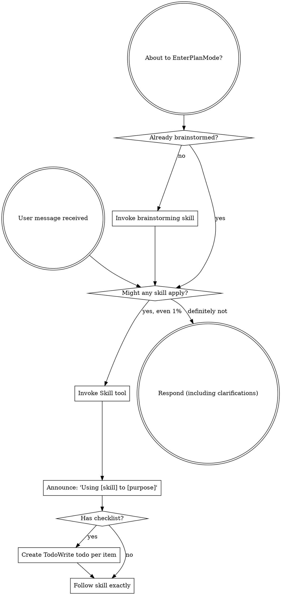
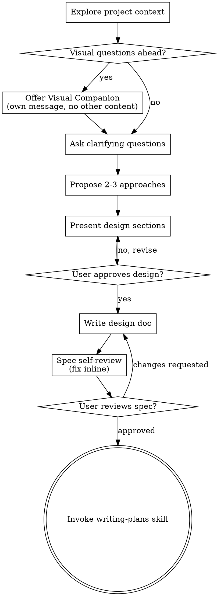
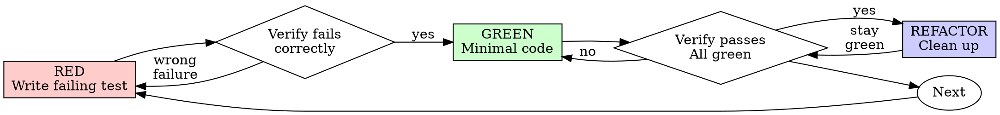
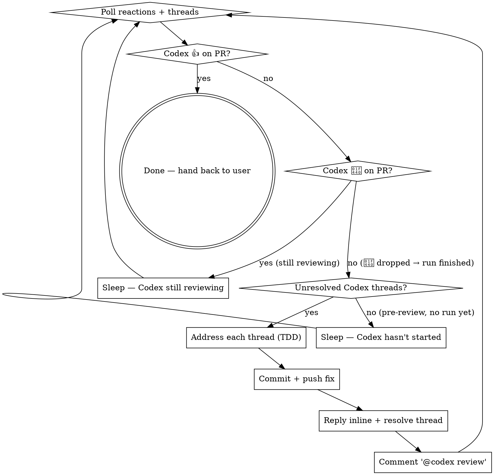

> SYSTEM

# AGENTS.md instructions for /Users/ericson/.codex/worktrees/60fc/ars-ui

<INSTRUCTIONS>
## Approach
- Read existing files before writing. Don't re-read unless changed.
- Thorough in reasoning, concise in output.
- Skip files over 100KB unless required.
- No sycophantic openers or closing fluff.
- No emojis or em-dashes.
- Do not guess APIs, versions, flags, commit SHAs, or package names. Verify by reading code or docs before asserting.

--- project-doc ---

# ars-ui

## Project Overview

Rust frontend component library using state machines, framework-agnostic core with Leptos/Dioxus adapters.

## Current Phase

The repo is now in active implementation, not spec drafting only.

Agents working on implementation should use the GitHub Project roadmap and issue backlog as the execution source of truth:

- Use the GitHub Project `ars-ui implementation roadmap` to understand active epics, task breakdown, dependencies, status, and iteration planning.
- Prefer picking a single issue-backed task that is unblocked, sized, and scoped for independent delivery.
- Do not start work from an epic issue unless the user explicitly asks for planning or further decomposition.
- Do not start a task that is blocked by unresolved GitHub issue dependencies.
- Treat native GitHub issue dependencies as the blocker graph and the issue body acceptance criteria as the delivery contract.

## Development Workflow

For implementation tasks:

1. Read the assigned or selected GitHub issue first.
2. Move the issue to **In Progress** on the GitHub Project board.
3. Review the cited spec sections and any dependency issues.
4. Add or update the named tests first.
5. Implement only the scope required to make those tests pass.
6. If implementation changes the intended contract, update the relevant spec in the same task.
7. **MANDATORY:** Invoke the `post-implementation-audit` skill (`.agents/skills/post-implementation-audit/SKILL.md`). It runs three sequential audits on the new code — (a) spec/implementation drift with "best outcome" recommendations, (b) iterative "anything else missing?" passes (minimum two rounds), (c) test-coverage audit across every test type the workspace uses (unit, snapshot, proptest, doc, spec-conformance, llvm-cov — mutation testing is **not** part of this gate; it is Nightly-CI-driven). **Every finding lands in _this_ PR — no deferral, no follow-up issues.** This step exists because initial implementations consistently ship spec drift and silent contract violations that take 3+ review round-trips to surface; the audit collapses them into one. Skipping this step is a contract violation.
8. Present the final result for user review before any commit.
9. After user approval, run `cargo xci --profile fast` (alias: `cargo xci-fast`) locally and fix any failures before pushing anything to GitHub. The fast profile covers the workspace-level regressions a pre-push gate should catch: fmt, clippy, unit, integration, adapter, spec-compile-snippets, error-variant-coverage, mutual-exclusion, snapshot-count, and a **native-only coverage check** (`coverage-native`) that enforces the thresholds of the crates whose CI coverage is native-only (the agnostic library crates + xtask) — so `ars-components`-style coverage regressions surface before push, not on CI. The native coverage check adds an instrumented rebuild, so the fast profile runs in roughly 10–15 minutes. Reserve full `cargo xci` (~25 minutes, all 20 gates including the wasm coverage + CRAP gate and the feature-matrix groups) for after substantial refactors that may have shifted feature-flag interactions. For small follow-up changes, run the focused tests and checks that cover the edited code instead. To run only the coverage check, use `cargo xcov` (native-only) or `cargo xcov --full` (mirrors CI; needs the wasm toolchain + clang-22).
10. After `cargo xci-fast` passes, commit and push a PR targeting `main`. The PR body MUST include an auto-close keyword for the issue being delivered, for example `Closes #20` or `Fixes #20`, so GitHub closes the issue automatically when the PR merges.
11. **If the PR creates or modifies any `.snap` insta fixtures, attach the `snapshot-reviewed` label after opening or updating it** (`gh pr edit <num> --add-label "snapshot-reviewed"`). This signals to reviewers that the snapshot output was inspected and is intentional. Re-apply the label whenever you push a commit that touches `.snap` files; the workflow assumes the label reflects the latest snapshot state.
12. **MANDATORY:** Invoke the `waiting-for-codex-review` skill (`.agents/skills/waiting-for-codex-review/SKILL.md`) immediately after the first push that creates the PR, and re-invoke it after every subsequent push to the PR branch. The skill posts the initial `@codex review` trigger, polls Codex's 👀 → (👍 \| ∅ + threads) reaction lifecycle, addresses any review threads with the same rigor as `post-implementation-audit` (TDD + no coverage regression), replies inline, resolves threads, and re-comments `@codex review` to start the next pass — looping until Codex leaves 👍. Skipping this step leaves Codex findings unaddressed and silently widens the gap between merged code and the spec; the merge gate is 👍 from Codex plus green CI, not green CI alone.
13. Only after CI passes, Codex has left 👍, and the PR is merged, close the issue.

Never close a GitHub issue without a merged PR that passes CI **and a 👍 from Codex**. Never commit or push without explicit user approval. Keep the issue, PR, and Project board status aligned with the actual work state at every step.

Default delivery rules:

- Follow TDD: tests first, implementation second, verification last.
- Keep task scope aligned with the issue. If the issue is too large or ambiguous, stop and split or clarify rather than freelancing a bigger change.
- Prefer tasks sized `1`, `2`, `3`, or `5` points. `8` is exceptional. `13` must be decomposed before implementation.
- Preserve the crate and dependency layering defined by the architecture and implementation plan.
- Do not add a new dependency crate without explicit user approval first. If a task appears to need a new crate, stop, explain why, and get approval before editing any `Cargo.toml`.
- When a task is complete, verify the exact tests and checks named by the issue before considering it done.
- For adapter-level component implementation, follow `docs/implementation/adapter-component-delivery.md`. Adapter component work must cover the adapter crate, adapter tests, E2E fixtures/harnesses when applicable, widgets examples, spec synchronization, and the required validation/audit loop in one PR.

### Code Quality Standards

- **Document all public items.** Every public struct, enum, trait, function, constant, type alias, method, field, and variant must have a `///` doc comment. Every `lib.rs` must have a `//!` crate-level doc comment. The workspace enforces `missing_docs` linting — undocumented public items are build failures.
- **Zero warnings policy.** All code must compile with zero warnings under the workspace's configured clippy and rustc lints. Fix the root cause instead of suppressing. When suppression is genuinely needed, use `#[expect(lint, reason = "...")]` — never `#[allow(...)]`.
- **Derive documentation from the spec.** Doc comments should describe the _purpose and semantics_ of the item as defined in the corresponding `spec/` files, not just restate the type signature.
- **Use `#[inline]` selectively, not mechanically.** Do **not** add Clippy's `missing_inline_in_public_items` lint at the workspace level, and do not treat public visibility alone as a reason to mark an item `#[inline]`. Use `#[inline]` for thin cross-crate wrappers, trivial accessors, and hot-path no-op shims where the call overhead is plausibly meaningful. Avoid blanket `#[inline]` on all public APIs — it increases code size, adds compile-time cost, and turns `#[inline]` into noise instead of a deliberate performance signal.
- **Use directory-backed modules with `mod.rs` when a module owns children.** This repo standardizes on the older filesystem layout for nested modules. If module `foo` has child modules, the parent must live at `foo/mod.rs`, not `foo.rs`. Do not mix `foo.rs` with a sibling `foo/` directory. When a refactor adds child modules under an existing flat file, move the parent into `foo/mod.rs` in the same change. Do not leave empty leftover module directories behind.

### API Design Standards

- **Design for the pit of success.** Public APIs should make the most natural, shortest path also be the path that is correct, accessible, localizable, type-safe, and performant. Prefer ergonomic constructors and defaults that preserve the spec's strongest guarantees instead of making users opt into correctness after choosing a convenient API.
- **Name escape hatches explicitly.** When a component needs a lower-level, static, non-i18n, or otherwise less complete path, keep it available but make the tradeoff visible in the API name or type. The blessed path should remain the simplest call site, while escape hatches should read as deliberate choices.
- **Keep semantic data separate from rendered views.** Rich framework views are useful for customization, but components still need semantic sources for accessible names, localized text, announcements, ids, and state-machine wiring. Do not rely on arbitrary rendered view trees as the only source of user-facing semantics.

### Code Coverage

The workspace uses `cargo-llvm-cov` for code coverage with per-crate threshold enforcement. CI runs coverage on every PR (see `.github/workflows/ci.yml`).

**Local coverage commands:**

```bash
# Fast native-only coverage gate — instruments + checks only the crates whose
# CI coverage is native-only (agnostic library crates + xtask). No wasm/clang
# toolchain needed; this is what the `fast` pre-push profile runs.
cargo xcov

# Full native+wasm coverage gate, mirroring CI (needs the wasm toolchain + clang-22)
cargo xcov --full

# Per-crate coverage with inline annotated source (most useful during development)
cargo llvm-cov test -p ars-interactions --text -- hover

# Per-crate summary only
cargo llvm-cov test -p ars-interactions -- hover

# Native-only workspace coverage (host target; excludes wasm-only crates)
cargo llvm-cov --workspace \
  --exclude ars-leptos --exclude ars-dioxus \
  --exclude ars-test-harness-leptos --exclude ars-test-harness-dioxus \
  --exclude ars-derive --exclude xtask \
  --lcov --output-path lcov.info

# Check all crates against spec-defined thresholds (run after a *merged* lcov)
cargo xtask coverage check-all --file lcov.info
```

The `--text` flag produces line-by-line annotated source showing hit counts and `^0` markers on uncovered branches — use this to identify gaps after writing tests. Uncovered no-op callback closures in tests (e.g., `|_| {}`) are expected and not a gap.

The local recipe above excludes the adapter and adapter-test-harness crates because their `target_arch = "wasm32"` / `feature = "web"` code paths can't be measured via host-target `cargo llvm-cov`. **CI runs an additional wasm-coverage pipeline on nightly** (`cargo xtask ci coverage`) that uses `wasm-bindgen-test`'s experimental coverage recipe with LLVM 22 / `clang-22` to emit lcov for `ars-leptos` (csr), `ars-dioxus` (web), `ars-dom` (web), `ars-i18n` (web-intl), and the adapter test harnesses, then merges with the native lcov via `cargo xtask coverage merge`. The per-crate thresholds in `xtask::coverage::default_thresholds()` are enforced against the merged file — including adapter targets (`ars-leptos` 74/55, `ars-dioxus` 77/70, `ars-test-harness-leptos` 60/0, `ars-test-harness-dioxus` 60/0). `ars-derive` (proc-macro, runs in compiler) is exercised via `crates/ars-core/tests/derive_contract.rs` and is unmeasured. `xtask` has its own enforced threshold (30/35) and is measured. See `spec/testing/14-ci.md` §2 for the full pipeline.

### CRAP Gate (complexity vs. coverage)

Coverage tells you which lines run; mutation testing tells you whether tests would notice misbehaviour. The **CRAP gate** ([`cargo-crap`](https://crates.io/crates/cargo-crap)) tells you which functions are _risky to change_ — high cyclomatic complexity combined with low coverage. The CRAP score is `complexity² · (1 − coverage)³ + complexity`.

**Why regression mode, not an absolute threshold.** At 100% coverage `CRAP == cyclomatic complexity`, so an absolute `--fail-above` threshold rejects every large `match` no matter how well it is tested. This workspace is built on state machines: each stateful component's `Machine::transition` is intrinsically a wide `match (state, event)` (complexity 30–80) and is exhaustively tested. An absolute gate would fight that architecture and reject more components as the catalog grows. The gate therefore runs in **regression mode**.

- **Blessed entrypoints:** `cargo xcrap` (local human-readable report, never fails), `cargo xcrap --update-baseline` (regenerate the baseline), and `cargo xtask ci crap` (the CI gate). The gate is the last step of the full `cargo xci` pipeline, running immediately after `coverage` and reusing its merged `lcov.info` (no recompile). It is **not** in the fast profile: the fast profile runs only the native-only `coverage-native` check, which does not produce the merged `lcov.info` the CRAP gate compares against.
- **Policy:** `cargo crap --path . --lcov lcov.info --baseline .crap-baseline.json --fail-regression --min 30 --exclude 'target/**' --exclude 'examples/**' --exclude 'xtask/**' --exclude 'crates/ars-e2e/**' --exclude 'crates/ars-derive/**'`. The gate scopes to the **shipped component library** — tooling (`xtask`), the browser E2E harness (`ars-e2e`), the proc-macro crate, demos, and build output are excluded (they are not shipped surface, and several run uninstrumented-as-tooling on CI → 0% → spurious CRAP). The gate fails only when a function **at or above CRAP 30 regresses** (more complexity or less coverage) versus the committed baseline. New functions are tolerated — the per-crate coverage thresholds already ensure new code is tested — and sub-threshold churn on simple functions is ignored. Net: the coverage gate guarantees new code is tested; the CRAP gate guarantees shipped code does not rot.
- **`--path .`, not `--workspace`.** cargo-crap's regression key is `(file, function, line)`, and `--workspace` records machine-absolute file paths (`/Users/…` locally, `/home/runner/…` on CI). A baseline committed with absolute paths never matches on CI, silently turning the gate into a no-op. `--path .` emits repo-relative paths (`./crates/…`) that match on any checkout; coverage still associates correctly because cargo-crap canonicalizes paths when reading the lcov. `--exclude` is honored under `--path` (it is a no-op under `--workspace`), so `target/**` and the unmeasured `crates/ars-derive/**` are skipped there. Because the key includes the line number, a baseline only matches non-uniquely-named functions (e.g. `Machine::transition`) while their line numbers are stable; regenerate the baseline when a tracked file's lines shift materially.
- **Baseline:** `.crap-baseline.json` at the repo root is committed and complete (every function, no `--min`, so a function crossing the threshold is still caught). Regenerate it with `cargo xcrap --update-baseline` from CI's merged `lcov.info` (download the `coverage-lcov` artifact) whenever a **deliberate** complexity increase lands; commit the new baseline in that PR — a conscious "I accept this" checkpoint. cargo-crap's `--epsilon` (default 0.01) absorbs coverage float jitter. If the baseline is missing, the gate bootstraps it and passes with a notice.
- **Pinned version:** cargo-crap is pinned to an exact version in `xtask::crap::CARGO_CRAP_VERSION` and `.github/workflows/ci.yml` (same convention as cargo-mutants). To bump, update both. Install locally with `cargo install cargo-crap --locked --version <version>` (or `cargo binstall cargo-crap`).
- **Scope / escape hatch:** the exclude-glob list lives in `xtask/src/crap.rs` (`EXCLUDE_GLOBS`), each entry justified by a comment, and scopes the gate to the **shipped component library**. Because the gate runs under `--path .`, cargo-crap's `--exclude` is honored, so build output (`target/**`), demos (`examples/**`), the task runner (`xtask/**`), the browser E2E harness (`crates/ars-e2e/**`), and the proc-macro crate (`crates/ars-derive/**`) are skipped at walk time. The last three are not shipped library code and run uninstrumented-as-tooling on CI (0% coverage → spurious CRAP), so gating them is meaningless. Prefer fixing or refactoring over adding entries. (Note: the per-crate **coverage** gate still measures `xtask` at its own loose 30/35 threshold — that is separate from CRAP.)

### Mutation Testing

Coverage tells you which lines run. **Mutation testing tells you whether the tests would notice if those lines silently misbehaved.** The workspace uses [`cargo-mutants`](https://mutants.rs) for this — a `cargo` extension binary, not a workspace dependency.

**Install (once per developer machine):**

```bash
cargo install cargo-mutants --locked --version 27.0.0
```

**Local commands (state-machine modules are the most rewarding targets):**

Prefer `cargo xmutants` over bare `cargo mutants` — it applies the same
per-crate `--features` profile as Nightly CI (for example
`ars-components/i18n`) so snapshot and i18n-gated tests match CI.

```bash
# Run on a single component machine (~6 min for popover)
cargo xmutants -p ars-components -f crates/ars-components/src/overlay/popover/mod.rs

# Just list what would be mutated, without running tests (fast)
cargo xmutants -p ars-components -f crates/ars-components/src/overlay/popover/mod.rs --list

# Whole crate (slow — only if you really mean it)
cargo xmutants -p ars-components
```

**Agnostic component implementation gate:** whenever an agent implements a new framework-agnostic component, or materially changes an existing one, the delivery must include:

- spec-conformance tests for the component's anatomy/public contract, including its `Part` enum and required API/attribute surface;
- the full test breadth the component warrants (unit, snapshot, proptest) with strong line/branch coverage.

**Mutation testing is NOT a pre-PR requisite for agnostic component work.** Do not run a targeted `cargo xmutants` pass as a delivery/audit gate, and do not block a PR on a clean local mutation run. Surviving (`MISSED`) mutants are surfaced by the Nightly CI `mutation-testing` job (see below); triage them — add tests for real gaps, or add a justified line-agnostic `.cargo/mutants.toml` exclude for true equivalent mutations — in a dedicated follow-up when Nightly reports them, not during initial component delivery. (Running a local mutation pass voluntarily is fine, but it is never required and never blocks delivery or review.)

**Reading the output:** Results land in `mutants.out/mutants.out/` (gitignored). The two files that matter:

- `caught.txt` — mutations that broke at least one test ✅
- `missed.txt` — mutations that survived all tests ❌ — each one is either a real test gap to fill or an "equivalent mutation" that needs a `[[skip]]` entry in `mutants.toml` with a justification

**CI integration:** Nightly only. `.github/workflows/nightly.yml` has a `mutation-testing` job with a 21-entry matrix that runs `cargo mutants -p <package>` on every framework-agnostic crate, using `--shard k/n` to spread larger crates across parallel runners. **Shard indices are 0-based** (`k` runs from `0` to `n-1`); `k == n` is invalid and will fail the job. When adding shards, always start at `0/n` and end at `(n-1)/n`.

- **`ars-components` (≈ 1,630 mutants today, planned to grow as the spec adds the remaining ~97 components):** sharded **12-way** → ≈ 135 mutants per runner today, ≈ 850 per runner at the ~10,000-mutant endpoint. Sized for the full spec catalog up front so we don't re-shard every few months as components land.
- **`ars-collections` (≈ 1,080 mutants):** sharded 4-way → ≈ 270 mutants per runner.
- **`ars-core` (≈ 700 mutants):** sharded 2-way → ≈ 350 mutants per runner.
- **`ars-a11y`, `ars-forms`, `ars-interactions`:** one runner each (under 600 mutants apiece).

**Adding a new state machine inside an existing crate requires no CI changes** — its mutations land in whichever shard the cargo-mutants partitioner places them. The shard counts are sized so the slowest runner stays well under 30 minutes today and under ~50 minutes at the planned endpoint; re-balance only when a crate outgrows that budget (visible on the nightly dashboard as one shard pulling away from the others).

All matrix jobs run with `fail-fast: false` so failures on one module don't mask data on another. Each job uploads its `mutants.out/` as a workflow artifact (always, even on success — surviving "missed" entries on a passing run still reveal test-quality work). The job fails if any mutation survives, so a missed mutation forces a deliberate triage decision (fix the test, or document the equivalence with a `[[skip]]` entry in `mutants.toml`).

**Excluded crates** (mutation testing's signal degrades wherever determinism does): adapter glue (`ars-leptos`, `ars-dioxus`), DOM/FFI (`ars-dom`), ICU/FFI (`ars-i18n`), test infrastructure (`ars-test-harness*`), and the proc-macro crate (`ars-derive`, runs in the compiler). Adding a brand-new crate that is a good mutation target requires one new matrix entry; run a local scout first (`cargo mutants -p <crate> --list` to size, then a real run) so we know the right shard count before the nightly fires.

**Bumping the pinned version.** Both the local install command above and `.github/workflows/nightly.yml` pin cargo-mutants to an exact version (currently `27.0.0`) — same convention as `wasm-pack` in the `a11y-audit` job. Pinning is deliberate: cargo-mutants ships new mutators in releases, and an unpinned install would silently change the mutation set without any code change, surfacing as phantom CI failures on a green-source repo. To bump, open a PR that (1) updates the version string in CLAUDE.md and `nightly.yml`, (2) runs the popover scout locally with the new version (`cargo mutants -p ars-components -f crates/ars-components/src/overlay/popover/mod.rs`) to confirm the mutation count is in the same ballpark, and (3) triages any new "missed" entries the new mutators surface — they are usually genuine test-quality gaps newly visible to the tool.

### Property Testing (proptest)

State-machine invariants are exercised by [`proptest`](https://docs.rs/proptest) under `crates/<crate>/tests/proptest_state_machines/` (see `ars-components`). Default proptest behaviour drops `*.proptest-regressions` seed files alongside test sources — instead, every `proptest!` block in this workspace pulls a shared `Config` from `tests/proptest_state_machines/common.rs` that:

1. Reads `PROPTEST_CASES` from the environment (1,000 default; 10,000 in the nightly `extended-proptest` job).
2. Sets `failure_persistence` to `FileFailurePersistence::Direct("proptest-regressions/state-machines.txt")`, so all persisted seeds for the test binary live in one file at the crate root: `crates/<crate>/proptest-regressions/state-machines.txt`. The directory is committed (per proptest's own recommendation in the file header) so every developer's runs benefit from previously-shrunk failures.

When a new crate adopts proptest for state-machine tests, copy the same `common.rs` helper and reference it via `#![proptest_config(super::common::proptest_config())]` inside every `proptest!` block. Don't let proptest fall back to its `WithSource` default — that scatters seed files across the source tree.

### Adapter Prelude Convention

Both `ars-leptos` and `ars-dioxus` expose a `prelude` module targeting **end users** — application developers who consume the ready-made components. `use ars_leptos::prelude::*` (or `use ars_dioxus::prelude::*`) should give them everything they need.

The prelude contains only user-facing items:

1. **Component modules** — as components land, their public module paths (e.g., `button`, `dialog`) are re-exported so users can write `button::Props`, etc.
2. **User-facing traits** — traits end users call on component outputs (e.g., `Translate` from `ars-i18n`). Re-export the trait so consumers don't need a direct dependency on the subsystem crate.
3. **Configuration types** — types that appear in component props or configure behaviour (e.g., `Locale`, `Direction`, `Orientation`, `Selection`).

The prelude does **not** include implementation details consumed only by component authors inside the adapter crate: core engine types (`Machine`, `Service`, `ConnectApi`, `AttrMap`), accessibility primitives (`AriaRole`, `AriaAttribute`), interaction helpers (`merge_attrs`), or adapter hooks (`use_machine`, `UseMachineReturn`). Those remain accessible via their normal crate paths for advanced users building custom machines.

Both adapter preludes must stay symmetric: same items, same structure. When adding a new re-export to one adapter's prelude, add it to the other as well in the same PR.

### Adapter Testing Convention

Adapter-level component tests should default to the framework-specific test harness crate:

- Leptos adapter tests should prefer `ars-test-harness-leptos`.
- Dioxus adapter tests should prefer `ars-test-harness-dioxus`.
- Shared `ars-test-harness` helpers should be used where relevant for viewport, layout, clipboard, drag/drop, timing, and other DOM test setup instead of bespoke per-test browser scaffolding.

When a component spec requires interaction, focus, overlay positioning, clipboard, file upload, drag/drop, or similar browser behavior, the task's tests should exercise that behavior through the adapter harness entrypoints and shared core harness helpers unless there is a concrete technical reason not to.

## Spec Synchronization During Implementation

The specification is the authoritative contract. It took weeks of deliberate design and MUST be followed.

### Spec-first implementation rule

Before implementing any public type, trait, function, or method:

1. **Read the spec section first.** Find the relevant code example in `spec/`. Use `spec-tool toc <file>` and `grep` to locate it.
2. **Match the spec exactly.** If the spec defines `struct ComponentIds { base: String }` with methods `from_id()`, `id()`, `part()`, `item()`, `item_part()` — implement exactly that. Do not invent alternative field names, method names, or signatures.
3. **Cross-check after implementation.** Before presenting code for review, diff every public item against the spec's code examples. Every struct field, every method name, every parameter must match.
4. **If you must deviate**, there must be a concrete technical reason (e.g., the spec's API cannot compile, or a dependency doesn't expose the needed type). Document the reason in a code comment and flag it to the user explicitly.

Inventing alternative APIs that "seem equivalent" is never acceptable — it silently invalidates the spec's design decisions and all downstream code that depends on those APIs.

### Spec/code mismatch resolution

- If code and spec disagree, resolve the mismatch in the same task or PR.
- Shared conceptual changes belong in shared or foundation spec files, not only in adapter code.
- Adapter-specific findings must be reflected back into `spec/foundation/08-adapter-leptos.md` and/or `spec/foundation/09-adapter-dioxus.md` when relevant.
- Do not leave spec drift behind as follow-up cleanup.

## Spec Structure

The specification lives in `spec/` with this layout:

- `spec/manifest.toml` — **START HERE** — central index of all components and their dependencies
- `spec/foundation/` — architecture, accessibility, i18n, interactions, forms, adapters, spec template (00-10)
- `spec/shared/` — cross-component shared types (date-time, selection, layout, z-index)
- `spec/components/{category}/` — one file per component, organized by category
- `spec/testing/` — test specs split by domain

### Component Categories

- `input/` — checkbox, text-field, slider, number-input, etc.
- `selection/` — select, combobox, listbox, menu, tags-input, etc.
- `overlay/` — dialog, popover, tooltip, toast, presence, etc.
- `navigation/` — accordion, tabs, tree-view, pagination, steps, etc.
- `date-time/` — date-field, time-field, calendar, date-picker, etc.
- `data-display/` — table, avatar, progress, meter, badge, etc.
- `layout/` — splitter, scroll-area, carousel, portal, toolbar, etc.
- `specialized/` — color-picker, file-upload, signature-pad, qr-code, etc.
- `utility/` — button, toggle, focus-scope, visually-hidden, separator, etc.

## Working with the Spec

When reading large files, run `wc -l` first to check the line count. If the file is over 2,000
lines, use the `offset` and `limit` parameters on the Read tool to read in chunks rather than
attempting to read the entire file at once.

### Using xtask spec (preferred)

Use `cargo xtask spec` to resolve file sets instead of manually parsing manifest.toml:

```bash
# Quick metadata lookup:
cargo xtask spec info <component>

# Find all components using a shared type:
cargo xtask spec reverse <shared-type>

# See a file's heading structure (with line numbers):
cargo xtask spec toc <file>

# Validate frontmatter matches manifest.toml:
cargo xtask spec validate

# Search spec content by keyword/regex (with optional filters):
cargo xtask spec search <query> [--category <cat>] [--section <sec>] [--tier <tier>]

# Get a compact component summary (states, events, props, accessibility):
cargo xtask spec digest <component>

# Get full implementation context (component + all deps concatenated):
cargo xtask spec context <component> [--framework <fw>] [--include-testing]
```

The xtask also runs as an MCP server (`cargo xtask mcp`) exposing all spec tools for LLM agents.

### Reading a component (manual fallback)

1. Read `spec/manifest.toml` to find the component's path and dependencies
2. Read the component file (has YAML frontmatter listing its foundation/shared deps)
3. Only load the foundation files listed in `foundation_deps` — not all of them

### Framework and library specs — MANDATORY skill loading

When reading or editing these specification files, you MUST load the corresponding skill BEFORE doing any work. The skills contain verified, version-accurate API documentation that the spec code examples depend on. Claude's training data is wrong for these libraries — do not trust it.

| Spec file                                    | Skill to load | Library version |
| -------------------------------------------- | ------------- | --------------- |
| `spec/foundation/04-internationalization.md` | `icu4x`       | ICU4X 2.1.1     |
| `spec/foundation/08-adapter-leptos.md`       | `leptos`      | Leptos 0.8.17   |
| `spec/foundation/09-adapter-dioxus.md`       | `dioxus`      | Dioxus 0.7.3    |

This applies to any task that touches adapter code: reviewing, writing, modifying, or answering questions about these files. Load the skill first, then proceed.

### Spec Conventions

- **No deprecation:** This is a greenfield spec. If an API is unused or redundant, remove it and fix all references. Never use `#[deprecated]` or deprecation shims.
- **No deferral:** Never mark spec content as "TODO", "FIXME", "future enhancement", "P1/P2 extension", or any similar deferral language. Every feature mentioned must be fully specified. If a design choice is unclear, ask the user rather than deferring.
- **No guessing external APIs:** NEVER guess function names or module paths for external crates. Always verify against `https://docs.rs/<crate_name>` before writing code that calls library APIs. This applies especially to Leptos, Dioxus, ICU4X, and any crate where training data may be stale. If you cannot verify, state that explicitly rather than fabricating a plausible-looking API.

### Component file format

Each component file has YAML frontmatter declaring its metadata:

```markdown
---
component: ComponentName
category: { category }
tier: stateless | stateful | complex
foundation_deps: [architecture, accessibility, ...]
shared_deps: [date-time-types, ...]
related: [sibling-component, ...]
---

# ComponentName
```

The `tier` field determines which sections are required — see `spec/foundation/10-component-spec-template.md` for the canonical section structure, ordering rules, and conformance checklist. Headings are numbered (e.g., `## 1. State Machine`, `### 1.1 States`, `#### 1.1.1 InnerStates`, etc.) for precise section references.

</INSTRUCTIONS>
<environment_context>
  <cwd>/Users/ericson/.codex/worktrees/60fc/ars-ui</cwd>
  <shell>zsh</shell>
  <current_date>2026-05-31</current_date>
  <timezone>America/Sao_Paulo</timezone>
</environment_context>

> DEVELOPER

Implement task #232

> AGENT

I’ll first ground this in the live issue and repo state, then I’ll turn that into an implementation plan. We’re still in Plan Mode, so I won’t edit files or move project state yet.

> TOOL

tool_use exec_command
id: call_OYMR6LgToZBxF1QPruf56q2A
```json
{
  "cmd": "sed -n '1,220p' /Users/ericson/.claude/skills/using-superpowers/SKILL.md",
  "workdir": "/Users/ericson/.codex/worktrees/60fc/ars-ui",
  "yield_time_ms": 1000,
  "max_output_tokens": 12000
}
```

> TOOL

tool_use exec_command
id: call_NBC3WHMQEiYgpGs2uP6syP5l
```json
{
  "cmd": "sed -n '1,220p' /Users/ericson/.claude/skills/writing-plans/SKILL.md",
  "workdir": "/Users/ericson/.codex/worktrees/60fc/ars-ui",
  "yield_time_ms": 1000,
  "max_output_tokens": 12000
}
```

> TOOL

tool_use exec_command
id: call_wgXkI76U8MwopiQ3PYOp4stS
```json
{
  "cmd": "rg -n \"#232|issue #232|232|ColorPicker|color-picker|color picker\" /Users/ericson/.codex/memories/MEMORY.md",
  "workdir": "/Users/ericson/.codex/worktrees/60fc/ars-ui",
  "yield_time_ms": 1000,
  "max_output_tokens": 12000
}
```

> TOOL

tool_result
id: call_OYMR6LgToZBxF1QPruf56q2A
```
Chunk ID: c746c4
Wall time: 0.4563 seconds
Process exited with code 0
Original token count: 1356
Output:
---
name: using-superpowers
description: Use when starting any conversation - establishes how to find and use skills, requiring Skill tool invocation before ANY response including clarifying questions
---

<SUBAGENT-STOP>
If you were dispatched as a subagent to execute a specific task, skip this skill.
</SUBAGENT-STOP>

<EXTREMELY-IMPORTANT>
If you think there is even a 1% chance a skill might apply to what you are doing, you ABSOLUTELY MUST invoke the skill.

IF A SKILL APPLIES TO YOUR TASK, YOU DO NOT HAVE A CHOICE. YOU MUST USE IT.

This is not negotiable. This is not optional. You cannot rationalize your way out of this.
</EXTREMELY-IMPORTANT>

## Instruction Priority

Superpowers skills override default system prompt behavior, but **user instructions always take precedence**:

1. **User's explicit instructions** (CLAUDE.md, GEMINI.md, AGENTS.md, direct requests) — highest priority
2. **Superpowers skills** — override default system behavior where they conflict
3. **Default system prompt** — lowest priority

If CLAUDE.md, GEMINI.md, or AGENTS.md says "don't use TDD" and a skill says "always use TDD," follow the user's instructions. The user is in control.

## How to Access Skills

**In Claude Code:** Use the `Skill` tool. When you invoke a skill, its content is loaded and presented to you—follow it directly. Never use the Read tool on skill files.

**In Copilot CLI:** Use the `skill` tool. Skills are auto-discovered from installed plugins. The `skill` tool works the same as Claude Code's `Skill` tool.

**In Gemini CLI:** Skills activate via the `activate_skill` tool. Gemini loads skill metadata at session start and activates the full content on demand.

**In other environments:** Check your platform's documentation for how skills are loaded.

## Platform Adaptation

Skills use Claude Code tool names. Non-CC platforms: see `references/copilot-tools.md` (Copilot CLI), `references/codex-tools.md` (Codex) for tool equivalents. Gemini CLI users get the tool mapping loaded automatically via GEMINI.md.

# Using Skills

## The Rule

**Invoke relevant or requested skills BEFORE any response or action.** Even a 1% chance a skill might apply means that you should invoke the skill to check. If an invoked skill turns out to be wrong for the situation, you don't need to use it.



## Red Flags

These thoughts mean STOP—you're rationalizing:

| Thought | Reality |
|---------|---------|
| "This is just a simple question" | Questions are tasks. Check for skills. |
| "I need more context first" | Skill check comes BEFORE clarifying questions. |
| "Let me explore the codebase first" | Skills tell you HOW to explore. Check first. |
| "I can check git/files quickly" | Files lack conversation context. Check for skills. |
| "Let me gather information first" | Skills tell you HOW to gather information. |
| "This doesn't need a formal skill" | If a skill exists, use it. |
| "I remember this skill" | Skills evolve. Read current version. |
| "This doesn't count as a task" | Action = task. Check for skills. |
| "The skill is overkill" | Simple things become complex. Use it. |
| "I'll just do this one thing first" | Check BEFORE doing anything. |
| "This feels productive" | Undisciplined action wastes time. Skills prevent this. |
| "I know what that means" | Knowing the concept ≠ using the skill. Invoke it. |

## Skill Priority

When multiple skills could apply, use this order:

1. **Process skills first** (brainstorming, debugging) - these determine HOW to approach the task
2. **Implementation skills second** (frontend-design, mcp-builder) - these guide execution

"Let's build X" → brainstorming first, then implementation skills.
"Fix this bug" → debugging first, then domain-specific skills.

## Skill Types

**Rigid** (TDD, debugging): Follow exactly. Don't adapt away discipline.

**Flexible** (patterns): Adapt principles to context.

The skill itself tells you which.

## User Instructions

Instructions say WHAT, not HOW. "Add X" or "Fix Y" doesn't mean skip workflows.

```

> TOOL

tool_result
id: call_NBC3WHMQEiYgpGs2uP6syP5l
```
Chunk ID: 054ec5
Wall time: 0.0902 seconds
Process exited with code 0
Original token count: 1512
Output:
---
name: writing-plans
description: Use when you have a spec or requirements for a multi-step task, before touching code
---

# Writing Plans

## Overview

Write comprehensive implementation plans assuming the engineer has zero context for our codebase and questionable taste. Document everything they need to know: which files to touch for each task, code, testing, docs they might need to check, how to test it. Give them the whole plan as bite-sized tasks. DRY. YAGNI. TDD. Frequent commits.

Assume they are a skilled developer, but know almost nothing about our toolset or problem domain. Assume they don't know good test design very well.

**Announce at start:** "I'm using the writing-plans skill to create the implementation plan."

**Context:** This should be run in a dedicated worktree (created by brainstorming skill).

**Save plans to:** `docs/superpowers/plans/YYYY-MM-DD-<feature-name>.md`
- (User preferences for plan location override this default)

## Scope Check

If the spec covers multiple independent subsystems, it should have been broken into sub-project specs during brainstorming. If it wasn't, suggest breaking this into separate plans — one per subsystem. Each plan should produce working, testable software on its own.

## File Structure

Before defining tasks, map out which files will be created or modified and what each one is responsible for. This is where decomposition decisions get locked in.

- Design units with clear boundaries and well-defined interfaces. Each file should have one clear responsibility.
- You reason best about code you can hold in context at once, and your edits are more reliable when files are focused. Prefer smaller, focused files over large ones that do too much.
- Files that change together should live together. Split by responsibility, not by technical layer.
- In existing codebases, follow established patterns. If the codebase uses large files, don't unilaterally restructure - but if a file you're modifying has grown unwieldy, including a split in the plan is reasonable.

This structure informs the task decomposition. Each task should produce self-contained changes that make sense independently.

## Bite-Sized Task Granularity

**Each step is one action (2-5 minutes):**
- "Write the failing test" - step
- "Run it to make sure it fails" - step
- "Implement the minimal code to make the test pass" - step
- "Run the tests and make sure they pass" - step
- "Commit" - step

## Plan Document Header

**Every plan MUST start with this header:**

```markdown
# [Feature Name] Implementation Plan

> **For agentic workers:** REQUIRED SUB-SKILL: Use superpowers:subagent-driven-development (recommended) or superpowers:executing-plans to implement this plan task-by-task. Steps use checkbox (`- [ ]`) syntax for tracking.

**Goal:** [One sentence describing what this builds]

**Architecture:** [2-3 sentences about approach]

**Tech Stack:** [Key technologies/libraries]

---
```

## Task Structure

````markdown
### Task N: [Component Name]

**Files:**
- Create: `exact/path/to/file.py`
- Modify: `exact/path/to/existing.py:123-145`
- Test: `tests/exact/path/to/test.py`

- [ ] **Step 1: Write the failing test**

```python
def test_specific_behavior():
    result = function(input)
    assert result == expected
```

- [ ] **Step 2: Run test to verify it fails**

Run: `pytest tests/path/test.py::test_name -v`
Expected: FAIL with "function not defined"

- [ ] **Step 3: Write minimal implementation**

```python
def function(input):
    return expected
```

- [ ] **Step 4: Run test to verify it passes**

Run: `pytest tests/path/test.py::test_name -v`
Expected: PASS

- [ ] **Step 5: Commit**

```bash
git add tests/path/test.py src/path/file.py
git commit -m "feat: add specific feature"
```
````

## No Placeholders

Every step must contain the actual content an engineer needs. These are **plan failures** — never write them:
- "TBD", "TODO", "implement later", "fill in details"
- "Add appropriate error handling" / "add validation" / "handle edge cases"
- "Write tests for the above" (without actual test code)
- "Similar to Task N" (repeat the code — the engineer may be reading tasks out of order)
- Steps that describe what to do without showing how (code blocks required for code steps)
- References to types, functions, or methods not defined in any task

## Remember
- Exact file paths always
- Complete code in every step — if a step changes code, show the code
- Exact commands with expected output
- DRY, YAGNI, TDD, frequent commits

## Self-Review

After writing the complete plan, look at the spec with fresh eyes and check the plan against it. This is a checklist you run yourself — not a subagent dispatch.

**1. Spec coverage:** Skim each section/requirement in the spec. Can you point to a task that implements it? List any gaps.

**2. Placeholder scan:** Search your plan for red flags — any of the patterns from the "No Placeholders" section above. Fix them.

**3. Type consistency:** Do the types, method signatures, and property names you used in later tasks match what you defined in earlier tasks? A function called `clearLayers()` in Task 3 but `clearFullLayers()` in Task 7 is a bug.

If you find issues, fix them inline. No need to re-review — just fix and move on. If you find a spec requirement with no task, add the task.

## Execution Handoff

After saving the plan, offer execution choice:

**"Plan complete and saved to `docs/superpowers/plans/<filename>.md`. Two execution options:**

**1. Subagent-Driven (recommended)** - I dispatch a fresh subagent per task, review between tasks, fast iteration

**2. Inline Execution** - Execute tasks in this session using executing-plans, batch execution with checkpoints

**Which approach?"**

**If Subagent-Driven chosen:**
- **REQUIRED SUB-SKILL:** Use superpowers:subagent-driven-development
- Fresh subagent per task + two-stage review

**If Inline Execution chosen:**
- **REQUIRED SUB-SKILL:** Use superpowers:executing-plans
- Batch execution with checkpoints for review

```

> TOOL

tool_result
id: call_wgXkI76U8MwopiQ3PYOp4stS
```
Chunk ID: 86495a
Wall time: 0.4639 seconds
Process exited with code 1
Original token count: 0
Output:

```

> AGENT

I’m using the writing-plans skill to create the implementation plan. I’m also checking the issue and the component/spec surface directly so the plan follows the task contract rather than relying on assumptions.

> TOOL

tool_use exec_command
id: call_7HnaTbzWIMQ30elXexdKdbze
```json
{
  "cmd": "sed -n '1,220p' /Users/ericson/.claude/skills/brainstorming/SKILL.md",
  "workdir": "/Users/ericson/.codex/worktrees/60fc/ars-ui",
  "yield_time_ms": 1000,
  "max_output_tokens": 12000
}
```

> TOOL

tool_use exec_command
id: call_M63nRuj3OJZJorttSHcwsSMF
```json
{
  "cmd": "sed -n '1,220p' /Users/ericson/.codex/plugins/cache/openai-curated/github/fef63ecf/skills/github/SKILL.md",
  "workdir": "/Users/ericson/.codex/worktrees/60fc/ars-ui",
  "yield_time_ms": 1000,
  "max_output_tokens": 12000
}
```

> TOOL

tool_use exec_command
id: call_IlbZLdR8bOOvfv2TjefAESL7
```json
{
  "cmd": "gh issue view 232 --json number,title,body,state,labels,assignees,milestone,projectItems,url",
  "workdir": "/Users/ericson/.codex/worktrees/60fc/ars-ui",
  "yield_time_ms": 1000,
  "max_output_tokens": 20000
}
```

> TOOL

tool_use exec_command
id: call_qibGBs0w4sdoQFkDPSSe4cbf
```json
{
  "cmd": "git status --short",
  "workdir": "/Users/ericson/.codex/worktrees/60fc/ars-ui",
  "yield_time_ms": 1000,
  "max_output_tokens": 12000
}
```

> TOOL

tool_result
id: call_7HnaTbzWIMQ30elXexdKdbze
```
Chunk ID: 8afad0
Wall time: 0.1612 seconds
Process exited with code 0
Original token count: 2659
Output:
---
name: brainstorming
description: "You MUST use this before any creative work - creating features, building components, adding functionality, or modifying behavior. Explores user intent, requirements and design before implementation."
---

# Brainstorming Ideas Into Designs

Help turn ideas into fully formed designs and specs through natural collaborative dialogue.

Start by understanding the current project context, then ask questions one at a time to refine the idea. Once you understand what you're building, present the design and get user approval.

<HARD-GATE>
Do NOT invoke any implementation skill, write any code, scaffold any project, or take any implementation action until you have presented a design and the user has approved it. This applies to EVERY project regardless of perceived simplicity.
</HARD-GATE>

## Anti-Pattern: "This Is Too Simple To Need A Design"

Every project goes through this process. A todo list, a single-function utility, a config change — all of them. "Simple" projects are where unexamined assumptions cause the most wasted work. The design can be short (a few sentences for truly simple projects), but you MUST present it and get approval.

## Checklist

You MUST create a task for each of these items and complete them in order:

1. **Explore project context** — check files, docs, recent commits
2. **Offer visual companion** (if topic will involve visual questions) — this is its own message, not combined with a clarifying question. See the Visual Companion section below.
3. **Ask clarifying questions** — one at a time, understand purpose/constraints/success criteria
4. **Propose 2-3 approaches** — with trade-offs and your recommendation
5. **Present design** — in sections scaled to their complexity, get user approval after each section
6. **Write design doc** — save to `docs/superpowers/specs/YYYY-MM-DD-<topic>-design.md` and commit
7. **Spec self-review** — quick inline check for placeholders, contradictions, ambiguity, scope (see below)
8. **User reviews written spec** — ask user to review the spec file before proceeding
9. **Transition to implementation** — invoke writing-plans skill to create implementation plan

## Process Flow



**The terminal state is invoking writing-plans.** Do NOT invoke frontend-design, mcp-builder, or any other implementation skill. The ONLY skill you invoke after brainstorming is writing-plans.

## The Process

**Understanding the idea:**

- Check out the current project state first (files, docs, recent commits)
- Before asking detailed questions, assess scope: if the request describes multiple independent subsystems (e.g., "build a platform with chat, file storage, billing, and analytics"), flag this immediately. Don't spend questions refining details of a project that needs to be decomposed first.
- If the project is too large for a single spec, help the user decompose into sub-projects: what are the independent pieces, how do they relate, what order should they be built? Then brainstorm the first sub-project through the normal design flow. Each sub-project gets its own spec → plan → implementation cycle.
- For appropriately-scoped projects, ask questions one at a time to refine the idea
- Prefer multiple choice questions when possible, but open-ended is fine too
- Only one question per message - if a topic needs more exploration, break it into multiple questions
- Focus on understanding: purpose, constraints, success criteria

**Exploring approaches:**

- Propose 2-3 different approaches with trade-offs
- Present options conversationally with your recommendation and reasoning
- Lead with your recommended option and explain why

**Presenting the design:**

- Once you believe you understand what you're building, present the design
- Scale each section to its complexity: a few sentences if straightforward, up to 200-300 words if nuanced
- Ask after each section whether it looks right so far
- Cover: architecture, components, data flow, error handling, testing
- Be ready to go back and clarify if something doesn't make sense

**Design for isolation and clarity:**

- Break the system into smaller units that each have one clear purpose, communicate through well-defined interfaces, and can be understood and tested independently
- For each unit, you should be able to answer: what does it do, how do you use it, and what does it depend on?
- Can someone understand what a unit does without reading its internals? Can you change the internals without breaking consumers? If not, the boundaries need work.
- Smaller, well-bounded units are also easier for you to work with - you reason better about code you can hold in context at once, and your edits are more reliable when files are focused. When a file grows large, that's often a signal that it's doing too much.

**Working in existing codebases:**

- Explore the current structure before proposing changes. Follow existing patterns.
- Where existing code has problems that affect the work (e.g., a file that's grown too large, unclear boundaries, tangled responsibilities), include targeted improvements as part of the design - the way a good developer improves code they're working in.
- Don't propose unrelated refactoring. Stay focused on what serves the current goal.

## After the Design

**Documentation:**

- Write the validated design (spec) to `docs/superpowers/specs/YYYY-MM-DD-<topic>-design.md`
  - (User preferences for spec location override this default)
- Use elements-of-style:writing-clearly-and-concisely skill if available
- Commit the design document to git

**Spec Self-Review:**
After writing the spec document, look at it with fresh eyes:

1. **Placeholder scan:** Any "TBD", "TODO", incomplete sections, or vague requirements? Fix them.
2. **Internal consistency:** Do any sections contradict each other? Does the architecture match the feature descriptions?
3. **Scope check:** Is this focused enough for a single implementation plan, or does it need decomposition?
4. **Ambiguity check:** Could any requirement be interpreted two different ways? If so, pick one and make it explicit.

Fix any issues inline. No need to re-review — just fix and move on.

**User Review Gate:**
After the spec review loop passes, ask the user to review the written spec before proceeding:

> "Spec written and committed to `<path>`. Please review it and let me know if you want to make any changes before we start writing out the implementation plan."

Wait for the user's response. If they request changes, make them and re-run the spec review loop. Only proceed once the user approves.

**Implementation:**

- Invoke the writing-plans skill to create a detailed implementation plan
- Do NOT invoke any other skill. writing-plans is the next step.

## Key Principles

- **One question at a time** - Don't overwhelm with multiple questions
- **Multiple choice preferred** - Easier to answer than open-ended when possible
- **YAGNI ruthlessly** - Remove unnecessary features from all designs
- **Explore alternatives** - Always propose 2-3 approaches before settling
- **Incremental validation** - Present design, get approval before moving on
- **Be flexible** - Go back and clarify when something doesn't make sense

## Visual Companion

A browser-based companion for showing mockups, diagrams, and visual options during brainstorming. Available as a tool — not a mode. Accepting the companion means it's available for questions that benefit from visual treatment; it does NOT mean every question goes through the browser.

**Offering the companion:** When you anticipate that upcoming questions will involve visual content (mockups, layouts, diagrams), offer it once for consent:
> "Some of what we're working on might be easier to explain if I can show it to you in a web browser. I can put together mockups, diagrams, comparisons, and other visuals as we go. This feature is still new and can be token-intensive. Want to try it? (Requires opening a local URL)"

**This offer MUST be its own message.** Do not combine it with clarifying questions, context summaries, or any other content. The message should contain ONLY the offer above and nothing else. Wait for the user's response before continuing. If they decline, proceed with text-only brainstorming.

**Per-question decision:** Even after the user accepts, decide FOR EACH QUESTION whether to use the browser or the terminal. The test: **would the user understand this better by seeing it than reading it?**

- **Use the browser** for content that IS visual — mockups, wireframes, layout comparisons, architecture diagrams, side-by-side visual designs
- **Use the terminal** for content that is text — requirements questions, conceptual choices, tradeoff lists, A/B/C/D text options, scope decisions

A question about a UI topic is not automatically a visual question. "What does personality mean in this context?" is a conceptual question — use the terminal. "Which wizard layout works better?" is a visual question — use the browser.

If they agree to the companion, read the detailed guide before proceeding:
`skills/brainstorming/visual-companion.md`

```

> TOOL

tool_result
id: call_M63nRuj3OJZJorttSHcwsSMF
```
Chunk ID: 82aa13
Wall time: 0.1567 seconds
Process exited with code 0
Original token count: 1089
Output:
---
name: github
description: Triage and orient GitHub repository, pull request, and issue work through the connected GitHub app. Use when the user asks for general GitHub help, wants PR or issue summaries, or needs repository context before choosing a more specific GitHub workflow.
---

# GitHub

## Overview

Use this skill as the umbrella entrypoint for general GitHub work in this plugin. It should decide whether the task stays in repo and PR triage or should be handed off to a more specific review, CI, or publish workflow.

This plugin is intentionally hybrid:

- Prefer the GitHub app from this plugin for repository, issue, pull request, comment, label, reaction, and PR creation workflows.
- Use local `git` and `gh` only when the connector does not cover the job well, especially for current-branch PR discovery, branch creation, commit and push, `gh auth status`, and GitHub Actions log inspection.
- Keep connector state and local checkout context aligned. If the request is about the current branch, resolve the local repo and branch before acting.

Once the intent is clear, route to the specialist skill immediately and do not keep broad GitHub triage in scope longer than needed.

## Connector-First Responsibilities

Handle these directly in this skill when the request does not need a narrower specialist workflow:

- repository orientation once the repo, PR, issue, or local checkout is identified
- recent PR or issue triage
- PR metadata summaries
- PR patch inspection
- PR comments, labels, and reactions
- issue lookup and summarization
- PR creation after a branch is already pushed

Prefer the GitHub app from this plugin for those flows because it provides structured PR, issue, and review-adjacent data without depending on a local checkout. If the repository is not already identifiable from the user request or local git context, ask for the repo instead of pretending there is a repo-search flow that may not exist.

## Routing Rules

1. Resolve the operating context first:
   - If the user provides a repository, PR number, issue number, or URL, use that.
   - If the request is about "this branch" or "the current PR", resolve local git context and use `gh` only as needed to discover the branch PR.
   - If the repository is still ambiguous after local inspection, ask for the repo identifier.
2. Classify the request before taking action:
   - `repo or PR triage`: summarize PRs, issues, patches, comments, labels, reactions, or repository state
   - `review follow-up`: unresolved review threads, requested changes, or inline review feedback
   - `CI debugging`: failing checks, Actions logs, or CI root-cause analysis
   - `publish changes`: create or switch branches, stage changes, commit, push, and open a draft PR
3. Route to the specialist skill as soon as the category is clear:
   - Review comments and requested changes: `../gh-address-comments/SKILL.md`
   - Failing GitHub Actions checks: `../gh-fix-ci/SKILL.md`
   - Commit, push, and open PR: `../yeet/SKILL.md`
4. Keep the hybrid model consistent after routing:
   - connector first for PR and issue data
   - local `git` and `gh` only for the specific gaps the connector does not cover

## Default Workflow

1. Resolve repository and item scope.
2. Gather structured PR or issue context through the GitHub app from this plugin.
3. Decide whether the task stays in connector-backed triage or needs a specialist skill.
4. Route immediately when the work becomes review follow-up, CI debugging, or publish workflow.
5. End with a clear summary of what was inspected, what changed, and what remains.

## Output Expectations

- For triage requests, return a concise summary of the repository, PR, or issue state and the next likely action.
- For mixed requests, tell the user which specialist path you are taking and why.
- For connector-backed write actions, restate the exact PR, issue, label, or reaction target before applying the change.
- Never imply that GitHub Actions logs are available through the connector alone. That remains a `gh` workflow.

## Examples

- "Use GitHub to summarize the open PRs in this repo and tell me what needs attention."
- "Help with this PR."
- "Review the latest comments on PR 482 and tell me what is actionable."
- "Debug the failing checks on this branch."
- "Commit these changes, push them, and open a draft PR."

```

> TOOL

tool_result
id: call_IlbZLdR8bOOvfv2TjefAESL7
```
Chunk ID: d515c6
Wall time: 1.0016 seconds
Process running with session ID 5915
Original token count: 0
Output:

```

> TOOL

tool_result
id: call_qibGBs0w4sdoQFkDPSSe4cbf
```
Chunk ID: 2f6b99
Wall time: 0.6927 seconds
Process exited with code 0
Original token count: 0
Output:

```

> TOOL

tool_use write_stdin
id: call_koubzmhJNvHikumM28R0JscR
```json
{
  "session_id": 5915,
  "chars": "",
  "yield_time_ms": 1000,
  "max_output_tokens": 20000
}
```

> TOOL

tool_result
id: call_koubzmhJNvHikumM28R0JscR
```
Chunk ID: 67b33b
Wall time: 0.0000 seconds
Process exited with code 0
Original token count: 629
Output:
{"assignees":[],"body":"**Epic: #221 (Agnostic selection components)**\n\n## Goal\nStateful segment control with radiogroup semantics, roving tabindex. No collections dependency.\n\n## Out of scope\nFramework-specific adapter components (Leptos/Dioxus).\n\n## Spec refs\n- `spec/components/selection/segment-group.md`\n\n## Depends on\nNone\n\n## Layer\nComponent\n\n## Framework\nNone\n\n## Test tier\nUnit\n\n## Fibonacci points\n3\n\n## Element/ref handling note\n\nSegmentGroup agnostic code should own item keys, selection state, orientation, roving-focus intent, and ARIA/data attrs. It must not focus or measure items by ID. Adapters should map logical item keys to native mounted handles for focus movement or indicator geometry.\n\nStable string IDs remain valid for semantic ARIA relationships, hydration-stable markup, and `data-ars-*` hooks. They should not be used as a substitute for live element handles. Leptos adapters should prefer `NodeRef`/resolved DOM elements for live operations; Dioxus adapters should prefer `MountedData` or the Dioxus platform layer where available.\n\n## Tests to add first\n- ConnectApi produces `role=\"radiogroup\"` on root, per-segment `role=\"radio\"` with `aria-checked`.\n- Roving tabindex across segments.\n- Single selection enforced.\n- Keyboard arrow navigation (left/right, up/down with orientation).\n- Disabled segments skipped in navigation.\n- Orientation prop switches between horizontal and vertical.\n\n## Acceptance criteria\n- All public types documented per workspace `missing_docs` lint.\n- State machine matches spec §1 exactly.\n- ConnectApi produces correct ARIA attributes per spec §2.\n- Snapshot tests cover the component's `connect()` / `Api` `AttrMap` output for every anatomy part and each output-affecting state, prop, or context branch, with committed `.snap` fixtures passing `cargo insta test --unreferenced=reject`.\n- All named tests pass with zero warnings.\n\n## Spec impact\nNo spec change required.\n\n## Board update rule\nIf blocked, keep `Status` in `Todo`, use native GitHub issue dependencies, and name the dependency or spec ambiguity.\n","labels":[{"id":"LA_kwDORp4enM8AAAACd5NBow","name":"task","description":"Agent-ready implementation task","color":"0E8A16"}],"milestone":null,"number":232,"projectItems":[{"status":{"optionId":"f75ad846","name":"Todo"},"title":"ars-ui implementation roadmap"}],"state":"OPEN","title":"task: Implement SegmentGroup agnostic core","url":"https://github.com/fogodev/ars-ui/issues/232"}

```

> AGENT

Issue #232 is an agnostic core component task: `SegmentGroup`, no adapters, no spec changes expected. I’m checking the existing component patterns and the SegmentGroup spec now, especially selection-machine conventions and snapshot layout.

> TOOL

tool_use exec_command
id: call_N0gI7SBM4QZK7KEGfey1Be1e
```json
{
  "cmd": "wc -l spec/components/selection/segment-group.md",
  "workdir": "/Users/ericson/.codex/worktrees/60fc/ars-ui",
  "yield_time_ms": 1000,
  "max_output_tokens": 12000
}
```

> TOOL

tool_use exec_command
id: call_yW7cwQkyxljIcWOOP3ZBOKOP
```json
{
  "cmd": "cargo xtask spec info segment-group",
  "workdir": "/Users/ericson/.codex/worktrees/60fc/ars-ui",
  "yield_time_ms": 1000,
  "max_output_tokens": 12000
}
```

> TOOL

tool_use exec_command
id: call_XkeveMs7JYHnMfDjBYiXG3wr
```json
{
  "cmd": "rg -n \"SegmentGroup|segment_group|segment-group|Segment Group|radiogroup|aria-checked\" crates/ars-components spec/components/selection spec/shared spec/foundation",
  "workdir": "/Users/ericson/.codex/worktrees/60fc/ars-ui",
  "yield_time_ms": 1000,
  "max_output_tokens": 20000
}
```

> TOOL

tool_use exec_command
id: call_6Wo3CefS1NytfmEBvPQKl4M3
```json
{
  "cmd": "find crates/ars-components/src -maxdepth 3 -type f | sort",
  "workdir": "/Users/ericson/.codex/worktrees/60fc/ars-ui",
  "yield_time_ms": 1000,
  "max_output_tokens": 20000
}
```

> TOOL

tool_result
id: call_N0gI7SBM4QZK7KEGfey1Be1e
```
Chunk ID: 39a0d1
Wall time: 0.1623 seconds
Process exited with code 0
Original token count: 13
Output:
     721 spec/components/selection/segment-group.md

```

> TOOL

tool_result
id: call_yW7cwQkyxljIcWOOP3ZBOKOP
```
Chunk ID: 58dd65
Wall time: 1.0008 seconds
Process running with session ID 31764
Original token count: 8
Output:
    Updating crates.io index

```

> TOOL

tool_result
id: call_XkeveMs7JYHnMfDjBYiXG3wr
```
Chunk ID: ee8ec5
Wall time: 0.2053 seconds
Process exited with code 0
Original token count: 2738
Output:
spec/foundation/09-adapter-dioxus.md:1026:            ("aria-checked", self.aria_checked_value().to_string()),
spec/foundation/09-adapter-dioxus.md:3019:    assert!(html.contains(r#"aria-checked="false""#));
spec/components/selection/segment-group.md:2:component: SegmentGroup
spec/components/selection/segment-group.md:9:    ark-ui: SegmentGroup
spec/components/selection/segment-group.md:12:# SegmentGroup
spec/components/selection/segment-group.md:14:A `SegmentGroup` is a set of mutually exclusive options visually styled as connected segments with an animated selection indicator. Semantically equivalent to a single-select RadioGroup but with a segmented control appearance — commonly used for view switchers (e.g., "Grid" / "List"), display modes, or compact option selectors.
spec/components/selection/segment-group.md:16:> Matches Ark UI's `SegmentGroup` component.
spec/components/selection/segment-group.md:23:/// The state of the SegmentGroup component.
spec/components/selection/segment-group.md:39:/// The events for the SegmentGroup component.
spec/components/selection/segment-group.md:67:/// The context of the SegmentGroup component.
spec/components/selection/segment-group.md:111:/// The props for the SegmentGroup component.
spec/components/selection/segment-group.md:114:    /// The id of the SegmentGroup component.
spec/components/selection/segment-group.md:163:/// Machine for the SegmentGroup component.
spec/components/selection/segment-group.md:371:#[scope = "segment-group"]
spec/components/selection/segment-group.md:380:/// API for the SegmentGroup component.
spec/components/selection/segment-group.md:395:        attrs.set(HtmlAttr::Role, "radiogroup");
spec/components/selection/segment-group.md:562:| `Root`        | `[data-ars-scope="segment-group"][data-ars-part="root"]`         | `<div>`                 |
spec/components/selection/segment-group.md:563:| `Item`        | `[data-ars-scope="segment-group"][data-ars-part="item"]`         | `<button>`              |
spec/components/selection/segment-group.md:564:| `ItemText`    | `[data-ars-scope="segment-group"][data-ars-part="item-text"]`    | `<span>`                |
spec/components/selection/segment-group.md:565:| `Indicator`   | `[data-ars-scope="segment-group"][data-ars-part="indicator"]`    | `<div>`                 |
spec/components/selection/segment-group.md:566:| `HiddenInput` | `[data-ars-scope="segment-group"][data-ars-part="hidden-input"]` | `<input type="hidden">` |
spec/components/selection/segment-group.md:569:┌─ Root (div, role="radiogroup") ─────────────────────┐
spec/components/selection/segment-group.md:589:| Root | `radiogroup` | `aria-orientation`                                   |
spec/components/selection/segment-group.md:590:| Item | `radio`      | `aria-checked`, `aria-disabled`, `tabindex` (roving) |
spec/components/selection/segment-group.md:593:- Each `Item` receives `aria-checked="true"` when selected, `"false"` otherwise.
spec/components/selection/segment-group.md:621:/// Translatable messages for SegmentGroup.
spec/components/selection/segment-group.md:660:> Compared against: Ark UI (`SegmentGroup`).
spec/components/selection/segment-group.md:678:**Gaps:** `required` prop is present in Ark UI but missing from ars-ui SegmentGroup. However, SegmentGroup always has a selected value (it is semantically a RadioGroup where one option is always active), making `required` redundant in practice. No action needed.
spec/foundation/10-component-spec-template.md:273:| Control | `<div>` | `role="checkbox"`, `aria-checked`, `tabindex="0"` |
spec/foundation/10-component-spec-template.md:868:└── Control [A] (required — role, aria-checked, tabindex)
spec/foundation/10-component-spec-template.md:875:| Control | `<div>`   | `role="..."`, `aria-checked`, `tabindex="0"`, `data-ars-part="control"` |
spec/foundation/10-component-spec-template.md:884:| `aria-checked`  | `"true"` / `"false"`         |
spec/foundation/08-adapter-leptos.md:1210:        attrs.push(("aria-checked", self.aria_checked_value().to_string()));
spec/foundation/08-adapter-leptos.md:2638:        assert_eq!(control.get_attribute("aria-checked").as_deref(), Some("false"));
spec/foundation/08-adapter-leptos.md:2643:        assert_eq!(control.get_attribute("aria-checked").as_deref(), Some("true"));
spec/foundation/03-accessibility.md:325:            Self::Radiogroup => Some("radiogroup"),
spec/foundation/03-accessibility.md:1183:/// Set aria-checked for checkbox/radio/switch semantics.
spec/foundation/03-accessibility.md:3824:            => &["aria-checked"],
spec/foundation/03-accessibility.md:4273:| Checkbox      | `checkbox`                        | Standard tab                                                     | —               | Requires `aria-checked`                                                                                                                                  |
spec/foundation/03-accessibility.md:4274:| RadioGroup    | `radiogroup` > `radio`            | Roving tabindex                                                  | —               | Group role on container                                                                                                                                  |
spec/foundation/03-accessibility.md:4275:| Switch        | `switch`                          | Standard tab                                                     | —               | Requires `aria-checked`                                                                                                                                  |
spec/components/selection/_category.md:20:- [SegmentGroup](segment-group.md)
spec/components/selection/_category.md:29:filtering (`Autocomplete`), and compact toggle-style selectors (`SegmentGroup`).
spec/components/selection/_category.md:53:| Roving tabindex         | `Menu`, `MenuBar`, `ContextMenu`, `SegmentGroup`, `Listbox` (iOS fallback) | Focus moves directly to the highlighted item (`tabindex="0"` + `element.focus()`). All other items get `tabindex="-1"`. Required for VoiceOver iOS compatibility. |
spec/components/selection/_category.md:106:- **SegmentGroup**: Primary = roving tabindex (no fallback needed). Uses `role="radiogroup"` + `role="radio"` semantics — not collection-based.
spec/components/selection/_category.md:157:| `SegmentGroup` | `String`          | No       | `radiogroup` + `radio`           |
spec/components/selection/context-menu.md:236:- Checkbox/radio attrs emit `aria-checked`; submenu attrs emit `aria-haspopup`,
spec/components/selection/context-menu.md:318:| `aria-checked`    | `CheckboxItem`  | `"true"` / `"false"`                                                |
spec/components/selection/context-menu.md:320:| `aria-checked`    | `RadioItem`     | `"true"` / `"false"`                                                |
spec/components/selection/context-menu.md:337:2. Checkbox items: `role="menuitemcheckbox"` with `aria-checked`.
spec/components/selection/context-menu.md:338:3. Radio items: `role="menuitemradio"` with `aria-checked`.
spec/foundation/02-component-catalog.md:45:| **SegmentGroup** |   Y    |     —      |    P1    | Mutually exclusive segmented control (toggle between segments). Similar to ToggleGroup but with connected visual segments and `role="radiogroup"` semantics. Specified in `components/selection/segment-group.md`.                   |
spec/foundation/02-component-catalog.md:273:8. Selection: SegmentGroup
spec/components/selection/menu.md:930:| `aria-checked`    | `CheckboxItem` | `true`/`false`                                                      |
spec/components/selection/menu.md:932:| `aria-checked`    | `RadioItem`    | `true`/`false`                                                      |
spec/components/selection/menu.md:941:2. `Checkbox` items: `role='menuitemcheckbox'` with `aria-checked`.
spec/components/selection/menu.md:942:3. `Radio` items: `role='menuitemradio'` with `aria-checked`.
spec/foundation/01-architecture.md:3009:            Self::Checked => "aria-checked",
crates/ars-components/src/utility/group/mod.rs:219:    ///   `radiogroup`, `slider`, `spinbutton`, and `switch`. None of
crates/ars-components/src/utility/group/mod.rs:595:        // `grid`, `radiogroup`, `slider`, `spinbutton`, `switch`, etc.
crates/ars-components/src/data_display/table/tests.rs:3334:    // and therefore "aria-checked=false" even when every registered row
crates/ars-components/src/data_display/table/tests.rs:3347:        "part_attrs dispatcher must drive aria-checked from ctx.rows, not an empty slice",
crates/ars-components/src/data_display/table/tests.rs:3985:    // report `aria-checked="true"`, not `"mixed"`. `all_selected` must
crates/ars-components/src/data_display/table/mod.rs:1846:    /// row should yield `aria-checked="true"` on the header checkbox,
crates/ars-components/src/data_display/table/mod.rs:2587:                // Drive checked / mixed / aria-checked from the
crates/ars-components/src/utility/toggle_group/mod.rs:1133:        SelectionMode::Single => "radiogroup",
crates/ars-components/src/utility/toggle_group/mod.rs:2137:        assert_eq!(attrs.get(&HtmlAttr::Role), Some("radiogroup"));
crates/ars-components/src/utility/toggle_group/snapshots/ars_components__utility__toggle_group__tests__toggle_group_root_idle.snap:56:                "radiogroup",
crates/ars-components/src/data_display/rating_group/mod.rs:695:            attrs.set(HtmlAttr::Role, "radiogroup");
crates/ars-components/src/data_display/rating_group/mod.rs:1097:        assert_eq!(control_attrs.get(&HtmlAttr::Role), Some("radiogroup"));
crates/ars-components/src/data_display/rating_group/mod.rs:1119:            "only the exact committed value is checked in a radiogroup"
crates/ars-components/src/data_display/rating_group/mod.rs:1194:            Some("radiogroup")
crates/ars-components/src/data_display/rating_group/mod.rs:1566:            Some("radiogroup")
crates/ars-components/src/data_display/rating_group/snapshots/ars_components__data_display__rating_group__tests__rating_group_control_whole.snap:40:                "radiogroup",
crates/ars-components/src/input/radio_group/mod.rs:696:    /// The root radiogroup container.
crates/ars-components/src/input/radio_group/mod.rs:795:    /// Returns attributes for the root radiogroup container.
crates/ars-components/src/input/radio_group/mod.rs:805:            .set(HtmlAttr::Role, "radiogroup")
crates/ars-components/src/input/radio_group/mod.rs:2033:        assert_eq!(api.root_attrs().get(&HtmlAttr::Role), Some("radiogroup"));
crates/ars-components/src/input/radio_group/snapshots/ars_components__input__radio_group__tests__radio_group_root_idle.snap:54:                "radiogroup",
crates/ars-components/src/input/radio_group/snapshots/ars_components__input__radio_group__tests__radio_group_root_invalid_description.snap:78:                "radiogroup",

```

> TOOL

tool_result
id: call_6Wo3CefS1NytfmEBvPQKl4M3
```
Chunk ID: 697a92
Wall time: 0.2377 seconds
Process exited with code 0
Original token count: 2542
Output:
crates/ars-components/src/data_display/avatar.rs
crates/ars-components/src/data_display/badge.rs
crates/ars-components/src/data_display/meter.rs
crates/ars-components/src/data_display/mod.rs
crates/ars-components/src/data_display/progress/mod.rs
crates/ars-components/src/data_display/rating_group/mod.rs
crates/ars-components/src/data_display/skeleton.rs
crates/ars-components/src/data_display/snapshots/ars_components__data_display__avatar__tests__avatar_fallback_icon_visible.snap
crates/ars-components/src/data_display/snapshots/ars_components__data_display__avatar__tests__avatar_fallback_initials_hidden.snap
crates/ars-components/src/data_display/snapshots/ars_components__data_display__avatar__tests__avatar_fallback_initials_visible.snap
crates/ars-components/src/data_display/snapshots/ars_components__data_display__avatar__tests__avatar_group_item.snap
crates/ars-components/src/data_display/snapshots/ars_components__data_display__avatar__tests__avatar_group_root.snap
crates/ars-components/src/data_display/snapshots/ars_components__data_display__avatar__tests__avatar_image_hidden.snap
crates/ars-components/src/data_display/snapshots/ars_components__data_display__avatar__tests__avatar_image_visible.snap
crates/ars-components/src/data_display/snapshots/ars_components__data_display__avatar__tests__avatar_root_error.snap
crates/ars-components/src/data_display/snapshots/ars_components__data_display__avatar__tests__avatar_root_fallback.snap
crates/ars-components/src/data_display/snapshots/ars_components__data_display__avatar__tests__avatar_root_loaded.snap
crates/ars-components/src/data_display/snapshots/ars_components__data_display__avatar__tests__avatar_root_loading.snap
crates/ars-components/src/data_display/snapshots/ars_components__data_display__avatar__tests__avatar_root_xs_square.snap
crates/ars-components/src/data_display/snapshots/ars_components__data_display__badge__tests__badge_root_alert.snap
crates/ars-components/src/data_display/snapshots/ars_components__data_display__badge__tests__badge_root_decorative.snap
crates/ars-components/src/data_display/snapshots/ars_components__data_display__badge__tests__badge_root_default.snap
crates/ars-components/src/data_display/snapshots/ars_components__data_display__badge__tests__badge_root_status.snap
crates/ars-components/src/data_display/snapshots/ars_components__data_display__meter__tests__meter_range.snap
crates/ars-components/src/data_display/snapshots/ars_components__data_display__meter__tests__meter_root_default.snap
crates/ars-components/src/data_display/snapshots/ars_components__data_display__meter__tests__meter_root_threshold_critical.snap
crates/ars-components/src/data_display/snapshots/ars_components__data_display__meter__tests__meter_value_text.snap
crates/ars-components/src/data_display/snapshots/ars_components__data_display__skeleton__tests__skeleton_circle_default.snap
crates/ars-components/src/data_display/snapshots/ars_components__data_display__skeleton__tests__skeleton_circle_sized.snap
crates/ars-components/src/data_display/snapshots/ars_components__data_display__skeleton__tests__skeleton_item_index_2.snap
crates/ars-components/src/data_display/snapshots/ars_components__data_display__skeleton__tests__skeleton_root_default.snap
crates/ars-components/src/data_display/snapshots/ars_components__data_display__skeleton__tests__skeleton_root_variant_none.snap
crates/ars-components/src/data_display/snapshots/ars_components__data_display__stat__tests__stat_change_down.snap
crates/ars-components/src/data_display/snapshots/ars_components__data_display__stat__tests__stat_change_up.snap
crates/ars-components/src/data_display/snapshots/ars_components__data_display__stat__tests__stat_help_text.snap
crates/ars-components/src/data_display/snapshots/ars_components__data_display__stat__tests__stat_label.snap
crates/ars-components/src/data_display/snapshots/ars_components__data_display__stat__tests__stat_root_default.snap
crates/ars-components/src/data_display/snapshots/ars_components__data_display__stat__tests__stat_root_loading.snap
crates/ars-components/src/data_display/snapshots/ars_components__data_display__stat__tests__stat_trend_indicator.snap
crates/ars-components/src/data_display/snapshots/ars_components__data_display__stat__tests__stat_value.snap
crates/ars-components/src/data_display/stat.rs
crates/ars-components/src/data_display/table/mod.rs
crates/ars-components/src/data_display/table/tests.rs
crates/ars-components/src/data_display/tag_group/mod.rs
crates/ars-components/src/date_time/calendar/grid.rs
crates/ars-components/src/date_time/calendar/mod.rs
crates/ars-components/src/date_time/calendar/tests.rs
crates/ars-components/src/date_time/date_field/mod.rs
crates/ars-components/src/date_time/date_field/segment.rs
crates/ars-components/src/date_time/date_field/tests.rs
crates/ars-components/src/date_time/date_picker/mod.rs
crates/ars-components/src/date_time/date_picker/tests.rs
crates/ars-components/src/date_time/mod.rs
crates/ars-components/src/date_time/time_field/mod.rs
crates/ars-components/src/date_time/time_field/tests.rs
crates/ars-components/src/input/checkbox/mod.rs
crates/ars-components/src/input/checkbox_group/mod.rs
crates/ars-components/src/input/editable/mod.rs
crates/ars-components/src/input/file_trigger/mod.rs
crates/ars-components/src/input/mod.rs
crates/ars-components/src/input/number_input/mod.rs
crates/ars-components/src/input/password_input/mod.rs
crates/ars-components/src/input/pin_input/mod.rs
crates/ars-components/src/input/radio_group/mod.rs
crates/ars-components/src/input/range_slider/mod.rs
crates/ars-components/src/input/search_input/mod.rs
crates/ars-components/src/input/slider/mod.rs
crates/ars-components/src/input/switch/mod.rs
crates/ars-components/src/input/text_field/mod.rs
crates/ars-components/src/input/textarea/mod.rs
crates/ars-components/src/layout/aspect_ratio/mod.rs
crates/ars-components/src/layout/center/mod.rs
crates/ars-components/src/layout/collapsible/mod.rs
crates/ars-components/src/layout/frame/mod.rs
crates/ars-components/src/layout/grid/mod.rs
crates/ars-components/src/layout/mod.rs
crates/ars-components/src/layout/portal/mod.rs
crates/ars-components/src/layout/scroll_area/mod.rs
crates/ars-components/src/layout/splitter/mod.rs
crates/ars-components/src/layout/stack/mod.rs
crates/ars-components/src/lib.rs
crates/ars-components/src/navigation/accordion/mod.rs
crates/ars-components/src/navigation/breadcrumbs/mod.rs
crates/ars-components/src/navigation/key_token.rs
crates/ars-components/src/navigation/link/mod.rs
crates/ars-components/src/navigation/mod.rs
crates/ars-components/src/navigation/navigation_menu/mod.rs
crates/ars-components/src/navigation/pagination/mod.rs
crates/ars-components/src/navigation/steps/mod.rs
crates/ars-components/src/navigation/tabs/mod.rs
crates/ars-components/src/navigation/tabs/tests.rs
crates/ars-components/src/navigation/tree_view/mod.rs
crates/ars-components/src/navigation/tree_view/tests.rs
crates/ars-components/src/overlay/alert_dialog/mod.rs
crates/ars-components/src/overlay/dialog/mod.rs
crates/ars-components/src/overlay/drawer/mod.rs
crates/ars-components/src/overlay/floating_panel/mod.rs
crates/ars-components/src/overlay/hover_card/mod.rs
crates/ars-components/src/overlay/mod.rs
crates/ars-components/src/overlay/popover/mod.rs
crates/ars-components/src/overlay/positioning.rs
crates/ars-components/src/overlay/presence/mod.rs
crates/ars-components/src/overlay/toast/manager.rs
crates/ars-components/src/overlay/toast/mod.rs
crates/ars-components/src/overlay/toast/single.rs
crates/ars-components/src/overlay/tooltip/mod.rs
crates/ars-components/src/overlay/tour/mod.rs
crates/ars-components/src/selection/autocomplete/mod.rs
crates/ars-components/src/selection/combobox/mod.rs
crates/ars-components/src/selection/context_menu/mod.rs
crates/ars-components/src/selection/listbox/mod.rs
crates/ars-components/src/selection/menu/mod.rs
crates/ars-components/src/selection/menu_bar/mod.rs
crates/ars-components/src/selection/mod.rs
crates/ars-components/src/selection/select/mod.rs
crates/ars-components/src/specialized/angle_slider/mod.rs
crates/ars-components/src/specialized/clipboard/mod.rs
crates/ars-components/src/specialized/color_area/mod.rs
crates/ars-components/src/specialized/color_field/mod.rs
crates/ars-components/src/specialized/color_slider/mod.rs
crates/ars-components/src/specialized/color_swatch/mod.rs
crates/ars-components/src/specialized/color_swatch_picker/mod.rs
crates/ars-components/src/specialized/color_wheel/mod.rs
crates/ars-components/src/specialized/contextual_help/mod.rs
crates/ars-components/src/specialized/file_upload/mod.rs
crates/ars-components/src/specialized/file_upload/tests.rs
crates/ars-components/src/specialized/mod.rs
crates/ars-components/src/utility/action_group/mod.rs
crates/ars-components/src/utility/as_child/mod.rs
crates/ars-components/src/utility/button/mod.rs
crates/ars-components/src/utility/client_only.rs
crates/ars-components/src/utility/dismissable/mod.rs
crates/ars-components/src/utility/download_trigger/mod.rs
crates/ars-components/src/utility/drop_zone/mod.rs
crates/ars-components/src/utility/error_boundary/mod.rs
crates/ars-components/src/utility/field/mod.rs
crates/ars-components/src/utility/fieldset/mod.rs
crates/ars-components/src/utility/focus_ring/mod.rs
crates/ars-components/src/utility/focus_scope/mod.rs
crates/ars-components/src/utility/form/mod.rs
crates/ars-components/src/utility/form_submit/mod.rs
crates/ars-components/src/utility/group/mod.rs
crates/ars-components/src/utility/heading/mod.rs
crates/ars-components/src/utility/highlight/mod.rs
crates/ars-components/src/utility/keyboard/mod.rs
crates/ars-components/src/utility/landmark/mod.rs
crates/ars-components/src/utility/live_region/mod.rs
crates/ars-components/src/utility/mod.rs
crates/ars-components/src/utility/separator/mod.rs
crates/ars-components/src/utility/swap/mod.rs
crates/ars-components/src/utility/toggle/mod.rs
crates/ars-components/src/utility/toggle_button/mod.rs
crates/ars-components/src/utility/toggle_group/mod.rs
crates/ars-components/src/utility/visually_hidden/mod.rs
crates/ars-components/src/utility/z_index_allocator.rs

```

> TOOL

tool_use write_stdin
id: call_dtgZIwWqXLqH6Pm8X5iBgFVW
```json
{
  "session_id": 31764,
  "chars": "",
  "yield_time_ms": 1000,
  "max_output_tokens": 12000
}
```

> TOOL

tool_result
id: call_dtgZIwWqXLqH6Pm8X5iBgFVW
```
Chunk ID: 4e91fe
Wall time: 5.0014 seconds
Process running with session ID 31764
Original token count: 702
Output:
     Locking 826 packages to latest Rust 1.90 compatible versions
      Adding generic-array v0.14.7 (available: v0.14.9)
      Adding matchit v0.8.4 (available: v0.8.6)
      Adding toml v0.8.2 (available: v0.8.23)
      Adding toml_datetime v0.6.3 (available: v0.6.11)
      Adding toml_edit v0.20.2 (available: v0.20.7)
      Adding webkit2gtk v2.0.1 (available: v2.0.2)
      Adding webkit2gtk-sys v2.0.1 (available: v2.0.2)
   Compiling unicode-ident v1.0.24
   Compiling proc-macro2 v1.0.106
   Compiling quote v1.0.45
   Compiling serde_core v1.0.228
   Compiling memchr v2.8.1
   Compiling pin-project-lite v0.2.17
   Compiling strsim v0.11.1
   Compiling zmij v1.0.21
   Compiling futures-core v0.3.32
   Compiling autocfg v1.5.1
   Compiling futures-sink v0.3.32
   Compiling ident_case v1.0.1
   Compiling itoa v1.0.18
   Compiling serde v1.0.228
   Compiling slab v0.4.12
   Compiling ref-cast v1.0.25
   Compiling utf8parse v0.2.2
   Compiling serde_json v1.0.150
   Compiling futures-io v0.3.32
   Compiling futures-channel v0.3.32
   Compiling futures-task v0.3.32
   Compiling num-traits v0.2.19
   Compiling anstyle-parse v1.0.0
   Compiling anstyle v1.0.14
   Compiling colorchoice v1.0.5
   Compiling once_cell v1.21.4
   Compiling is_terminal_polyfill v1.70.2
   Compiling bytes v1.11.1
   Compiling anstyle-query v1.1.5
   Compiling thiserror v2.0.18
   Compiling anstream v1.0.0
   Compiling tracing-core v0.1.36
   Compiling aho-corasick v1.1.4
   Compiling clap_lex v1.1.0
   Compiling anyhow v1.0.102
   Compiling rmcp v1.7.0
   Compiling heck v0.5.0
   Compiling dyn-clone v1.0.20
   Compiling winnow v1.0.3
   Compiling regex-syntax v0.8.10
   Compiling toml_parser v1.1.2+spec-1.1.0
   Compiling clap_builder v4.6.0
   Compiling base64 v0.22.1
   Compiling syn v2.0.117
   Compiling toml_writer v1.1.1+spec-1.1.0
   Compiling pastey v0.2.3
   Compiling regex-automata v0.4.14
   Compiling serde_spanned v1.1.1
   Compiling toml_datetime v1.1.1+spec-1.1.0
   Compiling toml v1.1.2+spec-1.1.0
   Compiling regex v1.12.3
   Compiling darling_core v0.23.0
   Compiling serde_derive_internals v0.29.1
   Compiling futures-macro v0.3.32
   Compiling serde_derive v1.0.228
   Compiling ref-cast-impl v1.0.25
   Compiling tokio-macros v2.7.0
   Compiling tracing-attributes v0.1.31
   Compiling thiserror-impl v2.0.18
   Compiling schemars_derive v1.2.1
   Compiling async-trait v0.1.89
   Compiling clap_derive v4.6.1
   Compiling darling_macro v0.23.0
   Compiling tokio v1.52.3
   Compiling futures-util v0.3.32
   Compiling tracing v0.1.44
   Compiling clap v4.6.1
   Compiling darling v0.23.0
   Compiling futures-executor v0.3.32
   Compiling rmcp-macros v1.7.0
   Compiling futures v0.3.32
   Compiling chrono v0.4.44
   Compiling tokio-util v0.7.18
   Compiling schemars v1.2.1

```

> TOOL

tool_use exec_command
id: call_es2aBcz1AFF3hwCcghyK6Spq
```json
{
  "cmd": "sed -n '1,230p' spec/components/selection/segment-group.md",
  "workdir": "/Users/ericson/.codex/worktrees/60fc/ars-ui",
  "yield_time_ms": 1000,
  "max_output_tokens": 22000
}
```

> TOOL

tool_use exec_command
id: call_A8v0OGQMNcLLAA2gXsoug9Pn
```json
{
  "cmd": "sed -n '230,520p' spec/components/selection/segment-group.md",
  "workdir": "/Users/ericson/.codex/worktrees/60fc/ars-ui",
  "yield_time_ms": 1000,
  "max_output_tokens": 30000
}
```

> TOOL

tool_use exec_command
id: call_D05CqpfGanfy7biBXtHXTlKo
```json
{
  "cmd": "sed -n '520,721p' spec/components/selection/segment-group.md",
  "workdir": "/Users/ericson/.codex/worktrees/60fc/ars-ui",
  "yield_time_ms": 1000,
  "max_output_tokens": 22000
}
```

> TOOL

tool_use exec_command
id: call_nYEypOJ1iLdNROlZ4sRQy6yo
```json
{
  "cmd": "sed -n '1,220p' crates/ars-components/src/selection/mod.rs",
  "workdir": "/Users/ericson/.codex/worktrees/60fc/ars-ui",
  "yield_time_ms": 1000,
  "max_output_tokens": 12000
}
```

> TOOL

tool_result
id: call_es2aBcz1AFF3hwCcghyK6Spq
```
Chunk ID: a44520
Wall time: 0.3024 seconds
Process exited with code 0
Original token count: 1743
Output:
---
component: SegmentGroup
category: selection
tier: stateful
foundation_deps: [architecture, accessibility, interactions]
shared_deps: []
related: [radio-group, toggle-group]
references:
    ark-ui: SegmentGroup
---

# SegmentGroup

A `SegmentGroup` is a set of mutually exclusive options visually styled as connected segments with an animated selection indicator. Semantically equivalent to a single-select RadioGroup but with a segmented control appearance — commonly used for view switchers (e.g., "Grid" / "List"), display modes, or compact option selectors.

> Matches Ark UI's `SegmentGroup` component.

## 1. State Machine

### 1.1 States

```rust
/// The state of the SegmentGroup component.
#[derive(Clone, Debug, PartialEq)]
pub enum State {
    /// No segment is focused.
    Idle,
    /// A segment has keyboard or pointer focus.
    Focused {
        /// The value of the focused segment.
        item: Key,
    },
}
```

### 1.2 Events

```rust
/// The events for the SegmentGroup component.
#[derive(Clone, Debug, PartialEq)]
pub enum Event {
    /// Select a segment by value.
    SelectValue(Key),
    /// Focus moved to a specific segment.
    FocusItem {
        /// The value of the focused segment.
        item: Key,
        /// Whether the focus was initiated by keyboard.
        is_keyboard: bool,
    },
    /// Focus left the group.
    Blur,
    /// Move focus to the next enabled segment.
    FocusNext,
    /// Move focus to the previous enabled segment.
    FocusPrev,
    /// Focus the first enabled segment.
    FocusFirst,
    /// Focus the last enabled segment.
    FocusLast,
}
```

### 1.3 Context

```rust
/// The context of the SegmentGroup component.
#[derive(Clone, Debug, PartialEq)]
pub struct Context {
    /// The currently selected value.
    pub value: Bindable<Option<Key>>,
    /// The value of the currently focused segment.
    pub focused_item: Option<Key>,
    /// Whether focus was keyboard-initiated (for focus-visible styling).
    pub focus_visible: bool,
    /// Whether the entire group is disabled.
    pub disabled: bool,
    /// Whether the entire group is read-only.
    pub readonly: bool,
    /// Layout orientation (horizontal or vertical).
    pub orientation: Orientation,
    /// Text direction for RTL-aware keyboard navigation.
    pub dir: Direction,
    /// Whether focus wraps around at the ends.
    pub loop_focus: bool,
    /// Ordered list of segment definitions for navigation.
    pub items: Vec<Segment>,
    /// Resolved locale for message formatting.
    pub locale: Locale,
    /// Component IDs for part identification.
    pub ids: ComponentIds,
    /// Resolved messages for accessibility labels.
    pub messages: Messages,
}

/// Definition of a single segment within the group.
#[derive(Clone, Debug, PartialEq)]
pub struct Segment {
    /// The value this segment represents.
    pub value: Key,
    /// Whether this individual segment is disabled.
    pub disabled: bool,
}
```

### 1.4 Props

```rust
use ars_i18n::{Orientation, Direction};

/// The props for the SegmentGroup component.
#[derive(Clone, Debug, PartialEq, HasId)]
pub struct Props {
    /// The id of the SegmentGroup component.
    pub id: String,
    /// Controlled value. When `Some`, the component is controlled.
    pub value: Option<Key>,
    /// Initial value for uncontrolled mode.
    pub default_value: Option<Key>,
    /// Whether the entire group is disabled.
    pub disabled: bool,
    /// Whether the group is read-only (value visible but not changeable).
    pub readonly: bool,
    /// Whether the segment group is in an invalid state.
    pub invalid: bool,
    /// The name for form submission.
    pub name: Option<String>,
    /// The ID of the form element the component is associated with.
    pub form: Option<String>,
    /// Layout orientation. Affects keyboard navigation:
    /// - `Horizontal` (default): Left/Right arrows navigate.
    /// - `Vertical`: Up/Down arrows navigate.
    pub orientation: Orientation,
    /// Text direction for RTL-aware keyboard navigation.
    pub dir: Direction,
    /// Whether focus wraps from last to first and vice versa.
    pub loop_focus: bool,
    // Change callbacks provided by the adapter layer.
}

impl Default for Props {
    fn default() -> Self {
        Self {
            id: String::new(),
            value: None,
            default_value: None,
            disabled: false,
            readonly: false,
            invalid: false,
            name: None,
            form: None,
            orientation: Orientation::Horizontal,
            dir: Direction::Ltr,
            loop_focus: true,
        }
    }
}
```

### 1.5 Full Machine Implementation

```rust
/// Machine for the SegmentGroup component.
pub struct Machine;

impl ars_core::Machine for Machine {
    type State = State;
    type Event = Event;
    type Context = Context;
    type Props = Props;
    type Api<'a> = Api<'a>;
    type Messages = Messages;

    fn init(props: &Self::Props, env: &Env, messages: &Self::Messages) -> (Self::State, Self::Context) {
        let state = State::Idle;
        let locale = env.locale.clone();
        let messages = messages.clone();
        let ctx = Context {
            value: match &props.value {
                Some(v) => Bindable::controlled(Some(v.clone())),
                None => Bindable::uncontrolled(props.default_value.clone()),
            },
            focused_item: None,
            focus_visible: false,
            disabled: props.disabled,
            readonly: props.readonly,
            orientation: props.orientation,
            dir: props.dir,
            loop_focus: props.loop_focus,
            items: Vec::new(),
            locale,
            ids: ComponentIds::from_id(&props.id),
            messages,
        };
        (state, ctx)
    }

    fn transition(
        state: &Self::State,
        event: &Self::Event,
        ctx: &Self::Context,
        props: &Self::Props,
    ) -> Option<TransitionPlan<Self>> {
        // Guard: disabled or readonly blocks value changes
        if ctx.disabled || ctx.readonly {
            match event {
                Event::SelectValue(_) => return None,
                _ => {}
            }
        }

        match event {
            Event::SelectValue(val) => {
                // Skip if the target segment is disabled
                if ctx.items.iter().any(|i| i.value == *val && i.disabled) {
                    return None;
                }
                // Skip if already selected
                if ctx.value.get().as_ref() == Some(val) {
                    return None;
                }
                let val = val.clone();
                Some(TransitionPlan::context_only(move |ctx| {
                    ctx.value.set(Some(val));
                }))
            }

            Event::FocusItem { item, is_keyboard } => {
                let item_clone = item.clone();
                let is_kb = *is_keyboard;

```

> TOOL

tool_result
id: call_A8v0OGQMNcLLAA2gXsoug9Pn
```
Chunk ID: b7fc4a
Wall time: 0.0130 seconds
Process exited with code 0
Original token count: 2868
Output:
                let is_kb = *is_keyboard;
                Some(TransitionPlan::to(State::Focused {
                    item: item.clone(),
                }).apply(move |ctx| {
                    ctx.focused_item = Some(item_clone);
                    ctx.focus_visible = is_kb;
                }))
            }

            Event::Blur => {
                Some(TransitionPlan::to(State::Idle).apply(|ctx| {
                    ctx.focused_item = None;
                    ctx.focus_visible = false;
                }))
            }

            Event::FocusNext => {
                let next = navigate_segments(&ctx.items, &ctx.focused_item, 1, ctx.loop_focus);
                if let Some(val) = next {
                    let val_clone = val.clone();
                    Some(TransitionPlan::to(State::Focused { item: val }).apply(move |ctx| {
                        ctx.focused_item = Some(val_clone);
                    }).with_effect(PendingEffect::new("focus_element", |ctx, _props, _send| {
                        if let Some(ref key) = ctx.focused_item {
                            let platform = use_platform_effects();
                            let item_id = ctx.ids.item("item", &key);
                            platform.focus_element_by_id(&item_id);
                        }
                        no_cleanup()
                    })))
                } else {
                    None
                }
            }

            Event::FocusPrev => {
                let prev = navigate_segments(&ctx.items, &ctx.focused_item, -1, ctx.loop_focus);
                if let Some(val) = prev {
                    let val_clone = val.clone();
                    Some(TransitionPlan::to(State::Focused { item: val }).apply(move |ctx| {
                        ctx.focused_item = Some(val_clone);
                    }).with_effect(PendingEffect::new("focus_element", |ctx, _props, _send| {
                        if let Some(ref key) = ctx.focused_item {
                            let platform = use_platform_effects();
                            let item_id = ctx.ids.item("item", &key);
                            platform.focus_element_by_id(&item_id);
                        }
                        no_cleanup()
                    })))
                } else {
                    None
                }
            }

            Event::FocusFirst => {
                let first = ctx.items.iter().find(|i| !i.disabled).map(|i| i.value.clone());
                if let Some(val) = first {
                    let val_clone = val.clone();
                    Some(TransitionPlan::to(State::Focused { item: val }).apply(move |ctx| {
                        ctx.focused_item = Some(val_clone);
                    }).with_effect(PendingEffect::new("focus_element", |ctx, _props, _send| {
                        if let Some(first) = ctx.items.iter().find(|i| !i.disabled) {
                            let platform = use_platform_effects();
                            let item_id = ctx.ids.item("item", &first.value);
                            platform.focus_element_by_id(&item_id);
                        }
                        no_cleanup()
                    })))
                } else {
                    None
                }
            }

            Event::FocusLast => {
                let last = ctx.items.iter().rev().find(|i| !i.disabled).map(|i| i.value.clone());
                if let Some(val) = last {
                    let val_clone = val.clone();
                    Some(TransitionPlan::to(State::Focused { item: val }).apply(move |ctx| {
                        ctx.focused_item = Some(val_clone);
                    }).with_effect(PendingEffect::new("focus_element", |ctx, _props, _send| {
                        if let Some(last) = ctx.items.iter().rev().find(|i| !i.disabled) {
                            let platform = use_platform_effects();
                            let item_id = ctx.ids.item("item", &last.value);
                            platform.focus_element_by_id(&item_id);
                        }
                        no_cleanup()
                    })))
                } else {
                    None
                }
            }

            _ => None,
        }
    }

    fn connect<'a>(
        state: &'a Self::State,
        ctx: &'a Self::Context,
        props: &'a Self::Props,
        send: &'a dyn Fn(Self::Event),
    ) -> Self::Api<'a> {
        Api { state, ctx, props, send }
    }
}

/// Navigate forward/backward through non-disabled segments.
fn navigate_segments(
    items: &[Segment],
    current: &Option<Key>,
    direction: i32,
    wrap: bool,
) -> Option<Key> {
    let enabled: Vec<&Segment> = items.iter().filter(|i| !i.disabled).collect();
    if enabled.is_empty() { return None; }

    let current_idx = current.as_ref()
        .and_then(|c| enabled.iter().position(|i| &i.value == c));

    let next_idx = match current_idx {
        Some(idx) => {
            let new = idx as i32 + direction;
            if wrap {
                Some(new.rem_euclid(enabled.len() as i32) as usize)
            } else if new >= 0 && (new as usize) < enabled.len() {
                Some(new as usize)
            } else {
                None
            }
        }
        None => Some(if direction > 0 { 0 } else { enabled.len() - 1 }),
    };

    next_idx.map(|i| enabled[i].value.clone())
}
```

### 1.6 Connect / API

```rust
#[derive(ComponentPart)]
#[scope = "segment-group"]
pub enum Part {
    Root,
    Item { value: Key },
    ItemText { value: Key },
    Indicator,
    HiddenInput,
}

/// API for the SegmentGroup component.
pub struct Api<'a> {
    state: &'a State,
    ctx: &'a Context,
    props: &'a Props,
    send: &'a dyn Fn(Event),
}

impl<'a> Api<'a> {
    /// Attributes for the root container.
    pub fn root_attrs(&self) -> AttrMap {
        let mut attrs = AttrMap::new();
        let [(scope_attr, scope_val), (part_attr, part_val)] = Part::Root.data_attrs();
        attrs.set(scope_attr, scope_val);
        attrs.set(part_attr, part_val);
        attrs.set(HtmlAttr::Role, "radiogroup");
        attrs.set(HtmlAttr::Aria(AriaAttr::Orientation), match self.ctx.orientation {
            Orientation::Horizontal => "horizontal",
            Orientation::Vertical => "vertical",
        });
        if self.ctx.disabled { attrs.set_bool(HtmlAttr::Data("ars-disabled"), true); }
        if self.props.invalid { attrs.set_bool(HtmlAttr::Data("ars-invalid"), true); }
        attrs
    }

    /// Handle keydown on the root element for arrow key navigation.
    pub fn on_root_keydown(&self, data: &KeyboardEventData) {
        let is_rtl = self.ctx.dir == Direction::Rtl;
        let is_horizontal = self.ctx.orientation == Orientation::Horizontal;
        match data.key {
            KeyboardKey::ArrowRight => {
                if is_horizontal && is_rtl {
                    (self.send)(Event::FocusPrev)
                } else {
                    (self.send)(Event::FocusNext)
                }
            }
            KeyboardKey::ArrowLeft => {
                if is_horizontal && is_rtl {
                    (self.send)(Event::FocusNext)
                } else {
                    (self.send)(Event::FocusPrev)
                }
            }
            KeyboardKey::ArrowDown => (self.send)(Event::FocusNext),
            KeyboardKey::ArrowUp => (self.send)(Event::FocusPrev),
            KeyboardKey::Home => (self.send)(Event::FocusFirst),
            KeyboardKey::End => (self.send)(Event::FocusLast),
            _ => {}
        }
    }

    /// Attributes for a single segment item.
    pub fn item_attrs(&self, item_value: &Key, item_disabled: bool) -> AttrMap {
        let item_id = self.ctx.ids.item("item", item_value);
        let is_selected = self.ctx.value.get().as_ref() == Some(item_value);
        let is_focused = self.ctx.focused_item.as_ref() == Some(item_value);
        let is_disabled = self.ctx.disabled || item_disabled;

        // Roving tabindex: selected item (or first enabled if none selected) gets 0
        let is_tabbable = if self.ctx.value.get().is_some() {
            is_selected
        } else {
            self.ctx.items.iter()
                .find(|i| !i.disabled)
                .map(|i| &i.value) == Some(item_value)
        };

        let mut attrs = AttrMap::new();
        let [(scope_attr, scope_val), (part_attr, part_val)] = Part::Item { value: Key::default() }.data_attrs();
        attrs.set(scope_attr, scope_val);
        attrs.set(part_attr, part_val);
        attrs.set(HtmlAttr::Data("ars-state"), if is_selected { "checked" } else { "unchecked" });
        attrs.set(HtmlAttr::Id, item_id);
        attrs.set(HtmlAttr::Role, "radio");
        attrs.set(HtmlAttr::Aria(AriaAttr::Checked), if is_selected { "true" } else { "false" });
        if is_disabled { attrs.set(HtmlAttr::Aria(AriaAttr::Disabled), "true"); }
        attrs.set(HtmlAttr::TabIndex, if is_tabbable { "0" } else { "-1" });
        if is_disabled { attrs.set_bool(HtmlAttr::Data("ars-disabled"), true); }
        if self.ctx.focus_visible && is_focused {
            attrs.set_bool(HtmlAttr::Data("ars-focus-visible"), true);
        }
        attrs
    }

    /// Handle click on a segment item.
    pub fn on_item_click(&self, item_value: &Key) {
        (self.send)(Event::SelectValue(item_value.clone()));
    }

    /// Handle focus on a segment item.
    pub fn on_item_focus(&self, item_value: &Key, is_keyboard: bool) {
        (self.send)(Event::FocusItem {
            item: item_value.clone(),
            is_keyboard,
        });
    }

    /// Handle blur on a segment item.
    pub fn on_item_blur(&self) {
        (self.send)(Event::Blur);
    }

    /// Handle keydown on a segment item.
    pub fn on_item_keydown(&self, item_value: &Key, data: &KeyboardEventData) {
        if data.key == KeyboardKey::Space || data.key == KeyboardKey::Enter {
            (self.send)(Event::SelectValue(item_value.clone()));
        }
    }

    /// Attributes for the item text content.
    pub fn item_text_attrs(&self, item_value: &Key) -> AttrMap {
        let mut attrs = AttrMap::new();
        let [(scope_attr, scope_val), (part_attr, part_val)] = Part::ItemText { value: Key::default() }.data_attrs();
        attrs.set(scope_attr, scope_val);
        attrs.set(part_attr, part_val);
        let is_selected = self.ctx.value.get().as_ref() == Some(item_value);
        attrs.set(HtmlAttr::Data("ars-state"), if is_selected { "checked" } else { "unchecked" });
        attrs
    }

    /// Attributes for the animated selection indicator.
    ///
    /// The adapter measures the selected item's bounding rect relative to the
    /// group root and sets CSS custom properties as inline styles:
    /// - `--ars-indicator-inset-inline-start` (RTL-safe inline offset)
    /// - `--ars-indicator-top`
    /// - `--ars-indicator-width`
    /// - `--ars-indicator-height`
    pub fn indicator_attrs(&self) -> AttrMap {
        let mut attrs = AttrMap::new();
        let [(scope_attr, scope_val), (part_attr, part_val)] = Part::Indicator.data_attrs();
        attrs.set(scope_attr, scope_val);
        attrs.set(part_attr, part_val);
        attrs.set(HtmlAttr::Aria(AriaAttr::Hidden), "true");
        if let Some(selected) = self.ctx.value.get() {
            attrs.set(HtmlAttr::Data("ars-active-value"), selected.to_string());
        }
        attrs
    }


```

> TOOL

tool_result
id: call_D05CqpfGanfy7biBXtHXTlKo
```
Chunk ID: a5cea3
Wall time: 0.0416 seconds
Process exited with code 0
Original token count: 3006
Output:

    /// Attributes for the hidden input element (form submission).
    pub fn hidden_input_attrs(&self) -> AttrMap {
        let mut attrs = AttrMap::new();
        let [(scope_attr, scope_val), (part_attr, part_val)] = Part::HiddenInput.data_attrs();
        attrs.set(scope_attr, scope_val);
        attrs.set(part_attr, part_val);
        attrs.set(HtmlAttr::Type, "hidden");
        if let Some(ref name) = self.props.name {
            attrs.set(HtmlAttr::Name, name);
        }
        if let Some(ref val) = self.ctx.value.get() {
            attrs.set(HtmlAttr::Value, val.to_string());
        }
        if let Some(ref form) = self.props.form {
            attrs.set(HtmlAttr::Form, form);
        }
        attrs.set(HtmlAttr::TabIndex, "-1");
        attrs.set(HtmlAttr::Aria(AriaAttr::Hidden), "true");
        attrs
    }
}

impl ConnectApi for Api<'_> {
    type Part = Part;

    fn part_attrs(&self, part: Part) -> AttrMap {
        match part {
            Part::Root => self.root_attrs(),
            Part::Item { ref value } => self.item_attrs(value, false),
            Part::ItemText { ref value } => self.item_text_attrs(value),
            Part::Indicator => self.indicator_attrs(),
            Part::HiddenInput => self.hidden_input_attrs(),
        }
    }
}
```

## 2. Anatomy

| Part          | Selector                                                         | Element                 |
| ------------- | ---------------------------------------------------------------- | ----------------------- |
| `Root`        | `[data-ars-scope="segment-group"][data-ars-part="root"]`         | `<div>`                 |
| `Item`        | `[data-ars-scope="segment-group"][data-ars-part="item"]`         | `<button>`              |
| `ItemText`    | `[data-ars-scope="segment-group"][data-ars-part="item-text"]`    | `<span>`                |
| `Indicator`   | `[data-ars-scope="segment-group"][data-ars-part="indicator"]`    | `<div>`                 |
| `HiddenInput` | `[data-ars-scope="segment-group"][data-ars-part="hidden-input"]` | `<input type="hidden">` |

```diagram
┌─ Root (div, role="radiogroup") ─────────────────────┐
│ ┌─ Item (button, role="radio") ─┐  ┌─ Item ──┐      │
│ │ ┌─ ItemText ─┐                │  │  ...    │      │
│ │ │  "Grid"    │                │  │         │      │
│ │ └────────────┘                │  │         │      │
│ └───────────────────────────────┘  └─────────┘      │
│ ┌─ Indicator (div, aria-hidden) ────────────────┐   │
│ │  (animated sliding highlight behind selected) │   │
│ └───────────────────────────────────────────────┘   │
│ ┌─ HiddenInput (input type="hidden") ───────────┐   │
│ └───────────────────────────────────────────────┘   │
└─────────────────────────────────────────────────────┘
```

## 3. Accessibility

### 3.1 ARIA Roles, States, and Properties

| Part | Role         | Key Attributes                                       |
| ---- | ------------ | ---------------------------------------------------- |
| Root | `radiogroup` | `aria-orientation`                                   |
| Item | `radio`      | `aria-checked`, `aria-disabled`, `tabindex` (roving) |

- The `Indicator` part is `aria-hidden="true"` — it is purely decorative.
- Each `Item` receives `aria-checked="true"` when selected, `"false"` otherwise.
- `aria-orientation` is set on the Root to `"horizontal"` or `"vertical"` matching the `orientation` prop.

### 3.2 Keyboard Interaction

| Key                    | Action                         |
| ---------------------- | ------------------------------ |
| ArrowDown / ArrowRight | Focus next enabled segment     |
| ArrowUp / ArrowLeft    | Focus previous enabled segment |
| Home                   | Focus first enabled segment    |
| End                    | Focus last enabled segment     |
| Space / Enter          | Select focused segment         |
| Tab                    | Move focus into/out of group   |

**Roving tabindex**: The selected segment (or the first enabled segment if none is selected) receives `tabindex="0"`. All other segments receive `tabindex="-1"`. This ensures Tab enters the group on the selected item and the user navigates within the group using arrow keys.

**RTL**: In horizontal orientation with `dir: Rtl`, ArrowLeft and ArrowRight swap semantic meaning (ArrowLeft → next, ArrowRight → previous).

**Focus follows selection**: Arrow key navigation moves focus but does not automatically select. The user presses Space or Enter (or clicks) to select. This matches the WAI-ARIA radio group pattern where focus and selection are separate concerns.

## 4. Internationalization

- In RTL mode (`dir: Rtl`), ArrowLeft/ArrowRight reverse for horizontal orientation.
- Segment labels are consumer-provided and localized by the consumer.

### 4.1 Messages

```rust
/// Translatable messages for SegmentGroup.
#[derive(Clone, Debug)]
pub struct Messages {
    // No component-generated text — all labels are consumer-provided.
    // Struct exists for pattern conformance and future extension.
}

impl Default for Messages {
    fn default() -> Self {
        Self {}
    }
}

impl ComponentMessages for Messages {}
```

## 5. Indicator Part

The `Indicator` part provides an animated sliding selection highlight. It is positioned via CSS custom properties set by the adapter based on the selected item's DOM measurements.

**CSS Custom Properties** (set as inline styles on the indicator element):

| Property                             | Description                                                             |
| ------------------------------------ | ----------------------------------------------------------------------- |
| `--ars-indicator-inset-inline-start` | Inline-start offset of the indicator (uses `LogicalRect.inline_start`). |
| `--ars-indicator-top`                | Vertical offset of the indicator from the group root.                   |
| `--ars-indicator-width`              | Width of the indicator (matches the selected item).                     |
| `--ars-indicator-height`             | Height of the indicator (matches the selected item).                    |

> **SSR behaviour:** During SSR, render the indicator element with `display: none` inline style. On hydration, the adapter measures item positions and replaces the inline style with CSS custom properties.
>
> **Dioxus Desktop note:** Indicator positioning relies on `getBoundingClientRect()` which is web-only. Desktop adapters should either omit the indicator or use a CSS-only highlight approach (e.g., background color on `[data-ars-state="checked"]`) instead of absolute positioning.

## 6. Forced Colors / High Contrast

In Windows High Contrast Mode (`@media (forced-colors: active)`), the indicator part may become invisible if it relies solely on `background-color`. Adapters MUST provide a `forced-colors` fallback — typically a 2px `Highlight` border on the selected item — so the active segment remains distinguishable.

## 7. Library Parity

> Compared against: Ark UI (`SegmentGroup`).

### 7.1 Props

| Feature                       | ars-ui                    | Ark UI                   | Notes                                         |
| ----------------------------- | ------------------------- | ------------------------ | --------------------------------------------- |
| Controlled/uncontrolled value | `value` / `default_value` | `value` / `defaultValue` | --                                            |
| Disabled                      | `disabled`                | `disabled`               | --                                            |
| Read-only                     | `readonly`                | `readOnly`               | --                                            |
| Invalid                       | `invalid`                 | `invalid`                | --                                            |
| Orientation                   | `orientation`             | `orientation`            | --                                            |
| Name (form)                   | `name`                    | `name`                   | --                                            |
| Form ID                       | `form`                    | `form`                   | --                                            |
| Direction (RTL)               | `dir`                     | --                       | ars-ui explicit; Ark UI inherits from context |
| Loop focus                    | `loop_focus`              | --                       | ars-ui exclusive                              |
| Required                      | --                        | `required`               | Ark UI has it; ars-ui does not                |
| On value change               | via `Bindable`            | `onValueChange`          | --                                            |

**Gaps:** `required` prop is present in Ark UI but missing from ars-ui SegmentGroup. However, SegmentGroup always has a selected value (it is semantically a RadioGroup where one option is always active), making `required` redundant in practice. No action needed.

### 7.2 Anatomy

| Part            | ars-ui            | Ark UI            | Notes                        |
| --------------- | ----------------- | ----------------- | ---------------------------- |
| Root            | `Root`            | `Root`            | --                           |
| Label           | `Label`           | `Label`           | --                           |
| Indicator       | `Indicator`       | `Indicator`       | Animated selection highlight |
| Item            | `Item`            | `Item`            | --                           |
| ItemText        | `ItemText`        | `ItemText`        | --                           |
| ItemControl     | `ItemControl`     | `ItemControl`     | Hidden radio input visual    |
| ItemHiddenInput | `ItemHiddenInput` | `ItemHiddenInput` | Form submission              |

**Gaps:** None.

### 7.3 Events

| Callback     | ars-ui         | Ark UI          | Notes |
| ------------ | -------------- | --------------- | ----- |
| Value change | via `Bindable` | `onValueChange` | --    |

**Gaps:** None.

### 7.4 Features

| Feature                     | ars-ui                      | Ark UI              |
| --------------------------- | --------------------------- | ------------------- |
| Single selection            | Yes                         | Yes                 |
| Animated indicator          | Yes (CSS custom properties) | Yes (CSS variables) |
| Keyboard navigation         | Yes                         | Yes                 |
| Per-item disabled           | Yes                         | Yes                 |
| Orientation (h/v)           | Yes                         | Yes                 |
| RTL support                 | Yes                         | Yes                 |
| Form integration            | Yes                         | Yes                 |
| Forced colors/high contrast | Yes                         | --                  |

**Gaps:** None.

### 7.5 Summary

- **Overall:** Full parity -- no gaps identified.
- **Divergences:** (1) ars-ui uses logical CSS property names (`--ars-indicator-inset-inline-start`) for RTL-aware positioning; Ark UI uses physical names (`--left`, `--top`); (2) ars-ui has explicit forced-colors / high contrast guidance.
- **Recommended additions:** None.

```

> TOOL

tool_result
id: call_nYEypOJ1iLdNROlZ4sRQy6yo
```
Chunk ID: f56d51
Wall time: 0.2964 seconds
Process exited with code 0
Original token count: 158
Output:
//! Selection component machines.
//!
//! Components in this module present one or more choices backed by
//! collection metadata, selection state, keyboard navigation, and type-ahead
//! matching while leaving rendering and live DOM operations to framework
//! adapters.

/// Autocomplete component machine.
pub mod autocomplete;

/// Combobox component machine.
pub mod combobox;

/// Context menu component machine.
pub mod context_menu;

/// Listbox component machine.
pub mod listbox;

/// Menu component machine.
pub mod menu;

/// Menu bar component machine.
pub mod menu_bar;

/// Select component machine.
pub mod select;

```

> TOOL

tool_use exec_command
id: call_TGCpSA45pym1wQ9J1KOwar8I
```json
{
  "cmd": "wc -c crates/ars-components/src/input/radio_group/mod.rs crates/ars-components/src/utility/toggle_group/mod.rs crates/ars-components/src/data_display/rating_group/mod.rs",
  "workdir": "/Users/ericson/.codex/worktrees/60fc/ars-ui",
  "yield_time_ms": 1000,
  "max_output_tokens": 12000
}
```

> TOOL

tool_use exec_command
id: call_PjR6CfLO48uslt1MqBYXLcjE
```json
{
  "cmd": "rg -n \"pub struct Props|pub enum State|pub enum Event|pub struct Context|pub struct Api|impl ConnectApi|part_attrs|ComponentPart|Bindable|TransitionPlan|KeyboardKey|on_.*keydown|root_attrs|item_attrs\" crates/ars-components/src/input/radio_group/mod.rs",
  "workdir": "/Users/ericson/.codex/worktrees/60fc/ars-ui",
  "yield_time_ms": 1000,
  "max_output_tokens": 20000
}
```

> TOOL

tool_use exec_command
id: call_vmEHgDhm4qOepviqxcJnfc7p
```json
{
  "cmd": "rg -n \"pub struct Props|pub enum State|pub enum Event|pub struct Context|pub struct Api|impl ConnectApi|part_attrs|ComponentPart|Bindable|TransitionPlan|KeyboardKey|on_.*keydown|root_attrs|item_attrs\" crates/ars-components/src/utility/toggle_group/mod.rs",
  "workdir": "/Users/ericson/.codex/worktrees/60fc/ars-ui",
  "yield_time_ms": 1000,
  "max_output_tokens": 20000
}
```

> TOOL

tool_use exec_command
id: call_uFn46sRUozXrBGfymXWNRqr1
```json
{
  "cmd": "rg -n \"pub struct Key|type Key|enum Key|struct ComponentIds|impl ComponentIds|HasId|ComponentPart|AttrMap|HtmlAttr::TabIndex|AriaAttr::Orientation\" crates/ars-core crates/ars-components/src | head -200",
  "workdir": "/Users/ericson/.codex/worktrees/60fc/ars-ui",
  "yield_time_ms": 1000,
  "max_output_tokens": 22000
}
```

> TOOL

tool_result
id: call_TGCpSA45pym1wQ9J1KOwar8I
```
Chunk ID: 8e2d7d
Wall time: 0.3069 seconds
Process exited with code 0
Original token count: 52
Output:
   75929 crates/ars-components/src/input/radio_group/mod.rs
   81778 crates/ars-components/src/utility/toggle_group/mod.rs
   52722 crates/ars-components/src/data_display/rating_group/mod.rs
  210429 total

```

> TOOL

tool_result
id: call_PjR6CfLO48uslt1MqBYXLcjE
```
Chunk ID: 6af108
Wall time: 0.3151 seconds
Process exited with code 0
Original token count: 1468
Output:
16:    AriaAttr, AttrMap, Bindable, Callback, ComponentIds, ComponentMessages, ComponentPart,
17:    ConnectApi, Direction, Env, HtmlAttr, KeyboardKey, Orientation, PendingEffect, TransitionPlan,
24:pub enum State {
38:pub enum Event {
93:pub struct Context {
95:    pub value: Bindable<Option<Key>>,
170:pub struct Props {
403:                    Bindable::controlled(Some(value.clone()))
405:                    Bindable::uncontrolled(props.default_value.clone())
430:    ) -> Option<TransitionPlan<Self>> {
455:                Some(TransitionPlan::to(State::Idle).apply(|ctx: &mut Context| {
493:                    TransitionPlan::to(State::Idle)
495:                    TransitionPlan::new()
530:                    TransitionPlan::to(State::Idle)
532:                    TransitionPlan::new()
561:                    TransitionPlan::to(State::Idle)
563:                    TransitionPlan::new()
586:                Some(TransitionPlan::context_only(move |ctx: &mut Context| {
608:                    TransitionPlan::to(State::Idle)
610:                    TransitionPlan::new()
636:                Some(TransitionPlan::context_only(move |ctx: &mut Context| {
643:                Some(TransitionPlan::context_only(move |ctx: &mut Context| {
693:#[derive(ComponentPart)]
740:pub struct Api<'a> {
758:impl ConnectApi for Api<'_> {
761:    fn part_attrs(&self, part: Self::Part) -> AttrMap {
763:            Part::Root => self.root_attrs(),
767:            Part::Item { item_value } => self.item_attrs(&item_value),
797:    pub fn root_attrs(&self) -> AttrMap {
897:    pub fn item_attrs(&self, item_value: &Key) -> AttrMap {
1069:    pub fn on_item_control_keydown(&self, item_value: &Key, data: &KeyboardEventData) {
1071:            KeyboardKey::Space | KeyboardKey::Enter
1077:            KeyboardKey::ArrowRight => {
1086:            KeyboardKey::ArrowLeft => {
1095:            KeyboardKey::ArrowDown => {
1099:            KeyboardKey::ArrowUp => {
1103:            KeyboardKey::Home => (self.send)(Event::FocusFirst),
1105:            KeyboardKey::End => (self.send)(Event::FocusLast),
1183:fn reset_value_plan(ctx: &Context, next: Option<Key>) -> TransitionPlan<Machine> {
1187:fn select_value_plan(ctx: &Context, next: Option<Key>) -> Option<TransitionPlan<Machine>> {
1202:fn value_change_plan(ctx: &Context, next: Option<Key>) -> TransitionPlan<Machine> {
1204:        return TransitionPlan::new();
1210:        return TransitionPlan::new()
1215:    TransitionPlan::new()
1222:fn focus_only_plan(item: Key, is_keyboard: bool) -> TransitionPlan<Machine> {
1223:    TransitionPlan::to(State::Focused { item: item.clone() }).apply(move |ctx: &mut Context| {
1229:fn focus_and_maybe_select_plan(ctx: &Context, item: Key) -> TransitionPlan<Machine> {
1383:    fn keyboard(key: KeyboardKey) -> KeyboardEventData {
1397:    fn repeated_keyboard(key: KeyboardKey) -> KeyboardEventData {
1563:            api.item_attrs(&key("drone"))
1567:            !api.item_attrs(&key("standard"))
2033:        assert_eq!(api.root_attrs().get(&HtmlAttr::Role), Some("radiogroup"));
2055:        let attrs = service.connect(&|_| {}).root_attrs();
2062:        let attrs = service.connect(&|_| {}).root_attrs();
2104:                .item_attrs(&key("standard"))
2110:                .item_attrs(&key("express"))
2193:    fn radio_group_part_attrs_delegate_for_all_parts() {
2198:        assert_eq!(api.part_attrs(Part::Root), api.root_attrs());
2199:        assert_eq!(api.part_attrs(Part::Label), api.label_attrs());
2200:        assert_eq!(api.part_attrs(Part::Description), api.description_attrs());
2202:            api.part_attrs(Part::ErrorMessage),
2206:            api.part_attrs(Part::Item {
2209:            api.item_attrs(&key("standard"))
2212:            api.part_attrs(Part::ItemControl {
2218:            api.part_attrs(Part::ItemIndicator {
2224:            api.part_attrs(Part::ItemLabel {
2230:            api.part_attrs(Part::ItemHiddenInput {
2254:        api.on_item_control_keydown(&key("standard"), &keyboard(KeyboardKey::Space));
2255:        api.on_item_control_keydown(&key("standard"), &repeated_keyboard(KeyboardKey::Space));
2256:        api.on_item_control_keydown(&key("standard"), &keyboard(KeyboardKey::ArrowRight));
2257:        api.on_item_control_keydown(&key("standard"), &keyboard(KeyboardKey::ArrowLeft));
2298:            .on_item_control_keydown(&key("standard"), &keyboard(KeyboardKey::ArrowRight));
2299:        horizontal_api.on_item_control_keydown(&key("standard"), &keyboard(KeyboardKey::ArrowLeft));
2300:        horizontal_api.on_item_control_keydown(&key("standard"), &keyboard(KeyboardKey::ArrowDown));
2301:        horizontal_api.on_item_control_keydown(&key("standard"), &keyboard(KeyboardKey::ArrowUp));
2302:        horizontal_api.on_item_control_keydown(&key("standard"), &keyboard(KeyboardKey::Home));
2303:        horizontal_api.on_item_control_keydown(&key("standard"), &keyboard(KeyboardKey::End));
2305:            .on_item_control_keydown(&key("standard"), &repeated_keyboard(KeyboardKey::Enter));
2328:        vertical_api.on_item_control_keydown(&key("standard"), &keyboard(KeyboardKey::ArrowRight));
2329:        vertical_api.on_item_control_keydown(&key("standard"), &keyboard(KeyboardKey::ArrowLeft));
2330:        vertical_api.on_item_control_keydown(&key("standard"), &keyboard(KeyboardKey::ArrowDown));
2331:        vertical_api.on_item_control_keydown(&key("standard"), &keyboard(KeyboardKey::ArrowUp));
2361:            snapshot_attrs(&service.connect(&|_| {}).root_attrs())
2380:            snapshot_attrs(&service.connect(&|_| {}).root_attrs())
2390:            snapshot_attrs(&service.connect(&|_| {}).item_attrs(&key("standard")))
2405:            snapshot_attrs(&service.connect(&|_| {}).item_attrs(&key("standard")))
2415:            snapshot_attrs(&service.connect(&|_| {}).item_attrs(&key("drone")))

```

> TOOL

tool_result
id: call_vmEHgDhm4qOepviqxcJnfc7p
```
Chunk ID: 279679
Wall time: 0.1080 seconds
Process exited with code 0
Original token count: 1877
Output:
12:    AriaAttr, AttrMap, Bindable, Callback, ComponentMessages, ComponentPart, ConnectApi, Direction,
13:    Env, HtmlAttr, KeyboardKey, Locale, MessageFn, Orientation, PendingEffect, TransitionPlan,
20:pub enum State {
34:pub enum Event {
100:pub struct Props {
338:pub struct Context {
340:    pub value: Bindable<BTreeSet<Key>>,
482:                    Bindable::controlled(normalize_value(value.clone(), props.selection_mode))
484:                    Bindable::uncontrolled(normalize_value(
511:    ) -> Option<TransitionPlan<Self>> {
603:                Some(TransitionPlan::to(State::Idle).apply(|ctx: &mut Context| {
649:                Some(TransitionPlan::context_only(move |ctx: &mut Context| {
674:                    TransitionPlan::to(target)
676:                    TransitionPlan::new()
715:                    return Some(TransitionPlan::new());
718:                Some(TransitionPlan::context_only(move |ctx: &mut Context| {
772:#[derive(ComponentPart)]
789:pub struct Api<'a> {
833:    pub fn root_attrs(&self) -> AttrMap {
889:    pub fn item_attrs(&self, item_id: &Key) -> AttrMap {
1028:    pub fn on_item_keydown(&self, _item_id: &Key, data: &KeyboardEventData) {
1037:            KeyboardKey::ArrowRight if horizontal && rtl => (self.send)(Event::FocusPrev),
1038:            KeyboardKey::ArrowRight if horizontal => (self.send)(Event::FocusNext),
1039:            KeyboardKey::ArrowLeft if horizontal && rtl => (self.send)(Event::FocusNext),
1040:            KeyboardKey::ArrowLeft if horizontal => (self.send)(Event::FocusPrev),
1041:            KeyboardKey::ArrowDown if !horizontal => (self.send)(Event::FocusNext),
1042:            KeyboardKey::ArrowUp if !horizontal => (self.send)(Event::FocusPrev),
1043:            KeyboardKey::Home => (self.send)(Event::FocusFirst),
1044:            KeyboardKey::End => (self.send)(Event::FocusLast),
1100:impl ConnectApi for Api<'_> {
1103:    fn part_attrs(&self, part: Part) -> AttrMap {
1105:            Part::Root => self.root_attrs(),
1106:            Part::Item { ref value } => self.item_attrs(value),
1219:fn focus_plan(target: Key, focus_visible: bool, emit_effect: bool) -> TransitionPlan<Machine> {
1220:    let plan = TransitionPlan::to(State::Focused {
1243:fn value_change_plan(ctx: &Context, next: BTreeSet<Key>) -> Option<TransitionPlan<Machine>> {
1247:        return Some(TransitionPlan::new());
1253:        return Some(TransitionPlan::new().with_effect(effect));
1257:        TransitionPlan::context_only(move |ctx: &mut Context| {
1274:fn sync_props_plan(state: &State, ctx: &Context, props: &Props) -> TransitionPlan<Machine> {
1316:        TransitionPlan::to(State::Idle).apply(apply)
1318:        TransitionPlan::context_only(apply)
1340:    fn keyboard(key: KeyboardKey) -> KeyboardEventData {
2008:            api.item_attrs(&key("bold"))
2013:            api.item_attrs(&key("bold")).get(&HtmlAttr::TabIndex),
2017:            api.item_attrs(&key("italic")).get(&HtmlAttr::TabIndex),
2034:        api.on_item_keydown(&key("bold"), &keyboard(KeyboardKey::ArrowRight));
2035:        api.on_item_keydown(&key("bold"), &keyboard(KeyboardKey::ArrowLeft));
2060:        api.on_item_keydown(&key("bold"), &keyboard(KeyboardKey::ArrowDown));
2061:        api.on_item_keydown(&key("bold"), &keyboard(KeyboardKey::ArrowUp));
2062:        api.on_item_keydown(&key("bold"), &keyboard(KeyboardKey::ArrowRight));
2063:        api.on_item_keydown(&key("bold"), &keyboard(KeyboardKey::ArrowLeft));
2083:        api.on_item_keydown(&key("bold"), &keyboard(KeyboardKey::ArrowRight));
2084:        api.on_item_keydown(&key("bold"), &keyboard(KeyboardKey::ArrowLeft));
2085:        api.on_item_keydown(&key("bold"), &keyboard(KeyboardKey::ArrowDown));
2086:        api.on_item_keydown(&key("bold"), &keyboard(KeyboardKey::ArrowUp));
2087:        api.on_item_keydown(&key("bold"), &keyboard(KeyboardKey::Home));
2088:        api.on_item_keydown(&key("bold"), &keyboard(KeyboardKey::End));
2089:        api.on_item_keydown(&key("bold"), &keyboard(KeyboardKey::Space));
2090:        api.on_item_keydown(&key("bold"), &keyboard(KeyboardKey::Enter));
2115:        api.on_item_keydown(&key("bold"), &keyboard(KeyboardKey::ArrowRight));
2116:        api.on_item_keydown(&key("bold"), &keyboard(KeyboardKey::ArrowLeft));
2117:        api.on_item_keydown(&key("bold"), &keyboard(KeyboardKey::Home));
2118:        api.on_item_keydown(&key("bold"), &keyboard(KeyboardKey::End));
2119:        api.on_item_keydown(&key("bold"), &keyboard(KeyboardKey::Space));
2120:        api.on_item_keydown(&key("bold"), &keyboard(KeyboardKey::Enter));
2126:    fn toggle_group_root_attrs_emit_accessibility_contract() {
2129:        let attrs = service.connect(&|_| {}).root_attrs();
2153:    fn toggle_group_root_attrs_emit_labelledby_label_fallback_priority() {
2156:        let attrs = labelled.connect(&|_| {}).root_attrs();
2169:                .root_attrs()
2176:    fn toggle_group_root_attrs_emit_disabled_invalid_required_readonly() {
2185:        let attrs = service.connect(&|_| {}).root_attrs();
2196:    fn toggle_group_group_role_root_attrs_omit_unsupported_aria() {
2200:            let attrs = service.connect(&|_| {}).root_attrs();
2213:    fn toggle_group_item_attrs_emit_single_mode_radio_contract() {
2218:        let attrs = service.connect(&|_| {}).item_attrs(&key("bold"));
2227:    fn toggle_group_item_attrs_emit_multiple_mode_button_pressed_contract() {
2236:        let attrs = service.connect(&|_| {}).item_attrs(&key("bold"));
2244:    fn toggle_group_item_attrs_emit_none_mode_toolbar_button_contract() {
2249:        let attrs = service.connect(&|_| {}).item_attrs(&key("bold"));
2265:            api.item_attrs(&key("bold")).get(&HtmlAttr::TabIndex),
2269:            api.item_attrs(&key("italic")).get(&HtmlAttr::TabIndex),
2281:            api.item_attrs(&key("bold")).get(&HtmlAttr::TabIndex),
2285:            api.item_attrs(&key("italic")).get(&HtmlAttr::TabIndex),
2300:            api.item_attrs(&key("bold")).get(&HtmlAttr::TabIndex),
2304:            api.item_attrs(&key("italic")).get(&HtmlAttr::TabIndex),
2318:            api.item_attrs(&key("bold")).get(&HtmlAttr::TabIndex),
2322:            api.item_attrs(&key("italic")).get(&HtmlAttr::TabIndex),
2328:    fn toggle_group_item_attrs_emit_disabled_and_selected_branches() {
2337:        let attrs = service.connect(&|_| {}).item_attrs(&key("bold"));
2346:    fn toggle_group_item_attrs_separate_focus_and_focus_visible() {
2356:        let attrs = service.connect(&|_| {}).item_attrs(&key("bold"));
2366:        let attrs = service.connect(&|_| {}).item_attrs(&key("bold"));
2469:        api.on_item_keydown(&key("bold"), &keyboard(KeyboardKey::Space));
2565:    fn toggle_group_part_attrs_dispatches_all_parts() {
2570:        assert_eq!(api.part_attrs(Part::Root), api.root_attrs());
2572:            api.part_attrs(Part::Item { value: key("bold") }),
2573:            api.item_attrs(&key("bold")),
2575:        assert_eq!(api.part_attrs(Part::Indicator), api.indicator_attrs());
2586:            snapshot_attrs(&idle.connect(&|_| {}).root_attrs())
2590:            snapshot_attrs(&idle.connect(&|_| {}).item_attrs(&key("italic")))
2604:            snapshot_attrs(&focused.connect(&|_| {}).item_attrs(&key("bold")))
2613:            snapshot_attrs(&selected.connect(&|_| {}).item_attrs(&key("bold")))
2631:            snapshot_attrs(&multiple.connect(&|_| {}).item_attrs(&key("bold")))
2645:            snapshot_attrs(&none.connect(&|_| {}).root_attrs())

```

> TOOL

tool_result
id: call_uFn46sRUozXrBGfymXWNRqr1
```
Chunk ID: d03588
Wall time: 0.3244 seconds
Process exited with code 0
Original token count: 5447
Output:
crates/ars-core/src/modality.rs:37:pub struct KeyModifiers {
crates/ars-core/src/modality.rs:62:pub enum KeyboardKey {
crates/ars-components/src/utility/live_region/mod.rs:14:    AriaAttr, AttrMap, ComponentPart, ConnectApi, Env, HtmlAttr, PendingEffect, TransitionPlan,
crates/ars-components/src/utility/live_region/mod.rs:114:#[derive(Clone, Debug, PartialEq, ars_core::HasId)]
crates/ars-components/src/utility/live_region/mod.rs:326:#[derive(ComponentPart)]
crates/ars-components/src/utility/live_region/mod.rs:358:    pub fn root_attrs(&self) -> AttrMap {
crates/ars-components/src/utility/live_region/mod.rs:359:        let mut attrs = AttrMap::new();
crates/ars-components/src/utility/live_region/mod.rs:425:    fn part_attrs(&self, part: Part) -> AttrMap {
crates/ars-components/src/utility/live_region/mod.rs:525:    use ars_core::{AriaAttr, AttrMap, ConnectApi as _, Env, HtmlAttr, Service};
crates/ars-components/src/utility/live_region/mod.rs:541:    fn snapshot_attrs(attrs: &AttrMap) -> String {
crates/ars-components/src/utility/error_boundary/mod.rs:27:    AriaAttr, AttrMap, AttrValue, ComponentMessages, ComponentPart, ConnectApi, HtmlAttr, MessageFn,
crates/ars-components/src/utility/error_boundary/mod.rs:81:#[derive(ComponentPart)]
crates/ars-components/src/utility/error_boundary/mod.rs:149:    pub fn root_attrs(&self) -> AttrMap {
crates/ars-components/src/utility/error_boundary/mod.rs:150:        let mut attrs = AttrMap::new();
crates/ars-components/src/utility/error_boundary/mod.rs:175:    pub fn message_attrs(&self) -> AttrMap {
crates/ars-components/src/utility/error_boundary/mod.rs:181:    pub fn list_attrs(&self) -> AttrMap {
crates/ars-components/src/utility/error_boundary/mod.rs:187:    pub fn item_attrs(&self) -> AttrMap {
crates/ars-components/src/utility/error_boundary/mod.rs:201:    fn part_attrs(&self, part: Self::Part) -> AttrMap {
crates/ars-components/src/utility/error_boundary/mod.rs:217:pub fn message_attrs() -> AttrMap {
crates/ars-components/src/utility/error_boundary/mod.rs:223:pub fn list_attrs() -> AttrMap {
crates/ars-components/src/utility/error_boundary/mod.rs:229:pub fn item_attrs() -> AttrMap {
crates/ars-components/src/utility/error_boundary/mod.rs:233:fn part_attrs(part: &Part) -> AttrMap {
crates/ars-components/src/utility/error_boundary/mod.rs:234:    let mut attrs = AttrMap::new();
crates/ars-components/src/utility/error_boundary/mod.rs:362:    fn snapshot_attrs(attrs: &AttrMap) -> String {
crates/ars-components/src/utility/fieldset/mod.rs:12:    AriaAttr, AttrMap, ComponentIds, ComponentPart, ConnectApi, Direction, Env, HtmlAttr,
crates/ars-components/src/utility/fieldset/mod.rs:78:#[derive(Clone, Debug, Default, PartialEq, ars_core::HasId)]
crates/ars-components/src/utility/fieldset/mod.rs:291:#[derive(ComponentPart)]
crates/ars-components/src/utility/fieldset/mod.rs:313:    fn part_attrs(&self, part: Self::Part) -> AttrMap {
crates/ars-components/src/utility/fieldset/mod.rs:327:    pub fn root_attrs(&self) -> AttrMap {
crates/ars-components/src/utility/fieldset/mod.rs:328:        let mut attrs = AttrMap::new();
crates/ars-components/src/utility/fieldset/mod.rs:366:    pub fn legend_attrs(&self) -> AttrMap {
crates/ars-components/src/utility/fieldset/mod.rs:367:        let mut attrs = AttrMap::new();
crates/ars-components/src/utility/fieldset/mod.rs:380:    pub fn description_attrs(&self) -> AttrMap {
crates/ars-components/src/utility/fieldset/mod.rs:381:        let mut attrs = AttrMap::new();
crates/ars-components/src/utility/fieldset/mod.rs:394:    pub fn error_message_attrs(&self) -> AttrMap {
crates/ars-components/src/utility/fieldset/mod.rs:395:        let mut attrs = AttrMap::new();
crates/ars-components/src/utility/fieldset/mod.rs:413:    pub fn content_attrs(&self) -> AttrMap {
crates/ars-components/src/utility/fieldset/mod.rs:414:        let mut attrs = AttrMap::new();
crates/ars-components/src/utility/fieldset/mod.rs:472:    fn snapshot_attrs(attrs: &AttrMap) -> String {
crates/ars-components/src/utility/z_index_allocator.rs:7://! `AttrMap` output.
crates/ars-components/src/utility/action_group/mod.rs:6://! intent, selection state, overflow state, and `AttrMap` output.
crates/ars-components/src/utility/action_group/mod.rs:17:    AriaAttr, AttrMap, Callback, ComponentMessages, ComponentPart, ConnectApi, Direction, Env,
crates/ars-components/src/utility/action_group/mod.rs:183:#[derive(Clone, Debug, PartialEq, ars_core::HasId)]
crates/ars-components/src/utility/action_group/mod.rs:690:#[derive(ComponentPart)]
crates/ars-components/src/utility/action_group/mod.rs:727:    pub fn root_attrs(&self) -> AttrMap {
crates/ars-components/src/utility/action_group/mod.rs:728:        let mut attrs = AttrMap::new();
crates/ars-components/src/utility/action_group/mod.rs:736:                HtmlAttr::Aria(AriaAttr::Orientation),
crates/ars-components/src/utility/action_group/mod.rs:783:    pub fn item_attrs(&self, id: &Key) -> AttrMap {
crates/ars-components/src/utility/action_group/mod.rs:784:        let mut attrs = AttrMap::new();
crates/ars-components/src/utility/action_group/mod.rs:799:            .set(HtmlAttr::TabIndex, self.item_tabindex(id))
crates/ars-components/src/utility/action_group/mod.rs:832:    pub fn overflow_trigger_attrs(&self) -> AttrMap {
crates/ars-components/src/utility/action_group/mod.rs:833:        let mut attrs = AttrMap::new();
crates/ars-components/src/utility/action_group/mod.rs:931:    fn part_attrs(&self, part: Part) -> AttrMap {
crates/ars-components/src/utility/action_group/mod.rs:1085:        AriaAttr, AttrMap, ConnectApi, Direction, Env, HtmlAttr, KeyboardKey, MessageFn,
crates/ars-components/src/utility/action_group/mod.rs:1129:    fn snapshot_attrs(attrs: &AttrMap) -> String {
crates/ars-components/src/utility/action_group/mod.rs:1165:            api.item_attrs(&key("copy")).get(&HtmlAttr::TabIndex),
crates/ars-components/src/utility/action_group/mod.rs:1169:            api.item_attrs(&key("delete")).get(&HtmlAttr::TabIndex),
crates/ars-components/src/utility/action_group/mod.rs:1480:            attrs.get(&HtmlAttr::Aria(AriaAttr::Orientation)),
crates/ars-components/src/utility/action_group/mod.rs:1530:        assert_eq!(copy.get(&HtmlAttr::TabIndex), Some("0"));
crates/ars-components/src/utility/action_group/mod.rs:1539:        assert_eq!(delete.get(&HtmlAttr::TabIndex), Some("-1"));
crates/ars-components/src/utility/action_group/mod.rs:1954:                .get(&HtmlAttr::TabIndex),
crates/ars-components/src/utility/focus_scope/mod.rs:15:    AttrMap, ComponentMessages, ComponentPart, ConnectApi, Env, HasId, HtmlAttr, PendingEffect,
crates/ars-components/src/utility/focus_scope/mod.rs:120:#[derive(Clone, Debug, PartialEq, Eq, HasId)]
crates/ars-components/src/utility/focus_scope/mod.rs:384:#[derive(ars_core::ComponentPart)]
crates/ars-components/src/utility/focus_scope/mod.rs:456:    pub fn container_attrs(&self) -> AttrMap {
crates/ars-components/src/utility/focus_scope/mod.rs:457:        let mut attrs = AttrMap::new();
crates/ars-components/src/utility/focus_scope/mod.rs:465:                .set(HtmlAttr::TabIndex, "-1");
crates/ars-components/src/utility/focus_scope/mod.rs:508:    fn part_attrs(&self, part: Part) -> AttrMap {
crates/ars-components/src/utility/focus_scope/mod.rs:542:    fn snapshot_attrs(attrs: &AttrMap) -> String {
crates/ars-components/src/utility/focus_scope/mod.rs:1095:        assert_eq!(attrs.get(&HtmlAttr::TabIndex), None);
crates/ars-components/src/utility/focus_scope/mod.rs:1110:        assert_eq!(attrs.get(&HtmlAttr::TabIndex), Some("-1"));
crates/ars-components/src/utility/focus_scope/mod.rs:1131:        assert_eq!(attrs.get(&HtmlAttr::TabIndex), Some("-1"));
crates/ars-core/src/component_ids.rs:17:pub struct ComponentIds {
crates/ars-core/src/component_ids.rs:21:impl ComponentIds {
crates/ars-components/src/navigation/breadcrumbs/mod.rs:11:    AriaAttr, AttrMap, ComponentPart, ConnectApi, Direction, HtmlAttr, SafeUrl, sanitize_url,
crates/ars-components/src/navigation/breadcrumbs/mod.rs:82:#[derive(Clone, Debug, PartialEq, Eq, ars_core::HasId)]
crates/ars-components/src/navigation/breadcrumbs/mod.rs:156:#[derive(ComponentPart)]
crates/ars-components/src/navigation/breadcrumbs/mod.rs:223:    pub fn root_attrs(&self) -> AttrMap {
crates/ars-components/src/navigation/breadcrumbs/mod.rs:224:        let mut attrs = AttrMap::new();
crates/ars-components/src/navigation/breadcrumbs/mod.rs:241:    pub fn list_attrs(&self) -> AttrMap {
crates/ars-components/src/navigation/breadcrumbs/mod.rs:242:        let mut attrs = AttrMap::new();
crates/ars-components/src/navigation/breadcrumbs/mod.rs:255:    pub fn item_attrs(&self) -> AttrMap {
crates/ars-components/src/navigation/breadcrumbs/mod.rs:256:        let mut attrs = AttrMap::new();
crates/ars-components/src/navigation/breadcrumbs/mod.rs:268:    pub fn link_attrs(&self, href: &SafeUrl) -> AttrMap {
crates/ars-components/src/navigation/breadcrumbs/mod.rs:269:        let mut attrs = AttrMap::new();
crates/ars-components/src/navigation/breadcrumbs/mod.rs:288:    pub fn current_page_attrs(&self) -> AttrMap {
crates/ars-components/src/navigation/breadcrumbs/mod.rs:289:        let mut attrs = AttrMap::new();
crates/ars-components/src/navigation/breadcrumbs/mod.rs:302:    pub fn separator_attrs(&self) -> AttrMap {
crates/ars-components/src/navigation/breadcrumbs/mod.rs:303:        let mut attrs = AttrMap::new();
crates/ars-components/src/navigation/breadcrumbs/mod.rs:344:    fn part_attrs(&self, part: Part) -> AttrMap {
crates/ars-components/src/navigation/breadcrumbs/mod.rs:360:    fn snapshot_attrs(attrs: &AttrMap) -> String {
crates/ars-components/src/overlay/tour/mod.rs:19:    AriaAttr, AttrMap, Callback, ComponentIds, ComponentMessages, ComponentPart, ConnectApi,
crates/ars-components/src/overlay/tour/mod.rs:328:#[derive(Clone, Debug, PartialEq, ars_core::HasId)]
crates/ars-components/src/overlay/tour/mod.rs:485:#[derive(ComponentPart)]
crates/ars-components/src/overlay/tour/mod.rs:1205:    pub fn root_attrs(&self) -> AttrMap {
crates/ars-components/src/overlay/tour/mod.rs:1206:        let mut attrs = AttrMap::new();
crates/ars-components/src/overlay/tour/mod.rs:1224:    pub fn overlay_attrs(&self) -> AttrMap {
crates/ars-components/src/overlay/tour/mod.rs:1225:        let mut attrs = AttrMap::new();
crates/ars-components/src/overlay/tour/mod.rs:1242:    pub fn highlight_attrs(&self) -> AttrMap {
crates/ars-components/src/overlay/tour/mod.rs:1243:        let mut attrs = AttrMap::new();
crates/ars-components/src/overlay/tour/mod.rs:1282:    pub fn step_content_attrs(&self) -> AttrMap {
crates/ars-components/src/overlay/tour/mod.rs:1283:        let mut attrs = AttrMap::new();
crates/ars-components/src/overlay/tour/mod.rs:1319:    pub fn step_title_attrs(&self) -> AttrMap {
crates/ars-components/src/overlay/tour/mod.rs:1320:        let mut attrs = AttrMap::new();
crates/ars-components/src/overlay/tour/mod.rs:1333:    pub fn step_description_attrs(&self) -> AttrMap {
crates/ars-components/src/overlay/tour/mod.rs:1334:        let mut attrs = AttrMap::new();
crates/ars-components/src/overlay/tour/mod.rs:1347:    pub fn next_trigger_attrs(&self) -> AttrMap {
crates/ars-components/src/overlay/tour/mod.rs:1348:        let mut attrs = AttrMap::new();
crates/ars-components/src/overlay/tour/mod.rs:1373:    pub fn prev_trigger_attrs(&self) -> AttrMap {
crates/ars-components/src/overlay/tour/mod.rs:1374:        let mut attrs = AttrMap::new();
crates/ars-components/src/overlay/tour/mod.rs:1397:    pub fn skip_trigger_attrs(&self) -> AttrMap {
crates/ars-components/src/overlay/tour/mod.rs:1398:        let mut attrs = AttrMap::new();
crates/ars-components/src/overlay/tour/mod.rs:1415:    pub fn close_trigger_attrs(&self) -> AttrMap {
crates/ars-components/src/overlay/tour/mod.rs:1416:        let mut attrs = AttrMap::new();
crates/ars-components/src/overlay/tour/mod.rs:1433:    pub fn progress_attrs(&self) -> AttrMap {
crates/ars-components/src/overlay/tour/mod.rs:1434:        let mut attrs = AttrMap::new();
crates/ars-components/src/overlay/tour/mod.rs:1447:    pub fn step_indicator_attrs(&self, step_index: usize) -> AttrMap {
crates/ars-components/src/overlay/tour/mod.rs:1448:        let mut attrs = AttrMap::new();
crates/ars-components/src/overlay/tour/mod.rs:1522:    fn part_attrs(&self, part: Part) -> AttrMap {
crates/ars-components/src/overlay/tour/mod.rs:1584:    fn snapshot_attrs(attrs: &AttrMap) -> String {
crates/ars-components/src/utility/live_region/snapshots/ars_components__utility__live_region__tests__live_region_root_off_non_atomic_relevant_all.snap:5:AttrMap {
crates/ars-components/src/utility/keyboard/mod.rs:20:use ars_core::{AriaAttr, AttrMap, ComponentPart, ConnectApi, HasId, HtmlAttr};
crates/ars-components/src/utility/keyboard/mod.rs:24:#[derive(Clone, Debug, Default, PartialEq, Eq, HasId)]
crates/ars-components/src/utility/keyboard/mod.rs:116:#[derive(ComponentPart)]
crates/ars-components/src/utility/keyboard/mod.rs:190:    pub fn root_attrs(&self) -> AttrMap {
crates/ars-components/src/utility/keyboard/mod.rs:191:        let mut attrs = AttrMap::new();
crates/ars-components/src/utility/keyboard/mod.rs:224:    fn part_attrs(&self, part: Part) -> AttrMap {
crates/ars-components/src/utility/keyboard/mod.rs:347:    use ars_core::HasId;
crates/ars-components/src/utility/keyboard/mod.rs:353:    fn snapshot_attrs(attrs: &AttrMap) -> String {
crates/ars-components/src/utility/keyboard/mod.rs:443:        // Exercises the methods the `HasId` derive emits directly on
crates/ars-components/src/utility/keyboard/mod.rs:447:        assert_eq!(HasId::id(&p), "kbd-a");
crates/ars-components/src/utility/keyboard/mod.rs:451:        assert_eq!(HasId::id(&p), "kbd-b");
crates/ars-components/src/utility/keyboard/mod.rs:630:        // MUST change the AttrMap, otherwise the boolean attribute
crates/ars-components/src/utility/keyboard/mod.rs:646:        // produce an identical `AttrMap`.
crates/ars-components/src/utility/error_boundary/snapshots/ars_components__utility__error_boundary__tests__error_boundary_list.snap:5:AttrMap {
crates/ars-components/src/utility/heading/mod.rs:11:use ars_core::{AriaAttr, AttrMap, ComponentPart, ConnectApi, HasId, HtmlAttr};
crates/ars-components/src/utility/heading/mod.rs:14:#[derive(Clone, Debug, Default, PartialEq, HasId)]
crates/ars-components/src/utility/heading/mod.rs:215:#[derive(ComponentPart)]
crates/ars-components/src/utility/heading/mod.rs:272:    pub fn root_attrs(&self, is_native_heading_element: bool) -> AttrMap {
crates/ars-components/src/utility/heading/mod.rs:273:        let mut attrs = AttrMap::new();
crates/ars-components/src/utility/heading/mod.rs:295:    fn part_attrs(&self, part: Self::Part) -> AttrMap {
crates/ars-components/src/utility/heading/mod.rs:304:    use ars_core::{AriaAttr, AttrMap, ConnectApi, HasId, HtmlAttr};
crates/ars-components/src/utility/heading/mod.rs:309:    fn snapshot_attrs(attrs: &AttrMap) -> String {
crates/ars-components/src/utility/heading/mod.rs:380:        assert_eq!(HasId::id(&props), "heading-a");
crates/ars-components/src/utility/heading/mod.rs:384:        assert_eq!(HasId::id(&props), "heading-b");
crates/ars-components/src/utility/focus_ring/mod.rs:18:use ars_core::{AttrMap, ComponentPart, ConnectApi, HasId, HtmlAttr};
crates/ars-components/src/utility/focus_ring/mod.rs:21:#[derive(Clone, Debug, Default, PartialEq, Eq, HasId)]
crates/ars-components/src/utility/focus_ring/mod.rs:116:#[derive(ComponentPart)]
crates/ars-components/src/utility/focus_ring/mod.rs:210:    pub fn root_attrs(&self) -> AttrMap {
crates/ars-components/src/utility/focus_ring/mod.rs:211:        let mut attrs = AttrMap::new();
crates/ars-components/src/utility/focus_ring/mod.rs:227:    fn part_attrs(&self, part: Part) -> AttrMap {
crates/ars-components/src/utility/focus_ring/mod.rs:236:    use ars_core::{AttrValue, HasId};
crates/ars-components/src/utility/focus_ring/mod.rs:241:    fn snapshot_attrs(attrs: &AttrMap) -> String {
crates/ars-components/src/utility/focus_ring/mod.rs:334:        // Exercises the methods the `HasId` derive emits directly on
crates/ars-components/src/utility/focus_ring/mod.rs:338:        assert_eq!(HasId::id(&p), "ring-1");
crates/ars-components/src/utility/focus_ring/mod.rs:342:        assert_eq!(HasId::id(&p), "ring-2");
crates/ars-components/src/utility/focus_ring/mod.rs:500:        // `Props` (it could in principle leak into the AttrMap).
crates/ars-components/src/utility/focus_ring/mod.rs:564:        // identical `AttrMap`.
crates/ars-components/src/utility/focus_ring/mod.rs:577:        // output-affecting flag; flipping it MUST change the `AttrMap`.
crates/ars-components/src/utility/live_region/snapshots/ars_components__utility__live_region__tests__live_region_root_idle_polite.snap:5:AttrMap {
crates/ars-components/src/utility/focus_scope/snapshots/ars_components__utility__focus_scope__tests__container_attrs_active_trapped.snap:6:AttrMap {
crates/ars-components/src/navigation/breadcrumbs/snapshots/ars_components__navigation__breadcrumbs__tests__breadcrumbs_separator.snap:5:AttrMap {
crates/ars-components/src/utility/heading/snapshots/ars_components__utility__heading__tests__heading_root_native_nested_level_three.snap:5:AttrMap {
crates/ars-components/src/utility/keyboard/snapshots/ars_components__utility__keyboard__tests__keyboard_root_attrs.snap:5:AttrMap {
crates/ars-components/src/utility/live_region/snapshots/ars_components__utility__live_region__tests__live_region_root_announcing_urgent.snap:5:AttrMap {
crates/ars-components/src/overlay/tour/snapshots/ars_components__overlay__tour__tests__tour_step_title.snap:5:AttrMap {
crates/ars-components/src/utility/action_group/snapshots/ars_components__utility__action_group__tests__action_group_overflow_trigger_custom_label.snap:5:AttrMap {
crates/ars-components/src/utility/error_boundary/snapshots/ars_components__utility__error_boundary__tests__error_boundary_root_single_error.snap:5:AttrMap {
crates/ars-components/src/utility/fieldset/snapshots/ars_components__utility__fieldset__tests__fieldset_content_default.snap:6:AttrMap {
crates/ars-components/src/utility/focus_scope/snapshots/ars_components__utility__focus_scope__tests__container_attrs_active_untrapped.snap:6:AttrMap {
crates/ars-components/src/navigation/breadcrumbs/snapshots/ars_components__navigation__breadcrumbs__tests__breadcrumbs_current_page.snap:5:AttrMap {
crates/ars-components/src/utility/button/mod.rs:5://! this module owns typed props, state transitions, and `AttrMap` output.
crates/ars-components/src/utility/button/mod.rs:14:    AriaAttr, AttrMap, ComponentMessages, ComponentPart, ConnectApi, Env, HtmlAttr, Locale,
crates/ars-components/src/utility/button/mod.rs:357:#[derive(Clone, Debug, PartialEq, Eq, ars_core::HasId)]
crates/ars-components/src/utility/button/mod.rs:786:#[derive(ComponentPart)]
crates/ars-components/src/utility/button/mod.rs:881:    pub fn root_attrs(&self) -> AttrMap {
crates/ars-components/src/utility/button/mod.rs:882:        let mut attrs = AttrMap::new();
crates/ars-components/src/utility/button/mod.rs:917:            attrs.set(HtmlAttr::TabIndex, "-1");
crates/ars-components/src/utility/button/mod.rs:919:            attrs.set(HtmlAttr::TabIndex, "0");
crates/ars-components/src/utility/button/mod.rs:967:    pub fn loading_indicator_attrs(&self) -> AttrMap {
crates/ars-components/src/utility/button/mod.rs:968:        let mut attrs = AttrMap::new();
crates/ars-components/src/utility/button/mod.rs:993:    pub fn content_attrs(&self) -> AttrMap {
crates/ars-components/src/utility/button/mod.rs:994:        let mut attrs = AttrMap::new();
crates/ars-components/src/utility/button/mod.rs:1016:    fn part_attrs(&self, part: Part) -> AttrMap {
crates/ars-components/src/utility/button/mod.rs:1048:    fn snapshot_attrs(attrs: &AttrMap) -> String {
crates/ars-components/src/utility/button/mod.rs:1609:        assert_eq!(attrs.get(&HtmlAttr::TabIndex), Some("-1"));
crates/ars-components/src/utility/button/mod.rs:1618:        assert_eq!(attrs.get(&HtmlAttr::TabIndex), Some("-1"));
crates/ars-components/src/overlay/tour/snapshots/ars_components__overlay__tour__tests__tour_next_trigger.snap:5:AttrMap {
crates/ars-components/src/utility/focus_ring/snapshots/ars_components__utility__focus_ring__tests__focus_ring_root_inactive.snap:5:AttrMap {
crates/ars-components/src/utility/action_group/snapshots/ars_components__utility__action_group__tests__action_group_root_styling_hooks.snap:5:AttrMap {
crates/ars-components/src/utility/heading/snapshots/ars_components__utility__heading__tests__heading_root_fallback_explicit_level_overrides_context.snap:5:AttrMap {
crates/ars-components/src/utility/focus_scope/snapshots/ars_components__utility__focus_scope__tests__container_attrs_inactive.snap:6:AttrMap {
crates/ars-components/src/utility/fieldset/snapshots/ars_components__utility__fieldset__tests__fieldset_root_description_only.snap:6:AttrMap {
crates/ars-components/src/utility/live_region/snapshots/ars_components__utility__live_region__tests__live_region_root_announcing_normal.snap:5:AttrMap {
crates/ars-components/src/utility/keyboard/snapshots/ars_components__utility__keyboard__tests__keyboard_root_attrs_decorative.snap:5:AttrMap {
crates/ars-components/src/navigation/breadcrumbs/snapshots/ars_components__navigation__breadcrumbs__tests__breadcrumbs_item.snap:5:AttrMap {
crates/ars-core/src/connect.rs:1217:/// Typed CSS property names used by future `AttrMap` style storage.
crates/ars-core/src/connect.rs:1935:/// [`AttrMap`].
crates/ars-core/src/connect.rs:1939:/// [`attr_map_to_leptos_inline_attrs`](crate::AttrMap) — see the adapter
crates/ars-core/src/connect.rs:2068:        // serialization time — `AttrMap` only ever serializes during SSR

```

> TOOL

tool_use exec_command
id: call_9RzzE2zmWgKDEUTOEdcYuRu6
```json
{
  "cmd": "sed -n '1,220p' crates/ars-components/src/utility/toggle_group/mod.rs",
  "workdir": "/Users/ericson/.codex/worktrees/60fc/ars-ui",
  "yield_time_ms": 1000,
  "max_output_tokens": 22000
}
```

> TOOL

tool_use exec_command
id: call_OF6NntYBGicDwC9rgBgf26DU
```json
{
  "cmd": "sed -n '470,760p' crates/ars-components/src/utility/toggle_group/mod.rs",
  "workdir": "/Users/ericson/.codex/worktrees/60fc/ars-ui",
  "yield_time_ms": 1000,
  "max_output_tokens": 28000
}
```

> TOOL

tool_use exec_command
id: call_uuHmx62CiUqJv3lBHumdnhcM
```json
{
  "cmd": "sed -n '760,1120p' crates/ars-components/src/utility/toggle_group/mod.rs",
  "workdir": "/Users/ericson/.codex/worktrees/60fc/ars-ui",
  "yield_time_ms": 1000,
  "max_output_tokens": 32000
}
```

> TOOL

tool_use exec_command
id: call_dysA3vppDV8P3jJmFYNjO98o
```json
{
  "cmd": "sed -n '1210,1340p' crates/ars-components/src/utility/toggle_group/mod.rs",
  "workdir": "/Users/ericson/.codex/worktrees/60fc/ars-ui",
  "yield_time_ms": 1000,
  "max_output_tokens": 16000
}
```

> TOOL

tool_result
id: call_9RzzE2zmWgKDEUTOEdcYuRu6
```
Chunk ID: 8e0113
Wall time: 0.0119 seconds
Process exited with code 0
Original token count: 1469
Output:
//! ToggleGroup component state machine and connect API.

use alloc::{
    collections::BTreeSet,
    string::{String, ToString as _},
    vec::Vec,
};
use core::fmt::{self, Debug, Display};

use ars_collections::Key;
use ars_core::{
    AriaAttr, AttrMap, Bindable, Callback, ComponentMessages, ComponentPart, ConnectApi, Direction,
    Env, HtmlAttr, KeyboardKey, Locale, MessageFn, Orientation, PendingEffect, TransitionPlan,
    no_cleanup,
};
use ars_interactions::KeyboardEventData;

/// The state of the `ToggleGroup` component.
#[derive(Clone, Debug, Default, PartialEq, Eq)]
pub enum State {
    /// No item is focused within the group.
    #[default]
    Idle,

    /// An item within the group has focus.
    Focused {
        /// The value of the item that has focus.
        item: Key,
    },
}

/// Events accepted by the `ToggleGroup` component.
#[derive(Clone, Debug, PartialEq, Eq)]
pub enum Event {
    /// Select an item by value.
    SelectItem(Key),

    /// Deselect an item by value.
    DeselectItem(Key),

    /// Toggle an item's selected state by value.
    ToggleItem(Key),

    /// Focus received on an item by value.
    Focus {
        /// The value of the item that has focus.
        item: Key,

        /// Whether focus was initiated by keyboard navigation.
        is_keyboard: bool,
    },

    /// Focus left the group.
    Blur,

    /// Move focus to the next registered enabled item.
    FocusNext,

    /// Move focus to the previous registered enabled item.
    FocusPrev,

    /// Move focus to the first registered enabled item.
    FocusFirst,

    /// Move focus to the last registered enabled item.
    FocusLast,

    /// Register a rendered item value in logical DOM order.
    RegisterItem(Key),

    /// Unregister a rendered item value.
    UnregisterItem(Key),

    /// Restore the selected value to [`Props::default_value`].
    Reset,

    /// Synchronize controlled value props.
    SetValue(Option<BTreeSet<Key>>),

    /// Synchronize context-backed props.
    SetProps,
}

/// The selection mode for the `ToggleGroup` component.
#[derive(Clone, Copy, Debug, Default, PartialEq, Eq)]
pub enum SelectionMode {
    /// No items can be selected; the group is toolbar-only.
    None,

    /// Zero or one item may be selected at a time.
    #[default]
    Single,

    /// Any number of items may be selected.
    Multiple,
}

/// Props for the `ToggleGroup` component.
#[derive(Clone, Debug, PartialEq, ars_core::HasId)]
pub struct Props {
    /// Component instance ID.
    pub id: String,

    /// Controlled selected item set.
    pub value: Option<BTreeSet<Key>>,

    /// Default selected item set for uncontrolled mode.
    pub default_value: BTreeSet<Key>,

    /// Selection behavior for item activation.
    pub selection_mode: SelectionMode,

    /// Whether the whole group is disabled.
    pub disabled: bool,

    /// Layout axis used for arrow-key navigation and ARIA.
    pub orientation: Orientation,

    /// Text direction for RTL-aware horizontal arrow-key navigation.
    pub dir: Direction,

    /// Whether arrow navigation wraps at the ends.
    pub loop_focus: bool,

    /// Whether items use the roving tabindex pattern.
    pub roving_focus: bool,

    /// Accessible label for the group root.
    pub aria_label: Option<String>,

    /// ID of the element that labels the group root.
    pub aria_labelledby: Option<String>,

    /// Whether the last selected item cannot be deselected.
    pub disallow_empty_selection: bool,

    /// Native form field name for hidden input submission.
    pub name: Option<String>,

    /// Whether the field is currently invalid.
    pub invalid: bool,

    /// Whether a selection is required.
    pub required: bool,

    /// ID of an associated form element.
    pub form: Option<String>,

    /// Whether user selection changes are blocked while values still submit.
    pub read_only: bool,

    /// Set of item values disabled independently from the group.
    pub disabled_items: BTreeSet<Key>,

    /// Callback invoked when user intent requests a new selected set.
    pub on_change: Option<Callback<dyn Fn(BTreeSet<Key>) + Send + Sync>>,
}

impl Default for Props {
    fn default() -> Self {
        Self {
            id: String::new(),
            value: None,
            default_value: BTreeSet::new(),
            selection_mode: SelectionMode::Single,
            disabled: false,
            orientation: Orientation::Horizontal,
            dir: Direction::Ltr,
            loop_focus: true,
            roving_focus: true,
            aria_label: None,
            aria_labelledby: None,
            disallow_empty_selection: false,
            name: None,
            invalid: false,
            required: false,
            form: None,
            read_only: false,
            disabled_items: BTreeSet::new(),
            on_change: None,
        }
    }
}

impl Props {
    /// Returns a fresh [`Props`] with every field at its [`Default`] value.
    #[must_use]
    pub fn new() -> Self {
        Self::default()
    }

    /// Sets [`id`](Self::id).
    #[must_use]
    pub fn id(mut self, id: impl Into<String>) -> Self {
        self.id = id.into();
        self
    }

    /// Sets [`value`](Self::value), switching the group to controlled mode.
    #[must_use]
    pub fn value(mut self, value: BTreeSet<Key>) -> Self {
        self.value = Some(value);
        self
    }

    /// Clears [`value`](Self::value), switching the group to uncontrolled mode.
    #[must_use]
    pub fn uncontrolled(mut self) -> Self {
        self.value = None;
        self
    }

    /// Sets [`default_value`](Self::default_value).
    #[must_use]
    pub fn default_value(mut self, default_value: BTreeSet<Key>) -> Self {
        self.default_value = default_value;
        self
    }

    /// Sets [`selection_mode`](Self::selection_mode).

```

> TOOL

tool_result
id: call_OF6NntYBGicDwC9rgBgf26DU
```
Chunk ID: 452a68
Wall time: 0.2622 seconds
Process exited with code 0
Original token count: 2371
Output:
    type Effect = Effect;
    type Api<'a> = Api<'a>;

    fn init(
        props: &Self::Props,
        env: &Env,
        messages: &Self::Messages,
    ) -> (Self::State, Self::Context) {
        (
            State::Idle,
            Context {
                value: if let Some(value) = &props.value {
                    Bindable::controlled(normalize_value(value.clone(), props.selection_mode))
                } else {
                    Bindable::uncontrolled(normalize_value(
                        props.default_value.clone(),
                        props.selection_mode,
                    ))
                },
                focused_item: None,
                focus_visible: false,
                selection_mode: props.selection_mode,
                disabled: props.disabled,
                orientation: props.orientation,
                dir: props.dir,
                loop_focus: props.loop_focus,
                roving_focus: props.roving_focus,
                disallow_empty_selection: props.disallow_empty_selection,
                registered_items: Vec::new(),
                disabled_items: props.disabled_items.clone(),
                locale: env.locale.clone(),
                messages: messages.clone(),
            },
        )
    }

    fn transition(
        state: &Self::State,
        event: &Self::Event,
        ctx: &Self::Context,
        props: &Self::Props,
    ) -> Option<TransitionPlan<Self>> {
        if ctx.disabled
            && matches!(
                event,
                Event::SelectItem(_) | Event::DeselectItem(_) | Event::ToggleItem(_)
            )
        {
            return None;
        }

        if props.read_only
            && matches!(
                event,
                Event::SelectItem(_) | Event::DeselectItem(_) | Event::ToggleItem(_)
            )
        {
            return None;
        }

        match (state, event) {
            (_, Event::SelectItem(item)) => {
                if is_item_disabled(ctx, item) {
                    return None;
                }

                let mut next = ctx.value.get().clone();

                match ctx.selection_mode {
                    SelectionMode::None => return None,

                    SelectionMode::Single => {
                        next.clear();
                        next.insert(item.clone());
                    }

                    SelectionMode::Multiple => {
                        next.insert(item.clone());
                    }
                }

                value_change_plan(ctx, next)
            }

            (_, Event::DeselectItem(item)) => {
                if is_item_disabled(ctx, item) || !ctx.value.get().contains(item) {
                    return None;
                }

                if ctx.disallow_empty_selection && ctx.value.get().len() <= 1 {
                    return None;
                }

                let mut next = ctx.value.get().clone();

                next.remove(item);

                value_change_plan(ctx, next)
            }

            (_, Event::ToggleItem(item)) => {
                if ctx.value.get().contains(item) {
                    Self::transition(state, &Event::DeselectItem(item.clone()), ctx, props)
                } else {
                    Self::transition(state, &Event::SelectItem(item.clone()), ctx, props)
                }
            }

            (_, Event::Focus { item, is_keyboard }) => {
                if !can_focus_item(ctx, item) {
                    return None;
                }

                let item = item.clone();

                let is_keyboard = *is_keyboard;

                if matches!(state, State::Focused { item: current } if current == &item)
                    && ctx.focused_item.as_ref() == Some(&item)
                    && ctx.focus_visible == is_keyboard
                {
                    return None;
                }

                Some(focus_plan(item, is_keyboard, false))
            }

            (_, Event::Blur) => {
                if matches!(state, State::Idle) && ctx.focused_item.is_none() && !ctx.focus_visible
                {
                    return None;
                }

                Some(TransitionPlan::to(State::Idle).apply(|ctx: &mut Context| {
                    ctx.focused_item = None;
                    ctx.focus_visible = false;
                }))
            }

            (State::Idle, Event::FocusNext) => {
                let target = idle_focus_seed(ctx, FocusStep::Next)?;
                Some(focus_plan(target, true, true))
            }

            (State::Idle, Event::FocusPrev) => {
                let target = idle_focus_seed(ctx, FocusStep::Prev)?;
                Some(focus_plan(target, true, true))
            }

            (State::Focused { item }, Event::FocusNext) => {
                let target = step_focus(ctx, item, FocusStep::Next)?;
                Some(focus_plan(target, true, true))
            }

            (State::Focused { item }, Event::FocusPrev) => {
                let target = step_focus(ctx, item, FocusStep::Prev)?;
                Some(focus_plan(target, true, true))
            }

            (_, Event::FocusFirst) => {
                let target = first_enabled(ctx)?;
                Some(focus_plan(target, true, true))
            }

            (_, Event::FocusLast) => {
                let target = last_enabled(ctx)?;
                Some(focus_plan(target, true, true))
            }

            (_, Event::RegisterItem(item)) => {
                if ctx
                    .registered_items
                    .iter()
                    .any(|registered| registered == item)
                {
                    return None;
                }

                let item = item.clone();
                Some(TransitionPlan::context_only(move |ctx: &mut Context| {
                    ctx.registered_items.push(item);
                }))
            }

            (_, Event::UnregisterItem(item)) => {
                if !ctx
                    .registered_items
                    .iter()
                    .any(|registered| registered == item)
                {
                    return None;
                }

                let item = item.clone();
                let focused_removed = ctx.focused_item.as_ref() == Some(&item);
                let controlled = ctx.value.is_controlled();

                let target = if focused_removed {
                    State::Idle
                } else {
                    state.clone()
                };

                let plan = if focused_removed {
                    TransitionPlan::to(target)
                } else {
                    TransitionPlan::new()
                };

                Some(plan.apply(move |ctx: &mut Context| {
                    ctx.registered_items
                        .retain(|registered| registered != &item);

                    if !controlled {
                        let mut next = ctx.value.get().clone();

                        next.remove(&item);

                        ctx.value.set(next);
                    }

                    if focused_removed {
                        ctx.focused_item = None;
                        ctx.focus_visible = false;
                    }
                }))
            }

            (_, Event::Reset) => {
                let next = normalize_value(props.default_value.clone(), ctx.selection_mode);
                value_change_plan(ctx, next)
            }

            (_, Event::SetValue(value)) => {
                let value = value
                    .clone()
                    .map(|value| normalize_value(value, props.selection_mode));

                let internal = value.clone().unwrap_or_else(|| {
                    normalize_value(ctx.value.get().clone(), props.selection_mode)
                });

                if ctx.value.is_controlled() == value.is_some()
                    && ctx.value.get() == value.as_ref().unwrap_or(ctx.value.get())
                {
                    return Some(TransitionPlan::new());
                }

                Some(TransitionPlan::context_only(move |ctx: &mut Context| {
                    ctx.value.set(internal);
                    ctx.value.sync_controlled(value);
                }))
            }

            (_, Event::SetProps) => Some(sync_props_plan(state, ctx, props)),
        }
    }

    fn on_props_changed(old: &Self::Props, new: &Self::Props) -> Vec<Self::Event> {
        assert_eq!(
            old.id, new.id,
            "toggle_group::Props.id must remain stable after init",
        );

        let mut events = Vec::new();

        if old.value != new.value {
            events.push(Event::SetValue(new.value.clone()));
        }

        if old.disabled != new.disabled
            || old.orientation != new.orientation
            || old.dir != new.dir
            || old.loop_focus != new.loop_focus
            || old.roving_focus != new.roving_focus
            || old.selection_mode != new.selection_mode
            || old.read_only != new.read_only
            || old.disallow_empty_selection != new.disallow_empty_selection
            || old.disabled_items != new.disabled_items
        {
            events.push(Event::SetProps);
        }

        events
    }

    fn connect<'a>(
        state: &'a Self::State,
        ctx: &'a Self::Context,
        props: &'a Self::Props,
        send: &'a dyn Fn(Self::Event),

```

> TOOL

tool_result
id: call_uuHmx62CiUqJv3lBHumdnhcM
```
Chunk ID: 38e545
Wall time: 0.2621 seconds
Process exited with code 0
Original token count: 2708
Output:
        send: &'a dyn Fn(Self::Event),
    ) -> Self::Api<'a> {
        Api {
            state,
            ctx,
            props,
            send,
        }
    }
}

/// DOM parts of the `ToggleGroup` component.
#[derive(ComponentPart)]
#[scope = "toggle-group"]
pub enum Part {
    /// The root group element.
    Root,

    /// An item button within the group.
    Item {
        /// Stable item value.
        value: Key,
    },

    /// The optional animated selection indicator.
    Indicator,
}

/// The API for the `ToggleGroup` component.
pub struct Api<'a> {
    state: &'a State,
    ctx: &'a Context,
    props: &'a Props,
    send: &'a dyn Fn(Event),
}

impl Debug for Api<'_> {
    fn fmt(&self, f: &mut fmt::Formatter<'_>) -> fmt::Result {
        f.debug_struct("toggle_group::Api")
            .field("state", self.state)
            .field("ctx", self.ctx)
            .field("props", self.props)
            .finish_non_exhaustive()
    }
}

impl Api<'_> {
    /// Returns whether the item with the given value is selected.
    #[must_use]
    pub fn is_selected(&self, item_id: &Key) -> bool {
        self.ctx.value.get().contains(item_id)
    }

    /// Returns whether the whole group is disabled.
    #[must_use]
    pub const fn is_disabled(&self) -> bool {
        self.ctx.disabled
    }

    /// Returns whether a specific item is disabled by group or item state.
    #[must_use]
    pub fn is_item_disabled(&self, item_id: &Key) -> bool {
        is_item_disabled(self.ctx, item_id)
    }

    /// Returns the currently focused item value, if any.
    #[must_use]
    pub const fn focused_item(&self) -> Option<&Key> {
        self.ctx.focused_item.as_ref()
    }

    /// Root group element attributes.
    #[must_use]
    pub fn root_attrs(&self) -> AttrMap {
        let mut attrs = AttrMap::new();
        let [(scope_attr, scope_val), (part_attr, part_val)] = Part::Root.data_attrs();

        let orientation = orientation_token(self.ctx.orientation);

        attrs
            .set(scope_attr, scope_val)
            .set(part_attr, part_val)
            .set(HtmlAttr::Role, root_role(self.ctx.selection_mode))
            .set(HtmlAttr::Data("ars-orientation"), orientation);

        if self.ctx.selection_mode == SelectionMode::Single {
            attrs.set(HtmlAttr::Aria(AriaAttr::Orientation), orientation);
        }

        if !self.props.id.is_empty() {
            attrs.set(HtmlAttr::Id, self.props.id.clone());
        }

        if let Some(labelledby) = &self.props.aria_labelledby {
            attrs.set(HtmlAttr::Aria(AriaAttr::LabelledBy), labelledby.clone());
        } else if let Some(label) = &self.props.aria_label {
            attrs.set(HtmlAttr::Aria(AriaAttr::Label), label.clone());
        } else {
            attrs.set(
                HtmlAttr::Aria(AriaAttr::Label),
                (self.ctx.messages.group_label)(&self.ctx.locale),
            );
        }

        if self.ctx.disabled {
            attrs
                .set(HtmlAttr::Aria(AriaAttr::Disabled), "true")
                .set_bool(HtmlAttr::Data("ars-disabled"), true);
        }

        if self.props.invalid {
            attrs
                .set(HtmlAttr::Aria(AriaAttr::Invalid), "true")
                .set_bool(HtmlAttr::Data("ars-invalid"), true);
        }

        if self.props.required && self.ctx.selection_mode == SelectionMode::Single {
            attrs.set(HtmlAttr::Aria(AriaAttr::Required), "true");
        }

        if self.props.read_only {
            attrs.set_bool(HtmlAttr::Data("ars-readonly"), true);
        }

        attrs
    }

    /// Item button attributes.
    #[must_use]
    pub fn item_attrs(&self, item_id: &Key) -> AttrMap {
        let mut attrs = AttrMap::new();
        let [(scope_attr, scope_val), (part_attr, part_val)] = Part::Item {
            value: Key::default(),
        }
        .data_attrs();

        let selected = self.is_selected(item_id);
        let focused = self.ctx.focused_item.as_ref() == Some(item_id);
        let disabled = self.is_item_disabled(item_id);

        attrs
            .set(scope_attr, scope_val)
            .set(part_attr, part_val)
            .set(HtmlAttr::Data("ars-value"), item_id.to_string())
            .set(HtmlAttr::Type, "button")
            .set(HtmlAttr::TabIndex, self.item_tabindex(item_id));

        match self.ctx.selection_mode {
            SelectionMode::Single => {
                attrs
                    .set(HtmlAttr::Role, "radio")
                    .set(HtmlAttr::Aria(AriaAttr::Checked), bool_token(selected));
            }

            SelectionMode::Multiple => {
                attrs
                    .set(HtmlAttr::Role, "button")
                    .set(HtmlAttr::Aria(AriaAttr::Pressed), bool_token(selected));
            }

            SelectionMode::None => {
                attrs.set(HtmlAttr::Role, "button");
            }
        }

        if selected {
            attrs.set_bool(HtmlAttr::Data("ars-selected"), true);
        }

        if focused {
            attrs.set_bool(HtmlAttr::Data("ars-focused"), true);
        }

        if focused && self.ctx.focus_visible {
            attrs.set_bool(HtmlAttr::Data("ars-focus-visible"), true);
        }

        if disabled {
            attrs
                .set(HtmlAttr::Aria(AriaAttr::Disabled), "true")
                .set_bool(HtmlAttr::Data("ars-disabled"), true);
        }

        attrs
    }

    /// Optional animated selection indicator attributes.
    #[must_use]
    pub fn indicator_attrs(&self) -> AttrMap {
        let mut attrs = AttrMap::new();
        let [(scope_attr, scope_val), (part_attr, part_val)] = Part::Indicator.data_attrs();

        attrs
            .set(scope_attr, scope_val)
            .set(part_attr, part_val)
            .set(HtmlAttr::Aria(AriaAttr::Hidden), "true");

        if let Some(selected) = self.ctx.value.get().iter().next() {
            attrs.set(HtmlAttr::Data("ars-active-value"), selected.to_string());
        }

        attrs
    }

    /// Hidden input configuration for native form submission.
    #[must_use]
    pub fn hidden_input_config(&self) -> Option<HiddenInputConfig> {
        let name = self.props.name.as_ref()?;

        let value = match self.ctx.selection_mode {
            SelectionMode::None => HiddenInputValue::None,

            SelectionMode::Single => self
                .ctx
                .value
                .get()
                .iter()
                .next()
                .map_or(HiddenInputValue::None, |selected| {
                    HiddenInputValue::Single(selected.to_string())
                }),

            SelectionMode::Multiple => {
                let selected = self
                    .ctx
                    .value
                    .get()
                    .iter()
                    .map(ToString::to_string)
                    .collect::<Vec<_>>();

                if selected.is_empty() {
                    HiddenInputValue::None
                } else {
                    HiddenInputValue::Multiple(selected)
                }
            }
        };

        Some(HiddenInputConfig {
            name: name.clone(),
            value,
            form_id: self.props.form.clone(),
            disabled: self.ctx.disabled,
        })
    }

    /// Dispatches a click/press activation for an item.
    pub fn on_item_click(&self, item_id: &Key) {
        if !self.is_item_disabled(item_id) {
            (self.send)(Event::ToggleItem(item_id.clone()));
        }
    }

    /// Dispatches a focus event for an item.
    pub fn on_item_focus(&self, item_id: &Key, is_keyboard: bool) {
        (self.send)(Event::Focus {
            item: item_id.clone(),
            is_keyboard,
        });
    }

    /// Dispatches a group blur event.
    pub fn on_item_blur(&self) {
        (self.send)(Event::Blur);
    }

    /// Dispatches keyboard navigation for an item.
    pub fn on_item_keydown(&self, _item_id: &Key, data: &KeyboardEventData) {
        if !self.ctx.roving_focus {
            return;
        }

        let horizontal = self.ctx.orientation == Orientation::Horizontal;
        let rtl = self.ctx.dir == Direction::Rtl;

        match data.key {
            KeyboardKey::ArrowRight if horizontal && rtl => (self.send)(Event::FocusPrev),
            KeyboardKey::ArrowRight if horizontal => (self.send)(Event::FocusNext),
            KeyboardKey::ArrowLeft if horizontal && rtl => (self.send)(Event::FocusNext),
            KeyboardKey::ArrowLeft if horizontal => (self.send)(Event::FocusPrev),
            KeyboardKey::ArrowDown if !horizontal => (self.send)(Event::FocusNext),
            KeyboardKey::ArrowUp if !horizontal => (self.send)(Event::FocusPrev),
            KeyboardKey::Home => (self.send)(Event::FocusFirst),
            KeyboardKey::End => (self.send)(Event::FocusLast),
            _ => {}
        }
    }

    /// Dispatches an item mount registration event.
    pub fn on_item_mount(&self, item_id: &Key) {
        (self.send)(Event::RegisterItem(item_id.clone()));
    }

    /// Dispatches an item unmount registration event.
    pub fn on_item_unmount(&self, item_id: &Key) {
        (self.send)(Event::UnregisterItem(item_id.clone()));
    }

    /// Dispatches a native form reset event.
    pub fn on_form_reset(&self) {
        (self.send)(Event::Reset);
    }

    fn item_tabindex(&self, item_id: &Key) -> &'static str {
        if is_item_focus_disabled(self.ctx, item_id) {
            return "-1";
        }

        if !self.ctx.roving_focus {
            return "0";
        }

        if self.is_roving_anchor(item_id) {
            "0"
        } else {
            "-1"
        }
    }

    fn is_roving_anchor(&self, item_id: &Key) -> bool {
        match self.state {
            State::Focused { item } => item == item_id,

            State::Idle => {
                let first_registered_selected =
                    self.ctx.registered_items.iter().find(|item| {
                        !is_item_focus_disabled(self.ctx, item) && self.is_selected(item)
                    });

                if let Some(selected) = first_registered_selected {
                    return selected == item_id;
                }

                first_enabled(self.ctx).as_ref() == Some(item_id)
            }
        }
    }
}

impl ConnectApi for Api<'_> {
    type Part = Part;

    fn part_attrs(&self, part: Part) -> AttrMap {
        match part {
            Part::Root => self.root_attrs(),
            Part::Item { ref value } => self.item_attrs(value),
            Part::Indicator => self.indicator_attrs(),
        }
    }
}

#[derive(Clone, Copy)]
enum FocusStep {
    Next,
    Prev,
}

impl Display for State {
    fn fmt(&self, f: &mut fmt::Formatter<'_>) -> fmt::Result {
        match self {

```

> TOOL

tool_result
id: call_dysA3vppDV8P3jJmFYNjO98o
```
Chunk ID: 82f897
Wall time: 0.2621 seconds
Process exited with code 0
Original token count: 946
Output:

        FocusStep::Prev if current_index > 0 => Some(enabled[current_index - 1].clone()),

        FocusStep::Prev if ctx.loop_focus => Some(enabled[enabled.len() - 1].clone()),

        _ => None,
    }
}

fn focus_plan(target: Key, focus_visible: bool, emit_effect: bool) -> TransitionPlan<Machine> {
    let plan = TransitionPlan::to(State::Focused {
        item: target.clone(),
    })
    .apply(move |ctx: &mut Context| {
        ctx.focused_item = Some(target);
        ctx.focus_visible = focus_visible;
    });

    if emit_effect {
        plan.with_effect(PendingEffect::named(Effect::FocusItem))
    } else {
        plan
    }
}

fn normalize_value(mut value: BTreeSet<Key>, mode: SelectionMode) -> BTreeSet<Key> {
    match mode {
        SelectionMode::None => BTreeSet::new(),
        SelectionMode::Multiple => value,
        SelectionMode::Single => value.pop_first().into_iter().collect(),
    }
}

fn value_change_plan(ctx: &Context, next: BTreeSet<Key>) -> Option<TransitionPlan<Machine>> {
    let next = normalize_value(next, ctx.selection_mode);

    if ctx.value.get() == &next {
        return Some(TransitionPlan::new());
    }

    let effect = value_change_effect(next.clone());

    if ctx.value.is_controlled() {
        return Some(TransitionPlan::new().with_effect(effect));
    }

    Some(
        TransitionPlan::context_only(move |ctx: &mut Context| {
            ctx.value.set(next);
        })
        .with_effect(effect),
    )
}

fn value_change_effect(next: BTreeSet<Key>) -> PendingEffect<Machine> {
    PendingEffect::new(Effect::ValueChange, move |_ctx, props: &Props, _send| {
        if let Some(callback) = &props.on_change {
            callback(next);
        }

        no_cleanup()
    })
}

fn sync_props_plan(state: &State, ctx: &Context, props: &Props) -> TransitionPlan<Machine> {
    let selection_mode = props.selection_mode;
    let disabled = props.disabled;
    let orientation = props.orientation;
    let dir = props.dir;
    let loop_focus = props.loop_focus;
    let roving_focus = props.roving_focus;
    let disallow_empty_selection = props.disallow_empty_selection;
    let disabled_items = props.disabled_items.clone();

    let focused_will_be_disabled = ctx
        .focused_item
        .as_ref()
        .is_some_and(|focused| disabled_items.contains(focused));

    let target_idle = matches!(state, State::Focused { .. }) && focused_will_be_disabled;

    let apply = move |ctx: &mut Context| {
        ctx.selection_mode = selection_mode;
        ctx.disabled = disabled;
        ctx.orientation = orientation;
        ctx.dir = dir;
        ctx.loop_focus = loop_focus;
        ctx.roving_focus = roving_focus;
        ctx.disallow_empty_selection = disallow_empty_selection;
        ctx.disabled_items = disabled_items;

        let normalized = normalize_value(ctx.value.get().clone(), selection_mode);

        if ctx.value.is_controlled() {
            ctx.value.sync_controlled(Some(normalized));
        } else {
            ctx.value.set(normalized);
        }

        if focused_will_be_disabled {
            ctx.focused_item = None;
            ctx.focus_visible = false;
        }
    };

    if target_idle {
        TransitionPlan::to(State::Idle).apply(apply)
    } else {
        TransitionPlan::context_only(apply)
    }
}

#[cfg(test)]
mod tests {
    use alloc::{string::ToString, sync::Arc, vec, vec::Vec};
    use std::sync::Mutex;

    use ars_core::{ConnectApi, Service, StrongSend, callback};
    use insta::assert_snapshot;

    use super::*;

    fn key(value: &str) -> Key {
        Key::str(value)
    }

    fn key_set(values: &[&str]) -> BTreeSet<Key> {
        values.iter().map(|value| key(value)).collect()
    }

    fn keyboard(key: KeyboardKey) -> KeyboardEventData {

```

> TOOL

tool_use write_stdin
id: call_W5x4AtuOOOa2MDrZc5S7WguF
```json
{
  "session_id": 31764,
  "chars": "",
  "yield_time_ms": 1000,
  "max_output_tokens": 12000
}
```

> TOOL

tool_result
id: call_W5x4AtuOOOa2MDrZc5S7WguF
```
Chunk ID: 0f22cf
Wall time: 0.0000 seconds
Process exited with code 0
Original token count: 134
Output:
   Compiling xtask v0.1.0 (/Users/ericson/.codex/worktrees/60fc/ars-ui/xtask)
    Finished `dev` profile [unoptimized + debuginfo] target(s) in 17.13s
     Running `target/debug/xtask spec info segment-group`
component: segment-group
path: components/selection/segment-group.md
category: selection
foundation_deps: [architecture, accessibility, interactions]
shared_deps: []
related: [radio-group, toggle-group]
leptos_adapter: leptos-components/selection/segment-group.md
dioxus_adapter: dioxus-components/selection/segment-group.md

```

> TOOL

tool_use exec_command
id: call_cc4MQ1N2aRQHe8Ykri88gkiB
```json
{
  "cmd": "rg -n \"type Effect|enum Effect|fn effect|PendingEffect::named|impl .*Effect\" crates/ars-components/src/utility/toggle_group/mod.rs crates/ars-components/src/input/radio_group/mod.rs crates/ars-components/src/data_display/rating_group/mod.rs crates/ars-core/src",
  "workdir": "/Users/ericson/.codex/worktrees/60fc/ars-ui",
  "yield_time_ms": 1000,
  "max_output_tokens": 20000
}
```

> TOOL

tool_use exec_command
id: call_a9erBuMEW7paLd7Z3oZQyjZD
```json
{
  "cmd": "sed -n '1,140p' crates/ars-components/src/lib.rs",
  "workdir": "/Users/ericson/.codex/worktrees/60fc/ars-ui",
  "yield_time_ms": 1000,
  "max_output_tokens": 12000
}
```

> TOOL

tool_use exec_command
id: call_2ZRnI1c1bar4Swq27dC8Gj9P
```json
{
  "cmd": "sed -n '220,470p' crates/ars-components/src/utility/toggle_group/mod.rs",
  "workdir": "/Users/ericson/.codex/worktrees/60fc/ars-ui",
  "yield_time_ms": 1000,
  "max_output_tokens": 26000
}
```

> TOOL

tool_use exec_command
id: call_TGgovzWLNn7zJCeLP9GtvZf2
```json
{
  "cmd": "sed -n '1120,1228p' crates/ars-components/src/utility/toggle_group/mod.rs",
  "workdir": "/Users/ericson/.codex/worktrees/60fc/ars-ui",
  "yield_time_ms": 1000,
  "max_output_tokens": 16000
}
```

> TOOL

tool_result
id: call_cc4MQ1N2aRQHe8Ykri88gkiB
```
Chunk ID: 931fac
Wall time: 0.2822 seconds
Process exited with code 0
Original token count: 1123
Output:
crates/ars-components/src/data_display/rating_group/mod.rs:308:pub enum Effect {
crates/ars-components/src/data_display/rating_group/mod.rs:346:    type Effect = Effect;
crates/ars-components/src/data_display/rating_group/mod.rs:915:fn effective_step(props: &Props) -> f64 {
crates/ars-components/src/input/radio_group/mod.rs:376:pub enum Effect {
crates/ars-components/src/input/radio_group/mod.rs:391:    type Effect = Effect;
crates/ars-components/src/utility/toggle_group/mod.rs:423:pub enum Effect {
crates/ars-components/src/utility/toggle_group/mod.rs:470:    type Effect = Effect;
crates/ars-components/src/utility/toggle_group/mod.rs:1229:        plan.with_effect(PendingEffect::named(Effect::FocusItem))
crates/ars-core/src/platform.rs:212:impl PlatformEffects for NullPlatformEffects {
crates/ars-core/src/platform.rs:349:impl MissingProviderEffects {
crates/ars-core/src/platform.rs:364:impl PlatformEffects for MissingProviderEffects {
crates/ars-core/src/lib.rs:133:/// supertrait sum so call sites can write `type Effect: EffectName`
crates/ars-core/src/lib.rs:160:/// Use as `type Effect = NoEffect` on machines whose `transition`
crates/ars-core/src/lib.rs:164:/// stronger than `type Effect = ()` (which would let you accidentally
crates/ars-core/src/lib.rs:165:/// emit `PendingEffect::named(())`).
crates/ars-core/src/lib.rs:168:/// (or in internal test fixtures) can use `type Effect = &'static str`
crates/ars-core/src/lib.rs:178:type EffectSetupFn<M> = Box<
crates/ars-core/src/lib.rs:188:pub enum EffectMetadata {
crates/ars-core/src/lib.rs:780:    /// `type Effect = &'static str` — `&'static str` already implements
crates/ars-core/src/lib.rs:785:    type Effect: EffectName;
crates/ars-core/src/lib.rs:1591:        type Effect = &'static str;
crates/ars-core/src/lib.rs:1791:            type Effect = &'static str;
crates/ars-core/src/lib.rs:1857:            type Effect = &'static str;
crates/ars-core/src/lib.rs:1926:            type Effect = &'static str;
crates/ars-core/src/lib.rs:1993:            type Effect = &'static str;
crates/ars-core/src/lib.rs:2069:            type Effect = &'static str;
crates/ars-core/src/lib.rs:2133:            type Effect = &'static str;
crates/ars-core/src/lib.rs:2193:            type Effect = &'static str;
crates/ars-core/src/lib.rs:2246:    fn effects_are_collected_with_target_state() {
crates/ars-core/src/lib.rs:2249:        impl Machine for EffectMachine {
crates/ars-core/src/lib.rs:2255:            type Effect = &'static str;
crates/ars-core/src/lib.rs:2272:                Some(TransitionPlan::to(ToggleState::On).with_effect(PendingEffect::named("focus")))
crates/ars-core/src/lib.rs:2328:            type Effect = &'static str;
crates/ars-core/src/lib.rs:2425:            type Effect = &'static str;
crates/ars-core/src/lib.rs:2585:        impl Machine for MultiEffectMachine {
crates/ars-core/src/lib.rs:2591:            type Effect = &'static str;
crates/ars-core/src/lib.rs:2611:                            .with_effect(PendingEffect::named("focus"))
crates/ars-core/src/lib.rs:2612:                            .with_effect(PendingEffect::named("announce")),
crates/ars-core/src/lib.rs:2676:            type Effect = &'static str;
crates/ars-core/src/lib.rs:2698:                            .with_effect(PendingEffect::named("notify_change"));
crates/ars-core/src/lib.rs:2791:            type Effect = &'static str;
crates/ars-core/src/lib.rs:2865:            type Effect = &'static str;
crates/ars-core/src/lib.rs:2965:            type Effect = &'static str;
crates/ars-core/src/lib.rs:3036:            type Effect = &'static str;
crates/ars-core/src/lib.rs:3135:            type Effect = &'static str;
crates/ars-core/src/lib.rs:3224:            type Effect = &'static str;
crates/ars-core/src/lib.rs:3489:            type Effect = &'static str;
crates/ars-core/src/lib.rs:3644:                PendingEffect::named("focus"),
crates/ars-core/src/lib.rs:3645:                PendingEffect::named("announce"),
crates/ars-core/src/lib.rs:3683:            type Effect = &'static str;
crates/ars-core/src/lib.rs:3736:            type Effect = &'static str;
crates/ars-core/src/lib.rs:3772:                        PendingEffect::named("init-allocate"),
crates/ars-core/src/lib.rs:3773:                        PendingEffect::named("init-attach"),
crates/ars-core/src/lib.rs:3820:            type Effect = &'static str;
crates/ars-core/src/lib.rs:3857:                    vec![PendingEffect::named("active-boot")]

```

> TOOL

tool_result
id: call_a9erBuMEW7paLd7Z3oZQyjZD
```
Chunk ID: a0326f
Wall time: 0.2939 seconds
Process exited with code 0
Original token count: 281
Output:
//! Framework-agnostic component state machines for ars-ui.

#![cfg_attr(not(feature = "std"), no_std)]
#![warn(clippy::std_instead_of_core)]

extern crate alloc;

/// Data-display component machines.
pub mod data_display;

/// Overlay component machines.
pub mod overlay;

/// Input component machines.
pub mod input;

/// Date and time component machines.
pub mod date_time;

/// Layout component machines.
pub mod layout;

/// Navigation component machines.
pub mod navigation;

/// Selection component machines.
pub mod selection;

/// Specialized component machines.
pub mod specialized;

/// Utility component machines.
pub mod utility;

pub use utility::dismissable::{DismissAttempt, DismissReason};

#[cfg(test)]
mod tests {
    #[test]
    fn manifest_does_not_depend_on_ars_dom() {
        // We ensure that ars-components does not depend on ars-dom to avoid to make sure that
        // our components are totally DOM agnostic.
        let manifest = include_str!("../Cargo.toml");
        assert!(
            !manifest.contains("ars-dom"),
            "ars-components must remain DOM-free"
        );
    }
}

```

> TOOL

tool_result
id: call_2ZRnI1c1bar4Swq27dC8Gj9P
```
Chunk ID: 8ef84b
Wall time: 0.1378 seconds
Process exited with code 0
Original token count: 1727
Output:
    /// Sets [`selection_mode`](Self::selection_mode).
    #[must_use]
    pub const fn selection_mode(mut self, selection_mode: SelectionMode) -> Self {
        self.selection_mode = selection_mode;
        self
    }

    /// Sets [`disabled`](Self::disabled).
    #[must_use]
    pub const fn disabled(mut self, disabled: bool) -> Self {
        self.disabled = disabled;
        self
    }

    /// Sets [`orientation`](Self::orientation).
    #[must_use]
    pub const fn orientation(mut self, orientation: Orientation) -> Self {
        self.orientation = orientation;
        self
    }

    /// Sets [`dir`](Self::dir).
    #[must_use]
    pub const fn dir(mut self, dir: Direction) -> Self {
        self.dir = dir;
        self
    }

    /// Sets [`loop_focus`](Self::loop_focus).
    #[must_use]
    pub const fn loop_focus(mut self, loop_focus: bool) -> Self {
        self.loop_focus = loop_focus;
        self
    }

    /// Sets [`roving_focus`](Self::roving_focus).
    #[must_use]
    pub const fn roving_focus(mut self, roving_focus: bool) -> Self {
        self.roving_focus = roving_focus;
        self
    }

    /// Sets [`aria_label`](Self::aria_label).
    #[must_use]
    pub fn aria_label(mut self, label: impl Into<String>) -> Self {
        self.aria_label = Some(label.into());
        self
    }

    /// Sets [`aria_labelledby`](Self::aria_labelledby).
    #[must_use]
    pub fn aria_labelledby(mut self, labelledby: impl Into<String>) -> Self {
        self.aria_labelledby = Some(labelledby.into());
        self
    }

    /// Sets [`disallow_empty_selection`](Self::disallow_empty_selection).
    #[must_use]
    pub const fn disallow_empty_selection(mut self, disallow: bool) -> Self {
        self.disallow_empty_selection = disallow;
        self
    }

    /// Sets [`name`](Self::name).
    #[must_use]
    pub fn name(mut self, name: impl Into<String>) -> Self {
        self.name = Some(name.into());
        self
    }

    /// Sets [`invalid`](Self::invalid).
    #[must_use]
    pub const fn invalid(mut self, invalid: bool) -> Self {
        self.invalid = invalid;
        self
    }

    /// Sets [`required`](Self::required).
    #[must_use]
    pub const fn required(mut self, required: bool) -> Self {
        self.required = required;
        self
    }

    /// Sets [`form`](Self::form).
    #[must_use]
    pub fn form(mut self, form: impl Into<String>) -> Self {
        self.form = Some(form.into());
        self
    }

    /// Sets [`read_only`](Self::read_only).
    #[must_use]
    pub const fn read_only(mut self, read_only: bool) -> Self {
        self.read_only = read_only;
        self
    }

    /// Sets [`disabled_items`](Self::disabled_items).
    #[must_use]
    pub fn disabled_items(mut self, disabled_items: BTreeSet<Key>) -> Self {
        self.disabled_items = disabled_items;
        self
    }

    /// Sets [`on_change`](Self::on_change).
    #[must_use]
    pub fn on_change(
        mut self,
        callback: impl Into<Callback<dyn Fn(BTreeSet<Key>) + Send + Sync>>,
    ) -> Self {
        self.on_change = Some(callback.into());
        self
    }
}

/// The context for the `ToggleGroup` component.
#[derive(Clone, Debug, PartialEq)]
pub struct Context {
    /// Controlled or uncontrolled selected item set.
    pub value: Bindable<BTreeSet<Key>>,

    /// Currently focused item value.
    pub focused_item: Option<Key>,

    /// Whether focus should render as keyboard-visible focus.
    pub focus_visible: bool,

    /// Selection behavior for item activation.
    pub selection_mode: SelectionMode,

    /// Whether the whole group is disabled.
    pub disabled: bool,

    /// Layout axis used for arrow-key navigation and ARIA.
    pub orientation: Orientation,

    /// Text direction for RTL-aware horizontal arrow-key navigation.
    pub dir: Direction,

    /// Whether arrow navigation wraps at the ends.
    pub loop_focus: bool,

    /// Whether items use the roving tabindex pattern.
    pub roving_focus: bool,

    /// Whether the last selected item cannot be deselected.
    pub disallow_empty_selection: bool,

    /// Registered item values in logical DOM order.
    pub registered_items: Vec<Key>,

    /// Set of item values disabled independently from the group.
    pub disabled_items: BTreeSet<Key>,

    /// Active locale inherited from provider environment.
    pub locale: Locale,

    /// Resolved translatable messages.
    pub messages: Messages,
}

/// Per-item context provided by adapters to child toggle buttons.
#[derive(Clone, Debug)]
pub struct ToggleGroupItemContext {
    /// Parent group component ID.
    pub group_id: String,

    /// Parent group selection mode.
    pub selection_mode: SelectionMode,

    /// Parent group orientation.
    pub orientation: Orientation,

    /// Whether the parent group is disabled.
    pub disabled: bool,

    /// Whether the parent group uses roving focus.
    pub roving_focus: bool,

    /// Callback used by item adapters to send group events.
    pub send: Callback<dyn Fn(Event) + Send + Sync>,
}

/// Localizable strings for `ToggleGroup`.
#[derive(Clone, Debug, PartialEq)]
pub struct Messages {
    /// Fallback accessible label for the group root.
    pub group_label: MessageFn<dyn Fn(&Locale) -> String + Send + Sync>,
}

impl Default for Messages {
    fn default() -> Self {
        Self {
            group_label: MessageFn::new(|_locale: &Locale| String::from("Toggle group")),
        }
    }
}

impl ComponentMessages for Messages {}

/// Typed effect intents emitted by the toggle group machine.
#[derive(Clone, Copy, Debug, PartialEq, Eq, Hash)]
pub enum Effect {
    /// Adapter invokes [`Props::on_change`] with the requested selected set.
    ValueChange,

    /// Adapter moves DOM focus to the item keyed by [`Context::focused_item`].
    FocusItem,
}

/// Hidden input configuration for native form submission.
#[derive(Clone, Debug, PartialEq, Eq)]
pub struct HiddenInputConfig {
    /// Form field name.
    pub name: String,

    /// Submitted value shape.
    pub value: HiddenInputValue,

    /// Optional ID of an associated form element.
    pub form_id: Option<String>,

    /// Whether generated hidden inputs should render disabled.
    pub disabled: bool,
}

/// Hidden input value shape for native form submission.
#[derive(Clone, Debug, PartialEq, Eq)]
pub enum HiddenInputValue {
    /// Render no submitted value for this field.
    None,

    /// Submit one scalar value for this form field.
    Single(String),

    /// Submit one scalar value per selected item for this form field.
    Multiple(Vec<String>),
}

/// The machine for the `ToggleGroup` component.
#[derive(Debug)]
pub struct Machine;

impl ars_core::Machine for Machine {
    type State = State;
    type Event = Event;
    type Context = Context;
    type Props = Props;
    type Messages = Messages;
    type Effect = Effect;

```

> TOOL

tool_result
id: call_TGgovzWLNn7zJCeLP9GtvZf2
```
Chunk ID: a66523
Wall time: 0.2325 seconds
Process exited with code 0
Original token count: 735
Output:
        match self {
            Self::Idle => f.write_str("idle"),
            Self::Focused { .. } => f.write_str("focused"),
        }
    }
}

const fn bool_token(value: bool) -> &'static str {
    if value { "true" } else { "false" }
}

const fn root_role(mode: SelectionMode) -> &'static str {
    match mode {
        SelectionMode::Single => "radiogroup",
        SelectionMode::None | SelectionMode::Multiple => "group",
    }
}

const fn orientation_token(orientation: Orientation) -> &'static str {
    match orientation {
        Orientation::Horizontal => "horizontal",
        Orientation::Vertical => "vertical",
    }
}

fn is_item_disabled(ctx: &Context, item: &Key) -> bool {
    ctx.disabled || ctx.disabled_items.contains(item)
}

fn is_item_focus_disabled(ctx: &Context, item: &Key) -> bool {
    ctx.disabled_items.contains(item)
}

fn can_focus_item(ctx: &Context, item: &Key) -> bool {
    ctx.registered_items
        .iter()
        .any(|registered| registered == item)
        && !is_item_focus_disabled(ctx, item)
}

fn first_enabled(ctx: &Context) -> Option<Key> {
    ctx.registered_items
        .iter()
        .find(|item| !is_item_focus_disabled(ctx, item))
        .cloned()
}

fn last_enabled(ctx: &Context) -> Option<Key> {
    ctx.registered_items
        .iter()
        .rev()
        .find(|item| !is_item_focus_disabled(ctx, item))
        .cloned()
}

fn idle_focus_seed(ctx: &Context, step: FocusStep) -> Option<Key> {
    if let Some(selected) = ctx
        .registered_items
        .iter()
        .find(|item| ctx.value.get().contains(*item) && !is_item_focus_disabled(ctx, item))
        .cloned()
    {
        return Some(selected);
    }

    match step {
        FocusStep::Next => first_enabled(ctx),
        FocusStep::Prev => last_enabled(ctx),
    }
}

fn step_focus(ctx: &Context, current: &Key, step: FocusStep) -> Option<Key> {
    let enabled = ctx
        .registered_items
        .iter()
        .filter(|item| !is_item_focus_disabled(ctx, item))
        .collect::<Vec<_>>();

    if enabled.is_empty() {
        return None;
    }

    let current_index = enabled.iter().position(|item| *item == current)?;

    match step {
        FocusStep::Next if current_index + 1 < enabled.len() => {
            Some(enabled[current_index + 1].clone())
        }

        FocusStep::Next if ctx.loop_focus => Some(enabled[0].clone()),

        FocusStep::Prev if current_index > 0 => Some(enabled[current_index - 1].clone()),

        FocusStep::Prev if ctx.loop_focus => Some(enabled[enabled.len() - 1].clone()),

        _ => None,
    }
}

fn focus_plan(target: Key, focus_visible: bool, emit_effect: bool) -> TransitionPlan<Machine> {
    let plan = TransitionPlan::to(State::Focused {
        item: target.clone(),
    })
    .apply(move |ctx: &mut Context| {
        ctx.focused_item = Some(target);
        ctx.focus_visible = focus_visible;
    });

    if emit_effect {

```

> TOOL

tool_use exec_command
id: call_laeWlfHoY8LyZHOpnziaxx8H
```json
{
  "cmd": "test -f .agents/skills/post-implementation-audit/SKILL.md && sed -n '1,220p' .agents/skills/post-implementation-audit/SKILL.md",
  "workdir": "/Users/ericson/.codex/worktrees/60fc/ars-ui",
  "yield_time_ms": 1000,
  "max_output_tokens": 16000
}
```

> TOOL

tool_use exec_command
id: call_oYLdXZv9KXqB7NVfHiHD9kig
```json
{
  "cmd": "cargo xtask spec toc spec/components/selection/segment-group.md",
  "workdir": "/Users/ericson/.codex/worktrees/60fc/ars-ui",
  "yield_time_ms": 1000,
  "max_output_tokens": 12000
}
```

> TOOL

tool_use exec_command
id: call_cjKZ6JTzLJEct8E1P1R2w3W5
```json
{
  "cmd": "rg -n \"segment-group|SegmentGroup\" spec/manifest.toml crates/ars-components/Cargo.toml Cargo.toml",
  "workdir": "/Users/ericson/.codex/worktrees/60fc/ars-ui",
  "yield_time_ms": 1000,
  "max_output_tokens": 12000
}
```

> TOOL

tool_use exec_command
id: call_wTh2jHqUUHN3YFqSUS8Sj3Eu
```json
{
  "cmd": "find crates/ars-components/src/selection -maxdepth 2 -type d -name snapshots -print",
  "workdir": "/Users/ericson/.codex/worktrees/60fc/ars-ui",
  "yield_time_ms": 1000,
  "max_output_tokens": 12000
}
```

> TOOL

tool_result
id: call_laeWlfHoY8LyZHOpnziaxx8H
```
Chunk ID: 060aa1
Wall time: 0.0673 seconds
Process exited with code 0
Original token count: 4764
Output:
---
name: post-implementation-audit
description: MANDATORY after every implementation task — runs three sequential audits on the new code (spec/impl drift, iterative "anything missing?", test coverage) and lands every finding in the same PR before the user-review step. Invoke as soon as an implementation task's named tests pass, OR when any of these phrases appears: "ready to present", "implementation is complete", "named tests pass", "before opening the PR", "ready for review". Skipping this audit leaves spec drift, untested defensive code, missing conventions, and silent contract violations in the merged PR.
---

# Post-implementation audit

This skill is the bridge between *"the named tests pass"* and *"the user reviews the diff"*. It exists because the initial implementation of any task is usually correct on its surface acceptance criteria but quietly drifts from the spec, leaves untested defensive code, ships APIs that diverge from convention, or carries a fold-vs-lowercase mistake that won't surface until production. Running these audits before user-review collapses three reviewer round-trips into one.

The skill is mandatory per CLAUDE.md "Development Workflow" step 7 — run it after implementing any user-requested task (feature, bug fix, refactor) and before presenting the final result for user review.

## Quick flow

The audit is strictly linear — no branching, just a loop in Phase 2:

```
Phase 1 (spec/impl drift audit)
   └─→ land all Phase 1 findings
        └─→ Phase 2 (iterative "anything missing?")
              ├─→ Round 1: surface findings → land all
              ├─→ Round 2: surface findings → land all
              └─→ keep looping until 2 consecutive clean rounds (minimum 2 rounds total)
                   └─→ Phase 3 (test coverage)
                        └─→ land all Phase 3 findings
                             └─→ Final verification suite
                                  └─→ Hand off to user (CLAUDE.md step 8)
```

The body below walks through each phase in order. Read top-to-bottom; the structure mirrors the execution order.

## Operating principle: no deferral

**Every recommendation each audit phase produces lands in *this* PR.** Don't open follow-up issues. Don't TODO-flag. Don't promise a future PR or a future sprint. Don't quietly skip a finding because it feels like scope creep.

If a finding is genuinely out of scope (e.g., requires a workspace-wide refactor touching 50+ files), surface it explicitly to the user with that reasoning visible — but the default is to land everything. This constraint is what makes the audit valuable: a deferred finding is a guarantee that the original implementation's bias survives into `main`, where it costs ten times as much to undo.

The user will tell you "land it all". Anticipate that, and just do it.

## Three sequential phases

Run the phases **in order**. Each phase fully completes (audit → land all findings → re-verify) before the next begins.

---

### Phase 1 — spec/implementation drift audit

Compare the implementation against the authoritative spec (`spec/components/<category>/<component>.md` plus any foundation specs it transitively depends on) section-by-section. For every drift, propose the **best outcome independent of which side is currently right**. Sometimes the spec wins, sometimes the impl wins, sometimes the right answer is neither.

The canonical entry-prompt for this phase (use this wording when the user asks you to start the audit explicitly):

> "Now let's do an audit on how well our new code follows our spec. Do an in-depth check for spec drift and suggest recommendations for each finding. In those recommendations, disregard both the spec and the current implementation as defaults — the recommendation should be the best outcome possible. Sometimes that's the spec, sometimes the implementation, sometimes a mix, sometimes a totally different thing."

#### Precondition: both files must exist

Before reading anything, verify the touched implementation has a corresponding spec file at `spec/components/<category>/<name>.md` (or the relevant `spec/foundation/` path for foundation-layer changes). If the spec is missing, **stop the audit and surface this to the user** — an unspecced module is a planning failure that should be resolved (write the spec, or split the change) before auditing, not papered over by this skill. Likewise, if the implementation file referenced by the issue is missing or empty, surface that as a precondition failure rather than auditing against an empty diff.

#### Procedure

1. Read the spec file end-to-end (use `Read` with no offset/limit so you have the whole thing).
2. Read the implementation file end-to-end (same).
3. Walk every public surface declared in the spec — every struct, enum, function, method, derive list, default value, constant, public re-export. For each:
   - Does the spec define it? Does the impl match exactly?
   - Are there extras in the impl not in the spec? Are they justified?
   - Are there spec items the impl skipped? Are they critical?
   - **Does the spec's prose match the impl's actual behavior?** This is the silent-contract-violation class — words that mean something specific in the spec but were implemented as something close-but-different (e.g., "case folding" in the spec but `to_lowercase` in the impl).
4. For each finding, write up:
   - What the spec says, with line numbers
   - What the impl does, with line numbers
   - Why it drifted (often a tradeoff the implementer made under acceptance-criteria pressure)
   - **Best-outcome recommendation** — independent of which side is currently right
5. Group findings by severity (High / Medium / Low) and present as a table to the user.
6. Land all of them. Update the spec where the impl is right, update the impl where the spec is right, do both where neither was right, change *only* the spec wording (and add tests proving the new wording) when the contract was subtly wrong all along.

#### Special case: both the spec and the implementation are wrong

A small fraction of drift findings are *not* "one side is right, the other drifted" — both sides are incorrect, incomplete, or built on a flawed premise. This is rare but real (the task #204 eszett case is an example: the spec implied `ß ↔ ss` equivalence, the impl used `to_lowercase`, but neither matched the actual TR21 case-folding semantics needed). Handle this case differently from routine drift:

1. **Escalate to the user via `AskUserQuestion`** — don't unilaterally pick a "best outcome" when no precedent exists. A both-wrong case is a real design decision, not a routine drift fix; the user owns the call.
2. **Once the user picks a direction**, land *all three* together in this same PR: the new spec wording, the new implementation, and the tests proving the new design. Skipping any of the three leaves a different kind of drift behind.
3. **Write the test first** (TDD per CLAUDE.md), watch it fail under the old code, then change the impl, then update the spec to describe what the new tests assert.

#### Output table format

| Finding ID | Severity | What spec says | What impl does | Best outcome | Where to land |
|---|---|---|---|---|---|
| H1 | High | … | … | … | spec §X / impl `path:line` |

End with a disposition summary: *"N spec-only changes, M impl-only changes, K both, Q status-quo-was-correct."*

---

### Phase 2 — iterative "anything else missing?" passes

Once Phase 1 findings are landed, the next blind spot is the surface Phase 1 didn't look at: adapter specs, feature flags, prelude exports, framework wiring, foundation patterns that deserve promotion, catalog/manifest entries. This phase is **iterative** — keep asking "anything else?" until two consecutive rounds find nothing new.

The canonical entry-prompt (one per round):

> "Any other improvement that we might still be missing?"

#### Surfaces to actively check each round

This is a non-exhaustive checklist. Each round, walk through it explicitly:

- **Adapter specs** at `spec/leptos-components/<category>/<component>.md` and `spec/dioxus-components/<category>/<component>.md` — do they describe the new core surface accurately? Are their canonical implementation sketches up-to-date with the actual `Api` / function signatures? Do they reference the right helper methods (e.g., `Api::root_attrs()`) instead of hardcoded data attribute strings?
- **Adapter feature wiring** in `crates/ars-leptos/Cargo.toml` and `crates/ars-dioxus/Cargo.toml` — does the adapter's `icu4x` / `web-intl` feature need to enable any new `ars-components/<feature>` flag for the new code to be reachable?
- **Adapter `prelude.rs`** — does the new public API need to flow through? (Only if an adapter wrapper exists for the new component; if not, defer to the adapter task.)
- **Workspace `spec/manifest.toml`** and **`foundation/02-component-catalog.md`** — is the new component registered and statused? (For brand-new components only.)
- **Foundation specs** (`spec/foundation/00-*` through `spec/foundation/11-*`) — does the new code expose a missing shared abstraction worth promoting? CLAUDE.md `spec/CLAUDE.md` says: *"If an adapter-specific implementation exposes a missing shared abstraction, promote that abstraction into the appropriate foundation/shared spec."*
- **New crate dependencies** — was the user notified per CLAUDE.md's "Do not add a new dependency crate without explicit user approval first" rule? Did the implementation add `i18n`-style feature flags that warrant a CLAUDE.md note?
- **`.cargo/mutants.toml`** — are any new equivalent mutations documented with justifications? (Phase 3 will validate this; surface it here if a mutation that *should* be equivalent isn't documented yet.)

#### Termination

Stop when:

- Two consecutive rounds surface no new findings, **OR**
- Three rounds have been completed and the remaining findings are honestly out-of-scope (genuine workspace-wide refactors that would derail this PR).

Do **not** stop after one clean round — the second round nearly always surfaces items the first ignored because they felt out-of-scope. With the "no deferral" rule active, they're back in scope.

#### Output per round

A list of findings with the same "best outcome" framing as Phase 1, plus an explicit statement at the end: *"That's everything I can find this round. Want me to do another?"* — knowing the answer will be yes for at least one more round.

---

### Phase 3 — test coverage audit

By this point the code is convention-aligned and well-specced. Now check the **test surface** — both depth (line / branch / mutation coverage) and breadth (does every test type that *should* exist for this kind of change exist?).

The canonical entry-prompt:

> "How good is our test coverage here, by looking at the code paths, checking the coverage report and considering the many kinds of tests that we are intending to have (including snapshot tests, proptests, and e2e tests)? Can it be improved?"

#### Test types and what each catches

| Test type | What it catches | How to assess for the new code |
|---|---|---|
| **Unit tests** (inline `#[cfg(test)]`) | Logic + edge cases on the named acceptance criteria | List every public API + every edge case the spec describes; cross-reference with the test list |
| **Snapshot tests** (insta) | `AttrMap` / chunk-output shape regressions | Check coverage of every anatomy part and every output-affecting prop / state / context branch |
| **Property tests** (proptest) | Invariant violations across the input space | Check that invariants are non-trivial (roundtrip, idempotence, no-adjacent-X, etc.) and the input strategy is broad enough to actually exercise edge locales / multi-byte / large inputs |
| **Mutation tests** (`cargo xmutants`) | Tests that *exist* but don't actually constrain behavior | **Not run as part of this audit.** Owned by the Nightly CI `mutation-testing` job; `MISSED` mutants are triaged in a follow-up, never as a pre-PR gate. Use the coverage report + breadth audit to judge test quality here. |
| **Doc tests** | Public-API examples broken by future changes | Check `///` blocks for at least one `# Examples` block on the canonical entry point |
| **Spec-conformance tests** | Anatomy drift between spec and impl | Check `crates/ars-components/tests/spec_conformance/*.rs` for an entry covering the new component's `Part` enum and public API/attribute contract; this is mandatory for every new framework-agnostic component |
| **Code coverage** (cargo llvm-cov + xtask wasm path) | Unreachable / under-tested code; threshold drift | Use the right command for the crate (see "Procedure" below) — bare `cargo llvm-cov` does **not** measure adapter wasm code paths. Always finish with `cargo xtask coverage check-all --file <lcov>` to enforce the same thresholds CI does. |
| **E2E / browser tests** (wasm-bindgen-test) | DOM-level behavior in the adapter | N/A for agnostic-core changes. Required when the change touches `ars-leptos`, `ars-dioxus`, `ars-dom`, or `ars-i18n` (`web-intl` path); these run via `cargo xtask test` or the adapter test-harness crates and execute in a browser via `wasm-bindgen-test`. Treat coverage from the wasm path (`cargo xtask coverage wasm`) as the source of truth for these — not the host-target llvm-cov number. |

#### Procedure

1. **Coverage report.** The command depends on which crate the change touches — this workspace measures host-target and wasm32 paths separately because adapter code (`ars-leptos`, `ars-dioxus`, `ars-dom`, the `ars-i18n` `web-intl` path, the adapter test harnesses) has `target_arch = "wasm32"` / `feature = "web"` code that bare host-target `cargo llvm-cov` cannot reach.

   **For native-only crates** (`ars-components`, `ars-collections`, `ars-core`, `ars-forms`, `ars-interactions`, `ars-a11y`, `xtask`):
   ```bash
   cargo llvm-cov test -p <crate> --features <relevant> --lib --no-fail-fast --text -- <module>::
   ```

   **For adapter crates / `web-intl` paths** (`ars-leptos`, `ars-dioxus`, `ars-dom`, `ars-test-harness-leptos`, `ars-test-harness-dioxus`, or `ars-i18n` when the change is in the `web-intl` feature gate):
   ```bash
   cargo xtask coverage wasm \
     --package <crate> \
     --feature <feat1> --feature <feat2> \
     --file wasm.lcov.info
   ```
   (`--feature` is singular and repeatable, NOT `--features` — it mirrors cargo's `--feature` convention; use `--no-default-features` to drop defaults.) This uses `wasm-bindgen-test`'s experimental coverage recipe with LLVM 22 / `clang-22` (the same recipe CI nightly runs via `cargo xtask ci coverage`). The bare `cargo llvm-cov` command will silently report `0.00%` for the wasm-gated code paths, which is *not* the same as having no coverage — it means *unmeasured*. Don't trust low numbers on adapter crates from the native path.

   **For a change that touches both native and wasm paths** (e.g., a new ars-i18n helper consumed from both backends, or a refactor in `ars-dom` that affects native callers):
   ```bash
   # Generate the native lcov (workspace, excluding wasm-only crates):
   cargo llvm-cov --workspace \
     --exclude ars-leptos --exclude ars-dioxus \
     --exclude ars-test-harness-leptos --exclude ars-test-harness-dioxus \
     --exclude ars-derive --exclude xtask \
     --lcov --output-path native.lcov.info

   # Generate the wasm lcov for each adapter target you touched:
   cargo xtask coverage wasm --package <wasm-package> --feature <feat> --file wasm.lcov.info

   # Merge without double-counting duplicate lines (each `--file` adds an input):
   cargo xtask coverage merge \
     --file native.lcov.info \
     --file wasm.lcov.info \
     --output merged.lcov.info

   # Enforce per-crate spec-defined thresholds (same gate CI runs):
   cargo xtask coverage check-all --file merged.lcov.info
   ```

   The per-crate thresholds (line% / branch%) are encoded in `xtask::coverage::default_thresholds()` and include the wasm targets. `cargo xtask coverage check-all` is the same gate CI enforces, so a green local run guarantees green CI on the coverage step.

   Read the per-line annotated output from the `--text` invocations. Every `^0` marker is an unhit branch — investigate each one. Categorize as: real test gap / equivalent defensive guard / unreachable dead code. **Expected non-gaps:** no-op callback closures in tests (e.g., `|_| {}`) are intentionally uncovered and not a real gap — CLAUDE.md calls this out explicitly.

   **Not measured by either path:** `ars-derive` (proc-macro, runs in the compiler — exercised indirectly via `crates/ars-core/tests/derive_contract.rs`). Don't expect coverage numbers here.

2. **Mutation testing — NOT a gate here.** Do **not** run `cargo xmutants` as part of this audit, and do not block handoff on a clean local mutation run. Mutation coverage is owned by the Nightly CI `mutation-testing` job; surviving (`MISSED`) mutants it reports are triaged in a dedicated follow-up (add a killing test, or add a justified `.cargo/mutants.toml` `exclude_re` for a true equivalent mutation), not during initial delivery. Lean on the coverage report (step 1) and the breadth audit (step 3) to judge test quality instead. (A voluntary local mutation pass is allowed but never required.)

3. **Test-type breadth audit.** Walk the table above. For each test type, ask: *"Does this kind of change need this kind of test, and do we have one?"* Examples:
   - New framework-agnostic component with an anatomy table → spec-conformance test required
   - New public function → doc test with `# Examples` required
   - New invariants on a computation pipeline → proptest invariants strongly recommended
   - New `AttrMap` helpers → snapshot tests for each branch required

4. **Cumulative assessment.** Present the before/after metrics in a table:

| Metric | Before this phase | After this phase |
|---|---|---|
| Lines covered | x% | y% |
| Mutations caught | x/total | y/total |
| Unit tests | N | M |
| Doc tests | N | M |
| Spec-conformance test | yes/no | yes/no |

#### Output

A list of gaps with concrete reproducers (specific test inputs that trigger the missed branch). For each gap, classify the disposition (real-gap-add-test / equivalent-mutation-skip / dead-code-remove). End with a clear *"land all"* and the verification commands to confirm.

#### Anti-pattern: chasing 100% line coverage

The goal is **not** "100% line coverage at any cost". The goal is *"strong, behavior-constraining tests with no unreachable defensive code, and every test type that should exist does exist"*. A 99% line-coverage report whose tests make positive-direction assertions is stronger than a 100% report full of assertion-free walks. If the last 1% of uncovered code is a genuinely unreachable defensive guard, leave it. (Mutation testing — the eventual measure of whether tests *constrain* behavior — is owned by Nightly CI, not this audit.)

---

```

> TOOL

tool_result
id: call_oYLdXZv9KXqB7NVfHiHD9kig
```
Chunk ID: 773e3c
Wall time: 0.9579 seconds
Process exited with code 0
Original token count: 215
Output:
    Finished `dev` profile [unoptimized + debuginfo] target(s) in 0.15s
     Running `target/debug/xtask spec toc spec/components/selection/segment-group.md`
# SegmentGroup  (L12)
  ## 1. State Machine  (L18)
    ### 1.1 States  (L20)
    ### 1.2 Events  (L36)
    ### 1.3 Context  (L64)
    ### 1.4 Props  (L106)
    ### 1.5 Full Machine Implementation  (L160)
    ### 1.6 Connect / API  (L367)
  ## 2. Anatomy  (L558)
  ## 3. Accessibility  (L583)
    ### 3.1 ARIA Roles, States, and Properties  (L585)
    ### 3.2 Keyboard Interaction  (L596)
  ## 4. Internationalization  (L613)
    ### 4.1 Messages  (L618)
  ## 5. Indicator Part  (L637)
  ## 6. Forced Colors / High Contrast  (L654)
  ## 7. Library Parity  (L658)
    ### 7.1 Props  (L662)
    ### 7.2 Anatomy  (L680)
    ### 7.3 Events  (L694)
    ### 7.4 Features  (L702)
    ### 7.5 Summary  (L717)

```

> TOOL

tool_result
id: call_cjKZ6JTzLJEct8E1P1R2w3W5
```
Chunk ID: 40f83e
Wall time: 0.0707 seconds
Process exited with code 0
Original token count: 76
Output:
spec/manifest.toml:221:[components.segment-group]
spec/manifest.toml:222:path            = "components/selection/segment-group.md"
spec/manifest.toml:939:segment-group = "leptos-components/selection/segment-group.md"
spec/manifest.toml:1067:segment-group = "dioxus-components/selection/segment-group.md"

```

> TOOL

tool_result
id: call_wTh2jHqUUHN3YFqSUS8Sj3Eu
```
Chunk ID: aa42f6
Wall time: 0.0699 seconds
Process exited with code 0
Original token count: 97
Output:
crates/ars-components/src/selection/autocomplete/snapshots
crates/ars-components/src/selection/listbox/snapshots
crates/ars-components/src/selection/combobox/snapshots
crates/ars-components/src/selection/menu/snapshots
crates/ars-components/src/selection/menu_bar/snapshots
crates/ars-components/src/selection/select/snapshots
crates/ars-components/src/selection/context_menu/snapshots

```

> TOOL

tool_use exec_command
id: call_M2Q9RrbneVeeRxSaBwdZzYJb
```json
{
  "cmd": "find crates/ars-components/tests -maxdepth 3 -type f | sort",
  "workdir": "/Users/ericson/.codex/worktrees/60fc/ars-ui",
  "yield_time_ms": 1000,
  "max_output_tokens": 20000
}
```

> TOOL

tool_use exec_command
id: call_nBrAHnV3i3O2jchz1dNxQazZ
```json
{
  "cmd": "rg -n \"ToggleGroup|RadioGroup|RatingGroup|Part::|part_attrs|spec_conformance|component.*part\" crates/ars-components/tests crates/ars-components/src/*/*/mod.rs",
  "workdir": "/Users/ericson/.codex/worktrees/60fc/ars-ui",
  "yield_time_ms": 1000,
  "max_output_tokens": 30000
}
```

> TOOL

tool_use exec_command
id: call_h8viifXltpE7q9RmDYDOuS09
```json
{
  "cmd": "sed -n '1,220p' crates/ars-components/Cargo.toml",
  "workdir": "/Users/ericson/.codex/worktrees/60fc/ars-ui",
  "yield_time_ms": 1000,
  "max_output_tokens": 12000
}
```

> TOOL

tool_result
id: call_M2Q9RrbneVeeRxSaBwdZzYJb
```
Chunk ID: d72691
Wall time: 0.2122 seconds
Process exited with code 0
Original token count: 2414
Output:
crates/ars-components/tests/proptest_state_machines.rs
crates/ars-components/tests/proptest_state_machines/common.rs
crates/ars-components/tests/proptest_state_machines/data_display.rs
crates/ars-components/tests/proptest_state_machines/date_time.rs
crates/ars-components/tests/proptest_state_machines/input/checkbox.rs
crates/ars-components/tests/proptest_state_machines/input/checkbox_group.rs
crates/ars-components/tests/proptest_state_machines/input/editable.rs
crates/ars-components/tests/proptest_state_machines/input/mod.rs
crates/ars-components/tests/proptest_state_machines/input/number_input.rs
crates/ars-components/tests/proptest_state_machines/input/password_input.rs
crates/ars-components/tests/proptest_state_machines/input/pin_input.rs
crates/ars-components/tests/proptest_state_machines/input/radio_group.rs
crates/ars-components/tests/proptest_state_machines/input/range_slider.rs
crates/ars-components/tests/proptest_state_machines/input/search_input.rs
crates/ars-components/tests/proptest_state_machines/input/slider.rs
crates/ars-components/tests/proptest_state_machines/input/switch.rs
crates/ars-components/tests/proptest_state_machines/input/text_field.rs
crates/ars-components/tests/proptest_state_machines/input/textarea.rs
crates/ars-components/tests/proptest_state_machines/layout.rs
crates/ars-components/tests/proptest_state_machines/navigation/accordion.rs
crates/ars-components/tests/proptest_state_machines/navigation/link.rs
crates/ars-components/tests/proptest_state_machines/navigation/mod.rs
crates/ars-components/tests/proptest_state_machines/navigation/navigation_menu.rs
crates/ars-components/tests/proptest_state_machines/navigation/pagination.rs
crates/ars-components/tests/proptest_state_machines/navigation/steps.rs
crates/ars-components/tests/proptest_state_machines/navigation/tabs.rs
crates/ars-components/tests/proptest_state_machines/navigation/tree_view.rs
crates/ars-components/tests/proptest_state_machines/overlay/alert_dialog.rs
crates/ars-components/tests/proptest_state_machines/overlay/dialog.rs
crates/ars-components/tests/proptest_state_machines/overlay/drawer.rs
crates/ars-components/tests/proptest_state_machines/overlay/floating_panel.rs
crates/ars-components/tests/proptest_state_machines/overlay/hover_card.rs
crates/ars-components/tests/proptest_state_machines/overlay/mod.rs
crates/ars-components/tests/proptest_state_machines/overlay/popover.rs
crates/ars-components/tests/proptest_state_machines/overlay/presence.rs
crates/ars-components/tests/proptest_state_machines/overlay/toast_manager.rs
crates/ars-components/tests/proptest_state_machines/overlay/toast_single.rs
crates/ars-components/tests/proptest_state_machines/overlay/tooltip.rs
crates/ars-components/tests/proptest_state_machines/overlay/tour.rs
crates/ars-components/tests/proptest_state_machines/selection.rs
crates/ars-components/tests/proptest_state_machines/specialized.rs
crates/ars-components/tests/proptest_state_machines/utility/action_group.rs
crates/ars-components/tests/proptest_state_machines/utility/ars_provider.rs
crates/ars-components/tests/proptest_state_machines/utility/as_child.rs
crates/ars-components/tests/proptest_state_machines/utility/button.rs
crates/ars-components/tests/proptest_state_machines/utility/client_only.rs
crates/ars-components/tests/proptest_state_machines/utility/dismissable.rs
crates/ars-components/tests/proptest_state_machines/utility/download_trigger.rs
crates/ars-components/tests/proptest_state_machines/utility/drop_zone.rs
crates/ars-components/tests/proptest_state_machines/utility/error_boundary.rs
crates/ars-components/tests/proptest_state_machines/utility/field.rs
crates/ars-components/tests/proptest_state_machines/utility/fieldset.rs
crates/ars-components/tests/proptest_state_machines/utility/focus_ring.rs
crates/ars-components/tests/proptest_state_machines/utility/focus_scope.rs
crates/ars-components/tests/proptest_state_machines/utility/form.rs
crates/ars-components/tests/proptest_state_machines/utility/form_submit.rs
crates/ars-components/tests/proptest_state_machines/utility/group.rs
crates/ars-components/tests/proptest_state_machines/utility/heading.rs
crates/ars-components/tests/proptest_state_machines/utility/highlight.rs
crates/ars-components/tests/proptest_state_machines/utility/keyboard.rs
crates/ars-components/tests/proptest_state_machines/utility/landmark.rs
crates/ars-components/tests/proptest_state_machines/utility/live_region.rs
crates/ars-components/tests/proptest_state_machines/utility/mod.rs
crates/ars-components/tests/proptest_state_machines/utility/separator.rs
crates/ars-components/tests/proptest_state_machines/utility/swap.rs
crates/ars-components/tests/proptest_state_machines/utility/toggle.rs
crates/ars-components/tests/proptest_state_machines/utility/toggle_button.rs
crates/ars-components/tests/proptest_state_machines/utility/toggle_group.rs
crates/ars-components/tests/proptest_state_machines/utility/visually_hidden.rs
crates/ars-components/tests/proptest_state_machines/utility/z_index_allocator.rs
crates/ars-components/tests/spec_conformance.rs
crates/ars-components/tests/spec_conformance/data_display.rs
crates/ars-components/tests/spec_conformance/date_time.rs
crates/ars-components/tests/spec_conformance/helper.rs
crates/ars-components/tests/spec_conformance/input/checkbox.rs
crates/ars-components/tests/spec_conformance/input/checkbox_group.rs
crates/ars-components/tests/spec_conformance/input/editable.rs
crates/ars-components/tests/spec_conformance/input/file_trigger.rs
crates/ars-components/tests/spec_conformance/input/mod.rs
crates/ars-components/tests/spec_conformance/input/number_input.rs
crates/ars-components/tests/spec_conformance/input/password_input.rs
crates/ars-components/tests/spec_conformance/input/pin_input.rs
crates/ars-components/tests/spec_conformance/input/radio_group.rs
crates/ars-components/tests/spec_conformance/input/range_slider.rs
crates/ars-components/tests/spec_conformance/input/search_input.rs
crates/ars-components/tests/spec_conformance/input/slider.rs
crates/ars-components/tests/spec_conformance/input/switch.rs
crates/ars-components/tests/spec_conformance/input/text_field.rs
crates/ars-components/tests/spec_conformance/input/textarea.rs
crates/ars-components/tests/spec_conformance/layout.rs
crates/ars-components/tests/spec_conformance/navigation/accordion.rs
crates/ars-components/tests/spec_conformance/navigation/breadcrumbs.rs
crates/ars-components/tests/spec_conformance/navigation/link.rs
crates/ars-components/tests/spec_conformance/navigation/mod.rs
crates/ars-components/tests/spec_conformance/navigation/navigation_menu.rs
crates/ars-components/tests/spec_conformance/navigation/pagination.rs
crates/ars-components/tests/spec_conformance/navigation/steps.rs
crates/ars-components/tests/spec_conformance/navigation/tabs.rs
crates/ars-components/tests/spec_conformance/navigation/tree_view.rs
crates/ars-components/tests/spec_conformance/overlay/alert_dialog.rs
crates/ars-components/tests/spec_conformance/overlay/dialog.rs
crates/ars-components/tests/spec_conformance/overlay/drawer.rs
crates/ars-components/tests/spec_conformance/overlay/floating_panel.rs
crates/ars-components/tests/spec_conformance/overlay/hover_card.rs
crates/ars-components/tests/spec_conformance/overlay/mod.rs
crates/ars-components/tests/spec_conformance/overlay/popover.rs
crates/ars-components/tests/spec_conformance/overlay/presence.rs
crates/ars-components/tests/spec_conformance/overlay/toast.rs
crates/ars-components/tests/spec_conformance/overlay/tooltip.rs
crates/ars-components/tests/spec_conformance/overlay/tour.rs
crates/ars-components/tests/spec_conformance/selection.rs
crates/ars-components/tests/spec_conformance/specialized.rs
crates/ars-components/tests/spec_conformance/utility/action_group.rs
crates/ars-components/tests/spec_conformance/utility/ars_provider.rs
crates/ars-components/tests/spec_conformance/utility/as_child.rs
crates/ars-components/tests/spec_conformance/utility/button.rs
crates/ars-components/tests/spec_conformance/utility/client_only.rs
crates/ars-components/tests/spec_conformance/utility/dismissable.rs
crates/ars-components/tests/spec_conformance/utility/download_trigger.rs
crates/ars-components/tests/spec_conformance/utility/drop_zone.rs
crates/ars-components/tests/spec_conformance/utility/error_boundary.rs
crates/ars-components/tests/spec_conformance/utility/field.rs
crates/ars-components/tests/spec_conformance/utility/fieldset.rs
crates/ars-components/tests/spec_conformance/utility/focus_ring.rs
crates/ars-components/tests/spec_conformance/utility/focus_scope.rs
crates/ars-components/tests/spec_conformance/utility/form.rs
crates/ars-components/tests/spec_conformance/utility/form_submit.rs
crates/ars-components/tests/spec_conformance/utility/group.rs
crates/ars-components/tests/spec_conformance/utility/heading.rs
crates/ars-components/tests/spec_conformance/utility/highlight.rs
crates/ars-components/tests/spec_conformance/utility/keyboard.rs
crates/ars-components/tests/spec_conformance/utility/landmark.rs
crates/ars-components/tests/spec_conformance/utility/live_region.rs
crates/ars-components/tests/spec_conformance/utility/mod.rs
crates/ars-components/tests/spec_conformance/utility/separator.rs
crates/ars-components/tests/spec_conformance/utility/swap.rs
crates/ars-components/tests/spec_conformance/utility/toggle.rs
crates/ars-components/tests/spec_conformance/utility/toggle_button.rs
crates/ars-components/tests/spec_conformance/utility/toggle_group.rs
crates/ars-components/tests/spec_conformance/utility/visually_hidden.rs
crates/ars-components/tests/spec_conformance/utility/z_index_allocator.rs

```

> TOOL

tool_result
id: call_nBrAHnV3i3O2jchz1dNxQazZ
```
Chunk ID: 007604
Wall time: 0.2289 seconds
Process exited with code 0
Original token count: 70053
Output:
Total output lines: 2334

crates/ars-components/src/data_display/table/mod.rs:1897:        set_part(&mut attrs, &Part::Root);
crates/ars-components/src/data_display/table/mod.rs:1913:        set_part(&mut attrs, &Part::Table);
crates/ars-components/src/data_display/table/mod.rs:1956:        set_part(&mut attrs, &Part::Caption);
crates/ars-components/src/data_display/table/mod.rs:1966:        set_part(&mut attrs, &Part::Head);
crates/ars-components/src/data_display/table/mod.rs:1980:        set_part(&mut attrs, &Part::Body);
crates/ars-components/src/data_display/table/mod.rs:1989:        set_part(&mut attrs, &Part::Foot);
crates/ars-components/src/data_display/table/mod.rs:2007:            &Part::Row {
crates/ars-components/src/data_display/table/mod.rs:2092:            &Part::ColumnHeader {
crates/ars-components/src/data_display/table/mod.rs:2131:        set_part(&mut attrs, &Part::RowHeader);
crates/ars-components/src/data_display/table/mod.rs:2145:        set_part(&mut attrs, &Part::Cell { col, row });
crates/ars-components/src/data_display/table/mod.rs:2179:        set_part(&mut attrs, &Part::SelectAllCheckbox);
crates/ars-components/src/data_display/table/mod.rs:2225:            &Part::RowCheckbox {
crates/ars-components/src/data_display/table/mod.rs:2263:            &Part::ExpandTrigger {
crates/ars-components/src/data_display/table/mod.rs:2299:            &Part::ExpandedContent {
crates/ars-components/src/data_display/table/mod.rs:2328:            &Part::ColumnResizeHandle {
crates/ars-components/src/data_display/table/mod.rs:2574:    fn part_attrs(&self, part: Self::Part) -> AttrMap {
crates/ars-components/src/data_display/table/mod.rs:2576:            Part::Root => self.root_attrs(),
crates/ars-components/src/data_display/table/mod.rs:2577:            Part::Table => self.table_attrs(),
crates/ars-components/src/data_display/table/mod.rs:2578:            Part::Caption => self.caption_attrs(),
crates/ars-components/src/data_display/table/mod.rs:2579:            Part::Head => self.head_attrs(),
crates/ars-components/src/data_display/table/mod.rs:2580:            Part::Body => self.body_attrs(),
crates/ars-components/src/data_display/table/mod.rs:2581:            Part::Foot => self.foot_attrs(),
crates/ars-components/src/data_display/table/mod.rs:2582:            Part::Row { key } => self.row_attrs(key),
crates/ars-components/src/data_display/table/mod.rs:2583:            Part::ColumnHeader { header, sortable } => self.column_header_attrs(header, *sortable),
crates/ars-components/src/data_display/table/mod.rs:2584:            Part::RowHeader => self.row_header_attrs(),
crates/ars-components/src/data_display/table/mod.rs:2585:            Part::Cell { col, row } => self.cell_attrs(*col, *row),
crates/ars-components/src/data_display/table/mod.rs:2586:            Part::SelectAllCheckbox => {
crates/ars-components/src/data_display/table/mod.rs:2596:            Part::RowCheckbox { key } => self.row_checkbox_attrs(key),
crates/ars-components/src/data_display/table/mod.rs:2597:            Part::ExpandTrigger { key } => self.expand_trigger_attrs(key),
crates/ars-components/src/data_display/table/mod.rs:2598:            Part::ExpandedContent { key } => self.expanded_content_attrs(key),
crates/ars-components/src/data_display/table/mod.rs:2599:            Part::ColumnResizeHandle { column } => {
crates/ars-components/src/input/checkbox_group/mod.rs:730:    fn part_attrs(&self, part: Self::Part) -> AttrMap {
crates/ars-components/src/input/checkbox_group/mod.rs:732:            Part::Root => self.root_attrs(),
crates/ars-components/src/input/checkbox_group/mod.rs:733:            Part::Label => self.label_attrs(),
crates/ars-components/src/input/checkbox_group/mod.rs:734:            Part::Description => self.description_attrs(),
crates/ars-components/src/input/checkbox_group/mod.rs:735:            Part::ErrorMessage => self.error_message_attrs(),
crates/ars-components/src/input/checkbox_group/mod.rs:745:        let [(scope_attr, scope_val), (part_attr, part_val)] = Part::Root.data_attrs();
crates/ars-components/src/input/checkbox_group/mod.rs:802:        let [(scope_attr, scope_val), (part_attr, part_val)] = Part::Label.data_attrs();
crates/ars-components/src/input/checkbox_group/mod.rs:816:        let [(scope_attr, scope_val), (part_attr, part_val)] = Part::Description.data_attrs();
crates/ars-components/src/input/checkbox_group/mod.rs:830:        let [(scope_attr, scope_val), (part_attr, part_val)] = Part::ErrorMessage.data_attrs();
crates/ars-components/src/input/checkbox_group/mod.rs:1450:    fn checkbox_group_part_attrs_delegate_for_all_parts() {
crates/ars-components/src/input/checkbox_group/mod.rs:1455:        assert_eq!(api.part_attrs(Part::Root), api.root_attrs());
crates/ars-components/src/input/checkbox_group/mod.rs:1456:        assert_eq!(api.part_attrs(Part::Label), api.label_attrs());
crates/ars-components/src/input/checkbox_group/mod.rs:1457:        assert_eq!(api.part_attrs(Part::Description), api.description_attrs());
crates/ars-components/src/input/checkbox_group/mod.rs:1459:            api.part_attrs(Part::ErrorMessage),
crates/ars-components/src/date_time/date_picker/mod.rs:1278:        let [(scope_attr, scope_val), (part_attr, part_val)] = Part::Root.data_attrs();
crates/ars-components/src/date_time/date_picker/mod.rs:1305:        let [(scope_attr, scope_val), (part_attr, part_val)] = Part::Label.data_attrs();
crates/ars-components/src/date_time/date_picker/mod.rs:1320:        let [(scope_attr, scope_val), (part_attr, part_val)] = Part::Control.data_attrs();
crates/ars-components/src/date_time/date_picker/mod.rs:1334:        let [(scope_attr, scope_val), (part_attr, part_val)] = Part::Input.data_attrs();
crates/ars-components/src/date_time/date_picker/mod.rs:1418:        let [(scope_attr, scope_val), (part_attr, part_val)] = Part::Trigger.data_attrs();
crates/ars-components/src/date_time/date_picker/mod.rs:1458:        let [(scope_attr, scope_val), (part_attr, part_val)] = Part::ClearTrigger.data_attrs();
crates/ars-components/src/date_time/date_picker/mod.rs:1490:        let [(scope_attr, scope_val), (part_attr, part_val)] = Part::Positioner.data_attrs();
crates/ars-components/src/date_time/date_picker/mod.rs:1508:        let [(scope_attr, scope_val), (part_attr, part_val)] = Part::Content.data_attrs();
crates/ars-components/src/date_time/date_picker/mod.rs:1528:        let [(scope_attr, scope_val), (part_attr, part_val)] = Part::Description.data_attrs();
crates/ars-components/src/date_time/date_picker/mod.rs:1542:        let [(scope_attr, scope_val), (part_attr, part_val)] = Part::ErrorMessage.data_attrs();
crates/ars-components/src/date_time/date_picker/mod.rs:1557:        let [(scope_attr, scope_val), (part_attr, part_val)] = Part::HiddenInput.data_attrs();
crates/ars-components/src/date_time/date_picker/mod.rs:1672:    /// [`Part::Content`] element and wires its `SelectDate` event back to this
crates/ars-components/src/date_time/date_picker/mod.rs:1740:    fn part_attrs(&self, part: Part) -> AttrMap {
crates/ars-components/src/date_time/date_picker/mod.rs:1742:            Part::Root => self.root_attrs(),
crates/ars-components/src/date_time/date_picker/mod.rs:1743:            Part::Label => self.label_attrs(),
crates/ars-components/src/date_time/date_picker/mod.rs:1744:            Part::Control => self.control_attrs(),
crates/ars-components/src/date_time/date_picker/mod.rs:1745:            Part::Input => self.input_attrs(),
crates/ars-components/src/date_time/date_picker/mod.rs:1746:            Part::Trigger => self.trigger_attrs(),
crates/ars-components/src/date_time/date_picker/mod.rs:1747:            Part::ClearTrigger => self.clear_trigger_attrs(),
crates/ars-components/src/date_time/date_picker/mod.rs:1748:            Part::Positioner => self.positioner_attrs(),
crates/ars-components/src/date_time/date_picker/mod.rs:1749:            Part::Content => self.content_attrs(),
crates/ars-components/src/date_time/date_picker/mod.rs:1750:            Part::Description => self.description_attrs(),
crates/ars-components/src/date_time/date_picker/mod.rs:1751:            Part::ErrorMessage => self.error_message_attrs(),
crates/ars-components/src/date_time/date_picker/mod.rs:1752:            Part::HiddenInput => self.hidden_input_attrs(),
crates/ars-components/src/date_time/calendar/mod.rs:949:    /// [`Api::part_attrs`] so multi-month layouts don't mislabel later
crates/ars-components/src/date_time/calendar/mod.rs:962:    /// `offset` carries the same multi-month grid index as [`Part::Cell`].
crates/ars-components/src/date_time/calendar/mod.rs:1478:        let [(scope_attr, scope_val), (part_attr, part_val)] = Part::Root.data_attrs();
crates/ars-components/src/date_time/calendar/mod.rs:1505:        let [(scope_attr, scope_val), (part_attr, part_val)] = Part::Header.data_attrs();
crates/ars-components/src/date_time/calendar/mod.rs:1519:        let [(scope_attr, scope_val), (part_attr, part_val)] = Part::PrevTrigger.data_attrs();
crates/ars-components/src/date_time/calendar/mod.rs:1553:        let [(scope_attr, scope_val), (part_attr, part_val)] = Part::NextTrigger.data_attrs();
crates/ars-components/src/date_time/calendar/mod.rs:1587:        let [(scope_attr, scope_val), (part_attr, part_val)] = Part::Heading.data_attrs();
crates/ars-components/src/date_time/calendar/mod.rs:1632:        let [(scope_attr, scope_val), (part_attr, part_val)] = Part::Grid.data_attrs();
crates/ars-components/src/date_time/calendar/mod.rs:1662:        let [(scope_attr, scope_val), (part_attr, part_val)] = Part::GridGroup.data_attrs();
crates/ars-components/src/date_time/calendar/mod.rs:1681:        let [(scope_attr, scope_val), (part_attr, part_val)] = Part::Heading.data_attrs();
crates/ars-components/src/date_time/calendar/mod.rs:1725:        let [(scope_attr, scope_val), (part_attr, part_val)] = Part::HeadRow.data_attrs();
crates/ars-components/src/date_time/calendar/mod.rs:1737:            Part::HeadCell { day: weekday }.data_attrs();
crates/ars-components/src/date_time/calendar/mod.rs:1759:            Part::Row { week_index }.data_attrs();
crates/ars-components/src/date_time/calendar/mod.rs:1773:        let [(scope_attr, scope_val), (part_attr, part_val)] = Part::Cell {
crates/ars-components/src/date_time/calendar/mod.rs:1806:        let [(scope_attr, scope_val), (part_attr, part_val)] = Part::Cell {
crates/ars-components/src/date_time/calendar/mod.rs:1850:        let [(scope_attr, scope_val), (part_attr, part_val)] = Part::CellTrigger {
crates/ars-components/src/date_time/calendar/mod.rs:2176:    fn part_attrs(&self, part: Part) -> AttrMap {
crates/ars-components/src/date_time/calendar/mod.rs:2178:            Part::Root => self.root_attrs(),
crates/ars-components/src/date_time/calendar/mod.rs:2179:            Part::Header => self.header_attrs(),
crates/ars-components/src/date_time/calendar/mod.rs:2180:            Part::PrevTrigger => self.prev_trigger_attrs(),
crates/ars-components/src/date_time/calendar/mod.rs:2181:            Part::NextTrigger => self.next_trigger_attrs(),
crates/ars-components/src/date_time/calendar/mod.rs:2182:            Part::Heading => self.heading_attrs(),
crates/ars-components/src/date_time/calendar/mod.rs:2183:            Part::Grid => self.grid_attrs(),
crates/ars-components/src/date_time/calendar/mod.rs:2184:            Part::GridGroup => self.grid_group_attrs(),
crates/ars-components/src/date_time/calendar/mod.rs:2185:            Part::HeadRow => self.head_row_attrs(),
crates/ars-components/src/date_time/calendar/mod.rs:2186:            Part::HeadCell { day } => self.head_cell_attrs(day),
crates/ars-components/src/date_time/calendar/mod.rs:2187:            Part::Row { week_index } => self.row_attrs(week_index),
crates/ars-components/src/date_time/calendar/mod.rs:2188:            Part::Cell { date, offset } => self.cell_attrs_for(&date, offset),
crates/ars-components/src/date_time/calendar/mod.rs:2189:            Part::CellTrigger { date, offset } => self.cell_trigger_attrs_for(&date, offset),
crates/ars-components/src/input/editable/mod.rs:754:    fn part_attrs(&self, part: Part) -> AttrMap {
crates/ars-components/src/input/editable/mod.rs:756:            Part::Root => self.root_attrs(),
crates/ars-components/src/input/editable/mod.rs:757:            Part::Label => self.label_attrs(),
crates/ars-components/src/input/editable/mod.rs:758:            Part::Preview => self.preview_attrs(),
crates/ars-components/src/input/editable/mod.rs:759:            Part::Input => self.input_attrs(),
crates/ars-components/src/input/editable/mod.rs:760:            Part::EditTrigger => self.edit_trigger_attrs(),
crates/ars-components/src/input/editable/mod.rs:761:            Part::SubmitTrigger => self.submit_trigger_attrs(),
crates/ars-components/src/input/editable/mod.rs:762:            Part::CancelTrigger => self.cancel_trigger_attrs(),
crates/ars-components/src/input/editable/mod.rs:777:        let mut attrs = part_attrs(&Part::Root);
crates/ars-components/src/input/editable/mod.rs:802:        let mut attrs = part_attrs(&Part::Label);
crates/ars-components/src/input/editable/mod.rs:814:        let mut attrs = part_attrs(&Part::Preview);
crates/ars-components/src/input/editable/mod.rs:826:        let mut attrs = part_attrs(&Part::Input);
crates/ars-components/src/input/editable/mod.rs:875:        let mut attrs = trigger_attrs(&Part::SubmitTrigger);
crates/ars-components/src/input/editable/mod.rs:890:        let mut attrs = trigger_attrs(&Part::CancelTrigger);
crates/ars-components/src/input/editable/mod.rs:905:        let mut attrs = trigger_attrs(&Part::EditTrigger);
crates/ars-components/src/input/editable/mod.rs:1089:fn part_attrs(part: &Part) -> AttrMap {
crates/ars-components/src/input/editable/mod.rs:1099:    let mut attrs = part_attrs(part);
crates/ars-components/src/input/editable/mod.rs:1889:    fn editable_part_attrs_delegate_to_each_part_method() {
crates/ars-components/src/input/editable/mod.rs:1895:            (Part::Root, snapshot_attrs(&api.root_attrs())),
crates/ars-components/src/input/editable/mod.rs:1896:            (Part::Label, snapshot_attrs(&api.label_attrs())),
crates/ars-components/src/input/editable/mod.rs:1897:            (Part::Preview, snapshot_attrs(&api.preview_attrs())),
crates/ars-components/src/input/editable/mod.rs:1898:            (Part::Input, snapshot_attrs(&api.input_attrs())),
crates/ars-components/src/input/editable/mod.rs:1899:            (Part::EditTrigger, snapshot_attrs(&api.edit_trigger_attrs())),
crates/ars-components/src/input/editable/mod.rs:1901:                Part::SubmitTrigger,
crates/ars-components/src/input/editable/mod.rs:1905:                Part::CancelTrigger,
crates/ars-components/src/input/editable/mod.rs:1909:            assert_eq!(snapshot_attrs(&api.part_attrs(part)), expected);
crates/ars-components/src/date_time/date_field/mod.rs:406:    /// Derived component part ids.
crates/ars-components/src/date_time/date_field/mod.rs:1327:        let [(scope_attr, scope_val), (part_attr, part_val)] = Part::Root.data_attrs();
crates/ars-components/src/date_time/date_field/mod.rs:1354:        let [(scope_attr, scope_val), (part_attr, part_val)] = Part::Label.data_attrs();
crates/ars-components/src/date_time/date_field/mod.rs:1368:        let [(scope_attr, scope_val), (part_attr, part_val)] = Part::FieldGroup.data_attrs();
crates/ars-components/src/date_time/date_field/mod.rs:1445:            (Part::Segment { kind: *kind }).data_attrs();
crates/ars-components/src/date_time/date_field/mod.rs:1508:            (Part::Literal { index }).data_attrs();
crates/ars-components/src/date_time/date_field/mod.rs:1524:        let [(scope_attr, scope_val), (part_attr, part_val)] = Part::Description.data_attrs();
crates/ars-components/src/date_time/date_field/mod.rs:1538:        let [(scope_attr, scope_val), (part_attr, part_val)] = Part::ErrorMessage.data_attrs();
crates/ars-components/src/date_time/date_field/mod.rs:1553:        let [(scope_attr, scope_val), (part_attr, part_val)] = Part::HiddenInput.data_attrs();
crates/ars-components/src/date_time/date_field/mod.rs:1676:    fn part_attrs(&self, part: Part) -> AttrMap {
crates/ars-components/src/date_time/date_field/mod.rs:1678:            Part::Root => self.root_attrs(),
crates/ars-components/src/date_time/date_field/mod.rs:1679:            Part::Label => self.label_attrs(),
crates/ars-components/src/date_time/date_field/mod.rs:1680:            Part::FieldGroup => self.field_group_attrs(),
crates/ars-components/src/date_time/date_field/mod.rs:1681:            Part::Segment { kind } => self.segment_attrs(&kind),
crates/ars-components/src/date_time/date_field/mod.rs:1682:            Part::Literal { index } => self.literal_attrs(index),
crates/ars-components/src/date_time/date_field/mod.rs:1683:            Part::Description => self.description_attrs(),
crates/ars-components/src/date_time/date_field/mod.rs:1684:            Part::ErrorMessage => self.error_message_attrs(),
crates/ars-components/src/date_time/date_field/mod.rs:1685:            Part::HiddenInput => self.hidden_input_attrs(),
crates/ars-components/src/date_time/date_field/mod.rs:2096:            SegmentPatternPart::Segment(kind) => kind,
crates/ars-components/src/date_time/date_field/mod.rs:2098:            SegmentPatternPart::Literal(literal) => {
crates/ars-components/src/date_time/date_field/mod.rs:2186:            SegmentPatternPart::Segment(DateSegmentKind::Era),
crates/ars-components/src/date_time/date_field/mod.rs:2187:            SegmentPatternPart::Segment(DateSegmentKind::Year),
crates/ars-components/src/date_time/date_field/mod.rs:2188:            SegmentPatternPart::Literal("年"),
crates/ars-components/src/date_time/date_field/mod.rs:2189:            SegmentPatternPart::Segment(DateSegmentKind::Month),
crates/ars-components/src/date_time/date_field/mod.rs:2190:            SegmentPatternPart::Literal("月"),
crates/ars-components/src/date_time/date_field/mod.rs:2191:            SegmentPatternPart::Segment(DateSegmentKind::Day),
crates/ars-components/src/date_time/date_field/mod.rs:2192:            SegmentPatternPart::Literal("日"),
crates/ars-components/src/date_time/date_field/mod.rs:2210:            pattern.push(SegmentPatternPart::Literal(literal));
crates/ars-components/src/date_time/date_field/mod.rs:2213:        pattern.push(SegmentPatternPart::Segment(kind));
crates/ars-components/src/date_time/time_field/mod.rs:405:    /// Derived component part ids.
crates/ars-components/src/date_time/time_field/mod.rs:1047:        let [(scope_attr, scope_val), (part_attr, part_val)] = Part::Root.data_attrs();
crates/ars-components/src/date_time/time_field/mod.rs:1074:        let [(scope_attr, scope_val), (part_attr, part_val)] = Part::Label.data_attrs();
crates/ars-components/src/date_time/time_field/mod.rs:1088:        let [(scope_attr, scope_val), (part_attr, part_val)] = Part::FieldGroup.data_attrs();
crates/ars-components/src/date_time/time_field/mod.rs:1164:            (Part::Segment { kind: *kind }).data_attrs();
crates/ars-components/src/date_time/time_field/mod.rs:1217:            (Part::Literal { index }).data_attrs();
crates/ars-components/src/date_time/time_field/mod.rs:1233:        let [(scope_attr, scope_val), (part_attr, part_val)] = Part::Description.data_attrs();
crates/ars-components/src/date_time/time_field/mod.rs:1247:        let [(scope_attr, scope_val), (part_attr, part_val)] = Part::ErrorMessage.data_attrs();
crates/ars-components/src/date_time/time_field/mod.rs:1263:        let [(scope_attr, scope_val), (part_attr, part_val)] = Part::HiddenInput.data_attrs();
crates/ars-components/src/date_time/time_field/mod.rs:1391:    fn part_attrs(&self, part: Part) -> AttrMap {
crates/ars-components/src/date_time/time_field/mod.rs:1393:            Part::Root => self.root_attrs(),
crates/ars-components/src/date_time/time_field/mod.rs:1394:            Part::Label => self.label_attrs(),
crates/ars-components/src/date_time/time_field/mod.rs:1395:            Part::FieldGroup =>…60053 tokens truncated…-components/tests/spec_conformance/navigation/steps.rs:17:            (steps::Part::Content { index: 0 }, "content"),
crates/ars-components/tests/spec_conformance/navigation/steps.rs:18:            (steps::Part::PrevTrigger, "prev-trigger"),
crates/ars-components/tests/spec_conformance/navigation/steps.rs:19:            (steps::Part::NextTrigger, "next-trigger"),
crates/ars-components/tests/spec_conformance/navigation/link.rs:7:    assert_anatomy("link", &[(link::Part::Root, "root")]);
crates/ars-components/tests/spec_conformance/input/range_slider.rs:10:            (range_slider::Part::Root, "root"),
crates/ars-components/tests/spec_conformance/input/range_slider.rs:11:            (range_slider::Part::Label, "label"),
crates/ars-components/tests/spec_conformance/input/range_slider.rs:12:            (range_slider::Part::Track, "track"),
crates/ars-components/tests/spec_conformance/input/range_slider.rs:13:            (range_slider::Part::Range, "range"),
crates/ars-components/tests/spec_conformance/input/range_slider.rs:15:                range_slider::Part::Thumb {
crates/ars-components/tests/spec_conformance/input/range_slider.rs:20:            (range_slider::Part::Output, "output"),
crates/ars-components/tests/spec_conformance/input/range_slider.rs:21:            (range_slider::Part::MarkerGroup, "marker-group"),
crates/ars-components/tests/spec_conformance/input/range_slider.rs:22:            (range_slider::Part::Marker { value: 0.0 }, "marker"),
crates/ars-components/tests/spec_conformance/input/range_slider.rs:24:                range_slider::Part::HiddenInput {
crates/ars-components/tests/spec_conformance/input/range_slider.rs:29:            (range_slider::Part::DraggingIndicator, "dragging-indicator"),
crates/ars-components/tests/spec_conformance/input/range_slider.rs:30:            (range_slider::Part::Description, "description"),
crates/ars-components/tests/spec_conformance/input/range_slider.rs:31:            (range_slider::Part::ErrorMessage, "error-message"),
crates/ars-components/tests/proptest_state_machines/utility/mod.rs:711:// returned by `Api::root_attrs()` / `Api::part_attrs(Part::Root)`.
crates/ars-components/tests/spec_conformance/navigation/tree_view.rs:19:            (tree_view::Part::Root, "root"),
crates/ars-components/tests/spec_conformance/navigation/tree_view.rs:21:                tree_view::Part::Branch {
crates/ars-components/tests/spec_conformance/navigation/tree_view.rs:27:                tree_view::Part::BranchControl {
crates/ars-components/tests/spec_conformance/navigation/tree_view.rs:33:                tree_view::Part::BranchIndicator {
crates/ars-components/tests/spec_conformance/navigation/tree_view.rs:38:            (tree_view::Part::BranchText, "branch-text"),
crates/ars-components/tests/spec_conformance/navigation/tree_view.rs:40:                tree_view::Part::BranchContent {
crates/ars-components/tests/spec_conformance/navigation/tree_view.rs:46:                tree_view::Part::Leaf {
crates/ars-components/tests/spec_conformance/navigation/tree_view.rs:51:            (tree_view::Part::LeafText, "leaf-text"),
crates/ars-components/tests/spec_conformance/navigation/tree_view.rs:53:                tree_view::Part::NodeRenameInput {
crates/ars-components/tests/spec_conformance/navigation/tree_view.rs:59:                tree_view::Part::DragHandle {
crates/ars-components/tests/spec_conformance/navigation/tree_view.rs:64:            (tree_view::Part::DropIndicator, "drop-indicator"),
crates/ars-components/tests/spec_conformance/overlay/hover_card.rs:10:            (hover_card::Part::Root, "root"),
crates/ars-components/tests/spec_conformance/overlay/hover_card.rs:11:            (hover_card::Part::Trigger, "trigger"),
crates/ars-components/tests/spec_conformance/overlay/hover_card.rs:12:            (hover_card::Part::Positioner, "positioner"),
crates/ars-components/tests/spec_conformance/overlay/hover_card.rs:13:            (hover_card::Part::Content, "content"),
crates/ars-components/tests/spec_conformance/overlay/hover_card.rs:14:            (hover_card::Part::Arrow, "arrow"),
crates/ars-components/tests/spec_conformance/overlay/hover_card.rs:15:            (hover_card::Part::Title, "title"),
crates/ars-components/tests/spec_conformance/overlay/hover_card.rs:16:            (hover_card::Part::DismissButton, "dismiss-button"),
crates/ars-components/tests/spec_conformance/navigation/tabs.rs:14:    // Workspace convention (see `tests/spec_conformance/helper.rs`)
crates/ars-components/tests/spec_conformance/navigation/tabs.rs:21:            (tabs::Part::Root, "root"),
crates/ars-components/tests/spec_conformance/navigation/tabs.rs:22:            (tabs::Part::List, "list"),
crates/ars-components/tests/spec_conformance/navigation/tabs.rs:24:                tabs::Part::Tab {
crates/ars-components/tests/spec_conformance/navigation/tabs.rs:29:            (tabs::Part::TabIndicator, "tab-indicator"),
crates/ars-components/tests/spec_conformance/navigation/tabs.rs:31:                tabs::Part::Panel {
crates/ars-components/tests/spec_conformance/navigation/tabs.rs:38:                tabs::Part::TabCloseTrigger {
crates/ars-components/tests/proptest_state_machines/utility/download_trigger.rs:8:    /// `Api::part_attrs(Part::Root)` always equals `Api::root_attrs()`.
crates/ars-components/tests/proptest_state_machines/utility/download_trigger.rs:21:            api.part_attrs(utility_core::download_trigger::Part::Root),
crates/ars-components/tests/proptest_state_machines/utility/dismissable.rs:15:            api.part_attrs(utility_core::dismissable::Part::Root),
crates/ars-components/tests/proptest_state_machines/utility/dismissable.rs:19:            api.part_attrs(utility_core::dismissable::Part::DismissButton),
crates/ars-components/tests/spec_conformance/overlay/presence.rs:8:    assert_anatomy("presence", &[(presence::Part::Root, "root")]);
crates/ars-components/tests/proptest_state_machines/utility/keyboard.rs:15:        prop_assert_eq!(api.part_attrs(utility_core::keyboard::Part::Root), attrs.clone());
crates/ars-components/tests/proptest_state_machines/date_time.rs:646:            for part in date_picker::Part::all() {
crates/ars-components/tests/proptest_state_machines/date_time.rs:647:                drop(api.part_attrs(part));
crates/ars-components/tests/proptest_state_machines/utility/separator.rs:14:        prop_assert_eq!(api.part_attrs(utility_core::separator::Part::Root), api.root_attrs());
crates/ars-components/tests/spec_conformance/overlay/tooltip.rs:14:            (tooltip::Part::Root, "root"),
crates/ars-components/tests/spec_conformance/overlay/tooltip.rs:15:            (tooltip::Part::Trigger, "trigger"),
crates/ars-components/tests/spec_conformance/overlay/tooltip.rs:16:            (tooltip::Part::HiddenDescription, "hidden-description"),
crates/ars-components/tests/spec_conformance/overlay/tooltip.rs:17:            (tooltip::Part::Positioner, "positioner"),
crates/ars-components/tests/spec_conformance/overlay/tooltip.rs:18:            (tooltip::Part::Content, "content"),
crates/ars-components/tests/spec_conformance/overlay/tooltip.rs:19:            (tooltip::Part::Arrow, "arrow"),
crates/ars-components/tests/spec_conformance/overlay/dialog.rs:11:            (dialog::Part::Root, "root"),
crates/ars-components/tests/spec_conformance/overlay/dialog.rs:12:            (dialog::Part::Trigger, "trigger"),
crates/ars-components/tests/spec_conformance/overlay/dialog.rs:13:            (dialog::Part::Backdrop, "backdrop"),
crates/ars-components/tests/spec_conformance/overlay/dialog.rs:14:            (dialog::Part::Positioner, "positioner"),
crates/ars-components/tests/spec_conformance/overlay/dialog.rs:15:            (dialog::Part::Content, "content"),
crates/ars-components/tests/spec_conformance/overlay/dialog.rs:16:            (dialog::Part::Title, "title"),
crates/ars-components/tests/spec_conformance/overlay/dialog.rs:17:            (dialog::Part::Description, "description"),
crates/ars-components/tests/spec_conformance/overlay/dialog.rs:18:            (dialog::Part::CloseTrigger, "close-trigger"),
crates/ars-components/tests/spec_conformance/overlay/alert_dialog.rs:10:            (alert_dialog::Part::Root, "root"),
crates/ars-components/tests/spec_conformance/overlay/alert_dialog.rs:11:            (alert_dialog::Part::Trigger, "trigger"),
crates/ars-components/tests/spec_conformance/overlay/alert_dialog.rs:12:            (alert_dialog::Part::Backdrop, "backdrop"),
crates/ars-components/tests/spec_conformance/overlay/alert_dialog.rs:13:            (alert_dialog::Part::Positioner, "positioner"),
crates/ars-components/tests/spec_conformance/overlay/alert_dialog.rs:14:            (alert_dialog::Part::Content, "content"),
crates/ars-components/tests/spec_conformance/overlay/alert_dialog.rs:15:            (alert_dialog::Part::Title, "title"),
crates/ars-components/tests/spec_conformance/overlay/alert_dialog.rs:16:            (alert_dialog::Part::Description, "description"),
crates/ars-components/tests/spec_conformance/overlay/alert_dialog.rs:17:            (alert_dialog::Part::CancelTrigger, "cancel-trigger"),
crates/ars-components/tests/spec_conformance/overlay/alert_dialog.rs:18:            (alert_dialog::Part::ActionTrigger, "action-trigger"),
crates/ars-components/tests/spec_conformance/overlay/alert_dialog.rs:19:            (alert_dialog::Part::CloseTrigger, "close-trigger"),
crates/ars-components/tests/spec_conformance/overlay/popover.rs:14:            (popover::Part::Root, "root"),
crates/ars-components/tests/spec_conformance/overlay/popover.rs:15:            (popover::Part::Anchor, "anchor"),
crates/ars-components/tests/spec_conformance/overlay/popover.rs:16:            (popover::Part::Trigger, "trigger"),
crates/ars-components/tests/spec_conformance/overlay/popover.rs:17:            (popover::Part::Positioner, "positioner"),
crates/ars-components/tests/spec_conformance/overlay/popover.rs:18:            (popover::Part::Content, "content"),
crates/ars-components/tests/spec_conformance/overlay/popover.rs:19:            (popover::Part::Arrow, "arrow"),
crates/ars-components/tests/spec_conformance/overlay/popover.rs:20:            (popover::Part::Title, "title"),
crates/ars-components/tests/spec_conformance/overlay/popover.rs:21:            (popover::Part::Description, "description"),
crates/ars-components/tests/spec_conformance/overlay/popover.rs:22:            (popover::Part::CloseTrigger, "close-trigger"),
crates/ars-components/tests/proptest_state_machines/utility/visually_hidden.rs:6:    /// `Api::part_attrs(Part::Root)` always equals `Api::root_attrs()` for
crates/ars-components/tests/proptest_state_machines/utility/visually_hidden.rs:15:        prop_assert_eq!(api.part_attrs(utility_core::visually_hidden::Part::Root), api.root_attrs());
crates/ars-components/tests/spec_conformance/overlay/drawer.rs:10:            (drawer::Part::Root, "root"),
crates/ars-components/tests/spec_conformance/overlay/drawer.rs:11:            (drawer::Part::Trigger, "trigger"),
crates/ars-components/tests/spec_conformance/overlay/drawer.rs:12:            (drawer::Part::Backdrop, "backdrop"),
crates/ars-components/tests/spec_conformance/overlay/drawer.rs:13:            (drawer::Part::Positioner, "positioner"),
crates/ars-components/tests/spec_conformance/overlay/drawer.rs:14:            (drawer::Part::Content, "content"),
crates/ars-components/tests/spec_conformance/overlay/drawer.rs:15:            (drawer::Part::Title, "title"),
crates/ars-components/tests/spec_conformance/overlay/drawer.rs:16:            (drawer::Part::Description, "description"),
crates/ars-components/tests/spec_conformance/overlay/drawer.rs:17:            (drawer::Part::Header, "header"),
crates/ars-components/tests/spec_conformance/overlay/drawer.rs:18:            (drawer::Part::Body, "body"),
crates/ars-components/tests/spec_conformance/overlay/drawer.rs:19:            (drawer::Part::Footer, "footer"),
crates/ars-components/tests/spec_conformance/overlay/drawer.rs:20:            (drawer::Part::CloseTrigger, "close-trigger"),
crates/ars-components/tests/spec_conformance/overlay/drawer.rs:21:            (drawer::Part::DragHandle, "drag-handle"),
crates/ars-components/tests/proptest_state_machines/data_display.rs:341:// RatingGroup
crates/ars-components/tests/spec_conformance/specialized.rs:15:            (specialized_core::color_swatch::Part::Root, "root"),
crates/ars-components/tests/spec_conformance/specialized.rs:16:            (specialized_core::color_swatch::Part::Inner, "inner"),
crates/ars-components/tests/spec_conformance/specialized.rs:26:            (specialized_core::color_field::Part::Root, "root"),
crates/ars-components/tests/spec_conformance/specialized.rs:27:            (specialized_core::color_field::Part::Label, "label"),
crates/ars-components/tests/spec_conformance/specialized.rs:28:            (specialized_core::color_field::Part::Input, "input"),
crates/ars-components/tests/spec_conformance/specialized.rs:30:                specialized_core::color_field::Part::Description,
crates/ars-components/tests/spec_conformance/specialized.rs:34:                specialized_core::color_field::Part::ErrorMessage,
crates/ars-components/tests/spec_conformance/specialized.rs:38:                specialized_core::color_field::Part::HiddenInput,
crates/ars-components/tests/spec_conformance/specialized.rs:50:            (specialized_core::color_area::Part::Root, "root"),
crates/ars-components/tests/spec_conformance/specialized.rs:51:            (specialized_core::color_area::Part::Background, "background"),
crates/ars-components/tests/spec_conformance/specialized.rs:52:            (specialized_core::color_area::Part::Thumb, "thumb"),
crates/ars-components/tests/spec_conformance/specialized.rs:54:                specialized_core::color_area::Part::HiddenInput,
crates/ars-components/tests/spec_conformance/specialized.rs:66:            (specialized_core::color_slider::Part::Root, "root"),
crates/ars-components/tests/spec_conformance/specialized.rs:67:            (specialized_core::color_slider::Part::Label, "label"),
crates/ars-components/tests/spec_conformance/specialized.rs:68:            (specialized_core::color_slider::Part::Track, "track"),
crates/ars-components/tests/spec_conformance/specialized.rs:69:            (specialized_core::color_slider::Part::Thumb, "thumb"),
crates/ars-components/tests/spec_conformance/specialized.rs:70:            (specialized_core::color_slider::Part::Output, "output"),
crates/ars-components/tests/spec_conformance/specialized.rs:72:                specialized_core::color_slider::Part::HiddenInput,
crates/ars-components/tests/spec_conformance/specialized.rs:84:            (specialized_core::color_wheel::Part::Root, "root"),
crates/ars-components/tests/spec_conformance/specialized.rs:85:            (specialized_core::color_wheel::Part::Track, "track"),
crates/ars-components/tests/spec_conformance/specialized.rs:86:            (specialized_core::color_wheel::Part::Thumb, "thumb"),
crates/ars-components/tests/spec_conformance/specialized.rs:88:                specialized_core::color_wheel::Part::HiddenInput,
crates/ars-components/tests/spec_conformance/specialized.rs:100:            (specialized_core::angle_slider::Part::Root, "root"),
crates/ars-components/tests/spec_conformance/specialized.rs:101:            (specialized_core::angle_slider::Part::Control, "control"),
crates/ars-components/tests/spec_conformance/specialized.rs:102:            (specialized_core::angle_slider::Part::Track, "track"),
crates/ars-components/tests/spec_conformance/specialized.rs:103:            (specialized_core::angle_slider::Part::Range, "range"),
crates/ars-components/tests/spec_conformance/specialized.rs:104:            (specialized_core::angle_slider::Part::Thumb, "thumb"),
crates/ars-components/tests/spec_conformance/specialized.rs:106:                specialized_core::angle_slider::Part::ValueText,
crates/ars-components/tests/spec_conformance/specialized.rs:110:                specialized_core::angle_slider::Part::MarkerGroup,
crates/ars-components/tests/spec_conformance/specialized.rs:114:                specialized_core::angle_slider::Part::Marker { value: 0.0 },
crates/ars-components/tests/spec_conformance/specialized.rs:118:                specialized_core::angle_slider::Part::HiddenInput,
crates/ars-components/tests/spec_conformance/specialized.rs:130:            (specialized_core::color_swatch_picker::Part::Root, "root"),
crates/ars-components/tests/spec_conformance/specialized.rs:132:                specialized_core::color_swatch_picker::Part::Item { index: 0 },
crates/ars-components/tests/spec_conformance/specialized.rs:136:                specialized_core::color_swatch_picker::Part::HiddenInput,
crates/ars-components/tests/spec_conformance/specialized.rs:148:            (specialized_core::clipboard::Part::Root, "root"),
crates/ars-components/tests/spec_conformance/specialized.rs:149:            (specialized_core::clipboard::Part::Label, "label"),
crates/ars-components/tests/spec_conformance/specialized.rs:150:            (specialized_core::clipboard::Part::Trigger, "trigger"),
crates/ars-components/tests/spec_conformance/specialized.rs:151:            (specialized_core::clipboard::Part::Indicator, "indicator"),
crates/ars-components/tests/spec_conformance/specialized.rs:152:            (specialized_core::clipboard::Part::Status, "status"),
crates/ars-components/tests/spec_conformance/specialized.rs:153:            (specialized_core::clipboard::Part::ValueText, "value-text"),
crates/ars-components/tests/spec_conformance/specialized.rs:163:            (specialized_core::file_upload::Part::Root, "root"),
crates/ars-components/tests/spec_conformance/specialized.rs:164:            (specialized_core::file_upload::Part::Label, "label"),
crates/ars-components/tests/spec_conformance/specialized.rs:165:            (specialized_core::file_upload::Part::Dropzone, "dropzone"),
crates/ars-components/tests/spec_conformance/specialized.rs:166:            (specialized_core::file_upload::Part::Trigger, "trigger"),
crates/ars-components/tests/spec_conformance/specialized.rs:167:            (specialized_core::file_upload::Part::ItemGroup, "item-group"),
crates/ars-components/tests/spec_conformance/specialized.rs:169:                specialized_core::file_upload::Part::Item { index: 0 },
crates/ars-components/tests/spec_conformance/specialized.rs:173:                specialized_core::file_upload::Part::ItemName { index: 0 },
crates/ars-components/tests/spec_conformance/specialized.rs:177:                specialized_core::file_upload::Part::ItemSizeText { index: 0 },
crates/ars-components/tests/spec_conformance/specialized.rs:181:                specialized_core::file_upload::Part::ItemDeleteTrigger { index: 0 },
crates/ars-components/tests/spec_conformance/specialized.rs:185:                specialized_core::file_upload::Part::ItemProgress { index: 0 },
crates/ars-components/tests/spec_conformance/specialized.rs:189:                specialized_core::file_upload::Part::HiddenInput,
crates/ars-components/tests/spec_conformance/specialized.rs:201:            (specialized_core::contextual_help::Part::Root, "root"),
crates/ars-components/tests/spec_conformance/specialized.rs:202:            (specialized_core::contextual_help::Part::Trigger, "trigger"),
crates/ars-components/tests/spec_conformance/specialized.rs:203:            (specialized_core::contextual_help::Part::Content, "content"),
crates/ars-components/tests/spec_conformance/specialized.rs:204:            (specialized_core::contextual_help::Part::Heading, "heading"),
crates/ars-components/tests/spec_conformance/specialized.rs:205:            (specialized_core::contextual_help::Part::Body, "body"),
crates/ars-components/tests/spec_conformance/specialized.rs:206:            (specialized_core::contextual_help::Part::Footer, "footer"),
crates/ars-components/tests/spec_conformance/specialized.rs:208:                specialized_core::contextual_help::Part::DismissButton,

```

> TOOL

tool_result
id: call_h8viifXltpE7q9RmDYDOuS09
```
Chunk ID: 5c4815
Wall time: 0.2047 seconds
Process exited with code 0
Original token count: 447
Output:
[package]
name                   = "ars-components"
version                = "0.1.0"
edition.workspace      = true
rust-version.workspace = true
license.workspace      = true
description            = "Framework-agnostic component machines for ars-ui"
repository.workspace   = true

[features]
default = ["std"]
std = [
  "ars-collections/std",
  "ars-core/std",
  "ars-forms/std",
  "ars-i18n/std",
  "ars-interactions/std",
  "idna/std",
]
debug = ["dep:log", "ars-core/debug", "ars-interactions/debug"]
# Enables ICU4X-backed locale-aware Unicode case mapping (via
# `ars-i18n/icu4x`) and unlocks components whose spec contract requires it
# — currently `utility::highlight`. Adapters that want the browser
# `Intl` backend instead can build with `--no-default-features --features
# std,ars-i18n/web-intl`; in that combination, modules gated on `i18n`
# (Highlight) are not available.
i18n = ["ars-collections/i18n", "ars-i18n/icu4x"]
uuid = ["ars-collections/uuid"]

[dependencies]
ars-a11y         = { path = "../ars-a11y", default-features = false }
ars-collections  = { path = "../ars-collections", default-features = false }
ars-core         = { path = "../ars-core", default-features = false }
ars-forms        = { path = "../ars-forms", default-features = false }
ars-i18n         = { path = "../ars-i18n", default-features = false }
ars-interactions = { path = "../ars-interactions", default-features = false }
core_maths       = { version = "0.1", default-features = false }
idna             = { version = "1.1.0", default-features = false, features = ["alloc", "compiled_data"] }
log              = { version = "0.4", default-features = false, optional = true }

[dev-dependencies]
insta    = { version = "1", features = ["yaml"] }
proptest = "1"

[lints]
workspace = true

```

> TOOL

tool_use exec_command
id: call_F4DRtGQ94hmha2HWMgTMi2ql
```json
{
  "cmd": "sed -n '1,220p' crates/ars-components/tests/spec_conformance/selection.rs",
  "workdir": "/Users/ericson/.codex/worktrees/60fc/ars-ui",
  "yield_time_ms": 1000,
  "max_output_tokens": 12000
}
```

> TOOL

tool_use exec_command
id: call_GNiTU6bvO1QoMx499VLLj1cz
```json
{
  "cmd": "sed -n '1,220p' crates/ars-components/tests/spec_conformance/utility/toggle_group.rs",
  "workdir": "/Users/ericson/.codex/worktrees/60fc/ars-ui",
  "yield_time_ms": 1000,
  "max_output_tokens": 12000
}
```

> TOOL

tool_use exec_command
id: call_xsIbSBYxPgg1WIPqol2ntfVn
```json
{
  "cmd": "sed -n '1,160p' crates/ars-components/tests/spec_conformance.rs",
  "workdir": "/Users/ericson/.codex/worktrees/60fc/ars-ui",
  "yield_time_ms": 1000,
  "max_output_tokens": 12000
}
```

> TOOL

tool_use exec_command
id: call_k9UEJnCxUHZGxcbkLfzkQLv3
```json
{
  "cmd": "sed -n '1,180p' crates/ars-components/tests/proptest_state_machines/selection.rs",
  "workdir": "/Users/ericson/.codex/worktrees/60fc/ars-ui",
  "yield_time_ms": 1000,
  "max_output_tokens": 12000
}
```

> TOOL

tool_result
id: call_F4DRtGQ94hmha2HWMgTMi2ql
```
Chunk ID: de74af
Wall time: 0.3419 seconds
Process exited with code 0
Original token count: 1620
Output:
//! Spec-conformance tests for `crates/ars-components/src/selection/*`.

use ars_collections::Key;
use ars_components::selection::{
    autocomplete, combobox, context_menu, listbox, menu, menu_bar, select,
};

use super::helper::assert_anatomy;

#[test]
fn listbox_anatomy_matches_spec() {
    assert_anatomy(
        "listbox",
        &[
            (listbox::Part::Root, "root"),
            (listbox::Part::Label, "label"),
            (listbox::Part::Content, "content"),
            (
                listbox::Part::ItemGroup {
                    key: Key::default(),
                },
                "item-group",
            ),
            (
                listbox::Part::ItemGroupLabel {
                    key: Key::default(),
                },
                "item-group-label",
            ),
            (
                listbox::Part::Item {
                    key: Key::default(),
                },
                "item",
            ),
            (
                listbox::Part::ItemText {
                    key: Key::default(),
                },
                "item-text",
            ),
            (
                listbox::Part::ItemIndicator {
                    key: Key::default(),
                },
                "item-indicator",
            ),
            (listbox::Part::Description, "description"),
            (listbox::Part::ErrorMessage, "error-message"),
            (listbox::Part::LoadingSentinel, "loading-sentinel"),
        ],
    );
}

#[test]
fn select_anatomy_matches_spec() {
    assert_anatomy(
        "select",
        &[
            (select::Part::Root, "root"),
            (select::Part::Label, "label"),
            (select::Part::Control, "control"),
            (select::Part::Trigger, "trigger"),
            (select::Part::ValueText, "value-text"),
            (select::Part::Indicator, "indicator"),
            (select::Part::ClearTrigger, "clear-trigger"),
            (select::Part::Positioner, "positioner"),
            (select::Part::Content, "content"),
            (
                select::Part::ItemGroup {
                    key: Key::default(),
                },
                "item-group",
            ),
            (
                select::Part::ItemGroupLabel {
                    key: Key::default(),
                },
                "item-group-label",
            ),
            (
                select::Part::Item {
                    key: Key::default(),
                },
                "item",
            ),
            (
                select::Part::ItemText {
                    key: Key::default(),
                },
                "item-text",
            ),
            (
                select::Part::ItemIndicator {
                    key: Key::default(),
                },
                "item-indicator",
            ),
            (select::Part::HiddenInput, "hidden-input"),
            (select::Part::Description, "description"),
            (select::Part::ErrorMessage, "error-message"),
            (select::Part::EmptyState, "empty-state"),
        ],
    );
}

#[test]
fn combobox_anatomy_matches_spec() {
    assert_anatomy(
        "combobox",
        &[
            (combobox::Part::Root, "root"),
            (combobox::Part::Label, "label"),
            (combobox::Part::Control, "control"),
            (combobox::Part::Input, "input"),
            (combobox::Part::Trigger, "trigger"),
            (combobox::Part::ClearTrigger, "clear-trigger"),
            (combobox::Part::Positioner, "positioner"),
            (combobox::Part::Content, "content"),
            (
                combobox::Part::ItemGroup {
                    key: Key::default(),
                },
                "item-group",
            ),
            (
                combobox::Part::ItemGroupLabel {
                    key: Key::default(),
                },
                "item-group-label",
            ),
            (
                combobox::Part::Item {
                    key: Key::default(),
                },
                "item",
            ),
            (
                combobox::Part::ItemText {
                    key: Key::default(),
                },
                "item-text",
            ),
            (
                combobox::Part::ItemIndicator {
                    key: Key::default(),
                },
                "item-indicator",
            ),
            (combobox::Part::Empty, "empty"),
            (combobox::Part::Description, "description"),
            (combobox::Part::ErrorMessage, "error-message"),
            (combobox::Part::LiveRegion, "live-region"),
        ],
    );
}

#[test]
fn autocomplete_anatomy_matches_spec() {
    assert_anatomy(
        "autocomplete",
        &[
            (autocomplete::Part::Root, "root"),
            (autocomplete::Part::Input, "input"),
            (autocomplete::Part::ClearTrigger, "clear-trigger"),
            (autocomplete::Part::Content, "content"),
            (
                autocomplete::Part::Item {
                    key: Key::default(),
                },
                "item",
            ),
            (
                autocomplete::Part::ItemText {
                    key: Key::default(),
                },
                "item-text",
            ),
            (autocomplete::Part::EmptyState, "empty-state"),
            (autocomplete::Part::LoadingIndicator, "loading-indicator"),
            (autocomplete::Part::LiveRegion, "live-region"),
        ],
    );
}

#[test]
fn menu_anatomy_matches_spec() {
    assert_anatomy(
        "menu",
        &[
            (menu::Part::Root, "root"),
            (menu::Part::Trigger, "trigger"),
            (menu::Part::Positioner, "positioner"),
            (menu::Part::Arrow, "arrow"),
            (menu::Part::Content, "content"),
            (
                menu::Part::ItemGroup {
                    key: Key::default(),
                },
                "item-group",
            ),
            (
                menu::Part::ItemGroupLabel {
                    key: Key::default(),
                },
                "item-group-label",
            ),
            (
                menu::Part::Item {
                    key: Key::default(),
                },
                "item",
            ),
            (
                menu::Part::ItemText {
                    key: Key::default(),
                },
                "item-text",
            ),
            (

```

> TOOL

tool_result
id: call_GNiTU6bvO1QoMx499VLLj1cz
```
Chunk ID: dab869
Wall time: 0.3425 seconds
Process exited with code 0
Original token count: 112
Output:
use super::*;

#[test]
fn toggle_group_anatomy_matches_spec() {
    assert_anatomy(
        "toggle-group",
        &[
            (utility_core::toggle_group::Part::Root, "root"),
            (
                utility_core::toggle_group::Part::Item {
                    value: Key::default(),
                },
                "item",
            ),
            (utility_core::toggle_group::Part::Indicator, "indicator"),
        ],
    );
}

```

> TOOL

tool_result
id: call_xsIbSBYxPgg1WIPqol2ntfVn
```
Chunk ID: 0960e0
Wall time: 0.3392 seconds
Process exited with code 0
Original token count: 336
Output:
//! Spec-conformance tests for ars-components.
//!
//! Each module asserts that a component's `Part` enum matches the
//! anatomy table declared in `spec/components/.../{component}.md` §3.
//! The test layer is intentionally tiny — it leans on the derive-generated
//! `Part::scope()`, `Part::all()`, and `Part::name()` to compare against a
//! hand-rolled allow-list of `(Part, expected-kebab-name)` pairs per
//! component.
//!
//! New components SHOULD add a sibling module here (or extend an existing
//! one) so any drift between the spec's declared parts and the impl is
//! caught at build time, not by a reviewer's eye.
//!
//! See `spec/foundation/10-component-spec-template.md` "Spec-Conformance
//! Test (all tiers)" for the workspace convention.

#[path = "spec_conformance/helper.rs"]
mod helper;

#[path = "spec_conformance/data_display.rs"]
mod data_display;

#[path = "spec_conformance/date_time.rs"]
mod date_time;

#[path = "spec_conformance/input/mod.rs"]
mod input;

#[path = "spec_conformance/layout.rs"]
mod layout;

#[path = "spec_conformance/navigation/mod.rs"]
mod navigation;

#[path = "spec_conformance/overlay/mod.rs"]
mod overlay;

#[path = "spec_conformance/selection.rs"]
mod selection;

#[path = "spec_conformance/specialized.rs"]
mod specialized;

#[path = "spec_conformance/utility/mod.rs"]
mod utility;

```

> TOOL

tool_result
id: call_k9UEJnCxUHZGxcbkLfzkQLv3
```
Chunk ID: f08d52
Wall time: 0.0709 seconds
Process exited with code 0
Original token count: 1110
Output:
//! Property-based tests for selection component state machines.

use std::collections::BTreeSet;

use ars_collections::{Collection, CollectionBuilder, Key, selection};
use ars_components::selection::{
    autocomplete, combobox, context_menu, listbox, menu, menu_bar, select,
};
use ars_core::{AriaAttr, Env, HtmlAttr, Service};
use proptest::{prelude::*, test_runner::TestCaseResult};

fn key(value: &'static str) -> Key {
    Key::str(value)
}

fn arb_key() -> impl Strategy<Value = Key> {
    prop_oneof![
        Just(key("alpha")),
        Just(key("bravo")),
        Just(key("charlie")),
        Just(key("delta")),
    ]
}

fn arb_disabled_keys() -> impl Strategy<Value = BTreeSet<Key>> {
    prop::collection::vec(arb_key(), 0..3).prop_map(|keys| keys.into_iter().collect())
}

fn listbox_collection() -> ars_collections::StaticCollection<listbox::Item> {
    CollectionBuilder::new()
        .item(
            key("alpha"),
            "Alpha",
            listbox::Item {
                label: "Alpha".into(),
            },
        )
        .item(
            key("bravo"),
            "Bravo",
            listbox::Item {
                label: "Bravo".into(),
            },
        )
        .item(
            key("charlie"),
            "Charlie",
            listbox::Item {
                label: "Charlie".into(),
            },
        )
        .item(
            key("delta"),
            "Delta",
            listbox::Item {
                label: "Delta".into(),
            },
        )
        .build()
}

fn select_collection() -> ars_collections::StaticCollection<select::Item> {
    CollectionBuilder::new()
        .item(
            key("alpha"),
            "Alpha",
            select::Item {
                label: "Alpha".into(),
            },
        )
        .item(
            key("bravo"),
            "Bravo",
            select::Item {
                label: "Bravo".into(),
            },
        )
        .item(
            key("charlie"),
            "Charlie",
            select::Item {
                label: "Charlie".into(),
            },
        )
        .item(
            key("delta"),
            "Delta",
            select::Item {
                label: "Delta".into(),
            },
        )
        .build()
}

fn combobox_collection() -> ars_collections::StaticCollection<combobox::Item> {
    CollectionBuilder::new()
        .item(
            key("alpha"),
            "Alpha",
            combobox::Item {
                label: "Alpha".into(),
            },
        )
        .item(
            key("bravo"),
            "Bravo",
            combobox::Item {
                label: "Bravo".into(),
            },
        )
        .item(
            key("charlie"),
            "Charlie",
            combobox::Item {
                label: "Charlie".into(),
            },
        )
        .item(
            key("delta"),
            "Delta",
            combobox::Item {
                label: "Delta".into(),
            },
        )
        .build()
}

fn autocomplete_collection() -> ars_collections::StaticCollection<autocomplete::Item> {
    CollectionBuilder::new()
        .item(
            key("alpha"),
            "Alpha",
            autocomplete::Item {
                label: "Alpha".into(),
            },
        )
        .item(
            key("bravo"),
            "Bravo",
            autocomplete::Item {
                label: "Bravo".into(),
            },
        )
        .item(
            key("charlie"),
            "Charlie",
            autocomplete::Item {
                label: "Charlie".into(),
            },
        )
        .item(
            key("delta"),
            "Delta",
            autocomplete::Item {
                label: "Delta".into(),
            },
        )
        .build()
}

fn menu_collection() -> ars_collections::StaticCollection<menu::Item> {
    CollectionBuilder::new()
        .item(
            key("alpha"),
            "Alpha",
            menu::Item {
                label: "Alpha".into(),
                item_type: menu::ItemType::Normal,
                shortcut: None,
                aria_keyshortcuts: None,
                close_on_action: None,
            },
        )
        .item(
            key("bravo"),
            "Bravo",
            menu::Item {
                label: "Bravo".into(),
                item_type: menu::ItemType::Checkbox,
                shortcut: None,

```

> TOOL

tool_use exec_command
id: call_qGNrE7CFvWD6aCFCQ0vrMK8t
```json
{
  "cmd": "sed -n '150,430p' crates/ars-components/src/input/radio_group/mod.rs",
  "workdir": "/Users/ericson/.codex/worktrees/60fc/ars-ui",
  "yield_time_ms": 1000,
  "max_output_tokens": 26000
}
```

> TOOL

tool_result
id: call_qGNrE7CFvWD6aCFCQ0vrMK8t
```
Chunk ID: 08332e
Wall time: 0.0168 seconds
Process exited with code 0
Original token count: 1901
Output:
impl Radio {
    /// Creates an enabled radio item with the given stable value key.
    #[must_use]
    pub fn new(value: impl Into<Key>) -> Self {
        Self {
            value: value.into(),
            disabled: false,
        }
    }

    /// Marks this radio item as disabled or enabled.
    #[must_use]
    pub const fn disabled(mut self, disabled: bool) -> Self {
        self.disabled = disabled;
        self
    }
}

/// Props for the `RadioGroup` component.
#[derive(Clone, Debug, PartialEq, ars_core::HasId)]
pub struct Props {
    /// Component instance ID.
    pub id: String,

    /// Controlled selected value. When `Some`, the component is controlled.
    pub value: Option<Key>,

    /// Default selected value for uncontrolled mode.
    pub default_value: Option<Key>,

    /// Whether the whole group is disabled.
    pub disabled: bool,

    /// Whether the selected value is read-only.
    pub readonly: bool,

    /// Whether selecting a value is required.
    pub required: bool,

    /// Whether the field is in an invalid state.
    pub invalid: bool,

    /// Layout axis used for arrow-key navigation and ARIA.
    pub orientation: Orientation,

    /// Text direction for RTL-aware horizontal arrow-key navigation.
    pub dir: Direction,

    /// Shared native form field name for all radio inputs.
    pub name: Option<String>,

    /// ID of the associated native form element.
    pub form: Option<String>,

    /// Whether arrow-key focus wraps at the ends.
    pub loop_focus: bool,

    /// Called when user intent requests a new selected value.
    pub on_value_change: Option<Callback<dyn Fn(Option<Key>) + Send + Sync>>,
}

impl Default for Props {
    fn default() -> Self {
        Self {
            id: String::new(),
            value: None,
            default_value: None,
            disabled: false,
            readonly: false,
            required: false,
            invalid: false,
            orientation: Orientation::Vertical,
            dir: Direction::Ltr,
            name: None,
            form: None,
            loop_focus: true,
            on_value_change: None,
        }
    }
}

impl Props {
    /// Returns a fresh [`Props`] with every field at its [`Default`] value.
    #[must_use]
    pub fn new() -> Self {
        Self::default()
    }

    /// Sets [`id`](Self::id), the component instance ID.
    #[must_use]
    pub fn id(mut self, id: impl Into<String>) -> Self {
        self.id = id.into();
        self
    }

    /// Sets [`value`](Self::value), switching the group to controlled mode.
    #[must_use]
    pub fn value(mut self, value: impl Into<Key>) -> Self {
        self.value = Some(value.into());
        self
    }

    /// Clears [`value`](Self::value), switching the group to uncontrolled mode.
    #[must_use]
    pub fn uncontrolled(mut self) -> Self {
        self.value = None;
        self
    }

    /// Sets [`default_value`](Self::default_value) for uncontrolled mode.
    #[must_use]
    pub fn default_value(mut self, value: impl Into<Key>) -> Self {
        self.default_value = Some(value.into());
        self
    }

    /// Clears [`default_value`](Self::default_value).
    #[must_use]
    pub fn no_default_value(mut self) -> Self {
        self.default_value = None;
        self
    }

    /// Sets [`disabled`](Self::disabled).
    #[must_use]
    pub const fn disabled(mut self, disabled: bool) -> Self {
        self.disabled = disabled;
        self
    }

    /// Sets [`readonly`](Self::readonly).
    #[must_use]
    pub const fn readonly(mut self, readonly: bool) -> Self {
        self.readonly = readonly;
        self
    }

    /// Sets [`required`](Self::required).
    #[must_use]
    pub const fn required(mut self, required: bool) -> Self {
        self.required = required;
        self
    }

    /// Sets [`invalid`](Self::invalid).
    #[must_use]
    pub const fn invalid(mut self, invalid: bool) -> Self {
        self.invalid = invalid;
        self
    }

    /// Sets [`orientation`](Self::orientation).
    #[must_use]
    pub const fn orientation(mut self, orientation: Orientation) -> Self {
        self.orientation = orientation;
        self
    }

    /// Sets [`dir`](Self::dir).
    #[must_use]
    pub const fn dir(mut self, dir: Direction) -> Self {
        self.dir = dir;
        self
    }

    /// Sets [`name`](Self::name), the shared form-submission field name.
    #[must_use]
    pub fn name(mut self, name: impl Into<String>) -> Self {
        self.name = Some(name.into());
        self
    }

    /// Clears [`name`](Self::name).
    #[must_use]
    pub fn no_name(mut self) -> Self {
        self.name = None;
        self
    }

    /// Sets [`form`](Self::form), the associated form element ID.
    #[must_use]
    pub fn form(mut self, form: impl Into<String>) -> Self {
        self.form = Some(form.into());
        self
    }

    /// Clears [`form`](Self::form).
    #[must_use]
    pub fn no_form(mut self) -> Self {
        self.form = None;
        self
    }

    /// Sets [`loop_focus`](Self::loop_focus).
    #[must_use]
    pub const fn loop_focus(mut self, loop_focus: bool) -> Self {
        self.loop_focus = loop_focus;
        self
    }

    /// Sets [`on_value_change`](Self::on_value_change).
    #[must_use]
    pub fn on_value_change(
        mut self,
        callback: impl Into<Callback<dyn Fn(Option<Key>) + Send + Sync>>,
    ) -> Self {
        self.on_value_change = Some(callback.into());
        self
    }

    /// Clears [`on_value_change`](Self::on_value_change).
    #[must_use]
    pub fn no_value_change(mut self) -> Self {
        self.on_value_change = None;
        self
    }
}

/// This component has no translatable strings.
#[derive(Clone, Debug, Default, PartialEq, Eq)]
pub struct Messages;

impl ComponentMessages for Messages {}

/// Typed identifier for every named effect intent the radio group emits.
#[derive(Clone, Copy, Debug, PartialEq, Eq, Hash)]
pub enum Effect {
    /// Adapter invokes [`Props::on_value_change`] with the requested value.
    ValueChange,
}

/// Machine for the `RadioGroup` component.
#[derive(Debug)]
pub struct Machine;

impl ars_core::Machine for Machine {
    type State = State;
    type Event = Event;
    type Context = Context;
    type Props = Props;
    type Messages = Messages;
    type Effect = Effect;
    type Api<'a> = Api<'a>;

    fn init(
        props: &Self::Props,
        _env: &Env,
        _messages: &Self::Messages,
    ) -> (Self::State, Self::Context) {
        (
            State::Idle,
            Context {
                value: if let Some(value) = &props.value {
                    Bindable::controlled(Some(value.clone()))
                } else {
                    Bindable::uncontrolled(props.default_value.clone())
                },
                focused_item: None,
                focus_visible: false,
                disabled: props.disabled,
                readonly: props.readonly,
                required: props.required,
                invalid: props.invalid,
                orientation: props.orientation,
                dir: props.dir,
                name: props.name.clone(),
                loop_focus: props.loop_focus,
                has_description: false,
                has_error_message: false,
                items: Vec::new(),
                ids: ComponentIds::from_id(&props.id),
            },
        )
    }

    fn transition(
        state: &Self::State,
        event: &Self::Event,
        ctx: &Self::Context,
        props: &Self::Props,
    ) -> Option<TransitionPlan<Self>> {

```

> AGENT

<proposed_plan>
# Implement SegmentGroup Agnostic Core

## Summary
Build the framework-agnostic `SegmentGroup` component for issue #232 in `ars-components`, scoped to core state, events, connect API, ARIA/data attrs, form hidden input attrs, roving tabindex, and tests. Do not implement Leptos/Dioxus adapters.

## Key Changes
- Create `crates/ars-components/src/selection/segment_group/mod.rs` and export it from `crates/ars-components/src/selection/mod.rs`.
- Public API:
  - `State::{Idle, Focused { item }}`
  - `Event::{SelectValue, FocusItem, Blur, FocusNext, FocusPrev, FocusFirst, FocusLast, RegisterItem, UnregisterItem, SetValue, SetProps, Reset}`
  - `Segment { value, disabled }`
  - `Props { id, value, default_value, disabled, readonly, invalid, name, form, orientation, dir, loop_focus, items, on_value_change }`
  - `Context` with `Bindable<Option<Key>>`, focused item, focus-visible flag, props-derived state, ordered registered/defined segments, and `ComponentIds`
  - `Messages` as an empty `ComponentMessages` type
  - `Effect::{ValueChange, FocusItem}` where `FocusItem` is only a logical adapter intent, not DOM focusing by ID
  - `Part::{Root, Item { value }, ItemText { value }, Indicator, HiddenInput}`
  - `Api::{root_attrs, item_attrs, item_text_attrs, indicator_attrs, hidden_input_attrs, on_root_keydown, on_item_click, on_item_focus, on_item_blur, on_item_keydown, on_item_mount, on_item_unmount, on_form_reset}`
- Follow existing `radio_group` / `toggle_group` conventions:
  - Controlled mode emits `Effect::ValueChange` without mutating internal value.
  - Uncontrolled mode updates internal value and emits `Effect::ValueChange`.
  - Arrow focus emits `Effect::FocusItem` so adapters can focus mounted handles.
  - No `ars-dom`, no element IDs as live focus handles.
- Attribute output:
  - Root: `data-ars-scope="segment-group"`, `data-ars-part="root"`, `role="radiogroup"`, `aria-orientation`, `data-ars-orientation`, optional `id`, disabled/invalid/readonly hooks.
  - Item: `role="radio"`, `type="button"`, `aria-checked`, `aria-disabled` when disabled, `tabindex` via roving anchor, `data-ars-value`, `data-ars-state`, selected/focused/focus-visible/disabled hooks.
  - ItemText mirrors part attrs and checked/unchecked state.
  - Indicator is `aria-hidden="true"` and carries `data-ars-active-value` when selected.
  - HiddenInput emits `type="hidden"`, `name`, `value`, `form`, `tabindex="-1"`, `aria-hidden="true"`.

## Test Plan
- Add tests first inside the new module:
  - Root and item ARIA contract: `radiogroup`, `radio`, `aria-checked`.
  - Single selection enforced and disabled/readonly block value changes.
  - Controlled vs uncontrolled `on_value_change` behavior.
  - Roving tabindex selects the focused item when focused, otherwise selected item, otherwise first enabled item.
  - Arrow navigation for horizontal LTR/RTL and vertical orientation, including disabled segments and loop/no-loop behavior.
  - Space/Enter select the item; arrow navigation only moves focus.
  - Hidden input attrs for no value, selected value, `name`, and `form`.
  - `ConnectApi::part_attrs` delegates for every part.
  - Insta snapshots for every anatomy part and output-affecting branch.
- Add spec-conformance coverage in `crates/ars-components/tests/spec_conformance/selection.rs` for all five SegmentGroup parts.
- Add focused proptest coverage in `crates/ars-components/tests/proptest_state_machines/selection.rs` for invariants: only enabled items become roving anchors, selected value remains at most one key, and `part_attrs` equals the corresponding explicit attr method.
- Verification commands:
  - `cargo test -p ars-components --lib segment_group`
  - `cargo test -p ars-components --test spec_conformance segment_group`
  - `cargo test -p ars-components --test proptest_state_machines segment_group`
  - `cargo insta test -p ars-components --unreferenced=reject segment_group`
  - `cargo llvm-cov test -p ars-components --lib --text -- segment_group`
  - `cargo xtask spec validate`

## Required Workflow
- After leaving Plan Mode and before edits, move issue #232 to `In Progress`.
- Implement with TDD: failing tests first, implementation second.
- After named tests pass, invoke `.agents/skills/post-implementation-audit/SKILL.md` and land all findings in the same diff before presenting results.
- Do not commit, push, open a PR, or close the issue without explicit user approval.

## Assumptions
- The issue’s element/ref handling note overrides the spec snippet that focuses by generated DOM ID; core emits logical focus intent only.
- The implementation follows spec §1.6 and §2 anatomy: Root, Item, ItemText, Indicator, HiddenInput. The later parity table’s Label/ItemControl/ItemHiddenInput wording is treated as non-authoritative for this task unless the audit identifies a required spec correction.
- No new dependencies are needed.
</proposed_plan>

> DEVELOPER

PLEASE IMPLEMENT THIS PLAN:
# Implement SegmentGroup Agnostic Core

## Summary
Build the framework-agnostic `SegmentGroup` component for issue #232 in `ars-components`, scoped to core state, events, connect API, ARIA/data attrs, form hidden input attrs, roving tabindex, and tests. Do not implement Leptos/Dioxus adapters.

## Key Changes
- Create `crates/ars-components/src/selection/segment_group/mod.rs` and export it from `crates/ars-components/src/selection/mod.rs`.
- Public API:
  - `State::{Idle, Focused { item }}`
  - `Event::{SelectValue, FocusItem, Blur, FocusNext, FocusPrev, FocusFirst, FocusLast, RegisterItem, UnregisterItem, SetValue, SetProps, Reset}`
  - `Segment { value, disabled }`
  - `Props { id, value, default_value, disabled, readonly, invalid, name, form, orientation, dir, loop_focus, items, on_value_change }`
  - `Context` with `Bindable<Option<Key>>`, focused item, focus-visible flag, props-derived state, ordered registered/defined segments, and `ComponentIds`
  - `Messages` as an empty `ComponentMessages` type
  - `Effect::{ValueChange, FocusItem}` where `FocusItem` is only a logical adapter intent, not DOM focusing by ID
  - `Part::{Root, Item { value }, ItemText { value }, Indicator, HiddenInput}`
  - `Api::{root_attrs, item_attrs, item_text_attrs, indicator_attrs, hidden_input_attrs, on_root_keydown, on_item_click, on_item_focus, on_item_blur, on_item_keydown, on_item_mount, on_item_unmount, on_form_reset}`
- Follow existing `radio_group` / `toggle_group` conventions:
  - Controlled mode emits `Effect::ValueChange` without mutating internal value.
  - Uncontrolled mode updates internal value and emits `Effect::ValueChange`.
  - Arrow focus emits `Effect::FocusItem` so adapters can focus mounted handles.
  - No `ars-dom`, no element IDs as live focus handles.
- Attribute output:
  - Root: `data-ars-scope="segment-group"`, `data-ars-part="root"`, `role="radiogroup"`, `aria-orientation`, `data-ars-orientation`, optional `id`, disabled/invalid/readonly hooks.
  - Item: `role="radio"`, `type="button"`, `aria-checked`, `aria-disabled` when disabled, `tabindex` via roving anchor, `data-ars-value`, `data-ars-state`, selected/focused/focus-visible/disabled hooks.
  - ItemText mirrors part attrs and checked/unchecked state.
  - Indicator is `aria-hidden="true"` and carries `data-ars-active-value` when selected.
  - HiddenInput emits `type="hidden"`, `name`, `value`, `form`, `tabindex="-1"`, `aria-hidden="true"`.

## Test Plan
- Add tests first inside the new module:
  - Root and item ARIA contract: `radiogroup`, `radio`, `aria-checked`.
  - Single selection enforced and disabled/readonly block value changes.
  - Controlled vs uncontrolled `on_value_change` behavior.
  - Roving tabindex selects the focused item when focused, otherwise selected item, otherwise first enabled item.
  - Arrow navigation for horizontal LTR/RTL and vertical orientation, including disabled segments and loop/no-loop behavior.
  - Space/Enter select the item; arrow navigation only moves focus.
  - Hidden input attrs for no value, selected value, `name`, and `form`.
  - `ConnectApi::part_attrs` delegates for every part.
  - Insta snapshots for every anatomy part and output-affecting branch.
- Add spec-conformance coverage in `crates/ars-components/tests/spec_conformance/selection.rs` for all five SegmentGroup parts.
- Add focused proptest coverage in `crates/ars-components/tests/proptest_state_machines/selection.rs` for invariants: only enabled items become roving anchors, selected value remains at most one key, and `part_attrs` equals the corresponding explicit attr method.
- Verification commands:
  - `cargo test -p ars-components --lib segment_group`
  - `cargo test -p ars-components --test spec_conformance segment_group`
  - `cargo test -p ars-components --test proptest_state_machines segment_group`
  - `cargo insta test -p ars-components --unreferenced=reject segment_group`
  - `cargo llvm-cov test -p ars-components --lib --text -- segment_group`
  - `cargo xtask spec validate`

## Required Workflow
- After leaving Plan Mode and before edits, move issue #232 to `In Progress`.
- Implement with TDD: failing tests first, implementation second.
- After named tests pass, invoke `.agents/skills/post-implementation-audit/SKILL.md` and land all findings in the same diff before presenting results.
- Do not commit, push, open a PR, or close the issue without explicit user approval.

## Assumptions
- The issue’s element/ref handling note overrides the spec snippet that focuses by generated DOM ID; core emits logical focus intent only.
- The implementation follows spec §1.6 and §2 anatomy: Root, Item, ItemText, Indicator, HiddenInput. The later parity table’s Label/ItemControl/ItemHiddenInput wording is treated as non-authoritative for this task unless the audit identifies a required spec correction.
- No new dependencies are needed.

> AGENT

I’m switching from planning to execution now. I’ll first align the GitHub project status for issue #232, then write the failing tests and implement against the existing radio/toggle group conventions.

> TOOL

tool_use exec_command
id: call_Ece4N68ZbXoJVW7FYh2ZMfca
```json
{
  "cmd": "sed -n '1,220p' /Users/ericson/.claude/skills/test-driven-development/SKILL.md",
  "workdir": "/Users/ericson/.codex/worktrees/60fc/ars-ui",
  "yield_time_ms": 1000,
  "max_output_tokens": 16000
}
```

> TOOL

tool_use exec_command
id: call_0Ym3g4VsaWtNC0AcnxoKW4sa
```json
{
  "cmd": "sed -n '1,220p' /Users/ericson/.claude/skills/executing-plans/SKILL.md",
  "workdir": "/Users/ericson/.codex/worktrees/60fc/ars-ui",
  "yield_time_ms": 1000,
  "max_output_tokens": 16000
}
```

> TOOL

tool_use exec_command
id: call_btO236uy3SzvhUCyUqmpMYd7
```json
{
  "cmd": "sed -n '1,220p' .agents/skills/post-implementation-audit/SKILL.md",
  "workdir": "/Users/ericson/.codex/worktrees/60fc/ars-ui",
  "yield_time_ms": 1000,
  "max_output_tokens": 16000
}
```

> TOOL

tool_use exec_command
id: call_1pRK9nSnjh7QkPXMsKgn46EQ
```json
{
  "cmd": "rg -n \"#232|SegmentGroup|segment_group|segment-group\" /Users/ericson/.codex/memories/MEMORY.md",
  "workdir": "/Users/ericson/.codex/worktrees/60fc/ars-ui",
  "yield_time_ms": 1000,
  "max_output_tokens": 12000
}
```

> TOOL

tool_result
id: call_Ece4N68ZbXoJVW7FYh2ZMfca
```
Chunk ID: 7f2d16
Wall time: 0.1635 seconds
Process exited with code 0
Original token count: 1232
Output:
---
name: test-driven-development
description: Use when implementing any feature or bugfix, before writing implementation code
---

# Test-Driven Development (TDD)

## Overview

Write the test first. Watch it fail. Write minimal code to pass.

**Core principle:** If you didn't watch the test fail, you don't know if it tests the right thing.

**Violating the letter of the rules is violating the spirit of the rules.**

## When to Use

**Always:**
- New features
- Bug fixes
- Refactoring
- Behavior changes

**Exceptions (ask your human partner):**
- Throwaway prototypes
- Generated code
- Configuration files

Thinking "skip TDD just this once"? Stop. That's rationalization.

## The Iron Law

```
NO PRODUCTION CODE WITHOUT A FAILING TEST FIRST
```

Write code before the test? Delete it. Start over.

**No exceptions:**
- Don't keep it as "reference"
- Don't "adapt" it while writing tests
- Don't look at it
- Delete means delete

Implement fresh from tests. Period.

## Red-Green-Refactor



### RED - Write Failing Test

Write one minimal test showing what should happen.

<Good>
```typescript
test('retries failed operations 3 times', async () => {
  let attempts = 0;
  const operation = () => {
    attempts++;
    if (attempts < 3) throw new Error('fail');
    return 'success';
  };

  const result = await retryOperation(operation);

  expect(result).toBe('success');
  expect(attempts).toBe(3);
});
```
Clear name, tests real behavior, one thing
</Good>

<Bad>
```typescript
test('retry works', async () => {
  const mock = jest.fn()
    .mockRejectedValueOnce(new Error())
    .mockRejectedValueOnce(new Error())
    .mockResolvedValueOnce('success');
  await retryOperation(mock);
  expect(mock).toHaveBeenCalledTimes(3);
});
```
Vague name, tests mock not code
</Bad>

**Requirements:**
- One behavior
- Clear name
- Real code (no mocks unless unavoidable)

### Verify RED - Watch It Fail

**MANDATORY. Never skip.**

```bash
npm test path/to/test.test.ts
```

Confirm:
- Test fails (not errors)
- Failure message is expected
- Fails because feature missing (not typos)

**Test passes?** You're testing existing behavior. Fix test.

**Test errors?** Fix error, re-run until it fails correctly.

### GREEN - Minimal Code

Write simplest code to pass the test.

<Good>
```typescript
async function retryOperation<T>(fn: () => Promise<T>): Promise<T> {
  for (let i = 0; i < 3; i++) {
    try {
      return await fn();
    } catch (e) {
      if (i === 2) throw e;
    }
  }
  throw new Error('unreachable');
}
```
Just enough to pass
</Good>

<Bad>
```typescript
async function retryOperation<T>(
  fn: () => Promise<T>,
  options?: {
    maxRetries?: number;
    backoff?: 'linear' | 'exponential';
    onRetry?: (attempt: number) => void;
  }
): Promise<T> {
  // YAGNI
}
```
Over-engineered
</Bad>

Don't add features, refactor other code, or "improve" beyond the test.

### Verify GREEN - Watch It Pass

**MANDATORY.**

```bash
npm test path/to/test.test.ts
```

Confirm:
- Test passes
- Other tests still pass
- Output pristine (no errors, warnings)

**Test fails?** Fix code, not test.

**Other tests fail?** Fix now.

### REFACTOR - Clean Up

After green only:
- Remove duplication
- Improve names
- Extract helpers

Keep tests green. Don't add behavior.

### Repeat

Next failing test for next feature.

## Good Tests

| Quality | Good | Bad |
|---------|------|-----|
| **Minimal** | One thing. "and" in name? Split it. | `test('validates email and domain and whitespace')` |
| **Clear** | Name describes behavior | `test('test1')` |
| **Shows intent** | Demonstrates desired API | Obscures what code should do |

## Why Order Matters

**"I'll write tests after to verify it works"**

Tests written after code pass immediately. Passing immediately proves nothing:
- Might test wrong thing
- Might test implementation, not behavior
- Might miss edge cases you forgot
- You never saw it catch the bug

Test-first forces you to see the test fail, proving it actually tests something.

**"I already manually tested all the edge cases"**

Manual testing is ad-hoc. You think you tested everything but:

```

> TOOL

tool_result
id: call_0Ym3g4VsaWtNC0AcnxoKW4sa
```
Chunk ID: dd3516
Wall time: 0.1682 seconds
Process exited with code 0
Original token count: 615
Output:
---
name: executing-plans
description: Use when you have a written implementation plan to execute in a separate session with review checkpoints
---

# Executing Plans

## Overview

Load plan, review critically, execute all tasks, report when complete.

**Announce at start:** "I'm using the executing-plans skill to implement this plan."

**Note:** Tell your human partner that Superpowers works much better with access to subagents. The quality of its work will be significantly higher if run on a platform with subagent support (such as Claude Code or Codex). If subagents are available, use superpowers:subagent-driven-development instead of this skill.

## The Process

### Step 1: Load and Review Plan
1. Read plan file
2. Review critically - identify any questions or concerns about the plan
3. If concerns: Raise them with your human partner before starting
4. If no concerns: Create TodoWrite and proceed

### Step 2: Execute Tasks

For each task:
1. Mark as in_progress
2. Follow each step exactly (plan has bite-sized steps)
3. Run verifications as specified
4. Mark as completed

### Step 3: Complete Development

After all tasks complete and verified:
- Announce: "I'm using the finishing-a-development-branch skill to complete this work."
- **REQUIRED SUB-SKILL:** Use superpowers:finishing-a-development-branch
- Follow that skill to verify tests, present options, execute choice

## When to Stop and Ask for Help

**STOP executing immediately when:**
- Hit a blocker (missing dependency, test fails, instruction unclear)
- Plan has critical gaps preventing starting
- You don't understand an instruction
- Verification fails repeatedly

**Ask for clarification rather than guessing.**

## When to Revisit Earlier Steps

**Return to Review (Step 1) when:**
- Partner updates the plan based on your feedback
- Fundamental approach needs rethinking

**Don't force through blockers** - stop and ask.

## Remember
- Review plan critically first
- Follow plan steps exactly
- Don't skip verifications
- Reference skills when plan says to
- Stop when blocked, don't guess
- Never start implementation on main/master branch without explicit user consent

## Integration

**Required workflow skills:**
- **superpowers:using-git-worktrees** - REQUIRED: Set up isolated workspace before starting
- **superpowers:writing-plans** - Creates the plan this skill executes
- **superpowers:finishing-a-development-branch** - Complete development after all tasks

```

> TOOL

tool_result
id: call_btO236uy3SzvhUCyUqmpMYd7
```
Chunk ID: 71e65c
Wall time: 0.1684 seconds
Process exited with code 0
Original token count: 4764
Output:
---
name: post-implementation-audit
description: MANDATORY after every implementation task — runs three sequential audits on the new code (spec/impl drift, iterative "anything missing?", test coverage) and lands every finding in the same PR before the user-review step. Invoke as soon as an implementation task's named tests pass, OR when any of these phrases appears: "ready to present", "implementation is complete", "named tests pass", "before opening the PR", "ready for review". Skipping this audit leaves spec drift, untested defensive code, missing conventions, and silent contract violations in the merged PR.
---

# Post-implementation audit

This skill is the bridge between *"the named tests pass"* and *"the user reviews the diff"*. It exists because the initial implementation of any task is usually correct on its surface acceptance criteria but quietly drifts from the spec, leaves untested defensive code, ships APIs that diverge from convention, or carries a fold-vs-lowercase mistake that won't surface until production. Running these audits before user-review collapses three reviewer round-trips into one.

The skill is mandatory per CLAUDE.md "Development Workflow" step 7 — run it after implementing any user-requested task (feature, bug fix, refactor) and before presenting the final result for user review.

## Quick flow

The audit is strictly linear — no branching, just a loop in Phase 2:

```
Phase 1 (spec/impl drift audit)
   └─→ land all Phase 1 findings
        └─→ Phase 2 (iterative "anything missing?")
              ├─→ Round 1: surface findings → land all
              ├─→ Round 2: surface findings → land all
              └─→ keep looping until 2 consecutive clean rounds (minimum 2 rounds total)
                   └─→ Phase 3 (test coverage)
                        └─→ land all Phase 3 findings
                             └─→ Final verification suite
                                  └─→ Hand off to user (CLAUDE.md step 8)
```

The body below walks through each phase in order. Read top-to-bottom; the structure mirrors the execution order.

## Operating principle: no deferral

**Every recommendation each audit phase produces lands in *this* PR.** Don't open follow-up issues. Don't TODO-flag. Don't promise a future PR or a future sprint. Don't quietly skip a finding because it feels like scope creep.

If a finding is genuinely out of scope (e.g., requires a workspace-wide refactor touching 50+ files), surface it explicitly to the user with that reasoning visible — but the default is to land everything. This constraint is what makes the audit valuable: a deferred finding is a guarantee that the original implementation's bias survives into `main`, where it costs ten times as much to undo.

The user will tell you "land it all". Anticipate that, and just do it.

## Three sequential phases

Run the phases **in order**. Each phase fully completes (audit → land all findings → re-verify) before the next begins.

---

### Phase 1 — spec/implementation drift audit

Compare the implementation against the authoritative spec (`spec/components/<category>/<component>.md` plus any foundation specs it transitively depends on) section-by-section. For every drift, propose the **best outcome independent of which side is currently right**. Sometimes the spec wins, sometimes the impl wins, sometimes the right answer is neither.

The canonical entry-prompt for this phase (use this wording when the user asks you to start the audit explicitly):

> "Now let's do an audit on how well our new code follows our spec. Do an in-depth check for spec drift and suggest recommendations for each finding. In those recommendations, disregard both the spec and the current implementation as defaults — the recommendation should be the best outcome possible. Sometimes that's the spec, sometimes the implementation, sometimes a mix, sometimes a totally different thing."

#### Precondition: both files must exist

Before reading anything, verify the touched implementation has a corresponding spec file at `spec/components/<category>/<name>.md` (or the relevant `spec/foundation/` path for foundation-layer changes). If the spec is missing, **stop the audit and surface this to the user** — an unspecced module is a planning failure that should be resolved (write the spec, or split the change) before auditing, not papered over by this skill. Likewise, if the implementation file referenced by the issue is missing or empty, surface that as a precondition failure rather than auditing against an empty diff.

#### Procedure

1. Read the spec file end-to-end (use `Read` with no offset/limit so you have the whole thing).
2. Read the implementation file end-to-end (same).
3. Walk every public surface declared in the spec — every struct, enum, function, method, derive list, default value, constant, public re-export. For each:
   - Does the spec define it? Does the impl match exactly?
   - Are there extras in the impl not in the spec? Are they justified?
   - Are there spec items the impl skipped? Are they critical?
   - **Does the spec's prose match the impl's actual behavior?** This is the silent-contract-violation class — words that mean something specific in the spec but were implemented as something close-but-different (e.g., "case folding" in the spec but `to_lowercase` in the impl).
4. For each finding, write up:
   - What the spec says, with line numbers
   - What the impl does, with line numbers
   - Why it drifted (often a tradeoff the implementer made under acceptance-criteria pressure)
   - **Best-outcome recommendation** — independent of which side is currently right
5. Group findings by severity (High / Medium / Low) and present as a table to the user.
6. Land all of them. Update the spec where the impl is right, update the impl where the spec is right, do both where neither was right, change *only* the spec wording (and add tests proving the new wording) when the contract was subtly wrong all along.

#### Special case: both the spec and the implementation are wrong

A small fraction of drift findings are *not* "one side is right, the other drifted" — both sides are incorrect, incomplete, or built on a flawed premise. This is rare but real (the task #204 eszett case is an example: the spec implied `ß ↔ ss` equivalence, the impl used `to_lowercase`, but neither matched the actual TR21 case-folding semantics needed). Handle this case differently from routine drift:

1. **Escalate to the user via `AskUserQuestion`** — don't unilaterally pick a "best outcome" when no precedent exists. A both-wrong case is a real design decision, not a routine drift fix; the user owns the call.
2. **Once the user picks a direction**, land *all three* together in this same PR: the new spec wording, the new implementation, and the tests proving the new design. Skipping any of the three leaves a different kind of drift behind.
3. **Write the test first** (TDD per CLAUDE.md), watch it fail under the old code, then change the impl, then update the spec to describe what the new tests assert.

#### Output table format

| Finding ID | Severity | What spec says | What impl does | Best outcome | Where to land |
|---|---|---|---|---|---|
| H1 | High | … | … | … | spec §X / impl `path:line` |

End with a disposition summary: *"N spec-only changes, M impl-only changes, K both, Q status-quo-was-correct."*

---

### Phase 2 — iterative "anything else missing?" passes

Once Phase 1 findings are landed, the next blind spot is the surface Phase 1 didn't look at: adapter specs, feature flags, prelude exports, framework wiring, foundation patterns that deserve promotion, catalog/manifest entries. This phase is **iterative** — keep asking "anything else?" until two consecutive rounds find nothing new.

The canonical entry-prompt (one per round):

> "Any other improvement that we might still be missing?"

#### Surfaces to actively check each round

This is a non-exhaustive checklist. Each round, walk through it explicitly:

- **Adapter specs** at `spec/leptos-components/<category>/<component>.md` and `spec/dioxus-components/<category>/<component>.md` — do they describe the new core surface accurately? Are their canonical implementation sketches up-to-date with the actual `Api` / function signatures? Do they reference the right helper methods (e.g., `Api::root_attrs()`) instead of hardcoded data attribute strings?
- **Adapter feature wiring** in `crates/ars-leptos/Cargo.toml` and `crates/ars-dioxus/Cargo.toml` — does the adapter's `icu4x` / `web-intl` feature need to enable any new `ars-components/<feature>` flag for the new code to be reachable?
- **Adapter `prelude.rs`** — does the new public API need to flow through? (Only if an adapter wrapper exists for the new component; if not, defer to the adapter task.)
- **Workspace `spec/manifest.toml`** and **`foundation/02-component-catalog.md`** — is the new component registered and statused? (For brand-new components only.)
- **Foundation specs** (`spec/foundation/00-*` through `spec/foundation/11-*`) — does the new code expose a missing shared abstraction worth promoting? CLAUDE.md `spec/CLAUDE.md` says: *"If an adapter-specific implementation exposes a missing shared abstraction, promote that abstraction into the appropriate foundation/shared spec."*
- **New crate dependencies** — was the user notified per CLAUDE.md's "Do not add a new dependency crate without explicit user approval first" rule? Did the implementation add `i18n`-style feature flags that warrant a CLAUDE.md note?
- **`.cargo/mutants.toml`** — are any new equivalent mutations documented with justifications? (Phase 3 will validate this; surface it here if a mutation that *should* be equivalent isn't documented yet.)

#### Termination

Stop when:

- Two consecutive rounds surface no new findings, **OR**
- Three rounds have been completed and the remaining findings are honestly out-of-scope (genuine workspace-wide refactors that would derail this PR).

Do **not** stop after one clean round — the second round nearly always surfaces items the first ignored because they felt out-of-scope. With the "no deferral" rule active, they're back in scope.

#### Output per round

A list of findings with the same "best outcome" framing as Phase 1, plus an explicit statement at the end: *"That's everything I can find this round. Want me to do another?"* — knowing the answer will be yes for at least one more round.

---

### Phase 3 — test coverage audit

By this point the code is convention-aligned and well-specced. Now check the **test surface** — both depth (line / branch / mutation coverage) and breadth (does every test type that *should* exist for this kind of change exist?).

The canonical entry-prompt:

> "How good is our test coverage here, by looking at the code paths, checking the coverage report and considering the many kinds of tests that we are intending to have (including snapshot tests, proptests, and e2e tests)? Can it be improved?"

#### Test types and what each catches

| Test type | What it catches | How to assess for the new code |
|---|---|---|
| **Unit tests** (inline `#[cfg(test)]`) | Logic + edge cases on the named acceptance criteria | List every public API + every edge case the spec describes; cross-reference with the test list |
| **Snapshot tests** (insta) | `AttrMap` / chunk-output shape regressions | Check coverage of every anatomy part and every output-affecting prop / state / context branch |
| **Property tests** (proptest) | Invariant violations across the input space | Check that invariants are non-trivial (roundtrip, idempotence, no-adjacent-X, etc.) and the input strategy is broad enough to actually exercise edge locales / multi-byte / large inputs |
| **Mutation tests** (`cargo xmutants`) | Tests that *exist* but don't actually constrain behavior | **Not run as part of this audit.** Owned by the Nightly CI `mutation-testing` job; `MISSED` mutants are triaged in a follow-up, never as a pre-PR gate. Use the coverage report + breadth audit to judge test quality here. |
| **Doc tests** | Public-API examples broken by future changes | Check `///` blocks for at least one `# Examples` block on the canonical entry point |
| **Spec-conformance tests** | Anatomy drift between spec and impl | Check `crates/ars-components/tests/spec_conformance/*.rs` for an entry covering the new component's `Part` enum and public API/attribute contract; this is mandatory for every new framework-agnostic component |
| **Code coverage** (cargo llvm-cov + xtask wasm path) | Unreachable / under-tested code; threshold drift | Use the right command for the crate (see "Procedure" below) — bare `cargo llvm-cov` does **not** measure adapter wasm code paths. Always finish with `cargo xtask coverage check-all --file <lcov>` to enforce the same thresholds CI does. |
| **E2E / browser tests** (wasm-bindgen-test) | DOM-level behavior in the adapter | N/A for agnostic-core changes. Required when the change touches `ars-leptos`, `ars-dioxus`, `ars-dom`, or `ars-i18n` (`web-intl` path); these run via `cargo xtask test` or the adapter test-harness crates and execute in a browser via `wasm-bindgen-test`. Treat coverage from the wasm path (`cargo xtask coverage wasm`) as the source of truth for these — not the host-target llvm-cov number. |

#### Procedure

1. **Coverage report.** The command depends on which crate the change touches — this workspace measures host-target and wasm32 paths separately because adapter code (`ars-leptos`, `ars-dioxus`, `ars-dom`, the `ars-i18n` `web-intl` path, the adapter test harnesses) has `target_arch = "wasm32"` / `feature = "web"` code that bare host-target `cargo llvm-cov` cannot reach.

   **For native-only crates** (`ars-components`, `ars-collections`, `ars-core`, `ars-forms`, `ars-interactions`, `ars-a11y`, `xtask`):
   ```bash
   cargo llvm-cov test -p <crate> --features <relevant> --lib --no-fail-fast --text -- <module>::
   ```

   **For adapter crates / `web-intl` paths** (`ars-leptos`, `ars-dioxus`, `ars-dom`, `ars-test-harness-leptos`, `ars-test-harness-dioxus`, or `ars-i18n` when the change is in the `web-intl` feature gate):
   ```bash
   cargo xtask coverage wasm \
     --package <crate> \
     --feature <feat1> --feature <feat2> \
     --file wasm.lcov.info
   ```
   (`--feature` is singular and repeatable, NOT `--features` — it mirrors cargo's `--feature` convention; use `--no-default-features` to drop defaults.) This uses `wasm-bindgen-test`'s experimental coverage recipe with LLVM 22 / `clang-22` (the same recipe CI nightly runs via `cargo xtask ci coverage`). The bare `cargo llvm-cov` command will silently report `0.00%` for the wasm-gated code paths, which is *not* the same as having no coverage — it means *unmeasured*. Don't trust low numbers on adapter crates from the native path.

   **For a change that touches both native and wasm paths** (e.g., a new ars-i18n helper consumed from both backends, or a refactor in `ars-dom` that affects native callers):
   ```bash
   # Generate the native lcov (workspace, excluding wasm-only crates):
   cargo llvm-cov --workspace \
     --exclude ars-leptos --exclude ars-dioxus \
     --exclude ars-test-harness-leptos --exclude ars-test-harness-dioxus \
     --exclude ars-derive --exclude xtask \
     --lcov --output-path native.lcov.info

   # Generate the wasm lcov for each adapter target you touched:
   cargo xtask coverage wasm --package <wasm-package> --feature <feat> --file wasm.lcov.info

   # Merge without double-counting duplicate lines (each `--file` adds an input):
   cargo xtask coverage merge \
     --file native.lcov.info \
     --file wasm.lcov.info \
     --output merged.lcov.info

   # Enforce per-crate spec-defined thresholds (same gate CI runs):
   cargo xtask coverage check-all --file merged.lcov.info
   ```

   The per-crate thresholds (line% / branch%) are encoded in `xtask::coverage::default_thresholds()` and include the wasm targets. `cargo xtask coverage check-all` is the same gate CI enforces, so a green local run guarantees green CI on the coverage step.

   Read the per-line annotated output from the `--text` invocations. Every `^0` marker is an unhit branch — investigate each one. Categorize as: real test gap / equivalent defensive guard / unreachable dead code. **Expected non-gaps:** no-op callback closures in tests (e.g., `|_| {}`) are intentionally uncovered and not a real gap — CLAUDE.md calls this out explicitly.

   **Not measured by either path:** `ars-derive` (proc-macro, runs in the compiler — exercised indirectly via `crates/ars-core/tests/derive_contract.rs`). Don't expect coverage numbers here.

2. **Mutation testing — NOT a gate here.** Do **not** run `cargo xmutants` as part of this audit, and do not block handoff on a clean local mutation run. Mutation coverage is owned by the Nightly CI `mutation-testing` job; surviving (`MISSED`) mutants it reports are triaged in a dedicated follow-up (add a killing test, or add a justified `.cargo/mutants.toml` `exclude_re` for a true equivalent mutation), not during initial delivery. Lean on the coverage report (step 1) and the breadth audit (step 3) to judge test quality instead. (A voluntary local mutation pass is allowed but never required.)

3. **Test-type breadth audit.** Walk the table above. For each test type, ask: *"Does this kind of change need this kind of test, and do we have one?"* Examples:
   - New framework-agnostic component with an anatomy table → spec-conformance test required
   - New public function → doc test with `# Examples` required
   - New invariants on a computation pipeline → proptest invariants strongly recommended
   - New `AttrMap` helpers → snapshot tests for each branch required

4. **Cumulative assessment.** Present the before/after metrics in a table:

| Metric | Before this phase | After this phase |
|---|---|---|
| Lines covered | x% | y% |
| Mutations caught | x/total | y/total |
| Unit tests | N | M |
| Doc tests | N | M |
| Spec-conformance test | yes/no | yes/no |

#### Output

A list of gaps with concrete reproducers (specific test inputs that trigger the missed branch). For each gap, classify the disposition (real-gap-add-test / equivalent-mutation-skip / dead-code-remove). End with a clear *"land all"* and the verification commands to confirm.

#### Anti-pattern: chasing 100% line coverage

The goal is **not** "100% line coverage at any cost". The goal is *"strong, behavior-constraining tests with no unreachable defensive code, and every test type that should exist does exist"*. A 99% line-coverage report whose tests make positive-direction assertions is stronger than a 100% report full of assertion-free walks. If the last 1% of uncovered code is a genuinely unreachable defensive guard, leave it. (Mutation testing — the eventual measure of whether tests *constrain* behavior — is owned by Nightly CI, not this audit.)

---

```

> TOOL

tool_result
id: call_1pRK9nSnjh7QkPXMsKgn46EQ
```
Chunk ID: 0919c3
Wall time: 0.1702 seconds
Process exited with code 1
Original token count: 0
Output:

```

> AGENT

I’m using the executing-plans and test-driven-development skills for this implementation, with the repo’s mandatory post-implementation audit queued after the named tests pass. The memory lookup didn’t find prior SegmentGroup context, so I’m proceeding from the live issue/spec and local patterns.

> TOOL

tool_use exec_command
id: call_EmfPfgXAncULiawLQRFcmgei
```json
{
  "cmd": "gh project list --owner fogodev --format json",
  "workdir": "/Users/ericson/.codex/worktrees/60fc/ars-ui",
  "yield_time_ms": 1000,
  "max_output_tokens": 16000
}
```

> TOOL

tool_use exec_command
id: call_H6aCz7FejdLK7pwPB12M4XLd
```json
{
  "cmd": "git status --short",
  "workdir": "/Users/ericson/.codex/worktrees/60fc/ars-ui",
  "yield_time_ms": 1000,
  "max_output_tokens": 12000
}
```

> TOOL

tool_use exec_command
id: call_8zEywyASkdzQnqdTm5urDff7
```json
{
  "cmd": "git branch --show-current",
  "workdir": "/Users/ericson/.codex/worktrees/60fc/ars-ui",
  "yield_time_ms": 1000,
  "max_output_tokens": 12000
}
```

> TOOL

tool_result
id: call_EmfPfgXAncULiawLQRFcmgei
```
Chunk ID: 4f80cf
Wall time: 1.0009 seconds
Process running with session ID 37593
Original token count: 0
Output:

```

> TOOL

tool_result
id: call_H6aCz7FejdLK7pwPB12M4XLd
```
Chunk ID: 0fcb24
Wall time: 0.6572 seconds
Process exited with code 0
Original token count: 0
Output:

```

> TOOL

tool_result
id: call_8zEywyASkdzQnqdTm5urDff7
```
Chunk ID: 0ff0b9
Wall time: 0.2312 seconds
Process exited with code 0
Original token count: 0
Output:

```

> TOOL

tool_use write_stdin
id: call_IlAGhIY6sOPM8thTmty5iPUS
```json
{
  "session_id": 37593,
  "chars": "",
  "yield_time_ms": 1000,
  "max_output_tokens": 16000
}
```

> TOOL

tool_result
id: call_IlAGhIY6sOPM8thTmty5iPUS
```
Chunk ID: 6cc5d1
Wall time: 0.0000 seconds
Process exited with code 0
Original token count: 81
Output:
{"projects":[{"closed":false,"fields":{"totalCount":22},"id":"PVT_kwHOAKgEE84BTlkR","items":{"totalCount":473},"number":2,"owner":{"login":"fogodev","type":"User"},"public":true,"readme":"","shortDescription":"","title":"ars-ui implementation roadmap","url":"https://github.com/users/fogodev/projects/2"}],"totalCount":1}

```

> TOOL

tool_use exec_command
id: call_L6kn8bNW3Z9K2AtFzpEbTkrL
```json
{
  "cmd": "gh project item-list 2 --owner fogodev --format json --limit 500",
  "workdir": "/Users/ericson/.codex/worktrees/60fc/ars-ui",
  "yield_time_ms": 1000,
  "max_output_tokens": 40000
}
```

> TOOL

tool_result
id: call_L6kn8bNW3Z9K2AtFzpEbTkrL
```
Chunk ID: 15728f
Wall time: 1.0019 seconds
Process running with session ID 33844
Original token count: 0
Output:

```

> TOOL

tool_use write_stdin
id: call_0GbA9cYWV0cMhZJqmfr23oCB
```json
{
  "session_id": 33844,
  "chars": "",
  "yield_time_ms": 1000,
  "max_output_tokens": 40000
}
```

> TOOL

tool_result
id: call_0GbA9cYWV0cMhZJqmfr23oCB
```
Chunk ID: ac5e66
Wall time: 5.0014 seconds
Process running with session ID 33844
Original token count: 0
Output:

```

> TOOL

tool_use write_stdin
id: call_LGylPn0BythQAOrPvbm7yjoX
```json
{
  "session_id": 33844,
  "chars": "",
  "yield_time_ms": 1000,
  "max_output_tokens": 40000
}
```

> TOOL

tool_result
id: call_LGylPn0BythQAOrPvbm7yjoX
```
Chunk ID: 7074ff
Wall time: 5.0015 seconds
Process running with session ID 33844
Original token count: 0
Output:

```

> TOOL

tool_use write_stdin
id: call_UXmhE9WTWIqO9OYShN01vsCv
```json
{
  "session_id": 33844,
  "chars": "",
  "yield_time_ms": 1000,
  "max_output_tokens": 40000
}
```

> TOOL

tool_result
id: call_UXmhE9WTWIqO9OYShN01vsCv
```
Chunk ID: fee5e0
Wall time: 0.0001 seconds
Process exited with code 0
Original token count: 262144
Output:
Total output lines: 1

{"items":[{"content":{"body":"## Goal\nCreate the baseline workspace needed to implement `ars-ui` according to the architecture spec.\n\n## Out of scope\nImplementing full subsystem or component behavior.\n\n## Spec refs\n- `spec/foundation/01-architecture.md#1-crate-structure`\n- `spec/testing/14-ci.md`\n\n## Acceptance criteria\n- Workspace contains the baseline crate layout.\n- Root Cargo configuration supports architecture-aligned growth.\n- Baseline CI targets the workspace.\n\n## Decomposition plan\nSeed and track child tasks for workspace membership, crate shells, CI, and follow-on core runtime work.\n\n## Spec impact\nNo spec change required.\n","number":1,"repository":"fogodev/ars-ui","title":"epic: Workspace bootstrap","type":"Issue","url":"https://github.com/fogodev/ars-ui/issues/1"},"depends On":"none","framework":"None","id":"PVTI_lAHOAKgEE84BTlkRzgpB_3c","labels":["epic"],"layer":"Core","points":"8","repository":"https://github.com/fogodev/ars-ui","spec Refs":"spec/foundation/01-architecture.md#1-crate-structure; spec/testing/14-ci.md","spec Status":"None","status":"Done","test Tier":"Mixed","title":"epic: Workspace bootstrap"},{"content":{"body":"## Goal\nEstablish the minimum shared core contract for machines, services, effects, connect APIs, and bindable state.\n\n## Out of scope\nFramework-specific adapter implementation.\n\n## Spec refs\n- `spec/foundation/01-architecture.md#2-state-machine-core-ars-core`\n\n## Acceptance criteria\n- `ars-core` exposes the shared contract used by downstream crates.\n- Unit and service-level tests cover the initial runtime behavior.\n- All types, traits, and patterns defined in §1–§6 of the architecture spec are implemented.\n\n## Decomposition plan\n- [x] #13 Add initial `ars-core` contract shell with service-level tests.\n- [x] #14 Add initial `ars-derive` shell for `HasId` and `ComponentPart`.\n- [x] #31 Implement typed connect primitives in `ars-core`.\n- [x] #32 Implement spec-compliant `AttrMap`, `AttrValue`, `UserAttrs`, and `StyleStrategy`.\n- [x] #35 Implement `ComponentPart` scope/data-attr helpers and derive macros.\n- [x] #36 Introduce shared provider and platform-effect contracts.\n- [x] #145 Add `BindableValue` trait alias and `Bindable<T>` Default impl.\n- [x] #146 Re-export `Orientation` from `ars-core` for cross-crate consistency.\n- [x] #147 Implement structured debug logging in `Service::drain_queue`.\n- [x] #148 Implement `WebPlatformEffects` in `ars-dom`.\n\n## Spec impact\nNo spec change required.","number":2,"repository":"fogodev/ars-ui","title":"epic: Core runtime","type":"Issue","url":"https://github.com/fogodev/ars-ui/issues/2"},"depends On":"none","framework":"None","id":"PVTI_lAHOAKgEE84BTlkRzgpB_4s","labels":["epic"],"layer":"Core","linked pull requests":["https://github.com/fogodev/ars-ui/pull/604"],"points":"8","repository":"https://github.com/fogodev/ars-ui","spec Refs":"spec/foundation/01-architecture.md#2-state-machine-core-ars-core","spec Status":"None","status":"Done","test Tier":"Mixed","title":"epic: Core runtime"},{"content":{"body":"## Goal\nProvide shared accessibility types and helpers that components and adapters consume instead of redefining ARIA logic locally.\n\n## Out of scope\nComponent-specific accessibility wiring.\n\n## Spec refs\n- `spec/foundation/03-accessibility.md`\n\n## Acceptance criteria\n- Shared ARIA and ID types exist in `ars-a11y`.\n- Focus management (scope, ring, zone) is fully implemented.\n- Keyboard shortcut registration and platform detection available.\n- Screen reader support utilities (announcer, announcements, visually-hidden) are complete.\n- Form field accessibility wiring (LabelConfig, DescriptionConfig, FieldContext) is ready for downstream use.\n- Touch/mobile accessibility utilities exist.\n- ARIA validation and keyboard navigation test helpers are available for component testing.\n- ARIA assertion test helpers are available for component TDD.\n- Unit coverage exists for all shared accessibility contracts.\n- Print media CSS reset ships alongside the base stylesheet.\n\n## Decomposition plan\n\n### Wave 1–3 (completed)\n- [x] #15 Add baseline `ars-a11y` types for roles, attributes, and component IDs. (§2.1, §2.2, §2.6)\n- [x] #33 Complete the typed `AriaAttribute` bridge onto `ars-core`. (§2.2)\n- [x] #34 Add shared role/state helper APIs. (§2.3, §2.5)\n- [x] #89 Integrate FocusRing with shared modality event stream. (§3.4, §3.2)\n\n### Wave 4-1 (completed — all parallelizable)\n- [x] #150 Implement FocusZone for arrow-key navigation in composite widgets. (§3.5) — **5 pts**\n- [x] #151 Implement DomEvent trait, KeyboardShortcut, and Platform detection. (§4.4) — **3 pts**\n- [x] #73 Implement LiveAnnouncer for screen reader announcements. (§5.1) — **3 pts**\n- [x] #152 Implement VisuallyHidden utilities for screen-reader-only content. (§5.3) — **1 pt**\n- [x] #153 Implement LabelConfig, DescriptionConfig, and FieldContext for form accessibility. (§5.4) — **3 pts**\n- [x] #154 Implement AnnouncementMessages and Announcements helpers for dynamic content. (§5.5) — **2 pts**\n- [x] #156 Implement ARIA Validation testing infrastructure. (§9.1) — **3 pts**\n\n### Wave 4-2 (completed — depends on #150 and/or #151)\n- [x] #155 Implement Touch and Mobile accessibility utilities. (§7.1–7.4) — **2 pts** — depends on #151\n- [x] #157 Implement Keyboard Navigation test helpers. (§9.2) — **3 pts** — depends on #150, #151\n\n### Wave 5 (completed — spec audit follow-up)\n- [x] #554 Implement ARIA assertion test helpers for component testing. (testing/04-aria-helpers.md) — **3 pts**\n- [x] #555 Add set_readonly helper and DATA_ARS_READONLY constant. (§13) — **1 pt**\n- [x] #556 Export TABBABLE_SELECTOR and FOCUSABLE_SELECTOR as public constants from ars-dom. (§3.2) — **1 pt**\n\n### Wave 6 (final — print media CSS)\n- [ ] #559 Ship `@media print` CSS reset for overlay, scroll-lock, and focus-ring suppression. (§8) — **1 pt**\n\n## Dependency graph\n```\nWave 1–3 ───────────────────┐\n                             ▼\nWave 4-1 (independent)      ┌───\n  #150 (FocusZone, 5)       │\n  #151 (DomEvent, 3)        │\n  #73  (LiveAnnouncer, 3)   │\n  #152 (VisuallyHidden, 1)  │\n  #153 (FieldContext, 3)    │\n  #154 (Announcements, 2)   │\n  #156 (ARIA Validator, 3)  │\n    ├─→ #155 (Touch, 2)     │  depends on #151\n    └─→ #157 (KbdTest, 3)   │  depends on #150, #151\n                             ▼\nWave 5 (audit follow-up)    ┌───\n  #554 (ARIA Asserts, 3)    │  independent\n  #555 (set_readonly, 1)    │  independent\n  #556 (Focus selectors, 1) │  independent\n                             ▼\nWave 6 (print media)        ┌───\n  #559 (Print CSS, 1)       │  independent\n```\n\n## Spec impact\nNo spec change required.","number":3,"repository":"fogodev/ars-ui","title":"epic: A11y","type":"Issue","url":"https://github.com/fogodev/ars-ui/issues/3"},"depends On":"none","framework":"None","id":"PVTI_lAHOAKgEE84BTlkRzgpB_6A","labels":["epic"],"layer":"Subsystem","linked pull requests":["https://github.com/fogodev/ars-ui/pull/560"],"points":"5","repository":"https://github.com/fogodev/ars-ui","spec Refs":"spec/foundation/03-accessibility.md","spec Status":"None","status":"Done","test Tier":"Mixed","title":"epic: A11y"},{"content":{"body":"## Goal\n\nImplement `ars-i18n` ICU4X integration — Locale, NumberFormatter, DateFormatter, BiDi isolation, calendar system support, plural rules, collation, messages infrastructure, and web-intl parity.\n\n## Layer\n\nSubsystem\n\n## Framework\n\nNone\n\n## Test tier\n\nUnit\n\n## Spec refs\n\n- `spec/foundation/04-internationalization.md`\n- `spec/shared/date-time-types.md`\n\n## Decomposition\n\nThis epic covers the complete `ars-i18n` crate implementation across multiple delivery waves:\n\n### Wave 3 (complete)\n- ~~#75 Replace ars-i18n Locale stub with ICU4X-backed implementation~~\n\n### Wave 4a: Date/Calendar Foundation\n- #128 CalendarDate internal type, calendar system extensions, and error types (5 pts)\n- #129 DateFormatter with ICU4X backend (3 pts) — depends on #128\n- #130 RelativeTimeFormatter with ICU4X backend (3 pts)\n\n### Wave 4b: Plural Rules, Layout Geometry, Core Utilities\n- #131 Plural and ordinal rules with ICU4X backend (3 pts)\n- #132 Logical/Physical side and rect layout types (2 pts)\n- #133 Locale-aware case transformation with ICU4X backend (2 pts)\n- #134 LocaleStack fallback chain (2 pts)\n\n### Wave 4c: Messages Infrastructure and Collation\n- #135 MessagesRegistry, I18nRegistries, and resolve_messages (3 pts) — depends on #134\n- #136 StringCollator with ICU4X backend (3 pts)\n- #137 Translate trait (2 pts)\n\n### Wave 5a: Production Provider, Server Utilities, Adapter Integration\n- #138 IcuProvider full trait + Icu4xProvider production implementation (5 pts) — depends on #128, #131\n- #139 locale_from_accept_language server utility (2 pts)\n- #140 t() function for Leptos and Dioxus adapters (3 pts) — depends on #137\n\n### Wave 5b: web-intl Backend Parity\n- #124 web-intl NumberFormatter backend (5 pts)\n- #125 web-intl DateFormatter and RelativeTimeFormatter backend (5 pts) — depends on #129\n- #126 web-intl plural and ordinal rules backend (3 pts)\n- #141 web-intl StringCollator backend (3 pts) — depends on #136\n- #142 web-intl case transformation backend (2 pts) — depends on #133\n- #143 WebIntlProvider implementation of IcuProvider (5 pts) — depends on #138\n\n## ICU4X ↔ web-intl Parity Matrix\n\n| Feature | ICU4X | web-intl |\n|---------|-------|----------|\n| NumberFormatter | #79 ✅ | #124 |\n| DateFormatter + RelativeTime | #129, #130 | #125 |\n| Plural/ordinal rules | #131 | #126 |\n| StringCollator | #136 | #141 |\n| Case transformation | #133 | #142 |\n| IcuProvider | #138 | #143 |\n\n## Completed\n\n- ~~#75 Locale ICU4X integration~~ ✅\n- ~~#79 NumberFormatter ICU4X backend~~ ✅\n- ~~#118 Architecture: locale/messages resolution~~ ✅\n- ~~#80 DateFormatter (superseded by #128, #129, #130)~~\n\n## Context\n\nThe `ars-i18n` crate provides the full internationalization foundation: locale parsing, RTL detection, number/date formatting, plural rules, collation, component message localization, and user-defined translatable text. Both ICU4X (native/SSR) and web-intl (WASM client) backends are supported with identical public APIs.\n\nSee `spec/foundation/04-internationalization.md` for the complete specification.","number":54,"repository":"fogodev/ars-ui","title":"epic: I18n","type":"Issue","url":"https://github.com/fogodev/ars-ui/issues/54"},"depends On":"#128, #129, #131, #133, #134, #136, #137, #138","framework":"None","id":"PVTI_lAHOAKgEE84BTlkRzgpLFWA","labels":["epic"],"layer":"Subsystem","linked pull requests":["https://github.com/fogodev/ars-ui/pull/593"],"repository":"https://github.com/fogodev/ars-ui","spec Refs":"spec/foundation/04-internationalization.md; spec/shared/date-time-types.md","status":"Done","test Tier":"Unit","title":"epic: I18n"},{"content":{"body":"## Goal\nBuild reusable interaction primitives for press, focus, and attribute composition.\n\n## Out of scope\nHigh-level components that consume these primitives.\n\n## Spec refs\n- `spec/foundation/05-interactions.md`\n\n## Acceptance criteria\n- Shared interaction state and merge behavior exist in `ars-interactions`.\n- Tests cover the initial composition rules.\n- All 12 spec sections (Press, Hover, Focus, LongPress, Move, DnD, Keyboard, InteractOutside, Composition, Forced Colors, Direction, Dismissable) implemented with ≥97% line coverage.\n\n## Decomposition plan\n\n### Wave 1 — Foundation\n- [x] #16 Add baseline `ars-interactions` merge and state primitives\n- [x] #41 Strengthen attribute composition for composed utilities (3 pts)\n- [x] #57 Implement global input modality tracking\n- [x] #61 Implement LogicalDirection and resolve_arrow_key (1 pt)\n\n### Wave 2 — Core Interactions\n- [x] #58 Implement Press interaction state machine (5 pts)\n- [x] #59 Implement Hover interaction state machine (2 pts)\n- [x] #60 Implement Focus and FocusWithin interactions (3 pts)\n- [x] #65 Implement InteractOutside interaction (3 pts)\n\n### Wave 3 — Shared Infrastructure\n- [x] #90 Introduce shared ModalityContext in ars-core (5 pts)\n\n### Wave 4 — Advanced Interactions\n- [x] #76 Implement LongPress interaction (3 pts)\n- [x] #77 Implement Move interaction (3 pts)\n- [x] #78 Implement Drag and Drop interactions (8 pts, decomposed below)\n  - [x] #159 DnD core types (2 pts)\n  - [x] #160 DnD state machines and use_drag/use_drop (3 pts)\n  - [x] #161 Keyboard DnD protocol and screen reader announcements (3 pts)\n- [x] #162 Implement Keyboard interaction types (2 pts)\n\n### Wave 5 — Polish\n- [x] #532 Implement forced-colors CSS stylesheet and media query detection (spec §10)\n\n## Final metrics\n- **330 unit tests**, all passing\n- **98.88% line coverage** across 6,709 LOC\n- **Zero warnings**\n- All 12 spec sections covered\n\n## Spec impact\nNo spec change required.","number":4,"repository":"fogodev/ars-ui","title":"epic: Interactions","type":"Issue","url":"https://github.com/fogodev/ars-ui/issues/4"},"depends On":"none","framework":"None","id":"PVTI_lAHOAKgEE84BTlkRzgpB_70","labels":["epic"],"layer":"Subsystem","points":"8","repository":"https://github.com/fogodev/ars-ui","spec Refs":"spec/foundation/05-interactions.md","spec Status":"None","status":"Done","test Tier":"Mixed","title":"epic: Interactions"},{"content":{"body":"**Wave 3-3core** | **Points: 5** | **Epic: #4 (Interactions)**\n\n## Goal\n\nIntroduce the shared, platform-agnostic `ModalityContext` in `ars-core`, migrate interaction modality off `ars-interactions` globals, and establish the provider-scoped contract that later `FocusRing` and `ars-dom::ModalityManager` work will consume.\n\n## Layer\n\nCore\n\n## Framework\n\nNone\n\n## Test tier\n\nUnit\n\n## Depends on\n\nNone\n\n## Unblocks\n\n- #89\n- #72\n\n## Spec refs\n\n- `spec/foundation/01-architecture.md` §2.2.7 \"PlatformEffects Trait\" and §6.4 \"ArsProvider\"\n- `spec/foundation/05-interactions.md` §3.4 \"Integration with Press\" and §4.4 \"Focus Visible Detection: Shared Modality Tracking\"\n- `spec/foundation/11-dom-utilities.md` §8 \"Modality Manager\"\n\n## Files to create/modify\n\n- `crates/ars-core/src/modality.rs` (new)\n- `crates/ars-core/src/lib.rs`\n- `crates/ars-core/src/provider.rs`\n- `crates/ars-interactions/src/lib.rs`\n- `crates/ars-interactions/Cargo.toml`\n- `spec/foundation/01-architecture.md`\n- `spec/foundation/05-interactions.md`\n- `spec/components/utility/ars-provider.md`\n\n## Tests to add first\n\n- Unit tests for `DefaultModalityContext` startup state and per-instance isolation.\n- Unit tests for keyboard, pointer, and virtual modality updates.\n- Unit tests for `set_global_press_active()` / `is_global_press_active()` semantics.\n- Unit tests for `FocusState::is_focus_visible()` consulting injected modality rather than ambient globals.\n\n## Acceptance criteria\n\n- `ars-core` exposes `PointerType`, `KeyModifiers`, `KeyboardKey`, `ModalitySnapshot`, `ModalityContext`, `DefaultModalityContext`, and `NullModalityContext`.\n- Modality state is instance-scoped and provider-friendly, not thread-local.\n- `ArsContext` exposes a shared `Rc<dyn ModalityContext>` alongside `PlatformEffects`.\n- `ars-interactions` re-exports the shared modality types and no longer owns DOM listener installation.\n- The spec is updated so modality is defined as a provider-scoped shared concern distinct from `PlatformEffects`.\n\n## Spec impact\n\nUpdate the architecture, interactions, and provider specs in the same task so the contract no longer references `ars-interactions` thread-local modality ownership.\n","number":90,"repository":"fogodev/ars-ui","title":"task: Introduce shared ModalityContext in ars-core and migrate modality contracts off ars-interactions globals","type":"Issue","url":"https://github.com/fogodev/ars-ui/issues/90"},"id":"PVTI_lAHOAKgEE84BTlkRzgpOdf8","labels":["task"],"linked pull requests":["https://github.com/fogodev/ars-ui/pull/91"],"repository":"https://github.com/fogodev/ars-ui","status":"Done","title":"task: Introduce shared ModalityContext in ars-core and migrate modality contracts off ars-interactions globals"},{"content":{"body":"## Goal\n\nImplement the `ars-collections` foundation — Collection trait, Key, Node, Selection model, type-ahead, builder, and advanced collection types (async, virtual, tree, filtered/sorted), mutable wrappers, accessibility announcements, and DnD integration.\n\n## Layer\n\nSubsystem\n\n## Framework\n\nNone\n\n## Test tier\n\nUnit\n\n## Spec refs\n\n- `spec/foundation/06-collections.md`\n\n## Decomposition\n\nThis epic covers the complete `ars-collections` crate implementation across multiple delivery waves:\n\n### Wave 2 (core types and traits) ✅\n- Implement Key, NodeType, and Node (#62)\n- Implement Collection trait and StaticCollection (#63)\n- Implement selection::Mode, Set, and State (#64)\n\n### Wave 3 (extensions) ✅\n- Implement type-ahead / type-select state machine (#70)\n- Implement CollectionBuilder (#71)\n\n### Wave 4 (advanced) ✅\n- Implement AsyncCollection with pagination support (#81)\n- Implement Virtualizer core and vertical layout math (#533)\n- Implement advanced layout strategies and directional behavior for Virtualizer (#534)\n- Implement TreeCollection (#83)\n- Implement FilteredCollection and SortedCollection (#84)\n- Implement CollationSupport and CollatorCache (#518)\n\n### Wave 5 (completion)\n- Implement MutableListData, MutableTreeData, and CollectionChange (#547)\n- Implement CollectionChangeAnnouncement, CollectionMessages, and OnAction (#548)\n- Implement DnD collection traits and types (#549)\n- Improve edge-case test coverage (#550)\n\n## Context\n\nWaves 2–4 are complete: 464 tests passing, 99.47% line coverage, 6,221 LOC. The core collection types, selection model, navigation, typeahead, async loading, virtualization, tree, filter/sort, and collation are implemented. Wave 5 adds the remaining spec types: mutable collection wrappers with change tracking (§1.8), accessibility announcements (§1.6.1), OnAction callback alias (§3.1), and full DnD collection integration (§10).\n\nSee [foundation-completion-roadmap.md](docs/implementation/foundation-completion-roadmap.md) for full task details.","number":53,"repository":"fogodev/ars-ui","title":"epic: Collections","type":"Issue","url":"https://github.com/fogodev/ars-ui/issues/53"},"depends On":"none","framework":"None","id":"PVTI_lAHOAKgEE84BTlkRzgpLFRk","labels":["epic"],"layer":"Subsystem","linked pull requests":["https://github.com/fogodev/ars-ui/pull/571"],"repository":"https://github.com/fogodev/ars-ui","spec Refs":"spec/foundation/06-collections.md","status":"Done","test Tier":"Unit","title":"epic: Collections"},{"content":{"body":"**Wave 4-3a** | **Points: 2** | **Epic: #4 (Interactions)**\n\nDecomposed from #78.\n\n## Goal\n\nDefine all data types, configuration structs, event structs, and enums for the drag-and-drop system. This is the type foundation that the state machines and keyboard protocol build on.\n\n## Layer\n\nSubsystem\n\n## Framework\n\nNone\n\n## Test tier\n\nUnit\n\n## Depends on\n\n- #58 (Press interaction — for `PointerType` re-export pattern)\n\n## Spec refs\n\n- `spec/foundation/05-interactions.md` §7.2 \"Item Types\" (L1862–L1912)\n- `spec/foundation/05-interactions.md` §7.3 \"Drop Operation\" (L1914–L1944)\n- `spec/foundation/05-interactions.md` §7.4 \"Drag Source Configuration\" (L1947–L1997)\n- `spec/foundation/05-interactions.md` §7.5 \"Drop Target Configuration\" (L1999–L2096)\n- `spec/foundation/05-interactions.md` §7.5.1 \"Dropzone Accept Type Validation\" (L2098–L2100)\n\n## Files to create/modify\n\n- `crates/ars-interactions/src/…252144 tokens truncated…`pub const` in `ars-dom/src/focus.rs`\n3. Add `///` doc comments explaining each selector's purpose and the difference between tabbable (excludes `tabindex=\"-1\"`) and focusable (includes `tabindex=\"-1\"`)\n4. Re-export from `ars_dom::focus` module\n\n## Acceptance criteria\n\n- [ ] `ars_dom::focus::TABBABLE_SELECTOR` is publicly accessible\n- [ ] `ars_dom::focus::FOCUSABLE_SELECTOR` is publicly accessible\n- [ ] Both have `///` doc comments\n- [ ] `cargo xci` passes\n\n## Estimate\n\n1 point\n\n## Spec impact\n\nNo spec change required.","number":556,"repository":"fogodev/ars-ui","title":"task: Export TABBABLE_SELECTOR and FOCUSABLE_SELECTOR as public constants from ars-dom","type":"Issue","url":"https://github.com/fogodev/ars-ui/issues/556"},"id":"PVTI_lAHOAKgEE84BTlkRzgqDa1c","labels":["task"],"linked pull requests":["https://github.com/fogodev/ars-ui/pull/558"],"repository":"https://github.com/fogodev/ars-ui","status":"Done","title":"task: Export TABBABLE_SELECTOR and FOCUSABLE_SELECTOR as public constants from ars-dom"},{"content":{"body":"**Foundation** | **Points: 1** | **Epic: #3 (A11y)**\n\n## Goal\n\nShip the `@media print` CSS reset defined in `spec/foundation/03-accessibility.md` §8 (lines 3558–3643). When users print a page (or save to PDF), overlays, scroll locks, portal roots, focus rings, and loading indicators must degrade gracefully.\n\n## Spec refs\n\n- `spec/foundation/03-accessibility.md` §8 — Print Media (§8.1 Overlay Handling, §8.2 Focus Ring Suppression, §8.3 Scroll Lock Removal, §8.4 Portaled Content, §8.5 Recommended CSS)\n\n## Acceptance criteria\n\n- [ ] `@media print` block added to `crates/ars-core/ars-base.css` (or a new `print.css` alongside it) containing the spec-defined rules:\n  - Hide overlays (dialog, drawer, popover, tooltip, toast) except `alertdialog`\n  - Hide backdrop elements (`[data-ars-backdrop]`)\n  - Remove scroll-lock side-effects (`overflow: visible`, `padding-right: 0`, `height: auto` on html/body)\n  - Hide portal root (`#ars-portal-root`)\n  - Suppress focus indicators (`[data-ars-focus-visible]` outline/box-shadow reset)\n  - Hide loading spinners (`[data-ars-state=\"loading\"]` → `visibility: hidden`)\n- [ ] CSS matches the exact selectors and rules from spec §8.5\n- [ ] No Rust code changes needed — pure CSS deliverable\n\n## Notes\n\nThis is the last remaining task from the Epic #3 accessibility spec audit. The CSS is fully specified in §8.5 of the accessibility spec.","number":559,"repository":"fogodev/ars-ui","title":"task: Ship @media print CSS reset for overlay, scroll-lock, and focus-ring suppression","type":"Issue","url":"https://github.com/fogodev/ars-ui/issues/559"},"id":"PVTI_lAHOAKgEE84BTlkRzgqET1E","linked pull requests":["https://github.com/fogodev/ars-ui/pull/560"],"repository":"https://github.com/fogodev/ars-ui","status":"Done","title":"task: Ship @media print CSS reset for overlay, scroll-lock, and focus-ring suppression"},{"content":{"body":"**Wave 1** | **Points: 2** | **Umbrella: #545** | **Epic: #54 (I18n)**\n\n## Goal\n\nAdd absolute timestamp parsing helpers in `ars-i18n` that mirror the practical `@internationalized/date` entry points needed by date/time components.\n\n## Scope\n\n- Add `parse_absolute(input, time_zone)`\n- Add `parse_absolute_to_local(input)`\n- Keep `parse_zoned_date_time` as the entry point for zone-annotated strings\n- Update shared and foundation specs in the same task\n\n## Tests to add first\n\n- `parse_absolute(\"2024-03-10T07:45:00Z\", \"America/New_York\")` yields a zoned value in `America/New_York`\n- `parse_absolute(\"2024-03-10T07:45:00-05:00\", \"America/Los_Angeles\")` preserves the instant and converts the zone\n- `parse_absolute_to_local` honors `set_local_time_zone_override`\n- Invalid absolute strings reject with `CalendarError`\n\n## Acceptance criteria\n\n- The three parsing entry points have distinct, documented roles\n- Absolute parsing works for both `Z` and explicit-offset forms\n- Local-zone override is honored by `parse_absolute_to_local`","number":576,"repository":"fogodev/ars-ui","title":"task: W1B absolute parsing helpers in ars-i18n","type":"Issue","url":"https://github.com/fogodev/ars-ui/issues/576"},"id":"PVTI_lAHOAKgEE84BTlkRzgqXVdY","labels":["task"],"linked pull requests":["https://github.com/fogodev/ars-ui/pull/589"],"repository":"https://github.com/fogodev/ars-ui","status":"Done","title":"task: W1B absolute parsing helpers in ars-i18n"},{"content":{"body":"**Wave 2** | **Points: 5** | **Umbrella: #545** | **Epic: #54 (I18n)**\n\n## Goal\n\nExtend `DateFormatter` from a simple style-based formatter into a richer option-based API with parts and resolved options, while preserving backend-stable public types across ICU4X and web-intl.\n\n## Scope\n\n- Add `DateFormatterOptions`\n- Add `TextWidth`, `NumericWidth`, `MonthFormat`, `TimeZoneNameFormat`\n- Add `DateFormatterPartKind`, `DateFormatterPart`, `ResolvedDateFormatterOptions`\n- Add `new_with_options`, `format_*`, `format_*_to_parts`, and `resolved_options`\n- Keep `DateFormatter::new(locale, length)` as a convenience wrapper\n- Update shared and foundation specs in the same task\n\n## Acceptance criteria\n\n- Existing simple callers keep working\n- Parts and resolved options exist and are documented\n- `web-intl` and `icu4x` remain API-compatible","number":577,"repository":"fogodev/ars-ui","title":"task: W2A rich DateFormatter options, parts, and resolved options in ars-i18n","type":"Issue","url":"https://github.com/fogodev/ars-ui/issues/577"},"id":"PVTI_lAHOAKgEE84BTlkRzgqXVdk","labels":["task"],"linked pull requests":["https://github.com/fogodev/ars-ui/pull/589"],"repository":"https://github.com/fogodev/ars-ui","status":"Done","title":"task: W2A rich DateFormatter options, parts, and resolved options in ars-i18n"},{"content":{"body":"**Wave 2** | **Points: 5** | **Umbrella: #545** | **Epic: #54 (I18n)**\n\n## Goal\n\nAdd date/date-time/zoned range formatting and replace the `get_hours_in_day` stub with real DST-aware behavior.\n\n## Scope\n\n- Add range formatting methods and `DateRangePartSource` / `DateRangeFormatterPart`\n- Implement real `get_hours_in_day(date, time_zone)` using zoned day-boundary math\n- Update shared and foundation specs in the same task\n\n## Acceptance criteria\n\n- Range formatting exists for date, date-time, and zoned date-time\n- Part-source metadata is exposed publicly\n- `get_hours_in_day` is no longer a fixed `24`","number":578,"repository":"fogodev/ars-ui","title":"task: W2B range formatting and real get_hours_in_day in ars-i18n","type":"Issue","url":"https://github.com/fogodev/ars-ui/issues/578"},"id":"PVTI_lAHOAKgEE84BTlkRzgqXVdw","labels":["task"],"linked pull requests":["https://github.com/fogodev/ars-ui/pull/589"],"repository":"https://github.com/fogodev/ars-ui","status":"Done","title":"task: W2B range formatting and real get_hours_in_day in ars-i18n"},{"content":{"body":"**Wave 3** | **Points: 2** | **Umbrella: #545** | **Epic: #54 (I18n)**\n\n## Goal\n\nAdd ergonomic conversion helpers over the existing `CalendarDate`, `CalendarDateTime`, and `ZonedDateTime` primitives.\n\n## Scope\n\n- Add `to_calendar_date_time(date, time)`\n- Add `to_zoned(date, time_zone)`\n- Add `to_zoned_date_time(date_time, time_zone, disambiguation)`\n- Update shared and foundation specs in the same task\n\n## Acceptance criteria\n\n- Callers no longer need to compose these common conversions manually\n- Existing lower-level constructors remain available","number":579,"repository":"fogodev/ars-ui","title":"task: W3A conversion convenience helpers in ars-i18n","type":"Issue","url":"https://github.com/fogodev/ars-ui/issues/579"},"id":"PVTI_lAHOAKgEE84BTlkRzgqXVeI","labels":["task"],"linked pull requests":["https://github.com/fogodev/ars-ui/pull/589"],"repository":"https://github.com/fogodev/ars-ui","status":"Done","title":"task: W3A conversion convenience helpers in ars-i18n"},{"content":{"body":"**Wave 3** | **Points: 2** | **Umbrella: #545** | **Epic: #54 (I18n)**\n\n## Goal\n\nAdd std-only native interop helpers for converting calendar values into `SystemTime` without leaking ICU4X or Temporal internals.\n\n## Scope\n\n- Add `CalendarDate::to_system_time(time_zone)`\n- Add `CalendarDateTime::to_system_time(time_zone, disambiguation)`\n- Add `ZonedDateTime::to_system_time()`\n- Update shared and foundation specs in the same task\n\n## Acceptance criteria\n\n- Rust consumers have a simple native interop path without extra crates\n- No internal ICU4X or Temporal type leaks into the public API","number":580,"repository":"fogodev/ars-ui","title":"task: W3B native interop polish for calendar types in ars-i18n","type":"Issue","url":"https://github.com/fogodev/ars-ui/issues/580"},"id":"PVTI_lAHOAKgEE84BTlkRzgqXVec","labels":["task"],"linked pull requests":["https://github.com/fogodev/ars-ui/pull/589"],"repository":"https://github.com/fogodev/ars-ui","status":"Done","title":"task: W3B native interop polish for calendar types in ars-i18n"},{"content":{"body":"**Follow-up to:** #545 and the completed calendar parity sweep\n\n## Goal\n\nHarden the `web-intl` backend against browser `Intl.DateTimeFormat` hour-cycle bugs by normalizing hour-cycle detection instead of trusting raw `resolvedOptions().hourCycle`.\n\n## Scope\n\n- Add regression tests covering known buggy cases in the `web-intl` hour-cycle detection path\n- Update `WebIntlProvider::hour_cycle(...)` to infer the effective hour cycle from formatted probe output rather than raw `resolvedOptions().hourCycle`\n- Preserve explicit locale `u-hc-*` overrides\n\n## Acceptance criteria\n\n- `web-intl` hour-cycle detection no longer depends solely on `resolvedOptions().hourCycle`\n- Explicit `u-hc-*` locale overrides still win\n- Regression tests cover representative locales with 12h and 24h defaults and protect against browser-specific `hourCycle` / `hour12` inconsistencies\n- No public API changes are introduced","number":583,"repository":"fogodev/ars-ui","title":"task: normalize web-intl hour-cycle detection in ars-i18n","type":"Issue","url":"https://github.com/fogodev/ars-ui/issues/583"},"id":"PVTI_lAHOAKgEE84BTlkRzgqX0CQ","labels":["task"],"repository":"https://github.com/fogodev/ars-ui","status":"Done","title":"task: normalize web-intl hour-cycle detection in ars-i18n"},{"content":{"body":"**Wave 2-6e** | **Points: 3** | **Epic: #6 (DOM utilities)**\n\n## Goal\n\nImplement the reusable DOM measurement-to-position pipeline in `ars-dom` so overlay adapters can measure anchor/floating elements, apply containing-block and offset-parent coordinate conversion, resolve the effective viewport/boundary space, and hand the adjusted geometry into `compute_position()` without duplicating browser-specific logic.\n\n## Layer\n\nSubsystem\n\n## Framework\n\nNone\n\n## Test tier\n\nMixed\n\n## Depends on\n\n- #113 (containing-block detection and coordinate-space conversion)\n- #114 (auto_update observer lifecycle for positioned overlays)\n\n## Spec refs\n\n- `spec/foundation/11-dom-utilities.md` §2.3.1 \"Step 0: Detect Containing Block\" (L556)\n- `spec/foundation/11-dom-utilities.md` §2.3.2 \"Step 1: Measure\" (L644)\n- `spec/foundation/11-dom-utilities.md` §2.4 \"Core Function Signature\" (L767)\n- `spec/foundation/11-dom-utilities.md` §2.8 \"Coordinate System\" (L1088)\n- `spec/foundation/11-dom-utilities.md` §2.8.1 \"CSS Transform Ancestor Detection\" (L1117)\n\n## Files to create/modify\n\n- `crates/ars-dom/src/positioning/dom.rs`\n- `crates/ars-dom/src/positioning/mod.rs`\n- `crates/ars-dom/src/lib.rs`\n- `crates/ars-dom/Cargo.toml` (only if additional existing `web-sys` DOM interfaces are required)\n\n## Tests to add first\n\n- Unit tests for a pure helper that converts anchor and viewport rects into containing-block-local space together.\n- Unit tests for the `Strategy::Absolute` path subtracting the offset-parent rect from the computed client-space coordinates.\n- Web-targeted smoke tests for a transformed ancestor producing correctly adjusted local-space inputs for `compute_position()`.\n- Web-targeted smoke tests for non-portaled absolute positioning using offset-parent space.\n- Host/non-browser tests proving the pipeline returns safe no-op / unavailable results without DOM access.\n\n## Acceptance criteria\n\n- A reusable browser-facing helper exists in `ars-dom` that performs DOM measurement plus the full coordinate-space adjustment needed before calling `compute_position()`.\n- The helper adjusts anchor rect, viewport/boundary rect, and output coordinates consistently for containing-block ancestors.\n- The `Strategy::Absolute` path uses offset-parent space via the shared helper instead of adapter-local logic.\n- Overlay adapters can call the helper without reimplementing DOM measurement or coordinate conversion.\n- Host/SSR builds remain safe via non-web stubs or unavailable-result paths.\n\n## Spec impact\n\nNo spec change required.","number":595,"repository":"fogodev/ars-ui","title":"task: Implement DOM measurement-to-position pipeline helper in ars-dom","type":"Issue","url":"https://github.com/fogodev/ars-ui/issues/595"},"depends On":"#113, #114","framework":"None","id":"PVTI_lAHOAKgEE84BTlkRzgqnkVM","labels":["task"],"layer":"Subsystem","linked pull requests":["https://github.com/fogodev/ars-ui/pull/600"],"points":"3","repository":"https://github.com/fogodev/ars-ui","spec Refs":"spec/foundation/11-dom-utilities.md §2.3.1; §2.3.2; §2.4; §2.8; §2.8.1","spec Status":"None","status":"Done","test Tier":"Mixed","title":"task: Implement DOM measurement-to-position pipeline helper in ars-dom"},{"content":{"body":"## Goal\n\nAdd a Desktop-aware path to `ars-dom`'s outside-interaction helpers so Dioxus Desktop / mobile / webview targets can install document-level click-outside listeners through Dioxus's webview eval IPC, instead of degrading silently as they do today.\n\n## Background\n\n`crates/ars-dom/src/outside_interaction.rs::install_outside_interaction_listeners` registers `pointerdown` / `focusin` / root-scoped `keydown` listeners via `web_sys::EventTarget::add_event_listener_with_callback`. That goes through `wasm-bindgen`'s JS interop, which only exists on `target_arch = \"wasm32\"`.\n\nDioxus Desktop runs the VirtualDom in native Rust and pushes mutations to a WRY/webview window. The webview is a real browser engine (DOM events fire normally), but native Rust can't reach `addEventListener` directly — there's no `web_sys` runtime on a non-wasm target.\n\nToday the dismissable adapter (`crates/ars-dioxus/src/dismissable.rs`) and the helper itself fall through to a no-op on native+web feature combos:\n\n- `cfg(all(feature = \\\"web\\\", target_arch = \\\"wasm32\\\"))` → real listeners install.\n- `cfg(all(feature = \\\"web\\\", not(target_arch = \\\"wasm32\\\")))` → \\`install_outside_interaction_listeners\\` returns \\`Box::new(|| {})\\`; \\`resolve_root\\` returns \\`None\\`.\n- `cfg(not(feature = \\\"web\\\"))` → listener install isn't compiled at all.\n\nThis matches the current spec (`spec/dioxus-components/utility/dismissable.md` §12, §20, §23) which explicitly says \\\"degrade gracefully\\\" on Desktop / webview targets pending a follow-up. This task tracks closing that follow-up.\n\n## Scope\n\n**New shared capability in `ars-dom`:**\n\n- A `cfg(all(feature = \\\"desktop\\\", not(target_arch = \\\"wasm32\\\")))` install path that:\n  1. Uses `dioxus_desktop::use_eval(...)` (or the equivalent `document.eval(...)`) to inject JS into the webview that calls `document.addEventListener('pointerdown', ...)` etc.\n  2. Sets up an IPC return channel so the webview can call back into Rust on outside-click / focus-outside / Escape events.\n  3. Returns a teardown closure that removes the JS listeners and unwires the IPC handler.\n- A new resolution path for the root element identifier (since `web_sys::Document::get_element_by_id` doesn't apply) — likely passing the DOM id string through to JS rather than resolving in Rust.\n- Cfg-gated module structure so the wasm32, native+web (matrix-only no-op), and desktop branches stay clearly separate.\n\n**Adapter wiring (`crates/ars-dioxus/src/dismissable.rs`):**\n\n- Extend `install_dismissable_listeners` to compile under `feature = \\\"desktop\\\"` and call into the new desktop path.\n- Keep the existing wasm32 + matrix-only paths intact.\n\n**Tests:**\n\n- Extend the existing non-web `DesktopHarness` test pass (`crates/ars-dioxus/tests/desktop_dismissable.rs`) to cover the new desktop branch where applicable. Note: real outside-click validation likely needs an integration test against a live Dioxus Desktop window — this may require new harness support beyond `VirtualDom`-only.\n- Update or extend `spec/testing/15-test-harness.md` §5.4 if the harness needs new entrypoints.\n\n**Spec updates:**\n\n- `spec/dioxus-components/utility/dismissable.md` §12, §20, §23: update graceful-degrade contract to reflect that Desktop now has a real listener path (the \\\"degrade gracefully\\\" rule shifts to mobile-without-webview / SSR only).\n- `spec/foundation/11-dom-utilities.md` §12 (Outside-Interaction Helpers): document the desktop install path alongside the existing wasm32 path.\n- `spec/foundation/09-adapter-dioxus.md` §17 testing notes: cross-link to the new Desktop test pattern.\n\n**Reusers (validate the same shared helper works for them):**\n\n- Dialog, Popover, Tooltip, Menu, Select, Combobox — any overlay that composes \\`dismissable\\`.\n- DownloadTrigger, DropZone, ActionGroup — other consumers listed in `spec/foundation/11-dom-utilities.md` §12.3.\n\n## Out of scope\n\n- Mobile-without-webview targets (pure-native iOS / Android without an embedded webview) — separate platform path, possibly never needed.\n- SSR — no DOM, listeners genuinely don't apply.\n- Leptos Desktop equivalent — Leptos has no Desktop adapter today; revisit if/when one lands.\n- Reworking the agnostic `dismissable::Props` / `OutsideInteractionConfig` shape — the existing closure-based contract should already accommodate the new path.\n\n## Spec refs\n\n- `spec/foundation/11-dom-utilities.md` §12 (current outside-interaction helpers spec)\n- `spec/dioxus-components/utility/dismissable.md` §12 / §20 / §23 (graceful-degrade contract this task supersedes for Desktop)\n- `spec/testing/15-test-harness.md` §5.4 (DesktopHarness, may need extension)\n- `spec/foundation/09-adapter-dioxus.md` §17 (testing tiers)\n\n## Acceptance criteria\n\n- `ars-dom::install_outside_interaction_listeners` has a working desktop path under `cfg(all(feature = \\\"desktop\\\", not(target_arch = \\\"wasm32\\\")))` that installs JS listeners via the Dioxus webview eval / IPC bridge.\n- Outside-click / focus-outside / Escape on a real Dioxus Desktop window correctly invoke the dismissable adapter's `on_interact_outside`, `on_escape_key_down`, and `on_dismiss` callbacks.\n- Teardown removes JS listeners and disposes the IPC return channel cleanly on unmount.\n- Spec updated to document the Desktop path and to narrow the \\\"degrade gracefully\\\" rule to platforms that genuinely lack a webview.\n- Tests cover both the new install path and graceful unmount; harness extensions documented in `spec/testing/15-test-harness.md` §5.4 if added.\n- All public items documented per workspace `missing_docs` lint.\n- `cargo xci` passes.\n\n## Notes\n\nDiscovered while shipping the dismissable Gap H test-harness work (Tasks #105 / #106). The agnostic + wasm32 paths are now spec-aligned and tested; the Desktop branch is the documented next step.","number":612,"repository":"fogodev/ars-ui","title":"task: Implement Dioxus Desktop click-outside bridge via webview eval IPC","type":"Issue","url":"https://github.com/fogodev/ars-ui/issues/612"},"id":"PVTI_lAHOAKgEE84BTlkRzgrEox8","repository":"https://github.com/fogodev/ars-ui","status":"Todo","title":"task: Implement Dioxus Desktop click-outside bridge via webview eval IPC"}],"totalCount":473}

```

> TOOL

tool_use exec_command
id: call_VewjtLNKq3alJwJckmCUaMHq
```json
{
  "cmd": "gh project item-list 2 --owner fogodev --help",
  "workdir": "/Users/ericson/.codex/worktrees/60fc/ars-ui",
  "yield_time_ms": 1000,
  "max_output_tokens": 12000
}
```

> TOOL

tool_result
id: call_VewjtLNKq3alJwJckmCUaMHq
```
Chunk ID: b0f77a
Wall time: 0.0466 seconds
Process exited with code 0
Original token count: 422
Output:
List the items in a project.

If supported by the API host (github.com and GHES 3.20+), the --query option can
be used to perform advanced search. For the full syntax, see:
https://docs.github.com/en/issues/planning-and-tracking-with-projects/customizing-views-in-your-project/filtering-projects

For more information about output formatting flags, see `gh help formatting`.

USAGE
  gh project item-list [<number>] [flags]

FLAGS
      --format string     Output format: {json}
  -q, --jq expression     Filter JSON output using a jq expression
  -L, --limit int         Maximum number of items to fetch (default 30)
      --owner string      Login of the owner. Use "@me" for the current user
      --query string      Filter items using the Projects filter syntax, e.g. "assignee:octocat -status:Done"
  -t, --template string   Format JSON output using a Go template; see "gh help formatting"

INHERITED FLAGS
  --help   Show help for command

EXAMPLES
  # List the items in the current users's project "1"
  $ gh project item-list 1 --owner "@me"
  
  # List items assigned to a specific user
  $ gh project item-list 1 --owner "@me" --query "assignee:monalisa"
  
  # List open issues assigned to yourself
  $ gh project item-list 1 --owner "@me" --query "assignee:@me is:issue is:open"
  
  # List items with the "bug" label that are not done
  $ gh project item-list 1 --owner "@me" --query "label:bug -status:Done"

LEARN MORE
  Use `gh <command> <subcommand> --help` for more information about a command.
  Read the manual at https://cli.github.com/manual
  Learn about exit codes using `gh help exit-codes`
  Learn about accessibility experiences using `gh help accessibility`


```

> TOOL

tool_use exec_command
id: call_87zpThopCu1unLnJY6DVx9PR
```json
{
  "cmd": "gh project item-list 2 --owner fogodev --format json --query \"#232\"",
  "workdir": "/Users/ericson/.codex/worktrees/60fc/ars-ui",
  "yield_time_ms": 1000,
  "max_output_tokens": 12000
}
```

> TOOL

tool_result
id: call_87zpThopCu1unLnJY6DVx9PR
```
Chunk ID: 661490
Wall time: 1.0024 seconds
Process running with session ID 81076
Original token count: 0
Output:

```

> TOOL

tool_use write_stdin
id: call_tZob9cj3IeK3hzJ7Ta5KXdaj
```json
{
  "session_id": 81076,
  "chars": "",
  "yield_time_ms": 1000,
  "max_output_tokens": 12000
}
```

> TOOL

tool_result
id: call_tZob9cj3IeK3hzJ7Ta5KXdaj
```
Chunk ID: 802ac4
Wall time: 0.0000 seconds
Process exited with code 0
Original token count: 666
Output:
{"items":[{"content":{"body":"**Epic: #221 (Agnostic selection components)**\n\n## Goal\nStateful segment control with radiogroup semantics, roving tabindex. No collections dependency.\n\n## Out of scope\nFramework-specific adapter components (Leptos/Dioxus).\n\n## Spec refs\n- `spec/components/selection/segment-group.md`\n\n## Depends on\nNone\n\n## Layer\nComponent\n\n## Framework\nNone\n\n## Test tier\nUnit\n\n## Fibonacci points\n3\n\n## Element/ref handling note\n\nSegmentGroup agnostic code should own item keys, selection state, orientation, roving-focus intent, and ARIA/data attrs. It must not focus or measure items by ID. Adapters should map logical item keys to native mounted handles for focus movement or indicator geometry.\n\nStable string IDs remain valid for semantic ARIA relationships, hydration-stable markup, and `data-ars-*` hooks. They should not be used as a substitute for live element handles. Leptos adapters should prefer `NodeRef`/resolved DOM elements for live operations; Dioxus adapters should prefer `MountedData` or the Dioxus platform layer where available.\n\n## Tests to add first\n- ConnectApi produces `role=\"radiogroup\"` on root, per-segment `role=\"radio\"` with `aria-checked`.\n- Roving tabindex across segments.\n- Single selection enforced.\n- Keyboard arrow navigation (left/right, up/down with orientation).\n- Disabled segments skipped in navigation.\n- Orientation prop switches between horizontal and vertical.\n\n## Acceptance criteria\n- All public types documented per workspace `missing_docs` lint.\n- State machine matches spec §1 exactly.\n- ConnectApi produces correct ARIA attributes per spec §2.\n- Snapshot tests cover the component's `connect()` / `Api` `AttrMap` output for every anatomy part and each output-affecting state, prop, or context branch, with committed `.snap` fixtures passing `cargo insta test --unreferenced=reject`.\n- All named tests pass with zero warnings.\n\n## Spec impact\nNo spec change required.\n\n## Board update rule\nIf blocked, keep `Status` in `Todo`, use native GitHub issue dependencies, and name the dependency or spec ambiguity.\n","number":232,"repository":"fogodev/ars-ui","title":"task: Implement SegmentGroup agnostic core","type":"Issue","url":"https://github.com/fogodev/ars-ui/issues/232"},"depends On":"none","framework":"None","id":"PVTI_lAHOAKgEE84BTlkRzgppe2A","labels":["task"],"layer":"Component","points":"3","repository":"https://github.com/fogodev/ars-ui","spec Refs":"spec/components/selection/segment-group.md","spec Status":"None","status":"Todo","test Tier":"Unit","title":"task: Implement SegmentGroup agnostic core"}],"totalCount":1}

```

> TOOL

tool_use exec_command
id: call_cloFzeyyJQPEJk0tQE5NzTLs
```json
{
  "cmd": "gh project field-list 2 --owner fogodev --format json",
  "workdir": "/Users/ericson/.codex/worktrees/60fc/ars-ui",
  "yield_time_ms": 1000,
  "max_output_tokens": 20000
}
```

> TOOL

tool_result
id: call_cloFzeyyJQPEJk0tQE5NzTLs
```
Chunk ID: 117bc1
Wall time: 1.0020 seconds
Process running with session ID 41491
Original token count: 0
Output:

```

> TOOL

tool_use write_stdin
id: call_UT3fKOAoOujfHxCfTycClMbG
```json
{
  "session_id": 41491,
  "chars": "",
  "yield_time_ms": 1000,
  "max_output_tokens": 20000
}
```

> TOOL

tool_result
id: call_UT3fKOAoOujfHxCfTycClMbG
```
Chunk ID: dc5364
Wall time: 0.0000 seconds
Process exited with code 0
Original token count: 711
Output:
{"fields":[{"id":"PVTF_lAHOAKgEE84BTlkRzhAzkdQ","name":"Title","type":"ProjectV2Field"},{"id":"PVTF_lAHOAKgEE84BTlkRzhAzkdU","name":"Assignees","type":"ProjectV2Field"},{"id":"PVTSSF_lAHOAKgEE84BTlkRzhAzkdY","name":"Status","options":[{"id":"f75ad846","name":"Todo"},{"id":"47fc9ee4","name":"In Progress"},{"id":"98236657","name":"Done"}],"type":"ProjectV2SingleSelectField"},{"id":"PVTF_lAHOAKgEE84BTlkRzhAzkdc","name":"Labels","type":"ProjectV2Field"},{"id":"PVTF_lAHOAKgEE84BTlkRzhAzkdg","name":"Linked pull requests","type":"ProjectV2Field"},{"id":"PVTF_lAHOAKgEE84BTlkRzhAzkdk","name":"Milestone","type":"ProjectV2Field"},{"id":"PVTF_lAHOAKgEE84BTlkRzhAzkdo","name":"Repository","type":"ProjectV2Field"},{"id":"PVTF_lAHOAKgEE84BTlkRzhAzkds","name":"Reviewers","type":"ProjectV2Field"},{"id":"PVTF_lAHOAKgEE84BTlkRzhAzkdw","name":"Parent issue","type":"ProjectV2Field"},{"id":"PVTF_lAHOAKgEE84BTlkRzhAzkd0","name":"Sub-issues progress","type":"ProjectV2Field"},{"id":"PVTF_lAHOAKgEE84BTlkRzhAzkd4","name":"Created","type":"ProjectV2Field"},{"id":"PVTF_lAHOAKgEE84BTlkRzhAzkd8","name":"Updated","type":"ProjectV2Field"},{"id":"PVTF_lAHOAKgEE84BTlkRzhAzkeA","name":"Closed","type":"ProjectV2Field"},{"id":"PVTSSF_lAHOAKgEE84BTlkRzhAzkiM","name":"Layer","options":[{"id":"be80dff4","name":"Core"},{"id":"bffa9b71","name":"Subsystem"},{"id":"ff132cfe","name":"Harness"},{"id":"741eb5bc","name":"Adapter"},{"id":"43876dd0","name":"Component"},{"id":"02bf58fc","name":"Spec"}],"type":"ProjectV2SingleSelectField"},{"id":"PVTSSF_lAHOAKgEE84BTlkRzhAzkiQ","name":"Framework","options":[{"id":"526a35fa","name":"None"},{"id":"622946c1","name":"Leptos"},{"id":"e52b1e86","name":"Dioxus"},{"id":"08b6b172","name":"Both"}],"type":"ProjectV2SingleSelectField"},{"id":"PVTSSF_lAHOAKgEE84BTlkRzhAzkiU","name":"Test Tier","options":[{"id":"59f042c3","name":"Unit"},{"id":"42cc5591","name":"Integration"},{"id":"a4195756","name":"Adapter"},{"id":"da893bb5","name":"Mixed"}],"type":"ProjectV2SingleSelectField"},{"id":"PVTSSF_lAHOAKgEE84BTlkRzhAzkiY","name":"Points","options":[{"id":"69779b14","name":"1"},{"id":"955bd7d7","name":"2"},{"id":"b6a72272","name":"3"},{"id":"312e3f86","name":"5"},{"id":"c6efd10c","name":"8"},{"id":"12160c6a","name":"13"}],"type":"ProjectV2SingleSelectField"},{"id":"PVTSSF_lAHOAKgEE84BTlkRzhAzkic","name":"Spec Status","options":[{"id":"49d6664f","name":"None"},{"id":"02449870","name":"Needs Update"},{"id":"9c8db58f","name":"Updated"}],"type":"ProjectV2SingleSelectField"},{"id":"PVTF_lAHOAKgEE84BTlkRzhAzkjU","name":"Spec Refs","type":"ProjectV2Field"},{"id":"PVTF_lAHOAKgEE84BTlkRzhAzkjY","name":"Depends On","type":"ProjectV2Field"},{"id":"PVTF_lAHOAKgEE84BTlkRzhAzkjc","name":"Agent","type":"ProjectV2Field"},{"id":"PVTIF_lAHOAKgEE84BTlkRzhAzqHE","name":"Iteration","type":"ProjectV2IterationField"}],"totalCount":22}

```

> TOOL

tool_use exec_command
id: call_JGIdc7jKdoWw81s8TDe90uKK
```json
{
  "cmd": "gh project item-edit --project-id PVT_kwHOAKgEE84BTlkR --id PVTI_lAHOAKgEE84BTlkRzgppe2A --field-id PVTSSF_lAHOAKgEE84BTlkRzhAzkdY --single-select-option-id 47fc9ee4",
  "workdir": "/Users/ericson/.codex/worktrees/60fc/ars-ui",
  "yield_time_ms": 1000,
  "max_output_tokens": 12000
}
```

> TOOL

tool_result
id: call_JGIdc7jKdoWw81s8TDe90uKK
```
Chunk ID: ac1dd7
Wall time: 0.7941 seconds
Process exited with code 0
Original token count: 0
Output:

```

> AGENT

Issue #232 is now marked `In Progress` on the roadmap. I’m making the first edit as tests-only wiring so the initial run fails because the SegmentGroup API does not exist yet.

> TOOL

tool_use exec_command
id: call_xV87ylkoeBQBdD2Fmjuqtm50
```json
{
  "cmd": "cargo test -p ars-components --lib segment_group",
  "workdir": "/Users/ericson/.codex/worktrees/60fc/ars-ui",
  "yield_time_ms": 1000,
  "max_output_tokens": 20000
}
```

> TOOL

tool_result
id: call_xV87ylkoeBQBdD2Fmjuqtm50
```
Chunk ID: 83372b
Wall time: 1.0018 seconds
Process running with session ID 26094
Original token count: 334
Output:
   Compiling unicode-ident v1.0.24
   Compiling stable_deref_trait v1.2.1
   Compiling either v1.16.0
   Compiling litemap v0.8.2
   Compiling utf8_iter v1.0.4
   Compiling libc v0.2.186
   Compiling smallvec v1.15.1
   Compiling icu_properties_data v2.2.0
   Compiling libm v0.2.16
   Compiling icu_locale_data v2.2.0
   Compiling icu_normalizer_data v2.2.0
   Compiling icu_calendar_data v2.2.0
   Compiling ryu v1.0.23
   Compiling num-traits v0.2.19
   Compiling write16 v1.0.0
   Compiling utf16_iter v1.0.5
   Compiling proc-macro2 v1.0.106
   Compiling equivalent v1.0.2
   Compiling regex-automata v0.4.14
   Compiling hashbrown v0.17.1
   Compiling writeable v0.6.3
   Compiling cfg-if v1.0.4
   Compiling winnow v1.0.3
   Compiling memchr v2.8.1
   Compiling toml_datetime v1.1.1+spec-1.1.0
   Compiling core-foundation-sys v0.8.7
   Compiling jiff-tzdb v0.1.6
   Compiling getrandom v0.3.4
   Compiling ixdtf v0.6.5
   Compiling quote v1.0.45
   Compiling indexmap v2.14.0
   Compiling iana-time-zone v0.1.65
   Compiling web-time v1.1.0
   Compiling unicode-segmentation v1.13.2
   Compiling syn v2.0.117
   Compiling combine v4.6.7
   Compiling rustix v1.1.4
   Compiling getrandom v0.4.2
   Compiling bitflags v2.11.1
   Compiling zerocopy v0.8.50
   Compiling toml_parser v1.1.2+spec-1.1.0
   Compiling foldhash v0.2.0

```

> TOOL

tool_use write_stdin
id: call_T073s885RFgYeWVoDIrX4xJp
```json
{
  "session_id": 26094,
  "chars": "",
  "yield_time_ms": 1000,
  "max_output_tokens": 30000
}
```

> TOOL

tool_result
id: call_T073s885RFgYeWVoDIrX4xJp
```
Chunk ID: 1709ed
Wall time: 5.0001 seconds
Process running with session ID 26094
Original token count: 672
Output:
   Compiling serde_core v1.0.228
   Compiling toml_edit v0.25.12+spec-1.1.0
   Compiling fastrand v2.4.1
   Compiling num-integer v0.1.46
   Compiling proc-macro-crate v3.5.0
   Compiling serde v1.0.228
   Compiling num-bigint v0.4.6
   Compiling bit-vec v0.8.0
   Compiling quick-error v1.2.3
   Compiling fnv v1.0.7
   Compiling bit-set v0.8.0
   Compiling regex v1.12.3
   Compiling unarray v0.1.4
   Compiling synstructure v0.13.2
   Compiling similar v2.7.0
   Compiling num-rational v0.4.2
   Compiling core_maths v0.1.1
   Compiling errno v0.3.14
   Compiling wait-timeout v0.2.1
   Compiling console v0.16.3
   Compiling tzif v0.4.1
   Compiling zerofrom-derive v0.1.7
   Compiling yoke-derive v0.8.2
   Compiling displaydoc v0.2.6
   Compiling zerovec-derive v0.11.3
   Compiling ars-derive v0.1.0 (/Users/ericson/.codex/worktrees/60fc/ars-ui/crates/ars-derive)
   Compiling rand_core v0.9.5
   Compiling rand_xorshift v0.4.0
   Compiling rand v0.9.4
   Compiling fixed_decimal v0.7.2
   Compiling calendrical_calculations v0.2.4
   Compiling zerofrom v0.1.8
   Compiling tempfile v3.27.0
   Compiling rusty-fork v0.3.1
   Compiling yoke v0.8.2
   Compiling insta v1.47.2
   Compiling ppv-lite86 v0.2.21
   Compiling rand_chacha v0.9.0
   Compiling proptest v1.11.0
   Compiling zerovec v0.11.6
   Compiling zerotrie v0.2.4
   Compiling tinystr v0.8.3
   Compiling potential_utf v0.1.5
   Compiling icu_pattern v0.4.2
   Compiling icu_collections v2.2.0
   Compiling icu_locale_core v2.2.0
   Compiling timezone_provider v0.2.3
   Compiling icu_provider v2.2.0
   Compiling icu_locale v2.2.0
   Compiling icu_properties v2.2.0
   Compiling icu_normalizer v2.2.0
   Compiling icu_plurals v2.2.0
   Compiling icu_list v2.2.0
   Compiling icu_segmenter v2.2.0
   Compiling icu_decimal v2.2.0
   Compiling icu_calendar v2.2.1
   Compiling icu_casemap v2.2.0
   Compiling icu_collator v2.2.0
   Compiling idna_adapter v1.2.2
   Compiling idna v1.1.0
   Compiling icu_experimental v0.5.0
   Compiling icu_time v2.2.0
   Compiling temporal_rs v0.2.3
   Compiling icu_datetime v2.2.0
   Compiling icu v2.2.0
   Compiling ars-i18n v0.1.0 (/Users/ericson/.codex/worktrees/60fc/ars-ui/crates/ars-i18n)
   Compiling ars-core v0.1.0 (/Users/ericson/.codex/worktrees/60fc/ars-ui/crates/ars-core)
   Compiling ars-a11y v0.1.0 (/Users/ericson/.codex/worktrees/60fc/ars-ui/crates/ars-a11y)
   Compiling ars-interactions v0.1.0 (/Users/ericson/.codex/worktrees/60fc/ars-ui/crates/ars-interactions)
   Compiling ars-collections v0.1.0 (/Users/ericson/.codex/worktrees/60fc/ars-ui/crates/ars-collections)
   Compiling ars-forms v0.1.0 (/Users/ericson/.codex/worktrees/60fc/ars-ui/crates/ars-forms)

```

> TOOL

tool_use write_stdin
id: call_nkUCND51MT6x2VH2WYYw4xA9
```json
{
  "session_id": 26094,
  "chars": "",
  "yield_time_ms": 1000,
  "max_output_tokens": 30000
}
```

> TOOL

tool_result
id: call_nkUCND51MT6x2VH2WYYw4xA9
```
Chunk ID: cc77d4
Wall time: 5.0003 seconds
Process running with session ID 26094
Original token count: 6093
Output:
   Compiling ars-components v0.1.0 (/Users/ericson/.codex/worktrees/60fc/ars-ui/crates/ars-components)
error[E0425]: cannot find type `Segment` in this scope
  --> crates/ars-components/src/selection/segment_group/mod.rs:17:32
   |
17 |     fn segment(value: &str) -> Segment {
   |                                ^^^^^^^ not found in this scope
   |
help: consider importing this enum
   |
 3 +     use crate::data_display::meter::Segment;
   |

error[E0433]: cannot find type `Segment` in this scope
  --> crates/ars-components/src/selection/segment_group/mod.rs:18:9
   |
18 |         Segment::new(key(value))
   |         ^^^^^^^ use of undeclared type `Segment`
   |
help: consider importing this enum
   |
 3 +     use crate::data_display::meter::Segment;
   |

error[E0425]: cannot find type `Segment` in this scope
  --> crates/ars-components/src/selection/segment_group/mod.rs:21:41
   |
21 |     fn disabled_segment(value: &str) -> Segment {
   |                                         ^^^^^^^ not found in this scope
   |
help: consider importing this enum
   |
 3 +     use crate::data_display::meter::Segment;
   |

error[E0433]: cannot find type `Segment` in this scope
  --> crates/ars-components/src/selection/segment_group/mod.rs:22:9
   |
22 |         Segment::new(key(value)).disabled(true)
   |         ^^^^^^^ use of undeclared type `Segment`
   |
help: consider importing this enum
   |
 3 +     use crate::data_display::meter::Segment;
   |

error[E0425]: cannot find type `Props` in this scope
  --> crates/ars-components/src/selection/segment_group/mod.rs:25:19
   |
25 |     fn props() -> Props {
   |                   ^^^^^ not found in this scope
   |
help: consider importing one of these structs
   |
 3 +     use crate::data_display::avatar::Props;
   |
 3 +     use crate::data_display::badge::Props;
   |
 3 +     use crate::data_display::meter::Props;
   |
 3 +     use crate::data_display::progress::Props;
   |
   = and 95 other candidates

error[E0433]: cannot find type `Props` in this scope
  --> crates/ars-components/src/selection/segment_group/mod.rs:26:9
   |
26 |         Props::new()
   |         ^^^^^ use of undeclared type `Props`
   |
help: consider importing one of these structs
   |
 3 +     use crate::data_display::avatar::Props;
   |
 3 +     use crate::data_display::badge::Props;
   |
 3 +     use crate::data_display::meter::Props;
   |
 3 +     use crate::data_display::progress::Props;
   |
   = and 95 other candidates

error[E0425]: cannot find type `Machine` in this scope
  --> crates/ars-components/src/selection/segment_group/mod.rs:43:33
   |
43 |         let service = Service::<Machine>::new(props(), Env::default(), Messages);
   |                                 ^^^^^^^ not found in this scope
   |
help: consider importing one of these structs
   |
 3 +     use crate::data_display::avatar::Machine;
   |
 3 +     use crate::data_display::progress::Machine;
   |
 3 +     use crate::data_display::rating_group::Machine;
   |
 3 +     use crate::data_display::table::Machine;
   |
   = and 68 other candidates

error[E0425]: cannot find value `Messages` in this scope
  --> crates/ars-components/src/selection/segment_group/mod.rs:43:72
   |
43 |         let service = Service::<Machine>::new(props(), Env::default(), Messages);
   |                                                                        ^^^^^^^^ not found in this scope
   |
help: consider importing one of these unit structs
   |
 3 +     use crate::input::checkbox::Messages;
   |
 3 +     use crate::input::checkbox_group::Messages;
   |
 3 +     use crate::input::radio_group::Messages;
   |
 3 +     use crate::input::switch::Messages;
   |
   = and 12 other candidates

error[E0425]: cannot find type `Machine` in this scope
  --> crates/ars-components/src/selection/segment_group/mod.rs:74:37
   |
74 |         let mut service = Service::<Machine>::new(
   |                                     ^^^^^^^ not found in this scope
   |
help: consider importing one of these structs
   |
 3 +     use crate::data_display::avatar::Machine;
   |
 3 +     use crate::data_display::progress::Machine;
   |
 3 +     use crate::data_display::rating_group::Machine;
   |
 3 +     use crate::data_display::table::Machine;
   |
   = and 68 other candidates

error[E0433]: cannot find type `Props` in this scope
  --> crates/ars-components/src/selection/segment_group/mod.rs:75:13
   |
75 |             Props::new()
   |             ^^^^^ use of undeclared type `Props`
   |
help: consider importing one of these structs
   |
 3 +     use crate::data_display::avatar::Props;
   |
 3 +     use crate::data_display::badge::Props;
   |
 3 +     use crate::data_display::meter::Props;
   |
 3 +     use crate::data_display::progress::Props;
   |
   = and 95 other candidates

error[E0425]: cannot find value `Messages` in this scope
  --> crates/ars-components/src/selection/segment_group/mod.rs:86:13
   |
86 |             Messages,
   |             ^^^^^^^^ not found in this scope
   |
help: consider importing one of these unit structs
   |
 3 +     use crate::input::checkbox::Messages;
   |
 3 +     use crate::input::checkbox_group::Messages;
   |
 3 +     use crate::input::radio_group::Messages;
   |
 3 +     use crate::input::switch::Messages;
   |
   = and 12 other candidates

error[E0433]: cannot find type `Event` in this scope
  --> crates/ars-components/src/selection/segment_group/mod.rs:89:22
   |
89 |         service.send(Event::SelectValue(key("list")));
   |                      ^^^^^ use of undeclared type `Event`
   |
help: consider importing one of these items
   |
 3 +     use crate::data_display::avatar::Event;
   |
 3 +     use crate::data_display::progress::Event;
   |
 3 +     use crate::data_display::rating_group::Event;
   |
 3 +     use crate::data_display::table::Event;
   |
   = and 68 other candidates

error[E0433]: cannot find type `Event` in this scope
  --> crates/ars-components/src/selection/segment_group/mod.rs:92:22
   |
92 |         service.send(Event::SelectValue(key("table")));
   |                      ^^^^^ use of undeclared type `Event`
   |
help: consider importing one of these items
   |
 3 +     use crate::data_display::avatar::Event;
   |
 3 +     use crate::data_display::progress::Event;
   |
 3 +     use crate::data_display::rating_group::Event;
   |
 3 +     use crate::data_display::table::Event;
   |
   = and 68 other candidates

error[E0425]: cannot find type `Machine` in this scope
   --> crates/ars-components/src/selection/segment_group/mod.rs:105:37
    |
105 |         let mut service = Service::<Machine>::new(
    |                                     ^^^^^^^ not found in this scope
    |
help: consider importing one of these structs
    |
  3 +     use crate::data_display::avatar::Machine;
    |
  3 +     use crate::data_display::progress::Machine;
    |
  3 +     use crate::data_display::rating_group::Machine;
    |
  3 +     use crate::data_display::table::Machine;
    |
    = and 68 other candidates

error[E0433]: cannot find type `Props` in this scope
   --> crates/ars-components/src/selection/segment_group/mod.rs:106:13
    |
106 |             Props::new()
    |             ^^^^^ use of undeclared type `Props`
    |
help: consider importing one of these structs
    |
  3 +     use crate::data_display::avatar::Props;
    |
  3 +     use crate::data_display::badge::Props;
    |
  3 +     use crate::data_display::meter::Props;
    |
  3 +     use crate::data_display::progress::Props;
    |
    = and 95 other candidates

error[E0425]: cannot find value `Messages` in this scope
   --> crates/ars-components/src/selection/segment_group/mod.rs:113:13
    |
113 |             Messages,
    |             ^^^^^^^^ not found in this scope
    |
help: consider importing one of these unit structs
    |
  3 +     use crate::input::checkbox::Messages;
    |
  3 +     use crate::input::checkbox_group::Messages;
    |
  3 +     use crate::input::radio_group::Messages;
    |
  3 +     use crate::input::switch::Messages;
    |
    = and 12 other candidates

error[E0433]: cannot find type `Event` in this scope
   --> crates/ars-components/src/selection/segment_group/mod.rs:116:22
    |
116 |         service.send(Event::SelectValue(key("list")));
    |                      ^^^^^ use of undeclared type `Event`
    |
help: consider importing one of these items
    |
  3 +     use crate::data_display::avatar::Event;
    |
  3 +     use crate::data_display::progress::Event;
    |
  3 +     use crate::data_display::rating_group::Event;
    |
  3 +     use crate::data_display::table::Event;
    |
    = and 68 other candidates

error[E0425]: cannot find type `Machine` in this scope
   --> crates/ars-components/src/selection/segment_group/mod.rs:124:37
    |
124 |         let mut service = Service::<Machine>::new(
    |                                     ^^^^^^^ not found in this scope
    |
help: consider importing one of these structs
    |
  3 +     use crate::data_display::avatar::Machine;
    |
  3 +     use crate::data_display::progress::Machine;
    |
  3 +     use crate::data_display::rating_group::Machine;
    |
  3 +     use crate::data_display::table::Machine;
    |
    = and 68 other candidates

error[E0433]: cannot find type `Props` in this scope
   --> crates/ars-components/src/selection/segment_group/mod.rs:125:13
    |
125 |             Props::new().items(vec![
    |             ^^^^^ use of undeclared type `Props`
    |
help: consider importing one of these structs
    |
  3 +     use crate::data_display::avatar::Props;
    |
  3 +     use crate::data_display::badge::Props;
    |
  3 +     use crate::data_display::meter::Props;
    |
  3 +     use crate::data_display::progress::Props;
    |
    = and 95 other candidates

error[E0425]: cannot find value `Messages` in this scope
   --> crates/ars-components/src/selection/segment_group/mod.rs:131:13
    |
131 |             Messages,
    |             ^^^^^^^^ not found in this scope
    |
help: consider importing one of these unit structs
    |
  3 +     use crate::input::checkbox::Messages;
    |
  3 +     use crate::input::checkbox_group::Messages;
    |
  3 +     use crate::input::radio_group::Messages;
    |
  3 +     use crate::input::switch::Messages;
    |
    = and 12 other candidates

error[E0433]: cannot find type `Event` in this scope
   --> crates/ars-components/src/selection/segment_group/mod.rs:142:22
    |
142 |         service.send(Event::SelectValue(key("table")));
    |                      ^^^^^ use of undeclared type `Event`
    |
help: consider importing one of these items
    |
  3 +     use crate::data_display::avatar::Event;
    |
  3 +     use crate::data_display::progress::Event;
    |
  3 +     use crate::data_display::rating_group::Event;
    |
  3 +     use crate::data_display::table::Event;
    |
    = and 68 other candidates

error[E0433]: cannot find type `Event` in this scope
   --> crates/ars-components/src/selection/segment_group/mod.rs:151:22
    |
151 |         service.send(Event::FocusItem {
    |                      ^^^^^ use of undeclared type `Event`
    |
help: consider importing one of these items
    |
  3 +     use crate::data_display::avatar::Event;
    |
  3 +     use crate::data_display::progress::Event;
    |
  3 +     use crate::data_display::rating_group::Event;
    |
  3 +     use crate::data_display::table::Event;
    |
    = and 68 other candidates

error[E0425]: cannot find type `Machine` in this scope
   --> crates/ars-components/src/selection/segment_group/mod.rs:166:37
    |
166 |         let mut service = Service::<Machine>::new(
    |                                     ^^^^^^^ not found in this scope
    |
help: consider importing one of these structs
    |
  3 +     use crate::data_display::avatar::Machine;
    |
  3 +     use crate::data_display::progress::Machine;
    |
  3 +     use crate::data_display::rating_group::Machine;
    |
  3 +     use crate::data_display::table::Machine;
    |
    = and 68 other candidates

error[E0433]: cannot find type `Props` in this scope
   --> crates/ars-components/src/selection/segment_group/mod.rs:167:13
    |
167 |             Props::new()
    |             ^^^^^ use of undeclared type `Props`
    |
help: consider importing one of these structs
    |
  3 +     use crate::data_display::avatar::Props;
    |
  3 +     use crate::data_display::badge::Props;
    |
  3 +     use crate::data_display::meter::Props;
    |
  3 +     use crate::data_display::progress::Props;
    |
    = and 95 other candidates

error[E0425]: cannot find value `Messages` in this scope
   --> crates/ars-components/src/selection/segment_group/mod.rs:177:13
    |
177 |             Messages,
    |             ^^^^^^^^ not found in this scope
    |
help: consider importing one of these unit structs
    |
  3 +     use crate::input::checkbox::Messages;
    |
  3 +     use crate::input::checkbox_group::Messages;
    |
  3 +     use crate::input::radio_group::Messages;
    |
  3 +     use crate::input::switch::Messages;
    |
    = and 12 other candidates

error[E0433]: cannot find type `Event` in this scope
   --> crates/ars-components/src/selection/segment_group/mod.rs:180:22
    |
180 |         service.send(Event::FocusItem {
    |                      ^^^^^ use of undeclared type `Event`
    |
help: consider importing one of these items
    |
  3 +     use crate::data_display::avatar::Event;
    |
  3 +     use crate::data_display::progress::Event;
    |
  3 +     use crate::data_display::rating_group::Event;
    |
  3 +     use crate::data_display::table::Event;
    |
    = and 68 other candidates

error[E0425]: cannot find type `Machine` in this scope
   --> crates/ars-components/src/selection/segment_group/mod.rs:189:38
    |
189 |         let mut vertical = Service::<Machine>::new(
    |                                      ^^^^^^^ not found in this scope
    |
help: consider importing one of these structs
    |
  3 +     use crate::data_display::avatar::Machine;
    |
  3 +     use crate::data_display::progress::Machine;
    |
  3 +     use crate::data_display::rating_group::Machine;
    |
  3 +     use crate::data_display::table::Machine;
    |
    = and 68 other candidates

error[E0433]: cannot find type `Props` in this scope
   --> crates/ars-components/src/selection/segment_group/mod.rs:190:13
    |
190 |             Props::new()
    |             ^^^^^ use of undeclared type `Props`
    |
help: consider importing one of these structs
    |
  3 +     use crate::data_display::avatar::Props;
    |
  3 +     use crate::data_display::badge::Props;
    |
  3 +     use crate::data_display::meter::Props;
    |
  3 +     use crate::data_display::progress::Props;
    |
    = and 95 other candidates

error[E0425]: cannot find value `Messages` in this scope
   --> crates/ars-components/src/selection/segment_group/mod.rs:195:13
    |
195 |             Messages,
    |             ^^^^^^^^ not found in this scope
    |
help: consider importing one of these unit structs
    |
  3 +     use crate::input::checkbox::Messages;
    |
  3 +     use crate::input::checkbox_group::Messages;
    |
  3 +     use crate::input::radio_group::Messages;
    |
  3 +     use crate::input::switch::Messages;
    |
    = and 12 other candidates

error[E0433]: cannot find type `Event` in this scope
   --> crates/ars-components/src/selection/segment_group/mod.rs:198:23
    |
198 |         vertical.send(Event::FocusItem {
    |                       ^^^^^ use of undeclared type `Event`
    |
help: consider importing one of these items
    |
  3 +     use crate::data_display::avatar::Event;
    |
  3 +     use crate::data_display::progress::Event;
    |
  3 +     use crate::data_display::rating_group::Event;
    |
  3 +     use crate::data_display::table::Event;
    |
    = and 68 other candidates

error[E0425]: cannot find type `Machine` in this scope
   --> crates/ars-components/src/selection/segment_group/mod.rs:214:37
    |
214 |         let mut service = Service::<Machine>::new(props(), Env::default(), Messages);
    |                                     ^^^^^^^ not found in this scope
    |
help: consider importing one of these structs
    |
  3 +     use crate::data_display::avatar::Machine;
    |
  3 +     use crate::data_display::progress::Machine;
    |
  3 +     use crate::data_display::rating_group::Machine;
    |
  3 +     use crate::data_display::table::Machine;
    |
    = and 68 other candidates

error[E0425]: cannot find value `Messages` in this scope
   --> crates/ars-components/src/selection/segment_group/mod.rs:214:76
    |
214 |         let mut service = Service::<Machine>::new(props(), Env::default(), Messages);
    |                                                                            ^^^^^^^^ not found in this scope
    |
help: consider importing one of these unit structs
    |
  3 +     use crate::input::checkbox::Messages;
    |
  3 +     use crate::input::checkbox_group::Messages;
    |
  3 +     use crate::input::radio_group::Messages;
    |
  3 +     use crate::input::switch::Messages;
    |
    = and 12 other candidates

error[E0425]: cannot find type `Machine` in this scope
   --> crates/ars-components/src/selection/segment_group/mod.rs:234:33
    |
234 |         let service = Service::<Machine>::new(
    |                                 ^^^^^^^ not found in this scope
    |
help: consider importing one of these structs
    |
  3 +     use crate::data_display::avatar::Machine;
    |
  3 +     use crate::data_display::progress::Machine;
    |
  3 +     use crate::data_display::rating_group::Machine;
    |
  3 +     use crate::data_display::table::Machine;
    |
    = and 68 other candidates

error[E0425]: cannot find value `Messages` in this scope
   --> crates/ars-components/src/selection/segment_group/mod.rs:237:13
    |
237 |             Messages,
    |             ^^^^^^^^ not found in this scope
    |
help: consider importing one of these unit structs
    |
  3 +     use crate::input::checkbox::Messages;
    |
  3 +     use crate::input::checkbox_group::Messages;
    |
  3 +     use crate::input::radio_group::Messages;
    |
  3 +     use crate::input::switch::Messages;
    |
    = and 12 other candidates

error[E0425]: cannot find type `Machine` in this scope
   --> crates/ars-components/src/selection/segment_group/mod.rs:255:33
    |
255 |         let service = Service::<Machine>::new(props(), Env::default(), Messages);
    |                                 ^^^^^^^ not found in this scope
    |
help: consider importing one of these structs
    |
  3 +     use crate::data_display::avatar::Machine;
    |
  3 +     use crate::data_display::progress::Machine;
    |
  3 +     use crate::data_display::rating_group::Machine;
    |
  3 +     use crate::data_display::table::Machine;
    |
    = and 68 other candidates

error[E0425]: cannot find value `Messages` in this scope
   --> crates/ars-components/src/selection/segment_group/mod.rs:255:72
    |
255 |         let service = Service::<Machine>::new(props(), Env::default(), Messages);
    |                                                                        ^^^^^^^^ not found in this scope
    |
help: consider importing one of these unit structs
    |
  3 +     use crate::input::checkbox::Messages;
    |
  3 +     use crate::input::checkbox_group::Messages;
    |
  3 +     use crate::input::radio_group::Messages;
    |
  3 +     use crate::input::switch::Messages;
    |
    = and 12 other candidates

error[E0433]: cannot find type `Part` in this scope
   --> crates/ars-components/src/selection/segment_group/mod.rs:258:35
    |
258 |         assert_eq!(api.part_attrs(Part::Root), api.root_attrs());
    |                                   ^^^^ use of undeclared type `Part`
    |
help: consider importing one of these enums
    |
  3 +     use crate::data_display::avatar::Part;
    |
  3 +     use crate::data_display::badge::Part;
    |
  3 +     use crate::data_display::meter::Part;
    |
  3 +     use crate::data_display::progress::Part;
    |
    = and 91 other candidates

error[E0433]: cannot find type `Part` in this scope
   --> crates/ars-components/src/selection/segment_group/mod.rs:260:28
    |
260 |             api.part_attrs(Part::Item { value: key("grid") }),
    |                            ^^^^ use of undeclared type `Part`
    |
help: consider importing one of these enums
    |
  3 +     use crate::data_display::avatar::Part;
    |
  3 +     use crate::data_display::badge::Part;
    |
  3 +     use crate::data_display::meter::Part;
    |
  3 +     use crate::data_display::progress::Part;
    |
    = and 91 other candidates

error[E0433]: cannot find type `Part` in this scope
   --> crates/ars-components/src/selection/segment_group/mod.rs:264:28
    |
264 |             api.part_attrs(Part::ItemText { value: key("grid") }),
    |                            ^^^^ use of undeclared type `Part`
    |
help: consider importing one of these enums
    |
  3 +     use crate::data_display::avatar::Part;
    |
  3 +     use crate::data_display::badge::Part;
    |
  3 +     use crate::data_display::meter::Part;
    |
  3 +     use crate::data_display::progress::Part;
    |
    = and 91 other candidates

error[E0433]: cannot find type `Part` in this scope
   --> crates/ars-components/src/selection/segment_group/mod.rs:267:35
    |
267 |         assert_eq!(api.part_attrs(Part::Indicator), api.indicator_attrs());
    |                                   ^^^^ use of undeclared type `Part`
    |
help: consider importing one of these enums
    |
  3 +     use crate::data_display::avatar::Part;
    |
  3 +     use crate::data_display::badge::Part;
    |
  3 +     use crate::data_display::meter::Part;
    |
  3 +     use crate::data_display::progress::Part;
    |
    = and 91 other candidates

error[E0433]: cannot find type `Part` in this scope
   --> crates/ars-components/src/selection/segment_group/mod.rs:269:28
    |
269 |             api.part_attrs(Part::HiddenInput),
    |                            ^^^^ use of undeclared type `Part`
    |
help: consider importing one of these enums
    |
  3 +     use crate::data_display::avatar::Part;
    |
  3 +     use crate::data_display::badge::Part;
    |
  3 +     use crate::data_display::meter::Part;
    |
  3 +     use crate::data_display::progress::Part;
    |
    = and 91 other candidates

error[E0433]: cannot find type `State` in this scope
   --> crates/ars-components/src/selection/segment_group/mod.rs:276:20
    |
276 |         assert_eq!(State::Idle.to_string(), "idle");
    |                    ^^^^^ use of undeclared type `State`
    |
help: consider importing one of these items
    |
  3 +     use crate::data_display::avatar::State;
    |
  3 +     use crate::data_display::progress::State;
    |
  3 +     use crate::data_display::rating_group::State;
    |
  3 +     use crate::data_display::table::State;
    |
    = and 68 other candidates

error[E0433]: cannot find type `State` in this scope
   --> crates/ars-components/src/selection/segment_group/mod.rs:278:13
    |
278 |             State::Focused { item: key("grid") }.to_string(),
    |             ^^^^^ use of undeclared type `State`
    |
help: consider importing one of these items
    |
  3 +     use crate::data_display::avatar::State;
    |
  3 +     use crate::data_display::progress::State;
    |
  3 +     use crate::data_display::rating_group::State;
    |
  3 +     use crate::data_display::table::State;
    |
    = and 68 other candidates

error[E0433]: cannot find type `Part` in this scope
   --> crates/ars-components/src/selection/segment_group/mod.rs:281:17
    |
281 |         assert!(Part::Item { value: key("grid") }.name().contains("item"));
    |                 ^^^^ use of undeclared type `Part`
    |
help: consider importing one of these enums
    |
  3 +     use crate::data_display::avatar::Part;
    |
  3 +     use crate::data_display::badge::Part;
    |
  3 +     use crate::data_display::meter::Part;
    |
  3 +     use crate::data_display::progress::Part;
    |
    = and 91 other candidates

warning: unused import: `super::*`
  --> crates/ars-components/src/selection/segment_group/mod.rs:11:9
   |
11 |     use super::*;
   |         ^^^^^^^^
   |
   = note: `#[warn(unused_imports)]` (part of `#[warn(unused)]`) on by default


```

> AGENT

The red run failed in the expected way: the tests compile far enough to show the SegmentGroup public API is missing. I’m implementing the component now, borrowing the controlled/uncontrolled and focus-effect shape from `radio_group` and `toggle_group`.

> TOOL

tool_use exec_command
id: call_aGViA7dGYIMSFCv8qoS47KsB
```json
{
  "cmd": "sed -n '1,140p' crates/ars-core/src/component_ids.rs",
  "workdir": "/Users/ericson/.codex/worktrees/60fc/ars-ui",
  "yield_time_ms": 1000,
  "max_output_tokens": 12000
}
```

> TOOL

tool_result
id: call_aGViA7dGYIMSFCv8qoS47KsB
```
Chunk ID: 3ff3a2
Wall time: 0.0066 seconds
Process exited with code 0
Original token count: 1031
Output:
//! Adapter-provided component ID derivation helpers.
//!
//! [`ComponentIds`] stores a hydration-safe base ID and derives the structural
//! and keyed part IDs used by connect APIs across the workspace.

use alloc::{format, string::String};
use core::fmt;

/// Derives component part IDs from an adapter-provided base ID.
///
/// The base ID comes from the adapter's hydration-safe ID utility
/// (e.g., `use_id()` in ars-leptos, scope ID in ars-dioxus).
/// All relationship attributes (`aria-labelledby`, `aria-describedby`,
/// `aria-controls`, `aria-activedescendant`) use IDs derived from
/// this single base to guarantee uniqueness and consistency.
#[derive(Clone, Debug, PartialEq, Eq)]
pub struct ComponentIds {
    base: String,
}

impl ComponentIds {
    /// Creates from an adapter-provided base ID.
    /// The base ID must be unique and hydration-safe.
    #[must_use]
    pub fn from_id(base_id: &str) -> Self {
        debug_assert!(!base_id.is_empty(), "Component base ID must not be empty");

        Self {
            base: String::from(base_id),
        }
    }

    /// Returns the base ID (for the root element).
    #[must_use]
    pub fn id(&self) -> &str {
        &self.base
    }

    /// Derives a part ID: `"{base}-{part}"`.
    ///
    /// Use for fixed structural parts of a component (trigger, content, label, etc.).
    ///
    /// # Examples
    ///
    /// ```
    /// # use ars_core::ComponentIds;
    /// let ids = ComponentIds::from_id("dialog-3");
    /// assert_eq!(ids.part("title"), "dialog-3-title");
    /// assert_eq!(ids.part("content"), "dialog-3-content");
    /// ```
    #[must_use]
    pub fn part(&self, part: &str) -> String {
        format!("{}-{}", self.base, part)
    }

    /// Derives a keyed item ID: `"{base}-{part}-{key}"`.
    ///
    /// Use for per-item IDs in collection components (lists, grids, trees, menus).
    ///
    /// # Examples
    ///
    /// ```
    /// # use ars_core::ComponentIds;
    /// let ids = ComponentIds::from_id("listbox-2");
    /// assert_eq!(ids.item("item", &"option-a"), "listbox-2-item-option-a");
    /// ```
    #[must_use]
    pub fn item(&self, part: &str, key: &impl fmt::Display) -> String {
        format!("{}-{}-{}", self.base, part, key)
    }

    /// Derives a keyed item sub-part ID: `"{base}-{part}-{key}-{sub}"`.
    ///
    /// Use for sub-elements within a keyed item (text label, indicator, etc.).
    ///
    /// # Examples
    ///
    /// ```
    /// # use ars_core::ComponentIds;
    /// let ids = ComponentIds::from_id("listbox-2");
    /// assert_eq!(ids.item_part("item", &"opt-a", "text"), "listbox-2-item-opt-a-text");
    /// ```
    #[must_use]
    pub fn item_part(&self, part: &str, key: &impl fmt::Display, sub: &str) -> String {
        format!("{}-{}-{}-{}", self.base, part, key, sub)
    }
}

#[cfg(test)]
mod tests {
    use crate::ComponentIds as ExportedComponentIds;

    #[test]
    fn component_ids_from_id_stores_base() {
        let ids = ExportedComponentIds::from_id("dialog-3");

        assert_eq!(ids.id(), "dialog-3");
    }

    #[test]
    fn component_ids_part_derives_structural_id() {
        let ids = ExportedComponentIds::from_id("dialog-3");

        assert_eq!(ids.part("title"), "dialog-3-title");
        assert_eq!(ids.part("content"), "dialog-3-content");
        assert_eq!(ids.part("description"), "dialog-3-description");
    }

    #[test]
    fn component_ids_item_derives_keyed_id() {
        let ids = ExportedComponentIds::from_id("listbox-2");

        assert_eq!(ids.item("item", &"option-a"), "listbox-2-item-option-a");
        assert_eq!(ids.item("item", &42), "listbox-2-item-42");
    }

    #[test]
    fn component_ids_item_part_derives_sub_element_id() {
        let ids = ExportedComponentIds::from_id("listbox-2");

        assert_eq!(
            ids.item_part("item", &"opt-a", "text"),
            "listbox-2-item-opt-a-text"
        );
    }

    #[test]
    fn component_ids_is_re_exported_from_crate_root() {
        let ids = crate::ComponentIds::from_id("menu-1");

        assert_eq!(ids.part("trigger"), "menu-1-trigger");
    }
}

```

> TOOL

tool_use exec_command
id: call_1J91zteSTNzjCWMNESxN3xMF
```json
{
  "cmd": "rg -n \"pub struct Key|impl.*Key|fn str|impl From<.*Key\" crates/ars-collections/src -g '*.rs'",
  "workdir": "/Users/ericson/.codex/worktrees/60fc/ars-ui",
  "yield_time_ms": 1000,
  "max_output_tokens": 16000
}
```

> TOOL

tool_result
id: call_1J91zteSTNzjCWMNESxN3xMF
```
Chunk ID: 83acac
Wall time: 0.0300 seconds
Process exited with code 0
Original token count: 1007
Output:
crates/ars-collections/src/builder.rs:55:    pub fn item(mut self, key: impl Into<Key>, text_value: impl Into<String>, value: T) -> Self {
crates/ars-collections/src/builder.rs:86:    pub fn section(mut self, key: impl Into<Key>, header_text: impl Into<String>) -> Self {
crates/ars-collections/src/collection.rs:142:    fn keys<'a>(&'a self) -> impl Iterator<Item = &'a Key>
crates/ars-collections/src/collection.rs:152:    fn item_keys<'a>(&'a self) -> impl Iterator<Item = &'a Key>
crates/ars-collections/src/key.rs:55:impl PartialOrd for Key {
crates/ars-collections/src/key.rs:61:impl Ord for Key {
crates/ars-collections/src/key.rs:84:impl Key {
crates/ars-collections/src/key.rs:87:    pub fn str(s: impl Into<String>) -> Self {
crates/ars-collections/src/key.rs:193:impl TabKey for &'static str {
crates/ars-collections/src/key.rs:199:impl TabKey for u64 {
crates/ars-collections/src/key.rs:205:impl TabKey for u32 {
crates/ars-collections/src/key.rs:211:impl TabKey for usize {
crates/ars-collections/src/key.rs:218:impl TabKey for uuid::Uuid {
crates/ars-collections/src/key.rs:224:impl From<&str> for Key {
crates/ars-collections/src/key.rs:230:impl From<String> for Key {
crates/ars-collections/src/key.rs:236:impl From<u64> for Key {
crates/ars-collections/src/key.rs:242:impl From<u32> for Key {
crates/ars-collections/src/key.rs:248:impl From<usize> for Key {
crates/ars-collections/src/key.rs:255:impl From<uuid::Uuid> for Key {
crates/ars-collections/src/key.rs:261:impl Default for Key {
crates/ars-collections/src/key.rs:267:impl Display for Key {
crates/ars-collections/src/key.rs:278:impl From<Key> for AttrValue {
crates/ars-collections/src/key.rs:289:impl From<&Key> for AttrValue {
crates/ars-collections/src/virtualization.rs:694:        key_to_index: impl Fn(&Key) -> Option<usize>,
crates/ars-collections/src/node.rs:115:    pub fn structural_eq(&self, other: &Self) -> bool {
crates/ars-collections/src/node.rs:162:    fn structural_node(key: Key, node_type: NodeType) -> Node<String> {
crates/ars-collections/src/node.rs:231:    fn structural_eq_matches() {
crates/ars-collections/src/node.rs:238:    fn structural_eq_ignores_value() {
crates/ars-collections/src/node.rs:254:    fn structural_eq_differs_on_key() {
crates/ars-collections/src/node.rs:261:    fn structural_eq_differs_on_node_type() {
crates/ars-collections/src/node.rs:269:    fn structural_eq_differs_on_text_value() {
crates/ars-collections/src/node.rs:382:    fn structural_eq_with_none_values() {
crates/ars-collections/src/node.rs:392:    fn structural_eq_none_vs_some() {
crates/ars-collections/src/filtered_collection.rs:236:    fn keys<'b>(&'b self) -> impl Iterator<Item = &'b Key>
crates/ars-collections/src/async_collection.rs:224:    fn keys<'a>(&'a self) -> impl Iterator<Item = &'a Key>
crates/ars-collections/src/static_collection.rs:52:    pub fn new(items: impl IntoIterator<Item = (Key, String, T)>) -> Self {
crates/ars-collections/src/static_collection.rs:65:impl<T: Clone> From<Vec<(Key, String, T)>> for StaticCollection<T> {
crates/ars-collections/src/static_collection.rs:73:impl<T: Clone> FromIterator<(Key, String, T)> for StaticCollection<T> {
crates/ars-collections/src/static_collection.rs:134:    fn keys<'a>(&'a self) -> impl Iterator<Item = &'a Key>
crates/ars-collections/src/dnd.rs:516:        fn keys<'a>(&'a self) -> impl Iterator<Item = &'a Key>
crates/ars-collections/src/tree_collection.rs:199:    pub fn all_keys(&self) -> impl Iterator<Item = &Key> {
crates/ars-collections/src/tree_collection.rs:461:    fn keys<'a>(&'a self) -> impl Iterator<Item = &'a Key>
crates/ars-collections/src/tree_collection.rs:671:    pub fn visible_keys(&self) -> impl Iterator<Item = &Key> {
crates/ars-collections/src/sorted_collection/mod.rs:339:    fn keys<'b>(&'b self) -> impl Iterator<Item = &'b Key>
crates/ars-collections/src/mutable.rs:321:    fn keys<'a>(&'a self) -> impl Iterator<Item = &'a Key>
crates/ars-collections/src/mutable.rs:822:    fn keys<'a>(&'a self) -> impl Iterator<Item = &'a Key>

```

> TOOL

tool_use exec_command
id: call_TnK7oWBKxVwIfhnqLvbbtYyg
```json
{
  "cmd": "cargo test -p ars-components --lib segment_group",
  "workdir": "/Users/ericson/.codex/worktrees/60fc/ars-ui",
  "yield_time_ms": 1000,
  "max_output_tokens": 30000
}
```

> TOOL

tool_result
id: call_TnK7oWBKxVwIfhnqLvbbtYyg
```
Chunk ID: 27505b
Wall time: 1.0006 seconds
Process running with session ID 80052
Original token count: 26
Output:
   Compiling ars-components v0.1.0 (/Users/ericson/.codex/worktrees/60fc/ars-ui/crates/ars-components)

```

> TOOL

tool_use write_stdin
id: call_C08mhMGjjScmIvKmsgqdtgt5
```json
{
  "session_id": 80052,
  "chars": "",
  "yield_time_ms": 1000,
  "max_output_tokens": 40000
}
```

> TOOL

tool_result
id: call_C08mhMGjjScmIvKmsgqdtgt5
```
Chunk ID: 10e2ba
Wall time: 5.0016 seconds
Process running with session ID 80052
Original token count: 906
Output:
warning: unnecessary qualification
    --> crates/ars-components/src/selection/segment_group/mod.rs:1130:22
     |
1130 |     fn keyboard(key: ars_core::KeyboardKey) -> KeyboardEventData {
     |                      ^^^^^^^^^^^^^^^^^^^^^
     |
     = note: requested on the command line with `-W unused-qualifications`
help: remove the unnecessary path segments
     |
1130 -     fn keyboard(key: ars_core::KeyboardKey) -> KeyboardEventData {
1130 +     fn keyboard(key: KeyboardKey) -> KeyboardEventData {
     |

warning: unnecessary qualification
    --> crates/ars-components/src/selection/segment_group/mod.rs:1284:40
     |
1284 |             .on_root_keydown(&keyboard(ars_core::KeyboardKey::ArrowLeft));
     |                                        ^^^^^^^^^^^^^^^^^^^^^^^^^^^^^^^^
     |
help: remove the unnecessary path segments
     |
1284 -             .on_root_keydown(&keyboard(ars_core::KeyboardKey::ArrowLeft));
1284 +             .on_root_keydown(&keyboard(KeyboardKey::ArrowLeft));
     |

warning: unnecessary qualification
    --> crates/ars-components/src/selection/segment_group/mod.rs:1302:40
     |
1302 |             .on_root_keydown(&keyboard(ars_core::KeyboardKey::ArrowUp));
     |                                        ^^^^^^^^^^^^^^^^^^^^^^^^^^^^^^
     |
help: remove the unnecessary path segments
     |
1302 -             .on_root_keydown(&keyboard(ars_core::KeyboardKey::ArrowUp));
1302 +             .on_root_keydown(&keyboard(KeyboardKey::ArrowUp));
     |

warning: unnecessary qualification
    --> crates/ars-components/src/selection/segment_group/mod.rs:1306:40
     |
1306 |             .on_root_keydown(&keyboard(ars_core::KeyboardKey::ArrowDown));
     |                                        ^^^^^^^^^^^^^^^^^^^^^^^^^^^^^^^^
     |
help: remove the unnecessary path segments
     |
1306 -             .on_root_keydown(&keyboard(ars_core::KeyboardKey::ArrowDown));
1306 +             .on_root_keydown(&keyboard(KeyboardKey::ArrowDown));
     |

warning: unnecessary qualification
    --> crates/ars-components/src/selection/segment_group/mod.rs:1316:54
     |
1316 |             .on_item_keydown(&key("list"), &keyboard(ars_core::KeyboardKey::Space));
     |                                                      ^^^^^^^^^^^^^^^^^^^^^^^^^^^^
     |
help: remove the unnecessary path segments
     |
1316 -             .on_item_keydown(&key("list"), &keyboard(ars_core::KeyboardKey::Space));
1316 +             .on_item_keydown(&key("list"), &keyboard(KeyboardKey::Space));
     |

warning: unnecessary qualification
    --> crates/ars-components/src/selection/segment_group/mod.rs:1321:55
     |
1321 |             .on_item_keydown(&key("table"), &keyboard(ars_core::KeyboardKey::Enter));
     |                                                       ^^^^^^^^^^^^^^^^^^^^^^^^^^^^
     |
help: remove the unnecessary path segments
     |
1321 -             .on_item_keydown(&key("table"), &keyboard(ars_core::KeyboardKey::Enter));
1321 +             .on_item_keydown(&key("table"), &keyboard(KeyboardKey::Enter));
     |

warning: unnecessary qualification
    --> crates/ars-components/src/selection/segment_group/mod.rs:1326:54
     |
1326 |             .on_item_keydown(&key("grid"), &keyboard(ars_core::KeyboardKey::ArrowRight));
     |                                                      ^^^^^^^^^^^^^^^^^^^^^^^^^^^^^^^^^
     |
help: remove the unnecessary path segments
     |
1326 -             .on_item_keydown(&key("grid"), &keyboard(ars_core::KeyboardKey::ArrowRight));
1326 +             .on_item_keydown(&key("grid"), &keyboard(KeyboardKey::ArrowRight));
     |


```

> TOOL

tool_use write_stdin
id: call_HmTdcDYKAikdIVQer1FUGJO7
```json
{
  "session_id": 80052,
  "chars": "",
  "yield_time_ms": 1000,
  "max_output_tokens": 40000
}
```

> TOOL

tool_result
id: call_HmTdcDYKAikdIVQer1FUGJO7
```
Chunk ID: b81d4e
Wall time: 3.7999 seconds
Process exited with code 101
Original token count: 3674
Output:
error[E0277]: can't compare `&std::option::Option<ars_collections::Key>` with `std::option::Option<&ars_collections::Key>`
    --> crates/ars-components/src/selection/segment_group/mod.rs:519:40
     |
 519 |                     && ctx.value.get() == value.as_ref()
     |                                        ^^ no implementation for `&std::option::Option<ars_collections::Key> == std::option::Option<&ars_collections::Key>`
     |
help: the trait `PartialEq` is not implemented for `&std::option::Option<ars_collections::Key>`
      but it is implemented for `std::option::Option<&ars_collections::Key>`
    --> /Users/ericson/.rustup/toolchains/stable-aarch64-apple-darwin/lib/rustlib/src/rust/library/core/src/option.rs:2437:1
     |
2437 | impl<T: [const] PartialEq> const PartialEq for Option<T> {
     | ^^^^^^^^^^^^^^^^^^^^^^^^^^^^^^^^^^^^^^^^^^^^^^^^^^^^^^^^
     = help: for that trait implementation, expected `std::option::Option<&ars_collections::Key>`, found `&std::option::Option<ars_collections::Key>`

error[E0308]: mismatched types
   --> crates/ars-components/src/selection/segment_group/mod.rs:529:47
    |
529 |                     ctx.value.sync_controlled(value);
    |                               --------------- ^^^^^ expected `Option<Option<Key>>`, found `Option<Key>`
    |                               |
    |                               arguments to this method are incorrect
    |
    = note: expected enum `std::option::Option<std::option::Option<ars_collections::Key>>`
               found enum `std::option::Option<ars_collections::Key>`
note: method defined here
   --> crates/ars-core/src/lib.rs:555:12
    |
555 |     pub fn sync_controlled(&mut self, value: Option<T>) {
    |            ^^^^^^^^^^^^^^^
help: try wrapping the expression in `Some`
    |
529 |                     ctx.value.sync_controlled(Some(value));
    |                                               +++++     +

error[E0308]: mismatched types
    --> crates/ars-components/src/selection/segment_group/mod.rs:1133:19
     |
1133 |             code: None,
     |                   ^^^^ expected `String`, found `Option<_>`
     |
     = note: expected struct `std::string::String`
                  found enum `std::option::Option<_>`

error[E0560]: struct `ars_interactions::KeyboardEventData` has no field named `modifiers`
    --> crates/ars-components/src/selection/segment_group/mod.rs:1134:13
     |
1134 |             modifiers: Default::default(),
     |             ^^^^^^^^^ `ars_interactions::KeyboardEventData` does not have this field
     |
     = note: available fields are: `character`, `shift_key`, `ctrl_key`, `alt_key`, `meta_key`, `is_composing`

error[E0308]: arguments to this function are incorrect
    --> crates/ars-components/src/selection/segment_group/mod.rs:1141:23
     |
1141 |         let service = Service::<Machine>::new(props(), Env::default(), Messages);
     |                       ^^^^^^^^^^^^^^^^^^^^^^^          --------------  -------- expected `&Messages`, found `Messages`
     |                                                        |
     |                                                        expected `&Env`, found `Env`
     |
note: associated function defined here
    --> crates/ars-core/src/lib.rs:1044:12
     |
1044 |     pub fn new(props: M::Props, env: &Env, messages: &M::Messages) -> Self {
     |            ^^^
help: consider borrowing here
     |
1141 |         let service = Service::<Machine>::new(props(), &Env::default(), Messages);
     |                                                        +
help: consider borrowing here
     |
1141 |         let service = Service::<Machine>::new(props(), Env::default(), &Messages);
     |                                                                        +

error[E0308]: arguments to this function are incorrect
    --> crates/ars-components/src/selection/segment_group/mod.rs:1172:27
     |
1172 |         let mut service = Service::<Machine>::new(
     |                           ^^^^^^^^^^^^^^^^^^^^^^^
...
1183 |             Env::default(),
     |             -------------- expected `&Env`, found `Env`
1184 |             Messages,
     |             -------- expected `&Messages`, found `Messages`
     |
note: associated function defined here
    --> crates/ars-core/src/lib.rs:1044:12
     |
1044 |     pub fn new(props: M::Props, env: &Env, messages: &M::Messages) -> Self {
     |            ^^^
help: consider borrowing here
     |
1183 |             &Env::default(),
     |             +
help: consider borrowing here
     |
1184 |             &Messages,
     |             +

error[E0308]: arguments to this function are incorrect
    --> crates/ars-components/src/selection/segment_group/mod.rs:1203:27
     |
1203 |         let mut service = Service::<Machine>::new(
     |                           ^^^^^^^^^^^^^^^^^^^^^^^
...
1210 |             Env::default(),
     |             -------------- expected `&Env`, found `Env`
1211 |             Messages,
     |             -------- expected `&Messages`, found `Messages`
     |
note: associated function defined here
    --> crates/ars-core/src/lib.rs:1044:12
     |
1044 |     pub fn new(props: M::Props, env: &Env, messages: &M::Messages) -> Self {
     |            ^^^
help: consider borrowing here
     |
1210 |             &Env::default(),
     |             +
help: consider borrowing here
     |
1211 |             &Messages,
     |             +

error[E0308]: arguments to this function are incorrect
    --> crates/ars-components/src/selection/segment_group/mod.rs:1222:27
     |
1222 |         let mut service = Service::<Machine>::new(
     |                           ^^^^^^^^^^^^^^^^^^^^^^^
...
1228 |             Env::default(),
     |             -------------- expected `&Env`, found `Env`
1229 |             Messages,
     |             -------- expected `&Messages`, found `Messages`
     |
note: associated function defined here
    --> crates/ars-core/src/lib.rs:1044:12
     |
1044 |     pub fn new(props: M::Props, env: &Env, messages: &M::Messages) -> Self {
     |            ^^^
help: consider borrowing here
     |
1228 |             &Env::default(),
     |             +
help: consider borrowing here
     |
1229 |             &Messages,
     |             +

error[E0308]: arguments to this function are incorrect
    --> crates/ars-components/src/selection/segment_group/mod.rs:1264:27
     |
1264 |         let mut service = Service::<Machine>::new(
     |                           ^^^^^^^^^^^^^^^^^^^^^^^
...
1274 |             Env::default(),
     |             -------------- expected `&Env`, found `Env`
1275 |             Messages,
     |             -------- expected `&Messages`, found `Messages`
     |
note: associated function defined here
    --> crates/ars-core/src/lib.rs:1044:12
     |
1044 |     pub fn new(props: M::Props, env: &Env, messages: &M::Messages) -> Self {
     |            ^^^
help: consider borrowing here
     |
1274 |             &Env::default(),
     |             +
help: consider borrowing here
     |
1275 |             &Messages,
     |             +

error[E0308]: mismatched types
    --> crates/ars-components/src/selection/segment_group/mod.rs:1283:31
     |
1283 |             .connect(&|event| service.send(event))
     |                               ^^^^^^^^^^^^^^^^^^^ expected `()`, found `SendResult<Machine>`
     |
     = note: expected unit type `()`
                   found struct `SendResult<segment_group::Machine>`
help: consider using a semicolon here
     |
1283 |             .connect(&|event| { service.send(event); })
     |                               +                    +++

error[E0308]: arguments to this function are incorrect
    --> crates/ars-components/src/selection/segment_group/mod.rs:1287:28
     |
1287 |         let mut vertical = Service::<Machine>::new(
     |                            ^^^^^^^^^^^^^^^^^^^^^^^
...
1292 |             Env::default(),
     |             -------------- expected `&Env`, found `Env`
1293 |             Messages,
     |             -------- expected `&Messages`, found `Messages`
     |
note: associated function defined here
    --> crates/ars-core/src/lib.rs:1044:12
     |
1044 |     pub fn new(props: M::Props, env: &Env, messages: &M::Messages) -> Self {
     |            ^^^
help: consider borrowing here
     |
1292 |             &Env::default(),
     |             +
help: consider borrowing here
     |
1293 |             &Messages,
     |             +

error[E0308]: mismatched types
    --> crates/ars-components/src/selection/segment_group/mod.rs:1301:31
     |
1301 |             .connect(&|event| vertical.send(event))
     |                               ^^^^^^^^^^^^^^^^^^^^ expected `()`, found `SendResult<Machine>`
     |
     = note: expected unit type `()`
                   found struct `SendResult<segment_group::Machine>`
help: consider using a semicolon here
     |
1301 |             .connect(&|event| { vertical.send(event); })
     |                               +                     +++

error[E0308]: mismatched types
    --> crates/ars-components/src/selection/segment_group/mod.rs:1305:31
     |
1305 |             .connect(&|event| vertical.send(event))
     |                               ^^^^^^^^^^^^^^^^^^^^ expected `()`, found `SendResult<Machine>`
     |
     = note: expected unit type `()`
                   found struct `SendResult<segment_group::Machine>`
help: consider using a semicolon here
     |
1305 |             .connect(&|event| { vertical.send(event); })
     |                               +                     +++

error[E0308]: arguments to this function are incorrect
    --> crates/ars-components/src/selection/segment_group/mod.rs:1312:27
     |
1312 |         let mut service = Service::<Machine>::new(props(), Env::default(), Messages);
     |                           ^^^^^^^^^^^^^^^^^^^^^^^          --------------  -------- expected `&Messages`, found `Messages`
     |                                                            |
     |                                                            expected `&Env`, found `Env`
     |
note: associated function defined here
    --> crates/ars-core/src/lib.rs:1044:12
     |
1044 |     pub fn new(props: M::Props, env: &Env, messages: &M::Messages) -> Self {
     |            ^^^
help: consider borrowing here
     |
1312 |         let mut service = Service::<Machine>::new(props(), &Env::default(), Messages);
     |                                                            +
help: consider borrowing here
     |
1312 |         let mut service = Service::<Machine>::new(props(), Env::default(), &Messages);
     |                                                                            +

error[E0308]: mismatched types
    --> crates/ars-components/src/selection/segment_group/mod.rs:1315:31
     |
1315 |             .connect(&|event| service.send(event))
     |                               ^^^^^^^^^^^^^^^^^^^ expected `()`, found `SendResult<Machine>`
     |
     = note: expected unit type `()`
                   found struct `SendResult<segment_group::Machine>`
help: consider using a semicolon here
     |
1315 |             .connect(&|event| { service.send(event); })
     |                               +                    +++

error[E0308]: mismatched types
    --> crates/ars-components/src/selection/segment_group/mod.rs:1320:31
     |
1320 |             .connect(&|event| service.send(event))
     |                               ^^^^^^^^^^^^^^^^^^^ expected `()`, found `SendResult<Machine>`
     |
     = note: expected unit type `()`
                   found struct `SendResult<segment_group::Machine>`
help: consider using a semicolon here
     |
1320 |             .connect(&|event| { service.send(event); })
     |                               +                    +++

error[E0308]: mismatched types
    --> crates/ars-components/src/selection/segment_group/mod.rs:1325:31
     |
1325 |             .connect(&|event| service.send(event))
     |                               ^^^^^^^^^^^^^^^^^^^ expected `()`, found `SendResult<Machine>`
     |
     = note: expected unit type `()`
                   found struct `SendResult<segment_group::Machine>`
help: consider using a semicolon here
     |
1325 |             .connect(&|event| { service.send(event); })
     |                               +                    +++

error[E0308]: arguments to this function are incorrect
    --> crates/ars-components/src/selection/segment_group/mod.rs:1332:23
     |
1332 |         let service = Service::<Machine>::new(
     |                       ^^^^^^^^^^^^^^^^^^^^^^^
1333 |             props().name("view").form("settings-form"),
1334 |             Env::default(),
     |             -------------- expected `&Env`, found `Env`
1335 |             Messages,
     |             -------- expected `&Messages`, found `Messages`
     |
note: associated function defined here
    --> crates/ars-core/src/lib.rs:1044:12
     |
1044 |     pub fn new(props: M::Props, env: &Env, messages: &M::Messages) -> Self {
     |            ^^^
help: consider borrowing here
     |
1334 |             &Env::default(),
     |             +
help: consider borrowing here
     |
1335 |             &Messages,
     |             +

error[E0308]: arguments to this function are incorrect
    --> crates/ars-components/src/selection/segment_group/mod.rs:1353:23
     |
1353 |         let service = Service::<Machine>::new(props(), Env::default(), Messages);
     |                       ^^^^^^^^^^^^^^^^^^^^^^^          --------------  -------- expected `&Messages`, found `Messages`
     |                                                        |
     |                                                        expected `&Env`, found `Env`
     |
note: associated function defined here
    --> crates/ars-core/src/lib.rs:1044:12
     |
1044 |     pub fn new(props: M::Props, env: &Env, messages: &M::Messages) -> Self {
     |            ^^^
help: consider borrowing here
     |
1353 |         let service = Service::<Machine>::new(props(), &Env::default(), Messages);
     |                                                        +
help: consider borrowing here
     |
1353 |         let service = Service::<Machine>::new(props(), Env::default(), &Messages);
     |                                                                        +

Some errors have detailed explanations: E0277, E0308, E0560.
For more information about an error, try `rustc --explain E0277`.
warning: `ars-components` (lib test) generated 7 warnings
error: could not compile `ars-components` (lib test) due to 19 previous errors; 7 warnings emitted

```

> TOOL

tool_use exec_command
id: call_wF8ptD7suAvlzKaEjDtB0FJb
```json
{
  "cmd": "rg -n \"pub struct KeyboardEventData\" crates/ars-interactions/src crates/ars-core/src && sed -n '1,120p' crates/ars-interactions/src/keyboard.rs",
  "workdir": "/Users/ericson/.codex/worktrees/60fc/ars-ui",
  "yield_time_ms": 1000,
  "max_output_tokens": 12000
}
```

> TOOL

tool_result
id: call_wF8ptD7suAvlzKaEjDtB0FJb
```
Chunk ID: 760204
Wall time: 0.0575 seconds
Process exited with code 0
Original token count: 1260
Output:
crates/ars-interactions/src/keyboard.rs:29:pub struct KeyboardEventData {
//! Standalone keyboard interaction types for normalized custom key handling.
//!
//! This module provides the framework-agnostic keyboard event contract used by
//! components that need direct `keydown` and `keyup` handling without bundling
//! behavior such as press, focus, or movement semantics.

use alloc::string::String;

use ars_core::KeyModifiers;
/// Re-export of the canonical named-key enum from `ars-core`.
///
/// [`KeyboardKey`] mirrors the W3C UI Events `KeyboardEvent` key Values (2025
/// Recommendation). `ars-core` owns the enum so interaction, accessibility,
/// and adapter crates all share the same normalized key model.
pub use ars_core::KeyboardKey;

/// Configuration for standalone keyboard event handling.
#[derive(Clone, Debug, Default)]
pub struct KeyboardConfig {
    /// Whether the keyboard interaction is disabled.
    pub disabled: bool,
}

/// Normalized keyboard event data.
///
/// Named `KeyboardEventData` instead of `KeyboardEvent` to avoid collisions
/// with framework or DOM event types such as `web_sys::KeyboardEvent`.
#[derive(Clone, Debug)]
pub struct KeyboardEventData {
    /// The named key, normalized from W3C `KeyboardEvent.key` values.
    ///
    /// Printable character keys use [`KeyboardKey::Unidentified`] and place the
    /// final character in [`Self::character`] instead.
    pub key: KeyboardKey,

    /// The printable character produced by this key press, if any.
    ///
    /// For example, `A` maps to `Some('a')` or `Some('A')`, `Space` maps to
    /// `Some(' ')`, and named control keys such as `Enter` map to `None`.
    pub character: Option<char>,

    /// The physical key code, such as `"KeyA"` or `"Digit1"`.
    ///
    /// This uses the browser `KeyboardEvent.code` contract rather than the
    /// localized `KeyboardEvent.key` value.
    pub code: String,

    /// Whether the Shift modifier was held.
    pub shift_key: bool,

    /// Whether the physical Ctrl key was held.
    ///
    /// This is the raw Ctrl state, not a platform-abstracted action modifier.
    /// Consumers that want Ctrl on Windows/Linux and Cmd on macOS should use
    /// the higher-level action-key abstractions provided elsewhere.
    pub ctrl_key: bool,

    /// Whether the Alt modifier was held.
    pub alt_key: bool,

    /// Whether the Meta modifier was held.
    pub meta_key: bool,

    /// Whether this event is an auto-repeat generated by holding the key down.
    pub repeat: bool,

    /// Whether this event fired during active IME composition.
    ///
    /// Components must suppress character-driven interactions while this is
    /// `true`, because the user is still composing a multi-keystroke character.
    pub is_composing: bool,
}

/// Keyboard events emitted by the standalone keyboard interaction.
///
/// Named `ArsKeyboardEvent` to avoid collisions with DOM and framework event
/// types while preserving a small, framework-agnostic enum surface. Adapters
/// converting from DOM events should use the full path `web_sys::KeyboardEvent`
/// for the DOM type and this type for the normalized event.
#[derive(Clone, Debug)]
pub enum ArsKeyboardEvent {
    /// A key was pressed down.
    KeyDown(KeyboardEventData),

    /// A key was released.
    KeyUp(KeyboardEventData),
}

// ────────────────────────────────────────────────────────────────────
// Hotkey
// ────────────────────────────────────────────────────────────────────

/// Trigger half of a [`Hotkey`].
///
/// A hotkey's trigger is either a *named* (non-printable) key like `Enter`
/// or `F8`, or a *printable character* like `'t'` for `Alt+T`. The two
/// cases live in different fields on [`KeyboardEventData`]
/// ([`KeyboardEventData::key`] vs [`KeyboardEventData::character`]) so the
/// trigger is sum-typed to make matching unambiguous.
#[derive(Clone, Copy, Debug, PartialEq, Eq, Hash)]
pub enum HotkeyTrigger {
    /// A named (non-printable) key — `Enter`, `Escape`, `F8`, `ArrowUp`,
    /// etc. Matched against [`KeyboardEventData::key`].
    Named(KeyboardKey),

    /// A printable character — matched case-insensitively (ASCII) against
    /// [`KeyboardEventData::character`]. Useful for chords like `Alt+T`
    /// where the consumer wants the chord to fire regardless of whether
    /// Caps Lock is on.
    Char(char),
}

/// Keyboard chord declaration — a trigger key plus the modifier state
/// required for the chord to match.
///
/// Use [`Hotkey::matches`] from a `keydown` listener to test whether a
/// [`KeyboardEventData`] event satisfies this chord. Adapters MUST filter
/// `event.repeat` and `event.is_composing` upstream — `matches` only
/// compares modifier and trigger identity, by design.
///

```

> TOOL

tool_use exec_command
id: call_AEriTSf6P0XAq6dTKixjt6EL
```json
{
  "cmd": "rg -n \"Service::<Machine>::new\\(|ars_core::KeyboardKey\" crates/ars-components/src/selection/segment_group/mod.rs",
  "workdir": "/Users/ericson/.codex/worktrees/60fc/ars-ui",
  "yield_time_ms": 1000,
  "max_output_tokens": 12000
}
```

> TOOL

tool_result
id: call_AEriTSf6P0XAq6dTKixjt6EL
```
Chunk ID: f18e8e
Wall time: 0.1079 seconds
Process exited with code 0
Original token count: 151
Output:
1152:        let service = Service::<Machine>::new(props(), &Env::default(), &Messages);
1183:        let mut service = Service::<Machine>::new(
1214:        let mut service = Service::<Machine>::new(
1233:        let mut service = Service::<Machine>::new(
1275:        let mut service = Service::<Machine>::new(
1303:        let mut vertical = Service::<Machine>::new(
1338:        let mut service = Service::<Machine>::new(props(), &Env::default(), &Messages);
1373:        let service = Service::<Machine>::new(
1394:        let service = Service::<Machine>::new(props(), &Env::default(), &Messages);

```

> TOOL

tool_use exec_command
id: call_U1VN41LYc0VRwtDmixMq3D2w
```json
{
  "cmd": "sed -n '1176,1242p' crates/ars-components/src/selection/segment_group/mod.rs && sed -n '1268,1312p' crates/ars-components/src/selection/segment_group/mod.rs && sed -n '1368,1382p' crates/ars-components/src/selection/segment_group/mod.rs",
  "workdir": "/Users/ericson/.codex/worktrees/60fc/ars-ui",
  "yield_time_ms": 1000,
  "max_output_tokens": 12000
}
```

> TOOL

tool_result
id: call_U1VN41LYc0VRwtDmixMq3D2w
```
Chunk ID: ce4982
Wall time: 0.0297 seconds
Process exited with code 0
Original token count: 1116
Output:
        assert_eq!(unselected.get(&HtmlAttr::TabIndex), Some("-1"));
    }

    #[test]
    fn segment_group_enforces_single_selection_and_skips_disabled_items() {
        let changes = Arc::new(Mutex::new(Vec::<Option<Key>>::new()));
        let observed = Arc::clone(&changes);
        let mut service = Service::<Machine>::new(
            Props::new()
                .items(vec![
                    segment("grid"),
                    segment("list"),
                    disabled_segment("table"),
                ])
                .default_value(key("grid"))
                .on_value_change(callback(move |value| {
                    observed.lock().unwrap().push(value);
                })),
            &Env::default(),
            &Messages,
        );

        service.send(Event::SelectValue(key("list")));
        assert_eq!(service.context().value.get().as_ref(), Some(&key("list")));

        service.send(Event::SelectValue(key("table")));
        assert_eq!(service.context().value.get().as_ref(), Some(&key("list")));
        assert_eq!(
            changes.lock().unwrap().clone(),
            vec![Some(key("list"))],
            "disabled item selection must not emit a value change"
        );
    }

    #[test]
    fn segment_group_controlled_mode_emits_change_without_mutating_value() {
        let changes = Arc::new(Mutex::new(Vec::<Option<Key>>::new()));
        let observed = Arc::clone(&changes);
        let mut service = Service::<Machine>::new(
            Props::new()
                .items(vec![segment("grid"), segment("list")])
                .value(key("grid"))
                .on_value_change(callback(move |value| {
                    observed.lock().unwrap().push(value);
                })),
            &Env::default(),
            &Messages,
        );

        service.send(Event::SelectValue(key("list")));

        assert_eq!(service.context().value.get().as_ref(), Some(&key("grid")));
        assert_eq!(changes.lock().unwrap().clone(), vec![Some(key("list"))]);
    }

    #[test]
    fn segment_group_roving_tabindex_prefers_focused_then_selected_then_first_enabled() {
        let mut service = Service::<Machine>::new(
            Props::new().items(vec![
                disabled_segment("grid"),
                segment("list"),
                segment("table"),
            ]),
            &Env::default(),
            &Messages,
        );

                .get(&HtmlAttr::TabIndex),
            Some("0")
        );
    }

    #[test]
    fn segment_group_keyboard_navigation_respects_orientation_rtl_and_disabled_items() {
        let mut service = Service::<Machine>::new(
            Props::new()
                .orientation(Orientation::Horizontal)
                .dir(Direction::Rtl)
                .items(vec![
                    segment("grid"),
                    disabled_segment("list"),
                    segment("table"),
                ])
                .default_value(key("grid")),
            &Env::default(),
            &Messages,
        );

        service.send(Event::FocusItem {
            item: key("grid"),
            is_keyboard: true,
        });
        let events = Arc::new(Mutex::new(Vec::<Event>::new()));
        let observed = Arc::clone(&events);
        service
            .connect(&move |event| observed.lock().unwrap().push(event))
            .on_root_keydown(&keyboard(KeyboardKey::ArrowLeft));
        for event in events.lock().unwrap().drain(..) {
            service.send(event);
        }
        assert_eq!(service.context().focused_item.as_ref(), Some(&key("table")));

        let mut vertical = Service::<Machine>::new(
            Props::new()
                .orientation(Orientation::Vertical)
                .loop_focus(false)
                .items(vec![segment("grid"), segment("list")]),
            &Env::default(),
            &Messages,
        );

        vertical.send(Event::FocusItem {
        assert_eq!(service.context().value.get().as_ref(), Some(&key("table")));
    }

    #[test]
    fn segment_group_hidden_input_attrs_emit_form_submission_contract() {
        let service = Service::<Machine>::new(
            props().name("view").form("settings-form"),
            &Env::default(),
            &Messages,
        );

        let attrs = service.connect(&|_| {}).hidden_input_attrs();

        assert_eq!(attrs.get(&HtmlAttr::Type), Some("hidden"));
        assert_eq!(attrs.get(&HtmlAttr::Name), Some("view"));

```

> TOOL

tool_use exec_command
id: call_nHrgXQPxa3sRFlaj2kAVg8hE
```json
{
  "cmd": "sed -n '1220,1272p' crates/ars-components/src/selection/segment_group/mod.rs && sed -n '1300,1345p' crates/ars-components/src/selection/segment_group/mod.rs",
  "workdir": "/Users/ericson/.codex/worktrees/60fc/ars-ui",
  "yield_time_ms": 1000,
  "max_output_tokens": 12000
}
```

> TOOL

tool_result
id: call_nHrgXQPxa3sRFlaj2kAVg8hE
```
Chunk ID: b81fe4
Wall time: 0.0093 seconds
Process exited with code 0
Original token count: 834
Output:
                })),
            &Env::default(),
            &Messages,
        );

        service.send(Event::SelectValue(key("list")));

        assert_eq!(service.context().value.get().as_ref(), Some(&key("grid")));
        assert_eq!(changes.lock().unwrap().clone(), vec![Some(key("list"))]);
    }

    #[test]
    fn segment_group_roving_tabindex_prefers_focused_then_selected_then_first_enabled() {
        let mut service = Service::<Machine>::new(
            Props::new().items(vec![
                disabled_segment("grid"),
                segment("list"),
                segment("table"),
            ]),
            &Env::default(),
            &Messages,
        );

        assert_eq!(
            service
                .connect(&|_| {})
                .item_attrs(&key("list"))
                .get(&HtmlAttr::TabIndex),
            Some("0")
        );

        service.send(Event::SelectValue(key("table")));
        assert_eq!(
            service
                .connect(&|_| {})
                .item_attrs(&key("table"))
                .get(&HtmlAttr::TabIndex),
            Some("0")
        );

        service.send(Event::FocusItem {
            item: key("list"),
            is_keyboard: true,
        });
        assert_eq!(
            service
                .connect(&|_| {})
                .item_attrs(&key("list"))
                .get(&HtmlAttr::TabIndex),
            Some("0")
        );
    }

        }
        assert_eq!(service.context().focused_item.as_ref(), Some(&key("table")));

        let mut vertical = Service::<Machine>::new(
            Props::new()
                .orientation(Orientation::Vertical)
                .loop_focus(false)
                .items(vec![segment("grid"), segment("list")]),
            &Env::default(),
            &Messages,
        );

        vertical.send(Event::FocusItem {
            item: key("grid"),
            is_keyboard: true,
        });
        let events = Arc::new(Mutex::new(Vec::<Event>::new()));
        let observed = Arc::clone(&events);
        vertical
            .connect(&move |event| observed.lock().unwrap().push(event))
            .on_root_keydown(&keyboard(KeyboardKey::ArrowUp));
        for event in events.lock().unwrap().drain(..) {
            vertical.send(event);
        }
        assert_eq!(vertical.context().focused_item.as_ref(), Some(&key("grid")));
        let events = Arc::new(Mutex::new(Vec::<Event>::new()));
        let observed = Arc::clone(&events);
        vertical
            .connect(&move |event| observed.lock().unwrap().push(event))
            .on_root_keydown(&keyboard(KeyboardKey::ArrowDown));
        for event in events.lock().unwrap().drain(..) {
            vertical.send(event);
        }
        assert_eq!(vertical.context().focused_item.as_ref(), Some(&key("list")));
    }

    #[test]
    fn segment_group_item_keydown_selects_with_space_or_enter_only() {
        let mut service = Service::<Machine>::new(props(), &Env::default(), &Messages);

        let events = Arc::new(Mutex::new(Vec::<Event>::new()));
        let observed = Arc::clone(&events);
        service
            .connect(&move |event| observed.lock().unwrap().push(event))
            .on_item_keydown(&key("list"), &keyboard(KeyboardKey::Space));
        for event in events.lock().unwrap().drain(..) {

```

> TOOL

tool_use exec_command
id: call_BekfgrnWnTem9EC5dyCBR0gW
```json
{
  "cmd": "nl -ba crates/ars-components/src/selection/segment_group/mod.rs | sed -n '1260,1310p'",
  "workdir": "/Users/ericson/.codex/worktrees/60fc/ars-ui",
  "yield_time_ms": 1000,
  "max_output_tokens": 12000
}
```

> TOOL

tool_result
id: call_BekfgrnWnTem9EC5dyCBR0gW
```
Chunk ID: 6d5df5
Wall time: 0.0166 seconds
Process exited with code 0
Original token count: 517
Output:
  1260	        service.send(Event::FocusItem {
  1261	            item: key("list"),
  1262	            is_keyboard: true,
  1263	        });
  1264	        assert_eq!(
  1265	            service
  1266	                .connect(&|_| {})
  1267	                .item_attrs(&key("list"))
  1268	                .get(&HtmlAttr::TabIndex),
  1269	            Some("0")
  1270	        );
  1271	    }
  1272	
  1273	    #[test]
  1274	    fn segment_group_keyboard_navigation_respects_orientation_rtl_and_disabled_items() {
  1275	        let mut service = Service::<Machine>::new(
  1276	            Props::new()
  1277	                .orientation(Orientation::Horizontal)
  1278	                .dir(Direction::Rtl)
  1279	                .items(vec![
  1280	                    segment("grid"),
  1281	                    disabled_segment("list"),
  1282	                    segment("table"),
  1283	                ])
  1284	                .default_value(key("grid")),
  1285	            &Env::default(),
  1286	            &Messages,
  1287	        );
  1288	
  1289	        service.send(Event::FocusItem {
  1290	            item: key("grid"),
  1291	            is_keyboard: true,
  1292	        });
  1293	        let events = Arc::new(Mutex::new(Vec::<Event>::new()));
  1294	        let observed = Arc::clone(&events);
  1295	        service
  1296	            .connect(&move |event| observed.lock().unwrap().push(event))
  1297	            .on_root_keydown(&keyboard(KeyboardKey::ArrowLeft));
  1298	        for event in events.lock().unwrap().drain(..) {
  1299	            service.send(event);
  1300	        }
  1301	        assert_eq!(service.context().focused_item.as_ref(), Some(&key("table")));
  1302	
  1303	        let mut vertical = Service::<Machine>::new(
  1304	            Props::new()
  1305	                .orientation(Orientation::Vertical)
  1306	                .loop_focus(false)
  1307	                .items(vec![segment("grid"), segment("list")]),
  1308	            &Env::default(),
  1309	            &Messages,
  1310	        );

```

> TOOL

tool_use exec_command
id: call_apGwZCbTCU9q2GU3MA9keOPL
```json
{
  "cmd": "cargo test -p ars-components --lib segment_group",
  "workdir": "/Users/ericson/.codex/worktrees/60fc/ars-ui",
  "yield_time_ms": 1000,
  "max_output_tokens": 30000
}
```

> TOOL

tool_result
id: call_apGwZCbTCU9q2GU3MA9keOPL
```
Chunk ID: 066b03
Wall time: 1.0013 seconds
Process running with session ID 74667
Original token count: 26
Output:
   Compiling ars-components v0.1.0 (/Users/ericson/.codex/worktrees/60fc/ars-ui/crates/ars-components)

```

> TOOL

tool_use write_stdin
id: call_lKnmcVliMzd11bWrb4SoA0dA
```json
{
  "session_id": 74667,
  "chars": "",
  "yield_time_ms": 1000,
  "max_output_tokens": 40000
}
```

> TOOL

tool_result
id: call_lKnmcVliMzd11bWrb4SoA0dA
```
Chunk ID: b3f8db
Wall time: 5.0011 seconds
Process running with session ID 74667
Original token count: 0
Output:

```

> TOOL

tool_use write_stdin
id: call_t1vhSQGypIE3i12sEoTBicA7
```json
{
  "session_id": 74667,
  "chars": "",
  "yield_time_ms": 1000,
  "max_output_tokens": 40000
}
```

> TOOL

tool_result
id: call_t1vhSQGypIE3i12sEoTBicA7
```
Chunk ID: 6e8b5a
Wall time: 5.0007 seconds
Process running with session ID 74667
Original token count: 1371
Output:
warning: unused return value of `Service::<M>::send` that must be used
    --> crates/ars-components/src/selection/segment_group/mod.rs:1198:9
     |
1198 |         service.send(Event::SelectValue(key("list")));
     |         ^^^^^^^^^^^^^^^^^^^^^^^^^^^^^^^^^^^^^^^^^^^^^
     |
     = note: `#[warn(unused_must_use)]` (part of `#[warn(unused)]`) on by default
help: use `let _ = ...` to ignore the resulting value
     |
1198 |         let _ = service.send(Event::SelectValue(key("list")));
     |         +++++++

warning: unused return value of `Service::<M>::send` that must be used
    --> crates/ars-components/src/selection/segment_group/mod.rs:1201:9
     |
1201 |         service.send(Event::SelectValue(key("table")));
     |         ^^^^^^^^^^^^^^^^^^^^^^^^^^^^^^^^^^^^^^^^^^^^^^
     |
help: use `let _ = ...` to ignore the resulting value
     |
1201 |         let _ = service.send(Event::SelectValue(key("table")));
     |         +++++++

warning: unused return value of `Service::<M>::send` that must be used
    --> crates/ars-components/src/selection/segment_group/mod.rs:1225:9
     |
1225 |         service.send(Event::SelectValue(key("list")));
     |         ^^^^^^^^^^^^^^^^^^^^^^^^^^^^^^^^^^^^^^^^^^^^^
     |
help: use `let _ = ...` to ignore the resulting value
     |
1225 |         let _ = service.send(Event::SelectValue(key("list")));
     |         +++++++

warning: unused return value of `Service::<M>::send` that must be used
    --> crates/ars-components/src/selection/segment_group/mod.rs:1251:9
     |
1251 |         service.send(Event::SelectValue(key("table")));
     |         ^^^^^^^^^^^^^^^^^^^^^^^^^^^^^^^^^^^^^^^^^^^^^^
     |
help: use `let _ = ...` to ignore the resulting value
     |
1251 |         let _ = service.send(Event::SelectValue(key("table")));
     |         +++++++

warning: unused return value of `Service::<M>::send` that must be used
    --> crates/ars-components/src/selection/segment_group/mod.rs:1260:9
     |
1260 | /         service.send(Event::FocusItem {
1261 | |             item: key("list"),
1262 | |             is_keyboard: true,
1263 | |         });
     | |__________^
     |
help: use `let _ = ...` to ignore the resulting value
     |
1260 |         let _ = service.send(Event::FocusItem {
     |         +++++++

warning: unused return value of `Service::<M>::send` that must be used
    --> crates/ars-components/src/selection/segment_group/mod.rs:1289:9
     |
1289 | /         service.send(Event::FocusItem {
1290 | |             item: key("grid"),
1291 | |             is_keyboard: true,
1292 | |         });
     | |__________^
     |
help: use `let _ = ...` to ignore the resulting value
     |
1289 |         let _ = service.send(Event::FocusItem {
     |         +++++++

warning: unused return value of `Service::<M>::send` that must be used
    --> crates/ars-components/src/selection/segment_group/mod.rs:1299:13
     |
1299 |             service.send(event);
     |             ^^^^^^^^^^^^^^^^^^^
     |
help: use `let _ = ...` to ignore the resulting value
     |
1299 |             let _ = service.send(event);
     |             +++++++

warning: unused return value of `Service::<M>::send` that must be used
    --> crates/ars-components/src/selection/segment_group/mod.rs:1312:9
     |
1312 | /         vertical.send(Event::FocusItem {
1313 | |             item: key("grid"),
1314 | |             is_keyboard: true,
1315 | |         });
     | |__________^
     |
help: use `let _ = ...` to ignore the resulting value
     |
1312 |         let _ = vertical.send(Event::FocusItem {
     |         +++++++

warning: unused return value of `Service::<M>::send` that must be used
    --> crates/ars-components/src/selection/segment_group/mod.rs:1322:13
     |
1322 |             vertical.send(event);
     |             ^^^^^^^^^^^^^^^^^^^^
     |
help: use `let _ = ...` to ignore the resulting value
     |
1322 |             let _ = vertical.send(event);
     |             +++++++

warning: unused return value of `Service::<M>::send` that must be used
    --> crates/ars-components/src/selection/segment_group/mod.rs:1331:13
     |
1331 |             vertical.send(event);
     |             ^^^^^^^^^^^^^^^^^^^^
     |
help: use `let _ = ...` to ignore the resulting value
     |
1331 |             let _ = vertical.send(event);
     |             +++++++

warning: unused return value of `Service::<M>::send` that must be used
    --> crates/ars-components/src/selection/segment_group/mod.rs:1346:13
     |
1346 |             service.send(event);
     |             ^^^^^^^^^^^^^^^^^^^
     |
help: use `let _ = ...` to ignore the resulting value
     |
1346 |             let _ = service.send(event);
     |             +++++++

warning: unused return value of `Service::<M>::send` that must be used
    --> crates/ars-components/src/selection/segment_group/mod.rs:1356:13
     |
1356 |             service.send(event);
     |             ^^^^^^^^^^^^^^^^^^^
     |
help: use `let _ = ...` to ignore the resulting value
     |
1356 |             let _ = service.send(event);
     |             +++++++

warning: unused return value of `Service::<M>::send` that must be used
    --> crates/ars-components/src/selection/segment_group/mod.rs:1366:13
     |
1366 |             service.send(event);
     |             ^^^^^^^^^^^^^^^^^^^
     |
help: use `let _ = ...` to ignore the resulting value
     |
1366 |             let _ = service.send(event);
     |             +++++++


```

> TOOL

tool_use write_stdin
id: call_fs0uW1hzsgV5ZcYMkBuSgqr4
```json
{
  "session_id": 74667,
  "chars": "",
  "yield_time_ms": 1000,
  "max_output_tokens": 40000
}
```

> TOOL

tool_result
id: call_fs0uW1hzsgV5ZcYMkBuSgqr4
```
Chunk ID: 5eed7d
Wall time: 0.0000 seconds
Process exited with code 101
Original token count: 806
Output:
warning: `ars-components` (lib test) generated 13 warnings
    Finished `test` profile [unoptimized + debuginfo] target(s) in 20.82s
     Running unittests src/lib.rs (target/debug/deps/ars_components-5c60eda73754770f)

running 9 tests
test selection::segment_group::tests::segment_group_state_and_part_values_are_debuggable ... ok
test selection::segment_group::tests::segment_group_keyboard_navigation_respects_orientation_rtl_and_disabled_items ... FAILED
test selection::segment_group::tests::segment_group_roving_tabindex_prefers_focused_then_selected_then_first_enabled ... FAILED
test selection::segment_group::tests::segment_group_hidden_input_attrs_emit_form_submission_contract ... ok
test selection::segment_group::tests::segment_group_root_and_item_attrs_emit_radio_contract ... ok
test selection::segment_group::tests::segment_group_controlled_mode_emits_change_without_mutating_value ... FAILED
test selection::segment_group::tests::segment_group_enforces_single_selection_and_skips_disabled_items ... FAILED
test selection::segment_group::tests::segment_group_part_attrs_delegate_for_all_parts ... ok
test selection::segment_group::tests::segment_group_item_keydown_selects_with_space_or_enter_only ... ok

failures:

---- selection::segment_group::tests::segment_group_keyboard_navigation_respects_orientation_rtl_and_disabled_items stdout ----

thread 'selection::segment_group::tests::segment_group_keyboard_navigation_respects_orientation_rtl_and_disabled_items' (122854532) panicked at crates/ars-core/src/lib.rs:1045:9:
Props::id must not be empty

---- selection::segment_group::tests::segment_group_roving_tabindex_prefers_focused_then_selected_then_first_enabled stdout ----

thread 'selection::segment_group::tests::segment_group_roving_tabindex_prefers_focused_then_selected_then_first_enabled' (122854535) panicked at crates/ars-core/src/lib.rs:1045:9:
Props::id must not be empty

---- selection::segment_group::tests::segment_group_controlled_mode_emits_change_without_mutating_value stdout ----

thread 'selection::segment_group::tests::segment_group_controlled_mode_emits_change_without_mutating_value' (122854528) panicked at crates/ars-core/src/lib.rs:1045:9:
Props::id must not be empty

---- selection::segment_group::tests::segment_group_enforces_single_selection_and_skips_disabled_items stdout ----

thread 'selection::segment_group::tests::segment_group_enforces_single_selection_and_skips_disabled_items' (122854529) panicked at crates/ars-core/src/lib.rs:1045:9:
Props::id must not be empty
note: run with `RUST_BACKTRACE=1` environment variable to display a backtrace


failures:
    selection::segment_group::tests::segment_group_controlled_mode_emits_change_without_mutating_value
    selection::segment_group::tests::segment_group_enforces_single_selection_and_skips_disabled_items
    selection::segment_group::tests::segment_group_keyboard_navigation_respects_orientation_rtl_and_disabled_items
    selection::segment_group::tests::segment_group_roving_tabindex_prefers_focused_then_selected_then_first_enabled

test result: FAILED. 5 passed; 4 failed; 0 ignored; 0 measured; 4331 filtered out; finished in 0.00s

error: test failed, to rerun pass `-p ars-components --lib`

```

> TOOL

tool_use exec_command
id: call_W2TQXbhPo83uFwwvThZiCbs7
```json
{
  "cmd": "nl -ba crates/ars-components/src/selection/segment_group/mod.rs | sed -n '1178,1370p'",
  "workdir": "/Users/ericson/.codex/worktrees/60fc/ars-ui",
  "yield_time_ms": 1000,
  "max_output_tokens": 20000
}
```

> TOOL

tool_result
id: call_W2TQXbhPo83uFwwvThZiCbs7
```
Chunk ID: 4d1425
Wall time: 0.0595 seconds
Process exited with code 0
Original token count: 2097
Output:
  1178	
  1179	    #[test]
  1180	    fn segment_group_enforces_single_selection_and_skips_disabled_items() {
  1181	        let changes = Arc::new(Mutex::new(Vec::<Option<Key>>::new()));
  1182	        let observed = Arc::clone(&changes);
  1183	        let mut service = Service::<Machine>::new(
  1184	            Props::new()
  1185	                .items(vec![
  1186	                    segment("grid"),
  1187	                    segment("list"),
  1188	                    disabled_segment("table"),
  1189	                ])
  1190	                .default_value(key("grid"))
  1191	                .on_value_change(callback(move |value| {
  1192	                    observed.lock().unwrap().push(value);
  1193	                })),
  1194	            &Env::default(),
  1195	            &Messages,
  1196	        );
  1197	
  1198	        service.send(Event::SelectValue(key("list")));
  1199	        assert_eq!(service.context().value.get().as_ref(), Some(&key("list")));
  1200	
  1201	        service.send(Event::SelectValue(key("table")));
  1202	        assert_eq!(service.context().value.get().as_ref(), Some(&key("list")));
  1203	        assert_eq!(
  1204	            changes.lock().unwrap().clone(),
  1205	            vec![Some(key("list"))],
  1206	            "disabled item selection must not emit a value change"
  1207	        );
  1208	    }
  1209	
  1210	    #[test]
  1211	    fn segment_group_controlled_mode_emits_change_without_mutating_value() {
  1212	        let changes = Arc::new(Mutex::new(Vec::<Option<Key>>::new()));
  1213	        let observed = Arc::clone(&changes);
  1214	        let mut service = Service::<Machine>::new(
  1215	            Props::new()
  1216	                .items(vec![segment("grid"), segment("list")])
  1217	                .value(key("grid"))
  1218	                .on_value_change(callback(move |value| {
  1219	                    observed.lock().unwrap().push(value);
  1220	                })),
  1221	            &Env::default(),
  1222	            &Messages,
  1223	        );
  1224	
  1225	        service.send(Event::SelectValue(key("list")));
  1226	
  1227	        assert_eq!(service.context().value.get().as_ref(), Some(&key("grid")));
  1228	        assert_eq!(changes.lock().unwrap().clone(), vec![Some(key("list"))]);
  1229	    }
  1230	
  1231	    #[test]
  1232	    fn segment_group_roving_tabindex_prefers_focused_then_selected_then_first_enabled() {
  1233	        let mut service = Service::<Machine>::new(
  1234	            Props::new().items(vec![
  1235	                disabled_segment("grid"),
  1236	                segment("list"),
  1237	                segment("table"),
  1238	            ]),
  1239	            &Env::default(),
  1240	            &Messages,
  1241	        );
  1242	
  1243	        assert_eq!(
  1244	            service
  1245	                .connect(&|_| {})
  1246	                .item_attrs(&key("list"))
  1247	                .get(&HtmlAttr::TabIndex),
  1248	            Some("0")
  1249	        );
  1250	
  1251	        service.send(Event::SelectValue(key("table")));
  1252	        assert_eq!(
  1253	            service
  1254	                .connect(&|_| {})
  1255	                .item_attrs(&key("table"))
  1256	                .get(&HtmlAttr::TabIndex),
  1257	            Some("0")
  1258	        );
  1259	
  1260	        service.send(Event::FocusItem {
  1261	            item: key("list"),
  1262	            is_keyboard: true,
  1263	        });
  1264	        assert_eq!(
  1265	            service
  1266	                .connect(&|_| {})
  1267	                .item_attrs(&key("list"))
  1268	                .get(&HtmlAttr::TabIndex),
  1269	            Some("0")
  1270	        );
  1271	    }
  1272	
  1273	    #[test]
  1274	    fn segment_group_keyboard_navigation_respects_orientation_rtl_and_disabled_items() {
  1275	        let mut service = Service::<Machine>::new(
  1276	            Props::new()
  1277	                .orientation(Orientation::Horizontal)
  1278	                .dir(Direction::Rtl)
  1279	                .items(vec![
  1280	                    segment("grid"),
  1281	                    disabled_segment("list"),
  1282	                    segment("table"),
  1283	                ])
  1284	                .default_value(key("grid")),
  1285	            &Env::default(),
  1286	            &Messages,
  1287	        );
  1288	
  1289	        service.send(Event::FocusItem {
  1290	            item: key("grid"),
  1291	            is_keyboard: true,
  1292	        });
  1293	        let events = Arc::new(Mutex::new(Vec::<Event>::new()));
  1294	        let observed = Arc::clone(&events);
  1295	        service
  1296	            .connect(&move |event| observed.lock().unwrap().push(event))
  1297	            .on_root_keydown(&keyboard(KeyboardKey::ArrowLeft));
  1298	        for event in events.lock().unwrap().drain(..) {
  1299	            service.send(event);
  1300	        }
  1301	        assert_eq!(service.context().focused_item.as_ref(), Some(&key("table")));
  1302	
  1303	        let mut vertical = Service::<Machine>::new(
  1304	            Props::new()
  1305	                .orientation(Orientation::Vertical)
  1306	                .loop_focus(false)
  1307	                .items(vec![segment("grid"), segment("list")]),
  1308	            &Env::default(),
  1309	            &Messages,
  1310	        );
  1311	
  1312	        vertical.send(Event::FocusItem {
  1313	            item: key("grid"),
  1314	            is_keyboard: true,
  1315	        });
  1316	        let events = Arc::new(Mutex::new(Vec::<Event>::new()));
  1317	        let observed = Arc::clone(&events);
  1318	        vertical
  1319	            .connect(&move |event| observed.lock().unwrap().push(event))
  1320	            .on_root_keydown(&keyboard(KeyboardKey::ArrowUp));
  1321	        for event in events.lock().unwrap().drain(..) {
  1322	            vertical.send(event);
  1323	        }
  1324	        assert_eq!(vertical.context().focused_item.as_ref(), Some(&key("grid")));
  1325	        let events = Arc::new(Mutex::new(Vec::<Event>::new()));
  1326	        let observed = Arc::clone(&events);
  1327	        vertical
  1328	            .connect(&move |event| observed.lock().unwrap().push(event))
  1329	            .on_root_keydown(&keyboard(KeyboardKey::ArrowDown));
  1330	        for event in events.lock().unwrap().drain(..) {
  1331	            vertical.send(event);
  1332	        }
  1333	        assert_eq!(vertical.context().focused_item.as_ref(), Some(&key("list")));
  1334	    }
  1335	
  1336	    #[test]
  1337	    fn segment_group_item_keydown_selects_with_space_or_enter_only() {
  1338	        let mut service = Service::<Machine>::new(props(), &Env::default(), &Messages);
  1339	
  1340	        let events = Arc::new(Mutex::new(Vec::<Event>::new()));
  1341	        let observed = Arc::clone(&events);
  1342	        service
  1343	            .connect(&move |event| observed.lock().unwrap().push(event))
  1344	            .on_item_keydown(&key("list"), &keyboard(KeyboardKey::Space));
  1345	        for event in events.lock().unwrap().drain(..) {
  1346	            service.send(event);
  1347	        }
  1348	        assert_eq!(service.context().value.get().as_ref(), Some(&key("list")));
  1349	
  1350	        let events = Arc::new(Mutex::new(Vec::<Event>::new()));
  1351	        let observed = Arc::clone(&events);
  1352	        service
  1353	            .connect(&move |event| observed.lock().unwrap().push(event))
  1354	            .on_item_keydown(&key("table"), &keyboard(KeyboardKey::Enter));
  1355	        for event in events.lock().unwrap().drain(..) {
  1356	            service.send(event);
  1357	        }
  1358	        assert_eq!(service.context().value.get().as_ref(), Some(&key("table")));
  1359	
  1360	        let events = Arc::new(Mutex::new(Vec::<Event>::new()));
  1361	        let observed = Arc::clone(&events);
  1362	        service
  1363	            .connect(&move |event| observed.lock().unwrap().push(event))
  1364	            .on_item_keydown(&key("grid"), &keyboard(KeyboardKey::ArrowRight));
  1365	        for event in events.lock().unwrap().drain(..) {
  1366	            service.send(event);
  1367	        }
  1368	        assert_eq!(service.context().value.get().as_ref(), Some(&key("table")));
  1369	    }
  1370	

```

> TOOL

tool_use exec_command
id: call_xt7Hks4unJYRp0bDYHZlNanF
```json
{
  "cmd": "cargo test -p ars-components --lib segment_group",
  "workdir": "/Users/ericson/.codex/worktrees/60fc/ars-ui",
  "yield_time_ms": 1000,
  "max_output_tokens": 30000
}
```

> TOOL

tool_result
id: call_xt7Hks4unJYRp0bDYHZlNanF
```
Chunk ID: 156d43
Wall time: 1.0022 seconds
Process running with session ID 33691
Original token count: 26
Output:
   Compiling ars-components v0.1.0 (/Users/ericson/.codex/worktrees/60fc/ars-ui/crates/ars-components)

```

> TOOL

tool_use write_stdin
id: call_lQiIhgIDjuJZZHw5uOpMejXT
```json
{
  "session_id": 33691,
  "chars": "",
  "yield_time_ms": 1000,
  "max_output_tokens": 40000
}
```

> TOOL

tool_result
id: call_lQiIhgIDjuJZZHw5uOpMejXT
```
Chunk ID: 8930a6
Wall time: 4.7275 seconds
Process exited with code 101
Original token count: 2739
Output:
warning: non-binding let on a type that has a destructor
    --> crates/ars-components/src/selection/segment_group/mod.rs:1199:9
     |
1199 |         let _ = service.send(Event::SelectValue(key("list")));
     |         ^^^^^^^^^^^^^^^^^^^^^^^^^^^^^^^^^^^^^^^^^^^^^^^^^^^^^^
     |
     = note: requested on the command line with `-W let-underscore-drop`
help: consider binding to an unused variable to avoid immediately dropping the value
     |
1199 |         let _unused = service.send(Event::SelectValue(key("list")));
     |              ++++++
help: consider immediately dropping the value
     |
1199 -         let _ = service.send(Event::SelectValue(key("list")));
1199 +         drop(service.send(Event::SelectValue(key("list"))));
     |

warning: non-binding let on a type that has a destructor
    --> crates/ars-components/src/selection/segment_group/mod.rs:1202:9
     |
1202 |         let _ = service.send(Event::SelectValue(key("table")));
     |         ^^^^^^^^^^^^^^^^^^^^^^^^^^^^^^^^^^^^^^^^^^^^^^^^^^^^^^^
     |
help: consider binding to an unused variable to avoid immediately dropping the value
     |
1202 |         let _unused = service.send(Event::SelectValue(key("table")));
     |              ++++++
help: consider immediately dropping the value
     |
1202 -         let _ = service.send(Event::SelectValue(key("table")));
1202 +         drop(service.send(Event::SelectValue(key("table"))));
     |

warning: non-binding let on a type that has a destructor
    --> crates/ars-components/src/selection/segment_group/mod.rs:1227:9
     |
1227 |         let _ = service.send(Event::SelectValue(key("list")));
     |         ^^^^^^^^^^^^^^^^^^^^^^^^^^^^^^^^^^^^^^^^^^^^^^^^^^^^^^
     |
help: consider binding to an unused variable to avoid immediately dropping the value
     |
1227 |         let _unused = service.send(Event::SelectValue(key("list")));
     |              ++++++
help: consider immediately dropping the value
     |
1227 -         let _ = service.send(Event::SelectValue(key("list")));
1227 +         drop(service.send(Event::SelectValue(key("list"))));
     |

warning: non-binding let on a type that has a destructor
    --> crates/ars-components/src/selection/segment_group/mod.rs:1255:9
     |
1255 |         let _ = service.send(Event::SelectValue(key("table")));
     |         ^^^^^^^^^^^^^^^^^^^^^^^^^^^^^^^^^^^^^^^^^^^^^^^^^^^^^^^
     |
help: consider binding to an unused variable to avoid immediately dropping the value
     |
1255 |         let _unused = service.send(Event::SelectValue(key("table")));
     |              ++++++
help: consider immediately dropping the value
     |
1255 -         let _ = service.send(Event::SelectValue(key("table")));
1255 +         drop(service.send(Event::SelectValue(key("table"))));
     |

warning: non-binding let on a type that has a destructor
    --> crates/ars-components/src/selection/segment_group/mod.rs:1264:9
     |
1264 | /         let _ = service.send(Event::FocusItem {
1265 | |             item: key("list"),
1266 | |             is_keyboard: true,
1267 | |         });
     | |___________^
     |
help: consider binding to an unused variable to avoid immediately dropping the value
     |
1264 |         let _unused = service.send(Event::FocusItem {
     |              ++++++
help: consider immediately dropping the value
     |
1264 ~         drop(service.send(Event::FocusItem {
1265 |             item: key("list"),
1266 |             is_keyboard: true,
1267 ~         }));
     |

warning: non-binding let on a type that has a destructor
    --> crates/ars-components/src/selection/segment_group/mod.rs:1294:9
     |
1294 | /         let _ = service.send(Event::FocusItem {
1295 | |             item: key("grid"),
1296 | |             is_keyboard: true,
1297 | |         });
     | |___________^
     |
help: consider binding to an unused variable to avoid immediately dropping the value
     |
1294 |         let _unused = service.send(Event::FocusItem {
     |              ++++++
help: consider immediately dropping the value
     |
1294 ~         drop(service.send(Event::FocusItem {
1295 |             item: key("grid"),
1296 |             is_keyboard: true,
1297 ~         }));
     |

warning: non-binding let on a type that has a destructor
    --> crates/ars-components/src/selection/segment_group/mod.rs:1304:13
     |
1304 |             let _ = service.send(event);
     |             ^^^^^^^^^^^^^^^^^^^^^^^^^^^^
     |
help: consider binding to an unused variable to avoid immediately dropping the value
     |
1304 |             let _unused = service.send(event);
     |                  ++++++
help: consider immediately dropping the value
     |
1304 -             let _ = service.send(event);
1304 +             drop(service.send(event));
     |

warning: non-binding let on a type that has a destructor
    --> crates/ars-components/src/selection/segment_group/mod.rs:1318:9
     |
1318 | /         let _ = vertical.send(Event::FocusItem {
1319 | |             item: key("grid"),
1320 | |             is_keyboard: true,
1321 | |         });
     | |___________^
     |
help: consider binding to an unused variable to avoid immediately dropping the value
     |
1318 |         let _unused = vertical.send(Event::FocusItem {
     |              ++++++
help: consider immediately dropping the value
     |
1318 ~         drop(vertical.send(Event::FocusItem {
1319 |             item: key("grid"),
1320 |             is_keyboard: true,
1321 ~         }));
     |

warning: non-binding let on a type that has a destructor
    --> crates/ars-components/src/selection/segment_group/mod.rs:1328:13
     |
1328 |             let _ = vertical.send(event);
     |             ^^^^^^^^^^^^^^^^^^^^^^^^^^^^^
     |
help: consider binding to an unused variable to avoid immediately dropping the value
     |
1328 |             let _unused = vertical.send(event);
     |                  ++++++
help: consider immediately dropping the value
     |
1328 -             let _ = vertical.send(event);
1328 +             drop(vertical.send(event));
     |

warning: non-binding let on a type that has a destructor
    --> crates/ars-components/src/selection/segment_group/mod.rs:1337:13
     |
1337 |             let _ = vertical.send(event);
     |             ^^^^^^^^^^^^^^^^^^^^^^^^^^^^^
     |
help: consider binding to an unused variable to avoid immediately dropping the value
     |
1337 |             let _unused = vertical.send(event);
     |                  ++++++
help: consider immediately dropping the value
     |
1337 -             let _ = vertical.send(event);
1337 +             drop(vertical.send(event));
     |

warning: non-binding let on a type that has a destructor
    --> crates/ars-components/src/selection/segment_group/mod.rs:1352:13
     |
1352 |             let _ = service.send(event);
     |             ^^^^^^^^^^^^^^^^^^^^^^^^^^^^
     |
help: consider binding to an unused variable to avoid immediately dropping the value
     |
1352 |             let _unused = service.send(event);
     |                  ++++++
help: consider immediately dropping the value
     |
1352 -             let _ = service.send(event);
1352 +             drop(service.send(event));
     |

warning: non-binding let on a type that has a destructor
    --> crates/ars-components/src/selection/segment_group/mod.rs:1362:13
     |
1362 |             let _ = service.send(event);
     |             ^^^^^^^^^^^^^^^^^^^^^^^^^^^^
     |
help: consider binding to an unused variable to avoid immediately dropping the value
     |
1362 |             let _unused = service.send(event);
     |                  ++++++
help: consider immediately dropping the value
     |
1362 -             let _ = service.send(event);
1362 +             drop(service.send(event));
     |

warning: non-binding let on a type that has a destructor
    --> crates/ars-components/src/selection/segment_group/mod.rs:1372:13
     |
1372 |             let _ = service.send(event);
     |             ^^^^^^^^^^^^^^^^^^^^^^^^^^^^
     |
help: consider binding to an unused variable to avoid immediately dropping the value
     |
1372 |             let _unused = service.send(event);
     |                  ++++++
help: consider immediately dropping the value
     |
1372 -             let _ = service.send(event);
1372 +             drop(service.send(event));
     |

warning: `ars-components` (lib test) generated 13 warnings (run `cargo fix --lib -p ars-components --tests` to apply 13 suggestions)
    Finished `test` profile [unoptimized + debuginfo] target(s) in 7.46s
     Running unittests src/lib.rs (target/debug/deps/ars_components-5c60eda73754770f)

running 9 tests
test selection::segment_group::tests::segment_group_state_and_part_values_are_debuggable ... ok
test selection::segment_group::tests::segment_group_part_attrs_delegate_for_all_parts ... ok
test selection::segment_group::tests::segment_group_root_and_item_attrs_emit_radio_contract ... ok
test selection::segment_group::tests::segment_group_roving_tabindex_prefers_focused_then_selected_then_first_enabled ... ok
test selection::segment_group::tests::segment_group_hidden_input_attrs_emit_form_submission_contract ... ok
test selection::segment_group::tests::segment_group_enforces_single_selection_and_skips_disabled_items ... FAILED
test selection::segment_group::tests::segment_group_item_keydown_selects_with_space_or_enter_only ... ok
test selection::segment_group::tests::segment_group_keyboard_navigation_respects_orientation_rtl_and_disabled_items ... ok
test selection::segment_group::tests::segment_group_controlled_mode_emits_change_without_mutating_value ... FAILED

failures:

---- selection::segment_group::tests::segment_group_enforces_single_selection_and_skips_disabled_items stdout ----

thread 'selection::segment_group::tests::segment_group_enforces_single_selection_and_skips_disabled_items' (122878743) panicked at crates/ars-components/src/selection/segment_group/mod.rs:1204:9:
assertion `left == right` failed: disabled item selection must not emit a value change
  left: []
 right: [Some(String("list"))]

---- selection::segment_group::tests::segment_group_controlled_mode_emits_change_without_mutating_value stdout ----

thread 'selection::segment_group::tests::segment_group_controlled_mode_emits_change_without_mutating_value' (122878742) panicked at crates/ars-components/src/selection/segment_group/mod.rs:1230:9:
assertion `left == right` failed
  left: []
 right: [Some(String("list"))]
note: run with `RUST_BACKTRACE=1` environment variable to display a backtrace


failures:
    selection::segment_group::tests::segment_group_controlled_mode_emits_change_without_mutating_value
    selection::segment_group::tests::segment_group_enforces_single_selection_and_skips_disabled_items

test result: FAILED. 7 passed; 2 failed; 0 ignored; 0 measured; 4331 filtered out; finished in 0.00s

error: test failed, to rerun pass `-p ars-components --lib`

```

> TOOL

tool_use exec_command
id: call_f892Jv18XVjX7juJTvRefMlr
```json
{
  "cmd": "rg -n \"drain|effects|SendResult|run_effect|flush\" crates/ars-components/src/utility/toggle_group/mod.rs crates/ars-components/src/input/radio_group/mod.rs crates/ars-core/src/lib.rs | head -200",
  "workdir": "/Users/ericson/.codex/worktrees/60fc/ars-ui",
  "yield_time_ms": 1000,
  "max_output_tokens": 20000
}
```

> TOOL

tool_result
id: call_f892Jv18XVjX7juJTvRefMlr
```
Chunk ID: f48516
Wall time: 0.1239 seconds
Process exited with code 0
Original token count: 3740
Output:
crates/ars-core/src/lib.rs:6://! transitions and side effects.
crates/ars-core/src/lib.rs:10://! - [`Service`] — running machine instance that applies transitions and collects effects
crates/ars-core/src/lib.rs:14://! - [`TransitionPlan`] — declarative transition result with closures, effects, and follow-ups
crates/ars-core/src/lib.rs:22://! - [`SendResult`] — structured result from [`Service::send`]
crates/ars-core/src/lib.rs:89:// ── Platform effects ────────────────────────────────────────────────
crates/ars-core/src/lib.rs:118:/// No-op cleanup for effects that don't need teardown.
crates/ars-core/src/lib.rs:142:/// - `Copy` — adapters drain `cancel_effects: Vec<M::Effect>` without
crates/ars-core/src/lib.rs:144:/// - `Debug` — `SendResult`/`TransitionPlan` log effect names directly
crates/ars-core/src/lib.rs:158:/// An uninhabited effect type for machines that never emit named effects.
crates/ars-core/src/lib.rs:167:/// Machines that emit ad-hoc string-named effects during prototyping
crates/ars-core/src/lib.rs:209:/// Pending effects are returned from [`Service::send`] inside [`SendResult`].
crates/ars-core/src/lib.rs:226:    /// Set by [`Service::drain_queue`] before returning to the adapter.
crates/ars-core/src/lib.rs:328:    /// Side effects for the adapter to set up.
crates/ars-core/src/lib.rs:329:    pub effects: Vec<PendingEffect<M>>,
crates/ars-core/src/lib.rs:331:    /// Named effects to cancel (cleanup runs immediately, no replacement).
crates/ars-core/src/lib.rs:332:    pub cancel_effects: Vec<M::Effect>,
crates/ars-core/src/lib.rs:350:            effects: Vec::new(),
crates/ars-core/src/lib.rs:351:            cancel_effects: Vec::new(),
crates/ars-core/src/lib.rs:366:            effects: Vec::new(),
crates/ars-core/src/lib.rs:367:            cancel_effects: Vec::new(),
crates/ars-core/src/lib.rs:397:            effects: Vec::new(),
crates/ars-core/src/lib.rs:398:            cancel_effects: Vec::new(),
crates/ars-core/src/lib.rs:412:        self.effects.push(effect);
crates/ars-core/src/lib.rs:432:        self.cancel_effects.push(name);
crates/ars-core/src/lib.rs:462:                "effects",
crates/ars-core/src/lib.rs:464:                    .effects
crates/ars-core/src/lib.rs:469:            .field("cancel_effects", &self.cancel_effects)
crates/ars-core/src/lib.rs:775:    /// Machines that never emit named effects use [`NoEffect`]; the
crates/ars-core/src/lib.rs:835:    /// configuration — the lifecycle effects bound to that transition (e.g.
crates/ars-core/src/lib.rs:842:    /// The default implementation returns no effects, which is correct for
crates/ars-core/src/lib.rs:845:    /// Adapters drain these effects with
crates/ars-core/src/lib.rs:846:    /// [`Service::take_initial_effects`] on first mount and process them
crates/ars-core/src/lib.rs:847:    /// just like they would process [`SendResult::pending_effects`] (run
crates/ars-core/src/lib.rs:849:    fn initial_effects(
crates/ars-core/src/lib.rs:859:// SendResult and Service
crates/ars-core/src/lib.rs:867:fn format_effect_names<M: Machine>(effects: &[PendingEffect<M>]) -> String {
crates/ars-core/src/lib.rs:870:    for (index, effect) in effects.iter().enumerate() {
crates/ars-core/src/lib.rs:908:/// Contains state/context change flags and pending effects for the adapter.
crates/ars-core/src/lib.rs:909:pub struct SendResult<M: Machine> {
crates/ars-core/src/lib.rs:919:    pub pending_effects: Vec<PendingEffect<M>>,
crates/ars-core/src/lib.rs:921:    /// Named effects to cancel. The adapter runs their cleanup closures
crates/ars-core/src/lib.rs:922:    /// immediately, before setting up any new `pending_effects`.
crates/ars-core/src/lib.rs:923:    pub cancel_effects: Vec<M::Effect>,
crates/ars-core/src/lib.rs:928:    /// Number of consecutive context-only iterations at the end of drain.
crates/ars-core/src/lib.rs:935:impl<M: Machine> Debug for SendResult<M> {
crates/ars-core/src/lib.rs:937:        f.debug_struct("SendResult")
crates/ars-core/src/lib.rs:941:                "pending_effects",
crates/ars-core/src/lib.rs:943:                    .pending_effects
crates/ars-core/src/lib.rs:948:            .field("cancel_effects", &self.cancel_effects)
crates/ars-core/src/lib.rs:967:/// adapter-computed values (resolved locale, platform effects, derived
crates/ars-core/src/lib.rs:1003:    /// construction so [`Service::take_initial_effects`] can call
crates/ars-core/src/lib.rs:1004:    /// [`Machine::initial_effects`] against the initial configuration even
crates/ars-core/src/lib.rs:1007:    /// `None` once [`Service::take_initial_effects`] has run.
crates/ars-core/src/lib.rs:1012:/// Snapshot of the inputs to [`Machine::initial_effects`] captured at
crates/ars-core/src/lib.rs:1127:    /// Returns the effects produced by [`Machine::initial_effects`] for
crates/ars-core/src/lib.rs:1133:    /// to [`SendResult::pending_effects`] from a regular
crates/ars-core/src/lib.rs:1138:    /// The inputs to [`Machine::initial_effects`] are snapshotted from
crates/ars-core/src/lib.rs:1141:    /// the *initial* lifecycle effect set rather than effects derived from
crates/ars-core/src/lib.rs:1153:    pub fn take_initial_effects(&mut self) -> Vec<PendingEffect<M>> {
crates/ars-core/src/lib.rs:1155:            M::initial_effects(&inputs.state, &inputs.context, &self.props)
crates/ars-core/src/lib.rs:1161:    /// Returns whether the initial effects have been drained yet.
crates/ars-core/src/lib.rs:1164:    /// [`take_initial_effects`](Self::take_initial_effects) so the buffer
crates/ars-core/src/lib.rs:1167:    pub const fn initial_effects_taken(&self) -> bool {
crates/ars-core/src/lib.rs:1173:    /// Returns a [`SendResult`] with state/context change flags and
crates/ars-core/src/lib.rs:1174:    /// pending effects for the adapter to execute.
crates/ars-core/src/lib.rs:1176:    pub fn send(&mut self, event: M::Event) -> SendResult<M> {
crates/ars-core/src/lib.rs:1187:            return SendResult {
crates/ars-core/src/lib.rs:1190:                pending_effects: Vec::new(),
crates/ars-core/src/lib.rs:1191:                cancel_effects: Vec::new(),
crates/ars-core/src/lib.rs:1199:        self.drain_queue()
crates/ars-core/src/lib.rs:1203:    fn drain_queue(&mut self) -> SendResult<M> {
crates/ars-core/src/lib.rs:1204:        let mut pending_effects = Vec::new();
crates/ars-core/src/lib.rs:1206:        let mut cancel_effects = Vec::new();
crates/ars-core/src/lib.rs:1245:                        "drain_queue: event queue exceeded {MAX_DRAIN_ITERATIONS} iterations, \
crates/ars-core/src/lib.rs:1261:                let effect_names = format_effect_names(&plan.effects);
crates/ars-core/src/lib.rs:1283:                            "drain_queue: {context_change_count} consecutive context_only \
crates/ars-core/src/lib.rs:1292:                                "drain_queue: {context_change_count} context_only iterations \
crates/ars-core/src/lib.rs:1319:                cancel_effects.extend(plan.cancel_effects);
crates/ars-core/src/lib.rs:1321:                // Collect effects, tagged with the target state.
crates/ars-core/src/lib.rs:1324:                pending_effects.extend(plan.effects.into_iter().map(|mut e| {
crates/ars-core/src/lib.rs:1335:                         (guard: pass, effects: {effect_names})"
crates/ars-core/src/lib.rs:1346:                    "[ars:{}] {} + {} → (same) (guard: reject, effects: [])",
crates/ars-core/src/lib.rs:1354:        SendResult {
crates/ars-core/src/lib.rs:1357:            pending_effects,
crates/ars-core/src/lib.rs:1358:            cancel_effects,
crates/ars-core/src/lib.rs:1368:    /// drains the queue.
crates/ars-core/src/lib.rs:1369:    pub fn set_props(&mut self, props: M::Props) -> SendResult<M> {
crates/ars-core/src/lib.rs:1378:        self.drain_queue()
crates/ars-core/src/lib.rs:1385:    /// they return an inert [`SendResult`].
crates/ars-core/src/lib.rs:1486:        fn flush(&self) {}
crates/ars-core/src/lib.rs:1644:        assert!(result.pending_effects.is_empty());
crates/ars-core/src/lib.rs:1833:        assert!(result.pending_effects.is_empty());
crates/ars-core/src/lib.rs:1834:        assert!(result.cancel_effects.is_empty());
crates/ars-core/src/lib.rs:1843:    fn drain_queue_processes_exactly_iteration_limit_events_without_truncating() {
crates/ars-core/src/lib.rs:1900:        let result = service.drain_queue();
crates/ars-core/src/lib.rs:1912:    fn drain_queue_panics_after_iteration_limit_boundary() {
crates/ars-core/src/lib.rs:1969:        let _result = service.drain_queue();
crates/ars-core/src/lib.rs:1974:    fn drain_queue_reports_context_only_count_before_context_loop_limit() {
crates/ars-core/src/lib.rs:2038:        let result = service.drain_queue();
crates/ars-core/src/lib.rs:2050:    fn drain_queue_panics_at_context_only_loop_limit() {
crates/ars-core/src/lib.rs:2114:        let _result = service.drain_queue();
crates/ars-core/src/lib.rs:2184:    fn cancel_effects_are_collected() {
crates/ars-core/src/lib.rs:2242:        assert_eq!(result.cancel_effects, vec!["timer", "polling"]);
crates/ars-core/src/lib.rs:2246:    fn effects_are_collected_with_target_state() {
crates/ars-core/src/lib.rs:2300:        assert_eq!(result.pending_effects.len(), 1);
crates/ars-core/src/lib.rs:2301:        assert_eq!(result.pending_effects[0].name, "focus");
crates/ars-core/src/lib.rs:2303:            result.pending_effects[0].target_state,
crates/ars-core/src/lib.rs:2649:                .contains("effects: [\"focus\", \"announce\"]"),
crates/ars-core/src/lib.rs:2748:            transition.message.contains("effects: [\"notify_change\"]"),
crates/ars-core/src/lib.rs:2850:    fn multi_step_drain_cycle_logs_each_iteration_with_queue_depth() {
crates/ars-core/src/lib.rs:2944:            "expected queue to be drained after second iteration: {iteration_two:?}"
crates/ars-core/src/lib.rs:2951:    fn drain_queue_panics_on_iteration_limit_in_debug_builds() {
crates/ars-core/src/lib.rs:3017:    fn drain_queue_panics_on_context_only_loop_in_debug_builds() {
crates/ars-core/src/lib.rs:3100:            assert!(result.pending_effects.is_empty());
crates/ars-core/src/lib.rs:3101:            assert!(result.cancel_effects.is_empty());
crates/ars-core/src/lib.rs:3455:    fn transition_plan_helpers_record_effects_and_debug_state() {
crates/ars-core/src/lib.rs:3465:        assert_eq!(plan.effects.len(), 1);
crates/ars-core/src/lib.rs:3466:        assert_eq!(plan.effects[0].name, "announce");
crates/ars-core/src/lib.rs:3467:        assert_eq!(plan.cancel_effects, vec!["timer"]);
crates/ars-core/src/lib.rs:3470:            "TransitionPlan { target: None, apply: \"None\", apply_description: None, then_send: [Toggle], effects: [\"announce\"], cancel_effects: [\"timer\"] }"
crates/ars-core/src/lib.rs:3640:        let result = SendResult::<ToggleMachine> {
crates/ars-core/src/lib.rs:3643:            pending_effects: vec![
crates/ars-core/src/lib.rs:3647:            cancel_effects: vec!["timer"],
crates/ars-core/src/lib.rs:3654:        assert!(debug.contains("SendResult"));
crates/ars-core/src/lib.rs:3674:    fn take_initial_effects_returns_empty_for_default_machine() {
crates/ars-core/src/lib.rs:3721:        assert!(!service.initial_effects_taken());
crates/ars-core/src/lib.rs:3722:        assert!(service.take_initial_effects().is_empty());
crates/ars-core/src/lib.rs:3723:        assert!(service.initial_effects_taken());
crates/ars-core/src/lib.rs:3727:    fn take_initial_effects_drains_overridden_initial_effects_exactly_once() {
crates/ars-core/src/lib.rs:3765:            fn initial_effects(
crates/ars-core/src/lib.rs:3789:        assert!(!service.initial_effects_taken());
crates/ars-core/src/lib.rs:3791:        let drained: Vec<&'static str> = service
crates/ars-core/src/lib.rs:3792:            .take_initial_effects()
crates/ars-core/src/lib.rs:3796:        assert_eq!(drained, vec!["init-allocate", "init-attach"]);
crates/ars-core/src/lib.rs:3798:        assert!(service.initial_effects_taken());
crates/ars-core/src/lib.rs:3801:        // each effect fires exactly once even though `Machine::initial_effects`
crates/ars-core/src/lib.rs:3803:        assert!(service.take_initial_effects().is_empty());
crates/ars-core/src/lib.rs:3807:    fn take_initial_effects_uses_initial_state_even_after_send() {
crates/ars-core/src/lib.rs:3810:        // events before draining the initial effects still observes the
crates/ars-core/src/lib.rs:3850:            fn initial_effects(
crates/ars-core/src/lib.rs:3872:        // Adapter (incorrectly) flips the state before draining the
crates/ars-core/src/lib.rs:3873:        // initial effects.
crates/ars-core/src/lib.rs:3880:            .take_initial_effects()
crates/ars-components/src/utility/toggle_group/mod.rs:1571:        assert!(disabled_result.pending_effects.is_empty());
crates/ars-components/src/utility/toggle_group/mod.rs:1581:        assert!(unselected_result.pending_effects.is_empty());
crates/ars-components/src/utility/toggle_group/mod.rs:1672:        assert_eq!(result.pending_effects.len(), 1);
crates/ars-components/src/utility/toggle_group/mod.rs:1673:        assert_eq!(result.pending_effects[0].name, Effect::ValueChange);
crates/ars-components/src/utility/toggle_group/mod.rs:1699:            .pending_effects
crates/ars-components/src/utility/toggle_group/mod.rs:1701:            .chain(add.pending_effects)
crates/ars-components/src/utility/toggle_group/mod.rs:1702:            .chain(remove.pending_effects)
crates/ars-components/src/utility/toggle_group/mod.rs:1827:        assert!(repeated.pending_effects.is_empty());
crates/ars-components/src/utility/toggle_group/mod.rs:1878:        assert_eq!(first.pending_effects[0].name, Effect::FocusItem);
crates/ars-components/src/input/radio_group/mod.rs:1432:        assert_eq!(result.pending_effects.len(), 1);
crates/ars-components/src/input/radio_group/mod.rs:1433:        assert_eq!(result.pending_effects[0].name, Effect::ValueChange);
crates/ars-components/src/input/radio_group/mod.rs:1447:        assert_eq!(result.pending_effects.len(), 1);
crates/ars-components/src/input/radio_group/mod.rs:1448:        assert_eq!(result.pending_effects[0].name, Effect::ValueChange);
crates/ars-components/src/input/radio_group/mod.rs:1463:        let effect = result.pending_effects.pop().expect("value-change effect");
crates/ars-components/src/input/radio_group/mod.rs:1502:                .pending_effects
crates/ars-components/src/input/radio_group/mod.rs:1510:                .pending_effects
crates/ars-components/src/input/radio_group/mod.rs:2508:    trait SendResultExt {
crates/ars-components/src/input/radio_group/mod.rs:2512:    impl SendResultExt for ars_core::SendResult<Machine> {
crates/ars-components/src/input/radio_group/mod.rs:2514:            !self.state_changed && !self.context_changed && self.pending_effects.is_empty()

```

> TOOL

tool_use exec_command
id: call_kdEqU1uEXKEXTMkNHbJGZjUI
```json
{
  "cmd": "sed -n '1418,1475p' crates/ars-components/src/input/radio_group/mod.rs && sed -n '1660,1680p' crates/ars-components/src/utility/toggle_group/mod.rs",
  "workdir": "/Users/ericson/.codex/worktrees/60fc/ars-ui",
  "yield_time_ms": 1000,
  "max_output_tokens": 12000
}
```

> TOOL

tool_result
id: call_kdEqU1uEXKEXTMkNHbJGZjUI
```
Chunk ID: 37f3a0
Wall time: 0.1239 seconds
Process exited with code 0
Original token count: 684
Output:
        assert_eq!(service.context().items.len(), 3);
    }

    #[test]
    fn radio_group_select_value_updates_uncontrolled_value() {
        let mut service = service(props());

        let result = service.send(Event::SelectValue(key("express")));

        assert!(result.context_changed);
        assert_eq!(
            service.context().value.get().as_ref(),
            Some(&key("express"))
        );
        assert_eq!(result.pending_effects.len(), 1);
        assert_eq!(result.pending_effects[0].name, Effect::ValueChange);
    }

    #[test]
    fn radio_group_controlled_selection_emits_without_committing_value() {
        let mut service = service(props().value(key("standard")));

        let result = service.send(Event::SelectValue(key("express")));

        assert!(result.context_changed);
        assert_eq!(
            service.context().value.get().as_ref(),
            Some(&key("standard"))
        );
        assert_eq!(result.pending_effects.len(), 1);
        assert_eq!(result.pending_effects[0].name, Effect::ValueChange);
    }

    #[test]
    fn radio_group_value_change_callback_receives_requested_value() {
        let changes = Arc::new(Mutex::new(Vec::new()));
        let mut service = service(props().on_value_change(callback({
            let changes = Arc::clone(&changes);
            move |value: Option<Key>| {
                changes.lock().unwrap().push(value);
            }
        })));

        let mut result = service.send(Event::SelectValue(key("express")));

        let effect = result.pending_effects.pop().expect("value-change effect");

        let send: StrongSend<Event> = Arc::new(|_| {});

        drop(effect.run(service.context(), service.props(), send));

        assert_eq!(changes.lock().unwrap().as_slice(), &[Some(key("express"))]);
    }

    #[test]
    fn radio_group_props_clearers_preserve_other_builder_fields() {
        let cleared = Props::new()
            .id("shipping")
        assert_eq!(service.context().value.get(), &key_set(&["bold"]));
    }

    #[test]
    fn toggle_group_controlled_mode_emits_change_without_committing_state() {
        let mut service = service(props().value(key_set(&[])));

        register(&mut service, &["bold"]);

        let result = service.send(Event::SelectItem(key("bold")));

        assert_eq!(service.context().value.get(), &key_set(&[]));
        assert_eq!(result.pending_effects.len(), 1);
        assert_eq!(result.pending_effects[0].name, Effect::ValueChange);
    }

    #[test]
    fn toggle_group_on_change_callback_fires_for_selection_changes() {
        let changes = Arc::new(Mutex::new(Vec::new()));

        let mut service = service(props().selection_mode(SelectionMode::Multiple).on_change(

```

> TOOL

tool_use exec_command
id: call_IMUMfh1fPo0MswUD7yOGwoue
```json
{
  "cmd": "cargo test -p ars-components --lib segment_group",
  "workdir": "/Users/ericson/.codex/worktrees/60fc/ars-ui",
  "yield_time_ms": 1000,
  "max_output_tokens": 30000
}
```

> TOOL

tool_result
id: call_IMUMfh1fPo0MswUD7yOGwoue
```
Chunk ID: e72ef1
Wall time: 1.0014 seconds
Process running with session ID 49031
Original token count: 26
Output:
   Compiling ars-components v0.1.0 (/Users/ericson/.codex/worktrees/60fc/ars-ui/crates/ars-components)

```

> TOOL

tool_use write_stdin
id: call_sJ9f026ci2bIllpvGaDfXWze
```json
{
  "session_id": 49031,
  "chars": "",
  "yield_time_ms": 1000,
  "max_output_tokens": 40000
}
```

> TOOL

tool_result
id: call_sJ9f026ci2bIllpvGaDfXWze
```
Chunk ID: 13a2e5
Wall time: 5.0015 seconds
Process running with session ID 49031
Original token count: 0
Output:

```

> TOOL

tool_use write_stdin
id: call_ys3KEUvlxcNOB7xu3DZckjgb
```json
{
  "session_id": 49031,
  "chars": "",
  "yield_time_ms": 1000,
  "max_output_tokens": 40000
}
```

> TOOL

tool_result
id: call_ys3KEUvlxcNOB7xu3DZckjgb
```
Chunk ID: 07f249
Wall time: 0.0000 seconds
Process exited with code 0
Original token count: 311
Output:
    Finished `test` profile [unoptimized + debuginfo] target(s) in 9.99s
     Running unittests src/lib.rs (target/debug/deps/ars_components-5c60eda73754770f)

running 9 tests
test selection::segment_group::tests::segment_group_state_and_part_values_are_debuggable ... ok
test selection::segment_group::tests::segment_group_hidden_input_attrs_emit_form_submission_contract ... ok
test selection::segment_group::tests::segment_group_part_attrs_delegate_for_all_parts ... ok
test selection::segment_group::tests::segment_group_root_and_item_attrs_emit_radio_contract ... ok
test selection::segment_group::tests::segment_group_roving_tabindex_prefers_focused_then_selected_then_first_enabled ... ok
test selection::segment_group::tests::segment_group_item_keydown_selects_with_space_or_enter_only ... ok
test selection::segment_group::tests::segment_group_keyboard_navigation_respects_orientation_rtl_and_disabled_items ... ok
test selection::segment_group::tests::segment_group_controlled_mode_emits_change_without_mutating_value ... ok
test selection::segment_group::tests::segment_group_enforces_single_selection_and_skips_disabled_items ... ok

test result: ok. 9 passed; 0 failed; 0 ignored; 0 measured; 4331 filtered out; finished in 0.00s


```

> AGENT

The initial unit suite is green. I’m adding the remaining planned breadth now: snapshot fixtures, spec-conformance anatomy coverage, and focused proptests for the component invariants.

> TOOL

tool_use exec_command
id: call_dJGS2l1BVJ6TGgyNWsIaF6aL
```json
{
  "cmd": "rg -n \"fn snapshot_attrs\" crates/ars-components/src/selection/listbox/mod.rs crates/ars-components/src/selection/select/mod.rs crates/ars-components/src/utility/toggle_group/mod.rs | head -20",
  "workdir": "/Users/ericson/.codex/worktrees/60fc/ars-ui",
  "yield_time_ms": 1000,
  "max_output_tokens": 12000
}
```

> TOOL

tool_result
id: call_dJGS2l1BVJ6TGgyNWsIaF6aL
```
Chunk ID: f56fc9
Wall time: 0.0314 seconds
Process exited with code 0
Original token count: 86
Output:
crates/ars-components/src/selection/listbox/mod.rs:1761:    fn snapshot_attrs(attrs: &ars_core::AttrMap) -> String {
crates/ars-components/src/selection/select/mod.rs:1942:    fn snapshot_attrs(attrs: &ars_core::AttrMap) -> String {
crates/ars-components/src/utility/toggle_group/mod.rs:1368:    fn snapshot_attrs(attrs: &AttrMap) -> String {

```

> TOOL

tool_use exec_command
id: call_S6yHmrkvpz7YWoKtF6peM3Da
```json
{
  "cmd": "sed -n '1360,1380p' crates/ars-components/src/utility/toggle_group/mod.rs && sed -n '2580,2655p' crates/ars-components/src/utility/toggle_group/mod.rs",
  "workdir": "/Users/ericson/.codex/worktrees/60fc/ars-ui",
  "yield_time_ms": 1000,
  "max_output_tokens": 14000
}
```

> TOOL

tool_result
id: call_S6yHmrkvpz7YWoKtF6peM3Da
```
Chunk ID: 13cae8
Wall time: 0.0322 seconds
Process exited with code 0
Original token count: 721
Output:
    }

    fn register(service: &mut Service<Machine>, values: &[&str]) {
        for value in values {
            drop(service.send(Event::RegisterItem(key(value))));
        }
    }

    fn snapshot_attrs(attrs: &AttrMap) -> String {
        format!("{attrs:#?}")
    }

    fn snapshot_config(config: Option<&HiddenInputConfig>) -> String {
        format!("{config:#?}")
    }

    #[test]
    fn toggle_group_initial_state_is_idle_with_default_value() {
        let empty = service(props());

        assert_eq!(empty.state(), &State::Idle);
        let mut idle = service(props());

        register(&mut idle, &["bold", "italic"]);

        assert_snapshot!(
            "toggle_group_root_idle",
            snapshot_attrs(&idle.connect(&|_| {}).root_attrs())
        );
        assert_snapshot!(
            "toggle_group_item_single_unselected",
            snapshot_attrs(&idle.connect(&|_| {}).item_attrs(&key("italic")))
        );

        let mut focused = service(props());

        register(&mut focused, &["bold"]);

        drop(focused.send(Event::Focus {
            item: key("bold"),
            is_keyboard: true,
        }));

        assert_snapshot!(
            "toggle_group_item_focused_keyboard",
            snapshot_attrs(&focused.connect(&|_| {}).item_attrs(&key("bold")))
        );

        let mut selected = service(props().default_value(key_set(&["bold"])));

        register(&mut selected, &["bold"]);

        assert_snapshot!(
            "toggle_group_item_single_selected",
            snapshot_attrs(&selected.connect(&|_| {}).item_attrs(&key("bold")))
        );
        assert_snapshot!(
            "toggle_group_indicator_selected",
            snapshot_attrs(&selected.connect(&|_| {}).indicator_attrs())
        );

        let mut multiple = service(
            props()
                .selection_mode(SelectionMode::Multiple)
                .default_value(key_set(&["bold"]))
                .disabled_items(key_set(&["bold"])),
        );

        register(&mut multiple, &["bold"]);

        assert_snapshot!(
            "toggle_group_item_multiple_disabled_selected",
            snapshot_attrs(&multiple.connect(&|_| {}).item_attrs(&key("bold")))
        );

        let none = service(
            props()
                .selection_mode(SelectionMode::None)
                .disabled(true)
                .invalid(true)
                .required(true)
                .read_only(true),
        );

        assert_snapshot!(
            "toggle_group_root_none_disabled_invalid_required_readonly",
            snapshot_attrs(&none.connect(&|_| {}).root_attrs())
        );

        let hidden = service(
            props()
                .selection_mode(SelectionMode::Multiple)
                .default_value(key_set(&["bold", "italic"]))
                .name("format")
                .form("article"),
        );


```

> TOOL

tool_use exec_command
id: call_UGRDdqHLFrJnn2Q68rR2YuAN
```json
{
  "cmd": "sed -n '1,120p' crates/ars-components/tests/spec_conformance/helper.rs && tail -n 80 crates/ars-components/tests/spec_conformance/selection.rs",
  "workdir": "/Users/ericson/.codex/worktrees/60fc/ars-ui",
  "yield_time_ms": 1000,
  "max_output_tokens": 16000
}
```

> TOOL

tool_result
id: call_UGRDdqHLFrJnn2Q68rR2YuAN
```
Chunk ID: a22466
Wall time: 0.0252 seconds
Process exited with code 0
Original token count: 1149
Output:
//! Shared helpers for spec-conformance tests.
//!
//! Per-component tests call [`assert_anatomy`] with the expected scope and
//! the expected `(part, kebab-name)` list. The helper checks every facet
//! of the `ComponentPart` contract that the spec's §3 anatomy table
//! declares:
//!
//! 1. `Part::scope()` matches the spec's `data-ars-scope` token.
//! 2. `Part::all()` produces exactly the declared parts in the declared
//!    order.
//! 3. Every declared part round-trips through `Part::name()` with the
//!    declared kebab-case token.
//! 4. `Part::ROOT` equals the first declared part (workspace convention:
//!    every `Part` enum's first variant is `Root`).

use ars_core::ComponentPart;

/// Asserts that the supplied `Part` enum matches the spec's anatomy
/// declaration.
///
/// `expected_scope` is the `#[scope = "..."]` token the spec puts on the
/// `data-ars-scope` attribute. `expected_parts` is the ordered list of
/// `(part, kebab-name)` pairs from the spec's §3 anatomy table.
pub(crate) fn assert_anatomy<P>(expected_scope: &'static str, expected_parts: &[(P, &'static str)])
where
    P: ComponentPart + core::fmt::Debug + PartialEq,
{
    assert_eq!(
        P::scope(),
        expected_scope,
        "Part::scope() must match spec §3 anatomy",
    );

    let actual = P::all();

    let actual_names = actual.iter().map(ComponentPart::name).collect::<Vec<_>>();

    let expected_names = expected_parts
        .iter()
        .map(|(_, name)| *name)
        .collect::<Vec<_>>();

    assert_eq!(
        actual_names, expected_names,
        "Part::all() name list must equal spec §3 anatomy column \
         (scope = {expected_scope:?})",
    );

    assert_eq!(
        actual.len(),
        expected_parts.len(),
        "Part::all() length must match the number of spec §3 anatomy rows",
    );

    for (actual_part, (expected_part, expected_name)) in actual.iter().zip(expected_parts) {
        assert_eq!(
            actual_part.name(),
            *expected_name,
            "Part {actual_part:?} must produce kebab-name {expected_name:?}",
        );
        assert_eq!(
            actual_part, expected_part,
            "Part::all()[i] must equal the expected part value",
        );
    }

    if let Some((first_expected, _)) = expected_parts.first() {
        assert_eq!(
            &P::ROOT,
            first_expected,
            "Workspace convention: Part::ROOT (the first variant) must \
             equal the first spec-declared part",
        );
    }
}
            (
                context_menu::Part::CheckboxItem {
                    key: Key::default(),
                },
                "checkbox-item",
            ),
            (
                context_menu::Part::RadioGroup {
                    group: Key::default(),
                },
                "radio-group",
            ),
            (
                context_menu::Part::RadioItem {
                    key: Key::default(),
                    group: Key::default(),
                },
                "radio-item",
            ),
            (
                context_menu::Part::SubTrigger {
                    key: Key::default(),
                },
                "sub-trigger",
            ),
            (
                context_menu::Part::SubPositioner {
                    key: Key::default(),
                },
                "sub-positioner",
            ),
            (
                context_menu::Part::SubContent {
                    key: Key::default(),
                },
                "sub-content",
            ),
            (
                context_menu::Part::Shortcut {
                    key: Key::default(),
                },
                "shortcut",
            ),
        ],
    );
}

#[test]
fn menu_bar_anatomy_matches_spec() {
    assert_anatomy(
        "menu-bar",
        &[
            (menu_bar::Part::Root, "root"),
            (
                menu_bar::Part::Menu {
                    key: Key::default(),
                },
                "menu",
            ),
            (
                menu_bar::Part::MenuTrigger {
                    key: Key::default(),
                },
                "menu-trigger",
            ),
            (
                menu_bar::Part::MenuPositioner {
                    key: Key::default(),
                },
                "menu-positioner",
            ),
            (
                menu_bar::Part::MenuContent {
                    key: Key::default(),
                },
                "menu-content",
            ),
        ],
    );
}

```

> TOOL

tool_use exec_command
id: call_gjksA3hwm7matWvcJClpQwny
```json
{
  "cmd": "sed -n '1,60p' crates/ars-components/tests/proptest_state_machines.rs && rg -n \"proptest!|proptest_config|super::common\" crates/ars-components/tests/proptest_state_machines/selection.rs | head -40",
  "workdir": "/Users/ericson/.codex/worktrees/60fc/ars-ui",
  "yield_time_ms": 1000,
  "max_output_tokens": 12000
}
```

> TOOL

tool_result
id: call_gjksA3hwm7matWvcJClpQwny
```
Chunk ID: 6c7232
Wall time: 0.0278 seconds
Process exited with code 0
Original token count: 275
Output:
//! Ignored nightly property-based tests for ars-components state machines.

// Shared `proptest_config()` helper — every `proptest!` block in the
// modules below uses `super::common::proptest_config()` so the
// `PROPTEST_CASES` env-var handling and centralised failure-persistence
// path stay in one place. See `proptest_state_machines/common.rs` for
// rationale.
#[path = "proptest_state_machines/common.rs"]
mod common;

#[path = "proptest_state_machines/input/mod.rs"]
mod input;

#[path = "proptest_state_machines/date_time.rs"]
mod date_time;

#[path = "proptest_state_machines/data_display.rs"]
mod data_display;

#[path = "proptest_state_machines/layout.rs"]
mod layout;

#[path = "proptest_state_machines/navigation/mod.rs"]
mod navigation;

#[path = "proptest_state_machines/overlay/mod.rs"]
mod overlay;

#[path = "proptest_state_machines/selection.rs"]
mod selection;

#[path = "proptest_state_machines/specialized.rs"]
mod specialized;

#[path = "proptest_state_machines/utility/mod.rs"]
mod utility;
733:proptest! {
734:    #![proptest_config(super::common::proptest_config())]

```

> TOOL

tool_use exec_command
id: call_unBj4Xv8R55A2bh4rTmB48uy
```json
{
  "cmd": "sed -n '700,780p' crates/ars-components/tests/proptest_state_machines/selection.rs",
  "workdir": "/Users/ericson/.codex/worktrees/60fc/ars-ui",
  "yield_time_ms": 1000,
  "max_output_tokens": 12000
}
```

> TOOL

tool_result
id: call_unBj4Xv8R55A2bh4rTmB48uy
```
Chunk ID: 283290
Wall time: 0.0843 seconds
Process exited with code 0
Original token count: 551
Output:
        matches!(service.state(), menu_bar::State::Active { .. })
    );

    if service.props().disabled {
        prop_assert!(ctx.active_menu.is_none());
        prop_assert!(ctx.focused_item.is_none());
    }

    if let Some(active) = &ctx.active_menu {
        prop_assert!(ctx.menus.contains_key(active));
    }

    if let Some(focused) = &ctx.focused_item {
        prop_assert!(ctx.menus.contains_key(focused));
    }

    let api = service.connect(&|_| {});

    let zero_tabindex = ctx
        .menus
        .item_keys()
        .filter(|key| {
            api.menu_trigger_attrs(key)
                .get(&HtmlAttr::TabIndex)
                .is_some_and(|value| value == "0")
        })
        .count();

    prop_assert!(zero_tabindex <= 1);

    Ok(())
}

proptest! {
    #![proptest_config(super::common::proptest_config())]

    #[test]
    #[ignore]
    fn listbox_preserves_selection_invariants(
        disabled in arb_disabled_keys(),
        events in prop::collection::vec(arb_listbox_event(), 0..40),
    ) {
        let props = listbox::Props::new()
            .id("listbox")
            .selection_mode(selection::Mode::Multiple)
            .disabled_keys(disabled);

        let mut service = Service::<listbox::Machine>::new(
            props,
            &Env::default(),
            &listbox::Messages::default(),
        );

        drop(service.send(listbox::Event::UpdateItems(listbox_collection())));

        for event in events {
            drop(service.send(event));

            assert_listbox_invariants(&service)?;
        }
    }

    #[test]
    #[ignore]
    fn select_preserves_open_and_selection_invariants(
        disabled in arb_disabled_keys(),
        events in prop::collection::vec(arb_select_event(), 0..40),
    ) {
        let props = select::Props::new()
            .id("select")
            .multiple(true)
            .selection_mode(selection::Mode::Multiple)
            .disabled_keys(disabled);

        let mut service = Service::<select::Machine>::new(
            props,
            &Env::default(),
            &select::Messages::default(),
        );

        drop(service.send(select::Event::UpdateItems(select_collection())));

```

> TOOL

tool_use exec_command
id: call_YZu6FgkOpcMqW2ppjpz1ZBmK
```json
{
  "cmd": "sed -n '780,920p' crates/ars-components/tests/proptest_state_machines/selection.rs",
  "workdir": "/Users/ericson/.codex/worktrees/60fc/ars-ui",
  "yield_time_ms": 1000,
  "max_output_tokens": 16000
}
```

> TOOL

tool_result
id: call_YZu6FgkOpcMqW2ppjpz1ZBmK
```
Chunk ID: 03495e
Wall time: 0.0221 seconds
Process exited with code 0
Original token count: 1091
Output:
        drop(service.send(select::Event::UpdateItems(select_collection())));

        for event in events {
            drop(service.send(event));

            assert_select_invariants(&service)?;
        }
    }

    #[test]
    #[ignore]
    fn combobox_preserves_filter_highlight_and_selection_invariants(
        disabled in arb_disabled_keys(),
        events in prop::collection::vec(arb_combobox_event(), 0..40),
    ) {
        let props = combobox::Props::new()
            .id("combobox")
            .selection_mode(selection::Mode::Multiple)
            .disabled_keys(disabled)
            .open_on_focus(false);

        let mut service = Service::<combobox::Machine>::new(
            props,
            &Env::default(),
            &combobox::Messages::default(),
        );

        drop(service.send(combobox::Event::UpdateItems(combobox_collection())));

        for event in events {
            let before_visible = service.context().visible_keys.clone();
            let before_highlighted = service.context().highlighted_key.clone();
            let before_input = service.context().input_value.get().clone();
            let was_composing = service.context().is_composing;

            let is_input_change = matches!(event, combobox::Event::InputChange(_));

            drop(service.send(event));

            if was_composing && is_input_change {
                prop_assert_eq!(service.context().visible_keys.clone(), before_visible);
                prop_assert_eq!(
                    service.context().highlighted_key.clone(),
                    before_highlighted
                );
                prop_assert_eq!(service.context().input_value.get(), &before_input);
            }

            assert_combobox_invariants(&service)?;
        }
    }

    #[test]
    fn autocomplete_preserves_filter_highlight_and_selection_invariants(
        events in prop::collection::vec(arb_autocomplete_event(), 0..40),
    ) {
        let props = autocomplete::Props::new()
            .id("autocomplete")
            .items(autocomplete_collection())
            .debounce(core::time::Duration::from_millis(50));

        let mut service = Service::<autocomplete::Machine>::new(
            props,
            &Env::default(),
            &autocomplete::Messages::default(),
        );

        for event in events {
            drop(service.send(event));

            assert_autocomplete_invariants(&service)?;
        }
    }

    #[test]
    #[ignore]
    fn menu_preserves_open_highlight_and_selection_invariants(
        disabled in arb_disabled_keys(),
        events in prop::collection::vec(arb_menu_event(), 0..40),
    ) {
        let props = menu::Props::new()
            .id("menu")
            .close_on_action(false)
            .disabled_keys(disabled);

        let mut service = Service::<menu::Machine>::new(
            props,
            &Env::default(),
            &menu::Messages,
        );

        drop(service.send(menu::Event::UpdateItems(menu_collection())));

        for event in events {
            drop(service.send(event));

            assert_menu_invariants(&service)?;
        }
    }

    #[test]
    #[ignore]
    fn context_menu_preserves_open_highlight_and_selection_invariants(
        disabled in arb_disabled_keys(),
        events in prop::collection::vec(arb_context_menu_event(), 0..40),
    ) {
        let props = context_menu::Props::new()
            .id("context-menu")
            .close_on_action(false)
            .disabled_keys(disabled);

        let mut service = Service::<context_menu::Machine>::new(
            props,
            &Env::default(),
            &context_menu::Messages,
        );

        drop(service.send(context_menu::Event::UpdateItems(menu_collection())));

        for event in events {
            drop(service.send(event));

            assert_context_menu_invariants(&service)?;
        }
    }

    #[test]
    #[ignore]
    fn menu_bar_preserves_active_and_focus_invariants(
        disabled in prop::bool::ANY,
        events in prop::collection::vec(arb_menu_bar_event(), 0..40),
    ) {
        let props = menu_bar::Props::new()
            .id("menu-bar")
            .disabled(disabled);

        let mut service = Service::<menu_bar::Machine>::new(
            props,
            &Env::default(),
            &menu_bar::Messages,
        );

```

> TOOL

tool_use exec_command
id: call_0fVirDUa08R3fVHSlWB6J2oP
```json
{
  "cmd": "sed -n '920,990p' crates/ars-components/tests/proptest_state_machines/selection.rs",
  "workdir": "/Users/ericson/.codex/worktrees/60fc/ars-ui",
  "yield_time_ms": 1000,
  "max_output_tokens": 8000
}
```

> TOOL

tool_result
id: call_0fVirDUa08R3fVHSlWB6J2oP
```
Chunk ID: af81f6
Wall time: 0.0261 seconds
Process exited with code 0
Original token count: 59
Output:
        );

        drop(service.send(menu_bar::Event::UpdateMenus(menu_bar_collection())));

        for event in events {
            drop(service.send(event));

            assert_menu_bar_invariants(&service)?;
        }
    }
}

```

> TOOL

tool_use exec_command
id: call_1hglyz70y08JgMiv0tM0WI02
```json
{
  "cmd": "sed -n '1,28p' crates/ars-components/tests/proptest_state_machines/selection.rs",
  "workdir": "/Users/ericson/.codex/worktrees/60fc/ars-ui",
  "yield_time_ms": 1000,
  "max_output_tokens": 8000
}
```

> TOOL

tool_result
id: call_1hglyz70y08JgMiv0tM0WI02
```
Chunk ID: e4fef8
Wall time: 0.0294 seconds
Process exited with code 0
Original token count: 197
Output:
//! Property-based tests for selection component state machines.

use std::collections::BTreeSet;

use ars_collections::{Collection, CollectionBuilder, Key, selection};
use ars_components::selection::{
    autocomplete, combobox, context_menu, listbox, menu, menu_bar, select,
};
use ars_core::{AriaAttr, Env, HtmlAttr, Service};
use proptest::{prelude::*, test_runner::TestCaseResult};

fn key(value: &'static str) -> Key {
    Key::str(value)
}

fn arb_key() -> impl Strategy<Value = Key> {
    prop_oneof![
        Just(key("alpha")),
        Just(key("bravo")),
        Just(key("charlie")),
        Just(key("delta")),
    ]
}

fn arb_disabled_keys() -> impl Strategy<Value = BTreeSet<Key>> {
    prop::collection::vec(arb_key(), 0..3).prop_map(|keys| keys.into_iter().collect())
}


```

> TOOL

tool_use exec_command
id: call_FXS9hf5XTwu6kLiDMf0zySlM
```json
{
  "cmd": "rg -n \"fn assert_.*invariants\" crates/ars-components/tests/proptest_state_machines/selection.rs",
  "workdir": "/Users/ericson/.codex/worktrees/60fc/ars-ui",
  "yield_time_ms": 1000,
  "max_output_tokens": 12000
}
```

> TOOL

tool_result
id: call_FXS9hf5XTwu6kLiDMf0zySlM
```
Chunk ID: b10c9a
Wall time: 0.0755 seconds
Process exited with code 0
Original token count: 162
Output:
441:fn assert_listbox_invariants(service: &Service<listbox::Machine>) -> TestCaseResult {
474:fn assert_select_invariants(service: &Service<select::Machine>) -> TestCaseResult {
495:fn assert_combobox_invariants(service: &Service<combobox::Machine>) -> TestCaseResult {
534:fn assert_autocomplete_invariants(service: &Service<autocomplete::Machine>) -> TestCaseResult {
572:fn assert_menu_invariants(service: &Service<menu::Machine>) -> TestCaseResult {
644:fn assert_context_menu_invariants(service: &Service<context_menu::Machine>) -> TestCaseResult {
720:fn assert_menu_bar_invariants(service: &Service<menu_bar::Machine>) -> TestCaseResult {

```

> TOOL

tool_use exec_command
id: call_GM5FcGukmnfaQBfhfU23H0Rl
```json
{
  "cmd": "sed -n '430,460p' crates/ars-components/tests/proptest_state_machines/selection.rs && sed -n '700,732p' crates/ars-components/tests/proptest_state_machines/selection.rs",
  "workdir": "/Users/ericson/.codex/worktrees/60fc/ars-ui",
  "yield_time_ms": 1000,
  "max_output_tokens": 12000
}
```

> TOOL

tool_result
id: call_GM5FcGukmnfaQBfhfU23H0Rl
```
Chunk ID: 2404bd
Wall time: 0.0267 seconds
Process exited with code 0
Original token count: 470
Output:
        arb_key().prop_map(menu_bar::Event::ActivateMenu),
        Just(menu_bar::Event::DeactivateMenu),
        Just(menu_bar::Event::MoveToNextMenu),
        Just(menu_bar::Event::MoveToPrevMenu),
        Just(menu_bar::Event::Close),
        Just(menu_bar::Event::Focus { is_keyboard: true }),
        Just(menu_bar::Event::Focus { is_keyboard: false }),
        Just(menu_bar::Event::Blur),
    ]
}

fn assert_listbox_invariants(service: &Service<listbox::Machine>) -> TestCaseResult {
    let ctx = service.context();

    if let Some(highlighted) = &ctx.highlighted_key {
        prop_assert!(ctx.items.contains_key(highlighted));
        prop_assert!(!ctx.selection_state.disabled_keys.contains(highlighted));
    }

    if ctx.selection_state.mode == selection::Mode::Single {
        prop_assert!(ctx.selection.get().len() <= 1);
    }

    for selected in ctx.selection.get().keys() {
        prop_assert!(!ctx.selection_state.disabled_keys.contains(selected));
    }

    let api = service.connect(&|_| {});

    if let Some(active) = api
        .content_attrs()
        prop_assert!(!service.props().disabled_keys.contains(key));
    }

    let api = service.connect(&|_| {});

    let zero_tabindex = ctx
        .items
        .item_keys()
        .filter(|key| {
            api.item_attrs(key)
                .get(&HtmlAttr::TabIndex)
                .is_some_and(|value| value == "0")
        })
        .count();

    prop_assert!(zero_tabindex <= 1);

    Ok(())
}

fn assert_menu_bar_invariants(service: &Service<menu_bar::Machine>) -> TestCaseResult {
    let ctx = service.context();

    prop_assert_eq!(
        ctx.active_menu.is_some(),
        matches!(service.state(), menu_bar::State::Active { .. })
    );

    if service.props().disabled {
        prop_assert!(ctx.active_menu.is_none());
        prop_assert!(ctx.focused_item.is_none());
    }


```

> AGENT

The breadth tests are now written. I’m formatting before running them because the new module is large and Rustfmt will prevent noise in the compile and snapshot output.

> TOOL

tool_use exec_command
id: call_PpYBS3wZQwVeRSA2A5uLyASx
```json
{
  "cmd": "cargo fmt --all",
  "workdir": "/Users/ericson/.codex/worktrees/60fc/ars-ui",
  "yield_time_ms": 1000,
  "max_output_tokens": 20000
}
```

> TOOL

tool_result
id: call_PpYBS3wZQwVeRSA2A5uLyASx
```
Chunk ID: 2c91b5
Wall time: 1.0015 seconds
Process running with session ID 5530
Original token count: 415
Output:
Warning: can't set `imports_granularity = Crate`, unstable features are only available in nightly channel.
Warning: can't set `group_imports = StdExternalCrate`, unstable features are only available in nightly channel.
Warning: can't set `condense_wildcard_suffixes = true`, unstable features are only available in nightly channel.
Warning: can't set `imports_granularity = Crate`, unstable features are only available in nightly channel.
Warning: can't set `group_imports = StdExternalCrate`, unstable features are only available in nightly channel.
Warning: can't set `condense_wildcard_suffixes = true`, unstable features are only available in nightly channel.
Warning: can't set `imports_granularity = Crate`, unstable features are only available in nightly channel.
Warning: can't set `group_imports = StdExternalCrate`, unstable features are only available in nightly channel.
Warning: can't set `condense_wildcard_suffixes = true`, unstable features are only available in nightly channel.
Warning: can't set `imports_granularity = Crate`, unstable features are only available in nightly channel.
Warning: can't set `group_imports = StdExternalCrate`, unstable features are only available in nightly channel.
Warning: can't set `condense_wildcard_suffixes = true`, unstable features are only available in nightly channel.
Warning: can't set `imports_granularity = Crate`, unstable features are only available in nightly channel.
Warning: can't set `group_imports = StdExternalCrate`, unstable features are only available in nightly channel.
Warning: can't set `condense_wildcard_suffixes = true`, unstable features are only available in nightly channel.

```

> TOOL

tool_use write_stdin
id: call_Htyy4VqYNgooa5Mths7F7X0F
```json
{
  "session_id": 5530,
  "chars": "",
  "yield_time_ms": 1000,
  "max_output_tokens": 20000
}
```

> TOOL

tool_result
id: call_Htyy4VqYNgooa5Mths7F7X0F
```
Chunk ID: 5f30b2
Wall time: 0.0000 seconds
Process exited with code 0
Original token count: 6723
Output:
Warning: can't set `imports_granularity = Crate`, unstable features are only available in nightly channel.
Warning: can't set `group_imports = StdExternalCrate`, unstable features are only available in nightly channel.
Warning: can't set `condense_wildcard_suffixes = true`, unstable features are only available in nightly channel.
Warning: can't set `imports_granularity = Crate`, unstable features are only available in nightly channel.
Warning: can't set `group_imports = StdExternalCrate`, unstable features are only available in nightly channel.
Warning: can't set `condense_wildcard_suffixes = true`, unstable features are only available in nightly channel.
Warning: can't set `imports_granularity = Crate`, unstable features are only available in nightly channel.
Warning: can't set `group_imports = StdExternalCrate`, unstable features are only available in nightly channel.
Warning: can't set `condense_wildcard_suffixes = true`, unstable features are only available in nightly channel.
Warning: can't set `imports_granularity = Crate`, unstable features are only available in nightly channel.
Warning: can't set `group_imports = StdExternalCrate`, unstable features are only available in nightly channel.
Warning: can't set `condense_wildcard_suffixes = true`, unstable features are only available in nightly channel.
Warning: can't set `imports_granularity = Crate`, unstable features are only available in nightly channel.
Warning: can't set `group_imports = StdExternalCrate`, unstable features are only available in nightly channel.
Warning: can't set `condense_wildcard_suffixes = true`, unstable features are only available in nightly channel.
Warning: can't set `imports_granularity = Crate`, unstable features are only available in nightly channel.
Warning: can't set `group_imports = StdExternalCrate`, unstable features are only available in nightly channel.
Warning: can't set `condense_wildcard_suffixes = true`, unstable features are only available in nightly channel.
Warning: can't set `imports_granularity = Crate`, unstable features are only available in nightly channel.
Warning: can't set `group_imports = StdExternalCrate`, unstable features are only available in nightly channel.
Warning: can't set `condense_wildcard_suffixes = true`, unstable features are only available in nightly channel.
Warning: can't set `imports_granularity = Crate`, unstable features are only available in nightly channel.
Warning: can't set `group_imports = StdExternalCrate`, unstable features are only available in nightly channel.
Warning: can't set `condense_wildcard_suffixes = true`, unstable features are only available in nightly channel.
Warning: can't set `imports_granularity = Crate`, unstable features are only available in nightly channel.
Warning: can't set `group_imports = StdExternalCrate`, unstable features are only available in nightly channel.
Warning: can't set `condense_wildcard_suffixes = true`, unstable features are only available in nightly channel.
Warning: can't set `imports_granularity = Crate`, unstable features are only available in nightly channel.
Warning: can't set `group_imports = StdExternalCrate`, unstable features are only available in nightly channel.
Warning: can't set `condense_wildcard_suffixes = true`, unstable features are only available in nightly channel.
Warning: can't set `imports_granularity = Crate`, unstable features are only available in nightly channel.
Warning: can't set `group_imports = StdExternalCrate`, unstable features are only available in nightly channel.
Warning: can't set `condense_wildcard_suffixes = true`, unstable features are only available in nightly channel.
Warning: can't set `imports_granularity = Crate`, unstable features are only available in nightly channel.
Warning: can't set `group_imports = StdExternalCrate`, unstable features are only available in nightly channel.
Warning: can't set `condense_wildcard_suffixes = true`, unstable features are only available in nightly channel.
Warning: can't set `imports_granularity = Crate`, unstable features are only available in nightly channel.
Warning: can't set `group_imports = StdExternalCrate`, unstable features are only available in nightly channel.
Warning: can't set `condense_wildcard_suffixes = true`, unstable features are only available in nightly channel.
Warning: can't set `imports_granularity = Crate`, unstable features are only available in nightly channel.
Warning: can't set `group_imports = StdExternalCrate`, unstable features are only available in nightly channel.
Warning: can't set `condense_wildcard_suffixes = true`, unstable features are only available in nightly channel.
Warning: can't set `imports_granularity = Crate`, unstable features are only available in nightly channel.
Warning: can't set `group_imports = StdExternalCrate`, unstable features are only available in nightly channel.
Warning: can't set `condense_wildcard_suffixes = true`, unstable features are only available in nightly channel.
Warning: can't set `imports_granularity = Crate`, unstable features are only available in nightly channel.
Warning: can't set `group_imports = StdExternalCrate`, unstable features are only available in nightly channel.
Warning: can't set `condense_wildcard_suffixes = true`, unstable features are only available in nightly channel.
Warning: can't set `imports_granularity = Crate`, unstable features are only available in nightly channel.
Warning: can't set `group_imports = StdExternalCrate`, unstable features are only available in nightly channel.
Warning: can't set `condense_wildcard_suffixes = true`, unstable features are only available in nightly channel.
Warning: can't set `imports_granularity = Crate`, unstable features are only available in nightly channel.
Warning: can't set `group_imports = StdExternalCrate`, unstable features are only available in nightly channel.
Warning: can't set `condense_wildcard_suffixes = true`, unstable features are only available in nightly channel.
Warning: can't set `imports_granularity = Crate`, unstable features are only available in nightly channel.
Warning: can't set `group_imports = StdExternalCrate`, unstable features are only available in nightly channel.
Warning: can't set `condense_wildcard_suffixes = true`, unstable features are only available in nightly channel.
Warning: can't set `imports_granularity = Crate`, unstable features are only available in nightly channel.
Warning: can't set `group_imports = StdExternalCrate`, unstable features are only available in nightly channel.
Warning: can't set `condense_wildcard_suffixes = true`, unstable features are only available in nightly channel.
Warning: can't set `imports_granularity = Crate`, unstable features are only available in nightly channel.
Warning: can't set `group_imports = StdExternalCrate`, unstable features are only available in nightly channel.
Warning: can't set `condense_wildcard_suffixes = true`, unstable features are only available in nightly channel.
Warning: can't set `imports_granularity = Crate`, unstable features are only available in nightly channel.
Warning: can't set `group_imports = StdExternalCrate`, unstable features are only available in nightly channel.
Warning: can't set `condense_wildcard_suffixes = true`, unstable features are only available in nightly channel.
Warning: can't set `imports_granularity = Crate`, unstable features are only available in nightly channel.
Warning: can't set `group_imports = StdExternalCrate`, unstable features are only available in nightly channel.
Warning: can't set `condense_wildcard_suffixes = true`, unstable features are only available in nightly channel.
Warning: can't set `imports_granularity = Crate`, unstable features are only available in nightly channel.
Warning: can't set `group_imports = StdExternalCrate`, unstable features are only available in nightly channel.
Warning: can't set `condense_wildcard_suffixes = true`, unstable features are only available in nightly channel.
Warning: can't set `imports_granularity = Crate`, unstable features are only available in nightly channel.
Warning: can't set `group_imports = StdExternalCrate`, unstable features are only available in nightly channel.
Warning: can't set `condense_wildcard_suffixes = true`, unstable features are only available in nightly channel.
Warning: can't set `imports_granularity = Crate`, unstable features are only available in nightly channel.
Warning: can't set `group_imports = StdExternalCrate`, unstable features are only available in nightly channel.
Warning: can't set `condense_wildcard_suffixes = true`, unstable features are only available in nightly channel.
Warning: can't set `imports_granularity = Crate`, unstable features are only available in nightly channel.
Warning: can't set `group_imports = StdExternalCrate`, unstable features are only available in nightly channel.
Warning: can't set `condense_wildcard_suffixes = true`, unstable features are only available in nightly channel.
Warning: can't set `imports_granularity = Crate`, unstable features are only available in nightly channel.
Warning: can't set `group_imports = StdExternalCrate`, unstable features are only available in nightly channel.
Warning: can't set `condense_wildcard_suffixes = true`, unstable features are only available in nightly channel.
Warning: can't set `imports_granularity = Crate`, unstable features are only available in nightly channel.
Warning: can't set `group_imports = StdExternalCrate`, unstable features are only available in nightly channel.
Warning: can't set `condense_wildcard_suffixes = true`, unstable features are only available in nightly channel.
Warning: can't set `imports_granularity = Crate`, unstable features are only available in nightly channel.
Warning: can't set `group_imports = StdExternalCrate`, unstable features are only available in nightly channel.
Warning: can't set `condense_wildcard_suffixes = true`, unstable features are only available in nightly channel.
Warning: can't set `imports_granularity = Crate`, unstable features are only available in nightly channel.
Warning: can't set `group_imports = StdExternalCrate`, unstable features are only available in nightly channel.
Warning: can't set `condense_wildcard_suffixes = true`, unstable features are only available in nightly channel.
Warning: can't set `imports_granularity = Crate`, unstable features are only available in nightly channel.
Warning: can't set `group_imports = StdExternalCrate`, unstable features are only available in nightly channel.
Warning: can't set `condense_wildcard_suffixes = true`, unstable features are only available in nightly channel.
Warning: can't set `imports_granularity = Crate`, unstable features are only available in nightly channel.
Warning: can't set `group_imports = StdExternalCrate`, unstable features are only available in nightly channel.
Warning: can't set `condense_wildcard_suffixes = true`, unstable features are only available in nightly channel.
Warning: can't set `imports_granularity = Crate`, unstable features are only available in nightly channel.
Warning: can't set `group_imports = StdExternalCrate`, unstable features are only available in nightly channel.
Warning: can't set `condense_wildcard_suffixes = true`, unstable features are only available in nightly channel.
Warning: can't set `imports_granularity = Crate`, unstable features are only available in nightly channel.
Warning: can't set `group_imports = StdExternalCrate`, unstable features are only available in nightly channel.
Warning: can't set `condense_wildcard_suffixes = true`, unstable features are only available in nightly channel.
Warning: can't set `imports_granularity = Crate`, unstable features are only available in nightly channel.
Warning: can't set `group_imports = StdExternalCrate`, unstable features are only available in nightly channel.
Warning: can't set `condense_wildcard_suffixes = true`, unstable features are only available in nightly channel.
Warning: can't set `imports_granularity = Crate`, unstable features are only available in nightly channel.
Warning: can't set `group_imports = StdExternalCrate`, unstable features are only available in nightly channel.
Warning: can't set `condense_wildcard_suffixes = true`, unstable features are only available in nightly channel.
Warning: can't set `imports_granularity = Crate`, unstable features are only available in nightly channel.
Warning: can't set `group_imports = StdExternalCrate`, unstable features are only available in nightly channel.
Warning: can't set `condense_wildcard_suffixes = true`, unstable features are only available in nightly channel.
Warning: can't set `imports_granularity = Crate`, unstable features are only available in nightly channel.
Warning: can't set `group_imports = StdExternalCrate`, unstable features are only available in nightly channel.
Warning: can't set `condense_wildcard_suffixes = true`, unstable features are only available in nightly channel.
Warning: can't set `imports_granularity = Crate`, unstable features are only available in nightly channel.
Warning: can't set `group_imports = StdExternalCrate`, unstable features are only available in nightly channel.
Warning: can't set `condense_wildcard_suffixes = true`, unstable features are only available in nightly channel.
Warning: can't set `imports_granularity = Crate`, unstable features are only available in nightly channel.
Warning: can't set `group_imports = StdExternalCrate`, unstable features are only available in nightly channel.
Warning: can't set `condense_wildcard_suffixes = true`, unstable features are only available in nightly channel.
Warning: can't set `imports_granularity = Crate`, unstable features are only available in nightly channel.
Warning: can't set `group_imports = StdExternalCrate`, unstable features are only available in nightly channel.
Warning: can't set `condense_wildcard_suffixes = true`, unstable features are only available in nightly channel.
Warning: can't set `imports_granularity = Crate`, unstable features are only available in nightly channel.
Warning: can't set `group_imports = StdExternalCrate`, unstable features are only available in nightly channel.
Warning: can't set `condense_wildcard_suffixes = true`, unstable features are only available in nightly channel.
Warning: can't set `imports_granularity = Crate`, unstable features are only available in nightly channel.
Warning: can't set `group_imports = StdExternalCrate`, unstable features are only available in nightly channel.
Warning: can't set `condense_wildcard_suffixes = true`, unstable features are only available in nightly channel.
Warning: can't set `imports_granularity = Crate`, unstable features are only available in nightly channel.
Warning: can't set `group_imports = StdExternalCrate`, unstable features are only available in nightly channel.
Warning: can't set `condense_wildcard_suffixes = true`, unstable features are only available in nightly channel.
Warning: can't set `imports_granularity = Crate`, unstable features are only available in nightly channel.
Warning: can't set `group_imports = StdExternalCrate`, unstable features are only available in nightly channel.
Warning: can't set `condense_wildcard_suffixes = true`, unstable features are only available in nightly channel.
Warning: can't set `imports_granularity = Crate`, unstable features are only available in nightly channel.
Warning: can't set `group_imports = StdExternalCrate`, unstable features are only available in nightly channel.
Warning: can't set `condense_wildcard_suffixes = true`, unstable features are only available in nightly channel.
Warning: can't set `imports_granularity = Crate`, unstable features are only available in nightly channel.
Warning: can't set `group_imports = StdExternalCrate`, unstable features are only available in nightly channel.
Warning: can't set `condense_wildcard_suffixes = true`, unstable features are only available in nightly channel.
Warning: can't set `imports_granularity = Crate`, unstable features are only available in nightly channel.
Warning: can't set `group_imports = StdExternalCrate`, unstable features are only available in nightly channel.
Warning: can't set `condense_wildcard_suffixes = true`, unstable features are only available in nightly channel.
Warning: can't set `imports_granularity = Crate`, unstable features are only available in nightly channel.
Warning: can't set `group_imports = StdExternalCrate`, unstable features are only available in nightly channel.
Warning: can't set `condense_wildcard_suffixes = true`, unstable features are only available in nightly channel.
Warning: can't set `imports_granularity = Crate`, unstable features are only available in nightly channel.
Warning: can't set `group_imports = StdExternalCrate`, unstable features are only available in nightly channel.
Warning: can't set `condense_wildcard_suffixes = true`, unstable features are only available in nightly channel.
Warning: can't set `imports_granularity = Crate`, unstable features are only available in nightly channel.
Warning: can't set `group_imports = StdExternalCrate`, unstable features are only available in nightly channel.
Warning: can't set `condense_wildcard_suffixes = true`, unstable features are only available in nightly channel.
Warning: can't set `imports_granularity = Crate`, unstable features are only available in nightly channel.
Warning: can't set `group_imports = StdExternalCrate`, unstable features are only available in nightly channel.
Warning: can't set `condense_wildcard_suffixes = true`, unstable features are only available in nightly channel.
Warning: can't set `imports_granularity = Crate`, unstable features are only available in nightly channel.
Warning: can't set `group_imports = StdExternalCrate`, unstable features are only available in nightly channel.
Warning: can't set `condense_wildcard_suffixes = true`, unstable features are only available in nightly channel.
Warning: can't set `imports_granularity = Crate`, unstable features are only available in nightly channel.
Warning: can't set `group_imports = StdExternalCrate`, unstable features are only available in nightly channel.
Warning: can't set `condense_wildcard_suffixes = true`, unstable features are only available in nightly channel.
Warning: can't set `imports_granularity = Crate`, unstable features are only available in nightly channel.
Warning: can't set `group_imports = StdExternalCrate`, unstable features are only available in nightly channel.
Warning: can't set `condense_wildcard_suffixes = true`, unstable features are only available in nightly channel.
Warning: can't set `imports_granularity = Crate`, unstable features are only available in nightly channel.
Warning: can't set `group_imports = StdExternalCrate`, unstable features are only available in nightly channel.
Warning: can't set `condense_wildcard_suffixes = true`, unstable features are only available in nightly channel.
Warning: can't set `imports_granularity = Crate`, unstable features are only available in nightly channel.
Warning: can't set `group_imports = StdExternalCrate`, unstable features are only available in nightly channel.
Warning: can't set `condense_wildcard_suffixes = true`, unstable features are only available in nightly channel.
Warning: can't set `imports_granularity = Crate`, unstable features are only available in nightly channel.
Warning: can't set `group_imports = StdExternalCrate`, unstable features are only available in nightly channel.
Warning: can't set `condense_wildcard_suffixes = true`, unstable features are only available in nightly channel.
Warning: can't set `imports_granularity = Crate`, unstable features are only available in nightly channel.
Warning: can't set `group_imports = StdExternalCrate`, unstable features are only available in nightly channel.
Warning: can't set `condense_wildcard_suffixes = true`, unstable features are only available in nightly channel.
Warning: can't set `imports_granularity = Crate`, unstable features are only available in nightly channel.
Warning: can't set `group_imports = StdExternalCrate`, unstable features are only available in nightly channel.
Warning: can't set `condense_wildcard_suffixes = true`, unstable features are only available in nightly channel.
Warning: can't set `imports_granularity = Crate`, unstable features are only available in nightly channel.
Warning: can't set `group_imports = StdExternalCrate`, unstable features are only available in nightly channel.
Warning: can't set `condense_wildcard_suffixes = true`, unstable features are only available in nightly channel.
Warning: can't set `imports_granularity = Crate`, unstable features are only available in nightly channel.
Warning: can't set `group_imports = StdExternalCrate`, unstable features are only available in nightly channel.
Warning: can't set `condense_wildcard_suffixes = true`, unstable features are only available in nightly channel.
Warning: can't set `imports_granularity = Crate`, unstable features are only available in nightly channel.
Warning: can't set `group_imports = StdExternalCrate`, unstable features are only available in nightly channel.
Warning: can't set `condense_wildcard_suffixes = true`, unstable features are only available in nightly channel.
Warning: can't set `imports_granularity = Crate`, unstable features are only available in nightly channel.
Warning: can't set `group_imports = StdExternalCrate`, unstable features are only available in nightly channel.
Warning: can't set `condense_wildcard_suffixes = true`, unstable features are only available in nightly channel.
Warning: can't set `imports_granularity = Crate`, unstable features are only available in nightly channel.
Warning: can't set `group_imports = StdExternalCrate`, unstable features are only available in nightly channel.
Warning: can't set `condense_wildcard_suffixes = true`, unstable features are only available in nightly channel.
Warning: can't set `imports_granularity = Crate`, unstable features are only available in nightly channel.
Warning: can't set `group_imports = StdExternalCrate`, unstable features are only available in nightly channel.
Warning: can't set `condense_wildcard_suffixes = true`, unstable features are only available in nightly channel.
Warning: can't set `imports_granularity = Crate`, unstable features are only available in nightly channel.
Warning: can't set `group_imports = StdExternalCrate`, unstable features are only available in nightly channel.
Warning: can't set `condense_wildcard_suffixes = true`, unstable features are only available in nightly channel.
Warning: can't set `imports_granularity = Crate`, unstable features are only available in nightly channel.
Warning: can't set `group_imports = StdExternalCrate`, unstable features are only available in nightly channel.
Warning: can't set `condense_wildcard_suffixes = true`, unstable features are only available in nightly channel.
Warning: can't set `imports_granularity = Crate`, unstable features are only available in nightly channel.
Warning: can't set `group_imports = StdExternalCrate`, unstable features are only available in nightly channel.
Warning: can't set `condense_wildcard_suffixes = true`, unstable features are only available in nightly channel.
Warning: can't set `imports_granularity = Crate`, unstable features are only available in nightly channel.
Warning: can't set `group_imports = StdExternalCrate`, unstable features are only available in nightly channel.
Warning: can't set `condense_wildcard_suffixes = true`, unstable features are only available in nightly channel.
Warning: can't set `imports_granularity = Crate`, unstable features are only available in nightly channel.
Warning: can't set `group_imports = StdExternalCrate`, unstable features are only available in nightly channel.
Warning: can't set `condense_wildcard_suffixes = true`, unstable features are only available in nightly channel.
Warning: can't set `imports_granularity = Crate`, unstable features are only available in nightly channel.
Warning: can't set `group_imports = StdExternalCrate`, unstable features are only available in nightly channel.
Warning: can't set `condense_wildcard_suffixes = true`, unstable features are only available in nightly channel.
Warning: can't set `imports_granularity = Crate`, unstable features are only available in nightly channel.
Warning: can't set `group_imports = StdExternalCrate`, unstable features are only available in nightly channel.
Warning: can't set `condense_wildcard_suffixes = true`, unstable features are only available in nightly channel.
Warning: can't set `imports_granularity = Crate`, unstable features are only available in nightly channel.
Warning: can't set `group_imports = StdExternalCrate`, unstable features are only available in nightly channel.
Warning: can't set `condense_wildcard_suffixes = true`, unstable features are only available in nightly channel.
Warning: can't set `imports_granularity = Crate`, unstable features are only available in nightly channel.
Warning: can't set `group_imports = StdExternalCrate`, unstable features are only available in nightly channel.
Warning: can't set `condense_wildcard_suffixes = true`, unstable features are only available in nightly channel.
Warning: can't set `imports_granularity = Crate`, unstable features are only available in nightly channel.
Warning: can't set `group_imports = StdExternalCrate`, unstable features are only available in nightly channel.
Warning: can't set `condense_wildcard_suffixes = true`, unstable features are only available in nightly channel.
Warning: can't set `imports_granularity = Crate`, unstable features are only available in nightly channel.
Warning: can't set `group_imports = StdExternalCrate`, unstable features are only available in nightly channel.
Warning: can't set `condense_wildcard_suffixes = true`, unstable features are only available in nightly channel.
Warning: can't set `imports_granularity = Crate`, unstable features are only available in nightly channel.
Warning: can't set `group_imports = StdExternalCrate`, unstable features are only available in nightly channel.
Warning: can't set `condense_wildcard_suffixes = true`, unstable features are only available in nightly channel.
Warning: can't set `imports_granularity = Crate`, unstable features are only available in nightly channel.
Warning: can't set `group_imports = StdExternalCrate`, unstable features are only available in nightly channel.
Warning: can't set `condense_wildcard_suffixes = true`, unstable features are only available in nightly channel.
Warning: can't set `imports_granularity = Crate`, unstable features are only available in nightly channel.
Warning: can't set `group_imports = StdExternalCrate`, unstable features are only available in nightly channel.
Warning: can't set `condense_wildcard_suffixes = true`, unstable features are only available in nightly channel.

```

> TOOL

tool_use exec_command
id: call_ouo2woHtpDWWjEzalhKIaKpS
```json
{
  "cmd": "cargo test -p ars-components --lib segment_group",
  "workdir": "/Users/ericson/.codex/worktrees/60fc/ars-ui",
  "yield_time_ms": 1000,
  "max_output_tokens": 30000
}
```

> TOOL

tool_use exec_command
id: call_1gtYSbBGSIihSTrOGguS0WfS
```json
{
  "cmd": "cargo test -p ars-components --test spec_conformance segment_group",
  "workdir": "/Users/ericson/.codex/worktrees/60fc/ars-ui",
  "yield_time_ms": 1000,
  "max_output_tokens": 20000
}
```

> TOOL

tool_use exec_command
id: call_iSP6fFY1Z3LboPQNhTC49sSX
```json
{
  "cmd": "cargo test -p ars-components --test proptest_state_machines segment_group",
  "workdir": "/Users/ericson/.codex/worktrees/60fc/ars-ui",
  "yield_time_ms": 1000,
  "max_output_tokens": 30000
}
```

> TOOL

tool_result
id: call_ouo2woHtpDWWjEzalhKIaKpS
```
Chunk ID: 33734f
Wall time: 1.0013 seconds
Process running with session ID 91682
Original token count: 65
Output:
    Blocking waiting for file lock on package cache
    Blocking waiting for file lock on package cache
    Blocking waiting for file lock on package cache
   Compiling ars-components v0.1.0 (/Users/ericson/.codex/worktrees/60fc/ars-ui/crates/ars-components)

```

> TOOL

tool_result
id: call_1gtYSbBGSIihSTrOGguS0WfS
```
Chunk ID: f442fc
Wall time: 1.0013 seconds
Process running with session ID 11290
Original token count: 53
Output:
    Blocking waiting for file lock on package cache
    Blocking waiting for file lock on package cache
    Blocking waiting for file lock on package cache
    Blocking waiting for file lock on build directory

```

> TOOL

tool_result
id: call_iSP6fFY1Z3LboPQNhTC49sSX
```
Chunk ID: 3b7e74
Wall time: 1.0014 seconds
Process running with session ID 87746
Original token count: 66
Output:
    Blocking waiting for file lock on package cache
    Blocking waiting for file lock on package cache
    Blocking waiting for file lock on package cache
    Blocking waiting for file lock on package cache
    Blocking waiting for file lock on build directory

```

> TOOL

tool_use write_stdin
id: call_g0f3bIuZ3YOTvNbDd6LrXuqY
```json
{
  "session_id": 91682,
  "chars": "",
  "yield_time_ms": 1000,
  "max_output_tokens": 40000
}
```

> TOOL

tool_result
id: call_g0f3bIuZ3YOTvNbDd6LrXuqY
```
Chunk ID: a34cfe
Wall time: 5.0011 seconds
Process running with session ID 91682
Original token count: 0
Output:

```

> TOOL

tool_use write_stdin
id: call_A43QraYhKFb7dvTqQz9hLN3R
```json
{
  "session_id": 91682,
  "chars": "",
  "yield_time_ms": 1000,
  "max_output_tokens": 40000
}
```

> TOOL

tool_result
id: call_A43QraYhKFb7dvTqQz9hLN3R
```
Chunk ID: f6b198
Wall time: 0.0000 seconds
Process exited with code 101
Original token count: 1732
Output:
    Finished `test` profile [unoptimized + debuginfo] target(s) in 11.82s
     Running unittests src/lib.rs (target/debug/deps/ars_components-5c60eda73754770f)

running 10 tests
test selection::segment_group::tests::segment_group_state_and_part_values_are_debuggable ... ok
test selection::segment_group::tests::segment_group_part_attrs_delegate_for_all_parts ... ok
test selection::segment_group::tests::segment_group_root_and_item_attrs_emit_radio_contract ... ok
test selection::segment_group::tests::segment_group_hidden_input_attrs_emit_form_submission_contract ... ok
test selection::segment_group::tests::segment_group_roving_tabindex_prefers_focused_then_selected_then_first_enabled ... ok
test selection::segment_group::tests::segment_group_keyboard_navigation_respects_orientation_rtl_and_disabled_items ... ok
test selection::segment_group::tests::segment_group_item_keydown_selects_with_space_or_enter_only ... ok
test selection::segment_group::tests::segment_group_enforces_single_selection_and_skips_disabled_items ... ok
test selection::segment_group::tests::segment_group_controlled_mode_emits_change_without_mutating_value ... ok
stored new snapshot /Users/ericson/.codex/worktrees/60fc/ars-ui/crates/ars-components/src/selection/segment_group/snapshots/ars_components__selection__segment_group__tests__segment_group_root_vertical_disabled_invalid_readonly.snap.new
test selection::segment_group::tests::segment_group_snapshots_cover_parts_and_output_branches ... FAILED

failures:

---- selection::segment_group::tests::segment_group_snapshots_cover_parts_and_output_branches stdout ----
━━━━━━━━━━━━━━━━━━━━━━━━━━━━━━━ Snapshot Summary ━━━━━━━━━━━━━━━━━━━━━━━━━━━━━━━
Snapshot file: crates/ars-components/src/selection/segment_group/snapshots/ars_components__selection__segment_group__tests__segment_group_root_vertical_disabled_invalid_readonly.snap
Snapshot: segment_group_root_vertical_disabled_invalid_readonly
Source: crates/ars-components/src/selection/segment_group/mod.rs:1441
────────────────────────────────────────────────────────────────────────────────
Expression: snapshot_attrs(&root.connect(&|_| {}).root_attrs())
────────────────────────────────────────────────────────────────────────────────
+new results
────────────┬───────────────────────────────────────────────────────────────────
          1 │+AttrMap {
          2 │+    attrs: [
          3 │+        (
          4 │+            Data(
          5 │+                "ars-disabled",
          6 │+            ),
          7 │+            Bool(
          8 │+                true,
          9 │+            ),
         10 │+        ),
         11 │+        (
         12 │+            Data(
         13 │+                "ars-invalid",
         14 │+            ),
         15 │+            Bool(
         16 │+                true,
         17 │+            ),
         18 │+        ),
         19 │+        (
         20 │+            Data(
         21 │+                "ars-orientation",
         22 │+            ),
         23 │+            String(
         24 │+                "vertical",
         25 │+            ),
         26 │+        ),
         27 │+        (
         28 │+            Data(
         29 │+                "ars-part",
         30 │+            ),
         31 │+            String(
         32 │+                "root",
         33 │+            ),
         34 │+        ),
         35 │+        (
         36 │+            Data(
         37 │+                "ars-readonly",
         38 │+            ),
         39 │+            Bool(
         40 │+                true,
         41 │+            ),
         42 │+        ),
         43 │+        (
         44 │+            Data(
         45 │+                "ars-scope",
         46 │+            ),
         47 │+            String(
         48 │+                "segment-group",
         49 │+            ),
         50 │+        ),
         51 │+        (
         52 │+            Aria(
         53 │+                Disabled,
         54 │+            ),
         55 │+            String(
         56 │+                "true",
         57 │+            ),
         58 │+        ),
         59 │+        (
         60 │+            Aria(
         61 │+                Invalid,
         62 │+            ),
         63 │+            String(
         64 │+                "true",
         65 │+            ),
         66 │+        ),
         67 │+        (
         68 │+            Aria(
         69 │+                Orientation,
         70 │+            ),
         71 │+            String(
         72 │+                "vertical",
         73 │+            ),
         74 │+        ),
         75 │+        (
         76 │+            Id,
         77 │+            String(
         78 │+                "view-mode",
         79 │+            ),
         80 │+        ),
         81 │+        (
         82 │+            Role,
         83 │+            String(
         84 │+                "radiogroup",
         85 │+            ),
         86 │+        ),
         87 │+    ],
         88 │+    styles: [],
         89 │+}
────────────┴───────────────────────────────────────────────────────────────────
To update snapshots run `cargo insta review`
Stopped on the first failure. Run `cargo insta test` to run all snapshots.

thread 'selection::segment_group::tests::segment_group_snapshots_cover_parts_and_output_branches' (122930570) panicked at /Users/ericson/.cargo/registry/src/index.crates.io-1949cf8c6b5b557f/insta-1.47.2/src/runtime.rs:719:13:
snapshot assertion for 'segment_group_root_vertical_disabled_invalid_readonly' failed in line 1441
note: run with `RUST_BACKTRACE=1` environment variable to display a backtrace


failures:
    selection::segment_group::tests::segment_group_snapshots_cover_parts_and_output_branches

test result: FAILED. 9 passed; 1 failed; 0 ignored; 0 measured; 4331 filtered out; finished in 0.14s

error: test failed, to rerun pass `-p ars-components --lib`

```

> TOOL

tool_use write_stdin
id: call_RI0oBjhJOzcLQyThrJ3rTPfj
```json
{
  "session_id": 11290,
  "chars": "",
  "yield_time_ms": 1000,
  "max_output_tokens": 30000
}
```

> TOOL

tool_result
id: call_RI0oBjhJOzcLQyThrJ3rTPfj
```
Chunk ID: 5a40db
Wall time: 5.0010 seconds
Process running with session ID 11290
Original token count: 0
Output:

```

> TOOL

tool_use write_stdin
id: call_WcF2HhYNGiUh2mRI2GKt0Rvp
```json
{
  "session_id": 87746,
  "chars": "",
  "yield_time_ms": 1000,
  "max_output_tokens": 30000
}
```

> TOOL

tool_result
id: call_WcF2HhYNGiUh2mRI2GKt0Rvp
```
Chunk ID: 3fbb31
Wall time: 5.0015 seconds
Process running with session ID 87746
Original token count: 75
Output:
   Compiling ars-components v0.1.0 (/Users/ericson/.codex/worktrees/60fc/ars-ui/crates/ars-components)
    Finished `test` profile [unoptimized + debuginfo] target(s) in 37.21s
     Running tests/proptest_state_machines.rs (target/debug/deps/proptest_state_machines-2525810c0681e932)

running 1 test

```

> TOOL

tool_use write_stdin
id: call_f9Ne0vLfqnDH1kpI5fJYMVCb
```json
{
  "session_id": 11290,
  "chars": "",
  "yield_time_ms": 1000,
  "max_output_tokens": 30000
}
```

> TOOL

tool_result
id: call_f9Ne0vLfqnDH1kpI5fJYMVCb
```
Chunk ID: d2fe31
Wall time: 0.0000 seconds
Process exited with code 0
Original token count: 111
Output:
   Compiling ars-components v0.1.0 (/Users/ericson/.codex/worktrees/60fc/ars-ui/crates/ars-components)
    Finished `test` profile [unoptimized + debuginfo] target(s) in 38.78s
     Running tests/spec_conformance.rs (target/debug/deps/spec_conformance-325b123fd7e213b1)

running 1 test
test selection::segment_group_anatomy_matches_spec ... ok

test result: ok. 1 passed; 0 failed; 0 ignored; 0 measured; 108 filtered out; finished in 0.00s


```

> TOOL

tool_use write_stdin
id: call_i8tiaPE2ll5LxHw7SObzHy1z
```json
{
  "session_id": 87746,
  "chars": "",
  "yield_time_ms": 1000,
  "max_output_tokens": 30000
}
```

> TOOL

tool_result
id: call_i8tiaPE2ll5LxHw7SObzHy1z
```
Chunk ID: 25d4a5
Wall time: 0.0000 seconds
Process exited with code 0
Original token count: 46
Output:
test selection::segment_group_preserves_selection_focus_and_part_invariants ... ok

test result: ok. 1 passed; 0 failed; 0 ignored; 0 measured; 110 filtered out; finished in 2.36s


```

> AGENT

The unit and property/spec-conformance tests compile; the snapshot test intentionally produced new `.snap.new` output. I’m generating and accepting the SegmentGroup snapshots now, then I’ll rerun the snapshot gate with unreferenced rejection.

> TOOL

tool_use exec_command
id: call_6Ftjb7n41BZ7KHaeOgb02XhG
```json
{
  "cmd": "INSTA_UPDATE=always cargo test -p ars-components --lib segment_group_snapshots_cover_parts_and_output_branches",
  "workdir": "/Users/ericson/.codex/worktrees/60fc/ars-ui",
  "yield_time_ms": 1000,
  "max_output_tokens": 30000
}
```

> TOOL

tool_result
id: call_6Ftjb7n41BZ7KHaeOgb02XhG
```
Chunk ID: 2e98ff
Wall time: 0.8257 seconds
Process exited with code 0
Original token count: 617
Output:
    Finished `test` profile [unoptimized + debuginfo] target(s) in 0.29s
     Running unittests src/lib.rs (target/debug/deps/ars_components-5c60eda73754770f)

running 1 test
updated snapshot /Users/ericson/.codex/worktrees/60fc/ars-ui/crates/ars-components/src/selection/segment_group/snapshots/ars_components__selection__segment_group__tests__segment_group_root_vertical_disabled_invalid_readonly.snap
updated snapshot /Users/ericson/.codex/worktrees/60fc/ars-ui/crates/ars-components/src/selection/segment_group/snapshots/ars_components__selection__segment_group__tests__segment_group_item_selected.snap
updated snapshot /Users/ericson/.codex/worktrees/60fc/ars-ui/crates/ars-components/src/selection/segment_group/snapshots/ars_components__selection__segment_group__tests__segment_group_item_unselected.snap
updated snapshot /Users/ericson/.codex/worktrees/60fc/ars-ui/crates/ars-components/src/selection/segment_group/snapshots/ars_components__selection__segment_group__tests__segment_group_item_text_selected.snap
updated snapshot /Users/ericson/.codex/worktrees/60fc/ars-ui/crates/ars-components/src/selection/segment_group/snapshots/ars_components__selection__segment_group__tests__segment_group_indicator_selected.snap
updated snapshot /Users/ericson/.codex/worktrees/60fc/ars-ui/crates/ars-components/src/selection/segment_group/snapshots/ars_components__selection__segment_group__tests__segment_group_hidden_input_selected.snap
updated snapshot /Users/ericson/.codex/worktrees/60fc/ars-ui/crates/ars-components/src/selection/segment_group/snapshots/ars_components__selection__segment_group__tests__segment_group_item_disabled.snap
updated snapshot /Users/ericson/.codex/worktrees/60fc/ars-ui/crates/ars-components/src/selection/segment_group/snapshots/ars_components__selection__segment_group__tests__segment_group_item_focused_keyboard.snap
updated snapshot /Users/ericson/.codex/worktrees/60fc/ars-ui/crates/ars-components/src/selection/segment_group/snapshots/ars_components__selection__segment_group__tests__segment_group_indicator_empty.snap
updated snapshot /Users/ericson/.codex/worktrees/60fc/ars-ui/crates/ars-components/src/selection/segment_group/snapshots/ars_components__selection__segment_group__tests__segment_group_hidden_input_empty.snap
test selection::segment_group::tests::segment_group_snapshots_cover_parts_and_output_branches ... ok

test result: ok. 1 passed; 0 failed; 0 ignored; 0 measured; 4340 filtered out; finished in 0.37s


```

> TOOL

tool_use exec_command
id: call_xoQXI7dBvNh33bTkRXLD5spe
```json
{
  "cmd": "find crates/ars-components/src/selection/segment_group -maxdepth 2 -type f | sort",
  "workdir": "/Users/ericson/.codex/worktrees/60fc/ars-ui",
  "yield_time_ms": 1000,
  "max_output_tokens": 12000
}
```

> TOOL

tool_use exec_command
id: call_QyUMYC8mcnQyoHZtkEQaRXJu
```json
{
  "cmd": "git status --short",
  "workdir": "/Users/ericson/.codex/worktrees/60fc/ars-ui",
  "yield_time_ms": 1000,
  "max_output_tokens": 20000
}
```

> TOOL

tool_use exec_command
id: call_l4LaV1Bd1hx1yEjwZrNU2c5N
```json
{
  "cmd": "cargo test -p ars-components --lib segment_group",
  "workdir": "/Users/ericson/.codex/worktrees/60fc/ars-ui",
  "yield_time_ms": 1000,
  "max_output_tokens": 30000
}
```

> TOOL

tool_result
id: call_xoQXI7dBvNh33bTkRXLD5spe
```
Chunk ID: 35d779
Wall time: 0.0000 seconds
Process exited with code 0
Original token count: 428
Output:
crates/ars-components/src/selection/segment_group/mod.rs
crates/ars-components/src/selection/segment_group/snapshots/ars_components__selection__segment_group__tests__segment_group_hidden_input_empty.snap
crates/ars-components/src/selection/segment_group/snapshots/ars_components__selection__segment_group__tests__segment_group_hidden_input_selected.snap
crates/ars-components/src/selection/segment_group/snapshots/ars_components__selection__segment_group__tests__segment_group_indicator_empty.snap
crates/ars-components/src/selection/segment_group/snapshots/ars_components__selection__segment_group__tests__segment_group_indicator_selected.snap
crates/ars-components/src/selection/segment_group/snapshots/ars_components__selection__segment_group__tests__segment_group_item_disabled.snap
crates/ars-components/src/selection/segment_group/snapshots/ars_components__selection__segment_group__tests__segment_group_item_focused_keyboard.snap
crates/ars-components/src/selection/segment_group/snapshots/ars_components__selection__segment_group__tests__segment_group_item_selected.snap
crates/ars-components/src/selection/segment_group/snapshots/ars_components__selection__segment_group__tests__segment_group_item_text_selected.snap
crates/ars-components/src/selection/segment_group/snapshots/ars_components__selection__segment_group__tests__segment_group_item_unselected.snap
crates/ars-components/src/selection/segment_group/snapshots/ars_components__selection__segment_group__tests__segment_group_root_vertical_disabled_invalid_readonly.snap
crates/ars-components/src/selection/segment_group/snapshots/ars_components__selection__segment_group__tests__segment_group_root_vertical_disabled_invalid_readonly.snap.new

```

> TOOL

tool_result
id: call_QyUMYC8mcnQyoHZtkEQaRXJu
```
Chunk ID: a47a09
Wall time: 0.4314 seconds
Process exited with code 0
Original token count: 58
Output:
 M crates/ars-components/src/selection/mod.rs
 M crates/ars-components/tests/proptest_state_machines/selection.rs
 M crates/ars-components/tests/spec_conformance/selection.rs
?? crates/ars-components/src/selection/segment_group/

```

> TOOL

tool_result
id: call_l4LaV1Bd1hx1yEjwZrNU2c5N
```
Chunk ID: a623cf
Wall time: 0.7961 seconds
Process exited with code 0
Original token count: 337
Output:
    Finished `test` profile [unoptimized + debuginfo] target(s) in 0.24s
     Running unittests src/lib.rs (target/debug/deps/ars_components-5c60eda73754770f)

running 10 tests
test selection::segment_group::tests::segment_group_hidden_input_attrs_emit_form_submission_contract ... ok
test selection::segment_group::tests::segment_group_state_and_part_values_are_debuggable ... ok
test selection::segment_group::tests::segment_group_part_attrs_delegate_for_all_parts ... ok
test selection::segment_group::tests::segment_group_root_and_item_attrs_emit_radio_contract ... ok
test selection::segment_group::tests::segment_group_item_keydown_selects_with_space_or_enter_only ... ok
test selection::segment_group::tests::segment_group_controlled_mode_emits_change_without_mutating_value ... ok
test selection::segment_group::tests::segment_group_roving_tabindex_prefers_focused_then_selected_then_first_enabled ... ok
test selection::segment_group::tests::segment_group_enforces_single_selection_and_skips_disabled_items ... ok
test selection::segment_group::tests::segment_group_keyboard_navigation_respects_orientation_rtl_and_disabled_items ... ok
test selection::segment_group::tests::segment_group_snapshots_cover_parts_and_output_branches ... ok

test result: ok. 10 passed; 0 failed; 0 ignored; 0 measured; 4331 filtered out; finished in 0.04s


```

> TOOL

tool_use exec_command
id: call_MX0slB2PEGi4bByTJCMHbINR
```json
{
  "cmd": "find crates/ars-components/src/selection/segment_group -name '*.snap.new' -print",
  "workdir": "/Users/ericson/.codex/worktrees/60fc/ars-ui",
  "yield_time_ms": 1000,
  "max_output_tokens": 8000
}
```

> TOOL

tool_result
id: call_MX0slB2PEGi4bByTJCMHbINR
```
Chunk ID: 42f36e
Wall time: 0.3093 seconds
Process exited with code 0
Original token count: 0
Output:

```

> TOOL

tool_use exec_command
id: call_Lqv5k9Db2W4FTEz4mCDScOAe
```json
{
  "cmd": "cargo insta test -p ars-components --unreferenced=reject segment_group",
  "workdir": "/Users/ericson/.codex/worktrees/60fc/ars-ui",
  "yield_time_ms": 1000,
  "max_output_tokens": 30000
}
```

> TOOL

tool_result
id: call_Lqv5k9Db2W4FTEz4mCDScOAe
```
Chunk ID: d3d4f0
Wall time: 0.3427 seconds
Process exited with code 2
Original token count: 37
Output:
error: unexpected argument 'segment_group' found

Usage: cargo insta test [OPTIONS] [-- <CARGO_OPTIONS>...]

For more information, try '--help'.

```

> TOOL

tool_use exec_command
id: call_jQRLQcy7dBfu5ILQni997RqL
```json
{
  "cmd": "cargo insta test -p ars-components --unreferenced=reject -- segment_group",
  "workdir": "/Users/ericson/.codex/worktrees/60fc/ars-ui",
  "yield_time_ms": 1000,
  "max_output_tokens": 30000
}
```

> TOOL

tool_result
id: call_jQRLQcy7dBfu5ILQni997RqL
```
Chunk ID: aabe8f
Wall time: 1.0008 seconds
Process running with session ID 95320
Original token count: 0
Output:

```

> TOOL

tool_use write_stdin
id: call_otDTFSsbftOuxnUZhFsULyIp
```json
{
  "session_id": 95320,
  "chars": "",
  "yield_time_ms": 1000,
  "max_output_tokens": 30000
}
```

> TOOL

tool_result
id: call_otDTFSsbftOuxnUZhFsULyIp
```
Chunk ID: e9f16d
Wall time: 4.2578 seconds
Process exited with code 1
Original token count: 48015
Output:
Total output lines: 1117

    Finished `test` profile [unoptimized + debuginfo] target(s) in 0.97s
     Running unittests src/lib.rs (target/debug/deps/ars_components-5c60eda73754770f)

running 10 tests
test selection::segment_group::tests::segment_group_hidden_input_attrs_emit_form_submission_contract ... ok
test selection::segment_group::tests::segment_group_item_keydown_selects_with_space_or_enter_only ... ok
test selection::segment_group::tests::segment_group_enforces_single_selection_and_skips_disabled_items ... ok
test selection::segment_group::tests::segment_group_controlled_mode_emits_change_without_mutating_value ... ok
test selection::segment_group::tests::segment_group_root_and_item_attrs_emit_radio_contract ... ok
test selection::segment_group::tests::segment_group_part_attrs_delegate_for_all_parts ... ok
test selection::segment_group::tests::segment_group_roving_tabindex_prefers_focused_then_selected_then_first_enabled ... ok
test selection::segment_group::tests::segment_group_state_and_part_values_are_debuggable ... ok
test selection::segment_group::tests::segment_group_keyboard_navigation_respects_orientation_rtl_and_disabled_items ... ok
test selection::segment_group::tests::segment_group_snapshots_cover_parts_and_output_branches ... ok

test result: ok. 10 passed; 0 failed; 0 ignored; 0 measured; 4331 filtered out; finished in 0.17s

     Running tests/proptest_state_machines.rs (target/debug/deps/proptest_state_machines-2525810c0681e932)

running 1 test
test selection::segment_group_preserves_selection_focus_and_part_invariants ... ok

test result: ok. 1 passed; 0 failed; 0 ignored; 0 measured; 110 filtered out; finished in 3.15s

     Running tests/spec_conformance.rs (target/debug/deps/spec_conformance-325b123fd7e213b1)

running 1 test
test selection::segment_group_anatomy_matches_spec ... ok

test result: ok. 1 passed; 0 failed; 0 ignored; 0 measured; 108 filtered out; finished in 0.00s

   Doc-tests ars_components

running 0 tests

test result: ok. 0 passed; 0 failed; 0 ignored; 0 measured; 21 filtered out; finished in 0.00s

all doctests ran in 1.37s; merged doctests compilation took 0.98s
warning: encountered unreferenced snapshots:
  /Users/ericson/.codex/worktrees/60fc/ars-ui/crates/ars-components/src/input/file_trigger/snapshots/ars_components__input__file_trigger__tests__file_trigger_input_plural_label_snapshot.snap
  /Users/ericson/.codex/worktrees/60fc/ars-ui/crates/ars-components/src/input/file_trigger/snapshots/ars_components__input__file_trigger__tests__file_trigger_trigger_snapshot.snap
  /Users/ericson/.codex/worktrees/60fc/ars-ui/crates/ars-components/src/input/file_trigger/snapshots/ars_components__input__file_trigger__tests__file_trigger_input_default_snapshot.snap
  /Users/ericson/.codex/worktrees/60fc/ars-ui/crates/ars-components/src/input/file_trigger/snapshots/ars_components__input__file_trigger__tests__file_trigger_input_capture_name_snapshot.snap
  /Users/ericson/.codex/worktrees/60fc/ars-ui/crates/ars-components/src/input/file_trigger/snapshots/ars_components__input__file_trigger__tests__file_trigger_input_accept_multiple_directory_snapshot.snap
  /Users/ericson/.codex/worktrees/60fc/ars-ui/crates/ars-components/src/input/file_trigger/snapshots/ars_components__input__file_trigger__tests__file_trigger_root_disabled_snapshot.snap
  /Users/ericson/.codex/worktrees/60fc/ars-ui/crates/ars-components/src/input/file_trigger/snapshots/ars_components__input__file_trigger__tests__file_trigger_trigger_disabled_snapshot.snap
  /Users/ericson/.codex/worktrees/60fc/ars-ui/crates/ars-components/src/input/file_trigger/snapshots/ars_components__input__file_trigger__tests__file_trigger_root_snapshot.snap
  /Users/ericson/.codex/worktrees/60fc/ars-ui/crates/ars-components/src/input/number_input/snapshots/ars_components__input__number_input__tests__number_input_input_at_max_snapshot.snap
  /Users/ericson/.codex/worktrees/60fc/ars-ui/crates/ars-components/src/input/number_input/snapshots/ars_components__input__number_input__tests__number_input_decrement_trigger_at_min_snapshot.snap
  /Users/ericson/.codex/worktrees/60fc/ars-ui/crates/ars-components/src/input/number_input/snapshots/ars_components__input__number_input__tests__number_input_input_invalid_required_with_form_snapshot.snap
  /Users/ericson/.codex/worktrees/60fc/ars-ui/crates/ars-components/src/input/number_input/snapshots/ars_components__input__number_input__tests__number_input_input_default_snapshot.snap
  /Users/ericson/.codex/worktrees/60fc/ars-ui/crates/ars-components/src/input/number_input/snapshots/ars_components__input__number_input__tests__number_input_increment_trigger_default_snapshot.snap
  /Users/ericson/.codex/worktrees/60fc/ars-ui/crates/ars-components/src/input/number_input/snapshots/ars_components__input__number_input__tests__number_input_root_scrubbing_snapshot.snap
  /Users/ericson/.codex/worktrees/60fc/ars-ui/crates/ars-components/src/input/number_input/snapshots/ars_components__input__number_input__tests__number_input_root_idle_snapshot.snap
  /Users/ericson/.codex/worktrees/60fc/ars-ui/crates/ars-components/src/input/number_input/snapshots/ars_components__input__number_input__tests__number_input_increment_trigger_at_max_snapshot.snap
  /Users/ericson/.codex/worktrees/60fc/ars-ui/crates/ars-components/src/input/number_input/snapshots/ars_components__input__number_input__tests__number_input_root_focused_snapshot.snap
  /Users/ericson/.codex/worktrees/60fc/ars-ui/crates/ars-components/src/input/checkbox/snapshots/ars_components__input__checkbox__tests__checkbox_error_message_default.snap
  /Users/ericson/.codex/worktrees/60fc/ars-ui/crates/ars-components/src/input/checkbox/snapshots/ars_components__input__checkbox__tests__checkbox_hidden_input_checked.snap
  /Users/ericson/.codex/worktrees/60fc/ars-ui/crates/ars-components/src/input/checkbox/snapshots/ars_components__input__checkbox__tests__checkbox_indicator_default.snap
  /Users/ericson/.codex/worktrees/60fc/ars-ui/crates/ars-components/src/input/checkbox/snapshots/ars_components__input__checkbox__tests__checkbox_root_unchecked.snap
  /Users/ericson/.codex/worktrees/60fc/ars-ui/crates/ars-components/src/input/checkbox/snapshots/ars_components__input__checkbox__tests__checkbox_control_required.snap
  /Users/ericson/.codex/worktrees/60fc/ars-ui/crates/ars-components/src/input/checkbox/snapshots/ars_components__input__checkbox__tests__checkbox_description_default.snap
  /Users/ericson/.codex/worktrees/60fc/ars-ui/crates/ars-components/src/input/checkbox/snapshots/ars_components__input__checkbox__tests__checkbox_hidden_input_indeterminate.snap
  /Users/ericson/.codex/worktrees/60fc/ars-ui/crates/ars-components/src/input/checkbox/snapshots/ars_components__input__checkbox__tests__checkbox_control_indeterminate.snap
  /Users/ericson/.codex/worktrees/60fc/ars-ui/crates/ars-components/src/input/checkbox/snapshots/ars_components__input__checkbox__tests__checkbox_root_checked.snap
  /Users/ericson/.codex/worktrees/60fc/ars-ui/crates/ars-components/src/input/checkbox/snapshots/ars_components__input__checkbox__tests__checkbox_hidden_input_unchecked.snap
  /Users/ericson/.codex/worktrees/60fc/ars-ui/crates/ars-components/src/input/checkbox/snapshots/ars_components__input__checkbox__tests__checkbox_control_description_only.snap
  /Users/ericson/.codex/worktrees/60fc/ars-ui/crates/ars-components/src/input/checkbox/snapshots/ars_components__input__checkbox__tests__checkbox_hidden_input_disabled_required.snap
  /Users/ericson/.codex/worktrees/60fc/ars-ui/crates/ars-components/src/input/checkbox/snapshots/ars_components__input__checkbox__tests__checkbox_control_description_and_error.snap
  /Users/ericson/.codex/worktrees/60fc/ars-ui/crates/ars-components/src/input/checkbox/snapshots/ars_components__input__checkbox__tests__checkbox_control_error_only.snap
  /Users/ericson/.codex/worktrees/60fc/ars-ui/crates/ars-components/src/input/checkbox/snapshots/ars_components__input__checkbox__tests__checkbox_label_default.snap
  /Users/ericson/.codex/worktrees/60fc/ars-ui/crates/ars-components/src/input/checkbox/snapshots/ars_components__input__checkbox__tests__checkbox_control_checked.snap
  /Users/ericson/.codex/worktrees/60fc/ars-ui/crates/ars-components/src/input/checkbox/snapshots/ars_components__input__checkbox__tests__checkbox_root_indeterminate.snap
  /Users/ericson/.codex/worktrees/60fc/ars-ui/crates/ars-components/src/input/checkbox/snapshots/ars_components__input__checkbox__tests__checkbox_root_disabled_invalid_readonly_focus_visible.snap
  /Users/ericson/.codex/worktrees/60fc/ars-ui/crates/ars-components/src/input/checkbox/snapshots/ars_components__input__checkbox__tests__checkbox_control_disabled_readonly_invalid.snap
  /Users/ericson/.codex/worktrees/60fc/ars-ui/crates/ars-components/src/input/checkbox/snapshots/ars_components__input__checkbox__tests__checkbox_control_unchecked.snap
  /Users/ericson/.codex/worktrees/60fc/ars-ui/crates/ars-components/src/input/slider/snapshots/ars_components__input__slider__tests__slider_range_start_ltr.snap
  /Users/ericson/.codex/worktrees/60fc/ars-ui/crates/ars-components/src/input/slider/snapshots/ars_components__input__slider__tests__slider_marker_group.snap
  /Users/ericson/.codex/worktrees/60fc/ars-ui/crates/ars-components/src/input/slider/snapshots/ars_components__input__slider__tests__slider_range_start_rtl.snap
  /Users/ericson/.codex/worktrees/60fc/ars-ui/crates/ars-components/src/input/slider/snapshots/ars_components__input__slider__tests__slider_dragging_indicator_active.snap
  /Users/ericson/.codex/worktrees/60fc/ars-ui/crates/ars-components/src/input/slider/snapshots/ars_components__input__slider__tests__slider_thumb_format_value_text.snap
  /Users/ericson/.codex/worktrees/60fc/ars-ui/crates/ars-components/src/input/slider/snapshots/ars_components__input__slider__tests__slider_output.snap
  /Users/ericson/.codex/worktrees/60fc/ars-ui/crates/ars-components/src/input/slider/snapshots/ars_components__input__slider__tests__slider_thumb_disabled_readonly_invalid_described.snap
  /Users/ericson/.codex/worktrees/60fc/ars-ui/crates/ars-components/src/input/slider/snapshots/ars_components__input__slider__tests__slider_marker_out_of_range_formatted.snap
  /Users/ericson/.codex/worktrees/60fc/ars-ui/crates/ars-components/src/input/slider/snapshots/ars_components__input__slider__tests__slider_marker_in_range_labelled.snap
  /Users/ericson/.codex/worktrees/60fc/ars-ui/crates/ars-components/src/input/slider/snapshots/ars_components__input__slider__tests__slider_root_focused_dragging_disabled_invalid_snapshot.snap
  /Users/ericson/.codex/worktrees/60fc/ars-ui/crates/ars-components/src/input/slider/snapshots/ars_components__input__slider__tests__slider_range_center.snap
  /Users/ericson/.codex/worktrees/60fc/ars-ui/crates/ars-components/src/input/slider/snapshots/ars_components__input__slider__tests__slider_hidden_input.snap
  /Users/ericson/.codex/worktrees/60fc/ars-ui/crates/ars-components/src/input/slider/snapshots/ars_components__input__slider__tests__slider_thumb_vertical_center.snap
  /Users/ericson/.codex/worktrees/60fc/ars-ui/crates/ars-components/src/input/slider/snapshots/ars_components__input__slider__tests__slider_error_message.snap
  /Users/ericson/.codex/worktrees/60fc/ars-ui/crates/ars-components/src/input/slider/snapshots/ars_components__input__slider__tests__slider_track.snap
  /Users/ericson/.codex/worktrees/60fc/ars-ui/crates/ars-components/src/input/slider/snapshots/ars_components__input__slider__tests__slider_label.snap
  /Users/ericson/.codex/worktrees/60fc/ars-ui/crates/ars-components/src/input/slider/snapshots/ars_components__input__slider__tests__slider_range_end.snap
  /Users/ericson/.codex/worktrees/60fc/ars-ui/crates/ars-components/src/input/slider/snapshots/ars_components__input__slider__tests__slider_root_idle_snapshot.snap
  /Users/ericson/.codex/worktrees/60fc/ars-ui/crates/ars-components/src/input/slider/snapshots/ars_components__input__slider__tests__slider_thumb_rtl.snap
  /Users/ericson/.codex/worktrees/60fc/ars-ui/crates/ars-components/src/input/slider/snapshots/ars_components__input__slider__tests__slider_description.snap
  /Users/ericson/.codex/worktrees/60fc/ars-ui/crates/ars-components/src/input/slider/snapshots/ars_components__input__slider__tests__slider_dragging_indicator_idle.snap
  /Users/ericson/.codex/worktrees/60fc/ars-ui/crates/ars-components/src/input/slider/snapshots/ars_components__input__slider__tests__slider_thumb_ltr.snap
  /Users/ericson/.codex/worktrees/60fc/ars-ui/crates/ars-components/src/input/slider/snapshots/ars_components__input__slider__tests__slider_range_vertical.snap
  /Users/ericson/.codex/worktrees/60fc/ars-ui/crates/ars-components/src/input/range_slider/snapshots/ars_components__input__range_slider__tests__range_slider_label.snap
  /Users/ericson/.codex/worktrees/60fc/ars-ui/crates/ars-components/src/input/range_slider/snapshots/ars_components__input__range_slider__tests__range_slider_thumb_format_value_text.snap
  /Users/ericson/.codex/worktrees/60fc/ars-ui/crates/ars-components/src/input/range_slider/snapshots/ars_components__input__range_slider__tests__range_slider_output.snap
  /Users/ericson/.codex/worktrees/60fc/ars-ui/crates/ars-components/src/input/range_slider/snapshots/ars_components__input__range_slider__tests__range_slider_track.snap
  /Users/ericson/.codex/worktrees/60fc/ars-ui/crates/ars-components/src/input/range_slider/snapshots/ars_components__input__range_slider__tests__range_slider_hidden_input_start.snap
  /Users/ericson/.codex/worktrees/60fc/ars-ui/crates/ars-components/src/input/range_slider/snapshots/ars_components__input__range_slider__tests__range_slider_range_vertical.snap
  /Users/ericson/.codex/worktrees/60fc/ars-ui/crates/ars-components/src/input/range_slider/snapshots/ars_components__input__range_slider__tests__range_slider_thumb_start.snap
  /Users/ericson/.codex/worktrees/60fc/ars-ui/crates/ars-components/src/input/range_slider/snapshots/ars_components__input__range_slider__tests__range_slider_error_message.snap
  /Users/ericson/.codex/worktrees/60fc/ars-ui/crates/ars-components/src/input/range_slider/snapshots/ars_components__input__range_slider__tests__range_slider_marker_out_of_range.snap
  /Users/ericson/.codex/worktrees/60fc/ars-ui/crates/ars-components/src/input/range_slider/snapshots/ars_components__input__range_slider__tests__range_slider_root_idle.snap
  /Users/ericson/.codex/worktrees/60fc/ars-ui/crates/ars-components/src/input/range_slider/snapshots/ars_components__input__range_slider__tests__range_slider_marker_in_range.snap
  /Users/ericson/.codex/worktrees/60fc/ars-ui/crates/ars-components/src/input/range_slider/snapshots/ars_components__input__range_slider__tests__range_slider_root_focused_dragging_disabled_invalid.snap
  /Users/ericson/.codex/worktrees/60fc/ars-ui/crates/ars-components/src/input/range_slider/snapshots/ars_components__input__range_slider__tests__range_slider_hidden_input_end.snap
  /Users/ericson/.codex/worktrees/60fc/ars-ui/crates/ars-components/src/input/range_slider/snapshots/ars_components__input__range_slider__tests__range_slider_marker_group.snap
  /Users/ericson/.codex/worktrees/60fc/ars-ui/crates/ars-components/src/input/range_slider/snapshots/ars_components__input__range_slider__tests__range_slider_thumb_end.snap
  /Users/ericson/.codex/worktrees/60fc/ars-ui/crates/ars-components/src/input/range_slider/snapshots/ars_components__input__range_slider__tests__range_slider_description.snap
  /Users/ericson/.codex/worktrees/60fc/ars-ui/crates/ars-components/src/input/range_slider/snapshots/ars_components__input__range_slider__tests__range_slider_dragging_indicator_idle.snap
  /Users/ericson/.codex/worktrees/60fc/ars-ui/crates/ars-components/src/input/range_slider/snapshots/ars_components__input__range_slider__tests__range_slider_dragging_indicator_active.snap
  /Users/ericson/.codex/worktrees/60fc/ars-ui/crates/ars-components/src/input/range_slider/snapshots/ars_components__input__range_slider__tests__range_slider_range_rtl.snap
  /Users/ericson/.codex/worktrees/60fc/ars-ui/crates/ars-components/src/input/range_slider/snapshots/ars_components__input__range_slider__tests__range_slider_thumb_start_disabled_described.snap
  /Users/ericson/.codex/worktrees/60fc/ars-ui/crates/ars-components/src/input/range_slider/snapshots/ars_components__input__range_slider__tests__range_slider_range_ltr.snap
  /Users/ericson/.codex/worktrees/60fc/ars-ui/crates/ars-components/src/input/checkbox_group/snapshots/ars_components__input__checkbox_group__tests__checkbox_group_label.snap
  /Users/ericson/.codex/worktrees/60fc/ars-ui/crates/ars-components/src/input/checkbox_group/snapshots/ars_components__input__checkbox_group__tests__checkbox_group_root_invalid_description_error.snap
  /Users/ericson/.codex/worktrees/60fc/ars-ui/crates/ars-components/src/input/checkbox_group/snapshots/ars_components__input__checkbox_group__tests__checkbox_group_description.snap
  /Users/ericson/.codex/worktrees/60fc/ars-ui/crates/ars-components/src/input/checkbox_group/snapshots/ars_components__input__checkbox_group__tests__checkbox_group_hidden_input_configs.snap
  /Users/ericson/.codex/worktrees/60fc/ars-ui/crates/ars-components/src/input/checkbox_group/snapshots/ars_components__input__checkbox_group__tests__checkbox_group_root_idle.snap
  /Users/ericson/.codex/worktrees/60fc/ars-ui/crates/ars-components/src/input/checkbox_group/snapshots/ars_components__input__checkbox_group__tests__checkbox_group_hidden_input_configs_absent_without_name.snap
  /Users/ericson/.codex/worktrees/60fc/ars-ui/crates/ars-components/src/input/checkbox_group/snapshots/ars_components__input__checkbox_group__tests__checkbox_group_error_message.snap
  /Users/ericson/.codex/worktrees/60fc/ars-ui/crates/ars-components/src/input/text_field/snapshots/ars_components__input__text_field__tests__text_field_root_focused_keyboard.snap
  /Users/ericson/.codex/worktrees/60fc/ars-ui/crates/ars-components/src/input/text_field/snapshots/ars_components__input__text_field__tests__text_field_input_described_invalid.snap
  /Users/ericson/.codex/worktrees/60fc/ars-ui/crates/ars-components/src/input/text_field/snapshots/ars_components__input__text_field__tests__text_field_input_form_constraints.snap
  /Users/ericson/.codex/worktrees/60fc/ars-ui/crates/ars-components/src/input/text_field/snapshots/ars_components__input__text_field__tests__text_field_input_search_rtl.snap
  /Users/ericson/.codex/worktrees/60fc/ars-ui/crates/ars-components/src/input/text_field/snapshots/ars_components__input__text_field__tests__text_field_root_idle.snap
  /Users/ericson/.codex/worktrees/60fc/ars-ui/crates/ars-components/src/input/text_field/snapshots/ars_components__input__text_field__tests__text_field_error_message.snap
  /Users/ericson/.codex/worktrees/60fc/ars-ui/crates/ars-components/src/input/text_field/snapshots/ars_components__input__text_field__tests__text_field_clear_trigger_default.snap
  /Users/ericson/.codex/worktrees/60fc/ars-ui/crates/ars-components/src/input/text_field/snapshots/ars_components__input__text_field__tests__text_field_root_disabled_readonly_invalid.snap
  /Users/ericson/.codex/worktrees/60fc/ars-ui/crates/ars-components/src/input/text_field/snapshots/ars_components__input__text_field__tests__text_field_input_default.snap
  /Users/ericson/.codex/worktrees/60fc/ars-ui/crates/ars-components/src/input/text_field/snapshots/ars_components__input__text_field__tests__text_field_description.snap
  /Users/ericson/.codex/worktrees/60fc/ars-ui/crates/ars-components/src/input/text_field/snapshots/ars_components__input__text_field__tests__text_field_clear_trigger_disabled.snap
  /Users/ericson/.codex/worktrees/60fc/ars-ui/crates/ars-components/src/input/text_field/snapshots/ars_components__input__text_field__tests__text_field_end_decorator.snap
  /Users/ericson/.codex/worktrees/60fc/ars-ui/crates/ars-components/src/input/text_field/snapshots/ars_components__input__text_field__tests__text_field_label.snap
  /Users/ericson/.codex/w…38015 tokens truncated…e.snap
  /Users/ericson/.codex/worktrees/60fc/ars-ui/crates/ars-components/src/utility/download_trigger/snapshots/ars_components__utility__download_trigger__tests__download_trigger_root_same_origin_bool_download.snap
  /Users/ericson/.codex/worktrees/60fc/ars-ui/crates/ars-components/src/utility/download_trigger/snapshots/ars_components__utility__download_trigger__tests__download_trigger_root_unknown_origin_https.snap
  /Users/ericson/.codex/worktrees/60fc/ars-ui/crates/ars-components/src/utility/download_trigger/snapshots/ars_components__utility__download_trigger__tests__download_trigger_root_mime_type.snap
  /Users/ericson/.codex/worktrees/60fc/ars-ui/crates/ars-components/src/utility/download_trigger/snapshots/ars_components__utility__download_trigger__tests__download_trigger_root_disabled.snap
  /Users/ericson/.codex/worktrees/60fc/ars-ui/crates/ars-components/src/utility/download_trigger/snapshots/ars_components__utility__download_trigger__tests__download_trigger_root_cross_origin.snap
  /Users/ericson/.codex/worktrees/60fc/ars-ui/crates/ars-components/src/utility/as_child/snapshots/ars_components__utility__as_child__tests__role_conflict.snap
  /Users/ericson/.codex/worktrees/60fc/ars-ui/crates/ars-components/src/utility/as_child/snapshots/ars_components__utility__as_child__tests__class_and_style.snap
  /Users/ericson/.codex/worktrees/60fc/ars-ui/crates/ars-components/src/utility/as_child/snapshots/ars_components__utility__as_child__tests__aria_concatenation.snap
  /Users/ericson/.codex/worktrees/60fc/ars-ui/crates/ars-components/src/utility/drop_zone/snapshots/ars_components__utility__drop_zone__tests__drop_zone_root_required_invalid_focus_visible.snap
  /Users/ericson/.codex/worktrees/60fc/ars-ui/crates/ars-components/src/utility/drop_zone/snapshots/ars_components__utility__drop_zone__tests__drop_zone_root_idle_explicit_label.snap
  /Users/ericson/.codex/worktrees/60fc/ars-ui/crates/ars-components/src/utility/drop_zone/snapshots/ars_components__utility__drop_zone__tests__drop_zone_root_rejected.snap
  /Users/ericson/.codex/worktrees/60fc/ars-ui/crates/ars-components/src/utility/drop_zone/snapshots/ars_components__utility__drop_zone__tests__drop_zone_root_disabled.snap
  /Users/ericson/.codex/worktrees/60fc/ars-ui/crates/ars-components/src/utility/drop_zone/snapshots/ars_components__utility__drop_zone__tests__drop_zone_root_drag_over_invalid.snap
  /Users/ericson/.codex/worktrees/60fc/ars-ui/crates/ars-components/src/utility/drop_zone/snapshots/ars_components__utility__drop_zone__tests__drop_zone_root_accepted.snap
  /Users/ericson/.codex/worktrees/60fc/ars-ui/crates/ars-components/src/utility/drop_zone/snapshots/ars_components__utility__drop_zone__tests__drop_zone_root_readonly.snap
  /Users/ericson/.codex/worktrees/60fc/ars-ui/crates/ars-components/src/utility/drop_zone/snapshots/ars_components__utility__drop_zone__tests__drop_zone_root_drag_over_valid.snap
  /Users/ericson/.codex/worktrees/60fc/ars-ui/crates/ars-components/src/utility/drop_zone/snapshots/ars_components__utility__drop_zone__tests__drop_zone_root_idle_default_label.snap
  /Users/ericson/.codex/worktrees/60fc/ars-ui/crates/ars-components/src/utility/field/snapshots/ars_components__utility__field__tests__field_input_invalid_with_description_and_error.snap
  /Users/ericson/.codex/worktrees/60fc/ars-ui/crates/ars-components/src/utility/field/snapshots/ars_components__utility__field__tests__field_error_message_visible.snap
  /Users/ericson/.codex/worktrees/60fc/ars-ui/crates/ars-components/src/utility/field/snapshots/ars_components__utility__field__tests__field_root_default.snap
  /Users/ericson/.codex/worktrees/60fc/ars-ui/crates/ars-components/src/utility/field/snapshots/ars_components__utility__field__tests__field_description_default.snap
  /Users/ericson/.codex/worktrees/60fc/ars-ui/crates/ars-components/src/utility/field/snapshots/ars_components__utility__field__tests__field_input_required.snap
  /Users/ericson/.codex/worktrees/60fc/ars-ui/crates/ars-components/src/utility/field/snapshots/ars_components__utility__field__tests__field_root_rtl.snap
  /Users/ericson/.codex/worktrees/60fc/ars-ui/crates/ars-components/src/utility/field/snapshots/ars_components__utility__field__tests__field_input_invalid_no_errors.snap
  /Users/ericson/.codex/worktrees/60fc/ars-ui/crates/ars-components/src/utility/field/snapshots/ars_components__utility__field__tests__field_error_message_hidden.snap
  /Users/ericson/.codex/worktrees/60fc/ars-ui/crates/ars-components/src/utility/field/snapshots/ars_components__utility__field__tests__field_label_default.snap
  /Users/ericson/.codex/worktrees/60fc/ars-ui/crates/ars-components/src/utility/field/snapshots/ars_components__utility__field__tests__field_input_disabled_readonly_validating.snap
  /Users/ericson/.codex/worktrees/60fc/ars-ui/crates/ars-components/src/utility/field/snapshots/ars_components__utility__field__tests__field_input_default.snap
  /Users/ericson/.codex/worktrees/60fc/ars-ui/crates/ars-components/src/utility/toggle/snapshots/ars_components__utility__toggle__tests__toggle_indicator_off.snap
  /Users/ericson/.codex/worktrees/60fc/ars-ui/crates/ars-components/src/utility/toggle/snapshots/ars_components__utility__toggle__tests__toggle_root_on.snap
  /Users/ericson/.codex/worktrees/60fc/ars-ui/crates/ars-components/src/utility/toggle/snapshots/ars_components__utility__toggle__tests__toggle_root_off.snap
  /Users/ericson/.codex/worktrees/60fc/ars-ui/crates/ars-components/src/utility/toggle/snapshots/ars_components__utility__toggle__tests__toggle_root_disabled_focus_visible.snap
  /Users/ericson/.codex/worktrees/60fc/ars-ui/crates/ars-components/src/utility/toggle/snapshots/ars_components__utility__toggle__tests__toggle_indicator_on.snap
  /Users/ericson/.codex/worktrees/60fc/ars-ui/crates/ars-components/src/utility/button/snapshots/ars_components__utility__button__tests__button_root_loading.snap
  /Users/ericson/.codex/worktrees/60fc/ars-ui/crates/ars-components/src/utility/button/snapshots/ars_components__utility__button__tests__button_root_as_child.snap
  /Users/ericson/.codex/worktrees/60fc/ars-ui/crates/ars-components/src/utility/button/snapshots/ars_components__utility__button__tests__button_root_pressed.snap
  /Users/ericson/.codex/worktrees/60fc/ars-ui/crates/ars-components/src/utility/button/snapshots/ars_components__utility__button__tests__button_root_focused.snap
  /Users/ericson/.codex/worktrees/60fc/ars-ui/crates/ars-components/src/utility/button/snapshots/ars_components__utility__button__tests__button_loading_indicator_idle.snap
  /Users/ericson/.codex/worktrees/60fc/ars-ui/crates/ars-components/src/utility/button/snapshots/ars_components__utility__button__tests__button_content_loading.snap
  /Users/ericson/.codex/worktrees/60fc/ars-ui/crates/ars-components/src/utility/button/snapshots/ars_components__utility__button__tests__button_root_disabled.snap
  /Users/ericson/.codex/worktrees/60fc/ars-ui/crates/ars-components/src/utility/button/snapshots/ars_components__utility__button__tests__button_content_idle.snap
  /Users/ericson/.codex/worktrees/60fc/ars-ui/crates/ars-components/src/utility/button/snapshots/ars_components__utility__button__tests__button_root_form_override.snap
  /Users/ericson/.codex/worktrees/60fc/ars-ui/crates/ars-components/src/utility/button/snapshots/ars_components__utility__button__tests__button_loading_indicator_loading.snap
  /Users/ericson/.codex/worktrees/60fc/ars-ui/crates/ars-components/src/utility/button/snapshots/ars_components__utility__button__tests__button_root_default.snap
  /Users/ericson/.codex/worktrees/60fc/ars-ui/crates/ars-components/src/utility/form_submit/snapshots/ars_components__utility__form_submit__tests__form_submit_button_submitting.snap
  /Users/ericson/.codex/worktrees/60fc/ars-ui/crates/ars-components/src/utility/form_submit/snapshots/ars_components__utility__form_submit__tests__form_submit_root_validating.snap
  /Users/ericson/.codex/worktrees/60fc/ars-ui/crates/ars-components/src/utility/form_submit/snapshots/ars_components__utility__form_submit__tests__form_submit_root_validation_failed.snap
  /Users/ericson/.codex/worktrees/60fc/ars-ui/crates/ars-components/src/utility/form_submit/snapshots/ars_components__utility__form_submit__tests__form_submit_root_succeeded.snap
  /Users/ericson/.codex/worktrees/60fc/ars-ui/crates/ars-components/src/utility/form_submit/snapshots/ars_components__utility__form_submit__tests__form_submit_button_idle.snap
  /Users/ericson/.codex/worktrees/60fc/ars-ui/crates/ars-components/src/utility/form_submit/snapshots/ars_components__utility__form_submit__tests__form_submit_root_failed.snap
  /Users/ericson/.codex/worktrees/60fc/ars-ui/crates/ars-components/src/utility/form_submit/snapshots/ars_components__utility__form_submit__tests__form_submit_root_idle.snap
  /Users/ericson/.codex/worktrees/60fc/ars-ui/crates/ars-components/src/utility/form_submit/snapshots/ars_components__utility__form_submit__tests__form_submit_root_submitting.snap
  /Users/ericson/.codex/worktrees/60fc/ars-ui/crates/ars-components/src/utility/focus_scope/snapshots/ars_components__utility__focus_scope__tests__container_attrs_contain_prop_promotes_trapped.snap
  /Users/ericson/.codex/worktrees/60fc/ars-ui/crates/ars-components/src/utility/focus_scope/snapshots/ars_components__utility__focus_scope__tests__container_attrs_inactive.snap
  /Users/ericson/.codex/worktrees/60fc/ars-ui/crates/ars-components/src/utility/focus_scope/snapshots/ars_components__utility__focus_scope__tests__container_attrs_active_untrapped.snap
  /Users/ericson/.codex/worktrees/60fc/ars-ui/crates/ars-components/src/utility/focus_scope/snapshots/ars_components__utility__focus_scope__tests__container_attrs_active_trapped.snap
  /Users/ericson/.codex/worktrees/60fc/ars-ui/crates/ars-components/src/utility/action_group/snapshots/ars_components__utility__action_group__tests__action_group_item_selected_multiple.snap
  /Users/ericson/.codex/worktrees/60fc/ars-ui/crates/ars-components/src/utility/action_group/snapshots/ars_components__utility__action_group__tests__action_group_root_disabled.snap
  /Users/ericson/.codex/worktrees/60fc/ars-ui/crates/ars-components/src/utility/action_group/snapshots/ars_components__utility__action_group__tests__action_group_overflow_trigger_default_label.snap
  /Users/ericson/.codex/worktrees/60fc/ars-ui/crates/ars-components/src/utility/action_group/snapshots/ars_components__utility__action_group__tests__action_group_root_default.snap
  /Users/ericson/.codex/worktrees/60fc/ars-ui/crates/ars-components/src/utility/action_group/snapshots/ars_components__utility__action_group__tests__action_group_root_vertical.snap
  /Users/ericson/.codex/worktrees/60fc/ars-ui/crates/ars-components/src/utility/action_group/snapshots/ars_components__utility__action_group__tests__action_group_item_idle.snap
  /Users/ericson/.codex/worktrees/60fc/ars-ui/crates/ars-components/src/utility/action_group/snapshots/ars_components__utility__action_group__tests__action_group_item_focused.snap
  /Users/ericson/.codex/worktrees/60fc/ars-ui/crates/ars-components/src/utility/action_group/snapshots/ars_components__utility__action_group__tests__action_group_item_disabled.snap
  /Users/ericson/.codex/worktrees/60fc/ars-ui/crates/ars-components/src/utility/action_group/snapshots/ars_components__utility__action_group__tests__action_group_root_labelledby_precedence.snap
  /Users/ericson/.codex/worktrees/60fc/ars-ui/crates/ars-components/src/utility/action_group/snapshots/ars_components__utility__action_group__tests__action_group_item_selected_single.snap
  /Users/ericson/.codex/worktrees/60fc/ars-ui/crates/ars-components/src/utility/action_group/snapshots/ars_components__utility__action_group__tests__action_group_root_styling_hooks.snap
  /Users/ericson/.codex/worktrees/60fc/ars-ui/crates/ars-components/src/utility/action_group/snapshots/ars_components__utility__action_group__tests__action_group_overflow_trigger_custom_label.snap
  /Users/ericson/.codex/worktrees/60fc/ars-ui/crates/ars-components/src/utility/fieldset/snapshots/ars_components__utility__fieldset__tests__fieldset_root_rtl.snap
  /Users/ericson/.codex/worktrees/60fc/ars-ui/crates/ars-components/src/utility/fieldset/snapshots/ars_components__utility__fieldset__tests__fieldset_legend_default.snap
  /Users/ericson/.codex/worktrees/60fc/ars-ui/crates/ars-components/src/utility/fieldset/snapshots/ars_components__utility__fieldset__tests__fieldset_root_description_and_error.snap
  /Users/ericson/.codex/worktrees/60fc/ars-ui/crates/ars-components/src/utility/fieldset/snapshots/ars_components__utility__fieldset__tests__fieldset_error_message_hidden.snap
  /Users/ericson/.codex/worktrees/60fc/ars-ui/crates/ars-components/src/utility/fieldset/snapshots/ars_components__utility__fieldset__tests__fieldset_error_message_visible.snap
  /Users/ericson/.codex/worktrees/60fc/ars-ui/crates/ars-components/src/utility/fieldset/snapshots/ars_components__utility__fieldset__tests__fieldset_root_disabled.snap
  /Users/ericson/.codex/worktrees/60fc/ars-ui/crates/ars-components/src/utility/fieldset/snapshots/ars_components__utility__fieldset__tests__fieldset_description_default.snap
  /Users/ericson/.codex/worktrees/60fc/ars-ui/crates/ars-components/src/utility/fieldset/snapshots/ars_components__utility__fieldset__tests__fieldset_root_default.snap
  /Users/ericson/.codex/worktrees/60fc/ars-ui/crates/ars-components/src/utility/fieldset/snapshots/ars_components__utility__fieldset__tests__fieldset_root_description_only.snap
  /Users/ericson/.codex/worktrees/60fc/ars-ui/crates/ars-components/src/utility/fieldset/snapshots/ars_components__utility__fieldset__tests__fieldset_content_default.snap
  /Users/ericson/.codex/worktrees/60fc/ars-ui/crates/ars-components/src/utility/live_region/snapshots/ars_components__utility__live_region__tests__live_region_root_announcing_normal.snap
  /Users/ericson/.codex/worktrees/60fc/ars-ui/crates/ars-components/src/utility/live_region/snapshots/ars_components__utility__live_region__tests__live_region_root_announcing_urgent.snap
  /Users/ericson/.codex/worktrees/60fc/ars-ui/crates/ars-components/src/utility/live_region/snapshots/ars_components__utility__live_region__tests__live_region_root_idle_polite.snap
  /Users/ericson/.codex/worktrees/60fc/ars-ui/crates/ars-components/src/utility/live_region/snapshots/ars_components__utility__live_region__tests__live_region_root_off_non_atomic_relevant_all.snap
  /Users/ericson/.codex/worktrees/60fc/ars-ui/crates/ars-components/src/utility/dismissable/snapshots/ars_components__utility__dismissable__tests__dismissable_root_default.snap
  /Users/ericson/.codex/worktrees/60fc/ars-ui/crates/ars-components/src/utility/dismissable/snapshots/ars_components__utility__dismissable__tests__dismissable_dismiss_button_default.snap
  /Users/ericson/.codex/worktrees/60fc/ars-ui/crates/ars-components/src/utility/dismissable/snapshots/ars_components__utility__dismissable__tests__dismissable_part_root.snap
  /Users/ericson/.codex/worktrees/60fc/ars-ui/crates/ars-components/src/utility/dismissable/snapshots/ars_components__utility__dismissable__tests__dismissable_part_dismiss_button.snap
  /Users/ericson/.codex/worktrees/60fc/ars-ui/crates/ars-components/src/utility/dismissable/snapshots/ars_components__utility__dismissable__tests__dismissable_root_pointer_blocking.snap
  /Users/ericson/.codex/worktrees/60fc/ars-ui/crates/ars-components/src/utility/dismissable/snapshots/ars_components__utility__dismissable__tests__dismissable_dismiss_button_custom_label.snap
  /Users/ericson/.codex/worktrees/60fc/ars-ui/crates/ars-components/src/utility/toggle_group/snapshots/ars_components__utility__toggle_group__tests__toggle_group_item_focused_keyboard.snap
  /Users/ericson/.codex/worktrees/60fc/ars-ui/crates/ars-components/src/utility/toggle_group/snapshots/ars_components__utility__toggle_group__tests__toggle_group_hidden_input_config_multiple.snap
  /Users/ericson/.codex/worktrees/60fc/ars-ui/crates/ars-components/src/utility/toggle_group/snapshots/ars_components__utility__toggle_group__tests__toggle_group_item_multiple_disabled_selected.snap
  /Users/ericson/.codex/worktrees/60fc/ars-ui/crates/ars-components/src/utility/toggle_group/snapshots/ars_components__utility__toggle_group__tests__toggle_group_root_idle.snap
  /Users/ericson/.codex/worktrees/60fc/ars-ui/crates/ars-components/src/utility/toggle_group/snapshots/ars_components__utility__toggle_group__tests__toggle_group_indicator_selected.snap
  /Users/ericson/.codex/worktrees/60fc/ars-ui/crates/ars-components/src/utility/toggle_group/snapshots/ars_components__utility__toggle_group__tests__toggle_group_item_single_selected.snap
  /Users/ericson/.codex/worktrees/60fc/ars-ui/crates/ars-components/src/utility/toggle_group/snapshots/ars_components__utility__toggle_group__tests__toggle_group_root_none_disabled_invalid_required_readonly.snap
  /Users/ericson/.codex/worktrees/60fc/ars-ui/crates/ars-components/src/utility/toggle_group/snapshots/ars_components__utility__toggle_group__tests__toggle_group_item_single_unselected.snap
  /Users/ericson/.codex/worktrees/60fc/ars-ui/crates/ars-components/src/utility/error_boundary/snapshots/ars_components__utility__error_boundary__tests__error_boundary_root_multi_error.snap
  /Users/ericson/.codex/worktrees/60fc/ars-ui/crates/ars-components/src/utility/error_boundary/snapshots/ars_components__utility__error_boundary__tests__error_boundary_message.snap
  /Users/ericson/.codex/worktrees/60fc/ars-ui/crates/ars-components/src/utility/error_boundary/snapshots/ars_components__utility__error_boundary__tests__error_boundary_root_no_errors.snap
  /Users/ericson/.codex/worktrees/60fc/ars-ui/crates/ars-components/src/utility/error_boundary/snapshots/ars_components__utility__error_boundary__tests__error_boundary_item.snap
  /Users/ericson/.codex/worktrees/60fc/ars-ui/crates/ars-components/src/utility/error_boundary/snapshots/ars_components__utility__error_boundary__tests__error_boundary_root_single_error.snap
  /Users/ericson/.codex/worktrees/60fc/ars-ui/crates/ars-components/src/utility/error_boundary/snapshots/ars_components__utility__error_boundary__tests__error_boundary_list.snap
  /Users/ericson/.codex/worktrees/60fc/ars-ui/crates/ars-components/src/utility/keyboard/snapshots/ars_components__utility__keyboard__tests__keyboard_display_shift_p_fr.snap
  /Users/ericson/.codex/worktrees/60fc/ars-ui/crates/ars-components/src/utility/keyboard/snapshots/ars_components__utility__keyboard__tests__keyboard_display_mod_c_de.snap
  /Users/ericson/.codex/worktrees/60fc/ars-ui/crates/ars-components/src/utility/keyboard/snapshots/ars_components__utility__keyboard__tests__keyboard_display_mod_c_non_mac.snap
  /Users/ericson/.codex/worktrees/60fc/ars-ui/crates/ars-components/src/utility/keyboard/snapshots/ars_components__utility__keyboard__tests__keyboard_display_shift_p_es.snap
  /Users/ericson/.codex/worktrees/60fc/ars-ui/crates/ars-components/src/utility/keyboard/snapshots/ars_components__utility__keyboard__tests__keyboard_display_meta_non_mac.snap
  /Users/ericson/.codex/worktrees/60fc/ars-ui/crates/ars-components/src/utility/keyboard/snapshots/ars_components__utility__keyboard__tests__keyboard_display_mod_c_mac.snap
  /Users/ericson/.codex/worktrees/60fc/ars-ui/crates/ars-components/src/utility/keyboard/snapshots/ars_components__utility__keyboard__tests__keyboard_root_attrs_decorative.snap
  /Users/ericson/.codex/worktrees/60fc/ars-ui/crates/ars-components/src/utility/keyboard/snapshots/ars_components__utility__keyboard__tests__keyboard_display_verbatim_when_disabled.snap
  /Users/ericson/.codex/worktrees/60fc/ars-ui/crates/ars-components/src/utility/keyboard/snapshots/ars_components__utility__keyboard__tests__keyboard_display_shift_p_it.snap
  /Users/ericson/.codex/worktrees/60fc/ars-ui/crates/ars-components/src/utility/keyboard/snapshots/ars_components__utility__keyboard__tests__keyboard_root_attrs.snap
error: aborting because of unreferenced snapshots

```

> TOOL

tool_use exec_command
id: call_4cHCsSysBauE24TrqawquCcF
```json
{
  "cmd": "cargo insta test -p ars-components -- segment_group",
  "workdir": "/Users/ericson/.codex/worktrees/60fc/ars-ui",
  "yield_time_ms": 1000,
  "max_output_tokens": 20000
}
```

> TOOL

tool_result
id: call_4cHCsSysBauE24TrqawquCcF
```
Chunk ID: a400c7
Wall time: 1.0018 seconds
Process running with session ID 16096
Original token count: 0
Output:

```

> TOOL

tool_use write_stdin
id: call_Hd9IprvIqJ3fLAhBczYUfDYg
```json
{
  "session_id": 16096,
  "chars": "",
  "yield_time_ms": 1000,
  "max_output_tokens": 30000
}
```

> TOOL

tool_result
id: call_Hd9IprvIqJ3fLAhBczYUfDYg
```
Chunk ID: 46326e
Wall time: 0.4387 seconds
Process exited with code 0
Original token count: 539
Output:
    Finished `test` profile [unoptimized + debuginfo] target(s) in 0.72s
     Running unittests src/lib.rs (target/debug/deps/ars_components-5c60eda73754770f)

running 10 tests
test selection::segment_group::tests::segment_group_hidden_input_attrs_emit_form_submission_contract ... ok
test selection::segment_group::tests::segment_group_item_keydown_selects_with_space_or_enter_only ... ok
test selection::segment_group::tests::segment_group_controlled_mode_emits_change_without_mutating_value ... ok
test selection::segment_group::tests::segment_group_enforces_single_selection_and_skips_disabled_items ... ok
test selection::segment_group::tests::segment_group_roving_tabindex_prefers_focused_then_selected_then_first_enabled ... ok
test selection::segment_group::tests::segment_group_state_and_part_values_are_debuggable ... ok
test selection::segment_group::tests::segment_group_part_attrs_delegate_for_all_parts ... ok
test selection::segment_group::tests::segment_group_root_and_item_attrs_emit_radio_contract ... ok
test selection::segment_group::tests::segment_group_keyboard_navigation_respects_orientation_rtl_and_disabled_items ... ok
test selection::segment_group::tests::segment_group_snapshots_cover_parts_and_output_branches ... ok

test result: ok. 10 passed; 0 failed; 0 ignored; 0 measured; 4331 filtered out; finished in 0.18s

     Running tests/proptest_state_machines.rs (target/debug/deps/proptest_state_machines-2525810c0681e932)

running 1 test
test selection::segment_group_preserves_selection_focus_and_part_invariants ... ok

test result: ok. 1 passed; 0 failed; 0 ignored; 0 measured; 110 filtered out; finished in 2.54s

     Running tests/spec_conformance.rs (target/debug/deps/spec_conformance-325b123fd7e213b1)

running 1 test
test selection::segment_group_anatomy_matches_spec ... ok

test result: ok. 1 passed; 0 failed; 0 ignored; 0 measured; 108 filtered out; finished in 0.00s

   Doc-tests ars_components

running 0 tests

test result: ok. 0 passed; 0 failed; 0 ignored; 0 measured; 21 filtered out; finished in 0.00s

all doctests ran in 1.40s; merged doctests compilation took 0.99s
info: no snapshots to review

```

> TOOL

tool_use exec_command
id: call_yfeTCIvqNqAejQtQckQDUE4H
```json
{
  "cmd": "cargo xtask spec validate",
  "workdir": "/Users/ericson/.codex/worktrees/60fc/ars-ui",
  "yield_time_ms": 1000,
  "max_output_tokens": 30000
}
```

> TOOL

tool_use exec_command
id: call_5Ru944RQ1VyP5y6ituwWYEMT
```json
{
  "cmd": "cargo test -p ars-components --test spec_conformance segment_group",
  "workdir": "/Users/ericson/.codex/worktrees/60fc/ars-ui",
  "yield_time_ms": 1000,
  "max_output_tokens": 20000
}
```

> TOOL

tool_use exec_command
id: call_gpMnqps5cz8d7GfxP6rYFVh0
```json
{
  "cmd": "cargo test -p ars-components --test proptest_state_machines segment_group",
  "workdir": "/Users/ericson/.codex/worktrees/60fc/ars-ui",
  "yield_time_ms": 1000,
  "max_output_tokens": 20000
}
```

> TOOL

tool_result
id: call_yfeTCIvqNqAejQtQckQDUE4H
```
Chunk ID: 384c4a
Wall time: 1.0013 seconds
Process running with session ID 44473
Original token count: 13
Output:
    Blocking waiting for file lock on package cache

```

> TOOL

tool_result
id: call_5Ru944RQ1VyP5y6ituwWYEMT
```
Chunk ID: de31f0
Wall time: 1.0017 seconds
Process running with session ID 83273
Original token count: 13
Output:
    Blocking waiting for file lock on package cache

```

> TOOL

tool_result
id: call_gpMnqps5cz8d7GfxP6rYFVh0
```
Chunk ID: 3c3d32
Wall time: 1.0007 seconds
Process running with session ID 64949
Original token count: 26
Output:
    Blocking waiting for file lock on package cache
    Blocking waiting for file lock on package cache

```

> TOOL

tool_use write_stdin
id: call_jGYViM9H3OsY8CgvZD7vKs6k
```json
{
  "session_id": 44473,
  "chars": "",
  "yield_time_ms": 1000,
  "max_output_tokens": 30000
}
```

> TOOL

tool_result
id: call_jGYViM9H3OsY8CgvZD7vKs6k
```
Chunk ID: a46c90
Wall time: 0.0000 seconds
Process exited with code 0
Original token count: 72
Output:
    Blocking waiting for file lock on package cache
    Blocking waiting for file lock on package cache
    Finished `dev` profile [unoptimized + debuginfo] target(s) in 1.57s
     Running `target/debug/xtask spec validate`
Validated 340 files (components + adapters).
All checks passed.

```

> TOOL

tool_use write_stdin
id: call_IC8yCqZYSAlCCAHDMXN6Tw2Z
```json
{
  "session_id": 83273,
  "chars": "",
  "yield_time_ms": 1000,
  "max_output_tokens": 20000
}
```

> TOOL

tool_result
id: call_IC8yCqZYSAlCCAHDMXN6Tw2Z
```
Chunk ID: e3c71b
Wall time: 0.0000 seconds
Process exited with code 0
Original token count: 124
Output:
    Blocking waiting for file lock on package cache
    Blocking waiting for file lock on package cache
    Blocking waiting for file lock on build directory
    Finished `test` profile [unoptimized + debuginfo] target(s) in 1.82s
     Running tests/spec_conformance.rs (target/debug/deps/spec_conformance-325b123fd7e213b1)

running 1 test
test selection::segment_group_anatomy_matches_spec ... ok

test result: ok. 1 passed; 0 failed; 0 ignored; 0 measured; 108 filtered out; finished in 0.00s


```

> TOOL

tool_use write_stdin
id: call_484u0MjIlLEc5dGSAyIBk2iA
```json
{
  "session_id": 64949,
  "chars": "",
  "yield_time_ms": 1000,
  "max_output_tokens": 20000
}
```

> TOOL

tool_result
id: call_484u0MjIlLEc5dGSAyIBk2iA
```
Chunk ID: b06de0
Wall time: 0.0000 seconds
Process exited with code 0
Original token count: 134
Output:
    Blocking waiting for file lock on package cache
    Blocking waiting for file lock on package cache
    Blocking waiting for file lock on build directory
    Finished `test` profile [unoptimized + debuginfo] target(s) in 1.64s
     Running tests/proptest_state_machines.rs (target/debug/deps/proptest_state_machines-2525810c0681e932)

running 1 test
test selection::segment_group_preserves_selection_focus_and_part_invariants ... ok

test result: ok. 1 passed; 0 failed; 0 ignored; 0 measured; 110 filtered out; finished in 2.41s


```

> AGENT

The named unit, proptest, spec-conformance, and spec validation checks are passing. The exact `cargo insta ... --unreferenced=reject` command is blocked by existing unrelated unreferenced snapshots elsewhere in `ars-components`, while the SegmentGroup-filtered snapshot run itself passes. I’m starting the mandatory post-implementation audit now.

> TOOL

tool_use exec_command
id: call_xgvVFHXGyzAn871VOSyAYMBN
```json
{
  "cmd": "wc -l crates/ars-components/src/selection/segment_group/mod.rs spec/components/selection/segment-group.md spec/leptos-components/selection/segment-group.md spec/dioxus-components/selection/segment-group.md",
  "workdir": "/Users/ericson/.codex/worktrees/60fc/ars-ui",
  "yield_time_ms": 1000,
  "max_output_tokens": 12000
}
```

> TOOL

tool_use exec_command
id: call_iPBlYGYK0r3eFy1xZBNaITrb
```json
{
  "cmd": "cargo llvm-cov test -p ars-components --lib --no-fail-fast --text -- segment_group",
  "workdir": "/Users/ericson/.codex/worktrees/60fc/ars-ui",
  "yield_time_ms": 1000,
  "max_output_tokens": 40000
}
```

> TOOL

tool_use exec_command
id: call_680RWSxCv2LHoU5qjllnp8gX
```json
{
  "cmd": "git diff -- crates/ars-components/src/selection/segment_group/mod.rs crates/ars-components/src/selection/mod.rs crates/ars-components/tests/spec_conformance/selection.rs crates/ars-components/tests/proptest_state_machines/selection.rs",
  "workdir": "/Users/ericson/.codex/worktrees/60fc/ars-ui",
  "yield_time_ms": 1000,
  "max_output_tokens": 50000
}
```

> TOOL

tool_result
id: call_xgvVFHXGyzAn871VOSyAYMBN
```
Chunk ID: 890e9c
Wall time: 0.2382 seconds
Process exited with code 0
Original token count: 63
Output:
    1521 crates/ars-components/src/selection/segment_group/mod.rs
     721 spec/components/selection/segment-group.md
     231 spec/leptos-components/selection/segment-group.md
     278 spec/dioxus-components/selection/segment-group.md
    2751 total

```

> TOOL

tool_result
id: call_iPBlYGYK0r3eFy1xZBNaITrb
```
Chunk ID: a3a355
Wall time: 1.0018 seconds
Process running with session ID 47630
Original token count: 199
Output:
info: cargo-llvm-cov currently setting cfg(coverage); you can opt-out it by passing --no-cfg-coverage
   Compiling proc-macro2 v1.0.106
   Compiling unicode-ident v1.0.24
   Compiling quote v1.0.45
   Compiling stable_deref_trait v1.2.1
   Compiling either v1.16.0
   Compiling litemap v0.8.2
   Compiling utf8_iter v1.0.4
   Compiling smallvec v1.15.1
   Compiling libc v0.2.186
   Compiling icu_properties_data v2.2.0
   Compiling autocfg v1.5.1
   Compiling icu_locale_data v2.2.0
   Compiling libm v0.2.16
   Compiling icu_normalizer_data v2.2.0
   Compiling icu_calendar_data v2.2.0
   Compiling regex-syntax v0.8.10
   Compiling write16 v1.0.0
   Compiling writeable v0.6.3
   Compiling ryu v1.0.23
   Compiling utf16_iter v1.0.5
   Compiling equivalent v1.0.2
   Compiling memchr v2.8.1

```

> TOOL

tool_result
id: call_680RWSxCv2LHoU5qjllnp8gX
```
Chunk ID: 82a878
Wall time: 0.3254 seconds
Process exited with code 0
Original token count: 1648
Output:
diff --git a/crates/ars-components/src/selection/mod.rs b/crates/ars-components/src/selection/mod.rs
index 7463cbe6..7c5481ed 100644
--- a/crates/ars-components/src/selection/mod.rs
+++ b/crates/ars-components/src/selection/mod.rs
@@ -25,3 +25,6 @@ pub mod menu_bar;
 
 /// Select component machine.
 pub mod select;
+
+/// Segment group component machine.
+pub mod segment_group;
diff --git a/crates/ars-components/tests/proptest_state_machines/selection.rs b/crates/ars-components/tests/proptest_state_machines/selection.rs
index dcf3412d..d8c2135b 100644
--- a/crates/ars-components/tests/proptest_state_machines/selection.rs
+++ b/crates/ars-components/tests/proptest_state_machines/selection.rs
@@ -4,9 +4,9 @@ use std::collections::BTreeSet;
 
 use ars_collections::{Collection, CollectionBuilder, Key, selection};
 use ars_components::selection::{
-    autocomplete, combobox, context_menu, listbox, menu, menu_bar, select,
+    autocomplete, combobox, context_menu, listbox, menu, menu_bar, segment_group, select,
 };
-use ars_core::{AriaAttr, Env, HtmlAttr, Service};
+use ars_core::{AriaAttr, ConnectApi as _, Env, HtmlAttr, Service};
 use proptest::{prelude::*, test_runner::TestCaseResult};
 
 fn key(value: &'static str) -> Key {
@@ -26,6 +26,31 @@ fn arb_disabled_keys() -> impl Strategy<Value = BTreeSet<Key>> {
     prop::collection::vec(arb_key(), 0..3).prop_map(|keys| keys.into_iter().collect())
 }
 
+fn arb_segment_group_event() -> impl Strategy<Value = segment_group::Event> {
+    prop_oneof![
+        arb_key().prop_map(segment_group::Event::SelectValue),
+        Just(segment_group::Event::FocusNext),
+        Just(segment_group::Event::FocusPrev),
+        Just(segment_group::Event::FocusFirst),
+        Just(segment_group::Event::FocusLast),
+        arb_key().prop_map(|item| segment_group::Event::FocusItem {
+            item,
+            is_keyboard: true,
+        }),
+        Just(segment_group::Event::Blur),
+    ]
+}
+
+fn segment_group_items(disabled: &BTreeSet<Key>) -> Vec<segment_group::Segment> {
+    [key("alpha"), key("bravo"), key("charlie"), key("delta")]
+        .into_iter()
+        .map(|value| {
+            let is_disabled = disabled.contains(&value);
+            segment_group::Segment::new(value).disabled(is_disabled)
+        })
+        .collect()
+}
+
 fn listbox_collection() -> ars_collections::StaticCollection<listbox::Item> {
     CollectionBuilder::new()
         .item(
@@ -692,6 +717,68 @@ fn assert_context_menu_invariants(service: &Service<context_menu::Machine>) -> T
     Ok(())
 }
 
+fn assert_segment_group_invariants(service: &Service<segment_group::Machine>) -> TestCaseResult {
+    let ctx = service.context();
+
+    if let Some(selected) = ctx.value.get() {
+        prop_assert!(
+            ctx.items
+                .iter()
+                .any(|item| &item.value == selected && !item.disabled)
+        );
+    }
+
+    if let Some(focused) = &ctx.focused_item {
+        prop_assert!(
+            ctx.items
+                .iter()
+                .any(|item| &item.value == focused && !item.disabled)
+        );
+    }
+
+    let api = service.connect(&|_| {});
+
+    let zero_tabindex_items = ctx
+        .items
+        .iter()
+        .filter(|item| {
+            api.item_attrs(&item.value)
+                .get(&HtmlAttr::TabIndex)
+                .is_some_and(|value| value == "0")
+        })
+        .collect::<Vec<_>>();
+
+    prop_assert!(zero_tabindex_items.len() <= 1);
+    for item in zero_tabindex_items {
+        prop_assert!(!item.disabled);
+    }
+
+    let sample = key("alpha");
+    prop_assert_eq!(api.part_attrs(segment_group::Part::Root), api.root_attrs());
+    prop_assert_eq!(
+        api.part_attrs(segment_group::Part::Item {
+            value: sample.clone()
+        }),
+        api.item_attrs(&sample)
+    );
+    prop_assert_eq!(
+        api.part_attrs(segment_group::Part::ItemText {
+            value: sample.clone()
+        }),
+        api.item_text_attrs(&sample)
+    );
+    prop_assert_eq!(
+        api.part_attrs(segment_group::Part::Indicator),
+        api.indicator_attrs()
+    );
+    prop_assert_eq!(
+        api.part_attrs(segment_group::Part::HiddenInput),
+        api.hidden_input_attrs()
+    );
+
+    Ok(())
+}
+
 fn assert_menu_bar_invariants(service: &Service<menu_bar::Machine>) -> TestCaseResult {
     let ctx = service.context();
 
@@ -851,6 +938,28 @@ proptest! {
         }
     }
 
+    #[test]
+    fn segment_group_preserves_selection_focus_and_part_invariants(
+        disabled in arb_disabled_keys(),
+        events in prop::collection::vec(arb_segment_group_event(), 0..40),
+    ) {
+        let props = segment_group::Props::new()
+            .id("segment-group")
+            .items(segment_group_items(&disabled));
+
+        let mut service = Service::<segment_group::Machine>::new(
+            props,
+            &Env::default(),
+            &segment_group::Messages,
+        );
+
+        for event in events {
+            drop(service.send(event));
+
+            assert_segment_group_invariants(&service)?;
+        }
+    }
+
     #[test]
     #[ignore]
     fn menu_preserves_open_highlight_and_selection_invariants(
diff --git a/crates/ars-components/tests/spec_conformance/selection.rs b/crates/ars-components/tests/spec_conformance/selection.rs
index 4e60915a..f77e37b1 100644
--- a/crates/ars-components/tests/spec_conformance/selection.rs
+++ b/crates/ars-components/tests/spec_conformance/selection.rs
@@ -2,7 +2,7 @@
 
 use ars_collections::Key;
 use ars_components::selection::{
-    autocomplete, combobox, context_menu, listbox, menu, menu_bar, select,
+    autocomplete, combobox, context_menu, listbox, menu, menu_bar, segment_group, select,
 };
 
 use super::helper::assert_anatomy;
@@ -183,6 +183,30 @@ fn autocomplete_anatomy_matches_spec() {
     );
 }
 
+#[test]
+fn segment_group_anatomy_matches_spec() {
+    assert_anatomy(
+        "segment-group",
+        &[
+            (segment_group::Part::Root, "root"),
+            (
+                segment_group::Part::Item {
+                    value: Key::default(),
+                },
+                "item",
+            ),
+            (
+                segment_group::Part::ItemText {
+                    value: Key::default(),
+                },
+                "item-text",
+            ),
+            (segment_group::Part::Indicator, "indicator"),
+            (segment_group::Part::HiddenInput, "hidden-input"),
+        ],
+    );
+}
+
 #[test]
 fn menu_anatomy_matches_spec() {
     assert_anatomy(

```

> TOOL

tool_use exec_command
id: call_SqBozG4oOR24g9ALxIhJ3cBU
```json
{
  "cmd": "nl -ba spec/components/selection/segment-group.md | sed -n '18,160p'",
  "workdir": "/Users/ericson/.codex/worktrees/60fc/ars-ui",
  "yield_time_ms": 1000,
  "max_output_tokens": 20000
}
```

> TOOL

tool_use exec_command
id: call_xwlh4YNeBZJqTnaHxAIV52lo
```json
{
  "cmd": "nl -ba spec/components/selection/segment-group.md | sed -n '367,660p'",
  "workdir": "/Users/ericson/.codex/worktrees/60fc/ars-ui",
  "yield_time_ms": 1000,
  "max_output_tokens": 28000
}
```

> TOOL

tool_use exec_command
id: call_cTf2vE1Zh8CQAwNhnrdnc3nW
```json
{
  "cmd": "nl -ba crates/ars-components/src/selection/segment_group/mod.rs | sed -n '1,260p'",
  "workdir": "/Users/ericson/.codex/worktrees/60fc/ars-ui",
  "yield_time_ms": 1000,
  "max_output_tokens": 26000
}
```

> TOOL

tool_use exec_command
id: call_x2qMi77C2pCyi3VhEXKq7KhF
```json
{
  "cmd": "nl -ba crates/ars-components/src/selection/segment_group/mod.rs | sed -n '260,760p'",
  "workdir": "/Users/ericson/.codex/worktrees/60fc/ars-ui",
  "yield_time_ms": 1000,
  "max_output_tokens": 40000
}
```

> TOOL

tool_result
id: call_SqBozG4oOR24g9ALxIhJ3cBU
```
Chunk ID: c992be
Wall time: 0.3790 seconds
Process exited with code 0
Original token count: 1271
Output:
    18	## 1. State Machine
    19	
    20	### 1.1 States
    21	
    22	```rust
    23	/// The state of the SegmentGroup component.
    24	#[derive(Clone, Debug, PartialEq)]
    25	pub enum State {
    26	    /// No segment is focused.
    27	    Idle,
    28	    /// A segment has keyboard or pointer focus.
    29	    Focused {
    30	        /// The value of the focused segment.
    31	        item: Key,
    32	    },
    33	}
    34	```
    35	
    36	### 1.2 Events
    37	
    38	```rust
    39	/// The events for the SegmentGroup component.
    40	#[derive(Clone, Debug, PartialEq)]
    41	pub enum Event {
    42	    /// Select a segment by value.
    43	    SelectValue(Key),
    44	    /// Focus moved to a specific segment.
    45	    FocusItem {
    46	        /// The value of the focused segment.
    47	        item: Key,
    48	        /// Whether the focus was initiated by keyboard.
    49	        is_keyboard: bool,
    50	    },
    51	    /// Focus left the group.
    52	    Blur,
    53	    /// Move focus to the next enabled segment.
    54	    FocusNext,
    55	    /// Move focus to the previous enabled segment.
    56	    FocusPrev,
    57	    /// Focus the first enabled segment.
    58	    FocusFirst,
    59	    /// Focus the last enabled segment.
    60	    FocusLast,
    61	}
    62	```
    63	
    64	### 1.3 Context
    65	
    66	```rust
    67	/// The context of the SegmentGroup component.
    68	#[derive(Clone, Debug, PartialEq)]
    69	pub struct Context {
    70	    /// The currently selected value.
    71	    pub value: Bindable<Option<Key>>,
    72	    /// The value of the currently focused segment.
    73	    pub focused_item: Option<Key>,
    74	    /// Whether focus was keyboard-initiated (for focus-visible styling).
    75	    pub focus_visible: bool,
    76	    /// Whether the entire group is disabled.
    77	    pub disabled: bool,
    78	    /// Whether the entire group is read-only.
    79	    pub readonly: bool,
    80	    /// Layout orientation (horizontal or vertical).
    81	    pub orientation: Orientation,
    82	    /// Text direction for RTL-aware keyboard navigation.
    83	    pub dir: Direction,
    84	    /// Whether focus wraps around at the ends.
    85	    pub loop_focus: bool,
    86	    /// Ordered list of segment definitions for navigation.
    87	    pub items: Vec<Segment>,
    88	    /// Resolved locale for message formatting.
    89	    pub locale: Locale,
    90	    /// Component IDs for part identification.
    91	    pub ids: ComponentIds,
    92	    /// Resolved messages for accessibility labels.
    93	    pub messages: Messages,
    94	}
    95	
    96	/// Definition of a single segment within the group.
    97	#[derive(Clone, Debug, PartialEq)]
    98	pub struct Segment {
    99	    /// The value this segment represents.
   100	    pub value: Key,
   101	    /// Whether this individual segment is disabled.
   102	    pub disabled: bool,
   103	}
   104	```
   105	
   106	### 1.4 Props
   107	
   108	```rust
   109	use ars_i18n::{Orientation, Direction};
   110	
   111	/// The props for the SegmentGroup component.
   112	#[derive(Clone, Debug, PartialEq, HasId)]
   113	pub struct Props {
   114	    /// The id of the SegmentGroup component.
   115	    pub id: String,
   116	    /// Controlled value. When `Some`, the component is controlled.
   117	    pub value: Option<Key>,
   118	    /// Initial value for uncontrolled mode.
   119	    pub default_value: Option<Key>,
   120	    /// Whether the entire group is disabled.
   121	    pub disabled: bool,
   122	    /// Whether the group is read-only (value visible but not changeable).
   123	    pub readonly: bool,
   124	    /// Whether the segment group is in an invalid state.
   125	    pub invalid: bool,
   126	    /// The name for form submission.
   127	    pub name: Option<String>,
   128	    /// The ID of the form element the component is associated with.
   129	    pub form: Option<String>,
   130	    /// Layout orientation. Affects keyboard navigation:
   131	    /// - `Horizontal` (default): Left/Right arrows navigate.
   132	    /// - `Vertical`: Up/Down arrows navigate.
   133	    pub orientation: Orientation,
   134	    /// Text direction for RTL-aware keyboard navigation.
   135	    pub dir: Direction,
   136	    /// Whether focus wraps from last to first and vice versa.
   137	    pub loop_focus: bool,
   138	    // Change callbacks provided by the adapter layer.
   139	}
   140	
   141	impl Default for Props {
   142	    fn default() -> Self {
   143	        Self {
   144	            id: String::new(),
   145	            value: None,
   146	            default_value: None,
   147	            disabled: false,
   148	            readonly: false,
   149	            invalid: false,
   150	            name: None,
   151	            form: None,
   152	            orientation: Orientation::Horizontal,
   153	            dir: Direction::Ltr,
   154	            loop_focus: true,
   155	        }
   156	    }
   157	}
   158	```
   159	
   160	### 1.5 Full Machine Implementation

```

> TOOL

tool_result
id: call_xwlh4YNeBZJqTnaHxAIV52lo
```
Chunk ID: c41102
Wall time: 0.5290 seconds
Process exited with code 0
Original token count: 3944
Output:
   367	### 1.6 Connect / API
   368	
   369	```rust
   370	#[derive(ComponentPart)]
   371	#[scope = "segment-group"]
   372	pub enum Part {
   373	    Root,
   374	    Item { value: Key },
   375	    ItemText { value: Key },
   376	    Indicator,
   377	    HiddenInput,
   378	}
   379	
   380	/// API for the SegmentGroup component.
   381	pub struct Api<'a> {
   382	    state: &'a State,
   383	    ctx: &'a Context,
   384	    props: &'a Props,
   385	    send: &'a dyn Fn(Event),
   386	}
   387	
   388	impl<'a> Api<'a> {
   389	    /// Attributes for the root container.
   390	    pub fn root_attrs(&self) -> AttrMap {
   391	        let mut attrs = AttrMap::new();
   392	        let [(scope_attr, scope_val), (part_attr, part_val)] = Part::Root.data_attrs();
   393	        attrs.set(scope_attr, scope_val);
   394	        attrs.set(part_attr, part_val);
   395	        attrs.set(HtmlAttr::Role, "radiogroup");
   396	        attrs.set(HtmlAttr::Aria(AriaAttr::Orientation), match self.ctx.orientation {
   397	            Orientation::Horizontal => "horizontal",
   398	            Orientation::Vertical => "vertical",
   399	        });
   400	        if self.ctx.disabled { attrs.set_bool(HtmlAttr::Data("ars-disabled"), true); }
   401	        if self.props.invalid { attrs.set_bool(HtmlAttr::Data("ars-invalid"), true); }
   402	        attrs
   403	    }
   404	
   405	    /// Handle keydown on the root element for arrow key navigation.
   406	    pub fn on_root_keydown(&self, data: &KeyboardEventData) {
   407	        let is_rtl = self.ctx.dir == Direction::Rtl;
   408	        let is_horizontal = self.ctx.orientation == Orientation::Horizontal;
   409	        match data.key {
   410	            KeyboardKey::ArrowRight => {
   411	                if is_horizontal && is_rtl {
   412	                    (self.send)(Event::FocusPrev)
   413	                } else {
   414	                    (self.send)(Event::FocusNext)
   415	                }
   416	            }
   417	            KeyboardKey::ArrowLeft => {
   418	                if is_horizontal && is_rtl {
   419	                    (self.send)(Event::FocusNext)
   420	                } else {
   421	                    (self.send)(Event::FocusPrev)
   422	                }
   423	            }
   424	            KeyboardKey::ArrowDown => (self.send)(Event::FocusNext),
   425	            KeyboardKey::ArrowUp => (self.send)(Event::FocusPrev),
   426	            KeyboardKey::Home => (self.send)(Event::FocusFirst),
   427	            KeyboardKey::End => (self.send)(Event::FocusLast),
   428	            _ => {}
   429	        }
   430	    }
   431	
   432	    /// Attributes for a single segment item.
   433	    pub fn item_attrs(&self, item_value: &Key, item_disabled: bool) -> AttrMap {
   434	        let item_id = self.ctx.ids.item("item", item_value);
   435	        let is_selected = self.ctx.value.get().as_ref() == Some(item_value);
   436	        let is_focused = self.ctx.focused_item.as_ref() == Some(item_value);
   437	        let is_disabled = self.ctx.disabled || item_disabled;
   438	
   439	        // Roving tabindex: selected item (or first enabled if none selected) gets 0
   440	        let is_tabbable = if self.ctx.value.get().is_some() {
   441	            is_selected
   442	        } else {
   443	            self.ctx.items.iter()
   444	                .find(|i| !i.disabled)
   445	                .map(|i| &i.value) == Some(item_value)
   446	        };
   447	
   448	        let mut attrs = AttrMap::new();
   449	        let [(scope_attr, scope_val), (part_attr, part_val)] = Part::Item { value: Key::default() }.data_attrs();
   450	        attrs.set(scope_attr, scope_val);
   451	        attrs.set(part_attr, part_val);
   452	        attrs.set(HtmlAttr::Data("ars-state"), if is_selected { "checked" } else { "unchecked" });
   453	        attrs.set(HtmlAttr::Id, item_id);
   454	        attrs.set(HtmlAttr::Role, "radio");
   455	        attrs.set(HtmlAttr::Aria(AriaAttr::Checked), if is_selected { "true" } else { "false" });
   456	        if is_disabled { attrs.set(HtmlAttr::Aria(AriaAttr::Disabled), "true"); }
   457	        attrs.set(HtmlAttr::TabIndex, if is_tabbable { "0" } else { "-1" });
   458	        if is_disabled { attrs.set_bool(HtmlAttr::Data("ars-disabled"), true); }
   459	        if self.ctx.focus_visible && is_focused {
   460	            attrs.set_bool(HtmlAttr::Data("ars-focus-visible"), true);
   461	        }
   462	        attrs
   463	    }
   464	
   465	    /// Handle click on a segment item.
   466	    pub fn on_item_click(&self, item_value: &Key) {
   467	        (self.send)(Event::SelectValue(item_value.clone()));
   468	    }
   469	
   470	    /// Handle focus on a segment item.
   471	    pub fn on_item_focus(&self, item_value: &Key, is_keyboard: bool) {
   472	        (self.send)(Event::FocusItem {
   473	            item: item_value.clone(),
   474	            is_keyboard,
   475	        });
   476	    }
   477	
   478	    /// Handle blur on a segment item.
   479	    pub fn on_item_blur(&self) {
   480	        (self.send)(Event::Blur);
   481	    }
   482	
   483	    /// Handle keydown on a segment item.
   484	    pub fn on_item_keydown(&self, item_value: &Key, data: &KeyboardEventData) {
   485	        if data.key == KeyboardKey::Space || data.key == KeyboardKey::Enter {
   486	            (self.send)(Event::SelectValue(item_value.clone()));
   487	        }
   488	    }
   489	
   490	    /// Attributes for the item text content.
   491	    pub fn item_text_attrs(&self, item_value: &Key) -> AttrMap {
   492	        let mut attrs = AttrMap::new();
   493	        let [(scope_attr, scope_val), (part_attr, part_val)] = Part::ItemText { value: Key::default() }.data_attrs();
   494	        attrs.set(scope_attr, scope_val);
   495	        attrs.set(part_attr, part_val);
   496	        let is_selected = self.ctx.value.get().as_ref() == Some(item_value);
   497	        attrs.set(HtmlAttr::Data("ars-state"), if is_selected { "checked" } else { "unchecked" });
   498	        attrs
   499	    }
   500	
   501	    /// Attributes for the animated selection indicator.
   502	    ///
   503	    /// The adapter measures the selected item's bounding rect relative to the
   504	    /// group root and sets CSS custom properties as inline styles:
   505	    /// - `--ars-indicator-inset-inline-start` (RTL-safe inline offset)
   506	    /// - `--ars-indicator-top`
   507	    /// - `--ars-indicator-width`
   508	    /// - `--ars-indicator-height`
   509	    pub fn indicator_attrs(&self) -> AttrMap {
   510	        let mut attrs = AttrMap::new();
   511	        let [(scope_attr, scope_val), (part_attr, part_val)] = Part::Indicator.data_attrs();
   512	        attrs.set(scope_attr, scope_val);
   513	        attrs.set(part_attr, part_val);
   514	        attrs.set(HtmlAttr::Aria(AriaAttr::Hidden), "true");
   515	        if let Some(selected) = self.ctx.value.get() {
   516	            attrs.set(HtmlAttr::Data("ars-active-value"), selected.to_string());
   517	        }
   518	        attrs
   519	    }
   520	
   521	    /// Attributes for the hidden input element (form submission).
   522	    pub fn hidden_input_attrs(&self) -> AttrMap {
   523	        let mut attrs = AttrMap::new();
   524	        let [(scope_attr, scope_val), (part_attr, part_val)] = Part::HiddenInput.data_attrs();
   525	        attrs.set(scope_attr, scope_val);
   526	        attrs.set(part_attr, part_val);
   527	        attrs.set(HtmlAttr::Type, "hidden");
   528	        if let Some(ref name) = self.props.name {
   529	            attrs.set(HtmlAttr::Name, name);
   530	        }
   531	        if let Some(ref val) = self.ctx.value.get() {
   532	            attrs.set(HtmlAttr::Value, val.to_string());
   533	        }
   534	        if let Some(ref form) = self.props.form {
   535	            attrs.set(HtmlAttr::Form, form);
   536	        }
   537	        attrs.set(HtmlAttr::TabIndex, "-1");
   538	        attrs.set(HtmlAttr::Aria(AriaAttr::Hidden), "true");
   539	        attrs
   540	    }
   541	}
   542	
   543	impl ConnectApi for Api<'_> {
   544	    type Part = Part;
   545	
   546	    fn part_attrs(&self, part: Part) -> AttrMap {
   547	        match part {
   548	            Part::Root => self.root_attrs(),
   549	            Part::Item { ref value } => self.item_attrs(value, false),
   550	            Part::ItemText { ref value } => self.item_text_attrs(value),
   551	            Part::Indicator => self.indicator_attrs(),
   552	            Part::HiddenInput => self.hidden_input_attrs(),
   553	        }
   554	    }
   555	}
   556	```
   557	
   558	## 2. Anatomy
   559	
   560	| Part          | Selector                                                         | Element                 |
   561	| ------------- | ---------------------------------------------------------------- | ----------------------- |
   562	| `Root`        | `[data-ars-scope="segment-group"][data-ars-part="root"]`         | `<div>`                 |
   563	| `Item`        | `[data-ars-scope="segment-group"][data-ars-part="item"]`         | `<button>`              |
   564	| `ItemText`    | `[data-ars-scope="segment-group"][data-ars-part="item-text"]`    | `<span>`                |
   565	| `Indicator`   | `[data-ars-scope="segment-group"][data-ars-part="indicator"]`    | `<div>`                 |
   566	| `HiddenInput` | `[data-ars-scope="segment-group"][data-ars-part="hidden-input"]` | `<input type="hidden">` |
   567	
   568	```diagram
   569	┌─ Root (div, role="radiogroup") ─────────────────────┐
   570	│ ┌─ Item (button, role="radio") ─┐  ┌─ Item ──┐      │
   571	│ │ ┌─ ItemText ─┐                │  │  ...    │      │
   572	│ │ │  "Grid"    │                │  │         │      │
   573	│ │ └────────────┘                │  │         │      │
   574	│ └───────────────────────────────┘  └─────────┘      │
   575	│ ┌─ Indicator (div, aria-hidden) ────────────────┐   │
   576	│ │  (animated sliding highlight behind selected) │   │
   577	│ └───────────────────────────────────────────────┘   │
   578	│ ┌─ HiddenInput (input type="hidden") ───────────┐   │
   579	│ └───────────────────────────────────────────────┘   │
   580	└─────────────────────────────────────────────────────┘
   581	```
   582	
   583	## 3. Accessibility
   584	
   585	### 3.1 ARIA Roles, States, and Properties
   586	
   587	| Part | Role         | Key Attributes                                       |
   588	| ---- | ------------ | ---------------------------------------------------- |
   589	| Root | `radiogroup` | `aria-orientation`                                   |
   590	| Item | `radio`      | `aria-checked`, `aria-disabled`, `tabindex` (roving) |
   591	
   592	- The `Indicator` part is `aria-hidden="true"` — it is purely decorative.
   593	- Each `Item` receives `aria-checked="true"` when selected, `"false"` otherwise.
   594	- `aria-orientation` is set on the Root to `"horizontal"` or `"vertical"` matching the `orientation` prop.
   595	
   596	### 3.2 Keyboard Interaction
   597	
   598	| Key                    | Action                         |
   599	| ---------------------- | ------------------------------ |
   600	| ArrowDown / ArrowRight | Focus next enabled segment     |
   601	| ArrowUp / ArrowLeft    | Focus previous enabled segment |
   602	| Home                   | Focus first enabled segment    |
   603	| End                    | Focus last enabled segment     |
   604	| Space / Enter          | Select focused segment         |
   605	| Tab                    | Move focus into/out of group   |
   606	
   607	**Roving tabindex**: The selected segment (or the first enabled segment if none is selected) receives `tabindex="0"`. All other segments receive `tabindex="-1"`. This ensures Tab enters the group on the selected item and the user navigates within the group using arrow keys.
   608	
   609	**RTL**: In horizontal orientation with `dir: Rtl`, ArrowLeft and ArrowRight swap semantic meaning (ArrowLeft → next, ArrowRight → previous).
   610	
   611	**Focus follows selection**: Arrow key navigation moves focus but does not automatically select. The user presses Space or Enter (or clicks) to select. This matches the WAI-ARIA radio group pattern where focus and selection are separate concerns.
   612	
   613	## 4. Internationalization
   614	
   615	- In RTL mode (`dir: Rtl`), ArrowLeft/ArrowRight reverse for horizontal orientation.
   616	- Segment labels are consumer-provided and localized by the consumer.
   617	
   618	### 4.1 Messages
   619	
   620	```rust
   621	/// Translatable messages for SegmentGroup.
   622	#[derive(Clone, Debug)]
   623	pub struct Messages {
   624	    // No component-generated text — all labels are consumer-provided.
   625	    // Struct exists for pattern conformance and future extension.
   626	}
   627	
   628	impl Default for Messages {
   629	    fn default() -> Self {
   630	        Self {}
   631	    }
   632	}
   633	
   634	impl ComponentMessages for Messages {}
   635	```
   636	
   637	## 5. Indicator Part
   638	
   639	The `Indicator` part provides an animated sliding selection highlight. It is positioned via CSS custom properties set by the adapter based on the selected item's DOM measurements.
   640	
   641	**CSS Custom Properties** (set as inline styles on the indicator element):
   642	
   643	| Property                             | Description                                                             |
   644	| ------------------------------------ | ----------------------------------------------------------------------- |
   645	| `--ars-indicator-inset-inline-start` | Inline-start offset of the indicator (uses `LogicalRect.inline_start`). |
   646	| `--ars-indicator-top`                | Vertical offset of the indicator from the group root.                   |
   647	| `--ars-indicator-width`              | Width of the indicator (matches the selected item).                     |
   648	| `--ars-indicator-height`             | Height of the indicator (matches the selected item).                    |
   649	
   650	> **SSR behaviour:** During SSR, render the indicator element with `display: none` inline style. On hydration, the adapter measures item positions and replaces the inline style with CSS custom properties.
   651	>
   652	> **Dioxus Desktop note:** Indicator positioning relies on `getBoundingClientRect()` which is web-only. Desktop adapters should either omit the indicator or use a CSS-only highlight approach (e.g., background color on `[data-ars-state="checked"]`) instead of absolute positioning.
   653	
   654	## 6. Forced Colors / High Contrast
   655	
   656	In Windows High Contrast Mode (`@media (forced-colors: active)`), the indicator part may become invisible if it relies solely on `background-color`. Adapters MUST provide a `forced-colors` fallback — typically a 2px `Highlight` border on the selected item — so the active segment remains distinguishable.
   657	
   658	## 7. Library Parity
   659	
   660	> Compared against: Ark UI (`SegmentGroup`).

```

> TOOL

tool_result
id: call_cTf2vE1Zh8CQAwNhnrdnc3nW
```
Chunk ID: 2b619d
Wall time: 0.5385 seconds
Process exited with code 0
Original token count: 2120
Output:
     1	//! SegmentGroup component state machine and connect API.
     2	
     3	use alloc::{
     4	    string::{String, ToString as _},
     5	    vec::Vec,
     6	};
     7	use core::fmt::{self, Display};
     8	
     9	use ars_collections::Key;
    10	use ars_core::{
    11	    AriaAttr, AttrMap, Bindable, Callback, ComponentIds, ComponentMessages, ComponentPart,
    12	    ConnectApi, Direction, Env, HtmlAttr, KeyboardKey, Orientation, PendingEffect, TransitionPlan,
    13	    no_cleanup,
    14	};
    15	use ars_interactions::KeyboardEventData;
    16	
    17	/// The state of the `SegmentGroup` component.
    18	#[derive(Clone, Debug, Default, PartialEq, Eq)]
    19	pub enum State {
    20	    /// No segment is focused.
    21	    #[default]
    22	    Idle,
    23	
    24	    /// A segment has keyboard or pointer focus.
    25	    Focused {
    26	        /// The value of the focused segment.
    27	        item: Key,
    28	    },
    29	}
    30	
    31	/// The events accepted by the `SegmentGroup` component.
    32	#[derive(Clone, Debug, PartialEq, Eq)]
    33	pub enum Event {
    34	    /// Select a segment by value.
    35	    SelectValue(Key),
    36	
    37	    /// Focus moved to a specific segment.
    38	    FocusItem {
    39	        /// The value of the focused segment.
    40	        item: Key,
    41	
    42	        /// Whether focus was initiated by keyboard navigation.
    43	        is_keyboard: bool,
    44	    },
    45	
    46	    /// Focus left the group.
    47	    Blur,
    48	
    49	    /// Move focus to the next enabled segment.
    50	    FocusNext,
    51	
    52	    /// Move focus to the previous enabled segment.
    53	    FocusPrev,
    54	
    55	    /// Focus the first enabled segment.
    56	    FocusFirst,
    57	
    58	    /// Focus the last enabled segment.
    59	    FocusLast,
    60	
    61	    /// Register a mounted segment value in logical DOM order.
    62	    RegisterItem(Key),
    63	
    64	    /// Unregister a mounted segment value.
    65	    UnregisterItem(Key),
    66	
    67	    /// Synchronize controlled value props.
    68	    SetValue(Option<Key>),
    69	
    70	    /// Synchronize context-backed props.
    71	    SetProps,
    72	
    73	    /// Restore the selected value to [`Props::default_value`].
    74	    Reset,
    75	}
    76	
    77	/// Definition of a single segment within the group.
    78	#[derive(Clone, Debug, PartialEq, Eq)]
    79	pub struct Segment {
    80	    /// The value this segment represents.
    81	    pub value: Key,
    82	
    83	    /// Whether this individual segment is disabled.
    84	    pub disabled: bool,
    85	}
    86	
    87	impl Segment {
    88	    /// Creates an enabled segment for the provided value.
    89	    #[must_use]
    90	    pub fn new(value: impl Into<Key>) -> Self {
    91	        Self {
    92	            value: value.into(),
    93	            disabled: false,
    94	        }
    95	    }
    96	
    97	    /// Marks this segment as disabled or enabled.
    98	    #[must_use]
    99	    pub const fn disabled(mut self, disabled: bool) -> Self {
   100	        self.disabled = disabled;
   101	        self
   102	    }
   103	}
   104	
   105	/// Props for the `SegmentGroup` component.
   106	#[derive(Clone, Debug, PartialEq, ars_core::HasId)]
   107	pub struct Props {
   108	    /// Component instance ID.
   109	    pub id: String,
   110	
   111	    /// Controlled selected value. When `Some`, the component is controlled.
   112	    pub value: Option<Key>,
   113	
   114	    /// Default selected value for uncontrolled mode.
   115	    pub default_value: Option<Key>,
   116	
   117	    /// Whether the entire group is disabled.
   118	    pub disabled: bool,
   119	
   120	    /// Whether the group is read-only.
   121	    pub readonly: bool,
   122	
   123	    /// Whether the segment group is in an invalid state.
   124	    pub invalid: bool,
   125	
   126	    /// Native form field name for hidden input submission.
   127	    pub name: Option<String>,
   128	
   129	    /// ID of the associated native form element.
   130	    pub form: Option<String>,
   131	
   132	    /// Layout axis used for arrow-key navigation and ARIA.
   133	    pub orientation: Orientation,
   134	
   135	    /// Text direction for RTL-aware horizontal arrow-key navigation.
   136	    pub dir: Direction,
   137	
   138	    /// Whether arrow-key focus wraps at the ends.
   139	    pub loop_focus: bool,
   140	
   141	    /// Ordered segment definitions used for attributes and fallback navigation.
   142	    pub items: Vec<Segment>,
   143	
   144	    /// Called when user intent requests a new selected value.
   145	    pub on_value_change: Option<Callback<dyn Fn(Option<Key>) + Send + Sync>>,
   146	}
   147	
   148	impl Default for Props {
   149	    fn default() -> Self {
   150	        Self {
   151	            id: String::new(),
   152	            value: None,
   153	            default_value: None,
   154	            disabled: false,
   155	            readonly: false,
   156	            invalid: false,
   157	            name: None,
   158	            form: None,
   159	            orientation: Orientation::Horizontal,
   160	            dir: Direction::Ltr,
   161	            loop_focus: true,
   162	            items: Vec::new(),
   163	            on_value_change: None,
   164	        }
   165	    }
   166	}
   167	
   168	impl Props {
   169	    /// Returns a fresh [`Props`] with every field at its [`Default`] value.
   170	    #[must_use]
   171	    pub fn new() -> Self {
   172	        Self::default()
   173	    }
   174	
   175	    /// Sets [`id`](Self::id), the component instance ID.
   176	    #[must_use]
   177	    pub fn id(mut self, id: impl Into<String>) -> Self {
   178	        self.id = id.into();
   179	        self
   180	    }
   181	
   182	    /// Sets [`value`](Self::value), switching the group to controlled mode.
   183	    #[must_use]
   184	    pub fn value(mut self, value: impl Into<Key>) -> Self {
   185	        self.value = Some(value.into());
   186	        self
   187	    }
   188	
   189	    /// Clears [`value`](Self::value), switching the group to uncontrolled mode.
   190	    #[must_use]
   191	    pub fn uncontrolled(mut self) -> Self {
   192	        self.value = None;
   193	        self
   194	    }
   195	
   196	    /// Sets [`default_value`](Self::default_value) for uncontrolled mode.
   197	    #[must_use]
   198	    pub fn default_value(mut self, value: impl Into<Key>) -> Self {
   199	        self.default_value = Some(value.into());
   200	        self
   201	    }
   202	
   203	    /// Clears [`default_value`](Self::default_value).
   204	    #[must_use]
   205	    pub fn no_default_value(mut self) -> Self {
   206	        self.default_value = None;
   207	        self
   208	    }
   209	
   210	    /// Sets [`disabled`](Self::disabled).
   211	    #[must_use]
   212	    pub const fn disabled(mut self, disabled: bool) -> Self {
   213	        self.disabled = disabled;
   214	        self
   215	    }
   216	
   217	    /// Sets [`readonly`](Self::readonly).
   218	    #[must_use]
   219	    pub const fn readonly(mut self, readonly: bool) -> Self {
   220	        self.readonly = readonly;
   221	        self
   222	    }
   223	
   224	    /// Sets [`invalid`](Self::invalid).
   225	    #[must_use]
   226	    pub const fn invalid(mut self, invalid: bool) -> Self {
   227	        self.invalid = invalid;
   228	        self
   229	    }
   230	
   231	    /// Sets [`name`](Self::name), the hidden input form field name.
   232	    #[must_use]
   233	    pub fn name(mut self, name: impl Into<String>) -> Self {
   234	        self.name = Some(name.into());
   235	        self
   236	    }
   237	
   238	    /// Clears [`name`](Self::name).
   239	    #[must_use]
   240	    pub fn no_name(mut self) -> Self {
   241	        self.name = None;
   242	        self
   243	    }
   244	
   245	    /// Sets [`form`](Self::form), the associated form element ID.
   246	    #[must_use]
   247	    pub fn form(mut self, form: impl Into<String>) -> Self {
   248	        self.form = Some(form.into());
   249	        self
   250	    }
   251	
   252	    /// Clears [`form`](Self::form).
   253	    #[must_use]
   254	    pub fn no_form(mut self) -> Self {
   255	        self.form = None;
   256	        self
   257	    }
   258	
   259	    /// Sets [`orientation`](Self::orientation).
   260	    #[must_use]

```

> TOOL

tool_result
id: call_x2qMi77C2pCyi3VhEXKq7KhF
```
Chunk ID: 7f20d6
Wall time: 0.5384 seconds
Process exited with code 0
Original token count: 4652
Output:
   260	    #[must_use]
   261	    pub const fn orientation(mut self, orientation: Orientation) -> Self {
   262	        self.orientation = orientation;
   263	        self
   264	    }
   265	
   266	    /// Sets [`dir`](Self::dir).
   267	    #[must_use]
   268	    pub const fn dir(mut self, dir: Direction) -> Self {
   269	        self.dir = dir;
   270	        self
   271	    }
   272	
   273	    /// Sets [`loop_focus`](Self::loop_focus).
   274	    #[must_use]
   275	    pub const fn loop_focus(mut self, loop_focus: bool) -> Self {
   276	        self.loop_focus = loop_focus;
   277	        self
   278	    }
   279	
   280	    /// Sets [`items`](Self::items), the ordered segment definitions.
   281	    #[must_use]
   282	    pub fn items(mut self, items: impl Into<Vec<Segment>>) -> Self {
   283	        self.items = items.into();
   284	        self
   285	    }
   286	
   287	    /// Sets [`on_value_change`](Self::on_value_change).
   288	    #[must_use]
   289	    pub fn on_value_change(
   290	        mut self,
   291	        callback: impl Into<Callback<dyn Fn(Option<Key>) + Send + Sync>>,
   292	    ) -> Self {
   293	        self.on_value_change = Some(callback.into());
   294	        self
   295	    }
   296	
   297	    /// Clears [`on_value_change`](Self::on_value_change).
   298	    #[must_use]
   299	    pub fn no_value_change(mut self) -> Self {
   300	        self.on_value_change = None;
   301	        self
   302	    }
   303	}
   304	
   305	/// The context for the `SegmentGroup` component.
   306	#[derive(Clone, Debug, PartialEq)]
   307	pub struct Context {
   308	    /// Controlled or uncontrolled selected value.
   309	    pub value: Bindable<Option<Key>>,
   310	
   311	    /// Currently focused segment value.
   312	    pub focused_item: Option<Key>,
   313	
   314	    /// Whether focus should render as keyboard-visible focus.
   315	    pub focus_visible: bool,
   316	
   317	    /// Whether the entire group is disabled.
   318	    pub disabled: bool,
   319	
   320	    /// Whether the selected value is read-only.
   321	    pub readonly: bool,
   322	
   323	    /// Layout axis used for arrow-key navigation and ARIA.
   324	    pub orientation: Orientation,
   325	
   326	    /// Text direction for RTL-aware horizontal arrow-key navigation.
   327	    pub dir: Direction,
   328	
   329	    /// Whether arrow-key focus wraps at the ends.
   330	    pub loop_focus: bool,
   331	
   332	    /// Ordered segment definitions from props.
   333	    pub items: Vec<Segment>,
   334	
   335	    /// Mounted segment values in logical DOM order.
   336	    pub registered_items: Vec<Key>,
   337	
   338	    /// Component IDs for part identification.
   339	    pub ids: ComponentIds,
   340	}
   341	
   342	/// This component has no translatable strings.
   343	#[derive(Clone, Debug, Default, PartialEq, Eq)]
   344	pub struct Messages;
   345	
   346	impl ComponentMessages for Messages {}
   347	
   348	/// Typed effect intents emitted by the segment group machine.
   349	#[derive(Clone, Copy, Debug, PartialEq, Eq, Hash)]
   350	pub enum Effect {
   351	    /// Adapter invokes [`Props::on_value_change`] with the requested value.
   352	    ValueChange,
   353	
   354	    /// Adapter moves DOM focus to the item keyed by [`Context::focused_item`].
   355	    FocusItem,
   356	}
   357	
   358	/// Machine for the `SegmentGroup` component.
   359	#[derive(Debug)]
   360	pub struct Machine;
   361	
   362	impl ars_core::Machine for Machine {
   363	    type State = State;
   364	    type Event = Event;
   365	    type Context = Context;
   366	    type Props = Props;
   367	    type Messages = Messages;
   368	    type Effect = Effect;
   369	    type Api<'a> = Api<'a>;
   370	
   371	    fn init(
   372	        props: &Self::Props,
   373	        _env: &Env,
   374	        _messages: &Self::Messages,
   375	    ) -> (Self::State, Self::Context) {
   376	        (
   377	            State::Idle,
   378	            Context {
   379	                value: if let Some(value) = &props.value {
   380	                    Bindable::controlled(Some(value.clone()))
   381	                } else {
   382	                    Bindable::uncontrolled(props.default_value.clone())
   383	                },
   384	                focused_item: None,
   385	                focus_visible: false,
   386	                disabled: props.disabled,
   387	                readonly: props.readonly,
   388	                orientation: props.orientation,
   389	                dir: props.dir,
   390	                loop_focus: props.loop_focus,
   391	                items: props.items.clone(),
   392	                registered_items: Vec::new(),
   393	                ids: ComponentIds::from_id(&props.id),
   394	            },
   395	        )
   396	    }
   397	
   398	    fn transition(
   399	        state: &Self::State,
   400	        event: &Self::Event,
   401	        ctx: &Self::Context,
   402	        props: &Self::Props,
   403	    ) -> Option<TransitionPlan<Self>> {
   404	        if (ctx.disabled || ctx.readonly) && matches!(event, Event::SelectValue(_)) {
   405	            return None;
   406	        }
   407	
   408	        match (state, event) {
   409	            (_, Event::SelectValue(value)) => {
   410	                if is_item_disabled(ctx, value) || ctx.value.get().as_ref() == Some(value) {
   411	                    return None;
   412	                }
   413	
   414	                value_change_plan(ctx, Some(value.clone()))
   415	            }
   416	
   417	            (_, Event::FocusItem { item, is_keyboard }) => {
   418	                if !can_focus_item(ctx, item) {
   419	                    return None;
   420	                }
   421	
   422	                let item = item.clone();
   423	                let is_keyboard = *is_keyboard;
   424	
   425	                if matches!(state, State::Focused { item: current } if current == &item)
   426	                    && ctx.focused_item.as_ref() == Some(&item)
   427	                    && ctx.focus_visible == is_keyboard
   428	                {
   429	                    return None;
   430	                }
   431	
   432	                Some(focus_plan(item, is_keyboard, false))
   433	            }
   434	
   435	            (_, Event::Blur) => {
   436	                if matches!(state, State::Idle) && ctx.focused_item.is_none() && !ctx.focus_visible
   437	                {
   438	                    return None;
   439	                }
   440	
   441	                Some(TransitionPlan::to(State::Idle).apply(|ctx: &mut Context| {
   442	                    ctx.focused_item = None;
   443	                    ctx.focus_visible = false;
   444	                }))
   445	            }
   446	
   447	            (State::Idle, Event::FocusNext) => {
   448	                let target = idle_focus_seed(ctx, FocusStep::Next)?;
   449	                Some(focus_plan(target, true, true))
   450	            }
   451	
   452	            (State::Idle, Event::FocusPrev) => {
   453	                let target = idle_focus_seed(ctx, FocusStep::Prev)?;
   454	                Some(focus_plan(target, true, true))
   455	            }
   456	
   457	            (State::Focused { item }, Event::FocusNext) => {
   458	                let target = step_focus(ctx, item, FocusStep::Next)?;
   459	                Some(focus_plan(target, true, true))
   460	            }
   461	
   462	            (State::Focused { item }, Event::FocusPrev) => {
   463	                let target = step_focus(ctx, item, FocusStep::Prev)?;
   464	                Some(focus_plan(target, true, true))
   465	            }
   466	
   467	            (_, Event::FocusFirst) => {
   468	                let target = first_enabled(ctx)?;
   469	                Some(focus_plan(target, true, true))
   470	            }
   471	
   472	            (_, Event::FocusLast) => {
   473	                let target = last_enabled(ctx)?;
   474	                Some(focus_plan(target, true, true))
   475	            }
   476	
   477	            (_, Event::RegisterItem(item)) => {
   478	                if ctx
   479	                    .registered_items
   480	                    .iter()
   481	                    .any(|registered| registered == item)
   482	                {
   483	                    return None;
   484	                }
   485	
   486	                let item = item.clone();
   487	                Some(TransitionPlan::context_only(move |ctx: &mut Context| {
   488	                    ctx.registered_items.push(item);
   489	                }))
   490	            }
   491	
   492	            (_, Event::UnregisterItem(item)) => {
   493	                if !ctx
   494	                    .registered_items
   495	                    .iter()
   496	                    .any(|registered| registered == item)
   497	                {
   498	                    return None;
   499	                }
   500	
   501	                let item = item.clone();
   502	                let focused_removed = ctx.focused_item.as_ref() == Some(&item);
   503	                let target = if focused_removed {
   504	                    State::Idle
   505	                } else {
   506	                    state.clone()
   507	                };
   508	                let plan = if focused_removed {
   509	                    TransitionPlan::to(target)
   510	                } else {
   511	                    TransitionPlan::new()
   512	                };
   513	
   514	                Some(plan.apply(move |ctx: &mut Context| {
   515	                    ctx.registered_items
   516	                        .retain(|registered| registered != &item);
   517	
   518	                    if focused_removed {
   519	                        ctx.focused_item = None;
   520	                        ctx.focus_visible = false;
   521	                    }
   522	                }))
   523	            }
   524	
   525	            (_, Event::SetValue(value)) => {
   526	                let internal = value.clone().or_else(|| ctx.value.get().clone());
   527	
   528	                if ctx.value.is_controlled() == value.is_some() && ctx.value.get() == &internal {
   529	                    return Some(TransitionPlan::new());
   530	                }
   531	
   532	                let controlled = value.clone().map(Some);
   533	
   534	                Some(TransitionPlan::context_only(move |ctx: &mut Context| {
   535	                    ctx.value.set(internal);
   536	                    ctx.value.sync_controlled(controlled);
   537	                }))
   538	            }
   539	
   540	            (_, Event::SetProps) => Some(sync_props_plan(state, ctx, props)),
   541	
   542	            (_, Event::Reset) => value_change_plan(ctx, props.default_value.clone()),
   543	        }
   544	    }
   545	
   546	    fn on_props_changed(old: &Self::Props, new: &Self::Props) -> Vec<Self::Event> {
   547	        assert_eq!(
   548	            old.id, new.id,
   549	            "segment_group::Props.id must remain stable after init",
   550	        );
   551	
   552	        let mut events = Vec::new();
   553	
   554	        if old.value != new.value {
   555	            events.push(Event::SetValue(new.value.clone()));
   556	        }
   557	
   558	        if old.disabled != new.disabled
   559	            || old.readonly != new.readonly
   560	            || old.orientation != new.orientation
   561	            || old.dir != new.dir
   562	            || old.loop_focus != new.loop_focus
   563	            || old.items != new.items
   564	        {
   565	            events.push(Event::SetProps);
   566	        }
   567	
   568	        events
   569	    }
   570	
   571	    fn connect<'a>(
   572	        state: &'a Self::State,
   573	        ctx: &'a Self::Context,
   574	        props: &'a Self::Props,
   575	        send: &'a dyn Fn(Self::Event),
   576	    ) -> Self::Api<'a> {
   577	        Api {
   578	            state,
   579	            ctx,
   580	            props,
   581	            send,
   582	        }
   583	    }
   584	}
   585	
   586	/// DOM parts of the `SegmentGroup` component.
   587	#[derive(ComponentPart)]
   588	#[scope = "segment-group"]
   589	pub enum Part {
   590	    /// The root radiogroup container.
   591	    Root,
   592	
   593	    /// A segment item.
   594	    Item {
   595	        /// Stable segment value.
   596	        value: Key,
   597	    },
   598	
   599	    /// Text content within a segment item.
   600	    ItemText {
   601	        /// Stable segment value.
   602	        value: Key,
   603	    },
   604	
   605	    /// Decorative animated selection indicator.
   606	    Indicator,
   607	
   608	    /// Hidden input used for native form submission.
   609	    HiddenInput,
   610	}
   611	
   612	/// The API for the `SegmentGroup` component.
   613	pub struct Api<'a> {
   614	    state: &'a State,
   615	    ctx: &'a Context,
   616	    props: &'a Props,
   617	    send: &'a dyn Fn(Event),
   618	}
   619	
   620	impl fmt::Debug for Api<'_> {
   621	    fn fmt(&self, f: &mut fmt::Formatter<'_>) -> fmt::Result {
   622	        f.debug_struct("segment_group::Api")
   623	            .field("state", self.state)
   624	            .field("ctx", self.ctx)
   625	            .field("props", self.props)
   626	            .finish_non_exhaustive()
   627	    }
   628	}
   629	
   630	impl Api<'_> {
   631	    /// Returns whether the item with the given value is selected.
   632	    #[must_use]
   633	    pub fn is_selected(&self, item_value: &Key) -> bool {
   634	        self.ctx.value.get().as_ref() == Some(item_value)
   635	    }
   636	
   637	    /// Returns whether the whole group is disabled.
   638	    #[must_use]
   639	    pub const fn is_disabled(&self) -> bool {
   640	        self.ctx.disabled
   641	    }
   642	
   643	    /// Returns whether a specific item is disabled by group or item state.
   644	    #[must_use]
   645	    pub fn is_item_disabled(&self, item_value: &Key) -> bool {
   646	        is_item_disabled(self.ctx, item_value)
   647	    }
   648	
   649	    /// Returns the currently focused item value, if any.
   650	    #[must_use]
   651	    pub const fn focused_item(&self) -> Option<&Key> {
   652	        self.ctx.focused_item.as_ref()
   653	    }
   654	
   655	    /// Attributes for the root container.
   656	    #[must_use]
   657	    pub fn root_attrs(&self) -> AttrMap {
   658	        let mut attrs = AttrMap::new();
   659	        let [(scope_attr, scope_val), (part_attr, part_val)] = Part::Root.data_attrs();
   660	        let orientation = orientation_token(self.ctx.orientation);
   661	
   662	        attrs
   663	            .set(scope_attr, scope_val)
   664	            .set(part_attr, part_val)
   665	            .set(HtmlAttr::Role, "radiogroup")
   666	            .set(HtmlAttr::Aria(AriaAttr::Orientation), orientation)
   667	            .set(HtmlAttr::Data("ars-orientation"), orientation);
   668	
   669	        if !self.props.id.is_empty() {
   670	            attrs.set(HtmlAttr::Id, self.props.id.clone());
   671	        }
   672	
   673	        if self.ctx.disabled {
   674	            attrs
   675	                .set(HtmlAttr::Aria(AriaAttr::Disabled), "true")
   676	                .set_bool(HtmlAttr::Data("ars-disabled"), true);
   677	        }
   678	
   679	        if self.props.invalid {
   680	            attrs
   681	                .set(HtmlAttr::Aria(AriaAttr::Invalid), "true")
   682	                .set_bool(HtmlAttr::Data("ars-invalid"), true);
   683	        }
   684	
   685	        if self.ctx.readonly {
   686	            attrs.set_bool(HtmlAttr::Data("ars-readonly"), true);
   687	        }
   688	
   689	        attrs
   690	    }
   691	
   692	    /// Attributes for a single segment item.
   693	    #[must_use]
   694	    pub fn item_attrs(&self, item_value: &Key) -> AttrMap {
   695	        let mut attrs = AttrMap::new();
   696	        let [(scope_attr, scope_val), (part_attr, part_val)] = Part::Item {
   697	            value: Key::default(),
   698	        }
   699	        .data_attrs();
   700	
   701	        let selected = self.is_selected(item_value);
   702	        let focused = self.ctx.focused_item.as_ref() == Some(item_value);
   703	        let disabled = self.is_item_disabled(item_value);
   704	
   705	        attrs
   706	            .set(scope_attr, scope_val)
   707	            .set(part_attr, part_val)
   708	            .set(HtmlAttr::Data("ars-value"), item_value.to_string())
   709	            .set(HtmlAttr::Data("ars-state"), checked_state_token(selected))
   710	            .set(HtmlAttr::Id, self.ctx.ids.item("item", item_value))
   711	            .set(HtmlAttr::Type, "button")
   712	            .set(HtmlAttr::Role, "radio")
   713	            .set(HtmlAttr::Aria(AriaAttr::Checked), bool_token(selected))
   714	            .set(HtmlAttr::TabIndex, self.item_tabindex(item_value));
   715	
   716	        if selected {
   717	            attrs.set_bool(HtmlAttr::Data("ars-selected"), true);
   718	        }
   719	
   720	        if focused {
   721	            attrs.set_bool(HtmlAttr::Data("ars-focused"), true);
   722	        }
   723	
   724	        if focused && self.ctx.focus_visible {
   725	            attrs.set_bool(HtmlAttr::Data("ars-focus-visible"), true);
   726	        }
   727	
   728	        if disabled {
   729	            attrs
   730	                .set(HtmlAttr::Aria(AriaAttr::Disabled), "true")
   731	                .set_bool(HtmlAttr::Data("ars-disabled"), true);
   732	        }
   733	
   734	        attrs
   735	    }
   736	
   737	    /// Attributes for the item text content.
   738	    #[must_use]
   739	    pub fn item_text_attrs(&self, item_value: &Key) -> AttrMap {
   740	        let mut attrs = AttrMap::new();
   741	        let [(scope_attr, scope_val), (part_attr, part_val)] = Part::ItemText {
   742	            value: Key::default(),
   743	        }
   744	        .data_attrs();
   745	
   746	        attrs
   747	            .set(scope_attr, scope_val)
   748	            .set(part_attr, part_val)
   749	            .set(
   750	                HtmlAttr::Data("ars-state"),
   751	                checked_state_token(self.is_selected(item_value)),
   752	            );
   753	
   754	        attrs
   755	    }
   756	
   757	    /// Attributes for the animated selection indicator.
   758	    #[must_use]
   759	    pub fn indicator_attrs(&self) -> AttrMap {
   760	        let mut attrs = AttrMap::new();

```

> TOOL

tool_use exec_command
id: call_kX1IW4LLENgm3otsdK6B8PwR
```json
{
  "cmd": "rg -n \"SegmentGroup|segment_group|segment-group|Api::|root_attrs|item_attrs|Part::|RegisterItem|on_item_mount|HiddenInput|ItemHidden\" spec/leptos-components/selection/segment-group.md spec/dioxus-components/selection/segment-group.md",
  "workdir": "/Users/ericson/.codex/worktrees/60fc/ars-ui",
  "yield_time_ms": 1000,
  "max_output_tokens": 20000
}
```

> TOOL

tool_use exec_command
id: call_DRPUtMVtAXvHNDsnW1mDtyoB
```json
{
  "cmd": "sed -n '1,260p' spec/leptos-components/selection/segment-group.md",
  "workdir": "/Users/ericson/.codex/worktrees/60fc/ars-ui",
  "yield_time_ms": 1000,
  "max_output_tokens": 26000
}
```

> TOOL

tool_use exec_command
id: call_zDXwrTQGXkNr0hzhiFxBbmpz
```json
{
  "cmd": "sed -n '1,310p' spec/dioxus-components/selection/segment-group.md",
  "workdir": "/Users/ericson/.codex/worktrees/60fc/ars-ui",
  "yield_time_ms": 1000,
  "max_output_tokens": 30000
}
```

> TOOL

tool_use exec_command
id: call_EMv1Yowi2aJp19hR6Ze6CnnR
```json
{
  "cmd": "rg -n \"segment_group|segment-group|SegmentGroup\" crates/ars-leptos crates/ars-dioxus spec/manifest.toml spec/foundation/02-component-catalog.md",
  "workdir": "/Users/ericson/.codex/worktrees/60fc/ars-ui",
  "yield_time_ms": 1000,
  "max_output_tokens": 20000
}
```

> TOOL

tool_result
id: call_kX1IW4LLENgm3otsdK6B8PwR
```
Chunk ID: 369838
Wall time: 0.2339 seconds
Process exited with code 0
Original token count: 1125
Output:
spec/leptos-components/selection/segment-group.md:3:component: segment-group
spec/leptos-components/selection/segment-group.md:5:source: components/selection/segment-group.md
spec/leptos-components/selection/segment-group.md:9:# SegmentGroup — Leptos Adapter
spec/leptos-components/selection/segment-group.md:13:This spec maps the core [`SegmentGroup`](../../components/selection/segment-group.md) contract onto Leptos 0.8.x. The adapter must preserve single-choice segmented control with hidden-input bridge and optional moving indicator while making radio-like keyed selection, hidden-input form participation, indicator measurement, and orientation-aware keyboard handling explicit at the framework boundary.
spec/leptos-components/selection/segment-group.md:19:pub fn SegmentGroup(
spec/leptos-components/selection/segment-group.md:32:Compound helpers typically include `Item`, `ItemLabel`, `ItemIndicator`, `Indicator`, and `HiddenInput` parts.
spec/leptos-components/selection/segment-group.md:44:| Root                  | required                        | group host                 | adapter-owned | api.root_attrs()              | Owns the segmented control scope.            |
spec/leptos-components/selection/segment-group.md:45:| Item                  | repeated                        | segment host               | adapter-owned | api.item_attrs(key)           | One per segment choice.                      |
spec/leptos-components/selection/segment-group.md:48:| HiddenInput           | required when `name` is present | native hidden input        | adapter-owned | api.hidden_input_attrs()      | Bridges native form submission.              |
spec/leptos-components/selection/segment-group.md:180:pub fn SegmentGroup(/* props */ children: Children) -> impl IntoView {
spec/leptos-components/selection/segment-group.md:181:    let machine = use_machine::<segment_group::Machine>(segment_group::Props { /* ... */ });
spec/leptos-components/selection/segment-group.md:185:        <div {..machine.derive(|api| api.root_attrs()).get()}>
spec/dioxus-components/selection/segment-group.md:3:component: segment-group
spec/dioxus-components/selection/segment-group.md:5:source: components/selection/segment-group.md
spec/dioxus-components/selection/segment-group.md:9:# SegmentGroup — Dioxus Adapter
spec/dioxus-components/selection/segment-group.md:13:This spec maps the core [`SegmentGroup`](../../components/selection/segment-group.md) contract onto Dioxus 0.7.x. The adapter must preserve single-choice segmented control with hidden-input bridge and optional moving indicator while making radio-like keyed selection, hidden-input form participation, indicator measurement, and orientation-aware keyboard handling explicit at the framework boundary.
spec/dioxus-components/selection/segment-group.md:19:pub struct SegmentGroupProps {
spec/dioxus-components/selection/segment-group.md:40:pub fn SegmentGroup(props: SegmentGroupProps) -> Element
spec/dioxus-components/selection/segment-group.md:71:/// HiddenInput component: bridges native form submission.
spec/dioxus-components/selection/segment-group.md:73:pub fn HiddenInput() -> Element
spec/dioxus-components/selection/segment-group.md:76:Compound helpers typically include `Item`, `ItemLabel`, `ItemIndicator`, `Indicator`, and `HiddenInput` parts.
spec/dioxus-components/selection/segment-group.md:88:| Root                  | required                        | group host                 | adapter-owned | api.root_attrs()              | Owns the segmented control scope.            |
spec/dioxus-components/selection/segment-group.md:89:| Item                  | repeated                        | segment host               | adapter-owned | api.item_attrs(key)           | One per segment choice.                      |
spec/dioxus-components/selection/segment-group.md:92:| HiddenInput           | required when `name` is present | native hidden input        | adapter-owned | api.hidden_input_attrs()      | Bridges native form submission.              |
spec/dioxus-components/selection/segment-group.md:224:pub struct SegmentGroupProps { /* ... */ }
spec/dioxus-components/selection/segment-group.md:227:pub fn SegmentGroup(props: SegmentGroupProps) -> Element {
spec/dioxus-components/selection/segment-group.md:228:    let machine = use_machine::<segment_group::Machine>(segment_group::Props { /* ... */ });
spec/dioxus-components/selection/segment-group.md:232:            ..machine.derive(|api| api.root_attrs())(),

```

> TOOL

tool_result
id: call_DRPUtMVtAXvHNDsnW1mDtyoB
```
Chunk ID: 7040fd
Wall time: 0.0523 seconds
Process exited with code 0
Original token count: 4089
Output:
---
adapter: leptos
component: segment-group
category: selection
source: components/selection/segment-group.md
source_foundation: foundation/08-adapter-leptos.md
---

# SegmentGroup — Leptos Adapter

## 1. Purpose and Adapter Scope

This spec maps the core [`SegmentGroup`](../../components/selection/segment-group.md) contract onto Leptos 0.8.x. The adapter must preserve single-choice segmented control with hidden-input bridge and optional moving indicator while making radio-like keyed selection, hidden-input form participation, indicator measurement, and orientation-aware keyboard handling explicit at the framework boundary.

## 2. Public Adapter API

```rust,no_check
#[component]
pub fn SegmentGroup(
    #[prop(optional)] id: Option<String>,
    #[prop(optional, into)] value: Option<Signal<Key>>,
    #[prop(optional)] default_value: Option<Key>,
    #[prop(optional)] orientation: Option<Orientation>,
    #[prop(optional)] loop_focus: bool,
    #[prop(optional)] name: Option<String>,
    #[prop(optional)] form: Option<String>,
    #[prop(optional)] on_value_change: Option<Callback<Key>>,
    children: Children,
) -> impl IntoView
```

Compound helpers typically include `Item`, `ItemLabel`, `ItemIndicator`, `Indicator`, and `HiddenInput` parts.

## 3. Mapping to Core Component Contract

- Props parity: full parity with keyed single selection, orientation, readonly or invalid state, and form participation.
- Part parity: full parity for segments, per-item indicators, optional moving indicator, and hidden-input bridge.
- Traceability note: this spec promotes hidden-input behavior, orientation-aware key handling, indicator measurement, forced-colors fallback, and SSR measurement policy from the agnostic contract.

## 4. Part Mapping

| Core part / structure | Required?                       | Adapter rendering target   | Ownership     | Attr source                   | Notes                                        |
| --------------------- | ------------------------------- | -------------------------- | ------------- | ----------------------------- | -------------------------------------------- |
| Root                  | required                        | group host                 | adapter-owned | api.root_attrs()              | Owns the segmented control scope.            |
| Item                  | repeated                        | segment host               | adapter-owned | api.item_attrs(key)           | One per segment choice.                      |
| ItemIndicator         | optional repeated               | decorative state indicator | adapter-owned | api.item_indicator_attrs(key) | Can reflect selected state inside each item. |
| Indicator             | optional                        | moving highlight host      | adapter-owned | api.indicator_attrs()         | Uses adapter-owned measurement and CSS vars. |
| HiddenInput           | required when `name` is present | native hidden input        | adapter-owned | api.hidden_input_attrs()      | Bridges native form submission.              |

## 5. Attr Merge and Ownership Rules

- Core attrs win for radio-like checked state, disabled state, and orientation semantics on the root and items.
- The adapter owns hidden-input serialization and CSS custom properties for the moving indicator.
- Consumers may decorate segment content, but they must not replace the keyed segment hosts, hidden-input bridge, or moving-indicator ownership boundary.

## 6. Composition / Context Contract

The root publishes required segmented-control context to item, indicator, and hidden-input parts. The adapter consumes environment, field, and optional measurement helpers. Missing root context is a fail-fast structural error for child parts.

## 7. Prop Sync and Event Mapping

| Adapter prop / event  | Mode           | Sync trigger                       | Machine event / update path               | Notes                                                      |
| --------------------- | -------------- | ---------------------------------- | ----------------------------------------- | ---------------------------------------------------------- |
| `value`               | controlled     | signal change after mount          | value sync event                          | Updates checked item state and hidden-input serialization. |
| item activation       | adapter event  | click, Enter, Space, or arrow keys | `SelectItem` or equivalent                | Arrow-key behavior follows orientation and direction.      |
| indicator measurement | adapter effect | selection change or layout change  | update CSS custom properties              | Only for the moving indicator part.                        |
| form reset            | adapter bridge | native form reset                  | restore default value and indicator state | Applies only when the group participates in a form.        |

## 8. Registration and Cleanup Contract

- The adapter owns keyed item registration, hidden-input synchronization, and indicator measurement subscriptions.
- Measurement handles and resize observers must detach on unmount.
- Form-reset listeners must be cleanup-safe and instance-scoped.

## 9. Ref and Node Contract

| Target part / node | Ref required? | Ref owner     | Node availability    | Composition rule                     | Notes                                                               |
| ------------------ | ------------- | ------------- | -------------------- | ------------------------------------ | ------------------------------------------------------------------- |
| Root               | yes           | adapter-owned | required after mount | compose only if explicitly forwarded | Needed for keyboard focus entry and fallback indicator measurement. |
| Item hosts         | recommended   | adapter-owned | required after mount | no composition by default            | Needed for moving-indicator measurement.                            |
| Indicator          | no            | adapter-owned | client-only          | no composition                       | Decorative node; measurement output is adapter-owned.               |

## 10. State Machine Boundary Rules

- Machine-owned state: selected key, disabled or readonly state, and keyboard focus progression.
- Adapter-local derived bookkeeping: hidden-input serialization, measured indicator geometry, and forced-colors fallback behavior.
- Forbidden local mirrors: do not keep a second selected key or indicator target separate from the committed machine state.
- Allowed snapshot reads: item activation handlers, measurement effects, reset listeners, and callback observation.

## 11. Callback Payload Contract

| Callback          | Payload source           | Payload shape | Timing                            | Cancelable? | Notes                                    |
| ----------------- | ------------------------ | ------------- | --------------------------------- | ----------- | ---------------------------------------- |
| `on_value_change` | machine-derived snapshot | `Key`         | after committed selection changes | no          | Fires after the checked item is updated. |

## 12. Failure and Degradation Rules

| Condition                                          | Policy             | Notes                                                                             |
| -------------------------------------------------- | ------------------ | --------------------------------------------------------------------------------- |
| selected item missing from the registered item set | fail fast          | Indicator measurement and hidden-input serialization depend on a live keyed item. |
| indicator measurement unavailable                  | degrade gracefully | Keep checked-state styling without the moving-indicator animation.                |
| hidden-input bridge unavailable while form-bound   | degrade gracefully | Interactive selection still works, but native form submission falls back.         |

## 13. Identity and Key Policy

- Items are data-derived by `Key` and rendered order must match registration order.
- Hidden input and moving indicator are instance-derived structural nodes.
- Measurement handles are instance-derived and must be released on cleanup.

## 14. SSR and Client Boundary Rules

- SSR renders the root, keyed items, and hidden-input bridge when present.
- The moving indicator may render as `display:none` or another documented inert shell until measurement is available after mount.
- Hydration must preserve selected item order and hidden-input value.

## 15. Performance Constraints

- Do not measure every item on every render when only the selected key changes.
- Hidden-input serialization should update only when the committed selection changes.
- Resize or layout observers should stay instance-local and detach promptly.

## 16. Implementation Dependencies

| Dependency          | Required?   | Dependency type  | Why it must exist first                                              | Notes                                                                |
| ------------------- | ----------- | ---------------- | -------------------------------------------------------------------- | -------------------------------------------------------------------- |
| hidden-input helper | required    | shared helper    | Form submission and reset semantics are adapter-owned.               | Shared with `select` and `tags-input`.                               |
| measurement helper  | recommended | shared helper    | Moving-indicator geometry should reuse an existing measurement path. | Fallback behavior is required when measurement is unavailable.       |
| direction helper    | required    | context contract | Arrow-key behavior depends on orientation and direction.             | Consume environment direction when no explicit prop override exists. |

## 17. Recommended Implementation Sequence

1. Initialize machine props, publish root context, and render keyed item parts.
2. Wire item activation, keyboard handling, and value-change observation.
3. Attach hidden-input synchronization and optional moving-indicator measurement.
4. Add form reset behavior, forced-colors fallback, and cleanup checks.

## 18. Anti-Patterns

- Do not treat the moving indicator as the source of truth for selection state.
- Do not serialize an empty or stale value into the hidden input when no segment is selected.
- Do not require web-only measurement APIs on targets where only fallback styling is supported.

## 19. Consumer Expectations and Guarantees

- Consumers may assume keyed selection remains machine-owned and radio-like.
- Consumers may assume the hidden-input bridge handles native form participation when `name` is provided.
- Consumers must not assume the moving indicator is available on every target; documented fallback styling may apply.

## 20. Platform Support Matrix

| Capability / behavior                                           | Browser client | SSR            | Notes                                             |
| --------------------------------------------------------------- | -------------- | -------------- | ------------------------------------------------- |
| segment selection, hidden-input bridging, and keyboard handling | full support   | full support   | Structural form participation is SSR-safe.        |
| moving-indicator measurement                                    | client-only    | SSR-safe empty | Measurement begins only after mount.              |
| forced-colors fallback styling                                  | full support   | full support   | Fallback styles should not depend on measurement. |

## 21. Debug Diagnostics and Production Policy

| Condition                                             | Debug build behavior | Production behavior | Notes                                                              |
| ----------------------------------------------------- | -------------------- | ------------------- | ------------------------------------------------------------------ |
| selected key not registered                           | fail fast            | fail fast           | The adapter cannot satisfy checked-state semantics or measurement. |
| indicator measurement unavailable on a non-web target | debug warning        | degrade gracefully  | Fallback styling remains valid.                                    |

## 22. Shared Adapter Helper Notes

| Helper concept      | Required?   | Responsibility                                            | Reused by                 | Notes                                             |
| ------------------- | ----------- | --------------------------------------------------------- | ------------------------- | ------------------------------------------------- |
| hidden-input helper | required    | Serialize the committed selected key for form submission. | `select`, `tags-input`    | One shared bridge keeps form behavior consistent. |
| measurement helper  | recommended | Compute moving-indicator geometry and update CSS vars.    | `scroll-area`, `splitter` | Fallback behavior is mandatory.                   |
| direction helper    | required    | Resolve RTL-aware horizontal key semantics.               | `menu-bar`, `listbox`     | Consume environment direction when available.     |

## 23. Framework-Specific Behavior

Leptos should keep item refs keyed for measurement, store the indicator CSS vars in adapter-owned derived state, and keep the SSR indicator shell inert until mounted measurement is available.

## 24. Canonical Implementation Sketch

```rust
#[component]
pub fn SegmentGroup(/* props */ children: Children) -> impl IntoView {
    let machine = use_machine::<segment_group::Machine>(segment_group::Props { /* ... */ });
    provide_context(Context::from_machine(machine));

    view! {
        <div {..machine.derive(|api| api.root_attrs()).get()}>
            {children()}
            <input {..machine.derive(|api| api.hidden_input_attrs()).get()} />
        </div>
    }
}
```

## 25. Reference Implementation Skeleton

Keep one machine, one hidden-input helper, and one optional measurement helper for the moving indicator. Selection callbacks and indicator updates always observe the committed selected key, never incidental DOM focus.

## 26. Adapter Invariants

- Committed selected key remains machine-owned and is the only source of truth for checked state.
- Hidden-input serialization reflects the committed selection only.
- The moving indicator is optional decoration with documented fallback behavior when measurement is unavailable.

## 27. Accessibility and SSR Notes

- The group must expose radio-like or segmented-control semantics that remain valid with or without the moving indicator.
- Forced-colors and high-contrast fallback styling must not rely on moving-indicator geometry.
- Description and error-message linkage should attach to the documented root or hidden-input participant only when those nodes are rendered.

## 28. Parity Summary and Intentional Deviations

- Parity status: full parity with explicit adapter ownership of hidden-input bridging and indicator measurement.
- Intentional deviations: non-web targets may omit the moving indicator in favor of documented checked-state styling.

## 29. Test Scenarios

1. Arrow keys move focus and selection according to orientation and direction.
2. Changing the selected segment updates hidden-input serialization and callback timing.
3. The moving indicator updates after selection changes when measurement is available.
4. SSR and non-web fallback paths keep checked-state styling valid without live measurement.

## 30. Test Oracle Notes

- Preferred oracle for keyed selection: `machine state` plus item `DOM attrs` for checked and focus-visible state.
- Preferred oracle for form participation: hidden-input `DOM attrs` and reset behavior.
- Preferred oracle for the moving indicator: `rendered structure` and CSS custom-property assertions when measurement is available.

## 31. Implementation Checklist

- [ ] Hidden-input bridging, keyboard handling, and measurement fallback paths are explicit adapter contracts.
- [ ] The moving indicator is documented as decoration rather than state ownership.
- [ ] Non-web and SSR fallback behavior is covered by platform, invariant, and test sections.

```

> TOOL

tool_result
id: call_zDXwrTQGXkNr0hzhiFxBbmpz
```
Chunk ID: fd4a6f
Wall time: 0.0553 seconds
Process exited with code 0
Original token count: 4434
Output:
---
adapter: dioxus
component: segment-group
category: selection
source: components/selection/segment-group.md
source_foundation: foundation/09-adapter-dioxus.md
---

# SegmentGroup — Dioxus Adapter

## 1. Purpose and Adapter Scope

This spec maps the core [`SegmentGroup`](../../components/selection/segment-group.md) contract onto Dioxus 0.7.x. The adapter must preserve single-choice segmented control with hidden-input bridge and optional moving indicator while making radio-like keyed selection, hidden-input form participation, indicator measurement, and orientation-aware keyboard handling explicit at the framework boundary.

## 2. Public Adapter API

```rust,no_check
#[derive(Props, Clone, PartialEq)]
pub struct SegmentGroupProps {
    #[props(optional)]
    pub id: Option<String>,
    #[props(optional)]
    pub value: Option<Signal<Key>>,
    #[props(optional)]
    pub default_value: Option<Key>,
    #[props(optional)]
    pub orientation: Option<Orientation>,
    #[props(optional, default = true)]
    pub loop_focus: bool,
    #[props(optional)]
    pub name: Option<String>,
    #[props(optional)]
    pub form: Option<String>,
    #[props(optional)]
    pub on_value_change: Option<EventHandler<Key>>,
    pub children: Element,
}

#[component]
pub fn SegmentGroup(props: SegmentGroupProps) -> Element

/// Item component: a single segment choice.
#[derive(Props, Clone, PartialEq)]
pub struct ItemProps {
    pub key: Key,
    #[props(optional, default = false)]
    pub disabled: bool,
    pub children: Element,
}

#[component]
pub fn Item(props: ItemProps) -> Element

/// ItemLabel component: the visible label inside a segment item.
#[derive(Props, Clone, PartialEq)]
pub struct ItemLabelProps {
    pub children: Element,
}

#[component]
pub fn ItemLabel(props: ItemLabelProps) -> Element

/// ItemIndicator component: decorative state indicator inside a segment item.
#[component]
pub fn ItemIndicator() -> Element

/// Indicator component: the moving highlight host with adapter-owned measurement.
#[component]
pub fn Indicator() -> Element

/// HiddenInput component: bridges native form submission.
#[component]
pub fn HiddenInput() -> Element
```

Compound helpers typically include `Item`, `ItemLabel`, `ItemIndicator`, `Indicator`, and `HiddenInput` parts.

## 3. Mapping to Core Component Contract

- Props parity: full parity with keyed single selection, orientation, readonly or invalid state, and form participation.
- Part parity: full parity for segments, per-item indicators, optional moving indicator, and hidden-input bridge.
- Traceability note: this spec promotes hidden-input behavior, orientation-aware key handling, indicator measurement, forced-colors fallback, and SSR measurement policy from the agnostic contract.

## 4. Part Mapping

| Core part / structure | Required?                       | Adapter rendering target   | Ownership     | Attr source                   | Notes                                        |
| --------------------- | ------------------------------- | -------------------------- | ------------- | ----------------------------- | -------------------------------------------- |
| Root                  | required                        | group host                 | adapter-owned | api.root_attrs()              | Owns the segmented control scope.            |
| Item                  | repeated                        | segment host               | adapter-owned | api.item_attrs(key)           | One per segment choice.                      |
| ItemIndicator         | optional repeated               | decorative state indicator | adapter-owned | api.item_indicator_attrs(key) | Can reflect selected state inside each item. |
| Indicator             | optional                        | moving highlight host      | adapter-owned | api.indicator_attrs()         | Uses adapter-owned measurement and CSS vars. |
| HiddenInput           | required when `name` is present | native hidden input        | adapter-owned | api.hidden_input_attrs()      | Bridges native form submission.              |

## 5. Attr Merge and Ownership Rules

- Core attrs win for radio-like checked state, disabled state, and orientation semantics on the root and items.
- The adapter owns hidden-input serialization and CSS custom properties for the moving indicator.
- Consumers may decorate segment content, but they must not replace the keyed segment hosts, hidden-input bridge, or moving-indicator ownership boundary.

## 6. Composition / Context Contract

The root publishes required segmented-control context to item, indicator, and hidden-input parts. The adapter consumes environment, field, and optional measurement helpers. Missing root context is a fail-fast structural error for child parts.

## 7. Prop Sync and Event Mapping

| Adapter prop / event  | Mode           | Sync trigger                       | Machine event / update path               | Notes                                                      |
| --------------------- | -------------- | ---------------------------------- | ----------------------------------------- | ---------------------------------------------------------- |
| `value`               | controlled     | signal change after mount          | value sync event                          | Updates checked item state and hidden-input serialization. |
| item activation       | adapter event  | click, Enter, Space, or arrow keys | `SelectItem` or equivalent                | Arrow-key behavior follows orientation and direction.      |
| indicator measurement | adapter effect | selection change or layout change  | update CSS custom properties              | Only for the moving indicator part.                        |
| form reset            | adapter bridge | native form reset                  | restore default value and indicator state | Applies only when the group participates in a form.        |

## 8. Registration and Cleanup Contract

- The adapter owns keyed item registration, hidden-input synchronization, and indicator measurement subscriptions.
- Measurement handles and resize observers must detach on unmount.
- Form-reset listeners must be cleanup-safe and instance-scoped.

## 9. Ref and Node Contract

| Target part / node | Ref required? | Ref owner     | Node availability    | Composition rule                     | Notes                                                               |
| ------------------ | ------------- | ------------- | -------------------- | ------------------------------------ | ------------------------------------------------------------------- |
| Root               | yes           | adapter-owned | required after mount | compose only if explicitly forwarded | Needed for keyboard focus entry and fallback indicator measurement. |
| Item hosts         | recommended   | adapter-owned | required after mount | no composition by default            | Needed for moving-indicator measurement.                            |
| Indicator          | no            | adapter-owned | client-only          | no composition                       | Decorative node; measurement output is adapter-owned.               |

## 10. State Machine Boundary Rules

- Machine-owned state: selected key, disabled or readonly state, and keyboard focus progression.
- Adapter-local derived bookkeeping: hidden-input serialization, measured indicator geometry, and forced-colors fallback behavior.
- Forbidden local mirrors: do not keep a second selected key or indicator target separate from the committed machine state.
- Allowed snapshot reads: item activation handlers, measurement effects, reset listeners, and callback observation.

## 11. Callback Payload Contract

| Callback          | Payload source           | Payload shape | Timing                            | Cancelable? | Notes                                    |
| ----------------- | ------------------------ | ------------- | --------------------------------- | ----------- | ---------------------------------------- |
| `on_value_change` | machine-derived snapshot | `Key`         | after committed selection changes | no          | Fires after the checked item is updated. |

## 12. Failure and Degradation Rules

| Condition                                          | Policy             | Notes                                                                             |
| -------------------------------------------------- | ------------------ | --------------------------------------------------------------------------------- |
| selected item missing from the registered item set | fail fast          | Indicator measurement and hidden-input serialization depend on a live keyed item. |
| indicator measurement unavailable                  | degrade gracefully | Keep checked-state styling without the moving-indicator animation.                |
| hidden-input bridge unavailable while form-bound   | degrade gracefully | Interactive selection still works, but native form submission falls back.         |

## 13. Identity and Key Policy

- Items are data-derived by `Key` and rendered order must match registration order.
- Hidden input and moving indicator are instance-derived structural nodes.
- Measurement handles are instance-derived and must be released on cleanup.

## 14. SSR and Client Boundary Rules

- SSR renders the root, keyed items, and hidden-input bridge when present.
- The moving indicator may render as `display:none` or another documented inert shell until measurement is available after mount.
- Hydration must preserve selected item order and hidden-input value.

## 15. Performance Constraints

- Do not measure every item on every render when only the selected key changes.
- Hidden-input serialization should update only when the committed selection changes.
- Resize or layout observers should stay instance-local and detach promptly.

## 16. Implementation Dependencies

| Dependency          | Required?   | Dependency type  | Why it must exist first                                              | Notes                                                                |
| ------------------- | ----------- | ---------------- | -------------------------------------------------------------------- | -------------------------------------------------------------------- |
| hidden-input helper | required    | shared helper    | Form submission and reset semantics are adapter-owned.               | Shared with `select` and `tags-input`.                               |
| measurement helper  | recommended | shared helper    | Moving-indicator geometry should reuse an existing measurement path. | Fallback behavior is required when measurement is unavailable.       |
| direction helper    | required    | context contract | Arrow-key behavior depends on orientation and direction.             | Consume environment direction when no explicit prop override exists. |

## 17. Recommended Implementation Sequence

1. Initialize machine props, publish root context, and render keyed item parts.
2. Wire item activation, keyboard handling, and value-change observation.
3. Attach hidden-input synchronization and optional moving-indicator measurement.
4. Add form reset behavior, forced-colors fallback, and cleanup checks.

## 18. Anti-Patterns

- Do not treat the moving indicator as the source of truth for selection state.
- Do not serialize an empty or stale value into the hidden input when no segment is selected.
- Do not require web-only measurement APIs on targets where only fallback styling is supported.

## 19. Consumer Expectations and Guarantees

- Consumers may assume keyed selection remains machine-owned and radio-like.
- Consumers may assume the hidden-input bridge handles native form participation when `name` is provided.
- Consumers must not assume the moving indicator is available on every target; documented fallback styling may apply.

## 20. Platform Support Matrix

| Capability / behavior                                           | Web           | Desktop        | Mobile         | SSR            | Notes                                                                           |
| --------------------------------------------------------------- | ------------- | -------------- | -------------- | -------------- | ------------------------------------------------------------------------------- |
| segment selection, hidden-input bridging, and keyboard handling | full support  | fallback path  | fallback path  | full support   | Non-web targets may need documented host-form fallbacks.                        |
| moving-indicator measurement                                    | full support  | fallback path  | fallback path  | SSR-safe empty | Desktop and mobile may omit the moving indicator and keep checked styling only. |
| forced-colors fallback styling                                  | fallback path | not applicable | not applicable | full support   | Use target-appropriate checked-state styling when system forced colors differ.  |

## 21. Debug Diagnostics and Production Policy

| Condition                                             | Debug build behavior | Production behavior | Notes                                                              |
| ----------------------------------------------------- | -------------------- | ------------------- | ------------------------------------------------------------------ |
| selected key not registered                           | fail fast            | fail fast           | The adapter cannot satisfy checked-state semantics or measurement. |
| indicator measurement unavailable on a non-web target | debug warning        | degrade gracefully  | Fallback styling remains valid.                                    |

## 22. Shared Adapter Helper Notes

| Helper concept      | Required?   | Responsibility                                            | Reused by                 | Notes                                             |
| ------------------- | ----------- | --------------------------------------------------------- | ------------------------- | ------------------------------------------------- |
| hidden-input helper | required    | Serialize the committed selected key for form submission. | `select`, `tags-input`    | One shared bridge keeps form behavior consistent. |
| measurement helper  | recommended | Compute moving-indicator geometry and update CSS vars.    | `scroll-area`, `splitter` | Fallback behavior is mandatory.                   |
| direction helper    | required    | Resolve RTL-aware horizontal key semantics.               | `menu-bar`, `listbox`     | Consume environment direction when available.     |

## 23. Framework-Specific Behavior

Dioxus should make non-web moving-indicator fallback behavior explicit, keep host-form fallback semantics documented when native hidden inputs are not meaningful, and isolate measurement work to mounted nodes only.

## 24. Canonical Implementation Sketch

```rust
#[derive(Props, Clone, PartialEq)]
pub struct SegmentGroupProps { /* ... */ }

#[component]
pub fn SegmentGroup(props: SegmentGroupProps) -> Element {
    let machine = use_machine::<segment_group::Machine>(segment_group::Props { /* ... */ });

    rsx! {
        div {
            ..machine.derive(|api| api.root_attrs())(),
            {props.children}
            input { ..machine.derive(|api| api.hidden_input_attrs())() }
        }
    }
}
```

## 25. Reference Implementation Skeleton

Keep one machine, one hidden-input helper, and one optional measurement helper for the moving indicator. Selection callbacks and indicator updates always observe the committed selected key, never incidental DOM focus.

## 26. Adapter Invariants

- Committed selected key remains machine-owned and is the only source of truth for checked state.
- Hidden-input serialization reflects the committed selection only.
- The moving indicator is optional decoration with documented fallback behavior when measurement is unavailable.

## 27. Accessibility and SSR Notes

- The group must expose radio-like or segmented-control semantics that remain valid with or without the moving indicator.
- Forced-colors and high-contrast fallback styling must not rely on moving-indicator geometry.
- Description and error-message linkage should attach to the documented root or hidden-input participant only when those nodes are rendered.

## 28. Parity Summary and Intentional Deviations

- Parity status: full parity with explicit adapter ownership of hidden-input bridging and indicator measurement.
- Intentional deviations: non-web targets may omit the moving indicator in favor of documented checked-state styling.

## 29. Test Scenarios

1. Arrow keys move focus and selection according to orientation and direction.
2. Changing the selected segment updates hidden-input serialization and callback timing.
3. The moving indicator updates after selection changes when measurement is available.
4. SSR and non-web fallback paths keep checked-state styling valid without live measurement.

## 30. Test Oracle Notes

- Preferred oracle for keyed selection: `machine state` plus item `DOM attrs` for checked and focus-visible state.
- Preferred oracle for form participation: hidden-input `DOM attrs` and reset behavior.
- Preferred oracle for the moving indicator: `rendered structure` and CSS custom-property assertions when measurement is available.

## 31. Implementation Checklist

- [ ] Hidden-input bridging, keyboard handling, and measurement fallback paths are explicit adapter contracts.
- [ ] The moving indicator is documented as decoration rather than state ownership.
- [ ] Non-web and SSR fallback behavior is covered by platform, invariant, and test sections.

```

> TOOL

tool_result
id: call_EMv1Yowi2aJp19hR6Ze6CnnR
```
Chunk ID: 153d38
Wall time: 0.0635 seconds
Process exited with code 0
Original token count: 177
Output:
spec/foundation/02-component-catalog.md:45:| **SegmentGroup** |   Y    |     —      |    P1    | Mutually exclusive segmented control (toggle between segments). Similar to ToggleGroup but with connected visual segments and `role="radiogroup"` semantics. Specified in `components/selection/segment-group.md`.                   |
spec/foundation/02-component-catalog.md:273:8. Selection: SegmentGroup
spec/manifest.toml:221:[components.segment-group]
spec/manifest.toml:222:path            = "components/selection/segment-group.md"
spec/manifest.toml:939:segment-group = "leptos-components/selection/segment-group.md"
spec/manifest.toml:1067:segment-group = "dioxus-components/selection/segment-group.md"

```

> AGENT

Audit findings are concrete: the agnostic spec still has sketch-era omissions (`items`, value-change callback/effects, registration/sync events), and both adapter specs name an `ItemIndicator` attr API that the core does not expose. I’m landing the spec corrections in the same diff so the public contract and adapter guidance match the implementation.

> TOOL

tool_use exec_command
id: call_rBO2h5a63zB3mzmBectSr0jE
```json
{
  "cmd": "sed -n '1,160p' .agents/skills/leptos/SKILL.md",
  "workdir": "/Users/ericson/.codex/worktrees/60fc/ars-ui",
  "yield_time_ms": 1000,
  "max_output_tokens": 12000
}
```

> TOOL

tool_use exec_command
id: call_x5rUWXRXSf5kKAg4IwW1HQtJ
```json
{
  "cmd": "sed -n '1,160p' .agents/skills/dioxus/SKILL.md",
  "workdir": "/Users/ericson/.codex/worktrees/60fc/ars-ui",
  "yield_time_ms": 1000,
  "max_output_tokens": 12000
}
```

> TOOL

tool_result
id: call_rBO2h5a63zB3mzmBectSr0jE
```
Chunk ID: 851d4d
Wall time: 0.0521 seconds
Process exited with code 0
Original token count: 1220
Output:
---
name: leptos
description: "Leptos 0.8 reactive web framework reference (covers leptos, leptos_router, reactive_stores, server_fn, leptos_meta). Use when writing Leptos components, signals, effects, resources, actions, server functions, stores, routing, view macro code, or SSR/hydration. Also use when the user mentions Leptos, asks about reactive patterns in Leptos, or works on any .rs file that imports from leptos::*. Even if the question seems simple, consult this skill — Leptos APIs change frequently and training data is often wrong."
---

# Leptos 0.8.17 — Framework Reference

**Version:** 0.8.17 (latest stable as of 2026-03-18)
**Docs:** [docs.rs/leptos](https://docs.rs/leptos/0.8.17/leptos/) | [book.leptos.dev](https://book.leptos.dev)

> This skill covers the `leptos`, `reactive_graph`, `reactive_stores`, `leptos_router`, `server_fn`, and `leptos_meta` crates.

## Standard Import

```rust
use leptos::prelude::*;
```

## Quick Patterns

### Signals (read-only + write-only pair)

```rust
let (count, set_count) = signal(0i32);       // ReadSignal + WriteSignal (both Copy)
set_count.set(5);
set_count.update(|n| *n += 1);
let val = count.get();                        // clone + subscribe
```

`ReadSignal<T>` is **read-only**. `WriteSignal<T>` is **write-only**. They are separate types.

For a combined read+write handle, use `RwSignal`:

```rust
let count = RwSignal::new(0i32);             // single handle, read + write
count.set(1);
let val = count.get();
```

For `!Send` types (browser JS objects), use `signal_local()` / `RwSignal::new_local()`.

### Component

```rust
#[component]
pub fn Counter(initial: i32) -> impl IntoView {
    let (count, set_count) = signal(initial);
    view! {
        <button on:click=move |_| set_count.update(|n| *n += 1)>
            "Count: " {count}
        </button>
    }
}
```

Component functions run **once** (setup). Reactive closures re-run automatically.

### Memo (derived, cached)

```rust
let doubled = Memo::new(move |_| count.get() * 2);
```

### Effect (side-effect)

```rust
Effect::new(move |_| {
    log::info!("count = {}", count.get());
});
```

Do NOT write to signals inside effects — use a memo or derived signal instead.

## Reference Files

Read the appropriate reference file based on what you're working on:

| Topic                       | File                         | When to read                                                                                                                |
| --------------------------- | ---------------------------- | --------------------------------------------------------------------------------------------------------------------------- |
| **Reactive system**         | `references/reactive.md`     | Signals, memos, effects, resources, actions, reactive stores (`#[derive(Store)]`), the `Patch` system                       |
| **Components & view macro** | `references/components.md`   | `#[component]`, props, children, slots, context, `view!` syntax, builder syntax, NodeRef                                    |
| **Control flow**            | `references/control-flow.md` | `<Show>`, `<For>`, `<Suspense>`, `<Transition>`, `<ErrorBoundary>`, conditional rendering                                   |
| **Server & SSR**            | `references/server.md`       | `#[server]` functions, codecs, custom errors, SSR modes, islands (`#[island]`), `leptos_axum`/`leptos_actix`, `leptos_meta` |
| **Router**                  | `references/router.md`       | `<Router>`, `<Routes>`, `path!()`, params, nested routing, `<Form>`, navigation hooks                                       |

## Key 0.8 Changes (vs 0.7 and earlier)

- `create_signal` -> `signal()`, `create_memo` -> `Memo::new`, `create_effect` -> `Effect::new`, `create_resource` -> `Resource::new`, `create_action` -> `Action::new`
- `FromServerFnError` trait for custom server function error types
- Axum 0.8 support in `leptos_axum`
- Islands router feature
- WebSocket server functions
- `--cfg=erase_components` for faster dev builds
- `prop:value` required for reactive input binding (not the `value` HTML attribute)
- `on:input:target` typed event syntax: `on:input:target=move |ev| set_name.set(ev.target().value())`
- `bind:value`, `bind:checked`, `bind:group` two-way binding shorthands

## Common Pitfalls

1. **Signal is NOT read+write.** `signal()` returns `(ReadSignal, WriteSignal)` — two separate types. Use `RwSignal::new()` for a combined handle.
2. **Don't write signals in effects.** This causes reactive loops. Derive instead: `let b = move || a.get() > 5;`
3. **Use `prop:value` for reactive inputs**, not the `value` attribute. The attribute only sets the initial value.
4. **Avoid `usize`/`isize` in server function args** — WASM is 32-bit, server is 64-bit.
5. **Component fns run once.** Put reactive logic in closures, not at the top level.

```

> TOOL

tool_result
id: call_x5rUWXRXSf5kKAg4IwW1HQtJ
```
Chunk ID: e468a0
Wall time: 0.0622 seconds
Process exited with code 0
Original token count: 1298
Output:
---
name: dioxus
description: "Dioxus 0.7 reactive UI framework reference (covers dioxus, dioxus-hooks, dioxus-signals, dioxus-stores, dioxus-router, dioxus-fullstack, dioxus-document). Use when writing Dioxus components, signals, effects, resources, server functions, stores, routing, rsx macro code, or fullstack/SSR apps. Also use when the user mentions Dioxus, asks about reactive patterns in Dioxus, or works on any .rs file that imports from dioxus::prelude::*. Even if the question seems simple, consult this skill — Dioxus APIs change frequently between versions and training data is often wrong."
---

# Dioxus 0.7.3 — Framework Reference

**Version:** 0.7.3 (latest stable as of 2026-03-18)
**Docs:** [docs.rs/dioxus](https://docs.rs/dioxus/0.7.3/dioxus/) | [dioxuslabs.com/learn/0.7](https://dioxuslabs.com/learn/0.7/)

> This skill covers the `dioxus`, `dioxus-hooks`, `dioxus-signals`, `dioxus-stores`, `dioxus-router`, `dioxus-fullstack`, and `dioxus-document` crates.

## Standard Import

```rust
use dioxus::prelude::*;
```

## Quick Patterns

### Signal (reactive state)

```rust
let mut count = use_signal(|| 0);

// Read
count();              // clone value (callable syntax)
count.read();         // Ref<T> borrow
count.peek();         // read WITHOUT subscribing

// Write
count.set(5);         // replace
count += 1;           // arithmetic assignment
*count.write() = 10;  // mutable guard, triggers re-render on drop
```

`Signal<T>` is `Copy`. Reading subscribes to changes. Writing triggers re-renders of subscribers.

**Async safety:** Never hold `.read()` or `.write()` across an `.await` — it panics. Clone the value out first.

### Component

```rust
#[component]
fn Counter(initial: i32) -> Element {
    let mut count = use_signal(|| initial);
    rsx! {
        button { onclick: move |_| count += 1, "Count: {count}" }
    }
}
```

`Element` is `Result<VNode, RenderError>` — the `?` operator works in components.

### Memo (derived, cached)

```rust
let doubled = use_memo(move || count() * 2);
```

### Effect (side-effect)

```rust
use_effect(move || {
    println!("count = {}", count());
});
```

## Reference Files

Read the appropriate reference file based on what you're working on:

| Topic                      | File                         | When to read                                                                                             |
| -------------------------- | ---------------------------- | -------------------------------------------------------------------------------------------------------- |
| **Reactive system**        | `references/reactive.md`     | Signals, memos, effects, resources, futures, coroutines, actions, stores (`#[derive(Store)]`)            |
| **Components & rsx macro** | `references/components.md`   | `#[component]`, props, children, context, `rsx!` syntax, event handlers, styling                         |
| **Control flow**           | `references/control-flow.md` | Conditionals, iteration, `SuspenseBoundary`, `ErrorBoundary`, `?` in components                          |
| **Fullstack & SSR**        | `references/fullstack.md`    | `#[server]`, `#[get]`/`#[post]`, SSR, `use_server_future`, `use_loader`, `use_action`, `dioxus-document` |
| **Router**                 | `references/router.md`       | `#[derive(Routable)]`, `Link`, `Outlet`, `#[nest]`, `#[layout]`, navigation                              |

## Key 0.7 Changes (vs 0.6)

- `Element` changed from `Option<VNode>` to `Result<VNode, RenderError>` — `?` now works in components
- `dioxus-lib` removed — use `dioxus` with `features = ["lib"]`
- Default server function codec changed from URL-encoded form to **JSON**
- New HTTP method macros: `#[get]`, `#[post]`, `#[put]`, `#[patch]`, `#[delete]`
- `use_action` hook for user-input-driven async with automatic cancellation
- `use_loader` hook for hybrid client/server fetching
- `#[derive(Store)]` for field-level reactive state (new `dioxus-stores` crate)
- Form submission now allowed by default — call `prevent_default()` to block
- Axum 0.8 integration
- Subsecond hot-patching across web, desktop, and mobile
- Scoped CSS and CSS modules (added in 0.7.3)
- Radix-UI component primitives (first-party)

## Platform Targets

```toml
[dependencies]
dioxus = { version = "0.7", features = ["fullstack"] }

[features]
web     = ["dioxus/web"]
desktop = ["dioxus/desktop"]
mobile  = ["dioxus/mobile"]
server  = ["dioxus/server"]
```

```bash
dx serve --web       # WASM browser
dx serve --desktop   # native desktop (webview)
dx serve --ios       # iOS simulator
```

## Common Pitfalls

1. **Never hold `.read()`/`.write()` across `.await`** — it panics at runtime. Clone first, then await.
2. **Always add `key:` when iterating** — `for item in items { div { key: "{item.id}", ... } }`
3. **`Element` is a `Result`** — use `?` for error propagation, errors bubble to `ErrorBoundary`.
4. **Props need `PartialEq + Clone`** — for `#[derive(Props)]` structs.
5. **Event handlers auto-spawn async** — you can write `onclick: move |_| async move { ... }` directly.
6. **`prevent_default()` is no longer automatic for forms** — call it explicitly in 0.7.

```

> TOOL

tool_use exec_command
id: call_9Zv7oJovMhKUVZxkmLIGAjbG
```json
{
  "cmd": "nl -ba spec/components/selection/segment-group.md | sed -n '160,366p'",
  "workdir": "/Users/ericson/.codex/worktrees/60fc/ars-ui",
  "yield_time_ms": 1000,
  "max_output_tokens": 26000
}
```

> TOOL

tool_result
id: call_9Zv7oJovMhKUVZxkmLIGAjbG
```
Chunk ID: 07cc50
Wall time: 0.0099 seconds
Process exited with code 0
Original token count: 2287
Output:
   160	### 1.5 Full Machine Implementation
   161	
   162	```rust
   163	/// Machine for the SegmentGroup component.
   164	pub struct Machine;
   165	
   166	impl ars_core::Machine for Machine {
   167	    type State = State;
   168	    type Event = Event;
   169	    type Context = Context;
   170	    type Props = Props;
   171	    type Api<'a> = Api<'a>;
   172	    type Messages = Messages;
   173	
   174	    fn init(props: &Self::Props, env: &Env, messages: &Self::Messages) -> (Self::State, Self::Context) {
   175	        let state = State::Idle;
   176	        let locale = env.locale.clone();
   177	        let messages = messages.clone();
   178	        let ctx = Context {
   179	            value: match &props.value {
   180	                Some(v) => Bindable::controlled(Some(v.clone())),
   181	                None => Bindable::uncontrolled(props.default_value.clone()),
   182	            },
   183	            focused_item: None,
   184	            focus_visible: false,
   185	            disabled: props.disabled,
   186	            readonly: props.readonly,
   187	            orientation: props.orientation,
   188	            dir: props.dir,
   189	            loop_focus: props.loop_focus,
   190	            items: Vec::new(),
   191	            locale,
   192	            ids: ComponentIds::from_id(&props.id),
   193	            messages,
   194	        };
   195	        (state, ctx)
   196	    }
   197	
   198	    fn transition(
   199	        state: &Self::State,
   200	        event: &Self::Event,
   201	        ctx: &Self::Context,
   202	        props: &Self::Props,
   203	    ) -> Option<TransitionPlan<Self>> {
   204	        // Guard: disabled or readonly blocks value changes
   205	        if ctx.disabled || ctx.readonly {
   206	            match event {
   207	                Event::SelectValue(_) => return None,
   208	                _ => {}
   209	            }
   210	        }
   211	
   212	        match event {
   213	            Event::SelectValue(val) => {
   214	                // Skip if the target segment is disabled
   215	                if ctx.items.iter().any(|i| i.value == *val && i.disabled) {
   216	                    return None;
   217	                }
   218	                // Skip if already selected
   219	                if ctx.value.get().as_ref() == Some(val) {
   220	                    return None;
   221	                }
   222	                let val = val.clone();
   223	                Some(TransitionPlan::context_only(move |ctx| {
   224	                    ctx.value.set(Some(val));
   225	                }))
   226	            }
   227	
   228	            Event::FocusItem { item, is_keyboard } => {
   229	                let item_clone = item.clone();
   230	                let is_kb = *is_keyboard;
   231	                Some(TransitionPlan::to(State::Focused {
   232	                    item: item.clone(),
   233	                }).apply(move |ctx| {
   234	                    ctx.focused_item = Some(item_clone);
   235	                    ctx.focus_visible = is_kb;
   236	                }))
   237	            }
   238	
   239	            Event::Blur => {
   240	                Some(TransitionPlan::to(State::Idle).apply(|ctx| {
   241	                    ctx.focused_item = None;
   242	                    ctx.focus_visible = false;
   243	                }))
   244	            }
   245	
   246	            Event::FocusNext => {
   247	                let next = navigate_segments(&ctx.items, &ctx.focused_item, 1, ctx.loop_focus);
   248	                if let Some(val) = next {
   249	                    let val_clone = val.clone();
   250	                    Some(TransitionPlan::to(State::Focused { item: val }).apply(move |ctx| {
   251	                        ctx.focused_item = Some(val_clone);
   252	                    }).with_effect(PendingEffect::new("focus_element", |ctx, _props, _send| {
   253	                        if let Some(ref key) = ctx.focused_item {
   254	                            let platform = use_platform_effects();
   255	                            let item_id = ctx.ids.item("item", &key);
   256	                            platform.focus_element_by_id(&item_id);
   257	                        }
   258	                        no_cleanup()
   259	                    })))
   260	                } else {
   261	                    None
   262	                }
   263	            }
   264	
   265	            Event::FocusPrev => {
   266	                let prev = navigate_segments(&ctx.items, &ctx.focused_item, -1, ctx.loop_focus);
   267	                if let Some(val) = prev {
   268	                    let val_clone = val.clone();
   269	                    Some(TransitionPlan::to(State::Focused { item: val }).apply(move |ctx| {
   270	                        ctx.focused_item = Some(val_clone);
   271	                    }).with_effect(PendingEffect::new("focus_element", |ctx, _props, _send| {
   272	                        if let Some(ref key) = ctx.focused_item {
   273	                            let platform = use_platform_effects();
   274	                            let item_id = ctx.ids.item("item", &key);
   275	                            platform.focus_element_by_id(&item_id);
   276	                        }
   277	                        no_cleanup()
   278	                    })))
   279	                } else {
   280	                    None
   281	                }
   282	            }
   283	
   284	            Event::FocusFirst => {
   285	                let first = ctx.items.iter().find(|i| !i.disabled).map(|i| i.value.clone());
   286	                if let Some(val) = first {
   287	                    let val_clone = val.clone();
   288	                    Some(TransitionPlan::to(State::Focused { item: val }).apply(move |ctx| {
   289	                        ctx.focused_item = Some(val_clone);
   290	                    }).with_effect(PendingEffect::new("focus_element", |ctx, _props, _send| {
   291	                        if let Some(first) = ctx.items.iter().find(|i| !i.disabled) {
   292	                            let platform = use_platform_effects();
   293	                            let item_id = ctx.ids.item("item", &first.value);
   294	                            platform.focus_element_by_id(&item_id);
   295	                        }
   296	                        no_cleanup()
   297	                    })))
   298	                } else {
   299	                    None
   300	                }
   301	            }
   302	
   303	            Event::FocusLast => {
   304	                let last = ctx.items.iter().rev().find(|i| !i.disabled).map(|i| i.value.clone());
   305	                if let Some(val) = last {
   306	                    let val_clone = val.clone();
   307	                    Some(TransitionPlan::to(State::Focused { item: val }).apply(move |ctx| {
   308	                        ctx.focused_item = Some(val_clone);
   309	                    }).with_effect(PendingEffect::new("focus_element", |ctx, _props, _send| {
   310	                        if let Some(last) = ctx.items.iter().rev().find(|i| !i.disabled) {
   311	                            let platform = use_platform_effects();
   312	                            let item_id = ctx.ids.item("item", &last.value);
   313	                            platform.focus_element_by_id(&item_id);
   314	                        }
   315	                        no_cleanup()
   316	                    })))
   317	                } else {
   318	                    None
   319	                }
   320	            }
   321	
   322	            _ => None,
   323	        }
   324	    }
   325	
   326	    fn connect<'a>(
   327	        state: &'a Self::State,
   328	        ctx: &'a Self::Context,
   329	        props: &'a Self::Props,
   330	        send: &'a dyn Fn(Self::Event),
   331	    ) -> Self::Api<'a> {
   332	        Api { state, ctx, props, send }
   333	    }
   334	}
   335	
   336	/// Navigate forward/backward through non-disabled segments.
   337	fn navigate_segments(
   338	    items: &[Segment],
   339	    current: &Option<Key>,
   340	    direction: i32,
   341	    wrap: bool,
   342	) -> Option<Key> {
   343	    let enabled: Vec<&Segment> = items.iter().filter(|i| !i.disabled).collect();
   344	    if enabled.is_empty() { return None; }
   345	
   346	    let current_idx = current.as_ref()
   347	        .and_then(|c| enabled.iter().position(|i| &i.value == c));
   348	
   349	    let next_idx = match current_idx {
   350	        Some(idx) => {
   351	            let new = idx as i32 + direction;
   352	            if wrap {
   353	                Some(new.rem_euclid(enabled.len() as i32) as usize)
   354	            } else if new >= 0 && (new as usize) < enabled.len() {
   355	                Some(new as usize)
   356	            } else {
   357	                None
   358	            }
   359	        }
   360	        None => Some(if direction > 0 { 0 } else { enabled.len() - 1 }),
   361	    };
   362	
   363	    next_idx.map(|i| enabled[i].value.clone())
   364	}
   365	```
   366	

```

> TOOL

tool_use exec_command
id: call_QapLsejdVd194WGApQInnmDS
```json
{
  "cmd": "rg -n \"ItemIndicator|ItemLabel|item_indicator_attrs|SelectItem|Arrow keys move focus and selection|Payload shape \\| `Key`|on_value_change.*Callback<Key>|on_value_change.*EventHandler<Key>\" spec/components/selection/segment-group.md spec/leptos-components/selection/segment-group.md spec/dioxus-components/selection/segment-group.md",
  "workdir": "/Users/ericson/.codex/worktrees/60fc/ars-ui",
  "yield_time_ms": 1000,
  "max_output_tokens": 12000
}
```

> TOOL

tool_use exec_command
id: call_1Rr6RNVnSGT9XyMQJ4enHziF
```json
{
  "cmd": "cargo fmt --all",
  "workdir": "/Users/ericson/.codex/worktrees/60fc/ars-ui",
  "yield_time_ms": 1000,
  "max_output_tokens": 12000
}
```

> TOOL

tool_use exec_command
id: call_kHmzjiGwDS2RK4p68G089qSz
```json
{
  "cmd": "cargo xtask spec validate",
  "workdir": "/Users/ericson/.codex/worktrees/60fc/ars-ui",
  "yield_time_ms": 1000,
  "max_output_tokens": 20000
}
```

> TOOL

tool_result
id: call_QapLsejdVd194WGApQInnmDS
```
Chunk ID: 6bcf77
Wall time: 0.1382 seconds
Process exited with code 0
Original token count: 114
Output:
zsh:1: command not found: Key
spec/dioxus-components/selection/segment-group.md:133:| Callback          | Payload source           | Payload shape | Timing                            | Cancelable? | Notes                                    |
spec/leptos-components/selection/segment-group.md:93:| Callback          | Payload source           | Payload shape | Timing                            | Cancelable? | Notes                                    |

```

> TOOL

tool_result
id: call_1Rr6RNVnSGT9XyMQJ4enHziF
```
Chunk ID: 637a75
Wall time: 1.0017 seconds
Process running with session ID 41666
Original token count: 415
Output:
Warning: can't set `imports_granularity = Crate`, unstable features are only available in nightly channel.
Warning: can't set `group_imports = StdExternalCrate`, unstable features are only available in nightly channel.
Warning: can't set `condense_wildcard_suffixes = true`, unstable features are only available in nightly channel.
Warning: can't set `imports_granularity = Crate`, unstable features are only available in nightly channel.
Warning: can't set `group_imports = StdExternalCrate`, unstable features are only available in nightly channel.
Warning: can't set `condense_wildcard_suffixes = true`, unstable features are only available in nightly channel.
Warning: can't set `imports_granularity = Crate`, unstable features are only available in nightly channel.
Warning: can't set `group_imports = StdExternalCrate`, unstable features are only available in nightly channel.
Warning: can't set `condense_wildcard_suffixes = true`, unstable features are only available in nightly channel.
Warning: can't set `imports_granularity = Crate`, unstable features are only available in nightly channel.
Warning: can't set `group_imports = StdExternalCrate`, unstable features are only available in nightly channel.
Warning: can't set `condense_wildcard_suffixes = true`, unstable features are only available in nightly channel.
Warning: can't set `imports_granularity = Crate`, unstable features are only available in nightly channel.
Warning: can't set `group_imports = StdExternalCrate`, unstable features are only available in nightly channel.
Warning: can't set `condense_wildcard_suffixes = true`, unstable features are only available in nightly channel.

```

> TOOL

tool_result
id: call_kHmzjiGwDS2RK4p68G089qSz
```
Chunk ID: 28b64e
Wall time: 1.0010 seconds
Process running with session ID 84713
Original token count: 30
Output:
    Finished `dev` profile [unoptimized + debuginfo] target(s) in 0.20s
     Running `target/debug/xtask spec validate`

```

> TOOL

tool_use write_stdin
id: call_hIf4FjORMYkgkXMBTBGj74Mj
```json
{
  "session_id": 41666,
  "chars": "",
  "yield_time_ms": 1000,
  "max_output_tokens": 12000
}
```

> TOOL

tool_result
id: call_hIf4FjORMYkgkXMBTBGj74Mj
```
Chunk ID: bdb174
Wall time: 0.0000 seconds
Process exited with code 0
Original token count: 6723
Output:
Warning: can't set `imports_granularity = Crate`, unstable features are only available in nightly channel.
Warning: can't set `group_imports = StdExternalCrate`, unstable features are only available in nightly channel.
Warning: can't set `condense_wildcard_suffixes = true`, unstable features are only available in nightly channel.
Warning: can't set `imports_granularity = Crate`, unstable features are only available in nightly channel.
Warning: can't set `group_imports = StdExternalCrate`, unstable features are only available in nightly channel.
Warning: can't set `condense_wildcard_suffixes = true`, unstable features are only available in nightly channel.
Warning: can't set `imports_granularity = Crate`, unstable features are only available in nightly channel.
Warning: can't set `group_imports = StdExternalCrate`, unstable features are only available in nightly channel.
Warning: can't set `condense_wildcard_suffixes = true`, unstable features are only available in nightly channel.
Warning: can't set `imports_granularity = Crate`, unstable features are only available in nightly channel.
Warning: can't set `group_imports = StdExternalCrate`, unstable features are only available in nightly channel.
Warning: can't set `condense_wildcard_suffixes = true`, unstable features are only available in nightly channel.
Warning: can't set `imports_granularity = Crate`, unstable features are only available in nightly channel.
Warning: can't set `group_imports = StdExternalCrate`, unstable features are only available in nightly channel.
Warning: can't set `condense_wildcard_suffixes = true`, unstable features are only available in nightly channel.
Warning: can't set `imports_granularity = Crate`, unstable features are only available in nightly channel.
Warning: can't set `group_imports = StdExternalCrate`, unstable features are only available in nightly channel.
Warning: can't set `condense_wildcard_suffixes = true`, unstable features are only available in nightly channel.
Warning: can't set `imports_granularity = Crate`, unstable features are only available in nightly channel.
Warning: can't set `group_imports = StdExternalCrate`, unstable features are only available in nightly channel.
Warning: can't set `condense_wildcard_suffixes = true`, unstable features are only available in nightly channel.
Warning: can't set `imports_granularity = Crate`, unstable features are only available in nightly channel.
Warning: can't set `group_imports = StdExternalCrate`, unstable features are only available in nightly channel.
Warning: can't set `condense_wildcard_suffixes = true`, unstable features are only available in nightly channel.
Warning: can't set `imports_granularity = Crate`, unstable features are only available in nightly channel.
Warning: can't set `group_imports = StdExternalCrate`, unstable features are only available in nightly channel.
Warning: can't set `condense_wildcard_suffixes = true`, unstable features are only available in nightly channel.
Warning: can't set `imports_granularity = Crate`, unstable features are only available in nightly channel.
Warning: can't set `group_imports = StdExternalCrate`, unstable features are only available in nightly channel.
Warning: can't set `condense_wildcard_suffixes = true`, unstable features are only available in nightly channel.
Warning: can't set `imports_granularity = Crate`, unstable features are only available in nightly channel.
Warning: can't set `group_imports = StdExternalCrate`, unstable features are only available in nightly channel.
Warning: can't set `condense_wildcard_suffixes = true`, unstable features are only available in nightly channel.
Warning: can't set `imports_granularity = Crate`, unstable features are only available in nightly channel.
Warning: can't set `group_imports = StdExternalCrate`, unstable features are only available in nightly channel.
Warning: can't set `condense_wildcard_suffixes = true`, unstable features are only available in nightly channel.
Warning: can't set `imports_granularity = Crate`, unstable features are only available in nightly channel.
Warning: can't set `group_imports = StdExternalCrate`, unstable features are only available in nightly channel.
Warning: can't set `condense_wildcard_suffixes = true`, unstable features are only available in nightly channel.
Warning: can't set `imports_granularity = Crate`, unstable features are only available in nightly channel.
Warning: can't set `group_imports = StdExternalCrate`, unstable features are only available in nightly channel.
Warning: can't set `condense_wildcard_suffixes = true`, unstable features are only available in nightly channel.
Warning: can't set `imports_granularity = Crate`, unstable features are only available in nightly channel.
Warning: can't set `group_imports = StdExternalCrate`, unstable features are only available in nightly channel.
Warning: can't set `condense_wildcard_suffixes = true`, unstable features are only available in nightly channel.
Warning: can't set `imports_granularity = Crate`, unstable features are only available in nightly channel.
Warning: can't set `group_imports = StdExternalCrate`, unstable features are only available in nightly channel.
Warning: can't set `condense_wildcard_suffixes = true`, unstable features are only available in nightly channel.
Warning: can't set `imports_granularity = Crate`, unstable features are only available in nightly channel.
Warning: can't set `group_imports = StdExternalCrate`, unstable features are only available in nightly channel.
Warning: can't set `condense_wildcard_suffixes = true`, unstable features are only available in nightly channel.
Warning: can't set `imports_granularity = Crate`, unstable features are only available in nightly channel.
Warning: can't set `group_imports = StdExternalCrate`, unstable features are only available in nightly channel.
Warning: can't set `condense_wildcard_suffixes = true`, unstable features are only available in nightly channel.
Warning: can't set `imports_granularity = Crate`, unstable features are only available in nightly channel.
Warning: can't set `group_imports = StdExternalCrate`, unstable features are only available in nightly channel.
Warning: can't set `condense_wildcard_suffixes = true`, unstable features are only available in nightly channel.
Warning: can't set `imports_granularity = Crate`, unstable features are only available in nightly channel.
Warning: can't set `group_imports = StdExternalCrate`, unstable features are only available in nightly channel.
Warning: can't set `condense_wildcard_suffixes = true`, unstable features are only available in nightly channel.
Warning: can't set `imports_granularity = Crate`, unstable features are only available in nightly channel.
Warning: can't set `group_imports = StdExternalCrate`, unstable features are only available in nightly channel.
Warning: can't set `condense_wildcard_suffixes = true`, unstable features are only available in nightly channel.
Warning: can't set `imports_granularity = Crate`, unstable features are only available in nightly channel.
Warning: can't set `group_imports = StdExternalCrate`, unstable features are only available in nightly channel.
Warning: can't set `condense_wildcard_suffixes = true`, unstable features are only available in nightly channel.
Warning: can't set `imports_granularity = Crate`, unstable features are only available in nightly channel.
Warning: can't set `group_imports = StdExternalCrate`, unstable features are only available in nightly channel.
Warning: can't set `condense_wildcard_suffixes = true`, unstable features are only available in nightly channel.
Warning: can't set `imports_granularity = Crate`, unstable features are only available in nightly channel.
Warning: can't set `group_imports = StdExternalCrate`, unstable features are only available in nightly channel.
Warning: can't set `condense_wildcard_suffixes = true`, unstable features are only available in nightly channel.
Warning: can't set `imports_granularity = Crate`, unstable features are only available in nightly channel.
Warning: can't set `group_imports = StdExternalCrate`, unstable features are only available in nightly channel.
Warning: can't set `condense_wildcard_suffixes = true`, unstable features are only available in nightly channel.
Warning: can't set `imports_granularity = Crate`, unstable features are only available in nightly channel.
Warning: can't set `group_imports = StdExternalCrate`, unstable features are only available in nightly channel.
Warning: can't set `condense_wildcard_suffixes = true`, unstable features are only available in nightly channel.
Warning: can't set `imports_granularity = Crate`, unstable features are only available in nightly channel.
Warning: can't set `group_imports = StdExternalCrate`, unstable features are only available in nightly channel.
Warning: can't set `condense_wildcard_suffixes = true`, unstable features are only available in nightly channel.
Warning: can't set `imports_granularity = Crate`, unstable features are only available in nightly channel.
Warning: can't set `group_imports = StdExternalCrate`, unstable features are only available in nightly channel.
Warning: can't set `condense_wildcard_suffixes = true`, unstable features are only available in nightly channel.
Warning: can't set `imports_granularity = Crate`, unstable features are only available in nightly channel.
Warning: can't set `group_imports = StdExternalCrate`, unstable features are only available in nightly channel.
Warning: can't set `condense_wildcard_suffixes = true`, unstable features are only available in nightly channel.
Warning: can't set `imports_granularity = Crate`, unstable features are only available in nightly channel.
Warning: can't set `group_imports = StdExternalCrate`, unstable features are only available in nightly channel.
Warning: can't set `condense_wildcard_suffixes = true`, unstable features are only available in nightly channel.
Warning: can't set `imports_granularity = Crate`, unstable features are only available in nightly channel.
Warning: can't set `group_imports = StdExternalCrate`, unstable features are only available in nightly channel.
Warning: can't set `condense_wildcard_suffixes = true`, unstable features are only available in nightly channel.
Warning: can't set `imports_granularity = Crate`, unstable features are only available in nightly channel.
Warning: can't set `group_imports = StdExternalCrate`, unstable features are only available in nightly channel.
Warning: can't set `condense_wildcard_suffixes = true`, unstable features are only available in nightly channel.
Warning: can't set `imports_granularity = Crate`, unstable features are only available in nightly channel.
Warning: can't set `group_imports = StdExternalCrate`, unstable features are only available in nightly channel.
Warning: can't set `condense_wildcard_suffixes = true`, unstable features are only available in nightly channel.
Warning: can't set `imports_granularity = Crate`, unstable features are only available in nightly channel.
Warning: can't set `group_imports = StdExternalCrate`, unstable features are only available in nightly channel.
Warning: can't set `condense_wildcard_suffixes = true`, unstable features are only available in nightly channel.
Warning: can't set `imports_granularity = Crate`, unstable features are only available in nightly channel.
Warning: can't set `group_imports = StdExternalCrate`, unstable features are only available in nightly channel.
Warning: can't set `condense_wildcard_suffixes = true`, unstable features are only available in nightly channel.
Warning: can't set `imports_granularity = Crate`, unstable features are only available in nightly channel.
Warning: can't set `group_imports = StdExternalCrate`, unstable features are only available in nightly channel.
Warning: can't set `condense_wildcard_suffixes = true`, unstable features are only available in nightly channel.
Warning: can't set `imports_granularity = Crate`, unstable features are only available in nightly channel.
Warning: can't set `group_imports = StdExternalCrate`, unstable features are only available in nightly channel.
Warning: can't set `condense_wildcard_suffixes = true`, unstable features are only available in nightly channel.
Warning: can't set `imports_granularity = Crate`, unstable features are only available in nightly channel.
Warning: can't set `group_imports = StdExternalCrate`, unstable features are only available in nightly channel.
Warning: can't set `condense_wildcard_suffixes = true`, unstable features are only available in nightly channel.
Warning: can't set `imports_granularity = Crate`, unstable features are only available in nightly channel.
Warning: can't set `group_imports = StdExternalCrate`, unstable features are only available in nightly channel.
Warning: can't set `condense_wildcard_suffixes = true`, unstable features are only available in nightly channel.
Warning: can't set `imports_granularity = Crate`, unstable features are only available in nightly channel.
Warning: can't set `group_imports = StdExternalCrate`, unstable features are only available in nightly channel.
Warning: can't set `condense_wildcard_suffixes = true`, unstable features are only available in nightly channel.
Warning: can't set `imports_granularity = Crate`, unstable features are only available in nightly channel.
Warning: can't set `group_imports = StdExternalCrate`, unstable features are only available in nightly channel.
Warning: can't set `condense_wildcard_suffixes = true`, unstable features are only available in nightly channel.
Warning: can't set `imports_granularity = Crate`, unstable features are only available in nightly channel.
Warning: can't set `group_imports = StdExternalCrate`, unstable features are only available in nightly channel.
Warning: can't set `condense_wildcard_suffixes = true`, unstable features are only available in nightly channel.
Warning: can't set `imports_granularity = Crate`, unstable features are only available in nightly channel.
Warning: can't set `group_imports = StdExternalCrate`, unstable features are only available in nightly channel.
Warning: can't set `condense_wildcard_suffixes = true`, unstable features are only available in nightly channel.
Warning: can't set `imports_granularity = Crate`, unstable features are only available in nightly channel.
Warning: can't set `group_imports = StdExternalCrate`, unstable features are only available in nightly channel.
Warning: can't set `condense_wildcard_suffixes = true`, unstable features are only available in nightly channel.
Warning: can't set `imports_granularity = Crate`, unstable features are only available in nightly channel.
Warning: can't set `group_imports = StdExternalCrate`, unstable features are only available in nightly channel.
Warning: can't set `condense_wildcard_suffixes = true`, unstable features are only available in nightly channel.
Warning: can't set `imports_granularity = Crate`, unstable features are only available in nightly channel.
Warning: can't set `group_imports = StdExternalCrate`, unstable features are only available in nightly channel.
Warning: can't set `condense_wildcard_suffixes = true`, unstable features are only available in nightly channel.
Warning: can't set `imports_granularity = Crate`, unstable features are only available in nightly channel.
Warning: can't set `group_imports = StdExternalCrate`, unstable features are only available in nightly channel.
Warning: can't set `condense_wildcard_suffixes = true`, unstable features are only available in nightly channel.
Warning: can't set `imports_granularity = Crate`, unstable features are only available in nightly channel.
Warning: can't set `group_imports = StdExternalCrate`, unstable features are only available in nightly channel.
Warning: can't set `condense_wildcard_suffixes = true`, unstable features are only available in nightly channel.
Warning: can't set `imports_granularity = Crate`, unstable features are only available in nightly channel.
Warning: can't set `group_imports = StdExternalCrate`, unstable features are only available in nightly channel.
Warning: can't set `condense_wildcard_suffixes = true`, unstable features are only available in nightly channel.
Warning: can't set `imports_granularity = Crate`, unstable features are only available in nightly channel.
Warning: can't set `group_imports = StdExternalCrate`, unstable features are only available in nightly channel.
Warning: can't set `condense_wildcard_suffixes = true`, unstable features are only available in nightly channel.
Warning: can't set `imports_granularity = Crate`, unstable features are only available in nightly channel.
Warning: can't set `group_imports = StdExternalCrate`, unstable features are only available in nightly channel.
Warning: can't set `condense_wildcard_suffixes = true`, unstable features are only available in nightly channel.
Warning: can't set `imports_granularity = Crate`, unstable features are only available in nightly channel.
Warning: can't set `group_imports = StdExternalCrate`, unstable features are only available in nightly channel.
Warning: can't set `condense_wildcard_suffixes = true`, unstable features are only available in nightly channel.
Warning: can't set `imports_granularity = Crate`, unstable features are only available in nightly channel.
Warning: can't set `group_imports = StdExternalCrate`, unstable features are only available in nightly channel.
Warning: can't set `condense_wildcard_suffixes = true`, unstable features are only available in nightly channel.
Warning: can't set `imports_granularity = Crate`, unstable features are only available in nightly channel.
Warning: can't set `group_imports = StdExternalCrate`, unstable features are only available in nightly channel.
Warning: can't set `condense_wildcard_suffixes = true`, unstable features are only available in nightly channel.
Warning: can't set `imports_granularity = Crate`, unstable features are only available in nightly channel.
Warning: can't set `group_imports = StdExternalCrate`, unstable features are only available in nightly channel.
Warning: can't set `condense_wildcard_suffixes = true`, unstable features are only available in nightly channel.
Warning: can't set `imports_granularity = Crate`, unstable features are only available in nightly channel.
Warning: can't set `group_imports = StdExternalCrate`, unstable features are only available in nightly channel.
Warning: can't set `condense_wildcard_suffixes = true`, unstable features are only available in nightly channel.
Warning: can't set `imports_granularity = Crate`, unstable features are only available in nightly channel.
Warning: can't set `group_imports = StdExternalCrate`, unstable features are only available in nightly channel.
Warning: can't set `condense_wildcard_suffixes = true`, unstable features are only available in nightly channel.
Warning: can't set `imports_granularity = Crate`, unstable features are only available in nightly channel.
Warning: can't set `group_imports = StdExternalCrate`, unstable features are only available in nightly channel.
Warning: can't set `condense_wildcard_suffixes = true`, unstable features are only available in nightly channel.
Warning: can't set `imports_granularity = Crate`, unstable features are only available in nightly channel.
Warning: can't set `group_imports = StdExternalCrate`, unstable features are only available in nightly channel.
Warning: can't set `condense_wildcard_suffixes = true`, unstable features are only available in nightly channel.
Warning: can't set `imports_granularity = Crate`, unstable features are only available in nightly channel.
Warning: can't set `group_imports = StdExternalCrate`, unstable features are only available in nightly channel.
Warning: can't set `condense_wildcard_suffixes = true`, unstable features are only available in nightly channel.
Warning: can't set `imports_granularity = Crate`, unstable features are only available in nightly channel.
Warning: can't set `group_imports = StdExternalCrate`, unstable features are only available in nightly channel.
Warning: can't set `condense_wildcard_suffixes = true`, unstable features are only available in nightly channel.
Warning: can't set `imports_granularity = Crate`, unstable features are only available in nightly channel.
Warning: can't set `group_imports = StdExternalCrate`, unstable features are only available in nightly channel.
Warning: can't set `condense_wildcard_suffixes = true`, unstable features are only available in nightly channel.
Warning: can't set `imports_granularity = Crate`, unstable features are only available in nightly channel.
Warning: can't set `group_imports = StdExternalCrate`, unstable features are only available in nightly channel.
Warning: can't set `condense_wildcard_suffixes = true`, unstable features are only available in nightly channel.
Warning: can't set `imports_granularity = Crate`, unstable features are only available in nightly channel.
Warning: can't set `group_imports = StdExternalCrate`, unstable features are only available in nightly channel.
Warning: can't set `condense_wildcard_suffixes = true`, unstable features are only available in nightly channel.
Warning: can't set `imports_granularity = Crate`, unstable features are only available in nightly channel.
Warning: can't set `group_imports = StdExternalCrate`, unstable features are only available in nightly channel.
Warning: can't set `condense_wildcard_suffixes = true`, unstable features are only available in nightly channel.
Warning: can't set `imports_granularity = Crate`, unstable features are only available in nightly channel.
Warning: can't set `group_imports = StdExternalCrate`, unstable features are only available in nightly channel.
Warning: can't set `condense_wildcard_suffixes = true`, unstable features are only available in nightly channel.
Warning: can't set `imports_granularity = Crate`, unstable features are only available in nightly channel.
Warning: can't set `group_imports = StdExternalCrate`, unstable features are only available in nightly channel.
Warning: can't set `condense_wildcard_suffixes = true`, unstable features are only available in nightly channel.
Warning: can't set `imports_granularity = Crate`, unstable features are only available in nightly channel.
Warning: can't set `group_imports = StdExternalCrate`, unstable features are only available in nightly channel.
Warning: can't set `condense_wildcard_suffixes = true`, unstable features are only available in nightly channel.
Warning: can't set `imports_granularity = Crate`, unstable features are only available in nightly channel.
Warning: can't set `group_imports = StdExternalCrate`, unstable features are only available in nightly channel.
Warning: can't set `condense_wildcard_suffixes = true`, unstable features are only available in nightly channel.
Warning: can't set `imports_granularity = Crate`, unstable features are only available in nightly channel.
Warning: can't set `group_imports = StdExternalCrate`, unstable features are only available in nightly channel.
Warning: can't set `condense_wildcard_suffixes = true`, unstable features are only available in nightly channel.
Warning: can't set `imports_granularity = Crate`, unstable features are only available in nightly channel.
Warning: can't set `group_imports = StdExternalCrate`, unstable features are only available in nightly channel.
Warning: can't set `condense_wildcard_suffixes = true`, unstable features are only available in nightly channel.
Warning: can't set `imports_granularity = Crate`, unstable features are only available in nightly channel.
Warning: can't set `group_imports = StdExternalCrate`, unstable features are only available in nightly channel.
Warning: can't set `condense_wildcard_suffixes = true`, unstable features are only available in nightly channel.
Warning: can't set `imports_granularity = Crate`, unstable features are only available in nightly channel.
Warning: can't set `group_imports = StdExternalCrate`, unstable features are only available in nightly channel.
Warning: can't set `condense_wildcard_suffixes = true`, unstable features are only available in nightly channel.
Warning: can't set `imports_granularity = Crate`, unstable features are only available in nightly channel.
Warning: can't set `group_imports = StdExternalCrate`, unstable features are only available in nightly channel.
Warning: can't set `condense_wildcard_suffixes = true`, unstable features are only available in nightly channel.
Warning: can't set `imports_granularity = Crate`, unstable features are only available in nightly channel.
Warning: can't set `group_imports = StdExternalCrate`, unstable features are only available in nightly channel.
Warning: can't set `condense_wildcard_suffixes = true`, unstable features are only available in nightly channel.
Warning: can't set `imports_granularity = Crate`, unstable features are only available in nightly channel.
Warning: can't set `group_imports = StdExternalCrate`, unstable features are only available in nightly channel.
Warning: can't set `condense_wildcard_suffixes = true`, unstable features are only available in nightly channel.
Warning: can't set `imports_granularity = Crate`, unstable features are only available in nightly channel.
Warning: can't set `group_imports = StdExternalCrate`, unstable features are only available in nightly channel.
Warning: can't set `condense_wildcard_suffixes = true`, unstable features are only available in nightly channel.
Warning: can't set `imports_granularity = Crate`, unstable features are only available in nightly channel.
Warning: can't set `group_imports = StdExternalCrate`, unstable features are only available in nightly channel.
Warning: can't set `condense_wildcard_suffixes = true`, unstable features are only available in nightly channel.
Warning: can't set `imports_granularity = Crate`, unstable features are only available in nightly channel.
Warning: can't set `group_imports = StdExternalCrate`, unstable features are only available in nightly channel.
Warning: can't set `condense_wildcard_suffixes = true`, unstable features are only available in nightly channel.
Warning: can't set `imports_granularity = Crate`, unstable features are only available in nightly channel.
Warning: can't set `group_imports = StdExternalCrate`, unstable features are only available in nightly channel.
Warning: can't set `condense_wildcard_suffixes = true`, unstable features are only available in nightly channel.
Warning: can't set `imports_granularity = Crate`, unstable features are only available in nightly channel.
Warning: can't set `group_imports = StdExternalCrate`, unstable features are only available in nightly channel.
Warning: can't set `condense_wildcard_suffixes = true`, unstable features are only available in nightly channel.

```

> AGENT

I’m resuming from the implemented SegmentGroup core and the in-progress audit. I’ll first collect the running command results, then close the remaining audit loops and rerun the focused checks before handing this back for review.

> TOOL

tool_use write_stdin
id: call_84UpjqA314U6W9raPtguIjiZ
```json
{
  "session_id": 41666,
  "chars": "",
  "yield_time_ms": 1000,
  "max_output_tokens": 4000
}
```

> TOOL

tool_use write_stdin
id: call_SPhW7FmNidtMzfmGvkH4Ml8Q
```json
{
  "session_id": 84713,
  "chars": "",
  "yield_time_ms": 1000,
  "max_output_tokens": 4000
}
```

> TOOL

tool_use write_stdin
id: call_4rTIHDGnCyujuJOhkIdzCwEf
```json
{
  "session_id": 47630,
  "chars": "",
  "yield_time_ms": 1000,
  "max_output_tokens": 12000
}
```

> TOOL

tool_result
id: call_84UpjqA314U6W9raPtguIjiZ
```
write_stdin failed: Unknown process id 41666
```

> TOOL

tool_result
id: call_SPhW7FmNidtMzfmGvkH4Ml8Q
```
Chunk ID: 283a6e
Wall time: 0.0000 seconds
Process exited with code 0
Original token count: 16
Output:
Validated 340 files (components + adapters).
All checks passed.

```

> TOOL

tool_result
id: call_4rTIHDGnCyujuJOhkIdzCwEf
```
Chunk ID: eae8c9
Wall time: 0.0002 seconds
Process exited with code 0
Original token count: 262144
Output:
Total output lines: 23314

   Compiling bytes v1.11.1
   Compiling cfg-if v1.0.4
   Compiling winnow v1.0.3
   Compiling num-traits v0.2.19
   Compiling hashbrown v0.17.1
   Compiling toml_datetime v1.1.1+spec-1.1.0
   Compiling core-foundation-sys v0.8.7
   Compiling combine v4.6.7
   Compiling jiff-tzdb v0.1.6
   Compiling iana-time-zone v0.1.65
   Compiling indexmap v2.14.0
   Compiling getrandom v0.3.4
   Compiling heck v0.5.0
   Compiling ixdtf v0.6.5
   Compiling web-time v1.1.0
   Compiling rustix v1.1.4
   Compiling unicode-segmentation v1.13.2
   Compiling regex-automata v0.4.14
   Compiling toml_parser v1.1.2+spec-1.1.0
   Compiling getrandom v0.4.2
   Compiling bitflags v2.11.1
   Compiling zerocopy v0.8.50
   Compiling fastrand v2.4.1
   Compiling serde_core v1.0.228
   Compiling toml_edit v0.25.12+spec-1.1.0
   Compiling foldhash v0.2.0
   Compiling once_cell v1.21.4
   Compiling serde v1.0.228
   Compiling proc-macro-crate v3.5.0
   Compiling fnv v1.0.7
   Compiling core_maths v0.1.1
   Compiling bit-vec v0.8.0
   Compiling errno v0.3.14
   Compiling wait-timeout v0.2.1
   Compiling quick-error v1.2.3
   Compiling regex v1.12.3
   Compiling syn v2.0.117
   Compiling bit-set v0.8.0
   Compiling console v0.16.3
   Compiling unarray v0.1.4
   Compiling similar v2.7.0
   Compiling rand_core v0.9.5
   Compiling rand_xorshift v0.4.0
   Compiling rand v0.9.4
   Compiling num-integer v0.1.46
   Compiling tzif v0.4.1
   Compiling num-bigint v0.4.6
   Compiling tempfile v3.27.0
   Compiling rusty-fork v0.3.1
   Compiling num-rational v0.4.2
   Compiling synstructure v0.13.2
   Compiling displaydoc v0.2.6
   Compiling zerovec-derive v0.11.3
   Compiling ars-derive v0.1.0 (/Users/ericson/.codex/worktrees/60fc/ars-ui/crates/ars-derive)
   Compiling zerofrom-derive v0.1.7
   Compiling yoke-derive v0.8.2
   Compiling insta v1.47.2
   Compiling ppv-lite86 v0.2.21
   Compiling rand_chacha v0.9.0
   Compiling calendrical_calculations v0.2.4
   Compiling fixed_decimal v0.7.2
   Compiling proptest v1.11.0
   Compiling zerofrom v0.1.8
   Compiling yoke v0.8.2
   Compiling zerovec v0.11.6
   Compiling zerotrie v0.2.4
   Compiling tinystr v0.8.3
   Compiling potential_utf v0.1.5
   Compiling icu_pattern v0.4.2
   Compiling icu_collections v2.2.0
   Compiling icu_locale_core v2.2.0
   Compiling timezone_provider v0.2.3
   Compiling icu_provider v2.2.0
   Compiling icu_locale v2.2.0
   Compiling icu_properties v2.2.0
   Compiling icu_normalizer v2.2.0
   Compiling icu_plurals v2.2.0
   Compiling icu_list v2.2.0
   Compiling icu_segmenter v2.2.0
   Compiling icu_decimal v2.2.0
   Compiling icu_calendar v2.2.1
   Compiling icu_casemap v2.2.0
   Compiling icu_collator v2.2.0
   Compiling idna_adapter v1.2.2
   Compiling idna v1.1.0
   Compiling icu_experimental v0.5.0
   Compiling icu_time v2.2.0
   Compiling temporal_rs v0.2.3
   Compiling icu_datetime v2.2.0
   Compiling icu v2.2.0
   Compiling ars-i18n v0.1.0 (/Users/ericson/.codex/worktrees/60fc/ars-ui/crates/ars-i18n)
   Compiling ars-core v0.1.0 (/Users/ericson/.codex/worktrees/60fc/ars-ui/crates/ars-core)
   Compiling ars-a11y v0.1.0 (/Users/ericson/.codex/worktrees/60fc/ars-ui/crates/ars-a11y)
   Compiling ars-interactions v0.1.0 (/Users/ericson/.codex/worktrees/60fc/ars-ui/crates/ars-interactions)
   Compiling ars-collections v0.1.0 (/Users/ericson/.codex/worktrees/60fc/ars-ui/crates/ars-collections)
   Compiling ars-forms v0.1.0 (/Users/ericson/.codex/worktrees/60fc/ars-ui/crates/ars-forms)
   Compiling ars-components v0.1.0 (/Users/ericson/.codex/worktrees/60fc/ars-ui/crates/ars-components)
    Finished `test` profile [unoptimized + debuginfo] target(s) in 37.42s
     Running unittests src/lib.rs (target/llvm-cov-target/debug/deps/ars_components-5c60eda73754770f)

running 10 tests
test selection::segment_group::tests::segment_group_state_and_part_values_are_debuggable ... ok
test selection::segment_group::tests::segment_group_root_and_item_attrs_emit_radio_contract ... ok
test selection::segment_group::tests::segment_group_hidden_input_attrs_emit_form_submission_contract ... ok
test selection::segment_group::tests::segment_group_part_attrs_delegate_for_all_parts ... ok
test selection::segment_group::tests::segment_group_roving_tabindex_prefers_focused_then_selected_then_first_enabled ... ok
test selection::segment_group::tests::segment_group_item_keydown_selects_with_space_or_enter_only ... ok
test selection::segment_group::tests::segment_group_keyboard_navigation_respects_orientation_rtl_and_disabled_items ... ok
test selection::segment_group::tests::segment_group_enforces_single_selection_and_skips_disabled_items ... ok
test selection::segment_group::tests::segment_group_controlled_mode_emits_change_without_mutating_value ... ok
test selection::segment_group::tests::segment_group_snapshots_cover_parts_and_output_branches ... ok

test result: ok. 10 passed; 0 failed; 0 ignored; 0 measured; 4331 filtered out; finished in 0.04s

/Users/ericson/.codex/worktrees/60fc/ars-ui/crates/ars-components/src/data_display/avatar.rs:
    1|       |//! Avatar component state machine and connect API.
    2|       |//!
    3|       |//! `Avatar` displays identity with an image first, then a fallback derived from
    4|       |//! a name or a default icon marker when no initials can be resolved.
    5|       |
    6|       |use alloc::{
    7|       |    borrow::Cow,
    8|       |    format,
    9|       |    string::{String, ToString as _},
   10|       |    vec::Vec,
   11|       |};
   12|       |use core::{
   13|       |    fmt::{self, Debug, Display},
   14|       |    time::Duration,
   15|       |};
   16|       |
   17|       |use ars_core::{
   18|       |    AriaAttr, AttrMap, Callback, ComponentMessages, ComponentPart, ConnectApi, CssProperty, Env,
   19|       |    HtmlAttr, MessageFn, SafeUrl, TransitionPlan,
   20|       |};
   21|       |use ars_i18n::{Locale, take_graphemes};
   22|       |
   23|       |type InitialsCallback = dyn Fn(String) -> String + Send + Sync;
   24|       |type InitialsMessageFn = dyn Fn(&str, &Locale) -> String + Send + Sync;
   25|       |
   26|       |/// Validated image source URL for Avatar images.
   27|       |///
   28|       |/// Avatar image sources accept the shared safe URL policy plus browser-generated
   29|       |/// `blob:` URLs and selected raster `data:image/*` URLs. SVG data URLs are
   30|       |/// intentionally rejected.
   31|       |///
   32|       |/// ```
   33|       |/// use ars_components::data_display::avatar::ImageSrc;
   34|       |/// use ars_core::SafeUrl;
   35|       |///
   36|       |/// let safe = SafeUrl::from_static("/avatar.png");
   37|       |/// let relative = ImageSrc::from_safe_url(&safe);
   38|       |/// assert_eq!(relative.as_str(), "/avatar.png");
   39|       |///
   40|       |/// let blob = ImageSrc::new("blob:https://example.com/avatar").unwrap();
   41|       |/// assert_eq!(blob.as_str(), "blob:https://example.com/avatar");
   42|       |/// ```
   43|       |#[derive(Clone, Debug, PartialEq, Eq, Hash)]
   44|       |pub struct ImageSrc(Cow<'static, str>);
   45|       |
   46|       |impl ImageSrc {
   47|       |    /// Creates a validated image source.
   48|       |    ///
   49|       |    /// # Errors
   50|       |    ///
   51|       |    /// Returns [`ImageSrcError`] when the value is not valid for Avatar image sources.
   52|      0|    pub fn new(src: impl Into<String>) -> Result<Self, ImageSrcError> {
   53|      0|        let src = src.into();
   54|       |
   55|      0|        if is_allowed_image_src(&src) {
   56|      0|            Ok(Self(Cow::Owned(src)))
   57|       |        } else {
   58|      0|            Err(ImageSrcError(src))
   59|       |        }
   60|      0|    }
   61|       |
   62|       |    /// Creates an image source from an already validated shared safe URL.
   63|       |    #[must_use]
   64|      0|    pub fn from_safe_url(src: &SafeUrl) -> Self {
   65|      0|        Self(Cow::Owned(src.as_str().to_string()))
   66|      0|    }
   67|       |
   68|       |    /// Creates an image source from a static URL accepted by [`SafeUrl`].
   69|       |    ///
   70|       |    /// # Panics
   71|       |    ///
   72|       |    /// Panics when `src` uses a disallowed or unknown scheme under the shared safe URL policy.
   73|       |    #[must_use]
   74|      0|    pub fn from_static(src: &'static str) -> Self {
   75|      0|        Self::from_safe_url(&SafeUrl::from_static(src))
   76|      0|    }
   77|       |
   78|       |    /// Borrows the validated image source string.
   79|       |    #[must_use]
   80|      0|    pub fn as_str(&self) -> &str {
   81|      0|        &self.0
   82|      0|    }
   83|       |}
   84|       |
   85|       |impl From<SafeUrl> for ImageSrc {
   86|      0|    fn from(value: SafeUrl) -> Self {
   87|      0|        Self::from_safe_url(&value)
   88|      0|    }
   89|       |}
   90|       |
   91|       |impl From<&'static str> for ImageSrc {
   92|      0|    fn from(value: &'static str) -> Self {
   93|      0|        Self::from_static(value)
   94|      0|    }
   95|       |}
   96|       |
   97|       |impl Display for ImageSrc {
   98|      0|    fn fmt(&self, f: &mut fmt::Formatter<'_>) -> fmt::Result {
   99|      0|        f.write_str(self.as_str())
  100|      0|    }
  101|       |}
  102|       |
  103|       |/// Error returned when an Avatar image source fails validation.
  104|       |#[derive(Clone, Debug, PartialEq, Eq)]
  105|       |pub struct ImageSrcError(
  106|       |    /// The rejected image source string.
  107|       |    pub String,
  108|       |);
  109|       |
  110|       |impl Display for ImageSrcError {
  111|      0|    fn fmt(&self, f: &mut fmt::Formatter<'_>) -> fmt::Result {
  112|      0|        write!(f, "unsafe image source: {}", self.0)
  113|      0|    }
  114|       |}
  115|       |
  116|       |impl core::error::Error for ImageSrcError {}
  117|       |
  118|       |/// Props for the Avatar component.
  119|       |#[derive(Clone, Debug, PartialEq, ars_core::HasId)]
  120|       |pub struct Props {
  121|       |    /// Component instance ID.
  122|       |    pub id: String,
  123|       |
  124|       |    /// Validated image URL.
  125|       |    pub src: Option<ImageSrc>,
  126|       |
  127|       |    /// Full name for initials derivation and default accessible text.
  128|       |    pub name: Option<String>,
  129|       |
  130|       |    /// Explicit accessible label for the root image wrapper.
  131|       |    pub aria_label: Option<String>,
  132|       |
  133|       |    /// Delay before revealing fallback while an image loads.
  134|       |    pub fallback_delay: Duration,
  135|       |
  136|       |    /// Visual size token.
  137|       |    pub size: Size,
  138|       |
  139|       |    /// Visual shape token.
  140|       |    pub shape: Shape,
  141|       |
  142|       |    /// Custom initials extraction logic.
  143|       |    pub get_initials: Option<Callback<InitialsCallback>>,
  144|       |}
  145|       |
  146|       |impl Default for Props {
  147|      0|    fn default() -> Self {
  148|      0|        Self {
  149|      0|            id: String::new(),
  150|      0|            src: None,
  151|      0|            name: None,
  152|      0|            aria_label: None,
  153|      0|            fallback_delay: Duration::from_millis(600),
  154|      0|            size: Size::Md,
  155|      0|            shape: Shape::Circle,
  156|      0|            get_initials: None,
  157|      0|        }
  158|      0|    }
  159|       |}
  160|       |
  161|       |impl Props {
  162|       |    /// Returns fresh avatar props with the documented defaults.
  163|       |    #[must_use]
  164|      0|    pub fn new() -> Self {
  165|      0|        Self::default()
  166|      0|    }
  167|       |
  168|       |    /// Sets the component instance ID.
  169|       |    #[must_use]
  170|      0|    pub fn id(mut self, id: impl Into<String>) -> Self {
  171|      0|        self.id = id.into();
  172|      0|        self
  173|      0|    }
  174|       |
  175|       |    /// Sets the image URL.
  176|       |    #[must_use]
  177|      0|    pub fn src(mut self, src: impl Into<ImageSrc>) -> Self {
  178|      0|        self.src = Some(src.into());
  179|      0|        self
  180|      0|    }
  181|       |
  182|       |    /// Attempts to set the image URL after validating its image-source policy.
  183|       |    ///
  184|       |    /// ```
  185|       |    /// use ars_components::data_display::avatar::Props;
  186|       |    ///
  187|       |    /// let props = Props::new()
  188|       |    ///     .id("avatar")
  189|       |    ///     .try_src("blob:https://example.com/avatar")
  190|       |    ///     .unwrap();
  191|       |    ///
  192|       |    /// assert_eq!(props.src.as_ref().unwrap().as_str(), "blob:https://example.com/avatar");
  193|       |    /// assert!(Props::new().try_src("javascript:alert(1)").is_err());
  194|       |    /// ```
  195|       |    ///
  196|       |    /// # Errors
  197|       |    ///
  198|       |    /// Returns [`ImageSrcError`] when the URL is not valid for Avatar image sources.
  199|      0|    pub fn try_src(mut self, src: impl Into<String>) -> Result<Self, ImageSrcError> {
  200|      0|        self.src = Some(ImageSrc::new(src)?);
  201|      0|        Ok(self)
  202|      0|    }
  203|       |
  204|       |    /// Clears the image URL.
  205|       |    #[must_use]
  206|      0|    pub fn no_src(mut self) -> Self {
  207|      0|        self.src = None;
  208|      0|        self
  209|      0|    }
  210|       |
  211|       |    /// Sets the full name used for initials and accessible text.
  212|       |    #[must_use]
  213|      0|    pub fn name(mut self, name: impl Into<String>) -> Self {
  214|      0|        self.name = Some(name.into());
  215|      0|        self
  216|      0|    }
  217|       |
  218|       |    /// Clears the full name.
  219|       |    #[must_use]
  220|      0|    pub fn no_name(mut self) -> Self {
  221|      0|        self.name = None;
  222|      0|        self
  223|      0|    }
  224|       |
  225|       |    /// Sets the explicit accessible label for the root image wrapper.
  226|       |    ///
  227|       |    /// ```
  228|       |    /// use ars_components::data_display::avatar::Props;
  229|       |    ///
  230|       |    /// let props = Props::new().id("avatar").aria_label("Current user");
  231|       |    /// assert_eq!(props.aria_label.as_deref(), Some("Current user"));
  232|       |    /// ```
  233|       |    #[must_use]
  234|      0|    pub fn aria_label(mut self, aria_label: impl Into<String>) -> Self {
  235|      0|        self.aria_label = Some(aria_label.into());
  236|      0|        self
  237|      0|    }
  238|       |
  239|       |    /// Clears the explicit accessible label.
  240|       |    #[must_use]
  241|      0|    pub fn no_aria_label(mut self) -> Self {
  242|      0|        self.aria_label = None;
  243|      0|        self
  244|      0|    }
  245|       |
  246|       |    /// Sets the fallback reveal delay.
  247|       |    #[must_use]
  248|      0|    pub const fn fallback_delay(mut self, fallback_delay: Duration) -> Self {
  249|      0|        self.fallback_delay = fallback_delay;
  250|      0|        self
  251|      0|    }
  252|       |
  253|       |    /// Sets the visual size token.
  254|       |    #[must_use]
  255|      0|    pub const fn size(mut self, size: Size) -> Self {
  256|      0|        self.size = size;
  257|      0|        self
  258|      0|    }
  259|       |
  260|       |    /// Sets the visual shape token.
  261|       |    #[must_use]
  262|      0|    pub const fn shape(mut self, shape: Shape) -> Self {
  263|      0|        self.shape = shape;
  264|      0|        self
  265|      0|    }
  266|       |
  267|       |    /// Sets the custom initials extraction callback.
  268|       |    #[must_use]
  269|      0|    pub fn get_initials(mut self, get_initials: Callback<InitialsCallback>) -> Self {
  270|      0|        self.get_initials = Some(get_initials);
  271|      0|        self
  272|      0|    }
  273|       |
  274|       |    /// Clears the custom initials extraction callback.
  275|       |    #[must_use]
  276|      0|    pub fn no_get_initials(mut self) -> Self {
  277|      0|        self.get_initials = None;
  278|      0|        self
  279|      0|    }
  280|       |}
  281|       |
  282|       |/// Visual size of the avatar.
  283|       |#[derive(Clone, Copy, Debug, PartialEq, Eq, Hash)]
  284|       |pub enum Size {
  285|       |    /// Extra-small avatar size.
  286|       |    Xs,
  287|       |
  288|       |    /// Small avatar size.
  289|       |    Sm,
  290|       |
  291|       |    /// Medium avatar size.
  292|       |    Md,
  293|       |
  294|       |    /// Large avatar size.
  295|       |    Lg,
  296|       |
  297|       |    /// Extra-large avatar size.
  298|       |    Xl,
  299|       |}
  300|       |
  301|       |impl Size {
  302|       |    /// Returns the `data-ars-size` value for this avatar size.
  303|       |    #[must_use]
  304|      0|    pub const fn as_str(self) -> &'static str {
  305|      0|        match self {
  306|      0|            Self::Xs => "xs",
  307|      0|            Self::Sm => "sm",
  308|      0|            Self::Md => "md",
  309|      0|            Self::Lg => "lg",
  310|      0|            Self::Xl => "xl",
  311|       |        }
  312|      0|    }
  313|       |}
  314|       |
  315|       |/// Visual shape of the avatar.
  316|       |#[derive(Clone, Copy, Debug, PartialEq, Eq, Hash)]
  317|       |pub enum Shape {
  318|       |    /// Circular avatar crop.
  319|       |    Circle,
  320|       |
  321|       |    /// Square avatar crop.
  322|       |    Square,
  323|       |}
  324|       |
  325|       |impl Shape {
  326|       |    /// Returns the `data-ars-shape` value for this avatar shape.
  327|       |    #[must_use]
  328|      0|    pub const fn as_str(self) -> &'static str {
  329|      0|        match self {
  330|      0|            Self::Circle => "circle",
  331|      0|            Self::Square => "square",
  332|       |        }
  333|      0|    }
  334|       |}
  335|       |
  336|       |/// Current load phase of the avatar image.
  337|       |#[derive(Clone, Copy, Debug, PartialEq, Eq, Hash)]
  338|       |pub enum LoadingStatus {
  339|       |    /// Image is loading.
  340|       |    Loading,
  341|       |
  342|       |    /// Image has loaded successfully.
  343|       |    Loaded,
  344|       |
  345|       |    /// Image failed to load or is absent.
  346|       |    Error,
  347|       |}
  348|       |
  349|       |/// States for the Avatar component.
  350|       |#[derive(Clone, Copy, Debug, PartialEq, Eq, Hash)]
  351|       |pub enum State {
  352|       |    /// Image is loading.
  353|       |    Loading,
  354|       |
  355|       |    /// Image has loaded successfully.
  356|       |    Loaded,
  357|       |
  358|       |    /// Image failed to load.
  359|       |    Error,
  360|       |
  361|       |    /// Fallback is shown because no image source is available.
  362|       |    Fallback,
  363|       |}
  364|       |
  365|       |/// Events for the Avatar component.
  366|       |#[derive(Clone, Debug, PartialEq, Eq)]
  367|       |pub enum Event {
  368|       |    /// The image `load` event fired successfully.
  369|       |    ImageLoad,
  370|       |
  371|       |    /// The image `error` event fired.
  372|       |    ImageError,
  373|       |
  374|       |    /// The image source changed.
  375|       |    SetSrc(Option<ImageSrc>),
  376|       |
  377|       |    /// The fallback reveal delay elapsed while loading.
  378|       |    FallbackDelayElapsed,
  379|       |}
  380|       |
  381|…252144 tokens truncated…t = Part;
  155|       |
  156|      0|    fn part_attrs(&self, part: Part) -> AttrMap {
  157|      0|        match part {
  158|      0|            Part::Root => self.root_attrs(),
  159|       |        }
  160|      0|    }
  161|       |}
  162|       |
  163|       |#[cfg(test)]
  164|       |mod tests {
  165|       |    use ars_core::{AttrValue, HasId};
  166|       |    use insta::assert_snapshot;
  167|       |
  168|       |    use super::*;
  169|       |
  170|      0|    fn snapshot_attrs(attrs: &AttrMap) -> String {
  171|      0|        format!("{attrs:#?}")
  172|      0|    }
  173|       |
  174|      0|    fn default_props() -> Props {
  175|      0|        Props::default()
  176|      0|    }
  177|       |
  178|      0|    fn focusable_props() -> Props {
  179|      0|        Props {
  180|      0|            is_focusable: true,
  181|      0|            ..Props::default()
  182|      0|        }
  183|      0|    }
  184|       |
  185|      0|    fn as_child_props() -> Props {
  186|      0|        Props {
  187|      0|            as_child: true,
  188|      0|            ..Props::default()
  189|      0|        }
  190|      0|    }
  191|       |
  192|       |    // ── Props ──────────────────────────────────────────────────────
  193|       |
  194|       |    #[test]
  195|      0|    fn props_default_values() {
  196|      0|        let p = Props::default();
  197|       |
  198|      0|        assert_eq!(p.id, "");
  199|      0|        assert!(!p.as_child);
  200|      0|        assert!(!p.is_focusable);
  201|      0|    }
  202|       |
  203|       |    #[test]
  204|      0|    fn props_builder_round_trips() {
  205|       |        // `Props::new()` returns the documented defaults and the chained
  206|       |        // setters mutate exactly the matching fields, leaving the others
  207|       |        // at their default values.
  208|      0|        let p = Props::new()
  209|      0|            .id("vh-build")
  210|      0|            .as_child(true)
  211|      0|            .is_focusable(true);
  212|       |
  213|      0|        assert_eq!(p.id, "vh-build");
  214|      0|        assert!(p.as_child);
  215|      0|        assert!(p.is_focusable);
  216|       |
  217|       |        // `Props::new()` is equivalent to `Default::default()`.
  218|      0|        assert_eq!(Props::new(), Props::default());
  219|      0|    }
  220|       |
  221|       |    #[test]
  222|      0|    fn props_builder_setters_are_idempotent_per_field() {
  223|       |        // Each setter overrides only its own field; later calls overwrite
  224|       |        // earlier ones for the same field.
  225|      0|        let p = Props::new()
  226|      0|            .is_focusable(true)
  227|      0|            .is_focusable(false)
  228|      0|            .as_child(true);
  229|       |
  230|      0|        assert!(!p.is_focusable);
  231|      0|        assert!(p.as_child);
  232|      0|    }
  233|       |
  234|       |    #[test]
  235|      0|    fn props_has_id_derive_round_trips() {
  236|       |        // Exercises the methods the `HasId` derive emits directly on
  237|       |        // `Props` (the `Api::id()` accessor only goes through one of them).
  238|      0|        let mut p = Props::default().with_id(String::from("vh-1"));
  239|       |
  240|      0|        assert_eq!(HasId::id(&p), "vh-1");
  241|       |
  242|      0|        p.set_id(String::from("vh-2"));
  243|       |
  244|      0|        assert_eq!(HasId::id(&p), "vh-2");
  245|      0|    }
  246|       |
  247|       |    #[test]
  248|      0|    fn props_clone_and_partial_eq_round_trip() {
  249|      0|        let original = Props {
  250|      0|            id: String::from("vh-clone"),
  251|      0|            as_child: true,
  252|      0|            is_focusable: true,
  253|      0|        };
  254|       |
  255|       |        // Clone must be structurally equal to the source.
  256|      0|        let cloned = original.clone();
  257|       |
  258|      0|        assert_eq!(cloned, original);
  259|       |
  260|       |        // PartialEq inequality detects field changes.
  261|      0|        let mutated = Props {
  262|      0|            is_focusable: false,
  263|      0|            ..original.clone()
  264|      0|        };
  265|       |
  266|      0|        assert_ne!(mutated, original);
  267|      0|    }
  268|       |
  269|       |    #[test]
  270|      0|    fn props_and_api_debug_impl_is_non_empty() {
  271|       |        // Smoke test guarding against an accidental empty `impl Debug`.
  272|      0|        let api = Api::new(focusable_props());
  273|       |
  274|      0|        let props_dbg = format!("{:?}", api.props());
  275|       |
  276|      0|        let api_dbg = format!("{api:?}");
  277|       |
  278|      0|        assert!(props_dbg.contains("Props"), "Props Debug = {props_dbg}");
  279|      0|        assert!(api_dbg.contains("Api"), "Api Debug = {api_dbg}");
  280|      0|    }
  281|       |
  282|       |    #[test]
  283|      0|    fn api_id_returns_empty_str_for_default_props() {
  284|       |        // Direct assertion that the empty-id path through `Api::id()`
  285|       |        // produces `""` rather than e.g. panicking or returning a sentinel.
  286|      0|        assert_eq!(Api::new(Props::default()).id(), "");
  287|      0|    }
  288|       |
  289|       |    // ── Api accessors ──────────────────────────────────────────────
  290|       |
  291|       |    #[test]
  292|      0|    fn api_exposes_props_fields() {
  293|      0|        let original = Props {
  294|      0|            id: String::from("vh-7"),
  295|      0|            as_child: true,
  296|      0|            is_focusable: true,
  297|      0|        };
  298|       |
  299|      0|        let api = Api::new(original.clone());
  300|       |
  301|      0|        assert_eq!(api.id(), "vh-7");
  302|      0|        assert!(api.as_child());
  303|      0|        assert!(api.is_focusable());
  304|      0|        assert_eq!(api.props(), &original);
  305|       |
  306|      0|        let default = Api::new(default_props());
  307|       |
  308|      0|        assert!(!default.as_child());
  309|      0|        assert!(!default.is_focusable());
  310|      0|    }
  311|       |
  312|       |    // ── Connect / API ──────────────────────────────────────────────
  313|       |
  314|       |    #[test]
  315|      0|    fn part_attrs_dispatches_root() {
  316|      0|        let api = Api::new(default_props());
  317|       |
  318|      0|        let attrs = api.part_attrs(Part::Root);
  319|       |
  320|      0|        assert_eq!(
  321|      0|            attrs.get(&HtmlAttr::Data("ars-scope")),
  322|       |            Some("visually-hidden")
  323|       |        );
  324|      0|        assert_eq!(attrs.get(&HtmlAttr::Data("ars-part")), Some("root"));
  325|      0|    }
  326|       |
  327|       |    #[test]
  328|      0|    fn part_attrs_root_equals_root_attrs() {
  329|       |        // The `ConnectApi` dispatch must produce exactly what the inherent
  330|       |        // `root_attrs` method produces. Asserted across every output-affecting
  331|       |        // prop combination.
  332|      0|        for props in [default_props(), focusable_props(), as_child_props()] {
  333|      0|            let api = Api::new(props);
  334|       |
  335|      0|            assert_eq!(api.part_attrs(Part::Root), api.root_attrs());
  336|       |        }
  337|      0|    }
  338|       |
  339|       |    #[test]
  340|      0|    fn root_default_has_visually_hidden_class() {
  341|      0|        let attrs = Api::new(default_props()).root_attrs();
  342|       |
  343|      0|        assert_eq!(
  344|      0|            attrs.get(&HtmlAttr::Data("ars-scope")),
  345|       |            Some("visually-hidden")
  346|       |        );
  347|      0|        assert_eq!(attrs.get(&HtmlAttr::Data("ars-part")), Some("root"));
  348|      0|        assert_eq!(attrs.get(&HtmlAttr::Class), Some("ars-visually-hidden"));
  349|      0|        assert!(!attrs.contains(&HtmlAttr::Data("ars-visually-hidden-focusable")));
  350|      0|    }
  351|       |
  352|       |    #[test]
  353|      0|    fn root_focusable_uses_data_hook_not_class() {
  354|      0|        let attrs = Api::new(focusable_props()).root_attrs();
  355|       |
  356|      0|        assert_eq!(attrs.get(&HtmlAttr::Class), None);
  357|      0|        assert_eq!(
  358|      0|            attrs.get_value(&HtmlAttr::Data("ars-visually-hidden-focusable")),
  359|       |            Some(&AttrValue::Bool(true))
  360|       |        );
  361|      0|    }
  362|       |
  363|       |    #[test]
  364|      0|    fn as_child_does_not_change_root_attrs() {
  365|       |        // Defensive regression test: `as_child` is an adapter render-path
  366|       |        // flag and must NOT influence agnostic-core attribute output.
  367|      0|        let baseline = Api::new(default_props()).root_attrs();
  368|      0|        let with_as_child = Api::new(as_child_props()).root_attrs();
  369|       |
  370|      0|        assert_eq!(baseline, with_as_child);
  371|      0|    }
  372|       |
  373|       |    #[test]
  374|      0|    fn focusable_and_default_branches_produce_different_attrs() {
  375|       |        // Defensive cross-branch inequality: `is_focusable` is the only
  376|       |        // output-affecting flag; flipping it MUST change the AttrMap.
  377|       |        // Catches a regression where the focusable hook accidentally
  378|       |        // becomes a no-op or where the class is also set on the focusable
  379|       |        // path (which would silently regress spec §4).
  380|      0|        let default_attrs = Api::new(default_props()).root_attrs();
  381|      0|        let focusable_attrs = Api::new(focusable_props()).root_attrs();
  382|       |
  383|      0|        assert_ne!(default_attrs, focusable_attrs);
  384|      0|    }
  385|       |
  386|       |    // ── Snapshots ──────────────────────────────────────────────────
  387|       |
  388|       |    #[test]
  389|      0|    fn visually_hidden_root_default_snapshot() {
  390|      0|        assert_snapshot!(
  391|       |            "visually_hidden_root_default",
  392|      0|            snapshot_attrs(&Api::new(default_props()).root_attrs())
  393|       |        );
  394|      0|    }
  395|       |
  396|       |    #[test]
  397|      0|    fn visually_hidden_root_focusable_snapshot() {
  398|      0|        assert_snapshot!(
  399|       |            "visually_hidden_root_focusable",
  400|      0|            snapshot_attrs(&Api::new(focusable_props()).root_attrs())
  401|       |        );
  402|      0|    }
  403|       |}

/Users/ericson/.codex/worktrees/60fc/ars-ui/crates/ars-components/src/utility/z_index_allocator.rs:
    1|       |//! Context contract for z-index allocation providers.
    2|       |//!
    3|       |//! `ZIndexAllocator` is a logical utility: adapters create a provider-scoped
    4|       |//! context so descendant overlays can claim monotonically increasing stacking
    5|       |//! layers without sharing a process-global allocator. The agnostic component
    6|       |//! owns no DOM element and therefore exposes no `Part`, `Api`, `ConnectApi`, or
    7|       |//! `AttrMap` output.
    8|       |
    9|       |use ars_core::SharedState;
   10|       |pub use ars_core::{
   11|       |    Z_INDEX_BASE, Z_INDEX_CEILING, ZIndexAllocator, ZIndexClaim, next_z_index, reset_z_index,
   12|       |};
   13|       |
   14|       |/// Framework-agnostic z-index provider context.
   15|       |///
   16|       |/// Adapters publish this type through framework context. Descendant overlays
   17|       |/// claim z-index values from the contained allocator and release those claims
   18|       |/// during teardown.
   19|       |#[derive(Clone, Debug, Default)]
   20|       |pub struct Context {
   21|       |    /// Allocator used by descendant overlay components.
   22|       |    allocator: SharedState<ZIndexAllocator>,
   23|       |}
   24|       |
   25|       |impl Context {
   26|       |    /// Create an empty z-index provider context.
   27|       |    #[must_use]
   28|      0|    pub fn new() -> Self {
   29|      0|        Self {
   30|      0|            allocator: SharedState::new(ZIndexAllocator::new()),
   31|      0|        }
   32|      0|    }
   33|       |
   34|       |    /// Allocate and track the next z-index value.
   35|       |    #[must_use]
   36|      0|    pub fn allocate(&self) -> u32 {
   37|      0|        self.allocator.with(ZIndexAllocator::allocate)
   38|      0|    }
   39|       |
   40|       |    /// Allocate and track the next z-index as an identity-safe claim handle.
   41|       |    #[must_use]
   42|      0|    pub fn allocate_claim(&self) -> ZIndexClaim {
   43|      0|        self.allocator.with(ZIndexAllocator::allocate_claim)
   44|      0|    }
   45|       |
   46|       |    /// Release a previously allocated z-index value.
   47|      0|    pub fn release(&self, z: u32) {
   48|      0|        self.allocator.with(|allocator| allocator.release(z));
   49|      0|    }
   50|       |
   51|       |    /// Release a previously allocated z-index claim.
   52|      0|    pub fn release_claim(&self, claim: ZIndexClaim) {
   53|      0|        self.allocator
   54|      0|            .with(|allocator| allocator.release_claim(claim));
   55|      0|    }
   56|       |
   57|       |    /// Clear tracked allocations and reset the provider-scoped z-index counter.
   58|      0|    pub fn reset(&self) {
   59|      0|        self.allocator.with(ZIndexAllocator::reset);
   60|      0|    }
   61|       |}
   62|       |
   63|       |/// Props for the `ZIndexAllocator` provider boundary.
   64|       |///
   65|       |/// The provider has no configurable agnostic options today. Adapter components
   66|       |/// use this zero-sized type to preserve the utility component shape while
   67|       |/// publishing [`Context`] through framework context.
   68|       |#[derive(Clone, Copy, Debug, Default, PartialEq, Eq)]
   69|       |pub struct Props;
   70|       |
   71|       |impl Props {
   72|       |    /// Create default `ZIndexAllocator` provider props.
   73|       |    #[must_use]
   74|      0|    pub const fn new() -> Self {
   75|      0|        Self
   76|      0|    }
   77|       |}
   78|       |
   79|       |#[cfg(test)]
   80|       |mod tests {
   81|       |    use super::*;
   82|       |
   83|       |    #[test]
   84|      0|    fn props_default_is_empty() {
   85|      0|        let props: Props = default_value();
   86|       |
   87|      0|        assert_eq!(props, Props);
   88|      0|    }
   89|       |
   90|       |    #[test]
   91|      0|    fn props_new_matches_default() {
   92|      0|        assert_eq!(Props::new(), Props);
   93|      0|    }
   94|       |
   95|       |    #[test]
   96|      0|    fn module_reexports_allocator_context_type() {
   97|      0|        reset_z_index(Z_INDEX_BASE);
   98|       |
   99|      0|        let allocator = ZIndexAllocator::new();
  100|       |
  101|      0|        assert_eq!(allocator.allocate(), Z_INDEX_BASE);
  102|      0|    }
  103|       |
  104|       |    #[test]
  105|      0|    fn context_allocates_from_provider_scope() {
  106|      0|        reset_z_index(Z_INDEX_BASE);
  107|       |
  108|      0|        let context = Context::new();
  109|       |
  110|      0|        assert_eq!(context.allocate(), Z_INDEX_BASE);
  111|      0|        assert_eq!(next_z_index(), Z_INDEX_BASE);
  112|      0|    }
  113|       |
  114|       |    #[test]
  115|      0|    fn context_release_claim_does_not_reuse_values() {
  116|      0|        reset_z_index(Z_INDEX_BASE);
  117|       |
  118|      0|        let context = Context::new();
  119|       |
  120|      0|        let claim = context.allocate_claim();
  121|       |
  122|      0|        context.release_claim(claim);
  123|       |
  124|      0|        assert_eq!(context.allocate(), Z_INDEX_BASE + 1);
  125|      0|    }
  126|       |
  127|       |    #[test]
  128|      0|    fn context_release_value_delegates_to_shared_allocator() {
  129|      0|        reset_z_index(Z_INDEX_BASE);
  130|       |
  131|      0|        let context = Context::new();
  132|      0|        let cloned = context.clone();
  133|       |
  134|      0|        let z = context.allocate();
  135|      0|        let _other = context.allocate();
  136|       |
  137|      0|        cloned.release(z);
  138|       |
  139|      0|        assert_eq!(context.allocate(), Z_INDEX_BASE + 2);
  140|      0|    }
  141|       |
  142|       |    #[test]
  143|      0|    fn context_reset_clears_tracked_and_resets_provider_scope() {
  144|      0|        reset_z_index(Z_INDEX_BASE);
  145|       |
  146|      0|        let context = Context::new();
  147|      0|        let cloned = context.clone();
  148|       |
  149|      0|        let stale = context.allocate_claim();
  150|      0|        let _other = context.allocate_claim();
  151|       |
  152|      0|        cloned.reset();
  153|      0|        context.release_claim(stale);
  154|       |
  155|      0|        assert_eq!(context.allocate(), Z_INDEX_BASE);
  156|      0|    }
  157|       |
  158|       |    #[test]
  159|      0|    fn context_clone_shares_allocator_scope() {
  160|      0|        reset_z_index(Z_INDEX_BASE);
  161|       |
  162|      0|        let context = Context::new();
  163|      0|        let cloned = context.clone();
  164|       |
  165|      0|        assert_eq!(context.allocate(), Z_INDEX_BASE);
  166|      0|        assert_eq!(cloned.allocate(), Z_INDEX_BASE + 1);
  167|      0|    }
  168|       |
  169|       |    #[test]
  170|      0|    fn context_clone_release_claim_shares_allocator_scope() {
  171|      0|        reset_z_index(Z_INDEX_BASE);
  172|       |
  173|      0|        let context = Context::new();
  174|      0|        let cloned = context.clone();
  175|       |
  176|      0|        let claim = context.allocate_claim();
  177|      0|        let _other = context.allocate_claim();
  178|       |
  179|      0|        cloned.release_claim(claim);
  180|       |
  181|      0|        assert_eq!(context.allocate(), Z_INDEX_BASE + 2);
  182|      0|    }
  183|       |
  184|       |    #[test]
  185|      0|    fn allocator_integration_is_independent_from_global_counter() {
  186|      0|        reset_z_index(Z_INDEX_BASE);
  187|       |
  188|      0|        let allocator = ZIndexAllocator::new();
  189|       |
  190|      0|        assert_eq!(next_z_index(), Z_INDEX_BASE);
  191|      0|        assert_eq!(allocator.allocate(), Z_INDEX_BASE);
  192|      0|        assert_eq!(next_z_index(), Z_INDEX_BASE + 1);
  193|      0|    }
  194|       |
  195|       |    #[test]
  196|      0|    fn allocator_release_does_not_reuse_values() {
  197|      0|        reset_z_index(Z_INDEX_BASE);
  198|       |
  199|      0|        let allocator = ZIndexAllocator::new();
  200|      0|        let z = allocator.allocate();
  201|       |
  202|      0|        allocator.release(z);
  203|       |
  204|      0|        assert_eq!(allocator.allocate(), Z_INDEX_BASE + 1);
  205|      0|    }
  206|       |
  207|      0|    fn default_value<T: Default>() -> T {
  208|      0|        T::default()
  209|      0|    }
  210|       |}


```

> AGENT

The long-running spec validation passed. Coverage also completed, but its text output included the whole crate; I’m going to extract the SegmentGroup slice into a temp file so the coverage audit is based on the relevant code instead of a giant mixed report.

> TOOL

tool_use exec_command
id: call_Qs9l5Ww1ba8AnDM3oriUI0NT
```json
{
  "cmd": "rg -n 'ItemIndicator|ItemLabel|item_indicator_attrs|SelectItem|Arrow keys move focus and selection|on_value_change.*Callback<Key>|on_value_change.*EventHandler<Key>' spec/components/selection/segment-group.md spec/leptos-components/selection/segment-group.md spec/dioxus-components/selection/segment-group.md",
  "workdir": "/Users/ericson/.codex/worktrees/60fc/ars-ui",
  "yield_time_ms": 1000,
  "max_output_tokens": 4000
}
```

> TOOL

tool_use exec_command
id: call_CQptpN5aHz33o9r4urL3q8js
```json
{
  "cmd": "git status --short",
  "workdir": "/Users/ericson/.codex/worktrees/60fc/ars-ui",
  "yield_time_ms": 1000,
  "max_output_tokens": 4000
}
```

> TOOL

tool_use exec_command
id: call_PEMOJV5K2AtQNQaBDEBeekQH
```json
{
  "cmd": "wc -l crates/ars-components/src/selection/segment_group/mod.rs spec/components/selection/segment-group.md spec/leptos-components/selection/segment-group.md spec/dioxus-components/selection/segment-group.md",
  "workdir": "/Users/ericson/.codex/worktrees/60fc/ars-ui",
  "yield_time_ms": 1000,
  "max_output_tokens": 4000
}
```

> TOOL

tool_result
id: call_Qs9l5Ww1ba8AnDM3oriUI0NT
```
Chunk ID: d941da
Wall time: 0.1961 seconds
Process exited with code 1
Original token count: 0
Output:

```

> TOOL

tool_result
id: call_CQptpN5aHz33o9r4urL3q8js
```
Chunk ID: 9b677a
Wall time: 0.5506 seconds
Process exited with code 0
Original token count: 96
Output:
 M crates/ars-components/src/selection/mod.rs
 M crates/ars-components/tests/proptest_state_machines/selection.rs
 M crates/ars-components/tests/spec_conformance/selection.rs
 M spec/components/selection/segment-group.md
 M spec/dioxus-components/selection/segment-group.md
 M spec/leptos-components/selection/segment-group.md
?? crates/ars-components/src/selection/segment_group/

```

> TOOL

tool_result
id: call_PEMOJV5K2AtQNQaBDEBeekQH
```
Chunk ID: e2e7f8
Wall time: 0.1821 seconds
Process exited with code 0
Original token count: 63
Output:
    1521 crates/ars-components/src/selection/segment_group/mod.rs
     561 spec/components/selection/segment-group.md
     232 spec/leptos-components/selection/segment-group.md
     275 spec/dioxus-components/selection/segment-group.md
    2589 total

```

> TOOL

tool_use exec_command
id: call_2rINEDRTPz87QAt5kMbOsOxt
```json
{
  "cmd": "wc -c crates/ars-components/src/selection/segment_group/mod.rs",
  "workdir": "/Users/ericson/.codex/worktrees/60fc/ars-ui",
  "yield_time_ms": 1000,
  "max_output_tokens": 1000
}
```

> TOOL

tool_use exec_command
id: call_jeGAghEDe241WU7igapJToXA
```json
{
  "cmd": "rg -n \"pub enum State|pub enum Event|pub struct Segment|pub struct Props|pub struct Context|pub enum Effect|pub enum Part|impl ConnectApi|fn on_root_keydown|fn segment_group\" crates/ars-components/src/selection/segment_group/mod.rs",
  "workdir": "/Users/ericson/.codex/worktrees/60fc/ars-ui",
  "yield_time_ms": 1000,
  "max_output_tokens": 4000
}
```

> TOOL

tool_result
id: call_2rINEDRTPz87QAt5kMbOsOxt
```
Chunk ID: 4e6873
Wall time: 0.1471 seconds
Process exited with code 0
Original token count: 17
Output:
   46722 crates/ars-components/src/selection/segment_group/mod.rs

```

> TOOL

tool_result
id: call_jeGAghEDe241WU7igapJToXA
```
Chunk ID: 6765a2
Wall time: 0.1618 seconds
Process exited with code 0
Original token count: 259
Output:
19:pub enum State {
33:pub enum Event {
79:pub struct Segment {
107:pub struct Props {
307:pub struct Context {
350:pub enum Effect {
589:pub enum Part {
804:    pub fn on_root_keydown(&self, data: &KeyboardEventData) {
899:impl ConnectApi for Api<'_> {
1161:    fn segment_group_root_and_item_attrs_emit_radio_contract() {
1190:    fn segment_group_enforces_single_selection_and_skips_disabled_items() {
1226:    fn segment_group_controlled_mode_emits_change_without_mutating_value() {
1252:    fn segment_group_roving_tabindex_prefers_focused_then_selected_then_first_enabled() {
1294:    fn segment_group_keyboard_navigation_respects_orientation_rtl_and_disabled_items() {
1359:    fn segment_group_item_keydown_selects_with_space_or_enter_only() {
1394:    fn segment_group_hidden_input_attrs_emit_form_submission_contract() {
1412:    fn segment_group_part_attrs_delegate_for_all_parts() {
1430:    fn segment_group_snapshots_cover_parts_and_output_branches() {
1516:    fn segment_group_state_and_part_values_are_debuggable() {

```

> TOOL

tool_use exec_command
id: call_NJRcKNDd35vwVp3xFtS0tU2A
```json
{
  "cmd": "sed -n '1,240p' crates/ars-components/src/selection/segment_group/mod.rs",
  "workdir": "/Users/ericson/.codex/worktrees/60fc/ars-ui",
  "yield_time_ms": 1000,
  "max_output_tokens": 12000
}
```

> TOOL

tool_use exec_command
id: call_HPTURoouGhxWLUt9MndDmjCw
```json
{
  "cmd": "sed -n '240,560p' crates/ars-components/src/selection/segment_group/mod.rs",
  "workdir": "/Users/ericson/.codex/worktrees/60fc/ars-ui",
  "yield_time_ms": 1000,
  "max_output_tokens": 16000
}
```

> TOOL

tool_use exec_command
id: call_DVtafAvezd7ALMaxvlnCtXRM
```json
{
  "cmd": "sed -n '560,940p' crates/ars-components/src/selection/segment_group/mod.rs",
  "workdir": "/Users/ericson/.codex/worktrees/60fc/ars-ui",
  "yield_time_ms": 1000,
  "max_output_tokens": 18000
}
```

> TOOL

tool_result
id: call_NJRcKNDd35vwVp3xFtS0tU2A
```
Chunk ID: d990f3
Wall time: 0.2769 seconds
Process exited with code 0
Original token count: 1552
Output:
//! SegmentGroup component state machine and connect API.

use alloc::{
    string::{String, ToString as _},
    vec::Vec,
};
use core::fmt::{self, Display};

use ars_collections::Key;
use ars_core::{
    AriaAttr, AttrMap, Bindable, Callback, ComponentIds, ComponentMessages, ComponentPart,
    ConnectApi, Direction, Env, HtmlAttr, KeyboardKey, Orientation, PendingEffect, TransitionPlan,
    no_cleanup,
};
use ars_interactions::KeyboardEventData;

/// The state of the `SegmentGroup` component.
#[derive(Clone, Debug, Default, PartialEq, Eq)]
pub enum State {
    /// No segment is focused.
    #[default]
    Idle,

    /// A segment has keyboard or pointer focus.
    Focused {
        /// The value of the focused segment.
        item: Key,
    },
}

/// The events accepted by the `SegmentGroup` component.
#[derive(Clone, Debug, PartialEq, Eq)]
pub enum Event {
    /// Select a segment by value.
    SelectValue(Key),

    /// Focus moved to a specific segment.
    FocusItem {
        /// The value of the focused segment.
        item: Key,

        /// Whether focus was initiated by keyboard navigation.
        is_keyboard: bool,
    },

    /// Focus left the group.
    Blur,

    /// Move focus to the next enabled segment.
    FocusNext,

    /// Move focus to the previous enabled segment.
    FocusPrev,

    /// Focus the first enabled segment.
    FocusFirst,

    /// Focus the last enabled segment.
    FocusLast,

    /// Register a mounted segment value in logical DOM order.
    RegisterItem(Key),

    /// Unregister a mounted segment value.
    UnregisterItem(Key),

    /// Synchronize controlled value props.
    SetValue(Option<Key>),

    /// Synchronize context-backed props.
    SetProps,

    /// Restore the selected value to [`Props::default_value`].
    Reset,
}

/// Definition of a single segment within the group.
#[derive(Clone, Debug, PartialEq, Eq)]
pub struct Segment {
    /// The value this segment represents.
    pub value: Key,

    /// Whether this individual segment is disabled.
    pub disabled: bool,
}

impl Segment {
    /// Creates an enabled segment for the provided value.
    #[must_use]
    pub fn new(value: impl Into<Key>) -> Self {
        Self {
            value: value.into(),
            disabled: false,
        }
    }

    /// Marks this segment as disabled or enabled.
    #[must_use]
    pub const fn disabled(mut self, disabled: bool) -> Self {
        self.disabled = disabled;
        self
    }
}

/// Props for the `SegmentGroup` component.
#[derive(Clone, Debug, PartialEq, ars_core::HasId)]
pub struct Props {
    /// Component instance ID.
    pub id: String,

    /// Controlled selected value. When `Some`, the component is controlled.
    pub value: Option<Key>,

    /// Default selected value for uncontrolled mode.
    pub default_value: Option<Key>,

    /// Whether the entire group is disabled.
    pub disabled: bool,

    /// Whether the group is read-only.
    pub readonly: bool,

    /// Whether the segment group is in an invalid state.
    pub invalid: bool,

    /// Native form field name for hidden input submission.
    pub name: Option<String>,

    /// ID of the associated native form element.
    pub form: Option<String>,

    /// Layout axis used for arrow-key navigation and ARIA.
    pub orientation: Orientation,

    /// Text direction for RTL-aware horizontal arrow-key navigation.
    pub dir: Direction,

    /// Whether arrow-key focus wraps at the ends.
    pub loop_focus: bool,

    /// Ordered segment definitions used for attributes and fallback navigation.
    pub items: Vec<Segment>,

    /// Called when user intent requests a new selected value.
    pub on_value_change: Option<Callback<dyn Fn(Option<Key>) + Send + Sync>>,
}

impl Default for Props {
    fn default() -> Self {
        Self {
            id: String::new(),
            value: None,
            default_value: None,
            disabled: false,
            readonly: false,
            invalid: false,
            name: None,
            form: None,
            orientation: Orientation::Horizontal,
            dir: Direction::Ltr,
            loop_focus: true,
            items: Vec::new(),
            on_value_change: None,
        }
    }
}

impl Props {
    /// Returns a fresh [`Props`] with every field at its [`Default`] value.
    #[must_use]
    pub fn new() -> Self {
        Self::default()
    }

    /// Sets [`id`](Self::id), the component instance ID.
    #[must_use]
    pub fn id(mut self, id: impl Into<String>) -> Self {
        self.id = id.into();
        self
    }

    /// Sets [`value`](Self::value), switching the group to controlled mode.
    #[must_use]
    pub fn value(mut self, value: impl Into<Key>) -> Self {
        self.value = Some(value.into());
        self
    }

    /// Clears [`value`](Self::value), switching the group to uncontrolled mode.
    #[must_use]
    pub fn uncontrolled(mut self) -> Self {
        self.value = None;
        self
    }

    /// Sets [`default_value`](Self::default_value) for uncontrolled mode.
    #[must_use]
    pub fn default_value(mut self, value: impl Into<Key>) -> Self {
        self.default_value = Some(value.into());
        self
    }

    /// Clears [`default_value`](Self::default_value).
    #[must_use]
    pub fn no_default_value(mut self) -> Self {
        self.default_value = None;
        self
    }

    /// Sets [`disabled`](Self::disabled).
    #[must_use]
    pub const fn disabled(mut self, disabled: bool) -> Self {
        self.disabled = disabled;
        self
    }

    /// Sets [`readonly`](Self::readonly).
    #[must_use]
    pub const fn readonly(mut self, readonly: bool) -> Self {
        self.readonly = readonly;
        self
    }

    /// Sets [`invalid`](Self::invalid).
    #[must_use]
    pub const fn invalid(mut self, invalid: bool) -> Self {
        self.invalid = invalid;
        self
    }

    /// Sets [`name`](Self::name), the hidden input form field name.
    #[must_use]
    pub fn name(mut self, name: impl Into<String>) -> Self {
        self.name = Some(name.into());
        self
    }

    /// Clears [`name`](Self::name).
    #[must_use]
    pub fn no_name(mut self) -> Self {

```

> TOOL

tool_result
id: call_HPTURoouGhxWLUt9MndDmjCw
```
Chunk ID: ef991b
Wall time: 0.1565 seconds
Process exited with code 0
Original token count: 2465
Output:
    pub fn no_name(mut self) -> Self {
        self.name = None;
        self
    }

    /// Sets [`form`](Self::form), the associated form element ID.
    #[must_use]
    pub fn form(mut self, form: impl Into<String>) -> Self {
        self.form = Some(form.into());
        self
    }

    /// Clears [`form`](Self::form).
    #[must_use]
    pub fn no_form(mut self) -> Self {
        self.form = None;
        self
    }

    /// Sets [`orientation`](Self::orientation).
    #[must_use]
    pub const fn orientation(mut self, orientation: Orientation) -> Self {
        self.orientation = orientation;
        self
    }

    /// Sets [`dir`](Self::dir).
    #[must_use]
    pub const fn dir(mut self, dir: Direction) -> Self {
        self.dir = dir;
        self
    }

    /// Sets [`loop_focus`](Self::loop_focus).
    #[must_use]
    pub const fn loop_focus(mut self, loop_focus: bool) -> Self {
        self.loop_focus = loop_focus;
        self
    }

    /// Sets [`items`](Self::items), the ordered segment definitions.
    #[must_use]
    pub fn items(mut self, items: impl Into<Vec<Segment>>) -> Self {
        self.items = items.into();
        self
    }

    /// Sets [`on_value_change`](Self::on_value_change).
    #[must_use]
    pub fn on_value_change(
        mut self,
        callback: impl Into<Callback<dyn Fn(Option<Key>) + Send + Sync>>,
    ) -> Self {
        self.on_value_change = Some(callback.into());
        self
    }

    /// Clears [`on_value_change`](Self::on_value_change).
    #[must_use]
    pub fn no_value_change(mut self) -> Self {
        self.on_value_change = None;
        self
    }
}

/// The context for the `SegmentGroup` component.
#[derive(Clone, Debug, PartialEq)]
pub struct Context {
    /// Controlled or uncontrolled selected value.
    pub value: Bindable<Option<Key>>,

    /// Currently focused segment value.
    pub focused_item: Option<Key>,

    /// Whether focus should render as keyboard-visible focus.
    pub focus_visible: bool,

    /// Whether the entire group is disabled.
    pub disabled: bool,

    /// Whether the selected value is read-only.
    pub readonly: bool,

    /// Layout axis used for arrow-key navigation and ARIA.
    pub orientation: Orientation,

    /// Text direction for RTL-aware horizontal arrow-key navigation.
    pub dir: Direction,

    /// Whether arrow-key focus wraps at the ends.
    pub loop_focus: bool,

    /// Ordered segment definitions from props.
    pub items: Vec<Segment>,

    /// Mounted segment values in logical DOM order.
    pub registered_items: Vec<Key>,

    /// Component IDs for part identification.
    pub ids: ComponentIds,
}

/// This component has no translatable strings.
#[derive(Clone, Debug, Default, PartialEq, Eq)]
pub struct Messages;

impl ComponentMessages for Messages {}

/// Typed effect intents emitted by the segment group machine.
#[derive(Clone, Copy, Debug, PartialEq, Eq, Hash)]
pub enum Effect {
    /// Adapter invokes [`Props::on_value_change`] with the requested value.
    ValueChange,

    /// Adapter moves DOM focus to the item keyed by [`Context::focused_item`].
    FocusItem,
}

/// Machine for the `SegmentGroup` component.
#[derive(Debug)]
pub struct Machine;

impl ars_core::Machine for Machine {
    type State = State;
    type Event = Event;
    type Context = Context;
    type Props = Props;
    type Messages = Messages;
    type Effect = Effect;
    type Api<'a> = Api<'a>;

    fn init(
        props: &Self::Props,
        _env: &Env,
        _messages: &Self::Messages,
    ) -> (Self::State, Self::Context) {
        (
            State::Idle,
            Context {
                value: if let Some(value) = &props.value {
                    Bindable::controlled(Some(value.clone()))
                } else {
                    Bindable::uncontrolled(props.default_value.clone())
                },
                focused_item: None,
                focus_visible: false,
                disabled: props.disabled,
                readonly: props.readonly,
                orientation: props.orientation,
                dir: props.dir,
                loop_focus: props.loop_focus,
                items: props.items.clone(),
                registered_items: Vec::new(),
                ids: ComponentIds::from_id(&props.id),
            },
        )
    }

    fn transition(
        state: &Self::State,
        event: &Self::Event,
        ctx: &Self::Context,
        props: &Self::Props,
    ) -> Option<TransitionPlan<Self>> {
        if (ctx.disabled || ctx.readonly) && matches!(event, Event::SelectValue(_)) {
            return None;
        }

        match (state, event) {
            (_, Event::SelectValue(value)) => {
                if is_item_disabled(ctx, value) || ctx.value.get().as_ref() == Some(value) {
                    return None;
                }

                value_change_plan(ctx, Some(value.clone()))
            }

            (_, Event::FocusItem { item, is_keyboard }) => {
                if !can_focus_item(ctx, item) {
                    return None;
                }

                let item = item.clone();
                let is_keyboard = *is_keyboard;

                if matches!(state, State::Focused { item: current } if current == &item)
                    && ctx.focused_item.as_ref() == Some(&item)
                    && ctx.focus_visible == is_keyboard
                {
                    return None;
                }

                Some(focus_plan(item, is_keyboard, false))
            }

            (_, Event::Blur) => {
                if matches!(state, State::Idle) && ctx.focused_item.is_none() && !ctx.focus_visible
                {
                    return None;
                }

                Some(TransitionPlan::to(State::Idle).apply(|ctx: &mut Context| {
                    ctx.focused_item = None;
                    ctx.focus_visible = false;
                }))
            }

            (State::Idle, Event::FocusNext) => {
                let target = idle_focus_seed(ctx, FocusStep::Next)?;
                Some(focus_plan(target, true, true))
            }

            (State::Idle, Event::FocusPrev) => {
                let target = idle_focus_seed(ctx, FocusStep::Prev)?;
                Some(focus_plan(target, true, true))
            }

            (State::Focused { item }, Event::FocusNext) => {
                let target = step_focus(ctx, item, FocusStep::Next)?;
                Some(focus_plan(target, true, true))
            }

            (State::Focused { item }, Event::FocusPrev) => {
                let target = step_focus(ctx, item, FocusStep::Prev)?;
                Some(focus_plan(target, true, true))
            }

            (_, Event::FocusFirst) => {
                let target = first_enabled(ctx)?;
                Some(focus_plan(target, true, true))
            }

            (_, Event::FocusLast) => {
                let target = last_enabled(ctx)?;
                Some(focus_plan(target, true, true))
            }

            (_, Event::RegisterItem(item)) => {
                if ctx
                    .registered_items
                    .iter()
                    .any(|registered| registered == item)
                {
                    return None;
                }

                let item = item.clone();
                Some(TransitionPlan::context_only(move |ctx: &mut Context| {
                    ctx.registered_items.push(item);
                }))
            }

            (_, Event::UnregisterItem(item)) => {
                if !ctx
                    .registered_items
                    .iter()
                    .any(|registered| registered == item)
                {
                    return None;
                }

                let item = item.clone();
                let focused_removed = ctx.focused_item.as_ref() == Some(&item);
                let target = if focused_removed {
                    State::Idle
                } else {
                    state.clone()
                };
                let plan = if focused_removed {
                    TransitionPlan::to(target)
                } else {
                    TransitionPlan::new()
                };

                Some(plan.apply(move |ctx: &mut Context| {
                    ctx.registered_items
                        .retain(|registered| registered != &item);

                    if focused_removed {
                        ctx.focused_item = None;
                        ctx.focus_visible = false;
                    }
                }))
            }

            (_, Event::SetValue(value)) => {
                let internal = value.clone().or_else(|| ctx.value.get().clone());

                if ctx.value.is_controlled() == value.is_some() && ctx.value.get() == &internal {
                    return Some(TransitionPlan::new());
                }

                let controlled = value.clone().map(Some);

                Some(TransitionPlan::context_only(move |ctx: &mut Context| {
                    ctx.value.set(internal);
                    ctx.value.sync_controlled(controlled);
                }))
            }

            (_, Event::SetProps) => Some(sync_props_plan(state, ctx, props)),

            (_, Event::Reset) => value_change_plan(ctx, props.default_value.clone()),
        }
    }

    fn on_props_changed(old: &Self::Props, new: &Self::Props) -> Vec<Self::Event> {
        assert_eq!(
            old.id, new.id,
            "segment_group::Props.id must remain stable after init",
        );

        let mut events = Vec::new();

        if old.value != new.value {
            events.push(Event::SetValue(new.value.clone()));
        }

        if old.disabled != new.disabled
            || old.readonly != new.readonly
            || old.orientation != new.orientation

```

> TOOL

tool_result
id: call_DVtafAvezd7ALMaxvlnCtXRM
```
Chunk ID: b3bc8a
Wall time: 0.1416 seconds
Process exited with code 0
Original token count: 2871
Output:
            || old.orientation != new.orientation
            || old.dir != new.dir
            || old.loop_focus != new.loop_focus
            || old.items != new.items
        {
            events.push(Event::SetProps);
        }

        events
    }

    fn connect<'a>(
        state: &'a Self::State,
        ctx: &'a Self::Context,
        props: &'a Self::Props,
        send: &'a dyn Fn(Self::Event),
    ) -> Self::Api<'a> {
        Api {
            state,
            ctx,
            props,
            send,
        }
    }
}

/// DOM parts of the `SegmentGroup` component.
#[derive(ComponentPart)]
#[scope = "segment-group"]
pub enum Part {
    /// The root radiogroup container.
    Root,

    /// A segment item.
    Item {
        /// Stable segment value.
        value: Key,
    },

    /// Text content within a segment item.
    ItemText {
        /// Stable segment value.
        value: Key,
    },

    /// Decorative animated selection indicator.
    Indicator,

    /// Hidden input used for native form submission.
    HiddenInput,
}

/// The API for the `SegmentGroup` component.
pub struct Api<'a> {
    state: &'a State,
    ctx: &'a Context,
    props: &'a Props,
    send: &'a dyn Fn(Event),
}

impl fmt::Debug for Api<'_> {
    fn fmt(&self, f: &mut fmt::Formatter<'_>) -> fmt::Result {
        f.debug_struct("segment_group::Api")
            .field("state", self.state)
            .field("ctx", self.ctx)
            .field("props", self.props)
            .finish_non_exhaustive()
    }
}

impl Api<'_> {
    /// Returns whether the item with the given value is selected.
    #[must_use]
    pub fn is_selected(&self, item_value: &Key) -> bool {
        self.ctx.value.get().as_ref() == Some(item_value)
    }

    /// Returns whether the whole group is disabled.
    #[must_use]
    pub const fn is_disabled(&self) -> bool {
        self.ctx.disabled
    }

    /// Returns whether a specific item is disabled by group or item state.
    #[must_use]
    pub fn is_item_disabled(&self, item_value: &Key) -> bool {
        is_item_disabled(self.ctx, item_value)
    }

    /// Returns the currently focused item value, if any.
    #[must_use]
    pub const fn focused_item(&self) -> Option<&Key> {
        self.ctx.focused_item.as_ref()
    }

    /// Attributes for the root container.
    #[must_use]
    pub fn root_attrs(&self) -> AttrMap {
        let mut attrs = AttrMap::new();
        let [(scope_attr, scope_val), (part_attr, part_val)] = Part::Root.data_attrs();
        let orientation = orientation_token(self.ctx.orientation);

        attrs
            .set(scope_attr, scope_val)
            .set(part_attr, part_val)
            .set(HtmlAttr::Role, "radiogroup")
            .set(HtmlAttr::Aria(AriaAttr::Orientation), orientation)
            .set(HtmlAttr::Data("ars-orientation"), orientation);

        if !self.props.id.is_empty() {
            attrs.set(HtmlAttr::Id, self.props.id.clone());
        }

        if self.ctx.disabled {
            attrs
                .set(HtmlAttr::Aria(AriaAttr::Disabled), "true")
                .set_bool(HtmlAttr::Data("ars-disabled"), true);
        }

        if self.props.invalid {
            attrs
                .set(HtmlAttr::Aria(AriaAttr::Invalid), "true")
                .set_bool(HtmlAttr::Data("ars-invalid"), true);
        }

        if self.ctx.readonly {
            attrs.set_bool(HtmlAttr::Data("ars-readonly"), true);
        }

        attrs
    }

    /// Attributes for a single segment item.
    #[must_use]
    pub fn item_attrs(&self, item_value: &Key) -> AttrMap {
        let mut attrs = AttrMap::new();
        let [(scope_attr, scope_val), (part_attr, part_val)] = Part::Item {
            value: Key::default(),
        }
        .data_attrs();

        let selected = self.is_selected(item_value);
        let focused = self.ctx.focused_item.as_ref() == Some(item_value);
        let disabled = self.is_item_disabled(item_value);

        attrs
            .set(scope_attr, scope_val)
            .set(part_attr, part_val)
            .set(HtmlAttr::Data("ars-value"), item_value.to_string())
            .set(HtmlAttr::Data("ars-state"), checked_state_token(selected))
            .set(HtmlAttr::Id, self.ctx.ids.item("item", item_value))
            .set(HtmlAttr::Type, "button")
            .set(HtmlAttr::Role, "radio")
            .set(HtmlAttr::Aria(AriaAttr::Checked), bool_token(selected))
            .set(HtmlAttr::TabIndex, self.item_tabindex(item_value));

        if selected {
            attrs.set_bool(HtmlAttr::Data("ars-selected"), true);
        }

        if focused {
            attrs.set_bool(HtmlAttr::Data("ars-focused"), true);
        }

        if focused && self.ctx.focus_visible {
            attrs.set_bool(HtmlAttr::Data("ars-focus-visible"), true);
        }

        if disabled {
            attrs
                .set(HtmlAttr::Aria(AriaAttr::Disabled), "true")
                .set_bool(HtmlAttr::Data("ars-disabled"), true);
        }

        attrs
    }

    /// Attributes for the item text content.
    #[must_use]
    pub fn item_text_attrs(&self, item_value: &Key) -> AttrMap {
        let mut attrs = AttrMap::new();
        let [(scope_attr, scope_val), (part_attr, part_val)] = Part::ItemText {
            value: Key::default(),
        }
        .data_attrs();

        attrs
            .set(scope_attr, scope_val)
            .set(part_attr, part_val)
            .set(
                HtmlAttr::Data("ars-state"),
                checked_state_token(self.is_selected(item_value)),
            );

        attrs
    }

    /// Attributes for the animated selection indicator.
    #[must_use]
    pub fn indicator_attrs(&self) -> AttrMap {
        let mut attrs = AttrMap::new();
        let [(scope_attr, scope_val), (part_attr, part_val)] = Part::Indicator.data_attrs();

        attrs
            .set(scope_attr, scope_val)
            .set(part_attr, part_val)
            .set(HtmlAttr::Aria(AriaAttr::Hidden), "true");

        if let Some(selected) = self.ctx.value.get() {
            attrs.set(HtmlAttr::Data("ars-active-value"), selected.to_string());
        }

        attrs
    }

    /// Attributes for the hidden input element used for form submission.
    #[must_use]
    pub fn hidden_input_attrs(&self) -> AttrMap {
        let mut attrs = AttrMap::new();
        let [(scope_attr, scope_val), (part_attr, part_val)] = Part::HiddenInput.data_attrs();

        attrs
            .set(scope_attr, scope_val)
            .set(part_attr, part_val)
            .set(HtmlAttr::Type, "hidden")
            .set(HtmlAttr::TabIndex, "-1")
            .set(HtmlAttr::Aria(AriaAttr::Hidden), "true");

        if let Some(name) = &self.props.name {
            attrs.set(HtmlAttr::Name, name.clone());
        }

        if let Some(value) = self.ctx.value.get() {
            attrs.set(HtmlAttr::Value, value.to_string());
        }

        if let Some(form) = &self.props.form {
            attrs.set(HtmlAttr::Form, form.clone());
        }

        attrs
    }

    /// Dispatches keyboard navigation from the root element.
    pub fn on_root_keydown(&self, data: &KeyboardEventData) {
        self.dispatch_navigation_key(data);
    }

    /// Dispatches a click/press activation for an item.
    pub fn on_item_click(&self, item_value: &Key) {
        if !self.is_item_disabled(item_value) {
            (self.send)(Event::SelectValue(item_value.clone()));
        }
    }

    /// Dispatches a focus event for an item.
    pub fn on_item_focus(&self, item_value: &Key, is_keyboard: bool) {
        (self.send)(Event::FocusItem {
            item: item_value.clone(),
            is_keyboard,
        });
    }

    /// Dispatches a group blur event.
    pub fn on_item_blur(&self) {
        (self.send)(Event::Blur);
    }

    /// Dispatches keyboard activation for an item.
    pub fn on_item_keydown(&self, item_value: &Key, data: &KeyboardEventData) {
        match data.key {
            KeyboardKey::Space | KeyboardKey::Enter if !data.repeat => {
                (self.send)(Event::SelectValue(item_value.clone()));
            }
            _ => self.dispatch_navigation_key(data),
        }
    }

    /// Dispatches an item mount registration event.
    pub fn on_item_mount(&self, item_value: &Key) {
        (self.send)(Event::RegisterItem(item_value.clone()));
    }

    /// Dispatches an item unmount registration event.
    pub fn on_item_unmount(&self, item_value: &Key) {
        (self.send)(Event::UnregisterItem(item_value.clone()));
    }

    /// Dispatches a native form reset event.
    pub fn on_form_reset(&self) {
        (self.send)(Event::Reset);
    }

    fn item_tabindex(&self, item_value: &Key) -> &'static str {
        if self.is_item_disabled(item_value) {
            return "-1";
        }

        if self.is_roving_anchor(item_value) {
            "0"
        } else {
            "-1"
        }
    }

    fn is_roving_anchor(&self, item_value: &Key) -> bool {
        match self.state {
            State::Focused { item } => item == item_value,

            State::Idle => {
                if let Some(selected) = self.ctx.value.get() {
                    if !is_item_disabled(self.ctx, selected) {
                        return selected == item_value;
                    }
                }

                first_enabled(self.ctx).as_ref() == Some(item_value)
            }
        }
    }

    fn dispatch_navigation_key(&self, data: &KeyboardEventData) {
        let horizontal = self.ctx.orientation == Orientation::Horizontal;
        let rtl = self.ctx.dir == Direction::Rtl;

        match data.key {
            KeyboardKey::ArrowRight if horizontal && rtl => (self.send)(Event::FocusPrev),
            KeyboardKey::ArrowRight if horizontal => (self.send)(Event::FocusNext),
            KeyboardKey::ArrowLeft if horizontal && rtl => (self.send)(Event::FocusNext),
            KeyboardKey::ArrowLeft if horizontal => (self.send)(Event::FocusPrev),
            KeyboardKey::ArrowDown if !horizontal => (self.send)(Event::FocusNext),
            KeyboardKey::ArrowUp if !horizontal => (self.send)(Event::FocusPrev),
            KeyboardKey::Home => (self.send)(Event::FocusFirst),
            KeyboardKey::End => (self.send)(Event::FocusLast),
            _ => {}
        }
    }
}

impl ConnectApi for Api<'_> {
    type Part = Part;

    fn part_attrs(&self, part: Part) -> AttrMap {
        match part {
            Part::Root => self.root_attrs(),
            Part::Item { ref value } => self.item_attrs(value),
            Part::ItemText { ref value } => self.item_text_attrs(value),
            Part::Indicator => self.indicator_attrs(),
            Part::HiddenInput => self.hidden_input_attrs(),
        }
    }
}

#[derive(Clone, Copy)]
enum FocusStep {
    Next,
    Prev,
}

impl Display for State {
    fn fmt(&self, f: &mut fmt::Formatter<'_>) -> fmt::Result {
        match self {
            Self::Idle => f.write_str("idle"),
            Self::Focused { .. } => f.write_str("focused"),
        }
    }
}

const fn bool_token(value: bool) -> &'static str {
    if value { "true" } else { "false" }
}

const fn checked_state_token(selected: bool) -> &'static str {
    if selected { "checked" } else { "unchecked" }
}

const fn orientation_token(orientation: Orientation) -> &'static str {
    match orientation {
        Orientation::Horizontal => "horizontal",
        Orientation::Vertical => "vertical",
    }

```

> TOOL

tool_use exec_command
id: call_PSihqyZ0QAtpiQKSc5MRmuIC
```json
{
  "cmd": "sed -n '940,1150p' crates/ars-components/src/selection/segment_group/mod.rs",
  "workdir": "/Users/ericson/.codex/worktrees/60fc/ars-ui",
  "yield_time_ms": 1000,
  "max_output_tokens": 14000
}
```

> TOOL

tool_use exec_command
id: call_pThNx1xawzz0gpiquO2rXEPZ
```json
{
  "cmd": "sed -n '1150,1530p' crates/ars-components/src/selection/segment_group/mod.rs",
  "workdir": "/Users/ericson/.codex/worktrees/60fc/ars-ui",
  "yield_time_ms": 1000,
  "max_output_tokens": 22000
}
```

> TOOL

tool_use exec_command
id: call_EefmQjVhxqen16LpSbj8l4UE
```json
{
  "cmd": "sed -n '1,220p' crates/ars-components/tests/proptest_state_machines/selection.rs",
  "workdir": "/Users/ericson/.codex/worktrees/60fc/ars-ui",
  "yield_time_ms": 1000,
  "max_output_tokens": 16000
}
```

> TOOL

tool_result
id: call_PSihqyZ0QAtpiQKSc5MRmuIC
```
Chunk ID: ec2781
Wall time: 0.2729 seconds
Process exited with code 0
Original token count: 1413
Output:
    }
}

fn item_definition<'a>(ctx: &'a Context, item: &Key) -> Option<&'a Segment> {
    ctx.items.iter().find(|segment| &segment.value == item)
}

fn is_item_disabled(ctx: &Context, item: &Key) -> bool {
    ctx.disabled || item_definition(ctx, item).is_some_and(|segment| segment.disabled)
}

fn can_focus_item(ctx: &Context, item: &Key) -> bool {
    ordered_items(ctx)
        .iter()
        .any(|registered| registered == item && !is_item_disabled(ctx, registered))
}

fn ordered_items(ctx: &Context) -> Vec<Key> {
    if ctx.registered_items.is_empty() {
        ctx.items
            .iter()
            .map(|segment| segment.value.clone())
            .collect()
    } else {
        ctx.registered_items.clone()
    }
}

fn first_enabled(ctx: &Context) -> Option<Key> {
    ordered_items(ctx)
        .into_iter()
        .find(|item| !is_item_disabled(ctx, item))
}

fn last_enabled(ctx: &Context) -> Option<Key> {
    ordered_items(ctx)
        .into_iter()
        .rev()
        .find(|item| !is_item_disabled(ctx, item))
}

fn idle_focus_seed(ctx: &Context, step: FocusStep) -> Option<Key> {
    if let Some(selected) = ctx
        .value
        .get()
        .as_ref()
        .filter(|selected| !is_item_disabled(ctx, selected))
        .cloned()
    {
        return Some(selected);
    }

    match step {
        FocusStep::Next => first_enabled(ctx),
        FocusStep::Prev => last_enabled(ctx),
    }
}

fn step_focus(ctx: &Context, current: &Key, step: FocusStep) -> Option<Key> {
    let enabled = ordered_items(ctx)
        .into_iter()
        .filter(|item| !is_item_disabled(ctx, item))
        .collect::<Vec<_>>();

    if enabled.is_empty() {
        return None;
    }

    let current_index = enabled.iter().position(|item| item == current)?;

    match step {
        FocusStep::Next if current_index + 1 < enabled.len() => {
            Some(enabled[current_index + 1].clone())
        }

        FocusStep::Next if ctx.loop_focus => Some(enabled[0].clone()),

        FocusStep::Prev if current_index > 0 => Some(enabled[current_index - 1].clone()),

        FocusStep::Prev if ctx.loop_focus => Some(enabled[enabled.len() - 1].clone()),

        _ => None,
    }
}

fn focus_plan(target: Key, focus_visible: bool, emit_effect: bool) -> TransitionPlan<Machine> {
    let plan = TransitionPlan::to(State::Focused {
        item: target.clone(),
    })
    .apply(move |ctx: &mut Context| {
        ctx.focused_item = Some(target);
        ctx.focus_visible = focus_visible;
    });

    if emit_effect {
        plan.with_effect(PendingEffect::named(Effect::FocusItem))
    } else {
        plan
    }
}

fn value_change_plan(ctx: &Context, next: Option<Key>) -> Option<TransitionPlan<Machine>> {
    if ctx.value.get() == &next {
        return None;
    }

    let effect = value_change_effect(next.clone());

    if ctx.value.is_controlled() {
        return Some(TransitionPlan::new().with_effect(effect));
    }

    Some(
        TransitionPlan::context_only(move |ctx: &mut Context| {
            ctx.value.set(next);
        })
        .with_effect(effect),
    )
}

fn value_change_effect(next: Option<Key>) -> PendingEffect<Machine> {
    PendingEffect::new(Effect::ValueChange, move |_ctx, props: &Props, _send| {
        if let Some(callback) = &props.on_value_change {
            callback(next.clone());
        }

        no_cleanup()
    })
}

fn sync_props_plan(state: &State, ctx: &Context, props: &Props) -> TransitionPlan<Machine> {
    let disabled = props.disabled;
    let readonly = props.readonly;
    let orientation = props.orientation;
    let dir = props.dir;
    let loop_focus = props.loop_focus;
    let items = props.items.clone();

    let focused_will_be_disabled = ctx.focused_item.as_ref().is_some_and(|focused| {
        disabled
            || items
                .iter()
                .any(|item| &item.value == focused && item.disabled)
    });

    let target_idle = matches!(state, State::Focused { .. }) && focused_will_be_disabled;

    let apply = move |ctx: &mut Context| {
        ctx.disabled = disabled;
        ctx.readonly = readonly;
        ctx.orientation = orientation;
        ctx.dir = dir;
        ctx.loop_focus = loop_focus;
        ctx.items = items;

        if focused_will_be_disabled {
            ctx.focused_item = None;
            ctx.focus_visible = false;
        }
    };

    if target_idle {
        TransitionPlan::to(State::Idle).apply(apply)
    } else {
        TransitionPlan::context_only(apply)
    }
}

#[cfg(test)]
mod tests {
    use alloc::{string::ToString, sync::Arc, vec};
    use std::sync::Mutex;

    use ars_collections::Key;
    use ars_core::{
        AriaAttr, ConnectApi, Env, HtmlAttr, KeyboardKey, Service, StrongSend, callback,
    };
    use ars_i18n::{Direction, Orientation};
    use ars_interactions::KeyboardEventData;
    use insta::assert_snapshot;

    use super::*;

    fn key(value: &str) -> Key {
        Key::str(value)
    }

    fn segment(value: &str) -> Segment {
        Segment::new(key(value))
    }

    fn disabled_segment(value: &str) -> Segment {
        Segment::new(key(value)).disabled(true)
    }

    fn props() -> Props {
        Props::new()
            .id("view-mode")
            .items(vec![segment("grid"), segment("list"), segment("table")])
            .default_value(key("grid"))
    }

    fn keyboard(key: KeyboardKey) -> KeyboardEventData {
        KeyboardEventData {
            key,
            character: None,
            code: String::new(),
            shift_key: false,
            ctrl_key: false,
            alt_key: false,
            meta_key: false,

```

> TOOL

tool_result
id: call_pThNx1xawzz0gpiquO2rXEPZ
```
Chunk ID: 9e1ed3
Wall time: 0.0122 seconds
Process exited with code 0
Original token count: 3411
Output:
            meta_key: false,
            repeat: false,
            is_composing: false,
        }
    }

    fn snapshot_attrs(attrs: &AttrMap) -> String {
        format!("{attrs:#?}")
    }

    #[test]
    fn segment_group_root_and_item_attrs_emit_radio_contract() {
        let service = Service::<Machine>::new(props(), &Env::default(), &Messages);
        let api = service.connect(&|_| {});

        let root = api.root_attrs();
        assert_eq!(root.get(&HtmlAttr::Role), Some("radiogroup"));
        assert_eq!(
            root.get(&HtmlAttr::Aria(AriaAttr::Orientation)),
            Some("horizontal")
        );

        let selected = api.item_attrs(&key("grid"));
        assert_eq!(selected.get(&HtmlAttr::Role), Some("radio"));
        assert_eq!(
            selected.get(&HtmlAttr::Aria(AriaAttr::Checked)),
            Some("true")
        );
        assert_eq!(selected.get(&HtmlAttr::TabIndex), Some("0"));

        let unselected = api.item_attrs(&key("list"));
        assert_eq!(unselected.get(&HtmlAttr::Role), Some("radio"));
        assert_eq!(
            unselected.get(&HtmlAttr::Aria(AriaAttr::Checked)),
            Some("false")
        );
        assert_eq!(unselected.get(&HtmlAttr::TabIndex), Some("-1"));
    }

    #[test]
    fn segment_group_enforces_single_selection_and_skips_disabled_items() {
        let changes = Arc::new(Mutex::new(Vec::<Option<Key>>::new()));
        let observed = Arc::clone(&changes);
        let mut service = Service::<Machine>::new(
            Props::new()
                .id("view-mode")
                .items(vec![
                    segment("grid"),
                    segment("list"),
                    disabled_segment("table"),
                ])
                .default_value(key("grid"))
                .on_value_change(callback(move |value| {
                    observed.lock().unwrap().push(value);
                })),
            &Env::default(),
            &Messages,
        );

        let mut result = service.send(Event::SelectValue(key("list")));
        assert_eq!(service.context().value.get().as_ref(), Some(&key("list")));
        assert_eq!(result.pending_effects.len(), 1);
        let effect = result.pending_effects.pop().expect("value-change effect");
        let send: StrongSend<Event> = Arc::new(|_| {});
        drop(effect.run(service.context(), service.props(), send));

        drop(service.send(Event::SelectValue(key("table"))));
        assert_eq!(service.context().value.get().as_ref(), Some(&key("list")));
        assert_eq!(
            changes.lock().unwrap().clone(),
            vec![Some(key("list"))],
            "disabled item selection must not emit a value change"
        );
    }

    #[test]
    fn segment_group_controlled_mode_emits_change_without_mutating_value() {
        let changes = Arc::new(Mutex::new(Vec::<Option<Key>>::new()));
        let observed = Arc::clone(&changes);
        let mut service = Service::<Machine>::new(
            Props::new()
                .id("view-mode")
                .items(vec![segment("grid"), segment("list")])
                .value(key("grid"))
                .on_value_change(callback(move |value| {
                    observed.lock().unwrap().push(value);
                })),
            &Env::default(),
            &Messages,
        );

        let mut result = service.send(Event::SelectValue(key("list")));

        assert_eq!(service.context().value.get().as_ref(), Some(&key("grid")));
        assert_eq!(result.pending_effects.len(), 1);
        let effect = result.pending_effects.pop().expect("value-change effect");
        let send: StrongSend<Event> = Arc::new(|_| {});
        drop(effect.run(service.context(), service.props(), send));
        assert_eq!(changes.lock().unwrap().clone(), vec![Some(key("list"))]);
    }

    #[test]
    fn segment_group_roving_tabindex_prefers_focused_then_selected_then_first_enabled() {
        let mut service = Service::<Machine>::new(
            Props::new().id("view-mode").items(vec![
                disabled_segment("grid"),
                segment("list"),
                segment("table"),
            ]),
            &Env::default(),
            &Messages,
        );

        assert_eq!(
            service
                .connect(&|_| {})
                .item_attrs(&key("list"))
                .get(&HtmlAttr::TabIndex),
            Some("0")
        );

        drop(service.send(Event::SelectValue(key("table"))));
        assert_eq!(
            service
                .connect(&|_| {})
                .item_attrs(&key("table"))
                .get(&HtmlAttr::TabIndex),
            Some("0")
        );

        drop(service.send(Event::FocusItem {
            item: key("list"),
            is_keyboard: true,
        }));
        assert_eq!(
            service
                .connect(&|_| {})
                .item_attrs(&key("list"))
                .get(&HtmlAttr::TabIndex),
            Some("0")
        );
    }

    #[test]
    fn segment_group_keyboard_navigation_respects_orientation_rtl_and_disabled_items() {
        let mut service = Service::<Machine>::new(
            Props::new()
                .id("view-mode")
                .orientation(Orientation::Horizontal)
                .dir(Direction::Rtl)
                .items(vec![
                    segment("grid"),
                    disabled_segment("list"),
                    segment("table"),
                ])
                .default_value(key("grid")),
            &Env::default(),
            &Messages,
        );

        drop(service.send(Event::FocusItem {
            item: key("grid"),
            is_keyboard: true,
        }));
        let events = Arc::new(Mutex::new(Vec::<Event>::new()));
        let observed = Arc::clone(&events);
        service
            .connect(&move |event| observed.lock().unwrap().push(event))
            .on_root_keydown(&keyboard(KeyboardKey::ArrowLeft));
        for event in events.lock().unwrap().drain(..) {
            drop(service.send(event));
        }
        assert_eq!(service.context().focused_item.as_ref(), Some(&key("table")));

        let mut vertical = Service::<Machine>::new(
            Props::new()
                .id("view-mode-vertical")
                .orientation(Orientation::Vertical)
                .loop_focus(false)
                .items(vec![segment("grid"), segment("list")]),
            &Env::default(),
            &Messages,
        );

        drop(vertical.send(Event::FocusItem {
            item: key("grid"),
            is_keyboard: true,
        }));
        let events = Arc::new(Mutex::new(Vec::<Event>::new()));
        let observed = Arc::clone(&events);
        vertical
            .connect(&move |event| observed.lock().unwrap().push(event))
            .on_root_keydown(&keyboard(KeyboardKey::ArrowUp));
        for event in events.lock().unwrap().drain(..) {
            drop(vertical.send(event));
        }
        assert_eq!(vertical.context().focused_item.as_ref(), Some(&key("grid")));
        let events = Arc::new(Mutex::new(Vec::<Event>::new()));
        let observed = Arc::clone(&events);
        vertical
            .connect(&move |event| observed.lock().unwrap().push(event))
            .on_root_keydown(&keyboard(KeyboardKey::ArrowDown));
        for event in events.lock().unwrap().drain(..) {
            drop(vertical.send(event));
        }
        assert_eq!(vertical.context().focused_item.as_ref(), Some(&key("list")));
    }

    #[test]
    fn segment_group_item_keydown_selects_with_space_or_enter_only() {
        let mut service = Service::<Machine>::new(props(), &Env::default(), &Messages);

        let events = Arc::new(Mutex::new(Vec::<Event>::new()));
        let observed = Arc::clone(&events);
        service
            .connect(&move |event| observed.lock().unwrap().push(event))
            .on_item_keydown(&key("list"), &keyboard(KeyboardKey::Space));
        for event in events.lock().unwrap().drain(..) {
            drop(service.send(event));
        }
        assert_eq!(service.context().value.get().as_ref(), Some(&key("list")));

        let events = Arc::new(Mutex::new(Vec::<Event>::new()));
        let observed = Arc::clone(&events);
        service
            .connect(&move |event| observed.lock().unwrap().push(event))
            .on_item_keydown(&key("table"), &keyboard(KeyboardKey::Enter));
        for event in events.lock().unwrap().drain(..) {
            drop(service.send(event));
        }
        assert_eq!(service.context().value.get().as_ref(), Some(&key("table")));

        let events = Arc::new(Mutex::new(Vec::<Event>::new()));
        let observed = Arc::clone(&events);
        service
            .connect(&move |event| observed.lock().unwrap().push(event))
            .on_item_keydown(&key("grid"), &keyboard(KeyboardKey::ArrowRight));
        for event in events.lock().unwrap().drain(..) {
            drop(service.send(event));
        }
        assert_eq!(service.context().value.get().as_ref(), Some(&key("table")));
    }

    #[test]
    fn segment_group_hidden_input_attrs_emit_form_submission_contract() {
        let service = Service::<Machine>::new(
            props().name("view").form("settings-form"),
            &Env::default(),
            &Messages,
        );

        let attrs = service.connect(&|_| {}).hidden_input_attrs();

        assert_eq!(attrs.get(&HtmlAttr::Type), Some("hidden"));
        assert_eq!(attrs.get(&HtmlAttr::Name), Some("view"));
        assert_eq!(attrs.get(&HtmlAttr::Value), Some("grid"));
        assert_eq!(attrs.get(&HtmlAttr::Form), Some("settings-form"));
        assert_eq!(attrs.get(&HtmlAttr::TabIndex), Some("-1"));
        assert_eq!(attrs.get(&HtmlAttr::Aria(AriaAttr::Hidden)), Some("true"));
    }

    #[test]
    fn segment_group_part_attrs_delegate_for_all_parts() {
        let service = Service::<Machine>::new(props(), &Env::default(), &Messages);
        let api = service.connect(&|_| {});

        assert_eq!(api.part_attrs(Part::Root), api.root_attrs());
        assert_eq!(
            api.part_attrs(Part::Item { value: key("grid") }),
            api.item_attrs(&key("grid"))
        );
        assert_eq!(
            api.part_attrs(Part::ItemText { value: key("grid") }),
            api.item_text_attrs(&key("grid"))
        );
        assert_eq!(api.part_attrs(Part::Indicator), api.indicator_attrs());
        assert_eq!(api.part_attrs(Part::HiddenInput), api.hidden_input_attrs());
    }

    #[test]
    fn segment_group_snapshots_cover_parts_and_output_branches() {
        let root = Service::<Machine>::new(
            props()
                .orientation(Orientation::Vertical)
                .disabled(true)
                .invalid(true)
                .readonly(true),
            &Env::default(),
            &Messages,
        );

        assert_snapshot!(
            "segment_group_root_vertical_disabled_invalid_readonly",
            snapshot_attrs(&root.connect(&|_| {}).root_attrs())
        );

        let selected = Service::<Machine>::new(props(), &Env::default(), &Messages);

        assert_snapshot!(
            "segment_group_item_selected",
            snapshot_attrs(&selected.connect(&|_| {}).item_attrs(&key("grid")))
        );
        assert_snapshot!(
            "segment_group_item_unselected",
            snapshot_attrs(&selected.connect(&|_| {}).item_attrs(&key("list")))
        );
        assert_snapshot!(
            "segment_group_item_text_selected",
            snapshot_attrs(&selected.connect(&|_| {}).item_text_attrs(&key("grid")))
        );
        assert_snapshot!(
            "segment_group_indicator_selected",
            snapshot_attrs(&selected.connect(&|_| {}).indicator_attrs())
        );
        assert_snapshot!(
            "segment_group_hidden_input_selected",
            snapshot_attrs(
                &Service::<Machine>::new(
                    props().name("view").form("settings-form"),
                    &Env::default(),
                    &Messages,
                )
                .connect(&|_| {})
                .hidden_input_attrs(),
            )
        );

        let mut focused = Service::<Machine>::new(
            Props::new()
                .id("view-mode")
                .items(vec![disabled_segment("grid"), segment("list")]),
            &Env::default(),
            &Messages,
        );

        drop(focused.send(Event::FocusItem {
            item: key("list"),
            is_keyboard: true,
        }));

        assert_snapshot!(
            "segment_group_item_disabled",
            snapshot_attrs(&focused.connect(&|_| {}).item_attrs(&key("grid")))
        );
        assert_snapshot!(
            "segment_group_item_focused_keyboard",
            snapshot_attrs(&focused.connect(&|_| {}).item_attrs(&key("list")))
        );

        let empty = Service::<Machine>::new(
            Props::new().id("view-mode").items(vec![segment("grid")]),
            &Env::default(),
            &Messages,
        );

        assert_snapshot!(
            "segment_group_indicator_empty",
            snapshot_attrs(&empty.connect(&|_| {}).indicator_attrs())
        );
        assert_snapshot!(
            "segment_group_hidden_input_empty",
            snapshot_attrs(&empty.connect(&|_| {}).hidden_input_attrs())
        );
    }

    #[test]
    fn segment_group_state_and_part_values_are_debuggable() {
        assert_eq!(State::Idle.to_string(), "idle");
        assert_eq!(State::Focused { item: key("grid") }.to_string(), "focused");
        assert!(Part::Item { value: key("grid") }.name().contains("item"));
    }
}

```

> TOOL

tool_result
id: call_EefmQjVhxqen16LpSbj8l4UE
```
Chunk ID: 785a16
Wall time: 0.2838 seconds
Process exited with code 0
Original token count: 1457
Output:
//! Property-based tests for selection component state machines.

use std::collections::BTreeSet;

use ars_collections::{Collection, CollectionBuilder, Key, selection};
use ars_components::selection::{
    autocomplete, combobox, context_menu, listbox, menu, menu_bar, segment_group, select,
};
use ars_core::{AriaAttr, ConnectApi as _, Env, HtmlAttr, Service};
use proptest::{prelude::*, test_runner::TestCaseResult};

fn key(value: &'static str) -> Key {
    Key::str(value)
}

fn arb_key() -> impl Strategy<Value = Key> {
    prop_oneof![
        Just(key("alpha")),
        Just(key("bravo")),
        Just(key("charlie")),
        Just(key("delta")),
    ]
}

fn arb_disabled_keys() -> impl Strategy<Value = BTreeSet<Key>> {
    prop::collection::vec(arb_key(), 0..3).prop_map(|keys| keys.into_iter().collect())
}

fn arb_segment_group_event() -> impl Strategy<Value = segment_group::Event> {
    prop_oneof![
        arb_key().prop_map(segment_group::Event::SelectValue),
        Just(segment_group::Event::FocusNext),
        Just(segment_group::Event::FocusPrev),
        Just(segment_group::Event::FocusFirst),
        Just(segment_group::Event::FocusLast),
        arb_key().prop_map(|item| segment_group::Event::FocusItem {
            item,
            is_keyboard: true,
        }),
        Just(segment_group::Event::Blur),
    ]
}

fn segment_group_items(disabled: &BTreeSet<Key>) -> Vec<segment_group::Segment> {
    [key("alpha"), key("bravo"), key("charlie"), key("delta")]
        .into_iter()
        .map(|value| {
            let is_disabled = disabled.contains(&value);
            segment_group::Segment::new(value).disabled(is_disabled)
        })
        .collect()
}

fn listbox_collection() -> ars_collections::StaticCollection<listbox::Item> {
    CollectionBuilder::new()
        .item(
            key("alpha"),
            "Alpha",
            listbox::Item {
                label: "Alpha".into(),
            },
        )
        .item(
            key("bravo"),
            "Bravo",
            listbox::Item {
                label: "Bravo".into(),
            },
        )
        .item(
            key("charlie"),
            "Charlie",
            listbox::Item {
                label: "Charlie".into(),
            },
        )
        .item(
            key("delta"),
            "Delta",
            listbox::Item {
                label: "Delta".into(),
            },
        )
        .build()
}

fn select_collection() -> ars_collections::StaticCollection<select::Item> {
    CollectionBuilder::new()
        .item(
            key("alpha"),
            "Alpha",
            select::Item {
                label: "Alpha".into(),
            },
        )
        .item(
            key("bravo"),
            "Bravo",
            select::Item {
                label: "Bravo".into(),
            },
        )
        .item(
            key("charlie"),
            "Charlie",
            select::Item {
                label: "Charlie".into(),
            },
        )
        .item(
            key("delta"),
            "Delta",
            select::Item {
                label: "Delta".into(),
            },
        )
        .build()
}

fn combobox_collection() -> ars_collections::StaticCollection<combobox::Item> {
    CollectionBuilder::new()
        .item(
            key("alpha"),
            "Alpha",
            combobox::Item {
                label: "Alpha".into(),
            },
        )
        .item(
            key("bravo"),
            "Bravo",
            combobox::Item {
                label: "Bravo".into(),
            },
        )
        .item(
            key("charlie"),
            "Charlie",
            combobox::Item {
                label: "Charlie".into(),
            },
        )
        .item(
            key("delta"),
            "Delta",
            combobox::Item {
                label: "Delta".into(),
            },
        )
        .build()
}

fn autocomplete_collection() -> ars_collections::StaticCollection<autocomplete::Item> {
    CollectionBuilder::new()
        .item(
            key("alpha"),
            "Alpha",
            autocomplete::Item {
                label: "Alpha".into(),
            },
        )
        .item(
            key("bravo"),
            "Bravo",
            autocomplete::Item {
                label: "Bravo".into(),
            },
        )
        .item(
            key("charlie"),
            "Charlie",
            autocomplete::Item {
                label: "Charlie".into(),
            },
        )
        .item(
            key("delta"),
            "Delta",
            autocomplete::Item {
                label: "Delta".into(),
            },
        )
        .build()
}

fn menu_collection() -> ars_collections::StaticCollection<menu::Item> {
    CollectionBuilder::new()
        .item(
            key("alpha"),
            "Alpha",
            menu::Item {
                label: "Alpha".into(),
                item_type: menu::ItemType::Normal,
                shortcut: None,
                aria_keyshortcuts: None,
                close_on_action: None,
            },
        )
        .item(
            key("bravo"),
            "Bravo",
            menu::Item {
                label: "Bravo".into(),
                item_type: menu::ItemType::Checkbox,
                shortcut: None,
                aria_keyshortcuts: None,
                close_on_action: Some(false),
            },
        )
        .item(
            key("charlie"),
            "Charlie",
            menu::Item {
                label: "Charlie".into(),
                item_type: menu::ItemType::Radio {
                    group: "density".into(),
                },
                shortcut: None,
                aria_keyshortcuts: None,
                close_on_action: Some(false),

```

> TOOL

tool_use exec_command
id: call_g3PJQ3symFn8sGajBKis2fMm
```json
{
  "cmd": "rg -n \"segment_group\" crates/ars-components/tests/proptest_state_machines/selection.rs crates/ars-components/tests/spec_conformance/selection.rs crates/ars-components/src/selection/mod.rs",
  "workdir": "/Users/ericson/.codex/worktrees/60fc/ars-ui",
  "yield_time_ms": 1000,
  "max_output_tokens": 12000
}
```

> TOOL

tool_use exec_command
id: call_R0YEye7G31ZwEnZOyA1tUXA0
```json
{
  "cmd": "sed -n '620,760p' crates/ars-components/tests/proptest_state_machines/selection.rs",
  "workdir": "/Users/ericson/.codex/worktrees/60fc/ars-ui",
  "yield_time_ms": 1000,
  "max_output_tokens": 12000
}
```

> TOOL

tool_use exec_command
id: call_G0B6zyZ6wcfnClAjrjnSjSUm
```json
{
  "cmd": "sed -n '1,140p' crates/ars-components/tests/spec_conformance/selection.rs",
  "workdir": "/Users/ericson/.codex/worktrees/60fc/ars-ui",
  "yield_time_ms": 1000,
  "max_output_tokens": 12000
}
```

> TOOL

tool_result
id: call_g3PJQ3symFn8sGajBKis2fMm
```
Chunk ID: 4f99f3
Wall time: 0.2316 seconds
Process exited with code 0
Original token count: 1007
Output:
crates/ars-components/tests/proptest_state_machines/selection.rs:7:    autocomplete, combobox, context_menu, listbox, menu, menu_bar, segment_group, select,
crates/ars-components/tests/proptest_state_machines/selection.rs:29:fn arb_segment_group_event() -> impl Strategy<Value = segment_group::Event> {
crates/ars-components/tests/proptest_state_machines/selection.rs:31:        arb_key().prop_map(segment_group::Event::SelectValue),
crates/ars-components/tests/proptest_state_machines/selection.rs:32:        Just(segment_group::Event::FocusNext),
crates/ars-components/tests/proptest_state_machines/selection.rs:33:        Just(segment_group::Event::FocusPrev),
crates/ars-components/tests/proptest_state_machines/selection.rs:34:        Just(segment_group::Event::FocusFirst),
crates/ars-components/tests/proptest_state_machines/selection.rs:35:        Just(segment_group::Event::FocusLast),
crates/ars-components/tests/proptest_state_machines/selection.rs:36:        arb_key().prop_map(|item| segment_group::Event::FocusItem {
crates/ars-components/tests/proptest_state_machines/selection.rs:40:        Just(segment_group::Event::Blur),
crates/ars-components/tests/proptest_state_machines/selection.rs:44:fn segment_group_items(disabled: &BTreeSet<Key>) -> Vec<segment_group::Segment> {
crates/ars-components/tests/proptest_state_machines/selection.rs:49:            segment_group::Segment::new(value).disabled(is_disabled)
crates/ars-components/tests/proptest_state_machines/selection.rs:720:fn assert_segment_group_invariants(service: &Service<segment_group::Machine>) -> TestCaseResult {
crates/ars-components/tests/proptest_state_machines/selection.rs:757:    prop_assert_eq!(api.part_attrs(segment_group::Part::Root), api.root_attrs());
crates/ars-components/tests/proptest_state_machines/selection.rs:759:        api.part_attrs(segment_group::Part::Item {
crates/ars-components/tests/proptest_state_machines/selection.rs:765:        api.part_attrs(segment_group::Part::ItemText {
crates/ars-components/tests/proptest_state_machines/selection.rs:771:        api.part_attrs(segment_group::Part::Indicator),
crates/ars-components/tests/proptest_state_machines/selection.rs:775:        api.part_attrs(segment_group::Part::HiddenInput),
crates/ars-components/tests/proptest_state_machines/selection.rs:942:    fn segment_group_preserves_selection_focus_and_part_invariants(
crates/ars-components/tests/proptest_state_machines/selection.rs:944:        events in prop::collection::vec(arb_segment_group_event(), 0..40),
crates/ars-components/tests/proptest_state_machines/selection.rs:946:        let props = segment_group::Props::new()
crates/ars-components/tests/proptest_state_machines/selection.rs:948:            .items(segment_group_items(&disabled));
crates/ars-components/tests/proptest_state_machines/selection.rs:950:        let mut service = Service::<segment_group::Machine>::new(
crates/ars-components/tests/proptest_state_machines/selection.rs:953:            &segment_group::Messages,
crates/ars-components/tests/proptest_state_machines/selection.rs:959:            assert_segment_group_invariants(&service)?;
crates/ars-components/tests/spec_conformance/selection.rs:5:    autocomplete, combobox, context_menu, listbox, menu, menu_bar, segment_group, select,
crates/ars-components/tests/spec_conformance/selection.rs:187:fn segment_group_anatomy_matches_spec() {
crates/ars-components/tests/spec_conformance/selection.rs:191:            (segment_group::Part::Root, "root"),
crates/ars-components/tests/spec_conformance/selection.rs:193:                segment_group::Part::Item {
crates/ars-components/tests/spec_conformance/selection.rs:199:                segment_group::Part::ItemText {
crates/ars-components/tests/spec_conformance/selection.rs:204:            (segment_group::Part::Indicator, "indicator"),
crates/ars-components/tests/spec_conformance/selection.rs:205:            (segment_group::Part::HiddenInput, "hidden-input"),
crates/ars-components/src/selection/mod.rs:30:pub mod segment_group;

```

> TOOL

tool_result
id: call_R0YEye7G31ZwEnZOyA1tUXA0
```
Chunk ID: 28f0a0
Wall time: 0.1208 seconds
Process exited with code 0
Original token count: 1021
Output:

        let group_matches = matches!(&item.item_type, menu::ItemType::Radio { group: item_group } if item_group == group);

        prop_assert!(group_matches);
        prop_assert!(!service.props().disabled_keys.contains(key));
    }

    let api = service.connect(&|_| {});

    let zero_tabindex = ctx
        .items
        .item_keys()
        .filter(|key| {
            api.item_attrs(key)
                .get(&HtmlAttr::TabIndex)
                .is_some_and(|value| value == "0")
        })
        .count();

    prop_assert!(zero_tabindex <= 1);

    Ok(())
}

fn assert_context_menu_invariants(service: &Service<context_menu::Machine>) -> TestCaseResult {
    let ctx = service.context();

    prop_assert_eq!(
        ctx.open,
        matches!(service.state(), context_menu::State::Open)
    );
    prop_assert_eq!(ctx.position.is_some(), ctx.open);

    if let Some(highlighted) = &ctx.highlighted_key {
        prop_assert!(ctx.items.contains_key(highlighted));
        prop_assert!(
            ctx.items
                .get(highlighted)
                .is_some_and(ars_collections::Node::is_focusable)
        );
        prop_assert!(
            !service.props().disabled_keys.contains(highlighted)
                || service.props().disabled_behavior
                    == ars_collections::DisabledBehavior::FocusOnly
        );
    }

    if let Some(submenu) = &ctx.submenu_open {
        let item = ctx
            .items
            .get(submenu)
            .and_then(|node| node.value.as_ref())
            .expect("submenu key must reference an item");

        prop_assert!(matches!(item.item_type, menu::ItemType::Submenu));
    }

    for (key, checked) in &ctx.checked_items {
        if *checked {
            let item = ctx
                .items
                .get(key)
                .and_then(|node| node.value.as_ref())
                .expect("checked key must reference an item");

            prop_assert!(matches!(item.item_type, menu::ItemType::Checkbox));
            prop_assert!(!service.props().disabled_keys.contains(key));
        }
    }

    for (group, key) in &ctx.radio_groups {
        let item = ctx
            .items
            .get(key)
            .and_then(|node| node.value.as_ref())
            .expect("radio key must reference an item");

        let group_matches = matches!(&item.item_type, menu::ItemType::Radio { group: item_group } if item_group == group);

        prop_assert!(group_matches);
        prop_assert!(!service.props().disabled_keys.contains(key));
    }

    let api = service.connect(&|_| {});

    let zero_tabindex = ctx
        .items
        .item_keys()
        .filter(|key| {
            api.item_attrs(key)
                .get(&HtmlAttr::TabIndex)
                .is_some_and(|value| value == "0")
        })
        .count();

    prop_assert!(zero_tabindex <= 1);

    Ok(())
}

fn assert_segment_group_invariants(service: &Service<segment_group::Machine>) -> TestCaseResult {
    let ctx = service.context();

    if let Some(selected) = ctx.value.get() {
        prop_assert!(
            ctx.items
                .iter()
                .any(|item| &item.value == selected && !item.disabled)
        );
    }

    if let Some(focused) = &ctx.focused_item {
        prop_assert!(
            ctx.items
                .iter()
                .any(|item| &item.value == focused && !item.disabled)
        );
    }

    let api = service.connect(&|_| {});

    let zero_tabindex_items = ctx
        .items
        .iter()
        .filter(|item| {
            api.item_attrs(&item.value)
                .get(&HtmlAttr::TabIndex)
                .is_some_and(|value| value == "0")
        })
        .collect::<Vec<_>>();

    prop_assert!(zero_tabindex_items.len() <= 1);
    for item in zero_tabindex_items {
        prop_assert!(!item.disabled);
    }

    let sample = key("alpha");
    prop_assert_eq!(api.part_attrs(segment_group::Part::Root), api.root_attrs());
    prop_assert_eq!(
        api.part_attrs(segment_group::Part::Item {
            value: sample.clone()

```

> TOOL

tool_result
id: call_G0B6zyZ6wcfnClAjrjnSjSUm
```
Chunk ID: fc23eb
Wall time: 0.1223 seconds
Process exited with code 0
Original token count: 1050
Output:
//! Spec-conformance tests for `crates/ars-components/src/selection/*`.

use ars_collections::Key;
use ars_components::selection::{
    autocomplete, combobox, context_menu, listbox, menu, menu_bar, segment_group, select,
};

use super::helper::assert_anatomy;

#[test]
fn listbox_anatomy_matches_spec() {
    assert_anatomy(
        "listbox",
        &[
            (listbox::Part::Root, "root"),
            (listbox::Part::Label, "label"),
            (listbox::Part::Content, "content"),
            (
                listbox::Part::ItemGroup {
                    key: Key::default(),
                },
                "item-group",
            ),
            (
                listbox::Part::ItemGroupLabel {
                    key: Key::default(),
                },
                "item-group-label",
            ),
            (
                listbox::Part::Item {
                    key: Key::default(),
                },
                "item",
            ),
            (
                listbox::Part::ItemText {
                    key: Key::default(),
                },
                "item-text",
            ),
            (
                listbox::Part::ItemIndicator {
                    key: Key::default(),
                },
                "item-indicator",
            ),
            (listbox::Part::Description, "description"),
            (listbox::Part::ErrorMessage, "error-message"),
            (listbox::Part::LoadingSentinel, "loading-sentinel"),
        ],
    );
}

#[test]
fn select_anatomy_matches_spec() {
    assert_anatomy(
        "select",
        &[
            (select::Part::Root, "root"),
            (select::Part::Label, "label"),
            (select::Part::Control, "control"),
            (select::Part::Trigger, "trigger"),
            (select::Part::ValueText, "value-text"),
            (select::Part::Indicator, "indicator"),
            (select::Part::ClearTrigger, "clear-trigger"),
            (select::Part::Positioner, "positioner"),
            (select::Part::Content, "content"),
            (
                select::Part::ItemGroup {
                    key: Key::default(),
                },
                "item-group",
            ),
            (
                select::Part::ItemGroupLabel {
                    key: Key::default(),
                },
                "item-group-label",
            ),
            (
                select::Part::Item {
                    key: Key::default(),
                },
                "item",
            ),
            (
                select::Part::ItemText {
                    key: Key::default(),
                },
                "item-text",
            ),
            (
                select::Part::ItemIndicator {
                    key: Key::default(),
                },
                "item-indicator",
            ),
            (select::Part::HiddenInput, "hidden-input"),
            (select::Part::Description, "description"),
            (select::Part::ErrorMessage, "error-message"),
            (select::Part::EmptyState, "empty-state"),
        ],
    );
}

#[test]
fn combobox_anatomy_matches_spec() {
    assert_anatomy(
        "combobox",
        &[
            (combobox::Part::Root, "root"),
            (combobox::Part::Label, "label"),
            (combobox::Part::Control, "control"),
            (combobox::Part::Input, "input"),
            (combobox::Part::Trigger, "trigger"),
            (combobox::Part::ClearTrigger, "clear-trigger"),
            (combobox::Part::Positioner, "positioner"),
            (combobox::Part::Content, "content"),
            (
                combobox::Part::ItemGroup {
                    key: Key::default(),
                },
                "item-group",
            ),
            (
                combobox::Part::ItemGroupLabel {
                    key: Key::default(),
                },
                "item-group-label",
            ),
            (
                combobox::Part::Item {
                    key: Key::default(),
                },
                "item",
            ),
            (
                combobox::Part::ItemText {
                    key: Key::default(),

```

> TOOL

tool_use exec_command
id: call_PB0zK4qZHF0AIoRAOpsrZ3bo
```json
{
  "cmd": "sed -n '740,800p' crates/ars-components/tests/proptest_state_machines/selection.rs",
  "workdir": "/Users/ericson/.codex/worktrees/60fc/ars-ui",
  "yield_time_ms": 1000,
  "max_output_tokens": 8000
}
```

> TOOL

tool_use exec_command
id: call_JJdiPTFj3RfKUeMYAJEYytN5
```json
{
  "cmd": "sed -n '180,215p' crates/ars-components/tests/spec_conformance/selection.rs",
  "workdir": "/Users/ericson/.codex/worktrees/60fc/ars-ui",
  "yield_time_ms": 1000,
  "max_output_tokens": 6000
}
```

> TOOL

tool_use exec_command
id: call_gDMaUdilqKi0pzLvutqdNbb6
```json
{
  "cmd": "sed -n '930,970p' crates/ars-components/tests/proptest_state_machines/selection.rs",
  "workdir": "/Users/ericson/.codex/worktrees/60fc/ars-ui",
  "yield_time_ms": 1000,
  "max_output_tokens": 6000
}
```

> TOOL

tool_result
id: call_PB0zK4qZHF0AIoRAOpsrZ3bo
```
Chunk ID: f160ad
Wall time: 0.2206 seconds
Process exited with code 0
Original token count: 421
Output:

    let zero_tabindex_items = ctx
        .items
        .iter()
        .filter(|item| {
            api.item_attrs(&item.value)
                .get(&HtmlAttr::TabIndex)
                .is_some_and(|value| value == "0")
        })
        .collect::<Vec<_>>();

    prop_assert!(zero_tabindex_items.len() <= 1);
    for item in zero_tabindex_items {
        prop_assert!(!item.disabled);
    }

    let sample = key("alpha");
    prop_assert_eq!(api.part_attrs(segment_group::Part::Root), api.root_attrs());
    prop_assert_eq!(
        api.part_attrs(segment_group::Part::Item {
            value: sample.clone()
        }),
        api.item_attrs(&sample)
    );
    prop_assert_eq!(
        api.part_attrs(segment_group::Part::ItemText {
            value: sample.clone()
        }),
        api.item_text_attrs(&sample)
    );
    prop_assert_eq!(
        api.part_attrs(segment_group::Part::Indicator),
        api.indicator_attrs()
    );
    prop_assert_eq!(
        api.part_attrs(segment_group::Part::HiddenInput),
        api.hidden_input_attrs()
    );

    Ok(())
}

fn assert_menu_bar_invariants(service: &Service<menu_bar::Machine>) -> TestCaseResult {
    let ctx = service.context();

    prop_assert_eq!(
        ctx.active_menu.is_some(),
        matches!(service.state(), menu_bar::State::Active { .. })
    );

    if service.props().disabled {
        prop_assert!(ctx.active_menu.is_none());
        prop_assert!(ctx.focused_item.is_none());
    }

    if let Some(active) = &ctx.active_menu {
        prop_assert!(ctx.menus.contains_key(active));
    }

    if let Some(focused) = &ctx.focused_item {
        prop_assert!(ctx.menus.contains_key(focused));

```

> TOOL

tool_result
id: call_JJdiPTFj3RfKUeMYAJEYytN5
```
Chunk ID: 4da781
Wall time: 0.1147 seconds
Process exited with code 0
Original token count: 228
Output:
            (autocomplete::Part::LoadingIndicator, "loading-indicator"),
            (autocomplete::Part::LiveRegion, "live-region"),
        ],
    );
}

#[test]
fn segment_group_anatomy_matches_spec() {
    assert_anatomy(
        "segment-group",
        &[
            (segment_group::Part::Root, "root"),
            (
                segment_group::Part::Item {
                    value: Key::default(),
                },
                "item",
            ),
            (
                segment_group::Part::ItemText {
                    value: Key::default(),
                },
                "item-text",
            ),
            (segment_group::Part::Indicator, "indicator"),
            (segment_group::Part::HiddenInput, "hidden-input"),
        ],
    );
}

#[test]
fn menu_anatomy_matches_spec() {
    assert_anatomy(
        "menu",
        &[
            (menu::Part::Root, "root"),

```

> TOOL

tool_result
id: call_gDMaUdilqKi0pzLvutqdNbb6
```
Chunk ID: 45cd71
Wall time: 0.0208 seconds
Process exited with code 0
Original token count: 286
Output:
            &Env::default(),
            &autocomplete::Messages::default(),
        );

        for event in events {
            drop(service.send(event));

            assert_autocomplete_invariants(&service)?;
        }
    }

    #[test]
    fn segment_group_preserves_selection_focus_and_part_invariants(
        disabled in arb_disabled_keys(),
        events in prop::collection::vec(arb_segment_group_event(), 0..40),
    ) {
        let props = segment_group::Props::new()
            .id("segment-group")
            .items(segment_group_items(&disabled));

        let mut service = Service::<segment_group::Machine>::new(
            props,
            &Env::default(),
            &segment_group::Messages,
        );

        for event in events {
            drop(service.send(event));

            assert_segment_group_invariants(&service)?;
        }
    }

    #[test]
    #[ignore]
    fn menu_preserves_open_highlight_and_selection_invariants(
        disabled in arb_disabled_keys(),
        events in prop::collection::vec(arb_menu_event(), 0..40),
    ) {
        let props = menu::Props::new()
            .id("menu")

```

> AGENT

The stale-name scan is clean, and the focused code inspection did not show adapter leakage or ID-based focus effects. I’m now rerunning focused verification after the spec edits and extracting coverage lines for this module so the final audit round has concrete evidence.

> TOOL

tool_use exec_command
id: call_9S3JgEvFgN73nVGUk6S3CEFV
```json
{
  "cmd": "cargo test -p ars-components --lib segment_group",
  "workdir": "/Users/ericson/.codex/worktrees/60fc/ars-ui",
  "yield_time_ms": 1000,
  "max_output_tokens": 12000
}
```

> TOOL

tool_use exec_command
id: call_ok7Prxm7BnqYhB7KZDjhiNWA
```json
{
  "cmd": "cargo test -p ars-components --test spec_conformance segment_group",
  "workdir": "/Users/ericson/.codex/worktrees/60fc/ars-ui",
  "yield_time_ms": 1000,
  "max_output_tokens": 8000
}
```

> TOOL

tool_use exec_command
id: call_oOIIpAXz17w8pUvdYIekmfGy
```json
{
  "cmd": "cargo test -p ars-components --test proptest_state_machines segment_group",
  "workdir": "/Users/ericson/.codex/worktrees/60fc/ars-ui",
  "yield_time_ms": 1000,
  "max_output_tokens": 8000
}
```

> TOOL

tool_result
id: call_9S3JgEvFgN73nVGUk6S3CEFV
```
Chunk ID: 82ec3b
Wall time: 0.6167 seconds
Process exited with code 0
Original token count: 376
Output:
    Blocking waiting for file lock on package cache
    Blocking waiting for file lock on package cache
    Blocking waiting for file lock on package cache
    Finished `test` profile [unoptimized + debuginfo] target(s) in 0.43s
     Running unittests src/lib.rs (target/debug/deps/ars_components-5c60eda73754770f)

running 10 tests
test selection::segment_group::tests::segment_group_state_and_part_values_are_debuggable ... ok
test selection::segment_group::tests::segment_group_hidden_input_attrs_emit_form_submission_contract ... ok
test selection::segment_group::tests::segment_group_root_and_item_attrs_emit_radio_contract ... ok
test selection::segment_group::tests::segment_group_part_attrs_delegate_for_all_parts ... ok
test selection::segment_group::tests::segment_group_item_keydown_selects_with_space_or_enter_only ... ok
test selection::segment_group::tests::segment_group_enforces_single_selection_and_skips_disabled_items ... ok
test selection::segment_group::tests::segment_group_controlled_mode_emits_change_without_mutating_value ... ok
test selection::segment_group::tests::segment_group_roving_tabindex_prefers_focused_then_selected_then_first_enabled ... ok
test selection::segment_group::tests::segment_group_keyboard_navigation_respects_orientation_rtl_and_disabled_items ... ok
test selection::segment_group::tests::segment_group_snapshots_cover_parts_and_output_branches ... ok

test result: ok. 10 passed; 0 failed; 0 ignored; 0 measured; 4331 filtered out; finished in 0.03s


```

> TOOL

tool_result
id: call_ok7Prxm7BnqYhB7KZDjhiNWA
```
Chunk ID: 84ac87
Wall time: 0.5500 seconds
Process exited with code 0
Original token count: 137
Output:
    Blocking waiting for file lock on package cache
    Blocking waiting for file lock on package cache
    Blocking waiting for file lock on package cache
    Blocking waiting for file lock on build directory
    Finished `test` profile [unoptimized + debuginfo] target(s) in 0.50s
     Running tests/spec_conformance.rs (target/debug/deps/spec_conformance-325b123fd7e213b1)

running 1 test
test selection::segment_group_anatomy_matches_spec ... ok

test result: ok. 1 passed; 0 failed; 0 ignored; 0 measured; 108 filtered out; finished in 0.00s


```

> TOOL

tool_result
id: call_oOIIpAXz17w8pUvdYIekmfGy
```
Chunk ID: 93b854
Wall time: 1.0022 seconds
Process running with session ID 67312
Original token count: 115
Output:
    Blocking waiting for file lock on package cache
    Blocking waiting for file lock on package cache
    Blocking waiting for file lock on package cache
    Blocking waiting for file lock on package cache
    Blocking waiting for file lock on build directory
    Finished `test` profile [unoptimized + debuginfo] target(s) in 0.47s
     Running tests/proptest_state_machines.rs (target/debug/deps/proptest_state_machines-2525810c0681e932)

running 1 test

```

> TOOL

tool_use write_stdin
id: call_cbqWi1Mh8Bk60fM3g2tos0np
```json
{
  "session_id": 67312,
  "chars": "",
  "yield_time_ms": 1000,
  "max_output_tokens": 8000
}
```

> TOOL

tool_result
id: call_cbqWi1Mh8Bk60fM3g2tos0np
```
Chunk ID: 998ae8
Wall time: 0.0000 seconds
Process exited with code 0
Original token count: 46
Output:
test selection::segment_group_preserves_selection_focus_and_part_invariants ... ok

test result: ok. 1 passed; 0 failed; 0 ignored; 0 measured; 110 filtered out; finished in 1.61s


```

> TOOL

tool_use exec_command
id: call_B4s32EO4YLxVHwRK8xVDehvV
```json
{
  "cmd": "cargo insta test -p ars-components -- segment_group",
  "workdir": "/Users/ericson/.codex/worktrees/60fc/ars-ui",
  "yield_time_ms": 1000,
  "max_output_tokens": 12000
}
```

> TOOL

tool_use exec_command
id: call_uGhy7hbuK12gZLqoTe8pI20p
```json
{
  "cmd": "cargo xtask spec validate",
  "workdir": "/Users/ericson/.codex/worktrees/60fc/ars-ui",
  "yield_time_ms": 1000,
  "max_output_tokens": 8000
}
```

> TOOL

tool_use exec_command
id: call_iynzb2VdzyXELdN1ACqQceEy
```json
{
  "cmd": "cargo llvm-cov test -p ars-components --lib --text -- segment_group > /tmp/segment_group_coverage.txt",
  "workdir": "/Users/ericson/.codex/worktrees/60fc/ars-ui",
  "yield_time_ms": 1000,
  "max_output_tokens": 8000
}
```

> TOOL

tool_result
id: call_B4s32EO4YLxVHwRK8xVDehvV
```
Chunk ID: 76565b
Wall time: 1.0005 seconds
Process running with session ID 72230
Original token count: 368
Output:
    Finished `test` profile [unoptimized + debuginfo] target(s) in 0.23s
     Running unittests src/lib.rs (target/debug/deps/ars_components-5c60eda73754770f)

running 10 tests
test selection::segment_group::tests::segment_group_state_and_part_values_are_debuggable ... ok
test selection::segment_group::tests::segment_group_hidden_input_attrs_emit_form_submission_contract ... ok
test selection::segment_group::tests::segment_group_root_and_item_attrs_emit_radio_contract ... ok
test selection::segment_group::tests::segment_group_item_keydown_selects_with_space_or_enter_only ... ok
test selection::segment_group::tests::segment_group_keyboard_navigation_respects_orientation_rtl_and_disabled_items ... ok
test selection::segment_group::tests::segment_group_enforces_single_selection_and_skips_disabled_items ... ok
test selection::segment_group::tests::segment_group_controlled_mode_emits_change_without_mutating_value ... ok
test selection::segment_group::tests::segment_group_roving_tabindex_prefers_focused_then_selected_then_first_enabled ... ok
test selection::segment_group::tests::segment_group_part_attrs_delegate_for_all_parts ... ok
test selection::segment_group::tests::segment_group_snapshots_cover_parts_and_output_branches ... ok

test result: ok. 10 passed; 0 failed; 0 ignored; 0 measured; 4331 filtered out; finished in 0.03s

     Running tests/proptest_state_machines.rs (target/debug/deps/proptest_state_machines-2525810c0681e932)

running 1 test

```

> TOOL

tool_result
id: call_uGhy7hbuK12gZLqoTe8pI20p
```
Chunk ID: c66f04
Wall time: 0.9268 seconds
Process exited with code 0
Original token count: 46
Output:
    Finished `dev` profile [unoptimized + debuginfo] target(s) in 0.15s
     Running `target/debug/xtask spec validate`
Validated 340 files (components + adapters).
All checks passed.

```

> TOOL

tool_result
id: call_iynzb2VdzyXELdN1ACqQceEy
```
Chunk ID: 5c2e6b
Wall time: 1.0014 seconds
Process running with session ID 61647
Original token count: 52
Output:
info: cargo-llvm-cov currently setting cfg(coverage); you can opt-out it by passing --no-cfg-coverage
   Compiling ars-components v0.1.0 (/Users/ericson/.codex/worktrees/60fc/ars-ui/crates/ars-components)

```

> TOOL

tool_use write_stdin
id: call_4QLh6ccGnoL76z6l6ilf38wZ
```json
{
  "session_id": 72230,
  "chars": "",
  "yield_time_ms": 1000,
  "max_output_tokens": 12000
}
```

> TOOL

tool_use write_stdin
id: call_R2HJ0KbUVlAPle3vjYDuunbi
```json
{
  "session_id": 61647,
  "chars": "",
  "yield_time_ms": 1000,
  "max_output_tokens": 12000
}
```

> TOOL

tool_result
id: call_4QLh6ccGnoL76z6l6ilf38wZ
```
Chunk ID: 7c46d1
Wall time: 0.0000 seconds
Process exited with code 0
Original token count: 171
Output:
test selection::segment_group_preserves_selection_focus_and_part_invariants ... ok

test result: ok. 1 passed; 0 failed; 0 ignored; 0 measured; 110 filtered out; finished in 1.60s

     Running tests/spec_conformance.rs (target/debug/deps/spec_conformance-325b123fd7e213b1)

running 1 test
test selection::segment_group_anatomy_matches_spec ... ok

test result: ok. 1 passed; 0 failed; 0 ignored; 0 measured; 108 filtered out; finished in 0.00s

   Doc-tests ars_components

running 0 tests

test result: ok. 0 passed; 0 failed; 0 ignored; 0 measured; 21 filtered out; finished in 0.00s

all doctests ran in 1.01s; merged doctests compilation took 0.56s
info: no snapshots to review

```

> TOOL

tool_result
id: call_R2HJ0KbUVlAPle3vjYDuunbi
```
Chunk ID: f46861
Wall time: 5.0014 seconds
Process running with session ID 61647
Original token count: 0
Output:

```

> TOOL

tool_use write_stdin
id: call_R2PG0yNMJZuN2JErLXU3JLnz
```json
{
  "session_id": 61647,
  "chars": "",
  "yield_time_ms": 1000,
  "max_output_tokens": 8000
}
```

> TOOL

tool_result
id: call_R2PG0yNMJZuN2JErLXU3JLnz
```
Chunk ID: 7720d7
Wall time: 3.3343 seconds
Process exited with code 0
Original token count: 341
Output:
    Finished `test` profile [unoptimized + debuginfo] target(s) in 20.06s
     Running unittests src/lib.rs (target/llvm-cov-target/debug/deps/ars_components-5c60eda73754770f)

running 10 tests
test selection::segment_group::tests::segment_group_state_and_part_values_are_debuggable ... ok
test selection::segment_group::tests::segment_group_root_and_item_attrs_emit_radio_contract ... ok
test selection::segment_group::tests::segment_group_part_attrs_delegate_for_all_parts ... ok
test selection::segment_group::tests::segment_group_hidden_input_attrs_emit_form_submission_contract ... ok
test selection::segment_group::tests::segment_group_roving_tabindex_prefers_focused_then_selected_then_first_enabled ... ok
test selection::segment_group::tests::segment_group_keyboard_navigation_respects_orientation_rtl_and_disabled_items ... ok
test selection::segment_group::tests::segment_group_item_keydown_selects_with_space_or_enter_only ... ok
test selection::segment_group::tests::segment_group_enforces_single_selection_and_skips_disabled_items ... ok
test selection::segment_group::tests::segment_group_controlled_mode_emits_change_without_mutating_value ... ok
test selection::segment_group::tests::segment_group_snapshots_cover_parts_and_output_branches ... ok

test result: ok. 10 passed; 0 failed; 0 ignored; 0 measured; 4331 filtered out; finished in 0.04s


```

> TOOL

tool_use exec_command
id: call_TrSaSOQWJ67jW2Y5EAnguHPz
```json
{
  "cmd": "rg -n \"segment_group/mod.rs|\\^0|\\|\\s+0\\|\" /tmp/segment_group_coverage.txt",
  "workdir": "/Users/ericson/.codex/worktrees/60fc/ars-ui",
  "yield_time_ms": 1000,
  "max_output_tokens": 20000
}
```

> TOOL

tool_use exec_command
id: call_Sxr7ldgsjqn7y9LGqd4iGNYA
```json
{
  "cmd": "rg -n \"crates/ars-components/src/selection/segment_group/mod.rs|TOTAL\" /tmp/segment_group_coverage.txt",
  "workdir": "/Users/ericson/.codex/worktrees/60fc/ars-ui",
  "yield_time_ms": 1000,
  "max_output_tokens": 4000
}
```

> TOOL

tool_result
id: call_TrSaSOQWJ67jW2Y5EAnguHPz
```
Chunk ID: 9ba219
Wall time: 0.0876 seconds
Process exited with code 0
Original token count: 1394434
Output:
Total output lines: 91974

53:   52|      0|    pub fn new(src: impl Into<String>) -> Result<Self, ImageSrcError> {
54:   53|      0|        let src = src.into();
56:   55|      0|        if is_allowed_image_src(&src) {
57:   56|      0|            Ok(Self(Cow::Owned(src)))
59:   58|      0|            Err(ImageSrcError(src))
61:   60|      0|    }
65:   64|      0|    pub fn from_safe_url(src: &SafeUrl) -> Self {
66:   65|      0|        Self(Cow::Owned(src.as_str().to_string()))
67:   66|      0|    }
75:   74|      0|    pub fn from_static(src: &'static str) -> Self {
76:   75|      0|        Self::from_safe_url(&SafeUrl::from_static(src))
77:   76|      0|    }
81:   80|      0|    pub fn as_str(&self) -> &str {
82:   81|      0|        &self.0
83:   82|      0|    }
87:   86|      0|    fn from(value: SafeUrl) -> Self {
88:   87|      0|        Self::from_safe_url(&value)
89:   88|      0|    }
93:   92|      0|    fn from(value: &'static str) -> Self {
94:   93|      0|        Self::from_static(value)
95:   94|      0|    }
99:   98|      0|    fn fmt(&self, f: &mut fmt::Formatter<'_>) -> fmt::Result {
100:   99|      0|        f.write_str(self.as_str())
101:  100|      0|    }
112:  111|      0|    fn fmt(&self, f: &mut fmt::Formatter<'_>) -> fmt::Result {
113:  112|      0|        write!(f, "unsafe image source: {}", self.0)
114:  113|      0|    }
148:  147|      0|    fn default() -> Self {
149:  148|      0|        Self {
150:  149|      0|            id: String::new(),
151:  150|      0|            src: None,
152:  151|      0|            name: None,
153:  152|      0|            aria_label: None,
154:  153|      0|            fallback_delay: Duration::from_millis(600),
155:  154|      0|            size: Size::Md,
156:  155|      0|            shape: Shape::Circle,
157:  156|      0|            get_initials: None,
158:  157|      0|        }
159:  158|      0|    }
165:  164|      0|    pub fn new() -> Self {
166:  165|      0|        Self::default()
167:  166|      0|    }
171:  170|      0|    pub fn id(mut self, id: impl Into<String>) -> Self {
172:  171|      0|        self.id = id.into();
173:  172|      0|        self
174:  173|      0|    }
178:  177|      0|    pub fn src(mut self, src: impl Into<ImageSrc>) -> Self {
179:  178|      0|        self.src = Some(src.into());
180:  179|      0|        self
181:  180|      0|    }
200:  199|      0|    pub fn try_src(mut self, src: impl Into<String>) -> Result<Self, ImageSrcError> {
201:  200|      0|        self.src = Some(ImageSrc::new(src)?);
202:  201|      0|        Ok(self)
203:  202|      0|    }
207:  206|      0|    pub fn no_src(mut self) -> Self {
208:  207|      0|        self.src = None;
209:  208|      0|        self
210:  209|      0|    }
214:  213|      0|    pub fn name(mut self, name: impl Into<String>) -> Self {
215:  214|      0|        self.name = Some(name.into());
216:  215|      0|        self
217:  216|      0|    }
221:  220|      0|    pub fn no_name(mut self) -> Self {
222:  221|      0|        self.name = None;
223:  222|      0|        self
224:  223|      0|    }
235:  234|      0|    pub fn aria_label(mut self, aria_label: impl Into<String>) -> Self {
236:  235|      0|        self.aria_label = Some(aria_label.into());
237:  236|      0|        self
238:  237|      0|    }
242:  241|      0|    pub fn no_aria_label(mut self) -> Self {
243:  242|      0|        self.aria_label = None;
244:  243|      0|        self
245:  244|      0|    }
249:  248|      0|    pub const fn fallback_delay(mut self, fallback_delay: Duration) -> Self {
250:  249|      0|        self.fallback_delay = fallback_delay;
251:  250|      0|        self
252:  251|      0|    }
256:  255|      0|    pub const fn size(mut self, size: Size) -> Self {
257:  256|      0|        self.size = size;
258:  257|      0|        self
259:  258|      0|    }
263:  262|      0|    pub const fn shape(mut self, shape: Shape) -> Self {
264:  263|      0|        self.shape = shape;
265:  264|      0|        self
266:  265|      0|    }
270:  269|      0|    pub fn get_initials(mut self, get_initials: Callback<InitialsCallback>) -> Self {
271:  270|      0|        self.get_initials = Some(get_initials);
272:  271|      0|        self
273:  272|      0|    }
277:  276|      0|    pub fn no_get_initials(mut self) -> Self {
278:  277|      0|        self.get_initials = None;
279:  278|      0|        self
280:  279|      0|    }
305:  304|      0|    pub const fn as_str(self) -> &'static str {
306:  305|      0|        match self {
307:  306|      0|            Self::Xs => "xs",
308:  307|      0|            Self::Sm => "sm",
309:  308|      0|            Self::Md => "md",
310:  309|      0|            Self::Lg => "lg",
311:  310|      0|            Self::Xl => "xl",
313:  312|      0|    }
329:  328|      0|    pub const fn as_str(self) -> &'static str {
330:  329|      0|        match self {
331:  330|      0|            Self::Circle => "circle",
332:  331|      0|            Self::Square => "square",
334:  333|      0|    }
409:  408|      0|    fn default() -> Self {
410:  409|      0|        Self {
411:  410|      0|            initials_fn: MessageFn::new(default_initials),
412:  411|      0|        }
413:  412|      0|    }
469:  468|      0|    fn init(
470:  469|      0|        props: &Self::Props,
471:  470|      0|        env: &Env,
472:  471|      0|        messages: &Self::Messages,
473:  472|      0|    ) -> (Self::State, Self::Context) {
474:  473|      0|        let has_src = props.src.is_some();
476:  475|      0|        let state = if has_src {
477:  476|      0|            State::Loading
479:  478|      0|            State::Fallback
482:  481|      0|        let loading_status = if has_src {
483:  482|      0|            LoadingStatus::Loading
485:  484|      0|            LoadingStatus::Error
489:  488|      0|            state,
491:  490|      0|                src: props.src.clone(),
492:  491|      0|                loading_status,
493:  492|      0|                fallback_visible: !has_src || props.fallback_delay == Duration::ZERO,
494:  493|      0|                locale: env.locale.clone(),
495:  494|      0|                messages: messages.clone(),
498:  497|      0|    }
500:  499|      0|    fn transition(
501:  500|      0|        state: &Self::State,
502:  501|      0|        event: &Self::Event,
503:  502|      0|        _context: &Self::Context,
504:  503|      0|        props: &Self::Props,
505:  504|      0|    ) -> Option<TransitionPlan<Self>> {
506:  505|      0|        match (state, event) {
507:  506|      0|            (State::Loading, Event::ImageLoad) => Some(TransitionPlan::to(State::Loaded).apply(
508:  507|      0|                |ctx: &mut Context| {
509:  508|      0|                    ctx.loading_status = LoadingStatus::Loaded;
510:  509|      0|                    ctx.fallback_visible = false;
511:  510|      0|                },
515:  514|      0|                Some(TransitionPlan::to(State::Error).apply(|ctx: &mut Context| {
516:  515|      0|                    ctx.loading_status = LoadingStatus::Error;
517:  516|      0|                    ctx.fallback_visible = true;
518:  517|      0|                }))
522:  521|      0|                Some(TransitionPlan::context_only(|ctx: &mut Context| {
523:  522|      0|                    ctx.fallback_visible = true;
524:  523|      0|                }))
527:  526|      0|            (_, Event::SetSrc(Some(src))) => {
528:  527|      0|                let src = src.clone();
529:  528|      0|                let fallback_visible = props.fallback_delay == Duration::ZERO;
531:  530|      0|                    TransitionPlan::to(State::Loading).apply(move |ctx: &mut Context| {
532:  531|      0|                        ctx.src = Some(src);
533:  532|      0|                        ctx.loading_status = LoadingStatus::Loading;
534:  533|      0|                        ctx.fallback_visible = fallback_visible;
535:  534|      0|                    }),
539:  538|      0|            (_, Event::SetSrc(None)) => Some(TransitionPlan::to(State::Fallback).apply(
540:  539|      0|                |ctx: &mut Context| {
541:  540|      0|                    ctx.src = None;
542:  541|      0|                    ctx.loading_status = LoadingStatus::Error;
543:  542|      0|                    ctx.fallback_visible = true;
544:  543|      0|                },
547:  546|      0|            _ => None,
549:  548|      0|    }
551:  550|      0|    fn on_props_changed(old: &Self::Props, new: &Self::Props) -> Vec<Self::Event> {
552:  551|      0|        if old.src == new.src {
553:  552|      0|            Vec::new()
555:  554|      0|            alloc::vec![Event::SetSrc(new.src.clone())]
557:  556|      0|    }
559:  558|      0|    fn connect<'a>(
560:  559|      0|        state: &'a Self::State,
561:  560|      0|        ctx: &'a Self::Context,
562:  561|      0|        props: &'a Self::Props,
563:  562|      0|        send: &'a dyn Fn(Self::Event),
564:  563|      0|    ) -> Self::Api<'a> {
565:  564|      0|        Api {
566:  565|      0|            state,
567:  566|      0|            ctx,
568:  567|      0|            props,
569:  568|      0|            send,
570:  569|      0|        }
571:  570|      0|    }
583:  582|      0|    fn fmt(&self, f: &mut fmt::Formatter<'_>) -> fmt::Result {
584:  583|      0|        f.debug_struct("avatar::Api")
585:  584|      0|            .field("state", self.state)
586:  585|      0|            .field("ctx", self.ctx)
587:  586|      0|            .field("props", self.props)
588:  587|      0|            .finish_non_exhaustive()
589:  588|      0|    }
595:  594|      0|    pub fn initials(&self) -> String {
596:  595|      0|        if let Some(name) = &self.props.name {
597:  596|      0|            if let Some(get_initials) = &self.props.get_initials {
598:  597|      0|                return get_initials(name.clone());
599:  598|      0|            }
601:  600|      0|            return (self.ctx.messages.initials_fn)(name, &self.ctx.locale);
602:  601|      0|        }
604:  603|      0|        String::new()
605:  604|      0|    }
609:  608|      0|    pub fn fallback_content(&self) -> FallbackContent {
610:  609|      0|        let initials = self.initials();
612:  611|      0|        if initials.is_empty() {
613:  612|      0|            FallbackContent::Icon
615:  614|      0|            FallbackContent::Initials(initials)
617:  616|      0|    }
621:  620|      0|    pub const fn is_image_visible(&self) -> bool {
622:  621|      0|        matches!(self.state, State::Loaded)
623:  622|      0|    }
627:  626|      0|    pub const fn is_fallback_visible(&self) -> bool {
628:  627|      0|        self.ctx.fallback_visible || matches!(self.state, State::Error | State::Fallback)
629:  628|      0|    }
633:  632|      0|    pub fn root_attrs(&self) -> AttrMap {
634:  633|      0|        let mut attrs = AttrMap::new();
635:  634|      0|        let [(scope_attr, scope_val), (part_attr, part_val)] = Part::Root.data_attrs();
637:  636|      0|        attrs
638:  637|      0|            .set(scope_attr, scope_val)
639:  638|      0|            .set(part_attr, part_val)
640:  639|      0|            .set(HtmlAttr::Role, "img")
641:  640|      0|            .set(HtmlAttr::Data("ars-shape"), self.props.shape.as_str())
642:  641|      0|            .set(HtmlAttr::Data("ars-size"), self.props.size.as_str())
643:  642|      0|            .set(HtmlAttr::Data("ars-state"), state_attr(*self.state));
645:  644|      0|        if !self.props.id.is_empty() {
646:  645|      0|            attrs.set(HtmlAttr::Id, self.props.id.as_str());
647:  646|      0|        }
649:  648|      0|        if let Some(name) = &self.props.name {
650:  649|      0|            attrs.set(
651:  650|      0|                HtmlAttr::Aria(AriaAttr::Label),
652:  651|      0|                self.props.aria_label.as_deref().unwrap_or(name.as_str()),
653:  652|      0|            );
654:  653|      0|        } else if let Some(label) = &self.props.aria_label {
655:  654|      0|            attrs.set(HtmlAttr::Aria(AriaAttr::Label), label.as_str());
656:  655|      0|        }
658:  657|      0|        attrs
659:  658|      0|    }
663:  662|      0|    pub fn image_attrs(&self) -> AttrMap {
664:  663|      0|        let mut attrs = AttrMap::new();
665:  664|      0|        let [(scope_attr, scope_val), (part_attr, part_val)] = Part::Image.data_attrs();
667:  666|      0|        attrs
668:  667|      0|            .set(scope_attr, scope_val)
669:  668|      0|            .set(part_attr, part_val)
670:  669|      0|            .set(HtmlAttr::Alt, "")
671:  670|      0|            .set(HtmlAttr::Aria(AriaAttr::Hidden), "true");
673:  672|      0|        if let Some(src) = &self.ctx.src {
674:  673|      0|            attrs.set(HtmlAttr::Src, src.as_str());
675:  674|      0|        }
677:  676|      0|        if !self.is_image_visible() {
678:  677|      0|            attrs.set_style(CssProperty::Display, "none");
679:  678|      0|        }
681:  680|      0|        attrs
682:  681|      0|    }
686:  685|      0|    pub fn fallback_attrs(&self) -> AttrMap {
687:  686|      0|        let mut attrs = AttrMap::new();
688:  687|      0|        let [(scope_attr, scope_val), (part_attr, part_val)] = Part::Fallback.data_attrs();
690:  689|      0|        attrs
691:  690|      0|            .set(scope_attr, scope_val)
692:  691|      0|            .set(part_attr, part_val)
693:  692|      0|            .set(HtmlAttr::Aria(AriaAttr::Hidden), "true")
694:  693|      0|            .set(
695:  694|      0|                HtmlAttr::Data("ars-fallback"),
696:  695|      0|                match self.fallback_content() {
697:  696|      0|                    FallbackContent::Initials(_) => "initials",
698:  697|      0|                    FallbackContent::Icon => "icon",
702:  701|      0|        if !self.is_fallback_visible() {
703:  702|      0|            attrs.set_style(CssProperty::Display, "none");
704:  703|      0|        }
706:  705|      0|        attrs
707:  706|      0|    }
710:  709|      0|    pub fn on_image_load(&self) {
711:  710|      0|        (self.send)(Event::ImageLoad);
712:  711|      0|    }
715:  714|      0|    pub fn on_image_error(&self) {
716:  715|      0|        (self.send)(Event::ImageError);
717:  716|      0|    }
720:  719|      0|    pub fn on_fallback_delay_elapsed(&self) {
721:  720|      0|        (self.send)(Event::FallbackDelayElapsed);
722:  721|      0|    }
728:  727|      0|    fn part_attrs(&self, part: Self::Part) -> AttrMap {
729:  728|      0|        match part {
730:  729|      0|            Part::Root => self.root_attrs(),
731:  730|      0|            Part::Image => self.image_attrs(),
732:  731|      0|            Part::Fallback => self.fallback_attrs(),
734:  733|      0|    }
757:  756|      0|    fn default() -> Self {
758:  757|      0|        Self {
759:  758|      0|            id: String::new(),
760:  759|      0|            size: Size::Md,
761:  760|      0|            shape: Shape::Circle,
762:  761|      0|            overlap: String::from("0.5rem"),
763:  762|      0|            aria_label: None,
764:  763|      0|        }
765:  764|      0|    }
771:  770|      0|    pub fn new() -> Self {
772:  771|      0|        Self::default()
773:  772|      0|    }
777:  776|      0|    pub fn id(mut self, id: impl Into<String>) -> Self {
778:  777|      0|        self.id = id.into();
779:  778|      0|        self
780:  779|      0|    }
784:  783|      0|    pub const fn size(mut self, size: Size) -> Self {
785:  784|      0|        self.size = size;
786:  785|      0|        self
787:  786|      0|    }
791:  790|      0|    pub const fn shape(mut self, shape: Shape) -> Self {
792:  791|      0|        self.shape = shape;
793:  792|      0|        self
794:  793|      0|    }
798:  797|      0|    pub fn overlap(mut self, overlap: impl Into<String>) -> Self {
799:  798|      0|        self.overlap = overlap.into();
800:  799|      0|        self
801:  800|      0|    }
805:  804|      0|    pub fn aria_label(mut self, aria_label: impl Into<String>) -> Self {
806:  805|      0|        self.aria_label = Some(aria_label.into());
807:  806|      0|        self
808:  807|      0|    }
812:  811|      0|    pub fn no_aria_label(mut self) -> Self {
813:  812|      0|        self.aria_label = None;
814:  813|      0|        self
815:  814|      0|    }
824:  823|      0|    fn fmt(&self, f: &mut fmt::Formatter<'_>) -> fmt::Result {
825:  824|      0|        f.debug_struct("avatar::GroupApi")
826:  825|      0|            .field("props", &self.props)
827:  826|      0|            .finish()
828:  827|      0|    }
848:  847|      0|    pub const fn new(props: GroupProps) -> Self {
849:  848|      0|        Self { props }
850:  849|      0|    }
854:  853|      0|    pub fn group_attrs(&self) -> AttrMap {
855:  854|      0|        let mut attrs = AttrMap::new();
856:  855|      0|        let [(scope_attr, scope_val), (part_attr, part_val)] = GroupPart::Group.data_attrs();
858:  857|      0|        attrs
859:  858|      0|            .set(scope_attr, scope_val)
860:  859|      0|            .set(part_attr, part_val)
861:  860|      0|            .set(HtmlAttr::Data("ars-size"), self.props.size.as_str())
862:  861|      0|            .set(HtmlAttr::Data("ars-shape"), self.props.shape.as_str())
863:  862|      0|            .set_style(
864:  863|      0|                CssProperty::Custom("ars-avatar-group-overlap"),
865:  864|      0|                self.props.overlap.as_str(),
868:  867|      0|        if !self.props.id.is_empty() {
869:  868|      0|            attrs.set(HtmlAttr::Id, self.props.id.as_str());
870:  869|      0|        }
872:  871|      0|        if let Some(label) = &self.props.aria_label {
873:  872|      0|            attrs
874:  873|      0|                .set(HtmlAttr::Role, "group")
875:  874|      0|                .set(HtmlAttr::Aria(AriaAttr::Label), label.as_str());
876:  875|      0|        }
878:  877|      0|        attrs
879:  878|      0|    }
883:  882|      0|    pub fn group_item_attrs(&self, index: usize) -> AttrMap {
884:  883|      0|        let mut attrs = AttrMap::new();
885:  884|      0|        let [(scope_attr, scope_val), (part_attr, part_val)] =
886:  885|      0|            GroupPart::GroupItem { index }.data_attrs();
888:  887|      0|        attrs
889:  888|      0|            .set(scope_attr, scope_val)
890:  889|      0|            .set(part_attr, part_val)
891:  890|      0|            .set(HtmlAttr::Data("ars-index"), index.to_string())
892:  891|      0|            .set_style(
893:  892|      0|                CssProperty::Custom("ars-avatar-group-index"),
894:  893|      0|                index.to_string(),
897:  896|      0|        attrs
898:  897|      0|    }
901:  900|      0|const fn state_attr(state: State) -> &'static str {
902:  901|      0|    match state {
903:  902|      0|        State::Loading => "loading",
904:  903|      0|        State::Loaded => "loaded",
905:  904|      0|        State::Error => "error",
906:  905|      0|        State::Fallback => "fallback",
908:  907|      0|}
910:  909|      0|fn default_initials(name: &str, locale: &Locale) -> String {
911:  910|      0|    if matches!(locale.language(), "zh" | "ja" | "ko") {
912:  911|      0|        return take_graphemes(name, 2);
913:  912|      0|    }
915:  914|      0|    let parts = name.split_whitespace().collect::<Vec<_>>();
917:  916|      0|    match parts.as_slice() {
918:  917|      0|        [] => String::new(),
920:  919|      0|        [single] => take_graphemes(single, 1).to_uppercase(),
922:  921|      0|        [first, .., last] => {
923:  922|      0|            let first = take_graphemes(first, 1);
924:  923|      0|            let last = take_graphemes(last, 1);
926:  925|      0|            format!("{first}{last}").to_uppercase()
929: …1384434 tokens truncated…tem, None);
167934: 2551|      0|    }
167937: 2554|      0|    fn toggle_group_sync_props_plan_keeps_idle_state_without_target() {
167938: 2555|      0|        let mut ctx = service(props()).context().clone();
167940: 2557|      0|        ctx.focused_item = Some(key("bold"));
167942: 2559|      0|        let plan = sync_props_plan(&State::Idle, &ctx, &props().disabled(true));
167944: 2561|      0|        assert_eq!(plan.target, None);
167945: 2562|      0|    }
167948: 2565|      0|    fn toggle_group_part_attrs_dispatches_all_parts() {
167949: 2566|      0|        let service = service(props().default_value(key_set(&["bold"])));
167951: 2568|      0|        let api = service.connect(&|_| {});
167953: 2570|      0|        assert_eq!(api.part_attrs(Part::Root), api.root_attrs());
167954: 2571|      0|        assert_eq!(
167955: 2572|      0|            api.part_attrs(Part::Item { value: key("bold") }),
167956: 2573|      0|            api.item_attrs(&key("bold")),
167958: 2575|      0|        assert_eq!(api.part_attrs(Part::Indicator), api.indicator_attrs());
167959: 2576|      0|    }
167962: 2579|      0|    fn toggle_group_snapshots_cover_output_branches() {
167963: 2580|      0|        let mut idle = service(props());
167965: 2582|      0|        register(&mut idle, &["bold", "italic"]);
167967: 2584|      0|        assert_snapshot!(
167969: 2586|      0|            snapshot_attrs(&idle.connect(&|_| {}).root_attrs())
167971: 2588|      0|        assert_snapshot!(
167973: 2590|      0|            snapshot_attrs(&idle.connect(&|_| {}).item_attrs(&key("italic")))
167976: 2593|      0|        let mut focused = service(props());
167978: 2595|      0|        register(&mut focused, &["bold"]);
167980: 2597|      0|        drop(focused.send(Event::Focus {
167981: 2598|      0|            item: key("bold"),
167982: 2599|      0|            is_keyboard: true,
167983: 2600|      0|        }));
167985: 2602|      0|        assert_snapshot!(
167987: 2604|      0|            snapshot_attrs(&focused.connect(&|_| {}).item_attrs(&key("bold")))
167990: 2607|      0|        let mut selected = service(props().default_value(key_set(&["bold"])));
167992: 2609|      0|        register(&mut selected, &["bold"]);
167994: 2611|      0|        assert_snapshot!(
167996: 2613|      0|            snapshot_attrs(&selected.connect(&|_| {}).item_attrs(&key("bold")))
167998: 2615|      0|        assert_snapshot!(
168000: 2617|      0|            snapshot_attrs(&selected.connect(&|_| {}).indicator_attrs())
168003: 2620|      0|        let mut multiple = service(
168004: 2621|      0|            props()
168005: 2622|      0|                .selection_mode(SelectionMode::Multiple)
168006: 2623|      0|                .default_value(key_set(&["bold"]))
168007: 2624|      0|                .disabled_items(key_set(&["bold"])),
168010: 2627|      0|        register(&mut multiple, &["bold"]);
168012: 2629|      0|        assert_snapshot!(
168014: 2631|      0|            snapshot_attrs(&multiple.connect(&|_| {}).item_attrs(&key("bold")))
168017: 2634|      0|        let none = service(
168018: 2635|      0|            props()
168019: 2636|      0|                .selection_mode(SelectionMode::None)
168020: 2637|      0|                .disabled(true)
168021: 2638|      0|                .invalid(true)
168022: 2639|      0|                .required(true)
168023: 2640|      0|                .read_only(true),
168026: 2643|      0|        assert_snapshot!(
168028: 2645|      0|            snapshot_attrs(&none.connect(&|_| {}).root_attrs())
168031: 2648|      0|        let hidden = service(
168032: 2649|      0|            props()
168033: 2650|      0|                .selection_mode(SelectionMode::Multiple)
168034: 2651|      0|                .default_value(key_set(&["bold", "italic"]))
168035: 2652|      0|                .name("format")
168036: 2653|      0|                .form("article"),
168039: 2656|      0|        assert_snapshot!(
168041: 2658|      0|            snapshot_config(hidden.connect(&|_| {}).hidden_input_config().as_ref())
168043: 2660|      0|    }
168085:   39|      0|    pub fn new() -> Self {
168086:   40|      0|        Self::default()
168087:   41|      0|    }
168091:   45|      0|    pub fn id(mut self, id: impl Into<String>) -> Self {
168092:   46|      0|        self.id = id.into();
168093:   47|      0|        self
168094:   48|      0|    }
168101:   55|      0|    pub const fn as_child(mut self, value: bool) -> Self {
168102:   56|      0|        self.as_child = value;
168103:   57|      0|        self
168104:   58|      0|    }
168109:   63|      0|    pub const fn is_focusable(mut self, value: bool) -> Self {
168110:   64|      0|        self.is_focusable = value;
168111:   65|      0|        self
168112:   66|      0|    }
168137:   91|      0|    pub const fn new(props: Props) -> Self {
168138:   92|      0|        Self { props }
168139:   93|      0|    }
168148:  102|      0|    pub const fn props(&self) -> &Props {
168149:  103|      0|        &self.props
168150:  104|      0|    }
168154:  108|      0|    pub fn id(&self) -> &str {
168155:  109|      0|        &self.props.id
168156:  110|      0|    }
168161:  115|      0|    pub const fn as_child(&self) -> bool {
168162:  116|      0|        self.props.as_child
168163:  117|      0|    }
168167:  121|      0|    pub const fn is_focusable(&self) -> bool {
168168:  122|      0|        self.props.is_focusable
168169:  123|      0|    }
168180:  134|      0|    pub fn root_attrs(&self) -> AttrMap {
168181:  135|      0|        let mut attrs = AttrMap::new();
168182:  136|      0|        let [(scope_attr, scope_val), (part_attr, part_val)] = Part::Root.data_attrs();
168184:  138|      0|        attrs.set(scope_attr, scope_val).set(part_attr, part_val);
168186:  140|      0|        if self.props.is_focusable {
168187:  141|      0|            // Element is visible when focused, hidden otherwise. Do not also
168188:  142|      0|            // set `ars-visually-hidden`; that class hides unconditionally
168189:  143|      0|            // and would break the focus-visible behavior.
168190:  144|      0|            attrs.set_bool(HtmlAttr::Data("ars-visually-hidden-focusable"), true);
168191:  145|      0|        } else {
168192:  146|      0|            attrs.set(HtmlAttr::Class, "ars-visually-hidden");
168193:  147|      0|        }
168195:  149|      0|        attrs
168196:  150|      0|    }
168202:  156|      0|    fn part_attrs(&self, part: Part) -> AttrMap {
168203:  157|      0|        match part {
168204:  158|      0|            Part::Root => self.root_attrs(),
168206:  160|      0|    }
168216:  170|      0|    fn snapshot_attrs(attrs: &AttrMap) -> String {
168217:  171|      0|        format!("{attrs:#?}")
168218:  172|      0|    }
168220:  174|      0|    fn default_props() -> Props {
168221:  175|      0|        Props::default()
168222:  176|      0|    }
168224:  178|      0|    fn focusable_props() -> Props {
168225:  179|      0|        Props {
168226:  180|      0|            is_focusable: true,
168227:  181|      0|            ..Props::default()
168228:  182|      0|        }
168229:  183|      0|    }
168231:  185|      0|    fn as_child_props() -> Props {
168232:  186|      0|        Props {
168233:  187|      0|            as_child: true,
168234:  188|      0|            ..Props::default()
168235:  189|      0|        }
168236:  190|      0|    }
168241:  195|      0|    fn props_default_values() {
168242:  196|      0|        let p = Props::default();
168244:  198|      0|        assert_eq!(p.id, "");
168245:  199|      0|        assert!(!p.as_child);
168246:  200|      0|        assert!(!p.is_focusable);
168247:  201|      0|    }
168250:  204|      0|    fn props_builder_round_trips() {
168254:  208|      0|        let p = Props::new()
168255:  209|      0|            .id("vh-build")
168256:  210|      0|            .as_child(true)
168257:  211|      0|            .is_focusable(true);
168259:  213|      0|        assert_eq!(p.id, "vh-build");
168260:  214|      0|        assert!(p.as_child);
168261:  215|      0|        assert!(p.is_focusable);
168264:  218|      0|        assert_eq!(Props::new(), Props::default());
168265:  219|      0|    }
168268:  222|      0|    fn props_builder_setters_are_idempotent_per_field() {
168271:  225|      0|        let p = Props::new()
168272:  226|      0|            .is_focusable(true)
168273:  227|      0|            .is_focusable(false)
168274:  228|      0|            .as_child(true);
168276:  230|      0|        assert!(!p.is_focusable);
168277:  231|      0|        assert!(p.as_child);
168278:  232|      0|    }
168281:  235|      0|    fn props_has_id_derive_round_trips() {
168284:  238|      0|        let mut p = Props::default().with_id(String::from("vh-1"));
168286:  240|      0|        assert_eq!(HasId::id(&p), "vh-1");
168288:  242|      0|        p.set_id(String::from("vh-2"));
168290:  244|      0|        assert_eq!(HasId::id(&p), "vh-2");
168291:  245|      0|    }
168294:  248|      0|    fn props_clone_and_partial_eq_round_trip() {
168295:  249|      0|        let original = Props {
168296:  250|      0|            id: String::from("vh-clone"),
168297:  251|      0|            as_child: true,
168298:  252|      0|            is_focusable: true,
168299:  253|      0|        };
168302:  256|      0|        let cloned = original.clone();
168304:  258|      0|        assert_eq!(cloned, original);
168307:  261|      0|        let mutated = Props {
168308:  262|      0|            is_focusable: false,
168309:  263|      0|            ..original.clone()
168310:  264|      0|        };
168312:  266|      0|        assert_ne!(mutated, original);
168313:  267|      0|    }
168316:  270|      0|    fn props_and_api_debug_impl_is_non_empty() {
168318:  272|      0|        let api = Api::new(focusable_props());
168320:  274|      0|        let props_dbg = format!("{:?}", api.props());
168322:  276|      0|        let api_dbg = format!("{api:?}");
168324:  278|      0|        assert!(props_dbg.contains("Props"), "Props Debug = {props_dbg}");
168325:  279|      0|        assert!(api_dbg.contains("Api"), "Api Debug = {api_dbg}");
168326:  280|      0|    }
168329:  283|      0|    fn api_id_returns_empty_str_for_default_props() {
168332:  286|      0|        assert_eq!(Api::new(Props::default()).id(), "");
168333:  287|      0|    }
168338:  292|      0|    fn api_exposes_props_fields() {
168339:  293|      0|        let original = Props {
168340:  294|      0|            id: String::from("vh-7"),
168341:  295|      0|            as_child: true,
168342:  296|      0|            is_focusable: true,
168343:  297|      0|        };
168345:  299|      0|        let api = Api::new(original.clone());
168347:  301|      0|        assert_eq!(api.id(), "vh-7");
168348:  302|      0|        assert!(api.as_child());
168349:  303|      0|        assert!(api.is_focusable());
168350:  304|      0|        assert_eq!(api.props(), &original);
168352:  306|      0|        let default = Api::new(default_props());
168354:  308|      0|        assert!(!default.as_child());
168355:  309|      0|        assert!(!default.is_focusable());
168356:  310|      0|    }
168361:  315|      0|    fn part_attrs_dispatches_root() {
168362:  316|      0|        let api = Api::new(default_props());
168364:  318|      0|        let attrs = api.part_attrs(Part::Root);
168366:  320|      0|        assert_eq!(
168367:  321|      0|            attrs.get(&HtmlAttr::Data("ars-scope")),
168370:  324|      0|        assert_eq!(attrs.get(&HtmlAttr::Data("ars-part")), Some("root"));
168371:  325|      0|    }
168374:  328|      0|    fn part_attrs_root_equals_root_attrs() {
168378:  332|      0|        for props in [default_props(), focusable_props(), as_child_props()] {
168379:  333|      0|            let api = Api::new(props);
168381:  335|      0|            assert_eq!(api.part_attrs(Part::Root), api.root_attrs());
168383:  337|      0|    }
168386:  340|      0|    fn root_default_has_visually_hidden_class() {
168387:  341|      0|        let attrs = Api::new(default_props()).root_attrs();
168389:  343|      0|        assert_eq!(
168390:  344|      0|            attrs.get(&HtmlAttr::Data("ars-scope")),
168393:  347|      0|        assert_eq!(attrs.get(&HtmlAttr::Data("ars-part")), Some("root"));
168394:  348|      0|        assert_eq!(attrs.get(&HtmlAttr::Class), Some("ars-visually-hidden"));
168395:  349|      0|        assert!(!attrs.contains(&HtmlAttr::Data("ars-visually-hidden-focusable")));
168396:  350|      0|    }
168399:  353|      0|    fn root_focusable_uses_data_hook_not_class() {
168400:  354|      0|        let attrs = Api::new(focusable_props()).root_attrs();
168402:  356|      0|        assert_eq!(attrs.get(&HtmlAttr::Class), None);
168403:  357|      0|        assert_eq!(
168404:  358|      0|            attrs.get_value(&HtmlAttr::Data("ars-visually-hidden-focusable")),
168407:  361|      0|    }
168410:  364|      0|    fn as_child_does_not_change_root_attrs() {
168413:  367|      0|        let baseline = Api::new(default_props()).root_attrs();
168414:  368|      0|        let with_as_child = Api::new(as_child_props()).root_attrs();
168416:  370|      0|        assert_eq!(baseline, with_as_child);
168417:  371|      0|    }
168420:  374|      0|    fn focusable_and_default_branches_produce_different_attrs() {
168426:  380|      0|        let default_attrs = Api::new(default_props()).root_attrs();
168427:  381|      0|        let focusable_attrs = Api::new(focusable_props()).root_attrs();
168429:  383|      0|        assert_ne!(default_attrs, focusable_attrs);
168430:  384|      0|    }
168435:  389|      0|    fn visually_hidden_root_default_snapshot() {
168436:  390|      0|        assert_snapshot!(
168438:  392|      0|            snapshot_attrs(&Api::new(default_props()).root_attrs())
168440:  394|      0|    }
168443:  397|      0|    fn visually_hidden_root_focusable_snapshot() {
168444:  398|      0|        assert_snapshot!(
168446:  400|      0|            snapshot_attrs(&Api::new(focusable_props()).root_attrs())
168448:  402|      0|    }
168479:   28|      0|    pub fn new() -> Self {
168480:   29|      0|        Self {
168481:   30|      0|            allocator: SharedState::new(ZIndexAllocator::new()),
168482:   31|      0|        }
168483:   32|      0|    }
168487:   36|      0|    pub fn allocate(&self) -> u32 {
168488:   37|      0|        self.allocator.with(ZIndexAllocator::allocate)
168489:   38|      0|    }
168493:   42|      0|    pub fn allocate_claim(&self) -> ZIndexClaim {
168494:   43|      0|        self.allocator.with(ZIndexAllocator::allocate_claim)
168495:   44|      0|    }
168498:   47|      0|    pub fn release(&self, z: u32) {
168499:   48|      0|        self.allocator.with(|allocator| allocator.release(z));
168500:   49|      0|    }
168503:   52|      0|    pub fn release_claim(&self, claim: ZIndexClaim) {
168504:   53|      0|        self.allocator
168505:   54|      0|            .with(|allocator| allocator.release_claim(claim));
168506:   55|      0|    }
168509:   58|      0|    pub fn reset(&self) {
168510:   59|      0|        self.allocator.with(ZIndexAllocator::reset);
168511:   60|      0|    }
168525:   74|      0|    pub const fn new() -> Self {
168526:   75|      0|        Self
168527:   76|      0|    }
168535:   84|      0|    fn props_default_is_empty() {
168536:   85|      0|        let props: Props = default_value();
168538:   87|      0|        assert_eq!(props, Props);
168539:   88|      0|    }
168542:   91|      0|    fn props_new_matches_default() {
168543:   92|      0|        assert_eq!(Props::new(), Props);
168544:   93|      0|    }
168547:   96|      0|    fn module_reexports_allocator_context_type() {
168548:   97|      0|        reset_z_index(Z_INDEX_BASE);
168550:   99|      0|        let allocator = ZIndexAllocator::new();
168552:  101|      0|        assert_eq!(allocator.allocate(), Z_INDEX_BASE);
168553:  102|      0|    }
168556:  105|      0|    fn context_allocates_from_provider_scope() {
168557:  106|      0|        reset_z_index(Z_INDEX_BASE);
168559:  108|      0|        let context = Context::new();
168561:  110|      0|        assert_eq!(context.allocate(), Z_INDEX_BASE);
168562:  111|      0|        assert_eq!(next_z_index(), Z_INDEX_BASE);
168563:  112|      0|    }
168566:  115|      0|    fn context_release_claim_does_not_reuse_values() {
168567:  116|      0|        reset_z_index(Z_INDEX_BASE);
168569:  118|      0|        let context = Context::new();
168571:  120|      0|        let claim = context.allocate_claim();
168573:  122|      0|        context.release_claim(claim);
168575:  124|      0|        assert_eq!(context.allocate(), Z_INDEX_BASE + 1);
168576:  125|      0|    }
168579:  128|      0|    fn context_release_value_delegates_to_shared_allocator() {
168580:  129|      0|        reset_z_index(Z_INDEX_BASE);
168582:  131|      0|        let context = Context::new();
168583:  132|      0|        let cloned = context.clone();
168585:  134|      0|        let z = context.allocate();
168586:  135|      0|        let _other = context.allocate();
168588:  137|      0|        cloned.release(z);
168590:  139|      0|        assert_eq!(context.allocate(), Z_INDEX_BASE + 2);
168591:  140|      0|    }
168594:  143|      0|    fn context_reset_clears_tracked_and_resets_provider_scope() {
168595:  144|      0|        reset_z_index(Z_INDEX_BASE);
168597:  146|      0|        let context = Context::new();
168598:  147|      0|        let cloned = context.clone();
168600:  149|      0|        let stale = context.allocate_claim();
168601:  150|      0|        let _other = context.allocate_claim();
168603:  152|      0|        cloned.reset();
168604:  153|      0|        context.release_claim(stale);
168606:  155|      0|        assert_eq!(context.allocate(), Z_INDEX_BASE);
168607:  156|      0|    }
168610:  159|      0|    fn context_clone_shares_allocator_scope() {
168611:  160|      0|        reset_z_index(Z_INDEX_BASE);
168613:  162|      0|        let context = Context::new();
168614:  163|      0|        let cloned = context.clone();
168616:  165|      0|        assert_eq!(context.allocate(), Z_INDEX_BASE);
168617:  166|      0|        assert_eq!(cloned.allocate(), Z_INDEX_BASE + 1);
168618:  167|      0|    }
168621:  170|      0|    fn context_clone_release_claim_shares_allocator_scope() {
168622:  171|      0|        reset_z_index(Z_INDEX_BASE);
168624:  173|      0|        let context = Context::new();
168625:  174|      0|        let cloned = context.clone();
168627:  176|      0|        let claim = context.allocate_claim();
168628:  177|      0|        let _other = context.allocate_claim();
168630:  179|      0|        cloned.release_claim(claim);
168632:  181|      0|        assert_eq!(context.allocate(), Z_INDEX_BASE + 2);
168633:  182|      0|    }
168636:  185|      0|    fn allocator_integration_is_independent_from_global_counter() {
168637:  186|      0|        reset_z_index(Z_INDEX_BASE);
168639:  188|      0|        let allocator = ZIndexAllocator::new();
168641:  190|      0|        assert_eq!(next_z_index(), Z_INDEX_BASE);
168642:  191|      0|        assert_eq!(allocator.allocate(), Z_INDEX_BASE);
168643:  192|      0|        assert_eq!(next_z_index(), Z_INDEX_BASE + 1);
168644:  193|      0|    }
168647:  196|      0|    fn allocator_release_does_not_reuse_values() {
168648:  197|      0|        reset_z_index(Z_INDEX_BASE);
168650:  199|      0|        let allocator = ZIndexAllocator::new();
168651:  200|      0|        let z = allocator.allocate();
168653:  202|      0|        allocator.release(z);
168655:  204|      0|        assert_eq!(allocator.allocate(), Z_INDEX_BASE + 1);
168656:  205|      0|    }
168658:  207|      0|    fn default_value<T: Default>() -> T {
168659:  208|      0|        T::default()
168660:  209|      0|    }

```

> TOOL

tool_result
id: call_Sxr7ldgsjqn7y9LGqd4iGNYA
```
Chunk ID: 4d3c89
Wall time: 0.0691 seconds
Process exited with code 0
Original token count: 28
Output:
121463:/Users/ericson/.codex/worktrees/60fc/ars-ui/crates/ars-components/src/selection/segment_group/mod.rs:

```

> TOOL

tool_use exec_command
id: call_70pOXQuC3FmFOChNFoVIECDg
```json
{
  "cmd": "sed -n '121463,123100p' /tmp/segment_group_coverage.txt",
  "workdir": "/Users/ericson/.codex/worktrees/60fc/ars-ui",
  "yield_time_ms": 1000,
  "max_output_tokens": 40000
}
```

> TOOL

tool_use exec_command
id: call_HYI6qOIAH4K8sdkpRWXk0IG1
```json
{
  "cmd": "sed -n '123100,123500p' /tmp/segment_group_coverage.txt",
  "workdir": "/Users/ericson/.codex/worktrees/60fc/ars-ui",
  "yield_time_ms": 1000,
  "max_output_tokens": 20000
}
```

> TOOL

tool_result
id: call_70pOXQuC3FmFOChNFoVIECDg
```
Chunk ID: cca227
Wall time: 0.1470 seconds
Process exited with code 0
Original token count: 18353
Output:
Total output lines: 1638

/Users/ericson/.codex/worktrees/60fc/ars-ui/crates/ars-components/src/selection/segment_group/mod.rs:
    1|       |//! SegmentGroup component state machine and connect API.
    2|       |
    3|       |use alloc::{
    4|       |    string::{String, ToString as _},
    5|       |    vec::Vec,
    6|       |};
    7|       |use core::fmt::{self, Display};
    8|       |
    9|       |use ars_collections::Key;
   10|       |use ars_core::{
   11|       |    AriaAttr, AttrMap, Bindable, Callback, ComponentIds, ComponentMessages, ComponentPart,
   12|       |    ConnectApi, Direction, Env, HtmlAttr, KeyboardKey, Orientation, PendingEffect, TransitionPlan,
   13|       |    no_cleanup,
   14|       |};
   15|       |use ars_interactions::KeyboardEventData;
   16|       |
   17|       |/// The state of the `SegmentGroup` component.
   18|       |#[derive(Clone, Debug, Default, PartialEq, Eq)]
   19|       |pub enum State {
   20|       |    /// No segment is focused.
   21|       |    #[default]
   22|       |    Idle,
   23|       |
   24|       |    /// A segment has keyboard or pointer focus.
   25|       |    Focused {
   26|       |        /// The value of the focused segment.
   27|       |        item: Key,
   28|       |    },
   29|       |}
   30|       |
   31|       |/// The events accepted by the `SegmentGroup` component.
   32|       |#[derive(Clone, Debug, PartialEq, Eq)]
   33|       |pub enum Event {
   34|       |    /// Select a segment by value.
   35|       |    SelectValue(Key),
   36|       |
   37|       |    /// Focus moved to a specific segment.
   38|       |    FocusItem {
   39|       |        /// The value of the focused segment.
   40|       |        item: Key,
   41|       |
   42|       |        /// Whether focus was initiated by keyboard navigation.
   43|       |        is_keyboard: bool,
   44|       |    },
   45|       |
   46|       |    /// Focus left the group.
   47|       |    Blur,
   48|       |
   49|       |    /// Move focus to the next enabled segment.
   50|       |    FocusNext,
   51|       |
   52|       |    /// Move focus to the previous enabled segment.
   53|       |    FocusPrev,
   54|       |
   55|       |    /// Focus the first enabled segment.
   56|       |    FocusFirst,
   57|       |
   58|       |    /// Focus the last enabled segment.
   59|       |    FocusLast,
   60|       |
   61|       |    /// Register a mounted segment value in logical DOM order.
   62|       |    RegisterItem(Key),
   63|       |
   64|       |    /// Unregister a mounted segment value.
   65|       |    UnregisterItem(Key),
   66|       |
   67|       |    /// Synchronize controlled value props.
   68|       |    SetValue(Option<Key>),
   69|       |
   70|       |    /// Synchronize context-backed props.
   71|       |    SetProps,
   72|       |
   73|       |    /// Restore the selected value to [`Props::default_value`].
   74|       |    Reset,
   75|       |}
   76|       |
   77|       |/// Definition of a single segment within the group.
   78|       |#[derive(Clone, Debug, PartialEq, Eq)]
   79|       |pub struct Segment {
   80|       |    /// The value this segment represents.
   81|       |    pub value: Key,
   82|       |
   83|       |    /// Whether this individual segment is disabled.
   84|       |    pub disabled: bool,
   85|       |}
   86|       |
   87|       |impl Segment {
   88|       |    /// Creates an enabled segment for the provided value.
   89|       |    #[must_use]
   90|     37|    pub fn new(value: impl Into<Key>) -> Self {
   91|     37|        Self {
   92|     37|            value: value.into(),
   93|     37|            disabled: false,
   94|     37|        }
   95|     37|    }
   96|       |
   97|       |    /// Marks this segment as disabled or enabled.
   98|       |    #[must_use]
   99|      4|    pub const fn disabled(mut self, disabled: bool) -> Self {
  100|      4|        self.disabled = disabled;
  101|      4|        self
  102|      4|    }
  103|       |}
  104|       |
  105|       |/// Props for the `SegmentGroup` component.
  106|       |#[derive(Clone, Debug, PartialEq, ars_core::HasId)]
  107|       |pub struct Props {
  108|       |    /// Component instance ID.
  109|       |    pub id: String,
  110|       |
  111|       |    /// Controlled selected value. When `Some`, the component is controlled.
  112|       |    pub value: Option<Key>,
  113|       |
  114|       |    /// Default selected value for uncontrolled mode.
  115|       |    pub default_value: Option<Key>,
  116|       |
  117|       |    /// Whether the entire group is disabled.
  118|       |    pub disabled: bool,
  119|       |
  120|       |    /// Whether the group is read-only.
  121|       |    pub readonly: bool,
  122|       |
  123|       |    /// Whether the segment group is in an invalid state.
  124|       |    pub invalid: bool,
  125|       |
  126|       |    /// Native form field name for hidden input submission.
  127|       |    pub name: Option<String>,
  128|       |
  129|       |    /// ID of the associated native form element.
  130|       |    pub form: Option<String>,
  131|       |
  132|       |    /// Layout axis used for arrow-key navigation and ARIA.
  133|       |    pub orientation: Orientation,
  134|       |
  135|       |    /// Text direction for RTL-aware horizontal arrow-key navigation.
  136|       |    pub dir: Direction,
  137|       |
  138|       |    /// Whether arrow-key focus wraps at the ends.
  139|       |    pub loop_focus: bool,
  140|       |
  141|       |    /// Ordered segment definitions used for attributes and fallback navigation.
  142|       |    pub items: Vec<Segment>,
  143|       |
  144|       |    /// Called when user intent requests a new selected value.
  145|       |    pub on_value_change: Option<Callback<dyn Fn(Option<Key>) + Send + Sync>>,
  146|       |}
  147|       |
  148|       |impl Default for Props {
  149|     14|    fn default() -> Self {
  150|     14|        Self {
  151|     14|            id: String::new(),
  152|     14|            value: None,
  153|     14|            default_value: None,
  154|     14|            disabled: false,
  155|     14|            readonly: false,
  156|     14|            invalid: false,
  157|     14|            name: None,
  158|     14|            form: None,
  159|     14|            orientation: Orientation::Horizontal,
  160|     14|            dir: Direction::Ltr,
  161|     14|            loop_focus: true,
  162|     14|            items: Vec::new(),
  163|     14|            on_value_change: None,
  164|     14|        }
  165|     14|    }
  166|       |}
  167|       |
  168|       |impl Props {
  169|       |    /// Returns a fresh [`Props`] with every field at its [`Default`] value.
  170|       |    #[must_use]
  171|     14|    pub fn new() -> Self {
  172|     14|        Self::default()
  173|     14|    }
  174|       |
  175|       |    /// Sets [`id`](Self::id), the component instance ID.
  176|       |    #[must_use]
  177|     14|    pub fn id(mut self, id: impl Into<String>) -> Self {
  178|     14|        self.id = id.into();
  179|     14|        self
  180|     14|    }
  181|       |
  182|       |    /// Sets [`value`](Self::value), switching the group to controlled mode.
  183|       |    #[must_use]
  184|      1|    pub fn value(mut self, value: impl Into<Key>) -> Self {
  185|      1|        self.value = Some(value.into());
  186|      1|        self
  187|      1|    }
  188|       |
  189|       |    /// Clears [`value`](Self::value), switching the group to uncontrolled mode.
  190|       |    #[must_use]
  191|      0|    pub fn uncontrolled(mut self) -> Self {
  192|      0|        self.value = None;
  193|      0|        self
  194|      0|    }
  195|       |
  196|       |    /// Sets [`default_value`](Self::default_value) for uncontrolled mode.
  197|       |    #[must_use]
  198|      9|    pub fn default_value(mut self, value: impl Into<Key>) -> Self {
  199|      9|        self.default_value = Some(value.into());
  200|      9|        self
  201|      9|    }
  202|       |
  203|       |    /// Clears [`default_value`](Self::default_value).
  204|       |    #[must_use]
  205|      0|    pub fn no_default_value(mut self) -> Self {
  206|      0|        self.default_value = None;
  207|      0|        self
  208|      0|    }
  209|       |
  210|       |    /// Sets [`disabled`](Self::disabled).
  211|       |    #[must_use]
  212|      1|    pub const fn disabled(mut self, disabled: bool) -> Self {
  213|      1|        self.disabled = disabled;
  214|      1|        self
  215|      1|    }
  216|       |
  217|       |    /// Sets [`readonly`](Self::readonly).
  218|       |    #[must_use]
  219|      1|    pub const fn readonly(mut self, readonly: bool) -> Self {
  220|      1|        self.readonly = readonly;
  221|      1|        self
  222|      1|    }
  223|       |
  224|       |    /// Sets [`invalid`](Self::invalid).
  225|       |    #[must_use]
  226|      1|    pub const fn invalid(mut self, invalid: bool) -> Self {
  227|      1|        self.invalid = invalid;
  228|      1|        self
  229|      1|    }
  230|       |
  231|       |    /// Sets [`name`](Self::name), the hidden input form field name.
  232|       |    #[must_use]
  233|      2|    pub fn name(mut self, name: impl Into<String>) -> Self {
  234|      2|        self.name = Some(name.into());
  235|      2|        self
  236|      2|    }
  237|       |
  238|       |    /// Clears [`name`](Self::name).
  239|       |    #[must_use]
  240|      0|    pub fn no_name(mut self) -> Self {
  241|      0|        self.name = None;
  242|      0|        self
  243|      0|    }
  244|       |
  245|       |    /// Sets [`form`](Self::form), the associated form element ID.
  246|       |    #[must_use]
  247|      2|    pub fn form(mut self, form: impl Into<String>) -> Self {
  248|      2|        self.form = Some(form.into());
  249|      2|        self
  250|      2|    }
  251|       |
  252|       |    /// Clears [`form`](Self::form).
  253|       |    #[must_use]
  254|      0|    pub fn no_form(mut self) -> Self {
  255|      0|        self.form = None;
  256|      0|        self
  257|      0|    }
  258|       |
  259|       |    /// Sets [`orientation`](Self::orientation).
  260|       |    #[must_use]
  261|      3|    pub const fn orientation(mut self, orientation: Orientation) -> Self {
  262|      3|        self.orientation = orientation;
  263|      3|        self
  264|      3|    }
  265|       |
  266|       |    /// Sets [`dir`](Self::dir).
  267|       |    #[must_use]
  268|      1|    pub const fn dir(mut self, dir: Direction) -> Self {
  269|      1|        self.dir = dir;
  270|      1|        self
  271|      1|    }
  272|       |
  273|       |    /// Sets [`loop_focus`](Self::loop_focus).
  274|       |    #[must_use]
  275|      1|    pub const fn loop_focus(mut self, loop_focus: bool) -> Self {
  276|      1|        self.loop_focus = loop_focus;
  277|      1|        self
  278|      1|    }
  279|       |
  280|       |    /// Sets [`items`](Self::items), the ordered segment definitions.
  281|       |    #[must_use]
  282|     14|    pub fn items(mut self, items: impl Into<Vec<Segment>>) -> Self {
  283|     14|        self.items = items.into();
  284|     14|        self
  285|     14|    }
  286|       |
  287|       |    /// Sets [`on_value_change`](Self::on_value_change).
  288|       |    #[must_use]
  289|      2|    pub fn on_value_change(
  290|      2|        mut self,
  291|      2|        callback: impl Into<Callback<dyn Fn(Option<Key>) + Send + Sync>>,
  292|      2|    ) -> Self {
  293|      2|        self.on_value_change = Some(callback.into());
  294|      2|        self
  295|      2|    }
  296|       |
  297|       |    /// Clears [`on_value_change`](Self::on_value_change).
  298|       |    #[must_use]
  299|      0|    pub fn no_value_change(mut self) -> Self {
  300|      0|        self.on_value_change = None;
  301|      0|        self
  302|      0|    }
  303|       |}
  304|       |
  305|       |/// The context for the `SegmentGroup` component.
  306|       |#[derive(Clone, Debug, PartialEq)]
  307|       |pub struct Context {
  308|       |    /// Controlled or uncontrolled selected value.
  309|       |    pub value: Bindable<Option<Key>>,
  310|       |
  311|       |    /// Currently focused segment value.
  312|       |    pub focused_item: Option<Key>,
  313|       |
  314|       |    /// Whether focus should render as keyboard-visible focus.
  315|       |    pub focus_visible: bool,
  316|       |
  317|       |    /// Whether the entire group is disabled.
  318|       |    pub disabled: bool,
  319|       |
  320|       |    /// Whether the selected value is read-only.
  321|       |    pub readonly: bool,
  322|       |
  323|       |    /// Layout axis used for arrow-key navigation and ARIA.
  324|       |    pub orientation: Orientation,
  325|       |
  326|       |    /// Text direction for RTL-aware horizontal arrow-key navigation.
  327|       |    pub dir: Direction,
  328|       |
  329|       |    /// Whether arrow-key focus wraps at the ends.
  330|       |    pub loop_focus: bool,
  331|       |
  332|       |    /// Ordered segment definitions from props.
  333|       |    pub items: Vec<Segment>,
  334|       |
  335|       |    /// Mounted segment values in logical DOM order.
  336|       |    pub registered_items: Vec<Key>,
  337|       |
  338|       |    /// Component IDs for part identification.
  339|       |    pub ids: ComponentIds,
  340|       |}
  341|       |
  342|       |/// This component has no translatable strings.
  343|       |#[derive(Clone, Debug, Default, PartialEq, Eq)]
  344|       |pub struct Messages;
  345|       |
  346|       |impl ComponentMessages for Messages {}
  347|       |
  348|       |/// Typed effect intents emitted by the segment group machine.
  349|       |#[derive(Clone, Copy, Debug, PartialEq, Eq, Hash)]
  350|       |pub enum Effect {
  351|       |    /// Adapter invokes [`Props::on_value_change`] with the requested value.
  352|       |    ValueChange,
  353|       |
  354|       |    /// Adapter moves DOM focus to the item keyed by [`Context::focused_item`].
  355|       |    FocusItem,
  356|       |}
  357|       |
  358|       |/// Machine for the `SegmentGroup` component.
  359|       |#[derive(Debug)]
  360|       |pub struct Machine;
  361|       |
  362|       |impl ars_core::Machine for Machine {
  363|       |    type State = State;
  364|       |    type Event = Event;
  365|       |    type Context = Context;
  366|       |    type Props = Props;
  367|       |    type Messages = Messages;
  368|       |    type Effect = Effect;
  369|       |    type Api<'a> = Api<'a>;
  370|       |
  371|     14|    fn init(
  372|     14|        props: &Self::Props,
  373|     14|        _env: &Env,
  374|     14|        _messages: &Self::Messages,
  375|     14|    ) -> (Self::State, Self::Context) {
  376|       |        (
  377|     14|            State::Idle,
  378|       |            Context {
  379|     14|                value: if let Some(value) = &props.value {
                                                 ^1
  380|      1|                    Bindable::controlled(Some(value.clone()))
  381|       |                } else {
  382|     13|                    Bindable::uncontrolled(props.default_value.clone())
  383|       |                },
  384|     14|                focused_item: None,
  385|       |                focus_visible: false,
  386|     14|                disabled: props.disabled,
  387|     14|                readonly: props.readonly,
  388|     14|                orientation: props.orientation,
  389|     14|                dir: props.dir,
  390|     14|                loop_focus: props.loop_focus,
  391|     14|                items: props.items.clone(),
  392|     14|                registered_items: Vec::new(),
  393|     14|                ids: ComponentIds::from_id(&props.id),
  394|       |            },
  395|       |        )
  396|     14|    }
  397|       |
  398|     14|    fn transition(
  399|     14|        state: &Self::State,
  400|     14|        event: &Self::Event,
  401|     14|        ctx: &Self::Context,
  402|     14|        props: &Self::Props,
  403|     14|    ) -> Option<TransitionPlan<Self>> {
  404|     14|        if (ctx.disabled || ctx.readonly) && matches!(event, Event::SelectValue(_)) {
                                                           ^0       ^0
  405|      0|            return None;
  406|     14|        }
  407|       |
  408|     14|        match (state, event) {
  409|      6|            (_, Event::SelectValue(value)) => {
  410|      6|                if is_item_disabled(ctx, value) || ctx.value.get().as_ref() == Some(value) {
                                                                 ^5
  411|      1|                    return None;
  412|      5|                }
  413|       |
  414|      5|                value_change_plan(ctx, Some(value.clone()))
  415|       |            }
  416|       |
  417|      4|            (_, Event::FocusItem { item, is_keyboard }) => {
  418|      4|                if !can_focus_item(ctx, item) {
  419|      0|                    return None;
  420|      4|                }
  421|       |
  422|      4|                let item = item.clone();
  423|      4|                let is_keyboard = *is_keyboard;
  424|       |
  425|      0|                if matches!(state, State::Focused { item: current } if current == &item)
  426|      0|                    && ctx.focused_item.as_ref() == Some(&item)
  427|      0|                    && ctx.focus_visible == is_keyboard
  428|       |                {
  429|      0|                    return None;
  430|      4|                }
  431|       |
  432|      4|                Some(focus_plan(item, is_keyboard, false))
  433|       |            }
  434|       |
  435|       |            (_, Event::Blur) => {
  436|      0|                if matches!(state, State::Idle) && ctx.focused_item.is_none() && !ctx.focus_visible
  437|       |                {
  438|      0|                    return None;
  439|      0|                }
  440|       |
  441|      0|                Some(TransitionPlan::to(State::Idle).apply(|ctx: &mut Context| {
  442|      0|                    ctx.focused_item = None;
  443|      0|                    ctx.focus_visible = false;
  444|      0|                }))
  445|       |            }
  446|       |
  447|       |            (State::Idle, Event::FocusNext) => {
  448|      1|                let target = idle_focus_seed(ctx, FocusStep::Next)?;
                                                                                ^0
  449|      1|                Some(focus_plan(target, true, true))
  450|       |            }
  451|       |
  452|       |            (State::Idle, Event::FocusPrev) => {
  453|      0|                let target = idle_focus_seed(ctx, FocusStep::Prev)?;
  454|      0|                Some(focus_plan(target, true, true))
  455|       |            }
  456|       |
  457|      2|            (State::Focused { item }, Event::FocusNext) => {
  458|      2|                let target = step_focus(ctx, item, FocusStep::Next)?;
                                                                                 ^0
  459|      2|                Some(focus_plan(target, true, true))
  460|       |            }
  461|       |
  462|      1|            (State::Focused { item }, Event::FocusPrev) => {
  463|      1|                let target = step_focus(ctx, item, FocusStep::Prev)?;
                                  ^0
  464|      0|                Some(focus_plan(target, true, true))
  465|       |            }
  466|       |
  467|       |            (_, Event::FocusFirst) => {
  468|      0|                l…8353 tokens truncated…|                })),
 1205|      1|            &Env::default(),
 1206|      1|            &Messages,
 1207|       |        );
 1208|       |
 1209|      1|        let mut result = service.send(Event::SelectValue(key("list")));
 1210|      1|        assert_eq!(service.context().value.get().as_ref(), Some(&key("list")));
 1211|      1|        assert_eq!(result.pending_effects.len(), 1);
 1212|      1|        let effect = result.pending_effects.pop().expect("value-change effect");
 1213|      1|        let send: StrongSend<Event> = Arc::new(|_| {});
                                                                 ^0
 1214|      1|        drop(effect.run(service.context(), service.props(), send));
 1215|       |
 1216|      1|        drop(service.send(Event::SelectValue(key("table"))));
 1217|      1|        assert_eq!(service.context().value.get().as_ref(), Some(&key("list")));
 1218|      1|        assert_eq!(
 1219|      1|            changes.lock().unwrap().clone(),
 1220|      1|            vec![Some(key("list"))],
 1221|       |            "disabled item selection must not emit a value change"
 1222|       |        );
 1223|      1|    }
 1224|       |
 1225|       |    #[test]
 1226|      1|    fn segment_group_controlled_mode_emits_change_without_mutating_value() {
 1227|      1|        let changes = Arc::new(Mutex::new(Vec::<Option<Key>>::new()));
 1228|      1|        let observed = Arc::clone(&changes);
 1229|      1|        let mut service = Service::<Machine>::new(
 1230|      1|            Props::new()
 1231|      1|                .id("view-mode")
 1232|      1|                .items(vec![segment("grid"), segment("list")])
 1233|      1|                .value(key("grid"))
 1234|      1|                .on_value_change(callback(move |value| {
 1235|      1|                    observed.lock().unwrap().push(value);
 1236|      1|                })),
 1237|      1|            &Env::default(),
 1238|      1|            &Messages,
 1239|       |        );
 1240|       |
 1241|      1|        let mut result = service.send(Event::SelectValue(key("list")));
 1242|       |
 1243|      1|        assert_eq!(service.context().value.get().as_ref(), Some(&key("grid")));
 1244|      1|        assert_eq!(result.pending_effects.len(), 1);
 1245|      1|        let effect = result.pending_effects.pop().expect("value-change effect");
 1246|      1|        let send: StrongSend<Event> = Arc::new(|_| {});
                                                                 ^0
 1247|      1|        drop(effect.run(service.context(), service.props(), send));
 1248|      1|        assert_eq!(changes.lock().unwrap().clone(), vec![Some(key("list"))]);
 1249|      1|    }
 1250|       |
 1251|       |    #[test]
 1252|      1|    fn segment_group_roving_tabindex_prefers_focused_then_selected_then_first_enabled() {
 1253|      1|        let mut service = Service::<Machine>::new(
 1254|      1|            Props::new().id("view-mode").items(vec![
 1255|      1|                disabled_segment("grid"),
 1256|      1|                segment("list"),
 1257|      1|                segment("table"),
 1258|       |            ]),
 1259|      1|            &Env::default(),
 1260|      1|            &Messages,
 1261|       |        );
 1262|       |
 1263|      1|        assert_eq!(
 1264|      1|            service
 1265|      1|                .connect(&|_| {})
                                            ^0
 1266|      1|                .item_attrs(&key("list"))
 1267|      1|                .get(&HtmlAttr::TabIndex),
 1268|       |            Some("0")
 1269|       |        );
 1270|       |
 1271|      1|        drop(service.send(Event::SelectValue(key("table"))));
 1272|      1|        assert_eq!(
 1273|      1|            service
 1274|      1|                .connect(&|_| {})
                                            ^0
 1275|      1|                .item_attrs(&key("table"))
 1276|      1|                .get(&HtmlAttr::TabIndex),
 1277|       |            Some("0")
 1278|       |        );
 1279|       |
 1280|      1|        drop(service.send(Event::FocusItem {
 1281|      1|            item: key("list"),
 1282|      1|            is_keyboard: true,
 1283|      1|        }));
 1284|      1|        assert_eq!(
 1285|      1|            service
 1286|      1|                .connect(&|_| {})
                                            ^0
 1287|      1|                .item_attrs(&key("list"))
 1288|      1|                .get(&HtmlAttr::TabIndex),
 1289|       |            Some("0")
 1290|       |        );
 1291|      1|    }
 1292|       |
 1293|       |    #[test]
 1294|      1|    fn segment_group_keyboard_navigation_respects_orientation_rtl_and_disabled_items() {
 1295|      1|        let mut service = Service::<Machine>::new(
 1296|      1|            Props::new()
 1297|      1|                .id("view-mode")
 1298|      1|                .orientation(Orientation::Horizontal)
 1299|      1|                .dir(Direction::Rtl)
 1300|      1|                .items(vec![
 1301|      1|                    segment("grid"),
 1302|      1|                    disabled_segment("list"),
 1303|      1|                    segment("table"),
 1304|       |                ])
 1305|      1|                .default_value(key("grid")),
 1306|      1|            &Env::default(),
 1307|      1|            &Messages,
 1308|       |        );
 1309|       |
 1310|      1|        drop(service.send(Event::FocusItem {
 1311|      1|            item: key("grid"),
 1312|      1|            is_keyboard: true,
 1313|      1|        }));
 1314|      1|        let events = Arc::new(Mutex::new(Vec::<Event>::new()));
 1315|      1|        let observed = Arc::clone(&events);
 1316|      1|        service
 1317|      1|            .connect(&move |event| observed.lock().unwrap().push(event))
 1318|      1|            .on_root_keydown(&keyboard(KeyboardKey::ArrowLeft));
 1319|      1|        for event in events.lock().unwrap().drain(..) {
 1320|      1|            drop(service.send(event));
 1321|      1|        }
 1322|      1|        assert_eq!(service.context().focused_item.as_ref(), Some(&key("table")));
 1323|       |
 1324|      1|        let mut vertical = Service::<Machine>::new(
 1325|      1|            Props::new()
 1326|      1|                .id("view-mode-vertical")
 1327|      1|                .orientation(Orientation::Vertical)
 1328|      1|                .loop_focus(false)
 1329|      1|                .items(vec![segment("grid"), segment("list")]),
 1330|      1|            &Env::default(),
 1331|      1|            &Messages,
 1332|       |        );
 1333|       |
 1334|      1|        drop(vertical.send(Event::FocusItem {
 1335|      1|            item: key("grid"),
 1336|      1|            is_keyboard: true,
 1337|      1|        }));
 1338|      1|        let events = Arc::new(Mutex::new(Vec::<Event>::new()));
 1339|      1|        let observed = Arc::clone(&events);
 1340|      1|        vertical
 1341|      1|            .connect(&move |event| observed.lock().unwrap().push(event))
 1342|      1|            .on_root_keydown(&keyboard(KeyboardKey::ArrowUp));
 1343|      1|        for event in events.lock().unwrap().drain(..) {
 1344|      1|            drop(vertical.send(event));
 1345|      1|        }
 1346|      1|        assert_eq!(vertical.context().focused_item.as_ref(), Some(&key("grid")));
 1347|      1|        let events = Arc::new(Mutex::new(Vec::<Event>::new()));
 1348|      1|        let observed = Arc::clone(&events);
 1349|      1|        vertical
 1350|      1|            .connect(&move |event| observed.lock().unwrap().push(event))
 1351|      1|            .on_root_keydown(&keyboard(KeyboardKey::ArrowDown));
 1352|      1|        for event in events.lock().unwrap().drain(..) {
 1353|      1|            drop(vertical.send(event));
 1354|      1|        }
 1355|      1|        assert_eq!(vertical.context().focused_item.as_ref(), Some(&key("list")));
 1356|      1|    }
 1357|       |
 1358|       |    #[test]
 1359|      1|    fn segment_group_item_keydown_selects_with_space_or_enter_only() {
 1360|      1|        let mut service = Service::<Machine>::new(props(), &Env::default(), &Messages);
 1361|       |
 1362|      1|        let events = Arc::new(Mutex::new(Vec::<Event>::new()));
 1363|      1|        let observed = Arc::clone(&events);
 1364|      1|        service
 1365|      1|            .connect(&move |event| observed.lock().unwrap().push(event))
 1366|      1|            .on_item_keydown(&key("list"), &keyboard(KeyboardKey::Space));
 1367|      1|        for event in events.lock().unwrap().drain(..) {
 1368|      1|            drop(service.send(event));
 1369|      1|        }
 1370|      1|        assert_eq!(service.context().value.get().as_ref(), Some(&key("list")));
 1371|       |
 1372|      1|        let events = Arc::new(Mutex::new(Vec::<Event>::new()));
 1373|      1|        let observed = Arc::clone(&events);
 1374|      1|        service
 1375|      1|            .connect(&move |event| observed.lock().unwrap().push(event))
 1376|      1|            .on_item_keydown(&key("table"), &keyboard(KeyboardKey::Enter));
 1377|      1|        for event in events.lock().unwrap().drain(..) {
 1378|      1|            drop(service.send(event));
 1379|      1|        }
 1380|      1|        assert_eq!(service.context().value.get().as_ref(), Some(&key("table")));
 1381|       |
 1382|      1|        let events = Arc::new(Mutex::new(Vec::<Event>::new()));
 1383|      1|        let observed = Arc::clone(&events);
 1384|      1|        service
 1385|      1|            .connect(&move |event| observed.lock().unwrap().push(event))
 1386|      1|            .on_item_keydown(&key("grid"), &keyboard(KeyboardKey::ArrowRight));
 1387|      1|        for event in events.lock().unwrap().drain(..) {
 1388|      1|            drop(service.send(event));
 1389|      1|        }
 1390|      1|        assert_eq!(service.context().value.get().as_ref(), Some(&key("table")));
 1391|      1|    }
 1392|       |
 1393|       |    #[test]
 1394|      1|    fn segment_group_hidden_input_attrs_emit_form_submission_contract() {
 1395|      1|        let service = Service::<Machine>::new(
 1396|      1|            props().name("view").form("settings-form"),
 1397|      1|            &Env::default(),
 1398|      1|            &Messages,
 1399|       |        );
 1400|       |
 1401|      1|        let attrs = service.connect(&|_| {}).hidden_input_attrs();
                                                       ^0
 1402|       |
 1403|      1|        assert_eq!(attrs.get(&HtmlAttr::Type), Some("hidden"));
 1404|      1|        assert_eq!(attrs.get(&HtmlAttr::Name), Some("view"));
 1405|      1|        assert_eq!(attrs.get(&HtmlAttr::Value), Some("grid"));
 1406|      1|        assert_eq!(attrs.get(&HtmlAttr::Form), Some("settings-form"));
 1407|      1|        assert_eq!(attrs.get(&HtmlAttr::TabIndex), Some("-1"));
 1408|      1|        assert_eq!(attrs.get(&HtmlAttr::Aria(AriaAttr::Hidden)), Some("true"));
 1409|      1|    }
 1410|       |
 1411|       |    #[test]
 1412|      1|    fn segment_group_part_attrs_delegate_for_all_parts() {
 1413|      1|        let service = Service::<Machine>::new(props(), &Env::default(), &Messages);
 1414|      1|        let api = service.connect(&|_| {});
                                                     ^0
 1415|       |
 1416|      1|        assert_eq!(api.part_attrs(Part::Root), api.root_attrs());
 1417|      1|        assert_eq!(
 1418|      1|            api.part_attrs(Part::Item { value: key("grid") }),
 1419|      1|            api.item_attrs(&key("grid"))
 1420|       |        );
 1421|      1|        assert_eq!(
 1422|      1|            api.part_attrs(Part::ItemText { value: key("grid") }),
 1423|      1|            api.item_text_attrs(&key("grid"))
 1424|       |        );
 1425|      1|        assert_eq!(api.part_attrs(Part::Indicator), api.indicator_attrs());
 1426|      1|        assert_eq!(api.part_attrs(Part::HiddenInput), api.hidden_input_attrs());
 1427|      1|    }
 1428|       |
 1429|       |    #[test]
 1430|      1|    fn segment_group_snapshots_cover_parts_and_output_branches() {
 1431|      1|        let root = Service::<Machine>::new(
 1432|      1|            props()
 1433|      1|                .orientation(Orientation::Vertical)
 1434|      1|                .disabled(true)
 1435|      1|                .invalid(true)
 1436|      1|                .readonly(true),
 1437|      1|            &Env::default(),
 1438|      1|            &Messages,
 1439|       |        );
 1440|       |
 1441|      1|        assert_snapshot!(
 1442|       |            "segment_group_root_vertical_disabled_invalid_readonly",
 1443|      1|            snapshot_attrs(&root.connect(&|_| {}).root_attrs())
                                                            ^0
 1444|       |        );
 1445|       |
 1446|      1|        let selected = Service::<Machine>::new(props(), &Env::default(), &Messages);
 1447|       |
 1448|      1|        assert_snapshot!(
 1449|       |            "segment_group_item_selected",
 1450|      1|            snapshot_attrs(&selected.connect(&|_| {}).item_attrs(&key("grid")))
                                                                ^0
 1451|       |        );
 1452|      1|        assert_snapshot!(
 1453|       |            "segment_group_item_unselected",
 1454|      1|            snapshot_attrs(&selected.connect(&|_| {}).item_attrs(&key("list")))
                                                                ^0
 1455|       |        );
 1456|      1|        assert_snapshot!(
 1457|       |            "segment_group_item_text_selected",
 1458|      1|            snapshot_attrs(&selected.connect(&|_| {}).item_text_attrs(&key("grid")))
                                                                ^0
 1459|       |        );
 1460|      1|        assert_snapshot!(
 1461|       |            "segment_group_indicator_selected",
 1462|      1|            snapshot_attrs(&selected.connect(&|_| {}).indicator_attrs())
                                                                ^0
 1463|       |        );
 1464|      1|        assert_snapshot!(
 1465|       |            "segment_group_hidden_input_selected",
 1466|      1|            snapshot_attrs(
 1467|      1|                &Service::<Machine>::new(
 1468|      1|                    props().name("view").form("settings-form"),
 1469|      1|                    &Env::default(),
 1470|      1|                    &Messages,
 1471|      1|                )
 1472|      1|                .connect(&|_| {})
                                            ^0
 1473|      1|                .hidden_input_attrs(),
 1474|       |            )
 1475|       |        );
 1476|       |
 1477|      1|        let mut focused = Service::<Machine>::new(
 1478|      1|            Props::new()
 1479|      1|                .id("view-mode")
 1480|      1|                .items(vec![disabled_segment("grid"), segment("list")]),
 1481|      1|            &Env::default(),
 1482|      1|            &Messages,
 1483|       |        );
 1484|       |
 1485|      1|        drop(focused.send(Event::FocusItem {
 1486|      1|            item: key("list"),
 1487|      1|            is_keyboard: true,
 1488|      1|        }));
 1489|       |
 1490|      1|        assert_snapshot!(
 1491|       |            "segment_group_item_disabled",
 1492|      1|            snapshot_attrs(&focused.connect(&|_| {}).item_attrs(&key("grid")))
                                                               ^0
 1493|       |        );
 1494|      1|        assert_snapshot!(
 1495|       |            "segment_group_item_focused_keyboard",
 1496|      1|            snapshot_attrs(&focused.connect(&|_| {}).item_attrs(&key("list")))
                                                               ^0
 1497|       |        );
 1498|       |
 1499|      1|        let empty = Service::<Machine>::new(
 1500|      1|            Props::new().id("view-mode").items(vec![segment("grid")]),
 1501|      1|            &Env::default(),
 1502|      1|            &Messages,
 1503|       |        );
 1504|       |
 1505|      1|        assert_snapshot!(
 1506|       |            "segment_group_indicator_empty",
 1507|      1|            snapshot_attrs(&empty.connect(&|_| {}).indicator_attrs())
                                                             ^0
 1508|       |        );
 1509|      1|        assert_snapshot!(
 1510|       |            "segment_group_hidden_input_empty",
 1511|      1|            snapshot_attrs(&empty.connect(&|_| {}).hidden_input_attrs())
                                                             ^0
 1512|       |        );
 1513|      1|    }
 1514|       |
 1515|       |    #[test]
 1516|      1|    fn segment_group_state_and_part_values_are_debuggable() {
 1517|      1|        assert_eq!(State::Idle.to_string(), "idle");
 1518|      1|        assert_eq!(State::Focused { item: key("grid") }.to_string(), "focused");
 1519|      1|        assert!(Part::Item { value: key("grid") }.name().contains("item"));
 1520|      1|    }
 1521|       |}

/Users/ericson/.codex/worktrees/60fc/ars-ui/crates/ars-components/src/selection/select/mod.rs:
    1|       |//! Select selection component machine.
    2|       |
    3|       |use alloc::{
    4|       |    collections::BTreeSet,
    5|       |    format,
    6|       |    string::{String, ToString as _},
    7|       |    vec::Vec,
    8|       |};
    9|       |use core::fmt::{self, Debug};
   10|       |
   11|       |use ars_collections::{
   12|       |    Collection, DisabledBehavior, Key, Node, StaticCollection,
   13|       |    navigation::{first_enabled_key, last_enabled_key, next_enabled_key, prev_enabled_key},
   14|       |    selection, typeahead,
   15|       |};
   16|       |use ars_core::{
   17|       |    AriaAttr, AttrMap, Bindable, Callback, ComponentIds, ComponentMessages, ComponentPart,
   18|       |    ConnectApi, Env, HtmlAttr, KeyboardKey, Locale, MessageFn, NoEffect, TransitionPlan,
   19|       |};
   20|       |use ars_interactions::KeyboardEventData;
   21|       |
   22|       |use crate::overlay::positioning::PositioningOptions;
   23|       |
   24|       |/// Message function used by Select single-locale messages.
   25|       |pub type LocaleMessage = dyn Fn(&Locale) -> String + Send + Sync;
   26|       |
   27|       |/// Message function used by Select selected-count announcements.
   28|       |pub type SelectedCountMessage = dyn Fn(usize, &Locale) -> String + Send + Sync;
   29|       |
   30|       |/// Open-state change callback.
   31|       |pub type OpenChangeCallback = dyn Fn(bool) + Send + Sync;
   32|       |
   33|       |/// User-facing payload for Select options.
   34|       |#[derive(Clone, Debug, PartialEq, Eq)]
   35|       |pub struct Item {
   36|       |    /// Human-readable option label.
   37|       |    pub label: String,
   38|       |}
   39|       |
   40|       |/// Select machine states.
   41|       |#[derive(Clone, Copy, Debug, Default, PartialEq, Eq)]
   42|       |pub enum State {
   43|       |    /// The dropdown is closed.
   44|       |    #[default]
   45|       |    Closed,
   46|       |
   47|       |    /// The dropdown is open.
   48|       |    Open,
   49|       |}
   50|       |
   51|       |/// Events accepted by the Select machine.
   52|       |#[derive(Clone, Debug, PartialEq)]
   53|       |pub enum Event {
   54|       |    /// Open the dropdown.
   55|       |    Open,
   56|       |
   57|       |    /// Close the dropdown.
   58|       |    Close,
   59|       |
   60|       |    /// Toggle the dropdown.
   61|       |    Toggle,
   62|       |
   63|       |    /// Select an item by key.
   64|       |    SelectItem(Key),
   65|       |
   66|       |    /// Deselect an item by key.
   67|       |    DeselectItem(Key),
   68|       |

```

> TOOL

tool_result
id: call_HYI6qOIAH4K8sdkpRWXk0IG1
```
Chunk ID: 3715c7
Wall time: 0.1421 seconds
Process exited with code 0
Original token count: 3923
Output:
   68|       |
   69|       |    /// Highlight an item by key.
   70|       |    HighlightItem(Option<Key>),
   71|       |
   72|       |    /// Highlight the first enabled item.
   73|       |    HighlightFirst,
   74|       |
   75|       |    /// Highlight the last enabled item.
   76|       |    HighlightLast,
   77|       |
   78|       |    /// Highlight the next enabled item.
   79|       |    HighlightNext,
   80|       |
   81|       |    /// Highlight the previous enabled item.
   82|       |    HighlightPrev,
   83|       |
   84|       |    /// Search by type-ahead character and timestamp.
   85|       |    TypeaheadSearch(char, u64),
   86|       |
   87|       |    /// Mark IME composition active.
   88|       |    CompositionStart,
   89|       |
   90|       |    /// Mark IME composition inactive.
   91|       |    CompositionEnd,
   92|       |
   93|       |    /// Trigger focus state.
   94|       |    Focus {
   95|       |        /// Whether focus came from keyboard modality.
   96|       |        is_keyboard: bool,
   97|       |    },
   98|       |
   99|       |    /// Blur the component.
  100|       |    Blur,
  101|       |
  102|       |    /// Close due to an outside click.
  103|       |    ClickOutside,
  104|       |
  105|       |    /// Clear selection.
  106|       |    Clear,
  107|       |
  108|       |    /// Clear the type-ahead buffer.
  109|       |    ClearTypeahead,
  110|       |
  111|       |    /// Mark whether a description element is rendered for the select.
  112|       |    SetDescriptionPresent(bool),
  113|       |
  114|       |    /// Synchronize context-backed fields from updated props.
  115|       |    SyncProps,
  116|       |
  117|       |    /// Replace the item collection dynamically.
  118|       |    UpdateItems(StaticCollection<Item>),
  119|       |}
  120|       |
  121|       |/// Select machine context.
  122|       |#[derive(Clone, Debug, PartialEq)]
  123|       |pub struct Context {
  124|       |    /// Resolved locale for message formatting.
  125|       |    pub locale: Locale,
  126|       |
  127|       |    /// Item collection.
  128|       |    pub items: StaticCollection<Item>,
  129|       |
  130|       |    /// Controlled or uncontrolled selected-key binding.
  131|       |    pub selection: Bindable<selection::Set>,
  132|       |
  133|       |    /// Full collection selection state.
  134|       |    pub selection_state: selection::State,
  135|       |
  136|       |    /// Highlighted item key.
  137|       |    pub highlighted_key: Option<Key>,
  138|       |
  139|       |    /// Type-ahead buffer state.
  140|       |    pub typeahead: typeahead::State,
  141|       |
  142|       |    /// Whether the dropdown is open.
  143|       |    pub open: bool,
  144|       |
  145|       |    /// Whether the select is disabled.
  146|       |    pub disabled: bool,
  147|       |
  148|       |    /// Whether the select is readonly.
  149|       |    pub readonly: bool,
  150|       |
  151|       |    /// Whether the select is required.
  152|       |    pub required: bool,
  153|       |
  154|       |    /// Whether the select is invalid.
  155|       |    pub invalid: bool,
  156|       |
  157|       |    /// Whether multiple selections are allowed.
  158|       |    pub multiple: bool,
  159|       |
  160|       |    /// Whether the trigger has focus.
  161|       |    pub focused: bool,
  162|       |
  163|       |    /// Whether focus-visible styling should be emitted.
  164|       |    pub focus_visible: bool,
  165|       |
  166|       |    /// Form field name.
  167|       |    pub name: Option<String>,
  168|       |
  169|       |    /// Whether keyboard navigation wraps at boundaries.
  170|       |    pub loop_focus: bool,
  171|       |
  172|       |    /// Whether IME composition is active.
  173|       |    pub is_composing: bool,
  174|       |
  175|       |    /// Whether a description element is rendered.
  176|       |    pub has_description: bool,
  177|       |
  178|       |    /// Stable component ID derivation helper.
  179|       |    pub ids: ComponentIds,
  180|       |
  181|       |    /// Resolved localized messages.
  182|       |    pub messages: Messages,
  183|       |}
  184|       |
  185|       |/// Props for the Select component.
  186|       |#[derive(Clone, Debug, PartialEq, ars_core::HasId)]
  187|       |pub struct Props {
  188|       |    /// Component instance id.
  189|       |    pub id: String,
  190|       |
  191|       |    /// Controlled selected keys.
  192|       |    pub value: Option<selection::Set>,
  193|       |
  194|       |    /// Initial uncontrolled selected keys.
  195|       |    pub default_value: selection::Set,
  196|       |
  197|       |    /// Whether multiple items can be selected.
  198|       |    pub multiple: bool,
  199|       |
  200|       |    /// Selection mode.
  201|       |    pub selection_mode: selection::Mode,
  202|       |
  203|       |    /// Selection behavior.
  204|       |    pub selection_behavior: selection::Behavior,
  205|       |
  206|       |    /// Disabled-item behavior.
  207|       |    pub disabled_behavior: DisabledBehavior,
  208|       |
  209|       |    /// Whether the select is disabled.
  210|       |    pub disabled: bool,
  211|       |
  212|       |    /// Whether the select is readonly.
  213|       |    pub readonly: bool,
  214|       |
  215|       |    /// Whether the select is required.
  216|       |    pub required: bool,
  217|       |
  218|       |    /// Whether the select is invalid.
  219|       |    pub invalid: bool,
  220|       |
  221|       |    /// Item keys that should be disabled.
  222|       |    pub disabled_keys: BTreeSet<Key>,
  223|       |
  224|       |    /// Form field name.
  225|       |    pub name: Option<String>,
  226|       |
  227|       |    /// Associated form id.
  228|       |    pub form: Option<String>,
  229|       |
  230|       |    /// Placeholder text override.
  231|       |    pub placeholder: Option<String>,
  232|       |
  233|       |    /// Whether selecting an item closes the dropdown.
  234|       |    pub close_on_select: Option<bool>,
  235|       |
  236|       |    /// Whether keyboard navigation wraps at boundaries.
  237|       |    pub loop_focus: bool,
  238|       |
  239|       |    /// Positioning options for adapter-resolved dropdown placement.
  240|       |    pub positioning: PositioningOptions,
  241|       |
  242|       |    /// Hidden input autocomplete value.
  243|       |    pub autocomplete: Option<String>,
  244|       |
  245|       |    /// Whether deselecting the final selected item is blocked.
  246|       |    pub disallow_empty_selection: bool,
  247|       |
  248|       |    /// Whether a multi-select trigger should use a multi-line layout.
  249|       |    pub multi_line_trigger: bool,
  250|       |
  251|       |    /// Callback invoked when the dropdown open state changes.
  252|       |    pub on_open_change: Option<Callback<OpenChangeCallback>>,
  253|       |
  254|       |    /// Whether adapters should virtualize option rendering.
  255|       |    pub virtualized: bool,
  256|       |}
  257|       |
  258|       |impl Default for Props {
  259|      0|    fn default() -> Self {
  260|      0|        Self {
  261|      0|            id: String::new(),
  262|      0|            value: None,
  263|      0|            default_value: selection::Set::Empty,
  264|      0|            multiple: false,
  265|      0|            selection_mode: selection::Mode::Single,
  266|      0|            selection_behavior: selection::Behavior::Toggle,
  267|      0|            disabled_behavior: DisabledBehavior::default(),
  268|      0|            disabled: false,
  269|      0|            readonly: false,
  270|      0|            required: false,
  271|      0|            invalid: false,
  272|      0|            disabled_keys: BTreeSet::new(),
  273|      0|            name: None,
  274|      0|            form: None,
  275|      0|            placeholder: None,
  276|      0|            close_on_select: None,
  277|      0|            loop_focus: true,
  278|      0|            positioning: PositioningOptions::default(),
  279|      0|            autocomplete: None,
  280|      0|            disallow_empty_selection: false,
  281|      0|            multi_line_trigger: false,
  282|      0|            on_open_change: None,
  283|      0|            virtualized: false,
  284|      0|        }
  285|      0|    }
  286|       |}
  287|       |
  288|       |impl Props {
  289|       |    /// Returns default Select props.
  290|       |    #[must_use]
  291|      0|    pub fn new() -> Self {
  292|      0|        Self::default()
  293|      0|    }
  294|       |
  295|       |    /// Sets [`Self::id`].
  296|       |    #[must_use]
  297|      0|    pub fn id(mut self, id: impl Into<String>) -> Self {
  298|      0|        self.id = id.into();
  299|      0|        self
  300|      0|    }
  301|       |
  302|       |    /// Sets [`Self::value`].
  303|       |    #[must_use]
  304|      0|    pub fn value(mut self, value: selection::Set) -> Self {
  305|      0|        self.value = Some(value);
  306|      0|        self
  307|      0|    }
  308|       |
  309|       |    /// Sets [`Self::default_value`].
  310|       |    #[must_use]
  311|      0|    pub fn default_value(mut self, value: selection::Set) -> Self {
  312|      0|        self.default_value = value;
  313|      0|        self
  314|      0|    }
  315|       |
  316|       |    /// Sets [`Self::multiple`].
  317|       |    #[must_use]
  318|      0|    pub const fn multiple(mut self, value: bool) -> Self {
  319|      0|        self.multiple = value;
  320|      0|        self
  321|      0|    }
  322|       |
  323|       |    /// Sets [`Self::selection_mode`].
  324|       |    #[must_use]
  325|      0|    pub const fn selection_mode(mut self, value: selection::Mode) -> Self {
  326|      0|        self.selection_mode = value;
  327|      0|        self
  328|      0|    }
  329|       |
  330|       |    /// Sets [`Self::selection_behavior`].
  331|       |    #[must_use]
  332|      0|    pub const fn selection_behavior(mut self, value: selection::Behavior) -> Self {
  333|      0|        self.selection_behavior = value;
  334|      0|        self
  335|      0|    }
  336|       |
  337|       |    /// Sets [`Self::disabled_behavior`].
  338|       |    #[must_use]
  339|      0|    pub const fn disabled_behavior(mut self, value: DisabledBehavior) -> Self {
  340|      0|        self.disabled_behavior = value;
  341|      0|        self
  342|      0|    }
  343|       |
  344|       |    /// Sets [`Self::disabled`].
  345|       |    #[must_use]
  346|      0|    pub const fn disabled(mut self, value: bool) -> Self {
  347|      0|        self.disabled = value;
  348|      0|        self
  349|      0|    }
  350|       |
  351|       |    /// Sets [`Self::readonly`].
  352|       |    #[must_use]
  353|      0|    pub const fn readonly(mut self, value: bool) -> Self {
  354|      0|        self.readonly = value;
  355|      0|        self
  356|      0|    }
  357|       |
  358|       |    /// Sets [`Self::required`].
  359|       |    #[must_use]
  360|      0|    pub const fn required(mut self, value: bool) -> Self {
  361|      0|        self.required = value;
  362|      0|        self
  363|      0|    }
  364|       |
  365|       |    /// Sets [`Self::invalid`].
  366|       |    #[must_use]
  367|      0|    pub const fn invalid(mut self, value: bool) -> Self {
  368|      0|        self.invalid = value;
  369|      0|        self
  370|      0|    }
  371|       |
  372|       |    /// Sets [`Self::disabled_keys`].
  373|       |    #[must_use]
  374|      0|    pub fn disabled_keys(mut self, value: BTreeSet<Key>) -> Self {
  375|      0|        self.disabled_keys = value;
  376|      0|        self
  377|      0|    }
  378|       |
  379|       |    /// Sets [`Self::name`].
  380|       |    #[must_use]
  381|      0|    pub fn name(mut self, value: impl Into<String>) -> Self {
  382|      0|        self.name = Some(value.into());
  383|      0|        self
  384|      0|    }
  385|       |
  386|       |    /// Sets [`Self::form`].
  387|       |    #[must_use]
  388|      0|    pub fn form(mut self, value: impl Into<String>) -> Self {
  389|      0|        self.form = Some(value.into());
  390|      0|        self
  391|      0|    }
  392|       |
  393|       |    /// Sets [`Self::placeholder`].
  394|       |    #[must_use]
  395|      0|    pub fn placeholder(mut self, value: impl Into<String>) -> Self {
  396|      0|        self.placeholder = Some(value.into());
  397|      0|        self
  398|      0|    }
  399|       |
  400|       |    /// Sets [`Self::close_on_select`].
  401|       |    #[must_use]
  402|      0|    pub const fn close_on_select(mut self, value: bool) -> Self {
  403|      0|        self.close_on_select = Some(value);
  404|      0|        self
  405|      0|    }
  406|       |
  407|       |    /// Sets [`Self::loop_focus`].
  408|       |    #[must_use]
  409|      0|    pub const fn loop_focus(mut self, value: bool) -> Self {
  410|      0|        self.loop_focus = value;
  411|      0|        self
  412|      0|    }
  413|       |
  414|       |    /// Sets [`Self::positioning`].
  415|       |    #[must_use]
  416|      0|    pub fn positioning(mut self, value: PositioningOptions) -> Self {
  417|      0|        self.positioning = value;
  418|      0|        self
  419|      0|    }
  420|       |
  421|       |    /// Sets [`Self::autocomplete`].
  422|       |    #[must_use]
  423|      0|    pub fn autocomplete(mut self, value: impl Into<String>) -> Self {
  424|      0|        self.autocomplete = Some(value.into());
  425|      0|        self
  426|      0|    }
  427|       |
  428|       |    /// Sets [`Self::disallow_empty_selection`].
  429|       |    #[must_use]
  430|      0|    pub const fn disallow_empty_selection(mut self, value: bool) -> Self {
  431|      0|        self.disallow_empty_selection = value;
  432|      0|        self
  433|      0|    }
  434|       |
  435|       |    /// Sets [`Self::multi_line_trigger`].
  436|       |    #[must_use]
  437|      0|    pub const fn multi_line_trigger(mut self, value: bool) -> Self {
  438|      0|        self.multi_line_trigger = value;
  439|      0|        self
  440|      0|    }
  441|       |
  442|       |    /// Sets [`Self::on_open_change`].
  443|       |    #[must_use]
  444|      0|    pub fn on_open_change(mut self, value: Callback<OpenChangeCallback>) -> Self {
  445|      0|        self.on_open_change = Some(value);
  446|      0|        self
  447|      0|    }
  448|       |
  449|       |    /// Sets [`Self::virtualized`].
  450|       |    #[must_use]
  451|      0|    pub const fn virtualized(mut self, value: bool) -> Self {
  452|      0|        self.virtualized = value;
  453|      0|        self
  454|      0|    }
  455|       |}
  456|       |
  457|       |/// Localized messages for Select.
  458|       |#[derive(Clone, Debug, PartialEq)]
  459|       |pub struct Messages {
  460|       |    /// Placeholder text shown when nothing is selected.
  461|       |    pub placeholder: MessageFn<LocaleMessage>,
  462|       |
  463|       |    /// Empty-state text.
  464|       |    pub empty: MessageFn<LocaleMessage>,
  465|       |
  466|       |    /// Multi-select selected-count announcement.
  467|       |    pub selected_count: MessageFn<SelectedCountMessage>,
  468|       |

```

> TOOL

tool_use exec_command
id: call_ASIVf4SStaBb7LtqrkfL4YL8
```json
{
  "cmd": "awk 'BEGIN{flag=0} /crates\\/ars-components\\/src\\/selection\\/segment_group\\/mod.rs:/{flag=1; next} /crates\\/ars-components\\/src\\/selection\\/select\\/mod.rs:/{flag=0} flag && (/\\^0/ || /\\|[[:space:]]+0\\|/) {print}' /tmp/segment_group_coverage.txt",
  "workdir": "/Users/ericson/.codex/worktrees/60fc/ars-ui",
  "yield_time_ms": 1000,
  "max_output_tokens": 30000
}
```

> TOOL

tool_result
id: call_ASIVf4SStaBb7LtqrkfL4YL8
```
Chunk ID: ffa1ad
Wall time: 0.2762 seconds
Process exited with code 0
Original token count: 2901
Output:
  191|      0|    pub fn uncontrolled(mut self) -> Self {
  192|      0|        self.value = None;
  193|      0|        self
  194|      0|    }
  205|      0|    pub fn no_default_value(mut self) -> Self {
  206|      0|        self.default_value = None;
  207|      0|        self
  208|      0|    }
  240|      0|    pub fn no_name(mut self) -> Self {
  241|      0|        self.name = None;
  242|      0|        self
  243|      0|    }
  254|      0|    pub fn no_form(mut self) -> Self {
  255|      0|        self.form = None;
  256|      0|        self
  257|      0|    }
  299|      0|    pub fn no_value_change(mut self) -> Self {
  300|      0|        self.on_value_change = None;
  301|      0|        self
  302|      0|    }
                                                           ^0       ^0
  405|      0|            return None;
  419|      0|                    return None;
  425|      0|                if matches!(state, State::Focused { item: current } if current == &item)
  426|      0|                    && ctx.focused_item.as_ref() == Some(&item)
  427|      0|                    && ctx.focus_visible == is_keyboard
  429|      0|                    return None;
  436|      0|                if matches!(state, State::Idle) && ctx.focused_item.is_none() && !ctx.focus_visible
  438|      0|                    return None;
  439|      0|                }
  441|      0|                Some(TransitionPlan::to(State::Idle).apply(|ctx: &mut Context| {
  442|      0|                    ctx.focused_item = None;
  443|      0|                    ctx.focus_visible = false;
  444|      0|                }))
                                                                                ^0
  453|      0|                let target = idle_focus_seed(ctx, FocusStep::Prev)?;
  454|      0|                Some(focus_plan(target, true, true))
                                                                                 ^0
                                  ^0
  464|      0|                Some(focus_plan(target, true, true))
  468|      0|                let target = first_enabled(ctx)?;
  469|      0|                Some(focus_plan(target, true, true))
  473|      0|                let target = last_enabled(ctx)?;
  474|      0|                Some(focus_plan(target, true, true))
  477|      0|            (_, Event::RegisterItem(item)) => {
  478|      0|                if ctx
  479|      0|                    .registered_items
  480|      0|                    .iter()
  481|      0|                    .any(|registered| registered == item)
  483|      0|                    return None;
  484|      0|                }
  486|      0|                let item = item.clone();
  487|      0|                Some(TransitionPlan::context_only(move |ctx: &mut Context| {
  488|      0|                    ctx.registered_items.push(item);
  489|      0|                }))
  492|      0|            (_, Event::UnregisterItem(item)) => {
  493|      0|                if !ctx
  494|      0|                    .registered_items
  495|      0|                    .iter()
  496|      0|                    .any(|registered| registered == item)
  498|      0|                    return None;
  499|      0|                }
  501|      0|                let item = item.clone();
  502|      0|                let focused_removed = ctx.focused_item.as_ref() == Some(&item);
  503|      0|                let target = if focused_removed {
  504|      0|                    State::Idle
  506|      0|                    state.clone()
  508|      0|                let plan = if focused_removed {
  509|      0|                    TransitionPlan::to(target)
  511|      0|                    TransitionPlan::new()
  514|      0|                Some(plan.apply(move |ctx: &mut Context| {
  515|      0|                    ctx.registered_items
  516|      0|                        .retain(|registered| registered != &item);
  518|      0|                    if focused_removed {
  519|      0|                        ctx.focused_item = None;
  520|      0|                        ctx.focus_visible = false;
  521|      0|                    }
  522|      0|                }))
  525|      0|            (_, Event::SetValue(value)) => {
  526|      0|                let internal = value.clone().or_else(|| ctx.value.get().clone());
  528|      0|                if ctx.value.is_controlled() == value.is_some() && ctx.value.get() == &internal {
  529|      0|                    return Some(TransitionPlan::new());
  530|      0|                }
  532|      0|                let controlled = value.clone().map(Some);
  534|      0|                Some(TransitionPlan::context_only(move |ctx: &mut Context| {
  535|      0|                    ctx.value.set(internal);
  536|      0|                    ctx.value.sync_controlled(controlled);
  537|      0|                }))
  540|      0|            (_, Event::SetProps) => Some(sync_props_plan(state, ctx, props)),
  542|      0|            (_, Event::Reset) => value_change_plan(ctx, props.default_value.clone()),
  546|      0|    fn on_props_changed(old: &Self::Props, new: &Self::Props) -> Vec<Self::Event> {
  547|      0|        assert_eq!(
  552|      0|        let mut events = Vec::new();
  554|      0|        if old.value != new.value {
  555|      0|            events.push(Event::SetValue(new.value.clone()));
  556|      0|        }
  558|      0|        if old.disabled != new.disabled
  559|      0|            || old.readonly != new.readonly
  560|      0|            || old.orientation != new.orientation
  561|      0|            || old.dir != new.dir
  562|      0|            || old.loop_focus != new.loop_focus
  563|      0|            || old.items != new.items
  564|      0|        {
  565|      0|            events.push(Event::SetProps);
  566|      0|        }
  568|      0|        events
  569|      0|    }
  621|      0|    fn fmt(&self, f: &mut fmt::Formatter<'_>) -> fmt::Result {
  622|      0|        f.debug_struct("segment_group::Api")
  623|      0|            .field("state", self.state)
  624|      0|            .field("ctx", self.ctx)
  625|      0|            .field("props", self.props)
  626|      0|            .finish_non_exhaustive()
  627|      0|    }
  639|      0|    pub const fn is_disabled(&self) -> bool {
  640|      0|        self.ctx.disabled
  641|      0|    }
  651|      0|    pub const fn focused_item(&self) -> Option<&Key> {
  652|      0|        self.ctx.focused_item.as_ref()
  653|      0|    }
                      ^0
  809|      0|    pub fn on_item_click(&self, item_value: &Key) {
  810|      0|        if !self.is_item_disabled(item_value) {
  811|      0|            (self.send)(Event::SelectValue(item_value.clone()));
  812|      0|        }
  813|      0|    }
  816|      0|    pub fn on_item_focus(&self, item_value: &Key, is_keyboard: bool) {
  817|      0|        (self.send)(Event::FocusItem {
  818|      0|            item: item_value.clone(),
  819|      0|            is_keyboard,
  820|      0|        });
  821|      0|    }
  824|      0|    pub fn on_item_blur(&self) {
  825|      0|        (self.send)(Event::Blur);
  826|      0|    }
  839|      0|    pub fn on_item_mount(&self, item_value: &Key) {
  840|      0|        (self.send)(Event::RegisterItem(item_value.clone()));
  841|      0|    }
  844|      0|    pub fn on_item_unmount(&self, item_value: &Key) {
  845|      0|        (self.send)(Event::UnregisterItem(item_value.clone()));
  846|      0|    }
  849|      0|    pub fn on_form_reset(&self) {
  850|      0|        (self.send)(Event::Reset);
  851|      0|    }
  873|      0|                    }
                                                                     ^0   ^0
  889|      0|            KeyboardKey::ArrowLeft if horizontal => (self.send)(Event::FocusPrev),
  892|      0|            KeyboardKey::Home => (self.send)(Event::FocusFirst),
  893|      0|            KeyboardKey::End => (self.send)(Event::FocusLast),
  894|      0|            _ => {}
  964|      0|        ctx.registered_items.clone()
  974|      0|fn last_enabled(ctx: &Context) -> Option<Key> {
  975|      0|    ordered_items(ctx)
  976|      0|        .into_iter()
  977|      0|        .rev()
  978|      0|        .find(|item| !is_item_disabled(ctx, item))
  979|      0|}
  990|      0|    }
  992|      0|    match step {
  993|      0|        FocusStep::Next => first_enabled(ctx),
  994|      0|        FocusStep::Prev => last_enabled(ctx),
 1005|      0|        return None;
                                                                                     ^0
 1010|      0|    match step {
 1015|      0|        FocusStep::Next if ctx.loop_focus => Some(enabled[0].clone()),
                                                         ^0   ^0
 1019|      0|        FocusStep::Prev if ctx.loop_focus => Some(enabled[enabled.len() - 1].clone()),
 1043|      0|        return None;
                      ^0
 1070|      0|fn sync_props_plan(state: &State, ctx: &Context, props: &Props) -> TransitionPlan<Machine> {
 1071|      0|    let disabled = props.disabled;
 1072|      0|    let readonly = props.readonly;
 1073|      0|    let orientation = props.orientation;
 1074|      0|    let dir = props.dir;
 1075|      0|    let loop_focus = props.loop_focus;
 1076|      0|    let items = props.items.clone();
 1078|      0|    let focused_will_be_disabled = ctx.focused_item.as_ref().is_some_and(|focused| {
 1079|      0|        disabled
 1080|      0|            || items
 1081|      0|                .iter()
 1082|      0|                .any(|item| &item.value == focused && item.disabled)
 1083|      0|    });
 1085|      0|    let target_idle = matches!(state, State::Focused { .. }) && focused_will_be_disabled;
 1087|      0|    let apply = move |ctx: &mut Context| {
 1088|      0|        ctx.disabled = disabled;
 1089|      0|        ctx.readonly = readonly;
 1090|      0|        ctx.orientation = orientation;
 1091|      0|        ctx.dir = dir;
 1092|      0|        ctx.loop_focus = loop_focus;
 1093|      0|        ctx.items = items;
 1095|      0|        if focused_will_be_disabled {
 1096|      0|            ctx.focused_item = None;
 1097|      0|            ctx.focus_visible = false;
 1098|      0|        }
 1099|      0|    };
 1101|      0|    if target_idle {
 1102|      0|        TransitionPlan::to(State::Idle).apply(apply)
 1104|      0|        TransitionPlan::context_only(apply)
 1106|      0|}
                                                     ^0
                                                                 ^0
                                                                 ^0
                                            ^0
                                            ^0
                                            ^0
                                                       ^0
                                                     ^0
                                                            ^0
                                                                ^0
                                                                ^0
                                                                ^0
                                                                ^0
                                            ^0
                                                               ^0
                                                               ^0
                                                             ^0
                                                             ^0

```

> AGENT

Coverage surfaced real untested branches in the new core: registration/unregistration, prop sync/reset, disabled/readonly guards, blur, and a few event helpers. I’m adding focused tests for those paths rather than treating the coverage run as a box-check.

> TOOL

tool_use exec_command
id: call_2pfjsiO7ALr6D7rFrsGycjDJ
```json
{
  "cmd": "rg -n \"on_props_changed|send\\(Event::SetProps|update_props|set_props|props_changed\" crates/ars-components/src crates/ars-components/tests crates/ars-core/src",
  "workdir": "/Users/ericson/.codex/worktrees/60fc/ars-ui",
  "yield_time_ms": 1000,
  "max_output_tokens": 12000
}
```

> TOOL

tool_use exec_command
id: call_1CpADNCpnMyiDn0fbQNDkw65
```json
{
  "cmd": "rg -n \"struct Service|impl<.*Service|fn set_props|fn update_props|on_props_changed\" crates/ars-core/src",
  "workdir": "/Users/ericson/.codex/worktrees/60fc/ars-ui",
  "yield_time_ms": 1000,
  "max_output_tokens": 12000
}
```

> TOOL

tool_result
id: call_2pfjsiO7ALr6D7rFrsGycjDJ
```
Chunk ID: 0e2fb0
Wall time: 0.1312 seconds
Process exited with code 0
Original token count: 30393
Output:
Total output lines: 1027

crates/ars-core/src/lib.rs:824:    /// Called by [`Service::set_props`] when props change. Returns events
crates/ars-core/src/lib.rs:826:    fn on_props_changed(_old: &Self::Props, _new: &Self::Props) -> Vec<Self::Event> {
crates/ars-core/src/lib.rs:1366:    /// Calls [`Machine::on_props_changed`] with the old and new props,
crates/ars-core/src/lib.rs:1369:    pub fn set_props(&mut self, props: M::Props) -> SendResult<M> {
crates/ars-core/src/lib.rs:1372:        let events = M::on_props_changed(&old_props, &self.props);
crates/ars-core/src/lib.rs:1693:    fn default_machine_on_props_changed_returns_no_events() {
crates/ars-core/src/lib.rs:1701:        assert!(<ToggleMachine as Machine>::on_props_changed(&old, &new).is_empty());
crates/ars-core/src/lib.rs:2309:    fn set_props_fires_on_props_changed() {
crates/ars-core/src/lib.rs:2365:            fn on_props_changed(old: &Self::Props, new: &Self::Props) -> Vec<Self::Event> {
crates/ars-core/src/lib.rs:2388:        let unchanged = service.set_props(ToggleProps {
crates/ars-core/src/lib.rs:2396:        let result = service.set_props(ToggleProps {
crates/ars-core/src/lib.rs:2405:    fn set_props_prepends_prop_sync_events_ahead_of_queued_user_input() {
crates/ars-core/src/lib.rs:2461:            fn on_props_changed(old: &Self::Props, new: &Self::Props) -> Vec<Self::Event> {
crates/ars-core/src/lib.rs:2479:        let result = service.set_props(ToggleProps {
crates/ars-core/src/lib.rs:2490:        let unchanged = service.set_props(ToggleProps {
crates/ars-components/tests/proptest_state_machines/date_time.rs:156:                    drop(service.set_props(date_field_props().value(value)));
crates/ars-components/tests/proptest_state_machines/date_time.rs:160:                    drop(service.set_props(date_field_props().disabled(value)));
crates/ars-components/tests/proptest_state_machines/date_time.rs:164:                    drop(service.set_props(date_field_props().readonly(value)));
crates/ars-components/tests/proptest_state_machines/date_time.rs:168:                    drop(service.set_props(date_field_props().invalid(value)));
crates/ars-components/tests/proptest_state_machines/date_time.rs:242:                    drop(service.set_props(time_field_props().value(value)));
crates/ars-components/tests/proptest_state_machines/date_time.rs:246:                    drop(service.set_props(time_field_props().disabled(value)));
crates/ars-components/tests/proptest_state_machines/date_time.rs:250:                    drop(service.set_props(time_field_props().readonly(value)));
crates/ars-components/tests/proptest_state_machines/date_time.rs:254:                    drop(service.set_props(time_field_props().invalid(value)));
crates/ars-components/tests/proptest_state_machines/date_time.rs:388:            drop(service.set_props(base_props.clone().disabled(value)));
crates/ars-components/tests/proptest_state_machines/date_time.rs:392:            drop(service.set_props(base_props.clone().readonly(value)));
crates/ars-components/tests/proptest_state_machines/date_time.rs:396:            drop(service.set_props(base_props.clone().min(value)));
crates/ars-components/tests/proptest_state_machines/date_time.rs:400:            drop(service.set_props(base_props.clone().max(value)));
crates/ars-components/tests/proptest_state_machines/date_time.rs:615:                    drop(service.set_props(date_picker::Props {
crates/ars-components/tests/proptest_state_machines/date_time.rs:622:                    drop(service.set_props(date_picker::Props {
crates/ars-components/tests/proptest_state_machines/date_time.rs:629:                    drop(service.set_props(date_picker::Props {
crates/ars-components/src/utility/swap/mod.rs:293:    fn on_props_changed(old: &Self::Props, new: &Self::Props) -> Vec<Self::Event> {
crates/ars-components/src/utility/swap/mod.rs:725:    fn swap_set_props_syncs_controlled_checked() {
crates/ars-components/src/utility/swap/mod.rs:735:        let result = service.set_props(Props {
crates/ars-components/src/utility/swap/mod.rs:744:        drop(service.set_props(Props {
crates/ars-components/src/utility/swap/mod.rs:753:    fn swap_set_props_syncs_disabled_without_checked_change() {
crates/ars-components/src/utility/swap/mod.rs:757:        let result = service.set_props(Props {
crates/ars-components/src/utility/swap/mod.rs:765:        let result = service.set_props(Props {
crates/ars-components/tests/proptest_state_machines/overlay/tour.rs:266:                    drop(service.set_props(props));
crates/ars-components/src/utility/button/mod.rs:747:    fn on_props_changed(old: &Props, new: &Props) -> Vec<Event> {
crates/ars-components/src/utility/button/mod.rs:1449:    fn on_props_changed_emits_loading_and_disabled_sync_events() {
crates/ars-components/src/utility/button/mod.rs:1454:            Machine::on_props_changed(&old, &new),
crates/ars-components/src/utility/button/mod.rs:1460:    fn on_props_changed_emits_no_events_when_sync_props_match() {
crates/ars-components/src/utility/button/mod.rs:1461:        assert!(Machine::on_props_changed(&test_props(), &test_props()).is_empty());
crates/ars-components/tests/proptest_state_machines/overlay/dialog.rs:239:                    drop(service.set_props(props));
crates/ars-components/tests/proptest_state_machines/overlay/dialog.rs:241:                    // After set_props, every context-backed prop in the
crates/ars-components/tests/proptest_state_machines/overlay/tooltip.rs:226:                    drop(service.set_props(props));
crates/ars-components/tests/proptest_state_machines/navigation/tabs.rs:304:    /// (`Service::set_props` followed by the `SyncProps` event the
crates/ars-components/tests/proptest_state_machines/navigation/tabs.rs:305:    /// adapter would dispatch via `on_props_changed`). Asserts the same
crates/ars-components/tests/proptest_state_machines/navigation/tabs.rs:332:                    let triggered = <Machine as MachineTrait>::on_props_changed(&old_props, &new_props);
crates/ars-components/tests/proptest_state_machines/navigation/tabs.rs:334:                    drop(service.set_props(new_props));
crates/ars-components/tests/proptest_state_machines/navigation/tabs.rs:337:                    // events `on_props_changed` returns. Replay them
crates/ars-components/src/overlay/tour/mod.rs:1026:    fn on_props_changed(old: &Self::Props, new: &Self::Props) -> Vec<Self::Event> {
crates/ars-components/src/overlay/tour/mod.rs:1888:        service.set_props(Props {
crates/ars-components/src/overlay/tour/mod.rs:1904:        service.set_props(Props {
crates/ars-components/src/overlay/tour/mod.rs:1919:        inactive_service.set_props(Props {
crates/ars-components/src/overlay/tour/mod.rs:1938:        let result = service.set_props(Props {
crates/ars-components/src/overlay/tour/mod.rs:1957:        let result = service.set_props(Props {
crates/ars-components/src/overlay/tour/mod.rs:1971:        let result = service.set_props(Props {
crates/ars-components/src/overlay/tour/mod.rs:2011:        let events = Machine::on_props_changed(
crates/ars-components/src/overlay/tour/mod.rs:2039:            Machine::on_props_changed(&old, &new),
crates/ars-components/src/overlay/tour/mod.rs:2078:        let result = service.set_props(Props {
crates/ars-components/src/overlay/tour/mod.rs:2372:    fn on_props_changed_emits_controlled_and_sync_events() {
crates/ars-components/src/overlay/tour/mod.rs:2380:        assert_eq!(Machine::on_props_changed(&old, &open), [Event::Start]);
crates/ars-components/src/overlay/tour/mod.rs:2388:            Machine::on_props_changed(&old, &changed_steps),
crates/ars-components/src/overlay/tour/mod.rs:2416:            assert!(Machine::on_props_changed(&old, &new).is_empty());
crates/ars-components/src/overlay/tour/mod.rs:2422:    fn on_props_changed_panics_when_id_changes() {
crates/ars-components/src/overlay/tour/mod.rs:2429:        drop(Machine::on_props_changed(&old, &new));
crates/ars-components/tests/proptest_state_machines/overlay/drawer.rs:251:                    drop(service.set_props(props));
crates/ars-components/tests/proptest_state_machines/overlay/toast_manager.rs:330:                    drop(service.set_props(props));
crates/ars-components/tests/proptest_state_machines/overlay/toast_manager.rs:331:                    // After set_props, context-backed prop fields must
crates/ars-components/tests/proptest_state_machines/overlay/alert_dialog.rs:205:                    drop(service.set_props(props));
crates/ars-components/tests/proptest_state_machines/overlay/popover.rs:108:    // (the on_props_changed assertion would have panicked otherwise).
crates/ars-components/tests/proptest_state_machines/overlay/popover.rs:360:                    drop(service.set_props(props));
crates/ars-components/tests/proptest_state_machines/utility/fieldset.rs:9:        props in arb_fieldset_props(),
crates/ars-components/tests/proptest_state_machines/overlay/toast_single.rs:202:                    drop(service.set_props(props));
crates/ars-components/tests/proptest_state_machines/overlay/toast_single.rs:204:                    // After set_props, context-backed prop fields must
crates/ars-components/tests/proptest_state_machines/utility/mod.rs:590:fn arb_fieldset_props() -> impl Strategy<Value = utility_core::fieldset::Props> {
crates/ars-components/src/overlay/popover/mod.rs:226:    /// Emitted by `Machine::on_props_changed` (the `Machine` trait method
crates/ars-components/src/overlay/popover/mod.rs:686:/// `old` and `new`. Used by [`Machine::on_props_changed`] to decide whether
crates/ars-components/src/overlay/popover/mod.rs:688:fn context_relevant_props_changed(old: &Props, new: &Props) -> bool {
crates/ars-components/src/overlay/popover/mod.rs:825:    fn on_props_changed(old: &Self::Props, new: &Self::Props) -> Vec<Self::Event> {
crates/ars-components/src/overlay/popover/mod.rs:845:        if context_relevant_props_changed(old, new) {
crates/ars-components/src/overlay/popover/mod.rs:1931:    // ── on_props_changed ──────────────────────────────────────────
crates/ars-components/src/overlay/popover/mod.rs:1934:    fn on_props_changed_emits_open_when_controlled_open_set_true() {
crates/ars-components/src/overlay/popover/mod.rs:1942:        assert_eq!(Machine::on_props_changed(&old, &new), [Event::Open]);
crates/ars-components/src/overlay/popover/mod.rs:1946:    fn on_props_changed_emits_close_when_controlled_open_set_false() {
crates/ars-components/src/overlay/popover/mod.rs:1957:        assert_eq!(Machine::on_props_changed(&old, &new), [Event::Close]);
crates/ars-components/src/overlay/popover/mod.rs:1961:    fn on_props_changed_emits_sync_props_when_modal_changes() {
crates/ars-components/src/overlay/popover/mod.rs:1969:        assert_eq!(Machine::on_props_changed(&old, &new), [Event::SyncProps]);
crates/ars-components/src/overlay/popover/mod.rs:1973:    fn on_props_changed_emits_sync_props_when_offset_changes() {
crates/ars-components/src/overlay/popover/mod.rs:1981:        assert_eq!(Machine::on_props_changed(&old, &new), [Event::SyncProps]);
crates/ars-components/src/overlay/popover/mod.rs:1985:    fn on_props_changed_emits_nothing_when_unchanged() {
crates/ars-components/src/overlay/popover/mod.rs:1988:        assert!(Machine::on_props_changed(&old, &old).is_empty());
crates/ars-components/src/overlay/popover/mod.rs:2000:        service.set_props(new_props);
crates/ars-components/src/overlay/popover/mod.rs:2002:        // `set_props` calls `on_props_changed` and dispatches `SyncProps`.
crates/ars-components/src/overlay/popover/mod.rs:2059:    fn on_props_changed_panics_when_props_id_changes() {
crates/ars-components/src/overlay/popover/mod.rs:2062:        service.set_props(Props {
crates/ars-components/src/utility/toggle_group/mod.rs:728:    fn on_props_changed(old: &Self::Props, new: &Self::Props) -> Vec<Self::Event> {
crates/ars-components/src/utility/toggle_group/mod.rs:1443:    fn toggle_group_set_props_syncs_controlled_value_and_context_fields() {
crates/ars-components/src/utility/toggle_group/mod.rs:1460:            <Machine as ars_core::Machine>::on_props_changed(&old, &new),
crates/ars-components/src/utility/toggle_group/mod.rs:1465:        let result = service.set_props(new);
crates/ars-components/src/utility/toggle_group/mod.rs:1479:        let result = service.set_props(props().selection_mode(SelectionMode::Multiple));
crates/ars-components/src/utility/toggle_group/mod.rs:1487:    fn toggle_group_set_props_ignores_render_only_callbacks() {
crates/ars-components/src/utility/toggle_group/mod.rs:1498:        assert!(<Machine as ars_core::Machine>::on_props_changed(&old, &new).is_empty());
crates/ars-components/src/utility/toggle_group/mod.rs:1502:    fn toggle_group_set_props_emits_for_each_behavioral_prop() {
crates/ars-components/src/utility/toggle_group/mod.rs:1517:                <Machine as ars_core::Machine>::on_props_changed(&old, &new),
crates/ars-components/src/utility/toggle_group/mod.rs:1524:    fn toggle_group_set_props_normalizes_controlled_value_when_mode_changes() {
crates/ars-components/src/utility/toggle_group/mod.rs:1531:        let result = service.set_props(
crates/ars-components/src/utility/toggle_group/mod.rs:2515:    fn toggle_group_set_props_preserves_focus_when_group_becomes_disabled() {
crates/ars-components/src/utility/toggle_group/mod.rs:2525:        let result = group_disabled.set_props(props().disabled(true));
crates/ars-components/src/utility/toggle_group/mod.rs:2536:    fn toggle_group_set_props_clears_focus_when_item_becomes_disabled() {
crates/ars-components/src/utility/toggle_group/mod.rs:2546:        let result = item_disabled.set_props(props().disabled_items(key_set(&["bold"])));
crates/ars-components/src/utility/toggle/mod.rs:221:    fn on_props_changed(old: &Self::Props, new: &Self::Props) -> Vec<Self::Event> {
crates/ars-components/src/utility/toggle/mod.rs:556:    fn toggle_set_props_syncs_controlled_pressed() {
crates/ars-components/src/utility/toggle/mod.rs:566:        let result = service.set_props(Props {
crates/ars-components/src/utility/toggle/mod.rs:575:        drop(service.set_props(Props {
crates/ars-components/src/utility/toggle/mod.rs:584:    fn toggle_set_props_syncs_disabled_without_pressed_change() {
crates/ars-components/src/utility/toggle/mod.rs:587:        let result = service.set_props(Props {
crates/ars-components/src/utility/toggle/mod.rs:595:        let result = service.set_props(Props {
crates/ars-components/src/overlay/floating_panel/mod.rs:909:fn props_changed(old: &Props, new: &Props) -> bool {
crates/ars-components/src/overlay/floating_panel/mod.rs:1205:    fn on_props_changed(old: &Self::Props, new: &Self::Props) -> Vec<Self::Event> {
crates/ars-components/src/overlay/floating_panel/mod.rs:1218:        if props_changed(old, new) {
crates/ars-components/src/overlay/floating_panel/mod.rs:2242:        let sync = service.set_props(Props {
crates/ars-components/src/overlay/floating_panel/mod.rs:2346:        service.set_props(Props {
crates/ars-components/src/overlay/floating_panel/mod.rs:2480:        inverted.set_props(Props {
crates/ars-components/src/overlay/floating_panel/mod.rs:2624:        let sync = oversized.set_props(Props {
crates/ars-components/src/overlay/floating_panel/mod.rs:2669:    fn props_changed_covers_every_sync_field() {
crates/ars-components/src/overlay/floating_panel/mod.rs:2672:        assert!(!props_changed(&base, &base));
crates/ars-components/src/overlay/floating_panel/mod.rs:2678:        assert!(props_changed(&base, &changed));
crates/ars-components/src/overlay/floating_panel/mod.rs:2684:        assert!(props_changed(&base, &changed));
crates/ars-components/src/overlay/floating_panel/mod.rs:2695:        assert!(props_changed(&base, &changed));
crates/ars-components/src/overlay/floating_panel/mod.rs:2701:        assert!(props_changed(&base, &changed));
crates/ars-components/src/overlay/floating_panel/mod.rs:2707:        assert!(props_changed(&base, &changed));
crates/ars-components/src/overlay/floating_panel/mod.rs:2713:        assert!(props_changed(&base, &changed));
crates/ars-components/src/overlay/floating_panel/mod.rs:2719:        assert!(props_changed(&base, &changed));
crates/ars-components/src/overlay/floating_panel/mod.rs:2725:        assert!(props_changed(&base, &changed));
crates/ars-components/src/overlay/floating_panel/mod.rs:2731:        assert!(props_changed(&base, &changed));
crates/ars-components/src/overlay/floating_panel/mod.rs:2737:        assert!(props_changed(&base, &changed));
crates/ars-components/src/overlay/floating_panel/mod.rs:2769:        drop(service.set_props(Props {
crates/ars-components/src/utility/form/mod.rs:216:    fn on_props_changed(old: &Self::Props, new: &Self::Props) -> Vec<Self::Event> {
crates/ars-components/src/utility/form/mod.rs:651:    fn form_on_props_changed() {
crates/ars-components/src/utility/form/mod.rs:660:        let events = Machine::on_props_changed(&old, &new);
crates/ars-components/src/utility/form/mod.rs:843:    fn form_set_props_panics_when_id_changes() {
crates/ars-components/src/utility/form/mod.rs:850:        drop(service.set_props(next));
crates/ars-components/src/utility/form/mod.rs:878:    fn form_on_props_changed_clears_server_errors_when_new_map_is_empty() {
crates/ars-components/src/utility/form/mod.rs:886:        let events = Machine::on_props_changed(&old, &new);
crates/ars-components/src/data_display/table/tests.rs:240:    assert!(!non_dir_context_props_changed(&old, &new));
crates/ars-components/src/data_display/table/tests.rs:244:    assert!(non_dir_context_props_changed(&old, &new));
crates/ars-components/src/data_display/table/tests.rs:249:    assert!(non_dir_context_props_changed(&old, &new));
crates/ars-components/src/data_display/table/tests.rs:254:    assert!(non_dir_context_props_changed(&old, &new));
crates/ars-components/src/data_display/table/tests.rs:259:    assert!(non_dir_context_props_changed(&old, &new));
crates/ars-components/src/data_display/table/tests.rs:264:    assert!(non_dir_context_props_changed(&old, &new));
crates/ars-components/src/data_display/table/tests.rs:269:    assert!(non_dir_context_props_changed(&old, &new));
crates/ars-components/src/data_display/table/tests.rs:274:    assert!(non_dir_context_props_changed(&old, &new));
crates/ars-components/src/data_display/table/tests.rs:279:    assert!(non_dir_context_props_changed(&old, &new));
crates/ars-components/src/data_display/table/tests.rs:284:    assert!(non_dir_context_props_changed(&old, &new));
crates/ars-components/src/data_display/table/tests.rs:289:    assert!(!non_dir_context_props_changed(&old, &new));
crates/ars-components/src/data_display/table/tests.rs:575:    drop(empty_rows.set_props(Props {
crates/ars-components/src/data_display/table/tests.rs:594:    drop(one_row.set_props(Props {
crates/ars-components/src/data_display/table/tests.rs:612:    drop(uncontrolled_expansion.set_props(Props {
crates/ars-components/src/data_display/table/tests.rs:630:    drop(controlled_expansion.set_props(Props {
crates/ars-components/src/data_display/table/tests.rs:643:fn props_changed_syncs_controlled_selection_and_expansion() {
crates/ars-components/src/data_display/table/tests.rs:646:    drop(service.set_props(Props {
crates/ars-components/src/data_display/table/tests.rs:656:    drop(service.set_props(Props {
crates/ars-components/src/data_display/table/tests.rs:2889:    drop(service.set_props(new_props));
crates/ars-components/src/data_display/table/tests.rs:2911:    drop(service.set_props(new_props));
crates/ars-components/src/data_display/table/tests.rs:2935:fn codex_on_props_changed_dispatches_sync_events() {
crates/ars-components/src/data_display/table/tests.rs:2937:    // `Machine::on_props_changed` must emit the appropriate sync events
crates/ars-components/src/data_display/table/tests.rs:2938:    // when props differ between renders. We verify via `Service::set_props`
…20393 tokens truncated…elf::Props, new: &Self::Props) -> Vec<Self::Event> {
crates/ars-components/src/navigation/pagination/mod.rs:1115:        service.set_props(props().page(8).total_items(25));
crates/ars-components/src/navigation/pagination/mod.rs:1242:    fn on_props_changed_detects_each_context_field() {
crates/ars-components/src/navigation/pagination/mod.rs:1249:        assert!(<Machine as ars_core::Machine>::on_props_changed(&old, &old).is_empty());
crates/ars-components/src/navigation/pagination/mod.rs:1261:                <Machine as ars_core::Machine>::on_props_changed(&old, &new),
crates/ars-components/src/navigation/tabs/tests.rs:1646:    service.set_props(Props {
crates/ars-components/src/navigation/tabs/tests.rs:2282:    service.set_props(Props {
crates/ars-components/src/navigation/tabs/tests.rs:2853:    service.set_props(Props {
crates/ars-components/src/navigation/tabs/tests.rs:2881:    service.set_props(Props {
crates/ars-components/src/navigation/tabs/tests.rs:3050:// on_props_changed / SyncProps
crates/ars-components/src/navigation/tabs/tests.rs:3053:/// Helper: assert `on_props_changed` emits exactly `[Event::SyncProps]`
crates/ars-components/src/navigation/tabs/tests.rs:3063:    let events = <Machine as MachineTrait>::on_props_changed(&old, &new);
crates/ars-components/src/navigation/tabs/tests.rs:3069:fn on_props_changed_emits_sync_props_when_orientation_differs() {
crates/ars-components/src/navigation/tabs/tests.rs:3074:fn on_props_changed_emits_sync_props_when_activation_mode_differs() {
crates/ars-components/src/navigation/tabs/tests.rs:3079:fn on_props_changed_emits_set_direction_only_when_only_dir_differs() {
crates/ars-components/src/navigation/tabs/tests.rs:3090:    let events = <Machine as MachineTrait>::on_props_changed(&old, &new);
crates/ars-components/src/navigation/tabs/tests.rs:3096:fn on_props_changed_emits_set_direction_for_concrete_to_auto_transition() {
crates/ars-components/src/navigation/tabs/tests.rs:3110:    let events = <Machine as MachineTrait>::on_props_changed(&old, &new);
crates/ars-components/src/navigation/tabs/tests.rs:3116:fn on_props_changed_emits_set_direction_then_sync_props_when_dir_and_other_differ() {
crates/ars-components/src/navigation/tabs/tests.rs:3131:    let events = <Machine as MachineTrait>::on_props_changed(&old, &new);
crates/ars-components/src/navigation/tabs/tests.rs:3140:fn on_props_changed_emits_sync_props_when_loop_focus_differs() {
crates/ars-components/src/navigation/tabs/tests.rs:3145:fn on_props_changed_emits_sync_props_when_disabled_keys_differ() {
crates/ars-components/src/navigation/tabs/tests.rs:3152:fn on_props_changed_no_event_when_props_equal() {
crates/ars-components/src/navigation/tabs/tests.rs:3155:    assert!(<Machine as MachineTrait>::on_props_changed(&props, &props).is_empty());
crates/ars-components/src/navigation/tabs/tests.rs:3159:fn on_props_changed_no_event_when_only_non_context_props_differ() {
crates/ars-components/src/navigation/tabs/tests.rs:3173:    assert!(<Machine as MachineTrait>::on_props_changed(&old, &new).is_empty());
crates/ars-components/src/navigation/tabs/tests.rs:3177:fn on_props_changed_syncs_value_only_when_both_renders_are_controlled() {
crates/ars-components/src/navigation/tabs/tests.rs:3187:    let events = <Machine as MachineTrait>::on_props_changed(&old, &new);
crates/ars-components/src/navigation/tabs/tests.rs:3196:fn on_props_changed_ignores_controlled_mode_changes_after_mount() {
crates/ars-components/src/navigation/tabs/tests.rs:3207:        <Machine as MachineTrait>::on_props_changed(&controlled, &uncontrolled).is_empty(),
crates/ars-components/src/navigation/tabs/tests.rs:3211:        <Machine as MachineTrait>::on_props_changed(&uncontrolled, &controlled).is_empty(),
crates/ars-components/src/navigation/tabs/tests.rs:3220:    service.set_props(Props {
crates/ars-components/src/navigation/tabs/tests.rs:3258:    service.set_props(Props {
crates/ars-components/src/navigation/tabs/tests.rs:3290:    service.set_props(Props {
crates/ars-components/src/navigation/tabs/tests.rs:3305:fn set_props_concrete_to_auto_propagates_through_to_context() {
crates/ars-components/src/navigation/tabs/tests.rs:3321:    service.set_props(Props {
crates/ars-components/src/navigation/tabs/tests.rs:3336:fn set_props_dir_only_change_does_not_emit_sync_props_or_snap_value() {
crates/ars-components/src/navigation/tabs/tests.rs:3357:    service.set_props(Props {
crates/ars-components/src/navigation/tabs/tests.rs:3376:    service.set_props(Props {
crates/ars-components/src/navigation/tabs/tests.rs:3397:    service.set_props(Props {
crates/ars-components/src/navigation/tabs/tests.rs:3417:    service.set_props(Props {
crates/ars-components/src/navigation/tabs/tests.rs:3437:    service.set_props(Props {
crates/ars-components/src/navigation/tabs/mod.rs:119:    /// - [`Machine::on_props_changed`] dispatches this when [`Props::dir`]
crates/ars-components/src/navigation/tabs/mod.rs:136:    /// Adapters dispatch this from [`Machine::on_props_changed`] when
crates/ars-components/src/navigation/tabs/mod.rs:146:    /// as [`Event::SetDirection`] by [`Machine::on_props_changed`] so
crates/ars-components/src/navigation/tabs/mod.rs:194:    /// Adapters dispatch this from [`Machine::on_props_changed`] when
crates/ars-components/src/navigation/tabs/mod.rs:1044:    fn on_props_changed(old: &Self::Props, new: &Self::Props) -> Vec<Self::Event> {
crates/ars-components/src/navigation/tabs/mod.rs:1061:        if non_dir_context_props_changed(old, new) {
crates/ars-components/src/navigation/tabs/mod.rs:1082:/// differs between `old` and `new`. Used by [`Machine::on_props_changed`]
crates/ars-components/src/navigation/tabs/mod.rs:1086:fn non_dir_context_props_changed(old: &Props, new: &Props) -> bool {
crates/ars-components/src/navigation/tabs/mod.rs:1246:/// emitted as [`Event::SetDirection`] by [`Machine::on_props_changed`]
crates/ars-components/src/specialized/color_field/mod.rs:95:    /// Controlled-value sync from the parent after `Service::set_props`.
crates/ars-components/src/specialized/color_field/mod.rs:98:    /// Refresh cached output props after `Service::set_props`.
crates/ars-components/src/specialized/color_field/mod.rs:728:    fn on_props_changed(old: &Props, new: &Props) -> Vec<Event> {
crates/ars-components/src/specialized/color_field/mod.rs:1507:    fn set_props_syncs_controlled_value_and_flags() {
crates/ars-components/src/specialized/color_field/mod.rs:1513:        drop(svc.set_props(Props {
crates/ars-components/src/specialized/color_field/mod.rs:1532:        drop(svc.set_props(Props {
crates/ars-components/src/specialized/color_field/mod.rs:1645:    fn set_props_seeds_channel_value_when_switching_from_empty() {
crates/ars-components/src/specialized/color_field/mod.rs:1651:        drop(svc.set_props(Props {
crates/ars-components/src/specialized/color_field/mod.rs:1667:    fn set_props_reformats_input_text_when_display_props_change() {
crates/ars-components/src/specialized/color_field/mod.rs:1677:        drop(svc.set_props(Props {
crates/ars-components/src/specialized/color_field/mod.rs:1692:        drop(svc.set_props(Props {
crates/ars-components/src/specialized/color_field/mod.rs:1773:        drop(svc.set_props(Props {
crates/ars-components/src/specialized/color_field/mod.rs:1789:        drop(svc.set_props(Props {
crates/ars-components/src/specialized/color_field/mod.rs:1822:        drop(svc.set_props(Props {
crates/ars-components/src/specialized/color_area/mod.rs:116:    /// Controlled-value sync from the parent after `Service::set_props`.
crates/ars-components/src/specialized/color_area/mod.rs:119:    /// Refresh cached output props after `Service::set_props`.
crates/ars-components/src/specialized/color_area/mod.rs:616:    fn on_props_changed(old: &Props, new: &Props) -> Vec<Event> {
crates/ars-components/src/specialized/color_area/mod.rs:1386:    fn set_props_syncs_controlled_value_and_disabled() {
crates/ars-components/src/specialized/color_area/mod.rs:1392:        drop(svc.set_props(Props {
crates/ars-components/src/specialized/color_area/mod.rs:1403:        drop(svc.set_props(Props {
crates/ars-components/src/specialized/color_area/mod.rs:1443:        drop(svc.set_props(Props {
crates/ars-components/src/specialized/color_area/mod.rs:1467:        drop(svc.set_props(Props {
crates/ars-components/src/specialized/color_slider/mod.rs:87:    /// Controlled-value sync from the parent after `Service::set_props`.
crates/ars-components/src/specialized/color_slider/mod.rs:90:    /// Refresh cached output props after `Service::set_props`.
crates/ars-components/src/specialized/color_slider/mod.rs:488:    fn on_props_changed(old: &Props, new: &Props) -> Vec<Event> {
crates/ars-components/src/specialized/color_slider/mod.rs:1067:        drop(svc.set_props(Props {
crates/ars-components/src/specialized/color_slider/mod.rs:1083:        drop(svc.set_props(Props {
crates/ars-components/src/specialized/color_slider/mod.rs:1349:    fn set_props_syncs_controlled_value_and_flags() {
crates/ars-components/src/specialized/color_slider/mod.rs:1356:        drop(svc.set_props(Props {
crates/ars-components/src/specialized/color_slider/mod.rs:1376:        drop(svc.set_props(Props {
crates/ars-components/src/specialized/color_slider/mod.rs:1390:        drop(svc.set_props(Props {
crates/ars-components/src/specialized/color_slider/mod.rs:1489:        drop(svc.set_props(Props {
crates/ars-components/src/specialized/color_slider/mod.rs:1519:        drop(svc.set_props(Props {
crates/ars-components/src/navigation/accordion/mod.rs:478:    fn on_props_changed(old: &Self::Props, new: &Self::Props) -> Vec<Self::Event> {
crates/ars-components/src/navigation/accordion/mod.rs:481:        let props_changed = old.multiple != new.multiple
crates/ars-components/src/navigation/accordion/mod.rs:491:        if props_changed {
crates/ars-components/src/navigation/accordion/mod.rs:498:            } else if !props_changed {
crates/ars-components/src/navigation/accordion/mod.rs:1705:        let result = service.set_props(props().disabled(true));
crates/ars-components/src/navigation/accordion/mod.rs:1738:        let result = service.set_props(
crates/ars-components/src/navigation/accordion/mod.rs:1760:        let result = service.set_props(props().multiple(true).orientation(Orientation::Horizontal));
crates/ars-components/src/navigation/accordion/mod.rs:1772:        let result = service.set_props(props().value(keys(&["a", "b"])));
crates/ars-components/src/navigation/accordion/mod.rs:1784:        let result = service.set_props(props().value(keys(&["b", "c"])));
crates/ars-components/src/navigation/accordion/mod.rs:1796:        let controlled = service.set_props(props().value(keys(&["b"])));
crates/ars-components/src/navigation/accordion/mod.rs:1802:        let uncontrolled = service.set_props(props());
crates/ars-components/src/navigation/accordion/mod.rs:2048:    fn on_props_changed_emits_expected_sync_events() {
crates/ars-components/src/navigation/accordion/mod.rs:2060:            <Machine as MachineTrait>::on_props_changed(&old, &new),
crates/ars-components/src/navigation/accordion/mod.rs:2070:    fn on_props_changed_detects_each_context_field_independently() {
crates/ars-components/src/navigation/accordion/mod.rs:2081:        assert!(<Machine as MachineTrait>::on_props_changed(&old, &old).is_empty());
crates/ars-components/src/navigation/accordion/mod.rs:2085:                <Machine as MachineTrait>::on_props_changed(&old, &new),
crates/ars-components/src/navigation/accordion/mod.rs:2091:            <Machine as MachineTrait>::on_props_changed(&old, &props().dir(Direction::Rtl)),
crates/ars-components/src/navigation/accordion/mod.rs:2096:            <Machine as MachineTrait>::on_props_changed(
crates/ars-components/src/navigation/accordion/mod.rs:2107:    fn on_props_changed_detects_controlled_value_independently() {
crates/ars-components/src/navigation/accordion/mod.rs:2112:            <Machine as MachineTrait>::on_props_changed(&old, &new),
crates/ars-components/src/navigation/accordion/mod.rs:2116:        assert!(<Machine as MachineTrait>::on_props_changed(&old, &old).is_empty());
crates/ars-components/src/navigation/accordion/mod.rs:2119:            <Machine as MachineTrait>::on_props_changed(&props(), &new),
crates/ars-components/src/navigation/accordion/mod.rs:2124:            <Machine as MachineTrait>::on_props_changed(&old, &props()),
crates/ars-components/src/navigation/tree_view/tests.rs:189:// Controlled prop syncing (on_props_changed / set_props)
crates/ars-components/src/navigation/tree_view/tests.rs:193:fn on_props_changed_emits_sync_only_on_relevant_change() {
crates/ars-components/src/navigation/tree_view/tests.rs:196:    assert!(<Machine as ars_core::Machine>::on_props_changed(&base, &base).is_empty());
crates/ars-components/src/navigation/tree_view/tests.rs:201:        <Machine as ars_core::Machine>::on_props_changed(&base, &reselected),
crates/ars-components/src/navigation/tree_view/tests.rs:207:fn set_props_syncs_controlled_selected() {
crates/ars-components/src/navigation/tree_view/tests.rs:212:    drop(service.set_props(props().selected(selection::Set::Single(key(3)))));
crates/ars-components/src/navigation/tree_view/tests.rs:221:fn set_props_syncs_items_after_reorder() {
crates/ars-components/src/navigation/tree_view/tests.rs:230:    drop(service.set_props(props().items(reordered)));
crates/ars-components/src/navigation/tree_view/tests.rs:1200:    drop(service.set_props(props().items(trimmed)));
crates/ars-components/src/navigation/tree_view/tests.rs:1496:fn set_props_switch_to_multiple_reconfigures_selection() {
crates/ars-components/src/navigation/tree_view/tests.rs:1500:    drop(service.set_props(props().multiple(true))); // switch to multiple
crates/ars-components/src/navigation/tree_view/tests.rs:1512:fn set_props_switch_to_none_stops_selection() {
crates/ars-components/src/navigation/tree_view/tests.rs:1516:        service.set_props(
crates/ars-components/src/navigation/tree_view/tests.rs:1666:    drop(service.set_props(props().selection_mode(selection::Mode::Single))); // tighten
crates/ars-components/src/navigation/tree_view/tests.rs:1682:fn set_props_resyncs_generated_ids_on_id_change() {
crates/ars-components/src/navigation/tree_view/tests.rs:1693:    drop(service.set_props(props().id("new")));
crates/ars-components/src/navigation/tree_view/tests.rs:1855:fn set_props_clears_active_drag_on_items_change() {
crates/ars-components/src/navigation/tree_view/tests.rs:1866:    drop(service.set_props(dnd_props().items(new_items)));
crates/ars-components/src/navigation/tree_view/tests.rs:1957:    drop(service.set_props(props())); // dnd_enabled = false
crates/ars-components/src/navigation/tree_view/tests.rs:2126:    drop(service.set_props(dnd_props().expanded(expanded)));
crates/ars-components/src/navigation/tree_view/tests.rs:2167:    drop(service.set_props(props().items(smaller)));
crates/ars-components/src/navigation/tree_view/tests.rs:2194:        service.set_props(
crates/ars-components/src/navigation/tree_view/tests.rs:2230:    drop(service.set_props(dnd_props().expanded(collapsed)));
crates/ars-components/src/navigation/tree_view/tests.rs:2490:    drop(service.set_props(dnd_props().expanded(BTreeSet::new())));
crates/ars-components/src/navigation/tree_view/tests.rs:3163:    drop(service.set_props(Props::new().id("tree").items(new_items)));
crates/ars-components/src/navigation/tree_view/tests.rs:3370:    drop(service.set_props(renamable_props().items(without_apple)));
crates/ars-components/src/navigation/tree_view/tests.rs:3399:    drop(service.set_props(renamable_props().items(same_with_extra)));
crates/ars-components/src/navigation/tree_view/tests.rs:3618:    // props now say renaming is off. The gate has two parts: `on_props_changed`
crates/ars-components/src/navigation/tree_view/tests.rs:3626:    let triggered = <Machine as ars_core::Machine>::on_props_changed(service.props(), &new_props);
crates/ars-components/src/navigation/tree_view/tests.rs:3629:        "on_props_changed must emit SyncProps when `renamable` flips"
crates/ars-components/src/navigation/tree_view/tests.rs:3632:    drop(service.set_props(new_props));
crates/ars-components/src/navigation/tree_view/tests.rs:3698:    let triggered = <Machine as ars_core::Machine>::on_props_changed(service.props(), &new_props);
crates/ars-components/src/navigation/tree_view/tests.rs:3701:    drop(service.set_props(new_props));
crates/ars-components/src/navigation/tree_view/tests.rs:3748:    let triggered = <Machine as ars_core::Machine>::on_props_changed(service.props(), &new_props);
crates/ars-components/src/navigation/tree_view/tests.rs:3751:    drop(service.set_props(new_props));
crates/ars-components/src/navigation/tree_view/tests.rs:3870:    let triggered = <Machine as ars_core::Machine>::on_props_changed(service.props(), &new_props);
crates/ars-components/src/navigation/tree_view/tests.rs:3872:    drop(service.set_props(new_props));
crates/ars-components/src/specialized/color_wheel/mod.rs:89:    /// Controlled-value sync from the parent after `Service::set_props`.
crates/ars-components/src/specialized/color_wheel/mod.rs:92:    /// Refresh cached output props after `Service::set_props`.
crates/ars-components/src/specialized/color_wheel/mod.rs:431:    fn on_props_changed(old: &Props, new: &Props) -> Vec<Event> {
crates/ars-components/src/specialized/color_wheel/mod.rs:961:    fn set_props_syncs_controlled_value_and_disabled() {
crates/ars-components/src/specialized/color_wheel/mod.rs:967:        drop(svc.set_props(Props {
crates/ars-components/src/specialized/color_wheel/mod.rs:978:        drop(svc.set_props(Props {
crates/ars-components/src/specialized/color_wheel/mod.rs:1018:        drop(svc.set_props(Props {
crates/ars-components/src/navigation/tree_view/mod.rs:183:    /// Emitted by [`Machine::on_props_changed`](ars_core::Machine::on_props_changed).
crates/ars-components/src/navigation/tree_view/mod.rs:1431:    fn on_props_changed(old: &Props, new: &Props) -> Vec<Event> {
crates/ars-components/src/navigation/link/mod.rs:470:    fn on_props_changed(old: &Self::Props, new: &Self::Props) -> Vec<Self::Event> {
crates/ars-components/src/navigation/link/mod.rs:848:        drop(service.set_props(props().disabled(true)));
crates/ars-components/src/navigation/link/mod.rs:859:    fn set_props_syncs_context_fields_and_clears_disabled_press() {
crates/ars-components/src/navigation/link/mod.rs:872:            service.set_props(
crates/ars-components/src/navigation/link/mod.rs:898:        drop(service.set_props(props().disabled(true)));
crates/ars-components/src/navigation/link/mod.rs:914:    fn on_props_changed_detects_each_context_field() {
crates/ars-components/src/navigation/link/mod.rs:920:        assert!(<Machine as ars_core::Machine>::on_props_changed(&old, &old).is_empty());
crates/ars-components/src/navigation/link/mod.rs:930:                <Machine as ars_core::Machine>::on_props_changed(&old, &new),
crates/ars-components/src/navigation/steps/mod.rs:565:    fn on_props_changed(old: &Self::Props, new: &Self::Props) -> Vec<Self::Event> {
crates/ars-components/src/navigation/steps/mod.rs:1123:        drop(service.set_props(props().step(2)));
crates/ars-components/src/navigation/steps/mod.rs:1273:            <Machine as ars_core::Machine>::on_props_changed(service.props(), &new_props);
crates/ars-components/src/navigation/steps/mod.rs:1276:        drop(service.set_props(new_props));
crates/ars-components/src/navigation/steps/mod.rs:1335:        drop(service.set_props(props().default_step(0).orientation(Orientation::Vertical)));
crates/ars-components/src/navigation/steps/mod.rs:1515:    fn on_props_changed_detects_each_context_field() {
crates/ars-components/src/navigation/steps/mod.rs:1528:        assert!(<Machine as ars_core::Machine>::on_props_changed(&old, &old).is_empty());
crates/ars-components/src/navigation/steps/mod.rs:1545:                <Machine as ars_core::Machine>::on_props_changed(&old, &new),

```

> TOOL

tool_result
id: call_1CpADNCpnMyiDn0fbQNDkw65
```
Chunk ID: 87253a
Wall time: 0.0769 seconds
Process exited with code 0
Original token count: 315
Output:
crates/ars-core/src/lib.rs:826:    fn on_props_changed(_old: &Self::Props, _new: &Self::Props) -> Vec<Self::Event> {
crates/ars-core/src/lib.rs:997:pub struct Service<M: Machine> {
crates/ars-core/src/lib.rs:1028:impl<M: Machine> Debug for Service<M> {
crates/ars-core/src/lib.rs:1040:impl<M: Machine> Service<M> {
crates/ars-core/src/lib.rs:1366:    /// Calls [`Machine::on_props_changed`] with the old and new props,
crates/ars-core/src/lib.rs:1369:    pub fn set_props(&mut self, props: M::Props) -> SendResult<M> {
crates/ars-core/src/lib.rs:1372:        let events = M::on_props_changed(&old_props, &self.props);
crates/ars-core/src/lib.rs:1693:    fn default_machine_on_props_changed_returns_no_events() {
crates/ars-core/src/lib.rs:1701:        assert!(<ToggleMachine as Machine>::on_props_changed(&old, &new).is_empty());
crates/ars-core/src/lib.rs:2309:    fn set_props_fires_on_props_changed() {
crates/ars-core/src/lib.rs:2365:            fn on_props_changed(old: &Self::Props, new: &Self::Props) -> Vec<Self::Event> {
crates/ars-core/src/lib.rs:2405:    fn set_props_prepends_prop_sync_events_ahead_of_queued_user_input() {
crates/ars-core/src/lib.rs:2461:            fn on_props_changed(old: &Self::Props, new: &Self::Props) -> Vec<Self::Event> {

```

> TOOL

tool_use exec_command
id: call_fuP959GTR7kfFPNZ7dEOPo7H
```json
{
  "cmd": "cargo test -p ars-components --lib segment_group",
  "workdir": "/Users/ericson/.codex/worktrees/60fc/ars-ui",
  "yield_time_ms": 1000,
  "max_output_tokens": 16000
}
```

> TOOL

tool_result
id: call_fuP959GTR7kfFPNZ7dEOPo7H
```
Chunk ID: cffab7
Wall time: 1.0019 seconds
Process running with session ID 61939
Original token count: 26
Output:
   Compiling ars-components v0.1.0 (/Users/ericson/.codex/worktrees/60fc/ars-ui/crates/ars-components)

```

> TOOL

tool_use write_stdin
id: call_ckGdWAAik1r3fXMlIT0Fv22H
```json
{
  "session_id": 61939,
  "chars": "",
  "yield_time_ms": 1000,
  "max_output_tokens": 20000
}
```

> TOOL

tool_result
id: call_ckGdWAAik1r3fXMlIT0Fv22H
```
Chunk ID: 854d09
Wall time: 0.0000 seconds
Process exited with code 101
Original token count: 2223
Output:
error[E0618]: expected function, found `segment_group::Props`
    --> crates/ars-components/src/selection/segment_group/mod.rs:1625:13
     |
1135 |     fn props() -> Props {
     |     ------------------- this function of the same name is available here, but it's shadowed by the local binding
...
1606 |         let props = Props::new()
     |             ----- `props` has type `segment_group::Props`
...
1625 |             props().disabled(true),
     |             ^^^^^--
     |             |
     |             call expression requires function
     |
    ::: crates/ars-components/src/overlay/tour/mod.rs:1560:5
     |
1560 |     fn props() -> Props {
     |     ------------------- this function of the same name is available here, but it's shadowed by the local binding
     |
    ::: crates/ars-components/src/input/checkbox_group/mod.rs:1012:5
     |
1012 |     fn props() -> Props {
     |     ------------------- this function of the same name is available here, but it's shadowed by the local binding
     |
    ::: crates/ars-components/src/input/editable/mod.rs:1131:5
     |
1131 |     fn props() -> Props {
     |     ------------------- this function of the same name is available here, but it's shadowed by the local binding
     |
    ::: crates/ars-components/src/input/password_input/mod.rs:794:5
     |
 794 |     fn props() -> Props {
     |     ------------------- this function of the same name is available here, but it's shadowed by the local binding
     |
    ::: crates/ars-components/src/input/pin_input/mod.rs:1473:5
     |
1473 |     fn props() -> Props {
     |     ------------------- this function of the same name is available here, but it's shadowed by the local binding
     |
    ::: crates/ars-components/src/input/radio_group/mod.rs:1366:5
     |
1366 |     fn props() -> Props {
     |     ------------------- this function of the same name is available here, but it's shadowed by the local binding
     |
    ::: crates/ars-components/src/input/range_slider/mod.rs:1772:5
     |
1772 |     fn props() -> Props {
     |     ------------------- this function of the same name is available here, but it's shadowed by the local binding
     |
    ::: crates/ars-components/src/input/number_input/mod.rs:1239:5
     |
1239 |     fn props() -> Props {
     |     ------------------- this function of the same name is available here, but it's shadowed by the local binding
     |
    ::: crates/ars-components/src/input/search_input/mod.rs:944:5
     |
 944 |     fn props() -> Props {
     |     ------------------- this function of the same name is available here, but it's shadowed by the local binding
     |
    ::: crates/ars-components/src/input/slider/mod.rs:1546:5
     |
1546 |     fn props() -> Props {
     |     ------------------- this function of the same name is available here, but it's shadowed by the local binding
     |
    ::: crates/ars-components/src/input/textarea/mod.rs:1174:5
     |
1174 |     fn props() -> Props {
     |     ------------------- this function of the same name is available here, but it's shadowed by the local binding
     |
    ::: crates/ars-components/src/input/text_field/mod.rs:1161:5
     |
1161 |     fn props() -> Props {
     |     ------------------- this function of the same name is available here, but it's shadowed by the local binding
     |
    ::: crates/ars-components/src/date_time/calendar/tests.rs:26:1
     |
  26 | fn props() -> Props {
     | ------------------- this function of the same name is available here, but it's shadowed by the local binding
     |
    ::: crates/ars-components/src/date_time/date_field/tests.rs:34:1
     |
  34 | fn props() -> Props {
     | ------------------- this function of the same name is available here, but it's shadowed by the local binding
     |
    ::: crates/ars-components/src/date_time/date_picker/tests.rs:29:1
     |
  29 | fn props() -> Props {
     | ------------------- this function of the same name is available here, but it's shadowed by the local binding
     |
    ::: crates/ars-components/src/date_time/time_field/tests.rs:19:1
     |
  19 | fn props() -> Props {
     | ------------------- this function of the same name is available here, but it's shadowed by the local binding
     |
    ::: crates/ars-components/src/layout/collapsible/mod.rs:661:5
     |
 661 |     fn props() -> Props {
     |     ------------------- this function of the same name is available here, but it's shadowed by the local binding
     |
    ::: crates/ars-components/src/layout/scroll_area/mod.rs:1392:5
     |
1392 |     fn props() -> Props {
     |     ------------------- this function of the same name is available here, but it's shadowed by the local binding
     |
    ::: crates/ars-components/src/layout/splitter/mod.rs:1428:5
     |
1428 |     fn props() -> Props {
     |     ------------------- this function of the same name is available here, but it's shadowed by the local binding
     |
    ::: crates/ars-components/src/navigation/link/mod.rs:638:5
     |
 638 |     fn props() -> Props {
     |     ------------------- this function of the same name is available here, but it's shadowed by the local binding
     |
    ::: crates/ars-components/src/navigation/pagination/mod.rs:854:5
     |
 854 |     fn props() -> Props {
     |     ------------------- this function of the same name is available here, but it's shadowed by the local binding
     |
    ::: crates/ars-components/src/navigation/steps/mod.rs:971:5
     |
 971 |     fn props() -> Props {
     |     ------------------- this function of the same name is available here, but it's shadowed by the local binding
     |
    ::: crates/ars-components/src/navigation/accordion/mod.rs:1118:5
     |
1118 |     fn props() -> Props {
     |     ------------------- this function of the same name is available here, but it's shadowed by the local binding
     |
    ::: crates/ars-components/src/navigation/navigation_menu/mod.rs:1519:5
     |
1519 |     fn props() -> Props {
     |     ------------------- this function of the same name is available here, but it's shadowed by the local binding
     |
    ::: crates/ars-components/src/navigation/tree_view/tests.rs:95:1
     |
  95 | fn props() -> Props {
     | ------------------- this function of the same name is available here, but it's shadowed by the local binding
     |
    ::: crates/ars-components/src/selection/autocomplete/mod.rs:1389:5
     |
1389 |     fn props() -> Props {
     |     ------------------- this function of the same name is available here, but it's shadowed by the local binding
     |
    ::: crates/ars-components/src/data_display/avatar.rs:958:5
     |
 958 |     fn props() -> Props {
     |     ------------------- this function of the same name is available here, but it's shadowed by the local binding
     |
    ::: crates/ars-components/src/utility/action_group/mod.rs:1115:5
     |
1115 |     fn props() -> Props {
     |     ------------------- this function of the same name is available here, but it's shadowed by the local binding
     |
    ::: crates/ars-components/src/utility/drop_zone/mod.rs:1281:5
     |
1281 |     fn props() -> Props {
     |     ------------------- this function of the same name is available here, but it's shadowed by the local binding
     |
    ::: crates/ars-components/src/utility/keyboard/mod.rs:357:5
     |
 357 |     fn props(shortcut: &str, platform_aware: bool, is_mac: bool) -> Props {
     |     --------------------------------------------------------------------- this function of the same name is available here, but it's shadowed by the local binding
     |
    ::: crates/ars-components/src/utility/toggle_group/mod.rs:1354:5
     |
1354 |     fn props() -> Props {
     |     ------------------- this function of the same name is available here, but it's shadowed by the local binding

error[E0716]: temporary value dropped while borrowed
    --> crates/ars-components/src/selection/segment_group/mod.rs:1488:36
     |
1488 |         let api = service.connect(&move |event| observed.lock().unwrap().push(event));
     |                                    ^^^^^^^^^^^^^^^^^^^^^^^^^^^^^^^^^^^^^^^^^^^^^^^^^ - temporary value is freed at the end of this statement
     |                                    |
     |                                    creates a temporary value which is freed while still in use
1489 |
1490 |         api.on_item_click(&key("list"));
     |         --- borrow later used here
     |
help: consider using a `let` binding to create a longer lived value
     |
1488 ~         let binding = move |event| observed.lock().unwrap().push(event);
1489 ~         let api = service.connect(&binding);
     |

Some errors have detailed explanations: E0618, E0716.
For more information about an error, try `rustc --explain E0618`.
error: could not compile `ars-components` (lib test) due to 2 previous errors

```

> TOOL

tool_use exec_command
id: call_KSIPfiCNec460qcjKacpqKp8
```json
{
  "cmd": "cargo test -p ars-components --lib segment_group",
  "workdir": "/Users/ericson/.codex/worktrees/60fc/ars-ui",
  "yield_time_ms": 1000,
  "max_output_tokens": 16000
}
```

> TOOL

tool_result
id: call_KSIPfiCNec460qcjKacpqKp8
```
Chunk ID: cafb11
Wall time: 1.0003 seconds
Process running with session ID 63593
Original token count: 26
Output:
   Compiling ars-components v0.1.0 (/Users/ericson/.codex/worktrees/60fc/ars-ui/crates/ars-components)

```

> TOOL

tool_use write_stdin
id: call_Sk9IQwa7LRgHDBUxRiehetCw
```json
{
  "session_id": 63593,
  "chars": "",
  "yield_time_ms": 1000,
  "max_output_tokens": 20000
}
```

> TOOL

tool_result
id: call_Sk9IQwa7LRgHDBUxRiehetCw
```
Chunk ID: fee4b2
Wall time: 5.0017 seconds
Process running with session ID 63593
Original token count: 0
Output:

```

> TOOL

tool_use write_stdin
id: call_XZCqSJgrWPakuh7mTIaE9Tbm
```json
{
  "session_id": 63593,
  "chars": "",
  "yield_time_ms": 1000,
  "max_output_tokens": 20000
}
```

> TOOL

tool_result
id: call_XZCqSJgrWPakuh7mTIaE9Tbm
```
Chunk ID: 921b49
Wall time: 0.0000 seconds
Process exited with code 0
Original token count: 547
Output:
    Finished `test` profile [unoptimized + debuginfo] target(s) in 8.44s
     Running unittests src/lib.rs (target/debug/deps/ars_components-5c60eda73754770f)

running 18 tests
test selection::segment_group::tests::segment_group_hidden_input_attrs_emit_form_submission_contract ... ok
test selection::segment_group::tests::segment_group_part_attrs_delegate_for_all_parts ... ok
test selection::segment_group::tests::segment_group_item_event_helpers_dispatch_expected_events ... ok
test selection::segment_group::tests::segment_group_root_and_item_attrs_emit_radio_contract ... ok
test selection::segment_group::tests::segment_group_builder_clearers_and_debug_accessors_round_trip ... ok
test selection::segment_group::tests::segment_group_state_and_part_values_are_debuggable ... ok
test selection::segment_group::tests::segment_group_disabled_and_readonly_block_selection ... ok
test selection::segment_group::tests::segment_group_focus_and_blur_state_are_idempotent ... ok
test selection::segment_group::tests::segment_group_item_keydown_selects_with_space_or_enter_only ... ok
test selection::segment_group::tests::segment_group_registration_controls_navigation_order_and_unmount_clears_focus ... ok
test selection::segment_group::tests::segment_group_keyboard_navigation_covers_ltr_home_end_and_idle_prev ... ok
test selection::segment_group::tests::segment_group_roving_tabindex_prefers_focused_then_selected_then_first_enabled ... ok
test selection::segment_group::tests::segment_group_keyboard_navigation_respects_orientation_rtl_and_disabled_items ... ok
test selection::segment_group::tests::segment_group_enforces_single_selection_and_skips_disabled_items ... ok
test selection::segment_group::tests::segment_group_reset_emits_default_value_change ... ok
test selection::segment_group::tests::segment_group_controlled_mode_emits_change_without_mutating_value ... ok
test selection::segment_group::tests::segment_group_set_props_syncs_controlled_value_and_context_fields ... ok
test selection::segment_group::tests::segment_group_snapshots_cover_parts_and_output_branches ... ok

test result: ok. 18 passed; 0 failed; 0 ignored; 0 measured; 4331 filtered out; finished in 0.05s


```

> AGENT

The added audit tests pass and cover the previously unexercised behavior. I’m formatting, then I’ll rerun the focused contract/proptest/snapshot/spec and coverage checks.

> TOOL

tool_use exec_command
id: call_Y2l2v3FVfwkchmioS2iLtvSu
```json
{
  "cmd": "cargo fmt --all",
  "workdir": "/Users/ericson/.codex/worktrees/60fc/ars-ui",
  "yield_time_ms": 1000,
  "max_output_tokens": 8000
}
```

> TOOL

tool_use exec_command
id: call_ECCTpta1155cXXMzj3soGLu8
```json
{
  "cmd": "cargo test -p ars-components --test spec_conformance segment_group",
  "workdir": "/Users/ericson/.codex/worktrees/60fc/ars-ui",
  "yield_time_ms": 1000,
  "max_output_tokens": 8000
}
```

> TOOL

tool_use exec_command
id: call_klig2UyjmJh1vmicrSpA7Ppy
```json
{
  "cmd": "cargo test -p ars-components --test proptest_state_machines segment_group",
  "workdir": "/Users/ericson/.codex/worktrees/60fc/ars-ui",
  "yield_time_ms": 1000,
  "max_output_tokens": 8000
}
```

> TOOL

tool_result
id: call_Y2l2v3FVfwkchmioS2iLtvSu
```
Chunk ID: 0c5579
Wall time: 1.0014 seconds
Process running with session ID 61645
Original token count: 664
Output:
Warning: can't set `imports_granularity = Crate`, unstable features are only available in nightly channel.
Warning: can't set `group_imports = StdExternalCrate`, unstable features are only available in nightly channel.
Warning: can't set `condense_wildcard_suffixes = true`, unstable features are only available in nightly channel.
Warning: can't set `imports_granularity = Crate`, unstable features are only available in nightly channel.
Warning: can't set `group_imports = StdExternalCrate`, unstable features are only available in nightly channel.
Warning: can't set `condense_wildcard_suffixes = true`, unstable features are only available in nightly channel.
Warning: can't set `imports_granularity = Crate`, unstable features are only available in nightly channel.
Warning: can't set `group_imports = StdExternalCrate`, unstable features are only available in nightly channel.
Warning: can't set `condense_wildcard_suffixes = true`, unstable features are only available in nightly channel.
Warning: can't set `imports_granularity = Crate`, unstable features are only available in nightly channel.
Warning: can't set `group_imports = StdExternalCrate`, unstable features are only available in nightly channel.
Warning: can't set `condense_wildcard_suffixes = true`, unstable features are only available in nightly channel.
Warning: can't set `imports_granularity = Crate`, unstable features are only available in nightly channel.
Warning: can't set `group_imports = StdExternalCrate`, unstable features are only available in nightly channel.
Warning: can't set `condense_wildcard_suffixes = true`, unstable features are only available in nightly channel.
Warning: can't set `imports_granularity = Crate`, unstable features are only available in nightly channel.
Warning: can't set `group_imports = StdExternalCrate`, unstable features are only available in nightly channel.
Warning: can't set `condense_wildcard_suffixes = true`, unstable features are only available in nightly channel.
Warning: can't set `imports_granularity = Crate`, unstable features are only available in nightly channel.
Warning: can't set `group_imports = StdExternalCrate`, unstable features are only available in nightly channel.
Warning: can't set `condense_wildcard_suffixes = true`, unstable features are only available in nightly channel.
Warning: can't set `imports_granularity = Crate`, unstable features are only available in nightly channel.
Warning: can't set `group_imports = StdExternalCrate`, unstable features are only available in nightly channel.
Warning: can't set `condense_wildcard_suffixes = true`, unstable features are only available in nightly channel.

```

> TOOL

tool_result
id: call_ECCTpta1155cXXMzj3soGLu8
```
Chunk ID: aaa9a2
Wall time: 1.0010 seconds
Process running with session ID 55410
Original token count: 52
Output:
    Blocking waiting for file lock on package cache
    Blocking waiting for file lock on package cache
   Compiling ars-components v0.1.0 (/Users/ericson/.codex/worktrees/60fc/ars-ui/crates/ars-components)

```

> TOOL

tool_result
id: call_klig2UyjmJh1vmicrSpA7Ppy
```
Chunk ID: e67928
Wall time: 1.0019 seconds
Process running with session ID 94590
Original token count: 40
Output:
    Blocking waiting for file lock on package cache
    Blocking waiting for file lock on package cache
    Blocking waiting for file lock on build directory

```

> TOOL

tool_use write_stdin
id: call_Ou7dKBCaPwLk6n6pMoRKsg5a
```json
{
  "session_id": 61645,
  "chars": "",
  "yield_time_ms": 1000,
  "max_output_tokens": 8000
}
```

> TOOL

tool_use write_stdin
id: call_Ik3XCzhkzJtvLJMTElgoaByV
```json
{
  "session_id": 55410,
  "chars": "",
  "yield_time_ms": 1000,
  "max_output_tokens": 8000
}
```

> TOOL

tool_use write_stdin
id: call_7sKClEwLPkTOhwInZOcc9SUw
```json
{
  "session_id": 94590,
  "chars": "",
  "yield_time_ms": 1000,
  "max_output_tokens": 8000
}
```

> TOOL

tool_result
id: call_Ou7dKBCaPwLk6n6pMoRKsg5a
```
Chunk ID: d6bd7f
Wall time: 0.0000 seconds
Process exited with code 0
Original token count: 6474
Output:
Warning: can't set `imports_granularity = Crate`, unstable features are only available in nightly channel.
Warning: can't set `group_imports = StdExternalCrate`, unstable features are only available in nightly channel.
Warning: can't set `condense_wildcard_suffixes = true`, unstable features are only available in nightly channel.
Warning: can't set `imports_granularity = Crate`, unstable features are only available in nightly channel.
Warning: can't set `group_imports = StdExternalCrate`, unstable features are only available in nightly channel.
Warning: can't set `condense_wildcard_suffixes = true`, unstable features are only available in nightly channel.
Warning: can't set `imports_granularity = Crate`, unstable features are only available in nightly channel.
Warning: can't set `group_imports = StdExternalCrate`, unstable features are only available in nightly channel.
Warning: can't set `condense_wildcard_suffixes = true`, unstable features are only available in nightly channel.
Warning: can't set `imports_granularity = Crate`, unstable features are only available in nightly channel.
Warning: can't set `group_imports = StdExternalCrate`, unstable features are only available in nightly channel.
Warning: can't set `condense_wildcard_suffixes = true`, unstable features are only available in nightly channel.
Warning: can't set `imports_granularity = Crate`, unstable features are only available in nightly channel.
Warning: can't set `group_imports = StdExternalCrate`, unstable features are only available in nightly channel.
Warning: can't set `condense_wildcard_suffixes = true`, unstable features are only available in nightly channel.
Warning: can't set `imports_granularity = Crate`, unstable features are only available in nightly channel.
Warning: can't set `group_imports = StdExternalCrate`, unstable features are only available in nightly channel.
Warning: can't set `condense_wildcard_suffixes = true`, unstable features are only available in nightly channel.
Warning: can't set `imports_granularity = Crate`, unstable features are only available in nightly channel.
Warning: can't set `group_imports = StdExternalCrate`, unstable features are only available in nightly channel.
Warning: can't set `condense_wildcard_suffixes = true`, unstable features are only available in nightly channel.
Warning: can't set `imports_granularity = Crate`, unstable features are only available in nightly channel.
Warning: can't set `group_imports = StdExternalCrate`, unstable features are only available in nightly channel.
Warning: can't set `condense_wildcard_suffixes = true`, unstable features are only available in nightly channel.
Warning: can't set `imports_granularity = Crate`, unstable features are only available in nightly channel.
Warning: can't set `group_imports = StdExternalCrate`, unstable features are only available in nightly channel.
Warning: can't set `condense_wildcard_suffixes = true`, unstable features are only available in nightly channel.
Warning: can't set `imports_granularity = Crate`, unstable features are only available in nightly channel.
Warning: can't set `group_imports = StdExternalCrate`, unstable features are only available in nightly channel.
Warning: can't set `condense_wildcard_suffixes = true`, unstable features are only available in nightly channel.
Warning: can't set `imports_granularity = Crate`, unstable features are only available in nightly channel.
Warning: can't set `group_imports = StdExternalCrate`, unstable features are only available in nightly channel.
Warning: can't set `condense_wildcard_suffixes = true`, unstable features are only available in nightly channel.
Warning: can't set `imports_granularity = Crate`, unstable features are only available in nightly channel.
Warning: can't set `group_imports = StdExternalCrate`, unstable features are only available in nightly channel.
Warning: can't set `condense_wildcard_suffixes = true`, unstable features are only available in nightly channel.
Warning: can't set `imports_granularity = Crate`, unstable features are only available in nightly channel.
Warning: can't set `group_imports = StdExternalCrate`, unstable features are only available in nightly channel.
Warning: can't set `condense_wildcard_suffixes = true`, unstable features are only available in nightly channel.
Warning: can't set `imports_granularity = Crate`, unstable features are only available in nightly channel.
Warning: can't set `group_imports = StdExternalCrate`, unstable features are only available in nightly channel.
Warning: can't set `condense_wildcard_suffixes = true`, unstable features are only available in nightly channel.
Warning: can't set `imports_granularity = Crate`, unstable features are only available in nightly channel.
Warning: can't set `group_imports = StdExternalCrate`, unstable features are only available in nightly channel.
Warning: can't set `condense_wildcard_suffixes = true`, unstable features are only available in nightly channel.
Warning: can't set `imports_granularity = Crate`, unstable features are only available in nightly channel.
Warning: can't set `group_imports = StdExternalCrate`, unstable features are only available in nightly channel.
Warning: can't set `condense_wildcard_suffixes = true`, unstable features are only available in nightly channel.
Warning: can't set `imports_granularity = Crate`, unstable features are only available in nightly channel.
Warning: can't set `group_imports = StdExternalCrate`, unstable features are only available in nightly channel.
Warning: can't set `condense_wildcard_suffixes = true`, unstable features are only available in nightly channel.
Warning: can't set `imports_granularity = Crate`, unstable features are only available in nightly channel.
Warning: can't set `group_imports = StdExternalCrate`, unstable features are only available in nightly channel.
Warning: can't set `condense_wildcard_suffixes = true`, unstable features are only available in nightly channel.
Warning: can't set `imports_granularity = Crate`, unstable features are only available in nightly channel.
Warning: can't set `group_imports = StdExternalCrate`, unstable features are only available in nightly channel.
Warning: can't set `condense_wildcard_suffixes = true`, unstable features are only available in nightly channel.
Warning: can't set `imports_granularity = Crate`, unstable features are only available in nightly channel.
Warning: can't set `group_imports = StdExternalCrate`, unstable features are only available in nightly channel.
Warning: can't set `condense_wildcard_suffixes = true`, unstable features are only available in nightly channel.
Warning: can't set `imports_granularity = Crate`, unstable features are only available in nightly channel.
Warning: can't set `group_imports = StdExternalCrate`, unstable features are only available in nightly channel.
Warning: can't set `condense_wildcard_suffixes = true`, unstable features are only available in nightly channel.
Warning: can't set `imports_granularity = Crate`, unstable features are only available in nightly channel.
Warning: can't set `group_imports = StdExternalCrate`, unstable features are only available in nightly channel.
Warning: can't set `condense_wildcard_suffixes = true`, unstable features are only available in nightly channel.
Warning: can't set `imports_granularity = Crate`, unstable features are only available in nightly channel.
Warning: can't set `group_imports = StdExternalCrate`, unstable features are only available in nightly channel.
Warning: can't set `condense_wildcard_suffixes = true`, unstable features are only available in nightly channel.
Warning: can't set `imports_granularity = Crate`, unstable features are only available in nightly channel.
Warning: can't set `group_imports = StdExternalCrate`, unstable features are only available in nightly channel.
Warning: can't set `condense_wildcard_suffixes = true`, unstable features are only available in nightly channel.
Warning: can't set `imports_granularity = Crate`, unstable features are only available in nightly channel.
Warning: can't set `group_imports = StdExternalCrate`, unstable features are only available in nightly channel.
Warning: can't set `condense_wildcard_suffixes = true`, unstable features are only available in nightly channel.
Warning: can't set `imports_granularity = Crate`, unstable features are only available in nightly channel.
Warning: can't set `group_imports = StdExternalCrate`, unstable features are only available in nightly channel.
Warning: can't set `condense_wildcard_suffixes = true`, unstable features are only available in nightly channel.
Warning: can't set `imports_granularity = Crate`, unstable features are only available in nightly channel.
Warning: can't set `group_imports = StdExternalCrate`, unstable features are only available in nightly channel.
Warning: can't set `condense_wildcard_suffixes = true`, unstable features are only available in nightly channel.
Warning: can't set `imports_granularity = Crate`, unstable features are only available in nightly channel.
Warning: can't set `group_imports = StdExternalCrate`, unstable features are only available in nightly channel.
Warning: can't set `condense_wildcard_suffixes = true`, unstable features are only available in nightly channel.
Warning: can't set `imports_granularity = Crate`, unstable features are only available in nightly channel.
Warning: can't set `group_imports = StdExternalCrate`, unstable features are only available in nightly channel.
Warning: can't set `condense_wildcard_suffixes = true`, unstable features are only available in nightly channel.
Warning: can't set `imports_granularity = Crate`, unstable features are only available in nightly channel.
Warning: can't set `group_imports = StdExternalCrate`, unstable features are only available in nightly channel.
Warning: can't set `condense_wildcard_suffixes = true`, unstable features are only available in nightly channel.
Warning: can't set `imports_granularity = Crate`, unstable features are only available in nightly channel.
Warning: can't set `group_imports = StdExternalCrate`, unstable features are only available in nightly channel.
Warning: can't set `condense_wildcard_suffixes = true`, unstable features are only available in nightly channel.
Warning: can't set `imports_granularity = Crate`, unstable features are only available in nightly channel.
Warning: can't set `group_imports = StdExternalCrate`, unstable features are only available in nightly channel.
Warning: can't set `condense_wildcard_suffixes = true`, unstable features are only available in nightly channel.
Warning: can't set `imports_granularity = Crate`, unstable features are only available in nightly channel.
Warning: can't set `group_imports = StdExternalCrate`, unstable features are only available in nightly channel.
Warning: can't set `condense_wildcard_suffixes = true`, unstable features are only available in nightly channel.
Warning: can't set `imports_granularity = Crate`, unstable features are only available in nightly channel.
Warning: can't set `group_imports = StdExternalCrate`, unstable features are only available in nightly channel.
Warning: can't set `condense_wildcard_suffixes = true`, unstable features are only available in nightly channel.
Warning: can't set `imports_granularity = Crate`, unstable features are only available in nightly channel.
Warning: can't set `group_imports = StdExternalCrate`, unstable features are only available in nightly channel.
Warning: can't set `condense_wildcard_suffixes = true`, unstable features are only available in nightly channel.
Warning: can't set `imports_granularity = Crate`, unstable features are only available in nightly channel.
Warning: can't set `group_imports = StdExternalCrate`, unstable features are only available in nightly channel.
Warning: can't set `condense_wildcard_suffixes = true`, unstable features are only available in nightly channel.
Warning: can't set `imports_granularity = Crate`, unstable features are only available in nightly channel.
Warning: can't set `group_imports = StdExternalCrate`, unstable features are only available in nightly channel.
Warning: can't set `condense_wildcard_suffixes = true`, unstable features are only available in nightly channel.
Warning: can't set `imports_granularity = Crate`, unstable features are only available in nightly channel.
Warning: can't set `group_imports = StdExternalCrate`, unstable features are only available in nightly channel.
Warning: can't set `condense_wildcard_suffixes = true`, unstable features are only available in nightly channel.
Warning: can't set `imports_granularity = Crate`, unstable features are only available in nightly channel.
Warning: can't set `group_imports = StdExternalCrate`, unstable features are only available in nightly channel.
Warning: can't set `condense_wildcard_suffixes = true`, unstable features are only available in nightly channel.
Warning: can't set `imports_granularity = Crate`, unstable features are only available in nightly channel.
Warning: can't set `group_imports = StdExternalCrate`, unstable features are only available in nightly channel.
Warning: can't set `condense_wildcard_suffixes = true`, unstable features are only available in nightly channel.
Warning: can't set `imports_granularity = Crate`, unstable features are only available in nightly channel.
Warning: can't set `group_imports = StdExternalCrate`, unstable features are only available in nightly channel.
Warning: can't set `condense_wildcard_suffixes = true`, unstable features are only available in nightly channel.
Warning: can't set `imports_granularity = Crate`, unstable features are only available in nightly channel.
Warning: can't set `group_imports = StdExternalCrate`, unstable features are only available in nightly channel.
Warning: can't set `condense_wildcard_suffixes = true`, unstable features are only available in nightly channel.
Warning: can't set `imports_granularity = Crate`, unstable features are only available in nightly channel.
Warning: can't set `group_imports = StdExternalCrate`, unstable features are only available in nightly channel.
Warning: can't set `condense_wildcard_suffixes = true`, unstable features are only available in nightly channel.
Warning: can't set `imports_granularity = Crate`, unstable features are only available in nightly channel.
Warning: can't set `group_imports = StdExternalCrate`, unstable features are only available in nightly channel.
Warning: can't set `condense_wildcard_suffixes = true`, unstable features are only available in nightly channel.
Warning: can't set `imports_granularity = Crate`, unstable features are only available in nightly channel.
Warning: can't set `group_imports = StdExternalCrate`, unstable features are only available in nightly channel.
Warning: can't set `condense_wildcard_suffixes = true`, unstable features are only available in nightly channel.
Warning: can't set `imports_granularity = Crate`, unstable features are only available in nightly channel.
Warning: can't set `group_imports = StdExternalCrate`, unstable features are only available in nightly channel.
Warning: can't set `condense_wildcard_suffixes = true`, unstable features are only available in nightly channel.
Warning: can't set `imports_granularity = Crate`, unstable features are only available in nightly channel.
Warning: can't set `group_imports = StdExternalCrate`, unstable features are only available in nightly channel.
Warning: can't set `condense_wildcard_suffixes = true`, unstable features are only available in nightly channel.
Warning: can't set `imports_granularity = Crate`, unstable features are only available in nightly channel.
Warning: can't set `group_imports = StdExternalCrate`, unstable features are only available in nightly channel.
Warning: can't set `condense_wildcard_suffixes = true`, unstable features are only available in nightly channel.
Warning: can't set `imports_granularity = Crate`, unstable features are only available in nightly channel.
Warning: can't set `group_imports = StdExternalCrate`, unstable features are only available in nightly channel.
Warning: can't set `condense_wildcard_suffixes = true`, unstable features are only available in nightly channel.
Warning: can't set `imports_granularity = Crate`, unstable features are only available in nightly channel.
Warning: can't set `group_imports = StdExternalCrate`, unstable features are only available in nightly channel.
Warning: can't set `condense_wildcard_suffixes = true`, unstable features are only available in nightly channel.
Warning: can't set `imports_granularity = Crate`, unstable features are only available in nightly channel.
Warning: can't set `group_imports = StdExternalCrate`, unstable features are only available in nightly channel.
Warning: can't set `condense_wildcard_suffixes = true`, unstable features are only available in nightly channel.
Warning: can't set `imports_granularity = Crate`, unstable features are only available in nightly channel.
Warning: can't set `group_imports = StdExternalCrate`, unstable features are only available in nightly channel.
Warning: can't set `condense_wildcard_suffixes = true`, unstable features are only available in nightly channel.
Warning: can't set `imports_granularity = Crate`, unstable features are only available in nightly channel.
Warning: can't set `group_imports = StdExternalCrate`, unstable features are only available in nightly channel.
Warning: can't set `condense_wildcard_suffixes = true`, unstable features are only available in nightly channel.
Warning: can't set `imports_granularity = Crate`, unstable features are only available in nightly channel.
Warning: can't set `group_imports = StdExternalCrate`, unstable features are only available in nightly channel.
Warning: can't set `condense_wildcard_suffixes = true`, unstable features are only available in nightly channel.
Warning: can't set `imports_granularity = Crate`, unstable features are only available in nightly channel.
Warning: can't set `group_imports = StdExternalCrate`, unstable features are only available in nightly channel.
Warning: can't set `condense_wildcard_suffixes = true`, unstable features are only available in nightly channel.
Warning: can't set `imports_granularity = Crate`, unstable features are only available in nightly channel.
Warning: can't set `group_imports = StdExternalCrate`, unstable features are only available in nightly channel.
Warning: can't set `condense_wildcard_suffixes = true`, unstable features are only available in nightly channel.
Warning: can't set `imports_granularity = Crate`, unstable features are only available in nightly channel.
Warning: can't set `group_imports = StdExternalCrate`, unstable features are only available in nightly channel.
Warning: can't set `condense_wildcard_suffixes = true`, unstable features are only available in nightly channel.
Warning: can't set `imports_granularity = Crate`, unstable features are only available in nightly channel.
Warning: can't set `group_imports = StdExternalCrate`, unstable features are only available in nightly channel.
Warning: can't set `condense_wildcard_suffixes = true`, unstable features are only available in nightly channel.
Warning: can't set `imports_granularity = Crate`, unstable features are only available in nightly channel.
Warning: can't set `group_imports = StdExternalCrate`, unstable features are only available in nightly channel.
Warning: can't set `condense_wildcard_suffixes = true`, unstable features are only available in nightly channel.
Warning: can't set `imports_granularity = Crate`, unstable features are only available in nightly channel.
Warning: can't set `group_imports = StdExternalCrate`, unstable features are only available in nightly channel.
Warning: can't set `condense_wildcard_suffixes = true`, unstable features are only available in nightly channel.
Warning: can't set `imports_granularity = Crate`, unstable features are only available in nightly channel.
Warning: can't set `group_imports = StdExternalCrate`, unstable features are only available in nightly channel.
Warning: can't set `condense_wildcard_suffixes = true`, unstable features are only available in nightly channel.
Warning: can't set `imports_granularity = Crate`, unstable features are only available in nightly channel.
Warning: can't set `group_imports = StdExternalCrate`, unstable features are only available in nightly channel.
Warning: can't set `condense_wildcard_suffixes = true`, unstable features are only available in nightly channel.
Warning: can't set `imports_granularity = Crate`, unstable features are only available in nightly channel.
Warning: can't set `group_imports = StdExternalCrate`, unstable features are only available in nightly channel.
Warning: can't set `condense_wildcard_suffixes = true`, unstable features are only available in nightly channel.
Warning: can't set `imports_granularity = Crate`, unstable features are only available in nightly channel.
Warning: can't set `group_imports = StdExternalCrate`, unstable features are only available in nightly channel.
Warning: can't set `condense_wildcard_suffixes = true`, unstable features are only available in nightly channel.
Warning: can't set `imports_granularity = Crate`, unstable features are only available in nightly channel.
Warning: can't set `group_imports = StdExternalCrate`, unstable features are only available in nightly channel.
Warning: can't set `condense_wildcard_suffixes = true`, unstable features are only available in nightly channel.
Warning: can't set `imports_granularity = Crate`, unstable features are only available in nightly channel.
Warning: can't set `group_imports = StdExternalCrate`, unstable features are only available in nightly channel.
Warning: can't set `condense_wildcard_suffixes = true`, unstable features are only available in nightly channel.
Warning: can't set `imports_granularity = Crate`, unstable features are only available in nightly channel.
Warning: can't set `group_imports = StdExternalCrate`, unstable features are only available in nightly channel.
Warning: can't set `condense_wildcard_suffixes = true`, unstable features are only available in nightly channel.
Warning: can't set `imports_granularity = Crate`, unstable features are only available in nightly channel.
Warning: can't set `group_imports = StdExternalCrate`, unstable features are only available in nightly channel.
Warning: can't set `condense_wildcard_suffixes = true`, unstable features are only available in nightly channel.
Warning: can't set `imports_granularity = Crate`, unstable features are only available in nightly channel.
Warning: can't set `group_imports = StdExternalCrate`, unstable features are only available in nightly channel.
Warning: can't set `condense_wildcard_suffixes = true`, unstable features are only available in nightly channel.
Warning: can't set `imports_granularity = Crate`, unstable features are only available in nightly channel.
Warning: can't set `group_imports = StdExternalCrate`, unstable features are only available in nightly channel.
Warning: can't set `condense_wildcard_suffixes = true`, unstable features are only available in nightly channel.
Warning: can't set `imports_granularity = Crate`, unstable features are only available in nightly channel.
Warning: can't set `group_imports = StdExternalCrate`, unstable features are only available in nightly channel.
Warning: can't set `condense_wildcard_suffixes = true`, unstable features are only available in nightly channel.
Warning: can't set `imports_granularity = Crate`, unstable features are only available in nightly channel.
Warning: can't set `group_imports = StdExternalCrate`, unstable features are only available in nightly channel.
Warning: can't set `condense_wildcard_suffixes = true`, unstable features are only available in nightly channel.
Warning: can't set `imports_granularity = Crate`, unstable features are only available in nightly channel.
Warning: can't set `group_imports = StdExternalCrate`, unstable features are only available in nightly channel.
Warning: can't set `condense_wildcard_suffixes = true`, unstable features are only available in nightly channel.
Warning: can't set `imports_granularity = Crate`, unstable features are only available in nightly channel.
Warning: can't set `group_imports = StdExternalCrate`, unstable features are only available in nightly channel.
Warning: can't set `condense_wildcard_suffixes = true`, unstable features are only available in nightly channel.
Warning: can't set `imports_granularity = Crate`, unstable features are only available in nightly channel.
Warning: can't set `group_imports = StdExternalCrate`, unstable features are only available in nightly channel.
Warning: can't set `condense_wildcard_suffixes = true`, unstable features are only available in nightly channel.
Warning: can't set `imports_granularity = Crate`, unstable features are only available in nightly channel.
Warning: can't set `group_imports = StdExternalCrate`, unstable features are only available in nightly channel.
Warning: can't set `condense_wildcard_suffixes = true`, unstable features are only available in nightly channel.
Warning: can't set `imports_granularity = Crate`, unstable features are only available in nightly channel.
Warning: can't set `group_imports = StdExternalCrate`, unstable features are only available in nightly channel.
Warning: can't set `condense_wildcard_suffixes = true`, unstable features are only available in nightly channel.
Warning: can't set `imports_granularity = Crate`, unstable features are only available in nightly channel.
Warning: can't set `group_imports = StdExternalCrate`, unstable features are only available in nightly channel.
Warning: can't set `condense_wildcard_suffixes = true`, unstable features are only available in nightly channel.

```

> TOOL

tool_result
id: call_Ik3XCzhkzJtvLJMTElgoaByV
```
Chunk ID: e6f6d6
Wall time: 0.0000 seconds
Process exited with code 0
Original token count: 85
Output:
    Finished `test` profile [unoptimized + debuginfo] target(s) in 2.21s
     Running tests/spec_conformance.rs (target/debug/deps/spec_conformance-325b123fd7e213b1)

running 1 test
test selection::segment_group_anatomy_matches_spec ... ok

test result: ok. 1 passed; 0 failed; 0 ignored; 0 measured; 108 filtered out; finished in 0.00s


```

> TOOL

tool_result
id: call_7sKClEwLPkTOhwInZOcc9SUw
```
Chunk ID: be3d6d
Wall time: 0.9825 seconds
Process exited with code 0
Original token count: 120
Output:
   Compiling ars-components v0.1.0 (/Users/ericson/.codex/worktrees/60fc/ars-ui/crates/ars-components)
    Finished `test` profile [unoptimized + debuginfo] target(s) in 5.03s
     Running tests/proptest_state_machines.rs (target/debug/deps/proptest_state_machines-2525810c0681e932)

running 1 test
test selection::segment_group_preserves_selection_focus_and_part_invariants ... ok

test result: ok. 1 passed; 0 failed; 0 ignored; 0 measured; 110 filtered out; finished in 1.48s


```

> TOOL

tool_use exec_command
id: call_6F7lTpRaXC81a5FidCYOX9Nw
```json
{
  "cmd": "cargo test -p ars-components --lib segment_group",
  "workdir": "/Users/ericson/.codex/worktrees/60fc/ars-ui",
  "yield_time_ms": 1000,
  "max_output_tokens": 12000
}
```

> TOOL

tool_use exec_command
id: call_UBhyJ37jUxzLvMm0iNrADE8j
```json
{
  "cmd": "cargo insta test -p ars-components -- segment_group",
  "workdir": "/Users/ericson/.codex/worktrees/60fc/ars-ui",
  "yield_time_ms": 1000,
  "max_output_tokens": 12000
}
```

> TOOL

tool_use exec_command
id: call_qOCQ1MrAyJRiWwsM2muKSkj5
```json
{
  "cmd": "cargo llvm-cov test -p ars-components --lib --text -- segment_group > /tmp/segment_group_coverage.txt",
  "workdir": "/Users/ericson/.codex/worktrees/60fc/ars-ui",
  "yield_time_ms": 1000,
  "max_output_tokens": 8000
}
```

> TOOL

tool_result
id: call_6F7lTpRaXC81a5FidCYOX9Nw
```
Chunk ID: 63f893
Wall time: 1.0019 seconds
Process running with session ID 90995
Original token count: 26
Output:
   Compiling ars-components v0.1.0 (/Users/ericson/.codex/worktrees/60fc/ars-ui/crates/ars-components)

```

> TOOL

tool_result
id: call_UBhyJ37jUxzLvMm0iNrADE8j
```
Chunk ID: 50e3b9
Wall time: 1.0022 seconds
Process running with session ID 77659
Original token count: 14
Output:
    Blocking waiting for file lock on build directory

```

> TOOL

tool_result
id: call_qOCQ1MrAyJRiWwsM2muKSkj5
```
Chunk ID: ba0b09
Wall time: 1.0022 seconds
Process running with session ID 72266
Original token count: 52
Output:
info: cargo-llvm-cov currently setting cfg(coverage); you can opt-out it by passing --no-cfg-coverage
   Compiling ars-components v0.1.0 (/Users/ericson/.codex/worktrees/60fc/ars-ui/crates/ars-components)

```

> TOOL

tool_use write_stdin
id: call_AYZ8Ijvx7AMvyeibqd0tdx6X
```json
{
  "session_id": 90995,
  "chars": "",
  "yield_time_ms": 1000,
  "max_output_tokens": 12000
}
```

> TOOL

tool_use write_stdin
id: call_EfuD40pg2HHQjsmE2TsGZudV
```json
{
  "session_id": 77659,
  "chars": "",
  "yield_time_ms": 1000,
  "max_output_tokens": 12000
}
```

> TOOL

tool_use write_stdin
id: call_lFPTvD18EuM2SazBu328sPiS
```json
{
  "session_id": 72266,
  "chars": "",
  "yield_time_ms": 1000,
  "max_output_tokens": 8000
}
```

> TOOL

tool_result
id: call_AYZ8Ijvx7AMvyeibqd0tdx6X
```
Chunk ID: 518fda
Wall time: 2.6823 seconds
Process exited with code 0
Original token count: 547
Output:
    Finished `test` profile [unoptimized + debuginfo] target(s) in 7.61s
     Running unittests src/lib.rs (target/debug/deps/ars_components-5c60eda73754770f)

running 18 tests
test selection::segment_group::tests::segment_group_item_event_helpers_dispatch_expected_events ... ok
test selection::segment_group::tests::segment_group_hidden_input_attrs_emit_form_submission_contract ... ok
test selection::segment_group::tests::segment_group_root_and_item_attrs_emit_radio_contract ... ok
test selection::segment_group::tests::segment_group_part_attrs_delegate_for_all_parts ... ok
test selection::segment_group::tests::segment_group_disabled_and_readonly_block_selection ... ok
test selection::segment_group::tests::segment_group_builder_clearers_and_debug_accessors_round_trip ... ok
test selection::segment_group::tests::segment_group_state_and_part_values_are_debuggable ... ok
test selection::segment_group::tests::segment_group_item_keydown_selects_with_space_or_enter_only ... ok
test selection::segment_group::tests::segment_group_focus_and_blur_state_are_idempotent ... ok
test selection::segment_group::tests::segment_group_registration_controls_navigation_order_and_unmount_clears_focus ... ok
test selection::segment_group::tests::segment_group_keyboard_navigation_covers_ltr_home_end_and_idle_prev ... ok
test selection::segment_group::tests::segment_group_enforces_single_selection_and_skips_disabled_items ... ok
test selection::segment_group::tests::segment_group_controlled_mode_emits_change_without_mutating_value ... ok
test selection::segment_group::tests::segment_group_reset_emits_default_value_change ... ok
test selection::segment_group::tests::segment_group_roving_tabindex_prefers_focused_then_selected_then_first_enabled ... ok
test selection::segment_group::tests::segment_group_keyboard_navigation_respects_orientation_rtl_and_disabled_items ... ok
test selection::segment_group::tests::segment_group_set_props_syncs_controlled_value_and_context_fields ... ok
test selection::segment_group::tests::segment_group_snapshots_cover_parts_and_output_branches ... ok

test result: ok. 18 passed; 0 failed; 0 ignored; 0 measured; 4331 filtered out; finished in 0.05s


```

> TOOL

tool_result
id: call_EfuD40pg2HHQjsmE2TsGZudV
```
Chunk ID: c4756d
Wall time: 4.9638 seconds
Process exited with code 0
Original token count: 775
Output:
   Compiling ars-components v0.1.0 (/Users/ericson/.codex/worktrees/60fc/ars-ui/crates/ars-components)
    Finished `test` profile [unoptimized + debuginfo] target(s) in 8.24s
     Running unittests src/lib.rs (target/debug/deps/ars_components-5c60eda73754770f)

running 18 tests
test selection::segment_group::tests::segment_group_item_event_helpers_dispatch_expected_events ... ok
test selection::segment_group::tests::segment_group_disabled_and_readonly_block_selection ... ok
test selection::segment_group::tests::segment_group_part_attrs_delegate_for_all_parts ... ok
test selection::segment_group::tests::segment_group_hidden_input_attrs_emit_form_submission_contract ... ok
test selection::segment_group::tests::segment_group_item_keydown_selects_with_space_or_enter_only ... ok
test selection::segment_group::tests::segment_group_enforces_single_selection_and_skips_disabled_items ... ok
test selection::segment_group::tests::segment_group_keyboard_navigation_covers_ltr_home_end_and_idle_prev ... ok
test selection::segment_group::tests::segment_group_focus_and_blur_state_are_idempotent ... ok
test selection::segment_group::tests::segment_group_controlled_mode_emits_change_without_mutating_value ... ok
test selection::segment_group::tests::segment_group_keyboard_navigation_respects_orientation_rtl_and_disabled_items ... ok
test selection::segment_group::tests::segment_group_root_and_item_attrs_emit_radio_contract ... ok
test selection::segment_group::tests::segment_group_reset_emits_default_value_change ... ok
test selection::segment_group::tests::segment_group_builder_clearers_and_debug_accessors_round_trip ... ok
test selection::segment_group::tests::segment_group_set_props_syncs_controlled_value_and_context_fields ... ok
test selection::segment_group::tests::segment_group_registration_controls_navigation_order_and_unmount_clears_focus ... ok
test selection::segment_group::tests::segment_group_state_and_part_values_are_debuggable ... ok
test selection::segment_group::tests::segment_group_roving_tabindex_prefers_focused_then_selected_then_first_enabled ... ok
test selection::segment_group::tests::segment_group_snapshots_cover_parts_and_output_branches ... ok

test result: ok. 18 passed; 0 failed; 0 ignored; 0 measured; 4331 filtered out; finished in 0.04s

     Running tests/proptest_state_machines.rs (target/debug/deps/proptest_state_machines-2525810c0681e932)

running 1 test
     Running tests/spec_conformance.rs (target/debug/deps/spec_conformance-325b123fd7e213b1)
test selection::segment_group_preserves_selection_focus_and_part_invariants ... ok

test result: ok. 1 passed; 0 failed; 0 ignored; 0 measured; 110 filtered out; finished in 1.57s


running 1 test
test selection::segment_group_anatomy_matches_spec ... ok

test result: ok. 1 passed; 0 failed; 0 ignored; 0 measured; 108 filtered out; finished in 0.00s

   Doc-tests ars_components

running 0 tests

test result: ok. 0 passed; 0 failed; 0 ignored; 0 measured; 21 filtered out; finished in 0.00s

all doctests ran in 2.04s; merged doctests compilation took 0.66s
info: no snapshots to review

```

> TOOL

tool_result
id: call_lFPTvD18EuM2SazBu328sPiS
```
Chunk ID: 76176d
Wall time: 5.0010 seconds
Process running with session ID 72266
Original token count: 0
Output:

```

> TOOL

tool_use write_stdin
id: call_yTmtxtSqlm2QiUT6Nm4CppG3
```json
{
  "session_id": 72266,
  "chars": "",
  "yield_time_ms": 1000,
  "max_output_tokens": 8000
}
```

> TOOL

tool_result
id: call_yTmtxtSqlm2QiUT6Nm4CppG3
```
Chunk ID: 628f46
Wall time: 0.7681 seconds
Process exited with code 0
Original token count: 552
Output:
    Finished `test` profile [unoptimized + debuginfo] target(s) in 21.37s
     Running unittests src/lib.rs (target/llvm-cov-target/debug/deps/ars_components-5c60eda73754770f)

running 18 tests
test selection::segment_group::tests::segment_group_builder_clearers_and_debug_accessors_round_trip ... ok
test selection::segment_group::tests::segment_group_item_event_helpers_dispatch_expected_events ... ok
test selection::segment_group::tests::segment_group_hidden_input_attrs_emit_form_submission_contract ... ok
test selection::segment_group::tests::segment_group_disabled_and_readonly_block_selection ... ok
test selection::segment_group::tests::segment_group_state_and_part_values_are_debuggable ... ok
test selection::segment_group::tests::segment_group_focus_and_blur_state_are_idempotent ... ok
test selection::segment_group::tests::segment_group_set_props_syncs_controlled_value_and_context_fields ... ok
test selection::segment_group::tests::segment_group_item_keydown_selects_with_space_or_enter_only ... ok
test selection::segment_group::tests::segment_group_keyboard_navigation_covers_ltr_home_end_and_idle_prev ... ok
test selection::segment_group::tests::segment_group_keyboard_navigation_respects_orientation_rtl_and_disabled_items ... ok
test selection::segment_group::tests::segment_group_registration_controls_navigation_order_and_unmount_clears_focus ... ok
test selection::segment_group::tests::segment_group_root_and_item_attrs_emit_radio_contract ... ok
test selection::segment_group::tests::segment_group_part_attrs_delegate_for_all_parts ... ok
test selection::segment_group::tests::segment_group_roving_tabindex_prefers_focused_then_selected_then_first_enabled ... ok
test selection::segment_group::tests::segment_group_enforces_single_selection_and_skips_disabled_items ... ok
test selection::segment_group::tests::segment_group_reset_emits_default_value_change ... ok
test selection::segment_group::tests::segment_group_controlled_mode_emits_change_without_mutating_value ... ok
test selection::segment_group::tests::segment_group_snapshots_cover_parts_and_output_branches ... ok

test result: ok. 18 passed; 0 failed; 0 ignored; 0 measured; 4331 filtered out; finished in 0.04s


```

> TOOL

tool_use exec_command
id: call_WrmO6QtQ4LB4tp0OzAAxYpdj
```json
{
  "cmd": "awk 'BEGIN{flag=0} /crates\\/ars-components\\/src\\/selection\\/segment_group\\/mod.rs:/{flag=1; next} /crates\\/ars-components\\/src\\/selection\\/select\\/mod.rs:/{flag=0} flag && (/\\^0/ || /\\|[[:space:]]+0\\|/) {print}' /tmp/segment_group_coverage.txt",
  "workdir": "/Users/ericson/.codex/worktrees/60fc/ars-ui",
  "yield_time_ms": 1000,
  "max_output_tokens": 30000
}
```

> TOOL

tool_result
id: call_WrmO6QtQ4LB4tp0OzAAxYpdj
```
Chunk ID: 10b234
Wall time: 0.2728 seconds
Process exited with code 0
Original token count: 849
Output:
                                          ^35              ^0       ^2
                                                                                ^0
                                                                                ^0
                                                                                 ^0
                                  ^0
  464|      0|                Some(focus_plan(target, true, true))
                                                             ^0
                                                            ^0
  506|      0|                    state.clone()
  511|      0|                    TransitionPlan::new()
                                  ^0
                                                                      ^0              ^0
  529|      0|                    return Some(TransitionPlan::new());
                      ^0
  561|      0|            || old.dir != new.dir
  562|      0|            || old.loop_focus != new.loop_focus
  563|      0|            || old.items != new.items
                      ^0
                      ^0
                      ^0
  873|      0|                    }
                                                                     ^0   ^0
  990|      0|    }
  992|      0|    match step {
  993|      0|        FocusStep::Next => first_enabled(ctx),
  994|      0|        FocusStep::Prev => last_enabled(ctx),
 1005|      0|        return None;
                                                                                     ^0
 1010|      0|    match step {
 1015|      0|        FocusStep::Next if ctx.loop_focus => Some(enabled[0].clone()),
                                                         ^0   ^0
 1019|      0|        FocusStep::Prev if ctx.loop_focus => Some(enabled[enabled.len() - 1].clone()),
 1043|      0|        return None;
                      ^0
                                    ^0
                      ^0
 1104|      0|        TransitionPlan::context_only(apply)
                                                     ^0
                                                                 ^0
                                                                 ^0
                                            ^0
                                            ^0
                                            ^0
                                                 ^0                       ^0   ^0
                                                      ^0
                                                                 ^0
                                                        ^0
                                                      ^0
                                                       ^0
                                                     ^0
                                                            ^0
                                                                ^0
                                                                ^0
                                                                ^0
                                                                ^0
                                            ^0
                                                               ^0
                                                               ^0
                                                             ^0
                                                             ^0

```

> TOOL

tool_use exec_command
id: call_twLN6hMG46vIZ28KUao4YSgk
```json
{
  "cmd": "awk 'BEGIN{flag=0} /crates\\/ars-components\\/src\\/selection\\/segment_group\\/mod.rs:/{flag=1; next} /crates\\/ars-components\\/src\\/selection\\/select\\/mod.rs:/{flag=0} flag && $1+0>=440 && $1+0<=530 {print}' /tmp/segment_group_coverage.txt",
  "workdir": "/Users/ericson/.codex/worktrees/60fc/ars-ui",
  "yield_time_ms": 1000,
  "max_output_tokens": 12000
}
```

> TOOL

tool_result
id: call_twLN6hMG46vIZ28KUao4YSgk
```
Chunk ID: e2f44e
Wall time: 0.2659 seconds
Process exited with code 0
Original token count: 1109
Output:
  440|       |
  441|      1|                Some(TransitionPlan::to(State::Idle).apply(|ctx: &mut Context| {
  442|      1|                    ctx.focused_item = None;
  443|      1|                    ctx.focus_visible = false;
  444|      1|                }))
  445|       |            }
  446|       |
  447|       |            (State::Idle, Event::FocusNext) => {
  448|      1|                let target = idle_focus_seed(ctx, FocusStep::Next)?;
  449|      1|                Some(focus_plan(target, true, true))
  450|       |            }
  451|       |
  452|       |            (State::Idle, Event::FocusPrev) => {
  453|      1|                let target = idle_focus_seed(ctx, FocusStep::Prev)?;
  454|      1|                Some(focus_plan(target, true, true))
  455|       |            }
  456|       |
  457|      2|            (State::Focused { item }, Event::FocusNext) => {
  458|      2|                let target = step_focus(ctx, item, FocusStep::Next)?;
  459|      2|                Some(focus_plan(target, true, true))
  460|       |            }
  461|       |
  462|      1|            (State::Focused { item }, Event::FocusPrev) => {
  463|      1|                let target = step_focus(ctx, item, FocusStep::Prev)?;
  464|      0|                Some(focus_plan(target, true, true))
  465|       |            }
  466|       |
  467|       |            (_, Event::FocusFirst) => {
  468|      2|                let target = first_enabled(ctx)?;
  469|      2|                Some(focus_plan(target, true, true))
  470|       |            }
  471|       |
  472|       |            (_, Event::FocusLast) => {
  473|      2|                let target = last_enabled(ctx)?;
  474|      2|                Some(focus_plan(target, true, true))
  475|       |            }
  476|       |
  477|      3|            (_, Event::RegisterItem(item)) => {
  478|      3|                if ctx
  479|      3|                    .registered_items
  480|      3|                    .iter()
  481|      3|                    .any(|registered| registered == item)
  482|       |                {
  483|      1|                    return None;
  484|      2|                }
  485|       |
  486|      2|                let item = item.clone();
  487|      2|                Some(TransitionPlan::context_only(move |ctx: &mut Context| {
  488|      2|                    ctx.registered_items.push(item);
  489|      2|                }))
  490|       |            }
  491|       |
  492|      2|            (_, Event::UnregisterItem(item)) => {
  493|      2|                if !ctx
  494|      2|                    .registered_items
  495|      2|                    .iter()
  496|      3|                    .any(|registered| registered == item)
  497|       |                {
  498|      1|                    return None;
  499|      1|                }
  500|       |
  501|      1|                let item = item.clone();
  502|      1|                let focused_removed = ctx.focused_item.as_ref() == Some(&item);
  503|      1|                let target = if focused_removed {
  504|      1|                    State::Idle
  505|       |                } else {
  506|      0|                    state.clone()
  507|       |                };
  508|      1|                let plan = if focused_removed {
  509|      1|                    TransitionPlan::to(target)
  510|       |                } else {
  511|      0|                    TransitionPlan::new()
  512|       |                };
  513|       |
  514|      1|                Some(plan.apply(move |ctx: &mut Context| {
  515|      1|                    ctx.registered_items
  516|      2|                        .retain(|registered| registered != &item);
  517|       |
  518|      1|                    if focused_removed {
  519|      1|                        ctx.focused_item = None;
  520|      1|                        ctx.focus_visible = false;
  521|      1|                    }
  522|      1|                }))
  523|       |            }
  524|       |
  525|      1|            (_, Event::SetValue(value)) => {
  526|      1|                let internal = value.clone().or_else(|| ctx.value.get().clone());
  527|       |
  528|      1|                if ctx.value.is_controlled() == value.is_some() && ctx.value.get() == &internal {
  529|      0|                    return Some(TransitionPlan::new());
  530|      1|                }

```

> TOOL

tool_use exec_command
id: call_ONlkMYuIN1cdOynVLsyMwHMG
```json
{
  "cmd": "awk 'BEGIN{flag=0} /crates\\/ars-components\\/src\\/selection\\/segment_group\\/mod.rs:/{flag=1; next} /crates\\/ars-components\\/src\\/selection\\/select\\/mod.rs:/{flag=0} flag && $1+0>=530 && $1+0<=620 {print}' /tmp/segment_group_coverage.txt",
  "workdir": "/Users/ericson/.codex/worktrees/60fc/ars-ui",
  "yield_time_ms": 1000,
  "max_output_tokens": 8000
}
```

> TOOL

tool_result
id: call_ONlkMYuIN1cdOynVLsyMwHMG
```
Chunk ID: f80595
Wall time: 0.3426 seconds
Process exited with code 0
Original token count: 863
Output:
  530|      1|                }
  531|       |
  532|      1|                let controlled = value.clone().map(Some);
  533|       |
  534|      1|                Some(TransitionPlan::context_only(move |ctx: &mut Context| {
  535|      1|                    ctx.value.set(internal);
  536|      1|                    ctx.value.sync_controlled(controlled);
  537|      1|                }))
  538|       |            }
  539|       |
  540|      1|            (_, Event::SetProps) => Some(sync_props_plan(state, ctx, props)),
  541|       |
  542|      1|            (_, Event::Reset) => value_change_plan(ctx, props.default_value.clone()),
  543|       |        }
  544|     36|    }
  545|       |
  546|      2|    fn on_props_changed(old: &Self::Props, new: &Self::Props) -> Vec<Self::Event> {
  547|      2|        assert_eq!(
  548|       |            old.id, new.id,
  549|       |            "segment_group::Props.id must remain stable after init",
  550|       |        );
  551|       |
  552|      2|        let mut events = Vec::new();
  553|       |
  554|      2|        if old.value != new.value {
  555|      2|            events.push(Event::SetValue(new.value.clone()));
  556|      2|        }
  557|       |
  558|      2|        if old.disabled != new.disabled
  559|      2|            || old.readonly != new.readonly
  560|      2|            || old.orientation != new.orientation
  561|      0|            || old.dir != new.dir
  562|      0|            || old.loop_focus != new.loop_focus
  563|      0|            || old.items != new.items
  564|      2|        {
  565|      2|            events.push(Event::SetProps);
  566|      2|        }
  567|       |
  568|      2|        events
  569|      2|    }
  570|       |
  571|     29|    fn connect<'a>(
  572|     29|        state: &'a Self::State,
  573|     29|        ctx: &'a Self::Context,
  574|     29|        props: &'a Self::Props,
  575|     29|        send: &'a dyn Fn(Self::Event),
  576|     29|    ) -> Self::Api<'a> {
  577|     29|        Api {
  578|     29|            state,
  579|     29|            ctx,
  580|     29|            props,
  581|     29|            send,
  582|     29|        }
  583|     29|    }
  584|       |}
  585|       |
  586|       |/// DOM parts of the `SegmentGroup` component.
  587|       |#[derive(ComponentPart)]
  588|       |#[scope = "segment-group"]
  589|       |pub enum Part {
  590|       |    /// The root radiogroup container.
  591|       |    Root,
  592|       |
  593|       |    /// A segment item.
  594|       |    Item {
  595|       |        /// Stable segment value.
  596|       |        value: Key,
  597|       |    },
  598|       |
  599|       |    /// Text content within a segment item.
  600|       |    ItemText {
  601|       |        /// Stable segment value.
  602|       |        value: Key,
  603|       |    },
  604|       |
  605|       |    /// Decorative animated selection indicator.
  606|       |    Indicator,
  607|       |
  608|       |    /// Hidden input used for native form submission.
  609|       |    HiddenInput,
  610|       |}
  611|       |
  612|       |/// The API for the `SegmentGroup` component.
  613|       |pub struct Api<'a> {
  614|       |    state: &'a State,
  615|       |    ctx: &'a Context,
  616|       |    props: &'a Props,
  617|       |    send: &'a dyn Fn(Event),
  618|       |}
  619|       |
  620|       |impl fmt::Debug for Api<'_> {

```

> TOOL

tool_use exec_command
id: call_jpZ3QFdxCYQyWnelkSQEjrm4
```json
{
  "cmd": "awk 'BEGIN{flag=0} /crates\\/ars-components\\/src\\/selection\\/segment_group\\/mod.rs:/{flag=1; next} /crates\\/ars-components\\/src\\/selection\\/select\\/mod.rs:/{flag=0} flag && $1+0>=850 && $1+0<=1048 {print}' /tmp/segment_group_coverage.txt",
  "workdir": "/Users/ericson/.codex/worktrees/60fc/ars-ui",
  "yield_time_ms": 1000,
  "max_output_tokens": 16000
}
```

> TOOL

tool_result
id: call_jpZ3QFdxCYQyWnelkSQEjrm4
```
Chunk ID: 293595
Wall time: 0.2585 seconds
Process exited with code 0
Original token count: 2128
Output:
  850|      1|        (self.send)(Event::Reset);
  851|      1|    }
  852|       |
  853|     11|    fn item_tabindex(&self, item_value: &Key) -> &'static str {
  854|     11|        if self.is_item_disabled(item_value) {
  855|      1|            return "-1";
  856|     10|        }
  857|       |
  858|     10|        if self.is_roving_anchor(item_value) {
  859|      8|            "0"
  860|       |        } else {
  861|      2|            "-1"
  862|       |        }
  863|     11|    }
  864|       |
  865|     10|    fn is_roving_anchor(&self, item_value: &Key) -> bool {
  866|     10|        match self.state {
  867|      2|            State::Focused { item } => item == item_value,
  868|       |
  869|       |            State::Idle => {
  870|      8|                if let Some(selected) = self.ctx.value.get() {
  871|      7|                    if !is_item_disabled(self.ctx, selected) {
  872|      7|                        return selected == item_value;
  873|      0|                    }
  874|      1|                }
  875|       |
  876|      1|                first_enabled(self.ctx).as_ref() == Some(item_value)
  877|       |            }
  878|       |        }
  879|     10|    }
  880|       |
  881|      8|    fn dispatch_navigation_key(&self, data: &KeyboardEventData) {
  882|      8|        let horizontal = self.ctx.orientation == Orientation::Horizontal;
  883|      8|        let rtl = self.ctx.dir == Direction::Rtl;
  884|       |
  885|      1|        match data.key {
  886|      1|            KeyboardKey::ArrowRight if horizontal && rtl => (self.send)(Event::FocusPrev),
  887|      1|            KeyboardKey::ArrowRight if horizontal => (self.send)(Event::FocusNext),
  888|      2|            KeyboardKey::ArrowLeft if horizontal && rtl => (self.send)(Event::FocusNext),
  889|      1|            KeyboardKey::ArrowLeft if horizontal => (self.send)(Event::FocusPrev),
  890|      1|            KeyboardKey::ArrowDown if !horizontal => (self.send)(Event::FocusNext),
  891|      1|            KeyboardKey::ArrowUp if !horizontal => (self.send)(Event::FocusPrev),
  892|      1|            KeyboardKey::Home => (self.send)(Event::FocusFirst),
  893|      1|            KeyboardKey::End => (self.send)(Event::FocusLast),
  894|      1|            _ => {}
  895|       |        }
  896|      8|    }
  897|       |}
  898|       |
  899|       |impl ConnectApi for Api<'_> {
  900|       |    type Part = Part;
  901|       |
  902|      5|    fn part_attrs(&self, part: Part) -> AttrMap {
  903|      5|        match part {
  904|      1|            Part::Root => self.root_attrs(),
  905|      1|            Part::Item { ref value } => self.item_attrs(value),
  906|      1|            Part::ItemText { ref value } => self.item_text_attrs(value),
  907|      1|            Part::Indicator => self.indicator_attrs(),
  908|      1|            Part::HiddenInput => self.hidden_input_attrs(),
  909|       |        }
  910|      5|    }
  911|       |}
  912|       |
  913|       |#[derive(Clone, Copy)]
  914|       |enum FocusStep {
  915|       |    Next,
  916|       |    Prev,
  917|       |}
  918|       |
  919|       |impl Display for State {
  920|      2|    fn fmt(&self, f: &mut fmt::Formatter<'_>) -> fmt::Result {
  921|      2|        match self {
  922|      1|            Self::Idle => f.write_str("idle"),
  923|      1|            Self::Focused { .. } => f.write_str("focused"),
  924|       |        }
  925|      2|    }
  926|       |}
  927|       |
  928|     11|const fn bool_token(value: bool) -> &'static str {
  929|     11|    if value { "true" } else { "false" }
  930|     11|}
  931|       |
  932|     14|const fn checked_state_token(selected: bool) -> &'static str {
  933|     14|    if selected { "checked" } else { "unchecked" }
  934|     14|}
  935|       |
  936|      4|const fn orientation_token(orientation: Orientation) -> &'static str {
  937|      4|    match orientation {
  938|      3|        Orientation::Horizontal => "horizontal",
  939|      1|        Orientation::Vertical => "vertical",
  940|       |    }
  941|      4|}
  942|       |
  943|     59|fn item_definition<'a>(ctx: &'a Context, item: &Key) -> Option<&'a Segment> {
  944|    104|    ctx.items.iter().find(|segment| &segment.value == item)
  945|     59|}
  946|       |
  947|     59|fn is_item_disabled(ctx: &Context, item: &Key) -> bool {
  948|     59|    ctx.disabled || item_definition(ctx, item).is_some_and(|segment| segment.disabled)
  949|     59|}
  950|       |
  951|      8|fn can_focus_item(ctx: &Context, item: &Key) -> bool {
  952|      8|    ordered_items(ctx)
  953|      8|        .iter()
  954|     15|        .any(|registered| registered == item && !is_item_disabled(ctx, registered))
  955|      8|}
  956|       |
  957|     16|fn ordered_items(ctx: &Context) -> Vec<Key> {
  958|     16|    if ctx.registered_items.is_empty() {
  959|     14|        ctx.items
  960|     14|            .iter()
  961|     38|            .map(|segment| segment.value.clone())
  962|     14|            .collect()
  963|       |    } else {
  964|      2|        ctx.registered_items.clone()
  965|       |    }
  966|     16|}
  967|       |
  968|      3|fn first_enabled(ctx: &Context) -> Option<Key> {
  969|      3|    ordered_items(ctx)
  970|      3|        .into_iter()
  971|      4|        .find(|item| !is_item_disabled(ctx, item))
  972|      3|}
  973|       |
  974|      2|fn last_enabled(ctx: &Context) -> Option<Key> {
  975|      2|    ordered_items(ctx)
  976|      2|        .into_iter()
  977|      2|        .rev()
  978|      2|        .find(|item| !is_item_disabled(ctx, item))
  979|      2|}
  980|       |
  981|      2|fn idle_focus_seed(ctx: &Context, step: FocusStep) -> Option<Key> {
  982|      2|    if let Some(selected) = ctx
  983|      2|        .value
  984|      2|        .get()
  985|      2|        .as_ref()
  986|      2|        .filter(|selected| !is_item_disabled(ctx, selected))
  987|      2|        .cloned()
  988|       |    {
  989|      2|        return Some(selected);
  990|      0|    }
  991|       |
  992|      0|    match step {
  993|      0|        FocusStep::Next => first_enabled(ctx),
  994|      0|        FocusStep::Prev => last_enabled(ctx),
  995|       |    }
  996|      2|}
  997|       |
  998|      3|fn step_focus(ctx: &Context, current: &Key, step: FocusStep) -> Option<Key> {
  999|      3|    let enabled = ordered_items(ctx)
 1000|      3|        .into_iter()
 1001|      7|        .filter(|item| !is_item_disabled(ctx, item))
 1002|      3|        .collect::<Vec<_>>();
 1003|       |
 1004|      3|    if enabled.is_empty() {
 1005|      0|        return None;
 1006|      3|    }
 1007|       |
 1008|      3|    let current_index = enabled.iter().position(|item| item == current)?;
 1009|       |
 1010|      0|    match step {
 1011|      2|        FocusStep::Next if current_index + 1 < enabled.len() => {
 1012|      2|            Some(enabled[current_index + 1].clone())
 1013|       |        }
 1014|       |
 1015|      0|        FocusStep::Next if ctx.loop_focus => Some(enabled[0].clone()),
 1016|       |
 1017|      1|        FocusStep::Prev if current_index > 0 => Some(enabled[current_index - 1].clone()),
 1018|       |
 1019|      0|        FocusStep::Prev if ctx.loop_focus => Some(enabled[enabled.len() - 1].clone()),
 1020|       |
 1021|      1|        _ => None,
 1022|       |    }
 1023|      3|}
 1024|       |
 1025|     14|fn focus_plan(target: Key, focus_visible: bool, emit_effect: bool) -> TransitionPlan<Machine> {
 1026|     14|    let plan = TransitionPlan::to(State::Focused {
 1027|     14|        item: target.clone(),
 1028|     14|    })
 1029|     14|    .apply(move |ctx: &mut Context| {
 1030|     14|        ctx.focused_item = Some(target);
 1031|     14|        ctx.focus_visible = focus_visible;
 1032|     14|    });
 1033|       |
 1034|     14|    if emit_effect {
 1035|      8|        plan.with_effect(PendingEffect::named(Effect::FocusItem))
 1036|       |    } else {
 1037|      6|        plan
 1038|       |    }
 1039|     14|}
 1040|       |
 1041|      7|fn value_change_plan(ctx: &Context, next: Option<Key>) -> Option<TransitionPlan<Machine>> {
 1042|      7|    if ctx.value.get() == &next {
 1043|      0|        return None;
 1044|      7|    }
 1045|       |
 1046|      7|    let effect = value_change_effect(next.clone());
 1047|       |
 1048|      7|    if ctx.value.is_controlled() {

```

> TOOL

tool_use exec_command
id: call_gCxuFMqN27jNGMxeCkKgTDTO
```json
{
  "cmd": "awk 'BEGIN{flag=0} /crates\\/ars-components\\/src\\/selection\\/segment_group\\/mod.rs:/{flag=1; next} /crates\\/ars-components\\/src\\/selection\\/select\\/mod.rs:/{flag=0} flag && $1+0>=1040 && $1+0<=1110 {print}' /tmp/segment_group_coverage.txt",
  "workdir": "/Users/ericson/.codex/worktrees/60fc/ars-ui",
  "yield_time_ms": 1000,
  "max_output_tokens": 8000
}
```

> TOOL

tool_result
id: call_gCxuFMqN27jNGMxeCkKgTDTO
```
Chunk ID: e6eb6a
Wall time: 0.2610 seconds
Process exited with code 0
Original token count: 739
Output:
 1040|       |
 1041|      7|fn value_change_plan(ctx: &Context, next: Option<Key>) -> Option<TransitionPlan<Machine>> {
 1042|      7|    if ctx.value.get() == &next {
 1043|      0|        return None;
 1044|      7|    }
 1045|       |
 1046|      7|    let effect = value_change_effect(next.clone());
 1047|       |
 1048|      7|    if ctx.value.is_controlled() {
 1049|      1|        return Some(TransitionPlan::new().with_effect(effect));
 1050|      6|    }
 1051|       |
 1052|       |    Some(
 1053|      6|        TransitionPlan::context_only(move |ctx: &mut Context| {
 1054|      6|            ctx.value.set(next);
 1055|      6|        })
 1056|      6|        .with_effect(effect),
 1057|       |    )
 1058|      7|}
 1059|       |
 1060|      7|fn value_change_effect(next: Option<Key>) -> PendingEffect<Machine> {
 1061|      7|    PendingEffect::new(Effect::ValueChange, move |_ctx, props: &Props, _send| {
 1062|      3|        if let Some(callback) = &props.on_value_change {
 1063|      3|            callback(next.clone());
 1064|      3|        }
 1065|       |
 1066|      3|        no_cleanup()
 1067|      3|    })
 1068|      7|}
 1069|       |
 1070|      1|fn sync_props_plan(state: &State, ctx: &Context, props: &Props) -> TransitionPlan<Machine> {
 1071|      1|    let disabled = props.disabled;
 1072|      1|    let readonly = props.readonly;
 1073|      1|    let orientation = props.orientation;
 1074|      1|    let dir = props.dir;
 1075|      1|    let loop_focus = props.loop_focus;
 1076|      1|    let items = props.items.clone();
 1077|       |
 1078|      1|    let focused_will_be_disabled = ctx.focused_item.as_ref().is_some_and(|focused| {
 1079|      1|        disabled
 1080|      1|            || items
 1081|      1|                .iter()
 1082|      2|                .any(|item| &item.value == focused && item.disabled)
 1083|      1|    });
 1084|       |
 1085|      1|    let target_idle = matches!(state, State::Focused { .. }) && focused_will_be_disabled;
 1086|       |
 1087|      1|    let apply = move |ctx: &mut Context| {
 1088|      1|        ctx.disabled = disabled;
 1089|      1|        ctx.readonly = readonly;
 1090|      1|        ctx.orientation = orientation;
 1091|      1|        ctx.dir = dir;
 1092|      1|        ctx.loop_focus = loop_focus;
 1093|      1|        ctx.items = items;
 1094|       |
 1095|      1|        if focused_will_be_disabled {
 1096|      1|            ctx.focused_item = None;
 1097|      1|            ctx.focus_visible = false;
 1098|      1|        }
 1099|      1|    };
 1100|       |
 1101|      1|    if target_idle {
 1102|      1|        TransitionPlan::to(State::Idle).apply(apply)
 1103|       |    } else {
 1104|      0|        TransitionPlan::context_only(apply)
 1105|       |    }
 1106|      1|}
 1107|       |
 1108|       |#[cfg(test)]
 1109|       |mod tests {
 1110|       |    use alloc::{string::ToString, sync::Arc, vec};

```

> TOOL

tool_use exec_command
id: call_Xz6NBHFartu7rDgBWQPnzSgP
```json
{
  "cmd": "sed -n '1280,1375p' crates/ars-components/src/selection/segment_group/mod.rs",
  "workdir": "/Users/ericson/.codex/worktrees/60fc/ars-ui",
  "yield_time_ms": 1000,
  "max_output_tokens": 8000
}
```

> TOOL

tool_result
id: call_Xz6NBHFartu7rDgBWQPnzSgP
```
Chunk ID: 13475b
Wall time: 0.0219 seconds
Process exited with code 0
Original token count: 826
Output:
            Some("0")
        );

        drop(service.send(Event::SelectValue(key("table"))));
        assert_eq!(
            service
                .connect(&|_| {})
                .item_attrs(&key("table"))
                .get(&HtmlAttr::TabIndex),
            Some("0")
        );

        drop(service.send(Event::FocusItem {
            item: key("list"),
            is_keyboard: true,
        }));
        assert_eq!(
            service
                .connect(&|_| {})
                .item_attrs(&key("list"))
                .get(&HtmlAttr::TabIndex),
            Some("0")
        );
    }

    #[test]
    fn segment_group_registration_controls_navigation_order_and_unmount_clears_focus() {
        let mut service =
            Service::<Machine>::new(props().loop_focus(false), &Env::default(), &Messages);

        drop(service.send(Event::RegisterItem(key("table"))));
        drop(service.send(Event::RegisterItem(key("grid"))));
        drop(service.send(Event::RegisterItem(key("table"))));

        assert_eq!(
            service.context().registered_items,
            vec![key("table"), key("grid")]
        );

        let result = service.send(Event::FocusFirst);
        assert_eq!(service.context().focused_item.as_ref(), Some(&key("table")));
        assert_eq!(result.pending_effects.len(), 1);

        drop(service.send(Event::FocusLast));
        assert_eq!(service.context().focused_item.as_ref(), Some(&key("grid")));

        drop(service.send(Event::UnregisterItem(key("grid"))));
        assert_eq!(service.state(), &State::Idle);
        assert_eq!(service.context().focused_item, None);
        assert!(!service.context().focus_visible);

        let unchanged = service.send(Event::UnregisterItem(key("list")));
        assert!(unchanged.pending_effects.is_empty());
    }

    #[test]
    fn segment_group_keyboard_navigation_respects_orientation_rtl_and_disabled_items() {
        let mut service = Service::<Machine>::new(
            Props::new()
                .id("view-mode")
                .orientation(Orientation::Horizontal)
                .dir(Direction::Rtl)
                .items(vec![
                    segment("grid"),
                    disabled_segment("list"),
                    segment("table"),
                ])
                .default_value(key("grid")),
            &Env::default(),
            &Messages,
        );

        drop(service.send(Event::FocusItem {
            item: key("grid"),
            is_keyboard: true,
        }));
        let events = Arc::new(Mutex::new(Vec::<Event>::new()));
        let observed = Arc::clone(&events);
        service
            .connect(&move |event| observed.lock().unwrap().push(event))
            .on_root_keydown(&keyboard(KeyboardKey::ArrowLeft));
        for event in events.lock().unwrap().drain(..) {
            drop(service.send(event));
        }
        assert_eq!(service.context().focused_item.as_ref(), Some(&key("table")));

        let mut vertical = Service::<Machine>::new(
            Props::new()
                .id("view-mode-vertical")
                .orientation(Orientation::Vertical)
                .loop_focus(false)
                .items(vec![segment("grid"), segment("list")]),
            &Env::default(),
            &Messages,
        );


```

> TOOL

tool_use exec_command
id: call_TMPWNt8N1UfkocDhN7Qb9pxU
```json
{
  "cmd": "cargo test -p ars-components --lib segment_group",
  "workdir": "/Users/ericson/.codex/worktrees/60fc/ars-ui",
  "yield_time_ms": 1000,
  "max_output_tokens": 14000
}
```

> TOOL

tool_result
id: call_TMPWNt8N1UfkocDhN7Qb9pxU
```
Chunk ID: 0a9d1f
Wall time: 1.0006 seconds
Process running with session ID 48080
Original token count: 26
Output:
   Compiling ars-components v0.1.0 (/Users/ericson/.codex/worktrees/60fc/ars-ui/crates/ars-components)

```

> TOOL

tool_use write_stdin
id: call_G6R1UmLA6IIVdurDzxHEgJEl
```json
{
  "session_id": 48080,
  "chars": "",
  "yield_time_ms": 1000,
  "max_output_tokens": 16000
}
```

> TOOL

tool_result
id: call_G6R1UmLA6IIVdurDzxHEgJEl
```
Chunk ID: a3a998
Wall time: 5.0009 seconds
Process running with session ID 48080
Original token count: 0
Output:

```

> TOOL

tool_use write_stdin
id: call_TF2LoXeedHh2eq6kWrd3fVZl
```json
{
  "session_id": 48080,
  "chars": "",
  "yield_time_ms": 1000,
  "max_output_tokens": 16000
}
```

> TOOL

tool_result
id: call_TF2LoXeedHh2eq6kWrd3fVZl
```
Chunk ID: 5bc248
Wall time: 0.0000 seconds
Process exited with code 101
Original token count: 722
Output:
    Finished `test` profile [unoptimized + debuginfo] target(s) in 9.04s
     Running unittests src/lib.rs (target/debug/deps/ars_components-5c60eda73754770f)

running 19 tests
test selection::segment_group::tests::segment_group_hidden_input_attrs_emit_form_submission_contract ... ok
test selection::segment_group::tests::segment_group_part_attrs_delegate_for_all_parts ... ok
test selection::segment_group::tests::segment_group_root_and_item_attrs_emit_radio_contract ... ok
test selection::segment_group::tests::segment_group_builder_clearers_and_debug_accessors_round_trip ... ok
test selection::segment_group::tests::segment_group_item_event_helpers_dispatch_expected_events ... ok
test selection::segment_group::tests::segment_group_disabled_and_readonly_block_selection ... ok
test selection::segment_group::tests::segment_group_state_and_part_values_are_debuggable ... ok
test selection::segment_group::tests::segment_group_item_keydown_selects_with_space_or_enter_only ... ok
test selection::segment_group::tests::segment_group_keyboard_navigation_covers_ltr_home_end_and_idle_prev ... ok
test selection::segment_group::tests::segment_group_roving_tabindex_prefers_focused_then_selected_then_first_enabled ... ok
test selection::segment_group::tests::segment_group_registration_controls_navigation_order_and_unmount_clears_focus ... ok
test selection::segment_group::tests::segment_group_focus_and_blur_state_are_idempotent ... ok
test selection::segment_group::tests::segment_group_keyboard_navigation_respects_orientation_rtl_and_disabled_items ... ok
test selection::segment_group::tests::segment_group_enforces_single_selection_and_skips_disabled_items ... ok
test selection::segment_group::tests::segment_group_controlled_mode_emits_change_without_mutating_value ... ok
test selection::segment_group::tests::segment_group_reset_emits_default_value_change ... ok
test selection::segment_group::tests::segment_group_set_props_syncs_controlled_value_and_context_fields ... ok
test selection::segment_group::tests::segment_group_edge_branches_preserve_expected_noops ... FAILED
test selection::segment_group::tests::segment_group_snapshots_cover_parts_and_output_branches ... ok

failures:

---- selection::segment_group::tests::segment_group_edge_branches_preserve_expected_noops stdout ----

thread 'selection::segment_group::tests::segment_group_edge_branches_preserve_expected_noops' (123165506) panicked at crates/ars-components/src/selection/segment_group/mod.rs:1362:9:
assertion failed: unchanged.pending_effects.is_empty()
note: run with `RUST_BACKTRACE=1` environment variable to display a backtrace


failures:
    selection::segment_group::tests::segment_group_edge_branches_preserve_expected_noops

test result: FAILED. 18 passed; 1 failed; 0 ignored; 0 measured; 4331 filtered out; finished in 0.04s

error: test failed, to rerun pass `-p ars-components --lib`

```

> TOOL

tool_use exec_command
id: call_OLDlKyueuKDFcZyLx0Jvxk9t
```json
{
  "cmd": "nl -ba crates/ars-components/src/selection/segment_group/mod.rs | sed -n '1350,1370p'",
  "workdir": "/Users/ericson/.codex/worktrees/60fc/ars-ui",
  "yield_time_ms": 1000,
  "max_output_tokens": 2000
}
```

> TOOL

tool_result
id: call_OLDlKyueuKDFcZyLx0Jvxk9t
```
Chunk ID: 63f525
Wall time: 0.0187 seconds
Process exited with code 0
Original token count: 273
Output:
  1350	        assert_eq!(service.context().focused_item.as_ref(), Some(&key("list")));
  1351	
  1352	        drop(service.send(Event::FocusNext));
  1353	        assert_eq!(service.context().focused_item.as_ref(), Some(&key("grid")));
  1354	
  1355	        drop(service.send(Event::RegisterItem(key("grid"))));
  1356	        drop(service.send(Event::RegisterItem(key("list"))));
  1357	        drop(service.send(Event::UnregisterItem(key("list"))));
  1358	        assert_eq!(service.state(), &State::Focused { item: key("grid") });
  1359	        assert_eq!(service.context().registered_items, vec![key("grid")]);
  1360	
  1361	        let unchanged = service.send(Event::SelectValue(key("grid")));
  1362	        assert!(unchanged.pending_effects.is_empty());
  1363	
  1364	        let unchanged = service.set_props(
  1365	            Props::new()
  1366	                .id("view-mode")
  1367	                .items(vec![segment("grid"), segment("list")])
  1368	                .loop_focus(false),
  1369	        );
  1370	        assert!(unchanged.pending_effects.is_empty());

```

> TOOL

tool_use exec_command
id: call_4xBr2UN8pD4DSFxGgbtKtkoE
```json
{
  "cmd": "cargo test -p ars-components --lib segment_group",
  "workdir": "/Users/ericson/.codex/worktrees/60fc/ars-ui",
  "yield_time_ms": 1000,
  "max_output_tokens": 12000
}
```

> TOOL

tool_result
id: call_4xBr2UN8pD4DSFxGgbtKtkoE
```
Chunk ID: b210b4
Wall time: 1.0021 seconds
Process running with session ID 88927
Original token count: 26
Output:
   Compiling ars-components v0.1.0 (/Users/ericson/.codex/worktrees/60fc/ars-ui/crates/ars-components)

```

> TOOL

tool_use write_stdin
id: call_GlSjEwH8KpVd24oZhSIgqrMT
```json
{
  "session_id": 88927,
  "chars": "",
  "yield_time_ms": 1000,
  "max_output_tokens": 14000
}
```

> TOOL

tool_result
id: call_GlSjEwH8KpVd24oZhSIgqrMT
```
Chunk ID: a51380
Wall time: 0.0000 seconds
Process exited with code 0
Original token count: 572
Output:
    Finished `test` profile [unoptimized + debuginfo] target(s) in 6.60s
     Running unittests src/lib.rs (target/debug/deps/ars_components-5c60eda73754770f)

running 19 tests
test selection::segment_group::tests::segment_group_builder_clearers_and_debug_accessors_round_trip ... ok
test selection::segment_group::tests::segment_group_hidden_input_attrs_emit_form_submission_contract ... ok
test selection::segment_group::tests::segment_group_part_attrs_delegate_for_all_parts ... ok
test selection::segment_group::tests::segment_group_root_and_item_attrs_emit_radio_contract ... ok
test selection::segment_group::tests::segment_group_item_event_helpers_dispatch_expected_events ... ok
test selection::segment_group::tests::segment_group_state_and_part_values_are_debuggable ... ok
test selection::segment_group::tests::segment_group_disabled_and_readonly_block_selection ... ok
test selection::segment_group::tests::segment_group_item_keydown_selects_with_space_or_enter_only ... ok
test selection::segment_group::tests::segment_group_roving_tabindex_prefers_focused_then_selected_then_first_enabled ... ok
test selection::segment_group::tests::segment_group_keyboard_navigation_covers_ltr_home_end_and_idle_prev ... ok
test selection::segment_group::tests::segment_group_focus_and_blur_state_are_idempotent ... ok
test selection::segment_group::tests::segment_group_registration_controls_navigation_order_and_unmount_clears_focus ... ok
test selection::segment_group::tests::segment_group_controlled_mode_emits_change_without_mutating_value ... ok
test selection::segment_group::tests::segment_group_reset_emits_default_value_change ... ok
test selection::segment_group::tests::segment_group_enforces_single_selection_and_skips_disabled_items ... ok
test selection::segment_group::tests::segment_group_set_props_syncs_controlled_value_and_context_fields ... ok
test selection::segment_group::tests::segment_group_keyboard_navigation_respects_orientation_rtl_and_disabled_items ... ok
test selection::segment_group::tests::segment_group_edge_branches_preserve_expected_noops ... ok
test selection::segment_group::tests::segment_group_snapshots_cover_parts_and_output_branches ... ok

test result: ok. 19 passed; 0 failed; 0 ignored; 0 measured; 4331 filtered out; finished in 0.05s


```

> TOOL

tool_use exec_command
id: call_XRqZIW9YlO5rwUYzGiH58yru
```json
{
  "cmd": "cargo fmt --all",
  "workdir": "/Users/ericson/.codex/worktrees/60fc/ars-ui",
  "yield_time_ms": 1000,
  "max_output_tokens": 4000
}
```

> TOOL

tool_use exec_command
id: call_KQ193KiFsSNXoROyDJRgbVq7
```json
{
  "cmd": "cargo test -p ars-components --test spec_conformance segment_group",
  "workdir": "/Users/ericson/.codex/worktrees/60fc/ars-ui",
  "yield_time_ms": 1000,
  "max_output_tokens": 6000
}
```

> TOOL

tool_use exec_command
id: call_ZfaH2qEUBePzS7b9p3UAxoLw
```json
{
  "cmd": "cargo test -p ars-components --test proptest_state_machines segment_group",
  "workdir": "/Users/ericson/.codex/worktrees/60fc/ars-ui",
  "yield_time_ms": 1000,
  "max_output_tokens": 6000
}
```

> TOOL

tool_result
id: call_XRqZIW9YlO5rwUYzGiH58yru
```
Chunk ID: 908230
Wall time: 1.0016 seconds
Process running with session ID 35157
Original token count: 581
Output:
Warning: can't set `imports_granularity = Crate`, unstable features are only available in nightly channel.
Warning: can't set `group_imports = StdExternalCrate`, unstable features are only available in nightly channel.
Warning: can't set `condense_wildcard_suffixes = true`, unstable features are only available in nightly channel.
Warning: can't set `imports_granularity = Crate`, unstable features are only available in nightly channel.
Warning: can't set `group_imports = StdExternalCrate`, unstable features are only available in nightly channel.
Warning: can't set `condense_wildcard_suffixes = true`, unstable features are only available in nightly channel.
Warning: can't set `imports_granularity = Crate`, unstable features are only available in nightly channel.
Warning: can't set `group_imports = StdExternalCrate`, unstable features are only available in nightly channel.
Warning: can't set `condense_wildcard_suffixes = true`, unstable features are only available in nightly channel.
Warning: can't set `imports_granularity = Crate`, unstable features are only available in nightly channel.
Warning: can't set `group_imports = StdExternalCrate`, unstable features are only available in nightly channel.
Warning: can't set `condense_wildcard_suffixes = true`, unstable features are only available in nightly channel.
Warning: can't set `imports_granularity = Crate`, unstable features are only available in nightly channel.
Warning: can't set `group_imports = StdExternalCrate`, unstable features are only available in nightly channel.
Warning: can't set `condense_wildcard_suffixes = true`, unstable features are only available in nightly channel.
Warning: can't set `imports_granularity = Crate`, unstable features are only available in nightly channel.
Warning: can't set `group_imports = StdExternalCrate`, unstable features are only available in nightly channel.
Warning: can't set `condense_wildcard_suffixes = true`, unstable features are only available in nightly channel.
Warning: can't set `imports_granularity = Crate`, unstable features are only available in nightly channel.
Warning: can't set `group_imports = StdExternalCrate`, unstable features are only available in nightly channel.
Warning: can't set `condense_wildcard_suffixes = true`, unstable features are only available in nightly channel.

```

> TOOL

tool_result
id: call_KQ193KiFsSNXoROyDJRgbVq7
```
Chunk ID: b06b09
Wall time: 1.0011 seconds
Process running with session ID 98172
Original token count: 40
Output:
    Blocking waiting for file lock on package cache
    Blocking waiting for file lock on package cache
    Blocking waiting for file lock on build directory

```

> TOOL

tool_result
id: call_ZfaH2qEUBePzS7b9p3UAxoLw
```
Chunk ID: 696327
Wall time: 1.0012 seconds
Process running with session ID 27240
Original token count: 52
Output:
    Blocking waiting for file lock on package cache
    Blocking waiting for file lock on package cache
   Compiling ars-components v0.1.0 (/Users/ericson/.codex/worktrees/60fc/ars-ui/crates/ars-components)

```

> TOOL

tool_use write_stdin
id: call_23oVrAS3A9aLAj6jxgZ82WqS
```json
{
  "session_id": 35157,
  "chars": "",
  "yield_time_ms": 1000,
  "max_output_tokens": 4000
}
```

> TOOL

tool_use write_stdin
id: call_iOzgZhoU9S3bXlI3NZV0somH
```json
{
  "session_id": 98172,
  "chars": "",
  "yield_time_ms": 1000,
  "max_output_tokens": 6000
}
```

> TOOL

tool_use write_stdin
id: call_vGPu9f1mMspbAYybCFehk02z
```json
{
  "session_id": 27240,
  "chars": "",
  "yield_time_ms": 1000,
  "max_output_tokens": 6000
}
```

> TOOL

tool_result
id: call_23oVrAS3A9aLAj6jxgZ82WqS
```
Chunk ID: 779648
Wall time: 0.0000 seconds
Process exited with code 0
Original token count: 6557
Output:
Total output lines: 237

Warning: can't set `imports_granularity = Crate`, unstable features are only available in nightly channel.
Warning: can't set `group_imports = StdExternalCrate`, unstable features are only available in nightly channel.
Warning: can't set `condense_wildcard_suffixes = true`, unstable features are only available in nightly channel.
Warning: can't set `imports_granularity = Crate`, unstable features are only available in nightly channel.
Warning: can't set `group_imports = StdExternalCrate`, unstable features are only available in nightly channel.
Warning: can't set `condense_wildcard_suffixes = true`, unstable features are only available in nightly channel.
Warning: can't set `imports_granularity = Crate`, unstable features are only available in nightly channel.
Warning: can't set `group_imports = StdExternalCrate`, unstable features are only available in nightly channel.
Warning: can't set `condense_wildcard_suffixes = true`, unstable features are only available in nightly channel.
Warning: can't set `imports_granularity = Crate`, unstable features are only available in nightly channel.
Warning: can't set `group_imports = StdExternalCrate`, unstable features are only available in nightly channel.
Warning: can't set `condense_wildcard_suffixes = true`, unstable features are only available in nightly channel.
Warning: can't set `imports_granularity = Crate`, unstable features are only available in nightly channel.
Warning: can't set `group_imports = StdExternalCrate`, unstable features are only available in nightly channel.
Warning: can't set `condense_wildcard_suffixes = true`, unstable features are only available in nightly channel.
Warning: can't set `imports_granularity = Crate`, unstable features are only available in nightly channel.
Warning: can't set `group_imports = StdExternalCrate`, unstable features are only available in nightly channel.
Warning: can't set `condense_wildcard_suffixes = true`, unstable features are only available in nightly channel.
Warning: can't set `imports_granularity = Crate`, unstable features are only available in nightly channel.
Warning: can't set `group_imports = StdExternalCrate`, unstable features are only available in nightly channel.
Warning: can't set `condense_wildcard_suffixes = true`, unstable features are only available in nightly channel.
Warning: can't set `imports_granularity = Crate`, unstable features are only available in nightly channel.
Warning: can't set `group_imports = StdExternalCrate`, unstable features are only available in nightly channel.
Warning: can't set `condense_wildcard_suffixes = true`, unstable features are only available in nightly channel.
Warning: can't set `imports_granularity = Crate`, unstable features are only available in nightly channel.
Warning: can't set `group_imports = StdExternalCrate`, unstable features are only available in nightly channel.
Warning: can't set `condense_wildcard_suffixes = true`, unstable features are only available in nightly channel.
Warning: can't set `imports_granularity = Crate`, unstable features are only available in nightly channel.
Warning: can't set `group_imports = StdExternalCrate`, unstable features are only available in nightly channel.
Warning: can't set `condense_wildcard_suffixes = true`, unstable features are only available in nightly channel.
Warning: can't set `imports_granularity = Crate`, unstable features are only available in nightly channel.
Warning: can't set `group_imports = StdExternalCrate`, unstable features are only available in nightly channel.
Warning: can't set `condense_wildcard_suffixes = true`, unstable features are only available in nightly channel.
Warning: can't set `imports_granularity = Crate`, unstable features are only available in nightly channel.
Warning: can't set `group_imports = StdExternalCrate`, unstable features are only available in nightly channel.
Warning: can't set `condense_wildcard_suffixes = true`, unstable features are only available in nightly channel.
Warning: can't set `imports_granularity = Crate`, unstable features are only available in nightly channel.
Warning: can't set `group_imports = StdExternalCrate`, unstable features are only available in nightly channel.
Warning: can't set `condense_wildcard_suffixes = true`, unstable features are only available in nightly channel.
Warning: can't set `imports_granularity = Crate`, unstable features are only available in nightly channel.
Warning: can't set `group_imports = StdExternalCrate`, unstable features are only available in nightly channel.
Warning: can't set `condense_wildcard_suffixes = true`, unstable features are only available in nightly channel.
Warning: can't set `imports_granularity = Crate`, unstable features are only available in nightly channel.
Warning: can't set `group_imports = StdExternalCrate`, unstable features are only available in nightly channel.
Warning: can't set `condense_wildcard_suffixes = true`, unstable features are only available in nightly channel.
Warning: can't set `imports_granularity = Crate`, unstable features are only available in nightly channel.
Warning: can't set `group_imports = StdExternalCrate`, unstable features are only available in nightly channel.
Warning: can't set `condense_wildcard_suffixes = true`, unstable features are only available in nightly channel.
Warning: can't set `imports_granularity = Crate`, unstable features are only available in nightly channel.
Warning: can't set `group_imports = StdExternalCrate`, unstable features are only available in nightly channel.
Warning: can't set `condense_wildcard_suffixes = true`, unstable features are only available in nightly channel.
Warning: can't set `imports_granularity = Crate`, unstable features are only available in nightly channel.
Warning: can't set `group_imports = StdExternalCrate`, unstable features are only available in nightly channel.
Warning: can't set `condense_wildcard_suffixes = true`, unstable features are only available in nightly channel.
Warning: can't set `imports_granularity = Crate`, unstable features are only available in nightly channel.
Warning: can't set `group_imports = StdExternalCrate`, unstable features are only available in nightly channel.
Warning: can't set `condense_wildcard_suffixes = true`, unstable features are only available in nightly channel.
Warning: can't set `imports_granularity = Crate`, unstable features are only available in nightly channel.
Warning: can't set `group_imports = StdExternalCrate`, unstable features are only available in nightly channel.
Warning: can't set `condense_wildcard_suffixes = true`, unstable features are only available in nightly channel.
Warning: can't set `imports_granularity = Crate`, unstable features are only available in nightly channel.
Warning: can't set `group_imports = StdExternalCrate`, unstable features are only available in nightly channel.
Warning: can't set `condense_wildcard_suffixes = true`, unstable features are only available in nightly channel.
Warning: can't set `imports_granularity = Crate`, unstable features are only available in nightly channel.
Warning: can't set `group_imports = StdExternalCrate`, unstable features are only available in nightly channel.
Warning: can't set `condense_wildcard_suffixes = true`, unstable features are only available in nightly channel.
Warning: can't set `imports_granularity = Crate`, unstable features are only available in nightly channel.
Warning: can't set `group_imports = StdExternalCrate`, unstable features are only available in nightly channel.
Warning: can't set `condense_wildcard_suffixes = true`, unstable features are only available in nightly channel.
Warning: can't set `imports_granularity = Crate`, unstable features are only available in nightly channel.
Warning: can't set `group_imports = StdExternalCrate`, unstable features are only available in nightly channel.
Warning: can't set `condense_wildcard_suffixes = true`, unstable features are only available in nightly channel.
Warning: can't set `imports_gran…2557 tokens truncated…y available in nightly channel.
Warning: can't set `imports_granularity = Crate`, unstable features are only available in nightly channel.
Warning: can't set `group_imports = StdExternalCrate`, unstable features are only available in nightly channel.
Warning: can't set `condense_wildcard_suffixes = true`, unstable features are only available in nightly channel.
Warning: can't set `imports_granularity = Crate`, unstable features are only available in nightly channel.
Warning: can't set `group_imports = StdExternalCrate`, unstable features are only available in nightly channel.
Warning: can't set `condense_wildcard_suffixes = true`, unstable features are only available in nightly channel.
Warning: can't set `imports_granularity = Crate`, unstable features are only available in nightly channel.
Warning: can't set `group_imports = StdExternalCrate`, unstable features are only available in nightly channel.
Warning: can't set `condense_wildcard_suffixes = true`, unstable features are only available in nightly channel.
Warning: can't set `imports_granularity = Crate`, unstable features are only available in nightly channel.
Warning: can't set `group_imports = StdExternalCrate`, unstable features are only available in nightly channel.
Warning: can't set `condense_wildcard_suffixes = true`, unstable features are only available in nightly channel.
Warning: can't set `imports_granularity = Crate`, unstable features are only available in nightly channel.
Warning: can't set `group_imports = StdExternalCrate`, unstable features are only available in nightly channel.
Warning: can't set `condense_wildcard_suffixes = true`, unstable features are only available in nightly channel.
Warning: can't set `imports_granularity = Crate`, unstable features are only available in nightly channel.
Warning: can't set `group_imports = StdExternalCrate`, unstable features are only available in nightly channel.
Warning: can't set `condense_wildcard_suffixes = true`, unstable features are only available in nightly channel.
Warning: can't set `imports_granularity = Crate`, unstable features are only available in nightly channel.
Warning: can't set `group_imports = StdExternalCrate`, unstable features are only available in nightly channel.
Warning: can't set `condense_wildcard_suffixes = true`, unstable features are only available in nightly channel.
Warning: can't set `imports_granularity = Crate`, unstable features are only available in nightly channel.
Warning: can't set `group_imports = StdExternalCrate`, unstable features are only available in nightly channel.
Warning: can't set `condense_wildcard_suffixes = true`, unstable features are only available in nightly channel.
Warning: can't set `imports_granularity = Crate`, unstable features are only available in nightly channel.
Warning: can't set `group_imports = StdExternalCrate`, unstable features are only available in nightly channel.
Warning: can't set `condense_wildcard_suffixes = true`, unstable features are only available in nightly channel.
Warning: can't set `imports_granularity = Crate`, unstable features are only available in nightly channel.
Warning: can't set `group_imports = StdExternalCrate`, unstable features are only available in nightly channel.
Warning: can't set `condense_wildcard_suffixes = true`, unstable features are only available in nightly channel.
Warning: can't set `imports_granularity = Crate`, unstable features are only available in nightly channel.
Warning: can't set `group_imports = StdExternalCrate`, unstable features are only available in nightly channel.
Warning: can't set `condense_wildcard_suffixes = true`, unstable features are only available in nightly channel.
Warning: can't set `imports_granularity = Crate`, unstable features are only available in nightly channel.
Warning: can't set `group_imports = StdExternalCrate`, unstable features are only available in nightly channel.
Warning: can't set `condense_wildcard_suffixes = true`, unstable features are only available in nightly channel.
Warning: can't set `imports_granularity = Crate`, unstable features are only available in nightly channel.
Warning: can't set `group_imports = StdExternalCrate`, unstable features are only available in nightly channel.
Warning: can't set `condense_wildcard_suffixes = true`, unstable features are only available in nightly channel.
Warning: can't set `imports_granularity = Crate`, unstable features are only available in nightly channel.
Warning: can't set `group_imports = StdExternalCrate`, unstable features are only available in nightly channel.
Warning: can't set `condense_wildcard_suffixes = true`, unstable features are only available in nightly channel.
Warning: can't set `imports_granularity = Crate`, unstable features are only available in nightly channel.
Warning: can't set `group_imports = StdExternalCrate`, unstable features are only available in nightly channel.
Warning: can't set `condense_wildcard_suffixes = true`, unstable features are only available in nightly channel.
Warning: can't set `imports_granularity = Crate`, unstable features are only available in nightly channel.
Warning: can't set `group_imports = StdExternalCrate`, unstable features are only available in nightly channel.
Warning: can't set `condense_wildcard_suffixes = true`, unstable features are only available in nightly channel.
Warning: can't set `imports_granularity = Crate`, unstable features are only available in nightly channel.
Warning: can't set `group_imports = StdExternalCrate`, unstable features are only available in nightly channel.
Warning: can't set `condense_wildcard_suffixes = true`, unstable features are only available in nightly channel.
Warning: can't set `imports_granularity = Crate`, unstable features are only available in nightly channel.
Warning: can't set `group_imports = StdExternalCrate`, unstable features are only available in nightly channel.
Warning: can't set `condense_wildcard_suffixes = true`, unstable features are only available in nightly channel.
Warning: can't set `imports_granularity = Crate`, unstable features are only available in nightly channel.
Warning: can't set `group_imports = StdExternalCrate`, unstable features are only available in nightly channel.
Warning: can't set `condense_wildcard_suffixes = true`, unstable features are only available in nightly channel.
Warning: can't set `imports_granularity = Crate`, unstable features are only available in nightly channel.
Warning: can't set `group_imports = StdExternalCrate`, unstable features are only available in nightly channel.
Warning: can't set `condense_wildcard_suffixes = true`, unstable features are only available in nightly channel.
Warning: can't set `imports_granularity = Crate`, unstable features are only available in nightly channel.
Warning: can't set `group_imports = StdExternalCrate`, unstable features are only available in nightly channel.
Warning: can't set `condense_wildcard_suffixes = true`, unstable features are only available in nightly channel.
Warning: can't set `imports_granularity = Crate`, unstable features are only available in nightly channel.
Warning: can't set `group_imports = StdExternalCrate`, unstable features are only available in nightly channel.
Warning: can't set `condense_wildcard_suffixes = true`, unstable features are only available in nightly channel.
Warning: can't set `imports_granularity = Crate`, unstable features are only available in nightly channel.
Warning: can't set `group_imports = StdExternalCrate`, unstable features are only available in nightly channel.
Warning: can't set `condense_wildcard_suffixes = true`, unstable features are only available in nightly channel.
Warning: can't set `imports_granularity = Crate`, unstable features are only available in nightly channel.
Warning: can't set `group_imports = StdExternalCrate`, unstable features are only available in nightly channel.
Warning: can't set `condense_wildcard_suffixes = true`, unstable features are only available in nightly channel.

```

> TOOL

tool_result
id: call_iOzgZhoU9S3bXlI3NZV0somH
```
Chunk ID: 10c2f1
Wall time: 0.0000 seconds
Process exited with code 0
Original token count: 111
Output:
   Compiling ars-components v0.1.0 (/Users/ericson/.codex/worktrees/60fc/ars-ui/crates/ars-components)
    Finished `test` profile [unoptimized + debuginfo] target(s) in 3.94s
     Running tests/spec_conformance.rs (target/debug/deps/spec_conformance-325b123fd7e213b1)

running 1 test
test selection::segment_group_anatomy_matches_spec ... ok

test result: ok. 1 passed; 0 failed; 0 ignored; 0 measured; 108 filtered out; finished in 0.00s


```

> TOOL

tool_result
id: call_vGPu9f1mMspbAYybCFehk02z
```
Chunk ID: b7458a
Wall time: 0.0000 seconds
Process exited with code 0
Original token count: 95
Output:
    Finished `test` profile [unoptimized + debuginfo] target(s) in 3.30s
     Running tests/proptest_state_machines.rs (target/debug/deps/proptest_state_machines-2525810c0681e932)

running 1 test
test selection::segment_group_preserves_selection_focus_and_part_invariants ... ok

test result: ok. 1 passed; 0 failed; 0 ignored; 0 measured; 110 filtered out; finished in 1.47s


```

> TOOL

tool_use exec_command
id: call_3i5nLPbGT5pW9Ea3UjLtbdCK
```json
{
  "cmd": "cargo test -p ars-components --lib segment_group",
  "workdir": "/Users/ericson/.codex/worktrees/60fc/ars-ui",
  "yield_time_ms": 1000,
  "max_output_tokens": 10000
}
```

> TOOL

tool_use exec_command
id: call_rwdwoqw0uv9VFb38lkbkoogb
```json
{
  "cmd": "cargo insta test -p ars-components -- segment_group",
  "workdir": "/Users/ericson/.codex/worktrees/60fc/ars-ui",
  "yield_time_ms": 1000,
  "max_output_tokens": 10000
}
```

> TOOL

tool_use exec_command
id: call_zSrl9cVkG9EGIVpKP0c3a0My
```json
{
  "cmd": "cargo xtask spec validate",
  "workdir": "/Users/ericson/.codex/worktrees/60fc/ars-ui",
  "yield_time_ms": 1000,
  "max_output_tokens": 6000
}
```

> TOOL

tool_result
id: call_3i5nLPbGT5pW9Ea3UjLtbdCK
```
Chunk ID: 61e799
Wall time: 0.4513 seconds
Process exited with code 0
Original token count: 598
Output:
    Blocking waiting for file lock on package cache
    Blocking waiting for file lock on package cache
    Finished `test` profile [unoptimized + debuginfo] target(s) in 0.28s
     Running unittests src/lib.rs (target/debug/deps/ars_components-5c60eda73754770f)

running 19 tests
test selection::segment_group::tests::segment_group_hidden_input_attrs_emit_form_submission_contract ... ok
test selection::segment_group::tests::segment_group_builder_clearers_and_debug_accessors_round_trip ... ok
test selection::segment_group::tests::segment_group_item_event_helpers_dispatch_expected_events ... ok
test selection::segment_group::tests::segment_group_item_keydown_selects_with_space_or_enter_only ... ok
test selection::segment_group::tests::segment_group_disabled_and_readonly_block_selection ... ok
test selection::segment_group::tests::segment_group_keyboard_navigation_covers_ltr_home_end_and_idle_prev ... ok
test selection::segment_group::tests::segment_group_registration_controls_navigation_order_and_unmount_clears_focus ... ok
test selection::segment_group::tests::segment_group_controlled_mode_emits_change_without_mutating_value ... ok
test selection::segment_group::tests::segment_group_focus_and_blur_state_are_idempotent ... ok
test selection::segment_group::tests::segment_group_reset_emits_default_value_change ... ok
test selection::segment_group::tests::segment_group_roving_tabindex_prefers_focused_then_selected_then_first_enabled ... ok
test selection::segment_group::tests::segment_group_enforces_single_selection_and_skips_disabled_items ... ok
test selection::segment_group::tests::segment_group_root_and_item_attrs_emit_radio_contract ... ok
test selection::segment_group::tests::segment_group_set_props_syncs_controlled_value_and_context_fields ... ok
test selection::segment_group::tests::segment_group_keyboard_navigation_respects_orientation_rtl_and_disabled_items ... ok
test selection::segment_group::tests::segment_group_part_attrs_delegate_for_all_parts ... ok
test selection::segment_group::tests::segment_group_edge_branches_preserve_expected_noops ... ok
test selection::segment_group::tests::segment_group_state_and_part_values_are_debuggable ... ok
test selection::segment_group::tests::segment_group_snapshots_cover_parts_and_output_branches ... ok

test result: ok. 19 passed; 0 failed; 0 ignored; 0 measured; 4331 filtered out; finished in 0.03s


```

> TOOL

tool_result
id: call_rwdwoqw0uv9VFb38lkbkoogb
```
Chunk ID: 6ca70e
Wall time: 1.0015 seconds
Process running with session ID 4935
Original token count: 602
Output:
    Finished `test` profile [unoptimized + debuginfo] target(s) in 0.16s
     Running unittests src/lib.rs (target/debug/deps/ars_components-5c60eda73754770f)

running 19 tests
test selection::segment_group::tests::segment_group_item_event_helpers_dispatch_expected_events ... ok
test selection::segment_group::tests::segment_group_hidden_input_attrs_emit_form_submission_contract ... ok
test selection::segment_group::tests::segment_group_disabled_and_readonly_block_selection ... ok
test selection::segment_group::tests::segment_group_builder_clearers_and_debug_accessors_round_trip ... ok
test selection::segment_group::tests::segment_group_focus_and_blur_state_are_idempotent ... ok
test selection::segment_group::tests::segment_group_item_keydown_selects_with_space_or_enter_only ... ok
test selection::segment_group::tests::segment_group_keyboard_navigation_covers_ltr_home_end_and_idle_prev ... ok
test selection::segment_group::tests::segment_group_controlled_mode_emits_change_without_mutating_value ... ok
test selection::segment_group::tests::segment_group_enforces_single_selection_and_skips_disabled_items ... ok
test selection::segment_group::tests::segment_group_keyboard_navigation_respects_orientation_rtl_and_disabled_items ... ok
test selection::segment_group::tests::segment_group_edge_branches_preserve_expected_noops ... ok
test selection::segment_group::tests::segment_group_registration_controls_navigation_order_and_unmount_clears_focus ... ok
test selection::segment_group::tests::segment_group_reset_emits_default_value_change ... ok
test selection::segment_group::tests::segment_group_root_and_item_attrs_emit_radio_contract ... ok
test selection::segment_group::tests::segment_group_part_attrs_delegate_for_all_parts ... ok
test selection::segment_group::tests::segment_group_roving_tabindex_prefers_focused_then_selected_then_first_enabled ... ok
test selection::segment_group::tests::segment_group_set_props_syncs_controlled_value_and_context_fields ... ok
test selection::segment_group::tests::segment_group_state_and_part_values_are_debuggable ... ok
test selection::segment_group::tests::segment_group_snapshots_cover_parts_and_output_branches ... ok

test result: ok. 19 passed; 0 failed; 0 ignored; 0 measured; 4331 filtered out; finished in 0.03s

     Running tests/proptest_state_machines.rs (target/debug/deps/proptest_state_machines-2525810c0681e932)

running 1 test

```

> TOOL

tool_result
id: call_zSrl9cVkG9EGIVpKP0c3a0My
```
Chunk ID: 4ca417
Wall time: 1.0026 seconds
Process running with session ID 45460
Original token count: 70
Output:
    Blocking waiting for file lock on package cache
    Blocking waiting for file lock on package cache
    Blocking waiting for file lock on build directory
    Finished `dev` profile [unoptimized + debuginfo] target(s) in 0.31s
     Running `target/debug/xtask spec validate`

```

> TOOL

tool_use write_stdin
id: call_riunRLNwy9sctfm0TtvmVziF
```json
{
  "session_id": 4935,
  "chars": "",
  "yield_time_ms": 1000,
  "max_output_tokens": 10000
}
```

> TOOL

tool_use write_stdin
id: call_dqNDGq3zExbaye0N9z2lIgMx
```json
{
  "session_id": 45460,
  "chars": "",
  "yield_time_ms": 1000,
  "max_output_tokens": 6000
}
```

> TOOL

tool_result
id: call_riunRLNwy9sctfm0TtvmVziF
```
Chunk ID: c48c7e
Wall time: 0.0000 seconds
Process exited with code 0
Original token count: 171
Output:
test selection::segment_group_preserves_selection_focus_and_part_invariants ... ok

test result: ok. 1 passed; 0 failed; 0 ignored; 0 measured; 110 filtered out; finished in 1.53s

     Running tests/spec_conformance.rs (target/debug/deps/spec_conformance-325b123fd7e213b1)

running 1 test
test selection::segment_group_anatomy_matches_spec ... ok

test result: ok. 1 passed; 0 failed; 0 ignored; 0 measured; 108 filtered out; finished in 0.00s

   Doc-tests ars_components

running 0 tests

test result: ok. 0 passed; 0 failed; 0 ignored; 0 measured; 21 filtered out; finished in 0.00s

all doctests ran in 0.96s; merged doctests compilation took 0.56s
info: no snapshots to review

```

> TOOL

tool_result
id: call_dqNDGq3zExbaye0N9z2lIgMx
```
Chunk ID: 2e972a
Wall time: 0.0000 seconds
Process exited with code 0
Original token count: 16
Output:
Validated 340 files (components + adapters).
All checks passed.

```

> TOOL

tool_use exec_command
id: call_wIIb8H1y0w1QwSdpw6RFNlOw
```json
{
  "cmd": "cargo llvm-cov test -p ars-components --lib --text -- segment_group > /tmp/segment_group_coverage.txt",
  "workdir": "/Users/ericson/.codex/worktrees/60fc/ars-ui",
  "yield_time_ms": 1000,
  "max_output_tokens": 8000
}
```

> TOOL

tool_use exec_command
id: call_RrId8YJKsV8YOFhzrdfoUPDl
```json
{
  "cmd": "cargo insta test -p ars-components --unreferenced=reject -- segment_group",
  "workdir": "/Users/ericson/.codex/worktrees/60fc/ars-ui",
  "yield_time_ms": 1000,
  "max_output_tokens": 12000
}
```

> TOOL

tool_result
id: call_wIIb8H1y0w1QwSdpw6RFNlOw
```
Chunk ID: d64f01
Wall time: 1.0018 seconds
Process running with session ID 56165
Original token count: 52
Output:
info: cargo-llvm-cov currently setting cfg(coverage); you can opt-out it by passing --no-cfg-coverage
   Compiling ars-components v0.1.0 (/Users/ericson/.codex/worktrees/60fc/ars-ui/crates/ars-components)

```

> TOOL

tool_result
id: call_RrId8YJKsV8YOFhzrdfoUPDl
```
Chunk ID: d6bc15
Wall time: 1.0018 seconds
Process running with session ID 13480
Original token count: 602
Output:
    Finished `test` profile [unoptimized + debuginfo] target(s) in 0.16s
     Running unittests src/lib.rs (target/debug/deps/ars_components-5c60eda73754770f)

running 19 tests
test selection::segment_group::tests::segment_group_builder_clearers_and_debug_accessors_round_trip ... ok
test selection::segment_group::tests::segment_group_hidden_input_attrs_emit_form_submission_contract ... ok
test selection::segment_group::tests::segment_group_item_event_helpers_dispatch_expected_events ... ok
test selection::segment_group::tests::segment_group_disabled_and_readonly_block_selection ... ok
test selection::segment_group::tests::segment_group_focus_and_blur_state_are_idempotent ... ok
test selection::segment_group::tests::segment_group_enforces_single_selection_and_skips_disabled_items ... ok
test selection::segment_group::tests::segment_group_reset_emits_default_value_change ... ok
test selection::segment_group::tests::segment_group_controlled_mode_emits_change_without_mutating_value ... ok
test selection::segment_group::tests::segment_group_registration_controls_navigation_order_and_unmount_clears_focus ... ok
test selection::segment_group::tests::segment_group_root_and_item_attrs_emit_radio_contract ... ok
test selection::segment_group::tests::segment_group_item_keydown_selects_with_space_or_enter_only ... ok
test selection::segment_group::tests::segment_group_keyboard_navigation_covers_ltr_home_end_and_idle_prev ... ok
test selection::segment_group::tests::segment_group_edge_branches_preserve_expected_noops ... ok
test selection::segment_group::tests::segment_group_keyboard_navigation_respects_orientation_rtl_and_disabled_items ... ok
test selection::segment_group::tests::segment_group_part_attrs_delegate_for_all_parts ... ok
test selection::segment_group::tests::segment_group_roving_tabindex_prefers_focused_then_selected_then_first_enabled ... ok
test selection::segment_group::tests::segment_group_set_props_syncs_controlled_value_and_context_fields ... ok
test selection::segment_group::tests::segment_group_state_and_part_values_are_debuggable ... ok
test selection::segment_group::tests::segment_group_snapshots_cover_parts_and_output_branches ... ok

test result: ok. 19 passed; 0 failed; 0 ignored; 0 measured; 4331 filtered out; finished in 0.03s

     Running tests/proptest_state_machines.rs (target/debug/deps/proptest_state_machines-2525810c0681e932)

running 1 test

```

> TOOL

tool_use write_stdin
id: call_FkLCqWE2ST5Gqs4OX5EiTXJ9
```json
{
  "session_id": 56165,
  "chars": "",
  "yield_time_ms": 1000,
  "max_output_tokens": 8000
}
```

> TOOL

tool_use write_stdin
id: call_pDN5aQy0vM0yxSSOIwcAPFCH
```json
{
  "session_id": 13480,
  "chars": "",
  "yield_time_ms": 1000,
  "max_output_tokens": 12000
}
```

> TOOL

tool_result
id: call_FkLCqWE2ST5Gqs4OX5EiTXJ9
```
Chunk ID: d98510
Wall time: 5.0020 seconds
Process running with session ID 56165
Original token count: 0
Output:

```

> TOOL

tool_result
id: call_pDN5aQy0vM0yxSSOIwcAPFCH
```
Chunk ID: ad498b
Wall time: 0.0001 seconds
Process exited with code 1
Original token count: 47647
Output:
Total output lines: 1097

test selection::segment_group_preserves_selection_focus_and_part_invariants ... ok

test result: ok. 1 passed; 0 failed; 0 ignored; 0 measured; 110 filtered out; finished in 1.56s

     Running tests/spec_conformance.rs (target/debug/deps/spec_conformance-325b123fd7e213b1)

running 1 test
test selection::segment_group_anatomy_matches_spec ... ok

test result: ok. 1 passed; 0 failed; 0 ignored; 0 measured; 108 filtered out; finished in 0.00s

   Doc-tests ars_components

running 0 tests

test result: ok. 0 passed; 0 failed; 0 ignored; 0 measured; 21 filtered out; finished in 0.00s

all doctests ran in 0.89s; merged doctests compilation took 0.55s
warning: encountered unreferenced snapshots:
  /Users/ericson/.codex/worktrees/60fc/ars-ui/crates/ars-components/src/input/file_trigger/snapshots/ars_components__input__file_trigger__tests__file_trigger_input_plural_label_snapshot.snap
  /Users/ericson/.codex/worktrees/60fc/ars-ui/crates/ars-components/src/input/file_trigger/snapshots/ars_components__input__file_trigger__tests__file_trigger_trigger_snapshot.snap
  /Users/ericson/.codex/worktrees/60fc/ars-ui/crates/ars-components/src/input/file_trigger/snapshots/ars_components__input__file_trigger__tests__file_trigger_input_default_snapshot.snap
  /Users/ericson/.codex/worktrees/60fc/ars-ui/crates/ars-components/src/input/file_trigger/snapshots/ars_components__input__file_trigger__tests__file_trigger_input_capture_name_snapshot.snap
  /Users/ericson/.codex/worktrees/60fc/ars-ui/crates/ars-components/src/input/file_trigger/snapshots/ars_components__input__file_trigger__tests__file_trigger_input_accept_multiple_directory_snapshot.snap
  /Users/ericson/.codex/worktrees/60fc/ars-ui/crates/ars-components/src/input/file_trigger/snapshots/ars_components__input__file_trigger__tests__file_trigger_root_disabled_snapshot.snap
  /Users/ericson/.codex/worktrees/60fc/ars-ui/crates/ars-components/src/input/file_trigger/snapshots/ars_components__input__file_trigger__tests__file_trigger_trigger_disabled_snapshot.snap
  /Users/ericson/.codex/worktrees/60fc/ars-ui/crates/ars-components/src/input/file_trigger/snapshots/ars_components__input__file_trigger__tests__file_trigger_root_snapshot.snap
  /Users/ericson/.codex/worktrees/60fc/ars-ui/crates/ars-components/src/input/number_input/snapshots/ars_components__input__number_input__tests__number_input_input_at_max_snapshot.snap
  /Users/ericson/.codex/worktrees/60fc/ars-ui/crates/ars-components/src/input/number_input/snapshots/ars_components__input__number_input__tests__number_input_decrement_trigger_at_min_snapshot.snap
  /Users/ericson/.codex/worktrees/60fc/ars-ui/crates/ars-components/src/input/number_input/snapshots/ars_components__input__number_input__tests__number_input_input_invalid_required_with_form_snapshot.snap
  /Users/ericson/.codex/worktrees/60fc/ars-ui/crates/ars-components/src/input/number_input/snapshots/ars_components__input__number_input__tests__number_input_input_default_snapshot.snap
  /Users/ericson/.codex/worktrees/60fc/ars-ui/crates/ars-components/src/input/number_input/snapshots/ars_components__input__number_input__tests__number_input_increment_trigger_default_snapshot.snap
  /Users/ericson/.codex/worktrees/60fc/ars-ui/crates/ars-components/src/input/number_input/snapshots/ars_components__input__number_input__tests__number_input_root_scrubbing_snapshot.snap
  /Users/ericson/.codex/worktrees/60fc/ars-ui/crates/ars-components/src/input/number_input/snapshots/ars_components__input__number_input__tests__number_input_root_idle_snapshot.snap
  /Users/ericson/.codex/worktrees/60fc/ars-ui/crates/ars-components/src/input/number_input/snapshots/ars_components__input__number_input__tests__number_input_increment_trigger_at_max_snapshot.snap
  /Users/ericson/.codex/worktrees/60fc/ars-ui/crates/ars-components/src/input/number_input/snapshots/ars_components__input__number_input__tests__number_input_root_focused_snapshot.snap
  /Users/ericson/.codex/worktrees/60fc/ars-ui/crates/ars-components/src/input/checkbox/snapshots/ars_components__input__checkbox__tests__checkbox_error_message_default.snap
  /Users/ericson/.codex/worktrees/60fc/ars-ui/crates/ars-components/src/input/checkbox/snapshots/ars_components__input__checkbox__tests__checkbox_hidden_input_checked.snap
  /Users/ericson/.codex/worktrees/60fc/ars-ui/crates/ars-components/src/input/checkbox/snapshots/ars_components__input__checkbox__tests__checkbox_indicator_default.snap
  /Users/ericson/.codex/worktrees/60fc/ars-ui/crates/ars-components/src/input/checkbox/snapshots/ars_components__input__checkbox__tests__checkbox_root_unchecked.snap
  /Users/ericson/.codex/worktrees/60fc/ars-ui/crates/ars-components/src/input/checkbox/snapshots/ars_components__input__checkbox__tests__checkbox_control_required.snap
  /Users/ericson/.codex/worktrees/60fc/ars-ui/crates/ars-components/src/input/checkbox/snapshots/ars_components__input__checkbox__tests__checkbox_description_default.snap
  /Users/ericson/.codex/worktrees/60fc/ars-ui/crates/ars-components/src/input/checkbox/snapshots/ars_components__input__checkbox__tests__checkbox_hidden_input_indeterminate.snap
  /Users/ericson/.codex/worktrees/60fc/ars-ui/crates/ars-components/src/input/checkbox/snapshots/ars_components__input__checkbox__tests__checkbox_control_indeterminate.snap
  /Users/ericson/.codex/worktrees/60fc/ars-ui/crates/ars-components/src/input/checkbox/snapshots/ars_components__input__checkbox__tests__checkbox_root_checked.snap
  /Users/ericson/.codex/worktrees/60fc/ars-ui/crates/ars-components/src/input/checkbox/snapshots/ars_components__input__checkbox__tests__checkbox_hidden_input_unchecked.snap
  /Users/ericson/.codex/worktrees/60fc/ars-ui/crates/ars-components/src/input/checkbox/snapshots/ars_components__input__checkbox__tests__checkbox_control_description_only.snap
  /Users/ericson/.codex/worktrees/60fc/ars-ui/crates/ars-components/src/input/checkbox/snapshots/ars_components__input__checkbox__tests__checkbox_hidden_input_disabled_required.snap
  /Users/ericson/.codex/worktrees/60fc/ars-ui/crates/ars-components/src/input/checkbox/snapshots/ars_components__input__checkbox__tests__checkbox_control_description_and_error.snap
  /Users/ericson/.codex/worktrees/60fc/ars-ui/crates/ars-components/src/input/checkbox/snapshots/ars_components__input__checkbox__tests__checkbox_control_error_only.snap
  /Users/ericson/.codex/worktrees/60fc/ars-ui/crates/ars-components/src/input/checkbox/snapshots/ars_components__input__checkbox__tests__checkbox_label_default.snap
  /Users/ericson/.codex/worktrees/60fc/ars-ui/crates/ars-components/src/input/checkbox/snapshots/ars_components__input__checkbox__tests__checkbox_control_checked.snap
  /Users/ericson/.codex/worktrees/60fc/ars-ui/crates/ars-components/src/input/checkbox/snapshots/ars_components__input__checkbox__tests__checkbox_root_indeterminate.snap
  /Users/ericson/.codex/worktrees/60fc/ars-ui/crates/ars-components/src/input/checkbox/snapshots/ars_components__input__checkbox__tests__checkbox_root_disabled_invalid_readonly_focus_visible.snap
  /Users/ericson/.codex/worktrees/60fc/ars-ui/crates/ars-components/src/input/checkbox/snapshots/ars_components__input__checkbox__tests__checkbox_control_disabled_readonly_invalid.snap
  /Users/ericson/.codex/worktrees/60fc/ars-ui/crates/ars-components/src/input/checkbox/snapshots/ars_components__input__checkbox__tests__checkbox_control_unchecked.snap
  /Users/ericson/.codex/worktrees/60fc/ars-ui/crates/ars-components/src/input/slider/snapshots/ars_components__input__slider__tests__slider_range_start_ltr.snap
  /Users/ericson/.codex/worktrees/60fc/ars-ui/crates/ars-components/src/input/slider/snapshots/ars_components__input__slider__tests__slider_marker_group.snap
  /Users/ericson/.codex/worktrees/60fc/ars-ui/crates/ars-components/src/input/slider/snapshots/ars_components__input__slider__tests__slider_range_start_rtl.snap
  /Users/ericson/.codex/worktrees/60fc/ars-ui/crates/ars-components/src/input/slider/snapshots/ars_components__input__slider__tests__slider_dragging_indicator_active.snap
  /Users/ericson/.codex/worktrees/60fc/ars-ui/crates/ars-components/src/input/slider/snapshots/ars_components__input__slider__tests__slider_thumb_format_value_text.snap
  /Users/ericson/.codex/worktrees/60fc/ars-ui/crates/ars-components/src/input/slider/snapshots/ars_components__input__slider__tests__slider_output.snap
  /Users/ericson/.codex/worktrees/60fc/ars-ui/crates/ars-components/src/input/slider/snapshots/ars_components__input__slider__tests__slider_thumb_disabled_readonly_invalid_described.snap
  /Users/ericson/.codex/worktrees/60fc/ars-ui/crates/ars-components/src/input/slider/snapshots/ars_components__input__slider__tests__slider_marker_out_of_range_formatted.snap
  /Users/ericson/.codex/worktrees/60fc/ars-ui/crates/ars-components/src/input/slider/snapshots/ars_components__input__slider__tests__slider_marker_in_range_labelled.snap
  /Users/ericson/.codex/worktrees/60fc/ars-ui/crates/ars-components/src/input/slider/snapshots/ars_components__input__slider__tests__slider_root_focused_dragging_disabled_invalid_snapshot.snap
  /Users/ericson/.codex/worktrees/60fc/ars-ui/crates/ars-components/src/input/slider/snapshots/ars_components__input__slider__tests__slider_range_center.snap
  /Users/ericson/.codex/worktrees/60fc/ars-ui/crates/ars-components/src/input/slider/snapshots/ars_components__input__slider__tests__slider_hidden_input.snap
  /Users/ericson/.codex/worktrees/60fc/ars-ui/crates/ars-components/src/input/slider/snapshots/ars_components__input__slider__tests__slider_thumb_vertical_center.snap
  /Users/ericson/.codex/worktrees/60fc/ars-ui/crates/ars-components/src/input/slider/snapshots/ars_components__input__slider__tests__slider_error_message.snap
  /Users/ericson/.codex/worktrees/60fc/ars-ui/crates/ars-components/src/input/slider/snapshots/ars_components__input__slider__tests__slider_track.snap
  /Users/ericson/.codex/worktrees/60fc/ars-ui/crates/ars-components/src/input/slider/snapshots/ars_components__input__slider__tests__slider_label.snap
  /Users/ericson/.codex/worktrees/60fc/ars-ui/crates/ars-components/src/input/slider/snapshots/ars_components__input__slider__tests__slider_range_end.snap
  /Users/ericson/.codex/worktrees/60fc/ars-ui/crates/ars-components/src/input/slider/snapshots/ars_components__input__slider__tests__slider_root_idle_snapshot.snap
  /Users/ericson/.codex/worktrees/60fc/ars-ui/crates/ars-components/src/input/slider/snapshots/ars_components__input__slider__tests__slider_thumb_rtl.snap
  /Users/ericson/.codex/worktrees/60fc/ars-ui/crates/ars-components/src/input/slider/snapshots/ars_components__input__slider__tests__slider_description.snap
  /Users/ericson/.codex/worktrees/60fc/ars-ui/crates/ars-components/src/input/slider/snapshots/ars_components__input__slider__tests__slider_dragging_indicator_idle.snap
  /Users/ericson/.codex/worktrees/60fc/ars-ui/crates/ars-components/src/input/slider/snapshots/ars_components__input__slider__tests__slider_thumb_ltr.snap
  /Users/ericson/.codex/worktrees/60fc/ars-ui/crates/ars-components/src/input/slider/snapshots/ars_components__input__slider__tests__slider_range_vertical.snap
  /Users/ericson/.codex/worktrees/60fc/ars-ui/crates/ars-components/src/input/range_slider/snapshots/ars_components__input__range_slider__tests__range_slider_label.snap
  /Users/ericson/.codex/worktrees/60fc/ars-ui/crates/ars-components/src/input/range_slider/snapshots/ars_components__input__range_slider__tests__range_slider_thumb_format_value_text.snap
  /Users/ericson/.codex/worktrees/60fc/ars-ui/crates/ars-components/src/input/range_slider/snapshots/ars_components__input__range_slider__tests__range_slider_output.snap
  /Users/ericson/.codex/worktrees/60fc/ars-ui/crates/ars-components/src/input/range_slider/snapshots/ars_components__input__range_slider__tests__range_slider_track.snap
  /Users/ericson/.codex/worktrees/60fc/ars-ui/crates/ars-components/src/input/range_slider/snapshots/ars_components__input__range_slider__tests__range_slider_hidden_input_start.snap
  /Users/ericson/.codex/worktrees/60fc/ars-ui/crates/ars-components/src/input/range_slider/snapshots/ars_components__input__range_slider__tests__range_slider_range_vertical.snap
  /Users/ericson/.codex/worktrees/60fc/ars-ui/crates/ars-components/src/input/range_slider/snapshots/ars_components__input__range_slider__tests__range_slider_thumb_start.snap
  /Users/ericson/.codex/worktrees/60fc/ars-ui/crates/ars-components/src/input/range_slider/snapshots/ars_components__input__range_slider__tests__range_slider_error_message.snap
  /Users/ericson/.codex/worktrees/60fc/ars-ui/crates/ars-components/src/input/range_slider/snapshots/ars_components__input__range_slider__tests__range_slider_marker_out_of_range.snap
  /Users/ericson/.codex/worktrees/60fc/ars-ui/crates/ars-components/src/input/range_slider/snapshots/ars_components__input__range_slider__tests__range_slider_root_idle.snap
  /Users/ericson/.codex/worktrees/60fc/ars-ui/crates/ars-components/src/input/range_slider/snapshots/ars_components__input__range_slider__tests__range_slider_marker_in_range.snap
  /Users/ericson/.codex/worktrees/60fc/ars-ui/crates/ars-components/src/input/range_slider/snapshots/ars_components__input__range_slider__tests__range_slider_root_focused_dragging_disabled_invalid.snap
  /Users/ericson/.codex/worktrees/60fc/ars-ui/crates/ars-components/src/input/range_slider/snapshots/ars_components__input__range_slider__tests__range_slider_hidden_input_end.snap
  /Users/ericson/.codex/worktrees/60fc/ars-ui/crates/ars-components/src/input/range_slider/snapshots/ars_components__input__range_slider__tests__range_slider_marker_group.snap
  /Users/ericson/.codex/worktrees/60fc/ars-ui/crates/ars-components/src/input/range_slider/snapshots/ars_components__input__range_slider__tests__range_slider_thumb_end.snap
  /Users/ericson/.codex/worktrees/60fc/ars-ui/crates/ars-components/src/input/range_slider/snapshots/ars_components__input__range_slider__tests__range_slider_description.snap
  /Users/ericson/.codex/worktrees/60fc/ars-ui/crates/ars-components/src/input/range_slider/snapshots/ars_components__input__range_slider__tests__range_slider_dragging_indicator_idle.snap
  /Users/ericson/.codex/worktrees/60fc/ars-ui/crates/ars-components/src/input/range_slider/snapshots/ars_components__input__range_slider__tests__range_slider_dragging_indicator_active.snap
  /Users/ericson/.codex/worktrees/60fc/ars-ui/crates/ars-components/src/input/range_slider/snapshots/ars_components__input__range_slider__tests__range_slider_range_rtl.snap
  /Users/ericson/.codex/worktrees/60fc/ars-ui/crates/ars-components/src/input/range_slider/snapshots/ars_components__input__range_slider__tests__range_slider_thumb_start_disabled_described.snap
  /Users/ericson/.codex/worktrees/60fc/ars-ui/crates/ars-components/src/input/range_slider/snapshots/ars_components__input__range_slider__tests__range_slider_range_ltr.snap
  /Users/ericson/.codex/worktrees/60fc/ars-ui/crates/ars-components/src/input/checkbox_group/snapshots/ars_components__input__checkbox_group__tests__checkbox_group_label.snap
  /Users/ericson/.codex/worktrees/60fc/ars-ui/crates/ars-components/src/input/checkbox_group/snapshots/ars_components__input__checkbox_group__tests__checkbox_group_root_invalid_description_error.snap
  /Users/ericson/.codex/worktrees/60fc/ars-ui/crates/ars-components/src/input/checkbox_group/snapshots/ars_components__input__checkbox_group__tests__checkbox_group_description.snap
  /Users/ericson/.codex/worktrees/60fc/ars-ui/crates/ars-components/src/input/checkbox_group/snapshots/ars_components__input__checkbox_group__tests__checkbox_group_hidden_input_configs.snap
  /Users/ericson/.codex/worktrees/60fc/ars-ui/crates/ars-components/src/input/checkbox_group/snapshots/ars_components__input__checkbox_group__tests__checkbox_group_root_idle.snap
  /Users/ericson/.codex/worktrees/60fc/ars-ui/crates/ars-components/src/input/checkbox_group/snapshots/ars_components__input__checkbox_group__tests__checkbox_group_hidden_input_configs_absent_without_name.snap
  /Users/ericson/.codex/worktrees/60fc/ars-ui/crates/ars-components/src/input/checkbox_group/snapshots/ars_components__input__checkbox_group__tests__checkbox_group_error_message.snap
  /Users/ericson/.codex/worktrees/60fc/ars-ui/crates/ars-components/src/input/text_field/snapshots/ars_components__input__text_field__tests__text_field_root_focused_keyboard.snap
  /Users/ericson/.codex/worktrees/60fc/ars-ui/crates/ars-components/src/input/text_field/snapshots/ars_components__input__text_field__tests__text_field_input_described_invalid.snap
  /Users/ericson/.codex/worktrees/60fc/ars-ui/crates/ars-components/src/input/text_field/snapshots/ars_components__input__text_field__tests__text_field_input_form_constraints.snap
  /Users/ericson/.codex/worktrees/60fc/ars-ui/crates/ars-components/src/input/text_field/snapshots/ars_components__input__text_field__tests__text_field_input_search_rtl.snap
  /Users/ericson/.codex/worktrees/60fc/ars-ui/crates/ars-components/src/input/text_field/snapshots/ars_components__input__text_field__tests__text_field_root_idle.snap
  /Users/ericson/.codex/worktrees/60fc/ars-ui/crates/ars-components/src/input/text_field/snapshots/ars_components__input__text_field__tests__text_field_error_message.snap
  /Users/ericson/.codex/worktrees/60fc/ars-ui/crates/ars-components/src/input/text_field/snapshots/ars_components__input__text_field__tests__text_field_clear_trigger_default.snap
  /Users/ericson/.codex/worktrees/60fc/ars-ui/crates/ars-components/src/input/text_field/snapshots/ars_components__input__text_field__tests__text_field_root_disabled_readonly_invalid.snap
  /Users/ericson/.codex/worktrees/60fc/ars-ui/crates/ars-components/src/input/text_field/snapshots/ars_components__input__text_field__tests__text_field_input_default.snap
  /Users/ericson/.codex/worktrees/60fc/ars-ui/crates/ars-components/src/input/text_field/snapshots/ars_components__input__text_field__tests__text_field_description.snap
  /Users/ericson/.codex/worktrees/60fc/ars-ui/crates/ars-components/src/input/text_field/snapshots/ars_components__input__text_field__tests__text_field_clear_trigger_disabled.snap
  /Users/ericson/.codex/worktrees/60fc/ars-ui/crates/ars-components/src/input/text_field/snapshots/ars_components__input__text_field__tests__text_field_end_decorator.snap
  /Users/ericson/.codex/worktrees/60fc/ars-ui/crates/ars-components/src/input/text_field/snapshots/ars_components__input__text_field__tests__text_field_label.snap
  /Users/ericson/.codex/worktrees/60fc/ars-ui/crates/ars-components/src/input/text_field/snapshots/ars_components__input__text_field__tests__text_field_start_decorator.snap
  /Users/ericson/.codex/worktrees/60fc/ars-ui/crates/ars-components/src/input/radio_group/snapshots/ars_components__input__radio_group__tests__radio_group_item_control_selected.snap
  /Users/ericson/.codex/worktrees/60fc/ars-ui/crates/ars-components/src/input/radio_group/snapshots/ars_components__input__radio_group__tests__radio_group_root_invalid_description.snap
  /Users/ericson/.codex/worktrees/60fc/ars-ui/crates/ars-components/src/input/radio_group/snapshots/ars_components__input__radio_group__tests__radio_group_description.snap
  /Users/ericson/.codex/worktrees/60fc/ars-ui/crates/ars-components/src/input/radio_group/snapshots/ars_components__input__radio_group__tests__radio_group_item_hidden_input_disabled.snap
  /Users/ericson/.codex/worktrees/60fc/ars-ui/crates/ars-components/src/input/radio_group/snapshots/ars_components__input__radio_group__tests__radio_group_item_unselected.snap
  /Users/ericson/.codex/worktrees/60fc/ars-ui/crates/ars-components/src/input/radio_group/snapshots/ars_components__input__radio_group__tests__radio_group_root_idle.snap
  /Users/ericson/.codex/worktrees/60fc/ars-ui/crates/ars-components/src/input/radio_group/snapshots/ars_components__input__radio_group__tests__radio_group_item_disabled.snap
  /Users/ericson/.codex/worktrees/60fc/ars-ui/crates/ars-components/src/inpu…37647 tokens truncated…e.snap
  /Users/ericson/.codex/worktrees/60fc/ars-ui/crates/ars-components/src/utility/download_trigger/snapshots/ars_components__utility__download_trigger__tests__download_trigger_root_same_origin_bool_download.snap
  /Users/ericson/.codex/worktrees/60fc/ars-ui/crates/ars-components/src/utility/download_trigger/snapshots/ars_components__utility__download_trigger__tests__download_trigger_root_unknown_origin_https.snap
  /Users/ericson/.codex/worktrees/60fc/ars-ui/crates/ars-components/src/utility/download_trigger/snapshots/ars_components__utility__download_trigger__tests__download_trigger_root_mime_type.snap
  /Users/ericson/.codex/worktrees/60fc/ars-ui/crates/ars-components/src/utility/download_trigger/snapshots/ars_components__utility__download_trigger__tests__download_trigger_root_disabled.snap
  /Users/ericson/.codex/worktrees/60fc/ars-ui/crates/ars-components/src/utility/download_trigger/snapshots/ars_components__utility__download_trigger__tests__download_trigger_root_cross_origin.snap
  /Users/ericson/.codex/worktrees/60fc/ars-ui/crates/ars-components/src/utility/as_child/snapshots/ars_components__utility__as_child__tests__role_conflict.snap
  /Users/ericson/.codex/worktrees/60fc/ars-ui/crates/ars-components/src/utility/as_child/snapshots/ars_components__utility__as_child__tests__class_and_style.snap
  /Users/ericson/.codex/worktrees/60fc/ars-ui/crates/ars-components/src/utility/as_child/snapshots/ars_components__utility__as_child__tests__aria_concatenation.snap
  /Users/ericson/.codex/worktrees/60fc/ars-ui/crates/ars-components/src/utility/drop_zone/snapshots/ars_components__utility__drop_zone__tests__drop_zone_root_required_invalid_focus_visible.snap
  /Users/ericson/.codex/worktrees/60fc/ars-ui/crates/ars-components/src/utility/drop_zone/snapshots/ars_components__utility__drop_zone__tests__drop_zone_root_idle_explicit_label.snap
  /Users/ericson/.codex/worktrees/60fc/ars-ui/crates/ars-components/src/utility/drop_zone/snapshots/ars_components__utility__drop_zone__tests__drop_zone_root_rejected.snap
  /Users/ericson/.codex/worktrees/60fc/ars-ui/crates/ars-components/src/utility/drop_zone/snapshots/ars_components__utility__drop_zone__tests__drop_zone_root_disabled.snap
  /Users/ericson/.codex/worktrees/60fc/ars-ui/crates/ars-components/src/utility/drop_zone/snapshots/ars_components__utility__drop_zone__tests__drop_zone_root_drag_over_invalid.snap
  /Users/ericson/.codex/worktrees/60fc/ars-ui/crates/ars-components/src/utility/drop_zone/snapshots/ars_components__utility__drop_zone__tests__drop_zone_root_accepted.snap
  /Users/ericson/.codex/worktrees/60fc/ars-ui/crates/ars-components/src/utility/drop_zone/snapshots/ars_components__utility__drop_zone__tests__drop_zone_root_readonly.snap
  /Users/ericson/.codex/worktrees/60fc/ars-ui/crates/ars-components/src/utility/drop_zone/snapshots/ars_components__utility__drop_zone__tests__drop_zone_root_drag_over_valid.snap
  /Users/ericson/.codex/worktrees/60fc/ars-ui/crates/ars-components/src/utility/drop_zone/snapshots/ars_components__utility__drop_zone__tests__drop_zone_root_idle_default_label.snap
  /Users/ericson/.codex/worktrees/60fc/ars-ui/crates/ars-components/src/utility/field/snapshots/ars_components__utility__field__tests__field_input_invalid_with_description_and_error.snap
  /Users/ericson/.codex/worktrees/60fc/ars-ui/crates/ars-components/src/utility/field/snapshots/ars_components__utility__field__tests__field_error_message_visible.snap
  /Users/ericson/.codex/worktrees/60fc/ars-ui/crates/ars-components/src/utility/field/snapshots/ars_components__utility__field__tests__field_root_default.snap
  /Users/ericson/.codex/worktrees/60fc/ars-ui/crates/ars-components/src/utility/field/snapshots/ars_components__utility__field__tests__field_description_default.snap
  /Users/ericson/.codex/worktrees/60fc/ars-ui/crates/ars-components/src/utility/field/snapshots/ars_components__utility__field__tests__field_input_required.snap
  /Users/ericson/.codex/worktrees/60fc/ars-ui/crates/ars-components/src/utility/field/snapshots/ars_components__utility__field__tests__field_root_rtl.snap
  /Users/ericson/.codex/worktrees/60fc/ars-ui/crates/ars-components/src/utility/field/snapshots/ars_components__utility__field__tests__field_input_invalid_no_errors.snap
  /Users/ericson/.codex/worktrees/60fc/ars-ui/crates/ars-components/src/utility/field/snapshots/ars_components__utility__field__tests__field_error_message_hidden.snap
  /Users/ericson/.codex/worktrees/60fc/ars-ui/crates/ars-components/src/utility/field/snapshots/ars_components__utility__field__tests__field_label_default.snap
  /Users/ericson/.codex/worktrees/60fc/ars-ui/crates/ars-components/src/utility/field/snapshots/ars_components__utility__field__tests__field_input_disabled_readonly_validating.snap
  /Users/ericson/.codex/worktrees/60fc/ars-ui/crates/ars-components/src/utility/field/snapshots/ars_components__utility__field__tests__field_input_default.snap
  /Users/ericson/.codex/worktrees/60fc/ars-ui/crates/ars-components/src/utility/toggle/snapshots/ars_components__utility__toggle__tests__toggle_indicator_off.snap
  /Users/ericson/.codex/worktrees/60fc/ars-ui/crates/ars-components/src/utility/toggle/snapshots/ars_components__utility__toggle__tests__toggle_root_on.snap
  /Users/ericson/.codex/worktrees/60fc/ars-ui/crates/ars-components/src/utility/toggle/snapshots/ars_components__utility__toggle__tests__toggle_root_off.snap
  /Users/ericson/.codex/worktrees/60fc/ars-ui/crates/ars-components/src/utility/toggle/snapshots/ars_components__utility__toggle__tests__toggle_root_disabled_focus_visible.snap
  /Users/ericson/.codex/worktrees/60fc/ars-ui/crates/ars-components/src/utility/toggle/snapshots/ars_components__utility__toggle__tests__toggle_indicator_on.snap
  /Users/ericson/.codex/worktrees/60fc/ars-ui/crates/ars-components/src/utility/button/snapshots/ars_components__utility__button__tests__button_root_loading.snap
  /Users/ericson/.codex/worktrees/60fc/ars-ui/crates/ars-components/src/utility/button/snapshots/ars_components__utility__button__tests__button_root_as_child.snap
  /Users/ericson/.codex/worktrees/60fc/ars-ui/crates/ars-components/src/utility/button/snapshots/ars_components__utility__button__tests__button_root_pressed.snap
  /Users/ericson/.codex/worktrees/60fc/ars-ui/crates/ars-components/src/utility/button/snapshots/ars_components__utility__button__tests__button_root_focused.snap
  /Users/ericson/.codex/worktrees/60fc/ars-ui/crates/ars-components/src/utility/button/snapshots/ars_components__utility__button__tests__button_loading_indicator_idle.snap
  /Users/ericson/.codex/worktrees/60fc/ars-ui/crates/ars-components/src/utility/button/snapshots/ars_components__utility__button__tests__button_content_loading.snap
  /Users/ericson/.codex/worktrees/60fc/ars-ui/crates/ars-components/src/utility/button/snapshots/ars_components__utility__button__tests__button_root_disabled.snap
  /Users/ericson/.codex/worktrees/60fc/ars-ui/crates/ars-components/src/utility/button/snapshots/ars_components__utility__button__tests__button_content_idle.snap
  /Users/ericson/.codex/worktrees/60fc/ars-ui/crates/ars-components/src/utility/button/snapshots/ars_components__utility__button__tests__button_root_form_override.snap
  /Users/ericson/.codex/worktrees/60fc/ars-ui/crates/ars-components/src/utility/button/snapshots/ars_components__utility__button__tests__button_loading_indicator_loading.snap
  /Users/ericson/.codex/worktrees/60fc/ars-ui/crates/ars-components/src/utility/button/snapshots/ars_components__utility__button__tests__button_root_default.snap
  /Users/ericson/.codex/worktrees/60fc/ars-ui/crates/ars-components/src/utility/form_submit/snapshots/ars_components__utility__form_submit__tests__form_submit_button_submitting.snap
  /Users/ericson/.codex/worktrees/60fc/ars-ui/crates/ars-components/src/utility/form_submit/snapshots/ars_components__utility__form_submit__tests__form_submit_root_validating.snap
  /Users/ericson/.codex/worktrees/60fc/ars-ui/crates/ars-components/src/utility/form_submit/snapshots/ars_components__utility__form_submit__tests__form_submit_root_validation_failed.snap
  /Users/ericson/.codex/worktrees/60fc/ars-ui/crates/ars-components/src/utility/form_submit/snapshots/ars_components__utility__form_submit__tests__form_submit_root_succeeded.snap
  /Users/ericson/.codex/worktrees/60fc/ars-ui/crates/ars-components/src/utility/form_submit/snapshots/ars_components__utility__form_submit__tests__form_submit_button_idle.snap
  /Users/ericson/.codex/worktrees/60fc/ars-ui/crates/ars-components/src/utility/form_submit/snapshots/ars_components__utility__form_submit__tests__form_submit_root_failed.snap
  /Users/ericson/.codex/worktrees/60fc/ars-ui/crates/ars-components/src/utility/form_submit/snapshots/ars_components__utility__form_submit__tests__form_submit_root_idle.snap
  /Users/ericson/.codex/worktrees/60fc/ars-ui/crates/ars-components/src/utility/form_submit/snapshots/ars_components__utility__form_submit__tests__form_submit_root_submitting.snap
  /Users/ericson/.codex/worktrees/60fc/ars-ui/crates/ars-components/src/utility/focus_scope/snapshots/ars_components__utility__focus_scope__tests__container_attrs_contain_prop_promotes_trapped.snap
  /Users/ericson/.codex/worktrees/60fc/ars-ui/crates/ars-components/src/utility/focus_scope/snapshots/ars_components__utility__focus_scope__tests__container_attrs_inactive.snap
  /Users/ericson/.codex/worktrees/60fc/ars-ui/crates/ars-components/src/utility/focus_scope/snapshots/ars_components__utility__focus_scope__tests__container_attrs_active_untrapped.snap
  /Users/ericson/.codex/worktrees/60fc/ars-ui/crates/ars-components/src/utility/focus_scope/snapshots/ars_components__utility__focus_scope__tests__container_attrs_active_trapped.snap
  /Users/ericson/.codex/worktrees/60fc/ars-ui/crates/ars-components/src/utility/action_group/snapshots/ars_components__utility__action_group__tests__action_group_item_selected_multiple.snap
  /Users/ericson/.codex/worktrees/60fc/ars-ui/crates/ars-components/src/utility/action_group/snapshots/ars_components__utility__action_group__tests__action_group_root_disabled.snap
  /Users/ericson/.codex/worktrees/60fc/ars-ui/crates/ars-components/src/utility/action_group/snapshots/ars_components__utility__action_group__tests__action_group_overflow_trigger_default_label.snap
  /Users/ericson/.codex/worktrees/60fc/ars-ui/crates/ars-components/src/utility/action_group/snapshots/ars_components__utility__action_group__tests__action_group_root_default.snap
  /Users/ericson/.codex/worktrees/60fc/ars-ui/crates/ars-components/src/utility/action_group/snapshots/ars_components__utility__action_group__tests__action_group_root_vertical.snap
  /Users/ericson/.codex/worktrees/60fc/ars-ui/crates/ars-components/src/utility/action_group/snapshots/ars_components__utility__action_group__tests__action_group_item_idle.snap
  /Users/ericson/.codex/worktrees/60fc/ars-ui/crates/ars-components/src/utility/action_group/snapshots/ars_components__utility__action_group__tests__action_group_item_focused.snap
  /Users/ericson/.codex/worktrees/60fc/ars-ui/crates/ars-components/src/utility/action_group/snapshots/ars_components__utility__action_group__tests__action_group_item_disabled.snap
  /Users/ericson/.codex/worktrees/60fc/ars-ui/crates/ars-components/src/utility/action_group/snapshots/ars_components__utility__action_group__tests__action_group_root_labelledby_precedence.snap
  /Users/ericson/.codex/worktrees/60fc/ars-ui/crates/ars-components/src/utility/action_group/snapshots/ars_components__utility__action_group__tests__action_group_item_selected_single.snap
  /Users/ericson/.codex/worktrees/60fc/ars-ui/crates/ars-components/src/utility/action_group/snapshots/ars_components__utility__action_group__tests__action_group_root_styling_hooks.snap
  /Users/ericson/.codex/worktrees/60fc/ars-ui/crates/ars-components/src/utility/action_group/snapshots/ars_components__utility__action_group__tests__action_group_overflow_trigger_custom_label.snap
  /Users/ericson/.codex/worktrees/60fc/ars-ui/crates/ars-components/src/utility/fieldset/snapshots/ars_components__utility__fieldset__tests__fieldset_root_rtl.snap
  /Users/ericson/.codex/worktrees/60fc/ars-ui/crates/ars-components/src/utility/fieldset/snapshots/ars_components__utility__fieldset__tests__fieldset_legend_default.snap
  /Users/ericson/.codex/worktrees/60fc/ars-ui/crates/ars-components/src/utility/fieldset/snapshots/ars_components__utility__fieldset__tests__fieldset_root_description_and_error.snap
  /Users/ericson/.codex/worktrees/60fc/ars-ui/crates/ars-components/src/utility/fieldset/snapshots/ars_components__utility__fieldset__tests__fieldset_error_message_hidden.snap
  /Users/ericson/.codex/worktrees/60fc/ars-ui/crates/ars-components/src/utility/fieldset/snapshots/ars_components__utility__fieldset__tests__fieldset_error_message_visible.snap
  /Users/ericson/.codex/worktrees/60fc/ars-ui/crates/ars-components/src/utility/fieldset/snapshots/ars_components__utility__fieldset__tests__fieldset_root_disabled.snap
  /Users/ericson/.codex/worktrees/60fc/ars-ui/crates/ars-components/src/utility/fieldset/snapshots/ars_components__utility__fieldset__tests__fieldset_description_default.snap
  /Users/ericson/.codex/worktrees/60fc/ars-ui/crates/ars-components/src/utility/fieldset/snapshots/ars_components__utility__fieldset__tests__fieldset_root_default.snap
  /Users/ericson/.codex/worktrees/60fc/ars-ui/crates/ars-components/src/utility/fieldset/snapshots/ars_components__utility__fieldset__tests__fieldset_root_description_only.snap
  /Users/ericson/.codex/worktrees/60fc/ars-ui/crates/ars-components/src/utility/fieldset/snapshots/ars_components__utility__fieldset__tests__fieldset_content_default.snap
  /Users/ericson/.codex/worktrees/60fc/ars-ui/crates/ars-components/src/utility/live_region/snapshots/ars_components__utility__live_region__tests__live_region_root_announcing_normal.snap
  /Users/ericson/.codex/worktrees/60fc/ars-ui/crates/ars-components/src/utility/live_region/snapshots/ars_components__utility__live_region__tests__live_region_root_announcing_urgent.snap
  /Users/ericson/.codex/worktrees/60fc/ars-ui/crates/ars-components/src/utility/live_region/snapshots/ars_components__utility__live_region__tests__live_region_root_idle_polite.snap
  /Users/ericson/.codex/worktrees/60fc/ars-ui/crates/ars-components/src/utility/live_region/snapshots/ars_components__utility__live_region__tests__live_region_root_off_non_atomic_relevant_all.snap
  /Users/ericson/.codex/worktrees/60fc/ars-ui/crates/ars-components/src/utility/dismissable/snapshots/ars_components__utility__dismissable__tests__dismissable_root_default.snap
  /Users/ericson/.codex/worktrees/60fc/ars-ui/crates/ars-components/src/utility/dismissable/snapshots/ars_components__utility__dismissable__tests__dismissable_dismiss_button_default.snap
  /Users/ericson/.codex/worktrees/60fc/ars-ui/crates/ars-components/src/utility/dismissable/snapshots/ars_components__utility__dismissable__tests__dismissable_part_root.snap
  /Users/ericson/.codex/worktrees/60fc/ars-ui/crates/ars-components/src/utility/dismissable/snapshots/ars_components__utility__dismissable__tests__dismissable_part_dismiss_button.snap
  /Users/ericson/.codex/worktrees/60fc/ars-ui/crates/ars-components/src/utility/dismissable/snapshots/ars_components__utility__dismissable__tests__dismissable_root_pointer_blocking.snap
  /Users/ericson/.codex/worktrees/60fc/ars-ui/crates/ars-components/src/utility/dismissable/snapshots/ars_components__utility__dismissable__tests__dismissable_dismiss_button_custom_label.snap
  /Users/ericson/.codex/worktrees/60fc/ars-ui/crates/ars-components/src/utility/toggle_group/snapshots/ars_components__utility__toggle_group__tests__toggle_group_item_focused_keyboard.snap
  /Users/ericson/.codex/worktrees/60fc/ars-ui/crates/ars-components/src/utility/toggle_group/snapshots/ars_components__utility__toggle_group__tests__toggle_group_hidden_input_config_multiple.snap
  /Users/ericson/.codex/worktrees/60fc/ars-ui/crates/ars-components/src/utility/toggle_group/snapshots/ars_components__utility__toggle_group__tests__toggle_group_item_multiple_disabled_selected.snap
  /Users/ericson/.codex/worktrees/60fc/ars-ui/crates/ars-components/src/utility/toggle_group/snapshots/ars_components__utility__toggle_group__tests__toggle_group_root_idle.snap
  /Users/ericson/.codex/worktrees/60fc/ars-ui/crates/ars-components/src/utility/toggle_group/snapshots/ars_components__utility__toggle_group__tests__toggle_group_indicator_selected.snap
  /Users/ericson/.codex/worktrees/60fc/ars-ui/crates/ars-components/src/utility/toggle_group/snapshots/ars_components__utility__toggle_group__tests__toggle_group_item_single_selected.snap
  /Users/ericson/.codex/worktrees/60fc/ars-ui/crates/ars-components/src/utility/toggle_group/snapshots/ars_components__utility__toggle_group__tests__toggle_group_root_none_disabled_invalid_required_readonly.snap
  /Users/ericson/.codex/worktrees/60fc/ars-ui/crates/ars-components/src/utility/toggle_group/snapshots/ars_components__utility__toggle_group__tests__toggle_group_item_single_unselected.snap
  /Users/ericson/.codex/worktrees/60fc/ars-ui/crates/ars-components/src/utility/error_boundary/snapshots/ars_components__utility__error_boundary__tests__error_boundary_root_multi_error.snap
  /Users/ericson/.codex/worktrees/60fc/ars-ui/crates/ars-components/src/utility/error_boundary/snapshots/ars_components__utility__error_boundary__tests__error_boundary_message.snap
  /Users/ericson/.codex/worktrees/60fc/ars-ui/crates/ars-components/src/utility/error_boundary/snapshots/ars_components__utility__error_boundary__tests__error_boundary_root_no_errors.snap
  /Users/ericson/.codex/worktrees/60fc/ars-ui/crates/ars-components/src/utility/error_boundary/snapshots/ars_components__utility__error_boundary__tests__error_boundary_item.snap
  /Users/ericson/.codex/worktrees/60fc/ars-ui/crates/ars-components/src/utility/error_boundary/snapshots/ars_components__utility__error_boundary__tests__error_boundary_root_single_error.snap
  /Users/ericson/.codex/worktrees/60fc/ars-ui/crates/ars-components/src/utility/error_boundary/snapshots/ars_components__utility__error_boundary__tests__error_boundary_list.snap
  /Users/ericson/.codex/worktrees/60fc/ars-ui/crates/ars-components/src/utility/keyboard/snapshots/ars_components__utility__keyboard__tests__keyboard_display_shift_p_fr.snap
  /Users/ericson/.codex/worktrees/60fc/ars-ui/crates/ars-components/src/utility/keyboard/snapshots/ars_components__utility__keyboard__tests__keyboard_display_mod_c_de.snap
  /Users/ericson/.codex/worktrees/60fc/ars-ui/crates/ars-components/src/utility/keyboard/snapshots/ars_components__utility__keyboard__tests__keyboard_display_mod_c_non_mac.snap
  /Users/ericson/.codex/worktrees/60fc/ars-ui/crates/ars-components/src/utility/keyboard/snapshots/ars_components__utility__keyboard__tests__keyboard_display_shift_p_es.snap
  /Users/ericson/.codex/worktrees/60fc/ars-ui/crates/ars-components/src/utility/keyboard/snapshots/ars_components__utility__keyboard__tests__keyboard_display_meta_non_mac.snap
  /Users/ericson/.codex/worktrees/60fc/ars-ui/crates/ars-components/src/utility/keyboard/snapshots/ars_components__utility__keyboard__tests__keyboard_display_mod_c_mac.snap
  /Users/ericson/.codex/worktrees/60fc/ars-ui/crates/ars-components/src/utility/keyboard/snapshots/ars_components__utility__keyboard__tests__keyboard_root_attrs_decorative.snap
  /Users/ericson/.codex/worktrees/60fc/ars-ui/crates/ars-components/src/utility/keyboard/snapshots/ars_components__utility__keyboard__tests__keyboard_display_verbatim_when_disabled.snap
  /Users/ericson/.codex/worktrees/60fc/ars-ui/crates/ars-components/src/utility/keyboard/snapshots/ars_components__utility__keyboard__tests__keyboard_display_shift_p_it.snap
  /Users/ericson/.codex/worktrees/60fc/ars-ui/crates/ars-components/src/utility/keyboard/snapshots/ars_components__utility__keyboard__tests__keyboard_root_attrs.snap
error: aborting because of unreferenced snapshots

```

> TOOL

tool_use write_stdin
id: call_y74RzMeC5uYbaqEm6z7OCn0a
```json
{
  "session_id": 56165,
  "chars": "",
  "yield_time_ms": 1000,
  "max_output_tokens": 8000
}
```

> TOOL

tool_result
id: call_y74RzMeC5uYbaqEm6z7OCn0a
```
Chunk ID: 8e4d71
Wall time: 5.0638 seconds
Process running with session ID 56165
Original token count: 44
Output:
    Finished `test` profile [unoptimized + debuginfo] target(s) in 17.96s
     Running unittests src/lib.rs (target/llvm-cov-target/debug/deps/ars_components-5c60eda73754770f)

```

> TOOL

tool_use write_stdin
id: call_YAkPJL031O1hVk6s62eaI09C
```json
{
  "session_id": 56165,
  "chars": "",
  "yield_time_ms": 1000,
  "max_output_tokens": 10000
}
```

> TOOL

tool_result
id: call_YAkPJL031O1hVk6s62eaI09C
```
Chunk ID: 9c1098
Wall time: 0.0000 seconds
Process exited with code 0
Original token count: 532
Output:

running 19 tests
test selection::segment_group::tests::segment_group_builder_clearers_and_debug_accessors_round_trip ... ok
test selection::segment_group::tests::segment_group_hidden_input_attrs_emit_form_submission_contract ... ok
test selection::segment_group::tests::segment_group_disabled_and_readonly_block_selection ... ok
test selection::segment_group::tests::segment_group_focus_and_blur_state_are_idempotent ... ok
test selection::segment_group::tests::segment_group_item_event_helpers_dispatch_expected_events ... ok
test selection::segment_group::tests::segment_group_state_and_part_values_are_debuggable ... ok
test selection::segment_group::tests::segment_group_part_attrs_delegate_for_all_parts ... ok
test selection::segment_group::tests::segment_group_item_keydown_selects_with_space_or_enter_only ... ok
test selection::segment_group::tests::segment_group_root_and_item_attrs_emit_radio_contract ... ok
test selection::segment_group::tests::segment_group_roving_tabindex_prefers_focused_then_selected_then_first_enabled ... ok
test selection::segment_group::tests::segment_group_keyboard_navigation_covers_ltr_home_end_and_idle_prev ... ok
test selection::segment_group::tests::segment_group_keyboard_navigation_respects_orientation_rtl_and_disabled_items ... ok
test selection::segment_group::tests::segment_group_registration_controls_navigation_order_and_unmount_clears_focus ... ok
test selection::segment_group::tests::segment_group_edge_branches_preserve_expected_noops ... ok
test selection::segment_group::tests::segment_group_set_props_syncs_controlled_value_and_context_fields ... ok
test selection::segment_group::tests::segment_group_controlled_mode_emits_change_without_mutating_value ... ok
test selection::segment_group::tests::segment_group_enforces_single_selection_and_skips_disabled_items ... ok
test selection::segment_group::tests::segment_group_reset_emits_default_value_change ... ok
test selection::segment_group::tests::segment_group_snapshots_cover_parts_and_output_branches ... ok

test result: ok. 19 passed; 0 failed; 0 ignored; 0 measured; 4331 filtered out; finished in 0.05s


```

> TOOL

tool_use exec_command
id: call_z4fh1cRSm1AW1k20VX59ZL45
```json
{
  "cmd": "awk 'BEGIN{flag=0} /crates\\/ars-components\\/src\\/selection\\/segment_group\\/mod.rs:/{flag=1; next} /crates\\/ars-components\\/src\\/selection\\/select\\/mod.rs:/{flag=0} flag && (/\\^0/ || /\\|[[:space:]]+0\\|/) {print}' /tmp/segment_group_coverage.txt",
  "workdir": "/Users/ericson/.codex/worktrees/60fc/ars-ui",
  "yield_time_ms": 1000,
  "max_output_tokens": 20000
}
```

> TOOL

tool_result
id: call_z4fh1cRSm1AW1k20VX59ZL45
```
Chunk ID: 8817ff
Wall time: 0.2788 seconds
Process exited with code 0
Original token count: 651
Output:
                                          ^44              ^0       ^2
                                                                                ^0
                                                                                ^0
                                                                                 ^0
                                                             ^0
                                                            ^0
                                                                      ^0              ^0
  529|      0|                    return Some(TransitionPlan::new());
  563|      0|            || old.items != new.items
                      ^0
                      ^0
                      ^0
  873|      0|                    }
                                                                     ^0   ^0
  994|      0|        FocusStep::Prev => last_enabled(ctx),
 1005|      0|        return None;
                      ^5              ^5             ^5                              ^0
                                                         ^0   ^0
 1043|      0|        return None;
                      ^0
                                    ^0
                                                     ^0
                                                                 ^0
                                                                 ^0
                                            ^0
                                            ^0
                                            ^0
                                                 ^0                       ^0   ^0
                                                      ^0
                                                                 ^0
                                                        ^0
                                                      ^0
                                                       ^0
                                                     ^0
                                                            ^0
                                                                ^0
                                                                ^0
                                                                ^0
                                                                ^0
                                            ^0
                                                               ^0
                                                               ^0
                                                             ^0
                                                             ^0

```

> TOOL

tool_use exec_command
id: call_gnpjn0BEs0W4cNWG1YKTdQhi
```json
{
  "cmd": "git status --short",
  "workdir": "/Users/ericson/.codex/worktrees/60fc/ars-ui",
  "yield_time_ms": 1000,
  "max_output_tokens": 12000
}
```

> TOOL

tool_use exec_command
id: call_kK3wDcy2zCtfsSfsc0QQDKN6
```json
{
  "cmd": "find crates/ars-components/src/selection/segment_group -maxdepth 2 -type f | sort",
  "workdir": "/Users/ericson/.codex/worktrees/60fc/ars-ui",
  "yield_time_ms": 1000,
  "max_output_tokens": 8000
}
```

> TOOL

tool_use exec_command
id: call_ZsSegd223gAUOFj9ycbrH3kV
```json
{
  "cmd": "rg -n \"SegmentGroup|segment-group|ItemText|HiddenInput|FocusItem|ValueChange\" spec/components/selection/segment-group.md spec/leptos-components/selection/segment-group.md spec/dioxus-components/selection/segment-group.md",
  "workdir": "/Users/ericson/.codex/worktrees/60fc/ars-ui",
  "yield_time_ms": 1000,
  "max_output_tokens": 12000
}
```

> TOOL

tool_result
id: call_gnpjn0BEs0W4cNWG1YKTdQhi
```
Chunk ID: 69fef7
Wall time: 0.5845 seconds
Process exited with code 0
Original token count: 96
Output:
 M crates/ars-components/src/selection/mod.rs
 M crates/ars-components/tests/proptest_state_machines/selection.rs
 M crates/ars-components/tests/spec_conformance/selection.rs
 M spec/components/selection/segment-group.md
 M spec/dioxus-components/selection/segment-group.md
 M spec/leptos-components/selection/segment-group.md
?? crates/ars-components/src/selection/segment_group/

```

> TOOL

tool_result
id: call_kK3wDcy2zCtfsSfsc0QQDKN6
```
Chunk ID: 8d9d95
Wall time: 0.2402 seconds
Process exited with code 0
Original token count: 385
Output:
crates/ars-components/src/selection/segment_group/mod.rs
crates/ars-components/src/selection/segment_group/snapshots/ars_components__selection__segment_group__tests__segment_group_hidden_input_empty.snap
crates/ars-components/src/selection/segment_group/snapshots/ars_components__selection__segment_group__tests__segment_group_hidden_input_selected.snap
crates/ars-components/src/selection/segment_group/snapshots/ars_components__selection__segment_group__tests__segment_group_indicator_empty.snap
crates/ars-components/src/selection/segment_group/snapshots/ars_components__selection__segment_group__tests__segment_group_indicator_selected.snap
crates/ars-components/src/selection/segment_group/snapshots/ars_components__selection__segment_group__tests__segment_group_item_disabled.snap
crates/ars-components/src/selection/segment_group/snapshots/ars_components__selection__segment_group__tests__segment_group_item_focused_keyboard.snap
crates/ars-components/src/selection/segment_group/snapshots/ars_components__selection__segment_group__tests__segment_group_item_selected.snap
crates/ars-components/src/selection/segment_group/snapshots/ars_components__selection__segment_group__tests__segment_group_item_text_selected.snap
crates/ars-components/src/selection/segment_group/snapshots/ars_components__selection__segment_group__tests__segment_group_item_unselected.snap
crates/ars-components/src/selection/segment_group/snapshots/ars_components__selection__segment_group__tests__segment_group_root_vertical_disabled_invalid_readonly.snap

```

> TOOL

tool_result
id: call_ZsSegd223gAUOFj9ycbrH3kV
```
Chunk ID: b223f6
Wall time: 0.0302 seconds
Process exited with code 0
Original token count: 2213
Output:
spec/leptos-components/selection/segment-group.md:3:component: segment-group
spec/leptos-components/selection/segment-group.md:5:source: components/selection/segment-group.md
spec/leptos-components/selection/segment-group.md:9:# SegmentGroup — Leptos Adapter
spec/leptos-components/selection/segment-group.md:13:This spec maps the core [`SegmentGroup`](../../components/selection/segment-group.md) contract onto Leptos 0.8.x. The adapter must preserve single-choice segmented control with hidden-input bridge and optional moving indicator while making radio-like keyed selection, hidden-input form participation, indicator measurement, and orientation-aware keyboard handling explicit at the framework boundary.
spec/leptos-components/selection/segment-group.md:19:pub fn SegmentGroup(
spec/leptos-components/selection/segment-group.md:32:Compound helpers typically include `Item`, `ItemText`, `Indicator`, and `HiddenInput` parts.
spec/leptos-components/selection/segment-group.md:46:| ItemText              | repeated                        | visible item text          | adapter-owned | api.item_text_attrs(key)      | Carries item text part attrs.                |
spec/leptos-components/selection/segment-group.md:48:| HiddenInput           | required when `name` is present | native hidden input        | adapter-owned | api.hidden_input_attrs()      | Bridges native form submission.              |
spec/leptos-components/selection/segment-group.md:181:pub fn SegmentGroup(/* props */ children: Children) -> impl IntoView {
spec/dioxus-components/selection/segment-group.md:3:component: segment-group
spec/dioxus-components/selection/segment-group.md:5:source: components/selection/segment-group.md
spec/dioxus-components/selection/segment-group.md:9:# SegmentGroup — Dioxus Adapter
spec/dioxus-components/selection/segment-group.md:13:This spec maps the core [`SegmentGroup`](../../components/selection/segment-group.md) contract onto Dioxus 0.7.x. The adapter must preserve single-choice segmented control with hidden-input bridge and optional moving indicator while making radio-like keyed selection, hidden-input form participation, indicator measurement, and orientation-aware keyboard handling explicit at the framework boundary.
spec/dioxus-components/selection/segment-group.md:19:pub struct SegmentGroupProps {
spec/dioxus-components/selection/segment-group.md:40:pub fn SegmentGroup(props: SegmentGroupProps) -> Element
spec/dioxus-components/selection/segment-group.md:54:/// ItemText component: the visible text inside a segment item.
spec/dioxus-components/selection/segment-group.md:56:pub struct ItemTextProps {
spec/dioxus-components/selection/segment-group.md:61:pub fn ItemText(props: ItemTextProps) -> Element
spec/dioxus-components/selection/segment-group.md:67:/// HiddenInput component: bridges native form submission.
spec/dioxus-components/selection/segment-group.md:69:pub fn HiddenInput() -> Element
spec/dioxus-components/selection/segment-group.md:72:Compound helpers typically include `Item`, `ItemText`, `Indicator`, and `HiddenInput` parts.
spec/dioxus-components/selection/segment-group.md:86:| ItemText              | repeated                        | visible item text          | adapter-owned | api.item_text_attrs(key)      | Carries item text part attrs.                |
spec/dioxus-components/selection/segment-group.md:88:| HiddenInput           | required when `name` is present | native hidden input        | adapter-owned | api.hidden_input_attrs()      | Bridges native form submission.              |
spec/dioxus-components/selection/segment-group.md:221:pub struct SegmentGroupProps { /* ... */ }
spec/dioxus-components/selection/segment-group.md:224:pub fn SegmentGroup(props: SegmentGroupProps) -> Element {
spec/components/selection/segment-group.md:2:component: SegmentGroup
spec/components/selection/segment-group.md:9:    ark-ui: SegmentGroup
spec/components/selection/segment-group.md:12:# SegmentGroup
spec/components/selection/segment-group.md:14:A `SegmentGroup` is a set of mutually exclusive options visually styled as connected segments with an animated selection indicator. Semantically equivalent to a single-select RadioGroup but with a segmented control appearance — commonly used for view switchers (e.g., "Grid" / "List"), display modes, or compact option selectors.
spec/components/selection/segment-group.md:16:> Matches Ark UI's `SegmentGroup` component.
spec/components/selection/segment-group.md:23:/// The state of the SegmentGroup component.
spec/components/selection/segment-group.md:39:/// The events for the SegmentGroup component.
spec/components/selection/segment-group.md:45:    FocusItem {
spec/components/selection/segment-group.md:77:/// The context of the SegmentGroup component.
spec/components/selection/segment-group.md:119:/// The props for the SegmentGroup component.
spec/components/selection/segment-group.md:122:    /// The id of the SegmentGroup component.
spec/components/selection/segment-group.md:176:/// Machine for the SegmentGroup component.
spec/components/selection/segment-group.md:189:/// Typed effect intents emitted by the SegmentGroup machine.
spec/components/selection/segment-group.md:192:    ValueChange,
spec/components/selection/segment-group.md:194:    FocusItem,
spec/components/selection/segment-group.md:201:- Uncontrolled selection updates `Context::value` and emits `Effect::ValueChange`; controlled selection emits `Effect::ValueChange` without committing the requested value.
spec/components/selection/segment-group.md:202:- `FocusItem`, `FocusNext`, `FocusPrev`, `FocusFirst`, and `FocusLast` only target enabled segment values.
spec/components/selection/segment-group.md:203:- Arrow-key focus events emit `Effect::FocusItem`; the agnostic core does not focus or measure DOM elements by ID.
spec/components/selection/segment-group.md:211:#[scope = "segment-group"]
spec/components/selection/segment-group.md:215:    ItemText { value: Key },
spec/components/selection/segment-group.md:217:    HiddenInput,
spec/components/selection/segment-group.md:220:/// API for the SegmentGroup component.
spec/components/selection/segment-group.md:312:        (self.send)(Event::FocusItem {
spec/components/selection/segment-group.md:333:        let [(scope_attr, scope_val), (part_attr, part_val)] = Part::ItemText { value: Key::default() }.data_attrs();
spec/components/selection/segment-group.md:364:        let [(scope_attr, scope_val), (part_attr, part_val)] = Part::HiddenInput.data_attrs();
spec/components/selection/segment-group.md:390:            Part::ItemText { ref value } => self.item_text_attrs(value),
spec/components/selection/segment-group.md:392:            Part::HiddenInput => self.hidden_input_attrs(),
spec/components/selection/segment-group.md:402:| `Root`        | `[data-ars-scope="segment-group"][data-ars-part="root"]`         | `<div>`                 |
spec/components/selection/segment-group.md:403:| `Item`        | `[data-ars-scope="segment-group"][data-ars-part="item"]`         | `<button>`              |
spec/components/selection/segment-group.md:404:| `ItemText`    | `[data-ars-scope="segment-group"][data-ars-part="item-text"]`    | `<span>`                |
spec/components/selection/segment-group.md:405:| `Indicator`   | `[data-ars-scope="segment-group"][data-ars-part="indicator"]`    | `<div>`                 |
spec/components/selection/segment-group.md:406:| `HiddenInput` | `[data-ars-scope="segment-group"][data-ars-part="hidden-input"]` | `<input type="hidden">` |
spec/components/selection/segment-group.md:411:│ │ ┌─ ItemText ─┐                │  │  ...    │      │
spec/components/selection/segment-group.md:418:│ ┌─ HiddenInput (input type="hidden") ───────────┐   │
spec/components/selection/segment-group.md:461:/// Translatable messages for SegmentGroup.
spec/components/selection/segment-group.md:500:> Compared against: Ark UI (`SegmentGroup`).
spec/components/selection/segment-group.md:516:| On value change               | via `Bindable`            | `onValueChange`          | --                                            |
spec/components/selection/segment-group.md:518:**Gaps:** `required` prop is present in Ark UI but missing from ars-ui SegmentGroup. However, SegmentGroup always has a selected value (it is semantically a RadioGroup where one option is always active), making `required` redundant in practice. No action needed.
spec/components/selection/segment-group.md:528:| ItemText        | `ItemText`        | `ItemText`        | --                           |
spec/components/selection/segment-group.md:530:| ItemHiddenInput | `ItemHiddenInput` | `ItemHiddenInput` | Form submission              |
spec/components/selection/segment-group.md:538:| Value change | via `Bindable` | `onValueChange` | --    |

```

> TOOL

tool_use exec_command
id: call_X64uEKOrmoTHpwUZCfJUw0Dd
```json
{
  "cmd": "sed -n '500,536p' spec/components/selection/segment-group.md",
  "workdir": "/Users/ericson/.codex/worktrees/60fc/ars-ui",
  "yield_time_ms": 1000,
  "max_output_tokens": 5000
}
```

> TOOL

tool_result
id: call_X64uEKOrmoTHpwUZCfJUw0Dd
```
Chunk ID: 812205
Wall time: 0.0152 seconds
Process exited with code 0
Original token count: 760
Output:
> Compared against: Ark UI (`SegmentGroup`).

### 7.1 Props

| Feature                       | ars-ui                    | Ark UI                   | Notes                                         |
| ----------------------------- | ------------------------- | ------------------------ | --------------------------------------------- |
| Controlled/uncontrolled value | `value` / `default_value` | `value` / `defaultValue` | --                                            |
| Disabled                      | `disabled`                | `disabled`               | --                                            |
| Read-only                     | `readonly`                | `readOnly`               | --                                            |
| Invalid                       | `invalid`                 | `invalid`                | --                                            |
| Orientation                   | `orientation`             | `orientation`            | --                                            |
| Name (form)                   | `name`                    | `name`                   | --                                            |
| Form ID                       | `form`                    | `form`                   | --                                            |
| Direction (RTL)               | `dir`                     | --                       | ars-ui explicit; Ark UI inherits from context |
| Loop focus                    | `loop_focus`              | --                       | ars-ui exclusive                              |
| Required                      | --                        | `required`               | Ark UI has it; ars-ui does not                |
| On value change               | via `Bindable`            | `onValueChange`          | --                                            |

**Gaps:** `required` prop is present in Ark UI but missing from ars-ui SegmentGroup. However, SegmentGroup always has a selected value (it is semantically a RadioGroup where one option is always active), making `required` redundant in practice. No action needed.

### 7.2 Anatomy

| Part            | ars-ui            | Ark UI            | Notes                        |
| --------------- | ----------------- | ----------------- | ---------------------------- |
| Root            | `Root`            | `Root`            | --                           |
| Label           | `Label`           | `Label`           | --                           |
| Indicator       | `Indicator`       | `Indicator`       | Animated selection highlight |
| Item            | `Item`            | `Item`            | --                           |
| ItemText        | `ItemText`        | `ItemText`        | --                           |
| ItemControl     | `ItemControl`     | `ItemControl`     | Hidden radio input visual    |
| ItemHiddenInput | `ItemHiddenInput` | `ItemHiddenInput` | Form submission              |

**Gaps:** None.

### 7.3 Events

| Callback     | ars-ui         | Ark UI          | Notes |

```

> AGENT

The second audit pass found one remaining spec drift in the non-authoritative parity appendix: it still listed Ark-style Label/ItemControl/ItemHiddenInput and “via Bindable” for value changes. I’m aligning that appendix with the implemented five-part core so the spec no longer contradicts itself.

> TOOL

tool_use exec_command
id: call_j0HJZylES6V72yj9rk06bZqB
```json
{
  "cmd": "cargo xtask spec validate",
  "workdir": "/Users/ericson/.codex/worktrees/60fc/ars-ui",
  "yield_time_ms": 1000,
  "max_output_tokens": 6000
}
```

> TOOL

tool_use exec_command
id: call_RH3HJNU4SihRF6x9mjllLjjE
```json
{
  "cmd": "rg -n 'ItemIndicator|ItemLabel|item_indicator_attrs|ItemControl|ItemHiddenInput|via `Bindable`|on_value_change.*Callback<Key>|on_value_change.*EventHandler<Key>' spec/components/selection/segment-group.md spec/leptos-components/selection/segment-group.md spec/dioxus-components/selection/segment-group.md",
  "workdir": "/Users/ericson/.codex/worktrees/60fc/ars-ui",
  "yield_time_ms": 1000,
  "max_output_tokens": 6000
}
```

> TOOL

tool_result
id: call_j0HJZylES6V72yj9rk06bZqB
```
Chunk ID: f39b3d
Wall time: 0.7446 seconds
Process exited with code 0
Original token count: 46
Output:
    Finished `dev` profile [unoptimized + debuginfo] target(s) in 0.15s
     Running `target/debug/xtask spec validate`
Validated 340 files (components + adapters).
All checks passed.

```

> TOOL

tool_result
id: call_RH3HJNU4SihRF6x9mjllLjjE
```
Chunk ID: fd34f0
Wall time: 0.0244 seconds
Process exited with code 0
Original token count: 27
Output:
spec/components/selection/segment-group.md:536:| Value change | via `Bindable` | `onValueChange` | --    |

```

> TOOL

tool_use exec_command
id: call_eGbKrSZe4tKOPyFiKb4qGJHW
```json
{
  "cmd": "sed -n '532,540p' spec/components/selection/segment-group.md",
  "workdir": "/Users/ericson/.codex/worktrees/60fc/ars-ui",
  "yield_time_ms": 1000,
  "max_output_tokens": 2000
}
```

> TOOL

tool_result
id: call_eGbKrSZe4tKOPyFiKb4qGJHW
```
Chunk ID: 5e1f35
Wall time: 0.0301 seconds
Process exited with code 0
Original token count: 58
Output:
### 7.3 Events

| Callback     | ars-ui         | Ark UI          | Notes |
| ------------ | -------------- | --------------- | ----- |
| Value change | via `Bindable` | `onValueChange` | --    |

**Gaps:** None.

### 7.4 Features

```

> TOOL

tool_use exec_command
id: call_jyVsaHKPVfJPFdm7GnDxwgp3
```json
{
  "cmd": "cargo xtask spec validate",
  "workdir": "/Users/ericson/.codex/worktrees/60fc/ars-ui",
  "yield_time_ms": 1000,
  "max_output_tokens": 6000
}
```

> TOOL

tool_use exec_command
id: call_lJx1yGSsjpORcqBjnjghaY3h
```json
{
  "cmd": "rg -n 'ItemIndicator|ItemLabel|item_indicator_attrs|ItemControl|ItemHiddenInput|via `Bindable`|on_value_change.*Callback<Key>|on_value_change.*EventHandler<Key>' spec/components/selection/segment-group.md spec/leptos-components/selection/segment-group.md spec/dioxus-components/selection/segment-group.md",
  "workdir": "/Users/ericson/.codex/worktrees/60fc/ars-ui",
  "yield_time_ms": 1000,
  "max_output_tokens": 6000
}
```

> TOOL

tool_result
id: call_jyVsaHKPVfJPFdm7GnDxwgp3
```
Chunk ID: 3fdb15
Wall time: 0.7105 seconds
Process exited with code 0
Original token count: 46
Output:
    Finished `dev` profile [unoptimized + debuginfo] target(s) in 0.16s
     Running `target/debug/xtask spec validate`
Validated 340 files (components + adapters).
All checks passed.

```

> TOOL

tool_result
id: call_lJx1yGSsjpORcqBjnjghaY3h
```
Chunk ID: 03b30a
Wall time: 0.0307 seconds
Process exited with code 1
Original token count: 0
Output:

```

> TOOL

tool_use exec_command
id: call_rMLLZZO6USdkRnMDBODXwUGM
```json
{
  "cmd": "tail -n 40 /tmp/segment_group_coverage.txt",
  "workdir": "/Users/ericson/.codex/worktrees/60fc/ars-ui",
  "yield_time_ms": 1000,
  "max_output_tokens": 6000
}
```

> TOOL

tool_use exec_command
id: call_YVr2jJYHgrYu5TAONfIR6lyx
```json
{
  "cmd": "git diff --stat",
  "workdir": "/Users/ericson/.codex/worktrees/60fc/ars-ui",
  "yield_time_ms": 1000,
  "max_output_tokens": 8000
}
```

> TOOL

tool_use exec_command
id: call_PldNIltl9ZFrwPIMSxIAYV7V
```json
{
  "cmd": "git status --short",
  "workdir": "/Users/ericson/.codex/worktrees/60fc/ars-ui",
  "yield_time_ms": 1000,
  "max_output_tokens": 12000
}
```

> TOOL

tool_result
id: call_rMLLZZO6USdkRnMDBODXwUGM
```
Chunk ID: d48b53
Wall time: 0.2208 seconds
Process exited with code 0
Original token count: 379
Output:
  172|       |
  173|      0|        let context = Context::new();
  174|      0|        let cloned = context.clone();
  175|       |
  176|      0|        let claim = context.allocate_claim();
  177|      0|        let _other = context.allocate_claim();
  178|       |
  179|      0|        cloned.release_claim(claim);
  180|       |
  181|      0|        assert_eq!(context.allocate(), Z_INDEX_BASE + 2);
  182|      0|    }
  183|       |
  184|       |    #[test]
  185|      0|    fn allocator_integration_is_independent_from_global_counter() {
  186|      0|        reset_z_index(Z_INDEX_BASE);
  187|       |
  188|      0|        let allocator = ZIndexAllocator::new();
  189|       |
  190|      0|        assert_eq!(next_z_index(), Z_INDEX_BASE);
  191|      0|        assert_eq!(allocator.allocate(), Z_INDEX_BASE);
  192|      0|        assert_eq!(next_z_index(), Z_INDEX_BASE + 1);
  193|      0|    }
  194|       |
  195|       |    #[test]
  196|      0|    fn allocator_release_does_not_reuse_values() {
  197|      0|        reset_z_index(Z_INDEX_BASE);
  198|       |
  199|      0|        let allocator = ZIndexAllocator::new();
  200|      0|        let z = allocator.allocate();
  201|       |
  202|      0|        allocator.release(z);
  203|       |
  204|      0|        assert_eq!(allocator.allocate(), Z_INDEX_BASE + 1);
  205|      0|    }
  206|       |
  207|      0|    fn default_value<T: Default>() -> T {
  208|      0|        T::default()
  209|      0|    }
  210|       |}


```

> TOOL

tool_result
id: call_YVr2jJYHgrYu5TAONfIR6lyx
```
Chunk ID: 9bee86
Wall time: 0.5541 seconds
Process exited with code 0
Original token count: 112
Output:
 crates/ars-components/src/selection/mod.rs         |   3 +
 .../tests/proptest_state_machines/selection.rs     | 113 ++++++++-
 .../tests/spec_conformance/selection.rs            |  26 +-
 spec/components/selection/segment-group.md         | 262 ++++-----------------
 spec/dioxus-components/selection/segment-group.md  |  25 +-
 spec/leptos-components/selection/segment-group.md  |  15 +-
 6 files changed, 208 insertions(+), 236 deletions(-)

```

> TOOL

tool_result
id: call_PldNIltl9ZFrwPIMSxIAYV7V
```
Chunk ID: a41905
Wall time: 0.6018 seconds
Process exited with code 0
Original token count: 96
Output:
 M crates/ars-components/src/selection/mod.rs
 M crates/ars-components/tests/proptest_state_machines/selection.rs
 M crates/ars-components/tests/spec_conformance/selection.rs
 M spec/components/selection/segment-group.md
 M spec/dioxus-components/selection/segment-group.md
 M spec/leptos-components/selection/segment-group.md
?? crates/ars-components/src/selection/segment_group/

```

> AGENT

Implemented SegmentGroup agnostic core for #232 and moved the issue to `In Progress`.

Changed:
- Added [segment_group/mod.rs](/Users/ericson/.codex/worktrees/60fc/ars-ui/crates/ars-components/src/selection/segment_group/mod.rs) with state, events, props/context, effects, connect API, roving tabindex, hidden input attrs, registration, reset, controlled/uncontrolled behavior, and unit/snapshot tests.
- Exported it from [selection/mod.rs](/Users/ericson/.codex/worktrees/60fc/ars-ui/crates/ars-components/src/selection/mod.rs).
- Added SegmentGroup spec-conformance and proptest coverage.
- Updated core, Leptos, and Dioxus SegmentGroup specs to match the implemented five-part core and logical focus effect contract.

Verification:
- `cargo test -p ars-components --lib segment_group` passed.
- `cargo test -p ars-components --test spec_conformance segment_group` passed.
- `cargo test -p ars-components --test proptest_state_machines segment_group` passed.
- `cargo insta test -p ars-components -- segment_group` passed.
- `cargo llvm-cov test -p ars-components --lib --text -- segment_group` passed.
- `cargo xtask spec validate` passed.
- `cargo insta test -p ars-components --unreferenced=reject -- segment_group` ran SegmentGroup tests successfully but failed on pre-existing unrelated unreferenced snapshots in other components.

I did not commit, push, open a PR, or close the issue.

> DEVELOPER

I reviewed here, let's commit and push a PR to github

> AGENT

I’ll package the reviewed diff now: check the branch and staged scope, commit only the SegmentGroup work, push, then open a draft PR with `Closes #232`.

> TOOL

tool_use exec_command
id: call_TTQ2g5Op2otxX2k5kdfHcwTB
```json
{
  "cmd": "sed -n '1,220p' /Users/ericson/.codex/plugins/cache/openai-curated/github/fef63ecf/skills/yeet/SKILL.md",
  "workdir": "/Users/ericson/.codex/worktrees/60fc/ars-ui",
  "yield_time_ms": 1000,
  "max_output_tokens": 12000
}
```

> TOOL

tool_use exec_command
id: call_QrQaprNozfPlunYGCKxyphuE
```json
{
  "cmd": "git branch --show-current",
  "workdir": "/Users/ericson/.codex/worktrees/60fc/ars-ui",
  "yield_time_ms": 1000,
  "max_output_tokens": 2000
}
```

> TOOL

tool_use exec_command
id: call_fEroLJEdNVCHFMhNrVutlQB7
```json
{
  "cmd": "git status --short",
  "workdir": "/Users/ericson/.codex/worktrees/60fc/ars-ui",
  "yield_time_ms": 1000,
  "max_output_tokens": 12000
}
```

> TOOL

tool_result
id: call_TTQ2g5Op2otxX2k5kdfHcwTB
```
Chunk ID: f2a693
Wall time: 0.2374 seconds
Process exited with code 0
Original token count: 1005
Output:
---
name: "yeet"
description: "Publish local changes to GitHub by confirming scope, committing intentionally, pushing the branch, and opening a draft PR through the GitHub app from this plugin, with `gh` used only as a fallback where connector coverage is insufficient."
---

# GitHub Publish Changes

## Overview

Use this skill only when the user explicitly wants the full publish flow from the local checkout: branch setup if needed, staging, commit, push, and opening a pull request.

This workflow is hybrid:

- Use local `git` for branch creation, staging, commit, and push.
- Prefer the GitHub app from this plugin for pull request creation after the branch is on the remote.
- Use `gh` as a fallback for current-branch PR discovery, auth checks, or PR creation when the connector path cannot infer the repository or head branch cleanly.

## Prerequisites

- Require GitHub CLI `gh`. Check `gh --version`. If missing, ask the user to install `gh` and stop.
- Require authenticated `gh` session. Run `gh auth status`. If not authenticated, ask the user to run `gh auth login` (and re-run `gh auth status`) before continuing.
- Require a local git repository with a clean understanding of which changes belong in the PR.

## Naming conventions

- Branch: `codex/{description}` when starting from main/master/default.
- Commit: `{description}` (terse).
- PR title: `[codex] {description}` summarizing the full diff.

## Workflow

1. Confirm intended scope.
   - Run `git status -sb` and inspect the diff before staging.
   - If the working tree contains unrelated changes, do not default to `git add -A`. Ask the user which files belong in the PR.
2. Determine the branch strategy.
   - If on `main`, `master`, or another default branch, create `codex/{description}`.
   - Otherwise stay on the current branch.
3. Stage only the intended changes.
   - Prefer explicit file paths when the worktree is mixed.
   - Use `git add -A` only when the user has confirmed the whole worktree belongs in scope.
4. Commit tersely with the confirmed description.
5. Run the most relevant checks available if they have not already been run.
   - If checks fail due to missing dependencies or tools, install what is needed and rerun once.
6. Push with tracking: `git push -u origin $(git branch --show-current)`.
7. Open a draft PR.
   - Prefer the GitHub app from this plugin for PR creation after the push succeeds.
   - Derive `repository_full_name` from the remote, for example by normalizing `git remote get-url origin` or by using `gh repo view --json nameWithOwner`.
   - Derive `head_branch` from `git branch --show-current`.
   - Derive `base_branch` from the user request when specified; otherwise use the remote default branch, for example via `gh repo view --json defaultBranchRef`.
   - If the branch is being pushed from a fork or the PR target differs from the remote that was just pushed, prefer `gh pr create` fallback because the connector PR creation flow expects one repository target and may not encode cross-repo head semantics cleanly.
   - If connector-based PR creation cannot infer the repository or branch cleanly, fall back to `gh pr create --draft --fill --head $(git branch --show-current)`.
   - Write the PR body to a temp file with real newlines when using CLI fallback so the markdown renders cleanly.
8. Summarize the result with branch name, commit, PR target, validation, and anything the user still needs to confirm.

## Write Safety

- Never stage unrelated user changes silently.
- Never push without confirming scope when the worktree is mixed.
- Default to a draft PR unless the user explicitly asks for a ready-for-review PR.
- If the repository does not appear to be connected to an accessible GitHub remote, stop and explain the blocker before making assumptions.

## PR Body Expectations

The PR description should use real Markdown prose and cover:

- what changed
- why it changed
- the user or developer impact
- the root cause when the PR is a fix
- the checks used to validate it

```

> TOOL

tool_result
id: call_QrQaprNozfPlunYGCKxyphuE
```
Chunk ID: e9b887
Wall time: 0.2667 seconds
Process exited with code 0
Original token count: 0
Output:

```

> TOOL

tool_result
id: call_fEroLJEdNVCHFMhNrVutlQB7
```
Chunk ID: 676e8d
Wall time: 0.1104 seconds
Process exited with code 0
Original token count: 475
Output:
M  crates/ars-components/src/selection/mod.rs
A  crates/ars-components/src/selection/segment_group/mod.rs
A  crates/ars-components/src/selection/segment_group/snapshots/ars_components__selection__segment_group__tests__segment_group_hidden_input_empty.snap
A  crates/ars-components/src/selection/segment_group/snapshots/ars_components__selection__segment_group__tests__segment_group_hidden_input_selected.snap
A  crates/ars-components/src/selection/segment_group/snapshots/ars_components__selection__segment_group__tests__segment_group_indicator_empty.snap
A  crates/ars-components/src/selection/segment_group/snapshots/ars_components__selection__segment_group__tests__segment_group_indicator_selected.snap
A  crates/ars-components/src/selection/segment_group/snapshots/ars_components__selection__segment_group__tests__segment_group_item_disabled.snap
A  crates/ars-components/src/selection/segment_group/snapshots/ars_components__selection__segment_group__tests__segment_group_item_focused_keyboard.snap
A  crates/ars-components/src/selection/segment_group/snapshots/ars_components__selection__segment_group__tests__segment_group_item_selected.snap
A  crates/ars-components/src/selection/segment_group/snapshots/ars_components__selection__segment_group__tests__segment_group_item_text_selected.snap
A  crates/ars-components/src/selection/segment_group/snapshots/ars_components__selection__segment_group__tests__segment_group_item_unselected.snap
A  crates/ars-components/src/selection/segment_group/snapshots/ars_components__selection__segment_group__tests__segment_group_root_vertical_disabled_invalid_readonly.snap
M  crates/ars-components/tests/proptest_state_machines/selection.rs
M  crates/ars-components/tests/spec_conformance/selection.rs
M  spec/components/selection/segment-group.md
M  spec/dioxus-components/selection/segment-group.md
M  spec/leptos-components/selection/segment-group.md

```

> AGENT

The worktree contains only the SegmentGroup files and they are already staged. The current branch name came back empty, so I’m checking whether this worktree is detached before creating/pushing the PR branch.

> TOOL

tool_use exec_command
id: call_6UEizIW49IGa8jIwZT5dfrKS
```json
{
  "cmd": "git status -sb",
  "workdir": "/Users/ericson/.codex/worktrees/60fc/ars-ui",
  "yield_time_ms": 1000,
  "max_output_tokens": 8000
}
```

> TOOL

tool_use exec_command
id: call_UmgZPQyK0YVLSe4T3nD6c88p
```json
{
  "cmd": "git rev-parse --abbrev-ref HEAD",
  "workdir": "/Users/ericson/.codex/worktrees/60fc/ars-ui",
  "yield_time_ms": 1000,
  "max_output_tokens": 2000
}
```

> TOOL

tool_use exec_command
id: call_37Lx1iTQr4qYjmUXC3iS8xYG
```json
{
  "cmd": "gh --version",
  "workdir": "/Users/ericson/.codex/worktrees/60fc/ars-ui",
  "yield_time_ms": 1000,
  "max_output_tokens": 4000
}
```

> TOOL

tool_use exec_command
id: call_Ib6f191v8XihwbR4cUY1e62m
```json
{
  "cmd": "gh auth status",
  "workdir": "/Users/ericson/.codex/worktrees/60fc/ars-ui",
  "yield_time_ms": 1000,
  "max_output_tokens": 6000
}
```

> TOOL

tool_result
id: call_6UEizIW49IGa8jIwZT5dfrKS
```
Chunk ID: 8d6a2a
Wall time: 0.2231 seconds
Process exited with code 0
Original token count: 480
Output:
## HEAD (no branch)
M  crates/ars-components/src/selection/mod.rs
A  crates/ars-components/src/selection/segment_group/mod.rs
A  crates/ars-components/src/selection/segment_group/snapshots/ars_components__selection__segment_group__tests__segment_group_hidden_input_empty.snap
A  crates/ars-components/src/selection/segment_group/snapshots/ars_components__selection__segment_group__tests__segment_group_hidden_input_selected.snap
A  crates/ars-components/src/selection/segment_group/snapshots/ars_components__selection__segment_group__tests__segment_group_indicator_empty.snap
A  crates/ars-components/src/selection/segment_group/snapshots/ars_components__selection__segment_group__tests__segment_group_indicator_selected.snap
A  crates/ars-components/src/selection/segment_group/snapshots/ars_components__selection__segment_group__tests__segment_group_item_disabled.snap
A  crates/ars-components/src/selection/segment_group/snapshots/ars_components__selection__segment_group__tests__segment_group_item_focused_keyboard.snap
A  crates/ars-components/src/selection/segment_group/snapshots/ars_components__selection__segment_group__tests__segment_group_item_selected.snap
A  crates/ars-components/src/selection/segment_group/snapshots/ars_components__selection__segment_group__tests__segment_group_item_text_selected.snap
A  crates/ars-components/src/selection/segment_group/snapshots/ars_components__selection__segment_group__tests__segment_group_item_unselected.snap
A  crates/ars-components/src/selection/segment_group/snapshots/ars_components__selection__segment_group__tests__segment_group_root_vertical_disabled_invalid_readonly.snap
M  crates/ars-components/tests/proptest_state_machines/selection.rs
M  crates/ars-components/tests/spec_conformance/selection.rs
M  spec/components/selection/segment-group.md
M  spec/dioxus-components/selection/segment-group.md
M  spec/leptos-components/selection/segment-group.md

```

> TOOL

tool_result
id: call_UmgZPQyK0YVLSe4T3nD6c88p
```
Chunk ID: 4fb948
Wall time: 0.0871 seconds
Process exited with code 0
Original token count: 2
Output:
HEAD

```

> TOOL

tool_result
id: call_37Lx1iTQr4qYjmUXC3iS8xYG
```
Chunk ID: 01d8a8
Wall time: 0.1371 seconds
Process exited with code 0
Original token count: 20
Output:
gh version 2.92.0 (2026-04-28)
https://github.com/cli/cli/releases/tag/v2.92.0

```

> TOOL

tool_result
id: call_Ib6f191v8XihwbR4cUY1e62m
```
Chunk ID: 0e4bfc
Wall time: 1.0018 seconds
Process running with session ID 65565
Original token count: 0
Output:

```

> TOOL

tool_use write_stdin
id: call_GKopABsig2qbiY3MRlPMkkh2
```json
{
  "session_id": 65565,
  "chars": "",
  "yield_time_ms": 1000,
  "max_output_tokens": 6000
}
```

> TOOL

tool_result
id: call_GKopABsig2qbiY3MRlPMkkh2
```
Chunk ID: 801026
Wall time: 0.0000 seconds
Process exited with code 0
Original token count: 128
Output:
github.com
  ✓ Logged in to github.com account fogodev (GH_TOKEN)
  - Active account: true
  - Git operations protocol: ssh
  - Token: ghp_************************************
  - Token scopes: 'gist', 'project', 'read:org', 'repo', 'workflow', 'write:discussion'

  ✓ Logged in to github.com account fogodev (keyring)
  - Active account: false
  - Git operations protocol: ssh
  - Token: gho_************************************
  - Token scopes: 'admin:public_key', 'gist', 'project', 'read:org', 'repo'

```

> AGENT

This worktree is detached at `HEAD`, so I’m creating a scoped branch before committing. After that I’ll commit the already-staged SegmentGroup diff and push it upstream.

> TOOL

tool_use exec_command
id: call_YnNkoypAhi6v2XPjYd8kUp8B
```json
{
  "cmd": "git switch -c codex/issue-232-segment-group-core",
  "workdir": "/Users/ericson/.codex/worktrees/60fc/ars-ui",
  "yield_time_ms": 1000,
  "max_output_tokens": 4000
}
```

> TOOL

tool_result
id: call_YnNkoypAhi6v2XPjYd8kUp8B
```
Chunk ID: e44e48
Wall time: 0.0351 seconds
Process exited with code 0
Original token count: 16
Output:
Switched to a new branch 'codex/issue-232-segment-group-core'

```

> TOOL

tool_use exec_command
id: call_08DPdKtTccHcO93nP9mSENOm
```json
{
  "cmd": "git diff --cached --stat",
  "workdir": "/Users/ericson/.codex/worktrees/60fc/ars-ui",
  "yield_time_ms": 1000,
  "max_output_tokens": 8000
}
```

> TOOL

tool_use exec_command
id: call_2WS65dkfN2Pw2wAaNp61AzmA
```json
{
  "cmd": "git status -sb",
  "workdir": "/Users/ericson/.codex/worktrees/60fc/ars-ui",
  "yield_time_ms": 1000,
  "max_output_tokens": 10000
}
```

> TOOL

tool_result
id: call_08DPdKtTccHcO93nP9mSENOm
```
Chunk ID: 0ffd19
Wall time: 0.0892 seconds
Process exited with code 0
Original token count: 280
Output:
 crates/ars-components/src/selection/mod.rs         |    3 +
 .../src/selection/segment_group/mod.rs             | 1876 ++++++++++++++++++++
 ...p__tests__segment_group_hidden_input_empty.snap |   45 +
 ...tests__segment_group_hidden_input_selected.snap |   63 +
 ...roup__tests__segment_group_indicator_empty.snap |   33 +
 ...p__tests__segment_group_indicator_selected.snap |   41 +
 ..._group__tests__segment_group_item_disabled.snap |   89 +
 ...tests__segment_group_item_focused_keyboard.snap |   89 +
 ..._group__tests__segment_group_item_selected.snap |   81 +
 ...p__tests__segment_group_item_text_selected.snap |   33 +
 ...roup__tests__segment_group_item_unselected.snap |   73 +
 ...up_root_vertical_disabled_invalid_readonly.snap |   93 +
 .../tests/proptest_state_machines/selection.rs     |  116 +-
 .../tests/spec_conformance/selection.rs            |   26 +-
 spec/components/selection/segment-group.md         |  278 +--
 spec/dioxus-components/selection/segment-group.md  |   51 +-
 spec/leptos-components/selection/segment-group.md  |   41 +-
 17 files changed, 2761 insertions(+), 270 deletions(-)

```

> TOOL

tool_result
id: call_2WS65dkfN2Pw2wAaNp61AzmA
```
Chunk ID: 5cd1f8
Wall time: 0.1202 seconds
Process exited with code 0
Original token count: 484
Output:
## codex/issue-232-segment-group-core
M  crates/ars-components/src/selection/mod.rs
A  crates/ars-components/src/selection/segment_group/mod.rs
A  crates/ars-components/src/selection/segment_group/snapshots/ars_components__selection__segment_group__tests__segment_group_hidden_input_empty.snap
A  crates/ars-components/src/selection/segment_group/snapshots/ars_components__selection__segment_group__tests__segment_group_hidden_input_selected.snap
A  crates/ars-components/src/selection/segment_group/snapshots/ars_components__selection__segment_group__tests__segment_group_indicator_empty.snap
A  crates/ars-components/src/selection/segment_group/snapshots/ars_components__selection__segment_group__tests__segment_group_indicator_selected.snap
A  crates/ars-components/src/selection/segment_group/snapshots/ars_components__selection__segment_group__tests__segment_group_item_disabled.snap
A  crates/ars-components/src/selection/segment_group/snapshots/ars_components__selection__segment_group__tests__segment_group_item_focused_keyboard.snap
A  crates/ars-components/src/selection/segment_group/snapshots/ars_components__selection__segment_group__tests__segment_group_item_selected.snap
A  crates/ars-components/src/selection/segment_group/snapshots/ars_components__selection__segment_group__tests__segment_group_item_text_selected.snap
A  crates/ars-components/src/selection/segment_group/snapshots/ars_components__selection__segment_group__tests__segment_group_item_unselected.snap
A  crates/ars-components/src/selection/segment_group/snapshots/ars_components__selection__segment_group__tests__segment_group_root_vertical_disabled_invalid_readonly.snap
M  crates/ars-components/tests/proptest_state_machines/selection.rs
M  crates/ars-components/tests/spec_conformance/selection.rs
M  spec/components/selection/segment-group.md
M  spec/dioxus-components/selection/segment-group.md
M  spec/leptos-components/selection/segment-group.md

```

> TOOL

tool_use exec_command
id: call_g205Qv4sStJBMWQ63mPQXqQx
```json
{
  "cmd": "git commit -m \"Implement SegmentGroup agnostic core\" -m \"Co-authored-by: Codex <codex@openai.com>\"",
  "workdir": "/Users/ericson/.codex/worktrees/60fc/ars-ui",
  "yield_time_ms": 1000,
  "max_output_tokens": 12000
}
```

> TOOL

tool_result
id: call_g205Qv4sStJBMWQ63mPQXqQx
```
Chunk ID: 763289
Wall time: 1.0021 seconds
Process running with session ID 83963
Original token count: 0
Output:

```

> TOOL

tool_use write_stdin
id: call_eSgb2NMdh9IlFSLcpV1LHWD8
```json
{
  "session_id": 83963,
  "chars": "",
  "yield_time_ms": 1000,
  "max_output_tokens": 12000
}
```

> TOOL

tool_result
id: call_eSgb2NMdh9IlFSLcpV1LHWD8
```
Chunk ID: 7d691b
Wall time: 5.0010 seconds
Process running with session ID 83963
Original token count: 0
Output:

```

> TOOL

tool_use write_stdin
id: call_WVafyB47Qs4aEwyZeNZUW7BW
```json
{
  "session_id": 83963,
  "chars": "",
  "yield_time_ms": 1000,
  "max_output_tokens": 12000
}
```

> TOOL

tool_result
id: call_WVafyB47Qs4aEwyZeNZUW7BW
```
Chunk ID: a131bd
Wall time: 5.0008 seconds
Process running with session ID 83963
Original token count: 0
Output:

```

> AGENT

The commit hook is still running without output. I’ll let it finish, then inspect the resulting commit hash and push the branch.

> TOOL

tool_use write_stdin
id: call_j4AwdfJ6JzU7fO5MoufuJAlp
```json
{
  "session_id": 83963,
  "chars": "",
  "yield_time_ms": 1000,
  "max_output_tokens": 12000
}
```

> TOOL

tool_result
id: call_j4AwdfJ6JzU7fO5MoufuJAlp
```
Chunk ID: 92480c
Wall time: 5.0024 seconds
Process running with session ID 83963
Original token count: 0
Output:

```

> TOOL

tool_use write_stdin
id: call_RHIavXPXiaAJ0kX2284PYLfc
```json
{
  "session_id": 83963,
  "chars": "",
  "yield_time_ms": 1000,
  "max_output_tokens": 12000
}
```

> TOOL

tool_result
id: call_RHIavXPXiaAJ0kX2284PYLfc
```
Chunk ID: aed590
Wall time: 5.0008 seconds
Process running with session ID 83963
Original token count: 0
Output:

```

> TOOL

tool_use write_stdin
id: call_AxwwUPV30XhtivHCAvE3ZXOI
```json
{
  "session_id": 83963,
  "chars": "",
  "yield_time_ms": 1000,
  "max_output_tokens": 12000
}
```

> TOOL

tool_result
id: call_AxwwUPV30XhtivHCAvE3ZXOI
```
Chunk ID: 2af2f1
Wall time: 5.0017 seconds
Process running with session ID 83963
Original token count: 0
Output:

```

> TOOL

tool_use write_stdin
id: call_RQYRD9TxOWE2i4u9AG5Ap6Ak
```json
{
  "session_id": 83963,
  "chars": "",
  "yield_time_ms": 1000,
  "max_output_tokens": 12000
}
```

> TOOL

tool_result
id: call_RQYRD9TxOWE2i4u9AG5Ap6Ak
```
Chunk ID: 4552f9
Wall time: 5.0007 seconds
Process running with session ID 83963
Original token count: 0
Output:

```

> TOOL

tool_use write_stdin
id: call_J4g1Pd2HQsF4kpZRE2eeD5Nu
```json
{
  "session_id": 83963,
  "chars": "",
  "yield_time_ms": 1000,
  "max_output_tokens": 12000
}
```

> TOOL

tool_result
id: call_J4g1Pd2HQsF4kpZRE2eeD5Nu
```
Chunk ID: 3c4cdf
Wall time: 5.0017 seconds
Process running with session ID 83963
Original token count: 0
Output:

```

> TOOL

tool_use write_stdin
id: call_wQBfD6ceEiyGtZ7Riq4dMYKV
```json
{
  "session_id": 83963,
  "chars": "",
  "yield_time_ms": 1000,
  "max_output_tokens": 12000
}
```

> TOOL

tool_result
id: call_wQBfD6ceEiyGtZ7Riq4dMYKV
```
Chunk ID: 01d6b5
Wall time: 5.0014 seconds
Process running with session ID 83963
Original token count: 0
Output:

```

> TOOL

tool_use write_stdin
id: call_DUOcj6JJoGCdONKMuTTv5TAV
```json
{
  "session_id": 83963,
  "chars": "",
  "yield_time_ms": 1000,
  "max_output_tokens": 12000
}
```

> TOOL

tool_result
id: call_DUOcj6JJoGCdONKMuTTv5TAV
```
Chunk ID: 99401f
Wall time: 5.0013 seconds
Process running with session ID 83963
Original token count: 0
Output:

```

> TOOL

tool_use write_stdin
id: call_IqZ0IMqVXE5u0dyiwCVc8GJh
```json
{
  "session_id": 83963,
  "chars": "",
  "yield_time_ms": 1000,
  "max_output_tokens": 12000
}
```

> TOOL

tool_result
id: call_IqZ0IMqVXE5u0dyiwCVc8GJh
```
Chunk ID: 149909
Wall time: 1.9934 seconds
Process exited with code 0
Original token count: 475
Output:
[codex/issue-232-segment-group-core c336d6b7] Implement SegmentGroup agnostic core
 17 files changed, 2761 insertions(+), 270 deletions(-)
 create mode 100644 crates/ars-components/src/selection/segment_group/mod.rs
 create mode 100644 crates/ars-components/src/selection/segment_group/snapshots/ars_components__selection__segment_group__tests__segment_group_hidden_input_empty.snap
 create mode 100644 crates/ars-components/src/selection/segment_group/snapshots/ars_components__selection__segment_group__tests__segment_group_hidden_input_selected.snap
 create mode 100644 crates/ars-components/src/selection/segment_group/snapshots/ars_components__selection__segment_group__tests__segment_group_indicator_empty.snap
 create mode 100644 crates/ars-components/src/selection/segment_group/snapshots/ars_components__selection__segment_group__tests__segment_group_indicator_selected.snap
 create mode 100644 crates/ars-components/src/selection/segment_group/snapshots/ars_components__selection__segment_group__tests__segment_group_item_disabled.snap
 create mode 100644 crates/ars-components/src/selection/segment_group/snapshots/ars_components__selection__segment_group__tests__segment_group_item_focused_keyboard.snap
 create mode 100644 crates/ars-components/src/selection/segment_group/snapshots/ars_components__selection__segment_group__tests__segment_group_item_selected.snap
 create mode 100644 crates/ars-components/src/selection/segment_group/snapshots/ars_components__selection__segment_group__tests__segment_group_item_text_selected.snap
 create mode 100644 crates/ars-components/src/selection/segment_group/snapshots/ars_components__selection__segment_group__tests__segment_group_item_unselected.snap
 create mode 100644 crates/ars-components/src/selection/segment_group/snapshots/ars_components__selection__segment_group__tests__segment_group_root_vertical_disabled_invalid_readonly.snap

```

> TOOL

tool_use exec_command
id: call_mru3u2BZSRtaDnBvkdEILapT
```json
{
  "cmd": "git status -sb",
  "workdir": "/Users/ericson/.codex/worktrees/60fc/ars-ui",
  "yield_time_ms": 1000,
  "max_output_tokens": 4000
}
```

> TOOL

tool_use exec_command
id: call_UykCYdS6Tm2r8Nw5VHxPWfro
```json
{
  "cmd": "git rev-parse --short HEAD",
  "workdir": "/Users/ericson/.codex/worktrees/60fc/ars-ui",
  "yield_time_ms": 1000,
  "max_output_tokens": 2000
}
```

> TOOL

tool_use exec_command
id: call_jDULuf25HySQo3BB2we8h4nx
```json
{
  "cmd": "gh repo view --json nameWithOwner,defaultBranchRef",
  "workdir": "/Users/ericson/.codex/worktrees/60fc/ars-ui",
  "yield_time_ms": 1000,
  "max_output_tokens": 4000
}
```

> TOOL

tool_result
id: call_mru3u2BZSRtaDnBvkdEILapT
```
Chunk ID: d80e3c
Wall time: 0.1859 seconds
Process exited with code 0
Original token count: 10
Output:
## codex/issue-232-segment-group-core

```

> TOOL

tool_result
id: call_UykCYdS6Tm2r8Nw5VHxPWfro
```
Chunk ID: 83049a
Wall time: 0.1040 seconds
Process exited with code 0
Original token count: 3
Output:
c336d6b7

```

> TOOL

tool_result
id: call_jDULuf25HySQo3BB2we8h4nx
```
Chunk ID: adf922
Wall time: 0.6079 seconds
Process exited with code 0
Original token count: 18
Output:
{"defaultBranchRef":{"name":"main"},"nameWithOwner":"fogodev/ars-ui"}

```

> AGENT

Commit `c336d6b7` is clean on `codex/issue-232-segment-group-core`. I’m pushing it to origin and then I’ll open the draft PR against `main`.

> TOOL

tool_use exec_command
id: call_RedxGPzGCZ3EGrMb41MaBx6B
```json
{
  "cmd": "git push -u origin codex/issue-232-segment-group-core",
  "workdir": "/Users/ericson/.codex/worktrees/60fc/ars-ui",
  "yield_time_ms": 1000,
  "max_output_tokens": 12000
}
```

> TOOL

tool_result
id: call_RedxGPzGCZ3EGrMb41MaBx6B
```
Chunk ID: 36db1b
Wall time: 1.0020 seconds
Process running with session ID 87110
Original token count: 0
Output:

```

> TOOL

tool_use write_stdin
id: call_Qmfy2GYwlBz0KuoHxYFFGFHe
```json
{
  "session_id": 87110,
  "chars": "",
  "yield_time_ms": 1000,
  "max_output_tokens": 12000
}
```

> TOOL

tool_result
id: call_Qmfy2GYwlBz0KuoHxYFFGFHe
```
Chunk ID: eb3ca4
Wall time: 0.0000 seconds
Process exited with code 0
Original token count: 128
Output:
[entire] Pushing entire/checkpoints/v1 to origin..... done
remote: 
remote: Create a pull request for 'codex/issue-232-segment-group-core' on GitHub by visiting:        
remote:      https://github.com/fogodev/ars-ui/pull/new/codex/issue-232-segment-group-core        
remote: 
To github.com:fogodev/ars-ui.git
 * [new branch]        codex/issue-232-segment-group-core -> codex/issue-232-segment-group-core
branch 'codex/issue-232-segment-group-core' set up to track 'origin/codex/issue-232-segment-group-core'.

```

> TOOL

tool_use exec_command
id: call_5F9XvJi5T6hvukQQ7l94tZJi
```json
{
  "cmd": "gh api repos/fogodev/ars-ui/pulls -f title='[codex] Implement SegmentGroup agnostic core' -f head='codex/issue-232-segment-group-core' -f base='main' -f body=$'Closes #232\\n\\n## Summary\\n- add the framework-agnostic SegmentGroup machine and connect API in ars-components\\n- cover SegmentGroup anatomy, ARIA/data attrs, roving focus, hidden input attrs, controlled/uncontrolled value changes, registration, reset, and snapshots\\n- sync the core and adapter specs with the implemented five-part SegmentGroup contract\\n\\n## Verification\\n- cargo test -p ars-components --lib segment_group\\n- cargo test -p ars-components --test spec_conformance segment_group\\n- cargo test -p ars-components --test proptest_state_machines segment_group\\n- cargo insta test -p ars-components -- segment_group\\n- cargo llvm-cov test -p ars-components --lib --text -- segment_group\\n- cargo xtask spec validate\\n\\nNote: `cargo insta test -p ars-components --unreferenced=reject -- segment_group` runs the SegmentGroup tests successfully, then fails on pre-existing unrelated unreferenced snapshots in other components.' -F draft=true",
  "workdir": "/Users/ericson/.codex/worktrees/60fc/ars-ui",
  "yield_time_ms": 1000,
  "max_output_tokens": 12000
}
```

> TOOL

tool_result
id: call_5F9XvJi5T6hvukQQ7l94tZJi
```
Chunk ID: 0e643e
Wall time: 0.1092 seconds
Process exited with code 1
Original token count: 24
Output:
error connecting to api.github.com
check your internet connection or https://githubstatus.com

```

> TOOL

tool_use exec_command
id: call_BbJG3xHsJtAuDYfzLowbpEzd
```json
{
  "cmd": "gh api repos/fogodev/ars-ui/pulls -f title='[codex] Implement SegmentGroup agnostic core' -f head='codex/issue-232-segment-group-core' -f base='main' -f body=$'Closes #232\\n\\n## Summary\\n- add the framework-agnostic SegmentGroup machine and connect API in ars-components\\n- cover SegmentGroup anatomy, ARIA/data attrs, roving focus, hidden input attrs, controlled/uncontrolled value changes, registration, reset, and snapshots\\n- sync the core and adapter specs with the implemented five-part SegmentGroup contract\\n\\n## Verification\\n- cargo test -p ars-components --lib segment_group\\n- cargo test -p ars-components --test spec_conformance segment_group\\n- cargo test -p ars-components --test proptest_state_machines segment_group\\n- cargo insta test -p ars-components -- segment_group\\n- cargo llvm-cov test -p ars-components --lib --text -- segment_group\\n- cargo xtask spec validate\\n\\nNote: `cargo insta test -p ars-components --unreferenced=reject -- segment_group` runs the SegmentGroup tests successfully, then fails on pre-existing unrelated unreferenced snapshots in other components.' -F draft=true",
  "workdir": "/Users/ericson/.codex/worktrees/60fc/ars-ui",
  "yield_time_ms": 1000,
  "max_output_tokens": 12000,
  "sandbox_permissions": "require_escalated",
  "justification": "Do you want to allow creating the GitHub pull request for the pushed SegmentGroup branch?",
  "prefix_rule": [
    "gh",
    "api"
  ]
}
```

> TOOL

tool_result
id: call_BbJG3xHsJtAuDYfzLowbpEzd
```
Chunk ID: ead722
Wall time: 1.0012 seconds
Process running with session ID 89309
Original token count: 0
Output:

```

> TOOL

tool_use write_stdin
id: call_CJWy3HtxuLqALHBrqJRBoZvI
```json
{
  "session_id": 89309,
  "chars": "",
  "yield_time_ms": 1000,
  "max_output_tokens": 16000
}
```

> TOOL

tool_result
id: call_CJWy3HtxuLqALHBrqJRBoZvI
```
Chunk ID: f87f7e
Wall time: 0.0000 seconds
Process exited with code 0
Original token count: 3964
Output:
{"url":"https://api.github.com/repos/fogodev/ars-ui/pulls/702","id":3778217596,"node_id":"PR_kwDORp4enM7hMwZ8","html_url":"https://github.com/fogodev/ars-ui/pull/702","diff_url":"https://github.com/fogodev/ars-ui/pull/702.diff","patch_url":"https://github.com/fogodev/ars-ui/pull/702.patch","issue_url":"https://api.github.com/repos/fogodev/ars-ui/issues/702","number":702,"state":"open","locked":false,"title":"[codex] Implement SegmentGroup agnostic core","user":{"login":"fogodev","id":11011091,"node_id":"MDQ6VXNlcjExMDExMDkx","avatar_url":"https://avatars.githubusercontent.com/u/11011091?v=4","gravatar_id":"","url":"https://api.github.com/users/fogodev","html_url":"https://github.com/fogodev","followers_url":"https://api.github.com/users/fogodev/followers","following_url":"https://api.github.com/users/fogodev/following{/other_user}","gists_url":"https://api.github.com/users/fogodev/gists{/gist_id}","starred_url":"https://api.github.com/users/fogodev/starred{/owner}{/repo}","subscriptions_url":"https://api.github.com/users/fogodev/subscriptions","organizations_url":"https://api.github.com/users/fogodev/orgs","repos_url":"https://api.github.com/users/fogodev/repos","events_url":"https://api.github.com/users/fogodev/events{/privacy}","received_events_url":"https://api.github.com/users/fogodev/received_events","type":"User","user_view_type":"public","site_admin":false},"body":"Closes #232\n\n## Summary\n- add the framework-agnostic SegmentGroup machine and connect API in ars-components\n- cover SegmentGroup anatomy, ARIA/data attrs, roving focus, hidden input attrs, controlled/uncontrolled value changes, registration, reset, and snapshots\n- sync the core and adapter specs with the implemented five-part SegmentGroup contract\n\n## Verification\n- cargo test -p ars-components --lib segment_group\n- cargo test -p ars-components --test spec_conformance segment_group\n- cargo test -p ars-components --test proptest_state_machines segment_group\n- cargo insta test -p ars-components -- segment_group\n- cargo llvm-cov test -p ars-components --lib --text -- segment_group\n- cargo xtask spec validate\n\nNote: `cargo insta test -p ars-components --unreferenced=reject -- segment_group` runs the SegmentGroup tests successfully, then fails on pre-existing unrelated unreferenced snapshots in other components.","created_at":"2026-06-01T02:33:10Z","updated_at":"2026-06-01T02:33:10Z","closed_at":null,"merged_at":null,"merge_commit_sha":null,"assignees":[],"requested_reviewers":[],"requested_teams":[],"labels":[],"milestone":null,"draft":true,"commits_url":"https://api.github.com/repos/fogodev/ars-ui/pulls/702/commits","review_comments_url":"https://api.github.com/repos/fogodev/ars-ui/pulls/702/comments","review_comment_url":"https://api.github.com/repos/fogodev/ars-ui/pulls/comments{/number}","comments_url":"https://api.github.com/repos/fogodev/ars-ui/issues/702/comments","statuses_url":"https://api.github.com/repos/fogodev/ars-ui/statuses/c336d6b7d1508cf844aa4dbf0ed13cbad73d2f8c","head":{"label":"fogodev:codex/issue-232-segment-group-core","ref":"codex/issue-232-segment-group-core","sha":"c336d6b7d1508cf844aa4dbf0ed13cbad73d2f8c","user":{"login":"fogodev","id":11011091,"node_id":"MDQ6VXNlcjExMDExMDkx","avatar_url":"https://avatars.githubusercontent.com/u/11011091?v=4","gravatar_id":"","url":"https://api.github.com/users/fogodev","html_url":"https://github.com/fogodev","followers_url":"https://api.github.com/users/fogodev/followers","following_url":"https://api.github.com/users/fogodev/following{/other_user}","gists_url":"https://api.github.com/users/fogodev/gists{/gist_id}","starred_url":"https://api.github.com/users/fogodev/starred{/owner}{/repo}","subscriptions_url":"https://api.github.com/users/fogodev/subscriptions","organizations_url":"https://api.github.com/users/fogodev/orgs","repos_url":"https://api.github.com/users/fogodev/repos","events_url":"https://api.github.com/users/fogodev/events{/privacy}","received_events_url":"https://api.github.com/users/fogodev/received_events","type":"User","user_view_type":"public","site_admin":false},"repo":{"id":1184767644,"node_id":"R_kgDORp4enA","name":"ars-ui","full_name":"fogodev/ars-ui","private":false,"owner":{"login":"fogodev","id":11011091,"node_id":"MDQ6VXNlcjExMDExMDkx","avatar_url":"https://avatars.githubusercontent.com/u/11011091?v=4","gravatar_id":"","url":"https://api.github.com/users/fogodev","html_url":"https://github.com/fogodev","followers_url":"https://api.github.com/users/fogodev/followers","following_url":"https://api.github.com/users/fogodev/following{/other_user}","gists_url":"https://api.github.com/users/fogodev/gists{/gist_id}","starred_url":"https://api.github.com/users/fogodev/starred{/owner}{/repo}","subscriptions_url":"https://api.github.com/users/fogodev/subscriptions","organizations_url":"https://api.github.com/users/fogodev/orgs","repos_url":"https://api.github.com/users/fogodev/repos","events_url":"https://api.github.com/users/fogodev/events{/privacy}","received_events_url":"https://api.github.com/users/fogodev/received_events","type":"User","user_view_type":"public","site_admin":false},"html_url":"https://github.com/fogodev/ars-ui","description":null,"fork":false,"url":"https://api.github.com/repos/fogodev/ars-ui","forks_url":"https://api.github.com/repos/fogodev/ars-ui/forks","keys_url":"https://api.github.com/repos/fogodev/ars-ui/keys{/key_id}","collaborators_url":"https://api.github.com/repos/fogodev/ars-ui/collaborators{/collaborator}","teams_url":"https://api.github.com/repos/fogodev/ars-ui/teams","hooks_url":"https://api.github.com/repos/fogodev/ars-ui/hooks","issue_events_url":"https://api.github.com/repos/fogodev/ars-ui/issues/events{/number}","events_url":"https://api.github.com/repos/fogodev/ars-ui/events","assignees_url":"https://api.github.com/repos/fogodev/ars-ui/assignees{/user}","branches_url":"https://api.github.com/repos/fogodev/ars-ui/branches{/branch}","tags_url":"https://api.github.com/repos/fogodev/ars-ui/tags","blobs_url":"https://api.github.com/repos/fogodev/ars-ui/git/blobs{/sha}","git_tags_url":"https://api.github.com/repos/fogodev/ars-ui/git/tags{/sha}","git_refs_url":"https://api.github.com/repos/fogodev/ars-ui/git/refs{/sha}","trees_url":"https://api.github.com/repos/fogodev/ars-ui/git/trees{/sha}","statuses_url":"https://api.github.com/repos/fogodev/ars-ui/statuses/{sha}","languages_url":"https://api.github.com/repos/fogodev/ars-ui/languages","stargazers_url":"https://api.github.com/repos/fogodev/ars-ui/stargazers","contributors_url":"https://api.github.com/repos/fogodev/ars-ui/contributors","subscribers_url":"https://api.github.com/repos/fogodev/ars-ui/subscribers","subscription_url":"https://api.github.com/repos/fogodev/ars-ui/subscription","commits_url":"https://api.github.com/repos/fogodev/ars-ui/commits{/sha}","git_commits_url":"https://api.github.com/repos/fogodev/ars-ui/git/commits{/sha}","comments_url":"https://api.github.com/repos/fogodev/ars-ui/comments{/number}","issue_comment_url":"https://api.github.com/repos/fogodev/ars-ui/issues/comments{/number}","contents_url":"https://api.github.com/repos/fogodev/ars-ui/contents/{+path}","compare_url":"https://api.github.com/repos/fogodev/ars-ui/compare/{base}...{head}","merges_url":"https://api.github.com/repos/fogodev/ars-ui/merges","archive_url":"https://api.github.com/repos/fogodev/ars-ui/{archive_format}{/ref}","downloads_url":"https://api.github.com/repos/fogodev/ars-ui/downloads","issues_url":"https://api.github.com/repos/fogodev/ars-ui/issues{/number}","pulls_url":"https://api.github.com/repos/fogodev/ars-ui/pulls{/number}","milestones_url":"https://api.github.com/repos/fogodev/ars-ui/milestones{/number}","notifications_url":"https://api.github.com/repos/fogodev/ars-ui/notifications{?since,all,participating}","labels_url":"https://api.github.com/repos/fogodev/ars-ui/labels{/name}","releases_url":"https://api.github.com/repos/fogodev/ars-ui/releases{/id}","deployments_url":"https://api.github.com/repos/fogodev/ars-ui/deployments","created_at":"2026-03-17T23:09:43Z","updated_at":"2026-06-01T01:16:11Z","pushed_at":"2026-06-01T02:32:31Z","git_url":"git://github.com/fogodev/ars-ui.git","ssh_url":"git@github.com:fogodev/ars-ui.git","clone_url":"https://github.com/fogodev/ars-ui.git","svn_url":"https://github.com/fogodev/ars-ui","homepage":null,"size":182093,"stargazers_count":6,"watchers_count":6,"language":"Rust","has_issues":true,"has_projects":true,"has_downloads":true,"has_wiki":true,"has_pages":false,"has_discussions":false,"forks_count":1,"mirror_url":null,"archived":false,"disabled":false,"open_issues_count":217,"license":{"key":"other","name":"Other","spdx_id":"NOASSERTION","url":null,"node_id":"MDc6TGljZW5zZTA="},"allow_forking":true,"is_template":false,"web_commit_signoff_required":false,"has_pull_requests":true,"pull_request_creation_policy":"all","topics":[],"visibility":"public","forks":1,"open_issues":217,"watchers":6,"default_branch":"main"}},"base":{"label":"fogodev:main","ref":"main","sha":"c4dbb54e286be4aab0f792c685ea082d4f24074b","user":{"login":"fogodev","id":11011091,"node_id":"MDQ6VXNlcjExMDExMDkx","avatar_url":"https://avatars.githubusercontent.com/u/11011091?v=4","gravatar_id":"","url":"https://api.github.com/users/fogodev","html_url":"https://github.com/fogodev","followers_url":"https://api.github.com/users/fogodev/followers","following_url":"https://api.github.com/users/fogodev/following{/other_user}","gists_url":"https://api.github.com/users/fogodev/gists{/gist_id}","starred_url":"https://api.github.com/users/fogodev/starred{/owner}{/repo}","subscriptions_url":"https://api.github.com/users/fogodev/subscriptions","organizations_url":"https://api.github.com/users/fogodev/orgs","repos_url":"https://api.github.com/users/fogodev/repos","events_url":"https://api.github.com/users/fogodev/events{/privacy}","received_events_url":"https://api.github.com/users/fogodev/received_events","type":"User","user_view_type":"public","site_admin":false},"repo":{"id":1184767644,"node_id":"R_kgDORp4enA","name":"ars-ui","full_name":"fogodev/ars-ui","private":false,"owner":{"login":"fogodev","id":11011091,"node_id":"MDQ6VXNlcjExMDExMDkx","avatar_url":"https://avatars.githubusercontent.com/u/11011091?v=4","gravatar_id":"","url":"https://api.github.com/users/fogodev","html_url":"https://github.com/fogodev","followers_url":"https://api.github.com/users/fogodev/followers","following_url":"https://api.github.com/users/fogodev/following{/other_user}","gists_url":"https://api.github.com/users/fogodev/gists{/gist_id}","starred_url":"https://api.github.com/users/fogodev/starred{/owner}{/repo}","subscriptions_url":"https://api.github.com/users/fogodev/subscriptions","organizations_url":"https://api.github.com/users/fogodev/orgs","repos_url":"https://api.github.com/users/fogodev/repos","events_url":"https://api.github.com/users/fogodev/events{/privacy}","received_events_url":"https://api.github.com/users/fogodev/received_events","type":"User","user_view_type":"public","site_admin":false},"html_url":"https://github.com/fogodev/ars-ui","description":null,"fork":false,"url":"https://api.github.com/repos/fogodev/ars-ui","forks_url":"https://api.github.com/repos/fogodev/ars-ui/forks","keys_url":"https://api.github.com/repos/fogodev/ars-ui/keys{/key_id}","collaborators_url":"https://api.github.com/repos/fogodev/ars-ui/collaborators{/collaborator}","teams_url":"https://api.github.com/repos/fogodev/ars-ui/teams","hooks_url":"https://api.github.com/repos/fogodev/ars-ui/hooks","issue_events_url":"https://api.github.com/repos/fogodev/ars-ui/issues/events{/number}","events_url":"https://api.github.com/repos/fogodev/ars-ui/events","assignees_url":"https://api.github.com/repos/fogodev/ars-ui/assignees{/user}","branches_url":"https://api.github.com/repos/fogodev/ars-ui/branches{/branch}","tags_url":"https://api.github.com/repos/fogodev/ars-ui/tags","blobs_url":"https://api.github.com/repos/fogodev/ars-ui/git/blobs{/sha}","git_tags_url":"https://api.github.com/repos/fogodev/ars-ui/git/tags{/sha}","git_refs_url":"https://api.github.com/repos/fogodev/ars-ui/git/refs{/sha}","trees_url":"https://api.github.com/repos/fogodev/ars-ui/git/trees{/sha}","statuses_url":"https://api.github.com/repos/fogodev/ars-ui/statuses/{sha}","languages_url":"https://api.github.com/repos/fogodev/ars-ui/languages","stargazers_url":"https://api.github.com/repos/fogodev/ars-ui/stargazers","contributors_url":"https://api.github.com/repos/fogodev/ars-ui/contributors","subscribers_url":"https://api.github.com/repos/fogodev/ars-ui/subscribers","subscription_url":"https://api.github.com/repos/fogodev/ars-ui/subscription","commits_url":"https://api.github.com/repos/fogodev/ars-ui/commits{/sha}","git_commits_url":"https://api.github.com/repos/fogodev/ars-ui/git/commits{/sha}","comments_url":"https://api.github.com/repos/fogodev/ars-ui/comments{/number}","issue_comment_url":"https://api.github.com/repos/fogodev/ars-ui/issues/comments{/number}","contents_url":"https://api.github.com/repos/fogodev/ars-ui/contents/{+path}","compare_url":"https://api.github.com/repos/fogodev/ars-ui/compare/{base}...{head}","merges_url":"https://api.github.com/repos/fogodev/ars-ui/merges","archive_url":"https://api.github.com/repos/fogodev/ars-ui/{archive_format}{/ref}","downloads_url":"https://api.github.com/repos/fogodev/ars-ui/downloads","issues_url":"https://api.github.com/repos/fogodev/ars-ui/issues{/number}","pulls_url":"https://api.github.com/repos/fogodev/ars-ui/pulls{/number}","milestones_url":"https://api.github.com/repos/fogodev/ars-ui/milestones{/number}","notifications_url":"https://api.github.com/repos/fogodev/ars-ui/notifications{?since,all,participating}","labels_url":"https://api.github.com/repos/fogodev/ars-ui/labels{/name}","releases_url":"https://api.github.com/repos/fogodev/ars-ui/releases{/id}","deployments_url":"https://api.github.com/repos/fogodev/ars-ui/deployments","created_at":"2026-03-17T23:09:43Z","updated_at":"2026-06-01T01:16:11Z","pushed_at":"2026-06-01T02:32:31Z","git_url":"git://github.com/fogodev/ars-ui.git","ssh_url":"git@github.com:fogodev/ars-ui.git","clone_url":"https://github.com/fogodev/ars-ui.git","svn_url":"https://github.com/fogodev/ars-ui","homepage":null,"size":182093,"stargazers_count":6,"watchers_count":6,"language":"Rust","has_issues":true,"has_projects":true,"has_downloads":true,"has_wiki":true,"has_pages":false,"has_discussions":false,"forks_count":1,"mirror_url":null,"archived":false,"disabled":false,"open_issues_count":217,"license":{"key":"other","name":"Other","spdx_id":"NOASSERTION","url":null,"node_id":"MDc6TGljZW5zZTA="},"allow_forking":true,"is_template":false,"web_commit_signoff_required":false,"has_pull_requests":true,"pull_request_creation_policy":"all","topics":[],"visibility":"public","forks":1,"open_issues":217,"watchers":6,"default_branch":"main"}},"_links":{"self":{"href":"https://api.github.com/repos/fogodev/ars-ui/pulls/702"},"html":{"href":"https://github.com/fogodev/ars-ui/pull/702"},"issue":{"href":"https://api.github.com/repos/fogodev/ars-ui/issues/702"},"comments":{"href":"https://api.github.com/repos/fogodev/ars-ui/issues/702/comments"},"review_comments":{"href":"https://api.github.com/repos/fogodev/ars-ui/pulls/702/comments"},"review_comment":{"href":"https://api.github.com/repos/fogodev/ars-ui/pulls/comments{/number}"},"commits":{"href":"https://api.github.com/repos/fogodev/ars-ui/pulls/702/commits"},"statuses":{"href":"https://api.github.com/repos/fogodev/ars-ui/statuses/c336d6b7d1508cf844aa4dbf0ed13cbad73d2f8c"}},"author_association":"OWNER","auto_merge":null,"assignee":null,"active_lock_reason":null,"merged":false,"mergeable":null,"rebaseable":null,"mergeable_state":"unknown","merged_by":null,"comments":0,"review_comments":0,"maintainer_can_modify":false,"commits":1,"additions":2761,"deletions":270,"changed_files":17}
```

> AGENT

Draft PR #702 is open. Because this PR adds `.snap` fixtures, I’m applying `snapshot-reviewed`; then I’ll run the repo’s Codex-review workflow trigger required after the first push.

> TOOL

tool_use exec_command
id: call_QpPrHI8UDgd87DjvuOO73rTB
```json
{
  "cmd": "gh api repos/fogodev/ars-ui/issues/702/labels -f labels[]=snapshot-reviewed",
  "workdir": "/Users/ericson/.codex/worktrees/60fc/ars-ui",
  "yield_time_ms": 1000,
  "max_output_tokens": 8000
}
```

> TOOL

tool_use exec_command
id: call_CPF4xu6jXI4SSjw5ybhYEjqe
```json
{
  "cmd": "sed -n '1,260p' .agents/skills/waiting-for-codex-review/SKILL.md",
  "workdir": "/Users/ericson/.codex/worktrees/60fc/ars-ui",
  "yield_time_ms": 1000,
  "max_output_tokens": 14000
}
```

> TOOL

tool_use exec_command
id: call_0o4smOMF3dnfbstpc7yaY9zH
```json
{
  "cmd": "git status -sb",
  "workdir": "/Users/ericson/.codex/worktrees/60fc/ars-ui",
  "yield_time_ms": 1000,
  "max_output_tokens": 4000
}
```

> TOOL

tool_result
id: call_QpPrHI8UDgd87DjvuOO73rTB
```
Chunk ID: 98fcf2
Wall time: 0.2041 seconds
Process exited with code 1
Original token count: 13
Output:
zsh:1: no matches found: labels[]=snapshot-reviewed

```

> TOOL

tool_result
id: call_CPF4xu6jXI4SSjw5ybhYEjqe
```
Chunk ID: 0b5098
Wall time: 0.1274 seconds
Process exited with code 0
Original token count: 3977
Output:
---
name: waiting-for-codex-review
description: Use immediately after pushing a PR to GitHub when Codex is configured to review the branch. Codex reviews asynchronously — it leaves a 👀 reaction on the PR while reviewing, drops the 👀 when the run finishes (either replacing it with 👍 if satisfied, or removing it and posting review threads if changes are needed). This skill defines the polling loop and the response workflow: wait for Codex's verdict, address any review threads it posts with the same rigor as `post-implementation-audit` (TDD + no coverage regression), commit, push, reply inline, resolve the thread, then keep waiting until 👍. Triggers on phrases like "wait for codex review", "what does codex say", "is codex done", "address the codex feedback", "check the PR reviews", or any post-push handoff where the user expects an automated reviewer's verdict. Invoke this skill even when the user does not explicitly name Codex — any GitHub PR where a 👀/👍 reaction signals an automated reviewer follows the same pattern.
---

# Waiting for Codex Review

Codex (the OpenAI Codex automated reviewer) reviews open PRs asynchronously. The reaction contract on the PR itself:

- **Run starts** → Codex adds 👀 (eyes). This is the "I'm looking" signal.
- **Run finishes — approved** → Codex *removes* 👀 and adds 👍 (thumbsup). No further action required.
- **Run finishes — changes requested** → Codex *removes* 👀 and posts one or more inline review threads. **No 👍 is added.** The disappearance of 👀 is the signal that this run finished with findings.
- **You push a fix** → Codex re-adds 👀 to start the next pass. The loop resumes.

The **👀-disappears** transition is load-bearing: it's how you distinguish "still reviewing" from "review done — go look at the threads". Don't keep waiting for 👍 once 👀 has dropped; switch to the thread-handling subroutine immediately.

This skill is the polling + response loop for that contract. You stay in it until 👍 lands.

## When to invoke

Invoke as soon as a PR is pushed and Codex is set up for the repository. Common trigger phrases:

- "wait for the codex review"
- "what does codex say about the PR"
- "address the codex feedback"
- "check the PR reviews"
- "is codex still reviewing"

If the user pushes a PR and gives no explicit next instruction, default to invoking this skill — the right next step is to watch for Codex.

## Reaction lookups: the exact data

PRs are issues for the reactions endpoint. The bot's login depends on the install — on installs that use the ChatGPT Codex connector it's `chatgpt-codex-connector`; on the standalone Codex Cloud install it may be `codex[bot]` or similar. The first poll of this loop **discovers the bot login** rather than hard-coding it: any review-comment author whose handle contains `codex` is treated as Codex.

```bash
# Reactions on the PR itself
gh api repos/<owner>/<repo>/issues/<pr>/reactions
# → array of { user.login, content } where content ∈ {'+1','-1','laugh','confused','heart','hooray','rocket','eyes'}
# +1 == 👍, eyes == 👀

# Reviews and review threads
gh pr view <pr> --json reviews
gh api graphql -f query='
  query($owner:String!,$repo:String!,$n:Int!){
    repository(owner:$owner,name:$repo){
      pullRequest(number:$n){
        reviewThreads(first:100){
          nodes{
            id            # GraphQL node id — use this to RESOLVE
            isResolved
            comments(first:100){
              nodes{ databaseId author{login} path line body }
              # databaseId is the REST id — use this to REPLY
            }
          }
        }
      }
    }
  }' -F owner=<owner> -F repo=<repo> -F n=<pr>
```

Keep two ids per thread straight: **`thread.id`** (GraphQL node id, opaque string starting with `PRRT_...`) is needed to *resolve* the thread; **`comment.databaseId`** (integer) is needed to *reply* in-line. They are not interchangeable.

## The loop



**Three terminal poll states matter:**

| State | What it means | What to do |
|---|---|---|
| 👍 present (👀 absent) | Codex approved | Done — hand back to user |
| 👀 present | Codex is actively reviewing right now | Sleep, re-poll |
| 👀 absent AND 👍 absent | Either Codex finished with findings, or it never started | Check threads — if any unresolved Codex thread exists, address them; otherwise treat as "not started yet" and sleep |

## Step-by-step

### 1. Identify the PR

If the user names the PR, use that number. Otherwise, fall back to the head branch:

```bash
gh pr view --json number,url,headRefName
```

Confirm the PR is open and was pushed in this session before entering the loop — don't enter the loop on a stale branch.

### 2. Kick off the initial review with `@codex review`

Codex does not always start a review automatically when a PR is opened. Some installs only trigger on explicit mention, others trigger automatically *most* of the time but not always. Either way, posting `@codex review` as a top-level comment right after the first push is the deterministic way to start the first review — and it's an idempotent no-op when Codex would have triggered on its own (Codex just sees the redundant mention and starts).

```bash
gh pr comment <pr> --body "@codex review"
```

Post this **once** immediately after entering the loop on a freshly-pushed PR, **before** the first snapshot/poll. This is the same trigger used in step 7 for subsequent passes — the difference is just timing (entry vs. after a fix push). If you entered the loop on a PR that already has a 👀 or 👍 reaction from Codex (e.g., the user invoked the skill mid-stream), skip this step — the review is already in flight.

### 3. Snapshot the current state

Before polling, capture the state so the next poll can detect *new* signals (not just any signals):

```text
seen_reactions := { (user, content) ... } from /issues/<pr>/reactions
seen_threads   := { thread.id ... } from the GraphQL query
```

### 4. Poll, decide, act

Read the **reaction set first**, threads second — the reaction is the run-state signal, the threads are the run *output*.

| 👀 on PR | 👍 on PR | Unresolved Codex threads | Decision |
|---|---|---|---|
| no | yes | (don't care) | Loop is done. Announce. |
| yes | no | (don't care) | Codex is reviewing right now. Sleep, then re-poll. |
| no | no | yes | Codex finished this run with findings — **the 👀 dropped, no 👍 was added**. Drop into the "address comments" subroutine. |
| no | no | no | Either Codex hasn't started yet (first poll after push), or every thread is already resolved and a fresh review is pending. Sleep, then re-poll. |

Decision-making notes:

- **The 👀 → ∅ transition is the "run finished with findings" signal.** Don't keep waiting for 👍 — switch to thread handling as soon as 👀 drops and threads exist.
- **Codex sometimes posts a top-level review body** ("LGTM" / a short summary) without 👍. Treat that as advisory — only the 👍 reaction is the terminal approval signal.
- **A new push does NOT reliably retrigger Codex.** The auto-retrigger fires sometimes but not always; do not rely on it. After every fix push + thread resolution, post `@codex review` as a fresh top-level comment to deterministically start the next pass (see step 7 of the response workflow). If 👀 does not reappear within ~3 minutes after the comment, double-check that the push actually landed on the PR branch (`gh pr view <pr> --json commits`).
- **Multiple Codex passes are normal.** The loop must tolerate Codex finding new issues introduced by your fix. Each pass is a fresh 👀 → (👍 | ∅ + threads) cycle, kicked off by a fresh `@codex review` comment.

### 5. Address review comments (the hard part)

Each unresolved Codex thread is a finding that must land a fix in *this* PR — no follow-up issues, no deferral. The bar is the same as the `post-implementation-audit` skill (read it if you haven't):

1. **Read the comment twice** before you start. Then read the surrounding 30 lines of the file. Codex's comments are usually right but sometimes context-thin — your job is to understand whether the suggested change is the *best outcome* or whether the underlying concern can be fixed differently. If you disagree, see "Disagreeing with Codex" below.
2. **Write the test first.** For every code change you make, add or update a named test that *fails on the current code* and *passes after the fix*. Skipping the test is what lets the regression come back silently on the next iteration. This applies even to "obvious" fixes — obvious code regresses too.
3. **Coverage must not regress.** Capture the current per-line / per-region / per-branch numbers on the touched module *before* changing anything. After the fix, re-run the same command. If any number drops, find the missing test and add it before committing.
4. **Workspace conventions still apply.** Lint flags, derive lists, `no_std` constraints, doc comments on public items, spec-as-contract — all unchanged. Codex's suggestion is a finding, not a license to skip the project rules.
5. **Commit with a thread-linked message.** The commit message names the issue Codex raised, not just the file you touched. Example: `fix(group): clamp role on legacy adapters (Codex review #648)`.

### 6. Push, reply inline, resolve

After pushing:

**Reply** on each thread you addressed. Use the first comment's `databaseId` as the parent:

```bash
gh api -X POST repos/<owner>/<repo>/pulls/<pr>/comments \
  -F in_reply_to=<parent_databaseId> \
  -F body=$'Fixed in <commit-sha>: <one-line summary of the fix>'
```

**Resolve** the thread via GraphQL (uses the node id, not the database id):

```bash
gh api graphql -f query='
  mutation($threadId:ID!){
    resolveReviewThread(input:{threadId:$threadId}){ thread { isResolved } }
  }' -F threadId=<thread.id>
```

Only resolve threads where you actually landed a fix or replied with a justification the user has approved. Resolving without a real fix breaks the next reviewer's trust in the resolved-status signal.

### 7. Re-trigger Codex with `@codex review`

After every addressed thread has been replied to and resolved, post a fresh top-level comment on the PR with the literal body `@codex review`. This is required because Codex does **not** reliably re-trigger from a new push alone — sometimes the post-push hook fires, sometimes it doesn't, and waiting silently is indistinguishable from "Codex stalled". The explicit mention is the deterministic way to start the next pass.

```bash
gh pr comment <pr> --body "@codex review"
```

Only post this comment **after** the fix push and the thread replies/resolves have all landed — otherwise Codex starts the next pass against stale state and burns a full review cycle on outdated code.

If there's nothing to address but the loop is still waiting (e.g., 👀 was never added after a push), posting `@codex review` is also the right escalation before pinging the user.

### 8. Loop

Return to step 3 (snapshot) with refreshed `seen_*` sets. Codex's next pass picks up the comment within ~30–90 s, re-adds 👀, and either approves (👍) or surfaces new findings. Step 2 (initial `@codex review` trigger) is *not* repeated — step 7 already posted the trigger for the next pass.

## Polling cadence

Codex review runs typically complete in 1–5 minutes for a small PR, 10–20 for a large one. Pick the cadence by what you're waiting for:

- **First poll after push**: 60 seconds (Codex usually adds 👀 within 30–90 s).
- **Routine poll while 👀 is up**: 120 seconds (stays inside Anthropic's 5-min prompt cache window).
- **Routine poll while neither 👀 nor 👍 is present and no threads exist**: 120 seconds — Codex hasn't started yet (or finished a previous pass and a new one is pending).
- **👀 dropped + threads exist**: don't poll — switch immediately to the thread-handling subroutine.
- **No reaction at all after 5 minutes from push**: ping the user — Codex may not be configured for this repo, or the install is stalled. Also re-confirm the push actually landed.
- **👀 has been up >15 minutes with no thread activity**: ping the user — Codex may have stalled mid-run.

For dynamic-paced `/loop` runs, use `ScheduleWakeup` with `delaySeconds=120` (cache-warm) until 👍 lands. Don't poll faster than 60 seconds — Codex doesn't react that quickly anyway, and the prompt cache cost dominates.

**Prefer Bash `run_in_background` over Monitor for this loop.** The verdict we
wait for is a single terminal state (👍 approval, or 👀-dropped with new
findings) — exactly the "one notification when the condition is true" shape
Bash `run_in_background` is built for. Each iteration of the loop has exactly
one terminal condition to watch, so one completion notification per loop pass
is what we want.

Monitor is designed for ongoing event streams (one notification per
state-change line) — useful when you want to know about every transition in
real time, but notification delivery is best-effort and intermediate events
can drop. Real-world example from this skill's own bootstrap session: the 👀
→ 👍 transition fired correctly inside the monitor and was written to the
script's stdout file, but the follow-up `[change]` and `[approval]`
notifications never reached the conversation. The model sat waiting for an
event that had already fired.

Use the script below with `run_in_background: true` (not Monitor). It loops
until either terminal state, then exits with the verdict written to its last
stdout line so a single `Read` on the task's output file at notification time
recovers the verdict.

```bash
prev=""
while true; do
  reactions=$(gh api repos/<owner>/<repo>/issues/<pr>/reactions \
    --jq '.[] | "\(.user.login):\(.content)"' 2>/dev/null | sort)
  threads=$(gh api graphql -f query='query($o:String!,$r:String!,$n:Int!){
    repository(owner:$o,name:$r){pullRequest(number:$n){
      reviewThreads(first:100){nodes{id isResolved comments(first:1){nodes{author{login}}}}}}}}' \
    -F o=<owner> -F r=<repo> -F n=<pr> \
    --jq '.data.repository.pullRequest.reviewThreads.nodes
          | map(select(.isResolved==false
                       and (.comments.nodes[0].author.login | test("codex"; "i"))))
          | length' 2>/dev/null)

  codex_eyes=$(echo "$reactions" | grep -E "codex.*:eyes$" || true)
  codex_thumb=$(echo "$reactions" | grep -E "codex.*:\+1$" || true)

  cur="reactions=[$reactions] threads=$threads"
  [ "$cur" != "$prev" ] && echo "[change] $cur"
  prev=$cur

  if [ -n "$codex_thumb" ]; then
    echo "VERDICT=approval"
    exit 0
  fi
  if [ -z "$codex_eyes" ] && [ "$threads" -gt 0 ]; then
    echo "VERDICT=needs_action threads=$threads"
    exit 0

```

> TOOL

tool_result
id: call_0o4smOMF3dnfbstpc7yaY9zH
```
Chunk ID: bcbb2a
Wall time: 0.1838 seconds
Process exited with code 0
Original token count: 21
Output:
## codex/issue-232-segment-group-core...origin/codex/issue-232-segment-group-core

```

> TOOL

tool_use exec_command
id: call_3Trgo3nvLeIuX5Wt2SGZ2QR1
```json
{
  "cmd": "gh api repos/fogodev/ars-ui/issues/702/labels -f 'labels[]=snapshot-reviewed'",
  "workdir": "/Users/ericson/.codex/worktrees/60fc/ars-ui",
  "yield_time_ms": 1000,
  "max_output_tokens": 8000
}
```

> TOOL

tool_use exec_command
id: call_FRlCxQVMI3ivvy3crhrjyVEF
```json
{
  "cmd": "gh api repos/fogodev/ars-ui/issues/702/comments -f body='@codex review'",
  "workdir": "/Users/ericson/.codex/worktrees/60fc/ars-ui",
  "yield_time_ms": 1000,
  "max_output_tokens": 8000
}
```

> TOOL

tool_result
id: call_3Trgo3nvLeIuX5Wt2SGZ2QR1
```
Chunk ID: 6e8b73
Wall time: 0.7370 seconds
Process exited with code 0
Original token count: 54
Output:
[{"id":10756280443,"node_id":"LA_kwDORp4enM8AAAACgR_Qew","url":"https://api.github.com/repos/fogodev/ars-ui/labels/snapshot-reviewed","name":"snapshot-reviewed","color":"ededed","default":false,"description":null}]
```

> TOOL

tool_result
id: call_FRlCxQVMI3ivvy3crhrjyVEF
```
Chunk ID: 2d0ef3
Wall time: 0.8196 seconds
Process exited with code 0
Original token count: 405
Output:
{"url":"https://api.github.com/repos/fogodev/ars-ui/issues/comments/4589123299","html_url":"https://github.com/fogodev/ars-ui/pull/702#issuecomment-4589123299","issue_url":"https://api.github.com/repos/fogodev/ars-ui/issues/702","id":4589123299,"node_id":"IC_kwDORp4enM8AAAABEYh24w","user":{"login":"fogodev","id":11011091,"node_id":"MDQ6VXNlcjExMDExMDkx","avatar_url":"https://avatars.githubusercontent.com/u/11011091?u=2fcc59dd771892b5ee3a81a7060838ffc214eace&v=4","gravatar_id":"","url":"https://api.github.com/users/fogodev","html_url":"https://github.com/fogodev","followers_url":"https://api.github.com/users/fogodev/followers","following_url":"https://api.github.com/users/fogodev/following{/other_user}","gists_url":"https://api.github.com/users/fogodev/gists{/gist_id}","starred_url":"https://api.github.com/users/fogodev/starred{/owner}{/repo}","subscriptions_url":"https://api.github.com/users/fogodev/subscriptions","organizations_url":"https://api.github.com/users/fogodev/orgs","repos_url":"https://api.github.com/users/fogodev/repos","events_url":"https://api.github.com/users/fogodev/events{/privacy}","received_events_url":"https://api.github.com/users/fogodev/received_events","type":"User","user_view_type":"public","site_admin":false},"created_at":"2026-06-01T02:33:35Z","updated_at":"2026-06-01T02:33:35Z","author_association":"OWNER","body":"@codex review","reactions":{"url":"https://api.github.com/repos/fogodev/ars-ui/issues/comments/4589123299/reactions","total_count":0,"+1":0,"-1":0,"laugh":0,"hooray":0,"confused":0,"heart":0,"rocket":0,"eyes":0},"performed_via_github_app":null,"pin":null}
```

> AGENT

`snapshot-reviewed` is applied and the initial `@codex review` trigger is posted. I’m entering the required review wait loop now: first poll after about a minute to see whether Codex picked up the PR.

> TOOL

tool_use exec_command
id: call_Mc4YiaQVcKrfvZnwb5bf7SN7
```json
{
  "cmd": "sleep 60 && gh api repos/fogodev/ars-ui/issues/702/reactions --jq '.[] | \"\\(.user.login):\\(.content)\"' && gh api graphql -f query='query($owner:String!,$repo:String!,$n:Int!){ repository(owner:$owner,name:$repo){ pullRequest(number:$n){ reviewThreads(first:100){ nodes{ id isResolved comments(first:1){ nodes{ author{login} body } } } } } } }' -F owner=fogodev -F repo=ars-ui -F n=702 --jq '.data.repository.pullRequest.reviewThreads.nodes | map(select(.isResolved==false and (.comments.nodes[0].author.login | test(\"codex\"; \"i\")))) | length'",
  "workdir": "/Users/ericson/.codex/worktrees/60fc/ars-ui",
  "yield_time_ms": 1000,
  "max_output_tokens": 12000
}
```

> TOOL

tool_result
id: call_Mc4YiaQVcKrfvZnwb5bf7SN7
```
Chunk ID: 965e54
Wall time: 1.0022 seconds
Process running with session ID 62334
Original token count: 0
Output:

```

> TOOL

tool_use write_stdin
id: call_MaIHHxlJSKLrhd9KksOZmlMB
```json
{
  "session_id": 62334,
  "chars": "",
  "yield_time_ms": 1000,
  "max_output_tokens": 12000
}
```

> TOOL

tool_result
id: call_MaIHHxlJSKLrhd9KksOZmlMB
```
Chunk ID: f5d6fb
Wall time: 5.0009 seconds
Process running with session ID 62334
Original token count: 0
Output:

```

> TOOL

tool_use write_stdin
id: call_xSXukuKQ2IbTvOfXJN6V70XF
```json
{
  "session_id": 62334,
  "chars": "",
  "yield_time_ms": 1000,
  "max_output_tokens": 12000
}
```

> TOOL

tool_result
id: call_xSXukuKQ2IbTvOfXJN6V70XF
```
Chunk ID: fcb209
Wall time: 5.0020 seconds
Process running with session ID 62334
Original token count: 0
Output:

```

> TOOL

tool_use write_stdin
id: call_u0WhK8a0yGbcGglRfy6lLgas
```json
{
  "session_id": 62334,
  "chars": "",
  "yield_time_ms": 1000,
  "max_output_tokens": 12000
}
```

> TOOL

tool_result
id: call_u0WhK8a0yGbcGglRfy6lLgas
```
Chunk ID: 8f4163
Wall time: 5.0016 seconds
Process running with session ID 62334
Original token count: 0
Output:

```

> AGENT

The first poll is still in its 60-second wait window. No action yet; I’ll report the reaction/thread state as soon as it returns.

> TOOL

tool_use write_stdin
id: call_sxrkScSuQUEVlduw2dK1fGVx
```json
{
  "session_id": 62334,
  "chars": "",
  "yield_time_ms": 1000,
  "max_output_tokens": 12000
}
```

> TOOL

tool_result
id: call_sxrkScSuQUEVlduw2dK1fGVx
```
Chunk ID: 17a11e
Wall time: 5.0019 seconds
Process running with session ID 62334
Original token count: 0
Output:

```

> TOOL

tool_use write_stdin
id: call_jSuzVEeWUVCFldUYhS5gqRP1
```json
{
  "session_id": 62334,
  "chars": "",
  "yield_time_ms": 1000,
  "max_output_tokens": 12000
}
```

> TOOL

tool_result
id: call_jSuzVEeWUVCFldUYhS5gqRP1
```
Chunk ID: 3d994b
Wall time: 5.0022 seconds
Process running with session ID 62334
Original token count: 0
Output:

```

> TOOL

tool_use write_stdin
id: call_PEPml17YLQxL1qbiuFFLp4Bl
```json
{
  "session_id": 62334,
  "chars": "",
  "yield_time_ms": 1000,
  "max_output_tokens": 12000
}
```

> TOOL

tool_result
id: call_PEPml17YLQxL1qbiuFFLp4Bl
```
Chunk ID: daa800
Wall time: 5.0021 seconds
Process running with session ID 62334
Original token count: 0
Output:

```

> TOOL

tool_use write_stdin
id: call_yeJi8vjnRrsdc0fzPnTPAGs9
```json
{
  "session_id": 62334,
  "chars": "",
  "yield_time_ms": 1000,
  "max_output_tokens": 12000
}
```

> TOOL

tool_result
id: call_yeJi8vjnRrsdc0fzPnTPAGs9
```
Chunk ID: 80939e
Wall time: 5.0020 seconds
Process running with session ID 62334
Original token count: 0
Output:

```

> TOOL

tool_use write_stdin
id: call_ShhAxO1svuJt3zFbcXlFS0oy
```json
{
  "session_id": 62334,
  "chars": "",
  "yield_time_ms": 1000,
  "max_output_tokens": 12000
}
```

> TOOL

tool_result
id: call_ShhAxO1svuJt3zFbcXlFS0oy
```
Chunk ID: a7aac6
Wall time: 0.0000 seconds
Process exited with code 1
Original token count: 24
Output:
error connecting to api.github.com
check your internet connection or https://githubstatus.com

```

> AGENT

The first poll hit a network connection error from `gh api`, so I’m rerunning that same poll outside the sandbox as required.

> TOOL

tool_use exec_command
id: call_xWnQmEpu3wJc01nX1iKAYmBI
```json
{
  "cmd": "gh api repos/fogodev/ars-ui/issues/702/reactions --jq '.[] | \"\\(.user.login):\\(.content)\"' && gh api graphql -f query='query($owner:String!,$repo:String!,$n:Int!){ repository(owner:$owner,name:$repo){ pullRequest(number:$n){ reviewThreads(first:100){ nodes{ id isResolved comments(first:1){ nodes{ author{login} body } } } } } } }' -F owner=fogodev -F repo=ars-ui -F n=702 --jq '.data.repository.pullRequest.reviewThreads.nodes | map(select(.isResolved==false and (.comments.nodes[0].author.login | test(\"codex\"; \"i\")))) | length'",
  "workdir": "/Users/ericson/.codex/worktrees/60fc/ars-ui",
  "yield_time_ms": 1000,
  "max_output_tokens": 12000,
  "sandbox_permissions": "require_escalated",
  "justification": "Do you want to allow polling PR #702 for Codex review reactions and threads?",
  "prefix_rule": [
    "gh",
    "api"
  ]
}
```

> TOOL

tool_result
id: call_xWnQmEpu3wJc01nX1iKAYmBI
```
Chunk ID: 44d006
Wall time: 1.0017 seconds
Process running with session ID 50321
Original token count: 9
Output:
chatgpt-codex-connector[bot]:eyes

```

> TOOL

tool_use write_stdin
id: call_MBbbbwHICfp9P8L9xRAKGcVQ
```json
{
  "session_id": 50321,
  "chars": "",
  "yield_time_ms": 1000,
  "max_output_tokens": 12000
}
```

> TOOL

tool_result
id: call_MBbbbwHICfp9P8L9xRAKGcVQ
```
Chunk ID: 8726ee
Wall time: 0.0000 seconds
Process exited with code 0
Original token count: 1
Output:
0

```

> AGENT

Codex has picked up the PR: `chatgpt-codex-connector[bot]:eyes`, with no unresolved Codex threads yet. I’ll poll again after the normal review interval.

> TOOL

tool_use exec_command
id: call_aQkUxkZUedZ23PmBFUTNzlRQ
```json
{
  "cmd": "sleep 120 && gh api repos/fogodev/ars-ui/issues/702/reactions --jq '.[] | \"\\(.user.login):\\(.content)\"' && gh api graphql -f query='query($owner:String!,$repo:String!,$n:Int!){ repository(owner:$owner,name:$repo){ pullRequest(number:$n){ reviewThreads(first:100){ nodes{ id isResolved comments(first:1){ nodes{ author{login} body } } } } } } }' -F owner=fogodev -F repo=ars-ui -F n=702 --jq '.data.repository.pullRequest.reviewThreads.nodes | map(select(.isResolved==false and (.comments.nodes[0].author.login | test(\"codex\"; \"i\")))) | length'",
  "workdir": "/Users/ericson/.codex/worktrees/60fc/ars-ui",
  "yield_time_ms": 1000,
  "max_output_tokens": 12000
}
```

> TOOL

tool_result
id: call_aQkUxkZUedZ23PmBFUTNzlRQ
```
Chunk ID: 424fd3
Wall time: 1.0021 seconds
Process running with session ID 29638
Original token count: 0
Output:

```

> TOOL

tool_use write_stdin
id: call_d0IUdssVSXURQ3IG9wq7KG82
```json
{
  "session_id": 29638,
  "chars": "",
  "yield_time_ms": 1000,
  "max_output_tokens": 12000
}
```

> TOOL

tool_result
id: call_d0IUdssVSXURQ3IG9wq7KG82
```
Chunk ID: 73b078
Wall time: 5.0011 seconds
Process running with session ID 29638
Original token count: 0
Output:

```

> TOOL

tool_use write_stdin
id: call_NZPXsQVynpWRScQkYxLpOwBv
```json
{
  "session_id": 29638,
  "chars": "",
  "yield_time_ms": 1000,
  "max_output_tokens": 12000
}
```

> TOOL

tool_result
id: call_NZPXsQVynpWRScQkYxLpOwBv
```
Chunk ID: 2dff86
Wall time: 5.0008 seconds
Process running with session ID 29638
Original token count: 0
Output:

```

> TOOL

tool_use write_stdin
id: call_8cWUxidS5JlnMXUu3RBmimBD
```json
{
  "session_id": 29638,
  "chars": "",
  "yield_time_ms": 1000,
  "max_output_tokens": 12000
}
```

> TOOL

tool_result
id: call_8cWUxidS5JlnMXUu3RBmimBD
```
Chunk ID: fe644f
Wall time: 5.0006 seconds
Process running with session ID 29638
Original token count: 0
Output:

```

> TOOL

tool_use write_stdin
id: call_u4VHo1gisZgVh2osR6V7nXFJ
```json
{
  "session_id": 29638,
  "chars": "",
  "yield_time_ms": 1000,
  "max_output_tokens": 12000
}
```

> TOOL

tool_result
id: call_u4VHo1gisZgVh2osR6V7nXFJ
```
Chunk ID: 13af5b
Wall time: 5.0022 seconds
Process running with session ID 29638
Original token count: 0
Output:

```

> TOOL

tool_use write_stdin
id: call_P21BZh5sVI0T1z72nNjLf3o5
```json
{
  "session_id": 29638,
  "chars": "",
  "yield_time_ms": 1000,
  "max_output_tokens": 12000
}
```

> TOOL

tool_result
id: call_P21BZh5sVI0T1z72nNjLf3o5
```
Chunk ID: 93f705
Wall time: 5.0021 seconds
Process running with session ID 29638
Original token count: 0
Output:

```

> AGENT

Codex is still in the active review window; I’m continuing to wait for the reaction state to change or for review threads to appear.

> TOOL

tool_use write_stdin
id: call_W1y7qAB6vNPfwhAiBmHLgimr
```json
{
  "session_id": 29638,
  "chars": "",
  "yield_time_ms": 1000,
  "max_output_tokens": 12000
}
```

> TOOL

tool_result
id: call_W1y7qAB6vNPfwhAiBmHLgimr
```
Chunk ID: bc6923
Wall time: 5.0012 seconds
Process running with session ID 29638
Original token count: 0
Output:

```

> TOOL

tool_use write_stdin
id: call_Ip53qtR7QK4KbR9x1fbxd5wr
```json
{
  "session_id": 29638,
  "chars": "",
  "yield_time_ms": 1000,
  "max_output_tokens": 12000
}
```

> TOOL

tool_result
id: call_Ip53qtR7QK4KbR9x1fbxd5wr
```
Chunk ID: 2bc0b7
Wall time: 5.0018 seconds
Process running with session ID 29638
Original token count: 0
Output:

```

> TOOL

tool_use write_stdin
id: call_Q9B1tllRbl6EOMQM3jHiGsyk
```json
{
  "session_id": 29638,
  "chars": "",
  "yield_time_ms": 1000,
  "max_output_tokens": 12000
}
```

> TOOL

tool_result
id: call_Q9B1tllRbl6EOMQM3jHiGsyk
```
Chunk ID: 6ce4a5
Wall time: 5.0019 seconds
Process running with session ID 29638
Original token count: 0
Output:

```

> TOOL

tool_use write_stdin
id: call_lAzFftuXYENvFjN3jVesoMtM
```json
{
  "session_id": 29638,
  "chars": "",
  "yield_time_ms": 1000,
  "max_output_tokens": 12000
}
```

> TOOL

tool_result
id: call_lAzFftuXYENvFjN3jVesoMtM
```
Chunk ID: 4e627a
Wall time: 5.0016 seconds
Process running with session ID 29638
Original token count: 0
Output:

```

> TOOL

tool_use write_stdin
id: call_qvfe1qC67XuUhtaPznaQrXJq
```json
{
  "session_id": 29638,
  "chars": "",
  "yield_time_ms": 1000,
  "max_output_tokens": 12000
}
```

> TOOL

tool_result
id: call_qvfe1qC67XuUhtaPznaQrXJq
```
Chunk ID: 75fa64
Wall time: 5.0028 seconds
Process running with session ID 29638
Original token count: 0
Output:

```

> TOOL

tool_use write_stdin
id: call_z8nqiqCH6s1KvdZ78qVj46if
```json
{
  "session_id": 29638,
  "chars": "",
  "yield_time_ms": 1000,
  "max_output_tokens": 12000
}
```

> TOOL

tool_result
id: call_z8nqiqCH6s1KvdZ78qVj46if
```
Chunk ID: 6f5ff4
Wall time: 5.0010 seconds
Process running with session ID 29638
Original token count: 0
Output:

```

> TOOL

tool_use write_stdin
id: call_XjTYg0w9uFqSuyCszj43e0MF
```json
{
  "session_id": 29638,
  "chars": "",
  "yield_time_ms": 1000,
  "max_output_tokens": 12000
}
```

> TOOL

tool_result
id: call_XjTYg0w9uFqSuyCszj43e0MF
```
Chunk ID: e86ae2
Wall time: 5.0020 seconds
Process running with session ID 29638
Original token count: 0
Output:

```

> TOOL

tool_use write_stdin
id: call_Xn7J7pomEt0jhn3eWv4CktAb
```json
{
  "session_id": 29638,
  "chars": "",
  "yield_time_ms": 1000,
  "max_output_tokens": 12000
}
```

> TOOL

tool_result
id: call_Xn7J7pomEt0jhn3eWv4CktAb
```
Chunk ID: 5d5b88
Wall time: 5.0020 seconds
Process running with session ID 29638
Original token count: 0
Output:

```

> TOOL

tool_use write_stdin
id: call_pvcH3FjsVSVBhs8vgOJx19df
```json
{
  "session_id": 29638,
  "chars": "",
  "yield_time_ms": 1000,
  "max_output_tokens": 12000
}
```

> TOOL

tool_result
id: call_pvcH3FjsVSVBhs8vgOJx19df
```
Chunk ID: 6706fd
Wall time: 3.7300 seconds
Process exited with code 1
Original token count: 24
Output:
error connecting to api.github.com
check your internet connection or https://githubstatus.com

```

> AGENT

The second timed poll also hit a `gh api` network error at the end of the wait. I’m rerunning the actual reaction/thread read outside the sandbox again.

> TOOL

tool_use exec_command
id: call_bfnBYu6wVsgbWHyynzXJ60DP
```json
{
  "cmd": "gh api repos/fogodev/ars-ui/issues/702/reactions --jq '.[] | \"\\(.user.login):\\(.content)\"' && gh api graphql -f query='query($owner:String!,$repo:String!,$n:Int!){ repository(owner:$owner,name:$repo){ pullRequest(number:$n){ reviewThreads(first:100){ nodes{ id isResolved comments(first:1){ nodes{ author{login} body } } } } } } }' -F owner=fogodev -F repo=ars-ui -F n=702 --jq '.data.repository.pullRequest.reviewThreads.nodes | map(select(.isResolved==false and (.comments.nodes[0].author.login | test(\"codex\"; \"i\")))) | length'",
  "workdir": "/Users/ericson/.codex/worktrees/60fc/ars-ui",
  "yield_time_ms": 1000,
  "max_output_tokens": 12000,
  "sandbox_permissions": "require_escalated",
  "justification": "Do you want to allow polling PR #702 for the current Codex review verdict?",
  "prefix_rule": [
    "gh",
    "api"
  ]
}
```

> TOOL

tool_result
id: call_bfnBYu6wVsgbWHyynzXJ60DP
```
Chunk ID: 1d2876
Wall time: 1.0012 seconds
Process running with session ID 62921
Original token count: 9
Output:
chatgpt-codex-connector[bot]:eyes

```

> TOOL

tool_use write_stdin
id: call_YztXNidPjsb2iwHZ4KOdAvVl
```json
{
  "session_id": 62921,
  "chars": "",
  "yield_time_ms": 1000,
  "max_output_tokens": 12000
}
```

> TOOL

tool_result
id: call_YztXNidPjsb2iwHZ4KOdAvVl
```
Chunk ID: 22f680
Wall time: 0.0000 seconds
Process exited with code 0
Original token count: 1
Output:
0

```

> AGENT

Codex is still reviewing (`eyes` remains) and there are no unresolved Codex threads yet. I’ll continue polling.

> TOOL

tool_use exec_command
id: call_mEkLNnUJNJsXycfp7dsCf5lz
```json
{
  "cmd": "sleep 120 && gh api repos/fogodev/ars-ui/issues/702/reactions --jq '.[] | \"\\(.user.login):\\(.content)\"' && gh api graphql -f query='query($owner:String!,$repo:String!,$n:Int!){ repository(owner:$owner,name:$repo){ pullRequest(number:$n){ reviewThreads(first:100){ nodes{ id isResolved comments(first:1){ nodes{ author{login} body } } } } } } }' -F owner=fogodev -F repo=ars-ui -F n=702 --jq '.data.repository.pullRequest.reviewThreads.nodes | map(select(.isResolved==false and (.comments.nodes[0].author.login | test(\"codex\"; \"i\")))) | length'",
  "workdir": "/Users/ericson/.codex/worktrees/60fc/ars-ui",
  "yield_time_ms": 1000,
  "max_output_tokens": 12000
}
```

> TOOL

tool_result
id: call_mEkLNnUJNJsXycfp7dsCf5lz
```
Chunk ID: 02499b
Wall time: 1.0017 seconds
Process running with session ID 92326
Original token count: 0
Output:

```

> TOOL

tool_use write_stdin
id: call_DwzHDjVjY6bySEJuowzx3Vqh
```json
{
  "session_id": 92326,
  "chars": "",
  "yield_time_ms": 1000,
  "max_output_tokens": 12000
}
```

> TOOL

tool_result
id: call_DwzHDjVjY6bySEJuowzx3Vqh
```
Chunk ID: b4197e
Wall time: 5.0011 seconds
Process running with session ID 92326
Original token count: 0
Output:

```

> TOOL

tool_use write_stdin
id: call_xITpElZYv7bWMNeYZ2aUD5tZ
```json
{
  "session_id": 92326,
  "chars": "",
  "yield_time_ms": 1000,
  "max_output_tokens": 12000
}
```

> TOOL

tool_result
id: call_xITpElZYv7bWMNeYZ2aUD5tZ
```
Chunk ID: e36067
Wall time: 5.0013 seconds
Process running with session ID 92326
Original token count: 0
Output:

```

> TOOL

tool_use write_stdin
id: call_bG5yJxReVPfHnv1yBUaT58kL
```json
{
  "session_id": 92326,
  "chars": "",
  "yield_time_ms": 1000,
  "max_output_tokens": 12000
}
```

> TOOL

tool_result
id: call_bG5yJxReVPfHnv1yBUaT58kL
```
Chunk ID: 82c2b5
Wall time: 5.0021 seconds
Process running with session ID 92326
Original token count: 0
Output:

```

> TOOL

tool_use write_stdin
id: call_8YuOMmyv3A6JP84EIFbix1Me
```json
{
  "session_id": 92326,
  "chars": "",
  "yield_time_ms": 1000,
  "max_output_tokens": 12000
}
```

> TOOL

tool_result
id: call_8YuOMmyv3A6JP84EIFbix1Me
```
Chunk ID: b05cf2
Wall time: 5.0022 seconds
Process running with session ID 92326
Original token count: 0
Output:

```

> TOOL

tool_use write_stdin
id: call_3dlF8efiuWGgiGya8FEzVJLo
```json
{
  "session_id": 92326,
  "chars": "",
  "yield_time_ms": 1000,
  "max_output_tokens": 12000
}
```

> TOOL

tool_result
id: call_3dlF8efiuWGgiGya8FEzVJLo
```
Chunk ID: 07d20f
Wall time: 5.0018 seconds
Process running with session ID 92326
Original token count: 0
Output:

```

> AGENT

The review is still in-flight; I’m waiting for the poll to complete. If it still shows `eyes`, I’ll keep the loop going, and if threads appear I’ll switch to addressing them.

> TOOL

tool_use write_stdin
id: call_ZWfC0PvZBUoCqQevIUMJp8bV
```json
{
  "session_id": 92326,
  "chars": "",
  "yield_time_ms": 1000,
  "max_output_tokens": 12000
}
```

> TOOL

tool_result
id: call_ZWfC0PvZBUoCqQevIUMJp8bV
```
Chunk ID: 847a03
Wall time: 5.0016 seconds
Process running with session ID 92326
Original token count: 0
Output:

```

> TOOL

tool_use write_stdin
id: call_CNYJ0oEfCFMYnpzsgZLnZrRM
```json
{
  "session_id": 92326,
  "chars": "",
  "yield_time_ms": 1000,
  "max_output_tokens": 12000
}
```

> TOOL

tool_result
id: call_CNYJ0oEfCFMYnpzsgZLnZrRM
```
Chunk ID: f0a814
Wall time: 5.0017 seconds
Process running with session ID 92326
Original token count: 0
Output:

```

> TOOL

tool_use write_stdin
id: call_SC5JqRm3bkNxksf3vn3oXZ7r
```json
{
  "session_id": 92326,
  "chars": "",
  "yield_time_ms": 1000,
  "max_output_tokens": 12000
}
```

> TOOL

tool_result
id: call_SC5JqRm3bkNxksf3vn3oXZ7r
```
Chunk ID: 81e9de
Wall time: 5.0027 seconds
Process running with session ID 92326
Original token count: 0
Output:

```

> TOOL

tool_use write_stdin
id: call_7hUEvgsaFJuNBCfJ40LxeOZA
```json
{
  "session_id": 92326,
  "chars": "",
  "yield_time_ms": 1000,
  "max_output_tokens": 12000
}
```

> TOOL

tool_result
id: call_7hUEvgsaFJuNBCfJ40LxeOZA
```
Chunk ID: d74b6d
Wall time: 5.0012 seconds
Process running with session ID 92326
Original token count: 0
Output:

```

> TOOL

tool_use write_stdin
id: call_D9k9S9e6CgcxuBEgmbIRvh4T
```json
{
  "session_id": 92326,
  "chars": "",
  "yield_time_ms": 1000,
  "max_output_tokens": 12000
}
```

> TOOL

tool_result
id: call_D9k9S9e6CgcxuBEgmbIRvh4T
```
Chunk ID: f13ffd
Wall time: 5.0017 seconds
Process running with session ID 92326
Original token count: 0
Output:

```

> TOOL

tool_use write_stdin
id: call_imX3SGxyF25bEW3I9Fsqnr4F
```json
{
  "session_id": 92326,
  "chars": "",
  "yield_time_ms": 1000,
  "max_output_tokens": 12000
}
```

> TOOL

tool_result
id: call_imX3SGxyF25bEW3I9Fsqnr4F
```
Chunk ID: c94025
Wall time: 5.0013 seconds
Process running with session ID 92326
Original token count: 0
Output:

```

> TOOL

tool_use write_stdin
id: call_hCK1rvsEHx7oL0A2DHRYh8KI
```json
{
  "session_id": 92326,
  "chars": "",
  "yield_time_ms": 1000,
  "max_output_tokens": 12000
}
```

> TOOL

tool_result
id: call_hCK1rvsEHx7oL0A2DHRYh8KI
```
Chunk ID: 0841df
Wall time: 5.0012 seconds
Process running with session ID 92326
Original token count: 0
Output:

```

> TOOL

tool_use write_stdin
id: call_hbzHhtT2YPVIVVE7SAtKreD3
```json
{
  "session_id": 92326,
  "chars": "",
  "yield_time_ms": 1000,
  "max_output_tokens": 12000
}
```

> TOOL

tool_result
id: call_hbzHhtT2YPVIVVE7SAtKreD3
```
Chunk ID: 9bd291
Wall time: 5.0010 seconds
Process running with session ID 92326
Original token count: 0
Output:

```

> TOOL

tool_use write_stdin
id: call_DKHXkRxbOOyxGVOZmq698ddv
```json
{
  "session_id": 92326,
  "chars": "",
  "yield_time_ms": 1000,
  "max_output_tokens": 12000
}
```

> TOOL

tool_result
id: call_DKHXkRxbOOyxGVOZmq698ddv
```
Chunk ID: c642f9
Wall time: 5.0019 seconds
Process running with session ID 92326
Original token count: 0
Output:

```

> TOOL

tool_use write_stdin
id: call_61eFhiVKQZLVdi2Qd5K2Mmdh
```json
{
  "session_id": 92326,
  "chars": "",
  "yield_time_ms": 1000,
  "max_output_tokens": 12000
}
```

> TOOL

tool_result
id: call_61eFhiVKQZLVdi2Qd5K2Mmdh
```
Chunk ID: 00bb63
Wall time: 1.6707 seconds
Process exited with code 1
Original token count: 24
Output:
error connecting to api.github.com
check your internet connection or https://githubstatus.com

```

> TOOL

tool_use exec_command
id: call_f8hFm1gEP468lfvrgxyzEjaM
```json
{
  "cmd": "gh api repos/fogodev/ars-ui/issues/702/reactions --jq '.[] | \"\\(.user.login):\\(.content)\"' && gh api graphql -f query='query($owner:String!,$repo:String!,$n:Int!){ repository(owner:$owner,name:$repo){ pullRequest(number:$n){ reviewThreads(first:100){ nodes{ id isResolved comments(first:1){ nodes{ author{login} body } } } } } } }' -F owner=fogodev -F repo=ars-ui -F n=702 --jq '.data.repository.pullRequest.reviewThreads.nodes | map(select(.isResolved==false and (.comments.nodes[0].author.login | test(\"codex\"; \"i\")))) | length'",
  "workdir": "/Users/ericson/.codex/worktrees/60fc/ars-ui",
  "yield_time_ms": 1000,
  "max_output_tokens": 12000,
  "sandbox_permissions": "require_escalated",
  "justification": "Do you want to allow another PR #702 Codex review poll after the sandbox network error?",
  "prefix_rule": [
    "gh",
    "api"
  ]
}
```

> TOOL

tool_result
id: call_f8hFm1gEP468lfvrgxyzEjaM
```
Chunk ID: 950145
Wall time: 1.0011 seconds
Process running with session ID 77579
Original token count: 9
Output:
chatgpt-codex-connector[bot]:eyes

```

> TOOL

tool_use write_stdin
id: call_hu4PjsZv3YY8Y9wwX8FDL9tH
```json
{
  "session_id": 77579,
  "chars": "",
  "yield_time_ms": 1000,
  "max_output_tokens": 12000
}
```

> TOOL

tool_result
id: call_hu4PjsZv3YY8Y9wwX8FDL9tH
```
Chunk ID: 0c229c
Wall time: 0.0000 seconds
Process exited with code 0
Original token count: 1
Output:
0

```

> AGENT

Codex is still reviewing, with no threads. The sandboxed timed polls are unreliable after the sleep, so I’ll run the next delayed poll outside the sandbox to avoid repeating the connection failure pattern.

> TOOL

tool_use exec_command
id: call_jizhgqncQZk3f559Vbr9HBhZ
```json
{
  "cmd": "sleep 120 && gh api repos/fogodev/ars-ui/issues/702/reactions --jq '.[] | \"\\(.user.login):\\(.content)\"' && gh api graphql -f query='query($owner:String!,$repo:String!,$n:Int!){ repository(owner:$owner,name:$repo){ pullRequest(number:$n){ reviewThreads(first:100){ nodes{ id isResolved comments(first:1){ nodes{ author{login} body } } } } } } }' -F owner=fogodev -F repo=ars-ui -F n=702 --jq '.data.repository.pullRequest.reviewThreads.nodes | map(select(.isResolved==false and (.comments.nodes[0].author.login | test(\"codex\"; \"i\")))) | length'",
  "workdir": "/Users/ericson/.codex/worktrees/60fc/ars-ui",
  "yield_time_ms": 1000,
  "max_output_tokens": 12000,
  "sandbox_permissions": "require_escalated",
  "justification": "Do you want to allow a delayed GitHub poll for the current Codex review state on PR #702?",
  "prefix_rule": [
    "gh",
    "api"
  ]
}
```

> TOOL

tool_result
id: call_jizhgqncQZk3f559Vbr9HBhZ
```
Chunk ID: 10a015
Wall time: 1.1285 seconds
Process running with session ID 35161
Original token count: 0
Output:

```

> TOOL

tool_use write_stdin
id: call_6fgx863rsnFaHDxP9hpjO7n3
```json
{
  "session_id": 35161,
  "chars": "",
  "yield_time_ms": 1000,
  "max_output_tokens": 12000
}
```

> TOOL

tool_result
id: call_6fgx863rsnFaHDxP9hpjO7n3
```
Chunk ID: 9eef22
Wall time: 5.0003 seconds
Process running with session ID 35161
Original token count: 0
Output:

```

> TOOL

tool_use write_stdin
id: call_I3MSSpLv9EDEPEEYm3AvaFxw
```json
{
  "session_id": 35161,
  "chars": "",
  "yield_time_ms": 1000,
  "max_output_tokens": 12000
}
```

> TOOL

tool_result
id: call_I3MSSpLv9EDEPEEYm3AvaFxw
```
Chunk ID: 66651b
Wall time: 5.0013 seconds
Process running with session ID 35161
Original token count: 0
Output:

```

> TOOL

tool_use write_stdin
id: call_m3ec2gyPL6s7HjhWNZ3ZjjPh
```json
{
  "session_id": 35161,
  "chars": "",
  "yield_time_ms": 1000,
  "max_output_tokens": 12000
}
```

> TOOL

tool_result
id: call_m3ec2gyPL6s7HjhWNZ3ZjjPh
```
Chunk ID: c96f82
Wall time: 5.0016 seconds
Process running with session ID 35161
Original token count: 0
Output:

```

> TOOL

tool_use write_stdin
id: call_kYVPQZGdr2KZiIkwPE9xJGop
```json
{
  "session_id": 35161,
  "chars": "",
  "yield_time_ms": 1000,
  "max_output_tokens": 12000
}
```

> TOOL

tool_result
id: call_kYVPQZGdr2KZiIkwPE9xJGop
```
Chunk ID: 0b652c
Wall time: 5.0021 seconds
Process running with session ID 35161
Original token count: 0
Output:

```

> TOOL

tool_use write_stdin
id: call_3gZ8lEMLiCNrcualSrYumk4D
```json
{
  "session_id": 35161,
  "chars": "",
  "yield_time_ms": 1000,
  "max_output_tokens": 12000
}
```

> TOOL

tool_result
id: call_3gZ8lEMLiCNrcualSrYumk4D
```
Chunk ID: 7161db
Wall time: 5.0005 seconds
Process running with session ID 35161
Original token count: 0
Output:

```

> AGENT

Still waiting on the delayed poll. This is just the sleep interval, not a new blocker.

> TOOL

tool_use write_stdin
id: call_PAUD77f8lofr8NLRV4aCMxb4
```json
{
  "session_id": 35161,
  "chars": "",
  "yield_time_ms": 1000,
  "max_output_tokens": 12000
}
```

> TOOL

tool_result
id: call_PAUD77f8lofr8NLRV4aCMxb4
```
Chunk ID: 8817c0
Wall time: 5.0013 seconds
Process running with session ID 35161
Original token count: 0
Output:

```

> TOOL

tool_use write_stdin
id: call_LMycBLF2invilCHD6lJqCNq8
```json
{
  "session_id": 35161,
  "chars": "",
  "yield_time_ms": 1000,
  "max_output_tokens": 12000
}
```

> TOOL

tool_result
id: call_LMycBLF2invilCHD6lJqCNq8
```
Chunk ID: 68c6c1
Wall time: 5.0009 seconds
Process running with session ID 35161
Original token count: 0
Output:

```

> TOOL

tool_use write_stdin
id: call_UoPJw5oUhaGl9ehZDdOr6DiY
```json
{
  "session_id": 35161,
  "chars": "",
  "yield_time_ms": 1000,
  "max_output_tokens": 12000
}
```

> TOOL

tool_result
id: call_UoPJw5oUhaGl9ehZDdOr6DiY
```
Chunk ID: 0e32a5
Wall time: 5.0020 seconds
Process running with session ID 35161
Original token count: 0
Output:

```

> TOOL

tool_use write_stdin
id: call_rbeYquRNaDi0h2TTBImHkOiy
```json
{
  "session_id": 35161,
  "chars": "",
  "yield_time_ms": 1000,
  "max_output_tokens": 12000
}
```

> TOOL

tool_result
id: call_rbeYquRNaDi0h2TTBImHkOiy
```
Chunk ID: e0e243
Wall time: 5.0016 seconds
Process running with session ID 35161
Original token count: 0
Output:

```

> TOOL

tool_use write_stdin
id: call_c5seKllGDsHfGt8QYwq4pllO
```json
{
  "session_id": 35161,
  "chars": "",
  "yield_time_ms": 1000,
  "max_output_tokens": 12000
}
```

> TOOL

tool_result
id: call_c5seKllGDsHfGt8QYwq4pllO
```
Chunk ID: 5f1cbc
Wall time: 5.0022 seconds
Process running with session ID 35161
Original token count: 0
Output:

```

> TOOL

tool_use write_stdin
id: call_3qX59oZBNLL89iX6kqfZnTKs
```json
{
  "session_id": 35161,
  "chars": "",
  "yield_time_ms": 1000,
  "max_output_tokens": 12000
}
```

> TOOL

tool_result
id: call_3qX59oZBNLL89iX6kqfZnTKs
```
Chunk ID: 61592c
Wall time: 5.0020 seconds
Process running with session ID 35161
Original token count: 0
Output:

```

> TOOL

tool_use write_stdin
id: call_GdjE4GZZr0PzXEZ7xUKdDbI0
```json
{
  "session_id": 35161,
  "chars": "",
  "yield_time_ms": 1000,
  "max_output_tokens": 12000
}
```

> TOOL

tool_result
id: call_GdjE4GZZr0PzXEZ7xUKdDbI0
```
Chunk ID: 84bb5d
Wall time: 5.0013 seconds
Process running with session ID 35161
Original token count: 0
Output:

```

> TOOL

tool_use write_stdin
id: call_rRDBgP2CVnnv7NCCVA1u6hIj
```json
{
  "session_id": 35161,
  "chars": "",
  "yield_time_ms": 1000,
  "max_output_tokens": 12000
}
```

> TOOL

tool_result
id: call_rRDBgP2CVnnv7NCCVA1u6hIj
```
Chunk ID: d4f10c
Wall time: 5.0017 seconds
Process running with session ID 35161
Original token count: 0
Output:

```

> TOOL

tool_use write_stdin
id: call_51DPiE604rwbl49Cv1doYFB4
```json
{
  "session_id": 35161,
  "chars": "",
  "yield_time_ms": 1000,
  "max_output_tokens": 12000
}
```

> TOOL

tool_result
id: call_51DPiE604rwbl49Cv1doYFB4
```
Chunk ID: 29e894
Wall time: 0.7892 seconds
Process exited with code 0
Original token count: 9
Output:
chatgpt-codex-connector[bot]:eyes
0

```

> AGENT

Codex remains in active review (`eyes`) and still has no unresolved threads. I’ll do one more normal poll cycle; if it still hasn’t resolved after that, I’ll report the PR is published and Codex is still running rather than pretending it completed.

> TOOL

tool_use exec_command
id: call_Zl3DM5dqgXPliKkd31ctGjuh
```json
{
  "cmd": "sleep 120 && gh api repos/fogodev/ars-ui/issues/702/reactions --jq '.[] | \"\\(.user.login):\\(.content)\"' && gh api graphql -f query='query($owner:String!,$repo:String!,$n:Int!){ repository(owner:$owner,name:$repo){ pullRequest(number:$n){ reviewThreads(first:100){ nodes{ id isResolved comments(first:1){ nodes{ author{login} body } } } } } } }' -F owner=fogodev -F repo=ars-ui -F n=702 --jq '.data.repository.pullRequest.reviewThreads.nodes | map(select(.isResolved==false and (.comments.nodes[0].author.login | test(\"codex\"; \"i\")))) | length'",
  "workdir": "/Users/ericson/.codex/worktrees/60fc/ars-ui",
  "yield_time_ms": 1000,
  "max_output_tokens": 12000,
  "sandbox_permissions": "require_escalated",
  "justification": "Do you want to allow another delayed GitHub poll for PR #702 Codex review state?",
  "prefix_rule": [
    "gh",
    "api"
  ]
}
```

> TOOL

tool_result
id: call_Zl3DM5dqgXPliKkd31ctGjuh
```
Chunk ID: 65f653
Wall time: 1.0014 seconds
Process running with session ID 18702
Original token count: 0
Output:

```

> TOOL

tool_use write_stdin
id: call_LW6Pf3p6wFKnQgvGQRPviheQ
```json
{
  "session_id": 18702,
  "chars": "",
  "yield_time_ms": 1000,
  "max_output_tokens": 12000
}
```

> TOOL

tool_result
id: call_LW6Pf3p6wFKnQgvGQRPviheQ
```
Chunk ID: 8982d1
Wall time: 5.0017 seconds
Process running with session ID 18702
Original token count: 0
Output:

```

> TOOL

tool_use write_stdin
id: call_4VeOkjlXMf2LLF5nEhU65Gvx
```json
{
  "session_id": 18702,
  "chars": "",
  "yield_time_ms": 1000,
  "max_output_tokens": 12000
}
```

> TOOL

tool_result
id: call_4VeOkjlXMf2LLF5nEhU65Gvx
```
Chunk ID: 08f75c
Wall time: 5.0013 seconds
Process running with session ID 18702
Original token count: 0
Output:

```

> TOOL

tool_use write_stdin
id: call_HwHYLuGw0U1Yq9LQ9OoQUt57
```json
{
  "session_id": 18702,
  "chars": "",
  "yield_time_ms": 1000,
  "max_output_tokens": 12000
}
```

> TOOL

tool_result
id: call_HwHYLuGw0U1Yq9LQ9OoQUt57
```
Chunk ID: 239be9
Wall time: 5.0008 seconds
Process running with session ID 18702
Original token count: 0
Output:

```

> TOOL

tool_use write_stdin
id: call_T9sLXFv9nhH8BPikMzeMWBBg
```json
{
  "session_id": 18702,
  "chars": "",
  "yield_time_ms": 1000,
  "max_output_tokens": 12000
}
```

> TOOL

tool_result
id: call_T9sLXFv9nhH8BPikMzeMWBBg
```
Chunk ID: c44620
Wall time: 5.0246 seconds
Process running with session ID 18702
Original token count: 0
Output:

```

> TOOL

tool_use write_stdin
id: call_wiJEPu1P2WNZfZGvKUtwuYvg
```json
{
  "session_id": 18702,
  "chars": "",
  "yield_time_ms": 1000,
  "max_output_tokens": 12000
}
```

> TOOL

tool_result
id: call_wiJEPu1P2WNZfZGvKUtwuYvg
```
Chunk ID: a33d15
Wall time: 5.0001 seconds
Process running with session ID 18702
Original token count: 0
Output:

```

> AGENT

Still waiting on the final poll interval. If Codex returns approval or review threads, I’ll act on that immediately; otherwise I’ll leave you with the PR details and current review state.

> TOOL

tool_use write_stdin
id: call_H9VR52PpoW1ZY5oYVshDPkIh
```json
{
  "session_id": 18702,
  "chars": "",
  "yield_time_ms": 1000,
  "max_output_tokens": 12000
}
```

> TOOL

tool_result
id: call_H9VR52PpoW1ZY5oYVshDPkIh
```
Chunk ID: 7dd499
Wall time: 5.0009 seconds
Process running with session ID 18702
Original token count: 0
Output:

```

> TOOL

tool_use write_stdin
id: call_mG744R2pvpfboCRxq1kyImrt
```json
{
  "session_id": 18702,
  "chars": "",
  "yield_time_ms": 1000,
  "max_output_tokens": 12000
}
```

> TOOL

tool_result
id: call_mG744R2pvpfboCRxq1kyImrt
```
Chunk ID: 61774f
Wall time: 5.0014 seconds
Process running with session ID 18702
Original token count: 0
Output:

```

> TOOL

tool_use write_stdin
id: call_R8FxJADw272SC10zd9YilIon
```json
{
  "session_id": 18702,
  "chars": "",
  "yield_time_ms": 1000,
  "max_output_tokens": 12000
}
```

> TOOL

tool_result
id: call_R8FxJADw272SC10zd9YilIon
```
Chunk ID: eeba8b
Wall time: 5.0014 seconds
Process running with session ID 18702
Original token count: 0
Output:

```

> TOOL

tool_use write_stdin
id: call_DccBJNwciPhgXvVvijUbZsZA
```json
{
  "session_id": 18702,
  "chars": "",
  "yield_time_ms": 1000,
  "max_output_tokens": 12000
}
```

> TOOL

tool_result
id: call_DccBJNwciPhgXvVvijUbZsZA
```
Chunk ID: c27b4d
Wall time: 5.0016 seconds
Process running with session ID 18702
Original token count: 0
Output:

```

> TOOL

tool_use write_stdin
id: call_IxhFSuGpMNjt7YO9lk4UHFLh
```json
{
  "session_id": 18702,
  "chars": "",
  "yield_time_ms": 1000,
  "max_output_tokens": 12000
}
```

> TOOL

tool_result
id: call_IxhFSuGpMNjt7YO9lk4UHFLh
```
Chunk ID: 944db1
Wall time: 5.0020 seconds
Process running with session ID 18702
Original token count: 0
Output:

```

> TOOL

tool_use write_stdin
id: call_QXsrcxMAYE43eE6Kg3srNlHR
```json
{
  "session_id": 18702,
  "chars": "",
  "yield_time_ms": 1000,
  "max_output_tokens": 12000
}
```

> TOOL

tool_result
id: call_QXsrcxMAYE43eE6Kg3srNlHR
```
Chunk ID: 88afac
Wall time: 5.0014 seconds
Process running with session ID 18702
Original token count: 0
Output:

```

> TOOL

tool_use write_stdin
id: call_PqqLQoEkG25xXkgBoYlIFyKS
```json
{
  "session_id": 18702,
  "chars": "",
  "yield_time_ms": 1000,
  "max_output_tokens": 12000
}
```

> TOOL

tool_result
id: call_PqqLQoEkG25xXkgBoYlIFyKS
```
Chunk ID: 7f4d14
Wall time: 0.0000 seconds
Process exited with code 0
Original token count: 1
Output:
4

```

> AGENT

Codex review finished with findings: the `eyes` reaction dropped, no approval appeared, and there are 4 unresolved Codex threads. I’m going to inspect those threads, read the surrounding code, and apply the review-feedback workflow before pushing fixes.

> TOOL

tool_use exec_command
id: call_02J1h0eqCAL1LSEUOUBoSkfB
```json
{
  "cmd": "sed -n '1,220p' /Users/ericson/.claude/skills/receiving-code-review/SKILL.md",
  "workdir": "/Users/ericson/.codex/worktrees/60fc/ars-ui",
  "yield_time_ms": 1000,
  "max_output_tokens": 10000
}
```

> TOOL

tool_use exec_command
id: call_h4xkqsZi5Woa5UXj5HrkOMu4
```json
{
  "cmd": "gh api graphql -f query='query($owner:String!,$repo:String!,$n:Int!){ repository(owner:$owner,name:$repo){ pullRequest(number:$n){ reviewThreads(first:100){ nodes{ id isResolved comments(first:100){ nodes{ databaseId author{login} path line body url } } } } } } }' -F owner=fogodev -F repo=ars-ui -F n=702",
  "workdir": "/Users/ericson/.codex/worktrees/60fc/ars-ui",
  "yield_time_ms": 1000,
  "max_output_tokens": 40000
}
```

> TOOL

tool_result
id: call_02J1h0eqCAL1LSEUOUBoSkfB
```
Chunk ID: 082fad
Wall time: 0.3452 seconds
Process exited with code 0
Original token count: 1579
Output:
---
name: receiving-code-review
description: Use when receiving code review feedback, before implementing suggestions, especially if feedback seems unclear or technically questionable - requires technical rigor and verification, not performative agreement or blind implementation
---

# Code Review Reception

## Overview

Code review requires technical evaluation, not emotional performance.

**Core principle:** Verify before implementing. Ask before assuming. Technical correctness over social comfort.

## The Response Pattern

```
WHEN receiving code review feedback:

1. READ: Complete feedback without reacting
2. UNDERSTAND: Restate requirement in own words (or ask)
3. VERIFY: Check against codebase reality
4. EVALUATE: Technically sound for THIS codebase?
5. RESPOND: Technical acknowledgment or reasoned pushback
6. IMPLEMENT: One item at a time, test each
```

## Forbidden Responses

**NEVER:**
- "You're absolutely right!" (explicit CLAUDE.md violation)
- "Great point!" / "Excellent feedback!" (performative)
- "Let me implement that now" (before verification)

**INSTEAD:**
- Restate the technical requirement
- Ask clarifying questions
- Push back with technical reasoning if wrong
- Just start working (actions > words)

## Handling Unclear Feedback

```
IF any item is unclear:
  STOP - do not implement anything yet
  ASK for clarification on unclear items

WHY: Items may be related. Partial understanding = wrong implementation.
```

**Example:**
```
your human partner: "Fix 1-6"
You understand 1,2,3,6. Unclear on 4,5.

❌ WRONG: Implement 1,2,3,6 now, ask about 4,5 later
✅ RIGHT: "I understand items 1,2,3,6. Need clarification on 4 and 5 before proceeding."
```

## Source-Specific Handling

### From your human partner
- **Trusted** - implement after understanding
- **Still ask** if scope unclear
- **No performative agreement**
- **Skip to action** or technical acknowledgment

### From External Reviewers
```
BEFORE implementing:
  1. Check: Technically correct for THIS codebase?
  2. Check: Breaks existing functionality?
  3. Check: Reason for current implementation?
  4. Check: Works on all platforms/versions?
  5. Check: Does reviewer understand full context?

IF suggestion seems wrong:
  Push back with technical reasoning

IF can't easily verify:
  Say so: "I can't verify this without [X]. Should I [investigate/ask/proceed]?"

IF conflicts with your human partner's prior decisions:
  Stop and discuss with your human partner first
```

**your human partner's rule:** "External feedback - be skeptical, but check carefully"

## YAGNI Check for "Professional" Features

```
IF reviewer suggests "implementing properly":
  grep codebase for actual usage

  IF unused: "This endpoint isn't called. Remove it (YAGNI)?"
  IF used: Then implement properly
```

**your human partner's rule:** "You and reviewer both report to me. If we don't need this feature, don't add it."

## Implementation Order

```
FOR multi-item feedback:
  1. Clarify anything unclear FIRST
  2. Then implement in this order:
     - Blocking issues (breaks, security)
     - Simple fixes (typos, imports)
     - Complex fixes (refactoring, logic)
  3. Test each fix individually
  4. Verify no regressions
```

## When To Push Back

Push back when:
- Suggestion breaks existing functionality
- Reviewer lacks full context
- Violates YAGNI (unused feature)
- Technically incorrect for this stack
- Legacy/compatibility reasons exist
- Conflicts with your human partner's architectural decisions

**How to push back:**
- Use technical reasoning, not defensiveness
- Ask specific questions
- Reference working tests/code
- Involve your human partner if architectural

**Signal if uncomfortable pushing back out loud:** "Strange things are afoot at the Circle K"

## Acknowledging Correct Feedback

When feedback IS correct:
```
✅ "Fixed. [Brief description of what changed]"
✅ "Good catch - [specific issue]. Fixed in [location]."
✅ [Just fix it and show in the code]

❌ "You're absolutely right!"
❌ "Great point!"
❌ "Thanks for catching that!"
❌ "Thanks for [anything]"
❌ ANY gratitude expression
```

**Why no thanks:** Actions speak. Just fix it. The code itself shows you heard the feedback.

**If you catch yourself about to write "Thanks":** DELETE IT. State the fix instead.

## Gracefully Correcting Your Pushback

If you pushed back and were wrong:
```
✅ "You were right - I checked [X] and it does [Y]. Implementing now."
✅ "Verified this and you're correct. My initial understanding was wrong because [reason]. Fixing."

❌ Long apology
❌ Defending why you pushed back
❌ Over-explaining
```

State the correction factually and move on.

## Common Mistakes

| Mistake | Fix |
|---------|-----|
| Performative agreement | State requirement or just act |
| Blind implementation | Verify against codebase first |
| Batch without testing | One at a time, test each |
| Assuming reviewer is right | Check if breaks things |
| Avoiding pushback | Technical correctness > comfort |
| Partial implementation | Clarify all items first |
| Can't verify, proceed anyway | State limitation, ask for direction |

## Real Examples

**Performative Agreement (Bad):**
```
Reviewer: "Remove legacy code"
❌ "You're absolutely right! Let me remove that..."
```

**Technical Verification (Good):**
```
Reviewer: "Remove legacy code"
✅ "Checking... build target is 10.15+, this API needs 13+. Need legacy for backward compat. Current impl has wrong bundle ID - fix it or drop pre-13 support?"
```

**YAGNI (Good):**
```
Reviewer: "Implement proper metrics tracking with database, date filters, CSV export"
✅ "Grepped codebase - nothing calls this endpoint. Remove it (YAGNI)? Or is there usage I'm missing?"
```

**Unclear Item (Good):**
```
your human partner: "Fix items 1-6"
You understand 1,2,3,6. Unclear on 4,5.
✅ "Understand 1,2,3,6. Need clarification on 4 and 5 before implementing."
```

## GitHub Thread Replies

When replying to inline review comments on GitHub, reply in the comment thread (`gh api repos/{owner}/{repo}/pulls/{pr}/comments/{id}/replies`), not as a top-level PR comment.

## The Bottom Line

**External feedback = suggestions to evaluate, not orders to follow.**

Verify. Question. Then implement.

No performative agreement. Technical rigor always.

```

> TOOL

tool_result
id: call_h4xkqsZi5Woa5UXj5HrkOMu4
```
Chunk ID: 1bc26a
Wall time: 1.0010 seconds
Process running with session ID 11823
Original token count: 0
Output:

```

> TOOL

tool_use write_stdin
id: call_INCC1llX3TwxTlJgs9sCyL53
```json
{
  "session_id": 11823,
  "chars": "",
  "yield_time_ms": 1000,
  "max_output_tokens": 40000
}
```

> TOOL

tool_result
id: call_INCC1llX3TwxTlJgs9sCyL53
```
Chunk ID: e188a0
Wall time: 0.0000 seconds
Process exited with code 0
Original token count: 1021
Output:
{"data":{"repository":{"pullRequest":{"reviewThreads":{"nodes":[{"id":"PRRT_kwDORp4enM6F_ml8","isResolved":false,"comments":{"nodes":[{"databaseId":3331416057,"author":{"login":"chatgpt-codex-connector"},"path":"crates/ars-components/src/selection/segment_group/mod.rs","line":414,"body":"**<sub><sub></sub></sub>  Guard against selecting absent segment keys**\n\nWhen `SelectValue` is dispatched with a key that is not in the mounted/declared segment list (for example, a stale click/keydown after an item is removed or an adapter that omitted the item from `Props::items`/registration), this branch treats the key as enabled because `is_item_disabled` only checks group-disabled state and matching disabled definitions. In uncontrolled mode it commits that arbitrary value, so the hidden input and indicator expose a selection that no rendered radio item can reflect with `aria-checked=true`, violating the registered-selected-key invariant documented for this component. Please reject values that are not present in `ordered_items(ctx)` before calling `value_change_plan`.\n\nUseful? React with 👍 / 👎.","url":"https://github.com/fogodev/ars-ui/pull/702#discussion_r3331416057"}]}},{"id":"PRRT_kwDORp4enM6F_ml9","isResolved":false,"comments":{"nodes":[{"databaseId":3331416059,"author":{"login":"chatgpt-codex-connector"},"path":"crates/ars-components/src/selection/segment_group/mod.rs","line":1080,"body":"**<sub><sub></sub></sub>  Clear focus when the focused segment is removed**\n\nIf `Props::items` is used as the navigation order and a parent update removes the currently focused segment, this check only clears focus when the key is still present but disabled. The state remains `Focused { item: removed_key }`, so `item_tabindex()` returns `-1` for every remaining rendered item and the group loses its roving-tabindex entry point until another focus event repairs it. Treat a missing focused key the same as a disabled one when syncing props.\n\nUseful? React with 👍 / 👎.","url":"https://github.com/fogodev/ars-ui/pull/702#discussion_r3331416059"}]}},{"id":"PRRT_kwDORp4enM6F_mmA","isResolved":false,"comments":{"nodes":[{"databaseId":3331416062,"author":{"login":"chatgpt-codex-connector"},"path":"crates/ars-components/src/selection/segment_group/mod.rs","line":782,"body":"**<sub><sub></sub></sub>  Disable the hidden input with the group**\n\nFor a disabled segment group that still has `name` and a selected value, `hidden_input_attrs()` emits an enabled hidden input, so native form submission still includes the disabled control's value. The rest of the component blocks interaction and marks the root/items disabled, and the workspace form contract expects disabled fields to be excluded from submission; add `HtmlAttr::Disabled` when `ctx.disabled` is true while leaving readonly values enabled.\n\nUseful? React with 👍 / 👎.","url":"https://github.com/fogodev/ars-ui/pull/702#discussion_r3331416062"}]}},{"id":"PRRT_kwDORp4enM6F_mmB","isResolved":false,"comments":{"nodes":[{"databaseId":3331416063,"author":{"login":"chatgpt-codex-connector"},"path":"spec/leptos-components/selection/segment-group.md","line":27,"body":"**<sub><sub></sub></sub>  Expose state and direction props in adapter APIs**\n\nThe adapter API omits `disabled`, `readonly`, `invalid`, and `dir` even though the core `Props` now defines them and this same spec claims full props parity with state and RTL behavior. An adapter implemented from this contract has no way for consumers to disable the group, mark it readonly/invalid, or request RTL arrow semantics, so those core features are unreachable at the framework boundary; add these props here and mirror the same fix in the Dioxus adapter spec.\n\nUseful? React with 👍 / 👎.","url":"https://github.com/fogodev/ars-ui/pull/702#discussion_r3331416063"}]}}]}}}}}
```

> AGENT

The four Codex findings are concrete and reproducible: absent-value selection, removed focused item on prop sync, disabled hidden input, and missing adapter spec props. I’m adding failing coverage for the three code paths first, then I’ll patch the implementation and specs.

> TOOL

tool_use exec_command
id: call_Vd2I03XJMQ3KAtecve3qr0E1
```json
{
  "cmd": "rg -n \"HtmlAttr::Disabled|enum HtmlAttr|Disabled\\)\" crates/ars-core/src crates/ars-components/src | head -80",
  "workdir": "/Users/ericson/.codex/worktrees/60fc/ars-ui",
  "yield_time_ms": 1000,
  "max_output_tokens": 8000
}
```

> TOOL

tool_use exec_command
id: call_RqIrZ4TIsHKGYuKLcsN0gfqu
```json
{
  "cmd": "sed -n '740,800p' crates/ars-components/src/selection/segment_group/mod.rs",
  "workdir": "/Users/ericson/.codex/worktrees/60fc/ars-ui",
  "yield_time_ms": 1000,
  "max_output_tokens": 6000
}
```

> TOOL

tool_use exec_command
id: call_2lGZKvjKzRNdhpapQukLYLCE
```json
{
  "cmd": "sed -n '1070,1088p' crates/ars-components/src/selection/segment_group/mod.rs",
  "workdir": "/Users/ericson/.codex/worktrees/60fc/ars-ui",
  "yield_time_ms": 1000,
  "max_output_tokens": 4000
}
```

> TOOL

tool_result
id: call_Vd2I03XJMQ3KAtecve3qr0E1
```
Chunk ID: 082943
Wall time: 0.3211 seconds
Process exited with code 0
Original token count: 2340
Output:
crates/ars-components/src/utility/button/mod.rs:897:                .set(HtmlAttr::Aria(AriaAttr::Disabled), "true")
crates/ars-components/src/utility/button/mod.rs:903:                .set_bool(HtmlAttr::Disabled, true)
crates/ars-components/src/utility/button/mod.rs:905:                .set(HtmlAttr::Aria(AriaAttr::Disabled), "true");
crates/ars-components/src/utility/button/mod.rs:1620:            attrs.get_value(&HtmlAttr::Disabled),
crates/ars-components/src/utility/button/mod.rs:1623:        assert_eq!(attrs.get(&HtmlAttr::Aria(AriaAttr::Disabled)), Some("true"));
crates/ars-components/src/utility/button/mod.rs:1681:        assert_eq!(attrs.get(&HtmlAttr::Aria(AriaAttr::Disabled)), Some("true"));
crates/ars-components/src/utility/button/mod.rs:1691:        assert_eq!(attrs.get(&HtmlAttr::Aria(AriaAttr::Disabled)), Some("true"));
crates/ars-components/src/utility/button/mod.rs:1693:            attrs.get_value(&HtmlAttr::Disabled),
crates/ars-components/src/utility/fieldset/mod.rs:337:            attrs.set_bool(HtmlAttr::Disabled, true);
crates/ars-components/src/utility/fieldset/mod.rs:614:        assert_eq!(attrs.get(&HtmlAttr::Disabled), Some("true"));
crates/ars-components/src/utility/fieldset/mod.rs:615:        assert!(!attrs.contains(&HtmlAttr::Aria(AriaAttr::Disabled)));
crates/ars-components/src/utility/toggle/mod.rs:308:                .set(HtmlAttr::Aria(AriaAttr::Disabled), "true")
crates/ars-components/src/utility/drop_zone/mod.rs:908:                .set(HtmlAttr::Aria(AriaAttr::Disabled), "true")
crates/ars-components/src/utility/form_submit/mod.rs:497:                .set(HtmlAttr::Aria(AriaAttr::Disabled), "true")
crates/ars-components/src/utility/form_submit/mod.rs:498:                .set_bool(HtmlAttr::Disabled, true);
crates/ars-components/src/utility/form_submit/mod.rs:1047:            attrs.get(&HtmlAttr::Aria(AriaAttr::Disabled)).unwrap(),
crates/ars-components/src/utility/form_submit/mod.rs:1050:        assert!(attrs.get(&HtmlAttr::Disabled).is_some());
crates/ars-components/src/utility/form_submit/mod.rs:1064:        assert!(attrs.get(&HtmlAttr::Disabled).is_none());
crates/ars-components/src/utility/download_trigger/mod.rs:303:                .set(HtmlAttr::Aria(AriaAttr::Disabled), "true")
crates/ars-components/src/utility/download_trigger/mod.rs:1072:        assert_eq!(attrs.get(&HtmlAttr::Aria(AriaAttr::Disabled)), Some("true"));
crates/ars-components/src/utility/field/mod.rs:447:            attrs.set(HtmlAttr::Aria(AriaAttr::Disabled), "true");
crates/ars-components/src/utility/field/mod.rs:687:        assert_eq!(attrs.get(&HtmlAttr::Aria(AriaAttr::Disabled)), Some("true"));
crates/ars-components/src/utility/action_group/mod.rs:755:                .set(HtmlAttr::Aria(AriaAttr::Disabled), "true")
crates/ars-components/src/utility/action_group/mod.rs:811:                .set(HtmlAttr::Aria(AriaAttr::Disabled), "true")
crates/ars-components/src/utility/action_group/mod.rs:1535:            delete.get(&HtmlAttr::Aria(AriaAttr::Disabled)),
crates/ars-components/src/utility/toggle_button/mod.rs:522:                .set(HtmlAttr::Aria(AriaAttr::Disabled), "true")
crates/ars-components/src/utility/swap/mod.rs:390:                .set(HtmlAttr::Aria(AriaAttr::Disabled), "true")
crates/ars-components/src/utility/as_child/mod.rs:426:        child.set_bool(HtmlAttr::Disabled, true);
crates/ars-components/src/utility/as_child/mod.rs:430:        component.set_bool(HtmlAttr::Disabled, false);
crates/ars-components/src/utility/as_child/mod.rs:435:            merged.get_value(&HtmlAttr::Disabled),
crates/ars-components/src/utility/toggle_group/mod.rs:866:                .set(HtmlAttr::Aria(AriaAttr::Disabled), "true")
crates/ars-components/src/utility/toggle_group/mod.rs:939:                .set(HtmlAttr::Aria(AriaAttr::Disabled), "true")
crates/ars-components/src/utility/toggle_group/mod.rs:2009:                .get(&HtmlAttr::Aria(AriaAttr::Disabled)),
crates/ars-components/src/utility/toggle_group/mod.rs:2187:        assert_eq!(attrs.get(&HtmlAttr::Aria(AriaAttr::Disabled)), Some("true"));
crates/ars-components/src/utility/toggle_group/mod.rs:2339:        assert_eq!(attrs.get(&HtmlAttr::Aria(AriaAttr::Disabled)), Some("true"));
crates/ars-core/src/connect.rs:230:pub enum HtmlAttr {
crates/ars-core/src/connect.rs:2616:            (HtmlAttr::Disabled, "disabled"),
crates/ars-components/src/utility/group/mod.rs:254:                .set(HtmlAttr::Aria(AriaAttr::Disabled), "true")
crates/ars-components/src/utility/group/mod.rs:579:        assert_eq!(attrs.get(&HtmlAttr::Aria(AriaAttr::Disabled)), Some("true"));
crates/ars-components/src/utility/group/mod.rs:618:        assert_eq!(attrs.get(&HtmlAttr::Aria(AriaAttr::Disabled)), None);
crates/ars-components/src/utility/group/mod.rs:643:        assert_eq!(attrs.get(&HtmlAttr::Aria(AriaAttr::Disabled)), Some("true"));
crates/ars-components/src/overlay/tour/mod.rs:1388:                .set(HtmlAttr::Aria(AriaAttr::Disabled), "true")
crates/ars-components/src/input/checkbox/mod.rs:609:            attrs.set(HtmlAttr::Aria(AriaAttr::Disabled), "true");
crates/ars-components/src/input/checkbox/mod.rs:678:            attrs.set_bool(HtmlAttr::Disabled, true);
crates/ars-components/src/input/checkbox/mod.rs:1512:        assert_eq!(attrs.get(&HtmlAttr::Disabled), Some("true"));
crates/ars-components/src/input/checkbox/mod.rs:1529:        assert!(!attrs.contains(&HtmlAttr::Disabled));
crates/ars-components/src/input/file_trigger/mod.rs:270:            attrs.set(HtmlAttr::Aria(AriaAttr::Disabled), "true");
crates/ars-components/src/input/file_trigger/mod.rs:294:            attrs.set_bool(HtmlAttr::Disabled, true);
crates/ars-components/src/input/file_trigger/mod.rs:454:        assert_eq!(attrs.get(&HtmlAttr::Aria(AriaAttr::Disabled)), Some("true"));
crates/ars-components/src/input/file_trigger/mod.rs:473:        assert_eq!(attrs.get(&HtmlAttr::Disabled), None);
crates/ars-components/src/input/file_trigger/mod.rs:476:        assert_eq!(disabled_attrs.get(&HtmlAttr::Disabled), Some("true"));
crates/ars-components/src/input/password_input/mod.rs:658:            attrs.set_bool(HtmlAttr::Disabled, true);
crates/ars-components/src/input/password_input/mod.rs:700:            attrs.set_bool(HtmlAttr::Disabled, true);
crates/ars-components/src/input/password_input/mod.rs:1123:        assert!(input.contains(&HtmlAttr::Disabled));
crates/ars-components/src/input/password_input/mod.rs:1125:        assert!(toggle.contains(&HtmlAttr::Disabled));
crates/ars-components/src/input/number_input/mod.rs:1045:            attrs.set_bool(HtmlAttr::Disabled, true);
crates/ars-components/src/input/number_input/mod.rs:1190:            attrs.set_bool(HtmlAttr::Disabled, true);
crates/ars-components/src/input/number_input/mod.rs:2199:                .contains(&HtmlAttr::Disabled)
crates/ars-components/src/input/number_input/mod.rs:2204:                .contains(&HtmlAttr::Disabled)
crates/ars-components/src/input/number_input/mod.rs:2213:                .contains(&HtmlAttr::Disabled)
crates/ars-components/src/input/number_input/mod.rs:2222:                .contains(&HtmlAttr::Disabled)
crates/ars-components/src/input/number_input/mod.rs:2231:                .contains(&HtmlAttr::Disabled)
crates/ars-components/src/input/number_input/mod.rs:2236:                .contains(&HtmlAttr::Disabled)
crates/ars-components/src/input/number_input/mod.rs:2260:        assert!(attrs.contains(&HtmlAttr::Disabled));
crates/ars-components/src/input/number_input/mod.rs:2271:        assert!(attrs.contains(&HtmlAttr::Disabled));
crates/ars-components/src/input/checkbox_group/mod.rs:767:            attrs.set(HtmlAttr::Aria(AriaAttr::Disabled), "true");
crates/ars-components/src/specialized/clipboard/mod.rs:515:                .set_bool(HtmlAttr::Disabled, true)
crates/ars-components/src/specialized/clipboard/mod.rs:516:                .set(HtmlAttr::Aria(AriaAttr::Disabled), "true")
crates/ars-components/src/specialized/clipboard/mod.rs:1300:            attrs.get_value(&HtmlAttr::Disabled),
crates/ars-components/src/specialized/clipboard/mod.rs:1303:        assert_eq!(attrs.get(&HtmlAttr::Aria(AriaAttr::Disabled)), Some("true"));
crates/ars-components/src/input/range_slider/mod.rs:1121:            attrs.set(HtmlAttr::Aria(AriaAttr::Disabled), "true");
crates/ars-components/src/input/range_slider/mod.rs:1234:            attrs.set_bool(HtmlAttr::Disabled, true);
crates/ars-components/src/input/range_slider/mod.rs:2875:        assert_eq!(attrs.get(&HtmlAttr::Aria(AriaAttr::Disabled)), Some("true"));
crates/ars-components/src/date_time/date_field/mod.rs:1388:            attrs.set(HtmlAttr::Aria(AriaAttr::Disabled), "true");
crates/ars-components/src/date_time/date_field/mod.rs:1486:            attrs.set(HtmlAttr::Aria(AriaAttr::Disabled), "true");
crates/ars-components/src/input/search_input/mod.rs:762:            attrs.set_bool(HtmlAttr::Disabled, true);
crates/ars-components/src/input/search_input/mod.rs:808:            attrs.set_bool(HtmlAttr::Disabled, true);
crates/ars-components/src/input/search_input/mod.rs:830:            attrs.set_bool(HtmlAttr::Disabled, true);
crates/ars-components/src/input/search_input/mod.rs:1272:        assert!(attrs.contains(&HtmlAttr::Disabled));
crates/ars-components/src/input/editable/mod.rs:837:            attrs.set_bool(HtmlAttr::Disabled, true);

```

> TOOL

tool_result
id: call_RqIrZ4TIsHKGYuKLcsN0gfqu
```
Chunk ID: 0825a8
Wall time: 0.2804 seconds
Process exited with code 0
Original token count: 466
Output:
        .data_attrs();

        attrs
            .set(scope_attr, scope_val)
            .set(part_attr, part_val)
            .set(
                HtmlAttr::Data("ars-state"),
                checked_state_token(self.is_selected(item_value)),
            );

        attrs
    }

    /// Attributes for the animated selection indicator.
    #[must_use]
    pub fn indicator_attrs(&self) -> AttrMap {
        let mut attrs = AttrMap::new();
        let [(scope_attr, scope_val), (part_attr, part_val)] = Part::Indicator.data_attrs();

        attrs
            .set(scope_attr, scope_val)
            .set(part_attr, part_val)
            .set(HtmlAttr::Aria(AriaAttr::Hidden), "true");

        if let Some(selected) = self.ctx.value.get() {
            attrs.set(HtmlAttr::Data("ars-active-value"), selected.to_string());
        }

        attrs
    }

    /// Attributes for the hidden input element used for form submission.
    #[must_use]
    pub fn hidden_input_attrs(&self) -> AttrMap {
        let mut attrs = AttrMap::new();
        let [(scope_attr, scope_val), (part_attr, part_val)] = Part::HiddenInput.data_attrs();

        attrs
            .set(scope_attr, scope_val)
            .set(part_attr, part_val)
            .set(HtmlAttr::Type, "hidden")
            .set(HtmlAttr::TabIndex, "-1")
            .set(HtmlAttr::Aria(AriaAttr::Hidden), "true");

        if let Some(name) = &self.props.name {
            attrs.set(HtmlAttr::Name, name.clone());
        }

        if let Some(value) = self.ctx.value.get() {
            attrs.set(HtmlAttr::Value, value.to_string());
        }

        if let Some(form) = &self.props.form {
            attrs.set(HtmlAttr::Form, form.clone());
        }

        attrs
    }

    /// Dispatches keyboard navigation from the root element.
    pub fn on_root_keydown(&self, data: &KeyboardEventData) {

```

> TOOL

tool_result
id: call_2lGZKvjKzRNdhpapQukLYLCE
```
Chunk ID: 1e76b3
Wall time: 0.2747 seconds
Process exited with code 0
Original token count: 158
Output:
    let orientation = props.orientation;
    let dir = props.dir;
    let loop_focus = props.loop_focus;
    let items = props.items.clone();

    let focused_will_be_disabled = ctx.focused_item.as_ref().is_some_and(|focused| {
        disabled
            || items
                .iter()
                .any(|item| &item.value == focused && item.disabled)
    });

    let target_idle = matches!(state, State::Focused { .. }) && focused_will_be_disabled;

    let apply = move |ctx: &mut Context| {
        ctx.disabled = disabled;
        ctx.readonly = readonly;
        ctx.orientation = orientation;
        ctx.dir = dir;

```

> TOOL

tool_use exec_command
id: call_jdeRz2ewmVNnoHImAhWBIspO
```json
{
  "cmd": "cargo test -p ars-components --lib segment_group_rejects_absent_selection_values segment_group_set_props_clears_focus_when_item_is_removed segment_group_hidden_input_is_disabled_with_group_not_readonly",
  "workdir": "/Users/ericson/.codex/worktrees/60fc/ars-ui",
  "yield_time_ms": 1000,
  "max_output_tokens": 12000
}
```

> TOOL

tool_result
id: call_jdeRz2ewmVNnoHImAhWBIspO
```
Chunk ID: 11041e
Wall time: 0.0917 seconds
Process exited with code 1
Original token count: 47
Output:
error: unexpected argument 'segment_group_set_props_clears_focus_when_item_is_removed' found

Usage: cargo test [OPTIONS] [TESTNAME] [-- [ARGS]...]

For more information, try '--help'.

```

> TOOL

tool_use exec_command
id: call_pR4CREEfTG8n1g0I9FJ3Oj58
```json
{
  "cmd": "cargo test -p ars-components --lib segment_group",
  "workdir": "/Users/ericson/.codex/worktrees/60fc/ars-ui",
  "yield_time_ms": 1000,
  "max_output_tokens": 16000
}
```

> TOOL

tool_result
id: call_pR4CREEfTG8n1g0I9FJ3Oj58
```
Chunk ID: 0e6832
Wall time: 1.0018 seconds
Process running with session ID 13627
Original token count: 0
Output:

```

> TOOL

tool_use write_stdin
id: call_sCyYbKoWJhn2VZypR99neYgM
```json
{
  "session_id": 13627,
  "chars": "",
  "yield_time_ms": 1000,
  "max_output_tokens": 20000
}
```

> TOOL

tool_result
id: call_sCyYbKoWJhn2VZypR99neYgM
```
Chunk ID: b3ab42
Wall time: 5.0022 seconds
Process running with session ID 13627
Original token count: 26
Output:
   Compiling ars-components v0.1.0 (/Users/ericson/.codex/worktrees/60fc/ars-ui/crates/ars-components)

```

> TOOL

tool_use write_stdin
id: call_oXlRloNMAVHkHPRm4vp0t2Dp
```json
{
  "session_id": 13627,
  "chars": "",
  "yield_time_ms": 1000,
  "max_output_tokens": 20000
}
```

> TOOL

tool_result
id: call_oXlRloNMAVHkHPRm4vp0t2Dp
```
Chunk ID: fe5e2c
Wall time: 5.0025 seconds
Process running with session ID 13627
Original token count: 0
Output:

```

> TOOL

tool_use write_stdin
id: call_OK0otoUsh1cKBPT3GK6l7aSi
```json
{
  "session_id": 13627,
  "chars": "",
  "yield_time_ms": 1000,
  "max_output_tokens": 20000
}
```

> TOOL

tool_result
id: call_OK0otoUsh1cKBPT3GK6l7aSi
```
Chunk ID: c1408d
Wall time: 5.0016 seconds
Process running with session ID 13627
Original token count: 0
Output:

```

> TOOL

tool_use write_stdin
id: call_lrAKR0O6WyVZv5oSGnuTKVCm
```json
{
  "session_id": 13627,
  "chars": "",
  "yield_time_ms": 1000,
  "max_output_tokens": 30000
}
```

> TOOL

tool_result
id: call_lrAKR0O6WyVZv5oSGnuTKVCm
```
Chunk ID: 964051
Wall time: 0.0000 seconds
Process exited with code 101
Original token count: 1044
Output:
    Finished `test` profile [unoptimized + debuginfo] target(s) in 32.10s
     Running unittests src/lib.rs (target/debug/deps/ars_components-5c60eda73754770f)

running 22 tests
test selection::segment_group::tests::segment_group_builder_clearers_and_debug_accessors_round_trip ... ok
test selection::segment_group::tests::segment_group_item_event_helpers_dispatch_expected_events ... ok
test selection::segment_group::tests::segment_group_part_attrs_delegate_for_all_parts ... ok
test selection::segment_group::tests::segment_group_hidden_input_attrs_emit_form_submission_contract ... ok
test selection::segment_group::tests::segment_group_root_and_item_attrs_emit_radio_contract ... ok
test selection::segment_group::tests::segment_group_disabled_and_readonly_block_selection ... ok
test selection::segment_group::tests::segment_group_state_and_part_values_are_debuggable ... ok
test selection::segment_group::tests::segment_group_item_keydown_selects_with_space_or_enter_only ... ok
test selection::segment_group::tests::segment_group_keyboard_navigation_covers_ltr_home_end_and_idle_prev ... ok
test selection::segment_group::tests::segment_group_roving_tabindex_prefers_focused_then_selected_then_first_enabled ... ok
test selection::segment_group::tests::segment_group_focus_and_blur_state_are_idempotent ... ok
test selection::segment_group::tests::segment_group_registration_controls_navigation_order_and_unmount_clears_focus ... ok
test selection::segment_group::tests::segment_group_reset_emits_default_value_change ... ok
test selection::segment_group::tests::segment_group_enforces_single_selection_and_skips_disabled_items ... ok
test selection::segment_group::tests::segment_group_controlled_mode_emits_change_without_mutating_value ... ok
test selection::segment_group::tests::segment_group_set_props_syncs_controlled_value_and_context_fields ... ok
test selection::segment_group::tests::segment_group_edge_branches_preserve_expected_noops ... ok
test selection::segment_group::tests::segment_group_keyboard_navigation_respects_orientation_rtl_and_disabled_items ... ok
test selection::segment_group::tests::segment_group_rejects_absent_selection_values ... FAILED
test selection::segment_group::tests::segment_group_hidden_input_is_disabled_with_group_not_readonly ... FAILED
test selection::segment_group::tests::segment_group_set_props_clears_focus_when_item_is_removed ... FAILED
test selection::segment_group::tests::segment_group_snapshots_cover_parts_and_output_branches ... ok

failures:

---- selection::segment_group::tests::segment_group_rejects_absent_selection_values stdout ----

thread 'selection::segment_group::tests::segment_group_rejects_absent_selection_values' (124466506) panicked at crates/ars-components/src/selection/segment_group/mod.rs:1279:9:
assertion `left == right` failed
  left: Some(String("missing"))
 right: Some(String("grid"))

---- selection::segment_group::tests::segment_group_hidden_input_is_disabled_with_group_not_readonly stdout ----

thread 'selection::segment_group::tests::segment_group_hidden_input_is_disabled_with_group_not_readonly' (124466499) panicked at crates/ars-components/src/selection/segment_group/mod.rs:1812:9:
assertion `left == right` failed
  left: None
 right: Some("true")
note: run with `RUST_BACKTRACE=1` environment variable to display a backtrace

---- selection::segment_group::tests::segment_group_set_props_clears_focus_when_item_is_removed stdout ----

thread 'selection::segment_group::tests::segment_group_set_props_clears_focus_when_item_is_removed' (124466510) panicked at crates/ars-components/src/selection/segment_group/mod.rs:1340:9:
assertion `left == right` failed
  left: Focused { item: String("table") }
 right: Idle


failures:
    selection::segment_group::tests::segment_group_hidden_input_is_disabled_with_group_not_readonly
    selection::segment_group::tests::segment_group_rejects_absent_selection_values
    selection::segment_group::tests::segment_group_set_props_clears_focus_when_item_is_removed

test result: FAILED. 19 passed; 3 failed; 0 ignored; 0 measured; 4331 filtered out; finished in 0.07s

error: test failed, to rerun pass `-p ars-components --lib`

```

> AGENT

The new regression tests fail on the current code for exactly the three reviewed implementation issues. I’m applying the minimal core fixes now, then I’ll update the adapter spec prop lists.

> TOOL

tool_use exec_command
id: call_q9jQeu0kCYdNVc0fBphZtjxf
```json
{
  "cmd": "sed -n '16,38p' spec/leptos-components/selection/segment-group.md",
  "workdir": "/Users/ericson/.codex/worktrees/60fc/ars-ui",
  "yield_time_ms": 1000,
  "max_output_tokens": 5000
}
```

> TOOL

tool_use exec_command
id: call_NkdjIKtuQdz5vKtcPYRkLoyr
```json
{
  "cmd": "sed -n '16,46p' spec/dioxus-components/selection/segment-group.md",
  "workdir": "/Users/ericson/.codex/worktrees/60fc/ars-ui",
  "yield_time_ms": 1000,
  "max_output_tokens": 5000
}
```

> TOOL

tool_result
id: call_q9jQeu0kCYdNVc0fBphZtjxf
```
Chunk ID: bb27cd
Wall time: 0.1657 seconds
Process exited with code 0
Original token count: 265
Output:

```rust,no_check
#[component]
pub fn SegmentGroup(
    #[prop(optional)] id: Option<String>,
    #[prop(optional, into)] value: Option<Signal<Key>>,
    #[prop(optional)] default_value: Option<Key>,
    #[prop(optional)] orientation: Option<Orientation>,
    #[prop(optional)] loop_focus: bool,
    #[prop(optional)] name: Option<String>,
    #[prop(optional)] form: Option<String>,
    #[prop(optional)] on_value_change: Option<Callback<Option<Key>>>,
    children: Children,
) -> impl IntoView
```

Compound helpers typically include `Item`, `ItemText`, `Indicator`, and `HiddenInput` parts.

## 3. Mapping to Core Component Contract

- Props parity: full parity with keyed single selection, orientation, readonly or invalid state, and form participation.
- Part parity: full parity for segments, item text, optional moving indicator, and hidden-input bridge.
- Traceability note: this spec promotes hidden-input behavior, orientation-aware key handling, indicator measurement, forced-colors fallback, and SSR measurement policy from the agnostic contract.

```

> TOOL

tool_result
id: call_NkdjIKtuQdz5vKtcPYRkLoyr
```
Chunk ID: 1982aa
Wall time: 0.1576 seconds
Process exited with code 0
Original token count: 209
Output:

```rust,no_check
#[derive(Props, Clone, PartialEq)]
pub struct SegmentGroupProps {
    #[props(optional)]
    pub id: Option<String>,
    #[props(optional)]
    pub value: Option<Signal<Key>>,
    #[props(optional)]
    pub default_value: Option<Key>,
    #[props(optional)]
    pub orientation: Option<Orientation>,
    #[props(optional, default = true)]
    pub loop_focus: bool,
    #[props(optional)]
    pub name: Option<String>,
    #[props(optional)]
    pub form: Option<String>,
    #[props(optional)]
    pub on_value_change: Option<EventHandler<Option<Key>>>,
    pub children: Element,
}

#[component]
pub fn SegmentGroup(props: SegmentGroupProps) -> Element

/// Item component: a single segment choice.
#[derive(Props, Clone, PartialEq)]
pub struct ItemProps {
    pub key: Key,
    #[props(optional, default = false)]

```

> TOOL

tool_use exec_command
id: call_CoSU6erAVjxAkmCMo2eIJej7
```json
{
  "cmd": "cargo test -p ars-components --lib segment_group",
  "workdir": "/Users/ericson/.codex/worktrees/60fc/ars-ui",
  "yield_time_ms": 1000,
  "max_output_tokens": 16000
}
```

> TOOL

tool_use exec_command
id: call_KGwodC2DxrKYDziSeIoLGFMG
```json
{
  "cmd": "cargo xtask spec validate",
  "workdir": "/Users/ericson/.codex/worktrees/60fc/ars-ui",
  "yield_time_ms": 1000,
  "max_output_tokens": 6000
}
```

> TOOL

tool_result
id: call_CoSU6erAVjxAkmCMo2eIJej7
```
Chunk ID: 0d499e
Wall time: 1.0018 seconds
Process running with session ID 1585
Original token count: 26
Output:
    Blocking waiting for file lock on package cache
    Blocking waiting for file lock on package cache

```

> TOOL

tool_result
id: call_KGwodC2DxrKYDziSeIoLGFMG
```
Chunk ID: 55a303
Wall time: 1.0013 seconds
Process running with session ID 86515
Original token count: 13
Output:
    Blocking waiting for file lock on package cache

```

> TOOL

tool_use write_stdin
id: call_JFw7Q31D3VTAdLfmujNMYR1f
```json
{
  "session_id": 1585,
  "chars": "",
  "yield_time_ms": 1000,
  "max_output_tokens": 16000
}
```

> TOOL

tool_use write_stdin
id: call_GQFXhC2fAKoTtcBhCLtVENHp
```json
{
  "session_id": 86515,
  "chars": "",
  "yield_time_ms": 1000,
  "max_output_tokens": 6000
}
```

> TOOL

tool_result
id: call_JFw7Q31D3VTAdLfmujNMYR1f
```
Chunk ID: 790636
Wall time: 5.0006 seconds
Process running with session ID 1585
Original token count: 40
Output:
    Blocking waiting for file lock on build directory
   Compiling ars-components v0.1.0 (/Users/ericson/.codex/worktrees/60fc/ars-ui/crates/ars-components)

```

> TOOL

tool_result
id: call_GQFXhC2fAKoTtcBhCLtVENHp
```
Chunk ID: 8df76d
Wall time: 0.0000 seconds
Process exited with code 0
Original token count: 59
Output:
    Blocking waiting for file lock on package cache
    Finished `dev` profile [unoptimized + debuginfo] target(s) in 1.01s
     Running `target/debug/xtask spec validate`
Validated 340 files (components + adapters).
All checks passed.

```

> TOOL

tool_use write_stdin
id: call_X9Pssc0yKdbbh969hDKDrKUg
```json
{
  "session_id": 1585,
  "chars": "",
  "yield_time_ms": 1000,
  "max_output_tokens": 20000
}
```

> TOOL

tool_result
id: call_X9Pssc0yKdbbh969hDKDrKUg
```
Chunk ID: ba0e7f
Wall time: 5.0011 seconds
Process running with session ID 1585
Original token count: 0
Output:

```

> TOOL

tool_use write_stdin
id: call_ye2Nr6KqGxP50rAr01w3HTew
```json
{
  "session_id": 1585,
  "chars": "",
  "yield_time_ms": 1000,
  "max_output_tokens": 20000
}
```

> TOOL

tool_result
id: call_ye2Nr6KqGxP50rAr01w3HTew
```
Chunk ID: 0b4df8
Wall time: 0.0000 seconds
Process exited with code 0
Original token count: 647
Output:
    Finished `test` profile [unoptimized + debuginfo] target(s) in 22.15s
     Running unittests src/lib.rs (target/debug/deps/ars_components-5c60eda73754770f)

running 22 tests
test selection::segment_group::tests::segment_group_hidden_input_attrs_emit_form_submission_contract ... ok
test selection::segment_group::tests::segment_group_rejects_absent_selection_values ... ok
test selection::segment_group::tests::segment_group_item_event_helpers_dispatch_expected_events ... ok
test selection::segment_group::tests::segment_group_part_attrs_delegate_for_all_parts ... ok
test selection::segment_group::tests::segment_group_hidden_input_is_disabled_with_group_not_readonly ... ok
test selection::segment_group::tests::segment_group_disabled_and_readonly_block_selection ... ok
test selection::segment_group::tests::segment_group_root_and_item_attrs_emit_radio_contract ... ok
test selection::segment_group::tests::segment_group_state_and_part_values_are_debuggable ... ok
test selection::segment_group::tests::segment_group_item_keydown_selects_with_space_or_enter_only ... ok
test selection::segment_group::tests::segment_group_roving_tabindex_prefers_focused_then_selected_then_first_enabled ... ok
test selection::segment_group::tests::segment_group_builder_clearers_and_debug_accessors_round_trip ... ok
test selection::segment_group::tests::segment_group_focus_and_blur_state_are_idempotent ... ok
test selection::segment_group::tests::segment_group_keyboard_navigation_covers_ltr_home_end_and_idle_prev ... ok
test selection::segment_group::tests::segment_group_registration_controls_navigation_order_and_unmount_clears_focus ... ok
test selection::segment_group::tests::segment_group_set_props_clears_focus_when_item_is_removed ... ok
test selection::segment_group::tests::segment_group_reset_emits_default_value_change ... ok
test selection::segment_group::tests::segment_group_enforces_single_selection_and_skips_disabled_items ... ok
test selection::segment_group::tests::segment_group_keyboard_navigation_respects_orientation_rtl_and_disabled_items ... ok
test selection::segment_group::tests::segment_group_controlled_mode_emits_change_without_mutating_value ... ok
test selection::segment_group::tests::segment_group_edge_branches_preserve_expected_noops ... ok
test selection::segment_group::tests::segment_group_set_props_syncs_controlled_value_and_context_fields ... ok
test selection::segment_group::tests::segment_group_snapshots_cover_parts_and_output_branches ... ok

test result: ok. 22 passed; 0 failed; 0 ignored; 0 measured; 4331 filtered out; finished in 0.10s


```

> AGENT

The review fixes are now implemented and the new regression tests pass. I’m formatting and rerunning the focused verification before committing the review-fix commit.

> TOOL

tool_use exec_command
id: call_Enu1RiKe5zRW1RcrEZGSWcze
```json
{
  "cmd": "cargo fmt --all",
  "workdir": "/Users/ericson/.codex/worktrees/60fc/ars-ui",
  "yield_time_ms": 1000,
  "max_output_tokens": 4000
}
```

> TOOL

tool_use exec_command
id: call_fYGVJ2iAMVR4MQbTbQlK2C7h
```json
{
  "cmd": "cargo test -p ars-components --test proptest_state_machines segment_group",
  "workdir": "/Users/ericson/.codex/worktrees/60fc/ars-ui",
  "yield_time_ms": 1000,
  "max_output_tokens": 8000
}
```

> TOOL

tool_use exec_command
id: call_XaTRkM2hTYiRxtGU5572hJus
```json
{
  "cmd": "cargo test -p ars-components --test spec_conformance segment_group",
  "workdir": "/Users/ericson/.codex/worktrees/60fc/ars-ui",
  "yield_time_ms": 1000,
  "max_output_tokens": 8000
}
```

> TOOL

tool_result
id: call_Enu1RiKe5zRW1RcrEZGSWcze
```
Chunk ID: ba55a5
Wall time: 1.0023 seconds
Process running with session ID 88094
Original token count: 415
Output:
Warning: can't set `imports_granularity = Crate`, unstable features are only available in nightly channel.
Warning: can't set `group_imports = StdExternalCrate`, unstable features are only available in nightly channel.
Warning: can't set `condense_wildcard_suffixes = true`, unstable features are only available in nightly channel.
Warning: can't set `imports_granularity = Crate`, unstable features are only available in nightly channel.
Warning: can't set `group_imports = StdExternalCrate`, unstable features are only available in nightly channel.
Warning: can't set `condense_wildcard_suffixes = true`, unstable features are only available in nightly channel.
Warning: can't set `imports_granularity = Crate`, unstable features are only available in nightly channel.
Warning: can't set `group_imports = StdExternalCrate`, unstable features are only available in nightly channel.
Warning: can't set `condense_wildcard_suffixes = true`, unstable features are only available in nightly channel.
Warning: can't set `imports_granularity = Crate`, unstable features are only available in nightly channel.
Warning: can't set `group_imports = StdExternalCrate`, unstable features are only available in nightly channel.
Warning: can't set `condense_wildcard_suffixes = true`, unstable features are only available in nightly channel.
Warning: can't set `imports_granularity = Crate`, unstable features are only available in nightly channel.
Warning: can't set `group_imports = StdExternalCrate`, unstable features are only available in nightly channel.
Warning: can't set `condense_wildcard_suffixes = true`, unstable features are only available in nightly channel.

```

> TOOL

tool_result
id: call_fYGVJ2iAMVR4MQbTbQlK2C7h
```
Chunk ID: 708b31
Wall time: 1.0011 seconds
Process running with session ID 57863
Original token count: 26
Output:
    Blocking waiting for file lock on package cache
    Blocking waiting for file lock on package cache

```

> TOOL

tool_result
id: call_XaTRkM2hTYiRxtGU5572hJus
```
Chunk ID: df13c7
Wall time: 1.0012 seconds
Process running with session ID 42539
Original token count: 13
Output:
    Blocking waiting for file lock on package cache

```

> TOOL

tool_use write_stdin
id: call_rJBhW47YfFqptqPY7XRDDUzO
```json
{
  "session_id": 88094,
  "chars": "",
  "yield_time_ms": 1000,
  "max_output_tokens": 4000
}
```

> TOOL

tool_use write_stdin
id: call_PQUmeqInwd1qEarDgtW4Puxj
```json
{
  "session_id": 57863,
  "chars": "",
  "yield_time_ms": 1000,
  "max_output_tokens": 8000
}
```

> TOOL

tool_use write_stdin
id: call_yw11CPI6K9BzWRlklk6l49eR
```json
{
  "session_id": 42539,
  "chars": "",
  "yield_time_ms": 1000,
  "max_output_tokens": 8000
}
```

> TOOL

tool_result
id: call_rJBhW47YfFqptqPY7XRDDUzO
```
Chunk ID: b9e483
Wall time: 0.0000 seconds
Process exited with code 0
Original token count: 6723
Output:
Total output lines: 243

Warning: can't set `imports_granularity = Crate`, unstable features are only available in nightly channel.
Warning: can't set `group_imports = StdExternalCrate`, unstable features are only available in nightly channel.
Warning: can't set `condense_wildcard_suffixes = true`, unstable features are only available in nightly channel.
Warning: can't set `imports_granularity = Crate`, unstable features are only available in nightly channel.
Warning: can't set `group_imports = StdExternalCrate`, unstable features are only available in nightly channel.
Warning: can't set `condense_wildcard_suffixes = true`, unstable features are only available in nightly channel.
Warning: can't set `imports_granularity = Crate`, unstable features are only available in nightly channel.
Warning: can't set `group_imports = StdExternalCrate`, unstable features are only available in nightly channel.
Warning: can't set `condense_wildcard_suffixes = true`, unstable features are only available in nightly channel.
Warning: can't set `imports_granularity = Crate`, unstable features are only available in nightly channel.
Warning: can't set `group_imports = StdExternalCrate`, unstable features are only available in nightly channel.
Warning: can't set `condense_wildcard_suffixes = true`, unstable features are only available in nightly channel.
Warning: can't set `imports_granularity = Crate`, unstable features are only available in nightly channel.
Warning: can't set `group_imports = StdExternalCrate`, unstable features are only available in nightly channel.
Warning: can't set `condense_wildcard_suffixes = true`, unstable features are only available in nightly channel.
Warning: can't set `imports_granularity = Crate`, unstable features are only available in nightly channel.
Warning: can't set `group_imports = StdExternalCrate`, unstable features are only available in nightly channel.
Warning: can't set `condense_wildcard_suffixes = true`, unstable features are only available in nightly channel.
Warning: can't set `imports_granularity = Crate`, unstable features are only available in nightly channel.
Warning: can't set `group_imports = StdExternalCrate`, unstable features are only available in nightly channel.
Warning: can't set `condense_wildcard_suffixes = true`, unstable features are only available in nightly channel.
Warning: can't set `imports_granularity = Crate`, unstable features are only available in nightly channel.
Warning: can't set `group_imports = StdExternalCrate`, unstable features are only available in nightly channel.
Warning: can't set `condense_wildcard_suffixes = true`, unstable features are only available in nightly channel.
Warning: can't set `imports_granularity = Crate`, unstable features are only available in nightly channel.
Warning: can't set `group_imports = StdExternalCrate`, unstable features are only available in nightly channel.
Warning: can't set `condense_wildcard_suffixes = true`, unstable features are only available in nightly channel.
Warning: can't set `imports_granularity = Crate`, unstable features are only available in nightly channel.
Warning: can't set `group_imports = StdExternalCrate`, unstable features are only available in nightly channel.
Warning: can't set `condense_wildcard_suffixes = true`, unstable features are only available in nightly channel.
Warning: can't set `imports_granularity = Crate`, unstable features are only available in nightly channel.
Warning: can't set `group_imports = StdExternalCrate`, unstable features are only available in nightly channel.
Warning: can't set `condense_wildcard_suffixes = true`, unstable features are only available in nightly channel.
Warning: can't set `imports_granularity = Crate`, unstable features are only available in nightly channel.
Warning: can't set `group_imports = StdExternalCrate`, unstable features are only available in nightly channel.
Warning: can't set `condense_wildcard_suffixes = true`, unstable features are only available in nightly channel.
Warning: can't set `imports_granularity = Crate`, unstable features are only available in nightly channel.
Warning: can't set `group_imports = StdExternalCrate`, unstable features are only available in nightly channel.
Warning: can't set `condense_wildcard_suffixes = true`, unstable features are only available in nightly channel.
Warning: can't set `imports_granularity = Crate`, unstable features are only available in nightly channel.
Warning: can't set `group_imports = StdExternalCrate`, unstable features are only available in nightly channel.
Warning: can't set `condense_wildcard_suffixes = true`, unstable features are only available in nightly channel.
Warning: can't set `imports_granularity = Crate`, unstable features are only available in nightly channel.
Warning: can't set `group_imports = StdExternalCrate`, unstable features are only available in nightly channel.
Warning: can't set `condense_wildcard_suffixes = true`, unstable features are only available in nightly channel.
Warning: can't set `imports_granularity = Crate`, unstable features are only available in nightly channel.
Warning: can't set `group_imports = StdExternalCrate`, unstable features are only available in nightly channel.
Warning: can't set `condense_wildcard_suffixes = true`, unstable features are only available in nightly channel.
Warning: can't set `imports_granularity = Crate`, unstable features are only available in nightly channel.
Warning: can't set `group_imports = StdExternalCrate`, unstable features are only available in nightly channel.
Warning: can't set `condense_wildcard_suffixes = true`, unstable features are only available in nightly channel.
Warning: can't set `imports_granularity = Crate`, unstable features are only available in nightly channel.
Warning: can't set `group_imports = StdExternalCrate`, unstable features are only available in nightly channel.
Warning: can't set `condense_wildcard_suffixes = true`, unstable features are only available in nightly channel.
Warning: can't set `imports_granularity = Crate`, unstable features are only available in nightly channel.
Warning: can't set `group_imports = StdExternalCrate`, unstable features are only available in nightly channel.
Warning: can't set `condense_wildcard_suffixes = true`, unstable features are only available in nightly channel.
Warning: can't set `imports_granularity = Crate`, unstable features are only available in nightly channel.
Warning: can't set `group_imports = StdExternalCrate`, unstable features are only available in nightly channel.
Warning: can't set `condense_wildcard_suffixes = true`, unstable features are only available in nightly channel.
Warning: can't set `imports_granularity = Crate`, unstable features are only available in nightly channel.
Warning: can't set `group_imports = StdExternalCrate`, unstable features are only available in nightly channel.
Warning: can't set `condense_wildcard_suffixes = true`, unstable features are only available in nightly channel.
Warning: can't set `imports_granularity = Crate`, unstable features are only available in nightly channel.
Warning: can't set `group_imports = StdExternalCrate`, unstable features are only available in nightly channel.
Warning: can't set `condense_wildcard_suffixes = true`, unstable features are only available in nightly channel.
Warning: can't set `imports_granularity = Crate`, unstable features are only available in nightly channel.
Warning: can't set `group_imports = StdExternalCrate`, unstable features are only available in nightly channel.
Warning: can't set `condense_wildcard_suffixes = true`, unstable features are only available in nightly channel.
Warning: can't set `imports_granularity = Crate`, unstable features are only available in nightly channel.
Warning: can't set `group_imports = StdExternalCrate`, unstable features are only available in nightly channel.
Warning: can't set `condense_wildcard_suffixes = true`, unstable features are only available in nightly channel.
Warning: can't set `imports_gran…2723 tokens truncated…y available in nightly channel.
Warning: can't set `imports_granularity = Crate`, unstable features are only available in nightly channel.
Warning: can't set `group_imports = StdExternalCrate`, unstable features are only available in nightly channel.
Warning: can't set `condense_wildcard_suffixes = true`, unstable features are only available in nightly channel.
Warning: can't set `imports_granularity = Crate`, unstable features are only available in nightly channel.
Warning: can't set `group_imports = StdExternalCrate`, unstable features are only available in nightly channel.
Warning: can't set `condense_wildcard_suffixes = true`, unstable features are only available in nightly channel.
Warning: can't set `imports_granularity = Crate`, unstable features are only available in nightly channel.
Warning: can't set `group_imports = StdExternalCrate`, unstable features are only available in nightly channel.
Warning: can't set `condense_wildcard_suffixes = true`, unstable features are only available in nightly channel.
Warning: can't set `imports_granularity = Crate`, unstable features are only available in nightly channel.
Warning: can't set `group_imports = StdExternalCrate`, unstable features are only available in nightly channel.
Warning: can't set `condense_wildcard_suffixes = true`, unstable features are only available in nightly channel.
Warning: can't set `imports_granularity = Crate`, unstable features are only available in nightly channel.
Warning: can't set `group_imports = StdExternalCrate`, unstable features are only available in nightly channel.
Warning: can't set `condense_wildcard_suffixes = true`, unstable features are only available in nightly channel.
Warning: can't set `imports_granularity = Crate`, unstable features are only available in nightly channel.
Warning: can't set `group_imports = StdExternalCrate`, unstable features are only available in nightly channel.
Warning: can't set `condense_wildcard_suffixes = true`, unstable features are only available in nightly channel.
Warning: can't set `imports_granularity = Crate`, unstable features are only available in nightly channel.
Warning: can't set `group_imports = StdExternalCrate`, unstable features are only available in nightly channel.
Warning: can't set `condense_wildcard_suffixes = true`, unstable features are only available in nightly channel.
Warning: can't set `imports_granularity = Crate`, unstable features are only available in nightly channel.
Warning: can't set `group_imports = StdExternalCrate`, unstable features are only available in nightly channel.
Warning: can't set `condense_wildcard_suffixes = true`, unstable features are only available in nightly channel.
Warning: can't set `imports_granularity = Crate`, unstable features are only available in nightly channel.
Warning: can't set `group_imports = StdExternalCrate`, unstable features are only available in nightly channel.
Warning: can't set `condense_wildcard_suffixes = true`, unstable features are only available in nightly channel.
Warning: can't set `imports_granularity = Crate`, unstable features are only available in nightly channel.
Warning: can't set `group_imports = StdExternalCrate`, unstable features are only available in nightly channel.
Warning: can't set `condense_wildcard_suffixes = true`, unstable features are only available in nightly channel.
Warning: can't set `imports_granularity = Crate`, unstable features are only available in nightly channel.
Warning: can't set `group_imports = StdExternalCrate`, unstable features are only available in nightly channel.
Warning: can't set `condense_wildcard_suffixes = true`, unstable features are only available in nightly channel.
Warning: can't set `imports_granularity = Crate`, unstable features are only available in nightly channel.
Warning: can't set `group_imports = StdExternalCrate`, unstable features are only available in nightly channel.
Warning: can't set `condense_wildcard_suffixes = true`, unstable features are only available in nightly channel.
Warning: can't set `imports_granularity = Crate`, unstable features are only available in nightly channel.
Warning: can't set `group_imports = StdExternalCrate`, unstable features are only available in nightly channel.
Warning: can't set `condense_wildcard_suffixes = true`, unstable features are only available in nightly channel.
Warning: can't set `imports_granularity = Crate`, unstable features are only available in nightly channel.
Warning: can't set `group_imports = StdExternalCrate`, unstable features are only available in nightly channel.
Warning: can't set `condense_wildcard_suffixes = true`, unstable features are only available in nightly channel.
Warning: can't set `imports_granularity = Crate`, unstable features are only available in nightly channel.
Warning: can't set `group_imports = StdExternalCrate`, unstable features are only available in nightly channel.
Warning: can't set `condense_wildcard_suffixes = true`, unstable features are only available in nightly channel.
Warning: can't set `imports_granularity = Crate`, unstable features are only available in nightly channel.
Warning: can't set `group_imports = StdExternalCrate`, unstable features are only available in nightly channel.
Warning: can't set `condense_wildcard_suffixes = true`, unstable features are only available in nightly channel.
Warning: can't set `imports_granularity = Crate`, unstable features are only available in nightly channel.
Warning: can't set `group_imports = StdExternalCrate`, unstable features are only available in nightly channel.
Warning: can't set `condense_wildcard_suffixes = true`, unstable features are only available in nightly channel.
Warning: can't set `imports_granularity = Crate`, unstable features are only available in nightly channel.
Warning: can't set `group_imports = StdExternalCrate`, unstable features are only available in nightly channel.
Warning: can't set `condense_wildcard_suffixes = true`, unstable features are only available in nightly channel.
Warning: can't set `imports_granularity = Crate`, unstable features are only available in nightly channel.
Warning: can't set `group_imports = StdExternalCrate`, unstable features are only available in nightly channel.
Warning: can't set `condense_wildcard_suffixes = true`, unstable features are only available in nightly channel.
Warning: can't set `imports_granularity = Crate`, unstable features are only available in nightly channel.
Warning: can't set `group_imports = StdExternalCrate`, unstable features are only available in nightly channel.
Warning: can't set `condense_wildcard_suffixes = true`, unstable features are only available in nightly channel.
Warning: can't set `imports_granularity = Crate`, unstable features are only available in nightly channel.
Warning: can't set `group_imports = StdExternalCrate`, unstable features are only available in nightly channel.
Warning: can't set `condense_wildcard_suffixes = true`, unstable features are only available in nightly channel.
Warning: can't set `imports_granularity = Crate`, unstable features are only available in nightly channel.
Warning: can't set `group_imports = StdExternalCrate`, unstable features are only available in nightly channel.
Warning: can't set `condense_wildcard_suffixes = true`, unstable features are only available in nightly channel.
Warning: can't set `imports_granularity = Crate`, unstable features are only available in nightly channel.
Warning: can't set `group_imports = StdExternalCrate`, unstable features are only available in nightly channel.
Warning: can't set `condense_wildcard_suffixes = true`, unstable features are only available in nightly channel.
Warning: can't set `imports_granularity = Crate`, unstable features are only available in nightly channel.
Warning: can't set `group_imports = StdExternalCrate`, unstable features are only available in nightly channel.
Warning: can't set `condense_wildcard_suffixes = true`, unstable features are only available in nightly channel.

```

> TOOL

tool_result
id: call_PQUmeqInwd1qEarDgtW4Puxj
```
Chunk ID: 8cdcca
Wall time: 5.0012 seconds
Process running with session ID 57863
Original token count: 40
Output:
    Blocking waiting for file lock on build directory
   Compiling ars-components v0.1.0 (/Users/ericson/.codex/worktrees/60fc/ars-ui/crates/ars-components)

```

> TOOL

tool_result
id: call_yw11CPI6K9BzWRlklk6l49eR
```
Chunk ID: 049f0f
Wall time: 0.0000 seconds
Process exited with code 0
Original token count: 124
Output:
    Blocking waiting for file lock on package cache
   Compiling ars-components v0.1.0 (/Users/ericson/.codex/worktrees/60fc/ars-ui/crates/ars-components)
    Finished `test` profile [unoptimized + debuginfo] target(s) in 6.96s
     Running tests/spec_conformance.rs (target/debug/deps/spec_conformance-325b123fd7e213b1)

running 1 test
test selection::segment_group_anatomy_matches_spec ... ok

test result: ok. 1 passed; 0 failed; 0 ignored; 0 measured; 108 filtered out; finished in 0.00s


```

> TOOL

tool_use write_stdin
id: call_TtTMm8AZ0nuUos7LJgqjup4S
```json
{
  "session_id": 57863,
  "chars": "",
  "yield_time_ms": 1000,
  "max_output_tokens": 8000
}
```

> TOOL

tool_result
id: call_TtTMm8AZ0nuUos7LJgqjup4S
```
Chunk ID: 2fe956
Wall time: 0.4198 seconds
Process exited with code 0
Original token count: 95
Output:
    Finished `test` profile [unoptimized + debuginfo] target(s) in 15.38s
     Running tests/proptest_state_machines.rs (target/debug/deps/proptest_state_machines-2525810c0681e932)

running 1 test
test selection::segment_group_preserves_selection_focus_and_part_invariants ... ok

test result: ok. 1 passed; 0 failed; 0 ignored; 0 measured; 110 filtered out; finished in 1.76s


```

> TOOL

tool_use exec_command
id: call_ONOxd07AWaeqPfcn0vICBeA9
```json
{
  "cmd": "cargo llvm-cov test -p ars-components --lib --text -- segment_group > /tmp/segment_group_coverage_review.txt",
  "workdir": "/Users/ericson/.codex/worktrees/60fc/ars-ui",
  "yield_time_ms": 1000,
  "max_output_tokens": 8000
}
```

> TOOL

tool_use exec_command
id: call_B0Fh2TlokyteSiD49cysHDkg
```json
{
  "cmd": "cargo insta test -p ars-components -- segment_group",
  "workdir": "/Users/ericson/.codex/worktrees/60fc/ars-ui",
  "yield_time_ms": 1000,
  "max_output_tokens": 12000
}
```

> TOOL

tool_use exec_command
id: call_mr6SUMVft9WsbZK0oAFtLPBr
```json
{
  "cmd": "cargo xtask spec validate",
  "workdir": "/Users/ericson/.codex/worktrees/60fc/ars-ui",
  "yield_time_ms": 1000,
  "max_output_tokens": 6000
}
```

> TOOL

tool_result
id: call_ONOxd07AWaeqPfcn0vICBeA9
```
Chunk ID: 3e3ec3
Wall time: 1.0021 seconds
Process running with session ID 21375
Original token count: 26
Output:
info: cargo-llvm-cov currently setting cfg(coverage); you can opt-out it by passing --no-cfg-coverage

```

> TOOL

tool_result
id: call_B0Fh2TlokyteSiD49cysHDkg
```
Chunk ID: c11f41
Wall time: 1.0021 seconds
Process running with session ID 4025
Original token count: 0
Output:

```

> TOOL

tool_result
id: call_mr6SUMVft9WsbZK0oAFtLPBr
```
Chunk ID: 892d91
Wall time: 1.0023 seconds
Process running with session ID 78439
Original token count: 30
Output:
    Finished `dev` profile [unoptimized + debuginfo] target(s) in 0.47s
     Running `target/debug/xtask spec validate`

```

> TOOL

tool_use write_stdin
id: call_mCzLwfzbkFEAIF2y03ILsTX0
```json
{
  "session_id": 21375,
  "chars": "",
  "yield_time_ms": 1000,
  "max_output_tokens": 8000
}
```

> TOOL

tool_use write_stdin
id: call_8PHLfPHVOA3Qq06sTwpZTcbW
```json
{
  "session_id": 4025,
  "chars": "",
  "yield_time_ms": 1000,
  "max_output_tokens": 12000
}
```

> TOOL

tool_use write_stdin
id: call_rhzOIqPq3JaiReJ86YMlXoV7
```json
{
  "session_id": 78439,
  "chars": "",
  "yield_time_ms": 1000,
  "max_output_tokens": 6000
}
```

> TOOL

tool_result
id: call_mCzLwfzbkFEAIF2y03ILsTX0
```
Chunk ID: 2efa54
Wall time: 5.0009 seconds
Process running with session ID 21375
Original token count: 26
Output:
   Compiling ars-components v0.1.0 (/Users/ericson/.codex/worktrees/60fc/ars-ui/crates/ars-components)

```

> TOOL

tool_result
id: call_8PHLfPHVOA3Qq06sTwpZTcbW
```
Chunk ID: 5b3f64
Wall time: 5.0003 seconds
Process running with session ID 4025
Original token count: 704
Output:
   Compiling ars-components v0.1.0 (/Users/ericson/.codex/worktrees/60fc/ars-ui/crates/ars-components)
    Finished `test` profile [unoptimized + debuginfo] target(s) in 11.52s
     Running unittests src/lib.rs (target/debug/deps/ars_components-5c60eda73754770f)

running 22 tests
test selection::segment_group::tests::segment_group_hidden_input_attrs_emit_form_submission_contract ... ok
test selection::segment_group::tests::segment_group_hidden_input_is_disabled_with_group_not_readonly ... ok
test selection::segment_group::tests::segment_group_part_attrs_delegate_for_all_parts ... ok
test selection::segment_group::tests::segment_group_rejects_absent_selection_values ... ok
test selection::segment_group::tests::segment_group_disabled_and_readonly_block_selection ... ok
test selection::segment_group::tests::segment_group_builder_clearers_and_debug_accessors_round_trip ... ok
test selection::segment_group::tests::segment_group_item_event_helpers_dispatch_expected_events ... ok
test selection::segment_group::tests::segment_group_item_keydown_selects_with_space_or_enter_only ... ok
test selection::segment_group::tests::segment_group_keyboard_navigation_covers_ltr_home_end_and_idle_prev ... ok
test selection::segment_group::tests::segment_group_focus_and_blur_state_are_idempotent ... ok
test selection::segment_group::tests::segment_group_root_and_item_attrs_emit_radio_contract ... ok
test selection::segment_group::tests::segment_group_registration_controls_navigation_order_and_unmount_clears_focus ... ok
test selection::segment_group::tests::segment_group_state_and_part_values_are_debuggable ... ok
test selection::segment_group::tests::segment_group_roving_tabindex_prefers_focused_then_selected_then_first_enabled ... ok
test selection::segment_group::tests::segment_group_keyboard_navigation_respects_orientation_rtl_and_disabled_items ... ok
test selection::segment_group::tests::segment_group_reset_emits_default_value_change ... ok
test selection::segment_group::tests::segment_group_enforces_single_selection_and_skips_disabled_items ... ok
test selection::segment_group::tests::segment_group_controlled_mode_emits_change_without_mutating_value ... ok
test selection::segment_group::tests::segment_group_set_props_clears_focus_when_item_is_removed ... ok
test selection::segment_group::tests::segment_group_edge_branches_preserve_expected_noops ... ok
test selection::segment_group::tests::segment_group_set_props_syncs_controlled_value_and_context_fields ... ok
test selection::segment_group::tests::segment_group_snapshots_cover_parts_and_output_branches ... ok

test result: ok. 22 passed; 0 failed; 0 ignored; 0 measured; 4331 filtered out; finished in 0.07s

     Running tests/proptest_state_machines.rs (target/debug/deps/proptest_state_machines-2525810c0681e932)

running 1 test

```

> TOOL

tool_result
id: call_rhzOIqPq3JaiReJ86YMlXoV7
```
Chunk ID: 2105c6
Wall time: 0.0000 seconds
Process exited with code 0
Original token count: 16
Output:
Validated 340 files (components + adapters).
All checks passed.

```

> TOOL

tool_use write_stdin
id: call_eCzqPKD09NUOmIhkuECnR4sL
```json
{
  "session_id": 21375,
  "chars": "",
  "yield_time_ms": 1000,
  "max_output_tokens": 8000
}
```

> TOOL

tool_use write_stdin
id: call_WGuDSqjrDEqIznist4kXZUgj
```json
{
  "session_id": 4025,
  "chars": "",
  "yield_time_ms": 1000,
  "max_output_tokens": 12000
}
```

> TOOL

tool_result
id: call_eCzqPKD09NUOmIhkuECnR4sL
```
Chunk ID: 2127d7
Wall time: 5.0019 seconds
Process running with session ID 21375
Original token count: 0
Output:

```

> TOOL

tool_result
id: call_WGuDSqjrDEqIznist4kXZUgj
```
Chunk ID: 9c1e3d
Wall time: 0.0000 seconds
Process exited with code 0
Original token count: 171
Output:
test selection::segment_group_preserves_selection_focus_and_part_invariants ... ok

test result: ok. 1 passed; 0 failed; 0 ignored; 0 measured; 110 filtered out; finished in 2.92s

     Running tests/spec_conformance.rs (target/debug/deps/spec_conformance-325b123fd7e213b1)

running 1 test
test selection::segment_group_anatomy_matches_spec ... ok

test result: ok. 1 passed; 0 failed; 0 ignored; 0 measured; 108 filtered out; finished in 0.00s

   Doc-tests ars_components

running 0 tests

test result: ok. 0 passed; 0 failed; 0 ignored; 0 measured; 21 filtered out; finished in 0.00s

all doctests ran in 1.05s; merged doctests compilation took 0.69s
info: no snapshots to review

```

> TOOL

tool_use write_stdin
id: call_1h51TNoNwzAmoWU5vew0LRIK
```json
{
  "session_id": 21375,
  "chars": "",
  "yield_time_ms": 1000,
  "max_output_tokens": 8000
}
```

> TOOL

tool_result
id: call_1h51TNoNwzAmoWU5vew0LRIK
```
Chunk ID: efb00d
Wall time: 4.3190 seconds
Process exited with code 0
Original token count: 651
Output:
    Finished `test` profile [unoptimized + debuginfo] target(s) in 30.69s
     Running unittests src/lib.rs (target/llvm-cov-target/debug/deps/ars_components-5c60eda73754770f)

running 22 tests
test selection::segment_group::tests::segment_group_part_attrs_delegate_for_all_parts ... ok
test selection::segment_group::tests::segment_group_rejects_absent_selection_values ... ok
test selection::segment_group::tests::segment_group_disabled_and_readonly_block_selection ... ok
test selection::segment_group::tests::segment_group_hidden_input_is_disabled_with_group_not_readonly ... ok
test selection::segment_group::tests::segment_group_focus_and_blur_state_are_idempotent ... ok
test selection::segment_group::tests::segment_group_hidden_input_attrs_emit_form_submission_contract ... ok
test selection::segment_group::tests::segment_group_item_event_helpers_dispatch_expected_events ... ok
test selection::segment_group::tests::segment_group_builder_clearers_and_debug_accessors_round_trip ... ok
test selection::segment_group::tests::segment_group_item_keydown_selects_with_space_or_enter_only ... ok
test selection::segment_group::tests::segment_group_keyboard_navigation_respects_orientation_rtl_and_disabled_items ... ok
test selection::segment_group::tests::segment_group_edge_branches_preserve_expected_noops ... ok
test selection::segment_group::tests::segment_group_reset_emits_default_value_change ... ok
test selection::segment_group::tests::segment_group_set_props_syncs_controlled_value_and_context_fields ... ok
test selection::segment_group::tests::segment_group_state_and_part_values_are_debuggable ... ok
test selection::segment_group::tests::segment_group_enforces_single_selection_and_skips_disabled_items ... ok
test selection::segment_group::tests::segment_group_controlled_mode_emits_change_without_mutating_value ... ok
test selection::segment_group::tests::segment_group_root_and_item_attrs_emit_radio_contract ... ok
test selection::segment_group::tests::segment_group_set_props_clears_focus_when_item_is_removed ... ok
test selection::segment_group::tests::segment_group_roving_tabindex_prefers_focused_then_selected_then_first_enabled ... ok
test selection::segment_group::tests::segment_group_keyboard_navigation_covers_ltr_home_end_and_idle_prev ... ok
test selection::segment_group::tests::segment_group_registration_controls_navigation_order_and_unmount_clears_focus ... ok
test selection::segment_group::tests::segment_group_snapshots_cover_parts_and_output_branches ... ok

test result: ok. 22 passed; 0 failed; 0 ignored; 0 measured; 4331 filtered out; finished in 0.05s


```

> TOOL

tool_use exec_command
id: call_e3Yx0qhgitwjIWZ2Z0dx9Qe4
```json
{
  "cmd": "git status --short",
  "workdir": "/Users/ericson/.codex/worktrees/60fc/ars-ui",
  "yield_time_ms": 1000,
  "max_output_tokens": 10000
}
```

> TOOL

tool_use exec_command
id: call_jmjLjBT4hQ1cizjLIkLLewqE
```json
{
  "cmd": "git diff --stat",
  "workdir": "/Users/ericson/.codex/worktrees/60fc/ars-ui",
  "yield_time_ms": 1000,
  "max_output_tokens": 8000
}
```

> TOOL

tool_use exec_command
id: call_XVWmSIP9kWhSxVkYEunm5HoJ
```json
{
  "cmd": "git diff -- crates/ars-components/src/selection/segment_group/mod.rs spec/leptos-components/selection/segment-group.md spec/dioxus-components/selection/segment-group.md | sed -n '1,260p'",
  "workdir": "/Users/ericson/.codex/worktrees/60fc/ars-ui",
  "yield_time_ms": 1000,
  "max_output_tokens": 20000
}
```

> TOOL

tool_result
id: call_e3Yx0qhgitwjIWZ2Z0dx9Qe4
```
Chunk ID: 4a3afc
Wall time: 0.3571 seconds
Process exited with code 0
Original token count: 42
Output:
 M crates/ars-components/src/selection/segment_group/mod.rs
 M spec/dioxus-components/selection/segment-group.md
 M spec/leptos-components/selection/segment-group.md

```

> TOOL

tool_result
id: call_jmjLjBT4hQ1cizjLIkLLewqE
```
Chunk ID: 86822f
Wall time: 0.2766 seconds
Process exited with code 0
Original token count: 63
Output:
 .../src/selection/segment_group/mod.rs             | 79 +++++++++++++++++++++-
 spec/dioxus-components/selection/segment-group.md  |  8 +++
 spec/leptos-components/selection/segment-group.md  |  4 ++
 3 files changed, 88 insertions(+), 3 deletions(-)

```

> TOOL

tool_result
id: call_XVWmSIP9kWhSxVkYEunm5HoJ
```
Chunk ID: bfc934
Wall time: 0.2585 seconds
Process exited with code 0
Original token count: 1531
Output:
diff --git a/crates/ars-components/src/selection/segment_group/mod.rs b/crates/ars-components/src/selection/segment_group/mod.rs
index 4b5c2c14..54031c58 100644
--- a/crates/ars-components/src/selection/segment_group/mod.rs
+++ b/crates/ars-components/src/selection/segment_group/mod.rs
@@ -407,7 +407,10 @@ impl ars_core::Machine for Machine {
 
         match (state, event) {
             (_, Event::SelectValue(value)) => {
-                if is_item_disabled(ctx, value) || ctx.value.get().as_ref() == Some(value) {
+                if !item_is_present(ctx, value)
+                    || is_item_disabled(ctx, value)
+                    || ctx.value.get().as_ref() == Some(value)
+                {
                     return None;
                 }
 
@@ -793,6 +796,10 @@ impl Api<'_> {
             attrs.set(HtmlAttr::Form, form.clone());
         }
 
+        if self.ctx.disabled {
+            attrs.set_bool(HtmlAttr::Disabled, true);
+        }
+
         attrs
     }
 
@@ -945,6 +952,12 @@ fn is_item_disabled(ctx: &Context, item: &Key) -> bool {
     ctx.disabled || item_definition(ctx, item).is_some_and(|segment| segment.disabled)
 }
 
+fn item_is_present(ctx: &Context, item: &Key) -> bool {
+    ordered_items(ctx)
+        .iter()
+        .any(|registered| registered == item)
+}
+
 fn can_focus_item(ctx: &Context, item: &Key) -> bool {
     ordered_items(ctx)
         .iter()
@@ -1074,9 +1087,9 @@ fn sync_props_plan(state: &State, ctx: &Context, props: &Props) -> TransitionPla
 
     let focused_will_be_disabled = ctx.focused_item.as_ref().is_some_and(|focused| {
         disabled
-            || items
+            || !items
                 .iter()
-                .any(|item| &item.value == focused && item.disabled)
+                .any(|item| &item.value == focused && !item.disabled)
     });
 
     let target_idle = matches!(state, State::Focused { .. }) && focused_will_be_disabled;
@@ -1270,6 +1283,16 @@ mod tests {
         }
     }
 
+    #[test]
+    fn segment_group_rejects_absent_selection_values() {
+        let mut service = Service::<Machine>::new(props(), &Env::default(), &Messages);
+
+        let result = service.send(Event::SelectValue(key("missing")));
+
+        assert_eq!(service.context().value.get().as_ref(), Some(&key("grid")));
+        assert!(result.pending_effects.is_empty());
+    }
+
     #[test]
     fn segment_group_roving_tabindex_prefers_focused_then_selected_then_first_enabled() {
         let mut service = Service::<Machine>::new(
@@ -1314,6 +1337,28 @@ mod tests {
         );
     }
 
+    #[test]
+    fn segment_group_set_props_clears_focus_when_item_is_removed() {
+        let mut service = Service::<Machine>::new(props(), &Env::default(), &Messages);
+
+        drop(service.send(Event::FocusItem {
+            item: key("table"),
+            is_keyboard: true,
+        }));
+
+        drop(service.set_props(props().items(vec![segment("grid"), segment("list")])));
+
+        assert_eq!(service.state(), &State::Idle);
+        assert_eq!(service.context().focused_item, None);
+        assert_eq!(
+            service
+                .connect(&|_| {})
+                .item_attrs(&key("grid"))
+                .get(&HtmlAttr::TabIndex),
+            Some("0")
+        );
+    }
+
     #[test]
     fn segment_group_registration_controls_navigation_order_and_unmount_clears_focus() {
         let mut service =
@@ -1762,6 +1807,34 @@ mod tests {
         assert_eq!(attrs.get(&HtmlAttr::Aria(AriaAttr::Hidden)), Some("true"));
     }
 
+    #[test]
+    fn segment_group_hidden_input_is_disabled_with_group_not_readonly() {
+        let disabled = Service::<Machine>::new(
+            props().name("view").disabled(true),
+            &Env::default(),
+            &Messages,
+        );
+        let readonly = Service::<Machine>::new(
+            props().name("view").readonly(true),
+            &Env::default(),
+            &Messages,
+        );
+
+        assert_eq!(
+            disabled
+                .connect(&|_| {})
+                .hidden_input_attrs()
+                .get(&HtmlAttr::Disabled),
+            Some("true")
+        );
+        assert!(
+            !readonly
+                .connect(&|_| {})
+                .hidden_input_attrs()
+                .contains(&HtmlAttr::Disabled)
+        );
+    }
+
     #[test]
     fn segment_group_part_attrs_delegate_for_all_parts() {
         let service = Service::<Machine>::new(props(), &Env::default(), &Messages);
diff --git a/spec/dioxus-components/selection/segment-group.md b/spec/dioxus-components/selection/segment-group.md
index 9b3e2efa..4e5bcee0 100644
--- a/spec/dioxus-components/selection/segment-group.md
+++ b/spec/dioxus-components/selection/segment-group.md
@@ -23,8 +23,16 @@ pub struct SegmentGroupProps {
     pub value: Option<Signal<Key>>,
     #[props(optional)]
     pub default_value: Option<Key>,
+    #[props(optional, default = false)]
+    pub disabled: bool,
+    #[props(optional, default = false)]
+    pub readonly: bool,
+    #[props(optional, default = false)]
+    pub invalid: bool,
     #[props(optional)]
     pub orientation: Option<Orientation>,
+    #[props(optional)]
+    pub dir: Option<Direction>,
     #[props(optional, default = true)]
     pub loop_focus: bool,
     #[props(optional)]
diff --git a/spec/leptos-components/selection/segment-group.md b/spec/leptos-components/selection/segment-group.md
index 3a6f6d0e..961f1152 100644
--- a/spec/leptos-components/selection/segment-group.md
+++ b/spec/leptos-components/selection/segment-group.md
@@ -20,7 +20,11 @@ pub fn SegmentGroup(
     #[prop(optional)] id: Option<String>,
     #[prop(optional, into)] value: Option<Signal<Key>>,
     #[prop(optional)] default_value: Option<Key>,
+    #[prop(optional)] disabled: bool,
+    #[prop(optional)] readonly: bool,
+    #[prop(optional)] invalid: bool,
     #[prop(optional)] orientation: Option<Orientation>,
+    #[prop(optional)] dir: Option<Direction>,
     #[prop(optional)] loop_focus: bool,
     #[prop(optional)] name: Option<String>,
     #[prop(optional)] form: Option<String>,

```

> AGENT

The review-fix diff is narrow: three core guards/attrs with matching tests, plus the two adapter spec prop lists. I’m committing this as a separate Codex-review fix and pushing it.

> TOOL

tool_use exec_command
id: call_kps7YKAJpNlElynfJMR71569
```json
{
  "cmd": "git add crates/ars-components/src/selection/segment_group/mod.rs spec/leptos-components/selection/segment-group.md spec/dioxus-components/selection/segment-group.md",
  "workdir": "/Users/ericson/.codex/worktrees/60fc/ars-ui",
  "yield_time_ms": 1000,
  "max_output_tokens": 8000
}
```

> TOOL

tool_result
id: call_kps7YKAJpNlElynfJMR71569
```
Chunk ID: e443e5
Wall time: 0.1882 seconds
Process exited with code 0
Original token count: 0
Output:

```

> TOOL

tool_use exec_command
id: call_mLVAp87Q736traQVosTfHNMm
```json
{
  "cmd": "git commit -m \"Fix SegmentGroup Codex review findings\" -m \"Co-authored-by: Codex <codex@openai.com>\"",
  "workdir": "/Users/ericson/.codex/worktrees/60fc/ars-ui",
  "yield_time_ms": 1000,
  "max_output_tokens": 12000
}
```

> TOOL

tool_result
id: call_mLVAp87Q736traQVosTfHNMm
```
Chunk ID: 70ba8c
Wall time: 1.0010 seconds
Process running with session ID 3009
Original token count: 0
Output:

```

> TOOL

tool_use write_stdin
id: call_TDXOxsQo9OHLKIPWMbXSvUDd
```json
{
  "session_id": 3009,
  "chars": "",
  "yield_time_ms": 1000,
  "max_output_tokens": 12000
}
```

> TOOL

tool_result
id: call_TDXOxsQo9OHLKIPWMbXSvUDd
```
Chunk ID: 11a0f7
Wall time: 5.0011 seconds
Process running with session ID 3009
Original token count: 0
Output:

```

> TOOL

tool_use write_stdin
id: call_nsZkGskO8QdIQyeDRlGF4psc
```json
{
  "session_id": 3009,
  "chars": "",
  "yield_time_ms": 1000,
  "max_output_tokens": 12000
}
```

> TOOL

tool_result
id: call_nsZkGskO8QdIQyeDRlGF4psc
```
Chunk ID: 55fedd
Wall time: 5.0017 seconds
Process running with session ID 3009
Original token count: 0
Output:

```

> TOOL

tool_use write_stdin
id: call_YLuj5YnNchUzvecFl5Mi2Ylj
```json
{
  "session_id": 3009,
  "chars": "",
  "yield_time_ms": 1000,
  "max_output_tokens": 12000
}
```

> TOOL

tool_result
id: call_YLuj5YnNchUzvecFl5Mi2Ylj
```
Chunk ID: 54c047
Wall time: 5.0015 seconds
Process running with session ID 3009
Original token count: 0
Output:

```

> AGENT

The commit hook is running again. I’ll wait it out and push the new review-fix commit once it completes.

> TOOL

tool_use write_stdin
id: call_chS7j2rBxOuseFQg1wszrY2K
```json
{
  "session_id": 3009,
  "chars": "",
  "yield_time_ms": 1000,
  "max_output_tokens": 12000
}
```

> TOOL

tool_result
id: call_chS7j2rBxOuseFQg1wszrY2K
```
Chunk ID: 54969c
Wall time: 5.0015 seconds
Process running with session ID 3009
Original token count: 0
Output:

```

> TOOL

tool_use write_stdin
id: call_JeyluuBAqfziODjrGGR1jO4W
```json
{
  "session_id": 3009,
  "chars": "",
  "yield_time_ms": 1000,
  "max_output_tokens": 12000
}
```

> TOOL

tool_result
id: call_JeyluuBAqfziODjrGGR1jO4W
```
Chunk ID: 63fc17
Wall time: 5.0007 seconds
Process running with session ID 3009
Original token count: 0
Output:

```

> TOOL

tool_use write_stdin
id: call_jj49A2jrQAhMMKCRqQ8HALMS
```json
{
  "session_id": 3009,
  "chars": "",
  "yield_time_ms": 1000,
  "max_output_tokens": 12000
}
```

> TOOL

tool_result
id: call_jj49A2jrQAhMMKCRqQ8HALMS
```
Chunk ID: ae9a10
Wall time: 5.0011 seconds
Process running with session ID 3009
Original token count: 0
Output:

```

> TOOL

tool_use write_stdin
id: call_mVOu3i3VYBzjtZNGoaKuXhms
```json
{
  "session_id": 3009,
  "chars": "",
  "yield_time_ms": 1000,
  "max_output_tokens": 12000
}
```

> TOOL

tool_result
id: call_mVOu3i3VYBzjtZNGoaKuXhms
```
Chunk ID: a5caac
Wall time: 5.0014 seconds
Process running with session ID 3009
Original token count: 0
Output:

```

> TOOL

tool_use write_stdin
id: call_0WkyGdUlldSTVMCcHaNxNtBf
```json
{
  "session_id": 3009,
  "chars": "",
  "yield_time_ms": 1000,
  "max_output_tokens": 12000
}
```

> TOOL

tool_result
id: call_0WkyGdUlldSTVMCcHaNxNtBf
```
Chunk ID: 0bd17d
Wall time: 3.2725 seconds
Process exited with code 0
Original token count: 34
Output:
[codex/issue-232-segment-group-core 27b206b7] Fix SegmentGroup Codex review findings
 3 files changed, 88 insertions(+), 3 deletions(-)

```

> TOOL

tool_use exec_command
id: call_j0eQd7InEOJFy0lBZEBhe2zF
```json
{
  "cmd": "git push",
  "workdir": "/Users/ericson/.codex/worktrees/60fc/ars-ui",
  "yield_time_ms": 1000,
  "max_output_tokens": 12000
}
```

> TOOL

tool_result
id: call_j0eQd7InEOJFy0lBZEBhe2zF
```
Chunk ID: cd08b3
Wall time: 1.0010 seconds
Process running with session ID 86290
Original token count: 0
Output:

```

> TOOL

tool_use write_stdin
id: call_lv3AlgGpTDGb20WN1F31BBCj
```json
{
  "session_id": 86290,
  "chars": "",
  "yield_time_ms": 1000,
  "max_output_tokens": 12000
}
```

> TOOL

tool_result
id: call_lv3AlgGpTDGb20WN1F31BBCj
```
Chunk ID: 3958f3
Wall time: 1.5307 seconds
Process exited with code 0
Original token count: 47
Output:
[entire] Pushing entire/checkpoints/v1 to origin..... done
To github.com:fogodev/ars-ui.git
   c336d6b7..27b206b7  codex/issue-232-segment-group-core -> codex/issue-232-segment-group-core

```

> AGENT

The review fixes are pushed as `27b206b7`. I’m replying to the four Codex threads with the fix summary, resolving them, and then triggering the next Codex pass.

> TOOL

tool_use exec_command
id: call_5pJWla1YHrB6xPtjPfjlHkaS
```json
{
  "cmd": "gh api -X POST repos/fogodev/ars-ui/pulls/702/comments -F in_reply_to=3331416057 -F body='Fixed in 27b206b7: SelectValue now rejects keys that are not present in the declared or registered segment order, with regression coverage.'",
  "workdir": "/Users/ericson/.codex/worktrees/60fc/ars-ui",
  "yield_time_ms": 1000,
  "max_output_tokens": 6000
}
```

> TOOL

tool_use exec_command
id: call_KrceFZ9Of93TCBBU8IQ1vB4Y
```json
{
  "cmd": "gh api -X POST repos/fogodev/ars-ui/pulls/702/comments -F in_reply_to=3331416059 -F body='Fixed in 27b206b7: prop sync now clears focus when the focused segment is removed as well as when it becomes disabled, with roving-tabindex regression coverage.'",
  "workdir": "/Users/ericson/.codex/worktrees/60fc/ars-ui",
  "yield_time_ms": 1000,
  "max_output_tokens": 6000
}
```

> TOOL

tool_use exec_command
id: call_hHaxquzYj5wVVD1CV1uTqChY
```json
{
  "cmd": "gh api -X POST repos/fogodev/ars-ui/pulls/702/comments -F in_reply_to=3331416062 -F body='Fixed in 27b206b7: hidden_input_attrs now emits the native disabled attribute when the group is disabled while leaving readonly submission enabled, with regression coverage.'",
  "workdir": "/Users/ericson/.codex/worktrees/60fc/ars-ui",
  "yield_time_ms": 1000,
  "max_output_tokens": 6000
}
```

> TOOL

tool_result
id: call_5pJWla1YHrB6xPtjPfjlHkaS
```
Chunk ID: fee7d1
Wall time: 1.0016 seconds
Process running with session ID 13386
Original token count: 0
Output:

```

> TOOL

tool_result
id: call_KrceFZ9Of93TCBBU8IQ1vB4Y
```
Chunk ID: 940a6c
Wall time: 1.0010 seconds
Process running with session ID 14675
Original token count: 0
Output:

```

> TOOL

tool_result
id: call_hHaxquzYj5wVVD1CV1uTqChY
```
Chunk ID: d504c7
Wall time: 1.0015 seconds
Process running with session ID 94808
Original token count: 0
Output:

```

> TOOL

tool_use write_stdin
id: call_uozADw4XuxMi9SjSRzthgPFu
```json
{
  "session_id": 13386,
  "chars": "",
  "yield_time_ms": 1000,
  "max_output_tokens": 6000
}
```

> TOOL

tool_use write_stdin
id: call_54aLF5UXxG58Bhqn4oagn5gh
```json
{
  "session_id": 14675,
  "chars": "",
  "yield_time_ms": 1000,
  "max_output_tokens": 6000
}
```

> TOOL

tool_use write_stdin
id: call_amdilfLclAjXFbICdo7jFq00
```json
{
  "session_id": 94808,
  "chars": "",
  "yield_time_ms": 1000,
  "max_output_tokens": 6000
}
```

> TOOL

tool_result
id: call_uozADw4XuxMi9SjSRzthgPFu
```
Chunk ID: 98ca72
Wall time: 0.0000 seconds
Process exited with code 0
Original token count: 3576
Output:
{"url":"https://api.github.com/repos/fogodev/ars-ui/pulls/comments/3331434327","pull_request_review_id":4398142140,"id":3331434327,"node_id":"PRRC_kwDORp4enM7GkadX","diff_hunk":"@@ -0,0 +1,1876 @@\n+//! SegmentGroup component state machine and connect API.\n+\n+use alloc::{\n+    string::{String, ToString as _},\n+    vec::Vec,\n+};\n+use core::fmt::{self, Debug, Display};\n+\n+use ars_collections::Key;\n+use ars_core::{\n+    AriaAttr, AttrMap, Bindable, Callback, ComponentIds, ComponentMessages, ComponentPart,\n+    ConnectApi, Direction, Env, HtmlAttr, KeyboardKey, Orientation, PendingEffect, TransitionPlan,\n+    no_cleanup,\n+};\n+use ars_interactions::KeyboardEventData;\n+\n+/// The state of the `SegmentGroup` component.\n+#[derive(Clone, Debug, Default, PartialEq, Eq)]\n+pub enum State {\n+    /// No segment is focused.\n+    #[default]\n+    Idle,\n+\n+    /// A segment has keyboard or pointer focus.\n+    Focused {\n+        /// The value of the focused segment.\n+        item: Key,\n+    },\n+}\n+\n+/// The events accepted by the `SegmentGroup` component.\n+#[derive(Clone, Debug, PartialEq, Eq)]\n+pub enum Event {\n+    /// Select a segment by value.\n+    SelectValue(Key),\n+\n+    /// Focus moved to a specific segment.\n+    FocusItem {\n+        /// The value of the focused segment.\n+        item: Key,\n+\n+        /// Whether focus was initiated by keyboard navigation.\n+        is_keyboard: bool,\n+    },\n+\n+    /// Focus left the group.\n+    Blur,\n+\n+    /// Move focus to the next enabled segment.\n+    FocusNext,\n+\n+    /// Move focus to the previous enabled segment.\n+    FocusPrev,\n+\n+    /// Focus the first enabled segment.\n+    FocusFirst,\n+\n+    /// Focus the last enabled segment.\n+    FocusLast,\n+\n+    /// Register a mounted segment value in logical DOM order.\n+    RegisterItem(Key),\n+\n+    /// Unregister a mounted segment value.\n+    UnregisterItem(Key),\n+\n+    /// Synchronize controlled value props.\n+    SetValue(Option<Key>),\n+\n+    /// Synchronize context-backed props.\n+    SetProps,\n+\n+    /// Restore the selected value to [`Props::default_value`].\n+    Reset,\n+}\n+\n+/// Definition of a single segment within the group.\n+#[derive(Clone, Debug, PartialEq, Eq)]\n+pub struct Segment {\n+    /// The value this segment represents.\n+    pub value: Key,\n+\n+    /// Whether this individual segment is disabled.\n+    pub disabled: bool,\n+}\n+\n+impl Segment {\n+    /// Creates an enabled segment for the provided value.\n+    #[must_use]\n+    pub fn new(value: impl Into<Key>) -> Self {\n+        Self {\n+            value: value.into(),\n+            disabled: false,\n+        }\n+    }\n+\n+    /// Marks this segment as disabled or enabled.\n+    #[must_use]\n+    pub const fn disabled(mut self, disabled: bool) -> Self {\n+        self.disabled = disabled;\n+        self\n+    }\n+}\n+\n+/// Props for the `SegmentGroup` component.\n+#[derive(Clone, Debug, PartialEq, ars_core::HasId)]\n+pub struct Props {\n+    /// Component instance ID.\n+    pub id: String,\n+\n+    /// Controlled selected value. When `Some`, the component is controlled.\n+    pub value: Option<Key>,\n+\n+    /// Default selected value for uncontrolled mode.\n+    pub default_value: Option<Key>,\n+\n+    /// Whether the entire group is disabled.\n+    pub disabled: bool,\n+\n+    /// Whether the group is read-only.\n+    pub readonly: bool,\n+\n+    /// Whether the segment group is in an invalid state.\n+    pub invalid: bool,\n+\n+    /// Native form field name for hidden input submission.\n+    pub name: Option<String>,\n+\n+    /// ID of the associated native form element.\n+    pub form: Option<String>,\n+\n+    /// Layout axis used for arrow-key navigation and ARIA.\n+    pub orientation: Orientation,\n+\n+    /// Text direction for RTL-aware horizontal arrow-key navigation.\n+    pub dir: Direction,\n+\n+    /// Whether arrow-key focus wraps at the ends.\n+    pub loop_focus: bool,\n+\n+    /// Ordered segment definitions used for attributes and fallback navigation.\n+    pub items: Vec<Segment>,\n+\n+    /// Called when user intent requests a new selected value.\n+    pub on_value_change: Option<Callback<dyn Fn(Option<Key>) + Send + Sync>>,\n+}\n+\n+impl Default for Props {\n+    fn default() -> Self {\n+        Self {\n+            id: String::new(),\n+            value: None,\n+            default_value: None,\n+            disabled: false,\n+            readonly: false,\n+            invalid: false,\n+            name: None,\n+            form: None,\n+            orientation: Orientation::Horizontal,\n+            dir: Direction::Ltr,\n+            loop_focus: true,\n+            items: Vec::new(),\n+            on_value_change: None,\n+        }\n+    }\n+}\n+\n+impl Props {\n+    /// Returns a fresh [`Props`] with every field at its [`Default`] value.\n+    #[must_use]\n+    pub fn new() -> Self {\n+        Self::default()\n+    }\n+\n+    /// Sets [`id`](Self::id), the component instance ID.\n+    #[must_use]\n+    pub fn id(mut self, id: impl Into<String>) -> Self {\n+        self.id = id.into();\n+        self\n+    }\n+\n+    /// Sets [`value`](Self::value), switching the group to controlled mode.\n+    #[must_use]\n+    pub fn value(mut self, value: impl Into<Key>) -> Self {\n+        self.value = Some(value.into());\n+        self\n+    }\n+\n+    /// Clears [`value`](Self::value), switching the group to uncontrolled mode.\n+    #[must_use]\n+    pub fn uncontrolled(mut self) -> Self {\n+        self.value = None;\n+        self\n+    }\n+\n+    /// Sets [`default_value`](Self::default_value) for uncontrolled mode.\n+    #[must_use]\n+    pub fn default_value(mut self, value: impl Into<Key>) -> Self {\n+        self.default_value = Some(value.into());\n+        self\n+    }\n+\n+    /// Clears [`default_value`](Self::default_value).\n+    #[must_use]\n+    pub fn no_default_value(mut self) -> Self {\n+        self.default_value = None;\n+        self\n+    }\n+\n+    /// Sets [`disabled`](Self::disabled).\n+    #[must_use]\n+    pub const fn disabled(mut self, disabled: bool) -> Self {\n+        self.disabled = disabled;\n+        self\n+    }\n+\n+    /// Sets [`readonly`](Self::readonly).\n+    #[must_use]\n+    pub const fn readonly(mut self, readonly: bool) -> Self {\n+        self.readonly = readonly;\n+        self\n+    }\n+\n+    /// Sets [`invalid`](Self::invalid).\n+    #[must_use]\n+    pub const fn invalid(mut self, invalid: bool) -> Self {\n+        self.invalid = invalid;\n+        self\n+    }\n+\n+    /// Sets [`name`](Self::name), the hidden input form field name.\n+    #[must_use]\n+    pub fn name(mut self, name: impl Into<String>) -> Self {\n+        self.name = Some(name.into());\n+        self\n+    }\n+\n+    /// Clears [`name`](Self::name).\n+    #[must_use]\n+    pub fn no_name(mut self) -> Self {\n+        self.name = None;\n+        self\n+    }\n+\n+    /// Sets [`form`](Self::form), the associated form element ID.\n+    #[must_use]\n+    pub fn form(mut self, form: impl Into<String>) -> Self {\n+        self.form = Some(form.into());\n+        self\n+    }\n+\n+    /// Clears [`form`](Self::form).\n+    #[must_use]\n+    pub fn no_form(mut self) -> Self {\n+        self.form = None;\n+        self\n+    }\n+\n+    /// Sets [`orientation`](Self::orientation).\n+    #[must_use]\n+    pub const fn orientation(mut self, orientation: Orientation) -> Self {\n+        self.orientation = orientation;\n+        self\n+    }\n+\n+    /// Sets [`dir`](Self::dir).\n+    #[must_use]\n+    pub const fn dir(mut self, dir: Direction) -> Self {\n+        self.dir = dir;\n+        self\n+    }\n+\n+    /// Sets [`loop_focus`](Self::loop_focus).\n+    #[must_use]\n+    pub const fn loop_focus(mut self, loop_focus: bool) -> Self {\n+        self.loop_focus = loop_focus;\n+        self\n+    }\n+\n+    /// Sets [`items`](Self::items), the ordered segment definitions.\n+    #[must_use]\n+    pub fn items(mut self, items: impl Into<Vec<Segment>>) -> Self {\n+        self.items = items.into();\n+        self\n+    }\n+\n+    /// Sets [`on_value_change`](Self::on_value_change).\n+    #[must_use]\n+    pub fn on_value_change(\n+        mut self,\n+        callback: impl Into<Callback<dyn Fn(Option<Key>) + Send + Sync>>,\n+    ) -> Self {\n+        self.on_value_change = Some(callback.into());\n+        self\n+    }\n+\n+    /// Clears [`on_value_change`](Self::on_value_change).\n+    #[must_use]\n+    pub fn no_value_change(mut self) -> Self {\n+        self.on_value_change = None;\n+        self\n+    }\n+}\n+\n+/// The context for the `SegmentGroup` component.\n+#[derive(Clone, Debug, PartialEq)]\n+pub struct Context {\n+    /// Controlled or uncontrolled selected value.\n+    pub value: Bindable<Option<Key>>,\n+\n+    /// Currently focused segment value.\n+    pub focused_item: Option<Key>,\n+\n+    /// Whether focus should render as keyboard-visible focus.\n+    pub focus_visible: bool,\n+\n+    /// Whether the entire group is disabled.\n+    pub disabled: bool,\n+\n+    /// Whether the selected value is read-only.\n+    pub readonly: bool,\n+\n+    /// Layout axis used for arrow-key navigation and ARIA.\n+    pub orientation: Orientation,\n+\n+    /// Text direction for RTL-aware horizontal arrow-key navigation.\n+    pub dir: Direction,\n+\n+    /// Whether arrow-key focus wraps at the ends.\n+    pub loop_focus: bool,\n+\n+    /// Ordered segment definitions from props.\n+    pub items: Vec<Segment>,\n+\n+    /// Mounted segment values in logical DOM order.\n+    pub registered_items: Vec<Key>,\n+\n+    /// Component IDs for part identification.\n+    pub ids: ComponentIds,\n+}\n+\n+/// This component has no translatable strings.\n+#[derive(Clone, Debug, Default, PartialEq, Eq)]\n+pub struct Messages;\n+\n+impl ComponentMessages for Messages {}\n+\n+/// Typed effect intents emitted by the segment group machine.\n+#[derive(Clone, Copy, Debug, PartialEq, Eq, Hash)]\n+pub enum Effect {\n+    /// Adapter invokes [`Props::on_value_change`] with the requested value.\n+    ValueChange,\n+\n+    /// Adapter moves DOM focus to the item keyed by [`Context::focused_item`].\n+    FocusItem,\n+}\n+\n+/// Machine for the `SegmentGroup` component.\n+#[derive(Debug)]\n+pub struct Machine;\n+\n+impl ars_core::Machine for Machine {\n+    type State = State;\n+    type Event = Event;\n+    type Context = Context;\n+    type Props = Props;\n+    type Messages = Messages;\n+    type Effect = Effect;\n+    type Api<'a> = Api<'a>;\n+\n+    fn init(\n+        props: &Self::Props,\n+        _env: &Env,\n+        _messages: &Self::Messages,\n+    ) -> (Self::State, Self::Context) {\n+        (\n+            State::Idle,\n+            Context {\n+                value: if let Some(value) = &props.value {\n+                    Bindable::controlled(Some(value.clone()))\n+                } else {\n+                    Bindable::uncontrolled(props.default_value.clone())\n+                },\n+                focused_item: None,\n+                focus_visible: false,\n+                disabled: props.disabled,\n+                readonly: props.readonly,\n+                orientation: props.orientation,\n+                dir: props.dir,\n+                loop_focus: props.loop_focus,\n+                items: props.items.clone(),\n+                registered_items: Vec::new(),\n+                ids: ComponentIds::from_id(&props.id),\n+            },\n+        )\n+    }\n+\n+    fn transition(\n+        state: &Self::State,\n+        event: &Self::Event,\n+        ctx: &Self::Context,\n+        props: &Self::Props,\n+    ) -> Option<TransitionPlan<Self>> {\n+        if (ctx.disabled || ctx.readonly) && matches!(event, Event::SelectValue(_)) {\n+            return None;\n+        }\n+\n+        match (state, event) {\n+            (_, Event::SelectValue(value)) => {\n+                if is_item_disabled(ctx, value) || ctx.value.get().as_ref() == Some(value) {\n+                    return None;\n+                }\n+\n+                value_change_plan(ctx, Some(value.clone()))","path":"crates/ars-components/src/selection/segment_group/mod.rs","commit_id":"c336d6b7d1508cf844aa4dbf0ed13cbad73d2f8c","original_commit_id":"c336d6b7d1508cf844aa4dbf0ed13cbad73d2f8c","user":{"login":"fogodev","id":11011091,"node_id":"MDQ6VXNlcjExMDExMDkx","avatar_url":"https://avatars.githubusercontent.com/u/11011091?v=4","gravatar_id":"","url":"https://api.github.com/users/fogodev","html_url":"https://github.com/fogodev","followers_url":"https://api.github.com/users/fogodev/followers","following_url":"https://api.github.com/users/fogodev/following{/other_user}","gists_url":"https://api.github.com/users/fogodev/gists{/gist_id}","starred_url":"https://api.github.com/users/fogodev/starred{/owner}{/repo}","subscriptions_url":"https://api.github.com/users/fogodev/subscriptions","organizations_url":"https://api.github.com/users/fogodev/orgs","repos_url":"https://api.github.com/users/fogodev/repos","events_url":"https://api.github.com/users/fogodev/events{/privacy}","received_events_url":"https://api.github.com/users/fogodev/received_events","type":"User","user_view_type":"public","site_admin":false},"body":"Fixed in 27b206b7: SelectValue now rejects keys that are not present in the declared or registered segment order, with regression coverage.","created_at":"2026-06-01T02:49:54Z","updated_at":"2026-06-01T02:49:54Z","html_url":"https://github.com/fogodev/ars-ui/pull/702#discussion_r3331434327","pull_request_url":"https://api.github.com/repos/fogodev/ars-ui/pulls/702","_links":{"self":{"href":"https://api.github.com/repos/fogodev/ars-ui/pulls/comments/3331434327"},"html":{"href":"https://github.com/fogodev/ars-ui/pull/702#discussion_r3331434327"},"pull_request":{"href":"https://api.github.com/repos/fogodev/ars-ui/pulls/702"}},"reactions":{"url":"https://api.github.com/repos/fogodev/ars-ui/pulls/comments/3331434327/reactions","total_count":0,"+1":0,"-1":0,"laugh":0,"hooray":0,"confused":0,"heart":0,"rocket":0,"eyes":0},"start_line":null,"original_start_line":410,"start_side":"RIGHT","line":null,"original_line":414,"side":"RIGHT","in_reply_to_id":3331416057,"author_association":"OWNER","original_position":414,"position":1,"subject_type":"line"}
```

> TOOL

tool_result
id: call_54aLF5UXxG58Bhqn4oagn5gh
```
Chunk ID: de2216
Wall time: 0.0000 seconds
Process exited with code 0
Original token count: 8964
Output:
Total output lines: 1

{"url":"https://api.github.com/repos/fogodev/ars-ui/pulls/comments/3331434322","pull_request_review_id":4398142135,"id":3331434322,"node_id":"PRRC_kwDORp4enM7GkadS","diff_hunk":"@@ -0,0 +1,1876 @@\n+//! SegmentGroup component state machine and connect API.\n+\n+use alloc::{\n+    string::{String, ToString as _},\n+    vec::Vec,\n+};\n+use core::fmt::{self, Debug, Display};\n+\n+use ars_collections::Key;\n+use ars_core::{\n+    AriaAttr, AttrMap, Bindable, Callback, ComponentIds, ComponentMessages, ComponentPart,\n+    ConnectApi, Direction, Env, HtmlAttr, KeyboardKey, Orientation, PendingEffect, TransitionPlan,\n+    no_cleanup,\n+};\n+use ars_interactions::KeyboardEventData;\n+\n+/// The state of the `SegmentGroup` component.\n+#[derive(Clone, Debug, Default, PartialEq, Eq)]\n+pub enum State {\n+    /// No segment is focused.\n+    #[default]\n+    Idle,\n+\n+    /// A segment has keyboard or pointer focus.\n+    Focused {\n+        /// The value of the focused segment.\n+        item: Key,\n+    },\n+}\n+\n+/// The events accepted by the `SegmentGroup` component.\n+#[derive(Clone, Debug, PartialEq, Eq)]\n+pub enum Event {\n+    /// Select a segment by value.\n+    SelectValue(Key),\n+\n+    /// Focus moved to a specific segment.\n+    FocusItem {\n+        /// The value of the focused segment.\n+        item: Key,\n+\n+        /// Whether focus was initiated by keyboard navigation.\n+        is_keyboard: bool,\n+    },\n+\n+    /// Focus left the group.\n+    Blur,\n+\n+    /// Move focus to the next enabled segment.\n+    FocusNext,\n+\n+    /// Move focus to the previous enabled segment.\n+    FocusPrev,\n+\n+    /// Focus the first enabled segment.\n+    FocusFirst,\n+\n+    /// Focus the last enabled segment.\n+    FocusLast,\n+\n+    /// Register a mounted segment value in logical DOM order.\n+    RegisterItem(Key),\n+\n+    /// Unregister a mounted segment value.\n+    UnregisterItem(Key),\n+\n+    /// Synchronize controlled value props.\n+    SetValue(Option<Key>),\n+\n+    /// Synchronize context-backed props.\n+    SetProps,\n+\n+    /// Restore the selected value to [`Props::default_value`].\n+    Reset,\n+}\n+\n+/// Definition of a single segment within the group.\n+#[derive(Clone, Debug, PartialEq, Eq)]\n+pub struct Segment {\n+    /// The value this segment represents.\n+    pub value: Key,\n+\n+    /// Whether this individual segment is disabled.\n+    pub disabled: bool,\n+}\n+\n+impl Segment {\n+    /// Creates an enabled segment for the provided value.\n+    #[must_use]\n+    pub fn new(value: impl Into<Key>) -> Self {\n+        Self {\n+            value: value.into(),\n+            disabled: false,\n+        }\n+    }\n+\n+    /// Marks this segment as disabled or enabled.\n+    #[must_use]\n+    pub const fn disabled(mut self, disabled: bool) -> Self {\n+        self.disabled = disabled;\n+        self\n+    }\n+}\n+\n+/// Props for the `SegmentGroup` component.\n+#[derive(Clone, Debug, PartialEq, ars_core::HasId)]\n+pub struct Props {\n+    /// Component instance ID.\n+    pub id: String,\n+\n+    /// Controlled selected value. When `Some`, the component is controlled.\n+    pub value: Option<Key>,\n+\n+    /// Default selected value for uncontrolled mode.\n+    pub default_value: Option<Key>,\n+\n+    /// Whether the entire group is disabled.\n+    pub disabled: bool,\n+\n+    /// Whether the group is read-only.\n+    pub readonly: bool,\n+\n+    /// Whether the segment group is in an invalid state.\n+    pub invalid: bool,\n+\n+    /// Native form field name for hidden input submission.\n+    pub name: Option<String>,\n+\n+    /// ID of the associated native form element.\n+    pub form: Option<String>,\n+\n+    /// Layout axis used for arrow-key navigation and ARIA.\n+    pub orientation: Orientation,\n+\n+    /// Text direction for RTL-aware horizontal arrow-key navigation.\n+    pub dir: Direction,\n+\n+    /// Whether arrow-key focus wraps at the ends.\n+    pub loop_focus: bool,\n+\n+    /// Ordered segment definitions used for attributes and fallback navigation.\n+    pub items: Vec<Segment>,\n+\n+    /// Called when user intent requests a new selected value.\n+    pub on_value_change: Option<Callback<dyn Fn(Option<Key>) + Send + Sync>>,\n+}\n+\n+impl Default for Props {\n+    fn default() -> Self {\n+        Self {\n+            id: String::new(),\n+            value: None,\n+            default_value: None,\n+            disabled: false,\n+            readonly: false,\n+            invalid: false,\n+            name: None,\n+            form: None,\n+            orientation: Orientation::Horizontal,\n+            dir: Direction::Ltr,\n+            loop_focus: true,\n+            items: Vec::new(),\n+            on_value_change: None,\n+        }\n+    }\n+}\n+\n+impl Props {\n+    /// Returns a fresh [`Props`] with every field at its [`Default`] value.\n+    #[must_use]\n+    pub fn new() -> Self {\n+        Self::default()\n+    }\n+\n+    /// Sets [`id`](Self::id), the component instance ID.\n+    #[must_use]\n+    pub fn id(mut self, id: impl Into<String>) -> Self {\n+        self.id = id.into();\n+        self\n+    }\n+\n+    /// Sets [`value`](Self::value), switching the group to controlled mode.\n+    #[must_use]\n+    pub fn value(mut self, value: impl Into<Key>) -> Self {\n+        self.value = Some(value.into());\n+        self\n+    }\n+\n+    /// Clears [`value`](Self::value), switching the group to uncontrolled mode.\n+    #[must_use]\n+    pub fn uncontrolled(mut self) -> Self {\n+        self.value = None;\n+        self\n+    }\n+\n+    /// Sets [`default_value`](Self::default_value) for uncontrolled mode.\n+    #[must_use]\n+    pub fn default_value(mut self, value: impl Into<Key>) -> Self {\n+        self.default_value = Some(value.into());\n+        self\n+    }\n+\n+    /// Clears [`default_value`](Self::default_value).\n+    #[must_use]\n+    pub fn no_default_value(mut self) -> Self {\n+        self.default_value = None;\n+        self\n+    }\n+\n+    /// Sets [`disabled`](Self::disabled).\n+    #[must_use]\n+    pub const fn disabled(mut self, disabled: bool) -> Self {\n+        self.disabled = disabled;\n+        self\n+    }\n+\n+    /// Sets [`readonly`](Self::readonly).\n+    #[must_use]\n+    pub const fn readonly(mut self, readonly: bool) -> Self {\n+        self.readonly = readonly;\n+        self\n+    }\n+\n+    /// Sets [`invalid`](Self::invalid).\n+    #[must_use]\n+    pub const fn invalid(mut self, invalid: bool) -> Self {\n+        self.invalid = invalid;\n+        self\n+    }\n+\n+    /// Sets [`name`](Self::name), the hidden input form field name.\n+    #[must_use]\n+    pub fn name(mut self, name: impl Into<String>) -> Self {\n+        self.name = Some(name.into());\n+        self\n+    }\n+\n+    /// Clears [`name`](Self::name).\n+    #[must_use]\n+    pub fn no_name(mut self) -> Self {\n+        self.name = None;\n+        self\n+    }\n+\n+    /// Sets [`form`](Self::form), the associated form element ID.\n+    #[must_use]\n+    pub fn form(mut self, form: impl Into<String>) -> Self {\n+        self.form = Some(form.into());\n+        self\n+    }\n+\n+    /// Clears [`form`](Self::form).\n+    #[must_use]\n+    pub fn no_form(mut self) -> Self {\n+        self.form = None;\n+        self\n+    }\n+\n+    /// Sets [`orientation`](Self::orientation).\n+    #[must_use]\n+    pub const fn orientation(mut self, orientation: Orientation) -> Self {\n+        self.orientation = orientation;\n+        self\n+    }\n+\n+    /// Sets [`dir`](Self::dir).\n+    #[must_use]\n+    pub const fn dir(mut self, dir: Direction) -> Self {\n+        self.dir = dir;\n+        self\n+    }\n+\n+    /// Sets [`loop_focus`](Self::loop_focus).\n+    #[must_use]\n+    pub const fn loop_focus(mut self, loop_focus: bool) -> Self {\n+        self.loop_focus = loop_focus;\n+        self\n+    }\n+\n+    /// Sets [`items`](Self::items), the ordered segment definitions.\n+    #[must_use]\n+    pub fn items(mut self, items: impl Into<Vec<Segment>>) -> Self {\n+        self.items = items.into();\n+        self\n+    }\n+\n+    /// Sets [`on_value_change`](Self::on_value_change).\n+    #[must_use]\n+    pub fn on_value_change(\n+        mut self,\n+        callback: impl Into<Callback<dyn Fn(Option<Key>) + Send + Sync>>,\n+    ) -> Self {\n+        self.on_value_change = Some(callback.into());\n+        self\n+    }\n+\n+    /// Clears [`on_value_change`](Self::on_value_change).\n+    #[must_use]\n+    pub fn no_value_change(mut self) -> Self {\n+        self.on_value_change = None;\n+        self\n+    }\n+}\n+\n+/// The context for the `SegmentGroup` component.\n+#[derive(Clone, Debug, PartialEq)]\n+pub struct Context {\n+    /// Controlled or uncontrolled selected value.\n+    pub value: Bindable<Option<Key>>,\n+\n+    /// Currently focused segment value.\n+    pub focused_item: Option<Key>,\n+\n+    /// Whether focus should render as keyboard-visible focus.\n+    pub focus_visible: bool,\n+\n+    /// Whether the entire group is disabled.\n+    pub disabled: bool,\n+\n+    /// Whether the selected value is read-only.\n+    pub readonly: bool,\n+\n+    /// Layout axis used for arrow-key navigation and ARIA.\n+    pub orientation: Orientation,\n+\n+    /// Text direction for RTL-aware horizontal arrow-key navigation.\n+    pub dir: Direction,\n+\n+    /// Whether arrow-key focus wraps at the ends.\n+    pub loop_focus: bool,\n+\n+    /// Ordered segment definitions from props.\n+    pub items: Vec<Segment>,\n+\n+    /// Mounted segment values in logical DOM order.\n+    pub registered_items: Vec<Key>,\n+\n+    /// Component IDs for part identification.\n+    pub ids: ComponentIds,\n+}\n+\n+/// This component has no translatable strings.\n+#[derive(Clone, Debug, Default, PartialEq, Eq)]\n+pub struct Messages;\n+\n+impl ComponentMessages for Messages {}\n+\n+/// Typed effect intents emitted by the segment group machine.\n+#[derive(Clone, Copy, Debug, PartialEq, Eq, Hash)]\n+pub enum Effect {\n+    /// Adapter invokes [`Props::on_value_change`] with the requested value.\n+    ValueChange,\n+\n+    /// Adapter moves DOM focus to the item keyed by [`Context::focused_item`].\n+    FocusItem,\n+}\n+\n+/// Machine for the `SegmentGroup` component.\n+#[derive(Debug)]\n+pub struct Machine;\n+\n+impl ars_core::Machine for Machine {\n+    type State = State;\n+    type Event = Event;\n+    type Context = Context;\n+    type Props = Props;\n+    type Messages = Messages;\n+    type Effect = Effect;\n+    type Api<'a> = Api<'a>;\n+\n+    fn init(\n+        props: &Self::Props,\n+        _env: &Env,\n+        _messages: &Self::Messages,\n+    ) -> (Self::State, Self::Context) {\n+        (\n+            State::Idle,\n+            Context {\n+                value: if let Some(value) = &props.value {\n+                    Bindable::controlled(Some(value.clone()))\n+                } else {\n+                    Bindable::uncontrolled(props.default_value.clone())\n+                },\n+                focused_item: None,\n+                focus_visible: false,\n+                disabled: props.disabled,\n+                readonly: props.readonly,\n+                orientation: props.orientation,\n+                dir: props.dir,\n+                loop_focus: props.loop_focus,\n+                items: props.items.clone(),\n+                registered_items: Vec::new(),\n+                ids: ComponentIds::from_id(&props.id),\n+            },\n+        )\n+    }\n+\n+    fn transition(\n+        state: &Self::State,\n+        event: &Self::Event,\n+        ctx: &Self::Context,\n+        props: &Self::Props,\n+    ) -> Option<TransitionPlan<Self>> {\n+        if (ctx.disabled || ctx.readonly) && matches!(event, Event::SelectValue(_)) {\n+            return None;\n+        }\n+\n+        match (state, event) {\n+            (_, Event::SelectValue(value)) => {\n+                if is_item_disabled(ctx, value) || ctx.value.get().as_ref() == Some(valu…2964 tokens truncated…ion.\n+    #[must_use]\n+    pub fn hidden_input_attrs(&self) -> AttrMap {\n+        let mut attrs = AttrMap::new();\n+        let [(scope_attr, scope_val), (part_attr, part_val)] = Part::HiddenInput.data_attrs();\n+\n+        attrs\n+            .set(scope_attr, scope_val)\n+            .set(part_attr, part_val)\n+            .set(HtmlAttr::Type, \"hidden\")\n+            .set(HtmlAttr::TabIndex, \"-1\")\n+            .set(HtmlAttr::Aria(AriaAttr::Hidden), \"true\");\n+\n+        if let Some(name) = &self.props.name {\n+            attrs.set(HtmlAttr::Name, name.clone());\n+        }\n+\n+        if let Some(value) = self.ctx.value.get() {\n+            attrs.set(HtmlAttr::Value, value.to_string());\n+        }\n+\n+        if let Some(form) = &self.props.form {\n+            attrs.set(HtmlAttr::Form, form.clone());\n+        }\n+\n+        attrs\n+    }\n+\n+    /// Dispatches keyboard navigation from the root element.\n+    pub fn on_root_keydown(&self, data: &KeyboardEventData) {\n+        self.dispatch_navigation_key(data);\n+    }\n+\n+    /// Dispatches a click/press activation for an item.\n+    pub fn on_item_click(&self, item_value: &Key) {\n+        if !self.is_item_disabled(item_value) {\n+            (self.send)(Event::SelectValue(item_value.clone()));\n+        }\n+    }\n+\n+    /// Dispatches a focus event for an item.\n+    pub fn on_item_focus(&self, item_value: &Key, is_keyboard: bool) {\n+        (self.send)(Event::FocusItem {\n+            item: item_value.clone(),\n+            is_keyboard,\n+        });\n+    }\n+\n+    /// Dispatches a group blur event.\n+    pub fn on_item_blur(&self) {\n+        (self.send)(Event::Blur);\n+    }\n+\n+    /// Dispatches keyboard activation for an item.\n+    pub fn on_item_keydown(&self, item_value: &Key, data: &KeyboardEventData) {\n+        match data.key {\n+            KeyboardKey::Space | KeyboardKey::Enter if !data.repeat => {\n+                (self.send)(Event::SelectValue(item_value.clone()));\n+            }\n+\n+            _ => self.dispatch_navigation_key(data),\n+        }\n+    }\n+\n+    /// Dispatches an item mount registration event.\n+    pub fn on_item_mount(&self, item_value: &Key) {\n+        (self.send)(Event::RegisterItem(item_value.clone()));\n+    }\n+\n+    /// Dispatches an item unmount registration event.\n+    pub fn on_item_unmount(&self, item_value: &Key) {\n+        (self.send)(Event::UnregisterItem(item_value.clone()));\n+    }\n+\n+    /// Dispatches a native form reset event.\n+    pub fn on_form_reset(&self) {\n+        (self.send)(Event::Reset);\n+    }\n+\n+    fn item_tabindex(&self, item_value: &Key) -> &'static str {\n+        if self.is_item_disabled(item_value) {\n+            return \"-1\";\n+        }\n+\n+        if self.is_roving_anchor(item_value) {\n+            \"0\"\n+        } else {\n+            \"-1\"\n+        }\n+    }\n+\n+    fn is_roving_anchor(&self, item_value: &Key) -> bool {\n+        match self.state {\n+            State::Focused { item } => item == item_value,\n+\n+            State::Idle => {\n+                if let Some(selected) = self.ctx.value.get()\n+                    && !is_item_disabled(self.ctx, selected)\n+                {\n+                    return selected == item_value;\n+                }\n+\n+                first_enabled(self.ctx).as_ref() == Some(item_value)\n+            }\n+        }\n+    }\n+\n+    fn dispatch_navigation_key(&self, data: &KeyboardEventData) {\n+        let horizontal = self.ctx.orientation == Orientation::Horizontal;\n+        let rtl = self.ctx.dir == Direction::Rtl;\n+\n+        match data.key {\n+            KeyboardKey::ArrowRight if horizontal && rtl => (self.send)(Event::FocusPrev),\n+            KeyboardKey::ArrowRight if horizontal => (self.send)(Event::FocusNext),\n+            KeyboardKey::ArrowLeft if horizontal && rtl => (self.send)(Event::FocusNext),\n+            KeyboardKey::ArrowLeft if horizontal => (self.send)(Event::FocusPrev),\n+            KeyboardKey::ArrowDown if !horizontal => (self.send)(Event::FocusNext),\n+            KeyboardKey::ArrowUp if !horizontal => (self.send)(Event::FocusPrev),\n+            KeyboardKey::Home => (self.send)(Event::FocusFirst),\n+            KeyboardKey::End => (self.send)(Event::FocusLast),\n+            _ => {}\n+        }\n+    }\n+}\n+\n+impl ConnectApi for Api<'_> {\n+    type Part = Part;\n+\n+    fn part_attrs(&self, part: Part) -> AttrMap {\n+        match part {\n+            Part::Root => self.root_attrs(),\n+            Part::Item { ref value } => self.item_attrs(value),\n+            Part::ItemText { ref value } => self.item_text_attrs(value),\n+            Part::Indicator => self.indicator_attrs(),\n+            Part::HiddenInput => self.hidden_input_attrs(),\n+        }\n+    }\n+}\n+\n+#[derive(Clone, Copy)]\n+enum FocusStep {\n+    Next,\n+    Prev,\n+}\n+\n+impl Display for State {\n+    fn fmt(&self, f: &mut fmt::Formatter<'_>) -> fmt::Result {\n+        match self {\n+            Self::Idle => f.write_str(\"idle\"),\n+            Self::Focused { .. } => f.write_str(\"focused\"),\n+        }\n+    }\n+}\n+\n+const fn bool_token(value: bool) -> &'static str {\n+    if value { \"true\" } else { \"false\" }\n+}\n+\n+const fn checked_state_token(selected: bool) -> &'static str {\n+    if selected { \"checked\" } else { \"unchecked\" }\n+}\n+\n+const fn orientation_token(orientation: Orientation) -> &'static str {\n+    match orientation {\n+        Orientation::Horizontal => \"horizontal\",\n+        Orientation::Vertical => \"vertical\",\n+    }\n+}\n+\n+fn item_definition<'a>(ctx: &'a Context, item: &Key) -> Option<&'a Segment> {\n+    ctx.items.iter().find(|segment| &segment.value == item)\n+}\n+\n+fn is_item_disabled(ctx: &Context, item: &Key) -> bool {\n+    ctx.disabled || item_definition(ctx, item).is_some_and(|segment| segment.disabled)\n+}\n+\n+fn can_focus_item(ctx: &Context, item: &Key) -> bool {\n+    ordered_items(ctx)\n+        .iter()\n+        .any(|registered| registered == item && !is_item_disabled(ctx, registered))\n+}\n+\n+fn ordered_items(ctx: &Context) -> Vec<Key> {\n+    if ctx.registered_items.is_empty() {\n+        ctx.items\n+            .iter()\n+            .map(|segment| segment.value.clone())\n+            .collect()\n+    } else {\n+        ctx.registered_items.clone()\n+    }\n+}\n+\n+fn first_enabled(ctx: &Context) -> Option<Key> {\n+    ordered_items(ctx)\n+        .into_iter()\n+        .find(|item| !is_item_disabled(ctx, item))\n+}\n+\n+fn last_enabled(ctx: &Context) -> Option<Key> {\n+    ordered_items(ctx)\n+        .into_iter()\n+        .rev()\n+        .find(|item| !is_item_disabled(ctx, item))\n+}\n+\n+fn idle_focus_seed(ctx: &Context, step: FocusStep) -> Option<Key> {\n+    if let Some(selected) = ctx\n+        .value\n+        .get()\n+        .as_ref()\n+        .filter(|selected| !is_item_disabled(ctx, selected))\n+        .cloned()\n+    {\n+        return Some(selected);\n+    }\n+\n+    match step {\n+        FocusStep::Next => first_enabled(ctx),\n+        FocusStep::Prev => last_enabled(ctx),\n+    }\n+}\n+\n+fn step_focus(ctx: &Context, current: &Key, step: FocusStep) -> Option<Key> {\n+    let enabled = ordered_items(ctx)\n+        .into_iter()\n+        .filter(|item| !is_item_disabled(ctx, item))\n+        .collect::<Vec<_>>();\n+\n+    if enabled.is_empty() {\n+        return None;\n+    }\n+\n+    let current_index = enabled.iter().position(|item| item == current)?;\n+\n+    match step {\n+        FocusStep::Next if current_index + 1 < enabled.len() => {\n+            Some(enabled[current_index + 1].clone())\n+        }\n+\n+        FocusStep::Next if ctx.loop_focus => Some(enabled[0].clone()),\n+\n+        FocusStep::Prev if current_index > 0 => Some(enabled[current_index - 1].clone()),\n+\n+        FocusStep::Prev if ctx.loop_focus => Some(enabled[enabled.len() - 1].clone()),\n+\n+        _ => None,\n+    }\n+}\n+\n+fn focus_plan(target: Key, focus_visible: bool, emit_effect: bool) -> TransitionPlan<Machine> {\n+    let plan = TransitionPlan::to(State::Focused {\n+        item: target.clone(),\n+    })\n+    .apply(move |ctx: &mut Context| {\n+        ctx.focused_item = Some(target);\n+        ctx.focus_visible = focus_visible;\n+    });\n+\n+    if emit_effect {\n+        plan.with_effect(PendingEffect::named(Effect::FocusItem))\n+    } else {\n+        plan\n+    }\n+}\n+\n+fn value_change_plan(ctx: &Context, next: Option<Key>) -> Option<TransitionPlan<Machine>> {\n+    if ctx.value.get() == &next {\n+        return None;\n+    }\n+\n+    let effect = value_change_effect(next.clone());\n+\n+    if ctx.value.is_controlled() {\n+        return Some(TransitionPlan::new().with_effect(effect));\n+    }\n+\n+    Some(\n+        TransitionPlan::context_only(move |ctx: &mut Context| {\n+            ctx.value.set(next);\n+        })\n+        .with_effect(effect),\n+    )\n+}\n+\n+fn value_change_effect(next: Option<Key>) -> PendingEffect<Machine> {\n+    PendingEffect::new(Effect::ValueChange, move |_ctx, props: &Props, _send| {\n+        if let Some(callback) = &props.on_value_change {\n+            callback(next.clone());\n+        }\n+\n+        no_cleanup()\n+    })\n+}\n+\n+fn sync_props_plan(state: &State, ctx: &Context, props: &Props) -> TransitionPlan<Machine> {\n+    let disabled = props.disabled;\n+    let readonly = props.readonly;\n+    let orientation = props.orientation;\n+    let dir = props.dir;\n+    let loop_focus = props.loop_focus;\n+    let items = props.items.clone();\n+\n+    let focused_will_be_disabled = ctx.focused_item.as_ref().is_some_and(|focused| {\n+        disabled\n+            || items\n+                .iter()\n+                .any(|item| &item.value == focused && item.disabled)\n+    });","path":"crates/ars-components/src/selection/segment_group/mod.rs","commit_id":"27b206b76695c5c009864fcf917e9142d04d0726","original_commit_id":"c336d6b7d1508cf844aa4dbf0ed13cbad73d2f8c","user":{"login":"fogodev","id":11011091,"node_id":"MDQ6VXNlcjExMDExMDkx","avatar_url":"https://avatars.githubusercontent.com/u/11011091?v=4","gravatar_id":"","url":"https://api.github.com/users/fogodev","html_url":"https://github.com/fogodev","followers_url":"https://api.github.com/users/fogodev/followers","following_url":"https://api.github.com/users/fogodev/following{/other_user}","gists_url":"https://api.github.com/users/fogodev/gists{/gist_id}","starred_url":"https://api.github.com/users/fogodev/starred{/owner}{/repo}","subscriptions_url":"https://api.github.com/users/fogodev/subscriptions","organizations_url":"https://api.github.com/users/fogodev/orgs","repos_url":"https://api.github.com/users/fogodev/repos","events_url":"https://api.github.com/users/fogodev/events{/privacy}","received_events_url":"https://api.github.com/users/fogodev/received_events","type":"User","user_view_type":"public","site_admin":false},"body":"Fixed in 27b206b7: prop sync now clears focus when the focused segment is removed as well as when it becomes disabled, with roving-tabindex regression coverage.","created_at":"2026-06-01T02:49:54Z","updated_at":"2026-06-01T02:49:54Z","html_url":"https://github.com/fogodev/ars-ui/pull/702#discussion_r3331434322","pull_request_url":"https://api.github.com/repos/fogodev/ars-ui/pulls/702","_links":{"self":{"href":"https://api.github.com/repos/fogodev/ars-ui/pulls/comments/3331434322"},"html":{"href":"https://github.com/fogodev/ars-ui/pull/702#discussion_r3331434322"},"pull_request":{"href":"https://api.github.com/repos/fogodev/ars-ui/pulls/702"}},"reactions":{"url":"https://api.github.com/repos/fogodev/ars-ui/pulls/comments/3331434322/reactions","total_count":0,"+1":0,"-1":0,"laugh":0,"hooray":0,"confused":0,"heart":0,"rocket":0,"eyes":0},"start_line":1088,"original_start_line":1075,"start_side":"RIGHT","line":1093,"original_line":1080,"side":"RIGHT","in_reply_to_id":3331416059,"author_association":"OWNER","original_position":1080,"position":1093,"subject_type":"line"}
```

> TOOL

tool_result
id: call_amdilfLclAjXFbICdo7jFq00
```
Chunk ID: dc08e2
Wall time: 0.0000 seconds
Process exited with code 0
Original token count: 6635
Output:
Total output lines: 1

{"url":"https://api.github.com/repos/fogodev/ars-ui/pulls/comments/3331434331","pull_request_review_id":4398142141,"id":3331434331,"node_id":"PRRC_kwDORp4enM7Gkadb","diff_hunk":"@@ -0,0 +1,1876 @@\n+//! SegmentGroup component state machine and connect API.\n+\n+use alloc::{\n+    string::{String, ToString as _},\n+    vec::Vec,\n+};\n+use core::fmt::{self, Debug, Display};\n+\n+use ars_collections::Key;\n+use ars_core::{\n+    AriaAttr, AttrMap, Bindable, Callback, ComponentIds, ComponentMessages, ComponentPart,\n+    ConnectApi, Direction, Env, HtmlAttr, KeyboardKey, Orientation, PendingEffect, TransitionPlan,\n+    no_cleanup,\n+};\n+use ars_interactions::KeyboardEventData;\n+\n+/// The state of the `SegmentGroup` component.\n+#[derive(Clone, Debug, Default, PartialEq, Eq)]\n+pub enum State {\n+    /// No segment is focused.\n+    #[default]\n+    Idle,\n+\n+    /// A segment has keyboard or pointer focus.\n+    Focused {\n+        /// The value of the focused segment.\n+        item: Key,\n+    },\n+}\n+\n+/// The events accepted by the `SegmentGroup` component.\n+#[derive(Clone, Debug, PartialEq, Eq)]\n+pub enum Event {\n+    /// Select a segment by value.\n+    SelectValue(Key),\n+\n+    /// Focus moved to a specific segment.\n+    FocusItem {\n+        /// The value of the focused segment.\n+        item: Key,\n+\n+        /// Whether focus was initiated by keyboard navigation.\n+        is_keyboard: bool,\n+    },\n+\n+    /// Focus left the group.\n+    Blur,\n+\n+    /// Move focus to the next enabled segment.\n+    FocusNext,\n+\n+    /// Move focus to the previous enabled segment.\n+    FocusPrev,\n+\n+    /// Focus the first enabled segment.\n+    FocusFirst,\n+\n+    /// Focus the last enabled segment.\n+    FocusLast,\n+\n+    /// Register a mounted segment value in logical DOM order.\n+    RegisterItem(Key),\n+\n+    /// Unregister a mounted segment value.\n+    UnregisterItem(Key),\n+\n+    /// Synchronize controlled value props.\n+    SetValue(Option<Key>),\n+\n+    /// Synchronize context-backed props.\n+    SetProps,\n+\n+    /// Restore the selected value to [`Props::default_value`].\n+    Reset,\n+}\n+\n+/// Definition of a single segment within the group.\n+#[derive(Clone, Debug, PartialEq, Eq)]\n+pub struct Segment {\n+    /// The value this segment represents.\n+    pub value: Key,\n+\n+    /// Whether this individual segment is disabled.\n+    pub disabled: bool,\n+}\n+\n+impl Segment {\n+    /// Creates an enabled segment for the provided value.\n+    #[must_use]\n+    pub fn new(value: impl Into<Key>) -> Self {\n+        Self {\n+            value: value.into(),\n+            disabled: false,\n+        }\n+    }\n+\n+    /// Marks this segment as disabled or enabled.\n+    #[must_use]\n+    pub const fn disabled(mut self, disabled: bool) -> Self {\n+        self.disabled = disabled;\n+        self\n+    }\n+}\n+\n+/// Props for the `SegmentGroup` component.\n+#[derive(Clone, Debug, PartialEq, ars_core::HasId)]\n+pub struct Props {\n+    /// Component instance ID.\n+    pub id: String,\n+\n+    /// Controlled selected value. When `Some`, the component is controlled.\n+    pub value: Option<Key>,\n+\n+    /// Default selected value for uncontrolled mode.\n+    pub default_value: Option<Key>,\n+\n+    /// Whether the entire group is disabled.\n+    pub disabled: bool,\n+\n+    /// Whether the group is read-only.\n+    pub readonly: bool,\n+\n+    /// Whether the segment group is in an invalid state.\n+    pub invalid: bool,\n+\n+    /// Native form field name for hidden input submission.\n+    pub name: Option<String>,\n+\n+    /// ID of the associated native form element.\n+    pub form: Option<String>,\n+\n+    /// Layout axis used for arrow-key navigation and ARIA.\n+    pub orientation: Orientation,\n+\n+    /// Text direction for RTL-aware horizontal arrow-key navigation.\n+    pub dir: Direction,\n+\n+    /// Whether arrow-key focus wraps at the ends.\n+    pub loop_focus: bool,\n+\n+    /// Ordered segment definitions used for attributes and fallback navigation.\n+    pub items: Vec<Segment>,\n+\n+    /// Called when user intent requests a new selected value.\n+    pub on_value_change: Option<Callback<dyn Fn(Option<Key>) + Send + Sync>>,\n+}\n+\n+impl Default for Props {\n+    fn default() -> Self {\n+        Self {\n+            id: String::new(),\n+            value: None,\n+            default_value: None,\n+            disabled: false,\n+            readonly: false,\n+            invalid: false,\n+            name: None,\n+            form: None,\n+            orientation: Orientation::Horizontal,\n+            dir: Direction::Ltr,\n+            loop_focus: true,\n+            items: Vec::new(),\n+            on_value_change: None,\n+        }\n+    }\n+}\n+\n+impl Props {\n+    /// Returns a fresh [`Props`] with every field at its [`Default`] value.\n+    #[must_use]\n+    pub fn new() -> Self {\n+        Self::default()\n+    }\n+\n+    /// Sets [`id`](Self::id), the component instance ID.\n+    #[must_use]\n+    pub fn id(mut self, id: impl Into<String>) -> Self {\n+        self.id = id.into();\n+        self\n+    }\n+\n+    /// Sets [`value`](Self::value), switching the group to controlled mode.\n+    #[must_use]\n+    pub fn value(mut self, value: impl Into<Key>) -> Self {\n+        self.value = Some(value.into());\n+        self\n+    }\n+\n+    /// Clears [`value`](Self::value), switching the group to uncontrolled mode.\n+    #[must_use]\n+    pub fn uncontrolled(mut self) -> Self {\n+        self.value = None;\n+        self\n+    }\n+\n+    /// Sets [`default_value`](Self::default_value) for uncontrolled mode.\n+    #[must_use]\n+    pub fn default_value(mut self, value: impl Into<Key>) -> Self {\n+        self.default_value = Some(value.into());\n+        self\n+    }\n+\n+    /// Clears [`default_value`](Self::default_value).\n+    #[must_use]\n+    pub fn no_default_value(mut self) -> Self {\n+        self.default_value = None;\n+        self\n+    }\n+\n+    /// Sets [`disabled`](Self::disabled).\n+    #[must_use]\n+    pub const fn disabled(mut self, disabled: bool) -> Self {\n+        self.disabled = disabled;\n+        self\n+    }\n+\n+    /// Sets [`readonly`](Self::readonly).\n+    #[must_use]\n+    pub const fn readonly(mut self, readonly: bool) -> Self {\n+        self.readonly = readonly;\n+        self\n+    }\n+\n+    /// Sets [`invalid`](Self::invalid).\n+    #[must_use]\n+    pub const fn invalid(mut self, invalid: bool) -> Self {\n+        self.invalid = invalid;\n+        self\n+    }\n+\n+    /// Sets [`name`](Self::name), the hidden input form field name.\n+    #[must_use]\n+    pub fn name(mut self, name: impl Into<String>) -> Self {\n+        self.name = Some(name.into());\n+        self\n+    }\n+\n+    /// Clears [`name`](Self::name).\n+    #[must_use]\n+    pub fn no_name(mut self) -> Self {\n+        self.name = None;\n+        self\n+    }\n+\n+    /// Sets [`form`](Self::form), the associated form element ID.\n+    #[must_use]\n+    pub fn form(mut self, form: impl Into<String>) -> Self {\n+        self.form = Some(form.into());\n+        self\n+    }\n+\n+    /// Clears [`form`](Self::form).\n+    #[must_use]\n+    pub fn no_form(mut self) -> Self {\n+        self.form = None;\n+        self\n+    }\n+\n+    /// Sets [`orientation`](Self::orientation).\n+    #[must_use]\n+    pub const fn orientation(mut self, orientation: Orientation) -> Self {\n+        self.orientation = orientation;\n+        self\n+    }\n+\n+    /// Sets [`dir`](Self::dir).\n+    #[must_use]\n+    pub const fn dir(mut self, dir: Direction) -> Self {\n+        self.dir = dir;\n+        self\n+    }\n+\n+    /// Sets [`loop_focus`](Self::loop_focus).\n+    #[must_use]\n+    pub const fn loop_focus(mut self, loop_focus: bool) -> Self {\n+        self.loop_focus = loop_focus;\n+        self\n+    }\n+\n+    /// Sets [`items`](Self::items), the ordered segment definitions.\n+    #[must_use]\n+    pub fn items(mut self, items: impl Into<Vec<Segment>>) -> Self {\n+        self.items = items.into();\n+        self\n+    }\n+\n+    /// Sets [`on_value_change`](Self::on_value_change).\n+    #[must_use]\n+    pub fn on_value_change(\n+        mut self,\n+        callback: impl Into<Callback<dyn Fn(Option<Key>) + Send + Sync>>,\n+    ) -> Self {\n+        self.on_value_change = Some(callback.into());\n+        self\n+    }\n+\n+    /// Clears [`on_value_change`](Self::on_value_change).\n+    #[must_use]\n+    pub fn no_value_change(mut self) -> Self {\n+        self.on_value_change = None;\n+        self\n+    }\n+}\n+\n+/// The context for the `SegmentGroup` component.\n+#[derive(Clone, Debug, PartialEq)]\n+pub struct Context {\n+    /// Controlled or uncontrolled selected value.\n+    pub value: Bindable<Option<Key>>,\n+\n+    /// Currently focused segment value.\n+    pub focused_item: Option<Key>,\n+\n+    /// Whether focus should render as keyboard-visible focus.\n+    pub focus_visible: bool,\n+\n+    /// Whether the entire group is disabled.\n+    pub disabled: bool,\n+\n+    /// Whether the selected value is read-only.\n+    pub readonly: bool,\n+\n+    /// Layout axis used for arrow-key navigation and ARIA.\n+    pub orientation: Orientation,\n+\n+    /// Text direction for RTL-aware horizontal arrow-key navigation.\n+    pub dir: Direction,\n+\n+    /// Whether arrow-key focus wraps at the ends.\n+    pub loop_focus: bool,\n+\n+    /// Ordered segment definitions from props.\n+    pub items: Vec<Segment>,\n+\n+    /// Mounted segment values in logical DOM order.\n+    pub registered_items: Vec<Key>,\n+\n+    /// Component IDs for part identification.\n+    pub ids: ComponentIds,\n+}\n+\n+/// This component has no translatable strings.\n+#[derive(Clone, Debug, Default, PartialEq, Eq)]\n+pub struct Messages;\n+\n+impl ComponentMessages for Messages {}\n+\n+/// Typed effect intents emitted by the segment group machine.\n+#[derive(Clone, Copy, Debug, PartialEq, Eq, Hash)]\n+pub enum Effect {\n+    /// Adapter invokes [`Props::on_value_change`] with the requested value.\n+    ValueChange,\n+\n+    /// Adapter moves DOM focus to the item keyed by [`Context::focused_item`].\n+    FocusItem,\n+}\n+\n+/// Machine for the `SegmentGroup` component.\n+#[derive(Debug)]\n+pub struct Machine;\n+\n+impl ars_core::Machine for Machine {\n+    type State = State;\n+    type Event = Event;\n+    type Context = Context;\n+    type Props = Props;\n+    type Messages = Messages;\n+    type Effect = Effect;\n+    type Api<'a> = Api<'a>;\n+\n+    fn init(\n+        props: &Self::Props,\n+        _env: &Env,\n+        _messages: &Self::Messages,\n+    ) -> (Self::State, Self::Context) {\n+        (\n+            State::Idle,\n+            Context {\n+                value: if let Some(value) = &props.value {\n+                    Bindable::controlled(Some(value.clone()))\n+                } else {\n+                    Bindable::uncontrolled(props.default_value.clone())\n+                },\n+                focused_item: None,\n+                focus_visible: false,\n+                disabled: props.disabled,\n+                readonly: props.readonly,\n+                orientation: props.orientation,\n+                dir: props.dir,\n+                loop_focus: props.loop_focus,\n+                items: props.items.clone(),\n+                registered_items: Vec::new(),\n+                ids: ComponentIds::from_id(&props.id),\n+            },\n+        )\n+    }\n+\n+    fn transition(\n+        state: &Self::State,\n+        event: &Self::Event,\n+        ctx: &Self::Context,\n+        props: &Self::Props,\n+    ) -> Option<TransitionPlan<Self>> {\n+        if (ctx.disabled || ctx.readonly) && matches!(event, Event::SelectValue(_)) {\n+            return None;\n+        }\n+\n+        match (state, event) {\n+            (_, Event::SelectValue(value)) => {\n+                if is_item_disabled(ctx, value) || ctx.value.get().as_ref() == Some(valu…635 tokens truncated…ionPlan::context_only(move |ctx: &mut Context| {\n+                    ctx.registered_items.push(item);\n+                }))\n+            }\n+\n+            (_, Event::UnregisterItem(item)) => {\n+                if !ctx\n+                    .registered_items\n+                    .iter()\n+                    .any(|registered| registered == item)\n+                {\n+                    return None;\n+                }\n+\n+                let item = item.clone();\n+\n+                let focused_removed = ctx.focused_item.as_ref() == Some(&item);\n+\n+                let target = if focused_removed {\n+                    State::Idle\n+                } else {\n+                    state.clone()\n+                };\n+\n+                let plan = if focused_removed {\n+                    TransitionPlan::to(target)\n+                } else {\n+                    TransitionPlan::new()\n+                };\n+\n+                Some(plan.apply(move |ctx: &mut Context| {\n+                    ctx.registered_items\n+                        .retain(|registered| registered != &item);\n+\n+                    if focused_removed {\n+                        ctx.focused_item = None;\n+                        ctx.focus_visible = false;\n+                    }\n+                }))\n+            }\n+\n+            (_, Event::SetValue(value)) => {\n+                let internal = value.clone().or_else(|| ctx.value.get().clone());\n+\n+                if ctx.value.is_controlled() == value.is_some() && ctx.value.get() == &internal {\n+                    return Some(TransitionPlan::new());\n+                }\n+\n+                let controlled = value.clone().map(Some);\n+\n+                Some(TransitionPlan::context_only(move |ctx: &mut Context| {\n+                    ctx.value.set(internal);\n+                    ctx.value.sync_controlled(controlled);\n+                }))\n+            }\n+\n+            (_, Event::SetProps) => Some(sync_props_plan(state, ctx, props)),\n+\n+            (_, Event::Reset) => value_change_plan(ctx, props.default_value.clone()),\n+        }\n+    }\n+\n+    fn on_props_changed(old: &Self::Props, new: &Self::Props) -> Vec<Self::Event> {\n+        assert_eq!(\n+            old.id, new.id,\n+            \"segment_group::Props.id must remain stable after init\",\n+        );\n+\n+        let mut events = Vec::new();\n+\n+        if old.value != new.value {\n+            events.push(Event::SetValue(new.value.clone()));\n+        }\n+\n+        if old.disabled != new.disabled\n+            || old.readonly != new.readonly\n+            || old.orientation != new.orientation\n+            || old.dir != new.dir\n+            || old.loop_focus != new.loop_focus\n+            || old.items != new.items\n+        {\n+            events.push(Event::SetProps);\n+        }\n+\n+        events\n+    }\n+\n+    fn connect<'a>(\n+        state: &'a Self::State,\n+        ctx: &'a Self::Context,\n+        props: &'a Self::Props,\n+        send: &'a dyn Fn(Self::Event),\n+    ) -> Self::Api<'a> {\n+        Api {\n+            state,\n+            ctx,\n+            props,\n+            send,\n+        }\n+    }\n+}\n+\n+/// DOM parts of the `SegmentGroup` component.\n+#[derive(ComponentPart)]\n+#[scope = \"segment-group\"]\n+pub enum Part {\n+    /// The root radiogroup container.\n+    Root,\n+\n+    /// A segment item.\n+    Item {\n+        /// Stable segment value.\n+        value: Key,\n+    },\n+\n+    /// Text content within a segment item.\n+    ItemText {\n+        /// Stable segment value.\n+        value: Key,\n+    },\n+\n+    /// Decorative animated selection indicator.\n+    Indicator,\n+\n+    /// Hidden input used for native form submission.\n+    HiddenInput,\n+}\n+\n+/// The API for the `SegmentGroup` component.\n+pub struct Api<'a> {\n+    state: &'a State,\n+    ctx: &'a Context,\n+    props: &'a Props,\n+    send: &'a dyn Fn(Event),\n+}\n+\n+impl Debug for Api<'_> {\n+    fn fmt(&self, f: &mut fmt::Formatter<'_>) -> fmt::Result {\n+        f.debug_struct(\"segment_group::Api\")\n+            .field(\"state\", self.state)\n+            .field(\"ctx\", self.ctx)\n+            .field(\"props\", self.props)\n+            .finish_non_exhaustive()\n+    }\n+}\n+\n+impl Api<'_> {\n+    /// Returns whether the item with the given value is selected.\n+    #[must_use]\n+    pub fn is_selected(&self, item_value: &Key) -> bool {\n+        self.ctx.value.get().as_ref() == Some(item_value)\n+    }\n+\n+    /// Returns whether the whole group is disabled.\n+    #[must_use]\n+    pub const fn is_disabled(&self) -> bool {\n+        self.ctx.disabled\n+    }\n+\n+    /// Returns whether a specific item is disabled by group or item state.\n+    #[must_use]\n+    pub fn is_item_disabled(&self, item_value: &Key) -> bool {\n+        is_item_disabled(self.ctx, item_value)\n+    }\n+\n+    /// Returns the currently focused item value, if any.\n+    #[must_use]\n+    pub const fn focused_item(&self) -> Option<&Key> {\n+        self.ctx.focused_item.as_ref()\n+    }\n+\n+    /// Attributes for the root container.\n+    #[must_use]\n+    pub fn root_attrs(&self) -> AttrMap {\n+        let mut attrs = AttrMap::new();\n+        let [(scope_attr, scope_val), (part_attr, part_val)] = Part::Root.data_attrs();\n+        let orientation = orientation_token(self.ctx.orientation);\n+\n+        attrs\n+            .set(scope_attr, scope_val)\n+            .set(part_attr, part_val)\n+            .set(HtmlAttr::Role, \"radiogroup\")\n+            .set(HtmlAttr::Aria(AriaAttr::Orientation), orientation)\n+            .set(HtmlAttr::Data(\"ars-orientation\"), orientation);\n+\n+        if !self.props.id.is_empty() {\n+            attrs.set(HtmlAttr::Id, self.props.id.clone());\n+        }\n+\n+        if self.ctx.disabled {\n+            attrs\n+                .set(HtmlAttr::Aria(AriaAttr::Disabled), \"true\")\n+                .set_bool(HtmlAttr::Data(\"ars-disabled\"), true);\n+        }\n+\n+        if self.props.invalid {\n+            attrs\n+                .set(HtmlAttr::Aria(AriaAttr::Invalid), \"true\")\n+                .set_bool(HtmlAttr::Data(\"ars-invalid\"), true);\n+        }\n+\n+        if self.ctx.readonly {\n+            attrs.set_bool(HtmlAttr::Data(\"ars-readonly\"), true);\n+        }\n+\n+        attrs\n+    }\n+\n+    /// Attributes for a single segment item.\n+    #[must_use]\n+    pub fn item_attrs(&self, item_value: &Key) -> AttrMap {\n+        let mut attrs = AttrMap::new();\n+        let [(scope_attr, scope_val), (part_attr, part_val)] = Part::Item {\n+            value: Key::default(),\n+        }\n+        .data_attrs();\n+\n+        let selected = self.is_selected(item_value);\n+        let focused = self.ctx.focused_item.as_ref() == Some(item_value);\n+        let disabled = self.is_item_disabled(item_value);\n+\n+        attrs\n+            .set(scope_attr, scope_val)\n+            .set(part_attr, part_val)\n+            .set(HtmlAttr::Data(\"ars-value\"), item_value.to_string())\n+            .set(HtmlAttr::Data(\"ars-state\"), checked_state_token(selected))\n+            .set(HtmlAttr::Id, self.ctx.ids.item(\"item\", item_value))\n+            .set(HtmlAttr::Type, \"button\")\n+            .set(HtmlAttr::Role, \"radio\")\n+            .set(HtmlAttr::Aria(AriaAttr::Checked), bool_token(selected))\n+            .set(HtmlAttr::TabIndex, self.item_tabindex(item_value));\n+\n+        if selected {\n+            attrs.set_bool(HtmlAttr::Data(\"ars-selected\"), true);\n+        }\n+\n+        if focused {\n+            attrs.set_bool(HtmlAttr::Data(\"ars-focused\"), true);\n+        }\n+\n+        if focused && self.ctx.focus_visible {\n+            attrs.set_bool(HtmlAttr::Data(\"ars-focus-visible\"), true);\n+        }\n+\n+        if disabled {\n+            attrs\n+                .set(HtmlAttr::Aria(AriaAttr::Disabled), \"true\")\n+                .set_bool(HtmlAttr::Data(\"ars-disabled\"), true);\n+        }\n+\n+        attrs\n+    }\n+\n+    /// Attributes for the item text content.\n+    #[must_use]\n+    pub fn item_text_attrs(&self, item_value: &Key) -> AttrMap {\n+        let mut attrs = AttrMap::new();\n+        let [(scope_attr, scope_val), (part_attr, part_val)] = Part::ItemText {\n+            value: Key::default(),\n+        }\n+        .data_attrs();\n+\n+        attrs\n+            .set(scope_attr, scope_val)\n+            .set(part_attr, part_val)\n+            .set(\n+                HtmlAttr::Data(\"ars-state\"),\n+                checked_state_token(self.is_selected(item_value)),\n+            );\n+\n+        attrs\n+    }\n+\n+    /// Attributes for the animated selection indicator.\n+    #[must_use]\n+    pub fn indicator_attrs(&self) -> AttrMap {\n+        let mut attrs = AttrMap::new();\n+        let [(scope_attr, scope_val), (part_attr, part_val)] = Part::Indicator.data_attrs();\n+\n+        attrs\n+            .set(scope_attr, scope_val)\n+            .set(part_attr, part_val)\n+            .set(HtmlAttr::Aria(AriaAttr::Hidden), \"true\");\n+\n+        if let Some(selected) = self.ctx.value.get() {\n+            attrs.set(HtmlAttr::Data(\"ars-active-value\"), selected.to_string());\n+        }\n+\n+        attrs\n+    }\n+\n+    /// Attributes for the hidden input element used for form submission.\n+    #[must_use]\n+    pub fn hidden_input_attrs(&self) -> AttrMap {\n+        let mut attrs = AttrMap::new();\n+        let [(scope_attr, scope_val), (part_attr, part_val)] = Part::HiddenInput.data_attrs();\n+\n+        attrs\n+            .set(scope_attr, scope_val)\n+            .set(part_attr, part_val)\n+            .set(HtmlAttr::Type, \"hidden\")\n+            .set(HtmlAttr::TabIndex, \"-1\")\n+            .set(HtmlAttr::Aria(AriaAttr::Hidden), \"true\");","path":"crates/ars-components/src/selection/segment_group/mod.rs","commit_id":"27b206b76695c5c009864fcf917e9142d04d0726","original_commit_id":"c336d6b7d1508cf844aa4dbf0ed13cbad73d2f8c","user":{"login":"fogodev","id":11011091,"node_id":"MDQ6VXNlcjExMDExMDkx","avatar_url":"https://avatars.githubusercontent.com/u/11011091?v=4","gravatar_id":"","url":"https://api.github.com/users/fogodev","html_url":"https://github.com/fogodev","followers_url":"https://api.github.com/users/fogodev/followers","following_url":"https://api.github.com/users/fogodev/following{/other_user}","gists_url":"https://api.github.com/users/fogodev/gists{/gist_id}","starred_url":"https://api.github.com/users/fogodev/starred{/owner}{/repo}","subscriptions_url":"https://api.github.com/users/fogodev/subscriptions","organizations_url":"https://api.github.com/users/fogodev/orgs","repos_url":"https://api.github.com/users/fogodev/repos","events_url":"https://api.github.com/users/fogodev/events{/privacy}","received_events_url":"https://api.github.com/users/fogodev/received_events","type":"User","user_view_type":"public","site_admin":false},"body":"Fixed in 27b206b7: hidden_input_attrs now emits the native disabled attribute when the group is disabled while leaving readonly submission enabled, with regression coverage.","created_at":"2026-06-01T02:49:54Z","updated_at":"2026-06-01T02:49:54Z","html_url":"https://github.com/fogodev/ars-ui/pull/702#discussion_r3331434331","pull_request_url":"https://api.github.com/repos/fogodev/ars-ui/pulls/702","_links":{"self":{"href":"https://api.github.com/repos/fogodev/ars-ui/pulls/comments/3331434331"},"html":{"href":"https://github.com/fogodev/ars-ui/pull/702#discussion_r3331434331"},"pull_request":{"href":"https://api.github.com/repos/fogodev/ars-ui/pulls/702"}},"reactions":{"url":"https://api.github.com/repos/fogodev/ars-ui/pulls/comments/3331434331/reactions","total_count":0,"+1":0,"-1":0,"laugh":0,"hooray":0,"confused":0,"heart":0,"rocket":0,"eyes":0},"start_line":780,"original_start_line":777,"start_side":"RIGHT","line":785,"original_line":782,"side":"RIGHT","in_reply_to_id":3331416062,"author_association":"OWNER","original_position":782,"position":785,"subject_type":"line"}
```

> TOOL

tool_use exec_command
id: call_4msANOV0026LPC4vklr3Iu7j
```json
{
  "cmd": "gh api -X POST repos/fogodev/ars-ui/pulls/702/comments -F in_reply_to=3331416063 -F body='Fixed in 27b206b7: the Leptos and Dioxus SegmentGroup adapter specs now expose disabled, readonly, invalid, and dir props so the core state and RTL behavior are reachable.'",
  "workdir": "/Users/ericson/.codex/worktrees/60fc/ars-ui",
  "yield_time_ms": 1000,
  "max_output_tokens": 6000
}
```

> TOOL

tool_result
id: call_4msANOV0026LPC4vklr3Iu7j
```
Chunk ID: b056b9
Wall time: 1.0010 seconds
Process running with session ID 19527
Original token count: 0
Output:

```

> TOOL

tool_use write_stdin
id: call_u7kuYYu25gBfgYVVSjsvOn6c
```json
{
  "session_id": 19527,
  "chars": "",
  "yield_time_ms": 1000,
  "max_output_tokens": 6000
}
```

> TOOL

tool_result
id: call_u7kuYYu25gBfgYVVSjsvOn6c
```
Chunk ID: 17e477
Wall time: 0.0000 seconds
Process exited with code 0
Original token count: 671
Output:
{"url":"https://api.github.com/repos/fogodev/ars-ui/pulls/comments/3331434739","pull_request_review_id":4398142556,"id":3331434739,"node_id":"PRRC_kwDORp4enM7Gkajz","diff_hunk":"@@ -24,28 +24,28 @@ pub fn SegmentGroup(\n     #[prop(optional)] loop_focus: bool,\n     #[prop(optional)] name: Option<String>,\n     #[prop(optional)] form: Option<String>,\n-    #[prop(optional)] on_value_change: Option<Callback<Key>>,\n+    #[prop(optional)] on_value_change: Option<Callback<Option<Key>>>,","path":"spec/leptos-components/selection/segment-group.md","commit_id":"27b206b76695c5c009864fcf917e9142d04d0726","original_commit_id":"c336d6b7d1508cf844aa4dbf0ed13cbad73d2f8c","user":{"login":"fogodev","id":11011091,"node_id":"MDQ6VXNlcjExMDExMDkx","avatar_url":"https://avatars.githubusercontent.com/u/11011091?v=4","gravatar_id":"","url":"https://api.github.com/users/fogodev","html_url":"https://github.com/fogodev","followers_url":"https://api.github.com/users/fogodev/followers","following_url":"https://api.github.com/users/fogodev/following{/other_user}","gists_url":"https://api.github.com/users/fogodev/gists{/gist_id}","starred_url":"https://api.github.com/users/fogodev/starred{/owner}{/repo}","subscriptions_url":"https://api.github.com/users/fogodev/subscriptions","organizations_url":"https://api.github.com/users/fogodev/orgs","repos_url":"https://api.github.com/users/fogodev/repos","events_url":"https://api.github.com/users/fogodev/events{/privacy}","received_events_url":"https://api.github.com/users/fogodev/received_events","type":"User","user_view_type":"public","site_admin":false},"body":"Fixed in 27b206b7: the Leptos and Dioxus SegmentGroup adapter specs now expose disabled, readonly, invalid, and dir props so the core state and RTL behavior are reachable.","created_at":"2026-06-01T02:50:07Z","updated_at":"2026-06-01T02:50:07Z","html_url":"https://github.com/fogodev/ars-ui/pull/702#discussion_r3331434739","pull_request_url":"https://api.github.com/repos/fogodev/ars-ui/pulls/702","_links":{"self":{"href":"https://api.github.com/repos/fogodev/ars-ui/pulls/comments/3331434739"},"html":{"href":"https://github.com/fogodev/ars-ui/pull/702#discussion_r3331434739"},"pull_request":{"href":"https://api.github.com/repos/fogodev/ars-ui/pulls/702"}},"reactions":{"url":"https://api.github.com/repos/fogodev/ars-ui/pulls/comments/3331434739/reactions","total_count":0,"+1":0,"-1":0,"laugh":0,"hooray":0,"confused":0,"heart":0,"rocket":0,"eyes":0},"start_line":28,"original_start_line":24,"start_side":"RIGHT","line":31,"original_line":27,"side":"RIGHT","in_reply_to_id":3331416063,"author_association":"OWNER","original_position":5,"position":13,"subject_type":"line"}
```

> TOOL

tool_use exec_command
id: call_rxXPTixrRdhOIHKZnTtEY0vT
```json
{
  "cmd": "gh api graphql -f query='mutation($threadId:ID!){ resolveReviewThread(input:{threadId:$threadId}){ thread { isResolved } } }' -F REDACTED",
  "workdir": "/Users/ericson/.codex/worktrees/60fc/ars-ui",
  "yield_time_ms": 1000,
  "max_output_tokens": 4000
}
```

> TOOL

tool_use exec_command
id: call_r39kODS07JQ16tLuegQ8aAZ6
```json
{
  "cmd": "gh api graphql -f query='mutation($threadId:ID!){ resolveReviewThread(input:{threadId:$threadId}){ thread { isResolved } } }' -F REDACTED",
  "workdir": "/Users/ericson/.codex/worktrees/60fc/ars-ui",
  "yield_time_ms": 1000,
  "max_output_tokens": 4000
}
```

> TOOL

tool_use exec_command
id: call_feCn3UMxY4ErnSMgdi1K6zdE
```json
{
  "cmd": "gh api graphql -f query='mutation($threadId:ID!){ resolveReviewThread(input:{threadId:$threadId}){ thread { isResolved } } }' -F threadId=PRRT_kwDORp4enM6F_mmA",
  "workdir": "/Users/ericson/.codex/worktrees/60fc/ars-ui",
  "yield_time_ms": 1000,
  "max_output_tokens": 4000
}
```

> TOOL

tool_result
id: call_rxXPTixrRdhOIHKZnTtEY0vT
```
Chunk ID: 33cac2
Wall time: 1.0013 seconds
Process running with session ID 38501
Original token count: 0
Output:

```

> TOOL

tool_result
id: call_r39kODS07JQ16tLuegQ8aAZ6
```
Chunk ID: be5ef0
Wall time: 0.8211 seconds
Process exited with code 0
Original token count: 16
Output:
{"data":{"resolveReviewThread":{"thread":{"isResolved":true}}}}
```

> TOOL

tool_result
id: call_feCn3UMxY4ErnSMgdi1K6zdE
```
Chunk ID: c565e2
Wall time: 0.9186 seconds
Process exited with code 0
Original token count: 16
Output:
{"data":{"resolveReviewThread":{"thread":{"isResolved":true}}}}
```

> TOOL

tool_use write_stdin
id: call_6s98TFXnJEfVNINcIiVlvqKw
```json
{
  "session_id": 38501,
  "chars": "",
  "yield_time_ms": 1000,
  "max_output_tokens": 4000
}
```

> TOOL

tool_result
id: call_6s98TFXnJEfVNINcIiVlvqKw
```
Chunk ID: 626429
Wall time: 0.0000 seconds
Process exited with code 0
Original token count: 16
Output:
{"data":{"resolveReviewThread":{"thread":{"isResolved":true}}}}
```

> TOOL

tool_use exec_command
id: call_dHomkxQ3u0nOPrqUScMwYTzb
```json
{
  "cmd": "gh api graphql -f query='mutation($threadId:ID!){ resolveReviewThread(input:{threadId:$threadId}){ thread { isResolved } } }' -F threadId=PRRT_kwDORp4enM6F_mmB",
  "workdir": "/Users/ericson/.codex/worktrees/60fc/ars-ui",
  "yield_time_ms": 1000,
  "max_output_tokens": 4000
}
```

> TOOL

tool_result
id: call_dHomkxQ3u0nOPrqUScMwYTzb
```
Chunk ID: e9287d
Wall time: 0.6122 seconds
Process exited with code 0
Original token count: 16
Output:
{"data":{"resolveReviewThread":{"thread":{"isResolved":true}}}}
```

> TOOL

tool_use exec_command
id: call_aQnw3A4nzIq3JDkez65Dwp1h
```json
{
  "cmd": "gh api repos/fogodev/ars-ui/issues/702/comments -f body='@codex review'",
  "workdir": "/Users/ericson/.codex/worktrees/60fc/ars-ui",
  "yield_time_ms": 1000,
  "max_output_tokens": 6000
}
```

> TOOL

tool_use exec_command
id: call_QyvcVNv9BYRNWzxUYRzUW0dz
```json
{
  "cmd": "git status -sb",
  "workdir": "/Users/ericson/.codex/worktrees/60fc/ars-ui",
  "yield_time_ms": 1000,
  "max_output_tokens": 4000
}
```

> TOOL

tool_use exec_command
id: call_odPt2CLlzuzviLbCmjUDfV90
```json
{
  "cmd": "gh api graphql -f query='query($owner:String!,$repo:String!,$n:Int!){ repository(owner:$owner,name:$repo){ pullRequest(number:$n){ reviewThreads(first:100){ nodes{ isResolved comments(first:1){ nodes{ author{login} } } } } } } }' -F owner=fogodev -F repo=ars-ui -F n=702 --jq '.data.repository.pullRequest.reviewThreads.nodes | map(select(.isResolved==false and (.comments.nodes[0].author.login | test(\"codex\"; \"i\")))) | length'",
  "workdir": "/Users/ericson/.codex/worktrees/60fc/ars-ui",
  "yield_time_ms": 1000,
  "max_output_tokens": 6000
}
```

> TOOL

tool_result
id: call_aQnw3A4nzIq3JDkez65Dwp1h
```
Chunk ID: 814e7f
Wall time: 1.0010 seconds
Process running with session ID 96849
Original token count: 0
Output:

```

> TOOL

tool_result
id: call_QyvcVNv9BYRNWzxUYRzUW0dz
```
Chunk ID: 604105
Wall time: 0.3302 seconds
Process exited with code 0
Original token count: 21
Output:
## codex/issue-232-segment-group-core...origin/codex/issue-232-segment-group-core

```

> TOOL

tool_result
id: call_odPt2CLlzuzviLbCmjUDfV90
```
Chunk ID: e4cd5f
Wall time: 1.0005 seconds
Process exited with code 0
Original token count: 1
Output:
0

```

> TOOL

tool_use write_stdin
id: call_3ELvtgDLcCuRxinm078sbEVv
```json
{
  "session_id": 96849,
  "chars": "",
  "yield_time_ms": 1000,
  "max_output_tokens": 6000
}
```

> TOOL

tool_result
id: call_3ELvtgDLcCuRxinm078sbEVv
```
Chunk ID: 495257
Wall time: 0.0000 seconds
Process exited with code 0
Original token count: 405
Output:
{"url":"https://api.github.com/repos/fogodev/ars-ui/issues/comments/4589178781","html_url":"https://github.com/fogodev/ars-ui/pull/702#issuecomment-4589178781","issue_url":"https://api.github.com/repos/fogodev/ars-ui/issues/702","id":4589178781,"node_id":"IC_kwDORp4enM8AAAABEYlPnQ","user":{"login":"fogodev","id":11011091,"node_id":"MDQ6VXNlcjExMDExMDkx","avatar_url":"https://avatars.githubusercontent.com/u/11011091?u=2fcc59dd771892b5ee3a81a7060838ffc214eace&v=4","gravatar_id":"","url":"https://api.github.com/users/fogodev","html_url":"https://github.com/fogodev","followers_url":"https://api.github.com/users/fogodev/followers","following_url":"https://api.github.com/users/fogodev/following{/other_user}","gists_url":"https://api.github.com/users/fogodev/gists{/gist_id}","starred_url":"https://api.github.com/users/fogodev/starred{/owner}{/repo}","subscriptions_url":"https://api.github.com/users/fogodev/subscriptions","organizations_url":"https://api.github.com/users/fogodev/orgs","repos_url":"https://api.github.com/users/fogodev/repos","events_url":"https://api.github.com/users/fogodev/events{/privacy}","received_events_url":"https://api.github.com/users/fogodev/received_events","type":"User","user_view_type":"public","site_admin":false},"created_at":"2026-06-01T02:50:50Z","updated_at":"2026-06-01T02:50:50Z","author_association":"OWNER","body":"@codex review","reactions":{"url":"https://api.github.com/repos/fogodev/ars-ui/issues/comments/4589178781/reactions","total_count":0,"+1":0,"-1":0,"laugh":0,"hooray":0,"confused":0,"heart":0,"rocket":0,"eyes":0},"performed_via_github_app":null,"pin":null}
```

> AGENT

All four Codex threads are replied to and resolved, the branch is clean, and I posted the second `@codex review` trigger. I’m polling for the next pass now.

> TOOL

tool_use exec_command
id: call_R0XtRLQLGof5qTJNDQtWQDxk
```json
{
  "cmd": "sleep 60 && gh api repos/fogodev/ars-ui/issues/702/reactions --jq '.[] | \"\\(.user.login):\\(.content)\"' && gh api graphql -f query='query($owner:String!,$repo:String!,$n:Int!){ repository(owner:$owner,name:$repo){ pullRequest(number:$n){ reviewThreads(first:100){ nodes{ id isResolved comments(first:1){ nodes{ author{login} body } } } } } } }' -F owner=fogodev -F repo=ars-ui -F n=702 --jq '.data.repository.pullRequest.reviewThreads.nodes | map(select(.isResolved==false and (.comments.nodes[0].author.login | test(\"codex\"; \"i\")))) | length'",
  "workdir": "/Users/ericson/.codex/worktrees/60fc/ars-ui",
  "yield_time_ms": 1000,
  "max_output_tokens": 12000,
  "sandbox_permissions": "require_escalated",
  "justification": "Do you want to allow polling PR #702 after the Codex review fixes were pushed and re-triggered?",
  "prefix_rule": [
    "gh",
    "api"
  ]
}
```

> TOOL

tool_result
id: call_R0XtRLQLGof5qTJNDQtWQDxk
```
Chunk ID: 851651
Wall time: 1.0017 seconds
Process running with session ID 83577
Original token count: 0
Output:

```

> TOOL

tool_use write_stdin
id: call_ufrUFUpR8xVEdoQSTc8z6lCL
```json
{
  "session_id": 83577,
  "chars": "",
  "yield_time_ms": 1000,
  "max_output_tokens": 12000
}
```

> TOOL

tool_result
id: call_ufrUFUpR8xVEdoQSTc8z6lCL
```
Chunk ID: 3b042b
Wall time: 5.0010 seconds
Process running with session ID 83577
Original token count: 0
Output:

```

> TOOL

tool_use write_stdin
id: call_mjiMIlR2Ml2kvSfo9PMfkOF7
```json
{
  "session_id": 83577,
  "chars": "",
  "yield_time_ms": 1000,
  "max_output_tokens": 12000
}
```

> TOOL

tool_result
id: call_mjiMIlR2Ml2kvSfo9PMfkOF7
```
Chunk ID: b78212
Wall time: 5.0007 seconds
Process running with session ID 83577
Original token count: 0
Output:

```

> TOOL

tool_use write_stdin
id: call_BkwCdC7kNlU4CFm3qkoPfbs5
```json
{
  "session_id": 83577,
  "chars": "",
  "yield_time_ms": 1000,
  "max_output_tokens": 12000
}
```

> TOOL

tool_result
id: call_BkwCdC7kNlU4CFm3qkoPfbs5
```
Chunk ID: 41bd27
Wall time: 5.0016 seconds
Process running with session ID 83577
Original token count: 0
Output:

```

> TOOL

tool_use write_stdin
id: call_2hWAibEhiTGr5Ngj0a58fpRT
```json
{
  "session_id": 83577,
  "chars": "",
  "yield_time_ms": 1000,
  "max_output_tokens": 12000
}
```

> TOOL

tool_result
id: call_2hWAibEhiTGr5Ngj0a58fpRT
```
Chunk ID: 9e54df
Wall time: 5.0011 seconds
Process running with session ID 83577
Original token count: 0
Output:

```

> TOOL

tool_use write_stdin
id: call_bW2tsT3dJxwEyT9SkLe47OCh
```json
{
  "session_id": 83577,
  "chars": "",
  "yield_time_ms": 1000,
  "max_output_tokens": 12000
}
```

> TOOL

tool_result
id: call_bW2tsT3dJxwEyT9SkLe47OCh
```
Chunk ID: 144889
Wall time: 5.0012 seconds
Process running with session ID 83577
Original token count: 0
Output:

```

> AGENT

The re-review poll is still in its first wait interval. I’m waiting for either a fresh `eyes`, a `+1`, or new unresolved threads.

> TOOL

tool_use write_stdin
id: call_acnMP7VpSpAHDJcZMt5N1pZO
```json
{
  "session_id": 83577,
  "chars": "",
  "yield_time_ms": 1000,
  "max_output_tokens": 12000
}
```

> TOOL

tool_result
id: call_acnMP7VpSpAHDJcZMt5N1pZO
```
Chunk ID: dc5ec5
Wall time: 0.0000 seconds
Process exited with code 0
Original token count: 9
Output:
chatgpt-codex-connector[bot]:eyes
0

```

> AGENT

Codex has started the second pass (`eyes`) and there are no unresolved Codex threads. I’ll poll again after the normal review interval.

> TOOL

tool_use exec_command
id: call_tmrmmi4wXdZsf00OchyYPOMV
```json
{
  "cmd": "sleep 120 && gh api repos/fogodev/ars-ui/issues/702/reactions --jq '.[] | \"\\(.user.login):\\(.content)\"' && gh api graphql -f query='query($owner:String!,$repo:String!,$n:Int!){ repository(owner:$owner,name:$repo){ pullRequest(number:$n){ reviewThreads(first:100){ nodes{ id isResolved comments(first:1){ nodes{ author{login} body } } } } } } }' -F owner=fogodev -F repo=ars-ui -F n=702 --jq '.data.repository.pullRequest.reviewThreads.nodes | map(select(.isResolved==false and (.comments.nodes[0].author.login | test(\"codex\"; \"i\")))) | length'",
  "workdir": "/Users/ericson/.codex/worktrees/60fc/ars-ui",
  "yield_time_ms": 1000,
  "max_output_tokens": 12000,
  "sandbox_permissions": "require_escalated",
  "justification": "Do you want to allow the next delayed GitHub poll for Codex review approval on PR #702?",
  "prefix_rule": [
    "gh",
    "api"
  ]
}
```

> TOOL

tool_result
id: call_tmrmmi4wXdZsf00OchyYPOMV
```
Chunk ID: 570e5d
Wall time: 1.0022 seconds
Process running with session ID 31244
Original token count: 0
Output:

```

> TOOL

tool_use write_stdin
id: call_KtmhyE4vSV10pk5Nct3bzxwN
```json
{
  "session_id": 31244,
  "chars": "",
  "yield_time_ms": 1000,
  "max_output_tokens": 12000
}
```

> TOOL

tool_result
id: call_KtmhyE4vSV10pk5Nct3bzxwN
```
Chunk ID: 9c6972
Wall time: 5.0013 seconds
Process running with session ID 31244
Original token count: 0
Output:

```

> TOOL

tool_use write_stdin
id: call_F2MY2wYIUJktBMg8xOFfsTUw
```json
{
  "session_id": 31244,
  "chars": "",
  "yield_time_ms": 1000,
  "max_output_tokens": 12000
}
```

> TOOL

tool_result
id: call_F2MY2wYIUJktBMg8xOFfsTUw
```
Chunk ID: 834c8e
Wall time: 5.0015 seconds
Process running with session ID 31244
Original token count: 0
Output:

```

> TOOL

tool_use write_stdin
id: call_cJn26Khta2YI6C4rrc95EiZs
```json
{
  "session_id": 31244,
  "chars": "",
  "yield_time_ms": 1000,
  "max_output_tokens": 12000
}
```

> TOOL

tool_result
id: call_cJn26Khta2YI6C4rrc95EiZs
```
Chunk ID: 1087fa
Wall time: 5.0017 seconds
Process running with session ID 31244
Original token count: 0
Output:

```

> TOOL

tool_use write_stdin
id: call_ggRhGiAbgumwIj0TOTgOulUS
```json
{
  "session_id": 31244,
  "chars": "",
  "yield_time_ms": 1000,
  "max_output_tokens": 12000
}
```

> TOOL

tool_result
id: call_ggRhGiAbgumwIj0TOTgOulUS
```
Chunk ID: f7ba03
Wall time: 5.0020 seconds
Process running with session ID 31244
Original token count: 0
Output:

```

> TOOL

tool_use write_stdin
id: call_fcJNBSxwBdFNEgTgwOYc2bVc
```json
{
  "session_id": 31244,
  "chars": "",
  "yield_time_ms": 1000,
  "max_output_tokens": 12000
}
```

> TOOL

tool_result
id: call_fcJNBSxwBdFNEgTgwOYc2bVc
```
Chunk ID: 1bbbe0
Wall time: 5.0018 seconds
Process running with session ID 31244
Original token count: 0
Output:

```

> AGENT

Codex is still in the second review pass. I’m waiting out the poll interval; nothing has come back yet.

> TOOL

tool_use write_stdin
id: call_hxHZZjlb0Z66nd5qL8d6ktLT
```json
{
  "session_id": 31244,
  "chars": "",
  "yield_time_ms": 1000,
  "max_output_tokens": 12000
}
```

> TOOL

tool_result
id: call_hxHZZjlb0Z66nd5qL8d6ktLT
```
Chunk ID: 1a1856
Wall time: 5.0014 seconds
Process running with session ID 31244
Original token count: 0
Output:

```

> TOOL

tool_use write_stdin
id: call_WVa2aemMGnzn7Wz1Lo3GQ5a9
```json
{
  "session_id": 31244,
  "chars": "",
  "yield_time_ms": 1000,
  "max_output_tokens": 12000
}
```

> TOOL

tool_result
id: call_WVa2aemMGnzn7Wz1Lo3GQ5a9
```
Chunk ID: a1dcea
Wall time: 5.0013 seconds
Process running with session ID 31244
Original token count: 0
Output:

```

> TOOL

tool_use write_stdin
id: call_jnBqMTXBuPvPyB8KSbEx7NhG
```json
{
  "session_id": 31244,
  "chars": "",
  "yield_time_ms": 1000,
  "max_output_tokens": 12000
}
```

> TOOL

tool_result
id: call_jnBqMTXBuPvPyB8KSbEx7NhG
```
Chunk ID: 3f5471
Wall time: 5.0017 seconds
Process running with session ID 31244
Original token count: 0
Output:

```

> TOOL

tool_use write_stdin
id: call_5TQ0jelvoqIgzauMqYkfi471
```json
{
  "session_id": 31244,
  "chars": "",
  "yield_time_ms": 1000,
  "max_output_tokens": 12000
}
```

> TOOL

tool_result
id: call_5TQ0jelvoqIgzauMqYkfi471
```
Chunk ID: a79eec
Wall time: 5.0013 seconds
Process running with session ID 31244
Original token count: 0
Output:

```

> TOOL

tool_use write_stdin
id: call_X91UZBT88y6fIjDwZK9pmlYW
```json
{
  "session_id": 31244,
  "chars": "",
  "yield_time_ms": 1000,
  "max_output_tokens": 12000
}
```

> TOOL

tool_result
id: call_X91UZBT88y6fIjDwZK9pmlYW
```
Chunk ID: 6c0988
Wall time: 5.0014 seconds
Process running with session ID 31244
Original token count: 0
Output:

```

> TOOL

tool_use write_stdin
id: call_3U2aEVchEK8Qs6wOO6gJSakr
```json
{
  "session_id": 31244,
  "chars": "",
  "yield_time_ms": 1000,
  "max_output_tokens": 12000
}
```

> TOOL

tool_result
id: call_3U2aEVchEK8Qs6wOO6gJSakr
```
Chunk ID: 4f27fc
Wall time: 5.0013 seconds
Process running with session ID 31244
Original token count: 0
Output:

```

> TOOL

tool_use write_stdin
id: call_XhwIKGxYYz2znuPE7WXYRydS
```json
{
  "session_id": 31244,
  "chars": "",
  "yield_time_ms": 1000,
  "max_output_tokens": 12000
}
```

> TOOL

tool_result
id: call_XhwIKGxYYz2znuPE7WXYRydS
```
Chunk ID: a86331
Wall time: 0.0000 seconds
Process exited with code 0
Original token count: 9
Output:
chatgpt-codex-connector[bot]:eyes
0

```

> AGENT

Second pass is still active (`eyes`) with zero unresolved threads. I’ll continue the loop.

> TOOL

tool_use exec_command
id: call_pmJhwJKwJ5Bktl1ix2Jav444
```json
{
  "cmd": "sleep 120 && gh api repos/fogodev/ars-ui/issues/702/reactions --jq '.[] | \"\\(.user.login):\\(.content)\"' && gh api graphql -f query='query($owner:String!,$repo:String!,$n:Int!){ repository(owner:$owner,name:$repo){ pullRequest(number:$n){ reviewThreads(first:100){ nodes{ id isResolved comments(first:1){ nodes{ author{login} body } } } } } } }' -F owner=fogodev -F repo=ars-ui -F n=702 --jq '.data.repository.pullRequest.reviewThreads.nodes | map(select(.isResolved==false and (.comments.nodes[0].author.login | test(\"codex\"; \"i\")))) | length'",
  "workdir": "/Users/ericson/.codex/worktrees/60fc/ars-ui",
  "yield_time_ms": 1000,
  "max_output_tokens": 12000,
  "sandbox_permissions": "require_escalated",
  "justification": "Do you want to allow another delayed GitHub poll for Codex review approval on PR #702?",
  "prefix_rule": [
    "gh",
    "api"
  ]
}
```

> TOOL

tool_result
id: call_pmJhwJKwJ5Bktl1ix2Jav444
```
Chunk ID: 665406
Wall time: 1.0012 seconds
Process running with session ID 74960
Original token count: 0
Output:

```

> TOOL

tool_use write_stdin
id: call_9PpaZcA39Xgnvse34bDtkDJZ
```json
{
  "session_id": 74960,
  "chars": "",
  "yield_time_ms": 1000,
  "max_output_tokens": 12000
}
```

> TOOL

tool_result
id: call_9PpaZcA39Xgnvse34bDtkDJZ
```
Chunk ID: e33abd
Wall time: 5.0009 seconds
Process running with session ID 74960
Original token count: 0
Output:

```

> TOOL

tool_use write_stdin
id: call_ixrBjlfnyCisV24Co1CqKS6B
```json
{
  "session_id": 74960,
  "chars": "",
  "yield_time_ms": 1000,
  "max_output_tokens": 12000
}
```

> TOOL

tool_result
id: call_ixrBjlfnyCisV24Co1CqKS6B
```
Chunk ID: ebdc8b
Wall time: 5.0018 seconds
Process running with session ID 74960
Original token count: 0
Output:

```

> TOOL

tool_use write_stdin
id: call_6q9fE6KS4dDDtpundlF7S32U
```json
{
  "session_id": 74960,
  "chars": "",
  "yield_time_ms": 1000,
  "max_output_tokens": 12000
}
```

> TOOL

tool_result
id: call_6q9fE6KS4dDDtpundlF7S32U
```
Chunk ID: d71c98
Wall time: 5.0021 seconds
Process running with session ID 74960
Original token count: 0
Output:

```

> TOOL

tool_use write_stdin
id: call_YWYKwbdQ5Z2YSoAbqUA58xq2
```json
{
  "session_id": 74960,
  "chars": "",
  "yield_time_ms": 1000,
  "max_output_tokens": 12000
}
```

> TOOL

tool_result
id: call_YWYKwbdQ5Z2YSoAbqUA58xq2
```
Chunk ID: 7b3622
Wall time: 5.0015 seconds
Process running with session ID 74960
Original token count: 0
Output:

```

> TOOL

tool_use write_stdin
id: call_L01OAig29V0maWjov8xfEavj
```json
{
  "session_id": 74960,
  "chars": "",
  "yield_time_ms": 1000,
  "max_output_tokens": 12000
}
```

> TOOL

tool_result
id: call_L01OAig29V0maWjov8xfEavj
```
Chunk ID: e8786d
Wall time: 5.0020 seconds
Process running with session ID 74960
Original token count: 0
Output:

```

> AGENT

Still waiting for the current poll interval to complete. The last observed state was active Codex review with no threads.

> TOOL

tool_use write_stdin
id: call_02EJ6g7u8jsBjtcyPMYAOIhF
```json
{
  "session_id": 74960,
  "chars": "",
  "yield_time_ms": 1000,
  "max_output_tokens": 12000
}
```

> TOOL

tool_result
id: call_02EJ6g7u8jsBjtcyPMYAOIhF
```
Chunk ID: fe792d
Wall time: 5.0012 seconds
Process running with session ID 74960
Original token count: 0
Output:

```

> TOOL

tool_use write_stdin
id: call_gi0m4RLIUcMttniUeTLlhQSP
```json
{
  "session_id": 74960,
  "chars": "",
  "yield_time_ms": 1000,
  "max_output_tokens": 12000
}
```

> TOOL

tool_result
id: call_gi0m4RLIUcMttniUeTLlhQSP
```
Chunk ID: b60338
Wall time: 5.0014 seconds
Process running with session ID 74960
Original token count: 0
Output:

```

> TOOL

tool_use write_stdin
id: call_qXsvQB7MCs1Qbr8pgs1wsJAN
```json
{
  "session_id": 74960,
  "chars": "",
  "yield_time_ms": 1000,
  "max_output_tokens": 12000
}
```

> TOOL

tool_result
id: call_qXsvQB7MCs1Qbr8pgs1wsJAN
```
Chunk ID: 7929df
Wall time: 5.0016 seconds
Process running with session ID 74960
Original token count: 0
Output:

```

> TOOL

tool_use write_stdin
id: call_eGtaDcEmzc2694bBkbKXcQDK
```json
{
  "session_id": 74960,
  "chars": "",
  "yield_time_ms": 1000,
  "max_output_tokens": 12000
}
```

> TOOL

tool_result
id: call_eGtaDcEmzc2694bBkbKXcQDK
```
Chunk ID: 0e88d8
Wall time: 5.0013 seconds
Process running with session ID 74960
Original token count: 0
Output:

```

> TOOL

tool_use write_stdin
id: call_x2K3WZhsAuyC0lc4RWKOlpGr
```json
{
  "session_id": 74960,
  "chars": "",
  "yield_time_ms": 1000,
  "max_output_tokens": 12000
}
```

> TOOL

tool_result
id: call_x2K3WZhsAuyC0lc4RWKOlpGr
```
Chunk ID: a36285
Wall time: 0.0000 seconds
Process exited with code 0
Original token count: 9
Output:
chatgpt-codex-connector[bot]:eyes
0

```

> AGENT

Codex is still reviewing, no threads. I’ll keep polling; this pass has not crossed the stall threshold yet.

> TOOL

tool_use exec_command
id: call_7eMvMfZKilQSKQPiTZzpvIgG
```json
{
  "cmd": "sleep 120 && gh api repos/fogodev/ars-ui/issues/702/reactions --jq '.[] | \"\\(.user.login):\\(.content)\"' && gh api graphql -f query='query($owner:String!,$repo:String!,$n:Int!){ repository(owner:$owner,name:$repo){ pullRequest(number:$n){ reviewThreads(first:100){ nodes{ id isResolved comments(first:1){ nodes{ author{login} body } } } } } } }' -F owner=fogodev -F repo=ars-ui -F n=702 --jq '.data.repository.pullRequest.reviewThreads.nodes | map(select(.isResolved==false and (.comments.nodes[0].author.login | test(\"codex\"; \"i\")))) | length'",
  "workdir": "/Users/ericson/.codex/worktrees/60fc/ars-ui",
  "yield_time_ms": 1000,
  "max_output_tokens": 12000,
  "sandbox_permissions": "require_escalated",
  "justification": "Do you want to allow another delayed GitHub poll for the Codex review state on PR #702?",
  "prefix_rule": [
    "gh",
    "api"
  ]
}
```

> TOOL

tool_result
id: call_7eMvMfZKilQSKQPiTZzpvIgG
```
Chunk ID: 1467ba
Wall time: 1.0018 seconds
Process running with session ID 3804
Original token count: 0
Output:

```

> TOOL

tool_use write_stdin
id: call_31vsu5wuVsJn4wsMmRE30pSn
```json
{
  "session_id": 3804,
  "chars": "",
  "yield_time_ms": 1000,
  "max_output_tokens": 12000
}
```

> TOOL

tool_result
id: call_31vsu5wuVsJn4wsMmRE30pSn
```
Chunk ID: ffc808
Wall time: 5.0016 seconds
Process running with session ID 3804
Original token count: 0
Output:

```

> TOOL

tool_use write_stdin
id: call_ly8920Vcd0Gz43JVllhz03ED
```json
{
  "session_id": 3804,
  "chars": "",
  "yield_time_ms": 1000,
  "max_output_tokens": 12000
}
```

> TOOL

tool_result
id: call_ly8920Vcd0Gz43JVllhz03ED
```
Chunk ID: c8cef9
Wall time: 5.0016 seconds
Process running with session ID 3804
Original token count: 0
Output:

```

> TOOL

tool_use write_stdin
id: call_cyPWH1OXe8oKfuwuEei5xzvd
```json
{
  "session_id": 3804,
  "chars": "",
  "yield_time_ms": 1000,
  "max_output_tokens": 12000
}
```

> TOOL

tool_result
id: call_cyPWH1OXe8oKfuwuEei5xzvd
```
Chunk ID: ab54b0
Wall time: 5.0002 seconds
Process running with session ID 3804
Original token count: 0
Output:

```

> TOOL

tool_use write_stdin
id: call_vG0es14kApEpIfIkOM7Nulii
```json
{
  "session_id": 3804,
  "chars": "",
  "yield_time_ms": 1000,
  "max_output_tokens": 12000
}
```

> TOOL

tool_result
id: call_vG0es14kApEpIfIkOM7Nulii
```
Chunk ID: 1ca924
Wall time: 5.0008 seconds
Process running with session ID 3804
Original token count: 0
Output:

```

> TOOL

tool_use write_stdin
id: call_d4qgJ01OMIGXAwtgLjRQggk9
```json
{
  "session_id": 3804,
  "chars": "",
  "yield_time_ms": 1000,
  "max_output_tokens": 12000
}
```

> TOOL

tool_result
id: call_d4qgJ01OMIGXAwtgLjRQggk9
```
Chunk ID: fedca8
Wall time: 5.0005 seconds
Process running with session ID 3804
Original token count: 0
Output:

```

> AGENT

No new output yet; still waiting for the current Codex poll to return.

> TOOL

tool_use write_stdin
id: call_aOCY1vGi1i1NbpjsjdaCXdzf
```json
{
  "session_id": 3804,
  "chars": "",
  "yield_time_ms": 1000,
  "max_output_tokens": 12000
}
```

> TOOL

tool_result
id: call_aOCY1vGi1i1NbpjsjdaCXdzf
```
Chunk ID: b506ef
Wall time: 5.0017 seconds
Process running with session ID 3804
Original token count: 0
Output:

```

> TOOL

tool_use write_stdin
id: call_jyBIemalb8OMnVEocO7pNz6N
```json
{
  "session_id": 3804,
  "chars": "",
  "yield_time_ms": 1000,
  "max_output_tokens": 12000
}
```

> TOOL

tool_result
id: call_jyBIemalb8OMnVEocO7pNz6N
```
Chunk ID: d7d114
Wall time: 5.0016 seconds
Process running with session ID 3804
Original token count: 0
Output:

```

> TOOL

tool_use write_stdin
id: call_eVc2io3wYG0V9XNiYdFS9obk
```json
{
  "session_id": 3804,
  "chars": "",
  "yield_time_ms": 1000,
  "max_output_tokens": 12000
}
```

> TOOL

tool_result
id: call_eVc2io3wYG0V9XNiYdFS9obk
```
Chunk ID: b16eec
Wall time: 5.0002 seconds
Process running with session ID 3804
Original token count: 0
Output:

```

> TOOL

tool_use write_stdin
id: call_nsIcSUPZNyTPaiYulqOQ1dBM
```json
{
  "session_id": 3804,
  "chars": "",
  "yield_time_ms": 1000,
  "max_output_tokens": 12000
}
```

> TOOL

tool_result
id: call_nsIcSUPZNyTPaiYulqOQ1dBM
```
Chunk ID: 475b2e
Wall time: 5.0021 seconds
Process running with session ID 3804
Original token count: 0
Output:

```

> TOOL

tool_use write_stdin
id: call_iUsMSwk8PYhM8JIIwbcqtomC
```json
{
  "session_id": 3804,
  "chars": "",
  "yield_time_ms": 1000,
  "max_output_tokens": 12000
}
```

> TOOL

tool_result
id: call_iUsMSwk8PYhM8JIIwbcqtomC
```
Chunk ID: 191c57
Wall time: 2.9854 seconds
Process exited with code 0
Original token count: 9
Output:
chatgpt-codex-connector[bot]:+1
0

```

> AGENT

Codex approved the second pass with `+1`, and there are no unresolved Codex threads. I’m doing a quick PR check/status read now so the handoff includes the remote state.

> TOOL

tool_use exec_command
id: call_xLo2PvGgdXowpBl3XN67hzBO
```json
{
  "cmd": "gh pr checks 702",
  "workdir": "/Users/ericson/.codex/worktrees/60fc/ars-ui",
  "yield_time_ms": 1000,
  "max_output_tokens": 12000
}
```

> TOOL

tool_use exec_command
id: call_xEgLWRz94YNgcXeVnxlKH9O3
```json
{
  "cmd": "gh pr view 702 --json url,isDraft,headRefName,baseRefName,commits,reviewDecision,mergeable,statusCheckRollup",
  "workdir": "/Users/ericson/.codex/worktrees/60fc/ars-ui",
  "yield_time_ms": 1000,
  "max_output_tokens": 12000
}
```

> TOOL

tool_use exec_command
id: call_ULAdoShBcvZcc6WL2UUaYrId
```json
{
  "cmd": "git status -sb",
  "workdir": "/Users/ericson/.codex/worktrees/60fc/ars-ui",
  "yield_time_ms": 1000,
  "max_output_tokens": 4000
}
```

> TOOL

tool_result
id: call_xLo2PvGgdXowpBl3XN67hzBO
```
Chunk ID: 9714fe
Wall time: 1.0010 seconds
Process running with session ID 22947
Original token count: 0
Output:

```

> TOOL

tool_result
id: call_xEgLWRz94YNgcXeVnxlKH9O3
```
Chunk ID: 62b037
Wall time: 1.0017 seconds
Process running with session ID 62988
Original token count: 0
Output:

```

> TOOL

tool_result
id: call_ULAdoShBcvZcc6WL2UUaYrId
```
Chunk ID: 6ffa1d
Wall time: 1.0019 seconds
Process running with session ID 60913
Original token count: 0
Output:

```

> TOOL

tool_use write_stdin
id: call_DDNEXI6PiPWaVY6KkYdgLnmO
```json
{
  "session_id": 22947,
  "chars": "",
  "yield_time_ms": 1000,
  "max_output_tokens": 12000
}
```

> TOOL

tool_use write_stdin
id: call_tC6qX2qeQkZskm4XhyYLFrdb
```json
{
  "session_id": 62988,
  "chars": "",
  "yield_time_ms": 1000,
  "max_output_tokens": 12000
}
```

> TOOL

tool_use write_stdin
id: call_9sPxbAENFyvM9ab8PxmHLB3y
```json
{
  "session_id": 60913,
  "chars": "",
  "yield_time_ms": 1000,
  "max_output_tokens": 4000
}
```

> TOOL

tool_result
id: call_DDNEXI6PiPWaVY6KkYdgLnmO
```
Chunk ID: baa64f
Wall time: 0.0000 seconds
Process exited with code 8
Original token count: 471
Output:
Adapter Parity	pass	24s	https://github.com/fogodev/ars-ui/actions/runs/26732528850/job/78779383428	
Adapter Tests	pass	1m52s	https://github.com/fogodev/ars-ui/actions/runs/26732528850/job/78779383387	
Clippy	pass	1m37s	https://github.com/fogodev/ars-ui/actions/runs/26732528850/job/78779263371	
DOM Browser Tests	pass	52s	https://github.com/fogodev/ars-ui/actions/runs/26732528850/job/78779383412	
Error Variant Coverage	pass	25s	https://github.com/fogodev/ars-ui/actions/runs/26732528850/job/78779383385	
Feature Flags — Core	pass	1m33s	https://github.com/fogodev/ars-ui/actions/runs/26732528850/job/78779383357	
Release Verification	pending	0	https://github.com/fogodev/ars-ui/actions/runs/26732528850/job/78779383399	
Feature Flags — I18n	pass	3m36s	https://github.com/fogodev/ars-ui/actions/runs/26732528850/job/78779383400	
I18n Browser Tests	pass	53s	https://github.com/fogodev/ars-ui/actions/runs/26732528850/job/78779383386	
Mutual Exclusion Guard	pass	28s	https://github.com/fogodev/ars-ui/actions/runs/26732528850/job/78779383358	
Unit Tests	pass	5m51s	https://github.com/fogodev/ars-ui/actions/runs/26732528850/job/78779383384	
Coverage	pending	0	https://github.com/fogodev/ars-ui/actions/runs/26732528850/job/78779383478	
Feature Flags — Leptos	pass	5m15s	https://github.com/fogodev/ars-ui/actions/runs/26732528850/job/78779383436	
Feature Flags — Subsystems	pass	5m2s	https://github.com/fogodev/ars-ui/actions/runs/26732528850/job/78779383402	
Feature Flags — Dioxus	pending	0	https://github.com/fogodev/ars-ui/actions/runs/26732528850/job/78779383403	
Formatting	pass	52s	https://github.com/fogodev/ars-ui/actions/runs/26732528850/job/78779194035	
Integration Tests	pass	39s	https://github.com/fogodev/ars-ui/actions/runs/26732528850/job/78779383363	
Snapshot Change Check	pass	16s	https://github.com/fogodev/ars-ui/actions/runs/26732528850/job/78779194032	

```

> TOOL

tool_result
id: call_tC6qX2qeQkZskm4XhyYLFrdb
```
Chunk ID: 53461c
Wall time: 0.0000 seconds
Process exited with code 0
Original token count: 1547
Output:
{"baseRefName":"main","commits":[{"authoredDate":"2026-06-01T02:30:51Z","authors":[{"email":"ericson.ds999@gmail.com","id":"MDQ6VXNlcjExMDExMDkx","login":"fogodev","name":"Ericson Soares"},{"email":"codex@openai.com","id":"U_kgDOD-0LXg","login":"codex","name":"Codex"}],"committedDate":"2026-06-01T02:30:51Z","messageBody":"Co-authored-by: Codex <codex@openai.com>\nEntire-Checkpoint: de41ebc8ded5","messageHeadline":"Implement SegmentGroup agnostic core","oid":"c336d6b7d1508cf844aa4dbf0ed13cbad73d2f8c"},{"authoredDate":"2026-06-01T02:48:09Z","authors":[{"email":"ericson.ds999@gmail.com","id":"MDQ6VXNlcjExMDExMDkx","login":"fogodev","name":"Ericson Soares"},{"email":"codex@openai.com","id":"U_kgDOD-0LXg","login":"codex","name":"Codex"}],"committedDate":"2026-06-01T02:48:09Z","messageBody":"Co-authored-by: Codex <codex@openai.com>\nEntire-Checkpoint: b2968f893649","messageHeadline":"Fix SegmentGroup Codex review findings","oid":"27b206b76695c5c009864fcf917e9142d04d0726"}],"headRefName":"codex/issue-232-segment-group-core","isDraft":true,"mergeable":"MERGEABLE","reviewDecision":"","statusCheckRollup":[{"__typename":"CheckRun","completedAt":"2026-06-01T02:51:02Z","conclusion":"SUCCESS","detailsUrl":"https://github.com/fogodev/ars-ui/actions/runs/26732528850/job/78779194035","name":"Formatting","startedAt":"2026-06-01T02:50:10Z","status":"COMPLETED","workflowName":"CI"},{"__typename":"CheckRun","completedAt":"2026-06-01T02:50:26Z","conclusion":"SUCCESS","detailsUrl":"https://github.com/fogodev/ars-ui/actions/runs/26732528850/job/78779194032","name":"Snapshot Change Check","startedAt":"2026-06-01T02:50:10Z","status":"COMPLETED","workflowName":"CI"},{"__typename":"CheckRun","completedAt":"2026-06-01T02:52:41Z","conclusion":"SUCCESS","detailsUrl":"https://github.com/fogodev/ars-ui/actions/runs/26732528850/job/78779263371","name":"Clippy","startedAt":"2026-06-01T02:51:04Z","status":"COMPLETED","workflowName":"CI"},{"__typename":"CheckRun","completedAt":"2026-06-01T02:58:35Z","conclusion":"SUCCESS","detailsUrl":"https://github.com/fogodev/ars-ui/actions/runs/26732528850/job/78779383384","name":"Unit Tests","startedAt":"2026-06-01T02:52:44Z","status":"COMPLETED","workflowName":"CI"},{"__typename":"CheckRun","completedAt":"2026-06-01T02:53:36Z","conclusion":"SUCCESS","detailsUrl":"https://github.com/fogodev/ars-ui/actions/runs/26732528850/job/78779383386","name":"I18n Browser Tests","startedAt":"2026-06-01T02:52:43Z","status":"COMPLETED","workflowName":"CI"},{"__typename":"CheckRun","completedAt":"2026-06-01T02:53:35Z","conclusion":"SUCCESS","detailsUrl":"https://github.com/fogodev/ars-ui/actions/runs/26732528850/job/78779383412","name":"DOM Browser Tests","startedAt":"2026-06-01T02:52:43Z","status":"COMPLETED","workflowName":"CI"},{"__typename":"CheckRun","completedAt":"0001-01-01T00:00:00Z","conclusion":"","detailsUrl":"https://github.com/fogodev/ars-ui/actions/runs/26732528850/job/78779383399","name":"Release Verification","startedAt":"2026-06-01T02:52:43Z","status":"IN_PROGRESS","workflowName":"CI"},{"__typename":"CheckRun","completedAt":"2026-06-01T02:53:11Z","conclusion":"SUCCESS","detailsUrl":"https://github.com/fogodev/ars-ui/actions/runs/26732528850/job/78779383358","name":"Mutual Exclusion Guard","startedAt":"2026-06-01T02:52:43Z","status":"COMPLETED","workflowName":"CI"},{"__typename":"CheckRun","completedAt":"2026-06-01T02:53:23Z","conclusion":"SUCCESS","detailsUrl":"https://github.com/fogodev/ars-ui/actions/runs/26732528850/job/78779383363","name":"Integration Tests","startedAt":"2026-06-01T02:52:44Z","status":"COMPLETED","workflowName":"CI"},{"__typename":"CheckRun","completedAt":"2026-06-01T02:54:37Z","conclusion":"SUCCESS","detailsUrl":"https://github.com/fogodev/ars-ui/actions/runs/26732528850/job/78779383387","name":"Adapter Tests","startedAt":"2026-06-01T02:52:45Z","status":"COMPLETED","workflowName":"CI"},{"__typename":"CheckRun","completedAt":"2026-06-01T02:53:07Z","conclusion":"SUCCESS","detailsUrl":"https://github.com/fogodev/ars-ui/actions/runs/26732528850/job/78779383428","name":"Adapter Parity","startedAt":"2026-06-01T02:52:43Z","status":"COMPLETED","workflowName":"CI"},{"__typename":"CheckRun","completedAt":"2026-06-01T02:53:08Z","conclusion":"SUCCESS","detailsUrl":"https://github.com/fogodev/ars-ui/actions/runs/26732528850/job/78779383385","name":"Error Variant Coverage","startedAt":"2026-06-01T02:52:43Z","status":"COMPLETED","workflowName":"CI"},{"__typename":"CheckRun","completedAt":"0001-01-01T00:00:00Z","conclusion":"","detailsUrl":"https://github.com/fogodev/ars-ui/actions/runs/26732528850/job/78779383478","name":"Coverage","startedAt":"2026-06-01T02:52:43Z","status":"IN_PROGRESS","workflowName":"CI"},{"__typename":"CheckRun","completedAt":"2026-06-01T02:54:16Z","conclusion":"SUCCESS","detailsUrl":"https://github.com/fogodev/ars-ui/actions/runs/26732528850/job/78779383357","name":"Feature Flags — Core","startedAt":"2026-06-01T02:52:43Z","status":"COMPLETED","workflowName":"CI"},{"__typename":"CheckRun","completedAt":"2026-06-01T02:56:20Z","conclusion":"SUCCESS","detailsUrl":"https://github.com/fogodev/ars-ui/actions/runs/26732528850/job/78779383400","name":"Feature Flags — I18n","startedAt":"2026-06-01T02:52:44Z","status":"COMPLETED","workflowName":"CI"},{"__typename":"CheckRun","completedAt":"2026-06-01T02:57:45Z","conclusion":"SUCCESS","detailsUrl":"https://github.com/fogodev/ars-ui/actions/runs/26732528850/job/78779383402","name":"Feature Flags — Subsystems","startedAt":"2026-06-01T02:52:43Z","status":"COMPLETED","workflowName":"CI"},{"__typename":"CheckRun","completedAt":"2026-06-01T02:57:59Z","conclusion":"SUCCESS","detailsUrl":"https://github.com/fogodev/ars-ui/actions/runs/26732528850/job/78779383436","name":"Feature Flags — Leptos","startedAt":"2026-06-01T02:52:44Z","status":"COMPLETED","workflowName":"CI"},{"__typename":"CheckRun","completedAt":"0001-01-01T00:00:00Z","conclusion":"","detailsUrl":"https://github.com/fogodev/ars-ui/actions/runs/26732528850/job/78779383403","name":"Feature Flags — Dioxus","startedAt":"2026-06-01T02:52:43Z","status":"IN_PROGRESS","workflowName":"CI"}],"url":"https://github.com/fogodev/ars-ui/pull/702"}

```

> TOOL

tool_result
id: call_9sPxbAENFyvM9ab8PxmHLB3y
```
Chunk ID: e636b3
Wall time: 0.0000 seconds
Process exited with code 0
Original token count: 21
Output:
## codex/issue-232-segment-group-core...origin/codex/issue-232-segment-group-core

```

> AGENT

Created and pushed `codex/issue-232-segment-group-core`, then opened draft PR [#702](https://github.com/fogodev/ars-ui/pull/702) with `Closes #232`.

Codex review passed after one fix pass; all 4 review threads were resolved. Local focused verification passed. Last remote check still had `Release Verification`, `Coverage`, and `Feature Flags — Dioxus` pending, with the other checks passing. Worktree is clean.

::git-create-branch{cwd="/Users/ericson/.codex/worktrees/60fc/ars-ui" branch="codex/issue-232-segment-group-core"}
::git-stage{cwd="/Users/ericson/.codex/worktrees/60fc/ars-ui"}
::git-commit{cwd="/Users/ericson/.codex/worktrees/60fc/ars-ui"}
::git-push{cwd="/Users/ericson/.codex/worktrees/60fc/ars-ui" branch="codex/issue-232-segment-group-core"}
::git-create-pr{cwd="/Users/ericson/.codex/worktrees/60fc/ars-ui" branch="codex/issue-232-segment-group-core" url="https://github.com/fogodev/ars-ui/pull/702" isDraft=true}
